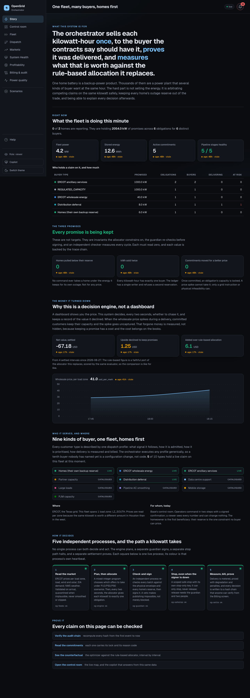

# Hackathon submission

## Project title

**OpenGrid Orchestrator: one fleet, many buyers, homes first**

## Tracks

Track 2, Orchestration (primary). Track 3, Most Commercializable (secondary).

## Write-up

Base's home batteries are individually a backup product. In aggregate they are a power plant that
several kinds of buyer want in the same hour: the homes themselves, ERCOT's energy and
ancillary-service markets, partners buying capacity, utilities deferring upgrades. The hard part is
not selling the energy. It is arbitrating competing claims on the same kilowatt safely, keeping every
home's outage reserve out of the trade, and being able to explain every decision afterwards.

OpenGrid Orchestrator is the brain for that fleet. It helps Base's control-room operators today, and
the homeowner is the first beneficiary: their reserve is the one constraint no buyer can price.

It reads live ERCOT prices, load, wind and solar per load zone, plans with a mixed-integer program
over P10/P50/P90 scenarios, and every two seconds gives each kilowatt to exactly one obligation. An
independent guardian re-checks every batch against the physical envelope and every home's reserve,
then signs it; a veto makes publishing impossible. A separate stop path works with the signer down.
Settlement meters delivery, prices it with degradation and penalties, and writes every decision to a
hash chain anyone can verify.

The impact is measured, not asserted. A rule-based allocator, a faithful port of the one this
replaces, runs at every gate and is scored by the same evaluator, so the console shows the value
orchestration adds interval by interval, next to the money the fleet declined in order to keep its
promises. Three invariants are live counters that must read zero: no home below its reserve, no
kilowatt-hour sold twice, no commitment moved for a better price.

## Demo video

Record with Loom, 2 to 5 minutes, showing the core loop live. The script is
`docs/demo/FIVE-MINUTES.md`. If you need to land under four minutes, keep these rows and cut the rest:

| Time | On screen |
|---|---|
| 0:00 | Story: the thesis, then "Right now" |
| 0:40 | Inject the $5,000/MWh spike; prices jump on the ticker |
| 1:00 | Dispatch: the committed cards do not move; Story: the three counters still read zero |
| 1:30 | Profitability: "upside declined" turns non-zero. Say why. |
| 2:00 | Dispatch: deploy a held ancillary-service award, two steps |
| 2:40 | Fleet: safe stop one bank; release it with a second operator |
| 3:20 | Billing: verify the chain |
| 3:40 | Story: five processes, five green heartbeats. Close on the thesis. |

Video link: _(paste the Loom URL here)_

## Repository

Development happens on a private forge at `git.tocy-net.net/Tocy-Net/opengrid-orchestrator`, which
requires a login. **The submission needs a publicly viewable link**, so mirror `main` to a public
repository before submitting and paste that link here:

```bash
git remote add public <public repo url>
git push public main
```

Public repo link: _(paste here)_

The README covers quick start, tech stack and architecture, how to reproduce the demo with env vars
and a sample `.env`, datasets and their provenance, and known limitations with next steps.

## Deployed URL

The console is deployed at `https://base.tocy-net.net/og/` behind HTTP basic auth, so it is not
publicly viewable as is. Either share it with judge credentials in the submission form, or rely on
the video and the screen captures in `docs/demo/screens/`: the Story screen in dark and light themes
and at phone width, taken from the running console.



## Team

Fill in names, roles and a contact for each. The git history names these contributors; agent and
deployment accounts are omitted.

| Name | Role | Contact |
|---|---|---|
| _(name)_ | _(role)_ | fancyviper007@gmail.com |
| Frank Brown | _(role)_ | ftbrown@utexas.edu |
| Rishabh Pagaria | _(role)_ | rpagaria2000@gmail.com |
| _(build lead)_ | project lead, release manager | _(contact)_ |

## Checklist

- [x] Project title
- [ ] 2 to 5 minute Loom video showing the core loop live
- [ ] Publicly viewable repo link
- [x] README: quick start
- [x] README: tech stack and architecture diagram
- [x] README: how to reproduce the demo, env vars, keys, sample `.env`
- [x] README: datasets and synthetic data with provenance
- [x] README: known limitations and next steps
- [x] Screen captures in `docs/demo/screens/` (the deployed URL is behind basic auth)
- [ ] Team roster with names, roles and contacts
- [x] 150 to 300 word write-up
