# OpenGrid Orchestrator — Vision, Scope & Personas

Status: v3.3 · 2026-09-25 · Owner: Product Manager (this document) · Audience: engineering, security, UX and
testing authors; judges.

**Changes in this version (v3.3 — resolution pass after the four adversarial reviews; dispositions in
`06-reviews/resolution/A1-product-brief.md`).**
- §1: the reviewers' IRR table moves to the Projects Deck (D0f, JDG-005); the "why" is now measured by KPI-22 **value of
  orchestration** (R24) and stated in one thesis sentence; the command-safety paragraph follows the amended R3
  (single-person stop engage at every scope with a 15-min co-sign, Tier 2 release, automatic downward re-declarations;
  GRD-010, GRD-041) and the independent stop path (R16).
- §3: value of orchestration is the first KPI; an 8-KPI headline scorecard with the rest in drill-down (JDG-013); one
  breach lead-time target (register V-41, JDG-012); new KPI-22…25; KPI-03, -06, -07, -18, -21 aligned with V-34,
  JDG-011, R24, R21 and V-19.
- §4: scope per R17, R19, R20, R23–R27; §4.2 reworded (production multi-zone Kubernetes arrives with the production
  cutover, ARC-031); new §4.4 answers "could Base use it tomorrow?" with `DeviceAdapter` and `SHADOW` mode (R23, JDG-009,
  JDG-029).
- §5: release plan per R21 — Line A (`MVP-J`), Line B (`MVP-B`), `R2`; sequencing only; walking skeleton first; the
  production cutover after the judged demo (Q4, Q22; JDG-001, ARC-001, ARC-034). §5.4: the judged storyline is the
  7-minute, 7-beat script (JDG-003, JDG-018); the 14 steps stay as the unattended rehearsal.
- §6–§8: personas and narratives updated where R3, R16, R17, R19, R20, R23–R27 change behaviour; new persona 6.17 QSE-desk
  operator (R25); new narratives 8.15–8.17 (emergency posture, loss of communication and ISO operations, `SHADOW` mode).
- Regulatory facts aligned with `06-reviews/05-claims-verification.md` (claims 1, 5, 6, 7, 15): ALR/NCLR deployment,
  AS durations and caps, PURA §39.918 as amended by SB 231, the EEA charging rule as operator policy.
- Register revision of 2026-09-25 10:15 applied: the Q1 default approvers — a shift supervisor for bank and zone, the
  executive on call or a second shift supervisor for fleet, never the system admin (`03-security` SoD-03) — in §6.11,
  §6.13 and §8.12; Q7 answered by evidence (§8.3). Revision of 10:34 applied: the 10,000-hub evidence runs on the node
  only if it can carry it, otherwise on the replica VM, labelled (R35, Q26 — KPI-25, beat 7, §10 item 6); the assumed
  decommission date (Q4, §5.2).
- Aligned with the owners' v0.2 texts: role codes `QSD` (QSE desk, console alias `QSE`) and `FSE` (licensed field engineer)
  from `03-security` §5.1 (§6.17, §8.8; V-37); beat 3's pipeline figure is a measured placeholder, as `03` Example A v0.2
  serves the full 250 kW (A3 §6 item 4).

Earlier versions: v3.2 aligned the kill switch with the register's first R3/R4 and resolved Q1/Q16/Q17/Q19; v3.1 removed
hedging language around `PIPELINE_AC`; v3.0 removed research/academia (D0f), introduced the dispatch-profile catalogue,
the D1 roles, D2's three kill-switch scopes, D4 command safety and D5 privacy.

This document applies the shared vocabulary, scope, defaults and judging criteria in
[`00-brief.md`](../00-brief.md) and the resolutions in [`00-decision-register.md`](../00-decision-register.md)
— read both first; the register wins on conflict and its normative values are cited as "register V-nn". Source tags:
**user**, **reviewer proposal — unverified** (an independent review's claim/number, a candidate to confirm with real
contracts/data/pilots run by the business-case workstream — never by this orchestrator), **regulation**, **derived**,
**assumption**.

This document primarily serves **Problem** (15), **The "why"** (15) and **Completeness** (15); §9 maps every
section to all eight criteria.

---

## 1. Problem statement and the "why"

Base Power's home batteries are, individually, a backup-power product. In aggregate, they are a distributed
power plant nine kinds of buyer want — see brief §3.1: `HOME`, `ERCOT_ENERGY`, `ERCOT_AS`, `PARTNER_CAPACITY`,
`DIST_DEFERRAL`, `LARGE_LOAD`, `PIPELINE_AC`, `MOBILE_TEEEF`, `PJM_CAPACITY`. **All nine are in scope; none is
excluded, reduced, or gated on a business-case verdict.**

Base's Projects Deck models each case's economics; independent reviews then challenged the deck's assumptions —
recomputed IRRs, disputed control-law safety, questioned pipeline-AC physics, asked for evidence the deck lacked.
**Whether those challenges are answered is a Projects-Deck/simulator question (D0f), not an orchestrator question.** The
orchestrator's job is narrower and harder: **treat every accepted call from every customer type the same way — validate
it, arbitrate it fairly against every other live claim on the same batteries, dispatch it safely, measure and bill it,
and make the decision fully explainable — regardless of which customer or service type it is.**

**Thesis.** *One fleet, many buyers, homes first: the orchestrator sells each kilowatt-hour once, to the buyer the
contracts say should have it, proves it was delivered, and measures what that is worth over today's rule-based
allocation.*

That single design goal is why the **service-type dispatch profile catalogue** (§4.3) is this product's
central mechanism, not an afterthought. Instead of hand-coding "if PARTNER_CAPACITY then X, if PIPELINE_AC then
Y," every customer type is described by one profile schema (signal source, request shape, admission checks,
control mode, priority/arbitration inputs, completion rule, M&V/billing rule, failure behaviour), and the
orchestrator executes any profile generically. Adding `PJM_CAPACITY` for real, or a tenth customer type nobody
has named yet, is a **configuration change, not a code change** — which is itself evidence for the "one fleet,
many buyers" thesis the brief asks this project to prove.

**What the orchestrator adds — measured, not asserted (KPI-22, register R24).** The business-case economics (IRRs,
hurdles and the conditions each case must meet) live in the [Projects Deck](https://base.tocy-net.net/opengrid/presentation.php)
(D0f); the reviewers' IRR figures are business-case claims, not orchestrator KPIs. This product measures the software
itself: the **value of orchestration** replays the real ERCOT year with the same simulated fleet and contracts under four
policies — perfect foresight, the orchestrator, today's rule-based allocator (a faithful port of `control_engine.py`) and a
fixed schedule — and reports, per hub-year, what the orchestrator adds in dollars, firm-interval compliance, reserve
violations and kWh claimed by two buyers. It also produces the delivered facts each business case needs (per-hub P10 kW,
reconciled M&V, capture ratio) and links them to the Projects Deck.

**Design principle — service-agnostic dispatch.** A request (kW/kWh profile, window, asset scope, ramp,
duration, firmness) is executed within safety, device, homeowner-reserve, grid-limit, authorization and
contract-priority constraints, and its delivery is measured and reported, **for every service type, the same
way.** ERCOT dispatch instructions and statutes are such constraints (R17, R20), never a judgment of a service's value.
Whether a service achieves a claimed business impact is judged elsewhere — never by this system refusing, down-ranking or
omitting a dispatch. This extends explicitly to anomaly detection: an unusual request is flagged and handled within safety
limits, never refused merely because it looks like a first-of-its-kind or low-confidence service (`FR-SAFE-005`), and to
saturation: under load, calls are clipped or deferred with the shortfall reported, never rejected (R48).

**Core job — call arbitration with full auditability.** Concurrent calls (any types) are validated against
their contracts, arbitrated on priority + commitments + profitability, dispatched, billed per customer/
contract/interval, and recorded in a tamper-evident **decision trace** — inputs, options, constraints, winner
and why, losers and their cost — linking call → decision → command → telemetry → M&V → invoice. Where an ERCOT resource
is involved, the arbitration happens **before the fact**: ERCOT only ever sees capacity no other buyer holds (R17).

**Command safety — one policy for every control path (register R3 as amended, R4, R16; Q1 confirms).** Every control
path — internal dispatch and SCADA alike — enforces sequencing and state interlocks (monotonic sequence numbers,
expected-state preconditions, rejection of out-of-order/stale/conflicting commands, select-before-operate or direct
operate per point, R29). **Stopping is never delayed:** a stop or block at bank, zone or fleet scope is engaged by one
qualified operator with explicit confirmation (typed scope, reason, blast-radius preview) and executes at once; a second
approver co-signs within 15 minutes (V-15), with escalation if the co-sign is missing; an ERCOT verbal dispatch instruction
or a utility instruction logged by the operator is a qualifying trigger. **Releasing is always Tier 2** (a second,
distinct approver) and ramps back up in stages (V-17). **Tier 1 (explicit confirmation)** covers ≥ 1 MW, ≥ 25% of the
target resource, a discretionary increase of a customer's declared capacity, or releasing capacity to another buyer.
**Tier 2 (a second, distinct approver)** covers ≥ 5 MW, fleet-wide mode changes, a kill-switch release at any scope and a
dispatch-profile change that alters priority or limits. **Automatic (pre-authorized)** are downward re-declarations of
available capacity and ERCOT telemetry and COP updates. A pre-agreed utility SCADA control inside its contracted limits
executes without confirmation (outside them it is rejected, never queued); an authorized utility's stop or block always
executes. A stop still works with the guardian down: the independent Safe-Stop Authority can sign a scoped stop and
nothing else, and can never release (R16). SCADA communication is authenticated and encrypted end to end.

**Privacy.** The personal data this system itself processes — homeowner identity/address, ESI ID/meter data,
load-inferable routines, location — is handled under privacy-by-design/default: lawful basis, purpose
limitation, minimization, data-subject rights (fulfilled via Base's existing support channel, which calls this
system's fulfilment API, within the deadlines of register V-19), retention limits, access logging, breach notification,
aligned to GDPR, CCPA/CPRA and comparable US regimes. **No personal data leaves the platform to any third party**,
including no personal data to a cloud LLM (D5; aggregates meet the 15/15 floor of V-18); erasure destroys a per-subject key
held outside database backups (R38). ERCOT's ADER rules can require premise-level data on request; until the user answers
Q12, the ERCOT lanes stay simulated and no real per-home data leaves the system.

## 2. Vision

**The Orchestrator turns Base's fleet of home batteries into one, safety-first, fully instrumented capacity
resource, where every grid-service type — present or future — is executed from a single, generic dispatch-
profile catalogue: arbitrated fairly by priority, commitment and profitability, delivered through real
utility/ISO SCADA integration where required, protected by one command-safety policy that never delays a stop,
measured and billed to the interval, explained down to the last invoice line, measured against today's rule-based
allocation, and respectful of every homeowner's privacy and backup reserve — without ever selling one kilowatt-hour
twice.**

## 3. Goals and measurable product KPIs

KPI IDs are stable; KPI-22…25 were added in v3.3. Every target that is a reviewer's number is a configurable profile
field (R11). **Headline scorecard (R24, JDG-013):** the eight KPIs of §3.1, each shown on the operations screen with its
measured value, target and provenance label ("measured on …", "reviewer proposal — unverified", "real ERCOT prices,
simulated fleet"); every other KPI is one click away in drill-down (§3.2). A headline KPI whose data does not exist yet in
a build shows "not yet computed", never a placeholder number.

### 3.1 Headline scorecard (8 KPIs, in display order)

| KPI | Definition | Target | Source | Judging criteria |
|---|---|---|---|---|
| **KPI-22 Value of orchestration** | The real ERCOT year (2025-09-23 → 2026-09-22 corpus; the 18 hours missing in May 2026 labelled) replayed with the same simulated fleet and contract set under four policies — perfect foresight (upper bound), the orchestrator, today's rule-based allocator (port of `control_engine.py`), fixed seasonal schedule; per hub-year: net value ($/hub-yr), firm-interval compliance, reserve violations, kWh claimed by two buyers, AS hold compliance and buyback cost, labelled "real ERCOT prices, simulated fleet" | Measured and reported with its method, never asserted; the orchestrator's firm-interval compliance ≥ the rule allocator's, with reserve violations and double claims = 0; the $ difference is reported as measured | derived (R24; extends `FR-DE-122`) | The why, Insight quality |
| KPI-01 Interval delivery (firm-interval compliance) | Delivered ÷ committed kW, per obligation, per 15-min interval | ≥ 95%; ≥ 98% in season for `DIST_DEFERRAL` | reviewer proposal — unverified | Completeness, The problem |
| KPI-23 Reserve violations | Hub-intervals in which dispatch took a home below its reserve floor (headline component of KPI-09) | **0** | derived | The problem, Technical depth |
| KPI-24 kWh claimed or billed twice | kWh that backed two buyers in the reservation ledger or on an invoice (headline component of KPI-09) | **0** | derived | The problem, Technical depth |
| KPI-13 Breach-risk lead time | Lead time from the first `AT_RISK` flag to a firm-obligation breach, measured in replays | Median ≥ 60 min, P10 ≥ 15 min, shown with a calibration plot of predicted breach probability vs realized (register V-41) | derived (V-41) | Insight quality |
| KPI-25 Control-loop tick p99 | Dispatcher cycle compute including the guardian's verdict, p99 | ≤ 250 ms at 10,000 hubs (`FR-DE-012`), measured with the load generator off the node — on the node when it can carry 10,000 hubs, otherwise on the replica VM, labelled (R35, Q26) | derived | Performance |
| KPI-14 Decision-trace completeness | Share of arbitration decisions with a complete, replayable trace | **100%** | derived | Completeness, Insight quality |
| KPI-20 Command-safety compliance | Out-of-order/stale/conflicting commands rejected; stop engage, Tier 1, Tier 2 and automatic classes enforced per R3 | **100%** | derived (D4) | The problem, Technical depth |

### 3.2 Drill-down KPIs

| KPI | Definition | Target | Source | Judging criteria |
|---|---|---|---|---|
| KPI-02 Obligation availability | Share of need hours the fleet was ready | ≥ 97% | reviewer proposal — unverified | Completeness, The problem |
| KPI-03 Ramp-to-full time | Firm event receipt to committed kW delivered | ≤ 5 minutes (300 s, reviewer proposal — unverified); design p99 ≤ 240 s (register V-34) | reviewer proposal — unverified; V-34 | Technical depth, Performance |
| KPI-04 Telemetry freshness | Resolution/latency/availability, northbound and `scada-gateway` | ≤ 1-min resolution, ≤ 60 s latency, ≥ 99% availability | reviewer proposal — unverified | Technical depth, Usability |
| KPI-05 M&V reconciliation lag | Event end to reconciled record | ≤ 24 hours | reviewer proposal — unverified | Completeness, Insight quality |
| KPI-06 Declaration timeliness | Firm declarations filed by 14:00 America/Chicago; ERCOT day-ahead offers submitted before the 10:00 America/Chicago close | 100% of both | derived (JDG-011) | Completeness, Usability |
| KPI-07 Arbitrage capture ratio | Software-dispatched ÷ perfect-foresight revenue, shown with the fixed-schedule and today's-rule-allocator references | ≥ 80% | reviewer proposal — unverified | Insight quality, The why |
| KPI-08 P10 delivered kW/hub | 10th-percentile, `PARTNER_CAPACITY`/`LARGE_LOAD` events, shown as the measured value next to the claim | ≥ 9.5 kW | reviewer proposal — unverified | Insight quality, The problem |
| KPI-09 False/unsafe dispatch rate | Commands breaching reserve, limits or double-allocation (KPI-23 and KPI-24 are its headline components) | **0** | derived | The problem, Technical depth |
| KPI-10 Recharge rebound violations | Recharge exceeding 95% of the bank rating (in the rating's own unit, R18) | 0 | reviewer proposal — unverified, treated as a hard safety target regardless | The problem, Technical depth |
| KPI-11 Operator actions per event | Manual console actions per firm event | ≤ 2 (assumption) | assumption | Usability |
| KPI-12 Time to detect & substitute a failing hub | Ticks to a covering substitute | ≤ 3 ticks (assumption) | assumption | Technical depth, Performance |
| KPI-15 Time to explain an invoice line | Query to full trace retrieval | ≤ 5 s automated; ≤ 2 min AI-narrated (assumption) | assumption | Insight quality, Usability |
| KPI-16 Arbitration regret | Value of chosen allocation vs. best foregone alternative | Computed for every contested tick | derived | Insight quality |
| KPI-17 AI-agent guardrail compliance | Share of AI outputs and proposals fully validated before any effect; human confirmation on every applied proposal (R49) | **100%**; zero autonomous dispatch | derived | The problem, Technical depth |
| KPI-18 SCADA point conformance | Mapped points passing their conformance tests | 100% of the `MVP-J` points (DNP3 over TLS); each `R2` protocol's points as it lands | derived | Technical depth, Usability |
| KPI-19 Dispatch-profile coverage | Customer types with a complete, validated dispatch profile | 100% of the nine in-scope types (variants per their build tags) | derived | Completeness, The why |
| KPI-21 Data-subject request SLA | Time to fulfil an access/correction/deletion/opt-out request, from the support channel's call to this system's API | ≤ 30 days internal target; legal ceiling 45 days (CCPA/CPRA, TDPSA) with a documented extension (register V-19) | V-19 (D5) | Usability, The problem |

KPI-09, KPI-14, KPI-17, KPI-20, KPI-23 and KPI-24 are zero-tolerance.

## 4. Scope

### 4.1 In scope (every build; the build order is §5)

- All 17 services in the brief's service map (brief §5, including the independent `safe-stop` service, R16); logical
  boundaries hold even where co-located.
- Full dispatch support for all nine customer types via their **dispatch profiles** (§4.3), all nine dispatchable in the
  judged build (`MVP-J`): `HOME` (always-on constraint; emergency posture R19), `ERCOT_ENERGY` and `ERCOT_AS` (ALR variant;
  ERCOT instructions for an on-line ADER as hard constraints; NCLR variant `R2`, R17), `PARTNER_CAPACITY` (tolling and
  event variants, R27), `DIST_DEFERRAL` (co-op/municipal variant regulated on kVA or per-phase current, R18; TDU/SB 415
  variant `R2`, R27), `LARGE_LOAD` (contracted events, dispatched exactly as called), `PIPELINE_AC` (H1/H2 smoothing
  dispatch on a contracted current/power band, plus H3 monitoring/alerting), `MOBILE_TEEEF` (statute-shaped leased
  restoration units — three simulated units in the judged demo, Q19; the grid-parallel `MOBILE_DER` variant `R2`, R20),
  `PJM_CAPACITY` (self-serve toward meter net load on a replayed 5CP day; the live PJM adapter `R2`, R27).
- **Call arbitration**, **billing & settlement**, and **decision trace & explainability** as first-class
  capabilities; arbitration before the fact at the ISO boundary (R17); market roles per territory (R27, brief §3.3).
- **SCADA integration** (`scada-gateway`) per brief §3.4, including the D4 command-safety controls: sequence/
  state interlocks, select-before-operate or direct operate per point (R29), secure protocol communication (DNP3 Secure
  Authentication + TLS/IEC 62351, ICCP IEC 62351-4, IEC 104 IEC 62351-3/-5), segmentation and monitoring — built in the
  order of R21 and R44.
- **AI agent** (`ai-agent`): advisory-only, never in the real-time loop, every output and proposal independently
  validated (an approved proposal is a time-boxed constraint set with human confirmation, R49), and — per D5/Q17 —
  **receiving only non-personal or aggregated data**; a personal-data-dependent query is declined on this node and routed
  to a local model only in a production deployment. With the agent switched off, nothing else changes.
- **Kill switch / safe stop** at bank, zone and fleet scope (D2): single-person engage with a 15-min co-sign, ramp-down
  per V-16 (30 s/60 s/120 s protective ramps, unsigned until Q13), Tier 2 release with a staged ramp-up (V-17), stop
  sequencing and frequency gating for non-protective stops, and the independent Safe-Stop Authority (R3, R4, R16).
- **Grid-operator and ISO behaviour:** emergency posture (R19), autonomous grid support (R26), loss of communication and
  the QSE desk (R25), the fleet ramp table (V-30).
- **Privacy controls** (D5) for the personal data the orchestrator itself processes: privacy by design/
  default, lawful basis, purpose limitation, minimization, data-subject rights (fulfilled via Base's existing
  support channel calling this system's API, per Q16), retention limits, access logging, breach notification,
  erasure that survives backups (R38). No personal-data export to any third party.
- **Insight and evidence (R24):** an Insights view (ownership heatmap planned vs realized in kW and $, price of firmness
  vs the contract payment, breach radar with calibration, displacement ledger, M&V overlap, capture ratio), the value of
  orchestration, a performance strip on the operations screen and a benchmark report.
- **A path onto Base's real fleet (R23):** the `DeviceAdapter` interface and `SHADOW` mode (§4.4); an installable demo
  profile with a quick start and an operator quick reference.
- Real external data ingestion (with record/replay and as-of provenance), mock devices/counterparties treated as real,
  day-ahead/intraday optimization, a real-time control loop, identity/authn/authz/audit, operator console,
  observability, HA basics, portability off the base server.

### 4.2 Not part of this product (handled elsewhere or by a counterparty)

- Real battery hardware and Base's own fleet interface: this product ships the `DeviceAdapter` interface and `SHADOW`
  mode; the adapter to Base's interface is written when Base shares it (register Q2), and commands stay recorded, never
  sent, until Base decides.
- Real ERCOT/PJM market participation (the ERCOT lanes are simulated until the QSE model, Q6, and per-premise data, Q12,
  are decided), a real utility SCADA/OpenADR counterparty (simulated until a pilot partner is engaged), a homeowner-facing
  app, real payment execution.
- **Research and business-case evaluation of any kind** — experiment registries, randomized/controlled
  trials, academic-partner roles or data exports, hypothesis tracking, the business-case condition board. That work
  belongs to the Projects Deck and the simulators (D0f); this orchestrator dispatches, measures, bills and explains, and
  links its measured facts to the Projects Deck.
- Legal/regulatory rulings themselves (a PUCT eligibility determination, an SB6 credit interpretation, a PJM PLC
  methodology confirmation, the legal review of `MOBILE_TEEEF` lease billing lines against PURA §39.918) — the product
  records each ruling as a contract condition and dispatches within it.
- Production multi-zone Kubernetes is the architecture's production target; it arrives with the production cutover after
  the judged demo (§5.2, ARC-031), not with the judged build.

### 4.3 The service-type dispatch profile catalogue

This is how the orchestrator "receives signals and manages actions regardless of client and service type"
(brief §3.5). Every customer type is described, not coded, by a profile with eight elements:

| Element | Meaning |
|---|---|
| Signal sources & protocols | SCADA/ICCP/DNP3, OpenADR 3.0, IEEE 2030.5, ERCOT QSE instructions, market prices, customer APIs/webhooks, console, schedules |
| Request schema | kW/kWh profile or setpoint, window, asset scope (fleet/zone/substation/bank/feeder/corridor/unit), ramp limits, duration, notice time, firmness |
| Validation & admission | Contract check, authorization, feasibility (energy, power, topology, reserve), territory role and consent conditions (R27), guardian limits, critical-impact confirmation |
| Allocation & control mode | Open-loop profile, closed-loop regulation on a measured signal (bank kVA or phase current, line current, an ADER's net load), price-responsive, event-based; which hubs may serve it |
| Priority class & arbitration rules | Firmness, precedence, displacement cost, profitability inputs |
| Completion & performance rules | What "delivered" means per interval, tolerance, response time, sustain time — every reviewer-proposed number here is a configurable field (decision register R11) |
| M&V & billing rules | Baseline method, metering source, settlement interval, price/penalty terms, invoice lines |
| Failure behaviour | Substitution, degraded modes, customer notification, hold-then-schedule rules |

Per decision register R10 and R47, a profile is **versioned, signed and effective-dated**; its activation gate is tiered
by risk — a tighten-only or safety change passes the golden week plus a guardian-envelope check, a change that loosens
priority or limits passes the replay of the real ERCOT year; a change altering priority or limits needs Tier 2 approval;
and a running event keeps the profile version it started with, except that a tightened safety limit is enforced by the
guardian within one cycle (V-27). A **profile variant** — ALR or NCLR for the ERCOT lanes, `TOLLING` or `EVENT` for
partners, co-op or TDU for deferral, `MOBILE_TEEEF` or `MOBILE_DER` for mobile units — is a versioned profile of the same
schema, selected per contract.

Two worked examples, to make the abstraction concrete. Note that a service's own request-schema parameters —
`DIST_DEFERRAL`'s bank-rating margin, `PIPELINE_AC`'s smoothing band — are ordinary contract-defined operating
limits, the same kind every profile has, not a special restriction applied to one service type:

| Element | `DIST_DEFERRAL` | `LARGE_LOAD` |
|---|---|---|
| Signal source | SCADA (bank kVA or per-phase current via `scada-gateway`) | Customer webhook / price-stress signal |
| Control mode | Closed-loop on the quantity the bank rating protects, with the fleet's own P and Q added back (R18) | Event-based, open-loop to contracted kW |
| Priority class | Firm, in-window | Firm, in-window (contract-configurable) |
| Completion rule | Outcome-based (bank loading ≤ limit in the need window) or share-based, per contract (Q9); ≥ 95%/interval default | Delivered kW vs. contracted profile, per interval |
| M&V/billing | 1-min meter → 15-min reconciliation, $/kW-month | Per-event delivered-kW record, $/kW-yr or per-event fee |
| Failure behaviour | Hold-then-schedule on bad signal (return per V-38); substitute within bank | Substitute fleet-wide; report true shortfall |

A profile is owned by the system-admin persona (§6); adding `PJM_CAPACITY` for real, or any future service
type, means authoring a new profile, not shipping a new release.

### 4.4 Could Base use it tomorrow? (R23, JDG-009, JDG-029)

Yes — in `SHADOW` mode first, with no change to Base's hubs. The `DeviceAdapter` interface (telemetry in, commands out,
acknowledgement semantics) is the only seam between the orchestrator and a fleet; the MQTT agent contract that the
simulated hubs speak is one implementation, and an adapter to Base's fleet interface is another. In `SHADOW` mode the
orchestrator ingests Base's real telemetry and computes plans, arbitration, decision traces and M&V exactly as in live
operation; commands are recorded and never sent, and a shadow-vs-actual report compares what it would have done with what
the fleet actually did. The hub capabilities of register Q2 matter only when commands are sent. For an evaluator, the
demo values profile installs with one command (`make deploy PROFILE=demo` on the node, `make demo` on a laptop k3d
cluster) with seeded contracts, profiles, topology and users; a two-page quick start, an operator quick reference (the top
five tasks) and an integrator guide for the adapter come with it.

## 5. Release plan

### 5.1 Build order and build tags (register R21)

**Sequencing only — nothing is dropped (D0a).** Every FR, NFR and story carries a build tag in
`02-functional-requirements.md` and `03-epics-and-user-stories.md`; `R2` means built after the judged demo with the design
unchanged. Effort, capacity and the per-lane order are in the release map of `03-epics-and-user-stories.md`.

| Build | Content | Exit criterion |
|---|---|---|
| **`MVP-J` — Line A (the judged core)** | Walking skeleton first: one hub → twin → one command → acknowledgement → trace row → one invoice line by day 5, all nine customer types dispatchable through profiles on a minimal stack. Then, in order: real ERCOT and NWS data with record/replay → `agent-sim` off the node → gateway and twin (phase, unit-typed ratings, connectivity/eligibility) → profiles and contracts (territory roles, tolling and event partner variants, statute-shaped `MOBILE_TEEEF`, PJM self-serve) → privacy baseline → fleet allocator and execution shards (ERCOT instructions as hard constraints, ADER net-load regulation, kVA/per-phase bank regulation, freeze on autonomous response) → guardian and Safe-Stop Authority (single-person stop engage, Tier 2 release, EEA posture, stop sequencing, fleet ramp table) → decision trace → M&V and settlement → `grid-sim` → DNP3 over TLS (ICCP labelled `SIM`) → console v1 (operations with the 8-KPI scorecard, dispatch with Why?, M&V and invoices, stops and approvals, Simulation Lab, SCADA log) → scenario runner | Gate G3-J passes; the 7-minute script (§5.4.1) runs end to end on the node |
| **`MVP-B` — Line B** | Planner (MILP, COP from the plan, pre-positioning on forecast risk, cycle budget), Insights and breach radar with calibration, value of orchestration, performance evidence (strip, benchmark report, 1k → 10k curve, one before/after optimization), OpenADR 3.0 VEN with the 10:00 CT and 14:00 CT deadlines, AI explanations (grounded, read-only copilot, AI-off parity), `SHADOW` mode and `DeviceAdapter`, demo profile and laptop install | Every headline KPI shows a measured value |
| **`R2`** | Everything else, design unchanged — e.g., IEEE 2030.5 server, ICCP/TASE.2 (licence, Q11), IEC 60870-5-104 (Could, V-28), OPC UA, DNP3 Secure Authentication, SCADA redundancy and commissioning workflow; NCLR variants of the ERCOT lanes; the TDU (SB 415) deferral variant; `MOBILE_DER`; the QSE-desk console; IEEE 1547 settings conformance; the independent utility stop path; AI proposals and intake; forward release of AS; storm-hold and derate automation; the full-year replay gate as a nightly job; the remaining screens; automated retention and breach detection; service-to-service mTLS and automatic rotation; measurement at 100,000 hubs | Per requirement, as tagged |

Milestones (assumptions; dates follow the register's defaults): decisions on the open questions that touch the demo
(Q1, Q4, Q11, Q12, Q18, Q22–Q26) this week; build window 2026-09-29 → 2026-10-20; M1 walking skeleton by day 5; M2 all nine
types end to end; feature freeze; three rehearsals and G3-J; the judged demo on **2026-10-21** on the node (Q22).

### 5.2 After the judged demo: production cutover and field steps

The **production cutover runs after the judged demo** (Q4, Q22), on a managed multi-zone cluster; plan B for the node's
decommission (2026-10-30 assumed, Q4) lifts the single-node profile to one cloud VM, and portability is shown by a scripted install onto a fresh
cluster plus one restore drill. Production starts with a genesis record that cites the node chain's final anchor; node data
stays test evidence (R36). The steps that need parties outside this product carry no build tag: a named pilot utility's
OpenADR/IEEE 2030.5/DNP3 integration and live SCADA commissioning; the QSE model and ERCOT registration (Q6, Q12); the first
`MOBILE_TEEEF` drill with a lessee utility's safety group (Q20); `SHADOW` operation on Base's real telemetry once Base
shares its fleet interface (Q2); a full DR game-day program.

### 5.3 What the judged build demonstrates, per customer type

| Type | Signal in `MVP-J` | Control mode | Later build |
|---|---|---|---|
| `HOME` | Hub telemetry; homeowner channel via `api` | Constraint (L1): reserve floor, opt-out, reserve change; EEA posture | Storm-hold automation from NWS alerts (`R2`); pre-positioning (`MVP-B`) |
| `ERCOT_ENERGY` | QSE simulator set points on a competitive-area partition (R27a); real load-zone prices | ADER net-load regulation on the set point trajectory (ALR, L2); price-responsive only for off-line or unregistered premises | NCLR variant, L-SCED re-pricing (`R2`) |
| `ERCOT_AS` | QSE simulator awards; real MCPC | Capacity hold, ring-fenced; released through SCED for an ALR | Forward release (default off), NCLR deployment (`R2`) |
| `PARTNER_CAPACITY` | NOIE partition: tolling schedules and events via signed REST; OpenADR 3.0 VEN (`MVP-B`) | Continuous reservation (tolling) or event, open loop | IEEE 2030.5 path (`R2`) |
| `DIST_DEFERRAL` | NOIE partition: DNP3 bank kVA/phase current and utility select-before-operate | Closed-loop regulation (bank PI, hold-then-schedule) | TDU (SB 415) variant, redundant SCADA paths (`R2`) |
| `LARGE_LOAD` | Signed stress-event webhook | Event, open loop | — |
| `PIPELINE_AC` | Corridor line current from `grid-sim`; H3 alert | Band smoothing (H1/H2) with the shift factor as a profile parameter; monitoring (H3) | Line current over DNP3/ICCP (`R2`) |
| `MOBILE_TEEEF` | Lessee deployment orders with a declared qualifying outage; three units | Island-forming mode control in a separate pool; readiness reported, the lessee closes | `MOBILE_DER` variant, assignment MILP beyond three units (`R2`) |
| `PJM_CAPACITY` | Replayed historical 5CP day | Self-serve toward meter net load ≈ 0, non-firm | Live PJM adapter (`R2`) |

### 5.4 The judged end-to-end demo

The judged storyline is the **7-minute, 7-beat script** of §5.4.1 (R24, JDG-003). The former 14-step storyline stays as the
**unattended rehearsal** (§5.4.4) and as evidence. Numbers in angle brackets are measured at the rehearsal and shown with
their provenance; no illustrative figure appears on screen.

#### 5.4.1 Script (7:00)

| Time | Beat | Screen | What happens on screen | What the judge should conclude | Criteria |
|---|---|---|---|---|---|
| 0:00–0:45 | 1. One fleet, many buyers | Operations | 2,000 homes online; nine customer lanes; the live ERCOT price for the ERCOT lanes' load zone (product and as-of shown); each home's reserve band marked "never for sale". Tile 1: value of orchestration on the real ERCOT year — `<+$/hub-yr>` vs today's rule allocator, firm compliance `<x%>` vs `<y%>`, reserve violations 0 vs `<n>`, kWh claimed twice 0 vs `<m>` | The problem is real, the data is real, and the brain adds measurable value | P, W, I |
| 0:45–1:45 | 2. Tomorrow is already sold | Planning / Insights | Ownership heatmap for the next 36 h (kW and $ per customer and hour, planned vs realized); price of firmness: what holding the partner's 17:30–19:00 capacity forgoes at the forecast spike (`<$>`) against the contract payment (`<$>`) — firmness wins; ERCOT offers marked at the 10:00 CT close, the firm declaration sent and acknowledged before 14:00 CT | Non-obvious, finance-grade insight from real optimization (MILP duals) | I, W, D |
| 1:45–3:00 | 3. Five buyers at 17:30 | Dispatch, Obligations | Clock to 17:30: the partner's scheduled discharge over OpenADR (NOIE partition), a bank overload over DNP3, ERCOT's set point for the ADER during a SCED price spike (competitive partition), a large-load stress event, pipeline smoothing, three mobile units reporting readiness for a lessee's declared outage. Queue: firm served; AS from its ring-fence; the ADER follows ERCOT's set point exactly — its offers and telemetry never showed the firm kW (arbitration before the fact); pipeline `<kW>` of 250 kW. Why? panel: precedence stages, binding constraints with duals, the naive candidate (pipeline 0 kW) vs the chosen one. Obligations: the large-load event was flagged `AT_RISK` `<lead time>` earlier (expected shortfall `<kW>`) and the customer notified | Real arbitration with priced trade-offs, correct at the ISO boundary; breach predicted before it happens | D, I, P |
| 3:00–4:15 | 4. Things break | Simulation Lab → Dispatch, Operations | One click each, seeded: 10% of the partner's hubs lose comms → substituted within 3 ticks, the 15-min compliance bar stays ≥ 95%; the bank's DNP3 point turns BAD → hold the prior setpoint, then the schedule, never 0 kW, reason on screen; 12 EVs start and 8 homes island → available kW netted within one tick, reserve-violation counter stays 0 | The core chain survives failures safely | C, P |
| 4:15–5:15 | 5. Nobody can make it do something unsafe | SCADA log, Safety | A replayed DNP3 operate with an old sequence number → `REJECTED` (expected vs received); a customer call that would breach the reserve floor → guardian veto with rule ID; a bank stop engaged by one operator with reason and one confirmation → 30 s ramp on the bank chart, the supervisor co-signs in a second browser; release blocked until the supervisor's Tier 2 approval → the staged ramp-up begins (≥ 15 min, V-17) | Command safety is enforced, not promised — and stopping is never delayed | D, P, U |
| 5:15–6:15 | 6. Every dollar explained | M&V and invoices | Event ends, AMI arrives: invoice line for the partner → decision trace → commands → telemetry → M&V (measured per-hub P10 `<kW>` next to the 9.5 kW claim, labelled, linked to the Projects Deck) → chain verified. Copilot: "why is this line `<$>`?" → grounded answer citing trace IDs; AI switched off → the deterministic explanation is unchanged | Completeness to the bill; auditability; AI adds value without being load-bearing | C, I, Cr, W |
| 6:15–7:00 | 7. Fast, and usable tomorrow | Operations performance strip, terminal | Live: tick p99 `<ms>`, telemetry → twin p99 `<s>`, commands/s; the recorded 10,000-hub soak and the 1k → 10k curve, each labelled with where it ran (node or replica VM, R35, Q26); one optimization before/after (bucketed LP vs per-hub LP); `make deploy PROFILE=demo` and `SHADOW` mode for Base's real fleet; close on the thesis sentence | Measured performance; installable; a safe path onto the real fleet | Pf, U |

#### 5.4.2 Five-minute cut

Merge beats 1 and 2 (heatmap on the operations screen), keep the reserve-floor veto of beat 5 for Q&A, and shorten beat 7
to the strip and the install line.

#### 5.4.3 Setup, scorecard, fallback and backups

- **Setup (T−30 min):** demo profile; 2,000 hubs online from the load generator on its LAN host (R35); DNP3 association and
  OpenADR VEN up; the seeded scenario armed on a replayed real ERCOT day (a 2026 summer day with a 15-min settlement point
  price ≥ $1,000/MWh and a negative interval), seed 20261015, parked at 16:55 CT; live ticker running; operator and
  supervisor browsers signed in; plans pre-solved; the benchmark report, the replay-hash comparison, the DNP3 packet
  capture and the G3-J report open in tabs.
- **Scorecard:** the eight headline KPIs of §3.1, each with measured value, target and provenance label.
- **Fallback:** if any live beat fails, switch to the recorded run of the same seed and replay its decisions from their
  recorded version vectors — the replay reproduces identical decision-trace hashes (component-level determinism), and a
  second run with the same seed meets the same semantic invariants — determinism becomes the evidence.
- **Q&A backups:** a tenth service type added by configuration (`FEEDER_HOSTING_LIMIT`) and dispatched with no code change;
  zone- and fleet-scope stops; a stop with the guardian pod stopped, through the Safe-Stop Authority's out-of-band trigger;
  an EEA (no grid charging, awarded AS kept); a 59.85 Hz frequency event (integrators freeze, no trust penalty); an ICCP-link
  loss (the ADER holds its set point flat); the cloud-prompt pre-send log as a privacy beat (D5; the copilot's refusal of a
  personal-data question on this node is shown here, JDG-027); the full unattended rehearsal record (§5.4.4).
- **Never on stage:** stack traces, login flows, live solver waits, a dependency on ERCOT's API being up.

#### 5.4.4 Unattended rehearsal (the former 14-step storyline)

```mermaid
flowchart LR
    P0[Boot & fleet online] --> P1["Day-ahead plan\n+ 10:00 offers + 14:00 declaration"]
    P1 --> P2[ERCOT_AS award\nring-fenced]
    P2 --> P3["Two calls at once:\nPARTNER_CAPACITY + DIST_DEFERRAL"]
    P3 --> P3a[Arbitration: priority +\ncommitments + profitability]
    P3a --> P4["Injected: COM\ncomms dropout"]
    P4 --> P5["SCADA: select-before-operate\nvia scada-gateway"]
    P5 --> P6["Injected: DAT\nbad SCADA signal"]
    P6 --> P7["ERCOT set point followed;\nprice spike"]
    P7 --> P7a["LARGE_LOAD event +\nPIPELINE_AC smoothing +\n3 MOBILE_TEEEF units"]
    P7a --> P8["Injected: SEC\nout-of-order / anomalous command"]
    P8 --> P8a["Stop: single-person engage,\nco-sign, Tier-2 release"]
    P8a --> P9["Injected: HOME\nEV charge + islanding"]
    P9 --> P10["AI copilot: explain\nan invoice line (non-personal data only)"]
    P10 --> P11[Event ends\nM&V + billing/settlement]
    P11 --> P12[Scorecard]
```

1. **Boot.** Fleet online; all obligations `MONITORING`; KPI-04 met within a minute.
2. **Day-ahead planning:** ERCOT offers before the 10:00 CT close and the firm declaration by 14:00 CT (KPI-06); the COP
   submitted.
3. **`ERCOT_AS` award**, held capacity ring-fenced inside the awarded interval.
4. **Two calls at once.** `PARTNER_CAPACITY` and `DIST_DEFERRAL` overlap; the arbitration engine picks an
   allocation on priority/commitment/profitability and writes a decision trace (KPI-16).
5. **Injected — comms (COM).** Substitution within KPI-12; KPI-01 holds.
6. **SCADA control.** A DNP3 select-before-operate setpoint executes through `scada-gateway`; a deliberately
   out-of-sequence duplicate/stale command is rejected (D4), demonstrating command safety directly.
7. **Injected — data quality (DAT), bad SCADA signal.** Hold-then-schedule; `FAULT` shown with reason.
8. **ERCOT set point during a price spike.** The on-line ADER follows ERCOT's set point exactly — the firm reservations were
   withheld from ERCOT's view beforehand (R17); price-responsive dispatch for premises whose ADER is off line is squeezed by
   the firm contracts; the decision log shows why.
9. **`LARGE_LOAD` event, a `PIPELINE_AC` smoothing window, and all three simulated `MOBILE_TEEEF` units**
   (readiness reported for a lessee's declared outage, the lessee's operator closing each unit) run concurrently, each per
   its own profile, exactly like any other obligation — showing real scheduling contention across service types (Q19).
10. **Injected — security (SEC).** An out-of-order/replayed command and a malformed request are both rejected; a
    **bank-scope stop** is engaged by one operator with a captured reason and one confirmation, ramps down within 30 s and
    is co-signed within 15 min; it is released only through the Tier 2 release with a staged ramp-up (D2, KPI-20).
11. **Injected — house events (HOME).** EV charging and islanding; reserve untouched.
12. **AI copilot.** The operator asks why an invoice line has its value; `ai-agent` explains it from the
    decision trace using only non-personal, aggregated data (D5); with the agent switched off the deterministic
    explanation is unchanged.
13. **Event ends; M&V and billing/settlement.** Reconciliation (KPI-05); settlement per obligation (KPI-14 =
    100% traced).
14. **Scorecard.** The eight headline KPIs with drill-down; the orchestrator's measured facts (e.g., per-hub P10 next to
    the claim) linked to the Projects Deck; dispatch-profile coverage (KPI-19); command-safety compliance (KPI-20).

The same rehearsal then runs five further unattended scenes: an EEA (R19), a frequency event (R26), an ICCP-link loss
(R25), a guardian timeout that stays a timeout (R31), and a fleet stop through the Safe-Stop Authority with the guardian
down (R16).

## 6. Personas

Seventeen personas, aligned to brief §8 D1's required role catalogue plus the roles named in the original brief; role codes
are those of `03-security/02-security-architecture.md` §5.1 (register V-37).

### 6.1 Control-room operator
Watches live obligations/events each shift; approves the day-ahead plan; resolves alarms. Engages a stop or block at any
scope — bank, zone or fleet — on one explicit confirmation (typed scope, reason, blast-radius preview); the stop executes
at once and a second approver co-signs within 15 minutes; can engage through the out-of-band hardware-token path when the
console or the guardian is down (R16). Never releases alone: every release needs a second, distinct approver (register
R3; Q1: the invoker and the approver are never the same person). Success measures: KPI-11, KPI-09 = 0, KPI-14 = 100%.

### 6.2 Fleet operator (new, D1)
Distinct from the control-room operator: owns the fleet's **composition**, not live events. Goals: accurate
topology (including phase) and enrollment; onboard/decommission hubs and `MOBILE_TEEEF` units; keep per-bank/feeder
home-group assignments correct; quarantine a hub when needed. Pains: topology drift; manual onboarding toil. Key tasks:
enroll/decommission assets; maintain the topology mapping (`FR-TWIN-003`); review fleet-composition reports. Success
measures: topology accuracy; enrollment cycle time; stale/decommissioned-asset cleanup rate.

### 6.3 Fleet reliability engineer
Maximizes availability/trust score; root-causes dropouts; distinguishes a hub's autonomous grid-support response from
under-delivery (R26). Success measures: hub online rate, KPI-12, false-fault rate.

### 6.4 Market/QSE trader
Maximizes arbitrage/ancillary value within limits: offers, ERCOT-visible capability and the COP come only from capacity no
other buyer holds (R17); per-territory roles set whose settlement each price drives (R27); reviews arbitration regret
(KPI-16). Success measures: KPI-07, KPI-22; zero ADER cap breaches; zero set-point deviations caused by another customer.

### 6.5 Utility grid-ops engineer (customer)
Relies on `scada-gateway` telemetry/control with select-before-operate and override authority; a pre-agreed,
in-limit SCADA control executes without confirmation, and this persona's stop/block commands always execute; has a stop
path that does not traverse the orchestrator (R25; `R2`). Sees bank relief on the quantity the rating protects (kVA or
phase current, R18). As the lessee of a `MOBILE_TEEEF` unit, declares the qualifying outage and closes the unit under a
switching-order ID — Base reports readiness and never energizes (R20). Success measures: KPI-04, KPI-01/02, KPI-18,
KPI-10 = 0.

### 6.6 Partner-program manager
Runs tolling agreements (continuous reservation, utility-scheduled charge and discharge, cycle budget, availability
settlement) and event programs (R27); sets each partner's dual-participation mode (Q6); defends P10 with measured data;
tracks 4CP rule risk. Success measures: KPI-08; zero liquidated-damages events.

### 6.7 Settlement/finance analyst
Runs M&V/settlement; retrieves any invoice line's trace. Success measures: KPI-05, KPI-09 = 0, KPI-14 = 100%,
KPI-15.

### 6.8 Billing admin (new, D1)
Goals: correct, complete, timely billing across every obligation and every customer type; manage contract
billing-term configuration and per-utility tariff tables (R27); approve corrections without breaking audit integrity.
Pains: manual reconciliation across concurrently active obligations; a disputed line with no fast explanation path. Key
tasks: configure contract rates/terms (`FR-CTR-003/004`); run/approve settlement corrections (`FR-BILL-008`); monitor
unbilled-obligation alerts; export statements. Success measures: zero unbilled dispatched obligations; correction
turnaround time; 100% audit-clean adjustments.

### 6.9 Security analyst (SOC)
Detects abnormal/malicious requests, including malformed AI tool calls and out-of-order command attempts;
distinguishes a legitimate-but-unusual service call from a genuine safety/authorization violation; holds, with the SRE,
two-person custody of the dispatch-key epoch authority (R16). Success measures: mean time to detect; KPI-17 = 100%;
KPI-20 = 100%.

### 6.10 Platform SRE
Availability, self-recovery, portability; AI-agent cost/rate budget and fallback; the second custodian of the dispatch-key
epoch authority (R16). Success measures: NFR attainment; MTTR; zero host-specific-state findings.

### 6.11 System admin (new, D1)
Goals: correct platform configuration; users/roles provisioned to least privilege; feature flags/thresholds
sane; **dispatch profiles** (§4.3) authored, versioned, signed and effective-dated; never the approver or co-signer of a
dispatch action, stops included (`03-security` SoD-03; Q1 default). Pains: configuration drift;
unclear change ownership; onboarding a new service type turning into a code change instead of a config change. Key tasks:
manage user/role provisioning; manage feature flags/config; author/version a dispatch profile and run its activation gate;
oversee environment promotion. Success measures: config-change audit completeness; time to onboard a new dispatch
profile; zero unauthorized role grants.

### 6.12 Auditor (new — named explicitly in brief §8 D1's role list)
Goals: independently confirm the system's own claims — trace completeness, billing-vs-delivery accuracy,
privacy-rule adherence, stop engage/co-sign/release integrity (including stops signed by the Safe-Stop Authority). Pains:
scattered evidence across services; no single view proving compliance. Key tasks: sample decision traces end-to-end;
verify the audit chain; verify stop records; review data-subject-request handling and retention compliance; produce
compliance reports. Success measures: KPI-14; zero unapproved/unreleased stop actions; KPI-21; audit-finding closure rate.

### 6.13 Base executive (sponsor)
Decides where to invest using the value of orchestration (KPI-22) and the measured facts the orchestrator links to the
Projects Deck, which keeps the business-case condition board (D0f, JDG-026); co-signs a fleet-scope stop and approves a
fleet-scope release when on call (Q1 default). Success measures: KPI-22 trend; business-case facts measured, not assumed; zero
partner-damaging incidents.

### 6.14 Homeowner (indirect stakeholder)
Reliable backup power, fair value, control over reserve, no surprises, no grid charging of their battery during a grid
emergency beyond what the contract allows (R19), and — per D5 — confidence their personal data is minimized, protected,
and never sold or shared with a third party; submits an access/correction/deletion/opt-out request through Base's existing
support channel, which this system's fulfilment API serves (decision register Q16). Success measures: KPI-23 = 0;
opt-out/reserve-change latency; KPI-21.

### 6.15 Planning & forecasting analyst
Keeps forecast error and MILP assumptions honest; never lets a firm declaration rest on a synthetic bank proxy without an
accepted conservative multiplier (GRD-038). Success measures: forecast error within band; KPI-13 calibration; 12-month
rolling backtest coverage.

### 6.16 SCADA/protocol integration engineer
Owns the point-mapping registry, interlock rules, and DNP3/ICCP/IEEE 2030.5 conformance, including the D4
command-safety controls (sequencing, select-before-operate or direct operate per point, R29, secure comms, the
pre-agreed-in-limit pass-through and authorized-utility-always-executes rules); keeps the ICCP path labelled `SIM` until
it is licensed (Q11, R44). Success measures: KPI-18; zero incorrectly resolved interlock conflicts; KPI-20.

### 6.17 QSE-desk operator (new, R25)
Executes ERCOT instructions for the ADERs Base represents: answers the hotline; logs, acknowledges and executes verbal
dispatch instructions, manual deployments and recalls, status changes and emergency actions; runs the EEA procedures;
agrees status and substitute telemetry with ERCOT when ICCP or the QSE link is lost; keeps the COP true. Staffed 24×7 in
production, simulated for the demo (Q15); role code `QSD` in `03-security` §5.1, shown in the console as `QSE` (V-37).
Pains: an instruction that
arrives while another customer's call wants the same hubs. Success measures: every ISO instruction acknowledged within its
timer and executed as instructed; zero net-load steps without an ERCOT instruction; COP resubmitted within 60 min of every
change.

## 7. Product principles

1. **Service-agnostic dispatch, executed generically from a profile catalogue.** Every customer type is a
   configured profile, not a code path; dispatch never depends on a business case's proven value — including
   when a request is merely unusual, not unsafe (`FR-SAFE-005`).
2. **Safety and the homeowner's reserve come first — always.**
3. **Trust but verify every hub.**
4. **One kWh is never sold twice.**
5. **Arbitrate on priority, commitment and profitability — and explain every decision**, in a tamper-evident,
   replayable decision trace.
6. **One command-safety policy, everywhere.** Sequence/state interlocks on every control path; a stop is engaged by one
   qualified operator and never waits for a second signature (the co-sign follows within 15 minutes); releases and large
   commands need the tier the register sets, applied identically to internal dispatch and SCADA; an authorized utility's
   stop always executes; a stop works even with the command signer down (R16); secure, authenticated, encrypted, monitored
   SCADA communication.
7. **Fail toward the safe state, not toward action** — and never turn a slow component into a stop (a guardian timeout is
   not a veto, R31).
8. **Degrade gracefully.**
9. **Measure, don't assert — including our own reviewers' numbers**, which are configurable design targets
   (decision register R11), not immovable constants.
10. **Every number is sourced or labelled.**
11. **AI assists, never decides alone**, and **never sees personal data** — only non-personal or aggregated
    data reaches the LLM; a query that genuinely needs personal data is declined on this node and served by a
    local model only where one exists (production).
12. **Privacy by design and default** for the personal data this system processes; no third-party sharing,
    ever, absent a future, explicitly separate decision.
13. **Design for decommission.**
14. **ERCOT's instructions are constraints, not calls.** For an on-line ADER the set point is followed exactly; customers
    are arbitrated before the fact, in what ERCOT can see (R17).
15. **Measure what the software adds.** The value of orchestration against today's rule-based allocator is a product
    KPI; business-case economics stay in the Projects Deck (D0f).

## 8. End-to-end use-case narratives

### 8.0 Day-ahead planning and declaration
`forecaster` → `fleet-state` → `planner` MILP → operator approval → ERCOT day-ahead offers before the 10:00
America/Chicago close → firm declarations by 14:00 America/Chicago via `integrations`/`scada-gateway` → the COP for the
next 168 h, from ledger-free capacity (R17). A firm declaration never rests on a synthetic bank proxy without a
conservative multiplier the utility accepted (GRD-038). Judging: Completeness, Technical depth, Usability.

### 8.1 `HOME` — reserve protection and house events
Every allocation checks the reserve floor first; EV charging, islanding, opt-out and reserve-change reduce or remove a
hub's committable kW ahead of any arbitration. Reserves are raised on forecast risk in low net-load hours, never by grid
charging during an EEA (§8.15). Judging: The problem, The why.

### 8.2 `ERCOT_ENERGY` — arbitrage and the ADER's set point
On the competitive-area partition (R27a), an on-line ALR ADER's aggregate net load follows ERCOT's set point trajectory
through a net-load regulator (cycle ≤ 4 s, members reporting every 2 s) that absorbs every other service's action on
member hubs; the set point is a hard constraint that no other customer squeezes. Firm commitments are kept out of ERCOT's
reach before the fact: MPC/LPC, ramp rates, AS capability, offers and the COP come from ledger-free, guardian-permitted
capacity, updated within 2 s of a reservation change. Price-responsive dispatch — where arbitration's profitability
comparison squeezes arbitrage in favour of firm contracts, with KPI-16 recorded — applies only to premises whose ADER is off
line or unregistered. Judging: Insight quality, The why, Performance.

### 8.3 `ERCOT_AS` — Non-Spin/ECRS award and deployment
An awarded hold is ring-fenced inside its awarded interval and never diverted to a firm event; for an ALR the held
capacity is released through SCED and the set point, with no separate deployment message; an NCLR is deployed by XML
instruction and held until recall (`R2`). RTC+B buyback exposure arises only from a forward release (default off, `R2`) or a
capability loss — a utility block, a safe stop, a hub loss — and is linked to the causing trace (JDG-010). Energy holds
follow V-33: ECRS 1 h and Non-Spin 4 h, a profile field that falls to 2 h when NPRR1309 is implemented; ECRS is at its
system-wide ADER cap, so the plan assumes no ECRS headroom (`06-reviews/05` claims 1, 6, 15). Judging: Technical depth,
The problem.

### 8.4 `PARTNER_CAPACITY` — tolling and events for co-ops and municipal utilities
In a NOIE partition the tolled kW and kWh are reserved continuously for the toll's term; the utility schedules charge and
discharge within it (OpenADR, DNP3 or signed REST), subject to a cycle budget, and settles on availability. Utilities that
buy events use the event variant: an OpenADR event at system peak. Where the partner is also an ADER's QSE, the partner's
own QSE decisions arbitrate between its two services (Q6). Telemetry flows through `scada-gateway` as well as the OpenADR
VEN path; P10 (KPI-08) labelled reviewer proposal — unverified. Judging: The problem, The why, Insight quality.

### 8.5 `DIST_DEFERRAL` — substation deferral, overload, feedback control, SCADA interlock
The bank is regulated on the quantity its rating protects — apparent power or the maximum per-phase current — with the
fleet's own active and reactive power added back at the SCADA sample's source time (R18); exactly one integrating loop acts
on the bank, and the deferral contract says whether performance is outcome-based (bank loading ≤ limit in the need window)
or share-based (Q9). Hold-then-schedule on a bad signal, return per V-38; `scada-gateway` carries southbound measurement and
northbound point exposure with select-before-operate or direct operate per point; a conflicting utility DERMS setpoint on
the same bank in the same tick is resolved by a documented interlock rule (D4), logged in the decision trace; a pre-agreed,
in-limit utility control passes through without confirmation, and one outside its limits is rejected outright (R3). A TDU
contract under SB 415 adds a reservation calendar ring-fenced from ERCOT (`R2`). Judging: The problem, Technical depth,
Completeness.

### 8.6 `LARGE_LOAD` — data-center/large-load contracted event
The fleet discharges in the zone for the contracted event exactly as called, arbitrated like any other claim,
billed per the contract, fully traced; the capacity is withdrawn from ERCOT's view before the stress event, not during it
(R17). Whether the discharge is recognized toward the load's own obligations is a question for the Projects
Deck/simulators world, entirely outside this system; it never gates dispatch. Judging: The problem, The why.

### 8.7 `PIPELINE_AC` — battery-smoothing dispatch (H1/H2) and corridor monitoring (H3)

The fleet is dispatched to hold a corridor's line current within its contracted band and cycling allowance —
the same kind of contract-defined operating limit every obligation has (e.g. `DIST_DEFERRAL`'s bank-rating
margin) — whenever the smoothing obligation calls for it. The line-current sensitivity (shift factor of the corridor
partition's injection on the monitored line) is a profile parameter; when it is unknown, the customer's open-loop kW
schedule runs, and the achieved ΔI is reported next to the delivered kW (R28). This dispatch, and its own
completion/performance rule (band held within tolerance), is fully in scope and measured, exactly like any other customer
type's. Whether that dispatch demonstrably changes the corridor's long-run AC exposure is a scientific/business
question the Projects Deck and simulators address, not this orchestrator. H3 is a distinct, non-dispatch
monitoring profile — its request schema simply has no control-point element, the same way `HOME`'s profile has
no revenue element — so it never issues a battery command, not because it is restricted from doing so but
because monitoring is what its profile is. Judging: Creativity, The why (a clean line between "we dispatch and
measure" and "someone else evaluates impact").

### 8.8 `MOBILE_TEEEF` — mobile restoration batteries as leased assets
`contracts` models each unit as a distinct asset with its own availability calendar and a commissioning/precondition
checklist (grounding, island protection, cold-load plan, black-start test) enforced by `guardian` as safety gates. The
profile is statute-shaped (R20; PURA §39.918 as amended by SB 231): island-forming only, under the lessee TDU's operational
control, admitted only with a lessee-declared qualifying outage, no ERCOT telemetry or market participation, units mobile
and of 5 MW or less; Base reports readiness and never initiates energization — the lessee's operator closes the unit under
a switching-order ID; island load is planned at the measured cold-load factor within the unit's short-time rating; a
deployment leaves `PENDING_SAFETY_REVIEW` only with the field-safety sign-off of Q20 by a licensed field engineer (`FSE`,
`03-security` §5.1). §39.918 does not reach co-ops or
municipal utilities; they lease under their own recorded legal basis (`06-reviews/05` claim 5). Grid-parallel planned support is the separate
`MOBILE_DER` contract variant with its own interconnection agreement (`R2`). Keeps its own icon/colour in the console
outside the seven-colour customer-type palette (D3). The judged demo runs **three** concurrently simulated units (Q19),
deliberately creating scheduling contention against the home-hub fleet's own obligations, so the arbitration engine's
cross-service-type behaviour is genuinely exercised, not merely asserted. Judging: The problem, Completeness.

### 8.9 `PJM_CAPACITY` — self-serve on a replayed peak day
The same profile-driven path, dispatching toward meter net load ≈ 0 at predicted coincident peaks unless the contract pays
for export; non-firm by default; premises registered with a PJM curtailment service provider are excluded unless the
contract handles it (R27). The judged build runs it on a replayed historical 5CP day; the live PJM adapter is `R2`.
Judging: Technical depth.

### 8.10 Cross-cutting: arbitration between two customers
Priority + commitments + profitability; documented tie-break; true-shortfall recording. The fleet allocator arbitrates each
conflict component at bucket level and is the single writer of the reservation ledger; execution shards water-fill its
grants (R30). Under saturation, calls are clipped or deferred with the shortfall reported, never rejected (R48). Judging:
Technical depth, Insight quality, The why.

### 8.11 Cross-cutting: SCADA/EMS/DERMS integration and command safety
`scada-gateway` exposes northbound points/control points and ingests southbound measurements per brief §3.4;
**every control path** — SCADA and internal alike — enforces the one command-safety policy (§1, §7 principle 6) and D4's
sequence/state interlocks, with select-before-operate or direct operate per the point map's per-point column (R29); a
pre-agreed, in-limit utility control needs no confirmation, one outside its limits is rejected outright (never queued), and
an authorized utility's own stop/block command always executes; all SCADA protocol traffic is authenticated and encrypted
(DNP3 Secure Authentication + TLS/IEC 62351, ICCP IEC 62351-4, IEC 104 IEC 62351-3/-5), segmented and monitored. The judged
build carries DNP3 over TLS under the Q11 exception and labels the ICCP path `SIM` until it is licensed (R44). Judging:
Technical depth, Usability, Completeness.

### 8.12 Cross-cutting: stops and the kill switch (D2, register R3, R4, R16)
A stop is scoped to a **bank**, a **zone** or the **entire fleet**. At every scope one qualified operator engages it with
explicit confirmation (typed scope, reason, blast-radius preview) and it executes at once; a second approver co-signs
within 15 minutes (a shift supervisor for bank and zone scope; the executive on call or a second shift supervisor for fleet
scope — never the system admin, who is barred from approving dispatch by `03-security` SoD-03; Q1 defaults),
and a missing co-sign escalates without reverting the stop. An ERCOT verbal dispatch instruction or a utility instruction
logged by the operator is a qualifying trigger. Protective stops ramp down over 30 s (bank), 60 s (zone) or 120 s (fleet)
— values unsigned until Q13 — with ADER telemetry and the COP updated in the same cycle and an ERCOT hotline notice when
more than 20 MW is affected; non-protective stops are ramp-capped and held while frequency is below 59.95 Hz or during an EEA
(V-16). Every stop is one signed broadcast per scope on a retained scope topic, and the affected counterparty is notified
at once. **Releasing any scope is always Tier 2**, reverses that sequence and ramps back up in stages over ≥ 15 minutes,
never a step change and never on a timer (V-17). A stop signed by either the guardian or the independent Safe-Stop
Authority is accepted by hubs; the Safe-Stop Authority works with `api`, console, `dispatcher` and `guardian` all down and
can never release (R16). A stop/block command from an authorized utility always executes, regardless of Base's own
confirmation state; only the engaging party releases (Q10 default). The auditor persona (§6.12) can retrieve a complete
engage → co-sign → release record for any past stop. Judging: The problem, Technical depth.

### 8.13 Cross-cutting: AI-agent assistance (non-personal data only)
`ai-agent` explains decisions and invoice lines and answers natural-language questions, strictly from non-personal or
aggregated data (D5, V-18); a query that genuinely needs personal data is declined on this node (no local model fits its
memory budget) and would route to a local model only in a production deployment (Q17). From `R2` it may also propose
allocations for novel conflicts: an approved proposal becomes a time-boxed, versioned constraint set that arbitration
consumes until it expires, and human confirmation is always required (R49); every proposal is independently re-checked by
contract validation, OPA and `guardian`. The model unavailable/slow/wrong — or switched off — never affects deterministic
dispatch or explanation. Judging: Creativity, Insight quality, The problem (restraint — advisory, privacy-respecting,
never autonomous).

### 8.14 Cross-cutting: privacy of personal data (D5)
A homeowner's identity/address, ESI ID/meter data, load-inferable routines and location are processed under a
documented lawful basis and purpose limitation, minimized wherever a less-identifying field would do, retained
only per a documented schedule, access-logged, and never exported to a third party. Erasure destroys the subject's key,
held outside database backups, so restoring a backup cannot resurrect erased data (R38). A data-subject
access/correction/deletion/opt-out request is submitted through Base's existing support channel, fulfilled by
this system's API within its deadline (KPI-21, V-19, Q16), and the fulfilment itself is audited. ERCOT premise-level data
requests wait for Q12; until then the ERCOT lanes are simulated. Judging: The problem, Usability.

### 8.15 Cross-cutting: grid emergency posture (R19, R26)
On forecast risk — NWS watches and warnings, ERCOT operating notices, advisories and watches — the planner pre-positions
reserves in low net-load hours, updating ADER telemetry and the COP first. During an EEA there is no grid charging except
recovery to the contractual minimum reserve at a capped rate or an explicit ERCOT instruction; awarded or deployed AS are
never withdrawn without a hotline call; a storm hold declared before the EEA is met by discharging less. This is an
operator policy: ERCOT's EEA charging rule binds registered storage resources, not this ADER fleet, whose on-line members
simply keep following their SCED set point (`06-reviews/05` claim 7). In a frequency
excursion the hubs' autonomous droop, volt-watt and volt-var responses act; while the frequency error exceeds the droop
deadband or hubs report autonomous-response reason codes, integrators, substitution and trust penalties freeze and
setpoints hold, and the autonomous change is excluded from "not following" and, per contract, from M&V shortfall. Judging:
The problem, Technical depth.

### 8.16 Cross-cutting: loss of communication and ISO operations (R25, V-07)
When ICCP or the QSE link is lost, the ADER holds its last set point flat — it never steps to zero — while the QSE desk
(§6.17) calls ERCOT, agrees status (OUTL or hold) and substitute telemetry, updates the COP and then acts on ERCOT's
instruction. When hubs lose contact, their leases expire into the local autonomy of V-07: fallback export only for firm
obligations whose counterparty accepted it, on a signed schedule with per-hub randomized boundaries, for ≤ 15 minutes and
never while a scope stop is active; ADER members self-consume. Each distribution counterparty has a stop path that does not
traverse the orchestrator (`R2`). Judging: Technical depth, The problem.

### 8.17 Cross-cutting: `SHADOW` mode onto a real fleet (R23)
Through a `DeviceAdapter` for the fleet's own interface, the orchestrator runs every plan, arbitration, trace and M&V on
real telemetry while commands are recorded and never sent; the shadow-vs-actual report shows the difference between what
it would have dispatched and what happened. This is how Base evaluates it on its real fleet before any command is sent.
Judging: Usability, The why.

## 9. How this document serves the judging criteria

| Criterion | Where |
|---|---|
| Completeness | §5.1 build order with the walking skeleton first; §5.4 the full chain under injected failure, including SCADA command-safety and stop scenarios |
| Technical depth | §8.2/8.5/8.10/8.11/8.12/8.15 (ISO-boundary arbitration, kVA/per-phase control law, SCADA protocols, stops with an independent path); KPIs measured |
| The problem | §1 ties every customer type to a dispatchable, safe, evidenced, privacy-respecting service |
| The "why" | §1 thesis and KPI-22 value of orchestration; §4.3 the dispatch-profile catalogue as the generalizing mechanism |
| Insight quality | §3 headline scorecard (KPI-22, KPI-13 with calibration), Insights view (§4.1), §5.4.1 beats 2–3 |
| Usability | §4.4 `SHADOW` mode and one-command install; §6 personas (17, incl. D1's three, the auditor and the QSE desk) |
| Creativity | §8.7/8.8/8.13 — a band-limited smoothing dispatch treated identically to every other customer type, a statute-shaped asset class, a privacy-respecting AI that can be switched off |
| Performance | KPI-25, KPI-03/12, the performance strip and benchmark report (§5.4.1 beat 7) |

## 10. Open questions and assumptions (and change log)

1. **Change log.** v1.0 wrongly treated several cases as reduced-scope; v2.0 corrected that and added
   arbitration/billing/trace/SCADA/AI/research; v3.0 removed research/academia entirely, replacing it with the
   service-type dispatch profile catalogue (§4.3); v3.1 removed residual "guarded"/"pilot" hedging language;
   v3.2 aligned kill-switch/command-safety with the register's first R3/R4; **v3.3 applies register v0.2 (R3 amended, R16,
   R17, R19–R21, R23–R27) and the four reviews — see the change list at the top.**
2. **Proposed, awaiting confirmation — register Q1.** The amended R3 (single-person engage at every scope with a 15-min
   co-sign, Tier 2 release, automatic downward re-declarations) and the default second approver per scope (a shift
   supervisor for bank and zone; the executive on call or a second shift supervisor for fleet; never the system admin) are
   the working design (§1, §6.1, §8.12, `FR-SAFE-006..009`, `FR-SAFE-022`, `FR-SAFE-031`).
3. **Resolved by decision register Q16, Q17, Q19** (data-subject channel; AI personal-data routing; three
   `MOBILE_TEEEF` units) — see §6.14, §8.13, §8.14, §8.8.
4. **Open — register Q10.** The exact "zone" definition (utility operating zone vs. ERCOT load zone) and whether only the
   party that engaged a stop may release it (default: only the engaging party); §8.12 is re-checked once Q10 is answered.
5. **Open — register Q12 and Q6.** Per-premise data to ERCOT, and the QSE model and per-partner dual participation; the
   ERCOT lanes stay simulated until they are answered (§4.2, §8.2, §8.4).
6. **Open — register Q22…Q27.** The judged-demo date (default 2026-10-21 on the node), who builds and the build order
   (default R21), where the load generator runs (default this workstation), the demo territory (default R27a), the node's
   memory for the 10,000-hub runs (default: the replica VM, labelled, unless the micro-benchmarks show the node can carry
   them) and the host's ClamAV update times (default: test windows avoid them) — §5, KPI-25.
7. **Open — register Q13.** Stop ramps and the fleet ramp table are unsigned until ERCOT-facing staff and partner utilities
   sign them.
8. **Open question — profile catalogue day-to-day ownership.** R10/R47 set the activation gate and Tier 2 approval for
   priority/limit changes; who authors routine, non-priority-affecting profile edits day to day (system admin alone, or
   with a business reviewer) remains open.
9. **Assumption — KPI-11/12/15/16 targets** remain proposed, not sourced; KPI-13 now follows V-41 and KPI-21 V-19.
10. **Open questions tracked in the register, not duplicated here:** Q2/Q3 (real hub firmware capability), Q5 (7-year
    production retention, `NFR-226`), Q7–Q9 (AS durations, SCADA commands, deferral/event overlap accounting), Q11
    (licences), Q14 (storm hold as excused time), Q15 (on-call and the QSE desk in a pilot), Q18, Q20, Q21.

## 11. Cross-references

- `00-decision-register.md` — single source of truth for cross-document conflicts, open questions and normative values;
  wins over this document until this document is updated to match.
- `02-functional-requirements.md`, `03-epics-and-user-stories.md` (this same set; build tags and the release map).
- `02-architecture/01-system-architecture.md` — service topology including `scada-gateway`, `safe-stop`, `ai-agent`.
- `02-architecture/02-domain-model-and-interfaces.md` — ledger, obligation/event/dispatch, arbitration,
  billing, the device contract, `IsoInstruction`, `CurrentOperatingPlan` and the dispatch-profile schema.
- `02-architecture/03-decision-engine.md` — the day-ahead MILP, real-time control loop, arbitration logic and the
  back-test behind KPI-22.
- `02-architecture/04-external-data-integration.md` — ERCOT/EIA/NWS ingestion and fault tolerance behind §8.0
  and §8.2 (see `02-functional-requirements.md` §1 for the `FR-ING-101…173` ↔ `FR-ING-001…` mapping note).
- `02-architecture/05-failure-modes-and-recovery.md` — the full failure catalogue that §5.4 and §8's exception
  flows sample from.
- `02-architecture/06-platform-and-operations.md` — HA, self-recovery, portability, the demo values profile, node-vs-
  production retention split (R9).
- `02-architecture/07-scada-integration.md` — full `SCAD` protocol and command-safety design.
- `03-security/01-threat-model.md`, `03-security/02-security-architecture.md` — guardrails, D4 command
  safety, the Safe-Stop Authority, D5 privacy controls in full, the role catalogue (V-37).
- `04-ui/01-ui-ux-specification.md` — console screens, the Insights view, stop and approval flows, `MOBILE_TEEEF`'s
  distinct icon/colour (D3).
- `05-testing/*` — acceptance tests for every KPI and exception flow above, and the G3-J gate.
- `06-reviews/*` — the four reviews, the claims check and the dispositions of every finding.
