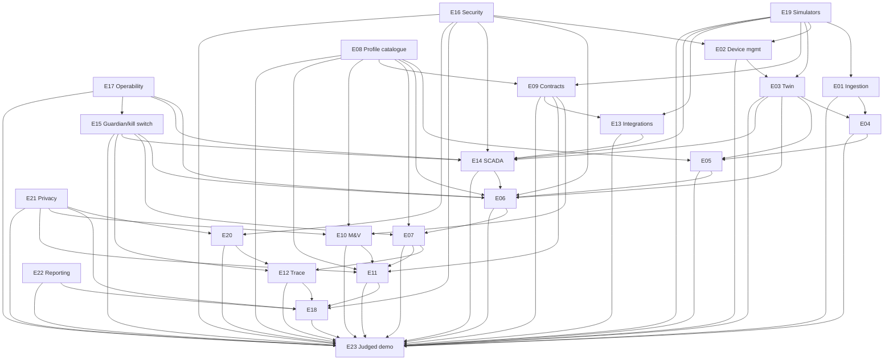

# OpenGrid Orchestrator — Epics & User Stories

Status: v1.3 · 2026-09-25 · Owner: Product Manager (this document).

**Changes in this version (v1.3 — resolution pass after the four adversarial reviews; dispositions in
`06-reviews/resolution/A1-product-brief.md`).** Story IDs stay stable; new stories are appended at the end of their epic.
- **Release map per register R21 (JDG-001, JDG-023, ARC-001):** every story carries a build tag (`MVP-J`, `MVP-B`,
  `R2`); size anchors S = 0.5, M = 1.5, L = 4 person-days (assumption A-JDG-03); a walking-skeleton-first order in three
  lanes; effort per build and a capacity table. Stories whose parts land in different builds were split: the original ID
  keeps the earlier part and a new story at the end of the epic carries the rest, design unchanged.
- **Register revision of 2026-09-25 10:15 applied:** Q1 default approvers exclude the system admin (E15-S03, S05); NCLR
  disqualification lasts ≥ 6 months (E09-S16); Q7 answered (E09-S03). **Revision of 10:34 applied:** the 10,000-hub runs
  use the node only if it can carry them, otherwise the replica VM, labelled (E19-S07, E18-S16; R35, Q26). Role codes
  `QSD` and `FSE` follow `03-security` §5.1 (E16-S06, E09-S07; V-37).
- **Rewritten stories:** E05-S06 and E11-S03 (AS ring-fenced; buyback only for a forward release or a capability loss,
  JDG-010); E06-S02 (fleet output at the SCADA sample's source time, kVA/per-phase, GRD-060, R18); E06-S06 (price response
  only for off-line or unregistered premises, R17); E08-S01/S07 (R47 tiered gate, V-27); E09-S07 (statute-shaped
  `MOBILE_TEEEF`, R20); E13-S03 (10:00 CT offers vs 14:00 CT declarations, JDG-011); E14-S06 (per-point SBO/DO, R29);
  E15-S03…S06, S08, S10 (R3 amended: single-person stop engage with a 15-min co-sign, Tier 2 release; R31); E18-S04 and
  E22-S04 (8-KPI scorecard; measured facts linked to the Projects Deck, JDG-013, JDG-026); E02-S07 (quarantine, C-14);
  E20-S02 (R49).
- **New stories** for `SHADOW` mode and the `DeviceAdapter` (R23), Insights, value of orchestration, performance strip and
  benchmark report (R24), ISO instructions, ADER net-load regulation, the COP, the QSE desk and the "what ERCOT sees" panel
  (R17, R25), the EEA posture
  and pre-positioning (R19), the statute-shaped TEEEF and `MOBILE_DER` (R20), the Safe-Stop Authority (R16), settings
  conformance and the freeze on autonomous response (R26), tolling, territory roles, dual participation, the SB 415 variant
  and PJM self-serve (R27), and the walking skeleton, 7-minute script and G3-J gate (E23, R21, R24).

**Revision note (v1.2):** consistency pass against `00-decision-register.md` (register wins on conflict; story
IDs kept stable — new FRs get new stories appended at the end of their epic, nothing renumbered). Kill-switch
stories (E15-S03..S06) rewritten to the register's unified two-tier policy (R3/R4: Tier 1 = one explicit
confirmation — bank scope, 30 s ramp-down; Tier 2 = a second, distinct approver — zone scope 60 s / fleet
scope 120 s ramp-down; release is *always* Tier 2 with a staged ramp-up). New E15-S10 (guardian/critical-alarm
exception: one confirmation, second approver co-signs within 15 min) and E15-S11 (pre-agreed in-limit utility
SCADA controls pass through without confirmation; an authorized utility's stop/block always executes). Profile-
catalogue stories (E08-S01/S04) now require the R10 replay/simulation gate, signed/effective-dated versions and
Tier 2 approval for priority/limit changes; new E08-S07 (a running event keeps its starting profile version)
and E08-S08 (reviewer-proposed numbers are per-profile configuration, R11). `MOBILE_TEEEF` stories (E09-S07,
E19-S08) now specify **three** concurrently simulated units (register Q19). `E20-S06` and `E21-S03` now reflect
Q17 (decline personal-data queries on this node; local model only in production) and Q16 (data-subject requests
via Base's existing support channel calling this system's fulfilment API) respectively.

**Revision note (v1.1):** wording consistency fix (see `01-vision-scope-personas.md` and
`02-functional-requirements.md` v3.1 notes): a few stories used "guarded"/"no flag gate" language around
`PIPELINE_AC`/`LARGE_LOAD` that read as a hedge even where the underlying story was already service-agnostic.
Reworded (E06-S10, E09-S05, E19-S06) to describe each service's own contracted operating parameters neutrally.

Builds on [`00-brief.md`](../00-brief.md), [`00-decision-register.md`](../00-decision-register.md),
[`01-vision-scope-personas.md`](01-vision-scope-personas.md) and
[`02-functional-requirements.md`](02-functional-requirements.md). Reflects the corrected scope in full: every
customer type in scope and none gated on business value; call arbitration, billing/settlement and decision
trace as first-class; SCADA integration with the register's unified command-safety policy; the service-type
dispatch profile catalogue (brief §3.5) as the generic extensibility mechanism, config-driven, no research/
academia function anywhere in this system; `ai-agent` receiving only non-personal/aggregated data; D1's four
added roles; D2's three-scope kill switch under the register's two-tier approval policy; D5 privacy controls.
Serves **Completeness** and **Technical depth** primarily; individual epics are tagged with the other criteria
they serve.

Personas referenced below (full detail in `01-vision-scope-personas.md` §6): control-room operator, fleet
operator, fleet reliability engineer, market/QSE trader, utility grid-ops engineer, partner-program manager,
settlement/finance analyst, billing admin, security analyst (SOC), platform SRE, system admin, auditor, Base
executive, homeowner (indirect), planning & forecasting analyst, SCADA/protocol integration engineer.

Every story: `E<nn>-S<nn>`, "As a … I want … so that …", ≥ 2 Given/When/Then acceptance criteria (one happy
path, one negative/failure), priority (MoSCoW), **build tag** (register R21: `MVP-J` — Line A, the judged core;
`MVP-B` — Line B; `R2` — after the judged demo, design unchanged; sequencing only, never a scope cut), size (S/M/L,
anchored at S = 0.5, M = 1.5, L = 4 person-days — assumption A-JDG-03, including unit tests and local integration with
agentic coding tools), linked FR IDs. A story's build tag is the build in which all its acceptance criteria are met; the
FR tags are in `02-functional-requirements.md`.

---

## Epics overview

| Epic | Goal | Stories: `MVP-J` / `MVP-B` / `R2` | Linked FR area(s) |
|---|---|---|---|
| E01 External data ingestion | Real, validated, fault-tolerant external data with record/replay | 6 / 1 / 3 | `ING` |
| E02 Device management & telemetry | Authenticate, ingest, command every hub like a real device, behind a `DeviceAdapter` | 9 / 2 / 2 | `DEV` |
| E03 Fleet digital twin | SOC/trust/topology (with phase and unit-typed ratings) for every hub, site, bank, zone | 6 / 0 / 2 | `TWIN` |
| E04 Forecasting | Load/solar/price/overload/availability forecasts with uncertainty | 0 / 6 / 1 | `FCST` |
| E05 Planning & optimization | Day-ahead/intraday MILP: commitments, offers, reserves, COP, cycle budget | 3 / 7 / 2 | `PLAN` |
| E06 Real-time dispatch & control | Priority allocation, ADER net-load regulation, feedback control, substitution, `SHADOW` mode | 15 / 1 / 1 | `DISP` |
| E07 Call arbitration | Priority + commitment + profitability resolution of concurrent calls | 5 / 0 / 1 | `ARB` |
| E08 Service-type dispatch profile catalogue | Generic, config-driven handling of every customer type and its variants; versioned, gated profiles | 8 / 1 / 1 | `SVC` |
| E09 Contracts, obligations & events | Full domain model for all 9 customer types, territory roles and contract variants | 14 / 0 / 4 | `CTR` |
| E10 Measurement & verification | Meter reconciliation, delivered-vs-committed, capture ratio | 5 / 1 / 1 | `MV` |
| E11 Billing & settlement | Invoice/settlement record per customer/contract/interval | 5 / 1 / 3 | `BILL` |
| E12 Decision audit & explainability | Tamper-evident, replayable decision trace | 6 / 0 / 0 | `TRACE` |
| E13 Northbound integrations | OpenADR, simulated ERCOT QSE with ISO instructions, webhooks | 3 / 2 / 2 | `INT` |
| E14 SCADA/EMS/DERMS integration & command safety | Protocol integration with the register's command-safety policy | 6 / 0 / 4 | `SCAD` |
| E15 Guardian safety & stops | Independent validation; stops at 3 scopes (single-person engage, Tier 2 release), the Safe-Stop Authority, emergency posture | 17 / 0 / 1 | `SAFE` |
| E16 Security & identity | Authn/z, roles, audit | 6 / 0 / 1 | `SEC` |
| E17 Platform operability | Alerts, runbooks, flags, HA, self-recovery, evaluator's install path | 5 / 1 / 4 | `OPS` |
| E18 Operator console UI | Every role's console surface, Insights, performance strip, "what ERCOT sees" | 8 / 7 / 3 | `UI` |
| E19 Simulators & fault injection | `agent-sim`/`grid-sim` realism and fault catalogue, off the node | 9 / 1 / 1 | `SIM` |
| E20 AI agent | Explainer/copilot now, advisor later; non-personal data only | 0 / 5 / 3 | `AI` |
| E21 Privacy of personal data | GDPR/CCPA-CPRA-aligned handling, no third-party sharing | 8 / 0 / 1 | `PRIV` |
| E22 Insights & reporting | Non-obvious outputs, value of orchestration, performance evidence | 1 / 6 / 1 | `RPT` |
| E23 Judged demo & release readiness | Walking skeleton, 7-minute script, unattended rehearsal, G3-J | 6 / 2 / 0 | cross-cutting |
| **Total** | 237 stories (153 in v1.2; 84 added, none removed) | **151 / 44 / 42** | |

Dependency view:

---

## E01 — External data ingestion

Goal: pull, validate and tolerate the failure of every external data source. Value: nothing downstream works
on bad or missing data. Scope: ERCOT/EIA/geo/solar clients, quality flagging, caching, PJM adapter stub.
Dependencies: none upstream. Builds per story (overview). Linked FRs: `FR-ING-001..018`.

**E01-S01 — Poll the fleet's ERCOT load-zone price.** As a market/QSE trader, I want the latest ERCOT
real-time price for the fleet's settlement load zones (`LZ_CPS`, `LZ_AEN`) ingested every cycle, with a
reference hub price kept for comparison only, so that arbitrage and AS valuation use the fleet's real
settlement price.
- Given ERCOT's API is healthy, When a poll tick runs, Then the new load-zone price is available to consumers
  within 60 s, for every configured zone (`FR-ING-001`).
- Given ERCOT returns an error, When the poll fails, Then the last known-good load-zone price is served,
  flagged stale, and no exception propagates (`FR-ING-006`).
Priority: Must · Build: MVP-J · Size: M · FRs: FR-ING-001, FR-ING-006, FR-ING-007

**E01-S02 — Poll zone load with lookback.** As a planning analyst, I want zone-load data even when same-day
queries return zero rows, so that the substation-load proxy never silently goes empty.
- Given a 2-day lookback window, When same-day data is unavailable, Then the latest available row from either
  day is returned (`FR-ING-002`).
- Given no rows exist in either day, When the poll completes, Then the signal is flagged `missing`, not a
  crash (`FR-ING-007`).
Priority: Must · Build: MVP-J · Size: S · FRs: FR-ING-002, FR-ING-007

**E01-S03 — Poll wind generation, actuals only.** As a planning analyst, I want only actual (not forecast) wind
rows used, so that `PIPELINE_AC`'s current estimate isn't built on a forecast row mistaken for reality.
- Given a posting with mixed actual/forecast rows, When the client selects data, Then only rows with a
  populated actual value are used (`FR-ING-003`).
- Given no actual row exists yet, When the poll completes, Then the signal is flagged `missing` (`FR-ING-007`).
Priority: Must · Build: R2 · Size: S · FRs: FR-ING-003

**E01-S04 — Respect the ERCOT rate limit.** As a platform SRE, I want every poller bounded to a shared 30
req/min budget, so that the fleet's own polling never gets ERCOT-blocked.
- Given all pollers active concurrently, When load-tested, Then the sustained rate never exceeds 30 req/min
  (`FR-ING-005`).
- Given the budget is momentarily exhausted, When a poller's turn comes, Then it waits rather than erroring
  (`FR-ING-005`).
Priority: Must · Build: MVP-J · Size: M · FRs: FR-ING-004, FR-ING-005

**E01-S05 — Cache and serve last-good data during an outage.** As any downstream consumer, I want cached data
with its age during a source outage, so that I never see a hard error for a transient upstream problem.
- Given the ERCOT API is down, When any consumer queries a cached signal, Then the last-good value and its
  "as of" timestamp are returned (`FR-ING-012`).
- Given the cache itself has no value yet, When queried, Then the consumer receives an explicit "no data yet"
  state, not a stale-looking zero (`FR-ING-012`).
Priority: Must · Build: MVP-J · Size: M · FRs: FR-ING-012, FR-ING-013

**E01-S06 — Design-only PJM adapter.** As a system admin, I want a PJM adapter interface that type-checks with
no live connection, so that enabling `PJM_CAPACITY` later needs no ingestion re-architecture.
- Given the interface exists, When unit-tested with fixture data, Then it passes with no PJM network call
  (`FR-ING-014`).
- Given a future real PJM connection is attempted, When it fails, Then ingestion degrades exactly like any
  other external source (`FR-ING-006`).
Priority: Could · Build: R2 · Size: M · FRs: FR-ING-014

**E01-S07 — Reference data and NWS weather.** As a planning analyst, I want the solar and home-load reference files
loaded and NWS forecasts, watches and warnings ingested for the service areas, so that simulated homes are realistic and
forecast risk reaches the planner.
- Given the reference files, When loaded, Then the simulation defaults derive from them (`FR-ING-010`).
- Given NWS issues a watch for a service area, When the poll runs, Then it reaches `planner` and the console within one
  poll cycle (`FR-ING-011`).
- Given NWS is unreachable, When polled, Then the last-good forecast is served with its age and no exception propagates
  (`FR-ING-012`).
Priority: Must · Build: MVP-J · Size: M · FRs: FR-ING-010, FR-ING-011

**E01-S08 — ERCOT operating notices and the EEA level.** As a QSE-desk operator, I want ERCOT's operating notices,
advisories, watches and EEA level ingested with their effective times, so that reserves are pre-positioned before the
risk and the emergency posture engages when ERCOT declares an EEA.
- Given ERCOT posts a watch, When ingested, Then `planner`, `guardian` and the console receive it with its effective time
  within one poll cycle (`FR-ING-017`).
- Given the notice feed is stale, When the EEA level is needed, Then the level from the (simulated) QSE interface is used
  and the staleness is alarmed (`FR-ING-017`, `FR-ING-015`).
Priority: Must · Build: MVP-B · Size: M · FRs: FR-ING-017

**E01-S09 — Record and replay real data with provenance.** As a Base executive, I want every external payload recorded
with its as-of time and a recorded real day replayable through the live path, so that real data stays visible even if
ERCOT's API is down during the demo.
- Given a recorded real ERCOT day, When replayed, Then downstream values equal the recorded run and every price shows
  "replayed" with its product and as-of time (`FR-ING-018`).
- Given a signal stays stale beyond its threshold, When checked, Then an alert fires within one poll cycle
  (`FR-ING-015`).
Priority: Must · Build: MVP-J · Size: M · FRs: FR-ING-018, FR-ING-015

**E01-S10 — EIA and geospatial ingestion; automated schema quarantine.** As a planning analyst, I want EIA and
geospatial data ingested on their cadence and an unexpected schema change quarantined automatically.
- Given a new EIA dataset, When published, Then it is reflected within one cycle (`FR-ING-008`); a known co-located pair
  is returned by the geospatial lookup (`FR-ING-009`).
- Given an injected schema change, When received, Then it is quarantined, never consumed (`FR-ING-016`).
Priority: Should · Build: R2 · Size: M · FRs: FR-ING-008, FR-ING-009, FR-ING-016

---

## E02 — Device management & telemetry

Goal: authenticate, ingest telemetry from, and command every hub — real or simulated — identically. Value:
without this, nothing else can trust a hub's data or a command's effect. Scope: `device-gateway`. Dependencies:
E16 (Security) for cert issuance. Builds per story (overview). Linked FRs: `FR-DEV-001..020`.

**E02-S01 — Enroll a hub before it can act.** As a fleet operator, I want a hub to be enrolled (certificate
issued, registered in `fleet-state`) before it can publish or receive anything.
- Given a new hub completes enrollment, When it connects, Then it can publish telemetry and receive commands
  (`FR-DEV-001`, `FR-DEV-002`).
- Given a hub attempts to connect without a valid, non-revoked certificate, When it tries, Then the
  connection is rejected and audited (`FR-DEV-001`, `FR-SEC-006`).
Priority: Must · Build: MVP-J · Size: M · FRs: FR-DEV-001, FR-DEV-002

**E02-S02 — Never assume a command executed.** As a control-room operator, I want a command shown as
"unconfirmed" until telemetry proves it, so that I never trust a phantom dispatch.
- Given a command is sent, When telemetry confirms the resulting state, Then it is marked executed
  (`FR-DEV-005`).
- Given no confirming telemetry arrives within the expected window, When I view it, Then it still shows
  unconfirmed, never executed (`FR-DEV-005`).
Priority: Must · Build: MVP-J · Size: M · FRs: FR-DEV-005, FR-DEV-006

**E02-S03 — Detect unresponsive vs. not-communicating hubs separately.** As a fleet reliability engineer, I
want these two fault types distinguished, so that I can tell a device fault from a network problem.
- Given a hub misses its telemetry intervals while its session is alive, When detected, Then it is classified
  `unresponsive` (`FR-DEV-007`).
- Given a hub's TCP/TLS session drops entirely, When detected, Then it is classified `not communicating`, a
  distinct state (`FR-DEV-008`).
Priority: Must · Build: MVP-J · Size: M · FRs: FR-DEV-007, FR-DEV-008

**E02-S04 — Detect a faulted or under-delivering hub.** As a fleet reliability engineer, I want fault codes and
sustained under-delivery both detected, so that `dispatcher` can substitute before an obligation suffers.
- Given a hub reports a fault code, When received, Then no further commands are sent to it until cleared
  (`FR-DEV-009`).
- Given a hub delivers materially below commanded for a sustained period, When the tolerance is crossed, Then
  it is flagged for substitution within N+1 ticks (`FR-DEV-010`).
Priority: Must · Build: MVP-J · Size: M · FRs: FR-DEV-009, FR-DEV-010

**E02-S05 — Retry with backoff; never overload on a reconnect burst.** As a platform SRE, I want dropped
connections retried with backoff and a mass-reconnect queued, not dropped.
- Given a connection drops, When it retries, Then the interval sequence follows the configured backoff/jitter
  policy (`FR-DEV-011`).
- Given 2,000 hubs (the demo scale) reconnect at once, When the burst hits, Then admission follows register V-21 and
  messages are queued with bounded latency, not silently dropped (`FR-DEV-012`; the 10,000-hub burst is E02-S08).
Priority: Must · Build: MVP-J · Size: M · FRs: FR-DEV-011, FR-DEV-012

**E02-S06 — Simulated hubs use the real path.** As a system admin, I want `agent-sim` hubs indistinguishable
from real ones inside `device-gateway`, so that testing proves production behaviour.
- Given a code-path coverage review, When run, Then no branch conditions on "is this simulated" (`FR-DEV-014`).
- Given a load test tries to bypass enrollment, When attempted, Then it is rejected identically to a real
  bypass attempt (`FR-DEV-014`, `FR-SIM-007`).
Priority: Must · Build: MVP-J · Size: M · FRs: FR-DEV-014

**E02-S07 — Quarantine a hub.** As a security analyst, I want to quarantine a suspect hub — excluded from every pool and
no longer commanded — so that it takes part in no obligation (the kill switch has no hub scope, D2; register C-14).
- Given a quarantine action on a hub, When executed, Then within one cycle the hub is excluded from every pool and
  receives no command (`FR-DEV-015`).
- Given the quarantine is lifted by an authorized action, When the hub reports again, Then it returns through probation
  (register V-29), never straight to eligible (`FR-TWIN-009`).
Priority: Must · Build: MVP-J · Size: S · FRs: FR-DEV-015, FR-DEV-016

**E02-S08 — Measure the 10,000-hub reconnect burst.** As a platform SRE, I want the 10,000-hub reconnect burst measured
from the off-node generator, so that the broker's admission limits are proven at test scale.
- Given 10,000 hubs reconnect at once, When the burst hits, Then admission follows V-21 and zero messages are silently
  dropped (`FR-DEV-012`).
- Given the generator saturates during the burst, When measured, Then the run is marked invalid, not reported
  (`FR-SIM-018`).
Priority: Must · Build: MVP-B · Size: M · FRs: FR-DEV-012

**E02-S09 — A `DeviceAdapter` for any fleet.** As a fleet operator, I want every fleet behind one adapter interface
(telemetry in, commands out, acknowledgement semantics), so that Base's real fleet is connected by writing one adapter.
- Given a stub second adapter, When the adapter contract test runs, Then it passes with no change outside
  `device-gateway`, as does the MQTT implementation (`FR-DEV-017`).
- Given an adapter that returns malformed acknowledgements, When exercised, Then its commands stay unconfirmed and the
  adapter is flagged, never trusted (`FR-DEV-005`, `FR-DEV-017`).
Priority: Must · Build: MVP-B · Size: M · FRs: FR-DEV-017

**E02-S10 — Publish the device contract and its conformance suite.** As a SCADA/protocol integration engineer, I want
the device contract published as its own package (JSON Schema with a version field, AsyncAPI, conformance suite), so
that anyone — not only our simulator — can prove a device speaks it.
- Given the package, When the conformance suite runs against `agent-sim`, Then it passes (`FR-DEV-018`, `FR-DEV-014`).
- Given a message that violates the schema or omits its version field, When tested, Then the suite fails it
  (`FR-DEV-018`).
Priority: Must · Build: MVP-J · Size: M · FRs: FR-DEV-018, FR-DEV-014

**E02-S11 — Revoke a quarantined hub's certificate.** As a security analyst, I want a quarantined hub's certificate and
session revoked, so that it cannot reconnect until deliberately re-enrolled.
- Given a quarantined hub, When revocation is executed, Then its certificate is revoked and its session terminated
  within one tick (`FR-DEV-015`, `FR-SEC-009`).
- Given the revoked hub reconnects, When it tries, Then the broker deny-list refuses it until an authorized
  re-enrollment (register V-09).
Priority: Must · Build: R2 · Size: S · FRs: FR-DEV-015, FR-SEC-009

**E02-S12 — Verify protection settings; negotiate capabilities.** As a fleet reliability engineer, I want every hub's
IEEE 1547 settings read back and compared with the signed accepted profile at enrolment, at boot and after each rollout
ring, and each hub's capabilities negotiated, so that a firmware defect cannot become a common-mode trip.
- Given a hub whose ride-through settings drift after a rollout ring, When read back, Then it is quarantined from ADER and
  firm pools within one cycle and the exposed-MW figure updates (`FR-DEV-019`).
- Given a constrained hub, When commanded, Then it never exceeds its negotiated limit (`FR-DEV-013`).
Priority: Should · Build: R2 · Size: M · FRs: FR-DEV-019, FR-DEV-013

**E02-S13 — Telemetry at the right cadence, validated, with autonomous-response reason codes.** As a fleet reliability
engineer, I want telemetry at the cadence of register V-32, malformed messages quarantined and autonomous-response reason
codes carried, so that the twin is fresh and a hub's grid-support response is never mistaken for under-delivery.
- Given a hub joins an on-line ADER, When the next cycle runs, Then it reports every 2 s (`FR-DEV-003`).
- Given a malformed telemetry message, When received, Then it is quarantined and the connection stays up (`FR-DEV-004`).
- Given a frequency event, When hubs respond autonomously, Then their telemetry carries the reason code and the
  autonomous ΔP (`FR-DEV-020`).
Priority: Must · Build: MVP-J · Size: M · FRs: FR-DEV-003, FR-DEV-004, FR-DEV-020

---

## E03 — Fleet digital twin & state estimation

Goal: an accurate, trust-scored, topology-aware state for every hub and every hierarchy level. Value:
everything downstream (planning, dispatch, arbitration) depends on knowing what the fleet can actually do
right now. Scope: `fleet-state`. Dependencies: E02. Builds per story (overview). Linked FRs: `FR-TWIN-001..015`.

**E03-S01 — Maintain live SOC/available-kW/health per hub.** As a control-room operator, I want a current,
fresh state estimate for every hub.
- Given telemetry arrives on cadence, When processed, Then the estimate's age never exceeds one interval plus
  processing latency (`FR-TWIN-001`).
- Given telemetry stops arriving, When more than 3 reports are missed (register V-29), Then the hub is SILENT —
  excluded from totals and allocation but still visible — and it returns only through probation (`FR-TWIN-009`).
Priority: Must · Build: MVP-J · Size: M · FRs: FR-TWIN-001, FR-TWIN-009

**E03-S02 — Compute a trust score.** As a fleet reliability engineer, I want a trust score reflecting telemetry
consistency, compliance and fault history.
- Given a hub with a clean history, When scored, Then it scores higher than a hub with manufactured faults
  (`FR-TWIN-002`).
- Given the score feeds `planner`/`dispatcher`, When a low-trust hub is considered, Then it is weighted down
  in allocation decisions (`FR-TWIN-002`).
Priority: Must · Build: MVP-J · Size: M · FRs: FR-TWIN-002

**E03-S03 — Maintain full topology and "behind asset X" queries.** As a SCADA/protocol integration engineer, I
want to query exactly which homes sit behind a given bank.
- Given a test bank's known enrolled homes, When queried, Then exactly those homes are returned, no others
  (`FR-TWIN-003`).
- Given a bank with unit-typed ratings (kVA, kW, A) and hubs on known phases, When a per-phase need is computed, Then
  only hubs on that phase serve it, a hub of unknown phase counts toward three-phase totals only, and a mixed-unit point
  map is rejected at validation (`FR-TWIN-013`; topology-change re-checks are E03-S07).
Priority: Must · Build: MVP-J · Size: L · FRs: FR-TWIN-003, FR-TWIN-013

**E03-S04 — Reflect house events in available capacity.** As a homeowner (indirect), I want my EV charging,
islanding, opt-out or reserve change to be reflected immediately in what my hub can be asked to do.
- Given an EV charging session starts, When detected, Then available discharge kW drops by the session's draw
  within one tick (`FR-TWIN-004`).
- Given the home islands during an outage, When confirmed, Then the hub is excluded from every grid-service
  obligation until re-grid-connection is confirmed (`FR-TWIN-005`).
Priority: Must · Build: MVP-J · Size: M · FRs: FR-TWIN-004, FR-TWIN-005, FR-TWIN-006

**E03-S05 — Never over-report available capacity.** As an auditor, I want a guarantee that reported available
kW never exceeds SOC minus the reserve floor and any higher-priority reservation.
- Given randomized fleet states, When property-tested, Then reported available kW plus every reservation
  never exceeds SOC, 100% of samples (`FR-TWIN-007`).
- Given a hub's SOC is exactly at the reserve floor, When queried, Then its available discharge kW for
  non-firm use is reported as zero (`FR-TWIN-007`).
Priority: Must · Build: MVP-J · Size: M · FRs: FR-TWIN-007, FR-TWIN-008, FR-TWIN-011

**E03-S06 — Capability that respects volt-var.** As a fleet reliability engineer, I want each hub's available active
power computed from its kVA rating, the reactive power its volt-var curve demands at the measured voltage and its P-or-Q
priority, so that the fleet never promises kW a hub must give up to hold voltage.
- Given a high-voltage fixture on a reactive-priority hub, When capability is computed, Then available kW falls as the
  curve requires (`FR-TWIN-015`).
- Given a hub reports voltage-driven curtailment, When substitution runs, Then it prefers hubs on other transformers and
  feeders (`FR-TWIN-015`, `FR-DISP-027`).
Priority: Must · Build: MVP-J · Size: M · FRs: FR-TWIN-015

**E03-S07 — Topology changes and switching orders.** As a SCADA/protocol integration engineer, I want topology freshness
defined as the GIS version plus every switching order applied since, and dependent feasibility re-checked on a change.
- Given a switching-order fixture from the utility's OMS feed, When applied, Then the as-operated topology updates before
  the next planning cycle and dependent obligations' feasibility is re-checked (`FR-TWIN-014`, `FR-TWIN-010`).
- Given a switching order is open, When the bank is dispatched, Then only that bank is in conservative mode
  (`FR-TWIN-014`).
Priority: Should · Build: R2 · Size: M · FRs: FR-TWIN-010, FR-TWIN-014

**E03-S08 — Label degraded hubs from their history.** As a partner-program manager, I want a hub labelled `degraded` from
its delivered-vs-commanded history, so that firm sizing uses real, not nameplate, capacity.
- Given a manufactured fade history, When evaluated, Then the hub is labelled `degraded` (`FR-TWIN-012`).
- Given a hub with a transient shortfall only, When evaluated, Then it is not labelled (`FR-TWIN-012`).
Priority: Should · Build: R2 · Size: S · FRs: FR-TWIN-012

---

## E04 — Forecasting

Goal: load/solar/price/overload/availability forecasts with honest uncertainty. Value: the planner cannot size
a safe reserve on a forecast that hides its own error. Scope: `forecaster`. Dependencies: E01, E03. Builds per story (overview).
Linked FRs: `FR-FCST-001..011`.

**E04-S01 — Day-ahead price forecast with uncertainty.** As a planning analyst, I want a day-ahead hourly price
forecast with a real uncertainty band.
- Given the forecast runs, When published, Then it is available before 10:00 America/Chicago with a non-zero
  band (`FR-FCST-001`).
- Given a price input is flagged degraded, When the forecast runs, Then the band widens rather than staying
  unchanged (`FR-FCST-008`).
Priority: Must · Build: MVP-B · Size: M · FRs: FR-FCST-001, FR-FCST-008

**E04-S02 — Day-ahead load/solar forecast.** As a planning analyst, I want a day-ahead load/solar forecast
backtested against reality.
- Given the forecast runs daily, When compared to realized values, Then a MAPE figure is recorded
  (`FR-FCST-002`; backtest dashboards are E04-S07).
- Given a realized-value feed is missing for a day, When the comparison runs, Then that day is marked "no actuals", never
  scored as zero error (`FR-FCST-002`).
Priority: Must · Build: MVP-B · Size: M · FRs: FR-FCST-002

**E04-S03 — Overload forecast labelled as a proxy.** As a Base executive, I want any forecast built on a zone-
load proxy visibly labelled, so nobody mistakes a proxy for measured data.
- Given the overload forecast uses zone-load rescaling, When displayed anywhere, Then the proxy label is
  visible (`FR-FCST-003`).
- Given real per-bank SCADA later replaces the proxy, When it does, Then the label is removed for that bank
  only (`FR-FCST-003`).
Priority: Must · Build: MVP-B · Size: S · FRs: FR-FCST-003

**E04-S04 — Uncertainty drives reserve sizing.** As a planning analyst, I want `planner` to size reserves off
the forecast's uncertainty, not a point estimate.
- Given the uncertainty band widens, When `planner` runs, Then the reserve size increases, all else equal
  (`FR-FCST-005`).
Priority: Must · Build: MVP-B · Size: M · FRs: FR-FCST-005, FR-FCST-004

**E04-S05 — Intraday re-forecast cadence.** As a control-room operator, I want the intraday forecast refreshed
at least every 15 minutes.
- Given a 24 h soak test, When run, Then the forecast timestamp updates at least every 15 min throughout
  (`FR-FCST-006`).
Priority: Must · Build: MVP-B · Size: S · FRs: FR-FCST-006

**E04-S06 — Firm declarations rest only on inputs fit for them.** As a planning & forecasting analyst, I want firm
declarations and firm sizing built from evening home-load P10 measured on site telemetry (or a peak-shaped residential
prior) and never from a synthetic bank proxy without a multiplier the utility accepted, so that declared kW is not
overstated.
- Given a bank whose only forecast is `SYNTHETIC`, When a firm declaration is attempted without an accepted multiplier,
  Then it is refused with the reason (`FR-FCST-003`, `FR-FCST-011`).
- Given a month of events, When the report runs, Then declared vs measured P10 is published per program
  (`FR-FCST-011`).
Priority: Must · Build: MVP-B · Size: M · FRs: FR-FCST-011, FR-FCST-003

**E04-S07 — Forecast backtests and pluggable models.** As a planning & forecasting analyst, I want every forecast type
backtested with its error trended, overload-prediction accuracy reported, and a second model pluggable per signal.
- Given a 12-month backtest, When run, Then the error metric is updated at least daily and trended (`FR-FCST-007`,
  `FR-FCST-009`).
- Given a second model for one signal, When registered, Then it passes the same contract test (`FR-FCST-010`).
Priority: Should · Build: R2 · Size: M · FRs: FR-FCST-007, FR-FCST-009, FR-FCST-010

---

## E05 — Planning & optimization

Goal: a safe, correctly-scoped, correctly-sized day-ahead and intraday plan across every customer type. Value:
a wrong plan (over-sized firm kW, double-counted reserves) is unsafe and unbankable. Scope: `planner`.
Dependencies: E03, E04, E08, E09. Builds per story (overview). Linked FRs: `FR-PLAN-001..018`.

**E05-S01 — Solve the joint day-ahead plan.** As a Base executive, I want one optimization covering every
customer type's candidate commitments, none pre-excluded.
- Given all nine customer types are active, When the plan solves, Then commitments are produced for each
  feasible one (`FR-PLAN-001`, `FR-PLAN-015`).
- Given the fleet's derated capacity is exceeded by demand, When solved, Then the plan never assigns more than
  the derated, reserve-adjusted total (`FR-PLAN-001`).
Priority: Must · Build: MVP-B · Size: L · FRs: FR-PLAN-001, FR-PLAN-015

**E05-S02 — Size firm kW on end-of-term capacity.** As a partner-program manager, I want `DIST_DEFERRAL`
sized on realistic year-10 capacity, not day-one nameplate.
- Given a test contract, When sized, Then the calculation uses the end-of-term fade factor (`FR-PLAN-002`).
- Given a naive nameplate-based sizing is substituted, When tested, Then the test fails, proving the
  correction is enforced (`FR-PLAN-002`).
Priority: Must · Build: MVP-B · Size: M · FRs: FR-PLAN-002

**E05-S03 — One shared SOC floor, never double-reserved.** As an auditor, I want a guarantee that ancillary
holds and firm energy never double-claim the same kWh.
- Given a property test with randomized concurrent holds, When run, Then no solution over-reserves a hub's
  usable energy (`FR-PLAN-003`).
Priority: Must · Build: MVP-B · Size: L · FRs: FR-PLAN-003, FR-PLAN-011

**E05-S04 — Restrict firm allocation to homes behind the asset; block in-window charging.** As a SCADA/
protocol integration engineer, I want `DIST_DEFERRAL` homes drawn only from behind the constrained bank, never
charging during its need window.
- Given a test bank, When the plan solves, Then only "behind this asset" homes are used (`FR-PLAN-004`).
- Given the need window is active, When the plan is checked, Then zero charging kW is scheduled for committed
  homes (`FR-PLAN-005`).
Priority: Must · Build: MVP-B · Size: M · FRs: FR-PLAN-004, FR-PLAN-005

**E05-S05 — Worst-day stress test.** As a Base executive, I want a worst-day mode assuming every event hour is
realized, to stress-test a firm commitment before declaring it.
- Given worst-day mode is run, When compared to the expected-value plan, Then the two differ, and any
  infeasibility is surfaced explicitly (`FR-PLAN-006`).
Priority: Should · Build: R2 · Size: M · FRs: FR-PLAN-006

**E05-S06 — Respect ADER caps; keep awarded AS ring-fenced.** As a market/QSE trader, I want no offer past the fleet's
confirmed allotment or an ADER's qualified MW, and an awarded AS hold kept intact inside its awarded interval, so that
the fleet never breaks an ERCOT award to serve another buyer.
- Given an offer is proposed, When checked, Then it never exceeds the configured allotment or the ADER's qualified MW for
  the product (`FR-PLAN-007`).
- Given an awarded AS hold inside its awarded interval and a firm event that wants the same kW, When arbitrated, Then the
  hold stays ring-fenced and the firm shortfall is covered by substitution or reported `AT_RISK` — no buyback line is
  produced (`FR-PLAN-008`, JDG-010).
- Given a capability loss (utility block, safe stop, hub loss) removes part of an awarded hold, When settled, Then an
  RTC+B buyback exposure line is recorded and linked to the causing trace (`FR-PLAN-008`, `FR-BILL-004`; a forward release
  is E05-S09).
Priority: Must · Build: MVP-J · Size: M · FRs: FR-PLAN-007, FR-PLAN-008

**E05-S07 — Always commit a plan: the rule-based fallback.** As a control-room operator, I want a safe plan committed
every day even before the optimizer exists or when I miss the approval deadline, so that the fleet is never without a
plan.
- Given no approved plan exists at the cutover, When the deadline passes, Then the rule-based fallback plan (the port of
  `control_engine.py`: firm energy reserved, AS holds as awarded, charge windows) commits automatically — never an empty
  plan (`FR-PLAN-014`).
- Given the fallback commits, When the operator opens the plan, Then it is labelled "fallback" with its reason
  (`FR-PLAN-014`; approval of an optimized plan is E05-S10).
Priority: Must · Build: MVP-J · Size: M · FRs: FR-PLAN-014

**E05-S08 — Keep a true Current Operating Plan.** As a QSE-desk operator, I want a COP per ADER and hour for the next
168 h, computed from ledger-free capacity and resubmitted on every material change, so that ERCOT always sees only
capacity no other buyer holds.
- Given a storm hold or a zone stop changes available capacity by ≥ 1 MW or ≥ 10%, When it happens, Then the COP is
  resubmitted and acknowledged within 60 min (`FR-PLAN-017`, `FR-INT-013`).
- Given a partner toll reserves kW for the next day, When the COP is built, Then no COP hour shows the reserved kW
  (`FR-PLAN-017`, `FR-ARB-013`).
Priority: Must · Build: MVP-J · Size: M · FRs: FR-PLAN-017, FR-INT-013

**E05-S09 — Forward release of AS capacity.** As a market/QSE trader, I want the §7.4 forward release (default off) to
compare the expected penalty avoided with the buyback exposure at a tail measure and a hard dollar cap, so that a release
is a priced, confirmed decision.
- Given release is enabled and a firm obligation is `AT_RISK`, When evaluated, Then the Tier 1 confirmation shows the tail
  buyback figure and the cap (`FR-PLAN-008`).
- Given release is disabled (the default), When a firm obligation is `AT_RISK`, Then no AS capacity is released
  (`FR-PLAN-008`).
Priority: Should · Build: R2 · Size: M · FRs: FR-PLAN-008

**E05-S10 — Approve the optimized plan; meet both day-ahead deadlines.** As a control-room operator, I want to review and
approve the optimized plan, with ERCOT offers submitted before the 10:00 CT close and firm declarations by 14:00 CT, and
the plan recomputed at least every 15 minutes.
- Given I approve before the cutover, When approved, Then that plan commits and is audited (`FR-PLAN-013`).
- Given a 30-day soak including a DST change, When checked, Then offers are timestamped before 10:00 CT and declarations
  before 14:00 CT every day, and firm declarations are preserved across ≥ 95% of re-plans (`FR-PLAN-010`,
  `FR-PLAN-009`).
Priority: Must · Build: MVP-B · Size: M · FRs: FR-PLAN-009, FR-PLAN-010, FR-PLAN-013

**E05-S11 — Pre-position reserves on forecast risk.** As a homeowner (indirect), I want my reserve raised ahead of a
forecast emergency in low net-load hours, never by grid charging during an EEA.
- Given an NWS warning or an ERCOT watch 24 h ahead, When the planner runs, Then reserves rise before the risk window
  with ADER telemetry and the COP updated first (`FR-PLAN-016`).
- Given an EEA is declared, When the planner runs, Then no grid charging is planned beyond the exceptions of
  `FR-SAFE-027` (`FR-PLAN-016`).
Priority: Must · Build: MVP-B · Size: M · FRs: FR-PLAN-016

**E05-S12 — A cycle budget per hub.** As a partner-program manager, I want each hub's cycles per year budgeted as a planner
constraint with a shadow price, so that tolling, arbitrage and AS together never exceed warranty throughput.
- Given a hub near its annual budget, When the plan solves, Then it never schedules more cycles than remain
  (`FR-PLAN-018`).
- Given a month closes, When reported, Then cycles are attributed to each service (`FR-PLAN-018`).
Priority: Must · Build: MVP-B · Size: M · FRs: FR-PLAN-018

---

## E06 — Real-time dispatch & control

Goal: a safe, feedback-controlled, substitution-capable, command-safe real-time allocator. Value: this is
where safety, correctness and the "does it actually work under failure" judging criterion live. Scope:
`dispatcher`. Dependencies: E02, E03, E05, E07, E08, E14, E15. Builds per story (overview). Linked FRs: `FR-DISP-001..032`.

**E06-S01 — Priority-ordered allocation from one shared pool.** As a control-room operator, I want every
tick's allocation to respect priority order from a single shared pool.
- Given a firm obligation and the market both want capacity, When allocated, Then the firm obligation is
  served first (`FR-DISP-001`).
- Given a per-contract override changes the order, When configured, Then only that contract's precedence
  changes (`FR-DISP-001`, `FR-ARB-008`).
Priority: Must · Build: MVP-J · Size: L · FRs: FR-DISP-001, FR-DISP-002

**E06-S02 — Correct control law on constrained banks.** As a SCADA/protocol integration engineer, I want the
control law to regulate what the bank rating protects — kVA or the maximum per-phase current — with the fleet's own output
added back at the SCADA sample's source time, so that it never chases its own effect or under-relieves a bank at low power
factor.
- Given a bank sample, When the control law runs, Then `need = measured (net of fleet) + the fleet's own output behind
  the bank at the sample's source time (alignment ≤ 1 s) − (rating − margin)` is computed in the rating's unit
  (`FR-DISP-003`, GRD-060).
- Given a naive formula — a "prior" fleet output, or kW compared with a kVA rating — is substituted, When tested at PF 0.9
  with fleet volt-var absorption, Then the test fails (`FR-DISP-003`, `FR-DISP-028`).
Priority: Must · Build: MVP-J · Size: M · FRs: FR-DISP-003, FR-DISP-004, FR-DISP-028

**E06-S03 — Fail safe on a bad signal.** As an auditor, I want a firm contract to hold its prior setpoint on a
bad signal, never drop to zero first.
- Given a bad/missing signal, When detected, Then the prior setpoint is held — inside a need window, the larger of the
  held and the scheduled setpoint (`FR-DISP-005`).
- Given the signal stays bad past the hold window, When the window elapses, Then the day-ahead schedule takes
  over — the setpoint never first drops to 0 kW — and control returns only after register V-38's criterion
  (`FR-DISP-005`).
Priority: Must · Build: MVP-J · Size: M · FRs: FR-DISP-005, FR-DISP-006

**E06-S04 — No charging in a bank's need window; no recharge rebound.** As a SCADA/protocol integration
engineer, I want charging blocked at dispatch time, independent of planning, and recharge capped with the fleet's own
charging added back.
- Given a committed home is behind an active-window bank, When a charge command is attempted, Then it is
  rejected even if planning allowed it — except homeowner-reserve recovery within bank headroom at a capped rate, lowest
  SOC first (`FR-DISP-007`).
- Given a recharge after the window with 2–10 s SCADA delay, When ramped, Then it converges monotonically to the
  headroom and never exceeds 95% of the bank's rating (`FR-DISP-008`, `FR-DISP-030`).
Priority: Must · Build: MVP-J · Size: M · FRs: FR-DISP-007, FR-DISP-008, FR-DISP-030

**E06-S05 — Substitute a failing hub fast.** As a fleet reliability engineer, I want an under-delivering hub
substituted within 3 ticks.
- Given a hub under-delivers during an active obligation, When detected, Then a substitute covers the gap
  within 3 ticks (`FR-DISP-009`).
- Given no substitute exists, When checked, Then the true shortfall is reported, never the commanded value
  (`FR-DISP-010`).
Priority: Must · Build: MVP-J · Size: L · FRs: FR-DISP-009, FR-DISP-010, FR-DISP-014

**E06-S06 — Damp oscillation; react to price spikes only where allowed.** As a platform SRE, I want feedback
instability damped automatically, and a price spike reflected within one tick for premises whose ADER is off line or
unregistered.
- Given an oscillating signal, When detected, Then a slower deadbanded mode engages within 3 ticks and an
  alert fires (`FR-DISP-011`).
- Given a real-time price spike, When it arrives, Then the price-responsive decision for off-line or unregistered premises
  updates within one tick, while members of an on-line ADER keep following ERCOT's set point with no price-driven deviation
  (`FR-DISP-012`, R17).
Priority: Must · Build: MVP-J · Size: M · FRs: FR-DISP-011, FR-DISP-012

**E06-S07 — Handle competing load and saturated limits honestly.** As a settlement/finance analyst, I want a
saturated export limit reported as a structural shortfall, not a fault.
- Given competing local load (fleet-wide EV peak), When computed, Then available kW is netted down
  accordingly (`FR-DISP-015`).
- Given an export limit is saturated, When delivered kW is capped there, Then the gap is tagged "structural,"
  not "fault" (`FR-DISP-016`).
Priority: Must · Build: MVP-J · Size: M · FRs: FR-DISP-015, FR-DISP-016, FR-DISP-017

**E06-S08 — Guarantee no double-allocation; log every tick.** As an auditor, I want a mathematical guarantee
that no hub's grants across obligations ever exceed its available energy.
- Given randomized obligation mixes, When property-tested, Then grants never exceed available energy above
  the floor, 100% of samples (`FR-DISP-019`).
- Given any tick, including a zero-request one, When logged, Then every obligation has a decision-log row
  (`FR-DISP-018`).
Priority: Must · Build: MVP-J · Size: L · FRs: FR-DISP-018, FR-DISP-019

**E06-S09 — Safe degraded mode.** As a control-room operator, I want to invoke a scoped safe degraded mode
(firm-only, or full standdown) on a bank/zone/fleet.
- Given I invoke degraded mode on a zone, When confirmed, Then targeted lower-priority obligations suspend
  within one tick, correctly scoped (`FR-DISP-020`).
Priority: Must · Build: MVP-J · Size: M · FRs: FR-DISP-020

**E06-S10 — Dispatch every service type unconditionally within its contracted parameters.** As a fleet
operator, I want `PIPELINE_AC` and `LARGE_LOAD` to dispatch exactly as their profile allows — never suppressed
by a business-value judgment.
- Given a `PIPELINE_AC` smoothing call within its contracted band, When it arrives, Then it dispatches
  (`FR-DISP-021`).
- Given a `LARGE_LOAD` contracted event call, When it arrives, Then it dispatches in full, subject only to
  safety/priority/capacity (`FR-DISP-022`).
Priority: Must · Build: MVP-J · Size: M · FRs: FR-DISP-021, FR-DISP-022, FR-DISP-023

**E06-S11 — ERCOT instructions are constraints; arbitration happens before the fact.** As a market/QSE trader, I want
every ERCOT instruction for an on-line ADER treated as a hard constraint at L2 and every ERCOT-visible quantity computed
from ledger-free capacity, so that no customer is ever served by deviating from ERCOT and ERCOT never sees capacity sold
to someone else.
- Given a firm call that wants the same hubs as an instructed ADER, When arbitrated, Then the ADER stays on its
  instruction and the firm call is served by substitution from non-ADER hubs or flagged `AT_RISK` with notice
  (`FR-DISP-024`).
- Given a partner event in its window and a proxy-offer fixture, When SCED runs, Then no award lands on reserved kW;
  telemetry updated within 2 s of the reservation, and a fixture that would telemeter reserved kW is vetoed with the rule ID
  (`FR-ARB-013`, `FR-SAFE-029`).
Priority: Must · Build: MVP-J · Size: L · FRs: FR-DISP-024, FR-ARB-013, FR-SAFE-029

**E06-S12 — Regulate the ADER's net load on ERCOT's set point.** As a QSE-desk operator, I want an on-line ALR ADER's
aggregate net load held on ERCOT's set-point trajectory with a cycle ≤ 4 s, absorbing every other service's action on
member hubs, so that set-point deviation stays inside the profile's tolerance.
- Given a 30-day replay with house-load noise, EV starts, partner and deferral actions on member hubs, When the regulator
  runs, Then the set-point deviation stays within tolerance and no net-load step happens without an instruction
  (`FR-DISP-025`).
- Given ICCP or the QSE link is lost, When the loss is detected, Then the ADER holds its last set point flat — never steps
  to zero — and the QSE-desk task appears at once (`FR-DISP-026`).
Priority: Must · Build: MVP-J · Size: L · FRs: FR-DISP-025, FR-DISP-026, FR-DISP-002

**E06-S13 — Never fight the hubs' autonomous grid support.** As a fleet reliability engineer, I want integrators,
substitution and trust penalties frozen while the frequency error exceeds the droop deadband or hubs report
autonomous-response reason codes, so that the fleet's primary frequency response is never cancelled and healthy hubs are
never penalized.
- Given a 59.85 Hz, 60-s frequency event, When hubs respond, Then integrators and substitution freeze, setpoints hold and
  no trust decays (`FR-DISP-027`, `FR-DEV-020`).
- Given a contract that excuses autonomous response, When M&V runs for that interval, Then the autonomous ΔP is not
  charged as shortfall (`FR-DISP-027`).
Priority: Must · Build: MVP-J · Size: M · FRs: FR-DISP-027

**E06-S14 — One integrating loop per bank; relief that does not unwind.** As a utility grid-ops engineer, I want exactly
one integrating loop on each bank, a low-passed feedforward and per-bank deadbands, and a deferral performance definition
that does not unwind when another service relieves the bank.
- Given a utility battery PI and the fleet on the same bank, When both are configured, Then only one integrates and the
  other is feedforward or a fixed target (`FR-DISP-031`, `FR-CTR-027`).
- Given another service discharges behind the bank during a deferral window, When the loop runs (Example B in closed
  loop), Then the deferral's own request is kept (share-based) or the bank limit is met (outcome-based), never unwound
  (`FR-DISP-028`).
Priority: Must · Build: MVP-J · Size: L · FRs: FR-DISP-028, FR-DISP-031

**E06-S15 — Clip or defer under saturation, never reject.** As a partner-program manager, I want calls clipped or deferred
with the shortfall reported when the platform saturates, so that no customer is refused for load reasons.
- Given a saturation fixture, When calls arrive, Then they are clipped or deferred with reported shortfalls (`FR-DISP-029`).
- Given the same saturation, When checked, Then zero calls are rejected for load reasons (`FR-DISP-029`).
Priority: Must · Build: MVP-J · Size: S · FRs: FR-DISP-029

**E06-S16 — `SHADOW` mode.** As a Base executive, I want the orchestrator to run on a real fleet's telemetry with every
command recorded and none sent, with a shadow-vs-actual report, so that Base can evaluate it before any command is sent.
- Given `SHADOW` mode for 24 h, When run, Then zero commands leave `device-gateway` while plans, traces and M&V are produced
  (`FR-DISP-032`).
- Given the run ends, When the report is opened, Then it lists per-interval differences between the recorded commands and
  the fleet's actual behaviour, and every screen showed the `SHADOW` state (`FR-DISP-032`).
Priority: Must · Build: MVP-B · Size: M · FRs: FR-DISP-032, FR-DEV-017

**E06-S17 — Re-route on a topology path change; frequency-domain oscillation detection.** As a platform SRE, I want the
dispatch re-routed within one planning cycle when the optimal path changes, and oscillations detected in the frequency
domain.
- Given a topology path change, When detected, Then dispatch re-routes within one planning cycle (`FR-DISP-013`).
- Given a slow oscillation below the reversal counter's threshold, When analysed, Then it is detected and damped
  (`FR-DISP-011`).
Priority: Should · Build: R2 · Size: M · FRs: FR-DISP-013, FR-DISP-011

---

## E07 — Call arbitration

Goal: fair, explainable resolution of concurrent calls on shared capacity. Value: this is the mechanism that
makes "one fleet, many buyers" real instead of a slogan. Scope: `dispatcher` arbitration logic. Dependencies:
E06, E08, E09. Builds per story (overview). Linked FRs: `FR-ARB-001..013`.

**E07-S01 — Validate a call against its contract.** As a settlement/finance analyst, I want an invalid call
rejected before it ever reaches allocation.
- Given a call violates its contract's terms, When submitted, Then it is rejected pre-allocation
  (`FR-ARB-001`).
Priority: Must · Build: MVP-J · Size: S · FRs: FR-ARB-001

**E07-S02 — Resolve two overlapping calls.** As a Base executive, I want overlapping calls resolved by
priority, commitments and profitability, reproducibly.
- Given a `PARTNER_CAPACITY` event and a `DIST_DEFERRAL` window overlap, When arbitrated, Then the same inputs
  always produce the same winner (`FR-ARB-002`, `FR-ARB-005`).
- Given profitability alone would favor the lower-priority call, When arbitrated, Then priority class still
  wins absent an explicit override (`FR-ARB-004`).
Priority: Must · Build: MVP-J · Size: L · FRs: FR-ARB-002, FR-ARB-004, FR-ARB-005

**E07-S03 — Compute profitability transparently.** As a market/QSE trader, I want a call's profitability broken
into its named components.
- Given a contested call, When profitability is computed, Then it decomposes into value, energy cost,
  degradation, delivery charge, penalty/buyback and opportunity cost (`FR-ARB-003`).
Priority: Must · Build: MVP-J · Size: M · FRs: FR-ARB-003

**E07-S04 — Record every option, winner and loser's regret.** As an auditor, I want the full contended-call
set and every loser's foregone value recorded.
- Given a contested tick, When decided, Then the trace lists every contending call and its regret
  (`FR-ARB-006`, `FR-ARB-012`).
- Given no capacity remains for a specific call, When that happens, Then a true shortfall is recorded against
  that call, never masked by an unrelated one (`FR-ARB-007`).
Priority: Must · Build: MVP-J · Size: M · FRs: FR-ARB-006, FR-ARB-007, FR-ARB-012

**E07-S05 — Re-evaluate on material change.** As a control-room operator, I want an arbitration outcome
re-evaluated within one tick of a new higher-priority call or a dropped hub.
- Given a new higher-priority call arrives mid-window, When it arrives, Then the outcome changes within one
  tick (`FR-ARB-010`).
Priority: Must · Build: MVP-J · Size: M · FRs: FR-ARB-010, FR-ARB-011

**E07-S06 — Consult the AI advisor for a novel conflict, validated independently.** As a control-room operator,
I want an AI-proposed allocation for a genuinely novel conflict, applied only after the deterministic engine and the
guardian validate it and I confirm it, as a time-boxed constraint set (R49).
- Given a novel multi-way conflict, When `ai-agent` proposes an allocation and I confirm it, Then it applies as a
  versioned constraint set (pins, priorities, holds) that arbitration consumes until it expires (`FR-ARB-009`).
- Given the AI proposal fails validation or I do not confirm it, When that happens, Then the deterministic engine's own
  resolution is used instead, without delay (`FR-ARB-009`).
Priority: Must · Build: R2 · Size: M · FRs: FR-ARB-009, FR-ARB-008

---

## E08 — Service-type dispatch profile catalogue

Goal: handle any customer type generically from a configured profile, not a code branch. Value: this is the
architectural proof of "regardless of client and service type" and lets a new type be added without a release.
Scope: `contracts`/`dispatcher` profile execution. Dependencies: none upstream. Builds per story (overview). Linked FRs:
`FR-SVC-001..016`.

**E08-S01 — Define and validate the profile schema, with an activation gate tiered by risk.** As a system
admin, I want a versioned profile schema covering all eight elements, validated before activation against
completeness and guardian-limit compatibility, and gated by risk (register R10, R47): a tighten-only or safety change
passes the golden-week replay plus a guardian-envelope check; a change that loosens priority or limits passes the replay
of the real ERCOT year.
- Given a profile is authored, When validated, Then completeness, referential integrity and guardian-limit
  compatibility are all checked (`FR-SVC-001`, `FR-SVC-004`).
- Given a tighten-only change, When it passes the golden week and the envelope check, Then it can activate; Given a
  loosening change that has not passed the full-year replay, When activation is attempted, Then it is rejected
  (`FR-SVC-004`; the full-year replay as a nightly gate is `R2`, and until then a loosening change stays inactive).
Priority: Must · Build: MVP-J · Size: L · FRs: FR-SVC-001, FR-SVC-004, FR-SVC-013

**E08-S02 — A complete profile for every customer type.** As a Base executive, I want all nine customer types
to have a validated profile before MVP demo.
- Given the profile catalogue, When inspected, Then `HOME` through `PJM_CAPACITY` all have a distinct,
  passing profile (`FR-SVC-002`).
Priority: Must · Build: MVP-J · Size: M · FRs: FR-SVC-002

**E08-S03 — Add a new type by configuration only.** As a system admin, I want to add a tenth customer type
without touching application code.
- Given a new profile is registered, When activated, Then no `dispatcher`/`contracts`/`guardian` code changes
  or redeploys (`FR-SVC-003`).
Priority: Must · Build: MVP-J · Size: L · FRs: FR-SVC-003

**E08-S04 — Version, sign, effective-date and audit profile changes; gate priority/limit changes behind Tier
2.** As an auditor, I want every profile change versioned, signed, effective-dated and audited, with rollback
available, and any priority/limit-altering change to require a second approver before it activates.
- Given a profile is modified, When saved, Then the change is versioned, signed, effective-dated and audited,
  and a rollback to the prior version works (`FR-SVC-005`).
- Given a change alters priority or limits, When activation is attempted without a recorded second approver,
  Then it is blocked (`FR-SVC-005`; profile signing lands in `R2` with its design unchanged).
Priority: Must · Build: MVP-J · Size: M · FRs: FR-SVC-005

**E08-S05 — Generic consumption by dispatch, arbitration, M&V and billing.** As a fleet operator, I want no
per-type conditional logic in `ARB`/`DISP`/`CTR`/`MV`/`BILL`.
- Given a code-structure review, When performed, Then no per-customer-type branch is found in those services
  (`FR-SVC-006`, `FR-SVC-007`).
- Given a profile declares an asset scope, priority class or failure behaviour, When consumed, Then `TWIN`,
  `ARB` and `DISP`/`SAFE` resolve it correctly (`FR-SVC-008`, `FR-SVC-009`, `FR-SVC-010`).
Priority: Must · Build: MVP-J · Size: L · FRs: FR-SVC-006, FR-SVC-007, FR-SVC-008, FR-SVC-009, FR-SVC-010

**E08-S06 — Browse the catalogue.** As a system admin, I want to browse the live catalogue's status in the console.
- Given the console's profile view, When opened, Then every profile's name, variant, version and validation status is
  listed (`FR-SVC-012`).
- Given a profile failed validation, When listed, Then its status names the failing element (`FR-SVC-012`,
  `FR-SVC-013`; the dry-run is E08-S10).
Priority: Should · Build: MVP-B · Size: S · FRs: FR-SVC-012

**E08-S07 — A running event keeps the profile version it started with.** As an auditor, I want an in-flight
event evaluated and settled under the profile version it started with, while a tightened safety limit still binds at
once (register V-27).
- Given an event is active when its profile is updated, When the update takes effect, Then the active event
  keeps the version it started with for evaluation and settlement, and a new event uses the new version (`FR-SVC-015`).
- Given the update tightens a safety limit, When it takes effect, Then the guardian enforces the tighter limit within one
  cycle even for the running event; a loosened limit waits for the next event (`FR-SVC-015`).
Priority: Must · Build: MVP-J · Size: S · FRs: FR-SVC-015

**E08-S08 — Reviewer-proposed numbers are configuration, not code.** As a system admin, I want to change a
profile's performance target without a code change.
- Given `DIST_DEFERRAL`'s interval-compliance target is raised in its profile configuration, When saved, Then
  the new target is the one enforced and measured, with no application-code change (`FR-SVC-014`).
- Given no configured override exists for a new profile, When it is created, Then it defaults to the
  reviewer-proposed figure (`FR-SVC-014`).
Priority: Must · Build: MVP-J · Size: S · FRs: FR-SVC-014

**E08-S09 — Contract forms as profile variants.** As a system admin, I want each contract form of a customer type — ALR or
NCLR, tolling or event, co-op or TDU deferral, `MOBILE_TEEEF` or `MOBILE_DER` — expressed as a variant of the one profile
schema and selected per contract, so that a new contract form never needs code.
- Given the variants of the `MVP-J` build (ALR, `TOLLING`, `EVENT`, co-op/municipal deferral, statute-shaped
  `MOBILE_TEEEF`), When validated, Then each passes the schema and a code-structure review finds no per-variant branch
  (`FR-SVC-016`).
- Given a contract names a variant that is not yet built (`R2`), When activation is attempted, Then it is refused with the
  variant's build tag named (`FR-SVC-016`).
Priority: Must · Build: MVP-J · Size: M · FRs: FR-SVC-016

**E08-S10 — Dry-run a profile.** As a system admin, I want to dry-run a new or modified profile against `grid-sim` and
`agent-sim` before live activation.
- Given a new profile, When dry-run, Then it exercises fully with no live effect (`FR-SVC-011`).
- Given a dry-run that breaches a guardian envelope, When it runs, Then the breach is reported and nothing is activated
  (`FR-SVC-011`).
Priority: Should · Build: R2 · Size: M · FRs: FR-SVC-011

---

## E09 — Contracts, obligations & events

Goal: model every customer, contract, program, obligation and event correctly, for all nine types. Value: the
commercial substrate everything else (M&V, billing, arbitration) reads from. Scope: `contracts`. Dependencies:
E08. Builds per story (overview). Linked FRs: `FR-CTR-001..028`.

**E09-S01 — Core domain model.** As a system admin, I want customer → contract → program → obligation → event
modeled exactly per the brief's vocabulary.
- Given a schema review, When checked against the brief, Then it matches exactly (`FR-CTR-001`).
- Given all nine customer types, When inspected, Then each has a distinct, tested obligation shape
  (`FR-CTR-002`).
Priority: Must · Build: MVP-J · Size: L · FRs: FR-CTR-001, FR-CTR-002

**E09-S02 — Partner and deferral contract terms.** As a partner-program manager, I want `PARTNER_CAPACITY` and
`DIST_DEFERRAL` contracts to hold every reviewer-proposed term (labelled unverified) so they can be validated.
- Given a `PARTNER_CAPACITY` contract, When created, Then rate, kW/hub, export limit, duration cap, term and a
  4CP re-opener are all present and validated (`FR-CTR-003`).
- Given a `DIST_DEFERRAL` contract missing the sizing check, When creation is attempted, Then it is rejected
  (`FR-CTR-005`).
Priority: Must · Build: MVP-J · Size: L · FRs: FR-CTR-003, FR-CTR-004, FR-CTR-005

**E09-S03 — ERCOT_AS holds and P10 records.** As a market/QSE trader, I want stored-energy holds enforced by
product, and delivered-kW records rich enough for P10.
- Given a Non-Spin obligation, When configured with a hold shorter than 4 h (register V-33; ECRS 1 h, Non-Spin a
  profile field that falls to 2 h at NPRR1309 — `06-reviews/05` claim 6), Then it is rejected (`FR-CTR-006`).
- Given a `PARTNER_CAPACITY` event's per-hub delivered-kW records, When queried, Then P10/P50 are directly
  computable (`FR-CTR-007`).
Priority: Must · Build: MVP-J · Size: M · FRs: FR-CTR-006, FR-CTR-007

**E09-S04 — Opt-out and reserve-change accounting.** As a billing admin, I want opt-outs and reserve changes counted
as availability exceptions, never silently omitted.
- Given an opt-out occurs during an obligation's window, When the availability report runs, Then that time is
  counted "unavailable," not omitted (`FR-CTR-008`).
- Given a homeowner raises the reserve during a window, When the availability report runs, Then the reduced kW is counted
  against availability with its cause (`FR-CTR-008`; storm hold, derate and rule-version tracking are E09-S13).
Priority: Must · Build: MVP-J · Size: S · FRs: FR-CTR-008

**E09-S05 — `PIPELINE_AC`'s two dispatch profiles.** As a fleet operator, I want a smoothing-dispatch profile
that executes within its contracted band, and a monitoring profile whose schema simply has no dispatch
element at all.
- Given the smoothing profile, When called within its contracted band, Then it dispatches through the
  standard path exactly like any other obligation (`FR-CTR-012`).
- Given the H3 monitoring profile, When any condition is met, Then an alert is produced — its schema defines
  no dispatch request type to issue (`FR-CTR-012`).
Priority: Must · Build: MVP-J · Size: M · FRs: FR-CTR-012

**E09-S06 — `LARGE_LOAD` fully dispatchable.** As a fleet operator, I want a `LARGE_LOAD` contract to dispatch
on trigger through the identical path used by every other firm obligation.
- Given an enabled `LARGE_LOAD` contract's event trigger, When it fires, Then it dispatches, billed and traced
  like any other obligation (`FR-CTR-013`).
Priority: Must · Build: MVP-J · Size: M · FRs: FR-CTR-013

**E09-S07 — `MOBILE_TEEEF` as a statute-shaped leased asset; three units in the judged demo.** As a fleet operator,
I want a mobile unit dispatched only as PURA §39.918 allows — island-forming, under the lessee TDU's operational control,
for a lessee-declared qualifying outage, with Base reporting readiness and never energizing — blocked until its
precondition checklist and field-safety sign-off are complete, and the judged demo to run three units concurrently so
scheduling contention with the home fleet is genuinely exercised (register R20, Q19, Q20).
- Given a `MOBILE_TEEEF` unit with an incomplete checklist (grounding/island protection/cold-load/black-start) or no
  field-safety sign-off by a licensed field engineer (`FSE`, `03-security` §5.1; never the requester or operator of that
  deployment), When dispatch is attempted, Then it is blocked (`FR-CTR-017`, `FR-CTR-024`).
- Given a deployment request without a lessee-declared qualifying outage, or any Base-initiated close, When attempted,
  Then it is refused; with the declared outage, Base reports readiness and the lessee's operator closes under a
  switching-order ID (`FR-CTR-024`).
- Given three concurrently simulated units and active home-fleet obligations, When they compete for the same
  scheduling attention, Then arbitration resolves each independently, per `FR-ARB-002`, with each island plan at the
  measured cold-load factor within the unit's short-time rating (`FR-CTR-017`, `FR-CTR-024`, `FR-SIM-016`).
Priority: Must · Build: MVP-J · Size: M · FRs: FR-CTR-017, FR-CTR-024, FR-SIM-016

**E09-S08 — Business-value status never gates dispatch.** As a Base executive, I want an optional "value not
yet recognized" status on an obligation that never blocks its dispatch or settlement.
- Given an obligation is linked to an unresolved business-value question, When it dispatches and settles, Then
  both succeed regardless of that status (`FR-CTR-018`, `FR-CTR-016`, `FR-CTR-014`, `FR-CTR-015`).
Priority: Must · Build: MVP-J · Size: S · FRs: FR-CTR-014, FR-CTR-015, FR-CTR-016, FR-CTR-018

**E09-S09 — Market roles per territory and NOIE consent.** As a market/QSE trader, I want each territory's LSE, QSE,
Resource Entity and DSP recorded, NOIE consent required for every ERCOT lane in a NOIE territory, and per-utility tariffs,
so that ERCOT value is booked to the party whose settlement it drives.
- Given an ERCOT-lane enrollment in a NOIE partition without recorded consent, When submitted, Then it is refused with the
  reason (`FR-CTR-019`).
- Given settlement in a NOIE partition, When run, Then ERCOT value is booked to the NOIE contract, not to Base's market
  revenue, and delivery charges come from that utility's tariff table (`FR-CTR-019`, `FR-ING-001`).
Priority: Must · Build: MVP-J · Size: M · FRs: FR-CTR-019, FR-ING-001

**E09-S10 — Partner tolling.** As a partner-program manager, I want a tolling variant that reserves the tolled kW and kWh
for the whole term, executes the utility's charge and discharge schedules and settles on availability, beside the event
variant, so that tolled capacity is never sold twice.
- Given a toll is active, When any other buyer — `ERCOT_ENERGY` included — asks for the tolled kW on any day of the term,
  Then the request is not granted (`FR-CTR-020`).
- Given the utility sends a charge/discharge schedule, When executed, Then it is followed within the cycle budget and the
  day's availability is settled (`FR-CTR-020`, `FR-PLAN-018`).
Priority: Must · Build: MVP-J · Size: M · FRs: FR-CTR-020, FR-CTR-003

**E09-S11 — Dual participation per partner; ERS exclusion.** As a partner-program manager, I want each partner's
dual-participation mode set (partner-as-QSE or Base-as-QSE), and ERS premises refused for ADER lanes.
- Given partner-as-QSE mode, When the partner's QSE decides between its program and its ADER, Then Base executes that
  decision; Given Base-as-QSE mode, When a partner call has not reached ERCOT through telemetry and offers beforehand, Then
  it is not dispatched on ADER members (`FR-CTR-021`).
- Given a premise enrolled in ERCOT's ERS, When an ADER enrollment is attempted, Then it is refused with the reason
  (`FR-CTR-021`).
Priority: Must · Build: MVP-J · Size: M · FRs: FR-CTR-021

**E09-S12 — PJM self-serve.** As a partner-program manager, I want `PJM_CAPACITY` to discharge toward meter net load ≈ 0 at
predicted peaks unless export is paid, non-firm by default, excluding premises registered with a PJM curtailment service
provider.
- Given a self-serve contract on a replayed 5CP day, When dispatched, Then no hub exports beyond its meter net load
  (`FR-CTR-023`, `FR-CTR-014`).
- Given a premise registered with a PJM CSP, When enrollment is attempted, Then it is refused unless the contract handles
  it (`FR-CTR-023`).
Priority: Must · Build: MVP-J · Size: S · FRs: FR-CTR-023

**E09-S13 — Storm hold, automatic derate and rule-version tracking.** As a billing admin, I want storm holds counted as
exceptions distinct from faults, the derate rule applied automatically after repeated failures, and program rule changes
diffed against obligations.
- Given the 2nd scripted failed event on a firm obligation, When it occurs, Then the derate rule reduces contracted kW
  automatically (`FR-CTR-009`); a storm hold is excluded from the fault rate and listed as an exception (`FR-CTR-010`).
- Given a program's governing document changes version, When loaded, Then the rule changes are visible against the
  affected obligations (`FR-CTR-011`).
Priority: Should · Build: R2 · Size: M · FRs: FR-CTR-009, FR-CTR-010, FR-CTR-011

**E09-S14 — Deferral for a wires utility under SB 415.** As a utility grid-ops engineer at a TDU, I want a deferral
contract under PURA §35.153 with a reservation calendar that is a hard ring-fence against ERCOT, discharge for the contract
only on my direction, and the statutory contract metadata (`06-reviews/05` claim 10).
- Given a reservation calendar, When ERCOT-visible quantities are computed, Then the calendar's hours are never visible to
  ERCOT (`FR-CTR-022`, `FR-ARB-013`).
- Given a TDU contract without its bid ID, load-ratio allocation or registration metadata, When created, Then it is
  rejected (`FR-CTR-022`).
Priority: Must · Build: R2 · Size: M · FRs: FR-CTR-022

**E09-S15 — `MOBILE_DER` for grid-parallel support.** As a fleet operator, I want grid-parallel planned support by a
mobile unit contracted as `MOBILE_DER`, with its own interconnection agreement, never under the TEEEF profile.
- Given a `MOBILE_DER` contract without an interconnection agreement, When created, Then it is rejected (`FR-CTR-025`).
- Given a `MOBILE_DER` dispatch, When executed, Then it never uses the TEEEF profile (`FR-CTR-025`).
Priority: Should · Build: R2 · Size: M · FRs: FR-CTR-025

**E09-S16 — The NCLR variant of the ERCOT lanes.** As a QSE-desk operator, I want NCLR-type ADERs deployed on instruction
and held until recall inside the 95–150% band, SCED's AS awards ingested every interval, and a failure counter that
alarms before a second failure could disqualify the resource.
- Given a deployment instruction, When executed, Then the ADER holds the instructed MW (overshoot ≤ 10%) until recall
  (`FR-CTR-026`).
- Given a first failure (below 95%), When recorded, Then the alarm fires; a second within a rolling 365 days is flagged as
  disqualifying the resource for at least 6 months (`FR-CTR-026`, register R17, `06-reviews/05` claim 3).
Priority: Must · Build: R2 · Size: M · FRs: FR-CTR-026

**E09-S17 — Deferral contract intake.** As a utility grid-ops engineer, I want the deferral contract to record every other
closed loop on the bank, the loop that integrates, the rating quantity and unit, the performance definition and the
switching-order feed, so that the controller knows its role before the first window.
- Given a deferral contract missing any of these fields, When activation is attempted, Then it is refused
  (`FR-CTR-027`, `FR-CTR-004`).
- Given a contract naming a utility DERMS loop as the integrator, When dispatched, Then the fleet acts feedforward-only on
  that bank (`FR-CTR-027`, `FR-DISP-031`).
Priority: Must · Build: MVP-J · Size: M · FRs: FR-CTR-027, FR-CTR-004

**E09-S18 — Measurement methods and stacking clauses for contract pairs.** As a billing admin, I want each counterparty's
measurement method recorded for every contract pair that shares hubs, the overlap predicted at admission, and a
non-stacking or co-counting clause required.
- Given two contracts on shared hubs whose methods would count the same kWh and no clause, When admission runs, Then the
  pair is refused with the predicted overlap (`FR-CTR-028`).
- Given a pair with a co-counting clause, When invoiced, Then both invoices reference the clause (`FR-CTR-028`,
  `FR-BILL-006`).
Priority: Must · Build: MVP-J · Size: M · FRs: FR-CTR-028

---

## E10 — Measurement & verification

Goal: revenue-grade, reconciled, honest delivery measurement for every obligation. Value: the entire billing
and business-case-evidence chain depends on this being real. Scope: `contracts` (M&V). Dependencies: E02, E09.
Builds per story (overview). Linked FRs: `FR-MV-001..011`.

**E10-S01 — 1-minute meter ingestion and reconciliation.** As a utility grid-ops engineer, I want 1-minute
meter data reconciled to 15-minute smart-meter data with variance flagged.
- Given an active obligation window, When metered, Then resolution is ≤ 1 min for 100% of sampled windows
  (`FR-MV-001`).
- Given a manufactured out-of-tolerance variance, When reconciled, Then it is flagged for review; an
  in-tolerance one is not (`FR-MV-002`).
Priority: Must · Build: MVP-J · Size: L · FRs: FR-MV-001, FR-MV-002

**E10-S02 — Reconcile within 24 hours.** As a settlement/finance analyst, I want every closed window reconciled
within 24 hours.
- Given a soak test of closed windows, When checked, Then 100% reconcile within 24 h (`FR-MV-003`).
Priority: Must · Build: MVP-J · Size: M · FRs: FR-MV-003

**E10-S03 — Continuous delivered-vs-committed and availability.** As a partner-program manager, I want
interval-delivery and availability ratios computed continuously, not only at settlement.
- Given new telemetry arrives, When processed, Then the delivered-vs-committed ratio recomputes within one
  interval (`FR-MV-004`).
- Given a period's availability is computed, When cross-checked, Then it matches an independent manual
  recount on a sample (`FR-MV-005`).
Priority: Must · Build: MVP-J · Size: M · FRs: FR-MV-004, FR-MV-005

**E10-S04 — P10/P50 and `MOBILE_TEEEF` M&V.** As a partner-program manager, I want the full per-hub delivery
distribution retained for `PARTNER_CAPACITY` and `LARGE_LOAD` alike, and mobile-unit M&V kept distinct.
- Given a `PARTNER_CAPACITY` or `LARGE_LOAD` event, When queried, Then per-hub values are retrievable, not
  just the mean (`FR-MV-006`).
- Given a `MOBILE_TEEEF` deployment, When metered, Then a distinct, correctly attributed M&V record is
  produced (`FR-MV-007`).
Priority: Must · Build: MVP-J · Size: M · FRs: FR-MV-006, FR-MV-007

**E10-S05 — Live capture ratio and a replay mode that applies to every obligation type equally.** As a
market/QSE trader, I want the capture ratio shown with its reference values, and a backtest/replay mode that
covers every customer type without exception, `LARGE_LOAD` and `PIPELINE_AC` included.
- Given the capture ratio is displayed, When shown, Then the fixed-schedule, today's-rule-allocator and
  perfect-foresight reference values appear alongside it with numerator and denominator (`FR-MV-008`).
- Given a historical window with `LARGE_LOAD`/`PIPELINE_AC` obligations is replayed, When compared to the
  original recorded run, Then the decisions match exactly for every obligation type sampled (`FR-MV-009`).
Priority: Must · Build: MVP-B · Size: M · FRs: FR-MV-008, FR-MV-009

**E10-S06 — A baseline that does not reward pre-event charging.** As a settlement/finance analyst, I want customer
baselines for battery premises computed on net load minus the metered battery exchange (or pre-event charging forbidden in
the adjustment window by contract), with event-day exclusions documented.
- Given pre-event charging inside the adjustment window, When the baseline is computed, Then the adjusted baseline is
  unchanged by it (`FR-MV-010`).
- Given excluded event days, When the M&V record is produced, Then the exclusions are listed on it (`FR-MV-010`).
Priority: Should · Build: R2 · Size: M · FRs: FR-MV-010

**E10-S07 — Settle on hub meters only where the meter is accepted.** As a utility grid-ops engineer, I want the hub
meter's accuracy class, certification, calibration and sealing recorded as a precondition for hub-meter settlement, with
AMI as the default otherwise.
- Given a contract selecting hub-meter settlement without these fields, When created, Then it is refused (`FR-MV-011`).
- Given a counterparty without an accepted certification, When M&V runs, Then settlement uses AMI 15-min data with hub
  data as supporting evidence, and the record names the basis (`FR-MV-001`, `FR-MV-011`).
Priority: Must · Build: MVP-J · Size: S · FRs: FR-MV-011, FR-MV-001

---

## E11 — Billing & settlement

Goal: a correct, complete, auditable invoice for every dispatched obligation, always. Value: this is where
"contracted kW is the product" becomes real revenue with no gaps and no double counting. Scope: `contracts`
(billing). Dependencies: E10, E09, E07. Builds per story (overview). Linked FRs: `FR-BILL-001..012`.

**E11-S01 — A settlement record for every dispatched obligation, no exceptions.** As a billing admin, I want
zero dispatched obligations to ever go unbilled — including `LARGE_LOAD`, `PIPELINE_AC` and `MOBILE_TEEEF`.
- Given a full-system test with all nine types dispatching, When checked, Then every one has a settlement
  record (`FR-BILL-001`).
- Given an obligation is linked to an unresolved business-value question, When settled, Then the settlement
  still generates normally (`FR-BILL-007`).
Priority: Must · Build: MVP-J · Size: L · FRs: FR-BILL-001, FR-BILL-007

**E11-S02 — Every record traceable to its sources.** As an auditor, I want quantity/rate/revenue/cost/margin
traceable to the M&V records and the arbitration decision.
- Given any settlement record, When traced, Then it links to its source M&V records and decision-trace entry
  (`FR-BILL-002`).
- Given the M&V SLA of 24 h, When a window closes, Then its settlement completes within the SLA (`FR-BILL-010`).
Priority: Must · Build: MVP-J · Size: M · FRs: FR-BILL-002, FR-BILL-010

**E11-S03 — Apply performance factors and buyback exposure where ERCOT creates it.** As a billing admin, I want the
performance factor applied automatically at settlement, and RTC+B buyback exposure recorded only where ERCOT's settlement
creates it — a capability loss inside an awarded interval (or a forward release, E05-S09) — never for a normal
allocation, because an awarded hold is never diverted to a firm event (JDG-010).
- Given an under-performing event, When settled, Then the performance factor produces the correct reduced amount
  (`FR-BILL-003`; liquidated-damages and derate automation are E11-S07).
- Given a utility block removes part of an awarded Non-Spin hold, When settled, Then a buyback exposure line is recorded in
  shadow settlement and linked to the causing trace; Given a firm event and an awarded hold contend, When settled, Then no
  buyback line exists (`FR-BILL-004`).
Priority: Should · Build: MVP-J · Size: M · FRs: FR-BILL-003, FR-BILL-004

**E11-S04 — Bill `MOBILE_TEEEF` distinctly.** As a billing admin, I want a mobile unit's lease invoice lines
(availability, metered energy, event fees) distinct from home-hub billing.
- Given a unit's lease terms, When invoiced, Then line items match the lease configuration (`FR-BILL-005`).
Priority: Must · Build: MVP-J · Size: M · FRs: FR-BILL-005

**E11-S05 — Never double-bill; money that is never rewritten.** As an auditor, I want a mathematical guarantee
against double-billing, and settlement lines that are insert-only, versioned and exact.
- Given randomized obligation mixes, When property-tested, Then zero kWh is ever double-billed (`FR-BILL-006`).
- Given a settlement line exists, When an update is attempted, Then it is refused and a correction adds a superseding
  version; re-running settlement yields identical line hashes with `numeric(18,6)` money and half-even rounding
  (`FR-BILL-012`; the correction workflow is E11-S08).
Priority: Must · Build: MVP-J · Size: M · FRs: FR-BILL-006, FR-BILL-012

**E11-S06 — Roll-up statements.** As a billing admin, I want a per-customer/contract/period statement, exportable.
- Given a period closes, When exported, Then the rolled-up figures match the underlying records
  (`FR-BILL-009`).
- Given a period with a superseded line, When rolled up, Then only the latest version counts and the supersede link is
  shown (`FR-BILL-009`, `FR-BILL-012`).
Priority: Should · Build: R2 · Size: M · FRs: FR-BILL-009

**E11-S07 — Liquidated damages and automatic derate at settlement.** As a billing admin, I want liquidated damages and
the derate rule applied automatically from the contract terms.
- Given an event below the contract's performance threshold, When settled, Then the liquidated-damages line is computed
  from the contract (`FR-BILL-003`).
- Given the derate rule triggers, When the next period settles, Then the reduced contracted kW is used (`FR-BILL-003`,
  `FR-CTR-009`).
Priority: Should · Build: R2 · Size: M · FRs: FR-BILL-003

**E11-S08 — Audited correction workflow.** As a billing admin, I want a disputed line corrected through an audited
workflow that never rewrites the original.
- Given a disputed line, When a correction is approved, Then a linked, audited superseding line is produced
  (`FR-BILL-008`, `FR-BILL-012`).
- Given the approver is the requester, When approval is attempted, Then it is refused (`FR-BILL-008`).
Priority: Should · Build: R2 · Size: M · FRs: FR-BILL-008

**E11-S09 — Disclose kWh another counterparty also counts.** As a partner-program manager, I want the invoice to disclose,
at each contract's rate, any kWh another counterparty's own method also counts, so that a priced overlap is a negotiation
lever and never a hidden double count.
- Given two contracts whose methods overlap, When invoiced, Then both invoices show the overlap as `CO_BENEFIT` or
  `CO_COUNTED` per the clause (`FR-BILL-011`, `FR-CTR-028`).
- Given no overlap, When invoiced, Then no disclosure line appears (`FR-BILL-011`).
Priority: Should · Build: MVP-B · Size: M · FRs: FR-BILL-011

---

## E12 — Decision audit & explainability

Goal: every decision fully explainable, tamper-evident and replayable. Value: this is what makes "why did this
cost what it cost" answerable to a partner, regulator or judge. Scope: `dispatcher`/`contracts` trace. Builds per story (overview).
Linked FRs: `FR-TRACE-001..011`.

**E12-S01 — Structured, linked trace per decision.** As an auditor, I want every decision's inputs, options,
constraints, winner and losers recorded and linked end to end.
- Given a decision, When traced, Then all six structural elements are captured (`FR-TRACE-001`).
- Given an invoice line, When followed back, Then it resolves through call → command → telemetry → M&V →
  settlement in one traversal (`FR-TRACE-002`).
Priority: Must · Build: MVP-J · Size: L · FRs: FR-TRACE-001, FR-TRACE-002

**E12-S02 — Tamper-evident and replayable.** As a security analyst, I want the trace log tamper-evident, and
any past decision replayable from its recorded inputs.
- Given an attempted silent alteration, When checked, Then it is detectable (`FR-TRACE-003`).
- Given a past decision's recorded inputs, When replayed, Then the same outcome reproduces (`FR-TRACE-004`).
Priority: Must · Build: MVP-J · Size: L · FRs: FR-TRACE-003, FR-TRACE-004

**E12-S03 — Fast, plain-language explanation.** As a billing admin, I want any invoice line's trace retrievable
quickly and rendered in plain language, even without AI.
- Given an invoice-line query, When run, Then the full trace returns within the KPI-15 bound (`FR-TRACE-005`).
- Given `ai-agent` is disabled, When a trace is rendered, Then it is still legible and complete
  (`FR-TRACE-009`).
Priority: Must · Build: MVP-J · Size: M · FRs: FR-TRACE-005, FR-TRACE-009

**E12-S04 — Guardian and AI events share the same structure.** As an auditor, I want guardian blocks and every
AI proposal (accepted or rejected) in the same queryable trace store as ordinary decisions.
- Given a guardian block or an AI proposal, When it occurs, Then it appears in the same trace store, not a
  separate log (`FR-TRACE-006`).
Priority: Must · Build: MVP-J · Size: M · FRs: FR-TRACE-006, FR-TRACE-007, FR-SAFE-013

**E12-S05 — No command without a prior trace; 100% completeness enforced.** As a security analyst, I want it
structurally impossible to execute a command with no authorizing trace entry, and any completeness shortfall
alarmed instantly.
- Given a full test run, When audited, Then no command lacks a preceding or atomic trace entry (`FR-TRACE-008`).
- Given a manufactured incomplete-trace fixture, When it occurs, Then an alarm fires immediately (`FR-TRACE-010`).
Priority: Must · Build: MVP-J · Size: M · FRs: FR-TRACE-008, FR-TRACE-010

**E12-S06 — Keep dispatching on a signed, anchored journal when the audit store is down.** As a security analyst, I want
firm delivery to continue on producer-signed records in a local journal anchored off-node every 10 s while the audit
database is down, and the system to go CONSERVATIVE if the journal cannot be trusted (register R22, V-23).
- Given the audit database is down during a firm event, When commands are issued, Then every command is journalled,
  signed and anchored within 10 s, and firm delivery continues (`FR-TRACE-011`).
- Given a tampered journal entry or no anchor for 5 min, When detected, Then the fleet goes CONSERVATIVE; with both stores
  unavailable no new command is signed (`FR-TRACE-011`).
Priority: Must · Build: MVP-J · Size: M · FRs: FR-TRACE-011

---

## E13 — Northbound integrations

Goal: OpenADR events, simulated ERCOT QSE bidding, and outbound webhooks, all resilient. Value: this is how
partner utilities and the market actually reach the fleet. Scope: `integrations`. Dependencies: E09. Builds per story (overview).
Linked FRs: `FR-INT-001..013`.

**E13-S01 — OpenADR event intake and cancellation.** As a partner-program manager, I want a VTN event to
produce exactly one obligation event, cancellable mid-event.
- Given a VTN event, When received, Then exactly one `PARTNER_CAPACITY` event record is created (`FR-INT-001`).
- Given a mid-event cancellation, When received, Then the associated dispatch stops within one tick
  (`FR-INT-002`).
Priority: Must · Build: MVP-B · Size: M · FRs: FR-INT-001, FR-INT-002

**E13-S02 — Simulated QSE round trip on ERCOT's schemas.** As a market/QSE trader, I want the QSE interface exercised
end to end in CI — offers, awards and set points on ERCOT's own schemas — including a partial award.
- Given a CI run, When executed against `grid-sim`, Then the offer/award round trip passes, including a partial award,
  with day-ahead AS awards as hourly MW per product at MCPC and real-time awards per SCED run (`FR-INT-003`,
  `FR-SIM-010`).
- Given an award message in a non-ERCOT shape (e.g., "hold hours", $/kW-yr), When received, Then it is quarantined
  (`FR-INT-003`, `FR-INT-006`).
Priority: Must · Build: MVP-J · Size: M · FRs: FR-INT-003

**E13-S03 — Two day-ahead deadlines: 10:00 CT offers, 14:00 CT firm declarations.** As a utility grid-ops engineer, I
want the day-ahead firm declaration delivered and acknowledged by 14:00 CT, and the ERCOT offers submitted before the
10:00 CT close, never conflated (JDG-011).
- Given the declaration is due, When sent, Then it is delivered and acknowledged before 14:00 CT, or alarmed if
  not (`FR-INT-004`).
- Given the day-ahead market closes at 10:00 CT, When the offers are due, Then they are submitted before 10:00 CT, or
  alarmed; the console shows the two deadlines as separate markers (`FR-INT-004`, `FR-UI-025`).
Priority: Must · Build: MVP-B · Size: M · FRs: FR-INT-004, FR-UI-025

**E13-S04 — Resilient webhooks and schema handling.** As a platform SRE, I want webhooks idempotent, schema
changes quarantined, and a failing endpoint circuit-broken.
- Given a webhook is retried, When received twice, Then the receiver processes it once (`FR-INT-005`,
  `FR-INT-011`).
- Given an endpoint fails repeatedly, When the threshold is crossed, Then the circuit breaker opens and alerts
  (`FR-INT-007`).
Priority: Must · Build: MVP-J · Size: M · FRs: FR-INT-005, FR-INT-006, FR-INT-007, FR-INT-008

**E13-S05 — Design-only PJM adapter, fully tested.** As a system admin, I want the PJM adapter to pass its
contract test with zero live connection.
- Given the adapter's contract test, When run, Then it passes with no live PJM dependency (`FR-INT-009`,
  `FR-INT-010`).
Priority: Could · Build: R2 · Size: M · FRs: FR-INT-009, FR-INT-010

**E13-S06 — Receive, acknowledge and execute ISO instructions.** As a QSE-desk operator, I want every ERCOT instruction
from the QSE interface — set-point trajectory, manual deployment or recall, status change, emergency action — and every
verbal dispatch instruction I enter on the minimal entry form recorded as an `IsoInstruction`, acknowledged within its
timer, executed and traced, with the instruction log kept with settlement.
- Given a verbal dispatch instruction taken on the hotline, When I enter it on the form, Then it is acknowledged, executed
  as a hard constraint and traced like any electronic instruction (`FR-INT-012`).
- Given a manual deployment instruction, When received, Then it is acknowledged within its timer, executed as a hard
  constraint and linked to its decision trace (`FR-INT-012`, `FR-DISP-024`).
- Given an instruction that cannot be acknowledged within its timer, When the timer lapses, Then the QSE-desk task and an
  alarm are raised, and the ADER holds its last set point (`FR-INT-012`, `FR-DISP-026`).
Priority: Must · Build: MVP-J · Size: M · FRs: FR-INT-012

**E13-S07 — The QSE desk.** As a QSE-desk operator, I want a console with the ISO-instruction log and timers, a verbal
dispatch instruction and hotline log, an EEA board with the fleet's posture, a "what ERCOT sees" panel beside internal
state, and a contact directory, so that the desk can run 24×7 in production.
- Given a verbal dispatch instruction on the hotline, When entered on the desk, Then it is acknowledged, executed and
  traced like any `IsoInstruction` (`FR-UI-026`, `FR-INT-012`).
- Given the "what ERCOT sees" panel and internal state disagree beyond tolerance, When displayed, Then the difference is
  alarmed with its cause (`FR-UI-026`).
Priority: Must · Build: R2 · Size: L · FRs: FR-UI-026

---

## E14 — SCADA/EMS/DERMS integration & command safety

Goal: standards-based, secure, commissioned SCADA integration with the register's unified command-safety
policy. Value: this is what lets a utility trust the fleet as a real SCADA-visible, safely-controllable
resource. Scope: `scada-gateway`. Dependencies: E03, E06, E16. Builds per story (overview). Linked FRs: `FR-SCAD-001..020`.

**E14-S01 — Expose the full northbound point set.** As a utility grid-ops engineer, I want every named
aggregated point and control point available.
- Given a test bank, When queried, Then the full named point set (kW, kVAr, available kW/kWh, SOC, hubs
  status, mode, alarms) is present (`FR-SCAD-001`).
- Given each control point, When addressed, Then it is independently operable (`FR-SCAD-002`).
Priority: Must · Build: MVP-J · Size: L · FRs: FR-SCAD-001, FR-SCAD-002, FR-SCAD-008

**E14-S02 — Secure DNP3 outstation.** As a security analyst, I want DNP3 traffic authenticated and encrypted.
- Given an unauthenticated or non-TLS poll, When attempted, Then it is rejected (`FR-SCAD-003`).
- Given the judged build runs DNP3 over TLS under the Q11 exception, When a real (non-simulated) association is
  configured without a licensed Secure Authentication library, Then its controls stay disabled (register Q11, RR-15).
Priority: Must · Build: MVP-J · Size: M · FRs: FR-SCAD-003

**E14-S03 — IEEE 2030.5 shares one point registry with DNP3.** As a SCADA/protocol integration engineer, I
want both protocols to reflect the same underlying state.
- Given a point updated via DNP3, When read via IEEE 2030.5, Then it reflects the same value, and vice versa
  (`FR-SCAD-005`).
Priority: Must · Build: R2 · Size: M · FRs: FR-SCAD-005

**E14-S04 — Secure ICCP/TASE.2 and IEC 104.** As a security analyst, I want ICCP and 104 traffic authenticated
per IEC 62351, distinct parts for each protocol.
- Given an unauthenticated ICCP session, When attempted, Then it is rejected per IEC 62351-4 (`FR-SCAD-017`).
- Given an unencrypted/unauthenticated IEC 104 session, When attempted, Then it is rejected per IEC 62351-3/-5
  (`FR-SCAD-018`; IEC 104 itself is Could, register V-28).
Priority: Must · Build: R2 · Size: L · FRs: FR-SCAD-006, FR-SCAD-017, FR-SCAD-018, FR-SCAD-004

**E14-S05 — Southbound ingest with quality and failover.** As a fleet reliability engineer, I want substation/
AMI data ingested with quality flags and documented failover.
- Given a southbound reading, When ingested, Then it carries a quality flag and meets the latency budget
  (`FR-SCAD-007`).
Priority: Must · Build: MVP-J · Size: M · FRs: FR-SCAD-007, FR-SCAD-009, FR-SCAD-010

**E14-S06 — Command-order protection and interlocks on every control point.** As a SCADA/protocol integration
engineer, I want each point to accept select-before-operate or direct operate exactly as the point map's per-point column
says, with sequencing, anti-replay and state preconditions, and a documented interlock rule for same-tick conflicts
(register R29).
- Given a direct operate on a point whose column requires SBO, When received, Then it is rejected; on a point whose column
  allows DO (e.g., a block or a stop), it is accepted; a release without an engaged stop and a setpoint without enable are
  rejected (`FR-SCAD-011`).
- Given a utility setpoint and the orchestrator's own dispatch target the same asset in the same tick, When it
  happens, Then the documented interlock rule resolves it, logged in the trace (`FR-SCAD-012`).
Priority: Must · Build: MVP-J · Size: L · FRs: FR-SCAD-011, FR-SCAD-012

**E14-S07 — Redundancy, commissioning and conformance.** As a SCADA/protocol integration engineer, I want
redundant sessions, a commissioning gate before live control, and CI conformance suites.
- Given a session fails, When it drops, Then failover completes within the KPI-04 latency bound
  (`FR-SCAD-013`).
- Given an unmapped/untested point, When enablement is attempted, Then it is blocked until commissioned
  (`FR-SCAD-014`).
- Given the CI conformance suite, When run against `grid-sim`, Then it reports pass/fail per protocol
  behaviour (`FR-SCAD-015`, `FR-SIM-015`).
Priority: Must · Build: R2 · Size: L · FRs: FR-SCAD-013, FR-SCAD-014, FR-SCAD-015

**E14-S08 — Same quality/guardian validation as any input.** As a security analyst, I want no SCADA bypass path.
- Given a SCADA-sourced command, When it arrives, Then it passes the same guardian validation as any other
  input (`FR-SCAD-016`).
- Given a SCADA value with a `BAD` or substituted quality flag, When the closed loop reads it, Then it is not used for
  closed-loop control (register R5) and the flag is carried into the decision trace (`FR-SCAD-016`).
Priority: Must · Build: MVP-J · Size: M · FRs: FR-SCAD-016

**E14-S09 — The ICCP path labelled `SIM` until licensed.** As a SCADA/protocol integration engineer, I want the
QSE-to-ERCOT telemetry path carried as a protocol-level stub labelled `SIM` until an ICCP/TASE.2 licence is decided, so
that nothing unlicensed is presented as real.
- Given the ICCP path, When any value or screen shows it, Then it carries the `SIM` label, and the evidence pack says so
  (`FR-SCAD-020`).
- Given a licence is recorded (Q11), When the real stack is configured, Then the label is removed only for that
  association (`FR-SCAD-020`, `FR-SCAD-006`).
Priority: Must · Build: MVP-J · Size: S · FRs: FR-SCAD-020

**E14-S10 — A segmented, monitored SCADA network.** As a security analyst, I want the SCADA network path segmented and
separately monitored for anomalous traffic.
- Given the SCADA network segment, When audited, Then it is verified isolated, and an injected anomalous-traffic fixture
  triggers monitoring (`FR-SCAD-019`).
- Given monitoring loses its feed, When detected, Then an alert fires on a channel independent of the SCADA path
  (`FR-SCAD-019`).
Priority: Must · Build: R2 · Size: M · FRs: FR-SCAD-019

---

## E15 — Guardian safety & kill switch

Goal: independent, defense-in-depth safety validation, plus the D2 three-scope stop under the register's command-safety
policy (R3 as amended — single-person engage with a 15-min co-sign, Tier 2 release — R4, R16) and D4 command safety.
Value: the single biggest lever against a Sev-1 safety incident. Scope: `guardian`, `safe-stop`. Dependencies: E02,
E06, E14. Linked FRs: `FR-SAFE-001..033`.

**E15-S01 — Independent limit and reserve validation.** As an auditor, I want guardian to independently
re-validate every command against physical/contractual limits and the homeowner reserve.
- Given a command exceeding a limit, When it reaches guardian, Then it is blocked even if `dispatcher` would
  have allowed it (`FR-SAFE-001`).
- Given a command breaching the reserve floor, When it reaches guardian, Then it is blocked, zero exceptions
  (`FR-SAFE-002`).
Priority: Must · Build: MVP-J · Size: L · FRs: FR-SAFE-001, FR-SAFE-002, FR-SAFE-003, FR-SAFE-004

**E15-S02 — Flag and handle anomalies within safety limits, never refuse for doubts about value.** As a
security analyst, I want anomalous requests caught and handled per policy, and `dispatcher` to fail safe if
guardian itself goes down — but never a refusal grounded only in a service being unusual.
- Given three anomaly fixture types (magnitude/identity/burst), When tested, Then all three are detected and
  handled per the Tier 1/2 policy (`FR-SAFE-005`).
- Given a fixture representing a legitimate but unusual first-of-its-kind service call within contract and
  safety limits, When it arrives, Then it is flagged for review but still dispatched, distinct from a fixture
  that actually breaches a safety/authorization limit, which is refused (`FR-SAFE-005`).
- Given the guardian gives no verdict within its budget (register V-35) or is unreachable, When `dispatcher` runs, Then
  the batch stays unsigned, commands in force run to their lease and the on-call is paged — a timeout is never a veto and
  never a stop, and nothing bypasses the guardian (`FR-SAFE-014`, R31).
Priority: Must · Build: MVP-J · Size: L · FRs: FR-SAFE-005, FR-SAFE-014, FR-SAFE-016, FR-SAFE-017

**E15-S03 — Bank-scope stop: one operator, at once, 30 s ramp-down.** As a control-room operator, I want to stop
every hub behind one bank on my own single explicit confirmation — the stop executes at once, ramps down over 30 s (V-16,
unsigned until Q13) so it is not itself a grid event, and a second approver (Q1 default: a shift supervisor) co-signs
within 15 minutes.
- Given I engage a bank-scope stop with a reason (e.g., "utility instruction") and confirm, When confirmed, Then dispatch
  to that bank's hubs stops within one cycle and completes ramp-down within 30 s (`FR-SAFE-006`).
- Given no reason or no confirmation is provided, When engage is attempted, Then it is rejected; Given no co-sign arrives
  within 15 minutes, When the window elapses, Then the stop escalates and is never reverted (`FR-SAFE-006`).
Priority: Must · Build: MVP-J · Size: M · FRs: FR-SAFE-006

**E15-S04 — Zone-scope stop: one operator, at once, 60 s ramp-down, supervisor co-sign.** As a fleet operator, I want a
zone-scope stop to execute at once on my single confirmation — never waiting for a supervisor when a utility or ERCOT
calls for it — with a distinct second approver co-signing within 15 minutes (register R3 as amended; GRD-010).
- Given I engage a zone-scope stop with a reason and confirm, When confirmed, Then it takes effect at once and ramps down
  within 60 s (`FR-SAFE-007`).
- Given I try to co-sign my own stop, When attempted, Then it is rejected; the co-sign must come from a distinct approver
  (Q1 default: a shift supervisor) within 15 minutes, or the stop escalates (`FR-SAFE-007`).
Priority: Must · Build: MVP-J · Size: M · FRs: FR-SAFE-007

**E15-S05 — Fleet-scope stop: one operator, at once, 120 s ramp-down, senior co-sign.** As a Base executive on call, I want a
fleet-scope stop to execute at once on one qualified operator's confirmation, with ADER telemetry and the COP updated in
the same cycle, an ERCOT hotline notice when more than 20 MW is affected, and a senior co-sign within 15 minutes.
- Given a fleet-scope stop is engaged, When confirmed, Then it takes effect at once, ramps down within 120 s and the
  telemetry/COP update and hotline task appear in the same cycle (`FR-SAFE-008`, `FR-SAFE-028`).
- Given no senior co-sign (Q1 default: the executive on call or a second shift supervisor — never the system admin,
  `03-security` SoD-03) within 15 minutes, When the window elapses,
  Then the stop escalates and is never reverted (`FR-SAFE-008`).
Priority: Must · Build: MVP-J · Size: M · FRs: FR-SAFE-008

**E15-S06 — Audited release, always Tier 2, staged ramp-up.** As an auditor, I want every stop release — at any scope
— to require a second, distinct approver, to reverse the stop sequence and to ramp back up in stages over at least
15 minutes, never as a step change or a timer-based auto-release (register V-17).
- Given a bank-scope stop engaged by one operator, When I attempt to release it alone, Then release requires a second,
  distinct approver; a stop engaged by a utility is released only by that utility (`FR-SAFE-009`).
- Given a scope is released, When it ramps back up, Then ADER telemetry and the COP update first, a hotline notice is
  raised when more than 20 MW is affected, and the ramp-up runs in stages over ≥ 15 min, never on a timer
  (`FR-SAFE-009`).
- Given a past stop, When I query it, Then the full engage → co-sign → release record is retrievable, including which
  authority signed the stop (`FR-SAFE-010`, `FR-SAFE-025`).
Priority: Must · Build: MVP-J · Size: M · FRs: FR-SAFE-009, FR-SAFE-010

**E15-S07 — Sequence/state interlocks and conflicting-command rejection.** As a SCADA/protocol integration
engineer, I want every control path to reject out-of-order, stale or conflicting commands.
- Given a command with an old sequence number, When it arrives, Then it is rejected (`FR-SAFE-019`).
- Given two commands target the same asset/window in the same tick, When both arrive, Then the documented
  interlock rule resolves it — never both execute (`FR-SAFE-021`).
Priority: Must · Build: MVP-J · Size: L · FRs: FR-SAFE-019, FR-SAFE-021

**E15-S08 — One command-safety policy enforced everywhere.** As a control-room operator, I want the four classes of
register R3 — stop engage, Tier 1, Tier 2, automatic — enforced identically on every control path, internal and SCADA
alike.
- Given a command matching a Tier 1 condition (≥ 1 MW, ≥ 25% of the target resource, a discretionary increase of declared
  capacity, or releasing capacity to another buyer), When submitted, Then explicit confirmation is required, expiring after
  2 min (V-12) (`FR-SAFE-020`).
- Given a command matching a Tier 2 condition (≥ 5 MW, a fleet-wide mode change, a stop release at any scope, or a
  priority/limit-altering profile change), When submitted, Then a second, distinct approver is required before execution,
  with a single-use token expiring after 10 min (V-13) (`FR-SAFE-020`).
- Given fixtures at 0.99/1.00 MW and 4.99/5.00 MW, When submitted, Then each needs exactly the class the policy names
  (`FR-SAFE-020`).
Priority: Must · Build: MVP-J · Size: M · FRs: FR-SAFE-020

**E15-S09 — Preconditions as safety gates, never business gates.** As a fleet operator, I want `MOBILE_TEEEF`
and `PIPELINE_AC` preconditions enforced purely as safety, and adversarial fault injection routed through the
same path as a real attack.
- Given an incomplete precondition checklist, When dispatch is attempted, Then it is blocked; an "unproven
  impact" flag alone never blocks it (`FR-SAFE-018`).
- Given an adversarial-tagged fault injection, When run, Then it produces the same block/audit behaviour as an
  equivalent real-attack test (`FR-SAFE-017`).
Priority: Must · Build: MVP-J · Size: M · FRs: FR-SAFE-018, FR-SAFE-017, FR-SAFE-011, FR-SAFE-012

**E15-S10 — Guardian-triggered risk-reducing stops: at once, co-signed after.** As a control-room operator, I want a stop
triggered by the guardian's own risk-reducing rules to execute without waiting for a person, with the on-call paged and a
co-sign within 15 minutes — and a guardian timeout never to cause a stop (R31).
- Given a guardian invariant veto that its risk-reducing rules escalate, When it fires, Then the stop executes at once and
  the on-call is paged (`FR-SAFE-022`).
- Given no second approver co-signs within 15 minutes, When the window elapses, Then the action escalates, but the stop
  is never reverted for lack of a co-sign; Given only a guardian timeout, When it occurs, Then no stop is triggered
  (`FR-SAFE-022`, `FR-SAFE-014`).
Priority: Must · Build: MVP-J · Size: M · FRs: FR-SAFE-022

**E15-S11 — Utility SCADA controls: pre-agreed limits pass through; a utility's own stop always executes.**
As a utility grid-ops engineer, I want my in-limit control to execute without a confirmation prompt, and my
stop/block command to always execute even if Base's own equivalent command would be pending confirmation.
- Given a pre-agreed control within its contracted limits, When sent, Then it executes without a human
  confirmation prompt (`FR-SAFE-023`).
- Given the same kind of control outside its contracted limits, When sent, Then it is rejected immediately,
  never queued (`FR-SAFE-023`).
- Given an authenticated, authorized utility sends a stop/block command, When sent, Then it always executes
  (`FR-SAFE-024`).
Priority: Must · Build: MVP-J · Size: M · FRs: FR-SAFE-023, FR-SAFE-024

**E15-S12 — A stop that works with the guardian down: the Safe-Stop Authority.** As a control-room operator, I want an
out-of-band hardware-token stop that goes to the independent Safe-Stop Authority, so that I can stop a bank, a zone or
the fleet with `api`, console, `dispatcher` and `guardian` all down — knowing that this path can only stop, never release
(register R16).
- Given the guardian pod is stopped and both guardian replicas are isolated, When I trigger a bank, zone and fleet stop
  out of band, Then each reaches reachable hubs within one control cycle, signed under the `safe-stop-only` key, and the
  stop record names the Safe-Stop Authority (`FR-SAFE-025`, `NFR-235`).
- Given anyone attempts a release through the Safe-Stop Authority, When attempted, Then it is impossible; the release
  goes through the guardian as Tier 2 (`FR-SAFE-025`, `FR-SAFE-009`).
- Given a compromised guardian, When the two custodians (security + SRE) advance the dispatch-key epoch, Then hubs reject
  every command signed under the old epoch within one lease period, and one custodian alone cannot advance it
  (`FR-SAFE-032`).
Priority: Must · Build: MVP-J · Size: L · FRs: FR-SAFE-025, FR-SAFE-032

**E15-S13 — Emergency posture during an EEA.** As a homeowner (indirect) and a QSE-desk operator, I want the fleet never
to become a charger or withdraw awarded AS during an ERCOT emergency (register R19, V-31).
- Given an EEA2 at 18:00 with 40% of hubs below 50% SOC, When the posture applies, Then there is no grid charging except
  recovery to the contractual minimum reserve at a capped rate or an explicit ERCOT instruction — an operator policy, since
  ERCOT's EEA charging rule binds registered storage resources (`FR-SAFE-027`, `06-reviews/05` claim 7).
- Given an awarded Non-Spin hold during the EEA, When any rule would reduce it, Then it is not withdrawn without a hotline
  call; a storm hold declared before the EEA is met by discharging less (`FR-SAFE-027`).
Priority: Must · Build: MVP-J · Size: M · FRs: FR-SAFE-027

**E15-S14 — Stops sequenced and frequency-gated.** As a QSE-desk operator, I want protective stops to ramp at once and
non-protective stops held while frequency is below 59.95 Hz or during an EEA, with ERCOT informed before tens of MW
disappear (register V-16).
- Given a non-protective stop requested at 59.94 Hz, When evaluated, Then it is held until frequency recovers; a
  protective stop at the same moment proceeds (`FR-SAFE-028`).
- Given a stop affecting more than 20 MW, When engaged, Then ADER telemetry and the COP update and the hotline task appear
  before the ramp; a hub that reconnects afterwards reads the retained stop state on subscribe (`FR-SAFE-028`).
Priority: Must · Build: MVP-J · Size: M · FRs: FR-SAFE-028

**E15-S15 — One fleet ramp table.** As a utility grid-ops engineer, I want firm and ISO-instructed changes to follow their
contracted ramps with coincident starts pre-staged and announced, and discretionary actions capped, per register V-30.
- Given a 4CP afternoon with coincident partner starts above 50 MW, When dispatched, Then the starts are pre-staged and
  announced to ERCOT through ADER telemetry and the COP (`FR-SAFE-030`).
- Given a discretionary action, When ramped, Then it never exceeds 50 MW/min fleet-wide (10 MW/min for non-firm), and
  telemetered ADER ramp rates never exceed the guardian-permitted share (`FR-SAFE-030`).
Priority: Must · Build: MVP-J · Size: M · FRs: FR-SAFE-030

**E15-S16 — Risk-reducing updates need no confirmation.** As a partner-program manager, I want downward re-declarations of
available capacity and ERCOT telemetry and COP updates to go out automatically, while increases stay Tier 1 (register R3
as amended; GRD-041).
- Given availability drops by ≥ 5% on a declared bank, When detected, Then the downward re-declaration goes out within the
  contract's re-declaration time with no prompt (`FR-SAFE-031`).
- Given an operator raises declared capacity, When submitted, Then Tier 1 confirmation is required (`FR-SAFE-031`,
  `FR-SAFE-020`).
Priority: Must · Build: MVP-J · Size: S · FRs: FR-SAFE-031

**E15-S17 — Thresholds summed across principals.** As a security analyst, I want calls summed across principals per bank
and per zone in the V-14 windows, so that several principals cannot together stay under a tier threshold unnoticed.
- Given three principals each below Tier 1 but together ≥ 1 MW behind one bank within 15 min, When the third call
  arrives, Then the Tier 1 class applies (`FR-SAFE-026`).
- Given the same calls spread over different banks, When evaluated, Then no cross-principal tier applies
  (`FR-SAFE-026`).
Priority: Must · Build: MVP-J · Size: S · FRs: FR-SAFE-026

**E15-S18 — A utility stop path that does not traverse the orchestrator.** As a utility grid-ops engineer, I want my own
stop path to the hubs behind my assets — a CSIP control or the IEEE 1547 permit-service function — so that I can cease
export even when the orchestrator's command path is down (register R25).
- Given the orchestrator's command path is down, When I stop through my own path, Then export ceases at the hubs
  (`FR-SAFE-033`).
- Given a counterparty without such a path, When onboarded, Then the gap is recorded on its contract (`FR-SAFE-033`).
Priority: Must · Build: R2 · Size: M · FRs: FR-SAFE-033

---

## E16 — Security & identity

Goal: authenticate and authorize every person, hub, service and AI tool call; audit everything. Value:
foundational trust for every other epic. Scope: identity infra, `api`. Dependencies: none upstream (foundational).
Builds per story (overview). Linked FRs: `FR-SEC-001..015`.

**E16-S01 — OIDC + MFA for sensitive roles.** As a system admin, I want MFA enforced for plan-approval,
override and kill-switch roles.
- Given a user in one of those roles logs in without MFA, When attempted, Then access is denied (`FR-SEC-001`).
Priority: Must · Build: MVP-J · Size: M · FRs: FR-SEC-001, FR-SEC-002

**E16-S02 — Per-device and per-service identity.** As a security analyst, I want every hub and every service
call cryptographically distinct.
- Given a fleet-wide certificate audit, When run, Then no two hubs share a certificate (`FR-SEC-003`).
- Given traffic between namespaces outside the allowed flows, When attempted, Then NetworkPolicy drops it
  (`FR-SEC-004`; service-to-service mTLS is E16-S07).
Priority: Must · Build: MVP-J · Size: M · FRs: FR-SEC-003, FR-SEC-004

**E16-S03 — Attributable, signed dispatch-affecting requests.** As an auditor, I want every dispatch-affecting
request — including AI tool calls and SCADA commands — attributable to a signed identity.
- Given a sample of dispatch-affecting requests, When audited, Then 100% resolve to a specific signed identity
  (`FR-SEC-005`).
Priority: Must · Build: MVP-J · Size: M · FRs: FR-SEC-005

**E16-S04 — Immutable, comprehensive audit log.** As an auditor, I want every auth/authz/dispatch/guardian-
block/config-change/kill-switch/AI-tool-call event recorded immutably.
- Given the audit log, When inspected, Then it is append-only and covers all seven event types (`FR-SEC-006`).
Priority: Must · Build: MVP-J · Size: L · FRs: FR-SEC-006

**E16-S05 — Detect abnormal request patterns; encrypt in transit and at rest.** As a security analyst, I want abuse
detected and distinguished from legitimate bursts by basic rate and magnitude rules, and data encrypted in transit and
PII-adjacent data at rest.
- Given a legitimate event-start burst vs. an abusive pattern, When tested, Then they are classified correctly
  (`FR-SEC-007`, `FR-SEC-008`).
- Given the external edges and the PII-adjacent stores, When audited, Then TLS is on every edge and at-rest encryption is
  verified (`FR-SEC-010`; automatic certificate rotation is E16-S07).
Priority: Must · Build: MVP-J · Size: M · FRs: FR-SEC-007, FR-SEC-008, FR-SEC-010

**E16-S06 — Least-privilege for every role; no secrets in logs.** As a system admin, I want the full role
catalogue enforced to least privilege, and a guarantee no secret is ever logged.
- Given the role catalogue of `03-security` §5.1 (register V-37; incl. fleet operator, billing admin, system admin,
  auditor, the QSE-desk operator `QSD` of R25 and the licensed field engineer `FSE` of Q20), When reviewed in the identity
  realm and OPA, Then each has a distinct,
  least-privilege permission set, and five personas are exercised end to end (`FR-SEC-015`, `FR-SEC-012`).
- Given a full test run's logs, When secret-scanned, Then zero matches are found (`FR-SEC-013`).
Priority: Must · Build: MVP-J · Size: L · FRs: FR-SEC-011, FR-SEC-012, FR-SEC-013, FR-SEC-014, FR-SEC-015

**E16-S07 — Service-to-service mTLS and automatic rotation.** As a security analyst, I want every service call
mutually authenticated with a distinct identity and every certificate rotated automatically before expiry.
- Given a service impersonation attempt without the correct key, When attempted, Then it is rejected (`FR-SEC-004`).
- Given a service certificate nearing expiry, When checked, Then it was already renewed at 16 h with overlap so no restart
  waits on the CA (register V-08, `FR-SEC-009`).
Priority: Must · Build: R2 · Size: M · FRs: FR-SEC-004, FR-SEC-009

---

## E17 — Platform operability

Goal: alerting, runbooks, feature flags, HA, self-recovery — an operable platform, not a science project.
Scope: platform-wide. Dependencies: none upstream (foundational). Builds per story (overview). Linked FRs: `FR-OPS-001..014`.

**E17-S01 — The demo's alerts and runbooks, within the paging budget.** As a platform SRE, I want the ten alerts and five
runbooks the judged demo can reach, with paging limited to the register's budget (≤ 25 rules, V-25).
- Given the demo's P1 scenarios (guardian down, database down, broker storm, stop engage and release, audit-write
  failure), When each is drilled, Then its alert fires and its runbook is linked (`FR-OPS-001`, `FR-OPS-002`).
- Given a per-hub symptom or a correct fencing rejection, When it occurs, Then nobody is paged (V-25).
Priority: Must · Build: MVP-J · Size: M · FRs: FR-OPS-001, FR-OPS-002

**E17-S02 — Externalized configuration.** As a system admin, I want configuration outside the images.
- Given the same container image, When deployed to two environments with different config, Then it behaves
  correctly in each with zero rebuild (`FR-OPS-004`).
- Given a missing required configuration value, When a service starts, Then it refuses to start with the key named
  (`FR-OPS-004`; audited feature flags are E17-S08).
Priority: Must · Build: MVP-J · Size: S · FRs: FR-OPS-004

**E17-S03 — Kill-switch approval workflow matches the enforced tiers and ramps.** As an auditor, I want the
documented workflow to exactly match `guardian`'s enforced two-tier policy and the bank/zone/fleet ramp
timings.
- Given the workflow document, When compared to `FR-SAFE-006/007/008/009`'s enforcement, Then the engage, co-sign and
  release classes and the ramp timings match exactly (`FR-OPS-005`).
- Given the HA posture document, When compared to the node's deployment, Then every deferred property is labelled with
  its build tag (`FR-OPS-010`).
Priority: Must · Build: MVP-J · Size: S · FRs: FR-OPS-005, FR-OPS-010

**E17-S04 — Retry, dead-letter, self-recover.** As a platform SRE, I want failed operations retried then
dead-lettered, and crashed instances self-recovered.
- Given a persistently failing operation, When retries exhaust, Then it dead-letters with an alert, never a
  silent drop (`FR-OPS-006`).
- Given a crashed instance, When it crashes, Then it self-restarts, alerting only after N failed attempts
  (`FR-OPS-007`).
Priority: Must · Build: MVP-J · Size: M · FRs: FR-OPS-006, FR-OPS-007

**E17-S05 — Pre-limit capacity alerts and horizontal scaling.** As a platform SRE, I want capacity alerts
before a hard limit, and documented scale-out that works.
- Given a load test approaching a threshold, When it crosses the pre-limit mark, Then an alert fires before
  the hard limit (`FR-OPS-008`).
- Given the documented scale-out procedure, When executed, Then handled hub count increases without downtime
  (`FR-OPS-009`).
Priority: Must · Build: R2 · Size: M · FRs: FR-OPS-008, FR-OPS-009

**E17-S06 — No port conflicts on the shared host.** As a platform SRE, I want a guarantee we never conflict with the base
server's other services.
- Given a live port-check, When run, Then ports 80/443 are untouched and mail/MariaDB/`fdmp` are unaffected
  (`FR-OPS-012`).
- Given a chart that would bind 80/443 or a host port, When linted in CI, Then the build fails (`FR-OPS-012`; the
  portability audit is E17-S09).
Priority: Should · Build: MVP-J · Size: S · FRs: FR-OPS-012

**E17-S07 — An alert route and runbook for every KPI.** As a platform SRE, I want every KPI threshold routed as a ticket
or dashboard with a linked runbook, and no orphan alerts.
- Given the KPI table, When reviewed, Then every KPI has a mapped, tested route and a linked runbook, and the paging list
  still has ≤ 25 rules (`FR-OPS-001`, `FR-OPS-002`).
- Given an alert rule without a runbook, When CI runs, Then it fails (`FR-OPS-002`).
Priority: Must · Build: R2 · Size: M · FRs: FR-OPS-001, FR-OPS-002

**E17-S08 — Audited, role-restricted feature flags and a change-history view.** As a system admin, I want every flag toggle
logged and access-restricted, and the config/flag history viewable without database or Git access.
- Given a flag toggle by an unauthorized role, When attempted, Then it is denied and logged (`FR-OPS-003`).
- Given the SRE role, When the change history is opened, Then every config and flag change is listed (`FR-OPS-013`).
Priority: Should · Build: R2 · Size: M · FRs: FR-OPS-003, FR-OPS-013

**E17-S09 — A build-blocking portability audit.** As a platform SRE, I want host-specific state caught in CI.
- Given a fixture PR with a hard-coded local path/IP, When the CI audit runs, Then it fails the build (`FR-OPS-011`).
- Given a clean PR, When audited, Then it passes with zero findings (`FR-OPS-011`).
Priority: Should · Build: R2 · Size: S · FRs: FR-OPS-011

**E17-S10 — An evaluator can install it and use it.** As a Base executive, I want a demo values profile with seeded
fixtures, a one-command laptop install, a two-page quick start, an operator quick reference for the top five tasks, an
integrator guide for the `DeviceAdapter` and a runbook index linked from alarms (JDG-029).
- Given a person who has not seen the system, When they follow the quick start on a laptop (`make demo` on k3d), Then the
  seeded demo runs and they complete the five quick-reference tasks from the documents alone (`FR-OPS-014`).
- Given `make deploy PROFILE=demo` on the node, When run, Then the same seeded state comes up with the smoke tests green
  (`FR-OPS-014`).
Priority: Must · Build: MVP-B · Size: M · FRs: FR-OPS-014

---

## E18 — Operator console UI

Goal: every persona's console surface, including the four new roles. Value: the "usable tomorrow" judging
criterion lives here. Scope: `console`, `api`. Dependencies: nearly everything (presentation layer). Builds per story (overview).
Linked FRs: `FR-UI-001..026`.

**E18-S01 — Obligation status board.** As a control-room operator, I want a live per-obligation status board.
- Given an obligation's state changes, When it changes, Then the board reflects it within one refresh cycle over
  WebSocket, without a manual refresh (`FR-UI-002`, `FR-UI-010`).
- Given the platform sheds load, When the board updates, Then firm obligations keep 1-s updates (`NFR-206`; the map is
  E18-S10).
Priority: Must · Build: MVP-J · Size: M · FRs: FR-UI-002, FR-UI-010

**E18-S02 — Decision log and alarm feed.** As a control-room operator, I want a searchable, plain-language
decision log and an alarm feed distinguishing safe holds from action-needed states.
- Given a search by obligation/hub/time, When run, Then correct decision-log entries return (`FR-UI-003`).
- Given a `FAULT`-with-fallback state and an action-needed alarm, When both appear, Then they are visibly
  distinct (`FR-UI-004`).
Priority: Must · Build: MVP-J · Size: M · FRs: FR-UI-003, FR-UI-004

**E18-S03 — Stop, override and approval controls.** As a control-room operator, I want to engage stops, issue overrides
and give approvals — all audited and role-restricted, each with the class of confirmation register R3 sets.
- Given I engage a stop, When the dialog opens, Then it asks for the typed scope, a reason and one confirmation, shows the
  blast radius, and executes at once; the co-sign and the release are separate approver actions (`FR-UI-006`,
  `FR-UI-021`).
- Given an unauthorized role attempts an override or stop control, When attempted, Then it is not even visible to
  them (`FR-UI-006`, `FR-UI-021`; plan approval is E18-S11).
Priority: Must · Build: MVP-J · Size: L · FRs: FR-UI-006, FR-UI-021

**E18-S04 — The 8-KPI headline scorecard and measured facts.** As a Base executive, I want the eight headline KPIs live on
the operations screen — value of orchestration first — each with measured value, target and provenance, and the
orchestrator's measured facts shown next to the business-case claims they bear on, linked to the Projects Deck (R24,
JDG-013, JDG-026).
- Given underlying data changes, When it changes, Then the scorecard updates, and every other KPI is one click away in
  drill-down; a KPI without data reads "not yet computed" (`FR-UI-007`).
- Given the measured per-hub P10 and the 9.5 kW claim, When displayed, Then both appear with provenance and a link to the
  Projects Deck, and no business-case verdict is computed in the console (`FR-UI-008`).
Priority: Must · Build: MVP-J · Size: M · FRs: FR-UI-007, FR-UI-008

**E18-S05 — Role-scoped screens throughout.** As a security analyst, I want every screen scoped to the logged-
in role with no cross-role leakage.
- Given a cross-role data-access attempt, When attempted, Then it fails (`FR-UI-009`).
Priority: Must · Build: MVP-J · Size: M · FRs: FR-UI-009

**E18-S06 — Finance and arbitration views.** As a settlement/finance analyst, I want a settlement/M&V view linked to the
full trace, and an arbitration view of every contested tick.
- Given a settlement line, When I open its trace link, Then the full decision trace is retrievable in one flow
  (`FR-UI-012`).
- Given a contested tick, When viewed, Then winner, losers and regret are all rendered (`FR-UI-013`; the SOC view is
  E18-S12).
Priority: Must · Build: MVP-J · Size: M · FRs: FR-UI-012, FR-UI-013

**E18-S07 — SCADA log view.** As a SCADA/protocol integration engineer, I want a SCADA view with every control, its select
and operate steps and every rejection with expected vs received sequence.
- Given a replayed DNP3 operate with an old sequence number, When it arrives, Then the log shows `REJECTED` with expected vs
  received (`FR-UI-015`).
- Given a select that is not followed by an operate, When it times out, Then the log shows the expired select
  (`FR-UI-015`; commissioning pass/fail per point is `R2`, the copilot and catalogue views are E18-S13).
Priority: Must · Build: MVP-J · Size: M · FRs: FR-UI-015

**E18-S08 — Fleet-operator, billing-admin and auditor views.** As a fleet operator, I want an asset/enrollment
view; as a billing admin, a rate/correction view; as an auditor, a compliance view.
- Given the fleet-operator view, When I enroll/decommission an asset, Then the action is available and
  audited (`FR-UI-017`).
- Given the billing-admin view, When I configure a rate or approve a correction, Then both functions are
  present and role-scoped (`FR-UI-018`).
- Given the auditor view, When I sample a decision trace and a kill-switch record, Then both are retrievable
  (`FR-UI-019`).
Priority: Must · Build: R2 · Size: L · FRs: FR-UI-017, FR-UI-018, FR-UI-019

**E18-S09 — `MOBILE_TEEEF` styling.** As a fleet operator, I want `MOBILE_TEEEF` visually distinct everywhere it renders
(D3).
- Given any screen, When `MOBILE_TEEEF` assets render, Then they use a distinct icon/colour outside the seven-colour
  palette (`FR-UI-020`).
- Given a colour-blind simulation review, When run, Then the units remain distinguishable by icon and text, not colour
  alone (`FR-UI-020`; the system-admin view is E18-S14).
Priority: Must · Build: MVP-J · Size: S · FRs: FR-UI-020

**E18-S10 — A simple fleet map.** As a control-room operator, I want a filterable fleet map that reuses the simulators'
map layer.
- Given I filter by customer type, When applied, Then only relevant assets show (`FR-UI-001`).
- Given 2,000 live hubs, When the map renders, Then it stays within the UI performance budget by clustering (`FR-UI-001`).
Priority: Must · Build: MVP-B · Size: M · FRs: FR-UI-001

**E18-S11 — Plan approval screen.** As a control-room operator, I want to approve or reject the day-ahead plan in the
console, audited with my identity.
- Given I approve or reject the plan, When submitted, Then the decision is recorded with my identity (`FR-UI-005`).
- Given the approval window has passed, When I open the screen, Then it shows the fallback plan that committed and why
  (`FR-UI-005`, `FR-PLAN-014`).
Priority: Must · Build: MVP-B · Size: M · FRs: FR-UI-005

**E18-S12 — SOC security view.** As a security analyst, I want a security and audit view distinct from operations alarms.
- Given a security event and an operations alarm, When both occur, Then they appear on demonstrably separate screens
  (`FR-UI-011`).
- Given an operations role, When it opens the SOC view, Then access is denied (`FR-UI-011`, `FR-UI-009`).
Priority: Must · Build: R2 · Size: M · FRs: FR-UI-011

**E18-S13 — Copilot and profile-catalogue views.** As a system admin, I want a logged AI-copilot surface and a
profile-catalogue view.
- Given a copilot exchange, When it happens, Then it appears in the audit log (`FR-UI-014`).
- Given the profile-catalogue view, When opened, Then every profile's variant, version and status is listed
  (`FR-UI-016`).
Priority: Must · Build: MVP-B · Size: M · FRs: FR-UI-014, FR-UI-016

**E18-S14 — System-admin provisioning view.** As a system admin, I want a user/role provisioning and least-privilege review
view.
- Given the system-admin view, When I review role grants, Then each is reviewable and change-audited (`FR-UI-022`).
- Given a grant outside a role's catalogue permissions, When attempted, Then it is refused (`FR-UI-022`).
Priority: Must · Build: R2 · Size: M · FRs: FR-UI-022

**E18-S15 — The Insights view.** As a Base executive, I want one view of the non-obvious outputs the engine computes:
ownership heatmap (planned vs realized, kW and $), price of firmness against the contract payment, breach radar with its
calibration, displacement ledger, M&V overlap and capture ratio (R24, JDG-004).
- Given a sampled day, When the view opens, Then every panel renders and its values reconcile with plan duals, traces and
  M&V records; a heatmap cell opens its traces (`FR-UI-023`).
- Given a panel whose data is not yet available, When displayed, Then it says so instead of showing zeros
  (`FR-UI-023`).
Priority: Must · Build: MVP-B · Size: L · FRs: FR-UI-023, FR-RPT-001

**E18-S16 — Performance strip.** As a judge (evaluator), I want live tick p99, telemetry → twin p99 and commands/s on the
operations screen, each linked to its benchmark run.
- Given a 2,000-hub run, When the strip updates, Then its values match the Prometheus histograms and name hardware,
  profile and hub count (`FR-UI-024`).
- Given the benchmark report, When opened from the strip, Then the recorded 10,000-hub soak and the scaling curve are
  shown, each labelled with the environment it ran on (node or replica VM, R35) (`FR-UI-024`, `FR-RPT-013`).
Priority: Must · Build: MVP-B · Size: S · FRs: FR-UI-024

**E18-S17 — Two deadline markers.** As a market/QSE trader, I want the 10:00 CT offer close and the 14:00 CT declaration
deadline as separate markers with their own countdowns and statuses (JDG-011).
- Given the planning screen, When opened on a DST-change day, Then both countdowns are correct (`FR-UI-025`).
- Given offers are submitted but declarations are not, When displayed, Then the two statuses differ (`FR-UI-025`).
Priority: Must · Build: MVP-B · Size: S · FRs: FR-UI-025

**E18-S18 — "What ERCOT sees" beside the dispatch view.** As a market/QSE trader, I want each ADER's net load against its
set point, MPC, LPC, status, AS capability and current COP hour shown next to the orchestrator's internal state, with the
margin of the ISO-boundary invariant, so that I can see at a glance that ERCOT never sees capacity sold to someone else.
- Given a partner toll reserving kW behind an ADER, When the panel renders, Then MPC and AS capability exclude the reserved
  kW and every value equals its source for the same interval (`FR-UI-027`, `FR-ARB-013`).
- Given a fixture that drives the invariant margin below zero, When displayed, Then the margin is highlighted with the
  rule ID of the guardian's veto (`FR-UI-027`, `FR-SAFE-029`).
Priority: Must · Build: MVP-B · Size: S · FRs: FR-UI-027

---

## E19 — Simulators & fault injection

Goal: realistic mock hubs and counterparties, and a comprehensive, reproducible fault catalogue. Value: this
is what makes the judged demo possible and repeatable. Scope: `agent-sim`, `grid-sim`. Dependencies: E02, E03,
E09, E14. Builds per story (overview). Linked FRs: `FR-SIM-001..020`.

**E19-S01 — Realistic home behaviour.** As a planning analyst, I want simulated load/solar/EV-charging
behaviour statistically faithful to real reference data.
- Given the simulated shapes, When compared to source data, Then they match within documented tolerance
  (`FR-SIM-001`, `FR-SIM-002`).
Priority: Must · Build: MVP-J · Size: M · FRs: FR-SIM-001, FR-SIM-002

**E19-S02 — House events via the real path.** As a fleet reliability engineer, I want islanding, faults,
opt-out and reserve-change events to look identical to real ones downstream.
- Given a simulated islanding event, When it fires, Then it produces the identical telemetry shape a real
  event would (`FR-SIM-003`).
- Given each hub-fault type, When targeted at a specific hub, Then it is individually observable via `DEV`'s
  detection FRs (`FR-SIM-004`, `FR-SIM-005`, `FR-SIM-006`).
Priority: Must · Build: MVP-J · Size: L · FRs: FR-SIM-003, FR-SIM-004, FR-SIM-005, FR-SIM-006

**E19-S03 — No simulator bypass, even under load.** As a security analyst, I want the load-test harness unable
to skip real enrollment.
- Given a load-test attempt to register a hub without enrollment, When attempted, Then it is rejected
  identically to a real bypass attempt (`FR-SIM-007`).
Priority: Must · Build: MVP-J · Size: S · FRs: FR-SIM-007

**E19-S04 — Labelled SCADA proxy with injectable faults.** As a fleet reliability engineer, I want the
substation-SCADA simulator clearly labelled as a proxy and capable of injecting the full fault taxonomy.
- Given a substation reading, When displayed anywhere, Then the proxy label is visible (`FR-SIM-008`).
- Given a stale/out-of-range/missing fault is injected, When it occurs, Then the correct quality flag results
  (`FR-SIM-008`).
Priority: Must · Build: MVP-J · Size: M · FRs: FR-SIM-008

**E19-S05 — Utility VTN and QSE counterparty simulation.** As a partner-program manager, I want a simulated
VTN that can fire and cancel events, and a QSE that can partially award.
- Given a scheduled or on-demand event, When fired, Then it behaves like a real VTN event, including
  mid-event cancellation (`FR-SIM-009`).
Priority: Must · Build: MVP-J · Size: M · FRs: FR-SIM-009, FR-SIM-010

**E19-S06 — `LARGE_LOAD` signal parity with other counterparty triggers; deterministic demo script.** As a
fleet operator, I want the large-load stress signal to trigger `LARGE_LOAD` dispatch the same way the
simulated OpenADR VTN event triggers a `PARTNER_CAPACITY` obligation, and a reproducible, seedable
fault-injection script for the judged demo.
- Given the contract is active, When the signal fires, Then it triggers a real, billed dispatch every time,
  following the identical path exercised by the VTN-event simulation (`FR-SIM-011`, `FR-SIM-009`).
- Given the same seed, When the demo script re-runs, Then the same sequence and timing reproduce (`FR-SIM-012`).
Priority: Must · Build: MVP-J · Size: M · FRs: FR-SIM-011, FR-SIM-012

**E19-S07 — Drive 10,000 hubs from off the node.** As a platform SRE, I want the load test to sustain 10,000 hubs from
the generator's LAN host — against the node when it can carry them, otherwise against the replica VM (register R35, Q26).
- Given a load test from the off-node generator, When run, Then 10,000 hubs sustain baseline cadence within the target
  environment's resource budget and the generator's own saturation metrics stay below their limits (`FR-SIM-013`).
- Given the micro-benchmarks show the node cannot carry 10,000 hubs with every component and the guest's RAM is not raised
  (Q26), When the 10,000-hub run is scheduled, Then it runs on the replica VM with the same chart and profile, and the
  report, the scaling curve and the benchmark report name that environment (`06` §1.9.1).
- Given the generator saturates, When detected, Then the run is marked invalid (`FR-SIM-018`; fault tagging is E19-S09).
Priority: Must · Build: MVP-B · Size: L · FRs: FR-SIM-013

**E19-S08 — SCADA counterparty and `PIPELINE_AC`/`MOBILE_TEEEF` simulation (three units).** As a SCADA/
protocol integration engineer, I want a simulated DNP3 RTU and master for the conformance tests of the judged build, plus
corridor-response and three-unit mobile-commissioning simulation.
- Given the DNP3 conformance tests of the judged build, When run against the simulated RTU and master, Then they pass
  (`FR-SIM-015`; the ICCP and IEEE 2030.5 counterparts are E19-S11).
- Given a scripted `MOBILE_TEEEF` commissioning failure on one of three concurrently simulated units, When
  simulated, Then it blocks dispatch for that unit only, per `FR-SAFE-018`, while the other two remain
  schedulable (`FR-SIM-016`).
- Given a `PIPELINE_AC` smoothing command, When simulated, Then the corridor's line-current response is
  reproducible from a recorded seed (`FR-SIM-017`).
Priority: Must · Build: MVP-J · Size: L · FRs: FR-SIM-015, FR-SIM-016, FR-SIM-017

**E19-S09 — The generator off the node; every fault tagged.** As a platform SRE, I want `agent-sim` and the fault proxy
running as separate deployments on a LAN host, faults injected only through the simulator's fault API, and every
injected fault tagged for ground truth (register R35; JDG-028).
- Given any injected fault, When logged, Then its type, target, timestamp and background-vs-scripted tag are all recorded
  (`FR-SIM-014`).
- Given a run, When its report is produced, Then it records the generator host, CPU and lag; no fault path bypasses the
  fault API (`FR-SIM-018`).
Priority: Must · Build: MVP-J · Size: M · FRs: FR-SIM-014, FR-SIM-018

**E19-S10 — Counterparties and hubs that exercise the register's safety rules.** As a SCADA/protocol integration engineer,
I want `grid-sim` to produce ERCOT set-point trajectories, deployments and recalls, status changes, EEA levels, frequency
events, ICCP-link loss and lessee TEEEF deployment requests, and `agent-sim` to enforce the safe-stop root and DV-17 and to
report reason codes, energy registers and `boot_id`.
- Given each `grid-sim` event type, When scripted with a seed, Then it reproduces and reaches the orchestrator through the
  interface a real counterparty would use (`FR-SIM-019`).
- Given a message signed under the `safe-stop-only` key that is not a stop, When a simulated hub receives it, Then it is
  rejected; a stop under the same key is accepted (`FR-SIM-020`).
Priority: Must · Build: MVP-J · Size: L · FRs: FR-SIM-019, FR-SIM-020

**E19-S11 — ICCP and IEEE 2030.5 counterparty simulators.** As a SCADA/protocol integration engineer, I want simulated ICCP
and IEEE 2030.5 counterparties for the `R2` protocols' conformance suites.
- Given the ICCP and IEEE 2030.5 conformance suites, When run against these simulators, Then they pass (`FR-SIM-015`,
  `FR-SCAD-015`).
- Given a counterparty that violates its bilateral table, When it connects, Then the association is dropped
  (`FR-SIM-015`).
Priority: Must · Build: R2 · Size: L · FRs: FR-SIM-015

---

## E20 — AI agent

Goal: an advisory, fully guarded LLM-based agent that never sees personal data and never dispatches alone.
Value: reasoning beyond encoded rules, without compromising safety or privacy. Scope: `ai-agent`. Dependencies:
E07, E12, E21. Builds per story (overview). Linked FRs: `FR-AI-001..015`.

**E20-S01 — Tool calls only, never a direct dispatch path.** As a security analyst, I want it structurally
impossible for `ai-agent` to write a dispatch command directly.
- Given a code-path review, When performed, Then no path lets `ai-agent` write a command directly
  (`FR-AI-001`).
Priority: Must · Build: MVP-B · Size: M · FRs: FR-AI-001, FR-AI-002

**E20-S02 — Propose, never delay, never decide alone.** As a control-room operator, I want an AI-proposed
allocation for novel conflicts, fully re-validated and confirmed by a person before any effect, applied as a time-boxed
constraint set (R49), and never delaying the control loop.
- Given a slow or unavailable model, When a `DISP` tick runs, Then it is never delayed (`FR-AI-003`).
- Given an out-of-policy AI proposal, or one without a recorded human confirmation, When checked, Then it is blocked
  before any effect (`FR-AI-004`).
Priority: Must · Build: R2 · Size: L · FRs: FR-AI-003, FR-AI-004

**E20-S03 — Grounded explanations and a non-dispatching copilot.** As a billing admin, I want an invoice-line
explanation grounded in a real, cited trace entry, and a copilot that never itself dispatches.
- Given an explanation request, When generated, Then it cites a real, retrievable trace entry every time
  (`FR-AI-005`).
- Given a copilot session, When used, Then it never issues a state-changing call (`FR-AI-006`; incident triage is
  E20-S08).
Priority: Must · Build: MVP-B · Size: M · FRs: FR-AI-005, FR-AI-006

**E20-S04 — Confirmed intake of unstructured requests.** As a control-room operator, I want an unstructured request
always confirmed by me before it reaches arbitration, flagged as AI-drafted through to the confirmation preview and the
audit.
- Given a natural-language request, When structured by `ai-agent`, Then it reaches `ARB` only after my explicit
  confirmation, marked "AI-drafted" with the guardian's dry-run impact preview (`FR-AI-008`).
- Given I do not confirm, When the draft expires, Then nothing reaches `ARB` (`FR-AI-008`).
Priority: Must · Build: R2 · Size: M · FRs: FR-AI-008

**E20-S05 — Injection controls, budget and fallback.** As a platform SRE, I want prompt-injection defended,
a cost/rate budget enforced gracefully, and a clean deterministic fallback.
- Given an adversarial prompt fixture, When processed, Then no out-of-scope data leaks and no validation is
  bypassed (`FR-AI-010`).
- Given the cost/rate budget is exhausted, When it happens, Then the system degrades gracefully, never a hard
  operator-facing failure (`FR-AI-011`).
- Given the model is unavailable or policy-violating, When it happens, Then every dispatch-affecting path
  continues unaffected (`FR-AI-012`).
Priority: Must · Build: MVP-B · Size: L · FRs: FR-AI-010, FR-AI-011, FR-AI-012

**E20-S06 — Personal data never reaches the cloud model; declined on this node, local model in production.**
As a homeowner (indirect, via the platform's guarantee), I want an absolute assurance that no personal data
ever reaches a cloud LLM, and clarity that on this node a personal-data-dependent query is simply declined
(no local model fits the node's pod-memory budget), while a production deployment would route it to a local
model instead (decision register Q17).
- Given a prompt is assembled, When any field is classified personal, Then it is stripped/aggregated before
  reaching a cloud-backed model (`FR-AI-013`).
- Given a query fundamentally requires personal-data reasoning on this node, When routed, Then it is declined
  with a clear message (`FR-AI-013`).
- Given the identical query in a production deployment with a local model available, When routed, Then it
  goes to the local model only, never the cloud model (`FR-AI-013`).
- Given a cloud-model prompt is sent, When the pre-send check runs, Then it logs a passing result confirming
  no personal field was present and every aggregate met the 15/15 floor of register V-18 (`FR-AI-014`).
- Given the judged demo, When the privacy guardrail is shown, Then it is shown as the pre-send check log, with the
  node's decline of a personal-data question kept as a scripted privacy beat or a Q&A item, never an unscripted refusal
  on stage (`FR-AI-013`, JDG-027).
Priority: Must · Build: MVP-B · Size: L · FRs: FR-AI-013, FR-AI-014

**E20-S07 — Every AI exchange audited; AI-off parity.** As an auditor, I want every prompt, tool call, response and model
ID in the trace, and proof that switching the agent off changes no decision, settlement line or deterministic
explanation (JDG-018).
- Given any AI-assisted explanation, When later reviewed, Then the exact prompt, tool calls and model version are in the
  trace, even after a model change (`FR-AI-009`).
- Given the agent is switched off mid-run, When compared, Then no decision-trace hash and no invoice line changes, and the
  deterministic explanation renders unchanged (`FR-AI-015`).
Priority: Must · Build: MVP-B · Size: M · FRs: FR-AI-009, FR-AI-015

**E20-S08 — Incident triage and summaries.** As a platform SRE, I want clustered alarms summarized into one coherent
incident summary.
- Given a clustered-alarm fixture, When triaged, Then one coherent summary cites the alarms it covers (`FR-AI-007`).
- Given the agent is unavailable, When alarms cluster, Then the deterministic alarm view is unaffected (`FR-AI-012`).
Priority: Should · Build: R2 · Size: M · FRs: FR-AI-007

---

## E21 — Privacy of personal data

Goal: GDPR/CCPA-CPRA-and-comparable-aligned handling of the personal data this system itself processes, with
zero third-party sharing. Value: a binding, non-negotiable user decision (D5) and a real legal-risk reducer.
Scope: platform-wide, `contracts`. Dependencies: E16 (identity/access controls). Builds per story (overview). Linked FRs:
`FR-PRIV-001..014`.

**E21-S01 — Classify every personal-data field.** As a system admin, I want every field classified personal or
non-personal, with a documented lawful basis and purpose per category.
- Given the full data schema, When reviewed, Then every field is classified (`FR-PRIV-001`).
- Given a personal-data category, When inspected, Then a recorded lawful basis and purpose exist (`FR-PRIV-002`).
Priority: Must · Build: MVP-J · Size: M · FRs: FR-PRIV-001, FR-PRIV-002

**E21-S02 — Minimize personal-data use.** As an auditor, I want no screen, export or service to use a personal
field beyond its documented purpose.
- Given a field-use review across all screens/exports, When performed, Then no unjustified use is found
  (`FR-PRIV-003`).
Priority: Must · Build: MVP-J · Size: M · FRs: FR-PRIV-003

**E21-S03 — Fulfil data-subject rights via Base's existing support channel.** As a homeowner (indirect), I
want to access, correct, delete or opt out of my personal-data processing by contacting Base's existing
support channel, which calls this system's fulfilment API, within the regulatory deadline (decision register
Q16 — this system does not build a homeowner-facing request-intake surface of its own).
- Given an access/correction/deletion/opt-out request submitted through the support channel, When routed to
  this system's fulfilment API, Then it is fulfilled within the deadline of register V-19 (30-day internal target; 45-day
  legal ceiling with a documented extension) (`FR-PRIV-004`, `FR-PRIV-005`, `FR-PRIV-006`, `FR-PRIV-007`).
- Given a deletion request conflicts with a retention obligation (e.g., billing/audit), When that happens,
  Then the override and its reason are recorded, not silently ignored (`FR-PRIV-006`).
Priority: Must · Build: MVP-J · Size: L · FRs: FR-PRIV-004, FR-PRIV-005, FR-PRIV-006, FR-PRIV-007

**E21-S04 — Access logging and a documented retention schedule.** As an auditor, I want every access to personal data
logged distinctly from the dispatch audit trail, and a retention schedule documented for every category.
- Given any access to a personal-data field, When it occurs, Then a distinct access-log entry (who, when,
  field, purpose) is created (`FR-PRIV-009`).
- Given the classification registry, When reviewed, Then every personal-data category has a documented retention period
  (`FR-PRIV-008`; automated enforcement is E21-S07).
Priority: Must · Build: MVP-J · Size: M · FRs: FR-PRIV-009, FR-PRIV-008

**E21-S05 — Breach detection and notification.** As a security analyst, I want a personal-data breach detected
and notified within the applicable regulatory timeline, via a documented runbook.
- Given a simulated breach fixture, When it fires, Then the runbook executes and notification triggers within
  the required timeline (`FR-PRIV-010`).
Priority: Must · Build: MVP-J · Size: M · FRs: FR-PRIV-010

**E21-S06 — No third-party export, ever.** As a Base executive, I want an absolute guarantee that no personal
data ever leaves the platform to any third party, including a cloud LLM.
- Given a code-path/egress review, When performed, Then no path exports a classified-personal field externally
  (`FR-PRIV-011`).
- Given every personal-data field, When checked against `SEC`'s controls, Then authentication, encryption and
  least-privilege all apply with no exception path (`FR-PRIV-012`).
Priority: Must · Build: MVP-J · Size: M · FRs: FR-PRIV-011, FR-PRIV-012

**E21-S07 — Retention enforced automatically.** As an auditor, I want retention enforced by automated jobs, with a
retention override recorded wherever billing or audit obligations apply.
- Given a record past its category's retention period, When the job runs, Then it is erased or crypto-shredded
  (`FR-PRIV-008`, `FR-PRIV-014`).
- Given a record under a billing/audit retention obligation, When the job runs, Then it is kept and the override reason is
  recorded (`FR-PRIV-008`, `FR-PRIV-006`).
Priority: Must · Build: R2 · Size: M · FRs: FR-PRIV-008

**E21-S08 — Premise-level data to ERCOT waits for the user's decision.** As a homeowner (indirect), I want no real
per-home data to leave the system for ERCOT until the user decides register Q12, and then only to ERCOT, on a basis
disclosed at enrolment.
- Given an ERCOT request for premise-level ADER data, When received with Q12 unanswered, Then it is recorded and held
  with the Q12 reference, and the ERCOT lanes stay simulated (`FR-PRIV-013`).
- Given a configuration with Q12 answered yes, When the request is served, Then it goes to ERCOT only and is logged, while
  every other counterparty keeps receiving aggregates meeting V-18 (`FR-PRIV-013`).
Priority: Must · Build: MVP-J · Size: S · FRs: FR-PRIV-013

**E21-S09 — Erasure that survives backups.** As a homeowner (indirect), I want erasure to destroy my data key, held
outside database backups, so that restoring an old backup cannot bring my data back (register R38).
- Given an erasure, When a pre-erasure backup is restored, Then that subject's data is unreadable (`FR-PRIV-014`).
- Given the key store, When the database is backed up, Then the subject keys are not in the backup (`FR-PRIV-014`).
Priority: Must · Build: MVP-J · Size: M · FRs: FR-PRIV-014

---

## E22 — Insights & reporting

Goal: non-obvious, honest, exportable insight for every persona. Value: this is where "insight quality" as a
judging criterion is proven. Scope: `contracts`/`fleet-state` reporting. Dependencies: E10, E11, E07. Builds per story (overview).
Linked FRs: `FR-RPT-001..013`.

**E22-S01 — Which hours each customer owns.** As a Base executive, I want a time-allocation view across all
nine customer types, planned vs realized, in kW and $.
- Given a sampled week, When viewed, Then the report shows each type's hours of fleet ownership, planned and realized, in
  kW and $, reconciling with plan duals and realized traces (`FR-RPT-001`).
- Given an hour where realized ownership differs from plan, When selected, Then its traces explain the difference
  (`FR-RPT-001`).
Priority: Must · Build: MVP-B · Size: M · FRs: FR-RPT-001

**E22-S02 — Pre-emptive trend flags.** As a partner-program manager, I want a degrading delivered-vs-committed
trend flagged before it becomes a live incident.
- Given a manufactured degrading trend, When it develops, Then it is flagged ahead of the breach (`FR-RPT-002`,
  `FR-RPT-007`).
Priority: Must · Build: MVP-B · Size: M · FRs: FR-RPT-002, FR-RPT-007

**E22-S03 — Capture ratio and P10/P50 with honest references.** As a market/QSE trader, I want the capture
ratio and P10/P50 figures always shown with their reference values, exportable.
- Given the capture-ratio report, When viewed, Then the reference values (fixed schedule, today's rule allocator,
  perfect foresight) appear alongside the ratio (`FR-RPT-003`).
- Given a P10/P50 export, When produced, Then it is directly usable in a contract-renewal conversation
  (`FR-RPT-004`, `FR-RPT-008`).
Priority: Must · Build: MVP-B · Size: M · FRs: FR-RPT-003, FR-RPT-004, FR-RPT-008

**E22-S04 — Measured facts for the Projects Deck; health and security trends.** As a Base executive, I want the
orchestrator's measured facts (P10/P50, delivered vs committed, availability, capture ratio, M&V overlap) exported with
provenance to the Projects Deck, which keeps the business-case condition board (D0f, JDG-026), and reliability and
security trend reports.
- Given the export, When produced, Then every value carries its provenance and no met/partly/unknown status is computed in
  this system (`FR-RPT-005`).
- Given fleet-health and guardian/security trends, When viewed, Then both are filterable by category
  (`FR-RPT-006`, `FR-RPT-009`).
Priority: Should · Build: R2 · Size: M · FRs: FR-RPT-005, FR-RPT-006, FR-RPT-009

**E22-S05 — `PIPELINE_AC` monitoring alert, dispatch-independent.** As a fleet operator, I want an H3
threshold-crossing alert whose output is simply the alert its profile defines, with no dispatch element to
suppress or trigger.
- Given a threshold-crossing fixture, When it fires, Then the labelled alert defined by the H3 profile's own
  schema is produced (`FR-RPT-010`).
Priority: Should · Build: MVP-J · Size: S · FRs: FR-RPT-010

**E22-S06 — Value of orchestration.** As a Base executive, I want the real ERCOT year replayed with the same simulated
fleet and contracts under four policies — perfect foresight, the orchestrator, today's rule-based allocator and a fixed
schedule — so that the "why" is one measured number: what the orchestrator adds (KPI-22, R24, JDG-005).
- Given the corpus and a seed, When the replay runs, Then per hub-year net value, firm-interval compliance, reserve
  violations, kWh claimed by two buyers, AS hold compliance and buyback cost are reported for all four policies, labelled
  "real ERCOT prices, simulated fleet", and the operations screen shows the result as tile 1 (`FR-RPT-011`).
- Given the same corpus and seed, When re-run, Then the report is identical, and all four policies ran through the same
  replay harness (`FR-RPT-011`, `FR-MV-009`).
Priority: Must · Build: MVP-B · Size: L · FRs: FR-RPT-011, FR-MV-009

**E22-S07 — Breach radar with proven lead time.** As a partner-program manager, I want every firm obligation's breach risk
for the next 36 h — probability, expected shortfall, first-breach time — flagged `AT_RISK` early enough to act, with the
lead time and the calibration proven on replays (register V-41; JDG-012).
- Given ≥ 30 replayed days, When the report runs, Then the lead-time distribution meets V-41 (median ≥ 60 min, P10 ≥
  15 min) and the calibration plot compares predicted probability with realized breaches (`FR-RPT-012`, `FR-PLAN-012`).
- Given an obligation turns `AT_RISK`, When flagged, Then the counterparty is notified per contract before its window
  opens (`FR-SAFE-015`).
Priority: Must · Build: MVP-B · Size: L · FRs: FR-RPT-012, FR-PLAN-012, FR-SAFE-015

**E22-S08 — Performance evidence.** As a judge (evaluator), I want a benchmark report with method, hardware, profile, seed
and duration for every number, the 1k → 10k scaling curve and one before/after optimization, so that performance is
measured, not asserted (R24; JDG-020).
- Given the recorded runs, When the report regenerates, Then tick p99, telemetry → twin p99, command → acknowledgement
  p95, solve times, messages/s and MiB per 1,000 hubs appear with their provenance, and 100,000 hubs is labelled a model
  (`FR-RPT-013`).
- Given the before/after optimization (bucketed LP vs per-hub LP at 10,000 hubs), When shown, Then both measurements come
  from the same hardware and seed (`FR-RPT-013`).
Priority: Must · Build: MVP-B · Size: M · FRs: FR-RPT-013

---

## E23 — Judged end-to-end demo & release readiness

Goal: prove the full chain end-to-end — first as a walking skeleton, then as the judged 7-minute script and the
unattended rehearsal — under injected failure, and pass the judged-demo gate G3-J (register R21, R24). Value: this is the
Completeness criterion in its most concentrated form. Scope: cross-cutting rehearsal, all epics. Dependencies: all
(E23-S06 has none — it comes first).

**E23-S01 — Full happy-path chain, no crash; the unattended rehearsal.** As a Base executive, I want the full chain —
data in → arbitrated decision → safe dispatch → verified delivery → billed/settled → explained — to run without crashing,
through the unattended rehearsal of `01-vision-scope-personas.md` §5.4.4 (the 14 steps plus its five further scenes).
- Given a full day-ahead cycle plus one live event per customer type (including three `MOBILE_TEEEF` units),
  When run, Then it completes without a crash and every KPI in `01-vision-scope-personas.md` §3 whose data exists in
  the build is computed and displayed (`FR-DISP-*`, `FR-ARB-*`, `FR-BILL-*`, `FR-TRACE-*`).
- Given the recorded run, When its decisions are replayed from their recorded version vectors, Then the replay reproduces
  identical decision-trace hashes (component-level determinism), and a second live run with the same seed meets the same
  semantic invariants (`FR-SIM-012`, `FR-TRACE-004`).
Priority: Must · Build: MVP-J · Size: L · FRs: (cross-cutting; see epics E01–E22)

**E23-S02 — Injected failures don't break the chain.** As a judge (evaluator), I want to see comms dropout,
bad SCADA signal, an anomalous/out-of-order command, and a house event all injected mid-run without the system
crashing or behaving unsafely.
- Given each injected failure type, When it occurs, Then the corresponding fail-safe/substitution/rejection
  behaviour is observed exactly as specified in its owning epic (E02/E06/E14/E15).
- Given all four are injected in sequence within one rehearsal, When run, Then the system recovers or holds
  safely after each, with no manual intervention beyond the scripted demo steps.
Priority: Must · Build: MVP-J · Size: L · FRs: (cross-cutting)

**E23-S03 — Arbitration, SCADA command safety and stops are all demonstrated live.** As a judge, I want to see a real
multi-customer arbitration decision, a rejected out-of-order SCADA command, and a bank stop engaged by one operator at
once, co-signed, and released only through the Tier 2 step (register R3 as amended).
- Given two overlapping calls, When arbitrated live, Then the console shows the winner, loser and regret
  (E07, E18).
- Given a deliberately stale/duplicate command, When sent, Then it is rejected live on screen with expected vs received
  sequence (E14, E15).
- Given a bank stop, When engaged by one operator with a reason and one confirmation, Then it takes effect at once, ramps
  down within 30 s and is co-signed by the supervisor in a second browser; its release requires and shows the supervisor's
  Tier 2 approval plus a staged ramp-up (E15).
Priority: Must · Build: MVP-J · Size: M · FRs: (cross-cutting)

**E23-S04 — AI copilot, privacy guardrail and AI-off parity shown together.** As a judge, I want to see the AI copilot
explain an invoice line, the explanation stay the same with the agent switched off, and proof that no personal data
reached the cloud model during the demo.
- Given an invoice-line question, When asked, Then `ai-agent` answers from the trace using only non-personal
  data, citing trace IDs; with the agent switched off, the deterministic explanation is unchanged (E20).
- Given the demo's cloud-model prompt log, When inspected afterward, Then every pre-send check passed with no
  personal field present (E20, E21).
Priority: Must · Build: MVP-B · Size: M · FRs: (cross-cutting)

**E23-S05 — The 8-KPI headline scorecard.** As a judge, I want one screen with the eight headline KPIs — value of
orchestration, firm-interval compliance, reserve violations, kWh claimed twice, breach lead time, tick p99, trace
completeness, command-safety compliance — each with measured value, target and provenance, dispatch-profile coverage one
click away, and every other KPI in drill-down (R24, JDG-013).
- Given the demo's final phase, When the scorecard renders, Then all eight headline KPIs show measured values with their
  provenance labels (E18, E22).
- Given any zero-tolerance KPI (KPI-09/14/17/20/23/24), When checked, Then it reads exactly its required value (100% or
  0), not an approximation.
Priority: Must · Build: MVP-B · Size: M · FRs: (cross-cutting)

**E23-S06 — Walking skeleton: one hub to one invoice line by day 5.** As the build lead, I want the thinnest end-to-end
slice running on the node by day 5 of the build — repository, shared schemas (Call, Event, Obligation, DispatchProfile,
Command, DecisionTrace), clock port and seeds, Helm chart with the demo values profile, the minimal infrastructure set,
the 13-role realm and OPA — with one hub → twin → one guardian-signed command → acknowledgement → trace row → one M&V
record → one invoice line, and every one of the nine customer types accepting a call through its profile (register R21;
JDG-023, JDG-030).
- Given the node and the off-node generator, When the skeleton runs, Then one invoice line resolves through the full chain
  to its trace and telemetry, and a call of each of the nine types is admitted and dispatched through its profile
  (E02, E08, E12, E11).
- Given any link of the slice fails, When the daily burn-down is reviewed, Then the failing link is the first item of the
  next day's plan (release map, "walking skeleton first").
Priority: Must · Build: MVP-J · Size: L · FRs: (cross-cutting)

**E23-S07 — The 7-minute judged script, with its fallback.** As a judge, I want the 7-beat script of
`01-vision-scope-personas.md` §5.4.1 — one fleet, many buyers; tomorrow is already sold; five buyers at 17:30; things
break; nobody can make it do something unsafe; every dollar explained; fast and usable tomorrow — run in 7 minutes on a
replayed real ERCOT day, with a five-minute cut and a recorded fallback (R24, JDG-003).
- Given the seeded scenario parked at 16:55 CT, When the script runs, Then every beat shows its measured numbers with
  provenance and finishes within 7:00 in each of three rehearsals (E18, E22, E15, E14, E10, E11).
- Given a live beat fails, When the presenter switches to the recorded run of the same seed, Then the replay reproduces
  identical decision-trace hashes and the beat continues (`FR-SIM-012`, `FR-TRACE-004`).
Priority: Must · Build: MVP-J · Size: M · FRs: (cross-cutting)

**E23-S08 — Pass the judged-demo gate G3-J.** As the project lead, I want the gate that replaces G3 for the judged demo
passed before the demo (register R21; `05-testing/01-test-strategy.md`): invariant property tests, the worked examples,
one end-to-end chain per customer type, the rehearsals, shortened performance runs, P1 security, formative usability and a
24-h soak at the demo profile.
- Given the G3-J suite, When run on the node with the generator off the node, Then every item passes and its report is
  published with hardware, profile, seed and duration (`NFR-219`, `NFR-207` node target, `NFR-217`).
- Given any G3-J item fails, When the go/no-go is held, Then the failing item and its owner are recorded and the demo
  falls back to the recorded run for the affected beat.
Priority: Must · Build: MVP-J · Size: L · FRs: (cross-cutting)

---

## Release / iteration map (register R21)

**Sequencing only — nothing is dropped (D0a).** Every story above carries its build tag, and every FR carries its own in
`02-functional-requirements.md`; `R2` means built after the judged demo with the design unchanged. The production cutover
runs after the judged demo (Q4, Q22). Sizes are anchored at S = 0.5, M = 1.5, L = 4 person-days (A-JDG-03).

### Builds

| Build | Stories (S / M / L) | Effort at the anchors | Content | Exit criterion |
|---|---|---|---|---|
| **`MVP-J`** — Line A, the judged core | 151 (20 / 97 / 34) | ≈ 291.5 pd | Walking skeleton first (E23-S06), then real data, `agent-sim` off the node, gateway and twin, profiles and contracts (with territory roles, tolling, statute-shaped TEEEF, PJM self-serve), privacy baseline, fleet allocator and execution shards (ISO instructions as constraints, ADER net-load regulation, kVA/per-phase bank regulation), guardian and Safe-Stop Authority, trace, M&V and settlement, `grid-sim`, DNP3 over TLS, console v1 with the 8-KPI scorecard, scenario runner | G3-J passes (E23-S08); the 7-minute script runs on the node (E23-S07) |
| **`MVP-B`** — Line B | 44 (6 / 30 / 8) | ≈ 80 pd | Planner and forecaster, Insights and the breach radar, value of orchestration, performance evidence, OpenADR 3.0 VEN and the two day-ahead deadlines, AI explanations with AI-off parity, `SHADOW` mode and the `DeviceAdapter`, demo profile and laptop install | Every headline KPI shows a measured value (E23-S05) |
| **`R2`** | 42 (4 / 32 / 6) | ≈ 74 pd | Every remaining story, design unchanged: IEEE 2030.5, ICCP/TASE.2, IEC 104, OPC UA, SCADA redundancy and commissioning, Secure Authentication; NCLR, SB 415 and `MOBILE_DER` variants; the QSE-desk console; settings conformance; the independent utility stop path; AI proposals, intake and triage; forward release; storm-hold and derate automation; dry-run; remaining screens; automated retention; service mTLS and rotation | Per story |
| After `R2` (field steps, no build tag) | — | — | Production cutover and multi-zone hardening (Q4); a named pilot utility's live integration and SCADA commissioning; the QSE model and ERCOT registration (Q6, Q12); the first `MOBILE_TEEEF` drill with a lessee's safety group (Q20); `SHADOW` operation on Base's real telemetry (Q2); DR game days | Per step, with the counterparty |

### Effort and capacity (JDG-001, JDG-023)

Capacity in the build window is FTE × 16 working days (2026-09-29 → 2026-10-20, A-JDG-01) × m, the multiplier from
parallel agentic work (A-JDG-04):

| FTE | m = 1.0 | m = 1.5 | m = 2.0 |
|---|---|---|---|
| 1 | 16 | 24 | 32 |
| 2 | 32 | 48 | 64 |
| 3 | 48 | 72 | 96 |
| 4 | 64 | 96 | 128 |

Anchor effort by lane:

| Lane | Epics | `MVP-J` pd | `MVP-B` pd |
|---|---|---|---|
| Platform & devices | E01, E02, E03, E14, E16, E17, E19 | 83.5 | 10 |
| Brain | E04, E05, E06, E07, E08, E09, E15 | 124 | 24.5 |
| Money, UI & demo | E10, E11, E12, E13, E18, E20, E21, E22, E23 | 84 | 45.5 |
| **Total** | | **291.5** | **80** |

**Two estimates, one open decision.** At the anchors, `MVP-J` (≈ 292 pd) fits no row of the capacity table. The judge's
bottom-up estimate for the same Line A was ≈ 59 pd (plus ≈ 23 pd for Line B) before this version added 35 `MVP-J`
stories (the register's corrections R16–R27 and the judge's own new items: walking skeleton, record/replay, device
contract, script and gate), because it assumes thin first implementations — a simple trust score, seasonal-naive
forecasts, thin privacy APIs, one DNP3 association. The plan commits to thin first implementations: each `MVP-J` story's
acceptance criteria are its bar, and anything beyond them is `R2` hardening with the design unchanged. The walking
skeleton on day 5 is the first measurement of which estimate holds; the daily burn-down is measured against the anchors.
If the day-5 measurement confirms the anchors, the user decides between moving the date (Q22), adding capacity (Q23) or
presenting Line A only (the judge's prediction for Line A only is ≈ 71 of 100 points, against ≈ 84 with Lines A and B).
This is the plan's largest open risk.

### Walking-skeleton-first order

Each step leaves a runnable system. Lanes: **P** = platform & devices, **Br** = brain, **M** = money, UI & demo.

| # | Step (`MVP-J`) | Lane | Stories |
|---|---|---|---|
| A1 | Walking skeleton: one hub → twin → one guardian-signed command → acknowledgement → trace → M&V → one invoice line; nine types admitted through their profiles | all | E23-S06; E16-S01, S02 (part); E17-S02, S04, S06 (part); E02-S01 |
| A2 | Real external data with record/replay | P | E01-S01, S02, S04, S05, S07, S09 |
| A3 | `agent-sim` v1 off the node, device contract, three TEEEF units | P | E19-S01…S03, S06, S09, S10; E02-S06, S10; E09-S07 |
| A4 | `device-gateway` and `fleet-state` | P | E02-S02…S05, S07, S13; E03-S01…S06 |
| A5 | Profiles, variants and contracts; fallback plan; COP | Br | E08-S01…S05, S07…S09; E09-S01…S12, S17, S18; E05-S06…S08 |
| A6 | Privacy baseline | M | E21-S01…S06, S08, S09 |
| A7 | Fleet allocator and execution shards | Br | E06-S01…S15; E07-S01…S05 |
| A8 | Guardian and Safe-Stop Authority | Br | E15-S01…S17; E16-S03 |
| A9 | Decision trace and journal | M | E12-S01…S06; E16-S04 |
| A10 | M&V and settlement | M | E10-S01…S04, S07; E11-S01…S05 |
| A11 | `grid-sim` counterparties and ISO instructions | P | E19-S04, S05, S08; E13-S02, S04, S06 |
| A12 | `scada-gateway`: DNP3 over TLS; ICCP labelled `SIM` | P | E14-S01, S02, S05, S06, S08, S09 |
| A13 | `api` and console v1 | M | E18-S01…S07, S09; E16-S05, S06; E17-S01, S03 |
| A14 | Scenario runner, rehearsals, the 7-minute script, G3-J | M | E23-S01…S03, S07, S08 |

| # | Step (`MVP-B`) | Lane | Stories |
|---|---|---|---|
| B1 | Planner and forecaster | Br | E04-S01…S06; E05-S01…S04, S10…S12 |
| B2 | Insights, the breach radar and "what ERCOT sees" | M | E22-S01…S03, S07; E18-S15, S18 |
| B3 | Value of orchestration | Br | E22-S06; E10-S05 |
| B4 | Performance evidence | P | E19-S07; E02-S08; E22-S08; E18-S16 |
| B5 | OpenADR 3.0 VEN, day-ahead deadlines, map and plan approval, ERCOT notices, overlap disclosure | M | E13-S01, S03; E18-S10, S11, S17; E01-S08; E11-S09 |
| B6 | AI explanations, copilot, AI-off parity | M | E20-S01, S03, S05…S07; E18-S13; E23-S04 |
| B7 | `SHADOW` mode, `DeviceAdapter`, demo profile, catalogue view, full scorecard | P | E06-S16; E02-S09; E17-S10; E08-S06; E23-S05 |

### Milestones (assumptions; dates follow the register's defaults)

| Milestone | Date | Evidence |
|---|---|---|
| Decisions on the questions that touch the demo (Q1, Q4, Q11, Q12, Q18, Q22–Q26) | 2026-09-25 → 09-28 | Register answers |
| Build window opens (day 1) | 2026-09-29 | — |
| M1 walking skeleton | Day 5 (2026-10-05) | E23-S06 on the node |
| M2 all nine types end to end | 2026-10-09 | E23-S01 on the node |
| Feature freeze | 2026-10-16 | — |
| Three rehearsals and G3-J | 2026-10-16 → 10-20 | E23-S07, E23-S08 |
| Judged demo (Q22) | 2026-10-21 | — |
| Production cutover (Q4) | After the judged demo | `06-platform-and-operations.md` §9 |

## Dependency view

See the Mermaid graph under "Epics overview" above. Critical path for the judged demo: **E23-S06 walking skeleton →
E01 real data → E19 `agent-sim` off the node → E02/E03 gateway and twin → E08/E09 profiles and contracts → E21 privacy
baseline → E06/E07 allocator and shards → E15 guardian and Safe-Stop Authority → E12 trace → E10/E11 M&V and settlement →
E19/E13 `grid-sim` → E14 DNP3 over TLS → E18 console v1 → E23 script, rehearsals and G3-J**. Line B (E04/E05 planner,
E22 Insights and value of orchestration, E20 explanations, E06-S16/E02-S09 `SHADOW` and `DeviceAdapter`, E17-S10 demo
profile) starts once M1 holds, on the lane that has slack.

## Open questions and assumptions

1. **Resolved (JDG-023):** sizes are anchored (S 0.5, M 1.5, L 4 pd, A-JDG-03); recalibrate from the day-5 burn-down.
2. `E23-S01..S08`'s FR linkage is deliberately cross-cutting; the per-beat test cases live in
   `05-testing/02-test-cases-functional.md`.
3. **Resolved:** `Should`/`Could` stories inside a `Must` epic no longer raise a release question — MoSCoW is importance,
   the build tag is sequence.
4. **Resolved by the decision register:** data-subject request channel (Q16 — E21-S03), AI-agent personal-data routing
   (Q17 — E20-S06), `MOBILE_TEEEF` demo scale (Q19 — E09-S07, E19-S08). **Proposed, awaiting confirmation:** the amended
   R3 and the second approver per scope (Q1 — E15-S03…S06, S10, S16).
5. **Open — the effort gap (Q22, Q23):** see "Two estimates, one open decision" above.
6. **Still open, tracked in `00-decision-register.md`, not duplicated here:** Q2/Q3 (real hub firmware capability),
   Q5 (7-year production retention), Q6–Q9 (QSE model and dual participation, AS durations, exact SCADA commands,
   deferral performance and overlap), Q10 ("zone" definition and release authority — affects E15-S04, S06), Q11 (licences
   — E14-S02, S09), Q12 (premise data — E21-S08), Q13 (unsigned ramp values — E15-S03…S05, S15), Q14, Q15 (on-call and
   the QSE desk — E13-S07), Q18, Q20 (TEEEF sign-off — E09-S07), Q21, Q24 (load-generator host — E19-S09), Q25 (demo
   territory — E09-S09), Q26 (node memory for the 10,000-hub runs — E19-S07), Q27 (ClamAV update times — test windows).

## Cross-references

- `00-decision-register.md` — single source of truth for cross-document conflicts and open questions.
- `01-vision-scope-personas.md`, `02-functional-requirements.md` (this same set).
- `02-architecture/*` — detailed design for every epic's owning service.
- `03-security/*` — full detail behind E15/E16/E20/E21's guardrails.
- `04-ui/01-ui-ux-specification.md` — full screen specs behind E18.
- `05-testing/*` — test cases and traceability matrix implementing every story's acceptance criteria.
