# OpenGrid Orchestrator — System Architecture

Status: v0.6 · 2026-09-25 · Author: Principal Software Architect · Companion: `02-domain-model-and-interfaces.md` (v0.3) ·
Resolution pass after the four adversarial reviews (`../06-reviews/01…04`); the disposition of every finding that cites
this document is in `../06-reviews/resolution/A2-architecture-core.md`.

Read `../00-brief.md` and `../00-decision-register.md` (v0.2) first. The register is the single source of truth wherever
it and this document disagree; every `D*`/`R*`/`Q*`/`K*`/`V-nn` reference below points there, and every number the
register owns is cited as "register V-nn" rather than restated. This document uses the brief's vocabulary,
customer-type codes, service map, defaults and ID conventions without repeating them.

**Every business case stays in scope (D0a).** Every customer type (`HOME`, `ERCOT_ENERGY`, `ERCOT_AS`,
`PARTNER_CAPACITY`, `DIST_DEFERRAL`, `LARGE_LOAD`, `PIPELINE_AC`, `MOBILE_TEEEF`, `PJM_CAPACITY`) is a fully dispatchable
service in this architecture. The reviewers' challenges are **claims to be proven** — every reviewer-sourced number is
marked **"reviewer proposal — unverified"** (R11) and is a configurable profile field, never a settled fact.

**Service-agnostic dispatch (D0b).** The orchestrator executes any valid, authorized request within safety, device,
homeowner-reserve, grid-limit, authorization and contract-priority constraints. It never refuses, down-ranks or silently
omits a request because of a judgement about the service's value; under saturation a request is clipped or deferred with
the shortfall reported, never rejected (R48). Priority between competing requests is configurable contract data
(`DispatchProfile`, §5.11, `ADR-019`), not a compiled-in ranking.

**`guardian` is the only signer of anything that moves MW (R1).** Every path that can produce a run command — the fleet
allocator and execution shards, `scada-gateway`, an approved `ai-agent` constraint set, an operator action — reaches hubs
only as a batch the guardian has validated and signed. The one exception is **stopping**: the independent Safe-Stop
Authority (`safe-stop`, R16, §5.12) holds a separate, stop-only key and can only ever publish a scoped `SAFE_STOP`; it can
never start, raise or release anything.

**Research and evaluation are not orchestrator functions (D0f).** They belong to the Projects Deck and the simulators. The
orchestrator handles any service type through dispatch profiles (§5.11). No personal data leaves the platform (D5).

## Changes in this version (v0.6)

| # | Change | Where | Resolves |
|---|---|---|---|
| 1 | Control partitioning: one fenced **fleet allocator** (single writer of the reservation ledger) plus **execution shards** keyed by hash(hub_id); normative shard table, call-routing table and two-phase handover; per-bank "control partitions" retired | §5.4, §10, §11, `ADR-021` | R30; ARC-002, ARC-013, ARC-026 |
| 2 | Guardian: TIMEOUT ≠ VETO, time budget per register V-35, priority queues by command class, Merkle-batch signing in a process pool, one OPA evaluation per batch, state inventory with named stores, active/standby per shard group with fenced failover ≤ 10 s, step-ca off the restart path, per-hub checks against hub-reported values | §5.5, §13, `ADR-022`, `NFR-035` | R31; ARC-004, ARC-008, ARC-036, ARC-037, ARC-038, ARC-056; RT-002; JDG-021 |
| 3 | Epochs from a durable Postgres sequence plus shard id; equality with the live lease at commit (stale or unreadable fails closed); hub floors per (issuer class, shard); submission id and derived `command_id`; `bigint` counters | §10, `ADR-023`, `NFR-038`; 02 §3 | R32; ARC-009, ARC-018, ARC-051, ARC-059; RT-013 |
| 4 | One normative command-path sequence diagram and NATS permission table; stops as one signed broadcast per scope on a retained topic | §8.1, `ADR-034` | ARC-019, ARC-020, ARC-063; R34; register V-16 |
| 5 | Audit: per-stream chains, RFC 8785 JCS header hash covering every column, chain index with UNIQUE constraints, one trace per command batch with its Merkle root, pre-image before signing, trace compaction, 60-s checkpoints and anchors per register V-23, local signed journal on database loss; append-only `command_event` | §7, §8.3, `ADR-024` (supersedes the mechanics of `ADR-018`), `NFR-037` | R22 (closes K3); ARC-003, ARC-021, ARC-043, ARC-044, ARC-045, ARC-046; JDG-007 |
| 6 | Independent Safe-Stop Authority `safe-stop` (`og-safestop`), stop-only key hierarchy, never releases; dispatch-key epoch authority | §5.12, §6.9, §6.15, §8.4, `ADR-025`, `NFR-036` | R16 (closes K11); RT-001/RT-002 context |
| 7 | Restore and resync semantics; production genesis record | §13.3, `ADR-026`, `NFR-040` | R36; ARC-010, ARC-032 |
| 8 | Crypto-shredding keys held outside every database backup | §7.3, `ADR-027`, `NFR-041` | R38; ARC-022 |
| 9 | Deployables: `contracts-rt` / `contracts-batch`; `device-gateway` stateless (acknowledgements routed by shard, `ADR-513`) | §4.1, §5.1, §5.6, `ADR-028` | R43; ARC-042, ARC-063 |
| 10 | AI proposals become time-boxed, versioned constraint sets; confirmation always required | §5.10, §6.13, `ADR-029` | R49; ARC-049 |
| 11 | The §14.2 resource table is removed: `06` §1.8 (generated from the Helm values) is the only resource table; the load generator runs off the node; demo values profile; `ADR-020` superseded | §2.1, §14, `ADR-030` | R14, R35; ARC-005, ARC-047, ARC-048; JDG-006, JDG-015; RT-006 |
| 12 | Path onto Base's real fleet: `DeviceAdapter` interface and `SHADOW` operating mode | §5.1, `ADR-031`, `NFR-043` | R23; JDG-009 |
| 13 | ERCOT instructions for an on-line ADER are hard L2 constraints held by an NPC regulator; `IsoInstruction` and Current Operating Plan flows; ERCOT-visible capability ≤ ledger-free capacity, with telemetered AS capability as the award boundary because ERCOT creates proxy offers (register R17 as revised; `../06-reviews/05-claims-verification.md` items 2, 3, 14) | §5.4, §5.7, §5.11, §6.3, §6.16, `ADR-032`, `NFR-045` | R17 |
| 14 | Saturation: clip or defer with the shortfall reported, never reject; control-room channels keep 1-s updates | §12, `ADR-033`, `NFR-042` | R48; ARC-061, ARC-062 |
| 15 | One normative end-to-end latency table with an owner per segment | §9.2, `NFR-012`, `NFR-013`, `NFR-039` | R39, register V-34; ARC-016 |
| 16 | §15 rebuilt as a per-service demand model driven by micro-benchmarks, one event cadence | §15 | ARC-025; register V-03, V-32 |
| 17 | One ADR log, numbered once; `ADR-007`, `-009`, `-010`, `-013`, `-014`, `-018`, `-020` amended or superseded; ADR-500…510 (`06`) and ADR-071…078 (`07`) ratified, amended or rejected explicitly | §17 | ARC-027 |
| 18 | Insert-only settlement lines with supersede links, `numeric(18,6)` money and energy; time-only hypertable chunks; hub surrogate keys | §7, §8.2 | R37; register V-39, V-40; ARC-023, ARC-057 |
| 19 | Hub connectivity separated from eligibility | §6.6; 02 §2.1 | R40, register V-29; ARC-015; GRD-055 |
| 20 | Errata: telemetry is not signed (§6.1); internal links are NATS over mTLS, not SCADA protocols (§4); acknowledgements return to `device-gateway` (§6.5); REST contract is 02 §6; `LARGE_LOAD` signal loss follows `03` §2.6; ES256 only | §4, §5.11, §6, `ADR-007` | ARC-064; C-15; C-07, register V-36 |
| 21 | NFR-008 uses one breach lead-time target; NFR-010 states that a broker restart on the node means AUTONOMOUS; NFR-019 follows the amended R3, register V-16/V-17 and R16; NFR-034 uses the role codes of register V-37; withholding detection independent of the allocator's own trace; "where the brain lives"; build tags per R21 | §1, §5.5, §5.6, "How to read" | JDG-012, register V-41; ARC-052; R3; RT-008; JDG-018; R21 |

## How to read this document

This is the architecture of the "brain" that runs Base Power's home-battery fleet as one portfolio serving many grid
customers. It defines components, interfaces, consistency, time, concurrency, partitioning, failure containment and
deployment so that `03-decision-engine.md`, `04-external-data-integration.md`, `05-failure-modes-and-recovery.md`,
`06-platform-and-operations.md`, `07-scada-integration.md`, `../03-security/*`, `../04-ui/*` and `../01-product/*` can
build on them. The companion `02-domain-model-and-interfaces.md` **owns** the device contract (R33), the message-bus layout
(R34), the data model (R37) and the hub states (R40); this document refers to it rather than restating schemas. Where a
topic belongs to another document, this document states the boundary and points there.

**Numbers.** Every number is (a) sourced and cited, (b) labelled an assumption or sizing estimate, (c) a reviewer
proposal labelled "reviewer proposal — unverified", or (d) owned by the register and cited as "register V-nn". Pre-code,
"measured" numbers do not exist; where the judging criteria call for measurement, this document states the model and the
test that will measure it.

**Build tags (R21).** Every requirement in §1 carries a build tag: `MVP-J` (Line A, the judged core), `MVP-B` (Line B) or
`R2` (designed, built after the demo). Tags sequence the work; they never remove scope. The product release map
(`../01-product/03-epics-and-user-stories.md`) governs where the two disagree.

### Where the brain lives (JDG-018)

The orchestrator is not a wrapper around a solver or a language model. The engineering that decides is in five places,
each testable with the AI agent switched off (`ADR-016`):

| Mechanism | Component | What it does | Algorithm owner |
|---|---|---|---|
| Fleet allocator | `dispatcher` (allocator role) | Every tick: closed-loop controllers (bank relief, NPC regulator, smoothing), lexicographic tier-by-tier arbitration of every conflict component, reservation ledger, bucket grants | `03` §8.3–§8.6 |
| Execution shards | `dispatcher` (executor role) | Water-filling inside grants, stability filters, per-hub sequencing, substitution | `03` §8.4, §8.8, §8.12 |
| Independent safety check | `guardian` | Physics and policy admission of every batch against hub-reported values, envelopes and approvals; the only signer of run commands | `../03-security/02-security-architecture.md` §6 |
| Planner | `planner` | Day-ahead, intraday and SCED-aligned MILP/LP over every service at once; Current Operating Plan | `03` §6–§7 |
| M&V and settlement | `contracts-batch` | Verified meter blocks, baselines, per-interval performance, insert-only settlement lines | `03` §10 |

### Which judging criteria this document serves

| Criterion (`../00-brief.md` §2) | Where this document addresses it |
|---|---|
| Completeness (15) | §6 runtime scenarios walk call → decision → dispatch → verified delivery → settlement → audit for every customer type, including SCADA, ERCOT, AI-agent, guardian-down and restore paths; §8.1 is the one normative command path; §13 HA and failover |
| Technical depth (15) | §8 consistency (batched signing, per-stream audit chains, idempotent submissions), §9 time and the end-to-end latency budget, §10 fencing with durable epochs, §11 allocator and execution shards, §12 backpressure — real distributed-control engineering |
| The problem (15) | §1 drivers trace every quality attribute to safety, revenue integrity, privacy or auditability; §5 shows firm-first, topology-fenced, ERCOT-compliant, fully audited, service-agnostic dispatch |
| The "why" (15) | §17 ADRs state alternatives and why this project's constraints decide them; `ADR-021`–`ADR-035` record the review-driven redesigns and what was considered and not chosen |
| Insight quality (10) | §7 data architecture makes "which hours each customer owns", "why was this call arbitrated this way" and "delivered vs committed" queries, not reports; §5.6 withholding detection |
| Usability (10) | §14 deployment view with a demo values profile; §16 configuration; `ADR-031` path onto Base's real fleet in `SHADOW` mode |
| Creativity (10) | The dispatch-profile catalogue (§5.11) turns nine business cases into one configuration-driven mechanism; the stop-only Safe-Stop Authority; AI proposals as time-boxed constraint sets |
| Performance (10) | §9.2 latency budget and §15 per-service demand model, both stated as models to be measured by micro-benchmarks and `TC-PERF`, not asserted |

---

## 1. Architecture drivers (prioritized quality-attribute scenarios)

Format: SEI-style scenario (Source → Stimulus → Artifact → Environment → Response → Response measure). Priority is
MoSCoW. IDs are `NFR-NNN`; this document is authoritative for architecture NFRs `NFR-001`…`NFR-046`. Product NFRs are
`NFR-201`…`NFR-232` in `../01-product/02-functional-requirements.md` (K1). IDs are never renumbered; new IDs are appended.

Priority order across attributes: **safety > correctness of delivery > availability > latency > security > scalability >
operability > cost > portability** for day-to-day operation; **portability** dominates the deployment decision because
the node is decommissioned around late October 2026 (§2.3, register Q4).

### 1.1 Safety — never violate the homeowner's reserve or the grid's stability, for any customer type

| ID | Scenario | Priority | Build | Serves |
|---|---|---|---|---|
| `NFR-001` | **Source:** the fleet allocator arbitrating any mix of customer-type calls. **Stimulus:** combined obligations request more energy or power than is available above a site's backup-reserve floor (default 20% SOC, homeowner-adjustable). **Artifact:** the fleet allocator (`ADR-021`; successor to `/opt/opengrid_sim/control_engine.py`'s `FleetPool`, generalized to N customer types). **Environment:** normal operation and every failure mode. **Response:** the allocator caps every grant so no command asks a site below its reserve floor; `guardian` independently re-validates every batch against **hub-reported values** (last telemetry and device-signed meter blocks), not only the shared estimator (R31), before it signs; the hub enforces the floor locally (register V-07). **Response measure:** 0 reserve-floor violations per month across real and synthetic telemetry; 100% guardian veto of synthetic reserve-violation commands in `TC-SEC`/`TC-CHAOS`. | Must | MVP-J | Completeness, Technical depth, Problem, Why |
| `NFR-002` | **Source:** any closed-loop input (SCADA point, hub telemetry, external API). **Stimulus:** a reading is missing this tick or its quality is not `GOOD`. **Artifact:** the firm-obligation controllers in the allocator. **Environment:** normal operation. **Response:** hold the prior setpoint (inside a need window HOLD = max(held setpoint, scheduled setpoint), register V-38); after `SIGNAL_HOLD_MINUTES` (default 15, as in the prototype) without a trustworthy reading, follow the day-ahead schedule; return from HOLD per register V-38; never invent a larger setpoint from unverified data (the prototype defect `E5(b)` stepped firm delivery to 0 kW instead). Utility-substituted values are never used in closed loop (R5). **Response measure:** 100% of injected bad or missing-signal ticks (`TC-CHAOS`) produce hold-then-schedule behaviour; 0% produce an unplanned step to 0 kW for a firm obligation. | Must | MVP-J | Completeness, Technical depth, Problem |
| `NFR-003` | **Source:** `guardian`, the only signer of run commands (R1). **Stimulus:** any path (allocator and shards, `scada-gateway`, an approved AI constraint set, an operator action) produces commands. **Artifact:** the command path (§8.1) and the command lifecycle (02 §2.3). **Environment:** all, including degraded modes. **Response:** every run command reaches a hub only inside a guardian-signed batch (JWS ES256, register V-36; Merkle batch, `ADR-022`) after OPA policy, epoch equality (`ADR-023`), ordering, reservation-ledger version, limits and approval tiers (R3) are checked; no other component holds a dispatch key; the Safe-Stop Authority holds a separate key whose certificates carry the `safe-stop-only` extended key usage and can sign only a scoped stop (R16, register V-11); the hub re-verifies signature, Merkle path, `aud`, `env`, epochs, `seq`, `jti`, `exp` and `pre` (device rules DV-01…DV-21, `../03-security/02-security-architecture.md` §7.4). **Response measure:** 100% of run commands observed at hubs carry a guardian dispatch-key signature; 100% of `TC-SEC` "unsafe dispatch" attempts from every entry point are rejected before signing; 0 non-stop commands accepted under the stop-only key. | Must | MVP-J | Problem, Why, Technical depth |
| `NFR-004` | **Source:** planner and allocator. **Stimulus:** energy is held for firm windows (`DIST_DEFERRAL`, `PARTNER_CAPACITY`, `LARGE_LOAD`) and for an ancillary-service award (`ERCOT_AS`) on the same hubs. **Artifact:** the reservation ledger (02 §1.2 `Reservation`; single writer = the fleet allocator, R37). **Environment:** normal and peak load. **Response:** one additive SOC floor covers every obligation at once (reserve + every firm energy still owed + every AS hold + declared capacity), never independent per-service floors — correcting `E2`/`E3` of the grid-engineering review, where one kWh backed two holds. Reservations are committed before any batch that relies on them is submitted, and the guardian checks each batch against the ledger version (G-09). **Response measure:** 0 instances, across back-tested representative days (`TC-INT`) and the randomized property test of `03` FR-DE-005, of two obligations' committed energy overlapping past the single floor. | Must | MVP-J | Problem, Why, Technical depth, Insight |
| `NFR-005` | **Source:** allocator. **Stimulus:** a `DIST_DEFERRAL` obligation is active for a bank. **Artifact:** the topology graph and eligibility signatures (`03` §8.3). **Response:** only hubs whose service point → service transformer → feeder → bank path matches the obligation's bank are eligible — and, for a phase-limited need, only hubs on the limiting phase (R18) — correcting the prototype's known limitation `E5(d)`. A feeder transfer changes eligibility, never the execution shard (`ADR-021`). **Response measure:** 100% of bank-scoped allocation served only from topology-fenced hubs (`TC-INT` fencing tests). | Must | MVP-J | Problem, Technical depth |
| `NFR-026` | **Source:** `scada-gateway`, `integrations`, the QSE desk or `guardian`. **Stimulus:** a utility or ISO operator issues an override, block, limit, emergency stop or an ERCOT instruction for an on-line ADER. **Artifact:** precedence rules (`03` §2.3: L0 > L1 > L2 > T1…T4). **Response:** utility controls on assets the utility operates and ERCOT instructions for an on-line ADER are L2 hard constraints (R17); they take precedence over every internally arbitrated decision in their scope within one control cycle and are traced like any other decision; restrictive controls are latched durably (R36). **Response measure:** 100% of `TC-INT` precedence tests show the L2 input winning over simultaneous internal arbitration; point sets in `07-scada-integration.md`. | Must | MVP-J | Problem, Technical depth |
| `NFR-027` | **Source:** `ai-agent`. **Stimulus:** any AI output (arbitration advice, structured call intake, explanation). **Artifact:** the proposal pipeline. **Environment:** normal, `ai-agent` degraded or unavailable, adversarial (prompt injection). **Response:** a proposal is validated by the same contract, OPA and guardian path as any other request and always needs human confirmation (Tier 1 at least; Tier 2 where R3 requires); an approved proposal becomes a time-boxed, versioned constraint set the allocator consumes until it expires (R49, `ADR-029`); the control loop never waits on an LLM; deterministic rules keep dispatching when the agent is slow, unavailable or wrong; anything bound for the cloud LLM is non-personal (contract, obligation, bank- or fleet-level values) or an aggregate that meets register V-18 — never a per-premise record, identified or pseudonymous, because pseudonymous per-home data is still personal data (D5); a local model (production only) may read pseudonymous per-hub data because nothing leaves the platform. **Response measure:** 100% of proposals in `TC-SEC`/`TC-FUN` carry a trace showing independent validation and a human confirmation; p99 allocator tick time shows no regression with the agent on or off; 0 per-premise records, identified or pseudonymous, in any cloud-LLM prompt in `TC-SEC` audits. | Must | MVP-B | Problem, Technical depth, Creativity |

### 1.2 Correctness of delivery

| ID | Scenario | Priority | Build | Serves |
|---|---|---|---|---|
| `NFR-006` | **Source:** `contracts-batch` (M&V). **Stimulus:** end of a settlement period. **Artifact:** M&V record from verified device-signed 1-minute meter blocks reconciled to 15-minute smart-meter (AMI) intervals (02 §1.2 `MeterBlock`, `AmiInterval`, `Baseline`). **Response:** delivered kWh reconciles hub data to AMI data within an agreed tolerance; a discrepancy raises an incident and a superseding settlement line, never a silent adjustment. **Response measure:** M&V data available within 24 h of interval end — **reviewer proposal — unverified** (R11); reconciliation variance reported per hub per obligation whatever tolerance is adopted. | Must | MVP-J | Insight, Problem |
| `NFR-007` | **Source:** allocator. **Stimulus:** a 15-minute interval within a firm obligation's window. **Response:** deliver ≥ 95% of contract kW that interval (≥ 98% in the contracted season) — **reviewer proposal — unverified**, adopted only as the candidate criterion the architecture must be able to measure (R11). **Response measure:** measured per-interval performance ratio on the obligation's M&V record whatever threshold is adopted; a shortfall pattern raises `FM-DSP-*` before it becomes a breach. | Must | MVP-J | Problem, Insight, Performance |
| `NFR-008` | **Source:** `contracts-rt` and the allocator's breach-risk model (`03` §8.11). **Stimulus:** an obligation is trending toward a breach. **Response:** the obligation lifecycle raises `AT_RISK` (02 §2.5) with enough lead time for an operator, the copilot or the planner to act. **Response measure:** breach lead time per register V-41 (median ≥ 60 min, P10 ≥ 15 min) with a calibration plot from replays — one target, replacing v0.5's "one tick" (JDG-012). | Should | MVP-B | Insight (the brief's "risk of breaching a firm contract before it happens") |

### 1.3 Availability

| ID | Scenario | Priority | Build | Serves |
|---|---|---|---|---|
| `NFR-009` | **Source:** `integrations` / `scada-gateway` (IEEE 2030.5 and DNP3 northbound; the IEC 60870-5-104 server is Could, R2 — register V-28). **Stimulus:** continuous per-bank kW, kWh and hubs-online reporting. **Response:** ≥ 99% availability at ≤ 1-minute resolution and ≤ 60 s latency — **reviewer proposal — unverified** (R11), adopted as the design target. **Response measure:** measured monthly uptime and p99 latency, alerted below the adopted threshold; protocol detail in `07-scada-integration.md`. | Must | MVP-J | Problem, Usability, Performance |
| `NFR-010` | **Source:** platform. **Stimulus:** a non-control-path pod (`market-data`, `forecaster`, `console`, `ai-agent`, `contracts-batch`) crashes or restarts. **Environment:** single node. **Response:** the allocator, execution shards, `guardian`, `safe-stop`, `device-gateway` and `scada-gateway` are unaffected (separate pods, priority classes and memory protection per `06` §1.8) and keep serving planned obligations from last-good state. A restart of the **broker** on the node is not in this class: EMQX reconnection (register V-21) can outlast the 30-s event lease (register V-06), so a broker restart during a firm event puts the fleet in AUTONOMOUS (`05` §2.1) — accepted on the node, removed in production by the EMQX cluster (§13.2) (ARC-052). **Response measure:** 0 missed allocator or shard ticks for firm obligations while a chaos test terminates each non-control-path pod individually (`TC-CHAOS`). | Should (node) / Must (production) | MVP-J | Completeness, Technical depth |
| `NFR-011` | **Source:** `market-data`. **Stimulus:** an external API (ERCOT, EIA, NWS) is unreachable, rate-limited or returns malformed data. **Response:** hold last-known-good values with an explicit staleness flag; the planner and allocator switch affected inputs to pre-declared fallbacks rather than stalling; raise `FM-EXT-*`. **Response measure:** 100% of the injected external-failure classes of `../00-brief.md` §9 leave the fleet in a defined state within one control tick (`TC-CHAOS`). | Must | MVP-J | Completeness, Technical depth |

### 1.4 Latency

| ID | Scenario | Priority | Build | Serves |
|---|---|---|---|---|
| `NFR-012` | **Source:** allocator. **Stimulus:** a firm obligation's window begins (`DIST_DEFERRAL`, `PARTNER_CAPACITY`, `LARGE_LOAD`; a `MOBILE_TEEEF` island after the lessee energizes). **Response:** full contracted output, ramp-limited per R13, is reached within the end-to-end budget of §9.2. **Response measure:** design target p99 ≤ 240 s from event receipt; requirement ≤ 300 s — **reviewer proposal — unverified** (register V-34); measured across `TC-PERF` replays of representative days. | Must | MVP-J | Problem, Performance |
| `NFR-013` | **Source:** `device-gateway` → `fleet-state`. **Stimulus:** a hub publishes telemetry. **Response:** the twin reflects the reading. **Response measure:** p99 ≤ 2 s for hubs at the 2-s event cadence and ≤ 5 s at the 10-s cadence, in both node profiles (the 2,000-hub judged demo and the 10,000-hub `node-10k` window, register Q26) and at 100,000 hubs (production); the event-cadence bound keeps every tick's snapshot inside the allocator's freshness gate of 2 ticks (4 s) (`03` §8.15, ARC-016). Architecture-derived target, not a reviewer claim. | Must | MVP-J | Technical depth, Performance |
| `NFR-014` | **Source:** execution shard → hub → acknowledgement. **Stimulus:** a setpoint change is published. **Response:** the hub acknowledges receipt. **Response measure:** p95 acknowledgement latency ≤ register V-04 (2 × the active cycle: 4 s / 20 s); a miss triggers re-issue after the window (never sooner than 2 s, `ADR-023`) and substitution (`FM-DEV-*`). | Must | MVP-J | Performance, Technical depth |

### 1.5 Scalability

| ID | Scenario | Priority | Build | Serves |
|---|---|---|---|---|
| `NFR-015` | **Source:** platform. **Stimulus:** the fleet grows from 10,000 hubs (node) toward 100,000 (production). **Response:** every component has a horizontal scaling path set by Helm values, not code: execution shards (hubs ÷ 5,000), guardian shard groups, `fleet-state` hash partitions, `device-gateway` replicas, EMQX and NATS cluster size (§11, §15). **Response measure:** the §15 demand model is re-validated with measured micro-benchmarks and load tests before each 10× growth step. | Should | R2 | Performance, Usability |
| `NFR-016` | **Source:** `planner`. **Stimulus:** the day-ahead MILP is solved with every dispatchable customer type at 100,000 hubs. **Response:** the solve completes within register V-20 and well before the ERCOT day-ahead market close (10:00 America/Chicago). **Response measure:** p99 solve time ≤ 15 min at 100,000 hubs (register V-20; `ADR-005`'s revisit trigger). | Must | MVP-B | Performance, Technical depth |

### 1.6 Security (architecture level; full threat model and controls in `../03-security/`)

| ID | Scenario | Priority | Build | Serves |
|---|---|---|---|---|
| `NFR-017` | **Source:** platform. **Stimulus:** any network hop: hub ↔ EMQX, `safe-stop` ↔ EMQX, utility SCADA ↔ `scada-gateway`, person ↔ `api`/`console`, `ai-agent` ↔ LLM API, service ↔ NATS/PostgreSQL. **Response:** every hop is authenticated and encrypted — device mTLS southbound; IEC 62351 for DNP3/104 and IEC 62351-4 for ICCP where the counterparty supports it (the demo's TLS-only DNP3 exception is register Q11); OIDC for people; mTLS with per-principal NATS permissions (§8.1) service to service; TLS plus API key to the cloud LLM. **Response measure:** 0 plaintext or unauthenticated links in the §4 container diagram; every arrow is labelled with its mechanism. | Must | MVP-J | Problem, Technical depth |
| `NFR-018` | **Source:** `guardian`. **Stimulus:** an authenticated caller requests a dispatch outside historical or statistical norms (a kW request that would overload a bank, a burst, a cumulative build-up across principals). **Response:** the guardian clips, defers or vetoes before the command reaches a hub, independent of the caller's authorization, summing across principals per bank and zone (register V-14). **Response measure:** 100% of `TC-SEC` abuse scenarios (brief §9: "requests that could overload the fleet or create grid-stress conditions") are caught before dispatch. | Must | MVP-J | Problem, Technical depth |
| `NFR-019` | **Source:** an authorized person (roles per register V-37), a utility's authenticated control, or `guardian` (automatic). **Stimulus:** a stop is engaged at scope `BANK`, `ZONE` or `FLEET` (D2). **Response:** engage is single-person at every scope with explicit confirmation, reason and blast-radius preview, executes at once, and a second approver co-signs within 15 min (register V-15; amended R3); the stop is **one signed broadcast per scope on a retained scope topic** (02 §3.1) published through the Safe-Stop Authority, so it works with `api`, `console`, allocator and `guardian` down (R16); sequencing, ramps and frequency gating per register V-16 — a **protective** stop (safety, security, utility stop, guardian-triggered, SSA) is published at once with ADER telemetry and COP updated in the same cycle, while a **non-protective** stop first updates telemetry and COP, gives the ERCOT hotline notice when > 20 MW and is held while frequency < 59.95 Hz or during an EEA; the affected counterparty is notified at once; release is Tier 2 at every scope and follows register V-17, only through the guardian. **Response measure:** a protective stop reaches reachable hubs within one control cycle of the engage, and a non-protective stop within one control cycle of the end of its register V-16 pre-sequence (p95 ≤ 2 s during events, in both node profiles); a hub reconnecting while its scope is engaged reads the retained stop on subscribe; the ramp completes within the register V-16 window. | Must | MVP-J | Problem, Why, Technical depth |

### 1.7 Operability

| ID | Scenario | Priority | Build | Serves |
|---|---|---|---|---|
| `NFR-020` | **Source:** platform. **Stimulus:** any `FM-*` failure (catalogue in `05-failure-modes-and-recovery.md`). **Response:** one OpenTelemetry instrumentation point emits a metric and a structured log line; paging classes follow the alert budget (≤ 25 paging rules, register V-25, R41). **Response measure:** 100% of the catalogue's paging entries have a dashboard panel and an alert rule at doc freeze. | Should | MVP-J | Usability, Insight |
| `NFR-021` | **Source:** platform. **Stimulus:** a transient fault (pod crash, transient database loss, NATS redelivery). **Response:** retries with backoff and circuit breakers resolve it without operator action; only sustained or ambiguous faults page. **Response measure:** ≥ 90% (assumption) of injected transient faults (`TC-CHAOS`) self-resolve with no page. | Should | MVP-J | Usability, Performance |

### 1.8 Portability (dominant driver for the deployment decision — §2.3, §14)

| ID | Scenario | Priority | Build | Serves |
|---|---|---|---|---|
| `NFR-022` | **Source:** platform. **Stimulus:** the base server is decommissioned (around 2026-10-30, register Q4). **Response:** every stateful component's data is declared in Helm values and PVCs and backed up off the node (`ADR-504`, interim bucket per register Q4) in portable formats, restorable on managed Kubernetes by a values change; production starts from a genesis audit record that cites the node chain's final anchor, and synthetic settlement never enters production write-once storage (R36, `ADR-026`). **Response measure:** a rehearsed restore runbook with a measured restore time, exercised before decommission. | Must | MVP-J | Usability, Problem |
| `NFR-023` | **Source:** platform. **Stimulus:** any deployment, upgrade or rollback on the shared node. **Response:** k3s stays inside the resource budget of `06` §1.8 and its own paths; it touches Apache only through a minimal, additive, reviewed change; it never touches MariaDB, Postfix/Dovecot/spamd/ClamAV or `fdmp`. **Response measure:** 0 incidents affecting mail, MariaDB or `fdmp` attributable to the orchestrator for the life of the node deployment. | Must | MVP-J | Problem (constraint compliance), Usability |

### 1.9 Cost

| ID | Scenario | Priority | Build | Serves |
|---|---|---|---|---|
| `NFR-024` | **Source:** platform. **Stimulus:** tooling choices at 100,000 hubs. **Response:** an open-source-first stack (`ADR-008`, `ADR-009`, `ADR-012`) keeps marginal cost near zero; the variable costs are the external data APIs (free or public tiers), the metered cloud-LLM API (budget register V-22) and managed infrastructure. **Response measure:** infrastructure cost per hub falls as hubs grow — cost model in `06` §2.8. | Should | R2 | Usability, Performance |
| `NFR-025` | **Source:** `planner`. **Stimulus:** MILP re-solves (day-ahead, intraday every 15 min, SCED-aligned). **Response:** HiGHS on commodity CPU, no accelerator, without starving the control path. **Response measure:** planner CPU stays within its `06` §1.8 allocation at node scale; solve limits per register V-20. | Should | MVP-B | Performance |

### 1.10 Auditability and multi-customer arbitration

| ID | Scenario | Priority | Build | Serves |
|---|---|---|---|---|
| `NFR-028` | **Source:** every producer of decisions (allocator, shards, guardian, `scada-gateway`, `contracts-rt`, `contracts-batch`, `ai-agent`, `api`). **Stimulus:** any call, decision, command, override, M&V record or invoice line exists. **Artifact:** per-stream audit chains (`ADR-024`). **Response:** a complete, linked chain exists from call → decision → batch (Merkle root) → command → acknowledgement → telemetry roll-up → M&V → settlement line → invoice line, tamper-evident (per-stream hash chains, signed 60-s checkpoints, off-node anchors per register V-23) and replayable from its recorded input versions. **Response measure:** 100% of `TC-INT` "explain this invoice line / this command" queries resolve to a complete, verified chain; the incremental verifier finds 0 broken links per audit period. | Must | MVP-J | Completeness, Technical depth, Insight, Why |
| `NFR-029` | **Source:** `dispatcher`, `contracts-rt`, `integrations`, `scada-gateway`. **Stimulus:** a new service type is onboarded or an existing one's rules change. **Response:** the change is a new signed, versioned `DispatchProfile` (data, §5.11, `ADR-509`), not code; the components execute any `ServiceType` generically. **Response measure:** all 8 dispatchable types plus `HOME` are profile instances with 0 per-customer-type branches in allocator or shard code (static check); a new service type needs only a profile and an adapter mapping. | Must | MVP-J | Problem, Why, Creativity |
| `NFR-030` | **Source:** allocator. **Stimulus:** two or more valid calls compete for the same capacity in the same interval. **Response:** tier order (`priority_class`) and profitability are two explicit, separately recorded factors; profitability decides only what the tier order leaves open (`03` §8.4); a lower tier never wins capacity over a higher tier on profitability alone; under saturation the lower tiers are clipped or deferred with the shortfall reported (R48). **Response measure:** 100% of `TC-INT` multi-call tests record both factors for every candidate, winners and losers, with displacement cost; 0 lower-tier wins on profitability alone. | Must | MVP-J | Problem, Why, Insight, Technical depth |

### 1.11 Command safety and access control (binding decisions D1, D2, D4)

| ID | Scenario | Priority | Build | Serves |
|---|---|---|---|---|
| `NFR-031` | **Source:** any control path. **Stimulus:** a command arrives out of order, late, stale or conflicting with a more recent one. **Response:** every command carries a strictly increasing `seq` per (issuer class, shard) stream, the issuing epochs (`ADR-023`), an expiry and an expected-state precondition `pre`; the hub rejects regressions, stale epochs, expired or mismatched commands with a signed NACK; critical hub mode changes use `PREPARE`/`COMMIT`; SCADA controls use select-before-operate per the point map (R29). **Response measure:** 100% of `TC-SEC`/`TC-CHAOS` out-of-order, replay and conflicting-command injections are rejected with 0 unintended state changes. | Must | MVP-J | Problem, Technical depth |
| `NFR-032` | **Source:** `guardian` (the single enforcement point for run commands). **Stimulus:** an action meets a Tier 1 or Tier 2 threshold. **Response:** tiers, thresholds, windows and exceptions are the register's (amended R3; register V-12…V-15), enforced identically for every source; AI proposals always need at least Tier 1. **Response measure:** 100% of `TC-SEC` tests confirm a tiered action cannot execute without the required confirmation or second approval, and never with the same identity as proposer and second approver. | Must | MVP-J | Problem, Technical depth |
| `NFR-033` | **Source:** platform. **Stimulus:** personal data (identity, address, account, ESI-ID linkage) enters the system. **Response:** personal data lives in the restricted `pii` schema behind pseudonymous IDs, carries a classification tag, and is erased by crypto-shredding whose keys are held outside every database backup (R38, `ADR-027`); no personal data leaves the platform (D5). **Response measure:** 0 per-premise records, identified or pseudonymous, in any cloud-LLM prompt in `TC-SEC`; erasure completes within register V-19, including after a database restore (`NFR-041`). | Must | MVP-J | Problem, Why |
| `NFR-034` | **Source:** `api`, OPA, Keycloak. **Stimulus:** any request. **Response:** every request is evaluated against the role catalogue of register V-37 (`../03-security/02-security-architecture.md` §5.1 codes, including the D1 roles fleet operator `FOP`, billing admin `BAD` and system admin `SAD`) with least-privilege routes; role definitions are data (Keycloak plus OPA bundle). **Response measure:** 100% of `TC-SEC` role-boundary tests (one per role × one forbidden route) are denied by OPA default-deny. | Must | MVP-J | Problem, Technical depth |

### 1.12 Resilience of the command path (new in v0.6)

| ID | Scenario | Priority | Build | Serves |
|---|---|---|---|---|
| `NFR-035` | **Source:** `guardian`. **Stimulus:** a batch gets no verdict within twice the guardian budget (GC pause, CPU steal, OPA or database stall). **Response:** the batch is a **TIMEOUT**, never a veto and never a stop: it is not signed, commands in force run to their leases, the shard retries after the acknowledgement window, and the on-call is paged; only an explicit invariant veto may escalate, and never to a stop without a person except the guardian's own risk-reducing rules (R31). **Response measure:** admission and signing p99 ≤ register V-35 per batch; a chaos run with guardian latency of 1–5 s under the 10,000-hub event load produces 0 stops and 0 AUTONOMOUS transitions shorter than the lease. | Must | MVP-J | Technical depth, Completeness |
| `NFR-036` | **Source:** an operator's out-of-band trigger, or `guardian`. **Stimulus:** a stop is needed while `guardian`, `api`, `console` and the allocator are all unavailable. **Response:** the Safe-Stop Authority signs the scoped stop with its stop-only key and publishes it on the retained scope topic (R16, `ADR-025`). **Response measure:** with both guardian replicas isolated, stops reach reachable hubs within one control cycle (p95); 0 releases possible through the Safe-Stop Authority. | Must | MVP-J | Problem, Technical depth |
| `NFR-037` | **Source:** every command producer. **Stimulus:** normal operation, and PostgreSQL unavailable. **Response:** no command is signed without a durable trace pre-image; with the database down, producers write the same producer-signed records to a local journal anchored off-node every 10 s and firm delivery continues; journal integrity failure or no anchor for 5 min → CONSERVATIVE; both stores unavailable → no new commands (R22). **Response measure:** 0 signed commands without a persisted pre-image in `TC-CHAOS`; maximum unanchored window ≤ 5 min (accepted residual, register V-23). | Must | MVP-J | Completeness, Technical depth, Why |
| `NFR-038` | **Source:** execution shards, `scada-gateway` command broker, `guardian` groups. **Stimulus:** a leader loses its lease (partition, pause, crash) while a successor exists. **Response:** the guardian and `device-gateway` accept work only when its epoch equals the live lease's epoch at commit; stale or unreadable lease state fails closed; hubs reject epochs below their floor for that (issuer class, shard) (R32). **Response measure:** 0 stale-epoch commands reach a hub in `TC-CHAOS` split-brain, JetStream-crash and failover tests; failover ≤ register V-02. | Must | MVP-J | Technical depth |
| `NFR-039` | **Source:** every segment of §9.2. **Stimulus:** a firm event, a bank load change, a stop, a SCADA control or a reservation change. **Response:** each segment meets its budget in §9.2 and exports a latency histogram with its owner's label. **Response measure:** measured per-segment p95/p99 in `TC-PERF`; firm full output per register V-34; hubs with clock skew > 250 ms excluded from the bank add-back. | Must | MVP-J | Performance, Technical depth |
| `NFR-040` | **Source:** platform. **Stimulus:** PostgreSQL point-in-time restore or a NATS snapshot restore. **Response:** the resume sequence re-reads hub-reported counters, sets every counter to max(hub-reported, restored) plus a margin, re-reads latched restrictive SCADA states from PostgreSQL and from the counterparties, and writes a signed RESTORE record (R36, `ADR-026`). **Response measure:** a `TC-DR` restore drill ends with 0 hubs locked out, 0 latched utility restrictions lost and a verifiable chain across the RESTORE record. | Must | MVP-B | Completeness, Technical depth |
| `NFR-041` | **Source:** data-subject request. **Stimulus:** erasure, followed later by a restore of any database backup taken before the erasure. **Response:** the subject's key was destroyed outside the backed-up database, so restored ciphertext stays unreadable; the erasure ledger is replayed after any restore (R38, `ADR-027`). **Response measure:** `TC-DR-017` passes; key-store backup retention ≤ the register V-19 internal target. | Must | MVP-J | Problem, Why |
| `NFR-042` | **Source:** allocator and `contracts-rt`. **Stimulus:** requests exceed available capacity (saturation). **Response:** calls are admitted or held for contract validity and authorization only; under saturation they are clipped or deferred by tier with the shortfall reported to the counterparty and traced, never rejected for lack of capacity (R48, D0b). **Response measure:** 0 capacity-based rejections in `TC-FUN` saturation fixtures; 100% of clipped or deferred calls carry a shortfall record. | Must | MVP-J | Problem, Why |
| `NFR-043` | **Source:** an operator enabling `SHADOW` for a scope, program or `DeviceAdapter`. **Stimulus:** the orchestrator runs against real telemetry it must not command. **Response:** plans, arbitration, guardian verdicts, traces and M&V are computed; commands are recorded in state `RECORDED` and never published; a shadow-vs-actual report compares the plan with what the fleet did (R23, `ADR-031`). **Response measure:** 0 messages published to device topics for a scope in `SHADOW` (`TC-SEC`), while 100% of its decisions are traced. | Should | MVP-B | Usability, Problem |
| `NFR-044` | **Source:** the message bus (02 §5). **Stimulus:** sustained load, a slow consumer or a consumer outage. **Response:** WorkQueue or Interest retention for submissions, commands, acknowledgements and command events, audit, meter blocks, calls and admitted events; Limits for telemetry, SCADA measurements, market data and forecasts, plans, UI broadcast events and the last-value streams (device control, capability, constraints) — the one list of 02 §5 (register R34 names only telemetry and market data; its amendment is proposed in §18); every DiscardNew stream alerts at 50% and 80% of `max_bytes` with a runbook (R34). **Response measure:** in the 24-h soak at the node profile no WorkQueue or Interest stream exceeds 50% of its cap; the stream-full chaos cases of `05` behave as documented. | Must | MVP-J | Technical depth, Completeness |
| `NFR-045` | **Source:** allocator, `guardian`, `scada-gateway`, `integrations`. **Stimulus:** any reservation change or any ERCOT capability, offer or COP publication for an ADER. **Response:** ERCOT-visible capability (MPC, LPC, ramp rates, AS capability) is computed from ledger-free, guardian-permitted capacity and updated within 2 s of a reservation change; the guardian invariant keeps the ERCOT-visible range ≤ ledger-free capacity and telemetered AS capability, per product, ≤ ledger-free capacity for the product's duration — ERCOT creates a proxy AS offer for every qualified resource at every SCED run and caps awards by telemetered capability, so telemetered capability, not offers, is the boundary (register R17; claims check item 2); real-time AS offers and an energy bid cover all telemetered capability, and an awarded AS obligation survives OUTL; the COP is resubmitted on changes ≥ 1 MW or ≥ 10% and always within 60 min (R17, `ADR-032`). **Response measure:** 0 invariant violations across `TC-FUN` fixtures (a partner event in its window plus a proxy-offer fixture produces no AS award on reserved kW); capability update latency p99 ≤ 2 s. | Must | MVP-J | Problem, Technical depth |
| `NFR-046` | **Source:** `fleet-state`. **Stimulus:** a hub stops reporting. **Response:** connectivity and eligibility follow register V-29 (02 §2.1; between 2 × cadence and 3 missed reports the hub stays `ONLINE` in the flagged `LATE` sub-state): a hub becomes `SILENT` after more than 3 missed reports and is excluded from allocation from `SILENT` onward; a returning hub is on probation until 3 consecutive fresh reports and one verified command (R40). **Response measure:** a silent hub is excluded within 6 s at the 2-s cadence (30 s at 10 s) and its shortfall substituted within 3 ticks (`03` KPI-12). | Must | MVP-J | Completeness, Technical depth |

---

## 2. Constraints

### 2.1 Physical and platform constraints (the base server)

Node facts as of 2026-09-25 (disks expanded that day; memory and CPU schedulability bind, disk does not).

| Constraint | Detail | Architectural consequence |
|---|---|---|
| CPU | 8 vCPU (KVM guest); ≈ 5.5 vCPU schedulable for pods after host services (`06` §1.3) | CPU requests and limits live only in `06` §1.8, generated from the Helm values (R14); this document holds no copy. CPU demand (not requests) is modelled in §15 and measured by micro-benchmarks (R35) |
| Memory | 15 GiB; **binding**; pod budget 10,496 MiB (R2), kubepods cap 11,008 MiB (`06` §1.3) | Re-baselined from measured per-service figures (R35). Every control-path pod requests its full memory limit and the sum of all pod memory limits stays ≤ 10,944 MiB, so no cross-pod OOM can occur; Guaranteed QoS is not used on the node, only in production (R35; `06` `ADR-505`). The judged demo (`demo` profile, 2,000 hubs) fits at ≈ 92% of the pod budget; the 10,000-hub `node-10k` profile needs the micro-benchmark savings, more VM memory (register Q26) or the replica VM (`06` §1.9.1). A forced kubepods OOM is run in a test window and the victim recorded (`06` §1.8, `ADR-030`) |
| Load generator | `agent-sim` and the fault proxy run **off the node** on a LAN host (R35; register Q24 default: this workstation) | Frees ≈ 1 GiB and 2 vCPU and makes performance evidence valid; hubs reach the node's LAN-only MQTT port 8883 (register Q21) |
| Disk | `/var` 157 GB (147 GB free), `/` 67 GB, `/home` 31 GB | k3s default data directory `/var/lib/rancher/k3s` (`ADR-500`); disk is not a sizing pressure point |
| Container runtime | none installed | k3s brings containerd |
| Edge ports 80/443 | owned by Apache (simulators, Roundcube) | k3s's bundled Traefik and servicelb are disabled; Apache re-encrypts to a Traefik v3 instance on a loopback-only NodePort (`ADR-501`, amending `ADR-010`) |
| Co-resident workloads | mail (Postfix/Dovecot/spamd/ClamAV), MariaDB, `fdmp` — never touched | `NFR-023`; default-deny egress blocks pods from host service ports (`06` §1.7); host-level memory pressure is monitored and nothing reserves memory against co-resident services (R35) |
| Decommissioning | around 2026-10-30 (register Q4 assumption) | Portability dominates deployment (§2.3, `NFR-022`); no chart encodes this host except as an overridable value; interim off-node backup and anchor bucket needed now (register Q4) |
| Outbound egress | the node reaches ERCOT, EIA and NWS | reused for the cloud LLM through the egress proxy's FQDN allow-list (`06` §1.7); non-personal payloads only (D5) |

### 2.2 Organizational constraints (parallel authorship and ownership)

| Owned elsewhere | Document | What this document does instead |
|---|---|---|
| Device contract (MQTT topics, ACLs, schemas), bus layout (streams, subjects, consumers), data model, hub states | `02-domain-model-and-interfaces.md` (R33, R34, R37, R40) | Defines the components and the command path those contracts serve (§5, §8.1) |
| Control laws, arbitration mathematics, planner formulation, profile defaults, NPC regulator law, degraded-mode causes | `03-decision-engine.md` | Defines the allocator/shard/planner boundaries, the call routing and the cadences they run on (§5, §10, §11) |
| External-API failure handling | `04-external-data-integration.md` | Defines `market-data`'s boundary and degraded-mode contract (`NFR-011`) |
| Failure catalogue, operator-facing fleet modes, alert budget, runbooks | `05-failure-modes-and-recovery.md` (R41, R42) | Creates the `FM-*` reference points at the places this architecture introduces them |
| Resource table, volume model, stream `max_bytes`, retention tiers, backups, CI/CD, migration | `06-platform-and-operations.md` (R14, R34, R9) | Defines the deployment view (§14) and the demand model (§15) those numbers are measured against |
| SCADA point lists, per-counterparty configuration, SBO pipeline, conformance | `07-scada-integration.md` | Defines `scada-gateway`'s boundary, hooks and the latching rule (§5.9) |
| Threat model, controls, device verification rules (DV-*), key custody, role catalogue | `../03-security/*` (register V-37) | States architecture security drivers (§1.6, §1.11), trust boundaries (§4) and the command-path and Safe-Stop mechanics (§8, §5.12) |
| UI/UX | `../04-ui/*` | Defines `api`/`console` boundaries; the REST/WebSocket contract is 02 §6 |
| Vision, personas, functional requirements, release map | `../01-product/*` | Traces every driver to a requirement; build tags per R21 |
| Decisions, resolutions, open questions, normative values | `../00-decision-register.md` | Implements the resolutions addressed to it (§19) and cites, never restates, the register's numbers |

### 2.3 Portability constraint and its consequences

The production target is a managed, multi-zone Kubernetes cluster; the base server is a deployment and testing rig with
an end date. Every decision is tested against two questions: (a) does it fit the node's envelope today, and (b) does it
still make sense on a cluster with real HA and no shared tenant? Where (a) forces a compromise — one PostgreSQL instance
instead of database-per-service, one shard group, a demo values profile without Valkey, Loki, Tempo or step-ca, the
`ai-agent` on the cloud LLM only — the compromise is recorded as an explicit gap between the two deployment views (§14)
and in the ADR that made it (§17), never silently assumed to carry over.

---

## 3. C4 context diagram

Rendered as a Mermaid flowchart for renderer compatibility; subgraphs stand in for C4's person and external-system groups.

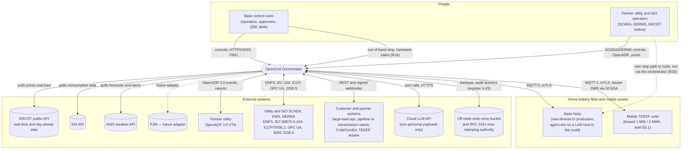

**Notes.** PJM is a future adapter (brief §3.1). The ERCOT market interface is simulated by `grid-sim` (no real market
access; ICCP is a labelled `SIM` stub until licensed, register Q11, R44). The QSE desk (R25; 24 × 7 in production,
simulated for the demo) enters verbal dispatch instructions and hotline notices. Each distribution counterparty keeps a
stop path that does not traverse the orchestrator — an IEEE 2030.5 CSIP control to the hub or the IEEE 1547 permit-service
function (R25, 02 §3.5). The cloud LLM is reached only by `ai-agent`, never by the control path, and only with
non-personal or 15/15-aggregated data (register V-18, D5). There is no research or academic data path (D0f, D5).

---

## 4. C4 container diagram

Every arrow states its transport; authentication per arrow is listed below the diagram (`NFR-017`). Namespaces follow
register V-24 (application) and `06` §1.7 (platform). Services may share pods on the node; logical boundaries stay.

```mermaid
flowchart TB
  APACHE["Apache httpd<br/>(existing edge, 80/443, outside k3s)"]
  LANGEN["LAN load-generator host<br/>agent-sim, fault proxy (R35)"]

  subgraph PLAT["Platform: og-system, og-identity"]
    TRF["Traefik v3, Gateway API<br/>(loopback NodePort, ADR-501)"]
    KC["Keycloak (OIDC)"]
    CM["cert-manager<br/>(step-ca in the production profile)"]
  end

  subgraph EDGE["og-edge"]
    EMQX["EMQX (MQTT 5, mTLS,<br/>hostPort 8883, LAN-only)"]
    DGW["device-gateway<br/>DeviceAdapter, epoch check,<br/>ack routing"]
    SGW["scada-gateway<br/>DNP3, IEC 104, ICCP, OPC UA"]
    INT["integrations<br/>OpenADR VEN, IEEE 2030.5,<br/>simulated QSE, webhooks"]
    API["api (+ OPA sidecar)"]
    CNS["console (static SPA)"]
  end

  subgraph CORE["og-core"]
    MD["market-data"]
    FC["forecaster"]
    PL["planner"]
    FS["fleet-state (+ ingest-writer)"]
    ALLOC["dispatcher: fleet allocator<br/>(one fenced leader)"]
    EXE["dispatcher: execution shards<br/>(hash(hub_id), fenced leaders)"]
    CRT["contracts-rt<br/>registry, admission, entitlement"]
    CBT["contracts-batch<br/>M&V, settlement, reports"]
    NOTIF["notifier (Alertmanager receivers)"]
  end

  subgraph GUARDNS["og-guardian"]
    GRD["guardian (+ OPA sidecar)<br/>sole signer of run commands,<br/>active/standby per shard group"]
  end

  subgraph SSANS["og-safestop"]
    SSA["safe-stop (SSA)<br/>stop-only key, 2 replicas"]
  end

  subgraph AINS["og-ai"]
    AI["ai-agent (advisory)"]
  end

  subgraph DATA["og-data"]
    NATS["NATS JetStream<br/>(streams per 02 §5)"]
    NCTL["nats-ctl: leases and control-state KV<br/>(sync always, 06 ADR-512)"]
    PG[("PostgreSQL 16 + TimescaleDB")]
    VK[("Valkey<br/>(production profile)")]
  end

  OFF[("Off-node object storage:<br/>backups, WORM anchors, TSA")]

  APACHE -->|"HTTPS re-encrypt"| TRF
  TRF -->|"HTTPS"| API
  TRF -->|"HTTPS"| CNS
  TRF -->|"HTTPS webhooks, OpenADR"| INT
  TRF -->|"HTTPS"| KC
  LANGEN -->|"MQTT 5 mTLS"| EMQX
  EMQX <-->|"MQTT 5 mTLS"| DGW
  SSA <-->|"MQTT 5 mTLS, scope-stop topics only:<br/>publish, read retained"| EMQX
  SSA -->|"NATS mTLS, best effort:<br/>audit, devctl.scope mirror"| NATS
  DGW <-->|"NATS mTLS"| NATS
  SGW <-->|"NATS mTLS"| NATS
  INT <-->|"NATS mTLS"| NATS
  API <-->|"NATS mTLS"| NATS
  FS <-->|"NATS mTLS"| NATS
  ALLOC <-->|"NATS mTLS"| NATS
  EXE <-->|"NATS mTLS"| NATS
  GRD <-->|"NATS mTLS"| NATS
  GRD -->|"NATS req/reply, stop forward"| SSA
  ALLOC -->|"NATS mTLS, KV"| NCTL
  EXE -->|"NATS mTLS, KV"| NCTL
  GRD -->|"NATS mTLS, KV"| NCTL
  DGW -->|"NATS mTLS, KV watch"| NCTL
  SGW -->|"NATS mTLS, KV"| NCTL
  FS -->|"NATS mTLS, KV"| NCTL
  CRT <-->|"NATS mTLS"| NATS
  PL <-->|"NATS mTLS"| NATS
  MD -->|"NATS mTLS"| NATS
  FC <-->|"NATS mTLS"| NATS
  ALLOC -->|"SQL, TLS"| PG
  GRD -->|"SQL, TLS"| PG
  CRT -->|"SQL, TLS"| PG
  CBT -->|"SQL, TLS"| PG
  FS -->|"SQL, TLS"| PG
  FS -->|"TLS"| VK
  DGW -->|"TLS"| VK
  AI -->|"HTTPS, tool routes"| API
  AI -->|"HTTPS via egress proxy"| LLMEXT[("Cloud LLM API")]
  PG -->|"WAL, base backups"| OFF
  GRD -->|"checkpoints, anchors"| OFF
  SGW <-->|"DNP3/TLS, ICCP, IEC 104, OPC UA"| CPTY["Utility and ISO counterparties"]
  API -->|"OIDC token validation"| KC
  NOTIF -->|"e-mail, chat, pager"| ONCALL["On-call"]
```

**Authentication per arrow (`NFR-017`).** Hub and simulator ↔ EMQX: mutual TLS with per-device certificates (register
V-09). `safe-stop` ↔ EMQX: mutual TLS with its own identity, whose broker ACL allows publishing and reading only the scope-stop topics
(02 §3.1). Every NATS arrow: mutual TLS plus a per-principal NATS user whose publish and subscribe permissions are the
table of §8.1. PostgreSQL and Valkey: TLS with per-service roles (`ADR-015`). People: OIDC bearer tokens from Keycloak.
`scada-gateway` ↔ counterparties: the counterparty's scheme (IEC 62351 TLS plus DNP3 Secure Authentication where
supported; the demo's TLS-only exception is register Q11). `ai-agent` ↔ cloud LLM: TLS plus API key through the egress
proxy's FQDN allow-list. Internal links between `scada-gateway` and the core are **NATS over mTLS**, never SCADA protocols
(ARC-064 erratum). The Valkey arrows apply to the production profile only. The node profiles have no Valkey:
acknowledgements are routed by shard (06 `ADR-513`) and the remaining hot state is NATS KV on `nats-ctl` or in process
(`ADR-030`, 06 `ADR-511`/`ADR-512`).

### 4.1 Container responsibility and interface summary

| Container | Tech (default) | Produces | Consumes | State owned |
|---|---|---|---|---|
| `market-data` | Python/FastAPI | `md.*` market and weather inputs (02 §5) | ERCOT, EIA, NWS, PJM REST | short-lived cache; no system of record |
| `device-gateway` | Python/asyncio behind the `DeviceAdapter` port (`ADR-031`) | `tlm.*`, `mtr.*`, `ack.*`, `cev.*` | MQTT from EMQX; `cmd.*` and `devctl.*` | **stateless**: acknowledgements are routed to `ack.<shard>.<hub_id>` by the hub's shard (assignment cache) and deduplicated by the deterministic `command_id`; Valkey holds shared hot state in the production profile (R43, `ADR-513`) |
| `scada-gateway` | Python/asyncio core + native protocol stacks, one process per counterparty link (`ADR-071`) | `scada.meas.*`, `scada.evt.*`, `call.in.scada`, `guard.ctl.scada` and `scada.ctl.validate.*` requests, northbound points | counterparty protocols; `capv.*`, `agg.1hz.*`, `fleet.vr.agg.*`, `plan.schedule.*`, `call.result.scada` | point-map registry (`ADR-075`), session state; latched restrictive states in PostgreSQL (R36) |
| `fleet-state` (+ `ingest-writer`) | Python | twin queries, `twin.hub.<slot>.*` and `agg.1hz.*` (core NATS), eligibility changes; COPY batches to Timescale | `tlm.*`, `scada.meas.*`; `mtr.*`, `cev.*` and `audit.*` for the writer pools | digital twin (Valkey or in-process), connectivity and eligibility (02 §2.1), telemetry history |
| `forecaster` | Python | `fc.*` forecasts with uncertainty | history, `md.*` | model artifacts (object storage) |
| `planner` | Python + `highspy` | `plan.*` (including `plan.schedule.*` for `scada-gateway`), `cop.*` (Current Operating Plan versions), reservation proposals | forecasts, contracts, profiles, topology, `md.*`, `capv.*`, `guard.constraint.*` | plan snapshots (PostgreSQL + object storage) |
| `dispatcher` — allocator role | Python + HiGHS, one fenced leader (`ADR-021`) | bucket grants to shards, `cap.ercot.*`, decisions and traces | `event.admitted.*`, `iso.admitted.*`, `guard.constraint.*`, plans, SCADA measurements, fleet aggregates, shard reports | **reservation ledger (single writer)**, decision pre-images |
| `dispatcher` — executor role | Python, one fenced leader per execution shard | batches to `sub.*` (SUBMISSIONS) | grants, verdicts, `ack.*`, `twin.hub.<own slots>.*` | per-hub `seq` per shard, last setpoints, substitution state |
| `guardian` | Python; admission and Merkle signing in a process pool (`ADR-022`) | guardian-signed batches on `cmd.*`, verdicts, `devctl.*` (lease heartbeat, key set, assignments, scope releases, mirrored scope engages), `capv.*`, `guard.constraint.*`, stop forwards to `safe-stop` | `sub.*`, `guard.ctl.*`, `scada.ctl.validate.safety`, `cap.*`, its own `tlm.*` consumer, leases | state inventory of §5.5; operational signing key in memory (register V-10) |
| `safe-stop` | Python, minimal, 2 replicas on the node (`ADR-025`) | retained scope stops on MQTT; best-effort mirror on `devctl.scope.*` | `ssa.stop` requests and release notices; the retained scope topics (read); out-of-band HTTPS endpoint (hardware token) | stop-only key; its own journal of stop actions |
| `contracts-rt` | Python/FastAPI (`ADR-028`) | `event.admitted.*`, `iso.admitted.*`, `call.result.*`, entitlement answers | `call.in.*`, `iso.in.*`, `scada.ctl.validate.entitle` | customers, contracts, programs, obligations, enrollments, profiles registry (projection of signed artifacts), calls and events |
| `contracts-batch` | Python (`ADR-028`) | M&V records, settlement lines, invoices, reports, explanations | meter blocks, AMI intervals, traces, telemetry aggregates | M&V, baselines, settlement, invoices; audit verification jobs |
| `integrations` | Python/FastAPI | `call.in.*`, `iso.in.*`, OpenADR and 2030.5 reports, COP submissions, webhook deliveries | VTN events, DERMS, simulated QSE, `cop.*`, `capv.*`, `call.result.*` | adapter subscriptions, delivery state |
| `api` | Python/FastAPI (+ OPA sidecar) | REST and WebSocket, `call.in.*` (operator, partner REST, TEEEF lessee, approved AI intake), `iso.in.*` (QSE desk), `guard.ctl.*` requests | every internal query API; `agg.1hz.*`, `evt.*`, `call.result.*`, `twin.hub.*` | none durable (idempotency keys in PostgreSQL) |
| `console` | TypeScript/React (Vite, static) | operator UI | `api` | none |
| `ai-agent` | Python + Anthropic SDK / OpenAI-compatible client | proposals, explanations | `api` tool routes only | sessions, tool calls, proposals (`ai_agent` schema) |
| `agent-sim` | Python/asyncio, **on a LAN host** (R35) | simulated MQTT traffic, faults | commands, stops, lease, key set | simulated hub state |
| `grid-sim` | Python + protocol stubs | simulated SCADA, VTN, ERCOT and large-load counterparties | queries and controls from the system | simulated counterparty state |
| `notifier` | Alertmanager receivers (configuration) | e-mail, chat, pager | Alertmanager | none |

---

## 5. Component views

Criticality tiers: **Tier 0** — safety-critical, degrades gracefully, never silently fails open; **Tier 1** — revenue or
commitment-critical; **Tier 2** — supporting. Schemas are in `02-domain-model-and-interfaces.md`; this section defines
boundaries, internal structure and the contracts other documents build on.

### 5.1 `device-gateway` (Tier 0)

**Responsibility.** The only component that terminates device sessions, behind a **`DeviceAdapter` port** (R23,
`ADR-031`) whose first implementation is the MQTT agent contract of 02 §3. It authenticates hubs (certificate → `hub_id`),
+
and device-control messages, and correlates acknowledgements. It treats every device — real or `agent-sim` — as untrusted:
it validates schema and identity but never trusts a device's claim about what it did (verification is `fleet-state`'s,
from telemetry). Telemetry is not signed by the device (only commands, acknowledgements and meter blocks are), so the
gateway does not check "signature freshness" on telemetry (ARC-064 erratum).

| Module | Responsibility |
|---|---|
| Session authenticator | Maps the certificate to `hub_id`; the broker deny-list refuses revoked hubs at connect (register V-09) |
| Schema validator | Validates each inbound message against its versioned JSON Schema (`v` field, 02 §3.6); malformed → counted, discarded, `FM-DAT-*` |
| Telemetry relay | Publishes `tlm.live.<slot>.<hub_id>` (and status, events, replay) with dedupe id `hub_id:boot_id:seq` (02 §3.3); adds `recv_ts`; copies the fields the guardian checks into NATS headers so the guardian needs no JSON parse |
| Meter relay | Publishes device-signed meter blocks on `mtr.<slot>.<hub_id>` unaltered |
| Command relay and epoch check | Pulls `cmd.<shard>.<hub_id>` (COMMANDS, one durable consumer per shard); forwards to `hub/{hub_id}/cmd` only if the batch's shard-leader and guardian epochs **equal** the live leases (watch cache; stale or unreadable → fail closed, R32) and the command has not expired; sets MQTT Message Expiry to the remaining lifetime |
| Device-control relay | Relays `devctl.*` (lease heartbeat, key set, assignments, endpoint, guardian-signed scope releases) to retained MQTT topics (02 §3.1); republishes them after a broker restart, never a scope state whose `seq` is below the one still retained on the broker (02 §3.2) |
| Acknowledgement router | Routes each `cmd/ack` to `ack.<shard>.<hub_id>` using the hub's shard from the assignment cache; the deterministic `command_id` (`jti`) is the `Msg-Id`, so duplicates are discarded by JetStream (R43, `ADR-513`); publishes command events `SENT` (one per batch), `ACKED` and `REJECTED` (NACK, per command); `EXPIRED` (no acknowledgement before `exp`) is detected by the shard, which knows what it submitted (02 §2.3) |
| Transport-delay estimator | Keeps a per-hub one-way delay and clock-skew estimate from `ts` vs `recv_ts` (min-filtered); flags skew > 250 ms (register V-34) |
| Rate limiter | Per-device publish ceiling (register V-21) — first line of `NFR-018` |

**Scaling.** Stateless; 2 replicas on the node (shared MQTT subscriptions), scaled by
KEDA in production (`06` §2.4). **Serves:** `NFR-002`, `NFR-013`, `NFR-014`, `NFR-017`, `NFR-031`, `NFR-038`, `NFR-043`.

### 5.2 `fleet-state` and `ingest-writer` (Tier 0/1)

**Responsibility.** The digital twin and state estimation per hub, rolled up the topology (site → service transformer →
feeder → bank → substation → zone) and to virtual resources for SCADA; hub **connectivity and eligibility** per register
V-29 (02 §2.1); trust score; 1-Hz aggregates.

| Module | Responsibility |
|---|---|
| Partitioned consumers | 16 durable TELEMETRY consumers, one per hash partition (slot mod 16); each partition is held by exactly one replica through a lease, so a hub's messages are processed in order (ARC-020) |
| State estimator | Best estimate of SOC, available kW/kWh (output and export bases), health — light estimation, not power flow |
| Connectivity and eligibility | `ONLINE` (with the flagged `LATE` sub-state)/`SILENT`/`OFFLINE`/`LOST` and `ELIGIBLE`/`PROBATION`/`EXCLUDED` per register V-29 (02 §2.1); exclusion reasons include quarantine and IEEE 1547 settings drift (R26) |
| Topology and VR aggregator | Aggregates for the allocator's buckets, SCADA virtual resources (versioned membership, 02 §1.4) and the console (1 Hz, `agg.1hz.*`) |
| Fleet-output alignment | Fleet output behind a bank at a SCADA sample's source time, aligned on gateway receipt time minus each hub's measured transport delay; hubs with skew > 250 ms excluded from the add-back (R39) |
| `ingest-writer` | COPY batches into Timescale with separate worker pools: telemetry (sheddable), meter blocks, command events and audit records (never shed) |

+
server-side aggregates, R34). In production a **separately configured estimator replica** serves the guardian (R31,
§5.5). **Serves:** `NFR-005`, `NFR-013`, `NFR-046`.

### 5.3 `planner` (Tier 1)

**Responsibility.** Day-ahead, intraday and SCED-aligned optimization for every dispatchable customer type at once
(`03` §6 owns the model), reading each active profile rather than branching per type. Produces: offers, holds, firm-window
energy, declared capacity, charge windows, mobile assignments, the per-hub cycle budget as a constraint (R27), and the
**Current Operating Plan** per ADER and hour (R17) from which `integrations` submits (resubmitted on changes ≥ 1 MW or
≥ 10% and always within 60 min). Planner holds are **proposals** to the reservation ledger; the allocator commits them
(single writer, §5.4). Day-ahead by 10:00 America/Chicago (DAM close); firm declarations at 14:00 (reviewer proposal —
unverified). Singleton loops (`planner.dayahead` and similar) are leased like every singleton (§10). **Serves:**
`NFR-004`, `NFR-016`, `NFR-025`, `NFR-029`, `NFR-045`.

### 5.4 `dispatcher` — fleet allocator and execution shards (Tier 0)

**Responsibility.** The real-time control loop and the seat of call arbitration, split into two roles (`ADR-021`, R30):

**Fleet allocator (one fenced leader, warm standby).** Each tick — per conflict component, 2 s when the component
contains an active event or members of an on-line ADER, 10 s otherwise (register V-03):

1. Updates the closed-loop controllers with the newest measurements: bank relief on apparent power or maximum per-phase
   current (R18), the **NPC regulator** of every on-line ALR-type ADER (cycle ≤ 4 s; holds the aggregate net load on the
   Updated Desired Set Point trajectory and absorbs every other service's action on member hubs, R17), `PIPELINE_AC`
   smoothing, event trackers. Laws are `03` §8.6's.
2. Arbitrates every conflict component with the lexicographic tier stages and within-tier economics of `03` §8.4, over
   buckets of hubs, honouring L0–L2 constraints (ERCOT instructions for an on-line ADER are L2 hard constraints, never
   squeezable calls, R17), ring-fences and active AI constraint sets (R49).
3. **Commits the reservation ledger** (single writer; optimistic version) and the decision **pre-image** (decision id,
   input version vector and its hash, grants hash, ledger version) in one PostgreSQL transaction (R22, R37).
4. Sends **bucket grants** to each execution shard: kW per (event, bucket) for the shard's hubs, split in proportion to the
   shard's usable capability in the bucket, with the decision id and ledger version.
5. Publishes ERCOT-visible capability (`cap.ercot.<ader>`) computed from ledger-free, guardian-permitted capacity within
   2 s of any reservation change (R17); the guardian validates it before `scada-gateway` telemeters it (§5.5).
6. Re-grants any shard-reported shortfall on the next tick (cross-shard substitution).

+
water-fills inside each bucket (`03` §8.4), applies stability filters (deadbands, dwell, ramps, quantization with error
diffusion, `03` §8.12), substitutes failing hubs within the bucket, builds commands (per-hub `seq`, `pre`, bounds,
lifetime, class, stagger), and submits **batches of at most 2,000 commands** (register V-35) to the guardian on
`sub.<class>.<shard>` with a submission id (§8.1, `ADR-023`). It re-issues a command only after the acknowledgement window
(register V-04) and never sooner than 2 s, with a new `seq`. It reports realized capability and shortfall per bucket to
the allocator every tick.

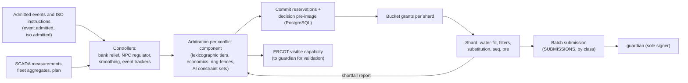

**State.** The allocator owns the reservation ledger and decision pre-images; shards own per-hub `seq` and last
setpoints (both recoverable, §13.3). Traces are written on material change with a heartbeat record otherwise (`03` §9.3,
ARC-044). **Scaling.** One allocator per fleet (split per ISO domain if its tick p99 exceeds 40% of the 2-s tick, an assumption —
ERCOT and PJM components never intersect, `03` §8.3); shards scale with hubs (§11). On the node: two dispatcher replicas,
each able to lead the allocator and both shards — one active, one warm standby consuming the same inputs through its own
ephemeral consumers (R35). **Serves:** `NFR-001`, `NFR-002`, `NFR-004`, `NFR-005`, `NFR-007`, `NFR-012`, `NFR-014`,
`NFR-026`, `NFR-029`, `NFR-030`, `NFR-031`, `NFR-042`, `NFR-045`.

### 5.5 `guardian` (Tier 0)

**Responsibility.** The only signer of run commands (R1) and the independent safety and grid-stress admission point
(`../03-security/02-security-architecture.md` §6). Separate namespace (`og-guardian`), code path and data inputs from the
dispatcher; it reads the allocator's decision only to bind its verdict to the decision's inputs hash.

**Admission pipeline (per batch, `ADR-022`).**

1. Pull the next batch by **class priority** — `SAFE_STOP` > `UTILITY` > `FIRM` > `AS` > other — with pre-emption at
   batch boundaries (R31). Deduplicate by submission id.
2. Check the batch's shard-leader epoch **equals** the live lease (fail closed on stale or unreadable lease state) and
   that the reservations it relies on are unchanged since the ledger version it carries (R32, R37).
3. Check every command against **hub-reported values** (last telemetry fields from its own TELEMETRY consumer, last
   verified meter block), the guardian's own topology and envelopes, and the admission table G-01…G-14; check grant
   consistency (per-obligation totals within the shard's grants for that decision).
4. **One OPA evaluation per batch** (the batch is the input) through the sidecar (`ADR-009`, amended).
5. Persist the batch **pre-image** (submission id, decision id and its inputs hash, verdicts, Merkle root, epochs) and the
   command rows in one transaction — one COPY per batch, never one transaction per command (ARC-003).
6. Sign the Merkle root once per batch in a **process pool** (JWS ES256, register V-36); publish per-hub messages on
   `cmd.<shard>.<hub_id>`; return verdicts on `verdict.<shard>.<submission_id>`.

**Time budget.** Admission and signing p99 per register V-35. No verdict within twice the budget is a **TIMEOUT** — the
batch is unsigned, commands in force run to their leases, the on-call is paged; a timeout is never a veto and never a stop
(R31, `NFR-035`). Only an explicit invariant veto may escalate, and never to a stop without a person, except the
guardian's own risk-reducing rules.

**Other duties.** Kill-switch state machine per scope and forwarding of stops to `safe-stop` (§5.12); latching of
restrictive utility controls (block, limit) received on `guard.ctl.*` (durable in PostgreSQL before acknowledging, R36);
the signed lease heartbeat per shard group every 10 s (register V-06); the signed key set, hub assignments and scope
releases (`devctl.*`), with every engaged scope state mirrored there too (§5.12); the active restrictive constraints on
fallback schedules (register V-07); anomaly detection and cross-principal cumulative windows (register V-14).

**Withholding and narrative checks (RT-008).** The guardian's batch record binds its verdict to the hash of the
allocator's decision inputs, so a trace rewritten later no longer matches the guardian's record; `contracts-rt` runs a
delivered-vs-committed withholding detector from telemetry and meter blocks, independent of the allocator's trace (§5.6).

**State inventory (R31).** Every piece of guardian state has a named store; nothing lives only in process memory except
what is rebuilt on failover.

| State | Store | Write rule |
|---|---|---|
| Active instance per shard group, its epoch | NATS KV `og-leases` key `guard.<grp>`; generation from the PostgreSQL sequence `ops.epoch_gen` | compare-and-set on revision; generation taken with synchronous commit (`ADR-023`) |
| Epoch floors seen per shard | NATS KV `og-epochs` | compare-and-set, monotonic |
| Kill-switch state machine per scope (`ARMED`, `ENGAGED`, `ESCALATED`, `RELEASING`; 02 §2.11), scope `seq` | PostgreSQL `ops.scope_stop_event` (append-only, UNIQUE(scope, seq)) | synchronous commit before the stop is forwarded |
| Pending Tier 1/Tier 2 approvals, co-sign clocks (register V-12…V-15) | PostgreSQL `ops.approval_event` (append-only; single-use tokens) | synchronous commit |
| Latched restrictive utility controls | PostgreSQL `scada.latched_state` (R36) | synchronous commit before acknowledging the counterparty |
| Per-hub and cumulative rate windows (register V-14; device rule DV-14) | NATS KV `og-guard` | compare-and-set |
| Anomaly-detector windows | in memory, checkpointed to NATS KV every 10 s (assumption); on failover rebuilt from telemetry with conservative defaults for 60 s (assumption) | best effort (loss only delays detection) |
| Envelopes (bank, feeder, fleet ramp), limits and policy bundle versions | signed bundles (OCI) cached locally; version in every verdict | read-only at runtime |
| Submission dedupe set | PostgreSQL `commercial.guardian_batch` UNIQUE(submission_id) | in the batch transaction |
| Hub-reported last values | in memory from its own TELEMETRY consumer; rebuilt in ≤ one telemetry period on failover | — |
| Operational signing key | in memory only; certificate pre-issued by the dispatch intermediate with overlap (register V-10) | never persisted; failover needs no CA (step-ca off the restart path, R31) |

**Topology.** Active/standby **per shard group** with a fenced failover within register V-02 (≤ 10 s p95, ≤ 15 s max): one group and two
replicas on the node; groups of at most 5 shards in production, replicas in different zones (§11). One replica count per
environment, used by 01, `06` and the tests. **Serves:** `NFR-001`, `NFR-003`, `NFR-018`, `NFR-019`, `NFR-026`,
`NFR-031`, `NFR-032`, `NFR-035`, `NFR-037`, `NFR-038`, `NFR-045`.

### 5.6 `contracts-rt` and `contracts-batch` (Tier 1)

Two deployables, one schema owner, separate database pools (R43, `ADR-028`, ARC-042):

| Deployable | Responsibility | Latency class |
|---|---|---|
| `contracts-rt` | Registry of customers, contracts, programs, obligations, enrollments and the `DispatchProfile` projection (from signed artifacts, `ADR-509`); **admission** of every call into an event (R7) and of every `IsoInstruction`; the admission result on `call.result.<source>`; SCADA entitlement answers on `scada.ctl.validate.entitle` (≤ 50 ms, cached, `07` §6.6); territory and market-role checks (NOIE consent, ERS exclusion, R27); the **withholding detector** (delivered vs committed from telemetry and meter blocks, raising `AT_RISK`, RT-008) | real-time, cached |
| `contracts-batch` | Meter-block verification (signatures, chaining), baselines, M&V against AMI intervals, **insert-only settlement lines with supersede links** (§8.2), invoices, reports and the "explain this" query API; scheduled audit verification (incremental from the last signed checkpoint with sampled deep checks, R22) | batch |

A month-end settlement run or a heavy audit query never stalls admission or entitlement. **Serves:** `NFR-006`, `NFR-007`,
`NFR-008`, `NFR-028`, `NFR-029`, `NFR-030`, `NFR-042`.

### 5.7 `integrations` (Tier 1) — northbound business adapters

**Responsibility.** OpenADR 3.0 VEN (partner events and the `TOLLING` variant's schedules, R27); IEEE 2030.5 business
objects (owned in full here, R6); the **simulated ERCOT QSE market interface** — DAM and RT ancillary-service awards in
ERCOT's shape (hourly MW per product at MCPC; RT awards per SCED run), NCLR deployment and recall instructions, offers,
**Current Operating Plan submission** from `cop.*`, SCED base points and Updated Desired Set Points for the simulated ALR
(R17; 02 §4.3); customer REST and signed webhooks (`LARGE_LOAD`, `PIPELINE_AC`, `PJM_CAPACITY`, TEEEF lessee requests).
Every inbound signal becomes a `Call` on `call.in.<source>` or an `IsoInstruction` on `iso.in.<resource>`; the allocator
never branches on protocol. **Serves:** `NFR-011`, `NFR-017`, `NFR-029`, `NFR-045`.

### 5.8 `api` (Tier 1) — public/partner API and console backend

**Responsibility.** The single ingress for people and partner systems; OIDC authentication and OPA authorization against
the role catalogue of register V-37 (default-deny, never UI-only hiding). Exposes the confirmation and approval workflow
(register V-12…V-15), scope-stop engage, co-sign and release (releases always Tier 2 and only through the guardian), the
**QSE desk** routes for verbal dispatch instructions and hotline notices (R25), constraint-set review (R49), `SHADOW`
reports (R23), and the `ai-agent` tool surface (non-personal values and register V-18 aggregates only, D5). WebSocket channels: control-room channels
(alarms, kill-switch state, firm obligations) at 1 s even under load shedding; analytic views may slow (R48, product
NFR-206). Full contract in 02 §6 (erratum: v0.5 cited "02 §7"). **Serves:** `NFR-017`, `NFR-018`, `NFR-032`, `NFR-034`.

### 5.9 `scada-gateway` (Tier 0) — SCADA/EMS protocol front end

**Responsibility.** First-class per brief §3.4; point lists, per-counterparty configuration, the SBO validation pipeline
and conformance are `07-scada-integration.md`'s. Owns DNP3, IEC 60870-5-104, ICCP/TASE.2 and OPC UA; IEEE 2030.5 is
`integrations`' (R6).

| Module | Responsibility | Hook |
|---|---|---|
| Northbound outstation/server | Aggregated points per bank, feeder, substation, zone, program and resource; ICCP telemetry of **guardian-validated** ERCOT capability (`capv.*`, R17) | reads `agg.1hz.*`, `fleet.vr.agg.*`, `capv.*` |
| Southbound master/client | DNP3 polling, ICCP/OPC UA/historian ingest (ICCP or historian as the default primary path) | publishes `scada.meas.*`, `scada.evt.*` |
| Control pipeline (SBO) | Validation steps of `07` §6.6 via `scada.ctl.validate.entitle` (entitlement at `contracts-rt`) and `scada.ctl.validate.safety` (OPA and the guardian pre-check), called in that order | permissive controls → `call.in.scada`; restrictive controls → `guard.ctl.scada` (latched by the guardian in PostgreSQL before `SUCCESS`, R36) |
| Command broker | Serializes controls from both endpoints; leader-elected per counterparty link group with the same epoch rule (`ADR-023`) | NATS KV `scada-state` for sequences, SBO locks and cursors; latched states in PostgreSQL |
| Time sync | chrony with NTS (`ADR-077`) | — |

**Deployment.** One adapter process per counterparty link (`ADR-071`): active-only on the node, active plus standby in
production (R35, ARC-005). **Serves:** `NFR-009`, `NFR-017`, `NFR-026`, `NFR-031`, `NFR-045`.

### 5.10 `ai-agent` (Tier 2 — advisory, never in the control loop)

**Responsibility.** An LLM-based assistant with access only to `api` tool routes (read, and proposal submission), never
to the database or the bus. Nothing it sends to a cloud model is a per-premise record, identified or pseudonymous: its Cloud Claude models
(`claude-opus-5-5` for complex reasoning, `claude-haiku-4-5-20251001` for summaries, R12) by default; a local
OpenAI-compatible model only in production (no local model on the node, R2, register Q17). Uses per brief §1: arbitration
advice, explanations of traces, operator copilot, triage summaries, structured intake of unstructured requests.

**Proposals become constraint sets (R49, `ADR-029`).** A proposal (pins, priority adjustments within approved bounds,
+
R3), and then stored as a time-boxed, versioned `ConstraintSet` the allocator consumes on every tick until it expires or
is revoked. Budgets per register V-22. **Serves:** `NFR-027`, `NFR-028`, `NFR-032`, `NFR-033`.

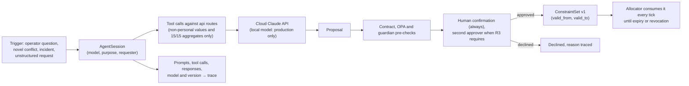

### 5.11 Service-type dispatch profiles (central mechanism — brief §3.5)

A `DispatchProfile` is a signed, versioned, effective-dated record per `ServiceType` (schema in 02 §1.2; the eight
profile elements and the building-block library in `03` §2.5; **the nine default profiles are owned by `03` §2.6**, and
where the summary below differs, `03` wins). The allocator, shards, `contracts-rt`, `integrations` and `scada-gateway` read
the active profile and execute generically; none contains a per-customer-type branch (`NFR-029`). Profiles are Git-reviewed,
replay-tested, signed OCI artifacts promoted by GitOps (`ADR-509`); the activation gate is tiered by risk (R10, R47) and
a running event keeps its profile version (register V-27).

| `ServiceType` (variants) | Control mode | Precedence (default) | Primary signal | Performance rule | M&V / billing basis | Failure behaviour |
|---|---|---|---|---|---|---|
| `HOME` | constraint, not a call | L1 (not configurable) | hub telemetry, homeowner channel, NWS alerts | reserve never violated | — | fails toward safety |
| `DIST_DEFERRAL` (co-op; TDU variant under SB 415 / PURA §35.153 with a reservation calendar, R27) | closed loop on bank **apparent power or maximum per-phase current** against unit-typed ratings, fleet P and Q added back (R18) | T1 in window | `scada-gateway` bank measurements | outcome-based (bank loading ≤ limit) or share-based per contract (R18, register Q9); ≥ 95%/interval, ≥ 98%/season — reviewer proposal — unverified | hub meter blocks behind the bank, SCADA step check | hold, then day-ahead schedule (`NFR-002`, register V-38) |
| `PARTNER_CAPACITY` (event; `TOLLING`, R27) | event tracking; tolling: continuous reservation with utility-scheduled charge and discharge and a cycle budget | T1 in window (tolled capacity reserved continuously) | `integrations` (OpenADR VEN, 2030.5) or DNP3 | P10 delivered kW per hub — reviewer proposal — unverified; tolling: availability | $/kW-yr availability; event hours | continue to declared end; substitute within territory |
| `LARGE_LOAD` | event in the contracted zone | T1 in window | customer stress signal (webhook) | contracted kW during stress events | $/kW-yr + incremental | **signal loss: continue to the declared end of the event, or stop after `T_hold` if the contract says so (`03` §2.6; C-15)**; substitute within scope |
| `ERCOT_AS` (ALR; NCLR, R17) | ALR: SCED/UDSP tracking by the NPC regulator (online Non-Spin and ECRS arrive inside the UDSP, no separate deployment message); NCLR: SCED still awards AS each interval, deployment only on the XML instruction and held until recall, 95–150% band against the 15-min meter interval before the instruction, two failures in 365 days disqualify the resource for ≥ 6 months (register R17) | holds T2; instructions for an on-line ADER L2 (hard) | simulated QSE (awards, deployments), ICCP `SIM` | hold compliance; deployment performance | hourly award MW at MCPC (register R17); RTC+B buyback when diverted | hold reserve; re-home within the ADER |
| `ERCOT_ENERGY` (ALR; NCLR, R17) | ALR on line: UDSP tracking (L2); price-responsive only for premises whose ADER is off line or unregistered | T3; L2 while the ADER is on line | SCED base points / UDSP; `market-data` prices | set-point deviation within tolerance | load-zone price, shadow settlement | hold last UDSP flat on link loss, QSE desk calls ERCOT (R25) |
| `PIPELINE_AC` (H1/H2 smoothing; H3 monitoring) | band smoothing on measured line current with a shift-factor parameter; open-loop schedule when unknown (R28) | T4 (configurable) | `scada-gateway`/transmission owner line current | ramp-rate band | per-corridor rate or performance record | neutral band on signal loss |
| `MOBILE_TEEEF` (statute-shaped TEEEF; `MOBILE_DER` separate contract variant, R20) | TEEEF: island-forming only, under the lessee TDU's operational control, admitted only with a lessee-declared qualifying outage, a mobile unit of ≤ 5 MW and a lease with prior commission authorization (SB 231, register R20); Base reports readiness and never initiates energization; §39.918 does not apply to co-op or municipal lessees, who record their own basis | own asset pool | lessee request, switching-order ID | availability, readiness time | lease + deployment fee | unit stays safe at depot or in island under lessee control |
| `PJM_CAPACITY` | dispatch toward meter net load ≈ 0 unless export is paid; excludes premises registered with a PJM CSP (R27) | non-firm by default; T1 only when a contract makes it firm | planner 5CP prediction (PJM adapter is future) | reduction at realized peaks | PLC-based | stop at energy budget |

Every number in this table is a default or a reviewer proposal (labelled); `priority_class` and every parameter are
overridable per contract (`ADR-019`, `NFR-030`).

### 5.12 `safe-stop` — the Safe-Stop Authority (Tier 0; R16)

**Responsibility.** A separate, minimal service in `og-safestop` (≥ 2 replicas; separate zone in production) with **no
dependency on `guardian`, the dispatcher, `contracts-*` or `api`** (`ADR-025`). It holds a key hierarchy separate from
the dispatch, device, service and audit roots (register V-11); its certificates carry the `safe-stop-only` extended key
usage, and hub rule DV-17 accepts that key only for a scoped `SAFE_STOP`/`CEASE` at setpoint 0 with a ramp within register
V-16. **It can never emit a run, setpoint, mode, schedule or release.**

| Trigger | Path | Signature on the stop |
|---|---|---|
| Normal operation (operator, utility or guardian stop) | `guardian` checks authority and the amended R3 rules, records the engage (scope state) and forwards it on `ssa.stop`; `safe-stop` signs and publishes | SSA stop-only key |
| Out-of-band (guardian, `api`, `console` or allocator down) | the out-of-band endpoint of CTL-037, re-pointed at the SSA: a distinct mTLS path from the SOC/control-room network with a hardware token | SSA stop-only key |
| `guardian` unavailable, request through `api` or `scada-gateway` | operator engagements from `api` (verified identity) and an authorized utility's stop from `scada-gateway` go to the SSA directly — the utility only for scopes in the SSA's cached, signed entitlement snapshot, never fleet scope (`../03-security/02-security-architecture.md` §6.5, §6.9; the register's R16 lists three triggers and should record this one) | SSA stop-only key |
| Optional watchdog (off by default) | the SSA loses the guardian heartbeat and its own fleet view shows export continuing past the fallback horizon | SSA stop-only key |

The SSA publishes the stop as **one retained message per scope** on `scope/{bank|zone|fleet}/{id}/stop` directly to
EMQX (02 §3.1): hubs subscribed to their scope groups act on it immediately, and a hub that reconnects reads it on
subscribe. Hubs latch an engaged stop in non-volatile storage and leave it only on a **guardian-signed release** with a
higher scope `seq` (register V-17), which the guardian publishes through `device-gateway`. If both SSA replicas are
unavailable, or the SSA's state has not appeared on the retained topic within one control cycle, the guardian publishes
its own dispatch-key-signed `ENGAGED` through `device-gateway` onto the same retained scope topic (02 §3.1) and sends
per-hub `SAFE_STOP` commands to hubs that do not acknowledge.
Stops are exempt from the hub's command rate limit (DV-14). A stop is not automatically grid-safe: every stop follows
register V-16 (protective vs non-protective sequencing, frequency gating) and the affected counterparty is notified at
once. A separate **dispatch-key epoch authority** (two-person custody, `SEC` + `SRE`) can advance the key epoch to
invalidate a compromised guardian's outstanding commands (R16). **Serves:** `NFR-019`, `NFR-036`.

---

## 6. Key runtime scenarios

Seventeen scenarios: the ten named in scope, two SCADA scenarios, AI-assisted arbitration, the full call → invoice
walk-through, and three added in v0.6 (stop with the guardian down, an ERCOT instruction through the QSE desk, restore and
resynchronization). The **normative** command path — who publishes what, where acknowledgements go, and how stops are
broadcast — is §8.1; the scenarios below abbreviate it as "allocator → shard → guardian (sign) → device-gateway → hub"
and never contradict it. Each scenario names the NFRs and failure modes (`FM-*`, `05`) it exercises.

### 6.1 Telemetry ingestion and twin update

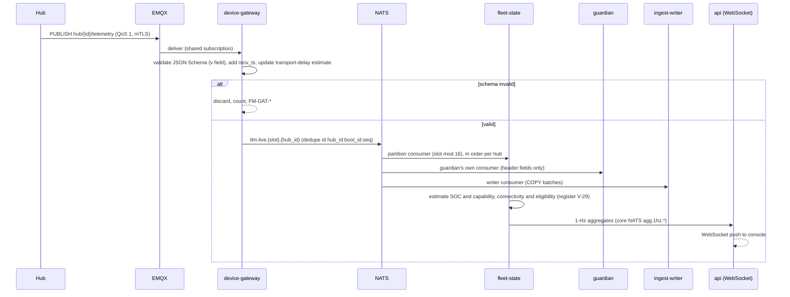

**Exercises:** `NFR-013`, `NFR-046`; `FM-DAT-*`; `FM-COM-*` (a silent hub follows §6.6). Telemetry is not signed by the
device (02 §3.2); dedupe uses (hub_id, boot_id, seq) so a reboot never collides with earlier sequence numbers (ARC-012).

### 6.2 Day-ahead planning, COP and 14:00 declaration

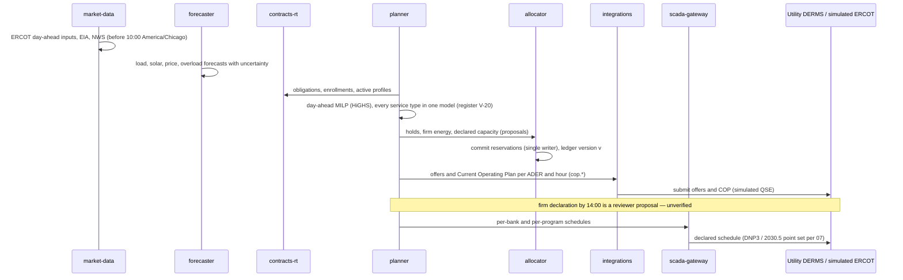

**Exercises:** `NFR-016`, `NFR-009`, `NFR-045`. The 10:00 America/Chicago DAM close is a sourced fact (brief §4); the
14:00 declaration is reviewer-proposed.

### 6.3 ERCOT ancillary-service award and deployment (ALR and NCLR variants)

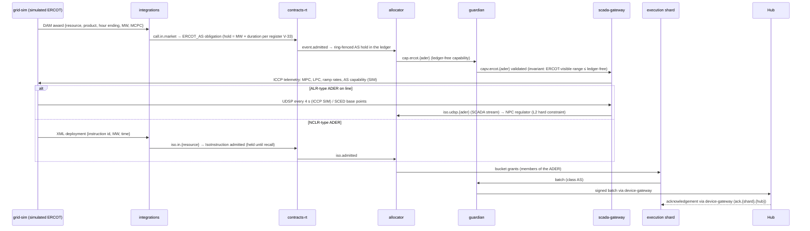

**Exercises:** `NFR-004`, `NFR-026`, `NFR-045`; R17. A reserve award is never diverted to a firm event (brief §3.1); a
residual conflict is resolved by substitution from non-ADER hubs, then `AT_RISK` with notice, and a QSE status or
telemetry change going forward — never by deviating from an ERCOT instruction. Settlement follows ERCOT's shape (hourly
awards at MCPC, RT awards per SCED run, set-point deviation), `03` §10.5.

### 6.4 Partner-utility OpenADR 3.0 event (event variant)

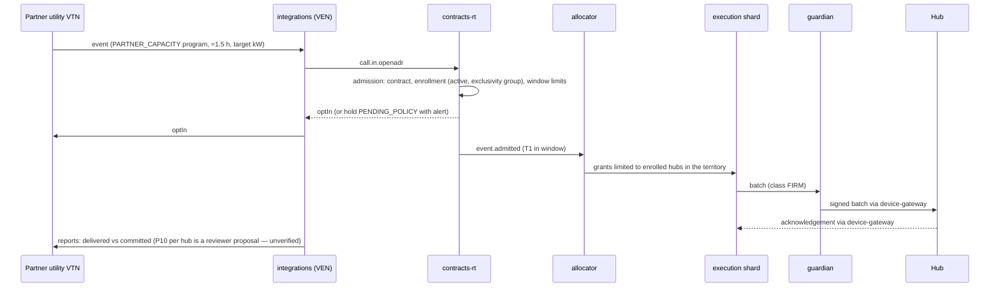

**Exercises:** `NFR-007`, `NFR-030`; `FM-DSP-*`. The `TOLLING` variant replaces the event with a continuous reservation
and utility-scheduled charge and discharge (R27).

### 6.5 Substation deferral window with bank overload and feedback control

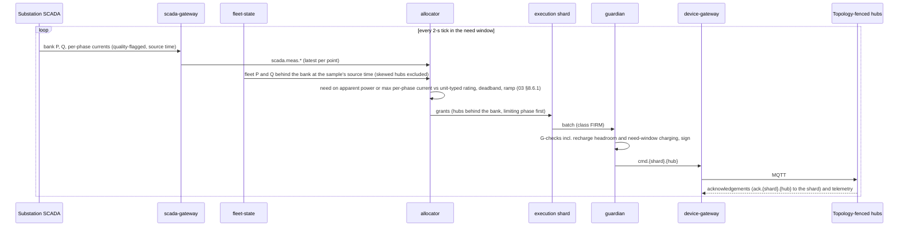

**Exercises:** `NFR-001`, `NFR-002`, `NFR-005`, `NFR-007`, `NFR-012`, `NFR-039`; corrects `E5(a)`–`E5(d)`. Erratum
(ARC-064): acknowledgements return to `device-gateway` and the shard, not to the guardian. Performance is outcome-based
or share-based per contract (R18, register Q9).

### 6.6 A hub goes silent mid-event → substitution

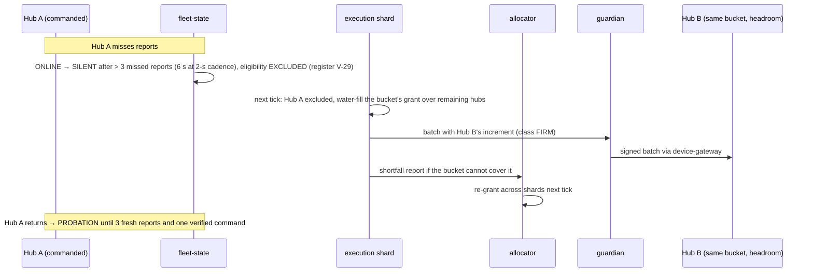

**Exercises:** `NFR-005`, `NFR-014`, `NFR-046`; `FM-DEV-*`. v0.5 kept a silent hub eligible for 15 min by conflating the
SCADA hold timer with device liveness; the corrected states are in 02 §2.1 (ARC-015, R40).

### 6.7 House event (EV starts charging, home islands) during an event

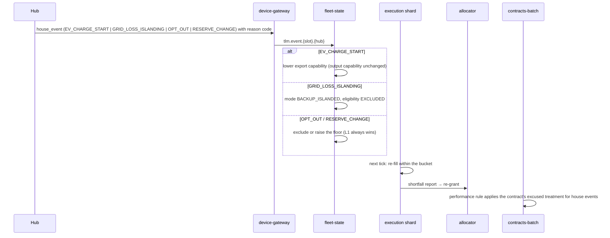

**Exercises:** `NFR-001`, `NFR-030`; `FM-HOME-*`.

### 6.8 External API outage → degraded mode

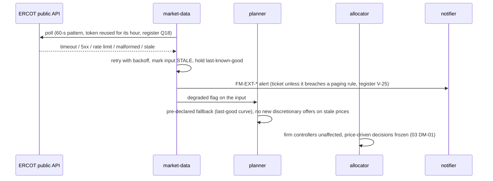

**Exercises:** `NFR-011`; every external-failure class of brief §9 (`04`, `05`).

### 6.9 Operator scope stop (kill switch) and release

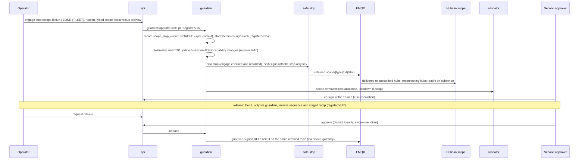

**Exercises:** `NFR-019`, `NFR-028`, `NFR-032`, `NFR-036`; register V-16, V-17. Unreachable hubs are `STOP_PENDING`
until they reconnect (retained stop) or their lease lapses into register V-07 autonomy, whose fallback schedules never
run while a scope stop is active.

### 6.10 Guardian vetoes an unsafe batch

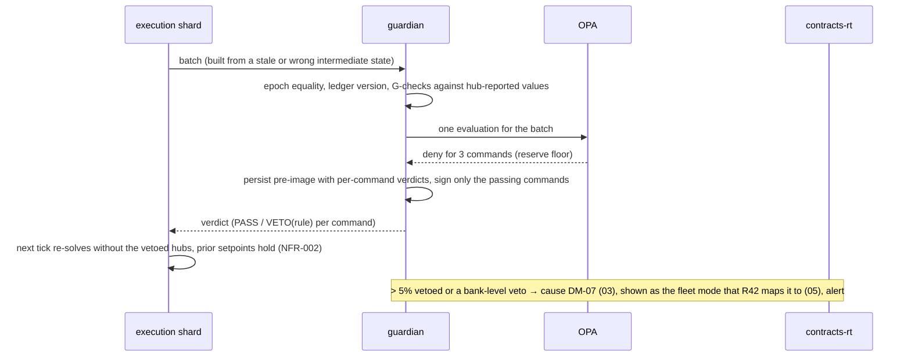

**Exercises:** `NFR-001`, `NFR-003`, `NFR-018`, `NFR-028`, `NFR-031`. A missing verdict is a TIMEOUT, not a veto
(`NFR-035`).

### 6.11 Utility SCADA control via scada-gateway

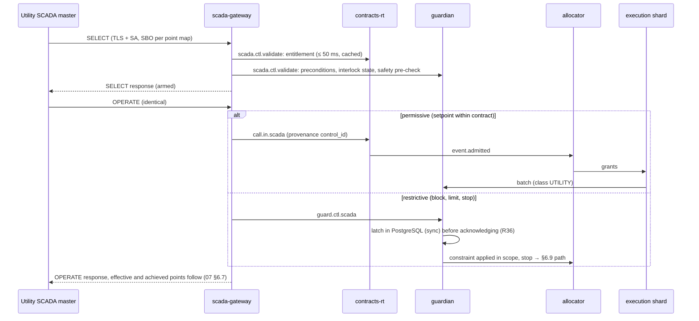

**Exercises:** `NFR-026`, `NFR-009`, `NFR-031`; SBO state machine 02 §2.9.

### 6.12 SCADA link loss

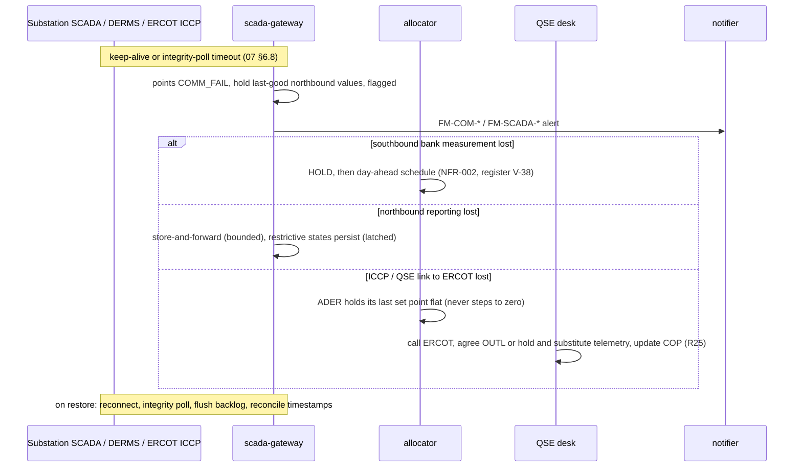

**Exercises:** `NFR-002`, `NFR-009`, `NFR-010`, `NFR-017`, `NFR-026`.

### 6.13 AI-agent advice for a novel multi-way conflict

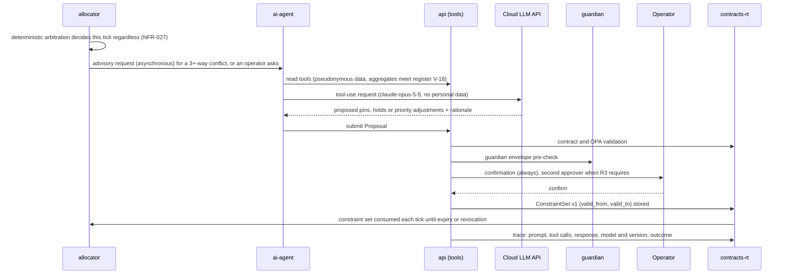

**Exercises:** `NFR-027`, `NFR-028`, `NFR-032`, `NFR-033`; `ADR-029`. v0.5's "approved automatically ... still requires
confirmation" contradiction is removed: confirmation is always required, and the approved proposal persists as a
constraint set instead of vanishing on the next tick (ARC-049).

### 6.14 Multi-customer call arbitration with the full audit trail (the core job)

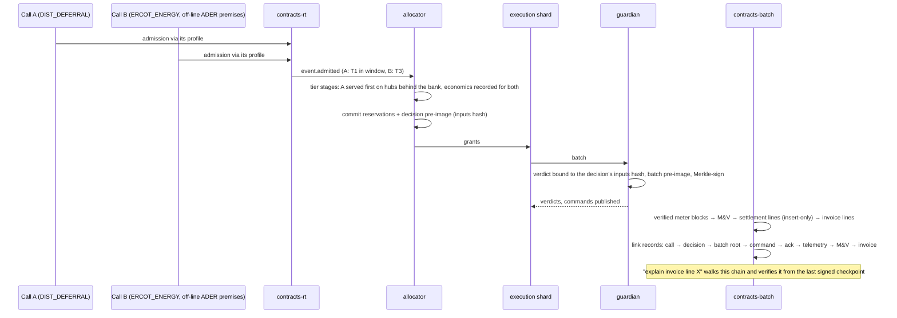

**Exercises:** `NFR-004`, `NFR-028`, `NFR-030`, `NFR-042` — the single walk through call → decision → dispatch →
telemetry → M&V → settlement → audit (brief §1 "Core job").

### 6.15 Stop with the guardian down (R16)

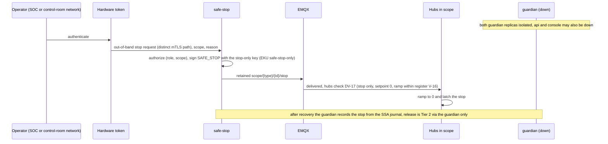

**Exercises:** `NFR-036`, `NFR-019`; unblocks `TC-SEC-032` variant B.

### 6.16 ERCOT verbal dispatch instruction through the QSE desk (R17, R25)

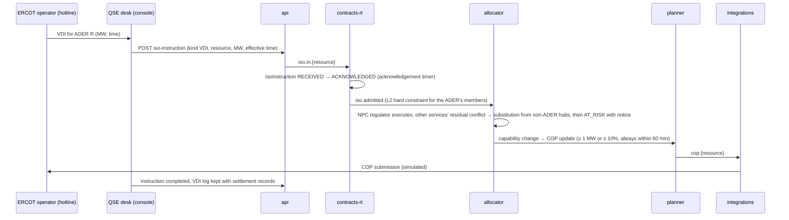

**Exercises:** `NFR-026`, `NFR-045`; `FM-MKT-*`.

### 6.17 Restore and resynchronization (R36)

```mermaid
sequenceDiagram
  participant SRE
  participant PG as PostgreSQL (restored)
  participant GRD as guardian
  participant SH as execution shards
  participant DGW as device-gateway
  participant Hubs
  participant CPTY as SCADA counterparties

  SRE->>PG: point-in-time restore to T_r
  Note over GRD,SH: control path starts in CONSERVATIVE, no new run commands yet
  Hubs->>DGW: status: last_applied_seq, epoch floors, key epoch, scope seq (02 §3.2)
  DGW->>SH: hub-reported counters
  SH->>SH: seq := max(hub-reported, restored) + margin per hub
  GRD->>PG: setval(ops.epoch_gen, max(restored, highest floor reported) + margin)
  GRD->>PG: re-read latched restrictive states (written synchronously before T_r)
  GRD->>CPTY: integrity poll of control state, re-latch anything newer
  GRD->>PG: signed RESTORE record: restore point, last anchored head
  GRD->>DGW: republish key set, assignments, scope states
  Note over GRD,Hubs: leave CONSERVATIVE when ≥ 95% of hubs have reported and the chain verifies across RESTORE
```

**Exercises:** `NFR-040`, `NFR-038`; `TC-DR` "counter and latch resynchronization after PITR".

---

## 7. Data architecture

One PostgreSQL 16 + TimescaleDB instance hosts every schema on the node (`ADR-004`, `ADR-015`, `ADR-503`); production may
split schemas into separate databases without changing ownership. Entities and columns are 02 §1 (R37); types follow the
register: counters and epochs `bigint` (V-40), money and energy `numeric(18,6)` with half-even rounding at the invoice line
(V-39), windows `tstzrange`, hubs referenced by the surrogate key `hub_sk bigint` from `topology.hub_key`.

| Schema | Writer(s) | Key tables | Notes |
|---|---|---|---|
| `topology` | `fleet-state` (provisioning and topology import) | `iso`, `territory`, `load_zone`, `substation`, `bank`, `feeder`, `service_transformer`, `service_point`, `site`, `hub`, `hub_key`, `mobile_asset`, `partition_assignment` | unit-typed ratings and `phase` (R18); slot → shard assignments (§11) |
| `scada` | `scada-gateway`; `guardian` (latched states) | `counterparty`, `point_map` (immutable signed versions, `ADR-075`), `point`, `session`, `vr_membership` (versioned), `latched_state` | latched restrictive states written synchronously (R36) |
| `commercial` | `contracts-rt` (registry, calls, events, enrollments, ISO instructions); allocator (`reservation`, `decision`); guardian (`command`, `guardian_batch`); every observer of a command state (`command_event`); planner (`current_operating_plan`); `contracts-batch` (M&V, settlement, invoices); `integrations` (`as_award`) | `customer`, `contract`, `program`, `obligation`, `enrollment`, `service_type`, `dispatch_profile` (projection of signed artifacts), `call`, `event`, `iso_instruction`, `ader_resource`, `market_role`, `as_award`, `current_operating_plan`, `reservation`, `decision`, `dispatch`, `constraint_set`, `guardian_batch`, `command`, `command_event` (hypertable, append-only), `mv_record`, `baseline`, `settlement_line`, `invoice`, `invoice_line` | insert-only where noted in 02 §1; per-table grants (`ADR-015`) |
| `ops` | every Tier-0/1 producer (own streams); `api` (approvals) | `audit_chain` (plain table), `audit_payload` (hypertable), `audit_checkpoint`, `audit_anchor`, `scope_stop_event`, `approval_event`, `epoch_gen` (sequence), `shift_log_entry`, `handover`, `incident`, `alarm`, `feature_flag`, `data_classification`, `erasure_ledger` | §8.3; all append-only |
| `pii` | `contracts-rt` customer management and billing only (restricted role) | `person`, `account`, `consent`, `subject_key_ref`, `contact` (counterparty staff business contacts, 02 §1.3) | ciphertext only; keys outside the database (§7.3) |
| `ai_agent` | `ai-agent` | `agent_session`, `tool_call`, `proposal` | proposals produce `constraint_set` rows and traces |
| `telemetry` (hypertables) | `ingest-writer` | `hub_telemetry`, `hub_status`, `house_event`, `meter_block`, `ami_interval`, `scada_point_value`, `iso_setpoint` | time-only chunks, compression `segmentby hub_sk` (ARC-057) |

### 7.1 Retention, compression, partitioning

Retention values are the register's (R9) and `06` §4.4's tier table, not restated here: on the node, raw telemetry 7 days
and everything used for M&V, commands, audit and settlement for the node's life; in production, raw telemetry tiered to
object storage for ≥ 13 months and billing, settlement and decision-audit records 7 years on write-once storage (register
Q5). Structural rules owned here:

| Data class | Structure | Why |
|---|---|---|
| Telemetry, SCADA values, meter blocks, command events | Hypertables with **time-only** chunks (1 day) and native compression `segmentby hub_sk` (or point) after 1 day | Space partitioning on one disk multiplies chunks and compression jobs with no I/O benefit (ARC-057) |
| Audit chain index | **Plain table** `ops.audit_chain` with `PRIMARY KEY (stream_id, seq)` and `UNIQUE (stream_id, prev_hash)`; payloads in the hypertable `ops.audit_payload` | A hypertable cannot hold these UNIQUE constraints without the time column; the constraints make forks impossible to insert (ARC-021) |
| Settlement and billing | Plain relational, insert-only with supersede links (§8.2) | Financial records are never overwritten (ARC-023) |
| Personal data | `pii` schema, application-layer encryption per subject | §7.3 |

**Volume.** The per-day volumes and stream caps derive from one model in `06` §4 (inputs: 10 s normal and 2 s event
cadence, register V-32; payload sizes; compression ratios to be measured). This document does not carry a second copy
(ARC-025, R34).

### 7.2 Why one time-series engine instead of three stores

Telemetry, SCADA values, audit payloads and the Grafana roll-ups share one TimescaleDB instance rather than a dedicated
time-series database, a ledger product and PostgreSQL for the rest (`ADR-004`, `ADR-015`). "Which hours did each customer
own", "delivered vs committed" and "explain this invoice line" become SQL joins across schemas.

### 7.3 Privacy by design (D5)

**No personal data leaves the platform** — no research export, no dataset sharing, and `ai-agent` cloud calls carry only
pseudonymous or 15/15-aggregated data (register V-18).

| Concern | Mechanism |
|---|---|
| Separation | The restricted `pii` schema (own role; only `contracts-rt` customer management and billing connect) holds identity, address, account and ESI-ID linkage; every other schema references pseudonymous `site_id`, `hub_id`, `customer_id` only |
| Classification | Every column tagged in `ops.data_classification` (`PUBLIC`/`INTERNAL`/`PII`/`SENSITIVE_PII`); the AI tool registry and access reviews read the tag |
| Erasure that survives backups (R38, `ADR-027`) | Each subject's personal fields are encrypted with a per-subject data key; that key is **wrapped by a per-subject key held in a KMS/HSM in production, or on the node in a key store that is never included in database backups**. Erasure destroys the wrapping key and appends an entry (pseudonymous subject id, time; no personal data) to `ops.erasure_ledger`, mirrored at once to the off-node write-once bucket so that no database restore can roll it back. Restoring any older database backup restores only ciphertext it can no longer decrypt; every restore of the database or of the key store replays the erasure ledger from the off-node copy before the platform returns to service. Key-store backups expire within the register V-19 internal target (30 days), so no backup can resurrect an erased key beyond the deadline. Pseudonymous settlement and audit records keep their integrity (hashes are over ciphertext) |
| Consent | `pii.consent` (purpose, scope, legal basis, granted, withdrawn), checked at every disclosure; NOIE consent per premise for ERCOT lanes (R27) is an enrollment attribute |
| Data-subject rights | Access, erasure (with legal-hold exceptions for settlement and audit, which keep only pseudonymous records), opt-out; deadline per register V-19; fulfilment APIs in 02 §6 (register Q16: Base's support channel fronts them) |

---

## 8. Consistency model

**Transport is at-least-once everywhere** (MQTT QoS 1, JetStream with acknowledgements); **effects are exactly-once**
through deterministic identifiers, UNIQUE constraints and idempotent consumers. No component assumes exactly-once
delivery.

### 8.1 The normative command path and bus permissions (ARC-019; R31, R32, R34)

This is the one command path every document uses. Subjects and streams are 02 §5; MQTT topics are 02 §3.1.

```mermaid
sequenceDiagram
  autonumber
  participant ALLOC as fleet allocator
  participant PG as PostgreSQL
  participant SH as execution shard leader
  participant JS as NATS JetStream
  participant GRD as guardian (active, shard group)
  participant DGW as device-gateway
  participant EMQX
  participant HUB as hub
  participant FS as fleet-state

  ALLOC->>PG: commit reservations (ledger v) + decision pre-image (inputs hash), one transaction
  ALLOC->>SH: alloc.grant.{shard} (core NATS request/reply): grants, decision id, ledger v
  SH->>SH: water-fill, filters, seq per hub, pre, bounds, exp, class, stagger
  SH->>JS: SUBMISSIONS sub.{class}.{shard}, Msg-Id = submission id
  JS->>GRD: pull by class priority (SAFE_STOP, UTILITY, FIRM, AS, other)
  GRD->>GRD: dedupe submission id, epoch equality with the live lease, ledger version
  GRD->>GRD: G-checks vs hub-reported values, one OPA evaluation per batch
  GRD->>PG: batch pre-image + command rows (COPY), one transaction
  GRD->>GRD: Merkle root signed once (ES256, process pool)
  GRD->>JS: COMMANDS cmd.{shard}.{hub_id}, Msg-Id = command_id
  GRD-->>SH: verdict.{shard}.{submission_id} (core NATS)
  JS->>DGW: durable consumer per shard
  DGW->>DGW: epochs equal the live leases, not expired
  DGW->>EMQX: hub/{hub_id}/cmd (QoS 1, message expiry = remaining lifetime)
  EMQX->>HUB: deliver
  HUB->>HUB: verify batch JWS and Merkle path, DV rules, floors per issuer class and shard, seq, pre
  HUB-->>EMQX: hub/{hub_id}/cmd/ack (device-signed ACK or NACK)
  EMQX-->>DGW: deliver
  DGW->>JS: ACKS ack.{shard}.{hub_id} and cev.{shard}.dgw (SENT, ACKED or REJECTED)
  JS->>SH: acknowledgement (durable consumer per shard)
  HUB->>DGW: telemetry
  DGW->>FS: tlm.live.{slot}.{hub_id}
  FS->>JS: ACKS cev.{shard}.fs (EXECUTING, COMPLETED, PARTIAL, FAILED)
```

**Stops** do not use this path: the guardian commits the scope state and forwards one stop per scope on
`ssa.stop`; `safe-stop` signs it with the stop-only key and publishes it retained on `scope/{type}/{id}/stop` directly to EMQX (§5.12, §6.9). With the guardian
down, the out-of-band trigger reaches `safe-stop` directly (§6.15). Releases are guardian-signed and relayed by
`device-gateway` from `devctl.scope.*` onto the same retained topic.

**Crash windows.** A guardian crash after the pre-image commit and before publishing leaves an **orphaned batch**: it is
never republished; its commands expire unsent (command events `EXPIRED`), and the shard re-issues with new `seq` after the
acknowledgement window (register V-04, never sooner than 2 s). A shard crash after submitting is harmless: the successor
has a new epoch, so the guardian rejects anything still queued under the old epoch, and the successor resumes `seq` from
the durable per-hub counters (§13.3). An allocator crash between commit and grants leaves reservations without commands;
the successor's first tick re-grants from the committed ledger.

**NATS permission table (normative).** Each principal is a NATS user with mTLS; anything not listed is denied. Subject
names are 02 §5.

| Principal | May publish | May subscribe / consume |
|---|---|---|
| `device-gateway` | `tlm.>`, `mtr.>`, `ack.*.*`, `cev.*.dgw`, `audit.dgw.*` | `cmd.*.*` (durable per shard), `devctl.>` (durable), KV `og-leases` and `og-epochs` (read, watch) |
| `fleet-state` | `twin.hub.>` and `agg.1hz.>` (core), `fleet.vr.agg.>` (core), `cev.*.fs`, `audit.fs.*` | `tlm.>` (partitioned durable), `scada.meas.>`, KV `og-leases` (partition leases `fs.*`) |
| `ingest-writer` | `dlq.>` (dead-letter relay) | `tlm.>`, `mtr.>`, `cev.>`, `audit.>`, `scada.meas.>`, `scada.evt.>`, `iso.udsp.>` (durable); JetStream max-delivery advisories |
| dispatcher — allocator | `alloc.grant.*` (requests), `cap.ercot.*`, `evt.dispatch.>`, `audit.alloc` | `event.admitted.>`, `event.changed.>`, `iso.admitted.>`, `alloc.report.*`, `scada.meas.>`, `iso.udsp.>`, `agg.1hz.>`, `md.>`, `fc.>`, `plan.>`, KV `og-leases` (key `alloc`, compare-and-set) |
| dispatcher — execution shard *s* | `sub.*.s`, `alloc.report.s`, `cev.s.exec`, `audit.exec.s` | `alloc.grant.s`, `verdict.s.>`, `ack.s.*`, KV `og-leases` (key `exec.s`, compare-and-set) |
| `guardian` (shard group *g*) | `cmd.<shards of g>.*` (**no other principal may publish here**), `verdict.<shards of g>.>`, `devctl.lease.g`, `devctl.keys` (rotation key sets), `devctl.assign.*`, `devctl.endpoint`, `devctl.scope.>`, `capv.ercot.*`, `ssa.stop` (requests), `cev.*.guard`, `evt.guardian.>`, `audit.guard.g` | `sub.*.<shards of g>` (durable per class), `guard.ctl.>` (request handler), `cap.ercot.*`, `tlm.>` (own durable consumer), KV `og-leases` (key `guard.g`), `og-epochs`, `og-guard` |
| `safe-stop` | NATS: `audit.ssa`, `evt.safestop.>`; MQTT: `scope/+/+/stop` only | `ssa.stop` (request handler for the guardian, and for `api` and `scada-gateway` while the guardian is unavailable) |
| `scada-gateway` | `scada.meas.>`, `scada.evt.>`, `call.in.scada`, `iso.udsp.*`, `guard.ctl.scada`, `scada.ctl.validate` and `ssa.stop` (requests; the SSA accepts the last only while the guardian is unavailable and within its entitlement snapshot), `evt.scada.>`, `audit.scada.*` | `capv.ercot.*`, `agg.1hz.>`, `fleet.vr.agg.>`, KV `scada-state`, KV `og-leases` (broker keys) |
| `integrations` | `call.in.openadr`, `call.in.2030_5`, `call.in.market`, `call.in.webhook`, `call.in.teeef`, `iso.in.*`, `iso.udsp.*` (simulated QSE), `evt.integrations.>`, `audit.int` | `cop.>`, `capv.ercot.*`, `evt.>` |
| `contracts-rt` | `event.admitted.>`, `event.changed.>`, `iso.admitted.>`, `evt.obligation.>`, `audit.admission` | `call.in.>`, `iso.in.>` (durable, WorkQueue), `scada.ctl.validate` (request handler) |
| `contracts-batch` | `evt.settlement.>`, `audit.settlement` | — (reads PostgreSQL) |
| `planner` | `plan.>`, `cop.>`, `audit.plan` | `md.>`, `fc.>`, `event.admitted.>`, `iso.admitted.>` |
| `api` | `call.in.operator`, `iso.in.*` (QSE desk), `guard.ctl.operator` and `ssa.stop` (requests; the SSA accepts the last only while the guardian is unavailable), `evt.api.>`, `audit.api` | `agg.1hz.>`, `evt.>` and `plan.>` (ephemeral consumers per replica) |
| `market-data` | `md.>` | — |
| `forecaster` | `fc.>` | `md.>`, `scada.meas.>` |
| dispatch-key epoch authority (two-person procedure) | NATS: none; MQTT: `keys/set` only, through a dedicated broker identity used only during an epoch advance (the key set is signed offline by the two-person epoch-authority key, `../03-security` §6.10) | — |
| `ai-agent`, `console`, `notifier` | — (no NATS access; `ai-agent` appends its `ai` audit stream directly to PostgreSQL with an insert-only role; alerts reach `notifier` through Prometheus and Alertmanager) | — |

### 8.2 Identifiers, deduplication and insert-only records

| Where | Rule | Resolves |
|---|---|---|
| Submission to the guardian | `submission_id` = SHA-256(shard ‖ leader generation ‖ decision id), carried as the JetStream `Msg-Id`; the guardian's `UNIQUE(submission_id)` makes a retried or double-delivered submission a no-op | ARC-018 |
| Command | `command_id` (the envelope's `jti`) = a UUIDv8 (RFC 9562) from SHA-256 of (shard, leader generation, hub_id, `seq`); `UNIQUE(command_id)`; COMMANDS `Msg-Id` = `command_id`. Two guardian replicas that both see a batch produce the same ids, and the second insert fails | ARC-018, R32 |
| Re-issue | only after the acknowledgement window (register V-04) and never sooner than 2 s, with a new `seq` (hence a new `command_id`); stops are exempt from the hub rate limit DV-14 | ARC-018, R16 |
| Telemetry | dedupe key (hub_id, boot_id, seq) end to end; `boot_id` changes on every hub boot, so a reboot never collides | ARC-012, R33 |
| Acknowledgements | routed by the hub's shard and deduplicated by `command_id`; no correlation store is needed (`ADR-513`) | R43 |
| Public API | `Idempotency-Key` on every mutating call; key, request hash and response stored in PostgreSQL | — |
| M&V and settlement | **insert-only**: an M&V record or settlement line is keyed (contract, obligation, interval, line type, version); a correction inserts version n+1 with `supersedes` pointing at version n; the current view is the latest non-superseded version; invoices reference line versions; nothing is updated or deleted, by any role, including migrations | ARC-023, R37 |
| Command lifecycle | `command` rows are insert-only (guardian); lifecycle states are **append-only `command_event` rows** (command_id, state, time, source, reason) written by whichever component observes the state (guardian, `device-gateway`, `fleet-state`, shard); the current state is a projection | ARC-046, R37 |

### 8.3 Audit chains (R22, `ADR-024`)

**Streams.** One hash chain per producer and shard or group — no global lock (ARC-003): `alloc`, `exec.<shard>`,
`guard.<grp>`, `ssa`, `scada.<counterparty>`, `admission`, `settlement`, `plan`, `api`, `ai`, `fs.<partition>`, `dgw.<replica>`.
Each stream has exactly one writer at a time (its leader or its replica), which keeps the head in memory and durably.

**Record hash.** Every record has a header whose fields are all hashed:

`record_hash = SHA-256("og-audit-v1" ‖ 0x00 ‖ JCS(header))`, where `header = {stream_id, seq, prev_hash, occurred_at,
actor: {type, id}, record_type, payload_ref, payload_hash, parents, schema_v}` and `payload_hash = SHA-256(stored payload
bytes)`; JCS is RFC 8785. The producer signs `record_hash` with its workload key. **Stored bytes are verified, never
re-serialized**, so library upgrades cannot break seven-year verification. Hashing `payload_hash` (not the payload) keeps a
crypto-shredded record verifiable. This replaces v0.5's `SHA-256(canonical_json(payload) ‖ prev_hash ‖ seq_no ‖
occurred_at)`, which left `actor`, `record_type` and `payload_ref` unprotected (ARC-021). R22 requires this one formula
in `03` §9.3, `06` §4.8 and `../03-security` §12.2 as well; until their owners align them, this section governs (tracked in
`../06-reviews/resolution/A2-architecture-core.md`).

**What is recorded.** One record per allocator decision **on material change**, a ~200-byte heartbeat otherwise (`03`
§9.3; ARC-044); one **batch record per command batch** carrying its Merkle root, verdicts and the decision's inputs hash
(the command rows themselves are referenced, not chained individually); a per-second chain record per `command_event`
writer carrying the Merkle root of the events it wrote; call, admission, approval, SCADA-control, ISO-instruction,
settlement, AI and configuration records as in `../03-security` §12.1.

**Pre-image before signing (ARC-043).** A compact pre-image — decision id, input version vector hash, batch hash (Merkle
root), epochs — is **persisted before the guardian signs**; the full trace is enriched asynchronously by appending a
linked record (never by updating). No command is signed without a durable pre-image (`NFR-037`).

**Checkpoints and anchors.** Every 60 s a signed cross-stream checkpoint (Merkle root over all stream heads, audit
checkpoint key); off-node anchor at intervals of no more than 5 min to a write-once bucket with an RFC 3161 time-stamp (register V-23).
The anchor is **outside the node's administrative domain** from day 1 (interim bucket per register Q4; ARC-045).

**Database unavailable (closes K3).** Producers write the same producer-signed records to a local journal on their own
volume, continue the chain, and anchor the journal head off-node every 10 s; firm delivery continues. Journal integrity
failure or no anchor for 5 min → `CONSERVATIVE` (`05` §2.1); both PostgreSQL and the journal unavailable → no new commands.
On recovery the journals are replayed into `ops.audit_chain` (idempotent by (stream_id, seq)). Maximum unanchored window:
5 min (accepted residual).

**Verification.** Incremental from the last signed checkpoint, with sampled deep checks and on-demand "verify this
invoice"; a full recomputation is never on the critical path (ARC-045).

### 8.4 Command safety: ordering, preconditions, confirmation, stops (D2, D4)

- **Ordering and fencing.** `seq` strictly increasing per (issuer class, shard) stream; epochs checked for equality with the
  live lease by the guardian and `device-gateway`, and against per-(issuer class, shard) floors by hubs (`ADR-023`).
- **Expected state.** Every command carries `pre`; a mismatch is a signed NACK `PRECONDITION_FAILED` with the actual state,
  and the shard re-synchronizes before re-issuing.
- **Select-before-operate.** SCADA controls per the point map's SBO/DO column (R29); hub mode changes that are critical
  (leaving safe mode, `MOBILE_TEEEF` grid-forming changes) use `PREPARE`/`COMMIT` (`../03-security` §7.2).
- **Confirmation and second approval.** The register's amended R3 and register V-12…V-15, enforced by the guardian for
  every source; engage of a stop is single-person with a 15-min co-sign; release is Tier 2 at every scope.
- **Roles.** Register V-37 (`../03-security/02-security-architecture.md` §5.1 codes), enforced by OPA; who may be the
  second approver per scope is register Q1.
- **SCADA links.** IEC 62351 where the counterparty supports it; the demo's TLS-only DNP3 exception is register Q11.
- **Stops (R16 — resolved).** Stops are one signed broadcast per scope on a retained topic, published by the independent
  Safe-Stop Authority, and work with the guardian down (§5.12). The v0.5 open item "a stop waits on the guardian" is
  closed; the red-team residual risks that remain are `../03-security` §24's.

### 8.5 The reservation ledger

The ledger (02 §1.2 `Reservation`) is the implementation of "one kWh never backs two buyers" (brief §3.1). **Single
writer:** the fleet allocator; planner holds, declarations and AS awards reach it as proposals the allocator commits.
**Versioning:** every commit increments `ledger_version` (bigint); grants and batches carry the version they rely on; the
guardian rejects a batch if any reservation it relies on (its hubs and obligations) changed after the version it carries
(check G-09); commits that touch other hubs or components do not make it stale. **Ordering:** reservations are committed
before any batch that relies on them is submitted (ARC-013); a crash between commit and submission leaves capacity
reserved but unused for at most one tick. **Degraded mode:** with PostgreSQL down the allocator journals ledger changes
locally under §8.3's rules, keeps existing reservations and admits only reductions until the database returns.

---

## 9. Time, clocks and the end-to-end latency budget

### 9.1 Clock model

| Concern | Mechanism | Rationale |
|---|---|---|
| Persisted timestamps | UTC from chrony with NTS-authenticated sources (`ADR-077`) | brief §4 ("all times stored in UTC") |
| Interval, ramp, deadband, lease and fail-static timers | monotonic clock only | an NTP step must never look like a load swing (`E5(a)`); the leader fail-static point is measured from the renewal request's send time on the monotonic clock (register V-01, R32) |
| Hub clocks | NTP on the hub; `device-gateway` estimates each hub's one-way transport delay and skew from `ts` vs `recv_ts` | fleet output behind a bank is aligned on gateway receipt time minus each hub's measured transport delay; hubs with skew > 250 ms are excluded from the bank add-back (register V-34, R39); command validity windows follow DV-08 and DV-16 (`../03-security` §7.4) |
| Sub-millisecond sync (PTP) | not required; only on substation LANs that offer it (`ADR-077`) | NTP/NTS meets every stated target |
| ERCOT intervals | UTC → America/Chicago through the IANA database before computing 5-min SCED, 15-min settlement, 10:00 DAM close and 14:00 declaration boundaries; DST days give 92 or 100 intervals (`03` FR-DE-014) | the prototype's fixed UTC−6 was an hour off all summer |
| Deterministic replay | a `Clock` port with real and virtual adapters injected into `planner`, the allocator, shards, `forecaster`, `agent-sim` and `grid-sim` | virtual time is used for component tests with in-process fakes of the bus and broker; system runs are at ×1, because NATS KV TTLs, JetStream AckWait, MQTT keepalive and PostgreSQL timeouts cannot be warped (ARC-029); determinism is asserted per component from a recorded version vector |

### 9.2 End-to-end latency budget (normative; R39, register V-34)

Every segment exports a latency histogram labelled with its owner (`NFR-039`). "Dead time" is pure delay in a control
loop; "lag" is response time after the delay.

**A. Firm event receipt → full output** (design target p99 ≤ 240 s; requirement ≤ 300 s, reviewer proposal — unverified;
register V-34).

| # | Segment | Budget (p99) | Owner |
|---|---|---|---|
| A1 | Counterparty message → `call.in.*` published (OpenADR, webhook, SCADA operate) | ≤ 1 s | `integrations` / `scada-gateway` / `api` |
| A2 | Admission (call → event) | ≤ 5 s | `contracts-rt` |
| A3 | Out-of-cycle allocator tick for a new event | ≤ 2 s | allocator |
| A4 | Arbitration + reservation commit + pre-image + grants | ≤ 0.3 s | allocator |
| A5 | Shard build and submission | ≤ 0.1 s | execution shard |
| A6 | Guardian admission and signing | register V-35 (p99 ≤ 250 ms per batch) | `guardian` |
| A7 | Publish → `device-gateway` epoch check → EMQX → hub | ≤ 0.2 s | `device-gateway`, EMQX |
| A8 | Signed start stagger (`nbf`) | ≤ 30 s | `guardian` (G-06) |
| A9 | Firm up-ramp: contract kW ÷ 3 per minute (R13) | 180 s | dispatch profile (`03` §8.6) |
| A10 | Last hub's firmware settle | ≤ 10 s | hub (assumption `03` A-DE-02) |
| A11 | Confirming telemetry (next report at 2 s + twin p99 2 s) | ≤ 4 s | hub, `fleet-state` |
| | **Total** | **≈ 233 s ≤ 240 s** | — |

`03` §3.4's former design target of 120 s was below R13's own 180-s ramp and is replaced by register V-34 (ARC-016).

**B. Bank loop: load change → the allocator sees the fleet's response** (register V-34: dead time ≤ 3 cycles typical).

| # | Segment | Typical / stacked limit | Class | Owner |
|---|---|---|---|---|
| B1 | Field measurement → RTU value | 2–4 s | dead time | utility (`07` §4.10) |
| B2 | RTU → `scada-gateway` (event poll or unsolicited) | ≤ 2 s | dead time | `scada-gateway` / utility |
| B3 | Decode → available to the allocator | ≤ 0.3 s | dead time | `scada-gateway` |
| B4 | Wait for the next tick | 0–2 s | dead time | allocator |
| B5 | Allocator + shard + guardian + delivery (A4–A7) | ≤ 0.85 s | dead time | allocator, shard, `guardian`, `device-gateway` |
| B6 | Hub ramp to the new setpoint | 1–10 s | lag | hub |
| B7 | Effect visible in a SCADA sample (the same path as B1–B3; counted once in the loop) | 2.3–6.3 s | measurement | utility, `scada-gateway` |
| B8 | Fleet add-back input: hub telemetry → twin, aligned to the sample's source time | ≤ 2 s + ≤ 2 s | alignment (not in the loop delay) | hub, `fleet-state` |
| | **Loop dead time = B1 + B2 + B3 + B4 + B5: typical ≈ 6 s (3 cycles); stacked limit ≈ 9–10 s (5 cycles); B6 is lag** | | | `03` FR-DE-068 schedules gains by measured delay |

**C. Stop engage → reachable hubs** (`NFR-019`, `NFR-036`).

| # | Segment | Budget | Owner |
|---|---|---|---|
| C1 | Operator confirmation (human) | not counted | — |
| C2 | `api` → `guardian` authority check, scope state commit, sign | ≤ 0.5 s | `api`, `guardian` |
| C3 | Forward to `safe-stop` and retained publish | ≤ 0.2 s | `safe-stop` |
| C4 | EMQX fan-out to reachable hubs in scope | ≤ 1 s at 10,000 hubs | EMQX |
| | **Engage → hubs: p95 ≤ one control cycle (2 s during events)**; then the ramp of register V-16 | | |
| C2' | Guardian down: out-of-band trigger → `safe-stop` sign and publish | ≤ 0.5 s | `safe-stop` |

**D. SCADA control → response and effect** (`07` §6.6–§6.7): SELECT/OPERATE response ≤ 1 s (pipeline p99 ≤ 500 ms);
effective value ≤ one control tick + one aggregation cycle (≤ 3 s in events); achieved value per chain A. Owner:
`scada-gateway`.

**E. Telemetry → twin** (`NFR-013`): p99 ≤ 2 s at the event cadence, ≤ 5 s at the normal cadence. Owners:
`device-gateway`, `fleet-state`.

**F. Reservation change → ERCOT-visible capability telemetered** (R17, `NFR-045`): allocator ≤ 0.3 s + guardian validation
≤ 0.25 s + ICCP point update ≤ 1 s ⇒ ≤ 2 s. Owners: allocator, `guardian`, `scada-gateway`.

**G. Command publish → acknowledgement** (`NFR-014`): p95 ≤ register V-04. Owners: `device-gateway`, hub.

---

## 10. Concurrency, leader election and fencing (R8, R32; `ADR-023`)

Singleton loops must never double-run. Leases live in the NATS JetStream KV bucket `og-leases` (TTL 6 s, renewal every
2 s, fail-static at 4 s measured from the renewal request's send time — register V-01); failover ≤ register V-02.

**Epoch = (shard or group id, generation).** The generation comes from the PostgreSQL sequence `ops.epoch_gen` (bigint),
taken with synchronous commit **before** a candidate attempts to acquire a lease; the candidate then writes
`{holder, generation}` into the lease key with compare-and-set on the key's revision. A failed attempt wastes a
generation, which is harmless; a generation is never reissued, even after a NATS crash that loses the latest KV revision,
because the sequence is durable. v0.5's "increment the epoch in the KV value" could repeat after a crash on a
single-replica JetStream (ARC-009, RT-013).

**Equality at commit.** The guardian accepts a submission and `device-gateway` forwards a command only if the carried
epoch **equals** the live lease's epoch (from a KV watch cache, re-validated at commit); stale or unreadable lease state
fails closed. "Not below the highest seen" is not enough: it admits a stale leader whose successor has not yet submitted.

**Hub floors.** Hubs keep one floor per (issuer class, shard or group): `EXEC` per execution shard, `GUARD` per guardian
group, `STOP` per scope, and the fleet `key_epoch`; a message below its floor is rejected with a signed NACK. A signed
assignment message (02 §3.1 `hub/{hub_id}/assign`) accompanies every shard move and resets the `EXEC` floor for the new
shard, so a hub moved to a shard with a lower generation is never locked out.

| Election unit | Key in `og-leases` | Node | Production | Non-leader behaviour |
|---|---|---|---|---|
| Fleet allocator | `alloc` | 1 active + 1 warm standby | same (one per ISO domain if split, `ADR-021`) | warm: consumes the same inputs through its own ephemeral consumers; issues nothing |
| Execution shard *s* | `exec.s` | 2 shards, leaders in the active dispatcher replica, standby in the other | 20 shards at 100,000 hubs; 2 replicas per shard group | warm standby per shard group (R35) |
| Guardian group *g* | `guard.g` | 1 group, active + standby | ≤ 5 shards per group, active + standby in different zones | standby validates nothing; takes over the durable consumers on failover |
| `scada-gateway` command broker | `scada.<link group>` | active only | active + standby | never opens a second association to the same counterparty |
| `fleet-state` partition *p* (16) | `fs.p` | one replica holds all | spread over replicas | a replica processes only partitions it holds |
| Singletons: `planner.dayahead`, `planner.intraday`, `contracts.settlement`, `integrations.declaration`, `integrations.cop` | as named | 1 | 1 active + standby | a missed cycle delays the next plan; the prior one stays valid |
| `safe-stop` | none — both replicas serve; each stop carries a scope `seq` taken from `ops.scope_stop_event`, or from the SSA journal when the guardian is down, and hubs accept the highest; a collision between an SSA-issued and a guardian-issued `seq` resolves toward the stop, because a release must carry a strictly higher `seq` | 2 | 2 | — |

**NATS version.** Pinned to a release with per-key TTL and reliable delete markers for KV (2.11 or later, to be verified in
the week-1 spike; ARC-059). The register's `sync: always` for the lease bucket (R32) is applied where the pinned release
supports per-stream sync; otherwise the lease and epoch buckets run on a small dedicated JetStream domain with
`sync_interval: always` so high-volume streams keep the default. Safety does not depend on it: fencing uses PostgreSQL
generations and equality checks.

---

## 11. Partitioning and call routing (R30; `ADR-021`)

### 11.1 Vocabulary

| Term | Meaning | Owner |
|---|---|---|
| **Slot** | `slot = first byte of SHA-256("og-slot-v1" ‖ hub_id)`, 0–255; fixed for the life of a hub | 02 `hub_key` |
| **Execution shard** | A set of slots with one fenced leader that sequences, submits and substitutes for its hubs; stable and independent of topology | 02 `PartitionAssignment` |
| **Shard group** | Up to 5 shards served by one guardian active/standby pair | this section |
| **Base partition** | Hubs with an identical eligibility signature (bank, feeder, transformer group, territory, load zone, ADER, corridor, PJM zone) — topology **data** read by the allocator | `03` §8.3 |
| **Conflict component** | Calls whose eligibility sets intersect, arbitrated together by the allocator | `03` §8.3 |
| **Bucket** | A group of hubs inside a base partition with similar capability, energy headroom and trust | `03` §8.4 |
| **Scope** | A bank, zone or the fleet, for stops (D2) | 02 §3.1 |

The v0.5 term "control partition" (a bank or zone with its own leader) is **retired**: a multi-bank call, an ADER or a
utility territory spans many banks, and no bank-keyed leader could own it (ARC-002). A feeder transfer now changes a hub's
eligibility signature (data), never its shard, leader, epoch domain or subjects (ARC-026).

### 11.2 Shard table (normative for every document)

| Parameter | Node (10,000 hubs) | Production (100,000 hubs) | Rule |
|---|---|---|---|
| Slots | 256 | 256 | fixed; re-slotting beyond ≈ 1,000,000 hubs is a planned migration |
| Execution shards | 2 | 20 | ⌈hubs ÷ 5,000⌉ (`06` §4.1: ≤ 5,000 hubs per shard) |
| Shard groups (guardian pairs) | 1 | 4 | ≤ 5 shards per group |
| Fleet allocator | 1 + warm standby | 1 + warm standby | split per ISO domain if its tick p99 > 40% of 2 s |
| Dispatcher replicas | 2 | 2 per shard group + 2 for the allocator | warm standby per shard group (R35) |
| Guardian replicas | 2 | 8 (4 groups × 2), zone-spread | active/standby (R31) |
| `safe-stop` replicas | 2 | 2, different zones | R16 |
| `fleet-state` partitions | 16 (one replica) | 16 over ≥ 4 replicas | slot mod 16 |
| `device-gateway` replicas | 2 | KEDA-scaled | stateless except correlation |
| SCADA adapters | one per counterparty link, active only | active + standby per link group | `ADR-071` as amended |

`03` §3.4's "8 partition shards" at 100,000 hubs and `06` §4.7's "20 partitions" are both replaced by this table; `03`'s
per-component arbitration is the allocator's work, not a shard's.

### 11.3 Call routing (normative)

| Input | Enters via | Subject | Admission | Executed by | Precedence |
|---|---|---|---|---|---|
| OpenADR 3.0 event (`PARTNER_CAPACITY` event variant; others by contract) | `integrations` VEN | `call.in.openadr` | `contracts-rt` | allocator → shards | T1 in window |
| Tolling schedule (`PARTNER_CAPACITY` `TOLLING`) | `integrations` (OpenADR, 2030.5) or `scada-gateway` (DNP3) | `call.in.openadr` / `call.in.2030_5` / `call.in.scada` | `contracts-rt` | allocator (continuous reservation) | T1 (reserved) |
| IEEE 2030.5 `DERControl` | `integrations` | `call.in.2030_5` | `contracts-rt` | allocator | per program; utility limits L2 |
| Utility SCADA setpoint (permissive) | `scada-gateway` SBO pipeline | `call.in.scada` | `contracts-rt` entitlement in the pipeline | allocator | T1 inside contracted limits |
| Utility SCADA block, limit or stop (restrictive) | `scada-gateway` | `guard.ctl.scada` (request) | `guardian`, latched durably | guardian constraint → allocator; stop → `safe-stop` | L2 (stop L0) |
| Bank relief (`DIST_DEFERRAL`) | allocator controller | internal | admitted with the event | allocator | T1 in window |
| ERCOT UDSP / base point, ALR ADER on line | `scada-gateway` (ICCP `SIM`) or `integrations` (simulated QSE) | `iso.udsp.<ader>` (SCADA stream) | standing admission while the ADER is ONL | allocator NPC regulator | L2 hard constraint |
| ERCOT NCLR deployment or recall (XML) | `integrations` | `iso.in.<resource>` | `contracts-rt` (`IsoInstruction`) | allocator | L2 |
| ERCOT VDI, status change, emergency action | QSE desk via `api` | `iso.in.<resource>` | `contracts-rt` (acknowledgement timer) | allocator, planner (COP) | L2 |
| AS award (DAM, RT) | `integrations` | `call.in.market` | `contracts-rt` → ring-fenced reservation | planner, allocator | T2 hold |
| `ERCOT_ENERGY` price response (premises whose ADER is off line or unregistered) | planner SCED-layer targets | internal | admitted per program | allocator | T3 |
| Large-load stress signal | `api` / `integrations` webhook | `call.in.webhook` | `contracts-rt` | allocator | T1 in window |
| `PIPELINE_AC` smoothing | allocator controller on line current | internal | admitted per contract | allocator | T4 |
| `PJM_CAPACITY` 5CP | planner prediction | internal | admitted per program | allocator | non-firm default |
| `MOBILE_TEEEF` deployment | lessee via `api` or lessee DMS via `scada-gateway` | `call.in.teeef` | `contracts-rt` (qualifying-outage declaration, R20) | allocator (separate asset pool) | own pool |
| Operator setpoint or override | `api` | `call.in.operator` | `contracts-rt` + tiers at the guardian | allocator | per R3 |
| Stop (operator, utility, guardian) | `api` / `scada-gateway` / guardian | `guard.ctl.*` | `guardian` (amended R3) | `safe-stop` | L0 |
| Out-of-band stop | `safe-stop` endpoint (hardware token) | — | `safe-stop` | `safe-stop` | L0 |
| AI proposal | `api` | — | `contracts-rt` + human confirmation → `ConstraintSet` | allocator input | as approved |
| Homeowner reserve change or opt-out | hub `house_event`, homeowner channel | `tlm.event.*` | — | capability (L1) | L1 |

A call is never rejected for lack of capacity: it is admitted or held for contract validity and authorization only, and
then clipped or deferred by tier with the shortfall reported (R48). A call whose contract has no active profile, tier or
penalty model is held in `PENDING_POLICY` (`03` FR-DE-006).

### 11.4 Two-phase shard handover

A shard move (adding shards, rebalancing) is a versioned `PartitionAssignment` change (02 §2.12):

1. **Plan.** A new assignment version lists the slots that move from shard A to shard B; it is an SRE change through
   GitOps with an audit record.
2. **Release.** Shard A stops issuing new commands to hubs in those slots (commands in force run to their leases), writes
   each hub's last `seq` into the handover record and marks the slots `RELEASED` with compare-and-set.
3. **Assign.** The guardian publishes a signed `hub/{hub_id}/assign` for each moved hub: new shard, guardian group, the
   `EXEC` floor for shard B and the starting `seq` (last `seq` + 1).
4. **Acquire.** Shard B's leader loads the handover record, marks the slots `ACQUIRED` and starts issuing once each hub
   has acknowledged its assignment or one lease period has passed.
5. **Abort.** If B does not acquire within 60 s, A re-acquires under a new assignment version.

Topology changes (feeder transfers, switching) never move shards; they change eligibility signatures and, where the bank
or zone changes, trigger a new signed assignment so the hub subscribes to its new scope-stop topics (`03` FR-DE-084).

---

## 12. Backpressure and load shedding

| Layer | Mechanism | Under sustained overload |
|---|---|---|
| EMQX | per-client publish ceiling and inflight caps; admission rates per register V-21; enrolled hubs banned for authentication failures, never for flapping | protects the broker from any one device, independent of business priority |
| NATS JetStream | retention, discard, `max_age` and `max_bytes` per stream (02 §5, sized by `06` §4.5); WorkQueue or Interest retention for submissions, commands, acknowledgements, command events, audit, meter blocks and calls; Limits only for telemetry, SCADA values, market data, plans and UI broadcasts | telemetry discards the oldest under extreme backlog (hubs keep 24 h and replay); submissions and commands age out after their lifetime (10 s / 30 s) — a stale command is useless and the hub would reject it; audit, calls, admitted events and meter blocks use DiscardNew with a producer fallback (local journal, outbox, hub replay) and alerts at 50% and 80% (R34) |
| Guardian | priority queues by class (`SAFE_STOP` > `UTILITY` > `FIRM` > `AS` > other), pre-emption at batch boundaries (R31) | a large energy batch never delays a stop, a utility control or a firm batch |
| Allocator | tier stages (`03` §8.4) | lower tiers are **clipped or deferred** with the shortfall reported and traced; no call is rejected for lack of capacity (R48, ARC-061). This is the same mechanism as ordinary arbitration — one priority mechanism, not two |
| `api` | token buckets per client and role; `429` with RFC 9457 `problem+json` | a partner is limited to its contracted call rate (a contract-validity limit), not by capacity; dispatch calls inside the contract are always accepted into intake |
| Console updates | 1-Hz server-side aggregates | control-room channels (alarms, kill-switch state, firm obligations) keep 1-s updates under every shedding level; only analytic views slow down (R48, ARC-062; product NFR-206) |
| `ai-agent` | cost and rate budgets (register V-22) | over budget, deterministic templates; never affects dispatch |

---

## 13. HA, failover and recovery

### 13.1 Single node (test and demo — accepted limitation)

No cross-node HA is possible on one KVM guest (`NFR-010` is Should on the node). What protects the fleet during a
control-plane hiccup is the hub-side safety net — setpoint leases renewed by the signed group heartbeat (register V-06)
and register V-07 local autonomy — plus: two dispatcher replicas (allocator and both shards, warm standby, R35); two
guardian replicas (active/standby, R31); two `safe-stop` replicas (R16); control-path pods protected against the kernel OOM
killer (`06` §1.8, `ADR-030`); off-node backups and anchors (`ADR-504`, register V-23). An EMQX restart during a firm event
leads to AUTONOMOUS on the node (`NFR-010`).

### 13.2 Production multi-zone (the target)

| Component | HA pattern |
|---|---|
| PostgreSQL + TimescaleDB | CloudNativePG, synchronous replica in another zone, automatic promotion (`ADR-503`) |
| NATS JetStream | three-node cluster, R3 replication, zone-spread; hosts streams and leases |
| EMQX | cluster across zones (licence per `ADR-510`); any node serves any hub |
| Valkey | replicated across zones |
| Allocator, execution shards, guardian groups, `scada-gateway` brokers | leased active/standby, standbys in another zone; failover ≤ register V-02 |
| `safe-stop` | two replicas in different zones, independent of the guardian's failure domain |
| `device-gateway`, `api`, `integrations`, `contracts-rt`, `console`, `ai-agent` | stateless, N-way behind load balancers |

### 13.3 Resume and restore (R36; `ADR-026`)

The platform resumes into `CONSERVATIVE` (`05` §2.1) and issues no new run commands until: (1) hubs have reported
`last_applied_seq`, epoch floors, key epoch and scope `seq` in `status` (02 §3.2); (2) every counter is set to
max(hub-reported, restored) plus a margin (per-hub `seq` +1,000 and `ops.epoch_gen` beyond the highest reported floor —
margins are assumptions); (3) latched restrictive SCADA states are re-read from PostgreSQL (written synchronously) **and**
from the counterparties by an integrity poll of control state; (4) a signed `RESTORE` audit record names the restore
point and the last anchored head, and the chain continues from it (records between the restore point and the last anchor
are listed as lost-after-anchor); (5) the key set, assignments and scope states are republished. Crypto-shredding is
re-applied from the off-node copy of the erasure ledger (§7.3). The drill is a `TC-DR` case (`NFR-040`). The **production genesis** record
cites the node chain's final anchor hash as a reference; node data is archived separately as test evidence and
synthetic settlement never enters production write-once storage (ARC-032).

---

## 14. Deployment view

### 14.1 Namespaces

Application namespaces per register V-24: `og-edge` (EMQX, `device-gateway`, `scada-gateway`, `integrations`, `api`,
`console`), `og-core` (`market-data`, `forecaster`, `planner`, `fleet-state` + `ingest-writer`, `dispatcher`,
`contracts-rt`, `contracts-batch`, `notifier`), `og-guardian` (`guardian`), `og-safestop` (`safe-stop`), `og-data` (NATS,
PostgreSQL, Valkey), `og-ai` (`ai-agent`), `og-sim` (`grid-sim`; `agent-sim` only in CI and production-sized tests — on
the node it runs off the node, R35). Platform namespaces (`og-system`, `og-identity`, `og-observability`,
`og-node-agents`) and every NetworkPolicy are `06` §1.7's. v0.5's `opengrid-*` names are retired (C-23 / NF-Q20).

### 14.2 Resource budget

**`06-platform-and-operations.md` §1.8 is the only resource table** (R14), generated from the Helm values and re-baselined
from measured per-service figures before the first test window (R35). v0.5's table here was out of date and has been
removed (ARC-047). Architecture-level rules that table must satisfy: the load generator is off the node; control-path pods
(PostgreSQL, NATS, EMQX, `device-gateway`, `scada-gateway`, `fleet-state`, `dispatcher`, `guardian`, `safe-stop`) are
Guaranteed QoS, or the sum of memory limits of all non-`og-low` pods stays below the kubepods cap; host-level memory
pressure is monitored, and cgroup requests do not reserve capacity against the co-resident host services (RT-006 —
host protection and CTL-148 are `06`'s and `../03-security`'s). The **demo values profile** (MVP-J) runs PostgreSQL +
TimescaleDB, NATS with KV, EMQX, Keycloak, OPA, cert-manager with a self-signed issuer, Prometheus + Grafana and Traefik
behind Apache; Valkey, Loki, Tempo, step-ca and the policy controller return with the production profile (R35, JDG-015).

### 14.3 Storage

Persistent volumes, paths and sizes are `06` §1.4 and §1.6's (k3s default data directory on `/var`, `ADR-500`). The only
architecture requirements are: each producer with a local audit journal (§8.3) has its own small volume; the node never
holds the only copy of a backup or an anchor (`ADR-504`, register V-23).

### 14.4 Networking

Apache owns 80/443 and re-encrypts HTTPS to Traefik v3 on a loopback-only NodePort (`ADR-501`); Traefik routes `api`,
`console`, `integrations` webhooks and Keycloak. MQTT/mTLS terminates at EMQX on hostPort 8883, LAN-only on the node
(`ADR-502`, register Q21). SCADA listeners use dedicated addresses and ports with host-firewall allow-lists, never Apache
(`ADR-078`). Egress to the internet only through the egress proxy's FQDN allow-list (`06` §1.7). Production replaces
Apache with a cloud load balancer; Gateway API resources carry over.

---

## 15. Scaling model to 100,000 hubs — per-service demand

Every figure is a **model** whose inputs are stated; unit costs are priors marked [RE] (reviewer estimates, ARC Appendix
A.3) until the micro-benchmarks of R35 replace them (µs per message and MiB per 1,000 hubs per service, archived with the
raw data). One event cadence: 2 s during events and for members of an on-line ADER, 10 s otherwise (register V-03, V-32).
The design point is **all hubs in events** (2-s telemetry); steady state is 20% in events. Commands: at most 20% of hubs
in events receive a changed setpoint per 2-s tick (deadband suppresses the rest; `06` §4.1 assumption). Setpoint leases
are renewed by **one signed group heartbeat per shard group every 10 s** (register V-06), so lease renewal costs no
per-hub command traffic.

**Work rates** (N = hubs).

| Stream of work | Formula | 10,000 (design / steady) | 100,000 (design / steady) |
|---|---|---|---|
| Telemetry messages/s | N/2 in events, N/10 otherwise | 5,000 / 1,800 | 50,000 / 18,000 |
| Status messages/s | N/60 (assumption: 60 s and on change) | 167 | 1,667 |
| Meter blocks/s | N/60 | 167 | 1,667 |
| Commands/s (= acknowledgements/s) | 0.2 × hubs in events / 2 s | 1,000 / 200 | 10,000 / 2,000 |
| Command events/s | ≈ 3 per command (`SENT`, `ACKED`, `COMPLETED`) | 3,000 / 600 | 30,000 / 6,000 |
| Guardian batches/s | shards ÷ 2-s tick (one batch per shard per tick, ≤ 2,000 commands) | 1 | 10 |
| Signatures/s | one per batch (Merkle) + heartbeats and assignments | ≈ 1 | ≈ 10 |
| Lease heartbeat fan-out (EMQX deliveries/s) | N/10 from one publish per group | 1,000 | 10,000 |
| Audit records/s | batch records + allocator decisions (full on change, heartbeat otherwise, `03` §9.3) + per-second command-event roots | ≈ 30 | ≈ 150 |
| Database rows/s (COPY) | telemetry + meter + commands + command events | ≈ 9,300 | ≈ 93,000 |

**CPU per service** (vCPU at the design point = rate × µs per item; ranges from the [RE] priors).

| Service | Dominant work | µs per item [RE] | 10,000 | 100,000 | Scale-out knob |
|---|---|---|---|---|---|
| EMQX | ≈ 15,700 message operations/s at 10k (hub → broker 6,334; broker → `device-gateway` 6,334; commands 1,000 in and 1,000 out; heartbeat deliveries 1,000), all TLS | prior scaled from ARC Appendix A.3; measured by PT-03 | 0.8–1.6 | 8–16 (3+ nodes) | cluster size |
| `device-gateway` | telemetry + status + meter + acks + commands ≈ 7,334 messages/s at 10k | 50–100 per message | 0.37–0.73 | 3.7–7.3 | replicas |
| `fleet-state` | telemetry estimation | 80–150 per message | 0.4–0.75 | 4–7.5 | 16 partitions over replicas |
| `ingest-writer` + PostgreSQL | COPY rows | ≈ 30–60 per row | 0.3–0.6 | 3–6 (+ storage IOPS) | writer pools; production database size |
| NATS | publishes + deliveries | ≈ 10 per operation | 0.2–0.4 | 2–4 | cluster |
| `guardian` | per-command validation (vectorized) + Merkle leaves + OPA per batch; its own telemetry consumer (header fields only) | 60–100 per command; 10–20 per telemetry message | 0.11–0.2 | 1.1–2, split over 4 groups | shard groups |
| allocator | component LPs + controllers per tick | 250 ms p99 per 2-s tick at 10k (`03` §3.4) | 0.13–0.3 | ≈ 0.4–1 (split per ISO domain beyond 40% of the tick) | worker processes per component |
| execution shards | water-filling, filters, command build | ≈ 20–40 per hub per tick | 0.1–0.2 | 1–2 | shards |
| `api` WebSocket | 1-Hz aggregates | — | 0.05–0.2 | 0.5–1 | replicas |
| Observability | spans (1–5% head sampling of commands, 100% of errors, vetoes, stops and approvals, R45) | — | 0.1–0.3 | 1–2 | pipeline sizing (`06` §5) |
| **Sum at the design point** | | | **≈ 2.6–5.3** (+ ≤ 2 for intraday solves) | **≈ 25–49** (+ planner pool) | |

With the load generator off the node (R35), the lower half of the node range fits the ≈ 5.5 vCPU schedulable; the upper
half plus a solve burst does not. The micro-benchmarks decide whether the `node-10k` profile holds at the all-in-events
design point or is qualified at the steady point (20% in events), and `06` §1.8 is re-baselined from them.

**Memory per 1,000 hubs** (to be measured): EMQX ≈ 40–50 KiB per connection (`06` §4.6), `fleet-state` twin ≈ 4 KiB per
hub, `device-gateway` correlation ≈ 0.3 KiB per in-flight command, guardian last-value table ≈ 0.2 KiB per hub. These
feed `06` §1.8; this section does not size pods.

**Where the real risks are.** Not broker ceilings (v0.5 cited vendor benchmarks on large hardware, ARC-025) but: Python
per-message CPU in `device-gateway` and `fleet-state`; database write IOPS at 93,000 rows/s in production; allocator tick
time as components grow; guardian validation per command; `planner` MILP solve time (register V-20). Each has a
measured trigger in its ADR: `ADR-001` (µs per message), `ADR-021` (allocator tick > 40% of 2 s), `ADR-022` (guardian p99
vs register V-35), `ADR-005` (solve time).

---

## 16. Configuration, feature flags and schema versioning

| Concern | Mechanism |
|---|---|
| Environment configuration | Helm values per profile (`node-min`, `node-demo`, `node-10k`, `prod-100k` in `06` §1.9, plus the `ci` profile of R46): replica counts, shard and group counts (§11.2), active service types, AI model selection, per-counterparty SCADA configuration |
| Dispatch profiles | Git-reviewed, replay-tested, **signed OCI artifacts**, promoted by GitOps, effective-dated, version-pinned per event (`ADR-509`); the registry table in PostgreSQL is a read-only projection; changes are proposed through `api` as change requests, never edited in the database. Activation gate tiered by risk (R10, R47): tighten-only or safety changes pass the golden week plus a guardian-envelope check; loosening priority or limits passes the replay of the real ERCOT year, whose CI cost is documented in `06` §7.8. A running event keeps its profile version; a tightened safety limit is enforced by the guardian within one cycle; a loosened one waits for the next event (register V-27). Priority or limit changes are Tier 2 (R3) |
| Feature flags | `ops.feature_flag`. **Pausing a service type** is only an emergency operational control for a safety or integrity incident: reason, Tier 2, expires within 24 h, audited — never a business judgement about a service's value (R15) |
| Device message versioning | every device message carries `v` (major) in its body and `og-v` (major.minor) plus content type in MQTT 5 user properties; the platform supports N and N-1 majors; compatibility is tested per firmware cohort in CI; an AsyncAPI document is generated from the JSON Schemas (02 §3.6; R33, ARC-050) |
| Internal message versioning | additive changes keep the subject and add fields; a breaking change adds a new subject version and both run until consumers have migrated, bounded by the N/N-1 window |
| Database migrations | Alembic with expand/contract; no migration updates or deletes append-only tables (§8.2) |

---

## 17. Architecture Decision Records — the one ADR log

This section is the single ADR log of the project (ARC-027). IDs are never renumbered: `ADR-001`…`ADR-020` are this
document's original records (amended in place where marked), `ADR-021`…`ADR-035` are new in v0.6, and the platform and
SCADA decisions proposed by `06` (`ADR-500`…`ADR-510`) and `07` (`ADR-071`…`ADR-078`) keep their numbers and receive an
explicit verdict in §17.2. Format: decision, alternatives considered and not chosen, consequences, revisit trigger.

### 17.1 Architecture decisions

- **ADR-001 — Python 3.12 everywhere.** One language and shared Pydantic schemas. **Not chosen:** a Go/Rust hot-path split
  now (schemas stay language-agnostic). **Revisit (amended v0.6, ARC-025/-037):** when the R35 micro-benchmarks show
  `device-gateway` or `fleet-state` exceeding their CPU allocation at the §15 design point, rewrite exactly those hot
  paths; guardian signing already runs in a process pool (`ADR-022`).
- **ADR-002 — Southbound broker: EMQX.** Clustering, certificate-to-ACL mapping, retained messages and per-client
  authorization sources. **Not chosen:** Mosquitto (no open-source clustering); NATS-native MQTT (retained-message and ACL
  maturity). **Amended v0.6:** licence per `ADR-510` (BSL from 5.9; fallback 5.8.x Apache-2.0); footprint measured, not
  assumed (`06` §4.6; v0.5's "≈ 900 MiB combined with NATS" is withdrawn).
- **ADR-003 — Internal bus: NATS JetStream.** Lightweight, subject routing, built-in dedupe, KV for leases. **Not
  chosen:** Kafka (JVM footprint; our rates are far below its reason to exist). **Amended v0.6:** version pinned
  (`ADR-023`); stream layout `ADR-034`.
- **ADR-004 — PostgreSQL + TimescaleDB.** One engine for relational and time-series data; SQL joins answer the insight
  queries. **Not chosen:** InfluxDB, ClickHouse. **Amended v0.6:** time-only chunks with `segmentby` compression (ARC-057);
  self-managed with CloudNativePG (`ADR-503`).
- **ADR-005 — Optimization solver: HiGHS.** Open source, no host-locked licence. **Not chosen:** Gurobi/CPLEX (licence),
  CBC (slower). **Revisit:** solve time above register V-20.
- **ADR-006 — Device protocol: MQTT 5 + versioned JSON Schema.** Human-debuggable, easy to simulate. **Not chosen:**
  Protobuf now; CoAP/LwM2M. **Amended v0.6:** `v` in every message, MQTT 5 user properties, N/N-1 support window, AsyncAPI
  (`ADR-035`, ARC-050).
- **ADR-007 — Command signing (amended v0.6).** **JWS ES256 only** (register V-36): no algorithm negotiation; v0.5's
  "Ed25519 primary / ES256 fallback, negotiated per device" is withdrawn (C-07). `guardian` is the only signer of run
  commands (R1); it signs one Merkle root per batch (`ADR-022`). Key hierarchy per `../03-security/02-security-architecture.md`
  §7.1 — dispatch root offline, dispatch intermediate in an HSM/KMS (SoftHSM2 on the node), operational keys rotated per
  register V-10 with certificates pre-issued with overlap — plus a separate **safe-stop** hierarchy (register V-11,
  `ADR-025`) and a dispatch-key epoch authority (R16). **Not chosen:** HMAC (shared secret, catastrophic blast radius);
  per-component signing keys (a compromised proposer could forge). **Consequence:** v0.5's open item "every stop depends on
  the guardian's availability" is closed by `ADR-025`.
- **ADR-008 — Identity: Keycloak for people; internal CA for devices and services.** Devices never in Keycloak. Keycloak
  has its own database in the shared server. **Amended v0.6:** in the demo profile, cert-manager with a self-signed issuer
  issues service and device certificates; step-ca and the HSM-backed intermediates arrive with the production profile
  (R35).
- **ADR-009 — Policy engine: OPA (amended v0.6).** Rules are versioned, testable Rego bundles. v0.5 said "embedded, not a
  network hop", which Python cannot do natively (ARC-038). **Decision:** **one OPA evaluation per batch** through the
  sidecar, with the batch as input; per-hub physics checks are vectorized guardian code, not per-command Rego. **Not
  chosen:** per-command HTTP decisions (dominates the budget at 1,000–10,000 commands/s). **Revisit:** if the sidecar's
  batch decision exceeds its share of register V-35, move to OPA-WASM with an audited built-in subset.
- **ADR-010 — k3s on the shared node, Apache as edge (amended v0.6).** k3s's **bundled** Traefik and servicelb are
  disabled so nothing binds 80/443; Apache re-encrypts to a separately deployed **Traefik v3 (Gateway API) on a
  loopback-only NodePort** (`ADR-501`, ratified). v0.5's "Traefik disabled" referred to the bundled instance. **Not
  chosen:** kubeadm (heavier); microk8s (snapd). Data directory: k3s default on `/var` (`ADR-500`).
- **ADR-011 — UI: React + Vite static SPA.** **Not chosen:** extending Streamlit; server-side rendering.
- **ADR-012 — Observability: OpenTelemetry → Prometheus/Alertmanager/Grafana/Loki/Tempo.** No per-GB SaaS, no third-party
  egress. **Amended v0.6:** the demo profile runs Prometheus + Grafana only (R35); command spans head-sampled at 1–5% with
  100% of errors, vetoes, stops and approvals; no time-valued metric labels (R45).
- **ADR-013 — Consistency: idempotent effects over at-least-once delivery, not 2PC (amended v0.6).** One transaction per
  **batch**, deterministic submission and command ids with UNIQUE constraints, publish after commit, orphaned batches
  expire unsent and are re-issued by the shard with new `seq` (no relay that republishes stale commands), insert-only
  settlement (§8.2). **Not chosen:** 2PC/XA; best effort.
- **ADR-014 — Leader election on NATS JetStream KV (amended v0.6).** Leases in `og-leases`; the epoch is a PostgreSQL
  generation plus shard id, checked for equality at commit (`ADR-023`). **Not chosen:** Kubernetes Lease API; Redis
  Redlock.
- **ADR-015 — One PostgreSQL instance, per-context schemas.** Per-schema roles and narrow grants; insert-only roles for
  append-only tables. **Amended v0.6:** `contracts-rt` and `contracts-batch` use separate pools (`ADR-028`). **Not chosen
  (for now):** database per service.
- **ADR-016 — AI agent: advisor, never a controller.** Tool calls only through `api`; every proposal passes contract, OPA,
  guardian and human confirmation. **Amended v0.6:** approved proposals become time-boxed constraint sets (`ADR-029`); no
  local model on the node (R2). **Not chosen:** an LLM as controller. **Consequence:** switching the agent off has zero
  effect on dispatch — the testable form of "never in the hard real-time loop".
- **ADR-017 — `scada-gateway` as its own service.** Stateful, few-counterparty, association-oriented protocols. **Not
  chosen:** folding into `device-gateway` or `integrations`.
- **ADR-018 — Audit ledger: hash-chained append-only PostgreSQL tables plus an external anchor, not a ledger product.**
  The decision stands; **its mechanics are superseded by `ADR-024`** (per-stream chains, header hash, checkpoints, anchors
  outside the node's administrative domain from day 1). v0.5's MinIO-in-cluster anchor proved nothing against the
  privileged insider it targeted (ARC-045).
- **ADR-019 — Priority is configurable data (`DispatchProfile` tier), not a hard-coded ranking.** **Not chosen:** a
  compiled-in ladder; a learned priority without a default.
- **ADR-020 — Resource budget aligned to the platform table (superseded v0.6).** Replaced by R14/R35 and `ADR-030`: this
  document no longer carries a resource table; `06` §1.8 is the only one.

- **ADR-021 — Control partitioning: one fleet allocator and hash-keyed execution shards (R30).**
  **Context.** v0.5 gave each bank or zone its own leader, while `03` arbitrates conflict components that span many banks
  (a partner territory, an ADER, a fleet-scope call); nobody owned such a component or serialized a hub's reservations,
  and shard counts differed 10× across documents (ARC-002, ARC-013, ARC-026).
  **Decision.** One fenced **fleet allocator** runs the controllers and the lexicographic arbitration of every conflict
  component each tick and is the **single writer of the reservation ledger**; **execution shards** keyed by a stable hash
  slot of `hub_id`, each with a fenced leader, water-fill the allocator's bucket grants, sequence per hub, substitute and
  submit batches. Topology is data read by the allocator. Shard table, call routing and two-phase handover: §11.
  **Considered, not chosen.** Bank or zone leaders coordinating multi-bank calls (a distributed agreement per tick);
  topology-keyed shards (a feeder transfer would move hubs across leaders, epoch domains and subjects within a cycle); one
  process doing everything (per-hub work does not fit one process at 100,000 hubs).
  **Consequences.** The allocator is one logical point per ISO domain — fenced, warm standby, failover ≤ register V-02;
  commands in force and hub leases carry the fleet through it. Grants are split across shards by usable capability;
  cross-shard substitution happens one tick later. `03` §8.1's cycle steps split: controllers, arbitration and the ledger
  in the allocator; filters, command build and submission in the shard.
  **Revisit.** Allocator tick p99 > 40% of the 2-s tick at 100,000 hubs → one allocator per ISO domain (ERCOT and PJM
  components never intersect), then per territory group, with hubs never owned by two allocators.

- **ADR-022 — Guardian: HA, state, time budget, priority queues and batch signing (R31).**
  **Context.** v0.5 ran the sole signer as a stateless active-active "pure function" with one transaction and one
  signature per command, and `03` counted a timeout as a veto escalating to a safe stop (ARC-004, ARC-008, ARC-036, ARC-037,
  ARC-038, ARC-056; JDG-021; RT-002).
  **Decision.** (1) **TIMEOUT ≠ VETO**: no verdict within twice register V-35 → unsigned, commands run to their leases,
  page; only explicit invariant vetoes escalate, never to a stop without a person except the guardian's risk-reducing
  rules. (2) Priority queues by class with pre-emption at batch boundaries. (3) One OPA evaluation per batch. (4) Merkle
  batches of ≤ 2,000 commands, one ES256 signature per batch, signed in a process pool. (5) One transaction per batch with
  the pre-image before signing. (6) Every piece of state in a named store (§5.5). (7) Active/standby per shard group,
  fenced failover ≤ 10 s. (8) Operational-key certificates pre-issued with overlap; step-ca off the restart path. (9)
  Per-hub checks against hub-reported values; in production a separately configured estimator replica feeds the guardian.
  **Considered, not chosen.** Active-active with fully shared state (every rate-limit and approval check becomes a
  distributed compare-and-set on the hot path); per-command KMS signing (hundreds of operations/s, ≈ 10 ms each);
  per-hub JWS at 100,000 hubs (50,000 signatures/s — feasible on cores, unnecessary with Merkle batches); "fail closed =
  stop".
  **Consequences.** Hubs verify one batch signature and a Merkle path (`../03-security` §7.3). A guardian failover pauses
  new commands ≤ 10 s while leases carry the fleet. An estimator defect no longer passes the guardian unchecked (the FMEA
  row for estimator common mode is `05`'s).
  **Revisit.** Guardian p99 above register V-35 in the micro-benchmark at the design point → more vectorization, more
  groups.

- **ADR-023 — Epochs, fencing and idempotency (R32).**
  **Context.** "Not below the highest seen" admitted stale leaders; an epoch equal to a KV revision could repeat after a
  single-replica JetStream crash and overflowed `int4`; hub floors per hub locked out moved hubs; retries created two
  signed commands for one intent (ARC-009, ARC-018, ARC-051, ARC-059; RT-013).
  **Decision.** Generation from the PostgreSQL sequence `ops.epoch_gen` (synchronous commit) plus shard or group id;
  equality with the live lease at commit in the guardian and `device-gateway`, failing closed on stale or unreadable lease
  state; hub floors per (issuer class, shard); a signed assignment accompanies every move; submission and command ids
  derived deterministically; re-issue only after the acknowledgement window and never sooner than 2 s; `bigint`
  everywhere; fail-static measured from the renewal request's send time on the monotonic clock; NATS version pinned (§10).
  **Considered, not chosen.** Kubernetes Lease API; Redis locks (no fencing token); KV revision as epoch; fencing tokens
  issued by the guardian (couples leadership to the signer).
  **Consequences.** A new lease acquisition needs PostgreSQL; renewals do not. A leader failure while PostgreSQL is down is
  a double fault: that shard's hubs run on their leases and then register V-07 autonomy until the database returns.
  **Revisit.** If drills show the double fault outlasting the lease window, add a second generation source (a counter in a
  three-replica KV with synchronous writes) merged by max().

- **ADR-024 — Audit chains and audit-write failure (R22; closes K3).**
  **Decision.** Per-stream chains; RFC 8785 JCS header hash over every column; chain index with UNIQUE constraints in a
  plain table; one batch record per command batch with its Merkle root; pre-image before signing, enrichment appended;
  decision traces compacted; signed 60-s checkpoints; off-node anchors ≤ 5 min with RFC 3161 time-stamps (register V-23);
  local producer-signed journal on database loss with 10-s anchoring; incremental verification (§8.3).
  **Considered, not chosen.** A global chain tip locked `FOR UPDATE` (serializes every service at commit latency — a
  10,000-hub stop would take seconds, ARC-003); a ledger or blockchain product (a consensus model for one operator's own
  trail); stopping dispatch on audit failure (turns a storage outage into a grid event); dispatching without a durable
  trace.
  **Consequences.** An accepted residual: at most 5 min of records exist only in the local journal before anchoring.

- **ADR-025 — Independent Safe-Stop Authority (R16; closes K11).**
  **Decision.** `safe-stop` in `og-safestop` (§5.12): separate key hierarchy with the `safe-stop-only` EKU, can sign only
  scoped `SAFE_STOP`/`CEASE`, publishes one retained message per scope directly to EMQX, never releases; triggers: guardian
  forward, out-of-band hardware-token path, optional watchdog (off by default); a dispatch-key epoch authority (two-person
  custody) can invalidate a compromised guardian's commands.
  **Considered, not chosen.** Escrowed guardian-signed stops (ARC-024: they expire during a long outage and do not contain
  a compromised guardian); a second general-purpose signer (reintroduces the risk R1 removed); queueing stops until the
  guardian returns (v0.5 and `07` §6.8 — a stop waits on the failed component).
  **Consequences.** A stolen SSA key can only stop the fleet — an availability incident, ramped, reversible only through
  the guarded release. Real hubs must pin the safe-stop root and enforce DV-17 (register Q2, SC-20); until confirmed, the
  SSA key has the dispatch intermediate's custody. When both SSA replicas are down, or the SSA's state has not appeared on the retained topic within one
  control cycle, the guardian publishes its own dispatch-key-signed stop through `device-gateway` onto the same retained
  scope topic and sends per-hub stops to hubs that do not acknowledge. While the guardian is unavailable, `api` and
  `scada-gateway` may trigger the SSA directly (never fleet scope for a utility), per `../03-security` §6.9.

- **ADR-026 — Restore, resynchronization and production genesis (R36).**
  **Decision.** Hubs report counters, floors, key epoch and scope `seq` in `status`; the resume sequence of §13.3 sets
  every counter to max(hub-reported, restored) plus a margin, re-reads latched restrictive SCADA states from PostgreSQL
  (synchronously written) and from counterparties, writes a signed `RESTORE` record naming the restore point and the last
  anchored head, and republishes device-control state. Production starts with a genesis record citing the node chain's
  final anchor; node data is archived as test evidence; synthetic settlement never enters production write-once storage.
  **Considered, not chosen.** Restoring counters from backups alone (every hub rejects every command after a PITR —
  ARC-010); chaining production to the node chain (puts synthetic financial records under seven-year Object Lock —
  ARC-032).
  **Consequences.** Every restore passes through `CONSERVATIVE`; a `TC-DR` case covers it (`NFR-040`).

- **ADR-027 — Crypto-shredding keys outside every backup (R38).**
  **Decision.** Per-subject data keys wrapped by per-subject keys in a KMS/HSM (production) or, on the node, a key store
  excluded from database backups; erasure destroys the wrapping key and records the event in `ops.erasure_ledger`, mirrored to the
  off-node write-once bucket; every restore replays the ledger from that copy; key-store backups expire within register V-19's internal target (§7.3).
  **Considered, not chosen.** Keys in the `pii` schema (v0.5 — a restore of any earlier backup resurrects erased data,
  ARC-022); deleting rows from every backup (impractical, breaks the audit chain).
  **Consequences.** `TC-DR-017` stays valid; key availability becomes a dependency of reading personal data (not of
  dispatch).

- **ADR-028 — Deployables: `contracts-rt` / `contracts-batch`; stateless `device-gateway` (R43).**
  **Decision.** `contracts-rt` (registry, admission, SCADA entitlement, withholding detector; cached) and
  `contracts-batch` (M&V, settlement, reports, verification) share one schema owner and use separate database pools.
  `device-gateway` is stateless: each acknowledgement is routed to `ack.<shard>.<hub_id>` by the hub's shard (assignment
  cache) and deduplicated by the deterministic `command_id` as `Msg-Id` (06 `ADR-513`, ratified in §17.2); Valkey holds
  shared hot state in the production profile only.
  **Considered, not chosen.** One `contracts` service (a month-end settlement or heavy audit query stalls the ≤ 50 ms
  entitlement check, ARC-042); correlation in process memory (acknowledgements land on either replica, ARC-063); a
  correlation store (not needed once the shard is derivable from the hub, `ADR-513`).

- **ADR-029 — AI proposals as time-boxed constraint sets (R49).**
  **Decision.** An approved proposal becomes a versioned `ConstraintSet` (pins, priority adjustments within approved
  bounds, holds) with `valid_from`/`valid_to`, consumed by the allocator every tick until it expires or is revoked; human
  confirmation is always required (Tier 2 where priority or limits change).
  **Considered, not chosen.** Applying a proposal as one arbitration decision (it vanishes on the next tick, ARC-049);
  "auto-approval below a threshold" (contradicts `NFR-032`).

- **ADR-030 — Node budget from measurement; load generator off the node (R35, R14).**
  **Decision.** `agent-sim` and the fault proxy run on a LAN host (register Q24); per-service µs per message and MiB per
  1,000 hubs are measured by micro-benchmarks before the first test window and `06` §1.8 is re-baselined from them;
  control-path pods are Guaranteed QoS or non-`og-low` memory limits stay below the kubepods cap, proven by a forced
  kubepods OOM; one warm dispatcher standby per shard group on the node; a demo values profile (§14.2).
  **Considered, not chosen.** A co-located generator (it competes with the system under test and invalidates every
  performance number, ARC-005/ARC-029); keeping a resource table in 01 (two documents, two numbers, ARC-047).

- **ADR-031 — `DeviceAdapter` interface and `SHADOW` mode (R23).**
  **Decision.** `device-gateway` implements a `DeviceAdapter` port: telemetry, status, events and meter blocks in; command
  envelopes out; acknowledgement semantics (ACK, NACK reason codes, correlation); capability discovery. The MQTT agent
  contract (02 §3) is the first implementation; a vendor-cloud adapter for Base's hubs is the path to the real fleet.
  `SHADOW` is an operating mode per scope, program or adapter: the full pipeline runs, commands are recorded as
  `RECORDED` and never published, and a shadow-vs-actual report compares plans with what the fleet did (02 §3.7).
  **Considered, not chosen.** Requiring Base's firmware to adopt the MQTT contract before any real-fleet use (JDG-009: no
  path "tomorrow").

- **ADR-032 — ERCOT instructions as hard constraints: NPC regulator, `IsoInstruction`, Current Operating Plan (R17).**
  **Decision.** For an on-line ALR-type ADER, an NPC regulator in the allocator (cycle ≤ 4 s; members report every 2 s)
  holds the aggregate net load on the Updated Desired Set Point trajectory and absorbs every other service's action on
  member hubs; ERCOT instructions rank at L2. Arbitration between customers happens **before the fact**, in what ERCOT can
  see: MPC/LPC, ramp rates, AS capability, offers and the COP come from ledger-free, guardian-permitted capacity, updated
  within 2 s of a reservation change; a guardian invariant keeps the ERCOT-visible range ≤ ledger-free capacity and
  telemetered AS capability ≤ ledger-free capacity for the product's duration (ERCOT's proxy offers make telemetered
  capability, not offers, the award boundary — register R17). `IsoInstruction` (VDI, manual deployment or recall,
  status change, emergency action) and `CurrentOperatingPlan` (168 h; resubmitted on changes ≥ 1 MW or ≥ 10% and always
  within 60 min) are entities in 02. `ERCOT_ENERGY` and `ERCOT_AS` have ALR and NCLR variants.
  **Considered, not chosen.** Treating ERCOT set points as squeezable T2/T3 calls (a knowing failure to follow dispatch,
  GRD-001); telemetering physical capability that is already sold to another buyer (GRD-002).
  **Consequences.** A residual conflict is resolved by substitution from non-ADER hubs, then `AT_RISK` with notice, then a
  QSE status or telemetry change going forward — never by deviating from an ERCOT instruction.

- **ADR-033 — Saturation: clip or defer, never reject (R48).**
  **Decision.** Calls are admitted or held for contract validity and authorization only; under saturation the allocator's
  tier stages clip or defer lower tiers with the shortfall reported to the counterparty and traced; control-room channels
  keep 1-s updates while analytic views slow down.
  **Considered, not chosen.** Rejecting lower-priority calls (v0.5 §12 — contradicts D0b, ARC-061); slowing every console
  channel under load (ARC-062).

- **ADR-034 — Message bus layout (R34).**
  **Decision.** One normative stream, subject and consumer table in 02 §5, sized from one volume model in `06` §4:
  WorkQueue or Interest retention for submissions, commands, acknowledgements, command events, audit, meter blocks and
  calls; Limits only for telemetry, SCADA values, market data, plans and UI broadcasts; DiscardNew with 50%/80% alerts on
  every non-Limits stream; per-hub twin updates off JetStream; durable consumers per service for work, ephemeral per-replica
  consumers for broadcast and standby warm-up, hash-partitioned consumers for `fleet-state`; acknowledgements on shard
  subjects; the permission table of §8.1.
  **Considered, not chosen.** Three incompatible layouts in 02, 05/06 and 07 (ARC-006); Limits retention with DiscardNew for
  commands and audit (streams fill in minutes to days and halt dispatch, ARC Appendix C); a queue group for UI fan-out
  (each console would miss most events, ARC-020).

- **ADR-035 — One device contract (R33).**
  **Decision.** 02 §3 is the single device contract: the topic/ACL/QoS/retain table (per-hub topics, retained scope stops,
  lease heartbeat, retained key set, assignments, replay, meter blocks, endpoint update); the security architecture's
  envelope as the command schema (Merkle batch + leaf); telemetry with energy registers, `boot_id`, quality and reason
  codes; device-signed 1-min meter blocks; a `v` field in every message; an AsyncAPI document; an N/N-1 support window
  tested per firmware cohort. The unsigned `twin/desired` topic is removed as a control input: hubs act only on
  guardian-signed commands and signed scope stops (ARC-017).
  **Considered, not chosen.** Keeping three field vocabularies (C-08) and letting firmware follow whichever document it
  reads first.

### 17.2 Verdicts on ADRs proposed by other documents

| ADR | Proposed in | Verdict | Conditions and reason |
|---|---|---|---|
| `ADR-500` k3s single node, SQLite datastore, default paths on `/var` | `06` §0 | **Ratified** | — |
| `ADR-501` Apache re-encrypts to Traefik v3 (Gateway API) on a loopback NodePort | `06` §0 | **Ratified** | amends `ADR-010`; fixes v0.5's "no Traefik" (ARC-027) |
| `ADR-502` MQTT/mTLS terminates at EMQX (hostPort 8883; L4 load balancer in production) | `06` §0 | **Ratified** | LAN-only on the node (register Q21) |
| `ADR-503` PostgreSQL + TimescaleDB self-managed with CloudNativePG in both environments | `06` §0 | **Ratified** | the demo values profile may run a single instance (`06` §1.9) |
| `ADR-504` Off-node backups to object storage from day 1 | `06` §0 | **Ratified with amendment** | until the production account exists an interim off-node bucket is used now (register Q4); audit anchors (register V-23) go to write-once storage outside the node's administrative domain; replaces v0.5's in-cluster MinIO (ARC-045) |
| `ADR-505` No CPU limits on control-path pods; memory request = limit | `06` §0 | **Ratified with amendment** (R35) | without equal CPU requests and limits no pod is Guaranteed (ARC-007): control-path pods are Guaranteed **or** the sum of memory limits of all non-`og-low` pods stays below the kubepods cap; `06` chooses and proves it with a forced kubepods OOM |
| `ADR-506` NATS KV leases whose revision is the epoch; fencing at guardian and `device-gateway` | `06` §0 | **Ratified in part** | leases in NATS KV and the two fencing points: ratified. "Epoch = KV revision" and "reject lower than the highest seen": **rejected**, superseded by `ADR-023` (PostgreSQL generation, equality at commit) |
| `ADR-507` Only the guardian signs; per-replica short-lived operational keys under an HSM/KMS root | `06` §0 | **Ratified with amendment** | rotation per register V-10; Merkle batches (`ADR-022`); active/standby per shard group replaces "1 replica on the node, 3 in production"; the stop-only key is separate (`ADR-025`) |
| `ADR-508` One full environment on the node at a time | `06` §0 | **Ratified** | — |
| `ADR-509` Dispatch profiles as signed OCI artifacts, GitOps-promoted, effective-dated, version-pinned per event | `06` §0 | **Ratified** | the PostgreSQL registry is a read-only projection; 02 §6 turns profile writes into change requests; activation gate tiered per R10/R47 |
| `ADR-510` Valkey 8 instead of Redis; no Bitnami; verify EMQX's licence | `06` §0 | **Ratified** | Redis is replaced by Valkey throughout 01 and 02 (ARC-027); production profile only (demo profile per `ADR-030`) |
| `ADR-071` One protocol-adapter process per counterparty link (active + standby) | `07` §7.12 | **Ratified with amendment** (R35) | active-only on the node; active + standby in production (ARC-005) |
| `ADR-072` DNP3 SAv5 + TLS in production; demo stack Step Function `dnp3` with TLS only; OpenDNP3 not selected | `07` §7.12 | **Ratified in part** | production requirement ratified (D4c); the demo stack is chosen by the week-1 spike between Step Function `dnp3` (evaluation licence) and the Apache-2.0 OpenDNP3 wrapper (register Q11, R44) — "OpenDNP3 not selected" is superseded. Inputs for the spike (claims check item 12): Step Function `dnp3` has no Python binding (C FFI only) and its public licence is non-production; the OpenDNP3 Python wrapper ships without TLS unless built with `DNP3_TLS=ON`, otherwise TLS is terminated outside the process |
| `ADR-073` ICCP through a commercial TASE.2 library or the QSE provider's node; MVP simulation labelled `SIM` | `07` §7.12 | **Ratified** | licence decision register Q11; `SIM` label shown in the judged evidence (R44) |
| `ADR-074` IEEE 2030.5 and OpenADR application layer in `integrations` | `07` §7.12 | **Ratified** | R6 |
| `ADR-075` Point-map registry in PostgreSQL with immutable signed versions and GitOps export | `07` §7.12 | **Ratified** | — |
| `ADR-076` Failover state and event streams in NATS JetStream KV with compare-and-set and epoch fencing | `07` §7.12 | **Ratified in part** | sequences, SBO locks, cursors and the broker lease in NATS KV: ratified (epoch per `ADR-023`); **latched restrictive states move to PostgreSQL** with synchronous commit and are re-read from counterparties on resume (R36, ARC-010) |
| `ADR-077` chrony with NTS; GPS stratum-1 in production; PTP only on substation LANs | `07` §7.12 | **Ratified** | hub skew rule per register V-34 (§9.1) |
| `ADR-078` SCADA listeners on dedicated addresses outside Apache | `07` §7.12 | **Ratified** | — |

---

## 18. Open questions and assumptions

**Register questions that shape this document (answer in the register):** Q1 (second approver per scope); Q2 (hub
firmware: hardware-backed key, ES256 and Merkle-path verification, persisted `seq` and floors per issuer class and shard,
safe-stop root and DV-17, energy registers and `boot_id`, IEEE 1547 settings read-back, the permit-service or CSIP stop
path); Q4 (production cloud, decommission date, interim off-node bucket now); Q5 (retention); Q10 (meaning of "zone");
Q11 (DNP3 and ICCP licences); Q13 (grid-stress values); Q15 (on-call and QSE desk staffing); Q21 (MQTT LAN-only); Q22
(judged-demo date); Q24 (where the load generator runs).

**Architecture items proposed for the register** (defaults in force until answered):

1. **Safe-stop triggers while the guardian is down.** `../03-security` §6.5 and §6.9 let `api` (verified operator) and
   `scada-gateway` (an authorized utility's stop, only within the SSA's cached, signed entitlement snapshot, never fleet
   scope) trigger `safe-stop` directly while the guardian is unavailable; this document follows it (§5.12). The register's
   R16 lists three triggers (guardian forward, out-of-band token, watchdog) and should record this fourth one.
2. **Double fault: database and a leader.** `ADR-023`'s consequence (a shard without a leader while PostgreSQL is down runs
   on leases and then autonomy) — accept, or fund the second generation source.
3. **Allocator split.** Trigger and split plan of `ADR-021`, to be measured before production.
4. **Shard and bucket sizing** from Base's real bank and feeder data once available (§11.2 uses 5,000 hubs per shard).

**Labelled assumptions** (numeric ones also tagged inline): 256 hash slots; 16 `fleet-state` partitions; ≤ 5 shards per
guardian group; status every 60 s and on change; ≈ 3 command events per command; resume margins (+1,000 `seq`, epoch
beyond the highest reported floor); the µs-per-item priors of §15 [RE]; power setpoints stored as `numeric(12,4)` kW (02
§1.7). The register is authoritative wherever this document and it disagree.

---

## 19. Cross-references

| Topic | Primary owner | This document's role |
|---|---|---|
| Domain entities, state machines, device contract, bus layout, public API | `02-domain-model-and-interfaces.md` | component boundaries and the command path those contracts serve (§5, §8.1) |
| Control laws, arbitration mathematics, planner, profile defaults, NPC regulator law | `03-decision-engine.md` | allocator/shard/planner boundaries, cadences, call routing, latency budget (§5, §9, §11) |
| External data | `04-external-data-integration.md` | `market-data` boundary (`NFR-011`) |
| Failure catalogue, fleet modes, alert budget, runbooks | `05-failure-modes-and-recovery.md` | `FM-*` reference points (§6, §12, §13) |
| Resource table, volume model, retention tiers, backups, CI/CD, migration | `06-platform-and-operations.md` | deployment view and demand model (§14, §15); ratification of `ADR-500`…`510` (§17.2) |
| SCADA point lists, SBO pipeline, conformance | `07-scada-integration.md` | `scada-gateway` boundary (§5.9); ratification of `ADR-071`…`078` (§17.2) |
| Threat model, controls, device rules, key custody, roles | `../03-security/*` | security drivers (§1.6, §1.11), command path and Safe-Stop mechanics (§5.12, §8) |
| UI/UX | `../04-ui/*` | `api`/`console` boundaries; command-state labels mapped in 02 §2.3 |
| Vision, requirements, release map | `../01-product/*` | NFR traceability; build tags (R21) |
| Tests and traceability | `../05-testing/*` | every `TC-*` referenced here |
| Review dispositions | `../06-reviews/resolution/A2-architecture-core.md` | one row per finding that cites this document or 02 |
| Decisions and normative values | `../00-decision-register.md` | this document implements R1, R3 (amended), R4, R6, R7, R8, R10, R11, R13, R14, R15, R16, R17, R21 (tags), R22, R23, R25, R30, R31, R32, R35, R36, R38, R39, R43, R47, R48, R49 and applies R18, R20, R26, R27, R33, R34, R37 and R40 through 02; it cites, never restates, the register's values (V-01…V-41) |
