# OpenGrid Orchestrator — Domain Model and Interfaces

Status: v0.3 · 2026-09-25 · Author: Principal Software Architect · Companion: `01-system-architecture.md` (v0.6) ·
Resolution pass after the four adversarial reviews (`../06-reviews/01…04`); the disposition of every finding that cites
this document is in `../06-reviews/resolution/A2-architecture-core.md`.

Read `../00-brief.md`, `../00-decision-register.md` (v0.2) and `01-system-architecture.md` first. The register is the
single source of truth wherever it and this document disagree; register values are cited as "register V-nn".

**This document owns four contracts** that every other document uses and none restates:

| Contract | Section | Register |
|---|---|---|
| The single **device contract**: MQTT topics, ACLs, QoS and retain; message schemas with the security envelope; versioning; local autonomy | §3 | R33 |
| The **message-bus layout**: streams, subjects, retention, discard, replicas, `max_bytes`, consumers and permissions | §5 (permissions in 01 §8.1) | R34 |
| The **data model**: entities, keys, types and write rules | §1 | R37 |
| **Hub states**: connectivity separate from eligibility; operating mode and control authority | §2.1, §2.2 | R40, register V-29, V-07 |

**Every business case stays in scope (D0a).** All nine `ServiceType`s are handled generically through
`DispatchProfile` (§1.2) and program variants, not per-type entities. Research is not an orchestrator function (D0f): no
experiment, research-consent or dataset-export entity exists. No personal data leaves the platform (D5).
Reviewer-proposed numbers are labelled "reviewer proposal — unverified" (R11).

## Changes in this version (v0.3)

| # | Change | Where | Resolves |
|---|---|---|---|
| 1 | One device contract: topic/ACL/QoS/retain table with retained scope stops `scope/{bank,zone,fleet}/{id}/stop`, the signed group lease heartbeat `fleet/lease/{grp}`, retained `keys/set`, signed assignments, `hub/{id}/replay`, `hub/{id}/meter` and the signed endpoint update; the security envelope (`seq`, `jti`, `exp`, epochs, `pre`) as the command schema, in a Merkle batch; signed ACK/NACK | §3.1–§3.3 | R33; ARC-011; C-08 |
| 2 | `twin/desired` removed as a control input; hubs act only on guardian-signed commands and signed scope stops | §3.1, §3.4 | ARC-017 |
| 3 | Telemetry carries import/export energy registers, `boot_id`, quality flags and reason codes (including autonomous grid-support responses); dedupe key (hub_id, boot_id, seq); device-signed 1-min meter blocks | §3.2, §3.3 | R33, R26; ARC-012 |
| 4 | `status` reports `last_applied_seq`, epoch floors per (issuer class, shard), key epoch, scope `seq` and the IEEE 1547 settings hash | §3.2 | R36, R26; ARC-010 |
| 5 | Versioning: `v` in every message, MQTT 5 user properties, N/N-1 window per firmware cohort, AsyncAPI document, conformance package | §3.6 | R33; ARC-050; JDG-028 |
| 6 | Local autonomy per register V-07; counterparty stop path that does not traverse the orchestrator | §3.5 | R25; GRD-011 |
| 7 | One normative stream/subject/consumer table with retention, discard, replicas and `max_bytes`; per-hub twin updates off JetStream; consumer patterns; mapping from earlier names | §5 | R34; ARC-006, ARC-019, ARC-020, ARC-026 |
| 8 | New entities: `Reservation`, `Enrollment`, `MeterBlock`, `AmiInterval`, `Baseline`, `CommandEvent`, `IsoInstruction`, `CurrentOperatingPlan`, `AsAward`, `AderResource`, `MarketRole`, `Territory`, `TariffTable`, `ConstraintSet`, `GuardianBatch`, `ScopeStopEvent`, `LatchedState`, versioned `VrMembership`, `PartitionAssignment`, `HubKey`, `SettlementLine` (insert-only, supersede links); for the console's grid-operations views, `ShiftLogEntry`, `Handover`, `Contact` and the ISO instruction's `caller_ref` | §1 | R37, R17, R27, R49; ARC-012, ARC-013, ARC-014, ARC-023, ARC-046 |
| 9 | Types: `bigint` counters and epochs, `numeric(18,6)` money and energy, `tstzrange` windows, a hub surrogate-key table | §1.7 | register V-39, V-40; ARC-051 |
| 10 | Unit-typed ratings (kVA, kW, A) and `phase` on service transformers and service points; feeder reverse-flow defaults | §1.1 | R18, R28; GRD-003, GRD-006 |
| 11 | Hub connectivity (`ONLINE`, `SILENT`, `OFFLINE`, `LOST`) separate from eligibility (`ELIGIBLE`, `PROBATION`, `EXCLUDED`); the 15-min rule removed | §2.1 | R40, register V-29; ARC-015; GRD-055; C-20 |
| 12 | One command-state vocabulary: v0.2 names kept (the console shows them verbatim), `SUBMITTED` and `RECORDED` added, refusals and failures carry a `reason`, aliases for `05`'s outcome names | §2.3 | R33; C-22 |
| 13 | ERCOT interface in ERCOT's shape: ALR/NCLR registration and eligibility rules, hourly DAM awards at MCPC, RT awards per SCED run, NCLR XML deployments, UDSP, `IsoInstruction`, Current Operating Plan; telemetered AS capability as the award boundary (proxy offers) | §1.2, §4.3 | R17 (as revised); GRD-023, GRD-039; claims check items 1–4, 14, 15 |
| 14 | Territory and market-role fields, `PARTNER_CAPACITY` `TOLLING` variant, `DIST_DEFERRAL` TDU variant, `PJM_CAPACITY` self-serve default and CSP exclusion | §1.2 | R27; claims check items 9–11 |
| 15 | `MOBILE_TEEEF` statute fields (PURA §39.918 as amended by SB 231): island-forming only, lessee operational control, qualifying outage, lessee-initiated energization, ≤ 5 MW mobile units, commission-authorized leases; `MOBILE_DER` variant | §1.1, §2.10 | R20; claims check item 5 |
| 16 | New state machines: scope stop, partition handover, ISO instruction; call lifecycle with clip/defer; batch lifecycle with TIMEOUT distinct from VETO | §2.4, §2.6, §2.11–§2.13 | R16, R30, R17, R48, R31 |
| 17 | `DeviceAdapter` port and `SHADOW` mode contract | §3.7 | R23; JDG-009 |
| 18 | API: roles per register V-37; routes for scope stops (single-person engage, co-sign, Tier 2 release), ISO instructions (QSE desk), constraint sets, reservations, meter blocks, settlement lines, shadow reports; dispatch-profile writes become change requests (`ADR-509`) | §6 | register V-37; R3, R25, R49, R23 |
| 19 | Errata: command example lifetime ≥ 30 s (register V-05); ES256 only (register V-36); sign convention of `p_kw` stated | §3.2 | ARC-064; C-07 |

### Which judging criteria this document serves

| Criterion | Where |
|---|---|
| Completeness (15) | §1 covers every entity the runtime scenarios (01 §6) touch, including ERCOT, reservation and settlement records; §2 every lifecycle; §3–§6 give every interface a concrete schema |
| Technical depth (15) | §3 device contract (Merkle-batched signed commands, per-(issuer class, shard) fencing, retained scope stops, signed meter blocks); §5 stream semantics with retention and discard chosen per purpose |
| The problem (15) | §1.2 `Reservation` implements "one kWh never backs two buyers"; `IsoInstruction`, `CurrentOperatingPlan` and ERCOT-shaped awards make the ERCOT lanes lawful to operate |
| The "why" (15) | §1.2 `DispatchProfile` and program variants are why nine business cases share one schema |
| Insight quality (10) | `AT_RISK`, delivered vs committed, displaced calls and the M&V-overlap inputs are queryable fields, not derived reports |
| Usability (10) | §3.6 AsyncAPI and a conformance package let a firmware team build against the contract; §3.7 lets Base run the brain on its real fleet in `SHADOW` |
| Creativity (10) | stop-only keys and retained scope stops; AI proposals as constraint sets |
| Performance (10) | §5's partitioned consumers, short-lived WorkQueue streams and off-JetStream twin updates are what make 01 §15's demand model achievable |

---

## 1. Domain model

Seven views, each with a Mermaid diagram or an entity table. Attributes are the normative key attributes; column-level DDL
is an implementation artifact. Schemas are those of 01 §7. Every cross-schema reference is by pseudonymous ID (01 §7.3).
Write rules: **insert-only** means rows are never updated or deleted by any role, including migrations; corrections are new
versions with a `supersedes` link.

### 1.1 Grid topology and territory (schema `topology`)

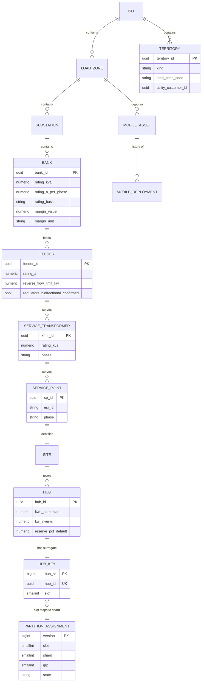

| Entity | Key attributes | Notes |
|---|---|---|
| `ISO` | `code` (ERCOT, PJM) | reference data |
| `Territory` (R27) | `territory_id`, `kind` (`COMPETITIVE_AREA`, `NOIE_MUNI`, `NOIE_COOP`, `PJM_ZONE`), utility (pseudonymous customer), `load_zone_code`, `tariff_table_ref` | the partition kind the demo's ERCOT lanes use (competitive area) vs NOIE partitions (R27a, register Q25) |
| `LoadZone` | `code`, `iso_code` | ERCOT settlement load zone or PJM zone |
| `Substation` | `substation_id`, `name`, location | CEII-sensitive: not exposed to hubs or the cloud LLM |
| `Bank` | `rating_kva`, `rating_a_per_phase`, `rating_basis` (`KVA` or `PHASE_CURRENT`; `KW` only where the utility rates in kW), `emergency_rating_kva`, margin as {value, unit} | **unit-typed** (R18): the bank law regulates apparent power or maximum per-phase current; a mixed-unit comparison is rejected at map validation (GRD-003) |
| `Feeder` | `rating_a`, `reverse_flow_limit_kw` (default **0** unless the utility confirms hosting), `regulators_bidirectional_confirmed` (default false), reclose and hot-line practice | zero net reverse flow at feeder heads and at unconfirmed line regulators by default (R28, GRD-033) |
| `ServiceTransformer` | `rating_kva`, `phase` | `phase` ∈ {`A`, `B`, `C`, `AB`, `BC`, `CA`, `ABC`, `UNKNOWN`} (R18, GRD-006) |
| `ServicePoint` | `esi_id`, `phase`, `service_transformer_id` | electrical-fencing anchor; a hub with `UNKNOWN` phase counts toward three-phase totals only, never toward a phase-limited need |
| `Site` | `service_point_id`, `pseudonymous_ref` | the only link into `pii.account` |
| `Hub` | `hub_id`, `site_id`, `kwh_nameplate` 39.2, `kw_inverter` 11, `reserve_pct_default` 20 | brief §6 |
| `HubKey` | `hub_sk` bigint identity, `hub_id` UUID unique, `slot` 0–255 | explicit surrogate key used by every hypertable (R37, ARC-051); `slot = first byte of SHA-256("og-slot-v1" ‖ hub_id)` (01 §11) |
| `PartitionAssignment` (R30) | `version` bigint, `slot`, `shard`, `grp`, `state` (`ACTIVE`, `RELEASED`, `ACQUIRED`), `handover_id`, `effective_from` | versioned slot → shard map; handover §2.12 |
| `MobileAsset` | `unit_code`, `mw_rated` 1, `mwh_rated` 2, `short_time_rating_kva`, `depot_load_zone_id`, `movable_within_h` | separate asset pool; a TEEEF unit must be mobile, movable from its staged location in < 12 h and ≤ 5 MW (PURA §39.918(d) as amended by SB 231; register R20) — admission checks |
| `MobileDeployment` (R20) | `contract_variant` (`TEEEF` or `MOBILE_DER`), `statute_basis` (`PURA_39_918`, or the lessee's own basis for co-op and municipal lessees), `lessee_party`, `operational_control` = `LESSEE`, `qualifying_outage` {kind: `ERCOT_LOAD_SHED` or `DISTRIBUTION_NOT_SERVED`, declared_by, declared_at, reference}, `island_mode` = `ISLAND_FORMING` (TEEEF only), `switching_order_id`, `energization_initiator` = `LESSEE` (constraint), `ercot_participation` = `NONE` (TEEEF), `cold_load_factor`, `planned_island_load_kw`, `interconnection_agreement_ref` (`MOBILE_DER` only), `safety_signoff` {engineer (pseudonymous), at} (register Q20), `commission_authorization_ref` (prior commission authorization of the lease, SB 231) | lifecycle §2.10; Base reports readiness and never initiates energization; §39.918 does not apply to co-op or municipal lessees, who record their own basis |

### 1.2 Commercial model (schema `commercial`)

**The central schema.** `ServiceType` and its signed `DispatchProfile` make every customer type executable by the same
generic components. A `Call` is any incoming request before validation; admitted, it becomes an `Event` bound to an
obligation (R7). ERCOT instructions are `IsoInstruction`s admitted as hard constraints (R17).

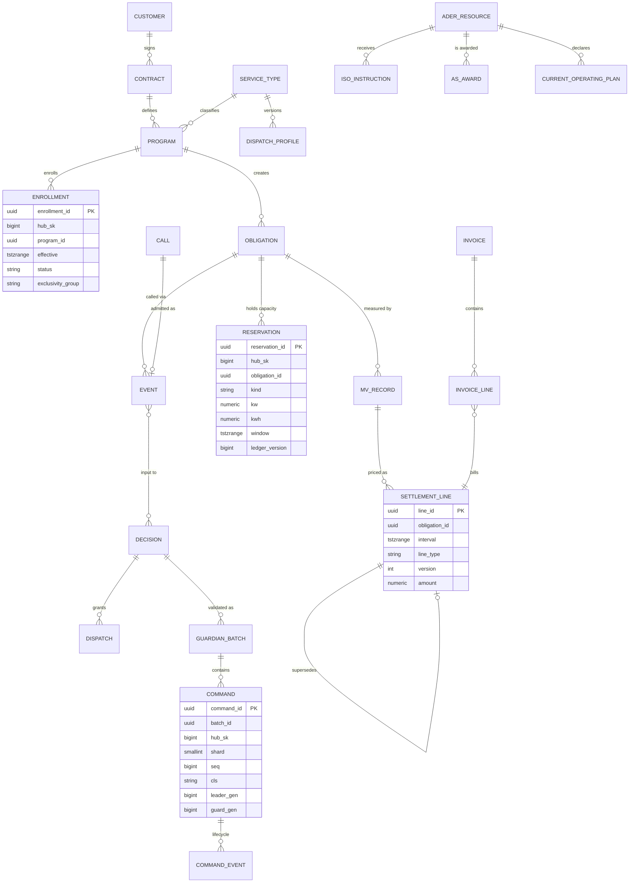

**Catalogue and parties.**

| Entity | Key attributes | Writer | Notes |
|---|---|---|---|
| `ServiceType` | `code` (9 codes) | seed | reference |
| `DispatchProfile` | `profile_id`, `service_type_code`, `variant`, `version`, `effective` (tstzrange), `artifact_digest` (OCI), `signature_ref`, `status`, the eight elements of `03` §2.5 | GitOps projection loaded by `contracts-rt` | read-only projection of signed artifacts (`ADR-509`); a running event keeps its version (register V-27) |
| `Customer` | `customer_id`, `pseudonymous_ref`, `customer_class` | `contracts-rt` | identity only in `pii` |
| `MarketRole` (R27) | `subject` (territory or ADER), `role` (`LSE`, `QSE`, `RESOURCE_ENTITY`, `DSP`, `TDSP`, `PGC`), `party` (customer), `effective` | `contracts-rt` | per-territory role model; in NOIE territory the NOIE's consent per premise conditions every ERCOT lane and ERCOT value flows through the NOIE's contract |
| `TariffTable` (R27) | `utility`, `kind` (`DELIVERY`, `NOIE_BUNDLED`, `BUYBACK`), `version`, `effective`, rates | `contracts-rt` | per utility, not per TDSP only |
| `Contract` | `customer_id`, `status`, `term`, stacking clauses, each counterparty's measurement method | `contracts-rt` | predicts M&V overlap at admission (GRD-037) |
| `Program` | `contract_id`, `service_type_code`, `variant`, typed terms | `contracts-rt` | variants below |
| `AderResource` (R17, R27) | `ader_id`, `registration` (`ALR` or `NCLR`), QSE, LSE and DSP parties, `load_zone`, `territory_id`, `qualified_mw` per product, `status` (`ONL`, `OUTL`, …), `dual_participation_mode` (`PARTNER_AS_QSE`, `BASE_AS_QSE`, `NONE`), `ers_exclusion`, `dsp_acknowledgment_ref`, `lse_acknowledgment_refs` (NCLR), `allocation_factors_ref` | `contracts-rt` | per-ADER qualified-MW caps bound offers and telemetered AS capability (GRD-057); the ERS exclusion is a hard admission rule (register Q6). Admission rules from the ADER governing document (claims check items 4, 15): an ALR-type ADER has one load zone, one LSE and one DSP; an NCLR-type ADER needs a signed acknowledgment from every LSE; premises ≤ 100 kW belong to the submitting LSE; every premise added needs the DSP's acknowledgment (in NOIE zones, the NOIE's). Programme limits are register R27's (500 MW energy, 100 MW Non-Spin, 100 MW ECRS, ≤ 90% per QSE). Premise or device net-MW and SOC series and allocation factors are archived for ERCOT requests; sharing them is register Q12 |
| `Enrollment` (R37) | `hub_sk`, `program_id`, `effective`, `status` (`PENDING`, `ACTIVE`, `SUSPENDED`, `ENDED`), `exclusivity_group`, `noie_consent_ref`, `pjm_csp_registered`, `consent_ref` | `contracts-rt` (roles `FOP`, `PPM`) | an exclusion constraint forbids overlapping `ACTIVE` enrollments of one hub in one exclusivity group; admission, allocation eligibility, M&V attribution and VR aggregates join on it (ARC-014) |

**Program variants** (typed terms; `03` §2.6 owns the defaults):

| Service type | Variants and their fields |
|---|---|
| `PARTNER_CAPACITY` | `EVENT` (event limits, notice, duration); `TOLLING` (R27): `tolled_kw`, `tolled_kwh`, reservation ramp schedule (e.g. a contracted ramp to full MW), schedule channel (OpenADR, IEEE 2030.5, DNP3), SOC ownership rule, `cycle_budget_per_year`, availability settlement basis; the utility's charge and discharge schedule is a hard external schedule the planner does not optimize, and only unreserved capacity serves other lanes (claims check item 9) |
| `DIST_DEFERRAL` | `COOP`; `TDU_SB415` (R27; PURA §35.153, rule 16 TAC §25.58 still proposed): reservation calendar (list of {window, kW}) ring-fenced from ERCOT offers and telemetry, competitive-bid ID, the TDU's load-ratio share of the 100 MW statewide cap, prior PUCT authorization reference, PGC registration; contract MW is discharged only on TDU direction and market sales are allowed only while the reservation is held (claims check item 10); performance basis `OUTCOME` (bank loading ≤ limit) or `SHARE` (own delivered-vs-requested) (R18, register Q9) |
| `ERCOT_ENERGY`, `ERCOT_AS` | `ALR` (SCED-dispatched: the 4-s UDSP carries energy and online Non-Spin and ECRS, with no separate deployment message; compliance scored on set-point deviation) or `NCLR` (SCED still awards AS each interval; deployment only on the XML instruction, held until recall; 95–150% band against the 15-min meter interval before the instruction, the generic 5-min telemetry baseline tracked as well; two failures in a rolling 365 days disqualify the resource for ≥ 6 months) — the variant follows the `AderResource` registration (register R17) |
| `PJM_CAPACITY` | `SELF_SERVE` (default: toward meter net load ≈ 0, non-firm) or `EXPORT_PAID`; CSP-registered premises excluded unless the contract handles them (R27); the PLC is the customer's load at PJM's five summer peaks plus PJM load-drop estimates plus losses, with a ComEd adjustment, so reductions counted as demand response are added back — verify per customer with ComEd (assumption; claims check item 11) |
| `MOBILE_TEEEF` | `TEEEF` (statute-shaped, §1.1) or `MOBILE_DER` (grid-parallel, own interconnection agreement) (R20) |
| `LARGE_LOAD`, `PIPELINE_AC`, `HOME` | single variant; `PIPELINE_AC` carries the line-current sensitivity (shift factor) parameter, open-loop when unknown (R28) |

**Calls, instructions and obligations.**

| Entity | Key attributes | Writer | Notes |
|---|---|---|---|
| `Obligation` | `program_id`, `committed_kw`, `committed_kwh`, `window` (tstzrange), `firmness`, `tier` (override of the profile default, approved per R3), `status`, `breach_risk` | `contracts-rt` | lifecycle §2.5 |
| `Call` | `source` (`openadr`, `2030_5`, `scada`, `market`, `webhook`, `operator`, `teeef`, `ai_intake`), `service_type_code`, `payload_hash`, `payload_ref`, `received_at`, `provenance` | `contracts-rt` | the pre-validation envelope |
| `Event` | `call_id`, `obligation_id`, `status`, `window`, `profile_version` | `contracts-rt` | lifecycle §2.4 |
| `IsoInstruction` (R17) | `ader_id`, `kind` (`VDI`, `MANUAL_DEPLOYMENT`, `RECALL`, `STATUS_CHANGE`, `EMERGENCY_ACTION`), `product`, `mw`, `issued_at`, `effective`, `received_via` (`HOTLINE`, `XML`, `ICCP`), `caller_ref` (the ERCOT operator's identifier as given on the hotline), `entered_by` (QSE desk, pseudonymous), `ack_deadline`, `acked_at`, `status` | `contracts-rt` | L2 hard constraint for the ADER's members; lifecycle §2.13; the VDI log is kept with settlement records |
| `AsAward` (GRD-039) | `ader_id`, `market` (`DAM`, `RT`), `product` (`NON_SPIN`, `ECRS`, `RRS`, `REG_UP`, `REG_DOWN`), `interval` (hour ending for DAM; SCED run time for RT), `mw`, `mcpc_usd_per_mw_h` (DAM), `source_ref` | `integrations` | ERCOT's shape: hourly MW per product at MCPC; RT awards per SCED run |
| `CurrentOperatingPlan` (R17) | `ader_id`, `version`, `hour_ending` (168 h rolling), `status` (`ONL`, `OUTL`, …), `mpc_mw`, `lpc_mw`, AS capability per product, `reason` (`CHANGE_1MW`, `CHANGE_10PCT`, `REFRESH_60MIN`, `STATUS`), `produced_at`, `submitted_at` | `planner` (versions, insert-only); `integrations` (submission events) | every reservation is excluded before capability is declared |
| `ConstraintSet` (R49) | `version`, `valid` (tstzrange), pins, priority adjustments within approved bounds, holds, `proposal_id`, approval references, `status` (`ACTIVE`, `EXPIRED`, `REVOKED`) | `contracts-rt` on approval | consumed by the allocator every tick until expiry |

**Allocation, commands and the ledger.**

| Entity | Key attributes | Writer | Notes |
|---|---|---|---|
| `Reservation` (R37) | `hub_sk`, `obligation_id`, `kind` (`POWER`, `ENERGY`, `AS_HOLD`, `FIRM_ENERGY`, `DECLARED`, `TOLL`, `TDU_CALENDAR`), `kw`, `kwh`, `window`, `ledger_version` bigint, `status`, `decision_id` | **the fleet allocator only** | committed before a batch is submitted; the guardian checks each batch against the ledger version (01 §8.5); Σ reservations ≤ capability per hub and interval (`03` §2.4) |
| `Decision` | `decision_id` (UUIDv7), `component_id`, `tick`, `kind` (`RT_ALLOCATION`, `ADMISSION`, …), `inputs_hash`, `ledger_version`, `full` or `heartbeat`, `trace_ref` | allocator | replaces v0.2's `ArbitrationDecision`: one per component per tick on material change, a heartbeat otherwise (`03` §9.3) |
| `Dispatch` | `decision_id`, `event_id`, `granted_kw`, `shortfall_kw`, `displaced_by` | allocator | written on change |
| `GuardianBatch` | `submission_id` (UNIQUE), `batch_id`, `shard`, `grp`, `leader_gen`, `guard_gen`, `decision_id`, `inputs_hash`, `class`, `count`, `merkle_root`, verdict summary | `guardian` | the pre-image persisted before signing (R22) |
| `Command` | `command_id` (UUIDv8 derived per 01 §8.2, UNIQUE), `batch_id`, `hub_sk`, `shard`, `seq` bigint, `cls`, `type`, `params`, `pre`, `bounds`, `nbf`, `exp`, `lease_s`, `key_epoch`, `leader_gen`, `guard_gen`, `ledger_version`, `ctx` | **`guardian` only** | insert-only; lifecycle in `CommandEvent` |
| `CommandEvent` (R37) | `command_id`, `state` (§2.3), `ts`, `source` (`guardian`, `device-gateway`, `fleet-state`, `shard`), `reason_code`, `detail` | the observer of the state | append-only hypertable; the current state is a projection (ARC-046) |

**Measurement and settlement.**

| Entity | Key attributes | Writer | Notes |
|---|---|---|---|
| `MeterBlock` (R33, R37) | `hub_sk`, `boot_id`, `block_seq` bigint, `interval` (1 min), `e_imp_wh`, `e_exp_wh` (registers at interval end), `d_imp_wh`, `d_exp_wh`, `meter_serial`, `prev_hash`, `block_hash`, device signature | `ingest-writer` (as received) | device-signed and chained; `contracts-batch` records verification as a separate insert-only row; settlement reads only verified blocks |
| `AmiInterval` | `service_point_id`, `interval` (15 min), `kwh_delivered`, `kwh_received`, source feed, quality, `received_at` | `contracts-batch` | smart-meter reconciliation (`NFR-006`) |
| `Baseline` | obligation or program, `method` (`DIRECT_HUB_METER`, `SERVICE_POINT_NET`, `CBL_X_OF_Y`, `PLC_BASELINE`, `ISO_SETTLEMENT_SHADOW`), parameters, `version`, series reference | `contracts-batch` | method per profile (`03` §10.3) |
| `MVRecord` | `obligation_id`, `interval`, `version`, `supersedes`, `delivered_kwh`, `committed_kwh`, method, baseline reference, meter-block set root, AMI reconciliation | `contracts-batch` | insert-only |
| `SettlementInterval` | `obligation_id`, `interval`, `version`, `supersedes`, `performance_ratio`, excused flags | `contracts-batch` | insert-only performance record (money moved to `SettlementLine`) |
| `SettlementLine` (R37) | `contract_id`, `obligation_id`, `interval`, `line_type` (`CAPACITY`, `AVAILABILITY`, `ENERGY`, `PENALTY`, `BUYBACK`, `SPD`, `FEE`, `ADJUSTMENT`), `version`, `supersedes_line_id`, `qty`, `unit`, `rate`, `amount`, `currency`, basis (M&V, traces, profile and tariff versions), `run_id` | `contracts-batch` | **insert-only**, UNIQUE(contract, obligation, interval, line_type, version); current view = latest non-superseded version (ARC-023) |
| `Invoice` / `InvoiceLine` | `customer_id`, period, `status`; line → settlement line and version, `amount` (half-even rounding, register V-39), `decision_trace_ref` | `contracts-batch` | a void issues superseding lines, never edits |
| `DecisionTrace` | `trace_id`, audit stream and `seq`, `decision_type`, payload reference | producers | payload in `ops.audit_payload` (§1.6) |

### 1.3 Operational model (schema `ops`)

| Entity | Key attributes | Notes |
|---|---|---|
| `Alarm`, `Incident` | as v0.2; incident lifecycle §2.7 | paging per register V-25 |
| `Override` | `kind` (`SCOPE_STOP`, `BLOCK`, `LIMIT`, `SETPOINT`), `scope` (`BANK`, `ZONE`, `FLEET`, or a hub set for setpoints), `requested_by`, `reason`, `status` | the request object behind §6 `/v1/overrides` |
| `ScopeStopEvent` (R16) | `scope_type`, `scope_id`, `seq` bigint, `state` (`ENGAGED`, `COSIGNED`, `ESCALATED`, `RELEASING`, `RELEASED`), `signer` (`GUARDIAN` or `SSA`), `protective` (register V-16), `actor`, `cosign_deadline`, `trace_ref` | append-only, UNIQUE(scope, seq); state machine §2.11 |
| `ApprovalEvent` | request hash, tier, approver, decision, token (single use), expiry (register V-12, V-13) | append-only |
| `EpochGen` | PostgreSQL sequence `ops.epoch_gen` (bigint) | taken with synchronous commit (01 `ADR-023`) |
| `Plan`, `Schedule`, `Forecast` | as v0.2 (`Schedule` is the day-ahead fallback of `NFR-002`) | — |
| `FeatureFlag` | key, value, reason, expiry | pausing a service type only per R15 |
| `ErasureLedger` (R38) | pseudonymous subject id, erased_at, key reference | mirrored to the off-node write-once bucket and replayed from there after every restore; no personal data |
| `ShiftLogEntry` | shift, time, author (pseudonymous), category (`VDI`, `HOTLINE`, `UTILITY_CALL`, `EEA`, `SWITCHING`, `NOTE`), text, links to `IsoInstruction`, `Override` and incidents | append-only control-room shift log (`../04-ui` grid-operations views; GRD-046) |
| `Handover` | outgoing and incoming shift, time, open items (links), acknowledgement | append-only shift handover |
| `Contact` | counterparty, role (utility dispatcher, ERCOT desk, partner operations), channels | stored in the restricted `pii` schema (business contact data, classified `PII`); never sent to the cloud LLM (D5) |

### 1.4 SCADA integration model (schema `scada`; point lists in `07-scada-integration.md`)

| Entity | Key attributes | Notes |
|---|---|---|
| `ScadaCounterparty` | `protocol` (DNP3, IEC 60870-5-104, ICCP, OPC UA — never 2030.5, R6), `role`, connection parameters | one command broker leader per link group (01 §10) |
| `ScadaPointMap` | immutable signed versions (`ADR-075`), `orchestrator_concept` ↔ `protocol_address`, unit | mixed-unit comparisons rejected at validation (R18) |
| `ScadaPoint` | value, quality (`GOOD`, `BAD`, `COMM_FAIL`, `STALE`, `SUBSTITUTED`), source and receive times, deadband | substituted values never used in closed loop (R5) |
| `ScadaSession` | state, last heartbeat | 01 §6.12 |
| `ScadaControlCommand` | SBO state (§2.9), `control_id` | provenance of calls and constraints |
| `VrMembership` (R37) | `vr_id`, `hub_sk`, `effective`, `version` | versioned virtual-resource membership for SCADA aggregates |
| `LatchedState` (R36) | counterparty, scope, `kind` (`BLOCK`, `LIMIT`, `STOP`), value, `seq`, engaged and released events | append-only, written **synchronously** before the counterparty is acknowledged; re-read from the counterparty on resume |

### 1.5 AI-agent model (schema `ai_agent`)

| Entity | Key attributes | Notes |
|---|---|---|
| `AgentSession` | `model` (register-configured IDs, R12), `purpose` (`ARBITRATION_ADVICE`, `EXPLANATION`, `COPILOT`, `TRIAGE`, `INTAKE`), requester, status | — |
| `ToolCall` | tool, request, response, latency, read-only flag | pseudonymous data only (D5) |
| `Proposal` | `proposal_type` (`CONSTRAINT_SET`, `STRUCTURED_CALL_INTAKE`), payload, `status` (`PROPOSED`, `VALIDATED`, `REJECTED_BY_POLICY`, `REJECTED_BY_GUARDIAN`, `AWAITING_CONFIRMATION`, `AWAITING_SECOND_APPROVAL`, `APPROVED`, `DECLINED`), `constraint_set_id` or `call_id` when approved | every proposal produces a trace; approval always needs a human (R49) |

### 1.6 Audit ledger and privacy (schemas `ops`, `pii`)

| Entity | Key attributes | Notes |
|---|---|---|
| `AuditChain` | `stream_id`, `seq` bigint (PK with `stream_id`), `prev_hash` (UNIQUE with `stream_id`), `record_hash`, header bytes (RFC 8785 JCS), `occurred_at`, `actor`, `record_type`, `payload_ref`, `payload_hash`, `parents`, producer signature | plain table; hash formula 01 §8.3 (R22) |
| `AuditPayload` | `payload_ref`, stored bytes, `occurred_at` | hypertable; bytes verified, never re-serialized |
| `AuditCheckpoint`, `AuditAnchor` | 60-s signed cross-stream checkpoints; off-node anchors with RFC 3161 tokens (register V-23) | — |
| `Person`, `Account`, `Consent` | personal data, ciphertext per subject | `pii` only |
| `SubjectKeyRef` | subject, wrapped data-key reference, key-store location | the wrapping key lives outside every database backup (R38, 01 §7.3) |

### 1.7 Types and conventions

| Kind | Type | Rule |
|---|---|---|
| Counters, epochs, sequences, ledger versions | `bigint` | register V-40 |
| Money and energy (kWh, Wh deltas in settlement) | `numeric(18,6)`; half-even rounding at the invoice line | register V-39 |
| Power (kW, kVA, kvar) | `numeric(12,4)` with an explicit unit column where a field can hold more than one unit | assumption; unit-typed ratings per R18 |
| Energy registers from hubs | `bigint` Wh (monotonic per `boot_id`; a reset is detected by `boot_id`) | — |
| Windows and intervals | `tstzrange` (half-open `[start, end)`) | replaces v0.2's string windows (ARC-051) |
| Identifiers | UUIDv7 (RFC 9562) for records; UUIDv8 derived deterministically for `command_id`; `hub_sk` bigint in hypertables | 01 §8.2 |
| Time | UTC `timestamptz`; ERCOT intervals derived in America/Chicago | 01 §9 |

---

## 2. State machines

Thirteen state machines. Every transition made by the allocator, a shard, the guardian, `safe-stop` or `scada-gateway` is
also an audit record (01 §8.3); this is not repeated in each diagram.

### 2.1 Hub connectivity and eligibility (R40, register V-29)

Connectivity describes whether the hub is talking; eligibility describes whether the allocator may use it. They are
separate machines (ARC-015, GRD-055, C-20). The v0.2 rule that kept a silent hub eligible until a 15-minute gap — the
SCADA signal-hold timer, which has nothing to do with device liveness — is withdrawn.

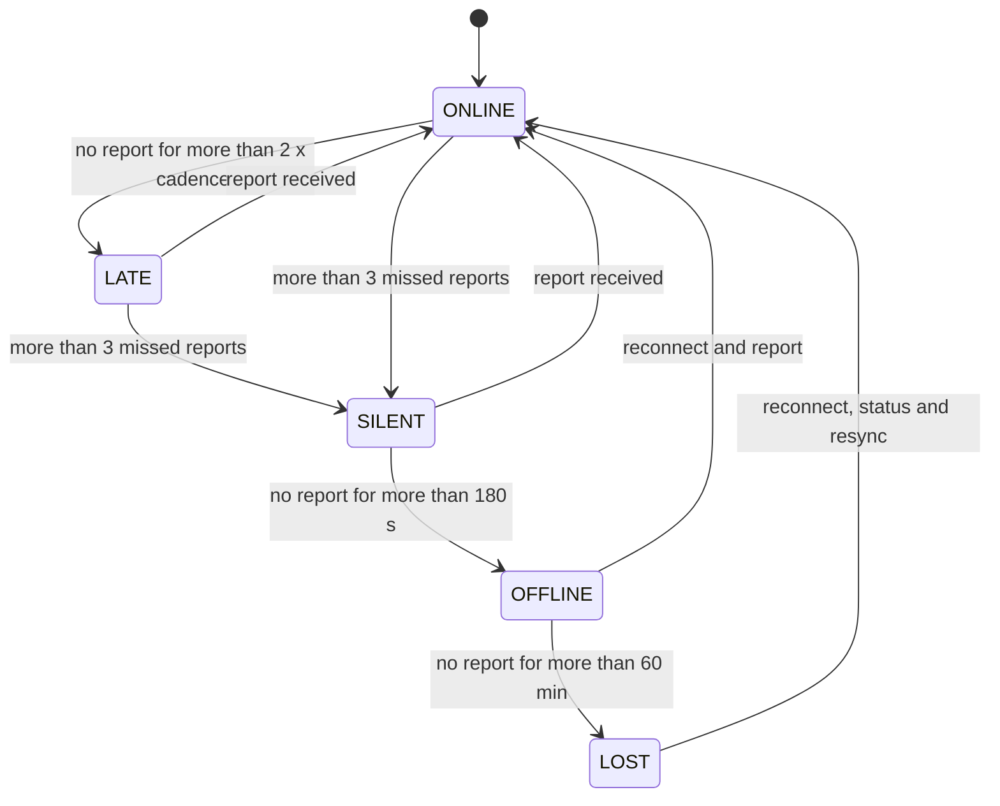

| Connectivity state | Entry (register V-29) | Northbound counts (`07` §2.4) |
|---|---|---|
| `ONLINE` | last report ≤ 2 × the hub's cadence | online |
| `LATE` | more than 2 × cadence, not yet 3 missed reports — a transitional state that closes the gap between the register's `ONLINE` and `SILENT` thresholds | online, flagged |
| `SILENT` | more than 3 missed reports: 6 s at the 2-s cadence, 30 s at the 10-s cadence | stale |
| `OFFLINE` | no report for more than 180 s | offline |
| `LOST` | no report for more than 60 min | offline; field follow-up |

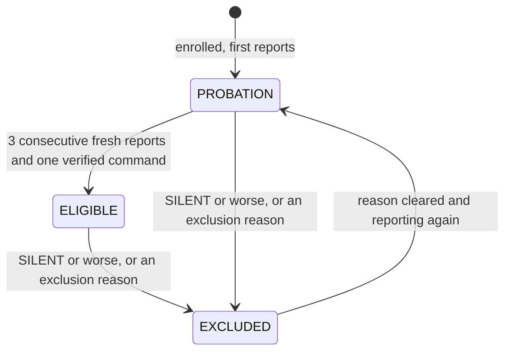

| Eligibility | Rule |
|---|---|
| `ELIGIBLE` | may receive any allocation its enrollments and trust allow |
| `PROBATION` | reporting, but only after 3 consecutive fresh reports **and** one verified command does it become `ELIGIBLE`; no firm allocation while on probation |
| `EXCLUDED` | from `SILENT` onward, or for a reason: `QUARANTINED` (security), `SETTINGS_DRIFT` (IEEE 1547 read-back differs from the signed accepted profile — excluded from ADER and firm pools, R26), `ISLANDED`, `FAULT`, `OPTED_OUT`, `CLOCK_SKEW` (excluded from bank add-back only, register V-34), `STOP_LATCHED` (scope stop) |

Timers use the hub's current cadence (register V-32). `fleet-state` owns both machines; the allocator and the guardian read
them; transitions are traced.

### 2.2 Hub operating mode and control authority

House-driven operating modes (reported by the hub):

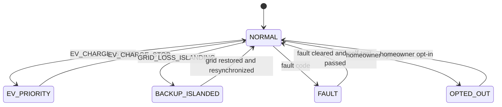

`BACKUP_ISLANDED` and `FAULT` remove the hub from every exportable pool whatever the tier (L1 always wins). `OPTED_OUT` is
homeowner-initiated, reversible and never treated as a fault.

Control authority (who the hub obeys, register V-06 and V-07; enforced in firmware and in `agent-sim`):

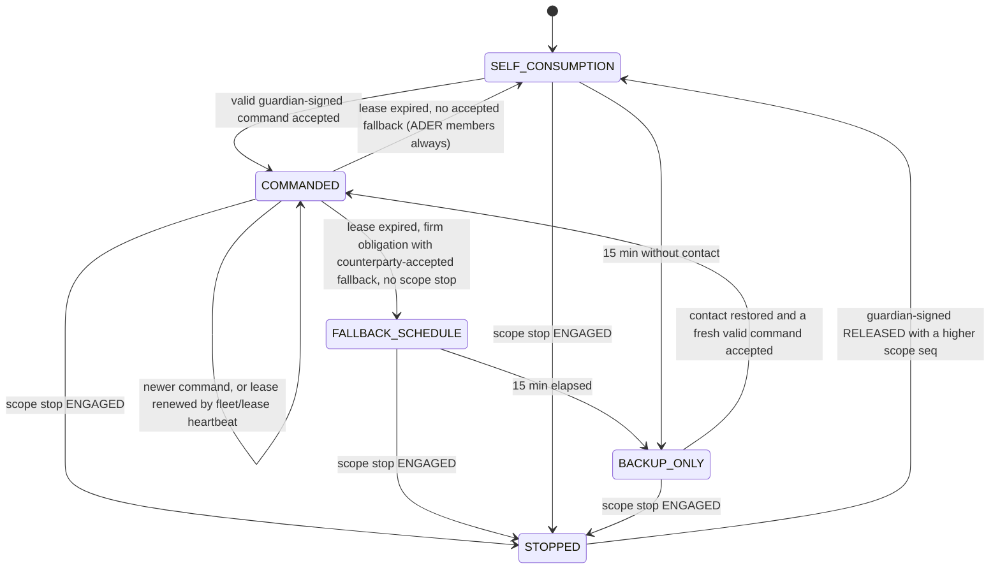

| State | Behaviour (register V-07 governs; the table restates it for the device contract) |
|---|---|
| `COMMANDED` | executes the latest accepted setpoint while its lease (30 s during events, 60 s otherwise) is renewed by `fleet/lease/{grp}` every 10 s |
| `FALLBACK_SCHEDULE` | only for firm obligations whose counterparty accepted fallback in the contract; a guardian-signed schedule with per-hub randomized boundaries; ≤ 15 min; only while no scope stop is active; never above the last commanded export |
| `SELF_CONSUMPTION` | serve the home, no export, no grid charging; ADER members always come here (the QSE desk sets the ADER `OUTL`) |
| `BACKUP_ONLY` | after 15 min without contact: backup-only until contact returns |
| `STOPPED` | a latched scope stop: ramp to 0 per register V-16, then home-only; left only on a guardian-signed release (register V-17) |
| In every state | the homeowner reserve floor is enforced in firmware; local cease-export triggers on out-of-range voltage or frequency are always armed; autonomous grid-support functions (frequency-watt, volt-watt, volt-var) act and are reported with reason codes (§3.5) |

### 2.3 Command lifecycle — the one vocabulary (R33, C-22)

The states are recorded as append-only `CommandEvent` rows (§1.2) by whichever component observes them; the current
state is a projection. Every document and the console use these names; v0.2's names are kept wherever they existed (the
console already shows them verbatim, `../04-ui` §3.0(d)), and only the states the new command path needs are added:
`SUBMITTED` (at the guardian) and `RECORDED` (`SHADOW` mode). Each terminal refusal or failure carries a `reason`.

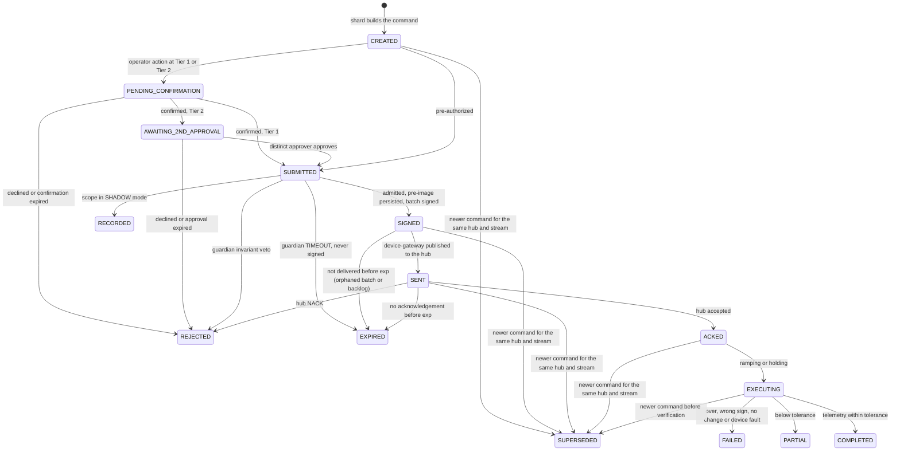

| Transition | Guard, timeout and `reason` |
|---|---|
| `SUBMITTED → SIGNED` | epoch equality, ledger version, G-checks, OPA per batch, pre-image committed (01 §8.1) |
| `SUBMITTED → REJECTED` | `reason` = `VETO(<rule id>)` — an explicit guardian invariant veto |
| `SUBMITTED → EXPIRED` | `reason` = `GUARDIAN_TIMEOUT`: no verdict within twice register V-35; a TIMEOUT is never a veto and never a stop (R31); the shard re-issues with a new `seq` |
| `SIGNED → EXPIRED` | `reason` = `ORPHANED` or `UNDELIVERED`: never republished (01 §8.1) |
| `SENT → ACKED / REJECTED / EXPIRED` | acknowledgement expected within register V-04 (the console shows an elapsed timer on `SENT` once overdue); `REJECTED` `reason` = `NACK(<code>)` with the codes of §3.2; `EXPIRED` `reason` = `NO_ACK` at `exp` (register V-05) |
| `PENDING_CONFIRMATION` / `AWAITING_2ND_APPROVAL → REJECTED` | `reason` = `DECLINED` or `APPROVAL_EXPIRED` (register V-12, V-13) |
| `EXECUTING → COMPLETED / PARTIAL / FAILED` | tolerance and verification time per `05` §2.2; `FAILED` `reason` ∈ `OVER`, `WRONG_SIGN`, `NOT_EXECUTED`, `DEVICE_FAULT` |
| Tiered actions | tiers and windows per the amended R3 and register V-12…V-15; stops use §2.11, not this path |

**Console.** The console shows these states verbatim (`../04-ui` §3.0(d)); `CREATED` and `SUBMITTED` are internal and
appear only in trace views. `COMPLETED` is never rendered without telemetry (UI-DSP-05). The console's retired labels
`CONFIRMED` and `TIMEOUT` correspond to `COMPLETED` and `EXPIRED`.

**Aliases for other documents.** `05` §2.2 outcomes: `VERIFIED` = `COMPLETED`; `ACK_TIMEOUT` = `SENT` overdue, then
`EXPIRED`; `NACKED(reason)` and `REJECTED_ORDER(...)` = `REJECTED` with `NACK(reason)`; `NOT_EXECUTED`, `OVER`, `WRONG_SIGN`
= `FAILED` with that reason; `EXPIRED` and `SUPERSEDED` unchanged. The guardian's own batch states (`TIMEOUT`, `VETOED`) are
§2.6's, not command states.
### 2.4 Call and event lifecycle (R7, R48)

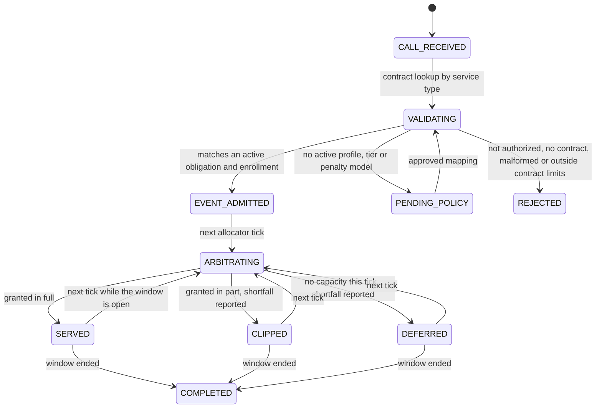

`REJECTED` is reserved for authorization and contract validity (brief §1, D0b); **lack of capacity never rejects a
call** — it clips or defers it with the shortfall reported to the counterparty and traced (R48). `PENDING_POLICY` holds a
call without executing or discarding it (`03` FR-DE-006).

### 2.5 Obligation lifecycle

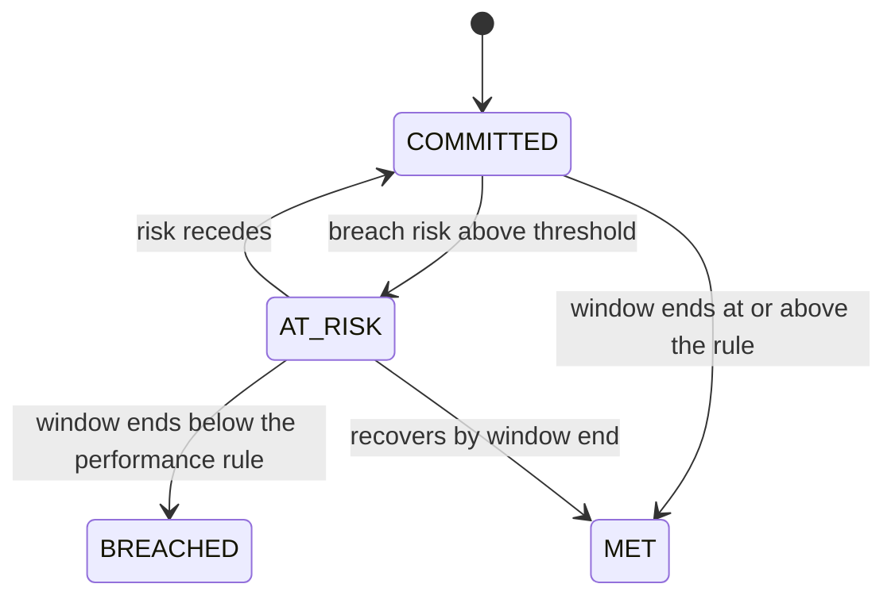

`AT_RISK` lead time: register V-41 (median ≥ 60 min, P10 ≥ 15 min, with a calibration plot). The withholding detector in
`contracts-rt` raises `AT_RISK` from telemetry and meter blocks independently of the allocator's own trace (RT-008).

### 2.6 Decision and batch lifecycle (R30, R31)

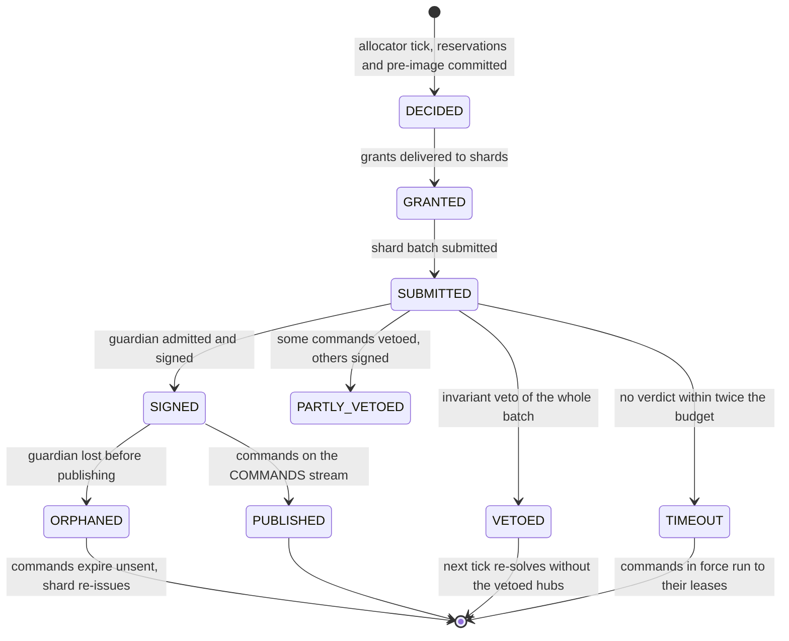

### 2.7 Incident lifecycle

Unchanged from v0.2: `OPEN` → `ACKNOWLEDGED` → `MITIGATING` → `RESOLVED` → `CLOSED`, or `OPEN` → `SELF_RESOLVED` →
`CLOSED`; paging per register V-25.

### 2.8 Invoice lifecycle

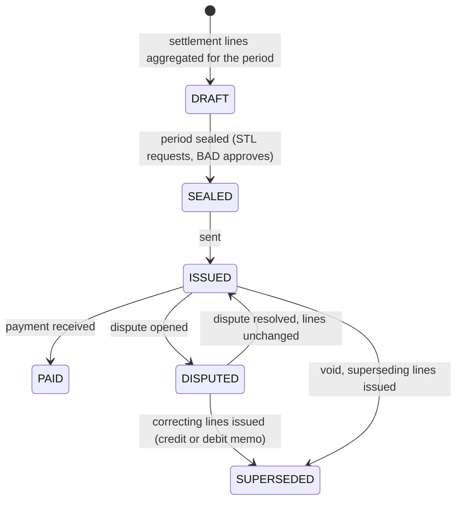

Lines are never edited; a void or correction inserts superseding settlement lines and a new invoice
(`../03-security` §12.10).

### 2.9 SCADA control — select-before-operate

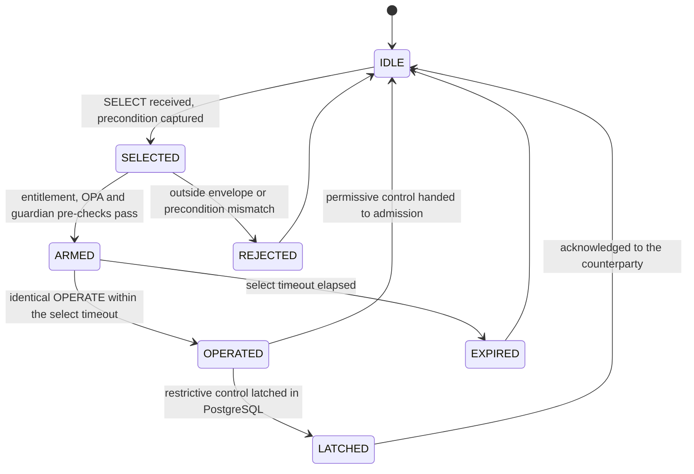

SBO or direct operate per point, per `07` §3.1 (R29). Restrictive controls are latched synchronously before the
counterparty is acknowledged (R36).

### 2.10 Mobile deployment lifecycle (`MOBILE_TEEEF`, statute-shaped — R20)

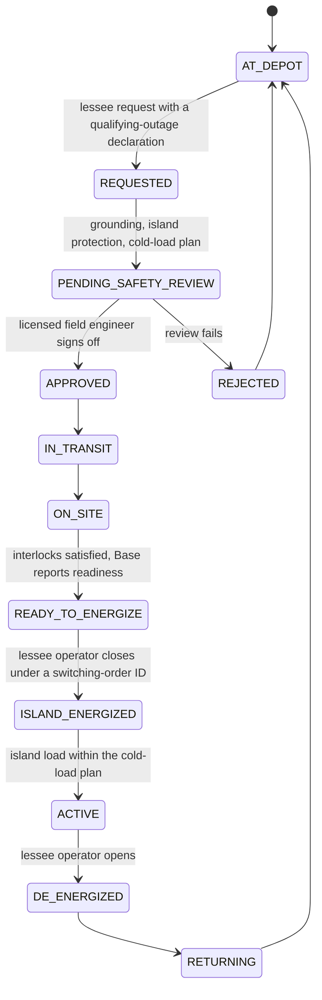

TEEEF units are island-forming only, under the lessee TDU's operational control, admitted only with a lessee-declared
qualifying outage, a mobile unit of ≤ 5 MW movable in < 12 h and a lease with prior commission authorization (SB 231,
register R20), with no ERCOT telemetry or market participation; **Base never initiates energization** — the close is
accepted only from the lessee's association with a switching-order ID. Grid-parallel support is the separate
`MOBILE_DER` contract variant with its own interconnection agreement. Co-op and municipal lessees record their own legal
basis.

### 2.11 Scope stop (kill switch) — R16, amended R3, register V-15…V-17

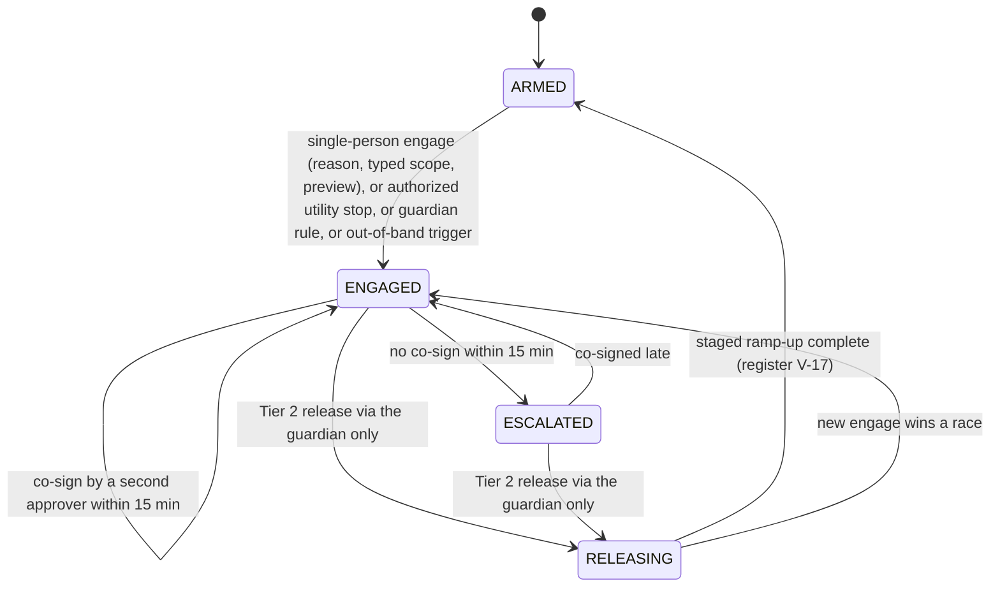

Each transition is an `ops.scope_stop_event` row with a strictly increasing scope `seq`; the device-facing copy is the
retained `scope/{type}/{id}/stop` message (§3.1). `safe-stop` can move a scope to `ENGAGED` only; it can never release.
A stop engaged by a utility is released only by that utility (register Q10 default).

### 2.12 Partition assignment and shard handover (R30)

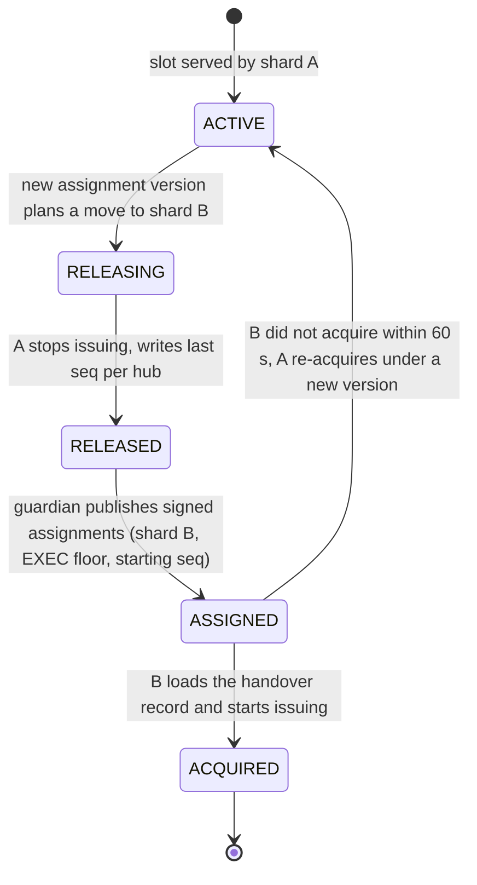

Topology changes never move a hub between shards (01 §11.4).

### 2.13 ISO instruction lifecycle (R17, R25)

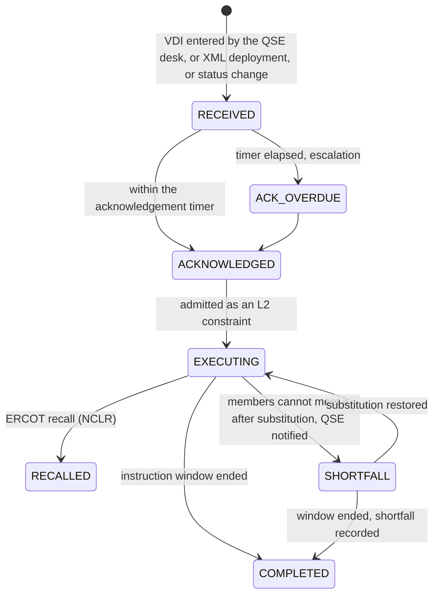

---

## 3. Southbound device contract (MQTT 5 over mutual TLS) — the single device contract (R33)

This section is the only device contract. `05` §2.2 (resilience semantics), `../03-security/02-security-architecture.md`
§7 (security rules DV-01…DV-17) and `agent-sim` implement it; firmware is built against it. Field names here are
normative; other documents' names map to them (§3.2 table "Earlier names").

### 3.1 Topics, ACLs, QoS and retain (normative)

| Topic | Publisher (MQTT identity) | Subscriber | QoS | Retain | Content |
|---|---|---|---|---|---|
| `hub/{hub_id}/telemetry` | hub | `device-gateway` (shared subscription) | 1 | no | periodic telemetry (§3.2) |
| `hub/{hub_id}/status` | hub | `device-gateway` | 1 | no | status, counters, floors, settings hash; every 60 s and on change |
| `hub/{hub_id}/house_event` | hub | `device-gateway` | 1 | no | house and device events with reason codes |
| `hub/{hub_id}/meter` | hub | `device-gateway` | 1 | no | device-signed 1-min meter blocks |
| `hub/{hub_id}/replay` | hub | `device-gateway` | 1 | no | store-and-forward backlog after reconnect (telemetry, events, meter blocks), rate-limited |
| `hub/{hub_id}/cmd` | `device-gateway` | hub | 1 | no | guardian-signed command: batch JWS + leaf + Merkle path; MQTT Message Expiry = remaining lifetime |
| `hub/{hub_id}/cmd/ack` | hub | `device-gateway` | 1 | no | device-signed ACK or NACK |
| `hub/{hub_id}/cmd/result` | hub | `device-gateway` | 1 | no | informational execution report; `COMPLETED` comes from telemetry, never from this message |
| `hub/{hub_id}/assign` | `device-gateway` (relaying guardian-signed) | hub | 1 | **yes** | shard, guardian group, scope groups, floors, starting `seq` (R32) |
| `scope/bank/{bank_id}/stop` · `scope/zone/{zone_id}/stop` · `scope/fleet/{fleet_id}/stop` | `safe-stop` (`ENGAGED`, signed with the stop-only key); `device-gateway` relaying guardian-signed `RELEASED`, and a guardian-signed `ENGAGED` only when both `safe-stop` replicas are down or the SSA's state has not appeared within one control cycle | hubs in the scope | 1 | **yes** | signed scope state (§3.2); a reconnecting hub reads it on subscribe (R16) |
| `fleet/lease/{grp}` | `device-gateway` (relaying guardian-signed) | hubs of shard group `grp` | 1 | yes (exp-bounded) | group lease heartbeat every 10 s (register V-06) |
| `keys/set` | `device-gateway` (relaying rotation key sets signed by the dispatch intermediate); `og-epoch-authority` (epoch-advance key sets signed offline by the two-person epoch-authority key, `../03-security` §6.10) | all hubs | 1 | **yes** | current keys, revoked `kid`s, `key_epoch` (register V-10, R16) |
| `fleet/endpoint` | `device-gateway` (relaying guardian-signed, Tier 2) | all hubs | 1 | yes | broker endpoint and pinned server roots for migration |

`zone_id` carries its kind: `uoz-…` (utility operating zone, for utility-facing controls) or `lz-…` (ERCOT load zone, for
market-facing controls) (register Q10 default); a hub subscribes to both of its zones.

**`twin/desired` and `twin/reported` are retired.** `twin/desired` was a retained, unsigned message a hub re-synced to on
reconnect — a control path around R1 and a stale-state hazard that could predate a stop (ARC-017). Hubs now act only on
guardian-signed commands and signed scope states; the desired state lives in `fleet-state`, not on the device.
`twin/reported`'s content moved into `status`.

**ACLs (EMQX, identity from the certificate; default deny).**

| Identity | Publish | Subscribe |
|---|---|---|
| `hub-{hub_id}` | its own `hub/{hub_id}/{telemetry, status, house_event, meter, replay, cmd/ack, cmd/result}` | its own `hub/{hub_id}/{cmd, assign}`; `scope/{type}/{id}/stop` only for the scopes in its current assignment (EMQX authorization source fed from `hub/{id}/assign` data); `fleet/lease/{its grp}`; `keys/set`; `fleet/endpoint` |
| `og-device-gateway` | `hub/+/cmd`, `hub/+/assign`, `fleet/lease/+`, `keys/set`, `fleet/endpoint`, `scope/+/+/stop` | `$share/dgw/hub/+/{telemetry, status, house_event, meter, replay, cmd/ack, cmd/result}` |
| `og-safestop` | `scope/+/+/stop` only | nothing |
| `og-epoch-authority` | `keys/set` only, used only during an epoch-advance procedure | nothing |
| any other | nothing | nothing |

Publisher identity is not the trust anchor — content is signed and hubs verify it (DV rules); the ACL narrows who can even
write. Two identities may write scope topics because `safe-stop` must work without `device-gateway`, NATS or the guardian
(R16), while releases must never be published by `safe-stop` (DV-17 rejects a release under the stop-only key in any
case). A cleared retained message cannot release a hub: hubs latch `ENGAGED` in non-volatile storage.

**Session parameters (assumptions):** keep-alive 30 s (`05` §2.3); session expiry 24 h; QoS 1 everywhere (exactly-once
effects are achieved by the identifiers of §3.3, not QoS 2); broker admission and bans per register V-21 (enrolled hubs are
banned for authentication failures, never for flapping).

### 3.2 Message catalogue and schemas

**Rules for every message.** JSON; a top-level `v` (schema major version) in every body; MQTT 5 user property `og-v` =
major.minor and content type `application/og.<message>+json`; UTC timestamps with milliseconds; sign convention **`p_kw`
positive = discharge or export, negative = charge or import**. Each message has a JSON Schema file
`og-<message>.v<major>.schema.json` (§3.6).

**Telemetry** (`og-telemetry.v1`; not signed — the mTLS session authenticates the sender; commands, acknowledgements and
meter blocks are signed):

```json
{
  "v": 1, "hub_id": "3b1e9c2a-5d7f-4b21-9a0e-6c8d4f2b1a90", "boot_id": 211, "seq": 88123,
  "ts": "2026-09-25T18:32:10.412Z",
  "soc_pct": 62.4, "p_kw": 4.8, "q_kvar": -0.4, "v_rms": 241.1, "f_hz": 60.01, "temp_c": 31.2,
  "home_load_kw": 1.9, "pv_kw": 0.0, "ev_state": "CHARGING", "grid_state": "GRID_CONNECTED",
  "authority": "COMMANDED", "lease_exp": "2026-09-25T18:32:40.000Z",
  "e_imp_wh": 18233456, "e_exp_wh": 9921733, "e_chg_wh": 12001234, "e_dis_wh": 11203311,
  "q": {"soc_pct": "GOOD", "p_kw": "GOOD", "clock": "SYNCED"},
  "rc": ["VOLT_VAR_Q_PRIORITY"], "dp_auto_kw": -0.3,
  "alarms": []
}
```

| Field | Meaning |
|---|---|
| `boot_id` | increments on every hub boot; with `seq` (reset per boot) forms the dedupe key (§3.3) |
| `e_imp_wh`, `e_exp_wh`, `e_chg_wh`, `e_dis_wh` | cumulative Wh registers: grid import and export at the hub's CTs, battery charge and discharge; monotonic within a `boot_id` |
| `authority` | control-authority state (§2.2) |
| `q` | per-field quality: `GOOD`, `ESTIMATED`, `STALE_SENSOR`, `OUT_OF_RANGE`; `clock`: `SYNCED`, `UNSYNCED` |
| `rc` | active reason codes (below) |
| `dp_auto_kw` | output change caused by autonomous grid-support functions; excluded from "not following" and, per contract, from M&V shortfall (R26) |

**Reason codes** (telemetry `rc`, NACK reasons are separate): `FREQ_WATT`, `VOLT_WATT`, `VOLT_VAR_Q_PRIORITY`,
`RIDE_THROUGH`, `MOMENTARY_CESSATION`, `TRIP`, `ENTER_SERVICE_DELAY`, `PERMIT_SERVICE_OFF` (the utility's own stop path,
R25), `CEASE_EXPORT_LOCAL` (voltage or frequency trigger), `THERMAL_DERATE`, `SOC_LIMIT`, `RESERVE_FLOOR`, `EV_PRIORITY`,
`ISLANDED`, `EXPORT_LIMIT`, `FIRMWARE_LIMIT`, `LOCAL_PROTECTION`, `STOP_LATCHED`, `FALLBACK_SCHEDULE`, `LEASE_EXPIRED`.
While the frequency error exceeds the droop deadband or autonomous reason codes are active, integrators, substitution and
trust penalties freeze and setpoints hold (`03`, R26).

**Status** (`og-status.v1`; every 60 s and on change):

```json
{
  "v": 1, "hub_id": "3b1e9c2a-…", "boot_id": 211, "seq": 4021, "ts": "2026-09-25T18:32:00.002Z",
  "fw": "2026.08.1", "uptime_s": 1200345, "authority": "COMMANDED", "reserve_floor_pct": 20,
  "last_applied": {"EXEC:1": 1552, "STOP:bank:b-17": 4},
  "floors": {"EXEC:1": 1042, "GUARD:0": 77, "STOP:bank:b-17": 4, "STOP:zone:uoz-3": 2, "STOP:zone:lz-north": 0, "STOP:fleet:f-0": 0},
  "key_epoch": 3, "assign_ver": 12,
  "settings": {"profile_id": "ieee1547-catB-v3", "hash": "sha256:9c1f…", "read_at": "2026-09-25T06:00:03Z"},
  "caps": {"alg": ["ES256"], "merkle": true, "max_ramp_kw_per_s": 2.0, "q_support": true, "contract_v": [1]},
  "clock": {"offset_ms": 12, "source": "NTS"}
}
```

`last_applied`, `floors`, `key_epoch` and scope `seq` values let the platform resynchronize every counter after a restore
(R36, ARC-010). `settings` is the IEEE 1547 settings read-back (ride-through category, trip and enter-service settings,
droop, volt-var and volt-watt curves) hashed and compared with a signed accepted settings profile at enrolment, every boot
and after every rollout ring; drift sets eligibility `EXCLUDED/SETTINGS_DRIFT` for ADER and firm pools (R26).

**House event** (`og-house-event.v1`): `event_type` ∈ `EV_CHARGE_START`, `EV_CHARGE_STOP`, `GRID_LOSS_ISLANDING`,
`GRID_RESTORED`, `FAULT_CODE`, `OPT_OUT`, `OPT_IN`, `RESERVE_CHANGE`, `FIRMWARE_LIMIT`, `SETTINGS_CHANGED`,
`PERMIT_SERVICE_OFF`, `PERMIT_SERVICE_ON`, `TAMPER`, `FIRMWARE_UPDATED`.

```json
{"v": 1, "hub_id": "3b1e9c2a-…", "boot_id": 211, "seq": 4022, "ts": "2026-09-25T18:33:05.120Z",
 "event_type": "RESERVE_CHANGE", "details": {"new_reserve_pct": 30}, "rc": []}
```

**Meter block** (`og-meter-block.v1`; one per minute; signed with the device key as a detached JWS ES256 over the JCS of
the body without `sig`; chained by `prev`):

```json
{
  "v": 1, "hub_id": "3b1e9c2a-…", "boot_id": 211, "block_seq": 552311,
  "start": "2026-09-25T18:31:00Z", "end": "2026-09-25T18:32:00Z",
  "e_imp_wh": 18233401, "e_exp_wh": 9921810, "d_imp_wh": 0, "d_exp_wh": 81,
  "meter_serial": "BPM-00123456", "prev": "sha256:4be0…", "sig": "eyJhbGciOiJFUzI1NiJ9..MEUCIQ…"
}
```

**Command** (`og-cmd.v1`) — the security architecture's envelope (`../03-security` §7.2) as a **Merkle batch** (`../03-security` §7.3;
01 `ADR-022`). The guardian signs one JWS per batch; each hub receives the batch JWS, its own leaf and the audit path.

Batch JWS protected header: `{"alg": "ES256", "typ": "og-cmd+jwt", "kid": "g0-2026-09-25T06"}`. Batch payload:

```json
{"v": 1, "batch_id": "0192f1a4-7c3e-7b10-9e55-4f2b6c1d9a02", "iss": "guardian/g0", "env": "demo",
 "key_epoch": 3, "epoch": {"cls": "EXEC", "shard": 1, "gen": 1042}, "gepoch": {"grp": 0, "gen": 77},
 "iat": "2026-09-25T18:32:12.000Z", "exp": "2026-09-25T18:32:42.000Z",
 "scope": "hub", "qcls": "firm", "count": 1000, "merkle_root": "sha256:1d9e…"}
```

Message on `hub/{hub_id}/cmd` (the leaf carries the per-hub claims; its lifetime `exp − iat` is 30 s, register V-05 —
v0.2's example expired 10 s after issue, ARC-064):

```json
{
  "v": 1,
  "batch": "eyJhbGciOiJFUzI1NiIsInR5cCI6Im9nLWNtZCtqd3QiLCJraWQiOiJnMC0yMDI2LTA5LTI1VDA2In0.eyJ2IjoxLC4uLn0.MEUCIQ…",
  "leaf": {
    "v": 1, "jti": "8f1c2b4e-7a9d-8c31-9b20-5d6e7f8a9b0c", "sub": "3b1e9c2a-5d7f-4b21-9a0e-6c8d4f2b1a90",
    "aud": "og-hub", "cls": "NORMAL", "seq": 1552,
    "iat": "2026-09-25T18:32:12.000Z", "nbf": "2026-09-25T18:32:19.000Z", "exp": "2026-09-25T18:32:42.000Z",
    "pre": {"authority": "COMMANDED", "last_seq": 1551, "soc_band_pct": [55, 70]},
    "cmd": {"type": "SETPOINT", "p_kw": 6.5, "ramp_kw_per_s": 0.6, "lease_s": 30},
    "bounds": {"p_min_kw": 0.0, "p_max_kw": 9.0, "soc_floor_pct": 20},
    "ctx": {"decision_id": "0192f1a4-7b00-7c55-8e21-1a2b3c4d5e6f", "obligation_ids": ["0192f0e1-…"],
            "profile": "DIST_DEFERRAL@4", "verdict_id": "0192f1a4-7c3e-7b10-9e55-4f2b6c1d9a03",
            "inputs_hash": "sha256:5c7a…", "approval_hash": null},
    "reason": null
  },
  "path": ["sha256:77ab…", "sha256:c1e0…", "sha256:09fd…"]
}
```

| Field | In | Content | Checked by (`../03-security` §7.4) |
|---|---|---|---|
| `alg`, `typ`, `kid` | header | `ES256` only (register V-36); `og-cmd+jwt`; key id resolved only through the signed key set | DV-01…DV-03 |
| `iss`, `env`, `key_epoch` | batch | guardian instance; `demo` or `prod`; fleet key epoch | DV-06, DV-07 |
| `epoch` | batch | issuer epoch `{cls, shard, gen}` — `EXEC` for execution shards (R32) | floor per (`EXEC`, shard) |
| `gepoch` | batch | signing guardian group's `{grp, gen}` | floor per (`GUARD`, grp) |
| `merkle_root`, `count`, `scope`, `qcls` | batch | queue class of the batch; root over the leaves; leaf hash `SHA-256(0x00 ‖ JCS(leaf))`, node hash `SHA-256(0x01 ‖ left ‖ right)` (RFC 6962-style domain separation) | DV-04 |
| `jti` | leaf | `command_id` (UUIDv8 derived from shard, generation, hub and `seq`; 01 §8.2) | DV-10 replay cache |
| `sub`, `aud` | leaf | hub id (or a scope group for scope messages); `og-hub` | DV-05 |
| `cls` | leaf | supersede precedence `SAFE_STOP` > `UTILITY` > `HOME` > `NORMAL` (`03` §8.15(c)): a command supersedes only commands of its own or a lower class; a lower class never cancels a higher one. The guardian's queue class (`stop`, `util`, `firm`, `as`, `other`, 01 §5.5) is the batch's `qcls`, not a hub rule | precedence (`03` §8.15, `05` §2.2) |
| `seq` | leaf | 64-bit, strictly increasing per (issuer class, shard) stream | DV-09 |
| `iat`, `nbf`, `exp` | leaf | issue time; signed stagger (execute at max(receipt, `nbf`)); expiry ≤ 30 s after `iat` for setpoints (register V-05), ≤ 36 h for fallback schedules | DV-08, DV-15 |
| `pre` | leaf | expected state: authority, `last_seq`, SOC band | DV-11 |
| `cmd` | leaf | `SETPOINT` (with `lease_s`, register V-06), `SCHEDULE` (signed fallback schedule, register V-07), `MODE`, `SAFE_STOP` (single hub), `EMERGENCY_STOP` (single-hub isolation only), `PREPARE`, `COMMIT`, `PING` | DV-12, DV-13 |
| `bounds` | leaf | `p_min_kw`, `p_max_kw`, `soc_floor_pct` ≥ the homeowner floor | DV-13 |
| `ctx`, `reason` | leaf | decision, the decision's `inputs_hash` (binds the command to the inputs the guardian validated, RT-008), obligations, profile version, verdict, approval hash; clip reason | trace linkage |

**Acknowledgement** (`og-cmd-ack.v1`; device-signed, detached JWS ES256):

```json
{"v": 1, "jti": "8f1c2b4e-7a9d-8c31-9b20-5d6e7f8a9b0c", "hub_id": "3b1e9c2a-…", "boot_id": 211,
 "recv_ts": "2026-09-25T18:32:12.180Z", "result": "ACK",
 "state": {"authority": "COMMANDED", "last_seq": 1552}, "sig": "eyJhbGciOiJFUzI1NiJ9..MEQCIB…"}
```

NACK reasons (`result: "NACK"`, `reason`): `SIGNATURE`, `ALG`, `TYP`, `KID_UNKNOWN`, `MERKLE_PATH`, `AUD`, `ENV`,
`KEY_EPOCH_STALE`, `EPOCH_STALE`, `EXPIRED`, `SEQ_REGRESSION`, `REPLAY`, `PRECONDITION_FAILED` (with the actual `state`),
`LOCAL_STATE` (islanded, opted out, tamper, stop latched), `BOUNDS`, `RATE_LIMIT`, `STOP_ONLY_KEY_MISUSE` (DV-17).
A NACK moves the command to `REJECTED` with `reason` = `NACK(<code>)`; ordering codes (`EPOCH_STALE`, `SEQ_REGRESSION`, `REPLAY`, `EXPIRED`) are `05`'s `REJECTED_ORDER(...)`.

**Result** (`og-cmd-result.v1`, informational): `{"v": 1, "jti": "…", "ts": "…", "state": "RAMP_DONE",
"achieved_kw": 6.4}`.

**Assignment** (`og-assign.v1`; retained on `hub/{hub_id}/assign`; guardian-signed compact JWS):

```json
{"v": 1, "typ": "og-assign", "hub_id": "3b1e9c2a-…", "ver": 12, "slot": 147, "shard": 1, "grp": 0,
 "scopes": {"bank": "b-17", "zones": ["uoz-3", "lz-north"], "fleet": "f-0"},
 "floors": {"EXEC:1": 1042}, "seq_start": {"EXEC:1": 1553}, "ader_id": "ader-north-01",
 "iat": "2026-09-25T06:00:00Z"}
```

**Lease heartbeat** (`og-lease.v1`; `fleet/lease/{grp}` every 10 s; guardian-signed):

```json
{"v": 1, "typ": "og-lease", "grp": 0, "gepoch": {"grp": 0, "gen": 77}, "key_epoch": 3,
 "shards": {"0": 1041, "1": 1042}, "lease_s": {"event": 30, "normal": 60},
 "iat": "2026-09-25T18:32:10Z", "exp": "2026-09-25T18:32:25Z"}
```

A hub whose shard appears with a generation ≥ its `EXEC` floor extends its setpoint lease to `iat + lease_s` and raises the
floor to that generation (so late commands from a deposed leader are rejected); a shard absent from the heartbeat (its
leader is not live) gets no extension, and the hub falls to register V-07 autonomy when the lease ends.

**Key set** (`og-keyset.v1`; retained on `keys/set`; signed by the dispatch intermediate for a rotation, or offline by the two-person epoch-authority key — `dispatch-epoch` EKU, which the guardian cannot use — for an epoch advance): `{v, typ: "og-keyset",
key_epoch, keys: [{kid, grp, x5c, not_before, not_after}], revoked: [kid…], iat}`. A key set with a higher `key_epoch`
invalidates every outstanding command signed under a lower epoch (R16's epoch authority).

**Scope state** (`og-scope.v1`; retained on `scope/{type}/{id}/stop`; compact JWS):

```json
{"v": 1, "typ": "og-scope", "scope": {"type": "bank", "id": "b-17"}, "state": "ENGAGED", "seq": 5,
 "cls": "SAFE_STOP", "protective": true, "ramp_s": 30, "reason_code": "OPERATOR_SAFETY",
 "iat": "2026-09-25T18:40:03Z"}
```

A `cls` of `CEASE` (cease export only) is an optional variant (DV-17). Acceptance: valid signature; `seq` above the hub's (`STOP`, scope) floor; `ENGAGED` may be signed by the guardian dispatch
key or the `safe-stop-only` key; `RELEASED` only by the guardian dispatch key (DV-17). **Scope states carry no `exp`**: an
engaged stop stays valid for a hub that reconnects hours later (the safe direction), and ordering is by scope `seq`; while
`ENGAGED`, the publisher re-asserts the retained message every 60 s with a fresh `iat` so its age shows liveness. This is
an exception to DV-08's expiry window that `../03-security` §7.4 must state (tracked in the resolution file).

**Endpoint update** (`og-endpoint.v1`; retained on `fleet/endpoint`; guardian-signed; Tier 2): `{v, typ, endpoints:
[{host, port}], server_ca_pins, effective_at, approval_hash, iat, exp}`. A hub connects only to an endpoint whose server
certificate chains to a pinned root.

**Earlier names** (C-08). v0.2 → v0.3: `sequence_no` → `seq`; `nonce` → `jti`; `expires_at` → `exp`; `issued_at` → `iat`;
`epoch` (integer) → `epoch {cls, shard, gen}` + `gepoch`; `mode`/`setpoint_kw` → `cmd.type`/`cmd.p_kw`;
`reserve_floor_pct` → `bounds.soc_floor_pct`; `command_id` → `jti`. `05` §2.2 names: `cmd_id` → `jti`, `not_before` →
`nbf`, `valid_for_s` → `cmd.lease_s` (the lease) and `exp` (delivery validity), `precondition` → `pre`, `issuer` → `cls`
plus the signing key, `confirmation_ref` → `ctx.approval_hash`, `obligation_refs` → `ctx.obligation_ids`.

### 3.3 Verification, ordering, idempotency and deduplication

- **Device verification** follows DV-01…DV-21 (`../03-security` §7.4) — implemented in `agent-sim` exactly as a real hub
  must. Floors are kept **per (issuer class, shard)**: `EXEC:<shard>`, `GUARD:<grp>`, `STOP:<scope>` and the fleet
  `key_epoch`, persisted before execution (R32). A signed assignment resets the `EXEC` floor on a shard move.
- **Ordering**: `seq` strictly increasing per stream; a regression, replayed `jti`, stale epoch or expired command is
  rejected with a signed NACK, never applied silently.
- **Idempotency**: `jti` = `command_id` is the key end to end (JetStream `Msg-Id`, the hub's replay cache, the
  acknowledgement correlator). Re-issue only after the acknowledgement window (register V-04) and never sooner than 2 s,
  with a new `seq`. Stops are exempt from the hub's command rate limit (DV-14).
- **Telemetry dedupe key**: (hub_id, boot_id, seq), used as the JetStream `Msg-Id` `hub_id:boot_id:seq`; a reboot changes
  `boot_id`, so new telemetry is never mistaken for a duplicate (ARC-012).
- **Meter blocks**: ordered and deduplicated by (hub_id, boot_id, block_seq) and chained by `prev`; a gap or a chain break
  is reported and the affected interval falls back to the next M&V source (AMI) per contract.

### 3.4 Capability, clock sync, store-and-forward

- **Capability**: every `status` carries `caps` (ES256 only, Merkle support, maximum ramp, reactive-power support,
  supported contract majors); a command never exceeds a hub's declared capability.
- **Clock**: hubs sync by NTP; `device-gateway` measures each hub's one-way transport delay and skew from `ts` vs receipt.
  Skew > 250 ms excludes the hub from the bank add-back (register V-34); messages with `clock: UNSYNCED` are flagged; a hub
  without authenticated time for > 24 h accepts only `seq`-fresh commands with a 30-s receipt-time lifetime (DV-16).
- **Store-and-forward**: a hub buffers telemetry, events and meter blocks for ≥ 24 h during an outage and flushes them on
  `hub/{hub_id}/replay` after reconnect, rate-limited below live traffic, with original timestamps; backlog data never
  changes a past decision. Commands are **not** store-and-forward: an expired command is discarded and the hub follows
  §2.2.

### 3.5 Local autonomy, the counterparty stop path and autonomous grid support (register V-07; R25, R26)

| Rule | Detail |
|---|---|
| Trigger | the setpoint lease ends without renewal by a valid `fleet/lease/{grp}` heartbeat (lease 30 s during events, 60 s otherwise, register V-06) |
| Fallback export | only for firm obligations whose counterparty accepted fallback in the contract; on a guardian-signed schedule with per-hub randomized boundaries; for ≤ 15 min; only while no scope stop is active; never above the last commanded export |
| ADER members | fall back to self-consumption with no export; the QSE desk sets the ADER `OUTL` (register V-07, R25) |
| All other hubs | self-consume with no export and no grid charging |
| Always armed | local cease-export triggers on out-of-range voltage or frequency; the homeowner reserve floor, enforced in firmware and never lowered by a command |
| After 15 min | backup-only until contact returns and a fresh valid command is accepted |
| Counterparty stop path (R25) | each distribution counterparty has a stop path that does not traverse the orchestrator: the IEEE 1547 permit-service function or an IEEE 2030.5 (CSIP) control from the utility to the hub, per the interconnection agreement; it acts at hub-local precedence and is reported with `PERMIT_SERVICE_OFF` |
| Autonomous grid support (R26) | frequency-watt, volt-watt and volt-var respond locally within seconds; the hub reports reason codes and `dp_auto_kw`; the orchestrator freezes integrators and substitution while they are active and does not penalize trust for them |

v0.2's 5-min and 30-min command timeouts with "hold SOC", and its unconditional 15-min export continuation, are replaced by
register V-07 (GRD-011); the device capabilities this needs are register Q2.

### 3.6 Versioning, AsyncAPI and conformance (R33, ARC-050)

- Every message has a `v` major version; the MQTT 5 user property `og-v` carries major.minor; the content type names the
  message. Additive fields are minor versions; a breaking change is a new major on the same topic, distinguished by `v`.
- **Support window N/N-1**: the platform accepts the current and previous major of every hub message and emits the major
  each hub declares in `caps.contract_v`; hubs accept N and N-1 of `og-cmd`. A compatibility matrix is tested per firmware
  cohort in CI.
- **AsyncAPI 3.0** document `og-device-contract.asyncapi.yaml` is generated from the JSON Schemas; the schemas, the AsyncAPI
  document and a conformance test suite are published as a separate package, so `agent-sim` and a vendor's firmware are
  tested against the same contract rather than against the system (JDG-028).
- A schema-compatibility check runs in CI on every change to a schema.

### 3.7 `DeviceAdapter` port and `SHADOW` mode (R23)

`device-gateway` talks to devices only through the `DeviceAdapter` port:

| Operation | Contract |
|---|---|
| `ingest()` | yields canonical telemetry, status, events and meter blocks with `hub_id`, `boot_id`, `seq`, `recv_ts` |
| `deliver(envelope)` | delivers a guardian-signed command envelope; returns a delivery receipt (sent time, transport id) |
| `acknowledgements()` | yields ACK/NACK with reason codes, correlated by `jti` |
| `capabilities(hub)` | reports what the device can verify and execute (signing, Merkle, stop-only root, lease, fallback schedules, registers) |
| `mode` | `LIVE` or `SHADOW` |

Implementations: `MqttAgentAdapter` (§3.1–§3.6; `agent-sim` and conforming firmware) and, for Base's existing hubs, a
vendor-cloud adapter (read-only telemetry first). In **`SHADOW`** (per scope, program or adapter) the whole pipeline runs —
plans, arbitration, guardian verdicts, traces, M&V — and commands are recorded in state `RECORDED` and never delivered;
a shadow-vs-actual report compares the plan with what the fleet did. A real device's own control path (for example a
vendor cloud) is register Q2.

---

## 4. Northbound interfaces

All owned by `integrations` unless noted; every inbound message becomes a `Call` on `call.in.<source>` or an
`IsoInstruction` on `iso.in.<resource>` (§5), so the allocator never branches on protocol.

### 4.1 OpenADR 3.0 VEN (`PARTNER_CAPACITY` event and tolling variants; others by contract)

| OpenADR 3.0 resource | Orchestrator mapping |
|---|---|
| `program` | `Program` (variant `EVENT` or `TOLLING`) |
| `event` with `intervals` | a `Call` on receipt → admitted as an `Event`; for `TOLLING`, the intervals are the utility's charge and discharge schedule against a continuous reservation |
| `report` / `reportDescriptor` | from `MVRecord`/`SettlementInterval` aggregates, delivered vs committed |
| `subscription` | push subscriptions per program |
| `ven` / `resource` | the fleet is one VEN; each enrolled bank or program aggregate (not each hub) is a resource |

### 4.2 IEEE 2030.5 (CSIP) business objects (`DIST_DEFERRAL`, `PARTNER_CAPACITY`, utility DERMS)

| 2030.5 object | Mapping | Owner |
|---|---|---|
| `DERProgram` | `Program` | `integrations` (R6) |
| `DERControl` | `Call` → `Event` (utility limits as L2 constraints) | `integrations` |
| `DERCapability` / `DERSettings` | aggregated hub capability per bank or program | `integrations` from `fleet-state` |
| `DERStatus` | aggregate state per bank, feeder, zone | `integrations` |
| `MirrorUsagePoint` | per-bank or per-program kW, kWh, hubs online at ≤ 1 min — reviewer proposal — unverified | `integrations`; `scada-gateway` supplies point mapping only |

The hub-side CSIP client that gives a utility its own stop path (R25) is a device capability (§3.5), not this interface.

### 4.3 ERCOT QSE interface (simulated; no real market access) — R17

`integrations` simulates the **market** side of the ADER/QSE relationship (`grid-sim` plays ERCOT); the **telemetry** side
(real-time points to ERCOT's EMS) is `scada-gateway`'s ICCP channel, a labelled `SIM` stub until licensed (register Q11,
R44). Schemas follow ERCOT's (GRD-039); values are illustrative:

```jsonc
// DAM ancillary-service award (one row per resource, product and hour)
{"award_id": "DAM-2026-09-26-ader-north-01-NSPIN-HE18", "ader_id": "ader-north-01", "market": "DAM",
 "product": "NON_SPIN", "hour_ending": "2026-09-26T18:00-05:00", "mw": 5.0, "mcpc_usd_per_mw_h": 12.40}
// RT ancillary-service award (per SCED run)
{"award_id": "RT-2026-09-25T18:35:00Z-ader-north-01-ECRS", "ader_id": "ader-north-01", "market": "RT",
 "product": "ECRS", "sced_run": "2026-09-25T18:35:00Z", "mw": 2.0}
// NCLR deployment instruction (held until recall)
{"instruction_id": "XML-2026-09-25-0091", "ader_id": "ader-south-02", "kind": "MANUAL_DEPLOYMENT",
 "product": "NON_SPIN", "mw": 3.0, "issued_at": "2026-09-25T19:00:05Z", "deploy_by": "2026-09-25T19:30:05Z"}
// UDSP sample for an ALR-type ADER on line (every 4 s)
{"ader_id": "ader-north-01", "ts": "2026-09-25T18:35:04Z", "udsp_mw": -4.2, "base_point_mw": -4.0}
```

| Flow | Direction | Entity | Rule |
|---|---|---|---|
| Awards (DAM hourly at MCPC; RT per SCED run) | ERCOT → `integrations` → `call.in.market` | `AsAward` → `ERCOT_AS` obligation → ring-fenced reservation | a reserve award is never diverted to a firm event (brief §3.1); an awarded AS obligation survives an `OUTL` status change; NCLR awards are ingested every SCED interval too |
| SCED base points and UDSP (ALR on line) | ERCOT → `scada-gateway` (ICCP `SIM`) or `integrations` → `iso.udsp.<ader>` | time series `telemetry.iso_setpoint` | consumed by the NPC regulator as an L2 hard constraint; the base ramp toward a new base point is a configurable 4-min linear ramp (an ERCOT training value, not a protocol value); HDL/LDL follow telemetered power ± 5 × the normal ramp rate within MPC/LPC, so capability telemetry is a control input and must stay conservative (claims check item 14) |
| NCLR deployment and recall (XML) | ERCOT → `integrations` → `iso.in.<resource>` | `IsoInstruction` | held until recall; ≥ 95% and ≤ 150% of the instruction against the 15-min meter interval before it; two failures in 365 days disqualify the resource (register R17) |
| VDI, status change, emergency action | ERCOT hotline → QSE desk (console) → `iso.in.<resource>` | `IsoInstruction` | acknowledgement timer; the VDI log is kept with settlement records |
| Offers and energy bid | `planner` → `integrations` → ERCOT | offer records | real-time AS offers and an energy bid cover all telemetered capability (without an energy bid ERCOT bids the range at VOLL); ERCOT creates proxy AS offers for every qualified resource at every SCED run, so the guardian keeps telemetered AS capability per product ≤ ledger-free capacity for the product's duration (register R17) |
| Current Operating Plan | `planner` (`cop.*`) → `integrations` → ERCOT | `CurrentOperatingPlan` | 168 h; resubmitted on changes ≥ 1 MW or ≥ 10% and always within 60 min |
| ERCOT-visible capability (MPC, LPC, ramp rates, AS capability) | allocator → guardian (validation) → `scada-gateway` (ICCP) | `capv.ercot.<ader>` | from ledger-free, guardian-permitted capacity, updated within 2 s of any reservation change; ramp = min(physical, guardian-permitted share) (register V-30) |

### 4.4 Customer and partner REST and signed webhooks (`LARGE_LOAD`, `PIPELINE_AC`, `MOBILE_TEEEF`)

Outbound: `POST` to the customer's URL with `X-OpenGrid-Signature` (HMAC-SHA256 over the raw body with a per-customer
secret), `X-OpenGrid-Timestamp`, `X-OpenGrid-Nonce`; retries with backoff; dead-lettered after a bounded count. Inbound: a
customer `POST` (for example a `LARGE_LOAD` stress event or a TEEEF lessee request with its qualifying-outage declaration)
becomes a `Call` on `call.in.webhook` or `call.in.teeef`. Secret rotation is `06`'s runbook.

### 4.5 PJM adapter (`PJM_CAPACITY`) — designed, not yet integrated

The profile and program variants exist (§1.2); a future `integrations` adapter maps ComEd's residential PLC methodology to
calls. Dispatch toward meter net load ≈ 0 unless export is paid; non-firm by default; CSP-registered premises excluded
(R27).

### 4.6 SCADA hooks (point lists in `07-scada-integration.md`)

Northbound aggregates, control points (setpoints, enable/block, curtailment, emergency stop, utility override) and
southbound ingest key off `ScadaPointMap`/`ScadaPoint` (§1.4) and versioned `VrMembership`; the point set per program comes
from the profile's signal-source element. Permissive controls become calls (`call.in.scada`); restrictive controls go to
the guardian (`guard.ctl.scada`) and are latched in PostgreSQL before `SUCCESS` (R36).

---

## 5. Internal message bus (NATS JetStream) — the normative layout (R34)

This table is the one layout `01`, `03`, `05`, `06`, `07` and the tests use (ARC-006). Principals' publish and subscribe
permissions are 01 §8.1. Retention, discard and `max_age` follow `06` §4.5's volume model and producer-behaviour analysis,
and `max_bytes` is `06` §4.5's cap wherever it sizes the stream class (the class name used there is given in brackets);
the values marked "placeholder" are to be sized by `06`. Replicas: 1 on the node, 3 in production. Control-state KV
buckets live on the dedicated `nats-ctl` server (`ADR-512`).

| Stream | Subjects | Producers | Retention | Discard | `max_age` | `max_bytes` node / prod | Consumers (type) | At the cap and notes |
|---|---|---|---|---|---|---|---|---|
| `TELEMETRY` | `tlm.live.<slot>.<hub_id>`, `tlm.status.<slot>.<hub_id>`, `tlm.event.<slot>.<hub_id>`, `tlm.replay.<slot>.<hub_id>` | `device-gateway` | Limits | Old | 12 h / 6 h | 12 GiB / 64 GiB | `fleet-state`: 16 durable pull consumers `fs-p00`…`fs-p15`, each filtering its slot set and held by one replica; `ingest-writer`: durable; `guardian`: one durable per group (header fields only) | oldest discarded by design; hubs backfill on the replay topic. `Msg-Id` = `hub_id:boot_id:seq` |
| `METER` | `mtr.<slot>.<hub_id>` | `device-gateway` | WorkQueue | New | 24 h | 2 GiB / 20 GiB (placeholder) | `ingest-writer` (durable) | publish fails and alerts; hubs keep ≥ 24 h of blocks and replay them. Settlement input |
| `SUBMISSIONS` | `sub.<class>.<shard>`, class ∈ `stop`, `util`, `firm`, `as`, `other` | execution shards | WorkQueue | Old | 10 s | 64 MiB / 256 MiB | active guardian of the shard's group: one durable pull consumer per class (non-overlapping filters), pulled in class order | stale submissions age out (a guardian that does not consume is a TIMEOUT). `Msg-Id` = `submission_id` |
| `COMMANDS` | `cmd.<shard>.<hub_id>` | `guardian` only | WorkQueue | Old | 30 s (register V-05) | 256 MiB / 1 GiB | `device-gateway`: one durable pull consumer per shard, shared by its replicas | expired commands age out (a hub would reject them). `Msg-Id` = `command_id` |
| `ACKS` [ACKS / outcomes] | `ack.<shard>.<hub_id>` (hub acknowledgements), `cev.<shard>.<source>` (command-lifecycle events, §2.3) | `device-gateway`; `guardian`, `fleet-state` and shards (command events) | Interest | Old | 6 h | 3 GiB / 32 GiB | execution shard leader `exec-<shard>` (filter `ack.<shard>.>`, durable); `ingest-writer` (filter `cev.>`, durable) | oldest observations discarded with a ticket; producers never block the command path |
| `AUDIT` | `audit.<stream_id>` | every producer (enrichment and non-critical records) | WorkQueue | New | 7 d | 2 GiB / 32 GiB | `ingest-writer` audit pool (durable, filters partitioned by stream) | publish fails → the producer writes to its signed local journal (R22). `deny_delete`, `deny_purge`; chains computed by producers (01 §8.3); pre-images go to PostgreSQL directly |
| `INTAKE` [CALLS] | `call.in.<source>`, `iso.in.<resource>` | `integrations`, `scada-gateway`, `api` | WorkQueue | New | 7 d | 1 GiB / 8 GiB | `contracts-rt` (durable) | each ingress service commits the call to its PostgreSQL outbox before publishing; a failed publish is retried by the outbox relay, so no call is lost and none is rejected for capacity (R48) |
| `ADMITTED` | `event.admitted.<service_type>`, `event.changed.<service_type>`, `iso.admitted.<resource>` | `contracts-rt` | Interest | New | 24 h | 256 MiB / 2 GiB (placeholder) | allocator (durable `alloc`), `planner` (durable); the standby allocator uses an ephemeral consumer | publish fails and alerts; admission is recorded in PostgreSQL and re-published |
| `SCADA` [SCADA_INGEST] | `scada.meas.<counterparty>.<point>`, `scada.evt.<counterparty>`, `iso.udsp.<ader>` | `scada-gateway`; `integrations` (UDSP from the simulated QSE) | Limits | Old | 6 h | 1 GiB / 16 GiB | `fleet-state`, `ingest-writer`, `forecaster` (durable); allocator (ephemeral, last value per subject, then new) | oldest discarded; history in Timescale. Substituted values flagged (R5) |
| `MARKET` [MARKET_DATA, FORECASTS] | `md.<source>.<signal>`, `fc.<kind>` | `market-data`, `forecaster` | Limits | Old | 7 d | 2 GiB / 12 GiB | `planner`, allocator, `forecaster` (durable each) | oldest discarded |
| `PLANNING` | `plan.<horizon>.<event>`, `cop.<resource>` | `planner` | Limits | Old | 7 d | 256 MiB / 2 GiB (placeholder) | allocator, `integrations` (durable; COP submission); `api` (ephemeral) | oldest discarded; plans are also in PostgreSQL |
| `EVENTS` | `evt.<domain>.<action>` | `contracts-rt`, `contracts-batch`, allocator, `guardian`, `safe-stop`, `scada-gateway`, `integrations`, `api` | Limits | Old | 1 h | 512 MiB / 2 GiB | `api` (**ephemeral per replica** — broadcast) | UI broadcast only: never the audit trail, never calls, never per-hub events; alerts go through Prometheus and Alertmanager |
| `DEVCTL` | `devctl.lease.<grp>`, `devctl.keys` (rotation key sets), `devctl.assign.<hub_id>`, `devctl.endpoint`, `devctl.scope.<type>.<id>` | `guardian` | Limits, last value per subject | Old | — | 256 MiB / 2 GiB (placeholder) | `device-gateway` (durable) → retained MQTT topics | lets `device-gateway` republish retained state after a broker restart |
| `CAPABILITY` | `capv.ercot.<ader>` | `guardian` | Limits, last value per subject | Old | — | 16 MiB / 64 MiB (placeholder) | `scada-gateway`, `integrations` (durable) | guardian-validated ERCOT-visible capability (R17) |

**Alerts.** Every DiscardNew stream (`METER`, `AUDIT`, `INTAKE`, `ADMITTED`) raises a ticket at 50% and 80% of
`max_bytes` with a runbook (R34; the rule lives in `05`'s catalogue, `06` §4.5). The time-bounded streams discard by
design and never page on fill.
### 5.1 Core NATS subjects (not persisted) and request/reply

| Subject | From → to | Semantics |
|---|---|---|
| `alloc.grant.<shard>` | allocator → shard | request/reply; bucket grants with decision id and ledger version; a missed grant leaves the shard on its last grant (≤ 3 ticks, then HOLD) |
| `alloc.report.<shard>` | shard → allocator | realized capability and shortfall per bucket each tick |
| `verdict.<shard>.<submission_id>` | guardian → shard | per-command verdicts |
| `guard.ctl.<source>` | `api`, `scada-gateway` → guardian | request/reply for stops, blocks, limits, releases and co-signs; acknowledged only after the durable latch or scope event |
| `ssa.stop` | guardian → `safe-stop` | request/reply; the guardian-signed stop to publish |
| `scada.ctl.validate` | `scada-gateway` → `contracts-rt`, guardian | request/reply; SBO validation steps (`07` §6.6) |
| `cap.ercot.<ader>` | allocator → guardian | proposed ERCOT-visible capability for validation |
| `twin.hub.<p>.<hub_id>` | `fleet-state` → internal subscribers | per-hub twin updates, **kept off JetStream** (R34) |
| `agg.1hz.<scope>`, `fleet.vr.agg.<vr>` | `fleet-state` → `api`, `scada-gateway`, allocator | 1-Hz aggregates; the console receives only these |

### 5.2 Key-value buckets

| Bucket | Content | Settings |
|---|---|---|
| `og-leases` | leases for the allocator, shards, guardian groups, `scada-gateway` brokers, `fleet-state` partitions and singletons | history 1; per-key TTL 6 s (register V-01); `sync: always` (R32; 01 §10); R3 in production |
| `og-epochs` | epoch floors seen by the guardian and `device-gateway` | compare-and-set; history 5 |
| `og-guard` | guardian rate windows and anomaly checkpoints | compare-and-set |
| `scada-state` | `07`: sequences, SBO locks, event cursors, broker lease — **not** latched restrictive states (PostgreSQL, R36) | compare-and-set |
| `og-ackcorr` | acknowledgement correlation in the demo profile (Valkey in production) | TTL 5 min |

### 5.3 Consumer patterns (ARC-020)

- **Work**: one durable consumer per service, shared by its replicas (WorkQueue streams never have overlapping
  consumers).
- **Broadcast** (console fan-out, standby warm-up): an **ephemeral consumer per replica**, so every replica sees every
  message; never a queue group.
- **Per-hub ordering** (`fleet-state`): hash-partitioned durable consumers, each partition held by exactly one replica
  through a lease.
- **Acknowledgements**: on shard subjects to the shard leader; command lifecycle to the command-event writer.

### 5.4 Versioning

Payloads carry `v` (major); additive changes keep the subject; a breaking change adds a new subject family version and both
run within the N/N-1 window (01 §16).

### 5.5 Dead letters

Every durable consumer sets `max_deliver` (5 for telemetry, SCADA and events; for commands the lifetime bounds delivery);
the JetStream max-deliveries advisory feeds a relay in `ingest-writer` that republishes to `dlq.<original subject>` and records
`ops.dead_letter` (incident and alert).

### 5.6 Mapping from earlier names (ARC-006, ARC-026)

| Earlier name | Where | Normative name |
|---|---|---|
| `hub.<partition>.telemetry`, `.status`, `.house_event` | 02 v0.2, 01 v0.5 | `tlm.live`, `tlm.status`, `tlm.event` `.<slot>.<hub_id>` |
| `cmd.<partition>.<hub_id>` and `.ack` / `.result` | 02 v0.2 | `cmd.<shard>.<hub_id>`; `ack.<shard>.<hub_id>`; results as command events |
| `telemetry.live.>` | `05`, `06` | `tlm.live.>` |
| `events.calls.>` | `05`, `06` | `call.in.>` (`INTAKE`) and `event.admitted.>` (`ADMITTED`) |
| `06` §4.5 classes CALLS, SCADA_INGEST, MARKET_DATA/FORECASTS, ACKS/outcomes | `06` §4.5 | `INTAKE`, `SCADA`, `MARKET`, `ACKS` (with `cev.*`) — the class names are kept in brackets in §5 |
| `scada.<counterparty_id>.ingest` | 02 v0.2 | `scada.meas.<counterparty>.<point>` |
| `scada.meas.*`, `fleet.vr.agg.*`, `scada.ctl.validate`, KV `scada-state` | `07` §7.10 | unchanged (latched states excluded from `scada-state`) |
| `calls.in.scada` | `07` §7.10 | `call.in.scada` |
| `guardian.constraints` | `07` §7.10 | `guard.ctl.scada` (request/reply; latched in PostgreSQL) |
| `audit.scada` | `07` §7.10 | `audit.scada.<counterparty>` |
| KV `og-leases`, `og-epochs` | `06` §2.6 | unchanged names; epoch semantics per 01 `ADR-023` |
| `evt.twin.updated` | 02 v0.2 | removed from JetStream; `twin.hub.*` (core) and `agg.1hz.*` |

---

## 6. Public and console API (`api`)

REST and WebSocket under `/v1`, OIDC authentication, OPA authorization, default deny.

### 6.1 Roles (register V-37)

The role catalogue is `../03-security/02-security-architecture.md` §5.1 (it includes the D1 roles); the console uses the
aliases of `../05-testing/01-test-strategy.md` §4.2. v0.2's `fleet_operator`, `billing_admin`, `system_admin` and
`partner_utility_ops` map to `OP`/`FOP`, `BAD`, `SAD` and `UTL`.

| Role | Route classes | Notes |
|---|---|---|
| `OP` | operational reads; calls and overrides within Tier 1; scope-stop engage; proposal confirmation (Tier 1) | control room |
| `FOP` | enrollments, decommissioning, quarantine proposals, `MOBILE_TEEEF` readiness, topology corrections | D1 fleet operator |
| `APR` | second approval (Tier 2); co-sign of stops within 15 min; stop release; plan approval | invoker ≠ approver (register Q1) |
| `REL` | guardian safety limits, point maps, topology approval; stop engage | — |
| `SEC` | security approvals, quarantine and revocation; stop engage and release (mandatory for security-triggered stops) | — |
| `TRD` | offers and positions within limits; COP reads | — |
| `PPM` | customers, contracts, programs, profile change requests (proposer) | — |
| `STL`, `BAD` | M&V, settlement lines, disputes (`STL`); billing configuration, period seal, adjustments (`BAD`) | `BAD` is the D1 billing admin |
| `SAD` | identity, access and non-dispatch system settings | D1 system admin; not a dispatch approver |
| `SRE` | platform operations through GitOps; shard and partition-assignment changes | — |
| `AUD`, `VWR`, `EXE`, `BRK` | read-only audit; dashboards; executive views; sealed break-glass | — |
| `UTL` | a partner utility's staff, scoped to its own programs and assets; TEEEF switching orders as lessee | OPA scopes by program and asset |
| `QSD` | QSE-desk operator (R25): ERCOT instruction entry, acknowledgement and completion; ADER status; hotline log; may engage a stop on an ERCOT instruction | 24 × 7 in production, simulated for the demo |
| `FSE` | licensed field engineer (register Q20): `MOBILE_TEEEF` safety sign-off | internal or contracted |
| `ai-agent` (machine principal) | tool routes (read) and proposal submission only; never calls, overrides or approvals | narrower than any human role |

### 6.2 REST resources (representative; the OpenAPI document is an implementation artifact)

| Method and path | Roles | Description |
|---|---|---|
| `GET /v1/customers`, `/contracts`, `/programs`, `/obligations`, `/enrollments` | `OP`, `PPM`, `STL`, `AUD`; `UTL` own scope | commercial reads |
| `POST`/`PATCH /v1/enrollments` | `FOP`, `PPM` | enrollment with exclusivity checks (§1.2) |
| `GET /v1/service-types`, `/v1/dispatch-profiles` | read roles | registry projection of signed artifacts |
| `POST /v1/dispatch-profile-changes` | `PPM` (proposer), `REL` (safety fields) | creates a change request; priority or limit changes need Tier 2; activation through the signed-artifact pipeline (`ADR-509`), never a direct database edit |
| `POST /v1/calls` | `OP`; `UTL` and partner principals within their contracts | call intake; `Idempotency-Key` required; accepted into intake, never rejected for capacity |
| `GET /v1/calls/{id}`, `/v1/events/{id}` | read roles | — |
| `GET /v1/decisions/{id}`, `/v1/decision-traces/{id}`, `GET /v1/explain?invoice_line=` or `?command=` | `OP`, `STL`, `AUD` | the verified chain (01 §8.3) |
| `GET /v1/commands/{id}`, `/v1/batches/{id}` | `OP`, `AUD` | lifecycle from `CommandEvent` with console labels (§2.3) |
| `GET /v1/reservations?hub=&obligation=&window=` | `OP`, `TRD`, `AUD` | read-only; the allocator is the only writer |
| `GET /v1/hubs`, `/v1/hubs/{id}/twin`, `/v1/hubs/{id}/telemetry?since=`, `/v1/hubs/{id}/eligibility` | `OP`, `FOP` | no route commands a hub directly |
| `GET /v1/topology/…`, `/v1/shards`, `/v1/partition-assignments` | `OP`, `REL`, `SRE` | assignment changes go through GitOps (`SRE`) |
| `GET /v1/meter-blocks`, `/v1/ami-intervals`, `/v1/mv-records`, `/v1/settlement-lines` | `STL`, `BAD`, `AUD` | — |
| `POST /v1/settlement-lines/{id}/supersede` | `STL` proposes, `BAD` approves (Tier 2) | inserts a new version; never edits |
| `GET /v1/invoices`, `POST /v1/invoices/{id}/void` | `BAD` | void issues superseding lines |
| `POST /v1/overrides` (`kind` = `SCOPE_STOP`, `BLOCK`, `LIMIT`, `SETPOINT`) | `OP`, `APR`, `REL`, `SEC`; `UTL` for its own contracted bank | a scope stop engages on one person's confirmation (reason, typed scope, blast-radius preview) |
| `POST /v1/overrides/{id}/confirm`, `/cosign`, `/release`, `/approve` | proposer (confirm); `APR` (co-sign within 15 min; approve); release requester per `../03-security` §6.5 | release is Tier 2 at every scope and only through the guardian; a utility-engaged stop is released only by that utility |
| `POST /v1/iso-instructions`, `POST /v1/iso-instructions/{id}/ack`, `/complete`; `GET` | `QSD` (`OP` as backup); `OP`, `TRD`, `AUD` read | R17, R25 |
| `GET /v1/current-operating-plans?ader=` | `TRD`, `OP` | versions and submission status |
| `GET /v1/constraint-sets`, `POST /v1/constraint-sets/{id}/revoke` | `OP` (revoke), read roles | R49 |
| `POST /v1/ai-agent/sessions`, `GET /v1/ai-agent/sessions/{id}` | `OP` | agent tool surface |
| `POST /v1/ai-agent/proposals/{id}/confirm`, `/reject` | `OP` (Tier 1), `APR` (Tier 2) | every proposal needs a human; approval creates a `ConstraintSet` or a `Call` |
| `PUT /v1/scopes/{id}/mode` (`LIVE`/`SHADOW`), `GET /v1/shadow-reports` | `OP` with `APR` approval (Tier 2); read roles | R23 |
| `GET /v1/mobile-assets`, `/v1/mobile-deployments`; `POST /v1/mobile-deployments` | `FOP`; `UTL` as lessee | lessee request with a qualifying-outage declaration; readiness reported by `FOP`; the close is only the lessee's (R20) |
| `GET /v1/incidents`, `/v1/alarms` | `OP`, `SRE` | — |
| `GET /v1/privacy/my-data`, `POST /v1/privacy/erasure-requests`, `POST /v1/privacy/opt-out` | the data subject's session (fronted by Base's support channel, register Q16) | deadline register V-19; erasure per 01 §7.3 |
| `GET /v1/feature-flags`, `PUT /v1/feature-flags/{key}` | `SAD` (non-dispatch); pausing a service type needs a reason, Tier 2 and a ≤ 24 h expiry (R15) | — |

### 6.3 WebSocket channels

`GET /v1/ws?channel=…&ticket=…` (the ticket comes from `POST /v1/ws-tickets`). Channels: `safety` (kill-switch state),
`alarms`, `obligations` (firm obligations and `AT_RISK`), `iso` (QSE desk), `dispatch` and `hub-aggregate` (1-Hz server-side
aggregates), `performance`, `ai-agent`. **Control-room channels — `safety`, `alarms`, `obligations` — keep 1-s updates at
every load-shedding level; analytic channels may slow** (R48; product NFR-206). Messages:
`{"channel", "event_type", "seq", "payload"}`, filtered per role (a `UTL` session receives only its own programs).

### 6.4 Conventions

| Concern | Convention |
|---|---|
| Errors | RFC 9457 `application/problem+json` with extension members, e.g. `decision_trace_ref` for a refused or clipped call |
| Pagination | cursor-based (`limit`, `cursor` → `next_cursor`) |
| Idempotency | `Idempotency-Key` on every mutating call; key, request hash and response stored |
| Concurrency | `If-Match` object versions; a changed object voids a pending approval |
| Rate limits | `RateLimit-*` headers; `429` with `Retry-After` only above a client's contracted rate |
| Versioning | URL path `/v1`; `Deprecation` and `Sunset` headers (RFC 8594) |

---

## 7. Open questions and assumptions

1. **Firmware capabilities (register Q2).** The contract assumes hubs can hold a hardware-backed key, verify ES256 batch
   signatures and Merkle paths, persist `seq` and floors per (issuer class, shard) before execution, pin the safe-stop root
   and enforce DV-17, keep energy registers and `boot_id`, read back IEEE 1547 settings, run signed fallback schedules and
   expose a utility stop path. `agent-sim` implements all of it.
2. **Scope-state expiry.** §3.2 exempts scope states from DV-08's expiry window (ordering by scope `seq`, re-assertion every
   60 s); `../03-security` §7.4 must state the exception.
3. **Status cadence (60 s and on change), 256 slots, 16 `fleet-state` partitions, `max_bytes` placeholders, and the design
   timers introduced here** (scope-state re-assertion every 60 s, lease-heartbeat validity 15 s, handover abort after 60 s,
   `og-ackcorr` TTL 5 min, `max_deliver` 5) — assumptions to be replaced by `06`'s volume model and measurements.
4. **Partner webhook secret rotation** — `06`'s runbook.
5. **Role codes** — the QSE desk is `QSD` and the TEEEF safety sign-off is `FSE` (`../03-security` §5.1).

The register is authoritative over this document wherever they disagree.

## 8. Cross-references

| Topic | See |
|---|---|
| Components, command path, NATS permissions, ADRs, latency budget | `01-system-architecture.md` (§8.1 permission table; §9.2 latency; §17 ADRs) |
| Control laws, arbitration, profile defaults, NPC regulator law | `03-decision-engine.md` |
| External-API schemas | `04-external-data-integration.md` |
| Failure modes behind every rejected, expired or dead-lettered path | `05-failure-modes-and-recovery.md` |
| Stream sizing, retention tiers, volume model | `06-platform-and-operations.md` §4 |
| SCADA point lists, SBO pipeline | `07-scada-integration.md` |
| Envelope security fields, DV rules, key hierarchy, role catalogue | `../03-security/02-security-architecture.md` §5.1, §7 |
| Console screens and labels | `../04-ui/01-ui-ux-specification.md` |
| Tests | `../05-testing/*` |
| Review dispositions | `../06-reviews/resolution/A2-architecture-core.md` |
| Decisions and normative values | `../00-decision-register.md` — this document implements R7, R16, R17, R18, R20, R23, R25, R26, R27, R28, R33, R34, R36, R37, R40, R48 and R49 as they apply to the data model, device contract, bus and API, and cites, never restates, the register's values |
