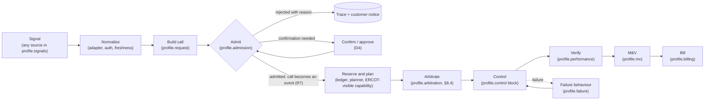
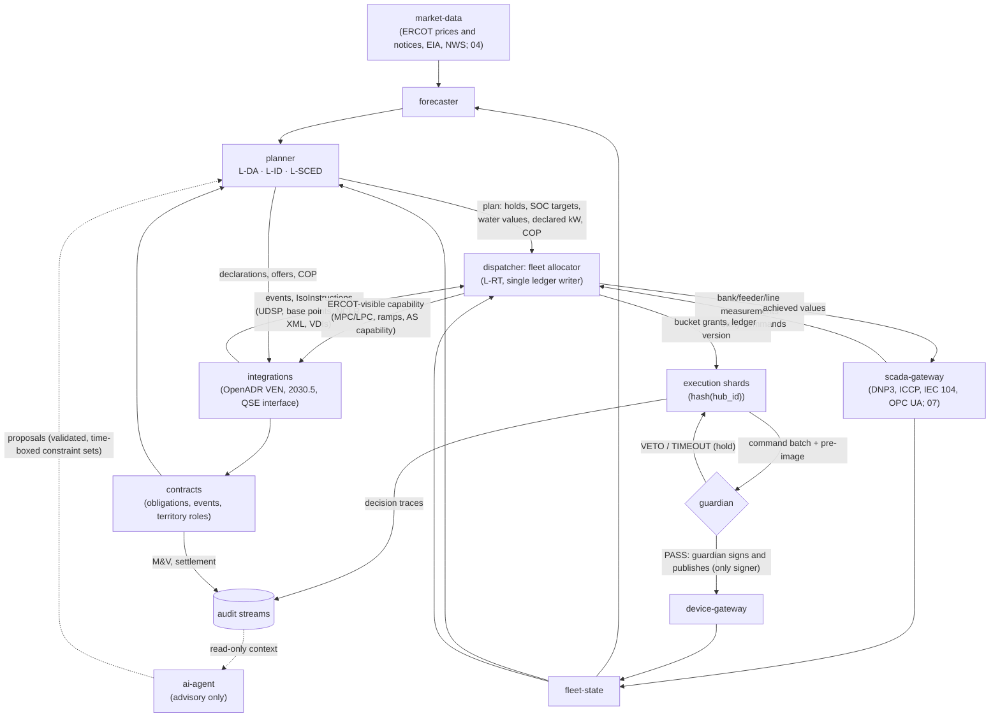
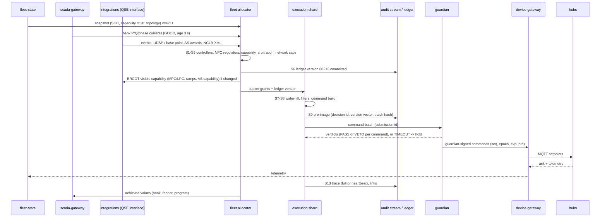
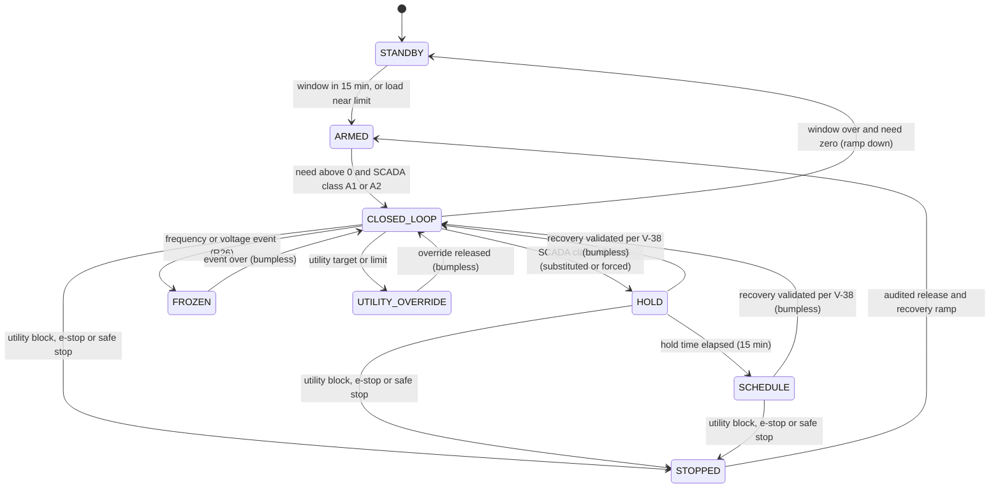
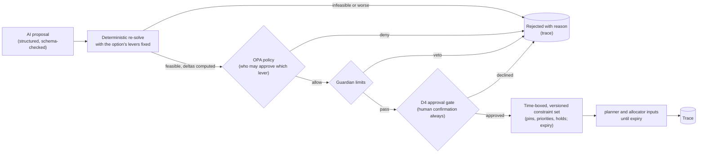

# OpenGrid Orchestrator — Decision Engine

**Forecasting · planning · real-time dispatch · call arbitration · decision trace · M&V and settlement math**

Status: v0.2 · 2026-09-25 (resolution pass after the four adversarial reviews `06-reviews/01…04` and the primary-source
check `06-reviews/05-claims-verification.md`; aligned with `00-decision-register.md` v0.2 — D0a–D5, R1–R50, Q1–Q25 and
the §F values V-01…V-41, which win wherever this document differed) · Author: independent power-systems control and
ERCOT market-operations engineer · Audience: every spec author and reviewer, the implementation team, utility and
market counterparties' technical reviewers. Per-finding dispositions: `06-reviews/resolution/A3-decision-engine.md`.

This document specifies the "brain" of the orchestrator: the behaviour of `forecaster`, `planner` and `dispatcher`;
how competing customer calls are arbitrated; how ERCOT instructions and the capability ERCOT is shown are handled; what
every decision records (the decision trace); how every service type's dispatch profile is executed by one generic
engine; how SCADA measurements, quality and latency enter the control laws; how the `ai-agent` may advise without ever
sitting in the control loop; and the measurement-and-verification (M&V) and settlement arithmetic that `contracts`
executes. It applies [`../00-brief.md`](../00-brief.md) (vocabulary, customer-type codes, service names, defaults,
conventions) and does not restate it.

### Changes in this version (v0.2)

Every review finding that cites this document was checked against the text before anything changed; ERCOT and
statutory claims were checked against the primary texts through `06-reviews/05-claims-verification.md` (ADER
Governing Document Phase 3.3, Nodal Protocols §2, §3.9.1, §6 and §8, the RTC+B training decks, NPRR1282, NPRR1002,
PURA §39.918 as amended by SB 231, PURA §35.153, the Austin Energy RCA and PJM OATT Attachment M-2). The reviewers'
arithmetic (GRD-003, -006, -007, -008, -012, -018, -032, -034) was re-derived; the results and every disposition are in
the resolution file. Nothing is dropped (D0a): every change keeps its customer type and changes how it is dispatched,
measured, constrained or sequenced. No ID was renumbered.

1. **ERCOT instructions are hard constraints (R17; GRD-001, -002, -013, -014, -017, -021, -022, -023, -039, -040, -057).**
   For an on-line ADER, ERCOT's instructions are `IsoInstruction`s at L2, followed by an ADER net-power (NPC) regulator
   that absorbs every other service's action on member hubs (§8.6.10). Arbitration between buyers happens before the
   fact, in the capability ERCOT is shown: MPC/LPC, ramp rates, AS capability, offers and the Current Operating Plan
   are computed from ledger-free, guardian-permitted capacity and updated within 2 s of a reservation change (§7.5).
   `ERCOT_ENERGY` and `ERCOT_AS` have `ALR` and `NCLR` variants (§2.6, §8.6.4). The T2/T3 split of one ERCOT
   instruction, the Example A variant that squeezed a base point and the pre-emption of ERCOT dispatch by
   AT_RISK/BREACH_LIKELY actions (BREACH_IMMINENT in `05`) are deleted. Price-responsive mode is used only for premises whose ADER is off line or
   unregistered. Shadow settlement follows ERCOT's billing determinants (Set Point Deviation, the RTC+B AS Imbalance
   Settlement with time-weighted RT awards, P&L on incremental NPC; §10.5). Per-ADER qualified-MW caps; AS award objects
   shaped like ERCOT's; ECRS 1 h and Non-Spin 4 h (V-33, claims check #6).
2. **Deferral control (R18, R28; GRD-003, -006, -007, -008, -026 … -030, -033, -034, -047, -051, -058).** Banks are
   regulated on apparent power or maximum per-phase current, with the fleet's own P and Q added back, against unit-typed
   ratings; the recharge headroom adds back the fleet's own charging (dispatcher and guardian); each contract states
   whether deferral performance is outcome-based or share-based, so the integrator never unwinds when another service
   relieves the bank; Example B is re-run in closed loop (§8.5, §8.6.1). Plausibility against deadbands and correlated
   signals, topology events, an OMS switching feed, one integrating loop per bank, low-pass feedforward, HOLD per V-38,
   LTC counting, reverse-flow defaults at feeder heads and line regulators, and a shift factor for `PIPELINE_AC`.
3. **Emergency posture and statute-shaped services (R19, R20, R27, R27a; GRD-004, -005, -015, -016, -018, -019, -024,
   -048, -049; JDG-017).** Reserves are pre-positioned on forecast risk and an EEA never adds grid charging (§8.6.9);
   `MOBILE_TEEEF` is island-forming only under the lessee TDU's control, with cold-load planning at the measured factor,
   and grid-parallel support is the separate `MOBILE_DER` variant (§8.6.7); `PARTNER_CAPACITY` gains a `TOLLING` variant;
   per-territory market roles, dual-participation modes, the SB 415 (PURA §35.153) reservation calendar; `PJM_CAPACITY`
   dispatches toward meter net load and is non-firm by default.
4. **Autonomous grid support (R26; GRD-009, -020, -025, -031).** Integrators, substitution and trust penalties freeze
   during frequency and voltage events; capability accounts for volt-var priority; settings conformance gates ADER and
   firm eligibility; non-protective stops are frequency-gated (V-16).
5. **Architecture alignment (R16, R22, R30, R31, R32, R37, R39, R42, R49; ARC-002, -004, -009, -012, -013, -016, -018,
   -019, -024, -025, -026, -041, -043, -044, -045, -048, -049, -054, -056; RT-002, -008).** One fenced fleet allocator and
   hash-keyed execution shards (§8.3); reservations committed before a batch is submitted and a trace pre-image persisted
   before signing (§8.1); a guardian TIMEOUT holds and pages and never stops (§8.13, §8.14); firm full output p99 ≤ 240 s
   (V-34); DM codes mapped onto `05`'s fleet modes; AI proposals as time-boxed constraint sets (§11.3); audit anchoring per
   V-23; stops through the guardian or the independent Safe-Stop Authority (§8.16).
6. **Insight and the "why" (R24; JDG-004, -005, -007, -010, -011, -012, -021).** FR-DE-050 is Must; the value of
   orchestration replays the real ERCOT year under four policies (§12.1); one breach lead-time target (V-41) with a
   calibration plot; the insight outputs are listed in §12.6; AS stays ring-fenced inside its awarded interval in every
   example.
7. **Normative values.** V-03 … V-07, V-12 … V-18, V-22, V-23, V-29, V-30, V-32 … V-35, V-38, V-39 and V-41 replace the
   local values they contradicted.
8. **New IDs:** FR-DE-136 … FR-DE-175; DM-14 … DM-16; A-DE-41 … A-DE-56. Every requirement carries a build tag (R21).

---

## 0. How to read this document

### 0.1 Ownership boundaries

| Topic | Specified here | Specified elsewhere (referenced, not repeated) |
|---|---|---|
| Forecast products, methods, uncertainty → over-enrollment and margins | Yes (§5) | Model training/serving infrastructure → `06-platform-and-operations.md` |
| Day-ahead, intraday and SCED-aligned optimization (math, solver settings, fallbacks) | Yes (§6) | Pod layout, scaling, leader election → `01-system-architecture.md` |
| Real-time allocation, arbitration, feedback control, substitution, degraded-mode causes | Yes (§8) | Failure catalogue `FM-*` and the operator-facing fleet modes → `05-failure-modes-and-recovery.md` (R42) |
| Control partitioning algorithms (fleet allocator, execution shards) | Yes (§8.3, §8.4) | Processes, shard table, call routing, partition assignment and handover → `01-…` and `02-…` (R30) |
| ERCOT instructions, the ADER net-power regulator, the capability ERCOT is shown, offers and COP content | Yes (§2.1, §7.3, §7.5, §8.6.10) | ICCP point encoding and cadence → `07-scada-integration.md` §2.3, §3.2; entities `IsoInstruction` and `CurrentOperatingPlan` → `02-…` (R37) |
| Decision-trace content and linking | Yes (§9) | Audit-log storage, chains, anchoring, signing keys, retention → `01-…`, `06-…`, `../03-security/02-security-architecture.md` (R22) |
| Declarations and simulated-QSE offer content | Yes (§7) | Wire formats (OpenADR 3.0, IEEE 2030.5, QSE) → `02-…`, `integrations` |
| How SCADA values, quality flags and latency enter control laws; precedence of utility commands | Yes (§4.2, §8.7) | Protocols, point maps, select-before-operate, time sync → `07-…` |
| End-to-end latency | The engine's segments (§3.4) | The one table with an owner per segment → `01-…` (R39, V-34) |
| M&V and settlement formulas | Yes (§10) | Record schemas, invoicing workflow → `02-…`, `contracts-batch` (R43) |
| Dispatch profiles per service type; the generic profile executor; adding service types by configuration | Yes (§2.5–§2.7) | Profile storage schema and admin API → `02-…`; profile editing screens → `../04-ui/` |
| `ai-agent` hand-off points, validation, time budgets | Yes (§11) | Agent service design, prompt security, cost controls → `01-…`, `../03-security/` |
| External data ingestion and its failure handling | No | [`04-external-data-integration.md`](04-external-data-integration.md) |
| Decisions, resolutions and normative values | No | [`../00-decision-register.md`](../00-decision-register.md) — it wins over this document |

### 0.2 Judging criteria this document serves

| Criterion (brief §2) | Where it is served |
|---|---|
| Completeness | §2.5–§2.7 a dispatch profile for every customer type; §3 end-to-end cadence; §8.13 degraded modes; §10 M&V → settlement; §12 validation |
| Technical depth | §4.3 state estimation; §5 probabilistic forecasting; §6 MILP; §8.4 arbitration LP; §8.6 feedback control on the right quantity; §8.6.10 ADER net-power regulator; §8.12 stability; §8.15 command ordering |
| The problem | §2 all nine customer types with `HOME` first; §7.5 one kWh one buyer at the ISO boundary; §8.4–§8.5 arbitration; §10 settlement |
| The "why" | §1 firm-first allocation on one ledger; §8.5 worked examples; §12.1 value of orchestration against today's rule allocator |
| Insight quality | §6.10 ownership map and price of firmness; §8.11 breach prediction with calibration; §9 displacement cost; §10.4 M&V-overlap report; §12.6 insight outputs |
| Usability | §7 declaration timeline; operator-visible modes (§8.13); scoped safe stop (§8.16); defaults tables with sources |
| Creativity | §2.7 new service types added by configuration, not code; §11 bounded AI advice |
| Performance | §3.4 latency budgets; §6.8 solver sizing; §8.4 bucketed arbitration; §9.3 trace volume; §12.5 |

### 0.3 Conventions

- **Units.** Power kW; apparent power kVA; reactive power kvar; current A; energy kWh; prices $/MWh; capacity payments
  $/kW-yr; durations kWh/kW (hours). Energy is AC at the service-point meter unless marked **DC** (at the cells).
  One-way efficiency $\eta_c=\eta_d=\sqrt{0.90}=0.9487$; 1 kWh DC delivers 0.9487 kWh AC (brief §6: 31.36 kWh DC →
  29.75 kWh AC). Every rating and limit is unit-typed (kVA, kW or A, with phase); a comparison of mixed units is rejected
  at profile and map validation (R18).
- **Sign.** Hub output $p>0$ is discharge; $p<0$ is charge. Bank load is positive when consuming. ADER net power
  consumption (NPC) is positive when the aggregate consumes (ERCOT's convention for Load Resources).
- **Time.** Everything is computed and stored in UTC. ERCOT intervals are labelled in America/Chicago: 5-min SCED
  intervals, 15-min settlement intervals $j$ (96 per day; 92 on the spring-forward day, 100 on the fall-back day),
  hour-ending conventions per ERCOT reports ([04 §5.3](04-external-data-integration.md)).
- **Labels on numbers.** Every number is sourced or labelled. Labels used: **reviewer proposal — unverified** (a
  candidate acceptance criterion from brief §3.2, to be confirmed with contracts, data and pilots); **reviewer claim —
  unverified** (a reviewer's factual argument; the engine measures and reports what it delivers, and the business case
  judges the claim); **business-case hypothesis — unverified**; **assumption A-DE-nn** (ours; register in §13);
  **V-nn** (a normative value of the register's §F table; this document never restates a different value). Such numbers
  are *configuration*, never constants in code (FR-DE-007). ERCOT rule facts cite the primary text as verified in
  `06-reviews/05-claims-verification.md` ("claims check #n").
- **Vocabulary** (decision register R7, R17, R30, R37). A **call** is any incoming request before validation — a
  webhook, a SCADA command, an `ai-agent` proposal, an operator action, a utility tolling schedule. Once the dispatch
  profile's admission chain has validated it against a contract (§2.5–§2.7), it becomes an **event** bound to an
  **obligation** (what a contract commits). Only events are reserved, arbitrated and dispatched; wherever §6–§10 speak of
  calls being allocated, they mean these admitted calls, i.e., events. An **`IsoInstruction`** is an ERCOT instruction for
  an on-line ADER (UDSP trajectory, base point, NCLR deployment or recall, Verbal Dispatch Instruction, status change,
  emergency action): it is validated and logged but never arbitrated — it is an L2 constraint (§2.1, §2.3). A
  **reservation** is the engine's ring-fenced share of a hub's power or energy for one obligation, stored in the
  reservation ledger (`Reservation`, `02-…`) whose single writer is the **fleet allocator** (§8.3). An **execution
  shard** turns the allocator's bucket grants into per-hub commands for the hubs whose `hash(hub_id)` it owns. An
  ADER is **on line** while its ERCOT resource status is ONL; ERCOT-visible capability is what ERCOT is shown for it
  (§7.5).
- **Requirements.** `FR-DE-NNN`, unique in this document, in tables: statement · rationale · measurable acceptance ·
  MoSCoW priority and build tag · source (user / reviewer / regulation / derived). They refine the product-level
  `FR-FCST-*`, `FR-PLAN-*`, `FR-DISP-*`, `FR-MV-*` of
  [`../01-product/02-functional-requirements.md`](../01-product/02-functional-requirements.md) (mapping in §14.2). IDs are
  unique but not strictly sequential by section: the dispatch-profile requirements of §2.7 are FR-DE-128…135, and
  FR-DE-136…175 were added in v0.2 next to the text they refine. Tests (`TC-*`), failure modes (`FM-*`) and alert rules
  (`ALR-*`) are assigned by their owning documents.
- **Build tags (R21).** Next to its MoSCoW priority every requirement carries `MVP-J` (Line A of the judged demo),
  `MVP-B` (Line B: planner, Insights, value of orchestration, performance evidence, OpenADR VEN, AI explanations,
  `SHADOW`, demo profile) or `R2` (later, design unchanged). Sequencing only — nothing is dropped. The release map in
  `01-product/03-epics-and-user-stories.md` is authoritative where it differs.

---

## 1. Why this engine

### 1.1 The problem in one paragraph

A hub is an 11 kW inverter over 31.36 kWh DC of usable energy (brief §6). The same kilowatt is worth something to up
to eight buyers — the ERCOT energy and ancillary markets through ADER, partner utilities at system peaks or under a
toll, a distribution utility behind one constrained bank, a data centre in its stress events, a pipeline operator on
one corridor, a utility leasing mobile units, a PJM capacity program — at different hours and places. That value exists
only if (a) the homeowner is never harmed, (b) every committed kilowatt is delivered at the promised time and place,
(c) no kilowatt-hour is sold twice — including at the ISO boundary, where ERCOT dispatches whatever it is shown — and
(d) the fleet follows the rules of the grid and market it serves. The decision engine is the machinery that makes
(a)–(d) true every 2–10 s, and proves it afterwards with meter data and a replayable decision trace.

### 1.2 Design principles and the mechanism that enforces each

| # | Principle | Mechanism (section) |
|---|---|---|
| P1 | Safety and `HOME` first — hard constraints, never penalties | Non-configurable precedence levels L0–L2 (§2.3); SOC measured above the homeowner reserve (§6.5 C2); guardian check on every command batch (§8.14) |
| P2 | **Service-agnostic dispatch** (brief §1, D0b): every validated call is executed within safety, device, reserve, grid-limit, authorization and contract-priority constraints; the engine never refuses, down-ranks or omits a call because of doubts about its impact | Generic call model and dispatch profiles (§2.1, §2.5–§2.7); impact is a business-case question (brief §1), never pre-judged by the allocator; delivery is measured and billed (§10) |
| P3 | Firm-first with **commitment protection** | Priority tiers decide contested *uncommitted* capacity; awarded AS holds, firm energy for later windows, tolled shares, declared capacity and the capability shown to ERCOT are ring-fenced (§2.4) |
| P4 | One ledger — every kW and kWh has exactly one owner, inside the platform and at the ISO boundary | Reservation invariants (§2.4) with one writer (the fleet allocator, §8.3), validated in plan (§6.10), allocation (§8.4), ERCOT-visible capability (§7.5), guardian (§8.14) and settlement (§10.4) |
| P5 | Feedback on the right quantity | Bank control on apparent power or maximum per-phase current — measured value plus the fleet's own P and Q added back — against unit-typed ratings, with time-aligned inputs (§8.6.1) |
| P6 | Fail toward the safe state | Hold, then schedule; never 0 kW on a firm contract; never an unvalidated new command (§8.6.1, §8.13); a guardian timeout holds and pages, never stops (§8.14); a lost ISO link holds the last set point flat (§8.13 DM-10) |
| P7 | Explain and replay every decision | Decision trace with input versions, candidates, binding constraints, winners, losers and their cost (§9) |
| P8 | Measure, don't assert | Reviewer and business-case numbers are per-contract parameters, always shown next to the measured value (§10) |
| P9 | ERCOT instructions are constraints, not calls (R17) | L2 `IsoInstruction`s followed by the ADER net-power regulator; buyers are arbitrated before the fact in what ERCOT is shown (§2.3, §7.5, §8.6.10) |
| P10 | Rules and statutes shape dispatch; they never judge a service's value (D0b) | ERCOT rules, PURA §39.918 and §35.153, PJM tariffs and utility interconnection terms become profile variants, admission blocks and control modes (§2.5, §2.6) — never a refusal or a down-ranking |

### 1.3 Why a four-layer hierarchy

Each layer decides what it has the information and the time to decide, and hands the layer below a feasible target
plus explicit headroom.

| Layer | Knows | Decides | Why at this cadence |
|---|---|---|---|
| Day-ahead plan (L-DA) | Tomorrow's forecasts with uncertainty; contracts; ERCOT DAM timeline; forecast grid risk (NWS, ERCOT notices) | Energy and AS offers, reserve holds, firm-window energy, tolled shares, declared capacity, charging windows, pre-positioning, mobile-unit assignments, the COP | Offers close 10:00 CT; declarations due 14:00 CT; binary decisions need a MILP and minutes of solve time |
| Intraday re-plan (L-ID) | Updated forecasts, actual SOC, awards, events announced | SOC targets per partition, holds, declaration updates, COP updates, breach risk | Forecast errors grow over hours; 15 min matches the settlement interval |
| SCED-aligned re-evaluation (L-SCED) | Latest 5-min base points, LMPs, RT MCPCs, look-ahead prices | Energy and AS targets per partition, water values, offer re-pricing | ERCOT re-dispatches every 5 min; an LP solves in about a second |
| Real-time allocation (L-RT) | Telemetry every 2 s (events and on-line ADER members) or 10 s (V-03, V-32), SCADA, live calls, ERCOT UDSP every 4 s | Per-hub setpoints by priority; ADER net-power regulation; feedback; substitution | Bank loads, house events and ERCOT set points move in seconds; hubs must be re-allocated before an interval is lost |

### 1.4 Why these algorithms

- **MILP for DA/ID (HiGHS via `highspy`).** Site/unit selection, charge-or-discharge exclusivity at negative prices,
  mobile-unit assignment and piecewise penalties need binaries; the formulation is already proven in the fleet-mix
  optimizer ([`fleet_lp.js`](https://base.tocy-net.net/opengrid/fleet_lp.js), solved by HiGHS at a 0.1% gap in
  [`optimizer.php`](https://base.tocy-net.net/opengrid/optimizer.php)).
- **LP for the 5-min layer.** No binaries (price screening removes the exclusivity need); warm-started from the
  previous basis.
- **Lexicographic LP plus water-filling for the 2-s layer.** Deterministic, explainable, O(n log n) in hubs, with
  duals that name the binding constraint — no binaries and no solver time limit inside the control loop.
- **PI with deadband, ramp limit and anti-windup for bank relief and ADER net-power regulation.** Both plants (fleet
  output → bank apparent power; member setpoints → ADER NPC) are delayed static gains; a PI with feedforward is
  adequate, tunable from the measured delay (§8.6.1, §8.6.10), and auditable by a utility or QSE engineer.
  Model-predictive control is deferred until per-bank SCADA history exists (assumption A-DE-01).

### 1.5 What the prototype taught (carried into this specification)

| Prototype behaviour (`/opt/opengrid_sim/control_engine.py`, `fleet_lp.js`) | Correction here |
|---|---|
| Live pool = whole fleet, not homes behind the bank (known limitation in the prototype's docstring) | Partition locality by topology (§8.3, FR-DE-034, FR-DE-062) |
| Deferral ramp 150 kW/min: an 862 kW contract needs 5.75 min to reach full output, above the 5-min bar | Up-ramp $\rho_{up}=\max(150,\,K_c/3)$ kW/min (§8.6.1, FR-DE-067, R13) |
| SCADA readings accepted up to 300 s old | 60 s gate with delay-aware gain scheduling (§4.2, FR-DE-068) |
| Bank relief computed on kW against a kVA rating; recharge limit on measured load that already contains the fleet's charging | Apparent power or per-phase current with the fleet's P and Q added back; recharge headroom with add-back (§8.6.1, R18) |
| Arbitration priced on `HB_NORTH` while the fleet settles in `LZ_CPS`/`LZ_AEN` | Load-zone prices, each recorded with the settlement it drives under the territory role model (§6.3, §8.10; [04 FR-ING-146, FR-ING-174](04-external-data-integration.md)) |
| Rolling-percentile arbitration rule (p75 of 2 h, $5/MWh spread) | Water-value policy from planner duals; the rule is kept as a fallback for premises allowed to run price-responsive (§8.6.5) |
| Firm draws as expected shares of days in the energy balance | Robust (P90 / worst-day) firm energy in the ONE floor (§6.5 C3) |
| Data-centre trigger = hub price > $200/MWh | `LARGE_LOAD` contracted stress events from the customer's signal (§8.6.3) |
| Separate SOC bounds for reserve and firm holds (fixed in the prototype `fleet_lp.js`) | One additive floor, kept and generalized (§6.5 C3) |
| Rule allocator: firm first, then hypothesis services, then market; fail-safe on bad signals | Kept as the F2 fallback plan (§6.9) and as the "today's rule allocator" reference policy of the value-of-orchestration replay (§12.1) |

---

## 2. Calls, obligations and priority

Criteria served: The problem, The "why", Technical depth.

### 2.1 The generic call (service-agnostic dispatch)

Every incoming request — a call — reaches the engine in the same structure, whatever the customer type. Adapters
(§2.2) translate protocol messages and controller outputs into it; admission (§2.5, element 3) validates it against a
contract and turns it into an **event** bound to an obligation (R7), assigning `event_id`. The allocator works only on
events and never branches on service type except through the fields below.

| Field | Meaning |
|---|---|
| `call_id`, `customer_id`, `contract_id`, `program_id`, `obligation_id`, `event_id` | Identity chain (brief §6); IDs per `02-domain-model-and-interfaces.md` |
| `service_type` | One of the nine codes in brief §3.1 |
| `variant` | Profile variant: `ALR` / `NCLR` (ERCOT lanes), `EVENT` / `TOLLING` (`PARTNER_CAPACITY`), `COOP` / `TDU_SB415` (`DIST_DEFERRAL`), `TEEEF` / `MOBILE_DER` (mobile units) |
| `request_kind` | `POWER_PROFILE` (kW vs time) · `ENERGY_BLOCK` (kWh within a window) · `CAPACITY_HOLD` (kW and kWh held, deployed on instruction) · `SETPOINT_TRACK` (kW recomputed every cycle by a controller) · `BAND` (bidirectional ± kW around zero) · `MODE` (mobile-unit operating mode) · `SCHEDULE` (a counterparty-set charge/discharge schedule on a reserved share, e.g. a toll) |
| `window` | $[t_s, t_e)$ UTC, plus notice time and maximum duration |
| `profile` | $K(t)$ in kW (or a controller reference for `SETPOINT_TRACK`), optional energy $E$ in kWh |
| `eligibility` | Partition selector: bank (with phase), feeder, utility territory, load zone, ADER resource, corridor, explicit unit IDs |
| `ramp` | Maximum up/down ramp kW/min and the "full output by" deadline |
| `firmness`, `tier` | `FIRM` / `NON_FIRM` / `PILOT`; commercial tier from the contract (§2.3) |
| `performance_rule` | Measurement method, performance basis for regulation profiles (`OUTCOME` or `SHARE`, §8.6.1), interval threshold $\theta$, season threshold, response deadline (§10.2) |
| `penalty_model`, `value_model` | Piecewise-linear shortfall cost (tolerance slope $\alpha$, breach slope $\beta$); marginal value per kWh and the settlement it is realized in (territory role model, §2.4) |
| `stacking` | Whether delivery may be co-counted with another named obligation (default: no — §10.4), and each counterparty's measurement method (§2.4) |
| `profile_ref` | Dispatch-profile ID and version governing admission, control mode, completion, M&V, billing and failure behaviour (§2.5) |
| `provenance` | Source system, signature, received-at, validation result, policy decision (OPA); `AI_DRAFTED` flag for intake drafts (RT-011) |

**ERCOT instructions are not calls (R7, R17).** For premises in an ADER whose resource status is ONL, ERCOT's Dispatch
Instructions enter as `IsoInstruction` records (`02-…`, R37): the SCED base point and the 4-s Updated Desired Set Point
(UDSP) of an ALR — which carries online Non-Spin and ECRS deployment, with no separate deployment message (claims check
#1; Protocols §6.5.7.4.1(3), §6.5.7.6.2.4(6)) — an NCLR's XML deployment and recall (GD 3.3 §5.f B), a Verbal Dispatch
Instruction relayed or received by the QSE desk, a status change and an emergency action, including a manual ECRS
deployment under §6.5.9 (claims check #1). Each is authenticated, checked for plausibility (base point within [LPC, MPC],
freshness, consistency between base point and UDSP; 07 §3.2.4), acknowledged, logged with the QSE-desk operator for
verbal instructions, executed and traced. It is **never** arbitrated, squeezed or priced against another customer's
call: it is an L2 constraint on the ADER aggregate (§2.3), followed by the ADER net-power regulator (§8.6.10). What
other customers may take from ADER members is decided *before the fact*, in the capability ERCOT is shown (§7.5). A valid
instruction is never refused; a shortfall is reported through telemetry and settled (07 §5.7).

### 2.2 Adapters: how each customer type becomes calls

| Service | Call sources | `request_kind` | Eligibility | Default tier | Delivery measured as | Reviewer challenge → measurements the engine reports |
|---|---|---|---|---|---|---|
| `HOME` | Hub telemetry; homeowner channel (opt-out, reserve change); NWS watches/warnings and ERCOT notices (pre-positioning) | Constraint, not a call; storm hold = `ENERGY_BLOCK` raising the floor before the risk window | The hub itself | L1 (not configurable) | Reserve integrity, backup served | Reserve never violated → 0-violation counter (KPI-09 of the vision document) |
| `ERCOT_ENERGY` | QSE interface (07 §3.2): ALR — SCED base point and 4-s UDSP per ADER; NCLR — no energy dispatch (GD §5.h); `market-data` load-zone prices with their settlement role; planner water values | `IsoInstruction` (ALR on line); `POWER_PROFILE` price-responsive (premises whose ADER is off line or unregistered); `SCHEDULE` of member NPC (NCLR) | ADER members (ALR: one load zone, one LSE, one DSP; GD §5.a) | L2 while on line (range decided before the fact at T3); T3 price-responsive | ALR: NPC vs UDSP (CLREDP, Set Point Deviation); price-responsive: premise meters at the settlement value the territory role model assigns | Merchant value and delivery charge → capture ratio vs perfect foresight; self-serve vs export split; value of orchestration (§12.1) |
| `ERCOT_AS` | QSE interface: DAM awards (hourly MW at MCPC), RT AS awards after every SCED run; ALR deployment through the UDSP; NCLR XML deployment and recall | `CAPACITY_HOLD` ring-fence + `IsoInstruction` deployment | ADER members | Ring-fence T2; deployment L2 | ALR: set point tracking; NCLR: meter-before/meter-after 95–150% band | Per-ADER qualified MW; diversion buyback → hold compliance, AS imbalance $, NCLR failure counter |
| `PARTNER_CAPACITY` | `EVENT`: OpenADR 3.0 events from the utility VTN, day-ahead notices. `TOLLING`: utility charge/discharge schedules or setpoints for the tolled share (OpenADR, IEEE 2030.5 or DNP3) | `POWER_PROFILE` (`EVENT`); `SCHEDULE` (`TOLLING`) | Hubs enrolled in the utility's territory | T1 in window (`EVENT`); continuous T1 reservation (`TOLLING`) | Meter-level delivered kW per hub (P10 inside export limits); availability of the tolled kW and kWh | P10 kW per hub, export limits, 4CP changes → per-hub P10/P50, export-limit binding counts, cycles against the budget |
| `DIST_DEFERRAL` | Bank controller (§8.6.1) on apparent power or maximum per-phase current; utility DERMS/SCADA setpoints and overrides; OMS switching orders | `SETPOINT_TRACK` | Hubs electrically behind the bank, phase-aware | T1 in window; `TDU_SB415`: reservation calendar | Per contract: bank loading ≤ limit (outcome) or the deferral's own delivered kW (share) | Measured sites, strict M&V → interval/season/availability compliance, SCADA step error, kVA and per-phase loading |
| `LARGE_LOAD` | Customer stress-event signal (webhook/REST, `grid-sim` in demo) | `POWER_PROFILE` in stress events | Contracted zone/feeders | T1 in window | Delivered kW in the zone during events | Credit path (SB 6) and deliverability → coincidence of delivered kWh with the load's stress intervals |
| `PIPELINE_AC` | Corridor smoothing controller on measured line current with the TO-supplied shift factor (§8.6.6); pilot schedule; H3 monitoring alerts | `BAND` (H1, closed loop only with a known shift factor), `POWER_PROFILE` (H2, or H1 without a shift factor); H3 creates no call | Hubs electrically downstream of the corridor line | T4 (pilot) | kW delivered; achieved line-current change = shift factor × delivered kW; RMU/coupon readings | Time-weighted AC standards → delivered band kW, achieved ΔI, line-current ramp statistics, RMU/coupon readings passed to the customer |
| `MOBILE_TEEEF` | Lessee TDU deployment requests with a declared qualifying outage and a switching-order ID; lease availability terms. `MOBILE_DER`: requests under the unit's own interconnection agreement | `MODE` (`ISLAND_FORMING`; `MOBILE_DER`: grid-parallel P/Q) | Mobile units (separate asset pool) | Own pool; restoration first | Unit meter, availability, readiness | Eligibility (PURA §39.918 as amended by SB 231), grounding, island protection, cold-load pickup → readiness and cold-load records |
| `PJM_CAPACITY` | Peak-hour predictions (PJM load forecast); program enrollment | `POWER_PROFILE` toward meter net load ≈ 0 on predicted 5CP hours | Hubs in the ComEd/PJM partition; premises registered with a PJM curtailment service provider excluded unless the contract handles them | T3 (non-firm by default; firm only by contract) | Customer load at realized 5CP hours vs baseline | Residential PLC method; one-year lag → PLC reduction at realized peaks |

### 2.3 Precedence levels and commercial tiers

Precedence is evaluated top-down. Levels L0–L2 are not configurable; tiers T1–T4 are the default commercial order
(brief §3.1) and are configurable per contract. Tiers order two things: what is reserved, offered and declared
(planning and admission, §6–§7), and who gets contested *non-ERCOT* capacity in real time (§8.4). An on-line ADER's
instructions are not in the tier order: they are L2 constraints followed by the net-power regulator (§8.6.10) on the
capability that was shown to ERCOT before the fact (§7.5).

| Level / tier | Contents | Configurable |
|---|---|---|
| **L0 Safety** | Guardian limits (per hub, service transformer, feeder, bank, fleet ramp), device protection and fault states, protective stops (operator, guardian, the Safe-Stop Authority of R16, utility `ESTOP`) | No |
| **L1 Home** | Homeowner reserve floor, home load served first, outage backup and islanding, opt-out, reserve changes, storm hold (pre-positioned, §8.6.9) | No |
| **L2 Grid and ISO operators** | (a) Utility/DSP operational commands on assets it operates: block/enable, bank or feeder limit, export limit, charge block; current switching state. (b) ERCOT instructions for an on-line ADER (`IsoInstruction`, §2.1) and the emergency posture of R19. Inside L2, (a) binds first — ERCOT does not enforce distribution limits (GD §5.c) — and ERCOT is shown the resulting capability within 2 s (§7.5); the QSE desk calls ERCOT when an instruction cannot be followed (§8.13 DM-10) | No |
| **T1 Firm in window** | `DIST_DEFERRAL` need windows and TDU reservation calendars; `PARTNER_CAPACITY` events and tolling reservations; `LARGE_LOAD` contracted events | Yes |
| **T2 ERCOT capability commitments** | The capacity behind `ERCOT_AS` awards and telemetered AS capability — ring-fenced for the awarded interval (an NCLR deployment until recall) | Yes |
| **T3 Energy and non-firm** | `ERCOT_ENERGY`: the ALR range offered to SCED (decided before the fact) and price-responsive dispatch of premises whose ADER is off line or unregistered; `PJM_CAPACITY` (non-firm by default, PJM partitions only) | Yes |
| **T4 Pilot contracts** | `PIPELINE_AC` smoothing (H1/H2) and other pilot contracts | Yes |

`MOBILE_TEEEF` units (and `MOBILE_DER` units) form a separate asset pool; its requests are arbitrated among themselves
(restoration requests by lessee priority, before planned `MOBILE_DER` support) and interact with the home fleet only
through shared constraints such as crews and depot charging (§6.7.7).

A tier override (for example, a `PIPELINE_AC` pilot contract that runs at tier "T2.5" in named windows so that its
smoothing is not displaced by arbitrage) requires an approved contract term and Tier 2 approval (a priority change,
decision register R3), is time-boxed, passes the OPA policy, and is written into every decision trace it affects.

**Firm commitments never deviate from an ERCOT instruction (R17).** A residual conflict between a firm commitment and an
on-line ADER's instruction is resolved in this order: (1) substitution from non-ADER hubs in the obligation's
eligibility; (2) AT_RISK with a notice to the counterparty (§8.11); (3) a status or telemetry change that applies from the
next SCED run — the reduced capability is telemetered within 2 s and the COP resubmitted (§7.5). Nothing in the tier
order ever moves an ADER member off the UDSP.

### 2.4 Commitments, ring-fencing and the one-kWh-one-buyer invariant

A **reservation** $\rho=(i,o,\text{kind},\text{amount},[t_s,t_e),\text{version})$ gives obligation $o$ exclusive use of part
of hub $i$'s power (kW) or energy (kWh DC). The fleet allocator is its only writer (R30, R37). For every hub $i$ and every
interval $t$:

$$\sum_{o} P^{res}_{i,o,t}\;\le\;P^{cap}_{i,t}\qquad\qquad
E_{i,t}-E^{home}_{i}\;\ge\;\sum_{o}E^{res}_{i,o,t}$$

where $P^{cap}_{i,t}$ is the hub's power capability after L0–L2 (§8.2), $E_{i,t}$ its DC energy, and $E^{home}_i$ its
homeowner reserve (default 20% of 39.2 kWh = 7.84 kWh DC, homeowner-adjustable). **Ownership:** every delivered kWh
is attributed to exactly one obligation (§10.4) unless both contracts explicitly permit co-counting, in which case the
kWh is flagged `CO_COUNTED` in the ledger and in the M&V-overlap report. An outcome-based deferral contract (§8.6.1)
buys an outcome — bank loading within its limit — not kWh; kWh that also produce that outcome stay attributed to their
own obligation and are reported as `CO_BENEFIT`.

**Ring-fencing rules.**

1. A call may draw on unreserved capacity and on its own reservations — nothing else.
2. An awarded AS hold (power $r$ and energy $H_k r/\eta_d$) is untouchable by every other call within its awarded
   interval, including T1 calls; an NCLR deployment keeps its hold until recalled. This implements brief §3.1: "a
   reserve award must never be diverted to a firm event." Forward release of future AS intervals is possible only
   through the exception path of §7.4 (policy flag, default off), and is always settled as an RTC+B buyback. A
   capability loss (utility block, safe stop, hub loss) is not a diversion; it is telemetered at once and priced (§10.5).
3. Firm energy for a later window ($R^{rob}_{o,t}$, §6.5) is untouchable by lower tiers and by other T1 obligations;
   the owning obligation uses it. This generalizes the prototype's `firm_reserve_kwh`.
4. Declared capacity (§7.2) is a reservation from the moment it is declared until the window ends or the customer
   releases it.
5. **ERCOT-visible capacity (R17).** For an on-line ADER, the capacity behind its telemetered MPC/LPC, ramp rates and AS
   capability (§7.5) is a reservation of kind `ISO_VISIBLE` for the SCED interval; no other call uses it in that
   interval. A buyer's claim on ADER members takes effect only after the reduced capability has been telemetered
   (≤ 2 s) and, for later hours, submitted in the COP.
6. **Tolled capacity (R27).** A `PARTNER_CAPACITY` `TOLLING` reservation (kW and kWh, with its SOC share) is continuous
   over the toll's term, not only in events; the utility schedules its charge and discharge (claims check #9); no other
   service uses the tolled share.
7. **TDU reservation calendar (R27).** A `DIST_DEFERRAL` `TDU_SB415` contract's reserved capacity (kW by hour) is a hard
   ring-fence against ERCOT offers, telemetry and the COP; it is discharged for the contract only on the TDU's direction
   (PURA §35.153(f)–(g); claims check #10).

**Territory role model (R27, GRD-016).** `contracts` holds, per territory and per ADER, who is the LSE, the QSE, the
Resource Entity and the DSP, and which settlement each price drives. In NOIE territory the NOIE is the DSP (and usually
the LSE): its consent per premise gates every ERCOT lane there (GD §5.c.2; 0 MW of ADER is approved in `LZ_AEN` and
`LZ_CPS` — claims check #15), and ERCOT value flows through the NOIE's contract with Base, not to Base directly. An ALR
ADER needs one load zone, one LSE and one DSP; premises of 100 kW or less must belong to the submitting LSE in both
models (claims check #4). Values used in arbitration (§8.4) and planning (§6.6) are the values the role model assigns to
the obligation's settlement; per-utility tariff tables (NOIE bundled rates and buyback terms, TDSP delivery charges)
replace the single Oncor delivery charge (§6.3). **Dual participation (R27, Q6):** per partner, either
*partner-as-QSE* — the partner's own QSE decisions (offers, self-schedules) arbitrate between its two services and Base
executes them — or *Base-as-QSE* — allowed only when the partner's calls on ADER members reach ERCOT before the fact
through the ADER's telemetry, offers and COP (rule 5). Premises in an ERS contract term are excluded from ADERs (GD
§5.c.3); concurrent partner dispatch after ADER qualification is an assumption to validate with each utility (claims
check #8, A-DE-41).

**External double counting (GRD-037).** Internal attribution makes one kWh one buyer inside the ledger; it cannot stop
two counterparties' own measurement methods from counting the same kWh — a co-op's 4CP bill follows its system load, a
deferral utility's SCADA sees any fleet discharge behind the bank as relief, ERCOT settles ADER NPC. For every pair of
contracts that can share hubs, admission records each counterparty's measurement method and predicts the overlap (the
kWh each method would count in the window) before the call is admitted; contracts carry a non-stacking or co-counting
clause keyed to those methods; the overlap report (§10.4) feeds invoicing, so a kWh credited twice externally is
disclosed on both invoices.

**Requirements — calls, priority, commitments**

| ID | Requirement | Rationale | Acceptance criterion | Priority | Source |
|---|---|---|---|---|---|
| FR-DE-001 | Represent every call from all nine customer types with the generic call structure of §2.1; the allocator reads only its fields | One allocator for all services; no per-service shortcuts | Contract tests: one fixture per service type and variant produces a valid call; allocator code has no branch on `service_type` outside adapters (static check) | Must · MVP-J | user |
| FR-DE-002 | Execute every event (validated call) within L0–L2, reservations and tier order; never refuse, down-rank or omit one because of doubts about its impact; report delivered vs requested per 15-min interval | Service-agnostic dispatch (brief §1, D0b) | For every event: a per-interval requested/granted/delivered record exists; no allocation rule references impact estimates; audit query finds 0 omissions | Must · MVP-J | user |
| FR-DE-003 | Apply precedence L0 > L1 > L2 > T1 > T2 > T3 > T4; allow per-contract tier overrides only with approval, OPA pass and a time box; ERCOT instructions for an on-line ADER are L2 constraints, never tier stages | Brief §3.1 default order, configurable per contract; R17 | Property test over random call mixes: no lower tier is granted capacity that a higher tier needed and could use; no allocation moves an on-line ADER member's aggregate off the UDSP; unapproved override rejected | Must · MVP-J | user / regulation |
| FR-DE-004 | Enforce ring-fencing rules 1–7 of §2.4; no within-interval use of an awarded AS hold or of ERCOT-visible capacity by any other call | Brief §3.1 (no diversion); RTC+B buyback; R17, R27 | Injected T1 shortfall with an active AS hold and an on-line ADER: AS hold and ERCOT-visible capacity unchanged in the same interval; trace shows `R-RINGFENCE-AS` / `R-ISO-VISIBLE`; tolled and TDU-calendar capacity never appears in ERCOT offers or telemetry | Must · MVP-J | user / regulation |
| FR-DE-005 | Maintain the reservation invariants of §2.4 in plan, allocation, ERCOT-visible capability, guardian check and settlement | One kWh never backs two buyers (brief §3.1) | Randomized property test (10⁵ cases): Σ reservations ≤ capability for every hub and interval; ERCOT-visible range ≤ ledger-free capacity; settlement attribution sums to metered output ±0.5% | Must · MVP-J | user |
| FR-DE-006 | Calls whose contract has no active dispatch profile, tier or penalty model are held in `PENDING_POLICY` (not executed, not discarded), the operator is alerted and the `ai-agent` may propose a mapping (§11) | Service-agnostic without guessing priority (register C-13) | Fixture with an unmapped contract: alert within 1 cycle; call visible in console; executes only after an approved mapping | Must · MVP-J | derived |
| FR-DE-007 | Every reviewer- or business-case-derived threshold (95%/98%/97%, ≤5 min, 20% over-enrollment, 0.95 rebound, P10 ≥ 9.5 kW, 14:00 declaration, ±10% step check) is a per-contract parameter carrying its label, always reported next to the measured value | Brief §3.2: arguments to be proven, not facts (R11) | Config schema rejects such a parameter without a `provenance_label`; console shows measured value next to each candidate threshold | Must · MVP-J | user |
| FR-DE-136 | Admit every ERCOT instruction for an on-line ADER as an `IsoInstruction` (UDSP trajectory and base point, NCLR deployment and recall, VDI, status change, emergency action incl. manual ECRS deployment): authenticate, check plausibility, acknowledge, execute at L2, trace; VDIs are entered by the QSE desk with an acknowledgement timer and kept with settlement records | R17, R25, GRD-001, GRD-021; claims check #1 | Fixtures per instruction kind: executed within 1 cycle, acknowledged, traced with the operator for VDIs; an instruction is never arbitrated against a call (static check: the allocator has no path that trades an `IsoInstruction` against a tier) | Must · MVP-J | regulation |
| FR-DE-152 | Keep a territory role model (LSE, QSE, Resource Entity, DSP per territory and ADER) and enforce its gates: DSP (NOIE) consent per premise for every ERCOT lane, one load zone/LSE/DSP per ALR ADER, LSE acknowledgment for NCLR, ERS exclusion, dual participation only in the partner mode recorded for that partner (partner-as-QSE, or Base-as-QSE with before-the-fact visibility); value every obligation at the settlement the role model assigns, with per-utility tariff tables | R27, GRD-016, GRD-024; claims checks #4, #8, #15 | Fixtures: a NOIE premise without DSP consent never enters an ADER; an ALR fixture with two LSEs is rejected; a Base-as-QSE partner event on ADER members is admitted only after the capability update of §7.5; profitability in a NOIE zone uses the NOIE contract's value, not the load-zone price | Must · MVP-J | regulation |
| FR-DE-166 | For every contract pair that can share hubs, record each counterparty's measurement method, predict the externally double-counted kWh at admission, require a non-stacking or co-counting clause keyed to the methods, and disclose realized overlap on both invoices | GRD-037 | Admission fixture with a co-op 4CP contract and a deferral contract on shared hubs shows the predicted overlap; missing clause → `PENDING_POLICY`; invoice lines carry the overlap note | Should · R2 | reviewer |

### 2.5 Dispatch profiles: the schema and the building-block library

Brief §3.5: the orchestrator receives signals and manages actions regardless of client and service type, and knows
how to handle each type's dispatch through a **dispatch profile** that one generic engine executes. A profile is a
versioned, declarative configuration document (stored and served per `02-domain-model-and-interfaces.md`) with eight
elements. Each element is composed only from a fixed library of building blocks implemented and tested in code;
profiles select and parameterize blocks, they never contain executable code. Rules and statutes enter as variants and
blocks; none of them ever refuses or down-ranks a service because of its value (D0b).

| # | Element | Profile fields | Building blocks available |
|---|---|---|---|
| 1 | Signal sources and protocols | `signals[]`: source, protocol, channel, authentication, cadence, freshness gate | `scada-gateway` points (DNP3, ICCP/TASE.2, IEC 60870-5-104, OPC UA); OpenADR 3.0 events; IEEE 2030.5 DER controls; QSE interface (base points, UDSP, AS awards, NCLR XML deployments, QSE-desk entries); OMS/ADMS switching orders; `market-data` prices, forecasts and ERCOT notices; customer REST/webhook; console; schedules; `fleet-state` telemetry |
| 2 | Request schema | `request`: kind (§2.1), variant, profile or setpoint expression, window, scope selector, ramp, duration, notice, firmness | Request kinds `POWER_PROFILE`, `ENERGY_BLOCK`, `CAPACITY_HOLD`, `SETPOINT_TRACK`, `BAND`, `MODE`, `SCHEDULE` |
| 3 | Validation and admission | `admission[]`: ordered checks with parameters | `CONTRACT_MATCH`, `AUTHZ` (OPA), `WINDOW_LIMITS` (count, duration, notice), `TOPOLOGY` (eligible hubs exist, phase-aware), `FEASIBILITY` (planner quick-check), `HOME_RESERVE`, `GUARDIAN_PRECHECK`, `CONFIRMATION` (impact thresholds, D4), `DSP_CONSENT`, `ADER_ELIGIBILITY` (one load zone/LSE/DSP, LSE acknowledgment), `ERS_EXCLUSION`, `CSP_EXCLUSION`, `DUAL_PARTICIPATION_MODE`, `QUALIFIED_MW_CAP`, `SETTINGS_CONFORMANCE`, `QUALIFYING_OUTAGE`, `INTERCONNECTION_AGREEMENT`, `OVERLAP_PREDICTION`, `CYCLE_BUDGET` |
| 4 | Allocation and control mode | `control`: mode, parameters, eligibility selector | `OPEN_LOOP_PROFILE` · `CLOSED_LOOP_REGULATION` (regulated quantity kVA or per-phase A or kW, measured points, fleet P and Q add-back per performance basis, deadband, ramps, gains, hold-then-schedule) · `PRICE_RESPONSIVE` · `EVENT` · `TOLLING_SCHEDULE` · `ISO_NPC_REGULATION` · `ISO_XML_DEPLOYMENT` · `SCHEDULED_NPC` · `CAPACITY_HOLD` · `BAND_SMOOTHING` · `SELF_SERVE_NET_LOAD` · `ISLAND_FORMING` · `MODE_CONTROL` |
| 5 | Priority class and arbitration | `arbitration`: tier, firmness, precedence list, penalty model, value model, stacking | Tiers of §2.3; piecewise penalty and value models of §8.4; territory role model (§2.4) |
| 6 | Completion and performance | `performance`: evaluator, basis, interval, threshold θ, season threshold, response deadline, sustain time, tolerance | `INTERVAL_AVERAGE` · `EVENT_AVERAGE` · `RESPONSE_TIME` · `SUSTAIN` · `SET_POINT_TRACKING` · `HOLD_COMPLIANCE` · `NCLR_DEPLOYMENT_BAND` · `OUTCOME_LOADING` · `BAND_TRACKING` · `PEAK_HOUR_REDUCTION` · `READINESS_TIME` · `AVAILABILITY` |
| 7 | M&V and billing | `mv`: metering source, baseline, settlement interval, reconciliation; `billing`: invoice-line rules | M&V: `DIRECT_HUB_METER` (certified meter only, §10.1) · `AMI_INTERVAL` · `SERVICE_POINT_NET` · `CBL_X_OF_Y` · `CBL_NET_OF_BATTERY` · `METER_BEFORE_METER_AFTER` · `SCADA_OUTCOME` · `SCADA_STEP_CHECK` · `ISO_SETTLEMENT_SHADOW` · `PLC_BASELINE`; billing: `CAPACITY_PAYMENT×PF` · `ENERGY×PRICE` · `AVAILABILITY_PAYMENT` · `LD_PER_FAILED_EVENT` · `DERATE_AFTER_N` · `BUYBACK` · `FIXED_FEE` |
| 8 | Failure behaviour | `failure`: substitution scope, degraded-mode map, notification rules, hold-then-schedule parameters | `SUBSTITUTE_WITHIN(scope)` · `SUBSTITUTE_NON_ADER_FIRST` · `HOLD_THEN_SCHEDULE(T_hold)` · `HOLD_LAST_SET_POINT` (ISO link loss) · `QSE_DESK(action)` · `CONTINUE_TO_DECLARED_END` · `NEUTRAL_ON_SIGNAL_LOSS` · `STOP_AT_LEASE` · `REHOME_HOLD` · `NOTIFY(channel, trigger)` |

### 2.6 The nine dispatch profiles (defaults; every number is a per-contract parameter)

**`HOME` — homeowner**

| Element | Content |
|---|---|
| Signals | Hub telemetry (MQTT via `device-gateway`); homeowner requests from Base's existing channel via `api`; NWS watches and warnings, ERCOT OCN/Advisory/Watch/EEA notices (04 §11.10) for pre-positioning; grid/island state |
| Request | Constraint updates, not calls: `reserve_pct`, `opt_out(window)`, `storm_hold(target SOC, window)` |
| Admission | Authenticated channel identity; reserve within the customer agreement's range; always admitted (L1) |
| Control mode | No allocation: hub firmware serves the home first and enforces the reserve; the engine updates floors $E^{home}_i$ and eligibility; storm holds are pre-positioned on forecast risk in low net-load hours, with ADER telemetry and COP updated first, and are never raised by grid charging during an EEA (§8.6.9, R19) |
| Priority | L1, not configurable |
| Completion | Reserve integrity at all times outside outage backup; opt-out and reserve change enforced ≤ 1 cycle after receipt |
| M&V and billing | No invoice line (membership billing is outside the orchestrator); reserve-breach counter (must be 0); backup energy served during outages reported |
| Failure | Hub silent → excluded from services, firmware keeps enforcing the reserve; requests queued and enforced on reconnect; a reserve deficit inside a need window recovers only within bank headroom (§8.6.1) |

**`ERCOT_ENERGY` — wholesale energy via ADER (variants `ALR`, `NCLR`)**

| Element | Content |
|---|---|
| Signals | QSE interface (07 §3.2): `ALR` — SCED base point per ADER and the 4-s UDSP; `NCLR` — no energy dispatch ("There is no SCED participation for ADERs participating as NCLRs", GD §5.h); resource status ONL/OUTL (QSE desk); `market-data` load-zone prices with their settlement role (04 FR-ING-174); planner water values |
| Request | `ALR` on line: `IsoInstruction` (UDSP trajectory), not a call. Price-responsive `POWER_PROFILE` only for premises whose ADER is off line (OUTL) or unregistered. `NCLR` members: a `SCHEDULE` of member NPC for each hour, published in the COP |
| Admission | Resource registered and qualified (an ALR also for SCED, GD §5.c.6); DSP consent per premise (NOIE as DSP in NOIE territory) and the role-model gates (§2.4, FR-DE-152); ERS premises excluded; instruction plausibility (base point within [LPC, MPC], fresh, consistent with the UDSP); offer caps (NP4-791-CD); energy bid always submitted for the offered range (claims check #2: without one ERCOT bids the LPC–MPC range at VOLL); guardian |
| Control mode | `ALR`: `ISO_NPC_REGULATION` — the ADER net-power regulator holds the members' aggregate net load on the UDSP trajectory and absorbs every other service's action on member hubs (§8.6.10). `NCLR`: `SCHEDULED_NPC` with baseline protection (§8.6.4). Off line or unregistered: `PRICE_RESPONSIVE` (§8.6.5) at the value the territory role model assigns |
| Priority | `ALR` instruction: L2; the range offered to SCED was decided before the fact at T3 (§7.3, §7.5). Price-responsive: T3 |
| Completion | `ALR`: `SET_POINT_TRACKING` — NPC against the UDSP, evaluated with ERCOT's CLREDP method and the Set Point Deviation charge (Protocols §6.6.5.1; claims check #1), tolerance a profile field set from those rules (A-DE-26). Price-responsive: executed vs planned per interval |
| M&V and billing | `ISO_SETTLEMENT_SHADOW` per ERCOT billing determinants for the resource type and settlement party (§10.5): Set Point Deviation line; energy as the LSE settles it (injections are negative load in the LSE QSE's settlement — GD §5.h); internal P&L on incremental NPC against the no-dispatch counterfactual; delivery charges from the territory tariff table |
| Failure | QSE link or ICCP lost → hold the last set point flat (never zero), the QSE desk calls ERCOT, agrees status (OUTL or hold) and substitute telemetry, updates the COP, then acts on ERCOT's instruction (DM-10, R25); member hub loss → the regulator re-distributes inside the ADER and MPC/LPC fall within 2 s; tracking at risk → QSE-desk alarm |

**`ERCOT_AS` — Non-Spin and ECRS via ADER (variants `ALR`, `NCLR`)**

| Element | Content |
|---|---|
| Signals | DAM awards (hourly MW per product at MCPC); RT AS awards after every SCED run (both variants — SCED still awards AS to NCLRs; claims check #3); deployment: `ALR` through the UDSP with no separate message; `NCLR` by XML deployment instruction and recall; `market-data` DAM and RT MCPC |
| Request | Ring-fence reservation per award: power $r$ and energy $H_kr/\eta_d$; `NCLR` deployment `IsoInstruction` {instruction ID, MW, time} held until a recall |
| Admission | Product allowed for ADERs (Non-Spin, ECRS); the ADER's qualified MW per product from the ERCOT-signed submission (GD §5.d) and the pilot-wide limits (500 MW registered, 100 MW Non-Spin, 100 MW ECRS, ≤ 90% per QSE; no ECRS headroom as of 2026-06-01 — claims check #15); energy feasible for $H_k$ (V-33: ECRS 1 h and Non-Spin 4 h, a profile field that switches Non-Spin to 2 h at NPRR1309 go-live — claims check #6); no firm-window conflict (C11); dual participation only in the partner mode of R27; ERS exclusion; guardian |
| Control mode | `ALR`: `CAPACITY_HOLD` ring-fence; deployment is part of the UDSP followed by the net-power regulator (§8.6.10). `NCLR`: `ISO_XML_DEPLOYMENT` (§8.6.4) — reach the instructed MW within the product's deployment time (ECRS 10 min; Non-Spin 30 min), hold it until recall, overshoot ≤ 10% of the instruction |
| Priority | Ring-fence T2 (untouchable inside the awarded interval; an NCLR deployment until recall); deployment L2; forward release only by §7.4 |
| Completion | `ALR`: `SET_POINT_TRACKING` + `HOLD_COMPLIANCE` (SOC ≥ $H_kr/\eta_d$; capability telemetered only for MW Base accepts being awarded and always covered by offers — claims check #2). `NCLR`: `NCLR_DEPLOYMENT_BAND` — delivered ≥ 95% and ≤ 150% of the instruction, measured against the GD's meter-before/meter-after baseline (the full 15-min interval before the instruction) and tracked against the 5-min pre-instruction telemetry baseline of Protocols §8.1.1.4.3(3)(e) (which one ERCOT applies: A-DE-43); remain deployed until recall; failure counter — two failures in a rolling 365 days mean disqualification (§8.1.1.4.3(5); claims check #3) |
| M&V and billing | DA award × DA MCPC; the RTC+B Ancillary Service Imbalance Settlement with RT awards time-weighted per SCED interval (§10.5); `NCLR` meter-before/meter-after evidence per event |
| Failure | Hub loss → `REHOME_HOLD` within the ADER; if impossible → AS capability telemetry reduced within 2 s, SCED awards less from the next run, imbalance priced (a capability loss, §2.4 rule 2). A deployed `NCLR` cannot be re-awarded: an L2 block during a deployment triggers an immediate QSE-desk call and substitution inside the ADER, and the event is scored in the failure counter (Example C) |

**`PARTNER_CAPACITY` — co-op / municipal capacity programs (variants `EVENT`, `TOLLING`)**

| Element | Content |
|---|---|
| Signals | `EVENT`: OpenADR 3.0 events from the utility VTN (`integrations` VEN); day-ahead notices; program calendar. `TOLLING`: the utility's charge/discharge schedules or setpoints for the tolled share (OpenADR 3.0, IEEE 2030.5 or DNP3) |
| Request | `EVENT`: `POWER_PROFILE` (start, duration ≤ 1.5 h default, program or per-hub kW, notice). `TOLLING`: `SCHEDULE` of kW (+ discharge, − charge) inside the reserved kW and kWh and the utility's SOC share |
| Admission | Program match; `EVENT`: count/duration/notice within contract; `TOLLING`: schedule inside the tolled kW/kWh, SOC bounds and the cycle budget (FR-DE-155); export limits; for ADER members, the partner's dual-participation mode (Base-as-QSE only after the capability update of §7.5); ERS exclusion; `AUTHZ`; guardian |
| Control mode | `EVENT`: `EVENT` with closed loop on aggregate delivered kW, target $\sum P10$ declared × $(1+m_o)$, P10 at the meter inside transformer caps and export limits (FR-DE-053). `TOLLING`: `TOLLING_SCHEDULE` — follow the utility's schedule on the tolled share with closed loop on its delivered kW (§8.6.2) |
| Priority | `EVENT`: T1 in window. `TOLLING`: T1 continuous reservation over the toll's term (ramp-in over the contract's installation ramp, e.g. 18 months to 40 MW for Austin Energy — claims check #9) |
| Completion | `EVENT`: `EVENT_AVERAGE` delivered vs committed; per-hub P10 and P50; response time and sustain per contract. `TOLLING`: `AVAILABILITY` of the reserved kW and kWh plus schedule tracking |
| M&V and billing | `EVENT`: `DIRECT_HUB_METER` (1-min output, certified meter) by default, `CBL_NET_OF_BATTERY` if the contract measures at the service point; `CAPACITY_PAYMENT×PF` monthly; export-limit gaps tagged structural. `TOLLING`: `AVAILABILITY_PAYMENT` ($/kW-month × availability; Austin Energy's is ≤ $8.50/kW-month — claims check #9); cycles reported against the budget |
| Failure | VTN lost mid-event → `CONTINUE_TO_DECLARED_END`; tolling schedule lost → hold the last received schedule to its end, then idle inside the reservation; `SUBSTITUTE_WITHIN(territory)`; OpenADR report of reduced capacity; breach-risk notice |

**`DIST_DEFERRAL` — substation / feeder deferral (variants `COOP`, `TDU_SB415`)**

| Element | Content |
|---|---|
| Signals | Bank SCADA via `scada-gateway` — P, Q, per-phase current, status, LTC tap (DNP3, ICCP, IEC 104, OPC UA; 07 §4.2); OMS/ADMS switching orders and planned outages with times (a contract precondition, R28); utility DERMS (IEEE 2030.5) and SCADA setpoints, limits, blocks; need forecast; declarations |
| Request | `SETPOINT_TRACK` per bank: regulated quantity (apparent power in kVA, or maximum per-phase current in A; kW only where the utility rates the bank in kW), unit-typed ratings, need window, contract kW, margin, performance basis. `TDU_SB415`: reservation calendar (kW by hour) |
| Admission | Contract and window; `TOPOLOGY` (hubs behind the bank, phase-aware); sizing check at end of term (§5.3) from `MEASURED` inputs, or `SYNTHETIC` ones only with a conservative multiplier the utility accepted (FR-DE-167); the list of every other closed loop acting on the bank with exactly one integrating loop assigned (R28); guardian (bank limits); utility command authentication and interlocks (§8.7, §8.15). `TDU_SB415`: the TDU's load-ratio share of the 100 MW statewide cap, competitive bid ID, prior PUCT authorization, PGC registration (PURA §35.153; proposed 16 TAC §25.58, Project 59523 — claims check #10) |
| Control mode | `CLOSED_LOOP_REGULATION` on the regulated quantity with the fleet's P and Q added back per the performance basis (§8.6.1); `HOLD_THEN_SCHEDULE(15 min)` with HOLD = max(held, scheduled) inside the window (V-38); no charging in the window except reserve recovery within headroom; rebound limit with add-back |
| Priority | T1 in window; explicit precedence against other T1 obligations on the same asset (FR-CTR-016). `TDU_SB415`: the calendar is a T1 reservation ring-fenced from ERCOT (§2.4 rule 7) and discharged for the contract only on TDU direction |
| Completion | Per contract (Q9): `OUTCOME_LOADING` — bank apparent power (or maximum phase current) ≤ its limit in every interval of the need window, SCADA step check as evidence — the default where the utility measures the bank; or `SHARE` — `INTERVAL_AVERAGE` of the deferral's own delivered kW ≥ θ of its requested kW. Season ≥ 98%, availability ≥ 97% of need hours, `RESPONSE_TIME` ≤ 5 min (all reviewer proposals — unverified) |
| M&V and billing | `OUTCOME`: `SCADA_OUTCOME` (bank loading) with hub meters as supporting evidence. `SHARE`: `DIRECT_HUB_METER` behind the bank where the hub meter is certified for that utility, else `AMI_INTERVAL` (§10.1), reconciled to 15-min AMI; `SCADA_STEP_CHECK` ±10% (candidate); `CAPACITY_PAYMENT×PF` − `LD_PER_FAILED_EVENT`; `DERATE_AFTER_N` (N = 2, candidate) |
| Failure | SCADA unusable → HOLD 15 min, then SCHEDULE; topology event → re-estimate membership, alert, larger margin (§4.2); hub loss → `SUBSTITUTE_WITHIN(bank, phase)` only; shortfall → breach-risk notice and DERMS availability update |

**`LARGE_LOAD` — data-centre / large-load offset**

| Element | Content |
|---|---|
| Signals | Customer stress-event signal (signed REST/webhook; `grid-sim` in the demo) or contracted schedule; optionally ERCOT conditions if the contract defines the trigger |
| Request | `POWER_PROFILE` event: start, end, kW, zone/feeder scope |
| Admission | Contract; event limits; `TOPOLOGY` (contracted zone/feeders); for ADER members, the event's reservation is withdrawn from ERCOT's view before the stress window (§7.5); guardian |
| Control mode | `EVENT` with closed loop on delivered kW in scope (no substation measurement needed) |
| Priority | T1 in window (contracted events) |
| Completion | `EVENT_AVERAGE` ≥ θ of requested kW (per contract); response time per contract |
| M&V and billing | `DIRECT_HUB_METER` in scope; delivered kWh coincident with the customer's stress intervals; `CAPACITY_PAYMENT×PF`. Whether the offset is credited toward the load's own obligations (SB 6) is a business-case and regulatory question (reviewer claim — unverified); the engine reports delivered kWh and coincidence |
| Failure | Signal lost (register C-15; NFR-002 hold-then-schedule): with a declared event end → `CONTINUE_TO_DECLARED_END`; without one → hold the delivered level for `T_hold` (15 min default), then the contracted schedule if one exists, otherwise ramp down at the release ramp — never a step to standby; `SUBSTITUTE_WITHIN(scope)`; webhook notice |

**`PIPELINE_AC` — pipeline AC interference (H1/H2 smoothing pilot; H3 monitoring)**

| Element | Content |
|---|---|
| Signals | Corridor line current from utility SCADA/ICCP via `scada-gateway`; the line-current sensitivity (shift factor) of the corridor partition's injection on the monitored line, supplied by the transmission owner or ERCOT model (07 §4.5); pilot schedule from the pipeline customer's API; RMU/test-station readings (for M&V pass-through); H3 corridor-change detections from `market-data` geospatial sources ([04 §11.7](04-external-data-integration.md)) |
| Request | H1 `BAND` (corridor, band kW, line-current ramp limit A/min, window) when the shift factor is known; otherwise the customer's `POWER_PROFILE` schedule; H2 `POWER_PROFILE`; H3 creates alerts only, no call |
| Admission | Pilot contract; `TOPOLOGY` (hubs electrically downstream of the line); band feasibility (C3/C4 headroom); guardian |
| Control mode | `BAND_SMOOTHING`: ramp-limit filter on measured line current, converted to kW through the shift factor, clipped to the band (§8.6.6); open-loop kW schedule when the shift factor is unknown; recharge-placement term (§6.7) |
| Priority | T4 pilot (default); a higher tier in named windows if the contract says so (§2.3) |
| Completion | `BAND_TRACKING`: delivered vs requested action per 5 min within tolerance; band availability in pilot windows |
| M&V and billing | Delivered kW (hub meters); achieved line-current change = shift factor × delivered kW; line-current ramp statistics; RMU/coupon readings reported to the customer; `FIXED_FEE` per pilot contract. Whether time-weighted AC falls is a business-case question (reviewer claim — unverified) |
| Failure | Line current unusable → `NEUTRAL_ON_SIGNAL_LOSS` (band to 0 kW), resume on recovery; `SUBSTITUTE_WITHIN(corridor)`; customer notice |

**`MOBILE_TEEEF` — mobile restoration units leased to a TDU (statute-shaped, PURA §39.918; variant `MOBILE_DER`)**

| Element | Content |
|---|---|
| Signals | The lessee TDU's deployment requests carrying a declared significant power outage (§39.918(b)(1)) and the switching-order ID (API; console intake; `ai-agent` intake drafts always confirmed); unit telemetry (separate device class via `device-gateway`); readiness |
| Request | `MODE`: units, site, window, `ISLAND_FORMING`, island load planned at the measured cold-load factor (§8.6.7) |
| Admission | Lease with a TDU (§39.918 does not reach co-ops or municipally owned utilities, which record their own legal basis — claims check #5); the lessee-declared qualifying outage; unit eligibility under SB 231 (mobile, movable from its staged location in under 12 h, ≤ 5 MW; the 1 MW / 2 MWh units qualify); commissioning gate (grounding, protection settings, switching order; licensed field-engineer sign-off, register Q20); no ERCOT telemetry, no market participation, no inclusion in ISO pricing or reliability models (§39.918(d)) |
| Control mode | `ISLAND_FORMING` under the lessee's operational control: Base reports readiness (all interlocks satisfied) and may request; the lessee's operator closes under the switching-order ID (07 §3.1.11); the engine manages energy, swaps and the cold-load plan (§8.6.7) |
| Priority | Own asset pool; restoration requests ordered by the lessee's priority |
| Completion | `READINESS_TIME` (request → ready to energize) per lease; availability %; energy served; island continuity |
| M&V and billing | Unit meters; `AVAILABILITY_PAYMENT` × availability; deployment fees (`FIXED_FEE`). No energy or AS sales from the units (§39.918(c)); an "energy pass-through" line exists only after legal review against §39.918(c) (register R20) |
| Failure | Unit fault → planned swap; comms loss → unit continues under local control; lessee dispatcher notified |

`MOBILE_DER` variant: grid-parallel planned support (P/Q setpoints, open-loop or closed-loop on a site meter) is a
distributed-energy-resource contract under the unit's own interconnection agreement — admitted only with that
agreement's ID, carrying no TEEEF billing lines, dispatched from the same pool (§6.7.7).

**`PJM_CAPACITY` — PJM peak-load contribution (ComEd), future adapter**

| Element | Content |
|---|---|
| Signals | PJM load forecast (Data Miner 2, [04 §11.9](04-external-data-integration.md)); peak alerts from the program operator (future); weather |
| Request | `POWER_PROFILE` toward meter net load ≈ 0 on predicted coincident-peak hours: day, hours, kW; export only where a contract pays for it |
| Admission | Program enrollment; daily energy budget; premises registered with a PJM curtailment service provider excluded unless the contract handles them (their PJM load drops are added back to the PLC — claims check #11); guardian |
| Control mode | `SELF_SERVE_NET_LOAD`: hub output tracks home net load (meter net load 0 ± deadband) in called hours (§8.6.8) |
| Priority | T3, non-firm by default (R27, register C-16); a firm tier only by contract |
| Completion | Net-load reduction delivered in called hours; value realized only at the actual five peaks, known after the season |
| M&V and billing | `PLC_BASELINE`: the customer's load at PJM's five summer peaks plus Load Drop Estimates plus losses, with ComEd's peak adjustment and a possible class-average fallback (OATT Attachment M-2 ComEd §2–§3; claims check #11); settlement in the next delivery year |
| Failure | Prediction miss → no penalty, value lost (reported); `SUBSTITUTE_WITHIN(PJM partition)`; operator notice |

**Requirements — ISO, territory and statute-shaped variants**

| ID | Requirement | Rationale | Acceptance criterion | Priority | Source |
|---|---|---|---|---|---|
| FR-DE-142 | Consume AS awards, deployments and recalls in ERCOT's shapes: DAM awards {resource, product, hour ending, MW, MCPC $/MW-h}; RT awards per SCED run {resource, product, MW}; NCLR deployments {instruction ID, MW, time, recall}; no "hold hours" or $/kW-yr fields | GRD-039; RTC+B telemetry (awards after every SCED run) | Simulated-QSE contract tests (04 §12.6) round-trip every shape; a payload with `hold_hours` or `price_per_kw_yr` is rejected | Must · MVP-J | regulation |
| FR-DE-153 | Provide the `TDU_SB415` variant of `DIST_DEFERRAL`: reservation calendar ring-fenced from ERCOT offers, telemetry and COP; contract metadata (load-ratio share of 100 MW, bid ID, PUCT authorization, PGC); discharge for the contract only on TDU direction; ERCOT sales only from unreserved capacity | R27, GRD-048; PURA §35.153; claims check #10 | Calendar fixture: calendar kW never appears in offers or telemetry; a contract exceeding the TDU's share is rejected at admission; discharge without a TDU direction is blocked | Should · R2 | regulation |
| FR-DE-148 | Run `MOBILE_TEEEF` as statute-shaped (island-forming only, lessee-operated, qualifying outage declared by a TDU lessee, SB 231 unit limits, no ERCOT telemetry or sales) with the `MOBILE_DER` variant for grid-parallel support under its own interconnection agreement | R20, GRD-005, GRD-019; claims check #5 | Fixtures: a TEEEF request without a qualifying outage is held in `PENDING_POLICY`; no TEEEF unit ever appears in ADER telemetry or offers; a grid-parallel request is admitted only as `MOBILE_DER` with an agreement ID; Base never issues a close | Must · MVP-J | regulation |

### 2.7 The generic executor and new service types by configuration



- **One code path.** The dispatcher, planner and `contracts` execute every profile through the same pipeline; the only
  per-type logic is inside library blocks, each unit-tested and shared by any profile that selects it.
- **Adding a service type by configuration** (e.g., a utility asking the fleet to keep a feeder's midday reverse flow
  below a limit — a `FEEDER_HOSTING_LIMIT` profile composed of `scada-gateway` feeder kW, `SETPOINT_TRACK`,
  `CLOSED_LOOP_REGULATION` with charging allowed, T1, `INTERVAL_AVERAGE`, `SCADA_STEP_CHECK`,
  `AVAILABILITY_PAYMENT`, `HOLD_THEN_SCHEDULE`): author the profile → schema validation → static rules (every
  closed-loop mode names a measured point with a freshness gate and a unit-typed limit; every firm profile defines
  signal-loss behaviour; every billing line references an M&V output; every scope resolves to hubs) → conformance run in
  simulation (`agent-sim`, `grid-sim`, the profile's failure behaviours injected) → **activation gate by risk (R10,
  R47):** a tighten-only or safety change passes the golden week plus a guardian-envelope check; a change that loosens
  priority or limits, and every new service type, passes the replay of the real ERCOT year (its CI cost is documented in
  `06-…`) → Tier 2 approval (a new type always sets priority and limits; decision register R3, R10) → activation as a
  new, signed, effective-dated version. A behaviour the library cannot express requires a new block — a code change with
  review — never a script inside a profile.
- **Versioning (V-27).** A running event keeps its profile version for evaluation and settlement; a tightened safety
  limit is enforced by the guardian within one cycle; a loosened one waits for the next event. New obligations pin the
  version current at admission.

**Requirements — dispatch profiles**

| ID | Requirement | Rationale | Acceptance criterion | Priority | Source |
|---|---|---|---|---|---|
| FR-DE-128 | Define every service type by a versioned dispatch profile with the eight elements of §2.5, composed only of library blocks | Brief §3.5 | Schema rejects a profile missing any element or naming an unknown block | Must · MVP-J | user |
| FR-DE-129 | Provide the nine default profiles of §2.6 with their variants; per-type behaviour comes only from profiles | All customer types dispatched (brief §3.1, D0a) | One end-to-end fixture per profile and variant (signal → invoice line) passes in simulation | Must · MVP-J | user |
| FR-DE-130 | Execute any active profile through the single pipeline of §2.7 | Service-agnostic dispatch | Static check: no `service_type` branching outside blocks; profile swap changes behaviour without code change | Must · MVP-J | user |
| FR-DE-131 | Allow new service types by configuration with schema validation, static rules, simulation conformance, the risk-tiered activation gate of R10/R47 and Tier 2 approval (R3) before activation | Brief §3.5 ("by configuration, not code"); ARC-054 | `FEEDER_HOSTING_LIMIT` fixture profile activated and dispatched with zero code change; an invalid profile is blocked at each gate; a tighten-only change activates after the golden week without the full-year replay | Must · MVP-J | user |
| FR-DE-132 | Run the profile's admission chain for every call and trace the outcome (admitted as an event bound to an obligation, rejected with reason, pending confirmation); only events are reserved, arbitrated and dispatched (R7) | Validation and admission per type | Every call has an admission record; every event references its call and obligation; rejected calls carry a machine-readable reason and customer notice | Must · MVP-J | user |
| FR-DE-133 | Evaluate completion and performance per profile per interval/event and publish delivered vs requested and compliance | "What delivered means" per type | Evaluator outputs exist for 100% of intervals of active obligations; values reproducible from M&V data | Must · MVP-J | user |
| FR-DE-134 | Apply profile versions per V-27: a running event keeps its version for evaluation and settlement; a tightened safety limit applies within one cycle; a loosened one waits for the next event | Predictable behaviour mid-window (register K8) | Mid-event profile change fixture: evaluation and settlement unchanged; tightened limit enforced within 1 cycle; loosened limit applies from the next event only | Must · MVP-J | derived |
| FR-DE-135 | Maintain a conformance test per profile, including its failure behaviours, run on every profile or block change | Configuration must not break dispatch | CI blocks activation when a conformance test fails | Must · MVP-J | derived |

---

## 3. Decision hierarchy, cadences and latency budgets

Criteria served: Completeness, Technical depth, Performance.

### 3.1 Layers

| Layer | Service | Cadence (defaults, brief §4, V-03) | Horizon / resolution | Output | Algorithm | Budget |
|---|---|---|---|---|---|---|
| L-DA | `planner` | 06:00 and 08:30 CT (pre-DAM); 13:35 CT (post-DAM) | Operating day D+1 00:00–24:00 CT plus tail to D+2 06:00; 15-min for D+1, hourly tail | Offers, holds, firm energy, tolled shares, declared capacity, charge windows, pre-positioning, mobile assignments, COP, ownership map | MILP (§6) | Target 300 s, ceiling 900 s (V-20) |
| L-ID | `planner` | Every 15 min at :00/:15/:30/:45 UTC, plus event triggers (FR-DE-009) | Now → +36 h; 15-min for 6 h, hourly after | SOC targets and bounds per partition, holds, declaration and COP updates, breach risk | MILP, warm-started | Target 45 s, ceiling 120 s (V-20) |
| L-SCED | `planner` fast path | Every 5 min on new base points / SCED data | Now → +2 h; 5-min | Energy/AS targets, water values $\nu_{b,t}$, hourly offer re-pricing | LP, basis reuse | `time_limit` 5 s |
| L-RT | `dispatcher`: one fenced fleet allocator and hash-keyed execution shards (R30) | 2 s during an active event and for members of an on-line ADER; 10 s otherwise (V-03) | Next cycle | Per-call, per-bucket kW grants; per-hub setpoints; ADER net-power regulation (§8.6.10); ERCOT-visible capability updates (§7.5) | Lexicographic LP + water-filling + PI (§8) | 250 ms p99 at 10k hubs (FR-DE-012) |
| L-HUB | `device-gateway` → hub | Per command | — | Setpoint executed with firmware ramp; local autonomy on lease expiry (V-07) | Hub firmware | Ack per NFR-014 of `01-system-architecture.md` |

### 3.2 Data and decision flow



### 3.3 Event triggers for an out-of-cycle intraday re-plan

A new or changed obligation or event; a topology change affecting a partition with an obligation in the next 24 h
(including an applied switching order, §8.10); a risk level rising to `AT_RISK` (§8.11); a loss of more than 5% of a
partition's forecast deliverable kW; DAM results arriving; a utility block/limit command; an ERCOT OCN, Advisory, Watch or
EEA notice, or an NWS watch or warning, for the next 48 h (pre-positioning, §8.6.9); an ADER status change (ONL/OUTL);
an approved `ai-agent` proposal. Triggers are debounced (at most one triggered re-plan per partition per 60 s).
A reservation change on ADER members does not wait for a re-plan: the ERCOT-visible capability is recomputed within 2 s
and the COP resubmitted per §7.5.

### 3.4 Latency budgets (measured, exported as metrics)

The end-to-end table with one owner per segment is `01-system-architecture.md`'s (R39); the rows below are the
engine's segments and use the same values.

| Stage | Budget | Governing requirement |
|---|---|---|
| Hub telemetry sample → `fleet-state` updated | p99 ≤ 5 s at 10k hubs; design target ≤ 2 s during events and for on-line ADER members | NFR-013 of `01-…` |
| SCADA sample (source timestamp) → available to `dispatcher` | ≤ the path's A1 threshold for full closed-loop gains (set per path at commissioning, §4.2); ≤ 60 s absolute | Reviewer proposal — unverified (≤ 60 s latency) |
| UDSP received → member setpoints submitted (ADER net-power regulator) | ≤ 1 cycle (2 s) | FR-DE-139 |
| Reservation or guardian-limit change → ERCOT-visible capability recomputed and handed to `integrations`/`scada-gateway` | ≤ 2 s (R17) | FR-DE-137 |
| Fleet allocator + shard compute, 10,000 hubs | p99 ≤ 250 ms (≤ 12.5% of a 2-s cycle) | FR-DE-012 |
| Fleet allocator + shard compute, 100,000 hubs (shard count per `01`'s shard table, R30) | p99 ≤ 800 ms | FR-DE-012 |
| Guardian admission and signing per batch (≤ 2,000 commands) | p99 ≤ 250 ms; no verdict within 2 × budget is a TIMEOUT — never a veto, never a stop (V-35) | FR-DE-092 |
| Command publish → hub acknowledgement | p95 ≤ 2 × active cycle (V-04) | NFR-014 of `01-…` |
| Hub ramp to setpoint (firmware) | ≤ 10 s (assumption A-DE-02) | — |
| Staggered start window | ≤ 30 s (§8.12, V-34) | FR-DE-089 |
| Firm event receipt → full output | design target p99 ≤ 240 s; requirement ≤ 300 s (V-34; reviewer proposal — unverified): detection ≤ 2 s + admission ≤ 5 s + stagger ≤ 30 s + ramp ≤ 180 s at $K_c/3$ per minute (R13) + hub ramp ≤ 10 s ≈ 227 s | FR-DE-013, NFR-012 |
| Bank loop dead time (bank sample → the dispatcher sees the fleet's response) | ≤ 3 cycles typical (V-34); gains scheduled on the measured value (§8.6.1) | FR-DE-068 |
| New SCED base point / prices → SCED-layer targets published | ≤ 20 s | FR-DE-010 |
| Intraday re-plan solve | p95 ≤ 20 s (target 45 s, ceiling 120 s; V-20) | FR-DE-051 |
| Day-ahead solve at demo scale | p95 ≤ 120 s (target 300 s, ceiling 900 s; ≤ 15 min p99 at 100k hubs; V-20) | FR-DE-051, NFR-016 |

**Requirements — hierarchy and timing**

| ID | Requirement | Rationale | Acceptance criterion | Priority | Source |
|---|---|---|---|---|---|
| FR-DE-008 | Run L-DA at 06:00 and 08:30 CT (pre-DAM) and 13:35 CT (post-DAM) with the outputs of §3.1 | DAM closes 10:00 CT; declarations 14:00 CT | Scheduler log over 30 days: 100% of runs start within 60 s of schedule; outputs published before 09:30 and 13:50 CT | Must · MVP-B | user |
| FR-DE-009 | Run L-ID every 15 min and on the event triggers of §3.3 (debounced 60 s per partition) | Forecast drift; events; grid-risk notices | Soak test 24 h: max gap between plans ≤ 15 min + 45 s; each trigger fixture causes a re-plan within 90 s | Must · MVP-B | user |
| FR-DE-010 | Run L-SCED within 20 s of each new SCED base point or SCED price posting | SCED re-dispatches every 5 min | p99 (data arrival → targets) ≤ 20 s over 24 h | Must · R2 | user |
| FR-DE-011 | Run L-RT at 2 s for any partition with an active event and for every member of an on-line ADER (V-03), otherwise 10 s | Brief §4 cadence; an on-line ALR is dispatched continuously, not only in AS hours (GRD-022) | Measured cycle interval within ±10% of target over 1 h, per partition; an ADER switching to ONL moves its members to 2 s within one cycle | Must · MVP-J | user / regulation |
| FR-DE-012 | Meet the compute budgets of §3.4 and export per-stage latency histograms | Performance must be measured | Load test at 10k simulated hubs: cycle p99 ≤ 250 ms; 100k-hub shard test p99 ≤ 800 ms | Must · MVP-J | user |
| FR-DE-013 | Reach full output ≤ 300 s after a firm event starts (per-contract parameter; reviewer proposal — unverified); design target p99 ≤ 240 s (V-34, R39) | Response-time bar; the 3-min ramp of R13 alone takes 180 s (ARC-016) | Replay of 50 events: p99 ≤ 240 s; 100% ≤ 300 s; per-segment timings of §3.4 recorded in the trace | Must · MVP-J | reviewer |
| FR-DE-014 | Compute in UTC; map ERCOT intervals via America/Chicago including DST days (92/100 intervals) | Brief §4 time rule | DST-day fixtures (2025-11-02, 2026-03-08) produce 100/92 settlement intervals with no gap or overlap | Must · MVP-J | user |

---

## 4. Inputs, freshness and state estimation

Criteria served: Technical depth, Completeness. External-data freshness policies per consumer are specified in
[04 §6](04-external-data-integration.md); this section specifies how the decision engine reacts.

### 4.1 Input catalogue and freshness gates

Every cycle reads a **consistent snapshot**: a version vector of the fleet-state snapshot, market-data batch IDs,
topology version (GIS version plus applied switching orders), contract/policy versions, the ledger version and the plan
version. The vector is written into the decision trace (§9) so the decision can be replayed exactly.

| Input | Producer | Nominal cadence | Gate for L-RT | Gate for L-SCED / L-ID / L-DA | Reaction when stale or bad |
|---|---|---|---|---|---|
| Hub telemetry: P, Q, SOC, home load, PV, EV state, grid/island state, reserve setting, opt-out, firmware limits, fault codes, import/export energy registers, `boot_id`, autonomous-response reason codes and ΔP | `device-gateway` → `fleet-state` | 10 s; 2 s during events and for members of an on-line ADER (V-32) | Connectivity and eligibility per V-29: excluded from SILENT (> 3 missed reports: 6 s at 2-s cadence, 30 s at 10-s) onward; after return, probation until 3 consecutive fresh reports and one verified command | Snapshot age ≤ 60 s | Substitution (§8.8); availability forecast updated |
| Fleet-state estimates (hub → zone and ADER): SOC, available kW/kWh by duration, trust score, member NPC | `fleet-state` | 2 s aggregate | ≤ 4 s | ≤ 60 s | Last snapshot ≤ 30 s, then DM-03 (§8.13) |
| IEEE 1547 settings conformance per hub | `fleet-state` (read-back at enrolment, every boot and after every rollout ring; 07 §6.14) | On event | Drifted hubs excluded from ADER and firm pools | Same | Quarantine from ADER and firm pools until conformant (R26) |
| Topology and switching state (service point → transformer (with phase) → feeder → bank; switch status) | `fleet-state` topology registry; switch points via `scada-gateway`; OMS/ADMS switching orders and planned outages | On change | Applied within 1 cycle | Re-plan trigger | Freshness = GIS version plus every switching order applied since (§8.10); an open switching order or disagreeing inference → the bank's conservative mode of G-12, firm calls continue, alert |
| Bank/feeder measurements (P kW, Q kvar, per-phase current A, status, LTC tap) | `scada-gateway` (ICCP or historian by default, RTU polling the exception; 07 §4.1) | 2–4 s poll or report-by-exception (assumption A-DE-03); historian ≥ 1 min | Classes A1, A2, S, A3 with A1/A2 thresholds per path (§4.2); only A1/A2 drive closed loops | Aggregated to 15-min for forecasting | Hold, then schedule (§8.6.1) |
| Corridor line current; pipeline test-station readings (`PIPELINE_AC`); corridor shift factor | `scada-gateway` (utility SCADA/ICCP); partner RMU feed; transmission owner model | Line 2–4 s; RMU 1 min–6 h (assumption A-DE-04); shift factor on change | Line current A1/A2 only; closed loop only with a shift factor | — | Smoothing band set to 0 (neutral) while unusable; open-loop schedule without a shift factor; M&V gap flagged |
| AMI 15-min interval data | Utility MDM / meter-data feed (simulated in demo) | Daily | Not used in control | M&V only | Provisional settlement (§10.2) |
| ERCOT instructions: base point, UDSP, AS awards per SCED run, NCLR XML deployments and recalls, VDIs (QSE desk) | QSE interface via `integrations`/`scada-gateway` (07 §3.2.4) | UDSP 4 s; base points and awards per SCED run; events | UDSP ≤ 8 s old; base point ≤ 1 SCED interval + 60 s | — | Link lost → hold the last set point flat (never zero); the QSE desk calls ERCOT, agrees status and substitute telemetry, updates the COP (DM-10, R25); AS ring-fences kept |
| ERCOT operating notices (OCN, Advisory, Watch, Emergency Notice, EEA level) | `market-data` (04 §11.10) and the QSE desk (hotline) | Event | Posture applied within 1 cycle (§8.6.9) | Pre-positioning in L-DA/L-ID | Feed stale → last known state with its age; the QSE desk's hotline entry is authoritative |
| Public market data (LMP, SPP, MCPC, DAM results, ERCOT forecasts) | `market-data` | Per product (04 §2) | Not used directly | Per 04 §6 matrix | Per 04 §6: last-good value with age, then freeze of price-driven decisions |
| Weather (NWS forecasts, watches and warnings) | `market-data` | Hourly; alerts 5 min | — | Forecaster ≤ 3 h | Persistence forecast with widened quantiles |
| Obligations, events, overrides, tolling schedules | `contracts`, `integrations`, `scada-gateway` | Event-driven | Immediate | Immediate | Customer-signal loss handling (DM-06) |
| Contracts, tiers, penalty models, territory roles, tariff tables, policies | `contracts`, OPA bundles | Versioned | Version pinned per cycle | Version pinned per solve | Unknown version → `PENDING_POLICY` (FR-DE-006) |

### 4.2 SCADA inputs: quality, latency and alignment

`scada-gateway` delivers each measurement as a canonical record (schema owned by `02-…`, protocol mapping by
`07-scada-integration.md`): `point_id`, `asset_id`, `quantity` (P, Q, I per phase, V, status, LTC tap), `value`, `unit`
(kW, kvar, kVA, A, kV — unit-typed), `phase` (A, B, C or three-phase), `quality` ∈ {`GOOD`, `UNCERTAIN`, `BAD`},
`raw_quality` (DNP3 flags, IEC 104 quality descriptor, OPC UA status code or ICCP quality), `source_ts` (outstation time,
UTC), `rx_ts` (gateway receive time), `time_quality` ∈ {`SYNCED`, `UNSYNCED`, `UNKNOWN`}, `seq`, `path`
(primary/secondary), `deadband` (the source's report deadband from the point-map intake, 07 §4.8).

**Age.** If `time_quality = SYNCED`, $a = t_{now} - t_{source}$; otherwise $a = t_{now} - t_{rx} + d^{max}_{path}$,
where $d^{max}_{path}$ is the path's worst-case transport delay from `07-…`.

**Classes used by every control law** ($a_1(path)$ is set per path from the latency measured at commissioning — ICCP and
EMS secondary paths routinely deliver values 4–15 s old (GRD-058) — default 10 s; assumption A-DE-05, per-contract
configurable):

| Class | Condition | Control-law behaviour |
|---|---|---|
| A1 fresh | `GOOD` and $a \le a_1(path)$ | Closed loop, nominal gains |
| A2 late | `GOOD` and $a_1(path) < a \le 60$ s | Closed loop with delay-scheduled gains (§8.6.1) and margin increased by $\dot m\,a$, where $\dot m$ is the bank's P95 load ramp (kW/s) from history (default 1 kW/s, assumption A-DE-06) |
| S substituted or forced | A value substituted, estimated, operator-entered or manually forced at the source (e.g., DNP3 `LOCAL_FORCED`/`REMOTE_FORCED`, IEC 60870-5-104 substituted, OPC UA or ICCP substituted/entered), whatever its age | **Never drives closed-loop control** (decision register R5): the control law treats the point as A3 (hold, then schedule); the value may be displayed and used for open-loop schedules; its quality flag is carried into the decision trace |
| A3 unusable | `BAD`; or $a > 60$ s; or a plausibility failure; or no sample | Hold the prior setpoint, then run the day-ahead schedule (§8.6.1 state machine) |

The class and the protocol-native quality flags of every SCADA sample used or rejected in a cycle are written into
that cycle's decision trace (§9.2, inputs).

**Plausibility (R28, GRD-026; assumption A-DE-07).**
- *Range:* bank values within $[-0.2R_b,\,1.5R_b]$ in the rating's own unit (reverse flow allowed).
- *Frozen value:* a value that stays constant is a plausibility failure (A3) only when a correlated signal — feeder P,
  bank current, another phase, or the fleet's own steps behind the bank — moved by more than the source's report
  deadband over the same interval. A value that is constant while everything correlated is quiet is normal for a
  deadbanded, report-by-exception analog and stays A1/A2.
- *Step:* a change larger than $0.25R_b$ in 10 s without a breaker or switch sequence-of-events record is checked
  against the correlated signals. Confirmed → a **topology event**: membership of the bank is re-estimated (which hubs
  are behind it), the operator and the utility contact are alerted, and control continues on the new value with the
  margin raised by the step's uncertainty until a switching order explains it (§8.10). Contradicted → A3.

**Redundant sources.** With two paths (e.g., ICCP from the utility EMS and DNP3 from a substation RTU): use the primary
while it is A1/A2; cross-check $\lvert M_1-M_2\rvert \le \max(0.02R_b,\,50\text{ kW-equivalent})$, otherwise alarm and use
the higher loading (more relief is the safe error); if the primary is A3 and the secondary A1/A2, fail over without
entering hold, and record it.

**Time alignment.** The control law adds the fleet's own output — active and reactive — back to the measured bank
quantities (§8.6.1). The two must refer to the same instant: $P^F_b$ and $Q^F_b$ are read from `fleet-state`'s per-hub
history at the SCADA sample's $t_{source}$, with each hub's sample time taken as gateway receipt time minus that hub's
measured transport delay (linear interpolation between hub samples), not at $t_{now}$ (R39). Hubs whose clock skew
exceeds 250 ms (V-34) are excluded from the measured add-back; their contribution is taken from their commands and the
margin is widened by it. With a misalignment $\delta$, the "disturbance estimate" contains a residual loop
$g\,[u(t-\tau_F)-u(t-\tau_M)]$ whose gain reaches $2g\lvert\sin(\omega\delta/2)\rvert$ — it can exceed 1 at frequencies
above $\pi/(3\delta)$ and make the loop hunt. Alignment error must stay ≤ 1 s, which requires hub and outstation clocks
synchronized to ≤ 250 ms (V-34; time sync owned by `07-…`/`02-…`).

### 4.3 State estimation the engine relies on

`fleet-state` owns estimation; the engine requires the following outputs and error bounds. The guardian checks per-hub
limits against hub-reported values, not only against this estimator, and production runs a separately configured
estimator replica for it (R31, ARC-056).

- **Per-hub SOC and capability** with a trust score $\tau_i\in[0,1]$ (delivered/commanded history, data consistency,
  attestation, settings conformance) and a 1-σ SOC uncertainty; hubs with $\tau_i<\tau_{min}$ (default 0.5, assumption
  A-DE-09) are excluded from firm allocations (§8.2). Reason-coded autonomous responses (frequency-watt, volt-watt,
  volt-var priority) never lower trust (§8.8).
- **Aggregate estimates** per partition and per ADER. Members of an on-line ADER report every 2 s (V-32; the GD requires
  2-s resource-level telemetry to ERCOT — claims check #1), so the ADER's member NPC is measured, not extrapolated, and
  feeds the net-power regulator (§8.6.10). Other partitions are estimated at 2 s from 10-s reports by predict-correct:

$$\hat p_i(t)=p_i(t_i^{last})+\operatorname{clip}\!\big(p^{cmd}_i-p_i(t_i^{last}),\,-\rho_i(t-t^{last}_i),\,+\rho_i(t-t^{last}_i)\big),
\qquad \hat P_b(t)=\sum_{i\in b}\hat p_i(t)$$

  corrected when a new report arrives; the aggregate carries quality `ESTIMATED` whenever more than 20% of its
  contribution comes from hubs whose last report is older than 10 s. Hubs in an active event report every 2 s (V-32).

**Requirements — inputs and freshness**

| ID | Requirement | Rationale | Acceptance criterion | Priority | Source |
|---|---|---|---|---|---|
| FR-DE-015 | Each cycle and each solve reads a consistent snapshot identified by a version vector (including the ledger version) recorded in the trace | Replayability; no mixed-time inputs | Replay of 1,000 recorded cycles reproduces identical allocations from the version vectors alone | Must · MVP-J | derived |
| FR-DE-016 | Apply the freshness gates and reactions of §4.1 | Never act on stale data silently | Fault-injection per input row triggers the specified reaction within 1 cycle; trace names the gate | Must · MVP-J | user |
| FR-DE-017 | Consume SCADA via `scada-gateway` canonical records (unit-typed, phase-aware) and classify every sample A1/A2/S/A3 by quality, age against the path's A1 threshold and plausibility (§4.2); substituted or manually forced values (class S) never drive closed-loop control and their quality flag is carried into the trace | SCADA is first-class (brief §3.4); decision register R5; GRD-058 | Fixtures for each DNP3/IEC 104/OPC UA/ICCP quality case map to the documented class; a 12-s-old ICCP sample on a path commissioned at 15 s is A1; a forced-value fixture triggers HOLD, never a closed-loop setpoint change, and appears in the trace | Must · MVP-J | user |
| FR-DE-018 | Evaluate fleet output $P^F_b$ and $Q^F_b$ at the SCADA sample's source timestamp with per-hub transport-delay correction; exclude hubs with clock skew > 250 ms from the measured add-back; alignment error ≤ 1 s | Prevents hunting (§4.2); R39, V-34 | Test with a 5-s SCADA delay and a ramping fleet: need estimate error ≤ 2% of contract; a hub with 400 ms skew is excluded and the margin widened | Must · MVP-J | derived |
| FR-DE-019 | Select between redundant SCADA paths with the cross-check and fail-over rules of §4.2 | Availability of the control input | Primary-path failure fixture: fail-over within 1 cycle, no hold; disagreement fixture: alarm and higher loading used | Should · R2 | derived |
| FR-DE-020 | Apply the connectivity and eligibility states of V-29 to every hub; require 2-s reporting from members of an on-line ADER and from hubs in active events (V-32) | Distrust silent hubs; ADER 2-s telemetry (GRD-022, GRD-055) | Silent-hub fixture excluded after 3 missed reports (6 s at 2-s cadence, 30 s at 10-s); returning hub on probation until 3 fresh reports and one verified command; 2-s cadence verified whenever the ADER is ONL | Must · MVP-J | user / regulation |
| FR-DE-158 | Test frozen values only against a moving correlated signal and the source's report deadband; treat an unexplained step confirmed by correlated signals as a topology event (membership re-estimated, alert, control continues with a raised margin); set A1/A2 thresholds per path from the latency measured at commissioning | R28, GRD-026, GRD-058 | Fixtures: a deadbanded analog constant for 10 min on a quiet afternoon stays A1; the same analog constant while feeder P moves beyond its deadband → A3; a field-operated transfer confirmed by feeder P → topology event, no HOLD | Must · MVP-J | reviewer |

---

## 5. Forecasting (`forecaster`)

Criteria served: Technical depth, Insight quality.

### 5.1 Forecast products

All products publish P10/P50/P90 (and, for the planner, scenario sets), a model version, the input batch IDs and a
**firm-fitness** flag: `FIRM_OK` when every input is measured or carries an accepted conservative multiplier, otherwise
`NOT_FOR_FIRM` (FR-DE-167; 04 FR-ING-176).

| ID | Target | Spatial unit | Horizon / resolution | Refresh | Main inputs | Consumers |
|---|---|---|---|---|---|---|
| F-LOAD | Home load (kW), net of rooftop PV where present | Site → partition | 48 h / 15 min | 15 min | Hub telemetry, NWS temperature/dew point, calendar, EIA monthly kWh (cold start) | Planner, AT_RISK |
| F-PV | Rooftop PV (kW) | Site → partition | 48 h / 15 min | Hourly | NWS `skyCover`, clear-sky model, site PV telemetry | Planner (self-serve, charging) |
| F-EV | EV session probability and kW | Site → partition | 48 h / 15 min | Hourly | Telemetry-learned sessions (simulator defaults at cold start) | Availability |
| F-PRICE-DA | DAM SPP per load zone; DAM MCPC per AS product | Load zone / system | D+1 / hourly | 05:30, 08:00 CT | ERCOT load forecast (NP3-565-CD), wind/solar forecasts (NP4-732-CD, NP4-737-CD), recent DAM | Offers (§7.3) |
| F-PRICE-RT | RT SPP (15 min) and SCED LMP (5 min) per load zone; P(λ > $200), P(λ > $1,000), P(λ < 0) | Load zone | 36 h; 5-min for 2 h | 5 min / 15 min | DAM results, RTD indicative LMPs (NP6-970-CD), binding constraints (NP6-86-CD), net load | L-SCED, L-ID |
| F-MCPC-RT | RT MCPC per product, with its tail conditional on grid stress | System | 2 h / 5 min; 36 h / hourly | 5 min | DAM MCPC, RTD indicative MCPC (NP6-329-CD), ERCOT notices | Buyback exposure, forward release (§7.4) |
| F-BANK | Gross bank load (P and Q; per phase where measured) and need above the operating limit; need-window probability | Constrained bank | 48 h / 15 min | 15 min | Bank SCADA history; zone forecast; weather | Planner, declarations |
| F-AVAIL | Per-hub online probability and deliverable kW by duration; partition P10/P50/P90 with correlation | Hub → partition | 48 h / 15 min | 15 min | Comms and trust history, EV/PV/load forecasts, SOC plan, storm alerts | Sizing, declarations, AT_RISK |
| F-EVENT | Probabilities of partner events (4CP days), `LARGE_LOAD` stress events, AS deployments, PJM 5CP hours, EEA and ERCOT notices | Program / zone / system | D+1 to D+7 | Hourly | ERCOT/PJM load forecasts, weather, ERCOT notices, event history | Planner, pre-positioning (§8.6.9) |
| F-NETPEAK | ERCOT net-load peak hours of the day | System | D+1 / hourly | Hourly | ERCOT load, wind and solar forecasts | Fleet recharge timing (§6.5 C19) |
| F-LINE | Corridor line current (A) and its ramp distribution | Corridor | 48 h / 5 min | Hourly | Utility SCADA history (else the simulator's estimate $I=P/(\sqrt3\,V\,\mathrm{PF})$, labelled `ESTIMATED`) | `PIPELINE_AC` planning and pilot-window scheduling |

### 5.2 Methods

- **Model ladder per product:** (1) seasonal-naive / persistence baseline; (2) the prototype's structural models
  (below) for cold start; (3) quantile gradient boosting per target family; (4) split-conformal calibration of the
  quantiles on a rolling 28-day window so that the P10–P90 interval achieves its nominal 80% coverage (§5.4). A model
  is promoted only if it beats the rung below on pinball loss in a rolling back-test.
- **Home load cold start** (port of the business case's model): the EIA average Texas residential kWh per customer for
  the month (EIA API v2 `electricity/retail-sales`) shaped by the ERCOT weather-zone hourly load of the day; the same
  source is flagged in `/opt/opengrid_sim/optimizer_repdays.json` as understating evening home load (zone load is
  flatter than a home's), which overstates evening export P10. Its outputs are therefore `NOT_FOR_FIRM` for 16:00–21:00:
  firm P10 in those hours comes from site telemetry (≥ 28 days) or a peak-shaped residential prior (GRD-038). Per-site
  models replace the cold start after 28 days of telemetry.
- **Rooftop PV:** clear-sky irradiance (Ineichen model) scaled by the Kasten–Czeplak cloud relation
  $G = G_{cs}\,(1-0.75\,(c/100)^{3.4})$ with $c$ = NWS `skyCover` in percent
  ([Kasten & Czeplak 1980](https://doi.org/10.1016/0038-092X(80)90391-6)); PV kW $=G\cdot$ DC kW $\cdot$ PR with PR
  0.80 (assumption A-DE-10), calibrated per site by robust regression on PV telemetry; quantiles from residuals
  binned by sky cover.
- **Prices:** the day-ahead model regresses on ERCOT's own load, wind and solar forecasts and recent DAM prices. The
  real-time model anchors on DAM results, adds an RT–DA spread model, and uses RTD indicative prices (about one hour of
  look-ahead) and binding-constraint features for the first two hours. Spike and negative-price classifiers are
  trained on the real year: on `LZ_CPS` between 2025-09-23 and 2026-09-22 the hourly average ranged from −$31.71 to
  $1,277.65/MWh, with 178 negative hours, 102 hours above $200, 3 above $1,000, and a largest hour-to-hour change of
  $798/MWh (measured on the prototype's NP6-905-CD pull, hourly means of 15-min SPPs). Prices are never smoothed. RT
  MCPC is also forecast conditional on the grid-stress states that trigger forward releases (§7.4), because unconditional
  means understate the tail (GRD-044).
- **Scenario generation:** analog days. For the forecast day, select the $k=20$ most similar days of the real ERCOT
  record by forecast features (load, net load, wind, temperature), sample $S=10$ with similarity weights, and
  quantile-map each to the current forecast. Analogs keep the joint shape of spikes, which averaging destroys (the
  rank-preserving argument already used for the optimizer's representative days).
- **Bank load:** per-bank SCADA history of P and Q (three years requested — reviewer proposal — unverified) with growth
  factor $g$ per contract (2%/yr — reviewer claim — unverified) and the bank's IEEE C57.91 cyclic rating when provided.
  Until real SCADA exists, the simulator's proxy (0.55 × South Central weather-zone load against an 8,000 kW rating, from
  `/opt/opengrid_sim/scada_simulator.py`) is used and every output carries the label `SYNTHETIC` (reviewer error E7) and
  `NOT_FOR_FIRM`: residential banks peak later and sharper than a weather zone (business case G5). No firm declaration or
  firm sizing uses a `SYNTHETIC` bank forecast unless the contract records a conservative multiplier the utility accepted
  (FR-DE-167).
- **Availability:** logistic online-probability per hub (hour, day type, recent comms history, severe-weather alerts);
  per-hub delivered/commanded ratio distribution from trust history; EV sessions (simulator defaults at cold start:
  25% of homes, 70% of those plugging in at 21:00 for 3 h); correlation through common shocks — shared ISP/region
  comms outages, storm holds, feeder outages — estimated from co-occurring unavailability.
- **Events:** 4CP-day probability from ERCOT's system-load forecast against the month's running peak (June–September,
  15-min interval; the PUCT is reviewing the method under Project 58484 —
  [K&L Gates](https://www.klgates.com/Request-for-Comments-on-Texas-PUCT-Draft-Report-Regarding-Transmission-Cost-Recovery-in-the-ERCOT-Region-3-30-2026)
  — so the event definition is configuration, not code); PJM 5CP probability from PJM's seven-day load forecast; EEA and
  notice probability from ERCOT's posted notices, reserve outlook and the weather forecast.

### 5.3 Uncertainty → over-enrollment and margins

Let hub $i$'s deliverable kW over a window be $D_i=\delta_i\,c_i\,A_i$ with $\delta_i\sim\text{Bernoulli}(a_i)$
(online), $c_i\in[0,1]$ its delivery ratio, $A_i$ its capability (§8.2). With pairwise correlation $\rho_{ij}$:

$$\mu_D=\sum_i a_i\bar c_iA_i,\qquad \sigma_D^2=\sum_i\sigma_i^2+\sum_{i\neq j}\rho_{ij}\sigma_i\sigma_j .$$

**Firm sizing rule.** A partition can support contract kW $K$ in a window if
$K\le\mu_D-z_{1-\alpha}\,\sigma_D$ (default $\alpha=5\%$, $z=1.645$; assumption A-DE-11), computed from `FIRM_OK` inputs
only. The engine computes the enrollment $N_{req}$ that satisfies this and reports over-enrollment $OE=N_{req}/N_{min}-1$
with $N_{min}=\lceil K/f\rceil$, where $f$ is firm kW per home at the end of the contract term:

$$f=\frac{E^{use}\cdot\phi_{EoT}\cdot\eta_d}{h_{need}}=\frac{31.36\times0.73\times0.9487}{5.88}=3.69\ \text{kW/home}$$

($\phi_{EoT}=0.73$: 3%/yr fade over 9 years, `fleet_lp.js`; $h_{need}=5.88$ equivalent full-power hours of the
modelled design-day overload, `/opt/opengrid_sim/control_engine.py`; the brief's "~3.7 kW/home"). The cycle budget of
§6.5 C18 keeps the fade assumption honest: a contract whose stacked services would exceed the warranty throughput is
sized with the fade the budget implies (GRD-043).

**Worked example (862 kW contract, the prototype's Helotes case):**

| Sizing basis | Homes | Over-enrollment vs 234 |
|---|---|---|
| Deck, year-1 energy, no over-enrollment (reviewer error E1) | 172 | — (undersized) |
| Minimum at year-10 energy, $N_{min}=\lceil 862/3.69\rceil$ | 234 | 0% |
| Statistical rule, $a=0.90$, independent hubs | 269 | +15% |
| Statistical rule, $a=0.90$, common-mode correlation $\rho=0.05$ (assumption A-DE-12) | 298 | +27% |
| Reviewer rule: $862/(3.694\times0.95)=245.6$, then +20% (reviewer proposal — unverified) | 296 | +26% |

The engine enrolls $\max(N_{req},\,N_{contract\,rule})$ — 298 here — and shows every row. The non-obvious result
(Insight quality): correlated unavailability, not independent hub failures, is what drives over-enrollment; the
independent-failure estimate reproduces the reviewer's "~270" and understates the need by 29 homes.

**Dispatch margins.**
- Obligation margin $m_o=z_{0.95}\,\sigma^{(15)}_o/K_o$, where $\sigma^{(15)}_o$ is the within-interval standard deviation
  of delivered kW (measurement error and 2-s variability); typically 2–5% (assumption A-DE-13). Target = $K_o(1+m_o)$.
- Partner programs declare $\sum_i P10_i$ (measured per-hub P10 of delivered kW at the meter, inside transformer caps
  and export limits — FR-DE-053, GRD-032), not the mean.
- Bank margin $m_b=\max(100\text{ kW-equivalent},\,z_{0.95}\,\sigma_x)$ in the regulated quantity's unit (kVA or A), with
  $\sigma_x$ the SCADA error plus 2-s load variability measured per bank; 100 kW is the prototype's default
  (`SUBSTATION_MARGIN_KW`). Bank deadbands are set from the same measured $\sigma_x$ (§8.6.1, GRD-030).

### 5.4 Forecast quality

| Metric | Target | Label |
|---|---|---|
| P10–P90 empirical coverage (PICP), rolling 28 days | 80% ± 5% per product | assumption A-DE-14 |
| Pinball loss vs seasonal-naive baseline | ≥ 10% improvement before promotion | assumption A-DE-14 |
| Day-ahead overload-hour hit rate per bank | ≥ 90% | business-case validation gate (vision §6.11) — unverified |
| Spike classifier Brier skill score vs climatology | > 0 | derived |
| Availability calibration (predicted vs realized online share, 10 bins) | Max bin error ≤ 5 points | assumption A-DE-14 |
| Declared vs measured P10 per program | Published monthly | GRD-038 |

**Requirements — forecasting**

| ID | Requirement | Rationale | Acceptance criterion | Priority | Source |
|---|---|---|---|---|---|
| FR-DE-021 | Publish the products of §5.1 with P10/P50/P90, scenario sets for the planner, model version, input batch IDs and the firm-fitness flag | Planner and risk need distributions, not points | Every published forecast validates against the forecast schema; missing quantile or flag → publish rejected | Must · MVP-B | user |
| FR-DE-022 | Use the EIA × weather-zone structural model for home-load cold start and per-site models after 28 days of telemetry | Real data from day one | New-site fixture uses the structural model; after 28 days the per-site model is active if it beats it on pinball loss | Must · MVP-B | derived |
| FR-DE-023 | Forecast rooftop PV with clear-sky × Kasten–Czeplak from NWS sky cover, calibrated per site | Self-serve value and charging headroom depend on PV | Back-test on agent-sim PV: P50 daily-energy MAPE ≤ 20% on clear-to-partly-cloudy days (assumption A-DE-14) | Should · MVP-B | derived |
| FR-DE-024 | Forecast DA and RT prices with spike and negative-price probabilities and analog-day scenarios from the real ERCOT record; forecast RT MCPC conditional on grid stress | Arbitrage and buyback risk live in the tails | Back-test on 2025-09-23..2026-09-22: spike Brier skill > 0; scenario sets contain ≥ 1 spike scenario on ≥ 80% of realized spike days | Must · MVP-B | derived |
| FR-DE-025 | Forecast bank need (P, Q, per phase where measured) from per-bank SCADA where available; label proxy outputs `SYNTHETIC` and `NOT_FOR_FIRM` | Reviewer error E7; measured sites | Every bank forecast carries `MEASURED` or `SYNTHETIC`; no `SYNTHETIC` forecast is presented without the label | Must · MVP-B | reviewer |
| FR-DE-026 | Forecast per-hub availability and deliverable kW, and partition P10/P50/P90 with a common-shock correlation model | Firm sizing and P10 declarations | Calibration table of §5.4 met in simulation; correlation estimated from ≥ 30 days of history | Must · MVP-B | derived |
| FR-DE-027 | Compute required enrollment and margins by §5.3; enroll the maximum of the statistical and contract rules and show both | Over-enrollment must follow measured uncertainty | Worked example reproduced exactly (234/269/298/296); console shows all rows per contract | Must · MVP-B | reviewer / derived |
| FR-DE-028 | Compute and publish the forecast-quality metrics of §5.4 daily | Evidence over assertion | Dashboard shows each metric per product, updated daily; breaches alert | Should · R2 | derived |
| FR-DE-029 | Widen quantiles and margins automatically when an input is stale (FR-FCST-008) | Degrade visibly, not silently | Stale-input fixture increases P10–P90 width and $m_o$ monotonically with staleness | Must · MVP-B | derived |
| FR-DE-030 | Forecast 4CP-day, `LARGE_LOAD` stress-event, PJM 5CP-hour and EEA/notice probabilities, with event definitions held as versioned configuration | Event-driven programs; 4CP rules under review; pre-positioning | Changing the event definition (e.g., 12 monthly 30-min peaks) needs a config change only; back-test hit rate reported | Should · MVP-B | regulation |
| FR-DE-167 | Never make a firm declaration or firm sizing from a `NOT_FOR_FIRM` input (a `SYNTHETIC` bank forecast, or cold-start home load for 16:00–21:00) unless the contract records a conservative multiplier the utility accepted; take evening home-load P10 from ≥ 28 days of site telemetry or a peak-shaped residential prior; publish declared vs measured P10 per program monthly | GRD-038; business case G5, G12 | Fixture: a declaration built on a `SYNTHETIC` bank forecast without a recorded multiplier is blocked with reason; with the multiplier it passes and the trace names it; monthly report exists | Must · MVP-B | reviewer |

---

## 6. Planner (`planner`): optimization formulation

Criteria served: Technical depth, Performance, Insight quality, The "why".

### 6.1 Two modes, one model family

- **Mode S (strategic).** A faithful port of [`fleet_lp.js`](https://base.tocy-net.net/opengrid/fleet_lp.js): 12
  representative days × 24 h clustered from the real ERCOT year 2025-09-23..2026-09-22
  (`/opt/opengrid_sim/optimizer_repdays.json`), binary site selection, ZIP-to-site links, cyclic SOC,
  `softwareCapture`, $/kW-yr contract values. It sizes the portfolio, prices offers to prospective customers and
  updates the business case. Regression target: identical objective (±0.5%) and site set on the same inputs.
- **Mode O (operational).** Contracts are fixed; calendar intervals; partitions are banks (not ZIPs); initial SOC from
  `fleet-state`; forecast scenarios instead of representative days; penalties and declared capacity from contracts;
  no `softwareCapture` factor (capture is an outcome to be measured, not a parameter).

**Port map (every `fleet_lp.js` row has an operational counterpart):**

| `fleet_lp.js` row | Meaning | Mode O counterpart |
|---|---|---|
| `link_`, `defcap_`, `defmin_`, `dccap_`, `dcmin_`, `band_`, `subs_count`, `dc_count` | Site selection and contract sizes | Mode S only; in Mode O contract kW are data |
| `zip_g` (≤ `stackKw` per home across contracts) | Committed-kW cap per home | C6 |
| `zipE_g` (firm energy held by the committed ZIP, at `firmEndOfTerm`) | Locality of firm energy | C3 per partition + sizing check (§5.3) |
| `bal_` (cyclic balance with expected firm draws) | Energy balance | C1 (initial SOC from telemetry; scenario draws) |
| `hold_` (ONE floor: AS holds + remaining firm energy + pipeline headroom) | Additive floor | C3 (robust firm energy) |
| `head_` | Pipeline absorb headroom | C4 |
| `pow_` | Inverter power incl. firm capacity held in window | C5 |
| `com_` | Committed services ≤ `stackKw` × homes | C6 |
| `chg_` (charging only 08–17; committed homes don't charge in need window) | Charging limits | C7a–C7d (exact per-bank zero, rebound, ramp); charge hours configurable; C19 fleet recharge timing |
| `self_` and bound `s ≤ homes × home_kw` | Self-served discharge (wires avoided) | C8 |
| AS bounds `r ≤ asCapMw` | ADER per-product cap | C10 (per ADER and pilot-wide) |
| Objective terms | Arbitrage, charging + wires, AS, self-serve wires credit, firm degradation, contract $/kW-yr | §6.6 |

Two deliberate differences, both conservative and configurable: (1) the AS energy hold is measured at the cells,
$H_k r/\eta_d$ (`as_soc_basis = cells`), whereas `fleet_lp.js` uses $H_k r$; Mode S keeps the original for
regression equality (assumption A-DE-15, to be confirmed against ERCOT's SOC definition for ADERs); (2) firm energy in
the floor is the robust (P90 or worst-day) requirement, not the expected share of days.

### 6.2 Sets and indices

| Symbol | Set |
|---|---|
| $t\in\mathcal T$ | Intervals of length $\Delta_t$ h (0.25 for 15-min; 1.0 in hourly tails) |
| $b\in\mathcal B$ | Base partitions: a constrained bank, or a pool of unconstrained banks in one load zone and one utility |
| $o\in\mathcal O$ | Obligations; $\mathcal O_b$ those eligible on $b$; subsets $\mathcal O^{DEF}$, $\mathcal O^{TDU}\subseteq\mathcal O^{DEF}$, $\mathcal O^{PART}$, $\mathcal O^{TOLL}$, $\mathcal O^{LL}$, $\mathcal O^{PIPE}$, $\mathcal O^{PJM}$ |
| $\mathcal B_o$ | Partitions electrically eligible for $o$ (behind the bank, in the territory, downstream of the corridor, in the ADER resource) |
| $v\in\mathcal V$ | ADER resources; $\mathcal B_v$ their member partitions |
| $W_o\subseteq\mathcal T$ | Window of $o$ (need window, event window, pilot window) |
| $k\in\{\text{NSPIN},\text{ECRS}\}$ | ADER-eligible AS products |
| $\omega\in\Omega$ | Scenarios with probability $\pi_\omega$ (§5.2) |
| $z(b)$ | ERCOT load zone of $b$ |

### 6.3 Parameters (defaults and provenance)

| Symbol | Meaning | Default | Source / label |
|---|---|---|---|
| $E^{nom}$, reserve | Hub energy; homeowner reserve | 39.2 kWh; 20% (per hub) | Brief §6 |
| $E^{use}_b$ | DC energy above reserve, $\sum_{i\in b}(E^{nom}_i\,SOH_i-E^{home}_i)$, less tolled shares (C21) | from `fleet-state` | Derived |
| $P^{inv}$ | Inverter kW per hub | 11 | Brief §6 |
| $\eta_{rt}$; $\eta_c=\eta_d$ | Round trip; one way | 0.90; 0.9487 | Brief §6 |
| $\beta_{b,t,\omega}$ | Share of inverters busy with EV charging | 25% EV homes, 70% plug in 21:00 for 3 h (simulators) until learned | `fleet_lp.js` `evBlocked`; assumption |
| $c_{deg}$ | Degradation cost | $0.03/kWh discharged | Prototype assumption (A-DE-16) |
| $\Theta_b$ | Throughput (cycle) budget per partition, prorated from the per-hub and per-cohort annual budget, calendar-aware | Warranty throughput per cohort (A-DE-47) | GRD-043; business case G8 (≈ 386 cycles/yr for a daily toll) |
| $w_b$, $v^E_{b,t}$ | Delivery (wires) charge on grid energy and the energy value of $b$, from the territory role model and per-utility tariff tables (§2.4): load-zone price where Base's settlement is wholesale; the NOIE contract's value or the retail/buyback tariff otherwise | Oncor residential $0.0603/kWh (Aug 2026, `fleet_lp.js` default) in Oncor territory; per-utility tables elsewhere | R27, GRD-016 |
| $\kappa^{com}$ | kW per home committable to services | 5 kW | `fleet_lp.js` `stackKw`; customer-agreement condition, decision point if < 3 kW (business case) |
| $\phi_{EoT}$ | Share of new usable energy at contract end | 0.73 | `fleet_lp.js` (3%/yr × 9 yr) |
| $H_k$ | Stored-energy duration per AS MW (a dispatch-profile field) | ECRS 1 h; Non-Spin 4 h, switching to 2 h when NPRR1309 is implemented (V-33) | NPRR1282, effective 2025-12-05; Protocols §8.1.1.3.4(2), §8.1.1.2.1.3(8) (claims check #6) |
| $Q^{qual}_{v,k}$, $C_k$ | Qualified MW per ADER and product from the ERCOT-signed submission; pilot-wide limits | Per submission; 500 MW registered, 100 MW Non-Spin, 100 MW ECRS, ≤ 90% per QSE (no ECRS headroom as of 2026-06-01) | GD 3.3 §5.a, §5.d (claims check #15) |
| $h^{PART}$ | Partner event duration | 1.5 h | Deck / Austin Energy program ([brief §3.1](../00-brief.md)); per contract |
| $P^{toll}_o$, $E^{toll}_o$ | Tolled kW and kWh reserved for the utility | Per contract (Austin Energy: 40 MW, ≈ 1.5 h, 18-month ramp) | RCA 26-1526 (claims check #9) |
| $K^{cal}_{o,t}$ | TDU reservation calendar (kW by hour) | Per contract, within the TDU's load-ratio share of 100 MW | PURA §35.153 (claims check #10) |
| $h^{LL}$ | `LARGE_LOAD` energy held per kW in a stress window | 1 h | `fleet_lp.js`; per contract |
| $B_o$, $h^{pipe}$ | Pipeline smoothing band; absorb/inject headroom | 500 kW; ±0.5 h | `fleet_lp.js` (`pipeBandKw`, hold/head rows); per pilot |
| $\ell^{sb}$ | Standby loss per hub | 0.025 kW | Assumption A-DE-17 (calibrate from telemetry; reviewer E10 notes standby losses are unmodelled) |
| $R_b$, $m_b$ | Bank rating (unit-typed: kVA normal/emergency/cyclic, A per phase, kW only where the utility rates in kW); margin | per bank; $\max(100\text{ kW-equivalent}, z\sigma_x)$ | Utility data; §5.3 |
| $\rho^{reb}$ | Rebound limit as share of rating | 0.95 | Reviewer proposal — unverified; per contract |
| $\rho^{ch}_b$ | Recharge ramp limit behind a constrained bank | 150 kW/min | Prototype ramp value (A-DE-18) |
| $X_b$ | Net export cap of $b$: premise export limits, service-transformer group caps and feeder-head caps of §8.10 | per interconnection / program / distribution defaults | Utility data; §8.10 |
| $\mathcal T^{np}$, $\theta^{rech}$ | Net-peak hours with no discretionary fleet recharge; RT price threshold | HE20–HE21 by default (F-NETPEAK); profile field | V-30; GRD-045 |
| $\alpha_o,\beta_o,\theta_o$ | Penalty slopes ($/kWh) and threshold | per contract | Contract (§10) |

### 6.4 Decision variables (per scenario $\omega$ unless marked first-stage)

$d_{b,t,\omega}\ge0$ energy-market discharge (kW AC) · $g_{b,t,\omega}\ge0$ charge (kW AC) · $\sigma_{b,t,\omega}\ge0$ the part of
discharge serving the homes' own net load · $e_{b,t,\omega}$ SOC above reserve (kWh DC) · $r_{b,k,t}\ge0$ AS capacity held
(first-stage) · $\bar y_{o,b,t}\ge0$ in-window power reserved for $o$ on $b$ (first-stage) · $y_{o,b,t,\omega}\ge0$ firm delivery ·
$Y_{o,t}\ge0$ declared capacity (first-stage) · $u_{b,t,\omega}\in\{0,1\}$ charge/discharge exclusivity (only where a
scenario price is below $\lambda^{neg}$, default $0) · slacks $z_{o,t,\omega}$ (firm shortfall), $s^{hold}_{b,t,\omega}$
(floor), $\zeta_{b,\omega}$ (terminal).

### 6.5 Constraints (Mode O)

For all $b,t,\omega$:

**C1 — energy balance**

$$e_{b,t,\omega}=e_{b,t-1,\omega}+\eta_c\,g_{b,t,\omega}\Delta_t-\frac{\Delta_t}{\eta_d}\Big(d_{b,t,\omega}+\sum_{o\in\mathcal O_b}y_{o,b,t,\omega}+\sum_k\psi_{k,t,\omega}r_{b,k,t}\Big)-\ell^{sb}N_b\Delta_t,\qquad e_{b,0,\omega}=\hat e_b$$

with $\psi_{k,t,\omega}$ the deployed share of AS in scenario $\omega$ (0 in most scenarios; 1 in deployment scenarios).

**C2 — SOC bounds (the homeowner reserve is the zero of $e$):** $0\le e_{b,t,\omega}\le E^{use}_b$. A storm hold raises the
reserve (and so the zero of $e$) from the hold's start (C23).

**C3 — the ONE floor** (additive; reviewer error E2; `fleet_lp.js` `hold_`):

$$e_{b,t,\omega}+s^{hold}_{b,t,\omega}\;\ge\;\sum_k\frac{H_k}{\eta_d}r_{b,k,t}\;+\;\sum_{o\in\mathcal O^{firm}_b}\frac{R^{rob}_{o,b,t}}{\eta_d}\;+\;\sum_{o\in\mathcal O^{PIPE}_b}h^{pipe}B_{o,b}\,\mathbb 1[t\in W_o]$$

where $R^{rob}_{o,b,t}=\sum_{\tau>t,\;\tau\in W_o}\bar y_{o,b,\tau}\Delta_\tau$ is the energy $b$ still owes $o$ after $t$ under the
robust need ($\bar y$ sized on the P90 or worst-day draw).

**C4 — absorb headroom (pipeline band):** $e_{b,t,\omega}+\sum_{o\in\mathcal O^{PIPE}_b}h^{pipe}B_{o,b}\mathbb 1[t\in W_o]\le E^{use}_b$.

**C5 — discharge power** (EV-derated inverter capacity, firm power held in window):

$$d_{b,t,\omega}+\sum_kr_{b,k,t}+\sum_{o\in\mathcal O_b}\bar y_{o,b,t}+\sum_{o\in\mathcal O^{PIPE}_b}B_{o,b}\mathbb 1[t\in W_o]\;\le\;P^{inv}N_b(1-\beta_{b,t,\omega})-\sum_{o\in\mathcal O^{TOLL}_b}P^{toll}_{o,b}$$

**C6 — committed services per home:** $\sum_kr_{b,k,t}+\sum_o\bar y_{o,b,t}+\sum B_{o,b}\mathbb 1[t\in W_o]+\sum_{o\in\mathcal O^{TOLL}_b}P^{toll}_{o,b}\le\kappa^{com}N_b$.

**C7 — charging behind constrained banks** (reviewer error E4; reviewer proposals — unverified; R18):

$$\begin{aligned}
&\text{(a) } g_{b,t,\omega}\le P^{inv}N_b(1-\beta_{b,t,\omega})-\textstyle\sum B_{o,b}\mathbb 1[t\in W_o]\\
&\text{(b) } g_{b,t,\omega}=g^{rec}_{b,t,\omega}\quad\forall\,t\in W_o,\;o\in\mathcal O^{DEF}_b\qquad\text{(no charging in the need window except reserve recovery, C17)}\\
&\text{(c) } g_{b,t,\omega}\le\big[H^{reb}_{b,t}\big]^+,\quad H^{reb}_{b,t}=\sqrt{(\rho^{reb}R_b)^2-\big(Q^{P90}_{b,t}\big)^2}-G^{P90}_{b,t}-m_b\qquad\text{(no rebound above 95\% of rating)}\\
&\text{(d) } g_{b,t,\omega}-g_{b,t-1,\omega}\le 60\,\rho^{ch}_b\,\Delta_t\qquad\text{(recharge ramp, kW/min)}
\end{aligned}$$

with $G^{P90}_{b,t}$ and $Q^{P90}_{b,t}$ the gross P and Q forecasts of the bank without the fleet (F-BANK), so the fleet's own
charging is never double-counted (GRD-007). For a bank rated in kW, $H^{reb}=\rho^{reb}R_b-G^{P90}_{b,t}-m_b$; for a per-phase
rating the same rule applies per phase to the hubs on that phase.

**C8 — self-serve split** (business-case delivery-charge economics):
$\sigma_{b,t,\omega}\le d_{b,t,\omega}+\sum_oy_{o,b,t,\omega}$ and $\sigma_{b,t,\omega}\le\big[L^{home}_{b,t,\omega}-PV_{b,t,\omega}\big]^+$.

**C9 — export cap:** $d_{b,t,\omega}+\sum_oy_{o,b,t,\omega}-\sigma_{b,t,\omega}\le X_b$, where $X_b$ applies the distribution defaults of
§8.10 (premise export limits, service-transformer group caps, zero net reverse flow at feeder heads and at line regulators
without a utility confirmation of bidirectional settings) — the same values the guardian enforces (R28).

**C10 — ADER caps (per ADER and pilot-wide; GRD-057):** $\sum_{b\in\mathcal B_v}r_{b,k,t}\le Q^{qual}_{v,k}$ for every ADER $v$;
$\sum_{v}\sum_{b\in\mathcal B_v}r_{b,k,t}\le C^{Base}_k$ (Base's share of the pilot-wide limit); $r_{b,k,t}=0$ for
$b\notin\cup_v\mathcal B_v$.

**C11 — no AS in firm windows (default policy):** $r_{b,k,t}=0$ for $b\in\mathcal B_o$, $t\in W_o\pm\text{buffer}$,
$o\in\mathcal O^{firm}$. Reviewer error E6 offered two remedies — bar AS in firm windows, or settle diversions at RT
prices; the bar is the default because brief §3.1 forbids diverting an award. With the policy `ALLOW_WITH_BUYBACK`
(contract-pair flag, default off) C11 is replaced by the expected buyback term $BB$ in the objective.

**C12 — firm delivery, locality and margin:**

$$\sum_{b\in\mathcal B_o}y_{o,b,t,\omega}+z_{o,t,\omega}\ge q_{o,t,\omega}(1+m_o),\qquad y_{o,b,t,\omega}\le\bar y_{o,b,t},\qquad y_{o,b,t,\omega}=0\ \ \forall b\notin\mathcal B_o$$

with the draw $q_{o,t,\omega}$: `DIST_DEFERRAL` $\min\!\big(K_o,\,n_{b,t,\omega}\big)$, the gross need in the regulated quantity converted
to kW (§8.6.1) — for both performance bases, so an outcome-based contract's co-benefit becomes free capacity in real time and
never a planned dependency; `PARTNER_CAPACITY` (`EVENT`) $Y_{o,t}\mathbb 1[\text{event}_{t,\omega}]$; `LARGE_LOAD`
$K_o\mathbb 1[\text{stress}_{t,\omega}]$; `PJM_CAPACITY` (non-firm by default, so outside $\mathcal O^{firm}$) the forecast net
load of its homes at predicted 5CP hours. In **worst-day mode** every event indicator in a design window is 1
(`fleet_lp.js` `worstDay`).

**C13 — declared capacity (first-stage):** $Y_{o,t}\le K_o$ and $Y_{o,t}\le\sum_{b\in\mathcal B_o}P10^{deliv}_{b,t}$, with P10 from
`FIRM_OK` inputs only (FR-DE-167) and inside the export caps of C9.

**C14 — charge/discharge exclusivity (binary, only where needed):**
$g_{b,t,\omega}\le M^{ch}_bu_{b,t,\omega}$, $d_{b,t,\omega}+\sum_oy_{o,b,t,\omega}\le M^{dis}_b(1-u_{b,t,\omega})$ for
$(t,\omega)$ with $\lambda_{z(b),t,\omega}<\lambda^{neg}$; elsewhere the LP relaxation is exact because simultaneous
charge and discharge loses $(1-\eta_{rt})$ of the energy at non-negative prices.

**C15 — terminal energy:** $e_{b,N_T,\omega}+\zeta_{b,\omega}\ge e^{end}_b$ (energy needed for the next day's firm windows
before its first charging opportunity), plus a concave piecewise-linear terminal value $V_b(e)$ (§6.6).

**C16 — non-anticipativity:** $r$, $\bar y$, $Y$, $B$ and all offers are identical across $\omega$.

**C17 — reserve-deficit recovery (GRD-047):** if $\hat e_b<0$ (SOC below the homeowner reserve after an outage),
$e_{b,0}=\hat e_b$ is admitted, $d=y=r=0$ and $\sigma=0$ until $e\ge0$, and charging for $b$ is ranked first — but inside a
need window only within the bank's headroom, $g^{rec}_{b,t,\omega}\le[H^{reb}_{b,t}]^+$, at a capped per-hub rate, lowest SOC
first; the remainder recovers after the window and the interval is counted as excused where the contract allows.

**C18 — throughput (cycle) budget (GRD-043):**
$\sum_{t\in\mathcal T}\Delta_t\big(d_{b,t,\omega}+\sum_oy_{o,b,t,\omega}+\sum_k\psi_{k,t,\omega}r_{b,k,t}\big)\le\Theta_b(\mathcal T)$, the partition's
prorated annual budget (calendar-aware, with a capped carry-over of unused budget); its dual is reported as the shadow
price of a cycle per partition and cohort, and cycles are reported per service per month.

**C19 — fleet recharge timing (GRD-045, V-30):** $g_{b,t,\omega}-g^{rec}_{b,t,\omega}-g^{toll}_{b,t}=0$ for $t\in\mathcal T^{np}$ and for
intervals whose forecast RT price exceeds $\theta^{rech}$: no discretionary recharge while ERCOT net load is near its
daily peak (HE20–HE21 by default) or prices are high; recharge needed for the next day's firm windows (C15, C3) is placed
in the overnight valley. Reserve recovery (C17) and utility-scheduled tolling charge are not discretionary.

**C20 — TDU reservation calendar (R27, GRD-048):** $\bar y_{o,b,t}\ge K^{cal}_{o,t}$ for $o\in\mathcal O^{TDU}$ whether or not a
need materializes; the reserved kW are excluded from ERCOT offers and capability (C22); delivery $y$ for these
obligations is drawn only in scenarios where the TDU directs discharge (PURA §35.153(g)).

**C21 — tolled share (R27, GRD-015):** each tolled obligation is a separate sub-battery with state
$e^{toll}_{o,b,t}=e^{toll}_{o,b,t-1}+\Delta_t\big(\eta_c s^{-}_{o,t}-s^{+}_{o,t}/\eta_d\big)$ following the utility's schedule
$s_{o,t}$ (external, not optimized), bounded by $0\le e^{toll}_{o,b,t}\le E^{toll}_{o,b}$; its power and energy are removed from
$E^{use}_b$ and C5/C6, and its scheduled charging and discharging still count in C7(c), C9 and C18.

**C22 — ERCOT-visible capability from ledger-free capacity (R17, the planner's side of §7.5):** for every ADER $v$ and hour,
every AS quantity offered or shown as capability is $\le\sum_{b\in\mathcal B_v}r_{b,k,t}$, and the energy range offered to SCED
(LPC to MPC, §7.5) is computed from the capacity left after C3–C21; tolled shares, TDU calendars and firm reservations
never appear in it.

**C23 — pre-positioning and EEA posture (R19):** when F-EVENT gives an EEA, ERCOT Watch or NWS warning risk above the
profile threshold for a partition's area, the reserve target of its hubs is raised to the storm target before the risk
window, with the charging placed in low net-load hours (C19); in intervals of a forecast EEA, $g_{b,t,\omega}=g^{rec}_{b,t,\omega}$
(recovery to the contractual minimum reserve at a capped rate only).

### 6.6 Objective (Mode O)

$$\begin{aligned}
\max\;&\sum_\omega\pi_\omega\sum_{t,b}\Delta_t\Big[\big(\tfrac{v^E_{b,t,\omega}}{1000}-c_{deg}\big)d_{b,t,\omega}-\big(\tfrac{v^E_{b,t,\omega}}{1000}+w_b\big)g_{b,t,\omega}+w_b\,\sigma_{b,t,\omega}-c_{deg}\sum_oy_{o,b,t,\omega}\Big]
+\sum_{t,b,k}\Delta_t\frac{\mu^{DA}_{k,t}}{1000}r_{b,k,t}\\
&-\sum_\omega\pi_\omega\Big[\sum_{o,t}\mathrm{Pen}_o(z_{o,t,\omega})+\sum_{b,t}M^{hold}s^{hold}_{b,t,\omega}+\sum_bM^{end}\zeta_{b,\omega}\Big]
+\sum_\omega\pi_\omega\sum_bV_b(e_{b,N_T,\omega})-\sum_{t,k}BB_{k,t}
\end{aligned}$$

Units: $v^E,\mu$ in $/MWh; power in kW; $\Delta_t$ in h; $/1000$ converts kWh to MWh. $v^E_{b,t,\omega}$ is the energy value of
partition $b$ under the territory role model (§2.4): the load-zone price $\lambda_{z(b),t,\omega}$ where Base's settlement is
wholesale, the NOIE contract value or the retail/buyback tariff otherwise (R27). Contract capacity and availability
payments are constants in Mode O and do not appear. $\mathrm{Pen}_o$ is convex piecewise-linear: slope $\alpha_o$ for
shortfall inside the tolerance band $(1-\theta_o)q$, slope $\beta_o\gg\alpha_o$ beyond it. Penalty hierarchy (keeps the
priority order in the optimum): $M^{hold}\ge\max_o\beta_o/\eta_d$; $\beta$ of T1 obligations > $\beta$ of T2 > T3 value
scale. The delivery-charge terms reproduce the business-case per-kWh economics exactly: a self-served kWh earns
$\lambda-c_{deg}-\lambda^{ch}/\eta_{rt}-w(1/\eta_{rt}-1)$ and an exported kWh $\lambda-c_{deg}-(\lambda^{ch}+w)/\eta_{rt}$. The cycle
budget C18 prices wear beyond $c_{deg}$ through its dual.

### 6.7 Service sub-models

1. **`DIST_DEFERRAL`** — need from F-BANK in the regulated quantity (P90 for $\bar y$, scenarios for $q$); locality
   (phase-aware); C7(b)–(d); declared capacity per bank (§7.2); `TDU_SB415` calendars by C20. Sizing check (FR-DE-027)
   runs at contract activation and monthly, from `FIRM_OK` inputs.
2. **`PARTNER_CAPACITY`** — `EVENT`: event probability per day from F-EVENT; energy held only on likely event days
   (`fleet_lp.js` `progFrac`) — never on ADER members' ERCOT-visible capacity (C22); declared $Y\le\sum P10$ at the meter
   inside the export caps. `TOLLING`: a continuous reservation of $P^{toll}$ and $E^{toll}$ following the utility's schedule
   (C21); no other service uses the tolled share on "unlikely" days (GRD-015).
3. **`LARGE_LOAD`** — contracted stress windows from the customer's schedule/probabilities; power held in the window
   and $h^{LL}$ hours of energy (C3); eligibility = the contracted zone/feeders; for ADER members the reservation is
   withdrawn from the offered range before the window (C22).
4. **`PIPELINE_AC`** — band $B_o$ in pilot windows; ±0.5 h headroom (C3, C4); charging capacity reduced by $B$ (C7a).
   **Recharge placement** (a term of the pilot contract, §2.6): `NONE`; `OFF_WINDOW` (corridor partitions do not charge
   inside evaluation windows: $g_{b,t}=0$ for $b\in\mathcal B_o$, $t\in W^{eval}_o$); `OFF_CORRIDOR` (in evaluation
   windows no service may charge corridor partitions, so fleet charging needs are met elsewhere). H3 monitoring
   creates no variables.
5. **`ERCOT_AS` / `ERCOT_ENERGY`** — per ADER and variant: AS offers and awards (first-stage) within C10 and C11; the ALR
   energy range offered to SCED and its offer curve from the ledger-free capacity (C22, §7.3); NCLR members follow an
   hourly NPC schedule (`SCHEDULED_NPC`) with AS held on top; price-responsive energy only for off-line or unregistered
   partitions, valued at $v^E$; energy as price-taker (the fleet's MW are small against ERCOT's system; assumption A-DE-19).
6. **`PJM_CAPACITY`** — PJM partitions (ComEd homes); discharge toward meter net load ≈ 0 on predicted 5CP hours
   (export only where a contract pays for it); expected PLC value $\sum_t\frac{p^{5CP}_t}{5}V^{PLC}y^{PJM}_{b,t}$ (the PLC averages
   five coincident-peak hours) with a daily energy budget; $V^{PLC}$ in $/kW-yr for the *next* delivery year (one-year
   lag); premises registered with a PJM curtailment service provider excluded (their load drops are added back to the
   PLC — claims check #11).
7. **`MOBILE_TEEEF` / `MOBILE_DER`** — a separate assignment MILP over units $u$ and lessee requests $q$:

$$\min\sum_q\big(w_{\pi(q)}\varepsilon_q+w^{late}\ell_q\big)+\sum_{u,q}c^{trip}_{u,q}x_{u,q}$$

   subject to: $\sum_ux_{u,q}\,0.9\,S_u\ge\hat L^{plat}_q-\varepsilon^P_q$ (the island's cold-load plateau at the measured factor
   within 0.9 of unit kVA, §8.6.7); $x_{u,q}+x_{u,q'}\le1$ for time-overlapping $q,q'$ (including travel and setup); arrival
   $t_{now}+\tau_{u,q}-a_q\le\ell_q+M(1-x_{u,q})$ with $\tau_{u,q}=1.3\,d^{hav}_{u,q}/v+T^{setup}$; energy
   $\sum_ux_{u,q}(e_u-E^{min}_u)\eta_d\ge E_q-\varepsilon_q$ (sized on the plateau) or a planned swap; depot charging schedules.
   Defaults: $S_u=1{,}000$ kVA, $E_u=2{,}000$ kWh (brief §3.1); $v=60$ km/h, detour 1.3, $T^{setup}=2$ h including grounding and
   protection checks (assumptions A-DE-20). TEEEF restoration requests of a TDU lessee carry $w_{\pi}$ one order of
   magnitude above planned `MOBILE_DER` support.
8. **`HOME`** — storm holds pre-positioned on forecast risk (C23): NWS watches or warnings for the hub's area and ERCOT
   OCN/Advisory/Watch notices raise $E^{home}_i$ to a target SOC before the risk window, charging in low net-load hours
   (C19) with ADER telemetry and COP updated first; homeowner-requested holds, reserve changes and opt-outs enter as
   changes to $E^{home}_i$ and $N_b$.

### 6.8 Solver configuration, warm starts and size

| Run | HiGHS problem | `mip_rel_gap` | `time_limit` | `threads` | Warm start | Determinism |
|---|---|---|---|---|---|---|
| L-DA | MILP | 0.005 | 300 s target, 900 s ceiling (V-20) | 4 | MIP start from the rule-based plan (§6.9 F2) via `setSolution` | fixed `random_seed` |
| L-ID | MILP | 0.01 | 45 s target, 120 s ceiling (V-20) | 2 | Previous ID plan shifted one interval, first-stage commitments fixed, via `setSolution` | fixed `random_seed` |
| L-SCED | LP (dual simplex) | — | 5 s | 1 | Previous basis via `setBasis` | deterministic |
| Mode S | MILP | 0.001 (prototype) | 600 s | 4 | Previous solution | fixed `random_seed` |
| Replay-certified runs | as above | as above | as above | **1** | as recorded | identical options and solver version (A-DE-21) |

An incumbent is accepted at the ceiling when its gap is ≤ 5%; otherwise the rule-based fallback applies (V-20, §6.9).
Warm starts use `highspy`'s `setSolution` (MIP) and `setBasis` (LP) —
[HiGHS documentation](https://ergo-code.github.io/HiGHS/dev/guide/further/). Option names follow the HiGHS options
reference; the pinned solver version is recorded in every trace.

**Size at demo scale** (40 constrained banks, as in the optimizer's site set, plus 1 zone pool; 102 intervals; 10
scenarios): about 263,000 continuous variables, about 2,100 binaries (scenario-intervals below $0/MWh, ≈5% of the real
year), about 420,000 rows. Reduction levers, in order: aggregate unconstrained banks into zone pools (only banks with
an obligation need their own SOC), scenario reduction to 5 by fast forward selection, hourly resolution after 6 h.
Measured solve times are acceptance criteria (FR-DE-051), not assumptions.

### 6.9 Infeasibility handling and the fallback chain

The elastic formulation (slacks on C3, C12, C15 with the penalty hierarchy) is feasible by construction unless inputs
are inconsistent. A pre-solve sanity check rejects NaN/Inf, negative capacities and windows outside the horizon. If a
solve ends without a feasible solution:

| Step | Plan used | Content |
|---|---|---|
| F1 | Last feasible plan, time-shifted | Re-validated against current SOC and obligations (§6.10); used if valid |
| F2 | Rule-based plan (port of `control_engine.py` logic) | Firm windows from schedules with firm energy reserved; tolled shares per the utility's schedule; AS holds as awarded; no new AS offers; no arbitrage beyond water-value-free self-consumption; charging outside need windows and net-peak hours |
| F3 | Safe-idle | `HOME` only; firm windows via their day-ahead schedules; operator alert (degraded mode DM-05) |

Diagnosis written to the trace: solver status, gap, binding slacks by constraint family, and an irreducible
infeasible subset where the pinned HiGHS version provides one; otherwise a deletion filter over soft-constraint
groups (assumption A-DE-22).

### 6.10 Plan validation and planner outputs

An **independent validator** (separate code path from the model builder) recomputes C1–C23 from the solution values
(tolerance 0.1 kWh or 10⁻⁴ relative), checks the reservation invariants (§2.4), the homeowner floor, AS caps per ADER,
locality, need-window charging, rebound with add-back and the ERCOT-visible capability rule (C22). A failed plan is not
published; the fallback chain applies.

Published plan artifact (versioned, referenced by every RT decision):

- per partition × interval: SOC target (P50) and bounds, holds by owner, reserved power by owner (including tolled shares
  and TDU calendars), charge windows and caps, water value $\nu_{b,t}$ (dual of C1, $/kWh DC), shadow price of the cycle
  budget (dual of C18);
- declarations, offers and the Current Operating Plan per ADER (§7);
- **ownership map**: for each customer, hour and partition — reserved kW and kWh, expected delivered kW, expected
  revenue at the contract's own rates; the realized map is rebuilt from the RT allocation ledger (answers "which hours
  each customer owns");
- **price of firmness** per hour: first-order $\sum_b\big(\pi^{C3}_{b,t}R^{rob}_{b,t}/\eta_d+\pi^{C5}_{b,t}\bar y_{b,t}\big)$ from
  the duals, and daily an exact value from a second solve without firm obligations (off the critical path), shown against
  the contract's payment rate — the firmness premium = payment − cost (§12.6).

**Requirements — planner**

| ID | Requirement | Rationale | Acceptance criterion | Priority | Source |
|---|---|---|---|---|---|
| FR-DE-031 | Implement Mode O with constraints C1–C23 and the objective of §6.6, rows named after their `fleet_lp.js` counterparts where one exists | Traceable port | Model dump lists every constraint family; unit tests per family | Must · MVP-B | user |
| FR-DE-032 | Implement Mode S as a faithful port of `fleet_lp.js` | One model family; business case stays consistent | On `optimizer_repdays.json`/`optimizer_sites.json`: objective within 0.5% and identical selected sites vs `fleet_lp.js` | Must · R2 | derived |
| FR-DE-033 | Enforce the ONE additive floor C3 | Reviewer error E2 (one kWh backing two holds) | Property test: no solution has AS energy + firm energy owed + pipeline headroom above $e$ | Must · MVP-B | reviewer |
| FR-DE-034 | Allocate firm obligations only from partitions electrically eligible for them (C12 locality, phase-aware) | Reviewer proposal; E5(d) | Solution for a bank obligation uses only that bank's partition; injected cross-bank allocation fails validation | Must · MVP-B | reviewer |
| FR-DE-035 | Enforce C7(b)–(d): no charging in need windows except C17 recovery, rebound with the fleet's charging added back in the rating's unit, recharge ramp | Reviewer error E4; GRD-007; proposal — unverified | Plans over the real-year back-test: 0 violations of the add-back rebound limit | Must · MVP-B | reviewer |
| FR-DE-036 | Value self-served and exported kWh with the delivery-charge terms of §6.6 and the territory role model's value | Business-case economics; R27 | Per-kWh values reproduce `arbitrage_wires.py` formulas on test vectors to $10^{-6}$; a NOIE-zone fixture uses the NOIE contract value | Must · MVP-B | derived |
| FR-DE-037 | Enforce ADER caps (C10) and the default no-AS-in-firm-window policy (C11); the `ALLOW_WITH_BUYBACK` exception needs an approved contract-pair flag and adds the buyback term | ADER limits; brief §3.1; reviewer E6 | Cap-exceeding offer impossible; exception off by default; enabling it without approval rejected | Must · MVP-B | regulation / reviewer |
| FR-DE-038 | Provide worst-day mode and robust (P90) firm energy | Stress-test firm commitments | Worst-day run produces a feasible or explicitly flagged infeasible plan distinct from the expected-value plan | Must · R2 | reviewer |
| FR-DE-039 | Solve with scenario sets and non-anticipative first-stage decisions (C16) | Offers and holds are made before uncertainty resolves | First-stage variables identical across scenarios in every solve (validator check) | Should · R2 | derived |
| FR-DE-040 | Apply terminal energy targets and terminal value (C15) | Avoid end-of-horizon emptying | Rolling 30-day simulation: no day starts a firm window below its requirement because of the previous day's plan | Must · MVP-B | derived |
| FR-DE-041 | Handle SOC below the homeowner reserve with charge-first recovery (C17), inside need windows only within bank headroom | Post-outage safety; GRD-047 | Post-outage fixture: no grid-service discharge until every hub is back above reserve; inside a need window recovery never lifts the bank above $\rho^{reb}$ of rating | Must · MVP-B | derived |
| FR-DE-042 | Solve the `MOBILE_TEEEF` / `MOBILE_DER` assignment model on each new request and at L-DA, with island loads at the cold-load plateau | Mobile units are dispatched assets; GRD-018 | 20 units × 10 requests solve ≤ 5 s; TEEEF restoration requests served before `MOBILE_DER` support in fixtures; no assignment exceeds 0.9 × unit kVA at the plateau | Must · R2 | user |
| FR-DE-043 | Solve the `PJM_CAPACITY` 5CP sub-model for PJM partitions toward meter net load ≈ 0 | PJM adapter designed now; GRD-049 | Back-test on a historical PJM summer: expected-value plan computed; no export planned without a paying contract; no ERCOT partition affected | Should · MVP-B | user |
| FR-DE-044 | Plan `LARGE_LOAD` and `PIPELINE_AC` as contracted obligations with holds, bands and the recharge-placement policies of §6.7 | Every business case is dispatched (brief §3.1) | Plans with each service active pass validation; recharge policy fixtures show 0 corridor charging in evaluation windows | Must · MVP-B | user |
| FR-DE-045 | Use the solver settings of §6.8 and record solver version, options, status, gap and time in the trace | Reproducibility | Every plan artifact carries these fields | Must · MVP-B | derived |
| FR-DE-046 | Warm-start ID and SCED solves | Performance | Warm-started ID solves are ≥ 30% faster (median) than cold solves on the replay corpus | Should · R2 | derived |
| FR-DE-047 | Use the elastic formulation and penalty hierarchy of §6.6; write infeasibility diagnoses to the trace | Never "no plan" | Injected inconsistent inputs produce a diagnosis naming the constraint family within the solve time limit | Must · MVP-B | derived |
| FR-DE-048 | Apply the fallback chain F1 → F2 → F3; accept an incumbent at the time ceiling only at gap ≤ 5% (V-20) | A plan must always exist | Solver-failure fixture publishes F1 (or F2/F3) within 30 s of the failure | Must · MVP-J | derived |
| FR-DE-049 | Validate every plan with an independent validator before publishing | Defense against model bugs | Mutation test: 20 seeded model bugs, each caught by the validator | Must · MVP-B | derived |
| FR-DE-050 | Publish the ownership map (planned and realized, kW and $) and the price of firmness (per hour, against the contract payment) with every plan | Insight quality: "which hours each customer owns" (R24, JDG-004) | Console Insights view shows both for the next 36 h; values reconcile with plan duals and the daily no-firm counterfactual | Must · MVP-B | user |
| FR-DE-051 | Meet solve-time targets: L-DA p95 ≤ 120 s at demo scale (≤ 15 min p99 at 100k hubs), L-ID p95 ≤ 20 s, L-SCED p95 ≤ 2 s; ceilings per V-20 | Performance, measured | Benchmark on the base node's allocated CPU over 30 replay days | Must · MVP-B | user |
| FR-DE-143 | Cap AS offers, awards held and telemetered AS capability per ADER and product at the qualified MW of the ERCOT-signed submission, and fleet-wide at Base's share of the pilot-wide limits (C10) | GRD-057; GD 3.3 §5.d | Offer and telemetry fixtures above an ADER's qualified MW are clipped and traced; per-ADER caps hold in the real-year back-test | Must · MVP-J | regulation |
| FR-DE-155 | Enforce a per-hub and per-cohort throughput (cycle) budget as planner constraint C18, report its shadow price and cycles per service per month, and make capability state-of-health dependent | GRD-043; business case G8 | Back-test with a daily toll plus arbitrage: annual cycles ≤ budget per cohort; shadow price reported; SOH-derated capability used in sizing | Should · R2 | reviewer |
| FR-DE-156 | Place discretionary fleet recharge outside ERCOT's net-load peak (HE20–HE21 by default) and high-price intervals (C19); for on-line ADER members recharge is SCED-dispatched | GRD-045; V-30 | Real-year replay: 0 kWh of discretionary recharge in net-peak hours; recharge after 4CP events lands in the overnight valley | Must · MVP-B | reviewer |

---

## 7. Declarations, offers, the Current Operating Plan and the simulated QSE

Criteria served: Completeness, Usability, The problem.

### 7.1 Day-before timeline (America/Chicago)

Two deadlines are distinct and both are shown to operators: **10:00 CT** DAM offers close; **14:00 CT** firm
declarations are due (JDG-011).

| Time | Action | Owner |
|---|---|---|
| 05:30 | Forecast refresh (NWS, ERCOT NP3-565-CD, wind/solar, prices, availability, ERCOT notices and outlook) | `forecaster` |
| 06:00 | L-DA run 1 (pre-DAM, price forecasts, pre-positioning on forecast risk) | `planner` |
| 08:30 | L-DA run 2 (latest forecasts) | `planner` |
| 08:45–09:20 | Operator review and approval (FR-PLAN-013); if not approved by 09:20, the last approved or conservative plan is used (FR-PLAN-014) | control-room operator |
| 09:30 | Simulated-QSE DAM submission: energy bids/offers and AS offers (Non-Spin, ECRS) per ADER resource from ledger-free capacity; resubmission cut-off 09:45 | `integrations` |
| 10:00 | ERCOT DAM closes ([ERCOT DAM](https://www.ercot.com/mktinfo/dam)) | — |
| ~13:30 | DAM results expected; polled from 13:25 | `market-data`, `integrations` |
| 13:35 | L-DA run 3 (post-DAM): awards fixed as financial positions; declarations and the Current Operating Plan computed | `planner` |
| 13:50 | Declaration package and COP validated (guardian, validator; ERCOT-visible capability ≤ ledger-free) | `planner`, `guardian` |
| 14:00 | Declarations delivered (utility DERMS, partner VTN, `LARGE_LOAD` customer, mobile lease counterparties) — 14:00 is a reviewer proposal — unverified, per contract; COP submitted for the next 168 h | `integrations` |
| Hourly | RT offer updates for later hours (simulated adjustment period; A-DE-23); COP resubmitted on changes (§7.5) | `planner` L-SCED |

If DAM results have not arrived by 13:55, declarations are sent at 14:00 from the pre-DAM plan assuming every offered
AS MW is awarded (the conservative assumption for firm declarations), marked `PROVISIONAL`, and updated within 5 min
of the results.

### 7.2 Declarations per customer type

Declarations are computed from `FIRM_OK` inputs only (FR-DE-167) and inside the distribution caps of §8.10. **Downward
re-declarations of available capacity are automatic** (pre-authorized, register R3; GRD-041): an honest reduction is
risk-reducing. A discretionary increase of a customer's declared capacity, or releasing declared capacity to another
buyer, needs Tier 1 confirmation (§8.15).

| Customer | Declared content | Computation | Update rule |
|---|---|---|---|
| `DIST_DEFERRAL` | Per bank, per 15-min interval of the need window: available kW, available kWh by duration, hubs enrolled/online | $\min(K_o,\ \sum_{b}P10^{deliv}_{b,t})$ after all ring-fences | Re-declare within 5 min when available kW changes by ≥ 5% or ≥ 50 kW (assumption A-DE-24): automatically downward, Tier 1 upward |
| `PARTNER_CAPACITY` | `EVENT`: program kW available per hour for the next day; hubs available. `TOLLING`: tolled kW and kWh available, SOC of the tolled share | $\sum_iP10_i$ measured per hub at the meter, inside transformer caps and export limits; tolled share per C21 | Same rule; OpenADR report to the VTN or the tolling interface |
| `LARGE_LOAD` | kW deliverable per stress window | P10 deliverable in the contracted zone/feeders | Same rule; webhook |
| `PIPELINE_AC` | Band kW available per pilot window | Band feasibility from C3/C4/C5 | On change; customer notice |
| `MOBILE_TEEEF` / `MOBILE_DER` | Units ready (SOC, location, time-to-site, island capacity at the cold-load plateau) per request class | Assignment model (§6.7.7) | On change; lease counterparty API |
| `PJM_CAPACITY` | Enrolled kW for predicted peak days (future adapter) | 5CP sub-model | Daily in season |
| `ERCOT_AS` / `ERCOT_ENERGY` | Offers, ERCOT-visible capability telemetry and the COP | §7.3, §7.5 | Hourly offers; telemetry within 2 s of a change; COP per §7.5 |

### 7.3 ERCOT offers (simulated QSE)

- **AS offers** per ADER $v$, product $k$ and hour $h$: quantity $Q_{v,k,h}\le\min(Q^{qual}_{v,k},\ \text{feasible hold from the plan
  on ledger-free capacity})$ (C10, C22) at the marginal opportunity cost read from the plan's duals, plus a risk premium:

$$\pi^{AS}_{k,h}=\sum_{t\in h}\Big(\frac{H_k}{\eta_d}\pi^{C3}_{b,t}+\pi^{C5}_{b,t}+\pi^{C6}_{b,t}\Big)+P_h(\text{hold shortfall})\,\mathbb E[\text{MCPC}^{RT}_{k,h}]$$

  Real-time AS offers always cover the AS capability telemetered for that product, and the capability telemetered is
  only what Base accepts being awarded: ERCOT creates a proxy AS offer for every qualified Resource in every SCED run —
  for Load Resources at the telemetered MPC, capped by telemetered AS capability — so uncovered capability can be awarded
  (Protocols §6.5.7.3(5), (12); claims check #2). An award survives a later OUTL status (§6.5.7.3(10)).
- **Energy bids** for an ALR ADER (injections settle as negative load at the load-zone price —
  [ERCOT ADER Phase 2 recommendation](https://www.ercot.com/files/docs/2024/02/19/08%20Recommendation%20regarding%20Aggregate%20Distributed%20Energy%20Resource%20(DER)%20Pilot%20Project%20%E2%80%93%20Phase%202.pdf);
  GD 3.3 §5.h): a monotonic curve of up to 10 price/quantity pairs (ERCOT offer-curve rule —
  [ERCOT WM201 DAM](https://www.ercot.com/files/docs/2020/05/04/2020_05_WM201_2WebEx_DAM.pdf)) built from water values over
  the ledger-free range only (C22). An energy bid is always submitted for the whole telemetered LPC–MPC range: without
  one, ERCOT bids that range at VOLL (§6.5.7.3(9); claims check #2). The self-serve segment is offered at
  $1000(\nu/\eta_d+c_{deg}-w)$ $/MWh and the export segment at $1000(\nu/\eta_d+c_{deg})$, because serving the home
  avoids the delivery charge while exports do not recover it. Pre-positioning charge for a storm hold on ADER members is
  submitted as price-taking consumption, so SCED dispatches it (§8.6.9).
- **NCLR ADERs** submit AS offers only (no SCED energy participation); their members' hourly NPC schedule goes in the COP.
- **Caps.** Day-ahead offers ≤ DASWCAP $5,000/MWh; real-time energy offers ≤ RTSWCAP $2,000/MWh; RT system lambda and
  RT MCPCs are capped at the effective VOLL of $5,000/MWh, while nodal and zonal LMPs can exceed it under congestion
  ([Yes Energy RTC+B FAQ II](https://www.yesenergy.com/blog/ercot-rtcb-market-redesign-faq-part-ii)). The simulated QSE
  rejects offers outside the caps published in NP4-791-CD.
- **Award objects** follow ERCOT's shapes (GRD-039): DAM awards {resource, product, hour ending, MW, MCPC $/MW-h}; RT
  awards per SCED run {resource, product, MW}; NCLR deployments {instruction ID, MW, time} and recalls (FR-DE-142).

### 7.4 AS forward release — the only diversion path (default off)

Within an awarded interval an AS hold is never used by another call (§2.4). For *future* intervals, if a firm
obligation is `AT_RISK` and the policy flag `ALLOW_WITH_BUYBACK` is on for that contract pair, the planner may reduce
the ADER's AS capability telemetry and RT AS offer from the next SCED run onward — visible to ERCOT before the fact, so
SCED awards less — when the avoided firm penalty beats the **tail** of the buyback, not its mean (GRD-044):

$$\mathbb E[\text{firm penalty avoided}]\;\ge\;(1+m^{rel})\ \mathrm{CVaR}_{95}\Big[\sum_{j}\big(r^{DA}_{k,j}-r^{RT}_{k,j}\big)^+\,\text{MCPC}^{RT}_{k,j}\,\tfrac14\ \Big|\ \text{trigger}\Big]
\quad\text{and}\quad \mathrm{CVaR}_{95}\le BB^{max}$$

with the RT MCPC distribution conditioned on the grid-stress state that raised the `AT_RISK` (F-MCPC-RT), $m^{rel}=20\%$
(assumption A-DE-25) and a hard dollar cap $BB^{max}$ per release (profile field). The reason: `AT_RISK` firm events (4CP
afternoons, heat waves) are exactly when RT MCPCs spike toward the cap — the same 45 kW of Example C costs $0.36 at a
typical $4/MW-h and $90 at a scarcity $1,000/MW-h. The release is Tier 1 (releasing capacity to another buyer, register
R3; Tier 2 at ≥ 5 MW) and the confirmation shows the expected and the CVaR figure. It is recorded as a declared release in
the trace and produces a buyback settlement line (§10.5) — never a silent reallocation.

### 7.5 ERCOT-visible capability and the Current Operating Plan (R17)

**Principle.** SCED dispatches and awards inside whatever it is shown — MPC, LPC, ramp rates, AS capability, offers and
the COP (claims checks #2, #14). "One kWh, one buyer" therefore holds at the ISO boundary only if everything ERCOT sees
is capacity no other buyer owns. The fleet allocator, the single writer of the reservation ledger (§8.3), computes what
ERCOT sees from **ledger-free, guardian-permitted** capacity and hands it to `integrations`/`scada-gateway` (encoding
and cadence in 07 §2.3, §3.2.3) within 2 s of any reservation or guardian-limit change.

**Per member hub $i$ of ADER $v$** — the quantities and formulas are `07` §2.3's, which owns their encoding; the engine
supplies the inputs (kW, + discharge):
- $[-\underline G_i,\ \overline G_i]$, the **guardian-permitted** battery power range after L0–L2 (inverter, firmware,
  thermal, export limit at the meter, local-load headroom, service-transformer, feeder and bank caps from the one
  distribution-defaults source, blocks, apparent-power headroom with volt-var priority — §8.2, §8.10), each end narrowed
  by the member's share of the ADER's **regulation margin** $h_v$ so the net-power regulator can absorb home-load noise at
  the edges of the range (§8.6.10), and closed for charging during an EEA (R19) and in net-peak recharge hours (C19);
- $s_i$, the **non-ERCOT scheduled power** in the ledger — the part of another buyer's obligation being delivered now (an
  active partner event, a tolled schedule, a deferral need-window output, a `LARGE_LOAD` event);
- $h^{dis}_i$, $h^{ch}_i$, the **held headrooms** — capacity reserved for obligations that may be called but are not being
  delivered now (declared or tolled kW, a need window, a TDU calendar, a contracted stress window);
- $E^{free}_i$, the ledger-free energy (other buyers' energy reservations and the homeowner reserve excluded);
- ERCOT's share of the hub's power $e_i=p_i-s_i$, bounded by the ledger-free, guardian-permitted band
  $\overline e_i=\max(0,\ \overline G_i-s_i-h^{dis}_i)$ and $\underline e_i=\max(0,\ \underline G_i+s_i-h^{ch}_i)$, and for a product that
  must be sustained for $H$ hours by $\overline e_i(H)=\min(\overline e_i,\ E^{free}_i/H)$.

**Per ADER $v$** (MW, with the static ERCOT offset $O_v$ that keeps the ADER a net load):

$$MPC_v=O_v+\tfrac1{1000}\sum_{i\in v}\big(\hat L_i-s_i+\underline e_i\big),\qquad
LPC_v=O_v+\tfrac1{1000}\sum_{i\in v}\big(\hat L_i-s_i-\overline e_i\big)$$

with $\hat L_i$ the premise's non-dispatchable net load. A held headroom narrows the band without moving the NPC. A
scheduled delivery moves the NPC and LPC down by $s_i$ — and, read literally, the band formula would then let ERCOT charge
the hub through the delivery ($\underline e_i$ grows by $s_i$), cancelling it at the meter. So for every delivery measured
on physical power — at the hub, premise, bank or feeder — the engine also enters the opposite-direction band as held
headroom ($h^{ch}_i\ge\underline G_i+s_i$ while $s_i>0$; $h^{dis}_i\ge\overline G_i-s_i$ while $s_i<0$): ERCOT's band never runs against
the delivery, and MPC falls with it (FR-DE-176). Only an energy-only schedule inside a virtual partition — a toll's
recharge — nets against ERCOT's band. A buyer's claim therefore moves what ERCOT sees when it is reserved and again when
its delivery starts and ends.
- **Ramp rates** (NURR, NDRR and the emergency rates): the member-weighted physical ramp (GD §5.d) capped at the ADER's
  guardian-permitted share of the fleet ramp budget (V-30); that the controller-limited value is the resource's ramp is
  to be confirmed with ERCOT at qualification (A-DE-44). Because HDL/LDL = telemetered power ± 5 × normal ramp rate,
  clipped to MPC/LPC (claims check #14), the invariant test is: telemetered ramp × 5 min ≤ guardian-permitted change.
- **AS capability** per product (ECRS as the 10-min blended ramp rate, Non-Spin as the 30-min rate; RTC+B telemetry):
  $\min(\text{MW Base accepts being awarded},\ Q^{qual}_{v,k}$ less awards already held$,\ \text{ramp capability},\ \text{energy for }H_k,\
  \text{guardian ramp share})$, and 0 when no RT offer covers it (proxy-offer guard, claims check #2).
- **Status** ONL/OUTL is set by the QSE desk; an OUTL ADER's members leave the net-power regulator (price-responsive mode
  becomes available, §8.6.5), but AS awards survive OUTL and must be covered or bought back (claims check #2).

**Current Operating Plan** (`CurrentOperatingPlan`, `02-…`; GRD-023). Per ADER and hour for the next 168 hours (Protocols
§3.9.1(1)): status ONL/OUTL, MPC, LPC and AS capability per product (§3.9.1(3)), computed as above from the plan's
ledger-free capacity (C22) — every non-ERCOT reservation excluded. Produced by `planner` from the plan artifact and the
allocator's updates, submitted by `integrations`; resubmitted when any hour changes by ≥ 1 MW or ≥ 10% (R17) and always
within 60 minutes of the event that caused the change (§3.9.1(2)).

**Guardian invariant and path (R17; `07` §2.3).** The fleet allocator proposes the ERCOT-visible capability per ADER; the
guardian validates it — the telemetered range lies inside the ledger-free, guardian-permitted range, telemetered ramp × 5
min ≤ the guardian-permitted change, every telemetered AS capability is covered by an RT offer and within the qualified
MW (else it is sent as 0), and ERCOT-visible capability plus every counterparty's available capacity never exceeds the
physical deliverable — and publishes it; `scada-gateway` telemeters exactly that value and re-checks it as defence in
depth. A violation clamps the telemetry to the ledger-free values and raises an alarm to the QSE desk.

**Before-the-fact sequencing.** A buyer's claim on ADER members — a Base-as-QSE partner event, a toll, a deferral window,
a `LARGE_LOAD` event — is effective only after the reservation has been telemetered and, for later hours, submitted in the
COP; coincident firm starts above 50 MW are pre-staged and announced to ERCOT through telemetry and the COP, and the
expected fleet MW trajectory for 4CP days is published to partners and the QSE desk (V-30, GRD-012). A request that cannot
wait for the next SCED run is served from non-ADER hubs (§2.3).

**Delivery starts and ends on members (FR-DE-176).** SCED moves an ADER's base point with a delivery only if what it is
shown moves with it. Telemetered MPC and LPC are updated continuously in real time (Protocols §2 definitions), but an RTM
energy bid is set per Operating Hour and can be submitted or changed only in the Adjustment Period, which closes at the
start of the hour before that Operating Hour (Protocols §2; §6.4.3.1(3)). The engine therefore:
- **At an Operating-Hour boundary**, starts or ends a delivery whose bid, telemetry and COP for that hour were built with
  it.
- **Inside an hour**, closes the opposite-direction band on those members from the start of the hour, so the transition
  moves MPC and LPC by exactly $s_i$. It then shifts the telemetered range at the SCED run at or before the transition.
  The delivery follows the UDSP along the base ramp, which takes at most one SCED interval plus the base ramp at each
  end. That ramp is covered either by energy reserved with the obligation — the range shifts one run early, so the
  delivery covers its whole window ("pre-staged when energy allows", §8.12) — or by the obligation's margin and non-ADER
  hubs. A base point inside the range moves with the shift only because ERCOT places a CLR's energy bid against the top of
  its telemetered range — from MPC less the bid's largest MW up to MPC (Protocols §6.5.7.3(8)). That is Base's reading, to
  be confirmed with ERCOT at registration (A-DE-57); until it is confirmed, admission counts members only from the next
  hour boundary.
- **After every transition**, checks at the first SCED run that ERCOT's base point equals the one the bid gives at the
  realized price under that placement, within the regulation margin. If it does not, the saturation rule of §8.6.10 moves
  the delivery to non-ADER hubs within one cycle, and the event is logged against A-DE-57.

The ERCOT share never compensates for a delivery change inside that obligation's measurement boundary (§8.4).

**Requirements — declarations, offers, capability and COP**

| ID | Requirement | Rationale | Acceptance criterion | Priority | Source |
|---|---|---|---|---|---|
| FR-DE-052 | Declare `DIST_DEFERRAL` capacity per bank by the contract deadline (default 14:00 CT) and re-declare on ≥ 5% / ≥ 50 kW change within 5 min — downward automatically (pre-authorized, R3), upward with Tier 1 confirmation | Reviewer proposal — unverified; utility planning; GRD-041 | 30-day soak: 100% on time; downward change fixtures re-declared within 5 min with no confirmation queue; upward change waits for Tier 1 | Must · MVP-B | reviewer |
| FR-DE-053 | Declare `PARTNER_CAPACITY` as the sum of measured per-hub P10 at the meter, inside transformer caps and export limits; `TOLLING`: the available tolled kW and kWh | P10 bar (reviewer); GRD-032; business case G12 | Declared kW equals recomputed ΣP10 on the event record and never exceeds the guardian's caps | Must · MVP-B | reviewer |
| FR-DE-054 | Submit simulated-QSE DAM energy bids and AS offers by 09:30 CT with the pricing of §7.3, from ledger-free capacity, within per-ADER qualified MW, with cap validation | Brief §4; ADER participation; R17 | Offers present by 09:30 on 100% of days; cap-violating offer rejected in test; no offer quantity exceeds the ledger-free capacity of C22 | Must · MVP-B | user / regulation |
| FR-DE-055 | Re-plan after DAM results with awards fixed as financial positions; publish declarations and the COP by 13:50 | Declarations depend on awards | Post-DAM plan published ≤ 20 min after results in 100% of test days | Must · MVP-B | user |
| FR-DE-056 | Update RT offers hourly; stream ADER telemetry (NPC, MPC, LPC, ramp rates, AS capability, status) every 2 s whenever the ADER is on line | RTC+B uses telemetered capability; ADER 2-s telemetry (GRD-022) | Telemetry gap ≤ 4 s in 99.9% of seconds while the ADER is ONL | Must · MVP-J | regulation |
| FR-DE-057 | Declare `LARGE_LOAD`, `PIPELINE_AC`, `MOBILE_TEEEF`/`MOBILE_DER` and `PJM_CAPACITY` availability per §7.2 | All services dispatched | Each fixture produces its declaration through its channel | Must · MVP-B | user |
| FR-DE-058 | Gate plan commitment on operator approval with a 09:20 cutover to the last approved or conservative plan; mark late-DAM declarations `PROVISIONAL` | FR-PLAN-013/014; deadlines | Missed-approval and late-results fixtures behave as specified; audit shows who approved | Must · MVP-B | derived |
| FR-DE-137 | Compute each ADER's MPC, LPC, ramp rates and AS capability from ledger-free, guardian-permitted capacity (§7.5) and hand them to the QSE interface within 2 s of any reservation or guardian-limit change; telemeter AS capability only for MW covered by RT offers (else 0); submit an energy bid for the whole telemetered range | R17, GRD-002, GRD-013; claims checks #2, #14 | A partner event in its window plus a proxy-offer fixture produces no SCED award on reserved kW; a reservation change is reflected in telemetry ≤ 2 s; telemetered ramp × 5 min ≤ guardian-permitted change; uncovered AS capability is sent as 0 | Must · MVP-J | regulation |
| FR-DE-138 | Produce and submit a Current Operating Plan per ADER and hour for 168 h (status, MPC, LPC, AS capability per product, all non-ERCOT reservations excluded); resubmit on changes ≥ 1 MW or ≥ 10% and always within 60 min of the causing event | R17, GRD-023; Protocols §3.9.1 | Storm-hold and zone-stop fixtures: COP resubmitted within 60 min with the reduced capability; a 0.5 MW, 3% change triggers no resubmission until the hourly update | Must · MVP-B | regulation |
| FR-DE-168 | Decide AS forward releases on the CVaR95 of the buyback conditional on the triggering stress state, with a hard dollar cap per release shown in the Tier 1 confirmation | GRD-044 | Replay of AT_RISK afternoons: no release whose realized buyback exceeds the cap; the confirmation screen shows expected and CVaR figures | Should · R2 | reviewer |
| FR-DE-176 | For every delivery on members of an on-line ADER that is measured on physical power, enter the opposite-direction band as held headroom, so ERCOT's band never runs against it. Start and end such deliveries at Operating-Hour boundaries whose bid was built with them, or inside an hour only as the staged transitions of §7.5 (counted at admission only once A-DE-57 is confirmed). Check the base point at the first SCED run after each transition and move the delivery to non-ADER hubs when it did not follow | R17; GRD-001, GRD-013; Protocols §2, §6.4.3.1(3), §6.5.7.3(8) | Simulated-SCED fixtures under both bid placements (anchored at MPC; absolute MW). Anchored: the base point follows a 1.5-MW mid-hour start within one SCED interval, and the partner's hub meters show the full share for the whole window. Absolute: the check fails at the first SCED run, and the share moves to non-ADER hubs within one cycle. In both: no hub with a partner delivery ever outputs less than its share because of ERCOT dispatch | Must · MVP-J | regulation |

---

## 8. Real-time dispatch (`dispatcher`)

Criteria served: Technical depth, The problem, Completeness, Performance, Insight quality.

### 8.1 Cycle anatomy

The cycle runs every 2 s for partitions with an active event and for members of an on-line ADER, else every 10 s
(V-03). One fenced **fleet allocator** runs S0–S6 for every conflict component; **execution shards** keyed by
`hash(hub_id)` run S7–S9 and S11–S13 for their hubs (R30, §8.3). Budgets are p99 at 10,000 hubs.

| Step | What happens | Budget |
|---|---|---|
| S0 Snapshot | Read the version vector (§4.1); classify SCADA samples A1–A3; compute input staleness; hub connectivity and eligibility (V-29) | 15 ms |
| S1 Controllers and instructions | Update feedback controllers with the newest measurements (bank controllers, smoothing filters, event trackers, tolling schedules); ADER net-power regulators on the latest UDSP (§8.6.10); collect admitted events from all profiles and the active `IsoInstruction`s | 20 ms |
| S2 Capability | Per-hub capability after L0–L2, trust, settings conformance and reservations (§8.2), vectorized | 25 ms |
| S3 Components | Eligibility signatures (phase-aware) and conflict-graph components (§8.3) | 10 ms |
| S4 Arbitrate (fleet allocator) | Lexicographic tiers with economics inside tiers, per component, with ring-fences and the ADER net-power equalities as constraints; bucketed LP (§8.4) | 80 ms |
| S5 Network projection | Service-transformer, feeder-head, line-regulator and bank caps from the one distribution-defaults source, per phase (§8.10) | 15 ms |
| S6 Ledger commit | The allocator, single writer of the reservation ledger, commits the new ledger version (reservations and bucket grants) **before** any batch is submitted (R37, ARC-013); if a reservation or guardian limit changed, the ERCOT-visible capability is recomputed and handed to `integrations`/`scada-gateway` (§7.5) | 15 ms |
| S7 Water-fill (execution shards) | Each shard water-fills its buckets' grants to hubs; stability filters (deadbands, dwell, ramps, stagger); quantization with error diffusion (§8.4, §8.12) | 20 ms |
| S8 Command build | `seq`, epoch, derived `command_id`, submission id = hash(shard, epoch, decision_id), preconditions, lease, stagger (§8.15, R32) | 20 ms |
| S9 Pre-image | A compact pre-image of the decision trace — decision id, version vector, ledger version, batch hash — is persisted on the shard's audit stream before signing (R22, ARC-043) | 10 ms |
| S10 Guardian | Batch validation against the ledger version and the guardian's own limits, one OPA evaluation per batch, Merkle-batch signing; the guardian publishes the signed commands (`01`'s command-path sequence; R1, R31) | V-35, separate |
| S11 Publish | Partition totals and achieved values to `scada-gateway`/`integrations` | 10 ms |
| S12 Verify | Compare the previous cycle's commands with telemetry; update trust (reason-coded autonomous responses excluded); raise substitution triggers (§8.8) | asynchronous |
| S13 Record | Full decision trace on material change, else a heartbeat record, enriching the pre-image asynchronously; link records (§9) | asynchronous |



### 8.2 Hub capability

For hub $i$ in cycle $k$, with firmware limit $P^{fw}_i$, thermal derate $\kappa^T_i$, home load $L_i$ (including a
charging EV) and its 15-min P10 $L^{low}_i$, premise export limit $X_i$ (at the meter), previous output $p^{prev}_i$,
firmware ramp $\rho_i$ and inverter apparent-power rating $S^{inv}_i$:

$$P^{out}_i=\min\big(P^{act}_i,\;P^{fw}_i,\;L^{low}_i+X_i,\;p^{prev}_i+\rho_i\Delta t\big),\qquad
P^{act}_i=\begin{cases}\sqrt{(S^{inv}_i\kappa^T_i)^2-Q^{vv}_i(V_i)^2}&\text{volt-var with reactive priority}\\[2pt]P^{inv}_i\kappa^T_i&\text{otherwise}\end{cases}$$

$$P^{exp}_i=\big[\min(P^{out}_i-L_i,\;X_i)\big]^+$$

$Q^{vv}_i(V_i)$ is the reactive power the hub's certified volt-var curve demands at its measured voltage (IEEE 1547
Category B allows up to 44% of rating; the settings are the accepted profile of R26) — at full export on a high-voltage
secondary it lowers available active power (GRD-031). The export limit applies to net export at the meter, so it bounds
$P-L$, not $P$; the guardian uses the same formula (§8.10). $P^{out}$ applies to profiles whose M&V counts hub output
(`DIRECT_HUB_METER`); $P^{exp}$ to profiles measured at the service point (`SERVICE_POINT_NET`, `CBL_*`). A charging EV
therefore lowers export capability but not output capability — and the bank sees the EV as competing load (§8.10).
Energy is shared across calls on the hub (constraint A5 in §8.4) with free DC energy
$E^{free}_i=E_i-E^{home}_i-\sum_{o'}E^{res}_{i,o'}$ (other obligations' reservations excluded). A hub is usable only if it is
eligible per V-29 (telemetry fresh, not on probation for firm calls), grid-tied and not islanded, $\tau_i\ge\tau_{min}$ for
firm calls, its IEEE 1547 settings match the signed accepted profile (drift quarantines it from ADER and firm pools, R26,
FR-DE-150), and no L0–L2 block covers it. Charging capability
$A^{ch}_i=\min\big(P^{inv}_i\kappa^T_i,\,P^{fw,ch}_i,\,(E^{max}_i-E_i)/(\eta_c\Delta t)\big)$ is set to 0 behind a
constrained bank in its need window (except C17 recovery within headroom) and, during an EEA, for everything but
recovery to the contractual minimum reserve (§8.6.9).

### 8.3 Partitions, components and control partitioning (R30)

A **base partition** is the set of hubs with an identical eligibility signature (bank, feeder, service-transformer
group, phase, utility territory, load zone, ADER resource, corridor, PJM zone), computed by `fleet-state` from topology.
A call's eligibility is a union of base partitions. The **conflict graph** joins two calls when their eligibility sets
intersect; each connected component is an independent LP. An on-line ADER and every call that touches its members form
one component with the ADER's net-power equality (A6). ERCOT and PJM calls never share a component.

**Control partitioning (R30; ARC-002, ARC-013, ARC-026).** One fenced **fleet allocator** (leader-elected, epoch per R32)
solves the bucket-level lexicographic arbitration for every component each tick — components run on parallel worker
threads inside the one allocator — and is the only writer of the reservation ledger (R37). **Execution shards** keyed by
`hash(hub_id)` — stable, independent of topology — each with a fenced leader, water-fill the allocator's bucket grants to
their hubs, assign per-hub `seq` and submit batches to the guardian. Topology is data read by the allocator: a feeder
transfer changes the eligibility signatures of the affected hubs in the next tick (they move buckets and components),
never their shard; the transfer takes effect within one cycle. Shard moves (re-balancing, not topology) use the
versioned partition-assignment entity and the two-phase handover of `01-…`/`02-…` (old shard releases, new shard
acquires, with the epoch floors of R32), so no hub ever receives commands from two shards. The shard table and the
call-routing table are `01`'s.

### 8.4 Call arbitration: priority, commitments, profitability

**Inputs per component.** Events $c$ — calls that passed admission (R7) — with requested kW $r_c$, tier $\tau(c)$,
eligibility $\mathcal H_c$, remaining sustain time $T^{rem}_c$ (the rest of the event, or a sustain profile for
outcome-based deferral, §8.6.1), convex piecewise-linear penalty $\mathrm{Pen}_c(s)$ in the shortfall $s$, marginal value
$v_c$ ($/kWh, from the territory role model); hubs with capability and reservations; for each on-line ADER $v$ the
required member output $U^*_v$ from its net-power regulator (§8.6.10).

**Variables.** $p_{c,i}\ge0$ kW of hub $i$ allocated to call $c$ (a separate set for charging calls); $e_i$ the ERCOT share
of member $i$ of an on-line ADER (§7.5); shortfall $s_c\ge0$.

**Constraints.**

$$\begin{aligned}
&\text{(A1) } \textstyle\sum_cp_{c,i}+e_i\le P^{basis(c)}_i &&\text{power per hub (output or export basis)}\\
&\text{(A2) } p_{c,i}=0\ \text{ if } i\notin\mathcal H_c\ \text{or the capacity is reserved for another obligation} &&\text{locality and ring-fences (§2.4)}\\
&\text{(A3) } \textstyle\sum_ip_{c,i}+s_c=r_c &&\text{service and shortfall}\\
&\text{(A4) } \textstyle\sum_{i\in x}\big(p_i-L_i\big)\le\bar X_x\ \ \forall x\in\{\text{transformer group, feeder head, regulator, bank caps}\} &&\text{network caps (§8.10)}\\
&\text{(A5) } \textstyle\sum_cp_{c,i}\,T^{rem}_c\le\eta_d\,E^{free}_i &&\text{shared energy per hub}\\
&\text{(A6) } \textstyle\sum_{i\in v}\big(s_i+e_i\big)=U^*_v,\ \ s_i=\sum_cp_{c,i},\ \ -\underline e_i\le e_i\le\overline e_i &&\text{ADER on the UDSP (L2; §7.5, §8.6.10)}
\end{aligned}$$

(A6) holds in every stage; its slack is penalized above every tier and exists only to keep the LP feasible — a non-zero
slack is reported as "ADER tracking at risk" to the QSE desk (§8.6.10), never traded for a tier's service. A non-ERCOT
call on member hubs is bounded by its reservation (A2). When its delivered power $s_i$ changes inside an interval, the NPC
moves by the same amount, and (A6) makes the ERCOT share compensate on members outside that obligation's measurement
boundary — another hub for a hub-metered obligation, another bank or feeder for a deferral or pipeline outcome. This is
the absorption R17 requires, and the new MPC/LPC reach ERCOT within 2 s (§7.5). The ERCOT band
$[-\underline e_i,\overline e_i]$ excludes every reservation and, for a delivery measured on physical power, the opposite
direction too (§7.5). Together with the L1 bank and feeder limits, this keeps the compensation from using or cancelling
another buyer's capacity. Planned starts and ends follow §7.5 (FR-DE-176).

**Lexicographic stages.** For $\tau=$ T1, T3, T4 in order (T2 ring-fences enter as reservations in A2; ERCOT instructions
as A6), solve

$$\min\sum_{c\in\mathcal C_\tau}\mathrm{Pen}_c(s_c)\quad\text{s.t. (A1)–(A6)},\quad\sum_{c\in\mathcal C_{\tau'}}\mathrm{Pen}_c(s_c)\le\mathrm{Pen}^*_{\tau'}+\epsilon\ \ \forall\tau'<\tau$$

then, with tier $\tau$'s penalty held at its optimum (+ε), maximize the tier's economics

$$\max\sum_{c\in\mathcal C_\tau}\sum_i\big(v_c-\kappa_{c,i}\big)p_{c,i},\qquad \kappa_{c,i}=c_{deg}+\frac{\nu_{b(i)}}{\eta_d}+w_{b(i)}\mathbb 1[\text{export-measured}]$$

where $\nu$ is the planner's water value. Every stage re-optimizes **all** allocations subject only to the service
levels already achieved by higher tiers; therefore higher tiers are automatically placed on hubs that lower tiers
cannot use, at no cost to themselves (Example A). A final stage minimizes $\sum_c\sum_ip_{c,i}^2/(2w_i)$ — the
water-filling tie-break below.

**Why lexicographic stages instead of one weighted objective.** With weights, a large enough price spike can outvote
a firm obligation; with stages, "firm first" holds for every price, while profitability still decides everything the
priority order leaves open: which firm call bears an unavoidable shortfall (penalty slopes), which hubs serve which
call (costs and water values), and how much a lower tier recovers. Commitments are protected by (A2) regardless of
tier, and ERCOT's instruction by (A6) regardless of any tier.

**Implementation and performance.** Hubs are bucketed per base partition into at most 64 buckets by (eligibility
signature, capability class, energy-headroom decile, trust class, stickiness flag). Each component's LP has
|calls| × |buckets| variables (typically under 2,000) and solves in milliseconds with HiGHS; single-call components
skip the LP. Allocation inside a bucket (execution shards) is **water-filling**: minimizing $\sum_ip_i^2/(2w_i)$ subject to
$\sum_ip_i=T$ and $0\le p_i\le A_i$ gives $p_i=\min(A_i,\theta w_i)$, with $\theta$ found by sorting $A_i/w_i$ (O(n log n)). Weights
$w_i=E^{free}_i\,\tau_i\,(1+0.2\cdot\mathbb 1[i\text{ served }c\text{ last cycle}])$ make hubs deplete at the same
relative rate (maximizing sustain time), favour trusted hubs and reduce command churn. Setpoints are quantized to 0.1
kW; per-hub changes below 0.2 kW are suppressed and the suppressed amount is carried to the next hub (error
diffusion), so the partition total stays within one quantum of the target.

**Deterministic tie-breaking.**

| Between | Order |
|---|---|
| Calls in one tier with equal penalty and economics | (1) explicit contract precedence (FR-CTR-016); (2) earlier admission time; (3) higher breach slope $\beta$; (4) lexical obligation ID |
| Hubs | (1) already serving the call; (2) higher trust; (3) higher energy-headroom ratio; (4) fewer equivalent full cycles today (cycle budget, C18); (5) $\mathrm{hash}(hub\_id,cycle\_id)$ — pseudo-random, fair, replayable |

**Displacement accounting.** For every call with $s_c>0$ the trace names what displaced it — higher-tier calls or
ring-fences occupying hubs in $\mathcal H_c$ (from the LP solution and duals) — and its cost: $\mathrm{Pen}_c(s_c)$, plus
lost value $v_c s_c\Delta t$ for value-driven calls. ERCOT-visible capacity is never recorded as "displacing" a call in the
interval: a shortfall it causes is traced as `R-ISO-VISIBLE` with the plan and COP versions that set it before the fact.

### 8.5 Worked arbitration examples

The numbers below are illustrative configurations (assumption A-DE-27) computed exactly with the rules above, with the
guardian's distribution limits active (§8.10; R28, GRD-032). The arithmetic is re-derived in
`06-reviews/resolution/A3-decision-engine.md`.

**Example A — a partner event, an ERCOT deployment and a pilot at once (17:30 CDT, a co-op territory, 950 online hubs).**
*Configuration.* The co-op is LSE and DSP and has consented to an ALR-type ADER for which Base is the QSE, operated in the
Base-as-QSE dual-participation mode (R27, register Q6 option b): the co-op's program calls reach ERCOT before the fact
through the ADER's telemetry, offers and COP. (The demo fleet runs its ERCOT lanes on a competitive-area partition,
R27a; this configuration is exercised in simulation.) Each hub: 11 kW inverter, home load 4.0 kW at the peak (ERCOT: 4.0
kW per home — business case G12), export limit 7 kW at the meter, so output capability $\min(11,\,4.0+7)=11$ kW (7 kW
export, inside the 6–7 kW the fact-check verified); 22 kWh DC free above the reserve. The utility has provided
transformer kVA and feeder hosting data: the clustered 5-kW default does not apply, every transformer group stays below
its 0.8 × kVA export cap (≤ 2 hubs on each 50 kVA transformer serving 8–10 homes), and every feeder head keeps net forward
flow (hub penetration ≤ 25%). Had kVA data been missing and every hub clustered, the same partition could support at most
950 × 5 = 4,750 kW and the event could be declared at no more than that (FR-DE-053).

| Hub group | Hubs | Role | Capability for the 1.5-h event |
|---|---|---|---|
| G1 | 590 | Partner-enrolled, not ADER members, not on C1 | 11 kW each → 6,490 kW |
| G2 | 300 | ADER members, partner-enrolled. Non-Spin DAM award for HE18: 1,000 kW, ring-fenced as 3.33 kW and $4\times3.33/0.9487=14.05$ kWh DC per hub. At 14:05, when the event was admitted, the planner reserved the remaining energy for the partner — $(22-14.05)\times0.9487/1.5=5.03$ kW per hub, 1,508 kW — as held headroom until 17:30 and scheduled power from then. ERCOT's band and the COP excluded it within 2 s (§7.5). The HE18–HE19 energy bids, whose Adjustment Periods closed at 16:00 and 17:00, were rebuilt for the narrower band, with ERCOT's charging band on G2 closed for both hours (FR-DE-176) | 1,508 kW partner share |
| G3 | 60 | Partner-enrolled, on corridor C1, not ADER members | 11 kW each → 660 kW |

| Call or instruction | Level / tier | Request |
|---|---|---|
| `PARTNER_CAPACITY` event 17:30–19:00, 8,000 kW committed, 5% margin | T1 | 8,400 kW for 1.5 h |
| `ERCOT_AS` Non-Spin, online deployment by SCED during a $2,400/MWh interval (ALR: no separate message — the UDSP moves into the Non-Spin headroom along the base ramp) | L2 (`IsoInstruction`) | ADER NPC down by 1,000 kW |
| `ERCOT_ENERGY`: at the 17:30 SCED run, MPC and LPC fall by exactly the partner's 1,508 kW, and the HE18 bid, placed against MPC (A-DE-57), moves with them. The base point therefore includes the share, and the check at that run confirms it | L2 | NPC on the UDSP |
| `PIPELINE_AC` smoothing on C1 | T4 | +250 kW (C1 hubs only) |

| Stage | Result |
|---|---|
| L2 (A6) | The net-power regulator holds the ADER on the UDSP. The Non-Spin deployment comes from the G2 ring-fence (3.33 kW per hub, inside ERCOT's band of 0–5.97 kW above the partner's share). The partner's share is inside the base point from the 17:30 SCED run, so delivering it does not move NPC off the UDSP. The share cannot be pre-staged, because its energy is fully reserved, so it ramps in along the UDSP by about 17:34. Meanwhile T1 takes all of G3 and the pipeline pauses for about 4 minutes. The ramp costs about 35 kWh against the 8,400 kW target, and the event average stays at about 8,377 kW (105%; event-average M&V, §10.2). From then on, G2 hubs run at 3.33 + 5.03 = 8.36 kW ≤ 11 kW |
| T1 | 8,400 kW: G1 6,490 + G2 partner share 1,508 = 7,998 → 402 kW from G3 |
| T4 | G3 has 660 − 402 = 258 kW → the full **250 kW** of smoothing |
| Naive alternative (candidate recorded in the trace): energy-proportional water-filling of T1 across every eligible hub, no re-optimization (weights 22 kWh on G1/G3, 7.95 kWh on G2) | $\theta=0.524$: G1 6,490, G2 1,250, G3 660 — G3 is used up and `PIPELINE_AC` gets **0 kW** |

*Optimization rescue:* 250 kW of smoothing that the naive fill would have lost. *Price of firmness* (plan duals): the
partner reservation took 1,508 kW out of the ADER's HE18 energy bid — at the realized $2,400/MWh about $302 of gross
revenue per 5-min interval, ≈ $5,400 if the price held for the whole event — against an event worth about $45,300
(8,000 kW × $102/kW-yr ÷ 18 event days; A-DE-27): firmness wins by an order of magnitude. *Disturbance at 17:31:* 45 G1
hubs go silent in an ISP outage (G1 falls to 5,995 kW). Substitution comes from non-ADER hubs only (R17): T1 takes all of
G3 (660 kW) and delivers 5,995 + 1,508 + 660 = 8,163 kW — 102% of the 8,000 kW commitment, so the margin absorbs it
(breach risk WATCH); the pipeline pilot falls to 0 kW until the hubs return through probation (V-29). The ADER's NPC
never moves off the UDSP, and G2's AS ring-fence is never touched (JDG-010). *Deleted in v0.2:* the v0.1 variant in which a
larger base point was "squeezed" to 258 kW by the partner event — a deliberate Set Point Deviation (GRD-001).

**Example B — two firm calls sharing a bank, regulated on apparent power, in closed loop (R18).** Bank B1 is rated 8,000
kVA (unit-typed), margin 100 kVA, so the operating limit is 7,900 kVA; phase currents are balanced within 2% in this
example, so the apparent-power law governs (the per-phase check passes). At 16:00 the gross bank load without the fleet
is $P^G=8{,}305$ kW and $Q^G=2{,}000$ kvar (PF 0.972); the hubs' volt-var absorbs 0.2 kvar per kW of fleet export at this
bank (measured sensitivity $s_Q$, A-DE-42). **Gross need:** $n=P^G-\sqrt{7{,}900^2-(Q^G+s_Qn)^2}$ → $n=700$ kW (fixed point).
A kW law against the rating would ask for only 8,305 − 7,900 = 405 kW and leave the bank at
$\sqrt{7{,}900^2+2{,}081^2}=8{,}170$ kVA — 102% of rating while kW-based M&V reports compliance (GRD-003). B1 has 240 online
hubs, each able to sustain 3.4 kW for the 4 h left in its need window (13.6 kWh AC free); feeder F7 ⊂ B1 holds 150 of them.
A `LARGE_LOAD` event requests 500 kW for 2 h (16:00–18:00) from F7 only. Contract penalties (assumption A-DE-27): deferral α
$2/kWh inside 5% tolerance, β $50/kWh beyond; large load α $1/kWh inside 10%, β $20/kWh beyond. F7 energy:
$4D_{F7}+2L\le150\times13.6=2{,}040$ kWh; the 90 non-F7 hubs give at most 306 kW to the deferral for 4 h (1,224 kWh).

*Contract basis `SHARE`* (the utility buys the fleet's delivered relief; the deferral requests its gross need through
feedforward with the fleet's P and Q added back, and its integrator corrects only its own delivered-vs-granted error):

| Allocation rule | Deferral kW | Large-load kW | Penalty rate |
|---|---|---|---|
| Deferral first | 700 | 232 | $4,410/h |
| Large load first | 566 | 500 | $5,020/h |
| **Optimum (T1 penalty stage)** | **665** (its 95% threshold) | **302** | **$3,080/h** |

Moving below the deferral's threshold is not worth it: each kW costs $50/h and frees energy for 2 kW of large load worth
$40/h. Because the integrator never sees the bank's error, the closed loop settles exactly at this static optimum. The
bank carries $\sqrt{(8{,}305-967)^2+(2{,}000+0.2\times967)^2}=7{,}659$ kVA — 241 kVA under its limit — and the large load's
302 kW is reported as `CO_BENEFIT` for negotiation (§10.4).

*Contract basis `OUTCOME`* (Q9 default where the utility measures the bank: performance = bank apparent power ≤ its
limit; the add-back includes only the deferral's own output, so every other service's relief behind B1 counts; the
integrator acts on the bank's apparent-power error): cycle 1 — the large load is not yet delivering, the deferral requests
700 kW, arbitration grants 665/302; cycle 2 — with 302 kW of large load behind B1 the deferral's net request is 398 kW
(306 non-F7 + 92 F7), the large load is served in full (4 × 92 + 2 × 500 = 1,368 ≤ 2,040); cycle 3 onward — the deferral's
net need is 700 − 500 = **200 kW** (non-F7 hubs), the large load **500 kW**, the bank sits at its 7,900 kVA limit with the
margin intact, and penalties are **$0/h**. The deferral's sustain profile holds energy for its later need (200 kW while the
event runs, 700 kW after its scheduled end): non-F7 200 × 2 + 306 × 2 = 1,012 ≤ 1,224 kWh; F7 500 × 2 + 394 × 2 = 1,788 ≤
2,040 kWh — both contracts are served in full for the whole window. At 18:00 the large load ramps down over its 3-min
release (167 kW/min); the deferral's up-ramp is max(150, 700/3) = 233 kW/min, so it keeps pace with a lag of about one
dead time (≈ 10 s × 2.8 kW/s ≈ 28 kW), inside the 100 kVA margin.

*The v0.1 law, for the record (GRD-008 re-derived):* gross feedforward plus an integrator on the bank error
($K_p=0.3$, $I^{max}=0.2K_c=140$ kW, deadband 25). When the large load relieves the bank the error turns negative and the
integrator winds to −140 kW: the deferral settles at ≈ 489 kW (70% of need) with per-cycle re-arbitration — ≈ 531 kW (76%)
if the large load were held at 302 kW, the reviewer's case — so every interval fails the 95% share rule while the bank
sits 121–262 kVA under its limit. This is why the performance basis is a contract field and the controller follows it.

The conflict was predicted at the 15:00 intraday re-plan after the event was announced at 14:30; under `SHARE` the
large-load customer received a breach-risk notice (≈ 200 kW expected shortfall) one hour before the event (§8.11).

**Example C — a utility block against an AS hold.** At 15:10 the utility blocks feeder F3 for switching (L2(a)). 120 hubs
on F3 carry 400 kW of the Non-Spin award of an ALR-type ADER (1,686 kWh DC). The block binds first — ERCOT does not
enforce distribution limits — so F3 hubs go to home-only operation within one cycle and the utility reads back F3 fleet
output 0 kW and the block acknowledged. In the same cycle the allocator re-homes the ring-fence to other members of the
same ADER: 200 hubs with 2.5 kW and 10 kWh DC free each (500 kW, 2,000 kWh) cover it, so the ADER's AS capability is
unchanged and nothing needs to reach ERCOT beyond the routine telemetry; the COP is resubmitted if the hours ahead change
by ≥ 1 MW or ≥ 10% (§7.5).

*Variant (capability loss):* with only 150 such hubs (375 kW, 1,500 kWh DC), the re-homed hold is
$\min(375,\,1{,}500\times0.9487/4)=355$ kW. Telemetered Non-Spin capability falls by 45 kW within 2 s, SCED's RT awards follow
the telemetered capability from the next run, and the RTC+B AS imbalance on 45 kW is priced and attributed to the block's
trace — $0.36 for two hours at a typical $4/MW-h RT MCPC (the year's mean Non-Spin DAM MCPC was $3.87/MW-h), $90 at a
scarcity MCPC of $1,000/MW-h (the tail is why §7.4 uses CVaR). This is a capability loss, not a diversion: no other buyer
used the ring-fence (JDG-010).

*Variant (NCLR already deployed):* had the ADER been an NCLR deployed by XML for 400 kW when the block arrived, SCED could
not re-award it — the deployment stands until recalled. The block still binds first; the QSE desk calls ERCOT at once;
re-homing restores 355–375 kW, i.e. 89–94% of the instruction against the pre-deployment baseline — below the 95% floor —
so the event is scored as a failure in the NCLR's counter and the QSE desk is alarmed: a second failure within 365 days
would disqualify the resource (Protocols §8.1.1.4.3(5)). With 200 re-homable hubs the deployment stays at 100% and passes.

### 8.6 Service controllers

Each controller turns a profile's signal into this cycle's request $r_c$ (or, for an on-line ADER, the required member
output $U^*_v$); arbitration (§8.4) then allocates it. While the absolute frequency error exceeds the hubs' droop
deadband (36 mHz, the IEEE 1547-2018 default cited by GRD-009 — reviewer claim, the accepted value is read back per hub)
or hubs report autonomous-response reason codes, every integrator below freezes and setpoints hold (§8.12, R26).

#### 8.6.1 `DIST_DEFERRAL`: bank relief control

**Regulated quantity (R18; GRD-003, GRD-006).** Transformer thermal limits follow current, and bank ratings arrive in kVA
(or A per phase), so the bank is regulated on the quantity the rating protects: apparent power $S$ in kVA, or the maximum
per-phase current $I^{max}_\phi$ in A where the utility rates or limits per phase or the measured imbalance exceeds the
contract's tolerance; kW only where the utility rates the bank in kW. Every rating and limit is unit-typed; profile and
point-map validation reject a comparison of mixed units. A hub with unknown phase counts toward three-phase totals only,
never toward a phase-limited need, and relief for a phase is allocated only from hubs on that phase.

**Inputs per cycle $k$** (period $\Delta t_c$): measured bank $P_k$, $Q_k$ and phase currents (class A1/A2, §4.2); the
fleet's own active and reactive output behind the bank at the SCADA sample's source time, $P^F_k$ and $Q^F_k$ (per phase
where hubs' phases are known; §4.2 alignment); the **add-back set** $\mathcal F$ given by the contract's performance basis:
`SHARE` → all fleet output behind the bank; `OUTCOME` → only the deferral obligation's own output. Gross quantities:
$P^G_k=P_k+P^{\mathcal F}_k$, $Q^G_k=Q_k+Q^{\mathcal F}_k$. Operating limit $S^{lim}_b=R_b-m_b$ (tightened by a utility `LIMIT`
command in its unit).

**Gross need (kW of relief that holds $S\le S^{lim}$):**

$$n_k=P^G_k-\sqrt{\big(S^{lim}_b\big)^2-\big(Q^G_k-\hat Q^{\mathcal F}_{k+1}\big)^2},\qquad \hat Q^{\mathcal F}_{k+1}=Q^{\mathcal F}_k+s_Q\,\big(u_{k}-P^{\mathcal F}_k\big)$$

solved by two fixed-point iterations, where $s_Q$ (kvar per kW, negative when hubs absorb) is the bank's measured volt-var
sensitivity of fleet reactive output to fleet export (default 0.1 until measured — A-DE-42). If
$\lvert Q^G-\hat Q\rvert\ge S^{lim}$ the bank is reactive-limited: need = $P^G$ (maximum relief) and an alarm goes to the
utility contact. The per-phase law applies the same formula to each phase's apparent power $V_\phi I_\phi$ with that
phase's P and Q (measured, or estimated from $I_\phi$ and the bank power factor) and the fleet contribution on that phase.
A kW-rated bank uses $n_k=P^G_k-S^{lim}_b$.

**Feedforward low-pass with a fast path (GRD-030).** $\tilde n_k=\tilde n_{k-1}+\frac{\Delta t_c}{T_{ff}}\,(n_k-\tilde n_{k-1})$ with
$T_{ff}$ = 45 s (30–60 s; A-DE-49); a step with $\lvert n_k-\tilde n_{k-1}\rvert>3\sigma_n$ is taken at once
($\tilde n_k=n_k$), so real load steps are followed immediately while 2-s SCADA noise (±0.5–1% of full scale on an 8 MVA
bank, ±40–80 kW) no longer churns hundreds of setpoints.

**Error, deadband and request.** $e_k=x_k-x^{lim}$ in the regulated unit; per-bank deadbands
$DB_b=\max(25\text{ kW-equivalent},\,2\sigma_x)$ and $DB_u=DB_b$ from the bank's measured $\sigma_x$; $\beta_x$ converts the
regulated unit to kW (for $S$: $\beta_x=(P-s_QQ)/S$).

- `SHARE`: $u^{raw}_k=\tilde n_k+I^{own}_k$, with
  $I^{own}_{k+1}=\operatorname{clip}\big(I^{own}_k+K_i\Delta t_c\,(g_k-D_k),\;0,\;I^{max}\big)$ integrating only the deferral's own
  execution error — granted $g_k$ minus delivered $D_k$ by its hubs — and never an allocation shortfall or the bank's error.
  Another service's relief behind the bank can therefore never unwind the deferral's request (GRD-008).
- `OUTCOME` (default where the utility measures the bank, register Q9): $u^{raw}_k=\tilde n_k+K_p\,e^{db}_k/\beta_x+I_k$ with
  $I_{k+1}=\operatorname{clip}\big(I_k+K_i\Delta t_c\,e^{db}_k/\beta_x,\,-I^{max},\,I^{max}\big)$ on the bank error. Because the add-back
  includes only the deferral's own output, other services' relief lowers the deferral's request exactly as it lowers the
  bank's loading — the contract buys the outcome, and the co-benefit is by contract.

$$u^{sat}_k=\operatorname{clip}\big(u^{raw}_k,\;0,\;\min(K_c,\,A_b,\,U^{util})\big)$$

with conditional-integration anti-windup (the integrator holds while $u^{raw}\neq u^{sat}$ and the error pushes further into
saturation), the output deadband and the ramps

$$u_k=\begin{cases}u_{k-1} & \text{if } \lvert u^{sat}_k-u_{k-1}\rvert<DB_u\ \text{and}\ u^{sat}_k>0\\[2pt]
u_{k-1}+\operatorname{clip}\big(u^{sat}_k-u_{k-1},\;-\rho_{dn}\Delta t_c/60,\;+\rho_{up}\Delta t_c/60\big) & \text{otherwise}\end{cases}$$

**One integrating loop per bank (R28, GRD-028).** The contract intake lists every other closed loop acting on the bank
(utility DERMS peak shaving with a utility battery or another aggregator, AC-cycling programs, VVO/CVR) and assigns exactly
one integrating loop; if it is not ours, the deferral runs feedforward-only ($I\equiv0$, $I^{own}$ kept) or follows a fixed
utility `TARGET_KW`. The oscillation detector attributes reversals to external loops from SCADA step timing (§8.12).

| Parameter | Default | Source / label |
|---|---|---|
| $DB$, $DB_u$ | $\max(25\text{ kW-equivalent},\,2\sigma_x)$ per bank | Prototype floor (`DEFERRAL_DEADBAND_KW`); measured $\sigma_x$ (GRD-030) |
| $T_{ff}$; fast-path threshold | 45 s (30–60 s); $3\sigma_n$ | Assumption A-DE-49 |
| $\rho_{dn}$ | 150 kW/min | Prototype (`DEFERRAL_RAMP_KW_PER_TICK` at 60-s ticks) |
| $\rho_{up}$ | $\max(150,\,K_c/3)$ kW/min | Derived: full ramp ≤ 3 min; decision register R13 — the default of the profile's ramp field |
| $K_p$ | 0.3 (A1); 0.15 (A2) | Assumption A-DE-34 |
| $K_i$ | $\min(0.02,\ \pi/(6\tau_{eff}))$ s⁻¹ | Derived below; 0.02 is assumption A-DE-34 |
| $I^{max}$ | $0.2K_c$ | Assumption A-DE-34 |
| $m_b$ | $\max(100\text{ kW-equivalent},\,z_{0.95}\sigma_x)$, + $\dot m\,a$ in A2 | §5.3, §4.2 |
| $s_Q$ | Measured per bank (regression of fleet Q on fleet P steps); 0.1 kvar/kW until measured | Assumption A-DE-42 |
| $U^{util}$ | Utility `TARGET_KW`/`LIMIT` when active | §8.7 |
| Pre-arm, hold | 15 min before window; $T_{hold}$ 15 min | Prototype `SIGNAL_HOLD_MINUTES`; reviewer proposal — unverified |

**Why these gains.** Fleet output lowers bank loading one-for-one in kW (plant gain $g$ = delivered/commanded ≈ 0.9–1.0,
times $\beta_x$ for kVA) after a delay $\tau_{eff}$ = SCADA age + command-to-response time (≤ 3 cycles typical, V-34). With
time-aligned inputs the feedforward cancels the disturbance, so feedback only removes residual bias (e.g., meter
disagreement). For $L(s)=g(K_p+K_i/s)e^{-s\tau_{eff}}$ with $K_p\le0.5$ (loop gain below 1 at high frequency), a phase margin
of at least 60° requires crossover $\omega_c\approx gK_i\le\pi/(6\tau_{eff})$: $K_i\le0.052$ s⁻¹ at $\tau_{eff}=10$ s and
$K_i\le0.0087$ s⁻¹ at 60 s — hence the delay-scheduled $K_i$. With $\rho_{up}=K_c/3$ per minute the ramp takes at most
3 min, inside the 240-s design target of V-34 (§3.4); the prototype's fixed 150 kW/min needs 5.75 min for an 862 kW
contract.



- **HOLD** keeps $u_{k-1}$ — inside a need window $\max(u_{k-1},\,\bar y_{o,b,t})$, because more relief is the safe error
  (V-38) — freezes the integrators and keeps substitution active (never 0 kW on a firm contract, NFR-002).
- **SCHEDULE** runs the latest plan's schedule for the bank, $\bar y_{o,b,t}$ (the day-ahead schedule; a contract may
  allow the intraday-updated one), with closed-loop tracking on measured fleet output instead of bank loading.
- **Return from HOLD or SCHEDULE (V-38):** A1/A2 samples continuously for 60 s and the last 3 within $0.1\times$ rating of the
  forecast gross loading minus fleet output. **Bumpless transfer:** the integrator is set so that $u^{raw}=u_{k-1}$.
- **FROZEN** (R26): during a frequency or voltage event the integrators freeze, setpoints hold and the hubs' reported
  autonomous ΔP is excluded from "not following" and, per contract, from M&V shortfall.
- **Topology event** (§4.2): membership re-estimated, alert, control continues on the new value with the margin raised by
  the step's uncertainty until a switching order explains it.
- **Reserve recovery inside the window (GRD-047):** homes below reserve recharge only within the rebound headroom below,
  at ≤ 1 kW per hub (A-DE-48), lowest SOC first; the rest after the window; counted as excused where the contract allows.
- **After the window — recharge with add-back (GRD-007).** Charging behind the bank stays blocked until the window ends;
  then the recharge headroom is computed from gross quantities, so the fleet's own charging never counts against itself:

$$H^{reb}_k=\sqrt{\big(\rho^{reb}R_b\big)^2-\big(Q^G_k\big)^2}-P^G_k-m_b,\qquad g_b\le\max\big(0,\,H^{reb}_k\big)$$

  where $P^G_k$ adds back the fleet's charging $C_k$ at the SCADA sample time ($P^G=P-C$ for a charging fleet). The
  v0.1 rule $g\le\rho^{reb}R_b-M_k-m_b$ counted the fleet's own charging inside $M_k$: with $H=0.95R-m-G$ it allowed
  $g_{k+1}\le H-g_k$, a two-cycle chatter (longer with SCADA delay) that at best settles at $H/2$ (verified in the
  resolution file). Recharge is ramped at $\rho^{ch}_b$, randomized per hub (§8.12), placed outside the net-peak hours of
  V-30 when discretionary (§6.5 C19), and converges monotonically to the headroom. The guardian uses the same formula, in
  the rating's unit (§8.14).
- **LTC coordination (GRD-029):** LTC operations are counted per bank per day and attributed to fleet steps (an operation
  within 60 s after a fleet step ≥ $2DB$); fleet direction reversals per bank are capped (4 per hour, A-DE-50); deadbands are
  coordinated with the LTC bandwidth and the utility's VVO/CVR schedule; hub volt-var curves are agreed with each utility.

#### 8.6.2 `PARTNER_CAPACITY` events and tolling

**`EVENT`.** Target $T=Y\,(1+m_o)$ from the declared (or event-requested, if lower) kW. The 2-s aggregate estimate $\hat D$
(§4.3) drives an integral trim $J_{k+1}=\operatorname{clip}\big(J_k+K_J\Delta t_c(T-\hat D_k),\,0,\,0.1T\big)$ with $K_J=0.05$ s⁻¹
(assumption A-DE-34), request $r_k=T+J_k$; the trim freezes during frequency and voltage events (R26). Up-ramp ≥ $T/3$ per
minute; at event end, down-ramp over the program's release time (default 3 min). Capability basis per the program's M&V
(output or export).

**`TOLLING` (R27, GRD-015).** The tolled share (kW and kWh per hub, with its own SOC sub-ledger, C21) follows the
utility's schedule $s_o(t)$ — setpoints or schedules received through OpenADR, IEEE 2030.5 or DNP3 — as an external,
non-optimized schedule (claims check #9): the controller requests $r_k=s_o(t_k)$ (+ discharge, − charge) with closed loop
on the tolled share's delivered kW, bounded by the tolled kW and by the share's SOC. The utility's charging passes through
L0–L2 like any other (rebound headroom, need-window charge blocks, the EEA posture of §8.6.9) — a clipped schedule is
reported to the utility with the reason. Availability of the reserved kW and kWh is measured every interval; cycles are
counted against the budget (C18).

#### 8.6.3 `LARGE_LOAD` events

Same event tracker as §8.6.2 within the contracted zone/feeders, started and stopped by the customer's signed signal.
Contracts may map a stress level to kW (e.g., level $\ell\in\{0,1,2,3\}\mapsto\ell K/3$). For ADER members the event's
reservation reaches ERCOT before the stress window (§7.5). **Signal loss (register C-15; NFR-002):** with a declared event
end → `CONTINUE_TO_DECLARED_END`; without one → hold the delivered level for $T_{hold}$ (15 min default), then the contracted
schedule if one exists, otherwise ramp down at the release ramp — never a step to standby.

#### 8.6.4 `ERCOT_AS` holds and deployments

**Ring-fence (both variants).** Each award — the DAM award for its hour, RT awards per SCED run — becomes a ring-fenced
reservation of power $r$ and energy $H_kr/\eta_d$ (ECRS 1 h, Non-Spin 4 h; V-33) spread by water-filling on free energy
across the ADER's members, capped per ADER at the qualified MW (C10). Capability is telemetered only for MW Base accepts
being awarded and always covered by RT offers (§7.5).

**`ALR` deployment.** There is no separate deployment call: SCED deploys online Non-Spin and ECRS by moving the base point
into the AS headroom, and the 4-s UDSP carries it (claims check #1). The net-power regulator (§8.6.10) follows it from the
ring-fence; the hold for the remaining duration is kept. A manual ECRS deployment under §6.5.9 arrives as an
`IsoInstruction` through the QSE desk and is followed the same way.

**`NCLR` deployment (R17, GRD-017; claims check #3).** An XML deployment $\{ID,\ D\text{ kW},\ t_0\}$ is an `IsoInstruction`:
- *Baselines:* the GD's meter-before/meter-after baseline — the consumption of the full 15-min settlement interval that
  ends immediately before $t_0$ — and the 5-min average NPC before $t_0$ of Protocols §8.1.1.4.3(3)(e); which one ERCOT
  applies to ADERs is to be confirmed (A-DE-43), so delivery is tracked against both and targeted at 100–110% of $D$ on
  both (overshoot ≤ 10%; the ceiling is 150%).
- *Ramp and hold:* reach ≥ 95% of $D$ within the product's deployment time (ECRS 10 min, Non-Spin 30 min; design target
  ≤ 5 min) and hold it until the recall instruction; an exhaustion forecast is published every cycle and the QSE desk
  calls ERCOT before the ring-fenced energy runs out.
- *Baseline protection:* while the NCLR carries an award, members make no price-responsive moves (R17) and their scheduled
  NPC changes only at hour boundaries, ramped and in the COP, so the pre-instruction baseline represents normal
  consumption.
- *Failure counter:* per NCLR over a rolling 365 days; a counted failure is < 95% of the instruction, a failure to reach
  it within the deployment time, or a failure to remain deployed until recall; > 150% is recorded as a ceiling breach.
  Two failures in any rolling 365-day period disqualify the resource (Protocols §8.1.1.4.3(5)), so the first failure
  raises a QSE-desk alarm and an automatic increase of the ADER's deployment headroom.
- *L2 block during a deployment:* the block binds; the QSE desk calls ERCOT at once; substitution inside the ADER restores
  what it can (Example C).

Members of an on-line ADER report every 2 s (V-32); ADER telemetry goes to the QSE interface every 2 s (FR-DE-056).

#### 8.6.5 `ERCOT_ENERGY`

- **ALR on line:** no request — the net-power regulator (§8.6.10) holds the members' NPC on the UDSP; the range ERCOT may
  dispatch was decided before the fact by the energy bid and the capability telemetry (§7.3, §7.5). The v0.1 "base point
  minus the AS component" request and its integral trim are deleted (GRD-001).
- **NCLR members:** `SCHEDULED_NPC` — the hourly member NPC schedule from the plan (§6.7), changed only at hour boundaries
  with ramps ≥ 10 min and the COP updated first; no real-time price response.
- **Price-responsive mode — only for premises whose ADER is off line (OUTL) or unregistered** (R17), with water value
  $\nu$ ($/kWh DC), the value $v^E$ of the territory role model (retail or buyback in NOIE territory unless its contract
  says otherwise; FR-DE-152), threshold $\theta=\$0.005$/kWh (the prototype's $5/MWh minimum spread) and 5-min dwell:

$$\text{export if }\ \tfrac{v^E}{1000}-c_{deg}-\tfrac{\nu}{\eta_d}\ge\theta;\quad
\text{self-serve if }\ \tfrac{v^E}{1000}+w-c_{deg}-\tfrac{\nu}{\eta_d}\ge\theta;\quad
\text{charge if }\ \nu\,\eta_c-\tfrac{v^E}{1000}-w\ge\theta$$

- **No plan available** (price-responsive premises only): the prototype's rule (sell when the price is at or above the
  trailing 2-h 75th percentile and the window's p75 − p25 spread is ≥ $5/MWh), with the delivery-charge-aware thresholds
  above.

#### 8.6.6 `PIPELINE_AC` smoothing (H1/H2)

With measured line current $I_k$ (A1/A2), the contract's ramp limit $r_A$ in A/min (prototype 30 A/min) and the
line-current sensitivity $SF$ — the share of the corridor partition's injection that flows on the monitored line, supplied
by the transmission owner or the ERCOT model (R28, GRD-034):

$$\tilde I_k=\tilde I_{k-1}+\operatorname{clip}\big(I_k-\tilde I_{k-1},\;-r_A\Delta t_c/60,\;+r_A\Delta t_c/60\big),\qquad
r_k=\operatorname{clip}\Big(s_{dir}\,\frac{\sqrt3\,V_{kV}\,(I_k-\tilde I_k)\,\mathrm{PF}}{SF},\;-B,\;+B\Big)\ \text{kW}$$

$s_{dir}=+1$ when the corridor partition's injection reduces the measured flow, −1 otherwise, from the model and the sign
of the measured MW. Negative requests are absorption (charging), subject to charging constraints and the contract's
recharge-placement term. **Scale (re-derived):** on the prototype's 138 kV corridor, $\sqrt3\times138\times0.98=234$ kW per
ampere at $SF=1$ (a radial line); in ERCOT's meshed 138 kV network $SF$ for distribution-bus injections is typically 0.1–0.3
(reviewer claim — unverified), i.e. 0.8–2.3 MW per ampere, so the 500 kW band moves the line by about 0.2–0.6 A rather than
2.1 A. The engine keeps dispatching as requested and reports achieved $\Delta I=SF\cdot\text{delivered kW}/(\sqrt3\,V\,\mathrm{PF})$ next
to delivered kW; with $SF$ unknown it runs the customer's open-loop kW schedule instead of the closed loop. Whether any of
this changes time-weighted AC is a business-case question (reviewer claim — unverified). Line current in class A3 → band
0 kW (neutral) until recovery. H3 monitoring never creates a request.

#### 8.6.7 `MOBILE_TEEEF` units (statute-shaped) and `MOBILE_DER`

**Modes (TEEEF):** `STANDBY` (depot, charging to target SOC) → `TRANSIT` → `SETUP` (commissioning checklist: measured
grounding values, protection settings, the lessee's switching-order ID; licensed field-engineer sign-off, register Q20) →
`READY` (every interlock satisfied; readiness reported to the lessee's operator) → `ISLAND` (the lessee's operator closes
under the switching-order ID; the unit forms voltage and frequency; the engine manages energy and swaps) → `RETURN`. There
is no grid-parallel mode in the TEEEF profile and Base never initiates energization (R20; 07 §3.1.11). In an island,
remaining time $T_{rem}=(E_u-E^{min}_u)\eta_d/\hat P_{load}$; when $T_{rem}<T_{swap}+30$ min a swap is scheduled through the
assignment model. A TEEEF unit never appears in ADER telemetry, offers or the COP.

**Cold-load plan (GRD-018; business case G11 against IEEE PSRC report 075, App. A.1).** After an outage a residential
circuit draws about 6.7× its pre-outage current for half a cycle, ≈ 5.3× at 0.4 s, a plateau of ≈ 2.8× for tens of
minutes and ≈ 1.35× after about 67 min; ERCOT's peak load is 4.0 kW per home. The island is planned on that decaying
profile, per site until measured inrush replaces the defaults (A-DE-51):
- the plateau must stay within $0.9\times$ the unit's kVA: restored homes × 4.0 kW × 2.8 ≤ 900 kVA → **≤ 80 homes per 1 MVA
  unit** at the plateau (≈ 89 at 100% of rating — the reviewer's figure; the claimed 100–150 homes per MW corresponds to
  1.7–2.5×, the sustained phase minutes after pickup);
- each pickup block is limited by the unit's short-time overload capability from vendor data: homes per block ≤
  $S^{ST}_u/(5.3\times4.0\text{ kW})$ — 47–94 homes for a 1–2 pu short-time rating — and later blocks are smaller because
  restored homes are still near 2.8×;
- energy is sized on the plateau, not on the diversified load;
- blocks, their order and timing come from the lessee's switching plan; the engine checks them and reports readiness.

**`MOBILE_DER`:** grid-parallel planned support with P/Q setpoints, open-loop or closed-loop on a site meter, under the
unit's own interconnection agreement (§2.6); same pool and assignment model, lower weight than TEEEF restoration.

#### 8.6.8 `PJM_CAPACITY`

`SELF_SERVE_NET_LOAD` in called hours: each hub's output tracks its home's net load (target meter net load 0 kW ± the
deadband), stopped when the day's energy budget is used; export only where a contract pays for it (GRD-049) — a ComEd PLC
follows the customer's metered load at PJM's five peaks plus Load Drop Estimates, so export beyond the home's own load
earns nothing toward it (claims check #11). M&V at the realized peak hours after the season. Non-firm by default (T3).

#### 8.6.9 `HOME` — storm holds, pre-positioning and the EEA posture (R19, GRD-004)

- **Pre-positioning.** On forecast risk — an NWS watch or warning for the hub's area, an ERCOT OCN, Advisory or Watch, or
  an EEA forecast (04 §11.10; risk threshold A-DE-46) — the planner raises $E^{home}_i$ to the storm target before the risk
  window and places the charging in low net-load hours (§6.5 C19, C23). For members of an on-line ALR ADER the charging is
  submitted first as price-taking consumption in the energy bid and the capability telemetry and COP are updated, so SCED
  dispatches it; it never appears as a deviation.
- **During an EEA** (level from the QSE desk's hotline entry or the notices feed): no grid charging except (i) recovery to
  the contractual minimum reserve at a capped rate (A-DE-46) and (ii) an explicit ERCOT instruction; awarded or deployed AS
  are never reduced without a hotline call; a storm hold declared before the EEA is met by discharging less, never by
  charging; non-protective stops are held (V-16). NPRR1002's suspension of charging during an EEA binds registered ESRs,
  not this Load-Resource fleet; the posture is adopted as policy, not as a compliance duty (claims check #7). The v0.1
  default — a reserve raise to 50% at EEA ≥ 2, implemented by charging — is withdrawn.
- **Opt-out and reserve changes** are applied within one cycle; their reservations are released, a re-plan is triggered and,
  for ADER members, capability telemetry falls within 2 s.

#### 8.6.10 ADER net-power regulator (ALR on line; R17, GRD-001, GRD-022)

One regulator per on-line ALR ADER, run by the fleet allocator every 2-s cycle (V-03; R17 requires ≤ 4 s); members report
every 2 s (V-32).

- **Target.** $N^*_v(t)$ = the UDSP (MW, including the static offset $O_v$), received every 4 s (Protocols §6.5.7.4.1(3)) and
  interpolated between updates along the base ramp toward the SCED base point — a configurable 4-min linear ramp, an
  ERCOT-described value rather than a protocol value (claims check #14; A-DE-55). ADERs carry no Regulation, so the UDSP is
  the base ramp alone.
- **Measurement.** $\hat N_v=\tfrac1{1000}\sum_{i\in v}\big(L_i-PV_i-p_i\big)+O_v$ from 2-s member reports at the premise or device
  level per the Details of the Aggregation (07 §2.3) — the same value telemetered to ERCOT.
- **Control law.** Required member output
  $U^*_v(k)=\sum_{i\in v}\big(\hat L_i-\widehat{PV}_i\big)-1000\big(N^*_v(t_{k+1})-O_v\big)+K_Pe_v(k)+J_v(k)$ with
  $e_v=1000(\hat N_v-N^*_v)$ (consuming above target → discharge more), $J_v$ an integral with conditional anti-windup, and
  gains scheduled on the measured loop delay (2-s reports + command + hub ramp; $K_P$ 0.3, $K_J\le\pi/(6\tau_{eff})$;
  A-DE-45). The allocator enforces $U^*_v$ through (A6); execution shards water-fill the ERCOT share across members.
- **Absorbing other services.** Non-ERCOT deliveries on members sit outside ERCOT's band (§7.5), and their planned starts
  and ends follow §7.5's transition rule (FR-DE-176). When a delivery moves inside an interval — a deferral controller
  inside its schedule, a partner hub that under-delivers — the feedforward changes in the same cycle, and the ERCOT share
  compensates on members outside that obligation's measurement boundary, never against the delivery itself. The
  obligation's own shortfall is substituted from non-ADER hubs (R17). Home-load noise and EV starts are absorbed from the
  regulation margin $h_v=z\,\sigma_{\Delta N,v}$, withheld at both edges of the range ($z=3$, measured per ADER; A-DE-45).
- **Saturation.** If $U^*_v$ cannot be met inside the range plus the margin (e.g., a mass EV start), the regulator (1) uses the
  margin, (2) then — L2 over T1 — reduces non-ERCOT grants on members and substitutes those obligations from non-ADER hubs in
  the same cycle, and (3) reports "tracking at risk" to the QSE desk while MPC/LPC fall within 2 s. It never moves an
  ADER off the UDSP to protect a lower level.
- **Frequency events (R26).** While the frequency error exceeds the droop deadband or members report autonomous-response
  codes, the integrator freezes and the reported autonomous ΔP is added to the target, so the regulator never cancels
  primary frequency response. The ADER's registration declares PFR capability where hub droop is enabled (the GD makes
  PFR optional for ADERs; 07, register R26).
- **Tolerance.** ERCOT scores the ADER with CLREDP against the UDSP and the Set Point Deviation charge (claims check #1);
  the regulator's KPI is the 2-s and per-SCED-interval tracking error against the profile's tolerance (A-DE-26); the GD
  notes that ERCOT may revisit tolerances for resources below the 2 MW compliance deadband (GD §5.g).
- **Off line and link loss.** With status OUTL (set by the QSE desk) the regulator stops and members become available to
  other services and price-responsive mode; AS awards survive OUTL (claims check #2). On ICCP or QSE-link loss the regulator
  holds the last UDSP flat — never a step to zero — while the QSE desk follows DM-10.

### 8.7 Utility SCADA commands, ISO instructions, achieved values and precedence

| Command (via `scada-gateway`) | Scope | Effect | Level | Achieved values reported |
|---|---|---|---|---|
| `TARGET_KW` | Bank, feeder | Replaces the bank controller's output inside the contract kW (above contract only under a call-beyond term) | T1 (the contract's call) | Fleet output behind the asset, available kW, status `ACCEPTED` or `LIMITED(reason)` |
| `LIMIT` (kW, kVA or A, unit-typed) | Bank, feeder | Tightens the operating limit in the control law | T1 | Bank loading vs limit in the limit's unit |
| `BLOCK` / `ENABLE` | Bank, feeder, zone | No grid-service dispatch in scope (home-only), output ramped down per scope as in §8.16.1; `ENABLE` starts the staged recovery ramp (§8.16.3); ADER capability telemetry updated within 2 s | L2 | Output in scope, hubs online/islanded, block state |
| `EXPORT_LIMIT` | Feeder, transformer | Network cap (A4) | L2 | Export in scope vs limit |
| `CHARGE_BLOCK` | Bank, feeder | No charging in scope | L2 | Charging in scope |
| `ESTOP` | Bank, feeder, zone | Immediate stop of all fleet activity in scope — the utility's protective action, without the kill-switch ramp (§8.16) | L0 | Output and charging 0 kW, stop state |

`scada-gateway` authenticates the command and enforces select-before-operate and sequence (§8.15; protocol detail in
`07-scada-integration.md`). The dispatcher applies it in the next cycle (≤ 2 s during events, ≤ 10 s otherwise), the
guardian validates and signs, and achieved values are published every cycle; `scada-gateway` reports them by exception
or per point class within the ≤ 60 s latency (reviewer proposal — unverified). Per decision register R3: commands
pre-agreed in the contract execute without human confirmation inside their contracted limits; commands outside those
limits are rejected, not queued; stop and block commands from an authorized utility always execute — through the
independent Safe-Stop Authority when the guardian is down (R16). A command inside its limits that exceeds what is
available is executed as `LIMITED` with the achieved value — utility commands never breach L0 or L1. Each distribution
counterparty also has a stop path that does not traverse the orchestrator (a CSIP control to the hub, or the IEEE 1547
permit-service function; R25, 07 §6.13).

**Who wins.**

| Conflict | Winner | Treatment of the other side |
|---|---|---|
| Guardian or device safety vs anything | L0 | Vetoed, traced |
| Homeowner reserve, opt-out or storm hold vs any call | L1 | Call receives less; shortfall traced |
| Utility `BLOCK`/`LIMIT`/`ESTOP` vs any commercial call | L2 (L0 for `ESTOP`) | Re-home or substitute; notifications (Example C) |
| Utility `BLOCK`/`LIMIT` vs an ERCOT instruction on the same hubs | The utility's command (L2(a) binds first — ERCOT does not enforce distribution limits) | ADER capability telemetry and COP updated within 2 s; QSE desk calls ERCOT; deviation settled and traced (Example C) |
| ERCOT instruction for an on-line ADER vs any commercial call | L2 — the net-power regulator holds the UDSP | The call uses non-ADER hubs or the capacity reserved and shown to ERCOT before the fact; a residual goes to AT_RISK with notice and a telemetry/COP change going forward (§2.3) |
| Utility `TARGET_KW` vs the orchestrator's controller on the same bank | Utility | The controller tracks in the background for a bumpless return — one integrating loop per bank (§8.6.1) |
| Two T1 calls on the same hubs | Contract precedence, then the T1 penalty stage | Shortfall and displacement cost traced (Example B) |
| T1 call vs an awarded AS hold | Neither: the hold is ring-fenced; T1 uses unreserved capacity | T1 shortfall → breach risk; forward release only by §7.4 |
| Price-responsive energy (off-line or unregistered premises) vs pilot | T3 (unless the pilot contract overrides) | Pilot shortfall traced |
| Operator manual setpoint vs automated allocation | Operator, after D4 confirmation, within L0–L2 | Traced as manual |

### 8.8 Substitution, re-dispatch and house events

**Detection per hub** (V-29): excluded from new allocations from SILENT (> 3 missed reports) onward; back on probation
until 3 consecutive fresh reports and one verified command. *Not following* when
$\lvert p^{meas}-p^{cmd}\rvert>\max(1\text{ kW},\,0.1p^{cmd})$ in 2 consecutive reports after the settle time (hub ramp + one
report), **excluding** the hub's reported autonomous ΔP (frequency-watt, volt-watt, volt-var priority; R26); fault codes,
thermal derate, firmware limit. **Action in the same cycle:** capability updated, arbitration re-solved, so spare capacity
in the same eligibility set is used automatically; trust decays ($\tau\leftarrow0.9\tau$ per unexplained under-delivery
event, recovering 0.01 per verified command; assumption A-DE-35) — never for a reason-coded autonomous response
(GRD-031). When curtailment is voltage-driven (volt-watt or volt-var priority on a high-voltage secondary), substitution
prefers hubs on other service transformers and feeders, because neighbours on the same transformer curtail too. For an
on-line ADER, members are substituted among themselves by the net-power regulator; a non-ERCOT obligation's shortfall on
members is substituted from non-ADER hubs first (R17). While a frequency or voltage event is active, substitution and
trust penalties freeze (R26). **Armed spares:** at the start of a firm window, eligible hubs with enough SOC and no other
reservations are kept armed but uncommanded (preserving their energy) up to the over-enrollment sized in §5.3.
**Latency:** worst case ≈ 30 s to detect a silent hub (V-29 at 10-s cadence; 6 s in events) plus ≈ 12 s for its replacement
to ramp; if 10% of an obligation's hubs go silent at once, the 15-min interval loses $0.1\times42/900\approx0.5\%$ — the
interval stays above 99%. With no spare left, the dispatcher delivers the maximum available and reports the true
shortfall, never the commanded value (FR-DISP-010).

| House event (brief §9) | Detection | Immediate action | Effect on obligations | M&V treatment |
|---|---|---|---|---|
| EV starts charging | Home-load jump ≥ 3 kW with EV flag (or inferred) | Home served first (L1); export capability falls | Export-measured calls re-allocated; the bank sees competing load, so its controller asks more of other hubs; for ADER members the regulator absorbs it from its margin | Measured as is; the EV load is attributed to no customer |
| Home islands (local outage) | Grid state = islanded | Hub leaves grid services and serves the home | Substitution; if a whole feeder islands, the bank's measured need changes | Interval flagged `OUTAGE`; unavailable or excused per contract |
| Wide grid outage | Many hubs islanded; SCADA shows de-energized feeders | Partition in outage mode; no grid-service commands | Obligations in scope suspended per contract | Excused intervals |
| Grid restoration | Grid state back | Randomized re-admission and recharge over 0–10 min per hub; rebound limit with add-back (cold-load pickup); recharge outside net-peak hours when discretionary | Recovery ramp as in §8.16.3 | — |
| Opt-out or reserve raise | Homeowner request | Applied ≤ 1 cycle; reservations released; ADER capability telemetry updated within 2 s | Substitution; re-plan | Counted as unavailable per contract (reviewer proposal — unverified) |
| Storm hold | NWS/ERCOT forecast risk or Base decision | `HOME` pre-positioning charge before the risk window (§8.6.9) | Capacity leaves services; declarations and COP updated first | Availability exception per contract (FR-CTR-010) |
| Hub fault, firmware limit, thermal derate, settings drift | Fault code, derate flag or settings mismatch | Capability reduced; settings drift quarantines the hub from ADER and firm pools (R26) | Substitution | Fault-rate metrics |

### 8.9 Sudden price changes and caps

- For an on-line ALR ADER the fleet's price exposure is set by its energy bid over the ledger-free range (§7.3),
  re-priced from water values; a spike is captured up to the offered MW and never at the expense of T1 or T2 — which were
  reserved before the fact (Example A). The SCED layer re-prices next-hour offers when the spike probability moves by
  more than 20 points. Price-responsive mode applies only to premises whose ADER is off line or unregistered (§8.6.5).
- **Extreme values are corroborated before use:** a load-zone price below −$250/MWh or above $5,000/MWh is acted on
  only when system lambda and binding-constraint data confirm it ([04 §5.2](04-external-data-integration.md)); until
  then price-driven setpoints are held for that interval.
- **Negative prices:** charging preferred subject to need windows, rebound and transformer caps; exports 0 unless an
  obligation or ERCOT instruction requires them.
- **Hysteresis and dwell:** $5/MWh between on/off thresholds; 5-min minimum dwell per hub for price-driven mode changes.
- **Caps:** RT system lambda and RT MCPCs are capped at the $5,000/MWh effective VOLL, LMPs can exceed it under
  congestion, RT energy offers are capped at $2,000/MWh; values come from NP4-791-CD.
- Price data stale → DM-01.

### 8.10 Network constraints: congestion, path changes, topology switching, competing load

- **Location and settlement.** The fleet's ERCOT energy settles at its load zones; each price series carries the
  settlement role it drives under the territory role model (04 FR-ING-174): in `LZ_CPS` and `LZ_AEN` the NOIE is the LSE
  and ERCOT value flows through its contract with Base (§2.4). Hub prices such as `HB_NORTH` are reference only.
- **"No transmission capacity" and congestion** appear in ERCOT as binding constraints and zone–hub spreads (NP6-86-CD
  shadow prices, NP6-788-CD zonal LMPs). The engine does not route power; it values injections at its zone's price where
  the role model gives it that value, and conditions price scenarios on binding-constraint patterns. **A change in the
  optimal transmission path** shows up as new binding constraints and a shift in the zone's congestion component; the
  SCED layer re-prices offers within one interval. ALR ADERs are dispatched with load-zone shift factors (GD §5.f A).
- **Distribution limits — one source (R28; GRD-032, GRD-033).** One versioned, signed distribution-defaults
  configuration is read by the dispatcher (A4, C9) and by the guardian (G-01…G-03 of `../03-security/02-security-architecture.md`),
  so the dispatcher plans to exactly the limits the guardian enforces and high-export ticks are not vetoed:

| Limit | Default without utility data | With utility data |
|---|---|---|
| Per-hub output | $\min(P^{act}_i,\,P^{fw}_i,\,X_i+L^{low}_i)$ — the export limit applies to net export at the meter | The utility's premise export limit |
| Clustered hubs without transformer data | ≥ 3 hubs on one service transformer → 5 kW per hub (reviewer claim — unverified) | Removed once kVA ratings are known |
| Service-transformer group | Net export ≤ 0.8 × kVA; net import including charging ≤ 0.9 × kVA minus coincident home load (assumption, guardian G-02) | The utility's transformer rating |
| Feeder head | Zero net reverse flow | The export cap from the utility's hosting analysis |
| Line regulator | Zero net reverse flow through a regulator without the utility's confirmation of bidirectional settings | Confirmation flag per regulator |
| Bank | Net loading ≤ 0.95 of the unit-typed rating during and after events; zero net reverse flow without hosting data | Hosting capacity per bank |
| Reclosing | Each utility's reclose and hot-line blocking practice recorded as a feeder attribute; export caps tightened where fast reclosing applies | Utility practice |

- **Topology switching (R28, GRD-027).** An OMS/ADMS feed of switching orders and planned outages (with times) is a
  precondition of every deferral contract. Topology freshness = the GIS version plus every switching order applied since
  — not the extract's age; step-response inference (§4.2) remains a detector. Switch-status points or applied orders update
  the topology version; within one cycle affected hubs get new eligibility signatures (never a new shard, §8.3); a home
  transferred out of a constrained bank stops counting for it; an event-triggered re-plan runs and declarations update
  within 5 min; an obligation made infeasible raises breach risk. The guardian's conservative mode for a bank (G-12:
  export 0, import ≤ 50% of headroom) applies only while a switching order is open or inference disagrees with the model.
- **Competing load** (EVs, other DER, new large loads) raises the measured need; the bank controller serves up to
  contract kW and reports "need above contracted relief: X kW" to the utility; ineligible hubs are never used to cover
  it.

### 8.11 Breach-risk early warning and notifications

For obligation $o$ with remaining window $W$: Monte Carlo (500 draws; assumption A-DE-29) over hub availability (with
common shocks), per-hub delivery ratio and need scenarios, propagating each hub's SOC under the current allocation
policy ($E_i\leftarrow E_i-p_i\Delta t/\eta_d$). Outputs: breach probability
$p_{breach}=P(\exists j\in W:\,D_j<\theta K_j)$, expected shortfall (kWh), first-breach time, energy margin
$M^E=\sum_iE^{free}_i\eta_da_i-\sum_{t\in W}q_t\Delta t$ and power margin $M^P_t=P10(D_t)-K_t$.

| Level (assumption A-DE-29) | $p_{breach}$ | Actions |
|---|---|---|
| OK | < 1% | — |
| WATCH | 1–5% | Re-plan priority; pre-charge eligible hubs; arm spares |
| AT_RISK | 5–50% | Customer and operator notices; release unreserved lower-tier capacity in the partition — never ERCOT-visible capacity of an on-line ADER inside its interval (a claim on ADER members takes effect only through the before-the-fact sequence of §7.5); §7.4 forward release if enabled; `ai-agent` advice for multi-way options (§11) |
| BREACH_LIKELY | ≥ 50% | Maximize delivery from every capacity the obligation may lawfully use (the same exclusion applies); notice with expected shortfall |
| BREACHED | measured | M&V and settlement consequences (§10) |

AT_RISK and BREACHED are obligation lifecycle states (`02-…`, NFR-008 of `01-system-architecture.md`). The pre-emption of
ERCOT dispatch by AT_RISK or BREACH_LIKELY actions (v0.1; `05` FM §2.12.2 names the level BREACH_IMMINENT) is deleted
(R17, GRD-001). Cadence: every
intraday re-plan for obligations in the next 36 h; every 5 min for obligations starting within 2 h or active; a
normal-approximation update every RT cycle for active obligations. **Lead-time target (V-41, JDG-012): median ≥ 60 min
and P10 ≥ 15 min before breaches**, with a calibration plot — predicted breach probability against the realized breach
frequency in bins — and precision/recall, both measured in replays with mitigations disabled. This is the only lead-time
target in the document set (it replaces the vision's, the architecture's and the UI's variants).

| Customer | Channel | Trigger | Content | Latency |
|---|---|---|---|---|
| `DIST_DEFERRAL` utility | IEEE 2030.5 / DNP3 points; message to the utility contact | Level ≥ AT_RISK; declared kW change ≥ 5% or ≥ 50 kW | Available kW/kWh by duration, expected shortfall, hubs online | Points ≤ 60 s; message ≤ 5 min |
| `PARTNER_CAPACITY` | OpenADR 3.0 report to the VTN, or the tolling interface | Same | Updated capacity; event delivery; tolled-share availability | ≤ 5 min |
| `LARGE_LOAD` | Signed webhook | Same | Expected deliverable kW per event | ≤ 5 min |
| ERCOT (simulated QSE) | Capability telemetry and COP (§7.5); QSE-desk alarm | ADER tracking at risk, capability loss, NCLR deployment at risk | Capability; deviation estimate; exhaustion forecast | Telemetry ≤ 2 s; COP ≤ 60 min |
| `PIPELINE_AC` | Customer API/webhook | Band unavailable | Available band kW, reason | ≤ 15 min |
| `MOBILE_TEEEF` | Lessee dispatcher contact and API | ETA slip, unit fault, island energy low | New ETA, swap plan | ≤ 5 min |
| `PJM_CAPACITY` (future) | Program operator API | Peak-day shortfall | Expected kW | Daily |
| Operators | `console`, `notifier` | Any level ≥ AT_RISK | Full detail and options | ≤ 1 cycle |

### 8.12 Stability

- **Time-scale separation:** hub inner loop ≤ 1 s; RT allocation and ADER regulation 2 s; bank PI crossover
  ≤ $\pi/(6\tau_{eff})$ (time constant ≥ 20 s); SCED layer 5 min; intraday 15 min. Outer layers move inner targets by
  ramps, never steps.
- **One integrating loop per regulated quantity (R28, GRD-028).** A bank is regulated by one integrating loop — ours or the
  utility's (DERMS peak shaving, a utility battery, VVO/CVR) — never two; the others run feedforward-only or on a fixed
  target (§8.6.1). Nested regulation (feeder under bank) runs the inner loop at ≥ 3× the outer bandwidth, and the outer
  loop treats the inner loop's fleet output as part of its add-back.
- **No hunting between services:** 5-min dwell for price-driven mode changes; $5/MWh hysteresis; stickiness in
  water-filling; a hub's service changes only when a higher tier needs it or its dwell has expired; the bank feedforward is
  low-passed with a 3σ fast path and deadbands come from measured σ (§8.6.1). Command churn per bank is a KPI (§12.4).
- **No synchronized fleet steps:** each command's `valid_from` is offset by $U_iT_s$ with
  $U_i=\mathrm{hash}(hub\_id,seq)/2^{64}$ and $T_s=30$ s (10 s for AS deployments; stops use the ramps of §8.16 instead;
  V-34 counts the 30-s stagger in the 240-s design target); partition ramp ≤ max(20% of target per minute, what the
  response deadline requires).
- **Ramp governance (V-30 [unsigned], GRD-012, GRD-013).** One table, enforced by the guardian (G-04, G-05):

| Change | Rule |
|---|---|
| Firm and ISO-instructed changes | Their contracted ramps (firm up-ramp $K_c/3$ per minute, R13) or the UDSP; pre-staged when energy allows; exempt from the discretionary fleet cap |
| Coincident firm starts > 50 MW | Pre-staged and announced to ERCOT through ADER telemetry and the COP; the expected fleet MW trajectory for 4CP days is published to partners and the QSE desk (190 MW of partner capacity at $K/3$ per minute is 63 MW/min — above the 50 MW/min cap, so it must be exempt and pre-staged) |
| Discretionary actions | ≤ 50 MW/min fleet-wide and ≤ 10 MW/min for non-firm services |
| Telemetered ADER ramp rates | min(physical, the ADER's guardian-permitted share) (§7.5) |
| Fleet recharge | No discretionary recharge while ERCOT net load is near its daily peak (HE20–21) or the RT price exceeds the profile threshold (C19) |
| Stops and releases | V-16 and V-17 (§8.16) |

- **Frequency and voltage events (R26, GRD-009).** While the absolute frequency error exceeds the hubs' droop deadband, or
  hubs report autonomous-response reason codes, every integrator (bank, partner trim, ADER regulator) and substitution
  freeze, trust penalties are suspended and setpoints hold; the autonomous ΔP is excluded from "not following" and, per
  contract, from M&V shortfall; capability accounts for volt-var reactive priority (§8.2). The guardian's frequency holds
  (G-07, with the independent grid reference of CTL-151) gate non-firm charging and discharge increases.
- **Oscillation detection:** per bank, ≥ 4 setpoint reversals larger than $2DB_u$ in 10 min, or a dominant error period
  of 2–8 × $\tau_{eff}$ with amplitude > $2DB$ (Goertzel over the last 10 min; a reversal counter in `MVP-J`) → gains halved
  (damped mode) and an alert (FR-DISP-011); persisting 10 more minutes → HOLD and a guardian-scoped degraded mode
  (FR-SAFE-007). Reversals are attributed to external loops from SCADA step timing when they are not ours.
- **Utility voltage control (R28, GRD-029):** ramping slower than the tap-changer's time delay does not prevent
  interaction — the LTC follows the ramp with the same number of operations — so LTC operations are counted per bank and
  attributed to fleet steps, fleet direction reversals are capped per bank per hour (A-DE-50), deadbands are coordinated
  with the LTC bandwidth and VVO/CVR schedules, and hub volt-var curves are agreed with each utility; hub volt-var and
  volt-watt stay autonomous under their certified settings.

### 8.13 Safe degraded modes (causes mapped onto the fleet modes of `05`)

`05-failure-modes-and-recovery.md` §2.1 owns the operator-facing fleet modes — NORMAL, DEGRADED, CONSERVATIVE,
AUTONOMOUS, SAFE_STOP — held per partition and rolled up for the console. The DM codes below are the engine's causes; each
maps onto one fleet mode with one set of entry and exit criteria (R42, ARC-041).

| ID | Cause | Detection | Engine behaviour | Fleet mode (`05` §2.1) | Exit |
|---|---|---|---|---|---|
| DM-01 | Market data stale | SCED price age > 15 min ([04 §6](04-external-data-integration.md)) | Price-driven decisions frozen (SOC held); ADER regulation and committed positions continue; AS holds kept; next-hour offers from the last good forecast with a widened risk premium; > 60 min: no new AS offers | DEGRADED | 2 fresh intervals |
| DM-02 | Hub telemetry lost (partial) | V-29 states | Hubs excluded; substitution; at lease expiry hubs follow the local autonomy of V-07 | NORMAL while ≥ 80% of a partition's hubs are fresh; CONSERVATIVE below | Telemetry back and validated (probation, V-29) |
| DM-03 | `fleet-state` unavailable ("fleet blind") | Snapshot age > 30 s, or < 80% of a partition's hubs fresh | Hold validated setpoints and renew leases; new or larger setpoints only inside the last guardian envelope; market/AS offers 0 for the next hour; alarm | CONSERVATIVE; AUTONOMOUS if no tick completes for > 3 ticks in a firm event or > 30 s otherwise | 3 fresh snapshots |
| DM-04 | Bank SCADA unusable for closed loop | Class A3, or class S (substituted or forced, R5) (§4.2) | HOLD 15 min (max(held, scheduled) in a need window, V-38), then SCHEDULE (§8.6.1); substituted values shown to operators and usable for open-loop schedules only | DEGRADED (one bank on signal hold) | V-38 recovery with A1/A2 samples |
| DM-05 | No valid plan | Plan age > 30 min, or DA plan missing at 09:20 | Last valid plan time-shifted within its horizon, then the F2 rule-based plan; no new AS offers | DEGRADED | Valid plan published |
| DM-06 | Customer signal lost (VTN, DERMS, stress signal, tolling schedule) | Heartbeat or subscription loss | Profile failure behaviour (continue to declared end / hold then schedule); report when back | DEGRADED | Link restored |
| DM-07a | Guardian **VETO** | Explicit invariant veto; > 5% of a cycle's commands, or any bank-level veto | Vetoed commands are not sent; the next cycle re-solves without the vetoed hubs; alert. Three consecutive such cycles page the operator and put the partition in CONSERVATIVE — **never an automatic stop**; only the guardian's own risk-reducing rules (protective stops, V-16) stop without a person (R31) | DEGRADED → CONSERVATIVE | Guardian PASS for 3 cycles |
| DM-07b | Guardian **TIMEOUT** | No verdict within 2 × the V-35 budget | The batch is unsigned; commands in force run to their lease (V-06); the on-call is paged; the next cycle resubmits (after the acknowledgement rules of §8.15) — **a timeout is not a veto and never a stop** (R31, ARC-004) | CONSERVATIVE while signing is slow; AUTONOMOUS if the guardian cannot sign for > 30 s (leases lapse, V-07) | Verdicts within budget for 3 cycles |
| DM-08 | Allocator or shard leader failover | Lease lost (V-01) | Standby resumes ≤ 10 s p95, ≤ 15 s max (V-02) from the snapshot, the committed ledger version and the last trace; hubs hold commands until their lease | NORMAL (AUTONOMOUS only past 30 s) | New leader cycling |
| DM-09 | `scada-gateway` unavailable | No samples; gateway health | SCADA-dependent loops → HOLD/SCHEDULE; last utility commands stay in force until expiry; ICCP loss → DM-10 | DEGRADED | Gateway healthy |
| DM-10 | QSE link or ICCP lost (R25, GRD-014) | Base points/UDSP/awards missing; ICCP association down | Hold the last UDSP flat — never step to zero; the QSE desk calls ERCOT on the hotline, agrees the ADER's status (OUTL or hold) and substitute telemetry, updates the COP, then acts on ERCOT's instruction; AS holds kept; telemetry buffered; no NPC step without an ERCOT instruction | DEGRADED | Link restored and the status agreed with ERCOT |
| DM-11 | Time sync degraded | Offset > 250 ms (`time_quality`) | SCADA ages computed with transport delay (A2 at best); hubs with skew > 250 ms leave the add-back (V-34); margins raised | DEGRADED; CONSERVATIVE at a server offset > 1 s | Sync restored |
| DM-12 | `ai-agent` unavailable | Agent health | No effect on dispatch (advisory only) | DEGRADED (informational) | — |
| DM-13 | Safe stop active in scope | Operator, guardian, Safe-Stop Authority or utility | §8.16 | SAFE_STOP (scope) | Audited release |
| DM-14 | ERCOT emergency posture | EEA level from the QSE desk or the notices feed; OCN/Advisory/Watch for pre-positioning | §8.6.9: no grid charging except recovery to the contractual minimum or an ERCOT instruction; AS never reduced without a hotline call; non-protective stops held | NORMAL or DEGRADED with the EEA posture flag | EEA recalled |
| DM-15 | Autonomous grid-support event | Frequency error beyond the droop deadband, or hub reason codes | Integrators, substitution and trust penalties freeze; setpoints hold (§8.12) | NORMAL with the event flag | Event over + 60 s |
| DM-16 | Audit path degraded (R22) | Database down (producers journal locally, anchored every 10 s); journal integrity failure or no anchor for 5 min | Firm delivery continues on the signed local journal; journal failure → CONSERVATIVE; both stores unavailable → no new commands | DEGRADED → CONSERVATIVE | Store healthy and journal reconciled |

### 8.14 Guardian interaction

- **Request:** command batch with its submission id, the ledger version, the allocation summary per component, the trace
  pre-image id and the snapshot version.
- **Checks** (independent code and data path): per-hub kW, ramp, SOC ≥ reserve + other reservations and firmware limits,
  checked against **hub-reported values** from the last signed telemetry or meter block — not only against the shared
  estimator (production runs a separately configured estimator replica for the guardian; R31, ARC-056); transformer,
  feeder, regulator and bank limits from the one distribution-defaults source (§8.10), including the rebound limit with
  the add-back formula of §8.6.1 in the rating's unit (GRD-003, GRD-007) and need-window charging; fleet ramp per the V-30
  table; AS caps per ADER; the batch against the committed ledger version (R37); reservation invariants (one kWh, one
  buyer); for telemetry, offers and the COP, the ERCOT-visible invariant of §7.5; command ordering fields (§8.15); OPA
  authorization — one evaluation per batch (the obligation and profile authorize the action); anomaly rules (out-of-norm
  magnitude, bursts, cross-principal sums per bank and zone — V-14); active safe stops and blocks.
- **Verdicts:** per command `PASS` or `VETO(rule)`, and `VETO_ALL` when an invariant fails. The guardian never modifies
  commands, so dispatcher defects stay visible. **No verdict within 2 × the V-35 budget is a TIMEOUT — never a veto,
  never a stop** (R31): the batch is unsigned, commands in force run to their lease, the on-call is paged (DM-07b).
- **Time budget and queues (V-35, R31):** admission and signing p99 ≤ 250 ms per batch of ≤ 2,000 commands; priority
  queues by command class — `SAFE_STOP` > `UTILITY` > `FIRM` > `AS` > other — with pre-emption at batch boundaries;
  Merkle-batch signing in a process pool.
- **Signing (decision register R1, R16):** the guardian is the only holder of the command-signing key for anything that
  moves MW. Every control path — dispatcher allocations, utility SCADA commands, approved `ai-agent` proposals, operator
  actions — submits to the guardian, which checks policy, ordering fields, limits and approvals and then signs and
  publishes; hubs, mobile units and `scada-gateway` accept only guardian-signed commands, so a compromised dispatcher cannot
  bypass the checks. Stops are the exception by design: hubs also accept a scoped `SAFE_STOP`/`CEASE` signed by the
  independent Safe-Stop Authority (R16), which cannot sign anything else and cannot release; a separate dispatch-key epoch
  authority can invalidate a compromised guardian's outstanding commands (RT-002).
- **Narrative integrity (RT-008).** A compromised or defective dispatcher could under-serve obligations with no forged
  command and write a plausible "why". Two independent checks: `contracts-rt` runs a **withholding detector** that
  compares committed vs delivered kW per obligation from telemetry and meter blocks, independent of the dispatcher's trace,
  and alarms on unexplained shortfall (thresholds A-DE-53); and the guardian **co-signs the hash of the arbitration inputs**
  (the version vector and ledger version it validated) into its verdict, so a trace whose inputs differ from what the
  guardian saw fails verification.
- **Dispatcher reaction:** vetoed commands are not sent; the next cycle re-solves without the vetoed hubs; escalation per
  DM-07a — a person decides on any stop that is not one of the guardian's own risk-reducing rules.

### 8.15 Command safety: ordering, interlocks and confirmation (decision D4)

**(a) Ordering, idempotency and interlocks on every control path** (hub and mobile-unit commands; utility SCADA commands
through `scada-gateway`). Field names follow the one command envelope of `02-…` (R33): `seq`, `jti`, `exp`, `epoch`, `pre`.

| Field / rule | Semantics |
|---|---|
| `seq` | Monotonic per target (+1 per command), assigned by the execution shard that owns the hub and verified by the guardian before it signs (R1); the target applies only `seq` > last applied, so duplicates, replays and out-of-order deliveries are rejected; `bigint` (V-40) |
| `epoch` | Strictly increasing generation from a durable source plus the shard id (R32); the guardian and `device-gateway` check equality with the live lease at commit; hubs keep floors per (issuer class, shard) |
| Submission id, `command_id` (`jti`) | Submission id = hash(shard, epoch, decision_id); `command_id` derived from (shard, epoch, hub_id, seq); the guardian dedupes submissions, so a retry never creates a second signed command (R32, ARC-018) |
| Re-issue | Only after an acknowledgement timeout (V-04: 2 × the active cycle) and never sooner than 2 s, with a new `seq`; `SAFE_STOP` and `UTILITY` classes are exempt from the hub's command-rate limit (R16) |
| `pre` | Expected-state precondition (last applied `seq`, mode, grid state, minimum SOC); on mismatch the target rejects with a reason and the shard re-synchronizes (reads state, re-issues with a new `seq`) |
| `class` | `SAFE_STOP` > `UTILITY` > `HOME` > `NORMAL`; a command supersedes only commands of its own or a lower class; a `NORMAL` command never supersedes an active `SAFE_STOP` or `UTILITY` command — only an explicit `RELEASE` of that class does |
| `valid_from`, `exp`, lease | Stagger start; a command older than 30 s on arrival is rejected and logged (V-05); the setpoint lease is 30 s during events and 60 s otherwise, renewed by the signed, epoch-bearing group heartbeat every 10 s (V-06) |
| Local autonomy after the lease (V-07; GRD-011) | Fallback export only for firm obligations whose counterparty accepted fallback in the contract, on a signed schedule with per-hub randomized boundaries, for ≤ 15 min, only while no scope stop is active and never above the last commanded export; ADER members fall back to self-consumption with no export (the QSE desk sets the ADER OUTL); all others self-consume with no export and no grid charging; local cease-export triggers on out-of-range voltage or frequency are always armed; after 15 min, backup-only until contact returns |
| `snapshot_version` | A shard never submits commands computed from a snapshot or ledger version older than 2 cycles |
| One command per target per batch | Conflicting commands for one target in a batch are rejected by validation |
| Utility SCADA controls | Select-before-operate where the point map requires it, DNP3 application-layer sequencing and Secure Authentication anti-replay, state-machine preconditions (R29; 07 §3.1); the dispatcher checks that the operate matches the selected point and value within the select timeout, rejects out-of-sequence operates, and interlocks against its own control of the same asset |

**(b) Confirmation of critical-impact commands** — one table for every control path (decision register R3 as amended in
v0.2, register Q1; impact computed on the command intent, not per hub; tiers are configuration, assumption A-DE-32;
roles per decision D1 in `../03-security/`; screens in `../04-ui/`):

| Tier | Applies to | Requirement |
|---|---|---|
| Pre-authorized (automatic) | Automated allocations inside admitted events and approved plans; downward re-declarations of available capacity; ERCOT telemetry and COP updates; utility SCADA controls pre-agreed in the contract and inside its limits | No human confirmation |
| Stop or block **engage** at bank, zone or fleet scope | One qualified operator; explicit confirmation (typed scope, reason, blast-radius preview); **executes at once**; a second approver co-signs within 15 min (V-15), escalation if missing. An ERCOT VDI or a utility instruction logged by the operator is a qualifying trigger | Single-person engage (R3, GRD-010) |
| Tier 1 — explicit confirmation (expires after 2 min, V-12) | ≥ 1 MW, or ≥ 25% of the target resource; a discretionary increase of a customer's declared capacity; releasing capacity to another buyer (including an AS forward release, §7.4); mobile-unit readiness report for energization (1 MW units) | Explicit confirmation by an authorized role, with reason |
| Tier 2 — second approver (expires after 10 min, single-use tokens, V-13) | ≥ 5 MW; fleet-wide mode changes; kill-switch **release** at any scope; dispatch-profile changes that alter priority or limits (including tier overrides and new service types) | Confirmation plus a second approver (invoker ≠ approver) |

Cumulative windows for the thresholds are a rolling 15 min per invoker and per scope, and the guardian also sums calls
across principals per bank and zone (V-14). Utility SCADA controls pre-agreed in the contract execute without human
confirmation inside their contracted limits; outside those limits they are rejected, not queued; stop and block commands
from an authorized utility always execute (§8.7). The utility's select-before-operate and authentication are its side of
the confirmation. `ai-agent` proposals always pass this gate (§11).

**(c) Secure SCADA communication** (DNP3 Secure Authentication and TLS per IEC 62351, ICCP per IEC 62351-4, IEC 104
per IEC 62351-3/-5) is owned by `07-…` and `../03-security/`; the dispatcher accepts only commands that
`scada-gateway` marks authenticated.

### 8.16 Scoped safe stop (decision D2)

Scopes: **bank**, **zone**, **fleet** — a zone is an ERCOT load zone for market-facing stops and a utility operating
zone (a group of substations) for utility-facing controls (decision register Q10 default). Initiators: an operator
(reason captured; single-person engage at every scope with a 15-min co-sign, §8.15(b)), the guardian (its automatic
risk-reducing rules), the independent Safe-Stop Authority (its out-of-band hardware-token trigger works with `api`,
console, dispatcher and guardian all down; R16), and a utility `ESTOP`/`BLOCK` (its assets).

**8.16.1 Engage (V-16).** Every stop is one signed broadcast per scope on a retained scope topic, so a hub that
reconnects reads the stop state on subscribe (R16); fallback schedules never run while a scope stop is active; stops are
exempt from the hub's command-rate limit.
- **Protective stops** (safety, security, utility stop, guardian-triggered, Safe-Stop Authority): within one control
  cycle `SAFE_STOP`-class commands reach every reachable hub in scope; each hub ramps its grid-service output and grid
  charging linearly to 0 kW over **30 s (bank), 60 s (zone) or 120 s (fleet)** [unsigned, register Q13], then stays in
  home-only operation (home load served, backup preserved); ADER telemetry and the COP are updated in the same cycle, and
  the QSE desk gives ERCOT a hotline notice when more than 20 MW is affected. A utility `ESTOP` and device-protection trips
  act immediately, without the ramp — they are the utility's or the device's protective action.
- **Non-protective stops** (a discretionary operator stop, a business or integrity pause of R15): sequenced for ERCOT —
  (1) telemetry and COP updated to the post-stop capability, (2) hotline notice when > 20 MW, (3) the ramp, at no more
  than the discretionary fleet cap of V-30 — and **held while frequency is below 59.95 Hz or during an EEA**, because
  removing injection then deepens the event (GRD-025).
- A stop is not automatically grid-safe — it removes relief a bank or large load was receiving — so the affected
  counterparty is notified at once. Unreachable hubs are listed `STOP_PENDING` and stop on reconnect (retained scope
  stop) or at lease expiry (V-06), whichever comes first; the count is shown to operators. Mobile units in an island are
  not de-energized automatically — that would black out the island — but receive a coordinated shutdown request through
  the lessee's dispatcher, unless the stop reason is a safety emergency at the unit; `MOBILE_DER` grid-parallel units stop
  immediately. Achieved values (0 kW, stop state) are published to `scada-gateway`.

**8.16.2 Obligations and re-allocation.**

| Scope | Obligations affected | What the rest of the fleet does | Notices |
|---|---|---|---|
| Bank | `DIST_DEFERRAL` on that bank (cannot be compensated — locality); partner, large-load and ERCOT calls lose the bank's hubs | Partner, large-load and ERCOT calls re-allocate within their eligibility outside the bank; AS holds re-homed within the ADER, else capability telemetry reduced (≤ 2 s) and the imbalance priced | Utility DERMS (bank unavailable), affected customers, QSE desk if capability changes |
| Zone | All ERCOT resources of ADERs in that load zone (awards belong to the resource and cannot move to another zone's resource); deferral and partner obligations in the zone | Only calls whose eligibility extends outside the zone re-allocate; ERCOT capability in the zone → 0 in telemetry and COP before the ramp (non-protective) or in the same cycle (protective); SCED awards fall from the next run; DA awards bought back | All customers in the zone; QSE desk (hotline > 20 MW) |
| Fleet | Everything except `HOME` | Nothing to re-allocate; mobile units per §8.16.1 | All customers, QSE desk, utilities |

An event-triggered re-plan runs immediately for the affected partitions; declarations and the COP update; breach levels
are recomputed (most in-scope firm obligations become BREACH_LIKELY, which sends the notices of §8.11).

**8.16.3 Release and recovery ramp (V-17).** Release is Tier 2 at every scope and is never possible through the
Safe-Stop Authority (R3, R16); a stop engaged by a utility is released only by that utility (register Q10 default). Release
passes pre-checks: guardian healthy; the triggering condition cleared; fresh telemetry from ≥ 80% of hubs in scope; no
utility block in scope. The sequence is the reverse of the stop: telemetry and COP first, a hotline notice when > 20 MW,
then a staged ramp-up over at least 15 min within the V-30 caps — hubs are re-admitted with randomized delays spread over
15 min (bank), 20 min (zone) or 30 min (fleet) (assumption A-DE-33), with the aggregate ramp ≤ 10% of scope capacity per
minute, and admission order T1 in window, then AS holds, then energy, then pilot. Recharge after the stop is randomized
over the same period, placed outside net-peak hours when discretionary, and bank rebound stays ≤ 95% of rating with the
add-back of §8.6.1. A re-plan and re-declaration run at release; engage and release records are linked in the trace.

**Requirements — real-time dispatch**

| ID | Requirement | Rationale | Acceptance criterion | Priority | Source |
|---|---|---|---|---|---|
| FR-DE-059 | Run cycle steps S0–S13 in order (allocator S0–S6, execution shards S7–S13), recording each step's status and timing | Explainability, performance | 100% of traced cycles contain per-step status and timing | Must · MVP-J | derived |
| FR-DE-060 | Compute hub capability per §8.2 with the output or export basis named by the profile, volt-var reactive priority and energy shared across calls | Correct capability under EV, home load and volt-var (GRD-031) | Unit tests: an EV session lowers export and not output capability; volt-var at 1.06 pu lowers active capability per the curve; A5 holds across calls | Must · MVP-J | derived |
| FR-DE-061 | Exclude hubs below $\tau_{min}$ from firm calls and weight allocations by trust; never lower trust for a reason-coded autonomous response | Distrust devices (brief §1); GRD-031 | Low-trust fixture never receives a firm allocation; a volt-watt curtailment fixture leaves trust unchanged | Must · MVP-J | user |
| FR-DE-062 | Partition hubs by topology-derived, phase-aware eligibility signatures; one fenced fleet allocator arbitrates every component; execution shards keyed by hash(hub_id) water-fill and submit (R30) | Locality; one owner of cross-partition arbitration (ARC-002) | Property test: a bank-scoped call is never served from outside the bank; a 17-partition component is solved by one allocator; a feeder transfer changes buckets, never shards | Must · MVP-J | reviewer / derived |
| FR-DE-063 | Arbitrate with lexicographic tier stages, a within-tier economic stage and full re-optimization at every stage, with ring-fences and the ADER net-power equality as constraints (§8.4) | Brief §1 core job: priority, commitments, profitability | No lower tier is ever served at a higher tier's expense (property test); Examples A and B reproduce 250 kW (vs 0 kW naive) and 665/302 kW (`SHARE`) / 200/500 kW (`OUTCOME`) | Must · MVP-J | user |
| FR-DE-064 | Apply the deterministic tie-breaking of §8.4 | Replayable and fair | Permuting input order leaves allocations unchanged; replays identical | Must · MVP-J | derived |
| FR-DE-065 | Allocate within buckets by weighted water-filling with stickiness; quantize with error diffusion | Sustain time, low churn, exact totals | Partition total within 0.1 kW of target; median ≤ 30 command changes per hub per hour during steady events | Must · MVP-J | derived |
| FR-DE-066 | Implement the bank control law of §8.6.1 (regulated quantity, add-back per basis, feedforward, deadbands, ramps, gains, HOLD/SCHEDULE/FROZEN) | Reviewer proposal (control law) — unverified; R18 | Step-load test: overshoot ≤ 5% of contract, settling ≤ 3 min, no sustained oscillation, in kVA and per-phase fixtures | Must · MVP-J | reviewer |
| FR-DE-067 | Use $\rho_{up}=\max(150,\,K_c/3)$ kW/min as the default of the dispatch profile's ramp field (register R13) | Full output inside V-34 | An 862 kW contract reaches full output within 3 min of ramp | Must · MVP-J | derived |
| FR-DE-068 | Schedule PI gains by measured delay and SCADA class | Stability under latency | 60-s delay simulation: phase margin ≥ 60° (frequency-response test), no hunting | Must · MVP-J | derived |
| FR-DE-069 | Implement the hold-then-schedule state machine with HOLD = max(held, scheduled) inside need windows and the V-38 return criteria, with bumpless transfer | Reviewer proposal; error E5(b); GRD-051 | Bad-signal fixture: first action HOLD (never 0 kW, never below the schedule in a window); SCHEDULE after 15 min; return only after 60 s of A1/A2 samples with the last 3 within 0.1 × rating; setpoint jump ≤ $DB_u$ | Must · MVP-J | reviewer |
| FR-DE-070 | Run partner events with the P10-based target and aggregate integral trim (frozen during frequency events) | Firm delivery with measured margins | Event fixture with 10% of hubs failing: event-average delivered ≥ committed | Must · MVP-J | reviewer / user |
| FR-DE-071 | Run `LARGE_LOAD` events in the contracted scope with the signal-loss rule of §8.6.3 (register C-15) | All services dispatched; NFR-002 | Event fixture delivered ≥ θ; signal-loss fixture holds for $T_{hold}$ then follows the schedule or ramps down — never a step to standby | Must · MVP-J | user |
| FR-DE-072 | Ring-fence AS per award (ECRS 1 h, Non-Spin 4 h, V-33); deploy `ALR` AS through the UDSP with no separate call and `NCLR` AS on XML to ≥ 95% within the product's deployment time (design target ≤ 5 min), holding until recall | ERCOT rules (claims checks #1, #3, #6) | ALR fixture: UDSP-carried deployment followed within tolerance; NCLR fixture: ≥ 95% within 10/30 min, held until recall; hold energy kept for the remaining duration | Must · MVP-J | regulation |
| FR-DE-073 | Follow the UDSP of an on-line ALR ADER with the net-power regulator within the profile's CLREDP/SPD tolerance; provide price-responsive and no-plan modes only for premises whose ADER is off line or unregistered | R17; GRD-001, GRD-022 | 30-day replay with house-load noise, EV starts, partner and deferral actions on members and a frequency event: tracking within tolerance in ≥ 99% of SCED intervals; no price-responsive command reaches an on-line ADER member | Must · MVP-J | regulation |
| FR-DE-074 | Implement the `PIPELINE_AC` smoothing controller (filter, shift-factor conversion, flow sign, band clip, neutral on signal loss, open loop without a shift factor) | Pipeline pilot dispatched as requested; GRD-034 | Replay of a line-current series: smoothed ramp ≤ contract limit whenever the request is within the band and $SF$ is known; band 0 on class A3; achieved ΔI reported | Must · MVP-J | user |
| FR-DE-075 | Implement `MOBILE_TEEEF` mode control (no grid-parallel mode, readiness reporting, lessee-issued close), island energy management, swap alerts and cold-load planning at the measured factor; `MOBILE_DER` grid-parallel under its own agreement | Mobile units dispatched as requested; R20; GRD-018, GRD-019 | Fixtures per mode; energization only by the lessee's close with a switching-order ID; an island plan exceeding 0.9 × unit kVA at the 2.8× plateau is rejected with reason | Must · MVP-J | user / regulation |
| FR-DE-076 | Dispatch `PJM_CAPACITY` toward meter net load ≈ 0 on predicted peak hours within the energy budget, non-firm by default | Future adapter; GRD-049 | Back-test on a PJM summer computes dispatch and value; no export without a paying contract | Should · MVP-J | user |
| FR-DE-077 | Execute utility SCADA commands within one cycle and publish achieved values and command status | Brief §3.4 | Per command type: applied ≤ 1 cycle; readback ≤ 60 s end-to-end | Must · MVP-J | user / reviewer |
| FR-DE-078 | Resolve conflicts per the "who wins" table of §8.7 | Brief §3.4 interlocks; R17 | Conflict fixture per row gives the documented winner and trace | Must · MVP-J | user |
| FR-DE-079 | Detect silent, lagging and faulted hubs and re-allocate in the same cycle within the eligibility set (ADER members through the regulator; non-ERCOT shortfalls on members from non-ADER hubs first); keep armed spares | FR-DISP-009; R17 | 10% of hubs silenced: interval ≥ 99% of target; substitution ≤ 1 cycle after detection | Must · MVP-J | user |
| FR-DE-080 | Handle the house events of §8.8 | Brief §9 named scenarios | One fixture per event row passes | Must · MVP-J | user |
| FR-DE-081 | Randomize re-admission and recharge after grid restoration and enforce rebound limits with add-back | Cold-load pickup | Restoration fixture: bank loading ≤ 0.95 of rating; no step > 10% of scope per minute | Must · MVP-J | derived |
| FR-DE-082 | Corroborate extreme prices before acting; apply hysteresis, dwell and negative-price rules; validate caps | Brief §9 price shocks | Uncorroborated $9,999 fixture changes no setpoint; corroborated spike acted on within 1 SCED interval (FR-DISP-012) | Must · MVP-J | user |
| FR-DE-083 | Value energy at the settlement the territory role model assigns and enforce the distribution limits of §8.10 from the one source shared with the guardian | Error E4; brief §9; GRD-016, GRD-032 | Cap fixtures: 0 violations and 0 guardian vetoes caused by a dispatcher/guardian limit mismatch; a NOIE-zone fixture uses the NOIE contract value | Must · MVP-J | reviewer / user |
| FR-DE-084 | Apply a switching change within one cycle as data (new eligibility signatures, not new shards); re-plan and re-declare within 5 min; move hubs between shards only by the two-phase handover with epoch floors (R30, R32) | Brief §9 path changes; ARC-009, ARC-026 | Transferred homes stop counting for the old bank within 1 cycle; declaration updated ≤ 5 min; a shard move never lets two shards command one hub | Must · R2 | user |
| FR-DE-085 | Report need above contracted relief to the utility | Insight; competing load | EV-surge fixture: report emitted; no allocation from ineligible hubs | Should · MVP-J | derived |
| FR-DE-086 | Compute breach risk per §8.11 and publish level, expected shortfall, first-breach time and a calibration plot; lead time median ≥ 60 min, P10 ≥ 15 min (V-41) | Insight; NFR-008; JDG-012 | Replays: V-41 met; calibration plot (10 bins) and precision/recall published | Must · MVP-B | user |
| FR-DE-087 | Notify customers, operators and the QSE desk per the §8.11 table | Brief §9 | Each channel fixture within its latency | Must · MVP-J | user |
| FR-DE-088 | Keep stability: time-scale separation, one integrating loop per quantity, dwell and hysteresis, oscillation detection with damped mode | FR-DISP-011; GRD-028 | Oscillation fixture → damped mode ≤ 3 cycles and alert; a two-loop fixture (utility battery PI + fleet) runs one integrating loop and does not oscillate | Must · MVP-J | user |
| FR-DE-089 | Stagger command starts with a deterministic per-hub hash and apply the ramp governance table of §8.12 (V-30) | No synchronized steps; GRD-012 | Aggregate ramps within limits at 100% of event starts; coincident firm starts > 50 MW announced through telemetry and COP; stagger reproducible in replay | Must · MVP-J | derived |
| FR-DE-090 | Use command leases and the local autonomy of V-07 on hubs | Communications loss; GRD-011 | Comms-loss fixture: hold to lease; fallback export only for firm obligations whose counterparty accepted it, ≤ 15 min, randomized boundaries, never while a scope stop is active; ADER members self-consume; then backup-only | Must · MVP-J | derived |
| FR-DE-091 | Implement DM-01…DM-16 with their mapping onto `05`'s fleet modes and one set of entry/exit criteria, visible to operators | Brief §1 safe degraded modes; R42 | Fault injection per mode: documented behaviour within 1 cycle; console shows the fleet mode and the DM cause | Must · MVP-J | user |
| FR-DE-092 | Submit every command batch to the guardian, the only signer of commands that move MW (R1); publish only guardian-signed commands; never send vetoed commands; treat a missing verdict within 2 × the V-35 budget as a TIMEOUT that holds and pages — never a veto, never a stop | FR-SAFE-001/010; R1, R31; ARC-004 | Guardian-down fixture: no new commands, leases run out, AUTONOMOUS after 30 s, no stop; unsigned or dispatcher-signed command fixture rejected by hubs; admission and signing p99 ≤ 250 ms per batch of ≤ 2,000 | Must · MVP-J | user |
| FR-DE-093 | Fail over the fleet allocator and each shard leader in ≤ 10 s p95 (≤ 15 s max, V-02) from the snapshot, the committed ledger version and the last trace; one warm standby per shard group on the node (R35) | Availability; ARC-048 | Leader-termination fixture on the node: standby cycles ≤ 10 s; no duplicate `seq` or submission | Must · MVP-J | derived |
| FR-DE-094 | Enforce the ordering, idempotency and interlock rules of §8.15(a) on every control path | Decision D4(a); R32 | Out-of-order, duplicate, stale, precondition-mismatch, conflicting and retried-submission fixtures all rejected or deduplicated; class-supersede rules hold | Must · MVP-J | user |
| FR-DE-095 | Apply the confirmation tiers of §8.15(b) (R3 as amended) on every control path: single-person engage of stops at every scope with a 15-min co-sign; Tier 2 release; automatic downward re-declarations and ERCOT telemetry/COP updates; execute pre-agreed utility controls inside contracted limits, reject them outside, always execute authorized utility stop/block commands | Decision D4(b); register R3; GRD-010, GRD-041 | Per-tier fixtures blocked until confirmations; a zone stop executes on one confirmation and alarms if no co-sign within 15 min; out-of-limit utility command rejected (not queued); audit names the approvers | Must · MVP-J | user |
| FR-DE-096 | Deliver stops per V-16: protective stops reach reachable hubs within one cycle as one signed broadcast per scope (guardian or Safe-Stop Authority) and ramp to 0 over 30/60/120 s with telemetry and COP updated in the same cycle; non-protective stops follow telemetry/COP → hotline (> 20 MW) → ramp and are held below 59.95 Hz or during an EEA; retained stop state; `STOP_PENDING` tracked; islands coordinated; utility `ESTOP` without ramp | Decision D2; register R4, R16; GRD-025 | Commands reach reachable hubs ≤ 1 cycle (NFR-019); aggregate output reaches 0 within the ramp + 1 cycle; a non-protective stop at 59.93 Hz is held; a reconnecting hub stops on subscribe | Must · MVP-J | user |
| FR-DE-097 | On safe stop, re-allocate affected obligations per §8.16.2, re-plan, re-declare, update telemetry and COP, and notify | Decision D2 | Scope fixtures show documented re-allocation, notices and priced buyback | Must · MVP-J | user |
| FR-DE-098 | Release a safe stop only with Tier 2 approval at every scope (never through the Safe-Stop Authority) — by the engaging utility for utility-engaged stops — after pre-checks, in the reverse sequence of V-17, with a staged ramp-up of at least 15 min | Decision D2; register R3/R4, V-17 | Release without a second approver is blocked; telemetry/COP precede the ramp; aggregate step ≤ 10% of scope per minute; rebound ≤ 0.95 of rating | Must · MVP-J | user |
| FR-DE-139 | Run one net-power regulator per on-line ALR ADER every 2 s that holds the members' aggregate NPC on the UDSP trajectory, absorbs every other service's action on member hubs, freezes during frequency events and holds the last UDSP flat on link loss (§8.6.10) | R17; GRD-001, GRD-009, GRD-014, GRD-022 | Fixtures: home-load noise and EV starts absorbed within the margin; a deferral controller moving inside its reservation leaves NPC on the UDSP; a 59.85 Hz event for 60 s is not counteracted; ICCP loss produces no NPC step | Must · MVP-J | regulation |
| FR-DE-140 | Run the `NCLR` variant: XML deployment to ≥ 95% within the deployment time, held until recall, targeted at 100–110% against both baselines, with baseline protection, an exhaustion forecast, a failure counter and a disqualification alarm | R17; GRD-017; claims check #3 | Deploy-until-recall fixture passes; a 90% event increments the counter and alarms; a price-responsive move during an award is blocked | Must · R2 | regulation |
| FR-DE-141 | Allow price-responsive dispatch only for premises whose ADER is off line (OUTL) or unregistered, valued at the territory role model's settlement | R17, R27 | Static and runtime checks: no price-responsive command reaches a member of an on-line ADER; an OUTL switch enables it within one cycle | Must · MVP-J | regulation |
| FR-DE-144 | Regulate each bank on apparent power or maximum per-phase current (kW only for kW-rated banks) with the fleet's own P and Q added back, against unit-typed ratings; allocate phase-limited relief only from hubs on that phase | R18; GRD-003, GRD-006 | Fixture at PF 0.9 with volt-var absorption: bank ≤ 7,900 kVA where a kW law leaves 8,170 kVA; phase-C fixture at 107% with a 97% three-phase total triggers relief from phase-C hubs only; a mixed-unit profile is rejected | Must · MVP-J | reviewer |
| FR-DE-145 | Compute recharge headroom from gross (fleet-added-back) quantities in the rating's unit, in the dispatcher and the guardian alike | R18; GRD-007 | Closed-loop test with 2–10 s SCADA delay: monotone convergence to the headroom, no two-cycle chatter; guardian and dispatcher agree to 1 kW | Must · MVP-J | reviewer |
| FR-DE-146 | Carry the deferral performance basis (`OUTCOME` or `SHARE`) per contract and run the matching control law, so the integrator never unwinds the deferral's request when another service relieves the bank | R18; GRD-008; register Q9 | Example B closed loop: `SHARE` settles at 665/302 kW; `OUTCOME` at 200/500 kW with the bank at its limit; the v0.1 law's decay to ≈ 489 kW is not reproducible under either basis | Must · MVP-J | reviewer |
| FR-DE-147 | Pre-position storm holds on forecast risk (NWS, ERCOT notices) in low net-load hours with ADER telemetry and COP updated first; during an EEA never add grid charging except recovery to the contractual minimum at a capped rate or an ERCOT instruction, never reduce awarded or deployed AS without a hotline call, and meet an earlier storm hold by discharging less | R19; GRD-004; claims check #7 | Chaos case "EEA2 at 18:00 with 40% of hubs below 50%": 0 kWh of discretionary grid charging during the EEA; no AS reduction without a hotline record; pre-positioning completed before the risk window | Must · MVP-B | reviewer |
| FR-DE-149 | Freeze integrators, substitution and trust penalties while the frequency error exceeds the droop deadband or hubs report autonomous-response codes; exclude autonomous ΔP from "not following" and, per contract, from M&V shortfall | R26; GRD-009, GRD-031 | 59.85 Hz for 60 s fixture: no integrator counteracts the droop response; no hub loses trust; the M&V record excludes the autonomous ΔP where the contract says so | Must · MVP-J | reviewer |
| FR-DE-150 | Exclude from ADER and firm pools every hub whose read-back IEEE 1547 settings differ from the signed accepted profile, until conformant | R26; GRD-020 | Settings-drift fixture after a rollout ring: drifted hubs leave ADER and firm pools within one cycle; the "fleet MW exposed to a common-mode trip" KPI updates | Must · R2 | reviewer |
| FR-DE-151 | Run the `TOLLING` variant: continuous reservation of the tolled kW and kWh with its own SOC sub-ledger, the utility's schedule followed through L0–L2, availability measured and cycles counted | R27; GRD-015; claims check #9 | Tolling-day fixture: the tolled share never serves another service; a schedule clipped by a rebound limit is reported with its reason; availability computed per interval | Must · MVP-J | reviewer |
| FR-DE-154 | Exclude premises registered with a PJM curtailment service provider from `PJM_CAPACITY` unless the contract handles them | GRD-049; claims check #11 | Admission fixture with a CSP-registered premise is held in `PENDING_POLICY` | Should · R2 | reviewer |
| FR-DE-157 | Recover a reserve deficit inside a need window only within the bank's rebound headroom, at a capped per-hub rate, lowest SOC first, the rest after the window | GRD-047 | Post-outage fixture inside a need window: bank ≤ 0.95 of rating; recovery order by SOC; remainder after the window | Must · MVP-J | reviewer |
| FR-DE-159 | Require an OMS/ADMS switching feed in every deferral contract; define topology freshness as the GIS version plus applied switching orders; apply the bank's conservative mode only while a switching order is open or inference disagrees | R28; GRD-027 | A 10-day-old GIS extract with all orders applied is fresh; an open switching order triggers the conservative mode only for its bank | Must · R2 | reviewer |
| FR-DE-160 | Record every other closed loop acting on a bank at contract intake and run exactly one integrating loop per bank | R28; GRD-028 | Two-loop test passes with the assignment recorded in the trace | Should · R2 | reviewer |
| FR-DE-161 | Low-pass the bank feedforward (30–60 s) with a 3σ fast path, set deadbands per bank from measured σ, and report command churn per bank | R28; GRD-030 | Replay with ±60 kW SCADA noise on an 8 MVA bank: command changes per hub per hour ≤ 30 (FR-DE-065) and a 0.3 × rating step is followed within one cycle | Should · MVP-J | reviewer |
| FR-DE-162 | Count LTC operations per bank and attribute them to fleet steps; cap fleet direction reversals per bank per hour | R28; GRD-029 | Replay: LTC operations attributed; reversals ≤ the cap | Should · R2 | reviewer |
| FR-DE-163 | Default to zero net reverse flow at feeder heads and at line regulators without a utility confirmation of bidirectional settings; apply per-feeder hosting caps when provided | R28; GRD-033 | Fixtures: no plan or allocation creates reverse flow at an unconfirmed regulator; a provided hosting cap is honoured | Must · MVP-J | reviewer |
| FR-DE-164 | Take the corridor's line-current sensitivity (shift factor) as a `PIPELINE_AC` profile parameter; run the open-loop kW schedule when it is unknown; report achieved ΔI next to delivered kW | R28; GRD-034 | Fixture with SF 0.2: request and report use it; unknown SF → open-loop schedule | Should · MVP-J | reviewer |
| FR-DE-170 | Commit the reservation ledger (single writer: the fleet allocator) before any batch is submitted; the guardian validates every batch against the ledger version | R30, R37; ARC-013 | Crash between commit and submission: the successor reads the committed ledger and never double-allocates; a batch against a stale ledger version is vetoed | Must · MVP-J | derived |
| FR-DE-172 | Run a withholding detector (committed vs delivered per obligation, independent of the dispatcher's trace) and have the guardian co-sign the arbitration inputs hash in its verdict | RT-008 | Fixture: a dispatcher that proposes only holds during a firm event raises the withholding alarm; a trace whose inputs differ from the guardian's co-signed hash fails verification | Should · R2 | reviewer |

---

## 9. Decision trace and the audit chain

Criteria served: Completeness, Insight quality, Usability, The "why".

### 9.1 What is traced

Every decision produces one trace record: `DA_PLAN`, `ID_PLAN`, `SCED_REEVAL`, `RT_ALLOCATION` (per component and cycle;
one per command batch), `ISO_INSTRUCTION` (every `IsoInstruction`, including VDIs entered by the QSE desk),
`ISO_CAPABILITY` (every change of ERCOT-visible capability and every COP submission), `ADMISSION` (per call), `OVERRIDE`
(utility or operator), `SUBSTITUTION`, `SAFE_STOP` (engage and release), `DECLARATION`, `OFFER`, `AI_ADVICE`,
`PROFILE_CHANGE`.

### 9.2 Trace schema

| Field group | Content |
|---|---|
| Identity | `trace_id` (UUIDv7), `parent_trace_id`, `decision_type`, scope (component, obligation, ADER), `cycle_id`, shard and stream id, `created_at` (UTC) |
| Engine | Service and version (git SHA), configuration version, profile versions, distribution-defaults version, OPA bundle version; solver name, version, options, status, gap, time; random seed |
| Inputs (version vector) | Per input: kind, source, batch or snapshot ID, version, `as_of`, age, quality/class (fleet-state snapshot, ledger version, plan version, market-data batch IDs, SCADA sample IDs, topology version incl. applied switching orders, contract and territory-role versions, `IsoInstruction` IDs) |
| Events (admitted calls, R7) | `event_id` and originating `call_id`, obligation, customer, contract, profile@version and variant, service type, tier, firmness, performance basis, requested kW and window, eligibility reference, penalty and value models; `ADMISSION` traces record the call and its admission outcome instead |
| ISO view | For an on-line ADER: UDSP and base point used, NPC measured, required member output, regulator error and margin, the ERCOT-visible capability and COP version in force |
| Constraints applied | Constraint ID and family (`HOME_FLOOR`, `RESERVATION`, `ISO_VISIBLE`, `ADER_NPC`, `POWER`, `ENERGY`, `TOPOLOGY`, `NETWORK_CAP`, `AS_CAP`, `RAMP`, `UTILITY_CMD`, `SAFE_STOP`, `GUARDIAN`, `CYCLE_BUDGET`), scope, binding flag, dual value, slack |
| Candidates considered | Candidate ID, method (`LEXICOGRAPHIC_LP`, `NAIVE_WATERFILL`, `RULE_FALLBACK`, `AI_PROPOSAL`, `FIXED_SCHEDULE_REFERENCE`), granted kW per call, penalties and objective, feasibility, rejection reason |
| Chosen allocation | Candidate ID; granted kW per call and bucket; command batch ID, command count, `seq` range, **Merkle root of the batch's commands** |
| Rationale | Machine-readable reason codes (e.g., `R-TIER-ORDER`, `R-RINGFENCE-AS`, `R-ISO-VISIBLE`, `R-ISO-INSTRUCTION`, `R-ENERGY-LIMIT`, `R-LOCALITY`, `R-UTILITY-BLOCK`, `R-HOLD-SCADA-A3`, `R-PENALTY-MIN`, `R-FREEZE-FREQ`, `R-EEA-POSTURE`) and deterministic templated text |
| Displaced events | Event ID, requested, granted, shortfall; displaced by (event or constraint IDs); cost ($) and its basis (penalty, lost value, deviation) |
| Economics | Value (at the territory role model's settlement), energy cost, degradation, cycle-budget shadow price, delivery charges, penalty exposure, buyback exposure (expected and CVaR), price of firmness |
| Guardian | Verdict (PASS, VETO with rule IDs, or TIMEOUT), latency, and the guardian's co-signed hash of the arbitration inputs it validated (RT-008) |
| Approvals (D4) | Action, impact level, approver role and pseudonymous ID, timestamps, reason; co-sign status for single-person stops |
| `ai-agent` (if used) | Fields of §11.6 |
| Links | References to commands, telemetry window, and — through append-only link records created later — M&V records and billing lines |
| Integrity | Record hash over a domain-separated header of every column (actor, type, payload reference, payload hash, stream id, sequence) serialized with RFC 8785 JCS; previous hash in the stream; producer signature; checkpoint and anchor IDs (R22) |

**Privacy (decision D5).** Traces identify hubs only by pseudonymous hub IDs. Names, addresses, ESI IDs and per-hub
load series are never written into traces; per-hub setpoints live in the access-controlled command log referenced by
batch ID. Retention and access rules are owned by `../03-security/` and `06-…`.

### 9.3 Chain, tamper evidence, compaction and volume (R22)

- **Pre-image before signing (ARC-043).** Before a batch goes to the guardian, the shard persists a compact pre-image —
  decision id, version vector, ledger version, batch hash — on its audit stream (S9, §8.1); the full trace enriches it
  asynchronously (S13). No command is signed without a durable pre-image: with the database down, producers write the same
  producer-signed records to a local journal whose head is anchored off-node every 10 s, and firm delivery continues;
  journal integrity failure or no anchor for 5 min → CONSERVATIVE; both stores unavailable → no new commands (DM-16).
- **Per-stream chains, no global lock.** One hash chain per producer and shard (execution shards, the fleet allocator,
  each planner layer, admission); each record's header hash includes the previous record's hash in its stream. **One
  trace per command batch** carries the Merkle root of its commands. The chain index lives in a plain table with
  UNIQUE(stream_id, seq) and UNIQUE(stream_id, prev_hash); stored bytes are verified, never re-serialized.
- **Checkpoints and anchors (V-23).** A signed cross-stream checkpoint every 60 s; an off-node anchor within 5 min
  (write-once bucket plus an RFC 3161 time-stamp; mechanism per `../03-security/02-security-architecture.md` and `06-…`).
  The maximum unanchored window is 5 min (an accepted residual). Verification is incremental from the last signed
  checkpoint, with sampled deep checks.
- **Links, not edits.** Later artifacts (telemetry verdicts, M&V records, billing lines) reference traces through
  append-only link records, giving the chain call → decision → commands → telemetry → M&V → invoice without ever
  mutating a trace.
- **Compaction.** A full trace is written when anything material changes (new or ended call, allocation change beyond
  the deadband, binding-set change, state change, veto, timeout, approval, ISO instruction, capability change); otherwise a
  heartbeat record (~200 bytes) references the last full trace and the new input version vector. `01` adopts this rule
  (ARC-044).
- **Volume at demo scale** (10,000 hubs, ~50 components; assumption A-DE-27 for the activity rate): about one full
  trace per component per minute (≈72,000/day × ~5 KB ≈ 360 MB/day) plus ≈2.2 million heartbeats (≈430 MB/day), ≈ 0.79
  GB/day before compression and about 80 MB/day after TimescaleDB compression (≈10×, to be measured); the stream and
  storage sizing in `02-…`/`06-…` is computed from this one volume model. Disk is no longer the node's binding constraint
  after the 2026-09-25 expansion (brief §4); compaction is kept to bound write load and query latency.

### 9.4 Example (Example A, abridged)

```json
{
  "trace_id": "0192f1a4-7c3e-7b10-9e55-4f2b6c1d9a01",
  "decision_type": "RT_ALLOCATION",
  "scope": {"component": "coop-territory#3", "partitions": 17, "ader": "ADER-COOP-ALD1", "stream": "shard-05"},
  "cycle_id": "2026-08-12T22:30:00Z/coop/2s/#41532",
  "engine": {"dispatcher": "2.0.0+9f3c2e1", "profiles": {"PARTNER_CAPACITY": "3/EVENT", "ERCOT_AS": "3/ALR",
             "ERCOT_ENERGY": "3/ALR", "PIPELINE_AC": "2"}, "solver": {"name": "HiGHS", "status": "Optimal", "time_ms": 11}},
  "inputs": [{"kind": "fleet_snapshot", "id": "fs-88121940", "age_s": 1.6},
             {"kind": "ledger", "version": 88213},
             {"kind": "plan", "id": "id-plan-2026-08-12T22:15Z", "age_s": 900},
             {"kind": "iso_instruction", "id": "udsp-ALD1-2026-08-12T22:29:58Z", "age_s": 2},
             {"kind": "iso_capability", "id": "cap-ALD1-v311", "cop": "cop-ALD1-2026-08-12T19:05Z"},
             {"kind": "scada", "id": "sg-C1-line-I-5531902", "class": "A1", "age_s": 3}],
  "iso_view": {"udsp_mw": 1.892, "npc_mw": 1.893, "required_member_output_kw": 2508, "margin_kw": 45},
  "calls": [
    {"call_id": "pc-ev-7781", "service_type": "PARTNER_CAPACITY", "tier": "T1", "requested_kw": 8400},
    {"call_id": "pipe-C1-sm-19", "service_type": "PIPELINE_AC", "tier": "T4", "requested_kw": 250}],
  "constraints": [{"id": "RINGFENCE:as-award-HE18-ALD1", "binding": true},
                  {"id": "ADER_NPC:ALD1", "binding": true, "slack_kw": 0},
                  {"id": "RESERVATION:pc-ev-7781@G2", "binding": true},
                  {"id": "POWER:G1", "binding": true}],
  "candidates": [{"id": "c1", "method": "LEXICOGRAPHIC_LP", "granted": [8400, 250]},
                 {"id": "c0", "method": "NAIVE_WATERFILL", "granted": [8400, 0]}],
  "chosen": {"candidate": "c1", "command_batch": "cb-05-41532", "commands": 950, "merkle_root": "sha256:9ad0…"},
  "rationale": {"codes": ["R-TIER-ORDER", "R-RINGFENCE-AS", "R-ISO-INSTRUCTION"],
                "text": "Partner event served in full (8,400 kW incl. 5% margin: 6,490 kW G1, 1,508 kW reserved G2 share, 402 kW G3); Non-Spin deployment followed on the UDSP from its ring-fence; 250 of 250 kW smoothing served on C1."},
  "displaced": [],
  "economics": {"price_of_firmness_usd_interval": 302, "buyback_exposure_usd": 0},
  "guardian": {"verdict": "PASS", "latency_ms": 38, "inputs_hash": "sha256:41c7…"},
  "integrity": {"hash": "sha256:6b1f…", "prev": "sha256:c09a…", "stream": "shard-05", "seq": 1882011}
}
```

**Requirements — decision trace**

| ID | Requirement | Rationale | Acceptance criterion | Priority | Source |
|---|---|---|---|---|---|
| FR-DE-099 | Emit a trace with the schema of §9.2 for every decision type, without personal data | Brief §1 core job; decision D5 | 100% of decisions traced; schema validated in CI; payload scanner finds no names, addresses or ESI IDs | Must · MVP-J | user |
| FR-DE-100 | Chain traces per stream (one per producer and shard) with RFC 8785 JCS header hashes; one trace per command batch with the batch's Merkle root; signed cross-stream checkpoints every 60 s and off-node anchors within 5 min (V-23); link call → decision → command → telemetry → M&V → billing through append-only link records | Tamper-evident audit (brief §1); R22; JDG-007, ARC-045 | Tamper test: any modified record or column fails verification; every billing line resolves to its traces; anchor lag ≤ 5 min in a 24-h soak | Must · MVP-J | user |
| FR-DE-101 | Compact unchanged cycles into heartbeat records; keep per-hub setpoints in the command log | Performance | Steady state ≤ 1 full trace per component per minute; ≤ 100 MB/day compressed at 10k hubs | Must · MVP-J | derived |
| FR-DE-102 | Record displaced calls with cause and cost, and publish the price of firmness per hour | "Losers and their cost"; insight | Traces of Examples A–C show displaced calls and costs matching §8.5 | Must · MVP-J | user |
| FR-DE-103 | Replay any decision from its trace and referenced inputs | Explain and replay (brief §1) | 1,000 random traces replayed: identical allocations, or objective within solver gap with identical binding sets | Must · MVP-J | user |
| FR-DE-104 | Generate a deterministic, templated plain-language explanation from reason codes for every trace | Operator usability (FR-UI-003) | Every trace has explanation text; any `ai-agent` narrative is stored separately and labelled | Should · MVP-J | derived |
| FR-DE-171 | Persist a compact trace pre-image (decision id, version vector, ledger version, batch hash) on the shard's stream before a batch is signed; enrich it asynchronously; with the database down, write producer-signed records to a local journal anchored every 10 s (R22) | ARC-043; RT-007; register R22 | Fault injection between pre-image and signing: every signed command has a durable pre-image; database-down fixture keeps firm delivery on the journal and moves to CONSERVATIVE when no anchor succeeds for 5 min | Must · MVP-J | derived |

---

## 10. M&V and settlement

Criteria served: Completeness, The problem, Insight quality. M&V and settlement run in `contracts-batch` (R43).

### 10.1 Measurement sources

| Source | Resolution | Used for |
|---|---|---|
| Hub AC meters (hub output and grid exchange at the hub's CTs), delivered as device-signed, chained 1-min `MeterBlock`s with import/export energy registers and `boot_id` (R33, R37; ARC-012) | 1 min | `DIRECT_HUB_METER` profiles and attribution — **only where the hub meter is certified for that counterparty** (below); otherwise supporting evidence |
| Service-point AMI (utility MDM; Smart Meter Texas in competitive areas), as `AmiInterval` records | 15 min, typically next day | Reconciliation; service-point M&V; baselines; the default settlement source where the hub meter is not certified |
| SCADA (bank P/Q/phase currents, feeder, line current) via `scada-gateway` | 2 s – 1 min | Outcome-based deferral performance; step check; regulation evidence; pipeline statistics |
| ADER telemetry and simulated QSE statements | 2 s; 15 min | Set point tracking; ERCOT shadow settlement |
| Mobile-unit meters | 1 min | `MOBILE_TEEEF` / `MOBILE_DER` |
| Pipeline customer RMU / test-station data | per customer | Passed through to the customer's M&V |

**Hub meter certification (GRD-036).** `DIRECT_HUB_METER` settles a counterparty's contract without a baseline, which
holds only if that counterparty accepts the hub meter as a revenue meter. Each contract therefore records the meter's
accuracy class and certification (for example ANSI C12.20 class 0.5 — reviewer proposal — unverified), calibration and
sealing regime as a precondition; without that record the profile's M&V defaults to `AMI_INTERVAL` (15-min AMI) with hub
data as supporting evidence (FR-DE-173). Settlement reads only verified meter blocks (dedupe key hub, `boot_id`, `seq`).

### 10.2 Interval arithmetic and performance

Delivered kW for obligation $o$ in 15-min interval $j$:

$$D_{o,j}=\frac1{15}\sum_{m\in j}\sum_{i\in\mathcal H_o}\hat p_{i,m}\,a_{i,o,m}$$

with $\hat p_{i,m}$ the metered 1-min average output of hub $i$ and $a_{i,o,m}$ its attribution share (§10.4). If at
least 13 of 15 minutes are present, gaps are interpolated; otherwise the interval is estimated from AMI/SCADA and
flagged `ESTIMATED` until late data arrive (assumption A-DE-37). Autonomous ΔP reported by hubs during frequency or
voltage events is excluded from shortfall where the contract says so (R26).

- **Reconciliation:** each hub's measured grid exchange is compared with the AMI 15-min interval for its ESI ID;
  differences beyond ±2% or ±0.1 kWh (assumption A-DE-37) are flagged for review, never silently adjusted.
- **SCADA step check** (`DIST_DEFERRAL`): on dispatch steps ≥ 100 kW, the change in bank loading must match the change in
  metered fleet output behind the bank, $\lvert\Delta M+\Delta F\rvert\le0.10\lvert\Delta F\rvert$ (±10%, reviewer proposal —
  unverified), evaluated per phase where phases are measured.
- **Outcome-based deferral** (§8.6.1): an interval passes when the bank's apparent power (or maximum phase current) stays
  within its operating limit for the whole interval in the need window; the fleet's delivered kW is reported alongside.
- **Compliance (share-based and event profiles):** $C_{o,j}=D_{o,j}/K_{o,j}$ passes if $C_{o,j}\ge\theta_o$; season performance
  $S_o=\sum_j\min(D_{o,j},K_{o,j})/\sum_jK_{o,j}$; availability = share of need hours with declared available ≥ $K_o$ (opt-outs,
  reserve changes and storm holds counted per contract); response time = first time after dispatch start that the
  1-min rolling delivered kW reaches $\theta K$.
- **Events** (`PARTNER_CAPACITY` `EVENT`, `LARGE_LOAD`): event-average delivered kW; per-hub average delivered kW → P10 and
  P50 across participating hubs; export-limit-bound minutes (structural, not fault).
- **Tolling:** availability of the reserved kW and kWh per interval, and tracking of the utility's schedule.
- **ERCOT:** ALR set point tracking per SCED interval against the UDSP; NCLR deployments against both baselines (§8.6.4).

### 10.3 Baselines per profile

| Profile | Default method | Contract alternative | Note |
|---|---|---|---|
| `DIST_DEFERRAL` | `OUTCOME`: SCADA bank loading; `SHARE`: direct hub meters behind the bank (certified meter) or AMI | SCADA-measured bank relief (co-counting allowed) | "No baseline needed" is a reviewer proposal — unverified |
| `PARTNER_CAPACITY` | Direct hub meters (certified) | `CBL_NET_OF_BATTERY` at the service point: the X-of-Y customer baseline computed on net load minus the metered battery exchange (hub meter), or a CBL with pre-event charging forbidden in the day-of adjustment window by contract; event-day exclusions documented (GRD-035) | P10 per hub |
| `LARGE_LOAD` | Direct hub meters in scope | Service-point baseline net of battery exchange | Coincidence with stress intervals |
| `ERCOT_ENERGY` | ALR: NPC against the UDSP (CLREDP, Set Point Deviation); premise meters (injections are negative load in the LSE QSE's settlement, GD §5.h) | — | Shadow of the ERCOT statement |
| `ERCOT_AS` | ALR: awards, SOC telemetry, set point tracking. NCLR: meter-before/meter-after — the GD's baseline is the consumption of the full 15-min interval before the instruction; the 5-min pre-instruction NPC average of Protocols §8.1.1.4.3(3)(e) is tracked too (A-DE-43) | — | ADER telemetry validation within 10% of aggregate premise meter data (GD §5.d) |
| `PIPELINE_AC` | Direct hub meters (action delivered) + line-current statistics and achieved ΔI | — | RMU data passed through |
| `MOBILE_TEEEF` / `MOBILE_DER` | Unit meters | — | Availability and readiness |
| `PJM_CAPACITY` | Load at realized 5CP hours vs the utility's baseline: the customer's load at PJM's five peaks plus Load Drop Estimates plus losses, ComEd peak adjustment, possible class average (OATT Att. M-2 ComEd §2–§3) | — | Residential treatment to be verified per customer with ComEd (claims check #11) |
| `HOME` | Reserve integrity | — | No invoice line |

A plain 10-of-10 service-point CBL with a ±20% day-of adjustment over-credits and under-credits battery premises —
batteries charge in the hours the adjustment samples, and hot consecutive event days are excluded from the baseline — so
it is never the default for them; the hub meter stays the default and the CBL is the counterparty's check.

### 10.4 Attribution on shared hubs and the M&V-overlap report

- Each minute, a hub's metered output is attributed to obligations in the order of the tier stages that allocated it
  (priority-first, up to each call's allocated kW); any under-delivery falls first on the lowest tier, pro rata within a
  tier. For members of an on-line ADER, the ERCOT share $e_i=p_i-s_i$ — including any compensation for another
  obligation's change on a member outside that obligation's boundary (§8.4) — is attributed to `ERCOT_ENERGY`/`ERCOT_AS`,
  and the ramp energy of a staged start or end is attributed to the obligation it was reserved with (§7.5). Attribution is
  written to the ledger and sums to the metered output (FR-DE-005).
- Without an explicit stacking term, a kWh is attributed to exactly one obligation. An outcome-based deferral buys an
  outcome, not kWh: kWh that also produce it stay attributed to their own obligation and are listed as `CO_BENEFIT`.
- **M&V-overlap report** (Insight quality): per interval, the kWh that another counterparty's measurement method would
  also count — e.g., large-load discharge behind a deferral bank (Example B: 302 kW under `SHARE`, 500 kW under
  `OUTCOME`), partner-event output behind a deferral bank, or a co-op's 4CP bill that follows all fleet discharge in its
  territory — flagged `CO_BENEFIT` (not counted) or `CO_COUNTED` (stacking allowed). The overlap is predicted at admission
  from each counterparty's recorded measurement method and the realized overlap feeds invoicing, so a kWh credited twice
  externally is disclosed on both invoices (§2.4, GRD-037). It turns a contract question ("may this kWh count twice?")
  into measured numbers.

### 10.5 ERCOT shadow settlement and RTC+B buyback (GRD-040)

Shadow settlement follows ERCOT's billing determinants for the resource type (ALR or NCLR) and records which party
settles each line under the territory role model (§2.4): premise energy (including injections as negative load) settles
in the LSE QSE's settlement (GD §5.h, App. A); AS and set point deviation settle with the resource's QSE. Per 15-min
interval $j$ and product $k$:

- **AS:** DAM award × DAM MCPC per hour; under RTC+B the DAM AS awards are financial and the real-time position settles
  through the new Ancillary Service Imbalance Settlement, which replaced the earlier real-time AS imbalance calculations
  (ERCOT market notice [M-C110525-01](https://www.ercot.com/services/comm/mkt_notices/M-C110525-01)). RT awards arrive per
  SCED run and are **time-weighted** into the 15-min interval: $\bar r^{RT}_{k,j}=\sum_{s\in j}r^{RT}_{k,s}\,\tau_s/15$ with $\tau_s$
  the minutes of the interval that SCED run $s$ governs; the shadow line is
  $\text{Imb}_{k,j}=\big(\bar r^{RT}_{k,j}-r^{DA}_{k,j}\big)MCPC^{RT}_{k,j}\,\tfrac14$ — our reading, to be verified against ERCOT's
  billing determinants (assumption A-DE-38).
- **Set Point Deviation:** ALR resources are charged when they do not follow the UDSP within tolerance (Protocols
  §6.6.5.1; the section was renamed from Base Point Deviation and the Average Aggregated Set Point replaced the Adjusted
  Aggregated Base Point — M-C110525-01, claims check #1). The shadow SPD line uses the tracking record of §8.6.10 against the
  AASP of each interval.
- **Energy value:** the battery's value is the change in the ADER's NPC against the no-dispatch counterfactual (members'
  net load with the hubs idle), valued at the settlement price the role model assigns — not $-NL\times SPP$ over the
  premises' whole consumption, which books the homes' load against the battery. Internal P&L on this incremental NPC,
  plus delivery charges and degradation.
- **Buyback exposure** $BB_j=\sum_k\big(r^{DA}_{k,j}-\bar r^{RT}_{k,j}\big)^+MCPC^{RT}_{k,j}\,\tfrac14$ is attributed only to the decision
  traces that reduced real-time capability: a §7.4 forward release or a capability loss (utility block, safe stop, hub
  loss) — never to a diversion, which the ring-fence forbids (JDG-010).
- **Reconciliation:** shadow lines are reconciled with real ERCOT statements (FM-MKT-006) before their numbers are used
  to calibrate arbitration values.

### 10.6 Contract settlement and billing records

- **Lines** per customer, contract, obligation and period: capacity payment × performance factor; energy × price;
  availability payment (tolling, mobile units); liquidated damages per failed event; derate; buyback; fixed fees — as
  selected by the profile's billing rules.
- **Performance factor** per contract; default illustration $PF=\operatorname{clip}\big((S-0.80)/(0.98-0.80),\,0,\,1\big)$
  (assumption A-DE-39); for outcome-based deferral, $S$ is the share of need-window intervals within the limit.
  Liquidated damages of 2× the monthly payment per failed event and a derate after 2 failures are reviewer proposals —
  unverified, configured per contract.
- **Record fields:** line ID; customer, contract, obligation; profile@version; period and interval range; quantity and
  unit; rate and unit; amount; adjustments (PF, LD, buyback); M&V record IDs; allocation roll-up (Merkle root of the
  contributing traces and the trace range); settlement run version; status `PROVISIONAL` / `FINAL` / `CORRECTED`; overlap
  disclosure (§10.4).
- **Versioning (R37):** settlement lines are insert-only, keyed (contract, obligation, interval, line type, version),
  with supersede links; late data and corrections create a new run with delta lines that reference the originals. Money
  and kWh are `numeric(18,6)` with half-even rounding at the invoice line (V-39).
- **Internal P&L per call:** value, energy cost basis, degradation, cycle-budget shadow price, delivery charges, penalties,
  buyback — the data that calibrates the penalty and value models used in arbitration and the price of firmness.

**Requirements — M&V and settlement**

| ID | Requirement | Rationale | Acceptance criterion | Priority | Source |
|---|---|---|---|---|---|
| FR-DE-105 | Compute delivered kW per obligation per 15-min interval from verified 1-min meter blocks with §10.4 attribution and the missing-minute rule | M&V (reviewer proposal — unverified) | Recomputation from raw meter blocks equals stored values | Must · MVP-J | reviewer |
| FR-DE-106 | Reconcile hub-measured grid exchange with AMI per ESI ID and run the SCADA step check (per phase where measured) for bank obligations | Reviewer proposals — unverified | Manufactured discrepancies beyond tolerance flagged, within tolerance not | Must · MVP-J | reviewer |
| FR-DE-107 | Compute compliance, season performance, availability and response time per profile and performance basis | Per-type "delivered" | Values match an independent recount on sampled periods | Must · MVP-J | reviewer / user |
| FR-DE-108 | Apply each profile's baseline method (§10.3), including the battery-aware CBL and the NCLR baselines | M&V per service type; GRD-035 | One fixture per profile passes; a CBL fixture with pre-event charging does not inflate the credited kW | Must · MVP-J | user |
| FR-DE-109 | Attribute shared-hub output priority-first, never double-count without a stacking term, and publish the M&V-overlap report | One kWh, one buyer; insight | Attribution sums to metered output ±0.5%; Example B overlap reported as 302 kW `CO_BENEFIT` under `SHARE` and 500 kW under `OUTCOME` | Must · MVP-J | user |
| FR-DE-110 | Produce the ERCOT shadow settlement per ERCOT billing determinants for the resource type and settlement party: Set Point Deviation against the AASP, the RTC+B AS Imbalance Settlement with time-weighted RT awards, energy value on incremental NPC, buyback exposure linked to the causing traces; reconcile with statements before use in arbitration | Brief §3.2 market; GRD-040 | 15-min shadow lines exist for every ADER interval; each buyback line links to a §7.4 release or a capability-loss trace; a whole-premise-consumption valuation fixture is rejected | Must · MVP-J | regulation |
| FR-DE-111 | Emit insert-only, versioned billing lines per customer, contract, obligation and interval with M&V links, trace roll-ups, overlap disclosure and internal P&L; `numeric(18,6)` money (V-39) | Brief §1 core job; R37 | Every line resolves to M&V records and traces; corrections create new versions with supersede links, never edits | Must · MVP-J | user |
| FR-DE-112 | Complete M&V within 24 h of window end (per-contract parameter; reviewer proposal — unverified) with provisional and final states | Timely settlement | 100% of windows reconciled within 24 h in a 30-day soak | Must · MVP-J | reviewer |
| FR-DE-113 | Compute per-hub P10/P50 delivered kW per event and report it next to the contract's candidate threshold (9.5 kW — reviewer claim — unverified) | Partner programs | P10 reproducible from stored per-hub records; threshold shown, not enforced | Must · MVP-J | reviewer |
| FR-DE-165 | Compute service-point baselines for battery premises on net load minus the metered battery exchange (or with pre-event charging forbidden in the adjustment window by contract) and document event-day exclusions | GRD-035 | Fixture with pre-event charging: the battery-aware CBL credits the true reduction ±2%; the plain CBL's error is reported | Should · R2 | reviewer |
| FR-DE-173 | Record per counterparty the hub meter's accuracy class, certification, calibration and sealing regime as a precondition of `DIRECT_HUB_METER`; default to `AMI_INTERVAL` otherwise | GRD-036 | Contract fixture without a certification record settles on AMI with hub data as evidence | Must · MVP-J | reviewer |

---

## 11. `ai-agent` hand-offs: advice outside the control loop

Criteria served: Creativity, Usability, Technical depth. The agent's service design, prompt security and cost
controls are owned by `01-system-architecture.md` and `../03-security/`; this section fixes where the deterministic
engine hands off, what comes back, and how it is checked.

### 11.1 Hand-off points

| Hand-off | Trigger | What the agent returns | Deadline | Route (decision D5) |
|---|---|---|---|---|
| H-ARB — multi-way conflict advice | Breach level ≥ AT_RISK with ≥ 3 conflicting calls from ≥ 2 customers; or displacement cost > $5,000/day (assumption A-DE-40); or no standard lever restores feasibility | Ranked options using explicit levers — forward AS release (§7.4), a window-shift request to a customer, cross-program substitution, mobile-unit redeployment, declared-capacity revision — each with rationale and expected effects; never a lever that moves an on-line ADER off its instruction | Proposal within 120 s for the intraday cycle; later answers are discarded | Cloud reasoning model on aggregated data |
| H-MAP — missing rule coverage | A call held in `PENDING_POLICY` (FR-DE-006) | Proposed dispatch profile, variant, tier and penalty mapping | Minutes; human approval | Cloud (contract terms without personal data) |
| H-CONTRACT — contract-language interpretation | Contract onboarding or a settlement dispute | Structured obligation parameters with clause citations (performance basis, measurement method, stacking) | Offline | Cloud if the text holds no personal data, else local model |
| H-WHATIF — operator copilot | Operator question ("what if we accept a 2 MW large-load event at 16:00?") | Scenario definitions run through the sandbox planner, with summaries | p95 ≤ 60 s | Cloud on aggregates |
| H-EXPLAIN — trace explanation | Operator asks "why" | Narrative from a redacted trace (the deterministic text of FR-DE-104 is always shown too) | ≤ 10 s | Cloud fast model on the redacted view |
| H-TRIAGE — incident triage | Degraded mode or anomaly | Summary and suggested runbook | ≤ 60 s | Cloud on aggregates |
| H-INTAKE — unstructured request intake | Customer e-mail or call notes (e.g., a mobile-unit deployment request) | Draft structured call, flagged `AI_DRAFTED` through confirmation and audit, always human-confirmed (RT-011) | Minutes | Local model when personal data is present |

### 11.2 Context and tools

- **Read-only tools:** redacted trace view; obligations in a window; partition summaries (aggregates that meet the
  privacy floor of V-18); forecast and price summaries; contract terms (structured fields and clause text); tier and
  threshold policy; constraint explanations.
- **Simulation tool:** `simulate_plan(proposal)` runs the planner in a sandbox with no side effects.
- **One write tool:** `propose(options)` files a proposal record — never a command, offer, profile change or approval.
- **Context layout:** static content (tool definitions, policy tables, profile catalogue) first as a cacheable prefix,
  volatile snapshot data last (prompt caching is a prefix match —
  [Claude prompt caching](https://platform.claude.com/docs/en/build-with-claude/prompt-caching)).

**Privacy (decision D5).** No data is shared with third parties; the cloud route receives only non-personal or
aggregated data — aggregates of at least 15 homes in which no home exceeds 15% of the aggregate (the "15/15" floor, V-18),
pseudonymous obligation and contract IDs, no names, addresses, ESI IDs or per-hub series. A privacy filter in the tool layer
enforces this for every cloud-bound payload; any task that needs personal data runs only on a local model inside the
platform where one is deployed (production); on the single node, where no local model fits in memory, such requests are
declined (decision register Q17 default).

### 11.3 Validation of proposals (R49)



An approved proposal becomes a **time-boxed, versioned constraint set** — pins, priority adjustments and holds with an
expiry — that the planner and the fleet allocator consume every cycle until it expires or is revoked; it is not a
one-off allocation that vanishes at the next tick (R49, ARC-049). Human confirmation is always required (NFR-032); nothing
is "approved automatically". The deterministic plan is always published on schedule; an approved option triggers a new
intraday solve that takes the constraint set as an input. Nothing the agent returns reaches a hub, a market interface or a
customer without this pipeline.

### 11.4 Time budgets and fallbacks

- **Never** in the 2–10 s control loop or on the 5-min SCED path. Intraday advice deadline 120 s; day-ahead advice
  must arrive 10 min before the 09:20 approval cutover.
- **Model behaviour (per the Claude API documentation):** the brief's `claude-opus-5-5` runs adaptive thinking that
  cannot be disabled, with effort defaulting to medium — the agent sets effort explicitly (high for H-ARB, low for
  H-TRIAGE); forced tool choice is not supported on that model, so tools are offered with `tool_choice: auto`,
  `strict: true` schemas or structured outputs ([structured outputs](https://platform.claude.com/docs/en/build-with-claude/structured-outputs),
  [tool use](https://platform.claude.com/docs/en/agents-and-tools/tool-use/overview)); `claude-haiku-4-5-20251001` serves
  H-EXPLAIN. Model IDs are configuration (R12).
- **Errors:** retries capped at 1 (the SDK retries 408/409/429/5xx by default); a 429's `retry-after` is honoured only
  if it fits the deadline; 529 `overloaded_error` and other 5xx → skip this cycle; timeouts set per request inside the
  deadline ([Claude API errors](https://platform.claude.com/docs/en/api/errors),
  [rate limits](https://platform.claude.com/docs/en/api/rate-limits)); `stop_reason` of `refusal` or `max_tokens`, or
  output failing the schema → no proposal.
- **Circuit breaker** (5 consecutive failures → open 10 min); **cost budget** $25/day and $200/month hard caps (V-22) —
  on exhaustion no further cloud call is made until the cap resets and the agent falls back to deterministic templates;
  CI uses a mock and a budgeted evaluation set runs manually; **local model** fallback for H-EXPLAIN and H-TRIAGE where
  one is deployed.
- **Wrong advice** is caught by §11.3; acceptance and validity rates are tracked (FR-DE-121).

### 11.5 Controls against prompt injection and leakage

Untrusted text (contract clauses, customer e-mails, free-text fields of OpenADR payloads) is passed as delimited data,
never as instructions; tools enforce authorization independently of the prompt; outputs are validated data, never
executed; no secrets in prompts; red-team cases are owned by `../05-testing/`.

### 11.6 What the trace records for each agent interaction

Model requested and model returned; route (cloud/local); request ID (`request-id` header); prompt template ID and hash;
system-prompt hash; tool-definition version; each tool call (name, argument hash, result hash); response (stored in the
audit store with its redaction status); `stop_reason`; token usage including cache reads; latency; cost estimate;
thinking summary where enabled; validation outcome; approver; the constraint set's ID, version and expiry when approved.

**Requirements — `ai-agent` hand-offs**

| ID | Requirement | Rationale | Acceptance criterion | Priority | Source |
|---|---|---|---|---|---|
| FR-DE-114 | Hand off to the `ai-agent` only at the triggers of §11.1 | Bounded use (brief §1) | Trigger fixtures create advisory requests; static check finds no other call site | Should · MVP-B | user |
| FR-DE-115 | Keep the agent off the RT and SCED paths; enforce deadlines; discard late answers | Brief §1 guardrails | Injected 60-s agent latency and timeouts change no RT/SCED timing; deterministic plans publish on time | Must · MVP-B | user |
| FR-DE-116 | Validate every proposal through the pipeline of §11.3 and apply an approved one only as a time-boxed, versioned constraint set consumed by planner and allocator until expiry, with human confirmation always | Brief §1 guardrails; R49; ARC-049 | Infeasible, unauthorized and unapproved proposals rejected with reasons; an approved constraint set persists across ticks until expiry and names the approver | Must · R2 | user |
| FR-DE-117 | Give the agent read-only, simulate and propose tools only | Least privilege | Tool-registry audit: no command, offer, profile or approval tool reachable | Must · MVP-B | user |
| FR-DE-118 | Send only non-personal data or aggregates meeting the 15/15 floor (V-18) to cloud models; route personal-data tasks to the local model | Decision D5 | Payload scanner over 10,000 cloud requests finds no ESI ID, address, name, per-hub series or aggregate below the floor | Must · MVP-B | user |
| FR-DE-119 | Implement the fallbacks of §11.4 (capped retries, retry-after within deadline, overload skip, refusal handling, circuit breaker, V-22 cost caps, local fallback) | Deterministic rules keep running | One fault-injection fixture per case: dispatch unaffected, agent state visible | Must · MVP-B | user |
| FR-DE-120 | Record every agent interaction in the trace per §11.6 | Brief §1 audit | Every advisory record has model ID, request ID, hashes and validation outcome | Must · MVP-B | user |
| FR-DE-121 | Track proposal validity rate, acceptance rate and value delta vs the deterministic plan; allow disabling the agent by flag | Measure, don't assert | Metrics on the dashboard; flag-off fixture shows identical dispatch | Should · MVP-B | derived |

---

## 12. Validation approach

Criteria served: Completeness, Performance, Technical depth, The "why", Insight quality.

### 12.1 Back-test and the value of orchestration on the real ERCOT year (R24, JDG-005)

Replay 2025-09-23..2026-09-22 (the year behind `/opt/opengrid_sim/optimizer_repdays.json`, backfilled to 100% before
certification — [04 FR-ING-132](04-external-data-integration.md)): real-time SPPs (15-min), SCED LMPs where archived, DAM
and RT MCPCs, weather-zone loads, ERCOT notices; an `agent-sim` fleet and contract set; planner and dispatcher in
accelerated virtual time (component level) or ×1 system runs (R46).

**Partitions (R27a, JDG-017).** The replay fleet has both kinds of partition: the ERCOT lanes (`ERCOT_ENERGY`, `ERCOT_AS`)
on a competitive-area partition (`LZ_HOUSTON` and `LZ_NORTH` premises, where ADERs are approved — claims check #15); NOIE
partitions (Austin Energy, CPS Energy — the optimizer's Tracking-the-Sun footprint, weighted `LZ_CPS` 1,524 / `LZ_AEN` 553)
carry `PARTNER_CAPACITY` (tolling) and `DIST_DEFERRAL`, and show the NOIE-consent condition of every ERCOT lane there
(register Q25; 0 MW of ADER is approved in those zones).

**Value of orchestration.** The same fleet, contracts and real prices are replayed under four policies:

| Policy | What it is |
|---|---|
| Perfect foresight | The upper bound: the planner with realized prices, loads and events |
| The orchestrator | This engine as specified |
| Today's rule allocator | A faithful port of `/opt/opengrid_sim/control_engine.py`: firm first, then hypothesis services, then market; fail-safe on bad signals; energy reserved for firm windows |
| Fixed schedule | The fixed seasonal schedule of the business-case model |

Reported per hub-year, each labelled "real ERCOT prices, simulated fleet": net value ($/hub-yr); firm-interval compliance;
reserve violations; kWh claimed by two buyers; AS hold compliance and buyback cost; set point tracking (share of SCED
intervals within tolerance); cycles used against the budget; breach-prediction lead times. The headline number — the
orchestrator's value over today's rule allocator, with its compliance and safety counters beside it — measures the
software itself, not a business case (D0f). The capture ratio against perfect foresight (FR-MV-010; business-case
hypothesis ≥ 80% — unverified) is shown with numerator and denominator.

### 12.2 Replay

Recorded streams and traces replay deterministically (single-thread solver runs, fixed seeds, pinned versions) for
incident reproduction; every release replays a golden week and compares allocations exactly, or within the solver gap
with identical binding sets. Determinism is asserted per component (allocator, shard, guardian given a recorded version
vector); system runs assert semantic invariants (R46, ARC-029).

### 12.3 Simulation scenarios (`agent-sim` + `grid-sim`)

- The judged storyline end to end (`01-product/01-vision-scope-personas.md`), and the unattended 14-step rehearsal.
- The grid review's pilot protocol (reviewer proposal — unverified): ≥ 15 events including 3 consecutive days, two
  30-min-notice calls, full 6–7 h windows, one simulated N-1 (a switching change that raises a bank's need).
- Examples A–C of §8.5 reproduced exactly, with the guardian's limits active; Example B in closed loop under both
  performance bases.
- ERCOT: ADER NPC tracking for 30 days with house-load noise, EV starts, partner and deferral actions on members and a
  frequency event; a proxy-offer fixture (a partner event in its window must produce no SCED award on reserved kW); NCLR
  deploy-until-recall, a 90% event and a second failure; ICCP/QSE-link loss (no NPC step without an ERCOT instruction); COP
  resubmission after a storm hold and a zone stop.
- Grid: kVA regulation at PF 0.9 with fleet volt-var absorption; a phase-C overload at 107% with a 97% three-phase total;
  recharge with 2–10 s SCADA delay (monotone convergence); a two-loop bank (utility battery PI + fleet); a deadbanded analog
  on a quiet afternoon and a field-operated transfer; reverse flow at an unconfirmed line regulator.
- Emergencies and autonomy: EEA2 at 18:00 with 40% of hubs below 50% SOC (no discretionary grid charging, no AS withdrawn
  without a hotline record); a 59.85 Hz event for 60 s (no integrator counteracts droop, no trust penalty); a non-protective
  zone stop at 59.93 Hz (held); comms loss with V-07 autonomy.
- Every degraded mode DM-01…DM-16; safe stop at bank, zone and fleet scope with release, including through the Safe-Stop
  Authority with the guardian down; the D4 ordering and confirmation rules (out-of-order, replayed, stale,
  precondition-mismatch, conflicting and retried commands).
- Services: a tolling day with utility-scheduled charge and discharge; a 4CP day with 190 MW of coincident partner starts
  (pre-staged and announced); a TEEEF deployment with a lessee-declared outage and a cold-load plan at 2.8×; a TDU SB 415
  calendar; a PJM 5CP day toward net load ≈ 0.
- DST days (92 and 100 intervals); a corroborated and an uncorroborated price above $5,000/MWh; −$250/MWh prices; an EV
  surge behind a bank; 20% comms loss; mass islanding and restoration; a profile added by configuration
  (`FEEDER_HOSTING_LIMIT`).

### 12.4 KPIs (computed from telemetry, M&V and traces — never hard-coded)

| KPI | Target | Label |
|---|---|---|
| Firm interval compliance | ≥ 95% every interval; ≥ 98% per season | Reviewer proposal — unverified |
| Availability of need hours | ≥ 97% | Reviewer proposal — unverified |
| Event start → full output | p99 ≤ 240 s design (requirement ≤ 300 s) | V-34; reviewer proposal — unverified |
| Reserve violations; kWh backing two buyers (inside the platform and at the ISO boundary) | 0 | User |
| ERCOT-visible capability above ledger-free capacity; uncovered AS capability telemetered | 0 | R17 |
| ADER set point tracking | Within the profile's CLREDP/SPD tolerance in ≥ 99% of SCED intervals | R17; A-DE-26 |
| NCLR deployment performance | 0 counted failures; every event 95–150% | Protocols §8.1.1.4.3 |
| Bank loading (outcome-based deferral) | Within the unit-typed limit in 100% of need-window intervals | R18 |
| Recharge rebound above 95% of rating | 0 | Reviewer proposal — unverified |
| Breach-risk lead time | Median ≥ 60 min; P10 ≥ 15 min, with a calibration plot | V-41 |
| Value of orchestration vs today's rule allocator | Reported ($/hub-yr) with compliance and safety counters | R24 |
| Arbitrage capture vs perfect foresight | Reported, with the ≥ 80% hypothesis alongside | Business-case hypothesis — unverified |
| Partner P10 delivered kW per hub | Reported, with the 9.5 kW claim alongside | Reviewer claim — unverified |
| AS hold compliance | 100% of awarded intervals | Regulation |
| Buyback exposure | Reported per day with causing traces (releases and capability losses only) | — |
| Command churn per bank; LTC operations attributed to the fleet | Reported | R28 |
| Cycles per hub vs budget | Reported per cohort | GRD-043 |
| Cycle compute p99 | ≤ 250 ms (10k hubs); ≤ 800 ms (100k, sharded) | FR-DE-012 |
| Solve times | Per FR-DE-051 and V-20 | — |
| Sustained oscillations | 0 | Derived |
| Forecast P10–P90 coverage | 80% ± 5% | Assumption A-DE-14 |

### 12.5 Performance tests

10,000 hubs on the single node within the resource budget of `06-platform-and-operations.md`, with the load generator off
the node (R35); a 100,000-hub shard test on a scaled harness; planner benchmarks over 30 replay days; arbitration
micro-benchmarks for components of 1–10 calls with 64 buckets; one before/after optimization (bucketed LP vs per-hub LP)
for the judged evidence.

### 12.6 Insight outputs (R24; JDG-004)

The engine computes, and the Insights view of `../04-ui/` shows:

| Output | Computation |
|---|---|
| Ownership map — which hours each customer owns, planned vs realized, in kW and $ | Plan artifact (§6.10) and the RT allocation ledger |
| Price of firmness per hour, against the contract payment (firmness premium = payment − cost) | Plan duals and the daily no-firm counterfactual (§6.10) |
| Breach radar with calibration | §8.11: level, expected shortfall, first-breach time, lead time, calibration plot |
| Displacement ledger and arbitration regret | Displacement accounting of §8.4, rolled up daily by customer pair ($, kWh) |
| Optimization rescue — kW rescued by the arbitration LP over the naive candidate | Candidates in every trace (§9.2); Example A: 250 kW vs 0 kW |
| M&V overlap per contract pair | §10.4 (`CO_BENEFIT`, `CO_COUNTED`, predicted and realized) |
| Delivered vs committed per 15 min; per-hub P10/P50; structural vs fault shortfall | §10.2 |
| Capture ratio and value of orchestration | §12.1 |
| Buyback exposure linked to causing traces | §10.5 |
| Fleet MW exposed to a common-mode trip | Settings-conformance status (R26) |

**Requirements — validation**

| ID | Requirement | Rationale | Acceptance criterion | Priority | Source |
|---|---|---|---|---|---|
| FR-DE-122 | Back-test planner and dispatcher on the real ERCOT year with the partitions and reference policies of §12.1 | Measured economics; R27a | Report reproducible from the corpus; capture ratio shown with numerator and denominator | Must · MVP-B | user |
| FR-DE-123 | Replay recorded streams deterministically and run a golden-week regression per release | Replayability | Golden week identical per release (component level) | Must · MVP-J | derived |
| FR-DE-124 | Run the scenario catalogue of §12.3 nightly (node-exclusive multi-hour cases in planned node windows) | Completeness under injected failures | All scenarios pass; results archived | Must · MVP-J | user |
| FR-DE-125 | Compute and publish the KPIs of §12.4 from telemetry, M&V and traces | Measure, don't assert | KPI values change with underlying data and link to traces | Must · MVP-J | user |
| FR-DE-126 | Run the performance tests of §12.5 | Performance, measured | Results meet FR-DE-012 and FR-DE-051 | Must · MVP-B | user |
| FR-DE-127 | Exercise every degraded mode, safe-stop scope and D4 rule by fault injection | Resilience | Coverage report: 100% of DM-01…DM-16, 3 scopes, all D4 rules | Must · MVP-J | derived |
| FR-DE-169 | Replay the real ERCOT year under the four policies of §12.1 — perfect foresight, the orchestrator, today's rule allocator (a faithful port of `control_engine.py`) and the fixed schedule — and publish per hub-year net value, firm compliance, reserve violations, kWh claimed twice, AS hold compliance and buyback cost | R24; JDG-005 | Report reproducible from the certified corpus; the rule-allocator port reproduces `control_engine.py` decisions on a recorded day; the headline value is labelled "real ERCOT prices, simulated fleet" | Must · MVP-B | user |
| FR-DE-174 | Support `SHADOW` operation: plans, arbitration, ERCOT-visible capability, traces and M&V computed on real telemetry while commands are recorded and never sent, with a shadow-vs-actual report | R23; JDG-009 | Shadow fixture: 0 commands leave the platform; every would-be command traced; shadow-vs-actual report produced daily | Should · MVP-B | user |
| FR-DE-175 | Compute the insight outputs of §12.6 and expose them to the console | R24; JDG-004 | Each output present for the next 36 h (planned) and the last 7 days (realized) and reconciles with plan duals, traces and M&V | Must · MVP-B | user |

---

## 13. Open questions and assumptions

### 13.1 Assumption register

| ID | Assumption | Value | Used in | How it gets confirmed |
|---|---|---|---|---|
| A-DE-01 | PI + feedforward is adequate; MPC deferred | — | §1.4, §8.6.1, §8.6.10 | Pilot data; oscillation KPIs |
| A-DE-02 | Hub firmware reaches a setpoint within | 10 s | §3.4 | Device telemetry |
| A-DE-03 | SCADA poll / report-by-exception cadence | 2–4 s; historian ≥ 1 min | §4.1 | Utility point maps (`07-…`) |
| A-DE-04 | RMU/test-station cadence | 1 min – 6 h | §4.1 | Pipeline customer |
| A-DE-05 | SCADA class thresholds | A1 up to the path's commissioned latency (default 10 s); A2 up to 60 s | §4.2 | Commissioning latency measurements per path |
| A-DE-06 | Bank load ramp for margin growth | 1 kW/s | §4.2 | SCADA history |
| A-DE-07 | Plausibility bounds | $[-0.2R,1.5R]$; step $0.25R$/10 s checked against correlated signals; frozen only against a moving correlated signal beyond the source deadband | §4.2 | SCADA history; RTU deadbands from point-map intake |
| A-DE-08 | Clock synchronization | ≤ 250 ms (V-34) | §4.2 | `07-…` time-sync design |
| A-DE-09 | Minimum trust for firm calls | 0.5 | §4.3 | Trust calibration |
| A-DE-10 | PV performance ratio | 0.80 | §5.2 | Site calibration |
| A-DE-11 | Firm sizing risk level | α = 5% (z = 1.645) | §5.3 | Contract terms |
| A-DE-12 | Common-mode availability correlation | ρ = 0.05 | §5.3 | 30+ days of co-outage data |
| A-DE-13 | Within-interval dispatch margin | 2–5% | §5.3 | Meter variance |
| A-DE-14 | Forecast quality targets | §5.4 | §5.4, FR-DE-023 | Back-tests |
| A-DE-15 | AS SOC hold measured at the cells | $H_kr/\eta_d$ | §6.1 | ERCOT ADER SOC definition |
| A-DE-16 | Degradation cost | $0.03/kWh | §6.3 | Warranty and cycle data |
| A-DE-17 | Standby loss | 0.025 kW/hub | §6.3 | Telemetry |
| A-DE-18 | Recharge ramp behind a constrained bank | 150 kW/min | §6.3 | Utility |
| A-DE-19 | Fleet is a price-taker | — | §6.7 | Offer size vs system |
| A-DE-20 | Mobile travel and setup | 60 km/h, detour 1.3, 2 h setup | §6.7 | Field trials |
| A-DE-21 | Determinism of replay-certified solves | threads = 1, fixed seed | §6.8 | Replay tests |
| A-DE-22 | IIS availability in the pinned HiGHS | — | §6.9 | Solver version check |
| A-DE-23 | Hourly RT offer updates in the simulated adjustment period | Hourly | §7.1 | ADER governing document |
| A-DE-24 | Re-declaration thresholds | 5% / 50 kW, 5 min | §7.2 | Utility contracts |
| A-DE-25 | Forward-release safety margin | 20% on the CVaR95 | §7.4 | Trading policy |
| A-DE-26 | Set point tracking tolerance for an ALR ADER | ERCOT's CLREDP and Set Point Deviation tolerances for the resource, a profile field (the v0.1 "max(5%, 100 kW) around the base point" is withdrawn) | §2.6, §8.6.10 | ERCOT qualification; GD §5.g review of tolerances below the 2 MW deadband |
| A-DE-27 | Worked-example configurations; trace activity rate | §8.5, §9.3 | §8.5, §9.3 | Illustrative |
| A-DE-28 | (withdrawn in v0.2 — cold-load staging is A-DE-51) | — | — | — |
| A-DE-29 | Breach-risk Monte Carlo and levels | 500 draws; 1/5/50% | §8.11 | Calibration in replays (V-41) |
| A-DE-30 | Fleet ramp table; utility control delays | V-30 [unsigned]; LTC interaction handled by counting and reversal caps (A-DE-50) | §8.12 | ERCOT / utility sign-off (register Q13) |
| A-DE-31 | Local autonomy after lease expiry | V-07 | §8.15 | User decision (register Q3) |
| A-DE-32 | Confirmation tiers | Decision register R3 as amended in v0.2: single-person stop engage with a 15-min co-sign; Tier 1 ≥ 1 MW, ≥ 25% of the resource, discretionary declared-capacity increase or release to another buyer; Tier 2 ≥ 5 MW, fleet-wide modes, kill-switch release, profile priority/limit changes; automatic downward re-declarations and ERCOT telemetry/COP updates | §8.15 | User confirmation (register Q1) |
| A-DE-33 | Safe-stop release windows | 15 / 20 / 30 min (≥ 15 min, V-17) | §8.16 | Drills |
| A-DE-34 | Controller gains | §8.6.1 table; $K_J$ 0.05 s⁻¹ | §8.6 | Frequency-response tests |
| A-DE-35 | Trust decay and recovery | ×0.9; +0.01 (never for reason-coded autonomous responses) | §8.8 | Trust calibration |
| A-DE-36 | Distribution defaults (one source with the guardian) | Table of §8.10: transformer groups 0.8/0.9 × kVA; clustered 5 kW; zero reverse flow at feeder heads, unconfirmed regulators and banks without hosting data | §8.10 | Utility kVA, hosting and regulator data |
| A-DE-37 | Missing-minute rule; reconciliation tolerance; default CBL | ≥ 13 of 15 min; ±2% / 0.1 kWh; battery-aware X-of-Y | §10 | Contracts, AMI data |
| A-DE-38 | RTC+B AS Imbalance Settlement and SPD shadow formulas | §10.5 | §10.5 | ERCOT billing determinants; reconciliation with statements |
| A-DE-39 | Default performance-factor curve | linear 0.80 → 0.98 | §10.6 | Contracts |
| A-DE-40 | Agent trigger cost threshold | $5,000/day (the aggregation floor is V-18, the budget V-22) | §11 | Privacy and operations owners |
| A-DE-41 | A co-op keeps dispatching its peak/price program on the same fleet after ADER qualification | Allowed in the modes of R27 | §2.4 | Each utility (claims check #8: shown for 2025, before qualification) |
| A-DE-42 | Bank volt-var sensitivity of fleet reactive output to fleet export | 0.1 kvar/kW until measured per bank; droop deadband 36 mHz (read back per hub) | §8.6.1, §8.6 | Regression on telemetry during fleet steps; settings read-back |
| A-DE-43 | Which NCLR baseline ERCOT applies to ADERs | Both tracked: the GD's 15-min meter-before/meter-after and the 5-min pre-instruction NPC | §2.6, §8.6.4, §10.3 | ERCOT (claims check #3) |
| A-DE-44 | ERCOT accepts the controller-limited ramp (min of physical and guardian-permitted) as the ADER's telemetered ramp | — | §7.5 | ERCOT at qualification |
| A-DE-45 | ADER net-power regulator gains and margin | $K_P$ 0.3; $K_J\le\pi/(6\tau_{eff})$; $h_v=3\sigma_{\Delta N}$ over the loop delay, measured per ADER | §8.6.10 | Tracking replays; qualification tests |
| A-DE-46 | Pre-positioning and EEA posture parameters | Risk threshold for pre-positioning per profile; recovery to the contractual minimum at ≤ 1 kW per hub during an EEA | §8.6.9, §6.5 C23 | Partner and homeowner agreements; drills |
| A-DE-47 | Throughput (cycle) budget | Warranty throughput per cohort, calendar-aware, capped carry-over | §6.3, §6.5 C18 | Warranty terms; SOH telemetry |
| A-DE-48 | Reserve recovery rate inside a need window | ≤ 1 kW per hub, lowest SOC first | §8.6.1, §6.5 C17 | Homeowner agreement; utility |
| A-DE-49 | Feedforward filter and deadbands | $T_{ff}$ 45 s (30–60 s); fast path 3σ; deadband $\max(25\text{ kW-eq},2\sigma)$ | §8.6.1 | SCADA noise measurement per bank |
| A-DE-50 | Fleet direction reversals per bank | ≤ 4 per hour | §8.6.1, §8.12 | Utility LTC practice |
| A-DE-51 | Cold-load planning defaults | PSRC 075 staged-test profile (6.7× half-cycle, 5.3× at 0.4 s, 2.8× plateau, 1.35× after ≈ 67 min); 4.0 kW per home; plateau ≤ 0.9 × unit kVA; block size from the vendor's short-time rating | §8.6.7 | Measured inrush per site; vendor data; register Q20 sign-off |
| A-DE-52 | Forward-release tail measure and cap | CVaR95 conditional on the trigger; $BB^{max}$ per release (profile field) | §7.4 | Trading policy |
| A-DE-53 | Withholding detector thresholds | Unexplained committed-vs-delivered shortfall > 5% for 2 intervals | §8.14 | Replays with injected withholding |
| A-DE-54 | Energy horizon for ERCOT-available discharge | Profile field (default: the rest of the SCED hour plus the longest AS duration held) | §7.5 | Tracking and COP replays |
| A-DE-55 | UDSP base ramp between base points | 4-min linear (ERCOT-described, not a protocol value) | §8.6.10 | Observed UDSP streams |
| A-DE-56 | NCLR deployment target band | 100–110% of the instruction against both baselines | §8.6.4 | NCLR event reports |

### 13.2 Open questions for the user

The decision register ([`../00-decision-register.md`](../00-decision-register.md), §C) is the master list; register
numbers are given in brackets, and its proposed defaults apply until answered.

1. **Dual participation per partner** [Q6]. Partner-as-QSE or Base-as-QSE for each co-op or municipal partner, and Base as
   its own QSE or a third-party QSE? Default: per-partner mode, third-party QSE interface simulated, ERS exclusion enforced;
   this document implements both modes (§2.4, §7.5).
2. **AS durations** [Q7]. The claims check resolves the value: ECRS 1 h and Non-Spin 4 h under NPRR1282, Non-Spin switching
   to 2 h when NPRR1309 is implemented (V-33, a profile field). Confirm.
3. **Deferral performance basis and co-counting** [Q9]. Outcome-based where the utility measures the bank (default), share
   based otherwise; no co-counting of kWh lines unless the contract says so (§8.6.1, §10.4).
4. **Utility command authority** [Q8]. Which SCADA commands will utilities issue (`TARGET_KW`, `LIMIT`, `BLOCK`, `ESTOP`),
   with which pre-agreed limits (R3: inside the limits they execute without confirmation, outside they are rejected)?
5. **Per-premise data to ERCOT** [Q12]. The GD requires premise- or device-level net-MW and SOC series and allocation
   factors on ERCOT's request (claims check #4); the engine archives them. Share with ERCOT only, on a disclosed basis — or
   keep the ERCOT lanes simulated until decided (default)?
6. **Grid-stress values** [Q13]. Who signs off the V-16 stop ramps and the V-30 ramp table with ERCOT-facing staff and each
   partner utility, and will utilities share hosting, regulator and OMS switching data?
7. **Emergency posture** [Q14]. Pre-positioning on forecast risk and the EEA posture of §8.6.9 as policy; does a storm hold
   count as excused time (default: where the contract allows)?
8. **Hub fallback** [Q3]. Is V-07 acceptable (firm fallback only where the counterparty accepted it, ≤ 15 min, ADER members
   self-consume)?
9. **Confirmation tiers and approver roles** [Q1]. Confirm the amended R3 and name the second approver per scope.
10. **Territory for the demo's ERCOT lanes** [Q25]. A competitive-area partition for `ERCOT_ENERGY`/`ERCOT_AS` and NOIE
    partitions for tolling and deferral (default, §12.1)?
11. **TEEEF field-safety sign-off** [Q20]. Who signs off grounding, island protection and the cold-load plan before a
    deployment leaves `PENDING_SAFETY_REVIEW`?
12. **AS SOC basis** (A-DE-15): is the ADER stored-energy hold measured at the meter or at the cells (≈5% difference)?
13. **Real data for the demo:** will any per-bank SCADA history (P, Q, phase currents) and transformer kVA data exist, or do
    banks stay `SYNTHETIC` (and `NOT_FOR_FIRM`)?
14. **Cloud LLM data boundary** [Q17]: aggregates meeting the 15/15 floor and pseudonymous IDs only — confirm.
15. **Contract terms** for partner, tolling, large-load and TDU contracts (penalty slopes, performance factors, event
    limits, measurement methods, stacking clauses) — all assumptions today.

---

## 14. Cross-references

### 14.1 Documents

- [`../00-brief.md`](../00-brief.md) — scope, customer types, defaults, decisions D1–D5.
- [`../00-decision-register.md`](../00-decision-register.md) v0.2 — it wins over this document. Applied here: R1 (guardian
  is the only signer of commands that move MW, §8.14), R3 as amended (§8.15), R4 and V-16/V-17 (§8.16), R5 (§4.2), R7
  (§0.3, §2.1), R10/R47 (§2.7), R13 (§8.6.1), R16 (Safe-Stop Authority, §8.14, §8.16), R17 (§2.1, §2.3, §7.5, §8.6.4,
  §8.6.10), R18 (§8.6.1), R19 (§8.6.9), R20 (§2.6, §8.6.7), R22 (§8.1, §9.3), R23 (§12, FR-DE-174), R24 (§6.10, §8.11,
  §12.1, §12.6), R25 (§8.13 DM-10), R26 (§8.2, §8.8, §8.12), R27 and R27a (§2.4, §2.6, §6.5, §12.1), R28 (§4.2, §8.6.1,
  §8.10, §8.12), R30 (§8.3), R31 (§8.13, §8.14), R32 (§8.15), R33 (§8.15), R37 (§2.4, §8.1, §10.6), R39 (§3.4, §4.2), R40
  (§4.1), R42 (§8.13), R43 (§10), R49 (§11.3); values V-03…V-07, V-12…V-18, V-20, V-22, V-23, V-27, V-29, V-30, V-32…V-35,
  V-38…V-41; defaults of Q1, Q3, Q6, Q7, Q9, Q10, Q12, Q13, Q14, Q17, Q20 and Q25 where they apply.
- [`../06-reviews/05-claims-verification.md`](../06-reviews/05-claims-verification.md) — the primary-source verdicts cited
  as "claims check #n".
- [`../06-reviews/resolution/A3-decision-engine.md`](../06-reviews/resolution/A3-decision-engine.md) — per-finding
  dispositions and re-derived arithmetic for this document and `04`.
- [`../01-product/01-vision-scope-personas.md`](../01-product/01-vision-scope-personas.md) — KPIs, the judged storyline,
  personas.
- [`../01-product/02-functional-requirements.md`](../01-product/02-functional-requirements.md) — product-level FRs
  refined here (§14.2).
- [`01-system-architecture.md`](01-system-architecture.md) — NFRs, service topology, leader election, the shard and
  call-routing tables, the end-to-end latency table (R39), the command-path sequence, resource budgets.
- `02-domain-model-and-interfaces.md` — call, obligation, `Reservation`, `Enrollment`, `IsoInstruction`,
  `CurrentOperatingPlan`, `MeterBlock`, `AmiInterval`, `Baseline`, trace, profile and command schemas; obligation lifecycle
  states; the command envelope.
- [`04-external-data-integration.md`](04-external-data-integration.md) — external data, validation, staleness matrix
  (§6), ERCOT notices (§11.10), settlement roles of prices (FR-ING-174), tariff tables, firm-fitness flags, `grid-sim`
  counterparties.
- `05-failure-modes-and-recovery.md` — `FM-*` catalogue and the fleet modes onto which DM-01…DM-16 map.
- `06-platform-and-operations.md` — HA, resource budgets, alert rules (`ALR-*`), retention, the full-year replay's CI cost.
- `07-scada-integration.md` — protocols, point maps, ADER telemetry encoding (§2.3, §3.2), quality mapping,
  select-before-operate, time sync, TEEEF template, settings conformance, secure SCADA.
- `../03-security/01-threat-model.md`, `../03-security/02-security-architecture.md` — guardian checks G-01…G-14, audit
  anchoring, signing, the Safe-Stop Authority, OPA, roles (D1), privacy (D5), `ai-agent` controls.
- `../04-ui/01-ui-ux-specification.md` — console views for plans, Insights, arbitration traces, breach risk, safe stop,
  confirmations, profiles.
- `../05-testing/*` — `TC-*` for every FR-DE and every scenario of §12.3.

### 14.2 Mapping from product requirements to this document

| Product FR | Refined by |
|---|---|
| FR-FCST-001…010 | FR-DE-021–030, -167 |
| FR-PLAN-001, -011 | FR-DE-031, -049, -050 |
| FR-PLAN-002 | FR-DE-027 |
| FR-PLAN-003 | FR-DE-033 |
| FR-PLAN-004 | FR-DE-034 |
| FR-PLAN-005 | FR-DE-035, -156 |
| FR-PLAN-006 | FR-DE-038 |
| FR-PLAN-007, -008 | FR-DE-037, -110, -143, -168 |
| FR-PLAN-009 | FR-DE-009 |
| FR-PLAN-010 | FR-DE-008, -052–055, -137, -138 |
| FR-PLAN-012 | FR-DE-086 |
| FR-PLAN-013, -014 | FR-DE-058 |
| FR-DISP-001 | FR-DE-003, -063, -136 |
| FR-DISP-002 | FR-DE-010, -011 |
| FR-DISP-003, -004 | FR-DE-066, -144, -145, -146 |
| FR-DISP-005 | FR-DE-069 |
| FR-DISP-006 | FR-DE-004, -033 |
| FR-DISP-007, -008 | FR-DE-035, -060, -081, -157 |
| FR-DISP-009, -010, -014 | FR-DE-079 |
| FR-DISP-011 | FR-DE-088, -160, -161, -162 |
| FR-DISP-012 | FR-DE-082, -073, -139, -141 |
| FR-DISP-013 | FR-DE-084, -159 |
| FR-DISP-015 | FR-DE-060, -149, -150 |
| FR-DISP-016 | FR-DE-083, -102, -163 |
| FR-DISP-017 | FR-DE-077 |
| FR-DISP-018 | FR-DE-099, -171 |
| FR-DISP-019 | FR-DE-005, -170 |
| FR-DISP-020 | FR-DE-091, -096 |
| FR-MV-001…008, -010, -011 | FR-DE-105–113, -165, -173, -122, -169, -103 |
| FR-INT-003, -005 | FR-DE-077, -052, -136 |
| FR-SAFE-006, -007, -008, -010 | FR-DE-096, -095, -092 |
| FR-RPT-001, -003 | FR-DE-050, -122, -169, -175 |
| FR-CTR-003, -004 (partner and deferral contracts) | FR-DE-151, -152, -153, -166 |

### 14.3 Sources

- Prototype and data: [`fleet_lp.js`](https://base.tocy-net.net/opengrid/fleet_lp.js),
  [`optimizer.php`](https://base.tocy-net.net/opengrid/optimizer.php),
  [deck](https://base.tocy-net.net/opengrid/presentation.php); `/opt/opengrid_sim/control_engine.py`,
  `/opt/opengrid_sim/scada_simulator.py`, `/opt/opengrid_sim/ercot_live.py`, `/opt/opengrid_sim/optimizer_repdays.json`;
  `G:\OpenGrid\src\opengrid\clients\ercot_client.py`, `G:\OpenGrid\src\opengrid\analytics.py`.
- ADER Pilot Project Governing Document Phase 3.3 (§5.a eligibility and limits, §5.c consents and exclusions, §5.d
  telemetry and data, §5.f deployment, §5.g performance, §5.h settlement):
  <https://www.ercot.com/files/docs/2026/03/02/ADER-Pilot-Project-Governing-Document-Phase-3.3.docx>; limits tracking:
  <https://www.ercot.com/files/docs/2025/05/06/Limits-of-Participation-Tracking_06-01-2026.xlsx>; pilot page
  <https://www.ercot.com/mktrules/pilots/ader>.
- ERCOT Nodal Protocols — §2 definitions, §3.9.1 COP criteria, §6.5.7.3 proxy AS offers, §6.5.7.4.1 UDSP, §6.5.9.3
  notices (OCN, Advisory, Watch, Emergency Notice), §6.5.9.4.2 EEA levels, §6.6.5.1 Set Point Deviation, §8.1.1.4.3 NCLR
  performance: <https://www.ercot.com/mktrules/nprotocols/current>.
- RTC+B: Load Resource overview (deployment by resource type, proxy offers, NCLR deployment and performance):
  <https://www.ercot.com/files/docs/2025/07/09/RTC-B-Load-Resource-Overview.pdf>; telemetry changes (UDSP, AS ramp-rate
  capability, awards after every SCED run): <https://www.ercot.com/files/docs/2025/07/09/RTC-B-Telemetry-Changes.pdf>;
  settlement notice (Set Point Deviation, AASP, AS Imbalance Settlement):
  <https://www.ercot.com/services/comm/mkt_notices/M-C110525-01>; go-live
  <https://www.ercot.com/news/release/12052025-ercot-goes-live>; caps and financial DA AS:
  <https://www.yesenergy.com/blog/ercot-rtcb-market-redesign-faq-part-ii>.
- AS durations: NPRR1282 <https://www.ercot.com/mktrules/issues/NPRR1282> (PUCT report
  <https://www.ercot.com/files/docs/2025/08/04/1282NPRR-20-PUCT-Report-073125.docx>); NPRR1309
  <https://www.ercot.com/mktrules/issues/NPRR1309>; ERCOT ancillary services (ECRS 10 min, Non-Spin 30 min):
  <https://www.ercot.com/files/docs/2025/12/29/Ancillary-Services-Handout.pdf>. The CRA report's "ECRS 2 h" predates
  NPRR1282 and is superseded (claims check #6).
- Storage charging in EEAs: NPRR1002 <https://www.ercot.com/mktrules/issues/NPRR1002>.
- DR baselines: <https://www.ercot.com/files/docs/2024/09/09/demand_response_baseline_methodologies_sep-9-2024.docx>.
- COP practices by QSE: <https://www.ercot.com/files/docs/2024/06/28/Current_Operating_Plan_Practices_By_QSE-12-17-25.docx>.
- Operations messages (OCN, Advisory, Watch, EEA): <https://www.ercot.com/services/comm/mkt_notices/opsmessages>; TXANS
  <https://www.ercot.com/txans>.
- Texas law: PURA §39.918 as amended by SB 231 (89R, effective 2025-06-20)
  <https://capitol.texas.gov/tlodocs/89R/billtext/pdf/SB00231F.pdf>; PURA §35.153
  <https://texas.public.law/statutes/tex._utils._code_section_35.153>; proposed 16 TAC §25.58 (Project 59523)
  <https://www.sos.state.tx.us/texreg/archive/April172026/Proposed%20Rules/16.ECONOMIC%20REGULATION.html>.
- Austin Energy tolling agreement (RCA 26-1526): <https://services.austintexas.gov/edims/document.cfm?id=471637>; GVEC:
  <https://www.gvec.org/gvec-and-base-power-partnership/>.
- PJM OATT Attachment M-2 (ComEd):
  <https://agreements.pjm.com/eTariff/transformedTariffs/oatt/Sections/18111.html>.
- Engineering: IEEE C57.91 loading guide (current/thermal basis):
  <https://ieee-pes.org/trending-tech/ieee-c57-91-guide-for-loading-mineral-oil-immersed-transformers-and-step-voltage-regulators/>;
  IEEE PSRC report 075 (cold-load pickup), as checked in `business-case/01-reviewer-claims-verification.md` G11:
  <https://www.pes-psrc.org/kb/report/075.pdf>; IEEE 1547-2018 highlights: <https://docs.nrel.gov/docs/fy20osti/75436.pdf>;
  CRA report (net-load peak HE20–21):
  <https://www.ercot.com/files/docs/2026/04/13/11.1-Strategic-Discussion-on-Resource-Adequacy-and-the-Role-of-Demand-Response.pdf>.
- ADER limits notices: <https://www.ercot.com/services/comm/mkt_notices/M-A102425-01>,
  <https://www.ercot.com/services/comm/mkt_notices/M-A030226-01>; ALR registration and settlement as negative load:
  <https://www.ercot.com/files/docs/2024/02/19/08%20Recommendation%20regarding%20Aggregate%20Distributed%20Energy%20Resource%20(DER)%20Pilot%20Project%20%E2%80%93%20Phase%202.pdf>.
- ERCOT DAM: <https://www.ercot.com/mktinfo/dam>; offer curves:
  <https://www.ercot.com/files/docs/2020/05/04/2020_05_WM201_2WebEx_DAM.pdf>; data products NP6-905-CD
  <https://www.ercot.com/mp/data-products/data-product-details?id=NP6-905-CD>, NP6-331-CD
  <https://www.ercot.com/mp/data-products/data-product-details?id=NP6-331-CD>, NP6-332-CD
  <https://www.ercot.com/mp/data-products/data-product-details?id=NP6-332-CD>.
- 4CP review (PUCT Project 58484):
  <https://www.klgates.com/Request-for-Comments-on-Texas-PUCT-Draft-Report-Regarding-Transmission-Cost-Recovery-in-the-ERCOT-Region-3-30-2026>.
- Kasten & Czeplak (1980): <https://doi.org/10.1016/0038-092X(80)90391-6>.
- HiGHS warm starts: <https://ergo-code.github.io/HiGHS/dev/guide/further/>.
- Claude API: errors <https://platform.claude.com/docs/en/api/errors>; rate limits
  <https://platform.claude.com/docs/en/api/rate-limits>; tool use
  <https://platform.claude.com/docs/en/agents-and-tools/tool-use/overview>; structured outputs
  <https://platform.claude.com/docs/en/build-with-claude/structured-outputs>; prompt caching
  <https://platform.claude.com/docs/en/build-with-claude/prompt-caching>.
