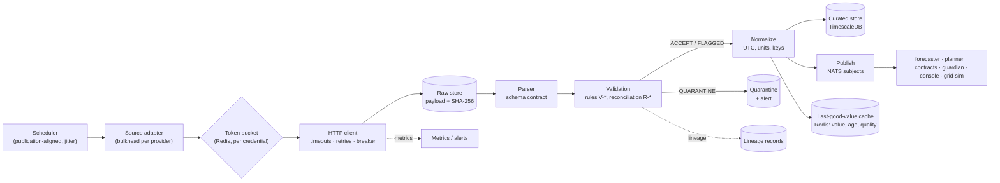

# OpenGrid Orchestrator — External Data Integration

**`market-data` ingestion: sources, resilience, validation, staleness, backfill, provenance, monitoring — and the
contract for simulated counterparties in `grid-sim`**

Status: v0.2 · 2026-09-25 (resolution pass after the four adversarial reviews `06-reviews/01…04` and the primary-source
check `06-reviews/05-claims-verification.md`; aligned with `00-decision-register.md` v0.2 — D0a–D5, R1–R50, Q1–Q25 and
the §F values V-01…V-41, which win wherever this document differed) · Author: independent power-systems control and
ERCOT market-operations engineer · Audience: `market-data`, `forecaster`, `planner`, `grid-sim` implementers; security,
platform and test authors; reviewers. Per-finding dispositions: `06-reviews/resolution/A3-decision-engine.md`.

This document catalogues every external data source the orchestrator uses, specifies how `market-data` pulls,
validates, stores, publishes and monitors it, and fixes the contract that `grid-sim`'s simulated counterparties
expose. It applies [`../00-brief.md`](../00-brief.md) and pairs with [`03-decision-engine.md`](03-decision-engine.md),
which specifies how the decision engine reacts when data is late, stale or wrong.

### Changes in this version (v0.2)

The grid review rated this document "needs changes (minor)"; each finding that cites it (GRD-016, and the parts of
GRD-004, GRD-038 and register R27 assigned to it) and the judging review's ERCOT-account items (JDG-016, JDG-017, register
Q18) were checked against the text first. Nothing is dropped (D0a); no ID was renumbered.

1. **ERCOT operating notices (R19, GRD-004).** A new source S10 ingests ERCOT's posted notices — OCN, Advisory, Watch,
   Emergency Notice and the EEA level — so the planner can pre-position reserves before a risk window; the QSE desk's
   hotline entry stays authoritative (§11.10).
2. **Whose settlement a price drives (R27, GRD-016).** Every load-zone price is published with the settlement role it
   drives under the territory role model: `LZ_CPS` and `LZ_AEN` are NOIE zones whose ERCOT value flows through the NOIE's
   contract with Base (§11.1.3, FR-ING-174).
3. **Per-utility tariff tables (R27).** A new reference source S11 curates NOIE bundled rates, buyback terms and TDSP
   delivery charges with lineage and effective dates, replacing the single Oncor delivery charge (§11.11).
4. **Inputs unfit for firm declarations (GRD-038).** Every forecast input carries a firm-fitness flag; `SYNTHETIC` bank
   proxies and the cold-start home-load shape for 16:00–21:00 are `NOT_FOR_FIRM` (§3.2, FR-ING-176).
5. **ERCOT account (Q18, JDG-016).** The orchestrator uses its own subscription key by default, never the live
   simulators' key; token reuse is specified and the legacy pollers' fix is ready on the user's go-ahead (§10); a
   record/replay mode with as-of provenance keeps real data on screen if the live API is unavailable (§7, FR-ING-179).
6. **`grid-sim` follows the new engine rules (R17–R28).** The simulated QSE sends UDSPs and ALR/NCLR instructions,
   applies ERCOT's proxy-offer rule, settles Set Point Deviation and the RTC+B AS Imbalance Settlement and accepts a COP;
   the SCADA counterparty adds per-phase currents, Q, LTC taps, deadbanded reporting and OMS switching orders; the
   partner counterparty adds tolling schedules; the mobile counterparty adds the lessee-declared outage and close; a new
   G9 supplies frequency events and grid conditions (§12).
7. **New IDs:** sources S10–S11; FR-ING-174…180; A-ING-19…23. Every requirement carries a build tag (R21).

---

## 0. How to read this document

### 0.1 Ownership boundaries

| Topic | Specified here | Specified elsewhere |
|---|---|---|
| External public data sources: endpoints, cadences, limits, authentication, errors | Yes (§2, §4, §11) | — |
| Validation, last-good-value and staleness policy per consumer, backfill, lineage, monitoring thresholds | Yes (§5–§9) | Alert rule IDs `ALR-*` and routing → `06-platform-and-operations.md` |
| Secret handling for external sources | Yes (§10) | Secret store, key custody → `../03-security/02-security-architecture.md` |
| Simulated counterparties in `grid-sim` (substation SCADA, OpenADR VTN and tolling interface, DERMS with the OMS switching feed, large-load signal, ERCOT market interface, pipeline measurements, mobile requests, AMI, frequency and grid conditions) | Yes (§12) | Protocol point maps and SCADA security → `07-scada-integration.md`; wire schemas → `02-domain-model-and-interfaces.md` |
| How consumers react to stale or bad data (degraded modes) | No | [`03-decision-engine.md`](03-decision-engine.md) §4, §8.13 |
| Failure-mode catalogue `FM-EXT-*`, `FM-DAT-*` | No | `05-failure-modes-and-recovery.md` (each error class in §4.8 maps to entries there) |

### 0.2 Judging criteria this document serves

| Criterion (brief §2) | Where |
|---|---|
| Completeness | §2 catalogue; §4 error taxonomy; §7 backfill; §12 counterparties that let the end-to-end chain run |
| Technical depth | §4 resilience patterns with parameters; §5 validation incl. DST and cross-source reconciliation; §8 lineage |
| Usability | Real data from day one (§2, §11); sane defaults; §9 monitoring thresholds |
| Insight quality | §11.1.4 defects found in the prototype's data path; §13 measured statistics of the real ERCOT year |
| Performance | §4.2 request budgets; §6 freshness SLAs; measured, not asserted |
| The problem / The "why" | §12 closed-loop simulated SCADA and a price-taking ERCOT interface driven by real prices |

### 0.3 Conventions

- Requirements are `FR-ING-1NN` (101–180; 174–180 added in v0.2 next to the text they refine). The product document
  [`../01-product/02-functional-requirements.md`](../01-product/02-functional-requirements.md) already uses
  `FR-ING-001…016`; the 1xx range avoids collisions, and §15.2 maps each product requirement to the ones refining it.
  Next to its MoSCoW priority every requirement carries a build tag (register R21): `MVP-J` (Line A of the judged demo),
  `MVP-B` (Line B) or `R2` (later, design unchanged) — sequencing only, nothing is dropped.
- Assumptions are labelled **A-ING-nn** (register in §14); reviewer numbers carry "reviewer proposal — unverified";
  normative values of the register's §F table are cited as **V-nn**; ERCOT rule facts cite the primary-source verdicts of
  `06-reviews/05-claims-verification.md` ("claims check #n").
- Times are UTC; ERCOT intervals are labelled in America/Chicago. Units: kW, kWh, $/MWh, MW where a source reports MW.
- Criteria served are stated per section.

---

## 1. Principles

Criteria served: Technical depth, Usability.

1. **One egress point.** Only `market-data` calls external public APIs; other services consume validated, published
   data. `market-data` egress is an allow-list of hostnames (§10).
2. **Validate before publish.** No consumer receives an unvalidated value; quarantined data never reaches control.
3. **Every value carries age, quality and lineage.** Consumers decide with explicit staleness rules (§6).
4. **Degrade, don't guess.** Last-good value with its age, then the documented degraded mode of `03-…` §8.13.
5. **Be a good API citizen.** Stay well below published limits and cap retries: ERCOT suspended one public user's
   subscription for about 16 days for "anomalous behavior … (high failure rate and long query duration)", not for
   exceeding the rate limit ([ercot/api-specs discussion #113](https://github.com/ercot/api-specs/discussions/113)).
   A retry storm is therefore a production risk, not just a courtesy issue.
6. **Real data only; synthetic data is labelled.** Everything `grid-sim` synthesizes carries a `SYNTHETIC` label (§12).
7. **No third-party data sharing (decision D5).** Outbound requests carry only query parameters — dates, settlement
   points, zone names, and coordinates at ZIP-centroid or weather-grid-cell granularity — never a home's location or
   any personal data. Internal datasets are never exported (§13).

**Requirements — principles**

| ID | Requirement | Rationale | Acceptance criterion | Priority | Source |
|---|---|---|---|---|---|
| FR-ING-101 | Register every external source with owner, endpoints, authentication, published limits, license, criticality, consumers and freshness SLA | One place to operate sources | Registry covers 100% of §2; CI fails if code calls an unregistered host | Must · MVP-J | derived |
| FR-ING-102 | Restrict external egress to `market-data` with a hostname allow-list; outbound requests contain no personal data | Least privilege; decision D5 | Network-policy test: other services cannot reach the internet; request-log scanner finds no home coordinates, names or ESI IDs | Must · MVP-J | user |
| FR-ING-103 | Normalize every record to the canonical record of §3.2 and publish idempotently (at-least-once, keyed) | Consumers see one shape; duplicates are harmless | Replaying a batch twice leaves curated tables and consumer state unchanged | Must · MVP-J | user |
| FR-ING-104 | Comply with each source's license and attribution terms (ERCOT terms of use, EIA reuse policy, LBNL/OEDI, Census, ODbL for OpenStreetMap) | Legal use of data | License tag on every batch; console maps show "© OpenStreetMap contributors" where OSM data appears | Must · MVP-J | regulation |

---

## 2. Source catalogue

Criteria served: Completeness, Usability.

**Eleven external sources** supply **38 data products or endpoints**; nine **simulated counterparties** in `grid-sim`
stand in for utilities, ERCOT and customers (§12).

| # | Source | Access | Products used (count) | Why | Main consumers | Cadence | Auth | Published limits | Criticality | Prototype |
|---|---|---|---|---|---|---|---|---|---|---|
| S1 | ERCOT Public API | `https://api.ercot.com/api/public-reports` | 17 report products + archive (§11.1) | Prices (SCED, RT, DAM), AS prices under RTC+B, load and renewables forecasts, constraints, caps | `forecaster`, `planner`, `contracts`, `guardian`, `grid-sim` | 5 min → daily | Azure AD B2C ROPC `id_token` + `Ocp-Apim-Subscription-Key` | 30 requests/min; 1,000 files per historic download; US-only access ([limits](https://developer.ercot.com/applications/pubapi/known-limits/)) | Control-critical | 5 products used today |
| S2 | EIA API v2 | `https://api.eia.gov/v2` | 3 routes | Home-load cold start (retail sales), system demand and fuel mix for reconciliation | `forecaster`, `market-data` | Hourly / monthly | `api_key` query parameter | ≤ 5,000 rows per JSON response; sustained < ~9,000 requests/h, bursts < 5/s ([docs](https://www.eia.gov/opendata/documentation.php), [FAQ](https://www.eia.gov/opendata/faqs.php)) | Planning | Used |
| S3 | EIA-861M files | `https://www.eia.gov/electricity/data/eia861m/` | 1 file family (monthly XLSX) | Residential storage MW by utility (territory sizing) | `planner` (Mode S), reports | Monthly (~2-month lag) | None | — | Reference | Used |
| S4 | NWS API | `https://api.weather.gov` | 4 endpoints | Temperature, dew point, sky cover for load and PV forecasts; severe-weather alerts for storm holds | `forecaster`, `HOME` profile | Hourly; alerts 5 min | `User-Agent` required | Not public, "generous"; retry after ~5 s ([NWS API](https://weather.gov/documentation/services-web-api)) | Planning-critical | New |
| S5 | LBNL Tracking the Sun (OEDI data lake) | `https://oedi-data-lake.s3.amazonaws.com/tracking-the-sun/` | 1 prefix per year/state | Fleet footprint and PV-presence priors | `planner` (Mode S), `forecaster` priors | Annual | None | S3 public read | Reference | Used |
| S6 | Census ZCTA Gazetteer | `https://www2.census.gov/geo/docs/maps-data/data/gazetteer/2024_Gazetteer/2024_Gaz_zcta_national.zip` | 1 file | ZIP centroids (maps, NWS query points) | `market-data`, `console` | Annual | None | — | Reference | Used |
| S7 | Esri Living Atlas layers derived from HIFLD | `https://services2.arcgis.com/FiaPA4ga0iQKduv3/arcgis/rest/services/...` | 3 feature layers | Transmission lines, power plants, gas pipelines: corridor co-location and `PIPELINE_AC` H3 change detection | `market-data` (H3), siting | Weekly snapshot | None | Paged by `resultOffset`/`resultRecordCount` | Reference | Used |
| S8 | OpenStreetMap Overpass API | `https://overpass-api.de/api/interpreter` | 1 endpoint (2 query families) | Substation and data-centre locations (siting and topology hints) | Siting, `grid-sim` | Weekly snapshot | None (`User-Agent`) | ~10,000 queries/day and ~1 GB/day; HTTP 429 on slot exhaustion ([Overpass usage](https://dev.overpass-api.de/overpass-doc/en/preface/commons.html)) | Reference | Used |
| S9 | PJM Data Miner 2 (future adapter) | `https://api.pjm.com/api/v1/{feed}` | 3 feeds | PJM load forecasts and metered load for `PJM_CAPACITY` | `forecaster`, `planner` (PJM partitions) | Hourly | `Ocp-Apim-Subscription-Key` | Non-members 6 connections/min, members 600 ([PJM Data Miner 2](https://www.pjm.com/markets-and-operations/etools/data-miner-2.aspx)) | Planning (future) | New |
| S10 | ERCOT operating notices (public web) | `https://www.ercot.com/services/comm/mkt_notices/opsmessages` (Operations Messages page); `https://www.ercot.com/api/1/services/read/dashboards/daily-prc.json` (public dashboard JSON, undocumented) | 2 products | OCN, Advisory, Watch, Emergency Notice and the EEA level, for pre-positioning and the EEA posture (R19) | `forecaster` (F-EVENT), `planner`, `dispatcher` (DM-14), `console` | 60 s | None (`User-Agent`) | Not published; polled at ≤ 2 requests/min in total | Planning-critical (the QSE desk's hotline entry is authoritative) | New |
| S11 | Per-utility tariff tables (reference data) | Utility tariff documents and PUCT tariff filings, curated into versioned tables (§11.11) | 1 table family | NOIE bundled rates and buyback terms, TDSP delivery charges, export credits — the value and cost of energy per territory (R27) | `planner`, `dispatcher` (value models), `contracts` | On change; monthly check | None | — | Planning | New (replaces the single Oncor charge of `fleet_lp.js`) |

Product count: S1 17 + archive = 18; S2 3; S3 1; S4 4; S5 1; S6 1; S7 3; S8 1; S9 3; S10 2; S11 1 → **38**.

---

## 3. Ingestion architecture

Criteria served: Technical depth, Performance. Service topology and deployment are owned by `01-system-architecture.md`.

### 3.1 Pipeline



### 3.2 Canonical record

| Field | Meaning |
|---|---|
| `source_id`, `product` | e.g., `S1`, `np6-788-cd` |
| `series_key` | e.g., settlement point `LZ_CPS`, weather zone `southC`, grid cell `EWX/156,91`, AS product `NSPIN` |
| `interval_start_utc`, `interval_end_utc` | Interval the value describes |
| `local_label` | Source's local labelling (e.g., operating day, hour ending, interval, DST flag) |
| `value`, `unit` | Canonical units (kW, kWh, MW for system quantities, $/MWh, °C, %) |
| `quality` | `GOOD`, `ESTIMATED`, `EXTREME_UNCORROBORATED`, `STALE`, `QUARANTINED` |
| `posted_at` | Source posting time (`postedDatetime`, `SCEDTimestamp`, `Last-Modified`) |
| `retrieved_at`, `batch_id` | Retrieval time; lineage key (§8) |
| `correction_version` | 0 for the first posting; increments on source corrections |
| `rules` | Validation rule IDs applied and their outcomes |
| `settlement_role` | For prices: whose settlement the series drives under the territory role model of `03` §2.4 — e.g. `LZ_CPS`: `NOIE_LSE` (CPS Energy settles; value reaches Base only through its contract); `LZ_HOUSTON`: `COMPETITIVE_LSE` (the premise's REP/LSE settles; the ADER's QSE settles AS and Set Point Deviation) — FR-ING-174 |
| `firm_fitness` | For forecast inputs: `FIRM_OK`, or `NOT_FOR_FIRM` with the reason (`SYNTHETIC` proxy, known bias, cold start) — a firm declaration or firm sizing never uses a `NOT_FOR_FIRM` input without a conservative multiplier the counterparty accepted (FR-ING-176; `03` FR-DE-167) |

The product document's quality set (`good` / `stale` / `out_of_range` / `missing`, FR-ING-007) maps as: `GOOD` →
good; `STALE` → stale; `QUARANTINED` → out_of_range; absent record → missing; `ESTIMATED` and
`EXTREME_UNCORROBORATED` are refinements of good.

### 3.3 Published subjects (proposed; final names in `02-domain-model-and-interfaces.md`)

`mkt.ercot.lmp.sced.v1`, `mkt.ercot.lmp.rtd.v1`, `mkt.ercot.spp.rt.v1`, `mkt.ercot.mcpc.rt.sced.v1`,
`mkt.ercot.mcpc.rt.15m.v1`, `mkt.ercot.mcpc.rtd.v1`, `mkt.ercot.lambda.v1`, `mkt.ercot.constraints.v1`,
`mkt.ercot.dam.spp.v1`, `mkt.ercot.dam.mcpc.v1`, `mkt.ercot.dam.asplan.v1`, `mkt.ercot.load.fcst.v1`,
`mkt.ercot.load.actual.v1`, `mkt.ercot.wind.v1`, `mkt.ercot.solar.v1`, `mkt.ercot.caps.v1`, `mkt.ercot.asdc.v1`,
`wx.nws.grid.v1`, `wx.nws.alerts.v1`, `ref.eia.retail.v1`, `ref.eia.930.v1`, `ref.eia.861m.v1`, `ref.tts.v1`,
`ref.census.zcta.v1`, `ref.geo.lines.v1`, `ref.geo.plants.v1`, `ref.geo.pipelines.v1`, `ref.osm.sites.v1`,
`mkt.pjm.load.v1`, `ops.ercot.notices.v1`, `ops.ercot.eea.v1`, `ref.tariff.v1`; every subject has a companion `….stale`
event stream (§6).

**Requirement — architecture**: see FR-ING-103 (canonical record, idempotent publication).

---

## 4. Resilience policies

Criteria served: Technical depth, Performance, Completeness.

### 4.1 Publication-aligned scheduling

Polls are aligned to when each product is published, with ±5 s jitter per replica, and stop as soon as the new
posting appears.

| Product group | Schedule (America/Chicago where local) |
|---|---|
| SCED-cycle products (NP6-788-CD, NP6-332-CD, NP6-322-CD, NP6-86-CD) | At expected SCED run + 45 s, + 90 s, + 150 s until a new `SCEDTimestamp` appears (posting latency to be measured, A-ING-02) |
| RTD indicative (NP6-970-CD, NP6-329-CD) | Same cadence, offset + 60 s |
| 15-min settlement products (NP6-905-CD, NP6-331-CD) | Interval end + 2, + 4, + 8 min |
| Hourly forecasts (NP3-565-CD, NP4-732-CD, NP4-737-CD) | :10, then :25 if unchanged |
| DAM results (NP4-190-CD, NP4-188-CD, NP4-33-CD) | Every 60 s from 13:25 until found (cap 14:55) |
| Actual load by weather zone (NP6-345-CD, a daily product) | 06:00, then hourly until the previous operating day is present |
| Caps and demand curves (NP4-791-CD, NP4-212-CD) | Daily 05:00 |
| NWS gridpoints; NWS alerts | Hourly at :05 with `If-Modified-Since`; alerts every 5 min |
| EIA-930 hourly; EIA retail sales and EIA-861M | Hourly at :20; daily check at 08:00 |
| Tracking the Sun, Census | Monthly check (ETag) |
| ArcGIS layers, Overpass | Weekly snapshot, Sunday 03:00 |
| PJM (future) | Hourly |
| ERCOT operating notices (S10) | Every 60 s with `If-Modified-Since`/`ETag`; every 30 s while any Watch, Emergency Notice or EEA is in effect |
| Per-utility tariff tables (S11) | Monthly check of each tariff source; on-change curation (§11.11) |

### 4.2 Rate limiting: token buckets and request budgets

One distributed token bucket per credential (atomic Redis script, shared by all replicas), set at 80% of the
published limit (assumption A-ING-03), with three priority classes: **P1** control-feeding products, **P2** planning
products, **P3** backfill and reference data (P3 draws only while the bucket is at least half full).

| Source | Published limit | Bucket capacity | Refill | Concurrency |
|---|---|---|---|---|
| ERCOT (per subscription key) | 30 requests/min | 5 | 0.4/s (24/min) | 2 |
| EIA | ~9,000/h sustained, < 5/s | 3 | 1/s, ≤ 3,000/h | 2 |
| NWS | Not public | 5 | ≤ 5/s, ≤ 3,000/h (self-imposed) | 4 |
| Overpass | ~10,000/day, ~1 GB/day | 1 | ≤ 100/day | 1 |
| ArcGIS layers | Not stated | 2 | 2/s | 2 |
| S3 and Census | — | 4 | 4/s | 4 |
| PJM (non-member) | 6/min | 1 | 5/min | 1 |
| ERCOT public web (S10; `www.ercot.com`, no key, separate from the API bucket) | Not published | 2 | ≤ 4/min (self-imposed) | 1 |

**ERCOT request budget (steady state):**

| Product group | Calls | Per minute |
|---|---|---|
| SCED cycle: NP6-788-CD (≈1.5 per run), NP6-970-CD (2), NP6-332-CD (1), NP6-329-CD (1), NP6-322-CD (1), NP6-86-CD (1) | 7.5 per 5 min | 1.5 |
| 15-min: NP6-905-CD (2: load-zone and hub filters), NP6-331-CD (1) | 3 per 15 min | 0.2 |
| Hourly: NP3-565-CD, NP4-732-CD, NP4-737-CD | 3 per hour | 0.05 |
| Daily: DAM results (≈10 polls), NP6-345-CD (1–6), caps and ASDCs (2), AS plan (1) | ≤ 20 per day | ≈ 0.01 |
| Token requests (one per replica per 50 min, single-flight) | ≈ 29 per day | 0.02 |
| **Steady-state total** | | **≈ 1.8** |
| Peak minute (DAM polling + SCED + retries) | | ≤ 12 |
| Legacy prototype pollers (`/opt/opengrid_sim/ercot_live.py`: 1 token + 3 data calls every 60 s) — **not on the orchestrator's key** (register Q18 default: a separate subscription key); counted only if the user decides to share | | (4) |

The bucket's 24/min leaves at least 8 requests/min for P3 backfill, even if the legacy pollers were to share the key.

### 4.3 Adaptive rate (AIMD)

On a 429, the source's refill rate is halved for 10 min; afterwards it grows back by 10% every 5 min without a 429,
up to nominal.

### 4.4 Retries

Idempotent GETs only. Delay before retry $n$: $\max\big(\text{Retry-After},\;U(0,\min(\text{cap},\,\text{base}\cdot2^n))\big)$
— capped exponential backoff with full jitter, with `Retry-After` (seconds or HTTP-date) as a floor.

| Class | Base | Cap | Max retries | Job deadline |
|---|---|---|---|---|
| P1 | 1 s | 8 s | 2 | min(freshness deadline, 60 s) |
| P2 | 2 s | 60 s | 4 | 10 min |
| P3 | 5 s | 300 s | 6 | 1 h |

Never retried: 400, 403, 404 (except one catalog re-resolution), 422, and 401 after one re-authentication.

### 4.5 Retry budget

Retries may not exceed 10% of a source's requests in any 5-min window. Past the budget, retries stop and the breaker
opens — the protection against the "high failure rate" pattern behind the ERCOT suspension of principle 5.

### 4.6 Circuit breakers (per source and endpoint)

| Parameter | P1 | P2 / P3 |
|---|---|---|
| Open when | ≥ 50% failures in the last 20 calls (≥ 10 calls) or 5 consecutive failures | Same |
| Open duration | 60 s, doubling to 15 min | 300 s, doubling to 30 min |
| Half-open | 1 probe | 1 probe |
| Credential breaker (401 after re-auth, 403) | Open until credentials are refreshed or an operator resets it | Same |

While open, consumers receive last-good values with their age (§6); breaker state is a published metric.

### 4.7 Bulkheads and timeouts

| Provider | Pool | Connect | Read | Job deadline |
|---|---|---|---|---|
| ERCOT | 2 | 5 s | 15 s (P1), 30 s (P2), 60 s (P3) | Per class |
| EIA | 2 | 5 s | 30 s | 10 min |
| NWS | 4 | 5 s | 15 s | 10 min |
| S3, Census | 4 | 5 s | 120 s | 1 h |
| ArcGIS | 2 | 5 s | 60 s | 30 min |
| Overpass | 1 | 5 s | Query timeout + 10 s (≤ 100 s) | 30 min |
| PJM | 1 | 5 s | 30 s | 10 min |

Each provider has its own worker pool and connection pool, so a slow source cannot starve the others.

### 4.8 Error taxonomy

| # | Class | Examples by source | Retry | Breaker | Action |
|---|---|---|---|---|---|
| E1 | 400 Bad Request | ERCOT invalid date/parameter; EIA malformed facet; Overpass query syntax | No | Counts | Alert (defect); keep last-good value |
| E2 | 401 Unauthorized | ERCOT `id_token` expired or rejected | Re-authenticate once, retry once | Credential breaker if repeated | Alert |
| E3 | 403 Forbidden | ERCOT subscription key invalid or suspended, or access from outside the US; NWS missing/generic `User-Agent`; EIA key temporarily suspended by throttling; ArcGIS layer moved behind authentication | No | Credential breaker | Page for ERCOT (runbook: check the key in API Explorer, contact ERCOT); alert otherwise |
| E4 | 404 Not Found | ERCOT product renamed/retired (re-resolve from the catalog once); NWS gridpoint moved (re-resolve `/points`); S3 key renamed (re-list); HIFLD mirror layer removed | No | Counts | Alert; registry marks the endpoint degraded |
| E5 | 409 Conflict | Not expected on GETs; on counterparty writes (duplicate OpenADR report, duplicate simulated-QSE offer ID) | No | — | Same payload hash → treat as success (idempotent); else alert |
| E6 | 422 Unprocessable | OpenADR or simulated-QSE validation errors on our submissions | No | — | Alert; fix payload |
| E7 | 429 Too Many Requests | ERCOT over 30/min; Overpass slots exhausted; EIA throttle; PJM over 6/min; NWS limit | Yes, `Retry-After` floor | Only via retry budget | AIMD (§4.3); alert on ≥ 3 in 10 min |
| E8 | 5xx | 500, 502, 503 | Yes, within budget | Counts | Last-good value meanwhile |
| E9 | 504 | Gateway timeout; Overpass resource/time-out mismatch | Yes (Overpass: split the bounding box first) | Counts | — |
| E10 | Timeouts | Connect timeout (fail fast); read timeout | Read: yes per class | Counts | — |
| E11 | TLS / DNS failure | Egress, proxy or certificate problems | Yes, backoff | Counts | Alert if persistent (platform) |
| E12 | Error inside HTTP 200 | ArcGIS `{"error": {...}}`; Overpass `remark` reporting a runtime error or timeout; EIA `warnings` about 5,000-row truncation; ERCOT empty `data` for a period that must have data | Per underlying class | Counts | Treated as a failure, never as data |
| E13 | Partial or truncated response | JSON parse error; fewer rows than `_meta.pageSize` on a non-final page | Yes (page) | Counts | Batch marked incomplete until completeness passes |
| E14 | Pagination fault | `_meta.totalRecords`/`totalPages` change mid-pagination; duplicates across pages; empty page before the last | Restart from page 1 with the time bound frozen at the first page | — | Dedupe by natural key |
| E15 | Schema drift | Field added/removed/renamed, type change, row arrays vs row objects (the ERCOT response shape the prototype already handles) | No | — | Added fields: warn and ignore; missing required field or type change: quarantine batch, keep last-good value, alert |
| E16 | Time-zone / DST error | Operating day computed in host time; repeated or missing hour; `repeatHourFlag`; EIA UTC vs local | — | — | Rules V-T* (§5.3); quarantine if unresolvable |
| E17 | Semantic anomaly | Unit error, sign flip, stuck value, implausible range | — | — | Rules V-* (§5); flag or quarantine |
| E18 | Stale data disguised as fresh | HTTP 200 with the same latest interval past the product's cadence plus tolerance | — | — | Marked `STALE`; freshness alert |

Each class maps to `FM-EXT-*` or `FM-DAT-*` entries in `05-failure-modes-and-recovery.md`.

**Requirements — resilience**

| ID | Requirement | Rationale | Acceptance criterion | Priority | Source |
|---|---|---|---|---|---|
| FR-ING-105 | Schedule polls by publication time with jitter per §4.1 | Fresh data at minimum request cost | Median data age at consumer ≤ posting latency + 60 s for SCED products over 24 h | Must · MVP-J | derived |
| FR-ING-106 | Enforce one distributed token bucket per credential with priority classes P1–P3 at 80% of the published limit | ERCOT 30/min; good citizenship | Load test with every poller and backfill active: ≤ 24 ERCOT requests in every rolling minute | Must · MVP-J | user / regulation |
| FR-ING-107 | Halve the refill rate for 10 min after a 429 and restore it additively | Adaptive rate | 429 fixture: refill halves within one request; recovers in ≤ 1 h without further 429s | Must · MVP-B | derived |
| FR-ING-108 | Retry idempotent requests with capped full-jitter backoff honouring `Retry-After`, per the class table; never retry non-retryable classes | Resilience without storms | Fixtures per status code produce the documented retry count and delays (statistical test on jitter) | Must · MVP-J | derived |
| FR-ING-109 | Cap retries at 10% of a source's requests per 5 min | Avoid "anomalous behaviour" suspension | Sustained-5xx fixture: retry share ≤ 10%; breaker opens | Must · MVP-J | derived |
| FR-ING-110 | Apply per-endpoint circuit breakers and a credential breaker with the §4.6 parameters | Fail fast; protect credentials | Breaker opens/half-opens/closes per parameters in fixtures; state exported as a metric | Must · MVP-J | derived |
| FR-ING-111 | Isolate providers in separate worker and connection pools with the §4.7 concurrency | Bulkheads | A hung NWS endpoint does not delay any ERCOT P1 poll (latency unchanged within 5%) | Must · R2 | derived |
| FR-ING-112 | Apply connect/read timeouts and job deadlines per §4.7 | Bounded waiting | No request exceeds its timeout; no job exceeds its deadline | Must · MVP-J | derived |
| FR-ING-113 | Handle every error class E1–E18 as specified | Brief §9 external-API failures | One fixture per class passes; each emits its metric and alert | Must · MVP-B | user |
| FR-ING-114 | Detect errors carried inside HTTP 200 responses (E12) | ArcGIS, Overpass, EIA and ERCOT return such bodies | Fixtures for each provider are treated as failures, not data | Must · MVP-J | derived |
| FR-ING-115 | Guarantee pagination integrity (E13, E14) | Complete, duplicate-free batches | Mid-pagination posting fixture yields a complete, duplicate-free batch | Must · MVP-J | derived |
| FR-ING-116 | Enforce strict schema contracts with a field fingerprint; quarantine on missing/renamed/retyped required fields | Brief §9 schema changes (FR-ING-016) | Drift fixtures: added field → warning; removed required field → quarantine, last-good value kept, alert | Must · R2 | user |

---

## 5. Validation

Criteria served: Technical depth, Completeness.

### 5.1 Framework

Stages: transport → schema contract → semantic rules (V-*) → cross-source reconciliation (R-*) → publish. Outcome per
record: `ACCEPT`, `ACCEPT_FLAGGED` (published with a quality flag), `QUARANTINE` (withheld, alert), `REJECT`
(malformed). Every outcome is recorded with its rule IDs (FR-ING-126).

### 5.2 Prices and market data

| Rule | Check | Outcome |
|---|---|---|
| V-P1 | Load-zone/hub real-time prices (SPP, SCED LMP, RTD LMP): normal band −$250 to $5,000/MWh | Inside → `ACCEPT`. Outside but within −$10,000…$50,000 → `EXTREME_UNCORROBORATED` until corroborated by system lambda near its cap (highs), binding constraints whose shadow prices explain the zone's congestion component, or the same value in two consecutive postings. Outside the hard bounds → `QUARANTINE` (unit or sign error). Thresholds: assumption A-ING-05 |
| V-P2 | RT and DA MCPCs within $0–$5,000/MW-h (capped at the effective VOLL under RTC+B) | Outside → `QUARANTINE` |
| V-P3 | DAM SPP within −$250 (offer floor) to $5,000 (DASWCAP) | Outside → `ACCEPT_FLAGGED` (congestion possible) |
| V-P4 | SCED system lambda ≤ $5,000/MWh | Above → `QUARANTINE` |
| V-P5 | Caps (NP4-791-CD) positive; any change | Change → `ACCEPT_FLAGGED`, propagated to offer validation |
| V-P6 | Unit sanity: a whole operating day with median ∣price∣ < 1 | `QUARANTINE` ($/kWh vs $/MWh error) |
| V-P7 | Prices are never smoothed, clipped or averaged away | Spikes are real (§13: `LZ_CPS` hourly maximum $1,277.65/MWh; largest hour-to-hour change $798/MWh) |

The price caps and floors behind V-P1…V-P4: RT system lambda and RT MCPCs are capped at the $5,000/MWh effective VOLL;
DASWCAP is $5,000/MWh and RTSWCAP $2,000/MWh (offer caps); LMPs can exceed the caps under congestion
([Yes Energy RTC+B FAQ II](https://www.yesenergy.com/blog/ercot-rtcb-market-redesign-faq-part-ii)); DAM energy offers
range from −$250/MWh to the cap ([ERCOT WM201 DAM](https://www.ercot.com/files/docs/2020/05/04/2020_05_WM201_2WebEx_DAM.pdf)).

### 5.3 Time, intervals and daylight-saving time

- **ERCOT 15-min products** (`deliveryDate`, `deliveryHour` 1–24 hour-ending, `deliveryInterval` 1–4, `DSTFlag`):
  local interval start $t=D+(h-1)\,\text{h}+(q-1)\cdot15\,\text{min}$ in America/Chicago. On the fall-back day the hour
  ending 02:00 occurs twice; the row with `DSTFlag = true` is the repeated (standard-time) occurrence (assumption
  A-ING-06, consistent with the one flagged hour per settlement point on 2025-11-02 in the prototype's pull). First
  occurrence → UTC−5, repeated → UTC−6. The spring-forward day has no hour ending 03:00.
- **SCED products:** `SCEDTimestamp` in prevailing local time with `repeatHourFlag` for the repeated hour; each run is
  mapped to the 5-min interval it is effective for.
- **Hour-ending strings** (`"01:00"`…`"24:00"`, e.g., NP6-345-CD, NP4-188-CD): hour ending 24:00 is the next day's
  00:00 (as `G:\OpenGrid\src\opengrid\transforms.py` already handles).
- **EIA-930:** `frequency=hourly` periods are UTC (`local-hourly` also exists); periods are treated as hour-ending
  (assumption A-ING-07, to verify).
- **NWS:** `validTime` is an ISO 8601 interval with duration (e.g., `2026-09-25T18:00:00+00:00/PT3H`), expanded to
  hourly slots ([NWS gridpoints FAQ](https://weather-gov.github.io/api/gridpoints)).
- **PJM:** `datetime_beginning_utc` is authoritative; EPT fields are for display.

| Rule | Check | Outcome |
|---|---|---|
| V-T1 | Interval arithmetic as above; 15-min series aligned to :00/:15/:30/:45 | Misaligned → `QUARANTINE` |
| V-T2 | Completeness per operating day: 96 intervals (92 on the spring-forward day, 100 on the fall-back day); 24/23/25 hourly rows; at least one SCED run per 5-min interval | Incomplete → batch `ACCEPT_FLAGGED`, backfill scheduled (§7) |
| V-T3 | Monotonic, no duplicate keys after dedupe | Violation → `QUARANTINE` |
| V-T4 | No future intervals (end ≤ retrieval time, except forecasts) | `QUARANTINE` |
| V-T5 | Posting latency within the product's normal range | Outside → `ACCEPT_FLAGGED` (late/early posting) |
| V-T6 | `DSTFlag`/`repeatHourFlag` true only on the fall-back day | Otherwise → `QUARANTINE` |
| V-T7 | Operating day computed in America/Chicago, never host time | Enforced in code (fixes prototype defect D-2, §11.1.4) |

Real DST fixtures from the prototype's year pull: 2025-11-02 (25 hourly rows, one flagged) and 2026-03-08 (23 rows).

### 5.4 Physical plausibility, units, duplicates

| Rule | Check | Outcome |
|---|---|---|
| V-L1 | Weather-zone load within 0.5×–1.3× of the zone's 3-year minimum/maximum; ERCOT `total` = Σ zones ±0.5% | `ACCEPT_FLAGGED` / `QUARANTINE` (A-ING-09) |
| V-L2 | Zone-load hourly ramp ≤ 15% of the zone's peak | `ACCEPT_FLAGGED` (A-ING-09) |
| V-L3 | Wind/solar actual ≥ 0 and ≤ HSL + 2%; forecasts ≥ 0 | `QUARANTINE` |
| V-L4 | NWS temperature −30…55 °C; dew point ≤ temperature + 0.5; sky cover and RH 0–100%; `uom` equals the expected `wmoUnit` code | `QUARANTINE` |
| V-L5 | EIA retail: sales (million kWh) and customers > 0; derived Texas residential kWh per customer per month within 600–2,000 | `ACCEPT_FLAGGED` (A-ING-09) |
| V-L6 | Units read from the source (EIA `*-units` fields, NWS `uom`) and normalized to §3.2 | Unknown unit → `QUARANTINE` |
| V-D1 | Natural key per product (e.g., NP6-905-CD: date, hour, interval, settlement point, DST flag; NP6-788-CD: SCED timestamp, repeat-hour flag, settlement point); latest posting wins; identical duplicates discarded | — |
| V-D2 | Source re-postings and price corrections become a new `correction_version` and trigger re-settlement (§7) | — |
| V-D3 | Stuck value: identical load-zone price for ≥ 12 consecutive SCED runs where the zone's 1-h variance is normally non-zero | `STALE` (A-ING-10) |

### 5.5 Cross-source reconciliation

| Rule | Comparison | Tolerance (assumption A-ING-08) | On breach |
|---|---|---|---|
| R-1 | ERCOT NP6-345-CD total vs EIA-930 ERCO demand, same UTC hour | ±3% | Flag both; forecaster down-weights the outlier |
| R-2 | RT SPP (15 min) vs time-weighted average of SCED LMPs at the same settlement point | ±max($2, 3%) | Flag; investigate adders/corrections |
| R-3 | System lambda vs load-zone LMP minus the congestion component implied by binding constraints | ±$5/MWh | Flag price corroboration as unavailable for that run |
| R-4 | ERCOT wind actual (NP4-732-CD) vs EIA-930 wind generation | ±5% | Flag |
| R-5 | Simulated-QSE award prices vs ERCOT DAM clearing prices of the same day | Exact | Fail the `grid-sim` run |
| R-6 | Tracking the Sun ZIP counts vs EIA-861M storage-MW trend by utility | Directional | Reference note only |

**Requirements — validation**

| ID | Requirement | Rationale | Acceptance criterion | Priority | Source |
|---|---|---|---|---|---|
| FR-ING-117 | Apply V-P1 with corroboration before any extreme price is released as `GOOD`; never smooth prices | Act on real spikes, never on data errors | Uncorroborated $9,999 fixture published `EXTREME_UNCORROBORATED`; corroborated one `GOOD` within one SCED interval | Must · MVP-J | derived |
| FR-ING-118 | Bound RT/DA MCPCs and system lambda per V-P2/V-P4 | RTC+B caps | Out-of-bound fixtures quarantined | Must · MVP-J | regulation |
| FR-ING-119 | Enforce time rules V-T1–V-T5 | Correct intervals | Misaligned, duplicate, future and late-posting fixtures behave as specified | Must · MVP-J | derived |
| FR-ING-120 | Handle DST per §5.3 and V-T6/V-T7 | ERCOT DST conventions | 2025-11-02 and 2026-03-08 fixtures yield 100 and 92 intervals mapped to correct UTC instants | Must · MVP-J | derived |
| FR-ING-121 | Deduplicate by natural key and version corrections (V-D1, V-D2) | Idempotence; re-settlement | Correction fixture creates `correction_version` 1 and a re-settlement request | Must · MVP-J | derived |
| FR-ING-122 | Detect stuck values (V-D3) | Stale data disguised as fresh | Frozen-price fixture flagged `STALE` within 1 h | Should · R2 | derived |
| FR-ING-123 | Apply plausibility rules V-L1–V-L5 | Physical sanity | One fixture per rule behaves as specified | Must · MVP-B | derived |
| FR-ING-124 | Normalize units from source metadata and quarantine unknown units (V-L6, V-P6) | A unit error silently corrupts every downstream decision | $/kWh-scaled day fixture quarantined; EIA million-kWh converted to kWh | Must · MVP-J | derived |
| FR-ING-125 | Run reconciliations R-1–R-5 and publish their deltas | Cross-source trust | Deltas published hourly; breach fixtures flagged | Should · R2 | derived |
| FR-ING-126 | Record the validation outcome and rule IDs for every record and batch | Auditability | 100% of curated records carry outcome and rule IDs | Must · MVP-J | derived |

---

## 6. Last-good value and maximum staleness per consumer

Criteria served: Completeness, Technical depth. Every consumer read returns value, age and quality; the table sets,
per product and consumer, how long a value counts as fresh, how long the last-good value (LGV) may be used, and what
happens after that (the consumer-side behaviour is specified in `03-decision-engine.md` §8.13). Windows are
assumption A-ING-11.

| Product | Consumer | Fresh if age ≤ | Use LGV until | Beyond that |
|---|---|---|---|---|
| SCED LMP, load zones (NP6-788-CD) | `planner` L-SCED | 10 min | 15 min | DM-01: price-driven decisions frozen |
| SCED LMP | `console` | 10 min | — | Banner "prices stale" with age |
| RT MCPC per SCED (NP6-332-CD) | L-SCED (AS re-pricing), buyback exposure | 10 min | 15 min | AS offers keep last price with widened risk premium |
| RTD indicative LMP / MCPC (NP6-970-CD, NP6-329-CD) | `forecaster` | 10 min | 10 min | Features left out of the short-term model; quantiles widen |
| System lambda, binding constraints (NP6-322-CD, NP6-86-CD) | Price corroboration (V-P1), `forecaster` | 10 min | 15 min | Corroboration only by consecutive postings |
| RT SPP 15-min (NP6-905-CD) | `planner` L-ID | 30 min | 60 min | Time-weighted SCED LMPs used instead |
| RT SPP and RT MCPC 15-min (NP6-905-CD, NP6-331-CD) | `contracts` shadow settlement | Complete within 24 h | — | Backfill; settlement stays `PROVISIONAL` |
| DAM SPP and MCPC (NP4-190-CD, NP4-188-CD) | L-DA post-DAM | Needed by 13:55 | — | Declarations sent `PROVISIONAL` (03 §7.1) |
| DAM SPP and MCPC | L-ID | Valid for the operating day | — | — |
| Load forecast by weather zone (NP3-565-CD) | L-ID / L-DA | 2 h / 6 h | 6 h / 12 h | Internal NWS-driven load forecast |
| Load forecast (NP3-565-CD) | `grid-sim` substation shape | 2 h | 6 h | Last available forecast for the current hour, flagged |
| Wind/solar (NP4-732-CD, NP4-737-CD) | L-ID / L-DA | 3 h / 6 h | 6 h / 12 h | Persistence forecast |
| Actual load by weather zone (NP6-345-CD, daily) | `forecaster` training, back-test, reconciliation | 48 h (daily posting) | 7 days | Flagged; training window shifts |
| Actual load (NP6-345-CD) | Real-time use | Never | — | Not a real-time signal (prototype defect D-4) |
| Caps (NP4-791-CD) | Offer validation, `guardian` | 7 days | 30 days | Last known caps with alert |
| NWS gridpoints | `forecaster` | 3 h | 12 h | Persistence with widened quantiles |
| NWS alerts | `HOME` storm-hold logic | 15 min | 60 min | Operator alert; storm holds can be set manually |
| EIA retail sales | `forecaster` cold start | 90 days | 400 days | Same month of the previous year (the prototype's rule) |
| EIA-930 | Reconciliation | 3 h | — | Reconciliation skipped, flagged |
| EIA-861M | `planner` Mode S | 75 days after month end | 400 days | Flagged |
| Tracking the Sun, Census | Reference | 400 days | — | Flagged |
| ArcGIS layers, Overpass | H3 change detection, siting | 14 days | 60 days | H3 detection paused, alert |
| PJM load forecast (future) | L-DA for PJM partitions | 6 h | 12 h | Internal forecast |
| ERCOT operating notices and EEA level (S10) | `planner` pre-positioning, `dispatcher` DM-14, `console` | 2 min | 10 min | Last known state with its age; alert the QSE desk, whose hotline entry is authoritative; pre-positioning falls back to the NWS-only risk signal |
| Per-utility tariff tables (S11) | `planner`, `dispatcher` value models, `contracts` | Until superseded (effective-dated) | — | A tariff past its stated expiry or older than 13 months without a check is flagged; values used with the flag in the trace |
| Bank-load forecast inputs (NP3-565-CD weather-zone shape as a bank proxy; EIA cold-start home load) | Firm declarations and sizing (`03` §5, §7.2) | — | — | Published `NOT_FOR_FIRM` (proxy or known bias); usable for firm decisions only with an accepted conservative multiplier (FR-ING-176) |

**Requirements — last-good value and staleness**

| ID | Requirement | Rationale | Acceptance criterion | Priority | Source |
|---|---|---|---|---|---|
| FR-ING-127 | Serve every value with age and quality from the LGV cache, even when the source is down | Graceful degradation (FR-ING-012) | Source-outage fixture: every consumer query returns value + age + quality, never an error | Must · MVP-J | user |
| FR-ING-128 | Publish explicit `….stale` events when a product crosses a fresh or LGV boundary, per consumer | Consumers must not infer staleness | Boundary-crossing fixture emits the event within one poll cycle; console banner appears | Must · MVP-J | derived |
| FR-ING-129 | Measure and export freshness per product against the §6 windows | Freshness is an SLA | Dashboard shows age percentiles per product; breaches alert (§9) | Must · MVP-B | derived |

---

## 7. Backfill and corrections

Criteria served: Completeness, Technical depth.

- **Triggers:** a completeness failure (V-T2); a source outage ending (breaker closes); a source correction or
  re-posting (V-D2); a late posting.
- **Method:** inside a product's display window (7 days for most real-time ERCOT products; 31 days for NP6-345-CD),
  query the report endpoint by date range; beyond it, use the archive endpoint
  `https://api.ercot.com/api/public-reports/archive/{emilId}` (document listing, then downloads; at most 1,000 files
  per historic download request — [ERCOT limits](https://developer.ercot.com/applications/pubapi/known-limits/)).
  EIA and PJM: date-range queries with pagination.
- **Discipline:** P3 priority inside the token bucket; resumable checkpoints; idempotent upserts keyed by natural key
  and `correction_version`; backfilled rows carry `backfilled = true` in their lineage.
- **Downstream effects:** backfill or correction never edits past decision traces (they reference the batches they
  used). It triggers forecaster retraining flags, a new M&V/settlement run version for affected intervals
  (`03-decision-engine.md` §10.6), and KPI recomputation.
- **Known gaps to close before the replay corpus is certified:** the prototype's one-year pull (2025-09-23 to
  2026-09-22) lacks 18 real-time hours at the load zones (2026-05-02: 15 of 24 hours present; 2026-05-04: 19;
  2026-05-05: 20) — cause not yet diagnosed (source gap or a paging fault in the 30-day chunk loop) — and the last
  operating day of weather-zone load (NP6-345-CD posts daily).
- **Record and replay (JDG-016).** `market-data` can run in `REPLAY` mode from the certified corpus (§13): every
  published record keeps its original `posted_at` and lineage, carries `replay = true` and the replay's as-of time, and
  the console labels the view "replayed real ERCOT day" beside the live ticker. The judged demo and the value-of-orchestration
  replay (`03` §12.1) use it, so real data stays on screen even if the live API or the account is unavailable; control
  logic never branches on the flag (§12.1 principle).

**Requirements — backfill**

| ID | Requirement | Rationale | Acceptance criterion | Priority | Source |
|---|---|---|---|---|---|
| FR-ING-130 | Detect gaps per product per day and backfill automatically from the report or archive endpoints | Completeness | Deleting a day of a product triggers backfill that restores 100% of intervals | Must · MVP-B | derived |
| FR-ING-131 | Run backfill at P3 priority, resumably and idempotently | Protect live polling | Backfill of 30 days never pushes P1 poll latency above its budget; interrupted backfill resumes without duplicates | Must · MVP-B | derived |
| FR-ING-132 | Backfill the known gaps of the real-year corpus before certifying it for replay and back-tests | Trustworthy back-tests (03 §12.1) | Corpus completeness report shows 100% of intervals for every product and settlement point used | Must · MVP-B | derived |
| FR-ING-133 | Propagate backfills and corrections as new versions downstream (retraining flags, re-settlement runs, KPI recomputation), never as edits | Auditability | Correction fixture produces a new settlement run with delta lines; original lines unchanged | Must · MVP-B | derived |
| FR-ING-179 | Provide a `REPLAY` mode that publishes the certified corpus with original timestamps, lineage, a `replay` flag and the replay's as-of time, labelled on the console | JDG-016; real data on stage without a live dependency | Replay of a real ERCOT day reproduces the day's published records byte-for-byte except the replay fields; a flag-hidden replay yields identical decisions | Must · MVP-J | user |

---

## 8. Provenance and lineage

Criteria served: Technical depth, Completeness.

Every batch writes a lineage record: `batch_id` (UUIDv7); source and product (`emilId`); endpoint path; request
parameters (hash plus a redacted copy — the EIA key is removed); request and response times; HTTP status; response
headers of interest (`ETag`, `Last-Modified`, `Retry-After`, request IDs); payload SHA-256 and size; schema fingerprint
and parser version (git SHA); validation outcomes (rule IDs and counts); record count and time range covered;
`backfilled` and correction flags; license tag. Raw payloads are stored compressed and hashed (retention per
`06-platform-and-operations.md`). Plans, decision traces and M&V records cite the batch IDs they used, so any
decision can be reproduced from the exact bytes it saw.

**Requirements — provenance**

| ID | Requirement | Rationale | Acceptance criterion | Priority | Source |
|---|---|---|---|---|---|
| FR-ING-134 | Write the lineage record above for every batch | Auditability, replay | 100% of curated records resolve to a lineage record | Must · MVP-J | derived |
| FR-ING-135 | Retain raw payloads compressed with their hashes | Re-parsing after defects; disputes | A stored payload re-parses to identical curated records | Must · MVP-J | derived |
| FR-ING-136 | Make batch IDs available to consumers so plans, traces and M&V records cite them | Replay (03 FR-DE-103) | Random decision trace → its batches → their raw payloads, resolvable in one query | Must · MVP-J | derived |

---

## 9. Monitoring and alerts

Criteria served: Usability, Performance, Completeness.

**Metrics per source and product:** request rate; latency histogram; responses by status class; 429 count; breaker
state; token-bucket fill; retry share; data age (now − latest interval end); daily completeness; validation outcomes by
rule; schema-fingerprint changes; reconciliation deltas; LGV usage count; backfill backlog.

**Alert thresholds** (to be registered as `ALR-*` in `06-platform-and-operations.md`):

| Signal | Warning | Critical (pages on-call) |
|---|---|---|
| ERCOT SCED LMP age | > 10 min | > 15 min while any obligation or AS award is active |
| ERCOT credential breaker (401 after re-auth, 403) | — | Any opening |
| ERCOT 429s | ≥ 3 in 10 min | ≥ 10 in 10 min, or retry budget exceeded |
| ERCOT failure share | > 5% over 15 min | > 20% over 15 min (suspension risk) |
| ERCOT DAM results | Not available at 13:45 CT | Not available at 13:55 CT |
| ERCOT daily completeness | < 99% of intervals | < 95% |
| Schema fingerprint | Any added field | Required field missing or retyped (quarantine) |
| Extreme uncorroborated price | Any | Persisting > 15 min |
| NWS gridpoint age | > 3 h | > 12 h |
| NWS alerts feed age | > 15 min | > 60 min |
| EIA monthly releases | 7 days late | 30 days late |
| Reconciliation deltas (R-1…R-4) | Out of tolerance 1 h | Out of tolerance 6 h |
| ArcGIS / Overpass snapshot | Failed (info) | Snapshot older than 60 days |
| PJM (future) data age | > 6 h | > 12 h |
| ERCOT notices feed (S10) age | > 2 min | > 10 min while a Watch, Emergency Notice or EEA is in effect |
| ERCOT notice or EEA level change | OCN or Advisory posted (info to the QSE desk) | Watch, Emergency Notice or EEA declared (QSE desk and operators; counts inside the paging budget of V-25) |
| Tariff table past expiry | Any | — |

**Requirements — monitoring**

| ID | Requirement | Rationale | Acceptance criterion | Priority | Source |
|---|---|---|---|---|---|
| FR-ING-137 | Export the metrics listed above per source and product | Operability | Dashboard panel per source; metrics present in Prometheus | Must · MVP-B | derived |
| FR-ING-138 | Implement the alert thresholds above and register them in `06-…` (FR-ING-015 of the product document) | Thresholds and alerts (brief §9) | Each threshold fires in a fixture with the correct severity | Must · MVP-B | user |
| FR-ING-139 | Run an hourly synthetic probe per source (small request, schema check) | Detect drift before real polls fail | Probe detects an injected schema change within 1 h | Should · R2 | derived |

---

## 10. Secrets and authentication

Criteria served: Technical depth (security controls are owned by `../03-security/`).

- **ERCOT:** account e-mail/password (ROPC) and the subscription key live in the platform secret store (Kubernetes
  Secret provisioned by the secret-management mechanism of `../03-security/02-security-architecture.md`); the
  prototype's `config.txt`/environment approach (`G:\OpenGrid\src\opengrid\config.py`) is for local development only.
  The `id_token` (valid one hour, not refreshable —
  [ERCOT registration and authentication](https://developer.ercot.com/applications/pubapi/user-guide/registration-and-authentication/))
  is held in memory per replica, refreshed single-flight at 50 min, never logged or written to shared storage. A second
  subscription key, if the API Explorer profile provides one, allows rotation without downtime (assumption A-ING-18).
- **A separate ERCOT key for the orchestrator (register Q18 default; JDG-016).** The orchestrator uses its own ERCOT API
  account and subscription key, never the live simulators' key, so the simulators' token churn cannot get the
  orchestrator's access suspended and the orchestrator's rate budget (§4.2) is its own. The live simulators'
  re-authentication on every 60-s tick (≈ 1,440 token requests a day, defect D-1) has a ready fix — reuse the token for
  about 55 minutes — to be applied on the user's go-ahead (register §D, Q18); until then the risk is recorded against the
  simulators, not the orchestrator. Query windows and operating days are computed in America/Chicago whatever the host
  clock (V-T7).
- **EIA:** the `api_key` must appear in the URL ([EIA API documentation](https://www.eia.gov/opendata/documentation.php));
  URLs are redacted in logs, traces, error messages and lineage records.
- **NWS:** `User-Agent: OpenGrid-Orchestrator/<version> (<role mailbox>)` — an application identifier with a role
  contact, not a person ([NWS FAQ](https://weather-gov.github.io/api/general-faqs)).
- **S3, Census, ArcGIS, Overpass:** no credentials; the same identifying `User-Agent`.
- **PJM:** `Ocp-Apim-Subscription-Key` from the secret store.
- **Egress:** only `market-data` reaches these hostnames (FR-ING-102).

**Requirements — secrets**

| ID | Requirement | Rationale | Acceptance criterion | Priority | Source |
|---|---|---|---|---|---|
| FR-ING-140 | Keep ERCOT credentials in the secret store; hold `id_token` in memory only; refresh single-flight at 50 min; one re-auth on 401 | Security; ERCOT token rules (FR-ING-004) | 24-h soak: 0 failures from expired tokens; ≤ 30 token requests per replica per day; secret scan finds no token or password in logs | Must · MVP-J | user |
| FR-ING-141 | Rotate the ERCOT subscription key without downtime | Operability | Rotation drill: no failed poll | Should · R2 | derived |
| FR-ING-142 | Redact the EIA key from every log, trace, error and lineage record | Keys in URLs leak easily | Log scan over a full test run finds no key | Must · MVP-J | derived |
| FR-ING-143 | Send an identifying `User-Agent` with a role contact to NWS and keyless sources | NWS requirement; good citizenship | Missing-UA fixture fails CI | Must · MVP-J | regulation |
| FR-ING-144 | Allow egress only to registered hostnames | Least privilege | Egress to an unregistered host is blocked and alerted | Must · MVP-J | derived |
| FR-ING-145 | Store the PJM key in the secret store (future adapter) | Security | Adapter reads the key only from the store | Should · R2 | user |
| FR-ING-178 | Use an ERCOT API account and subscription key of the orchestrator's own, never shared with the live simulators or other pollers; keep the token-reuse rule of FR-ING-140 | Register Q18; JDG-016; suspension risk from others' failure rates | Deployment check: the orchestrator's key differs from every key configured on the base server's simulators; 24-h soak shows only the orchestrator's traffic on its key | Must · MVP-J | user |

---

## 11. Per-source specifications

### 11.1 ERCOT Public API (S1)

Criteria served: Completeness, Technical depth, Usability.

#### 11.1.1 Authentication flow

```mermaid
sequenceDiagram
    participant MD as market-data (replica)
    participant B2C as ERCOT Azure AD B2C (ROPC)
    participant API as api.ercot.com
    MD->>MD: token in memory valid for ≥ 10 more min?
    alt no valid token (single-flight)
        MD->>B2C: POST /B2C_1_PUBAPI-ROPC-FLOW/oauth2/v2.0/token<br/>username, password, grant_type=password,<br/>client_id, scope=openid+client_id+offline_access, response_type=id_token
        B2C-->>MD: id_token (valid 1 h, not refreshable)
    end
    MD->>API: GET /api/public-reports/np6-788-cd/lmp_node_zone_hub?SCEDTimestampFrom=…<br/>Authorization: Bearer id_token<br/>Ocp-Apim-Subscription-Key: key
    API-->>MD: 200 {_meta, fields, data}
    alt 401
        MD->>B2C: re-authenticate once
        MD->>API: retry once
    else 429
        MD->>MD: wait max(Retry-After, jittered backoff); halve refill (AIMD)
    end
```

Token endpoint
`https://ercotb2c.b2clogin.com/ercotb2c.onmicrosoft.com/B2C_1_PUBAPI-ROPC-FLOW/oauth2/v2.0/token`, public client ID
`fec253ea-0d06-4272-a5e6-b478baeecd70` (as in `G:\OpenGrid\src\opengrid\clients\ercot_client.py`). Both the bearer
token and the subscription key are required on every data call. Access is restricted to the United States
([ERCOT limits](https://developer.ercot.com/applications/pubapi/known-limits/)); the production cluster's egress must be
in the US, checked by a startup probe.

#### 11.1.2 Products

| # | Report | Endpoint path | Content, interval | Posting | Use | Prototype |
|---|---|---|---|---|---|---|
| 1 | NP6-905-CD | `/np6-905-cd/spp_node_zone_hub` | RT settlement point prices, 15 min (resource nodes, load zones, hubs) | Every 15 min | L-ID, shadow settlement, back-test | Used (`ercot_client.py`, `ercot_live.py`, year export) |
| 2 | NP6-788-CD | `/np6-788-cd/lmp_node_zone_hub` | LMPs per SCED run (~5 min) | Per SCED run | L-SCED, forecaster | New |
| 3 | NP6-970-CD | `/np6-970-cd/rtd_lmp_node_zone_hub` | RTD indicative LMPs (look-ahead) | Per RTD run | Spike look-ahead features | New |
| 4 | NP6-332-CD | from catalog | RT clearing prices for capacity per SCED interval | Per SCED run | L-SCED, buyback exposure | New (RTC+B) |
| 5 | NP6-331-CD | from catalog | RT clearing prices for capacity per 15-min settlement interval | Every 15 min | Shadow settlement | New (RTC+B) |
| 6 | NP6-329-CD | from catalog | RTD indicative RT MCPC | Per RTD run | Forecaster | New (RTC+B) |
| 7 | NP6-322-CD | `/np6-322-cd/sced_system_lambda` | SCED system lambda | Per SCED run | Price corroboration (V-P1) | New |
| 8 | NP6-86-CD | `/np6-86-cd/shdw_prices_bnd_trns_const` | SCED shadow prices and binding transmission constraints | Per SCED run | Corroboration; congestion features (03 §8.10) | New |
| 9 | NP4-190-CD | `/np4-190-cd/dam_stlmnt_pnt_prices` | DAM settlement point prices, hourly | Daily (~13:30 CT) | L-DA post-DAM | New |
| 10 | NP4-188-CD | `/np4-188-cd/dam_clear_price_for_cap` | DAM MCPC per AS product, hourly | Daily | L-DA, shadow settlement, forecaster | Used (`ercot_client.py`, year export) |
| 11 | NP4-33-CD | `/np4-33-cd/dam_as_plan` | DAM AS plan (required quantities) | Daily | AS-price context | New (optional) |
| 12 | NP3-565-CD | `/np3-565-cd/lf_by_model_weather_zone` | Seven-day load forecast by model and weather zone, hourly | Hourly | Forecaster; `grid-sim` current-hour substation shape | New |
| 13 | NP6-345-CD | `/np6-345-cd/act_sys_load_by_wzn` | Actual load by weather zone, hourly values | **Daily** | Training, reconciliation, back-test | Used (`ercot_client.py`, `ercot_live.py`) |
| 14 | NP4-732-CD | `/np4-732-cd/wpp_hrly_avrg_actl_fcast` | Wind actual (rolling 48 h) and forecast (168 h), hourly | Hourly | Forecaster; `grid-sim` corridor-current estimate | Used |
| 15 | NP4-737-CD | `/np4-737-cd/spp_hrly_avrg_actl_fcast` | Solar actual and forecast, hourly | Hourly | Forecaster | Used |
| 16 | NP4-791-CD | from catalog | Day-ahead and real-time system-wide offer caps | Daily | Offer validation; simulated QSE | New (RTC+B) |
| 17 | NP4-212-CD | from catalog | DAM and SCED ancillary service demand curves | Daily | Forecaster (optional) | New (RTC+B) |
| — | Archive | `/archive/{emilId}` | Historic documents beyond display windows | — | Backfill (§7) | New |

Sources for the paths: ERCOT's public OpenAPI description ([ercot/api-specs](https://github.com/ercot/api-specs/tree/main/pubapi))
for NP6-905, NP6-788, NP6-970, NP6-86, NP6-345 and NP6-322; a maintained third-party client
([gridstatus](https://github.com/gridstatus/gridstatus)) for NP4-188, NP4-190, NP3-565 and NP4-33; ERCOT product
pages ([NP6-905-CD](https://www.ercot.com/mp/data-products/data-product-details?id=NP6-905-CD),
[NP6-331-CD](https://www.ercot.com/mp/data-products/data-product-details?id=NP6-331-CD),
[NP6-332-CD](https://www.ercot.com/mp/data-products/data-product-details?id=NP6-332-CD),
[NP4-732-CD](https://www.ercot.com/mp/data-products/data-product-details?id=NP4-732-CD),
[NP3-565-CD](https://www.ercot.com/mp/data-products/data-product-details?id=NP3-565-CD),
[NP6-345-CD](https://www.ercot.com/mp/data-products/data-product-details?id=NP6-345-CD)) and the API release notes for
the RTC+B products added on 2025-12-05 ([release notes](https://developer.ercot.com/applications/pubapi/relnotes/)).
**Path resolution:** at startup and daily, `GET https://api.ercot.com/api/public-reports/{emilId}` returns the
product's artifacts and links ([Using the API](https://developer.ercot.com/applications/pubapi/user-guide/using-api/));
the artifact path is pinned, and any change raises a registry alert through the schema-drift path (E15).

#### 11.1.3 Parameters, paging and settlement points

- NP6-905-CD query parameters: `deliveryDateFrom/To`, `deliveryHourFrom/To`, `deliveryIntervalFrom/To`,
  `settlementPoint`, `settlementPointType`, `settlementPointPriceFrom/To`, `DSTFlag`, `page`, `size`, `sort`, `dir`.
  NP6-788-CD: `SCEDTimestampFrom/To`, `repeatHourFlag`, `settlementPoint`, `LMPFrom/To`, `page`, `size`, `sort`, `dir`
  (ERCOT OpenAPI description).
- Responses carry `_meta` (`totalRecords`, `pageSize`, `totalPages`, `currentPage`), `fields` and `data`; rows may be
  arrays or objects (both handled). ERCOT publishes no maximum page size; the prototype uses 5,000 and a third-party
  client up to 100,000; the adapter caps pages at 20,000 rows for memory bounds (assumption A-ING-01).
- **Settlement points and whose settlement they drive (R27, GRD-016).** The fleet values energy at its own load zones,
  and every load-zone series is published with the settlement role it drives (§3.2 `settlement_role`, FR-ING-174):
  - `LZ_CPS`, `LZ_AEN` — the current footprint (Tracking-the-Sun systems in CPS Energy and Austin Energy territory,
    weights 1,524 / 553 in `/opt/opengrid_sim/optimizer_repdays.json`) — are **NOIE load zones**: the municipal utility is
    the LSE and the DSP, an ALR ADER there needs its premises under that one LSE, and ERCOT injections settle as negative
    load in the NOIE's settlement (GD 3.3 §5.a, §5.h; claims check #4). The NOIE's consent as DSP gates every ERCOT lane,
    and 0 MW of ADER is approved in either zone (claims check #15). Their prices therefore value NOIE-side positions
    (a toll's price-volatility value belongs to the utility, claims check #9) and reach Base only through its contract with
    the NOIE — never as Base's own wholesale revenue.
  - `LZ_NORTH`, `LZ_HOUSTON`, `LZ_SOUTH` (and `LZ_WEST`) — competitive areas where Base is the REP/LSE for its own
    customers: the premise's LSE settles energy (including injections as negative load), and the ADER's QSE settles AS and
    Set Point Deviation. The demo's ERCOT lanes run on a competitive-area partition (register R27a, Q25; JDG-017).
  - Hubs (`HB_HUBAVG`, `HB_NORTH`, `HB_SOUTH`, `HB_HOUSTON`, `HB_WEST`) are pulled for reference only.
- **Budget:** §4.2 (≈1.8 requests/min steady state, ≤ 12 at peak; token requests ≈ 29 per replica per day).

#### 11.1.4 Defects found in the prototype's data path (and the fix)

| # | Finding | Evidence | Fix in this specification |
|---|---|---|---|
| D-1 | Re-authenticates on every 60-s tick (≈ 1,440 token requests/day) | `/opt/opengrid_sim/ercot_live.py` `get_live_signals()` calls `_authenticate()` each run | Token cached per replica for 50 min (FR-ING-140); the orchestrator uses its own key (FR-ING-178); the ready fix for the live simulators is applied on the user's go-ahead (register §D, Q18) |
| D-2 | Operating day taken from the host's local date (`date.today()`); on a UTC host the evening query (19:00–24:00 CDT) asks for the next operating day and returns no rows | `ercot_live.py` `latest_price()` | Operating day computed in America/Chicago (V-T7, FR-ING-148); host time zone to be confirmed |
| D-3 | Fleet priced at `HB_NORTH` while it settles at `LZ_CPS`/`LZ_AEN` | `ercot_live.py`, `control_engine.py` | Load-zone prices (FR-ING-146) |
| D-4 | "Live" substation load comes from NP6-345-CD, a daily product — the signal is up to one to two days old | ERCOT product page: generation frequency daily | `grid-sim` uses the current-hour NP3-565-CD forecast (FR-ING-151) |
| D-5 | Simulated substation load ignores the fleet's own output (reviewer error E5(a)) | `/opt/opengrid_sim/scada_simulator.py` | Closed-loop substation simulation (§12.2) |
| D-6 | Control accepts SCADA readings up to 300 s old | `control_engine.py` freshness check | 60-s limit with delay-aware gains (03 §4.2) |
| D-7 | 18 missing real-time hours in the one-year pull | Completeness check of the pulled files | Backfill before certification (FR-ING-132) |
| D-8 | 429 handling by string-matching exception text; fixed 5-s sleep; no `Retry-After`, jitter or breaker | `ercot_client.py` `_get_with_retry()` | §4.2–§4.6 |
| D-9 | Comment says "North Central" while the code reads South Central load | `scada_simulator.py` | Documentation fix (South Central is correct for the Helotes substation) |

**Requirements — ERCOT**

| ID | Requirement | Rationale | Acceptance criterion | Priority | Source |
|---|---|---|---|---|---|
| FR-ING-146 | Value the fleet at its load-zone prices (`LZ_CPS`, `LZ_AEN`, …); treat hubs as reference only | Settlement location (FR-ING-001 names `HB_NORTH`) | Every price-driven decision references a load-zone series; hub use is display-only | Must · MVP-J | derived |
| FR-ING-174 | Publish every load-zone price series with its settlement role from the territory role model (NOIE LSE, competitive LSE, resource QSE); a consumer may use a price as Base's value only where the role assigns it | R27, GRD-016; claims checks #4, #15 | Every `mkt.ercot.*` load-zone record carries `settlement_role`; a fixture valuing an `LZ_CPS` injection as Base wholesale revenue fails the `03` FR-DE-152 check | Must · MVP-J | regulation |
| FR-ING-147 | Ingest the 17 products of §11.1.2, resolving artifact paths from the product catalog and pinning them | Completeness of market inputs | Each product has an adapter, schema contract and freshness SLA; catalog change raises an alert | Must · MVP-J | user |
| FR-ING-148 | Compute ERCOT operating days in America/Chicago | Defect D-2 | UTC-host fixture at 20:00 CDT returns the correct operating day's rows | Must · MVP-J | derived |
| FR-ING-149 | Keep ERCOT usage at ≈ 1.8 requests/min steady state and ≤ 12 at peak (§4.2) on the orchestrator's own key (FR-ING-178), and within the limit even if the user decides to let the legacy pollers share it | 30/min limit with headroom | 7-day measurement: p99 per minute ≤ 12; 0 × 429 caused by our own traffic | Must · MVP-J | regulation |
| FR-ING-150 | Probe ERCOT reachability from the cluster's egress region at startup | US-only access | Probe failure raises a critical alert before scheduling begins | Must · MVP-J | regulation |
| FR-ING-151 | Treat NP6-345-CD as a daily product; drive `grid-sim`'s current-hour substation shape from NP3-565-CD | Defect D-4 | No real-time consumer reads NP6-345-CD; `grid-sim` shape updates hourly | Must · MVP-J | derived |

### 11.2 EIA API v2 (S2)

| Route | Parameters | Use | Cadence |
|---|---|---|---|
| `/electricity/retail-sales/data/` | `frequency=monthly`; `data[]=sales`, `customers`; `facets[stateid][]=TX`; `facets[sectorid][]=RES` | kWh per customer per month (home-load cold start) | Daily check; monthly release |
| `/electricity/rto/region-data/data/` | `frequency=hourly` (UTC); `data[]=value`; `facets[respondent][]=ERCO`; `facets[type][]=D` | Reconciliation R-1 | Hourly |
| `/electricity/rto/fuel-type-data/data/` | `frequency=hourly`; `facets[respondent][]=ERCO` | Reconciliation R-4 | Hourly |

Paging by `offset`/`length` (≤ 5,000 rows per JSON response; truncation is announced in `warnings`); units from the
response's `*-units` fields (sales in million kWh, price in cents/kWh). Throttling: sustained below ~9,000
requests/hour and bursts below 5/s avoid a temporary key suspension lasting seconds to minutes
([EIA FAQ](https://www.eia.gov/opendata/faqs.php)). Used by the prototype (`eia_client.py`: hourly demand and fuel mix;
the retail-sales pull behind the home-load model).

| ID | Requirement | Rationale | Acceptance criterion | Priority | Source |
|---|---|---|---|---|---|
| FR-ING-152 | Ingest the three EIA routes with paging, unit normalization and a 1 req/s throttle | Home-load cold start; reconciliation (FR-ING-008) | Truncation fixture triggers paging; derived kWh per customer matches a manual calculation | Must · R2 | user |

### 11.3 EIA-861M monthly files (S3)

Monthly XLSX files from [EIA-861M](https://www.eia.gov/electricity/data/eia861m/) — including the non-net-metered
distributed-capacity file (residential battery MW by distribution utility, used today by the business-case update)
and sales/customers. Release rhythm per EIA: 2026-09-24 release carried July 2026 data; the next is due at the end of
October 2026 for August. Checks: sheet names, header rows, utility-name normalization, "Preliminary" status kept.
Planning use only (Mode S territory sizing).

| ID | Requirement | Rationale | Acceptance criterion | Priority | Source |
|---|---|---|---|---|---|
| FR-ING-153 | Ingest EIA-861M monthly files with sheet-schema checks and preliminary/final status | Territory sizing (FR-ING-008) | Changed-header fixture is quarantined; new month appears within 1 day of release | Should · R2 | user |

### 11.4 NWS API (S4)

- **Endpoints:** `/points/{lat},{lon}` → `gridId`, `gridX`, `gridY`, `forecastGridData`, `forecastHourly`;
  `/gridpoints/{wfo}/{x},{y}` (raw layers: `temperature`, `dewpoint`, `relativeHumidity`, `skyCover`, `windSpeed`,
  `probabilityOfPrecipitation`, each with `uom` and ISO 8601 `validTime` durations; 2.5-km grid —
  [gridpoints FAQ](https://weather-gov.github.io/api/gridpoints)); `/gridpoints/{wfo}/{x},{y}/forecast/hourly` (display);
  `/alerts/active?area=TX` (storm holds).
- **Query points (decision D5):** Census ZCTA centroids or grid-cell centres, rounded to 4 decimals (NWS caching
  guidance) — never a home's coordinates. The point → grid mapping is cached, refreshed weekly and on a 404 (grid
  assignments can change — [NWS API](https://weather.gov/documentation/services-web-api)).
- **Headers and caching:** identifying `User-Agent`; `Accept: application/geo+json`; conditional requests with
  `If-Modified-Since` from `Last-Modified`; honour `Cache-Control`; no cache-busting query strings
  ([NWS FAQ](https://weather-gov.github.io/api/general-faqs)).
- **Limits:** not public; on a rate-limit error retry after about 5 s.
- **Volume:** the current footprint (113 ZIPs) maps to about 120 grid cells, ≈ 2 requests/min at hourly refresh;
  statewide scale is capped at 500 cells (≈ 8/min) (assumption A-ING-12).
- **History:** the API serves current forecasts (assumption A-ING-17); forecasts are archived from go-live, and
  back-tests of the past year use ERCOT's archived load forecasts and actuals.

| ID | Requirement | Rationale | Acceptance criterion | Priority | Source |
|---|---|---|---|---|---|
| FR-ING-154 | Ingest NWS gridpoints hourly and alerts every 5 min with cached point mapping, conditional GETs and privacy-preserving query points | PV/load forecasts; storm holds; decision D5 (FR-ING-011) | 304 responses used when unchanged; no request carries a home coordinate; moved-gridpoint fixture re-resolves | Must · MVP-J | user |
| FR-ING-155 | Decode NWS layers with their `uom` and ISO 8601 durations into hourly UTC series | Correct units and times | `PT3H` fixture expands to three hourly slots; unexpected `uom` quarantined | Must · MVP-J | derived |

### 11.5 LBNL Tracking the Sun via the OEDI data lake (S5)

S3 `ListObjectsV2` on `tracking-the-sun/{year}/state=TX/` (hashed Parquet names), columns `installation_date`,
`pv_system_size_dc`, `customer_segment`, `zip_code`, `city`, `utility_service_territory`,
`battery_rated_capacity_kw`, `battery_rated_capacity_kwh`, `data_provider_1` (`solar_client.py`); annual cumulative
editions ([OEDI](https://data.openei.org/submissions/3)); lineage by `ETag`. Coverage gap: records supplied through the
PUCT (Oncor and CenterPoint territories, about 72% of Texas systems in the file) carry neither battery data nor a
real ZIP code (prototype note in `G:\OpenGrid\src\opengrid\dashboard\data.py`) — the gap is labelled wherever the
data is shown. Priors only: enrolled hubs' telemetry is the truth.

| ID | Requirement | Rationale | Acceptance criterion | Priority | Source |
|---|---|---|---|---|---|
| FR-ING-156 | Ingest Tracking the Sun annually with S3 listing, `ETag` lineage and the coverage-gap label | Real fleet footprint (FR-ING-010) | New edition detected within 1 month; gap label present in every derived output | Should · R2 | user |

### 11.6 Census ZCTA Gazetteer (S6)

Annual national file (`GEOID`, `INTPTLAT`, `INTPTLONG`); ZIP centroids for maps and NWS query points.

| ID | Requirement | Rationale | Acceptance criterion | Priority | Source |
|---|---|---|---|---|---|
| FR-ING-157 | Ingest the ZCTA Gazetteer annually with `ETag` lineage | ZIP centroids | Centroid lookup for every enrolled ZIP succeeds | Should · R2 | derived |

### 11.7 Esri Living Atlas layers derived from HIFLD (S7) and `PIPELINE_AC` H3 monitoring

- **Layers:** `US_Electric_Power_Transmission_Lines` (`ID`, `OWNER`, `VOLTAGE`, `VOLT_CLASS`, `STATUS`, `SUB_1`,
  `SUB_2`), `Power_Plants_in_the_US`, `Natural_Gas_Interstate_and_Intrastate_Pipelines_1` (`Operator`, `TYPEPIPE`,
  `Status`) under `https://services2.arcgis.com/FiaPA4ga0iQKduv3/arcgis/rest/services/` (as in
  `G:\OpenGrid\src\opengrid\clients\geo_client.py`).
- **Continuity risk:** the HIFLD Open portal shut down on 2025-08-26
  ([report](https://atcoordinates.info/2025/08/08/hifld-open-gis-portal-shuts-down-aug-26-2025/)); these are community
  mirrors whose continuity and update cadence are not guaranteed (assumption A-ING-13). Disappearance (404, empty
  layer) raises an alert.
- **Paging and errors:** `resultOffset`/`resultRecordCount` = 2,000 until `exceededTransferLimit` is false; errors
  arrive as `{"error": {...}}` inside HTTP 200 (E12).
- **H3 corridor-change detection (no dispatch):** weekly snapshots of each monitored corridor; a diff of the
  co-located transmission line (voltage, voltage class, status, terminal substations, geometry length and vertex hash)
  and pipeline attributes (status, type, operator). Any change on a corridor where the line runs within 300 m of the
  pipeline (the siting build's co-location assumption) raises a `PIPELINE_AC` H3 alert carrying before/after values,
  source and snapshot dates.

| ID | Requirement | Rationale | Acceptance criterion | Priority | Source |
|---|---|---|---|---|---|
| FR-ING-158 | Snapshot the three layers weekly with paging and in-body error detection, and run H3 corridor-change detection | `PIPELINE_AC` H3 (brief §3.1; FR-ING-009) | Injected attribute change on a monitored corridor produces an H3 alert with before/after evidence and no dispatch call | Must · MVP-J | user |

### 11.8 OpenStreetMap Overpass API (S8)

The prototype's queries: `[out:json][timeout:90]; (node["power"="substation"](bbox); way["power"="substation"](bbox););
out center tags;` and the data-centre variant (`telecom=data_center`, `building=data_center`), sent by POST to
`/api/interpreter` with an identifying `User-Agent`. Usage guidance: about 10,000 queries and 1 GB per day; per-IP
slots with HTTP 429 when exhausted (`/api/status` shows the quota); default timeout 180 s and 512 MiB memory; HTTP 504
when a query's declared resources are exceeded ([Overpass commons](https://dev.overpass-api.de/overpass-doc/en/preface/commons.html)).
Weekly snapshots; ODbL attribution; topology hints and site candidates only — utility GIS is authoritative.

| ID | Requirement | Rationale | Acceptance criterion | Priority | Source |
|---|---|---|---|---|---|
| FR-ING-159 | Query Overpass at most once concurrently and ≤ 100 times per day, splitting bounding boxes on 504 and honouring 429 | Usage policy | 7-day measurement within limits; 504 fixture splits and succeeds | Must · R2 | regulation |

### 11.9 PJM Data Miner 2 (S9, future adapter)

Base `https://api.pjm.com/api/v1/{feed}`; feeds `load_frcstd_7_day` (seven-day load forecast) and `hrl_load_metered`
(hourly metered load), plus a real-time load feed to be selected; header `Ocp-Apim-Subscription-Key`; non-members 6
data connections per minute, members 600; paging by `startRow` and `rowCount` (≤ 50,000 in a maintained third-party
client — assumption A-ING-14); timestamps `datetime_beginning_utc` (authoritative) and `datetime_beginning_ept`.

| ID | Requirement | Rationale | Acceptance criterion | Priority | Source |
|---|---|---|---|---|---|
| FR-ING-160 | Provide the PJM adapter with a 5/min token bucket, paging and UTC timestamps | `PJM_CAPACITY` (FR-ING-014) | Contract test against recorded fixtures passes; no live dependency required | Should · R2 | user |

### 11.10 ERCOT operating notices (S10) — for pre-positioning and the EEA posture (R19, GRD-004)

ERCOT communicates a developing emergency in levels: an **Operating Condition Notice** ("the first of three levels of
communication issued by ERCOT in anticipation of a possible Emergency Condition" — Protocols §6.5.9.3.1), an **Advisory**
(§6.5.9.3.2), a **Watch** (§6.5.9.3.3, which ERCOT "shall post … electronically to the ERCOT website" and give by voice on
the QSE Hotline), an **Emergency Notice** (§6.5.9.3.4) and the **EEA levels** (§6.5.9.4.2). The engine uses them to
pre-position reserves in low net-load hours before a risk window and to apply the EEA posture (`03` §8.6.9, DM-14).

- **Products.** (1) The Operations Messages page — ERCOT control-room notices (OCN, Advisory, Watch, Emergency Notice,
  EEA) with issue and effective times — parsed from HTML with a schema fingerprint (E15), because no documented API exists
  (assumption A-ING-19). (2) The public dashboard JSON behind ERCOT's grid-conditions page, whose `current_condition`
  object carries the EEA level and the physical responsive capability — undocumented (used by the open-source `gridstatus`
  client), so it is corroboration, not the primary source (A-ING-20). TXANS public notifications
  (<https://www.ercot.com/txans>) are a human channel, not ingested.
- **Authority.** For a QSE the authoritative channel is the QSE Hotline and ERCOT's MIS notices; in production the QSE desk
  enters every hotline notice and instruction as a record that outranks S10 (`03` §2.1). S10 gives the public, early view
  used for pre-positioning and, in the demo, the only view; its values are labelled with their source.
- **Validation.** A notice needs a type, an issue time and an effective period; an EEA level outside 0–3 is quarantined;
  a notice is accepted when the page and the dashboard agree, or after two consecutive postings; a disagreement is flagged
  to the QSE desk.
- **Published** as `ops.ercot.notices.v1` (notice records) and `ops.ercot.eea.v1` (current level with age).

| ID | Requirement | Rationale | Acceptance criterion | Priority | Source |
|---|---|---|---|---|---|
| FR-ING-177 | Ingest ERCOT's posted operating notices (OCN, Advisory, Watch, Emergency Notice, EEA level) every 60 s (30 s during a Watch or EEA), validate them, publish them with age and source, and let a QSE-desk entry outrank them | R19; GRD-004; Protocols §6.5.9.3–§6.5.9.4 | Recorded-notice fixtures: each type published within one poll; a page/dashboard disagreement is flagged; a QSE-desk EEA entry overrides a stale feed | Must · MVP-B | regulation |

### 11.11 Per-utility tariff tables (S11) — the value and cost of energy per territory (R27)

The engine values energy at the settlement the territory role model assigns (`03` §2.4). That needs, per utility and
effective date: the TDSP delivery charges in competitive areas (the prototype's single Oncor residential
$0.0603/kWh, Aug 2026, is one row), and for NOIE and co-op territories the bundled retail rates, time-of-use windows,
buyback or export-credit terms and any contract-specific pass-through of load-zone prices. The sources are tariff
documents and PUCT tariff filings, not APIs, so the tables are curated: each row carries its source URL or document, the
effective and expiry dates, the curator, a content hash and a `SOURCED` label (or `ASSUMPTION` with an A-ING ID where a
value is inferred). Tables are versioned and immutable; a change is a new version effective from its date, and
settlement re-runs reference the version they used.

| ID | Requirement | Rationale | Acceptance criterion | Priority | Source |
|---|---|---|---|---|---|
| FR-ING-175 | Maintain per-utility tariff tables (delivery charges, bundled rates, TOU windows, buyback/export terms, contract pass-through) as versioned, effective-dated reference data with lineage, and publish them as `ref.tariff.v1` | R27; GRD-016 | Every territory in the fleet model resolves to a tariff version; a tariff change creates a new version and a re-valuation, never an edit; a missing tariff blocks admission of that territory's value-driven calls with reason | Must · MVP-B | regulation |
| FR-ING-176 | Publish every forecast input with a firm-fitness flag (`FIRM_OK` or `NOT_FOR_FIRM` with reason) — `SYNTHETIC` bank proxies and the cold-start home-load shape for 16:00–21:00 are `NOT_FOR_FIRM` | GRD-038; business case G5 | Every forecast input record carries the flag; the planner's firm declaration fixture rejects a `NOT_FOR_FIRM` input without an accepted multiplier (`03` FR-DE-167) | Must · MVP-B | reviewer |

---

## 12. Simulated counterparties (`grid-sim`): the contract

Criteria served: Completeness, The problem, Technical depth, Creativity.

### 12.1 Principles

- **Same interfaces as the real counterparties** — DNP3 and ICCP through `scada-gateway`, OpenADR 3.0, IEEE 2030.5,
  signed REST/webhooks, the simulated QSE; only endpoint configuration differs.
- **Provenance flag, not a behaviour switch.** Messages carry `sim = true` in metadata for audit; control logic never
  branches on it (a test hides the flag and compares decisions).
- **Real data drives the simulation** where the prototype established it (ERCOT prices, loads, wind); synthetic parts
  are labelled `SYNTHETIC`.
- **Deterministic.** Seeded random streams per counterparty and a virtual clock for accelerated replay: the same
  seed and inputs give the same stream.
- **Fault injection** from a declarative schedule (time, target, fault, parameters) plus background rates (the
  prototype injects stale, out-of-range and missing readings with probability 0.06 per reading —
  `/opt/opengrid_sim/scada_simulator.py`); every injected fault is logged as ground truth (FR-SIM-014).

### 12.2 G1 — Substation, feeder and corridor SCADA (through `scada-gateway`)

| Aspect | Contract |
|---|---|
| Points per bank | P (kW), Q (kvar), per-phase currents (A) and voltages, energy accumulator (kWh), breaker and switch status, unit-typed normal, emergency and cyclic ratings (kVA or A per phase), LTC tap position and auto/manual state, alarms |
| Points per feeder / corridor line | Feeder: P, Q, per-phase current, switch status. Corridor line: current (A), MW (signed flow), voltage (kV) |
| Protocols | DNP3 outstation and ICCP/TASE.2 server endpoints polled by `scada-gateway` (secure mode per decision D4(c) and `07-…`); protocol-native quality flags; report-by-exception with a configurable analog deadband per point (0.5–2% of full scale, as real RTUs and ICCP do) so frozen-value rules are tested honestly (GRD-026); source timestamps with configurable clock skew; select-before-operate on control points. A NATS/REST shim is allowed only in unit tests |
| Cadence | Internal 2 s; polled every 2–4 s; configurable path latency per association (ICCP/EMS paths 4–15 s, to test per-path A1 thresholds); optional 1-min historian feed |
| Physics (closed loop — fixes reviewer error E5(a) / defect D-5) | Gross load $G_b(t)=s_b\hat L_{z(b)}(t)+\epsilon_b(t)$ with $\hat L_z$ the current-hour weather-zone load from NP3-565-CD interpolated to 2 s, $s_b$ the bank scale (the prototype's 0.55 × South Central zone against an 8,000 kVA rating — `SYNTHETIC`, `NOT_FOR_FIRM`), $\epsilon_b$ an AR(1) residual; a reactive load $Q^G_b$ at a configurable power factor (evening PF 0.90–0.97) and per-phase shares with configurable imbalance; measured net quantities $P_b(t)=G_b(t)-\sum_{i\in b}p_i(t-\delta_b)+\nu_b(t)$ and $Q_b(t)=Q^G_b(t)-\sum_{i\in b}q_i(t-\delta_b)$ using the fleet P and Q (including volt-var absorption as a function of export) reported by `agent-sim` for hubs behind the bank, on each hub's phase, latency $\delta_b$ and meter noise $\nu_b$ (parameters assumption A-ING-15); LTC operations follow a bandwidth-and-time-delay model driven by the bank voltage |
| Events | N-1 transfers (+10–20% of rating); EV surges; switching that moves hubs between banks — both announced through the OMS feed of G3 and, as a fault case, unannounced field-operated transfers with no SCADA status (topology-event tests); a second closed loop on a bank (a utility battery under its own PI) for the two-loop test (GRD-028) |
| Corridor current | $I=P/(\sqrt3\,V\,\mathrm{PF})$ with $P$ the line's share of real system wind output (prototype: 3%, 138 kV, PF 0.98) less $SF\times$ the corridor partition's injection, with a configurable shift factor $SF$ (default 0.2; GRD-034) — `SYNTHETIC` |
| Faults | Frozen value (with and without a moving correlated signal); out-of-range (−99,999 as in the prototype); missing sample; spike; comms loss; clock skew; quality-flag flip; redundant-path disagreement; out-of-sequence operate; select-before-operate timeout; phase imbalance step |

### 12.3 G2 — Utility OpenADR 3.0 VTN and tolling interface

REST VTN with programs, events, reports and subscriptions, OAuth 2.0 client credentials and webhook notification
([OpenADR 3.0 overview](https://www.openadr.org/assets/OpenADR%20Webinar%20Nov%202023%20-%20From%202.0%20to%203.0.pdf)).
One program per partner utility. **Event programs:** events are intervals with a kW target, notified day-ahead or 30 min
ahead, ≤ 1.5 h by default, scheduled from real ERCOT peak-load hours (the optimizer's "top system-load hours" rule) or
scripted; the VEN reports delivered kW per interval. **Tolling programs (R27, GRD-015):** the utility sends
charge/discharge schedules or setpoints for the tolled share (kW, ± for charge/discharge) inside the reserved kW and kWh,
built from real load-zone prices (price-volatility value belongs to the utility — claims check #9) — about one full cycle
on active days — and reads back the tolled share's SOC and availability. Faults: VTN unavailable, duplicate event IDs,
late notice, modification or cancellation mid-event, a schedule that violates the tolled SOC bounds (must be clipped and
reported), 401 on token expiry, 409 on duplicate reports, 422 on malformed reports.

### 12.4 G3 — Utility DERMS (IEEE 2030.5), SCADA control and OMS switching feed

The DERMS side receives per-bank telemetry (kW, kVA, kWh, hubs online) and day-ahead declarations and measures
resolution, latency and availability against the contract's candidate criteria (≤ 1 min, ≤ 60 s, ≥ 99% — reviewer
proposals — unverified). It issues DER-control events and SCADA commands through `scada-gateway` — `TARGET_KW`,
`LIMIT` (unit-typed), `BLOCK`/`ENABLE`, `EXPORT_LIMIT`, `CHARGE_BLOCK`, `ESTOP` (`03-decision-engine.md` §8.7) — with
select-before-operate, checks the achieved-value readbacks and records command-to-effect latency. It also publishes the
**OMS/ADMS feed** every deferral contract requires (R28, GRD-027): switching orders and planned outages with their
times, so topology freshness can be tested as "GIS version plus applied orders". It exposes a **stop path that does not
traverse the orchestrator** (a CSIP control delivered to the hubs, or the IEEE 1547 permit-service function in
`agent-sim`; register R25). Faults: command storms, out-of-order sequences, select-before-operate timeouts,
unauthenticated commands (must be rejected), conflicting commands from two utility operators, a switching order that
arrives after the switch operated, a missing order.

### 12.5 G4 — Large-load stress signal

Signed REST/webhook messages `{site_id, event_id, start, end, level 0–3 or kW, reason}`, derived from real ERCOT
conditions (e.g., the load-zone price crossing the prototype's $200/MWh trigger) or scripted contracted events.
Faults: missing end, duplicate, bad signature, clock skew, cancellation, signal loss with and without a declared end
(register C-15).

### 12.6 G5 — ERCOT market interface (simulated QSE)

It behaves as ERCOT behaves toward an ADER as verified in `06-reviews/05-claims-verification.md`, so tests check the
engine against the rules, not against our own assumptions.

| Stage | Contract |
|---|---|
| Registration | Per ADER: variant (ALR or NCLR), load zone, LSE, DSP, static offset, qualified MW per AS product from the "signed submission" (GD 3.3 §5.d), pilot-wide limits 500 / 100 / 100 MW with ≤ 90% per QSE (claims check #15) |
| Day-ahead | Accepts energy bids/offers and Non-Spin/ECRS offers per ADER resource until 10:00 CT; validates caps (NP4-791-CD), curve rules (≤ 10 monotonic price/quantity pairs) and per-ADER qualified MW; clears as a price-taker against that day's real DAM prices and MCPCs (NP4-190-CD, NP4-188-CD); publishes awards as {resource, product, hour ending, MW, MCPC $/MW-h} around 13:30 CT (GRD-039); accepts the COP (168 h per ADER and hour: status, MPC, LPC, AS capability by product) and records its submission times against the 60-min rule of Protocols §3.9.1(2) |
| Real time — ALR | Every SCED run: a base point per ADER from the real SCED load-zone LMP and the resource's energy bid, within the telemetered MPC/LPC and HDL/LDL = telemetered power ± 5 × normal ramp rate (claims check #14); the UDSP every 4 s along a configurable 4-min base ramp; RT AS awards {resource, product, MW} after every SCED run from real RT MCPCs (NP6-332-CD), limited by telemetered AS capability; online Non-Spin/ECRS deployed by moving the base point into the AS headroom — no separate message (claims check #1); **proxy offers:** telemetered AS capability not covered by an RT offer is offered by the simulator at the proxy price and can be awarded, and a missing energy bid is replaced by a bid of the LPC–MPC range at VOLL (Protocols §6.5.7.3(5), (9); claims check #2) |
| Real time — NCLR | RT AS awards after every SCED run; XML deployments {instruction ID, MW, time} scripted or triggered by real scarcity indicators, held until an XML recall; performance scored per event against the 15-min meter-before/meter-after baseline and the 5-min pre-instruction NPC, with the 95% floor, the 150% ceiling and the two-failures-in-365-days disqualification (claims check #3) |
| Instructions and notices | Verbal Dispatch Instructions and hotline notices delivered to the QSE-desk console; manual ECRS deployment under §6.5.9; resource status ONL/OUTL changes; replayed or scripted OCN, Advisory, Watch and EEA notices (shared with G9) |
| Telemetry | Receives 2-s ADER telemetry (NPC, MPC, LPC, ramp rates, AS capability, status) over ICCP through `scada-gateway` (a labelled `SIM` stub until licensed, register Q11); records the tracking error against the UDSP |
| Settlement | Per 15-min statements from real prices: DA AS revenue; the RTC+B Ancillary Service Imbalance Settlement with RT awards time-weighted per SCED interval; Set Point Deviation against the Average Aggregated Set Point (M-C110525-01); energy as the LSE settles it (injections as negative load) — formulas parameterized until checked against ERCOT's billing determinants (A-ING-16) |
| Faults | Late or partial awards, missing base points or UDSPs, repeated "no solution" intervals, price corrections, ICCP association drop (both sides), a base point outside [LPC, MPC], an award on uncovered AS capability (proxy-offer case), a deployment that outlasts the held energy |
| Not simulated | Market clearing itself — the fleet is a price-taker (`03-…` assumption A-DE-19) |

### 12.7 G6 — Pipeline corridor measurements

Line current with flow sign from G1 (moved by $SF\times$ the delivered kW, so achieved ΔI can be tested — GRD-034);
RMU/test-station readings — AC voltage (V), coupon AC current density (A/m²), pipe-to-soil potential (mV) — at 1 min
(pilot-grade logger) or 6 h (the RMU default of the prototype's `analytics.simulate_rmu_readings`), computed from the
**mitigated** line current as `/opt/opengrid_sim/control_engine.py` does (raw current minus the line-current change the
fleet's action caused), with the prototype's illustrative coupling of 0.02 V/A — `SYNTHETIC`. Faults: missing reads,
stuck logger, spikes, an unknown shift factor (the engine must fall back to the open-loop schedule).

### 12.8 G7 — Mobile-unit deployment requests (TEEEF lessee)

Requests `{request_id, lessee, lessee_type (TDU / co-op / municipal), site (a utility asset location, never a home),
window, island-load estimate, declared significant power outage (type and reference), switching order ID, priority}` via
API — a TEEEF request without a declared outage from a TDU lessee is a test case for `PENDING_POLICY` (register R20;
PURA §39.918 as amended by SB 231, claims check #5); `MOBILE_DER` requests carry an interconnection-agreement ID instead.
The lessee's operator issues the close under the switching-order ID (Base only reports readiness). The island's load is
modelled with the cold-load profile of PSRC report 075 (≈ 6.7× at half a cycle, 5.3× at 0.4 s, a 2.8× plateau decaying to
1.35× after ≈ 67 min, on ERCOT's 4.0 kW per home — business case G11) so block sizing and plateau limits are exercised.
Unit telemetry (SOC, P/Q, mode, location, alarms) comes from `agent-sim`'s mobile device class. Faults: cancellation,
window change, unit fault, road delay (ETA slip), a block larger than the unit's short-time rating.

### 12.9 G8 — AMI interval data

15-min interval data per ESI ID derived from `agent-sim` home net load, delivered next day as files or API (the shape
of a utility meter-data feed): ESI ID (pseudonymized in simulation), interval start, kWh import and export, read
quality (actual/estimated), and — for battery-aware baselines (GRD-035) — the hub's metered battery exchange as a
separate channel. Faults: late delivery, missing intervals, estimated reads, duplicates, restatements.

### 12.10 G9 — System frequency and grid conditions

A common grid-condition feed for `agent-sim` hubs, the guardian's independent reference (CTL-151) and G5: system frequency
at 1 s (nominal with realistic noise, plus scripted excursions — e.g. 59.85 Hz for 60 s, the fixture of R26/GRD-009 — that
drive the hubs' IEEE 1547 droop and volt-watt responses and their reason codes), and replayed or scripted ERCOT notices
(OCN, Advisory, Watch, Emergency Notice, EEA levels; §11.10) aligned with the frequency and price scenario, so the EEA
posture, pre-positioning and frequency-gated stops are tested end to end.

**Requirements — simulated counterparties**

| ID | Requirement | Rationale | Acceptance criterion | Priority | Source |
|---|---|---|---|---|---|
| FR-ING-161 | Expose every counterparty through the same interfaces as the real one, with a `sim` provenance flag the control logic never reads | Treat simulations as real (brief §1) | Replay with the flag hidden yields identical decisions | Must · MVP-J | user |
| FR-ING-162 | Simulate substation, feeder and corridor SCADA in closed loop with protocol emulation, P, Q and per-phase quantities, unit-typed ratings, deadbanded reporting, per-path latency, LTC operations, a second utility loop, quality flags and faults (§12.2) | Reviewer error E5(a); DNP3/ICCP first-class (brief §3.4); R18, R28 | Fleet discharge behind a bank lowers the simulated measured P by the delivered kW (±1%) and changes Q by the fleet's reactive output within the configured latency; a phase-C overload fixture and a deadbanded quiet-afternoon fixture exist | Must · MVP-J | reviewer / user |
| FR-ING-163 | Provide the OpenADR 3.0 VTN and the tolling interface of §12.3 | `PARTNER_CAPACITY` end to end (`EVENT` and `TOLLING`) | Event → VEN → dispatch → report and schedule → tolled share → SOC/availability read-back round trips pass; every fault fixture observed | Must · MVP-J | user |
| FR-ING-164 | Provide the DERMS/SCADA-control counterparty with the OMS switching feed and the independent stop path of §12.4, and measure telemetry resolution, latency and availability | Utility interface and overrides; R25, R28 | Each command type round-trips with readback; switching orders update topology freshness; a CSIP stop reaches hubs with the orchestrator down; measured KPIs reported | Must · MVP-J | user |
| FR-ING-165 | Provide the large-load stress signal of §12.5 | `LARGE_LOAD` end to end | Signed event → dispatch → report passes; bad-signature fixture rejected; both signal-loss cases observed | Must · MVP-J | user |
| FR-ING-166 | Provide the simulated QSE of §12.6 driven by real ERCOT prices, with ALR and NCLR registrations, UDSPs, proxy offers, NCLR XML deployments and recalls, VDIs, COP acceptance and RTC+B settlement (Set Point Deviation, AS Imbalance Settlement) | `ERCOT_ENERGY`/`ERCOT_AS` end to end; R17; GRD-001, -002, -017, -023, -039, -040 | DAM offers → awards → base points and UDSPs → settlement statement round trip on a real day reproduces that day's prices (R-5); an uncovered AS capability is awarded through a proxy offer; an NCLR deploy-until-recall is scored against both baselines | Must · MVP-J | user / regulation |
| FR-ING-167 | Provide pipeline corridor measurements of §12.7 computed from the mitigated current with a configurable shift factor | `PIPELINE_AC` M&V inputs; GRD-034 | Delivered smoothing action changes the simulated line current by $SF\times$ the delivered kW and the AC readings accordingly | Must · MVP-J | user |
| FR-ING-168 | Provide mobile-unit deployment requests of §12.8 with the lessee's declared outage, switching order and close, and the cold-load profile | `MOBILE_TEEEF`/`MOBILE_DER` end to end; R20 | Request → assignment → readiness → lessee close → island round trip passes; a request without a declared outage is held; a block beyond the unit's short-time rating is flagged | Must · MVP-J | user |
| FR-ING-169 | Provide AMI interval data of §12.9, including the battery-exchange channel | M&V reconciliation; GRD-035 | Next-day files reconcile with hub-measured exchange within tolerance; fault fixtures flagged | Must · MVP-J | reviewer |
| FR-ING-170 | Run every counterparty deterministically on a virtual clock for accelerated replay | Reproducible tests; performance | Same seed and inputs → byte-identical message streams | Must · MVP-J | derived |
| FR-ING-171 | Drive faults from a declarative schedule plus background rates and log each injected fault as ground truth | Fault-injection testing (FR-SIM-012/014) | Detection KPIs computed against the ground-truth log | Must · MVP-J | derived |
| FR-ING-180 | Provide the system-frequency and grid-condition feed of §12.10 (frequency at 1 s with scripted excursions; replayed or scripted ERCOT notices and EEA levels) to `agent-sim`, the guardian reference and G5 | R19, R26; GRD-004, GRD-009 | A 59.85 Hz, 60-s excursion drives hub droop responses with reason codes; an EEA2 script drives the notices feed and the QSE-desk console consistently | Must · MVP-B | reviewer |

---

## 13. Internal datasets for back-tests and replay (no third-party sharing)

Criteria served: Insight quality, Performance, Completeness.

The **replay corpus** — the real ERCOT year 2025-09-23..2026-09-22 (15-min real-time prices for `LZ_CPS`, `LZ_AEN`,
`LZ_NORTH`, `LZ_HOUSTON`, `LZ_SOUTH`; DAM MCPCs; weather-zone loads), extended from the archive with SCED LMPs and RT
MCPCs where available, and the year's ERCOT operating notices (OCN, Advisory, Watch, EEA) with their times for
pre-positioning back-tests — is packaged as content-addressed, immutable versions with lineage and a completeness report.
It feeds the value-of-orchestration replay (`03` §12.1) and the `REPLAY` mode of §7, whose ERCOT lanes run on the
competitive-area zones and whose tolling and deferral partitions sit in the NOIE zones (register R27a).
It is used only inside the platform: under decision D5 there is no dataset export and no sharing with third parties,
and every access is logged.

**Measured statistics of the prototype's one-year pull** (hourly means of 15-min SPPs, $/MWh; 8,742 hourly rows per
zone before backfill):

| Load zone | Min | P1 | Median | Mean | P99 | Max | Hours < $0 | Hours > $200 | Hours > $1,000 | Largest hour-to-hour change |
|---|---|---|---|---|---|---|---|---|---|---|
| `LZ_CPS` | −31.71 | −2.42 | 26.29 | 35.30 | 214.74 | 1,277.65 | 178 | 102 | 3 | 798.2 |
| `LZ_AEN` | −31.89 | −2.55 | 26.67 | 35.65 | 213.66 | 994.50 | 190 | 103 | 0 | 848.4 |
| `LZ_NORTH` | −34.10 | −3.55 | 24.68 | 33.71 | 195.47 | 1,392.32 | 246 | 86 | 4 | 1,241.5 |
| `LZ_HOUSTON` | −22.89 | −1.15 | 27.10 | 33.31 | 153.23 | 903.14 | 129 | 48 | 0 | 619.4 |
| `LZ_SOUTH` | −31.01 | −2.74 | 26.09 | 33.58 | 189.27 | 898.32 | 179 | 81 | 0 | 788.7 |

**DAM clearing prices for capacity** ($/MW-h, 8,760 hours):

| Product | Mean | Median | P99 | Max |
|---|---|---|---|---|
| ECRS | 2.04 | 0.44 | 21.91 | 1,000.65 |
| Non-Spin | 3.87 | 1.19 | 39.30 | 432.13 |
| Reg-Down | 1.41 | 0.91 | 10.07 | 60.97 |
| Reg-Up | 2.32 | 0.89 | 20.16 | 896.96 |
| RRS | 1.89 | 0.40 | 19.64 | 999.02 |

What this implies for ingestion: four-figure prices and 129–246 negative hours per zone per year are normal, so
validation corroborates rather than filters (V-P1, V-P7); hour-to-hour moves above $1,200/MWh occur, so there is no
rate-of-change filter on prices; and hourly averaging hides the 15-min extremes, so the corpus keeps 15-min resolution.

**Requirements — internal datasets**

| ID | Requirement | Rationale | Acceptance criterion | Priority | Source |
|---|---|---|---|---|---|
| FR-ING-172 | Package the replay corpus as content-addressed, immutable versions with lineage and a completeness report | Certified back-tests and replay (03 §12) | Corpus hash reproducible; completeness 100% after backfill; statistics above regenerated from the corpus | Must · MVP-B | derived |
| FR-ING-173 | Keep all datasets inside the platform: no export or third-party sharing; log every dataset access | Decision D5 | No export path exists (API and storage audit); access log covers 100% of reads | Must · MVP-J | user |

---

## 14. Open questions and assumptions

### 14.1 Assumption register

| ID | Assumption | Value | Where | How it gets confirmed |
|---|---|---|---|---|
| A-ING-01 | Page-size cap for ERCOT queries | 20,000 rows | §11.1.3 | Load test |
| A-ING-02 | Posting latency of SCED products | ~1–3 min | §4.1 | Measure in the first week; adjust poll offsets |
| A-ING-03 | Buckets at 80% of published limits | — | §4.2 | Policy |
| A-ING-04 | Retry, breaker and timeout parameters | §4.4–§4.7 | §4 | Chaos tests |
| A-ING-05 | Price bands | Normal −$250…$5,000; hard −$10,000…$50,000 | §5.2 | Historical extremes; ERCOT caps |
| A-ING-06 | `DSTFlag = true` marks the repeated fall-back hour | — | §5.3 | Compare with 2025-11-02 raw rows |
| A-ING-07 | EIA-930 hourly periods are hour-ending UTC | — | §5.3 | EIA documentation / sample check |
| A-ING-08 | Reconciliation tolerances | 3%; max($2, 3%); $5; 5% | §5.5 | Back-test distributions |
| A-ING-09 | Plausibility ranges | Zone load 0.5×–1.3×; ramp 15%; 600–2,000 kWh/customer-month | §5.4 | Three-year history |
| A-ING-10 | Stuck-value window | 12 SCED runs | §5.4 | History |
| A-ING-11 | Fresh and LGV windows per consumer | §6 | §6 | Consumer owners |
| A-ING-12 | NWS grid cells | ~120 now; cap 500 | §11.4 | Footprint growth |
| A-ING-13 | HIFLD-derived mirrors remain available | — | §11.7 | Monitoring; alternative authoritative source |
| A-ING-14 | PJM page size | ≤ 50,000 rows | §11.9 | PJM API guide at integration |
| A-ING-15 | `grid-sim` residual, latency and noise | AR(1) φ = 0.98 per 2 s, σ = 0.5% of rating; latency lognormal, median 2 s, p99 8 s; noise 0.2% | §12.2 | Real SCADA when available |
| A-ING-16 | Simulated QSE clearing and deviation charges | Price-taker; parameterized charges | §12.6 | ERCOT rules for ALRs |
| A-ING-17 | `api.weather.gov` serves current forecasts only | — | §11.4 | NWS documentation |
| A-ING-18 | A second ERCOT subscription key exists for rotation | — | §10 | API Explorer profile |
| A-ING-19 | The Operations Messages page keeps a stable enough structure to parse notices (no documented API) | — | §11.10 | Schema fingerprint (E15); ERCOT MIS notices in production |
| A-ING-20 | The public dashboard JSON (`daily-prc.json`, `current_condition.eea_level`) stays available; used for corroboration only | Undocumented; used by the open-source `gridstatus` client | §11.10 | Monitoring; the QSE desk's hotline entry is authoritative |
| A-ING-21 | Tariff tables can be curated from utility tariff documents and PUCT filings at monthly cadence | — | §11.11 | Curation log; utility confirmation per contract |
| A-ING-22 | Bank power factor and phase imbalance in `grid-sim` | Evening PF 0.90–0.97; imbalance up to 10% | §12.2 | Real bank SCADA when available |
| A-ING-23 | Default corridor shift factor in `grid-sim` | 0.2 (reviewer claim — unverified range 0.1–0.3) | §12.2, §12.7 | Transmission-owner model per corridor |

### 14.2 Open questions for the user

1. **Base-server time zone** [register Q18]. Is the host clock set to UTC? If so, defect D-2 makes the live price query
   return no rows every evening from 19:00 CDT to midnight (a read-only check by someone with server access). The
   orchestrator computes operating days in America/Chicago regardless (V-T7).
2. **ERCOT credentials** [register Q18]. Default: a separate ERCOT account and subscription key for the orchestrator
   (FR-ING-178), and the ready token-reuse fix applied to the live simulators on the user's go-ahead. Confirm.
3. **AMI and SCADA reality for the demo.** Is any real meter-data (Smart Meter Texas or a utility MDM) or utility
   SCADA/ICCP feed available, or are AMI and SCADA simulated only?
4. **PJM membership** (6 vs 600 requests/min) when the PJM adapter goes live.
5. **NWS query granularity** — ZIP centroids vs grid-cell centres: acceptable privacy/accuracy trade-off?
6. **Authoritative corridor data** for `PIPELINE_AC` H3 — keep the HIFLD-derived mirrors or obtain utility/pipeline
   GIS under agreement?
7. **Product-document alignment:** FR-ING-001 (`HB_NORTH`) and FR-ING-011 (NWS as Could/R2) in
   `../01-product/02-functional-requirements.md` differ from this document (load-zone prices; NWS required for PV/load
   forecasts and storm holds).

---

## 15. Cross-references

### 15.1 Documents

- [`../00-brief.md`](../00-brief.md) — scope, defaults, decisions D1–D5.
- [`../00-decision-register.md`](../00-decision-register.md) v0.2 — it wins over this document (R17, R19, R20, R26,
  R27, R27a, R28; Q18, Q25; V-nn).
- [`../06-reviews/05-claims-verification.md`](../06-reviews/05-claims-verification.md) — primary-source verdicts cited as
  "claims check #n"; per-finding dispositions in `../06-reviews/resolution/A3-decision-engine.md`.
- [`03-decision-engine.md`](03-decision-engine.md) — consumer reactions to stale data (§4, §8.13), price
  corroboration use (§8.9), the territory role model (§2.4), firm-fitness use (FR-DE-167), the EEA posture (§8.6.9),
  the capability ERCOT is shown and the COP (§7.5), replay, back-test and the value of orchestration (§12).
- [`01-system-architecture.md`](01-system-architecture.md) — NFR-011 (external-API failure handling), service
  topology.
- `02-domain-model-and-interfaces.md` — canonical record, subjects, counterparty wire schemas.
- `05-failure-modes-and-recovery.md` — `FM-EXT-*`, `FM-DAT-*` entries for E1–E18.
- `06-platform-and-operations.md` — alert registration (`ALR-*`), retention, resource budgets.
- `07-scada-integration.md` — DNP3/ICCP/IEC 104/OPC UA details behind G1 and G3.
- `../03-security/02-security-architecture.md` — secret store, egress policy, privacy controls (D5).
- `../05-testing/*` — `TC-*` for every FR-ING-1NN and every fault fixture.

### 15.2 Mapping from product requirements

| Product FR | Refined by |
|---|---|
| FR-ING-001 | FR-ING-146, -147, -105, -174 (load-zone points instead of `HB_NORTH`, each with its settlement role) |
| FR-ING-002 | FR-ING-151, -147 |
| FR-ING-003 | FR-ING-147, -123 |
| FR-ING-004 | FR-ING-140 |
| FR-ING-005 | FR-ING-106, -149 |
| FR-ING-006 | FR-ING-113, -127 |
| FR-ING-007 | FR-ING-126, §3.2 quality mapping |
| FR-ING-008 | FR-ING-152, -153 |
| FR-ING-009 | FR-ING-158, -159 |
| FR-ING-010 | FR-ING-156 |
| FR-ING-011 | FR-ING-154, -155 |
| FR-ING-012 | FR-ING-127 |
| FR-ING-013 | FR-ING-103, -121 |
| FR-ING-014 | FR-ING-160 |
| FR-ING-015 | FR-ING-128, -138 |
| FR-ING-016 | FR-ING-116 |
| FR-ING-004, -005 (ERCOT account) | FR-ING-140, -149, -178 |
| (new in v0.2) ERCOT notices, tariffs, firm fitness, replay, grid conditions | FR-ING-175, -176, -177, -179, -180 |

### 15.3 Sources

- ERCOT Public API: limits <https://developer.ercot.com/applications/pubapi/known-limits/>; authentication
  <https://developer.ercot.com/applications/pubapi/user-guide/registration-and-authentication/>; usage
  <https://developer.ercot.com/applications/pubapi/user-guide/using-api/>; release notes
  <https://developer.ercot.com/applications/pubapi/relnotes/>; OpenAPI description
  <https://github.com/ercot/api-specs/tree/main/pubapi>; subscription suspension case
  <https://github.com/ercot/api-specs/discussions/113>.
- ERCOT products: NP6-905-CD <https://www.ercot.com/mp/data-products/data-product-details?id=NP6-905-CD>; NP6-331-CD
  <https://www.ercot.com/mp/data-products/data-product-details?id=NP6-331-CD>; NP6-332-CD
  <https://www.ercot.com/mp/data-products/data-product-details?id=NP6-332-CD>; NP4-732-CD
  <https://www.ercot.com/mp/data-products/data-product-details?id=NP4-732-CD>; NP3-565-CD
  <https://www.ercot.com/mp/data-products/data-product-details?id=NP3-565-CD>; NP6-345-CD
  <https://www.ercot.com/mp/data-products/data-product-details?id=NP6-345-CD>.
- RTC+B caps and settlement: <https://www.yesenergy.com/blog/ercot-rtcb-market-redesign-faq-part-ii>;
  <https://www.ercot.com/services/comm/mkt_notices/M-C110525-01>; DAM offer rules
  <https://www.ercot.com/files/docs/2020/05/04/2020_05_WM201_2WebEx_DAM.pdf>.
- Third-party ERCOT/PJM client used to confirm endpoint names and paging: <https://github.com/gridstatus/gridstatus>.
- ERCOT operating notices: Operations Messages <https://www.ercot.com/services/comm/mkt_notices/opsmessages>; grid and
  market conditions dashboards <https://www.ercot.com/gridmktinfo/dashboards> (JSON behind them, e.g.
  `https://www.ercot.com/api/1/services/read/dashboards/daily-prc.json`, undocumented); TXANS
  <https://www.ercot.com/txans>; Nodal Protocols §6.5.9.3 (OCN, Advisory, Watch, Emergency Notice) and §6.5.9.4.2 (EEA
  levels) <https://www.ercot.com/mktrules/nprotocols/current>.
- ADER Governing Document Phase 3.3 (ALR/NCLR eligibility, consents, settlement as negative load):
  <https://www.ercot.com/files/docs/2026/03/02/ADER-Pilot-Project-Governing-Document-Phase-3.3.docx>; RTC+B Load Resource
  overview <https://www.ercot.com/files/docs/2025/07/09/RTC-B-Load-Resource-Overview.pdf> and telemetry changes
  <https://www.ercot.com/files/docs/2025/07/09/RTC-B-Telemetry-Changes.pdf> (behaviour of the simulated QSE, §12.6).
- Austin Energy tolling agreement (RCA 26-1526): <https://services.austintexas.gov/edims/document.cfm?id=471637>.
- IEEE PSRC report 075 (cold-load pickup, via `business-case/01-reviewer-claims-verification.md` G11):
  <https://www.pes-psrc.org/kb/report/075.pdf>.
- EIA: API documentation <https://www.eia.gov/opendata/documentation.php>; FAQ (throttling)
  <https://www.eia.gov/opendata/faqs.php>; EIA-861M <https://www.eia.gov/electricity/data/eia861m/>.
- NWS: <https://weather.gov/documentation/services-web-api>; FAQ <https://weather-gov.github.io/api/general-faqs>;
  gridpoints <https://weather-gov.github.io/api/gridpoints>.
- Tracking the Sun (OEDI): <https://data.openei.org/submissions/3>.
- HIFLD Open shutdown: <https://atcoordinates.info/2025/08/08/hifld-open-gis-portal-shuts-down-aug-26-2025/>.
- Overpass usage: <https://dev.overpass-api.de/overpass-doc/en/preface/commons.html>.
- PJM Data Miner 2: <https://www.pjm.com/markets-and-operations/etools/data-miner-2.aspx>.
- OpenADR 3.0: <https://www.openadr.org/assets/OpenADR%20Webinar%20Nov%202023%20-%20From%202.0%20to%203.0.pdf>.
- Prototype: `G:\OpenGrid\src\opengrid\clients\ercot_client.py`, `eia_client.py`, `geo_client.py`, `solar_client.py`,
  `G:\OpenGrid\src\opengrid\transforms.py`, `G:\OpenGrid\src\opengrid\dashboard\data.py`;
  `/opt/opengrid_sim/ercot_live.py`, `/opt/opengrid_sim/scada_simulator.py`, `/opt/opengrid_sim/control_engine.py`,
  `/opt/opengrid_sim/optimizer_repdays.json`.
