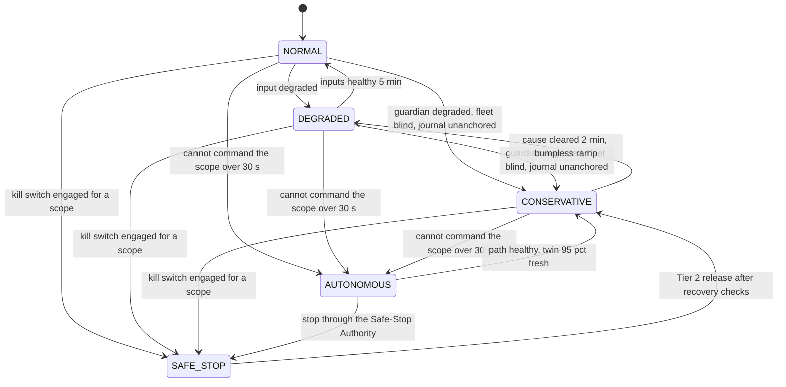
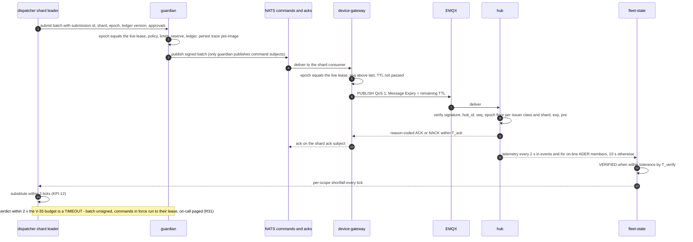
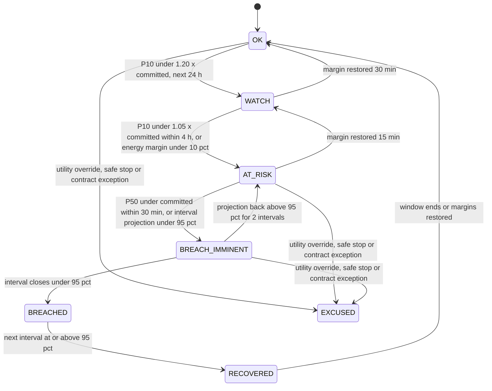
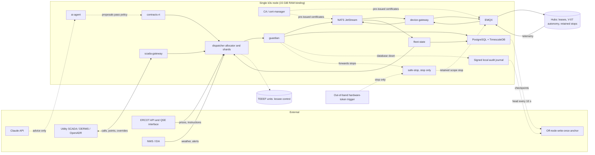
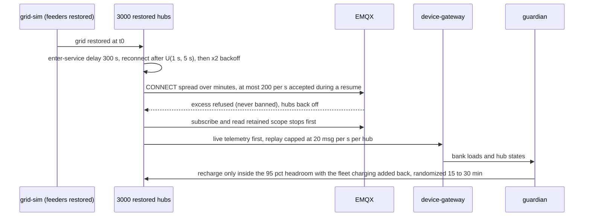

# OpenGrid Orchestrator — Failure Modes and Recovery Specification

Status: v0.2 · 2026-09-25 · Author: Reliability Engineering (DER-fleet operations / SRE) · Resolution pass after the four
adversarial reviews (`../06-reviews/01…04`), aligned with decision register v0.2 · Audience: every spec author, reviewer,
implementer and operator · Companions: `01-system-architecture.md` (NFRs, trust boundaries, fencing algorithm),
`02-domain-model-and-interfaces.md` (the single device contract and stream table, command lifecycle, schemas),
`03-decision-engine.md` (control law, MILP, arbitration internals), `04-external-data-integration.md`,
`06-platform-and-operations.md`, `07-scada-integration.md`, `../03-security/*`, `../04-ui/*`, `../05-testing/*`.
Resolution record: `../06-reviews/resolution/A4-failure-modes.md`.

---

## Changes in this version (v0.2)

Every change below applies a decision-register resolution or a verified review finding; the per-finding disposition
(verified, fixed, rejected with reasons) is in `../06-reviews/resolution/A4-failure-modes.md`. Nothing is dropped: every
customer type keeps its dispatch; changes alter how failures are detected, contained, alerted and tested.

| Area | Change | Register / findings |
|---|---|---|
| Stops | The guardian-held "separate safe-stop key" is replaced by the independent **Safe-Stop Authority** (SSA): stop-only EKU enforced on hubs by DV-17, out-of-band hardware-token trigger, release only through `guardian`, independent dispatch-key epoch authority; stops exempt from the hub rate limit (DV-14); retained scope-stop state; fallback only while no scope stop is active and never above the last commanded export (§2.2, §2.10, §2.13, FM-SEC-009/020/031…034, FM-DEV-036, C13, C16, RB-070) | R16, V-10, V-11; ARC-024, RT-001, RT-002, RT-018, K11 |
| Guardian time budget | A guardian TIMEOUT is not a veto: hold, commands run to their lease, page — never an automatic stop (§2.0 P16, §2.1, §2.3, FM-PLT-032, ALR-190, RB-069, TC-CHAOS-432); guardian state has named stores (FM-PLT-039) | R31, V-35; ARC-004, ARC-008, ARC-037, ARC-038 |
| Audit-write failure | Signed, hash-chained local journal anchored off-node every 10 s; CONSERVATIVE on integrity failure or 5 min without an anchor; no command if both stores fail (§2.1, FM-ARB-016/017/027/028, FM-PLT-007, C9, C15, RB-037, TC-CHAOS-377) | R22, V-23, V-26, K3; RT-007, JDG-007, ARC-043, ARC-045 |
| Leases, epochs, fencing | Lease timings V-01/V-02; epochs from a durable sequence, equality with the live lease at `guardian` and `device-gateway`, hub floors per (issuer class, shard), deterministic `command_id`, re-issue never sooner than 2 s (§2.2, §2.4, FM-PLT-025/035/036/037) | R30, R32, V-01, V-02, V-40, K2; ARC-009, ARC-018, ARC-026, RT-013 |
| Restore | Counter, floor and latch resynchronisation after a restore; signed RESTORE record; production genesis record (FM-PLT-033, FM-PLT-029, HUB-R15, RB-072, TC-CHAOS-433) | R36; ARC-010, ARC-032 |
| Message bus | Stream table defers to the single table of `02` (R34): WorkQueue/Interest retention for control and audit streams, alerts at 50%/80% of every DiscardNew stream, no self-blocking caps (§2.4, FM-PLT-009/034) | R34; ARC-006, ARC-020 |
| Node budget | Load generator off the node; control path Guaranteed QoS; forced kubepods OOM with the victim recorded; one warm standby per shard group; `06` §1.8 is the only resource table (§2.6, §2.14, FM-PLT-005/038, C12) | R35, R14, R2; ARC-005, ARC-007, ARC-029, ARC-047, ARC-048, RT-006 |
| Chaos on the shared host | No reboot of the shared host; node loss on a replica VM or a consented k3s stop; API-level injectors instead of a privileged chaos daemon; where each chaos test may run (§6.1, §6.2, §6.8) | R46; ARC-028, ARC-053 |
| Alerts | 24 paging rules across this document and `06` (≤ 25); every other rule a ticket or dashboard; per-hub safety alarms to Base's product-safety queue; a stale-epoch rejection pages only when a stale command reached a hub; safety and audit-path alerts never inhibited; paging hours per Q15; deduplication table with `06` (§5.1–§5.3) | R41, V-25, Q15; ARC-033 |
| Runbooks | Full bodies (commands, decision points, rollback, verification) for 16 P1 scenarios reachable in the demo; the rest marked "stub" (§5.4, §5.6) | ARC-035, JDG-029 |
| Modes | 05's fleet modes are the operator-facing state; `03`'s DM codes are mapped onto them in one entry/exit table; modes per control scope with shard-local causes (§2.1) | R42, R30; ARC-041 |
| ERCOT instructions | AT_RISK / BREACH_IMMINENT never pre-empt ERCOT instructions for an on-line ADER; ALR and NCLR variants; ERCOT-visible capability from ledger-free capacity; COP cadence; ICCP/QSE loss holds the set point flat and follows the QSE-desk procedure (§2.12, FM-MKT-002/008/009/011/015…017, FM-SCADA-009, RB-071) | R17, R25; GRD-001, GRD-002, GRD-014, GRD-017, GRD-021, GRD-023, GRD-041 |
| Emergency posture | No reserve raise by grid charging during an EEA; pre-positioning on forecast risk; chaos case "EEA2 at 18:00 with 40% of hubs below 50%" (RP-59, FM-DSP-013, FM-MKT-007, FM-HOME-009/010, FM-EXT-017, C5, TC-CHAOS-395) | R19, V-31, Q14; GRD-004 |
| Grid control | Recharge headroom with the fleet's own charging added back and unit-typed ratings (RP-30, FM-DSP-011, FM-HOME-005); stop sequencing and frequency gating (V-16); autonomous grid response freezes integrators (FM-DSP-031); settings-drift quarantine (FM-DEV-037, HUB-R12); frozen-value and switching-feed rules (FM-SCADA-002/011, FM-DAT-007); per-phase step checks (FM-SCADA-010); DNP3 event-buffer overflow is IIN2.3 (FM-SCADA-006) | R18, R26, R28, V-16, V-30, V-38; GRD-006, GRD-007, GRD-009, GRD-011, GRD-012, GRD-020, GRD-025, GRD-026, GRD-027, GRD-031, GRD-052 |
| `MOBILE_TEEEF` | Statute-shaped profile: island-forming only under the lessee TDU, admitted with a lessee-declared qualifying outage, no Base-initiated energization, island load planned at the measured cold-load factor (FM-DSP-024…029, §2.10, HUB-R14) | R20, Q20; GRD-005, GRD-018, GRD-019 |
| Values | Hub connectivity and eligibility (V-29), cycle and telemetry (V-03, V-32), TTL and lease (V-05, V-06), local autonomy (V-07), certificates (V-08, V-09), approvals (R3 amended, V-12…V-15), release staging (V-17), planner limits (V-20), broker admission (V-21), AI budget (V-22), latency and stagger (V-34), return from HOLD (V-38) now cited, not restated (§2.2, §2.3, §2.7, §2.11) | V-03…V-38; ARC-015, ARC-016, ARC-052, GRD-055 |
| New rows and ids | FM-DEV-036/037, FM-COM-021, FM-DSP-031, FM-ARB-027/028, FM-MKT-015…017, FM-PLT-032…039, FM-DAT-015 (estimator common mode), FM-SEC-031…034; FM-SCADA-022…052 imported from `07` §9 with scores; ALR-037, 038, 118, 154…156, 190, 191, 214, 260…272; RB-069…072; TC-CHAOS-016, 136, 137, 221, 331, 377, 378, 395…398, 432…439, 465, 501…504 | as above; ARC-056; `07` handoff H-SCADA-38 |

---

## How to read this document

This is the reliability contract of the Orchestrator: how every service behaves when something it depends on — a hub,
a house, a network, an external API, a SCADA link, a market, the platform, the data, an attacker or an LLM — fails.
It contains (1) the FMEA method, (2) global resilience policies that every service implements, (3) a catalogue of
**333 failure modes** in 12 categories, (4) cascading/common-mode analysis (16 scenarios), (5) the alert catalogue
(**239 alert rules**, of which **24 page** — one paging set shared with `06-platform-and-operations.md`) and runbook
index (**72 runbooks**, 16 with full bodies), and (6) chaos/fault-injection requirements that make every row testable.

What this document owns and what it does not:

| Topic | Owner | This document |
|---|---|---|
| Failure behaviour, thresholds, retries, breakers, safe states, alerts and the paging set, runbook index, chaos requirements | **this document** | normative |
| The device contract: topics, ACLs, retained state, message schemas, command lifecycle, heartbeat-loss timeouts (register R33) | `02-domain-model-and-interfaces.md` (§3, §3.7) | states the required values (from the register) and behaviour |
| The message-bus layout: streams, subjects, consumers, retention and caps (register R34) | `02-domain-model-and-interfaces.md`, sized by `06` §4 | states consumer failure policies and the stream alerts |
| Control law, MILP, arbitration algorithm, forecasting models, degraded-mode causes DM-01…DM-13 | `03-decision-engine.md` | states what must happen when they fail; maps DM codes onto the operator modes (§2.1) |
| External API adapters (endpoints, parsing) | `04-external-data-integration.md` | states failure classes and policies |
| Kubernetes resource budget (the only resource table, R14), backups, upgrades, on-call rota | `06-platform-and-operations.md` | states triggers, safe states and alert rules |
| SCADA point maps, protocols, interlocks | `07-scada-integration.md` | catalogues SCADA failure modes (`FM-SCADA`, including the rows `07` §9 proposed) |
| Threats and security controls (`TH-*`, `CTL-*`, device rules `DV-*`) | `../03-security/*` | covers only the operational failure behaviour of security events (`FM-SEC`) |
| Test case bodies (`TC-*`) | `../05-testing/02-test-cases-functional.md`, `03-test-cases-nonfunctional.md` | allocates `TC-CHAOS-NNN`; each single-fault chaos test is defined by its row's test hook (injector, fault, rate) and judged by §6.5; `03-test-cases-nonfunctional.md` §4 schedules them |

### Labels used for every number

| Label | Meaning |
|---|---|
| **[S]** | Sourced public fact; the URL is in the Sources list at the end |
| **[RP]** | Reviewer proposal — unverified (brief §3.2): a candidate acceptance criterion to be confirmed with real contracts, data and pilots; used as a design target and held as a configurable field of the relevant dispatch profile (decision register R11) |
| **[B]** | Default pinned in `../00-brief.md` §4 |
| **[N]** | Taken from a sibling document (`NFR-*` in `01-system-architecture.md`, `FR-*`/`KPI-*` in `../01-product/*`; product NFRs are NFR-201…232, register K1) |
| **[V]** | Normative value of `../00-decision-register.md` §F, cited as "register V-nn"; values marked [unsigned] there await the sign-off of register Q13 |
| **[A]** | Assumption: a tunable default proposed here, exposed as a Helm value (`resilience.*`), validated by the named test |
| **[D]** | Derived from other numbers; the formula is shown |
| **[P]** | Behaviour of today's prototype (`/opt/opengrid_sim/*.py`, `G:\OpenGrid\src\opengrid\*`) that the spec keeps or corrects |

Unless a catalogue cell carries another label, its numeric parameters are **[A]** defaults. The named resilience
parameters (`RP-01…RP-67`) in §2.11 are the single source for thresholds referenced elsewhere; where a parameter is a
register value, the parameter cites it instead of restating a different number.

**Decision register.** Where this document and `../00-decision-register.md` disagree, the register wins. This version is
aligned with register v0.2 (2026-09-25): decisions D0a–D5, resolutions R1–R50 (including the closed R16 and K1–K11), the
normative values V-01…V-41 and the proposed defaults of the open questions Q1–Q25 (cited as "register Qn"). Platform
figures (memory budget, priority classes, disk thresholds) follow `06-platform-and-operations.md` §1.8, the only
resource table (R14, R35); the message-bus layout follows the single stream table owned by
`02-domain-model-and-interfaces.md` (R34).

### Identifier scheme

| ID | Scheme |
|---|---|
| `FM-<CAT>-NNN` | Failure mode. CAT ∈ {DEV, HOME, COM, EXT, DSP, MKT, PLT, DAT, SEC} per brief §7, plus **SCADA** (user directive 2026-09-25, `scada-gateway` and utility/ISO SCADA), **ARB** (the brief §1 "core job" and §3.5 dispatch profiles: call intake against service-type profiles, arbitration, billing/settlement, decision audit) and **AI** (the `ai-agent` service). The three additions are requested as an amendment to brief §7 (§7 Q12). FM-SCADA-022…052 were proposed by `07-scada-integration.md` §9 and are imported and scored in §3.5.1 |
| `ALR-NNN` | Alertmanager rule (§5.3). Ranges: 001–039 device/home/TEEEF · 040–059 comms · 060–079 external data · 080–099 SCADA · 100–119 dispatch/grid · 120–139 arbitration/billing/audit · 140–159 market · 160–199 platform · 200–219 data · 220–239 security · 240–259 AI · 260–269 SCADA additions (proposed by `07` §9, allocated here) · 270–279 safe-stop and key authorities (register R16) · 290–299 meta. IDs are never renumbered; a retired rule keeps its ID and says where its detection went. `06` owns ALR-500…559 |
| `RB-NNN` | Runbook (§5.4). RB-001…072; §5.6 holds the full bodies, the other entries are stubs. `06` owns RB-500…527 |
| `RP-NN` | Resilience parameter (§2.11), local to this document, one Helm value each |
| `TC-CHAOS-NNN` | Chaos test id, allocated here; the test is the row's test hook, scheduled by `../05-testing/03-test-cases-nonfunctional.md` §4. Rule: `TC-CHAOS = base(CAT) + NNN` with base DEV 100, HOME 150, COM 200, EXT 230, SCADA 260, DSP 300, ARB 350, MKT 380, PLT 400, DAT 450, SEC 470, AI 520; compound game days are `TC-CHAOS-001…016` (§4, §6.7). FM-SCADA-040…052 keep the functional and security test ids `07` §9 gave them, because base 260 + 40 would collide with the DSP block. `05-testing` owns `TC-CHAOS-600…627` |

### Abbreviations

SOC state of charge (never "security operations centre" in this document; that persona is "security analyst") ·
T_ack / T_verify command acknowledgement / execution-verification deadlines (§2.2) · P10/P50/P90 probabilistic
quantiles (P10 = the value exceeded with 90% probability) · U(a,b) uniform random delay · pp percentage points ·
CPT America/Chicago (ERCOT local time) · FIRM = the firm tier of brief §3.1 (`DIST_DEFERRAL`, `PARTNER_CAPACITY`
events and tolling reservations, `LARGE_LOAD` contracted events); `PJM_CAPACITY` is non-firm by default (register R27)
· ADER aggregate distributed energy resource registered with ERCOT (ALR type: dispatched by SCED on the Updated
Desired Set Point, UDSP; NCLR type: deployed by instruction until recall; register R17) · NPC the ADER's net power
consumption · COP Current Operating Plan · EEA energy emergency alert · QSE desk the role that answers the ERCOT hotline
and executes ISO instructions (register R25; simulated for the demo) · SSA Safe-Stop Authority (register R16) · TEEEF =
`MOBILE_TEEEF` unit (1 MW / 2 MWh trailer battery, a separate asset class) · RBE report by exception · SBO
select-before-operate · DLQ dead-letter queue.

### Which judging criteria (brief §2) this document serves

| Criterion | Where |
|---|---|
| Completeness (15) | §2.1–§2.10 guarantee a defined state for every failure so the data → decision → dispatch → M&V → settlement chain never crashes; §6 makes every row injectable and judged |
| Technical depth (15) | FMEA with measurable detection; leases, durable-epoch fencing, bumpless transfer, interval-rescue math, full-jitter retries, JetStream redelivery/DLQ, breakers, bulkheads, admission control, common-mode analysis, an independent stop-only authority |
| The problem (15) | Homeowner reserve and grid limits are hard constraints in every failure path (S1 class, §2.12.5); firm obligations get hold-then-schedule safe states; ERCOT instructions stay hard constraints under failure |
| The "why" (15) | §2.0 shows why one fleet with firm-first allocation stays safe and billable when parts fail; ARB rows keep "one kWh, one buyer" true under failure |
| Insight quality (10) | `AT_RISK` lead time per register V-41, interval-rescue projection, P10 deliverable vs committed, SCADA step checks, cohort analytics, decision traces that explain every clip or refusal |
| Usability (10) | Every threshold is a named Helm value with a default; every row names an alert, a runbook and a test; 24 paging rules; 16 full runbooks (§5.6) |
| Creativity (10) | Lease-and-fallback hubs, sympathetic-failure detection, randomized fleet steps, a stop path that can only stop, AI advice gated by the same policy path as any call |
| Performance (10) | §2.14 budgets (msg/s, GB/day, buffer hours) and §6.5 MTTD/MTTR measurement — measured in chaos runs with the load generator off the node, not asserted |

---
## 1. Method: FMEA

*Serves: Technical depth, Completeness, Usability.*

### 1.1 Unit of analysis

A failure mode is one observable way a function of the Orchestrator (or of something it depends on) stops meeting its
specification, named at the boundary where the Orchestrator can observe it (a hub's telemetry, an API response, a SCADA
point, a pod, a ledger invariant). Each row states cause, effect per customer type, detection, automatic response,
degraded mode, recovery, alerting, runbook and test hook. Effects are assessed for every customer type in brief §3.1 —
`HOME`, `ERCOT_ENERGY`, `ERCOT_AS`, `PARTNER_CAPACITY`, `DIST_DEFERRAL`, `LARGE_LOAD`, `PIPELINE_AC`, `MOBILE_TEEEF`,
`PJM_CAPACITY` — because every one of them is in scope and dispatched (brief §3.1). The reviewers' challenges to a
service are conditions to validate with evidence; they never appear here as a reason to withhold its dispatch.

### 1.2 Severity (S, 1–10) and severity class

Severity rates the worst credible effect **if the failure occurs and is not detected**, independent of controls.

| S | Anchor | Class |
|---|---|---|
| 10 | Hazard to people or property (fire, energizing a de-energized line, unsafe island, backfeed), or a homeowner left without backup during an outage because the Orchestrator drained the reserve | **S1** safety / homeowner |
| 9 | Homeowner reserve or opt-out violated, grid equipment pushed above its rating (bank > 100% or rebound > 95% [RP]), or commands executed without valid authorization | **S1** |
| 8 | Firm contract breach (a failed event / 15-min interval below 95% [RP], liquidated damages 2× the monthly payment per failed event [RP]), utility-telemetry obligation missed, market compliance violation, or the hosting constraint of brief §4 broken (co-resident services harmed) | **S2** contract breach |
| 7 | Firm obligation at risk or partially missed within tolerance (season still ≥ 98% [RP]); ancillary-service shortfall with buyback exposure; settlement error visible to a customer | **S2** |
| 6 | Significant revenue loss (> $10,000/day at 10,000 hubs [A]) or market participation lost > 1 h; wrong data shown to operators for > 15 min | **S3** revenue loss |
| 5 | Moderate revenue loss; ≤ 11 kW (one hub) of delivery lost and covered by over-enrollment; performance evidence for one interval lost | **S3** |
| 4 | Minor revenue loss; manual workaround needed | **S3** |
| 3 | Degraded performance, automatic recovery, no customer impact | **S4** degraded |
| 2 | Operator inconvenience | **S4** |
| 1 | No noticeable effect | **S4** |

### 1.3 Occurrence (O, 1–10)

Anchored on **fleet-wide incidence at the 10,000-hub test scale** [B] (a per-hub fault that happens somewhere in the
fleet every hour is O=10). Occurrence is re-scored for 100,000 hubs before production (§1.6).

| O | Incidence | O | Incidence |
|---|---|---|---|
| 10 | ≥ 1 per hour | 5 | ≥ 1 per quarter |
| 9 | ≥ 1 per 8 h | 4 | ≥ 1 per year |
| 8 | ≥ 1 per day | 3 | ≥ 1 per 3 years |
| 7 | ≥ 1 per week | 2 | ≥ 1 per 10 years |
| 6 | ≥ 1 per month | 1 | < 1 per 10 years, or eliminated by design |

### 1.4 Detection (D, 1–10) — for the design as specified here

D rates how likely the **specified** detection catches the failure before it affects an obligation or a person.

| D | Detection | D | Detection |
|---|---|---|---|
| 1 | Automatic, certain, within one control tick (≤ 2 s event / ≤ 10 s normal) | 6 | Automatic within 24 h (daily reconciliation) |
| 2 | Automatic within 1 min | 7 | Periodic audit (weekly/monthly) |
| 3 | Automatic within 5 min (inside the 5-min full-output window [RP]) | 8 | Only by a customer or a settlement statement |
| 4 | Automatic within 15 min (one performance interval) | 9 | Only by chance / incident investigation |
| 5 | Automatic within 1 h | 10 | Not detectable |

### 1.5 RPN and action priority

`RPN = S × O × D` (1–1000). RPN alone under-weights rare catastrophic failures, so action priority (AP) is:

| AP | Rule | Obligation before go-live |
|---|---|---|
| **AP-H** | S ≥ 9, **or** RPN ≥ 200, **or** (S ≥ 7 and D ≥ 5) | Designed mitigation implemented; automated `TC-CHAOS` passing in CI; runbook rehearsed |
| **AP-M** | not AP-H, and (80 ≤ RPN < 200 **or** S ≥ 7) | Mitigation implemented; `TC-CHAOS` automated (may run weekly) |
| **AP-L** | everything else | Detection + alert implemented; `TC-CHAOS` may be manual (quarterly game day) |

Reliability Engineering may raise (never lower) a row's AP when it touches a binding constraint; raised rows show
`AP-H↑` with the reason. Scores in §3 are **residual** (with the controls specified here). Where the control is the whole point (e.g., leases,
fencing), §3.13 also shows the inherent score, so reviewers can see what the control buys.

### 1.6 How the catalogue is maintained

1. **Owner:** Reliability Engineering (fleet reliability engineer persona, `../01-product/01-vision-scope-personas.md`
   §6.2) owns the catalogue; each row's *responding service* owner signs off its response column.
2. **Triggers for change:** every incident post-mortem (new or re-scored row within 5 business days); every pull
   request that adds a dependency, a customer type, a protocol or a threshold (PR template checkbox: "FM rows
   affected: …"); every chaos run whose measured MTTD/MTTR contradicts a row's TTD/recovery column; every change in a
   public rule referenced here (ERCOT, PUCT, IEEE, provider API limits).
3. **Cadence:** full re-score quarterly and before each 10× fleet-growth step (10k → 100k hubs re-anchors O).
4. **Machine-readable mirror:** the catalogue is exported to `fm-catalogue.yaml` (one record per row: ids, S/O/D,
   alert, runbook, test, parameters) generated from this Markdown in CI; `05-testing/04-traceability-matrix.md` links
   `FM ↔ ALR ↔ RB ↔ TC-CHAOS ↔ NFR/FR`. A CI check fails if a row references an unknown `ALR`, `RB` or `RP` id, or if
   the paging set of §5.3.1 exceeds 25 rules (register V-25).
5. **Every row is instrumented** (`01-system-architecture.md` NFR-020 [N]): one OpenTelemetry metric, one structured
   log event with the `fm_id`, and — where the alert column is not "none" — one Alertmanager rule.

### 1.7 How the catalogue is tested

Every row names an injector and a `TC-CHAOS` id (§6). Coverage gates (§6.6): the AP-H rows reachable in the demo
profile automated and passing before the judged demo (G3-J, register R21); before production 100% AP-H, ≥ 90% AP-M,
≥ 60% AP-L; every row exercised at least once per quarter; §6.8 says where each test may run (CI, a node test window or
a replica VM, register R46). Each run records measured time-to-detect and time-to-recover per row; the console's
resilience panel shows them.

---

## 2. Global resilience policies

*Serves: Completeness, Technical depth, The problem, Usability, Performance.* Every service implements these policies;
the catalogue in §3 only states deviations and parameters.

### 2.0 Resilience principles

| # | Principle | Consequence in every failure path |
|---|---|---|
| P1 | **Homeowner and safety first** | Reserve, opt-out, device limits and grid limits are constraints, enforced twice: `guardian` before signing (`01-system-architecture.md` NFR-001 [N]) and the hub locally (§2.13) |
| P2 | **Service-agnostic dispatch** (brief §1) | A valid call of any customer type is executed within safety, device, reserve, grid-limit, authorization and contract-priority constraints. Failure responses may clip, delay, substitute, or preempt by contract priority — always recording delivered vs requested — but never refuse, down-rank or omit a dispatch because its impact is doubted (§2.12.5) |
| P3 | **Telemetry proves execution** (brief §1.2) | An ack is necessary, not sufficient; a command is `VERIFIED` only by measured power within tolerance (§2.2) |
| P4 | **Fail toward the obligation's safe state** | Hold the prior setpoint, then the day-ahead schedule after 15 min [RP][N NFR-002], then local autonomy (register V-07). Never an unplanned step to 0 kW for a firm obligation, never an unbounded discharge, and never a step of an on-line ADER's net power without an ERCOT instruction (register R25) |
| P5 | **Leases, not promises** | Every command expires (TTL, register V-05) and every setpoint is leased (V-06); a hub whose lease lapses follows the local-autonomy rules of V-07 (§2.13), so a dead brain never leaves a hub discharging indefinitely |
| P6 | **One fenced writer per shard; one signer of run commands** | One fenced fleet allocator writes the reservation ledger and every hash-keyed execution shard has one fenced leader (register R30); epochs come from a durable sequence and must equal the live lease at `guardian` and `device-gateway` and meet the per-(issuer class, shard) floor at the hub (R32); `guardian` is the only signer of anything that moves MW (R1); the Safe-Stop Authority can only stop (R16) |
| P7 | **Order and idempotency on every control path** (brief §8 D4a) | Monotonic sequence numbers, expected-state preconditions, rejection of out-of-order, stale, duplicate or conflicting commands; select-before-operate where the protocol has it |
| P8 | **Bounded staleness** | Every value carries `as_of`, `quality` and `coverage`; each consumer has a staleness budget (§2.11) |
| P9 | **Risk-reducing actions never wait on a remote dependency; risk-increasing actions fail closed** | OPA, Keycloak, LLM, database or `guardian` outages block increases, never a stop (the Safe-Stop Authority, R16), a curtailment or reserve protection; a reserve raise is met by discharging less, and during an EEA never by grid charging (register R19) |
| P10 | **Bounded blast radius** | Per-bank ramp limits, randomized fleet steps, scoped kill switch (brief §8 D2), confirmation thresholds (D4b), per-customer bulkheads |
| P11 | **Shed computation before dispatch** | Analytics, AI, backfills and analytic refresh rates are shed first; safety, firm control, ERCOT instructions and control-room channels never (§2.8, register R48) |
| P12 | **Retry at one layer, with budgets and full jitter** | No retry amplification across layers (§2.4) |
| P13 | **Bumpless transfer** | Every mode change starts from measured outputs and ramps to the new allocation (§2.12.7) |
| P14 | **Explain every automated response** | A decision trace with reason codes links call → decision → commands → telemetry → M&V → invoice (brief §1 core job); no command without a durable trace (register R22) |
| P15 | **Page on safety, loss of control, SLO burn and security; queue the rest** | At most 25 paging rules across this document and `06` (register V-25, R41); per-hub symptoms feed work queues, trust scores and Base's product-safety queue; fleet-level symptoms page (§5.1) |
| P16 | **A timeout is not a veto** | No `guardian` verdict within its budget (register V-35) holds: the batch is unsigned, commands in force run to their lease, the on-call is paged — never an automatic stop. Only an explicit invariant veto escalates, and never to a stop without a person except `guardian`'s own risk-reducing rules (R31) |
| P17 | **Stops never wait on the signer of run commands** | A scope stop is one signed broadcast on a retained scope topic, signed by `guardian` or by the stop-only Safe-Stop Authority; hubs exempt stops from their command rate limit and read the retained stop state on every subscribe (R16, V-16) |
| P18 | **ERCOT instructions are constraints, not calls** | For an on-line ADER, ERCOT's instruction is an L2 hard constraint that no failure response or risk state pre-empts; conflicts with firm commitments are resolved before the fact in what ERCOT can see (telemetry, offers, COP) and afterwards by substitution from non-ADER hubs, never by deviating (register R17) |
### 2.1 Fleet operating modes

These modes are the **operator-facing state** (register R42); the degraded-mode causes of `03-decision-engine.md` §8.13
(DM-01…DM-13) are mapped onto them in the second table below, which holds the one set of entry and exit criteria. A mode
is held per **control scope** — a bank for `DIST_DEFERRAL`, a load zone for market and partner programs, a unit for
`MOBILE_TEEEF` — and rolled up to a fleet mode on the console (the worst scope mode, with the number of scopes in each
mode). Causes that are local to an **execution shard** (its leader, its command path; shards are keyed by hash(hub_id),
register R30) affect that shard's hubs in every scope: a scope takes the shard-caused mode only when more than 20% of its
eligible hubs [A] sit in affected shards; below that the scope keeps its mode, the affected hubs count as unavailable and
substitution covers them. Mode changes are decisions: they carry a decision trace and, for SAFE_STOP engage and release,
the rules of §2.12.8.

| Mode | Entry (any of) | Behaviour | Exit | Alert |
|---|---|---|---|---|
| NORMAL | — | Calls dispatched per plan and arbitration | — | — |
| DEGRADED | An input is degraded while the control path is healthy: market data stale beyond RP-39, forecaster on fallback, planner on fallback plan, one bank on signal hold, a customer signal lost, time sync degraded above 250 ms, `ai-agent` unavailable | Dispatch continues; affected decisions use fallback inputs flagged in the trace; the planner makes no new *discretionary* offers on stale prices, while committed positions, awards, ERCOT instructions and customer calls continue | Inputs healthy for 5 min | ALR-112 P3 |
| CONSERVATIVE | `guardian` signing but degraded (envelope older than 15 min, policy inputs stale, or verdict TIMEOUTs on > 5% of batches in 1 min, register R31); `fleet-state` blind (DM-03); < 80% of a scope's eligible hubs fresh; the local audit journal failing its integrity check or not anchored off-node for 5 min while the central store is down (register R22); server clock offset > 1 s; a restore not yet resynchronised (R36) | Hold validated setpoints and keep renewing leases; new or larger setpoints only inside the last valid `guardian` envelope (per-bank maximum export and charge, ramp); no new discretionary market positions; firm obligations continue (hold → schedule); ERCOT instructions for on-line ADERs continue (R17) | Cause cleared 2 min, then bumpless ramp | ALR-112 P2 |
| AUTONOMOUS | The Orchestrator cannot command the scope: command path (NATS → `device-gateway` → EMQX) down > 30 s; `guardian` unable to sign for > 30 s (it is the only signer of run commands, R1, so leases cannot be renewed); no completed tick for > 3 ticks during an event or > 30 s otherwise; a shard leaderless past the 15-s maximum of V-02 with leases lapsing; neither the central audit store nor the local journal writable (R22: no trace, no command); node lost | Hubs follow register V-07 as their leases lapse: fallback export only for firm obligations whose counterparty accepted fallback in the contract, on signed schedules with per-hub randomized boundaries, for ≤ 15 min, only while no scope stop is active and never above the last commanded export; ADER members self-consume with no export (the QSE desk sets the ADER OUTL); all others self-consume with no export and no grid charging; local cease-export triggers always armed; after 15 min backup-only until contact returns. The Orchestrator observes where it can; stops stay possible through the Safe-Stop Authority (R16); customers notified per §2.12.4 | Command path healthy, ≥ 95% of hubs fresh, operator acknowledgement (automatic after 5 min when no firm event is active), bumpless transfer | ALR-112 P1 (paging) |
| SAFE_STOP (scope: bank, zone or fleet — D2) | Kill switch engaged by one qualified operator with explicit confirmation (register R3 amended; an ERCOT verbal dispatch instruction or a logged utility instruction is a qualifying trigger); a protective stop triggered by `guardian` and confirmed by one operator; an authorized utility stop; the Safe-Stop Authority's out-of-band trigger (R16) | One signed broadcast per scope on the retained scope topic; stops sequenced and ramped per register V-16 (§2.12.8); obligations in scope excused or failed per contract; no new dispatch and no fallback export in scope | Tier 2 release (V-17) after the recovery checks of RP-58: reverse sequence, staged ramp-up ≥ 15 min | ALR-230 P2 (notify); ALR-234 P1 if the stop is not effective |



**Degraded-mode causes mapped onto the operator modes (register R42).** The detection logic of each DM code is owned by
`03-decision-engine.md` §8.13; where the register sets a behaviour the register wins, and `03` is updated to match
(noted per row).

| DM (`03` §8.13) | Cause | Operator mode and scope | Entry | Exit | Alert |
|---|---|---|---|---|---|
| DM-01 | Market data stale | DEGRADED (market scopes) | SCED price age > 15 min (`03`); ALR-064 fires first at RP-39 (10 min) | 2 fresh intervals | ALR-064 P2; ALR-112 P3 |
| DM-02 | Hub telemetry lost (partial) | Hubs `SILENT` and excluded (register V-29); the scope turns CONSERVATIVE when < 80% of its eligible hubs are fresh | > 3 missed reports (V-29) | Probation, then eligible (V-29) | ALR-003 P3/P2 |
| DM-03 | `fleet-state` unavailable ("fleet blind") | CONSERVATIVE; AUTONOMOUS once no tick completes for > 3 ticks | Snapshot age > 30 s, or > 20% of hubs `SILENT` | 3 fresh snapshots | ALR-112 |
| DM-04 | Bank SCADA unusable for closed loop | DEGRADED (bank): HOLD, then SCHEDULE; inside a need window HOLD = max(held, scheduled) (V-38) | Class A3, or class S (R5) | 60 s of continuous A1/A2 samples with the last 3 within 0.1 × rating (V-38) | ALR-080 / ALR-082 |
| DM-05 | No valid plan | DEGRADED | Plan age > 30 min, or the day-ahead plan missing at 09:20 CPT | Valid plan published | ALR-108 P2 |
| DM-06 | Customer signal lost | DEGRADED (the customer's scope): profile failure rule | Heartbeat or subscription loss (> 2 min in an event) | Link restored | ALR-110 P2 |
| DM-07 (veto) | Explicit `guardian` veto | NORMAL with the vetoed commands not sent; CONSERVATIVE for the scope when > 5% of a tick's commands, or any bank-level command, is vetoed. An explicit invariant veto may escalate to a stop only through a person, except `guardian`'s own risk-reducing rules (R31); `03`'s "3 consecutive such cycles request a scoped safe stop" is to be read that way | `VETO` / `VETO_ALL` verdict | 3 clean ticks | ALR-111 P3; ALR-104 P2 |
| DM-07 (timeout) | No verdict within 2 × register V-35 | CONSERVATIVE (hold: commands in force run to their lease); AUTONOMOUS only when nothing is signed for > 30 s. **Never a veto and never a stop** (R31); `03`'s "no verdict within 100 ms counts as a veto" is superseded | TIMEOUT on > 5% of batches in 1 min, or 3 consecutive | Verdicts within budget for 2 min | ALR-190 P1 |
| DM-08 | Shard leader or allocator failover | NORMAL within V-02 (≤ 10 s p95, ≤ 15 s max); AUTONOMOUS (shard) beyond it once leases lapse | Lease lost | New leader cycling with a fresh epoch (R32) | ALR-052 P3 |
| DM-09 | `scada-gateway` unavailable | DEGRADED (SCADA-dependent banks: HOLD/SCHEDULE); restrictive utility controls latched and enforced (`07` §6.8) | Gateway health | Gateway healthy, then V-38 | ALR-080 / ALR-092 |
| DM-10 | Simulated QSE link lost | DEGRADED (ADER scopes): the last set point is held flat — never an energy request of 0 — and the QSE desk follows the ERCOT hotline procedure (R25); `03`'s "then energy request 0" is superseded | Base points or awards missing > 60 s | Link restored and ERCOT's instruction applied | ALR-088 P1 (ADER on line or AS awarded) / ALR-149 P2 |
| DM-11 | Time sync degraded | DEGRADED above 250 ms (hubs and paths above it leave the bank-loop add-back, V-34); CONSERVATIVE above 1 s (RP-21) | Offset (`time_quality`) | Sync restored | ALR-050 P2 |
| DM-12 | `ai-agent` unavailable | NORMAL (advisory only) | Agent health | — | ALR-240 P3 |
| DM-13 | Safe stop active in scope | SAFE_STOP (scope) | Engage (§2.12.8) | Tier 2 release (V-17) | ALR-230 P2; ALR-234 P1 |
### 2.2 Command lifecycle, leases, ordering and verification

The device contract — topics, ACLs, QoS, retained state and message schemas — is owned by
`02-domain-model-and-interfaces.md` (register R33: one device contract; the security architecture's command envelope with
`seq`, `jti`, `exp`, `epoch` and `pre` is the command schema; one command-state vocabulary). This section fixes the
resilience semantics every field and topic must support.

**Resilience semantics of the command envelope.** `command_id` is derived from (shard, epoch, hub_id, seq) and every
submission to `guardian` carries a submission id = hash(shard, epoch, decision_id), so a retried submission can never
produce a second signed command (register R32); `seq` is monotonic per hub and persisted by issuer and hub before
execution; `epoch` is the durable leader generation of the issuing shard (R32); `exp` bounds the command's age on
arrival (TTL 30 s, register V-05; older commands are rejected and logged); the setpoint is leased (register V-06: 30 s
during events, 60 s otherwise), renewed by the signed, epoch-bearing group heartbeat on `fleet/lease` every 10 s; `pre`
carries the expected state (mode, maximum SOC age, last applied `seq`); every command carries its decision id and, for
critical commands, the confirmation reference (D4b). Telemetry carries import/export energy registers, `boot_id` and
quality and reason codes, and is deduplicated on (`hub_id`, `boot_id`, `seq`) (R33). The unsigned `twin/desired` topic
is not a control input (R33): a hub acts only on signed commands, the signed lease heartbeat and retained scope stops.
Counters and epochs are `bigint` (register V-40).

**Single signer of run commands, and a stop path that can only stop (register R1, R16).** `guardian` is the only signer
of anything that moves MW. Every control path — `dispatcher` (the fleet allocator and the execution shards, R30), utility
SCADA controls arriving through `scada-gateway`, operator actions and AI proposals — submits its batch to `guardian`,
which checks policy (one OPA evaluation per batch), ordering and epoch, grid and device limits, reserve, the
reservation-ledger version (R37) and approvals, persists the batch's trace pre-image (R22), and only then signs
(Merkle-batch signing, R31) and publishes. A compromised `dispatcher` or path therefore cannot bypass the safety checks.
**Stops never depend on `guardian`:** the independent **Safe-Stop Authority** (`safe-stop`, namespace `og-safestop`,
≥ 2 replicas, no dependency on `guardian`, `dispatcher`, `contracts` or `api`) holds a separate key hierarchy whose
certificates carry the `safe-stop-only` extended key usage (register V-11). It can sign only a scoped
`SAFE_STOP`/`CEASE` (setpoint 0, V-16 ramp) and publishes it directly to EMQX on the retained scope topic, so it needs
neither NATS nor `device-gateway`; hub rule DV-17 rejects anything else signed under that key. In normal operation
`guardian` forwards stops to the SSA; the out-of-band hardware-token trigger (CTL-037) reaches the SSA directly, so a
stop works with `api`, `console`, `dispatcher` and `guardian` all down; an optional SSA watchdog is off by default. If
the SSA is unavailable, `guardian` signs the scope stop itself (hubs accept a stop signed by either; FM-SEC-031).
**Release is never possible through the SSA**: it is a Tier 2 action signed by `guardian` (register V-17). A separate
**dispatch-key epoch authority** (two-person custody, security + SRE) can advance the key epoch (register V-10) to
invalidate every outstanding command of a compromised `guardian` without its cooperation (FM-SEC-033).



| Parameter | Value | Label |
|---|---|---|
| Control tick | 2 s during an active event and for members of an on-line ADER; 10 s otherwise | register V-03 |
| Telemetry period | 2 s during events and for members of an on-line ADER; 10 s otherwise | register V-32 |
| T_ack (app-level ack) | 2 × the active cycle: 4 s / 20 s | register V-04 |
| T_verify | ramp allowance (2 s, or \|ΔP\| ÷ hub ramp capability if slower) + 2 telemetry periods: 6 s event, 22 s normal | [A] |
| Delivery tolerance | \|P_meas − P_cmd\| ≤ max(0.5 kW, 10% of \|P_cmd\|) | [A] |
| Command TTL (maximum age on arrival at a hub) | 30 s; older commands are rejected and logged | register V-05 |
| Setpoint lease (the heartbeat-loss timeout of `02-domain-model` §3.7) | 30 s during events, 60 s otherwise; renewed by the signed group heartbeat (`fleet/lease`) every 10 s | register V-06 |
| Re-issue on missing ack | only after T_ack has passed and never sooner than 2 s after the original, under the same submission identity (`guardian` dedupes); then the hub is `UNRESPONSIVE` for the event | register R32 |
| Substitution (aggregate) | shortfall covered within ≤ 3 ticks | [N] KPI-12, FR-DISP-009 |
| Substitution dwell | a hub keeps an assignment ≥ 5 min unless it fails | [A] |

**Hub outcome states** (mapped onto the single command-state vocabulary of `02`, R33): `VERIFIED`, `ACKED`,
`ACK_TIMEOUT`, `NACKED(reason)`, `NOT_EXECUTED`, `PARTIAL`, `OVER`, `WRONG_SIGN`, `EXPIRED`, `SUPERSEDED`,
`REJECTED_ORDER(seq_regression / duplicate / stale / epoch / precondition)`.

**Issuer precedence on the hub (D4a, conflicting commands):** (1) hub-local protection, always; (2) a scope stop —
`SAFE_STOP`/`CEASE` signed by `guardian` or by the Safe-Stop Authority (DV-17 limits the SSA key to stops), read from
the retained scope topic on every subscribe and exempt from the hub's command rate limit (DV-14); (3) utility override
(flagged `override=true`); (4) the `dispatcher` setpoint of the current epoch — for members of an on-line ADER this is
the output of the NPC regulator that tracks ERCOT's instruction (register R17); (5) the signed local fallback schedule,
only while no scope stop is active and never above the last commanded export (register V-07); (6) local default
(self-consumption/backup). Everything in (3)–(5) is signed by `guardian` (R1); the `issuer` field, not the key, carries
the precedence, except that the stop-only key can carry only (2). A lower-precedence issuer never cancels a higher one; a
newer `seq` from the same issuer supersedes; a stop is cleared only by a guardian-signed release naming it (V-17). A
utility block during an ERCOT deployment triggers substitution inside the ADER and an immediate QSE-desk call (R17). The
same precedence applies on the SCADA control path (`07-scada-integration.md` interlock matrix).

**Leadership and fencing (register R8, R30, R32; values V-01, V-02).** One fenced **fleet allocator** solves the
bucket-level arbitration of every conflict component each tick and is the single writer of the reservation ledger;
**execution shards** keyed by hash(hub_id) — stable, independent of topology — each have one fenced leader that
water-fills the allocator's grants, assigns per-hub `seq` and submits batches (R30). Every leader holds a lease in the
NATS JetStream key-value bucket `og-leases`: TTL 6 s, renewed every 2 s, and a leader that has not renewed for 4 s —
measured on the monotonic clock from the renewal request's send time — stops issuing (V-01); the bucket is written with
`sync: always` on a pinned NATS version (R32). The **epoch** is a strictly increasing generation from a durable source —
a PostgreSQL sequence with synchronous commit — plus the shard id (R32), so a lease-store crash cannot hand two leaders
the same epoch (FM-PLT-036). `guardian` and `device-gateway` check that a batch's epoch **equals** the live lease at
commit; stale or unreadable lease state fails closed. Hubs keep epoch floors per (issuer class, shard); a signed
shard-assignment message accompanies every shard move, in a two-phase handover (the old shard releases, the new shard
acquires; FM-PLT-035). A stale leader's commands therefore die at the first hop, and a lock alone is never trusted
[S Kleppmann]. Failover of a shard leader or the allocator takes ≤ 10 s p95 and ≤ 15 s max (V-02). A warm standby per
shard group runs on the single node too (register R35), so fencing — not a single replica with the `Recreate` strategy —
is what prevents two leaders (FM-PLT-025). Because epochs are minted from PostgreSQL, each standby reserves its next
epoch from the sequence while the database is up and uses it only if it exceeds the live lease's epoch; a second
failover during the same database outage waits for the database (FM-PLT-037).
### 2.3 Timeout table per interaction

Every call carries an absolute deadline (`x-og-deadline`, UTC ms). A callee does not start work it cannot finish before
the deadline; nested timeouts are ≤ the remaining budget minus 10%.

| Interaction (caller → callee) | Transport | Connect | Per attempt | Overall | Notes |
|---|---|---|---|---|---|
| `dispatcher` shard leader → `guardian` submission, validation and signing | NATS request/reply or the `SUBMISSIONS` work stream (per `02`'s stream table, R34) | 100 ms | verdict p99 ≤ 250 ms per batch of ≤ 2,000 commands (register V-35) | TIMEOUT at 2 × the budget (500 ms) | **A TIMEOUT is not a veto (register R31):** the batch is unsigned and not sent, commands in force run to their lease, the on-call is paged (ALR-190) — never an automatic stop. Priority queues by class (SAFE_STOP > UTILITY > FIRM > AS > other) with pre-emption at batch boundaries. A retry reuses the submission id (R32). Unable to sign for > 30 s → leases lapse → AUTONOMOUS |
| `guardian` → NATS publish of a signed batch (JetStream ack) | NATS | 2 s | 250 ms | 1 s | Re-publish with the same message id (dedupe window); only `guardian` may publish command subjects |
| `guardian` → OPA sidecar | localhost | 50 ms | one evaluation per batch, the batch being the input (R31), inside the V-35 budget | — | P9: deny increases, allow allowlisted reductions |
| `guardian` → trace pre-image write | PostgreSQL, or the local journal when it is down (register R22) | — | inside the V-35 budget | — | No trace pre-image, no signature; with neither store writable no new commands (FM-ARB-016) |
| `safe-stop` → EMQX retained scope topic | MQTT 5 | 2 s | PUBACK 2 s | one control cycle | One signed broadcast per scope, retained; no dependency on NATS, `device-gateway` or `guardian` (R16); delivery verified by telemetry (FM-SEC-020) |
| `device-gateway` → EMQX publish QoS 1 | MQTT 5 | 2 s | PUBACK 2 s | lease | MQTT Message Expiry = the command's remaining TTL (register V-05) |
| Hub app-level ack | MQTT 5 | — | T_ack 4 s / 20 s | — | register V-04 |
| Execution verification | telemetry | — | T_verify 6 s / 22 s | — | §2.2 |
| EMQX ↔ hub keepalive | MQTT 5 | — | keepalive 30 s | — | Broker closes after 1.5 × keepalive = 45 s [S MQTT 5] |
| `dispatcher` → `fleet-state` snapshot | in-cluster | 100 ms | 50 ms | 200 ms | Snapshot up to 1 tick old is acceptable |
| `dispatcher` fleet allocator → arbitration solve (in-process HiGHS) | — | — | 500 ms per tick; 3 s for a new call | — | Fallback: greedy priority allocation (FM-ARB-010) |
| `planner` → HiGHS intraday | — | — | target 45 s at MIP gap 1% (p95 ≤ 20 s at demo scale); ceiling 120 s | 120 s | Incumbent accepted at gap ≤ 5%, else the rule-based fallback plan (register V-20) |
| `planner` → HiGHS day-ahead | — | — | target 300 s at MIP gap 0.5% (p95 ≤ 120 s at demo scale); ceiling 900 s | 15 min (p99 ≤ 15 min at 100,000 hubs) | As intraday (register V-20) |
| `forecaster` inference batch | — | — | 30 s | 60 s | Fallback: last forecast, widened bands |
| `market-data` → ERCOT token (B2C ROPC) | HTTPS | 3.05 s | 10 s | 20 s | Token valid 1 h, not refreshable [S] |
| `market-data` → ERCOT data | HTTPS | 3.05 s | 15 s | 45 s | Inside the 30 req/min limit [S] |
| `market-data` → EIA | HTTPS | 3.05 s | 20 s | 60 s | — |
| `market-data` → NWS | HTTPS | 3.05 s | 10 s | 30 s | User-Agent required [S] |
| `integrations` → OpenADR 3.0 VTN | HTTPS | 3.05 s | 10 s | 30 s | Poll every 30 s [A]; inbound webhook answered ≤ 2 s, processed async |
| `integrations` → utility DERMS (IEEE 2030.5) | HTTPS mTLS | 3.05 s | 5 s | 45 s | Keeps the ≤ 60 s latency budget [RP] |
| `integrations` → customer webhooks | HTTPS | 3.05 s | 10 s | per schedule (§2.4) | — |
| `scada-gateway` DNP3 master → utility outstation | DNP3/TLS | 5 s | response 5 s; integrity poll 60 s; event poll 2 s event / 10 s normal | — | [A]; link down after 3 failed polls |
| `scada-gateway` DNP3 outstation ← utility master | DNP3/TLS | — | SBO select timeout 10 s | — | [A]; operate after timeout is rejected (FM-SCADA-007) |
| `scada-gateway` IEC 60870-5-104 | TCP/TLS | t0 30 s | t1 15 s, t2 10 s, t3 20 s; k = 12, w = 8 | — | Typical vendor defaults [S], confirm per utility; the IEC 104 server is Could, R2 (register V-28) |
| `scada-gateway` ICCP/TASE.2 | TLS (IEC 62351-4) | 10 s | per bilateral table | — | Dual association to primary/alternate [A]; a labelled `SIM` stub until licensed (register Q11, R44) |
| `scada-gateway` OPC UA subscription | OPC UA | 5 s | publishing 1 s, keepalive count 10, lifetime count 30 | — | [A] |
| any service → PostgreSQL | TCP | 2 s | `statement_timeout` 2 s OLTP, 60 s reports, 10 min settlement batch (`contracts-batch`, own pool, R43); `lock_timeout` 1 s | — | `idle_in_transaction_session_timeout` 30 s |
| any service → Valkey (Redis-compatible cache; not in the demo values profile, R35) | TCP | 200 ms | 100 ms | 300 ms | Holds no authoritative state (FM-PLT-013) |
| any other service → OPA sidecar | localhost | 50 ms | 50 ms | 100 ms | P9: deny increases, allow allowlisted reductions |
| any service → step-ca / cert-manager | HTTPS | 2 s | 10 s | — | Renewal only, never on a restart path: certificates are pre-issued with overlap (register V-08, R31) |
| `api` → Keycloak JWKS | HTTPS | 2 s | 5 s | — | JWKS cached 24 h; tokens validated locally |
| client → `api` REST | HTTPS | — | server 10 s (reports 30 s) | — | 503 + `Retry-After` under overload |
| `console` ↔ `api` WebSocket | WSS | — | heartbeat 15 s, dead after 45 s | — | Reconnect with full jitter 1–30 s |
| `ai-agent` → Claude API | HTTPS | 5 s | advisory deadline: arbitration 20 s, explanation 30 s, triage 60 s | same | SDK default timeout is 10 min and default `max_retries` 2 [S]; both overridden (retries owned by §2.4) |
| `ai-agent` → local LLM | HTTP | 2 s | 60 s | 60 s | Not deployed on the single node (§2.14); elsewhere only on hardware that does not host the control path (FM-AI-014) |
| `notifier` → e-mail/chat/pager | HTTPS/SMTP | 5 s | 10 s | 60 s | Fallback channel on failure |
| Kubernetes probes | — | — | liveness timeout 2 s, period 10 s, failureThreshold 3; readiness period 5 s | — | §2.9 |
### 2.4 Retry policy standards

**Formula (full jitter [S AWS]):** `delay_n = U(0, min(cap, base × 2^n))` for attempt n = 0, 1, …; when the server sends
`Retry-After`, `delay = max(Retry-After, delay_n) + U(0, 1 s)`.

**Budgets:** each client keeps a retry token bucket per dependency — retries ≤ 10% of first attempts over a sliding
60 s window (capacity 10 tokens) [A], after the SRE retry-budget pattern [S Google SRE]. **One retrying layer:** only the
outermost idempotent caller retries; inner layers fail fast and propagate the error with its class.

**Classification:** retryable — connect errors, timeouts, 408, 425, 429, 500, 502, 503, 504, 529, NATS timeouts,
PostgreSQL `40001`/`40P01`/`08006`. Not retryable — 400, 401 (except one token refresh), 403, 404, 409 (re-read, then
decide), 413, 422, schema-invalid, signature-invalid, policy deny, any 429 that carries a spend-cap error code
(Claude API `enforced_spend_limit_reached` has no `Retry-After` [S]).

| Call type | Retry on | base | cap | Max attempts | Overall deadline | Idempotency / ordering |
|---|---|---|---|---|---|---|
| ERCOT data GET | retryable set; 429 honours `Retry-After`, else waits to the next minute boundary + U(0, 5 s) | 2 s | 60 s | 5 | min(freshness budget, 5 min) | GET |
| ERCOT token | timeout, 5xx | 5 s | 60 s | 3 | 3 min | Auth breaker after 3 failures (avoid account lockout, FM-EXT-020) |
| EIA GET | retryable set | 5 s | 120 s | 4 | 15 min | GET |
| NWS GET | 5xx, 429, timeout; 404 on a gridpoint → re-resolve `/points` once | 5 s [S "typically within 5 seconds"] | 60 s | 5 | 10 min | GET |
| Hub command re-issue | no app-ack by T_ack; never on NACK (invalid/unsafe/precondition) | 2 s | 2 s / 8 s | 2 (one re-issue) | lease | Same submission identity (`guardian` dedupes); new `seq` supersedes; hub rejects `seq` ≤ last applied; never sooner than 2 s after the original (register R32); stops are exempt from the hub's rate limit (DV-14) |
| `guardian` submission retry | TIMEOUT, transport error | T_ack of the batch, ≥ 2 s | 2 s | 2 | one tick | Same submission id = hash(shard, epoch, decision_id) (R32); a TIMEOUT holds, it never escalates (R31) |
| IEEE 2030.5 telemetry POST | retryable set | 1 s | 15 s | until 45 s | 60 s latency budget [RP]; then store-and-forward backfill ≤ 24 h | Message id |
| OpenADR VTN poll/report | retryable set; 401 → one token refresh | 2 s | 60 s | unlimited (poll) | — | `event_id` + `modification_number` |
| Outbound customer webhook | retryable set | 5 s | 15 min | 12 | 6 h, then DLQ | `delivery_id` |
| PostgreSQL transient | `40001`, `40P01`, connection loss | 50 ms | 2 s | 5 | 5 s | Inserts on natural keys; settlement lines insert-only with versions (R37) |
| Valkey | timeout, connection | 20 ms | 500 ms | 3 | 1 s | — |
| NATS publish | timeout, no ack | 100 ms | 2 s | 5 | 1 tick (commands) / 5 s | `Nats-Msg-Id`; duplicate window 2 min [S] |
| Internal HTTP GET/PUT | 503, timeout | 100 ms | 1 s | 2 | caller deadline | GET/PUT only |
| DNP3/IEC 104/ICCP reconnect | link loss | 1 s | 60 s | unlimited | — | Integrity poll after reconnect |
| `ai-agent` → Claude API | 429 with `Retry-After`, 500, 529, connection | 1 s | 20 s | 2 | advisory deadline | Requests have no side effects |

**Prototype corrections [P]:** `G:\OpenGrid\src\opengrid\clients\ercot_client.py` retries 429 with a fixed 5 s sleep,
detects it by string-matching `"429"` and ignores `Retry-After`; `eia_client.py` never retries;
`/opt/opengrid_sim/ercot_live.py` authenticates on every tick. The spec replaces these with the table above, a shared
token cache (re-auth 5 min before the 1 h expiry, as `ercot_client.py` already does) and typed error classes.

**Delayed retries and dead-lettering in NATS JetStream.** Consumers use `BackOff` (which overrides `AckWait` [S]),
bounded `MaxDeliver`, `NAK` with delay for known-transient conditions (e.g., database down → `NAK(5 s)`), and `TERM` for
poison messages. The `$JS.EVENT.ADVISORY.CONSUMER.MAX_DELIVERIES.<stream>.<consumer>` advisory [S] is captured and a
handler republishes the failed message (fetched by stream sequence) to `events.dlq.<stream>` with its error.

**Message streams (register R34).** `02-domain-model-and-interfaces.md` owns the single normative stream, subject and
consumer table, sized from one volume model in `06-platform-and-operations.md` §4; the logical names below bind to it.
The rules every stream follows: WorkQueue or Interest retention for submissions, commands, acknowledgements, audit, calls
and other work subjects, so their `max_bytes` is a buffer that fills only when a consumer stalls (never a history size
that fills in normal operation, ARC-006); Limits retention only for telemetry and market data; `max_bytes`, replicas and
the discard policy per stream in `02`; alerts at 50% and 80% of `max_bytes` on every DiscardNew stream (ALR-169,
RB-047); per-hub twin updates stay off JetStream (core NATS or 1-Hz aggregates); a durable consumer per service for
work, per-replica ephemeral consumers for broadcast (console fan-out, standby warm-up), hub-hash-partitioned consumers
for `fleet-state`; acknowledgements on shard ack subjects. This document owns the consumer failure policies:

| Logical stream (retention, discard) / consumer | Content | BackOff schedule | MaxDeliver | MaxAckPending | After MaxDeliver |
|---|---|---|---|---|---|
| `SUBMISSIONS` (WorkQueue, DiscardNew) / `guardian` per shard group | batches from `dispatcher` shards, `scada-gateway`, `api` | none: the submitter retries only after T_ack and ≥ 2 s with the same submission id | 1 | 4 batches per shard | TIMEOUT path to the submitter (R31) |
| `COMMANDS` (Interest, DiscardNew) / `device-gateway` per shard | commands signed by `guardian` (also persisted in PostgreSQL) | 0.5 s, 1 s | 3 | 10,000 | never forwarded once the TTL (register V-05) has passed; counted |
| `ACKS` (Interest, DiscardNew) / `fleet-state` and `contracts-rt` (separate durables) | hub ACK/NACKs on shard ack subjects | 1 s, 5 s | 3 | 20,000 | DLQ |
| `CALLS` (WorkQueue, DiscardNew) / `contracts-rt` | incoming calls (OpenADR, webhook, SCADA, market, operator, AI) | 1 s, 2 s, 5 s, 10 s, 30 s, 60 s (then 60 s) | 20 | 1,000 | `events.dlq.calls` + console alarm (P2): the call is kept in the DLQ and never lost |
| `AUDIT` (WorkQueue, DiscardNew) / `audit-writer` | decision traces, trace pre-images, AI interactions | 1 s, 5 s, 30 s, 2 min, 10 min | 10 | 5,000 | DLQ + ALR-124 (audit path; records also on the local journal, R22) |
| Work subjects (WorkQueue, DiscardNew) / `contracts-batch` (`events.settlement.>`) | M&V and settlement tasks | 10 s, 30 s, 1 min, 5 min, 15 min, 30 min, 1 h, 2 h | 8 | 100 | DLQ + P2 |
| Work subjects (WorkQueue, DiscardNew) / `integrations` (`events.notify.>`) | outbound customer notifications | 5 s, 15 s, 30 s, 1 min, 2 min, 5 min, 10 min, 15 min | 12 | 1,000 per customer | DLQ + P3 + program manager |
| `TELEMETRY` (Limits, DiscardOld) / `fleet-state-ingest` (hub-hash partitioned) | live hub telemetry | 1 s, 5 s | 3 | 20,000 | sampled to `events.dlq.telemetry` |
| `TELEMETRY` replay subjects (Limits, DiscardOld) / `ingest-replay` | buffered backlog after reconnect, on its own subjects | 5 s, 30 s, 120 s | 5 | 5,000 | DLQ |
| `MARKET` (Limits, DiscardOld) / `planner` | prices, loads, awards | 1 s, 5 s | 5 | 1,000 | DLQ |
| KV `og-leases` (history 1, `sync: always`) and `og-epochs` | leader leases; published epoch floors of `guardian` and `device-gateway` | — | — | — | — |

**Durability note.** JetStream acknowledges a publish before `fsync`; by default it syncs every 2 min, and an OS crash
on an unreplicated server can lose recently acknowledged messages [S NATS, Jepsen]. On the single node: the lease bucket
is written with `sync: always` (register R32); the streams use `sync_interval` 1 s [A] (06 owns the setting); calls and
decisions are written through a PostgreSQL transactional outbox — or, while PostgreSQL is down, through the signed local
journal (register R22) — and a counterparty is acknowledged only after that durable write. Production: the streams run
with three replicas (06 §4.5).

**Idempotency and ordering keys (D4a).**

| Record | Idempotency key | Ordering rule | Dedupe store and window |
|---|---|---|---|
| Hub telemetry | (`hub_id`, `boot_id`, `seq`) | event-time processing; `seq` gaps counted | in-memory LRU 10 min + database unique key |
| `guardian` submission | hash(shard, epoch, decision_id) (register R32) | one verdict per submission id | `guardian` dedupe cache for the lease lifetime + database unique key |
| Hub command | `command_id` derived from (shard, epoch, `hub_id`, `seq`) (R32) | `seq` strictly increasing per hub; epoch equal to the live lease at `guardian` and `device-gateway` and ≥ the (issuer class, shard) floor at the hub; `pre` must hold | hub persists the last applied `seq` and its floors before execution (DV-09) and reports them in status (HUB-R15, R36) |
| Scope stop | (scope, `stop_id`) | a stop is cleared only by a guardian-signed release naming it (register V-17) | retained scope topic + hub-persisted stop state |
| Group lease heartbeat | (`group_id`, `epoch`, `lease_seq`) | increasing `lease_seq` | hub keeps last |
| Customer call | (`customer_id`, `program_id`, `event_id`, `modification_number`) | higher modification number wins; lower is rejected as stale | database unique, retained with settlement records |
| SCADA control | (`master_id`, `point`, `sequence` or timestamp) | SBO pairing; operate must match its select; stale timestamps rejected | `scada-gateway` control log |
| Decision | `decision_id` (UUIDv7) + input hash | journal order | append-only journal |
| Audit record | (`stream_id`, `seq`); (`stream_id`, `prev_hash`) | one hash chain per producer and shard (register R22) | UNIQUE constraints in the plain chain-index table |
| Settlement line | (`contract_id`, `obligation_id`, `interval_start`, `line_type`, `version`) | higher version supersedes via credit/re-bill, never overwrite | database unique |
| Invoice | (`contract_id`, `period`, `revision`) | revisions only by credit note | database unique |
| Outbound webhook | `delivery_id` | per-customer FIFO | receiver-side dedupe (documented contract) |
| API POST | `Idempotency-Key` header | — | Valkey 24 h (database only in the demo profile) + database for dispatch-affecting calls |
| NATS publish | `Nats-Msg-Id` = record key | — | stream duplicate window 2 min [S] |
### 2.5 Circuit breakers

States CLOSED → OPEN → HALF_OPEN. Open duration doubles on each consecutive re-open up to the cap, with +U(0, 10%)
jitter [A]. Breaker state is exported as `og_circuit_state{dependency}` and shown on the console. Breakers for shared
external budgets (ERCOT, EIA, NWS, Claude API) keep state in Valkey, with a local fallback when Valkey is down or absent
(the demo values profile, register R35). There is deliberately **no breaker in front of `guardian`**: a slow guardian
produces TIMEOUTs that hold (register R31), and a breaker that stopped submissions would turn latency into an outage.

| Dependency (breaker instance) | Window | Min calls | Opens when | Open duration | Half-open probes | Closes when | Fallback while open |
|---|---|---|---|---|---|---|---|
| ERCOT public API | last 20 calls or 5 min | 5 | ≥ 50% failures or ≥ 50% slow (> 10 s) | 60 s → 15 min | 1 (counts against the rate budget) | 2 consecutive successes | Last-good values with staleness flag; price forecast; planner degraded inputs |
| ERCOT auth | 3 consecutive auth failures | — | immediately | 15 min fixed | 1 | success | Cached token until expiry; then as above |
| EIA | 10 calls / 15 min | 3 | ≥ 50% failures | 5 min → 60 min | 1 | 1 success | Cached series |
| NWS forecast / alerts | 10 calls / 10 min | 3 | ≥ 50% failures | 2 min → 30 min | 1 | 2 successes | Forecast ≤ 6 h old + climatology; alerts: conservative reserve step (FM-EXT-017) |
| Utility DERMS (IEEE 2030.5) | 10 posts / 2 min | 3 | ≥ 50% failures | 30 s → 5 min | 1 | 2 | Store-and-forward; SCADA northbound unaffected |
| OpenADR VTN | 10 polls / 5 min | 3 | ≥ 60% failures | 30 s → 2 min | 1 | 1 | Keep executing received events; alternate VTN URL if contracted |
| Customer webhook (per endpoint) | 10 / 10 min | 3 | ≥ 50% failures | 5 min → 1 h | 1 | 1 | Queue in `WEBHOOKS_OUT`; program manager informed |
| PostgreSQL (per pool) | 20 calls / 10 s | 10 | ≥ 50% errors or p99 > 1 s | 5 s → 30 s | 3 | 3 | Reads: in-memory twin/Valkey; trace pre-images and audit records: the producer-signed local journal (register R22); other writes: NATS work streams (bounded, §2.14) |
| Valkey | 50 calls / 10 s | 20 | ≥ 50% errors | 2 s → 30 s | 5 | 5 | Local caches; local rate limiters with split budgets; ack correlation through shard ack subjects; dedupe by database keys (R43) |
| OPA sidecar | 20 / 5 s | 5 | ≥ 50% errors or timeouts | 5 s → 30 s | 1 | 3 | Deny risk-increasing; allow allowlisted risk-reducing actions (P9) |
| Claude API | 10 calls / 5 min | 3 | ≥ 50% errors (429, 5xx, 529, timeouts) | 60 s → 30 min | 1 | 2 | Deterministic engine + template explanations; local model only for non-critical summaries outside firm events |
| Local LLM | 5 / 5 min | 2 | ≥ 50% errors or p95 > 60 s | 5 min → 1 h | 1 | 1 | Template text |
| Per hub (command path) | last 5 commands / 15 min | 3 | ≥ 3 of `ACK_TIMEOUT`/`NOT_EXECUTED` | 15 min → 4 h | 1 test command (1 kW for 60 s) outside firm windows | test verified | Hub excluded; trust score (RP-16); scope stops still delivered (they are retained and exempt) |
| Per bank SCADA measurement | — | — | link down or bad/stale > 3 polls | until the return criteria of register V-38 hold | — | V-38 | Hold-then-schedule (RP-28) |

### 2.6 Bulkheads

| Bulkhead | Mechanism | Sizing on the single node [A] | Protects against |
|---|---|---|---|
| Control-path isolation | Priority classes per `06-platform-and-operations.md` §1.8: `og-critical` (PostgreSQL, NATS, EMQX, `device-gateway`, `scada-gateway`, `fleet-state`, `dispatcher`, `guardian`, `safe-stop`) runs with **Guaranteed QoS** (CPU request = limit and memory request = limit, sized with headroom), or else the sum of memory limits of every pod outside `og-low` stays below the 11,008 MiB kubepods cap so that a kernel memory-cgroup OOM can only pick an `og-low` process (register R35). Without CPU limits a pod is Burstable and the kernel ranks it by RSS plus `oom_score_adj`, which can pick the broker before a simulator (ARC-007); `og-high`, `og-standard`, and `og-low` (`grid-sim`, `ai-agent`; `preemptionPolicy: Never`) | Sizes per 06 §1.8, re-baselined from measured µs per message and MiB per 1,000 hubs before the first test window (R35) | A crashing or hungry non-safety pod starving the loop (NFR-010 [N]); the kernel OOM killer choosing a control-path process (FM-PLT-038) |
| Safe-stop independence | `safe-stop` in `og-safestop` (register V-24), ≥ 2 replicas, its own key hierarchy, no dependency on `guardian`, `dispatcher`, `contracts` or `api`, publishing directly to EMQX (register R16); in production on its own node and zone | ≥ 2 small replicas on the node (they share the kernel, not the guardian's software failure domain; RR-01) | A guardian crash, OOM, overload or compromise preventing a stop (FM-SEC-031…033) |
| Priority-ordered tick budget | Each tick computes in contract-priority order: stops and ERCOT instructions for on-line ADERs first, then FIRM (together 60% of the tick budget), then `ERCOT_AS`, `ERCOT_ENERGY`, `PIPELINE_AC`; unfinished lower classes run next tick (latency grows; nothing is omitted). `guardian` keeps its own priority queues by command class (SAFE_STOP > UTILITY > FIRM > AS > other, R31) | 2 s tick: 1.2 s stops, ISO instructions and FIRM, 0.8 s the rest | Compute overload delaying firm control or an ERCOT instruction |
| Stream separation | Separate NATS streams and consumer pools for telemetry, replay, submissions, commands, acks, calls, audit (R34); separate EMQX topics and `device-gateway` worker pools for commands; stops on their own retained scope topics | commands never queue behind telemetry | Head-of-line blocking |
| Database pools | PgBouncer transaction pooling with per-service pools (`fleet-state`, `contracts-rt`, `contracts-batch` for settlement on its own pool (R43), `api`, read-only reporting, `dispatcher` off the hot path); `max_connections` and the PgBouncer and driver settings for prepared statements are owned by 06 §1.8 | per 06 §1.8 | One service exhausting connections; a settlement batch stalling real-time checks |
| Per-counterparty queues | `integrations` keeps a queue and worker per utility/customer/market interface | 1,000 messages each | A slow webhook or VTN delaying others |
| Egress budgets per provider | `market-data` splits the ERCOT budget: real-time 15, backfill 7, ad hoc 3 req/min | §2.7 | Backfill starving real-time data (FM-EXT-021) |
| `ai-agent` isolation | Own namespace (`og-ai`), priority `og-low`, read-only and propose-only tools, internal API rate limit | Cloud client only (06 §1.8); **no local model on the node** (register R2) — a local model runs only in production, never on nodes that host the control path | The LLM path loading the node or the APIs (FM-AI-013, FM-AI-014) |
| Test-harness isolation | Chaos injectors and `grid-sim` counterparties carry `env=test` identities and NATS accounts; production partitions reject `env=test` callers. `agent-sim` and the fault proxy run **off the node** on a LAN host (register R35, Q24) and reach the node's LAN-only MQTT port (Q21); in the demo, `agent-sim` hubs are real devices to the Orchestrator by design (brief §1.2) | the generator records its own saturation; a run in which it saturated is invalid | Test or replay traffic reaching live dispatch or settlement (FM-PLT-029); a load generator contending with the system it measures (ARC-005, ARC-029) |
| Host services | Per `06-platform-and-operations.md` §1.2–§1.3: `system-reserved` 2,000 m / 3 GiB, `kube-reserved` 500 m / 1,280 MiB, `eviction-hard` memory.available < 512 MiB and nodefs/imagefs < 12 GiB, `eviction-soft` memory < 1 GiB (90 s) and nodefs < 20 GiB (Kubernetes defaults are 100 MiB and 10% [S]); the kubepods cgroup is capped at 11,008 MiB, so an OOM kill stays inside kubepods; host-level memory pressure is monitored and nothing reserves memory against the co-resident services (register R35); k3s-owned paths on `/var` ≤ 102 GB (RP-45) | host services keep ≥ 3 GiB and ≥ 2 vCPU; memory is the binding resource (§2.14) | Harming co-resident services (NFR-023 [N]) |
| Simulators | `grid-sim` in namespace `og-sim`, priority `og-low` (evicted first); `agent-sim` and the fault proxy off the node (R35) | per 06 §1.8 | A simulator overload stays outside the system under test and looks like a realistic fleet fault, never like a platform fault |

### 2.7 Rate limiters

| Scope | Limit | Enforced by | On exceed |
|---|---|---|---|
| ERCOT public API (outbound) | 25 req/min global token bucket (published limit 30/min [S]); split 15 real-time / 7 backfill / 3 ad hoc [A] | `market-data` (Valkey bucket; local fallback 12/min per replica) | Queue by priority; real-time first |
| EIA (outbound) | ≤ 1 req/s and ≤ 2,000/h [A] (published guidance ~9,000/h sustained, < 5/s burst [S]) | `market-data` | Queue |
| NWS (outbound) | ≤ 2 req/s [A] | `market-data` | Queue |
| Claude API (outbound) | ≤ 50% of the organization tier's RPM/ITPM/OTPM per model [A]; cost caps RP-55 (register V-22) | `ai-agent` | Deterministic fallback |
| Hub telemetry ingress | per hub 1 msg/s, burst 10 (normal load 0.1 msg/s, event 0.5 msg/s) (register V-21) | EMQX per-client limiter | Excess discarded and counted; sustained excess → FM-SEC-001 |
| Hub replay ingress | 20 msg/s per hub, 2,000 msg/s fleet [A] | `device-gateway` | Back-pressure to hub (MQTT flow control) |
| New MQTT connections | ≤ 500 new connections/s, ≤ 200/s during a resume (register V-21), so 10,000 hubs reconnect in ≈ 50 s after a node restart; enrolled hubs are banned **only for authentication failures, never for flapping** — flapping (EMQX's default is 15 disconnects / 1 min → 5 min ban [S]) is counted and the hub excluded from allocation, so a flapping hub still receives a scope stop (ARC-052, FM-COM-021) | EMQX | Connection refused; hub backs off (§2.13) |
| Commands per hub | ≤ 1 setpoint change per tick and ≤ 30/min [A]; lease renewals by the group heartbeat; the hub's own limit DV-14 (≤ 1 accepted command per 2 s) exempts `SAFE_STOP`, `CEASE` and utility-class commands (register R16, ARC-018) | `guardian`, hub | Coalesce to latest |
| Aggregate step per bank | ramp ≤ RP-31; randomized start/stop RP-33 | `guardian` | Clip and stagger |
| Scope stops (kill switch) | exempt from every command limit at `guardian`, the SSA, EMQX and the hub (DV-14); one signed broadcast per scope on the retained scope topic, reaching reachable hubs within one control cycle (NFR-019 [N]) and ramped per register V-16 | `guardian`, `safe-stop` | — |
| Public/partner API | per token 10 req/s burst 20; per organization 50 req/s; dispatch-affecting endpoints 1 req/s per program, burst 5 [A] | `api` | 429 + `Retry-After` |
| Customer calls | per-contract events/day, max kW per call, minimum notice; cumulative windows rolling 15 min per invoker and per scope, and across principals per bank and zone (register V-14, RT-012) | `contracts-rt` admission (§2.8), `guardian` | Partial acceptance — clipped or deferred with the shortfall reported (register R48) — or rejection only for a contract reason (C4) |
| SCADA controls | per point ≤ 1 operate / 2 s; per master ≤ 10/min [A]; restrictive controls (stop, block) exempt | `scada-gateway` | Negative control status + audit |
| `ai-agent` internal API calls | 5 req/s, ≤ 20 tool calls and ≤ 120 s per task [A] | `api` + `ai-agent` | Task stopped (FM-AI-013) |
### 2.8 Load shedding and admission control

**Work classes.** W0 safety (`guardian`, `safe-stop`, scope stops, reserve enforcement, islanding handling, TEEEF
interlocks) · W1 firm, ISO and utility-facing (FIRM control, ERCOT instructions for on-line ADERs and the QSE-desk path
(register R17, R25), ERCOT telemetry and COP updates, SCADA northbound, IEEE 2030.5 telemetry, call intake, trace
pre-images and audit writes) · W2 committed market (`ERCOT_AS` capability and NCLR deployments, awarded energy) · W3
remaining dispatch (`ERCOT_ENERGY` execution for premises whose ADER is off line or unregistered, `PIPELINE_AC`
smoothing, what-if runs that the customer requested) · W4 non-dispatch computation (forecast refresh beyond cadence,
analytics and analytic views, AI copilot and explanations, backfills, reports).

**Shedding ladder** (enter on any trigger: node CPU > 85% for 60 s, event-loop lag p99 > 200 ms, or tick duration
> 80% of its period; exit after 5 min below all triggers):

| Level | Action |
|---|---|
| L1 | Pause backfills, dataset exports, report generation, AI copilot/summaries; analytic views refresh 1 s → 5 s, while the control-room channels — alarms, kill-switch state, firm obligations — keep their 1-s updates (register R48) |
| L2 | Forecast refresh 15 min → 30 min (bands widened); intraday MILP time limit halved (inside register V-20); non-event hub telemetry down-sampled at `device-gateway` to latest-value every 30 s (the energy registers are cumulative, R33, so no kWh is lost) — never for members of an on-line ADER |
| L3 | W3 dispatch recomputed every second tick; non-event control tick 10 s → 20 s (never for an on-line ADER, register V-03). W3 calls stay dispatched and are reported with their added latency |
| Never shed | W0, W1, W2, SCADA northbound, audit writes, control-room channels, M&V raw capture for hubs in events |

**Admission control for customer calls** (`contracts-rt`, before arbitration), executed generically from the service
type's **dispatch profile** (brief §3.5: signal sources, request schema, validation and admission, control mode,
priority class, performance, M&V/billing and failure rules): (0) resolve the profile for the signal source and
service type — no profile, no dispatch, and an alert (FM-ARB-001); (1) authenticate and authorize (OPA); (2) validate
the request against the profile schema and the contract — program, window, asset scope, kW ≤ contract, events per
period, notice, ramp, firmness; (3) compute deliverable P10 for the requested profile; (4) `guardian` grid-stress
check of the combined profile (steps, rebound, export limits, cumulative windows across principals per bank and zone,
register V-14); (5) confirmation for critical impact (§2.12.8). Outcomes: *accept*, *partial accept* (clipped or
deferred, with the expected delivered kW and the binding constraint returned), or *reject* — rejection only for
authentication, authorization or contract-validity reasons (C4 in §2.12.5), never because the service's impact is
doubted, and never because the platform is saturated: under saturation calls are clipped or deferred with the shortfall
reported (register R48).

**API admission:** adaptive concurrency limit per pod (AIMD), queue timeout 1 s, 503 + `Retry-After`. Internal
callers of `api`/`contracts-rt` use client-side adaptive throttling with K = 2 [S Google SRE].

### 2.9 Health, readiness and liveness semantics

- **Liveness** = the process can make progress (event-loop lag < 5 s; main-loop heartbeat < 3 periods). It never
  checks dependencies, so a dependency outage cannot cause a restart storm.
- **Readiness** = the instance can serve its role now: required dependencies reachable *or* an explicit degraded mode
  declared, and warm state loaded. Not-ready removes the instance from Service endpoints; it does not restart it.
- **Startup** probes cover warm-up (twin snapshot load, policy bundle load, state read from the named stores).
- **Semantic heartbeats** — is the brain actually working — drive alerts, never restarts.

| Service | Liveness | Readiness | Startup budget | Semantic heartbeat (alerted) | Replicas: single node / production |
|---|---|---|---|---|---|
| `dispatcher` (fleet allocator + execution shard leaders, R30) | tick-loop heartbeat < 3 ticks | twin snapshot + NATS; ready-in-CONSERVATIVE without a `guardian` envelope | 120 s | last completed tick age; tick duration p99 | leader + warm standby per shard group on both (register R35) |
| `guardian` | loop heartbeat | policy bundle + signing key + state read from its named stores (R31) | 60 s | verdict latency and TIMEOUT rate per class; envelope age; veto rate | active + fenced standby per shard group, failover ≤ 10 s (register R31); one replica count per environment in 06 |
| `safe-stop` | loop heartbeat | stop-only key loaded; publish permission on the scope topics verified | 30 s | self-test stop on a test scope (daily in test environments, monthly drill in production) | ≥ 2 / ≥ 2 on their own node and zone (register R16) |
| `device-gateway` | event loop | EMQX + NATS; live-lease watch established | 30 s | ingest msg/s; ack latency p95 | 2 / N (stateless except ack correlation, R43) |
| `fleet-state` | event loop | snapshot covering ≥ 95% of hubs | 120 s | fresh-hub coverage per scope | 1 / N (hub-hash partitioned); production adds a separately configured estimator replica read by `guardian` (R31) |
| `scada-gateway` | protocol stacks alive | point maps loaded and verified; latched restrictive states read from PostgreSQL (R36) | 60 s | link state and last good poll per link | one adapter per link active (R35) / active + standby per utility link |
| `planner` | worker heartbeat | DB + inputs, or fallback flagged | 60 s | last successful plan age | 1 / 2 |
| `forecaster` | worker heartbeat | models loaded | 120 s | forecast age, P10 coverage | 1 / 2 |
| `market-data` | event loop | none required (serves last-good) | 30 s | freshness per feed | 1 / 2 |
| `contracts-rt` / `contracts-batch` (R43) | event loop | DB (own pools) | 60 s | open calls without decision / M&V lag | 1 + 1 / 2 + 2 |
| `integrations` | event loop | per-counterparty readiness exported as metrics, not probes | 30 s | per-counterparty link state | 1 / 2 |
| `api` / `console` | event loop | DB read path + Keycloak JWKS cached | 30 s | request error rate | 1 / 3 |
| `notifier` | event loop | one channel reachable | 30 s | delivery success | 1 / 2 |
| `ai-agent` | event loop | none (advisory) | 30 s | success/latency/cost | 1 / 2 |
| `grid-sim` (node) / `agent-sim` (LAN host, R35) | loop | — | 120 s | simulated hubs up; generator saturation | 1 / n.a. |

**Command-path dependency matrix (ARC-036).** Every hop of the command path, its synchronous dependency and what
happens when that dependency is lost:

| Hop | Synchronous dependency | On loss | Bound |
|---|---|---|---|
| Tick input | `fleet-state` snapshot | snapshot ≤ 30 s used; then DM-03 → CONSERVATIVE (no new allocations; hub fallbacks carry firm windows) | 30 s |
| Shard leadership | NATS KV lease (`og-leases`) | the leader stops 4 s after its last renewal request (V-01); a standby takes over (V-02) | ≤ 15 s |
| Epoch at acquisition | PostgreSQL sequence (R32) | the standby uses its reserved epoch; a second failover waits for the database (FM-PLT-037) | one failover |
| Submission → verdict | `guardian` (active per shard group) | TIMEOUT holds and pages (R31); no signature for > 30 s → AUTONOMOUS | 30 s |
| Policy | OPA sidecar (one evaluation per batch) | risk-increasing denied, reductions allowed (P9) | — |
| Trace pre-image | PostgreSQL, else the signed local journal (R22) | both unavailable → no new commands → AUTONOMOUS as leases lapse | unanchored ≤ 5 min |
| Signing key | in-process key; certificates pre-issued with overlap (V-08, V-10) | step-ca is not on the path; expiry without a successor → ALR-174/ALR-228 | 2-h overlap |
| Publish | NATS | no publish → leases lapse → AUTONOMOUS | lease (30/60 s) |
| Gateway epoch check | live-lease watch plus equality at commit | lease unreadable → forward nothing (fail closed, R32) | — |
| Ack correlation | Valkey where deployed; shard ack subjects otherwise (R43) | correlation by ack subject; dedupe by database keys | — |
| Broker | EMQX | hubs keep their leases, then register V-07 | lease |
| Stops | `safe-stop` or `guardian`, then EMQX | either signer suffices; with EMQX down no remote stop reaches hubs — hubs apply V-07 (no export in a scope whose retained stop they hold) and distribution counterparties use their own stop paths that do not traverse the Orchestrator (register R25) | — |

### 2.10 Safe state of every component (what it does when it cannot decide)

| Component | "Cannot decide" trigger | Safe state | Bound | Exit |
|---|---|---|---|---|
| Hub (firmware; `agent-sim` model) | Lease lapsed; command invalid, unsigned, expired, out of order or failing its precondition; islanded; BMS fault | Local autonomy per register V-07: fallback export only for firm obligations whose counterparty accepted fallback, on the signed schedule with per-hub randomized boundaries, ≤ 15 min, only while no scope stop is active and never above the last commanded export; ADER members self-consume with no export; all others self-consume with no export and no grid charging; cease-export triggers always armed; backup-only after 15 min. Never below max(homeowner reserve, storm-hold reserve); grid-service commands refused while islanded; a retained scope stop, once read, holds until a guardian-signed release | Until a valid command of the current epoch or a release | Valid command or release |
| `MOBILE_TEEEF` unit controller | Command/telemetry link lost; interlock unmet; grounding or protection check not recorded | The unit is under the lessee TDU's operational control, island-forming only (register R20). Energized and islanded: keep serving within local protection and the lessee's load plan; closing onto the grid is the lessee operator's action under a switching-order ID, never Base's. Not energized: stay de-energized; Base never initiates energization | — | Lessee's crew and operator |
| `device-gateway` | NATS unreachable, or the live lease unreadable | Keep MQTT sessions; forward no new commands (fail closed on an unreadable lease, R32); ring-buffer telemetry up to 64 MiB per pod (inside the pod size of 06 §1.8), oldest discarded first; beyond that hubs keep their ≥ 24 h buffers; leases lapse naturally | ≈ 3.7 min normal, ≈ 45 s at full burst (§2.14) | NATS back |
| `fleet-state` | No fresh telemetry for a hub | `SILENT` (register V-29) → available kW = 0 for allocation; SOC propagated by model with uncertainty widening ±1 pp/min; eligibility returns only after probation (V-29) | Until telemetry | Telemetry |
| `forecaster` | Model or input failure | Last forecast ≤ 6 h with widened bands (FR-FCST-008 [N]); else seasonal-naive/climatology, flagged | — | Model healthy |
| `planner` | No feasible solve in time | Last valid plan ≤ 24 h; else rule-based plan: firm windows reserved first with one additive SOC floor (NFR-004 [N]), no new discretionary offers; at cutover the last-approved or conservative plan is committed (FR-PLAN-014 [N]) | — | Next solve |
| `dispatcher` | No plan, twin, `guardian` verdict or trace store | CONSERVATIVE (§2.1); a `guardian` TIMEOUT holds — commands in force run to their lease (register R31); firm: hold → schedule; committed calls continue inside the last envelope; if neither the central audit store nor the local journal accepts the trace pre-image, no new commands (R22); if it cannot tick → AUTONOMOUS | — | Cause cleared |
| `dispatcher`, bank signal bad | Bank reading missing, bad quality, or older than 300 s ([P] `control_engine.py`) | HOLD the prior setpoint ≤ 15 min — inside a need window HOLD = max(held, scheduled) — then the day-ahead schedule [RP][P] (NFR-002 [N]; register V-38) | 15 min | Register V-38: 60 s of continuous A1/A2 samples, last 3 within 0.1 × rating |
| Arbitration (fleet allocator) | Solver timeout or infeasible | Deterministic greedy priority allocation (the prototype `FleetPool.take` rule [P]); trace marked `fallback`; ERCOT instructions for on-line ADERs stay hard constraints (R17) | Per tick | Next solve |
| `guardian` | Own dependency failure (policy bundle, twin feed, estimator), or overload | Signs only holds, lease renewals and risk-reducing commands (P9); existing envelopes stay valid 15 min; per-hub limits checked against hub-reported values from the last signed telemetry or meter block when the estimator is suspect (register R31, FM-DAT-015); a verdict it cannot give in time is a TIMEOUT that holds, never a veto (R31); if it cannot sign at all, leases lapse and hubs follow V-07 — stops still work through the Safe-Stop Authority (R16) | 15 min | Dependency restored |
| `safe-stop` (Safe-Stop Authority) | A trigger it cannot verify (no guardian forward, no valid hardware-token request, watchdog disabled), or no path to EMQX | Signs nothing; can never sign a release or a run command (DV-17); reports the refused trigger (ALR-270/271) | — | Trigger verified or broker back |
| `contracts-rt` / `contracts-batch` (M&V, settlement) | Missing or late data | Intervals `PENDING`; never invents data; provisional lines only where the contract allows, marked `estimated`, anchored like final lines and never sealed before reconciliation (RT-015) | Contract deadline | Data |
| `integrations` | Counterparty unreachable | Store-and-forward (telemetry ≤ 24 h); received calls executed to their end; unauthenticated calls rejected | 24 h | Link back |
| `scada-gateway` | Southbound link or quality bad; interlock state unknown | Marks points bad/stale for consumers; northbound reports honest quality flags; refuses permissive controls while interlock state is unknown, and enforces restrictive ones through the available path (`07` §6.8); latched restrictive states are written synchronously to PostgreSQL and re-read from counterparties on resume (register R36) | — | — |
| `market-data` | Provider failure | Last-good with staleness flag and age; never synthetic values presented as real | Staleness budget | Fresh data |
| `api` | Database write path down | Read-only with banner; dispatch-affecting POSTs → 503 + `Retry-After` (calls arriving through the `CALLS` stream stay queued); the out-of-band stop path does not use `api` (R16) | — | — |
| `console` | `api`/WebSocket lost | Stale banner after 15 s; values greyed after 30 s; control actions disabled — stops go through the SSA's out-of-band path (RB-070) | — | Reconnect |
| `notifier` | Primary channel down | Fallback channel; external dead-man's switch (ALR-161's watchdog condition) | — | — |
| `ai-agent` | LLM unavailable, slow or invalid | No advice; deterministic decisions proceed; template explanations | — | — |
| `agent-sim` / `grid-sim` | Crash | Hubs look offline / counterparties silent (realistic); never writes to Orchestrator stores | — | — |
### 2.11 Thresholds (resilience parameters)

Each parameter is one Helm value under `resilience.*`; changing one is an audited configuration change (FM-PLT-018).
Where the decision register fixes a value, the parameter cites it ("register V-nn") and the register wins.

| ID | Parameter | Default | Label |
|---|---|---|---|
| RP-01 | Telemetry period, normal | 10 s | register V-32 |
| RP-02 | Telemetry period during events and for members of an on-line ADER | 2 s | register V-32 |
| RP-03 | Hub connectivity `SILENT` (excluded from allocation) | > 3 missed reports: 6 s at the 2-s cadence, 30 s at the 10-s cadence | register V-29 |
| RP-04 | `OFFLINE` | > 180 s without a report | register V-29 |
| RP-05 | `LOST` | > 60 min without a report; field ticket after 24 h `OFFLINE` [A]. Eligibility (all states): excluded from `SILENT` onward; probation after return until 3 consecutive fresh reports and one verified command, then eligible | register V-29 |
| RP-06 | Control tick | 2 s during an active event and for members of an on-line ADER; 10 s otherwise | register V-03 |
| RP-07 | T_ack | 2 × the active cycle: 4 s / 20 s | register V-04 |
| RP-08 | T_verify | 6 s event / 22 s normal | [A] |
| RP-09 | Delivery tolerance | max(0.5 kW, 10% of \|P_cmd\|) | [A] |
| RP-10 | `PARTIAL` | delivered ÷ commanded < 0.90 for 3 consecutive periods (flag within N+1 ticks, FR-DEV-010 [N]) | [A] |
| RP-11 | `OVER` | delivered > 1.10 × commanded + 0.5 kW for 2 periods | [A] |
| RP-12 | `WRONG_SIGN` | sign(P_meas) ≠ sign(P_cmd) with \|P_meas\| > 1 kW for 2 periods | [A] |
| RP-13 | `OSCILLATING` | ≥ 4 sign changes of the error beyond tolerance within 60 s at a constant setpoint, or σ(P) > 30% of \|P_cmd\| over 60 s | [A] |
| RP-14 | SOC divergence (reported vs energy-balance model) | > 5 pp `SOC_SUSPECT`; > 10 pp `SOC_UNTRUSTED` | [A] |
| RP-15 | SOC jump | \|ΔSOC\| > 3 pp in one period with < 0.5 pp explained by measured energy | [A] |
| RP-16 | Trust score bands (0–100) | ≥ 80 trusted; 50–79 probation; < 50 quarantined; < 20 for 24 h → field ticket | [A] |
| RP-17 | Trust score deltas | verified command +2 (cap 100); `NOT_EXECUTED` −10; `ACK_TIMEOUT` −5; `PARTIAL` without reason code −3; `WRONG_SIGN` −40 and immediate quarantine; implausible telemetry −5; meter mismatch day −10; clock skew > 30 s −5; reason-coded derates and reason-coded autonomous responses (frequency-watt, volt-watt, volt-var reactive priority) 0, and their autonomous ΔP is excluded from "not following" (register R26); +1 per healthy hour up to 70 (full trust only through verified commands); new hub starts at 70 | [A]; register R26 |
| RP-18 | Probation credit in firm planning | 50% of reported available kW | [A] |
| RP-19 | Command TTL and setpoint lease (heartbeat-loss timeout) | TTL 30 s maximum age on arrival (V-05); lease 30 s during events, 60 s otherwise, renewed by the signed group heartbeat every 10 s (V-06) | register V-05, V-06 |
| RP-20 | Hub clock skew | warn > 2 s; a hub or path above 250 ms leaves the bank-loop add-back and fast profiles (register V-34); > 30 s → timestamps re-based on receipt time and flagged | [A]; register V-34 |
| RP-21 | Server clock offset | warn > 100 ms; > 1 s → CONSERVATIVE | [A] |
| RP-22 | Obligation `WATCH` | P10 deliverable < 1.20 × committed kW in any interval of the next 24 h | [RP] 20% over-enrollment |
| RP-23 | Obligation `AT_RISK` | P10 deliverable < 1.05 × committed within the next 4 h, or P10 energy margin < 10%; breach lead time median ≥ 60 min and P10 ≥ 15 min, with a calibration plot from replays | [A]; register V-41 |
| RP-24 | Obligation `BREACH_IMMINENT` | P50 deliverable < committed within 30 min, or interval-rescue projection < 95% (§2.12.3) | [RP] |
| RP-25 | Interval performance floor | ≥ 95% of contract kW every 15-min interval; ≥ 98% in season | [RP] |
| RP-26 | Availability floor | ≥ 97% of need hours; opt-outs, reserve changes and storm holds count as unavailable unless the contract excuses them (register Q14) | [RP] |
| RP-27 | Full output after dispatch | firm full output p99 ≤ 240 s from event receipt (design target); requirement ≤ 300 s [RP] | register V-34 |
| RP-28 | Firm signal hold | HOLD the prior setpoint 15 min, then the day-ahead schedule; inside a need window HOLD = max(held setpoint, scheduled setpoint); return to closed loop after 60 s of continuous A1/A2 samples with the last 3 within 0.1 × rating; bank reading stale after 300 s | [RP][P]; register V-38 |
| RP-29 | SCADA step check | fleet-measured step within ±10% of the SCADA-observed step; per phase where per-phase currents are mapped (register R18) | [RP] |
| RP-30 | Recharge limit behind a constrained bank | headroom = 0.95 × rating − (measured load − fleet charging behind the bank at the SCADA sample time) − margin, in the rating's own unit (kVA or the most-loaded phase current); the same formula in `dispatcher` and `guardian`; no charging during the need window except reserve recovery within that headroom at a capped per-hub rate, lowest SOC first (register R28) | [RP]; register R18 |
| RP-31 | Ramp limits | Firm up-ramp = contract kW ÷ 3 per minute (full output in 3 min; a dispatch-profile field, register R13 — the prototype's 150 kW/min [P] cannot reach an 862 kW contract within 5 min). `guardian` envelope per register V-30 **[unsigned]**: firm and ISO-instructed changes follow their contracted ramps and are pre-staged; coincident firm starts > 50 MW are announced to ERCOT through ADER telemetry and COP; discretionary actions ≤ 50 MW/min fleet and ≤ 10 MW/min for non-firm services; telemetered ADER ramp rates = min(physical, guardian-permitted share); no discretionary fleet recharge while ERCOT net load is near its daily peak (HE20–21) or the real-time price exceeds the profile threshold. Zero net reverse flow at feeder heads and at line regulators without confirmed bidirectional settings by default (register R28); every step also bounded by the bank's headroom | register R13, V-30 |
| RP-32 | Deferral deadband / margin | 25 kW / 100 kW below rating; per-bank deadbands from measured σ replace the default where measured (register R28) | [P] |
| RP-33 | Randomized step window | firm event starts U(0, 30 s), inside the 240-s full-output budget of register V-34; event ends and recharge U(0, 60 s) [A]; NCLR deployments U(0, 30 s) [A]; set-point changes of an on-line ALR-type ADER follow the UDSP trajectory through the NPC regulator, with no stagger beyond it (register R17) | register V-34; [A] |
| RP-34 | Substitution | aggregate shortfall covered ≤ 3 ticks; per-hub dwell ≥ 5 min | [N] KPI-12; [A] |
| RP-35 | Opt-out / reserve-change enforcement | ≤ 1 tick after receipt to command issue | [A] (bound required by FR-TWIN-006 [N]) |
| RP-36 | Utility telemetry | ≤ 1-min resolution, ≤ 60 s latency, ≥ 99% availability | [RP] |
| RP-37 | M&V availability | ≤ 24 h after interval end | [RP] |
| RP-38 | Deadlines | day-ahead offers before 10:00 CPT [B]; firm declarations by 14:00 CPT [RP]; alerts at T−30 min and T−10 min (both P2; the conservative fallback is submitted at T−5 min) [A] | mixed |
| RP-39 | Price staleness | 5-min real-time price stale after 10 min; 15-min SPP after 30 min | [A] |
| RP-40 | Load / renewables staleness | zone load actuals 2 h; wind/solar actuals and forecasts 6 h | [A] |
| RP-41 | Weather staleness | NWS forecast `updateTime` older than 3 h; alerts poll older than 10 min | [A] |
| RP-42 | Price plausibility | reject non-numeric/NaN/null; hard-reject outside [−$1,000, +$10,000]/MWh [A]; flag "extreme" > $1,000 or < −$100 [A]; RTC+B caps: system lambda and day-ahead offers at $5,000/MWh, real-time offers at $2,000/MWh, while LMPs can exceed caps through congestion [S]; frozen if identical ≥ 6 intervals [A] | mixed |
| RP-43 | ERCOT request budget | 25 req/min (limit 30 [S]); 15 real-time / 7 backfill / 3 ad hoc | [A] |
| RP-44 | EIA / NWS budgets | EIA ≤ 1 req/s and ≤ 2,000/h; NWS ≤ 2 req/s | [A] |
| RP-45 | Disk | k3s-owned paths on `/var` (default `/var/lib/rancher` since the 2026-09-25 expansion [B]) above their 102 GB budget (06 NFR-501): warn at 80%, critical at 95%; `/var` free (shared with MariaDB and mail): warn < 30 GiB, critical < 20 GiB (soft eviction starts), hard eviction at 12 GiB (06 §1.2); `/` free: warn < 15 GiB | 06 values |
| RP-46 | Memory (the binding constraint; pod budget per 06 §1.8, register R2, R35) | node available < 1.5 GiB warn; < 1 GiB critical (soft eviction starts, 06 §1.2); host memory available outside kubepods < 1.5 GiB or memory PSI above 06's ALR-502 threshold warn; any container above 90% of its limit for 5 min warn; any OOM kill or eviction of an `og-critical` pod, or a kernel OOM victim outside `og-low`, critical | [A]; register R35 |
| RP-47 | CPU | node > 90% for 10 min; steal > 10%; critical pod throttled > 25% of periods | [A] |
| RP-48 | JetStream stream usage | DiscardNew streams (submissions, commands, acks, audit, calls, work subjects): 50% ticket, 80% page — their consumer has stalled and control or audit is about to halt; Limits streams (telemetry, market): 80% ticket (oldest data is discarded and hubs backfill) | register R34 |
| RP-49 | PostgreSQL | commit latency p99 > 100 ms; pool saturation > 90% for 5 min | [A] |
| RP-50 | Certificates and keys | service (workload) certificates 24 h, renewed at 16 h, pre-issued with overlap so no restart waits on the CA (V-08); hub certificates 90 d, renewed from day 60 (V-09) with ±10 d issuance jitter [A]; revoked hubs refused at connect by the broker deny-list (V-09); guardian command-signing key rotated every 24 h with a 2-h overlap, emergency re-key ≤ 15 min (V-10); safe-stop key in its own hierarchy with two-person custody (V-11); alert when any certificate is within 4 h of expiry without a pre-issued successor | register V-08…V-11 |
| RP-51 | Backup | WAL archive lag ≤ 5 min (RPO 5 min); base backup daily; restore test monthly, including counter, epoch-floor and latch resynchronisation (FM-PLT-033) | [A]; register R36 |
| RP-52 | Sympathetic-failure detector | > 20% of hubs across ≥ 3 banks turn `SILENT` within 60 s → platform/comms common mode (§4 C6) | [A] |
| RP-53 | Firmware cohort regression | compliance lower by > 5 pp than the control cohort, ≥ 50 hubs, 1 h window; any IEEE 1547 settings drift in a rollout ring (RP-67) | [A]; register R26 |
| RP-54 | AI advisory deadlines | arbitration 20 s, explanation 30 s, triage 60 s | [A] |
| RP-55 | AI budgets | $25/day and $200/month hard caps (V-22); per task ≤ 100k input tokens, ≤ 8k output tokens, ≤ 20 tool calls, ≤ 120 s [A]; on exhaustion the agent falls back to deterministic templates; CI uses a mock and the budgeted evaluation set runs manually | register V-22 |
| RP-56 | Human approval of automated proposals | AI proposals: a person always confirms (register R49); an approved proposal becomes a time-boxed, versioned constraint set. Rule proposals: the tiers of RP-57 | register R49, R3 |
| RP-57 | Critical-command confirmation (D4b; one rule set for every control path) | Per register R3 (amended in v0.2) and V-12…V-15. **Stop or block engage at bank, zone or fleet scope:** one qualified operator with explicit confirmation (typed scope, reason, blast-radius preview); the stop executes at once and a second approver co-signs within 15 min (V-15), escalation if missing; an ERCOT verbal dispatch instruction or a utility instruction logged by the operator is a qualifying trigger. **Release at any scope: Tier 2.** **Tier 1 — explicit confirmation (expires after 2 min, V-12):** ≥ 1 MW, or ≥ 25% of the target resource, or a discretionary increase of a customer's declared capacity, or releasing capacity to another buyer. **Tier 2 — second approver (expires after 10 min, single-use tokens, V-13):** ≥ 5 MW, fleet-wide mode changes, kill-switch release at any scope, dispatch-profile changes that alter priority or limits. **Automatic (pre-authorized):** downward re-declarations of available capacity, ERCOT telemetry and COP updates. **Cumulative windows:** rolling 15 min per invoker and per scope, plus the guardian's sums across principals per bank and per zone (V-14). Pre-agreed utility SCADA controls inside contracted limits execute without human confirmation; outside them they are rejected, not queued; stop/block commands from an authorized utility always execute. Invoker ≠ approver, always (register Q1) | register R3, V-12…V-15, Q1 |
| RP-58 | Kill-switch release (D2) | Tier 2 at every scope; recovery checks: 0 hubs in scope islanded, rebooting or ramping, ≥ 95% fresh, bank headroom ≥ 5% below the 95% limit; the reverse of the stop sequence — ADER telemetry and COP first, ERCOT hotline notice when > 20 MW — then a staged ramp-up ≥ 15 min within register V-30 at every scope (fleet: zone by zone, ≥ 30 min [A]); a stop engaged by a utility is released only by that utility (register Q10); never through the Safe-Stop Authority | register V-17, Q10 |
| RP-59 | Emergency and outage-risk reserve posture | Per register R19 and V-31: reserves are **pre-positioned on forecast risk** (NWS watches and warnings of listed types, ERCOT OCN/Advisory/Watch) in low net-load hours, with ADER telemetry and COP updated first; **during an EEA there is no grid charging** except recovery to the contractual minimum reserve at a capped rate or an explicit ERCOT instruction; awarded or deployed AS are never withdrawn without an ERCOT hotline call; a storm hold declared before the EEA is met by discharging less. The NPRR1002 duty to suspend charging in an EEA binds registered ESRs; for the residential ADER fleet it is operator policy adopted by R19, with the same exceptions — a SCED, LFC or manual ERCOT instruction to charge, or active primary frequency response (claims check `../06-reviews/05` claim 7). Pre-positioned levels [A]: 50% under NWS warnings of listed types; full charge when Base declares a storm hold (Base "keeps batteries as full as possible" at elevated outage risk [S]); a storm hold counts as excused where the contract allows, otherwise unavailable (register Q14) | register R19, V-31, Q14; levels [A] |
| RP-60 | Aggregate coverage | aggregates marked `PARTIAL` when < 95% of expected hubs report | [A] |
| RP-61 | Leader lease and failover | TTL 6 s, renewal every 2 s, stop issuing 4 s after the last renewal request's send time (monotonic clock); failover ≤ 10 s p95, ≤ 15 s max; epoch from a PostgreSQL sequence plus the shard id, checked for equality with the live lease (register R32); one reserved epoch per standby (FM-PLT-037) [A] | register V-01, V-02, R32 |
| RP-62 | `guardian` time budget | admission and signing p99 ≤ 250 ms per batch of ≤ 2,000 commands; no verdict within 2 × the budget is a TIMEOUT — never a veto, never a stop; page when TIMEOUTs exceed 5% of batches in 1 min or occur 3 times in a row [A] | register V-35, R31 |
| RP-63 | Audit anchoring and local journal | signed cross-stream checkpoint every 60 s; off-node anchor ≤ 5 min (write-once bucket + RFC 3161 time-stamp); local-journal head anchored every 10 s while the central store is down; journal integrity failure or 5 min without an anchor → CONSERVATIVE; both stores unavailable → no new commands; maximum unanchored window 5 min (accepted residual) | register V-23, R22 |
| RP-64 | Stop sequencing and frequency gating | protective stops (safety, security, utility stop, guardian-triggered, SSA): 30 s bank / 60 s zone / 120 s fleet **[unsigned]**, ADER telemetry and COP updated in the same cycle, ERCOT hotline notice when > 20 MW; non-protective stops: ramp ≤ the discretionary fleet cap of V-30, held while frequency < 59.95 Hz or during an EEA, sequence telemetry and COP → hotline notice above 20 MW → ramp | register V-16 |
| RP-65 | Broker admission | ≤ 500 new connections/s, ≤ 200/s during a resume; per hub 1 msg/s, burst 10; enrolled hubs banned only for authentication failures, never for flapping | register V-21 |
| RP-66 | Autonomous grid-response freeze | while \|f − 60 Hz\| exceeds the hubs' configured droop deadband (from the signed settings profile; IEEE 1547-2018's default of 36 mHz as cited by the grid review [RP]) or hubs report autonomous-response reason codes: integrators, substitution and trust penalties freeze and setpoints hold; release 60 s after frequency is back inside the deadband [A] | register R26 |
| RP-67 | Hub settings conformance | the full IEEE 1547 settings set (ride-through category, trip thresholds and times, enter-service, droop, volt-var and volt-watt curves) read back at enrolment, at every boot and after every rollout ring; any difference from the signed accepted settings profile quarantines the hub from ADER and firm pools | register R26 |
### 2.12 Decision-under-uncertainty rules

**2.12.1 Representation.** Every estimate carries `value, P10, P90, as_of, quality, coverage`. Firm obligations are
planned and declared on **P10** deliverable (conservative); market positions on **P50**; homeowner-safety decisions
(reserve under outage risk) on the **P90** of need. A missing quantile is replaced by a widened band, never by the
point value (FR-FCST-008 [N]).

**2.12.2 Obligation risk states** (every firm obligation, every `ERCOT_AS` award, every `MOBILE_TEEEF` deployment):



**No risk state pre-empts an ERCOT instruction (register R17).** For members of an on-line ADER, ERCOT's instruction is
an L2 hard constraint: the actions below never release, squeeze or re-home the capacity that the NPC regulator holds on
the UDSP trajectory (ALR type) or that an NCLR deployment holds until recall. A residual conflict between a firm
commitment and an ERCOT instruction is resolved by substitution from non-ADER hubs, then `AT_RISK` with notice to the
counterparty, and a QSE status or telemetry change going forward — never by deviating from the instruction.

| State | Automatic actions | Customer notification (§2.12.4) | Alert |
|---|---|---|---|
| WATCH | Planner recruits over-enrollment; no discretionary market positions from this obligation's pool | none | console only |
| AT_RISK | Intraday re-plan now; pre-arm substitute hubs; release `ERCOT_ENERGY` (premises whose ADER is off line or unregistered) and `PIPELINE_AC` allocations that share the pool (contract priority, C5); energy re-shaping across the window; never an ERCOT instruction for an on-line ADER member | per contract, with the lead time of register V-41 | ALR-100 P2 |
| BREACH_IMMINENT | Interval rescue (§2.12.3); preempt every lower-priority allocation in the pool except ERCOT instructions for on-line ADER members (R17); offer `ERCOT_AS` diversion only as a two-person decision showing the RTC+B buyback cost (brief §3.1: an award is never diverted automatically; for an on-line ADER a diversion is a forward capability change through telemetry and the COP, not a deviation) | immediate (≤ 5 min) | ALR-101 P1 (paging) |
| BREACHED | Keep delivering (season and availability still count); settlement flag; liquidated-damages exposure computed [RP] | post-event report ≤ 24 h | ALR-102 P2 (the second failure in a month adds the program manager; derate after 2 failures [RP]) |
| EXCUSED | Record cause and authority; stop penalty accrual per contract | acknowledgement to the issuer | ALR-091 (override) / ALR-230 (safe stop) |

**2.12.3 Interval rescue.** At minute *m* of a 15-min interval with contract kW *C*, delivered energy so far *E_m*
(kWh) and verified deliverable power now *P_max*: the interval passes only if
`E_m + P_max × (15 − m) / 60 ≥ E_req`, with `E_req = 0.95 × C × 0.25 h` [RP]. If the inequality fails, the interval is
lost — declare it early, notify, and keep delivering. If the margin is < 5%, the obligation is `BREACH_IMMINENT`.
*Worked example (prototype contract C = 862 kW [P]):* E_req = 0.95 × 862 × 0.25 = 204.7 kWh. At m = 10 with 120 kWh
delivered (720 kW average) and P_max = 900 kW: 120 + 900 × 5/60 = 195 kWh < 204.7 kWh → the interval is already lost
at minute 10, five minutes before any end-of-interval check would notice.

**2.12.4 When to notify a customer.** Notifications are generated by `contracts-rt` and delivered by `integrations`
(protocol channel) and `notifier` (people); they are decisions with traces. Internal alerts never suppress them
(§5.2), except where §4 C6 requires independent evidence first. Downward re-declarations of available capacity and
ERCOT telemetry and COP updates are automatic (register R3 amended).

| Customer type | AT_RISK | BREACH_IMMINENT / breach | Other triggers |
|---|---|---|---|
| `DIST_DEFERRAL` | Before 14:00 D-1: in the day-ahead declaration [RP]; intraday: automatic derate notice when `AT_RISK` persists 15 min or ≥ 60 min before window start | ≤ 5 min via DNP3/IEEE 2030.5 alarm point + e-mail per contract | Utility override acknowledged ≤ 1 tick (FR-INT-003 [N]); telemetry outage > 5 min in a need window |
| `PARTNER_CAPACITY` | OpenADR report of available capacity when P10 < 90% of nominated (tolling: availability of the reserved capacity, register R27) | per program (OpenADR report / opt-out rules) | Post-event P10 kW/hub report ≤ 24 h |
| `LARGE_LOAD` | webhook notice | webhook + e-mail ≤ 5 min | Stress-signal loss > 2 min during a contracted event |
| `ERCOT_AS` / `ERCOT_ENERGY` (simulated QSE) | ERCOT-visible capability (MPC, LPC, ramp rates, AS capability) recomputed from ledger-free, guardian-permitted capacity within 2 s of a reservation change; COP resubmitted on changes ≥ 1 MW or ≥ 10% and always within 60 min (register R17) | AS capability shortfall: QSE-desk notice; an L2 block during a deployment triggers an immediate QSE call and substitution inside the ADER (R17) | ISO instructions (verbal dispatch instruction, manual deployment or recall, status change, emergency action) logged and acknowledged by the QSE desk; EEA posture per RP-59; ICCP or QSE-link loss per register R25 (FM-MKT-011); stops above 20 MW with a hotline notice (V-16) |
| `PIPELINE_AC` | Pilot partner daily report of smoothing band delivered vs requested | immediate notice if a scheduled pilot window cannot be served | Corridor-change (H3) alerts per profile |
| `MOBILE_TEEEF` | Unit readiness change; ETA slip > 15 min | island runtime < 60 min | Interlock blocks energization; readiness reported to the lessee's operator, who alone closes (register R20) |
| `PJM_CAPACITY` | Day-ahead notice of predicted peak days | post-season report | — |
| `HOME` | — | — | Safety notices (BMS/thermal) to Base's product-safety queue and support ≤ 5 min; after-the-fact event notices through Base's channels (FR, owned elsewhere) |

**2.12.5 When a dispatch may be clipped, delayed, substituted or preempted — and when it may not.** Legitimate
reasons (each recorded in the decision trace with the binding constraint and delivered-vs-requested kW):

| Code | Reason | Example |
|---|---|---|
| C1 | Safety or device limit | BMS fault, thermal derate, inverter rating, TEEEF interlock, IEEE 1547 autonomous response (register R26) |
| C2 | Homeowner constraint | reserve, opt-out, storm hold, consent withdrawn |
| C3 | Grid limit or grid-operator instruction | bank/transformer rating in its own unit (kVA or the most-loaded phase current, register R18), export or reverse-flow limit, ramp limit (V-30), utility override, an ERCOT instruction for an on-line ADER (R17), `guardian` envelope |
| C4 | Authorization or contract validity | unauthenticated or unauthorized call, no dispatch profile, outside the contract's window, kW, notice or event count |
| C5 | Contract priority / commitments | preempted by a higher-priority obligation per the configured priority classes; an `ERCOT_AS` award is never diverted automatically; an ERCOT instruction for an on-line ADER is never preempted (R17) |
| C6 | Physical infeasibility | no capacity, energy or command path to execute: deliver the maximum feasible and report the true shortfall (FR-DISP-010 [N]) |

Never legitimate: withholding, down-ranking or delaying a valid call because its impact is doubted, its M&V is
unproven, its hypothesis is unvalidated, or its value looks low; and rejecting a call because the platform is saturated
(it is clipped or deferred with the shortfall reported, register R48). Profitability orders calls only *within the same
priority class* and only for capacity not already committed (brief §1 core job).

**2.12.6 Closed-loop profiles when the measured signal is uncertain** (bank load for `DIST_DEFERRAL`, line current
for `PIPELINE_AC` smoothing, stress signal for `LARGE_LOAD`):

| Signal condition | Control action |
|---|---|
| Good, fresh, plausible | Closed loop on measured load + fleet output − (rating − margin), on apparent power or the most-loaded phase current against the unit-typed rating (register R18), deadband and ramp [RP][P]; exactly one integrating loop per bank (register R28) |
| Bad, missing or stale ≤ 15 min | HOLD the prior setpoint [RP][P]; inside a need window HOLD = max(held setpoint, scheduled setpoint) (register V-38) |
| Bad > 15 min | Day-ahead schedule for the window [RP][P] |
| Return to closed loop | After 60 s of continuous A1/A2 samples with the last 3 within 0.1 × rating (register V-38) |
| Value unchanged | A frozen value is a fault only when a correlated signal moves beyond the source's configured deadband; an unexplained step confirmed by correlated signals is a topology event, not bad data (register R28; FM-SCADA-002, FM-SCADA-011) |
| Two independent measurements disagree beyond RP-29 | Control on the more conservative (higher-load) value; settle on the contract-designated meter; alert (FM-SCADA-010) |
| Hubs report an autonomous grid response or frequency is outside the droop deadband | Integrators, substitution and trust penalties freeze; setpoints hold (RP-66, FM-DSP-031) |
| Signal present but profile expects another kind (control-mode mismatch) | Profile's failure rule: hold → schedule; alert (FM-ARB-008) |
| Line-current sensitivity unknown (`PIPELINE_AC`) | The customer's open-loop kW schedule; achieved ΔI reported next to delivered kW (register R28) |

**2.12.7 Local autonomy and bumpless return.** The fleet falls back to local autonomy (AUTONOMOUS, register V-07) when
the Orchestrator cannot command a scope (§2.1); hubs self-trigger on lease expiry. Return: (0) after a restore of any
data store, counters, epoch floors and latched restrictive states are resynchronised first (register R36,
FM-PLT-033); (1) rebuild the twin until ≥ 95% of hubs in each scope are fresh; (2) the first command to each hub equals
its *measured* output (from telemetry), not the last plan; (3) ramp to the new allocation within RP-31/RP-33, with
recharge kept out of ERCOT's net-load peak (V-30); (4) only then resume discretionary market positions.

**2.12.8 Confirmation and approval (brief §8 D2, D4b; register R3 amended, V-12…V-17).** One rule set (RP-57) applies
to every control path — operator, `dispatcher`, SCADA, AI and rule proposals — and `guardian` enforces it before
signing (R1). The invoker is never the approver (register Q1).

| Action | Rule | Second person | Notes |
|---|---|---|---|
| Stop or block engage — bank, zone or fleet | One qualified operator; explicit confirmation — typed scope, reason, blast-radius preview (MW, obligations, hubs); the stop executes at once (register R3 amended) | co-signs within 15 min (V-15): shift supervisor for zone scope, system admin or executive on call for fleet scope (register Q1) | a missing co-signature escalates (ALR-239) and never releases the stop; an ERCOT verbal dispatch instruction or a logged utility instruction is a qualifying trigger; a `guardian` protective stop needs one operator's confirmation; the out-of-band path through the Safe-Stop Authority needs the hardware token (CTL-037) |
| Release — any scope | Tier 2 + RP-58 recovery checks; the V-17 sequence | yes, at every scope | a stop engaged by a utility is released only by that utility (register Q10); a release is never signed by the SSA |
| Commands, SCADA controls and rule proposals | Tier 1 / Tier 2 per RP-57 | above the Tier 2 thresholds | downward re-declarations and ERCOT telemetry and COP updates are automatic (R3 amended) |
| AI proposals | always confirmed by a person (register R49); tiers per RP-57 above | as RP-57 | an approved proposal is a time-boxed, versioned constraint set |
| Pre-agreed utility SCADA controls | none inside contracted limits | — | outside the limits: rejected, not queued; stop/block from an authorized utility always executes (R3) |
| `ERCOT_AS` diversion to a firm event | Tier 2: trader + control-room operator, buyback cost shown | yes | for an on-line ADER only as a forward capability change through telemetry and COP (R17) |
| Reserve policy, priority classes, dispatch profiles (priority or limits), tariffs | Tier 2 (4-eyes) | yes | profiles are versioned, signed and effective-dated with a tiered activation gate (register R10, R47); a running event keeps its profile version, a tightened safety limit applies within one cycle and a loosened one waits for the next event (V-27) |

`guardian`'s own protective actions — veto, clip, commanding a hub or cohort to 0 kW, quarantine — are not kill-switch
engagements and need no confirmation. A co-signature missing 15 min after an engage escalates (FM-SEC-017, ALR-239);
the stop is never released automatically. The confirmation token is bound to the hash of the command batch and its
impact preview; a preview older than 30 s or a changed batch invalidates it (FM-SEC-018).

**Stops (register V-16).** Every stop is one signed broadcast per scope on the retained scope topic and reaches reachable
hubs within one control cycle (NFR-019 [N]). **Protective** stops — safety, security, utility stop, guardian-triggered,
Safe-Stop Authority — ramp over 30 s (bank), 60 s (zone) or 120 s (fleet) **[unsigned]**, with ADER telemetry and COP
updated in the same cycle and an ERCOT hotline notice when more than 20 MW is affected. **Non-protective** stops ramp no
faster than the discretionary fleet cap of V-30, are held while frequency is below 59.95 Hz or during an EEA, and follow
the sequence telemetry and COP update → hotline notice above 20 MW → ramp. The affected counterparty is notified at
once. A stop is not automatically grid-safe — it removes relief a bank or large load was receiving (register R16) — so
no stop is unramped at any scope: immediate protection is the hubs' own protection layer (precedence rank 1) and
single-hub isolation is quarantine, not the kill switch. Release follows V-17 (RP-58).
### 2.13 Device-side resilience contract (hubs, `agent-sim`, TEEEF controllers)

The Orchestrator's safe states depend on the device doing these things. `agent-sim` implements all of them; for real
Base hardware a gap analysis is required (register Q2, which now also covers the safe-stop root, DV-17, settings
read-back, energy registers and `boot_id`; §7 Q1).

| ID | Requirement |
|---|---|
| HUB-R01 | Unique X.509 identity; certificate 90 d, renewal from day 60 (register V-09) retried with full jitter |
| HUB-R02 | Reconnect with full-jitter exponential backoff: first attempt U(1 s, 5 s), ×2 per attempt, cap 300 s; resubscribe to command, scope-stop and key-set topics on every connect and read their retained state first (register R33); persistent session expiry 1 h |
| HUB-R03 | Verify every command: signature by `guardian` — or, for `SAFE_STOP`/`CEASE` only, by the Safe-Stop Authority (DV-17: a certificate with the `safe-stop-only` EKU can carry only a stop, setpoint 0, ramp ≤ register V-16); `hub_id`; `seq` > last applied; `epoch` ≥ the floor kept per (issuer class, shard), moved only by a signed shard-assignment message (register R32); `exp` against a local monotonic clock (TTL, register V-05); `pre`; answer with a reason-coded ACK/NACK within T_ack |
| HUB-R04 | Enforce locally: never below max(homeowner reserve, storm-hold reserve); never above inverter rating or interconnection export limit |
| HUB-R05 | On lease expiry follow register V-07: fallback export only for firm obligations whose counterparty accepted fallback in the contract, on the signed schedule with per-hub randomized boundaries, for ≤ 15 min, only while no scope stop is active and never above the last commanded export; members of an ADER self-consume with no export; all others self-consume with no export and no grid charging; local cease-export triggers on out-of-range voltage or frequency always armed; after 15 min backup-only until contact returns. A `MOBILE_TEEEF` island takes a coordinated stop with the lessee's crew, not an immediate one (register Q3) |
| HUB-R06 | Honour the issuer precedence of §2.2; accept a scope stop signed by `guardian` or by the Safe-Stop Authority whose root the hub pins (register V-11), even when the routine command key has been rotated or revoked; exempt stops and utility-class commands from the local rate limit DV-14; read and persist the retained scope-stop state on every subscribe; clear a stop only on a guardian-signed release naming it (V-17) |
| HUB-R07 | Telemetry carries `boot_id`, monotonic `seq`, import/export energy registers, device timestamp, quality flags and reason codes — derate, volt-watt curtailment, volt-var reactive priority, frequency-watt response with its autonomous ΔP, islanded, local override (register R26, R33) |
| HUB-R08 | Buffer ≥ 24 h of telemetry locally (≈ 5 MB per day at 600 B/record, 06 §4.1); replay on a separate topic at ≤ 20 msg/s after reconnect |
| HUB-R09 | Time sync (NTP); report measured skew; a hub with skew above 250 ms is excluded from the bank-loop add-back (register V-34) |
| HUB-R10 | Capability report on connect: nameplate kW/kVA/kWh, export limit, firmware version, supported schema versions (N/N-1 support window, register R33), rollout ring, and the IEEE 1547 settings set (register R26) |
| HUB-R11 | While islanded, refuse grid-service commands; after grid return, IEEE 1547-2018 enter-service delay (300 s default) and ramp (300 s default, steps ≤ 20%) [S] |
| HUB-R12 | Grid-support functions (UL 1741 SB ride-through, frequency droop, volt-var, volt-watt) remain device-owned and are reported, not overridden; the full IEEE 1547 settings set is read back at enrolment, at every boot and after every rollout ring and compared with the signed accepted settings profile — drift quarantines the hub from ADER and firm pools (register R26, RP-67, FM-DEV-037) |
| HUB-R13 | Application watchdog independent of the MQTT client; remote `diag.restart_app` honoured only when not islanded and not in a firm event |
| HUB-R14 | TEEEF controller: energization interlocks (grounding check, protection settings, phase rotation, dead-bus or sync check) enforced locally; the unit is island-forming only and under the lessee TDU's operational control; closing onto a circuit only by the lessee's operator under a switching-order ID with the unit's local key, never by Base (register R20); reports interlock state and readiness |
| HUB-R15 | Status reports `last_applied_seq`, the epoch floors per (issuer class, shard) and the key epoch, so a resume after a restore can set every counter to max(hub-reported, restored) plus a margin (register R36, FM-PLT-033) |

### 2.14 Buffering, retention and memory budgets (what bounds recovery windows)

Inputs are those of `06-platform-and-operations.md` §4 [N] (one volume model, register R34): 10,000 hubs; 1,000
telemetry msg/s at the 10 s cadence and 5,000 msg/s with every hub at the 2-s event cadence; 600 B JSON payload
(≈ 690 B on the wire); JetStream S2 compression ≈ 3×; 160 B per raw hypertable row with 10× Timescale compression
(measured by PT-01). Command-rate floors from TTL refresh, heartbeats and acks are part of the per-service demand model
owned by `01-system-architecture.md` (ARC-025).

**Disk — not binding.** After the 2026-09-25 expansion [B] (`/var` 147 GB free, `/` 62 GB free; k3s under
`/var/lib/rancher`), k3s-owned paths are budgeted at ≤ 102 GB on `/var` with ≈ 60 GB expected at 10,000 hubs, leaving
≥ 45 GB for the host (06 §1.4). The residual risks are a runaway writer on the `/var` filesystem that MariaDB and mail
share (FM-PLT-004) and the small host `/tmp` (2.7 GB): pods never mount host paths (06 admission policy); scratch data
goes to `emptyDir` with `sizeLimit`.

| Buffer or store (source) | Size | Recovery window it gives | Consequence |
|---|---|---|---|
| NATS `TELEMETRY` (Limits stream; caps per `02`/06) | 8 GiB, 12 h max age on the node | ≈ 10 h at the normal rate, ≈ 2 h at full event burst | A PostgreSQL or ingest outage shorter than that loses no live telemetry; beyond it the oldest is discarded and hubs backfill |
| DiscardNew work streams (`SUBMISSIONS`, `COMMANDS`, `ACKS`, `AUDIT`, `CALLS`; register R34) | buffers per `02` | fill only while their consumer stalls | 50% and 80% alerts (RP-48); FM-PLT-034 |
| Local audit journal (register R22) | dedicated volume with its own quota | the central audit store's outage, with the head anchored off-node every 10 s | CONSERVATIVE at 5 min without an anchor (RP-63) |
| PostgreSQL WAL volume (06 §4.3) | 10 GiB | ≈ 9 h of WAL-archive outage; raw-telemetry inserts are shed after 4 h (06 RB-504) | Control writes continue; M&V backfilled after recovery |
| `device-gateway` ring (memory) | 64 MiB per pod × 2 pods | 128 MiB ÷ 600 B ≈ 224k messages → ≈ 3.7 min normal, ≈ 45 s at burst | NATS outages longer than that rely on hub buffers |
| Hub-local buffer (HUB-R08) | ≈ 5 MB per hub per day at 600 B/record | ≥ 24 h | Every gap above is recoverable by replay within a day |
| Node retention (register R9; 06 §4.4) | raw 10-s telemetry 7 d compressed (+ 2 h hot); 1-min M&V, 15-min, commands, decision audit and settlement kept for the node's life | PostgreSQL ≈ 28 GB of its 35 GiB cap at 10,000 hubs | M&V and audit never lost to retention on the node |
| Production retention (register R9) | raw telemetry ≥ 13 months tiered to object storage (≈ 0.5 TB/yr compressed at 10,000 hubs, ≈ 5 TB/yr at 100,000 [D] from 1.38 GB/day); billing, settlement and decision-audit records 7 years write-once (proposed, register Q5) | — | Satisfies product NFR-226 [N] in production |

**Memory — the binding constraint (register R2, R14, R35).** The pod memory budget is **10,496 MiB** (06 §1.3) and the
kubepods cgroup is capped at 11,008 MiB, so any OOM kill happens inside kubepods, never to a host process.
`06-platform-and-operations.md` §1.8 is the only resource table (R14); it is re-baselined from measured per-service
figures (µs per message, MiB per 1,000 hubs) before the first test window (R35). This document does not restate its
rows; it fixes the failure-analysis rules the budget must satisfy:

1. **Load generator off the node.** `agent-sim` and the fault proxy run on a LAN host (register Q24), which frees
   ≈ 1 GiB and 2 vCPU on the node and makes performance evidence valid; MQTT stays LAN-only (Q21). `grid-sim` stays on
   the node in `og-low`.
2. **Kernel OOM ranking, not only eviction order.** Kubelet eviction order (`og-low` → `og-standard` → `og-high`)
   protects the control path only when the kubelet acts first. When a burst outruns eviction, the kernel memory-cgroup
   OOM killer ranks processes by RSS plus `oom_score_adj`; a Burstable pod gets adj = 1000 − 1000 × request ÷ capacity,
   so a large EMQX process can outrank a small simulator (ARC-007 estimates ≈ 1,023 against ≈ 1,007). Control-path pods
   therefore run with Guaranteed QoS (adj −997), or the sum of memory limits outside `og-low` stays below the kubepods
   cap so that only `og-low` can be chosen (register R35).
3. **Forced OOM in a test window.** A kubepods OOM is forced once per test window and the victim recorded; a victim
   outside `og-low` fails the window (FM-PLT-038, TC-CHAOS-438).
4. **Standbys fit.** One warm standby per shard group (`dispatcher`, `guardian`) and ≥ 2 `safe-stop` replicas run on the
   node (register R31, R35, R16), paid for by the memory freed in rule 1.
5. **Host pressure is watched, not reserved against.** Host-level memory pressure is monitored (06 ALR-502); nothing
   reserves memory against the co-resident services (R35); a co-resident service harmed while k3s peaks pages through
   ALR-164.
6. **No local LLM on the node** (register R2); the demo values profile keeps only the MVP-J infrastructure set (R35).
7. **Gate.** Any budget change passes the PT-01 soak (24 h, then 72 h, memory growth < 5%) before it ships; the node's
   ceiling (≈ 12,000 hubs, memory-bound, 06 §1.9) is measured there.

---
## 3. Failure-mode catalogue

*Serves: Completeness, Technical depth, The problem, Insight quality, Usability.*

### 3.0 How to read a row

| Column | Content |
|---|---|
| ID | `FM-<CAT>-NNN` |
| Scenario / Likely causes | What fails, as observed at the Orchestrator boundary; the most likely causes |
| S·O·D=RPN | Residual scores (§1.2–§1.4), severity class S1–S4 and action priority AP-H/M/L (§1.5) |
| Detection | Signal or metric · threshold (RP-NN where shared) · time to detect (TTD) |
| Automatic response | Which service does what, without a person |
| Degraded mode | What the Orchestrator and devices do while the fault persists |
| Recovery & retry | How normal service resumes, with retry/backoff parameters |
| Impact by customer type | `HOME`; FIRM (= `DIST_DEFERRAL`, `PARTNER_CAPACITY` events and tolling reservations, `LARGE_LOAD` events, unless named separately); `ERCOT_AS`; `ERCOT_ENERGY`; `PIPELINE_AC`; `MOBILE_TEEEF`; `PJM_CAPACITY` (non-firm by default, register R27). "Others: none" covers every type not listed |
| Alert | `ALR-NNN` and severity P1–P4; only the 24 rules of the paging set (§5.3.1) page, and P1 in a row means that rule's paging condition; routing follows §5.1 defaults unless a suffix says otherwise (+field, +safety, +sec, +market, +grid) |
| RB | Runbook (§5.4) |
| Test hook | Injector · fault · rate · `TC-CHAOS-NNN` (§6) |

### 3.1 FM-DEV — devices (hubs and `MOBILE_TEEEF` units)

| ID | Scenario | Likely causes | S·O·D=RPN | Detection | Automatic response | Degraded mode | Recovery & retry | Impact by customer type | Alert | RB | Test hook |
|---|---|---|---|---|---|---|---|---|---|---|---|
| FM-DEV-001 | Hub unresponsive: MQTT session alive, application neither acts on nor acks commands | App process hung while the MQTT client lives; watchdog miss; hub CPU starvation | 5·8·2=80 S3 AP-M | No app-ack within T_ack (RP-07) on 2 consecutive commands and `app_heartbeat` frozen 3 periods · TTD ≤ 2 × T_ack (8 s in events) | dispatcher covers the shortfall from pre-armed hubs ≤ 3 ticks (RP-34); fleet-state marks `UNRESPONSIVE`, available kW 0, trust −5 per timeout; device-gateway re-issues once | Hub excluded; its command lapses at lease end (RP-19) and it reverts locally | After 10 min, if not islanded and not in a firm event: `diag.restart_app` (≤ 1/h, HUB-R13); re-admitted after 3 verified commands (probation) | HOME none · FIRM covered by substitution; residual only when the partition pool is exhausted (FM-DSP-001) · ERCOT_AS/ERCOT_ENERGY capacity re-estimated · Others none | ALR-001 P3 (P2 when > 5% of a firm bank) | RB-001 | agent-sim `app_hang`, 1% of hubs/h · TC-CHAOS-101 |
| FM-DEV-002 | Hub not communicating (no telemetry, session down) | Home power/router off, cellular or ISP loss, hub powered down, grid outage at the home | 5·10·2=100 S3 AP-M | Telemetry gap → `SILENT` after 3 missed reports (RP-03: 6 s at the 2-s cadence, 30 s at 10 s), `OFFLINE` after 180 s (RP-04), `LOST` after 60 min (RP-05; register V-29); neighbour correlation classifies grid outage vs comms (FM-HOME-004, FM-COM-003) · TTD 6 s in events, 30 s otherwise | fleet-state sets available kW 0 at `SILENT` (excluded from allocation, V-29); dispatcher substitutes; the hub's expected output is carried as its last command until its lease ends, then as its V-07 fallback (avoids double coverage, FM-DEV-025) | Excluded from allocation; still listed with a connectivity badge (FR-TWIN-009 [N]) | Probation on return until 3 consecutive fresh reports and one verified command, then eligible (V-29); backlog ingested via replay (FM-COM-009); field ticket after 24 h `OFFLINE` | HOME none (hub protects locally) · FIRM availability counts only hubs that report · M&V gap until replay (FM-DAT-001) · Others none | ALR-003 P3 fleet share (P2 on mass offline; loss of control pages through ALR-112) | RB-001 / RB-002 | agent-sim `silent(duration)`, Poisson 0.1% of hubs/h, 1–60 min · TC-CHAOS-102 |
| FM-DEV-003 | Command not acknowledged while telemetry continues | Downlink loss, lost subscription after a clean-start reconnect, broker queue overflow (FM-COM-018), ACL error (FM-COM-020) | 5·8·2=80 S3 AP-M | No ACK/NACK by T_ack while telemetry is fresh; EMQX subscription table lacks the command topic · TTD T_ack | device-gateway re-issues once, only after T_ack and never sooner than 2 s after the original, under the same submission identity (register R32); if the topic is missing it kicks the client via the EMQX API to force reconnect + resubscribe (HUB-R02); dispatcher substitutes | Hub marked `ACK_TIMEOUT` for this event | Re-admitted after the next verified command; per-hub breaker (§2.5) opens after 3 failures in 15 min | as FM-DEV-001 | ALR-001 P3 | RB-001 | agent-sim `drop_cmd(p)`; `unsubscribe_on_reconnect` · TC-CHAOS-103 |
| FM-DEV-004 | Command acknowledged but not executed | Local override, inverter in standby, contactor open, firmware state machine stuck, grid-support function active (volt-watt, frequency-watt, volt-var reactive priority) | 6·7·2=84 S3 AP-M | ACK received but \|P_meas − P_cmd\| beyond tolerance (RP-09) at T_verify (RP-08) · TTD 6 s event / 22 s normal | fleet-state `NOT_EXECUTED`, trust −10 — 0 when the hub reason-codes an autonomous response, whose ΔP is excluded from "not following" and, per contract, from M&V shortfall (register R26); voltage-driven curtailment is re-classified as a feeder limit and substitution prefers other transformers and feeders (FM-DSP-016); device-gateway requests diagnostics; dispatcher substitutes | Hub's available kW set to measured output | One re-issue; then excluded for the event; re-admitted after a verified test command | HOME none · FIRM substitution; persistent cohort → FM-DEV-013 · Others as FM-DEV-001 | ALR-002 P3 (P2 per firm bank > 5%) | RB-001 | agent-sim `ack_no_exec(p)`; `voltwatt_curtail` · TC-CHAOS-104 |
| FM-DEV-005 | Partial delivery | SOC-dependent power derate, thermal derate, house load consuming inverter capacity, capability lower than registered | 5·9·2=90 S3 AP-M | delivered ÷ commanded < 0.90 for 3 periods (RP-10), flagged within N+1 ticks (FR-DEV-010 [N]) · TTD ≤ 8 s event | fleet-state learns per-hub capability (measured max kW vs SOC and temperature); dispatcher reallocates the gap to hubs with headroom | Hub allocated at measured capability | Capability model re-estimated continuously; no trust penalty when reason-coded | HOME none · FIRM P10 kW per hub falls — the partner program's P10 metric [RP] reflects it truthfully · Others none | ALR-002 P3 | RB-001 | agent-sim `partial(0.6)` on 5% of hubs · TC-CHAOS-105 |
| FM-DEV-006 | Over-delivery (exports more than commanded) | Setpoint semantics mismatch (inverter output vs net at the meter), double control with a local mode, unit bug (W vs kW) | 7·5·2=70 S2 AP-M | delivered > 1.10 × commanded + 0.5 kW for 2 periods (RP-11) · TTD 4 s event | guardian re-checks the service-transformer/bank export headroom; dispatcher sends a corrective setpoint; after 2 cycles commands 0 kW and quarantines | Energy drained beyond plan is subtracted from the firm-energy reservation of that partition | Released after a verified test command; cohort check (FM-DEV-013) | HOME reserve protected by HUB-R04 · FIRM energy owed later in the window may fall (FM-DSP-010) · ERCOT_ENERGY settlement uses metered kWh · Others none | ALR-004 P2 during firm events, else P3 | RB-003 | agent-sim `over(1.3)`; `watts_as_kw` · TC-CHAOS-106 |
| FM-DEV-007 | Wrong sign (charges when told to discharge, or the reverse) | Sign-convention change between firmware or schema versions, reversed CT installation | 8·4·1=32 S2 AP-M | sign(P_meas) ≠ sign(P_cmd) with \|P\| > 1 kW for 2 periods (RP-12) · TTD 4 s event | guardian commands 0 kW immediately, quarantines (trust −40); if ≥ 3 hubs of one firmware in 1 h → cohort quarantine (FM-DEV-013) | Hub quarantined; charging behind a constrained bank is the worst case (it adds load to the asset being relieved) | Field check of CT orientation; release only after a verified test command | HOME none · DIST_DEFERRAL adds load to the bank until stopped (bounded to 2 periods) · Others none | ALR-004 P2 (cohort: P2; the cohort is quarantined automatically) | RB-003 | agent-sim `sign_flip` on one hub and on a firmware cohort · TC-CHAOS-107 |
| FM-DEV-008 | Hub-level oscillation at a constant setpoint | Local zero-export loop fighting the setpoint; compressor/EV cycling; volt-var interaction on a weak feeder | 5·5·3=75 S3 AP-L | RP-13 oscillation detector · TTD 60 s | dispatcher widens that hub's deadband ×2 and low-pass filters its setpoint; switches it from net-at-meter to inverter-output control mode where supported | Allocated at mean output with a 20% haircut | Deadband restored after 30 min stable | HOME none · FIRM minor noise on bank measurements · PIPELINE_AC smoothing quality reduced · Others none | ALR-005 P3 (cohort) | RB-003 | agent-sim `oscillate(8 s, 3 kW)` · TC-CHAOS-108 |
| FM-DEV-009 | SOC estimate drift or jump (reported energy overstated) | BMS calibration drift from weeks at partial SOC; recalibration jumps; cell imbalance | 7·6·4=168 S2 AP-M | Energy-balance model vs reported SOC: > 5 pp suspect, > 10 pp untrusted (RP-14); jump > 3 pp unexplained (RP-15); discharge ends above reported reserve · TTD ≤ 15 min | fleet-state uses the lower bound for allocation and reserves; planner removes the uncertainty from firm energy; schedules a calibration cycle (full charge) outside need windows | Firm energy planned on the conservative SOC | Calibration completed → divergence < 2 pp → normal | HOME reserve protected by the lower bound · FIRM late-window energy shortfall if missed (FM-DSP-010) · Others none | ALR-006 P3 | RB-006 | agent-sim `soc_bias(+1 pp/day)`, `soc_jump(8 pp)` · TC-CHAOS-109 |
| FM-DEV-010 | Inverter trip on one hub | Grid voltage/frequency excursion beyond ride-through, ground fault, overcurrent, false anti-islanding trip, settings drift after a rollout (FM-DEV-037) | 5·7·1=35 S3 AP-L | Status `TRIPPED` with fault code, or output → 0 abruptly · TTD 1 period | Excluded until the hub reports `READY` after its enter-service delay (IEEE 1547-2018, 300 s default [S]); dispatcher substitutes — except during a frequency or voltage excursion, when substitution and integrators freeze (FM-DSP-031, register R26); ≥ 5 trips on one feeder in 60 s → FM-DSP-021 path | Excluded | Automatic re-entry with the device ramp (HUB-R11) | HOME none · FIRM substitution · Others none | ALR-007 P2 +grid on clusters; single trips counted only | RB-001 | agent-sim `inverter_trip` · TC-CHAOS-110 |
| FM-DEV-011 | Thermal derate | Outdoor enclosure in Texas summer heat, blocked airflow, fan failure | 5·8·2=80 S3 AP-M | Derate flag or temperature > model threshold with delivered < commanded · TTD 1 period | Capability curve vs ambient temperature (NWS forecast) used by forecaster and planner; dispatcher reallocates | Allocated at derated capability | Returns with temperature; fan failure → field ticket | HOME none · FIRM heat-day P10 includes derates (common mode, §4 C5) · Others none | ALR-008 P3 (fleet derate > 10%) | RB-001 | agent-sim `derate(ambient_curve)` · TC-CHAOS-111 |
| FM-DEV-012 | Critical BMS fault (thermal, isolation, contactor weld/open, cell over-voltage) | Cell defect, damage, manufacturing fault, water ingress | 10·3·2=60 S1 AP-H | BMS alarm codes (critical class) or rapid temperature rise · TTD 1 period | guardian removes the hub from every allocation and sends no further setpoints (the device's own protection governs); notifier hands the alarm at once to Base's product-safety queue (Base's own process decides who is paged, register V-25) and opens a field ticket; homeowner contact through Base support | Hub dark to the Orchestrator | Only after field repair and re-commissioning | HOME safety event — outside dispatch; Orchestrator never commands a faulted hub · FIRM substitution · Others none | ALR-009 → Base product-safety queue +safety +field (P2 ticket for the Orchestrator on-call; a cluster on one firmware raises ALR-010) | RB-004 | agent-sim `bms_fault(thermal)` · TC-CHAOS-112 |
| FM-DEV-013 | Firmware bug or regression across a cohort | New firmware version misinterprets setpoints, misreports SOC, mis-handles time (DST, leap day) or changes IEEE 1547 settings (FM-DEV-037) | 8·4·4=128 S2 AP-M | Cohort analytics: compliance of a firmware version worse than the control cohort by > 5 pp (RP-53); wrong-sign cluster; settings read-back after each ring (RP-67) · TTD ≤ 1 h (≤ 1 tick for wrong sign) | guardian cohort quarantine: version excluded from new allocations and firm pools; planner re-plans; customers notified per §2.12.4 when obligations turn `AT_RISK`; rollout halt requested from Base device management | Firm obligations served from other versions; the rollout rule caps any version younger than 14 days at ≤ 50% of a firm obligation's allocated kW (§4 C1) | Fixed firmware → canary re-admission ring (1% → 10% → 50% → 100%, 24 h soak each), each ring gated on IEEE 1547 settings conformance (register R26) | HOME none unless the bug affects reserve (HUB-R04 local enforcement) · FIRM, ERCOT_AS, ERCOT_ENERGY lose the cohort's capacity · Others none | ALR-010 P2 (the cohort is quarantined automatically) | RB-005 | agent-sim firmware model `v_next` with an injected bug on 10% of hubs · TC-CHAOS-113 |
| FM-DEV-014 | Hub clock skew | RTC drift, NTP blocked by the ISP, battery-backed clock reset | 5·8·2=80 S3 AP-M | \|hub_ts − receive_ts − median latency\| > 2 s warn, > 30 s critical (RP-20) · TTD 1 period | device-gateway re-bases timestamps on receipt time for > 30 s and flags them; M&V intervals marked `timestamp_corrected`; commands already use relative lease timing (HUB-R03); resync command sent | Hub eligible; data flagged | Skew < 1 s for 10 min clears the flag | HOME none · FIRM M&V precision reduced at interval edges · Others none | ALR-011 P4 (P3 for a cohort) | RB-018 | agent-sim `clock_skew(±45 s)` · TC-CHAOS-114 |
| FM-DEV-015 | Duplicate device identity (two devices use one identity) | Cloned certificate, RMA swap without re-provisioning, factory provisioning error | 7·3·3=63 S2 AP-M | EMQX session take-over ping-pong from two addresses; interleaved `seq` with two `boot_id`s; conflicting serial numbers · TTD ≤ 5 min | device-gateway bans the client ID in EMQX; both devices marked `SUSPECT` and excluded; security analyst ticket; certificate revocation requested | Both excluded | Re-provision each device with a new identity | HOME none · FIRM substitution · M&V for the identity quarantined for the overlap period · Others none | ALR-012 P2 +sec | RB-007 | agent-sim `clone_identity` · TC-CHAOS-115 |
| FM-DEV-016 | Device certificate expiring or expired | Renewal failure (clock skew, CA unreachable, enrolment bug) | 5·6·2=60 S3 AP-L | notAfter < 7 days without a renewal event; TLS handshake failures by client · TTD daily scan + on connect | device-gateway pushes a renewal instruction; after expiry the hub cannot connect and runs local autonomy | Hub offline (FM-DEV-002) | Renewal via the enrolment endpoint with full-jitter retries (HUB-R01); field ticket if expired > 24 h | as FM-DEV-002 | ALR-013 P3 | RB-007 | agent-sim `cert_expire(0 d)` · TC-CHAOS-116 |
| FM-DEV-017 | Capability mismatch (registry ≠ installed hardware or settings) | Missing module, utility-imposed export limit, firmware export setting, post-RMA hardware | 6·6·4=144 S3 AP-M | Capability report on connect ≠ registry; learned max output < 80% of registered after 3 events · TTD on connect / ≤ 15 min | fleet-state uses min(registry, reported, learned); registry correction ticket | Allocated at the minimum | Registry corrected by the reliability engineer (4-eyes) | HOME none · FIRM P10 and sizing (contract kW ≤ homes × year-10 AC kWh ÷ need hours × 0.95 [RP]) recomputed · Others none | ALR-014 P4 | RB-006 | agent-sim `capability(5 kW, 19.6 kWh)` · TC-CHAOS-117 |
| FM-DEV-018 | Meter disagreement (inverter meter vs revenue-grade meter vs AMI smart meter) | CT placement, calibration drift, time alignment, different measurement points (inverter AC vs service point) | 6·6·5=180 S3 AP-M | Hub vs revenue meter energy per 15 min > 2%; vs 15-min AMI data > 2% per day (reconciliation, [RP] 1-min to 15-min) · TTD 15 min (hub) / 24 h (AMI) | contracts uses the contract-designated meter for M&V; hub flagged; trust −10 per day | Settlement from the designated meter only | Calibration or CT fix; flag clears after 3 clean days | HOME none · FIRM and ERCOT settlement at risk of dispute if undetected · Others none | ALR-015 P3 | RB-008 | agent-sim `meter_bias(+3%)` · TC-CHAOS-118 |
| FM-DEV-019 | Reboot loop or connection flapping | Brown-out, watchdog loop, corrupt firmware image | 4·6·2=48 S3 AP-L | `boot_id` changes > 3/h; broker disconnect counter (10 in 1 min) — counted, never a ban for an enrolled hub (register V-21) · TTD ≤ 5 min | Excluded from allocation; field ticket; its session stays admissible so a scope stop still reaches it (FM-COM-021) | Excluded | Field repair; re-admit on probation (V-29) | HOME possible loss of backup — Base support notified · Others as FM-DEV-002 | ALR-016 P4 +field | RB-001 | agent-sim `reboot_loop` · TC-CHAOS-119 |
| FM-DEV-020 | Fleet- or cohort-wide command rejection | Signing-key rotation not propagated, schema version not supported by a firmware cohort, range rule mismatch | 8·3·1=24 S2 AP-M | NACK rate with reason `signature`/`schema`/`range` > 1% of commands in 5 min · TTD 1 tick | `guardian` falls back to its previous signing key inside the 2-h overlap (register V-10) and `device-gateway` to the N−1 schema version (register R33); affected cohort excluded until resolved; scopes without control → CONSERVATIVE | Cohort on V-07 local autonomy | Roll back key or schema; re-verify with test commands | HOME none · FIRM, ERCOT_AS, ERCOT_ENERGY lose cohort capacity (customers notified via §2.12.4) · Others none | ALR-017 P2 | RB-005 | agent-sim `reject_all(signature)` after key rotation · TC-CHAOS-120 |
| FM-DEV-021 | Hub executes an expired command delivered late | Queued QoS 1 message delivered after reconnect; hub ignores `exp`; clock error | 7·4·3=84 S2 AP-M | ACK carries `issued_at`/`seq`; device-gateway sees execution after the TTL or lease end · TTD ≤ 5 min | device-gateway never forwards a command past its TTL (register V-05) and sets MQTT Message Expiry to the remaining TTL (§2.3); guardian orders the hub to its current valid state; cohort flagged | Hub excluded until verified | Firmware fix (HUB-R03) | HOME reserve still enforced locally · FIRM/ERCOT stray kW at the wrong time · Others none | ALR-018 P2 | RB-065 | agent-sim `delay_cmd(120 s)` with expiry ignored · TC-CHAOS-121 |
| FM-DEV-022 | Hub stuck in a mode (backup, islanded, storm hold, charging) after the condition cleared | Firmware state-machine defect, missed grid-restored transition | 5·5·4=100 S3 AP-M | Mode duration > expected (e.g., islanded 10 min after its transformer peers report grid) · TTD ≤ 15 min | device-gateway sends a mode-reset command; excluded meanwhile | Excluded | Field ticket after 2 failed resets | HOME none · FIRM availability reduced · Others none | ALR-019 P4 | RB-001 | agent-sim `stuck_mode(islanded)` · TC-CHAOS-122 |
| FM-DEV-023 | Local control conflict (hub's own schedule or another program acts on the battery) | Homeowner TOU optimisation, retail-plan schedule, vendor app | 6·5·3=90 S3 AP-M | Hub reports `local_schedule_active`; systematic deviations at schedule boundaries · TTD ≤ 5 min | Issuer precedence (§2.2) enforced by the hub; conflicts logged; hub treated as `PARTIAL` during conflict windows | Allocated net of the local schedule | Enrolment terms reconciled (program manager) | HOME homeowner choice respected · FIRM P10 reflects conflict windows · Others none | ALR-033 P3 | RB-001 | agent-sim `local_schedule(17:00–19:00)` · TC-CHAOS-123 |
| FM-DEV-024 | Capacity fade faster than modelled | Temperature exposure, cycling above plan, cell ageing | 7·5·7=245 S2 AP-H | State-of-health estimate from ≥ 50% depth-of-discharge events vs the fade assumption (review uses 3%/yr [RP]) · TTD weekly | planner sizes firm commitments on measured state of health; contract sizing report (end-of-term capacity [RP]) re-run; program manager informed | Firm offers reduced to measured capacity | Monthly fleet health review | HOME backup duration shrinks (disclosed) · FIRM year-10 sizing assumption at risk · Others value reduced | ALR-020 P4 | RB-006 | agent-sim `fade(6%/yr)` accelerated clock · TC-CHAOS-124 |
| FM-DEV-025 | Offline hub keeps executing (lease or fallback), so substitution double-covers | Comms loss during an event while the hub still discharges | 6·6·5=180 S3 AP-M | Bank measurement shows over-relief vs the fleet model; replayed telemetry later shows the hub was active · TTD ≤ 1 min (bank) / after replay | dispatcher counts an offline hub's expected output as its last command until lease end, then its V-07 fallback (export only for an accepted firm fallback, ≤ 15 min, never above the last commanded export, none in a stopped scope); closed-loop bank control corrects the residual | Substitution sized on the uncertain part only | Reconciled after replay | HOME none · DIST_DEFERRAL over-delivery wastes energy owed later; reverse flow on a service transformer bounded by guardian limits · Others none | ALR-089 P3 | RB-002 | agent-sim `silent_but_executing` · TC-CHAOS-125 |
| FM-DEV-026 | Multi-hub site coordination failure (two batteries at one home) | Leader/follower link fault; site export limit applied per hub instead of per site | 6·4·3=72 S3 AP-L | Site export > site limit; hubs of one site disagree on SOC/mode · TTD ≤ 5 min | fleet-state aggregates capability per site; guardian enforces the site export limit | Site allocated as one unit at the lower capability | Field check of the site link | HOME none · FIRM export-limit compliance [RP] at risk if undetected · Others none | ALR-034 P3 | RB-001 | agent-sim `site_pair_desync` · TC-CHAOS-126 |
| FM-DEV-027 | Out-of-order command delivery (older `seq` after a newer one) — D4a | Multi-path redelivery, gateway retry after a newer command, broker queue replay | 7·4·1=28 S2 AP-M | Hub NACK `seq_regression`; device-gateway sees `seq` below the hub's last applied · TTD 1 tick | Hub rejects (HUB-R03); device-gateway discards older queued commands per hub (latest-wins); no re-issue of superseded commands | None needed | Counter reviewed daily | none when enforced; a hub that accepts regressions is quarantined as FM-DEV-021 | ALR-032 P3 | RB-065 | agent-sim `reorder_cmds` · TC-CHAOS-127 |
| FM-DEV-028 | Duplicate command delivery — D4a | MQTT QoS 1 redelivery, NATS redelivery, operator double-click | 5·7·1=35 S3 AP-L | ACK `duplicate` for an already-applied (`hub_id`, `seq`) · TTD 1 tick | Idempotent no-op on the hub; `api` `Idempotency-Key` suppresses UI duplicates | None | None | none | ALR-032 P4 (rate) | RB-065 | agent-sim `dup_cmds` · TC-CHAOS-128 |
| FM-DEV-029 | Conflicting commands from two issuers — D4a | Two leaders for one shard (FM-PLT-025), dispatcher vs utility override vs stop, manual vs automatic | 8·4·1=32 S2 AP-M | Hub reports `issuer_conflict` or `epoch_rejected`; `guardian` or `device-gateway` rejects a batch whose epoch ≠ the live lease (register R32) · TTD 1 tick | Issuer precedence (§2.2) and fencing resolve it: equality with the live lease at `guardian` and `device-gateway`, floors per (issuer class, shard) on the hub; the lower-epoch leader steps down | Shard held by one leader; affected scopes CONSERVATIVE until then | RB-054 leadership recovery | HOME none · FIRM possible short setpoint dither · Others none | ALR-052 (P3 for rejections at `guardian` or `device-gateway`; P1 only if a stale-epoch command reached a hub, register V-25) | RB-054 | agent-sim + two dispatcher epochs · TC-CHAOS-129 |
| FM-DEV-030 | Expected-state precondition mismatch — D4a | Command built on a stale twin (hub now islanded, at reserve, in storm hold, or mode changed) | 6·6·1=36 S3 AP-L | Hub NACK `precondition` · TTD 1 tick | fleet-state refreshes the hub; dispatcher re-plans the hub next tick; no blind retry | Hub excluded for this tick | Automatic | none beyond one tick of substitution | ALR-032 P4 (rate) | RB-065 | agent-sim `precondition_mismatch` · TC-CHAOS-130 |
| FM-DEV-031 | `MOBILE_TEEEF` unit not dispatch-ready when called | SOC below readiness at the depot, open fault, overdue maintenance or test | 8·4·2=64 S2 AP-M | Readiness score (SOC ≥ 90% [A], no open faults, last self-test ≤ 30 d [A]) below threshold · TTD continuous | contracts offers a substitute unit; notifier informs the utility with the new ETA; depot charging scheduled outside bank need windows | Fewer units available; availability tracked per contract | Unit restored; readiness re-verified by self-test | MOBILE_TEEEF availability breach risk · Others none | ALR-028 P2 +grid | RB-012 | grid-sim TEEEF model `not_ready` · TC-CHAOS-131 |
| FM-DEV-032 | `MOBILE_TEEEF` transport failure or delay | Vehicle breakdown, flooded or closed roads, permit/weight limits, crew availability | 8·4·3=96 S2 AP-M | GPS telematics ETA > committed arrival + 15 min · TTD ≤ 5 min | contracts recomputes ETA and offers a backup unit; utility notified (§2.12.4) | Restoration plan shifts | Re-route; backup unit dispatched | MOBILE_TEEEF deployment breach risk; homes waiting for restoration stay dark longer · Others none | ALR-029 P2 +grid | RB-012 | grid-sim `teeef_transport_delay(90 min)` · TC-CHAOS-132 |
| FM-DEV-033 | `MOBILE_TEEEF` damage in transit | Shock/vibration damaging BMS, inverter or connectors | 9·3·2=54 S1 AP-H | Accelerometer event + mandatory self-test on arrival fails · TTD before energization | guardian energization interlock stays closed (HUB-R14); substitute unit offered | Unit unavailable | Field repair; full re-commissioning | MOBILE_TEEEF availability; safety protected by the interlock · Others none | ALR-030 P1 +safety | RB-013 | grid-sim `teeef_transit_damage` · TC-CHAOS-133 |
| FM-DEV-034 | `MOBILE_TEEEF` thermal-management failure | Trailer HVAC failure in Texas heat, blocked vents | 8·4·2=64 S2 AP-M | Enclosure temperature and derate flags · TTD 1 min | Island runtime and power limits recomputed; load-shed plan step prepared with the utility | Unit derated | Field repair or swap | MOBILE_TEEEF output reduced · Others none | ALR-030 P2 | RB-014 | grid-sim `teeef_hvac_fail` · TC-CHAOS-134 |
| FM-DEV-035 | `MOBILE_TEEEF` telemetry loss in the field | Cellular dead zone in a storm area, antenna damage | 7·6·2=84 S2 AP-M | No unit telemetry 60 s · TTD 60 s | Unit continues under the lessee TDU's operational control and local protection (register R20, HUB-R14); no remote mode change is attempted (FM-SCADA-039); the lessee's operator is told; Orchestrator marks the runtime estimate as extrapolated; crew radio procedure | Blind operation; runtime extrapolated from last load | Link restored or satellite backup [A]; data backfilled | MOBILE_TEEEF reporting obligation and runtime forecasting degraded · Others none | ALR-035 P2 | RB-014 | grid-sim `teeef_link_loss(20 min)` · TC-CHAOS-135 |
| FM-DEV-036 | Fallback schedule exports while a scope stop is active, or above the last commanded export | Firmware ignores the retained scope-stop state or the V-07 gate; a stop received but not persisted before a reboot; a schedule not bounded by the last commanded export | 9·3·3=81 S1 AP-H | Hub telemetry (live, or at replay after reconnect) shows export during an active scope stop or above its last commanded export; bank measurement shows export in a stopped scope · TTD 1 tick while connected; at replay otherwise | A hub exporting in a stopped scope counts as a partial engagement (FM-SEC-020, ALR-234); the retained stop is re-read on every subscribe (HUB-R06); hub quarantined; cohort quarantine at ≥ 3 hubs of one firmware (FM-DEV-013) | Hub quarantined; the scope stays stopped | Firmware fix (HUB-R05, HUB-R06) and re-verification with a test stop on a test scope | HOME none · every customer in the stopped scope: stray export while the stop should hold · the stop is less effective than declared to grid operators | ALR-234 P1 (in a stopped scope); ALR-038 P2 (above the last commanded export) | RB-059 | agent-sim `fallback_ignores_stop` and `fallback_overshoot` on 2% of a bank · TC-CHAOS-136 |
| FM-DEV-037 | IEEE 1547 settings drift: ride-through category, trip thresholds or times, enter-service, droop, volt-var or volt-watt curves differ from the signed accepted settings profile | Firmware rollout defect, vendor-cloud change, field service, factory defaults after an RMA | 9·3·2=54 S1 AP-H | Settings read back at enrolment, at every boot and after every rollout ring and compared with the signed accepted settings profile (RP-67, register R26); KPI "fleet MW exposed to a common-mode trip" · TTD at boot / at the ring gate | Hub quarantined from ADER and firm pools (it still serves its home and non-ADER, non-firm services); a ring with drift halts the rollout (§4 C1); the exposed MW is reported to the QSE desk and grid-ops | Affected cohort serves non-ADER, non-firm services only | Settings restored through the signed profile and read back; the ring resumes | HOME none · ERCOT_ENERGY/ERCOT_AS (ADER attestation) and FIRM lose the cohort · grid: narrowed ride-through on many hubs becomes a common-mode trip on the next transmission fault (GRD-020) · Others none | ALR-037 P2 +grid | RB-005 | agent-sim firmware `v_next` with narrowed ride-through on 10% of hubs · TC-CHAOS-137 |

### 3.2 FM-HOME — house events

| ID | Scenario | Likely causes | S·O·D=RPN | Detection | Automatic response | Degraded mode | Recovery & retry | Impact by customer type | Alert | RB | Test hook |
|---|---|---|---|---|---|---|---|---|---|---|---|
| FM-HOME-001 | EV starts charging during a discharge event; the home load takes the inverter's capacity | Level 2 EV at 40–50 A × 240 V = 9.6–12 kW ([P] `control_engine.py`) on an 11 kW inverter that serves home load first | 5·9·2=90 S3 AP-M | House-load step > 5 kW within one period (EV circuit CT or signature); hub export falls · TTD 1 period | dispatcher reallocates the gap; the hub's exportable kW = max(0, 11 kW − house load); forecaster's EV model (25% of homes with EVs, 70% plugging in at 21:00 [P]) feeds planner P10 | Hub allocated at exportable kW only | Automatic as load changes | HOME served first, always · FIRM P10 per hub shrinks in EV hours — measured, not assumed [RP] · ERCOT_ENERGY evening sales reduced · Others none | none (per-hub); ALR-100 if it drives `AT_RISK` | RB-028 | agent-sim EV model + `ev_start` bursts at 17:00 · TC-CHAOS-151 |
| FM-HOME-002 | EV stops charging and capacity returns abruptly | Session ends while substitutes already cover the gap | 4·9·2=72 S3 AP-L | House-load drop > 5 kW · TTD 1 period | Returned hub re-enters as spare (pre-armed) rather than stepping back in; ramps in over 60 s (RP-33) | None | Automatic | none; prevents over-delivery and hunting (FM-DSP-005) | none | — | agent-sim `ev_stop` · TC-CHAOS-152 |
| FM-HOME-003 | Home load spike (AC compressor start, heat-pump strip heat) | Heat waves (AC), winter storms (10–15 kW resistive strip heat) | 5·9·2=90 S3 AP-M | Load > forecast P90 + 3 kW · TTD 1 period | As FM-HOME-001; forecaster raises its weather-driven load quantiles | As FM-HOME-001 | Automatic | HOME served first · FIRM coincident loads reduce fleet P10 (FM-DSP-009, §4 C5) · Others none | ALR-100 via `AT_RISK` | RB-028 | agent-sim weather-driven load with 10% spikes · TC-CHAOS-153 |
| FM-HOME-004 | House islands on the battery (grid outage at the home) | Feeder or transformer outage, storm damage, rotating outage | 6·8·1=48 S3 AP-L | Hub status `ISLANDED` (grid voltage absent); peers on the same transformer/feeder agree · TTD 1 period | guardian removes the hub from all grid services; commands to islanded hubs are refused by guardian and hub (HUB-R11); availability recorded as an outage exception; neighbour clustering raises a grid-outage notice to the utility (§2.12.4) | Hub serves the home only | On grid return: enter-service delay and ramp (IEEE 1547-2018, 300 s each [S]); recharge staggered (FM-HOME-005) | HOME backup active — the purpose of the reserve · DIST_DEFERRAL an outage behind the bank also removes bank load (M&V handles it) · Others lose that hub | ALR-023 P2 (≥ 10 hubs or ≥ 20% of a feeder in 2 min) +grid | RB-010 | agent-sim `grid_outage(feeder)` · TC-CHAOS-154 |
| FM-HOME-005 | Grid restoration with cold-load pickup and simultaneous battery recharge | All AC units restart after an outage; every islanded hub wants to recharge at once | 9·5·2=90 S1 AP-H | Grid-restored reports clustered by feeder; bank measurement rising · TTD 1 min | guardian caps charging behind the bank at headroom = 0.95 × rating − (measured load − fleet charging behind the bank at the sample time) − margin, in the rating's unit (RP-30, register R18); recharge randomized over 15–30 min and kept out of ERCOT's net-load peak (V-30); low-SOC hubs first at reduced power (homeowner backup before market) | Recharge rate-limited per bank | Automatic; release as headroom allows, converging monotonically | HOME recharges to reserve first · DIST_DEFERRAL rebound above 95% of rating is a zero-tolerance KPI-10 event [N] · Others delayed recharge | ALR-106 P1 | RB-032 | grid-sim `restore(feeder)` + agent-sim recharge burst · TC-CHAOS-155 |
| FM-HOME-006 | Homeowner opt-out during an event | App request, support call, local button | 5·8·1=40 S3 AP-L | Opt-out event from Base's channel via `api`, or hub-reported · TTD 1 tick | Enforced ≤ 1 tick after receipt (RP-35); substitution; counted as unavailable [RP] (FR-CTR-008 [N]) | — | Automatic | HOME the choice always wins · FIRM availability metric absorbs it; surge → FM-DSP-001 · Others none | ALR-022 P2 on surges (> 10% of the event's hubs or > 5% of a bank) | RB-009 | agent-sim opt-out at 1%/event and a 15% surge · TC-CHAOS-156 |
| FM-HOME-007 | Homeowner raises the reserve during an event | Worry about weather, planned outage, preference | 5·8·1=40 S3 AP-L | Reserve-change event · TTD 1 tick | Hub stops at the new floor (HUB-R04); dispatcher recomputes the partition's additive SOC floor (NFR-004 [N]) and energy reservations | — | Automatic | HOME honoured immediately · FIRM energy margin shrinks (may move to `AT_RISK`) · Others none | ALR-022 P2 on surges | RB-009 | agent-sim `reserve_raise(50%)` on 10% of a bank · TC-CHAOS-157 |
| FM-HOME-008 | Reserve lowered below the policy minimum, or reserve setting missing or corrupted | Data-entry error, integration bug, default not applied | 9·3·3=81 S1 AP-H | Config validation (reserve ∉ [policy minimum, 100%]); hub-reported reserve ≠ record · TTD ≤ 5 min | guardian applies max(policy minimum 20% [B], recorded, hub-reported) until resolved; audit event | Conservative reserve | Record corrected with 4-eyes | HOME protected by the max rule · Others slightly less energy | ALR-026 P1 if any command would breach; else P3 | RB-009 | fixture: corrupt reserve records for 20 hubs · TC-CHAOS-158 |
| FM-HOME-009 | Storm hold conflicts with firm obligations or with the no-charging rule of a constrained bank | Base holds charge ahead of severe weather [S]; charging to full falls inside a bank need window or an EEA | 7·6·2=84 S2 AP-M | Storm-hold declaration, NWS watch or warning, or ERCOT OCN/Advisory/Watch (RP-59) intersecting obligations, need windows or an EEA · TTD on declaration | planner pre-positions charge in low net-load hours outside need windows within bank headroom, with ADER telemetry and COP updated first; a hold declared before an EEA is met by discharging less, never by grid charging during the EEA (register R19); hold periods are excused where the contract allows, otherwise counted as unavailable (register Q14; FR-CTR-010 [N]); customers notified in the declaration or intraday | Firm offers reduced | Hold released by Base or on warning expiry | HOME safety precedence (C2) · FIRM reduced availability, disclosed · ERCOT_AS no new offers from held hubs; awarded AS kept unless withdrawn through a hotline call · Others none | ALR-024 P2 | RB-011 | grid-sim storm-hold declaration during a need window and during an EEA · TC-CHAOS-159 |
| FM-HOME-010 | Outage arrives while the hub is near its reserve right after a discharge | Storm or grid emergency coinciding with an event; reserve sized for normal days | 9·5·4=180 S1 AP-H | Outage-risk signals (NWS watches and warnings, ERCOT OCN/Advisory/Watch/EEA, conservation appeals) vs the fleet SOC distribution · TTD hours ahead on forecast risk; ≤ 15 min on an unforecast EEA | Reserves pre-positioned (RP-59) in low net-load hours before the risk; planner stops discretionary discharge in the affected area; homeowner-first arbitration (C2); during an EEA the floor is protected by discharging less, not by grid charging, except capped recovery to the contractual minimum (register R19) | Reduced market and pilot participation in the area | Floor restored when risk clears | HOME backup protected · FIRM may turn `AT_RISK` (disclosed early) · ERCOT_ENERGY/PIPELINE_AC reduced in the area · Others none | ALR-025 P1 | RB-011 | grid-sim EEA + NWS warning while SOC is low · TC-CHAOS-160 |
| FM-HOME-011 | Breaker trip or AC disconnect at the home | Hub breaker trip, main breaker, service work | 5·5·3=75 S3 AP-L | Hub reports AC disconnect while its transformer peers have grid · TTD ≤ 5 min | Excluded; field ticket; Base support informs the homeowner | Excluded | Field reset | HOME possible loss of backup — support contact · Others lose the hub | ALR-016 P4 +field | RB-001 | agent-sim `ac_disconnect` · TC-CHAOS-161 |
| FM-HOME-012 | Standby generator runs at a generator-backed home | Outage or weekly exercise cycle | 8·3·4=96 S2 AP-M | Frequency/voltage signature unlike the grid (e.g., ±0.5 Hz swings) while peers show a healthy grid; generator-input flag if wired · TTD ≤ 15 min | Grid services suspended for that hub (no export, no charging from the generator unless configured); guardian rule | Hub excluded | Automatic when the grid signature returns | HOME equipment protected · Others lose the hub | ALR-036 P3 | RB-010 | agent-sim `generator_signature` · TC-CHAOS-162 |
| FM-HOME-013 | Rooftop PV variability and a shared export limit at the service point | Cloud transients; interconnection limit shared by PV and battery | 5·8·3=120 S3 AP-M | Site export near its limit; PV curtailment flags · TTD 1 period | Allocation uses export headroom = limit − PV − home load; guardian enforces the site limit | Battery export clipped at midday | Automatic | HOME none · PARTNER_CAPACITY export-limit compliance [RP] kept · ERCOT_ENERGY midday sales clipped · Others none | ALR-034 P3 (limit exceeded) | RB-031 | agent-sim PV profile with cloud transients · TC-CHAOS-163 |
| FM-HOME-014 | Occupancy or load-profile change (vacation, new EV, new occupants) | Life events | 4·7·5=140 S3 AP-M | Per-home CUSUM on forecast residuals · TTD ≤ 1 h | forecaster re-trains the home model; P10 widened meanwhile | Wider uncertainty | Automatic | FIRM planning margin temporarily larger · Others none | ALR-203 P3 (fleet drift) | RB-055 | agent-sim profile swap for 5% of homes · TC-CHAOS-164 |
| FM-HOME-015 | Critical-load (medical) home flag not propagated | CRM integration gap, manual entry missed | 10·2·6=120 S1 AP-H | Nightly consistency check between Base's customer record and the reserve policy; periodic audit · TTD ≤ 24 h | guardian applies the stricter policy for any home with a pending or unknown flag; no discharge below the critical reserve | Conservative reserve for flagged homes | Record fixed with 4-eyes | HOME critical — S1 · Others marginal | ALR-026 P1 | RB-009 | fixture: remove flags for 10 homes · TC-CHAOS-165 |
| FM-HOME-016 | Ownership, enrolment or consent change not propagated | Home sold, contract ended, consent withdrawn | 7·4·5=140 S2 AP-H | Daily sync of enrolment status; hub still eligible after status change · TTD ≤ 24 h (≤ 1 h target) | Hub removed from dispatch on status change; decision traces for any dispatch after the effective time flagged for review | Hub excluded | Re-enrolment | HOME consent is a hard constraint (C2) · Others lose the hub | ALR-027 P2 | RB-009 | fixture: withdraw consent for 30 hubs · TC-CHAOS-166 |
| FM-HOME-017 | Service-point change breaks M&V linkage | Utility meter exchange, disconnect/reconnect, ESI ID change | 4·4·5=80 S3 AP-M | AMI series discontinuity or ESI ID mismatch at reconciliation · TTD ≤ 24 h | M&V uses the hub revenue meter; the link is re-established | M&V reconciliation pending | Registry update | FIRM/ERCOT settlement reconciliation delayed (KPI-05) · Others none | ALR-205 P2 (if the 24 h M&V target is at risk) | RB-008 | fixture: ESI ID change mid-month · TC-CHAOS-167 |

### 3.3 FM-COM — communications

| ID | Scenario | Likely causes | S·O·D=RPN | Detection | Automatic response | Degraded mode | Recovery & retry | Impact by customer type | Alert | RB | Test hook |
|---|---|---|---|---|---|---|---|---|---|---|---|
| FM-COM-001 | MQTT disconnect storm | Broker restart, load-balancer or NAT timeout change, ISP routing flap, broker certificate rotation | 7·5·1=35 S2 AP-M | Disconnects > 5% of connected hubs in 60 s · TTD 60 s | fleet-state applies the sympathetic-failure rule (RP-52): hold setpoints while leases are valid, suppress per-hub trust penalties; broker admission per register V-21 (≤ 500 connections/s, ≤ 200/s during a resume, no ban for flapping); retained scope stops read on the first subscribe | Scopes may enter CONSERVATIVE | Hubs reconnect with full jitter (HUB-R02); twin rebuilt; bumpless return | FIRM delivery continues on leases, then V-07 fallback · Others as FM-DEV-002 at scale | ALR-040 P2 (loss of control pages through ALR-112) | RB-015 | agent-sim `disconnect_all(30%)` · TC-CHAOS-201 |
| FM-COM-002 | Broker overload | Reconnect storm, replay flood, undersized node, slow subscribers | 7·4·2=56 S2 AP-M | EMQX CPU > 80% 5 min, publish latency p99 > 500 ms, message-queue discards > 0.1% · TTD 5 min | Load-shedding L2 (telemetry down-sampling via a signed `telemetry_rate` control message); commands keep their own worker pool | Coarser telemetry for non-event hubs | Scale out in production; single node: replay throttled | FIRM command latency protected · Others coarser data | ALR-041 P2 | RB-015 | agent-sim telemetry at 5× rate · TC-CHAOS-202 |
| FM-COM-003 | Cellular or ISP outage in an area while the grid is up | Carrier outage, fibre cut, tower loss | 6·6·2=72 S3 AP-L | `OFFLINE` cluster by carrier/ASN/geography with no islanding reports and a healthy bank measurement · TTD ≤ 3 min | Hubs run leases then fallback schedules; bank control uses SCADA; utility informed of the telemetry gap (§2.12.4) | Delivery measured at the bank, not per hub | Hubs replay buffers after recovery | DIST_DEFERRAL fallback schedules; telemetry availability [RP] consumed · PARTNER_CAPACITY and ERCOT capacity reduced · Others none | ALR-042 P2 | RB-002 | agent-sim `link_down(area)` · TC-CHAOS-203 |
| FM-COM-004 | Partial partition: telemetry arrives, commands do not (or the reverse) | Lost subscription, one-way NAT, broker cluster-node split | 7·4·3=84 S2 AP-M | Fresh telemetry but ACK loss > 50% for a cohort of ≥ 20 hubs over 2 min · TTD ≤ 2 min | device-gateway forces reconnects for the cohort; commands to the cohort treated as not executed; substitution | Cohort excluded from new allocations | Cohort re-admitted after verified commands | as FM-DEV-003 at cohort scale | ALR-043 P2 | RB-016 | agent-sim `partition(downlink)` · TC-CHAOS-204 |
| FM-COM-005 | Telemetry message loss | QoS 0 on a lossy link, session expiry, queue overflow | 4·8·2=64 S3 AP-L | `seq` gaps > 1% over 10 min · TTD 10 min | Latest-value state unaffected; cumulative energy counters make kWh lossless; M&V requests backfill for gaps inside obligation windows | — | Backfill via replay | M&V completeness (KPI-05) at risk only if the hub buffer is also lost | ALR-044 P3 | RB-008 | agent-sim link loss 2% · TC-CHAOS-205 |
| FM-COM-006 | Message duplication | QoS 1 redelivery, hub resend after reconnect | 3·8·1=24 S4 AP-L | Duplicate (`hub_id`, `boot_id`, `seq`) · TTD immediate | Idempotent ingest (§2.4 keys) | — | — | none | none (counter) | — | agent-sim duplicate 1% · TC-CHAOS-206 |
| FM-COM-007 | Message reordering | Replay interleaved with live data, multipath | 4·6·2=48 S3 AP-L | `seq` below last seen · TTD immediate | Event-time processing; 5 s reorder buffer for state; late data re-aggregated (watermark 2 min, late acceptance 24 h) | — | Aggregates recomputed | none if handled; M&V edge intervals recomputed | ALR-044 P4 (rate > 1%) | RB-055 | agent-sim reorder 1% · TC-CHAOS-207 |
| FM-COM-008 | High latency | Cellular congestion, bufferbloat | 6·6·2=72 S3 AP-L | Ingest latency p95 > 5 s (NFR-013 [N] p99 ≤ 5 s) or command RTT p95 > 5 s · TTD 5 min | Per-hub adaptive T_ack = max(RP-07, 3 × RTT p95); hubs with RTT p95 > 10 s kept off fast-response allocations (2 s firm loops, `ERCOT_AS` deployments) — they still serve slower profiles | Fast profiles served from low-latency hubs | Automatic as RTT recovers | FIRM fast loop uses fewer hubs · ERCOT_AS response pool smaller · Others none | ALR-045 P3 (P2 > 30 s) | RB-016 | agent-sim `delay(3–12 s)` on 10% · TC-CHAOS-208 |
| FM-COM-009 | Backlog replay after reconnect floods ingest | Hours of buffered telemetry uploaded at once | 5·6·2=60 S3 AP-L | Replay stream lag > 30 min or > 1 GiB · TTD 5 min | Replay on its own topic and stream (`TELEMETRY_REPLAY`), 20 msg/s per hub, 2,000 msg/s fleet (§2.7); live telemetry first | Backfill slower | Drains automatically | M&V completion delayed (KPI-05 24 h) · Others none | ALR-046 P3 | RB-015 | agent-sim `replay_burst(24 h × 3,000 hubs)` · TC-CHAOS-209 |
| FM-COM-010 | DNS failure | Hubs cannot resolve the broker name; CoreDNS failure inside the cluster | 7·3·2=42 S2 AP-M | Connect failures with resolution errors; CoreDNS error rate > 1% · TTD ≤ 2 min | Hubs use a signed fallback address list (HUB-R02); services use NodeLocal DNS cache; CoreDNS restarted | Hubs on fallback addresses | DNS fixed | as FM-COM-001 if hubs cannot connect | ALR-047 P2 | RB-015 | CoreDNS stub zone answering SERVFAIL for the broker name in a test namespace (API-level, register R46); agent-sim resolver failure · TC-CHAOS-210 |
| FM-COM-011 | TLS handshake failures | Cipher or protocol change on upgrade, CA bundle change, SNI mismatch | 7·3·2=42 S2 AP-M | Handshake failures > 1% of attempts in 5 min · TTD 5 min | Change rolled back (GitOps); dual-CA bundles during rotations | Affected hubs offline (local autonomy) | Rollback | as FM-COM-001 | ALR-048 P2 | RB-019 | agent-sim client with an old cipher suite · TC-CHAOS-211 |
| FM-COM-012 | Broker or edge server certificate expiry | Renewal job failure, manual certificate | 8·2·1=16 S2 AP-M | Blackbox probe of listener certificates: < 14 d P3, < 7 d P2; within 4 h of expiry without a successor ALR-174 P1 · TTD daily | cert-manager renews at 2/3 of lifetime [S]; alerts escalate | — | Emergency renewal runbook | Fleet-wide disconnect if missed (§4 C7) | ALR-049 P3→P2; ALR-174 P1 | RB-019 | short-lived test issuer (1 h) · TC-CHAOS-212 |
| FM-COM-013 | Time-synchronization loss for hubs | NTP blocked by an ISP; RTC reset | 6·4·2=48 S3 AP-L | Cohort skew (ALR-011); many hubs drifting together · TTD ≤ 10 min | As FM-DEV-014 at cohort scale; commands rely on relative leases | Timestamps re-based | NTP restored | M&V interval attribution flagged | ALR-011 P3 | RB-018 | agent-sim `ntp_block(area)` · TC-CHAOS-213 |
| FM-COM-014 | Utility telemetry uplink (IEEE 2030.5) fails | Utility endpoint down, certificate or network issue | 8·4·1=32 S2 AP-M | Post failures; per-bank feed age > 60 s (RP-36) · TTD 60 s | Retries within the 60 s budget, then store-and-forward (≤ 24 h) and backfill; DNP3 northbound continues if contracted | Utility sees a gap | Backfill on recovery; monthly availability tracked vs 99% [RP] | DIST_DEFERRAL telemetry obligation · PARTNER_CAPACITY reporting · Others none | ALR-051 P2 (+grid liaison when > 5 min in a need window) | RB-017 | grid-sim DERMS endpoint returns 503 · TC-CHAOS-214 |
| FM-COM-015 | Internal network partition between a shard leader and the command path (production multi-zone) | Zone network failure | 9·2·2=36 S1 AP-H | Lease renewal failures; NATS disconnects; batches rejected for a stale epoch · TTD ≤ 4 s | The partitioned leader stops 4 s after its last renewal request (register V-01); a standby takes over with a fresh epoch in ≤ 10 s p95, ≤ 15 s max (V-02); `guardian` and `device-gateway` accept only the epoch equal to the live lease and hubs reject epochs below their floor (register R32) | One shard leaderless ≤ 15 s; hubs on leases | New leader; bumpless transfer | FIRM up to one lease of hold · Others none | ALR-052 (P3; P1 only if a stale-epoch command reached a hub) | RB-054 | NetworkPolicy isolating the leader from NATS (API-level, register R46) · TC-CHAOS-215 |
| FM-COM-016 | NATS stream leader election or temporary unavailability (clustered) | Node restart, RAFT election | 6·4·1=24 S3 AP-L | Publish-ack timeouts > 1% for 1 min · TTD 1 min | Publishers retry with `Nats-Msg-Id` (dedupe); commands limited to their TTL and lease window | Commands delayed ≤ election time | Automatic | none if < 1 lease | ALR-053 P2 | RB-047 | pod delete of the stream leader (API-level; production topology or replica VM) · TC-CHAOS-216 |
| FM-COM-017 | Console live feed lost (WebSocket) | Proxy timeout, `api` restart | 5·6·1=30 S3 AP-L | Heartbeat missing 15 s · TTD 15 s | Console reconnects with full jitter; stale banner; control actions disabled; snapshot refetch; stops remain available through the Safe-Stop Authority's out-of-band path (RB-070) | Operator sees stale data flagged as such | Automatic | Operators only | ALR-054 P3 | RB-042 | pod delete of `api` (API-level) · TC-CHAOS-217 |
| FM-COM-018 | Broker session queue overflow discards queued commands or acks | Slow hub link, large replay bursts, small `max_mqueue_len`; oldest messages discarded when full [S EMQX] | 6·4·3=72 S3 AP-L | EMQX queue-discard counters per client · TTD 5 min | Commands are latest-wins with leases, so a lost old command is harmless; `device-gateway` re-issues the current state if the hub still needs it | — | Queue length tuned per client class | none beyond FM-DEV-003 | ALR-056 P3 | RB-015 | agent-sim slow consumer · TC-CHAOS-218 |
| FM-COM-019 | False Last-Will or keepalive expiries | NAT idle timeout shorter than keepalive; radio sleep | 4·6·2=48 S3 AP-L | Last Will followed by reconnect < 10 s with the same session · TTD 1 min | `OFFLINE` requires the telemetry gap as well (RP-04), so false Last-Wills do not change allocation | — | Keepalive tuned per carrier | none | ALR-057 P4 | RB-015 | agent-sim NAT timeout 20 s · TC-CHAOS-219 |
| FM-COM-020 | Topic/ACL misconfiguration after a deployment | Authorization rule error, topic rename | 8·3·2=48 S2 AP-M | EMQX authorization-deny counter > 10× baseline; telemetry rate drops by cohort · TTD 2 min | Deployment auto-rolled back (canary ACL changes); affected hubs on local autonomy | Cohort dark | Rollback via GitOps | as FM-COM-001 for the cohort | ALR-055 P2 | RB-053 | fixture: deny rule on `hubs/+/cmd` · TC-CHAOS-220 |
| FM-COM-021 | A hub is banned or kept off the broker while a scope stop is in force | Flapping detection configured to ban (EMQX's default bans for 5 min [S]); deny-list error; reconnect admission starving a scope | 8·3·2=48 S2 AP-M | Broker ban list contains an enrolled hub for a reason other than an authentication failure; hubs of a stopped scope not connected within the admission budget · TTD ≤ 1 min | Broker admission per register V-21: enrolled hubs are banned only for authentication failures, never for flapping; a hub that reconnects reads the retained scope stop on its first subscribe (HUB-R06); a configuration that bans for flapping is rejected at deploy (FM-PLT-018) | Hubs that never received the stop follow V-07: export only for an accepted firm fallback, ≤ 15 min | Configuration corrected (GitOps); unbanned hubs reconnect | Stopped scope: residual export risk from unconnected hubs until their fallback window ends · Others none | ALR-177 P2 | RB-015 | set the flapping action to ban in a test profile; flap 5% of a stopped bank · TC-CHAOS-221 |

### 3.4 FM-EXT — external data APIs

Adapter details are owned by `04-external-data-integration.md`; this block fixes failure behaviour. Real data flows
through a fault proxy in tests (§6.2), so every row is injectable without faking the data itself.

| ID | Scenario | Likely causes | S·O·D=RPN | Detection | Automatic response | Degraded mode | Recovery & retry | Impact by customer type | Alert | RB | Test hook |
|---|---|---|---|---|---|---|---|---|---|---|---|
| FM-EXT-001 | ERCOT rate limit (HTTP 429, 30 requests/min [S]) | Burst of calls, backfill overlap, shared budget | 5·6·1=30 S3 AP-L | 429 responses (`{"error_key": "throttled"}` [S]) · TTD immediate | Token bucket 25/min with priority queues (RP-43); honour `Retry-After`, else wait to the next minute + U(0, 5 s); backfills paused | Real-time feeds first; others later | Automatic | ERCOT_ENERGY discretionary offers may lag; committed dispatch unaffected · Others none | ALR-060 P3 (sustained 10 min) | RB-020 | fault proxy `429(rate=0.3)` with/without `Retry-After` · TC-CHAOS-231 |
| FM-EXT-002 | ERCOT ID token expired or rejected (401) | Tokens last 1 h and cannot be refreshed [S]; server-side revocation | 5·6·1=30 S3 AP-L | 401 on a data call · TTD immediate | Re-authenticate once and retry (the prototype already does this [P]); proactive re-auth 5 min before expiry | — | Auth breaker after 3 failures (§2.5) | as FM-EXT-001 | ALR-061 P2 (when the breaker opens) | RB-020 | fault proxy `401` · TC-CHAOS-232 |
| FM-EXT-003 | ERCOT 403: subscription key suspended or access blocked | Key revoked or suspended; access from outside the USA is restricted [S] | 6·3·1=18 S3 AP-L | 403 · TTD immediate | No retry; breaker open; last-good data with staleness flags | DEGRADED mode (§2.1) | Key rotated by the system admin | as FM-EXT-008 | ALR-062 P2 | RB-020 | fault proxy `403` · TC-CHAOS-233 |
| FM-EXT-004 | ERCOT 5xx or gateway errors | API-management or backend incidents | 5·6·1=30 S3 AP-L | 5xx rate · TTD per call | Full-jitter retries (§2.4); breaker (§2.5) | Last-good values | Automatic | as FM-EXT-008 if prolonged | ALR-063 P3 (breaker open > 15 min: P2) | RB-020 | fault proxy `503(p=0.2)` · TC-CHAOS-234 |
| FM-EXT-005 | ERCOT timeouts or very slow responses | Provider load; large reports | 5·6·1=30 S3 AP-L | Per-attempt timeout (§2.3), slow-call rate · TTD 15 s | Retry within the deadline; slow-call breaker | Last-good | Automatic | as FM-EXT-008 | ALR-063 P3 | RB-020 | fault proxy `latency(30 s)` · TC-CHAOS-235 |
| FM-EXT-006 | Schema drift (renamed/removed fields, type changes, list-vs-object rows) | Provider release; the prototype already handles two row shapes [P] | 7·4·2=56 S2 AP-M | Strict schema validation fails; required field missing · TTD first poll | Payload quarantined with its raw body; feed marked stale; no best-effort parsing (FR-ING-016 [N]) | Last-good; DEGRADED | Adapter update; replay quarantined payloads | ERCOT_ENERGY and forecasts on stale inputs; any profile triggered by prices uses its own trigger rule (FM-EXT-007) | ALR-065 P2 | RB-021 | fault proxy `rename(settlementPointPrice)` · TC-CHAOS-236 |
| FM-EXT-007 | Abnormal values: spikes, negative prices, zeros, NaN/null, sentinels (the prototype's fault injector writes 999999, −99999 and −1 [P]) | Real scarcity or negative-price events (legitimate); data errors (illegitimate) | 7·6·2=84 S2 AP-M | Plausibility bands and rules (RP-42); cross-check hub vs hub-average; rate of change; frozen detection · TTD one poll | Legitimate extremes pass with an `extreme` flag; impossible values are rejected; a price-triggered contract event (e.g., a `LARGE_LOAD` stress trigger) needs two consecutive plausible readings or the contract's own trigger source before it fires | Rejected values replaced by last-good | Automatic | LARGE_LOAD false trigger avoided (and a true trigger fires one poll later at most) · ERCOT_ENERGY no action on sentinels · Others none | ALR-066 P3 (P4 info for plausible extremes) | RB-021 | fault proxy value transforms (spike, −1, NaN, 999999) · TC-CHAOS-237 |
| FM-EXT-008 | Stale or late data | Posting delays; same-day queries returning zero rows because of reporting lag (seen in the prototype [P]); wind report re-posted every few hours [P] | 6·7·2=84 S3 AP-M | Age per feed vs RP-39/RP-40 · TTD one poll | Staleness flags; planner stops *new discretionary* offers on stale prices (committed positions, awards and customer calls continue); forecaster widens bands | DEGRADED | Automatic on fresh data | ERCOT_ENERGY reduced discretionary activity · FIRM none (not price-driven) · PIPELINE_AC line-current proxy stale → FM-DSP-012 rule · Others none | ALR-064 P2 | RB-020 | fault proxy `stale_replay(45 min)` · TC-CHAOS-238 |
| FM-EXT-009 | DST or time-zone errors | Repeated hour in November (ERCOT's `DSTFlag` [S]), missing hour in March, hour-ending 24, interval start vs end | 6·4·2=48 S3 AP-L | Duplicate interval keys without `DSTFlag`; interval count per day ≠ 92/96/100 (15-min) · TTD one poll | Canonical UTC conversion using `DSTFlag`; ambiguous rows quarantined | Last-good for the ambiguous hour | Adapter fix | Settlement interval alignment; ERCOT_ENERGY offers for the ambiguous hour held | ALR-067 P3 | RB-021 | fault proxy DST fall-back day replay · TC-CHAOS-239 |
| FM-EXT-010 | Pagination faults | Totals change while paging; duplicate or missing rows between pages | 5·4·3=60 S3 AP-L | Row count ≠ reported total; duplicate natural keys; interval gaps · TTD one fetch | Re-fetch the affected pages; dedupe by natural key; targeted re-query of gaps; else mark the window `PARTIAL` | Partial window flagged | Retry schedule (§2.4) | Forecast/backfill quality · Others none | ALR-068 P3 | RB-021 | fault proxy `page_shift` · TC-CHAOS-240 |
| FM-EXT-011 | Partial responses | Truncated JSON, missing zones or settlement points, empty column values (filtered by the prototype [P]) | 5·5·2=50 S3 AP-L | JSON parse error; expected keys or points missing · TTD one poll | Retry; last-good for the missing subset only | — | Automatic | as FM-EXT-008 for the subset | ALR-066 P3 | RB-021 | fault proxy `truncate(60%)` · TC-CHAOS-241 |
| FM-EXT-012 | Provider maintenance window | Planned outages announced by the provider | 4·5·1=20 S3 AP-L | 503 with an HTML maintenance body; ops calendar entry · TTD immediate | Pre-fetch before announced windows; alerts inhibited during the window (§5.2) | Last-good | Automatic | ERCOT_ENERGY reduced; deadlines checked (FM-MKT-005) | ALR-071 P4 | RB-020 | fault proxy maintenance page 30 min · TC-CHAOS-242 |
| FM-EXT-013 | EIA throttling or temporary key ban | Sustained rate above ~9,000/h or bursts above 5/s; bans last seconds to minutes [S] | 3·4·1=12 S4 AP-L | 429/403 from EIA · TTD immediate | Stay ≤ 1 req/s (RP-44); breaker 5 min | Cached series (EIA is not a real-time input) | Automatic | Forecast inputs slightly older · Others none | ALR-070 P4 | RB-022 | fault proxy EIA `429` · TC-CHAOS-243 |
| FM-EXT-014 | EIA row-cap truncation | Responses capped at 5,000 rows, with a warning header in API v2.1+ [S] | 4·4·3=48 S3 AP-L | Row count = 5,000 or warning header present · TTD one fetch | Paginate with `offset`/`length` until complete | — | Automatic | Backfill completeness · Others none | ALR-070 P4 | RB-022 | fault proxy returns exactly 5,000 rows + header · TC-CHAOS-244 |
| FM-EXT-015 | EIA revisions or late data | Hourly data revised after first publication | 3·7·3=63 S4 AP-L | Value changes on re-pull · TTD daily | Rows versioned; forecasts re-trained on revised data | — | Daily re-pull | none | none (logged) | RB-022 | fault proxy revise 5% of rows · TC-CHAOS-245 |
| FM-EXT-016 | NWS API errors, rate limiting or gridpoint changes | Frequent 5xx; rate limit clears "typically within 5 seconds" [S]; forecast office/grid changes | 5·6·2=60 S3 AP-L | Error rate; 404 on a gridpoint; `updateTime` age (RP-41) · TTD one poll | Retry base 5 s (§2.4); re-resolve `/points` on 404; last forecast ≤ 6 h with widened bands; then climatology | DEGRADED forecasts | Automatic | FIRM planning margins widened · ERCOT_ENERGY forecast quality lower · Others none | ALR-069 P3 | RB-022 | fault proxy NWS `500`, gridpoint 404 · TC-CHAOS-246 |
| FM-EXT-017 | NWS alerts feed fails (storm-hold input) | API outage, parsing failure, geography mapping error | 9·4·2=72 S1 AP-H | Alerts poll age > 10 min (RP-41) · TTD 10 min | Conservative step: effective reserve raised one step (+10 pp) [A] in areas where the last good forecast shows severe-weather risk, met by discharging less — and during an EEA never by grid charging (register R19); operator may declare a storm hold manually | Conservative reserve in at-risk areas | Automatic on recovery; reserve restored gradually | HOME protected · FIRM and market slightly reduced in the area (disclosed) · Others none | ALR-069 P2 | RB-011 | fault proxy alerts endpoint down during a storm fixture · TC-CHAOS-247 |
| FM-EXT-018 | Unit or semantic drift in weather data | `unitCode` change (°F/°C), field meaning change | 6·3·3=54 S3 AP-L | Unit field ≠ expected; value distribution shift vs climatology · TTD one poll | Convert by `unitCode`; reject unknown units; quarantine | Last-good | Adapter fix | Load forecasts protected · Others none | ALR-065 P3 | RB-021 | fault proxy switch °C → °F · TC-CHAOS-248 |
| FM-EXT-019 | Egress, DNS or TLS failures to providers | Egress firewall change, provider IP or certificate-chain change, proxy failure | 5·4·2=40 S3 AP-L | Connection errors specific to egress · TTD one poll | Breakers; egress allowlisted by name, not IP | Last-good | System admin fixes egress | as FM-EXT-008 | ALR-063 P3 | RB-020 | NetworkPolicy egress block (API-level, register R46) · TC-CHAOS-249 |
| FM-EXT-020 | Provider credentials rotated or account locked | Password change invalidates the ROPC login; repeated failed logins lock the account | 6·3·2=36 S3 AP-L | Auth error `invalid_grant` · TTD one poll | Auth breaker after 3 failures, 15 min (never a retry storm that locks the account) | Last-good | Secret rotation runbook (dual credentials) | as FM-EXT-008 | ALR-061 P2 | RB-020 | fault proxy `invalid_grant` · TC-CHAOS-250 |
| FM-EXT-021 | Self-inflicted quota exhaustion | Backfill or ad-hoc jobs consume the real-time budget | 5·5·2=50 S3 AP-L | Real-time queue wait > 30 s while backfill runs · TTD 1 min | Budget partitions (RP-43) enforced; backfill paused | — | Automatic | as FM-EXT-001 | ALR-072 P3 | RB-020 | backfill job at full speed during live polling · TC-CHAOS-251 |
| FM-EXT-022 | Market-rule or report semantic change | New products, fields or report retirements (e.g., RTC+B replaced day-ahead-only AS prices with real-time AS prices [S]) | 7·4·4=112 S2 AP-M | Provider release notes watch; contract tests nightly against the live API; unknown product codes · TTD ≤ 24 h | Unknown products quarantined; adapters versioned behind feature flags | Affected inputs stale | Adapter release | ERCOT_AS/ERCOT_ENERGY valuation errors avoided · Others none | ALR-075 P2 | RB-021 | fault proxy adds an unknown AS product · TC-CHAOS-252 |
| FM-EXT-023 | PJM data adapter failures (future `PJM_CAPACITY`) | API key, rate limits, late load data | 4·4·3=48 S3 AP-L | As ERCOT rows, per provider · TTD one poll | Same policies as ERCOT (retry, breaker, staleness) | Last-good | Automatic | PJM_CAPACITY peak prediction inputs stale (FM-MKT-013) · Others none | ALR-073 P3 | RB-022 | fault proxy PJM endpoints · TC-CHAOS-253 |
| FM-EXT-024 | `PIPELINE_AC` corridor data unavailable or changed | Public transmission/pipeline layers change schema; field AC-voltage or pipe-to-soil feeds missing | 5·5·4=100 S3 AP-M | Layer schema validation; field feed age > 1 h · TTD ≤ 1 h | Smoothing profile continues on its configured signal and failure rule (§2.12.6); corridor-change (H3) monitoring marks results `unverified` | Pilot M&V incomplete | Adapter update | PIPELINE_AC dispatch continues; its measurement is flagged · Others none | ALR-074 P3 | RB-022 | fault proxy layer field rename · TC-CHAOS-254 |

### 3.5 FM-SCADA — utility and ISO SCADA (`scada-gateway`)

Protocol details, point maps and interlock matrices are owned by `07-scada-integration.md`. Brief §8 D4 applies to
every row: ordered and interlocked controls (a), confirmation for critical controls (b), and secure sessions only (c).

| ID | Scenario | Likely causes | S·O·D=RPN | Detection | Automatic response | Degraded mode | Recovery & retry | Impact by customer type | Alert | RB | Test hook |
|---|---|---|---|---|---|---|---|---|---|---|---|
| FM-SCADA-001 | Southbound link loss to bank SCADA (DNP3 master polling, ICCP/historian feed, OPC UA session) | WAN outage, RTU restart, firewall change, session expiry | 8·5·1=40 S2 AP-M | 3 failed polls (§2.3) or subscription keepalive loss · TTD ≤ 15 s | dispatcher applies HOLD-then-schedule to the affected banks (RP-28) — inside a need window HOLD = max(held, scheduled) (register V-38) — never an unplanned step to 0 kW (NFR-002 [N]); reconnect with full jitter 1 s → 60 s | Open-loop day-ahead schedule after 15 min | Integrity (Class 0) poll on reconnect; closed loop resumes after 60 s of continuous A1/A2 samples with the last 3 within 0.1 × rating (register V-38) | DIST_DEFERRAL open-loop delivery; performance measured afterwards from hub meters · Others none | ALR-080 P2 (P1 during a need window) | RB-023 / RB-029 | grid-sim DNP3 outstation drop · TC-CHAOS-261 |
| FM-SCADA-002 | Stale or frozen values (value unchanged while flagged good) | RTU stuck, historian repeating, report-by-exception silence mistaken for freshness | 8·5·3=120 S2 AP-M | Value unchanged while a correlated signal (feeder P, bank current, fleet steps) moves beyond the source's configured deadband; 60 s without change alone is not a fault on deadbanded analogs, which report on change (register R28) · TTD ≤ 3 min | Point marked `STALE_FROZEN`; HOLD-then-schedule; an unexplained step confirmed by correlated signals is handled as a topology event (FM-SCADA-011), not as bad data | as FM-SCADA-001 | Point cleared after 2 changing polls; RTU deadbands collected in the point-map intake | as FM-SCADA-001 | ALR-081 P2 | RB-024 | grid-sim `freeze(point)` with a moving correlated feeder signal, and a deadbanded stable afternoon (must not alarm) · TC-CHAOS-262 |
| FM-SCADA-003 | Bad quality flags | DNP3 flags (COMM_LOST, REMOTE_FORCED, LOCAL_FORCED, OVER_RANGE, REFERENCE_ERR, not ONLINE [S]); IEC 104 quality descriptor IV/NT/SB/BL/OV | 7·5·1=35 S2 AP-M | Flag decode per point · TTD one poll | Invalid → bad; forced/substituted → questionable: never used for closed-loop control (register R5), alert raised; not-topical → stale | Hold-then-schedule for control; questionable values may be displayed and used for open-loop schedules, with the quality flag carried into the decision trace (R5) | Automatic when flags clear | as FM-SCADA-001 | ALR-082 P3 (P2 in a need window) | RB-024 | grid-sim flag injection · TC-CHAOS-263 |
| FM-SCADA-004 | Time drift or timestamp errors | Outstation clock drift, lost DNP3 time sync, SOE ordering errors | 5·5·3=75 S3 AP-L | \|point timestamp − receipt time\| > 1 s warn, > 10 s critical · TTD ≤ 5 min | Timestamps re-based on receipt time and flagged; time sync pushed where permitted | SOE order uncertain | Resync | M&V/SOE precision · Others none | ALR-083 P3 (P2 > 10 s) | RB-024 | grid-sim clock offset 20 s · TC-CHAOS-264 |
| FM-SCADA-005 | Point-map mismatch (wrong index, scaling, units, sign or asset) | Map version skew, commissioning error, utility-side change | 9·3·4=108 S1 AP-H | Map checksum vs the agreed version; point-to-point commissioning record; runtime plausibility (bank ≈ Σ feeders; correlation with fleet steps); unit-typed ratings (kVA, kW, A) reject mixed-unit comparisons at map validation (register R18) · TTD ≤ 15 min | Controls on the affected map blocked; measurements used only if plausibility passes, else hold-then-schedule | Affected bank open-loop | Re-commissioning (point-to-point test) with the utility | DIST_DEFERRAL control on the wrong asset prevented · Others none | ALR-084 P2 +grid (controls on the map are blocked automatically) | RB-025 | grid-sim swap two point indices · TC-CHAOS-265 |
| FM-SCADA-006 | Event buffer overflow | Long comm loss or event bursts; the outstation sets DNP3 IIN2.3 (event buffer overflow) [S] — IIN1.7 is DEVICE_RESTART, not an overflow | 5·4·1=20 S3 AP-L | IIN2.3 or another overflow indication on our master or on our outstation · TTD one poll | Integrity (Class 0) poll to re-baseline state [S]; SOE gap recorded | SOE incomplete for the gap | Automatic | M&V relies on 1-min hub meters for the gap · Others none | ALR-085 P3 (P2 in a need window) | RB-024 | grid-sim fill the event buffer until IIN2.3 is set · TC-CHAOS-266 |
| FM-SCADA-007 | Select-before-operate failures | Operate after the select timeout (10 s [A]), operate not matching its select, select never followed by operate | 7·4·1=28 S2 AP-M | SBO failure counters per master and point · TTD immediate | Operate rejected with a protocol status code; audit; no partial execution | Utility retries or uses another override channel (IEEE 2030.5/OpenADR/phone) | Automatic | Utility override delayed (FM-SCADA-012) · Others none | ALR-086 P2 (> 2 in 10 min) | RB-025 | grid-sim delayed operate 15 s · TC-CHAOS-267 |
| FM-SCADA-008 | Conflicting controls from two masters | Primary and backup control centres, DNP3 vs IEEE 2030.5, utility vs QSE instructions | 9·3·2=54 S1 AP-H | Controls on the same resource within 60 s with incompatible values · TTD ≤ 60 s | Interlock matrix (`07-scada-integration.md`): the most restrictive safety action wins; otherwise the master with contracted primacy; the other receives a rejection code; both audited; for an on-line ADER a utility block triggers substitution inside the ADER and a QSE-desk call (register R17) | Resource held at the most restrictive command | Human resolution with the utility | DIST_DEFERRAL/PARTNER_CAPACITY obligations follow the winning instruction (excused where the contract says so) · Others none | ALR-087 P2 +grid | RB-025 | grid-sim two masters · TC-CHAOS-268 |
| FM-SCADA-009 | ICCP association loss (QSE ↔ ERCOT, simulated; a labelled `SIM` stub until licensed, register Q11) | WAN failure, certificate or bilateral-table error | 8·4·1=32 S2 AP-M | Association down > 60 s · TTD 60 s | Fail over to the alternate association [A]. While an ADER is on line: hold the last set point flat — never step to zero; the QSE desk calls ERCOT on the hotline, agrees the ADER status (OUTL or hold) and substitute telemetry, updates the COP, then acts on ERCOT's instruction (register R25); no net-power step without an ERCOT instruction | ERCOT sees no telemetry until substitute values are agreed | Re-associate; data backfilled where supported; instructions received by voice reconciled with the VDI log | ERCOT_AS/ERCOT_ENERGY compliance handled by the QSE procedure · Others none | ALR-088 P1 (ADER on line or AS awarded; otherwise P2) +market | RB-071 | grid-sim ICCP drop during an on-line ADER interval; pass: no net-power step without an ERCOT instruction · TC-CHAOS-269 |
| FM-SCADA-010 | Fleet-sum vs SCADA disagreement | Topology error, meter error, time misalignment, coincident load changes, a phase-limited need hidden in the three-phase total | 7·5·3=105 S2 AP-M | Step check: fleet-measured step vs SCADA-observed step outside ±10% [RP] on 2 consecutive steps — per phase where per-phase currents are mapped (register R18) — or 15-min energy error > 10% · TTD ≤ 5 min | Control on the more conservative value (§2.12.6), on apparent power or the most-loaded phase current against the unit-typed rating, with the fleet's own reactive power added back (register R18); settlement on the contract-designated meter; topology confidence of the affected homes lowered (FM-DAT-007) | Contracted meter governs M&V | Resolved by topology/meter investigation | DIST_DEFERRAL M&V dispute risk · Others none | ALR-089 P2 | RB-026 | grid-sim bias the bank meter 15%; phase C at 107% while the three-phase total is 97% · TC-CHAOS-270 |
| FM-SCADA-011 | Topology switching moves homes between banks | Feeder transfer, N-1 reconfiguration, maintenance switching, field-operated ties without SCADA status | 8·5·4=160 S2 AP-M | Switch/breaker status points; the OMS/ADMS switching-order feed, a deferral-contract precondition (register R28); inference from step responses and voltage correlation · TTD ≤ 15 min | Topology version = GIS version plus the switching orders applied since (R28); affected homes marked `TOPOLOGY_UNCERTAIN` and removed from bank-scoped allocations (NFR-005 [N]) until confirmed; a transfer changes eligibility data, never the execution shard (register R30); substitution from certain homes; utility notified | Firm obligation served from the certain subset | Confirmed mapping restores eligibility | DIST_DEFERRAL served only from homes truly behind the asset · other profiles unaffected by bank moves · Others none | ALR-090 P2 | RB-026 | grid-sim `switch(feeder, bank_A→bank_B)` with and without a switching order · TC-CHAOS-271 |
| FM-SCADA-012 | Utility override while an event runs | Switching, emergencies, maintenance | 7·5·1=35 S2 AP-M | Override control or message · TTD 1 tick | Override applied within one tick (FR-INT-003 [N]) with precedence over dispatch (§2.2); affected obligations `EXCUSED` per contract; ramp per the override instruction; decision trace | Resource follows the override | Override released by the utility; bumpless return | DIST_DEFERRAL/PARTNER_CAPACITY excused per contract · ERCOT_AS capability reduced (notify) · Others none | ALR-091 P3 (P2 when an active event is affected) | RB-027 | grid-sim override mid-event · TC-CHAOS-272 |
| FM-SCADA-013 | Northbound outstation unavailable | Pod crash, certificate error, network | 8·4·1=32 S2 AP-M | Utility master link state; our outstation health · TTD ≤ 30 s | Restart; production pair with dual endpoints; IEEE 2030.5 feed continues | Utility sees stale or COMM_LOST points | Automatic | DIST_DEFERRAL telemetry obligation (≥ 99% [RP]) consumed · Others none | ALR-092 P2 (+grid liaison in a need window) | RB-023 | pod delete of `scada-gateway` (API-level) · TC-CHAOS-273 |
| FM-SCADA-014 | Deadband or report-by-exception misconfiguration | Deadband too wide (fleet values look frozen at the utility) or too narrow (link saturation) | 6·4·4=96 S3 AP-M | Point update rates vs expected; utility complaint · TTD ≤ 15 min | Revert to the last approved point-map configuration | — | Map fix (4-eyes) | Utility visibility degraded · Others none | ALR-099 P3 | RB-025 | fixture: deadband × 50 · TC-CHAOS-274 |
| FM-SCADA-015 | Secure-authentication key or certificate failure | DNP3 Secure Authentication or IEC 62351 TLS keys/certificates expired or mismatched | 8·3·1=24 S2 AP-M | Authentication failures on the association · TTD immediate | Session refused (never downgraded, D4c), except under the documented TLS-only demo exception for that association (register Q11 default); link treated as down (FM-SCADA-001/013) | as link loss | Key/certificate rotation with the utility | as FM-SCADA-001 / -013 | ALR-094 P2 | RB-064 | grid-sim expired certificate · TC-CHAOS-275 |
| FM-SCADA-016 | `scada-gateway` scan overrun or overload | Too many points, slow polls, CPU starvation | 7·4·2=56 S2 AP-M | Scan cycle > configured period; poll queue growth · TTD 1 min | Priority polling for points feeding active obligations; lower-priority scans stretched | Some points slower | Tuning / scaling | DIST_DEFERRAL protected first · Others none | ALR-095 P2 | RB-025 | grid-sim 10× point count · TC-CHAOS-276 |
| FM-SCADA-017 | Utility control outside contract or safety bounds | Setpoint above contract kW, would breach reserve or rebound limits | 8·3·1=24 S2 AP-M | Interlock evaluation by guardian · TTD 1 tick | Control rejected with a status code — not queued and not clipped (register R3); audit; the utility is told why. Stop/block commands from an authorized utility always execute | — | Utility re-issues within its contracted limits | HOME/grid protected (C1–C3) · the utility's request recorded with the binding constraint | ALR-093 P2 | RB-025 | grid-sim control 3× contract kW · TC-CHAOS-277 |
| FM-SCADA-018 | AMI or meter-data feed late or missing | Utility MDM delays, file transfer failures | 6·6·2=72 S3 AP-L | Expected 15-min AMI data absent at T+12 h · TTD ≤ 12 h | M&V proceeds on revenue-grade hub meters and marks the AMI reconciliation `PENDING` | Reconciliation pending | Retry schedule; manual request | M&V within 24 h [RP] at risk · Others none | ALR-098 P3 (P2 when KPI-05 is at risk) | RB-008 | grid-sim withhold AMI file · TC-CHAOS-278 |
| FM-SCADA-019 | Out-of-order, delayed or duplicate SCADA controls — D4a | Retransmission after timeout, delayed operate arriving after the state changed, IEC 104 sequence errors | 8·3·1=24 S2 AP-M | Sequence/timestamp check in `scada-gateway`; duplicate (`master_id`, `point`, `sequence`) · TTD immediate | Stale or out-of-order controls rejected with a status code; duplicates acknowledged without re-execution | — | — | none when enforced | ALR-097 P3 (P2 when repeated) | RB-065 | grid-sim resend old operate · TC-CHAOS-279 |
| FM-SCADA-020 | Expected-state interlock failure on a SCADA control — D4a | Control issued against a stale view (release block while a safe-stop is engaged; setpoint while an obligation is paused) | 8·3·1=24 S2 AP-M | Interlock matrix precondition check · TTD immediate | Control rejected with the unmet precondition named; audit | — | Utility re-issues after refresh | none when enforced | ALR-093 P2 | RB-025 | grid-sim release while engaged · TC-CHAOS-280 |
| FM-SCADA-021 | Insecure or downgraded SCADA session — D4c | DNP3 without Secure Authentication, IEC 104 without IEC 62351-3/-5, ICCP without IEC 62351-4, TLS version/cipher downgrade, peer from an unexpected network segment | 9·2·1=18 S1 AP-H | Session security parameters checked at establishment and continuously; unexpected peer address · TTD immediate | Session refused (fail closed); no fallback to insecure modes for data or controls; security analyst notified. Only deviation: a documented, time-limited TLS-only exception per association for the demo, where no maintained DNP3 Secure Authentication library exists (register Q11) — TLS stays mandatory, the exception is recorded as residual risk and re-alerted daily (ALR-096 P3), it covers only `grid-sim` counterparties and no real association carries controls under it (RT-009 gate); anything below TLS is refused | Link down (FM-SCADA-001/013 behaviour) | Fixed configuration, re-commissioning | as link loss; grid control by an unauthenticated party prevented · Others none | ALR-096 P2 +sec (sessions are refused automatically) | RB-064 | grid-sim master without SA; TLS 1.0 offer · TC-CHAOS-281 |

#### 3.5.1 FM-SCADA-022…052 — imported from `07-scada-integration.md` §9

`07` §9 proposed these rows for import (handoff H-SCADA-38); this version scores them, maps them to alerts, runbooks and
tests, and corrects three of them to the register: FM-SCADA-030 holds the set point flat instead of an energy request
of 0 (register R25), FM-SCADA-050 uses the privacy floor of register V-18 instead of "5 hubs", and FM-SCADA-051 uses
the approval expiries of V-12, V-13 and V-15. Protocol detail stays in `07`; "Impact by customer type" is
`DIST_DEFERRAL`, `PARTNER_CAPACITY` and the ADER lanes unless the row says otherwise, and the degraded mode and recovery
follow the named behaviour. Rows 040…052 keep the functional and security test ids `07` gave them (identifier scheme).

| ID | Scenario (`07` §9) | Class | S·O·D=RPN | Detection | Automatic response | Alert | RB | Test hook |
|---|---|---|---|---|---|---|---|---|
| FM-SCADA-022 | Northbound session up but the master is silent, or unsolicited confirms time out | COM | 6·5·2=60 S3 AP-L | No request for max(3 × poll, 60 s); confirm retries exhausted | Link-loss hold timers (`07` §6.8); 60-s unsolicited back-off; events retained | ALR-092 P2 | RB-023 | grid-sim silent master · TC-CHAOS-282 |
| FM-SCADA-023 | Northbound aggregates stale or frozen (aggregation stalled) | DAT | 7·4·2=56 S2 AP-M | Not recomputed for > 3 cycles; constant while constituents change | Quality `STALE` (DNP3 `COMM_LOST`, ICCP `SUSPECT`); IIN1.6; aggregation restarted | ALR-260 P3 (P2 in a need window) | RB-024 | stall the aggregator · TC-CHAOS-283 |
| FM-SCADA-024 | Low coverage or high estimated share on a virtual resource | DAT | 6·6·1=36 S3 AP-L | Coverage < 90% or estimated share > 20% | `ESTIMATED`/`INVALID` per `07` §2.5; BI 18/19; availability reduced | ALR-260 P3 | RB-024 | agent-sim 15% of a VR silent · TC-CHAOS-284 |
| FM-SCADA-025 | Gateway clock unsynchronized | PLT | 5·4·1=20 S3 AP-L | chrony offset > 50 ms warn, > 500 ms critical | BI 30 = 0; IIN1.4; timestamps `UNSYNCED`; above 250 ms its samples leave the bank-loop add-back (register V-34) | ALR-083 P3 | RB-024 | 2-s clock step on a replica VM · TC-CHAOS-285 |
| FM-SCADA-026 | Southbound implausible value with good flags | DAT | 8·4·2=64 S2 AP-M | Plausibility rules (`07` §4.8); a frozen value only against a moving correlated signal (register R28) | Class A3 → HOLD-then-schedule (V-38) | ALR-082 P2 | RB-024 | grid-sim value outside physics with good flags · TC-CHAOS-286 |
| FM-SCADA-027 | Southbound dual-path disagreement | DAT | 7·4·1=28 S2 AP-M | Paths differ by > max(2% R, 50 kW) | The larger value is used (the safe error); alarm | ALR-261 P2 | RB-026 | grid-sim bias one path by 5% · TC-CHAOS-287 |
| FM-SCADA-028 | Unknown switching state | DAT | 8·4·1=32 S2 AP-M | Double-bit 0/3 or `COMM_FAIL` on a switch | Scope frozen at the last known topology; firm calls continue; the switching-order feed is consulted (register R28) | ALR-090 P2 | RB-026 | grid-sim double-bit 0 · TC-CHAOS-288 |
| FM-SCADA-029 | ICCP data set or transfer set rejected, bilateral-table mismatch, object access errors | COM | 7·3·1=21 S2 AP-M | ICCP error reports; missing 2-s updates | Data sets re-created; the other node used; telemetry to ERCOT lost while an ADER is on line → the register R25 procedure | ALR-088 (P1 while an ADER is on line, else P2) | RB-071 | grid-sim reject a transfer set · TC-CHAOS-289 |
| FM-SCADA-030 | ERCOT instruction stale or implausible (base point outside [LPC, MPC], old base point or UDSP, unexpected Regulation award) | MKT | 8·3·1=24 S2 AP-M | `07` §3.2.4 checks | The last valid set point is held flat — never an energy request of 0 (register R25); AS holds kept; QSE-desk review and a hotline call when it persists | ALR-262 P2 +market | RB-071 | grid-sim stale UDSP and a base point above MPC · TC-CHAOS-290 |
| FM-SCADA-031 | ADER telemetry validation drift | MKT | 7·4·4=112 S2 AP-M | `07` §3.2.8 thresholds (5% near real time, 8% settlement grade) | Investigation; new AS offers blocked only above 10% | ALR-262 P2 +market | RB-024 | grid-sim telemetry bias 7% · TC-CHAOS-291 |
| FM-SCADA-032 | IEEE 2030.5 server unreachable or subscription lost | COM | 7·4·1=28 S2 AP-M | Failed polls/posts; circuit breaker (§2.5) | Active `DERControl` continues; `DefaultDERControl` afterwards; monitoring store-and-forward | ALR-263 P2 | RB-023 | grid-sim DERMS down · TC-CHAOS-292 |
| FM-SCADA-033 | IEEE 2030.5 conflicting or out-of-order events | DSP | 7·3·1=21 S2 AP-M | Primacy and `creationTime` evaluation | Primacy, then newest; "superseded" responses | ALR-087 P2 | RB-065 | grid-sim two programs, reversed creation times · TC-CHAOS-293 |
| FM-SCADA-034 | IEC 104 link errors (t1 timeout, k-window exhaustion, STARTDT failure) | COM | 6·4·1=24 S3 AP-L | Link-layer timers | Connection reopened; redundancy-group switch (the IEC 104 server is Could, R2 — register V-28) | ALR-092 P2 | RB-023 | grid-sim t1 timeout · TC-CHAOS-294 |
| FM-SCADA-035 | Split brain: two gateway instances accept controls | PLT | 9·2·1=18 S1 AP-H | Two lease holders or epoch regression | Lower epoch refused (fencing per register R32); `PROCESSING_LIMITED` until one leader | ALR-264 P2 (P1 through ALR-052 if a control from the stale instance executed) | RB-054 | two gateway instances with one lease · TC-CHAOS-295 |
| FM-SCADA-036 | Interlock state unknown when a control arrives | PLT | 8·3·1=24 S2 AP-M | `guardian` or `dispatcher` unreachable within the step-7 budget | Permissive → `HARDWARE_ERROR`; restrictive latched and enforced by the available path (`07` §6.8) | ALR-093 P2 | RB-025 | isolate `guardian` during a control · TC-CHAOS-296 |
| FM-SCADA-037 | Accepted control not achieved within 300 s | DSP | 7·5·2=70 S2 AP-M | Commanded vs achieved (`07` §6.7) | BI 16/17, `AT_RISK`, substitution, shortfall recorded | ALR-265 P2 (breach risk pages through ALR-101) | RB-028 | partially failing cohort under a SCADA setpoint · TC-CHAOS-297 |
| FM-SCADA-038 | Pipeline corridor data gap (line feed lost; RMU below 1 reading/min) | EXT | 4·5·2=40 S3 AP-L | Age > 60 s (line); logging-interval check (RMU) | Band neutral; gap flagged in the service record | ALR-269 P2 | RB-022 | grid-sim line feed stops · TC-CHAOS-298 |
| FM-SCADA-039 | Mobile unit communication loss (including while islanded) | COM | 7·5·1=35 S2 AP-M | Unit heartbeat | Unit continues locally under the lessee's control (register R20); no remote mode change; lessee notified (see FM-DEV-035) | ALR-269 P2 | RB-014 | grid-sim unit link loss while islanded · TC-CHAOS-299 |
| FM-SCADA-040 | Large-load stress signal stuck or heartbeat lost | EXT | 7·3·1=21 S2 AP-M | Stress beyond the contract maximum; heartbeat missing 30 s | Event runs to the contracted maximum, then stops (see FM-DSP-012) | ALR-269 P2 | RB-035 | TC-INT-737 |
| FM-SCADA-041 | Control flood or rate limit exceeded | SEC | 6·3·1=18 S3 AP-L | Rate counters | `TOO_MANY_OPS` (restrictive controls exempt) | ALR-266 P2 +sec | RB-065 | TC-SEC-707 |
| FM-SCADA-042 | Unexpected function code, malformed traffic or unknown peer | SEC | 8·3·1=24 S2 AP-M | `07` §8.7 rules 1, 2, 8, 11–13 | Rejected or refused; session blocked on repetition | ALR-266 P2 +sec | RB-064 | TC-SEC-705, TC-SEC-706, TC-SEC-708 |
| FM-SCADA-043 | Replay attempt (Secure Authentication challenge replay, stale time-tagged command) | SEC | 8·2·1=16 S2 AP-M | SA verification; time-tag window | Rejected; session blocked on repetition | ALR-266 P2 +sec | RB-064 | TC-SEC-702, TC-SEC-703 |
| FM-SCADA-044 | LOCAL mode mismatch or left on | DSP | 6·4·2=48 S3 AP-L | LOCAL older than 4 h without renewal | LOCAL expires; operator alerted | ALR-267 P2 | RB-025 | TC-INT-742 |
| FM-SCADA-045 | TEST mode left on a live virtual resource, or a `SIM` counterparty reaching real hubs | SEC | 9·2·1=18 S1 AP-H | Test-mode age; reality-class checks in membership and `guardian` | Test mode expires after 4 h; SIM-to-REAL command refused | ALR-268 P2 +sec | RB-060 | TC-SEC-713 |
| FM-SCADA-046 | Restrictive state stuck, or release attempted by the wrong authority | DSP | 7·3·2=42 S2 AP-M | Stop or block older than the contract allows; foreign release attempts | Release refused (`NOT_AUTHORIZED`; only the engaging party releases, register Q10); operator alerted to contact the counterparty | ALR-267 P2 | RB-027 | TC-INT-713 |
| FM-SCADA-047 | Kill-switch scope mismatch between SCADA virtual resources and `guardian` | DAT | 8·3·1=24 S2 AP-M | Membership-version comparison at every change | The engaged stop applies to the union of both scopes (more restrictive); alert | ALR-267 P2 | RB-059 | TC-INT-713 |
| FM-SCADA-048 | Unsigned or unapproved map or envelope activation | SEC | 9·2·1=18 S1 AP-H | Signature and approval verification | Activation refused; IIN2.5 if a corrupt map is found running | ALR-268 P2 +sec | RB-025 | TC-SEC-709 |
| FM-SCADA-049 | Counter rollover, discontinuity or freeze misalignment | DAT | 5·4·2=40 S3 AP-L | Counter-delta and freeze-time checks | `DISCONTINUITY`; re-freeze; M&V uses hub meters | ALR-099 P3 | RB-024 | TC-INT-702 |
| FM-SCADA-050 | Privacy floor breach (a virtual resource below the floor; a per-home stream without approval) | SEC | 8·2·1=16 S2 AP-H↑ (binding decision D5) | Map validation and runtime member count against register V-18 (≥ 15 homes, no home > 15% of the aggregate); `07` §9's "below 5 hubs" is superseded | VR points `OUT_OF_SERVICE`; stream blocked; per-premise data to ERCOT only if register Q12 is answered yes | ALR-268 P2 +sec | RB-025 | TC-SEC-715 |
| FM-SCADA-051 | Confirmation or second approval not given in time | DSP | 7·4·1=28 S2 AP-M | Pending older than 2 min (Tier 1, register V-12) or 10 min (Tier 2, V-13); a stop without its co-signature after 15 min (V-15) | Request cancelled and audited; an engaged stop stays engaged and escalates | ALR-267 P2 | RB-025 | TC-INT-741 |
| FM-SCADA-052 | Point not commissioned used live | DAT | 8·2·1=16 S2 AP-M | Activation and runtime commissioning checks | Activation refused unless waived with evidence; point `OUT_OF_SERVICE` | ALR-268 P2 | RB-025 | TC-INT-739 |

### 3.6 FM-DSP — dispatch and grid
Control-law and optimization internals are owned by `03-decision-engine.md`. Distribution switching, fleet-sum vs
SCADA disagreement and utility override are catalogued as FM-SCADA-011, -010 and -012.

| ID | Scenario | Likely causes | S·O·D=RPN | Detection | Automatic response | Degraded mode | Recovery & retry | Impact by customer type | Alert | RB | Test hook |
|---|---|---|---|---|---|---|---|---|---|---|---|
| FM-DSP-001 | No available capacity for a firm obligation (the eligible pool behind the asset is exhausted) | Mass offline, opt-out surge, low SOC, derates, storm hold | 8·5·3=120 S2 AP-M | P10 deliverable vs committed (RP-22/23/24) each tick and each re-plan · TTD ≤ 1 tick for `BREACH_IMMINENT`, with the V-41 lead time for `AT_RISK` | Risk-state actions (§2.12.2): recruit over-enrollment, preempt lower-priority allocations in the pool (C5) — never an ERCOT instruction for an on-line ADER member (register R17) — interval rescue; an `ERCOT_AS` award is not diverted without two-person approval | Deliver the maximum feasible, report the true shortfall (FR-DISP-010 [N]) | Recovers as hubs return; re-plan every 15 min [B] | DIST_DEFERRAL interval/availability metrics [RP] · PARTNER_CAPACITY/LARGE_LOAD event shortfall · ERCOT_ENERGY/PIPELINE_AC preempted in that pool · Others none | ALR-100 P2 → ALR-101 P1 | RB-028 | agent-sim 25% of a bank offline at window start · TC-CHAOS-301 |
| FM-DSP-002 | No distribution capacity: export, reverse-flow or transformer limits clip dispatch | Service-transformer kVA, hosting-capacity limits, utility export caps, reverse-flow protection | 7·6·2=84 S2 AP-M | guardian per-node envelope (transformer, feeder, bank) from topology + telemetry + utility limits · TTD 1 tick | guardian clips per node; dispatcher reallocates to unconstrained nodes; clip recorded (C3) with delivered vs requested | Reduced export in constrained areas | Automatic as limits relax | PARTNER_CAPACITY export compliance [RP] kept · ERCOT_ENERGY/ERCOT_AS reduced in constrained areas · Others none | ALR-105 P3 (P2 when it drives `AT_RISK`) | RB-031 | grid-sim transformer limit 25 kVA on 50 homes · TC-CHAOS-302 |
| FM-DSP-003 | No transmission capacity: congestion or a change in the optimal transmission path | Binding constraints, outages, price separation between the fleet's settlement point and hubs | 5·6·3=90 S3 AP-M | Spread between the fleet's settlement point and its reference hub > threshold; constraint notices · TTD one SCED interval (5 min) | planner values energy at the fleet's own settlement point; re-plans zone allocations; no automatic change to committed calls | Discretionary offers re-priced per zone | Next SCED/re-plan | ERCOT_ENERGY/ERCOT_AS value per zone changes · FIRM none · Others none | ALR-114 P3 | RB-039 | grid-sim zone price separation · TC-CHAOS-303 |
| FM-DSP-004 | Interruption mid-event (cancel, modification, guardian veto or safety stop) | Customer cancels or modifies, safety or grid-limit event | 5·6·1=30 S3 AP-L | Call modification/cancel message, veto event · TTD 1 tick | Ramp down with randomized offsets (RP-33; IEEE 2030.5-style randomized cancellation [S]); recompute allocation; partial-event settlement | — | Automatic | The interrupted customer is settled for the delivered part; others may regain capacity | none (traced) | RB-035 | grid-sim cancel at T+20 min · TC-CHAOS-304 |
| FM-DSP-005 | Feedback-loop instability / hunting between control loops | Control on a measurement that already includes the fleet (review error E5a [RP]); coupled loops (bank loop, hub local loops, utility volt-var, pipeline smoothing, SCED) | 8·4·3=96 S2 AP-M | Oscillation detector per partition: ≥ 4 error sign changes in 5 min beyond the deadband, or a spectral peak in setpoint vs load · TTD ≤ 5 min | Freeze setpoint (hold); double the deadband; halve the ramp; enforce loop-bandwidth separation ≥ 5× between nested loops [A]; if it persists 15 min, run open-loop on the day-ahead schedule | Open loop | Gains restored stepwise after 30 min stable | DIST_DEFERRAL delivery noisy until frozen · PIPELINE_AC smoothing loop paused to hold while hunting · Others none | ALR-103 P2 | RB-030 | grid-sim bank meter net of fleet + aggressive gain · TC-CHAOS-305 |
| FM-DSP-006 | Synchronized fleet steps cause load swings | Event starts and ends on :00, set-point steps, recharge at event end, fleet-wide stop | 8·5·2=80 S2 AP-M | Aggregate commanded step per bank > ramp limit (RP-31); bank dP/dt from SCADA · TTD 1 tick | guardian staggers starts, stops and recharge with randomized offsets (RP-33) and clips discretionary ramps to register V-30; firm and ISO-instructed changes follow their contracted ramps and are pre-staged; coincident firm starts > 50 MW are announced to ERCOT through ADER telemetry and COP; stops follow V-16 (protective ramps 30/60/120 s; non-protective stops held below 59.95 Hz or during an EEA); no discretionary recharge near ERCOT's net-load peak | Slower discretionary ramps; firm full output still within register V-34 | Automatic | FIRM full output within V-34 · ERCOT_AS response spread ≤ 30 s · Others none | ALR-104 P2 | RB-031 | grid-sim 3,000-hub simultaneous start and a 4CP coincidence of three partner programs · TC-CHAOS-306 |
| FM-DSP-007 | Sudden price change or cap event triggers market actions that drain energy owed elsewhere | Scarcity pricing up to the caps (RP-42), negative prices | 7·5·2=70 S2 AP-M | Price jump > $500/MWh in one interval or > 5× the rolling median · TTD one interval | The additive SOC floor (reserve + firm energy still owed + AS holds, NFR-004 [N]; the prototype's `firm_reserve_kwh` [P]) is a hard limit for market dispatch; the first interval acts on ≤ 25% of the market allocation, full size on confirmation in the next interval [A] | Market acts inside the floor only | Automatic | FIRM and ERCOT_AS energy protected · ERCOT_ENERGY may miss part of the first interval of a spike (value trade-off, recorded) · Others none | ALR-066 P4 (extreme price info) | RB-039 | fault proxy price $4,900/MWh then −$50 · TC-CHAOS-307 |
| FM-DSP-008 | Switching battery sources fails (no substitute, churn, or poor choices) | Pool too small, substitution ranking ignores trust/SOC, no dwell time | 7·5·2=70 S2 AP-M | Substitutions > 5% of allocated hubs per minute; the same hub substituted in and out; substitutes failing · TTD 1 min | Ranking by trust score, SOC margin and latency; minimum dwell 5 min (RP-34); pre-armed spares per partition sized to P10 loss; substitution logged with source, target and reason (FR-DISP-014 [N]) | Fewer, more stable substitutions | Automatic | FIRM delivery stability · Others none | ALR-109 P3 | RB-028 | agent-sim flapping hubs in a bank · TC-CHAOS-308 |
| FM-DSP-009 | Competing load across many homes at once (EV + HVAC at peak) | Coincident behaviour on peak days | 7·6·3=126 S2 AP-M | Fleet-level exportable kW below its P10 forecast for 3 intervals · TTD ≤ 15 min | forecaster recalibrates intraday; planner re-plans; customers notified per §2.12.4 if `AT_RISK` | Reduced offers | Next re-plan | FIRM P10 kW per hub is lower than planned (the reviewer's measured P10 [RP] exists for this) · ERCOT_ENERGY reduced · Others none | ALR-100 P2 | RB-028 | agent-sim heat-day load profile · TC-CHAOS-309 |
| FM-DSP-010 | No capacity to deliver: firm energy runs out before the window ends | Long windows (the prototype's worst day needs 5.88 equivalent full-power hours [P]); SOC overstated; energy taken by other services | 8·5·3=120 S2 AP-M | Projected SOC trajectory behind the asset (P10) reaching the floor before window end · TTD hours ahead (`AT_RISK`) | Re-shape delivery across the window; pre-charge outside need windows (never inside, RP-30); recruit over-enrollment; notify per §2.12.4 | Delivery shaped to last the window | Re-plan every 15 min | DIST_DEFERRAL performance [RP] · PARTNER_CAPACITY/LARGE_LOAD long events · Others preempted in the pool | ALR-100 P2 | RB-028 | agent-sim 7 h need window at 90% SOC start · TC-CHAOS-310 |
| FM-DSP-011 | Recharge rebound overloads a bank after an event | All hubs recharge together; a recharge cap computed on measured load that already contains the fleet's own charging chatters with a two-cycle period and settles at half the headroom (GRD-007) | 9·5·2=90 S1 AP-H | Bank measurement + planned recharge vs 95% of the rating in its own unit (kVA or per-phase A, register R18) (RP-30) · TTD 1 tick (predictive) | guardian and dispatcher cap charging behind the bank with the same add-back formula: headroom = 0.95 × rating − (measured load − fleet charging behind the bank at the SCADA sample time) − margin (RP-30, register R18); randomized recharge windows; zero charging inside need windows except capped reserve recovery within headroom (R28); no discretionary fleet recharge near ERCOT's net-load peak (V-30) | Slower recharge | Automatic; monotone convergence to the headroom, no chatter | DIST_DEFERRAL KPI-10 zero tolerance [N] · HOME recharge prioritised for low-SOC homes · Others delayed recharge | ALR-106 P1 | RB-032 | agent-sim recharge burst at event end with 2–10 s SCADA delay; pass: monotone convergence to the headroom · TC-CHAOS-311 |
| FM-DSP-012 | Customer signal lost (non-SCADA sources: OpenADR VTN, `LARGE_LOAD` stress signal, `PIPELINE_AC` line-current signal) | Counterparty outage, network, certificate, source data stale | 7·5·1=35 S2 AP-M | Poll/subscription failure > 2 min during an event, > 10 min otherwise · TTD ≤ 2 min | Profile failure rule: events already received run to their end; closed-loop profiles hold, then follow their schedule (§2.12.6); counterparty notified | Open-loop per profile | Resubscribe/poll with backoff (§2.4) | PARTNER_CAPACITY/LARGE_LOAD run the received event · PIPELINE_AC holds its prior setpoint (as the prototype does [P]) · Others none | ALR-110 P2 | RB-035 | grid-sim VTN down; stress signal stale · TC-CHAOS-312 |
| FM-DSP-013 | Heat wave or grid emergency where every home needs its backup (EEA risk + high AC + derates + outage risk) | Extreme heat, ERCOT emergency conditions (EEA levels triggered by reserves below 2,500/2,000/1,500 MW [S]) | 9·4·3=108 S1 AP-H | Forecast heat index + ERCOT OCN/Advisory/Watch/EEA notices + outage-risk signals · TTD day ahead (pre-positioning) / ≤ 1 min for an EEA notice | Emergency posture per RP-59 (register R19): reserves pre-positioned in low net-load hours with ADER telemetry and COP updated first; during an EEA no grid charging except capped recovery to the contractual minimum or an explicit ERCOT instruction; awarded or deployed AS never withdrawn without a hotline call; homeowner-first arbitration (C2); firm commitments declared on P10 with derates; no `ERCOT_AS` offers from capacity needed by firm windows (review E6 [RP]); early customer notices | Explicit, disclosed reduction of non-firm services | Posture lifted when the notice ends | HOME protected by pre-positioning · FIRM honoured within constraints (disclosed early) · ERCOT_AS delivered as awarded · ERCOT_ENERGY/PIPELINE_AC reduced · Others none | ALR-025 P1; ALR-145 P1 | RB-041 | grid-sim EEA2 + 42 °C + outage fixture · TC-CHAOS-313 |
| FM-DSP-014 | Rotating outages repeatedly island and restore homes | Grid emergency load shed | 8·2·2=32 S2 AP-M | Islanding clusters that cycle by feeder · TTD ≤ 2 min | Suspend grid services on affected feeders; recharge staggered on each restoration (FM-HOME-005); homeowner reserve prioritised | Affected feeders out of all services | After the utility ends rotations | HOME protected · FIRM affected feeders excused per contract where applicable · Others none | ALR-023 P2 | RB-033 | grid-sim rotating outage schedule · TC-CHAOS-314 |
| FM-DSP-015 | Dispatch into a de-energized or islanded feeder section | Maintenance switching not known to the Orchestrator | 9·2·2=36 S1 AP-H | Switching status points (FM-SCADA-011); hubs report islanding · TTD ≤ 1 tick after status | guardian blocks export to the section; hubs' anti-islanding protection ceases to energize within 2 s (IEEE 1547-2018 [S]) as the last line | Section excluded | Utility status restored | HOME none · Others lose the section | ALR-090 P2; ALR-023 P2 | RB-026 | grid-sim open a feeder section · TC-CHAOS-315 |
| FM-DSP-016 | Voltage rise and volt-watt self-curtailment on weak feeders | Coordinated export on one service transformer | 6·6·3=108 S3 AP-M | Hubs report voltage > 1.05 pu and curtailment reason codes, clustered · TTD ≤ 5 min | Per-transformer export cap learned; capability accounts for volt-var reactive priority at the measured voltage (register R26); when curtailment is voltage-driven, substitution prefers other transformers and feeders; no trust penalty for reason-coded curtailment (RP-17) | Lower export per transformer | Automatic | PARTNER_CAPACITY/ERCOT_ENERGY lower per-hub export · Others none | ALR-117 P3 | RB-031 | agent-sim weak-feeder model · TC-CHAOS-316 |
| FM-DSP-017 | Control-cycle deadline miss (tick overrun) | CPU starvation, slow twin read, solver slowness | 8·4·1=32 S2 AP-M | Tick duration p99 > 80% of period; missed ticks · TTD 1 tick | Priority-ordered tick budget (§2.6); shedding ladder (§2.8); 3 missed ticks in an event → AUTONOMOUS for the affected shard's hubs (§2.1) | Hold setpoints; leases keep hubs on plan | Automatic | FIRM protected by holds/leases · lower classes delayed · Others none | ALR-107 P2 (loss of control pages through ALR-112) | RB-045 | CPU stress pod co-scheduled with the dispatcher (unprivileged, `og-chaos`; register R46) · TC-CHAOS-317 |
| FM-DSP-018 | Planner infeasible, timed out or stale | Data error, over-commitment, solver time limit (§2.3, register V-20) | 7·5·1=35 S2 AP-M | Solve status; plan age · TTD per solve | Incumbent if gap ≤ 5% (V-20); else last valid plan; else rule-based fallback plan (§2.10); auto-commit at cutover (FR-PLAN-014 [N]) | Conservative plan | Next solve | FIRM conservative declarations · ERCOT offers conservative · Others none | ALR-108 P2 (no valid plan 2 h before a window adds the program manager) | RB-034 | fixture: infeasible constraint set · TC-CHAOS-318 |
| FM-DSP-019 | Plan–reality divergence | SOC at window start below plan; forecast miss | 7·6·2=84 S2 AP-M | SOC or availability > 10% below plan at T−60 min · TTD ≤ 15 min | Out-of-cadence intraday re-plan; `AT_RISK` evaluation | — | Automatic | FIRM early warning (KPI-13 lead) · Others none | ALR-114 P3 | RB-034 | agent-sim SOC −15% before window · TC-CHAOS-319 |
| FM-DSP-020 | A hub that should be excluded is dispatched | Stale exclusion list (quarantined, opted out, islanded, consent withdrawn) | 8·3·1=24 S2 AP-M | guardian re-validates every command against the twin before signing (NFR-001 [N]) · TTD pre-send | Command vetoed and logged with the rule (FR-SAFE-009 [N]) | — | Exclusion cache fixed | HOME protected (C2) | ALR-111 P3 (executed: ALR-026 P1) | RB-001 | fixture: stale exclusion cache · TC-CHAOS-320 |
| FM-DSP-021 | Fleet trip event (> 10% of discharging capacity trips within 10 s) | Frequency or voltage excursion beyond ride-through settings; common-mode protection setting; settings drift after a rollout (FM-DEV-037) | 8·3·1=24 S2 AP-M | Trip reports clustered in time across feeders · TTD 10 s | Record the event; no automatic re-dispatch until hubs report ready; the QSE desk notifies ERCOT through the hotline when an on-line ADER loses capability and updates telemetry and COP (register R17, R25); grid-ops notified; settings conformance of the tripped cohort checked against the signed profile (register R26) | Fleet output reduced | Hubs re-enter after their enter-service delay | ERCOT_AS/ERCOT_ENERGY compliance event · FIRM shortfall · reviewers expect fleet trip behaviour to be characterised above ~100 MW [RP] | ALR-113 P1 +grid +market | RB-041 | agent-sim `trip(15%)` with a frequency event · TC-CHAOS-321 |
| FM-DSP-022 | `PIPELINE_AC` smoothing cannot follow its band | Line-current proxy is hourly (derived from ERCOT hourly wind actuals [P]) while the band needs minutes; lowest default priority leaves little capacity | 4·7·3=84 S3 AP-M | Delivered vs requested smoothing band per interval · TTD ≤ 5 min | Dispatch continues as requested within constraints; every clip recorded with its constraint (C5/C6); daily report to the pilot partner | Band partially served | — | PIPELINE_AC measured performance is exactly what the pilot needs to learn from · Others none | ALR-115 P3 | RB-022 | grid-sim minute-resolution line-current fixture · TC-CHAOS-322 |
| FM-DSP-023 | `LARGE_LOAD` contracted event cannot be fully served in its zone | Few hubs in the load's zone; overlap with `DIST_DEFERRAL` windows; zone mapping errors | 7·4·2=56 S2 AP-M | Zone-scoped P10 vs committed at event acceptance and each tick · TTD at acceptance | Arbitration by priority and commitments (FM-ARB-009); partial acceptance with expected kW; customer notified | Partial delivery | — | LARGE_LOAD shortfall disclosed at acceptance · DIST_DEFERRAL unaffected if it holds the earlier commitment · Others none | ALR-100 P2 | RB-035 | grid-sim stress event overlapping a deferral window · TC-CHAOS-323 |
| FM-DSP-024 | `MOBILE_TEEEF` hookup or interconnection error | Wrong phase rotation, cable/connector fault, wrong transformer tap | 9·3·2=54 S1 AP-H | Pre-energization checklist incomplete; phase-rotation or insulation test fails · TTD before energization | guardian energization interlock stays closed; the deployment stays `PENDING_SAFETY_REVIEW` until the licensed field engineer role signs off, recorded in the audit trail (register Q20); a TEEEF deployment is admitted only with a lessee-declared qualifying outage and runs island-forming only, under the lessee TDU's operational control, with no ERCOT telemetry or market participation (register R20) | Unit not energized | Crew correction; re-test; new sign-off; energization only by the lessee's operator under a switching-order ID (R20) | MOBILE_TEEEF deployment delayed · Others none | ALR-030 P1 +safety | RB-013 | grid-sim TEEEF `phase_rotation_wrong` · TC-CHAOS-324 |
| FM-DSP-025 | `MOBILE_TEEEF` grounding inadequate | Site grounding does not meet the effective-grounding criteria (X0/X1 ≤ 3, R0/X1 ≤ 1 [RP]) | 10·2·3=60 S1 AP-H | Recorded grounding study and measurement missing or out of bounds · TTD before energization | Interlock closed; energization blocked; deployment stays `PENDING_SAFETY_REVIEW` (register Q20) | Unit not energized | Grounding corrected, measured and signed off by the licensed field engineer role; energization only by the lessee's operator (register R20) | MOBILE_TEEEF deployment delayed · Others none | ALR-030 P1 +safety | RB-013 | grid-sim grounding record missing · TC-CHAOS-325 |
| FM-DSP-026 | `MOBILE_TEEEF` island protection inadequate | Fault current of a 1 MW unit at 12.47 kV (~55–95 A) below most device trips [RP] | 10·3·3=90 S1 AP-H | Protection settings record vs the site's coordination study missing or mismatched · TTD before energization | Interlock closed; inverter-based protection settings verified before energization; deployment stays `PENDING_SAFETY_REVIEW` (register Q20) | Unit not energized | Settings corrected and signed off by the licensed field engineer role; energization only by the lessee's operator (register R20) | MOBILE_TEEEF safety case · Others none | ALR-030 P1 +safety | RB-013 | grid-sim protection record mismatch · TC-CHAOS-326 |
| FM-DSP-027 | `MOBILE_TEEEF` cold-load pickup overload or island collapse | Island load planned on diversified load instead of the cold-load plateau: after an outage a residential circuit draws ≈ 2.8× its diversified load for tens of minutes (IEEE PSRC report 075, as cited by GRD-018 [RP]) — 150 homes per MW at 4.0 kW each is ≈ 1.7 MW on a 1 MW unit | 9·4·2=72 S1 AP-H | Island-plan check before pickup: planned plateau vs 0.9 × unit kVA; island frequency/voltage excursions; unit overload flags · TTD before pickup / seconds | Island load planned at the measured cold-load factor within the unit's short-time rating (register R20): plateau ≤ 0.9 × unit kVA [RP], block size limited by the vendor's short-time overload capability, energy sized on the plateau; blocks come from the lessee's switching plan; the unit sheds the last block on overload | Fewer homes per unit (≈ 89 homes per MW at the cited plateau [RP], until measured factors replace it) | Stepwise re-pickup per the lessee's plan; measured factors replace the planning default | MOBILE_TEEEF service to restored homes · Others none | ALR-030 P1 +safety | RB-014 | grid-sim island with 150 homes per MW and a 2.8× plateau; pass: plan rejected before pickup · TC-CHAOS-327 |
| FM-DSP-028 | `MOBILE_TEEEF` energy exhaustion in island | 2 MWh ÷ island load shorter than the outage | 8·5·2=80 S2 AP-M | Projected runtime from measured load · TTD continuous (alerts at < 60 min and < 20 min) | The lessee's operator is told the runtime (the unit is under its operational control, register R20); swap unit offered; load-shed steps prepared in the lessee's plan | Planned shedding | Swap or recharge | MOBILE_TEEEF restoration continuity · Others none | ALR-031 P2 | RB-014 | grid-sim island load 800 kW for 3 h · TC-CHAOS-328 |
| FM-DSP-029 | `MOBILE_TEEEF` unsynchronized reconnection when the utility restores | Closing the island onto the grid out of phase; a close initiated by the wrong party | 10·2·2=40 S1 AP-H | Sync-check or dead-bus permissive absent; switching-order ID absent; close request from a party other than the lessee · TTD before close | Base never initiates energization or closing: it reports readiness (all interlocks satisfied) and may request; the lessee's operator issues the close under a switching-order ID, and `scada-gateway` accepts it only from the lessee's association together with the unit's local key; interlocks in both the gateway and the guardian (register R20); otherwise the unit de-energizes the island first (lessee procedure) | — | Controlled transfer by the lessee | MOBILE_TEEEF equipment and crew safety · Others none | ALR-030 P1 +safety | RB-014 | grid-sim close request from Base's console (must be refused) and restore without sync · TC-CHAOS-329 |
| FM-DSP-030 | Bumpless-transfer failure on a mode change | Return from AUTONOMOUS/CONSERVATIVE/SAFE_STOP commands the last plan instead of measured outputs | 7·4·2=56 S2 AP-M | Aggregate step at mode exit > ramp limit · TTD 1 tick | guardian clips; first commands equal measured outputs, then ramp (§2.12.7) | — | Automatic | FIRM avoids a step on the bank · Others none | ALR-116 P2 | RB-043 | exit AUTONOMOUS after 10 min · TC-CHAOS-330 |
| FM-DSP-031 | Frequency or voltage excursion: the hubs' autonomous grid response is fought or penalised as non-performance | IEEE 1547 droop, volt-watt and volt-var respond within seconds while integrators, substitution and trust decay push the fleet back to schedule (GRD-009) | 9·3·2=54 S1 AP-H | \|f − 60 Hz\| beyond the hubs' droop deadband (RP-66) on the independent grid reference, with the hub median as corroboration only (CTL-151); autonomous-response reason codes from hubs · TTD 1 tick | While the condition holds: every integrator (deferral PI, partner and ADER trims) and substitution freezes, trust penalties are suspended and setpoints hold; autonomous ΔP is excluded from "not following" and, per contract, from M&V shortfall; non-protective stops are held while f < 59.95 Hz (register R26, V-16) | Setpoints held; closed loops frozen | Automatic 60 s after frequency is back inside the deadband (RP-66) | HOME none · ERCOT_ENERGY/ERCOT_AS: primary frequency response not cancelled · FIRM: intervals not charged for autonomous ΔP where the contract says so · Others none | ALR-118 P3 +grid | RB-041 | grid-sim frequency event 59.85 Hz for 60 s during a partner event · TC-CHAOS-331 |

### 3.7 FM-ARB — dispatch profiles, call intake, arbitration, billing/settlement and decision audit

This block covers the brief's core job (§1) and the service-type dispatch profiles (§3.5). The arbitration algorithm
is owned by `03-decision-engine.md`; entities and the audit-log schema by `02-domain-model-and-interfaces.md`.

| ID | Scenario | Likely causes | S·O·D=RPN | Detection | Automatic response | Degraded mode | Recovery & retry | Impact by customer type | Alert | RB | Test hook |
|---|---|---|---|---|---|---|---|---|---|---|---|
| FM-ARB-001 | Unknown or unsupported service type or signal (no dispatch profile matches) | New counterparty or protocol not yet configured; profile not deployed; signal from an unexpected source | 8·4·1=32 S2 AP-M | Profile resolution fails at intake (§2.8 step 0) · TTD immediate | Call recorded in full and held in `CALLS` as `UNRESOLVED_PROFILE`; the counterparty receives a protocol-level "not accepted — no profile" with a reference; program manager and system admin notified | No dispatch for that call (C4) | Profile added by configuration (4-eyes) and the held call re-evaluated if still valid | The affected customer's call is not executed until configured — visible immediately, never silently ignored · Others none | ALR-120 P2 | RB-066 | grid-sim call with an unknown program/service code · TC-CHAOS-351 |
| FM-ARB-002 | Malformed or ambiguous request for a profile | Missing window, asset scope or firmness; kW vs kWh confusion; local time without offset; scope matching several assets | 6·6·1=36 S3 AP-L | Profile schema validation; ambiguity rules (e.g., times without offset, scope with > 1 match) · TTD immediate | Rejected with field-level reasons, or held for clarification — never guessed; AI-assisted intake always needs confirmation (FM-AI-017) | — | Counterparty re-sends | The requesting customer's call waits for a valid request · Others none | ALR-121 P3 (rate) | RB-066 | fuzzed requests per profile · TC-CHAOS-352 |
| FM-ARB-003 | Call fails contract validation | Unknown contract, above contract kW, outside window or notice, event count exceeded, wrong asset scope | 5·6·1=30 S3 AP-L | Contract rules at admission (§2.8) · TTD immediate | Rejected or partially accepted with the contract clause named (C4) and the expected delivered kW; decision trace | — | — | The customer learns the exact reason at once · Others none | ALR-122 P3 (reject spike) | RB-035 | grid-sim calls exceeding contract kW · TC-CHAOS-353 |
| FM-ARB-004 | Duplicate calls | Webhook retries, OpenADR re-notification, the same event via SCADA and OpenADR | 7·6·1=42 S2 AP-M | Idempotency key (`customer_id`, `program_id`, `event_id`, `modification_number`) and cross-channel event correlation · TTD immediate | Duplicate acknowledged, not re-dispatched; cross-channel duplicates merged under one call | — | — | Prevents double dispatch and double billing · Others none | ALR-123 P4 (rate) | RB-035 | grid-sim duplicate via two channels · TC-CHAOS-354 |
| FM-ARB-005 | Modification or cancellation race; versions out of order | Modify arrives while dispatch is executing; lower version after a higher one | 7·5·2=70 S2 AP-M | Version check on `modification_number`; state machine rejects invalid transitions · TTD immediate | Higher version wins; lower version rejected as stale; cancellation ramps down with randomized offsets | — | — | The customer gets deterministic outcomes, each in the trace · Others regain capacity on cancel | ALR-122 P3 | RB-035 | grid-sim modify/cancel storms · TC-CHAOS-355 |
| FM-ARB-006 | Dispatch profile misconfigured or a bad profile version deployed | Wrong priority class, control mode, tolerance, notice or billing link; version skew between services | 8·4·3=96 S2 AP-M | Profile schema + semantic validation in CI and at load (e.g., FIRM above safety is rejected; `ERCOT_ENERGY` above FIRM needs an approved contract exception); version hash compared across services · TTD at deploy / ≤ 5 min | Invalid profile rejected; services keep the last valid version; skew → CONSERVATIVE for calls of that type. Governance (register R10 amended): profiles are versioned, signed and effective-dated; a tighten-only or safety change passes the golden week plus a guardian-envelope check, a change that loosens priority or limits passes the replay of the real ERCOT year (register R47); priority or limit changes need Tier 2; a running event keeps its profile version, a tightened safety limit is enforced by the guardian within one cycle and a loosened one waits for the next event (register V-27) | Last valid profile | Fixed profile through the same governed release | Calls of that type run on the previous profile · Others none | ALR-132 P2 | RB-066 | deploy a profile with priority above safety · TC-CHAOS-356 |
| FM-ARB-007 | Conflicting profiles | Two profiles claim the same signal source; overlapping scopes with incompatible control modes; duplicate profile IDs | 7·3·2=42 S2 AP-M | Registry uniqueness and overlap checks at load · TTD at deploy | Newer conflicting profile rejected; existing mapping kept | — | Profiles reconciled | none once rejected | ALR-133 P2 | RB-066 | load two profiles for one OpenADR program · TC-CHAOS-357 |
| FM-ARB-008 | Control-mode mismatch (a closed-loop profile has no measured signal, or receives the wrong kind) | Signal feed not configured or lost; wrong point mapping | 7·4·1=28 S2 AP-M | Profile requires signal X; X absent, stale or of the wrong type/unit · TTD 1 tick | Profile failure rule: hold, then schedule (§2.12.6); counterparty notified | Open loop | Signal restored | DIST_DEFERRAL/PIPELINE_AC/LARGE_LOAD run open loop · Others none | ALR-135 P2 | RB-066 | remove the bank-load point from a closed-loop profile · TC-CHAOS-358 |
| FM-ARB-009 | Conflicting simultaneous calls (A and B overlap on the same capacity or location) | Coincident events: `PARTNER_CAPACITY` at 4CP, `DIST_DEFERRAL` window, `LARGE_LOAD` stress event, `ERCOT_AS` deployment | 7·7·1=49 S2 AP-M | Overlap detection at acceptance and each tick · TTD immediate | Deterministic arbitration: priority class → commitments (awards, declared capacity, reserved energy; an `ERCOT_AS` award is never diverted automatically) → profitability within a class; location rules (only homes behind the asset for `DIST_DEFERRAL`); losers told what they get and why | Losers partially served | Re-evaluated every tick | Every customer gets a traced decision with its cost · Others as arbitrated | ALR-139 P3 (pending > deadline: P2) | RB-035 | grid-sim three overlapping calls · TC-CHAOS-359 |
| FM-ARB-010 | Arbitration solver times out | Large multi-way conflict, CPU starvation | 6·5·1=30 S3 AP-L | Solve exceeds 500 ms per tick or 3 s for a new call (§2.3) · TTD per solve | Deterministic greedy priority allocation by the fleet allocator (the prototype's `FleetPool.take` order [P]); trace marked `fallback`; re-solve for the next tick; ERCOT instructions for on-line ADERs stay hard constraints (register R17) | Greedy allocation | Automatic | Possibly less profitable allocation, never an unsafe one · Others none | ALR-137 P3 | RB-035 | CPU stress pod (unprivileged, `og-chaos`) + 50 simultaneous calls · TC-CHAOS-360 |
| FM-ARB-011 | Arbitration infeasible | Commitments exceed capacity; contradictory constraints | 7·4·1=28 S2 AP-M | Solver status infeasible · TTD per solve | Relaxation order: never safety, reserve or grid limits; relax the lowest-priority commitments first with explicit penalty cost; report | Partial service by priority | Automatic | Lowest-priority calls reduced, traced · Others as arbitrated | ALR-137 P2 | RB-035 | fixture: commitments at 130% of capacity · TC-CHAOS-361 |
| FM-ARB-012 | Missing or late price or cost inputs for the profitability comparison | Stale market data, missing tariff or penalty data, missing degradation parameter | 5·6·1=30 S3 AP-L | Input age and presence per term (energy, AS price, delivery charge, degradation, liquidated damages, buyback, opportunity cost) · TTD per decision | Last-good within budget; else conservative defaults (e.g., opportunity cost at the 30-day P90) flagged `profitability_degraded`; priority and commitments still decide; never a reason to refuse a call | Profitability-degraded decisions | Automatic on fresh inputs | Within-class ordering may be sub-optimal (traced) · Others none | ALR-138 P3 | RB-035 | fault proxy stale prices during a conflict · TC-CHAOS-362 |
| FM-ARB-013 | Cost-model error | Wrong degradation cost, delivery charge on exports, penalty multiplier or efficiency (e.g., DC vs AC energy) | 6·4·6=144 S3 AP-M | Daily back-test of realised vs modelled margins; parameter sanity ranges; change review · TTD ≤ 24 h | Parameters outside ranges rejected; decisions flagged for re-evaluation | — | Parameter fix (4-eyes); affected decisions re-priced for reporting | Mis-ordered within-class choices; settlement unaffected (billing uses contract terms) | ALR-138 P3 | RB-038 | fixture: degradation cost ×10 · TC-CHAOS-363 |
| FM-ARB-014 | Reservation ledger stale or inconsistent | Race between the allocator and a planner or contracts write; lost update; replayed message; a batch built on an old ledger version | 8·3·2=48 S2 AP-M | Ledger invariants each tick: Σ reservations per hub ≤ capability; Σ energy reservations ≤ SOC − reserve; `guardian` rejects a batch whose ledger version is not the current one (register R37) · TTD 1 tick | The fleet allocator is the single writer of `Reservation` rows, committed before a batch is submitted (register R30, R37); reject the tick's new allocations; keep the last valid ones | CONSERVATIVE for the affected scope | Ledger rebuilt from the versioned `Reservation` rows and the append-only `command_event` history | Protects every customer from promises the fleet cannot keep | ALR-130 P1 | RB-036 | concurrent allocator and contracts writes fixture · TC-CHAOS-364 |
| FM-ARB-015 | Double allocation: one kWh backs two buyers (KPI-09) | Separate floors per service (review E2 [RP]); ledger bug | 9·2·1=18 S1 AP-H | Additive SOC-floor invariant (NFR-004 [N]) and per-hub allocation sum each tick · TTD 1 tick | Cycle rejected; previous valid allocation kept; P1 (zero-tolerance KPI) | CONSERVATIVE | Root cause before re-enable | HOME reserve protected; buyers protected · Others none | ALR-130 P1 | RB-036 | inject a duplicate reservation · TC-CHAOS-365 |
| FM-ARB-016 | Decision trace cannot be written to the central audit store | PostgreSQL down or slow, audit stream stalled, serialization error, audit-writer down | 8·3·1=24 S2 AP-M | Trace pre-image write or `AUDIT` publish failure; audit-writer lag · TTD immediate | **No command without a durable trace (register R22):** `guardian` persists a compact pre-image (decision id, version vector, batch hash) before signing; with the central store unavailable, producers write the same producer-signed, hash-chained records to a local journal on a dedicated volume whose head is anchored off-node every 10 s, and firm delivery continues; journal integrity failure, or 5 min without an anchor → CONSERVATIVE; neither store writable → no new commands (leases lapse → AUTONOMOUS) | Dispatch on the local journal; maximum unanchored window 5 min (accepted residual, RP-63) | Journal replayed into the central store in order; the chains resume from the last signed checkpoint | Traceability of charges and refusals preserved · Others none | ALR-124 P1 (audit path, never inhibited) | RB-037 | stop the central audit store 1 h; then fill the journal volume · TC-CHAOS-366 |
| FM-ARB-017 | Audit chain broken (tamper-evident hash chain fails verification) | Corruption, reordering, missing record, tampering | 8·2·2=32 S2 AP-M | Incremental verification from the last signed cross-stream checkpoint (every 60 s) with sampled deep checks; comparison with the off-node anchors (≤ 5 min, write-once bucket + RFC 3161 time-stamp, register V-23); record hashes over a domain-separated header of every column in RFC 8785 JCS, stored bytes verified and never re-serialized (register R22) · TTD ≤ 5 min | Affected segment frozen; security analyst and auditor paged; rebuild from replicas, the local journal, the anchors, hub-signed acknowledgements and meter blocks | Audit segment under investigation | Verified rebuild | Any charge in the segment is held from invoicing until verified | ALR-125 P1 +sec | RB-037 | flip one byte in a stored record; rewrite the actor of a stored release record · TC-CHAOS-367 |
| FM-ARB-018 | Decision not reproducible on replay | Solver non-determinism (threads, seeds), unordered inputs, inputs not captured in the trace | 6·4·5=120 S3 AP-M | Nightly replay of a 1% sample of decisions; input hash mismatch · TTD ≤ 24 h | Audit-critical solves run with fixed seeds and deterministic settings; missing inputs added to the trace schema | — | Fix and re-verify | Explainability of charges weakened until fixed | ALR-131 P3 | RB-037 | replay with shuffled input order · TC-CHAOS-368 |
| FM-ARB-019 | Lineage gap (call → decision → commands → telemetry → M&V → invoice) | Missing `decision_id` on commands, M&V without a decision, invoice lines without M&V | 6·4·5=120 S3 AP-M | Nightly lineage check; completeness metrics per link · TTD ≤ 24 h | Affected invoice lines held; missing links reconstructed from logs (FR-INT-009 [N]) where possible | Held lines | Reconstruct or credit | Invoice explainability · Others none | ALR-126 P2 | RB-037 | drop `decision_id` on 1% of commands · TC-CHAOS-369 |
| FM-ARB-020 | Loser or refusal explanation missing | Trace schema allows empty reasons; arbitration code path skips losers | 5·4·2=40 S3 AP-L | Trace validation: every loser and refusal needs a reason code and a cost · TTD per decision | Decision rejected by the trace validator and recomputed with the reason; template explanation generated from the trace | — | Automatic | Customers can always be told why | ALR-131 P3 | RB-037 | fixture: arbitration without loser reasons · TC-CHAOS-370 |
| FM-ARB-021 | Performance rule unmeasurable (metering gap) | Designated meter source missing (hub revenue meter, AMI, SCADA) for the interval | 7·5·3=105 S2 AP-M | Profile's performance rule lacks its required data at M&V time · TTD ≤ 1 h after interval | Interval marked `UNVERIFIABLE`; secondary source per the profile (e.g., hub meter when AMI is missing) used only if the contract allows; never invented data | Settlement per the contract's missing-data clause | Backfill (replay, AMI resend) and recompute | DIST_DEFERRAL/PARTNER_CAPACITY/LARGE_LOAD performance evidence · PIPELINE_AC pilot evidence · Others none | ALR-136 P2 | RB-008 | withhold meter data for one bank-hour · TC-CHAOS-371 |
| FM-ARB-022 | Billing or settlement mismatch against telemetry and M&V | Late data, interval misalignment, rate applied to the wrong quantity | 7·5·4=140 S2 AP-M | Pre-invoice reconciliation gate: invoice quantities must equal M&V within 0.1% energy and exactly on counts · TTD at invoice run | Invoice blocked; mismatch report to the settlement analyst and billing admin | Invoice delayed | Recompute after correction | Customer invoices correct or late, never wrong · Others none | ALR-127 P2 | RB-038 | fixture: shifted interval boundary · TC-CHAOS-372 |
| FM-ARB-023 | Billing rule error in a dispatch profile | Wrong settlement interval, price term, penalty formula (e.g., liquidated damages 2× monthly payment [RP]) or invoice template | 7·3·4=84 S2 AP-M | Rule validation; test invoice against the contract's worked examples; 4-eyes on changes · TTD at change | Invalid rule rejected; last valid rule kept | — | Fixed rule (billing admin + settlement analyst) | Wrong charges prevented · Others none | ALR-134 P2 | RB-038 | deploy a rule with the wrong interval · TC-CHAOS-373 |
| FM-ARB-024 | Duplicate invoice lines | Non-idempotent settlement re-run; message redelivery | 7·4·2=56 S2 AP-M | Unique key (`contract_id`, `obligation_id`, `interval_start`, `line_type`, `version`) and duplicate checker · TTD at insert | Insert rejected; re-run idempotent | — | Credit note if already issued | Customer not double-billed | ALR-128 P2 | RB-038 | re-run settlement twice · TC-CHAOS-374 |
| FM-ARB-025 | Missing invoice lines | Events delivered but not billed; intervals dropped due to late data | 7·4·3=84 S2 AP-M | Completeness check: every delivered obligation-interval has a line or an explicit zero-charge line with a reason, before period close · TTD at period close − 48 h | Period close blocked for the contract | — | Missing lines generated | Revenue leakage prevented | ALR-129 P2 | RB-038 | drop 1% of M&V records · TC-CHAOS-375 |
| FM-ARB-026 | Settlement issued on incomplete or estimated M&V labelled final | Period-close pressure; M&V pending | 7·4·3=84 S2 AP-M | Invoice lines reference M&V records with status `PENDING`/`ESTIMATED` · TTD at invoice run | Lines marked `provisional` only where the contract allows; a provisional line is anchored like a final one and cannot be sealed before reconciliation (RT-015); true-up scheduled; otherwise held | Provisional lines | True-up | Transparent provisional billing · Others none | ALR-127 P3 | RB-038 | close a period with pending M&V; try to seal an estimated line · TC-CHAOS-376 |
| FM-ARB-027 | Local audit journal altered inside the pre-anchor window | Node-root attacker or operator error on the journal volume during a central-store outage (RR-01; RT-007) | 8·2·6=96 S2 AP-H | Records altered after their anchor: producer signatures and the hash chain fail at the next anchor or verification; records altered before their first anchor (≤ 10 s nominal, ≤ 5 min worst case): reconciliation against hub-signed acknowledgements and device-signed meter blocks, whose keys never reside on the node · TTD ≤ 10 s after the next anchor / ≤ 24 h at reconciliation | Journal integrity failure → CONSERVATIVE (register R22); affected segment frozen; security incident opened; commands already executed reconciled against hub acknowledgements and meter blocks | CONSERVATIVE until the journal verifies | Segment rebuilt from anchors, hub-signed acknowledgements and meter blocks; forensics | Records of the window under review; invoice lines of the window held | ALR-125 P1 +sec | RB-037 | tamper with one record inside the pre-anchor window during a central-store outage, before and after its anchor (RT-007) · TC-CHAOS-377 |
| FM-ARB-028 | Off-node audit anchor unavailable | Write-once bucket or time-stamp authority unreachable; egress or credential failure; no interim bucket yet (register Q4) | 7·4·2=56 S2 AP-M | Anchor age > 5 min (register V-23) · TTD 5 min | In normal operation dispatch continues on the central store with per-stream chains and 60-s signed checkpoints; anchors are queued and published in order when the bucket returns; while the central store is also down, 5 min without an anchor → CONSERVATIVE (register R22) | Tamper evidence against a privileged insider weakened for the gap | Anchor backlog published; the gap recorded in the audit | The accepted 5-min residual is exceeded while it lasts; no customer impact | ALR-124 P2 (P1 while producers are on the local journal) | RB-037 | block egress to the anchor bucket for 30 min, with and without the central store · TC-CHAOS-378 |

### 3.8 FM-MKT — market (ERCOT QSE interface simulated by `grid-sim`; PJM future)

| ID | Scenario | Likely causes | S·O·D=RPN | Detection | Automatic response | Degraded mode | Recovery & retry | Impact by customer type | Alert | RB | Test hook |
|---|---|---|---|---|---|---|---|---|---|---|---|
| FM-MKT-001 | Award without energy (day-ahead energy or AS awards exceed deliverable) | Availability fell after the offer; forecast miss | 7·4·2=56 S2 AP-M | Post-award feasibility: awards vs P10 deliverable and energy holds (register V-33: Non-Spin 4 h, a parameter that switches to 2 h when NPRR1309 is implemented; ECRS 1 h per NPRR1282, the governing value of the claims check — `../06-reviews/05` claim 6, register Q7); per-ADER qualified-MW caps (register R17) · TTD ≤ 5 min after award | Intraday re-plan; real-time position adjusted; ERCOT-visible capability and COP updated (FM-MKT-009); exposure computed; QSE desk informed | Reduced discretionary positions | Next offers sized on measured availability | ERCOT_AS/ERCOT_ENERGY deviation exposure · FIRM protected by the additive floor · Others none | ALR-140 P2 +market | RB-039 | grid-sim award 30% above P10 · TC-CHAOS-381 |
| FM-MKT-002 | AS deployment while energy is committed elsewhere | ALR-type ADER: ERCOT deploys online reserves through SCED and the UDSP, not by a separate order; NCLR-type ADER: an XML deployment held until recall arrives during arbitrage or a pilot dispatch (register R17) | 8·4·1=32 S2 AP-M | ALR: the ADER's net power (NPC) against the UDSP trajectory; NCLR: the deployment instruction against available headroom · TTD 1 tick | ALR: the NPC regulator (cycle ≤ 4 s) holds the ADER's aggregate net load on the UDSP trajectory and absorbs every other service's action on member hubs; NCLR: deploy at the instructed MW (overshoot ≤ 10%), hold until recall with energy sized per product (V-33), protect the pre-deployment baseline; `ERCOT_ENERGY` (off-line premises) and `PIPELINE_AC` preempted at once (C5); an L2 block during a deployment → immediate QSE call and substitution inside the ADER; FIRM untouched because the ERCOT-visible capability excluded firm reservations beforehand (register R17) | — | Automatic | ERCOT_AS delivered · ERCOT_ENERGY/PIPELINE_AC preempted (traced) · Others none | ALR-141 P2 +market (breach risk pages through ALR-101) | RB-039 | grid-sim ECRS deployment during discharge, ALR and NCLR variants · TC-CHAOS-382 |
| FM-MKT-003 | RTC+B buyback exposure (an AS award is diverted or undeliverable) | Firm event in the same hours; capacity loss; manual diversion | 7·4·2=56 S2 AP-M | Real-time AS responsibility vs capability; exposure = shortfall MW × real-time AS price (RTC+B produces real-time AS prices since 5 Dec 2025 [S]) · TTD 1 SCED interval | No automatic diversion (brief §3.1); diversion only as a two-person decision with the cost shown; planner avoids AS offers from capacity firm windows may need (review E6 [RP]) | — | — | ERCOT_AS cost exposure bounded and visible · Others none | ALR-142 P2 +market | RB-039 | grid-sim firm event + AS award overlap · TC-CHAOS-383 |
| FM-MKT-004 | ADER participation cap binding | System-wide ADER limits of 500 MW energy, 100 MW Non-Spin and 100 MW ECRS, with no QSE above 90% of each (ADER Governing Document 3.3 [S], claims check claim 15); ECRS had no headroom as of 2026-06-01 (100.0 MW approved) | 4·5·1=20 S3 AP-L | Registration/qualification responses; share of the cap · TTD at registration/offer | planner caps AS offers and telemetered AS capability at the allowed MW (plan with zero ECRS headroom) and redirects capacity to energy | — | — | ERCOT_AS volume capped · ERCOT_ENERGY gains capacity · Others none | ALR-147 P4 (rejection: P3) | RB-039 | grid-sim cap reached · TC-CHAOS-384 |
| FM-MKT-005 | Missed or at-risk deadline (day-ahead offers before 10:00 CPT [B]; firm declarations by 14:00 CPT [RP]) | Solver delay, data outage, missing approval | 8·3·1=24 S2 AP-M | Plan/declaration not ready at T−30 min and T−10 min (RP-38) · TTD scheduled | Submit the last-approved or conservative fallback (P10 declarations, no AS offers) at T−5 min (FR-PLAN-014 [N]) | Conservative day | — | ERCOT/DIST_DEFERRAL day-ahead positions conservative · Others none | ALR-143 P2 (the conservative fallback is submitted automatically at T−5 min) | RB-040 | freeze the planner at 09:20 CPT · TC-CHAOS-385 |
| FM-MKT-006 | Settlement statement mismatch (ISO or utility statement vs shadow settlement) | Meter data differences, interval mapping, rule interpretation | 6·5·6=180 S3 AP-M | Daily reconciliation of statements vs shadow settlement: > 1% or > $500 per statement [A] · TTD ≤ 24 h after statement | Dispute package generated from the trace and M&V lineage | Revenue recognition held for the disputed amount | Dispute workflow | ERCOT_* and utility programs revenue accuracy · Others none | ALR-144 P3 | RB-038 | grid-sim statement with a 3% error · TC-CHAOS-386 |
| FM-MKT-007 | Grid emergency (ERCOT OCN, Advisory, Watch or EEA) or market suspension | Reserves below EEA thresholds (EEA1 < 2,500 MW, EEA2 < 2,000 MW, EEA3 < 1,500 MW [S]); system failures | 8·3·1=24 S2 AP-M | ISO notices through the market interface (simulated) and the QSE desk · TTD ≤ 1 min | Emergency posture per RP-59 (register R19, V-31): no grid charging during an EEA except capped recovery to the contractual minimum reserve or an explicit ERCOT instruction; awarded or deployed AS never withdrawn without a hotline call; pre-positioned reserves protected by discharging less; ISO instructions (verbal dispatch instructions, deployments) executed and logged by the QSE desk (register R17); non-protective stops held (V-16); administrative settlement flags | Emergency posture | Posture lifted with the notice | ERCOT_AS/ERCOT_ENERGY instructions followed · HOME reserve protected without grid charging during the EEA · Others per priority | ALR-145 P1 (EEA declared; OCN, Advisory or Watch P2) +market +grid | RB-041 | grid-sim EEA1 → EEA3 sequence (TC-CHAOS-387); EEA2 at 18:00 with 40% of hubs below 50% SOC — pass: 0 kWh of grid charging outside the R19 allowance, 0 AS withdrawn, reserves met by discharging less (TC-CHAOS-395) · TC-CHAOS-387, TC-CHAOS-395 |
| FM-MKT-008 | Set Point Deviation of an on-line ADER (net power off the UDSP trajectory) | Capacity loss, slow response, telemetry lag, house-load noise, another service's action on member hubs | 6·5·1=30 S3 AP-L | ADER net power (NPC) vs the UDSP trajectory beyond the deviation tolerance for 3 intervals [A] (register R17) · TTD 5 min | NPC regulator re-allocates among member hubs; substitution inside the ADER; a persistent deviation → QSE-desk call and a status or telemetry change going forward (R17) | — | Automatic | ERCOT_ENERGY/ERCOT_AS set-point deviation charges; qualification at risk if persistent · Others none | ALR-146 P2 +market | RB-039 | grid-sim UDSP steps with 20% hub loss and house-load noise · TC-CHAOS-388 |
| FM-MKT-009 | ERCOT-visible capability or the Current Operating Plan not updated after an availability or reservation change | Mass offline, storm hold, derates or new reservations not propagated | 7·4·2=56 S2 AP-M | Telemetered MPC/LPC/ramp/AS capability vs ledger-free, guardian-permitted capacity (updated within 2 s of a reservation change); COP vs fleet availability, resubmitted on changes ≥ 1 MW or ≥ 10% and always within 60 min (register R17) · TTD ≤ 1 min | Automatic update of telemetry and the COP (simulated interface); the guardian invariant keeps the ERCOT-visible range ≤ ledger-free capacity (FM-MKT-015) | — | Automatic | ERCOT_* compliance · Others none | ALR-150 P2 +market | RB-039 | agent-sim 20% offline with no COP update · TC-CHAOS-389 |
| FM-MKT-010 | Offer or bid submission error | Malformed payload, price outside caps, wrong resource or interval, time-zone error | 7·3·1=21 S2 AP-M | Pre-submission validation (caps under RTC+B [S]); submission acknowledgement parse · TTD immediate | Blocked before submission; fallback offer (conservative) | — | Corrected resubmission before the deadline | ERCOT_* positions · Others none | ALR-148 P2 | RB-040 | fixture: offer above the cap · TC-CHAOS-390 |
| FM-MKT-011 | QSE market interface link down (simulated) | Network, certificate, counterparty outage | 8·3·1=24 S2 AP-M | Heartbeat loss > 60 s · TTD 60 s | Hold the last set point flat — never step to zero; the QSE desk calls ERCOT on the hotline, agrees the ADER status (OUTL or hold) and substitute telemetry, updates the COP, then acts on ERCOT's instruction (register R25); grid-ops informed | Market positions held flat | Reconnect with full jitter; reconcile instructions received by voice with the VDI log | ERCOT_* compliance handled by the QSE procedure · Others none | ALR-149 P2; ALR-088 P1 while an ADER is on line or AS is awarded | RB-071 | grid-sim QSE link drop during an on-line ADER interval; pass: no net-power step without an ERCOT instruction · TC-CHAOS-391 |
| FM-MKT-012 | Program rule change (e.g., 4CP methodology under PUCT Project 58484; partner program parameters) | Regulatory or contract change | 6·4·6=144 S3 AP-M | Rule-change watch; program version in the profile; post-season review · TTD ≤ 24 h of publication | Profiles versioned; new version activated on its effective date after 4-eyes review | — | — | PARTNER_CAPACITY value and timing · Others none | ALR-151 P3 | RB-066 | profile version switch at midnight · TC-CHAOS-392 |
| FM-MKT-013 | `PJM_CAPACITY` peak prediction miss (5 coincident peaks) | Weather or load forecast error; peaks known only after the season | 6·5·6=180 S3 AP-M | Ex-post comparison of dispatched days vs actual peaks; intra-season calibration · TTD end of season | Forecast calibration; planner widens the candidate-day set within energy and customer limits | — | Next season | PJM_CAPACITY value (paid a year later [RP]) · Others none | ALR-152 P3 | RB-034 | replay of a historical summer · TC-CHAOS-393 |
| FM-MKT-014 | Interval aggregation mismatch (5-min SCED vs 15-min settlement) | Interval-beginning vs ending conventions, DST, partial intervals | 5·4·4=80 S3 AP-M | Shadow settlement vs statement per interval; interval-count checks · TTD ≤ 24 h | Canonical interval convention (interval-beginning UTC) with tests; affected intervals recomputed | — | Recompute | ERCOT_* settlement accuracy · Others none | ALR-153 P3 | RB-038 | DST day settlement fixture · TC-CHAOS-394 |
| FM-MKT-015 | ERCOT-visible capability exceeds ledger-free capacity (MPC, LPC, ramp or AS capability telemetered on kW already reserved for another buyer; a proxy-offer award) | Telemetry computed from physical capability; a reservation change not propagated within 2 s; AS capability telemetered without covering offers — every SCED run ERCOT creates a proxy AS offer for every qualified Resource up to its telemetered capability (MPC for Load Resources), and without an energy bid it bids a CLR's LPC-to-MPC range at VOLL (Protocols §6.5.7.3, claims check claim 2) | 8·3·1=24 S2 AP-M | Guardian invariant each tick: ERCOT-visible range ≤ ledger-free, guardian-permitted capacity, and telemetered AS capability per product covered by real-time AS offers and an energy bid, or telemetered as 0 (register R17) · TTD 1 tick | Telemetry recomputed from ledger-free capacity; per-product AS capability telemetered only for the MW the fleet accepts being awarded; uncovered capability telemetered as 0; the QSE desk informed. An award at or above the proxy floor is binding and survives OUTL (claims check claim 2) | — | Automatic | Prevents one kWh backing two buyers through ERCOT (ERCOT_ENERGY/ERCOT_AS vs FIRM) | ALR-154 P2 +market | RB-039 | grid-sim partner event in its window plus a proxy-offer fixture; pass: no SCED award on reserved kW · TC-CHAOS-396 |
| FM-MKT-016 | ISO instruction (verbal dispatch instruction, manual deployment or recall, status change, emergency action) not acknowledged or executed within its timer | QSE desk unstaffed or overloaded; instruction not entered; execution blocked by a constraint | 8·3·2=48 S2 AP-M | `IsoInstruction` acknowledgement timer and execution tracking (register R17, R25) · TTD at the timer | Console alarm to the QSE desk and escalation along the Q15 contacts; an entered instruction executes at L2 precedence; the hotline and VDI log is kept with settlement records | — | Instruction executed and logged | ERCOT_* compliance · Others per precedence | ALR-155 P2 +market | RB-041 | grid-sim VDI with no desk acknowledgement for 5 min · TC-CHAOS-397 |
| FM-MKT-017 | NCLR deployment outside its performance band or released before recall | Energy held too low; overshoot from an integral trim; a discretionary change of the baseline before a likely deployment; SCED AS awards to the NCLR not ingested | 8·3·2=48 S2 AP-M | Meter-before/meter-after: the 15-min interval before the instruction as the baseline (ADER Governing Document §5.g), with the generic 5-min telemetry baseline also tracked; delivered MW vs 95–150% of the instructed MW (a counted failure is below 95%, 150% is a ceiling); release before the recall instruction; failure counter — two failures in a rolling 365 days mean disqualification (Protocols §8.1.1.4.3, claims check claim 3) (register R17) · TTD 5 min | Deploy on the XML instruction at the instructed MW with overshoot ≤ 10%, hold until recall with energy sized per product (V-33); no discretionary net-power change while a deployment is likely; SCED AS awards ingested every interval; headroom sized so that one weak event cannot become a second strike; failure counter and a disqualification-risk alarm | — | Counter reviewed with the QSE desk | ERCOT_AS qualification at risk (disqualification at the second failure) · Others none | ALR-156 P2 +market | RB-039 | grid-sim NCLR deployment with 20% hub loss; recall after 3 h · TC-CHAOS-398 |

### 3.9 FM-PLT — platform (single k3s node on 192.168.5.35 now; managed multi-zone Kubernetes later)

Deployment, backup and upgrade procedures are owned by `06-platform-and-operations.md`; resource budgets by
`01-system-architecture.md` §14 (see §2.14 here for the failure view: memory is the binding constraint).

| ID | Scenario | Likely causes | S·O·D=RPN | Detection | Automatic response | Degraded mode | Recovery & retry | Impact by customer type | Alert | RB | Test hook |
|---|---|---|---|---|---|---|---|---|---|---|---|
| FM-PLT-001 | Critical pod crash loop (`dispatcher`, `guardian`, `safe-stop`, `device-gateway`, `scada-gateway`, EMQX, NATS) | Bad configuration, OOM, code defect, dependency expected at startup | 8·4·1=32 S2 AP-M | Restarts > 3 in 10 min or `CrashLoopBackOff` · TTD ≤ 2 min | Kubernetes restart with back-off; the warm standby of the shard group takes over for `dispatcher` and `guardian` (register R31, R35); automatic rollback if within 30 min of a deployment; shards without a leader → hubs on leases, then AUTONOMOUS | AUTONOMOUS for affected scopes (§2.1) | Rollback or fix; bumpless return | FIRM on V-07 fallbacks; SCADA northbound stale if `scada-gateway`; stops through `guardian` if `safe-stop` loops (FM-SEC-031); Others paused | ALR-160 P2 (loss of control pages through ALR-112) | RB-042 | pod delete loop (API-level, register R46) · TC-CHAOS-401 |
| FM-PLT-002 | Node failure (the only node) | KVM host maintenance or crash, kernel panic, power | 8·4·1=32 S2 AP-M | External blackbox probe and the dead-man's switch (the node cannot report its own death) · TTD ≤ 2 min | Hubs revert on lease expiry (≤ 30/60 s) to register V-07 local autonomy (accepted firm fallback ≤ 15 min, no export otherwise, backup-only after 15 min); utility and ISO interfaces go dark — the QSE desk calls ERCOT per register R25 and distribution counterparties keep their own stop paths; customers notified by the on-call through the out-of-band list | Whole fleet AUTONOMOUS | Ordered cold start (§4 C4) with counter resynchronisation if data were restored (FM-PLT-033), target ≤ 30 min [A]; M&V backfilled from hub buffers | FIRM on V-07 fallbacks; telemetry obligation [RP] consumed (99%/month ≈ 7.3 h); ERCOT_* compliance events; MOBILE_TEEEF under the lessee's local control; Others paused | ALR-161 P1 | RB-043 | node loss on a replica VM (E6 or a clone of the node); on the shared node only a k3s stop in a test window with the host owner's written consent — never a reboot of the shared host (register R46) · TC-CHAOS-402 |
| FM-PLT-003 | k3s disk budget exhausted | Retention mis-set, log flood, image accumulation, stream limits raised | 7·2·2=28 S2 AP-M | k3s-owned paths vs their 102 GB budget (RP-45) and `predict_linear` 24 h · TTD ≤ 15 min | Image garbage collection; Loki retention enforced; non-critical debug logs discarded first, then oldest raw telemetry beyond the retention floor (never M&V, settlement or audit) | Reduced raw retention | Budget restored; cause fixed | none if contained · M&V, settlement and audit protected by priority | ALR-162 P3 → P2 | RB-044 | fill a test PVC to 96% · TC-CHAOS-403 |
| FM-PLT-004 | Shared `/var` filled, harming co-resident services (MariaDB, mail) | k3s data under `/var/lib/rancher` growing past its budget; container logs | 8·2·2=32 S2 AP-M | `/var` free < 30 GiB warn, < 20 GiB critical, hard eviction at 12 GiB (RP-45); host-service health observed read-only (ALR-188) · TTD ≤ 15 min | As FM-PLT-003, earlier and harder: the k3s budget is enforced before the shared filesystem is at risk | — | — | Breach of the hosting constraint (NFR-023 [N]) if uncontained · customers none | ALR-163 P2; a harmed host service pages through ALR-164 | RB-044 | test-only filler on a quota'd volume, never on host paths · TC-CHAOS-404 |
| FM-PLT-005 | Memory pressure / OOM — the node's binding constraint | 10,000-hub twin, MILP peak, EMQX sessions, Keycloak JVM, leaks; a burst that outruns kubelet eviction | 8·8·2=128 S2 AP-H↑ (binding constraint, brief §4) | Node available < 1.5 GiB warn, < 1 GiB critical (soft eviction); container > 90% of limit; OOMKilled or evicted pods; host-level pressure outside kubepods (06 ALR-502) (RP-46) · TTD ≤ 1 min | Pod budget per 06 §1.8 (register R2, R14); `agent-sim` and the fault proxy run off the node (R35); kubelet evicts `og-low` first, then `og-standard`; control-path pods run with Guaranteed QoS, or the limits outside `og-low` stay below the kubepods cap, so a kernel OOM picks `og-low` (register R35, FM-PLT-038); shedding ladder L1–L3 (§2.8); the planner falls back instead of a memory-heavy solve; the 11,008 MiB kubepods cap keeps any OOM kill inside kubepods (06 §1.3) | `og-low` or `og-standard` work paused | Leak fixed; PT-01 soak (24 h, then 72 h, memory growth < 5%) before the next release (§2.14) | FIRM protected while `og-critical` survives · host services protected by the kubepods cap · Others delayed | ALR-164 P2 (OOM kill or eviction of an `og-critical` pod, or a co-resident service harmed while k3s peaks: P1) | RB-045 | memory stress pod (unprivileged, `og-chaos`) + agent-sim on the LAN host at 12,000 hubs · TC-CHAOS-405 |
| FM-PLT-006 | CPU starvation or steal | Host services (ClamAV scans, spamd, MariaDB, Apache, `fdmp`) or KVM host contention | 7·5·2=70 S2 AP-M | Node CPU > 90% 10 min; steal > 10%; `dispatcher` tick p99 > 80% of period; control-path throttling (RP-47) · TTD ≤ 10 min | Priority-ordered tick budget; shedding ladder; control-path pods sized with CPU headroom — Guaranteed QoS caps them at their request, so throttling is watched (RP-47, register R35) | Lower classes delayed | Automatic | FIRM protected first · Others delayed | ALR-165 P2 | RB-045 | CPU stress pod (unprivileged, `og-chaos`, bounded by its own limit) · TC-CHAOS-406 |
| FM-PLT-007 | PostgreSQL unavailable | Pod crash, storage error, failover (production) | 7·4·1=28 S2 AP-M | Connection failures 30 s · TTD 30 s | Dispatch continues on the in-memory twin; trace pre-images and audit records go to the producer-signed local journal, anchored off-node every 10 s (register R22); new leader epochs come from reserved values (FM-PLT-037); telemetry buffered in NATS for ≈ 10 h at the normal rate (§2.14); `api` read-only; settlement paused | Firm delivery continues on the local journal; CONSERVATIVE on journal integrity failure or 5 min without an anchor; no new commands if the journal also fails | Journal and NATS replayed idempotently on recovery; chains resume from the last signed checkpoint | FIRM continues; M&V and settlement delayed (KPI-05) · Others continue | ALR-166 P2; ALR-124 P1 (audit path on the local journal) | RB-046 | pod delete of PostgreSQL held down for 20 min (API-level) · TC-CHAOS-407 |
| FM-PLT-008 | Database corruption or a failed migration | Non-transactional migration, storage fault, operator error | 8·2·3=48 S2 AP-M | Migration job failure; data checksums; nightly invariant checks · TTD ≤ 1 h | Migrations transactional and expand/contract; pre-migration backup; failing migration rolled back | Old schema version continues | Point-in-time recovery (RPO 5 min, RP-51) followed by counter, floor and latch resynchronisation before dispatch resumes (FM-PLT-033, register R36) | Settlement and M&V integrity · Others none | ALR-168 P2 | RB-046 | migration fixture failing half-way · TC-CHAOS-408 |
| FM-PLT-009 | Limits stream full (telemetry or market data) | Consumers down or lagging longer than the buffer (§2.14) | 5·3·2=30 S3 AP-L | Stream usage > 80% (RP-48); projected full < 1 h · TTD ≤ 5 min | Discard-old: the oldest telemetry or market messages are dropped; hubs backfill from their ≥ 24 h buffers; energy registers keep kWh lossless (register R33) | Oldest telemetry discarded | Consumers restored; limits reviewed against 06's volume model | M&V gaps recoverable via replay · Others none | ALR-169 P3 | RB-047 | stop the ingest consumer for 12 h · TC-CHAOS-409 |
| FM-PLT-010 | NATS server down | Pod crash, disk error | 8·3·1=24 S2 AP-M | Publish failures > 1% for 1 min · TTD 1 min | Command path down → leases expire → AUTONOMOUS (V-07); calls accepted into the PostgreSQL outbox; stops still reach hubs because the Safe-Stop Authority publishes directly to EMQX (register R16); after the restart leaders re-acquire with fresh epochs before dispatch resumes (register R32) | AUTONOMOUS | Restart; file-store recovery; clients reconnect with full jitter | as FM-PLT-002 for control; calls retained | ALR-053 P2 (AUTONOMOUS pages through ALR-112) | RB-047 | pod delete of NATS (API-level) · TC-CHAOS-410 |
| FM-PLT-011 | Consumer stall or poison message | Handler bug, schema-invalid message, `MaxAckPending` reached | 6·5·2=60 S3 AP-L | Pending grows while ack rate is 0 for 2 min; `MAX_DELIVERIES` advisory [S] · TTD 2 min | `TERM` poison messages to the DLQ; alert with the message sequence; a call in the DLQ is kept, never lost | Other messages flow | Handler fix; DLQ replay tool | Depends on stream (calls: console alarm to the operator) | ALR-170 P2 (a stalled call, command or audit consumer fills its stream and pages through ALR-169) | RB-047 | publish an unparseable call · TC-CHAOS-411 |
| FM-PLT-012 | EMQX down | Pod crash, memory exhaustion, listener certificate error | 8·3·1=24 S2 AP-M | Listener probe fails; connections drop to 0 · TTD 30 s | Hubs keep leases, then follow V-07; mass reconnect per §4 C2 at the admission rates of register V-21; retained scope stops read on reconnect | AUTONOMOUS | Restart; staggered reconnect | as FM-PLT-002 for devices; no remote stop reaches hubs while the broker is down (§2.9 matrix) | ALR-171 P2 (AUTONOMOUS pages through ALR-112) | RB-015 | pod delete of EMQX (API-level) · TC-CHAOS-412 |
| FM-PLT-013 | Valkey (Redis-compatible cache) loss | Restart without persistence, eviction; absent in the demo values profile (register R35) | 5·4·1=20 S3 AP-L | Connection failures · TTD 10 s | The cache holds no authoritative state: caches rebuilt; rate limiters fall back to local split budgets; `device-gateway` ack correlation falls back to the shard ack subjects and dedupe to database keys (register R43); leadership does not depend on it (§2.2) | Approximate rate limiting | Automatic | none | ALR-172 P3 | RB-048 | pod delete of Valkey (API-level) · TC-CHAOS-413 |
| FM-PLT-014 | Server clock drift or jump | chrony stopped, KVM clock jump after host maintenance | 7·3·2=42 S2 AP-M | chrony offset > 100 ms warn; > 1 s → CONSERVATIVE (RP-21); wall-vs-monotonic jump > 1 s · TTD 1 min | Timeouts and leases use monotonic clocks (the lease is measured from the renewal request's send time, register V-01); JWT validation leeway ±60 s; timestamps flagged | CONSERVATIVE above 1 s | Resync | FIRM schedule edges uncertain until resynced · settlement intervals flagged | ALR-050 P2 (> 1 s → CONSERVATIVE, ALR-112 P2) | RB-018 | clock step on a replica VM (privileged time injection is not run on the shared node, register R46); component tests with an injected clock · TC-CHAOS-414 |
| FM-PLT-015 | Certificate authority outage | step-ca/cert-manager issuer down | 8·3·2=48 S2 AP-M | Issuer not ready 15 min; any service, guardian or SSA certificate within 4 h of expiry without a pre-issued successor (RP-50) · TTD 15 min | Service certificates are 24 h, renewed at 16 h and pre-issued with overlap, so no restart waits on the CA (register V-08, R31) and an outage is tolerated for the remaining life of the newest pre-issued certificate (≥ 8 h by construction); device renewals (from day 60 of 90, register V-09) queued | Renewals paused | CA restored from backup | Mass mTLS failure if unattended beyond that tolerance (§4 C7) | ALR-174 P1 (a successor missing within 4 h of expiry); P2 (issuer not ready) | RB-050 | stop the issuer for 10 h on a test clock · TC-CHAOS-415 |
| FM-PLT-016 | Keycloak outage | Pod crash, database issue | 6·3·1=18 S3 AP-L | Login failures; JWKS fetch failures · TTD 2 min | Tokens validated locally with cached JWKS (24 h); new logins fail; break-glass accounts for operators; the kill switch stays reachable through the Safe-Stop Authority's out-of-band hardware-token path (CTL-037, register R16), which needs neither Keycloak nor `api` | Existing sessions only | Restart | Operators may be locked out of new sessions · customers none | ALR-175 P2 | RB-049 | pod delete of Keycloak (API-level) · TC-CHAOS-416 |
| FM-PLT-017 | OPA outage or a bad policy bundle | Sidecar crash; bundle that denies or allows everything | 8·3·1=24 S2 AP-M | Decision errors > 1%; deny rate > 5× baseline; bundle activation failure · TTD 1 min | Fail closed for risk-increasing actions, allowlist for risk-reducing ones (P9); bundle rolled back; policy CI tests (`opa test`) block bad bundles | Only reductions and holds allowed | Rollback | New calls held (not refused) until policy works · Others none | ALR-176 P2 +sec (fail-closed contains it; a firm breach risk pages through ALR-101) | RB-049 | deploy an allow-all bundle in test · TC-CHAOS-417 |
| FM-PLT-018 | Configuration error | Wrong units (ms vs s), thresholds, bank ratings, feature flags | 8·4·3=96 S2 AP-M | JSON-schema validation of Helm values; runtime invariants (reserve ≥ policy minimum, ramp > 0) · TTD at deploy | Invalid configuration rejected at admission; automatic rollback on invariant failure | Last valid configuration | GitOps fix with 4-eyes | Prevents systemic mis-dispatch | ALR-177 P2 | RB-053 | deploy ramp = 0 and reserve = 5% · TC-CHAOS-418 |
| FM-PLT-019 | Bad deploy or rollback failure | Regression; irreversible migration | 8·4·2=64 S2 AP-M | Error-budget burn after deploy; shadow-dispatch mismatch · TTD ≤ 15 min | New `dispatcher` versions run in shadow (compute allocations without commanding) for N ticks before promotion; automatic rollback on SLO burn; expand/contract migrations keep rollback possible | Previous version | Rollback | Regressions caught before they command hubs | ALR-178 P2 (the automatic rollback contains it; SLO burn pages through 06 ALR-557) | RB-042 | deploy a version with a sign bug to shadow · TC-CHAOS-419 |
| FM-PLT-020 | Forced upgrade for a critical vulnerability during the season | CVE in EMQX, NATS, Python libraries, base images | 6·4·2=48 S3 AP-L | Image scanning; CVE feed (KEV-listed first) · TTD ≤ 24 h | Change freeze during firm need windows (the prototype's window is 13:00–20:00 CPT, June–October [P]); emergency path with canary + shadow | — | Patched release | Risk of regression managed | ALR-179 P3 (exploited: P2) | RB-042 | rehearsal of an emergency patch · TC-CHAOS-420 |
| FM-PLT-021 | Observability pipeline loss | Prometheus, Loki or Alertmanager down; pipeline overload | 7·4·2=56 S2 AP-M | The always-firing watchdog (ALR-290) missing at the external dead-man's switch · TTD ≤ 3 min | Control path independent of observability; on-call paged by the external switch through ALR-161's watchdog condition | Blind operations | Restore; gap annotated | none directly; detection of other faults degraded | ALR-161 P1 (watchdog absent) | RB-051 | pod delete of Alertmanager (API-level) · TC-CHAOS-421 |
| FM-PLT-022 | Noisy neighbour I/O | Host backup jobs, ClamAV database updates, MariaDB heavy queries | 6·5·2=60 S3 AP-L | Disk await > 50 ms 5 min; PostgreSQL commit p99 > 100 ms (RP-49) · TTD 5 min | Non-critical writes deferred; the control path's only synchronous write is the per-batch trace pre-image, so a slow disk slows signing — a TIMEOUT holds (register R31) — and never stops dispatch (register R22, §4 C9) | Batch work delayed | Automatic | none on control beyond held setpoints; settlement jobs slower | ALR-185 P3; ALR-167 P2 | RB-045 | I/O latency on a replica VM (privileged I/O injection is not run on the shared node, register R46) · TC-CHAOS-422 |
| FM-PLT-023 | Backup failure (RPO silently grows) | Archive target unreachable, credential expiry, job failure | 7·4·2=56 S2 AP-M | Last good base backup > 26 h; WAL archive lag > 15 min · TTD ≤ 15 min | Retries per schedule; alert; after 4 h of archive failure raw-telemetry inserts are shed while control writes continue (the 10 GiB WAL volume holds ≈ 9 h; 06 RB-504) | Raw telemetry backfilled later from NATS and hub buffers | Fixed; restore test monthly (RP-51); decommission rehearsal (NFR-022 [N]) | Recovery point at risk for settlement and audit data | ALR-180 P2 | RB-052 | block the archive target · TC-CHAOS-423 |
| FM-PLT-024 | Time-series retention mis-set | Retention below the M&V/settlement need, or unbounded growth | 8·3·3=72 S2 AP-M | Configuration validation against minimums (M&V and settlement ≥ 7 years for records [N] NFR-226/227); oldest-chunk check daily · TTD ≤ 24 h | Deploy blocked when a retention minimum is violated | — | Fix before the retention job runs | M&V, settlement and audit protected | ALR-181 P2 | RB-044 | deploy M&V retention of 7 days · TC-CHAOS-424 |
| FM-PLT-025 | Split brain: two leaders command the same shard | Rolling-update overlap, lease-store partition, paused process, stale lease read | 9·3·1=27 S1 AP-H | `guardian` or `device-gateway` rejects a batch whose epoch ≠ the live lease; hubs report `epoch_rejected` · TTD 1 tick | Epoch = durable generation from a PostgreSQL sequence plus the shard id; equality with the live lease checked at commit by `guardian` (no signature) and `device-gateway` (no publish); stale or unreadable lease state fails closed; hubs reject epochs below their (issuer class, shard) floor (register R32); the stale leader stops 4 s after its last renewal request (V-01) | Shard held by one leader | Stale leader exits | Prevents conflicting commands (FM-DEV-029) | ALR-052 (P3 for rejections at `guardian` or `device-gateway`; P1 only if a stale-epoch command reached a hub) | RB-054 | force a second dispatcher with an old epoch; pause the leader process for 8 s · TC-CHAOS-425 |
| FM-PLT-026 | k3s datastore corruption or control-plane loss | Embedded SQLite datastore of a single k3s server [S] corrupted; API server down | 7·2·1=14 S2 AP-M | API server unreachable · TTD 1 min | Running pods continue (kubelet keeps them); leadership does not depend on the Kubernetes API (§2.2) | No rescheduling or deploys | Restore datastore backup or re-install and redeploy from GitOps; persistent volumes survive | none while pods run | ALR-173 P2 | RB-043 | stop the k3s API on a replica VM, or on the shared node in a test window with the host owner's written consent (register R46) · TC-CHAOS-426 |
| FM-PLT-027 | Image pull failure on restart | Registry unreachable, credential expiry | 7·3·1=21 S2 AP-M | `ImagePullBackOff` · TTD 2 min | `IfNotPresent` with digests pinned; images pre-pulled; local mirror | Pods cannot restart until pulled | Mirror or registry restored | as FM-PLT-001 if a critical pod is affected | ALR-184 P2 | RB-042 | block registry egress + delete an image · TC-CHAOS-427 |
| FM-PLT-028 | Metrics cardinality explosion | Per-hub labels or time-valued labels (for example `interval_start`) in Prometheus | 5·4·2=40 S3 AP-L | Head series above the 06 NFR-517 limit (150,000); a cardinality test in CI (register R45) · TTD 5 min | Relabelling drops per-hub and time-valued labels (per-hub and per-interval data live in TimescaleDB); Prometheus memory limit protects the node | Some dashboards coarser | Fix instrumentation | none | ALR-183 P3 | RB-051 | emit a per-hub label on 10,000 hubs; emit `interval_start` as a label · TC-CHAOS-428 |
| FM-PLT-029 | Test, simulation or replay traffic reaches live dispatch or settlement (mode-isolation breach) | Chaos or `grid-sim` identity accepted by a live partition; replayed historical calls posted to the live API; synthetic node records imported into production | 9·2·2=36 S1 AP-H | Identities or messages tagged `env=test`/`replay` on live subjects; chaos experiment ids in live traces · TTD immediate | Rejected by NATS account boundaries, `device-gateway` and OPA; offending source cut off; any affected settlement lines held; synthetic settlement never enters production write-once storage — production starts with a genesis record that cites the node chain's final anchor hash, and node data is archived separately as test evidence (register R36) | — | Isolation fixed | Protects every customer's dispatch and billing | ALR-186 P2 +sec (rejected automatically) | RB-060 | publish a `env=test` call to a live partition · TC-CHAOS-429 |
| FM-PLT-030 | Apache edge proxy misconfiguration or outage | Reload with a bad configuration; certificate; shared vhost change | 6·3·1=18 S3 AP-L | External probe of console/API/webhook URLs · TTD 1 min | Our change set is additive and tested with `apachectl configtest` before reload (owned by `06-platform-and-operations.md`); MQTT does not traverse Apache | Console, partner API and inbound webhooks unreachable externally; control continues | Revert the vhost include | OpenADR webhooks and partner calls delayed (counterparties retry) · other sites on the host must stay unaffected | ALR-187 P2 | RB-067 | bad include in a staging Apache · TC-CHAOS-430 |
| FM-PLT-031 | Secret expiry or rotation failure | Database, NATS, EMQX or provider credentials (ERCOT, EIA, Claude API) expire or rotate unevenly | 7·3·2=42 S2 AP-M | Secret age vs rotation policy; authentication failures after rotation · TTD ≤ 5 min | Dual-credential overlap during rotation; rollback to the previous secret | — | Rotation runbook | as the dependency's own row (FM-EXT-020, FM-AI-001) | ALR-189 P2 | RB-068 | rotate a database password without overlap · TC-CHAOS-431 |
| FM-PLT-032 | `guardian` verdict latency or TIMEOUT under load (1–5 s) | GIL-bound signing of a large batch, garbage-collection pause, CPU steal, an OPA or database stall, a slow instance after failover | 8·5·2=80 S2 AP-H↑ (ARC-004: a performance incident must never become a fleet stop) | Verdict latency per batch and class vs register V-35 (p99 ≤ 250 ms per ≤ 2,000 commands); TIMEOUT = no verdict within 2 × the budget; per-class queue depth · TTD 1 tick | **A TIMEOUT is not a veto (register R31):** the batch is unsigned and not sent; commands in force run to their lease; the on-call is paged; never an automatic stop. Priority queues by class (SAFE_STOP > UTILITY > FIRM > AS > other) with pre-emption at batch boundaries; Merkle-batch signing in a process pool; one OPA evaluation per batch; stops do not wait in the queue — the Safe-Stop Authority signs them (register R16) | CONSERVATIVE for affected scopes (hold); AUTONOMOUS only when nothing is signed for > 30 s | Latency back within budget for 2 min; promotion of the fenced standby if the active instance stays slow (≤ 10 s) | FIRM holds its setpoints up to the lease, then V-07 · ERCOT instructions held flat · Others delayed | ALR-190 P1 | RB-069 | latency injection of 1–5 s at the guardian under the 10k-hub event load (LP-E10), generator off the node; pass: 0 automatic stops, commands run to their lease, one page · TC-CHAOS-432 |
| FM-PLT-033 | Counter, epoch-floor and latch regression after a restore (PITR or NATS snapshot) | A restore rolls back per-hub `seq`, epoch floors, SCADA `COMMAND_SEQ`, SBO state, latched utility blocks and the audit head | 9·3·2=54 S1 AP-H | The resume check compares restored counters with hub-reported `last_applied_seq`, floors and key epoch (HUB-R15); latched restrictive states re-read from counterparties (integrity poll of control state); the restored audit head compared with the last off-node anchor · TTD during resume, before the first command | Resume sets every counter and floor to max(hub-reported, restored) plus a margin; latched restrictive SCADA states are written synchronously to PostgreSQL and re-read from counterparties before dispatch resumes; a signed RESTORE audit record names the restore point and the last anchored head and starts a new chain segment (register R36); dispatch stays CONSERVATIVE until the resynchronisation passes | CONSERVATIVE (no new commands until resynchronised) | Resume after the resynchronisation report passes | Without it: every command rejected by hubs (fleet lockout) or dispatch into a bank a utility had blocked · with it: none beyond the resume time | ALR-191 P2 (the loss of control it prevents would page through ALR-112) | RB-072 | PITR of PostgreSQL and restore of an older NATS snapshot in a DR window, with 20 latched utility blocks and hubs 500 `seq` ahead · TC-CHAOS-433 |
| FM-PLT-034 | A DiscardNew stream on the control or audit path fills (`SUBMISSIONS`, `COMMANDS`, `ACKS`, `AUDIT`, `CALLS`, work subjects) | Its consumer stalled or too slow; a cap sized as history instead of as a buffer (ARC-006) | 8·2·2=32 S2 AP-M | Stream usage ≥ 50% (P2) and ≥ 80% (P1) of `max_bytes`; consumer lag; publish errors · TTD ≤ 1 min | WorkQueue or Interest retention (register R34), so the stream fills only when its consumer stalls; the stalled consumer is restarted; publishers back-pressure — calls are acknowledged to counterparties only after the database or journal write (§2.4); audit records divert to the local journal (register R22); commands that pass their TTL are never forwarded | Commands delayed → hubs hold, then leases lapse (AUTONOMOUS); calls queued | Consumer restored; backlog drained in order; caps checked against 06's volume model | FIRM on leases, then V-07; calls delayed, never lost · Others as FIRM | ALR-169 P1 (≥ 80%) / P2 (≥ 50%) | RB-047 | stop the `device-gateway` consumer, then the audit writer, then the call consumer, one at a time · TC-CHAOS-434 |
| FM-PLT-035 | A shard move locks hubs out or races old-epoch commands | Rebalancing without a signed shard-assignment message; floors kept per hub instead of per (issuer class, shard); the new shard acquires before the old one releases | 7·3·2=42 S2 AP-M | Hub NACK `epoch_rejected` after a move; commands from two shards to one hub within 10 s · TTD 1 tick | Shards are keyed by hash(hub_id), so topology changes never move hubs (register R30); a planned move uses a two-phase handover (the old shard releases, the new shard acquires) with a signed shard-assignment message that sets the hub's floor for the new shard (register R32) | Moved hubs on probation until one verified command | Handover repeated; floors reconciled from hub status (HUB-R15) | Moved hubs unavailable for one handover · Others none | ALR-052 P3 | RB-054 | move 5% of hubs between shards during an event, with and without the assignment message · TC-CHAOS-435 |
| FM-PLT-036 | Lease-store crash loses recent lease writes (epoch reuse risk) | Unreplicated JetStream acknowledging before `fsync`; OS crash | 9·2·1=18 S1 AP-H | Lease revision regression after restart; two holders claiming one shard · TTD at restart | Lease bucket written with `sync: always`; epochs come from a durable PostgreSQL sequence, not from KV revisions, so a lost lease write cannot hand a second leader an epoch already issued; after a NATS loss leaders re-acquire with fresh epochs before dispatch resumes (register R32; 06 RB-505) | Shards leaderless until re-acquired (≤ V-02) | Re-acquire | none when enforced | ALR-052 P3 | RB-047 | hard-kill NATS during lease renewals on a replica VM · TC-CHAOS-436 |
| FM-PLT-037 | Epoch source unavailable during a failover (PostgreSQL down) | A database outage coinciding with a leader loss | 7·2·2=28 S2 AP-M | Leader acquisition cannot mint an epoch · TTD at failover | Each standby reserves its next epoch from the sequence while the database is up and uses it only if it exceeds the live lease's epoch [A]; a second failover during the same database outage waits for the database while the shard's hubs hold, then follow V-07 | Shard leaderless until the database returns (second failover only) | Database restored; epochs re-reserved | FIRM on leases, then V-07, for that shard's hubs · Others none | ALR-112 P1 (AUTONOMOUS for the shard's scopes) | RB-046 | kill the shard leader twice during a PostgreSQL outage · TC-CHAOS-437 |
| FM-PLT-038 | Kernel memory-cgroup OOM kills a control-path process instead of an `og-low` one | Burstable control-path pods (no CPU limit) ranked by RSS plus `oom_score_adj`: a large EMQX or planner process outranks a small simulator (ARC-007) | 8·3·3=72 S2 AP-M | OOMKilled container outside `og-low`; the kubepods `memory.events` `oom_kill` counter · TTD ≤ 1 min | Control-path pods Guaranteed (adj −997), or the limits outside `og-low` kept below the kubepods cap (register R35); a forced kubepods OOM in each test window records the victim, and a victim outside `og-low` fails the window | The killed pod restarts; its scope follows its own FM row | Sizing corrected before the next window | as FM-PLT-001 for the killed service | ALR-164 P1 | RB-045 | forced kubepods OOM in a node test window; record the victim · TC-CHAOS-438 |
| FM-PLT-039 | `guardian` state lost or split on failover (pending approvals, co-sign clocks, rate-limit and anomaly windows, envelopes, latched utility blocks, epoch floors) | State kept in process memory; active-active replicas without shared state | 8·3·2=48 S2 AP-M | A promoted standby's state older than its store; approvals or co-sign clocks missing after failover; rate limits reset · TTD at failover | Every piece of guardian state has a named store (PostgreSQL, or NATS KV with compare-and-set) that a standby reads before promotion; active/standby per shard group with fenced failover ≤ 10 s (register R31) | Pending approvals re-presented; co-sign clocks continue from the store | Promotion completes after the state check | none when enforced; without it a missing co-signature could go unescalated or rate limits double | ALR-190 P2 (state check failed at promotion) | RB-069 | fail the guardian over with a pending Tier 2 approval and a running co-sign clock · TC-CHAOS-439 |

### 3.10 FM-DAT — data quality

| ID | Scenario | Likely causes | S·O·D=RPN | Detection | Automatic response | Degraded mode | Recovery & retry | Impact by customer type | Alert | RB | Test hook |
|---|---|---|---|---|---|---|---|---|---|---|---|
| FM-DAT-001 | Missing telemetry fields | Firmware omits SOC or power; schema version mismatch | 5·7·1=35 S3 AP-L | Field-level schema validation · TTD 1 period | Field marked missing; last value used ≤ 1 period, then the hub is excluded from firm pools if SOC is missing > 60 s; message quarantined only when invalid (FR-DEV-004 [N]) | Hub partially trusted | Automatic | FIRM minor · Others none | ALR-212 P3 (cohort) | RB-055 | agent-sim omit `soc` 5% · TC-CHAOS-451 |
| FM-DAT-002 | Late telemetry beyond the watermark | Cellular delay, replay | 5·6·2=60 S3 AP-L | Event time < watermark (2 min) · TTD immediate | Accepted up to 24 h late; continuous aggregates and M&V intervals recomputed; settlement waits for the M&V close | Real-time views use on-time data | Automatic | M&V finalisation later (within KPI-05) | ALR-202 P3 (> 2% late); ALR-182 P3 | RB-055 | agent-sim delay 10% by 5 min · TC-CHAOS-452 |
| FM-DAT-003 | Implausible values, including sentinels | Sensor fault, firmware bug; the prototype's injector writes −99999, 999999 and −1 with a quality flag [P] — a consumer that ignores flags would act on them | 6·6·1=36 S3 AP-L | Physics rules: \|P\| > 1.1 × rating, SOC ∉ [0, 100], SOC jump (RP-15), decreasing energy counters, voltage ∉ [0.8, 1.2] pu, temperature ∉ [−30, 90] °C; quality flags always evaluated · TTD 1 period | Field rejected; trust −5; value never reaches control or settlement | Last good value | Automatic | none if rejected | ALR-200 P3 (cohort: P2) | RB-055 | agent-sim sentinel injection · TC-CHAOS-453 |
| FM-DAT-004 | Unit errors | W vs kW, Wh vs kWh, % vs fraction, °F vs °C, sign convention | 7·4·2=56 S2 AP-M | Declared units in the schema; magnitude heuristics (values ×1,000 off); per-firmware distribution shift · TTD ≤ 5 min | Unknown or inconsistent units rejected; cohort flagged (FM-DEV-013 path) | Cohort excluded | Firmware or adapter fix | Protects allocation and settlement | ALR-201 P2 | RB-055 | agent-sim report kW as W · TC-CHAOS-454 |
| FM-DAT-005 | Duplicated readings in the store | Replay and backfill overlapping live data | 4·6·2=48 S3 AP-L | Unique key (`hub_id`, `ts`, `seq`) conflicts · TTD at insert | `ON CONFLICT DO NOTHING`; counter | — | — | none | ALR-213 P4 | RB-055 | replay overlapping live data · TC-CHAOS-455 |
| FM-DAT-006 | Out-of-order readings corrupt counters or aggregates | Replay interleaving | 4·6·2=48 S3 AP-L | Energy counter regressions by event time · TTD 1 period | Event-time aggregation; counter deltas computed in event-time order | — | Aggregates recomputed | M&V edges only | ALR-202 P4 | RB-055 | agent-sim reorder 5% · TC-CHAOS-456 |
| FM-DAT-007 | Topology data wrong: home mapped to the wrong transformer, feeder, bank or phase | ESI ID → feeder → bank mapping errors, stale GIS, un-notified switching (field-operated ties without SCADA status), unknown phase | 8·5·5=200 S2 AP-H | SCADA step checks (FM-SCADA-010); voltage correlation among homes on one transformer; outage co-occurrence; utility GIS updates; the OMS/ADMS switching-order feed — topology freshness = GIS version plus the switching orders applied since (register R28) · TTD ≤ 1 h | Topology confidence per home; below threshold → excluded from bank-scoped allocations (NFR-005 [N]); a hub with unknown phase counts toward three-phase totals only, never toward a phase-limited need (register R18); the bank's conservative mode (export 0) applies only while a switching order is open or inference disagrees (R28); correction workflow with the utility | Firm served from confident homes only | Mapping corrected and verified | DIST_DEFERRAL could otherwise be served from homes that cannot relieve the bank (review E5(d) [RP]) · Others none | ALR-208 P2 | RB-026 | fixture: remap 10% of a bank's homes; a field switch with no SCADA status · TC-CHAOS-457 |
| FM-DAT-008 | Forecast drift | Load, solar, price or availability models degrade (season change, new customer mix) | 6·6·4=144 S3 AP-M | Rolling error vs back-test baseline (e.g., 7-day MAPE > 1.5× baseline); P10 coverage < 80% · TTD ≤ 24 h (intraday residuals ≤ 1 h) | Fallback to a robust model (seasonal naive) with wider bands (FR-FCST-008 [N]); re-train | Wider margins; smaller firm offers | Re-train and re-validate | FIRM offers conservative · ERCOT_ENERGY value lower · Others none | ALR-203 P3 (P2 when tomorrow has firm windows) | RB-055 | forecast bias injection +15% · TC-CHAOS-458 |
| FM-DAT-009 | Baseline errors (programs settled against a baseline) | Baseline window includes event, outage or holiday days; data gaps | 6·4·5=120 S3 AP-M | Baseline rule validation per profile; comparison with a control group of homes · TTD ≤ 24 h | Invalid baseline flagged; M&V uses the profile's fallback method | M&V flagged | Recompute | PARTNER_CAPACITY/LARGE_LOAD/PJM_CAPACITY settlement accuracy · Others none | ALR-204 P3 | RB-055 | include an event day in a baseline window · TC-CHAOS-459 |
| FM-DAT-010 | Reference or contract data wrong | Contract kW, windows, calendars, holidays or rates mis-entered | 7·3·4=84 S2 AP-M | 4-eyes entry; checksum against the signed contract's machine-readable annex; sanity ranges · TTD at entry / ≤ 15 min | Unreviewed changes not activated | Last approved data | Correction with 4-eyes | Wrong dispatch or billing prevented | ALR-207 P2 | RB-066 | enter contract kW ×10 without review · TC-CHAOS-460 |
| FM-DAT-011 | Frozen values (hub or feed stuck) | Sensor stuck; firmware repeating the last value | 6·5·2=60 S3 AP-L | Identical value to full precision for ≥ 10 periods while its setpoint or correlated signals change · TTD ≤ 2 min | Marked `STALE_FROZEN`; excluded from control | Excluded | Clears on change | FIRM substitution · Others none | ALR-210 P3 | RB-055 | agent-sim freeze `p_kw` · TC-CHAOS-461 |
| FM-DAT-012 | Time-alignment errors between sources | Interval-beginning vs interval-ending; UTC vs local; DST | 6·4·4=96 S3 AP-M | Cross-correlation lag between hub 1-min and AMI 15-min series ≠ 0 · TTD ≤ 24 h | Canonical convention (interval-beginning UTC) enforced at ingest; misaligned source quarantined | Reconciliation pending | Adapter fix | M&V and settlement accuracy | ALR-211 P3 | RB-055 | shift AMI by 15 min · TC-CHAOS-462 |
| FM-DAT-013 | Asset registry inconsistencies | Hub in two sites; decommissioned hub still active; site without a service point | 6·4·4=96 S3 AP-M | Nightly integrity checks · TTD ≤ 24 h | Inconsistent assets excluded from dispatch and settlement until fixed | — | Registry fix (4-eyes) | Prevents mis-attributed delivery · Others none | ALR-206 P3 | RB-055 | registry fixture with duplicates · TC-CHAOS-463 |
| FM-DAT-014 | Aggregation coverage errors | Unknown treated as zero; partial coverage treated as complete | 6·5·3=90 S3 AP-M | Aggregates carry coverage; < 95% of expected hubs → `PARTIAL` (RP-60) · TTD 1 aggregation period | Consumers treat `PARTIAL` values as bounds, not facts; utility telemetry carries the quality flag | — | Automatic | DIST_DEFERRAL utility telemetry quality honest · Others none | ALR-209 P3 | RB-055 | agent-sim 10% silent in one bank · TC-CHAOS-464 |
| FM-DAT-015 | State-estimator common mode: one `fleet-state` defect (overestimated SOC, wrong topology, wrong capability) passes both the dispatcher and the guardian | One estimator feeds both components on the node (ARC-056) | 9·3·4=108 S1 AP-H | `guardian` compares per-hub limits against hub-reported values from the last signed telemetry or meter block; disagreement rate between the estimator and hub-reported values; production runs a separately configured estimator replica for the guardian (register R31) · TTD 1 tick for hub-reported limits; ≤ 1 h for drift | `guardian` enforces the more conservative of the estimator and the hub-reported values; disagreement above threshold → CONSERVATIVE for the scope and the estimator flagged; the hub's local floor stays the last line (HUB-R04) | Allocation on hub-reported values | Estimator fixed and re-validated against replays | HOME protected by the guardian's hub-reported check and the hub's floor · FIRM declarations use the conservative value · Others none | ALR-214 P2 | RB-055 | inject a +10 pp SOC bias in `fleet-state` only · TC-CHAOS-465 |

### 3.11 FM-SEC — security-triggered failure modes

The threat model and controls are owned by `../03-security/01-threat-model.md` and `02-security-architecture.md`;
these rows define the **operational** response when a security event happens. Scoped kill-switch failures (brief §8
D2) and critical-command confirmation failures (D4b) are included here.

| ID | Scenario | Likely causes | S·O·D=RPN | Detection | Automatic response | Degraded mode | Recovery & retry | Impact by customer type | Alert | RB | Test hook |
|---|---|---|---|---|---|---|---|---|---|---|---|
| FM-SEC-001 | Compromised hub floods the broker | Malware, firmware defect | 6·4·1=24 S3 AP-L | Per-client rate-limit violations sustained 5 min (§2.7) · TTD 5 min | EMQX limiter discards excess; client banned after sustained violation; hub excluded; certificate revocation requested | Hub excluded | Re-provision | none beyond one hub | ALR-220 P3 (≥ 10 clients: P2) | RB-056 | agent-sim flood 100 msg/s · TC-CHAOS-471 |
| FM-SEC-002 | Compromised hub lies (false SOC, power or delivery) | Tampered firmware, fraud | 8·3·4=96 S2 AP-M | Physics consistency (ΔSOC × capacity vs ∫P dt); revenue meter vs inverter; bank-level step checks; peer comparison · TTD ≤ 15 min | Trust score → quarantine; M&V uses independent meters; security analyst ticket | Hub excluded; its past M&V under review | Forensics; re-provision | Settlement integrity protected · Others none | ALR-221 P3 (cohort: P2) | RB-056 | agent-sim report +5 kW phantom export · TC-CHAOS-472 |
| FM-SEC-003 | Replayed commands | Captured signed command replayed | 8·2·1=16 S2 AP-M | Hub rejects `seq` ≤ last, expired or wrong `hub_id`/epoch (HUB-R03); duplicate `cmd_id` seen · TTD immediate | Rejected; source investigated | — | — | none when enforced | ALR-222 P2 | RB-056 | replay a captured command · TC-CHAOS-473 |
| FM-SEC-004 | Spoofed or forged customer call (OpenADR, webhook, SCADA) | Stolen credentials, unauthenticated endpoint | 9·2·1=18 S1 AP-H | mTLS/OAuth/DNP3-SA failure; call outside profile or contract parameters; anomaly against grid conditions · TTD immediate | Unauthenticated → rejected (C4); authenticated but out-of-policy → held for operator confirmation; guardian limits regardless | Held calls | Credential rotation | Prevents false dispatch for every customer type | ALR-223 P2 +sec (rejected or held automatically) | RB-057 | grid-sim forged OpenADR event · TC-CHAOS-474 |
| FM-SEC-005 | Mass-dispatch attempt to create grid stress | Compromised operator, API client or partner commanding synchronized charge/discharge; several principals coordinating under per-principal limits | 10·2·1=20 S1 AP-H | guardian aggregate-step and grid-stress model per bank/feeder/zone; cumulative windows per invoker, per scope and across principals per bank and zone (register V-14, RT-012); OPA bulk limits; RP-57 confirmation thresholds · TTD pre-send | Blocked before signing (NFR-018 [N]); session revoked; security analyst notified; optional scoped stop | — | Investigation | Protects grid and homes | ALR-224 P2 +sec (blocked automatically) | RB-057 | adversarial-tagged fleet-wide charge request (FR-SAFE-013 [N]); three principals each below Tier 1 behind one bank · TC-CHAOS-475 |
| FM-SEC-006 | Credential stuffing against operator or API logins (and lock-out of legitimate operators) | Botnets, leaked passwords | 6·4·1=24 S3 AP-L | Failed logins per user/IP (Keycloak brute-force detection) · TTD 1 min | Lock-out with back-off; MFA; break-glass accounts unaffected by lock-out | Some operators locked out | Unlock after verification | Operators only | ALR-225 P2 | RB-058 | credential-stuffing script in test · TC-CHAOS-476 |
| FM-SEC-007 | DDoS on the API/console edge | Volumetric or application-layer attack | 5·3·1=15 S3 AP-L | Request rate, error rate at Apache and `api` · TTD 1 min | Rate limits and admission control; the control path does not depend on the edge; operators use the internal access path | Console reachable only internally | Attack subsides; upstream filtering in production | Partner API calls delayed (counterparties retry; SCADA and OpenADR channels continue) | ALR-226 P2 | RB-058 | load generator at 50× normal · TC-CHAOS-477 |
| FM-SEC-008 | Connection flood on the MQTT broker | Botnet presenting invalid certificates; TLS handshake exhaustion | 8·3·1=24 S2 AP-M | New-connection rate > limit; handshake failures · TTD 1 min | Per-listener and per-IP connection limits (§2.7); early rejection of invalid certificates | Legitimate reconnects slowed | Attack subsides | as FM-COM-001 if hubs cannot connect | ALR-227 P2 | RB-058 | handshake flood from a test host · TC-CHAOS-478 |
| FM-SEC-009 | Command-signing key unavailable or compromised | KMS/HSM outage; key theft; guardian key certificate expired without a successor | 9·2·1=18 S1 AP-H | Signing failures; unexpected signatures seen by hubs; a signing certificate requested or used by any identity other than `guardian` (06 ALR-556) · TTD immediate | `guardian` is the only signer of run commands (register R1). Key unavailable: no new commands → leases expire → AUTONOMOUS; stops still work through the Safe-Stop Authority (R16). Key compromised: scoped stop through the SSA (or `guardian`), then the independent **dispatch-key epoch authority** (two-person custody, security + SRE) advances the key epoch so hubs reject every outstanding command of the old key; emergency re-key ≤ 15 min (register V-10) | AUTONOMOUS or SAFE_STOP | New key distributed within the 2-h overlap rule; release Tier 2 (V-17) | FIRM on V-07 fallbacks; others paused | ALR-228 P1 +sec | RB-057 | revoke the signing key in test; advance the key epoch with the guardian isolated · TC-CHAOS-479 |
| FM-SEC-010 | Insider or misconfigured privileged action | Attempt to disable `guardian` or `safe-stop`, set reserve policy to 0%, change priority classes | 9·2·1=18 S1 AP-H | OPA policy on privileged changes; 4-eyes; audit · TTD immediate | Blocked without second approver; policy floors (reserve ≥ 20% default [B]) cannot be lowered by configuration alone | — | — | Protects every homeowner and customer | ALR-229 P2 +sec (blocked automatically) | RB-057 | attempt reserve = 0% via API · TC-CHAOS-480 |
| FM-SEC-011 | Malicious firmware (supply chain; coordinated or time-triggered misbehaviour) | Compromised build or update channel | 10·1·4=40 S1 AP-H | Cohort anomaly (RP-53); signature and SBOM checks of firmware versions reported by hubs · TTD ≤ 1 h | Cohort quarantine; scoped safe-stop if actively harmful; ISO/utility notified | Cohort excluded | Signed rollback firmware | Capacity loss for all services; HOME protected by local limits | ALR-233 P1 +sec | RB-005 | agent-sim time-bomb behaviour on 20% at 17:00 · TC-CHAOS-481 |
| FM-SEC-012 | Anomalous partner behaviour | Partner system bug or compromise issuing calls far above contract | 7·3·1=21 S2 AP-M | Admission control against contract (§2.8); statistical norms per partner · TTD immediate | Calls clipped to contract or held for confirmation; partner contacted | — | Partner fix | The partner's own dispatch limited to contract · Others protected | ALR-223 P2 | RB-057 | grid-sim VTN issuing 10× events · TC-CHAOS-482 |
| FM-SEC-013 | Security automation false positive (mass auto-quarantine) | Detector trained before a firmware or telemetry change | 7·3·2=42 S2 AP-M | Quarantine rate > 1% of the fleet in 1 h (ALR-021) · TTD ≤ 1 h | Automatic quarantine paused above the rate; operator confirmation required for further quarantines | Suspicious hubs de-prioritised rather than excluded | Detector retrained | Prevents self-inflicted availability loss | ALR-021 P2 | RB-056 | detector threshold misconfiguration · TC-CHAOS-483 |
| FM-SEC-014 | Certificate revocation checking unavailable | CRL/OCSP responder down | 7·3·2=42 S2 AP-M | Revocation fetch failures · TTD 15 min | Soft-fail with the cached revocation list ≤ 24 h; hard-fail for identities on the known revoked list | Cached list | Responder restored | Mass lock-out avoided | ALR-231 P3 | RB-058 | block the CRL endpoint · TC-CHAOS-484 |
| FM-SEC-015 | Physical tamper or theft (hub enclosure, TEEEF trailer on site) | Vandalism, theft | 8·3·3=72 S2 AP-M | Tamper switch, unexpected location (GPS), enclosure open · TTD ≤ 5 min | Device excluded; energization interlocks stay closed (TEEEF); security analyst and field notified | Device excluded | Inspection and re-commissioning | MOBILE_TEEEF availability; hub capacity · HOME contacted through Base support | ALR-232 P2 | RB-056 | grid-sim TEEEF geofence exit · TC-CHAOS-485 |
| FM-SEC-016 | Critical-impact command executed without its required confirmation or second approver — D4b | API path bypassing the UI; automation or AI proposal; SCADA control on a bank/zone | 9·2·1=18 S1 AP-H | guardian requires a confirmation token bound to the batch hash for anything above RP-57 · TTD pre-send | Blocked; audit; security analyst notified | — | — | Prevents unreviewed large-impact actions | ALR-238 P2 +sec (blocked automatically) | RB-063 | submit a 10 MW batch without a token · TC-CHAOS-486 |
| FM-SEC-017 | Co-signature of a single-person stop missing, or a release delayed — D4b | Second approver unavailable during an emergency; approver rota not staffed | 8·3·2=48 S2 AP-M | Co-signature missing 15 min after an engage (register V-15); Tier 2 release pending beyond its 10-min expiry (V-13) · TTD ≤ 15 min | Engage never waits: one qualified operator engages at every scope with explicit confirmation (register R3 amended); a missing co-signature escalates along the approver rota but never releases the stop; a release waits for Tier 2 (the stop is the safe side); risk-increasing actions keep waiting | Stop stays in force | Co-signature or Tier 2 release (RP-58) | Safety actions never blocked by process; approvals stay auditable | ALR-239 P2 | RB-063 | engage a zone stop with no second approver online · TC-CHAOS-487 |
| FM-SEC-018 | Confirmation given on a stale or mismatched impact preview — D4b | Preview older than the batch; batch changed after preview | 8·3·1=24 S2 AP-M | Token binds batch hash and preview time; preview > 30 s or hash mismatch · TTD pre-send | Confirmation invalidated; fresh preview required | — | — | Operator confirms what actually executes | ALR-238 P2 | RB-063 | change the batch after confirmation · TC-CHAOS-488 |
| FM-SEC-019 | Kill switch, **bank** scope: wrong bank selected | Similar names, map misclick, stale topology identifiers | 8·3·2=48 S2 AP-M | Scope pre-filled from the triggering incident; typed confirmation of the bank name; post-engage check: the incident's symptom does not improve within 2 min while another bank drops output · TTD ≤ 2 min | Operator prompted to engage the correct bank (single-person engage) and release the wrong one (Tier 2, RP-58) | Wrong bank dark; intended bank still affected | Correct scope engaged | Wrong bank's obligations lose delivery (not excused) · the intended bank's issue persists | ALR-235 P2 (console alarm to the engaging operator) | RB-059 | engage bank B while the incident is on bank A · TC-CHAOS-489 |
| FM-SEC-020 | Kill switch, **bank** scope: partial engagement | Unreachable hubs, precondition NACKs, firmware not honouring the stop key (guardian or SSA) or refusing a stop under its rate limit (DV-14), a hub that reconnects after the stop without reading the retained scope state, fallback export in a stopped scope (FM-DEV-036) | 8·4·1=32 S2 AP-M | Post-engage verification: bank fleet export not ≤ 0 within one tick + the 30 s ramp; list of non-compliant hubs · TTD ≤ 40 s | The stop state is retained on the scope topic, so connected hubs get it at once and reconnecting hubs on their first subscribe (HUB-R06); non-compliant hubs listed; still exporting after their lease → quarantine + field; utility informed where relevant | Residual export from a few hubs | Per-hub follow-up | Safety goal partially met until the non-compliant hubs are quarantined | ALR-234 P1 | RB-059 | 5% of the bank ignore the stop; 2% reconnect after it · TC-CHAOS-490 |
| FM-SEC-021 | Kill switch, **bank** scope: released while hubs are still recovering | Release during islanding, reboots, enter-service delays or ramps | 9·3·1=27 S1 AP-H | RP-58 recovery checks before release · TTD pre-release | Release blocked until the checks pass; then the V-17 sequence — ADER telemetry and COP first, hotline notice above 20 MW — and a staged ramp-up ≥ 15 min; rebound guard (RP-30) | Bank stays in SAFE_STOP | Release when checks pass | Prevents a synchronized re-entry and a rebound above 95% of rating [RP] | ALR-236 P2 | RB-059 | release with 20% of hubs islanded · TC-CHAOS-491 |
| FM-SEC-022 | Kill switch, **bank** scope: stuck engaged | Release not delivered, `guardian` state stuck, approvals lost, hubs not accepting the release | 8·3·2=48 S2 AP-M | Release approved but hubs still in SAFE_STOP after 2 min; `guardian` state vs hub reports and the retained scope topic · TTD 2 min | Release re-issued by `guardian` (a release is never signed by the SSA); `guardian` state reconciled from hub reports and the retained scope topic; per-hub release as a last resort | Bank obligations unserved | Reconciled state | Counted as unavailable (our fault, not excused) | ALR-237 P2 | RB-059 | drop the release message · TC-CHAOS-492 |
| FM-SEC-023 | Kill switch, **zone** scope: wrong zone, or zone chosen when a bank was intended | Scope escalation under stress; zone/bank confusion | 9·2·2=36 S1 AP-H | Typed scope and blast-radius preview at engage (MW, obligations, hubs); co-signer review within 15 min (V-15); post-engage symptom check as FM-SEC-019 · TTD ≤ 2 min | Correct scope engaged; over-broad scope released per RP-58 in stages | Thousands of hubs dark | Staged release | Zone-wide loss of `PARTNER_CAPACITY`, `ERCOT_AS`, `ERCOT_ENERGY`, `LARGE_LOAD` delivery; ERCOT informed through telemetry, COP and the hotline above 20 MW (V-16) | ALR-235 P2 | RB-059 | engage zone when bank intended · TC-CHAOS-493 |
| FM-SEC-024 | Kill switch, **zone** scope: partial engagement | As FM-SEC-020, at zone scale | 8·3·1=24 S2 AP-M | Zone export not ≤ 0 within one tick + 60 s ramp · TTD ≤ 70 s | As FM-SEC-020; SCADA/ICCP points report the true (partial) state | Residual export | Per-hub follow-up | as FM-SEC-020 | ALR-234 P1 | RB-059 | 3% of a zone ignore safe-stop · TC-CHAOS-494 |
| FM-SEC-025 | Kill switch, **zone** scope: released while hubs are still recovering | As FM-SEC-021, at zone scale | 9·2·1=18 S1 AP-H | RP-58 checks · TTD pre-release | Release blocked; staggered re-entry ≥ 15 min, bank by bank, with rebound guards | Zone in SAFE_STOP | Release when checks pass | Prevents zone-wide synchronized re-entry | ALR-236 P2 | RB-059 | release a zone during restoration · TC-CHAOS-495 |
| FM-SEC-026 | Kill switch, **zone** scope: stuck engaged | As FM-SEC-022, at zone scale | 8·2·2=32 S2 AP-M | As FM-SEC-022 · TTD 2 min | As FM-SEC-022 | Zone obligations unserved | Reconciled | Counted as unavailable; ERCOT-visible capability and COP updated | ALR-237 P2 | RB-059 | stuck guardian state for a zone · TC-CHAOS-496 |
| FM-SEC-027 | Kill switch, **fleet** scope: engaged accidentally or when a narrower scope was intended | Mis-selection, automation error, a misread verbal instruction | 9·2·1=18 S1 AP-H | Typed fleet confirmation, reason and blast-radius preview at engage (register R3 amended); co-signer review within 15 min (V-15); post-engage symptom check · TTD ≤ 15 min | A protective stop ramps over 120 s (register V-16) so it is not a step; if unintended, staged release per RP-58 and V-17 (Tier 2) | Whole fleet in SAFE_STOP | Staged release ≥ 30 min, zone by zone | Every customer type loses delivery during the stop; ERCOT (hotline above 20 MW) and utility counterparties notified | ALR-230 P2 (notify); ALR-234 P1 if not effective | RB-059 | fleet engage in a test environment · TC-CHAOS-497 |
| FM-SEC-028 | Kill switch, **fleet** scope: partial engagement | Unreachable hubs across the fleet | 8·2·1=16 S2 AP-M | Fleet export not ≤ 0 within one tick + 120 s ramp · TTD ≤ 130 s | As FM-SEC-020 at fleet scale | Residual export | Per-hub follow-up | as FM-SEC-020 | ALR-234 P1 | RB-059 | 2% of fleet ignore safe-stop · TC-CHAOS-498 |
| FM-SEC-029 | Kill switch, **fleet** scope: released while hubs are still recovering | Release during a regional outage or firmware recovery | 9·2·1=18 S1 AP-H | RP-58 checks per zone · TTD pre-release | Zone-by-zone release, ≥ 30 min fleet re-entry, rebound guards per bank | Fleet in SAFE_STOP until checks pass | Staged release | Prevents a fleet-wide synchronized re-entry (a grid-stress event in itself) | ALR-236 P2 | RB-059 | release during mass reconnect · TC-CHAOS-499 |
| FM-SEC-030 | Kill switch, **fleet** scope: stuck engaged | Guardian key rotation during the stop; release path failure | 8·2·2=32 S2 AP-M | Release approved, hubs still stopped after 2 min · TTD 2 min | Release re-issued with the current guardian key — the stop itself is retained and does not depend on the key that signed it; per-zone release fallback | Fleet dark | Reconciled | All obligations unserved; counted as unavailable | ALR-237 P2 | RB-059 | rotate the guardian key mid-stop · TC-CHAOS-500 |
| FM-SEC-031 | Safe-Stop Authority unavailable (both replicas down, key unavailable, or no path to the broker) | Pod crash, OOM, certificate or key-store failure, network policy error; on the node it shares the kernel with the guardian (RR-01) | 8·3·1=24 S2 AP-M | SSA heartbeat and self-test; publish permission on the scope topics · TTD ≤ 30 s | `guardian` signs scope stops itself (hubs accept a stop signed by either, register R16); the out-of-band trigger path reports the SSA outage and falls back to the documented `kubectl` break-glass procedure through `guardian` (CTL-037) | No independent stop path while it lasts; stops depend on `guardian` | SSA restored; self-test stop on a test scope | none while `guardian` works; with `guardian` also down no remote stop is possible — hubs follow V-07 and distribution counterparties use their own stop paths (register R25) | ALR-270 P2 (with `guardian` also down, ALR-190 or ALR-112 pages) | RB-070 | delete both SSA pods during an event, then engage a bank stop · TC-CHAOS-501 |
| FM-SEC-032 | Safe-Stop Authority key stolen, or the SSA abused (denial by stop) | Theft from the SSA's key store; a compromised SOC workstation with a hardware token; a misconfigured watchdog | 7·2·2=28 S2 AP-M | Any SSA-signed stop without a matching authorized trigger record (guardian forward, hardware-token request, enabled watchdog); any non-stop message under the stop-only key seen by a hub · TTD immediate | Impact bounded by DV-17: the key can only stop (setpoint 0, V-16 ramp), never run and never release; the stop executes like any protective stop; the SSA certificate is revoked through the safe-stop hierarchy (two-person custody, register V-11) and re-issued; release through `guardian` at Tier 2 (V-17) | Affected scopes in SAFE_STOP | Release after the key is revoked and the trigger path verified | Availability and revenue loss for the stopped scopes; no swing; home load and reserve untouched | ALR-271 P1 +sec | RB-070 | SSA-signed stop from a test identity with no trigger record; an SSA-signed setpoint (must be rejected by DV-17) · TC-CHAOS-502 |
| FM-SEC-033 | `guardian` compromised: validly signed commands that serve an attacker, inside or outside its envelope | Compromised image or dependency, stolen signing material, insider (RT-002) | 10·1·4=40 S1 AP-H | Hub-side DV rules and behaviour detection; commands without a matching dispatcher submission or approval record; signing-rate anomaly (06 ALR-556); independent checks by `device-gateway` and the optional SSA watchdog · TTD ≤ 5 min | Containment without the guardian's cooperation: (1) scoped stop through the Safe-Stop Authority's out-of-band trigger; (2) the independent dispatch-key epoch authority (security + SRE, two-person custody) advances the key epoch (register V-10) so hubs reject every outstanding command of the compromised guardian; (3) the guardian rebuilt from a clean image and re-certified; release at Tier 2 (V-17) | Scope in SAFE_STOP; no run commands until re-keyed | Re-key ≤ 15 min (V-10); forensics | Every customer in the stopped scope loses delivery for the containment period; homes protected by hub floors (HUB-R04) | ALR-228 P1 +sec; ALR-272 P2 (epoch advanced) | RB-057 / RB-070 | rogue-guardian fixture signing out-of-envelope setpoints; contain with an SSA stop and an epoch advance while the guardian keeps running · TC-CHAOS-503 |
| FM-SEC-034 | A hub refuses or misses a stop: rejected under its command rate limit, or reconnected after the stop without the retained state | DV-14 applied to stops; firmware not reading the retained scope topic; the stop's TTL passed before delivery | 8·3·1=24 S2 AP-M | Hub NACK reason `rate_limited` on a stop; a reconnecting hub exporting in a stopped scope · TTD 1 tick | Stops are exempt from DV-14 (register R16); the stop state is retained on the scope topic and read on every subscribe (HUB-R06); a hub that refuses a stop is quarantined and counted in the partial-engagement check (FM-SEC-020) | Residual export from non-compliant hubs until quarantine | Firmware conformance fix; test stop on a test scope | as FM-SEC-020 | ALR-234 P1 | RB-059 | send a setpoint, then a stop 1 s later; reconnect 5% of a stopped bank after the stop's TTL · TC-CHAOS-504 |

### 3.12 FM-AI — the `ai-agent` service

Guardrails from brief §1 apply to every row: the agent is never in the hard real-time loop; every proposal passes the
same contract validation, OPA policy and `guardian` limits as any other request and is always confirmed by a person
(register R49, RP-56), becoming a time-boxed, versioned constraint set once approved; the
deterministic engine (rules + MILP) always produces a decision first, so every AI failure has a deterministic fallback;
prompts, tool calls, responses and model/version are recorded in the decision trace; no personal data is sent to a cloud
LLM (register D5); proposals are signed, like every command, only by `guardian` (R1). Models named in the brief:
`claude-opus-5-5` (reasoning) and `claude-haiku-4-5-20251001` (fast summaries), with a local OpenAI-compatible model as
the air-gapped option (not deployed on the single node, §2.14).

| ID | Scenario | Likely causes | S·O·D=RPN | Detection | Automatic response (deterministic fallback) | Degraded mode | Recovery & retry | Impact by customer type | Alert | RB | Test hook |
|---|---|---|---|---|---|---|---|---|---|---|---|
| FM-AI-001 | LLM API unavailable | Provider 500 or 529 `overloaded_error` [S]; network; credential problem | 3·6·1=18 S4 AP-L | Error classes per call; breaker (§2.5) · TTD one call | Deterministic decision stands; explanations from the trace template; copilot shows "AI unavailable" | No AI advice | Retries per §2.4 (2 attempts inside the advisory deadline); breaker half-open probes | none — decisions never wait for the LLM | ALR-240 P3 | RB-061 | LLM mock returns 529 · TC-CHAOS-521 |
| FM-AI-002 | LLM slow (beyond the advisory deadline) | Long reasoning, provider load | 3·7·1=21 S4 AP-L | Deadline RP-54 exceeded · TTD at deadline | Advice discarded if it arrives after the decision deadline (logged as late); deterministic decision stands | — | Effort/model tuned per route | none | ALR-241 P4 | RB-061 | mock latency 90 s · TC-CHAOS-522 |
| FM-AI-003 | LLM rate-limited | Per-model RPM, input-tokens/min and output-tokens/min limits [S] | 3·5·1=15 S4 AP-L | 429 `rate_limit_error` with `retry-after` [S] · TTD one call | Honour `retry-after` within the deadline, else fallback; client-side token buckets at ≤ 50% of tier limits (§2.7) | Fewer AI calls | Automatic | none | ALR-242 P4 | RB-061 | mock 429 with `retry-after: 30` · TC-CHAOS-523 |
| FM-AI-004 | Cost budget exhausted | Own caps ($25/day and $200/month, register V-22; RP-55) or the provider's monthly spend cap (HTTP 429 with `enforced_spend_limit_reached` and no `retry-after`; a user-set spend limit returns 400 [S]) | 3·4·1=12 S4 AP-L | Budget meter; spend-cap error code · TTD one call | No retries (spend-cap errors are not retryable, §2.4); AI features fall back to deterministic templates until reset; example sizing: an arbitration advisory of 20k input + 2k output tokens on Opus 5.5 at $4/$20 per million tokens [S] ≈ $0.12, so $25/day ≈ 200 advisories | No AI | Budget reset or raised by the system admin with approval | none | ALR-243 P3 | RB-061 | mock spend-cap 429 · TC-CHAOS-524 |
| FM-AI-005 | Invalid proposal | Schema-invalid tool output, references to non-existent hubs or obligations, truncated tool input | 4·6·1=24 S3 AP-L | Strict schema validation of every proposal and tool input · TTD immediate | Proposal rejected with reason; deterministic decision stands; after 3 invalid proposals in 10 min the advisor for that call type is disabled (breaker) | Advisor off for the call type | Prompt/tool fix; breaker probe | none | ALR-244 P3 | RB-062 | mock returns malformed tool JSON · TC-CHAOS-525 |
| FM-AI-006 | Infeasible or unsafe proposal | Proposal breaches reserve, grid limits, priorities or commitments | 8·5·1=40 S2 AP-M | Contract validation, OPA, `guardian` (the same path as any call) · TTD pre-execution | Rejected; never executed; rejection reason recorded; rejection rate monitored per model version | — | — | Protected by design (P1, P2) | ALR-244 P2 (rate > 10%) | RB-062 | mock proposes discharge below reserve · TC-CHAOS-526 |
| FM-AI-007 | Feasible but inferior or biased proposal | Weaker optimisation than the MILP, bias toward one customer | 5·5·3=75 S3 AP-L | Objective of the proposal vs the deterministic baseline; per-customer outcome statistics · TTD per decision | Accepted only if its objective ≥ baseline − tolerance and a person confirms it (always, register R49); an approved proposal becomes a time-boxed, versioned constraint set that arbitration consumes until it expires; "AI regret" tracked | Deterministic plan preferred | Model/prompt evaluation | Prevents value leakage and unfair arbitration | ALR-244 P3 | RB-062 | mock proposes a lower-value allocation · TC-CHAOS-527 |
| FM-AI-008 | Explanation contradicts the decision trace (hallucination) | Model invents reasons or numbers | 6·6·3=108 S3 AP-M | Grounding check: every number, entity and reason in the explanation must match values retrieved from the trace · TTD before display | Ungrounded explanation blocked; the deterministic template explanation is shown instead | Template explanations | Prompt fix; evaluation set | Operators, customers and auditors see only grounded text | ALR-245 P3 | RB-062 | mock explanation with a wrong kW figure · TC-CHAOS-528 |
| FM-AI-009 | Prompt injection through customer inputs | Instructions embedded in free-text call descriptions, webhook fields, e-mails, pasted logs | 8·4·3=96 S2 AP-M | Input sanitisation and injection heuristics; anomalous tool-call patterns; tool allowlist violations · TTD per request | Data and instructions separated; the agent holds read-only and propose-only tools (it cannot command hubs); every proposal passes validation, OPA, `guardian` and approval | Suspicious input processed without the LLM | Security review | Injection cannot cause dispatch beyond what a valid call could | ALR-246 P2 +sec | RB-062 | intake text with embedded instructions · TC-CHAOS-529 |
| FM-AI-010 | Data leakage | Homeowner personal data or another customer's data in prompts or outputs | 7·3·3=63 S2 AP-M | Redaction layer and output DLP checks; per-customer data scoping in tools; the 15/15 aggregation floor on every LLM-bound aggregate · TTD per request | No personal data is sent to a cloud LLM (register D5): redaction before every call, every aggregate meets the floor (≥ 15 homes, no home > 15%, register V-18), blocked content removed, incident logged; questions that need personal data are declined on the node, where no local model runs (register Q17) | Personal-data questions answered only by deterministic tools | Policy fix | Privacy protected per GDPR/CCPA-aligned policy (D5) | ALR-247 P2 +sec | RB-062 | prompt containing an address and account id; an aggregate of 12 homes · TC-CHAOS-530 |
| FM-AI-011 | Model version change alters behaviour | Provider update; switching models (e.g., Opus 5.5 defaults to `medium` effort, cannot disable thinking and rejects forced `tool_choice` with a 400 [S]) | 6·4·4=96 S3 AP-M | Model id and version in every trace; golden-set evaluation before any switch; drift in acceptance and rejection rates · TTD ≤ 24 h | Model ids pinned; switches go through evaluation and canary; rollback to the previous model | Previous model | Evaluation re-run | Consistent advice quality | ALR-248 P3 | RB-062 | switch the mock's behaviour profile · TC-CHAOS-531 |
| FM-AI-012 | Model retired or not available to the organisation | Deprecation and retirement schedules; a retired or unknown model id returns 404 `not_found_error` [S] | 4·3·1=12 S3 AP-L | 404 on a model id; deprecation notices tracked · TTD one call | Fallback model from configuration after evaluation; else deterministic only | — | Migration to a supported model | none | ALR-253 P3 | RB-061 | mock 404 for the pinned model · TC-CHAOS-532 |
| FM-AI-013 | Agent runaway (tool-call loop or excessive internal API load) | Prompt defect, ambiguous goal | 6·4·1=24 S3 AP-L | ≤ 20 tool calls and ≤ 120 s per task (RP-55); internal API rate limit for the agent · TTD immediate | Task stopped; partial result discarded; deterministic path unaffected (bulkhead §2.6) | — | Prompt fix | none | ALR-249 P3 | RB-061 | mock that always requests another tool call · TC-CHAOS-533 |
| FM-AI-014 | A local LLM starves a shared node | Local model deployed on the node that hosts the control path | 8·2·1=16 S2 AP-M | Admission policy forbids local-model workloads on control-path nodes; node memory/CPU alerts · TTD at admission | Deployment rejected on the single node; elsewhere the local model runs only on separate hardware | Cloud only on the single node | — | Control path protected (memory is binding, §2.14) | ALR-250 P2 | RB-061 | attempt to deploy a local model on the node · TC-CHAOS-534 |
| FM-AI-015 | AI records missing from the decision trace | Trace writer failure for AI metadata | 6·3·2=36 S3 AP-L | Trace completeness check: model id, prompt hash, tool calls, response hash required · TTD per decision | AI output not used unless its trace record is written (fail closed for AI influence) | Deterministic only | Writer fixed | Auditability of AI influence preserved | ALR-251 P3 | RB-062 | drop the AI trace record · TC-CHAOS-535 |
| FM-AI-016 | Model refusal on legitimate content | Safety classifiers decline (HTTP 200 with `stop_reason: refusal` [S]), e.g., on security-incident triage text | 3·4·1=12 S4 AP-L | `stop_reason` checked on every response · TTD one call | Deterministic runbook text shown; no retry loop; refusal rate tracked | — | Prompt adjustment | none | ALR-252 P4 | RB-061 | mock refusal response · TC-CHAOS-536 |
| FM-AI-017 | Intake misparse (unstructured request → wrong structured call) | kW vs MW, local time vs UTC, wrong date or asset | 7·5·2=70 S2 AP-M | Always-confirm step shows a structured diff; profile validation (FM-ARB-002) · TTD before acceptance | Nothing is accepted without confirmation by the requester or an operator (brief §1) | — | Corrected call | Prevents mis-dispatch from misunderstood requests | ALR-254 P3 (correction rate > 10%) | RB-062 | e-mail requesting "2 MW at 5 pm" with no time zone · TC-CHAOS-537 |
| FM-AI-018 | Incorrect incident triage | Misclassification of an incident | 6·5·3=90 S3 AP-M | Triage compared with the resolved incident's root cause; chaos runs score triage accuracy · TTD per incident | Triage is advisory, shows confidence and evidence links; runbooks remain authoritative | — | Evaluation set updated | Operator time; never an automatic action | ALR-255 P3 | RB-062 | chaos game day with AI triage scoring · TC-CHAOS-538 |

### 3.13 Catalogue statistics and top residual risks

Recomputed from the rows of this version (the 31 rows imported from `07` §9 included).

| Category | Rows | S1 | S2 | S3 | S4 | AP-H | AP-M | AP-L |
|---|---|---|---|---|---|---|---|---|
| FM-DEV | 37 | 4 | 14 | 19 | 0 | 5 | 25 | 7 |
| FM-HOME | 17 | 4 | 3 | 10 | 0 | 5 | 7 | 5 |
| FM-COM | 21 | 1 | 9 | 10 | 1 | 1 | 9 | 11 |
| FM-EXT | 24 | 1 | 3 | 18 | 2 | 1 | 5 | 18 |
| FM-SCADA | 52 | 6 | 34 | 12 | 0 | 7 | 34 | 11 |
| FM-DSP | 31 | 9 | 18 | 4 | 0 | 9 | 21 | 1 |
| FM-ARB | 28 | 1 | 19 | 8 | 0 | 2 | 21 | 5 |
| FM-MKT | 17 | 0 | 11 | 6 | 0 | 0 | 15 | 2 |
| FM-PLT | 39 | 4 | 27 | 8 | 0 | 6 | 25 | 8 |
| FM-DAT | 15 | 1 | 3 | 11 | 0 | 2 | 7 | 6 |
| FM-SEC | 34 | 12 | 19 | 3 | 0 | 12 | 19 | 3 |
| FM-AI | 18 | 0 | 5 | 8 | 5 | 0 | 8 | 10 |
| **Total** | **333** | **43** | **165** | **117** | **8** | **50** | **196** | **87** |

**Top residual risks by RPN** (where the next design effort buys the most):

| Rank | ID | RPN | Why it stays high | Next mitigation |
|---|---|---|---|---|
| 1 | FM-DEV-024 capacity fade faster than modelled | 245 | Detectable only over weeks | Monthly state-of-health report per cohort; contract sizing refreshed on measured capacity; per-hub cycle budget as a planner constraint (register R27) |
| 2 | FM-DAT-007 topology data wrong | 200 | Utility GIS is the source of truth and changes without notice | Automatic step tests per bank at commissioning and monthly; the OMS/ADMS switching feed required in every deferral contract (register R28) |
| 3 | FM-DEV-018 meter disagreement | 180 | AMI data arrive a day later | Hourly hub-vs-revenue-meter checks; AMI reconciliation SLA with each utility |
| 4 | FM-DEV-025 offline hub still executing | 180 | Invisible until replay | Bank-level closed loop + lease-bounded expected output; V-07 caps the fallback at the last commanded export |
| 5 | FM-HOME-010 outage right after a discharge | 180 | Outage risk forecasting is coarse | Pre-positioning on forecast risk (register R19) and an outage-risk model per feeder |
| 6 | FM-MKT-006 settlement statement mismatch | 180 | Statements arrive days later | Shadow settlement per interval with lineage, per ERCOT billing determinants |
| 7 | FM-MKT-013 `PJM_CAPACITY` peak miss | 180 | Peaks known only after the season | Wider candidate-day set within energy limits |
| 8 | FM-DEV-009 SOC drift | 168 | BMS calibration drifts slowly | Calibration cycles scheduled by the planner |
| 9 | FM-SCADA-011 switching moves homes | 160 | Depends on utility status points and switching orders | Switch-status points and the switching-order feed required in every deferral contract (`07-scada-integration.md`, register R28) |
| 10 | FM-DEV-017, FM-ARB-013, FM-MKT-012, FM-DAT-008 | 144 each | Slow-moving configuration and model drift | Weekly drift reviews; 4-eyes on parameters |

The rows added in this version that the reviewers ranked highest are scored AP-H (or raised to AP-H↑) rather than high
RPN, because their severity is safety-class and their detection is designed in: FM-PLT-032 (guardian latency must never
become a stop), FM-PLT-033 (restore resynchronisation), FM-PLT-036 (epoch reuse), FM-SEC-033 (rogue guardian
containment), FM-DEV-036/037 (fallback during a stop; settings drift), FM-DSP-027/031 (cold-load plateau; autonomous grid
response), FM-DAT-015 (estimator common mode) and FM-ARB-027 (journal tamper inside the pre-anchor window).

**What the key controls buy (inherent → residual RPN):** leases and expiry on every command, FM-DEV-021 392 → 84 ·
epoch fencing with durable epochs and equality checks, FM-PLT-025 360 → 27 · one additive SOC floor (the reviewed
optimizer had separate floors, review E2 [RP]), FM-ARB-015 576 → 18 · recharge guard with the fleet's own charging added
back, FM-DSP-011 378 → 90 · quality-flag and plausibility checks on today's sentinel values [P], FM-EXT-007 336 → 84 ·
lease-bounded expected output for offline hubs, FM-DEV-025 324 → 180 · the independent Safe-Stop Authority plus the
independent epoch authority, FM-SEC-033 100 → 40 (without them a rogue guardian is not containable, D = 10) · the
estimator check against hub-reported values, FM-DAT-015 270 → 108 (without it the common mode is found only by an
incident, D = 10).

---
## 4. Cascading-failure and common-mode analysis

*Serves: Technical depth, Completeness, The problem, Performance.*

### 4.1 Method

Common-cause groups were identified from shared dependencies (the single node, NATS, EMQX, the CA, time, the
signing key, the state estimator), shared environment (weather, grid events, carriers), shared software (firmware
versions, settings profiles, dispatch profiles, configuration) and shared people (operators, approvers). For each, the
propagation chain was traced through the dependency graph and a containment point was designed where the chain can be
cut.



Containment points: hubs cut every cloud-side chain by lease expiry and the V-07 autonomy rules (C4, C6, C7); `guardian`
cuts command storms (C6, C9, C14) and holds on a TIMEOUT instead of escalating (C9); the Safe-Stop Authority cuts every
chain that needs a stop while `guardian` is down or compromised (C13, C16); the signed, anchored local journal cuts the
audit-store chain (C15); NATS/PostgreSQL buffers cut storage chains (§2.14); the deterministic engine cuts every AI
chain (C13); Guaranteed QoS and the eviction order cut node-level chains (C12).

### 4.2 Scenarios

**C1 — Fleet-wide firmware bug (common mode).** *Trigger:* a firmware version on 60% of hubs mis-handles setpoints
below 25% SOC or after a DST change, or narrows its ride-through settings, first visible at a 17:00 event start or at the
next transmission fault. *Propagation:* wrong sign or non-execution across the cohort → substitution pool exhausted →
`AT_RISK` everywhere → mass quarantine collapses availability; wrong sign behind a constrained bank adds load to it;
narrowed ride-through turns the next fault into a several-hundred-MW common-mode trip (GRD-020). *Containment:* rollout
rings (1% → 10% → 50% → 100%, ≥ 24 h soak including an event window) with automatic halt on cohort regression (RP-53)
and on any IEEE 1547 settings drift read back after the ring (RP-67, register R26, FM-DEV-037); a diversity rule — any
version younger than 14 days carries ≤ 50% of a firm obligation's allocated kW [A]; cohort-level `guardian` rule (≥ 3
wrong-sign hubs of one version in 1 h → cohort to 0 kW); `agent-sim` firmware behaviour models run the new version's
conformance suite including DST and leap-day dates; signed rollback. *Residual:* date-triggered defects that canaries
cannot see — covered by date-shifted conformance tests. *Test:* TC-CHAOS-001.

**C2 — Mass reconnect after a regional outage.** *Trigger:* 30% of hubs regain grid and connectivity within 60 s.
*Propagation:* TLS handshakes saturate EMQX CPU; 24 h telemetry backlogs replay; cold-load pickup and recharge rebound
hit the same feeders; the recharge lands on ERCOT's evening net-load peak. *Containment:* hub reconnect with full jitter
(HUB-R02) spreads 3,000 reconnects over minutes; broker admission ≤ 200 connections/s during a resume and never a
flapping ban (register V-21), so every reconnecting hub reads a retained scope stop on its first subscribe; replay on
its own subjects at capped rates; twin rebuild prioritises banks with active obligations; enter-service delay and ramp
(IEEE 1547-2018 [S]); recharge limited to the bank headroom with the fleet's own charging added back (RP-30,
register R18), randomized over 15–30 min and kept out of ERCOT's net-load peak (register V-30).



*Test:* TC-CHAOS-002.

**C3 — Market-data blackout during a price spike.** *Trigger:* ERCOT API 429s/5xx for 40 min while real-time prices
sit near the caps. *Propagation:* stale prices; price-triggered contract events (e.g., a `LARGE_LOAD` stress trigger)
could fire late or falsely; intraday plan degraded. *Containment:* the public API is never the source of dispatch
instructions — awards, set points and AS deployments arrive through the (simulated) QSE interface and are hard
constraints for on-line ADERs (register R17); price-triggered profiles name their own trigger source and a fallback (the
customer's own notice); stale-price mode holds committed positions and makes no new discretionary offers;
reconciliation later from 15-min SPPs. *Residual:* missed arbitrage value (S3), recorded. *Open:* secondary price source
(§7 Q13). *Test:* TC-CHAOS-003.

**C4 — Single-node loss.** *Propagation:* every service down; utility and ISO links drop; hubs revert on lease expiry
(≤ 30 s in events, ≤ 60 s otherwise) to register V-07 local autonomy — fallback export only for firm obligations whose
counterparty accepted it, ≤ 15 min and never in a stopped scope, ADER members self-consuming, then backup-only — so
firm delivery beyond 15 min of outage is lost and reported; the QSE desk calls ERCOT and agrees the ADER status and
substitute telemetry (register R25); distribution counterparties keep their own stop paths; TEEEF units continue under
the lessee's local control. *Containment and ordered cold start (target ≤ 30 min [A]; the platform's resume sequence
starts in the `node-min` profile, 06 §1.9 and §3.6):* (1) k3s, CoreDNS, cert-manager; (2) PostgreSQL, NATS, Valkey
where deployed, EMQX; (3) `safe-stop` first, so a stop is possible from the start, then `guardian` (policy, keys, state
read from its named stores) and `device-gateway`; (4) if any data store was restored, counters, epoch floors and latched
restrictive states are resynchronised from hub status and counterparties and a signed RESTORE record is written before
any command (register R36, FM-PLT-033, RB-072); (5) `fleet-state` rebuilt from the latest snapshot plus replayed
telemetry until ≥ 95% of hubs are fresh; (6) `dispatcher` leaders acquire leases with fresh epochs (register R32) and
resume with bumpless transfer (§2.12.7); (7) `scada-gateway`, `integrations` (integrity polls, backfill of utility
telemetry, ERCOT telemetry and COP refreshed); (8) `contracts-rt`, `contracts-batch`, `api`, `console`, `notifier`,
`ai-agent`; (9) `grid-sim`. Customers are told by the on-call through the out-of-band contact list while the platform is
down. *Residual:* telemetry availability budget (≥ 99% [RP] ≈ 7.3 h per month) consumed; production needs multi-zone HA
(failover per register V-02). *Test:* TC-CHAOS-004 — node loss on a replica VM, or a k3s stop on the shared node only in
a test window with the host owner's written consent; never a reboot of the shared host (register R46).

**C5 — Heat wave and grid emergency (common mode across devices, homes, grid and market).** *Trigger:* ambient > 40 °C
for days, EEA risk. *Propagation:* thermal derates, AC loads cut exportable kW, every firm program calls at once, AS
deployments likely, outage risk up, telemetry at event cadence; a reserve raise implemented by grid charging during the
EEA would add load when ERCOT is shortest and pull energy from awarded AS (GRD-004). *Containment:* worst-day planning
with derate curves; P10 declarations; no AS offers from firm-needed capacity (review E6 [RP]); reserves pre-positioned on
forecast risk in low net-load hours with ADER telemetry and COP updated first; during the EEA no grid charging except
capped recovery to the contractual minimum or an ERCOT instruction, and no awarded or deployed AS withdrawn without a
hotline call (RP-59, register R19); early `AT_RISK` notices (lead time per register V-41); shedding ladder protects
control; memory soak at event cadence (§2.14). *Test:* TC-CHAOS-005; the single-fault case "EEA2 at 18:00 with 40% of
hubs below 50%" is TC-CHAOS-395.

**C6 — Telemetry stall → false capacity collapse → command storm (sympathetic failure).** *Trigger:* the ingest
consumer stalls. *Propagation:* every hub turns `SILENT` → available capacity 0 → dispatcher tries to substitute
everything → command storm; mass `AT_RISK`; customers flooded with notices; auto-quarantine of healthy hubs.
*Containment:* the sympathetic-failure detector (RP-52) classifies the event as platform/comms common mode: freeze
reallocation (hold setpoints while leases are valid), suspend trust penalties and quarantines, raise one alert and
inhibit per-bank duplicates (§5.2); customer notices wait up to 2 min unless independent evidence (bank SCADA, utility
meters) shows a real delivery shortfall — then they go out immediately. *Test:* TC-CHAOS-006.

**C7 — Certificate/CA common mode.** *Trigger:* CA outage longer than the remaining lifetime of certificates issued
together. *Propagation:* service mTLS fails at once (platform outage); device certificates issued in one batch expire on
the same day (fleet disconnect). *Containment:* service certificates are 24 h, renewed at 16 h and pre-issued with
overlap, so no restart waits on the CA and a CA outage is tolerated for the remaining life of the newest pre-issued
certificate — at least 8 h by construction (register V-08, R31); ALR-174 pages when any certificate is within 4 h of
expiry without a successor; device certificates 90 d, renewed from day 60, with ±10 d issuance jitter so expiries never
synchronize (register V-09, RP-50); expiry histogram monitored; CA backup/restore rehearsed. *Residual:* the 24-h
service lifetime shortens the unattended CA-outage tolerance from days (v0.1's 7-d certificates) to hours; the page at
4 h is the compensating control. *Test:* TC-CHAOS-007.

**C8 — Time-sync loss.** *Trigger:* chrony loses upstream or the KVM clock jumps. *Propagation:* JWT `nbf`/`exp`
failures, lease miscalculation, wrong interval mapping, DNP3 time sync pushed wrong to the utility. *Containment:*
monotonic clocks for leases and timeouts (the lease measured from the renewal request's send time, register V-01); JWT
leeway ±60 s; > 1 s offset → CONSERVATIVE; hubs and paths above 250 ms leave the bank-loop add-back (register V-34); no
time sync pushed northbound while unsynchronized. *Test:* TC-CHAOS-008 (clock step on a replica VM, register R46).

**C9 — Retry-storm amplification.** *Trigger:* PostgreSQL slows. *Propagation:* console → `api` → `contracts` → DB
each retrying 3× would multiply load 27×; on the command path, a slow database slows the guardian's per-batch trace
pre-image, and v0.1's claim that "the control path has no synchronous DB dependency" was not true (ARC-004, ARC-036).
*Containment:* one retrying layer, 10% retry budgets (§2.4), client-side throttling (K = 2 [S]), breakers, deadlines.
The command path's one synchronous durable write is the per-batch trace pre-image (register R22, ARC-043): it goes to
PostgreSQL, or to the signed local journal when PostgreSQL is down, so a slow database slows signing but never stops
dispatch; a verdict that misses its budget is a TIMEOUT that holds, never a veto and never a stop (register R31).
*Test:* TC-CHAOS-009.

**C10 — Controller coupling across services.** *Trigger:* bank loop (2 s), hub local loops, utility volt-var and other
utility loops on the same bank, `PIPELINE_AC` smoothing and SCED (5 min) act on shared homes. *Propagation:* one loop's
action changes another's measurement → hunting. *Containment:* one fenced fleet allocator owns every conflict component
each tick (register R30); exactly one integrating loop per bank, with every other loop feedforward-only or on a fixed
target (register R28); the bank control law adds the fleet's own output back (review E5a [RP], implemented in the
prototype [P]); a feedforward low-passed over 30–60 s (R28); loop bandwidth separation ≥ 5×; deadbands and ramp limits;
integrators freeze during frequency or voltage excursions (RP-66); oscillation detector freezes and falls back to open
loop (FM-DSP-005). *Test:* TC-CHAOS-010.

**C11 — Topology and SCADA common mode during N-1 switching.** *Trigger:* the utility transfers feeders between banks
while point maps are stale. *Propagation:* deferral served from homes no longer behind the asset, while the control law
reads the wrong bank. *Containment:* switch-status points and the OMS/ADMS switching-order feed are inputs (register
R28); topology versions = GIS version plus applied switching orders; `TOPOLOGY_UNCERTAIN` exclusion; step checks; map
checksums (FM-SCADA-005, -011); a transfer changes eligibility data, never the execution shard (register R30). *Test:*
TC-CHAOS-011.

**C12 — Memory exhaustion on the single node (the binding constraint).** *Trigger:* 10,000-hub load + day-ahead MILP
peak + Prometheus compaction + event-cadence telemetry coincide. *Propagation:* pods overrun the pod budget (06 §1.8,
register R2) → soft eviction below 1 GiB available, hard below 512 MiB; limits are overcommitted, so a burst that
outruns eviction ends in a kernel OOM kill inside the 11,008 MiB kubepods cap — and the kernel ranks Burstable pods by
RSS plus `oom_score_adj`, so without protection it can pick EMQX (mass disconnect, C2) before a simulator (ARC-007);
never a host process such as MariaDB (06 §1.3). *Containment:* the load generator runs off the node (register R35);
control-path pods run with Guaranteed QoS, or the limits outside `og-low` stay below the kubepods cap, so a kernel OOM
picks `og-low`; eviction order `og-low` → `og-standard` → `og-high`; day-ahead solve scheduled before event windows
with a memory guard (fallback plan on OOM); host-level pressure monitored (06 ALR-502); PT-01 soak gate (§2.14).
*Test:* TC-CHAOS-012, with a forced kubepods OOM whose victim is recorded (TC-CHAOS-438).

**C13 — Shared fate of people and tooling during an incident.** *Trigger:* memory pressure takes Keycloak and
observability down while the LLM API is unavailable. *Propagation:* operators locked out, blind, without copilot.
*Containment:* break-glass accounts; offline runbook copies (§5.6); the kill switch is reachable through the Safe-Stop
Authority's out-of-band hardware-token path (CTL-037, register R16), which needs neither `api`, `console`, Keycloak nor
`guardian`; no runbook step depends on the AI; the external dead-man's switch pages on-call on an independent channel
(ALR-161). *Test:* TC-CHAOS-013.

**C14 — Fleet-wide stop and restart as a grid event.** *Trigger:* fleet-scope kill switch. *Propagation:* a
synchronized loss of export (a 100 MW-class change at production scale; the reviewers expect fleet trip behaviour to be
characterised above ~100 MW [RP]) that also removes relief banks and large loads were receiving, and later a
synchronized restart and recharge. *Containment:* stops sequenced per register V-16 — protective stops ramp 30/60/120 s
[unsigned] with ADER telemetry and COP updated in the same cycle and an ERCOT hotline notice above 20 MW;
non-protective stops held while frequency < 59.95 Hz or during an EEA and sequenced telemetry and COP → hotline →
ramp; staged zone-by-zone release per register V-17 and RP-58 (the reverse sequence, ≥ 15 min, fleet ≥ 30 min [A]);
recharge guards and no discretionary recharge near the net-load peak (V-30); counterparty notification at once.
*Test:* TC-CHAOS-014.

**C15 — Audit store outage vs dispatch.** *Trigger:* the central audit store or its stream is down. *Propagation:* if
decisions required a remote write, dispatch would stop; if they did not, commands would execute while their record lived
on a mutable local volume that node root could alter before it was anchored (RT-007). *Containment (register R22):* no
command without a durable trace — producers write producer-signed, hash-chained records to a local journal on a
dedicated volume whose head is anchored off-node every 10 s, and firm delivery continues; journal integrity failure or
5 min without an anchor → CONSERVATIVE; both stores unavailable → no new commands; the central store catches up in order
from the last signed checkpoint. *Residual:* a record altered before its first anchor (≤ 10 s nominal, ≤ 5 min worst
case) is found only by reconciliation against hub-signed acknowledgements and meter blocks (FM-ARB-027) — the accepted
5-min window of register R22. *Test:* TC-CHAOS-015, with tampering injected inside the pre-anchor window (TC-CHAOS-377).

**C16 — Guardian down or compromised while a stop is needed (register R16).** *Trigger:* `guardian` is crashed,
starved or compromised during an incident that requires a zone stop. *Propagation:* without an independent path the
stop waits on the failed component (K11); a compromised guardian keeps signing commands within, or outside, its
envelope, and the key-epoch advance it would normally publish is in its own hands (RT-002). *Containment:* the operator
triggers the stop through the Safe-Stop Authority's out-of-band path; hubs accept the stop-only signature (DV-17),
exempt it from their rate limit and read the retained scope state on every subscribe; the independent dispatch-key
epoch authority (security + SRE) advances the key epoch so hubs reject the compromised guardian's outstanding commands;
release only through a rebuilt, re-certified guardian at Tier 2 (V-17). *Residual:* on the single node the SSA shares
the kernel with the guardian (RR-01); a stop removes relief, so V-16 applies; a stolen SSA key can only stop
(FM-SEC-032). *Test:* TC-CHAOS-016.

### 4.3 Containment patterns

| Pattern | Cuts chains in |
|---|---|
| Command TTL and leases + V-07 local autonomy on hubs | C1, C4, C6, C7, C12 |
| Durable epochs, equality at commit, hub floors per (issuer class, shard) and a single writer per shard | C9, C10, split brain (FM-PLT-025), FM-PLT-035/036 |
| Independent stop-only authority + independent key-epoch authority | C13, C16, FM-SEC-031…033 |
| A guardian TIMEOUT holds, never vetoes | C9, FM-PLT-032 |
| Sympathetic-failure detection (common-mode classification) | C2, C6, C12 |
| Randomized, ramped, sequenced fleet steps and frequency gating | C2, C14, FM-DSP-006 |
| Additive SOC floor, firm-energy reservation and ledger-free ERCOT-visible capability | C3, C5, FM-ARB-015, FM-MKT-015 |
| Bulkheads + priority-ordered tick budget + shedding ladder | C5, C9, C12 |
| Guaranteed QoS for the control path; generator off the node | C12, FM-PLT-038 |
| Certificate pre-issue with overlap, lifetime jitter and the 4-h page | C7 |
| Deterministic engine first, AI advisory only | C13, every FM-AI row |
| Signed, anchored local journal | C15, FM-ARB-016/027 |
| Rollout rings + version diversity + settings conformance for firm pools | C1 |
| Counter, floor and latch resynchronisation after a restore | C4, FM-PLT-033 |

---
## 5. Alert catalogue and runbook index

*Serves: Usability, Completeness, Insight quality.* Roles follow brief §8 D1 (control-room operator, fleet operator,
reliability engineer, trader, program manager, settlement analyst, billing admin, security analyst, SRE, system admin,
auditor, executive) plus the QSE desk of register R25; external contacts are Base product safety, field service,
utility grid-ops and the (simulated) ISO/QSE counterpart.

### 5.1 Severity and routing

Register V-25 and R41 fix the policy: **at most 25 paging rules** across this document and
`06-platform-and-operations.md` — SLO burn, safety invariants, loss of control and security — and everything else a
ticket or a dashboard. The paging set is §5.3.1 (24 rules); a CI check fails if it grows past 25 (§1.6).

| Severity | Meaning | Route | Acknowledge within | Repeat |
|---|---|---|---|---|
| **P1** | A rule of the paging set (§5.3.1) in its paging condition: safety or homeowner risk, loss of control of a scope or the platform, a firm or ISO breach imminent, SLO fast burn, a security compromise | **Pages the on-call** in the hours of register Q15 — during the pilot the project lead, in business hours plus scheduled demo and test windows; outside them the page is held as a P2 ticket and the console alarm, and the node is not a production service (06 §6.1); production pages 24×7 — plus the console alarm and the role named by the suffix (+safety Base product safety, +sec security analyst, +market trader and QSE desk, +grid utility grid-ops liaison, +field field service) | 5 min | 30 min |
| **P2** | Obligation at risk, degraded control, compliance at risk, a contained security event | **Ticket and dashboard** (register V-25) plus the console alarm feed for operator-facing rules and the suffix role's queue; never pages | 15 min in staffed hours | 2 h |
| **P3** | Degraded but handled automatically; follow-up needed | Chat + ticket to the owning role | next business day | 24 h |
| **P4** | Informational or trend | Ticket or daily digest | weekly review | — |

**Per-hub safety alarms go to Base's product-safety queue** (register V-25): a single hub's BMS, thermal or tamper alarm
(ALR-009, ALR-232) is handed to Base's own process at once, which decides who is paged; the Orchestrator's on-call gets a
ticket. A cohort of such alarms is a fleet-level symptom (ALR-010, ALR-233). **A stale-epoch rejection pages only if a
stale command reached a hub** (ALR-052); rejections at `guardian` or `device-gateway` during a routine failover are
counted, not paged. Customer notifications are not alerts: they are decisions taken by `contracts-rt` under §2.12.4 and
are never silenced by alert inhibition.

### 5.2 Inhibition, grouping and de-duplication

**Never inhibited (register V-25):** the safety alerts ALR-025, 026, 030, 106, 113, 130, 234 and 271 and the audit-path
alerts ALR-124 and 125, and the routing of ALR-009 to Base's product-safety queue. An inhibition rule below never names
them as a target.

| Source alert (when firing) | Inhibits | Never inhibits |
|---|---|---|
| ALR-161 NodeDown (external) | every alert from pods on the node | the safety and audit-path alerts above (they cannot fire while the node is down; the external page covers them), customer notifications |
| ALR-171 EmqxDown | ALR-001–005, 040, 042–046 | ALR-230–237 |
| ALR-040 MqttDisconnectStorm, ALR-003 at P2 (mass offline) | per-bank ALR-001/002 and internal ALR-100 duplicates | customer notifications backed by independent evidence (§4 C6) |
| ALR-053 NatsUnavailable | ALR-001, 002, 170 | ALR-124, ALR-169 on audit streams |
| ALR-166 DatabaseDown | ALR-167, 182, 205 | ALR-124, 130 |
| ALR-190 GuardianVerdictTimeout | ALR-104, 111 (veto and clip noise from the same batches) | ALR-234, ALR-124 |
| ALR-061/062/063 for ERCOT | ALR-064 for ERCOT feeds | ALR-143 deadlines |
| ALR-071 ProviderMaintenance (announced window) | ALR-060–064 for that provider | ALR-143 |
| ALR-080 ScadaLinkDown | ALR-081–083, 089 for the same link | ALR-092, 096 |
| ALR-088 IsoLinkLost | ALR-149 for the same interface, ALR-262 staleness for the same link | ALR-145 |
| ALR-230 KillSwitchEngaged (scope) | internal ALR-100–102 for obligations in scope | ALR-234–237 |
| ALR-112 at P1 (AUTONOMOUS) | ALR-107, 109, 160, 171 and ALR-053 for the same cause | ALR-100–102, ALR-124 |

Grouping: `group_by` = alert name, scope (bank/zone/unit), shard, service; `group_wait` 10 s (P1) / 30 s; `group_interval`
5 min; `repeat_interval` per §5.1. Per-hub symptoms never page — they roll up into fleet or cohort rates. ALR-292 guards
against alert storms (> 10 pages per hour → one incident).

### 5.3 Alert catalogue

Thresholds reference §2.11 (RP-NN); "rate" alerts are evaluated over the stated window. **Deduplication with
`06-platform-and-operations.md` (register R41):** a detection is implemented once. Where this document and 06 define the
same detection, this document's rule is authoritative and 06's copy is retired (06 §5.6 states the same rule); 06 keeps
the rules that have no equivalent here (host headroom, WAL, replication, backup drills, profile drift, SLO burn, image
admission and similar platform internals). The mapping of every 06 rule is §5.3.2. Severities below are those of
register V-25: only the paging set pages.

#### 5.3.1 Paging set (register R41, V-25)

These 24 rules are the only ones that page, in this document and in 06 together; each has a full runbook (§5.6).

| # | Rule | Category | Pages when | Replaces (06 copy retired) | Runbook |
|---|---|---|---|---|---|
| 1 | ALR-026 HomeownerConstraintViolation | safety invariant | any command that would breach reserve, opt-out or critical-load policy (KPI-09) | — | RB-009 |
| 2 | ALR-130 LedgerInvariantViolation | safety invariant | allocation or reservation invariant broken, one kWh backing two buyers (KPI-09) | — | RB-036 |
| 3 | ALR-106 RechargeReboundRisk | safety invariant | projected bank load > 95% of rating from fleet charging (KPI-10) | — | RB-032 |
| 4 | ALR-030 TeeefInterlockOrIslandAbnormal | safety invariant | interlock unmet at energization, island V/f out of band, overload, a close request from the wrong party | — | RB-013 / RB-014 |
| 5 | ALR-234 KillSwitchPartialEngagement | safety invariant | scope export not ≤ 0 after one tick + the V-16 ramp | — | RB-059 |
| 6 | ALR-113 FleetTripEvent | safety invariant (grid) | > 10% of discharging capacity trips in 10 s | — | RB-041 |
| 7 | ALR-025 BackupReserveAtRisk | safety invariant (homeowner) | hubs in an outage-risk area below the pre-positioned reserve at risk onset − 2 h, or below the contractual minimum during an EEA | — | RB-011 |
| 8 | ALR-164 MemoryPressure | loss of control (precursor) and host protection | OOM kill or eviction of an `og-critical` pod (by the kubelet or the kernel), or a co-resident host service harmed while k3s resource use peaks (ALR-188's condition) | 06 ALR-505 (P1 part) | RB-045 |
| 9 | ALR-112 FleetModeChange | loss of control | a scope enters AUTONOMOUS | 06 ALR-530 (as P2), ALR-525 (as P2) | RB-043 |
| 10 | ALR-161 NodeDown | loss of control | external blackbox probe fails 2 min, or the always-firing watchdog (ALR-290) absent at the external dead-man's switch for 3 min | 06 ALR-500, ALR-501 | RB-043 |
| 11 | ALR-190 GuardianVerdictTimeout | loss of control (R31) | TIMEOUT on > 5% of batches in 1 min, or 3 consecutive TIMEOUTs | 06 ALR-532 | RB-069 |
| 12 | ALR-052 SplitBrainOrFencingViolation | loss of control integrity | a command or control issued under a stale epoch reached a hub or was executed | 06 ALR-526 | RB-054 |
| 13 | ALR-169 StreamNearFull | loss of control (precursor) | a DiscardNew control, audit or call stream ≥ 80% of `max_bytes` | 06 ALR-517 | RB-047 |
| 14 | ALR-174 CaOrCertificateExpiryImminent | loss of control (precursor) | any service, edge, gateway, guardian or SSA certificate within 4 h of expiry without a pre-issued successor | 06 ALR-507 (P1 part) | RB-050 |
| 15 | ALR-080 ScadaLinkDown | loss of control (closed loop) | southbound bank link lost during a need window | 06 ALR-540 (with ALR-088, ALR-092) | RB-023 |
| 16 | ALR-088 IsoLinkLost | loss of control (ISO) | ICCP association or QSE interface down > 60 s while an ADER is on line or an AS award or deployment is active | 06 ALR-540 (ICCP part) | RB-071 |
| 17 | ALR-145 GridEmergencyState | safety posture | ERCOT declares an EEA (any level): the R19 posture and QSE-desk procedures start | — | RB-041 |
| 18 | ALR-101 ObligationBreachImminent | SLO (firm and AS delivery) | `BREACH_IMMINENT` for a firm obligation, an `ERCOT_AS` award or a TEEEF deployment | 06 ALR-529 (predicted part) | RB-028 |
| 19 | 06 ALR-557 SloFastBurn | SLO burn | any SLO burning 14.4× over 1 h and 5 min | owned by 06 | 06 RB-521 |
| 20 | ALR-124 AuditWritePathDegraded | audit path | producers on the local journal, or its head unanchored for 60 s | 06 ALR-545, ALR-547 (P2 part kept here) | RB-037 |
| 21 | ALR-125 AuditOrJournalIntegrityFailure | audit path / security | hash-chain, checkpoint or producer-signature verification fails, in the central store or the local journal | 06 ALR-546 | RB-037 |
| 22 | ALR-228 SigningKeyProblem | security | signing unavailable; unexpected signatures seen by hubs; a signing certificate requested or a command subject published by any identity other than `guardian` (the SSA only on scope-stop subjects) | 06 ALR-556, ALR-559 (command-subject case) | RB-057 |
| 23 | ALR-271 SafeStopKeyMisuse | security (R16) | an SSA-signed stop without an authorized trigger, or a non-stop message under the stop-only key | — | RB-070 |
| 24 | ALR-233 SupplyChainAnomaly | security | firmware signature or SBOM mismatch, or a coordinated cohort anomaly | — | RB-005 |

Before this version, 60 of this document's 225 rules had a P1 condition and every P2 rule could page when unacknowledged
for 15 min or during any firm event; 34 of 06's 60 rules had a P1 condition — 94 rules able to page directly. Every rule
not in this table is now P2 or lower; the rows of §3 and the table below carry the new severities. 06 is asked to align
its copy (§5.3.2; `../06-reviews/resolution/A4-failure-modes.md`).

#### 5.3.2 Deduplication with `06-platform-and-operations.md` §5.6

| 06 rule | Equivalent here | Disposition | Pages? |
|---|---|---|---|
| ALR-500 dead-man | ALR-290 / ALR-161 | retired in 06; the external page is ALR-161's watchdog condition | yes (ALR-161) |
| ALR-501 node NotReady / k3s API | ALR-161, ALR-173 | retired in 06 | yes (ALR-161) |
| ALR-502 host headroom | — | 06 owns; feeds ALR-164's host condition | no (P2) |
| ALR-503 `/var` free | ALR-163 | retired in 06; thresholds per RP-45 (critical at 20 GiB, soft eviction) | no (P2) |
| ALR-504 `/` free | — | 06 owns | no (P2) |
| ALR-505 eviction or OOMKill | ALR-164 | retired in 06 | yes (ALR-164) |
| ALR-506 crash loop | ALR-160 | retired in 06 | no (P2; loss of control pages through ALR-112) |
| ALR-507 certificate expiry | ALR-013, ALR-049, ALR-174 | retired in 06 | yes (ALR-174, 4 h without a successor) |
| ALR-508 WAL archiving failing | ALR-180 | retired in 06 | no (P2) |
| ALR-509 base backup > 26 h | ALR-180 | retired in 06 | no (P2) |
| ALR-510 restore drill overdue | — | 06 owns | no (P4) |
| ALR-511 Postgres primary unavailable | ALR-166 | retired in 06; the audit consequence pages through ALR-124 | no (P2) |
| ALR-512 replication lag | — | 06 owns | no (P2) |
| ALR-513 Postgres size | — | 06 owns | no (P2) |
| ALR-514 Timescale jobs | — | 06 owns | no (P3/P2) |
| ALR-515 NATS unavailable | ALR-053 | retired in 06 | no (P2; AUTONOMOUS pages through ALR-112) |
| ALR-516 telemetry consumer lag | ALR-045 | retired in 06 | no (P2) |
| ALR-517 stream > 80% | ALR-169 | retired in 06 | yes (ALR-169, DiscardNew streams) |
| ALR-518 Valkey unavailable | ALR-172 | retired in 06 | no (P3) |
| ALR-519 EMQX node or listener down | ALR-171 | retired in 06 | no (P2; AUTONOMOUS pages through ALR-112) |
| ALR-520 connected hubs drop > 10% | ALR-040, ALR-003 | retired in 06 | no (P2) |
| ALR-521 MQTT authentication failures | ALR-227 | retired in 06 | no (P2 +sec) |
| ALR-522 telemetry fresh ratio | ALR-003, ALR-112 (CONSERVATIVE) | retired in 06 | no (P2) |
| ALR-523 telemetry reject rate | ALR-200, ALR-212 | retired in 06 | no (P3/P2) |
| ALR-524 late ticks | ALR-107 | retired in 06 | no (P2) |
| ALR-525 partition without a leader | ALR-052 (P3), ALR-112 | retired in 06 | no (the AUTONOMOUS consequence pages through ALR-112) |
| ALR-526 stale-epoch rejections | ALR-052 | retired in 06 | only when a stale command reached a hub |
| ALR-527 command ack p95 | ALR-001 | retired in 06 | no (P2) |
| ALR-528 reject + expiry > 2% | ALR-017, ALR-001 | retired in 06 | no (P2) |
| ALR-529 firm delivery below target | ALR-101 (predicted), ALR-102 (closed interval), 06 ALR-557 (SLO-01 burn) | retired in 06 | yes (ALR-101, ALR-557) |
| ALR-530 degraded mode > 15 min | ALR-112 | retired in 06 | no (P2) |
| ALR-531 kill switch engaged | ALR-230 | retired in 06 | no (P2 notify) |
| ALR-532 guardian unavailable | ALR-190 | retired in 06 | yes (ALR-190) |
| ALR-533 veto rate / pending approval | ALR-104, ALR-111, ALR-239 | retired in 06 | no (P2) |
| ALR-534 day-ahead plan late | ALR-143 | retired in 06 | no (P2; fallback submitted at T−5 min) |
| ALR-535 planner time limit | ALR-108 | retired in 06 | no (P2) |
| ALR-536 declaration late | ALR-143 | retired in 06 | no (P2) |
| ALR-537 ERCOT price age | ALR-064 | retired in 06 | no (P2) |
| ALR-538 external quota | ALR-060, ALR-072 | retired in 06 | no (P3/P2) |
| ALR-539 northbound point age | ALR-051 | retired in 06 | no (P2) |
| ALR-540 SCADA association down | ALR-080, ALR-088, ALR-092 | retired in 06 | yes (ALR-080 in a need window, ALR-088 with an ADER on line) |
| ALR-541 clock offset | ALR-050 | retired in 06 | no (P2) |
| ALR-542 OpenADR VEN failing | ALR-110 | retired in 06 | no (P2) |
| ALR-543 M&V completeness | ALR-205 | retired in 06 | no (P2) |
| ALR-544 settlement run failed or late | — | 06 owns | no (P2) |
| ALR-545 decision-trace or audit write failure | ALR-124 | retired in 06; its "fail-closed, the guardian signs nothing" is superseded by register R22 (local journal) | yes (ALR-124) |
| ALR-546 audit chain verification | ALR-125 | retired in 06 | yes (ALR-125) |
| ALR-547 WORM anchor older than 30 min | ALR-124 (anchor condition, 5 min per register V-23) | retired in 06 | P2; P1 while on the local journal |
| ALR-548 profile bundle signature or schema | ALR-132 | retired in 06 | no (P2; the last verified version is kept) |
| ALR-549 profile drift or expired pause | — | 06 owns | no (P2) |
| ALR-550 profile version regression | — | 06 owns | no (P2) |
| ALR-551 unknown service type | ALR-120 | retired in 06 | no (P2) |
| ALR-552 AI spend | ALR-243 | retired in 06; caps per register V-22 | no (P3/P2) |
| ALR-553 AI provider errors | ALR-240 | retired in 06 | no (P3) |
| ALR-554 AI guardrail events | ALR-246, ALR-247 | retired in 06 | no (P2 +sec) |
| ALR-555 unsigned image rejected | — | 06 owns | no (P2 +sec) |
| ALR-556 signing certificate by a non-guardian identity | ALR-228 | retired in 06 (the SSA identity is allowed on scope-stop subjects only, register R16) | yes (ALR-228) |
| ALR-557 SLO fast burn | — | 06 owns | yes |
| ALR-558 SLO slow burn | — | 06 owns | no (P2/P3) |
| ALR-559 denied egress, command-subject publish, PodSecurity | ALR-228 (command subject) | the command-subject case retired in 06; the rest 06 owns | a successful non-guardian publish pages through ALR-228; denied attempts P2 +sec |

#### 5.3.3 Rules
| ALR | Name | Condition and threshold | Severity | Routing suffix | FM rows |
|---|---|---|---|---|---|
| ALR-001 | HubAckTimeoutRate | commands without app-ack within T_ack > 2% of fleet commands (5 min); > 5% within one firm bank (1 min) | P3 / P2 | — | DEV-001, DEV-003 |
| ALR-002 | HubNotExecutedRate | acked but not verified at T_verify > 3% (5 min); > 5% in a firm bank | P3 / P2 | — | DEV-004, DEV-005 |
| ALR-003 | HubsOffline | `OFFLINE` > 2% of fleet (P3), > 5% (P2); ≥ 10% newly offline within 5 min (P2; loss of control pages through ALR-112) | P3 / P2 | — | DEV-002 |
| ALR-004 | HubWrongSignOrOverDelivery | any `WRONG_SIGN`/`OVER` during a firm event; ≥ 3 hubs of one firmware in 1 h (the cohort is quarantined automatically) | P2 | — | DEV-006, DEV-007 |
| ALR-005 | HubOscillation | ≥ 1% of hubs `OSCILLATING` (15 min) | P3 | — | DEV-008 |
| ALR-006 | FleetEnergyEstimateUncertain | > 2% of hubs `SOC_SUSPECT` or fleet (P90 − P10)/P50 energy > 15% | P3 | — | DEV-009 |
| ALR-007 | HubTripCluster | ≥ 5 trips on one feeder within 60 s | P2 | +grid | DEV-010 |
| ALR-008 | FleetDerateHigh | fleet available kW reduced > 10% by derates | P3 | — | DEV-011 |
| ALR-009 | HubSafetyFault | any critical BMS alarm → Base's product-safety queue at once (Base's own process decides who is paged); a ticket for the Orchestrator on-call (register V-25) | P2 (product-safety queue) | +safety +field | DEV-012 |
| ALR-010 | FirmwareCohortRegression | cohort compliance below control by > 5 pp (RP-53), a wrong-sign cohort, or a cluster of safety faults on one firmware (the cohort is quarantined automatically) | P2 | +safety | DEV-013, DEV-012 |
| ALR-011 | HubClockSkew | > 1% of hubs skew > 2 s (P3); single hub > 30 s (P4) | P4 / P3 | — | DEV-014, COM-013 |
| ALR-012 | DuplicateDeviceIdentity | session take-over ping-pong or interleaved boot ids | P2 | +sec | DEV-015 |
| ALR-013 | DeviceCertRenewalFailing | > 0.5% of hubs < 7 d to expiry without renewal; expired rising > 0.1%/day (P2) | P3 / P2 | — | DEV-016 |
| ALR-014 | CapabilityMismatch | reported/learned capability ≠ registry | P4 | — | DEV-017 |
| ALR-015 | MeterDisagreement | > 1% of hubs with daily energy mismatch > 2% | P3 | — | DEV-018 |
| ALR-016 | HubRebootLoopOrAcDisconnect | boot id changes > 3/h, or AC disconnect with grid present | P4 | +field | DEV-019, HOME-011 |
| ALR-017 | CommandRejectRate | NACK signature/schema/range > 1% of commands (5 min) | P2 | — | DEV-020 |
| ALR-018 | ExpiredCommandExecuted | any execution after the command's TTL (register V-05) or lease end | P2 | — | DEV-021 |
| ALR-019 | HubModeStuck | mode duration beyond expectation after the condition cleared | P4 | +field | DEV-022 |
| ALR-020 | CapacityFadeAboveModel | measured fade > model + 1 pp/yr | P4 | — | DEV-024 |
| ALR-021 | QuarantineRateHigh | > 1% of fleet newly quarantined in 1 h | P2 | +sec | SEC-013 |
| ALR-022 | OptOutReserveSurge | opt-outs/reserve raises > 10% of an event's hubs or > 5% of a bank | P2 | — | HOME-006, HOME-007 |
| ALR-023 | IslandingCluster | ≥ 10 hubs or ≥ 20% of a feeder islanded within 2 min | P2 | +grid | HOME-004, DSP-014, DSP-015 |
| ALR-024 | StormHoldConflict | storm hold reduces a firm obligation below committed (P2); hold active (P4) | P2 / P4 | — | HOME-009 |
| ALR-025 | BackupReserveAtRisk | hubs in an outage-risk area below the pre-positioned reserve (RP-59) at risk onset − 2 h, or below the contractual minimum during an EEA | P1 (paging) | — | HOME-010, DSP-013 |
| ALR-026 | HomeownerConstraintViolation | any command that would breach reserve, opt-out or critical-load policy (KPI-09) | P1 (paging) | +sec | HOME-008, HOME-015, DSP-020 |
| ALR-027 | ConsentEnrollmentMismatch | dispatchable hub without valid enrolment or consent | P2 | — | HOME-016 |
| ALR-028 | TeeefNotReady | readiness score below threshold while under contract | P2 | +grid | DEV-031 |
| ALR-029 | TeeefLogisticsLate | ETA > committed + 15 min | P2 | +grid | DEV-032 |
| ALR-030 | TeeefInterlockOrIslandAbnormal | interlock unmet at energization, island V/f out of band, overload, a close request from a party other than the lessee's operator (register R20) | P1 (paging) | +safety | DEV-033, DEV-034, DSP-024–027, DSP-029 |
| ALR-031 | TeeefEnergyExhaustion | projected island runtime < 60 min, and again < 20 min, told to the lessee's operator (register R20) | P2 | +grid | DSP-028 |
| ALR-032 | HubCommandOrderAnomaly | `seq_regression`/`duplicate`/`precondition` NACKs > 1% (P3), rate trend (P4) | P3 / P4 | — | DEV-027, DEV-028, DEV-030 |
| ALR-033 | LocalControlConflict | hubs reporting local schedules during allocations > 1% | P3 | — | DEV-023 |
| ALR-034 | SiteExportLimitExceeded | site export > site limit | P3 | — | DEV-026, HOME-013 |
| ALR-035 | TeeefTelemetryLost | no unit telemetry 60 s | P2 | +grid | DEV-035 |
| ALR-036 | GeneratorSignature | generator-like frequency/voltage signature with healthy peers | P3 | — | HOME-012 |
| ALR-037 | SettingsDriftQuarantined | IEEE 1547 settings differ from the signed accepted profile on any hub (P3); on ≥ 1% of an ADER or a firm pool, or > 1 MW exposed to a common-mode trip (P2) (register R26) | P3 / P2 | +grid | DEV-037 |
| ALR-038 | FallbackAboveCommandedExport | a hub's fallback export exceeds its last commanded export (register V-07); export in a stopped scope raises ALR-234 | P2 | — | DEV-036 |
| ALR-040 | MqttDisconnectStorm | disconnects > 5% of connected hubs in 60 s, and > 20% (loss of control pages through ALR-112) | P2 | — | COM-001 |
| ALR-041 | BrokerOverload | EMQX CPU > 80% 5 min, publish p99 > 500 ms, queue discards > 0.1% | P2 | — | COM-002 |
| ALR-042 | RegionalCommsOutage | offline cluster by carrier/area ≥ 50 hubs with grid present | P2 | +grid | COM-003 |
| ALR-043 | CommandPathAsymmetric | fresh telemetry but ack loss > 50% for ≥ 20 hubs (2 min) | P2 | — | COM-004 |
| ALR-044 | TelemetryGapsOrReorder | `seq` gaps > 1% (10 min) (P3); reorder > 1% (P4) | P3 / P4 | — | COM-005, COM-007 |
| ALR-045 | TelemetryLatencyHigh | ingest p95 > 5 s (P3), > 30 s (P2) | P3 / P2 | — | COM-008 |
| ALR-046 | ReplayBacklogHigh | replay lag > 30 min or > 1 GiB | P3 | — | COM-009 |
| ALR-047 | DnsFailures | resolution errors > 1% | P2 | — | COM-010 |
| ALR-048 | TlsHandshakeFailures | failures > 1% of attempts (5 min) | P2 | — | COM-011 |
| ALR-049 | CertificateExpiringEdge | listener/edge certificate < 14 d (P3), < 7 d (P2); within 4 h of expiry without a successor pages through ALR-174 | P3 / P2 | — | COM-012 |
| ALR-050 | ServerTimeSyncLost | offset > 100 ms or unsynchronized; > 1 s → CONSERVATIVE (ALR-112 P2) | P2 | — | PLT-014 |
| ALR-051 | UtilityTelemetryDegraded | per-bank feed age > 60 s; > 5 min in a need window (+grid liaison); 30-day availability projected < 99% | P2 | +grid | COM-014 |
| ALR-052 | SplitBrainOrFencingViolation | a command or control issued under a stale epoch reached a hub or was executed (P1, paging; register V-25); stale-epoch rejections at `guardian` or `device-gateway`, lease renewal failures, a shard handover not completed within register V-02 (P3) (≡ 06 ALR-526) | P3 / P1 | — | COM-015, DEV-029, PLT-025, PLT-035, PLT-036, SCADA-035 |
| ALR-053 | NatsUnavailable | publish failures > 1% (1 min) or server down (AUTONOMOUS pages through ALR-112; ≡ 06 ALR-515) | P2 | — | COM-016, PLT-010 |
| ALR-054 | ConsoleLiveFeedDown | WebSocket fan-out errors or heartbeat loss > 15 s | P3 | — | COM-017 |
| ALR-055 | BrokerAuthzDenySpike | authorization denies > 10× baseline | P2 | — | COM-020 |
| ALR-056 | BrokerQueueOverflow | per-client queue discards | P3 | — | COM-018 |
| ALR-057 | LastWillStorm | Last Wills followed by reconnect < 10 s above baseline | P4 | — | COM-019 |
| ALR-060 | ErcotRateLimited | 429s sustained 10 min | P3 | — | EXT-001 |
| ALR-061 | ProviderAuthFailure | auth breaker open | P2 | — | EXT-002, EXT-020 |
| ALR-062 | ErcotForbidden | any 403 | P2 | — | EXT-003 |
| ALR-063 | ExternalApiErrorRate | 5xx/timeouts > 20% (10 min) (P3); breaker open > 15 min (P2) | P3 / P2 | — | EXT-004, EXT-005, EXT-019 |
| ALR-064 | MarketDataStale | real-time price age > 10 min (RP-39) | P2 | +market | EXT-008 |
| ALR-065 | SchemaOrUnitDriftQuarantined | payload quarantined for schema or unit | P2 / P3 | — | EXT-006, EXT-018 |
| ALR-066 | AbnormalValueQuarantined | > 3 rejected values per hour per feed (P3); plausible extreme prices (P4 info) | P3 / P4 | +market | EXT-007, EXT-011, DSP-007 |
| ALR-067 | DstAmbiguity | ambiguous interval without `DSTFlag` | P3 | — | EXT-009 |
| ALR-068 | PaginationInconsistent | row count ≠ total or key duplicates | P3 | — | EXT-010 |
| ALR-069 | WeatherDataStale | forecast age > 3 h (P3); alerts poll age > 10 min (P2) | P3 / P2 | — | EXT-016, EXT-017 |
| ALR-070 | EiaDegraded | 429/403 or row-cap truncation | P4 | — | EXT-013, EXT-014 |
| ALR-071 | ProviderMaintenance | announced window active | P4 | — | EXT-012 |
| ALR-072 | EgressBudgetStarved | real-time queue wait > 30 s | P3 | — | EXT-021 |
| ALR-073 | PjmAdapterDegraded | PJM feed errors or staleness | P3 | — | EXT-023 |
| ALR-074 | CorridorDataDegraded | corridor layer or field feed stale > 1 h | P3 | — | EXT-024 |
| ALR-075 | MarketRuleChangeDetected | unknown product/field or provider release note | P2 | +market | EXT-022 |
| ALR-080 | ScadaLinkDown | 3 failed polls or subscription loss (P2); during a need window (P1, paging) | P2 / P1 | +grid | SCADA-001 |
| ALR-081 | ScadaValueStaleOrFrozen | frozen for N integrity polls while correlated signals move | P2 | — | SCADA-002 |
| ALR-082 | ScadaQualityBad | invalid/questionable flags on control points | P3 / P2 | — | SCADA-003 |
| ALR-083 | ScadaTimeDrift | point time offset > 1 s (P3), > 10 s (P2) | P3 / P2 | — | SCADA-004 |
| ALR-084 | PointMapMismatch | map checksum or commissioning mismatch; plausibility failure (controls on the map are blocked automatically) | P2 | +grid | SCADA-005 |
| ALR-085 | ScadaEventBufferOverflow | overflow indication (P3); SOE loss in a need window (P2) | P3 / P2 | — | SCADA-006 |
| ALR-086 | SboFailures | > 2 SBO failures in 10 min | P2 | +grid | SCADA-007 |
| ALR-087 | ConflictingControls | incompatible controls from two masters or channels within 60 s | P2 | +grid | SCADA-008, SCADA-033 |
| ALR-088 | IsoLinkLost | ICCP association or the QSE market interface down > 60 s while an ADER is on line or an AS award or deployment is active (P1, paging; register R25); otherwise P2 | P2 / P1 | +market | SCADA-009, SCADA-029, MKT-011 |
| ALR-089 | FleetSumVsScadaMismatch | step check outside ±10% twice, or 15-min energy error > 10%; unexplained over-relief | P2 / P3 | +grid | SCADA-010, DEV-025 |
| ALR-090 | TopologyChangeDetected | switching status change or inferred move affecting enrolled homes | P2 | +grid | SCADA-011, DSP-015 |
| ALR-091 | UtilityOverrideActive | override active (P3); affecting an active event (P2) | P3 / P2 | +grid | SCADA-012 |
| ALR-092 | NorthboundOutstationDown | our outstation unavailable, the master silent, or IEC 104 link errors (+grid liaison in a need window) | P2 | +grid | SCADA-013, SCADA-022, SCADA-034 |
| ALR-093 | ScadaControlRejected | utility control rejected by bounds or interlock | P2 | +grid | SCADA-017, SCADA-020 |
| ALR-094 | ScadaSecureAuthFailure | authentication failures on an association | P2 | +sec | SCADA-015 |
| ALR-095 | ScadaScanOverrun | scan cycle > period, poll queue growth | P2 | — | SCADA-016 |
| ALR-096 | ScadaInsecureSession | any session without required security or with a downgrade — refused automatically (P2); an association under the documented TLS-only demo exception (register Q11) re-alerts daily (P3) | P2 / P3 | +sec | SCADA-021 |
| ALR-097 | ScadaControlOrderRejected | stale/out-of-order/duplicate controls rejected (P3), repeated (P2) | P3 / P2 | — | SCADA-019 |
| ALR-098 | AmiFeedLate | AMI data missing at T+12 h (P3); KPI-05 at risk (P2) | P3 / P2 | — | SCADA-018 |
| ALR-099 | RbeMisconfigured | point update rates outside expected band; counter discontinuity or freeze misalignment | P3 | — | SCADA-014, SCADA-049 |
| ALR-100 | ObligationAtRisk | any obligation enters `AT_RISK` (RP-23) | P2 | per customer type | DSP-001, DSP-009, DSP-010, DSP-023 |
| ALR-101 | ObligationBreachImminent | `BREACH_IMMINENT` (RP-24) for a firm obligation, an `ERCOT_AS` award or a TEEEF deployment (≡ 06 ALR-529 predicted part) | P1 (paging) | +grid / +market | DSP-001 |
| ALR-102 | IntervalBreached | interval below 95% [RP]; a second failure in a month adds the program manager | P2 | — | §2.12.2 |
| ALR-103 | ControlLoopOscillation | partition oscillation detector | P2 | — | DSP-005 |
| ALR-104 | FleetStepRateClipped | aggregate step clipped by guardian > 3 times/h | P2 | — | DSP-006 |
| ALR-105 | GridLimitClipping | clip > 10% of requested for 15 min | P3 / P2 | — | DSP-002 |
| ALR-106 | RechargeReboundRisk | projected bank load > 95% of rating from fleet charging (KPI-10), headroom computed with the fleet's own charging added back (RP-30) | P1 (paging) | +grid | HOME-005, DSP-011 |
| ALR-107 | ControlCycleOverrun | tick p99 > 80% of period; 3 misses in an event (loss of control pages through ALR-112; ≡ 06 ALR-524) | P2 | — | DSP-017 |
| ALR-108 | PlanFallbackInUse | fallback plan active; no valid plan 2 h before a window (+program manager) | P2 | — | DSP-018 |
| ALR-109 | SubstitutionChurn | substitutions > 5% of allocated hubs/min | P3 | — | DSP-008 |
| ALR-110 | CustomerSignalLost | event feed down > 2 min in an event, > 10 min otherwise | P2 | +grid | DSP-012 |
| ALR-111 | ExcludedHubCommandVetoed | guardian veto of a command to an excluded hub | P3 | — | DSP-020 |
| ALR-112 | FleetModeChange | a scope enters DEGRADED (P3), CONSERVATIVE (P2) or AUTONOMOUS (P1, paging); scopes and shard-caused modes per §2.1 (≡ 06 ALR-525, ALR-530) | P3–P1 | — | §2.1, PLT-037 |
| ALR-113 | FleetTripEvent | > 10% of discharging capacity trips in 10 s | P1 (paging) | +grid +market | DSP-021 |
| ALR-114 | PlanOrPriceDivergence | SOC/availability > 10% below plan at T−60 min; zone price separation | P3 | — | DSP-003, DSP-019 |
| ALR-115 | PipelineSmoothingShortfall | smoothing band served < 80% of intervals in 1 h | P3 | — | DSP-022 |
| ALR-116 | BumplessTransferViolation | step at mode exit > ramp limit | P2 | — | DSP-030 |
| ALR-117 | VoltageRiseCurtailment | clustered volt-watt curtailment reports | P3 | — | DSP-016 |
| ALR-118 | AutonomousGridResponseFreeze | integrators, substitution and trust penalties frozen by a frequency or voltage excursion (register R26) | P3 | +grid | DSP-031 |
| ALR-120 | UnsupportedServiceOrSignal | call without a resolvable dispatch profile | P2 | — | ARB-001 |
| ALR-121 | RequestMalformedOrAmbiguous | validation/ambiguity rejections > 5% of calls (1 h) | P3 | — | ARB-002 |
| ALR-122 | CallValidationRejectSpike | contract or version rejections > 3× baseline | P3 | — | ARB-003, ARB-005 |
| ALR-123 | DuplicateCallsSuppressed | duplicate rate above baseline | P4 | — | ARB-004 |
| ALR-124 | AuditWritePathDegraded | central audit store not accepting trace pre-images or records — producers on the signed local journal (P1, paging); local-journal head not anchored for 60 s (P1; 5 min → CONSERVATIVE); off-node anchor older than 5 min while the central store is up (P2) (register R22, V-23; ≡ 06 ALR-545, ALR-547) | P1 / P2 | +sec | ARB-016, ARB-028, PLT-007 |
| ALR-125 | AuditOrJournalIntegrityFailure | hash-chain, checkpoint or producer-signature verification failure in the central store or the local journal (≡ 06 ALR-546) | P1 (paging) | +sec | ARB-017, ARB-027 |
| ALR-126 | LineageGap | broken call→invoice links > 0.1% | P2 | — | ARB-019 |
| ALR-127 | InvoiceReconciliationFailed | invoice vs M&V mismatch; provisional lines on final invoices | P2 / P3 | — | ARB-022, ARB-026 |
| ALR-128 | DuplicateInvoiceLines | unique-key conflict at insert | P2 | — | ARB-024 |
| ALR-129 | MissingInvoiceLines | delivered intervals without a line at close − 48 h | P2 | — | ARB-025 |
| ALR-130 | LedgerInvariantViolation | allocation or reservation invariant broken (KPI-09); a batch built on a stale ledger version | P1 (paging) | — | ARB-014, ARB-015 |
| ALR-131 | TraceReplayOrExplanationGap | replay mismatch or missing loser reasons | P3 | — | ARB-018, ARB-020 |
| ALR-132 | ProfileInvalidOrBadVersion | profile rejected or version skew between services | P2 | — | ARB-006 |
| ALR-133 | ProfileConflict | overlapping or duplicate profiles | P2 | — | ARB-007 |
| ALR-134 | BillingRuleInvalid | billing rule rejected or unreviewed | P2 | — | ARB-023 |
| ALR-135 | ControlModeSignalMissing | closed-loop profile without its signal | P2 | — | ARB-008 |
| ALR-136 | PerformanceUnmeasurable | interval marked `UNVERIFIABLE` | P2 | — | ARB-021 |
| ALR-137 | ArbitrationFallbackOrInfeasible | greedy fallback used (P3); infeasible (P2) | P3 / P2 | — | ARB-010, ARB-011 |
| ALR-138 | ProfitabilityInputsDegraded | profitability term stale/missing or parameter out of range | P3 | — | ARB-012, ARB-013 |
| ALR-139 | ConflictingCallsPendingDecision | overlap unresolved past its decision deadline | P3 / P2 | — | ARB-009 |
| ALR-140 | AwardFeasibilityGap | awards > P10 deliverable | P2 | +market | MKT-001 |
| ALR-141 | AsDeploymentShortfall | deployment not met in time (breach risk pages through ALR-101) | P2 | +market | MKT-002 |
| ALR-142 | BuybackExposure | any diversion, or projected exposure > $5,000/day [A] | P2 | +market | MKT-003 |
| ALR-143 | DeadlineAtRisk | plan or declaration not ready at T−30 min and at T−10 min; the conservative fallback is submitted at T−5 min (≡ 06 ALR-534, ALR-536) | P2 | +market +grid | MKT-005 |
| ALR-144 | SettlementStatementMismatch | > 1% or > $500 per statement [A] | P3 | — | MKT-006 |
| ALR-145 | GridEmergencyState | ERCOT declares an EEA at any level (P1, paging: the register R19 posture and the QSE-desk procedures start); ERCOT OCN, Advisory or Watch (P2: pre-positioning) | P2 / P1 | +market +grid | MKT-007, DSP-013 |
| ALR-146 | SetPointDeviation | an on-line ADER's net power off the UDSP trajectory beyond tolerance for 3 intervals (register R17) | P2 | +market | MKT-008 |
| ALR-147 | AderCapBinding | offers clipped by the cap (P4); registration rejected (P3) | P4 / P3 | +market | MKT-004 |
| ALR-148 | OfferRejected | pre-submission validation or submission failure | P2 | +market | MKT-010 |
| ALR-149 | QseLinkDown | QSE market-interface heartbeat loss > 60 s; the paging case is ALR-088 | P2 | +market | MKT-011 |
| ALR-150 | CopOrVisibleCapabilityStale | ERCOT-visible capability not updated within 2 s of a reservation change, or the COP not resubmitted within 60 min after a change ≥ 1 MW or ≥ 10% (register R17) | P2 | +market | MKT-009 |
| ALR-151 | ProgramRuleChange | new program/rule version pending review | P3 | — | MKT-012 |
| ALR-152 | PeakPredictionMiss | ex-post peak outside dispatched days | P3 | — | MKT-013 |
| ALR-153 | IntervalAggregationMismatch | interval-level settlement mismatch | P3 | — | MKT-014 |
| ALR-154 | ErcotVisibleCapabilityExceedsLedger | guardian invariant: the ERCOT-visible range above ledger-free capacity, or AS capability telemetered without a covering offer (register R17) | P2 | +market | MKT-015 |
| ALR-155 | IsoInstructionUnacknowledged | an ISO instruction not acknowledged or executed within its timer (register R17, R25) | P2 | +market | MKT-016 |
| ALR-156 | NclrPerformanceOutOfBand | an NCLR deployment below 95% of the instruction (a counted failure) or above 150%, or released before recall; one failure on the rolling 365-day counter already raises it — a second means disqualification | P2 | +market | MKT-017 |
| ALR-160 | CriticalPodCrashLoop | > 3 restarts in 10 min of an `og-critical` pod (loss of control pages through ALR-112; ≡ 06 ALR-506) | P2 | — | PLT-001 |
| ALR-161 | NodeDown | external blackbox probe fails 2 min, or the always-firing watchdog (ALR-290) absent at the external dead-man's switch for 3 min (≡ 06 ALR-500, ALR-501) | P1 (paging, external) | — | PLT-002, PLT-021 |
| ALR-162 | K3sDiskBudget | k3s-owned paths > 80% (P3), > 95% (P2) of the 102 GB budget | P3 / P2 | — | PLT-003 |
| ALR-163 | SharedVarLow | `/var` free < 30 GiB, and < 20 GiB (soft eviction starts); a harmed host service pages through ALR-164 (≡ 06 ALR-503) | P2 | — | PLT-004 |
| ALR-164 | MemoryPressure | node available < 1.5 GiB or < 1 GiB (P2); OOM kill or eviction of an `og-critical` pod by the kubelet or the kernel, or a co-resident host service harmed while k3s resource use peaks — ALR-188's condition (P1, paging); budget per 06 §1.8 (≡ 06 ALR-505) | P2 / P1 | — | PLT-005, PLT-038, PLT-004 |
| ALR-165 | CpuStarvation | CPU > 90% 10 min, steal > 10%, throttling > 25% | P2 | — | PLT-006 |
| ALR-166 | DatabaseDown | PostgreSQL unavailable 30 s; the audit consequence pages through ALR-124 (≡ 06 ALR-511) | P2 | — | PLT-007, PLT-037 |
| ALR-167 | DatabaseSlow | commit p99 > 100 ms or pool > 90% for 5 min | P2 | — | PLT-007, PLT-022 |
| ALR-168 | DataIntegrityCheckFailed | checksum, migration or invariant failure | P2 | — | PLT-008 |
| ALR-169 | StreamNearFull | a DiscardNew stream (submissions, commands, acks, audit, calls, work subjects) ≥ 80% of `max_bytes` (P1, paging) or ≥ 50% (P2); a Limits stream ≥ 80% (P3) (register R34; ≡ 06 ALR-517) | P3–P1 | — | PLT-009, PLT-034 |
| ALR-170 | ConsumerStalledOrDlq | stalled consumer 2 min or any DLQ message (a call in the DLQ: console alarm to the operator) | P2 | — | PLT-011 |
| ALR-171 | EmqxDown | listener probe fails (AUTONOMOUS pages through ALR-112; ≡ 06 ALR-519) | P2 | — | PLT-012 |
| ALR-172 | CacheDown | Valkey (Redis-compatible cache) unavailable where deployed (≡ 06 ALR-518) | P3 | — | PLT-013 |
| ALR-173 | K8sApiUnavailable | API server unreachable 1 min | P2 | — | PLT-026 |
| ALR-174 | CaOrCertificateExpiryImminent | any service, edge, gateway, guardian or SSA certificate within 4 h of expiry without a pre-issued successor (P1, paging); issuer not ready 15 min (P2) (register V-08; ≡ 06 ALR-507 P1 part) | P2 / P1 | — | PLT-015, COM-012 |
| ALR-175 | IdpUnavailable | Keycloak unavailable 2 min (the kill switch stays reachable through the SSA path) | P2 | — | PLT-016 |
| ALR-176 | PolicyEngineErrors | decision errors > 1% or deny spike > 5× (fail closed; a firm breach risk pages through ALR-101) | P2 | +sec | PLT-017 |
| ALR-177 | ConfigInvalid | configuration rejected or runtime invariant failure | P2 | — | PLT-018 |
| ALR-178 | DeployRegression | error-budget burn or shadow mismatch after deploy (automatic rollback; SLO burn pages through 06 ALR-557) | P2 | — | PLT-019 |
| ALR-179 | CriticalCve | critical CVE in a deployed image (known exploited: P2) | P3 / P2 | +sec | PLT-020 |
| ALR-180 | BackupStale | base backup > 26 h or WAL lag > 15 min | P2 | — | PLT-023 |
| ALR-181 | RetentionPolicyViolation | retention below minimum or job failing | P2 | — | PLT-024 |
| ALR-182 | AggregateLag | continuous-aggregate refresh lag > 2 intervals | P3 | — | DAT-002 |
| ALR-183 | MetricsCardinality | head series above the 06 NFR-517 limit (150,000), or a time-valued label seen (register R45) | P3 | — | PLT-028 |
| ALR-184 | ImagePullFailure | `ImagePullBackOff` on any pod | P2 | — | PLT-027 |
| ALR-185 | NoisyNeighbour | disk await > 50 ms 5 min | P3 | — | PLT-022 |
| ALR-186 | ModeIsolationBreach | test/replay identity or message on a live path (rejected automatically) | P2 | +sec | PLT-029 |
| ALR-187 | EdgeProxyDown | external probe of console/API/webhook URLs fails | P2 | — | PLT-030 |
| ALR-188 | HostServiceImpact | a co-resident service unhealthy while k3s resource use peaks (read-only observation); the automatic chaos abort (§6.1); pages through ALR-164 | P2 | — | PLT-004, PLT-005 |
| ALR-189 | SecretExpiring | secret age beyond rotation policy or auth failures after rotation | P2 | — | PLT-031 |
| ALR-190 | GuardianVerdictTimeout | TIMEOUT (no verdict within 2 × register V-35) on > 5% of batches in 1 min, or 3 consecutive (P1, paging; register R31); guardian state check failed at promotion (P2) (≡ 06 ALR-532) | P2 / P1 | — | PLT-032, PLT-039 |
| ALR-191 | RestoreResyncIncomplete | resume blocked: counters, floors or latched restrictive states not yet resynchronised after a restore (register R36) | P2 | +grid | PLT-033 |
| ALR-200 | TelemetryImplausible | implausible values > 0.5% of messages (15 min); cohort (P2) | P3 / P2 | — | DAT-003 |
| ALR-201 | UnitMismatchSuspected | unit rule violations | P2 | — | DAT-004 |
| ALR-202 | LateOrOutOfOrderData | late share > 2% (P3); counter regressions (P4) | P3 / P4 | — | DAT-002, DAT-006 |
| ALR-203 | ForecastDrift | MAPE > 1.5× baseline or P10 coverage < 80% | P3 / P2 | — | DAT-008, HOME-014 |
| ALR-204 | BaselineInvalid | baseline rule violation | P3 | — | DAT-009 |
| ALR-205 | MvDataGap | M&V completeness < 99% at T+20 h (KPI-05) | P2 | — | HOME-017 |
| ALR-206 | RegistryInconsistency | nightly integrity failures | P3 | — | DAT-013 |
| ALR-207 | ReferenceDataUnreviewed | reference/contract change without 4-eyes | P2 | — | DAT-010 |
| ALR-208 | TopologyConfidenceLow | homes below topology confidence in a firm pool | P2 | +grid | DAT-007 |
| ALR-209 | AggregateCoverageLow | aggregates `PARTIAL` (< 95% coverage) | P3 | — | DAT-014 |
| ALR-210 | FrozenValues | frozen-value detector | P3 | — | DAT-011 |
| ALR-211 | TimeAlignmentMismatch | cross-source lag ≠ 0 | P3 | — | DAT-012 |
| ALR-212 | MissingFields | missing required fields by cohort | P3 | — | DAT-001 |
| ALR-213 | DuplicateReadings | unique-key conflicts above baseline | P4 | — | DAT-005 |
| ALR-214 | EstimatorDisagreement | the guardian's hub-reported limits disagree with the estimator beyond threshold for > 1% of a scope's hubs | P2 | — | DAT-015 |
| ALR-220 | DeviceFlooding | sustained per-client limit violations (≥ 10 clients: P2) | P3 / P2 | +sec | SEC-001 |
| ALR-221 | DeviceDataInconsistent | physics-consistency failures ≥ 3 in 1 h (cohort: P2) | P3 / P2 | +sec | SEC-002 |
| ALR-222 | CommandReplayDetected | replay rejections | P2 | +sec | SEC-003 |
| ALR-223 | UnauthenticatedOrOutOfPolicyCall | forged or out-of-policy calls, rejected or held automatically | P2 | +sec | SEC-004, SEC-012 |
| ALR-224 | MassDispatchBlocked | blocked bulk or grid-stress request, including cross-principal sums per bank and zone (register V-14); session revoked automatically | P2 | +sec | SEC-005 |
| ALR-225 | AuthBruteForce | failed logins above threshold | P2 | +sec | SEC-006 |
| ALR-226 | EdgeDdos | edge request/error rate anomaly | P2 | +sec | SEC-007 |
| ALR-227 | BrokerConnectionFlood | connection rate or handshake failures above limit | P2 | +sec | SEC-008 |
| ALR-228 | SigningKeyProblem | signing unavailable; unexpected signatures seen by hubs; a signing certificate requested, or a signed-command subject published, by any identity other than `guardian` — the SSA only on scope-stop subjects (≡ 06 ALR-556, ALR-559 command-subject case) | P1 (paging) | +sec | SEC-009, SEC-033 |
| ALR-229 | PrivilegedChangeAttempt | blocked privileged change | P2 | +sec | SEC-010 |
| ALR-230 | KillSwitchEngaged | any scope engaged: notify the on-call, the co-sign pool and affected counterparties — not a page (≡ 06 ALR-531) | P2 (notify) | +sec | §2.1, SEC-027 |
| ALR-231 | RevocationCheckDegraded | revocation fetch failures 15 min | P3 | +sec | SEC-014 |
| ALR-232 | TamperSuspected | tamper, geofence or enclosure alarm | P2 | +sec +field | SEC-015 |
| ALR-233 | SupplyChainAnomaly | firmware signature/SBOM mismatch or coordinated cohort anomaly | P1 (paging) | +sec | SEC-011 |
| ALR-234 | KillSwitchPartialEngagement | scope export not ≤ 0 after one tick + the V-16 ramp; a hub NACKs a stop; a hub exports in a stopped scope | P1 (paging) | — | SEC-020, SEC-024, SEC-028, SEC-034, DEV-036 |
| ALR-235 | KillSwitchScopeMismatch | selected scope differs from the incident scope or symptom persists (console alarm to the engaging operator) | P2 | — | SEC-019, SEC-023 |
| ALR-236 | KillSwitchReleaseBlocked | release attempted before RP-58 checks pass | P2 | — | SEC-021, SEC-025, SEC-029 |
| ALR-237 | KillSwitchStuck | hubs still stopped 2 min after an approved release | P2 | — | SEC-022, SEC-026, SEC-030 |
| ALR-238 | CriticalCommandUnconfirmed | critical batch without a valid confirmation token (blocked automatically) | P2 | +sec | SEC-016, SEC-018 |
| ALR-239 | ApprovalDelayOnSafetyAction | Tier 2 approval of a risk-reducing action pending > 5 min, or co-signature missing 15 min after an exception stop (register R3) | P2 | — | SEC-017 |
| ALR-240 | LlmUnavailable | breaker open for the LLM API | P3 | — | AI-001 |
| ALR-241 | LlmLatencyHigh | advisory deadline misses > 20% (1 h) | P4 | — | AI-002 |
| ALR-242 | LlmRateLimited | 429s above 10% of calls | P4 | — | AI-003 |
| ALR-243 | LlmBudgetExhausted | daily ($25) or monthly ($200) cap (register V-22) or the provider's spend cap reached (≡ 06 ALR-552) | P3 | — | AI-004 |
| ALR-244 | AiProposalRejectRate | invalid/unsafe/inferior proposals > 10% | P3 / P2 | — | AI-005–007 |
| ALR-245 | AiExplanationUngrounded | grounding check failures | P3 | — | AI-008 |
| ALR-246 | PromptInjectionSuspected | injection heuristics or tool-allowlist violations | P2 | +sec | AI-009 |
| ALR-247 | AiDataLeakageBlocked | DLP blocks | P2 | +sec | AI-010 |
| ALR-248 | ModelVersionDrift | model id change or evaluation drift | P3 | — | AI-011 |
| ALR-249 | AgentRunaway | task limits hit | P3 | — | AI-013 |
| ALR-250 | LocalModelOnControlNode | local model admission attempt on a control-path node | P2 | — | AI-014 |
| ALR-251 | AiTraceIncomplete | AI metadata missing from traces | P3 | — | AI-015 |
| ALR-252 | LlmRefusalRate | refusals above baseline | P4 | — | AI-016 |
| ALR-253 | ModelNotFoundOrRetiring | 404 for a pinned model or retirement notice | P3 | — | AI-012 |
| ALR-254 | AiIntakeCorrectionRate | > 10% of AI-parsed calls corrected at confirmation | P3 | — | AI-017 |
| ALR-255 | AiTriageAccuracyLow | triage accuracy below target in chaos runs | P3 | — | AI-018 |
| ALR-260 | NorthboundDataQuality | northbound aggregates stale or frozen; low coverage or high estimated share on a virtual resource (`07` §9) | P3 (P2 in a need window) | +grid | SCADA-023, SCADA-024 |
| ALR-261 | SouthboundPathDisagreement | dual southbound paths differ by > max(2% R, 50 kW) | P2 | +grid | SCADA-027 |
| ALR-262 | ErcotInstructionOrAderValidationRisk | ERCOT instruction stale or implausible; ADER telemetry validation drift | P2 | +market | SCADA-030, SCADA-031 |
| ALR-263 | Ieee2030dot5LinkLost | IEEE 2030.5 server unreachable or subscription lost | P2 | +grid | SCADA-032 |
| ALR-264 | GatewayFencingViolation | two `scada-gateway` instances accept controls, or an epoch regression (a stale control that executed pages through ALR-052) | P2 | — | SCADA-035 |
| ALR-265 | CommandedVsAchievedDivergence | an accepted SCADA control not achieved within 300 s (breach risk pages through ALR-101) | P2 | +grid | SCADA-037 |
| ALR-266 | ScadaTrafficAnomaly | control flood, unexpected function code, malformed traffic, unknown peer or replay attempt (refused automatically) | P2 | +sec | SCADA-041, SCADA-042, SCADA-043 |
| ALR-267 | ScadaAuthorityOrModeAnomaly | LOCAL mode left on, restrictive state stuck, release by the wrong authority, kill-switch scope mismatch, approval not given in time | P2 | +grid | SCADA-044, SCADA-046, SCADA-047, SCADA-051 |
| ALR-268 | ScadaGovernanceOrIsolationBreach | TEST mode on a live resource, `SIM` reaching real hubs, unsigned map activation, privacy-floor breach, uncommissioned point used (refused automatically) | P2 | +sec | SCADA-045, SCADA-048, SCADA-050, SCADA-052 |
| ALR-269 | ServiceSpecificFeedDegraded | pipeline corridor feed gap, mobile-unit link loss, large-load stress signal stuck or silent | P2 | +grid | SCADA-038, SCADA-039, SCADA-040 |
| ALR-270 | SafeStopAuthorityDegraded | one SSA replica down (P3); SSA unavailable or unable to publish on the scope topics (P2); with `guardian` also unavailable, ALR-190 or ALR-112 pages (register R16) | P3 / P2 | +sec | SEC-031 |
| ALR-271 | SafeStopKeyMisuse | an SSA-signed stop without a matching authorized trigger record, or a non-stop message under the stop-only key reported by a hub (register R16, DV-17) | P1 (paging) | +sec | SEC-032 |
| ALR-272 | DispatchKeyEpochAdvanced | the independent epoch authority advanced the dispatch-key epoch (notify the on-call, security and approvers) | P2 (notify) | +sec | SEC-033 |
| ALR-290 | Watchdog | always-firing heartbeat; its absence at the external dead-man's switch is a condition of ALR-161 | — (feeds ALR-161) | — | PLT-021 |
| ALR-291 | AlertDeliveryFailure | notifier receiver errors; fallback channel used | P2 | — | meta |
| ALR-292 | AlertStorm | > 10 pages per hour | P2 | — | meta |

### 5.4 Runbook index

Every alert links its runbook from the console alarm and from the Alertmanager annotation (JDG-029). **Body:** "full"
means a complete runbook in §5.6 — every paging rule's runbook and the P1 scenarios reachable in the demo (ARC-035);
"stub" means the first actions below are all that is written today; its body is due before production go-live and
follows the template of §5.5. Platform runbooks RB-500…527 are owned by `06-platform-and-operations.md` §6.3; where a
scenario spans both, the §5.6 body says which 06 runbook it calls.

| RB | Title | Trigger alerts | First actions (first 5–15 min) | Escalation | Body |
|---|---|---|---|---|---|
| RB-001 | Hub non-compliance triage | ALR-001, 002, 016, 019, 033, 111 | Check the scope's shortfall and substitution status; confirm the automatic exclusions; look for cohort patterns (firmware, carrier, feeder) before treating hubs individually | Reliability engineer → field service for persistent hubs | stub |
| RB-002 | Mass hub offline / regional comms outage | ALR-003, 042 | Separate grid outage from comms outage (islanding reports, SCADA); confirm leases and V-07 fallbacks are running; notify affected customers per §2.12.4 | Fleet operator → SRE → carrier/ISP liaison | stub |
| RB-003 | Hub safety quarantine | ALR-004, 005 | Verify the hub is at 0 kW; check CT orientation and firmware version; widen to cohort check | Reliability engineer; field service | stub |
| RB-004 | Hub safety fault (BMS/thermal) | ALR-009 | Confirm no further commands; confirm the hand-off to Base's product-safety queue; contact homeowner through Base support | Base product safety (lead); executive for any injury/property risk | stub |
| RB-005 | Firmware cohort regression, settings drift and supply-chain response | ALR-010, 017, 037, 233 | Quarantine the cohort; request rollout halt; check IEEE 1547 settings read-back; notify customers whose obligations turned `AT_RISK` | Reliability engineer → security analyst (if malicious) → executive | full §5.6 |
| RB-006 | SOC, capability and capacity-fade estimation | ALR-006, 014, 020 | Review model-vs-reported divergence; schedule calibration cycles; update registry with 4-eyes | Reliability engineer → program manager (sizing) | stub |
| RB-007 | Device identity and device certificates | ALR-012, 013 | Ban duplicated identities (authentication failures only, register V-21); trigger renewals; check CA health | Security analyst; system admin | stub |
| RB-008 | Meter disagreement and M&V data gaps | ALR-015, 098, 136, 205 | Identify the designated meter; request backfills (hub replay, AMI resend); mark intervals honestly | Settlement analyst → utility data contact | stub |
| RB-009 | Homeowner opt-out, reserve and consent events | ALR-022, 026, 027 | Confirm enforcement latency; recompute obligations; verify critical-load flags | Fleet operator → program manager; P1 cases to executive | full §5.6 |
| RB-010 | Grid outage, islanding, restoration, generators | ALR-023, 036 | Confirm grid services suspended for islanded hubs; inform the utility; prepare staggered recharge | Control-room operator → utility grid-ops | stub |
| RB-011 | Reserve pre-positioning, storm hold and backup reserve at risk | ALR-024, 025, 069 | Confirm reserves pre-positioned in the affected areas (RP-59); during an EEA confirm no grid charging beyond the R19 allowance; re-plan firm offers; notify customers | Control-room operator → program manager → executive for policy exceptions | full §5.6 |
| RB-012 | `MOBILE_TEEEF` readiness and logistics | ALR-028, 029 | Offer substitute unit; give the lessee a new ETA; schedule depot charging | Fleet operator → lessee's operator | stub |
| RB-013 | `MOBILE_TEEEF` energization interlocks | ALR-030 (pre-energization) | Keep interlocks closed; walk the checklist with the crew; record grounding/protection evidence; energization only by the lessee's operator (register R20) | Crew lead + lessee; Base product safety | full §5.6 |
| RB-014 | `MOBILE_TEEEF` island operation, energy and re-synchronization | ALR-030, 031, 035, 269 | Check runtime and load against the cold-load plan; prepare load-shed steps and unit swap with the lessee; closing only by the lessee's operator under a switching-order ID | Lessee's operator (lead) | full §5.6 |
| RB-015 | EMQX overload, disconnect storm, mass reconnect | ALR-040, 041, 046, 056, 057, 171, 177 (a flapping ban configured) | Confirm reconnect jitter and V-21 admission; confirm no enrolled hub is banned for flapping; apply telemetry down-sampling; watch rebound guards | SRE → reliability engineer | full §5.6 |
| RB-016 | Command-path asymmetry and high latency | ALR-043, 045 | Force reconnect of the cohort; check broker node and carrier; adapt timeouts | SRE | stub |
| RB-017 | Utility telemetry uplink degraded | ALR-051 | Confirm store-and-forward; contact the utility; track availability budget | Control-room operator → utility grid-ops | stub |
| RB-018 | Time synchronization | ALR-011, 050 | Check chrony sources; confirm monotonic lease behaviour; hold northbound time sync while unsynchronized | SRE | stub |
| RB-019 | Certificate expiry and TLS failures | ALR-048, 049 | Renew or roll back; confirm dual-CA bundles | SRE → system admin | stub |
| RB-020 | ERCOT/provider API degraded | ALR-060–064, 071, 072 | Confirm breaker state and staleness flags; verify committed dispatch unaffected; check deadlines (RB-040) | Trader → SRE → provider support | stub |
| RB-021 | Drift in external data (schema, units, values, rules) | ALR-065–068, 075 | Inspect quarantined payloads; patch the adapter behind a flag; replay | Trader / SRE | stub |
| RB-022 | NWS, EIA, PJM, corridor data degraded | ALR-069, 070, 073, 074, 115, 269 | Confirm fallback forecasts; for alerts outages apply the conservative reserve step (met by discharging less) | Planning & forecasting analyst | stub |
| RB-023 | SCADA southbound link and northbound outstation loss | ALR-080, 092, 263 | Confirm HOLD-then-schedule (RB-029); contact the utility desk; fail over the association (ICCP and the QSE link: RB-071) | Control-room operator → utility grid-ops | full §5.6 |
| RB-024 | SCADA data quality | ALR-081–083, 085, 099, 260, 262 | Identify affected points; confirm they are excluded from control; request utility checks | Control-room operator → utility SCADA engineer | stub |
| RB-025 | SCADA point maps, SBO, interlocks, conflicting controls, authority and governance | ALR-084, 086, 087, 093, 095, 099, 267, 268 | Block controls on unverified maps; resolve master primacy with the utility; schedule point-to-point test | Utility SCADA engineer + system admin | stub |
| RB-026 | Topology change and mapping errors | ALR-090, 208, 261 | Exclude uncertain homes; confirm remaining firm capacity; request switching orders and details | Control-room operator → utility grid-ops | stub |
| RB-027 | Utility override during an event | ALR-091, 267 | Acknowledge; confirm excusal records and ramps; inform affected customers | Control-room operator | stub |
| RB-028 | Firm or AS obligation `AT_RISK` / `BREACH_IMMINENT` (interval rescue) | ALR-100, 101, 102, 141, 265 | Review the interval-rescue projection; approve pre-armed substitutions; never pre-empt an ERCOT instruction for an on-line ADER; AS diversion only with the two-person rule; notify customer | Control-room operator → trader → program manager | full §5.6 |
| RB-029 | Hold-then-schedule operation for closed-loop profiles | via RB-023/024, ALR-135 | Confirm the hold timer (V-38 inside need windows) and the day-ahead schedule; verify no step to 0 kW | Control-room operator | stub |
| RB-030 | Control-loop instability | ALR-103 | Confirm freeze; review gains, deadband and coupling (one integrating loop per bank); open-loop if needed | Reliability engineer → decision-engine owner | stub |
| RB-031 | Distribution limits, clipping and step control | ALR-034, 104, 105, 117 | Review guardian envelopes; rebalance allocations; check utility limits | Control-room operator → utility grid-ops | stub |
| RB-032 | Recharge rebound and cold-load protection | ALR-106 | Confirm charging caps behind the bank with the fleet's charging added back; stagger further; confirm bank load trend | Control-room operator (P1) → utility grid-ops | full §5.6 |
| RB-033 | Heat wave / grid emergency posture | ALR-025, 145 | See RB-041 (EEA) and RB-011 (reserve); confirm early customer notices | Control-room operator → executive | stub |
| RB-034 | Planner/forecast failure and fallback plan | ALR-108, 114, 152, 203 | Confirm fallback plan committed; re-run solve with reduced scope; check inputs | Planning & forecasting analyst | stub |
| RB-035 | Call conflicts, cancellations and arbitration fallback | ALR-110, 121–123, 137–139, 269 | Review the arbitration trace; confirm losers were told why; re-run arbitration | Control-room operator → program manager | stub |
| RB-036 | Ledger invariant violation | ALR-130 | Confirm CONSERVATIVE; freeze new commitments; rebuild the ledger from `Reservation` rows and command events | SRE + decision-engine owner (P1) | full §5.6 |
| RB-037 | Audit write path, local journal and audit chain | ALR-124–126, 131 | Confirm local-journal health and anchor age; freeze an affected segment; involve auditor | Security analyst + auditor | full §5.6 |
| RB-038 | Billing and settlement reconciliation | ALR-127–129, 134, 138 (cost model), 144, 153 | Block affected invoices; reconcile against M&V; prepare credit notes if already issued | Settlement analyst + billing admin | stub |
| RB-039 | Market positions: awards, AS deployments, set points, ERCOT-visible capability, COP | ALR-140–142, 146, 147, 150, 154, 156 | Check capability vs responsibility; update telemetry, COP and offers; quantify exposure | Trader + QSE desk | stub |
| RB-040 | Market deadlines and submissions | ALR-143, 148 | Submit the conservative fallback at T−5 min; verify acknowledgement | Trader → control-room operator | stub |
| RB-041 | Grid emergency (EEA) posture, ISO instructions and fleet trip | ALR-113, 118, 145, 155 | Confirm the R19 posture is engaged; QSE desk executes and logs ISO instructions; for a fleet trip, notify ERCOT and check settings conformance | QSE desk + control-room operator → executive | full §5.6 |
| RB-042 | Pod crash loop, bad deploy, rollback, emergency patch | ALR-054, 160, 178, 179, 184 | Roll back; confirm shadow mismatch; restore images | SRE | stub |
| RB-043 | Loss of control, single-node loss, ordered cold start, bumpless return | ALR-112 (AUTONOMOUS), 116, 161, 173 | Find the cause of AUTONOMOUS; for node loss run the §4 C4 start order; notify customers out of band; verify bumpless transfer | SRE (lead) + control-room operator | full §5.6 |
| RB-044 | Disk budget and retention | ALR-162, 163, 181 | Enforce retention; clear images/logs; never touch host paths | SRE → system admin | full §5.6 |
| RB-045 | Memory and CPU pressure, kernel OOM, noisy neighbour | ALR-107, 164, 165, 185, 188 | Confirm eviction order and the OOM victim; stop chaos experiments; check host-service health read-only | SRE (P1 if host impact) | full §5.6 |
| RB-046 | PostgreSQL outage, corruption, point-in-time recovery | ALR-166–168 | Confirm the local journal took over; restore or PITR, then resynchronise (RB-072) | SRE | full §5.6 |
| RB-047 | NATS JetStream (outage, stream full, stalls, DLQ) | ALR-053, 169, 170 | Find the stalled consumer; restore it; never purge `AUDIT`, `COMMANDS` or `CALLS`; replay idempotently | SRE | full §5.6 |
| RB-048 | Valkey loss | ALR-172 | Confirm local fallbacks; restart | SRE | stub |
| RB-049 | Identity and policy outage; break-glass | ALR-175, 176 | Use break-glass; roll back policy bundle; stops through the SSA path | SRE → security analyst | stub |
| RB-050 | CA outage and certificate expiry imminent | ALR-174 | Find certificates without a successor; restore the CA or issue from the backup issuer; confirm pre-issue | SRE → system admin | full §5.6 |
| RB-051 | Observability loss and cardinality | ALR-183 | Restore pipeline; annotate gap (the external page is ALR-161's watchdog condition) | SRE | stub |
| RB-052 | Backup failure and restore rehearsal | ALR-180 | Fix archive; run a restore test including resynchronisation (RB-072) | SRE | stub |
| RB-053 | Configuration error rollback | ALR-055, 177 | Roll back via GitOps; confirm invariants | SRE → system admin | stub |
| RB-054 | Leadership, split brain, fencing, shard handover | ALR-052, 264 | Confirm the live lease holder per shard; stop a stale leader; check whether a stale command reached hubs | SRE (P1) | full §5.6 |
| RB-055 | Data-quality incident | ALR-044, 182, 200–204, 206, 209–214 | Identify source and cohort; confirm quarantine; recompute aggregates | Reliability engineer / planning analyst | stub |
| RB-056 | Compromised or misbehaving devices | ALR-021, 220–222, 232 | Quarantine; revoke; preserve evidence | Security analyst | stub |
| RB-057 | Signing-key and privileged-change incidents, spoofed calls, mass-dispatch attempts | ALR-223, 224, 228, 229, 272 | Contain with a scoped stop (SSA) and the independent epoch authority; rotate keys; block the source | Security analyst → executive | full §5.6 |
| RB-058 | Credential attacks, DDoS, revocation checking | ALR-225–227, 231 | Rate-limit and block; confirm break-glass | Security analyst + SRE | stub |
| RB-059 | Kill switch: engage, verify, release (bank, zone, fleet) | ALR-038, 230, 234–237 | Engage: scope from the incident, typed scope, reason, blast-radius preview, single qualified operator; verify: export ≤ 0 after tick + ramp; release: Tier 2, RP-58 checks, V-17 sequence | Control-room operator + fleet operator; security analyst for security-driven stops; executive for fleet scope | full §5.6 |
| RB-060 | Mode-isolation and governance breach | ALR-186, 268 | Cut off the offending source; hold affected settlement lines | Security analyst + SRE | stub |
| RB-061 | AI agent degraded | ALR-240–243, 249, 250, 252, 253 | Confirm deterministic fallback active; check budgets and model availability | SRE / system admin | stub |
| RB-062 | AI output integrity | ALR-244–248, 251, 254, 255 | Disable the affected advisor route; review traces; re-run evaluation | Security analyst (injection/leakage); reliability engineer | stub |
| RB-063 | Critical-command confirmation failures | ALR-238, 239 | Block and review; for a missing co-signature confirm the stop stayed engaged | Security analyst → control-room operator | stub |
| RB-064 | SCADA session security and traffic anomalies | ALR-094, 096, 266 | Refuse the session; verify keys/certificates with the utility; check segmentation | Security analyst + utility SCADA security | stub |
| RB-065 | Command-order anomalies (hub and SCADA) | ALR-018, 032, 097 | Identify path (retry, replay, multipath); confirm rejections; fix the source | Reliability engineer / SRE | stub |
| RB-066 | Dispatch-profile incidents | ALR-120, 132, 133, 135, 151, 207 | Hold affected calls; roll back or complete the profile; re-evaluate held calls | System admin + program manager | stub |
| RB-067 | Edge reverse proxy (Apache) incident | ALR-187 | Revert our vhost include; `apachectl configtest`; confirm other sites unaffected | System admin | stub |
| RB-068 | Secret rotation and expiry | ALR-189 | Restore the previous secret; rotate with overlap | System admin | stub |
| RB-069 | Guardian verdict timeout or guardian down | ALR-190 | Confirm no automatic stop happened and commands run to their lease; find the slow class or dependency; promote the standby if the active instance is hung | SRE (P1) → guardian owner | full §5.6 |
| RB-070 | Stop through the Safe-Stop Authority; SSA outage; SSA key misuse; rogue guardian | ALR-270, 271, 272 | Stop through the out-of-band path when `api`, `console` or `guardian` is down; with the SSA down, stops go through `guardian`; on misuse revoke the SSA certificate | Control-room operator + security analyst → executive | full §5.6 |
| RB-071 | ICCP or QSE link loss (hold flat, hotline, OUTL, COP) | ALR-088, 149, 262 | Confirm the set point is held flat; QSE desk calls ERCOT; agree status and substitute telemetry; update the COP | QSE desk + control-room operator | full §5.6 |
| RB-072 | Restore and resynchronisation (counters, floors, latches, RESTORE record) | ALR-191 | Keep the fleet CONSERVATIVE; collect hub status; set counters to max(hub, restored) + margin; re-read latched states; write the RESTORE record | SRE + SCADA engineer | full §5.6 |

### 5.5 Runbook template (every RB-NNN)

1. **Purpose and trigger** — alerts, symptoms, FM rows. 2. **Safety check first** — is any homeowner, crew or grid
asset at risk; if so, the safety step (scoped stop, reserve protection, interlock) comes before diagnosis. 3. **Impact by
customer type** — obligations affected, notification duty (§2.12.4). 4. **Automatic state** — what the platform has
already done (mode, holds, exclusions), so the operator does not undo it. 5. **Diagnosis** — commands, queries,
dashboards and decision traces, read-only unless marked. 6. **Decision points** — the branches, each with its action
and confirmation level (§2.12.8). 7. **Rollback** — how to undo each action, or why it has none. 8. **Verification** —
the measurement or query that proves recovery. 9. **Recovery and bumpless return**. 10. **Escalation** — roles and time
limits. 11. **Post-incident** — FM row re-score within 5 business days (§1.6), chaos test added or updated; AP-H rows'
runbooks rehearsed at least quarterly, every paging rule's runbook drilled before production (06 NFR-533).

### 5.6 Full runbook bodies

These bodies cover every paging rule of §5.3.1 and the P1 scenarios reachable in the demo (ARC-035). Commands are
written for the node profile — k3s, `kubectl`, the `nats` CLI, `psql` through the CloudNativePG cluster, the EMQX CLI
and REST API — and are read-only unless the step says **act**. Metric and table names (`og_*`, `reservation`,
`audit_chain_index`, …) are the instrumentation this specification requires (one metric per FM row, §1.6); the owning
documents (`02`, `06`) fix the final names, and the CI check of §1.6 keeps runbooks and rules in step. Namespaces follow
register V-24. Host services are observed read-only and never restarted (brief §4); the shared host is never rebooted
(register R46).

#### 5.6.1 RB-069 — Guardian verdict timeout or guardian down (ALR-190, paging; FM-PLT-032, FM-PLT-039)

- **Safety first.** A TIMEOUT never stops anything (register R31). If the incident needs a stop now, use RB-070 (the
  Safe-Stop Authority) — do not wait for `guardian`.
- **Automatic state.** Timed-out batches were not signed; commands in force run to their lease (30 s in events, 60 s
  otherwise, register V-06); scopes are CONSERVATIVE; after 30 s with no signature at all, leases lapse → AUTONOMOUS and
  hubs follow V-07.
- **Diagnose.**
  - `kubectl -n og-guardian get pods -o wide` · `kubectl -n og-guardian logs deploy/guardian --since=10m | grep -E 'TIMEOUT|verdict|queue|state'`
  - `histogram_quantile(0.99, sum by (le, class) (rate(og_guardian_verdict_seconds_bucket[1m])))` and
    `sum by (class) (og_guardian_queue_depth)` — is one class slow or all of them?
  - `sum(rate(og_guardian_timeouts_total[1m])) / sum(rate(og_guardian_batches_total[1m]))`
  - Dependencies: `og_guardian_opa_seconds` (policy), `og_audit_preimage_seconds` and `og_audit_local_journal_active`
    (trace pre-image, register R22), node pressure on DASH-516 (CPU steal, PSI).
- **Decide.**
  1. One large low-priority class is slow while SAFE_STOP, UTILITY and FIRM stay within budget → the priority queues
     work; ticket the batch size; no action.
  2. Every class is slow and the active instance is starved → RB-045 (CPU, memory); consider shedding level L1–L3.
  3. The active instance is hung or crash-looping → **act:** `kubectl -n og-guardian delete pod <active-pod>`; the fenced
     standby takes over in ≤ 10 s after reading guardian state from its stores (R31); check that ALR-190's promotion
     condition (P2, state check failed) did not fire.
  4. Pre-image writes are slow → RB-046 (the database); the journal takes over automatically if it is down.
  5. Unexpected signatures or a signing-rate anomaly (ALR-228) → RB-057; preserve evidence before any restart.
- **Rollback.** A promoted standby cannot be demoted by hand; a stale former active cannot sign (fencing, R32). Fix the
  starved resource instead.
- **Verify.** `sum(increase(og_guardian_timeouts_total[5m])) == 0` for 2 min; verdict p99 < 250 ms (register V-35);
  ALR-112 back from AUTONOMOUS; the first commands after recovery equal measured outputs (ALR-116 silent); pending
  approvals and co-sign clocks equal their store (`og_guardian_pending_approvals`).
- **Escalate.** Guardian owner (L3) at 15 min; incident commander if any scope stays AUTONOMOUS; security if step 5.

#### 5.6.2 RB-070 — Stop through the Safe-Stop Authority; SSA outage; SSA key misuse; rogue guardian (ALR-271, paging; ALR-270, ALR-272; FM-SEC-031…033, §4 C16)

- **Engage through the SSA (out-of-band).** Use it when `api`, `console` or `guardian` is down, or `guardian` is suspect.
  1. Pick the smallest sufficient scope (bank → zone → fleet). A stop removes relief a bank or large load was receiving
     (register V-16): tell the affected counterparty at once.
  2. **Act** from the SOC workstation network with the hardware token: submit a `SAFE_STOP` for the scope with typed
     scope and reason to the SSA's out-of-band endpoint (CTL-037; endpoint and client per `../03-security`). The SSA signs
     with the stop-only key and publishes the retained scope stop to EMQX; it needs neither NATS, `device-gateway`,
     Keycloak nor `guardian`.
  3. Verify within one control cycle: `sum(og_scope_stop_acks{scope="<scope>"})` rising;
     `sum(og_scope_export_kw{scope="<scope>"}) <= 0` after the V-16 ramp; the retained message exists:
     `curl -s -u "$EMQX_API_KEY:$EMQX_API_SECRET" "http://emqx.og-edge:18083/api/v5/mqtt/retainer/message/scope%2Fzone%2F<id>%2Fstop"`.
  4. Above 20 MW, the QSE desk calls the ERCOT hotline and updates ADER telemetry and COP (by hand if `integrations` is
     down).
  5. The second approver co-signs within 15 min (register V-15, Q1) — recorded in the console when it returns.
- **SSA degraded (ALR-270).** Stops still work through `guardian` (hubs accept either signer). Diagnose:
  `kubectl -n og-safestop get pods -o wide` · `kubectl -n og-safestop logs deploy/safe-stop --since=15m` · SSA
  certificate expiry `og_cert_expiry_seconds{kind="safe-stop"}` · the self-test on a test scope. If `guardian` is also
  unavailable, no remote stop is possible: tell distribution counterparties to use their own stop paths (register R25)
  and escalate at once.
- **SSA key misuse (ALR-271).** The stop is real and in the safe direction — leave it engaged. Preserve the SSA's
  trigger log; **act:** revoke the SSA certificate through the safe-stop hierarchy (two-person custody, register V-11)
  and issue a new one; verify the trigger path; only then release through `guardian` at Tier 2 (V-17).
- **Rogue guardian (C16).** After the SSA stop, **act:** the dispatch-key epoch authority (security + SRE, two persons)
  advances the key epoch (register V-10); hubs then reject every outstanding command of the old key epoch — verify
  `og_hub_key_epoch` equals the new epoch across ≥ 99% of online hubs and `og_hub_nack_total{reason="key_epoch"}` rises
  then stops; rebuild `guardian` from a clean image and re-certify (06 RB-524) before any release.
- **Rollback.** None for a stop; the release (Tier 2 through `guardian`, RP-58, V-17) is the only way back.
- **Escalate.** Control-room operator + security analyst; executive for fleet scope or a suspected compromise (SEV1).

#### 5.6.3 RB-059 — Kill switch: engage, verify, release (ALR-234, paging; ALR-038, ALR-230, ALR-235…237)

- **Engage.**
  1. Scope from the incident: the smallest sufficient; confirm the typed scope and the blast-radius preview (MW,
     obligations, hubs). One qualified operator engages at every scope (register R3 amended); an ERCOT verbal dispatch
     instruction or a logged utility instruction is a qualifying trigger.
  2. Protective (safety, security, utility stop, guardian-triggered, SSA) → ramps 30/60/120 s [unsigned], ADER telemetry
     and COP in the same cycle, hotline notice above 20 MW. Non-protective → held while frequency < 59.95 Hz or during an
     EEA; sequence telemetry and COP → hotline notice → ramp (register V-16).
  3. **Act** from the console; if the console, `api` or `guardian` is down, use RB-070.
  4. Notify the affected counterparty at once; the second approver co-signs within 15 min — a missing co-signature
     escalates (ALR-239) and never releases the stop.
- **Verify (ALR-234 pages when this fails).**
  - `sum(og_scope_export_kw{scope="<scope>"}) <= 0` one tick after the ramp; `og_scope_stop_noncompliant_hubs{scope}`.
  - The retained stop is present (EMQX retainer API, as in RB-070).
  - Hubs that NACK a stop for rate limiting (`og_hub_nack_total{reason="rate_limited",cmd="SAFE_STOP"}`) or export on
    fallback in the scope → firmware defect (FM-SEC-034, FM-DEV-036): **act:** quarantine them; field ticket.
  - A wrong scope (ALR-235) → engage the right one and release the wrong one (Tier 2).
- **Release.**
  1. RP-58 checks: 0 hubs in scope islanded, rebooting or ramping; ≥ 95% fresh; bank headroom ≥ 5% below the 95% limit.
  2. Tier 2: two people, invoker ≠ approver; a stop engaged by a utility is released only by that utility (register
     Q10); never through the SSA.
  3. The V-17 sequence: ADER telemetry and COP first, hotline notice above 20 MW, then a staged ramp-up ≥ 15 min (fleet:
     zone by zone, ≥ 30 min).
- **Rollback.** If the release causes a rebound or a new incident, re-engage (engage wins a race with release).
- **Verify after release.** No rebound (ALR-106 silent); ramp within V-30; hubs report the stop released; a stuck scope
  (ALR-237) → release re-issued by `guardian`, state reconciled from hub reports.
- **Escalate.** Security analyst for security-driven stops; executive for fleet scope.

#### 5.6.4 RB-047 — NATS JetStream: outage, stream full, stalls, DLQ (ALR-169, paging; ALR-053, ALR-170)

- **Safety first.** A full `COMMANDS` stream sends hubs to their leases, then V-07; a full `AUDIT` stream diverts audit
  records to the local journal (register R22); stops do not depend on NATS (the SSA publishes to EMQX).
- **Diagnose.**
  - `kubectl -n og-data get pods -l app.kubernetes.io/name=nats -o wide` · `nats server check jetstream`
  - `nats stream report` (usage against `max_bytes`) · `nats consumer report <STREAM>`
  - `nats consumer info <STREAM> <CONSUMER>` — `num_pending`, `num_ack_pending`, last delivery: which consumer stalled?
  - `nats kv status og-leases` · `nats kv ls og-leases`
- **Decide.**
  1. A stalled consumer on a DiscardNew stream → **act:** `kubectl -n <namespace> rollout restart deploy/<consumer-service>`;
     watch the backlog drain.
  2. A poison message (MAX_DELIVERIES advisory) → it sits in `events.dlq.<stream>`: `nats stream view <DLQ-stream>`;
     fix the handler; **act:** replay with the DLQ tool.
  3. NATS down → **act:** `kubectl -n og-data rollout restart statefulset/nats`; after the restart every leader
     re-acquires its lease with a fresh epoch before dispatch resumes (register R32).
  4. Never purge `AUDIT`, `COMMANDS` or `CALLS`. Commands past their TTL are dropped by `device-gateway`; never replay
     them.
  5. A Limits stream (`TELEMETRY`) full → acceptable (discard old); confirm hubs backfill.
- **Rollback.** A file store that does not recover → restore the NATS snapshot (06 RB-522) and resynchronise (RB-072).
- **Verify.** DiscardNew streams < 50% of `max_bytes`; consumer lag < 10 s; ALR-112 back from AUTONOMOUS; the call
  outbox drained (no unpublished rows in the outbox table of `02`).
- **Escalate.** SRE → platform owner.

#### 5.6.5 RB-046 — PostgreSQL outage, corruption, point-in-time recovery (ALR-166, ALR-167, ALR-168; the audit consequence is ALR-124)

- **Safety first.** Dispatch continues on the in-memory twin with audit records on the signed local journal (register
  R22); if the journal also fails, no new commands — do not bypass that rule.
- **Diagnose.**
  - `kubectl cnpg status og-pg -n og-data` (cluster name per 06's values) · `kubectl -n og-data logs og-pg-1 --since=15m`
  - `kubectl -n og-data exec og-pg-1 -- psql -c "select pg_is_in_recovery();"`
  - `kubectl -n og-data exec og-pg-1 -- psql -c "select state, count(*) from pg_stat_activity group by 1;"` ·
    `... -c "select pid, mode, relation::regclass from pg_locks where not granted;"`
  - Journal and anchors as in RB-037.
- **Decide.**
  1. The pod is restarting → wait up to 5 min for the operator to recover it.
  2. Slow, not down (commit p99 > 100 ms) → RB-045 (I/O pressure); defer settlement and compression.
  3. Corruption or a failed migration → **act:** point-in-time recovery to the last good point (mechanics in 06 RB-522;
     RPO 5 min), then RB-072 **before** any command.
  4. A leader failover during the outage → the standby uses its reserved epoch; a second failover waits for the
     database (FM-PLT-037) — expect that shard to go AUTONOMOUS.
- **Rollback.** A PITR that lands too early → PITR again to a later point from the WAL archive; never edit rows by hand.
- **Verify.** Writes succeed; the journal backlog is replayed (`og_audit_journal_backlog_records == 0`); the verifier
  passes from the last signed checkpoint; the ingest backlog drains; ALR-124 clears.
- **Escalate.** SRE → data owner.

#### 5.6.6 RB-037 — Audit write path, local journal and audit chain (ALR-124 and ALR-125, paging; ALR-126, ALR-131)

- **Safety first.** Firm delivery continues on the journal (register R22). At 5 min without an anchor, or on an
  integrity failure, affected scopes go CONSERVATIVE by themselves; with both stores down there are no new commands.
- **Diagnose.**
  - `og_audit_local_journal_active` · `time() - og_audit_journal_last_anchor_timestamp_seconds` ·
    `time() - og_audit_anchor_last_success_timestamp_seconds`
  - Journal volume: `kubectl -n og-guardian get pvc` · `kubelet_volume_stats_used_bytes{persistentvolumeclaim=~"og-journal.*"} / kubelet_volume_stats_capacity_bytes{persistentvolumeclaim=~"og-journal.*"}`
  - Audit writer: `nats consumer info AUDIT audit-writer`
  - Integrity: the verifier's first failing record, then
    `select stream_id, seq, record_hash, prev_hash, actor, record_type from audit_chain_index where stream_id = :s and seq between :n - 5 and :n + 5 order by seq;`
  - Anchor path: egress to the write-once bucket and the RFC 3161 time-stamp authority (06 egress proxy logs).
- **Decide.**
  1. Central store down → RB-046; watch the anchor age.
  2. Anchor stale (egress, credentials, no bucket yet — register Q4's interim bucket) → **act:** fix egress; queued
     anchors publish in order.
  3. Journal volume > 80% → restore the central store first; otherwise **act:** expand the PVC within its quota; never
     delete journal files.
  4. Integrity failure (ALR-125) → **act:** freeze writes to the affected stream segment, snapshot the volume as
     evidence, open a security incident (`../03-security`); never re-hash; rebuild from anchors, hub-signed
     acknowledgements and meter blocks; hold the invoice lines of the window.
- **Rollback.** None (append-only).
- **Verify.** Backlog replayed (0 records pending); the verifier passes from the last signed checkpoint; anchor age
  < 5 min; CONSERVATIVE cleared.
- **Escalate.** Security analyst + auditor; SEV1 for an integrity failure.

#### 5.6.7 RB-015 — EMQX overload, disconnect storm, mass reconnect (ALR-040, 041, 046, 056, 057, 171, 177)

- **Safety first.** Retained scope stops reach every reconnecting hub on its first subscribe. With EMQX down no remote
  stop reaches hubs: if a distribution stop is needed, ask the utility to use its own stop path (register R25).
- **Automatic state.** Admission per register V-21 (≤ 200 connections/s during a resume, no ban for flapping); telemetry
  down-sampling (L2); twin rebuilt with banks of active obligations first; the sympathetic-failure detector holds
  setpoints.
- **Diagnose.**
  - `kubectl -n og-edge get pods -l app.kubernetes.io/name=emqx -o wide` · `kubectl -n og-edge logs statefulset/emqx --since=15m | grep -iE 'error|overload|tls'`
  - `kubectl -n og-edge exec emqx-0 -- emqx ctl listeners` · `kubectl -n og-edge exec emqx-0 -- emqx ctl broker stats`
  - Bans: `curl -s -u "$EMQX_API_KEY:$EMQX_API_SECRET" http://emqx.og-edge:18083/api/v5/banned` — an enrolled hub banned
    for anything but authentication failures is a configuration error (FM-COM-021).
  - DASH-505 throughput and lag; `sum by (state) (og_hub_connectivity)`.
- **Decide.**
  1. Broker restart during a firm event → AUTONOMOUS is expected (register R41 pages through ALR-112); keep the V-21
     caps — never raise the resume cap.
  2. TLS handshakes saturating CPU → keep the cap; check hub jitter (first attempt U(1 s, 5 s)).
  3. Certificate or CA cause → RB-050, RB-019.
  4. A flapping ban configured → **act:** revert it through GitOps; unban enrolled hubs:
     `curl -X DELETE -u "$EMQX_API_KEY:$EMQX_API_SECRET" http://emqx.og-edge:18083/api/v5/banned/clientid/<client_id>`.
  5. A replay flood → confirm the replay caps (20 msg/s per hub, 2,000 msg/s fleet).
- **Rollback.** Revert the last broker configuration change through GitOps.
- **Verify.** ≥ 99% of expected hubs connected; fresh ratio ≥ 95%; no hub exporting in a stopped scope (ALR-234
  silent); no rebound (ALR-106 silent).
- **Escalate.** SRE → reliability engineer; incident commander in a firm window.

#### 5.6.8 RB-054 — Leadership, split brain, fencing, shard handover (ALR-052, paging; ALR-264)

- **Safety first.** The page means a command issued under a stale epoch reached a hub. Ask `guardian` to re-check the
  executed setpoints; if they are unsafe for the scope, stop it (RB-059).
- **Diagnose.**
  - `nats kv get og-leases dispatcher.<shard>` · `nats kv history og-leases dispatcher.<shard>` (holder, epoch)
  - `kubectl -n og-core get pods -l app.kubernetes.io/name=dispatcher -o wide` — two pods claiming one shard?
  - `sum by (point, shard) (increase(og_fencing_rejections_total[5m]))` ·
    `sum by (shard) (increase(og_hub_stale_epoch_executed_total[5m]))`
  - The durable generation: `kubectl -n og-data exec og-pg-1 -- psql -c "select last_value from og_epoch_generation;"`
- **Decide.**
  1. Rejections only (P3) → the fencing worked; nothing to do.
  2. A stale command executed → **act:** `kubectl -n og-core delete pod <stale-leader-pod>`; confirm one live holder;
     the live leader's next command supersedes (newer `seq`).
  3. Lease state unreadable → the checks fail closed; restore NATS (RB-047).
  4. Hubs locked out after a shard move (FM-PLT-035) → **act:** re-send the signed shard-assignment message; reconcile
     floors from hub status (HUB-R15).
- **Rollback.** Never lower a hub floor or bypass fencing.
- **Verify.** One holder per shard; `og_hub_stale_epoch_executed_total` flat; decision traces show one epoch per shard.
- **Escalate.** SRE; incident commander at once in a firm window.

#### 5.6.9 RB-043 — Loss of control, single-node loss, ordered cold start (ALR-112 and ALR-161, paging; ALR-116, ALR-173)

- **Safety first.** Hubs are on register V-07 autonomy (no export except an accepted firm fallback for ≤ 15 min, none in
  a stopped scope). If a stop is needed and the node is up: RB-070. If the node is down: distribution counterparties use
  their own stop paths and the QSE desk calls ERCOT (register R25).
- **Diagnose.**
  1. Node up: `og_fleet_mode{scope}` and `og_fleet_mode_cause{scope}` (guardian, command path, tick loss, audit stores).
  2. Node unreachable: the external probe history; the host owner checks `systemctl status k3s` and
     `journalctl -u k3s --since "-15 min"` (read-only).
  3. k3s up, pods down: `kubectl get pods -A --field-selector=status.phase!=Running`.
- **Decide.**
  1. One cause is visible → go to its runbook: `guardian` RB-069, NATS RB-047, EMQX RB-015, database RB-046/RB-037.
  2. The node is lost → 06 RB-500 for the host; then the §4 C4 start order: data tier → `safe-stop`, `guardian`,
     `device-gateway` → RB-072 if any store was restored → `fleet-state` until ≥ 95% of hubs are fresh → `dispatcher`
     leaders with fresh epochs and bumpless transfer → `scada-gateway`, `integrations` → the rest.
  3. Never reboot the shared host yourself; the host owner decides (register R46).
  4. Tell customers through the out-of-band contact list.
- **Rollback.** None; the resume is staged and each stage is verified before the next.
- **Verify.** `og_fleet_mode{scope}` back to NORMAL or DEGRADED; ≥ 95% of hubs fresh; first commands equal measured
  outputs (ALR-116 silent); no rebound (ALR-106 silent).
- **Escalate.** SRE (lead) + control-room operator; the host owner for OS issues.

#### 5.6.10 RB-072 — Restore and resynchronisation (ALR-191; FM-PLT-033; register R36)

Called from 06 RB-522 (restore and DR) after the data tier is restored and before dispatch resumes, and from RB-046/
RB-047 after a PITR or a snapshot restore.

1. **Hold.** Keep every scope CONSERVATIVE: no new commands until step 5 passes.
2. **Collect hub state.** Wait until ≥ 95% of hubs have reported status with `last_applied_seq`, epoch floors per
   (issuer class, shard) and key epoch (HUB-R15):
   `select count(*) filter (where s.reported_at > :restore_started) * 100.0 / count(*) from hub h left join hub_status s using (hub_id);`
3. **Resynchronise counters.** **Act:** set each per-hub `seq` to max(hub-reported, restored) + margin (1,000 [A]) and
   advance the durable epoch generation past the highest floor any hub reports:
   `select setval('og_epoch_generation', greatest((select last_value from og_epoch_generation), :max_hub_floor) + 1000);`
   New leases then mint fresh epochs above every floor.
4. **Re-read latches.** Integrity-poll the control state of every SCADA counterparty; the union with the restrictive
   states stored in PostgreSQL applies (the more restrictive wins); a latched utility block missing after the restore is
   re-applied before dispatch.
5. **Record.** **Act:** write the signed RESTORE audit record naming the restore point and the last anchored head; a new
   chain segment starts from it. Then send one test command per shard to a sample of hubs: no `seq` or epoch NACKs.
6. **Resume** with the checklist of 06 §3.6.

- **Rollback.** If a shard fails step 5, keep that shard CONSERVATIVE and repeat step 3 with a larger margin; never lower
  a hub floor.
- **Verify.** ALR-191 clears; `sum(increase(og_hub_nack_total{reason=~"seq_regression|epoch"}[10m])) == 0` after resume;
  every latched block present; the RESTORE record verifies against the anchor.
- **Escalate.** SRE + SCADA engineer; incident commander if a latched block cannot be confirmed with its utility.

#### 5.6.11 RB-023 — SCADA southbound link and northbound outstation loss (ALR-080, paging in a need window; ALR-092, ALR-263)

- **Safety first.** HOLD-then-schedule is already running; never command a step to 0 kW. A utility instruction to stop
  is a qualifying trigger for a single-operator engage (RB-059).
- **Automatic state.** HOLD — inside a need window HOLD = max(held, scheduled) (register V-38) — for ≤ 15 min, then the
  day-ahead schedule; reconnect with full jitter; northbound store-and-forward.
- **Diagnose.**
  - `kubectl -n og-edge logs deploy/scada-gateway --since=15m | grep -E 'link|assoc|TLS|SA|poll'`
  - `og_scada_link_up{link}` and `og_scada_point_age_seconds{bank}` (DASH-510); the class of the last good sample.
  - Call the utility SCADA desk: RTU restart, WAN, firewall change?
- **Decide.**
  1. A need window is active → tell the utility at once that the bank runs open loop on the day-ahead schedule; confirm
     it runs (`og_bank_control_mode{bank}`).
  2. The link flaps → keep the hold; closed loop only after the V-38 criteria.
  3. The northbound outstation is down (ALR-092) → check no SBO is in progress, then **act:**
     `kubectl -n og-edge rollout restart deploy/scada-gateway`; tell the utility its view is stale.
  4. Authentication failure on the association (ALR-094/096) → RB-064; never downgrade.
  5. ICCP or the QSE link → RB-071.
- **Rollback.** A crash-looping adapter after restart → roll back its last deploy (RB-042).
- **Verify.** Link up; 60 s of continuous A1/A2 samples with the last 3 within 0.1 × rating before closed loop resumes;
  northbound point age p99 < 45 s.
- **Escalate.** Control-room operator → utility grid-ops.

#### 5.6.12 RB-071 — ICCP or QSE link loss (ALR-088, paging with an ADER on line; ALR-149, ALR-262; register R25)

1. **Hold flat.** Confirm the ADER's set point is held flat — never stepped to zero — and that no net-power step has
   occurred since the loss: `og_ader_npc_kw` against `og_ader_held_setpoint_kw`.
2. **Hotline.** The QSE desk calls the ERCOT hotline, reports the loss and agrees the ADER status (OUTL or hold) and the
   substitute telemetry values; log the call (time, ERCOT operator, agreement) in the VDI and hotline log. An awarded AS
   obligation survives OUTL (Protocols §6.5.7.3(10), claims check `../06-reviews/05` claim 2): agree with ERCOT how it
   is covered before changing the status.
3. **COP.** **Act:** resubmit the Current Operating Plan with the agreed status (register R17: within 60 min, and on any
   change ≥ 1 MW or ≥ 10%).
4. **Instructions.** Enter every instruction received by voice as an `IsoInstruction`; acknowledge it and execute it at
   L2 precedence; ALR-155 watches its timer.
5. **Fail over.** Try the alternate ICCP association; for the QSE interface, the counterparty's fallback path.
6. **Restore.** On reconnection, reconcile the voice instructions with the ICCP data; lift OUTL only with ERCOT's
   agreement.

- **Rollback.** None; ERCOT's instruction governs every change.
- **Verify.** No net-power step without an instruction; COP resubmitted; every call logged; the association up.
- **Escalate.** QSE desk + control-room operator. For the demo the QSE desk and ICCP are simulated (register Q15, Q11,
  `SIM`).

#### 5.6.13 RB-041 — Grid emergency (EEA) posture, ISO instructions and fleet trip (ALR-145 and ALR-113, paging; ALR-118, ALR-155)

- **Safety first.** Follow ERCOT's instructions for on-line ADERs; no grid charging except recovery to the contractual
  minimum at a capped rate or an explicit ERCOT instruction; no non-protective stop while frequency < 59.95 Hz or during
  the EEA; awarded or deployed AS are never withdrawn without a hotline call (register R19, V-16).
- **Diagnose.** EEA level and start; `sum by (reason) (og_grid_charging_kw)`; AS awards and deployments against
  capability; open `IsoInstruction`s and their timers; for a fleet trip, tripped MW by feeder and firmware, the
  frequency trace and the settings conformance of the cohort.
- **Decide.**
  1. EEA → confirm the posture metrics; the QSE desk stays on the hotline for instructions; capability changes go to ADER
     telemetry and the COP; customer notices (a storm hold is excused where the contract allows, register Q14).
  2. A verbal dispatch instruction or manual deployment → the QSE desk **acts:** enters it as an `IsoInstruction`,
     acknowledges, executes at L2 and logs the call.
  3. Fleet trip → no re-dispatch until hubs report ready; the QSE desk tells ERCOT the capability loss and updates
     telemetry and COP; check settings drift (RB-005).
  4. Frequency excursion → integrators are frozen by design (ALR-118); do not override.
- **Rollback.** The posture lifts with ERCOT's notice; recharge afterwards stays out of the net-load peak (V-30).
- **Verify.** `sum(og_grid_charging_kw{reason!~"contract_min_recovery|iso_instruction"}) == 0` during the EEA; every ISO
  instruction acknowledged in time and logged; ADER telemetry consistent with capability.
- **Escalate.** QSE desk + control-room operator → executive. The QSE desk is simulated for the demo (register Q15).

#### 5.6.14 RB-045 — Memory and CPU pressure, kernel OOM, noisy neighbour (ALR-164, paging; ALR-107, 165, 185, 188)

- **Safety first.** Host services come first and are observed read-only, never restarted; chaos experiments stop
  automatically (§6.1).
- **Diagnose.**
  - `kubectl get events -A --field-selector reason=OOMKilling --sort-by=.lastTimestamp` ·
    `kubectl get events -A --field-selector reason=Evicted --sort-by=.lastTimestamp`
  - The victim's QoS class: `kubectl get pod <pod> -n <namespace> -o jsonpath='{.status.qosClass}'`
  - `kubectl top pods -A --sort-by=memory | head -20`
  - On the node, read-only: `cat /sys/fs/cgroup/kubepods.slice/memory.events` · `cat /proc/pressure/memory` ·
    `systemctl is-active apache2 mariadb postfix dovecot`
- **Decide.**
  1. An `og-critical` pod killed by the kernel → the Guaranteed/limits rule of register R35 was broken: **act:** roll
     back the change that raised limits or added a pod; record the victim (FM-PLT-038).
  2. A host service is harmed → **act:** scale down in 06 §1.9's order (the load generator is already off the node;
     then Tempo sampling and the scrape interval; forecaster cadence; `ai-agent` off).
  3. CPU starvation → confirm the shedding level; defer compression and backfills.
- **Rollback.** Revert the Helm values change through GitOps.
- **Verify.** Node available > 1.5 GiB for 30 min; no new OOM kill or eviction; host services healthy (read-only);
  tick p99 < 80% of the period.
- **Escalate.** SRE; the host owner if a host service stays unhealthy.

#### 5.6.15 RB-044 — Disk budget and retention (ALR-162, ALR-163, ALR-181)

- **Safety first.** Never touch files the Orchestrator does not own (mail spool, MariaDB, host logs).
- **Diagnose.** Read-only on the node: `df -h /var /` · `sudo du -xsh /var/lib/rancher/k3s/* | sort -h` ·
  `kubectl get pvc -A` · `sudo k3s crictl images | wc -l`.
- **Act.** (1) `sudo k3s crictl rmi --prune`; (2) run the Timescale retention job now (06 §4.4); (3) shorten Loki and
  Tempo retention within 06's limits; (4) empty `og-scratch` after drills.
- **Rollback.** None needed.
- **Verify.** `/var` free > 30 GiB; k3s-owned paths < 80% of the 102-GB budget.
- **Escalate.** SRE → system admin; incident commander if `/var` falls below 20 GiB (soft eviction).

#### 5.6.16 RB-050 — CA outage and certificate expiry imminent (ALR-174, paging)

- **Safety first.** Once service certificates expire, mTLS fails and scopes go AUTONOMOUS: act before expiry.
- **Diagnose.** `kubectl get certificates -A -o wide | grep -v True` · `kubectl describe certificate <name> -n <namespace>` ·
  `kubectl -n og-identity get pods` (step-ca) · `og_cert_expiry_seconds{kind=~"guardian|safe-stop|service|edge"}`.
- **Act.** (1) Issuer down → restore step-ca from backup (06 RB-518); (2) a certificate stuck → force renewal with the
  cert-manager CLI (`cmctl renew <name> -n <namespace>`); (3) a guardian key certificate → re-certify through the root
  (06 RB-518); (4) an SSA certificate → the two-person safe-stop hierarchy (register V-11).
- **Rollback.** None.
- **Verify.** Every certificate has a pre-issued successor or > 8 h of life; ALR-174 clears.
- **Escalate.** SRE → system admin; security for key certificates.

#### 5.6.17 RB-028 — Firm or AS obligation `AT_RISK` / `BREACH_IMMINENT` (ALR-101, paging; ALR-100, 102, 141, 265)

- **Safety first.** Delivery is never bought with safety, reserve or grid limits (C1–C3), and never by deviating from an
  ERCOT instruction for an on-line ADER (register R17).
- **Diagnose.**
  - `select obligation_id, interval_start, delivered_kwh, required_kwh, pmax_kw, projection_pct from interval_rescue where state = 'BREACH_IMMINENT';`
  - The binding constraint (C1–C6) in the decision trace; the at-risk list on DASH-502; `SILENT` hubs and derates
    behind the asset.
- **Decide.**
  1. Non-ADER substitutes behind the asset → **act:** approve the pre-armed substitution (Tier 1 at ≥ 1 MW).
  2. An `ERCOT_AS` diversion considered → only as a two-person decision with the buyback cost shown; for an on-line ADER
     only as a forward capability change through telemetry and COP.
  3. The interval is already lost → declare it early, notify, keep delivering (season and availability still count).
  4. The cause is a platform common mode (mass `SILENT`) → RB-043 or RB-015 first.
- **Rollback.** Substitutions end with the window (dwell ≥ 5 min).
- **Verify.** The projection ≥ 95% for 2 intervals; the notification sent and acknowledged; ALR-101 clears.
- **Escalate.** Control-room operator → trader → program manager.

#### 5.6.18 RB-032 — Recharge rebound and cold-load protection (ALR-106, paging)

- **Safety first.** `guardian` already caps charging behind the bank; never raise the cap.
- **Diagnose.** `og_bank_load_pct{bank}` against 95%; `og_fleet_charging_kw{bank}` (the added-back term, RP-30); the cap
  series — a two-cycle oscillation means the add-back is misaligned (GRD-007); the SCADA sample age.
- **Decide.** (1) Chatter → **act:** freeze recharge for the bank and check that the add-back uses fleet charging at the
  SCADA sample time; (2) cold-load pickup after an outage → hold recharge until headroom is verified and tell the
  utility; (3) a unit mismatch (kW against a kVA rating) → the map check of FM-SCADA-005.
- **Rollback.** None.
- **Verify.** Bank load < 95% for 15 min; charging converges monotonically to the cap; ALR-106 clears.
- **Escalate.** Control-room operator → utility grid-ops.

#### 5.6.19 RB-009 — Homeowner opt-out, reserve and consent (ALR-026, paging; ALR-022, ALR-027)

- **Safety first.** `guardian` vetoed the command; confirm nothing executed: hub-reported SOC ≥ max(reserve, storm-hold
  reserve) and no export after an opt-out on the affected hubs.
- **Diagnose.**
  - `select decision_id, hub_id, rule, requested_kw, reserve_pct, reported_soc from guardian_veto where rule in ('RESERVE','OPT_OUT','CRITICAL_LOAD') and ts > now() - interval '30 min';`
  - The source path of the vetoed command from its decision trace (dispatcher, SCADA, AI proposal, operator).
  - Base's customer record against the policy table and the hub-reported values.
- **Decide.** (1) Executed on a hub → an S1 event (KPI-09): **act:** quarantine the hub, inform Base support, open an
  incident; (2) vetoed only → fix the source: a stale exclusion cache (FM-DSP-020), a corrupt record with 4-eyes
  (FM-HOME-008), an AI proposal (RB-062); (3) a critical-load flag missing → apply the stricter policy to every unknown
  flag until the sync is fixed.
- **Rollback.** None needed (a veto is the safe outcome); record corrections only with 4-eyes.
- **Verify.** `sum(increase(og_guardian_veto_total{rule=~"RESERVE|OPT_OUT|CRITICAL_LOAD"}[15m])) == 0`; enforcement ≤ 1
  tick (RP-35); ALR-026 clears.
- **Escalate.** Fleet operator → program manager; an executed breach → executive and Base support.

#### 5.6.20 RB-036 — Ledger invariant violation (ALR-130, paging)

- **Safety first.** The tick's new allocations were rejected and the last valid ones kept; the scope is CONSERVATIVE.
- **Diagnose.**
  - `select r.hub_id, sum(r.kw) as reserved_kw, c.capability_kw from reservation r join hub_capability c using (hub_id) where r.valid_during && tstzrange(now(), now() + interval '15 min') group by r.hub_id, c.capability_kw having sum(r.kw) > c.capability_kw;` (column names per `02`)
  - Writers: every `reservation` insert by service identity — only the fleet allocator may write (register R37).
  - `og_guardian_ledger_version_reject_total` — batches built on an old version.
- **Decide.** (1) A second writer → **act:** stop it by configuration and file a defect; (2) a race after failover →
  confirm the new allocator read the ledger before its first tick; (3) corruption → **act:** rebuild from the versioned
  `Reservation` rows and `command_event` history.
- **Rollback.** Revert to the last consistent ledger version.
- **Verify.** The invariant query returns no row for 3 ticks; ALR-130 clears; CONSERVATIVE cleared.
- **Escalate.** SRE + decision-engine owner.

#### 5.6.21 RB-011 — Reserve pre-positioning, storm hold and backup reserve at risk (ALR-025, paging; ALR-024, ALR-069)

- **Safety first.** Homeowner backup first (C2); during an EEA order no grid charging beyond the register R19 allowance.
- **Diagnose.** Hubs below the pre-positioned reserve by area and the energy gap
  (`og_area_reserve_gap_kwh{area}`); the risk signal (NWS watch or warning, ERCOT notice level) and its onset;
  `sum by (reason) (og_grid_charging_kw)`.
- **Decide.** (1) No EEA and ≥ 2 h to onset → confirm charging is scheduled in the next low net-load hours within bank
  headroom and disclose reduced availability to firm customers early; (2) EEA active → confirm recovery charging is
  capped and only to the contractual minimum; stop discretionary discharge in the area; tell Base support which homes
  stay below target; (3) a Base storm hold → met by discharging less; mark it excused where the contract allows (Q14).
- **Rollback.** The posture lifts with the notice or warning; reserves return gradually.
- **Verify.** The share of hubs below target falls; no grid charging outside the allowance during the EEA; ALR-025
  clears.
- **Escalate.** Control-room operator → program manager → executive for policy exceptions.

#### 5.6.22 RB-013 — `MOBILE_TEEEF` energization interlocks (ALR-030, paging, before energization)

- **Safety first.** Never try to satisfy an interlock remotely; Base never initiates energization (register R20).
- **Diagnose.** The unit's checklist (phase rotation, insulation, grounding study and measurement, protection settings
  against the coordination study); the lessee's qualifying-outage declaration and switching-order id; the source of any
  close request (association, key).
- **Decide.** (1) Evidence missing → walk the checklist with the crew; the licensed field engineer signs (register
  Q20); (2) a close request from Base's side → refused by design; record it and remind the requester that only the
  lessee's operator closes; (3) no qualifying outage declared → the deployment is not admitted as TEEEF; a grid-parallel
  need is a `MOBILE_DER` contract.
- **Rollback.** None.
- **Verify.** Interlock `SATISFIED` with the field engineer's signature in the audit trail; energization by the lessee
  under a switching-order id.
- **Escalate.** Crew lead + lessee; Base product safety.

#### 5.6.23 RB-014 — `MOBILE_TEEEF` island operation, energy and re-synchronization (ALR-030, paging, in island; ALR-031, 035, 269)

- **Safety first.** The unit is under the lessee's operational control: Base advises, the lessee acts; closing onto the
  grid only by the lessee's operator under a switching-order id.
- **Diagnose.** Island load against the cold-load plan (plateau against 0.9 × unit kVA); frequency and voltage traces;
  the runtime projection; unit telemetry age.
- **Decide.** (1) Overload during pickup → ask the lessee to hold further blocks; confirm the plan used the measured
  cold-load factor; (2) runtime < 60 min → offer a swap unit and the load-shed steps of the lessee's plan; < 20 min →
  confirm the lessee's shed sequence is ready; (3) link loss → crew radio procedure; runtime marked extrapolated.
- **Rollback.** None.
- **Verify.** Island V/f within band; runtime ≥ the time to swap; ALR-030 and ALR-031 clear.
- **Escalate.** The lessee's operator leads; Base product safety for equipment events.

#### 5.6.24 RB-057 — Signing-key, privileged-change, spoofed-call and mass-dispatch incidents (ALR-228, paging; ALR-223, 224, 229, 272)

- **Safety first.** A suspected key or guardian compromise → stop the affected scopes through the SSA (RB-070) before
  investigating, then contain with the epoch authority.
- **Diagnose.** The key-store audit log (SoftHSM on the node, KMS/HSM in production); key ids in recent commands
  against the current key; `sum by (firmware) (og_hub_unexpected_signature_total)`; NATS permission denials on command
  subjects (06 ALR-559 context); certificate requests by identity.
- **Decide.** (1) Key unavailable → AUTONOMOUS follows; restore the key store; stops go through the SSA meanwhile;
  (2) key or guardian compromise → SSA stop, then **act:** the two-person epoch authority advances the key epoch
  (register V-10, emergency re-key ≤ 15 min); rebuild `guardian` from a clean image; revoke its certificates;
  (3) mass-dispatch or spoofed calls → confirm they were blocked; **act:** revoke the session or credentials; keep the
  evidence.
- **Rollback.** None; releases at Tier 2 after the re-key (V-17).
- **Verify.** Hubs report the new key epoch (HUB-R15); commands under the old epoch rejected; ALR-228 clears.
- **Escalate.** Security analyst → executive (SEV1).

#### 5.6.25 RB-005 — Firmware cohort regression, settings drift and supply-chain response (ALR-233, paging; ALR-010, 017, 037)

- **Safety first.** A cohort behaving harmfully now (wrong sign behind a constrained bank, export in a stopped scope,
  time-triggered behaviour) → stop the affected scopes (RB-059, or RB-070 if the console is down); the guardian's cohort
  rule already commands a wrong-sign cohort to 0 kW.
- **Diagnose.** `sum by (firmware) (og_hub_quarantined{reason=~"cohort|settings_drift"})` and the capacity it removes;
  the settings read-back differences
  (`select hub_id, firmware, setting, expected, reported from hub_settings_drift where detected_at > now() - interval '1 hour';`);
  the firmware signature and SBOM check and the ring in which the version appeared.
- **Decide.** (1) Signature or SBOM mismatch (ALR-233) → treat as malicious: security incident per `../03-security`;
  keep the quarantine; request a signed rollback image from Base device management; no probation re-admission;
  (2) behavioural regression (ALR-010) → halt the ring; re-admit only through the canary ring with the fix;
  (3) settings drift (ALR-037) → **act:** push the signed settings profile, read back, and release from the ADER and firm
  quarantine only on a match; report the exposed MW to the QSE desk.
- **Rollback.** Signed rollback firmware through the rings; never a manual per-hub override of protection settings.
- **Verify.** Cohort compliance within 5 pp of control for 1 h; 100% settings match for the cohort; ALR-233 and ALR-037
  clear.
- **Escalate.** Reliability engineer → security analyst (malicious) → executive; Base device management owns the rollout.

---
## 6. Chaos and fault-injection requirements

*Serves: Completeness ("including under injected failures"), Performance ("measured, not asserted"), Technical
depth.* Each single-fault test is defined by its row's test hook and judged by §6.5; `../05-testing/03-test-cases-nonfunctional.md`
§4 schedules them and binds them to environments and load profiles; the strategy is `../05-testing/01-test-strategy.md`.

### 6.1 Principles and safety rails

1. Every catalogue row is injectable; faults are injected where they occur (device, link, counterparty, provider,
   platform), never by editing Orchestrator state directly.
2. Real data stays real: external faults are injected by a proxy in front of the real providers (pass-through by
   default), so a test never replaces real prices with invented ones.
3. Chaos runs only in namespaces labelled `og-chaos=allowed`; it never targets host services (mail, MariaDB, Apache,
   `fdmp`), host paths or host `/tmp`; disk-fill tests use dedicated volumes with quotas.
4. Automatic abort: any host-service impact (ALR-188), node memory < 1 GiB, a zero-tolerance invariant breach (§6.5), or
   a paging alert the experiment did not plan stops all experiments and restores injected faults.
5. At most one platform-level experiment at a time on the single node; device/counterparty background faults may run
   concurrently.
6. Every injection carries an experiment id; decision traces record `chaos=true`; chaos intervals are excluded from
   settlement and marked in M&V. Adversarial-tagged injections go through the same `guardian` path as real attacks
   (FR-SAFE-013 [N]).
7. **No reboot of the shared host** (register R46). Node loss runs on a replica VM (E6 or a clone of the node); on the
   shared node it is simulated only by stopping k3s, in a test window, with the host owner's written consent.
8. **API-level injectors only on the shared node** (register R46): pod delete, NetworkPolicy, toxiproxy, unprivileged
   stress pods in `og-chaos` with their own limits, short-lived test issuers. No privileged chaos daemon (hostPID, clock
   or I/O injection) runs on the shared node: those faults run on a replica VM, or in component tests with an injected
   clock.
9. **The load generator runs off the node** (register R35, Q24): `agent-sim` and the fault proxy run on a LAN host and
   record their own saturation; a run in which the generator saturated is invalid, not a finding against the system.

### 6.2 Injection surfaces

| Surface | Owner | Injects | Interface |
|---|---|---|---|
| `agent-sim` fault API (LAN host) | `agent-sim` | Device, house and per-hub link faults (FM-DEV, FM-HOME, FM-COM per-hub, FM-DAT device-side, FM-SEC device-side), including stop-refusal, fallback-during-stop and settings-drift models; per-hub virtual links (loss, delay, duplication, reordering, partition up/down, bandwidth) because all simulated hubs share one host network | `POST /v1/faults` (below) |
| `grid-sim` counterparties | `grid-sim` | Substation SCADA (DNP3/IEC 104/ICCP/OPC UA simulators: quality flags, stale/frozen, time drift, map swaps, buffer overflow with IIN2.3, SBO timing, two masters, insecure sessions, link drops, switching and switching orders, per-phase currents); utility VTN (duplicates, modifications, cancellations, spoofed events, overrides); `LARGE_LOAD` stress signal; ERCOT market interface (awards, UDSP set points, NCLR deployments and recalls, VDIs, EEA and OCN/Advisory/Watch notices, suspension, statements, QSE link, proxy offers); frequency events; TEEEF unit models and lessee close requests | `POST /v1/faults` with counterparty selectors |
| External-API fault proxy (LAN host) | test tooling next to `market-data` | HTTP faults on real provider traffic: 429 with/without `Retry-After`, 401/403, 5xx, 503 maintenance pages, timeouts, slow responses, truncation, schema/unit transforms, value transforms (spikes, negatives, zero, NaN, sentinels), stale replay, DST shifts, pagination faults | rule file per provider/endpoint |
| LLM mock | test tooling next to `ai-agent` | 429 with `retry-after`, spend-cap 429, 500, 529, latency, refusal responses, malformed tool calls, injected instructions, model-not-found 404 | Anthropic- and OpenAI-compatible endpoints |
| Platform chaos (API-level) | test tooling in `og-chaos` | Pod delete and crash loops, unprivileged CPU/memory stress pods, forced kubepods OOM in a test window, network partitions by NetworkPolicy, latency and loss between services with toxiproxy, DNS faults with a stub zone, certificate expiry via short-lived test issuers, dependency faults (PostgreSQL, Valkey, NATS, EMQX), guardian latency injection | experiment manifests in the test repo |
| Replica VM | test environment E6 or a clone of the node | Node loss, clock steps and jumps, I/O latency, hard kills during lease renewals, restore drills (PITR and snapshot) | VM snapshots and scripts |
| Fixtures | test harness | Configuration, profile, contract, tariff, registry, settings-profile and topology fixtures (invalid, conflicting, stale) | GitOps test branch |
| Recorded-data replay | test harness | Deterministic replay of recorded real ERCOT, EIA and NWS responses through the fault proxy for repeatable runs | proxy replay mode |

`agent-sim` fault API contract (minimum):

```json
{
  "experiment_id": "exp-2026-10-02-001",
  "selector": {"hub_ids": [], "percent": 5.0, "bank": "BANK-HELOTES-1", "feeder": null, "zone": "LZ_SOUTH", "firmware": "2.3.1", "cohort": null},
  "fault": "sign_flip",
  "params": {"duration_s": 900},
  "schedule": {"start": "2026-10-02T22:00:00Z", "mode": "poisson", "lambda_per_hour": 2},
  "seed": 42,
  "tags": {"adversarial": false}
}
```

`GET /v1/faults/{id}` reports state and applied targets; `DELETE /v1/faults/{id}` aborts and restores.

### 6.3 Required injectable faults (by category)

| Category | Must be injectable | Injector |
|---|---|---|
| FM-DEV | app hang, silent, dropped commands, ack-without-execution, partial/over/sign flip, oscillation, SOC bias and jumps, trips, derates, BMS faults, firmware cohort bugs, clock skew, cloned identity, certificate expiry, capability mismatch, meter bias, reboot loops, key/schema rejection, delayed commands honoured after expiry, stuck modes, local schedules, fade, silent-but-executing, site pairs, reordered/duplicate/conflicting/precondition-failing commands, fallback during a stop, settings drift; TEEEF not-ready, transport delay, transit damage, HVAC failure, link loss | `agent-sim`, `grid-sim` (TEEEF) |
| FM-HOME | EV start/stop, load spikes, grid outage/islanding and restoration, opt-out, reserve raise, corrupt reserve, storm hold, outage near reserve, AC disconnect, generator signature, PV transients and export limits, profile change, critical-load flags, consent withdrawal, ESI ID change | `agent-sim`, `grid-sim`, fixtures |
| FM-COM | disconnect storms, broker overload, area outages, asymmetric partitions, loss/duplication/reordering, latency, replay bursts, DNS, TLS, certificate expiry, NTP block, utility uplink failure, internal partitions, stream-leader loss, WebSocket loss, queue overflow, NAT timeouts, ACL errors, flapping bans | `agent-sim` links, API-level injectors, fixtures |
| FM-EXT | all rows via the fault proxy (including PJM and corridor sources) | fault proxy |
| FM-SCADA | all rows via the SCADA simulators, including insecure/downgraded sessions, out-of-order controls and the rows imported from `07` §9 | `grid-sim` |
| FM-DSP | capacity exhaustion, distribution limits, congestion, cancellations, loop coupling, synchronized steps, price shocks, churn, coincident loads, long windows, rebound with SCADA delay, signal loss, heat wave and EEA, rotating outages, section de-energized, volt-watt, frequency events, tick overrun, infeasible plans, divergence, stale exclusions, fleet trip, pipeline smoothing, large-load overlap, TEEEF hookup/grounding/protection/cold-load/energy/close requests, mode exits | `agent-sim`, `grid-sim`, API-level injectors, fixtures |
| FM-ARB | unknown profiles, malformed/ambiguous requests, contract violations, duplicates, races, bad/conflicting profiles, missing closed-loop signals, conflicting calls, solver timeouts/infeasibility, stale profitability inputs, cost-model errors, ledger races, double reservations, audit-store outage, journal tampering inside the pre-anchor window, anchor loss, audit tampering, non-deterministic replay, lineage gaps, missing reasons, metering gaps, invoice mismatches, bad billing rules, duplicate/missing lines, provisional settlement | `grid-sim`, fixtures, API-level injectors |
| FM-MKT | awards above capability, ALR and NCLR deployments, diversions, caps, deadline pressure, statement mismatches, EEA sequences, UDSP steps, COP and visible-capability gaps, proxy offers, VDIs, bad offers, QSE link loss, rule/profile version switches, historical-season replay, DST settlement days | `grid-sim`, fixtures |
| FM-PLT | every row, with host-safe variants only (§6.1) | API-level injectors, toxiproxy, fixtures, replica VM for node loss, clock and I/O faults and restores |
| FM-DAT | all rows | `agent-sim`, fault proxy, fixtures, estimator bias |
| FM-SEC | flooding, lying, replay, forged calls, mass dispatch, credential stuffing, DDoS (bounded), connection floods, key loss, privileged changes, malicious-firmware model, partner anomalies, detector false positives, revocation outage, tamper, confirmation bypass/delay/stale preview, all 12 scoped kill-switch rows, SSA outage, SSA key misuse, rogue guardian, stop refused at the hub | `agent-sim`, `grid-sim`, load tools, fixtures |
| FM-AI | all rows | LLM mock, fixtures |

### 6.4 Rates and schedules

**Background fault "weather"** for soak runs (≥ 24 h at 10,000 hubs, generator off the node) [A]:

| Fault | Rate |
|---|---|
| Hub silent (FM-DEV-002) | Poisson 0.1% of hubs per hour; duration log-normal, median 5 min, range 1–60 min |
| Dropped commands / ack without execution | 0.5% / 0.3% of commands |
| Partial delivery | 5% of hubs derated to 0.6–0.9 on summer afternoons |
| EV sessions | the prototype's model: 25% of homes with an EV, 70% plugging in at 21:00 for ~3 h [P] |
| Opt-out / reserve raise | 1% of event hubs per event / 0.5% of hubs per day |
| Feeder outage with islanding | one feeder per day, 50–300 homes |
| Telemetry loss / duplication / reordering | 0.5% / 0.1% / 0.1% of messages |
| Added latency | 5% of hubs, +2–10 s |
| External API | 1% 5xx, 0.5% timeouts, one 429 burst per hour |
| SCADA signal faults | 6% of SCADA ticks stale/out-of-range/missing — the prototype's `FAULT_PROBABILITY` [P] |
| Hub clock skew | 1% of hubs, ±3–45 s |
| LLM mock | 5% 429, 2% 529, 1% malformed tool output |

**Bursts:** mass reconnect of 30% of hubs in 60 s; 25% of a bank offline at window start; 3,000-hub synchronized start;
scoped stop and release at each scope, through the console and through the Safe-Stop Authority; 40-min ERCOT blackout
during a price-spike fixture; guardian latency of 1–5 s under the event load; node loss (replica VM, or a consented k3s
stop in a test window).

**Cadence:** nightly CI — the AP-H single-fault tests valid in CI (§6.8; 50 AP-H rows in total) plus three compound
scenarios on rotation; weekly — all AP-M rows valid in the environment; quarterly — AP-L rows (manual allowed) and a
full game day; node test windows — the load-dependent and host-level rows of §6.8, never as nightly jobs (register R21);
before the node's decommissioning — a full game day including C4 on a replica VM and a measured restore with
resynchronisation (NFR-022 [N], TC-CHAOS-433).

### 6.5 How results are judged

Each test states a steady-state hypothesis and is judged on:

| Dimension | Pass criterion |
|---|---|
| Zero-tolerance invariants (every run) | 0 reserve or opt-out breaches and 0 double allocations (KPI-09 [N]); 0 rebounds above 95% of a bank rating (KPI-10 [N]); 0 executed commands to excluded hubs; 0 accepted insecure SCADA sessions; 0 invented M&V values; 0 host-service impacts (ALR-188 silent); 0 automatic stops caused by a `guardian` TIMEOUT (register R31); 0 stops refused under a hub rate limit and 0 fallback export in a stopped scope (register R16); 0 kWh of grid charging during an EEA outside the register R19 allowance; 0 net-power steps of an on-line ADER without an ERCOT instruction (register R25); 0 commands under a stale epoch executed by a hub |
| Detection | Fault detected within the row's TTD in ≥ 95% of injections; the row's ALR fires with its severity within TTD + 60 s; alert precision ≥ 90%; no rule outside the paging set pages (register V-25); ALR-292 silent |
| Response | The row's automatic response appears in the decision trace with reason codes in 100% of injections |
| Obligations | Firm intervals ≥ 95% [RP] unless the injection makes it physically impossible — then `AT_RISK` with the lead time of register V-41, `BREACH_IMMINENT` ≥ 1 tick before the breach (NFR-008 [N]) and notifications per §2.12.4; substitution ≤ 3 ticks (KPI-12 [N]) |
| Recovery | Row's recovery specification met; ≥ 90% of transient faults self-resolve without a page (NFR-021 [N]) |
| Data | M&V completeness ≥ 99.9% of 1-min intervals after backfill; RPO/RTO met (RP-51, §4 C4); counters and latches resynchronised after every restore |
| Measurement | MTTD and MTTR distributions per row published as CI artefacts and on the console resilience panel; a p95 regression > 20% on an AP-H row blocks the release; a run with a saturated load generator is discarded |

### 6.6 Coverage gates

| Gate | Requirement |
|---|---|
| Judged demo (G3-J, register R21) | The AP-H rows reachable in the demo profile automated and passing; compound scenarios C2, C4 (replica VM), C6, C12 and C16 passing; the 25 full-body runbooks of §5.6 rehearsed once |
| Production go-live | 100% AP-H, ≥ 90% AP-M, ≥ 60% AP-L automated; every row exercised at least once per quarter; every paging rule has fired in a drill (06 NFR-533) |
| Every release | Nightly suite green for 3 consecutive nights |

### 6.7 Compound game days

| TC | Scenario (§4) | Injections | Key pass criteria |
|---|---|---|---|
| TC-CHAOS-001 | C1 firmware bug | cohort `sign_flip` below 25% SOC at event start; a ring that narrows ride-through settings | Cohort quarantined ≤ 1 h (≤ 1 tick for wrong sign); no charging behind a constrained bank beyond 2 periods; the ring halts on settings drift |
| TC-CHAOS-002 | C2 mass reconnect | 30% reconnect in 60 s + 24 h replay + feeder restoration | EMQX stays below overload thresholds; no flapping ban; no rebound > 95%; replay drained without live-data lag > 5 s |
| TC-CHAOS-003 | C3 market-data blackout | 40 min ERCOT 429/5xx during a spike fixture | Committed positions, ERCOT instructions and calls unaffected; no action on stale prices; staleness visible |
| TC-CHAOS-004 | C4 node loss | node loss on a replica VM (or a k3s stop on the shared node, test window, host owner's written consent) | Hubs on V-07 autonomy within one lease; cold start ≤ 30 min in the §4 C4 order; bumpless return; M&V backfilled |
| TC-CHAOS-005 | C5 heat wave and emergency | 42 °C profile + EEA2 + all firm calls | Early `AT_RISK` notices; reserves pre-positioned; 0 kWh of grid charging outside the R19 allowance; control ticks on time |
| TC-CHAOS-006 | C6 telemetry stall | ingest consumer stopped 3 min | One alert, no page beyond the paging set; no command storm; no auto-quarantine; notices only with independent evidence |
| TC-CHAOS-007 | C7 CA outage | issuer down 10 h on a test clock | No expiry-driven outage; ALR-174 pages at 4 h before an expiry without a successor |
| TC-CHAOS-008 | C8 time loss | ±5 s clock jump on a replica VM | CONSERVATIVE above 1 s; no lease errors |
| TC-CHAOS-009 | C9 retry storm | PostgreSQL latency 2 s | Load amplification ≤ 1.1× first attempts; signing slows but no TIMEOUT becomes a veto or a stop |
| TC-CHAOS-010 | C10 coupling | bank loop + pipeline smoothing + SCED on shared homes; a frequency event | No sustained oscillation; freeze within 5 min when forced; integrators frozen during the excursion |
| TC-CHAOS-011 | C11 switching | feeder transfer with stale map, with and without a switching order | Uncertain homes excluded ≤ 15 min; deferral served from certain homes; no shard change |
| TC-CHAOS-012 | C12 memory | 12,000 simulated hubs (generator off the node) + day-ahead solve + compaction; a forced kubepods OOM | Only `og-low`/`og-standard` pods evicted; the OOM victim in `og-low`; no host-process impact |
| TC-CHAOS-013 | C13 shared fate | Keycloak + observability down + LLM mock 529 | Break-glass works; a stop is engaged through the SSA's out-of-band path; no runbook blocked on AI |
| TC-CHAOS-014 | C14 fleet stop | fleet-scope engage (protective and non-protective) and staged release | Stops sequenced and ramped per V-16; non-protective stop held below 59.95 Hz; release blocked until RP-58 checks pass and follows V-17; no rebound |
| TC-CHAOS-015 | C15 audit outage | central audit store down 1 h; one record tampered inside the pre-anchor window | Dispatch continues on the signed journal; anchors every 10 s; CONSERVATIVE at 5 min without an anchor; the tamper is detected (TC-CHAOS-377); no trace lost |
| TC-CHAOS-016 | C16 guardian down or compromised while a stop is needed | guardian isolated (and, in a second run, a rogue-guardian fixture) during a zone incident | The zone stop reaches hubs within one control cycle through the SSA; the epoch authority invalidates the rogue guardian's outstanding commands; release only through a rebuilt guardian at Tier 2 |

### 6.8 Where each chaos test may run (register R46; ARC-053)

A `ci` values profile scales requests down for 4-vCPU runners with one observability pod and no Tempo or Loki (06).
Tests that depend on node-scale load, host behaviour or privileged injection do not run in CI.

| Injector class (rows) | CI (k3d, `ci` profile) | Node test window | Replica VM |
|---|---|---|---|
| Device, house and per-hub link faults through `agent-sim` (FM-DEV, FM-HOME, FM-COM per hub, FM-DAT, FM-SEC device-side) | yes, ≤ 500 hubs | yes, generator on the LAN host | yes |
| Counterparty faults through `grid-sim` (FM-SCADA, FM-MKT, FM-DSP counterparties, TEEEF) | yes | yes | yes |
| External-API faults through the fault proxy (FM-EXT) | yes, recorded replay | yes | yes |
| LLM mock (FM-AI) | yes | yes | yes |
| Pod delete and crash loops (FM-PLT-001/007/010/012/013/016/021, FM-COM-016/017, FM-SCADA-013, FM-SEC-031) | yes | yes | yes |
| NetworkPolicy partitions and toxiproxy latency (FM-COM-015, FM-EXT-019, FM-PLT-032 functional part) | yes (functional) | yes (timing) | yes |
| Load-dependent timing (FM-PLT-032 under the event load, C5, C12, TC-PERF cases) | no | yes | yes |
| Memory and CPU stress, forced kubepods OOM (FM-PLT-005/006/038, C12) | no — not meaningful on 4-vCPU runners | yes | yes |
| Clock and I/O injection (FM-PLT-014, FM-PLT-022, C8) | component tests with an injected clock | no | yes |
| Node loss and k3s control-plane loss (FM-PLT-002, FM-PLT-026, C4) | no | only a k3s stop with the host owner's written consent | yes |
| Restore, epoch and lease-store drills (FM-PLT-033/036/037) | no | DR window | yes |
| Kill-switch and SSA drills (FM-SEC-019…034, C14, C16) | yes (functional, ≤ 500 hubs) | yes | yes |

---
## 7. Open questions and assumptions

### 7.1 Open questions for the user

Status against `../00-decision-register.md` v0.2 (2026-09-25); unanswered register questions keep their proposed
defaults, which this document applies.

| # | Question | Status / register | Rows / sections |
|---|---|---|---|
| Q1 | Does real Base hub firmware support what §2.13 requires — command expiry, signed fallback schedules under V-07, `seq`/epoch floors per (issuer class, shard), precondition checks, the safe-stop root and DV-17, the DV-14 stop exemption, retained scope-stop reads, IEEE 1547 settings read-back, energy registers, `boot_id`, reason-coded NACKs, ≥ 24 h buffers, jittered reconnect, status with `last_applied_seq` and floors? The device-side safe states rest on these; `agent-sim` implements them | Open — register Q2 (and SC-01, SC-02, SC-20 of `../03-security`) | §2.13, FM-DEV, FM-SEC-031…034, §4 C4, C16 |
| Q2 | Operating model during the pilot: who receives pages, who may notify utilities, the QSE/ISO and partners, and who staffs the QSE desk? | Open — register Q15 (default: project lead on call in business hours plus demo and test windows; QSE desk simulated for the demo); applied in §5.1 | §5.1, §2.12.4, RB-041, RB-071 |
| Q3 | Emergency reserve posture | Resolved — register R19 (no reserve raise by grid charging during an EEA; pre-positioning on forecast risk); open part — does a storm hold count as excused time? (register Q14, default: excused where the contract allows) | RP-59, FM-HOME-009/010, FM-EXT-017, FM-DSP-013, FM-MKT-007 |
| Q4 | Retention: ≥ 13 months raw telemetry in production; node retention | Resolved — register R9; records 7 years write-once proposed (register Q5) | §2.14 |
| Q5 | Leadership, epochs and fencing | Resolved — register R8, R30, R32, V-01, V-02; the epoch reservation by standbys during a database outage (FM-PLT-037) is proposed here and handed to `01` | §2.2, §2.4, FM-PLT-025, FM-PLT-035…037 |
| Q6 | Memory budget on the node; load generator; local LLM | Resolved — register R2, R14, R35 (generator off the node, Guaranteed QoS or limits below the kubepods cap, no local LLM); where the generator runs is register Q24 (default: this workstation) | §2.6, §2.14, FM-PLT-005, FM-PLT-038, §4 C12 |
| Q7 | Kill-switch approvers per scope | Default applied — register R3 amended and Q1 (single-person engage at every scope with a 15-min co-sign; shift supervisor for zone, system admin or executive on call for fleet; invoker ≠ approver) | §2.12.8, FM-SEC-016…030 |
| Q8 | Per utility: SBO select timeout, DNP3 Secure Authentication vs TLS-only, IEC 104 use, ICCP dual association, master primacy | Open — register Q8, Q10, Q11 (default: TLS-only exception for the demo, recorded as residual risk; ICCP a labelled `SIM` stub until licensed, R44) | FM-SCADA |
| Q9 | Is `PJM_CAPACITY` firm or market tier? | Resolved — register R27: non-firm by default, dispatching toward meter net load ≈ 0 unless export is paid | FM-ARB-009, FM-MKT-013 |
| Q10 | AI policy: personal data, budget, approvals | Resolved — register D5 and Q17 (no personal data to a cloud LLM; decline on the node), V-22 ($25/day, $200/month), R49 (a person always confirms) | FM-AI-004, FM-AI-007, FM-AI-010 |
| Q11 | `MOBILE_TEEEF`: telemetry path, energization authority, re-synchronization, island stop | Resolved — register R20 (island-forming only under the lessee TDU, no ERCOT telemetry or market participation, no Base-initiated energization, cold-load planning) and Q20 (licensed field engineer sign-off); the lessee's re-synchronization procedure is the lessee's | FM-DEV-031…035, FM-DSP-024…029 |
| Q12 | Amend brief §7 to add FM categories SCADA (user directive), ARB and AI | Open (not in the register) | header |
| Q13 | Secondary market-price source for ERCOT API blackouts | Open (not in the register) | §4 C3 |
| Q14 | Which events each contract excuses vs counts as unavailable; liquidated-damages terms | Open — register Q14 covers storm holds; the rest per contract | §2.12.2, FM-SCADA-012 |
| Q15 | Does the Orchestrator gate Base firmware rollouts or only observe versions? | Partly resolved — register R26 makes IEEE 1547 settings conformance a gate of every rollout ring; whether the Orchestrator can halt Base's rollout or only request it stays open (register Q2) | FM-DEV-013, FM-DEV-037, §4 C1 |
| Q16 | Minute-resolution line-current or corridor measurement for the `PIPELINE_AC` pilot, or only the hourly proxy [P]? | Partly resolved — register R28 (line-current sensitivity as a profile parameter; open-loop schedule when unknown); the data agreement stays open | FM-DSP-022, FM-EXT-024 |
| Q17 | k3s data on `/var/lib/rancher` vs ADR-010; k3s disk budget | Resolved — brief §4 and `06-platform-and-operations.md` | FM-PLT-003/004, RP-45 |
| Q18 | Who holds the two-person custody of the safe-stop key and of the dispatch-key epoch authority on the node, and where is the SSA key stored before an HSM exists? | Open — register R16, V-11 (security + SRE named; the node's storage is register RR-02's software custody) | §2.2, FM-SEC-032/033, RB-070 |

### 7.2 Assumptions (all tunable; each validated by the named tests)

| # | Assumption | Validated by |
|---|---|---|
| A1 | Occurrence scores are anchored at 10,000 hubs; they are re-scored before 100,000 | §1.6 quarterly re-score |
| A2 | Cycle and telemetry 2 s in events and for on-line ADER members (register V-03, V-32); TTL 30 s and leases 30/60 s (V-05, V-06); T_verify 6/22 s; tolerance max(0.5 kW, 10%) | TC-CHAOS-101…105, KPI-12 measurement |
| A3 | Trust-score model RP-16/RP-17 | TC-CHAOS-101…130 cohort runs |
| A4 | Every `[A]` threshold in §2.11 is a starting default, tuned with chaos and pilot data | §6.5 measurement |
| A5 | Message and storage sizes of `06-platform-and-operations.md` §4.1 (600 B payload, 160 B raw row, 10× compression) | PT-01 (06), `TC-PERF` |
| A6 | Pod memory budget and sizes per 06 §1.8, re-baselined from micro-benchmarks before the first test window (register R35); `device-gateway` ring 64 MiB per pod; the load generator off the node | TC-CHAOS-012, TC-CHAOS-438, PT-01 soak |
| A7 | Certificates: service 24 h renewed at 16 h and pre-issued (register V-08); device 90 d renewed from day 60 with ±10 d issuance jitter (V-09) | TC-CHAOS-007, TC-CHAOS-415 |
| A8 | AI: $25/day and $200/month (register V-22), deadlines 20/30/60 s, no local model on the single node | TC-CHAOS-521…538 |
| A9 | ERCOT market interactions are simulated (brief §4); no real QSE access; ICCP a labelled `SIM` stub until licensed | — |
| A10 | Stop ramps 30/60/120 s and the 20-MW hotline threshold (register V-16, **unsigned** until register Q13) | TC-CHAOS-014, TC-CHAOS-489…504 |
| A11 | Price plausibility band [−$1,000, +$10,000]/MWh with an "extreme" flag above $1,000 | TC-CHAOS-237 |
| A12 | Single-node cold start ≤ 30 min; leader failover per register V-02 | TC-CHAOS-004 |
| A13 | Reviewer numbers (`[RP]`) are candidate acceptance criteria, not facts (brief §3.2); fact check in `G:\OpenGrid\docs\business-case\01-reviewer-claims-verification.md` and `../06-reviews/05-claims-verification.md` | pilots and contracts |
| A14 | A scope takes a shard-caused mode when > 20% of its eligible hubs sit in affected shards (§2.1) | TC-CHAOS-432, TC-CHAOS-435 |
| A15 | Each standby reserves one epoch while PostgreSQL is up; one failover per database outage is covered (FM-PLT-037) | TC-CHAOS-437 |
| A16 | The restore margin is 1,000 above the highest counter or floor (RB-072) | TC-CHAOS-433 |
| A17 | Guardian TIMEOUT paging at > 5% of batches in 1 min or 3 consecutive (RP-62) | TC-CHAOS-432 |

---

## 8. Cross-references

### 8.1 Documents

| Document | What it owns that this document relies on |
|---|---|
| `../00-brief.md` | Scope, customer-type codes, service map, defaults (§4, incl. the 2026-09-25 disk expansion), binding decisions D1–D5 (§8), user-named failure scenarios (§9) |
| `../00-decision-register.md` | Binding decisions D0a–D5, resolutions R1–R50, open questions Q1–Q25, known issues K1–K11 and the normative values V-01…V-41; wins over this document where they differ |
| `../01-product/01-vision-scope-personas.md` | KPI-01…KPI-13 (KPI-09/KPI-10 zero tolerance, KPI-12 substitution ≤ 3 ticks), personas |
| `../01-product/02-functional-requirements.md` | FR-DEV-010, FR-DISP-005/009/010/014, FR-TWIN-006/009, FR-PLAN-014, FR-FCST-008, FR-ING-016, FR-INT-003/009, FR-CTR-008/010, FR-SAFE-006/009/013, FR-SEC-*, product NFRs NFR-201…232 (NFR-226/227 retention) |
| `01-system-architecture.md` | NFR-001…025 (reserve, hold-then-schedule, signing, additive SOC floor, topology fencing, availability, ack latency, kill-switch propagation, instrumentation); the fencing algorithm (§10); the per-service demand model; the end-to-end latency table (register R39) |
| `02-domain-model-and-interfaces.md` | The single device contract (register R33): topics, ACLs, retained scope stops, `fleet/lease`, key set, command envelope, telemetry registers; the single stream table (R34); the command lifecycle and command-state vocabulary; entities `Reservation`, `command_event`, `IsoInstruction`, `CurrentOperatingPlan` (R37) |
| `03-decision-engine.md` | Control law, MILP, arbitration algorithm, forecasting models; degraded-mode causes DM-01…DM-13 (mapped in §2.1) |
| `04-external-data-integration.md` | Provider adapters and their degraded-mode contract (NFR-011); ERCOT notices for pre-positioning |
| `06-platform-and-operations.md` | Deployment, backups, upgrades, on-call rota; the only resource table (§1.8, register R14); priority classes, stream sizing, disk budgets and eviction thresholds; platform rules ALR-500…559 (deduplicated in §5.3.2) and runbooks RB-500…527 |
| `07-scada-integration.md` | Protocols, point maps, interlock matrix, SBO, secure sessions, commissioning tests; the FM-SCADA-022…052 proposals imported in §3.5.1 |
| `../03-security/01-threat-model.md`, `02-security-architecture.md` | Threats (`TH-*`), controls (`CTL-*`, incl. CTL-037 and the Safe-Stop Authority controls), device rules (DV-07, DV-09, DV-14, DV-17) behind FM-SEC |
| `../04-ui/01-ui-ux-specification.md` | Alarm feed (safe hold vs needs-action), kill-switch dialogs with scope preview and confirmation, resilience panel, operator views of the QSE desk |
| `../05-testing/01-test-strategy.md`, `02-test-cases-functional.md`, `03-test-cases-nonfunctional.md`, `04-traceability-matrix.md` | Test strategy and environments, `TC-CHAOS` scheduling, FM ↔ ALR ↔ RB ↔ TC traceability |
| `../06-reviews/` | The four adversarial reviews; this document's resolution record `resolution/A4-failure-modes.md` |

### 8.2 Prototype code referenced ([P])

`/opt/opengrid_sim/control_engine.py` (hold 15 min then day-ahead schedule, 300 s staleness, 25 kW deadband, 150 kW/min
ramp, 100 kW margin, firm-energy reservation, priority pool, EV model) · `/opt/opengrid_sim/scada_simulator.py` (6%
synthetic fault probability, stale/out-of-range/missing, `comm_fail`, sentinel values) · `/opt/opengrid_sim/ercot_live.py`
(20 s timeout, token per tick) · `G:\OpenGrid\src\opengrid\clients\ercot_client.py` (token refresh margin, one 401
retry, fixed 429 sleep) · `G:\OpenGrid\src\opengrid\clients\eia_client.py` (no retries) · live simulators at
https://base.tocy-net.net/opengrid/.

### 8.3 Coverage of the user-named scenarios (brief §9) and binding decisions (brief §8)

| Named scenario or decision | Rows / sections |
|---|---|
| Battery unresponsive / not communicating / generating faults | FM-DEV-001, FM-DEV-002, FM-DEV-010, FM-DEV-012 |
| Battery not delivering the requested capacity | FM-DEV-004, FM-DEV-005, FM-DSP-008 |
| Interrupted dispatch from house events: EV starts charging; house islands; grid outage | FM-HOME-001, FM-HOME-004, FM-HOME-005 |
| Homeowner opt-out or reserve change | FM-HOME-006, FM-HOME-007, FM-HOME-008 |
| External APIs: rate limits, error responses, abnormal data, internal errors, timeouts, schema changes, stale data | FM-EXT-001/013/016, FM-EXT-002/003, FM-EXT-007, FM-EXT-004, FM-EXT-005, FM-EXT-006/018/022, FM-EXT-008 |
| No transmission capacity; changes in the optimal transmission path | FM-DSP-003, FM-SCADA-011 |
| No available capacity; no capacity to deliver | FM-DSP-001, FM-DSP-010 |
| Interruption; feedback-loop instability | FM-DSP-004, FM-DSP-005, §4 C10 |
| Sudden market price changes | FM-DSP-007, FM-EXT-007 |
| Need to switch to other battery sources; competing load | FM-DSP-008, FM-DSP-009 |
| Platform capacity, scalability, HA, operability, error handling, self-recovery, retries and delayed retries, thresholds, alerts | §2.3–§2.11, §2.14, FM-PLT, §4 C4/C12, §5 |
| Security: authenticate agents and dispatch requests; abnormal requests; stress conditions; requests that could overload the fleet or the grid | FM-DEV-015/016, FM-SEC-003/004/005/012, FM-ARB-001/003, FM-DSP-006, §4 C14 |
| D1 roles | §5 routing and escalation |
| D2 kill switch per bank / zone / fleet | §2.1, §2.12.8, FM-SEC-019…034, RB-059, RB-070, RP-57, RP-58 |
| D4a command order and interlocks | §2.2, FM-DEV-027…030, FM-SCADA-019/020, RB-065 |
| D4b confirmation of critical commands | §2.12.8, RP-57, FM-SEC-016…018, RB-063 |
| D4c secure SCADA sessions | FM-SCADA-015, FM-SCADA-021, FM-SCADA-041…043, RB-064 |
| D5 privacy | FM-AI-010 (V-18 floor on LLM-bound aggregates), FM-SCADA-050 |
| Service-type dispatch profiles (brief §3.5) | §2.8, FM-ARB-001…008, FM-ARB-021, FM-ARB-023, RB-066 |
| Core job: arbitration, billing/settlement, decision audit (brief §1) | FM-ARB-009…028, §4 C15, RB-037 |
| `ai-agent` (brief §1) | FM-AI-001…018, RB-061/062 |
| Register R16 — stops independent of the guardian | §2.2, §2.10, HUB-R06, FM-SEC-031…034, FM-DEV-036, §4 C13/C16, RB-070 |
| Register R17, R25 — ERCOT instructions and the QSE desk | §2.12.2, §2.12.4, FM-MKT-002/008/009/011/015…017, FM-SCADA-009/029/030, RB-071, RB-041 |
| Register R19 — emergency posture | RP-59, FM-DSP-013, FM-MKT-007, FM-HOME-009/010, FM-EXT-017, §4 C5 |
| Register R20 — `MOBILE_TEEEF` | FM-DSP-024…029, FM-DEV-035, HUB-R14, RB-013/014 |
| Register R22 — audit-write failure | FM-ARB-016/017/027/028, FM-PLT-007, §4 C9/C15, RB-037 |
| Register R26 — autonomous grid support and settings | FM-DSP-031, FM-DEV-037, HUB-R07/R12, RP-66/67 |
| Register R31 — guardian time budget and state | FM-PLT-032, FM-PLT-039, RB-069 |
| Register R32, R36 — epochs, fencing, restore | §2.2, FM-PLT-025, FM-PLT-033…037, RB-054, RB-072 |
| Register R34, R35, R41, R46 — streams, node budget, alerts, chaos on the shared host | §2.4, §2.14, §5.1–§5.3, §6.1, §6.8, FM-PLT-005/009/034/038 |

### 8.4 Public sources

- ERCOT Public API limits (30 requests/min, 429 body): https://developer.ercot.com/applications/pubapi/known-limits/
- ERCOT Public API registration and authentication (ID token 1 h, not refreshable): https://developer.ercot.com/applications/pubapi/user-guide/registration-and-authentication/
- ERCOT NP6-905-CD settlement point prices (`DSTFlag`): https://www.ercot.com/mp/data-products/data-product-details?id=NP6-905-CD
- ERCOT RTC+B go-live, 5 Dec 2025: https://www.ercot.com/news/release/12052025-ercot-goes-live
- RTC+B caps (DASWCAP $5,000/MWh, RTSWCAP $2,000/MWh, LMP above caps via congestion): https://www.yesenergy.com/blog/ercot-rtcb-market-redesign-faq
- ERCOT EEA reserve thresholds: https://www.ercot.com/news/release/2023-11-01-ercot-updates-minimum
- ERCOT ADER pilot limits (100 MW Non-Spin, 100 MW ECRS): https://www.ercot.com/services/comm/mkt_notices/M-A102425-01 and https://www.ercot.com/services/comm/mkt_notices/M-A030226-01
- EIA API FAQ (throttling, 5,000-row cap, warning header): https://www.eia.gov/opendata/faqs.php
- NWS API (rate limit, retry within ~5 s, User-Agent): https://www.weather.gov/documentation/services-web-api
- Base Power, charging behaviour at elevated outage risk: https://www.basepowercompany.com/blog/how-base-charges-and-discharges-its-batteries
- AWS Architecture Blog, exponential backoff and jitter: https://aws.amazon.com/blogs/architecture/exponential-backoff-and-jitter/
- Google SRE book, handling overload (client-side throttling K = 2, retry budgets): https://sre.google/sre-book/handling-overload/ ; cascading failures: https://sre.google/sre-book/addressing-cascading-failures/
- M. Kleppmann, distributed locking and fencing tokens: https://martin.kleppmann.com/2016/02/08/how-to-do-distributed-locking.html
- NATS JetStream consumers (`BackOff`, `MaxDeliver`, advisories): https://docs.nats.io/nats-concepts/jetstream/consumers ; DLQ pattern: https://www.synadia.com/blog/jetstream-reliable-delivery-dlq-replay ; streams and duplicate window: https://docs.nats.io/nats-concepts/jetstream/streams ; `sync_interval`: https://docs.nats.io/reference/2.14/config/jetstream/sync_interval ; Jepsen analysis: https://jepsen.io/analyses/nats-2.12.1
- EMQX flapping detection: https://docs.emqx.com/en/emqx/latest/access-control/flapping-detect.html ; in-flight window and message queue: https://docs.emqx.com/en/emqx/latest/design/inflight-window-and-message-queue.html
- MQTT 5.0 (keep alive 1.5×, session and message expiry): https://docs.oasis-open.org/mqtt/mqtt/v5.0/mqtt-v5.0.html
- Kubernetes node-pressure eviction defaults: https://kubernetes.io/docs/concepts/scheduling-eviction/node-pressure-eviction/
- cert-manager renewal at 2/3 of lifetime: https://cert-manager.io/docs/faq/
- step-ca certificate duration defaults: https://smallstep.com/docs/step-ca/configuration/
- k3s datastore (embedded SQLite on a single server): https://docs.k3s.io/datastore
- IEEE 1547-2018 guide (enter service): https://www.nrel.gov/grid/ieee-standard-1547/assets/pdfs/guide-to-ieee-1547-2018-march-2019.pdf ; default settings (300 s delay and ramp, 20% steps): https://www.mass.gov/doc/tsrg-inverter-source-requirements-document/download ; unintentional-islanding 2 s requirement: https://www.osti.gov/biblio/1862659
- IEEE 2030.5 randomizable events and default DER control: https://zepben.github.io/evolve/docs/2030-5/2030-5/SmartGrid/IEEE2030-5/Common/Objects/RandomizableEvent/ and https://zepben.github.io/evolve/docs/2030-5/2030-5/SmartGrid/IEEE2030-5/DER/DefaultDERControl/
- DNP3 internal indications and event-buffer overflow: https://scadaprotocols.com/dnp3-iin-internal-indications-guide/ and https://tprojects.schneider-electric.com/GeoSCADAHelp/Geo%20SCADA%202020/Content/DNP3DriverGuide/EventBufferOverflowAlarm.htm ; DNP3 status flags: https://community.se.com/t5/Geo-SCADA-Knowledge-Base/Relating-DNP3-Status-Flags-to-OPC-Qualities/ba-p/278691
- IEC 60870-5-104 timers: https://scadaprotocols.com/iec-104-timeout-values-t0-t1-t2-t3/
- Claude API errors (429, 500, 529, 404): https://platform.claude.com/docs/en/api/errors ; rate limits and spend caps: https://platform.claude.com/docs/en/api/rate-limits ; models: https://platform.claude.com/docs/en/about-claude/models/overview ; pricing: https://platform.claude.com/docs/en/about-claude/pricing

Added in v0.2 — primary sources checked by `../06-reviews/05-claims-verification.md` (claim numbers in brackets), and
reviewer-cited sources used only as [RP]:

- ERCOT ADER Pilot Governing Document Phase 3.3 (ALR/NCLR deployment, MBMA baseline, caps 500/100/100 MW, 90% per QSE) [claims 1, 3, 4, 15]: https://www.ercot.com/files/docs/2026/03/02/ADER-Pilot-Project-Governing-Document-Phase-3.3.docx
- ERCOT Nodal Protocols §6 (UDSP every 4 s, proxy AS offers, Set Point Deviation, ESR charging in an EEA) [claims 1, 2, 7, 14]: https://www.ercot.com/files/docs/2024/06/28/06-082826_Nodal.docx ; §8 (NCLR 95–150% band, two failures in 365 days → disqualification) [claim 3]: https://www.ercot.com/files/docs/2022/12/09/08-080126_Nodal.docx
- NPRR1282 (ECRS 1 h from 2025-12-05) and NPRR1309 (Non-Spin 2 h, pending) [claim 6]: https://www.ercot.com/mktrules/issues/NPRR1282 ; https://www.ercot.com/mktrules/issues/NPRR1309
- NPRR1002 (ESRs suspend charging in an EEA) [claim 7]: https://www.ercot.com/mktrules/issues/NPRR1002
- PURA §39.918 as amended by SB 231 (isolation, no sales, mobile, ≤ 5 MW; TDUs only) [claim 5]: https://capitol.texas.gov/tlodocs/89R/billtext/pdf/SB00231F.pdf
- DNP3 IIN bits (IIN1.7 restart, IIN2.3 event-buffer overflow) [claim 13]: https://raw.githubusercontent.com/dnp3/opendnp3/release/cpp/lib/include/opendnp3/app/IINField.h
- ERCOT Nodal Operating Guide §7 (QSE voice coordination, as cited by GRD-014): https://www.ercot.com/mktrules/guides/noperating/current
- IEEE PSRC report 075 (cold-load pickup factor, as cited by GRD-018 [RP]): https://www.pes-psrc.org/kb/report/075.pdf
- IEEE 1547-2018 default settings (droop deadband, as cited by GRD-009 [RP]): https://www.mass.gov/doc/tsrg-inverter-source-requirements-document/download
