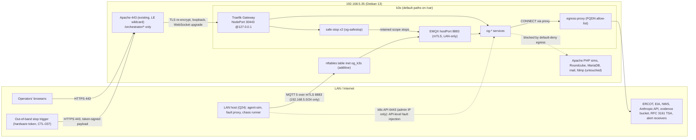
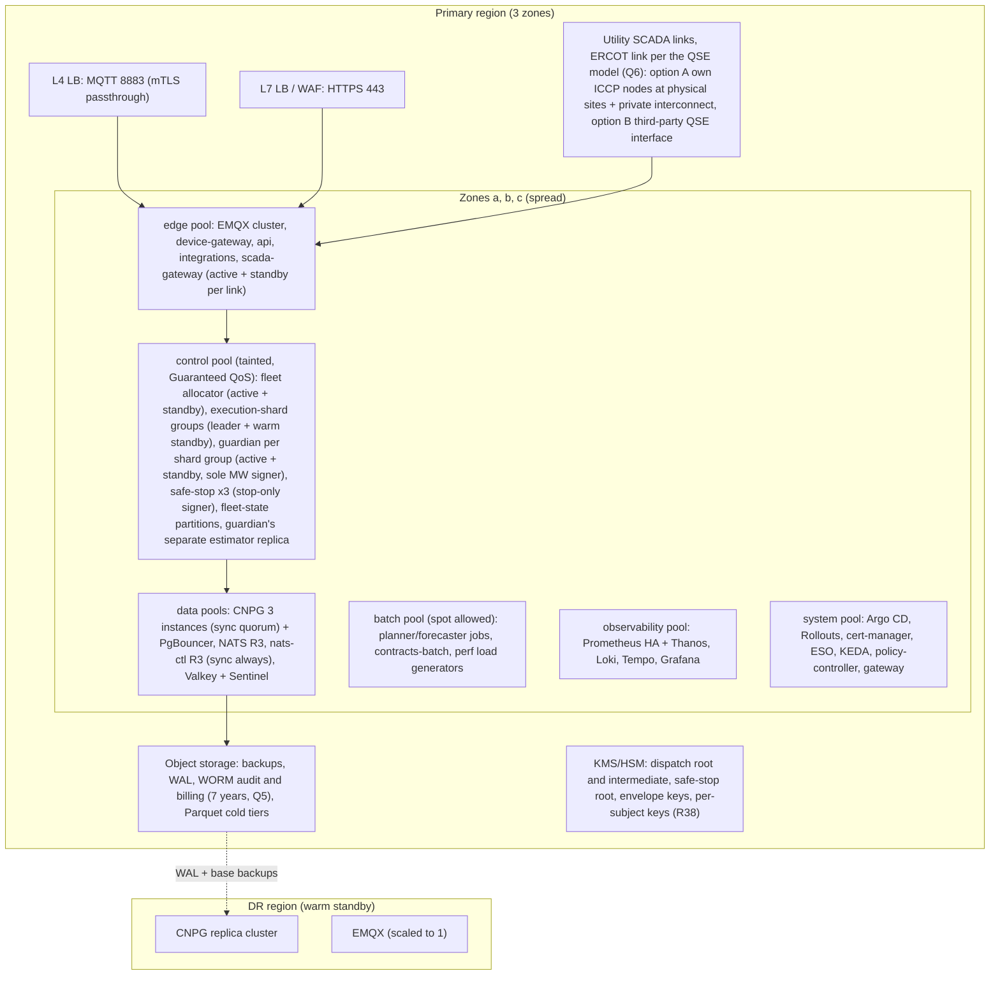
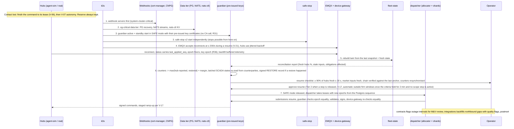
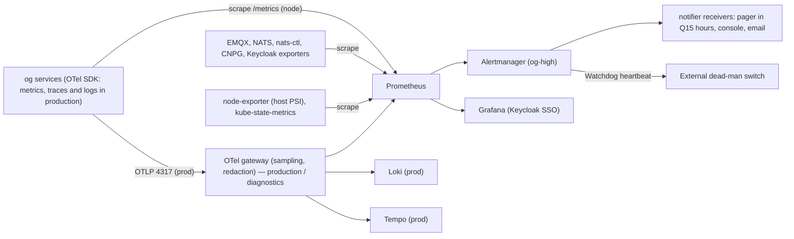
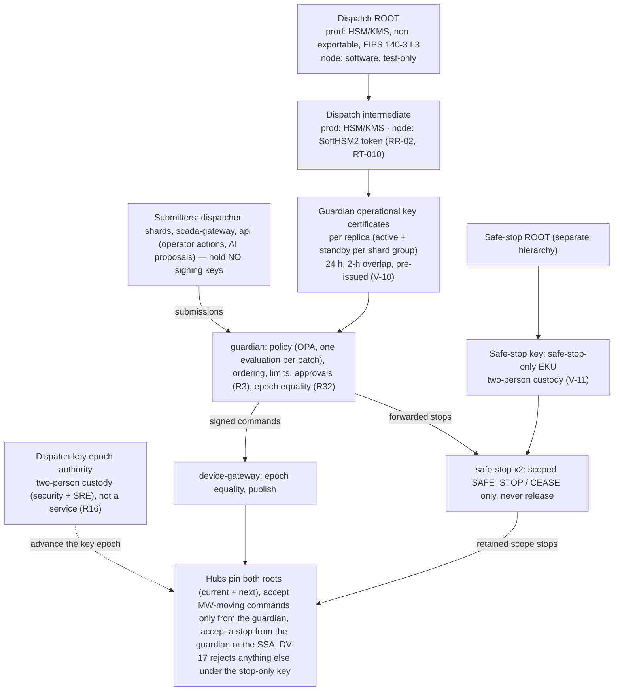
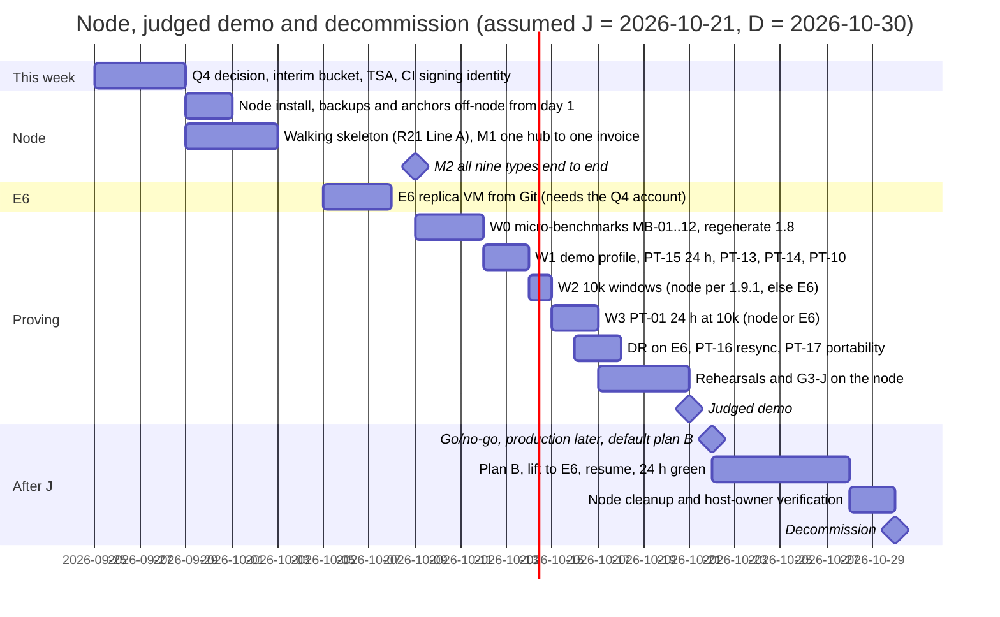

# OpenGrid Orchestrator — Platform and Operations

Status: v0.4 · 2026-09-25 · Author: Platform/SRE lead · Resolution pass after the four adversarial reviews ·
Companions: `../00-decision-register.md` v0.2 (binding where it differs; cited as "register Rnn / V-nn / Qnn"),
`01-system-architecture.md`, `02-domain-model-and-interfaces.md` (owner of the stream, subject and device contracts),
`05-failure-modes-and-recovery.md` (owner of the alert catalogue ALR-001…499), `07-scada-integration.md`,
`../03-security/*`, `../05-testing/*`. Dispositions of every review finding that cites this document:
`../06-reviews/resolution/A5-platform.md`.

**Changes in this version (v0.4).**
- **§1.8 is the only resource table** (register R14), rendered from the Helm values, and is re-baselined per R35:
  `agent-sim`, the fault proxy and the chaos runner run on a LAN host (Q24); one SCADA adapter per link; Keycloak's vendor
  baseline is the planning figure with a measured cap; the Safe-Stop Authority (`og-safestop`, R16), `contracts-rt` /
  `contracts-batch` (R43), one warm dispatcher standby and one guardian standby per shard group (R31, R35), `nats-ctl` and
  the audit writer are budgeted. Result: the `demo` profile (2,000 hubs) needs 9,648 MiB of the 10,496 MiB pod budget
  (91.9%) and 4,785 m of 5,500 m CPU; the `node-10k` profile does **not** fit with every component (100.5%) and becomes a
  conditional test-window profile with a decision rule (§1.9.1). Micro-benchmarks MB-01…12 gate the first window
  (§1.11). New platform questions PQ-6 (raise the guest's RAM) and PQ-7 (freshclam during the demo window).
  (ARC-005, -047, -048; JDG-006, -015)
- **Memory protection** (R35, ARC-007): request = limit for every `og-critical` pod and the sum of all memory limits kept
  ≤ 10,944 MiB, so a kubepods-level OOM cannot occur; a forced kubepods OOM in a test window records the victim (PT-13).
  Guaranteed QoS is used in production, not on the shared node (§1.3). Host-level pressure (PSI) is monitored; nothing
  reserves memory against the co-resident services (RT-006, NFR-023).
- **Streams** (R34, ARC-006): one volume model and one set of caps for every stream class (§4.5); only the audit and call
  streams use DiscardNew, both with a producer fallback, so no stream can halt dispatch; the lease bucket moves to a
  dedicated `nats-ctl` server with `sync_interval: always` (R32, ARC-059).
- **Audit anchoring** (R22, V-23): 60-s signed checkpoints, off-node anchors ≤ 5 min in an interim write-once bucket needed
  this week (Q4) with RFC 3161 time-stamps, 10-s journal-head anchors in degraded mode, incremental verification (§3.3,
  §4.8). (ARC-031, -043, -045)
- **Schedule** (R21, R36, Q22): the judged demo runs on the node on 2026-10-21; the production cutover runs after it; plan B
  for the 2026-10-30 decommission lifts the single-node profile to one cloud VM (E6); production multi-zone is a later
  release with a genesis record that cites the test chain's final anchor; synthetic settlement never enters production
  write-once storage (§9). E5/E6 have owners and dates (§7.2, K10). (ARC-001, -030, -031, -032; JDG-002)
- **Alerts** (R41, V-25): 06 keeps 6 paging rules; 40 rules are retired as "→ ALR-nnn in 05" (rows kept, not deleted);
  paging hours per Q15; audit-path and safety alerts are never inhibited (the ALR-545 inhibition is removed); ALR-532
  behaviour with a single guardian replica is defined (§5.6). (ARC-033)
- Also: command head-sampling and label rules with a CI cardinality test (R45, ARC-039, -040); chaos without a shared-host
  reboot or a privileged daemon, and a `ci` profile (R46, ARC-028, -053); the tiered profile-activation gate and its CI
  cost (R47, ARC-054); guardian replica counts, pre-issued keys and V-08…V-11 lifetimes (R31); V-24 namespaces with
  `og-safestop`; webhooks in the start order (ARC-058); one `max_connections` per environment and PgBouncer/asyncpg
  settings (ARC-060); SLSA L3 for the guardian and safe-stop images and two reviewers (RT-016); the co-location gate
  (RT-017, Q21); demo key custody (RT-010); ICCP options tied to Q6 (GRD-050); the evaluator path `make demo` (JDG-029);
  performance evidence (JDG-020); a build tag on every NFR (R21).
- **New IDs:** ADR-511…515, NFR-553…561, ALR-560…562, RB-528…531, PT-13…18, DASH-521, MB-01…12, PQ-6, PQ-7.

Earlier versions: v0.3 (2026-09-25) aligned with register v0.1 (R1, R2, R3/R4, R8–R11); v0.2 (2026-09-25) applied the
disk expansion (k3s on its default paths on `/var`; memory binds).

Read `../00-brief.md` first; its vocabulary, service map, customer-type codes and ID conventions are used without
repetition. **Documentation only:** every configuration block below is a *specification to be reviewed*, not something
applied. Nothing here has been installed on 192.168.5.35.

ID ranges owned by this document: `NFR-500…599`, `ALR-500…599`, `RB-500…599`, `ADR-500…599` (proposed, to be ratified
in the single ADR log of `01-system-architecture.md` §17, ARC-027), `SLO-01…12`, `PT-01…18` (performance targets handed
to `05-testing/`), `DASH-501…540`, `MB-01…12` (micro-benchmarks), `PQ-1…7` (platform questions proposed for the
register). Every number is **(S)** sourced, **(A)** assumption or **(C)** computed from the stated inputs. Pre-code,
nothing is measured yet; each (A) names the micro-benchmark or test that will measure it. Normative values are cited as
"register V-nn" and never restated with a different number.

| Judging criterion (brief §2) | Where this document serves it |
|---|---|
| Completeness (15) | §3 HA/DR, the resume sequence and the command-path dependency matrix keep the end-to-end path alive under failures; §6.3 full runbooks for every paging rule |
| Technical depth (15) | §1.3 cgroup and OOM analysis, §2.6 fenced leases with a durable epoch, §4.5 one stream volume model, §8.3 two signing hierarchies |
| The problem (15) | §3.5 homes stay safe when the platform dies (V-05…V-07) and a stop works with the guardian down (R16) |
| The "why" (15) | ADR-500…515 state alternatives and why this project's constraints decide them |
| Insight quality (10) | §5.2 domain metrics (obligations at risk, trust, profile regressions); DASH-521 performance evidence |
| Usability (10) | §1 installs on the shared node without disturbing mail/MariaDB/`fdmp`; §7.4 `make demo` on a laptop and one-command node deploy; §9 plan B |
| Creativity (10) | §7.8 signed, effective-dated dispatch profiles with a risk-tiered gate; §3.3 anchors in write-once storage with RFC 3161 time-stamps |
| Performance (10) | §1.11 micro-benchmarks before any window; §4 capacity and CPU demand models; §4.9 PT-01…18, measured before any claim |

---

## 0. Platform decisions (proposed ADRs)

| ID | Decision | Alternatives rejected and why |
|---|---|---|
| `ADR-500` | k3s single node with the **SQLite (kine) datastore** and **default paths** (`/var/lib/rancher/k3s`, `/var/lib/kubelet`, `/var/log/pods`) on `/var`, which has 147 GB free since the 2026-09-25 expansion. Option B: `data-dir=/srv/k3s` on `/` (PQ-5) | Embedded etcd: +~0.5 GiB RAM and fsync load for no benefit on one node. kubeadm: heavier and more host surgery. Cluster state is rebuilt from Git (§3.3), so the datastore is not backed up |
| `ADR-501` | Apache stays the TLS edge; it re-encrypts to **Traefik v3 (Gateway API)** on a **loopback-only NodePort 30443** | ingress-nginx: retired upstream (Kubernetes SIG Network announcement, Nov 2025). The bundled k3s Traefik plus servicelb would bind 80/443 and collide with Apache. Gateway API resources are the portable contract |
| `ADR-502` | MQTT/mTLS terminates **at EMQX** (hostPort 8883 on the node, **LAN-only**, register Q21; L4 load balancer in production). The load generator connects from a LAN host (R35) | Apache cannot proxy raw TCP. MQTT-over-WSS through Apache would end device mTLS at the wrong tier and lose per-device identity |
| `ADR-503` | PostgreSQL 16 + TimescaleDB **self-managed with CloudNativePG (CNPG) in every environment**; the `demo` profile's "PostgreSQL + Timescale" (R35) is deployed by CNPG | Managed Postgres (RDS, Cloud SQL, Azure) does not offer TimescaleDB's TSL features (compression, continuous aggregates). A plain StatefulSet would need hand-written backup and PITR, which the restore drills (§3.4) and plan B (§9) depend on |
| `ADR-504` | **Backups and audit anchors leave the node from day 1**: an interim write-once bucket in the user's cloud account this week (Q4, ADR-514), later the production account. An optional local fast-restore copy sits on `/` | A NAS/MinIO on the LAN (or in the cluster) is in the same administrative domain as the node and proves nothing against a node-root attacker (ARC-045); MinIO community edition is source-only since 2025 |
| `ADR-505` | **Node:** no CPU limits on control-path pods; **memory request = limit for every `og-critical` pod; the sum of all pod memory limits ≤ 10,944 MiB** (the limit-sum rule, R35), so the kubepods cgroup can never reach its 11,008 MiB cap. **Production:** Guaranteed QoS with whole CPUs on dedicated control nodes (CPU manager `static`) | Guaranteed QoS on the shared node needs CPU limits (CFS throttling adds jitter to the 2-s loop and to the guardian's V-35 budget) and gives control-path processes `oom_score_adj` −997, so in a host-wide OOM the kernel would kill Apache, MariaDB or ClamAV first — reserving memory against the co-resident services, which R35 forbids (§1.3) |
| `ADR-506` | Leader leases for singleton loops (fleet allocator, execution shards, guardian shard groups, day-ahead planner, settlement, declarations, SCADA command brokers) live in a **NATS KV bucket on `nats-ctl`** (ADR-512); the **epoch is a Postgres sequence value** (synchronous commit) plus the shard id; the guardian and `device-gateway` check **equality** with the live lease (R32) | The Kubernetes Lease API: a managed control-plane outage would depose every leader. A Valkey lock: no fencing token. A KV revision as the epoch can repeat after an unsynced crash (ARC-009) |
| `ADR-507` | **Only the `guardian` signs anything that moves MW** (R1); the **Safe-Stop Authority** holds a separate stop-only hierarchy (R16, V-11). Operational keys are **pre-issued** and loaded from the replica's key store at restart, so no restart waits on a CA (R31, V-10). No per-command KMS calls | Signing in the dispatcher: a compromised dispatcher could bypass the safety checks. Escrowed guardian-signed stops (ARC-024): they expire during a long guardian outage and do not contain a compromised guardian (register R16). Per-command KMS signing: quotas of hundreds of asymmetric ops/s against bursts of 10,000 cmd/s |
| `ADR-508` | The node hosts **one environment at a time** (continuous `demo` staging plus scheduled test windows); the **load generator, fault proxy and chaos runner run on a LAN host** (R35, R46); PR tests run in ephemeral CI clusters | Memory binds (§1.8). A co-located generator measures contention, not the orchestrator (ARC-029) |
| `ADR-509` | **Dispatch profiles** (brief §3.5) are Git-reviewed, replay-tested, **signed OCI artifacts**, promoted by GitOps, effective-dated, **version-pinned per event** (R10, V-27), with a **risk-tiered activation gate** (R47, §7.8) | Editing profiles in a database from the console has no review, no signature and no rollback |
| `ADR-510` | **Licence hygiene:** Valkey 8 (BSD) as the Redis-protocol store (production); no Bitnami images/charts; verify EMQX's licence for clustering before production (PQ-4); PgBouncer (ISC), NATS (Apache-2.0), Keycloak (Apache-2.0) | Redis ≥ 7.4 is RSAL/SSPL (AGPL option from Redis 8). The Bitnami public catalog was deprecated in 2025. EMQX moved to BSL 1.1 from 5.9 (fallback: pin 5.8.x Apache-2.0, or VerneMQ/HiveMQ CE) |
| `ADR-511` (new) | The **`demo` values profile** keeps the MVP-J infrastructure set of R35/JDG-015 — PostgreSQL + Timescale, NATS with KV, EMQX, Keycloak, OPA, cert-manager with a self-signed issuer, Prometheus + Grafana, Traefik behind Apache — read as: CNPG deploys PostgreSQL (ADR-503); "Prometheus" includes Alertmanager (paging, V-25), node-exporter (host PSI, R35) and kube-state-metrics; "NATS with KV" includes `nats-ctl` (ADR-512). One security control is kept although it is not in R35's list: the **egress proxy** (FQDN allow-list, CTL-082 — NetworkPolicy cannot express FQDNs). Valkey, PgBouncer, step-ca, Sigstore policy-controller, the OTel gateway, Loki, Tempo, Argo CD, KEDA and External Secrets return with the production profile | Every component costs configuration days and is a failure point on stage (JDG-015); the full set does not fit the node (§1.8) |
| `ADR-512` (new) | **Control state on a dedicated `nats-ctl` server** with `sync_interval: always` (leases R32, SCADA ordering state of 07, guardian state items that 01 maps to KV); the main NATS server keeps `sync_interval: 1s` | JetStream's fsync policy is a server-level setting in the `jetstream` block, and `always` "will degrade the max throughput" (NATS docs) — on the main server it would throttle telemetry on the disk shared with MariaDB. Jepsen's NATS 2.12.1 analysis (2025-12) showed acknowledged writes lost on power failure with the default 2-min sync |
| `ADR-513` (new) | **Hot state without Valkey in the node profiles:** acknowledgements are routed by the deterministic `command_id` (shard, epoch, hub, seq; R32) with JetStream `Nats-Msg-Id` de-duplication; rate limits, breaker state and caches are per replica (single replicas on the node); dispatch-affecting idempotency keys live in Postgres. Valkey returns in production for shared hot state | Valkey on the node costs a pod and a failure point for state that is rebuildable (R43 names Valkey for acknowledgement correlation; this is flagged to 01, §12) |
| `ADR-514` (new) | An **interim off-node evidence bucket** (S3 API with Object Lock) in the user's cloud account holds node backups, audit anchors with **RFC 3161** time-stamp tokens and test evidence under separate prefixes; it is **never** the production write-once store | Waiting for the production account leaves the RPO for host loss unbounded (ARC-031); mixing node evidence into production WORM would lock synthetic records for 7 years (ARC-032) |
| `ADR-515` (new) | **Audit producers** (guardian, safe-stop, dispatcher, `contracts-rt`, `scada-gateway`, `api`) run as StatefulSets with a **per-replica journal volume** (512 MiB), so R22's signed local journal survives a pod restart | A journal in `emptyDir` is lost with the pod, which would break "no command without a durable trace" exactly during a database outage |

---

## 1. Single-node k3s on 192.168.5.35

Serves: Usability, Technical depth, Performance.

### 1.1 Constraints restated as design inputs

| Fact | Design consequence |
|---|---|
| 8 vCPU, 15 GiB RAM, ≈13 GiB free (check 2026-09-25) | Host services keep ≥ 2 vCPU and ≥ 3 GiB (user requirement) → allocatable 5.5 vCPU / **10,496 MiB for pods** (§1.3; register R2). **Memory is the binding constraint** (§1.8) |
| Disk (check 2026-09-25): 300 GB disk; `/var` 157 GB (147 GB free); `/` 67 GB (62 GB free); `/home` 31 GB (30 GB free); `/tmp` 2.7 GB | k3s uses its default paths on `/var` with a budget of ≤ 102 GB, which leaves ≥ 45 GB of `/var` for mail and MariaDB growth (§1.4). `/` holds only an optional scratch class for restore drills. `/home` and `/tmp` are unused |
| Apache owns 80/443; mail on 25/110/143*/465/587/993*/995; MariaDB 3306; spamd 783 | No new listener on those ports; pods cannot reach any host service (§1.7). (*IMAP ports not in the check list; assumed present) |
| One 300 GB virtual disk is shared by `/var` (MariaDB, mail spool, k3s) and `/` | Disk **I/O** is shared even though space is not. I/O pressure (PSI) is monitored (ALR-502) and part of the host-protection test (NFR-500) |
| ClamAV `clamd` (≈1–1.5 GiB RSS typical, (A)) reloads signatures concurrently by default, briefly **doubling** its memory | The 3 GiB system reservation covers the reload spike. The orchestrator never changes freshclam or clamd; deferring freshclam during the judged-demo window is the host owner's choice (JDG-006) |
| ntpsec runs on the host | Pods inherit the kernel clock. Time sync is never managed from the cluster; the host offset is read through node-exporter (05 ALR-050); whether the host clock is UTC is register Q18 |
| The load generator (`agent-sim`), the fault proxy and the chaos runner run **off the node** on a LAN host (R35, R46; Q24 default: this workstation) | 8883 stays LAN-only (Q21); the LAN host and the node sync to the same NTP source (§1.10); the generator's own saturation is measured so that performance evidence is valid |
| The node is shared and may never hold real assets or data while co-located (RT-017, Q21) | A monitored co-location gate (§1.12, ALR-561) |
| Decommission ≈ 2026-10-30 (register Q4) | Nothing host-specific in charts (NFR-509); plan B and migration in §9 |

### 1.2 k3s install parameters (specification)

```yaml
# /etc/rancher/k3s/config.yaml — SPEC for review, not applied
# Pin: INSTALL_K3S_VERSION=<latest patch of the Kubernetes minor offered in the production provider's stable channel>
#      (expected v1.35.x+k3s1 or v1.36.x+k3s1 in Oct 2026 — verify on github.com/k3s-io/k3s/releases; record in
#       platform/versions.yaml; binary + sha256 verified; airgap image tarball preloaded to avoid pull storms)
# Paths: k3s defaults — /var/lib/rancher/k3s (SQLite datastore, containerd image store, local-path volumes),
#        /var/lib/kubelet, /var/log/pods — all on /var (157 GB, 147 GB free on 2026-09-25).
# Option B (PQ-5): data-dir: /srv/k3s, kubelet root-dir and podLogsDir on / (67 GB, 62 GB free); budget capped at 45 GB.
disable: [traefik, servicelb]          # Apache is the edge (ADR-501); no klipper-lb binding 80/443
flannel-backend: vxlan                 # single node: pod traffic stays on cni0
secrets-encryption: true               # Secrets encrypted at rest in the datastore (node root can still read them: RR-01, §8.3)
protect-kernel-defaults: true
write-kubeconfig-mode: "0600"
node-name: og-node-1                   # never the hostname in charts
cluster-cidr: 10.42.0.0/16             # no overlap with LAN 192.168.5.0/24
service-cidr: 10.43.0.0/16
kube-proxy-arg: [ "nodeport-addresses=127.0.0.1/32" ]   # NodePorts only on loopback (iptables mode)
kube-apiserver-arg:
  - audit-policy-file=/etc/rancher/k3s/audit-policy.yaml
  - audit-log-path=/var/lib/rancher/k3s/server/logs/audit.log
  - audit-log-maxage=30
  - audit-log-maxsize=100
  - audit-log-maxbackup=10
  - enable-admission-plugins=NodeRestriction,EventRateLimit      # 03-security §19.4 (CTL-078)
  - admission-control-config-file=/etc/rancher/k3s/admission.yaml
kubelet-arg:
  - system-reserved=cpu=2000m,memory=3Gi,ephemeral-storage=10Gi
  - kube-reserved=cpu=500m,memory=1280Mi,ephemeral-storage=5Gi
  - enforce-node-allocatable=pods      # caps the kubepods cgroup; system/kube slices are NOT capped
  - eviction-hard=memory.available<512Mi,nodefs.available<12Gi,imagefs.available<12Gi,nodefs.inodesFree<5%,pid.available<5%
  - eviction-soft=memory.available<1Gi,nodefs.available<20Gi,imagefs.available<20Gi
  - eviction-soft-grace-period=memory.available=90s,nodefs.available=2m,imagefs.available=2m
  - eviction-max-pod-grace-period=60
  - kernel-memcg-notification=true     # react to host memory spikes by memcg notification, not only the 10-s poll (RT-006)
  - image-gc-high-threshold=80         # /var = 157 GB: GC starts when usage > 80% (free < ≈31 GB)
  - image-gc-low-threshold=75
  - container-log-max-size=20Mi
  - container-log-max-files=5          # ≤ 100 MiB per container
  - serialize-image-pulls=true         # limits disk-I/O bursts on the disk shared with MariaDB
```

| Parameter | Why |
|---|---|
| Version pin (n-1 minor, provider-available) | Keeps the node, E6 and production on the same Kubernetes API surface. Upgrades follow §6.5 |
| Default paths on `/var` | `/var` has 147 GB free; defaults match upstream documentation and production nodes. Option B stays available (PQ-5) |
| Traefik/servicelb disabled | Apache keeps 80/443 (brief §4) |
| `nodeport-addresses=127.0.0.1/32` | Host firewalls do **not** protect NodePorts (kube-proxy DNATs in PREROUTING, before INPUT), so the NodePort must never be reachable from the LAN. Only Apache on loopback reaches Traefik |
| Memory and CPU reservations | §1.3. The memory numbers include the ClamAV reload spike and ≈ 40 containerd shims (≈ 10 MiB each, (A)) |
| `kernel-memcg-notification` | Eviction thresholds are crossed within milliseconds of a host spike instead of up to one housekeeping period later, so pods (not host processes) give memory back first |
| Absolute disk eviction thresholds (hard 12 GiB, soft 20 GiB) | `/var` is shared with the mail spool and MariaDB; pods can never push it below 12 GiB free (NFR-501) |
| Image GC 80 / 75 | Computed from `/var` = 157 GB; GC stays idle normally and only removes *unused* images when the filesystem fills |

### 1.3 Allocatable, host protection and the OOM analysis (C)

| Quantity | CPU | Memory |
|---|---|---|
| Capacity | 8,000 m | 15,360 MiB |
| − system-reserved (Apache, PHP-FPM, MariaDB, Postfix/Dovecot, spamd, ClamAV, auditd, `fdmp`) | 2,000 m | 3,072 MiB |
| − kube-reserved (k3s server incl. SQLite, containerd, shims) | 500 m | 1,280 MiB |
| − hard eviction threshold | — | 512 MiB |
| **Allocatable (scheduler budget; register R2)** | **5,500 m** | **10,496 MiB (10.25 GiB)** |
| kubepods cgroup hard cap (`memory.max` = capacity − reserved) | — | 11,008 MiB |
| **Limit-sum ceiling (ADR-505): Σ of all pod memory limits** | — | **≤ 10,944 MiB** (64 MiB below the cap) |

**Memory protection — what actually protects what (ARC-007, verified).**
- *The claim re-checked.* Kubernetes sets `oom_score_adj` = 1000 − 1000 × request ÷ capacity (15,360 MiB) for Burstable
  containers; the kernel ranks a memory-cgroup OOM by ≈ 1000 × RSS ÷ the cgroup limit + adj. With the v0.3 figures this
  gives EMQX (request 640 MiB, adj 959, ≈ 700 MiB RSS) ≈ 1,023 against `agent-sim` (adj 971, ≈ 400 MiB) ≈ 1,007: in a
  kubepods OOM the broker is chosen before the simulator (the planner mid-solve, ≈ 1,084, and Keycloak, ≈ 1,031, before
  both). "Evicted last" described the kubelet, not the kernel. The reviewer's arithmetic is correct.
- *Rule 1 — no kubepods OOM by construction.* Every container has a memory limit, and the sum of all limits in the running
  profile is ≤ 10,944 MiB (B3 in §1.8.2). The kubepods cgroup can then never reach its cap, so the kernel never has to pick
  a victim across pods; the only OOM kill left is a container exceeding **its own** limit, which is contained to that
  container. Every `og-critical` pod requests its full limit, so its limit is also reserved by the scheduler.
- *Rule 2 — host pressure takes pods first, in priority order.* If host services and k3s together exceed their 4,352 MiB,
  the kubelet (memcg notification, soft 1 GiB for 90 s, hard 512 MiB) evicts pods whose usage exceeds their request first,
  then by priority: `og-low` → `og-standard` → `og-high` → `og-critical`. If the host spike outruns eviction, the global
  OOM killer ranks pods (adj ≈ 860–999) above host processes (adj 0), so host services are protected and a control-path pod
  can be a victim — the residual accepted by R35 and RT-006 for the demo only: nothing reserves memory against the
  co-resident services, host PSI is monitored (ALR-502), the guardian's loss is a TIMEOUT, never a stop (R31), stops still
  work through the Safe-Stop Authority (R16), and hubs ride through on their leases (V-06, V-07). Production never
  co-tenants the control plane (§2).
- *Why not Guaranteed QoS on this node.* Guaranteed requires CPU limits equal to requests on every container: CFS
  throttling would stretch a 100-ms guardian batch to several periods, and giving the control path the CPU it needs as
  limits would exceed the 5,500 m allocatable. It would also set `oom_score_adj` −997, so a host-wide OOM would kill
  MariaDB, Apache or ClamAV before the broker — a memory reservation against co-resident services in effect (R35,
  NFR-023). Guaranteed QoS is right in production, on dedicated control nodes.
- *Proof.* PT-13 forces a kubepods OOM in a test window and records the victim (expected: the test memory hog in
  `og-low`); PT-15 records host peaks over 24 h; NFR-500 drives every pod to its limit for 30 min.

**CPU protection.** kubelet gives `kubepods` a CPU weight derived from allocatable: shares = 5,500 × 1024 / 1000 = 5,632 →
cgroup v2 weight = 1 + (5,632 − 2) × 9,999 / 262,142 ≈ **215**. `system.slice` has the default weight 100 and contains the
host services *and* k3s. Under two-way saturation `system.slice` gets 100 / 315 = 31.7% × 8 = **2.54 vCPU**, of which k3s
uses ≤ 0.5, so host services get **≥ 2.0 vCPU**; `kubepods` gets **5.46 vCPU**. The sum of CPU requests is **4,785 m
(87.0%)** with every component (§1.8), so pods schedule; the demand model (§4.7) shows where bursts exceed the weight share.

**Consistency (R14, ARC-047).** §1.8 is the only resource table; `01-system-architecture.md` §14.2 points here and R14 closes
when 01's old table is gone.

### 1.4 Disk budget and the binding constraint

**The binding constraint is memory, not disk (C).** Longer local retention costs disk, which is plentiful, and almost no
memory (Prometheus head memory depends on series count, not retention). Scaling up hubs costs memory (§1.8.1).

Budget on `/var` (147 GB free), steady state, `node-10k` profile:

| Consumer | Budget | Expected over the node's life (C) | Enforced by |
|---|---|---|---|
| k3s binaries (on `/`), SQLite datastore, kubelet dir, pod logs, API audit log | 5 GB | ≈ 2 GB | log rotation (20 Mi × 5 per container), audit `maxbackup` |
| Container images (current + one previous version) | 10 GB | ≈ 7 GB | image GC (§1.2); CI image-size gate (§7.1) |
| PostgreSQL data (`og-data/pg-main`) | 35 GiB | ≈ 12 GB realistic (2,000 hubs continuous + ≈ 5 window days at 10,000); ≤ 36 GB worst case (10,000 hubs for 35 days) (§4.4) | Timescale retention and compression; ALR-513 on `pg_database_size` |
| PostgreSQL WAL volume | 16 GiB | ≈ 1 GB normally | `max_wal_size=2GB` + archiving; ≈ 14 h of archive outage at the steady rate, ≈ 1.8 h under a sustained event burst (§4.3, RB-504) |
| NATS JetStream (main server) | 22 GiB | ≤ 21.8 GiB at the logical caps (§4.5); ≈ 8 GiB on disk if S2 reaches 3× (A, MB-08) | per-stream `max_bytes` and `max_age` |
| Prometheus | 6 GiB | ≈ 3 GB (30 d; ≤ 150k series, no hub labels) | `retention.size=5.5GB`, `retention.time=30d` |
| EMQX, `nats-ctl`, Alertmanager, Grafana, audit journals (9 × 512 MiB, ADR-515) | 8 GiB | ≈ 2 GB | small; size alerts |
| **Total on `/var`** | **≈ 102 GB of 147 GB free** | ≈ 40 GB | leaves ≥ 45 GB of `/var` for the host; soft eviction at 20 GiB, hard at 12 GiB free |
| **On `/` (optional):** `og-scratch` class at `/srv/og-scratch` | ≤ 40 GiB, on demand | 0 normally; ≈ 12–30 GB during a restore drill | restore drills and the local fast-restore copy (§3.3); emptied after use |

Loki and Tempo are not part of the node profiles (ADR-511); the optional diagnostics add-on (§5.1) is sized separately and
only enabled when §1.8's rules still hold. `local-path` volumes are host directories, so **the PVC size is not enforced**;
caps are enforced by each application's own retention, backed by the filesystem alerts (05 ALR-162/163, ALR-504 here) and
the kubelet eviction thresholds.

### 1.5 Networking



**TLS termination choice.** Apache terminates public TLS with the existing `*.tocy-net.net` certificate (expires
2026-12-20, after decommission). It **re-encrypts** to Traefik over loopback, using a Traefik server certificate from the
node's service CA (cert-manager CA issuer, 24-h workload certificates renewed at 16 h, register V-08) and pinning the
node's service root. Traffic behind the edge is never plaintext, even on loopback. Device MQTT never passes through Apache
(ADR-502).

**Apache change (additive, reviewed, backed up to `/root/opengrid_backups/` per the existing practice).** One `Include`
line in the existing SSL vhost; the included file is a spec, validated on a test vhost first.

```apache
# /etc/apache2/conf-available/og-orchestrator.conf — SPEC
SSLProxyEngine on
SSLProxyVerify require
SSLProxyCheckPeerName on
SSLProxyCACertificateFile /etc/ssl/og-internal/root_ca.crt     # public root only; no keys on the host
ProxyPreserveHost On
RequestHeader set X-Forwarded-Proto "https"
RequestHeader unset X-Remote-User                              # strip inbound identity headers (TH-093)
ProxyPass        /orchestrator/ https://127.0.0.1:30443/orchestrator/ upgrade=websocket keepalive=On timeout=120
ProxyPassReverse /orchestrator/ https://127.0.0.1:30443/orchestrator/
```

Paths behind `/orchestrator/`: `/` → `console` static files, `/api/` → `api` REST, `/ws` → `api` WebSocket (server ping
every 20 s), `/auth/` → Keycloak (`KC_HTTP_RELATIVE_PATH=/orchestrator/auth`), `/grafana/` → Grafana (Keycloak SSO;
operator/SRE roles only), **`/safestop/v1/trigger` → `safe-stop`** (the out-of-band trigger of R16: the payload is signed
by the hardware token and verified by the Safe-Stop Authority itself; Apache and Traefik are transport only, and neither
`api`, `console`, `dispatcher` nor `guardian` is on this path). Residual: with Apache or Traefik down, this trigger is
unavailable; the guardian path and each counterparty's own stop path (R25) remain (03-security owns CTL-037). Alternative
hostname: `og.tocy-net.net` needs a DNS change (PQ-1).

**Ports opened or exposed (all others unchanged):**

| Port | Listener | Bound to | Allowed sources | Mechanism |
|---|---|---|---|---|
| 443 (existing) | Apache | all | unchanged | adds `/orchestrator/` only |
| 8883/tcp | EMQX (hostPort via portmap) | all | **192.168.5.0/24 only** (register Q21, enforced and monitored as gate G4, §1.12) | EMQX listener `access_rules` + nft `prerouting` chain at priority −150 (before DNAT at −100). mTLS required for every client; `max_connections` = profile hubs × 1.05 (§1.9) |
| 30443/tcp | Traefik NodePort | 127.0.0.1 | Apache only | `nodeport-addresses` (a host firewall cannot filter NodePorts) |
| 6443/tcp | k3s API | all | 127.0.0.1, 10.42.0.0/16, the admin workstation / LAN host IP | nft `input` drop for everything else |
| 10250/tcp | kubelet | all | 127.0.0.1, 10.42.0.0/16 | nft `input` |
| 8472/udp, 10256/tcp | flannel VXLAN, kube-proxy health | all | none external | nft `input` |

The firewall spec is a **dedicated `inet og_k3s` table** with policy `accept` that matches only the ports above; it never
flushes or edits existing tables. SCADA protocol ports are **not** exposed on the node: DNP3 20000, IEC 60870-5-104 2404,
ICCP/TASE.2 102 and OPC UA 4840 (TLS per IEC 62351-3) stay in-cluster because `grid-sim` runs on the node (§1.9); production
ICCP connectivity depends on the QSE model (Q6, §2.2).

### 1.6 Storage

- StorageClass `og-local` (k3s local-path provisioner, `/var/lib/rancher/k3s/storage`): `reclaimPolicy: Retain` for
  stateful data, `WaitForFirstConsumer`. In production the class maps to a zonal SSD CSI class through values.
- StorageClass `og-scratch` (local-path, `/srv/og-scratch` on `/`, optional): restore drills and the local fast-restore
  copy. Never used for live data.
- Volumes (declared size is advisory on local-path; §1.4 gives the enforced caps): `pg-main` 35 Gi data + 16 Gi WAL;
  NATS 22 Gi; `nats-ctl` 1 Gi; Prometheus 6 Gi; EMQX 2 Gi; Alertmanager 1 Gi; Grafana 1 Gi; **audit journals** 512 Mi per
  replica of each audit producer (ADR-515: guardian ×2, safe-stop ×2, dispatcher ×2, `contracts-rt`, `api`,
  `scada-gateway` core); SoftHSM2 token volumes for the guardian and safe-stop replicas (§8.3).
- No hostPath volumes except in `og-node-agents` (read-only `/proc`, `/sys`, `/var/log/pods`).
- **Backups and anchors leave the node** (ADR-504, ADR-514). Details in §3.3.

### 1.7 Namespaces and isolation (register V-24)

The application namespaces are exactly register V-24's: `og-edge`, `og-core`, `og-guardian`, `og-safestop`, `og-data`,
`og-ai`, `og-sim`. Four platform namespaces are added by this document (`og-system`, `og-identity`, `og-observability`,
`og-node-agents`) — proposed to the register as the platform half of V-24 (§12).

| Namespace | Contents (node profiles; production additions in brackets) | Pod Security | Notes |
|---|---|---|---|
| `kube-system` | CoreDNS, metrics-server, local-path-provisioner (k3s) | (k3s default) | untouched; explicit limits via k3s manifest overrides |
| `og-system` | Traefik, cert-manager, CNPG operator + Barman Cloud plugin, egress-proxy [Sigstore policy-controller, Argo CD, KEDA, External Secrets] | restricted | platform controllers; webhooks at `system-cluster-critical` (§3.6) |
| `og-identity` | Keycloak [step-ca] | restricted | Keycloak's database lives in `pg-main` as a separate database and role |
| `og-data` | CNPG cluster `pg-main` (+ backup sidecar), NATS (streams), `nats-ctl` (control KV) [PgBouncer, Valkey + Sentinel] | restricted | only data-plane ports |
| `og-edge` | EMQX, `device-gateway` ×2, `scada-gateway` core + one adapter per link, `integrations`, `api` (+ OPA sidecar), `console` | restricted | terminates every external protocol |
| `og-core` | `fleet-state`, ingest-writer, audit-writer, `dispatcher` (active + warm standby), `planner`, `forecaster`, `market-data`, `contracts-rt`, `contracts-batch`, `notifier` | restricted | no external ingress |
| `og-guardian` | `guardian` active + warm standby per shard group (+ OPA sidecar) — **the only signer of anything that moves MW** (R1) | restricted | separate RBAC and CODEOWNERS; the only identity that can obtain dispatch key certificates (§8.3) |
| `og-safestop` | `safe-stop` ×2 — **stop-only signer** (R16) | restricted | no dependency on `guardian`, `dispatcher`, `contracts` or `api`; its own key hierarchy (V-11) |
| `og-ai` | `ai-agent` (cloud LLM only on the node; no local model, R2/Q17) | restricted | reaches only `api` and the egress proxy (NFR-546) |
| `og-sim` | `grid-sim` (simulated counterparties) — `agent-sim` runs on the LAN host (R35); in `ci`/dev it runs here | restricted | modelled as *outside the trust boundary* |
| `og-observability` | Prometheus (+ operator), Alertmanager, Grafana, kube-state-metrics [OTel gateway, Loki, Tempo, Thanos] | restricted | |
| `og-node-agents` | node-exporter (read-only hostPath `/proc`, `/sys`) | **privileged** (documented exception) | the only exception |

**NetworkPolicies** (kube-router enforces NetworkPolicy with flannel): `default-deny` for ingress **and** egress in every
`og-*` namespace, plus DNS egress to CoreDNS. Default-deny egress also blocks pods from reaching **node IPs** (MariaDB
3306, SMTP, IMAP), which enforces "never touch" (NFR-503).

| From → To | Ports | Purpose |
|---|---|---|
| og-system/Traefik → og-edge `api`, `console`; og-identity Keycloak; og-observability Grafana; og-safestop `safe-stop` (trigger route only) | 8080/8443 | edge routing |
| LAN host `agent-sim` (192.168.5.0/24, via hostPort) → og-edge EMQX | 8883 | devices (mTLS) |
| og-edge `device-gateway` ↔ EMQX; → og-data NATS; → `nats-ctl` (lease read for the epoch check) | 8883, 4222 | telemetry in; signed commands out after the equality check (R32) |
| og-core `dispatcher`, og-edge `scada-gateway`, og-edge `api` (operator actions and AI proposals) → og-data NATS submission subjects | 4222 | **submit for validation, approval and signing** (R1); submissions ride the SUBMISSIONS stream (§4.5) |
| og-guardian `guardian` → og-data NATS (signed-command subjects), `nats-ctl` (leases, CAS state), PostgreSQL (pre-image, command rows); → og-safestop (forwarded stops, mTLS 8443) | 4222, 5432, 8443 | **only the guardian's NATS user may publish on signed-command subjects** (account permissions) |
| og-safestop `safe-stop` → og-edge EMQX (publish on `scope/+/+/stop` only, EMQX ACL); → og-data NATS (AUDIT, best effort) | 8883, 4222 | independent stop path; its trace is journaled first (ADR-515) |
| og-core (`dispatcher`, `fleet-state`, ingest-writer, audit-writer, `contracts-rt`, `contracts-batch`, `planner`), og-edge (`scada-gateway`, `integrations`, `api`) → og-data PostgreSQL, NATS; `dispatcher`, `scada-gateway` → `nats-ctl` | 5432, 4222 | data plane (per-service DB roles and NATS accounts) |
| og-sim `grid-sim` ↔ og-edge `scada-gateway`, `integrations` | DNP3 20000, ICCP 102 (`SIM`), OPC UA 4840 (TLS per IEC 62351-3); OpenADR / IEEE 2030.5 443 (owned by `integrations`, R6) | simulated counterparties |
| og-core `market-data` → egress-proxy (ERCOT, EIA, NWS) or → LAN host record/replay proxy when the fault proxy is enabled | 3128 / 8443 | external data (CTL-082) |
| og-core audit-writer, og-data backup sidecar → egress-proxy → evidence bucket, RFC 3161 TSA | 3128 | anchors and backups (ADR-514) |
| og-ai → og-edge `api`; → egress-proxy → `api.anthropic.com` only | 8443, 3128 | no personal data to the cloud LLM (D5, V-18) |
| og-observability Alertmanager → og-core `notifier` → egress-proxy → alert receivers; Alertmanager Watchdog → external dead-man switch | 8443, 3128 | paging path |
| og-node-agents, og-observability → all `og-*` metrics ports | 9090–9100 | platform telemetry |

Additional guards: ResourceQuota + LimitRange per namespace (§1.8.2); `automountServiceAccountToken: false` by default;
read-only root filesystem; `runAsNonRoot`, `seccompProfile: RuntimeDefault`, all capabilities dropped. Built-in
ValidatingAdmissionPolicy (CEL, evaluated in the API server, so no webhook pod can block recovery) rejects `hostPath`,
`hostNetwork` and `:latest` tags outside `og-node-agents`, requires image digests, requires a memory limit on every
container and `requests.memory == limits.memory` in `og-critical` pods. Image signatures are verified at deploy time on the
node (`cosign verify` and, for the guardian and safe-stop images, SLSA L3 provenance, §7.1) and at admission by the
policy-controller in production (NFR-539).

### 1.8 Resource budget — the only resource table (register R14, R35)

`make budget` renders every profile's Helm values (§7.3) and writes this table; CI fails a change whose rendered profile
breaks a budget rule (§1.8.2). Values are **(A) caps** until the micro-benchmarks MB-01…12 measure them (§1.11). Where a
cap is below the owning document's planning figure, both are shown and the micro-benchmark that must confirm the cap is
named. Legend: CPU limit "—" means none, by design (ADR-505); memory is "request / limit" in MiB **per replica**;
`og-critical` pods always have request = limit. Priority classes: `og-critical` (1,000,000), `og-high` (100,000),
`og-standard` (10,000), `og-low` (1,000, `preemptionPolicy: Never`); webhooks and k3s add-ons use
`system-cluster-critical`.

| Namespace · component | Repl. | Priority | CPU req / lim (m, each) | Memory `demo` (2,000 hubs) | Memory `node-10k` (10,000 hubs) | Basis · gate |
|---|---|---|---|---|---|---|
| kube-system · CoreDNS / metrics-server / local-path | 1/1/1 | system-cluster-critical | 50/— · 25/100 · 10/50 | 64/64 · 48/48 · 24/24 | same | k3s defaults trimmed · MB-11 |
| og-system · Traefik | 1 | og-high | 50 / 500 | 96 / 128 | same | ≤ 50 consoles, WebSocket fan-out · MB-11 |
| og-system · cert-manager (controller / webhook / cainjector) | 3 | og-high (webhook system-cluster-critical) | 10 / 100 each | 64 + 32 + 64 = 160 / 160 | same | issues 24-h workload certificates (V-08) · MB-11 |
| og-system · CNPG operator (+ webhook) / Barman Cloud plugin | 1/1 | og-high | 20/200 · 10/100 | 96/128 · 48/64 | same | PostgreSQL packaging, PITR (ADR-503) · MB-11 |
| og-system · egress-proxy | 1 | og-high | 20 / 200 | 48 / 48 | same | FQDN allow-list, CTL-082 (ADR-511) |
| og-identity · Keycloak | 1 | og-high | 100 / 1,000 | **768 / 768** | same | heap capped at 55% of the limit (`JAVA_OPTS_KC_HEAP`); planning figure = vendor baseline 1,250 MB / 1,360 MB = 1,192 / 1,297 MiB (Keycloak sizing guide: 1,250 MB for a pod with realm caches and 10,000 cached sessions, 70% heap + ≈ 300 MB non-heap) · **MB-01** |
| og-data · PostgreSQL 16 + TimescaleDB (CNPG) + backup sidecar | 1 | og-critical | 820 / — | 2,048 + 64 = 2,112 / 2,112 | same | `shared_buffers=512MB`, `max_connections=100` (§2.5), 3 autovacuum workers × 64 MB, WAL buffers 16 MB ≈ 1.5 GiB steady (C) · MB-07 |
| og-data · NATS (streams) | 1 | og-critical | 300 / — | 384 / 384 | 512 / 512 | `GOMEMLIMIT` = 90% of the limit; message bodies on disk (§4.5) · MB-08 |
| og-data · `nats-ctl` (control KV, `sync_interval: always`) | 1 | og-critical | 20 / — | 48 / 48 | same | leases and control state only (ADR-512) · MB-08 |
| og-edge · EMQX | 1 | og-critical | 500 / — | 448 / 448 | 896 / 896 | 40–50 KiB per mTLS connection + ≈ 250 MiB base: 348 MiB at 2,000, 641–738 MiB at 10,000 (C, §4.6) · **MB-03** |
| og-edge · `device-gateway` | 2 | og-critical | 200 / — | 128 / 128 | 192 / 192 | 64 MiB ring per pod (05 §2.14); stateless routing by `command_id` (ADR-513) · MB-05 |
| og-edge · `scada-gateway` core (command broker, point registry, aggregation, ICCP `SIM` stub) | 1 | og-critical | 150 / — | **384 / 384** | same | planning figure 512 MiB (07 §7.5) · **MB-02** |
| og-edge · `scada-gateway` adapter — one per link, active only (DNP3 outstation; DNP3 master to the `grid-sim` RTU) | 2 | og-critical | 50 / — | **128 / 128** | same | planning figure 256 MiB per adapter (07 §7.5); standby adapters only in production (ARC-005) · **MB-02** |
| og-edge · `integrations` | 1 | og-high | 50 / 300 | 192 / 256 | same | OpenADR VEN, IEEE 2030.5 application layer (R6), QSE interface (simulated), webhooks |
| og-edge · `api` + OPA sidecar | 1 | og-high | 125/1,000 + 25/200 | 256/320 + 64/64 | same | one OPA evaluation per request batch |
| og-edge · `console` (unprivileged nginx, static files) | 1 | og-standard | 5 / 100 | 16 / 32 | same | |
| og-core · `fleet-state` | 1 | og-critical | 350 / — | 256 / 256 | 384 / 384 | twin ≈ 4 KiB per hub, hub-hash-partitioned consumers (R34) · MB-06 |
| og-core · ingest-writer | 1 | og-high | 200 / 800 | 128 / 128 | 192 / 192 | COPY batches of 1,000 rows or 250 ms · MB-07 |
| og-core · audit-writer (60-s checkpoints, off-node anchors) | 1 | og-high | 50 / — | 96 / 96 | same | consumes AUDIT; anchoring per V-23 (§3.3) · MB-11 |
| og-core · `dispatcher` — fleet allocator + execution-shard leaders (active) | 1 | og-critical | 250 / — | 320 / 320 | same | one shard group of 2 shards (≤ 5,000 hubs each) on the node (R30) · MB-09 |
| og-core · `dispatcher` warm standby (one per shard group) | 1 | og-critical | 50 / — | 320 / 320 | same | subscribed to the same inputs; takes over within V-02 (R35, ARC-048) |
| og-core · `planner` | 1 | og-high | 200 / 2,000 | 256 / 640 | same | burst during solves; an over-limit solve is contained and falls back per V-20 · **MB-10** |
| og-core · `forecaster` / `market-data` | 1/1 | og-standard / og-high | 50/1,000 · 25/300 | 192/256 · 128/192 | same | |
| og-core · `contracts-rt` (registry, admission, SCADA entitlement) | 1 | og-critical | 100 / — | 192 / 192 | same | R43; on the admission and SBO path |
| og-core · `contracts-batch` (M&V, settlement, reports) | 1 | og-standard | 50 / 1,000 | 192 / 256 | same | R43; separate database pool |
| og-core · `notifier` | 1 | og-standard | 10 / 100 | 64 / 96 | same | alert receivers |
| og-guardian · `guardian` active (+ 1 validation/signing worker, OPA sidecar) | 1 | og-critical | 250 / — | 320 / 320 | same | V-35: p99 ≤ 250 ms per batch of ≤ 2,000 commands; priority queues by class (R31) · **MB-04** |
| og-guardian · `guardian` warm standby (one per shard group) | 1 | og-critical | 50 / — | 320 / 320 | same | holds its own pre-issued key certificate (R31, V-10) |
| og-safestop · `safe-stop` | 2 | og-critical | 20 / — each | 64 / 64 each | same | R16: ≥ 2 replicas, stop-only key (V-11) · MB-11 |
| og-ai · `ai-agent` (cloud LLM only) | 1 | og-low | 25 / 500 | 160 / 192 | same | no local LLM on the node (R2) |
| og-sim · `grid-sim` | 1 | og-standard | 50 / 300 | 128 / 192 | same | simulated counterparties stay in-cluster (no SCADA port on the node) |
| og-sim · `agent-sim`, fault proxy, chaos runner | 0 | — | 0 | 0 | 0 | **off the node** on the LAN host (§1.10) |
| og-observability · Prometheus / Prometheus operator | 1/1 | og-high / og-standard | 150/1,000 · 20/200 | 384/448 · 64/96 | same | ≤ 150k series, no hub or time-valued labels (NFR-517, R45) · MB-11 |
| og-observability · Alertmanager / Grafana / kube-state-metrics | 1/1/1 | og-high / og-standard / og-standard | 10/100 · 25/300 · 10/100 | 32/48 · 128/160 · 48/64 | same | paging path at og-high |
| og-node-agents · node-exporter (host PSI) | 1 | og-standard | 10 / 100 | 24 / 32 | same | R35 host-level pressure |
| **Total — every component (C)** | | | **4,785 m (87.0% of 5,500 m)** | **9,648 / 10,744** | **10,544 / 11,640** | |
| **Share of the pod budget** | | | | **requests 91.9% of 10,496; limits 200 MiB under the 10,944 ceiling** | **requests 100.5% — does not schedule; limits 696 MiB over** | §1.9.1 |
| **At the owning documents' planning figures** (Keycloak 1,192 / 1,297; `scada-gateway` 512 + 2 × 256) | | | | **10,456 / 11,657 (99.6%)** | **11,352 / 12,553 (108.2%)** | the caps depend on MB-01 and MB-02 |

#### 1.8.1 The arithmetic and the headroom

- **`demo` (the judged demo and continuous staging):** 9,648 MiB of requests leave **848 MiB (8.1%)** of the allocatable,
  of which ≥ 512 MiB is kept for deploy-time Jobs (schema migration, realm import) and one surge pod; limits total
  10,744 MiB, **200 MiB under the limit-sum ceiling** and 264 MiB under the kubepods cap. By class: `og-critical` 5,744 MiB
  (all request = limit), `og-high` 2,752, `og-standard` 856, `og-low` 160, system add-ons 136.
- **`node-10k` with every component:** 10,544 MiB (100.5%) — it does not schedule. The difference from `demo` is the
  hub-proportional part: **112 MiB per 1,000 hubs (A)** = EMQX 56 + `device-gateway` 2 × 8 + `fleet-state` 16 + NATS 16 +
  ingest-writer 8.
- **Memory-bound ceiling at the caps (C):** with every component running, ≈ **3,800 hubs** — the limit-sum rule binds
  first (200 MiB ÷ 112 MiB per 1,000 hubs above 2,000), the 95% request margin would allow ≈ 4,900; in a test window with
  levers L1–L3 (§1.9.1), ≈ **9,200 hubs**, again bound by the limit-sum rule. PT-01 measures the real ceiling after
  MB-01…12.
- **At the planning figures** (Keycloak at the vendor baseline, `scada-gateway` at 07's figures) even `demo` reaches 99.6%
  and its limits exceed the ceiling, so the two caps are gates, not hopes: MB-01 and MB-02 run before the first window and
  either confirm the caps or trigger the decision rule of §1.9.1.
- **Re-check of the reviewer's arithmetic (ARC-005, Appendix A.1):** 9,824 MiB (v0.3) + EMQX 1–98 + `scada-gateway`
  1,120–2,400 + Keycloak 680 + chaos tooling 150–300 + 01's standbys 0–608 = **11,775–13,910 MiB (112–133%)**; minus the
  1,024 MiB of `agent-sim` and `grid-sim` = 10,751–12,886 MiB. The figures are correct. This version moves `agent-sim`
  (896 MiB) and all chaos tooling off the node, keeps `grid-sim` on it (128 MiB, so no SCADA port is exposed), and adds
  what the register now requires (both standbys, the Safe-Stop Authority, the `contracts` split, `nats-ctl`, the audit
  writer), which is why the node still does not carry 10,000 hubs with every component.
- **CPU:** requests are 4,785 m (87.0%) with every component and 4,685 m with the window levers; demand is modelled in
  §4.7 (LP-E10: 2.6–5.5 vCPU plus up to 2 vCPU for an intraday solve, against the 5.46 vCPU weight share of `kubepods`
  under host saturation).

#### 1.8.2 Budget rules (CI-enforced on the rendered values; admission-enforced by ResourceQuota)

| Rule | Statement |
|---|---|
| B1 | Every container has a memory limit; `og-critical` pods have request = limit and no CPU limit (ADR-505) |
| B2 | Σ memory requests ≤ 95% of 10,496 MiB (`demo`, staging) or ≤ 98% (`node-10k` test windows, which forbid deploys and Jobs while they run) |
| B3 | **Σ memory limits of all running pods ≤ 10,944 MiB** (limit-sum rule, R35) |
| B4 | Σ CPU requests ≤ 90% of 5,500 m |
| B5 | Per-namespace ResourceQuota (`requests.memory`, `limits.memory`, `requests.cpu`) = the namespace subtotal of the active profile + 5%, and the quotas' `limits.memory` sum ≤ 10,944 MiB; the `og-sim` quota admits only `grid-sim` on the node |
| B6 | A per-service memory regression > 10% against the last MB/PT baseline fails CI |
| B7 | A component whose measured peak RSS (MB or PT) exceeds 85% of its cap blocks the next window until the table is re-baselined and B2–B5 still hold |

### 1.9 Profiles

| Profile | Where | Hubs | Contents | Requests CPU / memory (C) | Use |
|---|---|---|---|---|---|
| `demo` | node (E3) | 2,000 | §1.8 (ADR-511 infrastructure set) | 4,785 m / 9,648 MiB (91.9%) | judged demo, continuous staging, 24 h soak (PT-15) |
| `node-10k` | node test windows (E4) | 10,000 | §1.8 at 10,000 hubs, with levers L1–L3 while the window runs | 4,685 m / 10,064 MiB (95.9%); limits 11,032 MiB — B3 needs ≥ 88 MiB of measured savings | PT-01…07, 09, 12 — conditional (§1.9.1) |
| `node-min` | node | as connected | data tier, `nats-ctl`, guardian (active), safe-stop ×2, EMQX, one `device-gateway`, `fleet-state`, `dispatcher` (active), `contracts-rt`, audit-writer, `api`, Keycloak, Traefik, cert-manager, CNPG, Prometheus + Alertmanager + exporters | ≈ 4,050 m / ≈ 8,100 MiB | recovery and first boot (§3.6) |
| `ci` | GitHub-hosted runner, 4 vCPU / 16 GiB, k3d | 500 (PR) / 2,000 (nightly smoke) | single replicas (one guardian: ALR-532's single-replica rule applies), `agent-sim`, fault proxy and LLM mock in-cluster, Keycloak in dev mode, Prometheus only (no Grafana, Loki, Tempo) | ≤ 2,400 m / ≤ 7 GiB (target; measured in the PR pipeline, §7.1) | PR gate and nightly suites (ARC-053) |
| `e6` | replica VM, 8 vCPU / 16 GiB, no co-tenants (§7.2) | 10,000 | `node-10k` without levers; optional diagnostics add-on (OTel gateway, Loki, Tempo) | node-10k: 77.7% of a 13,568 MiB allocatable | portability proof, restore drills, node-loss chaos, 10k evidence when §1.9.1 sends it there, plan-B target (§9) |
| `prod` | managed multi-zone (§2) | 100,000 | full production set | ≈ 184 vCPU of node pools | later release |

#### 1.9.1 The 10,000-hub decision rule (ARC-005, JDG-006)

The brief's default is 10,000-hub runs as recorded evidence against the node, with 2,000 live hubs in the judged demo.
The node does not carry 10,000 hubs with every component (§1.8), so:

1. **W0 (§9.1)** runs MB-01…12 and regenerates §1.8 from the measured values.
2. If the rendered `node-10k` profile meets B2 (≤ 98%) and B3 with levers L1–L3, the 10,000-hub windows run on the node.
3. Otherwise, if the user approves **PQ-6** (raise the guest from 15 to ≥ 23 GiB, as the disks were raised on 2026-09-25),
   `node-10k` fits with every component at 56.4% of an 18,688 MiB allocatable (60.7% at the planning figures, 64.0% with
   Loki, Tempo and the OTel gateway back) and no lever is needed.
4. Otherwise the 10,000-hub evidence runs on **E6** (same chart and profile, no co-tenants, labelled as such), and the node's
   own evidence is recorded at its measured ceiling.

Window levers (applied by the window runbook, never during the judged demo): **L1** `ai-agent` scaled to 0 (−160 MiB);
**L2** Grafana scaled to 0 — Prometheus keeps recording and dashboards are rendered after the window (−128 MiB); **L3**
`contracts-batch` paused — M&V and settlement for the window's intervals run after it and are checked against SLO-09's
24 h (−192 MiB). Never levers: the control path, guardian, safe-stop, audit-writer, Keycloak, `grid-sim`, `notifier`,
Prometheus and Alertmanager. EMQX's listener `max_connections` is set to the profile's hubs × 1.05, so hubs beyond the
profile are refused at connect (a capacity alert) instead of growing broker memory; 05's C12 case (12,000 hubs) becomes a
refusal test.

**No local LLM runs on the node** (register R2, Q17): a CPU-only open-weights model needs ≈ 4 vCPU / 6 GiB (A). Shortening
retention does not relieve the node (it frees disk, not memory), and the telemetry cadence of the system under test is
never changed.

### 1.10 Off-node components on the LAN host (R35, R46, Q24)

| Component | Runs on | Resources (A) | Reaches | Notes |
|---|---|---|---|---|
| `agent-sim` (2 processes × 5,000 hubs at 10,000; 1 × 2,000 in `demo`) | LAN host (Q24 default: this workstation) | ≈ 0.5–1.0 vCPU, ≈ 0.9 GiB at 10,000 hubs (MB-12) | node 8883 (mTLS, LAN-only) | device certificates from the node's test-only device CA (enrolment per `03-security`); `env=test` identities; its own saturation metrics exported |
| Fault proxy (toxiproxy) | LAN host | ≈ 64 MiB | between `agent-sim` and 8883 (per-hub link faults); in front of external APIs in record/replay mode (05 §6.2) | `market-data`'s egress is pointed at it only while enabled |
| Chaos runner (API-level injectors) | LAN host | small | k3s API 6443 (admin IP only) with a ServiceAccount token limited to `pods/delete`, `deployments/scale` and `networkpolicies` in `og-*` namespaces | no privileged daemon on the shared node (R46, §6.7) |
| External dead-man switch | hosted heartbeat service (A; PQ-2) | — | receives Alertmanager's Watchdog | 05 ALR-290 |

**Validity rules for performance evidence (ARC-029, NFR-561).** The generator's CPU stays < 70% and its publish-lag p99
< 100 ms for the whole run; the LAN host and the node use the same NTP source and their offset, measured before and after
each window, is ≤ 50 ms; one-way latencies that span both hosts are corrected by the measured offset or reported as round
trips; a run that breaks a rule is invalid and repeated (TC-PERF-067 records it). Virtual time is used only in component
tests; system runs are at ×1 (05-testing).

### 1.11 Micro-benchmark gate MB-01…12 (pre-window task; R35, ARC-005, ARC-025)

Run after M2 (all nine types dispatch end to end, 2026-10-09) and before the first node window (W0, §9.1), on a k3d
cluster on the LAN host or on E6 — never on the shared node except MB-03 and MB-11 at scale, which run in W0. Output:
`bench/mb-report.md` with **µs per message and MiB per 1,000 hubs per service**, which regenerates §1.8 and §4.7.

| ID | Measures | Output | Gates |
|---|---|---|---|
| MB-01 | Keycloak with the demo realm under LP-API (50 sessions, token refresh), heap at 55% | peak RSS, CPU | cap 768 MiB: pass if peak ≤ 653 MiB (85%); else the vendor baseline is used and §1.9.1 re-run |
| MB-02 | `scada-gateway` core and one DNP3 adapter at MVP scale (2,300 northbound points, 210 southbound points, 60,000 membership additions/s) | RSS per process, CPU | caps 384 + 128 per link (planning 512 + 256, 07 §7.5) |
| MB-03 | EMQX RSS per mTLS connection at 1k, 5k and 10k connections; CPU per 1,000 msg/s | KiB/connection, µs/msg | caps 448 / 896 MiB |
| MB-04 | guardian: µs per command (validation, Merkle leaf), per batch (one OPA evaluation, one ES256 root signature), p99 per 2,000-command batch, RSS with 1 and 2 pool workers | µs/command, ms/batch | V-35; cap 320 MiB |
| MB-05 | `device-gateway` parse, schema check, publish | µs/msg, MiB/1,000 hubs | cap 128 / 192 MiB |
| MB-06 | `fleet-state` estimate and publish | µs/msg, MiB/1,000 hubs | cap 256 / 384 MiB |
| MB-07 | ingest-writer + PostgreSQL: COPY rows/s per vCPU, WAL bytes per row, `command_event` inserts; PgBouncer ≥ 1.21 with asyncpg prepared statements (production settings) | rows/s, B/row | PG cap; §4.3 WAL model |
| MB-08 | NATS: µs per publish and delivery; logical vs on-disk bytes with S2 (confirms that `max_bytes` counts logical bytes); `nats-ctl` lease renewal p99 with `sync_interval: always` | µs/op, ratio, ms | §4.5 caps; V-01 |
| MB-09 | dispatcher: allocator tick time vs components; water-fill µs per hub; MiB per 1,000 hubs | ms/tick, µs/hub | NFR-515; cap 320 MiB |
| MB-10 | planner intraday and day-ahead at 2,000 and 10,000 hubs | peak RSS, solve time | limit 640 MiB; V-20 |
| MB-11 | platform pods: CoreDNS, metrics-server, Traefik, cert-manager, CNPG, egress proxy, Prometheus series count, Grafana, safe-stop, audit-writer | RSS | §1.8 rows |
| MB-12 | `agent-sim` on the LAN host | publishes/s per vCPU, lag | NFR-561 validity |

### 1.12 Co-location gate (RT-017, register Q21)

While the node is shared, it never holds a real device credential, real personal data or real CEII topology, and MQTT is
never reachable from outside the LAN. The gate is enforced, not assumed:

| Gate | Enforcement | Check |
|---|---|---|
| G1 — no real device credential | EMQX trusts only the node's test-only device CA; the trust bundle is rendered from values and compared with an allow-list in CI; production hubs never trust node roots (CTL-100) | nightly, from the LAN host: every certificate in `og-*` Secrets is listed and any issuer outside the allow-list fails the check |
| G2 — no real personal data | in the node profiles every `pii` row must carry `data_class = 'synthetic'` (CHECK constraint); fixtures load only from a signed manifest; synthetic identifiers use a reserved prefix | insert of any other class fails and is logged |
| G3 — no real CEII topology | topology bundles must be signed by the fixture identity and classified `synthetic` or `public`; the loader refuses anything else | refusal logged |
| G4 — MQTT LAN-only | nft `prerouting` rule and EMQX listener rule allow only 192.168.5.0/24 | any accepted session from another source |

Any violation raises **ALR-561** (P1, security) and follows RB-529. The one real credential on the node is the
orchestrator's ERCOT public-API subscription key (Q18): a public-data key, rotated at decommission.

---

## 2. Production topology (managed, multi-zone Kubernetes — a later release)

Serves: Technical depth, Performance, Completeness. The production cluster is built after the judged demo (register R21,
Q22); nothing in this section is on the judged path. Its region and provider are register Q4.

### 2.1 Topology



### 2.2 Node pools (100,000 hubs, (A) sized from §4 with N-1 zone headroom)

| Pool | Nodes | Shape | Taints / labels | Workloads |
|---|---|---|---|---|
| system | 3 (1/zone) | 4 vCPU / 16 GiB | `og/pool=system` | controllers, gateway, Argo CD, KEDA, ESO, policy-controller |
| edge | 3–6 | 8 vCPU / 32 GiB | `og/pool=edge` | EMQX (≤ 50k connections per node after losing a zone), `device-gateway`, `api`, `integrations`, `scada-gateway` |
| control | 3 | 16 vCPU / 32 GiB, CPU manager `static` | `og/pool=control:NoSchedule` | allocator, shard groups, guardian pairs, safe-stop, `fleet-state` partitions, `contracts-rt`; Guaranteed QoS with whole CPUs (ADR-505) |
| data-pg | 3 | 16 vCPU / 64 GiB, 2 TiB SSD | `og/pool=data-pg:NoSchedule` | CNPG instances, PgBouncer |
| data-stream | 3 | 4 vCPU / 16 GiB, 500 GiB SSD | `og/pool=data-stream:NoSchedule` | NATS, `nats-ctl`, Valkey + Sentinel |
| batch | 0–6 (autoscaled) | 8 vCPU / 32 GiB | spot allowed; the day-ahead planner runs on-demand | planner, forecaster, `contracts-batch`, perf agents |
| observability | 3 | 8 vCPU / 32 GiB | `og/pool=obs` | Prometheus HA pair, Thanos, Loki, Tempo, Grafana |
| ai-local (optional) | 0–1 | per the chosen model | `og/pool=ai:NoSchedule` | local OpenAI-compatible model for personal-data questions (register Q17) |

**ICCP connectivity depends on the QSE model (register Q6, GRD-050).** *Option A — Base as its own QSE:* ERCOT-supplied
routers and diverse MPLS circuits terminate at physical control-centre sites; the platform then adds two sites (primary
and backup) with physical-security scope, a private interconnect from each site to the cluster's region, ICCP nodes A/B at
the sites or in the cluster behind the interconnect, and a site-failover drill (semi-annual). *Option B — a third-party
QSE:* the QSE's ICCP/DNP3 interface carries the ERCOT link; the platform specifies that interface's service level
(≤ 2 s end to end for set points and telemetry, monitored as an external dependency) and needs no physical site. The
choice is made with Q6; until then the demo's ICCP path is the labelled `SIM` stub (R44).

Region choice (register Q4): Texas regions minimise latency to ERCOT and utility links (e.g., Azure South Central US, GCP
us-south1; AWS has no Texas region, only Dallas/Houston Local Zones).

### 2.3 Placement, disruption budgets, spread

| Workload class | Topology spread | Anti-affinity | PDB |
|---|---|---|---|
| Stateful (CNPG, NATS, `nats-ctl`, EMQX core, Valkey) | zone `maxSkew 1`, `DoNotSchedule` | required per hostname | `maxUnavailable: 1` (CNPG manages its own) |
| Fleet allocator and execution-shard groups (leader + warm standby) | leader and standby in different zones | required per zone for each pair | `maxUnavailable: 1` per pair |
| guardian (active + warm standby per shard group; each replica holds its own pre-issued key certificate, R31) | active and standby in different zones | required per zone for each pair | `minAvailable: 1` per pair |
| safe-stop (3 replicas, one per zone; any replica can publish a stop) | zone `DoNotSchedule` | required per zone | `minAvailable: 2` |
| Stateless (`api`, `device-gateway`, `integrations`) | zone `ScheduleAnyway` | preferred | `maxUnavailable: 25%` |
| `scada-gateway` (per DNP3/ICCP link: active + standby adapter) | different zones | required | `minAvailable: 1` per link |

### 2.4 Autoscaling signals

| Component | Scaler | Signal and threshold (A) | Bounds | Notes |
|---|---|---|---|---|
| `device-gateway` | KEDA Prometheus | `rate(og_gateway_messages_in_total[1m])` per replica > 6,000 msg/s | 3–12 | a 50k msg/s event spike needs ≥ 9 |
| ingest-writer | KEDA `nats-jetstream` | consumer `num_pending` > 20,000 | 2–12 | backlog drains by adding writers |
| EMQX replicants | KEDA Prometheus | `emqx_connections_count` per pod > 40,000 | 3–9 | core nodes fixed at 3 (licence, ADR-510) |
| `api` | HPA | CPU 60% and p95 latency > 250 ms | 3–10 | |
| guardian, allocator, execution shards | **not autoscaled** | shard-group tick p99 > 50% of the interval (NFR-515) or > 5,000 hubs per shard | planned re-partition outside firm windows (§6.6) | capacity grows by adding shard groups; a move follows the two-phase handover of R30 |
| `integrations` / `scada-gateway` | none (fixed pairs) | link count | — | per link by configuration |
| planner / forecaster | KEDA cron + Jobs | day-ahead before the 10:00 CT DAM close; intraday every 15 min | batch pool | day-ahead on on-demand nodes |
| `ai-agent` | KEDA on request queue | queue > 20 | 1–3 | hard cap from the cost budget (V-22) |
| Nodes | Cluster Autoscaler / Karpenter | pending pods | per pool | control and data pools are not scaled down automatically |

### 2.5 Operators, charts and pinned settings

| Concern | Operator / chart | Production mode | Node mode |
|---|---|---|---|
| PostgreSQL + TimescaleDB | CloudNativePG + custom image (CNPG base + TimescaleDB, pinned) + Barman Cloud **plugin** | 3 instances, synchronous quorum `ANY 1`; PgBouncer ×3; `max_connections = 200` per instance | 1 instance; **no PgBouncer; `max_connections = 100`**, direct per-service pools summing ≤ 80 |
| Connection pooling (ARC-060) | PgBouncer **≥ 1.21**, transaction pooling, `max_prepared_statements = 200`; asyncpg keeps its statement cache | production | n/a; if MB-07 shows asyncpg incompatible with the pinned PgBouncer, the driver runs with `statement_cache_size=0` |
| NATS JetStream | official NATS chart + NACK (stream/consumer CRDs in Git); accounts and subject permissions in Git; **nats-server ≥ 2.11 pinned** (per-message TTL and subject delete markers, ARC-059); `sync_interval: 1s` | 3 servers, R3 | 1 server, R1 |
| Control KV (`nats-ctl`, ADR-512) | same chart, separate release, `sync_interval: always`, JetStream KV only | 3 servers, R3 | 1 server |
| EMQX | EMQX Operator (`EMQX` CR: core + replicants) | 3 core + 3–9 replicants | 1 core; `max_connections` = profile hubs × 1.05 |
| Valkey | maintained Valkey chart/operator with Sentinel (no Bitnami) | 3 + 3 Sentinel | not deployed (ADR-513) |
| Keycloak | Keycloak Operator | 3, distributed caches, sized per the vendor guide | 1, local caches, heap 55% of the limit |
| PKI | cert-manager + step-issuer → step-ca intermediate (HSM-backed); offline root | HA step-ca | cert-manager CA issuers with self-signed, test-only roots (ADR-511) |
| Monitoring | Prometheus Operator, Thanos | HA pair + Thanos | single Prometheus |
| Delivery | Argo CD, Argo Rollouts, KEDA, External Secrets | yes | not installed (`make` path, §7.4) |

### 2.6 Leader leases and fencing (register R8, R32; ADR-506)

`01-system-architecture.md` §10 owns the algorithm; the platform provides and pins:
- **Lease store:** KV bucket `og-leases` on `nats-ctl` (`sync_interval: always`; R3 in production). Per-key TTL = 6 s,
  renewal every 2 s (V-01), delete markers on expiry so watchers see it (nats-server ≥ 2.11). Keys: `allocator`,
  `shard.<n>`, `guardian.<group>`, `planner.dayahead`, `contracts-batch.settlement`, `integrations.declaration`,
  `scada.<counterparty>`.
- **Epoch (R32):** `nextval('ops.epoch_seq')` in PostgreSQL with synchronous commit, taken *before* the lease
  compare-and-set; the epoch is (generation, shard id), stored as `bigint` (V-40). A crash of the lease store can never
  hand out an old generation again.
- **Fencing points:** the **guardian** (before signing) and the **`device-gateway`** (before publishing) check that the
  epoch of the submission or command **equals** the live lease's epoch for its shard, read through a watch and re-checked
  at commit; stale or unreadable lease state fails closed — the batch waits, which is a guardian TIMEOUT (page, never a
  stop; R31). Hubs keep floors per (issuer class, shard), and a signed shard-assignment message accompanies every move
  (02, 03-security).
- **Fail-static:** a leader that has not renewed for 4 s, measured from the renewal request's **send** time on the
  monotonic clock, stops issuing (V-01).
- **Failover budget (V-02):** ≤ 10 s p95, ≤ 15 s max = detection ≤ 6 s + warm-standby takeover ≤ 4 s. Hubs hold their
  setpoints for the setpoint lease (V-06: 30 s in events, 60 s otherwise), so delivery continues through a failover.
- **Stores for the guardian's state inventory (R31):** PostgreSQL (synchronous) and `nats-ctl` KV with compare-and-set;
  the mapping of each item (epoch floors, kill-switch machine, pending approvals, co-sign clocks, rate limits, anomaly
  windows, envelopes, latched utility blocks) is the guardian-HA ADR in `01` §17. Latched restrictive SCADA states are
  written synchronously to PostgreSQL (R36).

### 2.7 Multi-region

- One active control region at a time; a **region epoch** is taken from the promoted region's PostgreSQL sequence after a
  manual promotion step that advances it above the primary's last value; the guardian and `device-gateway` fence on it like
  a shard epoch.
- DR region: CNPG replica cluster (WAL from object storage + streaming, RPO ≤ 60 s) carries every record of consequence;
  NATS streams are buffers (§4.5) and are **not** mirrored; EMQX is scaled to 1 and scales out on failover; Keycloak comes
  back through the replicated database.
- Devices hold an ordered broker list of DNS names (`mqtt.<domain>`, `mqtt-dr.<domain>`); DNS TTL 60 s; the signed
  endpoint update is part of the device contract (02).
- Region RTO ≤ 60 min, a declared incident with a human decision (RB-522). Data stays in US regions (D5).

### 2.8 Cost model (C from (A) unit prices; verify with the chosen provider)

Inputs (A): $0.045 per vCPU-hour blended on-demand · $0.10 per GB-month SSD · $0.023 per GB-month object storage ·
$73/month managed control plane · $400/month LB/NAT/egress.

| Scale / item | vCPU | Compute $/mo | Block + object $/mo | Other $/mo | **Total $/mo** | **$/hub-month** |
|---|---|---|---|---|---|---|
| 100k hubs | 184 | 184 × 730 × 0.045 = 6,044 | 8,244 GB × 0.10 + 4 TB × 0.023 = 916 | 473 | **7,433** | **0.074** |
| 100k, 1-yr commitment (−30% compute) | 184 | 4,231 | 916 | 473 | 5,620 | 0.056 |
| 10k hubs (minimum HA footprint) | 92 | 3,022 | 250 | 373 | **3,645** | **0.36** |
| E6 replica VM / plan-B host (8 vCPU / 16 GiB, 200 GB SSD) | 8 | 263 | 20 | — | **≈ 285** | — |
| E5 performance run (100k synthetic hubs, 6 h, ≈ 204 vCPU incl. generators) | 204 | ≈ 55 per run | ≈ 20 | — | **≈ 75 per run** | — |
| Interim evidence bucket (≈ 50 GB, Object Lock) | — | — | ≈ 1–2 | requests | **< 5** | — |

Cost per hub falls about 5× from 10k to 100k hubs because the HA footprint is fixed (NFR-551). The optional `ai-local`
pool and the AI API spend are budgeted separately (V-22, NFR-552).

---

## 3. High availability and disaster recovery

Serves: Completeness, The problem, Technical depth.

### 3.1 SLOs and error budgets

Reviewer numbers are **design targets, labelled "reviewer proposal — unverified"**, and each is a configurable field of
the relevant dispatch profile until real contracts set it (register R11). Internal SLOs are tighter than the external
commitment. The node SLOs are **test SLOs**: a single node is a single point of failure, and they are never quoted to
customers. "Pages" marks the SLOs whose fast burn is in the paging set (ALR-557, V-25).

| SLO | Capability | SLI (good / valid) | Prod target | Node target | Window | Prod error budget (C) | Pages |
|---|---|---|---|---|---|---|---|
| SLO-01 | Control loop, firm windows | ticks completed ≤ interval + 500 ms / ticks scheduled in firm windows | 99.95% | 99.5% | 30 d | 0.05%: with 100 firm-window hours/month (A) = 180,000 ticks → 90 late ticks | yes |
| SLO-02 | Control loop, other | same, outside firm windows | 99.9% | 99.0% | 30 d | 43 min | yes |
| SLO-03 | Command acknowledgement | acks ≤ V-04 (2 × the active cycle) / commands to reachable hubs | 99% | 97% | 7 d | 1% | yes |
| SLO-04 | Command execution | setpoint confirmed by telemetry ≤ 30 s / commands | 95% | 90% | 7 d | 5% | no |
| SLO-05 | Telemetry freshness | minutes in which ≥ 99% of ONLINE hubs (V-29) have twin data ≤ 30 s old / minutes | 99.5% | 99% | 30 d | 216 min | yes |
| SLO-06 | Northbound utility telemetry (per-bank kW, kWh, hubs online) | minutes delivered with p99 age ≤ 45 s / minutes. Reviewer proposal — unverified: ≥ 99%, ≤ 60 s | 99.5% | 99% | 30 d | 216 min | yes |
| SLO-07 | API availability | non-5xx / requests; reads p95 ≤ 300 ms | 99.9% | 99.0% | 30 d | 43 min | yes |
| SLO-08 | Plan timeliness | days with DAM offers before 10:00 CT **and** firm declarations sent by 13:45 CT (14:00 deadline) / days | 99.5% | 97% | 90 d | ≈ 0.45 days | no |
| SLO-09 | M&V completeness | hub-intervals with validated 1-min data ≤ 24 h / hub-intervals. Reviewer proposal — unverified: data within 24 h | 99.5% | 99% | 30 d | 0.5% | no |
| SLO-10 | Decision-trace completeness | commands with a **durable trace — PostgreSQL or the producer-signed local journal (R22)** — / commands | **100% invariant** | 100% | — | none: any miss is 05's ALR-124 (P1, never inhibited) | invariant |
| SLO-11 | Dispatch admission | valid calls admitted or rejected with reason ≤ 5 s | 99% | 97% | 30 d | supports full output p99 ≤ 240 s (V-34) | yes |
| SLO-12 | AI agent (advisory) | responses ≤ 30 s without error | 95% | 90% | 30 d | the AI is never on the real-time path | no |

**Error-budget policy.** Multi-window burn-rate alerts (Google SRE Workbook): 14.4× over 1 h and 5 min → P1 for the SLOs
marked "yes" and P2 for the others (ALR-557); 6× over 6 h and 30 min → P2; 1× over 3 d → P3 (ALR-558). Once a service's
budget for the window is spent, only reliability fixes and changes approved by the incident commander deploy to it.

### 3.2 RPO and RTO

| Data / capability | Production RPO | Production RTO | Node RPO | Node RTO |
|---|---|---|---|---|
| Control state: obligations, reservations, plans, commands, decision traces, settlement (PostgreSQL) | 0 on zone loss (sync quorum); ≤ 60 s on region loss | ≤ 60 s automatic failover on zone loss; ≤ 60 min on region loss | ≤ 5 min (WAL `archive_timeout=60s` to the interim bucket, ADR-514) | ≤ 4 h rebuild + restore (NFR-525); ≈ 2 h with the local fast-restore copy |
| Audit chain | 0 (synchronous commit, or the signed local journal when the database is down, R22); off-node anchor ≤ 5 min (V-23) | read-only immediately from the anchored checkpoints | ≤ 5 min unanchored (R22's accepted residual); 10-s journal-head anchors in degraded mode | ≤ 4 h |
| Raw telemetry | 0 effective: hubs buffer ≥ 24 h and backfill (register Q2) | backfill ≤ 6 h after recovery | same | same |
| NATS streams (buffers, §4.5) | not a system of record: calls and traces are in PostgreSQL (outbox) or the local journal; commands expire (V-05); telemetry is backfilled | ≤ 60 s | same | ≤ 30 min |
| Leases (`nats-ctl`) | ephemeral; epochs come from PostgreSQL (R32) | re-acquired within V-02 | same | same |
| Keycloak | via PostgreSQL | ≤ 5 min | via PostgreSQL | ≤ 4 h |
| EMQX | configuration in Git; sessions re-established | ≤ 5 min | same | ≤ 30 min |
| Observability data | may be lost (Thanos keeps object-store copies) | ≤ 60 min | may be lost | rebuilt |

### 3.3 Backups, audit anchoring and the interim evidence bucket (ADR-504, ADR-514; register R22, V-23, Q4)

**Interim off-node bucket — needed this week (Q4, ARC-031).** Until the production account exists, an S3-compatible bucket
with **Object Lock** and versioning in a US region of the user's cloud account (any provider that supports object-level
retention; the choice is Q4) holds everything that must survive the loss of the host:

| Prefix | Content | Retention / lock | Credential |
|---|---|---|---|
| `node/backups/` | PostgreSQL base backups and WAL (Barman Cloud plugin), weekly logical dumps, Keycloak realm exports, EMQX exports | governance mode, 30 days | backup identity: put + get; no delete, no governance bypass |
| `node/anchors/` | signed checkpoints (≤ 5 min) with their RFC 3161 time-stamp tokens; 10-s journal heads in degraded mode | **compliance mode, 180 days** — not deletable by anyone, including the account root, for the period | anchor identity: put + put-retention only |
| `node/evidence/` | performance and MB reports, SLO reports, chaos and DR records, Prometheus snapshots of the windows, the chain export at decommission | compliance mode, 180 days | evidence identity: put only |

The bucket is **never** production write-once storage: production has its own account, keys and a 7-year compliance-mode
bucket (Q5), and receives no node data (ARC-032, §9). Bucket keys are delivered by SOPS (§8.2) and reach the bucket only
through the egress proxy.

**Anchoring cadence (R22, V-23; ARC-045):**
- every **60 s** the audit-writer signs a cross-stream checkpoint — a Merkle root over the heads of every per-producer,
  per-shard chain — and stores it in PostgreSQL;
- every **≤ 5 min** the newest checkpoint (hash, signature, stream heads) is written to `node/anchors/` together with an
  **RFC 3161** time-stamp token over its hash from a public time-stamping authority (A: a free public TSA; terms and rate
  limits verified before use; 288 requests a day);
- **degraded mode** (database down): each producer's signed local journal head is written to `node/anchors/` every
  **10 s**; journal integrity failure or no anchor for 5 min puts the fleet in CONSERVATIVE (R22; ALR-547 pages);
- **verification is incremental:** every 5 min the verifier recomputes the chain segments since the last verified
  checkpoint and compares them with the anchored root; daily it re-verifies a random 1% sample of historical segments
  against their anchors (sampled deep check); a failure is 05's ALR-125. The record hash itself (domain-separated header,
  RFC 8785 JCS, stored bytes verified, never re-serialized) is owned by `01` §8.3 (R22).

**Backup catalogue:**

| Component | Method | Frequency | Retention | Immutability / encryption |
|---|---|---|---|---|
| PostgreSQL (all databases incl. Keycloak, contracts, audit) | CNPG Barman Cloud plugin: continuous WAL (`archive_timeout=60s`, compressed) + base backups | daily base backup at 03:00 CT (never inside a demo window); WAL continuous | prod 30 d PITR; node 14 d | bucket Object Lock; SSE; TLS in transit |
| Local fast-restore copy (node, optional) | nightly copy of the latest base backup + WAL into `og-scratch` on `/` | nightly | 1 generation | the off-node copy remains the system of record |
| Logical safety net | `pg_dump -Fc` per schema; restore with `timescaledb_pre_restore()`/`post_restore()` and the same TimescaleDB version | weekly and before every major upgrade | 8 weeks | same bucket, separate prefix |
| Per-subject personal-data keys (R38) | held in a key store that is **never** in a database backup (KMS/HSM in production; a separate SOPS-sealed store on the node, where all personal data is synthetic, G2) | — | per erasure policy | restoring an older backup cannot resurrect erased data; backup retention (≤ 8 weeks) is documented against V-19 |
| Audit chain | per-stream chains in PostgreSQL + checkpoints + anchors (above) | 60 s / ≤ 5 min / 10 s degraded | node: node life + 180 d anchors; prod: **7 years write-once** (R9, pending Q5) | compliance mode |
| Billing and settlement | relational rows (insert-only, versioned, R37) + monthly signed Parquet export | monthly | prod: 7 years write-once; node: evidence prefix only (synthetic) | compliance mode (prod) |
| NATS | stream, consumer and account definitions in Git (NACK); streams are buffers and are not backed up | — | — | — |
| EMQX | configuration in Git; `emqx ctl data export` | nightly | 14 d | encrypted |
| Keycloak | realm-as-code in Git (keycloak-config-cli); `kc.sh export --realm` excluding credentials | nightly | 30 d | encrypted |
| Secrets | SOPS/age files in Git (node); cloud secret manager (prod) | on change | per provider | age key with 2 custodians, offline |
| Cluster state | not backed up: rebuilt from Git + secrets (NFR-508) | — | — | — |
| Valkey (production) | not backed up: rebuildable hot state | — | — | — |

### 3.4 Restore drills

| Drill | Where | Frequency | Pass criteria |
|---|---|---|---|
| PITR to a scratch namespace (PT-10) | node `og-scratch` (in a window, `demo` profile with L1–L3, because the second PostgreSQL needs ≈ 2 GiB) or E6 | ≥ 2 before J; monthly in production | row counts match the source snapshot; the chain verifies end to end against the anchors; restore time recorded |
| **Counter and latch resynchronisation after PITR** (PT-16, R36) | E6 with `agent-sim` connected | ≥ 1 before J | hubs report `last_applied_seq`, epoch floors and key epoch; the resume sets every counter to max(hub-reported, restored) + margin — **0 hub lockouts**; latched restrictive SCADA states are re-read from the counterparties (`grid-sim`) before any dispatch; a signed RESTORE record names the restore point and the last anchored head; the chain written after the restore does not fork against later anchors |
| **Portability proof** (PT-17, JDG-002) | a fresh cluster: E6 (fresh k3s VM), and a managed Kubernetes cluster once Q4 allows | ≥ 1 before J | scripted `helm install` from Git with only `envs/<env>/` values (NFR-509), first valid dispatch ≤ 45 min (NFR-508), then one restore from the bucket ≤ 4 h (NFR-525) |
| Full node rebuild from Git + backups | node → E6 | ≥ 1 before D (plan B rehearsal, §9) | ≤ 4 h to first valid dispatch after the resume sequence |
| Zone failure game day | prod | quarterly | NFR-523: zero firm-interval breaches caused |
| Region failover | prod | twice a year | RTO ≤ 60 min, RPO ≤ 60 s measured |
| Key compromise (dispatch-key epoch advance, root rotation) | prod staging | yearly | RB-524 completed; no hub accepts commands under the old epoch or root after the cutover |

### 3.5 What keeps homes safe while the platform is down

The platform never sits on the safety path of a home. Hubs enforce the reserve, the inverter limits and a signed local
fallback schedule themselves (`02` §3.5, `03-decision-engine.md`); whether real firmware provides this is register Q2 —
the mock agents implement all of it. The platform's duties:
- **Commands expire and setpoints are leased.** A command older than 30 s on arrival is rejected (V-05); a setpoint lives
  for 30 s during events and 60 s otherwise and is renewed by the signed, epoch-bearing group heartbeat `fleet/lease` every
  10 s (V-06) — renewal costs one message per shard group, not per hub.
- **Local autonomy after the lease expires (V-07):** fallback export only for firm obligations whose counterparty accepted
  it, on a signed schedule with per-hub randomized boundaries, for ≤ 15 min, **only while no scope stop is active and never
  above the last commanded export**; ADER members self-consume with no export (the QSE desk sets the ADER OUTL); all others
  self-consume with no export and no grid charging; local cease-export on out-of-range voltage or frequency is always
  armed; after 15 min, backup-only until contact returns. Mobile units follow their statute-shaped profile (R20): the
  island stays under the lessee's operational control.
- **A guardian timeout is not a veto (R31):** with no verdict within V-35 the batch stays unsigned, commands in force run to
  their lease, and the on-call is paged (ALR-532) — never an automatic stop.
- **A stop works with the guardian down (R16):** the Safe-Stop Authority signs a scoped `SAFE_STOP`/`CEASE` as one
  broadcast per scope on a retained scope topic, so a hub that reconnects reads it on subscribe; stops are exempt from the
  hub's command rate limit (DV-14); the SSA can never release.

### 3.6 Node death and the resume sequence (register R36, R31, V-21; ARC-058)

The shared host is never rebooted by this project (R46); "node death" means a host event outside our control or a k3s
stop. Admission webhooks start before the pods they could block: the cert-manager webhook and the CNPG webhook run at
`system-cluster-critical`, their rules match only their own CRDs (neither intercepts Pods), and their namespace selectors
exclude `kube-system` and `og-system`, so neither can block its own recovery; the built-in ValidatingAdmissionPolicy is
evaluated inside the API server. In production the Sigstore policy-controller (which does intercept Pods) runs 2 replicas
at `system-cluster-critical` with a PDB, and its namespace is excluded from its own policy.



Target (NFR-528): from k3s start to the first valid dispatch in ≤ 15 min at 10,000 hubs (10,000 reconnects at 200/s take
50 s; twin rebuild ≤ 2 min; the rest is data-tier recovery and checks). A broker restart during an event outlasts the 30-s
event lease for part of the fleet, so those hubs run V-07 autonomy until they reconnect — expected behaviour, not a
failure (ARC-052).

### 3.7 Command-path dependency matrix (ARC-036)

Each hop of the command path on the node, its replica count, and what happens when it is unavailable:

| Hop | Node replicas | When unavailable | Detection |
|---|---|---|---|
| `fleet-state` twin | 1 | allocator uses the last snapshot up to its freshness gate, then HOLD (03's degraded modes) | 05 ALR-112 |
| `nats-ctl` leases | 1 | leaders stop issuing at 4 s (V-01); hubs run on leases (V-06), then V-07 | ALR-525 → ALR-557 |
| PostgreSQL (epoch sequence, reservations, pre-image, command rows) | 1 | new epochs cannot be taken, so no leader change; producers journal locally and firm delivery continues (R22); both stores down → no new commands | 05 ALR-166, ALR-124 |
| NATS (SUBMISSIONS, COMMANDS) | 1 | no submissions or signed commands move; leases lapse → V-07 | 05 ALR-053 |
| guardian (+ OPA sidecar) | active + warm standby | standby takes over within V-02; if neither signs: TIMEOUT, page, no stop (R31); OPA error = no verdict (TIMEOUT), except allow-listed risk-reducing stops | ALR-532 |
| step-ca / cert-manager | not on the restart path | key certificates are pre-issued (R31); only scheduled rotation needs the CA | ALR-507 |
| `device-gateway` | 2 | the other replica serves the shared subscription | 05 ALR-160 |
| EMQX | 1 | hubs lose contact → V-07; stops reach hubs on reconnect through the retained scope topic | 05 ALR-171 |
| safe-stop (stop path only) | 2 | the guardian path still stops; with both down the independent path is lost | ALR-562 |

The node's availability numbers are test targets (§3.1); product NFR-207 (availability in firm windows) applies to
production (`01-product/02` owns the scoping).

---

## 4. Capacity model

Serves: Performance, Technical depth. All inputs are (A) unless marked; every output is (C). Measured by MB-01…12 and
PT-01…18. Load points follow `05-testing/03` §1.6: LP-S10 (10,000 hubs at 10 s), LP-E10 (10,000 hubs at 2 s, 20% of hubs
receive a changed setpoint per tick), LP-E100 (100,000 hubs at 2 s); LP-S2 and LP-E2 are the same shapes at the 2,000
hubs of the `demo` profile.

### 4.1 Inputs

| Input | Value | Basis |
|---|---|---|
| Telemetry cadence | 10 s normal; 2 s during events and for members of an on-line ADER | register V-32 (one event cadence, ARC-025) |
| Telemetry payload | 600 B JSON (≈ 25 fields incl. import/export energy registers, `boot_id`, quality/reason codes, R33); ≈ 690 B logical in JetStream with subject and headers | (A); CBOR would be ≈ 250 B, a lever held in reserve |
| Status | 400 B every 30 s (`last_applied_seq`, epoch floors, key epoch, R36) | (A) |
| Commands | ≤ 20% of event hubs receive a changed setpoint per 2-s tick (deadband suppresses the rest); signed command ≈ 600 B (JWS ES256 compact + Merkle inclusion proof of ≈ 11 × 32 B for a 2,000-command batch, R31); acknowledgement ≈ 250 B; execution result ≈ 250 B | (A) |
| Command TTL and lease renewal | 30 s maximum age (V-05); setpoint lease 30 s / 60 s renewed by one signed `fleet/lease` message per shard group every 10 s (V-06) — renewal traffic is O(shard groups), not O(hubs) | register |
| Stops | one signed broadcast per scope on a retained scope topic (R4, R16) — a fleet stop is one message plus one acknowledgement per hub | register |
| Hypertable row (raw) | 160 B incl. index (`bigint` hub surrogate key, `float4` powers, `int8` Wh registers) | (A); key types per R37/V-40 |
| Command events | ≈ 3 lifecycle rows per command (issued, acknowledged, executed), ≈ 100 B each (`command_event`, R37, ARC-046) | (A) |
| Timescale compression ratio | 10× | (A); MB-07/PT-01 measure it |
| JetStream `max_bytes` | counts **logical** message bytes; S2 compression only reduces disk use | (A) — MB-08 confirms on the pinned version |
| Hubs per execution shard | ≤ 5,000 (NFR-515); 2 shards in one shard group on the node; 20 shards in 5 groups of ≤ 20,000 hubs at 100,000 | (A), R30 |
| Decision traces | 03's compaction: a full trace on material change, a heartbeat otherwise; ≈ 790 MB/day at 10,000 hubs (03 §9.3, an upper bound computed for ≈ 50 partitions) | owning document |

### 4.2 Traffic

| Quantity | 2,000 hubs (`demo`) | 10,000 hubs | 100,000 hubs |
|---|---|---|---|
| Telemetry msg/s, normal (10 s) + status (30 s) | 200 + 67 | 1,000 + 333 | 10,000 + 3,333 |
| Telemetry msg/s, all hubs in events (2 s) | 1,000 | 5,000 | 50,000 |
| Ingress, normal (telemetry + status) / event burst | 0.16 / 0.69 MB/s | 0.82 / 3.45 MB/s | 8.2 / 34.5 MB/s |
| Commands/s at burst (20% of hubs per 2 s), all signed by the guardian | 200 (+ 200 acks, + 200 results) | 1,000 (+ 1,000 + 1,000) | 10,000 (+ 10,000 + 10,000) |
| Guardian batches per 2-s tick at burst (≤ 2,000 commands each, V-35) | 1 | 2 (one per shard) | 10–20 |
| Command events/s at burst | 600 | 3,000 | 30,000 |
| EMQX messages in + out at burst | 2,800 | 14,000 | 140,000 |
| Reconnect storm (V-21, applied per broker node: ≤ 500 new connections/s, ≤ 200/s during a resume) | 2,000 in 10 s at 200/s | 10,000 in 50 s | 3 nodes × 200/s = 600/s → 100,000 in ≈ 167 s (NFR-512 ≤ 300 s); ≈ 2 ms of TLS CPU per handshake → ≈ 1.2 cores |

### 4.3 Database writes and storage

| Quantity | 10,000 hubs | 100,000 hubs |
|---|---|---|
| Raw telemetry rows/s (normal / burst), COPY in batches of 1,000 rows or 250 ms | 1,000 / 5,000 | 10,000 / 50,000 |
| Command rows/s at burst (COPY per guardian batch) | 1,000 | 10,000 |
| Command-event rows/s at burst | 3,000 | 30,000 |
| **Peak rows/s total** | **≈ 9,000** | **≈ 90,000** (NFR-513 requires 2× headroom: 18,000 / 180,000) |
| Raw telemetry per day, uncompressed → compressed | 13.8 GB → 1.38 GB | 138 GB → 13.8 GB |
| 1-min per-hub aggregate (M&V source), 100 B/row | 1.44 GB → 0.14 GB/day | 14.4 GB → 1.44 GB/day |
| 15-min per-hub aggregate | 96 MB/day | 0.96 GB/day |
| WAL generated (≈ 300 B/row) | ≈ 1.2 GB/h steady (≈ 0.3 GB/h archived, compressed); ≈ 9.7 GB/h under a sustained LP-E10 burst | ≈ 12 GB/h steady; ≈ 97 GB/h burst |
| Consequence for the WAL volume (16 GiB on the node) | ≈ 14 h of archive outage at the steady rate, ≈ 1.8 h under a sustained burst: RB-504 sheds raw-telemetry inserts as soon as the volume passes 50% while archiving fails (NATS holds ≥ 4 h at the steady rate; hubs hold 24 h) | 200 GiB volume ≈ 18 h steady |

### 4.4 Retention tiers (register R9)

| Tier | Production (Timescale) | Production (cold: Parquet in object storage) | Node (time-based; disk is not binding) |
|---|---|---|---|
| Raw telemetry | 2 h uncompressed, 30 d compressed | tiered, **≥ 13 months** in total | 2 h uncompressed, **7 d** compressed |
| 1-min per hub (revenue-grade M&V) | 13 months | 7 years (A) | node lifetime (≤ 60 d cap) |
| 15-min per hub / obligation / bank | 13 months | 7 years | node lifetime |
| Commands and command events | 90 d | 7 years | node lifetime (≤ 60 d cap) |
| Decision audit (traces, arbitration, AI interactions) | 13 months | **7 years write-once** (R9, pending Q5) | node lifetime, then archived as test evidence (§9) |
| Settlement and billing records | 7 years (relational, insert-only versioned lines, R37) | monthly signed export, **7 years write-once** | node lifetime, then archived as test evidence; never imported into production (R36) |
| Metrics / logs / traces | Prometheus 15 d + Thanos 13 months downsampled; Loki 30 d; Tempo 7 d | — | Prometheus 30 d; pod logs rotated (20 MiB × 5); no Loki or Tempo in the node profiles (§5.1) |

Node PostgreSQL over a ≈ 35-day life (C):

| Item | Worst case (10,000 hubs for 35 days) | Realistic (2,000 hubs continuous + ≈ 5 window days at 10,000) |
|---|---|---|
| raw 7 d compressed + 2 h hot | 9.7 + 1.15 GB | ≈ 3.5 GB |
| 1-min, 35 d | 5.0 GB | ≈ 1.3 GB |
| 15-min | 0.35 GB | ≈ 0.1 GB |
| commands | 2.8 GB | ≈ 0.8 GB |
| command events | ≈ 4.8 GB | ≈ 1.2 GB |
| audit traces (03: ≈ 80 MB/day compressed) | 2.8 GB | ≈ 2.8 GB (not hub-proportional) |
| other schemas | 1 GB | 1 GB |
| **Subtotal × 1.3 for bloat and compression headroom** | **≈ 36 GB** — within the 35 GiB (37.6 GB) cap | **≈ 14 GB** |

Production PostgreSQL per instance (C): raw 414 GB + hot 11.5 GB + 1-min 569 GB + 15-min 38 GB + commands and events
≈ 150 GB + audit 79 GB ≈ 1.26 TB → a 2 TiB volume (≈ 37% headroom).

### 4.5 JetStream: one volume model, one set of caps (register R34; ARC-006)

`02-domain-model-and-interfaces.md` §5 owns the one normative stream, subject and consumer table (names, subjects,
consumer types); this section owns the **volume model and the caps**, and binds to 02's names by stream class. Rules of
R34 applied: WorkQueue or Interest retention for submissions, commands, acknowledgements, audit and calls; Limits only for
telemetry, market data, forecasts, SCADA ingest and live events; **per-hub twin updates never touch JetStream** (core NATS
or 1-Hz aggregates); acknowledgements on shard subjects; the console receives 1-Hz server-side aggregates.

**Re-check of the reviewer's fill arithmetic (ARC-006, Appendix C) — correct for the v0.3/05 caps.** COMMANDS 1 GiB at
LP-E10 (1,000 × 450 B = 0.45 MB/s) fills in 1,073.7 MB ÷ 0.45 MB/s ≈ 40 min; AUDIT 512 MiB at 790 MB/day fills in ≈ 16 h;
EVENTS 1 GiB with per-hub twin updates (0.3–1.5 MB/s) in 12–60 min; TELEMETRY 1.5 GiB at 0.69 MB/s in ≈ 0.6 h. With
Limits retention and DiscardNew those streams would halt command publishing, audit writing and call intake. (The "with S2
3×" figures apply only to disk, since `max_bytes` counts logical bytes.)

| Stream class (name per 02) | Retention · discard | `max_age` | Design horizon | Node cap (logical) | Time to cap on the node | Production cap per replica (R3) | Producer behaviour at the cap |
|---|---|---|---|---|---|---|---|
| TELEMETRY (telemetry, status, replay subjects) | Limits · Old | 12 h (node) / 6 h (prod) | ≥ 4 h of the steady rate for an ingest or PostgreSQL outage; hubs backfill beyond (24 h) | **12 GiB** | LP-S10 (0.82 MB/s): ≈ 4.3 h · LP-E10 (3.45 MB/s): ≈ 1.0 h | 64 GiB (≈ 2.3 h at 8.2 MB/s) | oldest discarded by design; hubs backfill on request (R33 replay topic) |
| SUBMISSIONS (candidate batches → guardian) | WorkQueue · Old | 10 s | 5 ticks at 2 s; an older submission is stale (its lease has moved on) | **64 MiB** | never: ≤ 10 s × the peak (≈ 10 MB for a whole-fleet re-dispatch every tick) | 256 MiB | stale submissions age out (a guardian that does not consume is a TIMEOUT, ALR-532) |
| COMMANDS (guardian-signed, per shard subject) | WorkQueue · Old | **30 s (V-05)** | the command TTL: an older command is rejected by the hub anyway | **256 MiB** | never: ≤ 30 s × the peak (≈ 90 MB worst case) | 1 GiB | expired commands age out; the retained scope-stop topics are on EMQX, not here |
| ACKS / outcomes (acknowledgements and execution results on shard subjects; consumers: shard leader, command-event writer) | Interest · Old | 6 h | ≥ 1.5 h of LP-E10 for a command-event-writer or PostgreSQL outage | **3 GiB** | LP-E10 (2,000 × 250 B = 0.5 MB/s): ≈ 1.8 h · LP-S10: max_age binds | 32 GiB (≈ 1.9 h at LP-E100) | oldest lifecycle observations discarded with a ticket; lifecycle is reconstructable from hub status (R36) |
| **AUDIT** (producer-signed trace records → audit-writer → PostgreSQL) | WorkQueue · **New**; `deny_delete`, `deny_purge` | 7 d | ≥ 12 h at 5 × the average trace rate for an audit-writer outage | **2 GiB** | 790 MB/day average: ≈ 2.7 days · 5× peak (46 KB/s): ≈ 13 h | 32 GiB (≈ 21 h at 10× the node peak) | **publish fails → the producer writes to its signed local journal (R22), firm delivery continues** — no self-blocking |
| **CALLS** (incoming calls after the PostgreSQL outbox commit → `contracts-rt`) | WorkQueue · **New** | 7 d | ≥ 7 days of normal intake; ≥ 1 h of a 50 calls/s flood | **1 GiB** | normal (≈ 5 MB/day): max_age binds · flood (250 KB/s): ≈ 1.2 h | 8 GiB | **publish fails → the outbox relay retries; the call is already durable and acknowledged only after the database commit** — no call lost, no dispatch blocked |
| EVENTS (domain events for broadcast: obligation state, decisions, vetoes, alarms; no per-hub twin updates) | Limits · Old | 1 h | live broadcast only; PostgreSQL is authoritative | 512 MiB | max_age binds (≈ 72 MB/h) | 2 GiB | oldest discarded by design |
| MARKET_DATA / FORECASTS | Limits · Old | 7 d | a planner restart replays 7 days; history is in Timescale | 1 GiB / 1 GiB | ≈ 7 d (144 MB/day) / max_age binds (≈ 96 MB/day) | 4 GiB / 8 GiB | oldest discarded |
| SCADA_INGEST (southbound measurements) | Limits · Old | 6 h | latest values plus a 6-h replay; history in Timescale | 1 GiB | max_age binds (≈ 76 MB/h) | 16 GiB | oldest discarded |
| KV `og-leases`, `og-scada-state`, guardian KV state (on `nats-ctl`, ADR-512) | KV, history 1–5, per-key TTL | per key | — | 64 MiB each | tiny | 1 GiB | — |
| **Total (main server)** | | | | **≈ 21.8 GiB → 22 GiB disk budget** (§1.4) | | ≈ 167 GiB per replica (500 GiB SSD per data-stream node) | |

- **Alerts (R34):** the two DiscardNew streams (AUDIT, CALLS) raise a ticket at 50% and at 80% of `max_bytes`, with RB-528;
  the rule lives in 05's catalogue (ALR-169, thresholds per this table) and ALR-517 here is retired to it. No stream fill
  pages: at the cap every stream either discards by design or has a producer fallback.
- **Durability:** the main server runs `sync_interval: 1s` (an OS crash loses ≤ 1 s of acknowledged messages, all of which
  are re-derivable: calls and traces are in PostgreSQL or the journal, commands expire, telemetry is backfilled);
  `nats-ctl` runs `always` (ADR-512). Production streams are R3.
- **Memory:** NATS keeps message bodies on disk; the 384/512 MiB pod holds indexes, per-subject state and write buffers
  (MB-08).
- **Consumers (owned by 02):** durable per service for work, per-replica ephemeral for broadcast, hub-hash-partitioned for
  `fleet-state`; `Nats-Msg-Id` = (hub_id, boot_id, seq) for telemetry and the deterministic `command_id` for commands and
  acknowledgements (R32, R33), with the 2-min duplicate window.

### 4.6 EMQX connection memory

Per mTLS connection ≈ 40–50 KiB with tuned buffers (`tcp_options.buffer=4KB`, `max_inflight=32`, `max_mqueue_len=100`)
(A). 2,000 connections ≈ 98 MiB + ≈ 250 MiB base = 348 MiB → 448 MiB cap; 10,000 connections ≈ 391–488 MiB + base =
641–738 MiB → 896 MiB cap (§1.8). At 100,000 on 3 nodes, each node is sized for 50,000 connections after losing a zone
≈ 2.5 GiB + base → **4 GiB limit per node**. MB-03 and PT-03 measure the real figure; above 60 KiB per connection the plan
is redone. The listener's `max_connections` equals the profile's hubs × 1.05, and flapping hubs are never banned —
enrolled hubs are banned only for authentication failures (V-21).

### 4.7 CPU: per shard and per profile (ARC-025, ARC-037)

Per-tick pipeline budget at a 2-s tick for a 5,000-hub shard:

| Step | Budget |
|---|---|
| twin snapshot | ≤ 200 ms |
| allocation (fleet allocator, bucket-level LP per conflict component) + shard water-fill | ≤ 300 ms |
| submission (SUBMISSIONS stream) | ≤ 50 ms |
| **guardian: priority queue (SAFE_STOP > UTILITY > FIRM > AS > other), one OPA evaluation per batch, vectorised physical checks, equality epoch check, Merkle-batch ES256 signing** | **≤ 250 ms p99 per batch of ≤ 2,000 commands (V-35)** |
| `device-gateway` equality check + publish | ≤ 100 ms |
| **Total** | **≤ 900 ms = 45% of the tick** (NFR-515 ≤ 50%) |

Production (100,000 hubs, 20 shards in 5 groups): ≈ 0.5 core per shard in the dispatcher and ≈ 0.2 core per shard in the
guardian during events (A) → ≈ 10 + 4 cores, plus the allocator (≈ 0.5 core) and warm standbys (≈ 0.1 core each) ≈ 16
cores; the control pool (48 vCPU) keeps the zone-loss case.

**CPU demand model per load point (C, unit costs (A) from the reviewer's Appendix A.3 ranges until MB-03…09 measure
them):** EMQX 50–100 µs per message in or out; `device-gateway` 50–100 µs/msg; `fleet-state` 80–150 µs/msg; ingest-writer +
PostgreSQL 40–85 µs per row; NATS 10–20 µs per publish or delivery; guardian 100–300 µs per command (≥ 0.01–0.02 vCPU
idle); dispatcher 0.01–0.30 vCPU by cadence and size; `api` 0.05–0.1; Prometheus 0.1–0.2; others (Keycloak,
`contracts-*`, `market-data`, `forecaster`, `scada-gateway`, `integrations`) 0.2–0.5.

| Load point | EMQX | gateway | fleet-state | writer + PG | NATS | guardian | dispatcher | **Total (vCPU)** |
|---|---|---|---|---|---|---|---|---|
| LP-S2 (`demo` steady) | 0.03–0.06 | 0.01–0.03 | 0.02–0.04 | 0.01–0.02 | 0.01–0.02 | 0.01–0.02 | 0.01–0.02 | **0.45–1.00** |
| LP-E2 (`demo` event) | 0.14–0.28 | 0.07–0.14 | 0.08–0.15 | 0.07–0.15 | 0.05–0.09 | 0.02–0.06 | 0.03–0.06 | **0.81–1.74** |
| LP-S10 | 0.14–0.27 | 0.07–0.14 | 0.11–0.20 | 0.04–0.09 | 0.04–0.08 | 0.01–0.02 | 0.03–0.06 | **0.79–1.67** |
| LP-E10 | 0.70–1.40 | 0.35–0.70 | 0.40–0.75 | 0.36–0.77 | 0.23–0.46 | 0.10–0.30 | 0.13–0.30 | **2.62–5.47** |

Headroom: requests are 4,785 m; `kubepods` receives ≥ 5.46 vCPU under two-way saturation and up to ≈ 7.5 vCPU when the
host is idle. The `demo` profile has ≥ 3.7 vCPU of headroom at its event peak. At LP-E10 the upper estimate plus an
intraday solve (≤ 2 vCPU, the planner's CPU limit) reaches ≈ 7.5 vCPU, above the saturation share: the control path then
wins by weight (its requests, hence weights, dominate; the planner has a 200 m request), and PT-02/PT-05 must show zero
late ticks. The load generator's ≈ 0.5–1.0 vCPU is no longer on the node (R35).

### 4.8 Audit, billing and AI storage (register R22, R37)

- **Decision traces** (03's compaction): a full trace on material change, a heartbeat otherwise; **one trace per command
  batch carrying the Merkle root of its commands**; a compact pre-image (decision id, version vector, batch hash) is
  persisted **before signing** — in PostgreSQL, or in the producer's signed local journal when the database is down — and
  enriched asynchronously through the AUDIT stream (R22, ARC-043). Volume ≈ 790 MB/day at 10,000 hubs before compression
  (≈ 80 MB/day compressed); at 100,000 hubs the model scales with shards (≤ 7.9 GB/day, an upper bound).
- **Tamper evidence:** per-stream hash chains — one per producer and shard, no global lock (ARC-003); the chain index is a
  plain table with UNIQUE(stream_id, seq) and UNIQUE(stream_id, prev_hash); the record hash covers a domain-separated
  header of every column serialized with RFC 8785 JCS (formula owned by `01` §8.3, R22). The writer role has INSERT only; no
  role — including migrations — has UPDATE or DELETE (§7.6). Checkpoints, anchors and verification: §3.3.
- **Billing:** settlement lines are insert-only and keyed (contract, obligation, interval, line type, version) with
  supersede links; money and kWh are `numeric(18,6)`, half-even at the invoice line (R37, V-39). A monthly signed Parquet +
  manifest goes to write-once storage in production (7 years, Q5). Every invoice line references its M&V records, decision
  IDs and the dispatch-profile digest.
- **AI interactions:** prompts, tool calls, responses, model ID and version (R12), token counts and cost; ≈ 500/day × 30 KiB
  ≈ 15 MB/day (A); stored in the audit schema, never in logs; no personal data to a cloud LLM (D5, V-18).

### 4.9 Performance test targets (handed to `05-testing/`)

| ID | Scenario | Environment | Pass criteria |
|---|---|---|---|
| PT-01 | 10,000 hubs steady for 24 h (the 72-h soak runs on E6 after J) | `node-10k` under §1.9.1, or E6 | 0 lost messages (sequence-gap audit); telemetry→twin p99 ≤ 5 s; memory growth < 5%; kubepods peak ≤ 90% of its cap; 0 `og-critical` restarts; host protection within NFR-500; generator validity (NFR-561); records the measured hub ceiling |
| PT-02 | event burst: 10,000 hubs at 2 s for 90 min (LP-E10) | `node-10k` / E6 | consumer lag p99 ≤ 10 s; tick p99 ≤ 1 s including the guardian; guardian p99 ≤ 250 ms per batch (V-35); 0 late firm ticks |
| PT-03 | reconnect storm (EMQX pod deleted) | `node-10k` | all hubs reconnected ≤ 120 s at ≤ 200/s (V-21); no OOM; the hubs whose lease lapsed ran V-07 autonomy and resumed without a stop |
| PT-04 | database write headroom | `node-10k` | ≥ 18,000 rows/s for 10 min (2 × the LP-E10 peak incl. command events); batch commit p99 ≤ 250 ms; host I/O pressure within NFR-500 |
| PT-05 | planner intraday solve at 10,000 hubs during LP-E10 | `node-10k` | p99 ≤ 5 min on ≤ 2 vCPU; peak RSS ≤ 640 MiB (MB-10); 0 late control ticks caused |
| PT-06 | northbound latency (DNP3 via `scada-gateway`, IEEE 2030.5 via `integrations`; counterparties in `grid-sim`) | `demo` / `node-10k` | hub timestamp → outstation point update p99 ≤ 45 s |
| PT-07 | stops (R4, R16) | `node-10k` | a stop reaches every reachable hub within one control cycle (p95) through the guardian **and**, in a second run with the guardian stopped, through the Safe-Stop Authority; protective ramps 30 s bank / 60 s zone / 120 s fleet ± 10% (V-16, unsigned); release Tier 2 with a staged ramp (V-17); trials: 5 per bank and zone scope, 1 at fleet scope (ARC-030) |
| PT-08 | 100,000 synthetic hubs: 10,000 msg/s steady and 50,000 msg/s for 90 min | E5, after J | NFR-511; p99 telemetry→twin ≤ 15 s; guardian ≤ 250 ms p99 per batch |
| PT-09 | API and WebSocket: 50 operators, 1-Hz aggregates | `demo` | p95 read ≤ 300 ms; 0 lost updates on control-room channels |
| PT-10 | restore time | node `og-scratch` or E6 | PITR ≤ 60 min; full rebuild ≤ 4 h (≤ 2 h with the local copy) |
| PT-11 | zone loss | E5 / production-like, after J | leader failover ≤ 10 s; 0 firm-interval breaches; stale-leader submissions rejected at the guardian (0 reach hubs) |
| PT-12 | profile change under load | `node-10k` | activation at an interval boundary without late ticks; events in progress keep their pinned version (V-27) |
| PT-13 (new) | forced kubepods OOM (R35) | node test window, `demo` | a test memory hog (`og-low`, quota raised for the test) drives kubepods to its cap; the victim and every kubepods process's `oom_score` are recorded (snapshot from the read-only host `/proc` in `og-node-agents`); pass: the victim is the hog, 0 `og-critical`/`og-high` restarts, host PSI within ALR-502, host services healthy (read-only checks); abort if host memory PSI `full` > 2% or host available < 1 GiB |
| PT-14 (new) | warm-standby failover on the node (R35, R31, ARC-048) | `demo` and `node-10k` | deleting the active dispatcher pod and, separately, the active guardian pod: new leader ≤ 10 s p95 / ≤ 15 s max (V-02); 0 firm-interval breaches; stale-epoch submissions rejected (0 reach hubs); no TIMEOUT escalates to a stop; ALR-532 does not page |
| PT-15 (new) | demo-profile soak (JDG-006) | `demo`, 24 h, with 05's fault weather | kubepods peak ≤ 90% of its cap; 0 `og-critical` restarts; memory growth < 5%; host peaks (RSS, PSI, ClamAV reload) recorded; node SLO targets met |
| PT-16 (new) | restore with counter and latch resynchronisation (R36) | E6 | as §3.4: 0 hub lockouts; latched states re-read before dispatch; signed RESTORE record; no chain fork |
| PT-17 (new) | portability proof (JDG-002) | fresh cluster (E6; managed Kubernetes when Q4 allows) | scripted `helm install` from Git without chart changes; first valid dispatch ≤ 45 min; one restore ≤ 4 h |
| PT-18 (new) | micro-benchmark gate (§1.11) | LAN-host k3d / E6; W0 on the node | MB-01…12 executed and §1.8 regenerated before W1; every measured peak ≤ 85% of its cap, or the cap re-baselined with B1–B7 still met |

---

## 5. Observability

Serves: Insight quality, Usability, Performance ("measured, not asserted").

### 5.1 Pipeline

| Profile | Metrics | Logs | Traces | Alerting |
|---|---|---|---|---|
| `demo`, `node-10k`, `node-min` | services expose Prometheus metrics (OTel SDK, Prometheus exporter); Prometheus scrapes them and the exporters (EMQX, NATS, CNPG, node-exporter, kube-state-metrics) | JSON to stdout; kubelet rotation (20 MiB × 5); window evidence captured with `kubectl logs` into `node/evidence/` after the CI log-lint (D5) | off by default (no Tempo on the node, ADR-511); an optional diagnostics add-on (OTel gateway 192 MiB + Tempo 160 MiB + Loki 256 MiB) is enabled only when §1.8's rules still hold, e.g. on E6 | Prometheus → Alertmanager → `notifier` receivers; Watchdog → external dead-man switch |
| `ci` | Prometheus only (rule and cardinality tests) | runner logs | off | `promtool` / `amtool` tests only |
| `prod` | OTel SDK → OTel gateway → Prometheus HA + Thanos | OTel collector → Loki | OTel gateway (sampling per §5.4) → Tempo | same, 24×7 |



**Cardinality rules (NFR-517, R45).** There is **no `hub_id` label** and **no time-valued label** in Prometheus: per-hub
data and per-interval values live in Timescale; Prometheus carries per-service, per-shard, per-bank (hundreds),
per-obligation and per-service-type series for the *current* interval, with exemplars linking to traces in production.
Forbidden label keys: `hub_id`, `command_id`, `call_id`, `trace_id`, `interval_start`, `expires_at` and any `*_at` or
`*_ts`. A **CI cardinality test** runs the integration suite, scrapes every target and fails on a forbidden key, on any
label with > 1,000 distinct values, or on a projected head above 150,000 series (node) — see §7.1.

*Re-check (ARC-040, partly verified):* with `interval_start` as a label, 50 obligations × 4 metrics × 96 intervals a day
create ≈ 19,200 new series per day and ≈ 576,000 over the 30-day retention — correct. The head holds only the series seen
in its last few hours (≈ 2,400 of them), so NFR-517's *active*-series limit would not be crossed; the churn instead bloats
the index and makes every 30-day query touch ≈ 576,000 series, which is still the wrong design, so the label is removed.

### 5.2 Metrics catalogue

Golden signals for every service use the OTel semantic conventions: `http.server.request.duration` (rate, errors,
latency), process CPU and RSS, and asyncio event-loop lag `og_eventloop_lag_seconds`.

| Domain | Metric (type) | Labels | Used by |
|---|---|---|---|
| Obligation delivery | `og_obligation_committed_kw`, `og_obligation_delivered_kw` (gauges, current 15-min interval); `og_obligation_interval_performance_ratio` (gauge, last closed interval); `og_obligation_performance_target_ratio` (the profile's configured target, R11) | obligation_id, customer_type, profile_version | DASH-502; 05 ALR-100…102 |
| Risk of breach | `og_obligation_at_risk` (0/1), `og_obligation_breach_probability`, `og_obligation_breach_lead_time_seconds` (V-41) | obligation_id, customer_type | DASH-502 |
| Fleet | `og_hubs` (gauge) | connectivity ∈ {online, silent, offline, lost}, eligibility ∈ {eligible, probation, excluded} (V-29), zone, bank | DASH-501 |
| Commands | `og_command_ack_latency_seconds`, `og_command_exec_latency_seconds` (histograms); `og_commands_total` | shard, customer_type, command_class, result ∈ {acked, executed, rejected, expired, superseded, stale_epoch} | DASH-504 |
| Control loop | `og_control_tick_duration_seconds` (histogram), `og_control_ticks_total`, `og_control_error_kw`, `og_degraded_mode`, `og_leader_epoch` | shard, phase, outcome ∈ {on_time, late, skipped}; mode | DASH-503, ALR-557 |
| Leases and fencing (R32) | `og_lease_held` (0/1), `og_lease_renew_latency_seconds`, `og_fencing_rejections_total`, `og_epoch_generation` | lease (allocator, shard, guardian group, …), point ∈ {guardian, device_gateway} | DASH-503, ALR-525 |
| Telemetry | `og_telemetry_messages_total`, `og_telemetry_rejected_total` (reason ∈ {schema, replay, range, stale}), `og_telemetry_e2e_latency_seconds`, `og_telemetry_fresh_ratio` | zone | DASH-505, ALR-523 |
| External data | `og_external_data_age_seconds`, `og_external_requests_total` (code), `og_external_quota_used_ratio`, `og_external_schema_violations_total` | source, dataset | DASH-508. ERCOT Public API: 30 requests/min per subscription (prototype client); the orchestrator uses **its own subscription key** (Q18), working budget ≤ 24/min |
| Planner / forecaster | `og_planner_solve_seconds`, `og_planner_mip_gap_ratio`, `og_planner_runs_total` (status), `og_plan_age_seconds`, `og_forecast_mape_ratio` (horizon) | horizon | DASH-509 |
| Guardian | `og_guardian_verdicts_total` (outcome ∈ {signed, vetoed, timeout}, source ∈ {dispatcher, scada, operator, ai}); `og_guardian_batch_seconds` (histogram, per command class); `og_guardian_queue_depth` (class); `og_guardian_pending_submissions`; `og_guardian_key_expiry_timestamp_seconds` (role ∈ {active, standby, next}); `og_guardian_approvals_pending` (tier); `og_guardian_scope_stop_active` (scope ∈ {bank, zone, fleet}); `og_guardian_safe_mode` | shard_group | DASH-507, ALR-532, ALR-533 |
| Safe-Stop Authority | `og_safestop_ready_replicas`, `og_safestop_stops_total` (trigger ∈ {guardian, token, watchdog}), `og_safestop_canary_success_timestamp_seconds` | — | DASH-507, ALR-562 |
| Northbound / SCADA | `og_scada_link_up`, `og_scada_point_age_seconds`, `og_scada_sbo_total` (result), `og_scada_quality_flag_total`, `og_time_offset_seconds`; `og_openadr_poll_success_total`; `og_declaration_sent_timestamp` | protocol, link, program | DASH-510 |
| Arbitration and audit (R22) | `og_arbitration_decisions_total` (outcome), `og_audit_checkpoint_age_seconds`, `og_audit_anchor_age_seconds`, `og_audit_journal_active` (0/1), `og_audit_journal_unanchored_seconds`, `og_audit_verify_lag_seconds` | producer, shard | DASH-512, ALR-547 |
| Settlement / M&V | `og_mv_completeness_ratio` (window=24h), `og_mv_reconciliation_variance_ratio`, `og_settlement_runs_total` (status) | customer_type | DASH-511, ALR-544 |
| Dispatch profiles | `og_profile_active_info` (service_type, version, digest), `og_profile_load_total` (result ∈ {ok, invalid, signature_fail}), `og_dispatch_requests_total` (service_type, profile_version, outcome ∈ {admitted, partial, rejected}, reason), `og_service_type_paused` (service_type) with `og_service_type_pause_expiry_timestamp_seconds` (service_type) — the expiry is a value, never a label | | DASH-513, ALR-549, ALR-550 |
| AI agent | `og_ai_requests_total` (model, purpose, outcome ∈ {ok, error, declined_personal_data}), `og_ai_latency_seconds`, `og_ai_tokens_total` (model, direction), `og_ai_cost_usd_total`, `og_ai_budget_remaining_ratio` (period ∈ {day, month}), `og_ai_guardrail_events_total` (type) | | DASH-514, ALR-552 |
| Platform / host (R35) | node PSI for memory, CPU and I/O (`node_pressure_*`), memory available outside kubepods, `node_filesystem_avail_bytes` (`/var`, `/`), kubepods usage vs its cap, Σ requests and Σ limits vs §1.8.2, evictions, OOM kills, `certmanager_certificate_expiration_timestamp_seconds`, `cnpg_pg_stat_archiver_failed_count`, `og_backup_last_success_timestamp`, JetStream stream bytes vs `max_bytes` | namespace, stream | DASH-516/517/518, ALR-502, ALR-560 |
| Co-location gate (RT-017) | `og_colocation_gate_violations_total` | gate ∈ {G1, G2, G3, G4} | DASH-506, ALR-561 |
| Performance evidence | `og_bench_us_per_message` and `og_bench_mib_per_1000_hubs` (from MB runs), tick and ingest percentiles | service | DASH-521 |

### 5.3 Logs

- JSON to stdout, one event per line: `ts` (RFC 3339 UTC), `level`, `service`, `version`, `env`, `trace_id`, `span_id` and the
  correlation chain `call_id`, `event_id`, `decision_id`, `dispatch_id`, `command_id`, `obligation_id`, `profile_version`,
  `shard`, `epoch`, `hub_id` (fields, **never labels**). Vocabulary per register R7.
- Loki (production) labels are limited to `namespace`, `service`, `level`, `env`.
- Per-hub errors are rate-limited (≤ 1 line per hub per minute plus aggregated counters).
- No secrets, tokens, homeowner names or addresses (D5); the OTel gateway redacts known patterns in production and a CI
  log-lint test fails on violations (NFR-536). AI prompts and responses go to the audit store only.

### 5.4 Traces (register R45; ARC-039)

- W3C `traceparent` is propagated in NATS headers and in MQTT 5 user properties on commands; hubs echo it in acks, so one
  trace covers call → admission → arbitration → dispatch → guardian → `device-gateway` → command → ack → telemetry.
- **Sampling:** a rule-based head sampler in every SDK keeps **100%** of calls, operator and AI submissions, approvals,
  SCADA controls and every stop (`SAFE_STOP`, `CEASE`, utility stops); command batches of the FIRM, AS, ENERGY and other
  classes are head-sampled at **2%** (configurable 1–5%). Vetoes, NACKs, expiries and errors are always traced: the guardian
  and `device-gateway` start a new sampled span, linked to the parent context, whenever one occurs, so they are kept even
  when the parent was not sampled; the gateway's tail policy keeps every trace with an error or veto. Telemetry ingest is
  sampled at 1%.
- **Sizing (C):** at 100,000 hubs and 10,000 cmd/s, 2% × 5 spans + ≈ 1% of commands with a traced error × 3 spans ≈ 1,300
  spans/s × 200 B ≈ 22 GB/day, 7 days in object storage; the gateway buffers ≈ 10 s of decision wait (≈ 26 MB) in a 512 MiB
  pod. The v0.3 figure is re-checked: 100% of commands at LP-E10 gives 1,000 × 5 × 200 B = 1 MB/s ≈ 86 GB/day, against a
  4 GiB volume and a 96 MiB pod — the reviewer's arithmetic is correct. On the node, traces are off unless the diagnostics
  add-on runs (at 5% sampling: ≈ 300 spans/s ≈ 5 GB/day, kept 24 h).
- Batch spans (one tick consuming thousands of messages) use span links to the sampled inputs.

### 5.5 Dashboards (Grafana, provisioned from Git)

| ID | Dashboard | Audience |
|---|---|---|
| DASH-501 | Fleet overview: hubs by connectivity and eligibility (V-29), zone and bank; available kW/kWh by duration; active events | operators |
| DASH-502 | Obligation delivery: delivered vs committed kW per obligation (current and last intervals from Timescale), performance ratio vs the profile's target, at-risk list with breach lead time | operators, account managers |
| DASH-503 | Control loop: tick phases, on-time %, control error, degraded modes, allocator and shard leases, epochs, fencing rejections (a stale-epoch rejection is expected at every failover and is shown, not paged) | SRE, control engineers |
| DASH-504 | Commands: ack/exec latency heatmaps by command class, outcomes, expirations, substitutions | SRE |
| DASH-505 | Telemetry pipeline: EMQX → gateway → NATS → `fleet-state` → Timescale throughput, lag, rejects, freshness | SRE |
| DASH-506 | Device trust and security: trust-score distribution, quarantines, authentication failures, replay rejects, certificate expiry, **co-location gate G1–G4** | security, SRE |
| DASH-507 | Guardian and stops: submissions by source, verdicts (signed / vetoed / **timeout**), batch latency per class vs V-35, queue depth, key certificates (active, standby, next), approvals pending, scope stops, safe mode; **Safe-Stop Authority** replicas, stops by trigger, canary | operators, safety |
| DASH-508 | External data: freshness per source and dataset, quota, error codes, schema violations | SRE |
| DASH-509 | Planner and forecaster: solve time, MIP gap, status, forecast error by horizon | analysts |
| DASH-510 | SCADA and northbound: links, point age, quality flags, SBO, time offset, OpenADR, declarations | SRE, utility liaison |
| DASH-511 | Settlement and M&V: 24 h completeness, reconciliation variance, settlement runs | finance, operators |
| DASH-512 | Arbitration and audit: decisions, checkpoint age, off-node anchor age, journal mode and unanchored seconds, verification lag, chain verification | compliance |
| DASH-513 | Dispatch profiles and service types: active version per type, admissions and rejections by reason, delivery ratio by profile version, load/signature failures, operational pauses and their expiry | operators, change owners |
| DASH-514 | AI agent: requests, latency, tokens, cost vs the daily and monthly caps (V-22), guardrail events, declined personal-data requests, fallback rate | SRE, product |
| DASH-515 | SLOs and error budgets: SLO-01…12, burn rates, budget remaining | everyone |
| DASH-516 | Node and host protection: host memory/CPU/I/O PSI, memory available outside kubepods, kubepods usage vs its 11,008 MiB cap, Σ requests vs 10,496 MiB and Σ limits vs 10,944 MiB per profile (§1.8.2), per-container usage vs limit, `/var` and `/` free, evictions and OOM kills | SRE |
| DASH-517 | Kubernetes workloads: restarts, OOMs, throttling, PVC/app storage vs caps | SRE |
| DASH-518 | Data tier: CNPG replication, WAL archive and WAL volume use, connections vs `max_connections`, Timescale jobs; JetStream streams (bytes vs `max_bytes`, time to cap), consumers, `nats-ctl` KV | SRE |
| DASH-519 | Delivery (DORA): deploy frequency, lead time, change failure rate, MTTR, rollbacks; PR pipeline time | engineering |
| DASH-520 | Capacity and cost: usage vs requests, storage growth vs §4, cost per hub, AI spend | SRE, finance |
| DASH-521 (new) | **Performance evidence** (JDG-020): µs per message and MiB per 1,000 hubs per service (MB runs), tick and telemetry→twin percentiles per run, the 1k→10k scaling curve, before/after of one optimization; it feeds the console's performance strip (`04-ui`) and the `bench/` report | judges, SRE, product |

### 5.6 Alert rules (ALR-500…562; register R41, V-25; ARC-033)

**Severity and hours (V-25, Q15).** **P1 pages** the on-call: on the node, the project lead Monday–Friday 08:00–18:00
America/Chicago (A, Q15 to confirm) and during every scheduled demo and test window (calendar-driven Alertmanager
`active_time_intervals`); outside those hours a P1 is delivered to the console and by email, not paged — the node is not a
production service. In production, P1 pages 24×7 (§6.1). **P2 is a ticket and a dashboard entry, never a page.** P3 is a
ticket for the next business day; P4 is informational. Per-hub safety alarms go to Base's product-safety queue, not the
pager (05 ALR-009).

**Paging budget (R41).** At most **25 paging rules across 05 and 06**, drawn only from SLO burn, safety invariants, loss
of control and security. This document owns **6**: ALR-532 (loss of signing), ALR-547 (P1 branch: unanchored journal),
ALR-557 (SLO fast burn), ALR-559 (P1 branch: non-signer publish), ALR-561 (co-location gate), ALR-562 (P1 branch: no
Safe-Stop Authority). `05-failure-modes-and-recovery.md` §5 owns the catalogue and the remaining ≤ 19; CI counts P1 rules
across both rule files and fails above 25 (§7.1).

**De-duplication.** Where 05 defines an equivalent detection, 05's rule is authoritative; the row below is kept with its ID
and marked **"Retired → ALR-nnn in 05"** (never deleted, so references and the traceability matrix still resolve). 40 rules
are retired; 23 are active here.

**Inhibition and grouping.** Every rule carries a `class` label ∈ {safety, audit, security, control, platform, data,
integration, finance}. Every inhibit rule's target matchers include `class!~"safety|audit"`, so **safety and audit-path
alerts are never inhibited** (V-25); a CI lint of the Alertmanager configuration enforces it. The v0.3 inhibition of
ALR-545 by ALR-511 is removed (both are retired to 05 — ALR-124 and ALR-166 — and 05's ALR-124 is in the never-inhibited
set). ALR-532 (a shard group cannot sign) inhibits 05's command-symptom alerts for that shard group (ALR-001, ALR-017,
ALR-107 P2 branch). Grouping: `group_by: [alertname, namespace, shard, obligation_id]`; `group_wait` 10 s (P1) / 30 s;
`group_interval` 5 min; `repeat_interval` 1 h (P1), 12 h (P2), 7 d (P3/4). Thresholds taken from reviewer proposals are
read from the dispatch profile (R11). Every active rule is unit-tested with `promtool test rules` (NFR-533).

| ID | Status | Condition (PromQL intent) | Threshold / for | Sev | Class | Runbook |
|---|---|---|---|---|---|---|
| ALR-500 | Retired → ALR-290 in 05 | external dead-man switch (06 keeps its configuration, §5.1) | — | — | platform | RB-500 |
| ALR-501 | Retired → ALR-161 in 05 (and ALR-173) | node or k3s API unreachable | — | — | platform | RB-500 |
| ALR-502 | Active | host-level pressure (R35, RT-006): memory available outside kubepods < 1.5 GiB; memory PSI `some` avg60 > 10% or `full` avg10 > 2%; CPU PSI `some` > 25%; I/O PSI `full` > 10% | 5 / 5 / 2 / 10 / 10 min | P2 | platform | RB-501, RB-530 |
| ALR-503 | Retired → ALR-163 in 05 | `/var` free (05's 30/20 GiB thresholds are authoritative) | — | — | platform | RB-502 |
| ALR-504 | Active | `/` free < 15 GiB (restore scratch or host root at risk) | 5 min | P2 | platform | RB-502 |
| ALR-505 | Retired → ALR-164 in 05 | eviction or OOM kill (og-critical pages there) | — | — | platform | RB-501 |
| ALR-506 | Retired → ALR-160 in 05 | crash loop | — | — | platform | RB-501 |
| ALR-507 | Active | a workload certificate not renewed by hour 20 of its 24-h life (V-08) or any certificate < 6 h to expiry; a guardian or safe-stop key certificate without a pre-issued successor 6 h before expiry (V-10, V-11); device CA, bucket and TSA credentials < 14 d | 15 min | P2 (imminent loss of signing is ALR-532) | security | RB-518 |
| ALR-508 | Retired → ALR-180 in 05 | WAL archiving failing (RB-504 thresholds per §4.3) | — | — | data | RB-504 |
| ALR-509 | Retired → ALR-180 in 05 | base backup > 26 h old | — | — | data | RB-504 |
| ALR-510 | Active | restore drill overdue (> 35 d since the last pass) | 1 d | P4 | platform | RB-522 |
| ALR-511 | Retired → ALR-166 in 05 | PostgreSQL primary unavailable | — | — | data | RB-503 |
| ALR-512 | Active (production) | replication lag > 30 s or synchronous standby missing | 2 min | P2 | data | RB-503 |
| ALR-513 | Active | PostgreSQL size > 80% / > 90% of its storage cap | 10 min | P2 | data | RB-503 |
| ALR-514 | Active | Timescale job failure, or compression backlog > 3 h | 15 min | P3 | data | RB-503 |
| ALR-515 | Retired → ALR-053 in 05 | NATS unavailable (`nats-ctl` loss is caught by ALR-525) | — | — | platform | RB-505 |
| ALR-516 | Retired → ALR-170 / ALR-045 in 05 | consumer lag | — | — | platform | RB-505 |
| ALR-517 | Retired → ALR-169 in 05 | stream fill — thresholds per §4.5: 50% and 80% of `max_bytes` on AUDIT and CALLS (ticket) | — | — | platform | RB-528 |
| ALR-518 | Retired → ALR-172 in 05 | Valkey unavailable (production only, ADR-513) | — | — | platform | RB-526 |
| ALR-519 | Retired → ALR-171 in 05 | EMQX or its 8883 listener down | — | — | platform | RB-506 |
| ALR-520 | Retired → ALR-040 in 05 | connected hubs drop | — | — | integration | RB-506 |
| ALR-521 | Retired → ALR-227 in 05 | MQTT authentication or handshake failures | — | — | security | RB-520 |
| ALR-522 | Retired → ALR-557 / ALR-558 (SLO-05 burn) | telemetry freshness | — | — | control | RB-507 |
| ALR-523 | Active | telemetry rejected at ingest (schema, replay, range) > 1% | 10 min | P2 | integration | RB-507 |
| ALR-524 | Retired → ALR-107 in 05 | late ticks | — | — | control | RB-508 |
| ALR-525 | Active | the fleet allocator, an execution shard or a guardian shard group without a live lease for > 15 s (V-02 max), or `nats-ctl` unreachable for > 10 s | as stated | P2 (loss of control pages through ALR-557 or ALR-532) | control | RB-508 |
| ALR-526 | Retired → ALR-052 in 05 | fencing: pages only if a stale-epoch command reached a hub (V-25); rejections at the guardian or gateway are a DASH-503 panel | — | — | control | RB-508 |
| ALR-527 | Retired → ALR-001 in 05 | command acknowledgement latency | — | — | control | RB-509 |
| ALR-528 | Retired → ALR-017 in 05 | command rejects and expiries | — | — | control | RB-509 |
| ALR-529 | Retired → ALR-100 / 101 / 102 in 05 | obligation at risk, breach imminent, interval breached | — | — | control | RB-510 |
| ALR-530 | Retired → ALR-112 in 05 | degraded fleet mode | — | — | control | RB-510 |
| ALR-531 | Retired → ALR-230 in 05 | scope stop engaged | — | — | safety | RB-511 |
| **ALR-532** | **Active — pages** | **no guardian able to sign for a shard group:** no verdict for > 15 s (V-02 max) while submissions are pending, or the active key certificate expires within 1 h with no successor. A TIMEOUT is never a veto or a stop (R31). **Single-replica profiles** (`ci`, or a node running without its standby): `for:` = the setpoint lease (V-06: 30 s in events, 60 s otherwise), because hubs ride through on their leases; a restart that recovers inside the lease is a P2 ticket; a standby not Ready for > 10 min is a P2 ticket | as stated | **P1** | control | RB-511 |
| ALR-533 | Active (in part) | guardian veto rate > 5% of submissions; the approval-delay part → ALR-239 in 05 | 10 min | P2 | control | RB-511 |
| ALR-534 | Retired → ALR-143 in 05 | day-ahead deadline at risk (10:00 CT DAM offers) | — | — | control | RB-512 |
| ALR-535 | Retired → ALR-108 in 05 | plan fallback in use | — | — | control | RB-512 |
| ALR-536 | Retired → ALR-143 in 05 | firm declaration at risk (14:00 CT) | — | — | control | RB-512 |
| ALR-537 | Retired → ALR-064 in 05 | market data stale | — | — | integration | RB-513 |
| ALR-538 | Retired → ALR-060 in 05 | ERCOT rate limiting | — | — | integration | RB-513 |
| ALR-539 | Retired → ALR-051 in 05 | northbound telemetry degraded | — | — | integration | RB-514 |
| ALR-540 | Retired → ALR-080 / 088 / 092 in 05 | SCADA link, ICCP association, northbound outstation down | — | — | integration | RB-514 |
| ALR-541 | Retired → ALR-050 in 05 | server time sync | — | — | platform | RB-514 |
| ALR-542 | Retired → ALR-110 in 05 | OpenADR VEN signal lost | — | — | integration | RB-515 |
| ALR-543 | Retired → ALR-205 in 05 | M&V completeness (05 to align its threshold with SLO-09's 99.5%) | — | — | finance | RB-516 |
| ALR-544 | Active | settlement run failed or > 2 h late | at check | P2 | finance | RB-516 |
| ALR-545 | Retired → ALR-124 in 05 | decision-trace or audit write failure (never inhibited; R22 semantics: the journal keeps firm delivery going) | — | — | audit | RB-517 |
| ALR-546 | Retired → ALR-125 in 05 | audit chain verification failure | — | — | audit | RB-517 |
| **ALR-547** | **Active — P1 branch pages** | off-node anchoring (V-23): newest off-node anchor > 10 min old → P2; **the local journal is active and its head has had no off-node anchor for > 5 min** — R22's maximum unanchored window, CONSERVATIVE entered → P1 | 2 min | P2 / **P1** | audit | RB-517 |
| ALR-548 | Retired → ALR-132 in 05 | profile bundle rejected (the last verified version keeps running) | — | — | control | RB-527 |
| ALR-549 | Active | profile drift (runtime digest ≠ Git pin), or an operational pause past its expiry | 10 min | P2 | control | RB-527 |
| ALR-550 | Active | a new profile version delivers > 3 percentage points below the previous one (≥ 8 intervals) | per interval | P2 | control | RB-527 |
| ALR-551 | Retired → ALR-120 in 05 | call without a resolvable profile | — | — | control | RB-527 |
| ALR-552 | Active | AI spend ≥ 50% / 80% of the daily ($25) or monthly ($200) cap (V-22); exhaustion → ALR-243 in 05 | at check | P3 | finance | RB-519 |
| ALR-553 | Retired → ALR-240 in 05 | LLM provider errors | — | — | integration | RB-519 |
| ALR-554 | Retired → ALR-246 / 247 in 05 | prompt injection, data-leakage block | — | — | security | RB-519 |
| ALR-555 | Active | deploy-time or admission rejection of an unsigned or unverified image, or a guardian or safe-stop image without SLSA L3 provenance (RT-016) | immediate | P2 | security | RB-520 |
| ALR-556 | Retired → ALR-228 in 05 | a dispatch key certificate requested, or a signature made, by any identity other than the guardian (or, for stops, the Safe-Stop Authority) | — | — | security | RB-524 |
| **ALR-557** | **Active — pages** | SLO fast burn (14.4× over 1 h and 5 min) for SLO-01, -02, -03, -05, -06, -07, -11; the same burn on the other SLOs → P2 | window | **P1** / P2 | control | RB-521 |
| ALR-558 | Active | SLO slow burn: 6× over 6 h and 30 min → P2; 1× over 3 d → P3 | window | P2 / P3 | control | RB-521 |
| **ALR-559** | **Active — P1 branch pages** | a publish attempt on signed-command subjects or scope-stop topics by any identity other than the guardian (commands) or the guardian/safe-stop (stops) → **P1**; denied pod egress to host services or a PodSecurity violation attempt → P3 | immediate / 5 min | **P1** / P3 | security | RB-520 |
| ALR-560 (new) | Active | memory budget (R35): kubepods usage > 90% of its cap; any container > 90% of its memory limit; running pods whose Σ limits > 10,944 MiB (quota drift) | 10 / 15 / 5 min | P2 | platform | RB-530 |
| **ALR-561 (new)** | **Active — pages** | co-location gate violated (RT-017, Q21): G1–G4 of §1.12 | immediate | **P1** | security | RB-529 |
| **ALR-562 (new)** | **Active — P1 branch pages** | Safe-Stop Authority (R16): no Ready `safe-stop` replica → **P1**; one Ready replica for > 10 min, or no successful daily canary stop in 26 h → P2 | 1 min / as stated | **P1** / P2 | safety | RB-531 |

---

## 6. Operations

Serves: Usability, Completeness.

### 6.1 On-call model (register Q15)

| Phase | Coverage | Who | Paging |
|---|---|---|---|
| Node (test rig and judged demo, until decommission) | Monday–Friday 08:00–18:00 America/Chicago plus every scheduled demo and test window (A, Q15) | **project lead on call** (Q15 default), 1–2 engineers; the QSE desk is simulated for the demo (R25) | P1 pages inside those hours; outside them a P1 goes to the console and email. **Not a production service** |
| Production go-live gate | 24×7 primary + secondary, 1-week shifts, handover notes; a **24×7 QSE desk** that can bind the QSE, answer the ERCOT hotline and execute verbal dispatch instructions, EEA procedures, manual deployments and telemetry replacement (R25; GRD-021) | ≥ 6 engineers in the rotation (≥ 8 recommended for a single site), or a NOC contract for L1 with these runbooks; the QSE desk per the QSE model (Q6) | P1 ack ≤ 5 min, escalation to the secondary at 10 min, then to the engineering manager at 20 min |
| Operational tiers | L1 control-room operators (fleet operator role, D1) → L2 SRE / system admin → L3 service owners (dispatcher, guardian, safe-stop, SCADA) → vendors (cloud, EMQX, Timescale) | | Who may notify utilities, ERCOT/QSE and partners: Q15; notices follow contract terms (`contracts`) |

**Production Kubernetes does not go live without a staffed rotation** (ORR item 18).

### 6.2 Incident management

- **Severity:** SEV1 = firm delivery at risk, safety or security; SEV2 = degraded with a workaround; SEV3 = minor; SEV4 =
  cosmetic. SEV maps onto P1–P4 by default.
- **Roles:** incident commander, operations lead, communications lead and scribe (one person may hold several on the node).
- **Mitigate first:** a scoped stop (bank, zone or fleet — through the guardian, or through the Safe-Stop Authority when
  the guardian is unavailable, R16), a degraded mode or a rollback come before root-cause analysis. A stop is not
  automatically grid-safe (it removes relief), so every stop follows V-16 and the affected counterparty is notified.
- **Cadence:** SEV1 internal update every 30 min; external notices through the contract-defined channels.
- **Timeline:** Alertmanager, the deploy history (`make` log on the node, Argo CD in production) and the audit log.
- **Postmortem:** blameless, within 5 business days for SEV1/2: minute-by-minute timeline, root cause (5 whys), action items
  with owners and dates tracked to closure; reviewed monthly for repeat causes.

### 6.3 Runbooks (RB-500…531)

Each runbook lives in Git (`ops/runbooks/RB-5xx.md`), is linked from its alerts and from the console's alarm view, and is
exercised in a test before production (NFR-533). **Full bodies** are written below (§6.3.1) for every runbook behind a
paging rule of this document and for resume and restore (ARC-035); the others are condensed index entries labelled
*stub* until their first drill, and 05 owns the failure-mode runbooks (RB-001…).

| ID | Trigger | Diagnosis | Actions | Verification | Escalation |
|---|---|---|---|---|---|
| RB-500 Node or k3s down; resume — **full body §6.3.1** | 05 ALR-161/290 | §6.3.1 | §6.3.1 | §6.3.1 | IC at 15 min; the host owner if the OS is involved |
| RB-501 Resource pressure (*stub*) | ALR-502; 05 ALR-160/164 | DASH-516/517: which namespace grew; OOM or eviction events; PSI for CPU, memory and I/O | memory: follow RB-530; I/O: defer Timescale compression and backfills to off-peak; roll back the last change if correlated; never raise a limit above the quota without a budget review | host headroom back above thresholds; no new evictions for 30 min | platform owner |
| RB-502 Disk space (*stub*) | ALR-504; 05 ALR-162/163 | `du` on `/var/lib/rancher/k3s/*`, `/var/lib/kubelet`, `/var/log/pods`, `/srv/og-scratch`; application-reported sizes | prune unused images; empty `og-scratch` after drills; run Timescale retention now; **never** delete files the orchestrator does not own (mail spool, MariaDB, logs) | `/var` free > 30 GiB; `/` free > 15 GiB | IC if `/var` < 20 GiB |
| RB-503 PostgreSQL (*stub*) | ALR-512…514; 05 ALR-166/167 | `kubectl cnpg status`; logs; lag; `timescaledb_information.job_errors` | producers journal locally while the database is down (R22) — confirm `og_audit_journal_active`; node: restart the pod, then PITR (RB-522); production: confirm the automatic failover or switch over; size: retention and compression, raise the cap only by review | writes succeed; journals drained into PostgreSQL; ingest backlog drains | data owner |
| RB-504 Backup / WAL archive (*stub*) | 05 ALR-180 | plugin logs; egress-proxy logs; bucket credentials; WAL volume use | fix credentials or network; **shed raw-telemetry inserts as soon as the WAL volume passes 50% while archiving fails** (≈ 7 h at the steady rate, ≈ 0.9 h under a sustained burst; NATS holds ≥ 4 h, hubs 24 h), keep control writes; resume and backfill after recovery | archiver OK; WAL volume < 50%; backfill complete | IC if the WAL volume passes 70% |
| RB-505 NATS / `nats-ctl` (*stub*) | 05 ALR-053/169/170; ALR-525 | `nats server check`; stream info; consumer pending; `og-leases` health on `nats-ctl` | restart the server (R1 on the node) or remove the bad peer (R3); scale consumers; TELEMETRY discard is by design; **never purge AUDIT**; after a `nats-ctl` loss leaders re-acquire with new epochs from PostgreSQL (R32) | lag < 10 s; every lease held | platform owner |
| RB-506 EMQX / mass disconnect (*stub*) | 05 ALR-040/171 | listener status; TLS errors; CRL reachability; certificate expiry; broker memory vs its cap | restart or scale; reconnects at ≤ 200/s (V-21); hubs whose lease lapsed run V-07 autonomy — expected; if caused by a certificate or CA problem go to RB-518; tell the operator that substitution capacity is reduced | ≥ 99% of hubs reconnected; freshness back | IC in a firm window |
| RB-507 Telemetry freshness / rejects (*stub*) | ALR-523; SLO-05 burn | reject reasons; firmware versions; zone clustering | schema drift: pin the previous schema version while the fix ships; replay: RB-520 and quarantine by trust score; stale data: gateway and `fleet-state` lag | fresh ratio ≥ 99% | security if adversarial |
| RB-508 Leases, late ticks, split brain (*stub*) | ALR-525; 05 ALR-052/107 | tick phase breakdown; `og-leases`; epoch generations; `og_fencing_rejections_total` by point | late: find the phase at fault and roll back a recent change; leaderless: check `nats-ctl` and PostgreSQL (the epoch source), restart the standby; split brain: equality fencing has already blocked the stale leader — stop its pod, verify that no stale command reached a hub (05 ALR-052) | 0 late ticks for 15 min; one leader per lease | IC immediately (SEV1 in a firm window) |
| RB-509 Command latency / rejection (*stub*) | 05 ALR-001/017 | EMQX queues; guardian batch latency per class; hub reject reasons (signature, expiry, epoch) | scale the gateway; check clock offset (05 ALR-050) and key-certificate validity; change `valid_until` only through a profile change | ack p95 ≤ V-04 | control owner |
| RB-510 Firm delivery at risk / degraded mode (*stub*) | 05 ALR-100…102, 112 | DASH-502 at-risk list; available kW behind the bank; trust; substitution pool | follow 05's FM runbooks: substitute hubs, re-plan intraday, notify the counterparty per contract, record the decision trace | predicted performance ≥ the profile's target | operations lead + account owner |
| RB-511 Guardian cannot sign / stops — **full body §6.3.1** | ALR-532, ALR-533; 05 ALR-230…237 | §6.3.1 | §6.3.1 | §6.3.1 | safety owner; system admin for fleet scope |
| RB-512 Plan / declaration late (*stub*) | 05 ALR-108/143 | solver status and gap; input freshness; batch capacity | rerun with the previous-day warm start and a relaxed gap (profile-bounded); fall back to yesterday's schedule shape; DAM offers before 10:00 CT, firm declarations by 14:00 CT — send manually through the console if the integration is down | plan published; declaration acknowledged | IC at 13:30 CT |
| RB-513 External data (*stub*) | 05 ALR-060/064 | status codes; ERCOT token (1-h lifetime, reused); own subscription key quota (Q18) | back off with jitter; last-known-good values with the staleness flag; lower the polling rate | age < threshold; 429s = 0 | integration owner |
| RB-514 SCADA / northbound / time (*stub*) | 05 ALR-050/051/080/088/092 | link state; TLS/SA keys; point age; host time offset (read-only) | fail over to the standby link (production); resync point maps; if the offset is large mark SOE timestamps "time-unsynced" and notify the utility; **never change the host's ntpsec**; follow `07` runbooks for counterparty procedures | link up; point age < 45 s | utility liaison |
| RB-515 OpenADR VEN (*stub*) | 05 ALR-110 | VTN reachability; certificates; subscription state | re-register; poll fallback; ask the utility to confirm events issued in the gap | events reconciled | integration owner |
| RB-516 M&V / settlement (*stub*) | ALR-544; 05 ALR-205 | missing hubs and intervals; backfill status; meter-block feed | trigger backfill requests; rerun settlement for the affected intervals (idempotent, insert-only versioned lines, R37); never adjust silently | completeness ≥ 99.5% | billing admin (D1) |
| RB-517 Audit path — **full body §6.3.1** | ALR-547; 05 ALR-124/125 | §6.3.1 | §6.3.1 | §6.3.1 | security + compliance, SEV1 |
| RB-518 Certificates and key certificates (*stub*) | ALR-507 | cert-manager events; issuer chain; guardian and safe-stop key-certificate schedule | renew or re-issue; for the device CA stage the new intermediate with overlap; for a guardian or safe-stop key certificate force pre-issuance of the successor (a replica without a valid certificate is not Ready); never disable client verification | every workload certificate renewed at 16 h (V-08); every signer holds a current and a next certificate | security |
| RB-519 AI agent (*stub*) | ALR-552; 05 ALR-240/243/246/247 | spend by purpose; provider status; guardrail logs | hard stop at the cap (V-22; the deterministic path continues); no local model on the node (R2); quarantine the source input of a guardrail event and review the traces | budget within limits | product + security |
| RB-520 Security signals — **full body §6.3.1** | ALR-555, ALR-559; 05 ALR-227 | §6.3.1 | §6.3.1 | §6.3.1 | security (SEV per 03) |
| RB-521 SLO burn — **full body §6.3.1** | ALR-557, ALR-558 | §6.3.1 | §6.3.1 | §6.3.1 | service owner |
| RB-522 Restore / DR — **full body §6.3.1** | drills, host loss, region loss | §6.3.1 | §6.3.1 | §6.3.1 | IC |
| RB-523 k3s / Kubernetes upgrade (*stub*) | monthly patch; minor per §6.5 | release notes; deprecated APIs (`kubent`/`pluto`) | test on a CI k3d cluster with the new version → outside firm windows install the pinned version → verify node Ready and all pods → roll back with the previous binary if needed | smoke tests + PT-02 subset | platform owner |
| RB-524 Signing keys: rotation or compromise (*stub*) | schedule; 05 ALR-228 | KMS/HSM audit log; key IDs in commands; which identity requested certificates | planned: publish the next root to hubs ≥ 30 d ahead, cut over, retire the old root. Compromise of the guardian: the **dispatch-key epoch authority** (two-person: security + SRE) advances the key epoch so hubs reject the compromised key's outstanding commands (R16); a fleet stop through the Safe-Stop Authority if needed; re-certify from a clean guardian build; forensics | hubs reject commands under the old epoch (test command) | security, SEV1 |
| RB-525 Decommission, plan B (*stub*) | §9 schedule | readiness checklist §9.5 | execute §9.3 step by step | §9.5 | project lead |
| RB-526 Valkey (production) (*stub*) | 05 ALR-172 | pod state; Sentinel failover | restart; caches and rate limits rebuild (leases live in `nats-ctl`, never in Valkey) | keys repopulated | platform owner |
| RB-527 Dispatch profile problem (*stub*) | ALR-549, ALR-550; 05 ALR-120/132 | bundle digest vs Git; verification errors; delivery by profile version; active pauses | signature failure: keep the last verified version; drift: re-sync from Git; regression: roll back to the previous version at the next interval boundary (events in progress keep their version, V-27); expired pause: renew with approval or lift | DASH-513 shows the intended digest | change owner + operations |
| RB-528 (new) Stream filling (*stub*) | 05 ALR-169 at the §4.5 thresholds | which stream; which consumer stalled; producer fallback active? | AUDIT: restore the audit-writer or PostgreSQL; producers journal locally meanwhile (R22); **never purge**. CALLS: restore `contracts-rt`; the outbox relay retries, no call is lost. Raise a cap only by a §4.5 change | fill < 50%; no journal backlog | platform owner |
| RB-529 (new) Co-location gate — **full body §6.3.1** | ALR-561 | §6.3.1 | §6.3.1 | §6.3.1 | security, SEV1 |
| RB-530 (new) Memory budget / kubepods (*stub*) | ALR-560, ALR-502 | DASH-516: the container near its limit; Σ limits vs 10,944 MiB; host PSI | a container near its cap: compare with its MB figure, re-baseline §1.8 through CI if the growth is real (B6, B7); quota drift: revert the offending release; host pressure: confirm eviction took `og-low`/`og-standard` first; in a window apply levers L1–L3 (§1.9.1) | kubepods < 90% of its cap; no container > 90% of its limit | platform owner |
| RB-531 (new) Safe-Stop Authority unavailable — **full body §6.3.1** | ALR-562 | §6.3.1 | §6.3.1 | §6.3.1 | safety owner, SEV1 when no replica is Ready |

#### 6.3.1 Full runbook bodies

Format per 05 §5.5: trigger · safety first · diagnosis (commands) · decision points · actions · rollback · verification ·
evidence · escalation. Commands are specifications; `kubectl` runs from the admin workstation, never with access to host
services.

**RB-511 — Guardian cannot sign (ALR-532), veto storm (ALR-533), stops.**
1. *Safety first.* No automatic stop follows a TIMEOUT (R31): commands in force run to their lease (V-06), then V-07. If a
   stop is needed while the guardian cannot sign, engage it through the **Safe-Stop Authority** (hardware-token trigger,
   §1.5); it can stop but never release (R16).
2. *Diagnosis.* `kubectl -n og-guardian get pods -o wide`; which replica holds `guardian.<group>` in `og-leases`
   (`nats kv get og-leases guardian.<group>` on `nats-ctl`); `og_guardian_pending_submissions`, `og_guardian_batch_seconds`
   by class, `og_guardian_key_expiry_timestamp_seconds` (active, standby, next); OPA sidecar health; PostgreSQL reachability
   (pre-image writes, or journal mode).
3. *Decision points.* (a) Standby Ready and the lease free → the standby takes over within V-02; watch it. (b) Both replicas
   up but no verdicts → a stuck dependency: OPA (no verdict = TIMEOUT), the lease store, or the epoch check failing closed.
   (c) Key certificate expired with no successor → force pre-issuance (RB-518). (d) Veto storm → a policy or profile change;
   roll it back (RB-527).
4. *Actions.* Restart the unhealthy replica (`kubectl -n og-guardian delete pod <pod>`); if the lease store is down follow
   RB-505; if PostgreSQL is down confirm journal mode (R22) — signing continues with journaled pre-images; there is **no
   bypass** and no other identity can sign MW-moving commands.
5. *Rollback.* If a guardian release caused it, roll back through `make rollback` (node) or the Rollouts abort (production).
6. *Verification.* Verdicts resume; `og_guardian_batch_seconds` p99 ≤ 250 ms (V-35); every shard group has an active and a
   standby guardian; queues drain in priority order.
7. *Stops and release.* Engage: one qualified operator with explicit confirmation, co-signed within 15 min (R3, V-15).
   Release: always Tier 2 (V-13), invoker ≠ approver (Q1), staged ramp ≥ 15 min (V-17); a utility-engaged stop is released
   only by that party (Q10).
8. *Evidence.* Incident record with the lease history, the verdict counters and the audit records of every stop.

**RB-517 — Audit path (ALR-547; 05 ALR-124/125).**
1. *Safety first.* No command without a durable trace (R22): with PostgreSQL down, producers write producer-signed records
   to their local journals and firm delivery continues; with both stores unavailable, no new commands are signed.
2. *Diagnosis.* `og_audit_journal_active`, `og_audit_journal_unanchored_seconds` per producer, `og_audit_anchor_age_seconds`,
   `og_audit_verify_lag_seconds`; audit-writer logs; egress-proxy logs for the bucket and TSA endpoints; bucket credential
   validity.
3. *Decision points.* (a) Anchor stale but journal inactive (P2) → fix egress, credentials or the TSA; anchors resume from
   the next checkpoint. (b) Journal active and unanchored > 5 min (P1) → the fleet is in CONSERVATIVE (R22); restore
   anchoring first, then the database. (c) Verification failure (05 ALR-125) → treat as tampering until proven otherwise.
4. *Actions.* (a)/(b): restore the anchor path (switch to the secondary TSA if configured; rotate a bucket key that was
   revoked); once PostgreSQL returns, the audit-writer drains the journals in order and verifies each against its anchored
   head before ingesting. (c): **freeze** the affected stream's writes, preserve evidence (journal volumes, anchors, the
   database snapshot), open a security incident (`03-security/02`), rebuild the segment from its anchors.
5. *Rollback.* None for evidence; configuration changes to the anchorer are reverted through Git.
6. *Verification.* Anchors ≤ 5 min old; journals empty; the incremental verifier passes from the last checkpoint.
7. *Evidence.* The anchored heads before and after, and the RFC 3161 tokens, kept in `node/evidence/`.

**RB-520 — Security signals (ALR-559, ALR-555; 05 ALR-227).**
1. *Safety first.* A publish attempt on signed-command or scope-stop subjects by a non-signer is a potential attempt to move
   MW (R1): treat as SEV1 until the identity is explained.
2. *Diagnosis.* NATS account and permission logs (which user, subject and source pod); EMQX ACL denials on
   `scope/+/+/stop`; admission and deploy logs for image or provenance rejections; the identity's recent activity in the
   Kubernetes audit log.
3. *Decision points.* Misconfiguration of a legitimate service (fix and redeploy through review) vs unknown or compromised
   identity (contain).
4. *Actions.* Revoke the identity's NATS credentials and certificate; block the source (EMQX ACL / nft for external
   sources); quarantine hubs through the trust score if device-side; **hand over to the security incident process in
   `03-security/02`**; if a guardian compromise is suspected, follow RB-524 (epoch advance).
5. *Verification.* No recurrence for 24 h; the NATS permission test of §7.1 passes.
6. *Evidence.* Logs and the permission diff attached to the incident.

**RB-521 — SLO burn (ALR-557, ALR-558).**
1. *Diagnosis.* Which SLO and shard; deploys and profile activations in the window (DASH-519, DASH-513); dependency health
   (DASH-503/505/518); host pressure (DASH-516).
2. *Decision points.* Correlated change → roll back first. Dependency failure → its runbook (RB-505/506/508/511). Host
   pressure → RB-530 and, in a window, the levers of §1.9.1.
3. *Actions.* Roll back through `make rollback` (node) or Rollouts (production); apply the error-budget policy (only
   reliability fixes until the budget recovers).
4. *Verification.* Burn rate < 1× over 1 h; no new late ticks for 15 min.
5. *Evidence.* SLO snapshot before and after; the rollback record.

**RB-529 — Co-location gate violated (ALR-561; RT-017, Q21).**
1. *Safety first.* The accepted demo residual (RR-01) holds only while the node has no real credential, personal data or
   CEII: a violation voids it.
2. *Diagnosis.* Which gate: G1 (certificate issuer outside the allow-list — which Secret), G2 (a non-synthetic `pii` row —
   rejected insert and its source), G3 (a CEII-tagged or unsigned topology bundle — loader log), G4 (an MQTT session from
   outside 192.168.5.0/24 — EMQX and nft logs).
3. *Actions.* G1: delete the offending Secret, revoke the credential at its issuer, and tell its owner; G2/G3: the insert or
   import was refused — confirm that nothing was stored (query the tables and the loader's staging area), delete any staging
   copy, and record a privacy incident if personal data was involved (D5); G4: close the path (nft, listener rule) and
   investigate the client.
4. *Verification.* The nightly gate check passes; `og_colocation_gate_violations_total` flat for 24 h.
5. *Escalation.* Security, SEV1; the user decides whether Q21's scope changes.

**RB-531 — Safe-Stop Authority unavailable (ALR-562; R16).**
1. *Safety first.* With no SSA replica, stops still work through the guardian; the **independent** stop path is lost. During a
   firm window or an EEA, tell the operations lead at once.
2. *Diagnosis.* `kubectl -n og-safestop get pods`; SoftHSM2 token volume and PIN Secret; EMQX publish permission on
   `scope/+/+/stop`; the daily canary result (`og_safestop_canary_success_timestamp_seconds`).
3. *Actions.* Restart the replica; if the key store is unreadable restore it from the sealed backup under two-person custody
   (V-11); if EMQX denies the publish, restore the ACL from Git. Never give the SSA a release capability or a guardian key.
4. *Verification.* Two Ready replicas; a canary stop for the synthetic scope `bank:CANARY` verified by its canary hub.
5. *Evidence.* Canary record and custody log.

**RB-500 — Node or k3s down; resume (05 ALR-161/290).**
1. *Safety first.* **Never reboot the shared host** (R46). Confirm hubs are in local autonomy: last telemetry, lease and
   fallback state (V-06, V-07).
2. *Diagnosis.* SSH (read-only checks): `systemctl status k3s`, `journalctl -u k3s --since -30min`, host load, memory and
   disk; is the host or only k3s down?
3. *Decision points.* k3s down → restart k3s (`systemctl restart k3s`; containers survive a k3s restart). Host down → the
   host owner restores the host; if it is lost, rebuild on E6 (RB-522).
4. *Actions.* Follow the §3.6 resume sequence; approve resume only when the checklist holds; a release of any scope stop is
   Tier 2.
5. *Verification.* First valid dispatch; SLO-01 recovers; chain verified against the last anchor; counters resynchronised.
6. *Escalation.* IC at 15 min; the host owner if the OS is involved.

**RB-522 — Restore / DR (drills, host loss, region loss).**
1. *Preconditions.* Target cluster ready (E6 or production); backup catalogue in the bucket; SOPS keys available (two
   custodians).
2. *Actions.* Rebuild from Git (`make node-bootstrap` or Argo CD) → restore PostgreSQL by PITR (local fast-restore copy
   first if intact, else the bucket) → apply secrets → confirm pre-issued key certificates for the guardian and safe-stop →
   bring the data tier up, then the guardian in SAFE mode → hubs reconnect and report counters → set every counter to
   max(hub-reported, restored) + margin, re-read latched SCADA states from the counterparties, write the signed RESTORE record
   naming the restore point and the last anchored head (R36) → resume (§3.6). Region: promote the replica cluster, advance
   the region epoch, switch DNS.
3. *Verification.* Row counts and settlement totals match the snapshot; the chain verifies with no fork against anchors;
   0 hub lockouts; latched blocks present before the first dispatch.
4. *Evidence.* Drill record with measured RPO/RTO (PT-10, PT-16).

### 6.4 Operational readiness checklist (gate before any "production" claim)

| # | Item | Evidence |
|---|---|---|
| 1 | Every paging rule (≤ 25 across 05 and 06) has a full runbook and has fired in a drill; every other P2 rule has a runbook | promtool/amtool tests + drill log |
| 2 | Restore drills passed with measured RPO/RTO, including counter and latch resynchronisation | PT-10, PT-16 reports |
| 3 | PT-01…07, 13…15 passed on the node or E6; PT-08 and PT-11 in E5 before production | reports in `node/evidence/` |
| 4 | Host-protection test passed (NFR-500), including I/O pressure; forced kubepods OOM victim recorded (PT-13) | TC-NFR report |
| 5 | Stops per scope through the guardian **and** the Safe-Stop Authority; Tier 2 release; safe-mode resume — end to end | TC-CHAOS, PT-07 |
| 6 | SLO dashboards and burn alerts live | DASH-515 |
| 7 | Backups encrypted, immutable, off-node and alerting; anchors ≤ 5 min with RFC 3161 tokens | bucket policy + ALR-547 quiet 7 d |
| 8 | All default credentials rotated; secrets only from SOPS or the secret manager | secret scan report |
| 9 | Images signed, SBOMs attached; SLSA L3 provenance for the guardian and safe-stop images, verified at deploy/admission | policy audit |
| 10 | NetworkPolicy matrix and NATS/EMQX permissions tested (only the guardian publishes signed commands; only the guardian and the SSA publish scope stops) | TC-SEC |
| 11 | PodSecurity `restricted` everywhere except the documented exception | admission audit |
| 12 | Certificate, key and root rotation automated and rehearsed; dispatch-key epoch advance rehearsed | RB-518/524 drills |
| 13 | Dispatch profiles for every service type (brief §3.1) signed and loaded | DASH-513 |
| 14 | Audit chain verifier and anchoring working | 05 ALR-125 and ALR-547 quiet for 7 d |
| 15 | Capacity forecast for the next 90 days; §1.8 regenerated from measurements | DASH-520, MB report |
| 16 | Change calendar with firm-window freezes enforced by the pipeline | gate test |
| 17 | Dependency licences reviewed (ADR-510) | licence report |
| 18 | Staffed on-call rotation, escalation path and QSE desk (production) | rota |
| 19 | External dead-man switch configured | 05 ALR-290 test |
| 20 | Co-location gate checks green for the node's life; production genesis record written; no test data in production write-once storage | RB-529 log, genesis record |

### 6.5 Day-2 operations

| Task | Cadence | Method |
|---|---|---|
| k3s / Kubernetes patch upgrade | monthly, ≤ 14 days after a security patch | RB-523; a k3s restart does not stop containers |
| Kubernetes minor upgrade | one minor at a time, ≤ 1 per quarter, after CI validation | node (manual) and production (surge upgrades honouring PDBs; blue/green for the control pool) |
| Host OS patches and reboots | **host owner's schedule only** — this project never reboots the shared host (R46) | outside firm windows; hubs ride through on autonomy; resume sequence afterwards |
| Workload certificates | 24 h, renewed at 16 h, pre-issued with overlap (V-08) | cert-manager; ALR-507 |
| Device certificates | 90 d, renewed from day 60; revoked hubs refused at connect by the broker deny-list (V-09) | enrolment protocol (`03-security`); DASH-506 |
| Guardian operational keys | 24 h with a 2-h overlap, pre-issued; emergency re-key ≤ 15 min (V-10) | §8.3; ALR-507, 05 ALR-228 |
| Safe-stop key | separate hierarchy, two-person custody (V-11) | §8.3 |
| Signing roots, CA intermediates | yearly with overlap | RB-524 / RB-518 |
| NATS server | pinned (≥ 2.11); upgrade by release notes review (per-key TTL, delete markers, fsync semantics) | RB-523 pattern |
| PostgreSQL minor / major; TimescaleDB extension | monthly / planned project / per release after staging | CNPG rolling update with switchover; `ALTER EXTENSION timescaledb UPDATE` |
| Vacuum and bloat | continuous autovacuum; weekly check | `pg_repack` for relational tables when bloat > 30% |
| Stream housekeeping | continuous | limits and work-queue retention per §4.5; purging AUDIT is forbidden (`deny_purge`) |
| Capacity review | weekly (node: memory headroom first) / monthly (production) | act at 70% of any dimension; §4 re-validated before each 10× growth step |
| Dependency and CVE review | daily scans, weekly triage | §7.1 gates; Critical patched ≤ 7 days |
| Co-location gate check | nightly (node) | §1.12 |
| Restore drills | §3.4 | TC-DR |

### 6.6 Change management

- **Change types:** Standard (pre-approved, e.g. a patch bump through the pipeline); Normal (PR review; two approvals for
  the control path); Emergency (by the IC, reviewed within 24 h and reconciled to Git — no lasting drift).
- **Two-person rule plus CODEOWNERS** (RT-016): changes to the guardian, the safe-stop service, OPA policies, dispatch
  profiles, signing and key configuration, NATS and EMQX account/ACL permissions, and the NetworkPolicy/PodSecurity
  baselines need **two reviewers**, at least one from the CODEOWNERS of the path; branch protection has no administrator
  bypass. Operational actions (not code) follow the register's R3 tiers.
- **Change calendar** (freezes enforced by a pipeline gate that queries `contracts-rt`): no change to the dispatcher,
  guardian, safe-stop, `device-gateway`, EMQX, NATS or `nats-ctl` during an active firm window or within 60 min before one; no
  planner change 08:00–10:00 CT (day-ahead preparation before the 10:00 DAM close); no change during a node test window
  except by the window lead; extra care on ERCOT 4CP high-risk days and during an EEA.
- All changes are PRs. The node deploys through `make` (§7.4) from a tagged commit; production through Argo CD. DORA metrics
  feed DASH-519.

### 6.7 Chaos on the shared node (register R46; ARC-028, ARC-053)

| Rule | Detail |
|---|---|
| No reboot of the shared host | node loss runs on **E6** (VM-level faults: reboot, power-off, disk fill, I/O throttling applied from the hypervisor or cloud API, outside the cluster); on the shared node it is simulated only by stopping k3s (`systemctl stop k3s`) **with the host owner's written consent** |
| API-level injectors only on the node | pod delete and scale-to-zero, NetworkPolicy deny, the LAN-host fault proxy (toxiproxy) on the southbound MQTT path and in front of external APIs, `agent-sim`/`grid-sim` fault APIs, short-lived test issuers for certificate expiry; driven by the chaos runner on the LAN host (§1.10) |
| No privileged chaos daemon on the node | no Chaos Mesh/Litmus daemon (hostPID, privileged) — it would give a test tool control of the container runtime on a shared host and has no budget. In-cluster CPU/memory stress, I/O latency, clock skew and in-cluster network delay run on E6 |
| Safety rails | 05 §6.1 rails apply; automatic abort on host memory PSI `full` > 2%, host available memory < 1 GiB, any host-service impact (05 ALR-188) or a zero-tolerance invariant breach; one platform experiment at a time |
| Chaos rows valid in CI (`ci` profile) | pod deletion and crash loops of any service; NetworkPolicy partitions; in-cluster toxiproxy latency/loss on NATS, PostgreSQL and EMQX links (CI's own disposable cluster); external-API fault proxy; LLM mock; `agent-sim` device faults; `grid-sim` counterparty faults; certificate expiry through a short-lived test issuer; per-process fake clocks |
| Not valid in CI | node loss (C4), memory at 12,000 hubs (C12), kubepods OOM (PT-13), I/O latency and disk fill, host protection, any latency percentile other than a relative smoke comparison — these run on E4 (API-level) or E6 |

---

## 7. CI/CD and supply chain

Serves: Usability, Performance, Technical depth.

### 7.1 Pipeline

```mermaid
flowchart LR
  A["Commit / PR"] --> B["Static: ruff, mypy --strict, eslint + tsc, hadolint, helm lint + kubeconform, yamllint, gitleaks"]
  B --> C["Unit: pytest (coverage gates), vitest"]
  C --> D["Contract: JSON Schema / AsyncAPI (MQTT, NATS), OpenAPI (schemathesis), schema compatibility N/N-1"]
  D --> BG["Budget gate: render every profile, check B1-B7 (§1.8.2), regenerate §1.8"]
  BG --> E["Build: BuildKit, pinned digests, SOURCE_DATE_EPOCH"]
  E --> F["SBOM + scans: Syft, Grype, Semgrep + Bandit, osv-scanner, Checkov + kube-linter, licence check"]
  F --> G["Sign: cosign keyless + provenance (SLSA L3 generator for guardian and safe-stop, L2 minimum elsewhere) + SBOM attestation"]
  G --> H["Integration: ephemeral k3d, `ci` profile, agent-sim 500 hubs + grid-sim, CI-valid chaos rows (§6.7)"]
  H --> O["Observability checks: promtool + amtool tests, inhibition lint, P1 count across 05 and 06 ≤ 25, cardinality test"]
  O --> I["Performance smoke: 2,000 hubs, 10 min, vs the last baseline (relative only)"]
  I --> J["Promote digest: node (make deploy) / prod (Git PR → Argo CD → Rollouts)"]
```



| Stage | Gate (fail = block) |
|---|---|
| Static | 0 lint errors; `mypy --strict` clean on `og_*` packages; 0 secrets found |
| Unit | line coverage ≥ 85%; ≥ 90% branch coverage for `dispatcher`, `guardian`, `safe-stop` and `contracts` settlement code |
| Contract | no backward-incompatible change to a published schema without a version bump; the N/N-1 support window of R33 holds; OpenAPI fuzzing with no 5xx |
| **Budget gate** (R14, R35) | every profile (`demo`, `node-10k`, `node-min`, `ci`, `e6`) renders; rules B1–B7 hold; §1.8 is regenerated from the values and any diff is part of the PR |
| Build | image ≤ 250 MB for Python services (shared base layer); non-root; read-only filesystem compatible |
| Scans | 0 Critical; 0 High with an available fix (allow-list entries expire in ≤ 30 d); no copyleft licence inside service images unless approved; IaC high findings = 0 |
| Sign / provenance (RT-016, NFR-541) | cosign signature + SBOM + provenance on every image; **SLSA Build L3 for the guardian and safe-stop images on every path, including the node** (hosted, isolated builder via a reusable workflow; non-forgeable provenance verified by `make deploy` with the pinned builder identity); L2 minimum for other node images; L3 for every production image |
| Integration | end-to-end path passes on the `ci` profile: call → admission → arbitration → dispatch → guardian signing → telemetry → M&V → settlement record, plus the CI-valid chaos rows (dispatcher leader deletion with a stale-epoch submission, NATS restart, external API 429, guardian restart with the single-replica rule of ALR-532) |
| Security invariants | only the guardian can publish on signed-command subjects or obtain dispatch key certificates; only the guardian and the Safe-Stop Authority can publish scope stops (R1, R16) |
| **Observability** (R41, R45) | `promtool test rules` and `amtool` tests pass; every inhibit rule excludes the `safety` and `audit` classes; the number of P1 rules across the 05 and 06 rule files is ≤ 25; the **cardinality test** (§5.1) passes |
| Performance smoke | telemetry→twin p99 and tick p99 within 10% of the last CI baseline; 0 lost messages; per-service memory regression > 10% fails (B6). CI numbers are relative evidence only; absolute performance claims come from E4/E6 runs with the off-node generator |
| Promote | change calendar allows it (§6.6); approvals present |

**CI system:** GitHub Actions assumed (PQ-2). The hosted runners (4 vCPU / 16 GiB) host the ephemeral k3d clusters with the
`ci` profile (≤ 2,400 m CPU and ≤ 7 GiB of requests, §1.9), so no PR consumes the node. Pipeline time is measured and
budgeted: PR gate ≤ 25 min, nightly ≤ 3 h (ARC-053); node-exclusive multi-hour cases never run as nightly jobs (R21).

### 7.2 Environments and owners (K10; ARC-030, ARC-031)

| Env | Where | Profile | Purpose | Data | Owner | When |
|---|---|---|---|---|---|---|
| E1 dev | laptop, k3d | `ci`-sized values + demo fixtures | inner loop; the evaluator path `make demo` (§7.4) | synthetic + replayed real ERCOT data | each engineer | from day 1 |
| E2 CI | GitHub-hosted runner, ephemeral k3d | `ci` | PR gate, nightly and weekly suites | synthetic; external APIs in proxy replay mode | platform lead | from day 1 |
| E3 node staging | 192.168.5.35 | `demo` (2,000 hubs, generator on the LAN host) | judged demo (2026-10-21, Q22), rehearsals, 24 h soak | synthetic hubs; real external data through the proxy | platform lead; the host owner (the user) consents to host-affecting steps | 2026-09-30 → D−2 |
| E4 node test windows | same node, scheduled | `node-10k` (conditional, §1.9.1) or `demo` | PT, chaos (API-level only) and DR windows; destructive, data reset afterwards | synthetic | platform lead as window lead | W0–W3 and DR, 2026-10-10 → 10-17 (§9.1) |
| E5 performance cloud | ephemeral cloud cluster + a separate load cluster (20 `agent-sim` pods × 5,000) | `prod`-shaped at 100,000 hubs | PT-08, PT-11 | synthetic, test-only roots (CTL-100) | platform lead; budget approval by the user (≈ $75 per run, §2.8; Q4) | after J, before the production cutover |
| E6 replica VM | one cloud VM, 8 vCPU / 16 GiB, in the Q4 account (a LAN VM if Q4 is late) | `e6` | portability proof (PT-17), restore drills (PT-16), node-loss and privileged chaos, 10,000-hub evidence when §1.9.1 sends it there, **plan-B host** (§9) | synthetic | platform lead | from 2026-10-05 (needs the Q4 account) |
| production | managed multi-zone Kubernetes | `prod` | real fleet (possibly `SHADOW` first, R23) | real | platform lead + staffed rotation | later release (§9.4) |

### 7.3 Helm chart structure

```text
charts/
  og-lib/                  # library chart: Deployment/StatefulSet, Service, PDB, ScaledObject, NetworkPolicy,
                           # ServiceMonitor, PrometheusRule (with class labels), PodSecurity context, priority class
  opengrid/                # umbrella chart; values.schema.json enforces types, required keys and B1 (limits present)
    charts/<service>/      # one subchart per service in the brief §5 map, incl. safe-stop (co-location = values, not code)
    values.yaml            # portable defaults (no IPs, hostnames, storage classes)
  platform/                # pinned upstream charts + CRs: CNPG Cluster + Barman plugin, NATS + NACK streams/accounts,
                           # nats-ctl, EMQX CR, Keycloak CR, cert-manager issuers, Traefik Gateway, egress proxy,
                           # kube-prometheus-stack subset; production-only: Valkey, PgBouncer, step-ca, policy-controller,
                           # OTel gateway, Loki, Tempo, Argo CD, KEDA, ESO
envs/
  node/values-demo.yaml    # 2,000 hubs; hostPort 8883 LAN-only; storageClass og-local (+ og-scratch); NodePort 30443
  node/values-node-10k.yaml
  node/values-node-min.yaml
  node/secrets.sops.yaml   # SOPS + age
  ci/values-ci.yaml        # 4-vCPU runners; agent-sim, fault proxy and LLM mock in-cluster
  e6/values-e6.yaml
  prod/values-prod.yaml    # LB services, zonal SSD class, replicas, KEDA, spread; ESO refs instead of SOPS
fixtures/demo/             # signed manifest: contracts, dispatch profiles, TOPO-DEMO topology (synthetic/public only),
                           # users and roles (13 roles, D1), synthetic homeowners (data_class = synthetic, G2)
profiles/                  # dispatch profiles (§7.8), built into a signed OCI artifact
tools/budget/              # renders every profile and writes §1.8; enforces B1–B7
bench/                     # MB-01…12 harness and the generated mb-report.md
```

The architecture's file-name convention (`values-single-node.yaml` / `values-production.yaml`, `01` §16) maps to
`envs/node/values-demo.yaml` and `envs/prod/values-prod.yaml`.

### 7.4 Delivery paths and the evaluator path (JDG-029)

- **Node:** `make node-bootstrap` (namespaces, CRDs, operators, platform charts), then
  `make deploy ENV=node PROFILE=demo TAG=<git tag>` — `cosign verify` for every image digest and SLSA L3 provenance for the
  guardian and safe-stop images, `helm upgrade --install --atomic --wait --timeout 10m` with `helm-secrets` (SOPS), then
  smoke tests — then `make seed PROFILE=demo`, which loads the signed fixture manifest (contracts, profiles, topology, users,
  synthetic homes) so the console opens on a working fleet. `make rollback` = `helm rollback` to the previous revision. No
  Argo CD on the node.
- **Evaluator's laptop (JDG-029):** `make demo` creates a k3d cluster and installs the chart with the `ci`-sized resources,
  the demo fixtures and `agent-sim` (500 hubs) in-cluster; prerequisites are Docker, k3d, Helm and 4 vCPU / 16 GiB; target
  ≤ 30 min from `git clone` to a logged-in console (NFR-557). Real external data flows through the replay proxy unless a
  personal ERCOT key is supplied.
- **Documentation deliverables of the build** (usability criterion): a 2-page README quick start (node and laptop), an
  **operator quick reference** for the top 5 tasks (respond to an `AT_RISK` obligation; trace an invoice line to its
  decision; engage and release a bank stop; approve a Tier 2 action; read the SLO and performance strip), an integrator
  guide for the `DeviceAdapter` (R23), and the runbook index linked from every alarm.
- **Production (GitOps):** Argo CD ApplicationSets per environment, sync waves CRDs/operators → data → identity →
  guardian/safe-stop → core → edge → observability; promotion is a PR that bumps digests in `envs/prod`; the control path
  uses manual sync plus a Rollouts canary.

### 7.5 Progressive delivery

| Component | Strategy | Automatic rollback on |
|---|---|---|
| `api`, `integrations`, `market-data`, `contracts-*` | Argo Rollouts canary 10% → 50% → 100% (5-min steps) | 5xx > 1%, p95 > 300 ms, SLO-07 burn > 2× |
| dispatcher (allocator and shard groups) | **(1) shadow:** the new version runs as the warm standby, computing allocations without submitting; divergence vs the active is measured. **(2) handover:** outside firm windows the lease moves to the new version (two-phase, R30); the old version becomes the standby. **(3)** remaining shard groups | late ticks > 0.5%, control error > baseline + 10%, veto rate > 2× baseline, ack p95 > V-04, SLO-01 burn > 2× |
| guardian | **dual-run on the standby:** the new version evaluates every submission in parallel and logs its verdicts without signing; promotion needs ≥ 50,000 submissions with **zero "new allows what old vetoed"**; stricter disagreements are reviewed by a person; then the lease moves to it | any permissive disagreement (blocks promotion) |
| safe-stop | one replica at a time; the canary stop (RB-531) passes on the new version before the second replica is updated | canary failure |
| `device-gateway` | rolling, `maxUnavailable 1`; shared subscriptions + persistent sessions | reject rate > 1%, lag > 30 s |
| EMQX, NATS, `nats-ctl`, PostgreSQL | operator-managed rolling updates, one node at a time (production); a planned outage window on the node | operator health checks |
| `scada-gateway` | standby adapter first, then switch the link (production); on the node, outside firm windows | link down > 30 s |

On the node the warm standbys of R31/R35 are the dual-run and shadow targets, so upgrades need no extra pod.

### 7.6 Database migrations (expand / contract)

- Alembic migrations run as a pre-upgrade Job with `lock_timeout=5s` and a `statement_timeout`; code N runs against schema
  N+1 and the reverse, so rollback is always safe (NFR-542).
- **Expand** (new tables and nullable columns, dual-write) → deploy → **backfill** (batched, throttled, outside firm
  windows) → **contract** no earlier than the next release.
- TimescaleDB: add columns without rewrites; a type change means a new column plus backfill, never an in-place change on
  compressed chunks; a continuous-aggregate change means a new aggregate, backfill, switch readers, retire the old one.
- **Audit, billing and settlement tables are append-only for every role, including the migrator.** Settlement lines are
  insert-only, keyed (contract, obligation, interval, line type, version) with supersede links (R37); a policy test fails
  any migration that contains UPDATE or DELETE on them (ARC-023).

### 7.7 Feature flags and operational pauses (`01` §16)

- Flags are stored in `ops.feature_flag` (PostgreSQL); in production they are cached in Valkey, in the node profiles in each
  replica's memory (ADR-513). Services read them through the OpenFeature SDK. Definitions (key, owner, type, default, expiry
  ≤ 90 d) live in Git and are validated in CI; every value change is written to the audit trail.
- **Implementation flags** gate code paths: a control-law variant per shard, an AI capability, guardian anomaly-sensitivity
  tuning, and the `ai-agent` cloud/local toggle (local stays off on the node, R2).
- **Operational pauses** of a service type are allowed only as audited, **time-boxed** controls: reason required, expiry
  ≤ 24 h and renewable, **Tier 2 approval** (R3), customer notification per contract, shown on DASH-513 with ALR-549 on
  expiry. A pause is never permanent removal (D0a) and never an impact judgement (D0b, R15).
- The kill switch is **not** a flag; it belongs to the guardian and the Safe-Stop Authority with the R3/R4 approval and ramp
  rules.

### 7.8 Service-type dispatch profiles: lifecycle and the tiered activation gate (register R10, R47; ARC-054)

Profiles (brief §3.5) are owned semantically by `02` and `03`; this section owns their **lifecycle**.

```mermaid
flowchart LR
  P["PR: profiles/<service_type>/<semver>.yaml"] --> T{"Risk tier (R10, R47)"}
  T -- "Tier A: tighten-only or safety change" --> VA["CI: schema + Rego invariants + golden-week replay + guardian-envelope check"]
  T -- "Tier B: loosens priority or limits, or a new service type" --> VB["CI batch: schema + Rego + replay of the real ERCOT year vs golden results"]
  VA --> R["Review: two reviewers incl. CODEOWNERS, Tier 2 approver for priority/limit changes (R3)"]
  VB --> R
  R --> S["Build bundle: OCI artifact og/dispatch-profiles:<semver>, cosign-signed, attestation, digest"]
  S --> G["GitOps / make: env values pin the digest + effective_from (an interval boundary)"]
  G --> L["contracts-rt / dispatcher / guardian load: verify signature + schema, reject if either fails"]
  L --> A["Active: new events use the new version, events in progress keep theirs (V-27)"]
  A --> M["Monitor: DASH-513, ALR-549, ALR-550"]
  M -- "regression / incident" --> RB["Rollback: revert the digest pin, effective at the next interval boundary"]
```



| Rule | Detail |
|---|---|
| Immutable versions | `service_type` + semver + digest; a fix is a new version |
| Tier A gate (tighten-only or safety) | schema; Rego invariants (a `HOME` reserve can never be lowered by a profile; every profile defines failure behaviour, completion rules and an M&V method; priority class within the allowed set; plausible ramps and notice times; reviewer-proposed targets keep their "unverified" label); **golden-week replay** and a **guardian-envelope check** (the new limits stay inside the guardian's global envelope) |
| Tier B gate (loosens priority or limits; new service type) | Tier A plus the **replay of the real ERCOT year** (`REPLAY-ERCOT`, 2025-09-23 → 2026-09-22) with delivery and settlement compared against golden results |
| CI cost of the gates (C; reviewer arithmetic re-checked) | a year replay = 365 × 3 day-ahead runs + 365 × 96 = 35,040 intraday MILPs + 365 × 288 = 105,120 SCED LPs; at V-20's targets (day-ahead ≈ 60–120 s, intraday ≈ 5–10 s, SCED ≈ 0.2–1 s) that is ≈ 73–163 CPU-hours — the reviewer's 100–150 CPU-hours is consistent. On one 4-vCPU hosted runner ≈ 18–41 h; on a 16-runner matrix (64 vCPU) ≈ 1.2–2.6 h; ≈ $3–7 per Tier B change at $0.045 per vCPU-hour. The golden week is 7/365 of that: ≈ 1.4–3.1 CPU-hours, ≈ 20–50 min on one runner |
| Emergency tightening | never waits for a gate: the guardian's runtime tighten-only envelope (operator action under R3 tiers) is enforced within one cycle (V-27); the profile change that makes it permanent follows Tier A |
| Build tags | `MVP-J`: Tier A gate with the golden week, versions, effective dates, Tier 2 approval; `R2`: bundle signing in the node path and the full-year Tier B gate as a batch job (release map in `01-product/03`) |
| Approval | two reviewers in Git for every change; priority or limit changes also need the **Tier 2** approver (R3), recorded in the bundle attestation and checked by the loader |
| Signing | the CI identity signs the bundle (keyless OIDC); the loader accepts only the pinned signer identity; node and production pin different identities. Artifact signing is a separate hierarchy from command signing (§8.3) |
| Activation | effective-dated at an interval boundary; an **event in progress keeps its profile version** (V-27), recorded in the decision trace and on every invoice line |
| Canary | a new version can be scoped to one contract or program first, then widened |
| Rollback | revert the pin in Git, or `make profiles-rollback` on the node; an emergency console rollback (Tier 2, audited) must be reconciled to Git within 24 h, otherwise ALR-549 fires |
| New service type | by configuration (a new profile, Tier B) with no code change when the control modes it uses exist |
| Monitoring | active digest per type; admissions and rejections by reason (rejections only for safety, feasibility, authorisation or contract reasons, never for "impact", D0b); delivery ratio by profile version; active pauses |

---

## 8. Configuration and secrets

Serves: Usability, Technical depth.

### 8.1 Configuration

- 12-factor. Non-secret configuration comes from ConfigMaps rendered from Helm values, validated at startup with Pydantic
  Settings (fail fast). `og_build_info` and `og_config_hash` metrics expose what is running.
- **Deployment configuration** (endpoints, pool sizes, cadences, `ai-agent` model IDs per R12, the hot-state backend of
  ADR-513) lives in Helm values in Git. **Domain configuration** (dispatch profiles, control-law tunables, tariffs) is
  versioned and signed (§7.8), never an environment variable.
- Time: everything stored in UTC; America/Chicago conversion with tzdata pinned in the image. The host clock setting is
  register Q18.

### 8.2 Secrets delivery

| Environment | Mechanism | Delivery to pods |
|---|---|---|
| dev / ci | generated per run | Kubernetes Secrets |
| node / E6 | **SOPS + age** files in Git, decrypted at deploy by `helm-secrets`; the age private key on the admin workstation plus an offline break-glass copy (2 custodians); never stored on the node | Kubernetes Secrets (k3s `secrets-encryption` at rest), **mounted as files** |
| production | **External Secrets Operator** + the cloud secret manager, workload identity (no static cloud credentials) | files; reloaded on rotation |

### 8.3 Command-signing keys — two signers, one for movement (register R1, R16, R31; V-10, V-11; ADR-507)



- **One signer for movement.** Only the guardian's workload identity can obtain dispatch key certificates (KMS key policy in
  production; on the node, a namespaced cert-manager issuer in `og-guardian` that only the guardian's ServiceAccount may use)
  and only its NATS user can publish on signed-command subjects. The dispatcher, `scada-gateway`, `api` and `ai-agent` hold no
  signing material.
- **One stop-only signer.** The Safe-Stop Authority holds a separate hierarchy with the `safe-stop-only` EKU; it can sign only
  a scoped `SAFE_STOP`/`CEASE` (setpoint 0, V-16 ramp), publishes it on a retained scope topic (EMQX ACL: publish on
  `scope/+/+/stop` only) and can never release (R16). Its daily canary stop targets the synthetic scope `bank:CANARY`.
- **No CA on the restart path (R31).** Each guardian replica — active and standby — holds a current and a pre-issued next key
  certificate in its key store (SoftHSM2 token on a per-replica volume on the node; KMS-wrapped in production); a restart
  loads them, so no restart waits on cert-manager or step-ca. Rotation every 24 h with a 2-h overlap; emergency re-key
  ≤ 15 min (V-10).
- **No per-command KMS calls.** One root operation per key certificate per day; commands are signed in Merkle batches
  (R31).
- **Epoch authority (R16).** A two-person function (security + SRE) can advance the dispatch-key epoch so hubs reject every
  outstanding command of a compromised guardian — independent of the guardian (RT-002, RT-010).
- **Demo key custody residual (RT-010).** On the node the dispatch intermediate and the safe-stop key are software keys
  (SoftHSM2 tokens whose PINs sit in Kubernetes Secrets); node root can read them (RR-01/RR-02). Accepted for the demo only,
  because node keys are test-only, production hubs never trust node roots (CTL-100), and the co-location gate keeps real
  hubs off the node (§1.12). Production uses HSM/KMS (CTL-045).
- **Separate artifact signing.** Image and profile-bundle signing (cosign, CI identity) is its own hierarchy; neither can
  sign commands.

### 8.4 Rotation

| Secret / key | Rotation | Method | Overlap |
|---|---|---|---|
| Workload (service) certificates | **24 h, renewed at 16 h** (V-08) | cert-manager → node CA issuer (step-ca in production) | pre-issued, so no restart waits on the CA |
| Device certificates | **90 d, renewed from day 60** (V-09) | enrolment protocol (`03-security`) | old certificate valid until renewal; revoked hubs refused at connect by the broker deny-list |
| Guardian operational keys | **24 h with a 2-h overlap**; emergency re-key ≤ 15 min (V-10) | §8.3 | current + next pre-issued per replica |
| Safe-stop key | separate hierarchy, two-person custody (V-11) | §8.3 | roots current + next pinned by hubs |
| Dispatch and safe-stop roots | 1 year, or on compromise | RB-524; next root published to hubs ≥ 30 d before cutover | current + next pinned |
| CA intermediates (device, service) | 1 year | RB-518 | cross-signed overlap |
| PostgreSQL role passwords | 90 d | CNPG-managed roles + secret manager | pool reconnect |
| Evidence-bucket and TSA credentials | 90 d | SOPS (node) / secret manager | dual keys during the switch |
| ERCOT API (account password, the orchestrator's own subscription key, Q18) | 90 d / on staff change / at decommission | manual through the secret manager; ERCOT tokens last 1 h and are reused until shortly before expiry | primary/secondary subscription keys |
| EIA and NWS keys | 1 year / on compromise | secret manager | — |
| Anthropic API key | 90 d; workspace-scoped with a provider-side spend limit (V-22) | secret manager | two keys during the switch |
| OIDC client secrets, webhook HMAC secrets | 180 d | Keycloak / per customer | dual-key acceptance window |
| DNP3 SA update keys, IEC 62351 certificates | per utility agreement (`07`, Q11) | secret manager + cert-manager | per link |
| SOPS age key (node) | at decommission, or on custodian change | re-encrypt the SOPS files | — |

---

## 9. Judged demo, decommission, plan B and the production cutover (register R21, R36, Q4, Q22)

Serves: Usability, Completeness. Assumed dates: judged demo **J = 2026-10-21 on the node** (Q22), decommission **D =
2026-10-30** (Q4). The production cutover runs **after** J (R21); plan B for D lifts the single-node profile to one cloud VM
(E6); production multi-zone is a later release.

### 9.1 Timeline and node windows (K10; ARC-001, ARC-030)



Node windows planned from their durations (platform-owned cases; the case-level calendar with a duration column for every
E4 case is owned by `05-testing/03`, and no multi-hour node case runs as a nightly job, R21):

| Window | Profile | Cases (duration) | Total |
|---|---|---|---|
| W0 | LAN-host k3d / E6; node for MB-03 and MB-11 at scale | MB-01…12 (PT-18) | 1 day on the node |
| W1 | `demo` | PT-15 24 h soak; PT-13 forced OOM 1 h; PT-14 failover 1 h; PT-10 PITR drill 4 h | ≈ 30 h |
| W2 | `node-10k` under §1.9.1 (else E6) | PT-02 1.5 h; PT-03 1 h; PT-04 0.5 h; PT-05 2 h; PT-06 1 h; PT-07 3 h (5 trials per bank and zone scope, 1 at fleet scope, plus the SSA run); PT-09 1 h; PT-12 0.5 h | ≈ 10.5 h |
| W3 | `node-10k` or E6 | PT-01 24 h (the 72-h soak runs on E6 after J) | 24 h |
| DR | E6 | PT-16 4 h; PT-17 2 h | ≈ 6 h |

### 9.2 What moves, what is archived, what never enters production (ARC-032)

| Item | Plan B (node → E6, before D) | Production (later release) |
|---|---|---|
| PostgreSQL | PITR restore on E6 with the same PostgreSQL + TimescaleDB versions; counters resynchronised and a signed RESTORE record written (R36) | **not imported**: production starts empty |
| Audit chain and anchors | the test chain continues on E6 after the RESTORE record; anchors keep going to the interim bucket | a **genesis record** cites the test chain's final anchor hash as a reference — no `prev_hash` link across environments (R36) |
| Settlement, invoices, M&V | synthetic; stays in the test environment and in `node/evidence/` | **never** enters production write-once storage |
| NATS | definitions from Git; streams are buffers and are drained, not moved | — |
| EMQX, Keycloak realm, dispatch profiles | from Git (realm-as-code, same signed bundle digests) | same sources; bundles signed by the production identity |
| Keys and CAs | E6 gets its own test-only roots; `agent-sim` re-enrols; node roots are revoked at cleanup | a new production hierarchy (§8.3); production hubs never trust test roots (CTL-100) |
| Evidence | MB and PT reports, SLO reports, chaos and DR records, Prometheus snapshots of the windows, the chain export with its anchors and RFC 3161 tokens → `node/evidence/` (compliance mode, 180 d) | referenced by the genesis record and the judged evidence pack; never imported |

### 9.3 Plan B steps (RB-525)

1. **Before J:** E6 runs the `demo` profile from Git; the restore rehearsal (PT-16) and the portability proof (PT-17) have
   passed; `agent-sim`'s path to E6 is tested — a WireGuard tunnel from the LAN host, or 8883 allow-listed to the LAN's
   public address with mTLS.
2. **T0 (after J):** a fleet-scope protective stop on the node (120-s ramp, V-16; one qualified operator with explicit
   confirmation and a co-sign within 15 min, R3/V-15 — the hubs are simulated); stop the ingest-writer after NATS drains;
   force a WAL switch and a final base backup.
3. PITR restore on E6 to the final LSN; hubs report their counters; counters := max(hub-reported, restored) + margin;
   epoch generations continue from the restored sequence plus a margin; RESTORE record (R36).
4. Re-point `agent-sim` to E6's broker name (a DNS name, never an IP) and re-enrol against E6's test CA.
5. Resume (§3.6); release is Tier 2 with a staged ramp (V-17); SLO dashboards green for 24 h.
6. Apache on the node: replace the `/orchestrator/` proxy with a 302 to E6's URL (additive, reversible); the node stays
   read-only as a fallback until D−2.
7. **Cleanup (D−2 … D−1):** `k3s-uninstall.sh`; remove `/var/lib/rancher`, `/var/lib/kubelet`, orchestrator residue in
   `/var/log/pods` and `/var/log/containers`, `/etc/rancher`, `/srv/og-scratch` (and `/srv/k3s` under Option B); remove the
   Apache include and the `inet og_k3s` table; revoke node secrets, identities and node roots; rotate the ERCOT subscription
   key; the host owner verifies `/opengrid/`, Roundcube, mail flow and MariaDB (NFR-550).

### 9.4 Production cutover (later release)

Preconditions: Q4 (provider and region) and Q5 answered; the production cluster of §2; E5 PT-08/PT-11 passed; the ORR of
§6.4 green; a staffed rotation and QSE desk (Q15); the QSE model and the ICCP option decided (Q6, GRD-050). Steps: new
production roots and keys; the genesis record citing the test chain's final anchor; empty production settlement; real hubs
enrolled through the `DeviceAdapter` (R23), in `SHADOW` mode first where the operator chooses; no test data imported.

### 9.5 Verification checklist (plan B and cleanup)

Row counts and settlement totals on E6 equal the node's final snapshot; the chain verifies across the RESTORE record
against its anchors; every service type has an active profile; E6 epoch generations above the node's; 100% of
`agent-sim` hubs connected to E6; 0 connections left on the node's 8883; no k3s process, port or file left on the node;
`/var` usage back to its pre-install level (≈ 10 GB used); the host owner confirms the host services are healthy.

---

## 10. Non-functional requirements (NFR-500…561)

Priority is MoSCoW; **build tag** per R21 (`MVP-J` Line A, `MVP-B` Line B, `R2` after the judged demo; "(… R2)" names a
second step). Source: U = user, R = reviewer proposal (unverified), D = derived, REG = decision register, RT/JDG = review
finding.

| ID | Requirement | Acceptance criterion (measurable) | Pri | Build | Src |
|---|---|---|---|---|---|
| NFR-500 | Host services keep ≥ 2 vCPU and ≥ 3 GiB and their disk I/O is protected, under any pod load; nothing reserves memory against them | 30-min all-pods-at-limit test (incl. PT-04 write load): no host-process OOM; Apache `/opengrid/` p95 degradation ≤ 20%; host I/O PSI `full` ≤ 10%; host memory PSI recorded; kubepods `memory.max` = 11,008 MiB | Must | MVP-J | U, REG R35 |
| NFR-501 | k3s disk use stays within budget | k3s-owned paths on `/var` ≤ 102 GB at steady state; `/var` free ≥ 45 GB at steady state and never < 12 GiB; `og-scratch` ≤ 40 GiB and emptied after drills | Must | MVP-J | U |
| NFR-502 | Minimal exposure | external scan shows only 8883 (LAN-only, Q21) as a new open port; 30443 unreachable from the LAN; 6443/10250 only from allowed sources; no SCADA port on the node | Must | MVP-J | D |
| NFR-503 | Pods cannot reach host services | 100% of connection attempts from every `og-*` namespace to 3306/25/587/993/995/80 on node IPs fail | Must | MVP-J | U |
| NFR-504 | The budget fits the binding resource (R2, R14, R35) | every rendered profile meets B1–B7 (§1.8.2): Σ memory requests ≤ 95% of 10,496 MiB (`demo`) / ≤ 98% (`node-10k` windows); Σ memory limits ≤ 10,944 MiB; Σ CPU requests ≤ 90% of 5,500 m; ResourceQuota admission rejects overruns | Must | MVP-J | U, REG |
| NFR-505 | Resource hygiene | 100% of containers have a memory limit; `og-critical` request = limit; 0 CPU limits on `og-critical` on the node; production control path Guaranteed with whole CPUs | Must | MVP-J | D, REG R35 |
| NFR-506 | PodSecurity restricted | 0 pods violating `restricted` outside `og-node-agents` | Must | MVP-J | D |
| NFR-507 | Default-deny networking | every `og-*` namespace default-denies ingress and egress; 100% of the §1.7 matrix tested (allowed and denied), incl. NATS subject and EMQX topic permissions of the guardian and the Safe-Stop Authority | Must | MVP-J | D |
| NFR-508 | Rebuild from Git | cluster + releases (no data) on a fresh cluster in ≤ 45 min, measured (PT-17) | Should | MVP-B | D |
| NFR-509 | Portability | 0 occurrences of node IP, hostname or paths outside `envs/node/`; the same charts install on k3d, E6 and a managed cluster without changes | Must | MVP-J | U |
| NFR-510 | Node telemetry capacity | PT-01/02 at 10,000 hubs — 1,000 msg/s for 24 h and 5,000 msg/s for 90 min, 0 loss, p99 ≤ 5 s — on the node under §1.9.1, else on E6 (labelled), with the generator off the node | Must | MVP-B | D |
| NFR-511 | Production telemetry capacity | PT-08 in E5: 10,000 msg/s steady and 50,000 msg/s for 90 min; p99 telemetry→twin ≤ 15 s | Must | R2 | D |
| NFR-512 | Reconnect storm | 10,000 reconnect ≤ 120 s on the node at ≤ 200/s (V-21); 100,000 ≤ 300 s in production across 3 broker nodes; 0 broker OOM | Must | MVP-B (production R2) | D |
| NFR-513 | Database write headroom | sustained ≥ 2× the peak design rate incl. command events (18,000 / 180,000 rows/s), batch p99 ≤ 250 ms | Should | MVP-B (production R2) | D |
| NFR-514 | Storage within budget | node PostgreSQL ≤ 35 GiB and NATS ≤ 22 GiB under §4.4/§4.5 for the node's life; production within ±20% of §4 | Must | MVP-J | D |
| NFR-515 | Control-loop compute | per-shard tick p99 ≤ 50% of the interval at 5,000 hubs, including the guardian's verdict (V-35) | Must | MVP-J (measured MVP-B) | D |
| NFR-516 | Planner coexistence | intraday re-plan at 10,000 hubs p99 ≤ 5 min on ≤ 2 vCPU and ≤ 640 MiB; 0 late ticks attributable to it | Should | MVP-B | D |
| NFR-517 | Metric cardinality (R45) | active series ≤ 150k (node), ≤ 2M (production); 0 `hub_id` or time-valued labels; CI cardinality test green | Must | MVP-J | D, REG |
| NFR-518 | Observability overhead | ≤ 10% of node CPU requests and ≤ 12% of memory requests (node profiles: 225 m = 4.7% and 680 MiB = 7.0% of `demo`) | Should | MVP-J | D |
| NFR-519 | Control-loop SLO | SLO-01 ≥ 99.95% (production), ≥ 99.5% (node test target) over 30 d | Must | MVP-B (production R2) | D |
| NFR-520 | Command SLOs | SLO-03 ≥ 99%; SLO-04 ≥ 95% (production); node test targets 97% / 90% | Must | MVP-B (production R2) | D |
| NFR-521 | Freshness SLO | SLO-05 ≥ 99.5% of minutes (production), 99% (node) | Must | MVP-B (production R2) | D |
| NFR-522 | Northbound SLO | SLO-06 ≥ 99.5%, p99 ≤ 45 s, protecting the reviewer's proposed ≥ 99% / ≤ 60 s (R11: profile fields) | Must | MVP-B (production R2) | R |
| NFR-523 | Zone-loss tolerance | game day: leader failover ≤ 10 s; 0 firm-interval breaches; API ≤ 60 s; stale-leader submissions rejected by equality fencing (0 reach hubs) | Must | R2 | D, REG R32 |
| NFR-524 | RPO | production control data 0 on zone loss, ≤ 60 s on region loss; node ≤ 5 min (WAL to the interim bucket from day 1) | Must | MVP-J (production R2) | D |
| NFR-525 | RTO | production zone ≤ 5 min, region ≤ 60 min; node rebuild + restore ≤ 4 h in a drill | Must | MVP-B (production R2) | D |
| NFR-526 | Backups | daily base + continuous WAL, encrypted, Object Lock, off-node in the interim bucket from the node's first day (Q4); ≥ 2 passing restore drills before J; monthly in production | Must | MVP-J | D, REG Q4 |
| NFR-527 | Safety without the platform | on total platform loss 100% of reachable hubs follow their leases (V-05, V-06) then V-07 autonomy; fallback export only while no scope stop is active and never above the last commanded export; 0 reserve violations (TC-CHAOS) | Must | MVP-J | D, REG |
| NFR-528 | Controlled resume | first valid dispatch ≤ 15 min after k3s start at 10,000 hubs; never before the §3.6 criteria hold; counters resynchronised (R36); a stop release only with Tier 2 (V-17) | Should | MVP-J | D, REG |
| NFR-529 | Audit tamper evidence (R22, V-23) | 100% of trace, command and AI records in per-stream chains; signed checkpoint every 60 s; off-node anchor ≤ 5 min with an RFC 3161 token; journal-head anchors every 10 s in degraded mode; incremental verification every 5 min plus a daily 1% deep sample | Must | MVP-J | U, REG |
| NFR-530 | Audit completeness (R22) | 0 commands without a durable trace (PostgreSQL or the producer-signed local journal); the pre-image is persisted before signing; with both stores unavailable, 0 new commands are signed | Must | MVP-J | U, REG |
| NFR-531 | Retention (R9) | node: raw telemetry 7 d; 1-min M&V, commands, audit and settlement for the node's life. Production: raw telemetry ≥ 13 months tiered; billing, settlement and decision audit **7 years write-once** (pending Q5); 1-min M&V ≥ 7 years | Should | MVP-J (production R2) | REG |
| NFR-532 | M&V completeness | SLO-09 ≥ 99.5% within 24 h | Must | MVP-J | R |
| NFR-533 | Alert quality | 100% of paging rules have a full runbook and a promtool test and have fired in a drill; every other P2 rule has a runbook | Must | MVP-J (paging set; the rest R2) | D |
| NFR-534 | Detection time | P1 conditions alert ≤ 2 min; monitoring-stack loss detected externally ≤ 5 min | Must | MVP-J | D |
| NFR-535 | Trace coverage (R45) | production: 100% of calls, stops, approvals, operator/AI submissions and SCADA controls; ≥ 1% (default 2%) of other command batches; 100% of vetoes and errors; node: traces only with the diagnostics add-on | Should | R2 | D, REG |
| NFR-536 | Log hygiene | ≥ 99% of `og` log lines carry correlation IDs; 0 secret or PII findings in CI log-lint and in window evidence (D5) | Must | MVP-J | D, REG |
| NFR-537 | Change safety | 0 control-path rollouts in or ≤ 60 min before firm windows; 0 changes during node test windows except by the window lead; automatic rollback ≤ 5 min after an SLO-burn breach (production) | Must | MVP-J | D |
| NFR-538 | Delivery performance (production) | lead time ≤ 1 day; change failure rate ≤ 15%; MTTR ≤ 1 h | Should | R2 | D |
| NFR-539 | Signed images | 100% of `og-*` images signed with SBOM and provenance; verified at deploy on the node and at admission in production (tested) | Must | MVP-J | D |
| NFR-540 | Vulnerability gate | 0 Critical and 0 fixable High at release; Critical patched ≤ 7 days | Must | MVP-J | D |
| NFR-541 | Provenance level (RT-016) | SLSA Build L3 for the guardian and safe-stop images on every path, verified at deploy; L2 minimum for other node images; L3 for every production image | Must | MVP-J (all production images L3: R2) | D, RT-016 |
| NFR-542 | Safe migrations | every migration compatible with N-1 code; lock timeout ≤ 5 s; 0 downtime; 0 UPDATE/DELETE on audit, billing and settlement tables | Must | MVP-J | D |
| NFR-543 | No plaintext secrets | 0 findings from gitleaks and image scans; secrets mounted as files | Must | MVP-J | D |
| NFR-544 | Rotation | V-08…V-11 cadences met (§8.4) with 0 downtime; no restart waits on a CA (R31) | Must | MVP-J | D, REG |
| NFR-545 | Signing keys (R1, R16) | only the guardian's identity obtains dispatch key certificates and publishes signed commands; only the guardian and the Safe-Stop Authority publish scope stops, and the SSA's stop-only key cannot release; production roots non-exportable (HSM/KMS FIPS 140-3 L3); operational keys ≤ 24 h and pre-issued; the epoch authority is two-person; 0 node-root acceptance by production hubs | Must | MVP-J | D, REG |
| NFR-546 | AI isolation | `ai-agent` has no network path to NATS, EMQX or the database (tested); 100% of AI actions go through `api` → guardian; no personal data to a cloud LLM (D5); no local LLM on the node (R2); spend-cap overrun ≤ 1 request | Must | MVP-B | U, REG |
| NFR-547 | AI independence | egress to the LLM cut for 1 h: 0 missed ticks; arbitration continues on deterministic rules | Must | MVP-B | U |
| NFR-548 | Profile integrity (R10, R47) | 100% of loaded profiles schema-verified and, from R2 on the node path, signature-verified; every version passed its tier's gate (Tier A: golden week + guardian envelope; Tier B: the real ERCOT year); priority/limit changes carry a Tier 2 approval; each decision trace records the profile digest | Must | MVP-J (bundle signing on the node path and the Tier B batch gate: R2) | U, REG |
| NFR-549 | Profile rollback | effective at the next interval boundary (≤ 15 min) without late ticks; events in progress keep their pinned version (PT-12) | Must | MVP-J | U, REG |
| NFR-550 | Decommission and plan B (R21, R36) | the node is vacated and cleaned by D−1 after the plan-B lift to E6, rehearsed before J (PT-16, PT-17); after cleanup 0 orchestrator artifacts on the node and host services healthy; no node data in production write-once storage | Must | R2 (rehearsal MVP-B) | U, REG |
| NFR-551 | Infrastructure unit cost | production ≤ $0.15 per hub-month at 100,000 hubs (A, list prices), trending down with scale; reviewed monthly | Should | R2 | D |
| NFR-552 | AI spend budget (V-22) | hard caps $25/day and $200/month; alerts at 50/80%; hard stop at 100% with the deterministic fallback | Should | MVP-B | U, REG |
| NFR-553 (new) | Co-location gate (RT-017, Q21) | G1–G4 of §1.12 enforced for the node's life; nightly check green; any violation raises ALR-561 within 5 min | Must | MVP-J | RT-017, REG Q21 |
| NFR-554 (new) | Kubepods OOM containment (R35) | by construction (B3) no kubepods-level OOM; PT-13: the forced-OOM victim is the test hog, 0 `og-critical`/`og-high` restarts, host services unaffected | Must | MVP-B (rule B3: MVP-J) | REG R35 |
| NFR-555 (new) | Warm-standby failover on the node (R31, R35) | PT-14: dispatcher and guardian failover ≤ 10 s p95, ≤ 15 s max (V-02); 0 stale commands reach hubs; no TIMEOUT escalates to a stop | Must | MVP-J | REG |
| NFR-556 (new) | Portability proof (JDG-002) | PT-17 passed before J | Must | MVP-B | JDG-002 |
| NFR-557 (new) | Evaluator install path (JDG-029) | `make demo` on a 4-vCPU / 16-GiB laptop reaches a logged-in console with the demo fixtures in ≤ 30 min; quick start and operator quick reference published | Should | MVP-B | JDG-029 |
| NFR-558 (new) | Safe-Stop Authority availability (R16) | ≥ 2 Ready replicas outside planned maintenance; daily canary stop verified; with the guardian stopped, a stop through the SSA reaches every reachable hub within one control cycle (PT-07) | Must | MVP-J | REG R16 |
| NFR-559 (new) | Micro-benchmark gate (R35) | MB-01…12 run and §1.8 regenerated from them before the first node window; rule B7 enforced | Must | MVP-B | REG R35 |
| NFR-560 (new) | Paging budget (R41, V-25) | ≤ 25 P1 rules across 05 and 06 (CI count); 0 inhibit rules targeting class `safety` or `audit`; paging hours per Q15 | Must | MVP-J | REG |
| NFR-561 (new) | Performance-evidence validity (R35, ARC-029) | generator off the node; generator CPU < 70% and publish-lag p99 < 100 ms; LAN host ↔ node clock offset ≤ 50 ms before and after each window; invalid runs repeated | Must | MVP-B | REG R35 |

---

## 11. Open questions and assumptions

Open questions are tracked in `../00-decision-register.md` §C. Those this document raises or depends on most:

| Register # | Question | Default used here |
|---|---|---|
| **Q4** | Production cloud and region; the decommission date; **an interim off-node backup and anchor bucket this week**; plan B for the decommission | Decide the account and provider by 2026-09-28 and create the bucket of §3.3; D = 2026-10-30; plan B = E6 (§9) |
| **Q5** | Retention of billing, settlement and decision-audit records | 7 years, write-once (R9), production only |
| **Q15** | On-call and notifications during a pilot | project lead on call Monday–Friday 08:00–18:00 CT plus demo and test windows; QSE desk simulated |
| **Q21** | MQTT 8883 LAN-only as a monitored gate | LAN-only, enforced (§1.12) |
| **Q22** | Judged-demo date and venue | 2026-10-21 on the node, before the cutover |
| **Q24** | Where the load generator runs | this workstation on the LAN; clock offset to the node ≤ 50 ms (§1.10) |

Dependent register questions: Q1 (approvers), Q2 (hub firmware behind leases, epochs and fallbacks), Q3 (V-07 autonomy),
Q6 (QSE model → ICCP option A/B, §2.2), Q10 (release of a utility-engaged stop), Q11 (DNP3 stack and licence), Q17 (no
local LLM on the node), Q18 (separate ERCOT key; host clock).

**Platform questions proposed for the register** (defaults apply until answered):

| # | Question | Default |
|---|---|---|
| PQ-1 | Path `/orchestrator/` on base.tocy-net.net, or a new hostname (DNS change)? | path-based |
| PQ-2 | Git hosting, CI and registry; hosted dead-man switch service? | GitHub + GHCR, keyless cosign; a hosted heartbeat service |
| PQ-3 | TimescaleDB licence posture: self-host (TSL, own use) vs Timescale's cloud? | self-host with CNPG (ADR-503) |
| PQ-4 | EMQX licence for a clustered production (BSL from 5.9)? | verify; fallback 5.8.x or another broker (ADR-510) |
| PQ-5 | k3s on `/var` acceptable to the host owner, or Option B (`/srv/k3s` on `/`)? | default paths on `/var` (ADR-500) |
| **PQ-6 (new)** | Can the KVM guest's RAM be raised from 15 GiB to ≥ 23 GiB for the life of the node (as the disks were expanded on 2026-09-25)? | no change assumed; with it, `node-10k` fits with every component at 56.4% and no lever (§1.9.1) |
| **PQ-7 (new)** | Will the host owner defer freshclam signature updates during the judged-demo window? (The platform never touches ClamAV.) | no change; the 3 GiB reservation covers the reload spike |

**Key assumptions (A)**, each re-measured by the named test: telemetry payload 600 B (MB-05, PT-01); compression 10×
Timescale / 3× S2 on disk (MB-07, MB-08); `max_bytes` counts logical bytes (MB-08); EMQX 40–50 KiB per mTLS connection
(MB-03, PT-03); Keycloak's demo realm within 768 MiB (MB-01); `scada-gateway` within 384 + 128 MiB per link (MB-02);
guardian ≤ 320 MiB with one worker and within V-35 (MB-04); unit CPU costs of §4.7 (MB-03…09); 20% of event hubs get new
setpoints per tick (PT-02); hubs buffer ≥ 24 h (Q2); the ClamAV reload spike fits the 3 GiB reservation (NFR-500, PT-15);
unit prices of §2.8; the disk figures of 2026-09-25; V-21 applies per broker node; the node's memory-bound ceiling at the
caps (≈ 3,800 hubs with every component, ≈ 9,200 with levers, both bound by the limit-sum rule) — PT-01 measures it.

---

## 12. Cross-references and cross-document issues

| Topic | Owner document | What this document relies on or provides |
|---|---|---|
| Decisions, resolutions, open questions, normative values | `../00-decision-register.md` | binding. Applied here: R1, R2, R3/R4, R8–R11, R14, R15, R16, R21, R22, R30–R36, R41, R43, R45–R47; V-01…V-11, V-16, V-17, V-21…V-25, V-29, V-32, V-35, V-40; questions Q4, Q5, Q15, Q21, Q22, Q24 are this document's |
| Architecture: ADR log §17, leases §10, consistency §8, deployment view §14, scaling §15 | `01-system-architecture.md` | provides the only resource table (§1.8), the demand model (§4.7) and the lease/epoch platform (§2.6); receives ADR-500…515 for ratification |
| Streams, subjects, consumers, device contract, entities | `02-domain-model-and-interfaces.md` | provides the volume model and caps (§4.5) bound to 02's names by class |
| Control law, arbitration, trace compaction | `03-decision-engine.md` | tick budget §4.7; trace volume §4.8; profile lifecycle §7.8 |
| Failure catalogue FM-*, alert catalogue ALR-001…499, runbooks RB-001… | `05-failure-modes-and-recovery.md` | authoritative for failure detections and the combined paging list; 06 retires 40 duplicates to it and keeps 6 paging rules |
| SCADA protocols, adapters, control state | `07-scada-integration.md` | node budget for one adapter per link (§1.8); `nats-ctl` for ordering state; latched states in PostgreSQL |
| Threats, controls, key custody, co-location | `03-security/01`, `03-security/02` | co-location gate (§1.12), key hierarchies (§8.3), residuals RR-01/RR-02 |
| Console performance strip, alarms, stop controls | `04-ui/01-ui-ux-specification.md` | DASH-521 metrics; runbook links from alarms |
| Product NFRs and release map | `01-product/*` | NFR-207 node test target served by §3.7; NFR-210 by §1.9.1; build tags per R21 |
| Test strategy, cases, traceability | `05-testing/01…04` | PT-01…18, environments E1–E6 (§7.2), node windows (§9.1), chaos validity (§6.7) |

**Cross-document issues raised by this version (for the owners; also listed in `resolution/A5-platform.md`):**

1. `01` §14.2 still carries a second resource table (≈ 4.86 vCPU, 9.92 GiB, Redis, MinIO, 4 dispatchers, 2 guardians); it
   must point to §1.8 — R14 stays open until then. `01` §14.1 still uses `opengrid-*` namespaces (V-24).
2. R43 and `01` name Valkey for acknowledgement correlation; the node profiles run without Valkey (ADR-513: routing by the
   deterministic `command_id`, JetStream de-duplication). `01` should describe the hot-state interface with both backends.
   The audit-writer (AUDIT consumer, 60-s checkpoint signer, off-node anchorer) is budgeted here as its own deployable in
   `og-core`; `01` should place it (a `contracts` deployable or a platform component).
3. `02` §5: the lease bucket's `sync: always` (R32) is only possible on a dedicated server (`nats-ctl`, ADR-512) because
   JetStream's fsync policy is server-wide; per-hub twin updates must stay off JetStream; stream classes and caps per §4.5.
4. `03-security` §19.1 uses other namespace names (`og-north`, `og-scada`, `og-safety`, `og-idp`, `og-pki`, `og-policy`,
   `og-obs`, `og-gitops`); §19.5 says no MQTT port is exposed because `agent-sim` runs in-cluster (superseded by R35/Q21);
   §19.6 (CTL-080) prescribes Guaranteed QoS on the node, which this document replaces with the limit-sum rule for the
   reasons in §1.3 (production keeps Guaranteed); CTL-037's out-of-band trigger path runs through Apache and Traefik to
   `safe-stop` (§1.5); CTL-082 is kept on the node through the egress proxy.
5. `05` §2.4 and §2.14: stream caps, discard policies and the memory table must follow §4.5 and §1.8; `max_connections`
   150 → 100 (node) / 200 (production, PgBouncer); §5: reduce 05's P1 set to ≤ 19, set ALR-169's thresholds to 50%/80% on
   AUDIT and CALLS, align ALR-205 with SLO-09 (99.5%), let ALR-052 page only when a stale command reached a hub (V-25), remove
   "signing unavailable" from ALR-228 (ALR-532 covers it), exclude class `safety|audit` from ALR-161's inhibition; §6.2:
   Chaos Mesh on the shared node is replaced by API-level injectors (R46), node reboot (C4) runs on E6, C12's 12,000 hubs
   become a connection-refusal test.
6. `07` §7.3/§7.5: the node runs one adapter per link, active only, at the caps of §1.8 pending MB-02; ordering state on
   `nats-ctl`; latched restrictive states in PostgreSQL (R36).
7. `05-testing/01` and `/03`: E6 becomes a single-node replica VM (plan-B host), E5 runs after J; add PT-13…18; the node
   reboot cases (TC-NFR-016, TC-CHAOS-004) move to E6; TC-PERF-014 trials 5/5/1; a duration column for every E4 case.
8. `03-decision-engine` §9.3 anchors hourly; V-23 sets 60-s checkpoints and ≤ 5-min off-node anchors.
9. Register: add the four platform namespaces to V-24; confirm that V-21 applies per broker node; record PQ-6/PQ-7; confirm
   the reading of R35's demo set in ADR-511 (CNPG operator, Prometheus's Alertmanager/node-exporter/kube-state-metrics,
   `nats-ctl`, and the egress proxy kept for CTL-082).
