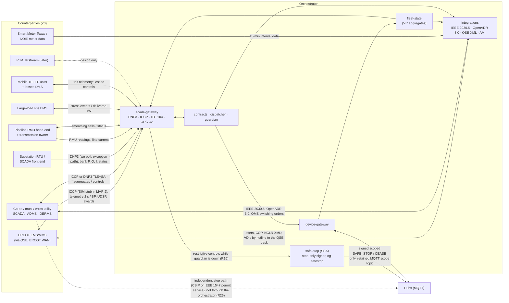
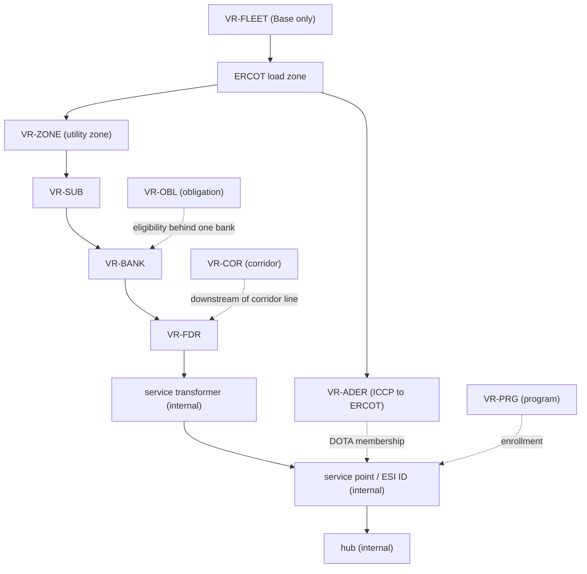
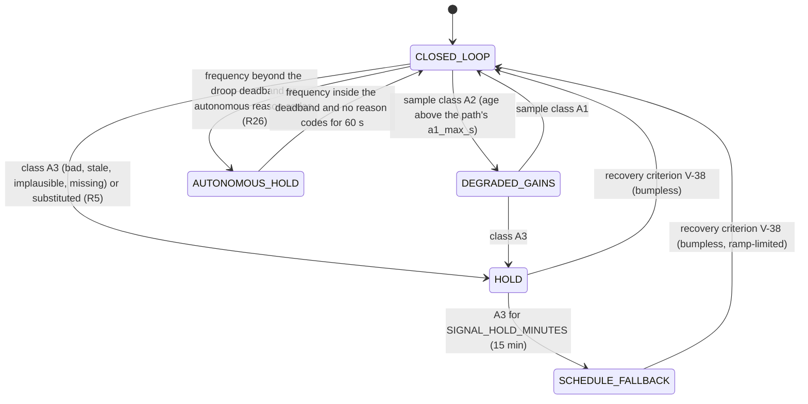
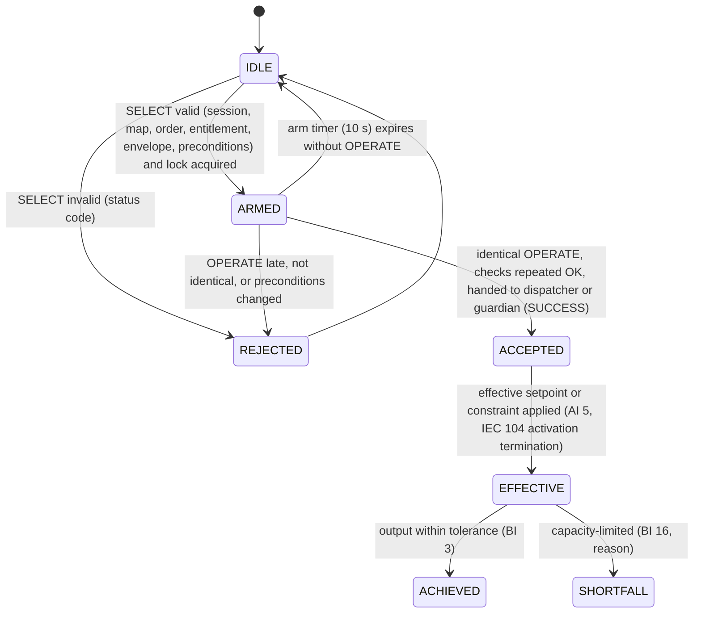
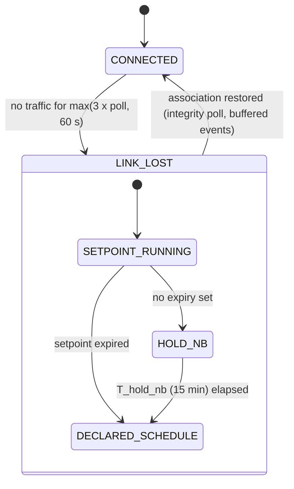
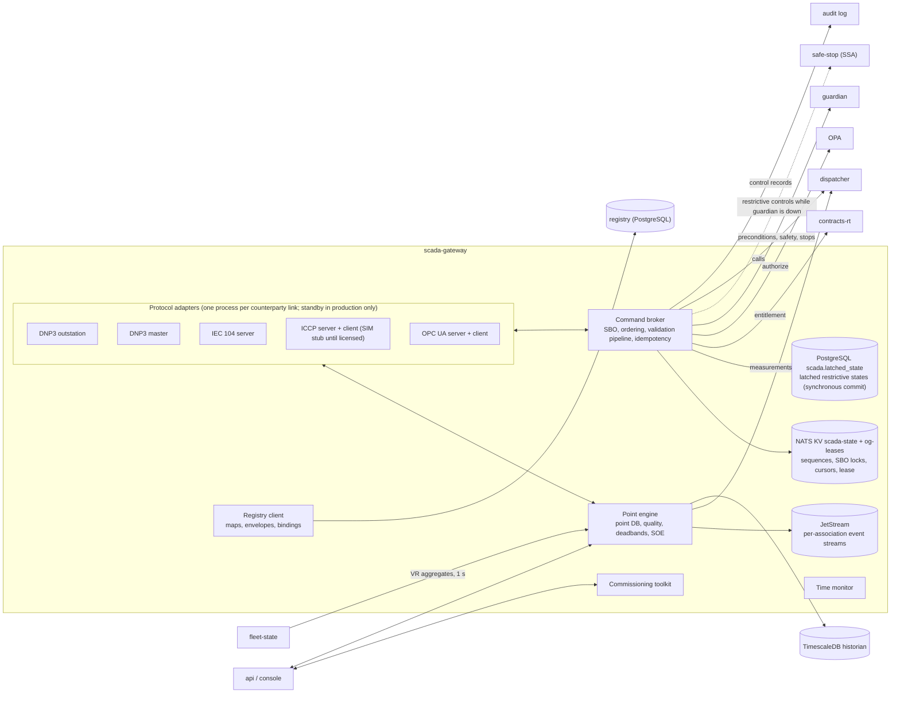
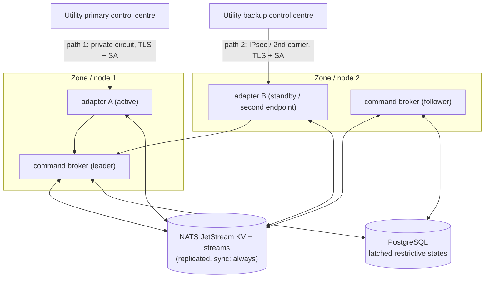
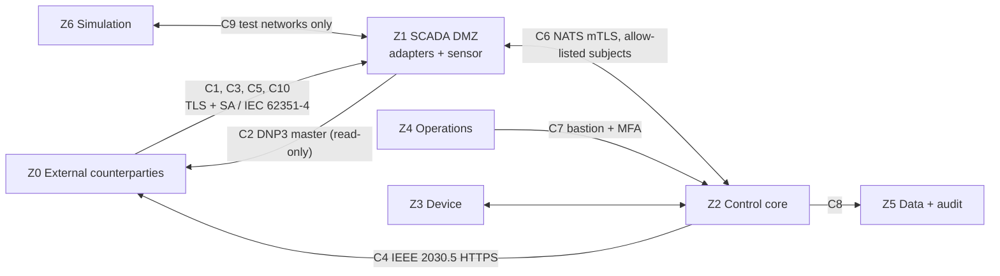
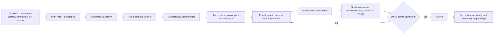

# OpenGrid Orchestrator — SCADA Integration (`scada-gateway`)

Status: v0.3 · 2026-09-25 (resolution pass after the four adversarial reviews `06-reviews/01…04`; aligned with
`00-decision-register.md` v0.2 — D0a–D5, R1–R50, Q1–Q27 and the §F values V-01…V-41) · Author: independent SCADA/EMS
integration engineer · Audience: every spec author, utility/ISO integration engineers, security, test and operations
authors, and reviewers. Per-finding dispositions: `06-reviews/resolution/A6-scada.md`.

Read [`../00-brief.md`](../00-brief.md) first. This document uses its vocabulary, customer-type codes, service map,
defaults, ID conventions and the user's binding decisions (brief §8: D1 roles, D2 scoped kill switch, D4 command
safety, D5 privacy) without restating them. It is the **single source of truth for how the fleet appears to, and is
controlled by, utility and ISO SCADA/EMS/DERMS systems**, and for how grid measurements enter the orchestrator. Every
other document references it for point maps, protocol behaviour, interlocks and SCADA failure modes.

### Changes in this version (v0.3)

Every review finding that cites this document was checked against the text and, for rule claims, against the primary
source before anything changed; rejections and partial acceptances are recorded with reasons in
`06-reviews/resolution/A6-scada.md`. Nothing is dropped (D0a): every change keeps its customer type and changes how it is
dispatched, measured, constrained or sequenced. No existing ID was renumbered; renamed points keep their indexes.

1. **ERCOT resources (R17, R25; GRD-001, -002, -013, -014, -017, -021, -022, -023).** ERCOT instructions for an on-line
   ADER are hard constraints at L2 precedence, never a squeezable call (§5.1, §5.7, §6.2). ADER MPC/LPC, ramp rates and AS
   capability are computed from ledger-free, guardian-permitted capacity — the rule `P_AVAIL_CP` already applied to DNP3
   counterparties — and recomputed within 2 s of any reservation or limit change, with a guardian invariant and a
   proxy-offer guard (§2.3). Members report every 2 s and the NPC regulator tracks the UDSP trajectory while the ADER is on
   line (§2.7, §3.2.4). NCLR variant with XML deployment until recall (§5.7). One normative ICCP/QSE-link-loss text: hold
   the last set point flat, hotline, OUTL or hold, substitute telemetry, COP update (§3.2.11). ISO instructions and the QSE
   desk (§3.2.10); the Current Operating Plan (§3.2.12).
2. **Bank inputs and deferral control (R18, R28; GRD-003, -006, -026, -027, -028, -029, -034, -051, -058, -059).** Apparent
   power and per-phase current inputs, unit-typed ratings (kVA, kW, A) and `phase` in the registry, with map validation
   that rejects mixed-unit comparisons (§3.0, §4.2, §4.11); plausibility against RTU deadbands and correlated signals,
   unexplained confirmed steps as topology events (§4.8); OMS/ADMS switching feed and topology freshness = GIS version +
   applied switching orders (§2.2, §4.13); per-path A1/A2 thresholds from commissioning latency, ICCP or historian as the
   default primary path and RTU polling the exception (§4.1, §4.9); one HOLD recovery criterion (V-38, §4.11); LTC
   operations counted (§4.2); one integrating loop per bank (§5.3); line-current sensitivity for `PIPELINE_AC` (§5.5).
3. **`MOBILE_TEEEF` (R20; GRD-005, -019).** The Base-initiated close permissive is removed: Base reports readiness; the
   lessee's operator closes under a switching-order ID; island-forming only, qualifying outage declared by the lessee, no
   ERCOT telemetry; grid-parallel support is the separate `MOBILE_DER` variant (§1.3.2, §3.1.11, §5.6).
4. **Command safety (R3 amended, R4, R16, R29; RT-001, RT-003, RT-009, RT-014; GRD-025, -041, -053, -054).** Single-person
   stop engage at every scope with a 15-min co-sign, Tier 2 release, automatic downward re-declarations (§6.4, §6.5);
   restrictive controls are executed through the independent Safe-Stop Authority when `guardian` is down, never "accepted
   as queued" (§6.8, FR-SCADA-057); stops sequenced for ERCOT and frequency-gated per V-16 (§6.5); a utility-supplied
   dynamic limit raises output only with independent corroboration (CTL-150, §4.15); no real association carries controls
   without licensed Secure Authentication (§8.2); `COMMAND_SEQ` only on associations without SA and the per-point SBO/DO
   column is normative (§3.1.7, §3.1.8, §6.3).
5. **Independent stop path and settings conformance (R25, R26; GRD-011, -020).** Each distribution counterparty has a stop
   path that does not traverse the orchestrator (§6.13); IEEE 1547 settings read-back gates ADER and firm membership
   (§2.2, §6.14); autonomous grid-support response is reported and never cancelled (§3.1.4, §4.11).
6. **Hub states, privacy, latency (R39, R40; V-18, V-29, V-34; GRD-042, -055; ARC-015, -016).** Connectivity and eligibility
   per V-29 (§2.4); the 15/15 privacy floor on every northbound aggregate (§2.9); ERCOT premise/device data requests
   documented, default off pending Q12 (§2.9); firm full output p99 ≤ 240 s (§2.7).
7. **Architecture (ARC-003, -005, -006, -008, -010, -014, -019, -026, -027, -037, -042; R22, R30–R36, R43).** One adapter
   per link on the node, standby only in production, resources carried only in `06` §1.8 (§7.3, §7.5); latched restrictive
   states written synchronously to PostgreSQL and re-read from counterparties on resume (§7.3); command path and message
   names taken from the single tables of `01` §8.1 and `02` §5 (§6.6, §7.10); per-stream audit chain (§6.10); the ADR
   verdicts of `01` §17.2 recorded (§7.12).
8. **Licences and the judged MVP (R21, R44, Q11; JDG-008, ARC-034).** The demo DNP3 stack is chosen by a week-1 spike; ICCP
   is a labelled `SIM` protocol-level stub until licensed; §12 now states one security profile per link; every requirement
   carries a build tag (`MVP-J`, `MVP-B`, `R2`); §13.2's outdated statement about the vision is corrected.
9. **Primary-source corrections (claims check `06-reviews/05`).** NCLR: two failures in a rolling 365 days mean
   disqualification (not suspension) and the GD's baseline is the 15-min interval before the instruction; PURA §39.918 as
   amended by SB 231 (mobile, ≤ 5 MW; not applicable to co-ops and munis); proxy AS offers for every qualified Resource;
   the 4-min base ramp is an ERCOT training value, not a Protocol value; Non-Spin 2 h pending NPRR1309.
10. **New IDs:** FR-SCADA-093…111, FM-SCADA-053…065, H-SCADA-41…50, TC-INT-769…785 (after `05-testing`'s TC-INT-743…768),
    TC-SEC-716…717; point additions at
    spare offsets (AI 50–58, DBI 4; mobile-unit BI 21–22, CROB 7, AO 7; bank template AI 22–23 and counter 2). Renamed
    with their index kept: mobile-unit BI 11 `READY_TO_ENERGIZE` and CROB 3 `BREAKER_CLOSE`; AI 18 `HUBS_STALE` now
    counts V-29 `SILENT`.
11. **Alignment with the owners' catalogues (checked 2026-09-25).** The Alert and RB columns of §9 follow `05-…` §5.3 and
    §5.4 (RB-071 for ICCP/QSE link loss, RB-072 for restore, RB-005 for settings drift; FM-SCADA-060 and -065 are the
    SCADA views of FM-DEV-037 and FM-PLT-033); the counterparty-limit bound follows CTL-150 as `03-security/02` G-18
    states it (10% of the bank rating per 5 min, DET-084); resource figures stay in `06-…` §1.8, with register Q26 (node
    memory for the 10,000-hub profile) noted in §7.5 and §13.2.

---

## 0. How to read this document

### 0.1 Ownership boundaries

| Topic | Owned here | Owned elsewhere (this document states only the interface) |
|---|---|---|
| Counterparties, protocols, point lists, scaling, deadbands, event classes, quality mapping, time semantics | Yes (§1–§3) | Canonical record schemas: `02-domain-model-and-interfaces.md` |
| Virtual resources (VRs) exposed to SCADA and the formulas of every aggregated point | Yes (§2) | State estimation behind the formulas: `fleet-state` in `03-decision-engine.md` §4.3 |
| ERCOT-visible capability (ADER MPC/LPC, ramp rates, AS capability, status) and its telemetry, the ISO-instruction intake and the ICCP/QSE-link-loss rule (register R17, R25) | Yes (§2.3, §3.2.10–§3.2.12) | The NPC regulator, the fleet allocator and the reservation ledger: `03-decision-engine.md`; the `Reservation`, `IsoInstruction`, `CurrentOperatingPlan` and `Enrollment` entities: `02-…` (R37); COP production: `planner`; COP and offer submission: `integrations` |
| Southbound ingest (DNP3 master, ICCP/historian/OPC UA, AMI, pipeline RMU, mobile units, large-load signals) | Yes (§4) | Control laws that consume the data: `03-decision-engine.md` §4.2, §8.6 |
| SCADA bindings of every service-type dispatch profile (brief §3.5) | Yes (§5) | The profiles themselves, the generic call and precedence L0–L2/T1–T4: `03-decision-engine.md` §2 |
| Control authority, command ordering (D4a), confirmation (D4b), kill-switch mapping (D2), interlocks, loss of communication | Yes (§6) | Hub-side issuer precedence and command lifecycle: `05-failure-modes-and-recovery.md` §2.2; `guardian` design: `03-security/02-security-architecture.md` |
| `scada-gateway` internals, stacks, redundancy, registry, buffering, time sync, historian | Yes (§7) | Cluster, storage and network platform: `06-platform-and-operations.md`; the only resource table is `06` §1.8 (R14, R35); the stream/subject/consumer table is `02` §5 (R34); the end-to-end latency table is `01` (R39); the ADR log is `01` §17 |
| IEEE 2030.5 and OpenADR 3.0 | The IEEE 2030.5 **point mapping** (§3.4) and the shared registry and command semantics | The application layer — programs, controls, reports, sessions — is owned by `integrations` (register R6); `scada-gateway` owns DNP3, IEC 60870-5-104, ICCP/TASE.2 and OPC UA |
| Command signing | That every SCADA-originated hub command is submitted to `guardian`, and that a restrictive control reaches the Safe-Stop Authority when `guardian` is unavailable (§6.8) | `guardian` is the only signer of anything that moves MW (register R1); the independent Safe-Stop Authority (`safe-stop`, namespace `og-safestop`) can sign only a scoped `SAFE_STOP`/`CEASE` (R16): `03-security/02-security-architecture.md` |
| SCADA security profile per protocol (D4c), zones and conduits, anomaly rules | Yes (§8) | Threat IDs (`TH-NNN`) and control IDs (`CTL-NNN`): `03-security/*` |
| SCADA failure modes `FM-SCADA-NNN` | Defined here (§9) | Catalogue, recovery parameters and chaos placement: `05-failure-modes-and-recovery.md` |
| Commissioning and conformance procedures, test-case titles | Yes (§11) | Test bodies and traceability: `05-testing/*` |
| SCD console screen | Data and behaviour (§6, §7) | Layout and interaction: `04-ui/01-ui-ux-specification.md` §3.10 (`UI-SCD-01…08`) |

### 0.2 Judging criteria this document serves (brief §2)

| Criterion | Where |
|---|---|
| Completeness (15) | §4 and §5: grid measurements and SCADA calls reach every service type's dispatch; §6.8 and §3.2.11 define behaviour for every loss of communication; §9 catalogues 65 SCADA failure modes with automatic responses |
| Technical depth (15) | §2 aggregation and quality derivation, including ERCOT-visible capability from the reservation ledger (§2.3); §3 complete point maps for DNP3, ICCP/TASE.2, IEC 60870-5-104, IEEE 2030.5 and OPC UA; §4.11 time-aligned, unit-typed control-law inputs (apparent power, per-phase current); §6 command-ordering and interlock state machines; §8 IEC 62351 security profiles |
| The problem (15) | §5 and §6: a utility or ISO can see and constrain the fleet on its own control-room tools, so the fleet can be sold as firm, location-specific capacity while homes stay protected (L0/L1 cannot be overridden from SCADA) |
| The "why" (15) | §1.3 and §6.1: ERCOT does not enforce distribution limits when it dispatches an ADER, and it dispatches whatever capability it is shown; so one orchestrator must enforce the utility's limits (L2), follow ERCOT's instructions as hard constraints, and arbitrate between buyers **before the fact** — in what ERCOT and each utility are shown — so one kWh never backs two buyers (§2.3) |
| Insight quality (10) | §2.3 deliverable kW by duration, commanded vs achieved, SCADA step check (§4.12), ADER telemetry self-validation (§3.2.8), `AT_RISK` and shortfall points exported to the customer's own SCADA |
| Usability (10) | §7.4 versioned point-map registry, §11 commissioning checklists, profile variants that match how utilities and PJM already run SCADA |
| Creativity (10) | §2.1 the fleet presented as SCADA-native virtual resources per bank, zone, program, corridor and unit; §3.1.9 one DNP3 point template reused for every counterparty |
| Performance (10) | §2.7 latency budgets with measurement points; §7.5 capacity model; `TC-PERF-701…705` |

### 0.3 Binding decisions and principles applied here

1. **Service-agnostic dispatch (brief §1).** A SCADA control that is authenticated, authorized, well-formed and inside
   the counterparty's contract is a *call* and must be executed within L0–L2 constraints. The SCADA path and its
   interlocks enforce **safety and contractual authority only** — never a judgment about the value or impact of the
   service. A call that is limited by arbitration is reported as *accepted and limited* with the reason, not rejected.
2. **Full auditability (brief §1 core job).** Every SCADA control received or issued — who, point, value,
   select-before-operate sequence, result, achieved value — enters the same decision trace and tamper-evident audit log
   that links call → decision → commands → telemetry → M&V → invoice (§6.10).
3. **D4 command safety** is applied to every SCADA control path: ordering and state interlocks (§6.3), confirmation of
   critical-impact commands (§6.4), authenticated and encrypted links (§8).
4. **D2 kill switch** is scoped per bank, per zone or entire fleet and mapped to SCADA points (§6.5).
5. **D5 privacy:** northbound SCADA data is aggregated under the 15/15 floor (V-18); per-home data leaves the platform
   only where a named contract or regulation requires it, the user has decided (register Q12) and privacy review approves
   it (§2.9) — ERCOT lanes stay simulated until then. The `ai-agent` receives only aggregated, non-personal SCADA data.
6. **Research is not an orchestrator function (brief §3.5).** This document specifies no research capture or export;
   SCADA and meter data serve dispatch, measurement and billing.
7. **Distrust every input.** A SCADA value is used for control only when its quality, age, time alignment and
   plausibility are acceptable (§4.8); a controller never acts on a value it cannot trust.
8. **Fail toward the contract's safe state.** Restrictive states (safe stop, blocks, cease to energize) latch, are
   written synchronously to PostgreSQL and survive link loss, restarts and restores; firm delivery holds its prior
   setpoint, then runs the day-ahead schedule — never an unplanned step to 0 kW (§6.8); an on-line ADER holds its last
   ERCOT set point flat, never steps to zero (§3.2.11).
9. **Simulated is labelled.** Every simulated counterparty, point or proxy value carries `SIM`/`SYNTHETIC` labels
   end to end, and a simulated counterparty can never reach a real hub (§6.9).
10. **One signer of anything that moves MW.** Every hub or mobile-unit command that results from a SCADA control is
    checked and signed only by `guardian` (register R1); the independent Safe-Stop Authority can sign only a scoped
    stop, never a release or a setpoint (R16).
11. **The decision register wins.** Where this document and `00-decision-register.md` disagree, the register applies —
    among others the tiers R3, stops R4 and V-16/V-17, forced values R5, 2030.5/OpenADR ownership R6, retention R9,
    safe-stop independence R16, ERCOT instructions R17, rating inputs R18, TEEEF R20, loss of communication R25,
    autonomous grid support R26, deferral inputs R28, command order R29 and every normative value V-01…V-41.
12. **ERCOT instructions for an on-line ADER are hard constraints (R17).** They rank with L2 and are never squeezed by a
    firm call; conflicts between buyers are resolved before the fact, in the capability ERCOT is shown (§2.3, §5.7).
13. **Nothing is dropped; build order is sequencing only (D0a, R21).** Every requirement carries a build tag — `MVP-J`
    (judged demo), `MVP-B` (Line B) or `R2` (later, design unchanged) — next to its MoSCoW priority.

### 0.4 Labels and ID ranges used in this document

| Label | Meaning |
|---|---|
| **[S]** | Sourced from a public document (link given at first use and in §14) |
| **[A]** | Assumption — ours to defend, the user's to override; per-counterparty configurable unless stated |
| **[R]** | Reviewer proposal — unverified (brief §3.2); adopted as a candidate acceptance criterion, per-contract parameter |
| **[D]** | Derived from sourced values or from other documents in this set |
| **[U]** | User decision (brief §8) |
| **V-nn** | Normative value from the register's §F table; this document never restates a different value |

| Build tag (register R21) | Meaning |
|---|---|
| `MVP-J` | Built for the judged demo (Line A) |
| `MVP-B` | Line B of the judged build (planner, Insights, performance evidence, OpenADR VEN, AI explanations, `SHADOW`, demo profile) |
| `R2` | Later; the design in this document is unchanged and complete |

| ID family | Range used here | Note |
|---|---|---|
| `FR-SCADA-NNN` | 001–111 | Functional requirements of this document; 093–111 added in v0.3 |
| `FM-SCADA-NNN` | 001–065 | SCADA failure modes: 001–021 exactly as catalogued in `05-failure-modes-and-recovery.md` §3.5; 022–065 added here for import into 05 (§9) |
| `ADR-NNN` | 071–078 | Architecture decisions of this document; their verdicts (ratified, ratified with amendment, ratified in part) are recorded in the single ADR log of `01-system-architecture.md` §17.2 (ARC-027) |
| `ALR-NNN` | 080–099 (+260–269 proposed) | SCADA alert rules — 080–099 allocated and assigned by `05-…` §0/§3.5; 260–269 (currently unallocated) proposed for the failure modes added here; paging stays inside the ≤ 25-rule budget (V-25) |
| `TC-INT-NNN`, `TC-SEC-NNN`, `TC-PERF-NNN` | TC-INT-701–742 and TC-INT-769–785 (743–768 are `05-testing`'s extensions), TC-SEC-701–717, TC-PERF-701–705 | Placeholders; bodies in `05-testing/02-test-cases-functional.md` and `03-test-cases-nonfunctional.md` |
| `TC-CHAOS-NNN` | 261–299 | `05-…` rule: 260 + the FM-SCADA number (so failure modes above 039 are covered by `TC-INT`/`TC-SEC` tests instead) |
| `RB-NNN` | 05's IDs | Runbooks of `05-…` §5.4 (index) and §5.6 (bodies); `07` requests none of its own and names existing ones (e.g., RB-005, RB-014, RB-022…028, RB-054, RB-059, RB-060, RB-064, RB-071, RB-072) |
| `H-SCADA-NN` | 01–50 | Hooks other components implement (§10); 41–50 added in v0.3 |
| `CP-*`, `VR-*` | — | Counterparty and virtual-resource identifiers (§1.1, §2.1) |

---

## 1. Integration context

Criteria served: The problem, The "why", Completeness.

### 1.1 Counterparties and what flows each way

| ID | Counterparty | Their systems | Protocols (primary / alternatives) | Fleet → counterparty (northbound) | Counterparty → fleet (calls, constraints, measurements) | Customer types | Build (register R21) |
|---|---|---|---|---|---|---|---|
| `CP-ERCOT` | ERCOT, through the QSE that represents Base's ADERs | EMS (SCADA, LFC, SCED), MMS | ICCP/TASE.2 conformance blocks 1–2 over the ERCOT WAN [S]; market XML (offers, COP, NCLR deployments) through `integrations` | Resource-level ADER telemetry every 2 s: net power consumption, LPC, MPC, ramp rates, resource status, AS capabilities — all computed from ledger-free, guardian-permitted capacity (§2.3); mutually agreed points (§3.2) | SCED base points (5 min or on demand), updated desired set point (4 s), AS awards after every SCED run, deployment flags, LMPs; verbal dispatch instructions (VDIs) by hotline to the QSE desk (§3.2.10) | `ERCOT_ENERGY`, `ERCOT_AS` | `MVP-J`: simulated ERCOT peer in `grid-sim` over a labelled protocol-level stub (`SIM`, not TASE.2 on the wire) until an ICCP licence exists (R44); real ERCOT `R2` (brief §4: no real market access) |
| `CP-QSE3P` | A third-party QSE, if Base does not register as its own QSE | QSE EMS | ICCP bilateral / DNP3 over TLS with SA | The same ADER aggregates (the QSE forwards them to ERCOT) | Relayed base points, UDSPs, awards, deployments and VDIs | same | `R2` (option B of §3.2.1; the register's Q6 default simulates this interface) |
| `CP-COOP`, `CP-MUNI` | Partner co-ops and munis (e.g., Austin Energy, CoServ, GVEC, CPS Energy, Bluebonnet) | SCADA master, ADMS/OMS, DERMS, OpenADR VTN | DNP3 (IEEE 1815) over TLS with Secure Authentication; IEC 60870-5-104 only where required; IEEE 2030.5 (CSIP) and OpenADR 3.0 through `integrations` (R6) | Per-VR aggregates (program, bank, feeder, substation, zone), statuses, alarms, declarations | Events and setpoints, limits and blocks, utility override, safe stop; bank/feeder measurements (southbound); switching orders and planned outages (OMS/ADMS feed, R28); their own stop path to the hubs that does not traverse the orchestrator (§6.13, R25) | `PARTNER_CAPACITY` (event and `TOLLING` variants, R27), `DIST_DEFERRAL`, `MOBILE_TEEEF` (as lessee) | `MVP-J`: `grid-sim` DNP3 master + substation RTU, labelled `SIM` |
| `CP-TDSP` | Wires utilities (e.g., Oncor, CenterPoint, AEP Texas, TNMP): DSP of ADER premises; `DIST_DEFERRAL` counterparty under SB 415 contracts | SCADA/ADMS/OMS/DERMS | ICCP bilateral; DNP3/TLS+SA; IEEE 2030.5 | Per-bank aggregates, declarations | Setpoints, limits, blocks, safe stop; bank/feeder measurements; switching orders and planned outages; their own stop path (§6.13) | `DIST_DEFERRAL` (TDU variant with a reservation calendar, R27); DSP limits for ADERs | `R2` |
| `CP-RTU` | Utility substation RTUs, data concentrators or SCADA front-end secondary ports | RTU/gateway | DNP3 (the orchestrator is a **master**, read-only) — **the exception path**: utilities rarely let third parties poll substation RTUs, so ICCP from the EMS/ADMS or a DMZ historian is the default primary path (§4.1, GRD-059) | — | Bank and feeder P, Q, per-phase I, V; breaker and switch status; ratings (kVA, A); contingency flags; LTC position | `DIST_DEFERRAL`, `PIPELINE_AC` (if the corridor line is on that system) | `MVP-J`: `grid-sim` substation outstation (the protocol built for the judged demo is DNP3) |
| `CP-HIST` | Utility EMS/ADMS and historian data services | EMS/ADMS, historian | ICCP client (default primary for bank values), OPC UA client, file transfer | — | Near-real-time bank values; multi-year 15-min bank history, as-operated topology, ratings | `DIST_DEFERRAL` (control input, forecast, sizing) | `R2` |
| `CP-AMI` | Meter data: Smart Meter Texas (competitive areas) and NOIE meter-data systems | SMT API; MDMS exports | HTTPS API, SFTP (not SCADA; ingested by `integrations`) | — | 15-min interval kWh import/export per ESI ID | M&V for all; ADER telemetry validation | `MVP-J`: simulated meter feed |
| `CP-PIPE` | Pipeline operator SCADA / RMU head-end | RMU platforms, pipeline SCADA | DNP3/Modbus/IEC 104 from the head-end [S]; vendor REST API | Smoothing status and applied kW per corridor | Smoothing enable, ramp band and caps (calls); RMU readings (AC voltage, coupon current densities, ER-probe loss) | `PIPELINE_AC` | `MVP-J`: `grid-sim` RMU and corridor simulator over REST; DNP3 transport `R2` |
| `CP-TO` | Transmission owner of a corridor line | EMS/historian | ICCP bilateral; historian export | — | Line current, MW/MVA, rating, configuration changes (circuits, phasing, fault levels); the line-current sensitivity (shift factor) of the corridor partition's injection (§4.5) | `PIPELINE_AC` (control input for H1/H2; change flags for H3) | `MVP-J`: public-data proxy labelled `ESTIMATED` (existing `/opt/opengrid_sim/scada_simulator.py` physics) |
| `CP-LL` | Large-load customer (data center) site EMS | Site controller | DNP3/TLS+SA or webhook/REST via `integrations` | Delivered offset, availability | Stress event start/stop, requested kW | `LARGE_LOAD` | `MVP-J`: `grid-sim` stress signal by signed webhook; DNP3 `LLZONE` slot `R2` |
| `CP-TEEEF` | Base's mobile units and the lessee utility's DMS | Unit PCS/BMS/plant controller; utility DMS | Southbound Modbus TCP or DNP3 over a cellular VPN; northbound DNP3 outstation per unit | Unit status, P/Q/V/f, SOC, **readiness to energize**, location, alarms | From the lessee only: qualifying-outage declaration, crew clearance, island-forming V/f references, and the breaker close under the lessee's switching-order ID (R20); Base schedules transport and availability and may stop the unit | `MOBILE_TEEEF` (island-forming only, PURA §39.918); `MOBILE_DER` (grid-parallel, its own interconnection agreement, R20) | `MVP-J`: three simulated units (Q19) in `agent-sim` through the internal device adapter; the DNP3 unit template `R2` |
| `CP-PJM` | PJM (Jetstream) and ComEd | PJM EMS | DNP3 over TLS on the Internet with dual connections (Jetstream) [S], only if Base participates as a DER Aggregation Resource | Jetstream profile (§3.1.10) | PJM setpoints | `PJM_CAPACITY` | `R2` (design only) |
| `CP-HUB` | Base hubs (not SCADA) | Hub firmware | MQTT 5/mTLS via `device-gateway` (brief §4) | — | Telemetry that every aggregate is built from; IEEE 1547 settings read-back (§6.14) | all | `MVP-J`: `agent-sim` |

`HOME` has no SCADA counterparty: the homeowner reserve and opt-outs reach the orchestrator through Base's homeowner
channel and are **not controllable from any SCADA point** (§6.1).

### 1.2 Context diagram



### 1.3 Regulatory and market basis

#### 1.3.1 ERCOT: QSE telemetry, ICCP and the ADER pilot

| Requirement | Value | Source | Design response |
|---|---|---|---|
| ADER real-time telemetry | The QSE sends resource-level real-time telemetry for each ADER to ERCOT every 2 s, following Protocols §6.5.5.2, Nodal Operating Guide §7 and the ICCP Handbook | [S] ADER Pilot Governing Document Phase 3.3, §5.d (approved June 2026) | ICCP data values refreshed every 1 s internally; ERCOT acquires every 2 s (§3.2) |
| General scan rate and condition codes | Telemetry "updated at a ten second or less scan rate"; condition codes must indicate quality and whether data was measured within the scan rate | [S] Nodal Protocols §3.10.7.5(2) | All ICCP points ≤ 2 s; quality per §2.5 |
| ICCP redundancy | Fully redundant ICCP links that survive the failure of any single element; after a server failure, complete data restored within 5 min by automatic failover; during other failures, all data keeps updating at a 30-s or faster scan | [S] Protocols §3.10.7.5(3) | Two ICCP nodes, dual circuits, failover target ≤ 60 s [A] (§3.2.6) |
| ICCP association availability | Monthly availability of 98%, excluding planned outages; high-availability pair counted as one association | [S] Protocols §3.10.7.5.8.2 | SLO 99.9% [A], measured per month (ALR-088) |
| Quality codes to ERCOT | Valid, Manual, Calculated, Suspect, Invalid, Com_fail; the participant documents its conversion | [S] Protocols §3.10.7.5.8.1 | Mapping in §2.5; conversion document is a commissioning deliverable |
| Accuracy | Real-time data for reliability purposes accurate within 3% | [S] Protocols §6.5.5.2(10) | Self-validation against meter data (§3.2.8) |
| Load Resource telemetry | Net real power consumption (MW, positive), breaker status if applicable, LPC, MPC, AS self-provision via under-frequency relay, relay status, Scheduled Power Consumption (CLR providing Non-Spin), Resource Status, SPC+2 (ALR Non-Spin), RRS capability, AS blended ramp rates, 5-min normal ramp rates (CLR) | [S] Protocols §6.5.5.2(6) (the ADER document cites it as (5), the numbering before a later revision) | ICCP point list §3.2.3 |
| Storage telemetry (reference) | MaxSOC, MinSOC, SOC (MWh), maximum operating discharge and charge limits — required of ESRs | [S] Protocols §6.5.5.2(14) | Offered to ERCOT as mutually agreed ADER points under §6.5.5.2(6)(b) [A] |
| ADER aggregate construction | Telemetry values (LPC, MPC, net power flow) are the sum of member premises or devices per the approved Details of the Aggregation, plus a static MW offset so the ADER always telemeters as net load; MPC − LPC equals the dispatchable range | [S] ADER GD §5.a, §5.c, §5.d | Formulas in §2.3 |
| ADER ramp rate | "Weighted average of the ramp rates at the individual Premise or device" | [S] ADER GD §5.d | Interpretation in §2.3 [A], to confirm with ERCOT; the telemetered value is never above the ADER's guardian-permitted share of the fleet ramp budget (register V-30) |
| Validation and study data | Time series of net MW at premise and/or device level, state-of-charge time series for storage devices, device-level sub-meter data where telemetry is device-level, and per-premise allocation factors (the fraction of an ERCOT instruction provided by each metered premise; may be static in Phase 3) — to be provided to ERCOT **when requested**; the Details of the Aggregation carry ESI IDs and are Protected Information | [S] ADER GD §5.c, §5.d, §5.e | A condition of participation when requested, and personal data under D5: the export tooling (§7.8) exists but stays disabled until the user answers register Q12; ERCOT lanes stay simulated meanwhile (§2.9) |
| Telemetry validation | Premise-level: 15-min averages of net power consumption minus offset within 10% of aggregated settlement meter data, over an 8-h evaluation with ≥ 50% of intervals qualifying; device-level: step 1 within 50% (≤ 1 MW) or 10% (> 1 MW), step 2 a deployment test within 10% of the meter-observed response | [S] ADER GD §5.d | Continuous self-check with an 8% early-warning threshold [A] (§3.2.8) |
| Participation limits | At Phase 3 initiation 500 MW registered, 100 MW Non-Spin, 100 MW ECRS system-wide; one QSE ≤ 90% of each; limits raised at ERCOT's discretion (v3.2, 2026-02-27) and posted on the pilot page. Per ADER: AS offers and AS resource responsibilities for Non-Spin and ECRS may not exceed the MW amounts in the QSE submission signed by ERCOT. ERCOT's tracking sheet of 06-01-26 shows 100.0 MW of ECRS approved (at the cap) and 0 MW in LZ_AEN and LZ_CPS | [S] ADER GD §1, §5.a, §5.d; Limits-of-Participation tracking sheet 06-01-2026 (claims check claim 15) | Registration envelope exported as static configuration; `planner` caps offers and plans with no ECRS headroom until ERCOT raises the cap; telemetered AS capability is capped at the per-ADER qualified MW (§2.3) |
| Network model | Each ADER is assigned to a single CIM Load; the DSP maps premises to CIM Loads; one Load Zone; one DSP | [S] ADER GD §5.c | VR membership (§2.2) |
| Distribution limits | ERCOT's systems do not enforce identified distribution-system limitations when they award or dispatch an ADER; such limits are only reflected in its registration | [S] ADER GD §5.c | The orchestrator enforces DSP limits as L2 constraints and removes them, with every non-ERCOT reservation, from the capability it telemeters to ERCOT (§2.3, §5.7) |
| Deployment | ALR: Non-Spin, ECRS and energy deployed through SCED using Load Zone shift factors; NCLR: XML deployment instruction. Under RTC+B a CLR follows the UDSP; online Non-Spin, ECRS (SCED) and RRS-PFR of a CLR are deployed through the SCED portion of the UDSP, not by a separate order; NCLR deployments are resource-specific XML instructions and an NCLR must remain deployed until recalled | [S] ADER GD §5.f; RTC+B Load Resource overview (2025-06-09) slides 6, 8, 11 | ALR: the base point and UDSP trajectory is an L2 hard constraint followed by the NPC regulator (§3.2.4, §5.7; R17); NCLR: XML via `integrations`, held until recall (§5.7) |
| UDSP content | Each resource follows its UDSP; a UDSP is the expected MW of the resource ramping to its SCED base point plus its Regulation instruction; LFC sends it every 4 s; UDSPs do not include expected Primary Frequency Response; the ramping component is held when frequency deviates by ≥ 0.05 Hz and the ramp opposes it. The 4-min length of the base ramp is an ERCOT training value, not a Protocol value | [S] Protocols §6.5.7.4.1; RTC+B telemetry changes slide 8 (4-min base ramp); claims check claim 14 | Members report every 2 s and the regulator runs at ≤ 4 s while the ADER is on line (§2.7, V-03, V-32); the base-ramp shape is a configurable parameter (default 4-min linear); autonomous frequency response of the hubs is never cancelled (§4.11, R26) |
| Offers, proxy offers and limits | Every SCED run ERCOT creates a proxy AS offer for every qualified Resource for the MW not covered by submitted offers — for Load Resources the proxy MW equals the telemetered MPC — and awards stay within telemetered AS capabilities; without an energy bid ERCOT bids a CLR's LPC-to-MPC range at VOLL; an awarded AS obligation survives `OUTL`; SCED base points observe HDL/LDL, which for SCED-dispatchable Load Resources are telemetered power ± 5 × the normal ramp rate within MPC/LPC; AS awards are sent by ICCP after every SCED run | [S] Protocols §6.5.7.3(5), (9), (10), (12); §6.5.7.2(6)–(7); §6.5.7.4(1); RTC+B Load Resource overview slides 6, 9; claims check claims 2, 14 | Telemetered capability is computed from ledger-free, guardian-permitted capacity, and per-product AS capability equals the MW Base accepts being awarded, covered by real-time offers, or 0 (§2.3, R17); `planner` always submits an energy bid covering LPC–MPC; MPC, LPC and ramp telemetry are control inputs to ERCOT and are kept conservative and accurate |
| AS capability telemetry | ECRS ramp rate = the resource's 10-min output-change capability ÷ 10; Non-Spin ramp rate = its 30-min capability ÷ 30; both limit what SCED can award. ECRS capability is limited to what the resource can sustain for at least one hour; Non-Spin four hours (two hours once NPRR1309 is implemented) | [S] RTC+B telemetry changes slide 4; NPRR1282 (Protocols §8.1.1.3.4(2): "sustained by the Resource for at least one hour"); Protocols §8.1.1.2.1.3(8) with the pending NPRR1309 text; register V-33, Q7 | §2.3 formulas with the product durations as profile fields |
| Current Operating Plan | A COP for each Resource for each hour of the next seven Operating Days; updated as soon as reasonably practicable and no later than 60 min after the event that changed availability; AS capability by product and sub-type; Load Resource statuses `ONL` and `OUTL` (`ONTEST` and `ONHOLD` added by NPRR1188 upon system implementation) | [S] Protocols §3.9, §3.9.1(1)–(3), (5)(b)(iii) | `planner` produces it from the same ledger-free computation, `integrations` submits it (§3.2.12) |
| Performance evaluation | ALR: CLR energy deployment performance (under RTC+B evaluated against the UDSP) and base-point deviation — the Protocols' Set Point Deviation Charge (§6.6.5.1, which names CLRs; renamed from Base Point Deviation by M-C110525-01). NCLR: the GD's meter-before/meter-after baseline — the kWh of the full 15-min interval ending just before the dispatch instruction (DR Baseline Methodologies §2.2); the generic NCLR rules add a 5-min telemetry baseline, a response of not less than 95% and not more than 150% of the instruction maintained until recalled, and "Two Load Resource performance failures within any rolling 365-day period shall result in disqualification" (Protocols §8.1.1.4.3(3)(d)–(e), (5)) | [S] ADER GD §5.g; Protocols §6.6.5.1, §8.1.1.4.3; DR Baseline Methodologies (2024-09-09) §2.2; RTC+B Load Resource overview slides 12–13; claims check claims 1, 3 | NPC tracking metrics (§3.2.4); NCLR performance, both baselines and the failure counter (§5.7; which baseline ERCOT applies in practice is confirmed with ERCOT [A]); M&V hooks (§10) |
| Primary Frequency Response | An ALR's registration carries a flag for PFR ability; ADERs that can provide PFR are requested to, but not required to, in Phase 3 | [S] ADER GD §5.c, §6 | `PFRC` = declared capability or 0 (§3.2.3); the hubs' IEEE 1547 droop acts regardless (§4.11) |
| Settlement metering | 15-min interval data per premise via TX SET / Retail Market Guide §9 App. G; NOIE data ≤ 35 days after the operating day | [S] ADER GD §5.d | AMI ingest (§4.4) |
| ICCP transport | ERCOT WAN (private MPLS, diverse redundant circuits, ERCOT-provided routers); conformance blocks 1 and 2; dual-use associations initiated by ERCOT; TCP port 102 (RFC 1006); TASE.2 version 1996.08 or 2000.08; MMS PDU 32,000 bytes; bilateral table name `ERCT_pppp_nnnn` | [S] ERCOT Nodal ICCP Communications Handbook v4.07 (2025-11-19, RTC+B) | §3.2.1–§3.2.2 |
| Data from ERCOT | Base Point (300 s or on demand), UDSP (4 s), AS awards (after every SCED execution under RTC+B), deployment flags, LMP | [S] ICCP Handbook Tables 19, 21; RTC+B Load Resource overview slide 6 | §3.2.4 |
| Resource Status codes (Load Resources) | 257 `ONL` online, 258 `OUTL` offline/unavailable (RTC+B) | [S] ICCP Handbook Table 15 | §3.2.3 |
| Units and signs | MW, MWh, MVAR; Load MW always positive | [S] ICCP Handbook Tables 16–17 | §2.8 |
| Telemetry problems | If an issue cannot be fixed within 10 minutes, agree best assumed values with ERCOT verbally and replace manually | [S] Nodal Operating Guide §7.3.4 | The normative ICCP/QSE-link-loss text of §3.2.11 (register R25); runbook RB-071 (`05-…` §5.6.12) |
| RTC+B | Live since 2025-12-05: ancillary services co-optimized in real time | [S] ERCOT news release | Buyback exposure when an AS award is diverted (brief §3.1) |

#### 1.3.2 Utility interconnection and utility programs

- **PUCT-jurisdictional utilities:** 16 TAC §25.211 (interconnection of on-site distributed generation) and §25.212
  (technical requirements) [S]. Municipal utilities and co-ops (NOIEs) set their own interconnection rules; each
  partner's requirements are captured in its counterparty profile [A].
- **IEEE 1547-2018 clause 10** requires a local DER communication interface supporting at least one of IEEE 2030.5,
  IEEE 1815 (DNP3) or SunSpec Modbus, and defines nameplate, configuration, monitoring and management information;
  IEEE 1547.1-2020 adds the test procedures [S — Sandia/SunSpec summaries]. The hub-level interface is `device-gateway`'s
  concern; this document applies the same information categories at the VR level. Adoption status differs per utility
  [A].
- **ADER attestations:** inverters certified to UL 1741 SB (or UL 1741 SA) with ride-through settings per Nodal
  Operating Guide §2.6.2.1(2) and §2.9.2(3); the DSP may reject premises and its limitations must be reflected in the
  registration [S ADER GD §5.c]. The attestation is a one-time statement; the orchestrator verifies it continuously by
  reading back each hub's IEEE 1547 settings and excluding drifted hubs from ADER and firm pools (§6.14, register R26).
- **`DIST_DEFERRAL`** contracts with co-ops and wires utilities (brief §3.1) are bilateral; their SCADA terms (points,
  envelopes, override rights, fallbacks, the OMS/ADMS switching feed, the list of other closed loops on the bank, the
  independent stop path) become the counterparty profile and envelope (§5.3, §6.4, §6.13). The TDU (SB 415) variant adds
  a reservation calendar that is ring-fenced from ERCOT: it is a reservation in the ledger and never appears in ERCOT-visible
  capability (§2.3, register R27). Under PURA §35.153 the storage owner "may not discharge the facility to satisfy the
  contract's requirements unless directed by the transmission and distribution utility" and may sell into ERCOT only while
  it holds the reserved capacity; proposed 16 TAC §25.58 is not yet adopted [S claims check claim 10] — so under the TDU
  variant the closed-loop deferral discharges only while the TDU's direction is active (§5.3).
- **`MOBILE_TEEEF`:** PURA §39.918 lets a TDU lease and operate facilities that provide temporary emergency electric
  energy to restore its distribution customers during a significant power outage (§39.918(a)–(b)); the TDU "may not sell
  electric energy or ancillary services from those facilities" (§39.918(c)); the facilities "must be operated in
  isolation from the bulk power system" and may not be included in the ISO's locational marginal pricing, pricing or
  reliability models (§39.918(d)(1)–(2)); SB 231 (effective 2025-06-20) adds, for leases from that date, that the
  facilities must be mobile, movable from their staged location in less than 12 hours and of at most 5 MW, with
  competitive bidding and prior commission authorization (§39.918(d)(3)–(4), (f), (f-1)); and a TDU "does not include a
  municipally owned utility or an electric cooperative" (PURA §31.002(19)), so the section does not reach co-op or
  municipal lessees [S, enrolled SB 231 and FindLaw text; the texas.public.law page lacks SB 231 — claims check claim 5];
  16 TAC §25.56 implements the section [S]. Base's 1 MW / 2 MWh units (brief §3.1) fit the size limit.
  The profile is therefore statute-shaped (register R20): island-forming only, under the lessee's operational control,
  admitted only while the lessee declares a qualifying outage, no ERCOT telemetry or market participation, and Base
  never initiates energization — Base reports readiness and the lessee's operator closes under a switching-order ID
  (§3.1.11, §5.6). Grid-parallel "planned support" stays in scope as the separate, non-TEEEF `MOBILE_DER` variant with its
  own interconnection agreement. Co-op and municipal lessees, which are not TDUs, record their own legal basis in the
  contract; the energy pass-through billing line is subject to legal review against §39.918(c).

#### 1.3.3 DERMS and event standards

- **IEEE 2030.5 / CSIP.** CSIP v2.1 requires IEEE 2030.5-2018 [S]; IEEE 2030.5-2023 is published [S]. CSIP defaults,
  unless a utility handbook or contract says otherwise [S]: DER control polling every 10 min (direct), **monitoring posts
  every 5 min**, aggregator must pass a control to its DERs **within 15 min**; cipher suite
  `TLS_ECDHE_ECDSA_WITH_AES_128_CCM_8` on secp256r1 (aggregators also support `TLS_RSA_WITH_AES_256_CBC_SHA256` or
  others); identity by LFDI (first 20 bytes of the SHA-256 of the certificate) and SFDI (36 bits, 12 decimal digits).
  SCE's aggregator requirements add a "Virtual Power Plant EndDevice" dispatched with `opModTargetW` and reporting
  aggregate real power every 5 min [S]. **These defaults are too slow for the reviewer's ≤ 1-min, ≤ 60 s proposal
  [R]**: our contracts request `postRate` 60 s and subscription/notification for controls (§3.4).
- **OpenADR 3.0** carries `PARTNER_CAPACITY` events (brief §4 default); `integrations` normalizes them to the same call
  model as SCADA controls (§5.1).

#### 1.3.4 SCADA protocols and security standards

| Standard | Status as of 2026-09 | Use here |
|---|---|---|
| IEEE 1815-2012 (DNP3) | Still the reference; the standard became inactive in 2023, the P1815 revision (with Secure Authentication v6) is an unpublished draft extended to Dec 2027 [S Step Function, 2026-03-23] | DNP3 outstation and master (§3.1, §4.2); SAv5 per clause 7 — a hard gate for every real association that carries controls (§8.2, RT-009) |
| IEC 62351-3:2023 (Ed. 2) | TLS 1.2 and TLS 1.3 profiles for TCP/IP protocols, self-contained [S] | TLS on every IP SCADA link (§8.2) |
| IEC 62351-5 | Security for IEC 60870-5 and derivatives; DNP3-SA follows it [S] | DNP3-SA; IEC 104 secure authentication |
| IEC 60870-5-7 | Security extensions to IEC 60870-5-101/104 based on IEC 62351-5 [S Triangle MicroWorks] | IEC 104 secure authentication (§3.3) |
| IEC 60870-5-104 | Current | Where a counterparty requires it (§3.3) |
| IEC 60870-6-503/-702/-802 (TASE.2/ICCP) | Current; ERCOT uses blocks 1 and 2 [S] | §3.2 |
| IEC 62351-4 | Security for MMS-based profiles (ICCP) | §8.2 — not yet required by ERCOT's handbook, supported by our stack choice |
| IEC 62443-3-2 / 3-3 | Zones and conduits; system security requirements | §8.1 |
| NERC CIP-002/-003/-005/-007/-010/-012 | CIP-003-9 (vendor electronic remote access, low impact) effective 2026-04-01 [S] | Counterparties' obligations that our links must fit (§8.4) |

#### 1.3.5 PJM (later)

PJM's **Jetstream** carries DNP3 over the Internet secured only by TLS with OATI-issued certificates; PJM does not use
DNP3 SAv5 [S Jetstream Guide]. Sites connect to **two** PJM master stations independently; PJM polls analogs and
digitals every 2–10 s, reads frozen hourly accumulators every 10 min, resends setpoints every 2 or 10 s, uses
g30v2/g1v2/g41v2/g21v1 as the minimum objects, requires up to 35 analog outputs per request, and disables unsolicited
responses; TLS 1.2 only, RSA/DH ≥ 2048 bits or ECC ≥ 224 bits, AES-256 suites [S]. FERC Order 2222 DER-aggregation
participation in PJM starts 2028-02-01; energy-only aggregations under 10 MW are exempt from telemetry [S search
summary — verify against PJM Manual 14D before design freeze]. `PJM_CAPACITY` as specified in the brief (peak-load
contribution reduction) needs **no** real-time telemetry to PJM; it needs PJM load data (`market-data`) and ComEd
interval data for M&V.

#### 1.3.6 Reviewer proposals that touch SCADA (all [R])

| Proposal (brief §3.2) | Where the orchestrator implements or measures it |
|---|---|
| Per-bank kW, kWh and hubs online at ≤ 1-min resolution to the utility DERMS via IEEE 2030.5 or DNP3 | DNP3 AI 0/17 and counter 0 (§3.1), 2030.5 `postRate` 60 s (§3.4) |
| ≥ 99% availability, ≤ 60 s latency | Link availability and end-to-end latency metrics (§2.7; ALR-092 northbound unavailable, ALR-260 stale northbound data); `NFR-009` of `01-system-architecture.md` |
| Day-ahead declaration by 14:00 | Declaration status and next-interval points (AI 31, BI 31); full schedule via `integrations`; downward re-declarations are automatic, discretionary increases Tier 1 (register R3) |
| Utility override | CROB 5, AO 0 (§3.1), authority rules (§6.1) |
| Control law on measured load + fleet output − (rating − margin); hold then schedule on bad data | §4.11 inputs and state machine — regulated on apparent power or maximum per-phase current against unit-typed ratings (register R18); law itself in `03-…` §8.6.1 |
| SCADA step check within ±10% | §4.12 (per phase where per-phase currents exist) |
| Revenue-grade 1-min hub meters reconciled to 15-min smart-meter data | Hub meters via `device-gateway`; AMI via §4.4; reconciliation in `contracts`. "Revenue-grade" is a per-counterparty contract precondition — the hub meter's accuracy class and certification (e.g., ANSI C12.20 class 0.5), calibration and sealing regime accepted by that counterparty — otherwise M&V defaults to AMI 15-min data with hub data as supporting evidence (GRD-036) |
| Full output ≤ 5 min after dispatch | Commanded vs achieved points and timers (§6.7); design target p99 ≤ 240 s from event receipt, requirement ≤ 300 s [R] (register V-34) |

### 1.4 Requirements — context and basis

| ID | Requirement | Rationale | Acceptance criterion | Priority | Source |
|---|---|---|---|---|---|
| FR-SCADA-001 | Register every SCADA counterparty (§1.1) with role, protocols, link endpoints, certificates, SA users, contract and obligation links, reality class (`REAL`/`SIM`) and commissioning state before any point is exposed or any control accepted | Nothing talks to a counterparty that is not modelled | A link attempt from an unregistered peer or for an uncommissioned map is refused and audited (TC-SEC-706) | Must · MVP-J | derived |
| FR-SCADA-002 | Provide ADER resource-level telemetry to ERCOT (via the QSE) every 2 s with the §3.2 point list | ADER GD §5.d; Protocols §6.5.5.2 | Simulated ERCOT peer measures ≤ 2 s update period for 99.9% of points over 24 h (TC-INT-720) | Must · MVP-J over the `SIM` stub; real ICCP R2 | regulation |
| FR-SCADA-003 | Operate fully redundant ICCP associations: automatic failover ≤ 5 min on server failure (target ≤ 60 s), updates ≤ 30 s during other single failures, ≥ 98% monthly association availability | Protocols §3.10.7.5(3), §3.10.7.5.8.2 | Failover chaos test (TC-CHAOS-269) and monthly availability report | Must · R2 | regulation |
| FR-SCADA-004 | Publish, as a commissioning deliverable per counterparty, the conversion of canonical quality to the counterparty's quality codes (ERCOT: Valid, Manual, Calculated, Suspect, Invalid, Com_fail) | Protocols §3.10.7.5.8.1 | Document exists and matches the §2.5 mapping used by the running map (TC-INT-718) | Must · MVP-J (generated for the `grid-sim` associations) | regulation |
| FR-SCADA-005 | Enforce DSP/utility limits for ADER hubs inside the orchestrator (L2), because ERCOT does not enforce them, and update ADER telemetry (MPC/LPC, ramp and AS capability) within 2 s when an L2 limit binds **or any non-ERCOT reservation in the ledger changes** (register R17) | ADER GD §5.c; RTC+B proxy offers | Fixtures: utility discharge block on a bank inside an ADER, and a partner reservation created for member hubs → ADER MPC/LPC and capability points change within 2 s; decision trace shows L2 or the reservation (TC-INT-721, TC-INT-769) | Must · MVP-J | regulation |
| FR-SCADA-006 | Treat every reviewer SCADA threshold (≤ 1 min, ≤ 60 s, ≥ 99%, ±10% step check, ≤ 5 min, 14:00) as a per-contract parameter carrying the label "reviewer proposal — unverified" and a measured-value counter | Brief §3.2 | Config schema rejects such a parameter without its provenance label; console shows measured value beside it | Must · MVP-J | reviewer |

---

## 2. The fleet as SCADA-visible virtual resources

Criteria served: Technical depth, Insight quality, Creativity.

A utility SCADA or an ISO EMS cannot usefully display 10,000 homes; it needs a small number of **resources** that
behave like the equipment it already knows: a bank-level "generator/load" with a measured output, an availability,
a status, alarms and a few controls. The orchestrator therefore exposes **virtual resources (VRs)** — aggregations of
hubs defined by electrical topology, contract or market registration — and nothing below them by default.

### 2.1 Virtual-resource types and hierarchy

| VR type | ID pattern | Membership source | Typical counterparty and protocol |
|---|---|---|---|
| `BANK` | `VR-BANK-<utility>-<substation>-<bank>` | As-operated electrical topology: service point → service transformer → feeder → bank (brief §6) | Utility SCADA/DERMS — DNP3, IEEE 2030.5, IEC 104 |
| `FEEDER` | `VR-FDR-<utility>-<feeder>` | Topology | Utility — DNP3, IEEE 2030.5 |
| `SUBSTATION` | `VR-SUB-<utility>-<substation>` | Topology | Utility — DNP3 |
| `ZONE` | `VR-ZONE-<owner>-<zone>` | Zone registry: a utility operating zone (a named group of substations/banks) for utility-facing controls; an ERCOT load zone for market-facing scopes (register Q10 default) | Utility (kill-switch scope, §6.5); internal |
| `PROGRAM` | `VR-PRG-<contract>-<program>` | Enrollment in `contracts` | Partner program — DNP3, IEEE 2030.5 (VPP EndDevice), OpenADR |
| `OBLIGATION` | `VR-OBL-<obligation>` | Eligibility of one obligation (e.g., a deferral contract behind one bank) | `DIST_DEFERRAL` counterparty — DNP3 |
| `ADER` | `VR-ADER-<resource code>` | ERCOT-accepted Details of the Aggregation with start/stop dates; one Load Zone, one DSP, one CIM Load | ERCOT via QSE — ICCP |
| `CORRIDOR` | `VR-COR-<line>-<pipeline>` | Hubs electrically downstream of the corridor line (`03-…` §2.2) | Pipeline operator / TO — DNP3 or API |
| `LLZONE` | `VR-LL-<customer>-<zone>` | Contracted zone/feeders | Large-load EMS — DNP3 or webhook |
| `UNIT` | `VR-UNIT-<unit>` | One mobile unit (separate asset pool); never a member of an `ADER` or any market-facing VR (PURA §39.918(c)–(d), register R20) | Lessee DMS — DNP3 |
| `PJMZ` | `VR-PJM-<zone>` | ComEd partition | PJM Jetstream (design only) |
| `FLEET` | `VR-FLEET` | All hubs | Base only; exposed externally as status (fleet safe stop) |

A hub belongs to many VRs at once (its bank, feeder, substation, zone, one or more programs, an ADER). **Membership
never implies entitlement:** physical aggregates (what the hubs can do) and counterparty-specific values (what this
counterparty may use after higher-precedence commitments and other buyers' reservations) are separate points, so no
counterparty is shown kilowatts that another buyer already owns (brief §3.1: one kWh never backs two buyers). The same
rule governs what ERCOT is shown: an ADER's MPC, LPC, ramp rates, AS capability, offers and COP are computed from
ledger-free, guardian-permitted capacity (§2.3, register R17), because SCED dispatches and awards whatever it is shown.
Dual participation of a hub in an ADER and a utility program follows the register's Q6 default (R27): per partner,
either **partner-as-QSE** (the partner's own QSE decisions arbitrate between its two services and Base executes them)
or **Base-as-QSE** (allowed only when the partner's calls reach ERCOT beforehand through ADER telemetry, offers and the
COP). Premises in the current ERS standard contract term are excluded from ADER membership (ERCOT rejects them, ADER GD
§5.c; a hard admission rule, R27), and premises in a TDSP load-management program are flagged for the DSP's review; map
validation and the `Enrollment` exclusivity groups (R37) enforce both.



### 2.2 Membership rules and versioning

1. **Electrical VRs** (`BANK`, `FEEDER`, `SUBSTATION`, `ZONE`) come from the utility's ESI ID → service transformer →
   feeder → bank mapping (CIM or GIS extract, `CP-HIST`) combined with the **as-operated switching state**: switch
   statuses from SCADA where they exist and the utility's OMS/ADMS feed of switching orders and planned outages, which
   is a precondition of every deferral contract (register R28; §4.13). **Topology freshness** is "GIS extract version plus
   every switching order applied since", not the extract's age. Each service point and service transformer carries its
   **`phase`** (`A`, `B`, `C`, `AB`, `BC`, `CA`, `ABC` or `UNKNOWN`, `02-…` §1.1) as part of the topology (R18), and each
   bank its `rating_basis` (`KVA`, `PHASE_CURRENT`, or `KW` only where the utility rates in kW): a hub with unknown phase
   counts toward three-phase totals only, never toward a phase-limited need. A hub whose path is unknown belongs to
   no electrical VR and is not eligible for bank-scoped calls (`01-system-architecture.md` NFR-005). Topology is data read
   by the fleet allocator; a feeder transfer changes eligibility and VR membership, never a hub's execution shard, which is
   keyed by hash(hub_id) (register R30).
2. **`ADER` membership** is the ERCOT-validated population (Details of the Aggregation) with start/stop dates; a premise
   outside its validated window contributes nothing, even if online. A hub also contributes only while its IEEE 1547
   settings read-back matches the accepted settings profile (§6.14, register R26) and while it is eligible under V-29
   (§2.4); in a NOIE territory the NOIE's consent as DSP is a condition of every ERCOT lane (R27). An ALR-type ADER has
   one Load Zone, one LSE and one DSP; an NCLR-type ADER needs a signed LSE Acknowledgment from every LSE; premises of
   100 kW or less belong to the submitting LSE in both models [S ADER GD §5.a, §5.c; claims check claim 4]. Mobile units
   never belong to an ADER (R20).
3. **Commercial VRs** (`PROGRAM`, `OBLIGATION`, `LLZONE`, `CORRIDOR`) come from `contracts` eligibility through the
   `Enrollment` entity (hub, program, effective dates, status, exclusivity group; register R37); firm pools also require
   settings conformance (§6.14).
4. Each VR carries a monotonic `membership_version` (a versioned VR-membership entity, R37); every change emits an event,
   is written to the audit log and is exposed as a point (AI 47) so that a counterparty can detect it.
5. **Privacy floor (D5, register V-18):** a VR is exposed externally only while it has ≥ 15 member homes and no member
   home exceeds 15% of the aggregate (the "15/15" rule, applied as in §2.9).

### 2.3 Aggregated quantities

Symbols: $i$ hub, $v$ VR, $\hat p^{pcc}_i(t)$ the hub's estimated net active power at its service point (kW, **+ =
export**), predicted-corrected to the aggregation instant from the latest report (`03-…` §4.3); $P^{cap}_i$ the hub's
power capability after L0–L2 (inverter 11 kW, firmware, thermal, export limit, local-load headroom — `03-…` §8.2);
$E^{DC}_i$ stored DC energy; $E^{home}_i$ the homeowner reserve (default 20% of 39.2 kWh = 7.84 kWh DC, brief §6);
$E^{res,o}_i$ energy reserved for obligation $o$ (`03-…` §2.4); $\eta_{rt}=0.90$ (brief §6, so one-way
$\sqrt{0.90}=0.9487$ and 31.36 kWh DC → 29.75 kWh AC).

| Quantity (point) | Definition | Unit | Notes |
|---|---|---|---|
| Net active power `P_NET` | $\sum_{i\in v}\hat p^{pcc}_i(t)$ | kW | Service-point flow, the quantity a utility meter or SCADA step sees |
| Net reactive power `Q_NET` | $\sum_{i\in v}\hat q^{pcc}_i(t)$ | kVAr | + = supplying |
| Gross discharge / charge `P_DISCHARGE`, `P_CHARGE` | $\sum\max(0,p^{bat}_i)$, $\sum\max(0,-p^{bat}_i)$ | kW | Battery AC terminal |
| Physical deliverable for duration $d$ `P_AVAIL_d` | $\sum_{i\in v,\ \text{eligible}}\min\!\big(P^{cap}_i,\ E^{AC}_i/d\big)$ with $E^{AC}_i=\sqrt{\eta_{rt}}\,\max(0,E^{DC}_i-E^{home}_i)$, $d\in\{0.25,1,4\}$ h | kW | 15 min, 1 h (ECRS), 4 h (Non-Spin) |
| Available to this counterparty now `P_AVAIL_CP` | As above with $E^{AC}_i$ reduced by $\sum_{o\notin CP}E^{res,o}_i$ and $P^{cap}_i$ reduced by higher-precedence power reservations | kW | Never includes another buyer's reservation; ERCOT gets the same rule (below) |
| Charge capability 1 h `P_CHARGE_AVAIL_1H` | $\sum\min\big(P^{ch,cap}_i,\ (E^{max}_i-E^{DC}_i)/(\sqrt{\eta_{rt}}\cdot 1\,\text{h})\big)$, zero where charging is inhibited (need window, block) | kW | |
| Energy available `E_AVAIL` | $\sum E^{AC}_i$ minus other counterparties' reservations | kWh | AC |
| Energy above reserve `E_STORED_ABOVE_RESERVE` | $\sum E^{AC}_i$ | kWh | Physical |
| Energy reserved for counterparty `E_RESERVED_CP` | $\sqrt{\eta_{rt}}\sum_{o\in CP}E^{res,o}_i$ | kWh | From the ledger |
| State of charge `SOC_PCT` | $\sum_{i\,online}E^{DC}_i\big/\sum_{i\,online}C_i\times100$ | % | Capacity-weighted, online hubs only |
| Hub counts | Counts of the states in §2.4 | count | |
| Coverage `COVERAGE_PCT` | Share of the VR's enrolled dispatchable capability held by `ONLINE` hubs | % | Quality input (§2.5) |
| Estimated share `ESTIMATED_SHARE_PCT` | Share of $\lvert P\_NET\rvert$ contribution from hubs whose last report is older than 10 s | % | `03-…` §4.3: > 20% marks the aggregate estimated |
| Data age `DATA_AGE_P95` | 95th percentile of constituent report ages | s | |
| Ramp capability `RAMP_UP/DOWN` | $\sum_{i}\rho_i$ over eligible hubs, bounded by the guardian's per-bank ramp limit (`05-…` RP-31) and by the VR's share of the fleet ramp table (register V-30) | kW/min | |
| Firm deliverable (optional) `P_AVAIL_FIRM_1H` | `forecaster` P10 of the 1-h deliverable | kW | Only where a contract asks for it |
| ADER net power consumption `NPC` (ICCP `NPF`) | $\frac{1}{1000}\sum_{i\in v}\big(-\hat p^{pcc}_i\big)+O_v$ | MW, + = consumption | $O_v$ = static ERCOT offset |
| ADER `MPC` / `LPC` | $O_v+\frac{1}{1000}\sum_i\big(\hat L_i-s_i+\underline e_i\big)$ / $O_v+\frac{1}{1000}\sum_i\big(\hat L_i-s_i-\overline e_i\big)$ — from **ledger-free, guardian-permitted** capacity (below; register R17) | MW | $\hat L_i$ non-dispatchable premise load; MPC − LPC = the range available to ERCOT dispatch |
| ADER ramp rates | $\min\big(\sum_i w_i r_i,\ R^{G}_v\big)$ with $w_i$ the premise's ledger-free range (MW), $r_i$ its ramp in per-unit of range per minute (the capacity-weighted average ramp scaled to the aggregate range) and $R^{G}_v$ the ADER's guardian-permitted share of the fleet ramp budget (register V-30) | MW/min | Interpretation of "weighted average" [A], confirm with ERCOT |
| ADER AS ramp rates (ECRS 10 min, Non-Spin 30 min) | $C^{k}_v/T_k$ with $C^{k}_v=\min\big(\sum_i\overline e_i(H_k),\ T_k\,R^{dn}_v,\ Q^{k}_v,\ O^{k}_v\big)$, $T_k$ = 10 or 30 min, $H_k$ the product's sustain duration (ECRS 1 h, Non-Spin 4 h; V-33), $R^{dn}_v$ the telemetered consumption-decrease ramp, $Q^{k}_v$ the per-ADER qualified MW (GD §5.d) and $O^{k}_v$ the MW covered by the current real-time AS offer | MW/min | Blended rate per RTC+B (10-min or 30-min output change ÷ 10 or 30) [S]; 0 when no offer covers it (proxy-offer guard) |
| ADER SOC (agreed point) | $\sum E^{DC}_i/1000$ | MWh | Offered under §6.5.5.2(6)(b) [A] |
| Energy counters | Integrals of the power quantities at the 1-s aggregation cycle (trapezoid), monotonic, never reset | kWh | SCADA grade, not revenue grade |
| Autonomous response `P_AUTONOMOUS`, `HUBS_AUTONOMOUS` | $\sum_i\Delta p^{aut}_i$ and the count of hubs reporting an autonomous grid-support reason code (frequency-watt, volt-watt, volt-var priority) this cycle | kW, count | Register R26; excluded from "not following" and from the NPC regulator's error (§4.11) |

**ERCOT-visible capability (register R17; GRD-002, GRD-013).** SCED dispatches and awards inside whatever MPC, LPC,
ramp rates and AS capability it is shown: base points observe HDL/LDL = telemetered power ± 5 × the normal ramp rate
within MPC/LPC, and every SCED run ERCOT creates a proxy AS offer for every qualified Resource for the MW its submitted
offers do not cover, with awards capped by the telemetered AS capability [S Protocols §6.5.7.2(6)–(7), §6.5.7.3(5),
(12); claims check claims 2, 14]. Arbitration between ERCOT and every other buyer therefore happens **before the fact,
in what ERCOT is shown**. For each member hub $i$ of ADER $v$ in the current interval, with battery power $p_i$ (kW,
+ discharge):

- $[-\underline G_i,\ \overline G_i]$ is the **guardian-permitted** battery power range: physical capability after L0–L2
  (inverter, firmware, thermal, export limit, local-load headroom, service-transformer and bank caps, blocks and caps from
  distribution operators, apparent-power headroom with the hub's volt-var reactive priority — `03-…` §8.2, R26);
- $s_i$ is the **non-ERCOT scheduled power** in the reservation ledger (`Reservation`, R37) — the part of another buyer's
  obligation being delivered now (an active partner event, a tolled schedule, a deferral need-window output, a
  large-load event), + discharge, − charge;
- $h^{dis}_i$, $h^{ch}_i$ are the **held headrooms** — capacity reserved for obligations that may be called but are not
  being delivered now (a partner's tolled or declared kW, a deferral need window, an SB 415 reservation calendar, a
  large-load contracted window);
- $E^{free}_i=\sqrt{\eta_{rt}}\,\max\big(0,\ E^{DC}_i-E^{home}_i-\sum_{o\notin\text{ERCOT}}E^{res,o}_i\big)$ is the
  ledger-free AC energy;
- ERCOT's share of the hub's power is $e_i=p_i-s_i$, bounded by the **ledger-free, guardian-permitted** band
  $\overline e_i=\max(0,\ \overline G_i-s_i-h^{dis}_i)$ and $\underline e_i=\max(0,\ \underline G_i+s_i-h^{ch}_i)$, and for a
  product that must be sustained for $H$ hours by $\overline e_i(H)=\min\big(\overline e_i,\ E^{free}_i/H\big)$.

MPC, LPC, ramp rates and AS capability in the table above use only these quantities; `RSTR` is `OUTL` when the whole
ADER is stopped, ceased or set `OUTL` by the QSE desk (§3.2.10). **Path (`02-…` §4.3, §5):** the fleet allocator, which
writes the reservation ledger, proposes the ERCOT-visible capability per ADER (`cap.ercot.<ader>`); `guardian` validates
it against the invariants below and publishes it on `capv.ercot.<ader>` (the `CAPABILITY` stream); `scada-gateway`
telemeters exactly that value and re-checks invariants 1 and 4 against its own VR aggregates as defence in depth
(H-SCADA-43, H-SCADA-44). The same computation feeds the COP (§3.2.12) and the offers `planner` prepares. A breach of
any invariant raises FM-SCADA-053 and the telemetry is clamped to the ledger-free values:

1. **Range:** telemetered LPC ≥ the ledger-free LPC and telemetered MPC ≤ the ledger-free MPC.
2. **Ramp:** telemetered ramp × 5 min ≤ the guardian-permitted change over the next 5 min (GRD-013).
3. **AS coverage:** telemetered AS capability per product ≤ the MW covered by the current real-time offer and ≤ the
   per-ADER qualified MW; with no covering offer the capability is telemetered as 0, so ERCOT never computes a proxy offer
   on reserved kilowatts. `planner` also keeps an energy bid covering LPC–MPC in force (without one ERCOT bids the range
   at VOLL, Protocols §6.5.7.3(9)); an AS award, once made, survives `OUTL` (§6.5.7.3(10)) and its energy stays held.
4. **One kWh, one buyer:** for every hub and cycle, ERCOT-visible capability plus every counterparty's `P_AVAIL_CP`
   ≤ the physical deliverable (extends the property test of FR-SCADA-009).

Any change of the reservation ledger version, of a guardian limit or of an L2 constraint on member hubs is reflected in
the telemetered values **within 2 s** (the next 1-s aggregation cycle plus one ICCP acquisition; FR-SCADA-005). Reading
the ADER GD's rule that MPC − LPC equals "the difference between the greatest possible injection quantity and the greatest
possible withdrawal quantity" as the range available to ERCOT dispatch — capacity sold to another buyer is not possible
for ERCOT — is an interpretation [A] to confirm with ERCOT at registration (§13.2).

### 2.4 Hub state classification (feeds the counts)

Connectivity and eligibility are separate, as the register requires (R40, V-29; `02-…` owns the normative table and this
section applies it). The reporting cadence is 2 s during events and for members of an on-line ADER, 10 s otherwise
(V-32).

| Dimension | State | Definition (register V-29) | Thresholds at 2-s / 10-s cadence |
|---|---|---|---|
| Connectivity | `ONLINE` | Last report ≤ 2 × cadence | ≤ 4 s / ≤ 20 s |
| Connectivity | `LATE` | More than 2 × cadence, not yet 3 missed reports — the transitional state `02-…` §2.1 defines between the register's `ONLINE` and `SILENT` thresholds; counted as online, flagged | > 4 s / > 20 s |
| Connectivity | `SILENT` | More than 3 missed reports | > 6 s / > 30 s |
| Connectivity | `OFFLINE` | No report for > 180 s, or session down | > 180 s |
| Connectivity | `LOST` | No report for > 60 min | > 60 min |
| Eligibility | `EXCLUDED` | From `SILENT` onward, or for a reason (`02-…` §2.1): `QUARANTINED`, `SETTINGS_DRIFT` (§6.14), `ISLANDED`, `FAULT`, `OPTED_OUT`, `CLOCK_SKEW` (bank add-back only, V-34), `STOP_LATCHED` | — |
| Eligibility | `PROBATION` | After a return, until 3 consecutive fresh reports and one verified command | — |
| Eligibility | `ELIGIBLE` | Otherwise | — |

Operating states are counted separately and may overlap with any connectivity state:

| Operating state | Definition | Default thresholds |
|---|---|---|
| `ISLANDED` | Hub reports grid disconnection (serving the home in backup) | from hub state |
| `OPTED_OUT` | Homeowner opt-out active for this program or all programs | from `contracts` |
| `FAULTED` | Hub fault code active, or quarantined by `guardian` | from `fleet-state` |
| `RESERVE_LIMITED` | Discharge headroom above the homeowner reserve < 1 kWh AC | [A] |
| `DISPATCHED` | Currently executing a setpoint attributed to this counterparty's calls | from `dispatcher` |
| `AUTONOMOUS` | Reporting an autonomous grid-support reason code this cycle (R26) | from hub telemetry |

**Point mapping (GRD-055; `02-…` §2.1):** `HUBS_ONLINE` (AI 17) counts `ONLINE` and `LATE`; `HUBS_STALE` (AI 18, name
kept for index stability) counts `SILENT`; `HUBS_OFFLINE` (AI 19) counts `OFFLINE` and `LOST`; `HUBS_LOST` (AI 53),
`HUBS_ELIGIBLE` (AI 54) and `HUBS_PROBATION` (AI 55) complete the set. Only `ELIGIBLE` hubs contribute to availability,
deliverable and ERCOT-visible capability; the ICCP agreed point `HONL` counts premises with an `ONLINE` or `LATE` hub.

### 2.5 Quality derivation and mapping

Every point carries a canonical quality with a reason; the three-level class used by control laws
(`GOOD`/`UNCERTAIN`/`BAD`, `03-…` §4.2) is derived from it.

| Canonical quality | Rule for aggregated points (defaults [A], per counterparty configurable) | Control class |
|---|---|---|
| `GOOD` | Recomputed this cycle; coverage ≥ 90%; estimated share ≤ 20% | `GOOD` |
| `ESTIMATED` | Recomputed; coverage 50–90% or estimated share 20–50% | `UNCERTAIN` |
| `SUBSTITUTED` | Operator-entered or forced value active (commissioning, manual replacement agreed with ERCOT per NOG §7.3.4) | `UNCERTAIN` |
| `STALE` | Not recomputed for > 3 cycles (3 s) — aggregation pipeline stalled | `BAD` |
| `COMM_FAIL` | Source feed lost (e.g., `fleet-state` unreachable) | `BAD` |
| `INVALID` | Coverage < 50%, estimated share > 50%, calculation error, or plausibility failure | `BAD` |
| `OVER_RANGE` | Value outside the point's configured range (clamped) | `BAD` |
| `NOT_INIT` | Never computed since start | `BAD` |
| `OUT_OF_SERVICE` | Point or VR taken out of service (not commissioned, privacy floor, VR disabled) | `BAD` |
| flag `TEST` | VR in test mode (§6.9) | unchanged |
| flag `SIM` | Simulated counterparty or VR | unchanged |

| Canonical | DNP3 flags (analog; binary analogous) | IEC 104 QDS | ICCP Validity / CurrentSource | ERCOT code | OPC UA StatusCode | IEEE 2030.5 |
|---|---|---|---|---|---|---|
| `GOOD` | `ONLINE` | none set | `VALID` / `CALCULATED` | Calculated | `Good` | post normally |
| `ESTIMATED` | `ONLINE` + `REFERENCE_ERR` (configurable: `ONLINE` only) | `SB` | `SUSPECT` / `CALCULATED` | Suspect | `Uncertain_SubNormal` | `Reading.qualityFlags` "estimated" bit [A] |
| `SUBSTITUTED` (at the gateway) | `ONLINE` + `LOCAL_FORCED` | `SB` | `VALID` / `MANUAL` | Manual | `Uncertain_SubstituteValue` | "manually edited" bit [A] |
| `SUBSTITUTED` (upstream in `fleet-state`) | `ONLINE` + `REMOTE_FORCED` | `SB` | `VALID` / `MANUAL` | Manual | `Uncertain_SubstituteValue` | same |
| `STALE` | `COMM_LOST` (`ONLINE` cleared), last value | `NT` | `SUSPECT` (stale, per Handbook Table 6) | Suspect | `Uncertain_LastUsableValue` | post suppressed; `DERStatus` alarm |
| `COMM_FAIL` | `COMM_LOST` | `NT` + `IV` after 60 s [A] | `SUSPECT` | Com_fail | `Bad_CommunicationError` | post suppressed |
| `INVALID` | `ONLINE` cleared | `IV` | `NOT_VALID` | Invalid | `Bad` | post suppressed |
| `OVER_RANGE` | `ONLINE` + `OVER_RANGE` | `OV` | `NOT_VALID` | Invalid | `Bad_OutOfRange` | post suppressed |
| `NOT_INIT` | `RESTART` | `IV` | `NOT_VALID` (default value) | Invalid | `Bad_WaitingForInitialData` | none |
| `OUT_OF_SERVICE` | `ONLINE` cleared | `BL` | `HELD` (off scan) | Manual | `Bad_OutOfService` | none |
| `TEST` | companion BI 22 (DNP3 has no test flag) | cause-of-transmission `T` bit | companion point | — | — | `DERStatus.operationalModeStatus` = test |

Binary points use `CHATTER_FILTER` when a status toggles more than 10 times in 60 s [A]; events are then suppressed
until it is stable for 60 s. Southbound quality mapping is the inverse of this table (§4.8).

### 2.6 Timestamps and time semantics

- **Storage:** UTC with nanosecond resolution; every record keeps `source_ts`, `rx_ts` and `time_quality`
  (`SYNCED`/`UNSYNCED`/`UNKNOWN`) as defined in `03-…` §4.2.
- **Aggregates are state estimates at the aggregation instant** $t_{calc}$: each hub's contribution is
  predicted-corrected to $t_{calc}$ (`03-…` §4.3). The aggregate's `source_ts` is $t_{calc}$, never the newest or oldest
  constituent time; the age distribution is exported separately (`DATA_AGE_P95`).
- **Per protocol:** DNP3 events carry $t_{calc}$ of the cycle in which the deadband crossing was detected (UTC ms since
  1970-01-01, IEEE 1815); ICCP `RealQ` values carry no timestamp (ERCOT uses receipt time) [S]; IEC 104 `CP56Time2a`
  in UTC with the summer-time bit clear unless the counterparty contract says local time [A]; IEEE 2030.5 `readingTime`
  and interval boundaries aligned to `postRate`.
- **ERCOT intervals** are computed in America/Chicago (brief §4), including 92- and 100-interval DST days
  (`03-…` FR-DE-014); 15-min counters freeze at settlement-interval boundaries (§3.1.5).
- **Time quality** of every point is downgraded when the gateway clock is unsynchronized (§7.7); a DNP3 event produced
  while unsynchronized is still sent, flagged by IIN1.4 `NEED_TIME` and by BI 30.

### 2.7 Update cadence and latency budgets

`01-system-architecture.md` owns the single end-to-end latency table (register R39, V-34); the rows below are this
document's segments and feed it.

| Segment | Budget | Governing source | Measured by |
|---|---|---|---|
| Hub reporting cadence | 2 s during events and for every member of an on-line ADER; 10 s otherwise | V-32, V-03; R17 | `device-gateway` report intervals |
| Hub sample → `fleet-state` | p99 ≤ 5 s at 10k hubs; ≤ 2 s design target during events and for on-line ADER members | `01-…` NFR-013, `03-…` §3.4 | `fleet_ingest_latency_seconds` |
| `fleet-state` → VR aggregate computed | 1-s cycle; p99 compute ≤ 300 ms for 10k hubs × 200 VRs [A] | this document | `scada_agg_cycle_seconds` |
| Reservation-ledger, guardian-limit or L2 change → ERCOT-visible telemetry and counterparty availability updated | ≤ 2 s | R17; FR-SCADA-005 | ledger version vs point timestamps |
| UDSP received → NPC regulator input | ≤ 1 s; regulator cycle ≤ 4 s while the ADER is on line | R17; Protocols §6.5.7.4.1 (UDSP every 4 s) | decision-trace timestamps |
| Aggregate → gateway point database | p99 ≤ 200 ms | [A] | `scada_point_update_lag_seconds` |
| Point change → DNP3 unsolicited sent | ≤ 1 s (Class 1 immediate, Class 2 hold 1 s) | §3.1.6 | per-association event latency |
| Point change → ICCP report | ≤ 2 s (ERCOT transfer set) | [S] ADER GD | ERCOT-peer measured period |
| Point change → IEEE 2030.5 post | ≤ `postRate` (60 s by contract; 300 s CSIP default) | [S]/[R] | post timestamps |
| **End to end** hub change → counterparty display | p95 ≤ 15 s normal (10-s hub reporting dominates), ≤ 6 s during events (2-s reporting); p99 ≤ 60 s all protocols | [A]; ≤ 60 s is [R] (`01-…` NFR-009) | TC-PERF-702 |
| Counterparty control received → validated response (SELECT/OPERATE response) | p99 ≤ 1 s (pipeline p99 ≤ 500 ms) | [A] | `scada_ctl_response_seconds` |
| Validated SCADA call → out-of-cycle `dispatcher` evaluation | ≤ 500 ms | [A] (H-SCADA-06) | decision-trace timestamps |
| Setpoint effective → hubs at setpoint | ≤ 10 s per hub (A-DE-02), staggered start ≤ 30 s | `03-…` §3.4 | hub telemetry |
| Event receipt → firm full output | design p99 ≤ 240 s (R13's 3-min ramp + ≤ 30 s stagger + admission); requirement ≤ 300 s [R] | register V-34, R39 | TC-INT-711 |

### 2.8 Sign conventions and units

- **Canonical:** P in kW with the generator convention (+ = discharge/export to the grid at the service point);
  Q in kVAr (+ = supplying); energy counters are separate and monotonic per direction (discharged, charged, exported,
  imported). Internal units are kW and kWh (brief §7).
- **ERCOT ICCP:** MW, MWh, MVAR; Load MW always positive (consumption) with the static offset (§2.3) [S].
- **DNP3 / IEC 104 / IEEE 2030.5:** declared per point in the registry (`sign ∈ {GEN, LOAD}`, `quantity`, `unit`,
  `scale`); IEEE 2030.5 readings also declare `flowDirection` in their `ReadingType` [A: confirm with each utility].
- **Unit typing (register R18):** every measurement, rating and limit declares its physical quantity — active power P
  (kW), reactive power Q (kVAr), apparent power S (kVA), phase current I (A, with its phase), voltage, frequency, energy —
  and is compared only with a value of the same quantity; map validation rejects a comparison across quantities
  (e.g., a kW limit against a kVA rating) instead of converting implicitly (§3.0, FM-SCADA-058).
- Every transform is unit-tested from the registry (TC-INT-701) because sign and scale errors are the most common
  commissioning fault (FM-SCADA-005).

### 2.9 Privacy guardrails for northbound data (D5)

1. Northbound points are VR aggregates under the register's **15/15 floor** (V-18): a VR is exposed only while it has
   ≥ 15 member homes and no member home exceeds 15% of the aggregate; otherwise all its points are `OUT_OF_SERVICE`
   externally. For real-time power and capability points the 15% test uses each member's share of the VR's rated
   capability (kVA), evaluated at map validation and at every membership change; for interval energy released to a
   counterparty (frozen counters, reports) it uses each member's share of the interval energy [A — interpretation for
   real-time operational points, to be confirmed by the privacy owner in `03-security`].
2. Per-home data (IEEE 2030.5 CSIP per-DER EndDevices; ADER premise- or device-level data) is disabled: aggregates only
   (register Q12 default). **ERCOT's rule (GRD-042):** the ADER Governing Document requires the QSE to provide, when ERCOT
   requests them, time series of premise- and/or device-level net MW, state-of-charge time series for storage,
   device-level sub-meter data where telemetry is device-level, and per-premise allocation factors (GD §5.d, §5.e); the
   Details of the Aggregation already carry ESI IDs as Protected Information (GD §5.c). For a real ADER this is a
   regulatory and contractual obligation, not an option. Under D5 and the register's Q12 default the ERCOT lanes stay
   simulated and no real per-home data leaves the platform until the user decides; a real ADER is therefore not operated
   before Q12 is answered yes. When it is, the export (§7.8) is enabled for ERCOT only — never any other party — with the
   lawful basis (legal obligation under the ADER rules and the enrolment contract) recorded by privacy review, disclosed
   to homeowners at enrolment, and every export audited [U D5] (FR-SCADA-110).
3. SCADA control and audit records contain VR and point identifiers, never homeowner identity, address or ESI ID.
4. The `ai-agent` may read aggregated SCADA points, link health and audit summaries; it receives no ESI IDs,
   per-home series or addresses [U D5].

### 2.10 Requirements — virtual resources and aggregation

| ID | Requirement | Rationale | Acceptance criterion | Priority | Source |
|---|---|---|---|---|---|
| FR-SCADA-007 | Maintain VR definitions of the §2.1 types with versioned membership from topology, `Enrollment` and ADER populations; publish a change event and bump `membership_version` on every change | Counterparties must see which homes back a resource | Membership change fixture → new version, audit record and AI 47 change within 1 cycle (TC-INT-734) | Must · MVP-J | derived |
| FR-SCADA-008 | Compute every §2.3 aggregate for every exposed VR every 1 s with coverage, estimated share and data age | Northbound latency budget; ADER 2-s telemetry | p99 cycle ≤ 300 ms at 10k hubs and 200 VRs (TC-PERF-701) | Must · MVP-J (performance evidence MVP-B) | regulation / derived |
| FR-SCADA-009 | Publish deliverable kW for 15 min, 1 h and 4 h, both physical and available-to-counterparty, consistent with the reservation ledger | Firm buyers need duration-specific availability; one kWh one buyer | Property test: Σ over counterparties (ERCOT included) of available capability ≤ physical deliverable for every VR and cycle (TC-INT-719) | Must · MVP-J | user |
| FR-SCADA-010 | Publish connectivity, eligibility and operating-state counts per §2.4 (register V-29) | Reviewer asks hubs online per bank [R]; one normative hub-state table (R40) | Counts equal a recount from raw hub states in fixtures at 2-s and 10-s cadence, including `LATE` and probation (TC-INT-719) | Must · MVP-J | reviewer / derived |
| FR-SCADA-011 | Derive canonical quality per §2.5 and map it per protocol exactly as tabulated | Honest quality to every counterparty | One fixture per canonical quality and protocol (TC-INT-718) | Must · MVP-J (DNP3 and the ICCP stub; other protocols R2) | regulation |
| FR-SCADA-012 | Timestamp aggregates at the aggregation instant and export constituent data age | Time alignment for utility control laws | Aggregate timestamps equal $t_{calc}$ ±1 ms; age metric present | Must · MVP-J | derived |
| FR-SCADA-013 | Meet the §2.7 latency budgets and export each segment as a metric | Performance is measured, not asserted | TC-PERF-702 over 24 h | Must · MVP-B | reviewer / derived |
| FR-SCADA-014 | Declare sign convention, quantity, unit and scale per point and unit-test every transform | Sign, scale and unit errors are safety-relevant | 100% of mapped points covered by generated transform tests | Must · MVP-J | derived |
| FR-SCADA-015 | Suppress externally any VR below the 15/15 privacy floor (V-18) and any per-home stream without an approved lawful basis | D5; register V-18 | Fixture VR with 14 homes, and one with a member above 15% of rated capability, is `OUT_OF_SERVICE` externally; per-home export without approval is refused (TC-SEC-715) | Must · MVP-J | user |
| FR-SCADA-016 | Compute ADER NPC/MPC/LPC/ramp/AS-ramp, status and agreed SOC per §2.3 from ledger-free, guardian-permitted capacity (register R17) | ADER GD §5.d; RTC+B | Fixture ADER: MPC − LPC equals the ledger-free range ±0.001 MW; a new partner reservation on member hubs lowers the range (TC-INT-721, TC-INT-769) | Must · MVP-J (`SIM` stub) | regulation |
| FR-SCADA-093 | Check the four ERCOT-visible capability invariants of §2.3 every cycle in `scada-gateway` and independently in `guardian`; clamp and alarm on breach; telemeter AS capability as 0 when no real-time offer covers it and never above the per-ADER qualified MW | GRD-002, GRD-013, GRD-057; RTC+B proxy offers and "awards respect MPC, LPC and ramp rates" | Fixtures: a partner event in its window plus a proxy-offer fixture produce no SCED award on reserved kW; telemetered ramp × 5 min ≤ guardian-permitted change; AS capability 0 without an offer (TC-INT-769, TC-INT-770) | Must · MVP-J | regulation / reviewer |

---

## 3. Northbound point lists (the fleet as seen by counterparty SCADA)

Criteria served: Technical depth, Usability, Creativity.

### 3.0 Canonical point model, naming and addressing

Every protocol point is a row of the **point-mapping registry** (§7.4) that binds a canonical quantity or control to a
protocol address. The same canonical point can be mapped to several counterparties and protocols.

| Registry field | Meaning |
|---|---|
| `point_id` | Canonical ID `<vr_id>.<quantity>`, e.g., `VR-BANK-COSV-HEL-B1.P_NET` |
| `counterparty_id`, `link_id`, `association_id` | Who sees it, over which link and association |
| `protocol`, `address` | DNP3 group/variation + index · IEC 104 common address + IOA + type ID · ICCP domain + object name + type · IEEE 2030.5 resource path + attribute · OPC UA NodeId |
| `direction` | `MONITOR` or `CONTROL` |
| `source` | Canonical quantity (§2.3) or control target (§3.1.7–3.1.8) |
| `quantity`, `phase` | Physical quantity (P, Q, S, I, V, f, E, count, enum, sequence) and, for per-phase values, the phase (A, B, C); ratings and limits are compared only with measurements of the same quantity and phase (register R18; map validation rejects mixed-unit comparisons, FM-SCADA-058) |
| `unit`, `scale`, `offset`, `sign` | raw = round((engineering − offset) × scale); sign `GEN` or `LOAD` (§2.8); the unit must be one allowed for the declared quantity |
| `source_deadband` | The counterparty RTU's or EMS's own reporting deadband for a southbound point, collected at intake; used by the frozen-value rule (§4.8, register R28) |
| `path`, `a1_max_s` | For southbound control inputs: the path (ICCP, historian/OPC UA, DNP3 front end or RTU) and its A1 freshness bound measured at commissioning (§4.9, GRD-058) |
| `range_min`, `range_max` | Outside → `OVER_RANGE` (monitor) or `OUT_OF_RANGE` (control) |
| `deadband`, `event_class`, `static_var`, `event_var` | Report-by-exception parameters |
| `quality_profile` | §2.5 default or a counterparty override |
| `control` | Accepted operation codes, SBO required / direct operate permitted (the per-point column of §3.1.7–§3.1.8 is normative, register R29), impact class (§6.4), precondition set (§6.3), restrictive or permissive |
| `envelope_ref` | Pre-agreed limits for automated controls (§6.4) |
| `service_binding` | Dispatch profile and call field or constraint it feeds (§5) |
| `commissioning` | `UNTESTED`/`PASSED`/`FAILED`/`WAIVED` with evidence reference (§11.2) |
| `map_version` | Immutable version the row belongs to |

**Slot addressing (DNP3 and IEC 104).** One point template (§3.1.2–3.1.8) is repeated per VR "slot":
`index = slot × stride + offset`, with strides BI 32, DBI 8, AI 64, counter 8 (frozen counters use the same
indexes), CROB 16, AO 8. Slot 0 is the counterparty-wide VR (its program or territory); slots 1–63 are the VRs agreed in
the counterparty's map; a counterparty needing more slots gets a second outstation instance with its own link address
[A]. Points that do not apply to a slot type (§3.1.9) are present with value 0 and `ONLINE` cleared (`OUT_OF_SERVICE`),
unless the counterparty profile asks for them to be omitted.

### 3.1 DNP3 outstation (IEEE 1815-2012), one per counterparty association

#### 3.1.1 Device profile summary (published per counterparty as the IEEE 1815 device-profile document)

| Item | Value | Label |
|---|---|---|
| Standard and subset | IEEE 1815-2012; Subset Level 3 baseline plus individually declared objects (g3/g4 double-bit, g30v5/g32v7 float, g34 deadband, g40/g41/g42 analog output); Level-2 static-only variant in §3.1.10 | [S]/[A] |
| Role | Outstation. One association per master; a primary and a backup control-center master each get their own association and event queues | [A] |
| Transport | TCP with TLS per IEC 62351-3:2023 on port 19999 (IANA `dnp-sec`); plain TCP 20000 only inside `grid-sim` test networks flagged `SIM`, never on a real link | [S]/[U D4c] |
| Secure Authentication | SAv5 (IEEE 1815-2012 clause 7, IEC 62351-5) on every association, together with TLS; aggressive mode allowed for OPERATE/DIRECT_OPERATE; critical functions in §8.2; HMAC-SHA-256; asymmetric update-key change where the master supports it; SAv6 when IEEE P1815 publishes it. **Hard gate:** no real association carries controls without SA from a licensed library; the TLS-only exception of register Q11 is limited to `grid-sim` associations (RT-009, §8.2); a TLS-only association carries `COMMAND_SEQ` (§3.1.8) | [U D4c]/[S] |
| Addresses | Outstation link address 1000 + counterparty index; master address set at commissioning; broadcast destinations 0xFFFD–0xFFFF rejected for every function | [A] |
| Data-link confirmation | Never (TCP); link-status keep-alive every 60 s; TCP keep-alive 30 s | [A] |
| Application fragment | 2,048 bytes rx/tx; at most 16 CROB and 35 AO objects per request | [A]; 35 AO per PJM Jetstream [S] |
| Select timeout (arm timer) | 10 s | [A], same value as `05-…` §2.3 |
| Application confirm timeout | 5 s | [A] |
| Unsolicited responses | Enabled only by the master (FC 20) per class; null unsolicited after restart; confirm timeout 5 s; 3 retries 5 s apart, then one retry every 60 s | [A] |
| Unsolicited hold | Class 1: 0 s · Class 2: 1 s or 20 events · Class 3: 10 s or 100 events | [A] |
| Integrity response | All static points of the association (≤ 2,000) within 2 s | [A] |
| Static variations | g1v2, g3v2, g10v2, g20v1, g21v5, g30v1 (int32 with flags) or g30v5 (float), g40v1 or g40v3 | [A] |
| Event variations | g2v2, g4v2, g11v2, g22v5, g23v5, g32v3 (int32 with time) or g32v7 (float with time), g42v3 or g42v7; g43 command events optional | [A] |
| Freeze | FC 7/8 immediate freeze, FC 11/12 freeze-at-time; local freeze at every 15-min settlement boundary (America/Chicago, interval ending) | [A] |
| Not supported (IIN2.0) | FC 6 DIRECT_OPERATE_NR, FC 9/10 FREEZE_CLEAR (counters are never cleared), FC 13/14 cold/warm restart, FC 16–18 application control, FC 19 save configuration, FC 25–30 file functions | [A], security (§8.7) |
| Time | Gateway clock (chrony) is authoritative; IIN1.4 `NEED_TIME` only while unsynchronized; LAN time sync (FC 24 + g50v3) accepted only while `NEED_TIME` is set; other time writes logged and ignored | [A], §7.7 |
| Deadband objects | g34 readable; writable only if the counterparty profile allows it; every change audited | [A] |

#### 3.1.2 Binary inputs — per slot, `index = slot × 32 + offset` (static g1v2, event g2v2)

| Off | Name | Value 1 means | Class |
|---|---|---|---|
| 0 | `VR_IN_SERVICE` | VR commissioned and enabled for this counterparty | 1 |
| 1 | `PARTICIPATION_ENABLED` | Participation enabled (CROB 0) | 1 |
| 2 | `DISPATCH_ACTIVE` | A call from this counterparty is being executed on this VR | 1 |
| 3 | `SETPOINT_FOLLOWING` | $\lvert$achieved − effective setpoint$\rvert$ ≤ max(10 kW, 5%) [A] | 2 |
| 4 | `RAMPING` | Output ramping toward the effective setpoint | 2 |
| 5 | `DISCHARGE_BLOCKED` | Discharge block (L2) active (CROB 1) | 1 |
| 6 | `CHARGE_BLOCKED` | Charge block (L2) active (CROB 2) | 1 |
| 7 | `UTILITY_OVERRIDE_ACTIVE` | This counterparty holds override authority (CROB 5) | 1 |
| 8 | `SAFE_STOP_BANK` | A bank-scope safe stop covers this VR (D2) | 1 |
| 9 | `SAFE_STOP_ZONE` | A zone-scope safe stop covers this VR (D2) | 1 |
| 10 | `SAFE_STOP_FLEET` | The fleet-scope safe stop is engaged (D2) | 1 |
| 11 | `CEASE_TO_ENERGIZE` | Cease to energize active (CROB 10) | 1 |
| 12 | `HOLD_MODE` | Measured control input unusable; prior setpoint held | 1 |
| 13 | `SCHEDULE_FALLBACK` | Day-ahead schedule running after the hold window | 1 |
| 14 | `GUARDIAN_LIMITING` | A safety limit (L0) clips this counterparty's setpoint | 1 |
| 15 | `RESERVE_LIMITED` | Homeowner reserve (L1) binds for this VR | 1 |
| 16 | `CAPACITY_SHORTFALL` | Effective setpoint below the accepted one for lack of capacity | 1 |
| 17 | `AT_RISK` | An obligation served by this VR is forecast to breach its performance rule | 1 |
| 18 | `FLEET_COMMS_DEGRADED` | Coverage below 90% | 1 |
| 19 | `DATA_ESTIMATED` | VR aggregates are `ESTIMATED` | 1 |
| 20 | `SOUTHBOUND_SIGNAL_BAD` | Measured control input (bank load, line current) is class A3 | 1 |
| 21 | `LOCAL_MODE` | Base control room holds local control; remote controls answered `LOCAL` | 1 |
| 22 | `TEST_MODE` | VR in test mode (§6.9) | 1 |
| 23 | `SIMULATED` | VR or counterparty is simulated | 1 |
| 24 | `TOPOLOGY_CHANGE_PENDING` | Switching detected; membership being recomputed (§4.13) | 1 |
| 25 | `RECHARGE_INHIBITED` | Charging inhibited behind the constrained asset (need window) | 1 |
| 26 | `EXPORT_LIMIT_BINDING` | An export limit caps output | 1 |
| 27 | `CONFIRMATION_PENDING` | A Base-originated critical control awaits confirmation or second approval (§6.4) | 1 |
| 28 | `ORCHESTRATOR_HEALTHY` | `dispatcher`, `guardian` and `device-gateway` heartbeats healthy | 1 |
| 29 | `REDUNDANCY_OK` | Standby gateway and second path available | 1 |
| 30 | `TIME_SYNC_OK` | Gateway clock within ±50 ms of UTC | 1 |
| 31 | `DECLARATION_SUBMITTED` | Next-day declaration submitted and acknowledged | 1 |

#### 3.1.3 Double-bit inputs — `index = slot × 8 + offset` (static g3v2, event g4v2, Class 1)

DNP3 encoding: 0 intermediate, 1 determined OFF, 2 determined ON, 3 indeterminate.

| Off | Name | 1 (OFF) | 2 (ON) | 0 (intermediate) | 3 (indeterminate) |
|---|---|---|---|---|---|
| 0 | `PARTICIPATION_STATE` | disabled | enabled | transitioning | unknown |
| 1 | `SAFE_STOP_STATE` | released | engaged | releasing (staggered ramp-back) | interlock state unknown |
| 2 | `AUTHORITY_STATE` | orchestrator | counterparty override | transferring | unknown |
| 3 | `LOCAL_REMOTE_STATE` | local | remote | transferring | unknown |
| 4 | `INDEPENDENT_STOP_PATH` (v0.3, register R25) | not available or its last test failed or expired | available and tested within the contract's test period (§6.13) | test in progress | unknown |
| 5–7 | spare | | | | |

#### 3.1.4 Analog inputs — `index = slot × 64 + offset` (static g30v1 or g30v5, event g32v3 or g32v7)

Default deadbands [A]: **power** max(5 kW, 0.5% of the VR's rated kW) · **energy** max(10 kWh, 1% of VR capacity) ·
**count** 1 · **percent** 0.5 percentage point · **enumerations and sequences** 0 (every change). Integer variation:
raw = engineering × scale.

| Off | Name | Meaning | Unit | Scale | Deadband | Class |
|---|---|---|---|---|---|---|
| 0 | `P_NET` | Net active power at the VR's service points (+ export) | kW | 1 | power | 2 |
| 1 | `Q_NET` | Net reactive power | kVAr | 1 | power | 2 |
| 2 | `P_DISCHARGE` | Gross battery discharge | kW | 1 | power | 2 |
| 3 | `P_CHARGE` | Gross battery charge (positive) | kW | 1 | power | 2 |
| 4 | `P_SETPOINT_ACCEPTED` | Last accepted setpoint from this counterparty (AO 0) | kW | 1 | 0 | 1 |
| 5 | `P_SETPOINT_EFFECTIVE` | Setpoint executed for this counterparty after L0–L2 and arbitration | kW | 1 | 1 kW | 1 |
| 6 | `P_ACHIEVED` | Measured delivery attributed to this counterparty's calls (`03-…` §10.4) | kW | 1 | power | 2 |
| 7 | `P_AVAIL_15M` | Physical deliverable for 15 min | kW | 1 | power | 2 |
| 8 | `P_AVAIL_1H` | Physical deliverable for 1 h | kW | 1 | power | 2 |
| 9 | `P_AVAIL_4H` | Physical deliverable for 4 h | kW | 1 | power | 2 |
| 10 | `P_AVAIL_CP` | Available to this counterparty now | kW | 1 | power | 2 |
| 11 | `P_CHARGE_AVAIL_1H` | Charge capability for 1 h | kW | 1 | power | 3 |
| 12 | `E_AVAIL` | AC energy available after other buyers' reservations | kWh | 1 | energy | 3 |
| 13 | `E_STORED_ABOVE_RESERVE` | AC energy above the homeowner reserve | kWh | 1 | energy | 3 |
| 14 | `E_RESERVED_CP` | Energy reserved for this counterparty | kWh | 1 | energy | 3 |
| 15 | `SOC_PCT` | Capacity-weighted SOC | % | 10 | percent | 3 |
| 16 | `HUBS_ENROLLED` | Member hubs | count | 1 | 1 | 3 |
| 17 | `HUBS_ONLINE` | Connectivity `ONLINE` (§2.4, V-29) | count | 1 | 1 | 2 |
| 18 | `HUBS_STALE` | Connectivity `SILENT` (§2.4, V-29; name kept for index stability) | count | 1 | 1 | 3 |
| 19 | `HUBS_OFFLINE` | Connectivity `OFFLINE` or `LOST` (§2.4, V-29) | count | 1 | 1 | 2 |
| 20 | `HUBS_ISLANDED` | §2.4 | count | 1 | 1 | 2 |
| 21 | `HUBS_OPTED_OUT` | §2.4 | count | 1 | 1 | 3 |
| 22 | `HUBS_FAULTED` | §2.4 | count | 1 | 1 | 3 |
| 23 | `HUBS_RESERVE_LIMITED` | §2.4 | count | 1 | 1 | 3 |
| 24 | `HUBS_DISPATCHED` | §2.4 | count | 1 | 1 | 3 |
| 25 | `COVERAGE_PCT` | §2.3 | % | 10 | percent | 3 |
| 26 | `ESTIMATED_SHARE_PCT` | §2.3 | % | 10 | percent | 3 |
| 27 | `DATA_AGE_P95` | §2.3 | s | 1 | 1 s | 3 |
| 28 | `RAMP_UP` | Upward ramp capability | kW/min | 1 | power | 3 |
| 29 | `RAMP_DOWN` | Downward ramp capability | kW/min | 1 | power | 3 |
| 30 | `CONTRACT_KW_NOW` | Committed kW in the current 15-min interval | kW | 1 | 0 | 3 |
| 31 | `DECLARED_KW_NEXT` | Declared kW for the next interval (full schedule via `integrations`); a downward re-declaration is automatic, a discretionary increase is Tier 1 (register R3) | kW | 1 | 0 | 3 |
| 32 | `INTERVAL_DELIVERY_PCT` | Delivered ÷ committed so far in the current 15-min interval | % | 10 | 1 pp | 3 |
| 33 | `CTRL_INPUT_USED` | Measured control input used by the control law, in the regulated quantity of AI 57: bank apparent power (kVA), maximum per-phase current (A) or active power (kW) where the contract regulates on kW; line current (A) on CORRIDOR slots | kVA, A or kW | 1 | power | 2 |
| 34 | `CTRL_LIMIT_USED` | Limit in use, same quantity as AI 33: rating − margin, or smoothed line-current reference (A) | kVA, A or kW | 1 | power | 3 |
| 35 | `CTRL_OUTPUT` | Control-law output: need (kW) or smoothing action (kW, signed) | kW | 1 | power | 2 |
| 36 | `EXPORT_LIMIT` | Aggregate export limit applied | kW | 1 | 0 | 3 |
| 37 | `MODE_CODE` | 0 monitoring · 1 armed · 2 dispatching · 3 hold · 4 schedule fallback · 5 override · 6 blocked · 7 safe stop · 8 ceased · 9 test · 10 local · 11 simulated · 12 autonomous-response hold (register R26) · 13 stop pending, no signer available (§6.8) | enum | 1 | 0 | 1 |
| 38 | `AUTHORITY_CODE` | 0 orchestrator · 1 counterparty override · 2 Base local · 3 safe stop (`guardian` or Safe-Stop Authority) · 4 ISO instruction (an on-line ADER's members, R17) | enum | 1 | 0 | 1 |
| 39 | `SAFE_STOP_SCOPE` | Highest active scope: 0 none · 1 bank · 2 zone · 3 fleet | enum | 1 | 0 | 1 |
| 40 | `SAFE_STOP_REASON` | Reason code (§6.5) | enum | 1 | 0 | 1 |
| 41 | `LAST_CMD_STATUS` | Status code returned to the last control of this association (§3.1.12) | enum | 1 | 0 | 1 |
| 42 | `LAST_CMD_SEQ` | `COMMAND_SEQ` of the last accepted control | count | 1 | 0 | 1 |
| 43 | `EXPECTED_NEXT_SEQ` | Next `COMMAND_SEQ` expected from this master | count | 1 | 0 | 1 |
| 44 | `CONFIRMATIONS_PENDING` | Base-originated critical controls awaiting confirmation | count | 1 | 0 | 1 |
| 45 | `ACTIVE_ALARM_CODE` | Highest-severity active alarm (ALR number) | enum | 1 | 0 | 1 |
| 46 | `MAP_VERSION` | Active point-map version | count | 1 | 0 | 3 |
| 47 | `MEMBERSHIP_VERSION` | VR membership version (low 31 bits) | count | 1 | 0 | 3 |
| 48 | `V_AVG` | Mean service voltage of online hubs | V | 10 | 1 V | 3 |
| 49 | `F_AVG` | Mean frequency | Hz | 1000 | 0.01 Hz | 3 |
| 50 | `HUBS_AUTONOMOUS` | Hubs reporting an autonomous grid-support response (frequency-watt, volt-watt, volt-var priority) this cycle (R26) | count | 1 | 1 | 2 |
| 51 | `P_AUTONOMOUS` | Aggregate autonomous ΔP of those hubs (+ = more export) (R26) | kW | 1 | power | 2 |
| 52 | `HUBS_SETTINGS_NONCONFORMING` | Hubs whose IEEE 1547 settings read-back differs from the accepted settings profile (§6.14) | count | 1 | 1 | 3 |
| 53 | `HUBS_LOST` | Connectivity `LOST` (subset of AI 19) | count | 1 | 1 | 3 |
| 54 | `HUBS_ELIGIBLE` | Eligibility `ELIGIBLE` (§2.4) | count | 1 | 1 | 2 |
| 55 | `HUBS_PROBATION` | Eligibility `PROBATION` (§2.4) | count | 1 | 1 | 3 |
| 56 | `LTC_OPS_FLEET_ATTRIBUTED` | BANK slots: LTC operations today attributed to fleet steps (§4.2, GRD-029) | count | 1 | 1 | 3 |
| 57 | `CTRL_QUANTITY` | Regulated quantity of AI 33–34: 0 kW · 1 kVA · 2 A (maximum per-phase current) · 3 A (line current) | enum | 1 | 0 | 3 |
| 58 | `CTRL_PHASE` | Phase that binds when AI 57 = 2: 0 none · 1 A · 2 B · 3 C | enum | 1 | 0 | 2 |
| 59–63 | spare | | | | | |

#### 3.1.5 Counters and frozen counters — `index = slot × 8 + offset`

Static g20v1, frozen g21v5, events g22v5/g23v5 in Class 3. Energy scale 10 (0.1 kWh), so a 32-bit counter rolls over
at 429,496.7 kWh; masters compute deltas modulo 2³² (the ROLLOVER flag is deprecated in IEEE 1815-2012), and
`DISCONTINUITY` is set when a counter is re-based after a data repair. A local freeze at every 15-min settlement
boundary (America/Chicago, interval ending) makes interval energy the difference of consecutive frozen values.

| Off | Name | Meaning | Scale |
|---|---|---|---|
| 0 | `E_DISCHARGED` | AC energy discharged | 10 |
| 1 | `E_CHARGED` | AC energy charged | 10 |
| 2 | `E_EXPORTED` | Energy exported at service points | 10 |
| 3 | `E_IMPORTED` | Energy imported at service points | 10 |
| 4 | `E_DELIVERED_CP` | Energy attributed to this counterparty's calls | 10 |
| 5 | `CONTROLS_ACCEPTED` | Controls accepted from this association | 1 |
| 6 | `CONTROLS_REJECTED` | Controls rejected | 1 |
| 7 | `SAFE_STOPS` | Safe-stop engagements covering this VR | 1 |

#### 3.1.6 Event classes, report by exception, unsolicited responses and polls

- **Class 1** — control-relevant statuses and SOE: all BIs except 3–4, all DBIs, AIs 4–5 and 37–45, BO/AO status
  events. **Class 2** — operational analogs (power, availability, online/offline counts, autonomous response). **Class 3**
  — slow quantities (energy, SOC, versions, settings conformance, counters and frozen counters). **Class 0** — every
  static point. The class column of each table is authoritative for the points added in v0.3 (AI 50–58, DBI 4).
- **Report by exception:** an analog event is produced when $\lvert$value − last reported$\rvert$ exceeds its deadband at
  the 1-s aggregation cycle (absolute deadband, no integrating deadband); binaries on every change, subject to the
  chatter filter (§2.5).
- **Recommended master configuration** (commissioning default): integrity poll (Class 0123) at association start,
  after IIN1.7 `DEVICE_RESTART`, after IIN2.3 overflow, and every 10 min; unsolicited Classes 1–2 enabled; if a master
  cannot accept unsolicited responses, event polls of Class 123 every 2 s during active events and every 10 s otherwise.
- **Event buffers per association** [A]: BI 5,000 · DBI 1,000 · AI 20,000 · counter 2,000 · frozen counter 2,000 ·
  BO status 1,000 · AO status 1,000; overflow spills to a durable per-association stream that keeps ≥ 24 h of Class 1
  and ≥ 1 h of Classes 2–3 (§7.6). On overflow IIN2.3 is set, Class 1 events are never discarded (oldest Class 3, then
  Class 2 events go first), and ALR-085 fires. Sizing: ≈ 64 slots × 10 changing analogs × 0.1 events/s ≈ 64 events/s
  worst typical per association [A], so the in-stack AI buffer covers ≈ 5 min and the stream the rest.

#### 3.1.7 Binary outputs (CROB g12v1; status g10v2, events g11v2 Class 1) — `index = slot × 16 + offset`

Operation codes not listed are answered `NOT_SUPPORTED`; the trip/close field must be NUL; count must be 1.
"Restrictive" controls reduce what the fleet does; from an authorized counterparty they **always execute** (R3). The
tier column (register R3 as amended in v0.2, §6.4) applies when a Base person issues the equivalent control; a
counterparty's control is governed by its pre-agreed envelope instead. **"Engage (R3)"** means: one qualified operator,
explicit confirmation (typed scope, reason, blast-radius preview), the action executes at once, and a second approver
co-signs within 15 min (V-15) or the case escalates — at every scope. **The SBO / DO column is normative** for every
path that carries these controls (register R29): SBO-required points reject an OPERATE without a matching SELECT with
`NO_SELECT`, and DO-permitted points accept DIRECT_OPERATE — utilities commonly send restrictive controls as direct
operate (GRD-053). `01-product/02-functional-requirements.md` FR-SCAD-011 and TC-INT-706 align to this column.

| Off | Name | Accepted codes | Effect | Kind | SBO / DO | Tier for Base people (§6.4) | Preconditions (§6.3) | Feedback |
|---|---|---|---|---|---|---|---|---|
| 0 | `PARTICIPATION` | LATCH_ON enable · LATCH_OFF disable | Enable/disable this VR's participation in this counterparty's program | ON permissive · OFF restrictive | SBO required | ON: Tier 1 at ≥ 1 MW or ≥ 25% of the VR, Tier 2 at ≥ 5 MW · OFF: Tier 1 | ON: commissioned, no safe stop or cease active · OFF: currently enabled | BI 1, DBI 0 |
| 1 | `DISCHARGE_BLOCK` | LATCH_ON block · LATCH_OFF release | L2 constraint: no discharge for any service from hubs in the VR | ON restrictive · OFF permissive | ON: DO permitted · OFF: SBO | ON: Engage (R3) at any scope · OFF: Tier 2 | OFF: block set by this authority | BI 5 |
| 2 | `CHARGE_BLOCK` | LATCH_ON · LATCH_OFF | L2 constraint: no charging for any service | as CROB 1 | as CROB 1 | as CROB 1 | as CROB 1 | BI 6 |
| 3 | `SAFE_STOP_BANK` | LATCH_ON engage · LATCH_OFF release | D2 bank-scope safe stop (§6.5); BANK and OBLIGATION slots only; protective ramp-down 30 s (V-16) | ON restrictive · OFF permissive | ON: DO permitted · OFF: SBO | ON: Engage (R3) · OFF: Tier 2, staged ramp-up (V-17) | OFF: engaged by this authority | BI 8, DBI 1, AI 39–40 |
| 4 | `SAFE_STOP_ZONE` | LATCH_ON · LATCH_OFF | D2 zone-scope safe stop; ZONE slots only; protective ramp-down 60 s (V-16) | as CROB 3 | as CROB 3 | ON: Engage (R3) · OFF: Tier 2 (V-17) | OFF: engaged by this authority | BI 9, DBI 1 |
| 5 | `UTILITY_OVERRIDE` | LATCH_ON take · LATCH_OFF return | The counterparty becomes the sole caller of its contracted capacity in this VR; AO 0 is the override setpoint | ON permissive · OFF neutral | SBO required | Tier 1 | ON: no other master holds it, no safe stop · OFF: held by this master | BI 7, DBI 2, AI 38 |
| 6 | `HOLD_OUTPUT` | PULSE_ON hold · LATCH_OFF release | Freeze this counterparty's effective setpoint until released or AO 4 expires | neutral | DO permitted | Tier 0 | a call of this counterparty is active | AI 37 |
| 7 | `FORCE_SCHEDULE` | LATCH_ON · LATCH_OFF | Run the obligation's day-ahead schedule instead of closed-loop control | neutral | SBO | Tier 1 | the obligation has a day-ahead schedule | BI 13 |
| 8 | `DISPATCH_START` | PULSE_ON | Start an event with AO 0 (setpoint), AO 1 (ramp), AO 4 (duration) | permissive | SBO | Tier 0 below 1 MW and below 25%; Tier 1 at ≥ 1 MW or ≥ 25%; Tier 2 at ≥ 5 MW | participation enabled; inside the contract window or envelope; no active dispatch of this counterparty | BI 2 |
| 9 | `DISPATCH_STOP` | PULSE_ON | End this counterparty's event, ramping down at AO 1 | restrictive | DO permitted | Tier 0 | a dispatch is active (else `ALREADY_COMPLETE`) | BI 2 |
| 10 | `CEASE_TO_ENERGIZE` | LATCH_ON · LATCH_OFF | IEEE 1547 "permit service" disabled for hubs in the VR: they stop energizing the distribution system (homes are then served by the grid; backup still works if the grid is down); the counterparty's own independent path to the same function is §6.13 | ON restrictive · OFF permissive | SBO both ways | ON: Engage (R3) at any scope · OFF: Tier 2 | OFF: engaged by this authority | BI 11 |
| 11 | `ALARM_ACK` | PULSE_ON | Acknowledge latched alarms of this VR | neutral | DO | Tier 0 | — | AI 45 |
| 12 | `TEST_MODE` | LATCH_ON · LATCH_OFF | Test mode (§6.9) | — | SBO | Tier 2 on a live VR | no firm call active | BI 22 |
| 13–15 | spare | | | | | | | |

There is deliberately **no fleet-scope safe-stop control on any external association**: an individual utility may stop
only the VRs it has authority over; fleet scope is Base's and `guardian`'s (§6.5), visible to every counterparty on BI 10.
There is deliberately **no point that changes a homeowner reserve** or a hub protection setting (§6.1).

#### 3.1.8 Analog outputs (g41v1 or g41v3; status g40v1/v3; events g42v3/v7 Class 1) — `index = slot × 8 + offset`

| Off | Name | Unit | Range (from the envelope, §6.4) | Meaning | SBO / DO | Tier for Base people (§6.4) | Preconditions |
|---|---|---|---|---|---|---|---|
| 0 | `P_SETPOINT` | kW, + discharge | [−charge cap, contract kW] | Requested output of this counterparty's call on this VR (not the VR's absolute output); the override setpoint while CROB 5 is held | SBO (DO if the profile allows) | Tier 0 below 1 MW and below 25% of the VR; Tier 1 at ≥ 1 MW or ≥ 25%; Tier 2 at ≥ 5 MW | participation enabled; no safe stop or cease; inside the window or override held; newer `COMMAND_SEQ` |
| 1 | `RAMP_LIMIT` | kW/min (A/min on CORRIDOR slots) | [envelope min, envelope max]; firm-contract default contract kW ÷ 3 per min, full output in 3 min (R13) | Ramp applied to this counterparty's calls | DO | Tier 0 inside the envelope | — |
| 2 | `P_EXPORT_CAP` | kW | [0, VR physical maximum] | L2 cap on discharge/export for all services in the VR | lowering DO · raising SBO | Lowering: Engage (R3) at any scope (block-like) · raising: Tier 2 (a release of a restriction, R3) | raising: cap set by this authority |
| 3 | `P_CHARGE_CAP` | kW | [0, VR physical charge maximum] | L2 cap on charging for all services (0 = no charging) | as AO 2 | as AO 2 | as AO 2 |
| 4 | `SETPOINT_DURATION` | s | [0, contract maximum event duration] | Expiry of the current setpoint or override; 0 = until `DISPATCH_STOP`, bounded by the contract maximum | DO | Tier 0 | — |
| 5 | `BANK_LIMIT` | Unit-typed per the registry (R18): kVA (default, compared with apparent power), A (compared with the maximum per-phase current) or kW (only where the contract regulates on kW) | [0.5, 1.2] × the registered bank rating **of the same quantity** [A] | Utility-provided dynamic limit (rating − margin, e.g., N-1 or cyclic rating) used by the closed-loop law. **Lowering it increases fleet output**, so an increase in output it causes is honoured only when an independent real-time measurement of the bank corroborates the need, and only within a bounded change per interval (CTL-150, §4.15) | lowering DO · raising SBO | Tier by the resulting change in need, same thresholds as AO 0 | BANK and OBLIGATION slots only; a value of another quantity than the map declares is `OUT_OF_RANGE` |
| 6 | `COMMAND_SEQ` | count (0 … 2³¹−1) | > last accepted for this master and VR | Monotonic sequence written in the same request as the control it protects — **required only on associations without Secure Authentication** (`SEQ_REQUIRED` = true by default there: the `grid-sim` TLS-only associations of the judged demo); optional and off by default on SA-protected associations, where DNP3 application sequencing, SA anti-replay, SBO and the §6.3 preconditions already meet D4(a) (register R29, GRD-054) | follows the control | — | strictly increasing when `SEQ_REQUIRED` is set |
| 7 | `Q_SETPOINT` | kVAr | — | Reserved; not enabled in this release | — | — | answered `NOT_SUPPORTED` |

#### 3.1.9 One template for every counterparty: applicability per slot type

● applies · ○ applies only if the contract grants it · — not applicable (present with `ONLINE` cleared).

| Point group | PROGRAM | BANK | OBLIGATION | FEEDER | SUBSTATION | ZONE | CORRIDOR | LLZONE |
|---|---|---|---|---|---|---|---|---|
| Measurements, availability, counts (AI 0–32, 36–55; counters) | ● | ● | ● | ● | ● | ● | ● | ● |
| Control-law echo (AI 33–35, 57–58) and LTC attribution (AI 56) | — | ● bank loading (kVA or A) / limit / need; AI 56 | ● | — | — | — | ● line current / reference / smoothing kW | — |
| `INDEPENDENT_STOP_PATH` (DBI 4) | ○ distribution operator only | ● | ● | ● | ● | ● | — | — |
| `PARTICIPATION` (CROB 0) | ● | ● | ● | ○ | ○ | ○ | ● smoothing enable | ● |
| Blocks and caps (CROB 1–2, AO 2–3) | ○ distribution operator only | ● | ● | ● | ● | ● | ● inject / absorb caps | — |
| `SAFE_STOP_BANK` (CROB 3) | — | ● | ● | — | — | — | — | — |
| `SAFE_STOP_ZONE` (CROB 4) | — | — | — | — | — | ● | — | — |
| `UTILITY_OVERRIDE` (CROB 5) | ○ | ● | ● | — | — | — | — | — |
| Event controls (CROB 8–9, AO 0, AO 4) | ● | ○ | ● | — | — | — | — | ● requested offset |
| `CEASE_TO_ENERGIZE` (CROB 10) | ○ distribution operator only | ● | ● | ● | ● | ● | — | — |
| `BANK_LIMIT` (AO 5), `RECHARGE_INHIBITED` (BI 25) | — | ● | ● | — | — | — | — | — |

"Distribution operator only" means the counterparty must operate the distribution system serving every member hub (a
co-op or muni that is also the DSP); otherwise it cannot block or de-energize them.

#### 3.1.10 Profile variants

| Variant | Differences from §3.1.1 | Use |
|---|---|---|
| **Level-2 static** | No events or unsolicited; masters poll static objects (g1v2, g3v2, g30v1, g20v1, g10v2, g40v1) every 2–10 s; controls as in §3.1.7–3.1.8 | Older SCADA masters |
| **PJM Jetstream** (design only) | g30v2 16-bit analogs (power in MW × 100 [A]), g1v2 binaries, g41v2 16-bit setpoints (≤ 35 per request, resent every 2 or 10 s; the last value received is the command; a setpoint not refreshed for 3 periods is treated as expired [A]), g21v1 frozen hourly energy (previous market hour, frozen for the hour, read every 10 min), unsolicited disabled, two independent TLS connections to two PJM master stations polled uncoordinated, OATI-issued certificates, TLS 1.2 per the Jetstream guide [S] | `PJM_CAPACITY` only if Base registers a DER Aggregation Resource (`R2`); PJM does not use SAv5, so this real association carries setpoints without SA and needs an association-specific D4(c) exception approved by SEC and the user (§8.2) — it is not covered by the demo's `grid-sim`-only TLS exception (RT-009); ordering protection is TLS plus the last-value-and-expiry semantics above |
| **IEC 60870-5-104** | §3.3 | Counterparties that mandate IEC 104 (`R2`, register V-28) |
| **Mobile unit** | §3.1.11, with a per-unit contract variant: `MOBILE_TEEEF` (island-forming only) or `MOBILE_DER` (grid-parallel under its own interconnection agreement) | Lessee DMS of each mobile unit (`R2` transport; `MVP-J` units run through the internal device adapter) |

#### 3.1.11 TEEEF unit template — `UNIT` slots on the lessee utility's association

Same strides as §3.0. The unit is a separate asset (brief §3.1); its controls pass through `guardian` like every other
control, and the unit's own protection always wins (L0). **Statute-shaped (register R20; PURA §39.918(c)–(d)):** under
the `MOBILE_TEEEF` variant the unit is island-forming only and operated by the lessee; **Base never initiates
energization** — it reports readiness (BI 11) and the lessee's operator closes the breaker under a switching-order ID
(CROB 3 with AO 7), from the lessee's association only, while the lessee has declared a qualifying outage (CROB 7) and
the unit's local close permissive is set by the lessee's crew (BI 21). No unit value is ever part of ERCOT telemetry, a
COP, an offer or an ADER (§2.1). The grid-parallel points (BI 4, AO 1, AO 2, AI 13 value 1) apply only to the separate
`MOBILE_DER` variant, which requires its own interconnection agreement; under `MOBILE_TEEEF` they read 0 and their
controls are answered `NOT_SUPPORTED`. Base people may stop, safe-stop or open a unit only for unit safety (fire, BMS,
PCS or enclosure alarm, security), notifying the lessee at once; routine de-energization is the lessee's.

| Type | Offsets and names |
|---|---|
| BI | 0 `UNIT_AVAILABLE` · 1 `UNIT_DEPLOYED` · 2 `IN_TRANSIT` · 3 `IN_MAINTENANCE` · 4 `GRID_FOLLOWING` (`MOBILE_DER` only) · 5 `GRID_FORMING` · 6 `CHARGING` · 7 `GROUND_REFERENCE_OK` · 8 `PROTECTION_ARMED` · 9 `SYNC_OR_DEAD_BUS_OK` · 10 `CREW_CLEARANCE` (echo of CROB 6) · 11 `READY_TO_ENERGIZE` (renamed from `CLOSE_PERMISSIVE_GRANTED`; index kept: every Base-side interlock of §5.6 is satisfied — Base reports readiness and does not close) · 12 `SAFE_STOP_ACTIVE` · 13 `FIRE_ALARM` · 14 `BMS_ALARM` · 15 `PCS_ALARM` · 16 `ENCLOSURE_ALARM` · 17 `COMMS_DEGRADED` · 18 `LOCAL_AT_UNIT` · 19 `TEST_MODE` · 20 `SIMULATED` · 21 `LOCAL_CLOSE_PERMISSIVE` (v0.3: the unit's local key switch set to "remote close enabled" by the lessee's crew) · 22 `QUALIFYING_OUTAGE_DECLARED` (v0.3: echo of CROB 7) · 23–31 spare |
| DBI | 0 `MAIN_BREAKER` (1 open, 2 closed) · 1 `GROUND_REFERENCE_SWITCH` (1 disconnected, 2 connected) · 2 `MODE_TRANSITION` · 3–7 spare |
| AI | 0 `P` kW · 1 `Q` kVAr · 2–4 `V_AB/V_BC/V_CA` V · 5 `F` Hz ×1000 · 6–8 `I_A/I_B/I_C` A · 9 `SOC_PCT` ×10 · 10 `E_AVAIL` kWh · 11 `P_MAX_AVAIL` kW · 12 `BACKUP_HOURS_AT_LOAD` ×100 · 13 `MODE_CODE` (0 standby, 1 grid-following — `MOBILE_DER` only, 2 grid-forming (island), 3 charging, 4 safe stop) · 14 `TIME_TO_READY` min · 15 `LATITUDE` ×10⁶ · 16 `LONGITUDE` ×10⁶ · 17 `ENCLOSURE_TEMP` °C ×10 · 18 `ALARM_CODE` · 19 `LAST_CMD_STATUS` · 20 `LAST_CMD_SEQ` · 21 `EXPECTED_NEXT_SEQ` · 22–63 spare |
| Counters | 0 `E_DELIVERED` kWh ×10 · 1 `E_CHARGED` kWh ×10 · 2 `RUN_HOURS` ×10 · 3–7 spare |
| CROB | 0 `UNIT_START` (PULSE_ON, SBO, Tier 1; starts the converter in standby — never closes the breaker) · 1 `UNIT_STOP` (PULSE_ON, DO, restrictive) · 2 `SAFE_STOP` (LATCH_ON DO / LATCH_OFF SBO; release Tier 2) · 3 `BREAKER_CLOSE` (renamed from `BREAKER_CLOSE_PERMISSIVE`; index kept: PULSE_ON close, SBO; accepted **only** from the lessee's association and SA role, with a non-zero AO 7 switching-order ID in the same request, while BI 11, BI 21, BI 22 and BI 10 are set; no Base person and no other association can issue it — there is no tier because Base cannot initiate energization, register R20) · 4 `BREAKER_OPEN` (PULSE_ON, DO, restrictive) · 5 `ALARM_ACK` · 6 `CREW_CLEARANCE` (LATCH_ON granted / LATCH_OFF withdrawn by the lessee, SBO) · 7 `QUALIFYING_OUTAGE` (v0.3: LATCH_ON declared / LATCH_OFF ended by the lessee, SBO, with the outage reference in the audit record; PURA §39.918(a)–(b)) · 8–15 spare |
| AO | 0 `MODE_SELECT` (enum, SBO, main breaker open only; `MOBILE_TEEEF`: standby, grid-forming or charging, grid-following refused; Base may select standby or charging at the depot, Tier 1) · 1 `P_SETPOINT` kW (`MOBILE_DER` grid-following only; tier by magnitude, §6.4) · 2 `Q_SETPOINT` kVAr (`MOBILE_DER` only) · 3 `V_SETPOINT` V ×10 (grid-forming, set by the lessee) · 4 `F_SETPOINT` Hz ×1000 (grid-forming, set by the lessee) · 5 `RAMP_LIMIT` kW/min · 6 `COMMAND_SEQ` · 7 `SWITCHING_ORDER_ID` (v0.3: the lessee's switching-order number, written in the same request as CROB 3 and recorded in the audit trail) |

#### 3.1.12 Control status codes and internal indications

| Situation | DNP3 control status returned | Fallback if the master does not support codes 13–18 |
|---|---|---|
| Accepted: validated, interlocks passed, handed to `dispatcher` (execution is reported by feedback points) | 0 `SUCCESS` | — |
| OPERATE received after the select (arm) timer expired | 1 `TIMEOUT` (FM-SCADA-007) | — |
| OPERATE without a matching SELECT, or not byte-identical to it | 2 `NO_SELECT` (FM-SCADA-007) | — |
| Malformed control code, count or timing | 3 `FORMAT_ERROR` | — |
| Operation code not accepted by this point, or point reserved | 4 `NOT_SUPPORTED` | — |
| Requested state already in effect (idempotent, nothing re-executed) | 5 `ALREADY_ACTIVE` | — |
| Permissive control while the interlock state is unknown (`guardian` or `dispatcher` unreachable) | 6 `HARDWARE_ERROR` (FM-SCADA-036) | — |
| Restrictive control while `guardian` is unavailable: executed by the Safe-Stop Authority as the smallest stop scope containing the VR (§6.8, register R16) | 0 `SUCCESS` | — |
| Restrictive control while neither `guardian` nor the Safe-Stop Authority can sign: latched durably, **not in effect**, the counterparty told to use its independent stop path (§6.13) | 18 `DOWNSTREAM_FAIL` (FM-SCADA-036) | 6 `HARDWARE_ERROR` |
| Mobile-unit `BREAKER_CLOSE` from any association other than the lessee's, without a switching-order ID, or without readiness, local permissive, qualifying outage or crew clearance (§3.1.11) | 9 `NOT_AUTHORIZED` (wrong origin) · 15 `BLOCKED` (unmet interlock named in the audit record) (FM-SCADA-061) | 9 / 10 |
| Any control on a real (non-`SIM`) DNP3 or IEC 104 association without Secure Authentication and without an association-specific exception approved by SEC and the user — defence in depth behind the activation gate of §8.2 (RT-009) | 9 `NOT_AUTHORIZED` (FM-SCADA-062) | — |
| VR or unit in Base local control | 7 `LOCAL` | — |
| Rate limit exceeded (per point ≤ 1 operate per 2 s, per master ≤ 10 per min, `05-…` §2.7; restrictive controls exempt, §6.3) | 8 `TOO_MANY_OPS` | — |
| Not entitled or OPA deny, or the SA user role lacks the permission | 9 `NOT_AUTHORIZED` | — |
| `guardian` safety inhibit: execution would breach L0 or L1 | 10 `AUTOMATION_INHIBIT` | — |
| Validation pipeline saturated or leadership change in progress | 11 `PROCESSING_LIMITED` | — |
| Value or step outside the pre-agreed envelope (§6.4) | 12 `OUT_OF_RANGE` | — |
| Operation already complete (e.g., DISPATCH_STOP with no active dispatch) | 14 `ALREADY_COMPLETE` | 5 `ALREADY_ACTIVE` |
| Blocked by a higher-precedence active state (safe stop, cease to energize, test-mode mismatch) | 15 `BLOCKED` | 10 `AUTOMATION_INHIBIT` |
| Rejected as out of order: `COMMAND_SEQ` regression or stale (the `COMMAND_SEQ` object itself gets 12) | 16 `CANCELLED` | 9 `NOT_AUTHORIZED` |
| Another master holds the SBO lock or override authority for this point | 17 `BLOCKED_OTHER_MASTER` | 9 `NOT_AUTHORIZED` |
| Downstream `dispatcher` unreachable after acceptance checks | 18 `DOWNSTREAM_FAIL` | 6 `HARDWARE_ERROR` |

Codes 0–12, 126 and 127 are the long-standing set; 13–18 are enumerated by current DNP3 implementations (e.g.,
OpenDNP3 `CommandStatus` [S]) and must be confirmed with each master at commissioning. Every non-zero status writes an
audit record and raises the alert of the matching failure mode (FM-SCADA-007, -008, -017, -019, -020, -036, -041, -061,
-062; §9).

| IIN bit | Use |
|---|---|
| 1.1–1.3 | Class 1/2/3 events available |
| 1.4 `NEED_TIME` | Only while the gateway clock is unsynchronized (§7.7) |
| 1.5 `LOCAL_CONTROL` | Any control point of the association in Base local mode (BI 21) or a unit in local |
| 1.6 `DEVICE_TROUBLE` | Point database stale (aggregation feed lost) or active map failed verification |
| 1.7 `DEVICE_RESTART` | After a gateway restart until the master clears it |
| 2.0 / 2.1 / 2.2 | Function not supported / object or index unknown (unmapped) / parameter error |
| 2.3 `EVENT_BUFFER_OVERFLOW` | §3.1.6 |
| 2.5 `CONFIG_CORRUPT` | Active map checksum failed; every control refused until repaired (FM-SCADA-005) |

### 3.2 ICCP/TASE.2 to ERCOT through the QSE

#### 3.2.1 Topology options

| Option | Who runs the ICCP node | Base's interface | Consequences and prerequisites |
|---|---|---|---|
| **A — Base is the QSE** | Base: two ICCP nodes on the ERCOT WAN (ERCOT-supplied routers, dual MPLS circuits), ICCP certification test with ERCOT | `scada-gateway` ICCP server/client | Full control of quality and timing; a staffed 24×7 QSE desk (§3.2.10). ERCOT WAN routers and diverse circuits terminate at **physical control-centre sites**, while the production target is a managed multi-zone Kubernetes cluster: option A needs a primary and a backup control site (colocation or Base premises) with the ERCOT routers, private interconnect from those sites to the cloud region, physical-security scope, and failover drills between sites — to be added to `06-platform-and-operations.md` when A is chosen (GRD-050) |
| **B — third-party QSE** | The QSE service provider | `CP-QSE3P`: the same ADER aggregates over DNP3 (TLS + SA) or ICCP bilateral to the QSE's EMS; the QSE forwards to ERCOT | Lower burden; the QSE agreement specifies the interface SLA — telemetry end to end ≤ 2 s to ERCOT, instruction relay (base points, UDSPs, awards) ≤ 2 s to Base, quality conversion, VDI relay by voice with confirmation to Base's desk within minutes, availability ≥ 98% monthly, and who staffs the 24×7 desk |

The choice is part of register Q6 (default: third-party QSE interface simulated; option A or B decided with the QSE
model). The point content below is identical in both options. ERCOT routers accept only traffic between a participant
and ERCOT; peer ICCP between participants over the ERCOT WAN is not allowed [S].

#### 3.2.2 Associations, domains, bilateral table, data sets, transfer sets

| Item | Value | Source |
|---|---|---|
| Transport | ISO transport over TCP (RFC 1006/2126), port 102; MMS PDU 32,000 bytes | [S] Handbook §4 |
| Conformance blocks | 1 (periodic) and 2 (report by exception) | [S] |
| TASE.2 version | 1996.08 or 2000.08 | [S] |
| Associations | Dual-use; **ERCOT initiates**, hunting our node list in order: primary node at primary site, backup node at primary site, primary node at secondary site, backup node at secondary site; separate development/test node address | [S] |
| Domains (our server, for ERCOT) | `BASE_ERCT_NQSE_A` and `_B` (one per live node; company code `BASE` is a placeholder assigned by ERCOT) | [S] convention |
| Domains (ERCOT server, for us) | `ERCT_BASE_NQSE_A` (Taylor) and `_B` (Bastrop) | [S] convention |
| Bilateral table name | `ERCT_BASE_0001`; version changes only by agreement with ERCOT and a re-test | [S] |
| Data sets | Created by the client: ERCOT's in our server `BASE_ERCOT_nnnn`; ours in ERCOT's server `ERCOT_BASE_nnnn` | [S] |
| Our server's transfer-set support | Start time (0 = now), Interval, Buffer time, Integrity check, RBE; conditions Interval timeout, Object change, Integrity timeout | [S] Handbook §5.1 |
| Our client's transfer sets on ERCOT data (per Handbook Table 18) | Start 0 · Object change true · Buffer 1 s · RBE false · Interval timeout false · Integrity timeout false (every new SCED/LFC value delivered) | [S] |
| Object names | `cccctttssssssssddddeeeeeeeeuuuu` (company 4, type 3, station 8, descriptor 4, equipment 8, unit 4); underscores pad short fields. Illustrative: `BASECLRHELOTES_NPF_ADER01_MW`; real names come from the ICCP change request and network-model change | [S] |

#### 3.2.3 Data Base sends to ERCOT per ADER (every 2 s)

**ADER registered as ALR / Controllable Load Resource** (type `CLR`):

| Descriptor | Data | Unit | ICCP type | Protocols reference | Source (§2.3) |
|---|---|---|---|---|---|
| `NPF` | Net load (net power consumption, positive) | MW | RealQ | §6.5.5.2(6)(a) | NPC including offset |
| `RSTR` | Resource Status: 257 `ONL` / 258 `OUTL` | INDX | DiscreteQ | §6.4.6, §6.5.5.2(6)(j) | `ONL` if the ADER VR is in service, not wholly safe-stopped or ceased, and not set `OUTL` by the QSE desk (§3.2.10, §3.2.11; V-07) |
| `LRCB` | Load Resource breaker status | ST | StateQ | §6.5.5.2(6)(c), "if applicable" | Closed if ≥ 1 member premise is grid-connected [A]; applicability to be confirmed with ERCOT |
| `LPC` | Low Power Consumption | MW | RealQ | (6)(d) | §2.3, ledger-free and guardian-permitted (R17) |
| `MPC` | Maximum Power Consumption | MW | RealQ | (6)(e) | §2.3, ledger-free and guardian-permitted (R17) |
| `SPC` | Scheduled Power Consumption (CLR providing Non-Spin: consumption with zero AS deployment) | MW | RealQ | (6)(h) | Forecast NPC without AS deployment, including the non-ERCOT schedule $s_i$ |
| `SPC2` | Scheduled Power Consumption + 2 h | MW | RealQ | (6)(k) | Not sent: waived for ADERs (GD §5.b) unless ERCOT asks |
| `NURR` / `NDRR` | Normal ramp rate up / down (5-min blended) | MW/min | RealQ | (6)(n) | §2.3: min(physical weighted average, guardian-permitted share of the fleet ramp budget; V-30) |
| `EURR` / `EDRR` | Emergency ramp rate up / down | MW/min | RealQ | Handbook Table 20 | Same rule as NURR/NDRR: min(physical, guardian-permitted share) — never above what the guardian lets the fleet move (GRD-013) |
| `NSRR` | Non-Spin (30-min) ramp rate | MW/min | RealQ | (6)(m) | §2.3: ledger-free capability sustained 4 h, capped by qualified MW and covering offer, ÷ 30 |
| `ECRR` | ECRS (10-min) ramp rate | MW/min | RealQ | (6)(m) | §2.3: ledger-free capability sustained 1 h, capped by qualified MW and covering offer, ÷ 10 |
| `PFRC` | Current capability to provide PFR | MW | RealQ | (6)(l) | The ADER's declared PFR capability if its registration flags PFR ability (GD §5.c; requested, not required, in Phase 3); otherwise 0. The hubs' IEEE 1547 droop acts either way and is never cancelled by the NPC regulator, because UDSPs exclude expected PFR (Protocols §6.5.7.4.1; §4.11) |
| `RURR` / `RDRR` | Regulation up / down ramp rates | MW/min | RealQ | (6)(m) | 0 (not qualified for Regulation) |
| `RBST` / `LBST` | Raise / lower block status | ST | StateQ | §6.5.5.2(9) | Unblocked (Regulation not provided) |
| Agreed `SOC_` | ADER stored energy | MWh | RealQ | (6)(b) mutually agreed [A] | §2.3 |
| Agreed `EAVL` | Energy above homeowner reserve | MWh | RealQ | (6)(b) [A] | `E_STORED_ABOVE_RESERVE` |
| Agreed `HONL` | Premises online | INDX | DiscreteQ | (6)(b) [A] | `HUBS_ONLINE` |
| Agreed `DSPL` | Distribution (L2) limit binding | ST | StateQ | (6)(b) [A] | OR of BI 5/6/26 over members |

**ADER registered as NCLR** (type `LR`; Non-Spin/ECRS only, no SCED): `NPF`, `HSUF` (high-set under-frequency relay
status — disabled/unarmed for Non-Spin per (6)(g)), `LRCB`, `RSTR`, `ECRR`, `NSRR`, `LPC`, `MPC`, `FFRC` and `UFRC`
(0), `SPFF`, `SPUF` (0), `SPEC` (self-provided ECRS, if any), plus the four agreed points. For an NCLR, `ECRR` and
`NSRR` carry the capability as 10-min and 30-min blended ramp rates (6.0 MW/min = 60 MW) [S RTC+B Load Resource overview
slide 6], from the same ledger-free computation (§2.3).

#### 3.2.4 Data Base receives from ERCOT (our ICCP client on ERCOT's domain)

| Resource type | Descriptor | Data | Unit | Frequency | Bound to (§5.7) |
|---|---|---|---|---|---|
| CLR | `BP` | Base point | MW | 300 s or on demand | **ISO dispatch trajectory** of the on-line ALR ADER — an L2 hard constraint on its aggregate NPC (register R17), published with the UDSP on `iso.udsp.<ader>` (`02-…` §5, `SCADA` stream; time series `telemetry.iso_setpoint`); it already contains any online Non-Spin, ECRS or RRS-PFR deployment |
| CLR | `UDSP` | Updated desired set point | MW | 4 s | The trajectory the ADER net-power regulator tracks (`03-…` §8.6.10; cycle ≤ 4 s, members report every 2 s while the ADER is on line), on `iso.udsp.<ader>`; UDSPs exclude expected PFR [S Protocols §6.5.7.4.1] |
| CLR | `LMP` | Locational marginal price | USD/MWh | 300 s or on demand | Context for arbitration (value inputs) and shadow settlement |
| CLR | `NDPL` | Non-Spin deployed flag | ST | on change | Information and trace context only: under RTC+B online Non-Spin of a CLR is deployed through the SCED portion of the UDSP, not by a separate order [S RTC+B Load Resource overview slide 8] |
| CLR | `SCCT` | Mitigation flag | ST | 300 s | Trace context |
| CLR | `NSRA`, `ECRA`, `PFRA` | Non-Spin, ECRS, RRS-PFR awards | MW | after every SCED run (RT); DAM awards hourly by XML | Energy and capacity held for the award (the ledger reserves it, so it leaves every other buyer's availability); awarded AS is delivered through the UDSP |
| CLR | `REGU`, `REGD`, `RURQ`, `RDRQ` | Regulation awards and deployments | MW | — | Expected 0; non-zero raises FM-SCADA-030 |
| NCLR | `MMEC`, `FDPL`, and `NDPL`, `RDPL` where ERCOT's change-request template carries them | ECRS, FFR, Non-Spin and RRS deployed flags | ST | on change | Corroboration of the resource-specific **XML deployment instruction**, which is the binding `IsoInstruction` (received by `integrations`, §5.7) |
| NCLR | `ECRA`, `NSRA`, `FFRA`, `UFRA` | Awards | MW | after every SCED run | Energy and capacity held for the award; deployed only by XML, held until recall |
| System | — | Hub LMP, Load Zone LMP, online/offline reserves, reliability deployment price adder, ERS deployed, RRS from Load Resources, AS clearing prices | various | 5 min | `market-data` cross-check; trace context |

A base point outside [LPC, MPC], a base point older than one SCED interval plus 60 s, or a UDSP inconsistent with the
base point by more than the ramp allows is flagged (FM-SCADA-030) and escalated to the QSE desk; the ADER keeps
following its last valid UDSP trajectory flat while the desk resolves it with ERCOT, and **never steps its NPC toward an
undispatched level without an ERCOT instruction** — the same rule as for link loss (§3.2.11, register R25). AS awards and
energy held for them are kept. A firm commitment is never met by deviating from an ERCOT instruction (R17).

#### 3.2.5 Quality attributes

Validity and CurrentSource per §2.5: every ADER value is declared with **Normal Source = CALCULATED** in the quality
conversion document (FR-SCADA-004); an operator-entered value (substitute telemetry agreed with ERCOT by the QSE desk,
§3.2.11) carries `CurrentSource = MANUAL`, which ERCOT records as "manually replaced" [S Handbook Tables 3–5]. Status points carry
`NormalValue` (`NORMAL`/`ABNORMAL`) and are sent with `COVClass = NOCOV`, each state change sent individually [S].

#### 3.2.6 Scan rates, redundancy and failover

- 2-s acquisition of all ADER points (Handbook Table 28; ADER GD §5.d); 10-s maximum for any other telemetry
  (Protocols §3.10.7.5(2)).
- Two ICCP nodes, each serving its own domain (A/B), both associated with ERCOT's Taylor and Bastrop clients; dual
  circuits; both nodes serve identical values from the same point database (§7.3).
- Failover target ≤ 60 s [A] against the 5-min requirement; updates never slower than 30 s during non-server failures
  [S]; association availability ≥ 98% per month [S] with an internal SLO of 99.9% [A].
- Loss of both associations, or of the link to a third-party QSE: FM-SCADA-009 and the normative behaviour of §3.2.11
  (register R25); runbook RB-071 of `05-…` §5.6.12 (verbal coordination with ERCOT within 10 min, NOG §7.3.4).

#### 3.2.7 Security

The ERCOT WAN is a private MPLS network with ERCOT-managed edge routers; ERCOT's handbook does not specify IEC 62351-4
today. The ICCP stack must support IEC 62351-4 (TLS for the MMS profile, peer certificates) so that it can be enabled
when ERCOT or the QSE supports it (D4c); until then a real ERCOT association runs only under an association-specific
exception approved by SEC and the user, with compensating controls (ERCOT-initiated associations on the private WAN,
the bilateral table, node allow-lists, the passive sensor, and the plausibility checks of §3.2.4) (§8.2). This is not
the demo's TLS-only DNP3 exception, which is limited to `grid-sim` (RT-009). The judged demo has no real ICCP association
at all: it uses the labelled `SIM` stub of §3.2.9.

#### 3.2.8 ADER telemetry self-validation (insight before ERCOT finds it)

Every 15-min interval `contracts` compares the interval mean of (NPF − offset) with the aggregate of member meter data:

- **Near real time** against hub 1-min revenue-grade meters (available immediately): alarm when the relative error
  exceeds 5% for 3 consecutive intervals with $\lvert m\rvert$ ≥ 0.1 MW [A].
- **Settlement grade** against AMS/IDR 15-min data when it arrives (typically next day): the ERCOT rule — intervals with
  $\lvert m\rvert$ ≥ 0.1 MW, 8-h windows, ≥ 50% of intervals qualifying, error ≤ 10% [S] — with an early-warning
  threshold of 8% [A].
- A failure points to offset drift, a sign/scale error, a membership mismatch (premise left the ADER, switched REP) or
  estimation error; it raises FM-SCADA-031 and ALR-262, and blocks new AS offers for that ADER only if the error exceeds
  10% (a registration risk), never an in-progress deployment.

#### 3.2.9 MVP realisation

No real ERCOT connection exists in the MVP (brief §4). `grid-sim` implements ERCOT's side of the data model: domains,
data sets, 2-s acquisition, base points every 5 min and UDSP every 4 s derived from real public ERCOT data (labelled
`SIM`), AS awards after every SCED run, deployment flags and an XML deployment channel for the NCLR variant. **Transport
(register R44, Q11):** until an ICCP/TASE.2 licence exists, the path is a **protocol-level stub** — the ICCP data model
(domains, data sets, transfer sets, object names, quality attributes, 2-s acquisition, dual associations) exercised over
an internal transport between the gateway's ICCP adapter interface and `grid-sim`, not TASE.2/MMS on the wire — and every
point, screen and piece of judged evidence carries the `SIM` label with the words "ICCP protocol-level stub". The adapter
boundary (ADR-071) is the same one a licensed TASE.2 stack plugs into (ADR-073), so nothing above it changes when the
licence arrives (`R2`).

#### 3.2.10 ISO instructions and the QSE desk (register R17, R25, R37; GRD-021)

A QSE that is a WAN Participant must "maintain a 24-hour, seven-day-per-week control or operations center with qualified
personnel", whose personnel "must have sufficient authority to commit and bind the QSE" [S Protocols §16.2.1(n), verified
against the Section 16 text 2026-09-25]; they answer the ERCOT hotline and execute verbal dispatch instructions (VDIs),
EEA procedures, manual deployments and recalls, status changes and telemetry replacements (NOG §7). The **QSE desk** is
that role on Base's side (role code `QSD`, `03-security/02-security-architecture.md` §5.1, V-37; 24×7 in production under
option A; simulated for the demo, register Q15 default). With a third-party QSE (option B) the QSE's own
center meets §16.2.1(n) and relays VDIs to Base's desk, which executes and logs them the same way.

The streaming base point and UDSP of an on-line ALR ADER travel on `iso.udsp.<ader>` (§3.2.4). Every **discrete** ERCOT
instruction for an ADER becomes an **`IsoInstruction`** record (entity owned by `02-…` §1.2 and §2.13, register R37),
published on `iso.in.<resource>` (`INTAKE` stream) by `integrations` (market XML) or by `api` (QSE-desk entry):

| Field group | Content |
|---|---|
| Identity | Instruction ID (ERCOT's, or desk-assigned for a VDI), ADER resource code, kind: `VDI` · `MANUAL_DEPLOYMENT` · `RECALL` · `STATUS_CHANGE` · `EMERGENCY_ACTION` (the kinds of `02-…`) |
| Origin | Channel (`HOTLINE`, `XML`, `ICCP`), ERCOT-side time, receipt time, the ERCOT operator's identifier as given on the hotline, entering desk operator (pseudonymous), reference of the recorded call where calls are recorded |
| Content | MW or MW trajectory, product, action, start, duration or "until recall", status to set |
| Lifecycle | The states of `02-…` §2.13, each with time and actor: `RECEIVED` → `ACKNOWLEDGED` (voice acknowledgement to ERCOT; system acknowledgement by the desk), or `ACK_OVERDUE` with escalation when the acknowledgement timer (2 min, FM-SCADA-064) elapses → `EXECUTING` (admitted as an L2 constraint) → `COMPLETED` / `RECALLED`; `SHORTFALL` while members cannot meet it after substitution (QSE desk notified), back to `EXECUTING` when substitution restores it |
| Links | Decision IDs, affected hub commands, telemetry excerpt, COP resubmission, settlement records |

- **Precedence:** an `IsoInstruction` for an on-line ADER is an L2 hard constraint (R17), applied by `dispatcher`
  before arbitration. A firm commitment is never met by deviating from it; a residual conflict is resolved by substitution
  from non-ADER hubs, then `AT_RISK` with notice to the counterparty, and a QSE status or telemetry change going forward.
- **Timers [A]:** a VDI is entered within 60 s of the end of the call; execution starts within one control cycle of entry
  (V-03); an instruction not acknowledged by the desk within 2 min raises FM-SCADA-064 (P1 during an EEA).
- **Trigger for stops:** an ERCOT VDI or a utility instruction logged by the operator is a qualifying trigger for the
  single-person stop engage of register R3 (§6.4).
- **Records:** the hotline and VDI log is kept with the settlement records (7 years write-once, register R9, Q5), and
  every entry is linked to its decision traces. The console shows a "what ERCOT sees" panel — NPC, MPC, LPC, `RSTR`, AS
  capability and the COP — beside the internal state (data from this document, H-SCADA-49; layout in `04-ui`, GRD-046).

#### 3.2.11 ICCP or QSE-link loss — normative text (register R25; GRD-014)

This rule is **normative** and is carried with the same wording by `03-decision-engine.md` §4.1 and by
`05-failure-modes-and-recovery.md` FM-MKT-011 and FM-SCADA-009 (earlier texts that stepped the energy call to 0 kW after
one interval, or held the base point up to 10 min and then followed the COP, are superseded).

> **When ICCP to ERCOT (both associations) or the link to a third-party QSE is lost while an ADER is on line:**
>
> 1. **Hold the last set point flat.** The NPC regulator keeps the ADER's aggregate net power at the last valid UDSP
>    value and absorbs member-level noise; the ADER **never steps to zero** or toward an undispatched level, and no
>    discretionary NPC change (price response, arbitrage, charging) is made on member hubs.
> 2. **Hotline.** Within 10 minutes the QSE desk calls ERCOT, states the problem and agrees (a) the ADER's status —
>    `OUTL`, or hold at an agreed MW (`ONHOLD` once NPRR1188 is implemented) — and (b) the **substitute telemetry** ERCOT
>    will use (NOG §7.3.4); both are logged as `IsoInstruction`s.
> 3. **COP.** The desk updates the COP for the affected hours within 60 minutes (Protocols §3.9.1(2)) — through the
>    market interface, or by voice if that is down too.
> 4. **Act only on ERCOT's instruction.** The fleet then keeps holding, moves to the agreed MW inside the fleet ramp table
>    (V-30), or goes `OUTL`, in which case members fall back to self-consumption with no export (V-07).
> 5. **Awards and deployments.** AS awards and the energy held for them are kept; a deployed NCLR stays deployed until
>    ERCOT recalls it (by voice when the XML path is down).
> 6. **Restoration.** Re-associate, send current values with correct quality, confirm the status with ERCOT, resubmit
>    the COP, and resume normal tracking only after ERCOT confirms.
>
> Tests assert that **no NPC step happens without an ERCOT instruction** (TC-INT-773).

If the command path to the hubs is lost at the same time (the hubs' leases expire), the hubs follow V-07 — ADER members
self-consume with no export — and the desk's hotline call is the only way ERCOT learns why the ADER's net power moved;
this combined case is FM-SCADA-009 plus `05-…` AUTONOMOUS.

#### 3.2.12 Current Operating Plan (register R17, R37; GRD-023)

- **Entity and content.** `CurrentOperatingPlan` (owned by `02-…`, R37): per ADER and per hour for the next 168 hours
  (seven Operating Days, Protocols §3.9.1(1)) — status (`ONL`/`OUTL`), MPC, LPC and AS capability by product —
  computed with the §2.3 ledger-free rule applied to each hour's **planned** reservations (tolling schedules, SB 415
  reservation calendars, declared partner capacity, deferral need windows, large-load windows, storm holds, planned stops).
- **Owners.** Produced by `planner` from the plan artifact; submitted by `integrations` over the market interface;
  automatic and pre-authorized (register R3: ERCOT telemetry and COP updates need no human confirmation).
- **Resubmission.** On any change of ≥ 1 MW or ≥ 10% in an hour's MPC, LPC or AS capability, and always within 60 minutes
  of the event that changed availability (Protocols §3.9.1(2)); after every stop and release sequence (V-16, V-17), storm
  hold, EEA posture change (R19) and link loss (§3.2.11).
- **Consistency (this document's part).** For the current hour `scada-gateway` compares the COP with the telemetered
  MPC, LPC and AS capability; a difference above max(1 MW, 10%) for 10 min [A] raises FM-SCADA-056 and requests a
  resubmission. Test: a storm hold and a zone stop each produce a consistent COP within the deadline (TC-INT-775).

### 3.3 IEC 60870-5-104 (where a counterparty requires it)

Build: `R2` (register V-28: Could, R2); the design below is complete and unchanged.

| Parameter | Value | Label |
|---|---|---|
| Port | 19998 (IANA `iec-104-sec`, TLS per IEC 62351-3); 2404 only on `SIM` test networks | [S]/[U D4c] |
| Secure authentication | IEC 62351-5 / IEC 60870-5-7 on every connection, together with TLS | [U D4c]/[S] |
| k / w | 12 / 8 | [S] default |
| t0 / t1 / t2 / t3 | 30 s / 15 s / 10 s / 20 s | [S] default, same as `05-…` §2.3 |
| Common address | 2 octets, one per counterparty slot group | [A] |
| Cause of transmission | 2 octets (with originator address) | [A] |
| IOA | 3 octets; IOA = 10,000 × slot + offset base below | [A] |
| Time tags | `CP56Time2a` in UTC (summer-time bit clear) unless the contract says local time | [A] |
| Redundancy | One redundancy group per counterparty, two connections, one in STARTDT, the standby tested with TESTFR | [S] IEC 60870-5-104 Ed. 2 |

| DNP3 template object | IOA offset | Interrogation / cyclic | Spontaneous (with time) | Commands |
|---|---|---|---|---|
| BI 0–31 | +0 … +31 | `M_SP_NA_1` (1) | `M_SP_TB_1` (30) | — |
| DBI 0–7 | +100 … +107 | `M_DP_NA_1` (3) | `M_DP_TB_1` (31) | — |
| AI 0–63 | +200 … +263 | `M_ME_NC_1` (13); cyclic every 10 s with cause 1 [A] | `M_ME_TF_1` (36) on deadband | — |
| Counters 0–7 | +400 … +407 | `M_IT_NA_1` (15) on counter interrogation `C_CI_NA_1` (101) | `M_IT_TB_1` (37) at each freeze | — |
| CROB latch points | +500 … +515 | — | — | `C_DC_TA_1` (59) double command with time tag, S/E select-execute (DCS 1 off, 2 on) |
| CROB pulse points | +500 … +515 | — | — | `C_SC_TA_1` (58) single command with time tag, S/E |
| AO 0–7 | +600 … +607 (status echo +700 … +707 as `M_ME_NC_1`) | — | — | `C_SE_TC_1` (63) short-float setpoint with time tag, S/E |
| Station | — | `C_IC_NA_1` (100) general interrogation; `M_EI_NA_1` (70) end of initialization | — | `C_CS_NA_1` (103) accepted only while unsynchronized; `C_TS_TA_1` (107) test |

**Command handling.** Select (S/E = 1) → positive activation confirmation; execute (S/E = 0) within 10 s → activation
confirmation, then activation termination when the effective setpoint is applied (not when physically achieved).
Rejections use a negative confirmation (P/N = 1, cause 7) with the reason in the audit record; unknown type, cause,
common address or IOA use causes 44–47. Time-tagged commands whose time differs from the gateway clock by more than 5 s
[A], or is older than the last accepted command for that IOA, are rejected (D4a); command types without time tags are
refused unless the counterparty profile explicitly allows them. Quality descriptors per §2.5 (`IV`, `NT`, `SB`, `BL`,
`OV`); the test bit of the cause of transmission marks test-mode traffic.

### 3.4 IEEE 2030.5 (utility DERMS) — point mapping used by `integrations`

`integrations` owns the IEEE 2030.5 and OpenADR application layer — programs, controls, reports, sessions (register
R6). This section is the **point mapping** it uses: which VR quantity and which control map to which 2030.5 resource,
from the same registry (§7.4). Controls received this way pass the same ordering, entitlement, envelope, policy and
interlock checks as SCADA controls (§6.3, §6.6), and the resulting hub commands are signed only by `guardian` (R1).
Build: `R2` for the aggregator mapping (JDG-008; the design is unchanged). A utility's CSIP control sent **directly to
the hubs**, not through `integrations`, is a different thing: it is one form of the independent stop path of §6.13.

**Roles.** Default: the utility hosts the CSIP server and Base is a CSIP aggregator client; each exposed VR is a
"virtual power plant" EndDevice (the dispatchable-aggregator pattern [S SCE]); per-hub DER EndDevices only where D5
review approves per-home monitoring (§2.9). Optional: Base hosts a 2030.5 server exposing VR resources to a DERMS client.

| VR quantity or control | IEEE 2030.5 resource . attribute | Units / notes | Cadence |
|---|---|---|---|
| `P_NET` | `MirrorMeterReading` (ReadingType uom 38 W, powerOfTenMultiplier 3, instantaneous, flowDirection per contract) | kW | `postRate` 60 s by contract [R]/[A]; 300 s CSIP default [S] |
| `Q_NET` | `MirrorMeterReading` uom 63 var | kVAr | same |
| Energy counters | `MirrorMeterReading` uom 72 Wh, summation | kWh | same |
| `V_AVG`, `F_AVG` | uom 29 V, uom 33 Hz | | same |
| Availability | `DERAvailability.statWAvail` (= `P_AVAIL_CP`), `availabilityDuration` (= `E_AVAIL` ÷ `P_AVAIL_CP`, s), `maxChargeDuration`, `reservePercent`, `reserveChargePercent` | | on change, ≥ every `postRate` |
| Status | `DERStatus.genConnectStatus` (connected / available / operating / test / fault bits), `operationalModeStatus`, `stateOfChargeStatus` (`SOC_PCT`), `storageModeStatus`, `alarmStatus`, `readingTime` | | on change |
| Ratings and settings | `DERCapability` (`rtgMaxW`, `rtgMaxChargeRateW`, `rtgMaxDischargeRateW`, `rtgMaxWh`, `modesSupported`); `DERSettings` (`setMaxW`, …, `modesEnabled`, `updatedTime`) | VR totals | at start and on change |
| `P_SETPOINT` | `DERControl.DERControlBase.opModTargetW` (VPP dispatch) or `opModFixedW` (% of `setMaxW` / `setMaxChargeRateW`) | kW | event interval start/duration; `randomizeStart`/`randomizeDuration` honoured within the window |
| `P_EXPORT_CAP` | `opModMaxLimW` (%) | L2 | event or `DefaultDERControl` |
| `CEASE_TO_ENERGIZE` / safe stop | `opModEnergize = false` (cease to energize); `opModConnect = false` mapped per contract to a bank- or zone-scope safe stop | L2 / D2 | immediate |
| Fallback | `DefaultDERControl` applies after an event ends or when no event is active | | — |
| Acknowledgements | `Response` (event received, started, completed, opted out, cancelled, superseded, rejected — status values per IEEE 2030.5 §8.8/§10.2.3) | | "received" ≤ 5 s [A]; started/completed at boundaries |
| Alarms | `LogEvent`, `DERStatus.alarmStatus` | | as they occur |
| Time | `Time` resource; aggregator clock offset ≤ 1 s to the server [A] | | hourly check |

Enumeration values in this table (unit-of-measure codes, status bits, `Response` status values) follow the IEEE
2030.5-2018 schema as understood here [A] and are confirmed against the schema and the utility's CSIP test tool during
implementation.

**Timing.** Controls arrive by subscription/notification with a 60-s polling fallback [A]; the aggregator applies a
control within one control tick, far inside CSIP's 15-min default. **Conflicts:** `DERProgram.primacy` first, then the
most recently created event (CSIP G14 [S]); a superseded event gets a "superseded" `Response`. **Ordering (D4a):** an
event whose `creationTime` is older than an already-applied event for the same program is ignored and answered
"superseded"/"rejected". **Security:** TLS 1.2 `TLS_ECDHE_ECDSA_WITH_AES_128_CCM_8` on secp256r1 with the utility's
SERCA-rooted PKI; identity by LFDI/SFDI [S].

### 3.5 OPC UA

Build: `R2`; the design below is complete and unchanged.

- **Server (read-only)** for historians (a utility's or Base's own): one object per exposed VR, variables for every
  monitor point with `EngineeringUnits` (UNECE codes: kW `KWT`, kWh `KWH`, kVAr `KVR`, % `P1`, Hz `HTZ`, V `VLT`) and
  `EURange`, `StatusCode` per §2.5, historical access for the retention of §7.8. **No writable nodes**: controls are never
  accepted over OPC UA [A].
- **Client** for utilities that publish bank data from an OPC UA historian or ADMS (§4.3).
- Security mode `SignAndEncrypt`, policies `Basic256Sha256` or `Aes256_Sha256_RsaPss`, X.509 user and application
  certificates; subscriptions with publishing interval 1 s, keep-alive count 10, lifetime count 30 (`05-…` §2.3).

### 3.6 Point counts per interface

| Interface | Defined points | Per | Notes |
|---|---|---|---|
| DNP3 outstation template | 32 BI + 5 DBI + 59 AI + 8 counters (+ 8 frozen) + 13 CROB + 7 AO = **124** (+8 frozen) | VR slot | Reserved space per slot: 32 + 8 + 64 + 8 + 16 + 8 = 136 indexes; v0.3 added DBI 4 and AI 50–58 at spare offsets |
| DNP3 mobile-unit template | 23 BI + 3 DBI + 22 AI + 3 counters + 8 CROB + 8 AO = **67** | unit | §3.1.11; v0.3 added BI 21–22, CROB 7, AO 7 |
| DNP3 southbound bank template | 18 status + 24 analog + 3 counters = **45** | bank RTU | §4.2; v0.3 added AI 22–23 and counter 2 |
| ICCP to ERCOT, CLR model | 18 standard (SPC2 conditional) + 4 agreed = **22** | ADER | §3.2.3 |
| ICCP to ERCOT, NCLR model | 13 standard + 4 agreed = **17** | ADER | §3.2.3 |
| ICCP from ERCOT | 12 (CLR) or 8 (NCLR) per ADER + 13 system values (hub and load-zone LMP, 11 reserve/price values of Handbook Table 24) | ADER / QSE | §3.2.4 |
| IEC 60870-5-104 | Same 124 + 7 AO status echoes = **131** | VR slot | §3.3 |
| IEEE 2030.5 | 14 resource mappings (≈ 35 attributes and controls) | VR (VPP EndDevice) | §3.4 |
| OPC UA | All monitor points of exposed VRs and southbound points | — | read-only |

### 3.7 Requirements — northbound interfaces

| ID | Requirement | Rationale | Acceptance criterion | Priority | Source |
|---|---|---|---|---|---|
| FR-SCADA-017 | Provide a DNP3 outstation per counterparty association implementing the §3.1 template, profile and slot addressing, and publish its device profile | Brief §3.4 | Integrity poll returns every configured point with correct scale, unit, sign and quality (TC-INT-701) | Must · MVP-J (one `grid-sim` association) | user |
| FR-SCADA-018 | Generate report-by-exception events with per-point deadbands and classes, and unsolicited responses with the confirm/retry scheme of §3.1.1 | Timely, efficient SCADA updates | Events only beyond deadband; unsolicited retry and back-off as specified (TC-INT-702, 703) | Must · MVP-J | user |
| FR-SCADA-019 | Answer an integrity poll of ≤ 2,000 points within 2 s | Utility masters time out | TC-PERF-705 | Should · MVP-B | derived |
| FR-SCADA-020 | Keep event buffers of the sizes in §3.1.6 with durable spill; never discard Class 1 events; set IIN2.3 and alarm on overflow | SOE integrity | Event-storm test: Class 1 complete after recovery; IIN2.3 and ALR-085 raised (TC-CHAOS-266) | Must · R2 (MVP-J keeps the stack's in-memory buffers) | derived |
| FR-SCADA-021 | Freeze counters at 15-min settlement boundaries and on master request; report frozen values with time | Interval energy for M&V and settlement cross-checks | Frozen values equal integrated power ±0.5% over a test day | Should · R2 | derived |
| FR-SCADA-022 | Implement the CROB and AO semantics, the per-point SBO/DO column (normative, register R29), the `COMMAND_SEQ` rule (required only on associations without Secure Authentication) and the preconditions of §3.1.7–3.1.8, and return the status codes of §3.1.12 | D4a; predictable behaviour for utility operators; GRD-053, GRD-054 | One fixture per row of §3.1.12; DIRECT_OPERATE accepted on DO-permitted points and answered `NO_SELECT` on SBO-required points; an SA association without `COMMAND_SEQ` accepted, a TLS-only association without it refused (TC-INT-704…710) | Must · MVP-J | user |
| FR-SCADA-023 | Expose no control that alters a homeowner reserve, hub protection or fleet-scope safe stop to any external counterparty | L0/L1 cannot be overridden (brief §3.1) | Static check of every active map; attempted write to such a target does not exist in any map (TC-SEC-709) | Must · MVP-J | user |
| FR-SCADA-024 | Provide the Level-2 static and PJM Jetstream profile variants | Match existing masters | Variant fixtures pass their profile tests | Could · R2 | derived |
| FR-SCADA-025 | Provide the mobile-unit template on the lessee's association, statute-shaped for `MOBILE_TEEEF` (§3.1.11, register R20) and with the grid-parallel points only for `MOBILE_DER` | `MOBILE_TEEEF` in scope; PURA §39.918(c)–(d) | Unit simulator end-to-end test incl. interlocks and the lessee-only close (TC-INT-736, TC-INT-780) | Should · R2 (MVP-J runs the three units through the internal device adapter) | user / regulation |
| FR-SCADA-026 | Provide ICCP server and client for ERCOT per §3.2 (blocks 1–2, dual-use associations, domains, data sets, transfer sets, object names, quality attributes) | Protocols §3.10.7.5; ICCP Handbook | Simulated ERCOT peer accepts associations and acquires all points at 2 s (TC-INT-720) | Must · MVP-J as the labelled protocol-level `SIM` stub; TASE.2 on the wire R2 once licensed (R44) | regulation |
| FR-SCADA-027 | Consume base points, UDSP, awards and deployment flags from ERCOT and publish them within 1 s — base point and UDSP on `iso.udsp.<ader>` as the ADER's ISO dispatch trajectory (an L2 hard constraint, register R17), awards and flags to `integrations`; flag implausible or stale values and escalate them to the QSE desk without stepping the ADER's NPC | `ERCOT_ENERGY`/`ERCOT_AS` dispatch; R17, R25 | Fixture: base point and UDSP on `iso.udsp.<ader>` in ≤ 1 s; BP outside [LPC, MPC] flagged and the last valid UDSP held (TC-INT-721, TC-INT-773) | Must · MVP-J (`SIM` stub) | regulation |
| FR-SCADA-028 | Run ADER telemetry self-validation per §3.2.8 | Protocols §6.5.5.2(10); ADER GD §5.d | Injected 12% drift raises ALR-262 within 3 intervals (TC-INT-723) | Must · MVP-B | regulation |
| FR-SCADA-029 | Provide an IEC 60870-5-104 server variant per §3.3 when a counterparty requires it | Some utilities mandate IEC 104 | GI, spontaneous, counter interrogation, S/E commands, time-tag rejection (TC-INT-726) | Could · R2 (V-28) | derived |
| FR-SCADA-030 | Maintain the IEEE 2030.5 point mapping of §3.4 in the registry, used by `integrations` (owner of the 2030.5 and OpenADR application layer, R6) with the same command semantics | Brief §4 default for utility DERMS; register R6 | Simulated CSIP server: VPP EndDevice monitoring at `postRate` 60 s, `opModTargetW` events executed, Responses posted (TC-INT-724, 725) | Must · R2 (JDG-008) | user / reviewer |
| FR-SCADA-031 | Provide a read-only OPC UA server of all exposed monitor points | Historian integration | OPC UA CTT basic profile; no writable node (TC-INT-727) | Should · R2 | derived |
| FR-SCADA-032 | Report commanded, accepted, effective and achieved values and following status for every counterparty call (AI 4–6, BI 3, counters 4–6) | Brief §2 insight: delivered vs committed; D4 feedback | Step fixture: all four values and status consistent with hub telemetry within one aggregation cycle | Must · MVP-J | user |
| FR-SCADA-094 | While an ALR-type ADER is on line, deliver its UDSP trajectory to the NPC regulator within 1 s of receipt, require 2-s reporting from every member hub (V-32) and a regulator cycle ≤ 4 s, and export the NPC tracking error against the UDSP; exclude autonomous frequency response from the error (R26) | Register R17; GRD-001, GRD-022; CLREDP against the UDSP | 30-min replay with house-load noise, EV starts, a partner event and a deferral action on member hubs and a 59.85-Hz frequency event: NPC stays on the UDSP within the configured tolerance and the frequency response is not cancelled (TC-INT-771) | Must · MVP-J (`SIM` stub) | regulation / reviewer |
| FR-SCADA-095 | Provide the NCLR variant of `ERCOT_AS`: resource-specific XML deployment through `integrations` (ICCP flags as corroboration; SCED AS awards still ingested every run), deployment held until recall, pre-deployment baseline protected, performance evaluated as not less than 95% and not more than 150% of the instruction against the GD's 15-min MBMA baseline with the 5-min telemetry baseline tracked too, and a failure counter with a disqualification alarm at the second failure in a rolling 365 days | GRD-017; ADER GD §5.f–§5.g; Protocols §8.1.1.4.3; claims check claim 3 | Deployment fixture held for 6 h until recall; an early return and an under-delivery (90%) each count one failure and an over-delivery (160%) is flagged; the second counted failure raises the disqualification alarm (TC-INT-772) | Must · R2 (the judged demo uses the ALR variant) | regulation |
| FR-SCADA-096 | Implement the normative ICCP/QSE-link-loss behaviour of §3.2.11: hold the last set point flat, hotline within 10 min, status and substitute telemetry agreed and logged, COP updated within 60 min, then act only on ERCOT's instruction | Register R25; GRD-014; NOG §7.3.4; Protocols §3.9.1(2) | Link-loss fixture: no NPC step without an ERCOT instruction; the desk workflow records status, substitute values and the COP update within their deadlines (TC-INT-773) | Must · MVP-J (`SIM` stub; desk simulated) | regulation |
| FR-SCADA-097 | Record every discrete ERCOT instruction as an `IsoInstruction` on `iso.in.<resource>` (§3.2.10) — VDI, manual deployment or recall, status change, emergency action — with desk entry, acknowledgement timer, execution tracking and a hotline/VDI log kept with the settlement records | Register R17, R25, R37; GRD-021; Protocols §16.2.1(n) | VDI entered at the console executes within one control cycle, is linked to its decision trace and appears in the log; an unacknowledged instruction raises FM-SCADA-064 after 2 min (TC-INT-774) | Must · MVP-B (desk console) | regulation / reviewer |
| FR-SCADA-098 | Check the COP produced by `planner` and submitted by `integrations` against the telemetered MPC, LPC and AS capability for the current hour, and request a resubmission on a change ≥ 1 MW or ≥ 10% and always within 60 min of an availability change | Register R17, R37; GRD-023; Protocols §3.9.1 | Storm hold and zone stop fixtures each produce a consistent resubmitted COP within 60 min; a sustained mismatch raises FM-SCADA-056 (TC-INT-775) | Must · MVP-B | regulation |

---

## 4. Southbound ingest: grid measurements the orchestrator uses

Criteria served: Technical depth, Completeness, The problem.

### 4.1 Source catalogue

| Source | Counterparty | Path | Content | Rate | Consumers | Used for control? | Budget |
|---|---|---|---|---|---|---|---|
| Bank and feeder SCADA | `CP-HIST`, `CP-TDSP`, `CP-COOP`; `CP-RTU` as the exception | **Default primary:** ICCP bilateral from the utility's EMS/ADMS, or a subscription to its DMZ historian (OPC UA or historian API). **Exception:** DNP3 master (read-only) to an RTU, data concentrator or SCADA front-end secondary port, only where the utility offers it and its CIP-003 program covers it (GRD-059) | §4.2 template (per-phase currents, apparent power, unit-typed ratings, LTC) | Report by exception with 60-s integrity (ICCP); event poll 2 s in need windows and events, 10 s otherwise, integrity 60 s (DNP3) | `dispatcher` (`DIST_DEFERRAL` law), `fleet-state` (topology), `forecaster`, `contracts` (step check), `guardian` (limits) | Yes — closed loop | Source → `dispatcher` within the path's A1 bound (`a1_max_s`, measured at commissioning, §4.9), ≤ 60 s absolute (`03-…` §3.4) |
| Switching status (SOE) | same | Double-bit status events with time (ICCP or DNP3) | Breakers, tie switches | On change | `fleet-state` topology | Membership | Applied within 1 control cycle |
| Switching orders and planned outages | `CP-TDSP`, `CP-COOP` OMS/ADMS | OMS/ADMS feed through `integrations` (API or file) — a precondition of every deferral contract (register R28) | Order ID, devices, planned and actual execution times, resulting configuration, planned outages | On issue and on execution | `fleet-state` topology freshness (§4.13), `guardian` (G-12) | Membership and freshness | Applied within 1 control cycle of the execution time |
| Dynamic rating, N-1 flag | same | DNP3 points (§4.2) or the utility's AO 5 `BANK_LIMIT` (§3.1.8) | Rating, contingency | On change | `dispatcher` | Limit | Within 1 cycle |
| Bank history | `CP-HIST` | OPC UA historical access, file transfer, ICCP | 15-min history (3 years requested [R]) | Batch | `forecaster`, `planner` | No | Daily |
| Meter data (AMI) | `CP-AMI` | Smart Meter Texas API; NOIE meter-data exports (via `integrations`) | 15-min import/export kWh per ESI ID with validation flags | Daily | `contracts` (M&V, ADER validation) | No | ≤ 48 h typical [S]; NOIE ≤ 35 days [S] |
| Corridor line data | `CP-TO` | ICCP bilateral or DNP3 | Current per phase, MW, MVA, rating, configuration changes | 2–4 s (A-DE-04) | `dispatcher` (`PIPELINE_AC`), alert rules (H3) | Yes (smoothing) | ≤ 10 s |
| RMU and coupon data | `CP-PIPE` | DNP3/Modbus/IEC 104 from the RMU head-end, or the vendor API | AC voltage, DC potentials, coupon current densities, ER-probe loss, rectifier output | 1 min–6 h (A-DE-04) | `contracts` (service reporting), alert rules | No | Minutes |
| Mobile unit telemetry | `CP-TEEEF` | DNP3 (or Modbus TCP behind a Base edge gateway) over a cellular VPN | §3.1.11 points at 1 s plus BMS detail and GPS | 1 s | `fleet-state` (unit pool), `dispatcher` | Yes | ≤ 2 s |
| Large-load stress signal | `CP-LL` | DNP3 (their EMS as master of an `LLZONE` slot) or signed webhook | Stress start/stop, requested kW, heartbeat | On change; heartbeat 10 s | `dispatcher` (`LARGE_LOAD` call) | Call | ≤ 2 s |
| ERCOT instructions | `CP-ERCOT` | ICCP (§3.2.4; `SIM` stub in MVP-J); NCLR XML and VDIs through `integrations` and the QSE desk (§3.2.10) | Base points, UDSP, awards, deployments, status and emergency instructions | 4 s – 5 min; VDIs as they occur | `dispatcher` (NPC regulator), `integrations`, `planner` (COP) | ISO instruction — L2 hard constraint for an on-line ADER (register R17) | ≤ 1 s after receipt |

### 4.2 DNP3 master polling of utility RTUs

This is the **exception path** (GRD-059): utilities rarely let a third party poll substation RTUs (security policy,
CIP-003 obligations for low-impact assets), so ICCP from the EMS/ADMS or a DMZ historian is the default primary path
(§4.3). The judged demo exercises this path against the `grid-sim` RTU because DNP3 is the protocol built for `MVP-J`;
the bank template below is the canonical point set for every path.

- **Read-only.** The orchestrator never operates utility equipment. Southbound controls exist only toward Base-owned
  mobile units (§4.6) and follow the same SBO, sequence and confirmation rules as northbound controls (§6.3–§6.4).
- **Security:** TLS per IEC 62351-3 plus DNP3-SA with the orchestrator as an authenticated master (D4c). An RTU that
  cannot do SA is reached through the utility's SCADA front end that can, or runs under a documented exception (§8.2).
- **Polling scheme** (per association, `05-…` §2.3 values): integrity (Class 0123) at association start, after IIN1.7
  `DEVICE_RESTART`, after IIN2.3 overflow and every 60 s; event poll (Class 123) every 2 s while any obligation behind the
  RTU is in its window or an event is active, 10 s otherwise; unsolicited accepted if the utility enables it; response
  timeout 5 s; link declared down after 3 consecutive failed polls, which sets `COMM_FAIL` on all its points;
  reconnect back-off 1 s doubling to 60 s.
- **Time:** the orchestrator never writes time to utility RTUs (their clock belongs to them); it measures their time
  quality: if $\lvert t_{source}-t_{rx}+d_{path}\rvert$ > 1 s for 3 samples, the RTU's `time_quality` becomes `UNSYNCED`
  and `03-…`'s receive-time age formula applies.

**Bank template** (per bank; indexes agreed per utility, the utility's own map wins):

| Type | Offsets and names |
|---|---|
| DBI (12) | 0 `BANK_HV_BREAKER` · 1 `BANK_LV_BREAKER` · 2–7 `FEEDER_BREAKER_1…6` · 8–11 `TIE_SWITCH_1…4` |
| BI (6) | 0 `LTC_AUTO` · 1 `BANK_ALARM` (summary) · 2 `PROTECTION_LOCKOUT` · 3 `N_MINUS_1_ACTIVE` · 4 `COOLING_STAGE_2` · 5 `RTU_HEALTHY` |
| AI (24) | 0 `BANK_P` (kW or MW; quantity P) · 1 `BANK_Q` (kVAr; quantity Q) · 2–4 `BANK_I_A/B/C` (A; quantity I, phase A/B/C) · 5 `BANK_V_LV` (kV) · 6 `TOP_OIL_TEMP` (°C) · 7 `HOT_SPOT_TEMP` (°C) · 8 `RATING_NORMAL` (kVA; quantity S) · 9 `RATING_EMERGENCY` (kVA) · 10 `RATING_DYNAMIC` (kVA) · 11 `LTC_TAP` · 12–17 `FEEDER_P_1…6` (kW) · 18 `BANK_S` (kVA) · 19 `BANK_PF` · 20 `AMBIENT_TEMP` (°C) · 21 `FREQUENCY` (Hz) · 22 `RATING_I_PHASE_NORMAL` (A per phase; v0.3) · 23 `RATING_I_PHASE_EMERGENCY` (A per phase; v0.3) |
| Counters (3) | 0 `BANK_E_DELIVERED` · 1 `BANK_E_RECEIVED` (MWh) · 2 `LTC_OPERATIONS` (tap operations, where the RTU counts them; v0.3) |

**Regulated quantity (register R18; GRD-003, GRD-006).** Transformer thermal limits are current (apparent-power) limits
and ratings arrive in kVA [S IEEE C57.91 via IEEE PES], so the bank law regulates **apparent power** $S_b=\sqrt{P_b^2+Q_b^2}$
(from `BANK_P` and `BANK_Q`, or `BANK_S`) against a kVA rating, or the **maximum per-phase current**
$\max(I_A,I_B,I_C)$ against a per-phase ampere rating (AI 22–23, or the kVA rating converted at the measured voltage
with that conversion declared in the map) — the contract names which. Active power (kW) is regulated only where the
contract and the utility's rating say kW. The fleet's own active **and reactive** power behind the bank at the sample
time are added back (§4.11). Every rating and limit is compared only with a measurement of the same quantity (§2.8,
§3.0); the breaker and tie-switch statuses and the OMS feed drive topology (§4.13); `RATING_DYNAMIC`,
`N_MINUS_1_ACTIVE` and the utility's `BANK_LIMIT` AO set $R_b$ (§4.11).

**LTC operations (GRD-029).** Every change of `LTC_TAP` (or increment of `LTC_OPERATIONS`) is counted per bank per day
and attributed to the fleet when it falls within the LTC's time delay plus 60 s [A] after a fleet step behind the bank
of ≥ max(100 kW, 3σ); the counts go to `dispatcher` and `guardian` (inputs to the cap on fleet direction reversals per
bank, register R28), to the counterparty (AI 56 on the BANK slot) and to M&V reports. `LTC_AUTO` = manual pauses the
attribution. Deadband coordination with the LTC bandwidth and VVO/CVR schedules, and the hubs' volt-var curves, are
agreed per utility at intake (§5.3).

### 4.3 ICCP, historian and OPC UA ingest

- **ICCP bilateral from a utility EMS/ADMS:** blocks 1–2, report by exception with a 60-s integrity check [A]; **the
  default primary path** for bank values (GRD-059). EMS scan cycles and ICCP reporting periods often deliver values
  4–15 s old, so the path's A1 bound is set from latency measured at commissioning (§4.9, GRD-058).
- **OPC UA client** subscriptions (publishing 1 s) to a utility historian or ADMS in its DMZ for near-real-time values
  (the default alternative primary, or the secondary path); **historical access or file transfer** (CSV/Parquet with
  checksum) for multi-year 15-min history.
- **Source deadbands:** the intake records each point's reporting deadband at the source (RTU analog deadband, EMS
  reporting threshold, historian compression), used by the frozen-value rule (§4.8, `source_deadband` in §3.0).
- Every source is normalized to the canonical measurement record of `03-…` §4.2 (`quality`, `raw_quality`,
  `source_ts`, `rx_ts`, `time_quality`, `seq`, `path`).

### 4.4 Meter data (AMI/MDMS) — adapter in `integrations`, requirements here

- **Competitive areas:** Smart Meter Texas provides TDSP AMS 15-min interval data to authorized third parties, typically
  24–48 h after consumption, with at most 12 months of 15-min history per request [S].
- **NOIE territories** (e.g., CPS Energy, Austin Energy, co-ops): exports from the utility's meter-data system (API,
  SFTP or Green Button where offered) under the program agreement [A]; the ADER rules require NOIE premise data within
  35 days of the operating day [S].
- Interval-ending timestamps in America/Chicago converted to UTC with DST handling; validation flags (actual, estimated,
  edited) kept; missing intervals are never filled for ADER validation (the GD excludes them [S]).
- Daily completeness metric per ESI ID and per VR; late or missing data raises FM-SCADA-018 (05: expected data absent at
  T+12 h; reconciliation marked `PENDING`, M&V proceeds on hub meters).
- Uses: M&V reconciliation of 1-min hub meters to 15-min smart-meter data [R]; ADER validation (§3.2.8); PJM
  peak-load-contribution M&V from ComEd interval data (later). Where a counterparty has not accepted the hub meter's
  accuracy class, certification, calibration and sealing regime as revenue-grade (a per-contract precondition), AMI
  15-min data is the settlement source and hub data is supporting evidence (GRD-036).
- ESI ID-level data is personal data (D5): it never leaves the platform except to the named counterparty under an
  approved lawful basis, and every access is logged.

### 4.5 Pipeline corridor data (`PIPELINE_AC`)

- **Line quantities from the transmission owner** (preferred): current per phase, MW/MVA, rating, and notices of
  circuit, phasing, rating or fault-level changes. The smoothing controller uses $I_{line}$ = mean of the three phase
  magnitudes [A] and requires class A1/A2 (`03-…` §4.1: band set to neutral while unusable).
- **Line-current sensitivity (register R28; GRD-034).** In a meshed transmission network only a fraction of the corridor
  partition's injection flows on the monitored line (its shift factor), so $P=\sqrt3\,V\,\Delta I\,PF$ overstates the
  effect whenever the line is not radial. The sensitivity $k_{line}$ (A of line current per MW injected by the corridor
  partition) is a `PIPELINE_AC` profile parameter supplied by the transmission owner or from ERCOT's network model, with
  its provenance; the controller then requests $P=\Delta I/k_{line}$, and the service record reports the achieved
  $\Delta I=k_{line}\times$ delivered kW next to delivered kW. When $k_{line}$ is unknown the customer's open-loop kW
  schedule runs instead (still dispatched as requested) and achieved ΔI is reported as "not determinable".
- **Public-data proxy** (no transmission-owner data): $I = P/(\sqrt3\,V\,PF)$ from regional flows, as in
  `/opt/opengrid_sim/scada_simulator.py`, labelled `ESTIMATED` and `SYNTHETIC`. It feeds `grid-sim` and monitoring only;
  it is never a production control input.
- **RMU and coupon data** from the pipeline operator: AC pipe-to-soil voltage (V RMS), DC ON and instant-OFF potentials
  (mV CSE), coupon AC and DC current densities (A/m²), ER-probe metal loss (µm) and vendor-derived rate (mm/y), rectifier
  output (V, A), with each reading's logging interval. ≥ 1 reading per minute is needed to compute a 24-h
  time-weighted average [R corrosion review]. These are measurements reported with the service's delivery records —
  never control inputs — and any model-derived pipe voltage is labelled `ESTIMATED`, never shown as measured.
- **H3 monitoring:** configuration-change notices produce alert records; no dispatch results from them.

### 4.6 Mobile TEEEF unit telemetry and control

- Path: unit controller (PCS, BMS, plant controller) → DNP3 over TLS + SA, or Modbus TCP terminated by a Base edge
  gateway at the unit that speaks DNP3/TLS/SA upstream → cellular VPN with two carriers [A] → `scada-gateway` as DNP3
  master (read and control).
- Points: the §3.1.11 template at 1-s resolution plus BMS detail (cell voltage and temperature extremes, contactor
  states) and GPS position.
- Controls sent to the unit use SBO, `COMMAND_SEQ` and the interlocks of §5.6; each is authorized and signed by
  `guardian` (R1) — the gateway sends a unit control only with a `guardian` signature bound to that exact point, value
  and sequence, which the unit's edge gateway verifies where its firmware supports signed commands (register Q2) — and
  each is audited like a northbound control (§6.10). **Who may issue what (register R20):** Base may start the converter
  in standby, select standby or charging at the depot, stop or safe-stop the unit and open its breaker for unit safety;
  the lessee issues the qualifying-outage declaration, crew clearance, island-forming V/f references and the breaker
  close under its switching-order ID. The gateway forwards a close only when it arrived on the lessee's association with
  the switching-order ID and every interlock holds; Base's console has no control that closes a unit breaker.
- Build: the DNP3 path is `R2`; in `MVP-J` the three simulated units (register Q19) run in `agent-sim` behind the internal
  device adapter with the same rules and interlocks.
- Loss of communication: the unit continues under its local controller; a grid-forming unit keeps its island under its
  own protection; no remote mode change is attempted until communication is restored (FM-SCADA-039).

### 4.7 Large-load signals (`LARGE_LOAD`)

The customer's site EMS either acts as a DNP3 master of an `LLZONE` slot (CROB 8/9 start/stop, AO 0 requested kW) or
sends signed webhooks to `integrations`. A heartbeat (counter or toggling binary every 10 s) proves liveness; a stress
signal asserted longer than the contract's maximum event duration is treated as stuck (FM-SCADA-040). ERCOT system
conditions (EEA level, prices) come from `market-data` as context only.

### 4.8 Quality handling, plausibility, stale and failed data

Inverse quality mapping to the canonical classes of `03-…` §4.2:

| Protocol indication | Canonical | Control class input |
|---|---|---|
| DNP3 `ONLINE` only | `GOOD` | GOOD |
| DNP3 `REFERENCE_ERR`, binary `CHATTER_FILTER` | `ESTIMATED` | UNCERTAIN |
| DNP3 `REMOTE_FORCED` / `LOCAL_FORCED` | `SUBSTITUTED` | UNCERTAIN, **never used in closed-loop control** (register R5): the loop holds; the value may be displayed and used for open-loop schedules, with its quality flag carried into the decision trace (FM-SCADA-003) |
| DNP3 `ONLINE` cleared, `RESTART`, `COMM_LOST`, `OVER_RANGE` | `INVALID` / `NOT_INIT` / `COMM_FAIL` / `OVER_RANGE` | BAD |
| IEC 104 `SB` | `SUBSTITUTED` | as DNP3 forced |
| IEC 104 `IV`, `NT`, `BL`, `OV` | `INVALID` / `STALE` / `OUT_OF_SERVICE` / `OVER_RANGE` | BAD |
| ICCP `VALID` with `TELEMETERED` or `CALCULATED` | `GOOD` | GOOD |
| ICCP `VALID` with `ESTIMATED` (state estimator) | `ESTIMATED` | UNCERTAIN |
| ICCP `VALID` with `MANUAL` | `SUBSTITUTED` | as DNP3 forced |
| ICCP `SUSPECT` (stale or doubtful, per ERCOT's definition), `HELD`, `NOT_VALID` | `STALE` / `OUT_OF_SERVICE` / `INVALID` | BAD |
| OPC UA `Good*` / `Uncertain*` / `Bad*` | per family | GOOD / UNCERTAIN / BAD |

**Plausibility** (`03-…` A-DE-07 as amended by register R28; GRD-026), per sample, in the regulated quantity:

1. **Range:** within [−0.2 R, 1.5 R] of the rating of the same quantity.
2. **Frozen value — only against a moving correlated signal.** RTU and EMS analogs are deadbanded (often 0.5–2% of full
   scale) and ICCP reports on change, so an unchanged value is normal on a stable afternoon or at night. A value unchanged
   for 60 s is suspect only when a correlated signal is moving — the sum of feeder P, a bank phase current, the other
   path's value, or a fleet step behind the bank of ≥ max(100 kW, 3σ) — **and** the change that signal implies exceeds
   the point's recorded `source_deadband` (§3.0, §4.3). Only then is the sample A3 (FM-SCADA-002). Deadbands are
   collected at intake; a point without a recorded deadband uses 2% of full scale [A].
3. **Steps — unexplained confirmed steps are topology events.** A step > 0.25 R within 10 s with no breaker or switch
   SOE and no executed OMS switching order in the window is checked against correlated signals over the next two samples.
   If they confirm it (feeder P, bank currents or voltage move consistently), it is a **topology event**, not bad data:
   `fleet-state` re-estimates membership (H-SCADA-04), FM-SCADA-011 alerts, and the loop keeps controlling on the new
   value with a margin raised by half the step until the topology is confirmed [A] — it does not hold a stale setpoint
   exactly when the bank's need jumped (a field-operated switch with no SCADA status is common on co-op feeders). If
   nothing confirms it, the sample is A3 (FM-SCADA-026).
4. **Consistency:** bank P within max(2% R, 50 kW) of the sum of feeder P where feeders are measured; P consistent with
   √3·V·I·PF within 5%; apparent power consistent with the per-phase currents within 5% [A].
5. **Time:** source time no more than 2 s in the future.
6. **Independence:** a counterparty-supplied limit that would raise fleet output, and any case where the counterparty
   is the only real-time source for its bank, follow §4.15 (CTL-150).

A failure makes the sample class A3 and raises FM-SCADA-026 (flag-based problems are FM-SCADA-003; stale or frozen
values FM-SCADA-002). The age-based classes A1/A2/A3 and the reactions are defined once in `03-…` §4.2, with the A1 bound
taken per path from §4.9; §4.11 shows the resulting states.

### 4.9 Redundant paths

| Path | Typical transport | Worst-case delay $d^{max}_{path}$ [A] until measured | Role |
|---|---|---|---|
| Primary (default) | ICCP bilateral from the utility EMS/ADMS over a private circuit or IPsec VPN + TLS, or a DMZ historian subscription | 5–15 s (EMS scan, EMS cycle, ICCP period) | Control input |
| Secondary | The other of the two above, over a separate route; or a DNP3 SCADA front-end secondary port | 5–15 s | Control input on failover |
| Exception | DNP3 master polling an RTU or data concentrator, where the utility offers it (§4.2) | 2–4 s | Control input (primary where it is the only path offered) |
| Tertiary | OPC UA historical access or file transfer | ≥ 60 s | Monitoring and forecasting only |

**Per-path freshness (GRD-058).** A single A1 bound of 10 s would make most samples on EMS/ICCP paths A2 and raise margins
permanently. Each path therefore carries its own A1 bound, `a1_max_s` = max(10 s, p99 of the source-to-gateway age
measured at commissioning + one control cycle), capped at 20 s [A]; ages above it are A2 up to the absolute 60 s of
`03-…` §4.2, and the delay-scheduled gains and margins use the measured age either way. The bound is re-measured monthly
and after any change of the path, and recorded in the registry (§3.0) and the commissioning record (§11.2).

Selection, cross-check (disagreement > max(2% R, 50 kW) → alarm and use the larger value, since more relief is the safe
error) and fail-over without entering hold follow `03-…` §4.2; the gateway supplies both paths' samples with `path`
labels and publishes FM-SCADA-027 on disagreement.

### 4.10 Southbound latency budget

These segments feed the single end-to-end table of `01-system-architecture.md` (register R39, V-34).

| Segment | Budget |
|---|---|
| Field measurement → source value (RTU scan, or EMS scan and cycle) | 2–4 s RTU (A-DE-03); up to ≈ 10 s EMS |
| Source → gateway (ICCP report, historian subscription, event poll or unsolicited) | ≤ 2 s (DNP3 in need windows); per path, measured at commissioning |
| Decode → canonical record published | ≤ 100 ms |
| Record → available to `dispatcher` | ≤ 200 ms |
| **Source → `dispatcher`** | **≤ the path's `a1_max_s` for A1 (§4.9); ≤ 60 s absolute** (`03-…` §3.4) |
| `dispatcher` tick in window | 2 s |
| Setpoint → hub acknowledgement | p95 ≤ 4 s (`01-…` NFR-014) |
| **Measured load change → fleet setpoint change** | **p95 ≤ 12 s** on the DNP3 path [A]; bank-loop dead time ≤ 3 control cycles typical (V-34) |

### 4.11 How the control law uses SCADA data

`03-…` §8.6.1 owns the controller (register R18, R28). This document guarantees its inputs, all in the **regulated
quantity** the contract names (§4.2: apparent power by default, maximum per-phase current, or kW where the contract says
kW) and all at the SCADA sample's source time $t_s$:

- **Measured bank quantities** $P_b(t_s)$, $Q_b(t_s)$ and $I_{b,\varphi}(t_s)$ from the bank template — net of the fleet,
  because the fleet is behind the bank. $t_s$ is the source event time when its time quality is `SYNCED`, else
  $t_{rx}-d^{max}_{path}$.
- **Fleet contribution at the same instant** — active power $F^{P}_b(t_s)$ and reactive power $F^{Q}_b(t_s)$, signed
  (export and supplying positive, charging negative), in total and per phase for hubs of known phase, interpolated from
  `fleet-state` history (H-SCADA-05, H-SCADA-48). Each hub's sample is aligned on the `device-gateway` receipt time minus
  that hub's measured transport delay, and hubs whose clock skew exceeds 250 ms are excluded from the add-back and from
  loop participation (register R39, V-34; their output is then treated as part of the bank's uncontrolled load).
- **The bank without the fleet:** $P^{0}_b=P_b+F^{P}_b$ and $Q^{0}_b=Q_b+F^{Q}_b$ — the fleet's own reactive power is added
  back like its active power (R18); per phase, $I^{0}_{b,\varphi}$ likewise. Because $F$ is signed, the same add-back gives
  the recharge headroom after a window — headroom $=\rho^{reb}R_b-(\text{bank without fleet})-m_b$ — so fleet charging
  is never double-counted (GRD-007; the guardian uses the same formula).
- **Limit** $R_b$ = the minimum of the registered normal rating, `RATING_DYNAMIC` and the utility's `BANK_LIMIT`, all of
  the same quantity (map validation rejects anything else, FM-SCADA-058); the emergency rating applies only if the
  contract allows it and `N_MINUS_1_ACTIVE` is set [A]; a lowered `BANK_LIMIT` raises fleet output only as §4.15 allows.
- **Margin** $m_b$ from `03-…` §5.3, in the same quantity.

For apparent power the active-power target is $P^{\star}_b=\sqrt{(R_b-m_b)^2-(Q^{0}_b)^2}$ and the need is
$P^{0}_b-P^{\star}_b$ (clipped to the contract): a bank at 8,500 kW and 3,000 kVAr against 8,000 kVA needs
$8{,}500-7{,}416=1{,}084$ kW before margin, where a kW law would ask for 500 kW (GRD-003's example, reproduced). For
per-phase current the need is computed per phase and served only by hubs on that phase; a hub of unknown phase counts
toward three-phase totals only (GRD-006). AI 33–35, 57 and 58 export the input, limit, output, quantity and binding phase.



- **`HOLD`** keeps the prior setpoint — never 0 kW for a firm obligation (grid review E5(b), fixed in
  `/opt/opengrid_sim/control_engine.py`); **inside a need window `HOLD` = max(held setpoint, scheduled setpoint)**, since
  more relief is the safe error (register V-38; GRD-051). `SCHEDULE_FALLBACK` runs the day-ahead schedule.
- **Recovery (one criterion in every document, V-38):** A1/A2 samples continuously for 60 s **and** the last 3 samples
  within 0.1 × rating of the estimate $\hat M$; the 15-min hold comes from the prototype and `05-…` §2.5.
- **Substituted (forced) values** never count as A1 or A2 here: the loop holds and the value serves only display and
  open-loop schedules (register R5).
- **Autonomous grid support (register R26; GRD-009):** while the absolute frequency error exceeds the hubs' droop deadband
  (per the accepted settings profile, §6.14) — judged on an independent reference, the utility's own `FREQUENCY` point
  or an ERCOT feed, with the hub median as corroboration only (CTL-151) — or while hubs report autonomous-response reason
  codes, integrators and substitution freeze, trust penalties are suspended and setpoints hold (`MODE_CODE` 12);
  autonomous ΔP (AI 51) is excluded from "not following" and, per contract, from M&V shortfall; the ADER NPC regulator
  applies the same freeze, because UDSPs exclude expected PFR (Protocols §6.5.7.4.1).
- **Bumpless transfer:** on return to closed loop the controller's integrator is initialized so that its first output
  equals the held or scheduled setpoint, then ramp limits apply. Each state is exported to SCADA (BI 12/13, AI 37) and
  written to the decision trace.
- **One integrating loop per bank** (register R28): when the counterparty profile names another closed loop as the
  integrating one (§5.3), the orchestrator's contribution is feedforward-only or a fixed target and this state machine
  governs only the hold and fallback of that contribution.

### 4.12 SCADA step check (reviewer proposal — unverified)

At each commanded step of the fleet behind a bank with $\lvert\Delta F\rvert \ge \max(100\ \text{kW},\ 3\sigma_{1\min})$ of
the bank's load [A] (event start, stop or setpoint change):

$$\Delta M = M(t_1+T)-\hat M_{trend}(t_1+T),\qquad \Delta F = F(t_1+T)-F(t_0),\qquad e=\frac{\Delta M+\Delta F}{\lvert\Delta F\rvert}$$

where $t_0$ is 1 min before the step, $t_1$ the time the fleet reached its new output, $T$ = 2 min, and
$\hat M_{trend}$ the bank load extrapolated from a linear fit over the 5 min before the step [A]. The bank load should
fall by what the fleet adds ($\Delta M \approx -\Delta F$). **Pass** if $\lvert e\rvert \le 10\%$ [R]; **inconclusive** if
noise exceeds the threshold, or a switching SOE or executed OMS switching order, an autonomous grid-support response
(AI 50 above 5% of the hubs behind the bank [A]) or an LTC operation falls in the window. Where per-phase currents
exist the check also runs **per phase** (GRD-006): the fleet step of hubs on phase φ, converted to current at the measured
phase voltage, against the change of $I_{b,\varphi}$. Results go to `contracts` as M&V evidence and to the console;
failures on 2 consecutive steps of one bank raise FM-SCADA-010 and ALR-089 (`05-…` §3.5). This independently checks the
fleet's own telemetry against the utility's meter — the evidence a utility needs before it pays for firm kW — and it is
the step test of CTL-051; when the counterparty is the only real-time source for its bank, §4.15 applies.

### 4.13 Topology changes from switching

- **Sources (register R28; GRD-027).** Many distribution switches have no SCADA status and GIS extracts arrive weekly or
  monthly, so the as-operated topology combines (1) the GIS extract version, (2) every switching order and planned outage
  from the utility's OMS/ADMS feed — a precondition of every deferral contract — with its execution time, and (3) SCADA
  switch statuses where they exist. **Freshness = GIS version plus every switching order applied since**, not the
  extract's age. Step inference (§4.8 rule 3) stays as a detector.
- A tie-switch or feeder-breaker SOE, or an executed switching order, triggers `fleet-state` to recompute the
  as-operated topology (H-SCADA-04, H-SCADA-50) within one control cycle; affected VRs bump `membership_version`; BI 24
  is set during the recompute, and `dispatcher` holds the prior setpoints of affected obligations until it completes.
- After recompute, bank-scoped calls are allocated only from hubs now electrically behind the bank (`01-…` NFR-005);
  M&V attributes delivery per bank by time slice; step checks exclude windows containing switching. Topology is data read
  by the fleet allocator: a transfer changes eligibility and membership, never a hub's execution shard or its command
  subjects, which are keyed by hash(hub_id) (register R30; ARC-026).
- The guardian's conservative topology mode (G-12) applies **only while a switching order is open** (issued, not yet
  confirmed executed) for the bank **or step inference disagrees** with the model — not merely because the GIS extract is
  older than 24 h.
- Unknown switching state (double-bit 0 or 3, or `COMM_FAIL`) freezes the affected bank's eligibility at the last known
  topology; firm calls continue and FM-SCADA-028 is raised (`03-…` §4.1); confirmed moves of homes between banks are
  FM-SCADA-011; loss of the OMS feed is FM-SCADA-063.

### 4.14 Requirements — southbound ingest

| ID | Requirement | Rationale | Acceptance criterion | Priority | Source |
|---|---|---|---|---|---|
| FR-SCADA-033 | Poll utility RTUs as a read-only DNP3 master with the §4.2 scheme and declare the link down after 3 failed polls — the exception path; ICCP from the EMS/ADMS or a DMZ historian is the default primary path (GRD-059) | Measured control input for `DIST_DEFERRAL` | `grid-sim` RTU fixtures: integrity after restart/overflow; comm-fail flags within 3 poll periods (TC-INT-728) | Must · MVP-J (the `grid-sim` RTU); ICCP/historian primary path R2 | user / reviewer |
| FR-SCADA-034 | Never issue a control to utility-owned equipment | Authority boundary | No control mapping to a `CP-RTU` point can be activated (map validation) | Must · MVP-J | derived |
| FR-SCADA-035 | Convert every southbound indication to canonical quality per §4.8 and apply the plausibility checks — frozen values only against a moving correlated signal and the source's deadband, unexplained confirmed steps as topology events (register R28) | `03-…` A1/A2/A3 classes need honest inputs; GRD-026 | One fixture per indication and per plausibility rule, including a deadbanded flat value that stays A1, a flat value while feeder P moves that goes A3, and a confirmed field-switch step that becomes a topology event (TC-INT-729, 730) | Must · MVP-J | derived / reviewer |
| FR-SCADA-036 | Provide both paths' samples with labels, detect disagreement, and support fail-over without hold | Availability of the control input | Primary-loss and disagreement fixtures (TC-INT-731) | Should · R2 | derived |
| FR-SCADA-037 | Supply source timestamps and time quality so that fleet output can be evaluated at the SCADA sample time (alignment ≤ 1 s), aligning hub samples on receipt time minus measured transport delay and excluding hubs with clock skew > 250 ms from the add-back (register R39) | Prevents hunting (`03-…` §4.2); ARC-016 | 5-s SCADA delay with a ramping fleet: need error ≤ 2% of contract; a hub with 400 ms skew is excluded from the add-back (TC-INT-732) | Must · MVP-J | derived |
| FR-SCADA-038 | Export the control-input state machine (§4.11) to SCADA points and the decision trace, with the V-38 recovery criterion and `HOLD` = max(held, scheduled) inside need windows | Utility sees hold and fallback honestly; GRD-051 | State changes appear on BI 12/13 and AI 37 within 1 s; recovery requires 60 s of A1/A2 and the last 3 samples within 0.1 × rating (TC-INT-729) | Must · MVP-J | reviewer |
| FR-SCADA-039 | Run the SCADA step check of §4.12 at every qualifying step, per phase where per-phase currents exist, and store pass/fail/inconclusive with inputs | Reviewer ±10% bar [R]; GRD-006 | Fixture with a 10% telemetry bias fails; 5% passes; switching, autonomous-response and LTC windows inconclusive (TC-INT-733) | Must · MVP-B | reviewer |
| FR-SCADA-040 | Recompute topology within one control cycle of a switching SOE or an executed OMS switching order and hold affected obligations meanwhile; freeze the bank's eligibility on unknown switch state; define topology freshness as GIS version plus applied switching orders | Only homes electrically behind an asset may serve it; register R28; GRD-027 | Switching fixture: membership recomputed ≤ 1 cycle; no allocation from moved hubs; a 30-day-old extract with every order applied is fresh (TC-INT-734, TC-INT-781) | Must · MVP-B (static topology MVP-J) | reviewer |
| FR-SCADA-041 | Ingest 15-min meter data with validation flags, completeness metrics and late-data alarms | M&V and ADER validation | Simulated feed with gaps: completeness and FM-SCADA-018 alarm correct (TC-CHAOS-278) | Must · MVP-J (simulated feed) | reviewer / regulation |
| FR-SCADA-042 | Ingest transmission-owner line data and RMU readings for `PIPELINE_AC` with provenance, label all proxy or model values `ESTIMATED`, and carry the line-current sensitivity with its provenance (open-loop schedule when unknown) | Measured vs modelled must never be confused; register R28; GRD-034 | Every corridor value in API/console carries its source label; with no sensitivity the customer's kW schedule runs and achieved ΔI reads "not determinable" (TC-INT-735) | Must · MVP-J (`grid-sim` over REST) | reviewer |
| FR-SCADA-043 | Ingest mobile-unit telemetry at 1 s and control units with SBO, sequence and interlocks | `MOBILE_TEEEF` dispatch | Unit simulator fixtures (TC-INT-736) | Should · R2 (MVP-J through the internal device adapter) | user |
| FR-SCADA-044 | Ingest large-load stress signals with heartbeat and stuck-signal detection | `LARGE_LOAD` dispatch | Fixture: stuck stress beyond the contract maximum raises FM-SCADA-040 (TC-INT-737) | Must · MVP-J (signed webhook); DNP3 `LLZONE` slot R2 | user |
| FR-SCADA-045 | Measure and export the southbound latency segments of §4.10 | Performance measured | Latency histograms per segment in Prometheus | Must · MVP-B | derived |
| FR-SCADA-099 | Carry unit-typed ratings, limits and measurements (kVA, kW, A with phase) and `phase` for hubs and service points; reject mixed-unit comparisons at map validation; supply apparent power, per-phase current and the fleet's own P and Q at the sample time to the bank law | Register R18; GRD-003, GRD-006 | A map comparing a kW limit with a kVA rating is refused (FM-SCADA-058); at PF 0.9 with fleet volt-var absorption the kVA need matches §4.11; a phase-C overload is relieved only by phase-C hubs (TC-INT-776) | Must · MVP-J | reviewer / derived |
| FR-SCADA-100 | Apply §4.15 (CTL-150): a counterparty-supplied `BANK_LIMIT` raises fleet output only with independent real-time corroboration and within the bounded per-interval delta; sole-source disagreement → hold-then-schedule; correlated hub silence degrades the fleet-sum source | RT-003, RT-014; CTL-150 | Fixtures: a lowered limit with a matching false bank value and no corroboration raises output by at most the bounded delta and alarms; a sole-source disagreement enters `HOLD`; 30% correlated silence marks the fleet sum degraded (TC-INT-777) | Must · MVP-J | security / reviewer |
| FR-SCADA-105 | Ingest the OMS/ADMS feed of switching orders and planned outages as a precondition of every deferral contract, and apply G-12's conservative mode only while an order is open or inference disagrees | Register R28; GRD-027 | Order issued → bank conservative until executed; executed → topology recomputed and conservative mode lifted; feed loss raises FM-SCADA-063 (TC-INT-781) | Must · R2 | reviewer |
| FR-SCADA-106 | Count LTC operations per bank per day, attribute them to fleet steps, and publish the counts to `dispatcher`, `guardian`, the counterparty (AI 56) and M&V | GRD-029; register R28 (reversal cap) | Fixture: tap changes after fleet steps are attributed, others are not; counts match (TC-INT-782) | Should · R2 | reviewer |
| FR-SCADA-107 | Measure each southbound path's latency at commissioning and set its A1 bound `a1_max_s` from it (§4.9); re-measure monthly and after path changes | GRD-058 | An ICCP path with 12-s p99 age gets a1_max_s = 14 s and its samples are A1 (TC-INT-783) | Must · MVP-J (default 10 s on the DNP3 demo path) | reviewer |

### 4.15 Counterparty-supplied limits and measurement independence (CTL-150; RT-003, RT-014)

A distribution counterparty can supply, for the same bank, the measurement, the dynamic limit (AO 5 `BANK_LIMIT`) and
the override — so a compromised but authenticated master could lower `BANK_LIMIT` (raising fleet output) and send a
matching false bank value that keeps the step test satisfied (red team N-02, RT-003). Service-agnostic dispatch still
executes its authentic, in-contract calls (RR-04); what changes is how far a **counterparty-supplied value can move the
fleet on its own evidence**. `scada-gateway` and `guardian` (CTL-150, owned by `03-security`) apply:

1. **Independent corroboration for increases.** A lowered `BANK_LIMIT` (or a raised need derived from a counterparty's
   own bank value) may increase fleet output on that bank only when an **independent real-time measurement** corroborates
   the need within the plausibility tolerance of §4.8: a second path from a different system (e.g., EMS ICCP vs RTU
   front end), the utility's own feeder measurements, or the fleet-sum estimate behind the bank from hub telemetry.
   Corroborated → normal closed loop. Not corroborated → the increase is capped at the bounded delta of rule 2, FM-SCADA-057
   alarms, and the pattern feeds `guardian`'s anomaly detection and the out-of-band confirmation of `03-security` (DET-084,
   IRP-07). A **raised** `BANK_LIMIT`, which reduces output, needs no corroboration (the safe direction).
2. **Bounded per-interval deltas.** Unless corroborated, counterparty-driven increases of fleet output on a bank are
   limited to 10% of the bank rating per 5 min — the bound of CTL-150 (`03-security/02` G-18) [A — a contract may set a
   tighter value at intake]; a larger lowering of `BANK_LIMIT` is applied as a ramp at that rate and alarmed (DET-084).
   Changes that reduce fleet output always apply at once.
3. **Sole-source disagreement → hold-then-schedule.** When the counterparty is the only real-time source for its bank
   and its value disagrees with the fleet-sum estimate beyond max(2% R, 50 kW) for 3 samples, the sample is treated as A3
   and the obligation holds, then runs its schedule (§4.11) — the same response as for a bad signal.
4. **Correlated silence is a degraded source (RT-014).** When hubs behind a bank go `SILENT` in a correlated way (≥ 20% of
   the bank's eligible hubs within 60 s [A], or silence correlated with event starts), the fleet-sum estimate for that bank
   is `ESTIMATED` and cannot corroborate rule 1; with a sole-source counterparty value the bank goes to hold-then-schedule,
   and the silence feeds the hubs' trust scoring (CTL-050, CTL-052; DET-029).

Every decision under this section is written to the decision trace with the corroborating (or missing) evidence.

---

## 5. Service-type dispatch profiles: SCADA bindings (brief §3.5)

Criteria served: The problem, The "why", Completeness, Technical depth.

Brief §3.5 describes every service type by a dispatch profile that the orchestrator executes generically. This section
states, for every service type that uses SCADA, **which points are inputs, which are controls, and how they bind to
the profile's control mode**. The generic call, `request_kind` values and precedence levels are those of
`03-decision-engine.md` §2.1–§2.3; nothing here adds a service-specific branch to the allocator.

### 5.1 Binding model

`scada-gateway` turns every SCADA control into exactly one canonical object, recorded in the registry's
`service_binding` (map validation rejects a control point without one):

| Canonical object | Meaning | Examples | Where it acts |
|---|---|---|---|
| **Call** | A request for energy from a customer (a `03-…` §2.1 generic call with `provenance.source = SCADA`) | `P_SETPOINT` + `DISPATCH_START`, unit setpoint (`MOBILE_DER`), large-load stress start | Arbitrated by `dispatcher` by tier, commitments and value |
| **Constraint** | A grid operator's L2 command on assets it operates, or a safety stop | Blocks, caps, `BANK_LIMIT`, safe stop, cease to energize | Applied **before** arbitration to every service type using the hubs in scope; never arbitrated away |
| **ISO instruction** (v0.3, register R17) | An ERCOT instruction for an on-line ADER — the base-point/UDSP trajectory (on `iso.udsp.<ader>`) or a discrete `IsoInstruction` (§3.2.10): an NCLR XML deployment or recall, a VDI, a status change, an emergency action | ICCP `BP`/`UDSP`; NCLR XML; hotline VDI | An **L2 hard constraint** on the ADER's aggregate net power, held by the NPC regulator; never squeezed by a firm call; arbitration with other buyers happened before the fact in the ERCOT-visible capability (§2.3) |
| **Authority change** | Changes who may issue calls for a VR | Utility override take/return, local/remote, test mode | `contracts` entitlement + `guardian` interlock state |

Measurements are **inputs** to control modes; aggregates, statuses and commanded/achieved values are **feedback**.
Vocabulary (register R7): a SCADA control is a *call* until it is validated (§6.6); once validated against its contract
it becomes an *event* bound to an obligation. Bindings reference a versioned dispatch profile; a running event keeps the
profile version it started with, and profile changes that alter priority or limits need Tier 2 approval (R10, §6.4).

| Control mode (brief §3.5) | `request_kind` (`03-…` §2.1) | SCADA input required | Typical SCADA source |
|---|---|---|---|
| Open-loop profile | `POWER_PROFILE`, `ENERGY_BLOCK` | none (feedback only) | Utility `P_SETPOINT`, `MOBILE_DER` unit setpoint, day-ahead schedule, tolling schedule |
| Closed-loop regulation on a measured signal | `SETPOINT_TRACK` (bank apparent power or per-phase current), `BAND` (line current) | Measured signal of class A1/A2 (§4.8) | Bank SCADA (`DIST_DEFERRAL`), transmission-owner line current (`PIPELINE_AC`) |
| ISO trajectory tracking (v0.3, R17) | the ADER's `IsoInstruction` (L2) | UDSP every 4 s and member telemetry every 2 s | ICCP `BP`/`UDSP` for an on-line ALR ADER; the NPC regulator in `03-…` |
| Price-responsive | `POWER_PROFILE` from prices | none from SCADA (prices from `market-data`; ICCP LMP as context) | `ERCOT_ENERGY` offers upstream of SCED; price response on hubs only for premises whose ADER is off line (`OUTL`) or not registered (R17) |
| Event-based | `CAPACITY_HOLD` + deployment; `POWER_PROFILE` inside an event | Event start/stop controls or instructions | DNP3 `DISPATCH_START/STOP`, IEEE 2030.5 events, NCLR XML deployments, large-load stress |
| Mode | `MODE` | Unit state | Mobile units (`MOBILE_TEEEF` island-forming; `MOBILE_DER`) |

### 5.2 Summary matrix

| Service type | SCADA inputs | SCADA controls received | Canonical object → control mode | Feedback to the counterparty | Protocols |
|---|---|---|---|---|---|
| `HOME` | None (hub states only) | **None — no point may alter a reserve or opt-out** | L1 constraint | `HUBS_RESERVE_LIMITED`, `HUBS_ISLANDED`, BI 15 | — |
| `ERCOT_ENERGY` | — | ALR: base point and UDSP (ICCP); VDIs by hotline | ISO instruction (L2) → NPC trajectory tracking while the ADER is on line; price response only while it is `OUTL` or for unregistered premises | NPF, LPC, MPC, ramp rates, status — ledger-free (§2.3) | ICCP |
| `ERCOT_AS` | — | ALR: awards, deployment inside the UDSP (ICCP); NCLR: XML deployment and recall | ALR: capacity held for the award, deployment through the ISO trajectory; NCLR: ISO instruction → deploy until recall | NSRR, ECRR, SPC, NPF | ICCP, market XML |
| `PARTNER_CAPACITY` | Optional system-peak context (`market-data`) | Event variant: `DISPATCH_START/STOP`, `P_SETPOINT`, `SETPOINT_DURATION` (DNP3 PROGRAM slot) or `opModTargetW` (2030.5) or OpenADR event; `TOLLING` variant (R27): utility-scheduled charge and discharge schedules or setpoints | Call → event-based or scheduled open-loop profile; the tolled kW and kWh are a continuous reservation | `P_ACHIEVED`, availability, BI 26 | DNP3, IEEE 2030.5, OpenADR 3.0 |
| `DIST_DEFERRAL` | Bank P/Q, per-phase currents, breakers and ties, unit-typed ratings, N-1 flag, LTC, OMS switching orders | `BANK_LIMIT`, `P_SETPOINT`, override, blocks, caps, bank safe stop, force schedule | Constraint + call → closed-loop regulation on apparent power or per-phase current (default), open-loop when the utility sets a setpoint or owns the integrating loop, schedule on fallback | AI 33–35, 56–58, BI 12/13/16/25 | ICCP (default), DNP3, IEEE 2030.5 |
| `LARGE_LOAD` | Stress state, requested kW, heartbeat (site EMS) | `DISPATCH_START/STOP`, `P_SETPOINT` (LLZONE slot) or webhook | Call → event-based open-loop profile | `P_ACHIEVED` in the zone | DNP3, webhook |
| `PIPELINE_AC` | Line current (transmission owner); RMU readings (reporting) | Smoothing enable, ramp band (A/min), inject/absorb caps | Call → closed-loop regulation (`BAND`) for H1; open-loop profile for H2; none for H3 | AI 33–35 (corridor meaning) | DNP3, ICCP, API |
| `MOBILE_TEEEF` | Unit telemetry (1 s) | From the lessee: qualifying outage, crew clearance, island-forming V/f references, breaker close under a switching-order ID; from Base: start in standby, stop, safe stop, open for unit safety | Call → `MODE` (island-forming only) with V/f references; readiness reported, never a Base-initiated close (R20) | Unit template (§3.1.11) | DNP3 (Modbus southbound) |
| `MOBILE_DER` (non-TEEEF variant, R20) | Unit telemetry (1 s) | Mode, P/Q setpoints under its own interconnection agreement | Call → `MODE` + open-loop profile (grid-following) | Unit template (§3.1.11) | DNP3 |
| `PJM_CAPACITY` | None (PJM load via `market-data`; ComEd interval data for M&V) | None today; Jetstream setpoints if a DER Aggregation Resource is registered | Call → event-based profile on predicted 5CP hours | Jetstream points (design) | — / Jetstream |
| Utility overrides and limits (cross-cutting) | — | Blocks, caps, bank limit, safe stop, cease, override, test | Constraint or authority change (§5.10) | BI 5–11, AI 38–40 | DNP3, IEEE 2030.5, IEC 104 |

### 5.3 `DIST_DEFERRAL`

| Profile element | SCADA binding |
|---|---|
| Signal sources and protocols | Bank values from the utility's EMS/ADMS by ICCP or its DMZ historian (default primary), DNP3 to an RTU or front end where offered (exception, §4.1, §4.9); the OMS/ADMS switching feed (precondition, R28); the utility's DERMS/SCADA controls on BANK or OBLIGATION slots (DNP3 TLS+SA, IEEE 2030.5); `planner` day-ahead schedule; declarations via `integrations`. TDU (SB 415) variant: a reservation calendar ring-fenced from ERCOT (R27) |
| Request schema | Default call: `request_kind = SETPOINT_TRACK`, `eligibility` = hubs electrically behind the bank (`VR-OBL`/`VR-BANK`), per phase where the contract regulates per-phase current, `window` = contract need window, controller reference $R_b-m_b$ in the contract's regulated quantity (kVA by default, A per phase, or kW where the contract says so; AO 5 `BANK_LIMIT` or the registered rating of the same quantity), `ramp` from the contract or AO 1 (default up-ramp contract kW ÷ 3 per minute, full output in 3 min — register R13), `firmness = FIRM`, tier T1. Utility-dispatched mode: AO 0 `P_SETPOINT` → `POWER_PROFILE` at that kW until AO 4 expiry or `DISPATCH_STOP` |
| Inputs | `BANK_P`, `BANK_Q`, `BANK_S`, `BANK_I_A/B/C`, breaker and tie-switch statuses and OMS switching orders (topology), `RATING_NORMAL`, `RATING_DYNAMIC`, `RATING_EMERGENCY`, per-phase ratings, `N_MINUS_1_ACTIVE`, `LTC_TAP`/`LTC_OPERATIONS`, `FREQUENCY` (§4.2); AO 5 `BANK_LIMIT` from the utility (under §4.15) |
| Controls | CROB 0 participation · CROB 1/2 blocks · CROB 3 bank safe stop (D2) · CROB 5 override · CROB 7 force schedule · CROB 8/9 start/stop · CROB 10 cease · AO 0 setpoint · AO 1 ramp · AO 2/3 caps · AO 4 duration · AO 5 bank limit · AO 6 sequence (associations without SA) |
| Intake conditions (register R28) | The counterparty profile lists **every other closed loop acting on the bank** — DERMS peak shaving with a utility battery or another aggregator's DER, AC-cycling programs, VVO/CVR — and names **exactly one integrating loop** (`integrating_loop_owner` = orchestrator, the utility, or another party); the others run feedforward-only or on a fixed target (GRD-028). It also records the RTU/EMS deadbands (§4.8), the LTC bandwidth and time delay, the hubs' volt-var curves agreed with the utility, the OMS feed, the independent stop path (§6.13), and the M&V method of each counterparty sharing the hubs. **TDU (SB 415) variant:** the contract's discharge happens only on the TDU's direction (PURA §35.153(g)) — the closed loop runs only while the TDU's participation enable (CROB 0) or dispatch (CROB 8) is active, and the reservation calendar is held whether or not it is directed |
| Allocation and control mode | Closed-loop regulation on the bank's apparent power or maximum per-phase current with the fleet's own P and Q added back (§4.11; controller in `03-…` §8.6.1) when the orchestrator owns the integrating loop; feedforward-only or `TARGET_KW` open loop when another loop does; charging behind the bank inhibited in the need window (BI 25) and recharge capped through `P_CHARGE_CAP` against the add-back headroom (GRD-007) with no rebound above 95% of the rating [R]; reserve recovery inside a need window only within bank headroom (R28); override → open-loop `POWER_PROFILE` at the utility's AO 0 inside the contract; `FORCE_SCHEDULE` → open-loop day-ahead schedule; hubs electrically behind the bank (and on the binding phase) only |
| Validation and admission | Entitlement (this counterparty operates the bank and holds the contract); envelope (AO 0 ≤ contract kW, step and ramp limits, window); `BANK_LIMIT` within [0.5, 1.2] × the rating of the same quantity and under §4.15; confirmation per §6.4 (automated within the envelope; restrictive always immediate) |
| Priority and arbitration | T1 in window below L0–L2; awarded AS holds stay ring-fenced (`03-…` §2.4), so an override can be limited by an AS hold within its interval — reported as `CAPACITY_SHORTFALL` with the reason, never silently; the deferral's reservation (and the SB 415 calendar) never appears in ERCOT-visible capability (§2.3) |
| Completion and performance | Per contract (register R18, Q9): **outcome-based** — bank loading ≤ limit in every need-window interval, measured by the utility's SCADA with the step check as evidence and co-benefit from other services allowed by contract — or **share-based** — the deferral's own delivered-vs-requested kW, whose integrator corrects only the deferral's own error, never bank error caused by other obligations (GRD-008); reviewer bars every 15-min interval ≥ 95% of contract kW (season ≥ 98%), availability ≥ 97% of need hours, full output ≤ 5 min [R]; following tolerance BI 3 |
| M&V and billing inputs | 1-min hub meters behind the bank — revenue-grade only where the counterparty accepted their accuracy class, certification and sealing (GRD-036), otherwise supporting evidence to 15-min smart-meter data — SCADA step check (§4.12), frozen counters as a cross-check |
| Failure behaviour | Hold-then-schedule with the V-38 recovery and `HOLD` = max(held, scheduled) in need windows (§4.11); substitution only from the same bank (and phase); shortfall reported (BI 16), never borrowed from other banks; switching → hold ≤ 1 cycle (§4.13); counterparty-supplied limits under §4.15; northbound link loss per §6.8 |

### 5.4 `PARTNER_CAPACITY`

| Profile element | SCADA binding |
|---|---|
| Signal sources and protocols | OpenADR 3.0 events (primary, `integrations`); DNP3 PROGRAM slot or IEEE 2030.5 VPP EndDevice as alternatives |
| Variants (register R27) | **Event** variant (below) and **`TOLLING`** variant: a continuous reservation of the tolled kW and kWh, charge and discharge scheduled by the utility (schedules or setpoints through OpenADR, IEEE 2030.5 or the DNP3 PROGRAM slot's AO 0 with signed values, + discharge, − charge), SOC ownership rules, a cycle budget and settlement on availability of the reserved capacity; the tolled capacity is a ledger reservation and never appears in any other buyer's availability or in ERCOT-visible capability (§2.3) |
| Request schema | Event variant: `POWER_PROFILE`: kW = AO 0 (program total) or per-hub kW × enrolled hubs per contract; window from `DISPATCH_START` for AO 4 seconds (≈ 1.5 h typical, contract-defined); `firmness = FIRM`, T1 in the event. `TOLLING`: the utility's schedule as `POWER_PROFILE` inside the reservation |
| Inputs | None required from SCADA |
| Controls | CROB 0 program participation · CROB 8/9 · AO 0/1/4 · AO 2 export cap · CROB 5 override (if contracted) · blocks and cease only if the partner is also the distribution operator |
| Allocation and control mode | Event-based open-loop profile over enrolled hubs, capped by export limits (BI 26 when binding) |
| Validation and admission | Envelope: program maximum kW, maximum duration, allowed windows; restrictive controls always accepted |
| Completion and performance | Per-interval delivered vs requested; P10 delivered kW per hub [R] computed by `contracts` from hub meters |
| Failure behaviour | Substitution among enrolled hubs; honest shortfall; on link loss the event runs to its duration and stops (§6.8) |

### 5.5 `PIPELINE_AC`

| Profile element | SCADA binding |
|---|---|
| Signal sources and protocols | Requests from the pipeline operator or transmission owner via a DNP3 CORRIDOR slot or API; line data from the transmission owner (ICCP/DNP3); RMU readings from the operator's head-end |
| Request schema | H1: `BAND` — smoothing enable (CROB 0), ramp band in A/min (AO 1), inject and absorb caps (AO 2/3), window; H2: `POWER_PROFILE` pilot schedule started and stopped with CROB 8/9; H3: no call |
| Inputs | Line current per phase (A), MW/MVA, rating and configuration changes (control input for H1); RMU AC voltage, coupon current densities, ER-probe loss (reported with delivery, never control inputs) |
| Controls | CROB 0 · AO 1 · AO 2/3 · CROB 8/9 (H2) · CROB 11 |
| Allocation and control mode | Closed-loop regulation on measured line current (`03-…` §8.6.6): reference $I_{ref}(t)=I_{ref}(t-\Delta)+\operatorname{clip}(I-I_{ref},\pm r\Delta)$ with $r$ from AO 1; action $P=(I-I_{ref})/k_{line}$ with the line-current sensitivity $k_{line}$ of §4.5 (the radial physics $P=\sqrt3\,V\,\Delta I\,PF$ of `/opt/opengrid_sim/control_engine.py` is the special case of a radial line), within the caps, from hubs of the corridor partition; the customer's open-loop kW schedule when $k_{line}$ is unknown (register R28, GRD-034); achieved ΔI reported next to delivered kW; H2 open-loop |
| Validation and admission | Entitlement (corridor contract), caps inside the envelope. **No judgment of the service's effect on pipeline AC** — brief §1: impact belongs to the business case |
| Priority and arbitration | T4 pilot by default, configurable per contract (`03-…` §2.3) |
| Completion and performance | Delivered kW of ramp absorbed vs requested per interval; measured line-current ramp statistics |
| Failure behaviour | Line current A3 → band neutral (0 kW) (`03-…` §4.1); RMU gaps flagged in the service record (FM-SCADA-038) |

### 5.6 `MOBILE_TEEEF`

| Profile element | SCADA binding |
|---|---|
| Signal sources and protocols | The lessee utility's DMS (DNP3 UNIT slot, §3.1.11) and Base's deployment scheduling (console, `integrations`); unit telemetry southbound (§4.6) |
| Statutory shape (register R20; PURA §39.918) | `MOBILE_TEEEF` is **island-forming only**, under the lessee TDU's operational control, admitted only while the lessee declares a qualifying outage (CROB 7; §39.918(a)–(b)); operated in isolation from the bulk power system and never in ERCOT telemetry, COP, offers, pricing or reliability models (§39.918(d)); no sale of energy or AS from the unit (§39.918(c); the energy pass-through billing line is under legal review). Grid-parallel "planned support" is the separate **`MOBILE_DER`** variant with its own interconnection agreement. Admission checks for a TDU lessee (SB 231, register R20): the unit is mobile and ≤ 5 MW, and the lease has prior commission authorization. Co-op and municipal lessees, to which §39.918 does not apply, record their own legal basis |
| Request schema | `MOBILE_TEEEF`: `MODE` (standby, grid-forming, charging at the depot) plus V/f references for the island; `MOBILE_DER`: `MODE` including grid-following plus `POWER_PROFILE` (P/Q); `eligibility` = explicit unit IDs |
| Inputs | Unit template points at 1 s |
| Controls | Base: CROB 0 start (standby) · 1 stop · 2 safe stop · 4 breaker open (unit safety) · AO 0 standby/charging at the depot. Lessee: CROB 6 crew clearance · CROB 7 qualifying outage · AO 3/4 V/f references · **CROB 3 breaker close with AO 7 switching-order ID** · AO 5 ramp · AO 6 sequence. `MOBILE_DER` only: AO 1/2 P/Q setpoints |
| Allocation and control mode | Mode control; the unit's controller executes; island operation stays local to the unit; island load is planned at the measured cold-load factor within the unit's short-time rating, with pickup blocks from the lessee's switching plan (`03-…` §8.6.7; GRD-018) |
| Validation and interlocks | `MODE_SELECT` only with the main breaker open; grid-following refused under `MOBILE_TEEEF`. **Readiness (BI 11)** requires ground reference OK (BI 7), protection armed (BI 8), sync-check or dead-bus confirmed (BI 9), mode grid-forming, no major alarm, and the lessee's pickup-block plan within the unit's short-time rating at the cold-load factor. **The close** is accepted only from the lessee's association and SA role, with a non-zero switching-order ID in the same request, while readiness, the unit's local close permissive (BI 21), a declared qualifying outage (BI 22) and crew clearance (BI 10) all hold — **Base never initiates energization** and has no close control on any screen (register R20; GRD-019). The reviewer's grounding and island-protection criteria (X0/X1 ≤ 3, R0/X1 ≤ 1, protection sensitivity) [R] are site commissioning gates recorded per deployment, not runtime values (sign-off by the licensed field-engineer role, register Q20). Every unit control is authorized and signed by `guardian` before the gateway sends it (R1); the interlocks run in both the gateway and `guardian` (FR-SCADA-052) |
| Priority and arbitration | Own asset pool; emergency restoration first (`03-…` §2.3) |
| Completion and performance | Time to energize after the lessee's close, availability, delivered kWh from the unit meter |
| Failure behaviour | Loss of communication → unit continues locally under its own protection; no remote mode change; lessee notified (FM-SCADA-039); a close attempt that fails any rule is refused with the unmet rule named (FM-SCADA-061) |

### 5.7 `ERCOT_ENERGY` and `ERCOT_AS` (ERCOT telemetry)

Each of `ERCOT_ENERGY` and `ERCOT_AS` has an **ALR** and an **NCLR** profile variant (register R17; GRD-001, GRD-017).
The judged demo runs the ALR variant on a competitive-area partition (register R27a, Q25); in NOIE partitions the
NOIE's consent as DSP is a condition of every ERCOT lane (R27).

| Profile element | ALR variant (CLR; SCED and UDSP) | NCLR variant (Non-Spin/ECRS only; no SCED) |
|---|---|---|
| Signal sources and protocols | ICCP from ERCOT (§3.2.4): base point, UDSP, awards after every SCED run, LMP; VDIs by hotline to the QSE desk (§3.2.10) | Resource-specific XML deployment and recall instructions via `integrations`; ICCP flags (`MMEC`, `NDPL`, `RDPL`, `FDPL`) as corroboration; awards by ICCP |
| Canonical object | **ISO instruction** — an L2 hard constraint on the ADER's aggregate NPC while it is on line (§5.1); `ERCOT_ENERGY` and `ERCOT_AS` stay separate services for accounting and settlement but are served by one instruction: the base point already contains any online Non-Spin, ECRS or RRS-PFR deployment (Protocols §6.5.7.6.2.4(6) for ECRS; XML Non-Spin deployment covers only Load Resources that are not CLRs, §6.5.7.6.2.3(7); RTC+B Load Resource overview slide 8), so there is no separate deployment call and no split of one instruction into an AS part and an energy part | ISO instruction: deploy at the instructed MW, hold until recall |
| Request schema | Target net power $P^{net}_{target}(t) = -1000\,(UDSP(t) - O_v)$ kW, tracked by the ADER net-power regulator (`03-…` §8.6.10, cycle ≤ 4 s; members report every 2 s while the ADER is on line), which absorbs home-load noise and every other service's action on member hubs; energy and capacity for awarded AS held for the product's duration (Non-Spin 4 h — 2 h once NPRR1309 is implemented — and ECRS 1 h; V-33); an emergency XML or manual ECRS deployment (Protocols §6.5.7.6.2.4(3), (8)) is handled as an `IsoInstruction` too | Deployment $D$ MW from the XML instruction relative to the baseline (the GD's 15-min MBMA interval; the 5-min telemetry baseline is tracked too), overshoot ≤ 10% [A] and never above 150%, held until recall with energy sized per product; no discretionary NPC change while a deployment is likely (protects the baseline); AS awards are still ingested after every SCED run |
| Inputs for telemetry | `VR-ADER` aggregates → NPF, LPC, MPC, ramp rates, AS ramp rates, status, SPC and agreed points, all ledger-free and guardian-permitted (§2.3, §3.2.3) | Same, with the NCLR point set (§3.2.3) |
| Controls | None besides ERCOT's instructions (no DNP3 controls from ERCOT) | Same |
| Allocation and control mode | ISO trajectory tracking; offers price-responsive upstream in `planner`; price response on hubs only while the ADER is `OUTL` or for premises not in a registered ADER (R17) | Event-based deployment held until recall |
| Validation and admission | Base point within [LPC, MPC], fresh, consistent with UDSP (else FM-SCADA-030, escalated to the desk, last valid trajectory held flat); per-ADER qualified MW and pilot caps. A valid instruction is never refused: residual conflicts are resolved by substitution from non-ADER hubs, then `AT_RISK` with notice to the other counterparty, and a QSE status or telemetry change going forward — a firm commitment is never met by deviating from an ERCOT instruction | Same; an L2 block during a deployment triggers an immediate QSE-desk call and substitution inside the ADER |
| L2 interplay | ERCOT does not enforce distribution limits [S GD]; utility blocks, caps or safe stops on banks inside an ADER bind first, and the ADER's capability telemetry is updated within 2 s so the next SCED run sees the true capability (FR-SCADA-005); every non-ERCOT reservation is excluded **before the fact** (§2.3); deviation and buyback exposure are recorded in the decision trace | Same |
| Priority and arbitration | L2 while on line (R17); arbitration with other buyers happens in the ERCOT-visible capability, offers and COP, never by deviating in real time | Same |
| Completion and performance | CLR energy deployment performance evaluated against the UDSP and Set Point Deviation (base-point deviation) [S GD §5.g; RTC+B; Protocols §6.6.5.1]; NPC tracking error exported (FR-SCADA-094) | Meter-before/meter-after: not less than 95% and not more than 150% of the instruction, maintained until recalled; a failure counter with a **disqualification** alarm at the second failure in a rolling 365 days [S Protocols §8.1.1.4.3(3)(d), (5)] (FR-SCADA-095) |
| Failure behaviour | ICCP or QSE-link loss: the normative text of §3.2.11 — hold the last set point flat, hotline, `OUTL` or hold, substitute telemetry, COP update, act on ERCOT's instruction (register R25); FM-SCADA-009, RB-071 | Same; a deployed NCLR stays deployed until ERCOT recalls it, by voice if the XML path is down |

### 5.8 `LARGE_LOAD`

| Profile element | SCADA binding |
|---|---|
| Signal sources and protocols | Site EMS as DNP3 master of an LLZONE slot, or signed webhook to `integrations` |
| Request schema | `POWER_PROFILE` inside the stress event: kW = AO 0 or the contract value; window from CROB 8 to CROB 9 or AO 4 |
| Inputs | Stress state, requested kW, heartbeat; site load as context only |
| Controls | CROB 0 · CROB 8/9 · AO 0/1/4 |
| Allocation and control mode | Event-based open-loop profile from hubs in the contracted zone or feeders |
| Validation and admission | Entitlement, envelope, feature-flag state in `contracts` |
| Priority and arbitration | T1 in contracted events |
| Completion and performance | Delivered kW in the zone vs requested per interval (whether it earns an offset credit is the business case's question) |
| Failure behaviour | Heartbeat lost → the event continues to the contracted maximum duration, then stops (restrictive direction) [A]; stuck signal → FM-SCADA-040 |

### 5.9 `PJM_CAPACITY` (design only)

Peak-load-contribution reduction needs no SCADA: 5CP hours are predicted from PJM load data (`market-data`) and
verified with ComEd interval data. If Base later registers a DER Aggregation Resource (from 2028-02-01), the Jetstream
variant (§3.1.10) applies: PJM setpoints (g41v2) become `POWER_PROFILE` calls and telemetry follows the variant's point
list.

### 5.10 Utility overrides, limits and authority (cross-cutting)

| Control | Canonical object | Applies to |
|---|---|---|
| CROB 1/2 blocks; AO 2/3 caps | L2 constraint | Every service type using hubs in the VR, including ERCOT dispatch |
| AO 5 `BANK_LIMIT` | L2 constraint and controller reference | `DIST_DEFERRAL` law; recharge caps behind the bank |
| CROB 3/4 safe stop | Safety stop at bank or zone scope (§6.5) | Every service in scope |
| CROB 10 cease to energize | L2 constraint (IEEE 1547 permit service) | Every service in scope |
| CROB 5 override | Authority change: the counterparty becomes the sole caller of its contracted capacity in the VR; other tiers keep only what is left | That counterparty's obligations |
| CROB 7 force schedule | Mode change of the obligation's profile | That obligation |
| CROB 12 test mode | Authority/mode change (§6.9) | That VR |

Constraints from several authorities are intersected (the most restrictive wins). A counterparty's constraints apply
only to VRs whose hubs it serves as distribution operator (§3.1.9). ERCOT has no L2 authority over distribution assets;
its instructions for an on-line ADER are L2 constraints on that ADER's aggregate net power only (register R17).
Distribution operators' constraints bind first on the hubs inside the ADER — ERCOT does not enforce them — and the
ERCOT-visible capability is updated within 2 s so the next SCED run sees what is left (§2.3, FR-SCADA-005).

### 5.11 `HOME`

No SCADA input or control. The homeowner reserve (L1) appears to counterparties only as its effect: BI 15, AI 23 and
lower availability values.

### 5.12 Requirements — dispatch-profile bindings

| ID | Requirement | Rationale | Acceptance criterion | Priority | Source |
|---|---|---|---|---|---|
| FR-SCADA-046 | Normalize every SCADA control or ERCOT instruction into exactly one call, constraint, ISO instruction or authority change, with the dispatch-profile binding stored in the registry; reject map activation for a control point without a binding | Brief §3.5: profiles executed generically; register R17 | Map validation fixture; every control in the audit log names its canonical object and profile | Must · MVP-J | user |
| FR-SCADA-047 | Implement the §5.2–§5.9 bindings for every service type that uses SCADA | Brief §3.1, §3.5 | One end-to-end fixture per service type from SCADA input/control to hub commands and feedback points (TC-INT-711, 714, 735, 736, 737, 721) | Must · MVP-J (DNP3 and the `SIM` stub; other transports per their own tags) | user |
| FR-SCADA-048 | Apply SCADA constraints (L2) to every service type using the hubs in scope, including ERCOT dispatch, before arbitration | L2 above all tiers (`03-…` §2.3) | Block on a bank inside an ADER stops ERCOT and partner dispatch from that bank within 1 tick and lowers the ADER's telemetered capability within 2 s (TC-INT-721) | Must · MVP-J | user / regulation |
| FR-SCADA-049 | Never refuse or down-rank an entitled, in-envelope SCADA call because of its expected value or impact; report any limitation with its reason | Brief §1 service-agnostic dispatch | Audit query: no SCADA call rejected or limited with a reason outside L0–L2, envelope, entitlement, ordering or security | Must · MVP-J | user |
| FR-SCADA-050 | Closed-loop modes consume only class A1/A2 inputs; A3 triggers the profile's failure behaviour (hold-then-schedule; band neutral) | Distrust inputs | Fixtures per closed-loop profile (TC-INT-729, 735) | Must · MVP-J | reviewer |
| FR-SCADA-051 | Convert ERCOT base points and UDSPs (MW, load convention, offset) to fleet kW targets and fleet aggregates back to NPF with no loss | Sign/offset errors are costly | Round trip within 1 kW over 1,000 random fixtures | Must · MVP-J (`SIM` stub) | regulation |
| FR-SCADA-052 | Enforce the mobile-unit interlocks of §5.6 both in `scada-gateway` and in `guardian` (defense in depth): readiness reported by Base, the close accepted only from the lessee's association with a switching-order ID, the local close permissive, a declared qualifying outage and crew clearance; no Base-initiated close exists (register R20) | Energizing an island is a life-safety action and the lessee's authority (PURA §39.918; GRD-019) | Each missing precondition blocks the close with its reason; a close from Base's console or another association is refused (TC-INT-736, TC-INT-780) | Must · MVP-J (internal device adapter) | derived / reviewer / regulation |
| FR-SCADA-104 | Keep mobile units statute-shaped: island-forming only under `MOBILE_TEEEF`, no unit in any ADER, ERCOT telemetry, COP or offer, and grid-parallel operation only under the separate `MOBILE_DER` variant with its interconnection agreement | Register R20; PURA §39.918(c)–(d); GRD-005 | Map validation refuses a UNIT in an ADER VR; grid-following refused under `MOBILE_TEEEF` and accepted under `MOBILE_DER` (TC-INT-780) | Must · MVP-J | regulation |
| FR-SCADA-111 | Record in each deferral counterparty's profile every other closed loop acting on the bank and designate exactly one integrating loop; run the orchestrator's contribution feedforward-only or on a fixed target when another loop integrates | Register R28; GRD-028 | Two-loop fixture (utility battery PI plus fleet): with the utility designated, the fleet's integrator stays off and no oscillation develops (TC-INT-784) | Must · R2 (contract intake) | reviewer |

---

## 6. Control authority, command safety and interlocks

Criteria served: The problem, Technical depth, The "why".

### 6.1 Who may command what

| Actor | Constrain (L2) | Safe stop engage | Safe stop release | Call (request energy) | Override (authority) | Change a homeowner reserve | Change hub protection |
|---|---|---|---|---|---|---|---|
| Hub-local protection (firmware, BMS, IEEE 1547/UL 1741 SB functions) | Acts locally, always (L0) | Local trip | Local | — | — | — | Owns it |
| Homeowner (through Base's homeowner channel) | — | — | — | — | — | Yes (L1) | — |
| `guardian` | Safety limits (L0); the only signer of anything that moves MW (R1) | Its own risk-reducing rules may stop; otherwise proposes, and a person engages (§6.4, R31); signs and sends every stop while available | Only through Base people (§6.5) | — | — | — | — |
| Safe-Stop Authority (`safe-stop`, `og-safestop`) | — | Signs **only** scoped `SAFE_STOP`/`CEASE` (setpoint 0, V-16 ramp): forwarded by `guardian`, triggered out of band by Base people with a hardware token (CTL-037), or on behalf of an authorized restrictive SCADA control while `guardian` is unavailable (§6.8; register R16) | **Never** (R16) | — | — | — | — |
| Distribution-operator counterparty (utility SCADA/DERMS) | On VRs whose hubs it serves | Bank/zone VRs it operates; plus its own independent stop path to the hubs (§6.13) | Its own stops | Within its contracts | Per contract | **No** | **No** |
| ERCOT (via the QSE) | **No** over distribution assets (it does not enforce distribution limits [S GD]) | No | No | Instructions for an on-line ADER are L2 hard constraints on its aggregate net power, within the ADER registration (R17) | No | No | No |
| Other counterparties (partner program, large load, pipeline operator, mobile-unit lessee) | Only if also the distribution operator of the hubs | No (lessee: its unit only) | Their unit stops | Within their contracts; the lessee alone closes a unit's breaker (R20) | Per contract | No | No |
| `dispatcher` | — | — | — | Allocates calls; cannot relax a constraint | — | No | No |
| Base people (console, RBAC §6.11) | Via guarded actions | Any scope (§6.5) | Per §6.5 | Guarded manual dispatch; the QSE desk enters ERCOT instructions (§3.2.10); no mobile-unit close | Local mode (§6.9) | No (homeowner channel only) | No |
| `ai-agent` | No | No | No | Proposals only, human-approved through `api` | No | No | No |

No SCADA point exists for the two right-hand columns: a homeowner reserve or a hub protection setting cannot be changed
by any counterparty or through any SCADA path (FR-SCADA-023).

### 6.2 Precedence and conflict resolution

Precedence is `03-…` §2.3 — **L0 safety > L1 home > L2 grid operator > T1 firm > T2 awarded AS > T3 energy > T4
pilot**, where L2 covers distribution operators' constraints and, for an on-line ADER, ERCOT's instructions on its
aggregate net power (register R17) — and on the hub the issuer order of `05-…` §2.2 (hub protection > safe stop signed
by `guardian` or the Safe-Stop Authority (R16) > utility override > `dispatcher` setpoint > local fallback schedule >
local default). The SCADA path adds deterministic rules:

1. **Restrictive beats permissive.** Constraints from several authorities are intersected.
2. **Higher level beats lower level**, whatever the arrival order.
3. **Same counterparty, same point:** the newest accepted command (highest `COMMAND_SEQ`, else the latest time tag,
   else gateway receive order) supersedes; an older command arriving later is rejected (§6.3).
4. **Two masters of one counterparty** (primary and backup control centres): the SBO lock holder wins while armed;
   otherwise rule 3; the counterparty profile may give one channel contracted primacy (`channel_primacy`); both
   commands are audited (FM-SCADA-008).
5. **Different counterparties on overlapping hubs:** calls are arbitrated by `dispatcher` (tier, commitments, value —
   `03-…` §2); constraints are intersected.
6. **Awarded AS holds are ring-fenced** against T1 calls within their interval (`03-…` §2.4).
7. **A restrictive state is released only by the authority that engaged it**, or by Base with that authority's
   recorded consent (§6.5).
8. **ERCOT instructions for an on-line ADER are never squeezed by a firm call** (R17). Conflicts between buyers are
   settled before the fact in the ERCOT-visible capability (§2.3); a residual conflict is resolved by substitution from
   non-ADER hubs, then `AT_RISK` with notice to the other counterparty, and a QSE status or telemetry change going
   forward.

| Situation | Winner | What the other side sees | Recorded |
|---|---|---|---|
| Utility bank safe stop vs ERCOT deployment on the same hubs | Safe stop (L0/L2) | ERCOT: MPC/LPC and AS capability updated in the same cycle, COP updated, hotline notice when > 20 MW (V-16); deviation settled | AS shortfall, buyback exposure in the decision trace |
| Firm partner event vs an on-line ADER's UDSP on member hubs | ERCOT instruction (L2, R17) | Partner: served from capacity reserved before the fact (excluded from ERCOT-visible capability) or from non-ADER hubs; otherwise `AT_RISK` with notice | Both, the substitution and the reason |
| Utility discharge block vs a partner-program event on the same bank | Block (L2) | Partner: event served from enrolled hubs outside the bank; shortfall reported (`EXCUSED` if the contract says so) | Both calls and the constraint |
| Utility `P_SETPOINT` above available capacity but inside the contract | Accepted; effective = available | BI 16 `CAPACITY_SHORTFALL`, reason | Shortfall per interval |
| Utility `P_SETPOINT` above its envelope | Rejected | `OUT_OF_RANGE` (FM-SCADA-017) | Rejection with the envelope version |
| Utility override vs an awarded ERCOT AS hold on the same hubs | Hold (ring-fenced) within its interval | Override effective = contracted capacity minus held kW; BI 16 | Diversion only via the `03-…` §7.4 exception path |
| Primary and backup control centres send different setpoints within 60 s | Lock holder, then newest sequence | Loser: `BLOCKED_OTHER_MASTER` or `CANCELLED` | FM-SCADA-008, ALR-087 |
| DNP3 command and IEEE 2030.5 event from the same utility for one VR | `channel_primacy` from the profile; default the more restrictive | Loser acknowledged "superseded"/rejected | FM-SCADA-008 / -033 |
| Base local mode vs a utility permissive command | Local | `LOCAL` (7), BI 21 | Local-mode reason and notification |
| Base local mode vs a utility **restrictive** command | **Restrictive command** (safety first) | Executed | — |
| Fleet safe stop vs any call | Safe stop | BI 10 on every association; ERCOT `RSTR = OUTL` if the whole ADER is stopped, telemetry and COP in the same cycle, hotline notice when > 20 MW (V-16) | Reason code |
| Homeowner opt-out during an event | Homeowner (L1) | Counts and availability update; substitution | Excluded hub and reason |

### 6.3 Protection from wrong command order (D4a)

D4(a) is met on SCADA paths by select-before-operate where the point map requires it, DNP3 application-layer
sequencing, Secure Authentication anti-replay and state-machine preconditions (a release requires an engaged stop; a
setpoint requires participation enabled). The extra `COMMAND_SEQ` point is required only on associations without Secure
Authentication (register R29; GRD-054).

| Control path | Native protection | Added by the orchestrator |
|---|---|---|
| DNP3 (northbound, and southbound to mobile units) | Application sequence number (an identical retransmission is answered again, not re-executed); SBO arm timer; SA challenge-response and anti-replay | Expected-state preconditions; per-point SBO lock shared by all gateway instances; idempotency key; `COMMAND_SEQ` (AO 6) in the same request, strictly increasing per master and VR, **only where `SEQ_REQUIRED` is set** — by default on associations without SA (the `grid-sim` TLS-only associations), off by default on SA associations |
| IEC 60870-5-104 | Transport send/receive sequence numbers; select/execute | Time-tagged command types mandatory; reject a time tag older than the last accepted command for the IOA or outside ±5 s of gateway time [A]; preconditions; idempotency |
| ICCP (ERCOT) | None for data values | Latest-value semantics; staleness and plausibility (§3.2.4); base point bound to its SCED interval |
| IEEE 2030.5 | Event `mRID`, `creationTime`, program primacy | Events older than the applied one are superseded or rejected (§3.4) |
| OpenADR 3.0 (`integrations`) | Event identity and modification time | Same monotonic rule [A] |
| Console and API (Base people) | — | Expected-state version (optimistic concurrency) on every control; single-use confirmation token bound to point, value and version; `Idempotency-Key` |
| Internal canonical control → call → hub commands | — | Every object carries `source`, `source_seq`, `rx_ts`, `source_ts`, `expected_state_version`, `epoch`; `dispatcher` epoch fencing and per-hub `seq` (`05-…` §2.2) |

**Rules.**

- **Monotonic sequence** per (counterparty, master, VR) where `SEQ_REQUIRED` is set: gaps allowed (a lost command),
  regressions rejected (`CANCELLED` on the control, `OUT_OF_RANGE` on the `COMMAND_SEQ` object). The last accepted value
  is replicated (NATS KV, `sync: always`, compare-and-set) and survives restarts, failover and restores — on resume after
  a restore it is set to the maximum of the restored value and the highest `COMMAND_SEQ` in the audit records for that
  master (the chain and its off-node anchors, register R22, R36); a counterparty resets its sequence only through an
  audited commissioning action.
- **Stale:** OPERATE after the 10-s arm timer → `TIMEOUT`; time-tagged command older than 5 s or older than the last
  applied; 2030.5/OpenADR event older than the applied event; base point older than one SCED interval + 60 s.
- **Duplicate:** idempotency key (counterparty, association, point, operation and value, `COMMAND_SEQ` or select ID);
  a duplicate within 60 s [A] gets the original status without re-execution (FM-SCADA-019).
- **Expected state:** preconditions are checked at SELECT and again at OPERATE against the interlock-state version
  from `guardian`; if the relevant state changed between the two, OPERATE is rejected (`CANCELLED`) — nobody acts on a
  stale view (FM-SCADA-020).
- **SBO:** SELECT arms a per-point lock for 10 s; OPERATE must be byte-identical (object, index, value, operation code,
  count, on/off times, and `COMMAND_SEQ`); a SELECT from another master while armed → `BLOCKED_OTHER_MASTER`; a SELECT
  never followed by OPERATE simply expires (counted; repeated occurrences raise FM-SCADA-007).
- **Rate limits:** per point ≤ 1 OPERATE per 2 s, per master ≤ 10 per min (`05-…` §2.7) → `TOO_MANY_OPS`.
  **Restrictive controls are exempt** (safe-stop engage, blocks, lowering caps or limits, cease, dispatch stop, unit
  stop or breaker open): safety is never throttled, but it is logged and watched by the anomaly rules (§8.7).

**Expected-state preconditions** (evaluated at SELECT and at OPERATE):

| Control | Required state | If not met |
|---|---|---|
| `PARTICIPATION` on / off | Disabled; commissioned; no safe stop or cease / enabled | `ALREADY_ACTIVE`; `BLOCKED` if a safe stop or cease is active |
| Block or cap engage | Any | `ALREADY_ACTIVE` if already engaged (nothing re-executed) |
| Block or cap release / raise | Engaged by this authority | `NOT_AUTHORIZED` (other authority) · `ALREADY_ACTIVE` |
| Safe stop engage | Any | `ALREADY_ACTIVE` if engaged at this or a higher scope |
| Safe stop release | Engaged by this authority; no higher-scope stop engaged | `NOT_AUTHORIZED` · `BLOCKED` · `ALREADY_COMPLETE` |
| Override take / return | No other holder, no stop or cease, allowed now by contract / held by this master | `BLOCKED_OTHER_MASTER` · `BLOCKED` · `NOT_AUTHORIZED` |
| `P_SETPOINT` | Participation on; nothing blocks the requested direction; inside the window or override held; newer `COMMAND_SEQ` | `BLOCKED` · `OUT_OF_RANGE` · `CANCELLED` |
| `DISPATCH_START` / `DISPATCH_STOP` | No active dispatch of this counterparty / an active dispatch | `ALREADY_ACTIVE` / `ALREADY_COMPLETE` |
| `TEST_MODE` on | No firm call active; reality class consistent (§6.9) | `BLOCKED` |
| `BANK_LIMIT` raise | Set by this authority; within range | `NOT_AUTHORIZED` · `OUT_OF_RANGE` |
| Unit `MODE_SELECT` / `BREAKER_CLOSE` | Main breaker open (and no grid-following under `MOBILE_TEEEF`) / from the lessee's association with a switching-order ID, and every §5.6 interlock: readiness, local close permissive, qualifying outage declared, crew clearance | `BLOCKED` with the unmet interlock named; `NOT_AUTHORIZED` for any other origin |



### 6.4 Confirmation of critical-impact commands (D4b; register R3)

This document uses the tiers of `00-decision-register.md` R3 **as amended in register v0.2** (GRD-010, GRD-041), the
same on every control path. Windows are register values: Tier 1 expiry 2 min (V-12), Tier 2 expiry 10 min with
single-use approval tokens (V-13), cumulative windows 15 min rolling per invoker and per scope with cross-principal sums
per bank and zone (V-14), co-sign 15 min (V-15).

| Tier | Applies to | Base people (console, API, LOCAL mode) | Automated counterparty SCADA |
|---|---|---|---|
| **Automatic (pre-authorized)** | Downward re-declarations of available capacity (AI 31 falling); ERCOT telemetry, ISO-instruction execution within the ADER registration, and COP updates | No confirmation | — |
| **Tier 0 — routine** | Below the Tier 1 thresholds: setpoints and dispatch starts under 1 MW **and** under 25% of the target resource, inside the envelope; ramp changes inside the envelope; hold; dispatch stop; alarm acknowledgement | No confirmation | Executes if inside its envelope |
| **Stop or block engage — "Engage (R3)"** | Engaging a safe stop, block, lowered cap or cease to energize **at bank, zone or fleet scope** | **One** qualified operator, explicit confirmation (typed scope, reason, blast-radius preview); the action executes at once; a second approver co-signs within 15 min (V-15), otherwise the case escalates and the stop stays engaged. An ERCOT VDI or a utility instruction logged by the operator is a qualifying trigger (§3.2.10) | A utility's stop or block executes at once, always (below) |
| **Tier 1 — explicit confirmation** | A setpoint, dispatch start or cumulative change of ≥ 1 MW **or** ≥ 25% of the target resource; a discretionary **increase** of a customer's declared capacity; releasing capacity to another buyer; participation enable/disable; override take/return; force schedule; entering LOCAL; mobile-unit start in standby or depot mode selection | Guarded action (reason + type-to-confirm, `04-ui` §3.0g), confirmed within 2 min (V-12) | Executes if inside the pre-agreed envelope; otherwise rejected (`OUT_OF_RANGE`/`NOT_AUTHORIZED`), never queued, and Base alerted |
| **Tier 2 — second approver** | ≥ 5 MW per command or cumulative (V-14); fleet-wide mode changes; **kill-switch release at any scope**, and every release of a restriction Base engaged (block release, cap raise, cease-to-energize release); dispatch-profile changes that alter priority or limits (R10), which here include point-map, envelope and channel-primacy activation; test mode on a live VR (a stricter rule of this document) | Confirmation plus a second approver — a different person with a qualifying role (§6.11) — within 10 min (V-13); invoker ≠ approver, always | A zone-scope stop and its release by the operating utility execute inside its countersigned envelope (that envelope is itself a Tier 2 change). Fleet scope is not available to any counterparty |

**Stop and block commands from an authorized counterparty always execute** (R3): they are inside every envelope by
construction and are never rejected for magnitude, delayed for confirmation or rate-limited (§6.3). "Target resource" is
the VR the control addresses; thresholds are per contract but never looser than R3. `guardian`'s own risk-reducing rules
may stop without a person; a guardian TIMEOUT is never a stop (register R31). Who may be the second approver per scope
is open in the register (Q1); the default here is §6.11. **There is no tier for closing a mobile unit's breaker**: Base
never initiates energization (register R20).

**Why automated SCADA uses envelopes, not per-command human confirmation.** A DNP3 or IEC 104 master expects an
answer to OPERATE within seconds; holding a utility's command for a Base person would leave the utility unsure whether it
executed, and would delay safety actions. The contract therefore pre-authorizes, per counterparty, VR and control, an
**envelope** — allowed operation codes, value range, maximum step per command, maximum ramp, allowed windows, maximum
override duration, maximum commands per hour, SBO and `SEQ_REQUIRED` flags — versioned and signed together with the
point map (§7.4). Inside the envelope a command executes automatically; outside it is rejected with a status code and an
alarm, never queued (R3). The counterparty's own confirmation procedures (its SBO, its control-room two-person rules)
remain its own. Creating or changing an envelope is a Tier 2 action on Base's side plus the counterparty's
countersignature. Which controls and limits each utility will use is open in the register (Q8; default: setpoint,
enable/block and emergency stop per bank, limits per contract).

Other origins: the `ai-agent` never commands; its proposals need human approval through `api` at the tier of the
resulting control and become time-boxed constraint sets (brief §1, register R49). ERCOT instructions are executed within
the ADER registration (qualified AS MW, MPC/LPC) without human confirmation (R3, R17). Pending Base confirmations are
visible to the counterparty as BI 27 and AI 44; an unconfirmed request expires and is cancelled, and a missing stop
co-signature escalates (FM-SCADA-051).

### 6.5 Kill switch (safe stop) scopes mapped to SCADA (D2; register R3, R4, R16, V-16, V-17)

| Scope | Stop object | SCADA points | May engage | May release (Q10 default: only the engaging party) | Approvals for Base people (R3) | Protective ramp-down (V-16, **[unsigned]**) |
|---|---|---|---|---|---|---|
| **Bank** | `SAFE_STOP(scope = BANK:<id>)` | CROB 3 on BANK/OBLIGATION slots; BI 8; DBI 1; AI 39 = 1; AI 40 reason; counter 7; IEEE 2030.5 `opModConnect = false` per contract | The bank's distribution operator (SCADA/DERMS) — always executes; Base (OP, FOP, SEC); `guardian`'s own risk-reducing rules | A utility's stop only by that utility; a Base- or `guardian`-initiated stop only by Base | Engage (R3): one operator, confirmation, co-sign ≤ 15 min. Release: Tier 2 | 30 s |
| **Zone** — a utility operating zone for utility-facing controls; an ERCOT load zone for market-facing scopes (Q10 default) | `SAFE_STOP(scope = ZONE:<id>)` | CROB 4 on ZONE slots; BI 9; DBI 1; AI 39 = 2 | The zone's operating utility (only if it operates every bank in the zone) — always executes; Base (OP, SEC); `guardian`'s own risk-reducing rules | As bank | Engage (R3). Release: Tier 2 | 60 s |
| **Fleet** | `SAFE_STOP(scope = FLEET)` | **No external control**; BI 10 on every slot of every association; AI 39 = 3; ERCOT `RSTR = OUTL` | Base (control-room lead, SEC); `guardian`'s own risk-reducing rules (e.g., suspected compromise) | Base only | Engage (R3). Release: Tier 2 with SEC as one approver; every counterparty notified | 120 s |

**Signing and delivery (register R4, R16; `02-…` §2.11, §3).** Every stop is **one signed broadcast per scope on the
retained scope topic** `scope/{bank,zone,fleet}/{id}/stop`, so a reconnecting hub reads it on subscribe. The
`safe-stop` service is the publisher of the engaged state: in normal operation `guardian` signs the stop and hands it to
`safe-stop` (`ssa.stop`) for publication (issuer precedence (2), `05-…` §2.2); when `guardian` is unavailable (§6.8), or
a Base operator uses the out-of-band hardware-token trigger (CTL-037), the independent **Safe-Stop Authority** signs it
with its own `safe-stop-only` key; if both `safe-stop` replicas are down, `device-gateway` relays the guardian-signed
stop. Hubs accept a stop signed by either signer; the Safe-Stop Authority can sign only a scoped `SAFE_STOP`/`CEASE`
with setpoint 0 (device rule DV-17) and **can never release** — releases are guardian-signed and relayed by
`device-gateway`. Stops are exempt from the hub's command rate limit (DV-14).

**Effect and sequencing (V-16).** Stop commands reach every reachable hub within one control cycle; home load and backup
are unaffected; unreachable hubs fall back when their lease expires (V-06) and no fallback schedule runs while a scope stop
is active (R16). A stop is not automatically grid-safe — it removes relief a bank or a large load was receiving — so the
affected counterparty is notified at once. The two kinds of stop differ:

| | Protective stop (safety, security, utility stop, `guardian`-triggered, Safe-Stop Authority) | Non-protective stop (a Base operational decision without a safety or security cause) |
|---|---|---|
| Ramp of grid-service exchange to 0 kW | 30 s bank / 60 s zone / 120 s fleet **[unsigned]** | ≤ the discretionary fleet cap of V-30 |
| ERCOT (ADER members in scope) | ADER telemetry (MPC, LPC, AS capability, `RSTR`) and COP updated **in the same cycle**; hotline notice by the QSE desk when > 20 MW | Sequence: telemetry and COP update → hotline notice when > 20 MW → ramp |
| Frequency and EEA gating | Never delayed | Held while frequency < 59.95 Hz or during an EEA |

DBI 1 shows engaged on acceptance; progress is visible as `HUBS_DISPATCHED` → 0 and `P_NET`.
**Release (V-17)** is Tier 2 at every scope for Base people and always a staged ramp-up over ≥ 15 min within the ramp
table of V-30 (`guardian` per-bank ramp and randomized start, `05-…` RP-31/RP-33), in the reverse of the stop sequence —
telemetry and COP first, hotline notice when > 20 MW, then the ramp; DBI 1 shows 0 (intermediate) during ramp-back. A
counterparty releasing its own stop does so inside its countersigned envelope, with the same staged ramp-up. Releasing a
bank stop while a zone or fleet stop is engaged returns `BLOCKED`. Every stop and release is logged in the COP and
telemetry history the QSE desk reviews.
**Reason codes (AI 40):** 1 utility SCADA · 2 utility DERMS · 3 Base operator · 4 `guardian` (overload) · 5 `guardian`
(security) · 6 `guardian` (loss of control path) · 7 test · 8 executed by the Safe-Stop Authority while `guardian` was
unavailable (v0.3) · 9 other · 10 ERCOT VDI or utility instruction logged by the operator (v0.3) · 11 out-of-band
hardware-token trigger (v0.3).
**Consistency:** bank and zone membership used by `guardian`, by the Safe-Stop Authority and by the SCADA VRs is the same
versioned membership; a mismatch is FM-SCADA-047.
**Independence (register R16):** the stop path never depends on `dispatcher`, and it no longer depends on `guardian`
either — the Safe-Stop Authority (`safe-stop`, namespace `og-safestop`, ≥ 2 replicas, its own key hierarchy with the
`safe-stop-only` EKU, no dependency on `guardian`, `dispatcher`, `contracts` or `api`) executes stops when `guardian` is
down (§6.8).

### 6.6 Command flow, validation pipeline and response semantics

```mermaid
sequenceDiagram
    participant M as Utility SCADA master
    participant G as scada-gateway
    participant C as contracts
    participant P as OPA
    participant GD as guardian
    participant D as dispatcher
    participant DG as device-gateway
    participant FS as fleet-state
    participant A as audit log
    M->>G: SELECT AO0 = 600 kW (TLS + SA; AO6 seq only on a TLS-only association)
    G->>G: session, map v, order (SBO, seq if required), envelope
    G->>C: scada.ctl.validate: entitlement (counterparty, VR, point, value) — contracts-rt
    G->>P: authorize
    G->>GD: scada.ctl.validate: preconditions, interlock version, L0/L1 (util class)
    G->>A: SELECT record (gateway's own audit stream)
    G-->>M: SELECT response SUCCESS (armed 10 s)
    M->>G: OPERATE (identical)
    G->>G: byte match, seq, preconditions re-checked
    G->>D: call.in.scada (SETPOINT/POWER_PROFILE, VR, window, provenance = control_id) via contracts-rt admission
    G->>A: OPERATE accepted
    G-->>M: OPERATE response SUCCESS
    D->>D: allocator grants, execution shard water-fills
    D->>GD: candidate batch on sub.util.<shard> (SUBMISSIONS)
    GD->>DG: signed commands on cmd.<shard>.<hub_id> (guardian only)
    DG-->>FS: hub telemetry
    FS-->>G: aggregates (effective, achieved)
    G-->>M: AI 5 effective, AI 6 achieved, BI 3 following (events)
    D->>A: decision trace linked to control_id
```

The subject names are those of the single stream and permission tables of `02-…` §5 and `01-system-architecture.md`
§8.1 and §6.11 (register R34; ARC-019): permissive controls become calls on `call.in.scada` and are admitted by
`contracts-rt`; execution shards submit candidate batches on `sub.<class>.<shard>` and receive verdicts on
`verdict.<shard>.<submission_id>`; only `guardian` publishes signed hub commands (`cmd.<shard>.<hub_id>`);
`device-gateway` publishes acknowledgements on `ack.<shard>.<hub_id>`; restrictive controls go to `guardian` by
request/reply on `guard.ctl.scada`, which latches them in PostgreSQL before acknowledging; stops reach hubs on the
retained scope topics (§6.5). The gateway's pre-check is a read-only query: nothing is signed at SELECT.

| Step | Check | Failure status | Budget |
|---|---|---|---|
| 1 | Session: TLS + SA verified | Connection refused / SA error (FM-SCADA-015, -021) | ≤ 50 ms |
| 2 | Point in the active, verified map; operation code allowed | `NOT_SUPPORTED`, IIN2.1 | ≤ 5 ms |
| 3 | Order: SBO state, `COMMAND_SEQ` (where required), time tag, duplicate | `TIMEOUT`, `NO_SELECT`, `CANCELLED` | ≤ 5 ms |
| 4 | Entitlement in `contracts-rt` (counterparty, VR, point, now; SA user role) — the real-time deployable, separate from `contracts-batch` (register R43; ARC-042) | `NOT_AUTHORIZED` | ≤ 50 ms (cached, versioned) |
| 5 | Envelope: value, step, ramp, window, rate; §4.15 bounds for counterparty-supplied limits | `OUT_OF_RANGE`, `TOO_MANY_OPS` | ≤ 5 ms |
| 6 | OPA policy | `NOT_AUTHORIZED` | ≤ 50 ms |
| 7 | Preconditions and interlock state (`guardian`, util-class priority, pre-empting firm, AS and other batches at batch boundaries — register R31; ARC-037); unknown state | `ALREADY_ACTIVE`, `BLOCKED`, `ALREADY_COMPLETE`; `HARDWARE_ERROR` if unknown | ≤ 100 ms |
| 8 | Safety pre-check (`guardian`): would L0/L1 be breached in the requested direction | `AUTOMATION_INHIBIT` | within step 7 |
| 9 | Confirmation tier (Base-originated only, §6.4) | Pending (BI 27) | — |
| 10 | Hand-off: the validated call becomes an **event** bound to its obligation (register R7) through `call.in.scada`; a constraint or stop goes to `guardian` on `guard.ctl.scada` (stop or util class), which **writes it synchronously to PostgreSQL as a latched restrictive state before acknowledging** (01 §6.11, R36); when `guardian` is unavailable the gateway writes the latch itself and asks the Safe-Stop Authority to execute it (§6.8) | `DOWNSTREAM_FAIL`, `PROCESSING_LIMITED` | ≤ 100 ms |
| — | **Total** | | **p99 ≤ 500 ms; response ≤ 1 s** |

Whatever `dispatcher` decides, every hub command that results from a SCADA control is checked and **signed only by
`guardian`** (register R1): policy, ordering, limits and approvals are verified again there before signing, so a
compromised or faulty `dispatcher` or gateway cannot bypass them. A guardian TIMEOUT is not a veto: a call that gets no
verdict within the budget (V-35) is not signed, commands in force run to their lease and the on-call is paged — the
counterparty sees its accepted call as `CAPACITY_SHORTFALL` with the reason, never a stop (register R31).

For restrictive controls, steps 1, 2, 4 and 6 still apply (an unauthenticated or unentitled master can never stop the
fleet), steps 5 and 9 never reject, step 7 can only answer `ALREADY_ACTIVE`, and step 10 goes to `guardian` in the stop
class, which latches it, signs the stop and has it broadcast once per scope (§6.5), while the allocator removes the scope
from allocation. §6.8 covers either being unavailable: without `dispatcher`, `guardian` still enforces the stop;
without `guardian`, the Safe-Stop Authority does.

### 6.7 Commanded vs achieved feedback

| Stage | DNP3 | IEC 104 | IEEE 2030.5 | ICCP (ERCOT) | Target time |
|---|---|---|---|---|---|
| Accepted | Control response `SUCCESS`; g40 status = accepted value; AI 4; counter 5 | Positive activation confirmation | `Response` "received" | — | ≤ 1 s |
| Effective (after L0–L2 and arbitration) | AI 5; AI 37/38; BI 14/15/16 with reason | Activation termination | `Response` "started" at event start | — | ≤ 1 control tick + 1 aggregation cycle (≤ 3 s in events) |
| Achieved | AI 6; BI 3; counter 4 | Spontaneous `M_ME_TF_1` | Monitoring readings; `Response` "completed" | NPF | Firm full output design p99 ≤ 240 s from event receipt; requirement ≤ 300 s [R] (V-34) |
| Not achieved after 300 s | BI 16 and BI 17 (`AT_RISK`); AI 45 | Same points | `Response` per standard | — | FM-SCADA-037 |

### 6.8 Loss of communication, on both sides

| Loss | Detected by | Orchestrator behaviour | What the counterparty sees and does |
|---|---|---|---|
| Northbound DNP3/IEC 104 association | No TCP, or no request for max(3 × expected poll interval, 60 s) (FM-SCADA-013, -022) | Active setpoint continues to its expiry (AO 4); without expiry it continues for `T_hold_nb` = 15 min [A, per contract], then the obligation's declared day-ahead schedule (the contract's safe state), never an unplanned 0 kW; override authority stays with the utility until the contract's maximum override duration; **restrictive states persist** (latched in PostgreSQL, survive restarts and restores, §7.3); events buffered and replayed | Points go `COMM_LOST` in its master; per contract it may use an alternate channel (IEEE 2030.5, OpenADR, phone) subject to the same ordering rules, and its **independent stop path** to the hubs (§6.13) |
| IEEE 2030.5 server | Failed polls/posts (circuit breaker `05-…` §2.5) (FM-SCADA-032) | Active `DERControl` runs to its end; `DefaultDERControl` afterwards; monitoring store-and-forward | Missing posts |
| ICCP to ERCOT, or the link to a third-party QSE | Association down (FM-SCADA-009) | The normative text of §3.2.11 (register R25): hold the last set point flat, hotline, `OUTL` or hold, substitute telemetry, COP update, act on ERCOT's instruction; RB-071 | ERCOT uses the other association; if both are lost, verbal coordination with the QSE desk |
| Southbound bank SCADA | 3 failed polls (FM-SCADA-001) | Hold, then schedule (§4.11) | — |
| Transmission-owner line data | Age > 60 s (FM-SCADA-038) | Smoothing band neutral | — |
| Mobile unit | Unit heartbeat (FM-SCADA-039) | Unit continues locally; no remote mode change | Lessee DMS sees `COMM_LOST` |
| `dispatcher` unavailable (gateway up) | Heartbeat 3 s [A] | New calls → `DOWNSTREAM_FAIL`; restrictive controls executed by `guardian`; BI 28 = 0; hubs follow their leases, then local autonomy per V-07 (fallback export only for firm obligations whose counterparty accepted it, ≤ 15 min, never while a scope stop is active; ADER members self-consume) (`05-…` §2.2) | BI 28, `DOWNSTREAM_FAIL` |
| `guardian` unavailable (no verdict within the budget, heartbeat lost, or pod down) | Heartbeat; TIMEOUT per V-35 | Permissive controls → `HARDWARE_ERROR` (interlock state unknown, FM-SCADA-036); a TIMEOUT is never a stop (R31). **Restrictive controls are executed through the independent Safe-Stop Authority (register R16; RT-001):** the command broker latches the control synchronously in PostgreSQL, then asks the Safe-Stop Authority to sign the **smallest stop scope that contains the VR** (a feeder, substation or obligation block becomes a stop of the bank(s) containing it; a zone stop stays a zone stop) — a stop-only equivalent at least as restrictive as the control; it is broadcast on the retained scope topic and reaches hubs within one control cycle; the master gets `SUCCESS`; DBI 1 shows engaged; AI 40 reason 8; `dispatcher` removes the scope from its allocation. The gateway is a registered trigger source of the Safe-Stop Authority for counterparty restrictive controls only (its own mTLS identity over the `og-edge` → `og-safestop` conduit; only scopes in the SSA's cached, signed entitlement snapshot; never fleet scope; rate-limited and audited — `03-security/02-…` §6.5, §6.9, §19.2), and the Safe-Stop Authority acts on it only while its own view shows `guardian` unavailable (H-SCADA-46). When `guardian` returns it installs the restriction the counterparty actually requested (block or cap); if that was less than a stop, Base releases the stop executed on its behalf through the normal Tier 2 path (V-17) while the counterparty's own restriction stays engaged — the Safe-Stop Authority can never release. P1 alert throughout | Sees the control executed (DBI 1, BI 8/9) with reason 8; BI 28 = 0 while `guardian` is down |
| `guardian` **and** the Safe-Stop Authority unavailable | Both heartbeats | Restrictive controls are latched durably in PostgreSQL but are **not in effect**; the master gets `DOWNSTREAM_FAIL` (fallback `HARDWARE_ERROR`), DBI 1 = 0, `MODE_CODE` 13, and the counterparty is told at once to use its independent stop path (§6.13); the latched control is executed by whichever signer returns first; unrenewed leases expire and hubs follow V-07; P1 alert | Knows the stop is not in effect and uses its independent stop path or its own switching |
| Active `scada-gateway` instance | Lease loss | Production: standby takes over in ≤ 10 s with replicated sequences, SBO locks and event cursors (NATS KV) and the latched restrictive states (PostgreSQL) (FM-SCADA-013; fencing failure is FM-SCADA-035). Node (`MVP-J`, one adapter per link, no standby): the pod restarts and resumes from the same stores, re-reading latched states from counterparties (§7.3) | Master reconnects; integrity poll |
| Both gateway instances | — | Calls continue to expiry or hold as above; latched restrictive states persist in PostgreSQL and are enforced by `guardian` | All points `COMM_LOST` |



### 6.9 Local/remote, test mode and simulation isolation

- **REMOTE** (default): counterparty controls accepted per entitlement and envelope.
- **LOCAL:** the Base control room takes local control of a VR (commissioning, emergency, counterparty request).
  Remote *permissive* controls are answered `LOCAL` and IIN1.5 is set; remote **restrictive** controls are still
  executed. Entering LOCAL is Tier 1 with a reason and notification to the counterparty per contract; LOCAL expires after
  4 h unless renewed [A] (FM-SCADA-044).
- **TEST:** per VR; controls are validated and then executed only against a designated test cohort (simulated hubs or
  hubs enrolled for testing) or in shadow mode (validated and logged, not dispatched), as the test plan says; IEC 104
  test bit set; BI 22; Tier 2 on a live VR; expires after 4 h [A] (FM-SCADA-045).
- **SIM isolation:** every counterparty, VR and hub has a reality class. A `SIM` counterparty can address only VRs whose
  members are simulated hubs, enforced when membership is computed and again by `guardian` on every command
  (`04-ui` UI-SIM-07); a violation is FM-SCADA-045.

### 6.10 Audit and decision trace of every SCADA control

Every SCADA control **received or issued** produces one append-only record in the same tamper-evident audit log as all
other decisions (brief §1), and its `control_id` becomes the `provenance` of the call it creates (`03-…` §2.1), so the
chain call → decision → commands → telemetry → M&V → invoice starts at the SCADA message.

| Field group | Fields |
|---|---|
| Who | `control_id` (UUIDv7), direction, counterparty, link, association, protocol, master link address, TLS certificate subject and fingerprint, SA user number and role, source IP, gateway instance |
| Target | Canonical `point_id`, VR, protocol address (object/variation/index, ASDU type/IOA, resource path), map version, envelope version |
| What | Operation code, raw and engineering value, `COMMAND_SEQ`, application sequence, time tag |
| SBO sequence | SELECT received/answered times and status; OPERATE received/answered times and status; arm time remaining; byte-match result |
| Validation | Result and duration of each pipeline step (§6.6); entitlement version; OPA decision ID; `guardian` check ID; interlock-state version; preconditions evaluated |
| Result | Status code returned; canonical object and `call_id`; confirmation and approver IDs (Base-originated) |
| Execution | `decision_id`(s); hub command IDs; effective value and time; achieved value and time-to-achieve; shortfall reason |
| Settlement links | M&V record IDs; invoice line IDs (filled when produced) |
| Integrity | `stream_id` (one chain per producer and shard: the gateway's command broker per counterparty link — no global chain tip or lock, register R22; ARC-003), `seq`, `prev_hash`, `record_hash` over a domain-separated header of every column serialized with RFC 8785 JCS, gateway signature; stored bytes verified, never re-serialized; signed cross-stream checkpoint every 60 s and off-node anchor per V-23; decision-audit records retained 7 years on write-once storage (register R9, pending Q5) |

Records hold no personal data (D5). Status changes (SOE) and alarms are logged in the same store. **No control without a
durable record (R22):** with the database down, the gateway writes the same signed records to its local journal, whose
head is anchored off-node every 10 s; SCADA controls keep being answered; if neither store is available, permissive
controls are refused (`DOWNSTREAM_FAIL`) and restrictive ones follow §6.8.

### 6.11 Roles for SCADA functions (D1)

Roles: control-room operator (OP), fleet operator (FOP), reliability engineer (REL), trader (TRD), program manager (PM),
settlement analyst (SET), billing admin (BIL), security analyst (SEC), SRE, system admin (SYS), auditor (AUD),
executive (EXE), and the QSE desk (`QSD`; register R25 — the code of `03-security/02-…` §5.1, which is authoritative
for role codes, V-37; an OP is its backup). ● allowed · ○ read-only subset · — not allowed.

| Function | OP | FOP | REL | TRD | PM | SET | BIL | SEC | SRE | SYS | AUD | EXE | QSD |
|---|---|---|---|---|---|---|---|---|---|---|---|---|---|
| View points, links, SOE | ● | ● | ● | ● | ● | ● | ○ | ● | ● | ● | ● | ○ | ● |
| Local-mode Tier 0 controls | ● | ● | — | — | — | — | — | — | — | — | — | — | — |
| Confirm Tier 1 | ● | ● | — | — | — | — | — | ● | — | — | — | — | ● (ERCOT-facing) |
| Second approver for Tier 2 and stop co-sign — bank and zone scope (default: shift supervisor, Q1) | ● (shift supervisor) | — | — | — | ● (envelopes, profiles) | — | — | ● | — | — | — | — | — |
| Second approver for Tier 2 and stop co-sign — fleet scope (default: system admin or executive on call, Q1) | — | — | — | — | — | — | — | ● | — | ● | — | ● (on call) | — |
| Engage a bank, zone or fleet stop — Engage (R3): one operator, co-sign ≤ 15 min | ● (lead for fleet) | ● bank and zone | — | — | — | — | — | ● | — | — | — | — | ● (on an ERCOT VDI) |
| Release any stop (Tier 2; fleet with SEC as one approver) | ● | — | — | — | — | — | — | ● | — | — | — | — | — |
| Out-of-band hardware-token stop through the Safe-Stop Authority (CTL-037) | ● (lead) | — | — | — | — | — | — | ● | — | — | — | — | — |
| Enter and acknowledge ISO instructions (VDI, manual deployment or recall, status change); set ADER status `OUTL`/hold as agreed with ERCOT; enter substitute telemetry agreed with ERCOT | — | — | — | — | — | — | — | — | — | — | — | — | ● |
| Enter LOCAL or TEST mode | ● | — | ● | — | — | — | — | — | ● | — | — | — | — |
| Commissioning checkout | — | — | ● | — | — | — | — | — | ● | — | — | — | — |
| Draft point map or envelope | — | — | ● | — | ● | — | — | — | ● | ● | — | — | — |
| Approve and activate map or envelope (two approvers) | — | — | ● | — | ● | — | — | ● | ● | — | — | — | — |
| Certificates and SA keys | — | — | — | — | — | — | — | ● | ● | ● | — | — | — |
| Block a SCADA session (anomaly response) | ● | — | — | — | — | — | — | ● | ● | — | — | — | — |
| Read the SCADA audit log | ● | ○ | ● | ○ | ● | ● | ● | ● | ● | ● | ● | ○ | ● |
| Export ADER validation data to ERCOT (privacy-reviewed; only after register Q12 is answered yes) | — | — | — | ● | — | ● | — | — | — | — | — | — | ● |
| Close a mobile unit's breaker | — (no Base role: the lessee's operator only, register R20) | — | — | — | — | — | — | — | — | — | — | — | — |

Separation of duties: the invoker and the second approver or co-signer of an action are never the same person (register
Q1 default); proposed in addition [A], at least one of them does not hold the requester's role.

### 6.12 Requirements — authority, command safety and interlocks

| ID | Requirement | Rationale | Acceptance criterion | Priority | Source |
|---|---|---|---|---|---|
| FR-SCADA-053 | Enforce the authority matrix of §6.1; provide no SCADA point that alters a homeowner reserve or hub protection | L0/L1 inviolable | Map validation and penetration fixtures (TC-SEC-709) | Must · MVP-J | user |
| FR-SCADA-054 | Resolve conflicts with the deterministic rules and table of §6.2, including rule 8 (ERCOT instructions never squeezed by a firm call) | Brief §3.4 "who wins, when"; UI-SCD-04; register R17 | One fixture per table row shows the winner, the loser's status and the trace reason (TC-INT-709, 714) | Must · MVP-J | user |
| FR-SCADA-055 | Enforce the staleness, duplicate and SBO rules of §6.3 on every control path, and monotonic `COMMAND_SEQ` where `SEQ_REQUIRED` is set (associations without Secure Authentication, register R29) | D4a | Fixtures: regression, stale, duplicate, late operate, mismatched operate, second master; an SA association accepted without `COMMAND_SEQ` (TC-INT-704…708) | Must · MVP-J | user |
| FR-SCADA-056 | Evaluate expected-state preconditions at SELECT and OPERATE against a versioned interlock state and reject on change | D4a | Release-without-engage, enable-while-stopped, state-changed-between-select-and-operate fixtures (TC-INT-710) | Must · MVP-J | user |
| FR-SCADA-057 | Always execute restrictive controls from an authorized counterparty: exempt them from rate limits and envelope magnitude checks, never delay them for confirmation, latch them synchronously in PostgreSQL, and have `guardian` sign and send them without depending on `dispatcher`; **if `guardian` is unavailable, execute them through the independent Safe-Stop Authority** as the smallest stop scope containing the VR (register R16; RT-001) — never "accepted as queued"; only if neither signer is available answer `DOWNSTREAM_FAIL`, show them as not in effect, direct the counterparty to its independent stop path and raise a P1 alert | Safety never throttled; one signer of anything that moves MW (R1); stops never wait on `guardian` (R16) | Flood fixture: safe stop reaches hubs within 1 control cycle; with `dispatcher` down `guardian` still enforces it; with `guardian` isolated a utility bank stop and a utility discharge block each reach hubs within 1 control cycle through the Safe-Stop Authority (TC-SEC-032 variant B); with both signers down the master receives `DOWNSTREAM_FAIL` and DBI 1 = 0 (TC-INT-712, TC-CHAOS-296) | Must · MVP-J | derived / user / security |
| FR-SCADA-058 | Classify every control into the register's tiers as amended (R3, §6.4) — automatic for downward re-declarations, ERCOT telemetry and COP updates; single-person engage with a 15-min co-sign for any stop or block at every scope; Tier 1 at ≥ 1 MW or ≥ 25% of the target resource, for discretionary increases of declared capacity and for releasing capacity to another buyer; Tier 2 at ≥ 5 MW, fleet-wide mode changes, every release and profile changes altering priority or limits | D4b; register R3; GRD-010, GRD-041 | UI fixtures: Tier 1 without confirmation and Tier 2 without a distinct second approver are refused; a zone stop executes on one confirmation and escalates without a co-signature in 15 min; a downward re-declaration needs no confirmation (TC-INT-741) | Must · MVP-J | user |
| FR-SCADA-059 | Govern automated counterparty controls by signed, versioned envelopes; reject out-of-envelope permissive commands immediately with a status and an alarm (never queue them); require Tier 2 + countersignature to change an envelope | D4b; register R3 | Out-of-envelope fixture rejected in ≤ 1 s with `OUT_OF_RANGE` and ALR-093; envelope change without two approvers refused (TC-INT-711) | Must · MVP-J | user |
| FR-SCADA-060 | Implement bank, zone and fleet safe-stop scopes with the points, authorities, approvals, one signed broadcast per scope on the retained scope topic, protective ramp-downs (30/60/120 s, V-16), the ERCOT sequencing and frequency gating of V-16, and the staged release of V-17 (§6.5); only the engaging party releases; expose fleet scope to no external counterparty | D2; register R3, R4, V-16, V-17; GRD-025 | Engage/release fixtures per scope and authority; commands reach hubs within 1 control cycle and exchange reaches 0 kW within the scope's ramp; ADER telemetry and COP change in the same cycle as a protective stop and before the ramp of a non-protective one; a non-protective stop is held at 59.94 Hz; release blocked while a higher scope is engaged (TC-INT-713) | Must · MVP-J | user / regulation |
| FR-SCADA-061 | Run the §6.6 validation pipeline with p99 ≤ 500 ms and answer SELECT/OPERATE within 1 s | Masters time out | TC-PERF-703 | Must · MVP-B (performance evidence) | derived |
| FR-SCADA-062 | Report accepted, effective and achieved values per §6.7; raise `AT_RISK` and FM-SCADA-037 when not achieved in 300 s | Commanded vs achieved (brief §2 insight) | Step fixtures with a partially failing cohort (TC-INT-711) | Must · MVP-J | user / reviewer |
| FR-SCADA-063 | Implement the loss-of-communication behaviour of §6.8, including latched restrictive states that survive restarts, failover and restores | Fail toward the contract's safe state | Link-loss-mid-event and restart fixtures (TC-INT-715, TC-CHAOS-273) | Must · MVP-J | reviewer / derived |
| FR-SCADA-064 | Implement LOCAL, TEST and SIM isolation per §6.9 | Safe commissioning; no simulated counterparty reaches real hubs | Fixtures: permissive remote refused in LOCAL, restrictive executed; SIM-to-REAL command refused (TC-INT-742, TC-SEC-713) | Must · MVP-J (SIM isolation); LOCAL and TEST MVP-B | user |
| FR-SCADA-065 | Write the §6.10 audit record for every SCADA control received or issued on the gateway's own per-stream chain, linked to call, decision, commands, telemetry, M&V and invoice; journal locally when the database is down (register R22) | Brief §1 full auditability; ARC-003 | Audit completeness query: 100% of controls in a test day have complete chains; tampering with one record breaks verification; a database outage leaves an anchored local journal (TC-INT-740) | Must · MVP-J | user |
| FR-SCADA-066 | Make control handling idempotent across redundant gateway instances and paths | No double execution | Same OPERATE delivered to both instances → one execution (TC-INT-708, TC-CHAOS-295) | Must · MVP-J (duplicates on one instance); across instances R2 | derived |
| FR-SCADA-067 | Enforce the SCADA role matrix of §6.11 with separation of duties | D1 roles | RBAC fixtures per role and function | Must · MVP-J | user |
| FR-SCADA-102 | Give each distribution counterparty a stop path to the hubs that does not traverse the orchestrator (§6.13), tested at commissioning and periodically, with its state published on DBI 4 | Register R25; GRD-011 | With `scada-gateway`, `dispatcher`, `guardian` and the Safe-Stop Authority all stopped, the counterparty's permit-service-off reaches the hubs of its VR and they cease to energize within the path's stated time (TC-INT-778) | Must · R2 (needs hub firmware, register Q2; `agent-sim` may emulate it earlier) | regulation / reviewer |
| FR-SCADA-103 | Read back each hub's IEEE 1547 settings at enrolment, at every boot and after every rollout ring, compare them with the signed accepted settings profile, quarantine drifted hubs from ADER and firm pools, and publish the count (AI 52) and the MW exposed to a common-mode trip | Register R26; GRD-020; ADER GD §5.c attestation | A drifted ride-through setting removes the hub from ADER and firm VRs within one cycle and raises FM-SCADA-060; a rollout ring with drift is blocked (TC-INT-779) | Must · R2 (needs hub firmware, Q2; `agent-sim` reports settings in MVP-J) | regulation / reviewer |

### 6.13 Independent distribution-counterparty stop path (register R25; GRD-011)

A utility must be able to stop the hubs on its system even when the orchestrator, its node or its command path is down —
the very case in which hubs run on leases and local autonomy (V-07). Every SCADA path in this document, including
CROB 10 `CEASE_TO_ENERGIZE`, traverses `scada-gateway` and a signer. Each distribution counterparty therefore gets, in its
profile, one **stop path that does not traverse the orchestrator**:

| Option | How it works | Notes |
|---|---|---|
| **CSIP control to the hub** | Each hub in the utility's territory is also an IEEE 2030.5 (CSIP) client of the utility's own server for a narrow, stop-only control set — `opModEnergize = false` (CSIP's connect/disconnect function [S CSIP implementation guide v2.1]) and `opModConnect = false` — on the utility's PKI, through the hub's local DER communication interface (IEEE 1547 clause 10) or the hub vendor's CSIP path | The hub gives it the precedence of a safe stop and never lets an orchestrator command override it; only the same utility releases it through the same path |
| **IEEE 1547 permit-service function** | IEEE 1547-2018 lets a DER enter or return to service only while its "permit service" setting is enabled (clause 4.10) [S, as reproduced in the MISO IEEE 1547-2018 implementation guideline, Nov 2019], and a permit-service disable takes effect "within 2 seconds" [S NREL, Highlights of IEEE Standard 1547-2018, https://docs.nlr.gov/docs/fy20osti/75105.pdf, slide 14]; the utility disables it for its hubs through a utility-held credential on the hub's local interface, or a hardware input where the installation provides one | Same precedence and release rule; an ESS may continue charging while it ceases to energize [S same source] |

- **Scope and direction:** restrictive controls only — cease export, permit service off, a lower export cap — and only
  for the hubs the counterparty serves as distribution operator; never an increase, a charge command or the release of an
  orchestrator stop. The hub authenticates the path with the counterparty's certificate pinned at enrolment (device rule
  DV-20, control CTL-156 in `03-security/02-…`). Homes keep their load and backup.
- **Visibility:** hubs report "permit service disabled by the utility path" as a reason code; the orchestrator treats it as
  a latched L2 constraint, updates ERCOT-visible capability within 2 s for ADER members and notifies the QSE desk.
- **Proof:** tested at commissioning with a test cohort and at least every 12 months [A]; DBI 4 `INDEPENDENT_STOP_PATH`
  shows its state; FM-SCADA-059 when it is unavailable or its test has lapsed.
- **Conditions:** it needs hub firmware support (register Q2; the threat model's hardware conditions) and the utility's
  PKI; it adds a control channel to the hubs, which `03-security` models (restrictive-only, scoped, authenticated,
  logged, reconciled with the counterparty afterwards — DET-080). Until firmware support is confirmed it is a design
  requirement emulated in `agent-sim` (`R2`).

### 6.14 IEEE 1547 settings conformance for ADER and firm participation (register R26; GRD-020)

ADER participation rests on an attestation that inverter settings ride through per Nodal Operating Guide §2.6.2.1(2)
and §2.9.2(3) [S ADER GD §5.c]; a firmware defect that narrows ride-through on many hubs at once would be a large
common-mode trip on the next transmission fault. The attestation is therefore verified continuously:

1. **Accepted settings profile.** Per utility (and, for ADER members, per ADER) a signed profile of the full IEEE 1547
   settings set — ride-through category, trip thresholds and clearing times, enter-service and permit-service parameters,
   frequency droop (deadband and droop), volt-var and volt-watt curves, reactive-power priority — accepted by the utility
   and matching the ERCOT attestation.
2. **Read-back** of every hub's settings (with a hash) through `device-gateway` at enrolment, at every boot and after
   every firmware rollout ring (H-SCADA-47), compared field by field with the profile.
3. **Drift** removes the hub from ADER and firm pools at once (VR membership, §2.2; eligibility `EXCLUDED`, §2.4), raises
   FM-SCADA-060 and blocks the rollout ring's promotion (the rollout gate of `05-…` §4.2 C1); the hub stays available for
   non-firm services only if the utility's interconnection terms allow it.
4. **Exposure KPI:** the fleet MW exposed to a common-mode trip — the capacity of hubs sharing a nonconforming or
   unverified setting — is published to operations and to the QSE desk; AI 52 counts nonconforming hubs per VR.
5. The droop deadband of the accepted profile is the one §4.11 uses to detect autonomous response.

---

## 7. `scada-gateway` service design

Criteria served: Technical depth, Performance, Usability.

### 7.1 Components



| Component | Responsibility | Runtime |
|---|---|---|
| Protocol adapters | Protocol stack, TLS + secure authentication, association state, protocol-level buffers; translate to and from canonical points and controls | Native library in its own process per counterparty link (ADR-071) |
| Point engine | Point database per map version, quality derivation and mapping (§2.5, §4.8), deadband/RBE, SOE, freeze, chatter filter | Python 3.12 / asyncio (brief default) |
| Command broker | SBO state machine, ordering (§6.3), validation pipeline (§6.6), idempotency, confirmation hooks, audit records on its own per-stream chain, latched restrictive states (synchronous PostgreSQL write before answering), the Safe-Stop Authority trigger when `guardian` is down; single writer per counterparty via lease | Python 3.12 |
| Registry client | Loads and verifies signed map/envelope versions; hot activation | Python 3.12 |
| Time monitor | Clock offset and quality; `NEED_TIME` and time-quality flags | Python + chrony metrics |
| Commissioning toolkit | Point-to-point checkout sessions, forced values in test mode, evidence capture (§11) | Python; console UI |

### 7.2 Protocol stacks and licensing

| Protocol | Candidates | Licence | Security features | Decision |
|---|---|---|---|---|
| DNP3 | Triangle MicroWorks DNP3 Source Code Library | Commercial | SAv5 and SAv2 with remote key update [S]; TLS per IEC 62351-3 confirmed for the vendor's test harness [S], to be confirmed for the library [A] | Candidate for production (ADR-072) — the only candidate that meets D4(c) with Secure Authentication; licence decision open (register Q11); required before any real association carries controls (§8.2, RT-009) |
| DNP3 | Step Function I/O `dnp3` (Rust core; bindings for C, C++, Java and .NET — no Python binding) | The public licence permits only non-commercial, non-production use (evaluation, research, teaching, training); production needs a commercial licence from Step Function I/O [S `LICENSE.txt`, product page; claims check, claim 12] | TCP, UDP, serial and TLS channels; Level 3 master and outstation; no Secure Authentication (the vendor recommends TLS instead of SAv6 [S]) | **Demo candidate A** for the week-1 spike (below): a sidecar adapter process (ADR-071) called from Python through the C API; whether a company's judged demo is "non-commercial and non-production" must be confirmed in writing with Step Function I/O before use, otherwise a commercial licence is bought |
| DNP3 | OpenDNP3 (C++, Apache-2.0) through the VOLTTRON `dnp3-python` / `pydnp3` wrapper | Apache-2.0 | The wrapper exposes `AddTLSClient`/`AddTLSServer`, but the vendored opendnp3 2.2.1 builds with `DNP3_TLS` **off** by default and returns `NO_TLS_SUPPORT` unless built with it; the published wheel was not inspected [S claims check, claim 12]; no maintained SA implementation | **Demo candidate B** for the spike: in-process from Python, TLS only with a custom build (`DNP3_TLS=ON` plus OpenSSL) maintained in-house, or a TLS terminator in the same pod on loopback (acceptable for `grid-sim` only, never on a real link, where TLS ends inside the adapter, ADR-078); the upstream vendor no longer offers commercial support to new customers [S] |
| IEC 60870-5-104 | MZ Automation lib60870 | GPLv3 or commercial [S] | TLS (IEC 62351-3); secure authentication (IEC 60870-5-7) as a commercial add-on [S] | Commercial licence when a counterparty requires IEC 104 (`R2`) |
| IEC 60870-5-104 | Triangle MicroWorks IEC 60870-5 library | Commercial | Secure authentication per IEC 60870-5-7 [S] | Alternative |
| ICCP/TASE.2 | MZ Automation libtase2 | Commercial [S] | Conformance blocks 1, 2, 4, 5; TLS through a pluggable implementation [S] | Candidate (ADR-073) unless Base uses a QSE provider's ICCP node; **until a licence exists the judged demo uses the labelled `SIM` protocol-level stub of §3.2.9** (register R44, Q11) |
| ICCP/TASE.2 | Triangle MicroWorks SCADA Data Gateway (TASE.2) | Commercial [S] | — | Alternative |
| ICCP/TASE.2 | FreeTase2 | Open source, minimal [S] | — | Not suitable for production |
| IEEE 2030.5 | Open-source clients/servers (e.g., EPRI, GridAPPS-D) or a commercial SDK [A] | Various | TLS `CCM_8` | In `integrations` (ADR-074); SunSpec CSIP conformance testing [S] |
| OPC UA | open62541 (C) or asyncua (Python) [A] | MPL-2.0 / LGPL-3.0 | SignAndEncrypt | R2 |
| Traffic monitoring | Zeek with CISA ICSNPP DNP3 parser [S] | BSD-style | — | §8.7 |

Every stack enters the SBOM with its licence obligations; GPL and LGPL components are either licensed commercially or
isolated as separate processes and reviewed (ADR-071).

**Week-1 DNP3 stack spike (register R44, Q11; JDG-008, ARC-034).** The judged demo carries DNP3 over TLS only —
one outstation association to the `grid-sim` utility master (VR points, SBO setpoint, enable/block, bank safe stop,
quality, `COMMAND_SEQ` because the association has no SA) and one master poll of the `grid-sim` RTU — under the TLS-only
exception limited to `grid-sim` (RT-009). A time-boxed spike (≤ 3 days) in week 1 decides between candidate A (Step
Function `dnp3` sidecar) and candidate B (OpenDNP3 through `dnp3-python`). Pass criteria:

1. TLS 1.2/1.3 per IEC 62351-3 with mutual certificates on both the outstation and the master, verified on the wire;
2. the §3.1 behaviours the demo needs: g12 CROB and g41 AO with SBO and DO per point, the status codes of §3.1.12, IIN
   handling, unsolicited responses and event classes;
3. integration with the Python core across the ADR-071 adapter boundary within the §6.6 latency budget;
4. the licence fit confirmed in writing (candidate A) or the TLS build reproducible in CI (candidate B);
5. a packet capture that Wireshark or Zeek's ICSNPP parser decodes, kept in the judged evidence pack ("DNP3 on the wire",
   JDG-018).

The result is recorded as an amendment of ADR-072 and in register Q11. A native sidecar does not break the Python-core
default: ADR-071 already runs every protocol stack as its own adapter process behind a canonical interface; its real
costs are a second toolchain and build time, which the spike measures. Secure Authentication, ICCP/TASE.2, IEC
60870-5-104, OPC UA, IEEE 2030.5 and redundancy are `R2` with their design unchanged.

### 7.3 Deployment and redundancy

- **Per counterparty link group:** in production an active and a standby adapter process in different pods
  (anti-affinity; different zones); **on the single node one adapter process per link and no standby** (ARC-005; register
  R35) — the node restarts a failed adapter instead of failing over.
- **State that must survive failover, restart and restore** (ARC-010; register R31, R32, R36):
  - **Latched restrictive states** (blocks, lowered caps and limits, safe stops, cease to energize, with the engaging
    authority and version) are written **synchronously to PostgreSQL** (synchronous commit; the `scada` schema's
    `latched_state` table, `01-…` §7) before the gateway answers the control — by `guardian` before it acknowledges
    `guard.ctl.scada` (`01-…` §6.11), or by the gateway itself when `guardian` is unavailable (§6.8) — and `guardian`'s
    interlock-state service reads them from that one table (one named store, R31). With the database down they go to the
    producer-signed local journal (R22) and are copied to PostgreSQL when it returns; they are never kept in the
    `scada-state` KV bucket (`02-…` §5.2).
  - **On resume after a restart or restore** the gateway re-reads the latched states from PostgreSQL **and** from every
    counterparty — an integrity poll of the control state (the utility's own record of the blocks and stops it holds, read
    from its master or, where the master cannot report it, confirmed by the utility's operator) — and applies the union
    (the more restrictive wins); a mismatch raises FM-SCADA-065, and the restore is recorded in the signed RESTORE audit
    record (R36).
  - **Sequences, SBO locks, event cursors and idempotency keys** live in the `scada-state` key-value bucket written with
    compare-and-set (`02-…` §5.2); on resume each `COMMAND_SEQ` is set per §6.3.
  - The command-broker leader holds its lease in `og-leases` (`sync: always`, `02-…` §5.2) with an epoch from the durable
    source of register R32 (a PostgreSQL sequence plus the shard id) and checks equality with the live lease before acting;
    stale or unreadable lease state fails closed (`PROCESSING_LIMITED`). Adapter failover target in production ≤ 10 s [A].
- **DNP3 (production):** two endpoints (A and B, different addresses). Both serve monitoring to whichever master connects
  (typically the utility's primary control centre to A, its backup to B), each association with its own event queue;
  controls received on either endpoint are serialized through the single command-broker leader, so a control can never
  execute twice (FR-SCADA-066). While there is no leader, controls get `PROCESSING_LIMITED`.
- **ICCP:** node A (primary) and node B (hot), each serving its own domain from the same point database; ERCOT
  associates with both (§3.2.6).
- **Dual channels:** two network paths per counterparty (private circuit or MPLS, and IPsec over the Internet or a
  second carrier) with TLS end to end inside the adapter — never terminated at a generic proxy.
- **Priority:** `scada-gateway` runs in the `og-critical` priority class with the control path (`05-…` §2.6), with
  Guaranteed QoS or inside the kubepods cap (register R35).
- **Single node (`MVP-J`):** one `scada-gateway` pod with the core and one adapter process per active link (the DNP3
  outstation and the DNP3 master; the ICCP `SIM` stub runs in-process); no standby and no second endpoint; the production
  target is two zones with separate addresses and carriers (`R2`). Resource requests are carried only in
  `06-platform-and-operations.md` §1.8 (register R14) and come from the micro-benchmarks of R35 (§7.5).



The diagram shows the production layout (`R2`); the node runs zone 1 only, with one adapter per link.

### 7.4 Point-mapping registry

| Entity | Content |
|---|---|
| `Counterparty`, `Link`, `Association` | Identity, reality class, endpoints, certificates, SA users and roles, channel primacy |
| `PointMap` | Version, status (`DRAFT` → `APPROVED` → `COUNTERSIGNED` → `ACTIVE` → `RETIRED`), SHA-256 checksum, signatures |
| `Point` | Fields of §3.0 |
| `Envelope` | Per VR and control: allowed codes, value range, maximum step, ramp, windows, maximum override duration, commands per hour, SBO and `SEQ_REQUIRED` flags; version |
| `CommissioningRecord` | Per point: result, date, both parties' witnesses, evidence (§11.2) |
| `ChangeRequest` | Diff against the active version, approvers, counterparty countersignature |

**Lifecycle.** A draft (REL, SRE or PM) is validated automatically — address uniqueness, generated sign/scale/unit tests,
every control has a service binding, an envelope and an impact class, no forbidden target (§6.1), privacy floor (§2.9),
slot applicability (§3.1.9) — then approved by two people (Tier 2, R3/R10), then countersigned by the counterparty (DNP3 device
profile, ICCP change request, IEEE 2030.5 intake form), +
associations. The active checksum is published as AI 46 and compared with the running configuration every 60 s.
Rollback is the activation of an earlier version (Tier 2, UI-SCD-05). A map whose signature or checksum fails verification
is never loaded: IIN2.5 is set and controls are refused while monitoring continues from the last verified map
(FM-SCADA-005, FM-SCADA-048). Storage: PostgreSQL rows immutable per version plus a signed YAML export for GitOps
(ADR-075).

### 7.5 Scaling and polling scheduling

| Quantity [A] | `MVP-J` (single node) | Production design target |
|---|---|---|
| Counterparties | 2 simulated DNP3 links (utility master, substation RTU) + the ERCOT `SIM` stub; DERMS IEEE 2030.5 and the other simulators `R2` | 30 |
| Exposed VR slots | ≈ 20 | ≈ 1,000 |
| Northbound points | ≈ 20 × 124 ≈ 2,500 | ≈ 124,000 |
| Southbound points | ≈ 5 RTUs × 45 ≈ 225 | ≈ 200 banks × 45 ≈ 9,000 (mostly over ICCP or historian) |
| Aggregation | 10,000 hubs, ≈ 6 memberships each, 1 Hz — the scale profile; the judged demo runs 2,000 hubs, and the 10,000-hub profile fits the node only if register Q26 raises its RAM (otherwise it runs on the replica VM) | 100,000 hubs, sharded by hub hash, 1 Hz |
| Hub reports feeding ADER aggregates | 2-s cadence for on-line ADER members (V-32) | 100,000 hubs × 0.5 Hz = 50,000 messages/s if every hub is in an on-line ADER (GRD-022) — an input to the volume model of `06-…` and the stream table of `02-…` (register R34) |
| Northbound events | ≤ 100/s | ≤ 2,000/s |
| Resources | Carried only in `06-…` §1.8 (register R14): at the time of writing a 384 MiB cap for the core and 128 MiB per adapter (two adapters on the node, active only), to be confirmed by micro-benchmark MB-02 (µs per message, MiB per 1,000 hubs and per 1,000 points) before the first test window (R35). This document's v0.2 planning estimate (512 MiB core + 256 MiB per adapter) is no longer a budget; `06-…` keeps it only as its upper-bound scenario until MB-02 replaces both | Adapters scale out per counterparty; standby per link |

Aggregation is a sparse membership sum — ≈ 60,000 additions per second at MVP scale. The scheduler keeps one priority
queue per link: controls > Class 1 events > southbound event polls for obligations in their window > integrity polls >
historian reads; a token bucket per link; ±10% jitter on integrity polls so that links do not synchronize; scan overrun
detection (FM-SCADA-016).

### 7.6 Event buffering and sequence of events

- In-stack buffers per association (§3.1.6) spill into a durable JetStream stream per association with ≥ 24 h of
  Class 1 and ≥ 1 h of Classes 2–3 [A] (≈ 23 MB per association for 1 h at 64 events/s); unconfirmed events are replayed
  in order after reconnect or failover; the replay cursor is persisted. The stream's retention, discard policy, replicas
  and `max_bytes` are set in the single stream table of `02-…` from the volume model of `06-…` (register R34), with
  alerts at 50%/80%; build `R2` (the node keeps the stack's in-memory buffers).
- Southbound SOE is persisted with source time and quality; ordering uses source time when `SYNCED`, receive time
  otherwise.
- Overflow policy: §3.1.6; FM-SCADA-006.

### 7.7 Time synchronization

| Clock | Target [A] | Method |
|---|---|---|
| `scada-gateway` nodes | ±10 ms of UTC in production; ±50 ms in the MVP | chrony with ≥ 4 sources including NTS-authenticated servers; GPS-disciplined stratum-1 appliances per production site; PTP (IEEE 1588 / IEEE C37.238 power profile) only where a substation LAN offers it |
| Hubs | ±250 ms (`03-…` A-DE-08, needed for ≤ 1 s control-law alignment; V-34) | NTP; `device-gateway` measures each hub's offset and transport delay from reported vs received time; hub samples are aligned on receipt time minus the measured transport delay, and hubs with skew > 250 ms are excluded from the bank add-back and loop participation (register R39) |
| Utility RTUs | Their responsibility | Measured (§4.2); `UNSYNCED` when off by > 1 s |
| IEEE 2030.5 server | Aggregator offset ≤ 1 s | Hourly check of the `Time` resource |

Offset and jitter are exported; > 50 ms warns and > 500 ms is critical (FM-SCADA-025, ALR-083); when unsynchronized,
BI 30 = 0, IIN1.4 is set and our timestamps carry `UNSYNCED`. Protocol policies: DNP3 outstation clock authoritative
(LAN time sync accepted only while `NEED_TIME` is set); IEC 104 `C_CS_NA_1` accepted only while unsynchronized; ICCP has
no time sync; DNP3 and IEC 104 timestamps are UTC milliseconds; chrony slews through leap seconds [A] (ADR-077).

### 7.8 Historian integration and export tooling

- TimescaleDB hypertables: `scada_point_value` (point, time, value, raw, quality, raw quality, path, source and receive
  times), `scada_event` (SOE), `scada_control_ref` (pointers to audit records), `scada_link_state`; continuous aggregates
  at 1 min and 15 min (min, max, mean, last, share of good quality) [A].
- Retention (register R9): on the single node, raw SCADA point values 7 days; 1-min aggregates, SOE, control references
  and audit for the node's life. In production, raw values tiered to object storage for ≥ 13 months; 1-min aggregates 3
  years and 15-min aggregates 7 years [A]; ADER validation series (premise/device net MW, SOC) ≥ 3 years for ERCOT
  requests (§1.3.1) [A]; decision-audit records 7 years, write-once (R9, pending Q5). Memory, not disk, is the binding
  constraint on the node (brief §4), so compression and aggregate queries are used.
- Exports: the ERCOT validation export (per ADER, in ERCOT's requested format — premise- and/or device-level net MW,
  storage SOC, device sub-meter data, allocation factors; privacy-reviewed and audited) **disabled by a registry switch
  until the user answers register Q12 yes** (§2.9, FR-SCADA-110), and per-contract SOE/control reports to the
  counterparty. No research exports (brief §3.5).

### 7.9 Configuration management

Links, endpoints, ports and certificate references are Helm values; maps and envelopes come only from the registry.
Certificates are issued by cert-manager/step-ca or the counterparty's CA; SA update keys are held in a software keystore
in the MVP and a KMS/HSM in production [A]. The running map checksum is compared with the registry's active version
every 60 s (drift → FM-SCADA-005). Emergency changes (e.g., disabling a compromised link) are made by SEC and reviewed
afterwards.

### 7.10 Internal interfaces (names from the normative tables of `02-…` §5 and `01-…` §8.1)

`02-domain-model-and-interfaces.md` §5 owns the **single** stream, subject, consumer and key-value layout and
`01-system-architecture.md` §8.1 the matching NATS permissions (register R33, R34; ARC-006, ARC-019). This table lists
what `scada-gateway` uses; the names are theirs, and where they change, theirs win.

| Interface | From → to | Content | Stream or pattern (`02-…` §5) |
|---|---|---|---|
| `scada.meas.<counterparty>.<point>` | gateway → `fleet-state`, `ingest-writer`, `forecaster`; allocator (last value) | Canonical measurement records (`03-…` §4.2) with `path`, quality and source time | `SCADA` stream (Limits, discard old, 24 h) |
| `scada.evt.<counterparty>` | gateway → same consumers | SOE and SCADA events | `SCADA` stream |
| `iso.udsp.<ader>` | gateway (ICCP, `SIM` stub) or `integrations` (simulated QSE) → allocator and NPC regulator | Base point and UDSP time series of an on-line ALR ADER (§3.2.4) | `SCADA` stream |
| `iso.in.<resource>` | `integrations` (NCLR XML), `api` (QSE desk) → `contracts-rt` | Discrete `IsoInstruction`s (§3.2.10); not published by the gateway | `INTAKE` stream (WorkQueue, never lost) |
| `call.in.scada` | gateway → `contracts-rt` | Permissive SCADA controls as calls with `provenance.control_id` | `INTAKE` stream |
| `scada.ctl.validate` | gateway → `contracts-rt`, `guardian` | Read-only queries for steps 4–8 of §6.6 — nothing is signed | Core request/reply |
| `guard.ctl.scada` | gateway → `guardian` | Restrictive controls (stops, blocks, caps, limits, cease), latched in PostgreSQL by `guardian` before it acknowledges | Core request/reply (stop and util classes) |
| Safe-Stop Authority trigger | gateway → `safe-stop`, only while `guardian` is unavailable (§6.8) | The restrictive control to execute as the smallest containing stop scope | mTLS request/reply over the `og-edge` → `og-safestop` conduit (`03-security/02-…` §6.9, §19.2) |
| `capv.ercot.<ader>` | `guardian` → gateway, `integrations` | Guardian-validated ERCOT-visible capability (§2.3) | `CAPABILITY` stream (last value per subject) |
| `fleet.vr.agg.<vr>`, `agg.1hz.<scope>` | `fleet-state` → gateway, `integrations`, `api` | VR aggregates every 1 s (§2.3) | Core NATS, off JetStream (R34) |
| `audit.scada.<counterparty>` | gateway → `ingest-writer` audit pool | Control records (§6.10) on the gateway's own per-stream chain | `AUDIT` stream (never discarded); local journal when full or down (R22) |
| `evt.scada.<action>` | gateway → `api` | Live UI broadcast only, never the audit trail | `EVENTS` stream |
| KV `scada-state`, `og-leases` | gateway instances | Sequences, SBO locks, cursors (`scada-state`); broker lease (`og-leases`, `sync: always`) — never latched restrictive states | Key-value, compare-and-set |
| Hub commands resulting from SCADA calls | allocator → execution shard → `guardian` → hubs | `sub.<class>.<shard>` → `verdict.<shard>.<id>` → `cmd.<shard>.<hub_id>` (guardian only) → `ack.<shard>.<hub_id>` | `SUBMISSIONS`, `COMMANDS`, `ACKS` |
| Stop broadcasts | `guardian` via `ssa.stop` → `safe-stop` → hubs | One signed broadcast per scope on the retained MQTT topic `scope/{type}/{id}/stop` (§6.5) | MQTT retained; `DEVCTL` for `device-gateway` relays |
| Mobile-unit commands | `guardian` → gateway (DNP3 master) → unit | Commands signed by `guardian`, bound to point, value and sequence; the gateway is transport only | Core request/reply |
| REST `/scada/...` via `api` | console | Counterparties, links, points, controls, maps, envelopes, commissioning | — |
| WebSocket via `api` | console | Live values, server-side aggregated at 1 s for control-room channels (R48) | — |

Earlier names of this document map as `02-…` §5.6 records: `calls.in.scada` → `call.in.scada`, `guardian.constraints` →
`guard.ctl.scada`, `audit.scada` → `audit.scada.<counterparty>`; `scada.meas.*`, `fleet.vr.agg.*`, `scada.ctl.validate`
and KV `scada-state` are unchanged.

### 7.11 Observability

Metrics: link state and monthly availability per association; polls and responses; control counts by status code;
validation-step latency; aggregation cycle time; data age and coverage per VR; event latency and buffer fill; clock
offset; certificate and SA-key expiry; anomaly-rule hits; ERCOT-visible capability invariant checks and NPC tracking
error; ledger-change-to-telemetry latency; settings-conformance counts. No metric carries a time-valued label (R45).
Logs carry `control_id`; traces span control → call → decision → hub commands (head-sampled, with every error, stop and
approval kept, R45). Alert rules: ALR-080…099 and ALR-260…269 of `05-…` §5.3 (§9), inside the ≤ 25 paging rules of
V-25.

### 7.12 Architecture decisions

The single ADR log is `01-system-architecture.md` §17, numbered once (ARC-027); its §17.2 records the verdicts on these
eight: ADR-071 ratified with amendment (active-only on the node), ADR-072 ratified in part (production SA + TLS; demo
stack by the week-1 spike), ADR-073, -074, -075, -077 and -078 ratified, ADR-076 ratified in part (latched restrictive
states in PostgreSQL). The table below carries the same amendments; the register records the licence questions (Q11).

| ADR | Decision | Alternatives considered | Why | Revisit when |
|---|---|---|---|---|
| ADR-071 | One protocol-adapter process per counterparty link, native stacks behind a canonical internal interface; core in Python. Standby per link in production only; one adapter per link on the node (v0.3, ARC-005) | Monolithic gateway; one pod per protocol | Failure and licence isolation; a misbehaving counterparty cannot starve others; a native stack is a separate process, so it does not change the Python core | > 50 counterparties |
| ADR-072 | DNP3 stack must implement SAv5 **and** TLS (D4c) before any real association carries controls (RT-009): a licensed commercial stack in production. **Amended v0.3:** the demo stack for the `grid-sim`-only TLS exception is chosen by a week-1 spike (§7.2) between Step Function `dnp3` as a sidecar (evaluation licence, fit for the judged demo to be confirmed in writing) and OpenDNP3 through `dnp3-python` (Apache-2.0, TLS only with a custom build) | Open source only; SA in-house | D4(c) is binding; no maintained open-source SAv5 | Spike result; licence approved (Q11); IEEE P1815 (SAv6) published |
| ADR-073 | ICCP through a commercial TASE.2 library with IEC 62351-4 support, or the QSE provider's node. **Amended v0.3:** until a licence exists the judged evidence uses a labelled `SIM` protocol-level stub (§3.2.9, register R44) | Build TASE.2 in-house; FreeTase2 | Maturity, certification with ERCOT | QSE model decided (register Q6); licence (Q11) |
| ADR-074 | The IEEE 2030.5 and OpenADR application layer lives in `integrations` (register R6); it uses this document's 2030.5 point mapping, the shared registry and the command-broker semantics | Put it in `scada-gateway` | Brief service map; HTTP/REST stack differs from SCADA stacks | — |
| ADR-075 | Registry in PostgreSQL with immutable signed versions and GitOps export | Files only; SCADA vendor tool | Auditable, diffable, countersignable | — |
| ADR-076 | Failover state and event streams in NATS JetStream (KV with compare-and-set, `sync: always`, epoch from the durable source of register R32). **Amended v0.3:** latched restrictive states live in PostgreSQL with synchronous commit and are re-read from counterparties on resume (ARC-010, R36) | Redis locks; everything in NATS KV | Leadership fails with the command path; Redis locks are unsafe under pauses (`05-…` §2.2); a single-replica KV can roll a latched block back after a restore | — |
| ADR-077 | chrony with NTS; GPS-disciplined stratum-1 in production; PTP only on substation LANs | PTP everywhere | Cloud has no PTP; ±10 ms is sufficient for 1-s alignment | Sub-second control needs |
| ADR-078 | SCADA listeners on dedicated addresses and ports outside Apache (HTTP only), host-firewall allow-lists; production via private circuits or IPsec + TLS | Proxy through Apache | Apache cannot proxy DNP3/ICCP; end-to-end TLS and SA required | — |

### 7.13 Requirements — gateway design

| ID | Requirement | Rationale | Acceptance criterion | Priority | Source |
|---|---|---|---|---|---|
| FR-SCADA-068 | Isolate each counterparty link in its own adapter process so a fault in one cannot affect others | Blast radius | Crash or flood on one link leaves other links' latency unchanged (TC-CHAOS-276) | Must · MVP-J | derived |
| FR-SCADA-069 | Fail over an adapter in ≤ 10 s without losing Class 1 events, sequences, SBO locks or latched states | HA (`01-…` NFR-010) | TC-INT-716, TC-CHAOS-273 | Must · R2 (production standby); on the node a restart keeps sequences and latched states (FR-SCADA-108) | derived |
| FR-SCADA-070 | Serialize controls through a single fenced command-broker leader per counterparty, with the epoch of register R32 checked for equality with the live lease | No double execution | TC-CHAOS-295 | Must · MVP-J | derived |
| FR-SCADA-071 | Manage maps and envelopes in the registry lifecycle of §7.4 with validation (including unit typing and the RT-009 activation gate), two approvers, countersignature, atomic activation, checksum publication and drift detection | Brief §3.4 point-mapping registry; UI-SCD-05 | Unsigned or unvalidated map cannot activate (TC-SEC-709); drift detected within 60 s (TC-INT-738) | Must · MVP-J (signed versions, validation, checksum); approval workflow screens MVP-B | user |
| FR-SCADA-072 | Schedule polls and events by the priority order of §7.5 and detect scan overrun | Protect firm obligations | 10× point-count fixture: active-obligation points keep their period (TC-CHAOS-276) | Should · R2 | derived |
| FR-SCADA-073 | Persist events durably per association and replay them after reconnect or failover | SOE integrity | TC-INT-716 | Must · R2 | derived |
| FR-SCADA-074 | Keep clocks within the §7.7 targets, publish offsets and flag unsynchronized data | Alignment ≤ 1 s | Offset metrics; 2-s clock step fixture raises FM-SCADA-025 (TC-CHAOS-285) | Must · MVP-J | derived |
| FR-SCADA-075 | Store values, qualities, SOE and control references in the historian with the retention of §7.8 and keep the ERCOT validation export ready but disabled until register Q12 is answered | ADER GD §5.d | Export of a test ADER matches stored series; with Q12 unanswered the export is refused (TC-SEC-717) | Must · MVP-J (historian); export behind Q12 | regulation |
| FR-SCADA-076 | Record every stack's licence and obligations in the SBOM and review GPL/LGPL use | Usability for Base | SBOM gate in CI | Must · MVP-J | derived |
| FR-SCADA-077 | Export the §7.11 metrics, logs and traces for every link and control | Operability, performance measured | Dashboards exist for every metric; a control is traceable end to end in Tempo | Must · MVP-J | derived |
| FR-SCADA-108 | Have every latched restrictive state written synchronously to PostgreSQL before the control is answered (by `guardian` on `guard.ctl.scada`, by the gateway when `guardian` is unavailable), journal it locally when the database is down, and on resume re-read the latches from PostgreSQL and from every counterparty, applying the more restrictive union | ARC-010; register R31, R36 | PITR restore to a point before a utility block, then resume: the block is re-established from the counterparty's control state before any dispatch into the bank; a mismatch raises FM-SCADA-065 (TC-INT-785) | Must · MVP-J | derived / reviewer |
| FR-SCADA-109 | Decide the demo DNP3 stack by the week-1 spike of §7.2 with its five pass criteria and a packet capture in the evidence pack; label the ICCP path `SIM` ("protocol-level stub") on every point, screen and piece of judged evidence until an ICCP licence exists | Register R44, Q11; JDG-008, JDG-018, ARC-034 | Spike report and packet capture on file; ADR-072 amended; every ERCOT-facing value in the console and evidence carries the `SIM` label (TC-INT-720) | Must · MVP-J | user / judge |

---

## 8. Security (coordinated with `03-security/*`)

Criteria served: Technical depth, The problem. Decision D4(c) applies to every row: SCADA communication is authenticated,
encrypted, segmented and monitored; a session that cannot meet its profile is refused, never downgraded (FM-SCADA-021).

### 8.1 Zones and conduits (IEC 62443-3-2)

| Zone | Contents | Target security level [A] |
|---|---|---|
| Z0 External | Utility control centres, ERCOT WAN, pipeline head-ends, large-load EMS, TEEEF units on cellular | Untrusted |
| Z1 SCADA DMZ | Protocol adapters (TLS and SA end here), passive traffic sensor | SL 3 |
| Z2 Control core | `scada-gateway` point engine and command broker, `dispatcher`, `guardian`, the Safe-Stop Authority (its own namespace `og-safestop`, V-24), `fleet-state`, `contracts-rt`, NATS | SL 3 |
| Z3 Device | EMQX, `device-gateway` | SL 3 |
| Z4 Operations | `api`, `console`, bastion, CI/CD, registry administration | SL 2 |
| Z5 Data | PostgreSQL/TimescaleDB, audit store, backups | SL 3 (audit integrity) |
| Z6 Simulation | `grid-sim`, `agent-sim`, simulated adapters | SL 1, isolated from real counterparties |

| Conduit | From → to | Protocol and port | Controls |
|---|---|---|---|
| C1 | Z0 utility master → Z1 DNP3 outstation | TCP 19999, TLS + DNP3-SA | Source-address allow-list and pinned counterparty trust anchor per association; traffic sensor |
| C2 | Z1 DNP3 master → Z0 RTU or SCADA front end | TCP (their port), TLS + DNP3-SA | Destination allow-list; read-only map |
| C3 | Z0 ERCOT ↔ Z1 ICCP | ISO transport over TCP 102 on the ERCOT WAN (dedicated interface); IEC 62351-4 when supported | ERCOT node addresses only; ERCOT initiates associations; bilateral table |
| C4 | Z2 `integrations` → Z0 utility IEEE 2030.5 server | HTTPS 443, TLS 1.2 `CCM_8` | Destination allow-list; SERCA chain |
| C5 | Z0 IEC 104 master → Z1 | TCP 19998, TLS + IEC 62351-5 / IEC 60870-5-7 | As C1 |
| C6 | Z1 ↔ Z2 | NATS over mTLS, subjects allow-listed per adapter identity | The only path from the DMZ into the core |
| C7 | Z4 → Z1/Z2 administration | Bastion with MFA; break-glass only, audited | No direct Internet administration |
| C8 | Z2 → Z5 | PostgreSQL/audit writes, mTLS | Least-privilege database roles |
| C9 | Z6 ↔ Z1 simulated adapters | As C1–C5 on test networks | Network policy forbids simulated adapters from reaching real counterparties and real adapters from reaching simulators |
| C10 | Z0 TEEEF unit edge gateway → Z1 | IPsec VPN + DNP3 TLS + SA | Per-unit certificates; Modbus never leaves the unit |



On the single node, zones are Kubernetes namespaces with default-deny network policies; external SCADA listeners use
dedicated ports on the host firewall (nftables allow-lists), never Apache (ADR-078).

### 8.2 Security profile per protocol (D4c)

| Protocol | Encryption and authentication | Identity and keys | Key parameters [A unless sourced] |
|---|---|---|---|
| DNP3 | TLS per IEC 62351-3:2023 **and** DNP3 Secure Authentication v5 (IEEE 1815-2012 clause 7, IEC 62351-5); SAv6 when published | Mutual X.509 per association; SA users per counterparty operator role with update keys; asymmetric update-key change where supported (IEC 62351-8 roles) | TLS 1.3 preferred; TLS 1.2 only with ECDHE and AEAD suites; no TLS < 1.2, no peer-initiated renegotiation; re-key at least every 24 h. SA: challenge on SELECT, OPERATE, DIRECT_OPERATE, WRITE, enable/disable unsolicited, freeze, assign class and time functions; aggressive mode allowed for OPERATE; HMAC-SHA-256 |
| IEC 60870-5-104 | TLS per IEC 62351-3 and secure authentication per IEC 62351-5 / IEC 60870-5-7 [S] | As DNP3 | Time-tagged command types only (§3.3) |
| ICCP/TASE.2 | IEC 62351-4 (TLS for the MMS profile, certificate-based peer authentication at association) | Per node certificates | Enabled when ERCOT or the QSE supports it; until then an exception (below) |
| IEEE 2030.5 | TLS 1.2 `TLS_ECDHE_ECDSA_WITH_AES_128_CCM_8` on secp256r1 [S] | SERCA-rooted certificates; LFDI/SFDI [S] | Per utility handbook |
| OPC UA | `SignAndEncrypt` with `Basic256Sha256` or `Aes256_Sha256_RsaPss` | Application and user X.509 certificates; no anonymous access | Read-only server |
| Southbound Modbus (TEEEF units) | Never leaves the unit; the unit's edge gateway speaks DNP3 TLS + SA upstream | Per-unit certificates | — |

**Hard gate (RT-009; register Q11).** **No real SCADA association carries controls without Secure Authentication from a
licensed library.** The demo's TLS-only exception for DNP3 (and IEC 104) is limited to associations whose counterparty
is `grid-sim` (reality class `SIM`, zone Z6, conduit C9); the registry refuses to activate a map that grants controls on a
`REAL` DNP3 or IEC 104 association without SA (FM-SCADA-062, FR-SCADA-101), and the gateway refuses such controls at
run time as a second check (§3.1.12). A real association under the TLS-only exception may carry monitoring only.

**Counterparty-imposed exceptions.** A counterparty that cannot meet its profile by its own design — PJM Jetstream,
which is TLS-only [S], or ERCOT's ICCP, whose handbook does not yet specify IEC 62351-4 — can be connected only under a
documented exception for that exact association: approved by SEC and by the user (D4 is binding), time-boxed (≤ 12
months [A]), with compensating controls (private circuit, allow-lists, traffic sensor, a narrowed control envelope, and
the plausibility checks of §3.2.4 for ERCOT instructions). Without an approved exception the session is refused
(FM-SCADA-021). These exceptions and the demo's `grid-sim`-only TLS exception are register question Q11 (default:
TLS-only exception for the demo, documented as residual risk RR-15; ICCP labelled `SIM` until licensed).

### 8.3 Keys and certificates

Per association: TLS certificate (Base's CA via cert-manager/step-ca, or the counterparty's PKI, e.g., OATI for PJM
[S]) with a pinned trust anchor per counterparty; SA update keys per SA user. Rotation at least 30 days before expiry
[A]; alarms at 30, 14 and 7 days (FM-SCADA-015, ALR-094); revocation checked where the PKI provides it; emergency
rotation and revocation per RB-064. Private keys never leave the adapter's pod (KMS/HSM in production). Certificate and
SA-key status is shown per counterparty on the SCD screen (UI-SCD-01).

### 8.4 NERC CIP considerations

| Standard | Relevance | Design response |
|---|---|---|
| CIP-002 | Utilities and ERCOT categorize their BES Cyber Systems; our links end at their Electronic Access Points. Whether Base's own systems fall in scope (e.g., if Base registers functions beyond QSE) is a legal question [A] | Design so that counterparties can treat us as an external routable connection |
| CIP-005 | Electronic Security Perimeter, inbound/outbound permissions, interactive remote access through intermediate systems with MFA | Machine-to-machine only, fixed source addresses, documented ports; no interactive access into their perimeters |
| CIP-007 | Ports and services, security event logging (≥ 90 days) | Minimal listeners; session and control logs kept ≥ 1 year [A] and provided on request |
| CIP-010 | Configuration change management | Versioned, signed maps and device profiles support their baselines |
| CIP-012 | Protection of real-time assessment and monitoring data between control centres of registered entities | TLS on every link supports their plans |
| CIP-003-9 (effective 2026-04-01) [S] | Low-impact assets: electronic access controls and vendor electronic remote access | Southbound links into low-impact substations can be identified, disabled (per-link switch in the registry, or by the utility dropping the link) and monitored by the utility |

### 8.5 Access control

- Listeners accept only allow-listed addresses **and** the counterparty's pinned certificate; anything else is refused
  and alerted (FM-SCADA-042).
- SA users per counterparty role (e.g., operator vs viewer) map to allowed controls; a viewer-role user's control gets
  `NOT_AUTHORIZED`.
- Administration only through the bastion with MFA; adapter images are minimal with no shell in production [A];
  break-glass access is audited.
- The `ai-agent` has no network route to `scada-gateway` controls (network policy) and no tool that issues them.

### 8.6 Logging

Every control (§6.10), session event (connect, disconnect, TLS/SA failure, key change) and configuration change goes to
the hash-chained audit log and to Loki, and is visible to the security analyst; retention per `03-security`/`06-…`.

### 8.7 Anomaly detection on SCADA traffic

| # | Rule | Response |
|---|---|---|
| 1 | Unexpected function code (restart, file operations, stop application, save configuration, freeze-and-clear, direct operate without acknowledgement) | Rejected (IIN2.0) and alerted; repeated → session blocked (FM-SCADA-042) |
| 2 | Access to unmapped objects or indexes | IIN2.1 and alert |
| 3 | ≥ 3 out-of-envelope controls in 10 min from one master | Alert SEC (possible compromise or misconfiguration) |
| 4 | Setpoint oscillation: ≥ 6 direction reversals in 10 min on one VR | Alert; `guardian` ramp limits already bound the effect |
| 5 | SELECT without OPERATE, ≥ 10 in 1 min | Alert (probing) |
| 6 | Control rate above limits | `TOO_MANY_OPS` and alert (FM-SCADA-041) |
| 7 | Inbound event flood from an RTU (> 10 × baseline) | Link rate-limited and alerted |
| 8 | Unknown peer address or certificate; connection from an unexpected segment | Refused and alerted (FM-SCADA-021, -042) |
| 9 | TLS or SA failures: bad MAC, replayed challenge data, version downgrade | Refused and alerted (FM-SCADA-015, -021, -043) |
| 10 | Time writes while synchronized; broadcast destinations | Ignored or rejected, alerted |
| 11 | Spikes of link resets, malformed frames or CRC errors | Alert |
| 12 | ICCP association from a non-ERCOT address, bilateral-table mismatch attempts, writes to read-only objects | Refused and alerted |
| 13 | IEC 104 unknown type or cause, interrogation floods, commands without time tags | Rejected and alerted |
| 14 | Controls outside a counterparty's usual pattern (learned baseline) | Alert only |
| 15 | Instruction-like text in SCADA alarm descriptions or point names that the `ai-agent` may read | Sanitized before any LLM call (brief §1 prompt-injection controls) |

Checks run inside the gateway (authoritative) and in a passive sensor on the SCADA conduit (Zeek with CISA's ICSNPP
DNP3 parser [S]) for defence in depth; findings feed `guardian`'s anomaly detection and the SOC. Automatic session
blocking for rules 1, 8 and 9 on repetition is configurable and always notifies the counterparty.

### 8.8 Threats handed to `03-security/01-threat-model.md` (IDs assigned there)

Spoofed master; stolen certificate or SA key; replayed or delayed control; interception on an exception link; a
compromised or malicious counterparty issuing in-envelope but harmful controls (e.g., oscillating setpoints); denial of
service on listeners; point-map or envelope tampering; time-synchronization attack; parser exploits in protocol stacks;
lateral movement from the SCADA DMZ; an insider using LOCAL or TEST mode to suppress remote control; simulated/real
confusion; prompt injection through SCADA text; supply-chain compromise of a protocol stack. Added in v0.3: a
counterparty that supplies both a bank's measurement and its dynamic limit (RT-003, §4.15); correlated hub silence that
weakens the fleet-sum cross-check (RT-014); abuse of the gateway's trigger into the Safe-Stop Authority (stop-only, so an
availability risk, §6.8); the utilities' independent stop path as a new control channel to hubs (§6.13); a real
association connected under the demo's TLS-only exception (RT-009, §8.2).

### 8.9 Requirements — security

| ID | Requirement | Rationale | Acceptance criterion | Priority | Source |
|---|---|---|---|---|---|
| FR-SCADA-078 | Use TLS per IEC 62351-3:2023 on every IP SCADA link, with mutual certificates and the parameters of §8.2 | D4(c) | TLS < 1.2, weak suites, wrong CA, expired or revoked certificates rejected (TC-SEC-701) | Must · MVP-J | user / regulation |
| FR-SCADA-079 | Use DNP3 Secure Authentication (SAv5; SAv6 when published) together with TLS on every DNP3 association, and IEC 62351-5 / IEC 60870-5-7 on IEC 104 | D4(c) | Unauthenticated critical function rejected; replay rejected; key change works (TC-SEC-702, 703) | Must · R2 (licensed library); `MVP-J` runs under the `grid-sim`-only TLS exception of register Q11 | user |
| FR-SCADA-080 | Support IEC 62351-4 on ICCP and enable it when the peer supports it | D4(c) | Secure association with the simulated ERCOT peer (TC-SEC-704) | Must · R2 (with the licensed TASE.2 stack) | user |
| FR-SCADA-081 | Refuse any session that does not meet its profile unless an approved, time-boxed exception exists for that association | No silent downgrade | Downgrade fixtures refused and alerted (TC-CHAOS-281) | Must · MVP-J | user |
| FR-SCADA-082 | Implement zones and conduits of §8.1 with default-deny policies and allow-lists | IEC 62443; segmentation (D4c) | Network-policy tests: every non-listed flow blocked | Must · MVP-J | user |
| FR-SCADA-083 | Manage certificates and SA keys per §8.3 with expiry alarms and rotation without downtime | Availability and security | Rotation during a live session without data loss (TC-SEC-714) | Must · MVP-J (TLS certificates); SA keys R2 | derived |
| FR-SCADA-084 | Run the anomaly rules of §8.7 in the gateway and a passive sensor, feed `guardian` and the SOC | Monitored (D4c) | One fixture per rule (TC-SEC-705…712) | Must · MVP-J for rules 1–10 in the gateway; passive sensor and rules 11–15 R2 | user |
| FR-SCADA-085 | Keep the `ai-agent` without any route or tool to issue SCADA controls and sanitize SCADA text before LLM use | Brief §1 guardrails; D5 | Negative test: no path exists (TC-SEC-710) | Must · MVP-J | user |
| FR-SCADA-086 | Log every session and control event per §8.6 | Audit and CIP support | Log completeness check per test day | Must · MVP-J | user |
| FR-SCADA-101 | Refuse, at map activation and again at run time, any control on a real (non-`SIM`) DNP3 or IEC 104 association without Secure Authentication from a licensed library, unless an association-specific exception approved by SEC and the user covers it; limit the TLS-only exception to `grid-sim` | RT-009 (hard gate); register Q11; RR-15 | A `REAL` association without SA can be activated for monitoring only; its controls are refused with `NOT_AUTHORIZED` and FM-SCADA-062 (TC-SEC-716) | Must · MVP-J | security / user |
| FR-SCADA-110 | Keep the ERCOT premise/device data export (net MW, SOC, device sub-meter data, allocation factors) behind a registry switch that stays off until the user answers register Q12 yes; then send only to ERCOT, audit every export and record the lawful basis | ADER GD §5.c–§5.e; D5; register Q12, V-18; GRD-042 | With Q12 unanswered an export request is refused and logged; with the switch on, only an ERCOT destination is accepted (TC-SEC-717) | Must · MVP-J (the gate) | regulation / user |

---

## 9. SCADA failure modes (`FM-SCADA-NNN`, handed to `05-failure-modes-and-recovery.md`)

Criteria served: Completeness, Technical depth.

IDs 001–021 are **exactly** those of `05-…` §3.5 (summarized here; `05-…` holds their RPN, degraded mode and impact by
customer type). IDs 022–052 are imported in `05-…` §3.5.1; IDs 053–065 (v0.3) are added for import with RPN scoring.
The "category" column maps each mode to the brief §7 categories for cross-reference. Chaos-test IDs follow `05-…`'s
rule (260 + FM number) up to 039; later modes are covered by the `TC-INT`/`TC-SEC` tests named. Alerts (ALR-080…099,
ALR-260…269; `05-…` §5.3) and runbooks (`05-…` §5.4) are `05-…`'s: the Alert and RB columns follow its catalogue,
and for 053–065 they name the existing alert and runbook that fit (FM-SCADA-060 is the SCADA view of FM-DEV-037,
FM-SCADA-065 that of FM-PLT-033). `05-…` carries the register text (R25, R28, V-38) for FM-SCADA-001, -002, -006, -009,
-026, -030 and FM-MKT-011, and R16 for FM-SCADA-036 by reference to §6.8 (checked 2026-09-25, H-SCADA-38).

| ID | Failure | Cat. | Detection | Automatic response | Alert | RB | Test |
|---|---|---|---|---|---|---|---|
| FM-SCADA-001 | Southbound link loss to bank SCADA (ICCP, historian, DNP3, OPC UA) | COM | 3 failed polls or keep-alive loss (≤ 15 s) | Fail over to the other path without hold where one exists (§4.9); else hold-then-schedule (`HOLD` = max(held, scheduled) in need windows); reconnect 1 s → 60 s; integrity poll on reconnect; closed loop again only on the V-38 recovery criterion | ALR-080 | RB-023 | TC-CHAOS-261 |
| FM-SCADA-002 | Southbound value frozen while flagged good | DAT | Frozen rule of §4.8 (register R28): unchanged for 60 s **while a correlated signal moves by more than the source deadband** — a deadbanded flat value alone is not a failure | Point `STALE_FROZEN`; hold-then-schedule | ALR-081 | RB-024 | TC-CHAOS-262 |
| FM-SCADA-003 | Bad quality flags (DNP3 flags, IEC 104 quality descriptor) | DAT | Flag decoding per point | Invalid → bad; forced/substituted → never used in closed loop (R5), shown and usable open-loop with the flag in the trace; hold-then-schedule | ALR-082 | RB-024 | TC-CHAOS-263 |
| FM-SCADA-004 | Outstation time drift or timestamp errors | DAT | $\lvert$source − receipt$\rvert$ > 1 s warn, > 10 s critical | Age from receipt time + path delay; `UNSYNCED` flag | ALR-083 | RB-024 | TC-CHAOS-264 |
| FM-SCADA-005 | Point-map mismatch (index, scale, unit, sign, asset) or map checksum failure | DAT | Checksum vs agreed version; commissioning record; plausibility; 60-s drift check | Controls on the affected map refused (IIN2.5); measurements used only if plausible | ALR-084 | RB-025 | TC-CHAOS-265 |
| FM-SCADA-006 | Event buffer overflow (ours or the RTU's) | COM | IIN2.3 or overflow indication | Integrity poll; Class 1 preserved (§3.1.6); SOE gap recorded | ALR-085 | RB-024 | TC-CHAOS-266 |
| FM-SCADA-007 | Select-before-operate failures (late or mismatched OPERATE, SELECT without OPERATE) | COM | SBO counters per master and point | `TIMEOUT` / `NO_SELECT`; no partial execution | ALR-086 | RB-025 | TC-CHAOS-267 |
| FM-SCADA-008 | Conflicting controls from two masters or two channels | DSP | Incompatible controls on one resource within 60 s | Rules of §6.2; loser gets a status; both audited | ALR-087 | RB-025 | TC-CHAOS-268 |
| FM-SCADA-009 | ICCP association loss, or loss of the link to a third-party QSE | COM | Association down > 60 s | Other association; if both are lost, the normative text of §3.2.11 (register R25): hold the last set point flat (never step to zero), hotline within 10 min, `OUTL` or hold and substitute telemetry agreed and logged, COP updated within 60 min, then act only on ERCOT's instruction | ALR-088 | RB-071 | TC-CHAOS-269 |
| FM-SCADA-010 | Fleet-sum vs SCADA step disagreement beyond ±10% [R] | DAT | Step check (§4.12) on 2 consecutive steps, or 15-min energy error > 10% | Control on the more conservative value; contract-designated meter governs M&V; topology confidence lowered | ALR-089 | RB-026 | TC-CHAOS-270 |
| FM-SCADA-011 | Switching moves homes between banks | DSP | Switch and breaker SOE; executed OMS switching orders; utility notices; an unexplained step confirmed by correlated signals (§4.8 rule 3) | Membership recomputed; uncertain homes removed from bank-scoped allocation until confirmed; control continues on the new value with a raised margin (a topology event, not bad data) | ALR-090 | RB-026 | TC-CHAOS-271 |
| FM-SCADA-012 | Utility override while an event runs | DSP | Override control | Applied within 1 tick with precedence; affected obligations `EXCUSED` per contract | ALR-091 | RB-027 | TC-CHAOS-272 |
| FM-SCADA-013 | Northbound outstation or adapter unavailable | PLT | Master link state; health checks | Standby takeover ≤ 10 s; other channels continue | ALR-092 | RB-023 | TC-CHAOS-273 |
| FM-SCADA-014 | Deadband or report-by-exception misconfiguration | DAT | Update rates vs expected | Revert to the last approved map | ALR-099 | RB-025 | TC-CHAOS-274 |
| FM-SCADA-015 | Secure-authentication key or certificate failure | SEC | Authentication failures on the association | Session refused, never downgraded; link-loss behaviour | ALR-094 | RB-064 | TC-CHAOS-275 |
| FM-SCADA-016 | Gateway scan overrun or overload | PLT | Scan longer than its period; queue growth | Priority polling for points of active obligations | ALR-095 | RB-025 | TC-CHAOS-276 |
| FM-SCADA-017 | Utility control outside contract or safety bounds | DSP | Envelope and `guardian` checks | `OUT_OF_RANGE` / `AUTOMATION_INHIBIT`, or accepted and limited with the reason | ALR-093 | RB-025 | TC-CHAOS-277 |
| FM-SCADA-018 | Meter data (AMI) late or missing | EXT | Expected data absent at T+12 h | M&V on hub meters; reconciliation `PENDING` | ALR-098 | RB-008 | TC-CHAOS-278 |
| FM-SCADA-019 | Out-of-order, delayed or duplicate controls (D4a) | SEC | Sequence, time-tag and idempotency checks (§6.3) | Stale or out-of-order rejected; duplicate answered without re-execution | ALR-097 | RB-065 | TC-CHAOS-279 |
| FM-SCADA-020 | Expected-state interlock failure (D4a) | DSP | Precondition check at SELECT and OPERATE | Rejected with the unmet precondition named | ALR-093 | RB-025 | TC-CHAOS-280 |
| FM-SCADA-021 | Insecure or downgraded session (D4c) | SEC | Session parameters at establishment and continuously | Refused; no insecure fallback; SEC paged | ALR-096 | RB-064 | TC-CHAOS-281 |
| FM-SCADA-022 | Northbound session up but master silent, or unsolicited confirms time out | COM | No request for max(3 × poll, 60 s); confirm retries exhausted | Link-loss hold timers (§6.8); 60-s unsolicited back-off; events retained | ALR-092 | RB-023 | TC-CHAOS-282 |
| FM-SCADA-023 | Northbound aggregates stale or frozen (aggregation stalled) | DAT | Not recomputed for > 3 cycles; constant while constituents change | Quality `STALE` (DNP3 `COMM_LOST`, ICCP `SUSPECT`); IIN1.6; aggregation restarted | ALR-260 | RB-024 | TC-CHAOS-283 |
| FM-SCADA-024 | Low coverage or high estimated share on a VR | DAT | Coverage < 90% or estimated share > 20% | `ESTIMATED`/`INVALID` per §2.5; BI 18/19; availability reduced | ALR-260 | RB-024 | TC-CHAOS-284 |
| FM-SCADA-025 | Gateway clock unsynchronized | PLT | chrony offset > 50 ms warn, > 500 ms critical | BI 30 = 0; IIN1.4; timestamps `UNSYNCED` | ALR-083 | RB-024 | TC-CHAOS-285 |
| FM-SCADA-026 | Southbound implausible value with good flags | DAT | Plausibility rules (§4.8), including an unexplained step that correlated signals do not confirm, and sole-source disagreement with the fleet sum (§4.15) | Class A3 → hold-then-schedule | ALR-082 | RB-024 | TC-CHAOS-286 |
| FM-SCADA-027 | Southbound dual-path disagreement | DAT | Paths differ by > max(2% R, 50 kW) | Larger value used (safe error); alarm | ALR-261 | RB-026 | TC-CHAOS-287 |
| FM-SCADA-028 | Unknown switching state | DAT | Double-bit 0/3 or `COMM_FAIL` on a switch | Partition frozen at the last known topology; firm calls continue | ALR-090 | RB-026 | TC-CHAOS-288 |
| FM-SCADA-029 | ICCP data set or transfer set rejected, bilateral-table mismatch, object access errors | COM | ICCP error reports; missing 2-s updates | Data sets re-created; other node used | ALR-088 | RB-071 | TC-CHAOS-289 |
| FM-SCADA-030 | ERCOT instruction stale or implausible (BP outside [LPC, MPC], old BP/UDSP, unexpected Regulation award) | MKT | §3.2.4 checks | Last valid UDSP trajectory held flat — never a step toward an undispatched level without an ERCOT instruction (R25); AS awards and held energy kept; escalated to the QSE desk, which resolves it with ERCOT | ALR-262 | RB-071 | TC-CHAOS-290 |
| FM-SCADA-031 | ADER telemetry validation drift | MKT | §3.2.8 thresholds (5% near real time, 8% settlement grade) | Investigation; new AS offers blocked only above 10% | ALR-262 | RB-024 | TC-CHAOS-291 |
| FM-SCADA-032 | IEEE 2030.5 server unreachable or subscription lost | COM | Failed polls/posts; circuit breaker (`05-…` §2.5) | Active `DERControl` continues; `DefaultDERControl` afterwards; monitoring store-and-forward | ALR-263 | RB-023 | TC-CHAOS-292 |
| FM-SCADA-033 | IEEE 2030.5 conflicting or out-of-order events | DSP | Primacy and `creationTime` evaluation | Primacy, then newest; "superseded" responses | ALR-087 | RB-065 | TC-CHAOS-293 |
| FM-SCADA-034 | IEC 104 link errors (t1 timeout, k-window exhaustion, STARTDT failure) | COM | Link-layer timers | Connection reopened; redundancy-group switch | ALR-092 | RB-023 | TC-CHAOS-294 |
| FM-SCADA-035 | Split brain: two gateway instances accept controls | PLT | Two lease holders or epoch regression | Lower epoch refused; `PROCESSING_LIMITED` until one leader | ALR-264 | RB-054 | TC-CHAOS-295 |
| FM-SCADA-036 | Interlock state unknown when a control arrives | PLT | `guardian` or `dispatcher` unreachable within the step-7 budget | Permissive → `HARDWARE_ERROR`; restrictive latched in PostgreSQL and executed by the available signer — `guardian`, or the Safe-Stop Authority when `guardian` is down (register R16); with neither, `DOWNSTREAM_FAIL`, shown as not in effect, counterparty directed to its independent stop path (§6.8) | ALR-093 | RB-025 | TC-CHAOS-296 |
| FM-SCADA-037 | Accepted control not achieved within 300 s | DSP | Commanded vs achieved (§6.7) | BI 16/17, `AT_RISK`, substitution, shortfall recorded | ALR-265 | RB-028 | TC-CHAOS-297 |
| FM-SCADA-038 | Pipeline corridor data gap (line feed lost; RMU below 1 reading/min) | EXT | Age > 60 s (line); logging-interval check (RMU) | Band neutral; gap flagged in the service record | ALR-269 | RB-022 | TC-CHAOS-298 |
| FM-SCADA-039 | Mobile unit communication loss (including while islanded) | COM | Unit heartbeat | Unit continues locally; no remote mode change; lessee notified | ALR-269 | RB-014 | TC-CHAOS-299 |
| FM-SCADA-040 | Large-load stress signal stuck or heartbeat lost | EXT | Stress beyond the contract maximum; heartbeat missing 30 s | Event runs to the contracted maximum, then stops | ALR-269 | RB-035 | TC-INT-737 |
| FM-SCADA-041 | Control flood / rate limit exceeded | SEC | Rate counters | `TOO_MANY_OPS` (restrictive controls exempt) | ALR-266 | RB-065 | TC-SEC-707 |
| FM-SCADA-042 | Unexpected function code, malformed traffic or unknown peer | SEC | §8.7 rules 1, 2, 8, 11–13 | Rejected or refused; session blocked on repetition | ALR-266 | RB-064 | TC-SEC-705, 706, 708 |
| FM-SCADA-043 | Replay attempt (SA challenge replay, stale time-tagged command) | SEC | SA verification; time-tag window | Rejected; session blocked on repetition | ALR-266 | RB-064 | TC-SEC-702, 703 |
| FM-SCADA-044 | LOCAL mode mismatch or left on | DSP | LOCAL older than 4 h without renewal | LOCAL expires; OP alerted | ALR-267 | RB-025 | TC-INT-742 |
| FM-SCADA-045 | TEST mode left on a live VR, or a `SIM` counterparty reaching real hubs | SEC | Test-mode age; reality-class checks in membership and `guardian` | Test mode expires after 4 h; SIM-to-REAL command refused | ALR-268 | RB-060 | TC-SEC-713 |
| FM-SCADA-046 | Restrictive state stuck, or release attempted by the wrong authority | DSP | Stop or block older than the contract allows; foreign release attempts | Release refused (`NOT_AUTHORIZED`); OP alerted to contact the counterparty | ALR-267 | RB-027 | TC-INT-713 |
| FM-SCADA-047 | Kill-switch scope mismatch between SCADA VRs and `guardian` | DAT | Membership-version comparison at every change | Engaged stop applied to the union of both scopes (more restrictive); alert | ALR-267 | RB-059 | TC-INT-713 |
| FM-SCADA-048 | Unsigned or unapproved map or envelope activation | SEC | Signature and approval verification | Activation refused; IIN2.5 if a corrupt map is found running | ALR-268 | RB-025 | TC-SEC-709 |
| FM-SCADA-049 | Counter rollover, discontinuity or freeze misalignment | DAT | Counter-delta and freeze-time checks | `DISCONTINUITY`; re-freeze; M&V uses hub meters | ALR-099 | RB-024 | TC-INT-702 |
| FM-SCADA-050 | Privacy floor breach (VR below the 15/15 floor of V-18; per-home stream without approval) | SEC | Map validation; runtime member count and dominance test | VR points `OUT_OF_SERVICE`; stream blocked | ALR-268 | RB-025 | TC-SEC-715 |
| FM-SCADA-051 | Confirmation, second approval or stop co-signature not given in time | DSP | Pending older than 2 min (Tier 1, V-12) or 10 min (Tier 2, V-13); a stop engaged by one operator without co-signature after 15 min (V-15) | Request cancelled and audited; a stop stays engaged and escalates | ALR-267 | RB-025 | TC-INT-741 |
| FM-SCADA-052 | Point not commissioned used live | DAT | Activation and runtime commissioning checks | Activation refused unless waived with evidence; point `OUT_OF_SERVICE` | ALR-268 | RB-025 | TC-INT-739 |
| FM-SCADA-053 | ERCOT-visible capability exceeds ledger-free, guardian-permitted capacity, or AS capability is telemetered without a covering offer (proxy-offer exposure) | MKT | The four invariants of §2.3, checked by the gateway and independently by `guardian` | Telemetry clamped to the ledger-free values at once; AS capability set to 0 where uncovered; COP resubmitted; QSE desk alerted | ALR-262 | RB-024 | TC-INT-769, TC-INT-770 |
| FM-SCADA-054 | An on-line ADER's net power deviates from the UDSP trajectory beyond tolerance | MKT | NPC tracking error (FR-SCADA-094) over consecutive intervals, outside autonomous-response windows | Substitution inside the ADER; if capability is short, telemetry and COP lowered going forward and the QSE desk informed; never met by squeezing ERCOT for a firm call | ALR-262 | RB-028 | TC-INT-771 |
| FM-SCADA-055 | NCLR deployment performance failure (under 95%, over 150%, late, or returned before recall) | MKT | NCLR evaluation of §5.7 against the MBMA baseline | Failure counted; at the second failure in a rolling 365 days the disqualification alarm (Protocols §8.1.1.4.3(5)); QSE desk and program owner alerted | ALR-262 | RB-028 | TC-INT-772 |
| FM-SCADA-056 | COP inconsistent with telemetry, or not resubmitted within 60 min of an availability change | MKT | §3.2.12 consistency check; resubmission timer | Resubmission requested from `planner`/`integrations`; QSE desk alerted | ALR-262 | RB-071 | TC-INT-775 |
| FM-SCADA-057 | Counterparty-supplied limit would raise fleet output without independent corroboration, or moves faster than its bound | SEC | §4.15 rules 1–2 | Increase capped at the bounded delta; out-of-band confirmation requested; anomaly detection fed (CTL-150, DET-084) | ALR-266 | RB-064 | TC-INT-777 |
| FM-SCADA-058 | Mixed-unit or unknown-quantity rating, limit or input (e.g., a kW limit against a kVA rating), or a phase-limited need without phase data | DAT | Map validation (unit typing, §3.0); runtime quantity check | Map activation refused; at run time the value is `OUT_OF_RANGE` and the bank runs on the last valid same-quantity limit | ALR-268 | RB-025 | TC-INT-776 |
| FM-SCADA-059 | A distribution counterparty's independent stop path is unavailable or its test has lapsed | SEC | Commissioning record and periodic test (§6.13); DBI 4 | DBI 4 = 1; counterparty and SEC notified; the counterparty profile is flagged for review | ALR-267 | RB-025 | TC-INT-778 |
| FM-SCADA-060 | IEEE 1547 settings drift or missing read-back on a hub (SCADA view of FM-DEV-037, register R26) | DEV | Read-back comparison at enrolment, boot and rollout ring (§6.14) | Hub removed from ADER and firm pools; rollout ring blocked; exposure KPI updated | ALR-037 | RB-005 | TC-INT-779 |
| FM-SCADA-061 | Mobile-unit close from the wrong origin or with an unmet rule (no switching-order ID, no qualifying outage, no local permissive, no readiness, no crew clearance) | DSP | Preconditions of §5.6 in the gateway and `guardian` | Close refused (`NOT_AUTHORIZED` or `BLOCKED` with the rule named); lessee and OP notified; audit | ALR-267 | RB-014 | TC-INT-780 |
| FM-SCADA-062 | A real association would carry controls without Secure Authentication (demo exception misused) | SEC | Registry activation gate; runtime check (§8.2) | Activation refused; controls refused (`NOT_AUTHORIZED`); SEC paged | ALR-268 | RB-064 | TC-SEC-716 |
| FM-SCADA-063 | OMS/ADMS switching feed lost or stale | EXT | No heartbeat or order update within the contract's period | Topology freshness `UNKNOWN`; banks with open orders stay conservative (G-12); step inference as detector; counterparty notified | ALR-261 | RB-026 | TC-INT-781 |
| FM-SCADA-064 | ISO instruction not acknowledged by the QSE desk in time | MKT | `IsoInstruction` acknowledgement timer (2 min) | Escalation to the desk lead and on-call; P1 during an EEA | ALR-262 | RB-071 | TC-INT-774 |
| FM-SCADA-065 | Latched restrictive state lost or diverged after a restart or restore (SCADA view of FM-PLT-033, register R36) | DAT | Resume check: PostgreSQL vs counterparty control state (§7.3) | Union applied (more restrictive wins) before any dispatch into the affected VRs; RESTORE audit record; SEC and OP alerted | ALR-191 | RB-072 | TC-INT-785 |

**Proposed alert rules** (for `05-…` to allocate): ALR-260 northbound data quality (P2 in a need window, else P3) ·
ALR-261 southbound path disagreement (P2) · ALR-262 ERCOT instruction or ADER validation risk (P2; P1 during a
deployment) · ALR-263 IEEE 2030.5 link or subscription (P2) · ALR-264 gateway fencing / split brain (P1) · ALR-265
commanded vs achieved divergence (P2; P1 in a firm window) · ALR-266 SCADA traffic anomaly (P1, security) · ALR-267
authority or mode anomaly (P2) · ALR-268 governance or isolation breach (P1, security) · ALR-269 service-specific
southbound feeds (P2).

---

## 10. Hooks other components must implement

Criteria served: Completeness (every document reflects the SCADA integration, brief §3.4).

Interface names are logical; the subjects and streams are those of the single table of `02-…` §5 (register R34, §7.10).

| Hook | Owner | What it must provide | Interface | Spec'd in |
|---|---|---|---|---|
| H-SCADA-01 | `fleet-state` | VR membership for every §2.1 type from as-operated topology, `Enrollment` and ADER populations, excluding settings-nonconforming hubs from ADER and firm VRs; versioned; change events | VR membership events | `03-…` §4.3, `02-…` |
| H-SCADA-02 | `fleet-state` | 1-s VR aggregates of §2.3 with coverage, estimated share, data age, autonomous response and ERCOT-visible capability (ledger-free, guardian-permitted); predict-correct to the aggregation instant | VR aggregates (core NATS, 1 Hz) | `03-…` §4.3 |
| H-SCADA-03 | `fleet-state` | Hub connectivity, eligibility and operating states of §2.4 (register V-29) | same | `02-…` (owner of the table), `03-…` |
| H-SCADA-04 | `fleet-state` | Topology recompute within 1 control cycle of a switching SOE, an executed OMS switching order or a confirmed topology event (§4.8); freeze the bank's eligibility on unknown switch state | southbound measurements → topology | `03-…` §4.1 |
| H-SCADA-05 | `fleet-state` | Fleet active and reactive output behind any bank, in total and per phase, at an arbitrary past instant (interpolated, aligned on receipt time minus measured transport delay, excluding hubs with skew > 250 ms) for control-law alignment and step checks | query API | `03-…` §4.2 |
| H-SCADA-06 | `dispatcher` | Accept SCADA-originated calls (§5) and run an out-of-cycle evaluation within 500 ms | SCADA calls | `03-…` §2, §8 |
| H-SCADA-07 | `dispatcher` | Apply L2 constraints, ISO instructions and safe stops before arbitration; remove a stopped scope from allocation whichever signer (`guardian` or the Safe-Stop Authority) executed the stop | constraints and stops | `03-…` §2.3 |
| H-SCADA-08 | `dispatcher` | Publish per counterparty and VR: effective setpoint, attributed achieved power, reason codes (limited, blocked, shortfall), mode | `dispatch.vr.status.*` | `03-…` |
| H-SCADA-09 | `dispatcher` | Honour setpoint expiry, northbound link-loss hold timers and reversion to the declared schedule (§6.8) | internal | `03-…`, `05-…` |
| H-SCADA-10 | `dispatcher` | Hold-then-schedule state machine on A1/A2/A3 inputs with the V-38 recovery, `HOLD` = max(held, scheduled) in need windows, the autonomous-response hold (R26) and bumpless transfer; publish the state (§4.11) | `dispatch.vr.status.*` | `03-…` §8.6.1 |
| H-SCADA-11 | `dispatcher` | Decision-trace entries that carry the SCADA `control_id` (or `IsoInstruction` ID) as call provenance | audit | `03-…` §9 |
| H-SCADA-12 | `guardian` | Pre-validation (preconditions, interlock-state version, L0/L1 safety) within 100 ms p99 from its UTILITY-class queue (R31); sole signer of every SCADA-originated hub or unit command, re-checking policy, ordering, limits and approvals before signing (R1) | control validation (request/reply) | `03-security/02-…` |
| H-SCADA-13 | `guardian` | Bank, zone and fleet safe-stop objects with engaging authority, reason codes, the R3 engage and co-sign rule, protective and non-protective ramps with the ERCOT sequencing and frequency gating of V-16, and the staged release of V-17; one signed broadcast per scope on the retained scope topic | constraints and stops | `03-security/02-…` |
| H-SCADA-14 | `guardian` | Interlock-state service (restrictive states per VR, authority, version) read from the PostgreSQL latched-state table, that signals "unknown" explicitly | query + events | `03-security/02-…` |
| H-SCADA-15 | `guardian` | Consume SCADA anomaly findings (§8.7) and CTL-150 corroboration results (§4.15); session-block policy | events | `03-security/*` |
| H-SCADA-16 | `contracts-rt` | Counterparty entitlement model: which VRs and points each counterparty may read and control, and when (register R43) | control validation | `02-…`, `01-product/02-…` |
| H-SCADA-17 | `contracts` | Envelopes and channel primacy as versioned, signed contract terms with Tier 2 approval and countersignature | registry API | §6.4, §7.4 |
| H-SCADA-18 | `contracts` | Service binding of every control point to a dispatch profile (§5) | registry | brief §3.5 |
| H-SCADA-19 | `contracts` | M&V use of SCADA and meter data: step-check records (§4.12), ADER self-validation (§3.2.8), interval reconciliation | M&V jobs | `03-…` §10 |
| H-SCADA-20 | `contracts` | Settlement lines linked to SCADA-originated calls (call → invoice) | audit links | `03-…` §10 |
| H-SCADA-21 | `planner` | Consume utility dynamic ratings and block schedules; publish declared kW per VR and interval for AI 31 and for declarations (downward re-declarations automatic, R3) | `plan.declared.*` | `03-…` §6–7 |
| H-SCADA-22 | `forecaster` | Bank-load and line-current forecasts from SCADA history, labelled `MEASURED` or `SYNTHETIC` | historian | `03-…` §5 |
| H-SCADA-23 | `integrations` | IEEE 2030.5 aggregator (VPP EndDevice) using the registry and command-broker semantics; Responses | §3.4 | `04-external-data-integration.md` / this doc |
| H-SCADA-24 | `integrations` | OpenADR 3.0 events normalized to the same call model and ordering rules; NCLR XML deployments and recalls as `IsoInstruction`s coordinated with ICCP data | calls, ISO instructions | `04-…` |
| H-SCADA-25 | `integrations` | Meter-data adapters (Smart Meter Texas, NOIE exports) with completeness and latency metrics | M&V inputs | `04-…` |
| H-SCADA-26 | `market-data` | ERCOT system conditions (EEA level, prices) as context; PJM load later | `market.*` | `04-…` |
| H-SCADA-27 | `device-gateway` | 2-s telemetry for hubs in SCADA-driven firm events and for every member of an on-line ADER (V-32); hub clock-offset and transport-delay measurement (≤ 250 ms skew target) | device protocol | `02-…`, `05-…` §2.2 |
| H-SCADA-28 | `device-gateway` | Command leases consistent with SCADA hold timers; delivery of stops signed by `guardian` or the Safe-Stop Authority on the retained scope topics | device protocol | `02-…` (R33), `05-…` §2.2 |
| H-SCADA-29 | `api` | REST and WebSocket for the SCD screen; RBAC scopes per §6.11; guarded-action approvals (Tier 1/Tier 2, register R3) for SCADA-related actions | `/scada/*` | `03-security/*`, `04-ui` |
| H-SCADA-30 | `console` | UI-SCD-01…08, safe-stop scope controls (D2) with the R3 engage and co-sign flow, confirmation dialogs (D4b), point-map diff and rollback, commissioning checklists; no control that closes a mobile unit's breaker | UI | `04-ui` §3.10 |
| H-SCADA-31 | `notifier` | Routes for ALR-080…099 and ALR-260…269 with the `Source: SCADA` tag (UI-ALR-06) | Alertmanager | `06-…` |
| H-SCADA-32 | Audit service (platform) | Append-only SCADA control records on the gateway's own per-stream chain (R22), queryable by `control_id`, `call_id` and `IsoInstruction` ID; local journal when the store is down | control audit records | `03-security/02-…`, `06-…` |
| H-SCADA-33 | `ai-agent` | Read-only tools over aggregated SCADA points, link health and audit summaries (non-personal data, sanitized text); **no** control tools | `api` read scopes | brief §1, D5 |
| H-SCADA-34 | `grid-sim` | Counterparty simulators of §11.5 with fault injection, labelled `SIM` | protocols | `05-testing/*` |
| H-SCADA-35 | `agent-sim` | Hub behaviours needed by SCADA scenarios: 2-s reporting, islanding, clock offsets and skew, meter data, phase assignment, autonomous-response reason codes with ΔP, IEEE 1547 settings read-back, the three mobile units (Q19) | device protocol | `05-testing/*` |
| H-SCADA-36 | Platform (`06-…`) | Dedicated SCADA ports and addresses outside Apache, host-firewall allow-lists, `og-critical` priority, anti-affinity, chrony, cert-manager issuers, the PostgreSQL latched-state table, backups of the registry and JetStream; resources only in §1.8 from micro-benchmarks (R14, R35) | Helm | `06-…` |
| H-SCADA-37 | `03-security/*` | Threat entries (§8.8), controls (CTL-150 and the RT-009 activation gate among them), key management, the D4(c) exception process | — | `03-security/*` |
| H-SCADA-38 | `05-failure-modes-and-recovery.md` | Import FM-SCADA-053…065 with RPN (022…052 are imported in §3.5.1) and confirm the alerts and runbooks §9 proposes for them; keep FM-SCADA-001, -002, -006, -009, -026, -030, -036 and FM-MKT-011 aligned with §9 and the normative text of §3.2.11 (R25); ALR-260…269 are allocated (§5.3) | — | `05-…` §3.5 |
| H-SCADA-39 | `05-testing/*` | Test bodies and traceability for `TC-INT-701…742`, `TC-INT-769…785`, `TC-SEC-701…717`, `TC-PERF-701…705`, `TC-CHAOS-261…299`; TC-INT-706 per the SBO/DO column (R29) | — | `05-testing/*` |
| H-SCADA-40 | `02-domain-model-and-interfaces.md` | Canonical schemas: measurement record, control record, VR and versioned VR membership, point, envelope, `IsoInstruction`, `CurrentOperatingPlan`, `Reservation`, `Enrollment`, `phase` on service points and transformers, unit-typed ratings; the stream and subject names behind §7.10 | — | `02-…` (R33, R34, R37) |
| H-SCADA-41 | `dispatcher` | ADER net-power regulator (register R17): consume the UDSP trajectory as an L2 hard constraint, cycle ≤ 4 s, absorb every other service's action on member hubs, freeze on autonomous response (R26), publish the tracking error; price response only for premises whose ADER is `OUTL` or unregistered | `iso.udsp.<ader>`, `iso.admitted.<resource>` | `03-…` §8.6.10 |
| H-SCADA-42 | `planner`, `integrations` | The COP per ADER and hour for 168 h from the ledger-free computation, resubmitted per §3.2.12; real-time AS offers covering telemetered AS capability and an energy bid covering LPC–MPC; submission over the market interface | market XML | `03-…` §7, `04-…` |
| H-SCADA-43 | Fleet allocator (ledger writer) | The proposed ERCOT-visible capability per ADER (`cap.ercot.<ader>`) from the reservation ledger (non-ERCOT scheduled power, held headroom and reserved energy per hub and interval), within 1 s of a ledger commit, so the telemetered values change within 2 s | `cap.ercot.<ader>` | `03-…`, `02-…` §4.3, §5 (R30, R37) |
| H-SCADA-44 | `guardian` | Validation of the four ERCOT-visible capability invariants (§2.3) from its own inputs and publication on `capv.ercot.<ader>`; the CTL-150 rules (§4.15); clamp and alarm | `capv.ercot.<ader>` | `03-security/02-…`, `02-…` §5 |
| H-SCADA-45 | `integrations`, `api` (QSE desk) | `IsoInstruction` intake — VDI entry, NCLR XML deployments and recalls, status changes, emergency actions — with acknowledgement timers, execution tracking and the hotline/VDI log | ISO instructions | `04-…`, `04-ui` |
| H-SCADA-46 | `safe-stop` (Safe-Stop Authority) | Accept `scada-gateway` as a trigger source for authorized counterparty restrictive controls while its own view shows `guardian` unavailable (mTLS identity, scopes in its cached, signed entitlement snapshot, never fleet scope, rate limit, audit); execute a block, lowered cap or cease as the smallest containing stop scope; never release | request/reply over the `og-edge` → `og-safestop` conduit | `03-security/02-…` §6.5, §6.9 and §19.2 (the gateway is already listed there); register R16 lists the other triggers |
| H-SCADA-47 | `device-gateway`, hub firmware | IEEE 1547 settings read-back (full set, hashed) at enrolment, boot and each rollout ring; autonomous-response reason codes and ΔP; honour the utility's independent stop path with safe-stop precedence (register Q2) | device protocol | `02-…`, `03-security/01-…` (hardware conditions) |
| H-SCADA-48 | `fleet-state` | Phase-aware membership and per-phase fleet output behind a bank; unit-typed ratings in the topology (R18) | query API | `03-…`, `02-…` |
| H-SCADA-49 | `console` | QSE-desk views: ISO-instruction entry and log, hotline and VDI log, the "what ERCOT sees" panel (NPC, MPC, LPC, `RSTR`, AS capability, COP) beside internal state (GRD-046); mobile-unit readiness without a Base close control | UI | `04-ui` |
| H-SCADA-50 | `integrations`, `fleet-state` | OMS/ADMS switching-order and planned-outage ingest per deferral counterparty, and topology freshness as GIS version plus applied orders (R28) | switching orders | `04-…`, `03-…` |

---

## 11. Commissioning and testing

Criteria served: Usability, Completeness, Technical depth.

### 11.1 Counterparty lifecycle



### 11.2 Point-to-point checkout

**Monitor points** (VR in TEST mode): (1) the commissioning toolkit forces a canonical value (the point shows
`LOCAL_FORCED`); (2) the counterparty confirms value, unit, scale, sign, quality flag, timestamp, class, and that a
change just below the deadband produces no event and one just above does; (3) the force is removed and the point returns
to live with `ONLINE`; (4) binaries are checked in both states and against the chatter filter; counters through a freeze
and a simulated rollover; (5) evidence (both sides' logs or screenshots) is attached and both witnesses sign.

**Control points** (VR in TEST mode with a test cohort, or shadow mode): (1) SELECT/OPERATE every accepted operation
code and check the status returned, the feedback points and the audit record; (2) negative checks — late OPERATE,
mismatched OPERATE, out-of-envelope value, sequence regression, duplicate, wrong SA user role; (3) every restrictive
control is engaged and released by the correct authority; (4) evidence attached and signed.

**Link and data review** (v0.3): the latency of every southbound path is measured and its A1 bound recorded (§4.9);
every rating, limit and measurement is reviewed with the utility's engineer for its quantity, unit and phase (§3.0,
§4.2); the source deadbands are recorded (§4.8); the other closed loops on each bank and the integrating one are named
(§5.3); the independent stop path is tested with a test cohort (§6.13); for a `REAL` association the Secure
Authentication gate is checked (§8.2).

The registry blocks go-live until every point is `PASSED` or `WAIVED` with evidence (UI-SCD-06); the toolkit automates
the orchestrator's side so that a 10-point checkout fits the UI usability target of ≤ 10 min (`04-ui`).

### 11.3 End-to-end control tests per counterparty

| Test | Procedure | Acceptance |
|---|---|---|
| E2E-1 Participation | Enable and disable per VR | Status on both sides within 2 s |
| E2E-2 Setpoint steps | 25%, 50%, 100% of contract kW | Full output ≤ 5 min [R] (design p99 ≤ 240 s, V-34); utility-measured step within ±10% of fleet-reported [R], per phase where measured |
| E2E-3 Ramp | Change AO 1 | Achieved ramp within ±10% [A] |
| E2E-4 Blocks and caps | Engage and release | Hubs in the VR comply within 1 tick + hub response (p95 ≤ 12 s) |
| E2E-5 Bank safe stop | Utility engages and releases, once with `guardian` isolated | Accepted ≤ 1 s; commands at every reachable hub within one control cycle — through the Safe-Stop Authority when `guardian` is isolated; service exchange ramps to 0 kW over 30 s (V-16); ADER telemetry and COP updated in the same cycle; staged release (V-17) |
| E2E-6 Override and conflict | Override during a Base-arbitrated event | Winner and reason shown on both sides (UI-SCD-04) |
| E2E-7 Link loss mid-event | Primary path pulled | Failover or hold per §6.8; integrity poll after reconnect |
| E2E-8 Gateway failover | Terminate the active adapter process | ≤ 10 s; no Class 1 event lost |
| E2E-9 Time | Compare SOE timestamps | Within the §7.7 targets |
| E2E-10 Security | Rotate certificate and SA key in session; connect with a wrong certificate | No data loss; wrong peer refused |
| E2E-11 Southbound faults (`DIST_DEFERRAL`) | The utility injects quality flags on the bank point | Hold-then-schedule observed and reported |
| E2E-12 ICCP (ERCOT) | ERCOT certification test on the development node; failover between associations; loss of both | 2-s acquisition; failover within target; the §3.2.11 procedure rehearsed with ERCOT (no NPC step without an instruction) |
| E2E-13 Independent stop path | The utility disables permit service (or sends its CSIP cease) for a test cohort with the orchestrator's paths stopped | The cohort ceases to energize within the path's stated time; the orchestrator shows the latched state and updates ADER telemetry on recovery (§6.13) |
| E2E-14 Unit typing and phases | Review every rating, limit and measurement with the utility's engineer; phase assignment sample check | No mixed-quantity comparison in the active map; phase recorded for the sampled service points (§3.0, §4.2) |
| E2E-15 Counterparty-limit corroboration | The utility lowers `BANK_LIMIT` with and without an independent measurement path | Increase honoured when corroborated, bounded otherwise, both recorded (§4.15) |

### 11.4 Protocol conformance

| Protocol | Conformance basis |
|---|---|
| DNP3 | DNP Users Group conformance test procedures for outstation (Level 3) and master; IEEE 1815 device-profile document; SAv5 test procedures (tools such as the Triangle MicroWorks Test Harness support SA and IEC 62351-3 TLS [S]) |
| IEC 60870-5-104 | Interoperability list of IEC 60870-5-104 and the IEC TS 60870-5-604 conformance test cases [A]; secure authentication per IEC 60870-5-7 [S] |
| ICCP/TASE.2 | ERCOT's ICCP certification test (ICCP Handbook) and the IEC 60870-6 PICS |
| IEEE 2030.5 | SunSpec CSIP conformance test procedures and certification [S] |
| OPC UA | OPC Foundation Compliance Test Tool [A] |
| TLS | IEC 62351-3:2023 profile checks |

### 11.5 Counterparty simulators in `grid-sim`

| Simulator | Protocol | Behaviour | Fault injection |
|---|---|---|---|
| Utility SCADA master (one per counterparty profile; primary and backup masters) | DNP3 TLS (+ SA when licensed, `R2`) | Integrity and event polls, unsolicited handling, scripted SBO and DO controls, `COMMAND_SEQ` on the TLS-only association, `BANK_LIMIT` writes, an OMS switching-order feed and an emulated independent stop path (`R2`) | Conflicting masters, late operate, sequence regression, duplicates, out-of-envelope values, uncorroborated `BANK_LIMIT` lowering with a matching false bank value (RT-003) |
| Substation RTU | DNP3 outstation (bank template §4.2) | Bank P, Q, per-phase currents and kVA/A ratings from real ERCOT zone load rescaled as in `/opt/opengrid_sim/scada_simulator.py`, labelled `SYNTHETIC`; breakers and ties; LTC tap; configurable reporting deadbands | Quality flags, frozen values with and without correlated movement, out-of-range, spikes, field-switch steps without SOE, phase imbalance, clock offset, buffer overflow, switching bank A → B, N-1 flag, link drop |
| ERCOT peer | ICCP data model over the labelled protocol-level `SIM` stub (§3.2.9); market XML channel | Domains, data sets, 2-s acquisition; base points every 5 min and UDSP every 4 s from real public ERCOT data (labelled `SIM`); AS awards after every SCED run; NCLR XML deployments and recalls; proxy-offer behaviour on uncovered AS capability | Association drop (one or both), bilateral mismatch, stale base point, base point outside [LPC, MPC], an award on capacity telemetered without an offer |
| Utility DERMS | IEEE 2030.5 CSIP server | VPP EndDevice, `DERControl` events, primacy conflicts | Server down, subscription loss, conflicting events |
| IEC 104 master | IEC 60870-5-104 | Interrogation, time-tagged commands | t1 timeouts, stale time tags |
| Corridor feed | DNP3 / API | Line current from proxy physics (`ESTIMATED`), synthetic RMU readings (labelled) | Gaps, low logging rate |
| Mobile unit controller | DNP3 (unit template, `R2`); in `MVP-J` the three units run in `agent-sim` | Island-forming (`MOBILE_TEEEF`) and grid-following (`MOBILE_DER`) modes, readiness, the lessee's qualifying outage, crew clearance, local permissive and close with a switching-order ID | Loss of communication while islanded, failed interlocks, a close attempted from Base or without a switching-order ID |
| Large-load EMS | DNP3 LLZONE slot / webhook | Stress start/stop, heartbeat | Stuck signal, heartbeat loss |
| Attack traffic generator | all | — | Unexpected function codes, malformed frames, floods, replay, unknown peers, TLS downgrade offers |

All simulators are labelled `SIM` (UI-SCD-07), run in zone Z6 and reach only simulated adapters (conduit C9).

### 11.6 Test cases (placeholders; bodies in `05-testing/02-test-cases-functional.md` and `03-test-cases-nonfunctional.md`)

| ID | Title | Pass criterion |
|---|---|---|
| TC-INT-701 | Integrity poll and transforms | Every point's value, unit, scale, sign and quality correct |
| TC-INT-702 | Report by exception and counters | Events only beyond deadband; classes correct; freeze and rollover handled |
| TC-INT-703 | Unsolicited responses | Enable, confirm, retry and back-off as specified |
| TC-INT-704 | SBO success | SELECT/OPERATE answered ≤ 1 s; feedback correct |
| TC-INT-705 | Late OPERATE | `TIMEOUT`; no execution |
| TC-INT-706 | Missing or mismatched SELECT, per the SBO/DO column (R29) | `NO_SELECT` on SBO-required points; DIRECT_OPERATE executes on DO-permitted points |
| TC-INT-707 | Sequence regression and stale commands | `CANCELLED`/`OUT_OF_RANGE`; audit record |
| TC-INT-708 | Duplicate OPERATE, including across instances | One execution; original status returned |
| TC-INT-709 | Two masters in conflict | Deterministic winner; loser `BLOCKED_OTHER_MASTER` |
| TC-INT-710 | Expected-state preconditions | Each §6.3 row rejected with the right status |
| TC-INT-711 | Envelope and full output | Out-of-envelope rejected; in-envelope full output ≤ 300 s [R] (design p99 ≤ 240 s, V-34) |
| TC-INT-712 | Restrictive controls never delayed | Reach hubs within 1 control cycle under flood and with `dispatcher` down; with `guardian` isolated, executed through the Safe-Stop Authority within 1 control cycle (TC-SEC-032 variant B); with both signers down, `DOWNSTREAM_FAIL` and not in effect |
| TC-INT-713 | Safe-stop scopes (D2, R4, V-16, V-17) | Engage/release per scope and authority (only the engaging party releases); one broadcast per scope on the retained topic; protective ramp-down 30/60/120 s with ADER telemetry and COP in the same cycle; non-protective stop sequenced and held below 59.95 Hz; staged release ≥ 15 min; scope mismatch detected |
| TC-INT-714 | Override and conflict display | Winner and reason visible (UI-SCD-04) |
| TC-INT-715 | Northbound link loss mid-event | Setpoint to expiry, hold, declared schedule; latched states persist |
| TC-INT-716 | Gateway failover | ≤ 10 s; no Class 1 loss; replay in order |
| TC-INT-717 | DNP3 time policy | `NEED_TIME` only when unsynchronized; master time writes logged and ignored when synchronized |
| TC-INT-718 | Quality mapping | Every canonical quality maps as in §2.5 for every protocol |
| TC-INT-719 | Aggregation formulas | Deliverable by duration, SOC, connectivity/eligibility/operating counts per V-29 and `02-…` §2.1 (`LATE`, probation), coverage; Σ available capability including ERCOT's ≤ physical |
| TC-INT-720 | ICCP association and acquisition | Dual-use associations, domains, data sets, 2-s updates; every value labelled `SIM` ("protocol-level stub") until licensed |
| TC-INT-721 | ERCOT instructions and ADER telemetry | Base point and UDSP on `iso.udsp.<ader>` ≤ 1 s; MPC − LPC = ledger-free range; L2 block reflected in ADER telemetry ≤ 2 s |
| TC-INT-722 | ICCP node failover | Updates continue from the other node within target |
| TC-INT-723 | ADER self-validation | 12% drift raises ALR-262 within 3 intervals |
| TC-INT-724 | IEEE 2030.5 monitoring and events | `postRate` 60 s; `opModTargetW` executed; Responses posted |
| TC-INT-725 | IEEE 2030.5 conflicts and ordering | Primacy, then newest; older events superseded |
| TC-INT-726 | IEC 104 server | Interrogation, spontaneous, counters, select/execute, time-tag rejection |
| TC-INT-727 | OPC UA server | Read-only; status codes mapped; security policy enforced |
| TC-INT-728 | Southbound DNP3 polling | Integrity after restart/overflow; link down after 3 failed polls |
| TC-INT-729 | Southbound classes and hold-then-schedule | A1/A2/A3 fixtures; recovery only after 60 s of A1/A2 with the last 3 samples within 0.1 × rating (V-38), bumpless; `HOLD` = max(held, scheduled) in a need window |
| TC-INT-730 | Plausibility rules | Frozen only against a moving correlated signal and the source deadband; spike; unexplained step confirmed → topology event, unconfirmed → A3; cross-checks |
| TC-INT-731 | Dual paths | Fail-over without hold; disagreement alarm; larger value used |
| TC-INT-732 | Time alignment | 5-s SCADA delay with ramping fleet: need error ≤ 2% of contract |
| TC-INT-733 | SCADA step check | 10% bias fails, 5% passes, switching window inconclusive |
| TC-INT-734 | Switching moves homes | Membership recomputed ≤ 1 cycle; no allocation from moved hubs |
| TC-INT-735 | `PIPELINE_AC` binding | Smoothing on measured current; band neutral on A3; labels on estimates |
| TC-INT-736 | `MOBILE_TEEEF` binding | Every missing interlock blocks the lessee's close with its reason; readiness reported on BI 11 |
| TC-INT-737 | `LARGE_LOAD` binding | Start/stop, heartbeat loss and stuck signal handled |
| TC-INT-738 | Map versioning | Diff, approvals, activation, rollback; drift detected ≤ 60 s |
| TC-INT-739 | Commissioning gate | Go-live blocked until 100% signed off |
| TC-INT-740 | Audit chain | Every control linked through to M&V and invoice; tampering detected |
| TC-INT-741 | Confirmation workflow (D4b, R3) | Tier 1 needs confirmation; Tier 2 needs a distinct second approver; expiry cancels; exception stop co-signed within 15 min or escalated |
| TC-INT-742 | LOCAL mode and SIM isolation | Remote permissive refused in LOCAL, restrictive executed; LOCAL expires |
| TC-INT-769 | ERCOT-visible capability from the ledger (R17) | A partner reservation on member hubs lowers MPC/LPC and AS capability within 2 s; with a proxy-offer fixture no SCED award lands on reserved kW |
| TC-INT-770 | ERCOT-visible invariants | Telemetered ramp × 5 min ≤ guardian-permitted change; AS capability ≤ covering offer and ≤ qualified MW, 0 without an offer; a forced breach is clamped and raises FM-SCADA-053 |
| TC-INT-771 | ALR NPC tracking (R17, R26) | 30-min replay with house-load noise, EV starts, partner and deferral actions on member hubs and a 59.85-Hz event: NPC on the UDSP within tolerance; frequency response not cancelled |
| TC-INT-772 | NCLR variant | Deploy on XML, hold until recall, MBMA evaluation (95%/150%), failure counter and disqualification alarm at the second failure |
| TC-INT-773 | ICCP or QSE-link loss (R25) | Last set point held flat; no NPC step without an ERCOT instruction; status, substitute telemetry and COP update recorded within their deadlines |
| TC-INT-774 | ISO instruction intake | VDI entered, acknowledged, executed within one cycle, linked to its trace and logged; an unacknowledged instruction escalates after 2 min |
| TC-INT-775 | COP consistency | Storm hold and zone stop produce a resubmitted, consistent COP within 60 min; a sustained mismatch raises FM-SCADA-056 |
| TC-INT-776 | Unit-typed ratings and phases (R18) | Mixed-unit map refused; kVA need at PF 0.9 with fleet volt-var absorption matches §4.11; a phase-C overload relieved only by phase-C hubs |
| TC-INT-777 | Counterparty-limit corroboration (CTL-150) | Uncorroborated `BANK_LIMIT` lowering raises output by at most the bounded delta; sole-source disagreement → `HOLD`; correlated silence marks the fleet sum degraded |
| TC-INT-778 | Independent stop path (R25) | With the orchestrator's paths stopped, the utility's permit-service disable reaches its hubs within the path's time |
| TC-INT-779 | IEEE 1547 settings conformance (R26) | A drifted setting removes the hub from ADER and firm VRs within one cycle; a rollout ring with drift is blocked |
| TC-INT-780 | Statute-shaped mobile units (R20) | No Base close exists; the lessee's close needs the switching-order ID, readiness, local permissive, qualifying outage and crew clearance; a unit in an ADER map is refused; grid-following only under `MOBILE_DER` |
| TC-INT-781 | OMS switching feed and topology freshness (R28) | Open order → conservative; executed order → recompute; stale extract with applied orders counts as fresh; feed loss raises FM-SCADA-063 |
| TC-INT-782 | LTC operations | Tap changes after fleet steps attributed; others not; counts published |
| TC-INT-783 | Per-path A1 thresholds | A 12-s-p99 ICCP path gets `a1_max_s` = 14 s and its samples are A1 |
| TC-INT-784 | One integrating loop per bank (R28) | Utility battery PI plus fleet: with the utility designated, the fleet's integrator stays off and no oscillation develops |
| TC-INT-785 | Latched-state durability (R36) | PITR restore before a utility block, resume: the block is re-established from the counterparty before any dispatch into the bank; mismatch raises FM-SCADA-065 |
| TC-SEC-701 | TLS profile | TLS < 1.2, weak suites, wrong CA, expired or revoked certificates rejected |
| TC-SEC-702 | DNP3 Secure Authentication | Unauthenticated critical request and replay rejected; key change works |
| TC-SEC-703 | IEC 104 secure authentication | As TC-SEC-702 for IEC 60870-5-7 |
| TC-SEC-704 | ICCP IEC 62351-4 | Secure association with the simulated ERCOT peer |
| TC-SEC-705 | Unexpected function codes | Rejected, alerted, session blocked on repetition |
| TC-SEC-706 | Unknown peer | Connection refused and alerted |
| TC-SEC-707 | Control flood | `TOO_MANY_OPS`; restrictive controls still executed |
| TC-SEC-708 | Adapter fuzzing | No crash; malformed traffic alerted |
| TC-SEC-709 | Map tampering and forbidden targets | Unsigned map refused; no reserve/protection control can exist |
| TC-SEC-710 | `ai-agent` isolation | No route or tool to issue SCADA controls |
| TC-SEC-711 | Broadcast destinations | Controls to broadcast addresses rejected |
| TC-SEC-712 | Time-write attack | Time writes while synchronized ignored and alerted |
| TC-SEC-713 | SIM-to-REAL isolation | Command from a `SIM` counterparty to a real hub refused |
| TC-SEC-714 | Certificate and SA-key rotation | Rotation in session without data loss |
| TC-SEC-715 | Privacy floor (D5, V-18) | VR below 15 homes, or with a member above 15% of the aggregate, suppressed; per-home stream without approval blocked |
| TC-SEC-716 | Real association without Secure Authentication (RT-009) | Map granting controls on a `REAL` DNP3 association without SA refused at activation; runtime control refused with `NOT_AUTHORIZED` |
| TC-SEC-717 | ERCOT premise/device export gate (Q12) | Export refused and logged while Q12 is unanswered; with the switch on, only an ERCOT destination accepted |
| TC-PERF-701 | Aggregation cycle | p99 ≤ 300 ms at 10k hubs and 200 VRs |
| TC-PERF-702 | End-to-end latency | p95 ≤ 15 s normal, ≤ 6 s in events; p99 ≤ 60 s |
| TC-PERF-703 | Control validation | Pipeline p99 ≤ 500 ms; response ≤ 1 s |
| TC-PERF-704 | Gateway throughput | 2,300 points and 100 events/s sustained on the single node [A] |
| TC-PERF-705 | Integrity response | ≤ 2 s for 2,000 points |

`TC-CHAOS-261…299` are listed per failure mode in §9.

### 11.7 Requirements — commissioning and testing

| ID | Requirement | Rationale | Acceptance criterion | Priority | Source |
|---|---|---|---|---|---|
| FR-SCADA-087 | Provide the commissioning workflow of §11.1–§11.2 with evidence capture and a go-live gate, including per-path latency measurement (§4.9), unit and phase review, and the independent-stop-path test | Brief §3.4 commissioning tests; UI-SCD-06 | TC-INT-739 | Must · MVP-B (an automated checkout of the `grid-sim` association in MVP-J); full workflow R2 | user |
| FR-SCADA-088 | Provide the `grid-sim` counterparty simulators of §11.5 with fault injection, labelled `SIM` | Brief §3.4 simulators for DNP3/ICCP counterparties | Each simulator drives its test cases | Must · MVP-J for the utility master, the RTU and the ERCOT peer over the `SIM` stub; DERMS and the others R2 | user |
| FR-SCADA-089 | Run the end-to-end control tests of §11.3 before any counterparty goes live | Utility confidence | Signed test report per counterparty | Must · R2 (before any real counterparty) | derived |
| FR-SCADA-090 | Pass protocol conformance per §11.4 before a real counterparty connection | Interoperability | Conformance reports on file | Must · R2; a DNP3 self-test in MVP-J | derived |
| FR-SCADA-091 | Implement the negative and security tests `TC-SEC-701…717` in CI against the simulators | D4 | CI gate green | Must · MVP-J for the DNP3 paths; the rest R2 | user |
| FR-SCADA-092 | Re-verify every active counterparty yearly and after every map change | Drift over time | Re-verification records | Should · R2 | derived |

---

## 12. What the judged MVP contains

Criteria served: Completeness, Usability, Performance.

Sequencing only, nothing is dropped (register R21, D0a): every capability below has its complete design in this document;
the build tag says when it is built. There is **one security profile per link** — the earlier text that said both "TLS +
SA on every simulated link" and "TLS-only exception" for the same links is corrected (ARC-034): the judged demo's DNP3
links run **TLS only** under the register's Q11 exception, which is limited to `grid-sim` (RT-009); Secure
Authentication arrives with a licensed library (`R2`) and is a hard gate for any real association.

| Capability | `MVP-J` (judged demo, single node) | `MVP-B` (Line B) | `R2` (design unchanged) |
|---|---|---|---|
| DNP3 outstation | One simulated co-op/muni counterparty (`SIM`), one master and one association; slots: program, two banks, one zone; the §3.1 template with SBO setpoint, enable/block, bank safe stop, quality and `COMMAND_SEQ` (TLS-only association); **TLS only**, stack chosen by the week-1 spike (§7.2); packet capture in the evidence pack | — | Backup master and second endpoint; more counterparties; SAv5 with a licensed library; Level-2 and Jetstream variants |
| DNP3 master (southbound) | Simulated substation RTU (real ERCOT zone load rescaled, `SYNTHETIC`; P, Q, per-phase currents, kVA/A ratings) with fault injection — the exception path, built because DNP3 is the demo protocol | — | ICCP from a utility EMS/ADMS or a DMZ historian as the default primary path; real RTU in a pilot |
| ICCP to ERCOT | One ADER to the simulated ERCOT peer over the labelled **`SIM` protocol-level stub** (§3.2.9, register R44): ledger-free telemetry, UDSP following, link-loss rule | ADER self-validation (§3.2.8); COP consistency (§3.2.12); QSE-desk console | TASE.2 on the wire with a licensed stack; real ERCOT only with a QSE decision (register Q6; brief §4 excludes real market access); NCLR variant |
| IEEE 2030.5 | — | — | VPP EndDevice to a CSIP server (`integrations`); real utility DERMS |
| IEC 60870-5-104, OPC UA | — | — | When a counterparty requires it (V-28) |
| Dispatch-profile bindings | `DIST_DEFERRAL` (kVA or per-phase regulation), `PARTNER_CAPACITY`, `ERCOT_ENERGY`/`ERCOT_AS` (ALR variant, competitive-area partition, R27a), utility overrides and limits; `PIPELINE_AC` and `LARGE_LOAD` over REST/webhooks; three `MOBILE_TEEEF` units (Q19) through the internal device adapter, statute-shaped | OpenADR 3.0 VEN for partner events | `PJM_CAPACITY` Jetstream; DNP3 transports for pipeline, large-load and mobile units; OMS feed, LTC counting, one-loop intake |
| Command safety (D4), kill-switch scopes (D2), audit chain | Complete, including the Safe-Stop Authority path when `guardian` is down (R16), latched states in PostgreSQL, CTL-150 corroboration | — | Independent counterparty stop path (needs hub firmware, Q2); settings read-back on real firmware |
| Registry, approvals, commissioning | Signed map versions, validation (unit typing, RT-009 gate), checksum and drift detection | Approval workflow screens and commissioning checklist for the demo association | Full commissioning workflow and re-verification |
| Security | TLS on every simulated link (`grid-sim`-only TLS exception), namespace zones with default deny, anomaly rules 1–10 in the gateway | — | Passive sensor, rules 11–15, SA key management |

**Demo storyline hooks** (`01-product/01-vision-scope-personas.md` §5.4 and the judged 7-minute script): the bank's DNP3
point turning BAD is FM-SCADA-003/026 with the §4.11 state machine visible on BI 12/13 (hold the prior setpoint, then the
schedule, never 0 kW); a replayed DNP3 operate with an old `COMMAND_SEQ` rejected with its status (D4a); a bank safe stop
engaged with one confirmation and released only after a second approver (D4b, R3); and, where time allows, a utility
bank stop executed with `guardian` isolated (R16) and a SCADA step check passing within ±10% [R].

---

## 13. Open questions and assumptions

### 13.1 Open questions for the user — tracked in `00-decision-register.md` §C

The user-facing questions of this document now live in the register; until they are answered, the register's proposed
defaults apply here.

| Register | Question | Default applied in this document | Sections |
|---|---|---|---|
| Q6 | Dual participation per partner (R27: partner-as-QSE, or Base-as-QSE with the partner's calls reaching ERCOT beforehand); QSE model — Base as its own QSE (ICCP option A, with physical control-centre sites) or a third-party QSE (option B) | Per-partner mode; third-party QSE interface simulated; ERS exclusion enforced | §2.1, §3.2.1, §5.7 |
| Q8 | Which SCADA commands utilities will send, with which pre-agreed limits | Setpoint, enable/block and emergency stop per bank; limits per contract | §3.1.7–§3.1.9, §6.4 |
| Q10 | "Zone" for the kill switch; who may release a stop a utility engaged | Utility operating zone for utility-facing controls, ERCOT load zone for market-facing scopes; only the engaging party releases | §2.1, §6.5 |
| Q11 | DNP3 Secure Authentication (licensed library) or the TLS-only exception for the demo; the demo DNP3 stack; ICCP/TASE.2 licence; the same questions for PJM Jetstream (TLS only) and ERCOT ICCP (no IEC 62351-4 yet) | TLS-only exception limited to `grid-sim` (hard gate, RT-009), documented as residual risk RR-15; DNP3 stack by the week-1 spike (§7.2); ICCP labelled `SIM` until licensed | §3.1.1, §3.2.9, §7.2, §8.2, §12 |
| Q12 | Per-home data: ERCOT's ADER rules require premise- or device-level data and allocation factors on ERCOT's request (GD §5.d–§5.e); share with ERCOT only on a disclosed regulatory/contractual basis, or keep ERCOT lanes simulated | ERCOT lanes simulated; no real per-home data leaves the platform; the export exists but is switched off (FR-SCADA-110) | §2.9, §3.4, §7.8 |
| Q15 | Who staffs the QSE desk and may notify ERCOT and utilities | Simulated for the demo; project lead on call | §3.2.10, §6.11 |

Related register items: Q1 (tiers R3 as amended, the co-signer per scope) — §6.4, §6.5, §6.11; Q2 (hub and unit firmware:
signed commands, the safe-stop root and DV-17, IEEE 1547 settings read-back, the independent stop path) — §4.6, §6.13,
§6.14; Q3 (local autonomy per V-07) — §5.6, §6.8; Q5 (audit retention) — §6.10, §7.8; Q7 (AS durations; ECRS 1 h,
Non-Spin 4 h, 2 h under NPRR1309) — §1.3.1, §2.3; Q13 (stop ramps and the fleet ramp table, unsigned) — §6.5; Q20
(mobile-unit field safety sign-off) — §5.6; Q25 (territory of the demo's ERCOT lanes) — §5.7; Q26 (node memory for the 10,000-hub profile) — §7.5, §13.2. The conflict on
utility-substituted measurements is resolved by R5 (never used in closed-loop control; §4.8).

### 13.2 Open items for the documentation set (not user decisions)

1. **ID allocation (`05-…`).** ALR-080…099 and ALR-260…269 are allocated in `05-…` §5.3 and FM-SCADA-022…052 are
   imported in its §3.5.1; FM-SCADA-053…065 (v0.3) await import with RPN scoring and confirmation of the runbooks
   proposed in §9. The TC-CHAOS rule (260 + FM number) ends at 039 before the DSP range.
2. **Demo counterparties.** The DNP3 master and RTU are simulated; the ERCOT peer runs over the `SIM` stub; IEEE 2030.5
   DERMS is `R2` (§12). Full 2-s ADER acquisition runs within the node memory budget of `06-…` §1.8 at the judged
   demo's 2,000 hubs; the 10,000-hub profile depends on register Q26 (register resolutions R2 and R35).
3. **ERCOT interpretations to confirm at registration.** The ADER "weighted average" ramp rate (§2.3); whether `LRCB`
   applies to an ADER; that MPC − LPC may exclude capacity sold to other buyers (the GD speaks of "greatest possible"
   injection and withdrawal; §2.3); which NCLR baseline ERCOT applies in practice (15-min MBMA or the 5-min telemetry
   baseline, §5.7); and whether `ONHOLD` (NPRR1188) will be available for ADERs when implemented (§3.2.11).
4. **NERC scope.** Whether any Base system could fall in NERC CIP scope (e.g., if Base registers functions beyond QSE) —
   legal review.
5. **Current ADER limits.** 500 / 100 / 100 MW with ≤ 90% per QSE (GD 3.3); the tracking sheet of 06-01-26 shows ECRS at
   the cap and 0 MW in LZ_AEN and LZ_CPS; `planner` reads the posted values.
6. **PJM dates.** Verify the Order 2222 start date (2028-02-01) and the < 10 MW telemetry exemption in PJM manuals.
7. **Vision document (corrected in v0.3, ARC-034).** `01-product/01-vision-scope-personas.md` now keeps all nine
   customer types in scope, including `MOBILE_TEEEF` and `PIPELINE_AC` dispatch (its §4.1); the earlier statement here
   that the vision excluded them is withdrawn.
8. **Cross-document alignment (v0.3, checked 2026-09-25).** Already carried by the owners: the R25 link-loss rule in
   `03-…` (DM-10) and `05-…` (FM-MKT-011, FM-SCADA-009, -030; runbook RB-071); the A1 bound per path in `03-…` §4.2 and
   the ADER net-power regulator in its §8.6.10; the V-29 hub states with `LATE` in `02-…` §2.1; the stream and subject
   table in `02-…` §5; `IsoInstruction`, `CurrentOperatingPlan`, `phase` and unit-typed ratings in `02-…` §1; the per-point
   SBO/DO rule in `01-product/02-…` FR-SCAD-011; the gateway as a Safe-Stop Authority caller while `guardian` is
   unavailable in `03-security/02-…` §4.4, §6.5, §6.9 and §19.2; CTL-150 (G-18, DET-084); ALR-260…269 and
   FM-SCADA-022…052 in `05-…`; the ADR verdicts in `01-…` §17.2; no energize or close control for mobile units in
   `04-ui/01-…` (UI-OPS-07, UI-HUB-11). Still requested: TC-INT-706 in `05-testing/02-…` (it still refuses direct operate
   everywhere but the emergency stop) and bodies for TC-INT-769…785 and TC-SEC-716…717; the import of FM-SCADA-053…065
   into `05-…`; `03-security/02-…` §6.5 to state that a block, lowered cap or cease arriving while `guardian` is down is
   executed as the containing stop scope (it names "an authorized utility's stop"); register R16 to list the gateway
   among the Safe-Stop Authority's triggers.

### 13.3 Assumptions

| # | Assumption | Value | Where | How it is confirmed |
|---|---|---|---|---|
| A-SC-01 | Hub state thresholds | Now register V-29 (ONLINE ≤ 2 × cadence, SILENT > 3 missed, OFFLINE > 180 s, LOST > 60 min) with `02-…` §2.1's `LATE` state between 2 × cadence and 3 missed reports | §2.4 | Pilot telemetry statistics |
| A-SC-02 | Aggregate quality thresholds | Coverage 90% / 50%; estimated share 20% / 50% | §2.5 | ADER validation results |
| A-SC-03 | Deadbands | max(5 kW, 0.5% rated); energy max(10 kWh, 1%) | §3.1.4 | Counterparty review; event rates |
| A-SC-04 | Event buffers and spill | §3.1.6 sizes; 24 h Class 1 | §3.1.6, §7.6 | Chaos tests |
| A-SC-05 | Select timeout, confirm timeout | 10 s, 5 s | §3.1.1 | Counterparty masters |
| A-SC-06 | Northbound hold timer | 15 min, then declared schedule | §6.8 | Contract terms |
| A-SC-07 | Confirmation windows under the register's tiers (R3) | Now register values: 2 min (Tier 1, V-12), 10 min (Tier 2, V-13); stop co-sign 15 min (V-15) | §6.4 | Register Q1 |
| A-SC-08 | Privacy floor | Now register V-18 (15/15); applying the 15% test to real-time points by rated capability is this document's reading [A] | §2.9 | Privacy review (D5), `03-security` |
| A-SC-09 | Clock targets | ±10 ms production, ±50 ms MVP; hubs ±250 ms | §7.7 | Measured offsets |
| A-SC-10 | Retention beyond register R9 | Production: 1-min aggregates 3 years; 15-min 7 years; ADER validation ≥ 3 years (node: raw 7 days, audit 7 years write-once per R9) | §7.8, §6.10 | Register Q5, `06-…`, ERCOT requests |
| A-SC-11 | Capacity model | §7.5 | §7.5 | TC-PERF-701…705 |
| A-SC-12 | Step-check parameters | Fleet step ≥ max(100 kW, 3σ of 1-min bank load); T = 2 min; 5-min trend | §4.12 | Pilot data |
| A-SC-13 | Southbound path delays and A1 bounds | 5–15 s for EMS/ICCP paths, 2–4 s for RTU polling until measured; `a1_max_s` = max(10 s, measured p99 + one cycle), cap 20 s | §4.9 | Measured per path at commissioning (FR-SCADA-107) |
| A-SC-14 | LOCAL and TEST expiry | 4 h | §6.9 | Operations review |
| A-SC-15 | Exception duration | ≤ 12 months | §8.2 | SEC and user |
| A-SC-16 | Counterparty-limit bounds (CTL-150) | Uncorroborated increase ≤ 10% of the bank rating per 5 min, the bound `03-security/02` G-18 assumes (a contract may set it tighter); a larger `BANK_LIMIT` lowering ramps at that rate; correlated silence ≥ 20% of eligible hubs in 60 s | §4.15 | Counterparty intake; red-team exercise |
| A-SC-17 | ISO-instruction timers | VDI entered ≤ 60 s after the call; acknowledgement ≤ 2 min | §3.2.10 | QSE procedures; ERCOT review |
| A-SC-18 | COP consistency threshold | max(1 MW, 10%) for 10 min | §3.2.12 | QSE practice |
| A-SC-19 | Independent stop path test period | ≤ 12 months | §6.13 | Utility agreement |
| A-SC-20 | Resource figures | None held here: `06-…` §1.8 caps (384 MiB core, 128 MiB per adapter) until MB-02 measures them | §7.5 | R35 micro-benchmarks; `06-…` §1.8 |

---

## 14. Cross-references and sources

### 14.1 Documents in this set

- [`00-brief.md`](../00-brief.md) — scope, customer types, §3.4 SCADA requirement, §3.5 dispatch profiles, §8 decisions D1–D5.
- [`01-product/01-vision-scope-personas.md`](../01-product/01-vision-scope-personas.md) — personas and the demo storyline (§12 hooks).
- [`01-product/02-functional-requirements.md`](../01-product/02-functional-requirements.md) — `FR-INT-*`, `FR-MV-002`, `FR-SIM-008` relate to §3.4, §4.12, §11.5.
- [`02-architecture/01-system-architecture.md`](01-system-architecture.md) — NFR-001…025 (NFR-002, -005, -009, -013, -014 used here); container and deployment views must show zones Z1/Z2 and ADR-071…078.
- `02-architecture/02-domain-model-and-interfaces.md` — canonical schemas and subjects (H-SCADA-40).
- [`02-architecture/03-decision-engine.md`](03-decision-engine.md) — generic call, precedence L0–L2/T1–T4, input classes A1–A3, control laws.
- `02-architecture/04-external-data-integration.md` — IEEE 2030.5, OpenADR, meter-data adapters (H-SCADA-23…26).
- [`02-architecture/05-failure-modes-and-recovery.md`](05-failure-modes-and-recovery.md) — FM-SCADA-001…021, ALR and RB IDs, timeouts, rate limits, command lifecycle.
- `02-architecture/06-platform-and-operations.md` — ports, priority classes, time sync, backups, runbooks (H-SCADA-36).
- `03-security/01-threat-model.md`, `03-security/02-security-architecture.md` — threats (§8.8), controls, `guardian`, audit.
- [`04-ui/01-ui-ux-specification.md`](../04-ui/01-ui-ux-specification.md) — SCD screen `UI-SCD-01…08`, guarded actions, `UI-ALR-06`, `UI-SIM-07`.
- `05-testing/01-test-strategy.md`, `02-test-cases-functional.md`, `03-test-cases-nonfunctional.md`,
  `04-traceability-matrix.md` — test bodies for §11.6 and the generated traceability.
- `06-reviews/01…04` — the adversarial reviews; `06-reviews/05-claims-verification.md` — the primary-source check this
  version relies on for ERCOT, statute and DNP3-stack facts; `06-reviews/resolution/A6-scada.md` — this document's
  dispositions.

### 14.2 Prototype references

- Live control room: https://base.tocy-net.net/opengrid/ ; live JSON: https://base.tocy-net.net/opengrid/live.php?type=transformer_deferral
- `/opt/opengrid_sim/scada_simulator.py` (simulated SCADA signals, quality flags, injected faults)
- `/opt/opengrid_sim/control_engine.py` (allocator, hold-then-schedule, bank control law corrections)

### 14.3 Public sources

- ERCOT ADER pilot: https://www.ercot.com/mktrules/pilots/ader
- ADER Pilot Project Governing Document Phase 3.3: https://www.ercot.com/files/docs/2026/03/02/ADER-Pilot-Project-Governing-Document-Phase-3.3.docx
- ERCOT Board item, ADER Phase 3 (June 2025): https://www.ercot.com/files/docs/2025/06/16/4.3-Aggregate-Distributed-Energy-Resource-ADER-Pilot-Project-Phase-3.pdf
- ERCOT Nodal Protocols (current): https://www.ercot.com/mktrules/nprotocols/current — Section 2: https://www.ercot.com/files/docs/2024/06/28/02-080126_Nodal.docx — Section 3 (§3.9 COP): https://www.ercot.com/files/docs/2025/09/01/03-080126_Nodal.docx — Section 6 (§6.5.7.2–§6.5.7.4.1, §6.6.5): https://www.ercot.com/files/docs/2024/06/28/06-082826_Nodal.docx — Section 8 (§8.1.1.3.4, §8.1.1.4.3): https://www.ercot.com/files/docs/2022/12/09/08-080126_Nodal.docx — Section 16 (§16.2.1(n)): https://www.ercot.com/files/docs/2024/07/01/16-080126_Nodal.docx (all accessed 2026-09-25)
- ERCOT RTC+B Load Resource overview (2025-06-09): https://www.ercot.com/files/docs/2025/07/09/RTC-B-Load-Resource-Overview.pdf — RTC+B telemetry changes: https://www.ercot.com/files/docs/2025/07/09/RTC-B-Telemetry-Changes.pdf — market notice M-C110525-01 (Set Point Deviation): https://www.ercot.com/services/comm/mkt_notices/M-C110525-01
- NPRR1282 (AS durations): https://www.ercot.com/mktrules/issues/NPRR1282 — NPRR1309 (pending): https://www.ercot.com/mktrules/issues/NPRR1309 — ADER limits-of-participation tracking (06-01-2026): https://www.ercot.com/files/docs/2025/05/06/Limits-of-Participation-Tracking_06-01-2026.xlsx
- PURA §39.918 as amended by SB 231 (2025): https://capitol.texas.gov/tlodocs/89R/billtext/pdf/SB00231F.pdf — https://codes.findlaw.com/tx/utilities-code/util-sect-39-918/ — PURA §31.002: https://codes.findlaw.com/tx/utilities-code/util-sect-31-002/ — PURA §35.153: https://codes.findlaw.com/tx/utilities-code/util-sect-35-153/ — proposed 16 TAC §25.58: https://www.sos.state.tx.us/texreg/archive/April172026/Proposed%20Rules/16.ECONOMIC%20REGULATION.html
- NREL, Highlights of IEEE Standard 1547-2018 (permit service disable within 2 s): https://docs.nlr.gov/docs/fy20osti/75105.pdf — MISO Guideline for IEEE Std 1547-2018 Implementation (Nov 2019): https://cdn.misoenergy.org/MISO%20Guideline%20for%20IEEE%20Std%201547388042.pdf — IEEE C57.91 (IEEE PES): https://ieee-pes.org/trending-tech/ieee-c57-91-guide-for-loading-mineral-oil-immersed-transformers-and-step-voltage-regulators/
- ERCOT Nodal Operating Guide: https://www.ercot.com/mktrules/guides/noperating/current — Section 7: https://www.ercot.com/files/docs/2022/07/01/07-020126.doc
- ERCOT Nodal ICCP Communications Handbook v4.07: https://www.ercot.com/files/docs/2024/05/31/ERCOT_Nodal_ICCP_Communications_Handbook_V4.07.docx
- ERCOT RTC+B go-live: https://www.ercot.com/news/release/12052025-ercot-goes-live
- ERCOT demand-response baseline methodologies: https://www.ercot.com/files/docs/2024/09/09/demand_response_baseline_methodologies_sep-9-2024.docx
- PUCT substantive rules, Chapter 25: https://ftp.puc.texas.gov/public/puct-info/agency/rulesnlaws/subrules/electric/ch25complete.pdf — §25.56 TEEEF: https://www.puc.texas.gov/agency/rulesnlaws/subrules/electric/25.56/Default.aspx
- IEEE 1547-2018: https://standards.ieee.org/standard/1547-2018.html — Sandia interoperability evaluation: https://www.sandia.gov/research/publications/details/evaluation-of-interoperable-distributed-energy-resources-to-ieee-1547-1-usi-2021-01-01/ — SunSpec Modbus for IEEE 1547: https://sunspec.org/modbus-for-1547-certification/
- IEEE 2030.5-2023: https://standards.ieee.org/ieee/2030.5/11216/ — CSIP Implementation Guide v2.1: https://sunspec.org/wp-content/uploads/2019/08/CSIPImplementationGuidev2.103-15-2018.pdf — CSIP: https://sunspec.org/common-smart-inverter-profile-csip/ — SCE DERMS IEEE 2030.5 Aggregator Requirements: https://www.sce.com/sites/default/files/custom-files/Web%20files/SCE%20DERMS%20IEEE%202030.5%20Aggregator%20Requirements%2005312022.pdf
- DNP3 overview: https://en.wikipedia.org/wiki/DNP3 — DNP Users Group: https://www.dnp.org/About/Overview-of-DNP3-Protocol
- Step Function I/O, "The Case Against DNP3 SAv6 and AMP" (2026-03-23): https://stepfunc.io/blog/case-against-dnp3-sav6/ — `dnp3` library: https://github.com/stepfunc/dnp3 , https://stepfunc.io/products/libraries/dnp3/ , licence: https://raw.githubusercontent.com/stepfunc/dnp3/main/LICENSE.txt — OpenDNP3 retrospective: https://stepfunc.io/blog/opendnp3-retrospective/
- OpenDNP3 `CommandStatus`: https://github.com/dnp3/opendnp3/blob/release/cpp/lib/include/opendnp3/gen/CommandStatus.h — VOLTTRON `dnp3-python`: https://github.com/VOLTTRON/dnp3-python — pydnp3 TLS bindings: https://github.com/ChargePoint/pydnp3/blob/master/src/asiodnp3/DNP3Manager.h — opendnp3 build option `DNP3_TLS`: https://raw.githubusercontent.com/dnp3/opendnp3/7d84673/CMakeLists.txt
- Triangle MicroWorks, DNP3 Secure Authentication testing: https://www.trianglemicroworks.com/products/testing-and-configuration-tools/test-harness-pages/secure-authentication — IEC 60870-5 secure authentication: https://www.trianglemicroworks.com/products/testing-and-configuration-tools/test-harness-pages/iec-60870-5-secure-authentication
- IEC 62351-3:2023: https://webstore.iec.ch/en/publication/68410
- MZ Automation lib60870: https://github.com/mz-automation/lib60870 — libtase2: https://www.mz-automation.de/iccp-protocol-library-tase-2-iec60870-6/ — FreeTase2: https://github.com/aklira/FreeTase2
- PJM Jetstream guide: https://www.pjm.com/-/media/DotCom/etools/jetstream/jetstream-guide.ashx — Jetstream: https://www.pjm.com/markets-and-operations/etools/jetstream.aspx
- FERC Order No. 2222 explainer: https://www.ferc.gov/ferc-order-no-2222-explainer-facilitating-participation-electricity-markets-distributed-energy
- NERC CIP-012-1: https://www.nerc.com/globalassets/standards/reliability-standards/cip/cip-012-1.pdf — CIP-003-9 (MRO): https://www.mro.net/planning-for-cip-003-9-and-vendor-electronic-remote-access/
- CISA ICSNPP DNP3 parser: https://github.com/cisagov/icsnpp-dnp3
- Smart Meter Texas: https://www.smartmetertexas.com — interval-data notes (Arcadia): https://docs.arcadia.com/docs/plug-intervals-smart-meter-texas
- Pipeline RMUs: https://www.aiworldwide.com/product/bullhorn-cathodic-protection-remote-monitoring-units/ — https://www.mobiltex.com/solutions/cathodic-protection-remote-monitoring/cortalk-rmu3/ — https://www.netcontrol.com/portfolio/rmu/
- IANA service names and port numbers (DNP3 secure 19999, IEC 104 secure 19998): https://www.iana.org/assignments/service-names-port-numbers/service-names-port-numbers.xhtml
