# OpenGrid Orchestrator — Threat Model

Status: v0.2 · 2026-09-25 (resolution pass after the four adversarial reviews) · Author: independent OT/ICS and cloud
security architect · Companion: [`02-security-architecture.md`](02-security-architecture.md) (controls `CTL-NNN`,
requirements `FR-SEC-1NN`/`2NN`, detections `DET-NNN`, playbooks `IRP-NN`, test requirements `ST-NN`). Resolution log for
this document: `../06-reviews/resolution/A7-security.md`.

Read [`../00-brief.md`](../00-brief.md) first. This document uses its customer-type codes, service names, vocabulary and ID
conventions without repeating them. It owns the threat IDs `TH-NNN`, the assets `A-NN`, adversary profiles `ADV-NN`, trust
boundaries `TB-NN`, zones `Z-NN`/conduits `C-NN`, data flows `DF-NN`, attack trees `AT-x`, abuse cases `AB-NN` and residual
risks `RR-NN`. Controls are defined only in the companion document; this document maps every threat to them.

**Decision register.** This version is aligned with [`../00-decision-register.md`](../00-decision-register.md) **v0.2**
(D0a–D5, R1–R50 including the closed R16 and the amended R3, R4 and R10, Q1–Q25, normative values V-01…V-41); where they
disagree, the register wins. Resolutions the register marks *Proposed* are cited as such.

### Changes in this version (v0.2)

Every finding of the four adversarial reviews (`../06-reviews/01…04`) that cites this set was checked against the text
before it was applied; the dispositions are in `../06-reviews/resolution/A7-security.md`.

| Area | Change | Source |
|---|---|---|
| Independent stop (R16 closed) | Safe-Stop Authority and epoch authority modelled: assets A-25, A-26; zone Z-14; trust boundaries TB-16, TB-17; conduits C-15…C-19; flows DF-51…DF-56; objective SO-9; threats TH-162…TH-173; attack tree AT-M; the SSA threat analysis of the red team (§11, AT-M) | R16; RT-001, RT-002, RT-010, RT-018; ARC-024 |
| Single-person stop (R3 amended) | TH-068 re-rated (single-person engage at every scope); TH-163 and AB-18 (serial stops); residual risk RR-19 with its detections | R3; GRD-010; N-01 |
| Red-team findings | New threats TH-174…TH-189 (unsigned control input, duplicate commands, common-mode estimate, backup resurrection, journal tampering, same-principal measurement and limit, cross-principal coordination, correlated silence, withholding, narrative corruption, unreconciled billing lines, unsigned envelope, demo scope creep, real SCADA under the TLS-only exception, ISO boundary, emergency posture); TH-045 and TH-086 re-rated; AB-19…AB-21 | RT-003…RT-017; ARC-017, ARC-018, ARC-022, ARC-056; R17, R19 |
| Residual risks | The red team's §5 list adopted explicitly (RR-01…RR-05, RR-14, RR-15 updated; RR-16…RR-18 added) plus RR-19…RR-21; go-live gates adopted (§14.2) | Red-team §5, §6 |
| Conditions | SC-02, SC-07, SC-10, SC-11, SC-16 updated; SC-20…SC-24 added (hub safe-stop root and DV-17, envelope sign-off, independent grid reference, IEEE 1547 settings profile, direct counterparty stop path) | R16, R20, R25, R26, R28, Q2, Q12, Q13 |
| Values | Register V-05…V-41 applied (lifetimes, tiers, stop ramps, privacy floor and deadline, broker admission, AI budget, anchoring, namespaces, ES256, role catalogue) | Register §F |
| Catalogue | 189 threats (161 + 28); counts in §9.S recomputed | — |

## Which judging criteria this document serves

| Criterion (`../00-brief.md` §2) | Where this document addresses it |
|---|---|
| Completeness (15) | §9 covers every service in the brief's service map, every customer type in §3.1, SCADA (§3.4), the service-type dispatch profiles (§3.5), the binding decisions D1–D5 (§8) and the `ai-agent`; §13 gives security conditions per customer type so none is left without coverage |
| Technical depth (15) | STRIDE per component (§7) and per data flow (§8), 189 rated threats (§9), thirteen attack trees with cut sets (§11), physics-aware abuse cases (§12) |
| The problem (15) | The top risks (§10) are grid-impact and homeowner-safety risks from aggregating home batteries, not generic web risks |
| The "why" (15) | §1.3 explains why one fleet serving many buyers needs an independent guardian and an end-to-end decision trace |
| Insight quality (10) | Non-obvious findings: a synchronized fleet flip is itself a grid event (§11 AT-A), the kill switch is a synchronized step (AB-12) and a stop removes relief (TH-171), the only component that can act must not be the only one that can stop (AT-M), the CIP-002 bright line is ~136,400 hubs (§1.4), prototype credential sharing (§3) |
| Usability (10) | Ratings, owners and conditions are explicit enough to turn into a work plan; residual risks name who accepts them (§14) |
| Creativity (10) | Counterparty-verifiable audit anchoring, Merkle-batched signed commands, fleet-median frequency sensing (designed in the companion) arise from the threats here |
| Performance (10) | Threats against scale (reconnect storms, signing throughput, SCADA floods, denial of wallet) are rated and handed to measurable tests |

---

## 1. Scope, context and security objectives

### 1.1 System under consideration

The Orchestrator as defined in `../00-brief.md` §1 and §5 plus register R16: the seventeen services (`market-data`,
`device-gateway`, `fleet-state`, `forecaster`, `planner`, `dispatcher`, `contracts`, `integrations`, `scada-gateway`,
`guardian`, `safe-stop` — the independent Safe-Stop Authority of R16 — `api`, `console`, `agent-sim`, `grid-sim`, `notifier`,
`ai-agent`), the dispatch-key epoch authority (an offline, two-person procedure, R16), their data stores (PostgreSQL 16 +
TimescaleDB, NATS JetStream, Valkey in the production profile), platform services
(EMQX, Keycloak, OPA, cert-manager/step-ca, observability stack), the delivery pipeline (Git, CI, registry, GitOps), the
**service-type dispatch profiles** that parameterize how every customer type is dispatched (brief §3.5 — configuration
that changes what the fleet does, so it is attack surface), and every interface to hubs, `MOBILE_TEEEF` units, utilities,
ERCOT, other customers, external data APIs, the LLM provider and operators.

Deployment contexts rated separately where they differ:

- **Demo/test**: k3s single node on 192.168.5.35, shared with Apache, Roundcube, Postfix/Dovecot/spamd/ClamAV, MariaDB and the
  unrelated `fdmp` project (brief §4). Simulated hubs (`agent-sim`, run off the node on an allow-listed LAN host that
  connects to the node's LAN-only MQTT listener, register R35 and Q24) and counterparties (`grid-sim`, in-cluster). The
  demo values profile runs a reduced infrastructure set (register R35). Decommissioned about late October 2026.
- **Production target**: managed, multi-zone Kubernetes; real hubs, real utility SCADA/DERMS connections, real QSE.

### 1.2 Out of scope (but their interfaces are in scope)

Hub firmware internals and the hub vendor's build/signing pipeline; any hub vendor cloud; utility and ERCOT internal systems;
Base's retail billing and customer-care systems (the "homeowner channel"). For each, this model rates the threat that
crosses into the Orchestrator and names the condition the external party must meet (§13).

Also out of scope, by decision of the user: research and evaluation of the business cases with academic partners is a use
of the Projects Deck and the simulators, **not an Orchestrator function** (brief §3.5), and **no personal data is shared
with third parties at this time** — not with academic partners and not with a cloud LLM (brief §8 D5). Any flow that would
do either is treated here as a threat (TH-151), not as a feature.

### 1.3 Security objectives, in priority order

The order follows the brief's allocation priority (safety and homeowner reserve first). Each objective has a measurable target;
the companion document turns the targets into `FR-SEC` acceptance criteria.

| ID | Objective | Measurable target (source) |
|---|---|---|
| SO-1 | **Safety of the grid and of homes.** No command may overload a transformer, feeder or bank, create reverse flow beyond hosting capacity, worsen a frequency or voltage excursion, energize a line with crews on it, or take a home below its backup reserve | 0 unsafe commands reach a hub (product KPI-09, `../01-product/01-vision-scope-personas.md` §3); 100% of fault-injected unsafe dispatches blocked (NFR-018, `../02-architecture/01-system-architecture.md`) |
| SO-2 | **Integrity of dispatch.** Every command a hub executes was produced by the Orchestrator, validated by `guardian`, authorized for that principal, program, asset, magnitude and window, and is fresh (not replayed or reordered) | 100% of executed commands carry a valid signature, unreplayed sequence and a guardian verdict (NFR-003) |
| SO-3 | **Availability of firm delivery.** Contracted service continues through component failure and attack | ≥ 95% of contract kW per 15-min interval and full output ≤ 5 min (reviewer proposal — unverified, brief §3.2); during an Orchestrator outage, firm obligations whose counterparty accepted fallback continue from signed, bounded schedules for up to 15 min (register V-07; companion `CTL-038`); a firm-delivery shortfall with no cause is detected within 2 intervals (CTL-154) |
| SO-4 | **Privacy of homeowner and meter data** and confidentiality of grid-sensitive topology, aligned with GDPR and CCPA/CPRA as benchmarks and with the Texas Data Privacy and Security Act, PUCT and ICC meter-data rules, the FTC Act and DOE DataGuard (brief §8 D5) | No personal data leaves the platform: none in cloud-LLM prompts, logs or counterparty feeds, which carry only aggregates meeting the 15/15 floor (register V-18); no per-premise data to ERCOT unless register Q12 is answered yes; 100% of personal-data access logged with purpose; data-subject requests within the 30-day target and never beyond the 45-day legal ceiling (V-19); erasure survives backup restores (R38) |
| SO-5 | **Accountability.** Every call, decision, command, telemetry roll-up, M&V record and invoice line is attributable and tamper-evident, and can be explained and replayed (brief §1 "Core job") | 100% of invoice lines resolve through the linked chain call → decision → commands → telemetry → M&V → invoice; any single-byte change detected |
| SO-6 | **Service-agnostic dispatch.** Security never becomes a judge of business value: authorized, in-contract requests for every customer type are executed within safety and grid limits (brief §1 design principle) | 0 refusals or clips carrying a non-safety, non-integrity reason code |
| SO-7 | **Compliance** with applicable Texas, Illinois and ERCOT obligations (LSIPA attestation, REP privacy, meter-data ownership, breach notification) and a defensible posture against IEC 62443, NIST CSF 2.0, NISTIR 7628, IEEE 1547.3, UL 2941 and NERC CIP-style expectations | Mapping and gap list maintained in the companion §16 and §20 |
| SO-8 | **Command safety on every control path** (brief §8 D4): no wrong-order, stale or conflicting command is executed; critical-impact commands are explicitly confirmed and, above a higher threshold, approved by a second person | 0 out-of-order or stale commands executed in fault injection (including a stale leader after failover and an epoch reused after a crash, register R8, R32); 100% of critical-impact actions carry a confirmation record and, above the second threshold, two distinct identities; every single-person stop engage carries a co-sign within 15 min or an escalation record (register R3 amended, V-15) |
| SO-9 | **A stop is always possible and a rogue signer is containable** (register R16) | A stop reaches hubs within one control cycle with `guardian` isolated (companion FR-SEC-204); a compromised `guardian`'s outstanding commands are invalidated without its cooperation within 15 min for ≥ 99% of online hubs (FR-SEC-205); no path other than `guardian` can move MW (FR-SEC-109) |

### 1.4 Why this system is critical infrastructure

The fleet's aggregate inverter capacity is the product of hub count and inverter rating (brief §6: 11 kW per hub):

| Fleet size | Aggregate inverter capacity | Largest possible swing (full charge → full discharge) | Context |
|---|---|---|---|
| 10,000 hubs (demo scale) | 110 MW | 220 MW | ~8% of ERCOT's 2,750 MW design-basis resource loss (ERCOT inertia paper, see §17) |
| 100,000 hubs (design scale) | 1,100 MW | 2,200 MW | ~80% of the same 2,750 MW design-basis loss; ERCOT's first under-frequency load-shed stage is 59.3 Hz |
| ~136,400 hubs | 1,500 MW | 3,000 MW | 1,500 MW ÷ 11 kW = 136,364 hubs: the NERC CIP-002 criterion 2.11 bright line for a Generator Operator control center, if Base were ever registered as one (§20 of the companion) |

A synchronized swing does not need a breach of every hub: it needs the ability to issue one accepted command to many hubs at
once. The same property that makes the fleet valuable (one command reaches thousands of homes in seconds) is what an attacker
wants. The BlackIoT study showed that synchronized manipulation of high-wattage loads can destabilize grid frequency (§17);
a battery fleet can swing twice its rating because it can move from charging to discharging. This is why `guardian` must be
independent of `dispatcher`, why commands are signed only after `guardian` admits them, and why staggering is mandatory.
The same arithmetic applies to stopping: a protective fleet stop ramped over 120 s (register V-16) moves up to ≈ 55 MW/min
at demo scale and up to ≈ 550 MW/min at design scale with the whole fleet at full output (the red team's ≈ 250 MW/min
assumes partial output), so the stop rate itself needs ERCOT sign-off (register K5, Q13; TH-185).

---

## 2. Method

### 2.1 Approach

1. **Zones and conduits** per IEC 62443-3-2 (initial and detailed risk assessment; §6).
2. **STRIDE** per component (§7) and per data flow (§8), with threats catalogued in §9.
3. **Attack trees** for the thirteen top risk themes (§11), identifying the cheapest attacker path and the controls that cut it.
4. **Abuse cases** for requests that are individually valid but harmful in aggregate (§12).
5. **Customer-type coverage** so every service in brief §3.1 has explicit threats, controls and validation conditions (§13).
6. **Residual risk** statements with an accepting owner (§14).

Threats against the Orchestrator's physical effects are rated with the same scale as data threats, so the grid-impact
threats rank where they belong.

### 2.2 Rating scales

**Likelihood (L)** — inherent, i.e. for a competently built system *before* the controls in the companion document exist:

| L | Label | Meaning |
|---|---|---|
| 5 | Almost certain | Expected more than once a year (internet scanning, credential stuffing, defects in new code) |
| 4 | Likely | Expected within a year |
| 3 | Possible | Plausible within 1–3 years |
| 2 | Unlikely | Plausible within 3–10 years, or needs a capable, motivated actor plus a specific precondition |
| 1 | Rare | Needs several independent failures, or a top-tier actor with extended resources |

**Impact (I)** — worst credible outcome, highest dimension wins:

| I | Label | Grid and safety | Service and money | Data and trust |
|---|---|---|---|---|
| 5 | Severe | Risk to life (crew or occupant); synchronized swing ≥ 50 MW (assumption threshold, companion §6.3) or contribution to a bulk-system frequency event; bank or multi-feeder outage | Fleet-wide loss of control > 1 h | PII of ≥ 10,000 homeowners |
| 4 | Major | One feeder or bank overload or protection operation; reserve breach for ≥ 100 homes | Firm-contract breach with liquidated damages; market-conduct violation | PII of 250–9,999 homeowners (250 = the Texas Attorney General notification threshold, Bus. & Com. Code §521.053); loss of billing auditability |
| 3 | Moderate | Service-transformer overload; reserve breach for < 100 homes | Utility telemetry below SLA; revenue loss ≤ 1 day | Limited confidential-data exposure |
| 2 | Minor | Single-hub misbehaviour | Degraded performance within SLA | Recoverable data-quality issue |
| 1 | Negligible | — | — | — |

**Risk = L × I**, banded: **Critical 20–25 · High 10–16 · Medium 5–9 · Low 1–4.**

**Residual** risk is rated assuming the mapped controls operate as specified in the production target. Where the single-node
demo cannot meet a control, the residual row says so and §14 records who accepts it.

---

## 3. Current-state baseline (the prototype this replaces)

The prototype in `/opt/opengrid_sim` (source copies reviewed; nothing was run against the server) shows the patterns the
Orchestrator must not carry over. Evidence type is stated for each.

| ID | Finding | Evidence | Carried-over risk | Addressed by |
|---|---|---|---|---|
| B-01 | Both daemons run as `root` (`opengrid-control.service`, `opengrid-scada.service`: `User=root`) | Observed in unit files | A defect in the control loop is a root compromise of a host that also runs mail and MariaDB | TH-079, TH-081; companion `CTL-077`, `CTL-079` |
| B-02 | One file, `/opt/opengrid_sim/config.ini`, holds the MariaDB and ERCOT API credentials and is read by the Python daemons (`db_config.py`) **and** the PHP web tier (`db.php` calls `parse_ini_file` on the same path) | Observed in source | Any web-tier compromise yields the ERCOT account password and subscription key and write access to the dispatch/billing tables | TH-080; `CTL-092`, `CTL-094` |
| B-03 | The read-only pages and the writing daemons appear to share one database account | Inferred from B-02 | No least privilege between display and control | `CTL-012` |
| B-04 | Python dependencies are unpinned (`requirements.txt` uses `>=`, no hashes) | Observed in `G:\OpenGrid\requirements.txt` | Silent dependency substitution | TH-095; `CTL-087` |
| B-05 | The control-room page loads Leaflet from `unpkg.com` without Subresource Integrity | Observed in `index.php` | A CDN compromise runs script in the operator's browser | TH-101; `CTL-105` |
| B-06 | The public TLS certificate was copied once by hand, has no renewal automation and expires 2026-12-20 | Project operations record | Certificate expiry or reuse outside its host | `CTL-066`, `CTL-092` |
| B-07 | The prototype pages have no user authentication | Assumption (not verified; pages are read-only) | Acceptable for public read-only pages, not for any control surface | `CTL-014`, `CTL-020` |
| B-08 | The control engine trusts rows in `scada_signals` on the strength of a `quality` column written by the simulator; there is no origin authentication | Observed in `control_engine.py`, `scada_simulator.py` | False data injection by anyone who can write the table | TH-043; `CTL-050`, `CTL-110` |
| B-09 | `billing_records` and `dispatch_events` are ordinary mutable rows; no hash chain or signature | Observed in source and schema usage | Undetectable after-the-fact edits of billing and dispatch history | TH-153, TH-154; `CTL-073`, `CTL-142` |
| B-10 | Allocation draws on the whole fleet, not only homes electrically behind the bank | Stated limitation in the `control_engine.py` docstring (review E5(d)) | Relief sold for a bank from homes that cannot relieve it | TH-013; `CTL-032`, `CTL-103` |
| B-11 | Good practice to keep: on a bad or missing signal the firm contract holds its prior setpoint, then runs the day-ahead schedule | Observed in `control_engine.py` | — | Preserved by NFR-002 and `CTL-050` |
| B-12 | The live simulators log in to the ERCOT public API on every 60-s tick (~1,440 tokens/day) although a token lasts about an hour; high failure rates have led ERCOT to suspend public-API users | Observed in `ercot_live.py` (`get_live_signals` authenticates per call); decision register §D | Account suspension or lockout cuts the Orchestrator's market data | TH-113; `CTL-094` (reuse tokens for their lifetime; separate key, register Q18) |

---

## 4. Assets and criticality

C = confidentiality, I = integrity, A = availability. **Critical** means compromise can directly produce SO-1 or SO-2 failure.

| ID | Asset | C | I | A | Overall | Notes |
|---|---|---|---|---|---|---|
| A-01 | **Control authority over MW** — the ability to change the fleet's charge/discharge | — | Critical | Critical | **Critical** | The asset every other asset protects |
| A-02 | **Command-signing keys** (24-h command keys, dispatch intermediate CA, dispatch root) | Critical | Critical | High | **Critical** | Whoever holds a trusted key can command hubs within their local limits |
| A-03 | Device identities (hub keys and certificates; device CA) | High | Critical | Medium | Critical (CA) / Medium (one hub) | Hardware-backed where the hub allows |
| A-04 | Service identities and the service CA | High | Critical | High | **Critical** | mTLS between services |
| A-05 | Guardian limit sets and OPA policy bundles | Low | Critical | High | **Critical** | Loosening them converts an attack from bounded to unbounded |
| A-06 | Topology and asset data (ESI ID → service transformer → feeder → bank, ratings, hosting capacity, pipeline corridors) | High (CEII-like) | Critical | High | **Critical** | Wrong topology misdirects relief; leaked topology is a target list |
| A-07 | Market credentials and positions (ERCOT API account, future QSE digital certificates, bids, awards, forecasts) | High | High | Medium | High | ERCOT API uses a password grant today (`ercot_live.py`) |
| A-08 | Counterparty credentials (OpenADR client secrets, IEEE 2030.5 and SCADA certificates, DNP3 Secure Authentication keys, webhook keys, ICCP certificates) | High | High | Medium | High | |
| A-09 | Meter data and telemetry (10-s telemetry, 1-min revenue-grade reads, 15-min AMS data) | High | Critical | High | **Critical** | Privacy-sensitive and the basis of M&V and billing |
| A-10 | Homeowner PII (name, service address, ESI ID, contacts, reserve preference, any critical-care or medical-need flag) | High | Medium | Medium | High | Reserve preferences can reveal medical needs |
| A-11 | Operator accounts and sessions, especially approvers, security analysts, admins and break-glass | High | Critical | High | **Critical** | The 2015 Ukraine attack drove breakers through hijacked operator sessions |
| A-12 | Decision traces and the audit log | Medium | Critical | High | **Critical** | The brief's "Core job" depends on them |
| A-13 | M&V, settlement and invoice records | Medium | Critical | Medium | **Critical** | Money and dispute evidence |
| A-14 | SCADA point maps and control associations | Low | Critical | High | **Critical** | A mis-mapped point dispatches the wrong bank |
| A-15 | Platform control plane (k3s API, GitOps repo, CI/CD, registry, step-ca, Keycloak admin, secrets) | High | Critical | High | **Critical** | |
| A-16 | Time (node clocks, hub clocks, SCADA time) | — | High | High | High | Expiry, sequencing, SCED alignment and audit order depend on it |
| A-17 | External data feeds (ERCOT, EIA, NWS) | Low | High | Medium | High | Prices drive dispatch |
| A-18 | `MOBILE_TEEEF` unit control and location | Medium | Critical | High | **Critical** | Safety of line crews |
| A-19 | **Service-type dispatch profiles** (signal sources, request schema, admission rules, control mode, priority class, completion, M&V and billing rules, failure behaviour — brief §3.5) | Low | Critical | High | **Critical** | A profile edit can change what the fleet does without anyone pressing a dispatch button |
| A-20 | AI-agent context (prompts, tool outputs, provider credentials, budgets) | High | Medium | Low | High | |
| A-21 | Availability of firm delivery (the contracted service itself) | — | — | Critical | **Critical** | SO-3 |
| A-22 | Hub firmware and the vendor update channel (external dependency) | Medium | Critical | High | **Critical** | Outside Orchestrator control; conditions in §13 |
| A-23 | Homeowner backup capability (the reserve itself) | — | Critical | Critical | **Critical** | SO-1 |
| A-24 | Behavioural inferences derived from load (occupancy, daily routines, EV use, outages and islanding, medical-equipment patterns) | High | Medium | Low | High | Personal data even when no name is attached (brief §8 D5); pseudonymized hub-level series remain personal data under the GDPR benchmark |
| A-25 | **Safe-Stop Authority and its key hierarchy** (safe-stop root and intermediate, `safe-stop-only` signing keys, personal out-of-band hardware tokens) | High | Critical | Critical | **Critical** | Can only stop (DV-17), never release or move MW up; its availability is what keeps a stop possible when `guardian` fails (R16) |
| A-26 | **Dispatch-key epoch-authority key** (two-person custody, offline) | High | Critical | High | **Critical** | Can only invalidate — a stolen key is a denial of dispatch, never a forgery (DV-21) |
| A-27 | **Degraded-mode local decision journal** (per producer and shard, anchored every 10 s) | Medium | Critical | High | **Critical** | Holds the only record of commands executed while the audit store is down (register R22) |

---

## 5. Actors and adversary profiles

Capability is expressed as the IEC 62443 security level (SL) an actor would test (SL1 casual; SL2 simple means, low
resources, generic skills; SL3 sophisticated means, moderate resources, IACS-specific skills; SL4 extended resources and high
motivation — definitions per ISA/ISASecure, §17). ATT&CK for ICS technique names are given with their legacy IDs; the
April 2026 ATT&CK for ICS release restructured some techniques into sub-techniques (for example T1692 *Unauthorized Message*
with .001 *Command Message* and .002 *Reporting Message*), so the traceability matrix must use the IDs current at build time.

| ID | Actor | Motivation | Capability | Likely entry points | Typical techniques (ATT&CK for ICS) | Precedent / evidence |
|---|---|---|---|---|---|---|
| ADV-01 | **Nation-state grid attacker** | Pre-position to disrupt at a time of its choosing (summer peak, extreme weather, geopolitical crisis) | SL3–SL4 | Valid accounts, edge devices, supply chain, operator workstations, CI/CD | Valid Accounts (T0859), Remote Services (T0886), Unauthorized Command Message (T0855), Spoof Reporting Message (T0856), Manipulation of Control (T0831), Supply Chain Compromise (T0862), Loss of Safety (T0880) | CISA AA24-038A (Volt Typhoon pre-positioning in energy, living off the land); CISA IR-ALERT-H-16-056-01 (2015 Ukraine: remote breaker operation, firmware corruption, KillDisk) |
| ADV-02 | **Criminal / ransomware group** | Extortion, data theft, resale of access | SL2–SL3 | Phishing, exposed services, vulnerable edge software, stolen credentials | Exploit Public-Facing Application (T0819), Valid Accounts, Loss of Productivity and Revenue (T0828) | Double extortion against the data tier; threatening grid action as leverage |
| ADV-03 | **Insider / disgruntled operator** | Revenge, profit (trading), coercion | SL2 with high system knowledge | Legitimate console and API access, approvals, kill switch | Valid Accounts, Modify Parameter (T0836), Alarm Suppression (T0878) | Misuse of override, kill switch, exports |
| ADV-04 | **Compromised hub (attacker controls a hub or its credentials)** | Pivot to the broker and other hubs; inject data | SL2 | Hub key extraction, home LAN, stolen installer credentials | Spoof Reporting Message, Brute Force I/O (T0806) | Forescout SUN:DOWN (2025): hijack via harvested device serials, IDORs and hard-coded credentials publishing to vendor brokers |
| ADV-05 | **Curious or gaming homeowner** | Keep the battery full during events, raise export, earn credits without delivering | SL1–SL2 | Physical access, local interfaces, blocking communications | Denial of View (T0815), Modify Parameter | Selective jamming at event times |
| ADV-06 | **Market manipulator** | Profit from ERCOT price moves or from the fleet's predictable behaviour | SL2–SL3 | Spoofed price inputs, leaked forecasts or bids, colluding insider | Manipulation of View (T0832), Theft of Operational Information (T0882) | Front-running a predictable fleet |
| ADV-07 | **Compromised supplier** (hub firmware, vendor cloud, OSS dependency, CI action, container base image, open-weights model) | Espionage, sabotage, crime | SL3–SL4 | Build pipelines, update channels, package registries | Supply Chain Compromise, Module Firmware (T0839) | Hidden cellular radios found in some inverters and batteries (Reuters via Utility Dive, May 2025); Deye inverters remotely disabled in the US (Nov 2024); tj-actions GitHub Action compromise (CISA, Mar 2025); Shai-Hulud npm worm (CISA, Sep 2025) |
| ADV-08 | **Misconfigured customer system** | None — error | n/a | Utility DERMS/VTN, data-center or pipeline webhooks | — | Wrong units, wrong time zone, retry storms, duplicate events |
| ADV-09 | **Opportunistic internet attacker / botnet** | Access for resale, DDoS | SL1–SL2 | Internet-facing listeners and logins | Brute force, credential stuffing, floods | Continuous |
| ADV-10 | **Compromised co-located host service** (Apache/PHP, Roundcube, Postfix/Dovecot, spamd, ClamAV, MariaDB, `fdmp`) | Whatever the intruder's aim is; the Orchestrator is collateral | SL2–SL3 | Shared kernel and filesystem on the single node | Exploitation for Privilege Escalation (T0890), Lateral Tool Transfer (T0867) | Demo node only |
| ADV-11 | **Hacktivist** | Publicity | SL1–SL2 | DDoS, leaks, organized homeowner campaigns | Denial of Service (T0814) | |
| ADV-12 | **Compromised external data provider or network path** | Varies | SL2–SL3 | DNS, TLS interception, provider compromise | Manipulation of View | Poisoned price or weather data |
| ADV-13 | **Faulty automation** (our own code, configuration, optimizer output or model) | None — defect | n/a | Every change | — | Historically the most frequent cause of harmful control actions; TH-002 is rated Critical for this reason |
| ADV-14 | **Physical attacker on field assets** | Theft, sabotage | SL1–SL3 | `MOBILE_TEEEF` trailers at staging or deployment sites | Damage to Property (T0879) | |
| ADV-15 | **Injection author** (anyone able to place text the `ai-agent` will read: customers, hubs, SCADA alarm strings, documents, web content) | Make the agent act or leak | SL1–SL3 | Free-text fields, documents, tool outputs | (OWASP LLM01 Prompt Injection) | Indirect prompt injection is a demonstrated class of LLM attack |
| ADV-16 | **Rogue or careless configuration author** (insider or hijacked account with rights over dispatch profiles, guardian limits, point maps or policy bundles) | Sabotage, fraud, or simply a mistaken edit | SL2 with high system knowledge | Profile registry, GitOps repository, admin screens | Modify Parameter (T0836), Change Operating Mode (T0858) | A configuration change can alter fleet behaviour without any dispatch action being taken |

---

## 6. Trust boundaries, zones and conduits, data-flow diagrams

### 6.1 Trust boundaries

| ID | Boundary | Why it matters |
|---|---|---|
| TB-01 | Internet ↔ Apache edge (operators and counterparties over HTTPS) | Credential and session attacks; floods |
| TB-02 | Field device ↔ MQTT listener (home networks, cellular) | Devices are physically in untrusted hands |
| TB-03 | Apache edge (a host process) ↔ k3s cluster | Header-based identity must not cross this line |
| TB-04 | Counterparty networks ↔ `integrations` (OpenADR, IEEE 2030.5, QSE, webhooks, homeowner channel) | Calls that move MW enter here |
| TB-05 | Utility and ERCOT SCADA networks ↔ `scada-gateway` (SCADA DMZ) | Control protocols with weak native security |
| TB-06 | Control core ↔ safety kernel (`dispatcher` → `guardian`) | The only path to a signature; the decisive boundary |
| TB-07 | Safety kernel ↔ key custody (signer ↔ keystore) | Protects A-02 |
| TB-08 | Services ↔ data tier | Protects A-09, A-12, A-13 |
| TB-09 | Cluster ↔ external data APIs, LLM provider, anchor store, backups (egress) | Data leaving the platform (brief §8 D5) |
| TB-10 | Management plane ↔ runtime (GitOps, CI/CD, registry, PKI, IdP) | Whoever controls this controls everything |
| TB-11 | `ai-agent` ↔ Orchestrator APIs, and `ai-agent` ↔ LLM provider | The agent is a less-trusted principal that reads untrusted text |
| TB-12 | Co-located host services ↔ k3s (shared kernel on the single node) | Network controls cannot close a shared kernel |
| TB-13 | `MOBILE_TEEEF` local control ↔ remote control | Energization must stay a local, interlocked decision |
| TB-14 | Simulators (`agent-sim`, `grid-sim`) ↔ Orchestrator | Simulators are treated exactly like external devices and counterparties |
| TB-15 | Configuration plane (dispatch profiles, guardian limits, policy bundles, point maps) ↔ runtime | Only signed, approved bundles cross |
| TB-16 | Independent stop zone (`safe-stop`) ↔ everything else, including `guardian` | Only guardian forwards, hardware-token out-of-band triggers and, while `guardian` is down, entitlement-checked restrictive requests cross; only stops leave |
| TB-17 | A distribution counterparty's direct stop path ↔ hubs (register R25), outside the Orchestrator | A path into hubs that no Orchestrator control sees; hubs must accept only restrictive controls over it |

### 6.2 Zones and target security levels (IEC 62443-3-2)

SL-T is the target security level for the zone. SL-T 3 is set for every zone on the dispatch path; SL-T 2 elsewhere
(companion §20 explains the choice).

| Zone | Contents | SL-T | Notes |
|---|---|---|---|
| Z-00 | Internet and counterparties: operator devices, utility VTN/DERMS/SCADA, ERCOT, customers, public data APIs, homeowner channel, LLM provider | — | Untrusted |
| Z-01 | Hubs (real) / `agent-sim` (demo) | 2 (device capability from the vendor: UL 2941, IEC 62443-4-2) | Physically exposed |
| Z-02 | `MOBILE_TEEEF` units | 3 | Safety-critical field assets |
| Z-03 | Device edge: EMQX listeners, `device-gateway` | 3 | |
| Z-04 | Northbound and operator edge: `api`, `console` static assets, `integrations`, Keycloak front channel | 2 (dispatch-affecting endpoints 3) | OWASP ASVS L2 |
| Z-05 | SCADA DMZ: `scada-gateway` | 3 | Dedicated conduit per counterparty |
| Z-06 | Control core: `market-data`, `fleet-state`, `forecaster`, `planner`, `dispatcher`, `contracts`, `notifier` | 2 (`dispatcher` and call intake 3) | |
| Z-07 | Safety kernel: `guardian`, guardian-signer, keystore, kill-switch state (namespace `og-guardian`, register V-24) | 3 | |
| Z-08 | Data: PostgreSQL/TimescaleDB, NATS JetStream, Valkey (Redis-compatible; production profile), audit store | 2 (command, audit and billing streams 3) | |
| Z-09 | AI zone: `ai-agent`, LLM gateway; local model server in production only (none on the demo node, register R2) | 2 | No path to signatures |
| Z-10 | Management and configuration: k3s API, GitOps, CI/CD, registry, step-ca/cert-manager, Keycloak admin, signed configuration bundles, secrets, key ceremonies including the offline epoch authority | 3 | |
| Z-11 | Observability: Prometheus, Loki, Tempo, Grafana, Alertmanager; the independent dead-man receiver sits outside it | 2 | |
| Z-12 | Simulation: `agent-sim` (off the node on an allow-listed LAN host, register R35), `grid-sim` (in-cluster) | treated as Z-00/Z-01 | Same conduits and credential types as real counterparts |
| Z-13 | Co-located host services (Apache, Roundcube, Postfix/Dovecot/spamd/ClamAV, MariaDB, `fdmp`) | treated as Z-00 | Untrusted neighbour on the demo node |
| Z-14 | Independent stop: `safe-stop` (Safe-Stop Authority), its keystore, its out-of-band endpoint (namespace `og-safestop`) | 3 | Separate failure domain from Z-07; in production on nodes and zones without a `guardian` replica |

### 6.3 Conduits

| Conduit | Between | Transport and authentication |
|---|---|---|
| C-01 | Z-01/Z-02 ↔ Z-03 | MQTT 5 over mutual TLS, per-device X.509; port 8883; on the demo node the listener is reachable from the LAN only and source-allow-listed to the load-generator host(s) running `agent-sim` (register R35, Q21, Q24), never from the internet; the broker trusts only the demo device root |
| C-02 | Z-00 operators ↔ Z-04 | HTTPS 443 through the Apache edge; OIDC; WebAuthn for privileged roles |
| C-03 | Z-00 counterparties ↔ Z-04 `integrations` | HTTPS; mTLS or OAuth 2.0 client authentication with certificate-bound tokens; signed payloads; IEEE 2030.5 TLS profile |
| C-04 | Z-00 utility/ERCOT SCADA ↔ Z-05 | DNP3 with Secure Authentication over TLS (IEC 62351-3/-5), IEC 60870-5-104 over TLS, ICCP with IEC 62351-4, OPC UA SignAndEncrypt; dedicated circuit or IPsec per counterparty; allow-listed peers |
| C-05 | Z-03/Z-04/Z-05 ↔ Z-06 via Z-08 NATS | NATS over mTLS; per-service accounts and subject permissions |
| C-06 | Z-06 ↔ Z-07 | Proposals and verdicts over NATS request/reply on the submission subjects of the device and bus contract (register R34); **the only path to a signature that moves MW** |
| C-07 | Z-07 ↔ keystore | Local PKCS 11 (demo, SoftHSM2) / KMS or HSM API with workload identity (production) |
| C-08 | Z-06/Z-07 ↔ Z-08 | PostgreSQL, Valkey and NATS over mTLS with per-service roles |
| C-09 | Z-10 → all | GitOps apply with admission verification; certificate issuance; signed configuration bundles |
| C-10 | Z-09 ↔ Z-04 and Z-09 → LLM provider | On-behalf-of API calls; egress proxy to the provider carrying aggregated, non-personal data only |
| C-11 | Z-06 → public data APIs | Egress allow-list |
| C-12 | Z-08 → anchor store and time-stamping authority | One-way audit checkpoints |
| C-13 | Z-12 ↔ Z-03/Z-04/Z-05 | Simulators use the same conduits as real devices and counterparties |
| C-14 | All → Z-11 | Telemetry, one-way (alert routing through `notifier`); a dead-man heartbeat leaves by an independent channel |
| C-15 | Z-14 → Z-03 | The Safe-Stop Authority publishes retained scope stops to EMQX with its own broker identity (scope-stop topics only) |
| C-16 | SOC workstation network → Z-14 | Out-of-band stop trigger: distinct mTLS path, personal hardware-token certificates under the safe-stop hierarchy |
| C-17 | Z-07 ↔ Z-14 | `guardian` forwards engaged stops and a heartbeat over mTLS; `guardian` notifies the SSA before a release |
| C-18 | Z-10 epoch-authority publisher → Z-03 | An offline-signed epoch-advance key set published on the retained key-set topic by a dedicated identity |
| C-19 | Distribution counterparty → Z-01 (outside the Orchestrator) | A counterparty's direct stop path to hubs (register R25: CSIP control or IEEE 1547 permit service), authenticated with the counterparty certificate pinned at enrolment; restrictive controls only (DV-20) |

**There is no conduit between Z-13 and any Orchestrator zone.** The shared kernel on the demo node is a boundary that
network policy cannot close; see AT-J and RR-01.

### 6.4 Data-flow diagram — runtime

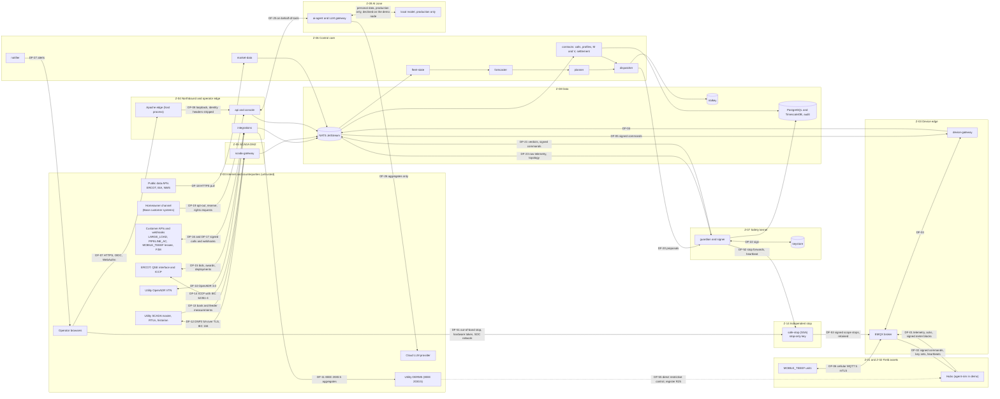

### 6.5 Data-flow diagram — management, supply chain and audit anchoring

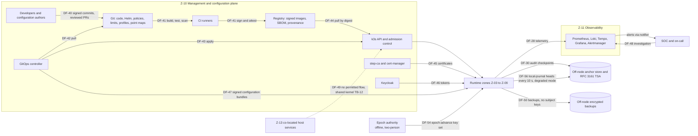

---

## 7. STRIDE per component

Entries are threat IDs from §9. A dash means no material threat of that class was identified beyond platform-wide ones.

| Component | Spoofing | Tampering | Repudiation | Information disclosure | Denial of service | Elevation of privilege |
|---|---|---|---|---|---|---|
| Hub / `agent-sim` (as a device) | TH-027, TH-028, TH-040, TH-173 | TH-019, TH-020, TH-022, TH-023, TH-036, TH-039, TH-041, TH-115, TH-174 | TH-041, TH-114 | TH-037 | TH-034, TH-114, TH-181 | TH-038, TH-039, TH-167, TH-173 |
| EMQX broker | TH-029, TH-040 | TH-030, TH-035, TH-174 | TH-026 | TH-029, TH-030 | TH-031, TH-032, TH-033, TH-034 | TH-029, TH-030 |
| `device-gateway` | TH-021 | TH-033, TH-089 | TH-026 | TH-030 | TH-031, TH-033 | TH-033 |
| `fleet-state` | TH-042, TH-045 | TH-013, TH-041, TH-042, TH-044, TH-176, TH-181 | TH-041 | TH-103, TH-104, TH-107 | TH-086 | — |
| `forecaster` | — | TH-048 | — | TH-106 | — | — |
| `planner` | — | TH-002, TH-011, TH-108 | TH-109 | TH-106 | TH-086 | — |
| `dispatcher` | TH-001 | TH-001, TH-002, TH-006, TH-007, TH-008, TH-009, TH-010, TH-012, TH-015, TH-059, TH-111, TH-161, TH-175 | TH-026, TH-183 | — | TH-005, TH-182 | TH-001, TH-018 |
| `guardian` (incl. signer, kill-switch state) | TH-003, TH-016 | TH-004, TH-018, TH-148, TH-165, TH-171, TH-176, TH-185, TH-188, TH-189 | TH-026, TH-068 | TH-016 | TH-005, TH-025, TH-118, TH-158, TH-163, TH-172 | TH-003, TH-016, TH-017, TH-168 |
| `safe-stop` (Safe-Stop Authority, register R16) | TH-162 | TH-165, TH-167 | TH-162 | — | TH-162, TH-164, TH-166, TH-170 | TH-167 |
| Epoch authority (offline, two-person, register R16) | TH-169 | — | — | — | TH-169 | — |
| `contracts` (calls, profiles, M&V, settlement) | TH-064 | TH-046, TH-057, TH-146, TH-147, TH-149, TH-154, TH-184 | TH-026, TH-155, TH-184 | TH-102, TH-152, TH-156 | TH-065 | TH-150 |
| `integrations` | TH-049, TH-050, TH-052, TH-054, TH-056, TH-058, TH-063 | TH-047, TH-051, TH-180, TH-188 | TH-026 | TH-105, TH-151 | TH-055, TH-158, TH-159 | TH-066 |
| `scada-gateway` | TH-121, TH-125, TH-129, TH-130, TH-179, TH-187 | TH-043, TH-044, TH-122, TH-124, TH-126, TH-127, TH-131, TH-132, TH-161, TH-179 | TH-131 | TH-129 | TH-123, TH-124, TH-128 | TH-128, TH-133 |
| `market-data` | TH-112 | TH-011, TH-112 | — | TH-053 | TH-113 | — |
| `api` | TH-093, TH-160 | TH-069, TH-076 | TH-119 | TH-066, TH-074, TH-078 | TH-159 | TH-014, TH-066, TH-070, TH-075, TH-110 |
| `console` | TH-067 | TH-073, TH-076, TH-101 | — | TH-092 | — | TH-073 |
| `notifier` | TH-116 | TH-116 | — | TH-092 | TH-116 | — |
| `ai-agent` | TH-145 | TH-134, TH-135, TH-138, TH-139, TH-141, TH-142 | TH-144 | TH-137, TH-143, TH-151 | TH-140 | TH-136, TH-145 |
| `agent-sim`, `grid-sim` (as software) | — | TH-117 | — | — | — | TH-117 |
| Keycloak | TH-067, TH-160 | TH-072 | TH-119 | — | TH-159 | TH-071, TH-072 |
| OPA and signed configuration bundles (policies, limits, profiles, point maps) | — | TH-004, TH-127, TH-146, TH-147, TH-185 | TH-120 | — | — | TH-004, TH-147 |
| step-ca, cert-manager | TH-024, TH-028, TH-088 | TH-088 | — | — | — | TH-088 |
| NATS JetStream | TH-003, TH-089 | TH-089 | — | — | TH-086 | TH-003 |
| PostgreSQL/TimescaleDB (incl. audit) and the degraded-mode local journal | — | TH-046, TH-153, TH-154, TH-157, TH-178 | TH-153, TH-178 | TH-091, TH-102, TH-177 | TH-084 | TH-083 |
| Valkey (Redis-compatible) | — | TH-090 | — | — | TH-090 | — |
| Observability stack | — | TH-077 | TH-119 | TH-092 | TH-170 | — |
| Git, CI/CD, registry, GitOps | TH-096 | TH-095, TH-096, TH-097, TH-100, TH-120 | — | TH-085 | — | TH-096, TH-099 |
| k3s node / host (demo) | TH-087 | TH-087, TH-120 | — | TH-080, TH-085, TH-094, TH-186 | TH-086 | TH-079, TH-081, TH-082, TH-083, TH-098, TH-186 |
| `MOBILE_TEEEF` unit | TH-062 | TH-061 | — | TH-061 | — | TH-060, TH-062 |

## 8. STRIDE per data flow

| DF | From → to | Protocol and authentication | Data | Boundary | S | T | R | I | D | E |
|---|---|---|---|---|---|---|---|---|---|---|
| DF-01 | Hub → EMQX | MQTT 5, mutual TLS, per-hub X.509 | Telemetry, acks, device-signed 1-min meter blocks (personal data) | TB-02 | TH-027, TH-028 | TH-033, TH-041, TH-042 | TH-041 | TH-029 | TH-031, TH-032, TH-034 | TH-029 |
| DF-02 | EMQX → hub | Same; JWS ES256 commands | Commands, key sets, lease heartbeats, retained scope stops | TB-02 | TH-003, TH-016, TH-162 | TH-019, TH-020, TH-021, TH-022, TH-035, TH-161, TH-174 | TH-026 | TH-029 | TH-031, TH-118 | TH-022, TH-167 |
| DF-03 | EMQX ↔ `device-gateway` | Internal listener, mTLS service certificate | As DF-01/02 | inside Z-03 | TH-021 | TH-030 | — | TH-030 | TH-031 | TH-030 |
| DF-04/05 | `device-gateway` ↔ NATS | NATS over mTLS, account-scoped subjects | Telemetry in; signed commands out | TB-08 | TH-089 | TH-089 | TH-026 | — | TH-031 | TH-003 |
| DF-06 | `MOBILE_TEEEF` ↔ EMQX | Cellular private APN, MQTT 5, mTLS | Telemetry incl. GPS and interlock state; commands (never energize) | TB-02, TB-13 | TH-062 | TH-060, TH-061 | — | TH-061 | TH-032 | TH-060, TH-062 |
| DF-07 | Operator → Apache | HTTPS; OIDC authorization code with PKCE; WebAuthn | Console and API calls | TB-01 | TH-067, TH-160 | TH-073 | TH-026 | TH-074 | TH-159 | TH-075 |
| DF-08 | Apache → `api` | Loopback NodePort; identity headers stripped at the edge | Same | TB-03 | TH-093 | TH-093 | — | — | TH-159 | TH-079 |
| DF-09 | `api` ↔ `console` WebSocket | WSS through the edge; session-bound | Live state | TB-01 | TH-074 | TH-073 | — | TH-074 | TH-159 | TH-074 |
| DF-10 | Utility VTN ↔ `integrations` | OpenADR 3.0 REST; OAuth 2.0 client credentials; TLS server authentication; subscription callbacks | `PARTNER_CAPACITY` events | TB-04 | TH-049, TH-050 | TH-051 | TH-026 | — | TH-055 | — |
| DF-11 | `integrations` → utility DERMS | IEEE 2030.5; TLS 1.2 `TLS_ECDHE_ECDSA_WITH_AES_128_CCM_8`, P-256 certificates | Per-bank aggregates, declarations | TB-04 | — | TH-047 | TH-026 | TH-105, TH-151 | TH-055 | — |
| DF-12 | Utility SCADA master ↔ `scada-gateway` (outstation) | DNP3 Secure Authentication v5/v6 over TLS, or IEC 60870-5-104 over TLS | Per-bank points up; overrides, setpoints, curtailment, emergency stop down | TB-05 | TH-121, TH-125 | TH-122, TH-124, TH-126, TH-127, TH-161 | TH-131 | — | TH-123 | TH-128 |
| DF-13 | Utility RTU / historian / OPC UA → `scada-gateway` (master/client) | DNP3 reads; OPC UA SignAndEncrypt | Bank and feeder measurements | TB-05 | TH-043, TH-130 | TH-043, TH-044 | — | TH-104 | TH-123 | TH-128 |
| DF-14 | `scada-gateway` ↔ ERCOT | ICCP/TASE.2 with IEC 62351-4 over TLS; bilateral tables | QSE telemetry (ADER 2-s) | TB-05 | TH-129 | TH-129, TH-131 | TH-131 | TH-129 | TH-055 | TH-128 |
| DF-15 | `integrations` ↔ ERCOT QSE interface (simulated) | HTTPS with client certificates (ERCOT digital-certificate model) | Bids, offers, awards, deployment instructions | TB-04 | TH-052, TH-053 | TH-052, TH-108 | TH-109 | TH-106 | — | TH-053 |
| DF-16 | Customers → `integrations` | HTTPS; mTLS or `private_key_jwt` with certificate-bound tokens; JWS or HTTP Message Signatures | Calls: `LARGE_LOAD`, `PIPELINE_AC`, `MOBILE_TEEEF`, `PJM_CAPACITY` | TB-04 | TH-056, TH-058, TH-063 | TH-051, TH-057 | TH-026 | TH-066 | TH-159 | TH-066 |
| DF-17 | `integrations`/`contracts` → customers | Signed webhooks and statements | Acknowledgements, clip reasons, delivery reports, invoices | TB-04 | — | TH-154 | TH-026 | TH-105, TH-151 | TH-055 | — |
| DF-18 | Public data APIs → `market-data` | HTTPS; ERCOT password grant and subscription key; API keys | Prices, load, weather | TB-09 | TH-112 | TH-011, TH-112 | — | TH-053 | TH-113 | — |
| DF-19 | Homeowner channel → `api` | HTTPS with mTLS; signed requests | Opt-out, reserve change, consent, data-subject requests | TB-04 | TH-064 | TH-064 | TH-026 | TH-102 | TH-065 | — |
| DF-20 | `dispatcher` → `guardian` | NATS request/reply, mTLS | Proposals with shard, epoch, submission id, profile version and fleet-state snapshot ID | TB-06 | TH-001 | TH-002, TH-018, TH-148, TH-175 | TH-026, TH-183 | — | TH-005, TH-172, TH-182 | TH-003 |
| DF-21 | `guardian` → NATS → `device-gateway` | Subject permissions (only the signer may publish) | Verdicts, signed commands | TB-06 | TH-003 | TH-161 | TH-026 | — | TH-025 | TH-003 |
| DF-22 | Guardian-signer ↔ keystore | PKCS 11 (demo) / KMS or HSM API (production) | Signing operations | TB-07 | TH-016 | TH-017 | TH-026 | TH-016 | TH-025 | TH-016 |
| DF-23 | NATS → `guardian` | Independent subscription (not via `dispatcher`) | Raw telemetry, topology, SCADA measurements | TB-08 | TH-045 | TH-013, TH-042 | — | — | TH-086 | — |
| DF-24 | Services → data tier | PostgreSQL mTLS with per-service roles; Valkey ACL; NATS | State, traces, audit, billing | TB-08 | — | TH-046, TH-090, TH-153, TH-154 | TH-153 | TH-102 | TH-084 | TH-083 |
| DF-25 | `ai-agent` ↔ `api` | Token exchange on behalf of a user; read and propose only | Tool calls and results | TB-11 | TH-145 | TH-134, TH-135 | TH-144 | TH-137 | TH-140 | TH-136 |
| DF-26 | `ai-agent` → LLM provider | HTTPS via egress proxy; workload identity | Aggregated, non-personal prompts only | TB-09, TB-11 | — | TH-139 | TH-144 | TH-137, TH-143, TH-151 | TH-140 | — |
| DF-27 | `notifier` → on-call | Email, chat, pager | Alerts | TB-01 | TH-116 | TH-116 | — | TH-092 | TH-116 | — |
| DF-28 | Services → observability | OTLP and Prometheus scrape over mTLS | Metrics, logs, traces | TB-08 | — | TH-077 | TH-119 | TH-092 | — | — |
| DF-30 | Audit → anchor store and TSA | HTTPS, one-way | Checkpoints | TB-09 | — | TH-153, TH-157 | TH-153 | — | — | — |
| DF-40–44 | Developers → Git → CI → registry → k3s | Signed commits; CI workload identity to the registry; GitOps pull; digest-pinned pulls | Code, images, manifests | TB-10 | TH-096 | TH-095, TH-096, TH-097, TH-100, TH-120 | — | TH-085 | — | TH-096, TH-099 |
| DF-45 | PKI issuance | ACME `device-attest-01` / X5C for hubs; cert-manager for services | Certificates | TB-10 | TH-028, TH-088 | TH-088 | — | — | — | TH-088 |
| DF-46 | Keycloak ↔ `api` | OIDC; token exchange | Tokens | TB-10 | TH-067, TH-160 | TH-072 | TH-119 | — | TH-159 | TH-071, TH-072 |
| DF-47 | Signed configuration bundles → services | GitOps delivery, bundle signature verification | Policies, limits, dispatch profiles, point maps | TB-15 | — | TH-004, TH-127, TH-146, TH-147 | TH-120 | — | — | TH-147 |
| DF-49 | Co-located host ↔ k3s | None permitted (shared kernel) | — | TB-12 | TH-087 | TH-120 | — | TH-080, TH-085 | TH-086 | TH-079, TH-081, TH-082 |
| DF-50 | Backups → off-node storage | Encrypted archive; subject keys never included | All data classes (personal fields as ciphertext) | TB-09 | — | TH-084 | — | TH-091, TH-177 | TH-084 | — |
| DF-51 | SOC workstation → `safe-stop` out-of-band endpoint | mTLS with a personal hardware-token certificate | Scoped stop, reason, co-sign | TB-16 | TH-162 | — | TH-162 | — | TH-164 | — |
| DF-52 | `guardian` ↔ `safe-stop` | mTLS, workload identities | Stop forwards with approval evidence; heartbeat; release notices | TB-16 | TH-168 | TH-165 | — | — | TH-164 | — |
| DF-53 | `safe-stop` → EMQX → hubs | Own broker identity; JWS ES256 under the safe-stop root | Retained scope stops only | TB-02, TB-16 | TH-162 | TH-165, TH-167 | TH-162 | — | TH-164 | TH-167 |
| DF-54 | Epoch-authority publisher → EMQX → hubs | Dedicated broker identity; offline two-person signature | Epoch-advance key set | TB-10 | TH-169 | — | — | — | TH-169 | — |
| DF-55 | Counterparty → hub, direct stop path (register R25) | CSIP or permit-service function; counterparty certificate pinned at enrolment | Restrictive controls only | TB-17 | TH-173 | TH-173 | — | — | — | TH-173 |
| DF-56 | Producers' local journals → off-node anchor | HTTPS, one-way | Journal heads every 10 s in degraded mode | TB-09 | — | TH-178 | TH-178 | — | — | — |

---

## 9. Threat catalogue

Columns: **L** likelihood, **I** impact, **Risk** = L × I with band, **Controls** (defined in the companion, §21), **Residual**
= residual L × residual I with band. Actors refer to §5. STRIDE letters: S spoofing, T tampering, R repudiation, I information
disclosure, D denial of service, E elevation of privilege.

### 9.A Dispatch safety and grid impact

| ID | Threat | STRIDE | Target | Actors | L | I | Risk | Controls | Residual |
|---|---|---|---|---|---|---|---|---|---|
| TH-001 | Compromised `dispatcher` or `planner` issues malicious mass dispatch (fleet-wide synchronized charge or discharge) | T, E | `dispatcher` → `guardian` (DF-20) | ADV-01, ADV-02 | 3 | 5 | 15 High | CTL-010, CTL-011, CTL-029, CTL-030, CTL-031, CTL-032, CTL-039, CTL-042, CTL-045 | 1×5 = 5 Medium |
| TH-002 | Erroneous mass dispatch from a defect or bad optimizer output (charge/discharge sign error, kW/MW unit error, time-zone error aligning every hub to one instant) | T | `planner`, `dispatcher` | ADV-13 | 4 | 5 | 20 Critical | CTL-029, CTL-030, CTL-031, CTL-032, CTL-035, CTL-039, CTL-048, CTL-083, CTL-086 | 2×3 = 6 Medium |
| TH-003 | Guardian bypass: commands injected directly on NATS command subjects or broker command topics | S, E | NATS, EMQX | ADV-01, ADV-02, ADV-03 | 3 | 5 | 15 High | CTL-008, CTL-011, CTL-029, CTL-042, CTL-044, CTL-047 | 1×5 = 5 Medium |
| TH-004 | Guardian limits or OPA policy tampered (a ramp, hosting or reserve check loosened or disabled) | T | Guardian configuration, policy bundles | ADV-03, ADV-16, ADV-01 | 3 | 5 | 15 High | CTL-022, CTL-024, CTL-025, CTL-073, CTL-089, CTL-132 | 1×5 = 5 Medium |
| TH-005 | `guardian` crashes or is overloaded, and the design fails open (unsupervised dispatch) or control is lost — including, before v0.2, the ability to stop | D | `guardian` | ADV-02, ADV-13 | 3 | 4 | 12 High | CTL-029, CTL-037, CTL-038, CTL-080, CTL-147, CTL-148 | 2×3 = 6 Medium |
| TH-006 | Synchronized swing from alignment of legitimate schedules (interval boundaries, SCED :00, simultaneous event starts) | T | `dispatcher` | ADV-13, ADV-06 | 4 | 4 | 16 High | CTL-030, CTL-031, CTL-040 | 2×2 = 4 Low |
| TH-007 | Rebound (cold-load pickup) after an event ends or a kill switch is released overloads banks | T | `dispatcher`, `guardian` | ADV-13, ADV-03 | 4 | 4 | 16 High | CTL-031, CTL-033, CTL-037, CTL-146 | 2×2 = 4 Low |
| TH-008 | Clustered hubs overload a 25–50 kVA service transformer (charging at 11 kW each; reviewer E4) | T | `dispatcher` | ADV-13 | 4 | 3 | 12 High | CTL-032, CTL-103 | 2×2 = 4 Low |
| TH-009 | Export beyond feeder or bank hosting capacity (reverse flow, voltage rise, protection misoperation) | T | `dispatcher` | ADV-13, ADV-08 | 3 | 4 | 12 High | CTL-032, CTL-034, CTL-103 | 2×2 = 4 Low |
| TH-010 | Dispatch that worsens a frequency disturbance (charging during under-frequency) | T | `dispatcher` | ADV-13, ADV-01 | 3 | 4 | 12 High | CTL-034, CTL-040 | 1×3 = 3 Low |
| TH-011 | Energy-depletion attack: a fake price spike drains stored energy before a firm window | D | `planner`, `market-data` | ADV-06, ADV-01 | 3 | 4 | 12 High | CTL-027, CTL-035, CTL-055 | 2×2 = 4 Low |
| TH-012 | Homeowner reserve breached by dispatch (defect or attack), leaving homes without backup | T | `dispatcher`, `guardian`, hub | ADV-13, ADV-03 | 3 | 4 | 12 High | CTL-035, CTL-036, CTL-044 | 1×3 = 3 Low |
| TH-013 | Stale topology after utility switching sends load or export to the wrong bank | T | `fleet-state`, `contracts` | ADV-08, ADV-13 | 4 | 3 | 12 High | CTL-032, CTL-051, CTL-103 | 2×2 = 4 Low |
| TH-014 | Blast-radius amplification: one request or console action changes the mode of the whole fleet | E, T | `api`, `console`, `integrations` | ADV-03, ADV-01 | 3 | 5 | 15 High | CTL-020, CTL-022, CTL-039, CTL-146 | 1×4 = 4 Low |
| TH-015 | Induced hunting: a measurement toggled around a threshold creates periodic swings | T | `dispatcher` control loop | ADV-01 | 2 | 4 | 8 Medium | CTL-030, CTL-040, CTL-050, CTL-051 | 1×3 = 3 Low |

### 9.B Command integrity and ordering

| ID | Threat | STRIDE | Target | Actors | L | I | Risk | Controls | Residual |
|---|---|---|---|---|---|---|---|---|---|
| TH-016 | Theft of a command-signing key (24-h rotation, register V-10) from the node (signer memory, SoftHSM token) | S, E | Guardian-signer | ADV-01, ADV-02, ADV-10 | 3 | 5 | 15 High | CTL-029, CTL-036, CTL-044, CTL-045, CTL-046, CTL-077, CTL-079, CTL-152 | 2×4 = 8 Medium |
| TH-017 | Dispatch intermediate or root CA key compromised, enabling durable forgery | S, E | PKI | ADV-01 | 2 | 5 | 10 High | CTL-045, CTL-046, CTL-093, CTL-152 | 1×5 = 5 Medium |
| TH-018 | Signing-oracle abuse: a compromised `dispatcher` drives `guardian` to sign maximum-envelope batches repeatedly | T, E | `guardian` API | ADV-01, ADV-02 | 3 | 4 | 12 High | CTL-029, CTL-030, CTL-031, CTL-032, CTL-039, CTL-056 | 2×3 = 6 Medium |
| TH-019 | Command replay (same hub later, or other hubs) | S, T | MQTT path | ADV-01, ADV-04 | 3 | 4 | 12 High | CTL-008, CTL-043, CTL-044, CTL-145 | 1×2 = 2 Low |
| TH-020 | Command reordering or delay (older command applied after a newer one) | T | Broker, network | ADV-01, ADV-10 | 3 | 3 | 9 Medium | CTL-043, CTL-044, CTL-145 | 1×2 = 2 Low |
| TH-021 | Cross-hub redirection (a command for hub A executed by hub B) | S, T | `device-gateway`, broker | ADV-13, ADV-01 | 2 | 3 | 6 Medium | CTL-008, CTL-043, CTL-044 | 1×1 = 1 Low |
| TH-022 | Algorithm confusion or downgrade (`alg: none`, HMAC keyed with the public key, injected `kid` or `x5c`) | S | Hub verifier | ADV-01 | 3 | 4 | 12 High | CTL-042, CTL-044, CTL-086 | 1×2 = 2 Low |
| TH-023 | Hub clock manipulation (NTP spoofing) revives expired commands or rejects valid ones | T | Hub | ADV-04, ADV-01 | 3 | 3 | 9 Medium | CTL-043, CTL-044, CTL-058 | 1×2 = 2 Low |
| TH-024 | Environment confusion: a demo or test key or CA (dispatch, safe-stop or device root) is trusted by production hubs | S, E | PKI, configuration | ADV-13, ADV-03 | 3 | 5 | 15 High | CTL-042, CTL-093, CTL-100 | 1×4 = 4 Low |
| TH-025 | Loss of signing capability (HSM/KMS outage, expired keys) denies dispatch and breaches firm contracts | D | Guardian-signer | ADV-13, ADV-02 | 3 | 4 | 12 High | CTL-038, CTL-045, CTL-046, CTL-095 | 2×3 = 6 Medium |
| TH-026 | Repudiation of a command, approval or customer call | R | Audit | ADV-03, ADV-08 | 3 | 3 | 9 Medium | CTL-022, CTL-026, CTL-047, CTL-073, CTL-138 | 1×2 = 2 Low |

### 9.C Devices and broker

| ID | Threat | STRIDE | Target | Actors | L | I | Risk | Controls | Residual |
|---|---|---|---|---|---|---|---|---|---|
| TH-027 | Hub identity cloned (key extracted from a software keystore) | S | Hub, broker | ADV-04, ADV-05 | 4 | 3 | 12 High | CTL-002, CTL-004, CTL-005, CTL-007, CTL-052, CTL-054 | 2×2 = 4 Low |
| TH-028 | Rogue enrolment of fake hubs | S | step-ca, enrolment | ADV-02, ADV-05 | 3 | 3 | 9 Medium | CTL-003, CTL-009, CTL-051 | 1×2 = 2 Low |
| TH-029 | Topic ACL bypass or IDOR (publish as another hub, read others' commands — the SUN:DOWN pattern) | S, I, E | EMQX | ADV-04 | 4 | 4 | 16 High | CTL-007, CTL-008, CTL-054, CTL-086 | 1×2 = 2 Low |
| TH-030 | Broker compromised, enabling interception or tampering of device traffic | T, I, E | EMQX | ADV-01, ADV-02 | 2 | 5 | 10 High | CTL-042, CTL-044, CTL-049, CTL-076, CTL-077, CTL-085 | 1×3 = 3 Low |
| TH-031 | Reconnect storm after a broker or network outage | D | EMQX, `device-gateway` | ADV-13, ADV-09 | 4 | 4 | 16 High | CTL-060, CTL-061, CTL-062, CTL-080 | 2×2 = 4 Low |
| TH-032 | Connection or TLS-handshake flood on the MQTT listener | D | EMQX edge | ADV-09, ADV-11 | 4 | 4 | 16 High | CTL-060, CTL-061, CTL-064, CTL-079 | 3×3 = 9 Medium |
| TH-033 | Malformed or oversized MQTT or JSON payloads (parser exploit, memory exhaustion) | T, D, E | `device-gateway` | ADV-04 | 3 | 3 | 9 Medium | CTL-060, CTL-086, CTL-106 | 1×2 = 2 Low |
| TH-034 | Telemetry flood from one compromised hub | D | Broker, `fleet-state` | ADV-04 | 4 | 2 | 8 Medium | CTL-052, CTL-060 | 2×1 = 2 Low |
| TH-035 | Retained-message or Last-Will abuse plants stale or fake state | T | EMQX | ADV-04 | 3 | 3 | 9 Medium | CTL-008, CTL-044 | 1×2 = 2 Low |
| TH-036 | Malicious or compromised hub firmware ignores commands or reports false state | T, S | Hub | ADV-07 | 2 | 5 | 10 High | CTL-048, CTL-051, CTL-052, CTL-090, CTL-091 | 2×4 = 8 Medium |
| TH-037 | Undocumented radios or channels in hub hardware bypass the Orchestrator | S, E | Hub | ADV-07, ADV-01 | 2 | 5 | 10 High | CTL-048, CTL-051, CTL-090 | 2×4 = 8 Medium |
| TH-038 | A vendor cloud or OEM path commands hubs independently of the Orchestrator (a Deye-style mass disable) | E, D | Hub vendor cloud | ADV-07 | 3 | 5 | 15 High | CTL-051, CTL-052, CTL-090, CTL-091 | 2×4 = 8 Medium |
| TH-039 | Hub local interface abused on the home network (reserve or limits changed) | T, E | Hub local API | ADV-05 | 3 | 3 | 9 Medium | CTL-044, CTL-052, CTL-090 | 2×2 = 4 Low |
| TH-040 | Session-takeover denial of service using a cloned certificate | D, S | EMQX | ADV-04 | 3 | 2 | 6 Medium | CTL-006, CTL-007, CTL-054 | 1×2 = 2 Low |

### 9.D Telemetry and measurement integrity

| ID | Threat | STRIDE | Target | Actors | L | I | Risk | Controls | Residual |
|---|---|---|---|---|---|---|---|---|---|
| TH-041 | False data injection by a hub (over-reporting delivery, hiding non-performance) | T, R | `fleet-state`, `contracts` | ADV-05, ADV-04 | 4 | 3 | 12 High | CTL-049, CTL-050, CTL-051, CTL-052 | 2×2 = 4 Low |
| TH-042 | Coordinated false data from many hubs to hide or fake an overload | T | `fleet-state`, `dispatcher` | ADV-01 | 2 | 5 | 10 High | CTL-034, CTL-050, CTL-051, CTL-052 | 1×4 = 4 Low |
| TH-043 | Spoofed bank SCADA measurement to trigger or mask an overload | S, T | `scada-gateway` | ADV-01, ADV-08 | 3 | 4 | 12 High | CTL-050, CTL-051, CTL-110, CTL-111 | 1×3 = 3 Low |
| TH-044 | Frozen or stale SCADA value flagged "good" masks an overload | T | `scada-gateway` | ADV-08, ADV-13 | 4 | 3 | 12 High | CTL-050, CTL-051 | 2×2 = 4 Low |
| TH-045 | Falsified frequency or voltage reports trigger or suppress holds — including a common-mode source (a vendor firmware line or a large compromised cohort) that moves the fleet median and suppresses a hold during a real excursion (RT-005; re-rated in v0.2) | T | `guardian` inputs | ADV-04, ADV-01, ADV-07 | 2 | 5 | 10 High | CTL-034, CTL-052, CTL-151 | 1×3 = 3 Low |
| TH-046 | M&V data tampered in the database to inflate settlement | T, R | `contracts`, PostgreSQL | ADV-03, ADV-02 | 3 | 4 | 12 High | CTL-012, CTL-049, CTL-073, CTL-074, CTL-142 | 1×3 = 3 Low |
| TH-047 | IEEE 2030.5 telemetry sent to the utility DERMS tampered | T | `integrations` | ADV-01, ADV-03 | 2 | 4 | 8 Medium | CTL-019, CTL-051, CTL-066, CTL-073 | 1×3 = 3 Low |
| TH-048 | Historical data poisoned to bias forecasts and plans | T | `forecaster`, TimescaleDB | ADV-01, ADV-06 | 2 | 3 | 6 Medium | CTL-012, CTL-050, CTL-055 | 1×2 = 2 Low |

### 9.E Northbound interfaces and customer types

| ID | Threat | STRIDE | Target | Actors | L | I | Risk | Controls | Residual |
|---|---|---|---|---|---|---|---|---|---|
| TH-049 | Spoofed `PARTNER_CAPACITY` OpenADR event (fake VTN or forged callback) | S | `integrations` (VEN) | ADV-01, ADV-09 | 3 | 4 | 12 High | CTL-019, CTL-026, CTL-027, CTL-030, CTL-053 | 1×3 = 3 Low |
| TH-050 | Compromised utility VTN issues authenticated, in-contract but harmful events | S, T | VTN | ADV-01 | 2 | 4 | 8 Medium | CTL-027, CTL-030, CTL-031, CTL-032, CTL-033, CTL-034, CTL-053 | 2×3 = 6 Medium |
| TH-051 | Misconfigured customer system sends erroneous calls (10× magnitude, wrong time zone, duplicate storms, old versions) | T, D | `integrations` | ADV-08 | 4 | 3 | 12 High | CTL-023, CTL-026, CTL-027, CTL-059, CTL-145 | 2×1 = 2 Low |
| TH-052 | Spoofed ERCOT award or deployment instruction on the QSE interface | S | `integrations` (QSE) | ADV-01, ADV-06 | 2 | 4 | 8 Medium | CTL-019, CTL-027, CTL-104 | 1×3 = 3 Low |
| TH-053 | Theft or misuse of ERCOT credentials (API password grant and subscription key today; QSE digital certificates later) | S, I | `market-data`, `integrations` | ADV-02, ADV-06 | 3 | 3 | 9 Medium | CTL-092, CTL-094, CTL-104 | 1×3 = 3 Low |
| TH-054 | Spoofed utility override stops firm delivery at peak or forces dispatch | S, E | `integrations`, `scada-gateway` | ADV-01 | 2 | 4 | 8 Medium | CTL-019, CTL-026, CTL-028, CTL-053, CTL-110 | 1×4 = 4 Low |
| TH-055 | Denial of the utility telemetry feed (DERMS blind; SLA breach) | D | `integrations`, `scada-gateway` | ADV-09, ADV-13 | 3 | 3 | 9 Medium | CTL-062, CTL-063, CTL-080 | 2×2 = 4 Low |
| TH-056 | Spoofed `LARGE_LOAD` stress-event webhook triggers zone-wide discharge | S | `integrations` (webhooks) | ADV-09, ADV-06 | 3 | 4 | 12 High | CTL-019, CTL-026, CTL-027, CTL-040, CTL-053 | 1×3 = 3 Low |
| TH-057 | Legitimate `LARGE_LOAD` calls collide with firm and `ERCOT_AS` obligations and exceed physical or energy limits | T | `contracts`, `dispatcher` | ADV-08 | 3 | 3 | 9 Medium | CTL-032, CTL-035, CTL-040, CTL-144 | 2×2 = 4 Low |
| TH-058 | Spoofed `PIPELINE_AC` operator request or corridor alert | S, T | `integrations` | ADV-01, ADV-08 | 2 | 3 | 6 Medium | CTL-019, CTL-026, CTL-027, CTL-051 | 1×2 = 2 Low |
| TH-059 | `PIPELINE_AC` closed-loop smoothing causes oscillation or flicker across hubs | T | `dispatcher` | ADV-13 | 3 | 3 | 9 Medium | CTL-030, CTL-031, CTL-040, CTL-132 | 1×2 = 2 Low |
| TH-060 | A `MOBILE_TEEEF` unit is remotely energized onto a circuit while crews work (Base never initiates energization; the lessee closes under a switching order, register R20) | T, E | TEEEF controller | ADV-01, ADV-13, ADV-03 | 2 | 5 | 10 High | CTL-022, CTL-041, CTL-099, CTL-146 | 1×5 = 5 Medium |
| TH-061 | `MOBILE_TEEEF` theft, relocation or physical tampering | T, I | Field unit | ADV-14 | 3 | 3 | 9 Medium | CTL-005, CTL-054, CTL-099 | 2×2 = 4 Low |
| TH-062 | `MOBILE_TEEEF` cellular modem exposed (inbound services, default credentials) | S, E | Field unit | ADV-09 | 3 | 4 | 12 High | CTL-001, CTL-090, CTL-099 | 1×3 = 3 Low |
| TH-063 | `PJM_CAPACITY` adapter credentials misused or a coincident-peak signal spoofed (future adapter) | S | `integrations` | ADV-06, ADV-09 | 2 | 3 | 6 Medium | CTL-019, CTL-027, CTL-094 | 1×2 = 2 Low |
| TH-064 | Spoofed homeowner opt-out or reserve-lowering request | S | `contracts`, homeowner channel | ADV-02, ADV-05 | 3 | 3 | 9 Medium | CTL-036, CTL-053, CTL-101 | 1×2 = 2 Low |
| TH-065 | Organized opt-out/opt-in toggling destabilizes plans | D | `contracts`, `planner` | ADV-11, ADV-05 | 2 | 3 | 6 Medium | CTL-023, CTL-035, CTL-053 | 2×2 = 4 Low |
| TH-066 | Broken object-level authorization: one counterparty reads or alters another's calls or data | I, E | `api`, `integrations` | ADV-08, ADV-09 | 4 | 3 | 12 High | CTL-020, CTL-086, CTL-106 | 1×2 = 2 Low |

### 9.F People, console and API

| ID | Threat | STRIDE | Target | Actors | L | I | Risk | Controls | Residual |
|---|---|---|---|---|---|---|---|---|---|
| TH-067 | An operator is phished or a session stolen, and the attacker operates the console (the 2015 Ukraine pattern) | S, E | `console`, Keycloak | ADV-01, ADV-02 | 4 | 5 | 20 Critical | CTL-014, CTL-015, CTL-016, CTL-022, CTL-039, CTL-056, CTL-146 | 2×3 = 6 Medium |
| TH-068 | Insider misuses a stop: one qualified person may engage a stop at bank, zone **or fleet** scope (register R3 amended), through the console or the Safe-Stop Authority's out-of-band path, at peak — breaking firm delivery or triggering a protective fleet ramp (re-rated in v0.2) | T, D | `guardian`, `safe-stop`, `console` | ADV-03 | 3 | 5 | 15 High | CTL-037, CTL-056, CTL-073, CTL-098, CTL-146, CTL-147 | 2×4 = 8 Medium (RR-19) |
| TH-069 | Insider manual dispatch outside plan (for example to benefit a trading position) | T, E | `console`, `api` | ADV-03, ADV-06 | 3 | 4 | 12 High | CTL-022, CTL-023, CTL-025, CTL-057, CTL-073, CTL-146 | 2×2 = 4 Low |
| TH-070 | Two approvers collude to defeat the second-approver rule | E | Approvals | ADV-03 | 2 | 4 | 8 Medium | CTL-030, CTL-032, CTL-057, CTL-073, CTL-098 | 1×4 = 4 Low |
| TH-071 | Break-glass misuse | E | Keycloak, k3s | ADV-03 | 2 | 5 | 10 High | CTL-018, CTL-056, CTL-073 | 1×4 = 4 Low |
| TH-072 | Privilege escalation through Keycloak or admin misconfiguration | E | Keycloak | ADV-03, ADV-01 | 3 | 4 | 12 High | CTL-017, CTL-025, CTL-056, CTL-073 | 1×4 = 4 Low |
| TH-073 | Console XSS, CSRF or clickjacking drives unauthorized actions | T, E | `console` | ADV-09, ADV-01 | 3 | 4 | 12 High | CTL-014, CTL-016, CTL-022, CTL-086, CTL-105 | 1×2 = 2 Low |
| TH-074 | WebSocket abuse (unauthenticated subscription; stale authorization after revocation) | I, E | `api` WebSocket | ADV-03, ADV-09 | 3 | 3 | 9 Medium | CTL-016, CTL-020 | 1×2 = 2 Low |
| TH-075 | Broken function-level authorization (a viewer reaches dispatch endpoints) | E | `api` | ADV-03, ADV-09 | 3 | 5 | 15 High | CTL-020, CTL-021, CTL-086, CTL-106 | 1×3 = 3 Low |
| TH-076 | Approval spoofing: what the approver sees is not what executes | T | `console`, `api` | ADV-03, ADV-01 | 2 | 4 | 8 Medium | CTL-022, CTL-073 | 1×2 = 2 Low |
| TH-077 | Alarm suppression or monitoring tampering by an insider | T, R | Observability | ADV-03, ADV-01 | 3 | 4 | 12 High | CTL-024, CTL-025, CTL-056, CTL-073 | 1×3 = 3 Low |
| TH-078 | Bulk export of personal or meter data by an insider | I | `api`, database | ADV-03 | 3 | 4 | 12 High | CTL-069, CTL-070, CTL-073, CTL-134 | 2×2 = 4 Low |

### 9.G Platform and the single node

| ID | Threat | STRIDE | Target | Actors | L | I | Risk | Controls | Residual |
|---|---|---|---|---|---|---|---|---|---|
| TH-079 | Lateral movement from a co-located host service (Apache/PHP, Roundcube, mail stack, `fdmp`) into k3s through the shared kernel | E, T, I | Node | ADV-10 | 3 | 5 | 15 High | CTL-045, CTL-067, CTL-078, CTL-079, CTL-093, CTL-100 | 2×5 = 10 High (demo only; RR-01) |
| TH-080 | Prototype credentials reused (`config.ini`, readable by the web tier, holds ERCOT and database credentials) | I, E | Node | ADV-10, ADV-09 | 4 | 3 | 12 High | CTL-079, CTL-092, CTL-094 | 1×2 = 2 Low |
| TH-081 | Container escape to node root | E | k3s | ADV-01, ADV-02 | 2 | 5 | 10 High | CTL-077, CTL-078, CTL-081, CTL-085 | 1×5 = 5 Medium |
| TH-082 | Cluster-admin credentials or kubeconfig stolen | E | k3s API | ADV-01, ADV-02, ADV-03 | 3 | 5 | 15 High | CTL-017, CTL-078, CTL-081, CTL-089 | 1×5 = 5 Medium |
| TH-083 | Lateral movement between pods on a flat network | E, I | Cluster network | ADV-01, ADV-02 | 4 | 4 | 16 High | CTL-010, CTL-011, CTL-012, CTL-013, CTL-076 | 1×3 = 3 Low |
| TH-084 | Ransomware or destructive attack on the data tier | D, T | PostgreSQL, NATS, audit | ADV-02 | 3 | 4 | 12 High | CTL-012, CTL-074, CTL-076, CTL-097 | 2×2 = 4 Low |
| TH-085 | Secrets exposed (plaintext datastore, environment dumps, logs) | I | k3s, applications | ADV-02, ADV-10 | 4 | 4 | 16 High | CTL-078, CTL-084, CTL-092, CTL-107 | 2×2 = 4 Low |
| TH-086 | Resource exhaustion on the shared node evicts or OOM-kills `guardian` or EMQX — including host co-tenants that pod priority classes cannot order (RT-006) | D | Node | ADV-13, ADV-10 | 4 | 4 | 16 High | CTL-062, CTL-079, CTL-080, CTL-147, CTL-148 | 1×3 = 3 Low in production (dedicated nodes); 3×3 = 9 Medium on the demo node (RR-21) |
| TH-087 | Node time drift or manipulation breaks command expiry, SCED alignment and audit order | T | Node | ADV-10, ADV-01 | 2 | 4 | 8 Medium | CTL-043, CTL-058, CTL-139 | 1×2 = 2 Low |
| TH-088 | Internal CA (step-ca) compromised, minting device or service identities | S, E | PKI | ADV-01, ADV-02 | 2 | 5 | 10 High | CTL-005, CTL-045, CTL-076, CTL-093 | 1×5 = 5 Medium |
| TH-089 | Internal NATS streams tampered (fake events or telemetry injected) | T, S | NATS | ADV-01, ADV-02 | 2 | 4 | 8 Medium | CTL-010, CTL-011, CTL-047, CTL-049 | 1×3 = 3 Low |
| TH-090 | Valkey (Redis-compatible) tampered (limit counters, hot state, locks) | T | Valkey | ADV-02 | 2 | 3 | 6 Medium | CTL-012, CTL-029, CTL-076 | 1×2 = 2 Low |
| TH-091 | Backups stolen (personal data, keys) | I | Backups | ADV-02, ADV-03 | 3 | 4 | 12 High | CTL-067, CTL-097 | 1×3 = 3 Low |
| TH-092 | Observability leakage (personal data or secrets in logs; exposed dashboards) | I | Observability | ADV-09, ADV-03 | 3 | 3 | 9 Medium | CTL-020, CTL-069, CTL-076, CTL-107 | 1×2 = 2 Low |
| TH-093 | Edge header spoofing (`X-Forwarded-For`, client-certificate headers) bypasses authentication | S, E | Apache edge | ADV-09 | 3 | 4 | 12 High | CTL-014, CTL-019, CTL-064, CTL-076 | 1×2 = 2 Low |
| TH-094 | Keys and secrets mishandled during the move off the node before decommissioning | I | Operations | ADV-13, ADV-03 | 3 | 4 | 12 High | CTL-092, CTL-093, CTL-097, CTL-100 | 1×3 = 3 Low |

### 9.H Supply chain and SDLC

| ID | Threat | STRIDE | Target | Actors | L | I | Risk | Controls | Residual |
|---|---|---|---|---|---|---|---|---|---|
| TH-095 | Malicious dependency (typosquat, hijacked maintainer, self-propagating npm worm) | T, E | Build | ADV-07 | 4 | 4 | 16 High | CTL-084, CTL-085, CTL-087, CTL-088, CTL-105 | 2×3 = 6 Medium |
| TH-096 | Compromised CI/CD (poisoned third-party action, leaked CI secrets) publishes a malicious image | T, E | CI | ADV-07, ADV-01 | 3 | 5 | 15 High | CTL-087, CTL-088, CTL-089, CTL-092 | 1×4 = 4 Low |
| TH-097 | Unsigned or mutated image deployed (manual `kubectl`, tag mutation) | T | Admission | ADV-03, ADV-07 | 3 | 4 | 12 High | CTL-078, CTL-088, CTL-089 | 1×3 = 3 Low |
| TH-098 | Known-vulnerable component exploited (EMQX, Keycloak, PostgreSQL, base image) | E | Runtime | ADV-09, ADV-02 | 4 | 4 | 16 High | CTL-076, CTL-077, CTL-081, CTL-085 | 2×3 = 6 Medium |
| TH-099 | Backdoored low-level open-source component (xz-style) | E | Build and runtime | ADV-07, ADV-01 | 2 | 5 | 10 High | CTL-081, CTL-082, CTL-085, CTL-087 | 2×4 = 8 Medium |
| TH-100 | Safety regression: a change silently weakens a guardian check | T | SDLC | ADV-13 | 4 | 4 | 16 High | CTL-024, CTL-083, CTL-086 | 2×2 = 4 Low |
| TH-101 | Console assets loaded from CDNs without integrity (the prototype pattern, B-05) | T | `console` | ADV-07 | 3 | 4 | 12 High | CTL-087, CTL-105 | 1×2 = 2 Low |

### 9.I Privacy and confidentiality

| ID | Threat | STRIDE | Target | Actors | L | I | Risk | Controls | Residual |
|---|---|---|---|---|---|---|---|---|---|
| TH-102 | Homeowner personal data breached through the database | I | `contracts`, PostgreSQL | ADV-02 | 3 | 4 | 12 High | CTL-012, CTL-067, CTL-068, CTL-069, CTL-072, CTL-076 | 2×3 = 6 Medium |
| TH-103 | Occupancy and routines inferred from high-resolution telemetry (asset A-24) | I | `fleet-state`, TimescaleDB, `console` | ADV-03, ADV-02, ADV-09 | 3 | 3 | 9 Medium | CTL-065, CTL-068, CTL-069, CTL-070 | 2×2 = 4 Low |
| TH-104 | Topology or CEII-like data leaked (constrained banks, ratings, pipeline corridors), creating a target list | I | `contracts`, `fleet-state`, `console` | ADV-01 | 3 | 4 | 12 High | CTL-020, CTL-069, CTL-070 | 2×3 = 6 Medium |
| TH-105 | Over-sharing with utilities or customers (per-hub data where per-bank suffices) | I | `integrations` | ADV-08 | 3 | 3 | 9 Medium | CTL-071, CTL-102, CTL-136 | 1×2 = 2 Low |
| TH-106 | Market-sensitive data leaked (bids, forecasts, state of charge) enabling front-running | I | `planner`, `api` | ADV-06, ADV-03 | 3 | 3 | 9 Medium | CTL-020, CTL-057, CTL-069 | 2×2 = 4 Low |
| TH-107 | Pseudonymized operational data re-identified by joining public geocoded data | I | Analytics, exports | ADV-09, ADV-03 | 2 | 3 | 6 Medium | CTL-068, CTL-069, CTL-070, CTL-136 | 1×2 = 2 Low |

### 9.J Market conduct and aggregate abuse

| ID | Threat | STRIDE | Target | Actors | L | I | Risk | Controls | Residual |
|---|---|---|---|---|---|---|---|---|---|
| TH-108 | Predictable fleet behaviour gamed by other market participants, or spoofed prices induce uneconomic dispatch | T | `planner`, `market-data` | ADV-06 | 3 | 3 | 9 Medium | CTL-031, CTL-055, CTL-057 | 2×2 = 4 Low |
| TH-109 | Strategies that could be construed as withholding or manipulation under PUCT wholesale-market rules | R, T | `planner`, trader | ADV-03, ADV-13 | 2 | 4 | 8 Medium | CTL-022, CTL-057, CTL-073, CTL-104 | 1×3 = 3 Low |
| TH-110 | Salami-slicing: sub-threshold manual actions evade the confirmation and second-approver thresholds | E | `api` | ADV-03 | 3 | 4 | 12 High | CTL-022, CTL-023, CTL-039, CTL-146 | 1×2 = 2 Low |
| TH-111 | Cross-program stacking: individually valid calls behind one bank sum above limits or double-back energy | T | `contracts`, `dispatcher` | ADV-08, ADV-13 | 4 | 4 | 16 High | CTL-027, CTL-032, CTL-035 | 1×2 = 2 Low |

### 9.K External data

| ID | Threat | STRIDE | Target | Actors | L | I | Risk | Controls | Residual |
|---|---|---|---|---|---|---|---|---|---|
| TH-112 | External data poisoned or intercepted (ERCOT, EIA, NWS; DNS hijack) | T, S | `market-data` | ADV-01, ADV-12 | 2 | 3 | 6 Medium | CTL-055, CTL-066, CTL-082 | 1×2 = 2 Low |
| TH-113 | ERCOT account locked out or quota exhausted by an attacker | D | `market-data` | ADV-09 | 2 | 3 | 6 Medium | CTL-063, CTL-094 | 1×2 = 2 Low |

### 9.L Hub owners, operations and governance

| ID | Threat | STRIDE | Target | Actors | L | I | Risk | Controls | Residual |
|---|---|---|---|---|---|---|---|---|---|
| TH-114 | Homeowner selectively blocks communications at event times to keep the battery full | D, R | Hub | ADV-05 | 4 | 2 | 8 Medium | CTL-052, CTL-090 | 3×1 = 3 Low |
| TH-115 | Physical or firmware modification exceeds export limits or bypasses the reserve | T | Hub | ADV-05 | 2 | 3 | 6 Medium | CTL-051, CTL-090, CTL-091 | 1×3 = 3 Low |
| TH-116 | `notifier` abused (fake alerts phish on-call staff) or alert delivery blocked | S, D | `notifier` | ADV-01, ADV-09 | 3 | 3 | 9 Medium | CTL-056, CTL-066 | 2×2 = 4 Low |
| TH-117 | Simulators as a backdoor (privileged `agent-sim`/`grid-sim` in the demo; simulation features in production builds) | E, T | `agent-sim`, `grid-sim` | ADV-13, ADV-03 | 3 | 4 | 12 High | CTL-076, CTL-100, CTL-108 | 1×2 = 2 Low |
| TH-118 | Kill switch unavailable when needed: it depends on failed or compromised services (`guardian`, `api`, the IdP); the hub's rate limit refuses the stop; a reconnecting hub never sees it; or a fallback schedule keeps exporting inside a stopped scope (ARC-024) | D | Kill-switch path | ADV-01, ADV-13 | 3 | 5 | 15 High | CTL-037, CTL-038, CTL-044, CTL-080, CTL-096, CTL-147 | 1×4 = 4 Low |
| TH-119 | Logging insufficient to reconstruct an incident | R | Logging | ADV-03 | 3 | 3 | 9 Medium | CTL-056, CTL-073, CTL-075 | 1×2 = 2 Low |
| TH-120 | Configuration drift (runtime edits outside GitOps) | T | Platform | ADV-03, ADV-13 | 4 | 3 | 12 High | CTL-024, CTL-078, CTL-081 | 2×2 = 4 Low |

### 9.M SCADA (`scada-gateway`, brief §3.4 and D4)

| ID | Threat | STRIDE | Target | Actors | L | I | Risk | Controls | Residual |
|---|---|---|---|---|---|---|---|---|---|
| TH-121 | Spoofed DNP3 or IEC 60870-5-104 setpoint or override at the outstation | S | `scada-gateway` | ADV-01 | 3 | 4 | 12 High | CTL-109, CTL-110, CTL-111, CTL-113 | 1×3 = 3 Low |
| TH-122 | Replayed SCADA control (captured operate re-sent; operate without select) | S, T | `scada-gateway` | ADV-01 | 3 | 4 | 12 High | CTL-110, CTL-112, CTL-116, CTL-145 | 1×2 = 2 Low |
| TH-123 | Unsolicited-response or poll flood from a faulty or compromised counterparty | D | `scada-gateway` | ADV-01, ADV-13 | 3 | 3 | 9 Medium | CTL-111, CTL-115, CTL-118 | 1×2 = 2 Low |
| TH-124 | Unexpected function codes (cold or warm restart, stop application, write, file transfer, disable unsolicited) | T, D, E | `scada-gateway`, utility RTU | ADV-01, ADV-13 | 3 | 4 | 12 High | CTL-086, CTL-111, CTL-115 | 1×2 = 2 Low |
| TH-125 | Compromised utility SCADA master issues authenticated, malicious overrides or setpoints | S, T | `scada-gateway` | ADV-01 | 2 | 4 | 8 Medium | CTL-030, CTL-032, CTL-034, CTL-053, CTL-113, CTL-115 | 2×3 = 6 Medium |
| TH-126 | SCADA time-sync attack (protocol time-set commands, NTP or GPS spoofing) | T | `scada-gateway`, TEEEF units | ADV-01 | 3 | 3 | 9 Medium | CTL-058, CTL-117 | 1×2 = 2 Low |
| TH-127 | Point-map error or tampering (a control or measurement bound to the wrong bank or scale) | T | Point-mapping registry | ADV-13, ADV-16 | 4 | 4 | 16 High | CTL-051, CTL-114, CTL-116 | 2×2 = 4 Low |
| TH-128 | DNP3, IEC 104, ICCP or OPC UA stack vulnerability exploited | E, D | `scada-gateway` | ADV-01 | 3 | 4 | 12 High | CTL-077, CTL-085, CTL-086, CTL-109 | 1×3 = 3 Low |
| TH-129 | ICCP association spoofed or bilateral table abused (QSE telemetry to ERCOT altered or read) | S, T, I | `scada-gateway` (ICCP) | ADV-01 | 2 | 4 | 8 Medium | CTL-109, CTL-110, CTL-111 | 1×3 = 3 Low |
| TH-130 | OPC UA downgrade (SecurityPolicy None), rogue endpoint or trust-list manipulation | S, T | `scada-gateway` (OPC UA) | ADV-01 | 3 | 3 | 9 Medium | CTL-110, CTL-111 | 1×2 = 2 Low |
| TH-131 | Falsified SCADA or ICCP telemetry to the utility or ERCOT hides non-performance | T, R | `scada-gateway` | ADV-03 | 2 | 4 | 8 Medium | CTL-049, CTL-051, CTL-116, CTL-137 | 1×3 = 3 Low |
| TH-132 | Redundant `scada-gateway` instances both act as outstation (split brain, duplicate controls) | T | `scada-gateway` | ADV-13 | 3 | 3 | 9 Medium | CTL-113, CTL-116, CTL-145 | 1×2 = 2 Low |
| TH-133 | SCADA ports reachable beyond the conduit (20000, 2404, 102, 4840 or their TLS variants) | T, E | Node, network | ADV-09, ADV-01 | 3 | 4 | 12 High | CTL-079, CTL-109 | 1×3 = 3 Low |

### 9.N `ai-agent`

| ID | Threat | STRIDE | Target | Actors | L | I | Risk | Controls | Residual |
|---|---|---|---|---|---|---|---|---|---|
| TH-134 | Direct prompt injection in customer free text during intake produces calls with attacker-chosen parameters that a fatigued operator confirms (RT-011; the AI-drafted flag now runs through the preview and the audit) | T, E | `ai-agent` | ADV-15, ADV-08 | 4 | 3 | 12 High | CTL-022, CTL-027, CTL-119, CTL-121, CTL-146 | 2×2 = 4 Low |
| TH-135 | Indirect prompt injection via telemetry strings, SCADA alarm text, documents, external data or tool outputs drives unintended tool calls or data leakage | T, I, E | `ai-agent` | ADV-15 | 4 | 4 | 16 High | CTL-119, CTL-121, CTL-122, CTL-123 | 2×2 = 4 Low |
| TH-136 | Excessive agency: the agent gains dispatch, approval or configuration capability, or bypasses OPA or `guardian` | E | `ai-agent` | ADV-15, ADV-13 | 2 | 5 | 10 High | CTL-020, CTL-029, CTL-119, CTL-120 | 1×3 = 3 Low |
| TH-137 | Personal or market-sensitive data sent to the cloud LLM provider (personal data is prohibited by D5) | I | LLM gateway | ADV-13, ADV-15 | 3 | 4 | 12 High | CTL-123, CTL-126, CTL-136 | 1×3 = 3 Low |
| TH-138 | Misleading AI output (hallucinated explanation or triage) leads an operator or auditor to a wrong action or conclusion | T, R | `ai-agent`, `console` | ADV-13, ADV-15 | 3 | 3 | 9 Medium | CTL-122, CTL-128, CTL-137 | 2×2 = 4 Low |
| TH-139 | Improper output handling: model output rendered as HTML or markdown (XSS, exfiltration through image links) or passed unsanitized to queries | T, I | `console`, `api` | ADV-15 | 3 | 3 | 9 Medium | CTL-105, CTL-122 | 1×2 = 2 Low |
| TH-140 | Denial of wallet: agent loops, adversarially long inputs, request floods | D | `ai-agent` | ADV-15, ADV-09 | 4 | 2 | 8 Medium | CTL-059, CTL-125 | 2×1 = 2 Low |
| TH-141 | Local model supply chain compromised (backdoored weights, unsafe serialization, tampered inference server) | T, E | Local model | ADV-07 | 2 | 4 | 8 Medium | CTL-082, CTL-088, CTL-124, CTL-128 | 1×3 = 3 Low |
| TH-142 | Retrieval corpus poisoned, or retrieval leaks data across counterparties | T, I | `ai-agent` | ADV-15, ADV-03 | 3 | 3 | 9 Medium | CTL-121, CTL-127 | 1×2 = 2 Low |
| TH-143 | System prompt leaked, exposing thresholds useful for evasion | I | `ai-agent` | ADV-15 | 4 | 2 | 8 Medium | CTL-121, CTL-123 | 3×1 = 3 Low |
| TH-144 | AI audit gap: prompts, tool calls or model versions not recorded, so decisions cannot be explained | R | `ai-agent` | ADV-13 | 3 | 3 | 9 Medium | CTL-126, CTL-137 | 1×2 = 2 Low |
| TH-145 | Confused deputy: the agent's own identity reads data the requesting user may not see | E, I | `ai-agent`, `api` | ADV-15, ADV-03 | 3 | 3 | 9 Medium | CTL-020, CTL-120 | 1×2 = 2 Low |

### 9.O Service-type dispatch profiles (brief §3.5)

| ID | Threat | STRIDE | Target | Actors | L | I | Risk | Controls | Residual |
|---|---|---|---|---|---|---|---|---|---|
| TH-146 | Malicious or mistaken dispatch-profile change (closed-loop signal switched to a spoofable feed, ramp or magnitude raised, priority class elevated to displace firm obligations, failure behaviour changed from hold-then-schedule to zero) | T | Profile registry (`contracts`); consumers (`dispatcher`, `guardian`) | ADV-16, ADV-03, ADV-13 | 3 | 5 | 15 High | CTL-024, CTL-073, CTL-129, CTL-130, CTL-132 | 1×4 = 4 Low |
| TH-147 | Unsigned or unreviewed profile activated (API injection, hot edit, drift from Git) | T, E | Profile loaders | ADV-16, ADV-03 | 3 | 4 | 12 High | CTL-024, CTL-108, CTL-129, CTL-131 | 1×3 = 3 Low |
| TH-148 | Version skew: `guardian` enforces a different (older or looser) envelope than `dispatcher` planned against | T | `guardian` | ADV-13 | 3 | 4 | 12 High | CTL-029, CTL-131 | 1×2 = 2 Low |
| TH-149 | M&V or billing rules in a profile altered to inflate or suppress invoices | T, R | `contracts` | ADV-03, ADV-16 | 3 | 4 | 12 High | CTL-130, CTL-137, CTL-142 | 1×3 = 3 Low |
| TH-150 | New service type added by configuration without security review (it trusts an unauthenticated signal, or closes a loop on a spoofable measurement) | T, E | `contracts` | ADV-13, ADV-16 | 3 | 4 | 12 High | CTL-083, CTL-108, CTL-133 | 1×3 = 3 Low |

### 9.P Privacy compliance (brief §8 D5)

| ID | Threat | STRIDE | Target | Actors | L | I | Risk | Controls | Residual |
|---|---|---|---|---|---|---|---|---|---|
| TH-151 | Personal data disclosed to a third party contrary to D5 (per-hub telemetry in a counterparty feed, personal data in a cloud-LLM prompt, logs or support bundles shipped externally) | I | `integrations`, `ai-agent`, observability | ADV-03, ADV-13, ADV-15 | 3 | 4 | 12 High | CTL-102, CTL-107, CTL-123, CTL-134, CTL-136 | 1×3 = 3 Low |
| TH-152 | Processing beyond the notified purpose or lawful basis (secondary use of meter data, undisclosed behavioural profiling) | I | `contracts`, `fleet-state`, analytics | ADV-03, ADV-13 | 3 | 3 | 9 Medium | CTL-065, CTL-069, CTL-134 | 1×2 = 2 Low |

### 9.Q Audit, billing and records (brief §1 "Core job")

| ID | Threat | STRIDE | Target | Actors | L | I | Risk | Controls | Residual |
|---|---|---|---|---|---|---|---|---|---|
| TH-153 | Decision trace or audit log rewritten by a privileged insider or database administrator — including header fields such as the actor, the record type or an approver (ARC-021) | T, R | Audit store | ADV-03 | 3 | 4 | 12 High | CTL-073, CTL-074, CTL-138, CTL-139, CTL-143 | 1×3 = 3 Low |
| TH-154 | Billing or settlement manipulated (tariff or contract version altered, invoice lines adjusted, post-close edits) | T, R | `contracts` | ADV-03 | 3 | 4 | 12 High | CTL-022, CTL-025, CTL-137, CTL-142 | 1×3 = 3 Low |
| TH-155 | Broken linkage (orphan commands or invoice lines without a decision or M&V record) makes charges unexplainable | R | `contracts`, audit | ADV-13 | 3 | 3 | 9 Medium | CTL-137, CTL-143 | 1×2 = 2 Low |
| TH-156 | Retention or data-subject-rights failure (personal data kept beyond schedule; access, correction or deletion not honoured; deletion breaks audit verification; records under legal hold deleted) | I, R | `contracts`, data tier | ADV-13, ADV-03 | 3 | 3 | 9 Medium | CTL-065, CTL-135, CTL-140 | 1×2 = 2 Low |
| TH-157 | Audit timestamps manipulated (backdating) | T, R | Audit | ADV-03 | 2 | 3 | 6 Medium | CTL-058, CTL-139 | 1×2 = 2 Low |

### 9.R Service-agnostic dispatch and cross-cutting

| ID | Threat | STRIDE | Target | Actors | L | I | Risk | Controls | Residual |
|---|---|---|---|---|---|---|---|---|---|
| TH-158 | Security controls misapplied to refuse, delay or down-rank legitimate, authorized, in-contract requests (over-tight anomaly thresholds, a "security hold" used for commercial reasons, value judgements creeping into `guardian`) — violates the brief's service-agnostic principle | D, R | `guardian`, `integrations` | ADV-03, ADV-13 | 3 | 4 | 12 High | CTL-024, CTL-137, CTL-144 | 1×2 = 2 Low |
| TH-159 | HTTP API flood or expensive-query abuse (long time ranges, WebSocket subscription storms) | D | Apache edge, `api`, `integrations` | ADV-09, ADV-11, ADV-08 | 4 | 3 | 12 High | CTL-059, CTL-063, CTL-064, CTL-080 | 2×2 = 4 Low |
| TH-160 | Credential stuffing or password spraying against Keycloak | S | Keycloak | ADV-09, ADV-02 | 5 | 3 | 15 High | CTL-015, CTL-016, CTL-017, CTL-056 | 2×2 = 4 Low |
| TH-161 | Conflicting or out-of-order control actions across paths (utility override, kill switch, guardian mode, `dispatcher`, operator, SCADA) applied inconsistently, including a stale leader that keeps acting after failover or an epoch reused after a crash (fenced per register R8, R32: equality with the live lease at commit; stale or unreadable lease state fails closed) | T | `dispatcher`, `guardian`, `scada-gateway`, hubs | ADV-13, ADV-01 | 3 | 4 | 12 High | CTL-037, CTL-043, CTL-113, CTL-145 | 1×2 = 2 Low |

### 9.T Stop path and containment (register R16, R3 amended; added in v0.2)

| ID | Threat | STRIDE | Target | Actors | L | I | Risk | Controls | Residual |
|---|---|---|---|---|---|---|---|---|---|
| TH-162 | Theft of a Safe-Stop Authority signing key or an out-of-band hardware token: the attacker issues scoped or fleet-wide stops (a protective ramp at design scale is a large, fast MW change) | S, D, R | `safe-stop`, its keystore, tokens | ADV-01, ADV-02, ADV-10 | 2 | 5 | 10 High | CTL-147, CTL-045, CTL-093, CTL-037, CTL-056 | 1×4 = 4 Low (RR-20) |
| TH-163 | Serial single-person stops across many banks or zones, or engagements timed to firm windows, add up to a zone-scale loss of firm delivery without crossing any per-action tier (N-01) | D | `guardian`, `safe-stop`, `console` | ADV-03 | 3 | 4 | 12 High | CTL-146, CTL-037, CTL-056, CTL-098 | 2×3 = 6 Medium (RR-19) |
| TH-164 | Safe-Stop Authority unavailable when needed (both replicas down, EMQX path down, or a common failure domain with `guardian` on the shared node), so no independent stop exists | D | `safe-stop` | ADV-13, ADV-10, ADV-02 | 3 | 5 | 15 High | CTL-147, CTL-080, CTL-148, CTL-096, CTL-056 | 1×4 = 4 Low |
| TH-165 | Stop–release oscillation or split authority: the Safe-Stop Authority re-asserts a scope that `guardian` released, or two issuers' sequences are misordered at the hub, producing a synchronized stop–restart swing | T | `safe-stop`, `guardian`, hubs | ADV-13 | 2 | 4 | 8 Medium | CTL-147, CTL-145, CTL-033 | 1×2 = 2 Low |
| TH-166 | The optional SSA watchdog is triggered falsely (spoofed telemetry, a common-mode estimator error) and stops a scope | D | `safe-stop` watchdog | ADV-04, ADV-13 | 2 | 4 | 8 Medium | CTL-147 (watchdog off by default), CTL-050, CTL-151 | 1×3 = 3 Low |
| TH-167 | Hub firmware cannot restrict the safe-stop key to stops (no EKU distinction), so the SSA key could carry non-stop commands | E | Hub | ADV-07, ADV-13 | 3 | 5 | 15 High | CTL-147 (topic-scoped degrade), CTL-090, CTL-044 | 2×4 = 8 Medium until condition SC-20 is met |
| TH-168 | `guardian` compromise (code execution in `guardian` or misuse of its signing path): in-envelope harmful signing, suppressed detections or a withheld stop, with no peer able to stop it or invalidate its commands (RT-002, N-05, N-10) | T, E, D | `guardian` | ADV-01, ADV-07 | 2 | 5 | 10 High | CTL-147, CTL-152, CTL-154, CTL-086, CTL-083, CTL-088, CTL-082 | 1×4 = 4 Low (RR-17) |
| TH-169 | Theft or misuse of the dispatch-key epoch-authority key: every outstanding command invalidated at once (denial of dispatch; it cannot forge, DV-21) | D | Epoch authority | ADV-03, ADV-01 | 1 | 5 | 5 Medium | CTL-152, CTL-093, CTL-056 | 1×4 = 4 Low |
| TH-170 | Monitoring blinded while control is frozen: the alert path and the out-of-band stop path share one trust path with `guardian` (RT-018) | D, R | `notifier`, SOC network, `guardian` | ADV-01 | 2 | 5 | 10 High | CTL-056 (independent dead-man channel), CTL-147, CTL-037 | 1×4 = 4 Low |
| TH-171 | A stop at the wrong moment: it removes relief a bank or large load was receiving, removes injection during an under-frequency event, or steps ERCOT-visible output unannounced (GRD-025; register R16, V-16) | T | `guardian`, `safe-stop` | ADV-13, ADV-03 | 3 | 4 | 12 High | CTL-037 (V-16 sequencing and frequency gating), CTL-155 | 1×3 = 3 Low |
| TH-172 | Latency-induced stop: if a guardian timeout counted as a veto, slowing `guardian` (resource starvation, floods) would escalate into a fleet stop — an availability attack amplified into a grid-visible event (ARC-004) | D | `guardian` | ADV-02, ADV-13 | 3 | 4 | 12 High | CTL-029 (TIMEOUT ≠ VETO, V-35, priority queues) | 1×2 = 2 Low |
| TH-173 | A counterparty's direct stop path to hubs (register R25) is spoofed or abused, or used to raise output or release an Orchestrator stop | S, E | Hub, counterparty DERMS | ADV-01, ADV-08 | 2 | 4 | 8 Medium | CTL-156 (DV-20), CTL-090 | 1×3 = 3 Low |

### 9.U Command path, state and records (architecture review; added in v0.2)

| ID | Threat | STRIDE | Target | Actors | L | I | Risk | Controls | Residual |
|---|---|---|---|---|---|---|---|---|---|
| TH-174 | Unsigned control input: a hub acts on unsigned retained state — the former `twin/desired` device-shadow topic or any retained topic not signed by `guardian` or the Safe-Stop Authority — a second control path around R1 and a stale-state hazard after long outages (ARC-017) | S, T, E | Hub, EMQX, `device-gateway` | ADV-01, ADV-13 | 3 | 5 | 15 High | CTL-153, CTL-044, CTL-008 | 1×3 = 3 Low |
| TH-175 | Duplicate signed commands, and duplicate audit and M&V records, from retried or double-delivered submissions (ARC-018) | T, R | `dispatcher` → `guardian` | ADV-13 | 4 | 3 | 12 High | CTL-145 (idempotent submission and command ids, register R32) | 1×2 = 2 Low |
| TH-176 | Common-mode state estimate: `guardian` and `dispatcher` read the same estimator, so one estimator defect passes both checks (ARC-056) | T | `fleet-state`, `guardian` | ADV-13 | 3 | 4 | 12 High | CTL-029 (hub-reported values; separate estimator replica in production), CTL-044, CTL-036 | 1×3 = 3 Low |
| TH-177 | Erased personal data resurrected by restoring a backup, PITR point or dump that still holds the subject's data key (ARC-022; D5) | I | Data tier, backups | ADV-13, ADV-03 | 3 | 4 | 12 High | CTL-140 (subject keys outside every backup, register R38), CTL-097, CTL-067 | 1×2 = 2 Low |
| TH-178 | Records of executed commands altered on the degraded-mode local journal before its off-node anchor (node root during an audit-store outage; RT-007, K3) | T, R | Local journal, node volume | ADV-10, ADV-03 | 2 | 4 | 8 Medium | CTL-149, CTL-138, CTL-073, CTL-139 | 1×3 = 3 Low (RR-18) |

### 9.V Counterparty, aggregation and measurement integrity (red team; added in v0.2)

| ID | Threat | STRIDE | Target | Actors | L | I | Risk | Controls | Residual |
|---|---|---|---|---|---|---|---|---|---|
| TH-179 | Same-principal measurement and limit: a counterparty that supplies a bank's real-time measurement **and** its dynamic limit (and holds the override) masks or induces an overload inside the envelope, satisfying the step test with its own false data (RT-003, N-02, N-08) | S, T | `scada-gateway`, `guardian` inputs | ADV-01 | 2 | 4 | 8 Medium | CTL-150, CTL-051, CTL-053, CTL-110 | 2×3 = 6 Medium (RR-04) |
| TH-180 | Cross-principal coordination: several principals, each under its own tier and anomaly thresholds, align calls behind one bank or zone at one boundary (RT-012, N-03) | T | `integrations`, `guardian` | ADV-01, ADV-06, ADV-09 | 3 | 4 | 12 High | CTL-039 (G-17), CTL-031, CTL-032, CTL-053 | 1×3 = 3 Low |
| TH-181 | Correlated telemetry silence (homeowners or jamming at event times) blinds the fleet-sum cross-check exactly when a false bank value must be caught (RT-014) | D, T | `fleet-state`, `guardian` | ADV-05, ADV-01 | 3 | 3 | 9 Medium | CTL-051, CTL-052, CTL-050, CTL-150 | 1×2 = 2 Low |
| TH-182 | Withholding: a compromised or faulty `dispatcher` under-serves firm and awarded-AS obligations with no forged command — liquidated damages and RTC+B buyback (RT-008, N-04b) | D | `dispatcher` | ADV-01, ADV-13 | 3 | 4 | 12 High | CTL-154, CTL-048, CTL-038 | 2×2 = 4 Low |
| TH-183 | Decision-narrative corruption: a compromised `dispatcher` records false rationale, losers or opportunity cost while its commands stay honest (RT-008, N-04c) | T, R | Decision traces | ADV-01 | 2 | 4 | 8 Medium | CTL-154, CTL-137, CTL-143 | 1×3 = 3 Low |
| TH-184 | Estimated or provisional settlement lines sealed before reconciliation by a colluding `BAD` + `STL` pair (RT-015) | T, R | `contracts` billing | ADV-03 | 2 | 4 | 8 Medium | CTL-142, CTL-025, CTL-073 | 1×3 = 3 Low (RR-05) |

### 9.W Governance, envelope and ISO boundary (added in v0.2)

| ID | Threat | STRIDE | Target | Actors | L | I | Risk | Controls | Residual |
|---|---|---|---|---|---|---|---|---|---|
| TH-185 | The admitted envelope is itself unsafe for the interconnection: unsigned V-16 and V-30 values make "bounded to the envelope" a grid event at design scale (RT-004, K5) | T | Guardian configuration | ADV-13 | 3 | 5 | 15 High | CTL-024 (signed sign-off reference, FR-SEC-206), CTL-030, CTL-037 | 2×4 = 8 Medium until signed (RR-16); 1×4 = 4 Low after |
| TH-186 | Demo scope creep: a real device credential, real personal data or real CEII topology lands on the co-located node, silently voiding the RR-01 acceptance (RT-017, N-11) | I, E | Node, governance | ADV-13, ADV-03 | 3 | 4 | 12 High | CTL-079 (monitored scope gate), CTL-100, CTL-065 | 1×3 = 3 Low |
| TH-187 | A real SCADA association carries controls under the demo TLS-only exception, without application-layer authentication (RT-009, N-15) | S, T | `scada-gateway` | ADV-01, ADV-13 | 3 | 4 | 12 High | CTL-110 (hard gate), CTL-109, CTL-100 | 1×3 = 3 Low |
| TH-188 | ISO-boundary double sale: ERCOT-visible capability, ramps or offers exceed ledger-free, guardian-permitted capacity, so SCED dispatches kWh already sold, or `guardian` refuses ERCOT's own set-point moves (register R17; GRD-002, GRD-013) | T | `integrations`, `scada-gateway` (ICCP), `guardian` | ADV-13, ADV-06 | 3 | 4 | 12 High | CTL-155 (G-15), CTL-104 | 1×3 = 3 Low |
| TH-189 | Grid charging during an ERCOT emergency, or awarded AS withdrawn by a reserve policy, in the hour the grid needs the fleet (register R19; GRD-004) | T | `guardian`, `planner` | ADV-13 | 3 | 4 | 12 High | CTL-155 (G-16) | 1×2 = 2 Low |

### 9.S Catalogue summary

| Band | Inherent | Residual (production target) |
|---|---|---|
| Critical (20–25) | 2 | 0 |
| High (10–16) | 115 | 1 (TH-079, demo node only) |
| Medium (5–9) | 72 | 30 |
| Low (1–4) | 0 | 158 |
| **Total** | **189** | **189** |

v0.2 added TH-162…TH-189 (19 High, 9 Medium inherent; 4 Medium, 24 Low residual), re-rated TH-045 (inherent Medium →
High) and TH-068 (15 High, residual 8 Medium), and moved TH-086's production residual to Low (the demo-node figure stays
9 Medium under RR-21). Residual ratings of TH-163, TH-167, TH-179 and TH-185 depend on user decisions or external
conditions (Q1, Q2/SC-20, RR-04, Q13).

---

## 10. Top risks (inherent risk ≥ 15)

Ranked by inherent risk, then impact. "Tree" points to the attack tree in §11 that analyses the theme.

| Rank | ID | Threat (short) | Risk | Tree | Decisive controls | Residual |
|---|---|---|---|---|---|---|
| 1 | TH-002 | Erroneous mass dispatch from our own defect | 20 Critical | AT-A | Independent guardian envelopes, blast-radius caps, property tests (CTL-029–035, CTL-039, CTL-086) | 6 Medium |
| 2 | TH-067 | Phished operator operates the console | 20 Critical | AT-G | WebAuthn, step-up, impact-tiered confirmation and second approver (CTL-015, CTL-016, CTL-146) | 6 Medium |
| 3 | TH-006 | Synchronized swing from aligned schedules | 16 High | AT-A | Signed staggering and step limits (CTL-031) | 4 Low |
| 4 | TH-007 | Rebound after event end or kill-switch release | 16 High | AT-A, AT-G | Staged recovery, ≤ 95% bank rating (CTL-033) | 4 Low |
| 5 | TH-029 | Topic ACL bypass / IDOR on the broker | 16 High | AT-B | Client-ID binding and deny-by-default ACLs (CTL-007, CTL-008) | 2 Low |
| 6 | TH-031 | Reconnect storm | 16 High | AT-F | Full-jitter backoff and staged admission (CTL-061) | 4 Low |
| 7 | TH-032 | Flood of the MQTT listener | 16 High | AT-F | Broker limits; no public listener on the demo node (CTL-060, CTL-079) | 9 Medium |
| 8 | TH-083 | Pod-to-pod lateral movement | 16 High | AT-J | Default-deny NetworkPolicies and mTLS (CTL-076, CTL-010) | 3 Low |
| 9 | TH-085 | Secrets exposure | 16 High | AT-J | Secrets encryption, scanning, log hygiene (CTL-078, CTL-084, CTL-107) | 4 Low |
| 10 | TH-086 | Shared-node resource exhaustion evicts guardian | 16 High | AT-F | Guaranteed QoS and priority classes (CTL-080) | 6 Medium |
| 11 | TH-095 | Malicious dependency | 16 High | AT-H | Pinning with cooldown, signing, provenance (CTL-087, CTL-088) | 6 Medium |
| 12 | TH-098 | Known-vulnerable component | 16 High | AT-H | Vulnerability SLAs, restricted pods (CTL-085, CTL-077) | 6 Medium |
| 13 | TH-100 | Silent safety regression | 16 High | AT-L | Property-based guardian tests in CI; CODEOWNERS (CTL-086, CTL-083) | 4 Low |
| 14 | TH-111 | Cross-program stacking behind one bank | 16 High | AT-A | Hosting limits and energy ledger in guardian (CTL-032, CTL-035) | 2 Low |
| 15 | TH-127 | SCADA point-map error or tampering | 16 High | AT-C, AT-L | Signed point maps, commissioning tests, readback (CTL-114) | 4 Low |
| 16 | TH-135 | Indirect prompt injection into the `ai-agent` | 16 High | AT-K | Propose-only tools, untrusted-content handling (CTL-119, CTL-121) | 4 Low |
| 17 | TH-001 | Compromised dispatcher issues mass dispatch | 15 High | AT-A | Guardian as sole signer with envelopes (CTL-029–032) | 5 Medium |
| 18 | TH-003 | Guardian bypass on NATS or broker | 15 High | AT-B | Subject permissions; hubs verify signatures (CTL-011, CTL-044) | 5 Medium |
| 19 | TH-004 | Guardian limits or policy tampered | 15 High | AT-L | Policy as code, signed bundles, tighten-only runtime (CTL-024, CTL-132) | 5 Medium |
| 20 | TH-014 | One action changes the whole fleet | 15 High | AT-G | Blast-radius caps and second approver (CTL-039, CTL-146) | 4 Low |
| 21 | TH-016 | Command-signing key stolen from the node | 15 High | AT-B | Hourly keys, HSM in production, key-epoch re-keying (CTL-045, CTL-046) | 8 Medium |
| 22 | TH-024 | Demo key trusted in production | 15 High | AT-B | Environment-constrained trust anchors (CTL-100, CTL-042) | 4 Low |
| 23 | TH-038 | Vendor cloud commands hubs independently | 15 High | AT-A | Procurement conditions and behaviour detection (CTL-090, CTL-051) | 8 Medium |
| 24 | TH-075 | Broken function-level authorization | 15 High | AT-G | OPA default deny with a full matrix test (CTL-020, CTL-086) | 3 Low |
| 25 | TH-079 | Lateral movement from co-located host services | 15 High | AT-J | Demo-only keys and data; migration (CTL-079, CTL-100) | 10 High (RR-01) |
| 26 | TH-082 | Cluster-admin credentials stolen | 15 High | AT-J | API not exposed; JIT access (CTL-078, CTL-017) | 5 Medium |
| 27 | TH-096 | Compromised CI/CD | 15 High | AT-H | SHA-pinned actions, provenance, admission verification (CTL-087–089) | 4 Low |
| 28 | TH-118 | Kill switch unavailable when needed | 15 High | AT-F, AT-G | Out-of-band guardian path; drills (CTL-037, CTL-096) | 4 Low |
| 29 | TH-146 | Dispatch-profile tampering | 15 High | AT-L | Signed profiles, two-person critical fields, tighten-only envelopes (CTL-129–132) | 4 Low |
| 30 | TH-160 | Credential stuffing against Keycloak | 15 High | AT-G | Phishing-resistant MFA, brute-force protection (CTL-015, CTL-016) | 4 Low |
| 31 | TH-068 | Insider single-person stop at peak (re-rated in v0.2) | 15 High | AT-G, AT-M | Typed-scope engage with blast-radius preview, 15-min co-sign, stop counts, conduct review (CTL-146, CTL-037) | 8 Medium (RR-19) |
| 32 | TH-164 | Independent stop unavailable when needed | 15 High | AT-M | Separate failure domain, ≥ 2 replicas, dead-man and SSA health alarms (CTL-147, CTL-148, CTL-056) | 4 Low |
| 33 | TH-167 | Firmware cannot restrict the safe-stop key | 15 High | AT-M | DV-17 in firmware; topic-scoped degrade (SC-20) | 8 Medium until SC-20 |
| 34 | TH-174 | Unsigned control input to hubs | 15 High | AT-B | Signed-input-only actuation, three publisher identities (CTL-153) | 3 Low |
| 35 | TH-185 | Admitted envelope unsafe at scale (unsigned values) | 15 High | AT-A | Sign-off gate before any real connection (FR-SEC-206) | 8 Medium until signed (RR-16) |

Rows 31–35 were added in v0.2 at the end of the list so the ranks referenced by the test traceability stay stable; by
inherent risk they sit with the other 15-point rows.

The pattern matters more than any single row: **the two Critical risks are our own defects and our own operators' credentials,
not exotic attacks.** The design therefore puts the strongest controls where our own automation and our own people touch
MW: an independent, physics-aware `guardian` that holds the only signing capability for anything that moves MW, a separate
authority that can only stop, and phishing-resistant, tiered human approval that never delays a stop.

---

## 11. Attack trees for the top risk themes

Notation: hexagons are gates (OR: any child suffices; AND: all children needed). Leaves name the threat and the controls
that cut the path. After each tree: the cheapest attacker path, the minimal cut set, and what is left.

### AT-A — Malicious or erroneous mass dispatch creating a synchronized swing

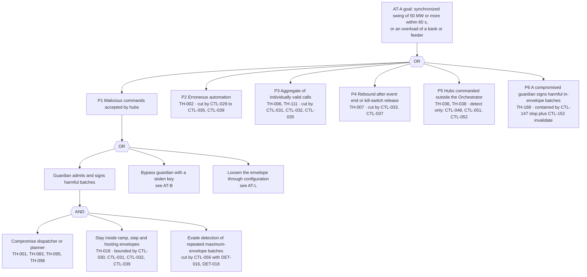

- **Cheapest path:** P2 — our own defect. No attacker is needed, which is why TH-002 is the highest-rated threat.
- **Minimal cut set:** {CTL-029 guardian as sole signer, CTL-030 ramp limits, CTL-031 staggering} cuts P1, P2 and P3 to a
  bounded, staggered change; CTL-033 cuts P4; the Safe-Stop Authority plus the independent epoch authority contain P6
  (stop, then invalidate, without the guardian's cooperation). With these in place the worst admitted change is the envelope
  itself — register V-30, 50 MW/min for discretionary actions — which is below the Severe impact threshold per minute and is
  observable, **provided** the envelope is signed off for the interconnection (FR-SEC-206; TH-185, RR-16).
- **Remaining:** P5. A vendor cloud or firmware path that never touches the Orchestrator can only be detected (commanded vs
  measured divergence, CTL-048/051) and prevented contractually (CTL-090, condition SC-19). This is residual risk RR-03.

### AT-B — Compromised command-signing key

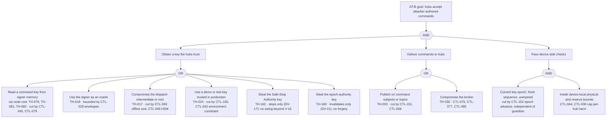

- **Cheapest path:** K1 on the demo node, where the online key sits in a software keystore (SoftHSM2) on a host shared
  with other services. That is why demo trust anchors must never be installed in real hubs (CTL-100) and why production
  requires HSM/KMS custody with 24-h, memory-only command keys certified by an HSM-held intermediate (CTL-045; V-10).
- **Minimal cut set:** {CTL-100, CTL-045, CTL-046, CTL-152}. Detection: DET-017 (key used outside the signer identity),
  DET-016 (signing-rate anomaly), DET-081 (every epoch advance). Recovery: IRP-04 and IRP-15 invalidate outstanding commands
  by an epoch advance of the **independent** authority within 15 minutes for ≥ 99% of online hubs (FR-SEC-114, FR-SEC-205),
  so recovery works even when `guardian` is the compromised element (RT-002, RT-010). `guardian` is the only signer of
  anything that moves MW (register R1); the two other keys (K5, K6) can only stop or invalidate.
- **Remaining:** within a key's validity an attacker who also holds a delivery path can command hubs inside their local
  bounds; the 24-h lifetime and the independent epoch advance bound the window (residual TH-016: 8 Medium).

### AT-C — False data injection or spoofed SCADA/bank signal to trigger or hide overloads

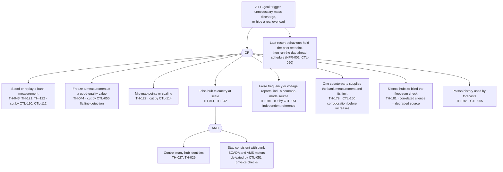

- **Cheapest path:** C2 or C3 — a stale value or a mapping error needs no attacker and passes a naive quality check.
- **Minimal cut set:** {CTL-110 authenticated SCADA, CTL-050 plausibility including flatline, CTL-051 physics consistency,
  CTL-114 signed point maps}. Three independent measurement sources (bank SCADA, fleet sum, AMS meters) must agree within
  tolerance; a lie has to be told consistently to all three.
- **Remaining:** a compromised utility SCADA source that lies consistently over time (TH-125, TH-179) is bounded by guardian
  limits and, since v0.2, cannot raise fleet output on a bank without an independent corroboration (CTL-150), but its
  first-order effect on decreases and on the bank's own equipment is not prevented; covered by RR-04. AMS data is not real
  time, so in the moment only two sources exist (bank SCADA and the fleet sum), which is why correlated silence (TH-181) is
  treated as a degraded source.

### AT-D — Command replay and reordering on every control path (brief §8 D4a)

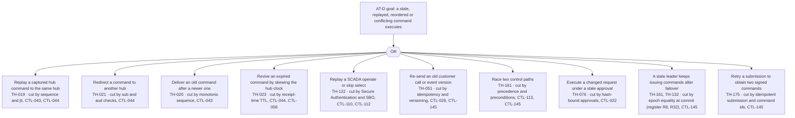

- **Cheapest path:** R7 — two legitimate paths (a utility override and an operator action, or a kill-switch release and a
  scheduled event) racing each other — or R9, a leader that lost its lease in a network partition. Neither needs an attacker.
- **Minimal cut set:** {CTL-043 sequence per issuer class, key epoch and shard epoch, age on arrival; CTL-044 device verification; CTL-145 expected-state
  preconditions, a single precedence order across paths, epoch fencing with equality at commit enforced by `guardian` and
  `device-gateway`, and idempotent submissions (register R8, R32); CTL-112 select-before-operate where the point map requires
  it (register R29)}.
- **Remaining:** none rated above Low once the cut set is in place.

### AT-E — Spoofed utility event, SCADA control or market award

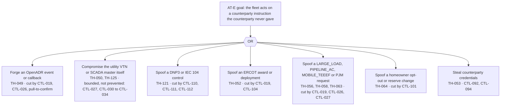

- **Cheapest path:** E1 against a VEN that trusts callbacks, or E7 with credentials from a shared file (the prototype's B-02).
- **Minimal cut set:** {CTL-019 counterparty authentication, CTL-026 signed payloads with replay windows and pull-to-confirm,
  CTL-110 SCADA Secure Authentication over TLS, CTL-092 credential custody}.
- **Remaining:** E2. Because the Orchestrator **must dispatch authorized, in-contract requests as requested** (brief §1), a
  genuinely compromised counterparty system can issue harmful but valid calls. The guardian bounds the physical effect;
  detection flags the pattern and triggers out-of-band confirmation with the counterparty, but does not refuse a valid call
  (RR-04, CTL-144).

### AT-F — Broker/API denial of service and reconnect storms

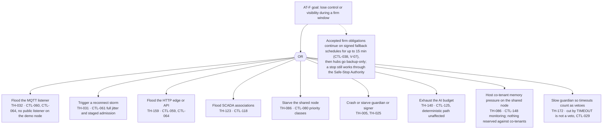

- **Cheapest path:** F2 — an ordinary broker restart without jitter becomes a self-inflicted storm at 10,000+ hubs.
- **Minimal cut set:** {CTL-061, CTL-060, CTL-080, CTL-038, the TIMEOUT rule of CTL-029}. CTL-038 is what turns a denial
  of *control* into a bounded event for firm delivery: the firm schedule is already on the hubs, signed and bounded (V-07).
  Since v0.2 a denial of *control* is also never a denial of *stopping* (CTL-147).
- **Remaining:** volumetric DDoS against internet-facing listeners in production (TH-032 residual 9 Medium) needs upstream
  scrubbing (RR-06); host co-tenant pressure on the demo node (RR-21).

### AT-G — Insider abuse of override, kill switch and approvals

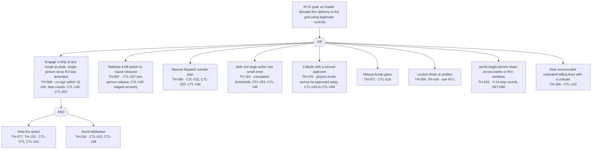

- **Cheapest path:** G1 — since register R3 was amended, one qualified person may engage a stop at bank, zone or fleet scope
  (stopping must never wait for a second person, GRD-010). Misuse can break firm delivery for the stopped scope until the
  Tier 2 release and, at fleet scope, produces a protective ramp.
- **Minimal cut set:** {CTL-146 single-person engage with typed scope, reason, blast-radius preview and a 15-min co-sign,
  stop counts per invoker and across principals (V-14); CTL-037 V-16 sequencing and Tier 2 release that the invoker can
  never approve (SoD-11); CTL-033 staged recovery; CTL-073 tamper-evident audit; DET-079, DET-080}. Misuse remains possible
  but is immediately attributable, paged and reversible.
- **Remaining:** single-person stop abuse (RR-19, Medium), collusion (RR-05) and break-glass misuse (RR-13), the last two Low.

### AT-H — Supply-chain compromise of a container image or dependency

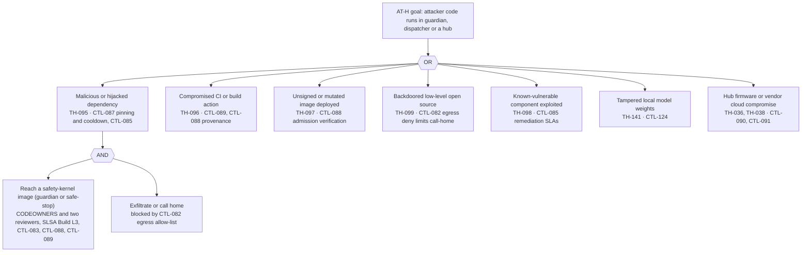

- **Cheapest path:** H1 — the npm and PyPI ecosystems saw self-propagating credential-stealing worms in 2025.
- **Minimal cut set:** {CTL-087 hash/digest/SHA pinning with a cooldown before adopting new releases, CTL-088 signed
  images with provenance verified at admission, CTL-089 hardened CI with short-lived credentials, CTL-082 egress
  allow-list}.
- **Remaining:** a backdoor in a pinned, long-trusted component (xz-style; residual TH-099 8 Medium) can only be bounded by
  egress control, runtime monitoring and the guardian's independence.

### AT-I — Homeowner privacy breach

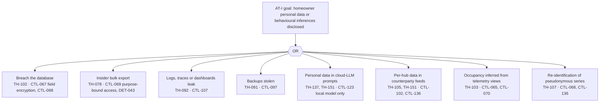

- **Cheapest path:** I3 or I5 — a developer logging a payload, or a copilot prompt that includes a hub's address.
- **Minimal cut set:** {CTL-068 pseudonymization with a separate PII vault, CTL-067 field-level encryption, CTL-069
  purpose-bound access logging, CTL-107 log hygiene, CTL-123 no personal data to the cloud LLM, CTL-136 aggregation
  threshold on every outbound flow}.
- **Remaining:** the utility already holds the 15-minute AMS data for the same premises; aggregates near the threshold keep
  a small inference risk (RR-08).

### AT-J — Lateral movement from co-located host services on the single node

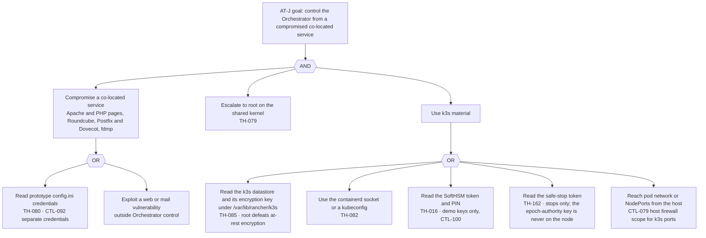

- **Cheapest path:** J11 → J2 → J31. With root on a shared kernel, no in-cluster control holds.
- **Minimal cut set on this node:** none that is complete. The mitigations are *consequence* controls: only demo trust
  anchors and demo keys exist on the node (CTL-100), no personal data is loaded onto it, simulated hubs only, separate
  credentials from the prototype (CTL-092), a **monitored scope gate** that detects any real credential, real personal-data
  class or real topology arriving on the node (FR-SEC-220, DET-091; TH-186), the epoch-authority key kept off the node so a
  root attacker can still be locked out (CTL-152), and migration to the managed cluster before any real hub or real
  personal data (RR-01). The decommissioning date (late October 2026) makes the exposure window short.

### AT-K — `ai-agent` abuse

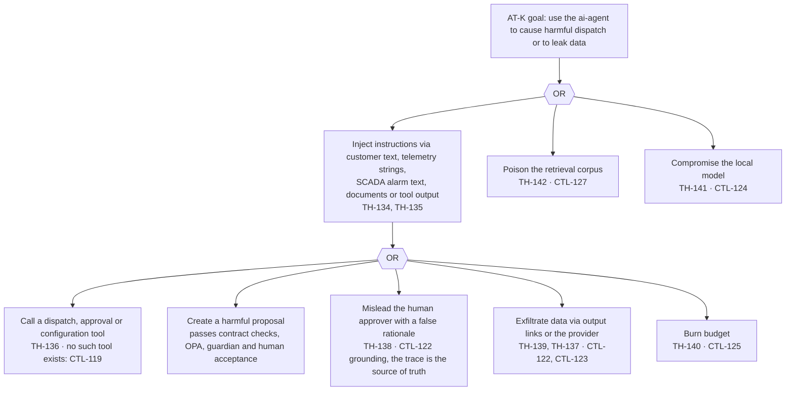

- **Cheapest path:** K1 through a free-text field the agent summarizes (a hub fault string, a customer email).
- **Minimal cut set:** {CTL-119 propose-only capability, CTL-121 untrusted-content handling, CTL-122 grounded output with
  plain-text rendering, CTL-123 no personal data to the cloud provider}. The agent cannot do anything a human could not
  already do through the same validated path; injection can at most produce a proposal a human must accept.
- **Remaining:** a persuasive but wrong rationale accepted by a tired operator (RR-14, Low); guardian limits still apply.

### AT-L — Configuration-plane tampering (dispatch profiles, limits, point maps, policies)

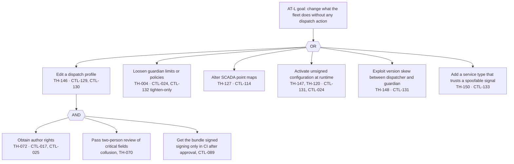

- **Cheapest path:** L4 — a hot edit that never went through Git, on a system without runtime signature checks.
- **Minimal cut set:** {CTL-129 signed, versioned profiles; CTL-130 two-person approval of critical fields by the owning
  domains; CTL-131 runtime signature and version binding; CTL-132 per-profile envelopes that can only tighten global limits;
  loaders that require approval records bound to the bundle's diff hash, so a compromised CI pipeline or GitHub
  organization alone cannot activate a bundle (CTL-088; RT-016)}. Even a fully approved malicious profile cannot exceed the
  guardian's global physics limits.
- **Remaining:** Low; collusion of two domain approvers (RR-05).

### AT-M — Defeat or abuse the stop path (register R16; added in v0.2)

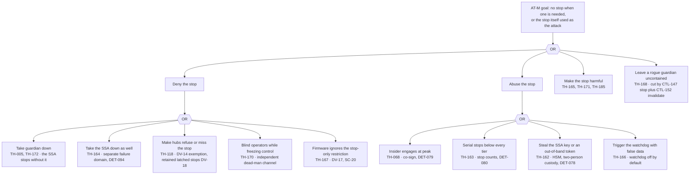

- **Cheapest path:** M21 — a legitimate insider, who since the R3 amendment needs no second person to engage.
- **Minimal cut set:** {CTL-147 Safe-Stop Authority with a stop-only key; CTL-146 single-person engage with a 15-min co-sign
  and stop counts; CTL-037 V-16 sequencing and Tier 2 release through `guardian` only; DV-14 exemption and DV-18 retained,
  latched stops; CTL-152 independent epoch authority; CTL-056 dead-man channel}.
- **Remaining:** RR-19 (single-person stop abuse, bounded, attributable, reversible by Tier 2 release), RR-20 (a stolen SSA
  key yields stops), RR-16 (the protective fleet-stop rate is unsigned), and TH-167 until real firmware meets SC-20.

**Threat analysis of the Safe-Stop Authority** (red-team report §4.3, adopted and mapped):

| Threat to the SSA | Effect | Why it is acceptable, and the mitigation | Threat |
|---|---|---|---|
| SSA signing-key theft | Stops only — ramped per V-16, home load and reserve intact, reversible only through the guarded Tier 2 release | Converts an integrity risk into a bounded, loud availability risk. HSM partition with template-only signing in production; two-person custody of the hierarchy; DET-078 on any stop not paired with a guardian forward or a valid out-of-band trigger; revocation by a safe-stop key set | TH-162 |
| SSA abused to stop the fleet (denial by stop) | Availability and money | The same rules as any stop engage (hardware token, co-sign, stop counts); release is fast but safe; every trigger attributed and paged. A rogue stop is far less dangerous than a rogue run | TH-068, TH-163 |
| SSA outage | No independent stop | ≥ 2 replicas; separate node and zone in production; independent of the guardian's failure modes. On the shared demo node it shares the kernel (RR-01) but not the guardian's software failure domain | TH-164 |
| Split brain (SSA and `guardian` both signing) | None harmful if both stop; an SSA re-assertion over a newer release would be a stop–release swing | The SSA never re-asserts a scope released with a newer sequence; the release names the stops it clears | TH-165 |
| Watchdog false trigger | Unnecessary stop | Conservative thresholds; stop-only; audited; off by default until validated; a human trigger is preferred | TH-166 |
| Firmware cannot enforce DV-17 | The SSA key could carry more than stops | Topic-scoped degrade (SC-20); until hardware confirms register Q2, the SSA key has the custody of the dispatch intermediate | TH-167 |
| Epoch-authority key theft (the SSA's containment partner) | Denial of dispatch | Invalidate-only (DV-21), offline, two-person; every use pages (DET-081) | TH-169 |

---

## 12. Abuse cases — individually valid, harmful in aggregate

Under the brief's service-agnostic principle, every authorized, in-contract request is **executed** within safety and grid
limits. The response column therefore never says "refuse because the service is not worthwhile": it says how the aggregate
harm is prevented while each request is served as far as physics and contract priority allow, with the reason recorded in
the decision trace (CTL-137, CTL-144).

| ID | Individually valid requests | Aggregate harm | Detection | Response (service-agnostic) | Threats | Controls |
|---|---|---|---|---|---|---|
| AB-01 | Two firm programs behind the same bank discharge in the same window while `ERCOT_ENERGY` also exports | Reverse flow beyond the bank's hosting capacity; voltage rise | DET-022, DET-034 | Export clipped at the hosting limit; the lowest priority class is clipped first per brief §3.1; each requester receives the clip reason and the kW served | TH-009, TH-111 | CTL-032, CTL-035, CTL-144 |
| AB-02 | A `PARTNER_CAPACITY` 4CP event, an `ERCOT_AS` deployment and a price spike all start at the same 5-minute boundary | A synchronized ramp above the fleet envelope | DET-019, DET-020 | Sequenced with signed jitter so each obligation still reaches full output within its contracted time where physically possible; any residual is logged as a ramp-limited shortfall | TH-006 | CTL-030, CTL-031 |
| AB-03 | Every event ends at the same instant and each program's recharge rule starts | Rebound (cold-load pickup) above 95% of bank rating (reviewer proposal — unverified) | DET-021 | Recharge staggered over ≥ 30 min and capped per bank | TH-007 | CTL-033 |
| AB-04 | An operator splits a 5 MW manual dispatch into six 0.9 MW requests | Evades the confirmation and second-approver thresholds | DET-037 | Thresholds apply to the cumulative total per invoker and per scope over the rolling 15 min (register V-14) | TH-110 | CTL-023, CTL-146 |
| AB-05 | `LARGE_LOAD` contracted stress events fall in ERCOT scarcity hours | Stored energy depleted before a `DIST_DEFERRAL` need window | DET-018 (ledger class) | Energy ledger reserves firm energy by contract priority; `LARGE_LOAD` is served within its own priority class; any shortfall is disclosed with its cause | TH-057, TH-011 | CTL-035, CTL-040, CTL-144 |
| AB-06 | `PIPELINE_AC` smoothing requests arrive every few seconds across many hubs | Flicker, hunting and battery wear | DET-020, oscillation detector | Profile envelope limits setpoint change rate; sustained oscillation triggers a hold of that loop and a notification to the requester (a safety hold, not a refusal of the service) | TH-059 | CTL-040, CTL-132 |
| AB-07 | A `DIST_DEFERRAL` need window and `ERCOT_ENERGY` charging in the same bank at midday | Charging recreates the overload being relieved | DET-021 | Charging blocked behind that bank in its need window (reviewer proposal — unverified); charging reallocated to other banks | TH-008, TH-111 | CTL-033 |
| AB-08 | Many homeowners lower their reserves at once through the homeowner channel, just before an event | Deep discharge of many homes before a storm; possible social-engineering campaign | DET-056 | Each change is honoured (it is the homeowner's right) only after out-of-band confirmation to the homeowner; mass changes are flagged | TH-064, TH-065 | CTL-101, CTL-053 |
| AB-09 | The trader offers the fleet into the same SCED intervals every day | Predictable behaviour invites front-running | DET-055 | Randomization inside the permitted window; weekly conduct review | TH-108 | CTL-031, CTL-057 |
| AB-10 | A customer repeatedly calls maximum-size events at minimum notice, within its contract | Queueing and operator fatigue | DET-033 | Executed as contracted; per-contract event counts enforced exactly as written; operator workload alarm | TH-051 | CTL-023, CTL-027 |
| AB-11 | Several customers request export in one area during a high-voltage condition | Voltage above the service range | DET-024 (voltage class) | Voltage hold clips export increases in that area; requesters notified with the reason | TH-009 | CTL-034 |
| AB-12 | Two approvers release a fleet-wide kill switch at peak | Rebound; the release is itself a synchronized step | DET-041, DET-021 | Staged recovery over ≥ 15 min with signed jitter within V-30, in the reverse of the stop sequence (ADER telemetry and COP first, hotline notice when > 20 MW; register V-17) | TH-007 | CTL-033, CTL-037 |
| AB-13 | A `MOBILE_TEEEF` deployment request with a valid switching order while a crew is still on the line | Energization hazard | DET-054 | Energization only through the unit's local permissive and dead-bus check; the remote side cannot close the output | TH-060 | CTL-041, CTL-099 |
| AB-14 | Two closed-loop profiles regulate overlapping measurements on shared hubs (a `DIST_DEFERRAL` bank-load loop and a `PIPELINE_AC` line-current loop) | The two loops fight and oscillate | Oscillation detector, DET-018 | A hub may serve only one closed loop at a time; the second loop is served from other eligible hubs or recorded as a shortfall | TH-150, TH-059 | CTL-132, CTL-133 |
| AB-15 | Many small setpoint changes each pass the deadband | Cumulative oscillation | Oscillation detector | Damping and a hold of the loop; operator notified | TH-015 | CTL-030, CTL-040 |
| AB-16 | A utility toggles its override hold every few minutes, as it may | Dispatch churn and wear | DET-062 | Each override honoured within one control tick; the pattern is flagged to both parties | TH-161 | CTL-028, CTL-145 |
| AB-17 | `ai-agent` proposals are each valid but systematically favour one customer | Unexplained bias in arbitration | Acceptance statistics in the AI audit | Deterministic arbitration remains the default; proposals need human acceptance, become time-boxed constraint sets (register R49) and are reviewed monthly | TH-138 | CTL-122, CTL-126 |
| AB-18 | One qualified operator (or several) engages single-person stops on many banks in turn, or at each firm window (N-01) | Zone-scale loss of firm delivery without any single action crossing a tier | DET-079, DET-080 | Every stop executes at once (stopping never waits, register R3); stop counts per invoker, per scope and across principals page `SEC`; each engage is co-signed within 15 min; release is Tier 2 on grid grounds | TH-163, TH-068 | CTL-146, CTL-037 |
| AB-19 | Several counterparties, each under its own tier and anomaly thresholds, send calls behind one bank or zone aligned to one boundary | A synchronized ramp or a hosting breach assembled from compliant pieces | DET-088, DET-034 | `guardian` sums across principals per bank and zone (G-17, V-14) and staggers and clips by priority with reasons; every call is still served as far as physics allows | TH-180 | CTL-039, CTL-031, CTL-144 |
| AB-20 | A distribution utility lowers `BANK_LIMIT` (asking for more relief) while its own bank measurement agrees | More fleet output on a bank whose real loading nobody else can see | DET-084, DET-025 | Executed while the bank passes the physics-consistency checks against an independent measurement; on a sole-source failure the loop holds, then runs the schedule, and the utility confirms out of band (G-18) | TH-179, TH-125 | CTL-150, CTL-051 |
| AB-21 | Partner programs, a deferral window and an `ERCOT_AS` deployment all start at one 4CP interval, together > 50 MW | A coincident ramp ERCOT did not see coming | DET-019 | Firm and ISO-instructed changes keep their contracted ramps but are pre-staged and announced to ERCOT through ADER telemetry and COP before they start (register V-30); discretionary actions yield | TH-006, TH-188 | CTL-030, CTL-155 |

---

## 13. Coverage per customer type and security conditions

### 13.1 Threat and control coverage

| Code | Principals and channels | Key threats | Key controls | Guardian envelope specific to the type (companion §6.8) |
|---|---|---|---|---|
| `HOME` | Hub device identity; homeowner channel (Base customer systems) | TH-012, TH-027, TH-039, TH-064, TH-102, TH-103, TH-114, TH-177 | CTL-036 three-layer reserve, CTL-101, CTL-068, CTL-069, CTL-140 | Reserve floor enforced in `guardian` (against hub-reported values) and on the device; islanded hubs excluded; a stop never touches home load or the reserve |
| `ERCOT_ENERGY` | QSE interface (simulated); `market-data` ERCOT account; QSE desk (`QSD`) | TH-011, TH-053, TH-106, TH-108, TH-109, TH-188 | CTL-055, CTL-057, CTL-094, CTL-104, CTL-155 | ERCOT instructions bind the members of an on-line ADER (G-15, register R17); ERCOT-visible capability ≤ ledger-free capacity; non-firm ramp class; frequency holds; conduct surveillance |
| `ERCOT_AS` | QSE awards and deployments; ICCP telemetry | TH-052, TH-129, TH-131, TH-188, TH-189 | CTL-019, CTL-104, CTL-110, CTL-155 | Award ≤ confirmed allotment under the ADER per-product cap and ≤ per-ADER qualified MW; telemetered AS capability covered by offers or telemetered 0; stored-energy holds in the ledger (Non-Spin 4 h, switching to 2 h at NPRR1309; ECRS 1 h per NPRR1282 — claims check #6, register Q7, V-33; profile fields); awarded AS never withdrawn during an EEA without a hotline record (G-16) |
| `PARTNER_CAPACITY` | Utility OpenADR 3.0 VTN; for a `TOLLING` contract, utility-scheduled charge and discharge (register R27) | TH-049, TH-050, TH-105, TH-180 | CTL-019, CTL-026, CTL-027, CTL-102, CTL-039 | Event kW ≤ contract; export limit per hub; ramp to full within the contract's response time, coincident 4CP starts pre-staged and announced (V-30); tolled charging within import headroom |
| `DIST_DEFERRAL` | Utility SCADA (DNP3/IEC 104), DERMS (IEEE 2030.5), override, dynamic bank limit; the utility's direct stop path (register R25) | TH-013, TH-043, TH-044, TH-054, TH-121, TH-125, TH-127, TH-173, TH-179, TH-181 | CTL-028, CTL-032, CTL-033, CTL-110, CTL-114, CTL-150, CTL-156 | Topology-fenced hubs only; regulation on kVA or per-phase current with the fleet's own P and Q added back (register R18); a counterparty-supplied limit raises output only when corroborated (G-18); need-window charging block; rebound ≤ 95% of bank rating (reviewer proposal — unverified) |
| `LARGE_LOAD` | Customer API and signed webhooks | TH-056, TH-057 | CTL-019, CTL-026, CTL-040 | Zone cap; firm class when contracted |
| `PIPELINE_AC` | Pipeline-operator API; line-current signal; corridor data | TH-058, TH-059, TH-104, TH-150 | CTL-040, CTL-070, CTL-132, CTL-133 | Setpoint change-rate limit; oscillation hold; closed loop only on an authenticated, plausible signal |
| `MOBILE_TEEEF` | Unit controller over cellular; lessee utility requests, switching orders and the close issued by the lessee's operator | TH-060, TH-061, TH-062, TH-126 | CTL-041, CTL-099, CTL-117 | Island-forming only, under the lessee TDU's control, no ERCOT participation; Base never initiates energization (register R20); stop always allowed, coordinated with the lessee's operator when a unit runs an island; geofence; the grid-parallel `MOBILE_DER` variant runs under the global envelopes |
| `PJM_CAPACITY` (future adapter) | PJM interfaces; ComEd data | TH-063, TH-151 | CTL-019, CTL-027, CTL-094, CTL-134 | Coincident-peak windows only; non-firm by default; dispatch toward meter net load ≈ 0 unless the contract pays for export (register R27) |

### 13.2 Security conditions that must hold, per customer type

Status uses the text labels Met / Partly / Unknown / Not met. Timing values are estimates.

| ID | Type | Condition | Kind | Status | Evidence | Validation step (go / no-go) | Timing (estimate) |
|---|---|---|---|---|---|---|---|
| SC-01 | `HOME` | The hub enforces a device-local reserve floor that cloud commands cannot lower | Technical | Unknown | None found; hub internals are not public | Bench test: a signed command with a floor below the local floor is rejected 100% of the time → go | 2–4 weeks after hardware access |
| SC-02 | `HOME` | The hub verifies ES256 JWS, persists sequence numbers and epoch floors per issuer class and shard across reboot, reports them in its status, latches scope stops, and keeps its private key non-exportable (register Q2) | Technical | Unknown | None found | Vendor attestation plus UL 2941 evidence plus bench test of the companion's DV-01…DV-21 vectors → go if all pass | 4–8 weeks |
| SC-03 | `HOME` | The homeowner channel authenticates opt-out, reserve and data-subject requests and confirms them out of band | Technical | Unknown | None found | Integration test with Base's customer system | 2 weeks |
| SC-04 | `HOME` | Notices and consent cover every processing purpose in the data inventory, including behavioural inferences and precise geolocation (sensitive data under the Texas Data Privacy and Security Act) | Regulatory | Unknown | Base's Texas REP terms exist but were not reviewed for this processing | Privacy counsel review; go if every purpose in the companion §16 register has a documented basis | 3–6 weeks |
| SC-05 | `ERCOT_ENERGY`, `ERCOT_AS` | A dedicated ERCOT API service credential (separate from the simulators' key, register Q18), not readable by any web tier, rotated on a schedule, with tokens reused for their lifetime | Technical | Not met | B-02: the prototype's `config.ini` is read by the PHP tier; B-12: a new token every 60 s | New credential in the secrets store; old one rotated; token reuse verified | 1 week |
| SC-06 | `ERCOT_ENERGY`, `ERCOT_AS` | For a real QSE connection: ERCOT digital certificates administered by Base's User Security Administrator with screening, and a current LSIPA attestation | Regulatory | Unknown (interface simulated today) | ERCOT digital-certificate and LSIPA attestation requirements (§17) | Confirm with the QSE partner before any real market connection | Before go-live |
| SC-07 | `ERCOT_ENERGY`, `ERCOT_AS` | Premise- or device-level data that ERCOT may request under the ADER governing document (GD 3.3 §5.d net-MW and state-of-charge series, §5.e allocation factors — confirmed by the claims check #4) is disclosed only if the user answers register Q12 "yes" — to ERCOT alone, on a regulatory or contractual basis disclosed at enrolment, after a data protection assessment; until then the ERCOT lanes stay simulated and no per-premise data leaves the platform (register V-18) | Regulatory | Not met (Q12 open; ERCOT lanes simulated) | ADER governing documents (§17); GRD-042; primary-source check in `../06-reviews/05-claims-verification.md` | User decision Q12, then a privacy assessment before live ADER participation | Before go-live |
| SC-08 | `PARTNER_CAPACITY` | The partner VTN supports TLS with a pinnable CA and OAuth client credentials; callbacks can be confirmed by pull | Technical | Unknown | OpenADR 3.0 specifies OAuth 2.0 client credentials and TLS | Interoperability test in the partner sandbox | 4–8 weeks per partner |
| SC-09 | `PARTNER_CAPACITY` | Export limits and P10 reporting defined so no per-hub personal data leaves the platform (P10 reported as a statistic; per-premise data only on a confirmed lawful basis, register Q12) | Commercial / regulatory | Unknown | Contracts not reviewed | Contract review | Before first event |
| SC-10 | `DIST_DEFERRAL` | The utility supports DNP3 Secure Authentication with TLS (IEC 62351-3/-5), and Base licenses a Secure Authentication library (no maintained open-source SAv5, register Q11); an IPsec conduit is a documented compensating control only; **no real association carries controls without it** (hard gate, companion §8.2; RT-009) | Technical | Unknown | None found | Utility SCADA engineer confirmation and a commissioning test | 8–16 weeks |
| SC-11 | `DIST_DEFERRAL` | The utility supplies topology (ESI ID → feeder → bank, with phase), unit-typed ratings (kVA, A), hosting capacity, bidirectional settings of line regulators, and an OMS/ADMS feed of switching orders and planned outages (register R18, R28) | Technical / commercial | Unknown | The grid review asks for this mapping (GRD-003, GRD-027, GRD-033) | Data agreement signed and first feed validated | Before contract |
| SC-12 | `DIST_DEFERRAL` | Override semantics (reduce, stop, hold) and precedence written into the contract | Commercial | Unknown | — | Contract clause agreed | Before contract |
| SC-13 | `LARGE_LOAD` | Webhook signing keys exchanged; contract caps and notice defined | Technical / commercial | Not met (no customer yet) | — | Onboarding checklist complete | At signing |
| SC-14 | `PIPELINE_AC` | The pipeline-operator integration is authenticated and corridor data is handled as CEII-like need-to-know data | Technical | Unknown | — | Onboarding review | At pilot |
| SC-15 | `PIPELINE_AC` | The closed-loop signal (line current) comes from an authenticated, physically plausible source before closed-loop mode is enabled | Technical | Not met | Today's signal is estimated from regional wind generation (`/opt/opengrid_sim/scada_simulator.py`) | Authenticated feed from the line owner, cross-checked | At pilot |
| SC-16 | `MOBILE_TEEEF` | Units certified to UL 2941 Ed. 1 or equivalent; hardware energize permissive and dead-bus interlock; the close issued only by the lessee's operator under a switching order (Base never initiates energization, register R20); lockout/tagout and switching-order procedures agreed with the lessee utility; field-safety sign-off by the licensed field engineer (`FSE`) before a deployment leaves `PENDING_SAFETY_REVIEW` (register Q20) | Technical / safety | Unknown | None found | Design review plus a supervised energization test | Before first lease |
| SC-17 | `MOBILE_TEEEF` | Cellular modem on a private APN with no inbound services; GPS cross-checked against cell location | Technical | Unknown | — | Penetration test of a unit | Before deployment |
| SC-18 | `PJM_CAPACITY` | PJM credential model and Illinois privacy and breach obligations reviewed | Regulatory | Unknown | — | Counsel review | Before Illinois go-live |
| SC-19 | All | The hub vendor has no independent remote-control path, or it is contractually disabled and monitored | Technical / commercial | Unknown | The 2024 Deye remote-disable incident shows the risk class | Vendor attestation plus a network test showing no unexpected egress | Before scale-up |
| SC-20 | All | Real hub firmware pins the safe-stop root and enforces DV-17 (a `safe-stop-only` key can carry only a scoped stop, setpoint 0, ramp no faster than V-16); where firmware cannot distinguish EKUs, it treats the scope-stop topics as stop-only and the SSA identity publishes nowhere else (register R16, Q2) | Technical | Unknown | Red-team §4.2; none found for Base hardware | Bench test with the DV-17 negative vectors → go if all rejected | Before any real hub connects |
| SC-21 | All | ERCOT-facing staff and each partner utility sign off the V-16 and V-30 envelope and ramp values, including the protective fleet-stop rate at 100,000 hubs; fleet-trip behaviour above 100 MW characterized with ERCOT (FR-SEC-206; register Q13) | Commercial / regulatory | Not met (values unsigned) | Register §F marks V-16 and V-30 [unsigned] | Signed sign-off per counterparty referenced in the limits bundle | Before any real hub, counterparty or market connection |
| SC-22 | All | An independent, authenticated frequency and voltage reference is available for the holds — a utility or ERCOT feed, or at least two hardware references at trusted sites (CTL-151) | Technical / commercial | Unknown | Red-team RT-005 | Feed or device commissioned and cross-checked against the fleet median | Before production |
| SC-23 | `ERCOT_ENERGY`, `ERCOT_AS`, firm types | A signed IEEE 1547 settings profile (ride-through, trip, droop, volt-var, volt-watt) accepted by each utility and by ERCOT for ADER attestation, against which hubs are read back (register R26) | Technical / regulatory | Unknown | GRD-020 | Profile signed; read-back conformance on a pilot cohort | Before ADER or firm participation |
| SC-24 | `DIST_DEFERRAL`, `PARTNER_CAPACITY` | Where a counterparty keeps a direct stop path to hubs (register R25), hub firmware accepts only restrictive controls over it (DV-20) and authenticates it with the counterparty certificate pinned at enrolment | Technical | Unknown | GRD-011 | Bench test: increase and release over the direct path rejected | Before the counterparty goes live |

---

## 14. Residual risks

| ID | Residual risk | Threats | Rating | Why it remains | Accepting owner (proposed) | Acceptance conditions | Review trigger |
|---|---|---|---|---|---|---|---|
| RR-01 | Co-location on the single node: a compromised neighbour with root controls the demo Orchestrator | TH-079, TH-186 | High (demo only) | Shared kernel; host services are out of scope and must not be touched | Project lead | Demo keys and trust anchors only; simulated hubs only; no real personal data or real CEII topology on the node — **and only while the monitored scope gate is in force** (FR-SEC-220, DET-091; go-live gate 9); the epoch-authority key off the node; migration before any real hub | DET-091 fires; any plan to connect a real device or load real personal data or topology |
| RR-02 | Software keystore on the node (dispatch intermediate, safe-stop intermediate) | TH-016, TH-162 | Medium | No HSM on the node; node root reads the tokens and PINs (RT-010) | Project lead | As RR-01; the epoch-authority key never on the node, so a stolen dispatch key can still be invalidated; production must use HSM/KMS | Production readiness review |
| RR-03 | Hub firmware, hardware and vendor-cloud trust, including a common-mode firmware line that biases or suppresses frequency holds | TH-036, TH-037, TH-038, TH-115, TH-045, TH-167 | Medium | Outside Orchestrator control; an independent vendor path can only be detected, not prevented (N-14) | Base device team | SC-01, SC-02, SC-19, SC-20, SC-23 met; independent grid reference for holds (SC-22) | Vendor change; new firmware line |
| RR-04 | Authenticated but compromised counterparty issues harmful, valid calls, including one that supplies both a bank's measurement and its limit | TH-050, TH-125, TH-179 | Medium | Service-agnostic dispatch means the platform executes authentic, in-contract calls; the first-order effect is bounded, not prevented (N-02, RT-003) | Head of operations | Guardian envelopes active; increases need independent corroboration (CTL-150); out-of-band confirmation runbook with each counterparty | Any counterparty security incident |
| RR-05 | Collusion between two approvers, including the billing seal and profile approval | TH-070, TH-184 | Low | Two-person control has a known limit; physics cannot be approved away, but a seal or a profile can | Security lead | Conduct review; approver pools outside one reporting line; no seal with an unreconciled estimated line and an `AUD` attestation above the threshold (RT-015) | Personnel change in approver pool |
| RR-06 | Volumetric DDoS against internet-facing listeners | TH-032, TH-159 | Medium | Single node has no scrubbing | Platform lead | Production behind upstream DDoS protection | Production readiness review |
| RR-07 | Long-term nation-state pre-positioning | ADV-01 | Medium | Detection-dependent | Security lead | Monitoring coverage per companion §17; annual red team | Relevant advisory |
| RR-08 | Inference risk in aggregates near the threshold, given the utility also holds AMS data | TH-103, TH-107 | Low | Aggregation reduces but does not eliminate inference | Privacy lead | Aggregation threshold (companion §16.6) enforced | New outbound data flow |
| RR-09 | Cloud LLM provider handling of aggregated operational data | TH-137 | Low | Provider terms govern retention | Security lead | Provider terms confirmed and recorded | Provider or model change |
| RR-10 | Zero-day in SCADA protocol stacks | TH-128 | Low | Unknown vulnerabilities | SCADA engineering lead | Conduit segmentation; fuzzing; monitoring | New advisory for the stack in use |
| RR-11 | Regulatory interpretation of trading strategies | TH-109 | Low | Rules evolve | Compliance lead | Weekly conduct review | Rule change |
| RR-12 | `MOBILE_TEEEF` safety depends on local interlocks and crew procedures outside software | TH-060 | Medium (impact 5) | Physical safety cannot be delegated to software | Field operations lead | SC-16 met | Every new lease |
| RR-13 | Break-glass misuse | TH-071 | Low | Emergency access must exist | Security lead | Sealed, time-bound, reviewed | Every use |
| RR-14 | Operator accepts a persuasive but wrong AI proposal or a plausible injected AI draft | TH-138, TH-134 | Low | Human judgement | Head of operations | Proposals grounded in traces; AI-drafted flag through the preview and the audit and at least Tier 1 for every AI-drafted call (RT-011); guardian limits apply | Accepted-proposal incident |
| RR-15 | SCADA associations in the demo run over TLS without application-layer authentication (no maintained open-source DNP3 SAv5; ICCP without IEC 62351-4; PJM TLS only) | TH-121, TH-122, TH-129, TH-187 | Low (demo, simulated counterparties); High if carried to a real association | Register Q11 proposes a time-limited TLS-only exception | Project lead | Simulated counterparties only; mutual TLS; SBO and allow-lists still enforced; the hard gate of companion §8.2 keeps control points disabled on any TLS-only real association (FR-SEC-178; go-live gate 10) | Any real SCADA counterparty |
| RR-16 | Unvalidated grid-stress envelope: the safety case reduces to "the admitted envelope is below harm", and V-16 and V-30 are unsigned | TH-185 | High until signed | ERCOT and utility sign-off not yet obtained (register Q13) | Head of operations with ERCOT-facing staff | Demo only (simulated grid); FR-SEC-206 met before any real hub, counterparty or market (go-live gate 2) | Any real connection; any change to V-16 or V-30 |
| RR-17 | `guardian` as concentrated trust — reduced, not eliminated: it remains the sole integrity authority for run commands, and N-version checks, CODEOWNERS, SLSA Build L3 and property tests reduce but do not remove the risk that one implementation is wrong or subverted | TH-168, TH-099, TH-002 | Medium | Register R1 keeps one signer by design | Security lead | The Safe-Stop Authority can stop and the epoch authority can invalidate without it (CTL-147, CTL-152); co-signed arbitration inputs (CTL-154); withholding detection (go-live gate 7) | Any `guardian` code or dependency change; a red-team finding |
| RR-18 | Bounded pre-anchor window of the degraded-mode journal: 10 s nominal and 5 min at most (register R22), during which a node-root attacker could alter unanchored records | TH-178 | Medium (demo) / Low (production) | Anchoring every command synchronously would make the audit store a single point of failure for dispatch (K3) | Security lead | CTL-149; CONSERVATIVE at 5 min without an anchor; tamper inside the window tested (go-live gate 6); RR-01 conditions | Any audit-store outage longer than 60 s |
| RR-19 | Single-person stop engage abuse (register R3 amended): a stop at any scope executes before anyone else looks | TH-068, TH-163 | Medium | Stopping must never wait for a second person (control-room practice, GRD-010); the harm is availability and money, not a swing beyond V-16 | Head of operations | Typed scope, reason and blast-radius preview; co-sign within 15 min with escalation (DET-079); stop counts per invoker, per scope and across principals (DET-080); reconciliation of qualifying triggers; Tier 2 release the invoker can never approve; conduct review | Any un-co-signed or unreconciled stop; personnel change |
| RR-20 | A stolen Safe-Stop Authority key or out-of-band token yields stops, including a protective fleet ramp | TH-162 | Low (demo) / Medium until V-16 is signed | A stop path that works without `guardian` must hold a key that can stop | Security lead | HSM with template-only signing in production; two-person custody; DET-078; revocation through a safe-stop key set; the protective fleet-stop rate signed off (FR-SEC-206) | Any DET-078; custody change |
| RR-21 | Demo control-plane availability against host co-tenants: a host memory spike can OOM the node and take `guardian`, EMQX and the Safe-Stop Authority with it, and nothing may be reserved against the co-resident services | TH-086, TH-164 | Medium (demo only) | Host services are out of scope and must never be touched (brief §4) | Project lead | Host-level pressure monitored (DET-086); hubs follow V-07 and stay stopped where stopped; production control plane on dedicated nodes (go-live gate 5); node decommissioned about late October 2026 | Any host OOM; any plan to extend the node's life |

### 14.1 The red-team residual list, adopted explicitly

The red-team report §5 lists the residual risks the design must own rather than hide. Each is now a named entry:

| # | Red-team residual (§5) | Owned as |
|---|---|---|
| 1 | Co-location (demo, High), acceptable only with the scope gate | RR-01 (scope gate FR-SEC-220) |
| 2 | Authenticated-but-compromised counterparty (Medium) | RR-04 (with CTL-150) |
| 3 | Unvalidated grid-stress envelope (High until signed) | RR-16 |
| 4 | `guardian` as concentrated trust (reduced, not eliminated) | RR-17 |
| 5 | Demo SCADA TLS-only (Low demo; High if carried to real) | RR-15 (with the hard gate) |
| 6 | Hub firmware and vendor-cloud trust (Medium) | RR-03 (with SC-20, SC-22, SC-23) |
| 7 | Software key custody on the demo node (Medium) | RR-02 |
| 8 | K3 audit-write window (Medium), with its maximum window stated | RR-18 (10 s nominal, 5 min maximum) |
| 9 | Two-person collusion (Low) | RR-05 |
| 10 | AI persuasion of a human (Low) | RR-14 |

### 14.2 Go-live gates

The twelve go-live gates of the red-team report §6 are adopted as `02-security-architecture.md` §23.1. The judged demo
needs gates 1 (R16 closed), 6 (audit window closed), 9 (scope gate) and 12 (red team executed); the remaining gates are
recorded as owned residual risks above (RR-16 for gate 2, RR-04 for gate 4, RR-21 for gate 5, RR-17 for gate 7). Any real
hub, real counterparty, real market participation or real personal data needs all twelve. The RR-01 and RR-18 acceptances
are void if gate 9 or gate 6 is not met.

---

## 15. Open questions and assumptions

### 15.1 Assumptions

| ID | Assumption | Used in |
|---|---|---|
| AS-01 | The 50 MW synchronized-swing threshold for Impact 5 and the fleet envelope and stop ramps (register V-16, V-30, marked unsigned) are to be signed off with ERCOT-facing staff and partner utilities (register Q13; companion FR-SEC-206; condition SC-21) | §1.4, §2.2, AT-A, TH-185, RR-16 |
| AS-02 | Base hub hardware capabilities (secure element or TPM, JWS verification, persistent counters and floors, safe-stop root pinning and DV-17, IEEE 1547 settings read-back) are unknown (register Q2); the design degrades to software keys with a trust-score cap and to the topic-scoped stop-only rule of SC-20 | SC-01, SC-02, SC-20, SC-23, RR-03, TH-167 |
| AS-03 | Base is not a NERC-registered Generator Operator for the fleet today; CIP applicability is discussed, not assumed | §1.4, companion §20 |
| AS-04 | The prototype pages have no authentication (B-07); not verified against the server, by rule | §3 |
| AS-05 | On the demo node, hubs and counterparties are simulated and no real personal data or real topology is loaded — enforced by the monitored scope gate (FR-SEC-220), not only assumed | RR-01, RR-02, TH-186 |
| AS-06 | GDPR and CCPA/CPRA are used as design benchmarks (brief D5); legal applicability to Texas and Illinois homeowners is for counsel to confirm | SO-4 |
| AS-07 | An independent, authenticated frequency and voltage reference can be obtained for production (condition SC-22) | TH-045, RR-03 |
| AS-08 | The co-signer defaults of register Q1 (APR or SEC; for fleet scope also EXE or SAD on call) stand until the user answers Q1 | TH-068, RR-19 |

### 15.2 Open questions

**Resolved by the decision register:** only `guardian` signs anything that moves MW (R1); an independent Safe-Stop Authority
and a dispatch-key epoch authority exist beside it (R16, closed; K11); confirmation tiers amended in R3 (single-person stop
engage, *Proposed* pending Q1) and stop mechanics in R4, V-16 and V-17, which the companion follows and
`../04-ui/01-ui-ux-specification.md` UI-SEC-05 is to follow; epochs and fencing (R32); the audit-write failure (K3 → R22);
erasure that survives backups (R38); fast-model ID kept as configuration (R12).

**Still open, tracked in `../00-decision-register.md` §C** (answer there; unanswered items keep the proposed default):

1. **Hub capabilities (register Q2; SC-01, SC-02, SC-19, SC-20, SC-23).** Hardware-backed key, signed-command verification,
   persisted sequence numbers and epochs per issuer class and shard, local reserve floor, signed fallback schedules,
   safe-stop root pinning and DV-17, IEEE 1547 settings read-back; any vendor cloud remote-control path?
2. **Stop engage and co-signers (register Q1).** Confirm the amended R3 (single-person engage at every scope with a 15-min
   co-sign, Tier 2 release) and name the co-signer per scope; the default lets `EXE` or `SAD` co-sign a fleet-scope stop,
   which needs the narrow SoD-03 exception of the companion §5.3.
3. **SCADA secure authentication (register Q11).** Licence a DNP3 Secure Authentication library, or keep the TLS-only demo
   exception for `grid-sim` only (RR-15; the hard gate applies either way)?
4. **Grid-stress parameters (register Q13).** Who signs off V-16 and V-30 — including the protective fleet-stop rate at
   100,000 hubs and zero reverse flow at feeder heads and unconfirmed regulators — with ERCOT-facing staff and each partner
   utility (SC-21)?
5. **Per-home data (register Q12).** Share premise-level data with ERCOT only, on a disclosed regulatory basis, or keep the
   ERCOT lanes simulated (default; SC-07)?
6. **Privacy owner and retention (register Q5, Q16).** Who owns the privacy program; is 7-year write-once retention for
   decision traces and billing records confirmed?
7. **Demo node exposure (register Q21, Q24).** LAN-only 8883 with the source allow-list and the monitored scope gate; which
   host runs the load generator.

---

## 16. Cross-references

| Topic | Owner document |
|---|---|
| Binding decisions, resolutions (R1–R50), open questions (Q1–Q25) and normative values (V-01…V-41) | [`../00-decision-register.md`](../00-decision-register.md) |
| Dispositions of every review finding against this set | `../06-reviews/resolution/A7-security.md` |
| Red-team narratives N-01…N-15, findings RT-001…RT-018, Safe-Stop Authority proposal, residual list and go-live gates | `../06-reviews/03-red-team-report.md` |
| Controls, `FR-SEC-1NN`/`2NN`, detections, playbooks, test requirements, go-live gates (§23.1) | [`02-security-architecture.md`](02-security-architecture.md) |
| Product security requirements `FR-SEC-001`…`014`, `FR-SAFE-*` (refined by the companion's `FR-SEC-1NN`) | `../01-product/02-functional-requirements.md` |
| Architecture NFRs (ADR-007 and NFR-003 signing — to follow register R1; NFR-017 service authentication; NFR-018/019 guardian and kill switch; leader election per R8) and trust-boundary diagram | `../02-architecture/01-system-architecture.md` |
| Device contract (topics, ACLs, retained scope stops, command envelope adopted from the companion §7.2), event and trace schemas | `../02-architecture/02-domain-model-and-interfaces.md` |
| Arbitration, control law and allocation logic | `../02-architecture/03-decision-engine.md` |
| External data validation | `../02-architecture/04-external-data-integration.md` |
| Operational responses to security-triggered failures (`FM-SEC-*`) | `../02-architecture/05-failure-modes-and-recovery.md` |
| Platform operations, alert rules `ALR-*`, runbooks `RB-*` | `../02-architecture/06-platform-and-operations.md` |
| SCADA point maps, protocol profiles, commissioning | `../02-architecture/07-scada-integration.md` |
| Console roles, guarded actions, Audit Explorer | `../04-ui/01-ui-ux-specification.md` |
| Test cases `TC-SEC-*` and traceability | `../05-testing/*` |

Consistency notes for other authors (from this model): (a) `FR-SAFE-005` "flag/block pending review" must be read as
"flag and execute within the envelope" for authorized, in-contract requests (brief §1 service-agnostic principle; TH-158);
(b) `FR-MV-009` (no settlement for some customer types) predates the brief's scope correction; (c) the UI's `RSC` role and
`RES` screen fall outside the Orchestrator per brief §3.5 and D5; (d) the vision document's `PIPELINE_MON` and "out of scope"
`MOBILE_TEEEF` predate the brief's current §3.1; (e) UI-SEC-05 (two people for every manual stop) is superseded by the
register's amended R3 (one qualified person engages, a second co-signs within 15 min, release is Tier 2); (f) IEEE 2030.5
belongs to `integrations`, not `scada-gateway` (R6); (g) `../02-architecture/07-scada-integration.md` §6.8 ("restrictive
controls are accepted as queued" with `guardian` down) and TC-INT-712 are superseded by R16: the stop executes through the
Safe-Stop Authority; (h) `../02-architecture/05-failure-modes-and-recovery.md` §2.2, §2.10 and HUB-R06 (a "separate safe-stop
key" held by `guardian`) and §4.2 C13 (a kill switch "still" signed only by `guardian`) are superseded by R16; (i) the
retained, unsigned `twin/desired` topic of `02` §3 is removed as a control input (R33, TH-174); (j) `01-product` FR-SAFE-007
and FR-SAFE-008 (a second approver before a zone or fleet stop takes effect) follow the amended R3; (k) `03` §8.16 and the
utility `ESTOP` "without the kill-switch ramp" follow V-16 (protective ramps).

---

## 17. References

✓ = verified during preparation of this document (2026-09-25). † = cited from established knowledge but **not re-fetched**
in this session (web tooling hit a limit); verify before external use.

**Standards and frameworks**
- ISA/IEC 62443-3-3:2013 system security requirements and security levels — https://webstore.iec.ch/en/publication/7033 ✓;
  security-level definitions (SL1–SL4) — ISASecure, *The Case for ISA/IEC 62443 SL2 as a Minimum* —
  https://www.isasecure.org/hubfs/The-Case-for-ISA-IEC-62443-Security-Level-2-as-a-Minimum-FINAL.pdf ✓
- IEC 62443-3-2 security risk assessment for system design (zones and conduits) † (IEC webstore)
- IEEE 1547.3-2023 *Guide for Cybersecurity of DER Interconnected with Electric Power Systems* —
  https://standards.ieee.org/ieee/1547.3/10173/ ✓
- IEEE 2030.5-2023 *Smart Energy Profile Application Protocol* — https://standards.ieee.org/ieee/2030.5/11216/ ✓; mandatory
  cipher suite `TLS_ECDHE_ECDSA_WITH_AES_128_CCM_8` on secp256r1 — EPRI client notes,
  https://github.com/epri-dev/IEEE-2030.5-Client/blob/master/cipher_suite.md ✓
- UL 2941 Ed. 1 *Cybersecurity of Distributed Energy and Inverter-Based Resources*, published and ANSI-approved 2025-12-10 —
  https://www.shopulstandards.com/ProductDetail.aspx?UniqueKey=49431 ✓; scope and certification —
  https://www.ul.com/services/cybersecurity-distributed-energy-and-inverter-based-resources ✓
- IEEE 1547-2018 enter-service ramp and randomized delay (default 300 s) — IREC decision matrix,
  https://irecusa.org/wp-content/uploads/2022/10/Decision-Options-Matrix-for-IEEE-1547-2018-Adoption.pdf ✓
- MITRE ATT&CK for ICS — https://attack.mitre.org/techniques/T0855/ ✓, T1692.002 restructure (April 2026) —
  https://attack.mitre.org/techniques/T1692/002/ ✓
- OWASP ASVS 5.0.0 (May 2025) — https://github.com/OWASP/ASVS/tree/v5.0.0 ✓
- NIST CSF 2.0 — https://www.nist.gov/cyberframework †; NISTIR 7628 Rev. 1 — https://csrc.nist.gov/pubs/ir/7628/r1/final †

**Grid facts and incidents**
- ERCOT, *Inertia: Basic Concepts and Impacts on the ERCOT Grid* (2,750 MW design loss; 59.3 Hz first UFLS stage) —
  https://www.ercot.com/files/docs/2018/04/04/Inertia_Basic_Concepts_Impacts_On_ERCOT_v0.pdf ✓ (content confirmed through search
  excerpts; the PDF could not be rendered locally)
- NERC CIP-002-5.1a (criterion 2.11, 1,500 MW) — https://www.nerc.com/globalassets/standards/reliability-standards/cip/cip-002-5.1a.pdf ✓
- NERC BES definition reference (Inclusion I4) —
  https://www.nerc.com/globalassets/applications/besnet/bes_phase2_reference_document_20140325_final_clean.pdf ✓
- NERC white paper, *Cyber Security for DERs and DER Aggregators* (RSTC, 2022-12-06) —
  https://www.nerc.com/globalassets/our-work/white-papers/white_paper_cybersecurity_for-ders_and_der_aggregators.pdf ✓
- NARUC/DOE *Cybersecurity Baselines for Electric Distribution Systems and DER* (Feb 2024) —
  https://pubs.naruc.org/pub/35247A70-0C45-9652-C6D9-99A77C87200F ✓
- Soltan, Mittal, Poor, *BlackIoT*, USENIX Security 2018 — https://www.usenix.org/conference/usenixsecurity18/presentation/soltan ✓
- Forescout, *SUN:DOWN* (2025-03-27) — https://www.forescout.com/resources/sun-down-research-report/ ✓
- CISA AA24-038A (Volt Typhoon) — https://www.cisa.gov/news-events/cybersecurity-advisories/aa24-038a ✓
- CISA IR-ALERT-H-16-056-01 (Ukraine 2015) — https://www.cisa.gov/news-events/ics-alerts/ir-alert-h-16-056-01 ✓
- Rogue communication devices in inverters (May 2025) —
  https://www.utilitydive.com/news/rogue-communication-devices-found-on-chinese-made-solar-power-inverters/748242/ ✓
- Deye inverters remotely disabled (Nov 2024) —
  https://www.heise.de/en/news/Photovoltaics-Deactivated-Deye-and-Sol-Ark-inverters-in-the-USA-10183716.html ✓
- CISA alerts: tj-actions/changed-files (2025-03-18) —
  https://www.cisa.gov/news-events/alerts/2025/03/18/supply-chain-compromise-third-party-tj-actionschanged-files-cve-2025-30066-and-reviewdogaction ✓;
  npm ecosystem worm (2025-09-23) —
  https://www.cisa.gov/news-events/alerts/2025/09/23/widespread-supply-chain-compromise-impacting-npm-ecosystem ✓

**Texas, ERCOT and privacy**
- LSIPA attestation (NPRR1199) — https://www.ercot.com/services/comm/mkt_notices/M-B060923-01 ✓; SB 2368 (2025, enrolled;
  penalty up to $1 million per violation) — https://capitol.texas.gov/tlodocs/89R/analysis/html/SB02368F.htm ✓
- ERCOT ADER pilot — https://www.ercot.com/mktrules/pilots/ader ✓
- ERCOT digital certificates for Market Participants — https://www.ercot.com/services/mdt/webservices ✓
- 16 TAC §25.472 (REP privacy of customer information) —
  https://www.law.cornell.edu/regulations/texas/16-Tex-Admin-Code-SS-25-472 ✓
- PURA §39.107 (meter data belongs to the customer) — https://codes.findlaw.com/tx/utilities-code/util-sect-39-107/ ✓
- Texas Data Privacy and Security Act —
  https://www.texasattorneygeneral.gov/consumer-protection/file-consumer-complaint/consumer-privacy-rights/texas-data-privacy-and-security-act ✓
- Tex. Bus. & Com. Code §521.053 (breach notification; AG within 30 days for ≥ 250 residents) —
  https://texas.public.law/statutes/tex._bus._and_com._code_section_521.053 ✓

**Project sources**
- Live prototype: https://base.tocy-net.net/opengrid/; backend `/opt/opengrid_sim/control_engine.py`,
  `/opt/opengrid_sim/scada_simulator.py`, `/opt/opengrid_sim/ercot_live.py`, `/opt/opengrid_sim/db_config.py`,
  `opengrid-control.service`, `opengrid-scada.service`; local prototype `G:\OpenGrid\src\opengrid`,
  `G:\OpenGrid\requirements.txt`

