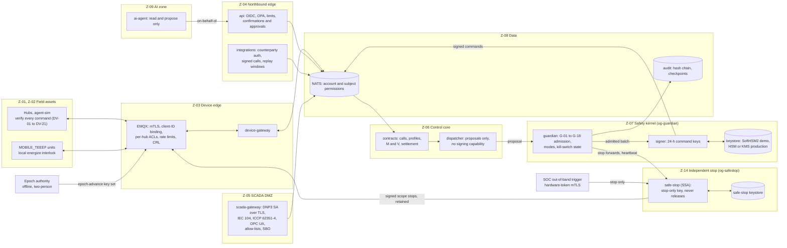
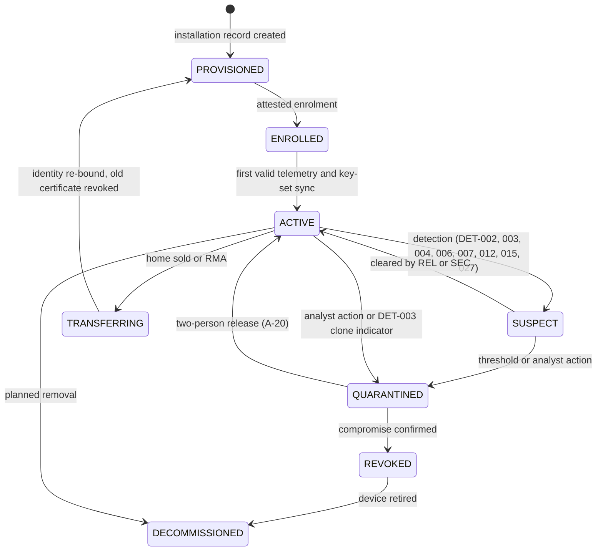
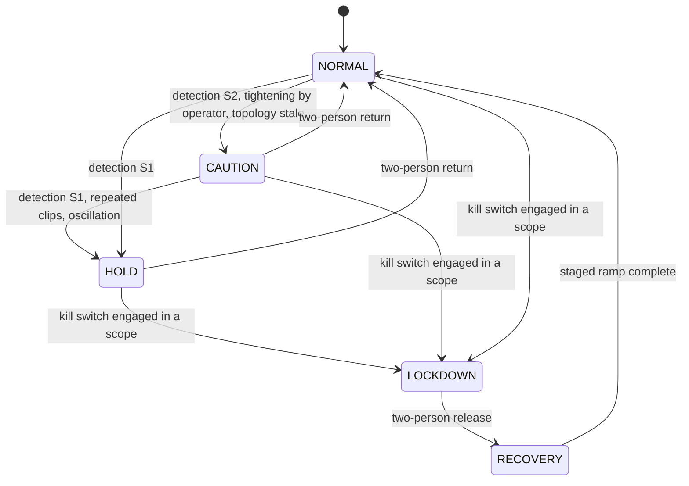
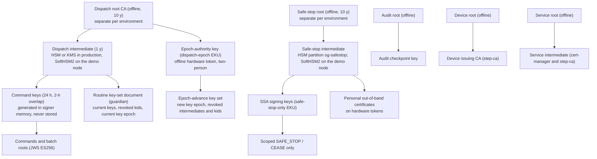
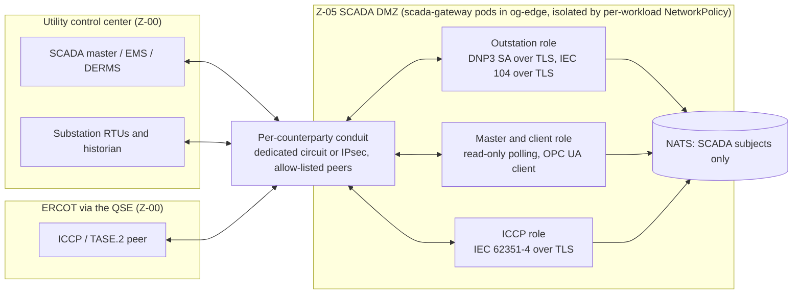
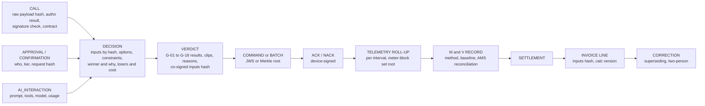
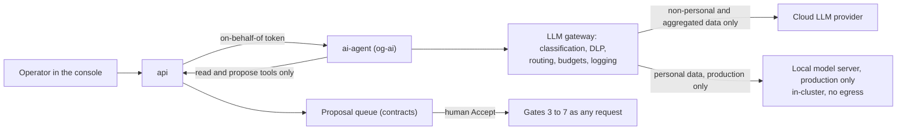

# OpenGrid Orchestrator — Security Architecture

Status: v0.2 · 2026-09-25 (resolution pass after the four adversarial reviews) · Author: independent OT/ICS and cloud
security architect · Companion: [`01-threat-model.md`](01-threat-model.md) (threats `TH-NNN`, assets, adversaries, zones,
attack trees, residual risks). Resolution log for this document: `../06-reviews/resolution/A7-security.md`.

Read [`../00-brief.md`](../00-brief.md) first, then the threat model. This document owns the security controls `CTL-NNN`, the
refined functional security requirements `FR-SEC-101`…`FR-SEC-203`, the detection rules `DET-NNN`, the incident-response
playbooks `IRP-NN`, the security test requirements `ST-NN`, and the **authoritative role catalogue** that
`../04-ui/01-ui-ux-specification.md` §2.3 points to. `FR-SEC-001`…`014` belong to `../01-product/02-functional-requirements.md`;
§22 maps each of them to the requirements here that refine it. Detections become Alertmanager rules and playbooks become
runbooks in `../02-architecture/06-platform-and-operations.md`, which assigns their `ALR-NNN`/`RB-NNN` IDs.

Normative words: **must** = required for the stated deployment; **should** = required unless a documented exception is
approved; **may** = optional. Every number is sourced or labelled *(assumption)*; reviewer numbers are labelled *(reviewer
proposal — unverified)* per brief §3.2.

**Decision register.** This version is aligned with [`../00-decision-register.md`](../00-decision-register.md) **v0.2**
(decisions D0a–D5, resolutions R1–R50 including the closed R16 and the amended R3, R4 and R10, open questions Q1–Q25,
normative values V-01…V-41). Where this document and the register disagree, the register wins; resolutions the register
marks *Proposed* are cited as such and remain open for the user's confirmation. Normative values are cited as "register
V-nn" and are not restated with different numbers anywhere in this document.

### Changes in this version (v0.2)

Reviewer findings were treated as claims to be proven: each was checked against this document before it was applied. The
full disposition of every finding is in `../06-reviews/resolution/A7-security.md`.

| Area | Change | Source |
|---|---|---|
| Independent stop | New §6.9 **Safe-Stop Authority** (`safe-stop`, namespace `og-safestop`): separate key hierarchy with the `safe-stop-only` EKU, stop-only message template, device rule DV-17, triggers (guardian forward; out-of-band hardware-token path re-pointed from the guardian to the SSA; optional watchdog, off by default), release only through `guardian` (Tier 2). New §6.10 **dispatch-key epoch authority** (two-person custody, invalidate-only). A stop is never queued behind `guardian`; §6.5 rewritten | R16 (closed); RT-001, RT-002, RT-010, RT-018; ARC-024 |
| Stop engage and release | Single-person engage at every scope (typed scope, reason, blast-radius preview, co-sign within 15 min, escalation), Tier 2 release at every scope, automatic downward re-declarations; stop counts in the cumulative windows; protective and non-protective reason codes; roles `QSD` (QSE desk; UI alias `QSE`) and `FSE` (licensed field engineer) and actions A-44…A-50 (including the SIM Lab) added; the `UTL` portal scope stated | R3 (amended), R25, R20/Q20, V-12…V-15, V-37; GRD-010, GRD-041; A8 cross-document items |
| Stop mechanics | Protective and non-protective stops (sequence, ramps, frequency gating), retained and latched scope stops (DV-18), stops exempt from the hub rate limit (DV-14), fallback schedules gated on "no active scope stop" | R4, V-16, V-17, V-07; ARC-018, ARC-024, GRD-025 |
| Guardian | TIMEOUT is not a veto; priority queues by command class; one OPA evaluation per batch; Merkle-batch signing in a process pool; state inventory with a named store per item; active/standby per shard group; per-hub limits checked against hub-reported values | R31, V-35; ARC-004, ARC-008, ARC-036, ARC-037, ARC-056 |
| Admission checks | A clip is a verdict: `guardian` never alters what it signs (resolves X-2 with `03` §8.14). G-03 in kVA or per-phase current with the fleet's charging and reactive power added back; zero net reverse flow at feeder heads and unconfirmed regulators; G-04/G-05 on the V-30 ramp table; G-07 on an independent reference and frozen during autonomous response; G-12 topology freshness from switching orders; one distribution-defaults source; new G-15 (ISO boundary), G-16 (emergency posture), G-17 (cross-principal windows), G-18 (counterparty-limit corroboration) | R17, R18, R19, R26, R28, V-14, V-30; GRD-003, -007, -009, -012, -013, -027, -032, -033, -047; RT-003, RT-005, RT-012 |
| Command integrity | Epoch = durable generation plus shard, equality at commit, floors per (issuer class, shard); idempotent submission and command ids; command envelope renamed for the device contract (`epoch`, `shard`, `cls`); command keys 24 h; no unsigned control input (`twin/desired` removed); new DV-17…DV-21 | R32, R33, V-05…V-11, V-36, V-40; ARC-009, ARC-011, ARC-017, ARC-018, ARC-027, ARC-051; RT-013 |
| Audit and billing | Per-stream chains, header hash with RFC 8785 JCS, cross-stream checkpoint every 60 s, pre-image before signing, **signed local journal** in degraded mode (K3 resolved as "both"), incremental verification; reconciliation before sealing estimated lines | R22, V-23, V-39; ARC-021, ARC-043, ARC-045; RT-007, RT-015; JDG-007 |
| Privacy | Subject keys held outside database backups so erasure survives restores; 15/15 floor on every outbound or LLM-bound aggregate; data-subject target 30 days; no per-premise data to ERCOT until Q12 is answered | R38, V-18, V-19, Q12; ARC-022; GRD-042 |
| Detection and response | DET-078…DET-097 (stop abuse, SSA and epoch use, withholding, narrative integrity, host memory pressure, journal integrity, scope gate, dead-man channel, ISO boundary, settings drift); paging aligned with the alert budget; IRP-15 (rogue guardian) and IRP-16 (stop abuse) | V-25, Q15; RT-008, RT-014, RT-016, RT-017, RT-018; ARC-033 |
| Platform | Namespaces per V-24 (`og-guardian`, `og-safestop`; `og-north` folded into `og-edge`); host-level memory-pressure monitoring without any reservation against the co-resident services; LAN-only MQTT listener allow-listed to the load-generator host; monitored demo scope gate; SLSA Build L3 for the `guardian` and `safe-stop` images | V-24, R35, R46, Q21, Q24; RT-006, RT-016, RT-017; ARC-052 |
| Other values | Device certificates 90 d, service certificates 24 h pre-issued, broker admission, AI budget, ES256 only, role aliases, SBO/DO per point map | V-08, V-09, V-21, V-22, V-36, V-37, R29 |
| New IDs | CTL-147…CTL-156, FR-SEC-204…FR-SEC-223, DET-078…DET-097, IRP-15, IRP-16, ST-21…ST-25, G-15…G-18, DV-17…DV-21, A-44…A-50, SoD-11…SoD-13; §23.1 go-live security gates | — |

## Which judging criteria this document serves

| Criterion (`../00-brief.md` §2) | Where |
|---|---|
| Completeness (15) | §3 dispatch pipeline with seven gates; §6.6 leases and bounded fallback keep firm delivery running under attack or outage; §6.9 a stop always works, even with `guardian` down; §18 playbooks for every top risk; §23.1 go-live gates |
| Technical depth (15) | §6 physics-aware grid-stress admission control (kVA and per-phase, ISO boundary, emergency posture); §6.9–§6.10 a cryptographically stop-only authority and an invalidate-only epoch authority; §7 signed command envelope with Merkle batching, epoch fencing and ordering interlocks; §8 IEC 62351 SCADA profiles; §12 hash-chained, Merkle-anchored decision traces with a signed degraded-mode journal |
| The problem (15) | Controls are built around keeping homes and feeders safe while one fleet serves many buyers (§6, §16) |
| The "why" (15) | §2 principles and §3 explain why an independent `guardian` that alone signs anything that moves MW — beside a separate path that can only stop — is what makes "one fleet, many buyers" safe |
| Insight quality (10) | Every refusal or clip carries an enumerated reason and the numbers behind it (§5.10); decision traces make any charge explainable (§12) |
| Usability (10) | Role catalogue and permission matrix operators can use tomorrow (§5); single-node hardening that does not touch co-located services (§19) |
| Creativity (10) | Merkle-batched signed commands (§7.3), a stop-only key enforced by the device (DV-17), counterparty-verifiable audit anchoring (§12.3), co-signed arbitration inputs (§10.7) |
| Performance (10) | Signing and verification budgets modelled and handed to measurable tests (§7.9, §23) |

---

## 1. Scope and conventions

Scope is the system defined in the threat model §1.1, in both deployment contexts: the **demo node** (k3s on 192.168.5.35,
shared with Apache, mail, MariaDB and `fdmp`; simulated hubs and counterparties) and the **production target** (managed,
multi-zone Kubernetes). Where they differ, each control states both.

Out of scope by decision of the user: research and evaluation with academic partners (brief §3.5 — not an Orchestrator
function) and any sharing of personal data with third parties (brief §8 D5).

ID families in this document:

| Prefix | Meaning | Range used |
|---|---|---|
| `CTL-NNN` | Security control | CTL-001 … CTL-156 (§21) |
| `FR-SEC-1NN`/`2NN` | Testable functional security requirement | FR-SEC-101 … FR-SEC-223 (§22) |
| `DET-NNN` | Detection rule | DET-001 … DET-097 (§10.6) |
| `IRP-NN` | Incident-response playbook | IRP-01 … IRP-16 (§18) |
| `ST-NN` | Security test requirement for the test plan | ST-01 … ST-25 (§23) |
| `G-NN` | Guardian admission check | G-01 … G-18 (§6.3) |
| `DV-NN` | Device-side command verification rule | DV-01 … DV-21 (§7.4) |
| `A-NN` (in §5) | Console/API action in the permission matrix | A-01 … A-50 |
| `SoD-NN` | Separation-of-duties rule | SoD-01 … SoD-13 |

IDs are stable: v0.2 changed the content of some existing IDs (recorded in the change table above) and added new IDs only
at the end of each range.

---

## 2. Security principles

| ID | Principle | What it means here |
|---|---|---|
| P-1 | **Safety first, then integrity, then availability, then confidentiality** | The order follows the brief's allocation priority. A control that trades a little availability for grid or home safety wins. |
| P-2 | **Independent safety supervisor** | `guardian` is separately deployed, separately identified, fed by its own data path (including hub-reported values, not only the shared estimator), implemented independently of `dispatcher` (N-version limit checks), and **is the only component that can sign anything that moves MW** (register R1). Two narrower authorities exist beside it and neither can move MW: the Safe-Stop Authority can only **stop** (§6.9, CTL-147) and the epoch authority can only **invalidate** (§6.10, CTL-152) (register R16). |
| P-3 | **Defence in depth across three layers** | Every safety property is enforced at least twice: in the decision engine, in `guardian`, and on the device (for example the homeowner reserve, CTL-036). |
| P-4 | **Zero trust between services** | Every service-to-service connection is mutually authenticated and authorized per request; network policy is containment, not authentication (CTL-010, CTL-076). |
| P-5 | **Least privilege and separation of duties** | People, services, devices, counterparties and the `ai-agent` get the minimum rights; toxic combinations are prevented at grant time (§5.3). |
| P-6 | **Fail-safe defaults, deterministic output** | On doubt: hold the last known-good setpoint, then the day-ahead schedule; on loss of supervision: no new run signatures, while stops stay available through the Safe-Stop Authority; on loss of commands: hubs follow their lease, then the bounded fallback of register V-07, then backup-only (IEC 62443-3-3 SR 3.6 "deterministic output"). A guardian **timeout is not a veto**: it never escalates to a stop by itself (register R31, V-35). |
| P-7 | **Service-agnostic dispatch** (brief §1) | Security decides *whether a request is authentic, authorized, in contract and physically safe*, never *whether a service is worth doing*. Refusals and clips use only the enumerated safety and integrity reasons in §5.10 (CTL-144). |
| P-8 | **Order and confirmation on every control path** (brief D4) | Monotonic sequencing, expected-state preconditions, rejection of stale or conflicting commands, select-before-operate, explicit confirmation of critical-impact actions and a second approver above a higher threshold (§5.8, §7.5). |
| P-9 | **Everything that changes behaviour is signed, versioned and audited** | Commands, dispatch profiles, guardian limits, policy bundles, point maps and images are signed artifacts; every decision is a signed, hash-chained trace (§9, §12). |
| P-10 | **Privacy by design and default; no third-party sharing** (brief D5) | Personal data stays on the platform; only aggregates meeting the threshold in §16.6 leave it; the cloud LLM receives no personal data (§13.6). |
| P-11 | **Design for decommission** | No trust anchor, key or credential from the demo node is ever trusted in production (CTL-100). |
| P-12 | **Stopping never waits; raising output and releasing always do** | Any qualified person may engage a stop or block at once at any scope, with a co-sign afterwards; every release and every increase passes its tier (register R3, amended). Stale restrictive information may restrict, never permit (DV-18). |
| P-13 | **No single component is both the only way to act and the only way to stop** | The run path (`guardian`) and the stop path (Safe-Stop Authority) have separate keys, processes, namespaces and failure domains; containment of a compromised `guardian` needs no cooperation from it (register R16). |

---

## 3. Architecture overview

### 3.1 Zones, conduits and where the controls sit



### 3.2 The dispatch pipeline and its seven gates

Every path that can move MW — a customer call, a SCADA control, an operator action, an `ai-agent` proposal, a market award
or the dispatcher's own control loop — passes the same gates. A request that fails a gate is refused or clipped with an
enumerated reason (§5.10) that is returned to the requester and written to the decision trace.

| Gate | Where | Checks | Refusal/clip reasons allowed |
|---|---|---|---|
| 1. Authenticate | `api`, `integrations`, `scada-gateway`, `device-gateway` | Identity of the principal (person, counterparty system, SCADA association, hub, service) | `AUTHN_FAILED` |
| 2. Integrity and freshness | Same | Signature, replay window, idempotency key, version order, SBO state (§7.5) | `SIGNATURE_INVALID`, `REPLAY_OR_STALE`, `OUT_OF_ORDER`, `SCHEMA_INVALID` |
| 3. Authorize | OPA policy decision points | Principal × action × program × asset scope × magnitude × window (§5.6) | `AUTHZ_DENIED` |
| 4. Contract conformance | `contracts` | The request is within the requester's own contract (magnitude, window, notice, event count) and dispatch profile (§9) | `CONTRACT_NONCONFORMANT` |
| 5. Confirmation / second approver | `api` (internal initiators only) | Impact tier (§5.8); a stop or block engages on one confirmation and is co-signed afterwards | `APPROVAL_REQUIRED` (pending, not refused) |
| 6. Arbitration | `dispatcher` / `planner` | Priority, commitments, profitability (brief §1 core job; owned by `../02-architecture/03-decision-engine.md`); ERCOT instructions for an on-line ADER are hard constraints, not calls (register R17) | Allocation outcome, not a security refusal; losers and their cost recorded |
| 7. Guardian admission and signing | `guardian` | G-01…G-18 physics, reserve, topology, energy ledger and reservation-ledger version, ISO boundary, emergency posture, envelopes, ordering and approval evidence; then signing (§6, §7) | Safety codes only (`RESERVE_FLOOR`, `HOSTING_LIMIT_EXPORT`, `RAMP_LIMIT`, …) |

Per the decision register, **`guardian` is the only signer of anything that moves MW**: every path — `dispatcher`, SCADA,
`ai-agent` proposal, operator — submits to it, and it checks policy, ordering, limits and approvals before signing (R1). The
only other signers are the Safe-Stop Authority, which can sign nothing but a scoped stop (§6.9), and the epoch authority,
which can sign nothing but an epoch advance that invalidates keys (§6.10) (R16). A **call** is any incoming request before
validation; once gate 4 validates it against a contract it becomes an **event** bound to an obligation (R7); an ERCOT
instruction to an on-line ADER is an `IsoInstruction` (R17). Under platform saturation, calls are clipped or deferred with the
shortfall reported, never rejected (register R48, D0b).

```mermaid
sequenceDiagram
  participant R as Requester (customer, SCADA master, operator, ai-agent)
  participant E as Edge (integrations, scada-gateway, api)
  participant P as OPA
  participant C as contracts
  participant D as dispatcher
  participant G as guardian
  participant S as signer
  participant H as hubs
  R->>E: call (authenticated, signed, versioned)
  E->>E: gates 1-2 authenticate, freshness, order
  E->>P: gate 3 authorize (principal, action, scope, kW, window)
  P-->>E: allow or deny with reason
  E->>C: gate 4 contract and profile conformance
  C->>D: accepted call (decision trace opened)
  D->>D: gate 6 arbitrate by priority, commitments, profitability
  D->>G: proposal batch (decision id, profile version, snapshot id)
  G->>G: gate 7 checks G-01 to G-18 on its own data (one OPA evaluation per batch)
  alt admitted or clipped
    G->>S: admitted batch plus verdict
    S-->>H: signed commands (JWS ES256, seq, key epoch, shard epoch, expiry, jitter)
    H-->>G: signed acks and telemetry (closed-loop check)
  else no verdict within 2 x budget (TIMEOUT, not a veto)
    G-->>D: TIMEOUT, batch unsigned; commands in force run to their lease; on-call paged
  else rejected
    G-->>D: verdict with enumerated reason
  end
  G-->>R: outcome and reason via decision trace and acknowledgement
```

---

## 4. Identity

### 4.1 Devices (hubs, `agent-sim` agents, `MOBILE_TEEEF` units)

**Certificate profile (CTL-001, CTL-004).**

| Field | Value |
|---|---|
| Key | ECDSA P-256, generated on the device; non-exportable in a secure element or TPM 2.0 where the hardware has one (CTL-002) |
| Subject / SAN | `CN=<hub_id>`; SAN URI `urn:opengrid:hub:<hub_id>` (units: `urn:opengrid:teeef:<unit_id>`); SPIFFE-style URI `spiffe://<trust-domain>/hub/<hub_id>` may be added |
| Extended key usage | `clientAuth` only |
| Issuer | Device issuing CA (step-ca) under an offline **device root**, separate from the service and dispatch hierarchies (CTL-093) |
| Validity | 90 days, renewed from day 60 (register V-09); renewal requires the current certificate and, where available, fresh attestation; a revoked hub is refused at connect by the broker deny-list |
| Environment | Demo and production use **different device roots**; a production broker never trusts a demo device root (CTL-100) |
| Issuer on the demo profile | The demo values profile (register R35) issues device and service certificates from cert-manager with a self-signed, demo-only CA issuer; step-ca, its X5C and ACME `device-attest-01` provisioners and the flows below return with the production profile, design unchanged (register R21: sequencing only) |

**Enrolment and attestation (CTL-003).** Two supported flows, both on step-ca, which provides an X5C provisioner (a
certificate chain from another CA authenticates the request) and ACME with the `device-attest-01` challenge (TPM, Apple and
`step` attestation formats). step-ca's documented provisioners do not include EST, so EST is not used:

1. **Factory identity (preferred):** the hub leaves the factory with an IEEE 802.1AR-style initial device identity (IDevID)
   signed by the manufacturer's CA. At installation the hub requests its operational certificate through the X5C
   provisioner, presenting the IDevID chain; step-ca trusts only the manufacturer root pinned for that product line.
2. **Hardware attestation:** where the hub has a TPM or secure element, ACME `device-attest-01` binds the new key to the
   attested hardware identity (permanent identifier = hub serial).

In both flows the certificate is issued only if the **installation record** exists in `contracts` (hub serial ↔ site ↔
service point, created by an authenticated installer through the homeowner channel) and the hub is in state `PROVISIONED`.

**How `agent-sim` simulates it.** Each simulated hub generates a software P-256 key and holds a simulated IDevID signed by a
**simulation manufacturer CA** that exists only in the demo trust store. Its certificate carries the policy OID
`sim-attestation` and the hub record is flagged `attestation=simulated`; `fleet-state` caps the trust score of such hubs at
60/100 *(assumption)* so the flag is visible in every dispatch weighting. The simulation CA is never present in a production
trust store (CTL-100).

**Lifecycle and quarantine (CTL-006).**



| State | Broker access | Commands accepted | Telemetry use |
|---|---|---|---|
| ACTIVE | Full own-topic ACL | All signed commands | State estimation, M&V, dispatch weighting |
| SUSPECT | Full | All signed commands; trust score reduced | Flagged; excluded from M&V pending review |
| QUARANTINED | Own topics only, rate-limited | Only stops (from `guardian` or the Safe-Stop Authority), safe-mode and key-set messages | Excluded from state estimation and M&V |
| REVOKED | Denied (deny-list, then CRL) | None | None |

**Revocation (CTL-005).** step-ca revocation blocks renewal ("passive revocation") and step-ca can publish a CRL
(`generateOnRevoke`); EMQX checks client certificates against CRLs (EMQX's OCSP stapling covers only its own server
certificate). Because CRL caching delays effect, the Orchestrator also adds the hub to EMQX's banned-clients list and denies
it in the authorization hook within **60 seconds** of the revocation decision; the CRL follows within 15 minutes
*(assumption)*. Short certificate lifetimes bound the rest.

**Ownership transfer and RMA (CTL-009).** On home sale or replacement: revoke the old operational certificate, wipe
homeowner-linked data from the device, re-bind the hub to the new installation record, re-enrol.

**Session binding (CTL-007).** EMQX binds the MQTT client identifier to the certificate (`peer_cert_as_clientid`), so a hub
cannot present another hub's client ID; an authentication hook additionally refuses any CONNECT whose requested client ID
differs from the certificate identity, with reason code 0x85 (Client Identifier not valid). A second connection for the same
identity (session takeover) is logged; ≥ 3 takeovers per hour quarantine the hub (DET-003) because it indicates a cloned
identity.

### 4.2 Services

| Aspect | Specification |
|---|---|
| Identity | One Kubernetes ServiceAccount per workload; X.509 workload certificate from cert-manager backed by a step-ca intermediate under an offline **service root**; SAN URI `spiffe://<trust-domain>/ns/<namespace>/sa/<serviceaccount>` (SPIRE optional in production) |
| Lifetime | 24 h, renewed at 16 h and pre-issued with overlap so no restart waits on the CA (register V-08); step-ca is off every restart path (register R31) |
| mTLS everywhere | HTTP between services, NATS, PostgreSQL (certificate authentication, `verify-full`), Valkey (TLS plus ACL user per service; production profile), OPA bundle fetch, OTLP export. Plaintext listeners are disabled (CTL-010, FR-SEC-155) |
| NATS | One account per trust zone; per-service publish/subscribe permissions on the subjects of the normative stream and subject table owned by `../02-architecture/02-domain-model-and-interfaces.md` (register R34). Only the guardian-signer identity may publish signed commands; only `device-gateway` may subscribe to them; `dispatcher` may publish only submissions (CTL-011). The Safe-Stop Authority has no NATS write permission (§6.9) |
| Broker identities with hub-bound publish rights | Exactly three, each limited to its topics in the device contract (register R33): the guardian publisher (commands, lease heartbeat, routine key sets, retained scope stops, via `device-gateway`), the Safe-Stop Authority (retained scope-stop topics only) and the epoch-authority publisher (the retained key-set topic only). Any other publish on a hub-bound topic is denied and raises DET-093 (CTL-153) |
| Data tier | Per-service PostgreSQL roles with schema-level grants; the audit and billing schemas are INSERT-only for their writers; no application uses a superuser (CTL-012) |
| Kubernetes API | `automountServiceAccountToken: false` except for controllers that need it; no application ServiceAccount has cluster-wide rights (CTL-013) |

Architecture note: `../02-architecture/01-system-architecture.md` NFR-017 allows "mTLS **or** namespace NetworkPolicy" between
services. This document requires mTLS for every link that carries commands, telemetry, calls, audit or billing data;
NetworkPolicy is an additional containment layer, not a substitute (P-4).

### 4.3 People

| Aspect | Specification |
|---|---|
| Identity provider | Keycloak realm per environment; OIDC authorization code with PKCE; the console uses a backend-for-frontend in `api` so tokens never sit in browser storage; session cookie `HttpOnly`, `Secure`, `SameSite=Strict` (CTL-014) |
| Authentication | Phishing-resistant WebAuthn/FIDO2 for every role that can change fleet behaviour, approve, administer or read personal data (`OP`, `FOP`, `APR`, `TRD`, `REL`, `PPM`, `STL`, `BAD`, `SEC`, `SRE`, `SAD`, `AUD`, `BRK`); TOTP accepted only for `VWR` and `EXE` (CTL-015). Keycloak brute-force detection: 5 failures → 15-minute lockout *(assumption)* |
| Sessions | Idle timeout 15 min for privileged roles, 30 min otherwise; absolute 12 h (a control-room shift) *(assumption)*; step-up re-authentication (`max_age` ≤ 300 s) for every confirmation- or approval-tier action; one concurrent privileged session per user; access tokens 5 min (CTL-016) |
| Joiner/mover/leaver | Roles granted through groups; privileged roles only via just-in-time elevation for ≤ 4 h with a second approver (`SEC`); quarterly access recertification; leaver disabled within 1 h of HR notice *(assumption)* (CTL-017) |
| Break-glass | Two sealed accounts with hardware keys held in split custody; use pages the SOC (DET-040), expires after 4 h, and requires a review within 24 h (CTL-018) |
| Personnel screening | Staff with approver, security or key-custody roles are screened; SB 2368 (2025) adds attestations about relationships with foreign governments for critical-grid positions (CTL-098) |
| Out-of-band stop credentials | Each person entitled to engage a stop (`OP`, `APR`, `REL`, `SEC`, `QSD`) holds a personal hardware token (FIDO2/PIV) carrying a client certificate issued under the safe-stop hierarchy (§6.9); it works without Keycloak, so a stop never depends on the IdP; tokens are listed per person, revoked at leaver time with the rest of the account (CTL-017), and every use is attributed and paged (DET-078) |

### 4.4 External and machine principals

| Principal | Credential | Scope binding |
|---|---|---|
| Utility VTN (Base's `integrations` acts as the OpenADR 3.0 VEN client) | OAuth 2.0 client credentials to the utility's VTN; TLS server certificate of the VTN pinned to the utility's CA; callbacks treated as hints and confirmed by pulling the event over the authenticated channel (CTL-019, CTL-026) | Contract ID → programs → enrolled banks |
| Utility DERMS (IEEE 2030.5) | Mutual TLS with P-256 certificates, cipher suite `TLS_ECDHE_ECDSA_WITH_AES_128_CCM_8`; device identifiers derived from the certificate | Per-bank aggregates only |
| Utility SCADA master / RTUs | DNP3 Secure Authentication user keys plus TLS client certificate per association (§8) | Point map of that association |
| ERCOT QSE interface (simulated; real in future) | Client certificates per the ERCOT digital-certificate model, administered by Base's User Security Administrator (CTL-104) | QSE resources and products |
| Customers (`LARGE_LOAD`, `PIPELINE_AC`, `MOBILE_TEEEF` lessee, `PJM_CAPACITY`) | mTLS, or `private_key_jwt` client authentication (RFC 7523) with certificate-bound access tokens (RFC 8705); call-creating requests additionally signed (JWS or HTTP Message Signatures, RFC 9421) | Contract ID → program → asset scope |
| Homeowner channel (Base customer systems) | mTLS service identity plus signed requests; each homeowner action carries the homeowner-authentication assertion from Base's customer system (CTL-101) | Only the homeowner's own hub(s) |
| `ai-agent` | Workload certificate plus OAuth 2.0 token exchange (RFC 8693) producing an on-behalf-of token with the user as subject and the agent as actor (`act` claim) (CTL-120) | Intersection of the user's rights and the agent's read/propose scope |
| Simulators (`agent-sim`, `grid-sim`) | Exactly the credential types of the real devices and counterparties they imitate, issued from demo-only roots (CTL-100). `agent-sim` and the fault proxy run off the node on an allow-listed LAN host (register R35, Q24); `grid-sim` stays in `og-sim` | As the real principal |
| ERCOT instructions (QSE desk) | Entered by an authenticated `QSD` (or `OP` as backup) with the instruction reference (VDI number, deployment or recall ID), or received over the QSE interface; recorded as an `IsoInstruction` (register R17, R25) | ADER resources of the QSE; hard constraint on member hubs while the ADER is on line |
| Safe-Stop Authority triggers | Guardian forwards over mTLS (workload identity); out-of-band triggers by a person's hardware-token certificate from the SOC workstation network; while `guardian` is unavailable, `api` (operator with a verified token) and `scada-gateway` (an authorized utility's stop, only for scopes in the SSA's cached, signed entitlement snapshot, never fleet scope) (§6.9) | Stop only; never release |
| Epoch-authority publisher | Dedicated broker identity used only during an epoch-advance procedure; the message it carries is signed offline by the two-person epoch-authority key (§6.10) | The retained key-set topic only |
| Distribution counterparty's direct stop path to hubs | Where a counterparty keeps a stop path that does not traverse the Orchestrator (register R25: a CSIP control to the hub or the IEEE 1547 permit-service function), the hub authenticates it with the counterparty's certificate pinned at enrolment and accepts only restrictive controls (DV-20, CTL-156) | Hubs behind that counterparty's contracted assets |

---

## 5. Authorization

### 5.1 Role catalogue (authoritative; brief §8 D1)

Codes align with `../04-ui/01-ui-ux-specification.md` §2.3 where they already exist. The UI's `RSC` (academic partner) role is
removed: research is not an Orchestrator function (brief §3.5) and no data is shared with academic partners (D5). The
planning and forecasting analyst persona uses `REL` or `TRD` read rights plus proposal rights in Git for planner configuration.

| Code | Role | Purpose | Kind |
|---|---|---|---|
| `VWR` | Viewer | Read aggregated dashboards | Internal |
| `EXE` | Executive | Portfolio snapshot, audit summaries | Internal |
| `OP` | Control-room operator | Real-time monitoring, events, alarms, bounded manual actions, bank safe stop | Internal |
| `FOP` | **Fleet operator** (D1) | Fleet as assets: enrolment, decommissioning, RMA, quarantine, firmware allow-list proposals, `MOBILE_TEEEF` readiness, topology corrections | Internal |
| `APR` | Dispatcher-approver (shift supervisor) | Second approver for operational actions; plan approval; kill-switch release | Internal |
| `TRD` | Market trader | Bids, offers and positions within trader limits | Internal |
| `REL` | Reliability engineer | Fleet health, guardian limits (safety fields), point maps, topology approval | Internal |
| `PPM` | Program manager | Customers, contracts, programs, dispatch profiles (proposer) | Internal |
| `STL` | Settlement analyst | M&V, settlement preparation, invoice lines, disputes | Internal |
| `BAD` | **Billing admin** (D1) | Billing configuration (tariffs, price and penalty terms, invoice templates), period seal, adjustment approval | Internal |
| `SEC` | Security analyst | Detection, investigation, quarantine and revocation, security approvals, privacy approvals | Internal |
| `SRE` | Site reliability engineer | Platform operations through GitOps; no fleet operations | Internal |
| `SAD` | **System admin** (D1) | Identity and access administration, integration configuration, non-dispatch system settings | Internal |
| `AUD` | Auditor | Read-only audit and billing evidence, verification tooling; time-bound | Internal or external |
| `BRK` | Break-glass | Emergency operation when normal approvers or the IdP are unavailable | Internal, sealed |
| `UTL` | Utility operator | A partner utility's staff: view own assets, override own contracted assets, submit `MOBILE_TEEEF` switching orders and issue the close of a leased unit under its own switching order (register R20) | External, scoped |
| `QSD` | **QSE-desk operator** (register R25) | Enters, acknowledges and executes ERCOT instructions (verbal dispatch instructions, manual deployments and recalls, status changes, EEA procedures), changes ADER status (OUTL), handles telemetry replacement and the hotline log; may engage a stop on an ERCOT instruction. 24×7 in production; simulated for the demo | Internal |
| `FSE` | **Licensed field engineer** (register Q20, proposed default) | Signs off `MOBILE_TEEEF` field safety (grounding, island protection, cold-load pickup) before a deployment leaves `PENDING_SAFETY_REVIEW`; the sign-off is a signed audit record | Internal or contracted |

Machine principals (not console roles): hubs, counterparty systems, the homeowner channel, internal services and the
`ai-agent` (§4.4).

**Console aliases (register V-37).** The codes above are authoritative; the console may display the aliases of
`../05-testing/01-test-strategy.md` §4.2: `FLT` = `FOP`, `BIL` = `BAD`, `SYSADM` = `SAD`, and `QSE` = `QSD` (the UI's
proposed label for the QSE desk; the code is `QSD` so it is never confused with the market entity). Every other code is
shown as is. `QSD` and `FSE` were added in v0.2 (R25, Q20) and need entries in the UI role list and the test fixtures
(`FX-USERS`).

### 5.2 Permission matrix (console and API actions)

Legend: **✓** allowed · **C** allowed with explicit confirmation (reason, type-to-confirm, impact preview) · **S** allowed with
step-up re-authentication, purpose-bound and logged · **A** requires a second, distinct approver (the role may request it,
approve it, or both, as noted in §5.8) · **T** tiered by magnitude and scope per §5.8 (register R3): **C** at Tier 1, **A** at
Tier 2 · **E** engage a stop or block at once on one explicit confirmation (typed scope ID, reason, blast-radius preview),
co-signed afterwards within 15 min (register R3 amended, V-15) · **K** co-sign a single-person engage (never its invoker) ·
**R** read-only · **O** own scope only · **B** break-glass only · **—** denied.

| # | Action | VWR | EXE | OP | FOP | APR | TRD | REL | PPM | STL | BAD | SEC | SRE | SAD | AUD | BRK | UTL | QSD | FSE |
|---|---|---|---|---|---|---|---|---|---|---|---|---|---|---|---|---|---|---|---|
| A-01 | View fleet overview and aggregates | ✓ | ✓ | ✓ | ✓ | ✓ | ✓ | ✓ | ✓ | ✓ | ✓ | ✓ | ✓ | — | R | ✓ | O | ✓ | ✓ |
| A-02 | View hub/site detail (pseudonymous) | R | R | ✓ | ✓ | ✓ | R | ✓ | O | R | — | ✓ | R | — | — | ✓ | O | R | R |
| A-03 | View homeowner personal data (name, address, contact, ESI ID) | — | — | — | S | — | — | — | — | — | — | S | — | — | — | — | — | — | — |
| A-04 | View precise location below service-transformer level | — | — | R | R | R | — | R | — | — | — | R | — | — | — | R | — | — | R |
| A-05 | View market positions, bids, forecasts, ADER telemetry and COP | — | — | — | — | — | ✓ | — | — | — | — | R | — | — | — | — | — | R | — |
| A-06 | View decision traces and Audit Explorer | — | R | R | R | R | O | R | O | R | R | ✓ | R | R | R | R | O | R | O |
| A-07 | Acknowledge alarms (Critical shelving needs step-up) | — | — | ✓ | ✓ | ✓ | — | ✓ | — | — | — | ✓ | ✓ | — | — | B | — | ✓ | — |
| A-08 | Approve day-ahead plan / publish declaration | — | — | C | — | C | C | — | — | — | — | — | — | — | — | B | R | R | — |
| A-09 | Submit or modify bids and offers | — | — | — | — | — | C | — | — | — | — | — | — | — | — | — | — | — | — |
| A-10 | Manual dispatch below Tier 1 (< 1 MW and < 25% of the target resource) | — | — | ✓ | — | ✓ | — | — | — | — | — | — | — | — | — | B | — | — | — |
| A-11 | Manual dispatch at Tier 1 or Tier 2 (§5.8) | — | — | T | — | T | — | — | — | — | — | — | — | — | — | B | — | — | — |
| A-12 | Accept an `ai-agent` arbitration proposal (tier of the resulting change; AI-drafted flag shown) | — | — | T | — | T | — | — | — | — | — | — | — | — | — | — | — | — | — |
| A-13 | Tighten guardian mode (NORMAL → CAUTION or HOLD) at any scope — a block; guardian-initiated changes need no human action | — | — | E | — | E | — | E | — | — | — | E | — | — | — | B | — | E | — |
| A-14 | Return guardian mode to NORMAL | — | — | A | — | A | — | A | — | — | — | A | — | — | — | B | — | — | — |
| A-15 | Engage kill switch — bank | — | — | E | — | E | — | E | — | — | — | E | — | — | — | B | O | E | — |
| A-16 | Engage kill switch — zone | — | — | E | — | E | — | E | — | — | — | E | — | — | — | B | — | E | — |
| A-17 | Engage kill switch — fleet | — | — | E | — | E | — | — | — | — | — | E | — | — | — | B | — | E | — |
| A-18 | Release kill switch (any scope) | — | — | A | — | A | — | A | — | — | — | A | — | — | — | B | — | — | — |
| A-19 | Quarantine or isolate a hub | — | — | ✓ | ✓ | ✓ | — | ✓ | — | — | — | ✓ | — | — | — | B | — | — | — |
| A-20 | Release a hub from quarantine | — | — | A | A | A | — | A | — | — | — | A | — | — | — | B | — | — | — |
| A-21 | Revoke a device certificate | — | — | — | A | — | — | — | — | — | — | C | — | — | — | B | — | — | — |
| A-22 | Tighten guardian limits at runtime | — | — | T | — | T | — | T | — | — | — | T | — | — | — | B | — | — | — |
| A-23 | Loosen guardian limits at runtime (emergency, GitOps follow-up within 24 h) | — | — | — | — | — | — | A | — | — | — | A | — | — | — | — | — | — | — |
| A-24 | Approve policy or limit changes in GitOps | — | — | — | — | — | — | A | — | — | — | A | A | — | — | — | — | — | — |
| A-25 | Propose a dispatch-profile change | — | — | — | — | — | — | ✓ | ✓ | — | ✓ | — | — | — | — | — | — | — | — |
| A-26 | Approve a dispatch-profile critical-field change (§9.2) | — | — | — | — | A | — | A | — | — | A | A | — | — | — | — | — | — | — |
| A-27 | Create or activate a contract or program; change contract kW or windows | — | — | — | — | A | — | — | A | R | A | — | — | — | — | — | — | — | — |
| A-28 | Edit topology mapping or SCADA point maps | — | — | — | A | — | — | A | — | — | — | — | A | — | — | — | — | — | — |
| A-29 | Storm hold (raise reserve floors for a bank, a zone or the fleet; during an EEA met by discharging less, never by grid charging, G-16) | — | — | T | — | T | — | T | — | — | — | — | — | — | — | B | — | — | — |
| A-30 | Fleet asset operations (enrol, decommission, RMA, firmware allow-list proposal, `MOBILE_TEEEF` readiness) | — | — | — | C | — | — | R | — | — | — | — | — | — | — | — | — | — | R |
| A-31 | Manage users and non-privileged role grants | — | — | — | — | — | — | — | — | — | — | — | — | ✓ | — | B | — | — | — |
| A-32 | Grant privileged roles (just-in-time) | — | — | — | — | — | — | — | — | — | — | A | — | A | — | B | — | — | — |
| A-33 | Export personal or meter data (operational, internal only) | — | — | — | — | — | — | — | — | A | — | A | — | — | — | — | — | — | — |
| A-34 | Close a billing period / issue invoices | — | — | — | — | — | — | — | — | A | A | — | — | — | R | — | — | — | — |
| A-35 | Change billing configuration (tariffs, price and penalty terms, templates) | — | — | — | — | — | — | — | A | — | A | — | — | — | R | — | — | — | — |
| A-36 | Post an invoice adjustment | — | — | — | — | — | — | — | — | A | A | — | — | — | R | — | — | — | — |
| A-37 | Place or release a legal hold | — | — | — | — | — | — | — | — | — | — | A | — | — | — | — | — | — | — |
| A-38 | Key and PKI ceremonies (including the safe-stop hierarchy) | — | — | — | — | — | — | — | — | — | — | A | A | — | — | — | — | — | — |
| A-39 | Configure counterparty integrations and credentials | — | — | — | — | — | — | — | A | — | — | — | A | A | — | — | — | — | — |
| A-40 | Utility override (reduce, stop, hold) on own contracted assets | — | — | — | — | — | — | — | — | — | — | — | — | — | — | — | ✓ | — | — |
| A-41 | `MOBILE_TEEEF` readiness report and energization request to the lessee — no close authority (register R20) | — | — | ✓ | ✓ | ✓ | — | — | — | — | — | — | — | — | — | — | O | — | R |
| A-42 | Configure `ai-agent` budgets and model pinning | — | — | — | — | — | — | — | — | — | — | A | A | — | — | — | — | — | — |
| A-43 | Run audit verification; produce a signed auditor export | — | — | — | — | — | — | — | — | — | — | ✓ | — | — | ✓ | — | — | — | — |
| A-44 | Pause a service type for a safety or integrity incident (register R15: reason code and incident ID, expires ≤ 24 h, audited) | — | — | — | — | A | — | A | — | — | — | A | — | — | — | B | — | — | — |
| A-45 | `MOBILE_TEEEF` field-safety sign-off (a deployment leaves `PENDING_SAFETY_REVIEW`; register Q20) | — | — | — | — | — | — | — | — | — | — | — | — | — | — | — | — | — | S |
| A-46 | Enter, acknowledge and execute an ERCOT instruction; change ADER status (OUTL); telemetry replacement (register R17, R25) | — | — | ✓ | — | ✓ | R | — | — | — | — | — | — | — | — | B | — | ✓ | — |
| A-47 | Engage a stop through the Safe-Stop Authority's out-of-band path (personal hardware token; §6.9) | — | — | E | — | E | — | E | — | — | — | E | — | — | — | B | — | E | — |
| A-48 | Advance the dispatch-key epoch (epoch authority, two-person custody; §6.10) | — | — | — | — | — | — | — | — | — | — | A | A | — | — | — | — | — | — |
| A-49 | Co-sign a single-person stop or block engage (register V-15; never its invoker) | — | K | — | — | K | — | — | — | — | — | K | — | K | — | — | — | — | — |
| A-50 | Inject simulated faults and run scenarios (SIM Lab) — only in deployments flagged `SIMULATION`; the action does not exist in production builds (TH-117, CTL-108) | — | — | ✓ | — | — | — | — | — | — | — | — | ✓ | — | — | — | — | — | — |

Notes: A-33 exports stay inside Base (brief D5 forbids third-party sharing); `STL` requests, `SEC` approves as privacy
reviewer. A-37 legal holds need `SEC` plus Base counsel (recorded as the second approver). `UTL` A-15 means the utility may
engage a bank safe stop only for its own contracted bank, through its override channel or SCADA emergency-stop point; an
authorized utility's stop always executes (register R3). A-41: Base reports readiness and may request energization; the
lessee's operator (`UTL`) issues the close under a switching-order ID through the lessee's association, and the unit still
requires its local permissive and dead-bus check (§6.7, register R20). A-17 and A-47 for `REL`: bank and zone scope only.
A-49: `APR` and `SEC` co-sign at every scope; `EXE` and `SAD` co-sign only a fleet-scope engage and only when on call
(register Q1 default — a co-sign is accountability for a stop already executed; it approves no dispatch and releases
nothing, see SoD-03). A-44: the pause is an emergency operational control, never a business judgement about a service; its
refusal code is `SAFETY_PAUSE` with the incident ID (§5.10). A-50: `OP` and `SRE` only where the deployment is flagged
`SIMULATION` (the demo node and test environments); fault injection goes through the simulator API only, never into
production services. **`UTL` portal:** a utility operator uses a scoped portal on `api` that shows only its own contracted
assets and offers only A-01, A-02, A-06 (own records), A-08 (read), A-15 (own bank), A-40 and A-41 (own switching orders);
utility staff authenticate with WebAuthn accounts in the utility's own Keycloak realm or a federated utility IdP, and
nothing fleet-wide is visible.

### 5.3 Separation of duties

| ID | Rule (enforced at grant time by Keycloak group constraints and re-checked by OPA at use) |
|---|---|
| SoD-01 | For every **A** action the approver differs from the requester in identity **and** session, holds an eligible approving role, and re-authenticated within 300 s |
| SoD-02 | `BAD` (billing admin) cannot hold `OP`, `FOP`, `APR` or `TRD`; it can neither dispatch nor approve dispatch (D1) |
| SoD-03 | `SAD` (system admin) cannot hold `APR`, `SEC` or `AUD`; it cannot dispatch, approve dispatch or a release, or grant roles to itself (D1). The only exception is the post-hoc co-sign of a fleet-scope stop engage while on call (A-49, register Q1 default): it records accountability for a stop already executed and neither approves dispatch nor releases anything |
| SoD-04 | `AUD` is exclusive with every operational and administrative role |
| SoD-05 | `TRD` cannot hold `APR` or `REL` and cannot change guardian limits or dispatch profiles |
| SoD-06 | `PPM` cannot approve its own profile or contract proposals; critical profile fields need the owning domain's approver (§9.2) |
| SoD-07 | `STL` cannot change billing configuration; `BAD` cannot close a billing period or post an adjustment alone |
| SoD-08 | `SRE` and `SAD` cannot read personal data or the encrypted fields of audit records |
| SoD-09 | Key and PKI ceremonies need `SEC` + `SRE`, with a recorded witness; this includes the safe-stop root and intermediate and every use of the epoch-authority key (§6.9, §6.10). No one person holds both custody halves of any root, the safe-stop intermediate or the epoch-authority key |
| SoD-10 | The `ai-agent` identity can never be an approver or the requester of record; the human who accepts a proposal is the requester |
| SoD-11 | The invoker of a stop or block can never co-sign it (A-49) or approve its release (A-18); the co-signer differs in identity and session (register Q1 default: invoker ≠ approver always) |
| SoD-12 | `QSD` cannot hold `TRD`: the desk that executes ERCOT instructions does not also take market positions |
| SoD-13 | `FSE` cannot sign off a `MOBILE_TEEEF` deployment it requested or operates, and cannot hold `OP` or `APR` for that deployment |

### 5.4 Attributes used for ABAC

Principal: role, contract IDs (counterparties), assigned zones/banks, shift/on-call status, authentication strength (WebAuthn
vs TOTP), session age. Resource: customer type, program, contract, profile version, asset scope (hub, service transformer,
feeder, bank, zone, fleet), data classification. Action: magnitude (kW, kWh), number of hubs, window, notice, guardian mode, reason class (protective or non-protective,
V-16), AI-drafted flag.
Environment: active S1 alarms, kill-switch and scope-stop state, guardian availability, ERCOT emergency state (EEA level),
active ERCOT instructions for the ADERs in scope, time of day, deployment (demo vs production).

### 5.5 Policy architecture (OPA)

- Policy decision points embedded as sidecars or libraries in `api`, `integrations`, `scada-gateway`, `contracts` and
  `guardian`; **default deny**; the decision input is the tuple in §5.4 (CTL-020).
- Policy bundles are built from Git, reviewed by two people (`SEC` plus the domain owner), **signed**, and verified by OPA
  before activation; a bundle with a lower version than the active one is refused unless it is a signed rollback bundle
  (CTL-024).
- Every decision is logged (decision ID, input hash, result, policy version) and linked to the decision trace (CTL-075).
- Latency budget: p99 ≤ 5 ms per decision *(assumption)*; `guardian` makes **one OPA evaluation per batch** (the batch is
  the input) through its sidecar, never one per command (register R31; JDG-021). OPA failure → deny (fail closed) for
  anything that raises output or releases a restriction; **stops, blocks and other risk-reducing actions never wait on OPA,
  Keycloak or the database** (`05` principle P9) — the Safe-Stop Authority has no OPA dependency at all (§6.9); read-only
  dashboards may degrade to cached permissions for ≤ 5 min *(assumption)*.

### 5.6 Dispatch authorization policy (decision table)

| Principal | May request | Asset scope | Magnitude | Window and notice |
|---|---|---|---|---|
| Utility VTN (`PARTNER_CAPACITY`) | Events on its programs; for a `TOLLING` contract, charge and discharge schedules for the tolled capacity (register R27) | Enrolled hubs of its programs | ≤ contracted kW; ≤ export limit per hub; tolled charging within import headroom (G-02, G-03) and the V-30 recharge rules | Within program season and event windows; ≥ contracted notice; tolling per its reservation calendar |
| Utility SCADA / DERMS (`DIST_DEFERRAL`) | Need-window schedules and setpoints; overrides (reduce, stop, hold); dynamic bank limits | Hubs electrically behind its contracted banks | Setpoints ≤ contracted kW; overrides unrestricted downward; a limit change that raises fleet output is corroborated first (G-18) | Need windows; overrides any time |
| ERCOT QSE interface (`ERCOT_AS`, `ERCOT_ENERGY`) | Awards and deployment instructions | QSE-registered aggregations | ≤ award; ≤ Base's confirmed allotment under the ADER per-product cap; ≤ per-ADER qualified MW (register R17) | Per market interval |
| ERCOT instruction to an on-line ADER (`IsoInstruction`: set point, VDI, manual deployment or recall, status change, emergency action; entered by `QSD` or received over the QSE interface) | Hard constraint at L2 precedence on member hubs — never a squeezable call (register R17) | Member hubs of the ADER | As instructed; physical, reserve and distribution limits still bind (§8.4 ranks 1–4); a residual conflict is resolved by substitution from non-ADER hubs, then `AT_RISK` with notice | As instructed; logged with its reference and acknowledgement time |
| Distribution counterparty's direct stop path (register R25) | Restrictive controls only (cease export, permit-service off, lower export cap) | Hubs behind its contracted assets | Downward only (DV-20) | Any time; reconciled with the counterparty afterwards (DET-080) |
| `LARGE_LOAD` customer | Stress events | Hubs in the contracted load zone | ≤ contracted kW and zone cap | Per contract |
| `PIPELINE_AC` operator | Smoothing band requests; corridor alerts | Hubs in contracted corridors | ≤ contracted kW; change-rate envelope (§6.8) | Per contract |
| `MOBILE_TEEEF` lessee | Deployment and availability requests; switching orders | Leased units | Unit rating | Per lease; energization only through the local permissive |
| `PJM_CAPACITY` (future) | Coincident-peak events | Enrolled Illinois hubs | ≤ contracted kW | Declared peak windows |
| Operators (`OP`, `APR`; `QSD` for stops on an ERCOT instruction) | Manual dispatch, holds, safe stops | Any, subject to §5.8 tiers; stops and blocks single-person at every scope | §5.8 | Any |
| `ai-agent` | **Proposals only** (never dispatch) | Read scope of the delegating user | — | — |

### 5.7 Signed northbound requests

Call-creating requests (events, awards, setpoints, cancellations) are integrity-protected end to end, in addition to TLS:
JWS over the request body or HTTP Message Signatures (RFC 9421) covering method, path, `content-digest`, `created` and a
nonce. Acceptance: signature valid for the counterparty's registered key; `created` within ±300 s; nonce unseen within the
window; idempotency key unseen or seen with an identical body (a different body under a reused key is DET-035); event
version strictly greater than the last accepted version for that event ID (CTL-026, CTL-145). OpenADR 3.0 callbacks are
notifications only: the VEN re-reads the event from the VTN over its authenticated channel before acting.

### 5.8 Critical-impact confirmation and second approver (brief §8 D4b; register R3 amended in v0.2; V-12…V-15)

The table reproduces the register's amended R3, which applies to **every control path**. R3 remains *Proposed* pending the
user's answer to register Q1 (second approver per scope; whether the invoker may ever approve — default: never). Two
rules follow from it and from the grid review (GRD-010): **stopping never waits** — any qualified person may curtail or
stop at once, with accountability afterwards — and **raising output or releasing a restriction always waits for its tier**.

| Rule (register R3) | Applies to | Evidence, binding and expiry |
|---|---|---|
| **Engage of a stop or block (single person)** | A stop, block or restrictive guardian mode (CAUTION, HOLD) at **bank, zone or fleet** scope, from the console, the out-of-band path (§6.9) or an authorized utility | One qualified person; explicit confirmation with the **typed scope ID**, a reason code and free-text reason, and a **blast-radius preview** (MW, hubs, banks, obligations and counterparties affected — a `guardian` dry run, or the Safe-Stop Authority's own view when `guardian` is down); the stop **executes at once**; a distinct eligible person **co-signs within 15 min** (V-15; A-49; SoD-11), otherwise the escalation contact and `SEC` are paged (DET-079) and the stop stays in force. A logged ERCOT verbal dispatch instruction or utility instruction, with its reference, is a **qualifying trigger**; it is reconciled with the counterparty's record afterwards (DET-080) |
| **Tier 1 — explicit confirmation** | Any action of **≥ 1 MW**, or of **≥ 25% of the target resource**; a **discretionary increase** of a customer's declared capacity; **releasing capacity to another buyer** | Reason (≥ 20 characters), type-to-confirm of the object ID, and an impact preview computed by a `guardian` dry run, bound to the request hash; the confirmation expires after **2 min** (V-12) |
| **Tier 2 — second approver** | Any action of **≥ 5 MW**; **fleet-wide mode changes that loosen** (return to NORMAL, leave LOCKDOWN or RECOVERY); **kill-switch release at any scope**; **dispatch-profile changes that alter priority or limits**; any loosening of guardian limits | Tier 1 plus a distinct approver (SoD-01; invoker ≠ approver always) who sees the same server-rendered preview; bound to the SHA-256 of the canonical request **including the object version**; single-use; expires after **10 min** (V-13) |
| **Automatic (pre-authorized)** | **Downward re-declarations** of available capacity; **ERCOT telemetry and COP updates** (GRD-041) | Carry the triggering state change as their authorization; audited |
| **Pre-agreed utility SCADA controls** | Inside their contracted limits: execute **without human confirmation** (select-before-operate per the point map, §8.4); outside the limits: **rejected, not queued**; **stop and block commands from an authorized utility always execute** — also with `guardian` down, through the Safe-Stop Authority (§6.9) | Association, point-map entitlement and contract limits |

**Interpretation recorded for register Q1.** R3 lists "fleet-wide mode changes" under Tier 2 and "engage of a stop or
block" as single-person; this document reads the first as mode changes that loosen and the second as every restrictive
change, including a fleet-wide CAUTION or HOLD, so that no restrictive action waits for a second person.

**Cumulative windows (V-14).** Thresholds apply to the rolling 15-min total **per invoker and per scope**; `guardian` also
sums calls **across principals per bank and per zone** in the same window (G-17; RT-012). Stops are counted as well: three
or more single-person engagements by one invoker, or five or more across principals, in one window page `SEC` (DET-080);
they still execute.

**AI-drafted requests (RT-011).** A call drafted by the `ai-agent` (`draft_call_from_text`) carries `ai_drafted = true` from
the draft through the confirmation preview (an "AI-drafted" badge with the source excerpt and the contract it was checked
against), the approval record, the decision trace and the command `ctx`. It always needs at least Tier 1 confirmation
against the contract with the `guardian` dry-run preview, whatever its magnitude, and an AI-drafted call is never
pre-authorized.

Confirmations and approvals are recorded in the decision trace (CTL-022, CTL-146), and `guardian` verifies them before
signing (G-10; register R1). How the rules apply to this document's actions: manual dispatch and manual override (tiered);
acceptance of an `ai-agent` proposal (tier of the resulting allocation change; register R49 makes an accepted proposal a
time-boxed constraint set); guardian mode changes (restrictive: single-person engage; loosening: Tier 2); the kill switch
(§6.5); runtime guardian-limit changes (tightening tiered by magnitude; any loosening Tier 2 with a GitOps change within
24 h); SCADA-visible controls initiated from the console (restrictive: single-person engage; otherwise tiered); storm holds
(tiered; G-16 during an EEA); dispatch-profile changes (§9.2). **Pre-authorized sources need no per-action confirmation**:
calls inside active approved contracts, ERCOT instructions (register R17), pre-agreed utility SCADA controls within their
limits, `dispatcher`'s execution of an approved plan, automatic downward re-declarations, and ERCOT telemetry and COP
updates carry the reference of their authorization instead.

Approvals outside R3's control-path table keep their own two-person rules (financial, administrative or crew-safety
actions): contract or program activation and contract kW increases; billing-period seal and invoice adjustments (§12.10);
internal export of personal or meter data; key ceremonies and epoch advances (A-38, A-48); privileged role grants;
break-glass unseal; and pausing a service type (A-44, register R15). The `MOBILE_TEEEF` close is not a Base action at all
(register R20, §6.7); its field-safety sign-off is a single licensed engineer's signed act (A-45, register Q20).

### 5.9 Limits and quotas (enforced before `dispatcher`)

| Principal / scope | Rate limit (token bucket) | Magnitude / quota | Response on excess |
|---|---|---|---|
| Counterparty call API (per contract) | 10 requests/min, burst 20 *(assumption)* | Contract kW, contract event counts per day/season exactly as written | HTTP 429 with `Retry-After` for rate — a **deferral**, not a refusal: the call's contract validity is unaffected and nothing already accepted is shed (register R48, D0b); `CONTRACT_NONCONFORMANT` for contract bounds |
| Utility override channel | 60/min *(assumption)*; restrictive controls are never rate-refused (they are idempotent) | Unlimited downward | 429 only for non-restrictive requests; overrides already accepted stay in force |
| Operator manual dispatch (per principal) | 5 actions / 10 min *(assumption)* | Tiers in §5.8, cumulative per invoker and per scope over 15 min (V-14) | Approval required |
| Stop engagements | Never rate-refused | Counted per invoker, per scope and across principals over 15 min (V-14) | Executed; ≥ 3 by one invoker or ≥ 5 across principals page `SEC` (DET-080) |
| Trader | 60 bid/offer operations/min *(assumption)* | Trader MW and $ limits; ≤ confirmed ADER allotment per product | Blocked with reason |
| Per bank (all principals) | — | Import headroom and export hosting limit (G-02, G-03); cross-principal cumulative window (G-17, V-14) | Clip or stagger with reason, never refused for its source |
| Per load zone | — | `LARGE_LOAD` zone cap: ≤ 25% of the zone's available fleet kW *(assumption)* unless the contract states otherwise; cross-principal cumulative window (G-17) | Clip with reason |
| Homeowner channel | 1,000 changes/hour fleet-wide before DET-056 review *(assumption)* | Own hub only | Changes honoured after out-of-band confirmation |
| Read APIs (per user) | 600 requests/min; time-series queries ≤ 31 days per request *(assumption)* | — | 429 |
| WebSocket | ≤ 20 subscriptions per session *(assumption)* | Topics filtered by ABAC | Subscription refused |

### 5.10 Refusal and clip reasons (service-agnostic discipline, CTL-144)

Only these codes may accompany a refusal, deferral or clip of a request. Each carries the numbers that triggered it (for
example "export clipped to 1,850 kW: bank B-104 hosting limit 2,000 kW minus 150 kW already exporting").

| Class | Codes |
|---|---|
| Integrity | `AUTHN_FAILED`, `SIGNATURE_INVALID`, `REPLAY_OR_STALE`, `OUT_OF_ORDER`, `SCHEMA_INVALID`, `AUTHZ_DENIED`, `CONTRACT_NONCONFORMANT` (outside the requester's **own** contract), `APPROVAL_REQUIRED` |
| Safety and physics | `RESERVE_FLOOR`, `DEVICE_LIMIT`, `HOSTING_LIMIT_IMPORT`, `HOSTING_LIMIT_EXPORT`, `NEED_WINDOW_CHARGING`, `REBOUND_LIMIT`, `RAMP_LIMIT`, `SYNC_STEP_LIMIT`, `FREQUENCY_HOLD`, `VOLTAGE_HOLD`, `TOPOLOGY_STALE`, `KILL_SWITCH_ENGAGED`, `GUARDIAN_MODE`, `QUARANTINED_ASSETS`, `SAFETY_INTERLOCK`, `OSCILLATION_HOLD`, `ISO_BOUNDARY` (G-15), `EMERGENCY_POSTURE` (G-16), `LIMIT_UNCORROBORATED` (G-18), `SAFETY_PAUSE` (register R15; must carry the incident ID and expires ≤ 24 h) |
| Arbitration (not a security refusal) | `PRIORITY_ALLOCATION` — less was allocated because contract priority and commitments (including an ERCOT instruction that binds ADER members, register R17) gave the energy or power to another call; the decision trace names the winner and the loser's cost |
| Not a refusal | `TIMEOUT` — `guardian` gave no verdict within 2 × its budget (V-35); the batch is unsigned, commands in force run to their lease, the on-call is paged, and the request is re-evaluated at the next tick (register R31); a TIMEOUT never escalates to a stop by itself |
| **Forbidden** | Any reason based on business value, expected impact, research status, customer type or reviewer verdicts |

`DET-076` alerts if any refusal carries a code outside this list.

---

## 6. `guardian` — independent safety supervisor and grid-stress admission control

### 6.1 Independence (CTL-029)

- **Sole signer of anything that moves MW (register R1).** Only the guardian-signer (a separate container in the
  `og-guardian` namespace, register V-24) can obtain signatures for run commands, leases, schedules and releases;
  `dispatcher`, `contracts` and every other service hold **no** signing capability. If the proposer could sign, a
  compromised proposer would bypass every guardian check (threat model AT-B). The Safe-Stop Authority (§6.9) and the
  epoch authority (§6.10) sign only stops and epoch advances respectively; neither can move MW (register R16).
- **Own inputs.** `guardian` subscribes directly to raw telemetry, topology, SCADA measurements and the contract/profile
  registry; it never relies on `dispatcher`'s view of the fleet, on Valkey/Redis, or on `api` for safety state (TH-090).
  **Per-hub limits are checked against hub-reported values** — state of charge, capability and reason codes from the last
  signed telemetry or meter block — not only against the shared state estimator; production runs a separately configured
  estimator replica for `guardian` (register R31; ARC-056; threat TH-176).
- **N-version checks.** The G-checks below are implemented in a separate module with separate tests (ideally a different
  author) from the `dispatcher` constraints they duplicate; property-based tests generate random proposals and assert that
  no admitted batch violates a limit (CTL-086).
- **Fail closed for run commands; a timeout is not a veto (register R31, V-35).** Admission and signing target p99
  ≤ 250 ms per batch of ≤ 2,000 commands. No verdict within 2 × the budget is a **TIMEOUT**: the batch is unsigned,
  commands in force run to their lease, the on-call is paged — never an automatic stop. Only an explicit invariant veto can
  escalate, and never to a stop without a person, except the guardian's own risk-reducing rules (G-07, G-08, G-16). If
  `guardian` is down, hubs follow their lease, then the bounded fallback of V-07, then backup-only (§6.6); **stops remain
  available through the Safe-Stop Authority** (§6.9). `dispatcher` holds and alarms (FR-SAFE-010).
- **Throughput and priority (register R31).** Priority queues by command class — `SAFE_STOP` > `UTILITY` > `FIRM` > `AS` >
  other — with pre-emption at batch boundaries, so a large `ERCOT_ENERGY` batch never delays a stop, a utility control or
  a firm batch; one OPA evaluation per batch; Merkle-batch signing (§7.3) in a process pool so signing never blocks the
  admission loop.
- **High availability (register R31).** Active/standby per shard group with a fenced failover ≤ 10 s (V-02), epochs per
  R32 (§7.5); one replica count per environment, stated once in `../02-architecture/06-platform-and-operations.md` §1.8.
  step-ca is off the restart path: command-key and workload certificates are pre-issued with overlap (V-08, V-10).
- **Priority on the node.** `guardian`, the signer and the Safe-Stop Authority run with Guaranteed QoS and the highest
  PriorityClass (CTL-080); host-level memory pressure is monitored (CTL-148).

**Guardian state inventory (register R31; ARC-008).** `guardian` is not a pure function. Every piece of its state has one
named store, so a failover loses nothing and two replicas never split a rule:

| State | Store and consistency | On failover or restore |
|---|---|---|
| Epoch floors per (issuer class, shard) and the live lease generation | PostgreSQL sequence with synchronous commit; lease bucket in NATS KV with `sync: always` (R32) | Standby reads the live lease and checks equality at commit; stale or unreadable lease state fails closed |
| Last issued `seq` per (issuer class, stream) — `EXEC:<shard>`, `STOP:<scope>` (bigint, V-40) | PostgreSQL, written in the batch transaction | After a restore: max(hub-reported `last_applied_seq`, restored value) + margin (register R36) |
| Kill-switch and scope-stop state machine per scope | PostgreSQL, synchronous; mirrored by the retained scope-stop messages the Safe-Stop Authority also reads | Standby resumes the state machine; the SSA's engaged set is derived from the same retained messages (§6.9) |
| Pending Tier 1 and Tier 2 approvals and single-use tokens (V-12, V-13) | PostgreSQL with compare-and-set on use | Expired tokens stay expired; a token is never usable twice |
| Co-sign deadlines for single-person engagements (V-15) | PostgreSQL (deadline timestamps) | Escalation fires from the standby if the deadline passes |
| Cumulative windows per invoker, per scope and across principals per bank and zone (V-14) | NATS KV with compare-and-set | Rebuilt from the audit chain of the last 15 min |
| Per-hub command-rate state (G-14) | Derived from the last-issued command table | Recomputed |
| Anomaly counters (DET-016, DET-018, DET-097) | NATS KV | Counting restarts in CAUTION for 15 min |
| Envelopes, limits and profile versions in force; signed sign-off references (FR-SEC-206) | Signed bundles plus a version pointer in PostgreSQL | Reloaded and signature-checked |
| Latched utility blocks and restrictive SCADA states | PostgreSQL, synchronous (register R36) | Re-read from counterparties on resume (integrity poll) |
| Submission dedupe set (R32) | PostgreSQL, UNIQUE(submission_id) | Duplicates are acknowledged, never re-signed |
| Reservation-ledger version checked by G-09 | Owned by the fleet allocator (register R37); read-only here | Re-read |
| Guardian mode per scope; ERCOT emergency (EEA) state; active ERCOT instructions | PostgreSQL | Re-read |
| Signing-key and workload certificates | Keystore; pre-issued with overlap | No CA call on the restart path |

### 6.2 Operating modes



| Mode | Behaviour | UI badge (`../04-ui` §2.2) |
|---|---|---|
| NORMAL | All checks at default parameters | NORMAL |
| CAUTION | Non-firm classes (`ERCOT_ENERGY`, pilot contracts) limited to 50% of their envelopes; ramp limits halved; every clip alarmed | CAUTION |
| HOLD | No increases in \|P\| except firm and `ERCOT_AS` obligations already in progress; reductions and safe commands always allowed | CAUTION (sub-state "HOLD") |
| LOCKDOWN | Scope under kill switch: only stops, leases for the stop state and key-set messages are signed | LOCKDOWN |
| RECOVERY | Staged release: signed jitter and recharge limits (G-06, G-03) until the scope is back to plan | LOCKDOWN (sub-state "RECOVERY") |

These are `guardian`'s admission postures. The operator-facing fleet mode is the one defined in
`../02-architecture/05-failure-modes-and-recovery.md` (register R42); each posture above maps onto it (NORMAL → NORMAL;
CAUTION and HOLD → the degraded mode 05 names for the scope; LOCKDOWN and RECOVERY → the safe-stop state), and a posture
change is shown with the cause that triggered it.

### 6.3 Admission checks (applied to every batch, in order; default parameters)

A batch is **admitted**, answered with a **clip verdict** (the nearest admissible values and their reason codes),
**deferred** to the next tick, or **rejected**. `guardian` never alters what it signs: on a clip verdict the execution shard
re-submits the clipped batch in the same tick, so every signed command equals a submitted, traced proposal and the "why"
stays with one author (`../02-architecture/03-decision-engine.md` §8.14; resolves the cross-document conflict X-2). Ramp and stop values are the register's V-16 and V-30, marked **[unsigned]** until ERCOT-facing staff
and each partner utility sign them off (register Q13); signing them off is a go-live gate for any real hub, counterparty or
market (FR-SEC-206). All defaults are signed configuration (CTL-024), read by `dispatcher` and `guardian` from **one
distribution-defaults source** (register R28; GRD-032), and a dispatch profile may only tighten them (CTL-132).

| ID | Check | Default parameter | Reason code |
|---|---|---|---|
| G-01 | Hub bounds and reserve | \|P\| ≤ min(11 kW inverter rating, the per-hub cap of the distribution-defaults source — 5 kW where ≥ 3 hubs share a service transformer without transformer data *(reviewer proposal — unverified, E4)* — program export limit); state-of-charge trajectory stays ≥ homeowner floor + 1% for the command duration *(assumption)*. Checked against **hub-reported** state of charge, capability and reason codes from the last signed telemetry or meter block, not only the estimator (register R31) | `DEVICE_LIMIT`, `RESERVE_FLOOR` |
| G-02 | Service-transformer loading | Σ hub charging ≤ 90% of transformer kVA minus estimated coincident home load; Σ export ≤ 80% of kVA unless the utility provides a rating *(assumption)*; the same values as `dispatcher` plans with (one source, R28) | `HOSTING_LIMIT_IMPORT`, `HOSTING_LIMIT_EXPORT` |
| G-03 | Bank, feeder and line-regulator loading (register R18, R28) | Regulated quantity: **apparent power or the maximum per-phase current** against unit-typed ratings (kVA, A; kW only where the rating is in kW); the fleet's own active **and reactive** power are added back at the SCADA sample time. Net loading ≤ 95% of rating during and after events *(reviewer proposal — unverified)*. Recharge headroom = 0.95 × rating − (measured loading − the fleet's own charging behind the bank at the sample time) − margin — the same formula as `dispatcher`, so vetoes do not oscillate (GRD-007). Reverse flow ≤ utility-provided hosting capacity; **0 kW net reverse flow at every bank, feeder head and line regulator without utility confirmation of bidirectional settings** *(assumption)*. Reserve recovery inside a need window only within bank headroom (never above 95% of rating), at a capped per-hub rate, lowest state of charge first (R28; GRD-047). Step checks run per phase (§10.2) | `HOSTING_LIMIT_*`, `REBOUND_LIMIT`, `NEED_WINDOW_CHARGING` |
| G-04 | Ramp (register V-30 **[unsigned]**) | Firm and ISO-instructed changes follow their contracted ramps (firm up-ramp = contract kW ÷ 3 per minute, R13) and are pre-staged; coincident firm starts > 50 MW are announced to ERCOT through ADER telemetry and COP before they start; discretionary actions ≤ 50 MW/min fleet and ≤ 10 MW/min for non-firm services, and ≤ 10% of a bank's rating per minute *(assumption)*; no discretionary fleet recharge while ERCOT net load is near its daily peak (HE20–21) or the real-time price exceeds the profile threshold; stops follow V-16 (§6.5) | `RAMP_LIMIT` |
| G-05 | Synchronized step | Per 2-s tick: discretionary fleet \|ΔP\| ≤ the V-30 discretionary cap ÷ 30 (≈ 1.7 MW at 50 MW/min); ≤ 10% of a bank's hubs change mode *(assumption)*; firm, ISO-instructed and stop changes follow their own ramps with signed jitter inside them (G-06) | `SYNC_STEP_LIMIT` |
| G-06 | Staggering | Signed per-hub `nbf` jitter drawn uniformly per class (§6.4) | — (applied, not refused) |
| G-07 | Frequency-aware holds (CTL-151; register R26) | **Authority: an independent, authenticated frequency reference** (§10.8); the hub fleet median (≥ 100 hubs across ≥ 3 load zones) only corroborates, and a divergence raises DET-085. Thresholds: < 59.95 Hz block non-firm charging increases; < 59.90 Hz ramp non-firm charging to 0 in 60 s; > 60.05 Hz block non-firm discharge increases; > 60.10 Hz ramp non-firm discharge to 0 in 60 s *(assumption)*. **Autonomous response (R26):** while the frequency error exceeds the hubs' droop deadband, or hubs report autonomous-response reason codes, integrators, substitution and trust penalties freeze and setpoints hold; autonomous ΔP is never counted as "not following". Non-protective injection stops are held while frequency < 59.95 Hz or during an EEA (V-16). Firm and `ERCOT_AS` obligations continue | `FREQUENCY_HOLD` |
| G-08 | Voltage-aware holds (CTL-151; R26) | Authority: utility voltage measurements for the feeder or bank where available (authenticated SCADA, §8.2); the cohort median of a service transformer or feeder corroborates. > 1.04 pu blocks export increases there; < 0.96 pu blocks charging increases (inside the ±5% ANSI C84.1 Range A service band) *(assumption)*; volt-var and volt-watt reason codes are respected, never penalized (R26) | `VOLTAGE_HOLD` |
| G-09 | Energy and reservation ledgers | After the batch, every firm and `ERCOT_AS` energy hold in its window is still satisfiable from eligible hubs (one additive floor, NFR-004); homeowner reserve untouched; the batch is checked against the **reservation-ledger version** it was built on (register R37) — a batch built on an older version is deferred to the next tick | `PRIORITY_ALLOCATION` (arbitration) or `RESERVE_FLOOR` |
| G-10 | Approval evidence and blast radius (register R1, R3 amended) | A batch from a source that is not pre-authorized carries the record §5.8 requires — Tier 1 (≥ 1 MW or ≥ 25% of the target resource; discretionary increase of declared capacity; release to another buyer) or Tier 2 (≥ 5 MW; loosening fleet-wide mode changes; releases; profile priority or limit changes) — bound to the batch hash and unexpired (V-12, V-13), with cumulative totals per invoker and per scope (V-14). A stop or block engage carries the single-person engage record and is signed at once; its co-sign follows within V-15. Pre-authorized sources (calls inside active approved contracts, ERCOT instructions, pre-agreed utility SCADA controls within their limits, `dispatcher`'s execution of an approved plan, automatic downward re-declarations, ERCOT telemetry and COP updates) carry their authorization reference instead | `APPROVAL_REQUIRED` |
| G-11 | Profile envelope | Per-customer-type and per-profile limits (§6.8); a running event keeps its profile version, a tightened safety limit applies within one cycle (V-27) | Profile-specific safety codes |
| G-12 | Topology freshness (register R28) | Freshness = the GIS version **plus every switching order applied since** (an OMS/ADMS switching feed is a deferral-contract precondition, condition SC-11). A bank is in conservative mode — export 0, import ≤ 50% of headroom *(assumption)* — only while a switching order affecting it is open, or while step-response inference disagrees with the modelled topology; an unexplained step confirmed by correlated signals is handled as a topology event, not as bad data (R28) | `TOPOLOGY_STALE` |
| G-13 | Asset state | Quarantined, revoked, islanded, opted-out and homeowner-held hubs, hubs not eligible under V-29, and hubs whose IEEE 1547 settings differ from the signed accepted settings profile (register R26; excluded from ADER and firm pools, DET-096) receive only safe commands | `QUARANTINED_ASSETS` |
| G-14 | Command rate, conflicts and duplicates | ≤ 1 command per hub per 2-s tick during events, ≤ 1 per 10 s otherwise — stops and restrictive utility-class commands exempt (as DV-14); two commands for one hub in one tick → batch rejected (`dispatcher` must merge); a repeated submission id is acknowledged, never re-signed (register R32) | `OUT_OF_ORDER` |
| G-15 | ISO boundary (register R17; CTL-155) | For an on-line ADER, ERCOT instructions are hard constraints on member hubs at L2 precedence (§8.4). The ERCOT-visible range (MPC/LPC), the telemetered ramp rates (= min(physical, the ADER's share of the guardian-permitted ramp), V-30) and the AS capability are ≤ ledger-free, guardian-permitted capacity, recomputed within 2 s of a reservation change; telemetered AS capability is covered by real-time offers or telemetered as 0. `guardian` publishes the permitted envelope; outbound ADER telemetry, COP and offers above it are clipped before release (DET-095) | `ISO_BOUNDARY` |
| G-16 | Emergency posture (register R19, V-31; CTL-155) | During an ERCOT EEA: no grid charging except recovery to the contractual minimum reserve at a capped rate or an explicit ERCOT instruction (SCED, LFC or manual); awarded or deployed AS are never withdrawn without a recorded hotline call; a storm hold declared before the EEA is met by discharging less, never by charging; reserves are pre-positioned on forecast risk before the event (planner). This is **operator policy adopted in R19**: the NPRR1002 charging duty binds registered ESRs only, not a behind-the-meter ADER fleet (claims check #7); for any asset registered as an ESR the Protocol exceptions apply exactly | `EMERGENCY_POSTURE` |
| G-17 | Cross-principal cumulative windows (register V-14; RT-012) | The requested \|ΔP\| per bank and per zone is summed across **all** principals over the rolling 15-min window and per 2-s tick; aligned calls from several principals behind one bank or zone are staggered and clipped by priority against G-02…G-05 (never refused for their source) and flagged (DET-088) | `SYNC_STEP_LIMIT`, `HOSTING_LIMIT_*` |
| G-18 | Counterparty-supplied dynamic limits (CTL-150; RT-003) | A change in fleet output driven by a counterparty-supplied limit (for example a lowered `BANK_LIMIT`) proceeds while that bank passes the physics-consistency checks (§10.2) against an **independent** measurement — a second SCADA path, the fleet sum at the sample time, or the step test; limit changes are bounded per interval (≤ 10% of the bank's rating per 5 min *(assumption)*); when the counterparty is the sole real-time source and the consistency check fails, the loop holds its prior setpoint, then runs the schedule, flags DET-084 and asks the counterparty to confirm out of band. Changes that reduce fleet output always apply | `LIMIT_UNCORROBORATED` |

Why an independent reference for frequency: every hub's inverter measures frequency and ERCOT is one synchronous
interconnection, so the median of many hubs is a good estimate that a *minority* of compromised hubs cannot move — but a
common-mode source (a vendor firmware line, a large compromised cohort) can bias it or suppress a hold, so the median is
only corroboration and the hold decision rests on an independent, authenticated reference (TH-045, RT-005).

### 6.4 Staggering

Synchronized action is prevented by construction: `guardian` assigns each hub a signed `nbf` (not-before) offset drawn
uniformly from a class window, so the jitter is auditable and cannot be removed by a hub. IEEE 1547-2018 uses the same idea
for DER entering service (randomized delay, default up to 300 s, as an alternative to ramping).

| Class | Jitter window *(assumption)* | Constraint it must still meet |
|---|---|---|
| Firm event start (`DIST_DEFERRAL`, `PARTNER_CAPACITY`, `LARGE_LOAD`) | 0–30 s, absorbed inside the ramp (each hub's slope is set so it still reaches its target on time) | Full output in 3 min (register R13), inside the 5-minute proposal *(reviewer proposal — unverified)* |
| `ERCOT_AS` deployment | 0–10 s | ERCOT deployment time for the product |
| `ERCOT_ENERGY` (SCED re-evaluation) | 0–60 s | Within the 5-minute interval |
| `PIPELINE_AC` smoothing | 0–5 s | Loop bandwidth of the profile |
| Recharge after events | 0–600 s plus ramp | ≤ 95% bank rating; no discretionary fleet recharge near ERCOT's net-load peak (V-30) |
| Kill-switch release | 0–900 s plus ramp (register V-17) | Staged recovery ≥ 15 min within V-30, reverse of the stop sequence (ADER telemetry and COP first, hotline notice when > 20 MW) |
| Protective stop (safety, security, utility stop, guardian-triggered, Safe-Stop Authority) | Ramp to 0 over 30 s (bank), 60 s (zone) or 120 s (fleet) **[unsigned]**, with signed jitter inside the ramp window (register V-16) | Reaches hubs within one control cycle; ADER telemetry and COP updated in the same cycle; ERCOT hotline notice when > 20 MW; the protective fleet-stop rate at 100,000 hubs is part of the FR-SEC-206 sign-off |
| Non-protective stop (any other reason) | Ramp no faster than the V-30 discretionary cap, with signed jitter (register V-16) | Held while frequency < 59.95 Hz or during an EEA; sequence: ADER telemetry and COP → hotline notice when > 20 MW → ramp |
| Hub reconnect after an outage | Hub-side full jitter, 1 s base, 300 s cap (§11.2) | Broker admission rate (V-21) |

### 6.5 Kill switch (brief §8 D2; register R3 amended, R4 amended, R16; V-15…V-17) — CTL-037

| Aspect | Bank | Zone | Fleet |
|---|---|---|---|
| Scope | All hubs electrically behind one bank | All hubs in one zone: a utility operating zone for utility-facing controls, an ERCOT load zone for market-facing ones (register Q10, proposed) | All hubs |
| Who may engage | `OP`, `APR`, `REL`, `SEC`, `QSD`; `UTL` for its own contracted bank (override channel or SCADA emergency-stop point — an authorized utility's stop always executes, R3); `guardian` automatically | `OP`, `APR`, `REL`, `SEC`, `QSD`; `guardian` automatically | `OP`, `APR`, `SEC`, `QSD`; `guardian` automatically |
| Engage (R3 amended) | **One qualified person at every scope**: typed scope ID, reason code and reason, blast-radius preview; executes at once; co-signed within 15 min (V-15) by a distinct eligible person, else escalation (DET-079); a logged ERCOT VDI or utility instruction with its reference is a qualifying trigger | Same | Same |
| Co-signer (register Q1 default) | `APR` (shift supervisor) or `SEC` | `APR` or `SEC` | `APR` or `SEC`; or the executive (`EXE`) or system admin (`SAD`) on call (A-49) — never the invoker (SoD-11) |
| Ramp and sequence (V-16) | Protective: 30 s **[unsigned]**; non-protective: ≤ the V-30 discretionary cap, frequency-gated | Protective: 60 s **[unsigned]**; non-protective as bank | Protective: 120 s **[unsigned]**; non-protective as bank |
| Unramped stop | Not used at bank, zone or fleet scope — the stop itself must not be a grid event. Immediate protection is the hubs' own protection layer (precedence rank 1, §8.4); a single hub can be stopped at once through isolation (A-19) | Same | Same |
| Release (R3, R4, V-17) | **Tier 2 at every scope, signed only by `guardian`**: two people, one `APR` and one of `SEC`/`REL` (`SEC` mandatory if security-triggered); the invoker never approves the release (SoD-11); a stop engaged by a utility is released only by that utility (register Q10, proposed); never possible through the Safe-Stop Authority | Same | Same |
| Recovery (V-17) | Staged ramp-up: 0–900 s signed jitter, ≥ 15 min to full plan within V-30, recharge ≤ 95% bank rating; the reverse of the stop sequence (ADER telemetry and COP first, hotline notice when > 20 MW) | Same | Same |
| Notifications (V-16) | The affected counterparty at once; ERCOT through ADER telemetry and COP in the same cycle, hotline notice when > 20 MW | Same | Same |

**Protective and non-protective stops (register V-16).** The reason code decides, chosen at engage from a fixed list:
**protective** — `OPERATOR_SAFETY`, `SECURITY_INCIDENT`, `UTILITY_STOP`, `ERCOT_EMERGENCY` (including a verbal dispatch
instruction to stop), `GUARDIAN_PROTECTIVE`, `SSA_OUT_OF_BAND`, `SSA_WATCHDOG`; **non-protective** — `MAINTENANCE`,
`DATA_QUALITY`, `PLANNED_TEST`, `OPERATIONAL_OTHER`. The class is fixed at engage and carried in the scope state
(`protective`); a later reclassification is a `STOP_RECLASSIFIED` audit record by `APR` or `SEC` with a reason, counted by
DET-080. Safety, security, a utility's stop instruction, an ERCOT emergency instruction, `guardian`-triggered stops and
Safe-Stop Authority stops are **protective**:
ramp 30/60/120 s by scope, ADER telemetry and COP updated in the same cycle, ERCOT hotline notice when > 20 MW. Any other
stop is **non-protective**: ramp no faster than the V-30 discretionary cap, held while frequency < 59.95 Hz or during an
EEA, and sequenced telemetry and COP → hotline notice (> 20 MW) → ramp. A stop is not automatically grid-safe — it
removes relief a bank or large load was receiving and injection ERCOT may be counting on (threat TH-171) — so every stop
follows V-16 and the affected counterparty is told at once. The protective values, including the fleet-stop rate at
100,000 hubs (K5), are unsigned until FR-SEC-206.

**Mechanics.** One signed scope state per scope (`og-scope.v1`, `ENGAGED`) on the **retained** scope topic of the device
contract (`../02-architecture/02-domain-model-and-interfaces.md` §3, register R33). In normal operation `guardian` checks and
records the engage and forwards it to the Safe-Stop Authority, which signs it with the safe-stop key and publishes it
(§6.9); `guardian` publishes its own dispatch-key-signed `ENGAGED` only when both SSA replicas are down or the SSA's state
has not appeared on the retained topic within one control cycle. A hub accepts either signer and **latches** the stop in
non-volatile storage until a `guardian`-signed `RELEASED` with a higher scope `seq` (DV-18). `guardian`
also stops signing anything but stop-state leases and key sets in the scope (LOCKDOWN). **Propagation target: stop
commands reach reachable hubs within one control cycle — p95 ≤ 2 s during events, 10 s otherwise, at 10,000 hubs**
(register R4, NFR-019) — **including with `guardian` down** (FR-SEC-204). A hub that reconnects later reads the retained stop
on subscribe and stops (DV-18); stops are exempt from the hub's command rate limit (DV-14); a fallback schedule never
exports inside a stopped scope (V-07, §6.6). Hub-level isolation is quarantine (A-19), not the kill switch. The state
machine (ARMED → ENGAGED → RELEASING → ARMED) rejects a release unless the scope is ENGAGED; if engage and release race,
engage wins.

**A stop is never queued behind `guardian` (register R16).** When `guardian` is unavailable, restrictive requests go to the
Safe-Stop Authority directly: operator engagements from `api` (verified identity), an authorized utility's stop from
`scada-gateway` (only scopes in the SSA's cached, signed entitlement snapshot; never fleet scope, which no external
association may command) and every out-of-band trigger. The stop executes within one control cycle; only its **release**
waits for `guardian`, which is the safe direction to wait. This supersedes the "accepted as queued, enforced after
recovery" behaviour of `../02-architecture/07-scada-integration.md` §6.8 and TC-INT-712.

**Out-of-band path (CTL-037, re-pointed by R16).** The out-of-band endpoint is now the Safe-Stop Authority's, not
`guardian`'s: reachable only from the SOC workstation network over a distinct mTLS path, authenticated by a personal
hardware-token certificate (§4.3), and working with `api`, `console`, `dispatcher`, Keycloak and `guardian` all down
(FR-SEC-128, FR-SEC-204). The documented `kubectl` break-glass procedure remains the last resort (CTL-018).

### 6.6 Leases, fallback schedules and hub autonomy (register V-06, V-07; CTL-038)

- **Lease (V-06).** A setpoint is in force at a hub under a lease of 30 s during events and 60 s otherwise, renewed by the
  signed, epoch-bearing group heartbeat (`fleet/lease`) every 10 s. Only `guardian` signs the heartbeat.
- **Fallback schedule (V-07).** As part of the day-ahead plan (approved per A-08), `guardian` signs a bounded fallback
  schedule **only for firm obligations whose counterparty accepted fallback in the contract**: kW per interval ≤ the
  approved plan, validity ≤ 36 h, homeowner floor embedded, **per-hub randomized interval boundaries** (signed jitter as in
  G-06, so no fleet-wide step at a shared boundary). A hub runs it only after its lease has expired, for at most 15 min,
  **only while no scope stop is active for any of its scopes (DV-18) and never above the last commanded export**; local
  cease-export triggers on out-of-range voltage or frequency are always armed.
- **Everyone else (V-07).** Members of an ADER fall back to self-consumption with no export (the QSE desk sets the ADER
  OUTL, register R25); all other hubs self-consume with no export and no grid charging.
- **After 15 min: backup-only** until contact returns — serve the home per the homeowner's settings; no grid export; no grid
  charging (solar charging allowed); reserve floor held. This is the deterministic output state (IEC 62443-3-3 SR 3.6).
- A newer signed command, a key-epoch advance or any stop overrides a fallback schedule at once.
- Distribution counterparties that need a stop path while the Orchestrator is unreachable use their own direct path to the
  hubs (register R25), which hubs accept for restrictive controls only (DV-20).

### 6.7 `MOBILE_TEEEF` interlocks (register R20; CTL-041)

- **Statute-shaped profile (R20, PURA §39.918).** A `MOBILE_TEEEF` unit is island-forming only, under the lessee TDU's
  operational control, admitted only with a lessee-declared qualifying outage; it has no ERCOT telemetry and no market
  participation. Co-op and municipal lessees record their own legal basis.
- **Base never initiates energization.** The Orchestrator reports readiness (all interlocks satisfied) and may request
  energization (A-41); the **lessee's operator issues the close** under a switching-order ID through the lessee's
  authenticated association, and the unit additionally requires its local permissive (key switch operated by the lessee's
  crew) and its dead-bus/isolation check. The Orchestrator's identities hold no close permission for a unit's output; the
  interlock is enforced in the unit, in `scada-gateway` (close accepted only from the lessee's association with the local
  key) and in `guardian` (no signed command can carry a close).
- Grid-parallel "planned support" is a separate, non-TEEEF contract variant (`MOBILE_DER`) with its own interconnection
  agreement; it is dispatched as any DER, inside the global envelopes of §6.3 (register R20).
- Remote `STOP` is always allowed; a unit running an island is stopped in coordination with the lessee's operator (the stop
  de-energizes restored customers) except on a safety basis. Remote changes that do not energize follow normal gates.
- A deployment leaves `PENDING_SAFETY_REVIEW` only after sign-off by the licensed field engineer (`FSE`, A-45: grounding,
  island protection, cold-load pickup at the measured factor), recorded as a signed audit record (register Q20, proposed).
- Unit telemetry includes interlock state, enclosure tamper, GPS and cell-location cross-check; geofence exit or tamper
  raises DET-054 within 60 s.

### 6.8 Per-customer-type and per-profile envelopes

Profiles (§9) may only tighten these; the global checks in §6.3 always apply.

| Type | Envelope specific to the type *(assumption values)* |
|---|---|
| `HOME` | Homeowner floor (default 20% SOC, homeowner-adjustable) is inviolable; storm holds raise floors; islanded hubs excluded |
| `ERCOT_ENERGY` | ALR and NCLR profile variants (register R17); for an on-line ADER the ERCOT instruction binds member hubs (G-15); price-responsive mode only for premises whose ADER is off line or unregistered; non-firm ramp class; frequency holds apply; charging blocked behind banks in need windows |
| `ERCOT_AS` | Award ≤ Base's confirmed allotment under the ADER per-product cap and ≤ the per-ADER qualified MW (R17); telemetered AS capability ≤ ledger-free, guardian-permitted capacity (G-15); energy holds in the ledger — Non-Spin 4 h (a parameter that switches to 2 h when NPRR1309 is implemented) and ECRS 1 h (NPRR1282, the governing value in the claims check `../06-reviews/05-claims-verification.md` #6; register Q7, V-33), both profile fields; NCLR deployments held until recall; an AS award at or above the proxy floor binds even in OUTL, so telemetered AS capability is the MW Base accepts being awarded (claims check #2); awarded AS never withdrawn during an EEA without a hotline record (G-16) |
| `PARTNER_CAPACITY` | Event kW ≤ contract; per-hub export limit; firm up-ramp per G-04 (a dispatch-profile field, default full output in 3 min, register R13); `TOLLING` variant: continuous reservation of the tolled kW and kWh, utility-scheduled charging inside import headroom (G-02, G-03) and the V-30 recharge rules, cycle budget (register R27) |
| `DIST_DEFERRAL` | Only topology-fenced hubs behind the contracted bank; regulation on kVA or per-phase current with the fleet's own P and Q added back (G-03, register R18); counterparty-supplied limits corroborated (G-18); need-window charging block; rebound ≤ 95% of bank rating *(reviewer proposal — unverified)*; TDU (SB 415) variant with a reservation calendar ring-fenced from ERCOT (register R27) |
| `LARGE_LOAD` | Zone cap (§5.9); firm class when contracted |
| `PIPELINE_AC` | ≤ 1 setpoint change per hub per 10 s; amplitude ≤ contracted band; closed loop only on an authenticated, plausibility-checked line-current signal with a known shift factor, otherwise the customer's open-loop kW schedule (condition SC-15, register R28); oscillation detector holds the loop after 3 sign reversals in 60 s |
| `MOBILE_TEEEF` | §6.7: island-forming only, lessee-operated, no Base-initiated close, no ERCOT participation; separate kill-switch domain per unit; the `MOBILE_DER` variant is governed by the global envelopes |
| `PJM_CAPACITY` | Coincident-peak windows only; non-firm by default; dispatch toward meter net load ≈ 0 unless the contract pays for export (register R27); separate ISO scope (no ERCOT frequency holds) |

### 6.9 Independent Safe-Stop Authority (register R16, V-11) — CTL-147

**Why.** A stop must never wait on the component that signs dispatch, and a compromised `guardian` must be containable
without its cooperation (red-team RT-001, RT-002). The Safe-Stop Authority (SSA) is a second, independent path that can
do exactly one thing: **stop**. R1 is unchanged — `guardian` remains the only signer of anything that moves MW — and the
SSA can never release, so a stolen SSA key converts an integrity risk into a bounded, loud availability risk (threat
TH-162), never a swing beyond V-16.

| Aspect | Specification |
|---|---|
| Service and deployment | `safe-stop`, namespace `og-safestop` (V-24), ≥ 2 replicas (active/standby with a fenced lease); in production on nodes and zones that host no `guardian` replica. Own ServiceAccount, workload certificate, keystore and small persistent volume; Guaranteed QoS at the top PriorityClass (CTL-080); image built at SLSA Build L3 with CODEOWNERS and two reviewers (CTL-088, CTL-083) |
| Dependencies | **EMQX only** (publish on the retained scope-stop topics with its own broker identity; read-only subscription to hub status for its own view) plus its keystore. No dependency on `guardian`, `dispatcher`, `contracts`, `api`, `console`, Keycloak, OPA, PostgreSQL or NATS for the stop function. Its only inbound service call is the `guardian` forward and heartbeat over mTLS (conduit C-17); `api` and `scada-gateway` may call it only while `guardian` is unavailable (§6.5) |
| Key hierarchy | Safe-stop root (offline, per environment, two-person custody `SEC` + `SRE` + witness, SoD-09) → safe-stop intermediate (an HSM/KMS partition dedicated to `og-safestop` in production; a SoftHSM2 token in `og-safestop` on the demo node, separate from the guardian's) → SSA signing keys whose certificates carry the **`safe-stop-only` extended key usage** and the environment policy OID; validity ≤ 30 days, renewed at 20 days and pre-issued *(assumption)*. Separate from the dispatch, device, service and audit roots (CTL-093). Hubs pin the safe-stop root of their environment and its pre-provisioned successor (V-11). The same hierarchy issues the personal out-of-band client certificates on hardware tokens (§4.3) |
| The only message it can sign | An `ENGAGED` scope state (`og-scope.v1`) for a bank, zone or fleet scope: `cls = SAFE_STOP` — target 0 kW grid-service exchange (grid-service output and grid charging to 0; home load and the homeowner reserve untouched), or a cease-export variant only if the device contract defines one — `protective = true`, `ramp_s` no shorter than the V-16 protective ramp for the scope (hubs spread their ramp start with jitter inside it), the next `STOP:<scope>` `seq`, `iat` (no `exp`, DV-08), the reason code and the trigger reference. The HSM key policy (template signing only) and the SSA code both enforce the template; the hub enforces it again (DV-17) |
| What it can never do | Release a stop; sign a setpoint, schedule, mode change, lease heartbeat or key set; address a single hub; exceed the V-16 ramp |
| Trigger (a): guardian forward | In normal operation every stop `guardian` engages (operator, utility, guardian-initiated) is forwarded with its approval evidence and the next scope `seq`; the SSA signs and publishes the `ENGAGED` scope state — the device contract's normal publisher. `guardian` publishes its own signed `ENGAGED` if both SSA replicas are down or the SSA's state is not on the retained topic within one control cycle, so the stop reaches hubs if either path works. The SSA is transparent to the operator |
| Trigger (b): out-of-band | The CTL-037 out-of-band endpoint, re-pointed at the SSA: SOC workstation network only, distinct mTLS path, personal hardware-token certificate. The engage follows R3 — typed scope, reason, blast-radius preview from the SSA's own view (hubs per scope and last-known exchange), co-sign within 15 min by a second hardware-token holder or through the console once it is back (V-15, A-49). Works with `api`, `console`, `dispatcher`, Keycloak and `guardian` all down |
| Trigger (c): watchdog — optional, **off by default** | Enabled only after validation in simulation (ST-21). It may stop a scope only when both hold: no `guardian` heartbeat for ≥ 60 s **and** the SSA's own view shows grid export in that scope persisting beyond the V-07 fallback horizon (15 min); or, with `guardian` still signing, the SSA's independent monitor sees a hard breach `guardian` is not correcting (bank loading above rating with the fleet contributing, or measured fleet ramp > 2 × V-30 for 60 s). Stop only, smallest affected scope, paged (DET-078 records the watchdog as the trigger) |
| Release | **Never through the SSA.** Only `guardian` signs a `RELEASED` scope state, Tier 2 at every scope (V-17), published through `device-gateway`. `guardian` notifies the SSA first and publishes only after the SSA acknowledges, so an engage racing the release takes the next `seq` and wins; the SSA never re-asserts a scope whose latest authoritative state on the scope topic is a `guardian`-signed `RELEASED` with a higher `seq`, so there is no stop–release oscillation (TH-165) |
| State and freshness | The SSA's engaged set is derived from the retained scope topics (verified signatures, highest `STOP:<scope>` `seq`) plus its own triggers — so a restart or failover loses nothing. While a scope is `ENGAGED`, its publisher re-asserts the retained state every 60 s with a fresh `iat` as a liveness signal (device contract); scope states carry no `exp`, so a reconnecting hub stops even if every publisher is down. Every trigger and publication is written to the SSA's own producer-signed, hash-chained local journal (CTL-149) and to the audit chain when it is reachable |
| Precedence | A stop from either issuer supersedes any run command (`cls` `SAFE_STOP`; rank 3 of §8.4) and is latched at the hub until a `guardian`-signed release (DV-18) |
| Firmware that cannot enforce DV-17 | Degrade per condition SC-20: the SSA identity may publish only on the scope-stop topics and firmware treats those topics as stop-only. Until real firmware confirms register Q2, the SSA key has the same custody as the dispatch intermediate (§7.6) |
| Status | A read-only status endpoint on the out-of-band path (engaged scopes and their `seq`, last trigger, `guardian` heartbeat state, replica health) for the out-of-band console; its health also goes to the dead-man channel (§17.1) |
| Tests | FR-SEC-204 (stop reaches hubs within one control cycle with both `guardian` replicas isolated — TC-SEC-032 variant B), FR-SEC-217, ST-21 |

### 6.10 Independent dispatch-key epoch authority (register R16, V-10) — CTL-152

**Why.** After the SSA stops the affected scopes, a compromised `guardian` may still hold valid command keys and
outstanding commands. The epoch authority invalidates them **without the guardian's cooperation** — stop plus invalidate
is containment (RT-002, RT-010).

- **Key.** An epoch-authority key certified directly by the dispatch root with a `dispatch-epoch` extended key usage; held
  offline on a hardware token — on the demo, off the node on an operator workstation; in production, an HSM partition that
  no workload identity can use — under two-person custody (`SEC` + `SRE`, SoD-09; A-48).
- **What it signs.** Only an epoch-advance key-set message: `{env, key_epoch (strictly greater than the current one),
  revoked_intermediates[], revoked_kids[], issued_at, reason, incident_id}`. It **cannot certify keys or add any trust
  anchor**. After an advance, hubs accept run commands only from command keys whose certificate binds the new key epoch and
  chains to the pinned dispatch root through an intermediate that is not revoked (DV-21). A stolen epoch-authority key can
  therefore only invalidate — a denial of dispatch — never forge (TH-169).
- **Delivery.** Published on the retained key-set topic by a dedicated publisher identity that can publish nothing else,
  independent of `guardian` and NATS; `device-gateway` also drops commands below the new epoch (belt and braces).
- **Target.** ≥ 99% of online hubs reject the old epoch within 15 min (FR-SEC-205, V-10); offline hubs fetch the retained
  key set before accepting any command on reconnect. Drill: ST-09.
- **Recovery.** For a key compromise without a guardian compromise, `guardian` certifies new command keys for the new epoch
  under the existing intermediate. For a guardian compromise the advance also revokes the intermediate; a new intermediate
  is certified in a ceremony (`SEC` + `SRE` + witness) for the rebuilt `guardian`; stops are then released per V-17.
- **Routine rotation stays with `guardian`.** Daily command-key rotation within the current epoch (V-10) is `guardian`'s
  signed key-set update; only epoch advances need the independent authority.

---

## 7. Command integrity and ordering

### 7.1 Key hierarchy (CTL-042, CTL-093)



Hubs pin the dispatch root **and** the safe-stop root of their environment, each with its pre-provisioned successor.
Command-key certificates carry a dispatch-only extended key usage (a private OID under a Base enterprise arc
*(assumption)*), the key epoch they belong to, and an environment policy OID; SSA key certificates carry `safe-stop-only`
instead; the epoch-authority certificate carries `dispatch-epoch`. A service or device certificate can therefore never sign
commands, an SSA key can never sign anything but a stop (DV-17), the epoch authority can only invalidate (DV-21), and a
demo key can never command a production hub (TH-024). Signatures are JWS ES256 (ECDSA P-256) only, with an algorithm
allow-list; no other algorithm until an ADR (register V-36).

### 7.2 Command envelope (JWS compact serialization, ES256)

The device contract, with the full schemas, topics, ACLs, QoS and retain flags, is owned by
`../02-architecture/02-domain-model-and-interfaces.md` §3 (`og-cmd.v1` as a Merkle batch, `og-scope.v1` scope state,
`og-assign.v1`, `og-lease.v1`, `og-keyset.v1`), which adopts this envelope as the command schema (register R33); this table
fixes the security-relevant fields and uses the contract's names. Where a field sits in the batch payload or in the per-hub
leaf is the contract's choice.

| Field | Content | Purpose |
|---|---|---|
| `alg` | `ES256` only (V-36) | No algorithm negotiation (TH-022) |
| `typ` | `og-cmd+jwt` | Explicit typing against cross-protocol confusion |
| `kid` | Key ID | Resolved only through the signed key set (dispatch) or the pinned safe-stop hierarchy (stops) |
| `iss` | Signing instance (a `guardian` group, or `safe-stop` for a scope state it publishes; the epoch authority signs key sets only) | Attribution |
| `sub` | Hub ID; scope stops and releases use the scope-state message addressed by scope (`{type, id}`), not a command | Target binding |
| `aud` | `og-hub` | Audience binding |
| `env` | `demo` or `prod` | Environment binding |
| `jti` | The `command_id`, derived from (shard, generation, hub, `seq`) (register R32; `01` §8.2) | Replay-cache key and end-to-end idempotency key |
| `iat`, `nbf`, `exp` | Issue time; signed jitter; expiry | **Age on arrival ≤ 30 s** for commands (V-05); validity: a setpoint stays in force under its lease (V-06); a fallback schedule ≤ 36 h (V-07). **Scope states carry no `exp`** (DV-08, DV-18): an `ENGAGED` stop stays valid for a hub that reconnects hours later, ordering is by the scope `seq`, and the publisher re-asserts it every 60 s with a fresh `iat` as a liveness signal |
| `seq` | 64-bit (`bigint`, V-40), strictly increasing per (issuer class, stream): `EXEC:<shard>` for commands, `STOP:<scope>` for scope states | Ordering (D4a) |
| `key_epoch` | Fleet key epoch (`bigint`) | Mass invalidation; advanced only by the epoch authority (§6.10) |
| `epoch`, `gepoch` | `epoch = {cls: EXEC, shard, gen}` — the generation of the execution shard's lease, a strictly increasing value from a durable source (a PostgreSQL sequence with synchronous commit) plus the shard id (hash of `hub_id`, register R30, R32); `gepoch = {grp, gen}` — the signing guardian group's generation | Fencing: `guardian` and `device-gateway` require **equality with the live lease** at commit; hubs keep floors per **issuer class** — `EXEC:<shard>`, `GUARD:<grp>`, `STOP:<scope>` — and accept a shard move only with a signed assignment (§7.5) |
| `cls` | Command class for `guardian`'s priority queues: `SAFE_STOP` > `UTILITY` > `FIRM` > `AS` > `NORMAL` (register R31); a command supersedes only commands of its own or a lower class (`../02-architecture/03-decision-engine.md` §8.15); only a guardian-signed release ends a stop or a restrictive utility state | Priority and supersede |
| `pre` | Expected state: mode, `last_seq` for delta-type commands, optional state-of-charge band | Expected-state precondition (D4a) |
| `cmd` | Type (`SETPOINT` with its lease, `SCHEDULE`, `MODE`, `SAFE_STOP` for a single hub, `EMERGENCY_STOP` — single-hub isolation only, never a bank, zone or fleet stop — `PREPARE`, `COMMIT`, `PING`) and parameters: absolute kW (positive = discharge/export), ramp, duration, schedule. Scope stops and releases, assignments, leases and key sets are separate signed message types of the contract | Commands are absolute targets, so re-delivery is idempotent |
| `bounds` | `p_min_kw`, `p_max_kw`, `soc_floor_pct` (≥ homeowner floor) | Device checks bounds independently |
| `ctx` | `decision_id`; the batch's `submission_id` = hash(shard, generation, decision_id), deduplicated by `guardian` (register R32); `dispatch_id`, `obligation_ids`, `profile_id@version`, `verdict_id`, `approval_hash` (if any), `ai_drafted` (RT-011), `inputs_hash` co-signed by `guardian` (CTL-154), policy and limits versions; for stops the trigger reference and reason class | Links the command into the decision trace (§12); idempotency; narrative integrity |
| `reason` | Clip reason code, when clipped | Explainability |

Critical mode changes on a hub (leaving safe mode, entering or leaving a `MOBILE_TEEEF` grid-forming mode) use an
application-level select-before-operate: `PREPARE` (hub replies with its state and readiness) then `COMMIT` referencing the
prepare ID within 10 s; a `COMMIT` without a matching fresh `PREPARE` is rejected.

### 7.3 Merkle-batched envelope (scale path)

For batches `guardian` signs **one** JWS per batch whose payload is `{batch_id, iss, env, key_epoch, epoch, gepoch, iat,
exp, scope, count, merkle_root}`; each hub receives the batch JWS, its own leaf (the per-hub claims above) and the Merkle audit
path. The hub verifies the batch signature, then its leaf's path to the root (domain-separated leaf and node hashes as in
Certificate Transparency's Merkle trees). Signing cost falls from one signature per hub to one per batch; message size
stays about 1.2 KB at 10,000 hubs (≈ 0.4 KB JWS + 0.3 KB leaf + 14 × 32 B path) *(estimate)*. **Decided (register R31):**
Merkle-batch signing in a process pool is the design; a scope stop or release is one signed scope-state message per scope
(`og-scope.v1`). The batch's Merkle root is also the root the batch's decision trace carries (§12.2, register R22).

### 7.4 Device-side verification (implemented in `agent-sim` exactly as a real hub must) — CTL-044

| ID | Rule |
|---|---|
| DV-01 | `alg` must be `ES256`; any other value (including `none` and HMAC algorithms) → reject |
| DV-02 | `typ` must be the message's declared type (`og-cmd+jwt`, `og-scope`, `og-assign`, `og-lease`, `og-keyset`); unknown `crit` parameters → reject |
| DV-03 | `kid` must be in the current signed key set, which verifies up to the pinned dispatch root of the hub's environment, and the key certificate carries the dispatch EKU, the current key epoch and the environment policy; **or**, for a scope state with `ENGAGED`, the key chains to the pinned safe-stop root and carries the `safe-stop-only` EKU (DV-17) |
| DV-04 | Signature valid (for batches: batch signature and Merkle path valid) |
| DV-05 | `aud` = `og-hub`; `sub` = own hub ID; a scope state must name a scope in the hub's signed assignment |
| DV-06 | `env` = the hub's environment |
| DV-07 | `key_epoch` ≥ highest stored key epoch; `epoch.gen` ≥ the stored `EXEC:<shard>` floor and `gepoch.gen` ≥ the `GUARD:<grp>` floor (register R32); a lease heartbeat raises the `EXEC` floor for the shards it lists; a hub moves to another shard only on a signed assignment; floors persisted before execution |
| DV-08 | Commands: age on arrival now − `iat` ≤ 30 s (V-05), with `iat` ≤ now + 5 s; `exp` > now − 5 s; `exp` − `iat` ≤ the maximum validity for the command type (§7.2). **Exception — scope states:** an `og-scope` message carries no `exp` and is ordered by its `STOP:<scope>` `seq` (DV-18); this is the safe direction (an engaged stop stays valid for a hub that reconnects hours later) and a release can never be replayed over a newer stop because of the `seq` floor. Register V-05 is read as applying to commands; this reading is recorded for confirmation in `../06-reviews/resolution/A7-security.md` |
| DV-09 | `seq` > last accepted `seq` for (issuer class, stream) — `EXEC:<shard>` or `STOP:<scope>` — persisted to non-volatile storage **before** execution; the hub reports `last_applied`, its floors and its key epoch in its status message so a restore resynchronizes counters to max(hub-reported, restored) plus a margin (register R36) |
| DV-10 | `jti` not in the replay cache (last 1,000 commands or 24 h) |
| DV-11 | `pre` matches the current state; otherwise NACK `PRECONDITION_FAILED` with the actual state, and `guardian` re-issues an absolute command |
| DV-12 | Command type allowed in the local state (islanded → no export; tamper → safe stop only; opted out → safe commands only; scope stop latched → only a release that names it, or other stops) |
| DV-13 | Parameters inside local bounds: \|P\| ≤ inverter rating and device cap; the locally stored homeowner floor is never lowered by a command; ramp ≤ local maximum |
| DV-14 | Local rate limit ≤ 1 accepted command per 2 s and a local slew-rate limiter — **except** stops (scope states `ENGAGED` from either signer, and single-hub `SAFE_STOP` commands) and restrictive `UTILITY`-class commands (reduce, block, lower a cap), which are never refused by the rate limit (they are idempotent and move only in the safe direction); a command that raises output stays under the limit (ARC-018, ARC-024) |
| DV-15 | Execute at max(receipt, `nbf`); `nbf` > `exp` → reject |
| DV-16 | On rejection: signed NACK with a reason code; ≥ 3 signature failures in 10 min → local security event and back-off; without authenticated time for > 24 h, accept only `seq`-fresh commands with a 30-s receipt-time TTL |
| DV-17 | A message signed under the safe-stop root (EKU `safe-stop-only`) is accepted only if it is a scope state (`og-scope.v1`) with `state = ENGAGED`, `cls = SAFE_STOP` (a stop to 0 kW grid-service exchange — or, if the device contract defines it, a cease-export variant), `ramp_s` no shorter than the V-16 protective ramp for its scope, and a scope in the hub's assignment; `RELEASED`, any command, assignment, lease or key set under that key is rejected with `STOP_ONLY_KEY_MISUSE` and raises a local security event (register R16; red-team §4) |
| DV-18 | **Latched scope stops.** An accepted `ENGAGED` scope state is written to non-volatile storage and stays in force until a `RELEASED` scope state for the same scope with a higher `seq`, signed by the guardian dispatch key; clearing or deleting the retained message never releases a hub. The hub reads the retained scope topics of its assignment on every (re)subscribe, so a hub that was offline during the engage stops on reconnect; a scope state has no age limit (DV-08 exception), and an active scope stop blocks every fallback schedule (V-07) |
| DV-19 | **Signed input only.** The hub changes setpoint, mode, schedule or lease only on messages that verify under DV-01…DV-18; retained device-shadow or "desired state" data (the former `twin/desired` topic) is never a control input (register R33; CTL-153) |
| DV-20 | **Direct counterparty stop path (register R25).** Controls arriving over a counterparty's direct path (a CSIP control or the IEEE 1547 permit-service function) are authenticated with the counterparty certificate pinned at enrolment and accepted only if restrictive: cease export, permit-service off, a lower export cap; never an increase, a charge command or a release of an Orchestrator stop (CTL-156) |
| DV-21 | **Epoch advance.** `key_epoch` advances only on a key set signed by the epoch-authority key (EKU `dispatch-epoch`, chaining to the pinned dispatch root); after an advance, run commands verify only with command keys bound to the new epoch that chain through a non-revoked intermediate; an epoch advance never adds a trust anchor and can never be rolled back (CTL-152) |

### 7.5 Ordering and state interlocks on every control path (brief §8 D4a) — CTL-145

| Control path | Ordering | Expected-state precondition | Stale or conflicting input | Select-before-operate |
|---|---|---|---|---|
| `guardian` → hub (MQTT) | Per-stream `seq` (`EXEC:<shard>`), `key_epoch`, `epoch` and `gepoch`, `jti` = `command_id`; absolute targets | `pre` (mode, `last_seq`, SOC band) | Age > 30 s (V-05); `seq` ≤ last → reject; `epoch` ≠ the live lease → refused at `device-gateway`; below the hub's floor for (issuer class, shard) → reject at the hub; two commands for one hub in one tick → batch rejected | `PREPARE`/`COMMIT` for critical mode changes |
| `dispatcher` → `guardian` | Execution shard, **shard epoch equal to the live lease at commit**, per-shard decision sequence, fleet-state snapshot ID, `submission_id` = hash(shard, epoch, decision_id) (register R30, R32) | Snapshot age ≤ 2 control ticks; profile version equal to the one bound to the event (§9.3); limits version equal to `guardian`'s; reservation-ledger version (G-09) | Epoch ≠ live lease, or lease state stale or unreadable → reject (fail closed); a repeated `submission_id` → acknowledged, never re-signed; re-issue only after an acknowledgement timeout (V-04) and never sooner than 2 s; stale snapshot or ledger version → defer | — |
| Safe-Stop Authority → hub (retained scope topic) | Per-scope `seq` (`STOP:<scope>`), shared with `guardian`'s releases and read from the retained state by both | A scope in the hub's signed assignment | Anything but an `ENGAGED` scope state → reject (DV-17); a state with a `seq` at or below the hub's `STOP:<scope>` floor → ignored (DV-18) | Not applicable (stop direction only) |
| Epoch authority → hub (retained key-set topic) | Strictly increasing `key_epoch` | Current key epoch | Lower or equal epoch → ignored; a message that adds a trust anchor → reject (DV-21) | Two-person ceremony (A-48) |
| ERCOT instruction → member hubs (`IsoInstruction`, register R17) | Instruction ID and time; UDSP trajectory for an ALR ADER | ADER on line; instruction not superseded | Superseded or expired instruction → not applied; conflict with a firm call → the instruction wins, the firm call is served by substitution or reported `AT_RISK` | Voice instructions acknowledged and logged by `QSD` before execution |
| Counterparty direct stop path → hub (register R25) | Counterparty's own sequence (CSIP) | — | Anything but a restrictive control → reject at the hub (DV-20) | Per the counterparty's protocol |
| Customer calls (OpenADR 3.0, webhooks, API) | Event ID + version; idempotency key | Event state machine (created → active → modified → cancelled/completed) | Lower version → reject `OUT_OF_ORDER`; modification after completion → reject; duplicate → no-op | — |
| SCADA controls (DNP3, IEC 104) | DNP3 application sequence and SA challenge freshness; IEC 104 send/receive sequence numbers; a `COMMAND_SEQ` point only on associations without Secure Authentication (register R29) | Point state (for example "release override" only while an override is active; a release requires an engaged stop; a setpoint requires enable) | Operate without a matching select where the point requires SBO, or after the select timeout (≤ 10 s) → reject; a second master on the same control point → reject | Per the point map's SBO/DO column (`07` §3.1, register R29): SBO for setpoints and releases; direct operate allowed for restrictive controls the map marks so (emergency stop, blocks, holds, dispatch stops, ramp and duration writes) |
| Utility override | Override ID + sequence | Override state | Older sequence → reject; release must match the active override ID | — |
| Operator console and API | Optimistic concurrency (object version, `If-Match`) | Object version and guardian mode | Changed object → approval void; re-approval required | Confirmation and second approver (§5.8) |
| Kill switch | State machine ARMED → ENGAGED → RELEASING → ARMED; per-scope sequence shared by both issuer classes' releases | Release only from ENGAGED, naming the stops it releases | Engage wins a race; release during an active S1 alarm → reject; the SSA never re-asserts a scope released with a newer sequence | Single-person engage with co-sign; Tier 2 release (§5.8, §6.5) |
| Signed configuration (profiles, limits, policies, point maps) | Monotonic bundle version and parent-version check; profiles effective-dated (register R10) | Parent version equals the active version; a running event keeps the profile version it started with | Older version → reject unless a signed rollback bundle | Tier 2 for changes that alter priority or limits (R3, R10) |

**Epoch fencing (register R8, R32; V-01, V-02, V-40).** Singleton loops — each execution-shard leader, the active
`guardian` per shard group, the active Safe-Stop Authority replica and the active `scada-gateway` outstation per
association — hold a lease in NATS KV (`sync: always`, TTL 6 s, renewal every 2 s; a leader that has not renewed for 4 s,
measured from the renewal request's send time on the monotonic clock, stops issuing). The **epoch** is a strictly
increasing generation from a durable source — a PostgreSQL sequence with synchronous commit — plus the shard id, so a
crash can never hand the same epoch to two leaders. `guardian` and `device-gateway` require **equality** with the live
lease, read at commit; a stale or unreadable lease fails closed (RT-013). Hubs keep floors per (issuer class, shard) and
accept a shard move only with a signed shard-assignment message (DV-07). A leader that lost its lease — for example after
a network partition — can no longer act (TH-132, TH-161). Counters and epochs are `bigint` (V-40); the NATS server version
is pinned for its per-key TTL semantics.

**Idempotency (register R32; ARC-018).** A submission carries `submission_id` = hash(shard, epoch, decision_id); `guardian`
deduplicates submissions, so a retried or double-delivered submission never produces a second signed command. Each
command's `command_id` is derived from (shard, epoch, hub_id, seq), so one intent yields exactly one command, one audit
record and one M&V record (TH-175). Re-issue happens only after an acknowledgement timeout (V-04) and never sooner than
2 s, which also keeps a re-issue outside the hub's rate limit (DV-14).

### 7.6 Key custody (CTL-045)

| | Demo node | Production |
|---|---|---|
| Dispatch root | Generated offline on an operator workstation; never on the node; marked DEMO | Offline HSM or air-gapped device; ceremonies need `SEC` + `SRE` + witness |
| Dispatch intermediate | SoftHSM2 token (PKCS#11) in `og-guardian`, token directory readable only by the signer's UID, PIN from an encrypted Kubernetes Secret — node root can read both, which is accepted for the demo only (residual RR-02, RT-010) | FIPS 140-3 Level 3 HSM or cloud KMS/HSM (P-256 signing), IAM bound to the signer's workload identity |
| Command keys | Generated in signer memory every 24 h with a 2-h overlap (V-10); never persisted; the next key is certified ahead of time so no restart waits on the CA | Same; one HSM operation per day certifies the next key, so HSM latency and rate limits never touch the control loop |
| Epoch-authority key (§6.10) | Offline hardware token on an operator workstation, **never on the node**; two-person custody | HSM partition no workload identity can use; two-person custody |
| Safe-stop root and intermediate (§6.9) | Root offline, off the node; intermediate in a SoftHSM2 token in `og-safestop`, separate from the guardian's token and Secret (node root can read it: a stolen SSA key yields stops only, RR-20) | Root offline; intermediate in an HSM/KMS partition dedicated to `og-safestop`, template-only signing policy |
| Audit checkpoint key | Separate SoftHSM2 token | Separate HSM/KMS key |

### 7.7 Rotation, revocation and emergency re-keying (CTL-046)

- Command keys rotate every 24 h with a 2-h overlap under the dispatch intermediate (V-10); the new key's certificate is
  published in a signed key-set message on the retained key-set topic, writable only by the guardian publisher (routine
  updates) and the epoch-authority publisher (epoch advances).
- Intermediates rotate yearly with 30-day overlap; roots every 10 years, with the next root pre-provisioned in hubs. SSA
  signing-key certificates last ≤ 30 days and are pre-issued *(assumption)*; a compromised SSA key is revoked by a
  safe-stop key set signed under the safe-stop intermediate (two-person, A-38).
- **Compromise (IRP-04, IRP-15):** revoke the `kid` in a routine key set; the **epoch authority** advances the `key_epoch`
  (every outstanding command becomes invalid) without needing `guardian` (§6.10); if the intermediate or `guardian` itself
  is suspect, the advance also revokes the intermediate and new command keys are certified under a new one. Target:
  **≥ 99% of online hubs re-keyed or invalidated within 15 minutes** (V-10; FR-SEC-114, FR-SEC-205); offline hubs must fetch
  the current key set on reconnect before accepting any command.

### 7.8 Closed-loop verification and device-signed M&V (CTL-048, CTL-049)

- A command is `CONFIRMED` only when telemetry shows the hub at the commanded target ± max(0.5 kW, 5%) *(assumption)* within
  the acknowledgement window (2 × the active cycle, register V-04; NFR-014); otherwise `TIMEOUT`/`FAILED`, and `dispatcher`
  substitutes; autonomous grid-support response reported by reason code is not counted as a failure (register R26).
- Every minute each hub signs a meter block with its device key: `{hub_id, boot_id, interval, kWh import, kWh export
  (from the import and export energy registers), meter serial, counter, prev_block_hash}`. `contracts` verifies signatures
  and chaining; settlement uses only verified blocks, so a compromised broker or database cannot alter M&V inputs undetected
  (TH-030, TH-046). Telemetry and meter blocks are deduplicated on (hub_id, boot_id, seq) so a hub reboot never makes new
  data look like a duplicate (register R33).

### 7.9 Performance model (to be measured by ST-18)

| Quantity | Model *(assumption)* | Consequence |
|---|---|---|
| Worst-case signing at 10,000 hubs, new setpoint for every hub every 2 s | 5,000 ES256 signatures/s; OpenSSL-backed libraries sign on the order of 10⁴ per second per core | ≈ 0.25–0.5 core on the node |
| Same at 100,000 hubs | 50,000 signatures/s | Merkle batching (§7.3) reduces this to one signature per batch |
| `agent-sim` verification at 10,000 hubs | 5,000 verifications/s per-hub, or one per batch per process with batching | Fits within the simulator's CPU budget |
| Guardian admission plus signing | p99 ≤ 250 ms per batch of ≤ 2,000 commands (V-35; FR-SEC-125); a 10,000-hub re-dispatch is five batches in the process pool; no verdict within 2 × budget is a TIMEOUT, never a veto | Leaves most of the 2-s control tick for `dispatcher`; a stop pre-empts other classes at the next batch boundary |
| Kill-switch broadcast | One signed message per scope from `guardian` and one from the Safe-Stop Authority; broker fan-out of retained messages | p95 ≤ one control interval, also with `guardian` isolated (FR-SEC-127, FR-SEC-204) |

---

## 8. SCADA security (`scada-gateway`; brief §3.4 and D4c)

Protocol engineering (point maps, deadbands, event classes, redundancy design, commissioning) is owned by
`../02-architecture/07-scada-integration.md`. This section fixes the security requirements every protocol profile must meet.

### 8.1 Conduits and segmentation (CTL-109)



- One conduit per counterparty; no SCADA port is reachable from the internet; peers are allow-listed by address **and**
  certificate. On the demo node every SCADA counterparty is `grid-sim` inside the cluster and no SCADA port is exposed.
- `scada-gateway` never talks to hubs and never signs anything: SCADA controls become **calls** (utility overrides,
  setpoints) that pass the same gates as every other request (§3.2). **The Orchestrator never sends control function codes
  to utility equipment**; its master role is read-only.

### 8.2 Protocol security profiles (CTL-110)

| Protocol | `scada-gateway` role | Transport security | Application authentication | Ports |
|---|---|---|---|---|
| DNP3 (IEEE 1815) northbound | Outstation to the utility master (per-bank points up; overrides, setpoints, curtailment, emergency stop down) | TLS 1.2+ per IEC 62351-3, mutual, utility CA pinned | Secure Authentication v5 (IEEE 1815-2012) or v6 (aligned with IEC 62351-5 Ed. 2) with per-user update keys; aggressive mode only inside TLS. Required in production; for the demo a TLS-only exception applies (register Q11, below) | TLS port (IANA `dnp-sec`, 19999 †); plain 20000 not permitted |
| DNP3 southbound | Master polling utility RTUs (bank and feeder measurements) | Same | Same | Same |
| IEC 60870-5-104 | Controlled station where a utility requires 104 | TLS per IEC 62351-3 | IEC 62351-5 authentication where both ends support it; otherwise the conduit's IPsec plus TLS mutual authentication as a documented compensating control | TLS port (IANA `iec-104-sec`, 19998 †); plain 2404 not permitted |
| ICCP / TASE.2 (IEC 60870-6-503) | QSE telemetry to ERCOT (ADER real-time telemetry) | TLS per IEC 62351-3 | IEC 62351-4 (MMS/ACSE peer authentication with certificates) where the counterparty supports it — not yet available at ERCOT per register Q11, so TLS-only until then; bilateral tables restrict data objects and operations | Secure ISO transport port (IANA `iso-tp0s`, 3782 †); plain 102 not permitted |
| OPC UA (IEC 62541) | Client to utility historians or gateways | Security mode `SignAndEncrypt` | Application-instance certificates with trust lists; X.509 or username tokens only over the secured channel; policies `Basic256Sha256`, `Aes128_Sha256_RsaOaep` or `Aes256_Sha256_RsaPss`; `None`, `Basic128Rsa15` and `Basic256` rejected | 4840 (message-layer security) |
| IEEE 2030.5 (DERMS) | **Owned by `integrations`** (register R6: `integrations` owns the IEEE 2030.5 and OpenADR application layer; the SCADA document's 2030.5 section is the point mapping it uses) — listed here only for its TLS profile | TLS 1.2 `TLS_ECDHE_ECDSA_WITH_AES_128_CCM_8`, secp256r1, mutual certificates | Device identity derived from the certificate (LFDI/SFDI) | 443 |

**Demo exception (register Q11, proposed default).** No maintained open-source DNP3 Secure Authentication v5 library
exists, so the demo may run DNP3 over mutually authenticated TLS without Secure Authentication; the same applies to PJM
interfaces (TLS only) and to ERCOT ICCP until IEC 62351-4 is available. Without an ICCP/TASE.2 stack licence the ICCP path
is a labelled protocol-level stub (`SIM`) in the judged evidence (register R44). The exception is time-limited, applies to
`grid-sim` counterparties only, and is recorded as residual risk RR-15 in the threat model. Mutual TLS is not assumed from the DNP3
library: where the chosen stack has no TLS in its build (claims check #12: `dnp3-python` ships without it; the Step Function
stack is licensed for non-production use only), TLS is terminated in a sidecar in the same pod, with the stack reachable
only on loopback, so the mutual-TLS requirement still holds.

**Hard gate for real associations (RT-009; threat TH-187).** No real SCADA association may carry controls without
application-layer authentication — a licensed DNP3 Secure Authentication library, IEC 62351-5 for IEC 104, IEC 62351-4
for ICCP. It is enforced, not just stated: an association's signed security profile records its application-layer
authentication; `scada-gateway` refuses to enable any control point of an association whose profile records "TLS-only" unless
the peer certificate chains to the demo-only `grid-sim` root; onboarding a real association requires conditions SC-05…SC-12
recorded **Met** (FR-SEC-178). A TLS-only real association may exist only as a monitoring (read-only) association.

### 8.3 Allow-lists and strict parsing (CTL-111)

Everything not listed is rejected and raises DET-057. DNP3 function codes accepted **from the utility master** at the
outstation (IEEE 1815 numbering †):

| Accepted | Condition |
|---|---|
| 0 CONFIRM, 1 READ | Always |
| 3 SELECT, 4 OPERATE | Only on mapped control points, SBO rules in §8.4 |
| 5 DIRECT OPERATE | Only on points whose point-map SBO/DO column permits it (`07` §3.1, register R29): restrictive controls such as the emergency stop, blocks, holds, dispatch stops, ramp and duration writes (stopping and restricting are the safe direction) |
| 20 ENABLE UNSOLICITED, 21 DISABLE UNSOLICITED | Always |
| 32, 33 AUTHENTICATION REQUEST, 131 AUTHENTICATION RESPONSE | Secure Authentication exchanges |
| **Rejected** | 2 WRITE (including time objects), 6 DIRECT OPERATE NO ACK, 7–12 FREEZE variants unless an association needs counters, 13 COLD RESTART, 14 WARM RESTART, 15 INITIALIZE DATA, 16 INITIALIZE APPLICATION, 17 START APPLICATION, 18 STOP APPLICATION, 19 SAVE CONFIGURATION, 22 ASSIGN CLASS (unless configured), 23 DELAY MEASUREMENT, 24 RECORD CURRENT TIME, 25–30 file operations, 31 ACTIVATE CONFIGURATION |

IEC 104 commands accepted from the utility: setpoint (`C_SE_*`) and single/double commands (`C_SC_NA_1`, `C_DC_NA_1`) with
select/execute, general interrogation (`C_IC_NA_1`); clock synchronization (`C_CS_NA_1`) is received but ignored (§8.6);
reset process (`C_RP_NA_1`) rejected. Point indices, object groups and variations are allow-listed per association from the
signed point map; values outside the point's engineering range are rejected.

### 8.4 Select-before-operate, control semantics and precedence (CTL-112, CTL-113)

- SBO follows the point map's per-point SBO/DO column (`07` §3.1, register R29): **mandatory** for setpoints, enables and
  releases, where OPERATE must match the prior SELECT (point, value, control code, sequence) and arrive within the select
  timeout of **10 s** *(assumption)*, otherwise it is rejected (DET-061); direct operate only where the map marks a
  restrictive control. D4(a) is met by SBO where the map requires it, DNP3 application-layer sequencing, Secure
  Authentication anti-replay and state-machine preconditions; the extra `COMMAND_SEQ` point is required only on
  associations without Secure Authentication (R29).
- **Pre-agreed utility controls** inside their contracted limits execute without human confirmation; values outside the
  limits are **rejected, not queued**; stop and block commands from an authorized utility **always execute** (register R3) —
  with `guardian` down they execute through the Safe-Stop Authority (§6.5). Override points accept only reduce, stop and
  hold; setpoint points accept values up to the contracted kW; dynamic-limit points are corroborated before they raise
  fleet output (G-18); an override or a utility-engaged stop is released only by the party that set it (register Q10,
  proposed).
- One active master per control point; redundant `scada-gateway` instances run active/standby with a single active
  outstation per association (no split brain, TH-132).

**Precedence when control paths conflict (who wins):**

| Rank | Authority | Rule |
|---|---|---|
| 1 | Device-local protection and the homeowner reserve (hub firmware) | Always wins |
| 2 | Physical safety interlocks (`MOBILE_TEEEF` local permissive) | Always wins |
| 3 | Stop: utility emergency stop for its assets; Base kill switch, whichever issuer signed it (`guardian` or the Safe-Stop Authority) | A stop beats any run command; only the authority that stopped may release (Base release is two-person, signed by `guardian` only); protective stops per V-16 |
| 4 | `guardian` limits | Physics and grid limits (including the ISO boundary and emergency posture, G-15, G-16) |
| 5 | Grid-operator instructions (register R17, L2): a utility's restrictive override (reduce, stop, hold) on its contracted assets, and ERCOT's instruction to an on-line ADER on its member hubs | Both beat contract calls. Where they meet on the same hub, the restrictive distribution instruction binds physically and the ADER's ERCOT-visible capability is reduced at once (telemetry and COP), with the QSE desk informing ERCOT |
| 6 | Contract calls and awards in arbitration priority (brief §3.1) | Firm > awarded ancillary services > energy arbitrage > pilot contracts, configurable per contract; a firm commitment is never met by deviating from an ERCOT instruction (R17) |
| 7 | Merchant and pilot classes | Served from what remains |

A lower-rank path can never undo a higher-rank action; every resolution is written to the decision trace.

### 8.5 Point-map integrity and commissioning (CTL-114)

Point maps are versioned files in Git, schema-validated, approved by two people (`REL` + `SRE`, A-28), signed, and loaded
by `scada-gateway` only if the signature is valid. The running map's hash is exported as a metric; any mismatch raises
DET-063 and puts SCADA controls into reduce-only mode. Every point is commissioned with a point-to-point test with the
utility (value injected at one end, observed at the other, evidence stored in the audit log) before it is enabled, and again
after any change. At runtime, control points are read back after operation and measurements are range- and
plausibility-checked (CTL-050).

### 8.6 Time synchronization (CTL-117)

Orchestrator clocks are disciplined only by authenticated time (NTS, RFC 8915, from ≥ 3 independent sources *(assumption)*;
PTP with authentication or GPS-disciplined sources in production). **Protocol time-set commands from counterparties never
adjust Orchestrator clocks** (DNP3 WRITE to time objects rejected; IEC 104 clock sync ignored; DET-060). Counterparty
timestamps (sequence-of-events) are accepted as data and checked for plausibility against receipt time. `MOBILE_TEEEF` GPS
positions and time are cross-checked against cellular network time and cell location to detect GPS spoofing.

### 8.7 Monitoring (CTL-115, CTL-116)

- `scada-gateway` emits one structured event per protocol data unit: association, SA user, function code or ASDU type,
  points, values, result, and the correlation ID of the call it created. Every control is written to the audit chain and
  linked to the resulting decision trace (CTL-116).
- Per-association metrics: poll rate, unsolicited rate, authentication failures, SBO timeouts, rejects. Detections DET-057
  to DET-064.
- Production: passive monitoring of the SCADA conduit with an ICS-aware network monitor (for example Zeek's DNP3 analyzer †),
  alerts to the SOC.

### 8.8 NERC CIP-005 and CIP-007 considerations

The Orchestrator is not itself a BES Cyber System (threat model AS-03), but its SCADA conduit terminates at utilities that
may be NERC-registered, and Base could cross the CIP-002 1,500 MW control-center bright line at about 136,400 hubs (threat
model §1.4). `scada-gateway` is therefore built so that the utility's CIP evidence is easy and so that Base can adopt the
requirements voluntarily.

| Requirement area † | What CIP expects of a registered entity (summary) | How `scada-gateway` supports it |
|---|---|---|
| CIP-005 R1 Electronic Security Perimeter | External routable connectivity only through an identified Electronic Access Point with documented inbound/outbound permissions and reasons | Point-to-point conduits; peer addresses, ports, protocols and the reason for each point documented in the signed point map, handed to the utility for its EAP rules |
| CIP-005 R1 malicious-communications detection | Detect known or suspected malicious communications at the perimeter (medium/high impact) | ICS-aware monitoring and shared alerts (§8.7) |
| CIP-005 R2 Interactive Remote Access | Through an Intermediate System, with MFA and encryption | No interactive remote access into utility systems through this conduit: machine-to-machine only |
| CIP-005 R2 vendor remote access | Detect and be able to terminate vendor remote sessions | The utility can disable each association at its EAP at any time; the Orchestrator's behaviour on loss is defined (hold, then schedule; fallback schedules) |
| CIP-007 R1 ports and services | Only needed ports enabled | Only the TLS ports in §8.2; listening-service inventory generated from manifests |
| CIP-007 R2 patch management | Evaluate security patches at least every 35 days | Vulnerability SLA for `scada-gateway`: evaluate within 35 days, KEV within 72 h (CTL-085) |
| CIP-007 R3 malicious code | Deter, detect, prevent | Signed images, admission verification, runtime monitoring |
| CIP-007 R4 security event monitoring | Log, alert, retain at least 90 days, review summaries at least every 15 days | SCADA security logs retained 1 year; automated 15-day review summaries to `SEC` |
| CIP-007 R5 system access control | Authentication, no default accounts, password or MFA controls, lockout | Per-user Secure Authentication keys; no shared or default accounts; certificate-based associations |

---

## 9. Integrity and authorization of service-type dispatch profiles (brief §3.5)

A dispatch profile tells the Orchestrator how to handle one service type: signal sources, request schema, admission, control
mode, priority, completion rules, M&V and billing, and failure behaviour. **Changing a profile changes what the fleet does**,
so profiles are treated like code and like limits. Governance follows decision register R10 (*Proposed*, amended in v0.2):
profiles are versioned, signed and effective-dated; the activation gate is tiered by risk (register R47) — tighten-only or
safety changes pass the golden week plus a guardian-envelope check, loosening priority or limits passes the replay of the
real ERCOT year; priority and limit changes need Tier 2 approval (R3); a running event keeps the profile version it started
with, a tightened safety limit is enforced by `guardian` within one cycle and a loosened one waits for the next event
(register V-27).

### 9.1 Profiles as signed, versioned, effective-dated configuration (CTL-129)

- Profiles live in Git as schema-validated documents; CI validates the schema and static rules (closed-loop signal sources
  must be authenticated source types; every limit ≤ the global limit), computes a content hash and — only after the tiered
  activation gate (§9.5) and the approvals in §9.2 — signs a profile bundle with the configuration-signing key.
- Each profile version carries an **effective time**. `contracts` loads only signed bundles; an approved version applies to
  events that start at or after its effective time, and **an event in progress keeps the profile version it started with**
  (R10). The version used is recorded in every decision trace.
- New service types are added by configuration, not code (brief §3.5), but only through the gate in §9.5.

### 9.2 Approvals by field (CTL-130)

Every change needs review by someone other than the proposer. Per register R3 and R10, **changes that alter priority or
limits need Tier 2** — a second approver from the owning domain, bound to the hash of the diff. The fields marked Tier 2 below
are the ones that alter priority or the limits that bind (including the signal a closed loop acts on and the behaviour under
faults). M&V and billing rules are outside R3's control-path table and follow the billing two-person rule (§12.10).

| Profile element (brief §3.5) | Approval | Proposer | Second approver |
|---|---|---|---|
| Signal sources and protocols | Tier 2 (determines which measurements and limits bind) | `PPM`, `REL` | `SEC` (source authentication) |
| Request schema (scope, ramp limits, duration, notice, firmness) | Tier 2 (limits) | `PPM` | `REL` |
| Validation and admission (contract checks, feasibility, confirmation thresholds) | Tier 2 (limits) | `PPM` | `REL` |
| Allocation and control mode (open or closed loop, gains, deadband, eligible hubs) | Tier 2 (limits) | `REL` | `SEC` or a second `REL` |
| Priority class and arbitration rules | Tier 2 (priority) | `PPM` | `APR` |
| Completion and performance rules (reviewer numbers stay design targets, register R11) | Review | `PPM` | Review by `STL` |
| M&V and billing rules (baseline, metering source, settlement interval, price and penalty terms, invoice lines) | Billing two-person (§12.10) | `PPM`, `BAD` | `BAD` and `STL` (two distinct people) |
| Failure behaviour (substitution, degraded modes, hold-then-schedule, notifications) | Tier 2 (limits under faults) | `REL` | `SEC` or `APR` |
| Names, descriptions, notification templates | Review | `PPM` | Review by any `PPM` or `STL` |

### 9.3 Runtime integrity and version binding (CTL-131)

Profiles are mounted read-only from the signed bundle; there is no API write path. Every service verifies the signature at
load and exports the active hashes (DET-070 on mismatch); `guardian` holds every version that is effective or still bound to
a running event. Every proposal, verdict and decision trace carries `profile_id@version`; `guardian` rejects a proposal whose
profile version differs from the version bound to its event, or whose limits version differs from its own (DET-071,
TH-148). Emergency changes at runtime are made by tightening guardian limits (A-22), never by editing a profile.

### 9.4 Guardian enforcement of per-profile envelopes (CTL-132)

`guardian` applies min(profile limit, global limit) for every parameter; a property test proves no profile can loosen a
global limit (FR-SEC-198). A profile may run a closed loop only on a signal whose source is authenticated with integrity
protection (DNP3 SA, ICCP with IEC 62351-4, OPC UA SignAndEncrypt, signed API); otherwise the profile runs open-loop.
**Manually substituted (utility-forced) measurements are never used in closed-loop control**; they may be displayed and used
for open-loop schedules, with the quality flag carried into the decision trace (register R5).

### 9.5 Tiered activation gate and new-service-type gate (CTL-133)

- **Every profile change**, before activation, passes the gate for its risk tier (register R10 amended, R47): a
  tighten-only or safety change passes the golden week plus a guardian-envelope check; a change that loosens priority or
  limits passes the replay of the real ERCOT year through the live decision path (deterministic replay, FR-MV-011). Both
  require zero guardian violations and every change in delivered kW explained in the report; the cost of the full-year
  replay and its CI capacity are documented in `../02-architecture/06-platform-and-operations.md`. An emergency
  tightening is made through guardian limits (A-22), never by editing a profile.
- **A new service type** additionally needs:
  1. a threat-model delta using this document's method, reviewed by `SEC`;
  2. signal-source authentication proven in an integration test;
  3. activation at Tier 2 (`PPM` proposes; `REL` and `SEC` approve);
  4. a conservative envelope (CAUTION-level limits for that type) for the first 30 days *(assumption)*.

---

## 10. Anomaly detection

### 10.1 Telemetry plausibility (CTL-050)

Ranges (\|P\| ≤ 11 kW + 5%; state of charge 0–100%; voltage 0.85–1.15 pu; frequency 59–61 Hz); rate of change (state of charge
cannot move faster than power allows); energy balance (ΔSOC ≈ −∫P dt ÷ η within 5% of capacity over 1 h); monotonic
timestamps with ≤ 5 s skew; sequence gaps; **flatline detection** — a value counts as frozen only when it stays unchanged
while a correlated signal is moving (peers, feeder P, bank current, fleet steps) by more than the source's configured
deadband (register R28; GRD-026), never merely because a deadbanded analog has not changed. Flagged data is excluded from
state estimation and M&V until reviewed. SCADA inputs get the same checks and the brief's rule on bad signals: hold the
prior setpoint, then run the day-ahead schedule (HOLD and its exit per V-38). Utility-substituted (manually forced) values
are never used in closed-loop control (register R5).

### 10.2 Physics consistency (CTL-051)

- **Step test:** whenever `guardian` admits a bank-level change ≥ 5% of the bank rating *(assumption)*, the bank's SCADA
  measurement over the next 60 s must move by the negative of the sum of hub changes within ±10% *(reviewer proposal —
  unverified; also FR-MV-002)*, **per phase** where per-phase currents are available (register R18); two consecutive
  failures raise DET-025.
- **Continuous residual:** `fleet-state`'s estimator residual between bank SCADA and fleet sum, alarmed at 3σ.
- **Revenue reconciliation:** hub meter blocks vs 15-minute AMS data (FR-MV-002), DET-026. AMS data is not real time, so in
  the moment only two sources exist — bank SCADA and the fleet sum — and the controls below keep them independent.
- **Neighbour correlation:** hubs on the same service transformer must see correlated voltage; an uncorrelated hub is
  suspected of false reporting.
- **Same-principal measurement and limit (CTL-150; RT-003).** Where one counterparty supplies both a bank's real-time
  measurement and its dynamic limit (and holds the override), its data may not be the only evidence for raising fleet
  output on that bank: G-18 requires an independent corroboration (a second SCADA path, the fleet sum at the sample time,
  or the step test); on a consistency failure the loop holds, then runs the schedule, and the counterparty is asked to
  confirm out of band (DET-084, IRP-07). The call is still executed within the envelope; only an integrity failure holds
  it (service-agnostic, CTL-144).
- **Correlated silence is a degraded source (RT-014).** When more than 10% of a bank's hubs are SILENT or worse (V-29)
  during an event or a step test, the fleet sum for that bank is marked degraded: the bank's measurement cannot be
  cross-checked, so the loop prefers hold-then-schedule for any increase, the step test is not scored, and the silence
  correlation feeds the trust score (§10.3) and DET-089.

### 10.3 Per-hub behavioural baselines and trust score (CTL-052)

Score 0–100 *(assumption weights)*: start at 100 (cap 60 for simulated attestation, 40 for firmware not on the allow-list).
Deductions: identity or ACL anomaly −30; plausibility violation −5 each; delivered/commanded < 0.8 over the last 10 events −10;
communications loss correlated with events or step tests −10 (RT-014); AMS mismatch −15; unsynchronized clock (> 250 ms
excludes the hub from loop add-back, V-34) −10; IEEE 1547 settings drift → excluded from ADER and firm pools (register
R26). **No deduction** for reason-coded autonomous response (frequency-watt, volt-watt, volt-var priority) or a
reason-coded derate, and every penalty is frozen while the frequency error exceeds the droop deadband (register R26;
GRD-009, GRD-031). Recovery +2 per clean day. Use: dispatch weighting = trust ÷ 100 × availability; < 50 excluded from
firm allocation; < 30 → SUSPECT.

### 10.4 Request anomaly detection (CTL-053)

Per counterparty and program: call rate, magnitude distribution, timing against program windows and history, origin
(network, certificate), version churn, aggregate effect per bank and zone. Robust baselines (median and MAD, EWMA). **Output
is a flag, a notification and an out-of-band confirmation request — never the refusal of a valid, in-contract call**
(brief §1). Calls outside the contract are rejected at gate 4 as an integrity matter, not by anomaly detection.

### 10.5 Broker and connection anomalies (CTL-054)

Connection rates, authentication failures per identity, session takeovers, ACL denials, changes of source network class,
payload anomalies. Many homes share carrier-grade NAT addresses, so limits are applied per certificate identity, not per IP.

### 10.6 Detection catalogue

Sources: EMQX, `device-gateway` (DGW), `guardian` (GD), `fleet-state` (FS), `contracts` (CT), `integrations` (INT),
`scada-gateway` (SCG), Keycloak, Kubernetes audit (K8S), audit verifier (AV), `market-data` (MD), `ai-agent` and LLM gateway (AI).
Severity per §17.2. Each rule is written as code in Git with a positive and a negative test fixture (FR-SEC-150).

| ID | Source | Logic and threshold | Sev. | Automated response | Threats |
|---|---|---|---|---|---|
| DET-001 | EMQX | TLS handshake failures from one source > 20/min | S3 | Ban the source 10 min | TH-032 |
| DET-002 | EMQX | Certificate authentication failures for one hub ID ≥ 5 in 10 min | S3 | Hub → SUSPECT | TH-027 |
| DET-003 | EMQX | Session takeovers for one client ID ≥ 3 in 1 h (clone indicator) | S2 | Hub → QUARANTINED; IRP-01 | TH-027, TH-040 |
| DET-004 | EMQX | Topic ACL denial for an authenticated hub (≥ 5 in 10 min escalates) | S3/S2 | SUSPECT, then QUARANTINED | TH-029 |
| DET-005 | EMQX | Fleet connection rate > 3× baseline p99 for 2 min outside planned maintenance | S2 | Staged admission; IRP-06 | TH-031, TH-032 |
| DET-006 | EMQX, DGW | Hub publish rate > 5× its profile for 60 s | S3 | Per-client rate limit; SUSPECT | TH-034 |
| DET-007 | EMQX | Hub source network changes class (hosting ASN, non-US geolocation) | S3 | SUSPECT; re-attest at renewal | TH-027 |
| DET-008 | DGW | Malformed or oversized payloads ≥ 10 per hub in 10 min, or ≥ 100 fleet-wide in 5 min | S3/S2 | Drop; SUSPECT | TH-033 |
| DET-009 | EMQX | Flapping ≥ 15 connects per minute | S4 | Back-off through MQTT 5 reason codes and the per-client rate limit; **enrolled hubs are never banned for flapping**, only for authentication failures (V-21), because a banned hub cannot receive a stop | TH-031 |
| DET-010 | EMQX | Connection with a revoked certificate | S3 | Deny; check CRL freshness | TH-027, TH-028 |
| DET-011 | step-ca, CT | Enrolments > 3× expected installs per day, or from an unapproved installer | S2 | Hold enrolments; IRP-01 | TH-028 |
| DET-012 | FS | Firmware not on the allow-list, or attestation failure | S3 | Exclude from dispatch (G-13) | TH-036, TH-115 |
| DET-013 | GD, DGW, hubs | Command on a command subject without a matching guardian verdict; or a stale-epoch command that **reached a hub** (hub NACK or acceptance of an epoch that was not the live lease). Stale-epoch rejections at `guardian` or `device-gateway` are the fencing working and are counted, not paged (V-25; ARC-033) | S1 | Epoch advance by the epoch authority; LOCKDOWN of scope; IRP-03, IRP-04 | TH-003, TH-161 |
| DET-014 | DGW | Fleet NACKs for signature, replay or expiry > 1% of commands over 5 min | S2 | Freeze key rotation; check clocks and keys | TH-016, TH-023 |
| DET-015 | DGW | One hub returns signature-invalid NACKs ≥ 3 in 10 min | S3 | SUSPECT | TH-030, TH-039 |
| DET-016 | GD | Signing requests > 2× planned rate for 2 min | S2 | Guardian → CAUTION; IRP-03 | TH-018 |
| DET-017 | Keystore audit | Dispatch key used outside the signer identity, or keystore touched by another identity | S1 | IRP-04 | TH-016, TH-017 |
| DET-018 | GD | Clips or rejections > 5% of proposals over 5 min, or any ramp, hosting or ledger rejection | S2 | Guardian → CAUTION | TH-001, TH-002, TH-018 |
| DET-019 | FS | Measured fleet net ramp > 110% of limit for 60 s | S1 | Guardian → HOLD; IRP-03 | TH-001, TH-006, TH-038 |
| DET-020 | FS | > 10% of a bank's hubs change mode within one tick (measured) | S2 | HOLD for the bank | TH-006, TH-038 |
| DET-021 | FS, SCG | Bank loading > 95% of rating during or after an event | S1 | Stop recharge behind the bank; HOLD | TH-007, TH-008 |
| DET-022 | FS, SCG | Reverse flow beyond the hosting limit for 60 s | S1 | Reduce exports in the area | TH-009 |
| DET-023 | FS | A hub under grid-service dispatch below its reserve floor | S1 | Safe command; incident (KPI-09) | TH-012 |
| DET-024 | GD, FS | Independent reference frequency or voltage beyond the hold thresholds of G-07 and G-08 (the hub median corroborates) | S3 | Holds applied | TH-010, TH-045 |
| DET-025 | FS | Step-test mismatch > 10% on two consecutive steps | S2 | Reduce trust of the bank's hubs or the SCADA source | TH-041, TH-042, TH-043 |
| DET-026 | CT | Hub 15-min energy vs AMS mismatch > 10% | S3 | M&V hold; trust reduction | TH-041, TH-046 |
| DET-027 | FS | Energy-balance violation > 5% of capacity over 1 h | S3 | SUSPECT | TH-041 |
| DET-028 | SCG, FS | SCADA value unchanged while a correlated signal moves by more than the source's deadband (register R28), quality "good" | S3 | Treat as bad signal: hold, then schedule | TH-044 |
| DET-029 | FS | Identical or tightly correlated anomalies in > 2% of a feeder's hubs | S2 | IRP-01 (campaign) | TH-042 |
| DET-030 | FS | Trust score drop > 30 points in 1 h for > 1% of the fleet | S2 | Guardian → CAUTION | TH-036, TH-042 |
| DET-031 | INT | Counterparty authentication or signature failures ≥ 5 in 5 min | S2 | Lock the credential 15 min; contact counterparty | TH-049, TH-056 |
| DET-032 | INT, CT | ≥ 3 contract-nonconformant calls in 1 h from one counterparty | S3 | Notify counterparty | TH-051 |
| DET-033 | INT | Call rate > 3× historical for a program | S3 | Execute within contract; out-of-band confirmation | TH-050, TH-051 |
| DET-034 | CT, GD | Aggregate requested kW behind one bank from several programs > hosting limit | S3 | Clip by priority with reasons | TH-111 |
| DET-035 | INT | Idempotency key reused with a different payload | S2 | Reject; investigate | TH-051 |
| DET-036 | INT | Counterparty origin change (new network range or certificate) | S3 | Out-of-band confirmation | TH-049, TH-050 |
| DET-037 | `api`, GD | Cumulative sub-threshold actions per invoker or per scope exceed a tier within the rolling 15 min (V-14) | S3 | Next action needs the higher tier | TH-110 |
| DET-038 | Keycloak | Privileged login without WebAuthn, or from a new device or location | S2 | Block or step-up; notify `SEC` | TH-067, TH-160 |
| DET-039 | Keycloak | Concurrent privileged sessions or impossible travel | S2 | Terminate sessions; IRP-02 | TH-067 |
| DET-040 | Keycloak | Break-glass account used | S1 | Page SOC; 4-h expiry | TH-071 |
| DET-041 | GD, `api`, SSA | Stop or block engaged (single-person, R3); or a release attempted without its Tier 2 approvals (S1) | S2/S1 | Notify SOC and operations; start the V-15 co-sign clock | TH-068, TH-007 |
| DET-042 | GD, K8S | Guardian limit or policy change outside GitOps | S1/S3 | Revert loosening; IRP-13 | TH-004, TH-120 |
| DET-043 | `api`, DB | > 1,000 personal-data records read or exported by one principal in 1 h, or outside business hours | S2 | Suspend; require justification | TH-078 |
| DET-044 | Keycloak | Privileged role granted outside the JIT workflow | S1 | Revoke; IRP-02 | TH-072 |
| DET-045 | Alertmanager, Git | Security alert silenced, or alert rule changed outside Git | S2 | Restore; notify `SEC` | TH-077 |
| DET-046 | K8S admission | Unsigned or unknown-registry image denied | S2 | IRP-05 | TH-096, TH-097 |
| DET-047 | K8S audit | Exec or attach into `og-guardian`, `og-safestop` or `og-data`; secret read by a non-owner ServiceAccount | S1/S2 | IRP-10 | TH-082, TH-085 |
| DET-048 | NetworkPolicy, egress proxy | Pod egress to a non-allow-listed destination | S2 | Blocked; investigate | TH-095, TH-099 |
| DET-049 | NetworkPolicy | Pod egress to the node IP, the LAN or co-located service ports | S2 | IRP-10 | TH-079, TH-083 |
| DET-050 | AV | Hash-chain, signature or anchor verification failure | S1 | Freeze configuration changes; IRP-13 | TH-153, TH-157 |
| DET-051 | Node, FS | Node clock skew > 1 s; hub cohort skew > 5 s (a single hub with skew > 250 ms leaves the loop add-back, V-34) | S2 | Alert; hubs apply receipt-time TTL | TH-023, TH-087 |
| DET-052 | SBOM scanner | KEV-listed CVE in a deployed component | S2 | Patch ≤ 72 h | TH-098 |
| DET-053 | MD | Price or load outside the sanity band (−$500 to $10,000/MWh *(assumption)*) or cross-source disagreement | S3 | Quarantine the value; use last good | TH-011, TH-112 |
| DET-054 | Unit telemetry | `MOBILE_TEEEF` geofence exit, enclosure open, or permissive change without a work order | S1 | Remote STOP; notify lessee; IRP-12 | TH-060, TH-061 |
| DET-055 | Market surveillance | Offer or bid patterns consistent with withholding or manipulation (weekly review) | S3 | Compliance review | TH-108, TH-109 |
| DET-056 | CT | Opt-out or reserve changes > 5× baseline in 1 h, or clustered reserve lowering | S2 | Out-of-band homeowner confirmation first | TH-064, TH-065 |
| DET-057 | SCG | Unexpected function code or unmapped point | S2 | Reject; alarm | TH-121, TH-124 |
| DET-058 | SCG | Secure Authentication failures ≥ 3 in 10 min on one association | S2 | Suspend association 15 min; contact utility | TH-121, TH-122 |
| DET-059 | SCG | Unsolicited responses > 10/s for 30 s on one association | S3 | Throttle; disable class | TH-123 |
| DET-060 | SCG | Time-set or clock-sync command from a counterparty | S3 | Ignore; log | TH-126 |
| DET-061 | SCG | OPERATE without a matching SELECT, or select timeout | S2 | Reject | TH-122 |
| DET-062 | SCG | Control pattern anomaly (for example an override toggled > 4 times/h) | S3 | Execute valid controls; out-of-band confirmation | TH-125, TH-161 |
| DET-063 | SCG | Running point-map hash ≠ approved signed version | S1 | Reduce-only SCADA controls; IRP-08 | TH-127 |
| DET-064 | SCG | ICCP association or bilateral-table violation | S2 | Drop association; notify QSE partner | TH-129 |
| DET-065 | AI, OPA | `ai-agent` tool call denied by OPA (≥ 3 per session escalates) | S3/S2 | Terminate session at escalation | TH-135, TH-136 |
| DET-066 | AI | Prompt-injection heuristic or canary-token hit | S2 | Terminate session; quarantine the source text | TH-134, TH-135, TH-143 |
| DET-067 | AI | Budget ≥ 80% or cap reached | S3/S2 | Hard stop at cap | TH-140 |
| DET-068 | LLM gateway | Personal data detected in an outbound cloud-LLM request | S2 | Block; route to the local model in production, decline on the demo node | TH-137, TH-151 |
| DET-069 | AI | Model ID returned differs from the configured ID (register R12) | S2 | Deterministic-only mode; review | TH-141 |
| DET-070 | CT, GD | Active profile hash ≠ approved signed version, or unsigned profile load attempt | S1 | Revert; freeze profile changes; IRP-13 | TH-146, TH-147 |
| DET-071 | GD | Proposal's profile version differs from the version bound to its event, or limits version skew between `dispatcher` and `guardian` | S2 | Reject proposals; resync | TH-148 |
| DET-072 | Egress DLP | Personal data in any outbound payload (counterparty feeds, webhooks, log shipping) | S2 | Block; IRP-09 | TH-105, TH-151 |
| DET-073 | AV | Decision-trace linkage gap, or replay mismatch | S2 | Hold affected invoice lines | TH-155 |
| DET-074 | CT | Invoice recomputation mismatch | S1 | Hold invoice; IRP-13 | TH-149, TH-154 |
| DET-075 | Retention jobs | Deletion targeted records under legal hold | S2 | Deletion blocked; notify privacy lead | TH-156 |
| DET-076 | GD, INT | Refusal or clip with a code outside §5.10, or a refusal-rate spike for one customer | S2 | Governance review | TH-158 |
| DET-077 | CT | Data-subject request open > 24 days (80% of the 30-day internal target, V-19); > 40 days escalates to S2 (legal ceiling 45 days with a documented extension) | S3/S2 | Escalate to privacy lead | TH-156 |
| DET-078 | SSA, GD, audit | A Safe-Stop Authority stop that is not paired with a `guardian` forward, a valid out-of-band trigger (hardware-token certificate, SOC network) or an enabled watchdog condition; every watchdog trigger is also reported here | S1 | Revoke the SSA key through a safe-stop key set if unexplained; IRP-15 | TH-162, TH-166 |
| DET-079 | GD, SSA | A single-person stop or block engage without its co-sign after 15 min (V-15) | S2 | Page the escalation contact and `SEC`; the stop stays in force | TH-068, TH-163 |
| DET-080 | GD, `api`, CT | Stop pattern: ≥ 3 single-person engagements by one invoker or ≥ 5 across principals in the V-14 window; engagements coinciding with firm windows or 4CP intervals; a logged qualifying trigger (VDI or utility instruction reference) not reconciled with the counterparty's record within 24 h; a direct counterparty stop (DV-20) not reconciled | S2 | IRP-16; conduct review; stops still execute | TH-068, TH-163, TH-173 |
| DET-081 | Key-set topic, audit | Any epoch advance or safe-stop key-set change published (every use) | S1 | Confirm the ceremony record; IRP-04 or IRP-15 | TH-169, TH-162 |
| DET-082 | CT, GD | Withholding: delivered below committed on firm or awarded-AS obligations for ≥ 2 intervals with no cause in `guardian`'s independent view (hub availability, envelope clips, recorded ERCOT or utility instructions) | S2 | Page operations; compare with the decision trace; IRP-03 if `dispatcher` is suspect | TH-182 |
| DET-083 | AV, GD | A decision trace whose arbitration-inputs hash differs from the `inputs_hash` `guardian` co-signed in its verdict | S1 | Hold affected invoice lines; IRP-13 | TH-183 |
| DET-084 | GD, SCG | A counterparty-supplied limit change that would raise fleet output without independent corroboration, or a limit change beyond the per-interval bound (G-18) | S2 | Hold, then schedule; out-of-band confirmation (IRP-07) | TH-179 |
| DET-085 | GD | Hub-median frequency or voltage diverges from the independent reference (> 20 mHz for 10 s, or > 1% of nominal voltage for 60 s *(assumption)*) | S2 | Holds follow the reference; cohort investigation (common-mode firmware, IRP-01) | TH-045 |
| DET-086 | Node exporter | Host-level memory pressure on the shared node: PSI `memory some` avg10 > 10%, or host available memory < 1 GiB for 2 min *(assumption)* | S2 | Warn before a kubepods or host OOM; no action on co-resident services (never touched); RR-21 | TH-086 |
| DET-087 | Producers, AV | Local-journal integrity failure on read-back, or a journal head not anchored off-node for > 60 s (degraded mode) | S1 | At 5 min without an anchor → CONSERVATIVE (register R22); IRP-13 | TH-178 |
| DET-088 | GD | Calls from ≥ 3 principals aligned to one boundary behind one bank or zone, summing to ≥ the Tier 1 magnitude within 15 min (G-17) | S3 | Staggered and clipped by priority; flag to `SEC` | TH-180 |
| DET-089 | FS | Correlated silence: > 10% of a bank's hubs SILENT or worse (V-29) during an event or a step test while the bank measurement changes | S2 | Bank measurement degraded: hold-then-schedule for increases; trust-score input | TH-181 |
| DET-090 | CT | An estimated or provisional line proposed for sealing before reconciliation with its measured source | S2 | Seal blocked | TH-184 |
| DET-091 | EMQX, node, CT | Demo scope gate: a client certificate chaining to a non-demo root presented at the node's broker; an MQTT connection from a LAN address not on the load-generator allow-list; a dataset classified as real personal data or real CEII topology loaded on the node | S1 | Refuse; IRP-10; the RR-01 acceptance is void until cleared | TH-186 |
| DET-092 | Independent heartbeat receiver | Dead-man: the monitoring stack's heartbeat to the independent receiver missing for 5 min, or the Safe-Stop Authority's health heartbeat missing | S1 (delivered on the independent channel) | Page the on-call by the independent channel | TH-170 |
| DET-093 | EMQX, DGW, hubs | A publish on a hub-bound topic by an identity other than the guardian publisher, the Safe-Stop Authority or the epoch-authority publisher; or a hub reporting an actuation on unsigned input | S1 | Deny; IRP-03 | TH-174, TH-003 |
| DET-094 | SSA, GD | Safe-Stop Authority unavailable (no ready replica), or the `guardian`–SSA heartbeat lost for > 30 s | S1 | Restore the SSA; until then stops depend on `guardian` alone (reported on the operations screen) | TH-164 |
| DET-095 | GD, INT, SCG | Outbound ADER capability, ramp, COP or offer above the guardian-permitted envelope (G-15, clipped) — S2; grid charging during an EEA outside the G-16 exceptions, or an awarded AS withdrawn without a hotline record — S1 | S2/S1 | Clip; QSE desk informed; IRP-03 for S1 | TH-188, TH-189 |
| DET-096 | FS | A hub's IEEE 1547 settings (ride-through, trip, droop, volt-var, volt-watt) differ from the signed accepted settings profile at enrolment, boot or after a rollout ring (register R26) | S2 | Exclude from ADER and firm pools (G-13); vendor ticket | TH-036, TH-038 |
| DET-097 | GD | `guardian` verdict TIMEOUTs > 1% of batches over 5 min (V-35) | S3 | Ticket; check for an availability attack on `guardian` (resource starvation, flooding) — never a stop | TH-172 |

### 10.7 Withholding and narrative integrity (CTL-154; RT-008)

R1 protects the integrity of commands, not the availability of firm delivery or the truth of the "why". Two checks close
that gap without trusting `dispatcher`:

- **Withholding detector.** `contracts` and `guardian` compare delivered with committed kW for every firm and awarded-AS
  obligation per interval, using `guardian`'s own view — eligible hubs, envelope clips it applied, recorded ERCOT and
  utility instructions — and never the dispatcher's trace. An unexplained shortfall for ≥ 2 intervals raises DET-082 and
  marks the obligation `AT_RISK` with cause "unexplained"; a leader that keeps proposing holds while obligations breach is
  therefore visible within minutes, not at settlement.
- **Co-signed arbitration inputs.** Each `guardian` verdict carries `inputs_hash`: the hash of the arbitration inputs it
  independently observed (price snapshot, fleet-state snapshot ID, obligation and reservation-ledger versions, active
  instructions, profile and limits versions). The dispatcher's `DECISION` record must carry the same hash; the verifier
  checks every decision against the verdict it produced (DET-083). A fabricated rationale can still be written, but it can no
  longer claim inputs `guardian` did not see, and the deterministic replay (§12.9) recomputes the allocation from those
  inputs.

### 10.8 Independent grid reference for holds (CTL-151; RT-005)

The frequency and voltage holds (G-07, G-08) are decided on a reference that no hub, vendor firmware or compromised cohort
can move:

- **Frequency authority:** in order of preference, an authenticated utility or ERCOT feed (ICCP or DNP3 over the secured
  associations of §8.2), then hardware frequency references at trusted sites (substation-grade meters or PMU-class devices
  at Base facilities, time-synchronized, reporting over mTLS) *(assumption: at least two sites)*. The public ERCOT data
  feed is a third, delayed corroborator.
- **Voltage authority:** the utility's authenticated bank or feeder voltage where the contract provides it; otherwise the
  cohort median, with the cohort's trust scores applied.
- **Hub median as corroboration only.** A divergence between the reference and the hub median (DET-085) is itself a finding
  (possible common-mode firmware or a compromised cohort, TH-045, TH-038); holds follow the reference.
- **Reference loss.** If every reference is unavailable, holds fall back to the hub median with thresholds tightened by
  half *(assumption)* and CAUTION for non-firm classes, and the loss is alarmed. This availability dependency is condition
  SC-22.

---

## 11. Overload protection and rate limiting

### 11.1 APIs (`api`, `integrations`) — CTL-059, CTL-063

Token buckets per principal and route backed by Valkey (limits in §5.9); request bodies ≤ 64 KB on call endpoints and ≤ 1 MB
elsewhere *(assumption)*; server timeouts 10 s, queries 30 s; time-range caps on time-series queries; HTTP 429 with
`Retry-After` (a deferral: the call is not refused, register R48); separate worker pools (bulkheads) so read floods cannot
starve call intake, overrides or the kill switch; circuit breakers per counterparty. If Valkey is unavailable — and on the
demo values profile, which runs without it (register R35) — dispatch-affecting endpoints use conservative in-process limits
rather than no limits. Under saturation, calls are clipped or deferred with the shortfall reported, never rejected (R48),
and control-room channels (alarms, stop state, firm obligations) keep their 1-s updates.

### 11.2 Broker (EMQX) — CTL-060, CTL-061

| Setting | Value (register V-21 where stated; others *(assumption, to be tuned by ST-11)*) |
|---|---|
| Listener connection-rate limit (`max_conn_rate`) | ≤ 500 new connections/s; ≤ 200/s during a resume (V-21) |
| Per-client message rate | 1 message/s per hub, burst 10 (V-21) |
| Maximum packet size (MQTT 5) | 64 KB |
| Receive Maximum (flow control) | 32 in-flight messages |
| Message expiry for commands | Equal to the command's `exp` |
| Flapping and bans | Enrolled hubs are banned for authentication failures only, never for flapping (V-21); flapping gets back-off and rate limits, so a flapping hub still receives stops |
| Retained messages | Only on the key-set topic (guardian publisher and epoch-authority publisher), the group-assignment and shard-assignment topics (guardian publisher), the lease heartbeat (guardian publisher) and the scope-stop topics (guardian publisher and Safe-Stop Authority); topic names and ACLs are the device contract's (register R33); no retained "desired state" topic is a control input (DV-19) |
| Overload protection | Enabled; sheds new connections before existing sessions |
| Listener exposure (demo) | 8883 reachable from the LAN only, source-allow-listed to the load-generator host(s) of register Q24 by an additive host firewall rule scoped to 8883; never from the internet (register Q21, R35; §19.5) |

Hub behaviour: reconnect with exponential back-off and **full jitter** (base 1 s, cap 300 s); honour MQTT 5 reason codes
0x89 Server busy, 0x97 Quota exceeded and 0x9F Connection rate exceeded by backing off. After a broker restart the broker
admits hubs in hash buckets of the hub ID over 5 minutes (staged admission); on subscribe a hub reads the retained key set,
its group and shard assignments and the scope-stop topics first (DV-18).

### 11.3 Internal backpressure — CTL-062

NATS JetStream consumers with bounded `max_ack_pending`; subject priorities: stops and commands and acknowledgements >
safety telemetry (frequency, voltage, reserve) > routine telemetry; `guardian` serves its queues in class order (§6.1).
Under overload, routine telemetry is sampled with sequence-gap accounting; stops, commands and acknowledgements are never
shed. Stream retention, discard policy and sizes follow the one normative stream table of `02` sized from the volume model
of `06` (register R34): WorkQueue or Interest retention for submissions, commands, audit and calls, so a full buffer never
silently blocks dispatch or audit. Message de-duplication uses the `Nats-Msg-Id` header within the stream's duplicate
window (default 2 minutes) and, for telemetry, the key (hub_id, boot_id, seq) (register R33).

### 11.4 SCADA — CTL-118

Per-association poll-rate limits; unsolicited-response throttle (10 events/s sustained, burst 100 *(assumption)*); bounded
event buffers; one TCP session per peer and role; Secure Authentication session limits.

### 11.5 External data — CTL-063, CTL-094

Per-provider request budgets (the prototype keeps ERCOT calls "well under ERCOT's 30 req/min limit", per the note in
`/opt/opengrid_sim/ercot_live.py`), caching, circuit breakers and last-known-good values with staleness flags.

---

## 12. Full auditability: decision traces and integrity architecture (brief §1 "Core job")

### 12.1 The linked chain (CTL-137)

Every decision is recorded so that **any charge or any refusal can be explained and replayed**. Records are content-addressed
(ID = SHA-256 of the canonical body) and name their parents, forming a DAG from the call to the invoice line.



| Record type | Producer | Key content | Parents |
|---|---|---|---|
| `CALL` | `integrations`, `scada-gateway`, `api` | Principal, raw payload hash, signature and freshness result, contract and profile version, gate outcomes | — |
| `DECISION` | `dispatcher`, `planner` | Inputs by content hash (price snapshot, forecast version, fleet-state snapshot ID, contract and profile versions, policy and limits versions, code image digest, configuration version, AI proposal ID); options considered; constraints applied with values; winning allocation; **why** (rule ID and generated text); losers with displacement cost and buyback exposure; replay key | `CALL`s, `APPROVAL`s, `AI_INTERACTION`s |
| `APPROVAL` / `CONFIRMATION` | `api` | Requester, approver, tier, reason, impact preview, request hash, object version | — |
| `AI_INTERACTION` | `ai-agent` | See §13.9 | — |
| `VERDICT` | `guardian` | Each G-check result, clips with reason codes, mode, limits version | `DECISION` |
| `COMMAND` / `BATCH` | Guardian-signer (stops also the Safe-Stop Authority) | JWS or batch JWS and Merkle root; `seq`, key epoch, shard epoch, TTL | `VERDICT` (a Safe-Stop Authority stop names its trigger instead) |
| `ACK` | Hub via `device-gateway` | Device-signed acknowledgement or NACK with reason | `COMMAND` |
| `TELEMETRY_ROLLUP` | `fleet-state` | Delivered kW per interval; Merkle root of the device-signed meter blocks used | `ACK`s |
| `MV_RECORD` | `contracts` | Method, baseline, AMS reconciliation result, tolerances | `TELEMETRY_ROLLUP`s |
| `SETTLEMENT`, `INVOICE_LINE` | `contracts` | Quantities, rates, penalties, calculation version, inputs hash | `MV_RECORD`s |
| `CORRECTION` | `contracts` | Superseding values, reason, two approvals | Record corrected |
| `CONFIG_CHANGE` | GitOps, `api` | Bundle version, diff hash, approvals | — |
| `KEY_EVENT`, `SECURITY_EVENT`, `SCADA_CONTROL`, `DATA_ACCESS`, `DSR` | Various | Key operations; detections; SCADA controls; personal-data access with purpose; data-subject requests | As applicable |

### 12.2 Record envelope and hash chain (CTL-073, CTL-138; register R22)

Chains are **per stream, one per producer and shard or group**, with exactly one writer at a time — the stream names of
`../02-architecture/01-system-architecture.md` §8.3: `alloc`, `exec.<shard>`, `guard.<grp>`, `ssa`,
`scada.<counterparty>`, `admission`, `settlement`, `plan`, `api`, `ai`, `fs.<partition>`, `dgw.<replica>` — so no global
lock serializes appenders (ARC-003). The record categories (`dispatch`, `admin`, `security`, `data-access`, `billing`,
`ai`, `scada`) are record types within them. **One formula, identical to `01` §8.3 (register R22):**

- **Header (every column is hashed):** `{stream_id, seq, prev_hash, occurred_at, actor: {type, id}, record_type,
  payload_ref, payload_hash, parents, schema_v}`, where `payload_hash` = SHA-256 of the stored payload bytes (personal
  fields are encrypted per subject **before** hashing, §12.7, so a crypto-shredded record stays verifiable) and `seq` is
  `bigint`.
- **Record hash:** `record_hash` = SHA-256(`"og-audit-v1"` ‖ 0x00 ‖ JCS(header)), JCS being RFC 8785 — so the actor, the
  record type, a payload reference or an approver can never be rewritten without breaking the chain (ARC-021). The producer
  signs `record_hash` with its workload key (ES256).
- **Stored bytes are verified, never re-serialized**, so seven years of library upgrades cannot break verification.
- **Chain index:** a plain table with UNIQUE(stream_id, seq) and UNIQUE(stream_id, prev_hash), so a fork cannot be
  inserted; payloads may live in a Timescale hypertable.
- **One trace per command batch** carries the Merkle root of its commands (§7.3); a compact **pre-image** (decision id,
  version vector, batch hash) is persisted **before** signing and enriched asynchronously — no command without a durable
  trace (register R22; ARC-043). A full trace is written on material change and a heartbeat record otherwise (register R34).

The producer signature proves who wrote the content; the chain proves order and completeness; the checkpoints below prove
the whole set was not rewritten later.

### 12.3 Merkle checkpoints and anchoring (CTL-073; register V-23)

- Every 60 s a **signed cross-stream checkpoint**: the Merkle root over each stream's new records and the heads of all
  streams, `{streams: [{stream_id, first_seq, last_seq, root, head}], previous checkpoint hash, time}`, signed with the audit
  checkpoint key (separate hierarchy).
- **Off-node anchor ≤ 5 min**: the checkpoint is written to a write-once bucket and receives an RFC 3161 time-stamp token
  from an external time-stamping authority. Demo: the interim off-node bucket of register Q4, outside 192.168.5.35 and
  outside the cluster's administrative domain (never an in-cluster object store); production: object storage with
  write-once retention in compliance mode.
- In degraded mode the local-journal head is anchored every 10 s (§12.11).
- **Counterparty anchoring:** each settlement statement includes the day's checkpoint roots, so a customer or utility can
  later verify that its records were included and unchanged without trusting Base's storage.
- Inclusion proofs show a record is in a checkpoint; consistency proofs between successive checkpoints show the log only
  grew.

### 12.4 Signed decision traces

Producers sign with their workload keys; the certificate chain is stored with the record. A signature is verified against
the certificate that was valid at signing time, proven by the checkpoint's time-stamp token — the same pattern as timestamped
code signing, so 24-h workload certificates remain verifiable for years.

### 12.5 Clocks and time-stamping (CTL-139)

UTC from NTS-disciplined clocks (§8.6); ordering by stream sequence, not wall-clock; RFC 3161 tokens on checkpoints bound the
real time of every record; clock skew alarms (DET-051). ERCOT intervals are derived in America/Chicago from UTC (brief §4).

### 12.6 Storage (CTL-074)

PostgreSQL `audit` schema partitioned monthly, with the chain index in a plain table (§12.2); writer roles have INSERT only;
UPDATE, DELETE and TRUNCATE are revoked and additionally blocked by triggers; a NATS stream mirrors the chains with delete
and purge disabled and Interest or WorkQueue retention so a full buffer never blocks writes (register R34); checkpoints and
daily exports go to write-once storage in production; encrypted backups (CTL-097). A restore writes a signed `RESTORE`
record that names the restore point and the last anchored head; production starts from a genesis record that cites the
node chain's final anchor hash, and synthetic node settlement never enters production write-once storage (register R36).

### 12.7 Retention, legal hold and crypto-shredding (CTL-140)

- Retention periods are in §16.9.
- A **legal-hold registry** (case ID, scope query, custodian, start date, approvers `SEC` + Base counsel) is consulted by
  every deletion job; a job that targets held records is blocked (DET-075). Holds and releases are themselves audit records.
- **Crypto-shredding** reconciles deletion rights with immutability: personal fields inside audit bodies, the PII vault
  (P1–P3, P6) and every other store are encrypted with a per-data-subject data key (DEK); hashes and signatures are computed
  over the ciphertext. Deleting the subject's key makes the personal content unreadable while every chain, checkpoint and
  signature still verifies.
- **Erasure survives restores (register R38; ARC-022; threat TH-177).** Each subject's DEK is stored only wrapped by a
  per-subject key-encryption key (KEK) held **outside the database** — a KMS/HSM in production; on the demo node a key
  store in its own volume, excluded from every database backup and PITR (the demo holds synthetic canary data only).
  Erasure destroys the KEK; restoring any older database backup, PITR point or `pg_dump` brings back only ciphertext and a
  wrapped DEK that can no longer be unwrapped. The key store's own backups never resurrect a destroyed KEK (destruction is
  final in the KMS; an on-premises key-store backup drops destroyed KEKs within the V-19 deadline). Backup retention is
  documented against the erasure deadline (V-19): database backups may hold ciphertext for up to 35 days, readable personal
  data ends when the KEK is destroyed. Test: TC-DR-017 (FR-SEC-215).

### 12.8 Auditor access and separation of duties (CTL-141)

`AUD` is read-only, time-bound (≤ 30 days per engagement *(assumption)*), exclusive of every operational role (SoD-04), and
every auditor query is itself logged. External auditors (a utility, a regulator) receive **signed export bundles** containing
the requested records, their inclusion proofs and the relevant checkpoints — never database access. `SRE` and `SAD` operate
the logging infrastructure but cannot read encrypted personal fields (SoD-08); no role can delete within retention;
corrections happen only through superseding records.

### 12.9 Verification tooling (CTL-143)

An audit-verification capability (a command-line tool and a scheduled job) checks:

1. Sequence continuity per stream (no gaps, no duplicates).
2. Chain hashes.
3. Producer signatures, and certificate validity at signing time.
4. Checkpoint signatures, consistency proofs between successive checkpoints, off-node anchors and time-stamp tokens.
5. **Linkage completeness:** every invoice line resolves through M&V → telemetry roll-ups and meter blocks → commands →
   verdict → decision → call; every command has a verdict; every verdict has a decision.
6. Cross-store consistency (PostgreSQL, NATS, write-once exports).
7. **Deterministic replay** of sampled decisions: re-running the decision code on the recorded input snapshot must reproduce
   the recorded allocation hash (FR-MV-011).

8. **Narrative integrity:** every `DECISION` carries the `inputs_hash` that `guardian` co-signed in its verdict (§10.7;
   DET-083).

Schedule: **incremental** from the last signed checkpoint (every hour for the last 24 h, with sampled replay), plus sampled
deep checks of older ranges nightly, so verification cost does not grow with seven years of history (register R22;
ARC-045); full verification on demand by `AUD`. Failures raise DET-050, DET-073 or DET-083. The same checks can be run by a
third party using an export bundle and the published checkpoint roots.

### 12.10 Billing and settlement integrity (CTL-142)

- Invoice lines are computed **deterministically** from signed inputs: verified meter blocks, the M&V record, the contract and
  tariff version, the profile's billing-rule version and the digest of the calculation code.
- Lines are insert-only, keyed (contract, obligation, interval, line type, version) with supersede links, stored with a
  content hash and the `contracts` signature (register R37); money and kWh are `numeric(18,6)` with half-even rounding at
  the invoice line (V-39).
- **Provisional lines are anchored too, and estimated lines cannot be sealed unreconciled (RT-015).** An estimated or
  provisional line is hashed into the chain and the checkpoints like any other line, so a later rewrite is detectable; a
  period cannot be sealed while it contains an estimated line that has not been reconciled with its measured source
  (verified meter blocks or AMS data) — unless the line is carried forward as a disclosed estimate with a scheduled true-up
  line (DET-090).
- A billing period is **sealed** by a Tier-2 action (`STL` requests, `BAD` approves): the Merkle root of the period's lines is
  signed and anchored. A seal above a threshold (*assumption:* $50,000 per counterparty and period) also carries an
  attestation by `AUD` that the recomputation matched. After sealing, changes are only credit or debit memo records (Tier 2,
  with reason).
- A daily job recomputes every open period and a sample of sealed ones; any mismatch raises DET-074 and holds the invoice.
- Customer statements carry line hashes and the period root; settlement exports are signed.
- Collusion between the two sealers remains possible by construction; it is owned as residual risk RR-05.

### 12.11 Degraded-mode local journal (register R22; K3; CTL-149)

K3 is resolved as **both**: firm delivery continues and every command keeps a signed, anchored record.

- **Normal path:** records go to the audit store (§12.2); the pre-image of each batch is durable before signing.
- **Database down:** producers write the same producer-signed, hash-chained records (§12.2 format) to a local append-only
  journal per producer and shard on the node volume; the journal head (`record_hash`, `seq`) is signed and **anchored
  off-node every 10 s** (V-23). Firm delivery continues on this journal.
- **Journal integrity failure** (a signature or chain check fails on read-back), or **no successful anchor for 5 min** →
  CONSERVATIVE fleet mode (`05`); **both stores unavailable → no new run commands** (`guardian` signs nothing new; stops
  remain available through the Safe-Stop Authority, which keeps its own journal).
- **Recovery:** journals are replayed into the audit store; the verifier checks every replayed record against the anchored
  heads; a divergence raises DET-087 and IRP-13.
- **Bound:** the maximum unanchored window is 10 s nominally and 5 min at most (register R22), accepted as residual risk
  RR-18. On the demo node, root can read workload signing keys, so producer signatures alone do not stop a root attacker
  from rewriting unanchored records; the 10-s anchor is what bounds the window (RR-01, RR-18; RT-007).

---

## 13. `ai-agent` security (brief §1 "AI agent")

### 13.1 Architecture



The agent is never in the real-time loop; deterministic rules run unchanged when it is slow, wrong or absent
(UI-DSP-13; FR-SEC-194). **No local model runs on the demo node** — none fits in the node's pod memory budget (register
R2) — so on the node, requests that would need personal data are declined (register Q17, proposed); a local model exists
only in production. An **accepted** arbitration proposal becomes a time-boxed, versioned constraint set (pins, priorities,
holds) that arbitration consumes until it expires; human confirmation is always required, and the constraint set passes
gates 3–7 like any other request (register R49).

### 13.2 Capability confinement (CTL-119)

| Tool | Effect | Data it can return | Route |
|---|---|---|---|
| `get_fleet_summary` | Read | Aggregates meeting §16.6 | Cloud or local |
| `get_obligations`, `get_at_risk` | Read | Non-personal obligation data | Cloud or local |
| `get_decision_trace(id)` | Read | Trace fields; personal fields removed for the cloud route | Cloud (redacted) or local |
| `query_timeseries_aggregate(scope ≥ bank, window)` | Read | Aggregates meeting §16.6 | Cloud or local |
| `get_contract_terms(program)`, `get_market_summary` | Read | Non-personal, commercially confidential | Cloud only if the provider terms are approved (§13.6); else local (production) or declined (demo node) |
| `get_alarms`, `get_incident(id)` | Read | May include pseudonymous hub IDs (personal data) | Reduced to bank level for the cloud; hub-level detail only on the local model (production), declined on the demo node |
| `draft_call_from_text(text)` | Draft only; shown to a human with the `ai_drafted` flag, the source excerpt and the contract it was checked against; always at least Tier 1 with the guardian dry-run preview (§5.8; RT-011) | Structured draft | Local model (production) if the text contains personal data; declined on the demo node |
| `draft_explanation(trace_id)`, `draft_incident_summary(id)` | Draft only | Text grounded in the trace | As the underlying data |
| `propose_allocation(conflict_id, allocation)` | Creates a `PROPOSED` record only | — | — |
| **Not provided** | — | Dispatch, approve, confirm, kill switch, guardian modes or limits, profiles, keys, users, exports, SCADA, web access, code execution, e-mail | — |

### 13.3 Delegation (CTL-120)

OAuth 2.0 token exchange (RFC 8693) issues an on-behalf-of token whose subject is the user and whose `act` claim is the
agent; OPA grants the **intersection** of the user's rights and the agent's read/propose scope. The agent has no standing
access to personal data and can never approve (SoD-10).

### 13.4 Untrusted content and instruction hierarchy (CTL-121)

- Fixed, versioned system prompt without secrets or thresholds worth hiding (assume it leaks, TH-143); canary tokens detect
  leakage.
- Operator instructions only through the system channel (mid-conversation system messages where the pinned model supports
  them), never concatenated into user or tool content.
- Tool results are typed JSON (numbers, enums, IDs); free text from hubs, SCADA alarms, documents and customers is truncated
  (≤ 500 characters *(assumption)*), quoted, labelled untrusted and never interpreted as instructions.
- Injection heuristics on inputs and outputs (DET-066); ≤ 5 proposals per session *(assumption)*; no tool reaches the
  internet or sends messages, so an injected instruction has nowhere to act except a proposal a human must accept.

### 13.5 Output handling and grounding (CTL-122)

Tool calls are schema-validated by the provider's strict tool schemas **and** again server-side; the console renders AI
output as plain text (no raw HTML, links only to allow-listed internal routes, no external images); every explanation cites
decision-trace IDs, and a verifier compares every number in it with the trace, marking mismatches "unverified". The
deterministic Why? panel remains the source of truth; AI output carries the `AI-assisted · model/version` badge
(`../04-ui/01-ui-ux-specification.md` §3.0h).

### 13.6 Data minimization, provider controls and region (CTL-123; binding decision D5)

- **Routing rule:** personal data — including pseudonymous hub-level series and behavioural inferences, which remain personal
  data under the GDPR benchmark — goes **only** to a local model in production; on the demo node, where no local model runs
  (register R2), such requests are **declined** (register Q17, proposed). The cloud route receives only non-personal data and
  aggregates that meet §16.6.
- The LLM gateway tags every tool result with its classification and runs DLP (ESI ID and meter-number patterns, names,
  addresses, e-mail, phone numbers, coordinates, hub IDs) before egress; a hit blocks the request (DET-068).
- Provider controls: a dedicated organization workspace and credentials for the Orchestrator (workload identity federation in
  preference to static API keys); US inference geography requested where the model supports the provider's inference-geography
  parameter, and the geography reported back is stored in the trace; data-retention and no-training terms confirmed in the
  provider agreement before go-live (zero-data-retention eligibility varies by model); egress only through the gateway to the
  provider's API host (CTL-082).
- **Model identifiers are configuration** (register R12): the reasoning model `claude-opus-5-5` and the fast model as the
  dated ID `claude-haiku-4-5-20251001` (the alias `claude-haiku-4-5` also resolves) are set in signed configuration, changed
  only through A-42 (Tier 2), checked against the provider's Models API at deploy time (FR-SEC-193), and recorded — the
  configured ID and the `model` value returned in each response — in every decision trace. A mismatch between the two raises
  DET-069.
- Because no personal data leaves the platform, no cross-border transfer of personal data occurs. If D5 is ever relaxed, a
  data-processing agreement and a transfer assessment (GDPR Chapter V as benchmark) are prerequisites.

### 13.7 Local model supply chain (CTL-124; production only)

Not deployed on the demo node (register R2). In production: approved-model registry (source, license, SHA-256 of the
weights, publisher signature where offered); weight formats that do not execute code on load (safetensors, GGUF) only;
inference-server image signed and digest-pinned (CTL-088); `og-ai-local` namespace without egress; evaluation gate before
promotion (injection suite and task accuracy, CTL-128); memory requests and limits sized so the model cannot starve the
control workloads.

### 13.8 Cost and rate budgets (CTL-125)

| Budget | Default (register V-22 for the global caps; the rest *(assumption)*) |
|---|---|
| Per session | 200,000 input + 20,000 output tokens; ≤ 12 tool iterations per request |
| Per user per day | 2 million tokens |
| Global | **$25/day and $200/month hard caps** (V-22); on exhaustion the agent falls back to deterministic templates |
| Concurrency | 4 sessions |
| Retries | SDK retries set explicitly (the provider SDK retries rate-limit and server errors twice by default); circuit breaker after 5 consecutive failures |
| CI and evaluation | CI uses a mock provider; the budgeted evaluation set (CTL-128) runs manually (V-22) |

Worked example at the provider's list prices (Claude Opus 5.5: $4 per million input tokens, $20 per million output tokens):
one maximal session costs ≈ 0.2 × $4 + 0.02 × $20 = **$1.20**; a runaway loop of 30 calls per minute at 100,000 input tokens
each is ≈ 3 million tokens per minute ≈ **$12 per minute (≈ $720 per hour)** — the reason caps are hard stops, alerted at 80%
(DET-067): the $25 daily cap would be reached in about two minutes of such a loop. Claude Haiku 4.5 lists at $1 and $5 per
million input and output tokens.

### 13.9 AI audit (CTL-126)

Per interaction: session ID, user, on-behalf-of token ID, purpose, system-prompt version hash, messages (full content in a
restricted store; personal content only in local-model records), tool calls (name, arguments, result hash and stored result),
model requested and model returned, parameters (effort, maximum tokens, tool-schema version), usage (input, output and cache
tokens, cost, inference geography), stop reason including refusals, latency, proposals created, and each human decision
(accept or reject, with reason). All are `AI_INTERACTION` records linked into the decision trace (§12.1).

### 13.10 OWASP Top 10 for LLM Applications (2025) mapping

| OWASP LLM risk † | Threats | Controls |
|---|---|---|
| LLM01 Prompt Injection | TH-134, TH-135 | CTL-119, CTL-121, CTL-128 |
| LLM02 Sensitive Information Disclosure | TH-137, TH-151 | CTL-123, CTL-136, CTL-126 |
| LLM03 Supply Chain | TH-141 | CTL-124, CTL-088 |
| LLM04 Data and Model Poisoning | TH-141, TH-142 | CTL-124, CTL-127 |
| LLM05 Improper Output Handling | TH-139 | CTL-122, CTL-105 |
| LLM06 Excessive Agency | TH-136, TH-145 | CTL-119, CTL-120 |
| LLM07 System Prompt Leakage | TH-143 | CTL-121 |
| LLM08 Vector and Embedding Weaknesses | TH-142 | CTL-127 |
| LLM09 Misinformation | TH-138 | CTL-122, CTL-128 |
| LLM10 Unbounded Consumption | TH-140 | CTL-125 |

---

## 14. Secure SDLC and supply chain

| Area | Requirement | Controls |
|---|---|---|
| Threat modelling per change | Pull requests touching `guardian`, the signer, `safe-stop`, the epoch-authority tooling, command or trace schemas, OPA policies, guardian limits, dispatch profiles, point maps, authentication or audit carry a "security-significant" label, a STRIDE-lite section in the PR template, and require `SEC` review; CODEOWNERS enforce two reviewers for the safety kernel and the stop path (RT-016) | CTL-083 |
| SAST, secrets and IaC scanning | Semgrep and Bandit (Python), ESLint security rules (TypeScript); secret scanning in pre-commit, CI and repository push protection; Kubernetes/Helm manifest scanning | CTL-084 |
| SCA, SBOM, remediation | CycloneDX SBOM per image; continuous re-scan; SLAs: KEV ≤ 72 h, critical ≤ 7 days, high ≤ 30 days, others next release *(assumption)*; `scada-gateway` evaluated within 35 days (CIP-007 style) | CTL-085 |
| DAST and fuzzing | OWASP ZAP API scan of staging; Schemathesis from the OpenAPI definitions; MQTT, JWS and SCADA protocol fuzzing; property-based tests of `guardian` invariants | CTL-086 |
| Pinning | Python lock files with hashes; npm lockfile with `npm ci` and install scripts disabled by default; base images by digest; CI actions by full commit SHA; private package mirror; **cooldown**: new upstream versions are not adopted until ≥ 7 days old unless they fix a security issue *(assumption)* | CTL-087 |
| Signing and provenance | Images signed (cosign); SLSA provenance — Build L2 on the demo pipeline for non-safety images, **Build L3 for the `guardian` and `safe-stop` images already on the demo** (hosted, isolated builds; signing keys unreachable from build steps; SLSA v1.1; RT-016), Build L3 for every image in production; admission control verifies signature, provenance, registry allow-list and digest (Kyverno `verifyImages` or Sigstore policy-controller). The demo values profile runs without policy-controller (register R35), so on the demo the deployment pipeline verifies signature and provenance before apply and a built-in ValidatingAdmissionPolicy rejects any non-digest image reference in `og-guardian` and `og-safestop`; full admission verification returns with the production profile (register R21: sequencing only). Dispatch-profile, limits and policy bundles are signed by the CI identity only after the two-person approvals of §9.2, and the loaders (`contracts`, `guardian`) also require that the bundle's diff hash matches approval records in the audit chain made by the approvers' own sessions through `api`, so a compromised CI pipeline or GitHub organization alone cannot activate a bundle (TH-096; RT-016) | CTL-088 |
| Repository and CI hardening | Protected branches; two reviewers on `main`; signed commits; CI federates to the registry by OIDC (no long-lived tokens); ephemeral runners; read-only default tokens; no secrets for fork PRs | CTL-089 |
| Suppliers | Hubs and `MOBILE_TEEEF` units: UL 2941 Ed. 1 certification or documented equivalence; IEC 62443-4-1 development process and 4-2 component capability (SL-C 2 hubs, SL-C 3 units); signed firmware with anti-rollback; firmware SBOM; vulnerability-disclosure program; no undocumented radios (sampled hardware inspection); no independent vendor control path; LSIPA attestation for critical electric grid equipment and services | CTL-090 |
| Firmware gating | Firmware version from attestation; only allow-listed versions dispatched | CTL-091 |

---

## 15. Secrets and key management (CTL-092, CTL-093, CTL-094)

| Secret | Owner | Demo node | Production | Rotation *(assumption)* |
|---|---|---|---|---|
| ERCOT public-API account (password grant) and subscription key | `market-data` | Kubernetes Secret, encrypted at rest; **new dedicated credential**, never the prototype's | External Secrets Operator + cloud secret manager | 90 days and on staff change |
| EIA API key | `market-data` | As above | As above | 180 days |
| PostgreSQL access | All services | Certificate authentication (no passwords) | Same | With workload certificates |
| Valkey ACL passwords (per service; production profile, register R35) | Services | — (not on the demo profile) | Secret manager | 90 days |
| Keycloak client credentials | `api`, `integrations` | `private_key_jwt` keys | Same | 180 days |
| Counterparty credentials (OpenADR client secret, webhook signing keys, IEEE 2030.5 certificates) | `integrations` | Secret store | Secret manager / HSM for keys | Per contract; certificates yearly |
| DNP3 Secure Authentication update keys | `scada-gateway` | Secret store | HSM-backed | ≤ 90 days, using the protocol's key-change method |
| LLM provider credential | LLM gateway | Secret | Workload identity federation | 90 days (if static) |
| Dispatch and audit signing keys | Guardian-signer, audit appender | §7.6 | §7.6 | §7.7 (command keys 24 h, V-10) |
| Safe-stop intermediate and SSA signing keys | `safe-stop` | §7.6 (separate token in `og-safestop`) | §7.6 (dedicated HSM partition) | SSA keys ≤ 30 days; intermediate yearly |
| Epoch-authority key | `SEC` + `SRE` | Offline hardware token, off the node | HSM partition without workload access | Yearly or after any use |
| Out-of-band stop tokens (personal) | Each entitled person | Hardware token | Hardware token | Yearly and at role change |
| step-ca intermediates | `og-identity` (06 §1.7; production profile) | cert-manager self-signed demo issuer (R35) | KMS/HSM | Yearly |
| Backup encryption keys | `SRE` + `SEC` | Offline, split custody | Offline, split custody | Yearly |
| Break-glass credentials | `SEC` | Sealed, split custody | Same | After every use |

Rules: no secret in an image, a Git-tracked file, a log or an error message (CTL-107); separate secrets per environment; access
only by the owning ServiceAccount; k3s secrets encryption at rest (CTL-078). The prototype's `/opt/opengrid_sim/config.ini` is
treated as exposed (it is readable by the PHP tier, threat model B-02): the ERCOT credential it holds is rotated before the
Orchestrator uses ERCOT, and nothing in k3s mounts or reads that file (TH-080). PKI governance (CTL-093): five offline roots
per environment (device, service, dispatch, safe-stop, audit) plus the demo-only simulation manufacturer CA; intermediates
with path length 0 and name constraints where applicable; ceremonies with `SEC` + `SRE` + a witness. External API hygiene (CTL-094):
dedicated accounts (a separate ERCOT key from the simulators', register Q18), least privilege, tokens held only in memory and
**reused for their lifetime** (about an hour) instead of logging in on every call — the live prototype requests a new ERCOT
token every 60 s, and high failure rates have led ERCOT to suspend public-API users (register §D) — request budgets, lockout
monitoring (TH-113).

---

## 16. Privacy and data protection (brief §8 D5)

### 16.1 Applicability and benchmarks

| Instrument | Status for the Orchestrator | Key obligations used here |
|---|---|---|
| Texas Data Privacy and Security Act (Bus. & Com. Code ch. 541, in force 2024-07-01) | Applies to Base as a Texas business processing personal data unless it is an SBA small business (counsel to confirm; assumed to apply) | Notice; consumer rights (access, correction, deletion, portability, opt-outs) with a 45-day response †; consent for sensitive data, which includes precise geolocation within 1,750 ft; data protection assessments for sensitive-data processing and profiling †; reasonable security |
| 16 TAC §25.472 (privacy of customer information, REPs) | Applies to Base as a Texas REP | No release of proprietary customer information without authorization (narrow exceptions); no sale of customer-specific information |
| PURA §39.107 | Applies | Meter data belongs to the customer |
| Tex. Bus. & Com. Code §521.053 | Applies | Breach notification to individuals ≤ 60 days; to the Attorney General ≤ 30 days if ≥ 250 Texans |
| ICC rules on retail-supplier customer information and the Illinois Personal Information Protection Act † | Future (`PJM_CAPACITY`) | Customer-information protections; breach notification (condition SC-18) |
| FTC Act §5 † | Applies | Privacy statements must match practice (no deceptive or unfair practices) |
| DOE DataGuard Energy Data Privacy Program † | Voluntary code, adopted as a design reference | Choice and consent, access, integrity and security, notice, self-enforcement |
| GDPR and CCPA/CPRA † | **Design benchmarks** required by D5; legal applicability for counsel (threat model AS-06) | Lawful basis, purpose limitation, minimization, storage limitation, privacy by design and default, records of processing, DPIA / risk assessment, data-subject rights, breach notification, security of processing |

### 16.2 Data inventory and classification (CTL-065)

Classes: **C4 Restricted** (personal data and CEII-like topology), **C3 Confidential**, **C2 Internal**, **C1 Public**.
Pseudonymized data remains personal data (GDPR benchmark); only aggregates meeting §16.6 are non-personal.

| ID | Category | Examples | Class | Personal? | Where held | Who can see it | Leaves the platform? |
|---|---|---|---|---|---|---|---|
| P1 | Homeowner identity and contact | Name, service address, e-mail, phone | C4 | Yes | PII vault in `contracts`, field-encrypted | `FOP`, `SEC` (purpose-bound, step-up) | No |
| P2 | Service-point identifiers | ESI ID, meter number, utility account | C4 | Yes | PII vault | `FOP`, `SEC` (purpose-bound) | No |
| P3 | Precise location | Geocoded service address | C4 (sensitive under the TDPSA) | Yes | PII vault; maps show aggregates | Location below transformer level: `OP`, `FOP`, `APR`, `REL`, `SEC` read-only (A-04) | No |
| P4 | Hub telemetry and meter data | 10-s power and state of charge; 1-min device-signed meter blocks; outage and islanding events | C3 personal | Yes (linked by pseudonymous hub ID) | TimescaleDB | Operational roles; aggregates for others | Only as aggregates (§16.6) |
| P5 | Behavioural inferences | Occupancy, routines, EV use, medical-equipment patterns | C4 | Yes (derived) | Only as forecaster outputs needed for dispatch, pseudonymous | No human view except aggregates | No |
| P6 | Preferences and program status | Reserve setting, opt-outs, consents, critical-care flag | C4 (health-related for critical care) | Yes | `contracts` | `OP` sees reserve and opt-out per hub pseudonymously; health flags shown only as a protective constraint | No |
| P7 | Staff and operator data | Accounts, sessions, audit trails | C3 | Yes (employees) | Keycloak, audit | `SEC`, `AUD` | No |
| P8 | Counterparty business contacts | Names, e-mail of utility and customer staff | C3 | Yes | `contracts` | `PPM`, `STL` | No |
| N1 | Grid topology | ESI ID → transformer → feeder → bank mapping, ratings, corridors | C4 (CEII-like) | Linked to homes through the ESI ID | `fleet-state`, `contracts` | Need-to-know | No |
| N2 | Market data | Bids, positions, forecasts | C3 | No | `planner` | `TRD`, `SEC` | To ERCOT via the QSE only |
| N3 | Aggregates meeting §16.6 | Per-bank kW, hubs online, program delivery | C2 | No | TimescaleDB | Any authorized role | Yes: utilities, customers, cloud LLM |

### 16.3 Purposes and lawful basis (records of processing, CTL-134)

| Purpose | Data | Lawful basis (GDPR benchmark) | US basis | Notes |
|---|---|---|---|---|
| PU-01 Operate the homeowner's battery service and keep the backup reserve | P1–P6 | Contract | Service agreement and notice | Core |
| PU-02 Dispatch fleet services to grid customers | P4, P6 | Contract with the homeowner; legitimate interests | Program terms and notice; consent where program terms require | Only aggregates leave the platform |
| PU-03 M&V, settlement and billing | P2, P4 | Contract; legal obligation (records) | Contract; record retention | Reconciliation with AMS data |
| PU-04 Safety, security monitoring and fraud prevention | P4, P7 | Legitimate interests; legal obligation | Reasonable-security duty | Minimized logs |
| PU-05 Regulatory reporting | Aggregates; premise- or device-level data ERCOT may request under the ADER governing document only if the user answers register Q12 "yes" | Legal obligation (if Q12 is answered yes, disclosed at enrolment) | Regulatory requirement | Until Q12 is answered the ERCOT lanes stay simulated and no per-premise data leaves the platform (V-18); condition SC-07 |
| PU-06 Forecasting home load for dispatch | P4 → P5 | Legitimate interests / contract | Notice | Pseudonymous; no human-facing profiles |
| PU-07 Customer support and field service | P1–P3 | Contract | Service agreement | Purpose-bound access |
| PU-08 AI assistance to operators | Aggregates to the cloud; personal data only to a local model in production, declined on the demo node | Legitimate interests | Notice | §13.6; register R2, Q17 |
| **Not performed** | — | — | — | Sale of personal data; targeted advertising; profiling with legal or similarly significant effects; sharing with academic partners or other third parties (D5) |

### 16.4 Privacy by design and by default (CTL-068, CTL-069, CTL-070)

Defaults: hub telemetry keyed by a pseudonymous hub ID, with identity held in a separate, field-encrypted PII vault; maps and
dashboards show aggregates meeting §16.6 unless the role needs more; precise location and identity only through purpose-bound,
step-up access; the shortest telemetry resolution needed by each consumer; no free-text personal data in tickets or logs;
retention jobs on by default; the `ai-agent` cloud route never sees personal data.

### 16.5 No third-party sharing (brief §8 D5) — enforcement

Enforcement points: `integrations` output schemas contain only aggregate fields; the egress proxy and LLM gateway run DLP on
every outbound payload (DET-068, DET-072); log and trace shipping to external services is disabled; support bundles are
scrubbed. Disclosures required by law (for example premise-level ADER telemetry to ERCOT, a law-enforcement request under
§25.472's exceptions) are handled case by case with `SEC` and counsel approval and recorded as `DATA_ACCESS` audit records.
Any change to the no-sharing rule requires a brief update, a data protection assessment and counsel approval.

**Per-premise data and ERCOT (register Q12, open; V-18).** The reviews report that ERCOT's ADER rules require premise- or
device-level data on ERCOT's request (GRD-042; the primary-source claims check `../06-reviews/05-claims-verification.md` is
the reference). Binding decision D5 says no sharing today, so the default stands until the user decides: **the ERCOT lanes
stay simulated and no per-premise or per-device data leaves the platform** — not to ERCOT, not to utilities through CSIP,
not to any customer. If the user answers Q12 "yes", sharing is limited to ERCOT alone, on the regulatory or contractual
basis disclosed at enrolment, after a data protection assessment, through a dedicated, logged export path (`DATA_ACCESS`
records), with the 15/15 floor still applied to every other recipient. The outbound DLP (DET-072) enforces the default.
The primary-source check confirms the rule: GD 3.3 §5.d requires the QSE to provide premise- and/or device-level net-MW
time series and, for storage, state-of-charge series, and §5.e requires per-premise allocation factors (claims check #4).
The platform already keeps the underlying pseudonymous hub telemetry under PU-02/PU-03 retention (§16.9); no new
collection is made for ERCOT, and the export path stays disabled until Q12 is answered.

### 16.6 Aggregation and de-identification threshold (method and threshold) — CTL-136

Applies to **every outbound or LLM-bound aggregate** (register V-18: utility per-bank telemetry, customer delivery reports,
ERCOT aggregates, cloud-LLM context) and to views for roles without a need to see individual homes; per-premise data to
ERCOT only if register Q12 is answered yes (§16.5).

- **Method:** aggregate over a group of homes (bank, feeder, zone, program cohort) and suppress groups that fail the test.
- **Threshold:** at least **15 homes** in the group **and** no single home contributing more than **15%** of the group's
  energy or power in the interval — the "15/15" test used by the California Public Utilities Commission for aggregated
  customer energy data †, adopted here as the precedent *(assumption for Texas)*. Failing groups are merged into their parent
  group or suppressed; hub counts below 15 are reported as "< 15".
- **Resolution and fields:** no finer than the contract requires (1-minute per-bank telemetry *(reviewer proposal —
  unverified)*; 15-minute delivery reports); no hub IDs, ESI IDs, addresses or coordinates; location no finer than load zone or
  bank ID.
- **Enforcement:** an automated check on each outbound payload blocks non-compliant data (FR-SEC-168; DET-072).
- **Why not pseudonymization:** a pseudonymous hub-level load series is linkable to a home (the utility holds the premise's
  AMS data) and remains personal data; it is never treated as anonymous.

### 16.7 Data protection assessments (CTL-134)

A data protection assessment (GDPR Article 35 DPIA and CPRA risk-assessment benchmarks; TDPSA data protection assessment
where sensitive data or profiling is involved) is **required before**: a new personal-data category or purpose; a new
outbound flow; a new `ai-agent` use touching personal data; a new service-type profile that processes personal data
differently. The privacy lead signs off; assessments are stored as audit records and reviewed yearly.

### 16.8 Data-subject rights workflow (CTL-135)

```mermaid
sequenceDiagram
  participant HO as Homeowner
  participant HC as Homeowner channel (Base customer system)
  participant CT as contracts (DSR queue)
  participant PL as Privacy lead
  HO->>HC: request (access, correction, deletion, portability, opt-out, appeal)
  HC->>CT: signed request with homeowner authentication assertion
  CT->>CT: verify identity, log DSR record, start the 30-day target clock
  CT->>PL: route with legal-hold and legal-obligation check
  PL-->>CT: decision
  CT->>CT: fulfil (export, correct, destroy the subject's key-encryption key, record opt-out)
  CT-->>HC: response within 30 days (target); legal ceiling 45 days with a documented extension (DET-077)
```

Deadlines are register V-19: 30 days as the internal target, 45 days as the legal ceiling (CCPA/CPRA, TDPSA) with a
documented extension.

Requests arrive through Base's existing support channel; the Orchestrator provides the fulfilment APIs (register Q16,
proposed). Deletion is by crypto-shredding — destroying the subject's key-encryption key, which is held outside every
database backup so the erasure survives restores (§12.7, register R38) — plus removal from the PII vault; records needed for legal obligations
(billing) are retained with personal fields minimized; audit chains still verify (§12.7). Base does not sell personal data or
use it for targeted advertising or significant-effect profiling, so opt-out requests are confirmed and recorded. Appeals
follow the TDPSA appeal requirement †.

### 16.9 Retention schedule (CTL-065, CTL-140)

Periods follow decision register R9 where it sets them; the rest are *(assumption)*, to be confirmed by counsel; legal holds
override deletion.

| Data | Retention | Then |
|---|---|---|
| Raw 10-s telemetry (P4) | Demo node: 7 days (R9). Production: ≥ 13 months, tiered to object storage (R9), pseudonymous and access-logged | Kept only as 1-min aggregates |
| 1-min device-signed meter blocks and M&V inputs | Demo node: for the node's life (R9). Production: 7 years on write-once storage (R9, proposed; register Q5) | Crypto-shredded |
| Commands, decision traces, dispatch audit, settlement and invoice records | Demo node: for the node's life (R9). Production: 7 years on write-once storage (R9, proposed; register Q5) | Deleted, except under hold |
| Security logs (incl. SCADA security logs) | 1 year (90 days hot) | Deleted |
| AI interaction records | 2 years; personal content only in local-model records (production) | Deleted |
| PII vault (P1–P3, P6) | Active relationship + 2 years | Crypto-shredded |
| Consent and data-subject-request records | 5 years after last action | Deleted |
| Backups | 35 days rolling | Expire. Personal fields in backups are ciphertext under subject keys held outside the backups, so an erasure is effective at once, not at backup expiry (register R38) |

### 16.10 Access logging (CTL-069)

Every read of C4 data is logged (who, what, when, purpose code, ticket reference) as a `DATA_ACCESS` audit record; the privacy
lead reviews a monthly report; bulk access raises DET-043.

### 16.11 Breach notification timelines (CTL-072)

| Audience | Deadline | Source |
|---|---|---|
| Internal: privacy lead and `SEC` | ≤ 1 h after a suspected personal-data breach is detected *(assumption)* | Playbook IRP-09 |
| Affected Texas residents | Without unreasonable delay, ≤ 60 days after determining the breach | Tex. Bus. & Com. Code §521.053 |
| Texas Attorney General | ≤ 30 days if ≥ 250 Texas residents are affected | §521.053 |
| Illinois residents and Attorney General (future) | Per the Illinois Personal Information Protection Act † | Condition SC-18 |
| Counterparties (utilities, customers) | Per contract; ≤ 72 h *(assumption)* for incidents affecting their data or assets | Contracts |
| GDPR benchmark | 72 h to a supervisory authority † | Benchmark only |

### 16.12 Regulation-to-control mapping

| Requirement | GDPR † | CCPA/CPRA † | TDPSA | PUCT / PURA | Controls |
|---|---|---|---|---|---|
| Lawfulness, transparency, notice | Art. 5(1)(a), 6, 13 | Notice at collection | Privacy notice | §25.472 | CTL-071, CTL-134 |
| Purpose limitation | Art. 5(1)(b) | Purpose limitation | Purpose limits | §25.472 | CTL-134, CTL-069 |
| Data minimization | Art. 5(1)(c) | Minimization | Minimization | — | CTL-068, CTL-070, CTL-136 |
| Accuracy and correction | Art. 5(1)(d), 16 | Right to correct | Right to correct | — | CTL-135 |
| Storage limitation | Art. 5(1)(e) | Retention disclosure | — | — | CTL-065, CTL-140 |
| Integrity and confidentiality | Art. 5(1)(f), 32 | Reasonable security | Reasonable security | §25.472 | CTL-066, CTL-067, CTL-069, CTL-012 |
| Privacy by design and default | Art. 25 | — | — | — | §16.4 |
| Records of processing and accountability | Art. 5(2), 30 | — | — | — | CTL-134 |
| Assessments | Art. 35 | Risk assessments | Data protection assessments | — | CTL-134 |
| Access, portability, deletion | Art. 15, 17, 20 | Right to know, delete | Rights and 45-day response | PURA §39.107 (customer owns meter data) | CTL-135 |
| Opt-out of sale, sharing, targeted advertising, profiling | Art. 21 | Opt-out of sale/sharing | Opt-outs | No sale (§25.472) | §16.3, §16.5 |
| Sensitive data | Art. 9 | Sensitive PI limits | Consent for sensitive data (precise geolocation) | — | CTL-071, CTL-070 |
| Third-party disclosure | Art. 28, 44+ | Service-provider contracts | Processor contracts | §25.472 authorization | §16.5, CTL-102, CTL-123 |
| Breach notification | Art. 33, 34 | Cal. Civ. Code §1798.82 | — | Tex. Bus. & Com. Code §521.053 | CTL-072 |
| DOE DataGuard principles † | — | — | — | — | CTL-071, CTL-134, CTL-135 |

---

## 17. Security monitoring and SOC workflow

### 17.1 Sources and pipeline (CTL-056, CTL-081)

EMQX logs and metrics; `device-gateway` and `guardian` verdict events; `fleet-state` anomaly outputs; `scada-gateway` PDU
events; Keycloak events; OPA decision logs; Kubernetes API audit logs; admission-controller decisions; NetworkPolicy and
egress-proxy logs; LLM-gateway logs; audit-verifier results; SBOM scanner findings. Collected with OpenTelemetry into Loki,
Prometheus and Tempo; detections are LogQL/PromQL rules kept in Git with fixtures; alerts route through Alertmanager and
`notifier` over two independent channels. Security events reach the SOC view within **60 s** (FR-SEC-149) and are also written
to the `security` audit chain so an attacker cannot silently delete them. On the demo values profile (register R35), which
runs without Loki and Tempo, detections that need logs run as Prometheus rules on exported counters and as audit-chain
queries; the log pipeline returns with the production profile. Trace sampling never drops security evidence: commands are
head-sampled at 1–5% for tracing, while every error, veto, stop, approval and rejection is kept, and the audit chain is
complete regardless of sampling (register R45).

**Dead-man channel (RT-018; FR-SEC-221).** The alert path and the out-of-band stop path must not share one trust path with
`guardian`. The monitoring stack sends a heartbeat every 60 s to an external receiver on a channel independent of the SOC
workstation network and of `notifier` (for example a hosted heartbeat service that pages by SMS or phone when heartbeats
stop); the Safe-Stop Authority reports its health on the same channel. A heartbeat missing for 5 min pages the on-call
directly (DET-092), so an attacker who blinds monitoring and freezes control at the same time is still noticed.

### 17.2 Severity and response targets *(assumption)*

| Severity | Meaning | Acknowledge | Contain |
|---|---|---|---|
| S1 Critical | Active or imminent grid, safety or integrity impact (unsafe dispatch executed, reserve breach, key compromise, audit tamper, stop path unavailable, `MOBILE_TEEEF` safety) | ≤ 5 min within the on-call hours of register Q15 (24/7 in production) | ≤ 15 min |
| S2 High | Credible attack in progress without confirmed impact | ≤ 15 min | ≤ 1 h |
| S3 Medium | Suspicious activity or policy violation | ≤ 4 h (business hours) | ≤ 5 days |
| S4 Low | Informational | Next business day | — |

**Paging budget (register V-25, R41).** S1 detections page (P1) and are grouped into at most six security paging rules — command and key integrity (DET-013, 017, 081, 093); audit, configuration and billing integrity (DET-042, 050, 063, 070, 074, 083, 087); safety invariant breached (DET-019, 021, 022, 023, 054, 095); stop path unavailable or abused (DET-078, 092, 094); privileged or break-glass use (DET-040, 044, 047); demo scope gate (DET-091) — which count against the platform's budget of ≤ 25 paging rules owned by `../02-architecture/06-platform-and-operations.md`. S2 and lower are tickets and dashboards (P2), except where a row says it pages. Safety and audit-path alerts are never inhibited. Per-hub device safety alarms (BMS) go to Base's product-safety queue; a reserve breach caused by a command (DET-023) is a system safety invariant and pages. A stale-epoch rejection pages only if a stale command reached a hub (DET-013).

### 17.3 Workflow

Triage (validate, enrich with the decision trace) → contain (the playbook's first actions, which are pre-approved) →
investigate (preserve evidence: audit export, logs, memory where relevant) → eradicate → recover → post-incident review within
5 business days with new or tuned detections. Detection rules are reviewed monthly for false positives; a false positive that
delayed a legitimate request is also tracked against CTL-144.

### 17.4 External notifications

Counterparties per contract; ERCOT through the QSE when awarded resources are affected; individuals and the Texas Attorney
General per §16.11; applicability of the DOE OE-417 electric emergency report and of CISA's CIRCIA reporting rule to Base is
to be confirmed by counsel †; voluntary reporting to CISA.

---

## 18. Incident-response playbooks

Operational steps are turned into runbooks (`RB-NNN`) in `../02-architecture/06-platform-and-operations.md` and linked to the
security-triggered failure modes (`FM-SEC-*`) in `../02-architecture/05-failure-modes-and-recovery.md`. Pre-approved
containment actions may be taken by the on-call `SEC` or `APR` without further approval; everything else follows §5.8.

### IRP-01 Compromised or cloned hub
- **Triggers:** DET-002, 003, 004, 007, 011, 015, 027, 029. **Severity:** S2 (S1 if a campaign).
- **Contain (≤ 15 min):** quarantine the hub(s) (A-19); add to the broker deny-list; for a campaign, guardian → CAUTION and
  quarantine the affected feeder cohort.
- **Investigate:** compare telemetry with bank SCADA and AMS; check enrolment records and installer; look for identical
  anomalies elsewhere.
- **Recover:** revoke the certificate; RMA or re-enrol with fresh attestation; two-person release (A-20).
- **Communicate:** homeowner through Base customer care if a visit is needed; utility if its bank was affected.

### IRP-02 Compromised operator or privileged account
- **Triggers:** DET-038, 039, 044; anomalous approvals. **Severity:** S1 if the account holds `APR`, `SEC`, `SAD` or `BRK`.
- **Contain (≤ 15 min):** disable the account and all sessions; revoke JIT grants; guardian → CAUTION; review and, if needed,
  roll back actions of the last 24 h through superseding records.
- **Investigate:** audit trail of the account; check approvals it gave; phishing source.
- **Recover:** re-issue WebAuthn credentials in person; access recertification for the team.

### IRP-03 Malicious or erroneous dispatch detected
- **Triggers:** DET-013, 016, 018, 019, 020, 021, 022, 023. **Severity:** S1.
- **Contain (≤ 2 min):** guardian → HOLD for the affected scope (automatic on DET-019/021/022); if harm continues, one
  qualified person engages the kill switch at the smallest sufficient scope (bank, then zone, then fleet, per §6.5) — through
  the Safe-Stop Authority's out-of-band path if `api` or `guardian` is suspect; the epoch authority advances the key epoch if
  unsigned or unverdicted commands were seen (DET-013, §6.10); confirm the live shard epochs so a stale leader cannot resume
  (register R32). If `guardian` itself is suspect, follow IRP-15.
- **Investigate:** decision traces of the triggering batches (replay them); determine defect vs attack; check `dispatcher`,
  `planner` and profile versions.
- **Recover:** fix or roll back via GitOps; two-person release with staged recovery; verify recharge limits.
- **Communicate:** affected utilities and ERCOT (through the QSE) per contract; homeowners if reserves were breached.

### IRP-04 Command-signing key or CA compromise (rotation and fleet re-keying)
- **Triggers:** DET-013, 014, 017; external report. **Severity:** S1.
- **Contain (≤ 15 min to ≥ 99% of online hubs):** publish a routine key set revoking the `kid`; the **epoch authority**
  (`SEC` + `SRE`, A-48) advances the key epoch without needing `guardian` (§6.10); if the intermediate is suspect, the
  advance also revokes it and new command keys are certified under a fresh intermediate (ceremony: `SEC` + `SRE` +
  witness); guardian → HOLD until the new keys are confirmed in acknowledgements. For a compromise of the safe-stop
  hierarchy: revoke the SSA key through a safe-stop key set signed under the safe-stop intermediate; stops keep working
  through `guardian` meanwhile.
- **For device or service CA compromise:** stop issuance, rotate the issuing CA, revoke its certificates by CRL and deny-list,
  re-enrol hubs with attestation and re-issue workload certificates.
- **Recover:** verify with DET-014 that NACKs return to baseline; hubs offline during the event must sync the key set on
  reconnect.

### IRP-05 Supply-chain alert (image, dependency, CI, firmware, model)
- **Triggers:** DET-046, 048, 052; vendor or CISA advisory. **Severity:** S2 (S1 if `og-guardian` or `og-safestop` is affected).
- **Contain:** block the artifact digest at admission; scale affected workloads to a known-good digest; rotate any secrets the
  artifact could reach; for firmware, remove the version from the allow-list (hubs on it receive safe commands only).
- **Investigate:** SBOM search across images; provenance check; CI logs.
- **Recover:** rebuild from pinned, verified sources; post-incident cooldown review.

### IRP-06 Broker or API denial of service; reconnect storm
- **Triggers:** DET-001, 005, 009; latency SLO breaches. **Severity:** S2 (S1 if a firm window is at risk).
- **Contain:** enable staged admission; tighten per-client limits; upstream filtering in production; confirm hubs with firm
  obligations are running their fallback schedules (CTL-038).
- **Recover:** gradual admission; post-mortem on capacity (ST-11 re-run).

### IRP-07 Spoofed or compromised counterparty (VTN, SCADA master, QSE interface, customer webhook)
- **Triggers:** DET-031, 033, 035, 036, 058, 062, 084. **Severity:** S2.
- **Contain:** suspend the counterparty credential or association if authentication fails; if calls are authentic but
  suspected malicious, **execute within contract and guardian limits** while confirming out of band with the counterparty's
  named contact; where the counterparty is the sole real-time source of a bank it also limits, G-18 holds increases until
  an independent measurement corroborates (CTL-150); the counterparty may stop its own calls; Base may engage a scoped kill
  switch only on a safety basis.
- **Recover:** credential rotation with the counterparty; review of its logs.

### IRP-08 SCADA protocol incident (protocol attack, point-map tamper, time-sync attack)
- **Triggers:** DET-057 to 064. **Severity:** S1 for DET-063, otherwise S2.
- **Contain:** reduce-only mode for SCADA controls on the association; revert to the last signed point map; suspend the
  association if authentication fails; utility notified.
- **Recover:** point-to-point recommissioning of changed points; key change for Secure Authentication users.

### IRP-09 Privacy incident (personal-data breach or unlawful disclosure)
- **Triggers:** DET-043, 068, 072; external report. **Severity:** S1 if confirmed.
- **Contain (≤ 1 h to privacy lead):** stop the flow; revoke access; preserve evidence.
- **Assess:** data categories, number of Texans affected, risk.
- **Notify:** per §16.11 (individuals ≤ 60 days; Texas AG ≤ 30 days if ≥ 250); counterparties per contract.

### IRP-10 Co-located host compromise (single node)
- **Triggers:** DET-047, 049; host alerts from the node owner. **Severity:** S1.
- **Contain:** treat all demo keys and credentials on the node as compromised — including the safe-stop token in
  `og-safestop` (a stolen SSA key yields stops only) — while the epoch-authority key, which never lives on the node, stays
  trusted; advance the key epoch (§6.10) and stop the guardian-signer (no new signatures); rotate ERCOT and counterparty
  credentials; the node carries only simulated hubs and demo trust anchors, enforced by the scope gate (RR-01; FR-SEC-220),
  so no real device can be commanded; if DET-091 fired, the RR-01 acceptance is void until the node is rebuilt.
- **Recover:** rebuild the cluster from GitOps on a clean host (production migration if timing allows); new demo roots.

### IRP-11 Ransomware or destructive attack on the data tier
- **Triggers:** mass encryption or deletion, DET-050. **Severity:** S1.
- **Contain:** isolate the data namespace; hubs continue on fallback schedules; guardian → HOLD.
- **Recover:** restore from off-node encrypted backups; re-verify audit chains against off-node anchors; recompute open
  billing periods (DET-074 check).

### IRP-12 `MOBILE_TEEEF` safety or security incident
- **Triggers:** DET-054; crew report. **Severity:** S1.
- **Contain (≤ 5 min):** remote STOP; notify the lessee utility's control room and Base field operations; lock the unit's
  remote interface.
- **Recover:** physical inspection; interlock test before return to service; revoke and re-enrol the unit identity if tampered.

### IRP-13 Audit, billing or configuration-integrity violation
- **Triggers:** DET-042, 050, 063, 070, 071, 073, 074, 083, 087, 090. **Severity:** S1.
- **Contain:** freeze configuration changes; revert profiles, limits or point maps to the last signed version; hold affected
  invoices.
- **Investigate:** compare chains with off-node anchors to find the first divergent record; identify the principal.
- **Recover:** rebuild derived records from verified inputs; issue corrections as superseding records; notify affected
  customers per contract.

### IRP-14 `ai-agent` misuse (prompt injection, data leakage, runaway cost)
- **Triggers:** DET-065 to 069. **Severity:** S2.
- **Contain:** disable the agent (feature flag) — deterministic operation continues; quarantine the source text; revoke the
  provider credential if leakage is suspected; review every AI-drafted call accepted in the last 24 h (`ai_drafted` flag).
- **Recover:** add the injection case to the evaluation suite (CTL-128); re-enable after the gate passes.

### IRP-15 Rogue or compromised `guardian` (containment: stop, then invalidate)
- **Triggers:** DET-016, 018, 019 while `guardian` shows no matching verdict anomaly; DET-083; DET-013 with a valid
  signature; a supply-chain alert on the `guardian` image (IRP-05); external report. **Severity:** S1.
- **Contain (≤ 15 min):** (1) one qualified person stops the affected scopes through the **Safe-Stop Authority's
  out-of-band path** (A-47) — never through `guardian`; (2) `SEC` + `SRE` use the **epoch authority** (A-48) to advance the
  key epoch and revoke the dispatch intermediate the guardian could use, so every outstanding guardian-signed command is
  invalid without its cooperation (§6.10); (3) `SRE` removes the guardian's NATS and broker publish rights and scales it to
  zero; (4) hubs now follow V-07 and stay stopped where stopped.
- **Investigate:** image digest and provenance; decision traces against co-signed inputs (§10.7); keystore audit (DET-017).
- **Recover:** rebuild `guardian` from a verified image; new intermediate by ceremony; release stops per V-17 (Tier 2).
- **Communicate:** affected utilities and ERCOT (through the QSE desk) per contract; hotline notice when > 20 MW (V-16).

### IRP-16 Stop abuse or an un-co-signed stop
- **Triggers:** DET-079, 080, 078. **Severity:** S2 (S1 if a stop appears unauthorized, DET-078).
- **Contain:** the stop stays in force — releasing it is a Tier 2 decision taken on grid grounds, not on suspicion of the
  invoker; the escalation contact reviews the reason, the qualifying trigger and the blast radius; if the invoker's
  account or token is suspect, disable it (IRP-02) and revoke its out-of-band certificate.
- **Investigate:** reconcile the logged trigger with the counterparty's record; compare with firm windows; conduct review
  (CTL-098).
- **Recover:** Tier 2 release per V-17 when the grid situation allows; record the outcome against RR-19.

---

## 19. Single-node hardening (demo deployment on 192.168.5.35)

The node is shared with Apache, Roundcube, Postfix/Dovecot/spamd/ClamAV, MariaDB and `fdmp`, which must never be touched
(brief §4). Disk was expanded on 2026-09-25, so k3s uses its default data directory under `/var/lib/rancher`; memory is now
the binding constraint.

### 19.1 Namespaces (register V-24; platform namespaces per `../02-architecture/06-platform-and-operations.md` §1.7)

| Namespace | Workloads |
|---|---|
| `og-edge` | EMQX, `device-gateway`, `scada-gateway` (the Z-05 SCADA DMZ, isolated from the other edge workloads by per-workload NetworkPolicies and its own ServiceAccount), `integrations`, `api` (+ OPA sidecar), `console` static assets — the former `og-north` and `og-scada` are folded in |
| `og-core` | `market-data`, `fleet-state`, `forecaster`, `planner`, `dispatcher`, `contracts`, `notifier` |
| `og-guardian` | `guardian` (+ OPA sidecar), guardian-signer, its SoftHSM2 token (demo) |
| `og-safestop` | `safe-stop` (Safe-Stop Authority, §6.9), its SoftHSM2 token (demo) and journal volume — no other workload |
| `og-data` | PostgreSQL/TimescaleDB, NATS JetStream, Valkey (production profile), audit appender |
| `og-ai` | `ai-agent`, LLM gateway (no local model on the node, register R2; `og-ai-local` exists only in production) |
| `og-sim` | `grid-sim` (in-cluster); `agent-sim` and the fault proxy run off the node on an allow-listed LAN host (register R35, Q24) |
| Platform (06 §1.7) | `og-system` (Traefik, cert-manager, egress proxy and policy-controller on the production profile), `og-identity` (Keycloak; step-ca on the production profile), `og-observability`, `og-node-agents` |

### 19.2 NetworkPolicies (CTL-076)

Default deny for ingress **and** egress in every `og-*` namespace; DNS to the cluster DNS allowed. Explicit allows:

| From | To | Purpose |
|---|---|---|
| Allow-listed LAN load-generator host (`agent-sim`, off the node) | `og-edge` EMQX 8883 (mTLS, demo device root) | Simulated hubs, exactly like real hubs (register R35, Q24) |
| `og-sim` (`grid-sim`) | `og-edge` `integrations` and `scada-gateway` SCADA TLS ports | Simulated counterparties |
| `og-edge`, `og-core`, `og-guardian`, `og-ai` | `og-data` NATS (TLS) | Messaging, with NATS subject permissions |
| `og-core`, `og-guardian`, `og-edge` (`api`, `integrations`, `contracts` clients) | `og-data` PostgreSQL, Valkey (TLS) | Data |
| `og-guardian` | `og-safestop` `safe-stop` (mTLS) | Stop forwards and heartbeat (conduit C-17) |
| `og-edge` `api` and `scada-gateway` | `og-safestop` `safe-stop` (mTLS) | Restrictive requests while `guardian` is unavailable only (§6.5) |
| SOC workstation network | `og-safestop` out-of-band endpoint (mTLS, hardware-token certificates) | Out-of-band stop (conduit C-16) |
| `og-safestop` `safe-stop` | `og-edge` EMQX 8883 (its own broker identity) | Retained scope stops (conduit C-15); **no** egress to `og-data`, `og-core` or the internet |
| All `og-*` | `og-identity` Keycloak and certificate issuance; OPA bundles | Certificates, tokens, policies (`og-safestop` needs none of these at stop time) |
| All `og-*` | `og-observability` OTLP collectors | Telemetry |
| `og-core` `market-data` | Egress proxy (production) or ipBlock allow-list (demo profile) → ERCOT, EIA, NWS hosts | External data (CTL-082) |
| `og-ai` LLM gateway | Egress proxy (production) or ipBlock allow-list (demo profile) → LLM provider API host | Aggregated prompts only; DLP runs in the gateway |
| `og-data` audit appender, producers' journals | Egress → off-node anchor bucket and TSA | Checkpoints and journal heads |
| Host loopback (Apache) | `og-system` Traefik → `og-edge` `api`/`console` (06 §1.7) | Edge |
| **Denied** | Node IP 192.168.5.35, the LAN (except the inbound 8883 allow-list above), MariaDB (3306), mail ports, cloud metadata addresses | Separation from co-located services (DET-049) |

### 19.3 Pod security (CTL-077)

Pod Security Admission `restricted` enforced on every `og-*` namespace; no exceptions. Every pod: `runAsNonRoot`, read-only
root filesystem, all capabilities dropped, `allowPrivilegeEscalation: false`, seccomp `RuntimeDefault`, no `hostPath`,
`hostNetwork`, `hostPID` or `hostIPC`, `automountServiceAccountToken: false` unless required, resource requests and limits.

### 19.4 k3s configuration (CTL-078; k3s CIS hardening guide)

`secrets-encryption: true`; `protect-kernel-defaults: true`; Traefik disabled (brief); API-server audit logging with
rotation; admission plugins `NodeRestriction` and `EventRateLimit`; kubeconfig mode 0600, root-only; API server and kubelet
ports (6443, 10250) reachable only from localhost and the administrators' address, by additive host firewall rules scoped to
k3s ports; data directory `/var/lib/rancher/k3s` mode 0700; image admission verification (CTL-088).

### 19.5 Separation from co-located services (CTL-079)

- No SCADA port is exposed on the node (`grid-sim` runs in-cluster). MQTT 8883 is reachable **from the LAN only**, and
  only from the allow-listed load-generator host(s) that run `agent-sim` off the node (register R35, Q24), through an
  additive host firewall rule scoped to 8883; never from the internet (register Q21, proposed). The broker trusts only the
  demo device root.
- Apache remains the edge: one additive, reviewed `<Location>` block for the Orchestrator path proxies to the edge on
  loopback; it strips any inbound identity headers (TH-093); nothing else in Apache's configuration changes.
- New credentials only; `/opt/opengrid_sim/config.ini` is never mounted or read (TH-080); MariaDB is never used.
- Only demo trust anchors and demo keys exist on the node; no real hub, counterparty or personal data (RR-01).
- **Monitored scope gate (RT-017; FR-SEC-220; register Q21).** The RR-01 acceptance holds only while the node never gains a
  real device credential, a real personal-data class or real CEII topology. The gate is enforced, not assumed: the broker
  trusts only the demo device root and the demo safe-stop and dispatch roots; the data-classification flag on every
  dataset loaded into `contracts` or `fleet-state` must be `synthetic` or `public`; topology imports must be flagged
  synthetic; every connection to 8883 from a source outside the allow-list, every certificate chaining to a non-demo
  root and every non-synthetic classification raise DET-091 (S1) and void the RR-01 acceptance until the node is rebuilt.
  Connecting any pilot device or loading any real topology requires moving off the co-located node first.

### 19.6 Resource isolation (CTL-080)

Control-path pods — `guardian`, the signer, `safe-stop`, EMQX, NATS, PostgreSQL, `device-gateway`, `dispatcher` — are
Guaranteed QoS (CPU and memory requests = limits), **or** the sum of memory limits of all pods outside `og-low` stays below
the kubepods cap so that only `og-low` pods can be chosen by the kernel OOM killer at the cap (register R35; ARC-007). The
priority classes are those of `../02-architecture/06-platform-and-operations.md` §1.8 (`og-critical` > `og-high` >
`og-standard` > `og-low`), with `guardian`, `safe-stop` and EMQX at `og-critical`. ResourceQuota and LimitRange per
namespace keep the total within the node's pod budget (register R2, re-baselined per R35 from measured per-service
figures). A forced kubepods OOM is run in a test window and the victim recorded (R35).

**Host co-tenants (CTL-148; RT-006; threat TH-086).** Priority classes order pods only inside `kubepods`; they do not protect
pods against host processes (mail, MariaDB, `fdmp`), which must never be touched. The design therefore:

- **monitors host-level memory pressure** (pressure-stall information and available memory for the whole host, not only the
  cgroup) with an early warning (DET-086) before a kubepods or host OOM;
- **reserves nothing against the co-resident services** — no memory floor for `kubepods`, no cgroup limits, slices or
  priority changes imposed on host services — because any such reservation would move the OOM risk onto services this
  project must never touch;
- keeps the stop path alive through a host OOM of the control plane: hubs follow V-07 and stay stopped where stopped, and a
  new stop needs only `safe-stop` and EMQX (the smallest footprint on the node);
- runs the **production control plane on dedicated nodes** (no co-tenancy);
- accepts the remaining demo exposure as residual risk RR-21 until the node's decommissioning.

### 19.7 Backups and migration (CTL-097, CTL-100)

Encrypted backups to an off-node location — the interim bucket of register Q4 until a production account exists — with a
restore test before decommissioning; subject keys are never in these backups (§12.7). A restore follows register R36: hubs
report their counters and floors, every counter resumes at max(hub-reported, restored) plus a margin, latched restrictive
states are re-read from counterparties, and a signed `RESTORE` record is written. Migration to the managed cluster generates
**new** roots and keys (dispatch, safe-stop, epoch authority, device, service, audit); no demo trust anchor, key or
credential is copied to production (TH-094); production starts from a genesis record citing the node chain's final anchor
hash (R36).

---

## 20. Compliance mapping

### 20.1 IEC 62443-3-3 (target SL 2 overall; SL 3 on the dispatch path)

SL-T 3 applies to zones Z-02, Z-03, Z-05, Z-07 and Z-10 and to conduits C-01, C-04, C-06 and C-07 (threat model §6.2): the
dispatch path must resist an actor with IACS-specific skills and moderate resources, because that is the actor who can turn
fleet access into a grid event. Other zones target SL 2. SR numbering per IEC 62443-3-3:2013 †.

| Foundational requirement | System requirements (examples) | Controls | Notes |
|---|---|---|---|
| FR 1 Identification and authentication control | SR 1.1 human users; SR 1.2 software processes and devices; SR 1.3 account management; SR 1.5 authenticator management; SR 1.8 PKI certificates; SR 1.9 strength of public-key authentication; SR 1.11 unsuccessful login attempts; SR 1.13 access via untrusted networks | CTL-001–019, CTL-093 | Per-device and per-workload certificates; WebAuthn |
| FR 2 Use control | SR 2.1 authorization enforcement (incl. dual approval); SR 2.5 session lock; SR 2.6 remote session termination; SR 2.8 auditable events; SR 2.10 response to audit processing failures; SR 2.11 timestamps; SR 2.12 non-repudiation | CTL-020–025, CTL-146, CTL-073, CTL-138, CTL-139, CTL-149 | The second-approver rule for high-impact actions implements the dual-approval enhancement, which Annex B places at SL 4 † — beyond the SL 3 target; SR 2.10 is realized by the signed local journal and the CONSERVATIVE/no-new-commands rules of register R22 |
| FR 3 System integrity | SR 3.1 communication integrity; SR 3.2 malicious code protection; SR 3.3 security functionality verification; SR 3.4 software and information integrity; SR 3.5 input validation; SR 3.6 deterministic output; SR 3.8 session integrity; SR 3.9 protection of audit information | CTL-042–049, CTL-088, CTL-106, CTL-111, CTL-129, CTL-038, CTL-074, CTL-147, CTL-153 | SR 3.6 is realized by leases, the bounded fallback of V-07 and backup-only mode; a stop remains possible through the independent Safe-Stop Authority |
| FR 4 Data confidentiality | SR 4.1 information confidentiality; SR 4.2 information persistence; SR 4.3 use of cryptography | CTL-066, CTL-067, CTL-140, §7 | Crypto-shredding for persistence |
| FR 5 Restricted data flow | SR 5.1 network segmentation; SR 5.2 zone boundary protection; SR 5.3 person-to-person communication restrictions; SR 5.4 application partitioning | CTL-076, CTL-082, CTL-109, CTL-064 | No e-mail or chat clients in control zones; `notifier` sends only |
| FR 6 Timely response to events | SR 6.1 audit log accessibility; SR 6.2 continuous monitoring | CTL-056, CTL-115, CTL-141 | |
| FR 7 Resource availability | SR 7.1 denial-of-service protection; SR 7.2 resource management; SR 7.3 backup; SR 7.4 recovery and reconstitution; SR 7.6 network and security configuration settings; SR 7.7 least functionality; SR 7.8 component inventory | CTL-059–063, CTL-118, CTL-080, CTL-148, CTL-097, CTL-024, CTL-078, CTL-077, CTL-111, CTL-085 | On the shared demo node SR 7.2 is only partly met (host co-tenants, RR-21) |

### 20.2 NIST CSF 2.0 †

| Function | Categories | Controls |
|---|---|---|
| Govern (GV) | GV.OC, GV.RM, GV.RR, GV.PO, GV.OV, GV.SC | CTL-083, CTL-090, CTL-098, CTL-134, CTL-144; residual-risk ownership (threat model §14) |
| Identify (ID) | ID.AM, ID.RA, ID.IM | Threat model; CTL-065, CTL-085 |
| Protect (PR) | PR.AA, PR.AT, PR.DS, PR.PS, PR.IR | CTL-001–049, CTL-065–072, CTL-076–094, CTL-129–136 |
| Detect (DE) | DE.CM, DE.AE | CTL-050–058, CTL-081, CTL-115, CTL-143 |
| Respond (RS) | RS.MA, RS.AN, RS.CO, RS.MI | CTL-095, §18 |
| Recover (RC) | RC.RP, RC.CO | CTL-097, CTL-038, §18 |

### 20.3 NISTIR 7628 Rev. 1 †

| Family | Controls |
|---|---|
| SG.AC access control | CTL-020–025 |
| SG.AU audit and accountability | CTL-073–075, CTL-137–143 |
| SG.CM configuration management | CTL-024, CTL-078, CTL-129–131 |
| SG.CP continuity of operations | CTL-038, CTL-097 |
| SG.IA identification and authentication | CTL-001–019 |
| SG.IR incident response | CTL-095, CTL-096 |
| SG.MA development and maintenance | CTL-083–089 |
| SG.RA risk assessment | Threat model |
| SG.SA acquisition | CTL-090 |
| SG.SC communication protection | CTL-066, CTL-076, CTL-109, CTL-110 |
| SG.SI information integrity | CTL-050–058, CTL-106 |
| Volume 2 privacy | §16 |

### 20.4 IEEE 1547.3-2023, IEEE 2030.5 and UL 2941

- **IEEE 1547.3-2023** (guide for cybersecurity of DER interconnected with electric power systems; active standard, published
  2023-12-11): mapped at topic level — DER communication security (CTL-001, CTL-042, CTL-066, CTL-110), authentication and
  authorization of DER management (CTL-019, CTL-020), security monitoring and management (CTL-056), and aggregator/DERMS
  responsibilities (CTL-029–041). Clause-level mapping follows when the standard text is procured.
- **IEEE 2030.5:** the DERMS interface uses the mandatory TLS profile (`TLS_ECDHE_ECDSA_WITH_AES_128_CCM_8`, secp256r1) with
  mutual certificates (CTL-066, CTL-019).
- **UL 2941 Ed. 1** (published and ANSI-approved 2025-12-10) is a **device** standard with basic and advanced certification
  (access control, cryptography, security management, logging and monitoring, product updates, physical protection) and
  excludes system-level testing. It is therefore a procurement requirement for hubs and `MOBILE_TEEEF` units (CTL-090,
  conditions SC-02 and SC-16), not a certification path for the Orchestrator. The device rules DV-01…DV-21 are written so that
  certified firmware can meet them.

### 20.5 NERC CIP applicability

- **Not applicable today (assumption, threat model AS-03).** CIP applies to BES Cyber Systems of registered entities. The BES
  definition's Inclusion I4 covers dispersed resources aggregating to > 75 MVA through a system designed primarily to deliver
  that capacity to a common point at ≥ 100 kV; home batteries on distribution feeders do not meet it, and Base is not
  registered as a Generator Operator for the fleet.
- **Bright line to watch.** CIP-002 criterion 2.11 rates as medium impact a control center performing Generator Operator
  obligations for ≥ 1,500 MW in one interconnection — about 136,400 hubs at 11 kW (threat model §1.4) — if registration rules
  ever reach DER aggregators. NERC's 2022 white paper on DER and DER-aggregator cybersecurity flags exactly this concentration
  risk.
- **Posture adopted voluntarily:** CIP-003 low-impact baseline (including vendor remote-access control), CIP-004 personnel
  (CTL-098), CIP-005 and CIP-007 for the SCADA conduit (§8.8), CIP-010 configuration change management (CTL-024, CTL-088),
  CIP-011 information protection (CTL-070), CIP-013 supply chain (CTL-090).
- FERC Order 2222 concerns FERC-jurisdictional RTOs; it matters for `PJM_CAPACITY`, not for ERCOT †.

### 20.6 ERCOT, PUCT and Texas

| Obligation | Status | Controls |
|---|---|---|
| Lone Star Infrastructure Protection Act (SB 2116, 2021; SB 2013, 2023; SB 2368, 2025 — enrolled; penalties up to $1 million per violation; ERCOT verification powers; Attorney General investigations; attestations for critical-grid staff) | Applies to Base as an ERCOT Market Participant | CTL-090 (critical electric grid equipment and services from suppliers), CTL-098 (staff attestations) |
| ERCOT Protocols §16.1.4 LSIPA attestation (NPRR1199, approved by the PUCT 2024-04-11) | Applies | Supplier inventory and attestation evidence (CTL-090) |
| ADER pilot governing documents (real-time telemetry through the QSE; premise- or device-level data) | Applies when participating through a QSE | §8.2 ICCP profile; §16.5 and condition SC-07 for premise-level data |
| ERCOT digital certificates for Market Participant systems (administered by the MP's User Security Administrator, with screening) | Applies to a real QSE connection | CTL-104 |
| PUCT wholesale market conduct rules † | Applies to trading | CTL-057, CTL-104 |
| 16 TAC §25.472, PURA §39.107, TDPSA, Bus. & Com. Code §521.053 | Applies | §16 |

### 20.7 OWASP ASVS 5.0 (Level 2 for `api` and `console`; Level 3 for dispatch-affecting, approval and kill-switch endpoints)

| ASVS 5.0 area † | Controls |
|---|---|
| Encoding and sanitization; validation and business logic | CTL-106, CTL-027, CTL-145 |
| Web frontend security | CTL-105 |
| API and web service | CTL-059, CTL-106 |
| Authentication | CTL-014, CTL-015 |
| Session management | CTL-016 |
| Authorization | CTL-020–025, CTL-146 |
| Self-contained tokens; OAuth and OIDC | CTL-014, CTL-019, CTL-120 |
| Cryptography; secure communication | §7, CTL-066, CTL-067, CTL-010 |
| Configuration | CTL-078, CTL-108 |
| Data protection | §16 |
| Secure coding and architecture | CTL-083–089 |
| Security logging and error handling | CTL-073, CTL-107 |

OWASP API Security Top 10 (2023) †: API1 broken object-level authorization → CTL-020 (TH-066); API2 broken authentication →
CTL-014, CTL-019; API3 broken object-property-level authorization → CTL-106; API4 unrestricted resource consumption →
CTL-059; API5 broken function-level authorization → CTL-020 (TH-075); API6 unrestricted access to sensitive business flows →
CTL-023, CTL-146 (abuse cases, threat model §12); API7 server-side request forgery → CTL-082; API8 security misconfiguration →
CTL-078; API9 improper inventory management → CTL-085; API10 unsafe consumption of APIs → CTL-055, CTL-063.

---

## 21. Control catalogue

Type: P preventive, D detective, C corrective.

| ID | Control | Type | Owner | Section | FR-SEC |
|---|---|---|---|---|---|
| CTL-001 | Unique per-hub X.509 identity | P | step-ca, device team | §4.1 | 101 |
| CTL-002 | Hardware-backed device keys; simulated attestation flagged | P | Device team, `fleet-state` | §4.1 | 105 |
| CTL-003 | Attested enrolment bound to the installation record | P | step-ca, `contracts` | §4.1 | 105 |
| CTL-004 | Short-lived device certificates with automated renewal (90 d, renewed from day 60, V-09) | P | step-ca (cert-manager on the demo profile) | §4.1 | 108 |
| CTL-005 | Revocation: passive, CRL and broker deny-list | C | step-ca, EMQX | §4.1 | 106 |
| CTL-006 | Device lifecycle and quarantine | P/C | `device-gateway`, `guardian` | §4.1 | 107 |
| CTL-007 | Client-ID binding and session-takeover detection | P/D | EMQX | §4.1 | 102, 104 |
| CTL-008 | Per-hub topic ACLs; retained and Last-Will restrictions | P | EMQX | §4.1, §11.2 | 103 |
| CTL-009 | Ownership transfer, RMA and decommissioning | P | `FOP`, `contracts` | §4.1 | 105 |
| CTL-010 | mTLS on all service links | P | Platform | §4.2 | 155 |
| CTL-011 | NATS accounts and subject permissions | P | Platform | §4.2 | 109 |
| CTL-012 | Least-privilege data-tier roles | P | Platform | §4.2 | 173 |
| CTL-013 | ServiceAccount least privilege | P | Platform | §4.2 | 157 |
| CTL-014 | Keycloak OIDC with backend-for-frontend | P | `api`, IdP | §4.3 | 132 |
| CTL-015 | Phishing-resistant MFA | P | IdP | §4.3 | 132 |
| CTL-016 | Session policy and step-up | P | IdP, `api` | §4.3 | 133 |
| CTL-017 | Just-in-time privileged access, joiner/mover/leaver, recertification | P | `SAD`, `SEC` | §4.3 | 135 |
| CTL-018 | Break-glass procedure | P/D | `SEC` | §4.3 | 137 |
| CTL-019 | Counterparty authentication | P | `integrations`, `scada-gateway` | §4.4 | 138 |
| CTL-020 | OPA default-deny authorization with decision logs | P | All policy decision points | §5.5 | 134 |
| CTL-021 | Dispatch authorization policy | P | `contracts`, OPA | §5.6 | 134 |
| CTL-022 | Second approver bound to the request hash | P | `api` | §5.8 | 136 |
| CTL-023 | Limits and quotas | P | `api`, `integrations` | §5.9 | 141 |
| CTL-024 | Policy and limits as code; signed bundles; tighten-only runtime changes | P | `SEC`, `SRE` | §5.5 | 195 |
| CTL-025 | Separation of duties | P | `SAD`, `SEC` | §5.3 | 135 |
| CTL-026 | Signed northbound requests, idempotency, replay window | P | `integrations` | §5.7 | 138 |
| CTL-027 | Contract-conformance and authenticity checks | P | `contracts` | §3.2 | 139 |
| CTL-028 | Utility override semantics | P | `integrations`, `scada-gateway` | §5.6, §8.4 | 140 |
| CTL-029 | Independent `guardian`; sole signer of anything that moves MW (register R1); fail closed for run commands with TIMEOUT ≠ VETO (R31, V-35); priority queues by command class; one OPA evaluation per batch; per-hub limits checked against hub-reported values; state inventory with named stores; active/standby per shard group | P | `guardian` | §6.1 | 109, 118, 124, 216, 222 |
| CTL-030 | Ramp limits | P | `guardian` | §6.3 | 119 |
| CTL-031 | Synchronized-step limit and signed staggering | P | `guardian` | §6.3, §6.4 | 120 |
| CTL-032 | Hosting limits (service transformer, feeder, bank) | P | `guardian` | §6.3 | 121 |
| CTL-033 | Need-window charging block and rebound control | P | `guardian` | §6.3 | 122 |
| CTL-034 | Frequency- and voltage-aware holds | P | `guardian` | §6.3 | 123 |
| CTL-035 | Independent energy ledger and reserve check | P | `guardian` | §6.3 | 118 |
| CTL-036 | Three-layer homeowner reserve | P | `dispatcher`, `guardian`, hub | §6.3, §7.4 | 130 |
| CTL-037 | Kill switch per bank, zone and fleet — single-person engage with a 15-min co-sign, protective and non-protective stops per V-16, Tier 2 release per V-17 (register R3, R4), retained and latched scope stops, never queued behind `guardian`; out-of-band path through the Safe-Stop Authority (R16) | C | `guardian`, `safe-stop` | §6.5 | 127, 128, 204, 214, 217 |
| CTL-038 | Leases (V-06), bounded fallback schedules only for counterparty-accepted firm obligations and never inside a stopped scope (V-07), backup-only mode | C | `guardian`, hub | §6.6 | 129, 131, 217 |
| CTL-039 | Blast-radius caps, including cross-principal cumulative windows per bank and zone (G-17, V-14) | P | `guardian` | §6.3 | 118, 136 |
| CTL-040 | Customer-type envelopes | P | `guardian` | §6.8 | 198, 202, 203 |
| CTL-041 | `MOBILE_TEEEF` energization interlocks | P | `guardian`, unit | §6.7 | 200 |
| CTL-042 | JWS ES256 command signing with environment-constrained keys | P | Signer | §7.1, §7.2 | 110, 116 |
| CTL-043 | Anti-replay and ordering envelope (sequence per issuer class, key epoch, shard epoch, age on arrival) | P | Signer, hub | §7.2 | 112, 113 |
| CTL-044 | Device-side verification and local bounds (DV-01…DV-21) | P | Hub, `agent-sim` | §7.4 | 111, 217 |
| CTL-045 | Key custody | P | Signer, `SEC` | §7.6 | 114 |
| CTL-046 | Rotation (24-h command keys, V-10), revocation and emergency re-keying; epoch advances by CTL-152 | C | Signer, `SEC` | §7.7 | 114 |
| CTL-047 | Command audit; no command without a verdict | D | `guardian`, audit | §12 | 109, 171 |
| CTL-048 | Closed-loop execution verification | D | `dispatcher`, `fleet-state` | §7.8 | 115 |
| CTL-049 | Device-signed meter blocks | P/D | Hub, `contracts` | §7.8 | 148 |
| CTL-050 | Telemetry plausibility, with frozen-value checks only against a moving correlated signal (R28) | D | `fleet-state`, `scada-gateway` | §10.1 | 145 |
| CTL-051 | Physics-consistency checks (per phase; correlated silence as a degraded source) | D | `fleet-state`, `guardian` | §10.2 | 146 |
| CTL-052 | Per-hub baselines and trust score (penalties frozen during autonomous response, R26; silence correlation, RT-014) | D/P | `fleet-state` | §10.3 | 147 |
| CTL-053 | Request anomaly detection (flag; never a value-based refusal) | D | `integrations`, `guardian` | §10.4 | 142 |
| CTL-054 | Broker and connection anomaly detection | D | EMQX, `SEC` | §10.5 | 150 |
| CTL-055 | External and market data validation | D/P | `market-data` | §11.5 | 154 |
| CTL-056 | Security monitoring pipeline, SOC workflow and an independent dead-man channel (RT-018) | D | `SEC` | §17 | 149, 150, 221 |
| CTL-057 | Market-conduct surveillance | D | Compliance, `SEC` | §10.6 | 150 |
| CTL-058 | Time integrity | P/D | Platform | §8.6 | 151 |
| CTL-059 | API rate limits, quotas, size limits, timeouts | P | `api` | §11.1 | 141 |
| CTL-060 | Broker limits and flapping bans | P | EMQX | §11.2 | 152 |
| CTL-061 | Reconnect back-off with full jitter; staged admission | P | Hub, EMQX | §11.2 | 152 |
| CTL-062 | Backpressure and priority classes | P | Platform | §11.3 | 153 |
| CTL-063 | Bulkheads, circuit breakers, external budgets | P | `api`, `integrations`, `market-data` | §11.1, §11.5 | 141 |
| CTL-064 | Edge protections (header stripping, limits) | P | `SRE` | §19.5 | 144 |
| CTL-065 | Classification, inventory and retention | P | Privacy lead | §16.2, §16.9 | 166 |
| CTL-066 | Encryption in transit | P | Platform | §4.2, §8.2 | 155 |
| CTL-067 | Encryption at rest (secrets, personal fields, backups, disks) | P | Platform | §16.4, §19.4 | 161, 164 |
| CTL-068 | Pseudonymization and PII vault | P | `contracts` | §16.4 | 164 |
| CTL-069 | Purpose-bound access and access logging | P/D | `api`, privacy lead | §16.10 | 164 |
| CTL-070 | Location and topology minimization | P | `api`, `console` | §16.4 | 165 |
| CTL-071 | Notice and consent management | P | Privacy lead, `contracts` | §16.3 | 169 |
| CTL-072 | Breach-notification procedure | C | Privacy lead, `SEC` | §16.11 | 169 |
| CTL-073 | Per-stream hash chains with a JCS header hash, signed cross-stream checkpoints and off-node anchors (register R22, V-23) | D/P | Audit | §12.2, §12.3 | 172 |
| CTL-074 | Append-only storage | P | Platform | §12.6 | 173 |
| CTL-075 | Correlated decision logs (OPA, guardian, commands) | D | All decision points | §5.5 | 171 |
| CTL-076 | Namespace isolation and default-deny NetworkPolicies | P | `SRE` | §19.2 | 156 |
| CTL-077 | Pod Security `restricted` | P | `SRE` | §19.3 | 157 |
| CTL-078 | k3s hardening | P | `SRE` | §19.4 | 161 |
| CTL-079 | Separation from co-located services and the monitored demo scope gate (RT-017) | P | `SRE`, `SEC` | §19.5 | 162, 220 |
| CTL-080 | Resource isolation and priority (Guaranteed control path or limits under the kubepods cap, R35) | P | `SRE` | §19.6 | 163, 213 |
| CTL-081 | Runtime and Kubernetes-audit monitoring | D | `SEC` | §17.1 | 150 |
| CTL-082 | Egress allow-listing | P | `SRE` | §19.2 | 162 |
| CTL-083 | Threat modelling per security-significant change; CODEOWNERS | P | Engineering | §14 | 159, 199 |
| CTL-084 | SAST, secret and IaC scanning | P/D | Engineering | §14 | 160 |
| CTL-085 | SCA, SBOM and remediation SLAs | P/D | Engineering, `SEC` | §14 | 159 |
| CTL-086 | DAST, fuzzing and property-based safety tests | D | Engineering | §14 | 118 |
| CTL-087 | Pinning, cooldown and package mirror | P | Engineering | §14 | 158 |
| CTL-088 | Signed images, SLSA provenance (Build L3 for the `guardian` and `safe-stop` images), admission verification, approval-bound configuration bundles | P | Engineering, `SRE` | §14 | 158 |
| CTL-089 | Repository and CI hardening | P | Engineering | §14 | 158 |
| CTL-090 | Supplier security requirements (UL 2941, IEC 62443-4-1/4-2, LSIPA) | P | Procurement, device team | §14 | Conditions SC-01, SC-02, SC-16, SC-19 |
| CTL-091 | Firmware allow-list, attestation gating and IEEE 1547 settings conformance (register R26) | P | `fleet-state` | §14, §6.3 G-13 | 105, 223 |
| CTL-092 | Secrets management and rotation; separation from the prototype | P | `SRE`, `SEC` | §15 | 160 |
| CTL-093 | PKI governance | P | `SEC` | §15 | 116 |
| CTL-094 | External API credential hygiene | P | `market-data` | §15 | 160 |
| CTL-095 | Incident-response playbooks | C | `SEC` | §18 | ST-09, ST-10 |
| CTL-096 | Drills and exercises | C | `SEC`, operations | §23 | ST-08–ST-10 |
| CTL-097 | Backups and rebuild | C | `SRE` | §19.7 | ST-15 |
| CTL-098 | Personnel security and insider-risk program | P | HR, `SEC` | §4.3 | — |
| CTL-099 | `MOBILE_TEEEF` physical and field security | P/D | Field operations | §6.7 | 201 |
| CTL-100 | Environment separation (demo roots never trusted in production; the node never holds a real credential, R16 roots per environment) | P | `SEC` | §4.1, §7.1, §19.5 | 116, 220 |
| CTL-101 | Homeowner-channel authentication and confirmation | P | `contracts` | §4.4 | 130 |
| CTL-102 | Utility data-sharing minimization | P | `integrations` | §16.5 | 170 |
| CTL-103 | Topology change management and freshness | P | `fleet-state`, `REL` | §6.3 | 121 |
| CTL-104 | Market-interface controls | P | `TRD`, `integrations` | §4.4, §5.9 | 141 |
| CTL-105 | Console hardening | P | `console` | §13.5 | 144 |
| CTL-106 | Strict input validation | P | All services | §3.2 | 139 |
| CTL-107 | Safe error handling and log hygiene | P | All services | §15 | 160 |
| CTL-108 | Secure defaults | P | All services | §9.1 | 195 |
| CTL-109 | SCADA zones and conduits | P | `scada-gateway`, `SRE` | §8.1 | 178 |
| CTL-110 | Secure SCADA protocols (IEC 62351) with a hard gate: no real association carries controls without application-layer authentication (RT-009) | P | `scada-gateway` | §8.2 | 178 |
| CTL-111 | Protocol allow-lists and strict parsing | P | `scada-gateway` | §8.3 | 179 |
| CTL-112 | Select-before-operate | P | `scada-gateway` | §8.4 | 180 |
| CTL-113 | SCADA control semantics and precedence | P | `scada-gateway`, `guardian` | §8.4 | 181 |
| CTL-114 | Point-map integrity and commissioning | P/D | `scada-gateway`, `REL` | §8.5 | 182 |
| CTL-115 | SCADA traffic anomaly detection | D | `scada-gateway`, `SEC` | §8.7 | 183 |
| CTL-116 | SCADA command audit | D | `scada-gateway` | §8.7 | 183 |
| CTL-117 | Time-sync hardening | P | Platform, `scada-gateway` | §8.6 | 184 |
| CTL-118 | SCADA rate control | P | `scada-gateway` | §11.4 | 185 |
| CTL-119 | `ai-agent` capability confinement | P | `ai-agent` | §13.2 | 186, 194 |
| CTL-120 | On-behalf-of delegation | P | `api`, `ai-agent` | §13.3 | 187 |
| CTL-121 | Untrusted-content handling and instruction hierarchy; AI-drafted flag carried to the confirmation preview and the audit (RT-011) | P/D | `ai-agent`, `api` | §13.4, §5.8 | 188 |
| CTL-122 | Output handling and grounding | P | `ai-agent`, `console` | §13.5 | 189 |
| CTL-123 | LLM data minimization, routing and provider controls | P | LLM gateway | §13.6 | 190 |
| CTL-124 | Model governance: model IDs as configuration (register R12); local-model supply chain (production) | P | `ai-agent`, `SEC` | §13.6, §13.7 | 193 |
| CTL-125 | Cost and rate budgets | P | LLM gateway | §13.8 | 191 |
| CTL-126 | AI audit trail | D | `ai-agent` | §13.9 | 192 |
| CTL-127 | Retrieval-corpus governance | P | `ai-agent` | §13.4 | 188 |
| CTL-128 | AI evaluation and red-team gate | D | `ai-agent`, `SEC` | §13.7 | 188, 193 |
| CTL-129 | Dispatch profiles as signed, versioned, effective-dated configuration (register R10) | P | `contracts`, `PPM` | §9.1 | 195 |
| CTL-130 | Profile change approval by field criticality | P | `PPM`, `REL`, `SEC`, `BAD`, `APR` | §9.2 | 196 |
| CTL-131 | Runtime profile integrity and version binding | P/D | `contracts`, `guardian` | §9.3 | 197 |
| CTL-132 | Guardian-enforced per-profile envelopes (tighten-only) | P | `guardian` | §9.4 | 198 |
| CTL-133 | Tiered activation gate for every profile change — golden week plus guardian-envelope check for tighten-only or safety changes, the real ERCOT year for loosening changes (register R10 amended, R47); new-service-type gate | P | `PPM`, `SEC` | §9.5 | 196, 199 |
| CTL-134 | Privacy governance: records of processing, lawful basis, assessments | P | Privacy lead | §16.3, §16.7 | 169 |
| CTL-135 | Data-subject-rights workflow | C | `contracts`, privacy lead | §16.8 | 167 |
| CTL-136 | Aggregation threshold for outbound data (15/15) | P | `integrations`, LLM gateway | §16.6 | 168 |
| CTL-137 | Linked decision traces and deterministic replay | D | All producers | §12.1 | 171, 174 |
| CTL-138 | Producer-signed records | P | All producers | §12.4 | 172 |
| CTL-139 | Trusted time-stamping | P | Audit, platform | §12.5 | 175 |
| CTL-140 | Retention, legal hold and crypto-shredding with subject keys held outside every database backup (register R38) | P/C | Privacy lead, audit | §12.7 | 166, 167, 215 |
| CTL-141 | Auditor access and separation of duties | P | `SEC` | §12.8 | 177 |
| CTL-142 | Billing and settlement integrity; no sealing of unreconciled estimated lines; provisional lines anchored (RT-015) | P/D | `contracts`, `BAD` | §12.10 | 176 |
| CTL-143 | Audit verification tooling | D | `SEC`, `AUD` | §12.9 | 171, 172, 177 |
| CTL-144 | Refusal-reason discipline (service-agnostic) | P/D | `guardian`, `integrations` | §5.10 | 126, 142 |
| CTL-145 | Ordering, state interlocks, epoch fencing with equality at commit (register R8, R32) and idempotent submissions on every control path | P | All control paths | §7.5 | 117, 218 |
| CTL-146 | Impact-tiered confirmation and second approver (register R3 amended: single-person stop engage with co-sign; automatic downward re-declarations) | P | `api`, `guardian` | §5.8 | 136, 214 |
| CTL-147 | Independent Safe-Stop Authority: separate key hierarchy with the `safe-stop-only` EKU, stop-only template, DV-17, triggers (guardian forward, out-of-band hardware token, optional watchdog off by default), release only through `guardian` (register R16) | C/P | `safe-stop`, `SEC`, `SRE` | §6.9 | 204, 217 |
| CTL-148 | Host-level memory-pressure monitoring on the shared node, with no memory reservation against the co-resident services; production control plane on dedicated nodes (RT-006, adapted to the host rule) | D/P | `SRE` | §19.6 | 213 |
| CTL-149 | Producer-signed, hash-chained local decision journal in degraded mode, head anchored off-node every 10 s; integrity failure or no anchor for 5 min → CONSERVATIVE (register R22; RT-007) | P/D | All producers, audit | §12.11 | 207 |
| CTL-150 | Corroboration of counterparty-supplied dynamic limits before they raise fleet output; bounded limit changes; hold-then-schedule on a sole-source consistency failure (RT-003) | P | `guardian`, `scada-gateway` | §6.3 G-18, §10.2 | 211 |
| CTL-151 | Independent, authenticated grid frequency and voltage reference as the authority for holds; hub median as corroboration; divergence alarm (RT-005) | P/D | `guardian`, `scada-gateway` | §6.3 G-07/G-08, §10.8 | 212 |
| CTL-152 | Independent dispatch-key epoch authority: two-person custody, invalidate-only, independent delivery (register R16, V-10) | C | `SEC`, `SRE` | §6.10 | 205 |
| CTL-153 | Signed-input-only actuation: no unsigned control topic; only three broker identities may publish to hubs (register R33; ARC-017) | P | Hub, EMQX, `device-gateway` | §4.2, §7.4 DV-19, §11.2 | 208 |
| CTL-154 | Withholding detection independent of the dispatcher's trace, and `guardian` co-signature of the arbitration-inputs hash (RT-008) | D | `guardian`, `contracts`, audit | §10.7 | 209 |
| CTL-155 | ISO-boundary invariants and emergency posture in `guardian` (register R17, R19; V-30, V-31) | P | `guardian` | §6.3 G-15, G-16 | 210 |
| CTL-156 | A counterparty's direct stop path to hubs is accepted for restrictive controls only (register R25; DV-20) | P | Hub, `integrations` | §7.4 DV-20 | 219 |

---

## 22. Functional security requirements

Priority is MoSCoW. Source: user (brief or binding decision), reviewer (labelled unverified where the brief requires),
regulation, or derived. "Refines" names the product requirement in `../01-product/02-functional-requirements.md`.

| ID | Requirement | Rationale | Acceptance criterion | Pri. | Source | Controls |
|---|---|---|---|---|---|---|
| FR-SEC-101 | The broker accepts only hub connections presenting a valid, unexpired, unrevoked certificate chained to the environment's device root, with `clientAuth` and a matching SAN | TH-027, TH-028 | Six invalid classes (expired, wrong CA, revoked, wrong EKU, SAN mismatch, self-signed) rejected in 100% of attempts | Must | Derived; refines FR-SEC-003 | CTL-001, CTL-004, CTL-005 |
| FR-SEC-102 | The MQTT client ID must equal the certificate's hub ID | TH-029 | Mismatched CONNECT refused with reason 0x85 in 100% of attempts | Must | Derived | CTL-007 |
| FR-SEC-103 | A hub may publish only to its own topics and subscribe only to its command, signed group and key-set topics | TH-029 | 0 successful cross-hub publish or subscribe in a 10,000-attempt fuzz | Must | Derived | CTL-008 |
| FR-SEC-104 | Session takeovers are detected; ≥ 3 per hour quarantine the hub | TH-027, TH-040 | Hub quarantined ≤ 10 s after the third takeover | Must | Derived | CTL-006, CTL-007 |
| FR-SEC-105 | Enrolment requires an installation record and attestation; simulated attestation is flagged and caps trust at 60; only allow-listed firmware is dispatched | TH-028, TH-036 | Enrolment without record or attestation fails; simulated hubs show the flag and trust ≤ 60; non-allow-listed firmware receives only safe commands | Must | Derived; refines FR-SEC-003 | CTL-002, CTL-003, CTL-009, CTL-091 |
| FR-SEC-106 | Revocation takes effect at the broker ≤ 60 s and in the CRL ≤ 15 min | TH-027 | Revoked hub's reconnect refused ≤ 60 s after revocation | Must | Derived; refines FR-SEC-009 | CTL-005 |
| FR-SEC-107 | A quarantined hub receives only safe commands and its data leaves state estimation and M&V within 10 s | TH-041 | Next batch after quarantine contains only safe commands; M&V excludes the hub | Must | Derived | CTL-006 |
| FR-SEC-108 | Device certificates (90 d) renew from day 60 (register V-09) | Availability | No certificate within 7 days of expiry without a renewal attempt in a fleet audit | Should | Derived; register V-09; refines FR-SEC-009 | CTL-004 |
| FR-SEC-109 | Only the guardian publisher can publish run commands, leases and releases; scope stops may also come from the Safe-Stop Authority and epoch advances from the epoch-authority publisher; every run command has a guardian verdict | TH-003, TH-174 | Publication from every other identity denied; the SSA identity can publish only on scope-stop topics; 0 run commands without verdict over a 24-h soak | Must | User; register R1, R16; refines FR-SEC-005 | CTL-008, CTL-011, CTL-029, CTL-047, CTL-153 |
| FR-SEC-110 | Commands are JWS ES256 (V-36) with the fields of §7.2, including `epoch`, `shard`, `cls`, `submission_id` and `command_id` | TH-019–022 | 100% of commands carry every required claim | Must | Derived; register R32, R33, V-36 | CTL-042, CTL-043 |
| FR-SEC-111 | `agent-sim` implements DV-01…DV-21 exactly as a real hub must | Brief §1 item 2 | Each of ≥ 21 negative vectors rejected with its reason code; the positive vectors accepted | Must | User | CTL-044 |
| FR-SEC-112 | Age on arrival ≤ 30 s for every message (V-05); setpoints in force under the V-06 lease; fallback schedules valid ≤ 36 h; scope stops latched until release and re-asserted every 10 s; `guardian` refuses longer validity | TH-019, TH-020 | Messages older than 30 s on arrival rejected by hubs (an aged stop still blocks fallback export, DV-18); longer validity refused at signing | Must | Derived; register V-05, V-06, V-07 | CTL-043 |
| FR-SEC-113 | Sequence numbers persist across hub restarts | TH-019 | A pre-restart command replayed after restart is rejected | Must | Derived | CTL-043, CTL-044 |
| FR-SEC-114 | Command keys rotate every 24 h with a 2-h overlap (V-10); an emergency re-key or an epoch advance reaches ≥ 99% of online hubs in ≤ 15 min | TH-016, TH-017 | Drill ST-09 at 10,000 simulated hubs | Must | Derived; register V-10; refines FR-SEC-009 | CTL-045, CTL-046, CTL-152 |
| FR-SEC-115 | A command is `CONFIRMED` only when telemetry corroborates it | Brief §1 item 2 | No UI or API path shows `CONFIRMED` without corroborating telemetry | Must | User | CTL-048 |
| FR-SEC-116 | Demo commands and certificates are rejected by production-configured hubs and brokers | TH-024 | Cross-environment test: 100% rejection | Must | Derived | CTL-042, CTL-093, CTL-100 |
| FR-SEC-117 | Every control path enforces ordering and state interlocks per §7.5, including epoch fencing with equality at commit, floors per (issuer class, shard) and fail-closed lease reads (register R8, R32) | Brief D4a | Fault injection per path (reorder, replay, stale version, racing paths, operate without select where required, stale leader after failover, stale or unreadable lease state, epoch reuse after a crash): 0 executed | Must | User (D4); register R32 | CTL-043, CTL-112, CTL-145 |
| FR-SEC-118 | `guardian` applies G-01…G-18 to every batch | TH-001, TH-002, TH-111 | Property test with ≥ 100,000 random proposals: 0 admitted batches violate a limit | Must | User; refines FR-SAFE-001–004, FR-SEC-008 | CTL-029, CTL-035, CTL-039, CTL-086 |
| FR-SEC-119 | Fleet ramps follow the V-30 table: firm and ISO-instructed changes at their contracted ramps (firm contract kW ÷ 3 per minute, R13) and pre-staged; coincident firm starts > 50 MW announced through ADER telemetry and COP; discretionary ≤ 50 MW/min fleet and ≤ 10 MW/min non-firm | TH-006 | Simultaneous-event simulation: discretionary ≤ 50 MW/min, non-firm ≤ 10 MW/min; firm obligations at full output in 3 min; announcement precedes a > 50 MW coincident start | Must | Derived; register V-30 [unsigned] | CTL-030 |
| FR-SEC-120 | ≤ 10% of a bank's hubs change mode per tick; `nbf` jitter uniform within the class window | TH-006 | Per-tick measurement; Kolmogorov–Smirnov test of offsets p > 0.01 | Must | Derived | CTL-031 |
| FR-SEC-121 | Import and export hosting limits per service transformer, feeder, line regulator and bank, in kVA or per-phase current with the fleet's own P and Q added back (R18); zero net reverse flow at unconfirmed feeder heads and regulators; an open switching order or disagreeing inference forces conservative mode (R28) | TH-008, TH-009, TH-013 | 0 intervals above limits in scenario tests, including PF 0.9 with fleet volt-var absorption and a phase-imbalanced bank; an open switching order forces export to 0 | Must | Reviewer proposal — unverified; register R18, R28 | CTL-032, CTL-103 |
| FR-SEC-122 | No charging behind a constrained bank in its need window except reserve recovery within bank headroom (R28); rebound ≤ 95% of rating with the fleet's own charging added back (same formula in `dispatcher` and `guardian`) | TH-007, TH-008 | 0 violations over a replayed season; recharge converges monotonically with 2–10 s SCADA delay | Must | Reviewer proposal — unverified; register R18, R28 | CTL-033 |
| FR-SEC-123 | Frequency and voltage holds per G-07 and G-08 on the independent reference; integrators, substitution and trust penalties frozen during autonomous response (R26) | TH-010, TH-045 | Injected excursions trigger the holds within one tick; a 59.85 Hz-for-60-s fixture freezes integrators and penalties | Must | Derived; register R26 | CTL-034, CTL-151 |
| FR-SEC-124 | `guardian` fails closed for run commands and a TIMEOUT is never a veto: no verdict within 2 × budget leaves the batch unsigned, commands in force run to their lease, the on-call is paged; hubs then follow lease, V-07 fallback, then backup-only; stops stay available through the SSA | TH-005, TH-172 | Stop `guardian` mid-event: 0 unsigned commands; hubs behave per §6.6; guardian latency of 1–5 s never produces a stop | Must | Derived; register R31, V-35; refines FR-SAFE-010 | CTL-029, CTL-038 |
| FR-SEC-125 | Guardian admission plus signing: p99 ≤ 250 ms per batch of ≤ 2,000 commands on the node (V-35); a stop pre-empts other classes at the next batch boundary | Performance | ST-18 load test, including a stop issued during a 10,000-hub re-dispatch | Must | Register V-35 | CTL-029 |
| FR-SEC-126 | Every refusal, deferral or clip carries a §5.10 code and its numbers, returned in the same cycle; no other reason is possible | Brief §1 service-agnostic | Legitimate in-contract calls for all nine customer types: 0 refusals with non-safety or non-integrity codes; every clip explained | Must | User | CTL-137, CTL-144 |
| FR-SEC-127 | Kill switch per bank, zone and fleet with the rules of §5.8/§6.5: single-person engage with co-sign; stop commands reach hubs within one control cycle (p95 at 10,000 hubs) as one signed broadcast per scope on a retained topic; protective stops ramp over 30/60/120 s and non-protective stops within the V-30 cap, frequency-gated and sequenced (V-16); release always Tier 2 with ≥ 15-min staged ramp-up in the reverse sequence (V-17) | Brief D2; NFR-019 | ST-10 per scope; engage and co-sign tests; ramp-down, sequencing and recovery ramps measured; a non-protective stop held at 59.94 Hz | Must | User (D2); register R3, R4, V-16, V-17; refines FR-SAFE-006, FR-OPS-005 | CTL-033, CTL-037, CTL-146 |
| FR-SEC-128 | The kill switch works through its out-of-band path — the Safe-Stop Authority's hardware-token endpoint — with `api`, `console`, `dispatcher` and Keycloak stopped | TH-118 | Drill with those services scaled to zero (TC-SEC-032 variant A); variant B with `guardian` isolated is FR-SEC-204 | Must | Derived; register R16 | CTL-037, CTL-147 |
| FR-SEC-129 | Hubs follow the lease (30 s during events, 60 s otherwise, renewed every 10 s, V-06); after it expires a fallback schedule runs only per V-07 (firm, counterparty-accepted, ≤ 15 min, no active scope stop, ≤ last commanded export); ADER members and all others self-consume without export; backup-only after 15 min | IEC 62443 SR 3.6 | `agent-sim` tests, including a hub whose scope is stopped and a hub that reconnects during a stop | Must | Derived; register V-06, V-07 (Q3) | CTL-038 |
| FR-SEC-130 | The homeowner reserve is enforced in `dispatcher`, `guardian` and the device; reserve lowering only through the authenticated homeowner channel with out-of-band confirmation | TH-012, TH-064 | Commands below the floor rejected at `guardian` and device; unconfirmed reserve change not applied | Must | User (brief `HOME`); refines FR-SAFE-002 | CTL-036, CTL-101 |
| FR-SEC-131 | Fallback schedules are bounded (≤ plan kW, signed validity ≤ 36 h, floor embedded, per-hub randomized boundaries), issued only for obligations whose counterparty accepted fallback, approved with the day-ahead plan, and executed for at most 15 min after the lease expires (V-07) | TH-025 | A schedule above the plan, or for a counterparty without a fallback clause, is refused; execution stops at 15 min; no shared step boundary across hubs | Must | Derived; register V-07 | CTL-038 |
| FR-SEC-132 | OIDC authentication; WebAuthn for the privileged roles of §4.3; MFA for all | TH-067, TH-160 | Privileged login without WebAuthn refused | Must | User; refines FR-SEC-001 | CTL-014, CTL-015 |
| FR-SEC-133 | Idle timeout 15 min (privileged) / 30 min; absolute 12 h; step-up ≤ 300 s for stop engagements, Tier 1 and Tier 2 actions; Tier 1 confirmations expire after 2 min (V-12), Tier 2 approvals after 10 min (V-13) | TH-067 | Automated session and expiry tests | Must | Derived; register V-12, V-13 | CTL-016 |
| FR-SEC-134 | The §5.2 permission matrix is enforced by OPA for console and API | TH-066, TH-075 | Automated test of all 18 × 50 cells | Must | User; refines FR-SEC-002, FR-SEC-012 | CTL-020, CTL-021 |
| FR-SEC-135 | SoD-01…SoD-10 enforced at grant and at use (billing admin cannot dispatch; system admin cannot approve dispatch; …) | Brief D1 | Toxic-combination grants rejected; use-time checks deny | Must | User (D1) | CTL-017, CTL-025 |
| FR-SEC-136 | Confirmation rules per §5.8 and register R3 (amended) — stop or block engage single-person at every scope with typed scope, reason and blast-radius preview, co-signed ≤ 15 min; Tier 1 at ≥ 1 MW, ≥ 25% of the target resource, a discretionary increase of declared capacity, or a release of capacity to another buyer; Tier 2 at ≥ 5 MW, loosening fleet-wide mode changes, kill-switch release, profile changes that alter priority or limits; downward re-declarations and ERCOT telemetry and COP updates automatic; pre-agreed utility SCADA controls execute within their limits and are rejected (not queued) outside them; cumulative windows per invoker and per scope (V-14) — each record bound to request hash and object version, single use, expiries V-12/V-13 | Brief D4b; register R3, V-12…V-15 | Boundary tests at 0.99/1.0 MW, 24/25%, 4.99/5.0 MW; a zone and a fleet stop engaged by one person execute at once; self-approval and self-co-sign refused; changed request voids approval; expired approval refused; out-of-limit utility control rejected; utility stop always executes; a downward re-declaration needs no confirmation | Must | User (D4) | CTL-022, CTL-146 |
| FR-SEC-137 | Break-glass: sealed, 4-h expiry, page on use, review ≤ 24 h | TH-071 | Drill | Must | Derived | CTL-018 |
| FR-SEC-138 | Counterparty authentication and signed call-creating requests; ±300 s replay window; idempotency | TH-049, TH-056 | Unsigned, stale, replayed and reused-key-new-body requests rejected | Must | User; refines FR-SEC-005, FR-INT-012 | CTL-019, CTL-026 |
| FR-SEC-139 | Calls validated against the requester's own contract and profile; strict schemas | TH-051 | Out-of-contract fixtures rejected with `CONTRACT_NONCONFORMANT`; in-contract accepted | Must | Derived | CTL-027, CTL-106 |
| FR-SEC-140 | Utility override authenticated; reduce, stop and hold only; effect ≤ one control tick, also with `guardian` down (stops and blocks through the SSA); audited | TH-054 | Tests, including `guardian` isolated | Must | Reviewer; register R3, R16; refines FR-INT-003, FR-SAFE-012 | CTL-028, CTL-147 |
| FR-SEC-141 | Limits and quotas of §5.9 enforced before `dispatcher`; a rate limit on a counterparty is a deferral, never a refusal of a valid call (R48) | TH-110, TH-159 | Rate and limit tests; a rate-limited in-contract call is accepted on retry and never marked refused | Must | User; register R48; refines FR-SEC-007 | CTL-023, CTL-059, CTL-063, CTL-064, CTL-104 |
| FR-SEC-142 | Anomalous but valid calls are executed within the envelope and flagged; wrongful refusals = 0 | Brief §1; reconciles FR-SAFE-005 | Legitimate-burst vs abuse fixtures: legitimate executed, abuse flagged, 0 legitimate refused | Must | User | CTL-053, CTL-144 |
| FR-SEC-143 | WebSocket subscriptions ABAC-filtered; re-validation ≤ 5 min; disconnect ≤ 60 s after role revocation | TH-074 | Tests | Must | Derived | CTL-016, CTL-020 |
| FR-SEC-144 | Console CSP without inline scripts; no runtime third-party scripts; SRI; `frame-ancestors 'none'`; HSTS; the edge strips identity headers | TH-073, TH-093, TH-101 | Header scan; CSP violation test; header-injection test | Must | Derived | CTL-064, CTL-105 |
| FR-SEC-145 | Telemetry plausibility per §10.1; flagged data excluded from M&V | TH-041, TH-044 | Injected implausible data flagged 100% | Must | Derived | CTL-050 |
| FR-SEC-146 | Step-test physics check per firm event, per phase where available; mismatch > 10% raises DET-025; correlated silence marks the bank's fleet sum degraded | TH-042, TH-043, TH-181 | Fixtures, including 15% of a bank's hubs silenced during a step | Must | Reviewer proposal — unverified; register R18 | CTL-051 |
| FR-SEC-147 | Per-hub trust score used in dispatch weighting and exclusion; no penalty for reason-coded autonomous response or derates, and penalties frozen during frequency events (R26) | TH-041 | Hubs below 50 excluded from firm allocation; volt-watt-curtailed hubs keep their score | Should | Derived; register R26 | CTL-052 |
| FR-SEC-148 | Settlement uses only device-signed, chained meter blocks | TH-046 | Tampered block rejected and excluded | Must | Derived | CTL-049 |
| FR-SEC-149 | Security events reach the SOC view ≤ 60 s | Refines FR-SEC-011 | Measured p95 | Must | Derived | CTL-056 |
| FR-SEC-150 | DET-001…DET-097 implemented with fixtures; S1 rules grouped into ≤ 6 security paging rules within the V-25 budget | Coverage | Each rule fires on its positive fixture and not on its negative | Must | Derived; register V-25; refines FR-SEC-007, FR-SEC-014 | CTL-054, CTL-056, CTL-057, CTL-081 |
| FR-SEC-151 | Clock skew alarms (> 1 s node, > 5 s hub cohort) | TH-087 | Tests | Must | Derived | CTL-058 |
| FR-SEC-152 | 10,000 hubs reconnect after a broker restart in ≤ 5 min without broker memory above 80% of its limit or a guardian latency breach; admission ≤ 200 connections/s during the resume, ≤ 500/s otherwise; per hub 1 msg/s, burst 10; enrolled hubs never banned for flapping (V-21) | TH-031 | ST-11; a flapping hub still receives a stop | Must | Derived; register V-21 | CTL-060, CTL-061 |
| FR-SEC-153 | Under overload, 0 command or acknowledgement loss while routine telemetry is shed | TH-086 | Load test | Must | Derived | CTL-062 |
| FR-SEC-154 | External data validated; a poisoned value cannot produce dispatch beyond guardian envelopes | TH-011, TH-112 | Injected price-spike test | Must | Derived | CTL-055 |
| FR-SEC-155 | mTLS on every service link carrying commands, telemetry, calls, audit or billing; plaintext refused | Refines FR-SEC-004, FR-SEC-010 | Network test of every link | Must | User | CTL-010, CTL-066 |
| FR-SEC-156 | Default-deny NetworkPolicies with the §19.2 allow-list | TH-083 | Connectivity-matrix test: only allowed flows succeed | Must | Derived | CTL-076 |
| FR-SEC-157 | Pod Security `restricted` enforced; ServiceAccount tokens not mounted unless required | TH-081 | Admission rejects violating manifests | Must | Derived | CTL-013, CTL-077 |
| FR-SEC-158 | Only signed, digest-pinned images from the allowed registry are admitted; dependencies pinned | TH-095–097 | Unsigned image rejected; CI fails on an unpinned dependency | Must | Derived | CTL-087, CTL-088, CTL-089 |
| FR-SEC-159 | Release gate: SBOM per image; no KEV and no fixable critical vulnerability; security review of security-significant changes | TH-098, TH-100 | CI gate evidence | Must | Derived | CTL-083, CTL-085 |
| FR-SEC-160 | No secrets in repositories, images, logs or errors; dedicated, rotated external credentials | TH-080, TH-085 | Secret scan of repo, images and a full test run's logs: 0 findings | Must | User; refines FR-SEC-013 | CTL-084, CTL-092, CTL-094, CTL-107 |
| FR-SEC-161 | k3s secrets encrypted at rest | TH-085 | Datastore inspection shows ciphertext | Must | Derived; refines FR-SEC-010 | CTL-067, CTL-078 |
| FR-SEC-162 | Pod egress to the node IP, LAN, MariaDB and mail ports denied; external egress only through the allow-list | TH-079, TH-099 | Egress test | Must | Derived | CTL-079, CTL-082 |
| FR-SEC-163 | `guardian`, the signer, `safe-stop` and EMQX run with Guaranteed QoS (or limits under the kubepods cap) and top priority and survive kubepods memory pressure | TH-086 | Forced kubepods OOM in a test window: the victim is an `og-low` pod (R35); no host-level stress on the shared node (R46) | Must | Derived; register R35, R46 | CTL-080 |
| FR-SEC-164 | Personal data field-encrypted; 100% of C4 reads logged with purpose | TH-078, TH-102 | Audit shows every read | Must | User (D5) | CTL-067, CTL-068, CTL-069 |
| FR-SEC-165 | Precise location only for the roles in A-04; others see aggregates meeting §16.6 | TH-103, TH-104 | UI and API tests | Must | User (D5) | CTL-070 |
| FR-SEC-166 | Retention per §16.9 enforced; legal holds honoured | TH-156 | Job tests incl. a hold conflict | Must | User (D5) | CTL-065, CTL-140 |
| FR-SEC-167 | Data-subject requests fulfilled within the 30-day internal target and never beyond the 45-day legal ceiling without a documented extension (V-19); deletion by crypto-shredding leaves the audit verifiable | TH-156 | End-to-end request test; verifier passes after deletion | Must | Regulation (TDPSA, CCPA/CPRA); D5; register V-19 | CTL-135, CTL-140 |
| FR-SEC-168 | No personal data leaves the platform; every outbound or LLM-bound aggregate passes DLP and the 15/15 check (V-18); no per-premise or per-device data to ERCOT unless register Q12 is answered yes | Brief D5 | Outbound fixtures with personal data blocked 100%, including a per-premise ERCOT request fixture | Must | User (D5); register V-18, Q12 | CTL-102, CTL-123, CTL-136 |
| FR-SEC-169 | Records of processing and the lawful-basis register cover 100% of personal-data flows; an assessment precedes new processing; the breach procedure is exercised yearly | Brief D5 | Register review; yearly tabletop | Must | User (D5) | CTL-071, CTL-072, CTL-134 |
| FR-SEC-170 | Utility, ERCOT and customer feeds default to per-bank aggregates; per-hub and per-premise disclosure disabled (register Q12 default) | TH-105 | Feed schema test | Must | User (D5) | CTL-102 |
| FR-SEC-171 | 100% of invoice lines resolve through the chain to a call; every command has a verdict and a decision | Brief §1 core job | Verifier linkage check over a full demo day | Must | User; refines FR-SEC-006, FR-MV-007 | CTL-047, CTL-075, CTL-137, CTL-143 |
| FR-SEC-172 | Per-stream hash chains with a JCS header hash over every column, signed cross-stream checkpoints every 60 s, off-node anchors ≤ 5 min (V-23); any single-byte change — in a payload or in any header field — detected | TH-153 | Tamper-injection test, including an approver field and a record type rewritten | Must | User; register R22, V-23; refines FR-SEC-006 | CTL-073, CTL-138, CTL-143 |
| FR-SEC-173 | No UPDATE, DELETE or TRUNCATE path for audit, decision and billing tables | TH-153 | Privilege test | Must | User; refines FR-SEC-006 | CTL-012, CTL-074 |
| FR-SEC-174 | Replaying a recorded decision reproduces its allocation hash | Brief §1 | Replay test on sampled decisions | Must | User; refines FR-MV-011 | CTL-137 |
| FR-SEC-175 | RFC 3161 token on each anchored checkpoint, or an alarm if unavailable | TH-157 | Test | Should | Derived | CTL-139 |
| FR-SEC-176 | Billing: daily recomputation with 0 mismatches; insert-only versioned lines in `numeric(18,6)`; no seal with an unreconciled estimated line; provisional lines anchored; sealed periods; adjustments only as two-person superseding records | TH-149, TH-154, TH-184 | Tests incl. detection of a manual database edit and a blocked seal with an estimated line | Must | User; register R37, V-39 | CTL-142 |
| FR-SEC-177 | `AUD` read-only and time-bound; verification tooling; signed export bundles with inclusion proofs | Brief §1; UI-SEC-03 | Tests; third-party verification of a bundle | Must | User | CTL-141, CTL-143 |
| FR-SEC-178 | SCADA associations use DNP3 SA over TLS, IEC 104 over TLS, ICCP with IEC 62351-4 or OPC UA SignAndEncrypt; **no real association carries controls without application-layer authentication** — enforced by the association's signed security profile, so control points stay disabled on a TLS-only real association; the demo may use the time-limited TLS-only exception of register Q11 for `grid-sim` only (residual risk RR-15); ICCP labelled `SIM` until licensed (R44) | Brief D4c; RT-009 | Conformance tests; plain ports closed; a TLS-only association with a non-`grid-sim` peer cannot enable a control point | Must | User (D4) | CTL-109, CTL-110 |
| FR-SEC-179 | Function-code, object and point allow-lists; everything else rejected with an alarm | TH-124 | ST-06 protocol fuzz | Must | Derived | CTL-111 |
| FR-SEC-180 | Select-before-operate per the point map's SBO/DO column with a ≤ 10-s select timeout; direct operate only for restrictive controls the map marks so; `COMMAND_SEQ` only on associations without Secure Authentication (register R29) | TH-122 | Tests per point class | Must | User (D4); register R29 | CTL-112 |
| FR-SEC-181 | Control precedence per §8.4, including ERCOT instructions to an on-line ADER at L2 (register R17) | TH-161 | Conflict tests, including a firm call against an ADER set point | Must | Derived; register R17 | CTL-113 |
| FR-SEC-182 | Point maps signed, two-person approved and commissioned; running hash monitored | TH-127 | Hash-mismatch test | Must | Derived | CTL-114 |
| FR-SEC-183 | Every SCADA PDU and control logged and linked to the decision trace; SCADA detections active | TH-131 | Tests | Must | Derived | CTL-115, CTL-116 |
| FR-SEC-184 | Protocol time-set commands never change Orchestrator clocks | TH-126 | Test | Must | Derived | CTL-117 |
| FR-SEC-185 | Per-association poll and unsolicited-rate limits | TH-123 | Flood test | Should | Derived | CTL-118 |
| FR-SEC-186 | The `ai-agent` has only read and propose tools; OPA denies every other action for its identity | TH-136 | Automated test of the full API surface with the agent identity | Must | User (brief AI guardrails) | CTL-119 |
| FR-SEC-187 | Agent requests carry on-behalf-of tokens; effective rights are the intersection | TH-145 | Tests | Must | Derived | CTL-120 |
| FR-SEC-188 | A prompt-injection suite (≥ 50 cases across customer text, telemetry strings, SCADA alarm text, documents and tool output) produces 0 unauthorized effects | TH-134, TH-135 | ST-17 | Must | Derived | CTL-121, CTL-127, CTL-128 |
| FR-SEC-189 | AI output schema-validated and rendered as plain text; numbers verified against traces | TH-138, TH-139 | Tests | Must | Derived | CTL-122 |
| FR-SEC-190 | No personal data to the cloud LLM; personal data only to a local model in production and declined on the demo node (register R2, Q17); inference geography recorded | Brief D5 | DLP fixtures blocked 100%; personal-data request on the node declined | Must | User (D5) | CTL-123, CTL-136 |
| FR-SEC-191 | Budgets enforced per session and user, with hard caps of $25 per day and $200 per month (V-22); alert at 80%; deterministic templates and operation unaffected at the cap | TH-140 | Test | Must | User (brief); register V-22 | CTL-125 |
| FR-SEC-192 | 100% of agent interactions recorded per §13.9 | Brief §1 | Audit completeness check | Must | User (brief) | CTL-126 |
| FR-SEC-193 | Model identifiers are configuration (register R12: `claude-opus-5-5`; fast model `claude-haiku-4-5-20251001`, alias `claude-haiku-4-5` also resolves), verified at deploy through the provider's Models API and recorded in every decision trace; local weights hash-verified (production) | TH-141 | Deploy check; trace records configured and returned model | Must | User (register R12) | CTL-124, CTL-128 |
| FR-SEC-194 | Console and dispatch fully operational with the `ai-agent` down | Brief; UI-DSP-13 | Chaos test | Must | User | CTL-119 |
| FR-SEC-195 | Signed configuration bundles (profiles, limits, policies, point maps) load only if signed and schema-valid; profile versions are effective-dated (register R10); new types and programs default to disabled | TH-004, TH-147 | Unsigned or modified bundle rejected; a version takes effect only at its effective time | Must | User (brief §3.5) | CTL-024, CTL-108, CTL-129 |
| FR-SEC-196 | Profile changes that alter priority or limits need Tier 2 (register R3, R10), bound to the diff hash; billing-rule changes follow the billing two-person rule; every change passes the tiered gate before activation — golden week plus a guardian-envelope check for tighten-only or safety changes, the real ERCOT year for loosening changes (R10 amended, R47) | TH-146, TH-149 | Activation blocked without the required approvals or the gate report of the right tier | Must | User (brief §3.5); register R10, R47 | CTL-130, CTL-133 |
| FR-SEC-197 | Every proposal, verdict and trace records `profile_id@version`; a running event keeps the version it started with; `guardian` rejects a proposal whose version differs from its event's | TH-148 | Skew test; a profile change mid-event does not alter the running event | Must | Derived; register R10 | CTL-131 |
| FR-SEC-198 | Per-profile envelopes enforced; no profile can loosen a global limit | TH-146 | Property test | Must | Derived | CTL-040, CTL-132 |
| FR-SEC-199 | New service types activate only after the §9.5 onboarding gate | TH-150 | Evidence checklist | Must | User (brief §3.5) | CTL-083, CTL-133 |
| FR-SEC-200 | `MOBILE_TEEEF`: island-forming only; no Base-initiated energization — Base reports readiness and may request; the lessee's operator closes under a switching-order ID through its own association, with the unit's local permissive and dead-bus check; no ERCOT telemetry or market participation (register R20) | TH-060 | Simulated unit test: no Orchestrator identity can close the output; a close without the lessee's switching order or the local key is rejected | Must | Derived (safety); register R20 | CTL-041 |
| FR-SEC-201 | `MOBILE_TEEEF` geofence exit, tamper and permissive changes alarmed ≤ 60 s | TH-061 | Test | Must | Derived | CTL-099 |
| FR-SEC-202 | `PIPELINE_AC` envelope: change-rate limit, oscillation hold, closed loop only on an authenticated signal | TH-059, TH-150 | Tests | Must | Derived | CTL-040, CTL-132 |
| FR-SEC-203 | `LARGE_LOAD` calls accepted only as signed webhooks or API calls and executed as requested within zone caps and guardian limits | TH-056, TH-057 | Tests | Must | User (brief §1) | CTL-026, CTL-040 |
| FR-SEC-204 | A stop engaged through the Safe-Stop Authority reaches hubs within one control cycle **with the `guardian` pod stopped and both `guardian` replicas isolated**, at bank, zone and fleet scope, and ramps per V-16 | RT-001; register R16 | TC-SEC-032 variant B: engage at every scope; p95 ≤ one control interval to reachable hubs at 10,000 hubs; exchange reaches 0 kW within the scope's ramp plus one cycle | Must | Reviewer (red team), register R16 | CTL-037, CTL-147 |
| FR-SEC-205 | The epoch authority advances the key epoch without `guardian`'s cooperation, under two-person custody, and can only invalidate: ≥ 99% of online hubs reject every command of the old epoch within 15 min; a message that would add a trust anchor is rejected | RT-002, RT-010; register R16, V-10 | ST-09 drill with `guardian` compromised (simulated rogue signer keeps signing): 0 old-epoch commands accepted after the advance; a forged "new intermediate" in the advance is rejected | Must | Reviewer (red team), register R16 | CTL-152 |
| FR-SEC-206 | **Go-live gate:** the V-16 and V-30 envelope and ramp values — including the protective fleet-stop rate at 100,000 hubs — are signed off by ERCOT-facing staff and each partner utility before any real hub, counterparty or market connection; the signed sign-off reference is part of the signed limits bundle, and a production limits bundle without it is refused at load | RT-004; register Q13, K5 | Load test of a production bundle without the reference fails; sign-off records exist per utility | Must | Reviewer (red team), register Q13 | CTL-024, CTL-030, CTL-037 |
| FR-SEC-207 | In degraded mode every producer writes producer-signed, hash-chained records to a local journal whose head is anchored off-node every 10 s; journal integrity failure or no anchor for 5 min → CONSERVATIVE; both stores unavailable → no new run commands; firm delivery continues on the journal | RT-007; register R22, K3 | Database-down drill: firm delivery continues, journal heads anchored every 10 s; a record altered inside the pre-anchor window is detected at replay (TC-SEC-107/108 extended) | Must | Reviewer (red team), register R22 | CTL-149 |
| FR-SEC-208 | Hubs actuate only on signed input (DV-19): no unsigned or "desired state" topic can change a setpoint, mode, schedule or lease; only the guardian publisher, the Safe-Stop Authority and the epoch-authority publisher may publish to hubs | ARC-017; register R33 | Fixture: a retained unsigned desired-state message and a publish by another identity have no effect and raise DET-093 | Must | Reviewer (architecture), register R33 | CTL-153 |
| FR-SEC-209 | An unexplained delivered-vs-committed shortfall on firm or awarded-AS obligations is detected from `guardian`'s independent view within 2 intervals; every `DECISION` carries the arbitration-inputs hash `guardian` co-signed in its verdict | RT-008 | Fixtures: a "withholding" dispatcher that proposes only holds raises DET-082 within 2 intervals; a decision with altered inputs raises DET-083 | Must | Reviewer (red team) | CTL-154 |
| FR-SEC-210 | ISO-boundary invariants (G-15) and emergency posture (G-16) are enforced: ERCOT-visible capability, ramps, COP and offers never exceed ledger-free, guardian-permitted capacity; no grid charging during an EEA except the two exceptions; awarded or deployed AS never withdrawn without a hotline record | Register R17, R19; GRD-002, GRD-004, GRD-013 | A partner event plus a proxy-offer fixture produces no award on reserved kW; telemetered ramp × 5 min ≤ guardian-permitted change; an EEA2 fixture at 18:00 with 40% of hubs below reserve produces no discretionary grid charging | Must | Register R17, R19 | CTL-155 |
| FR-SEC-211 | A counterparty-supplied dynamic limit raises fleet output only while the bank passes the physics-consistency checks against an independent measurement; limit changes are bounded per interval; a sole-source consistency failure holds, then runs the schedule | RT-003 | Fixture: a lowered `BANK_LIMIT` with a matching false bank value holds and raises DET-084; an honest lowered limit with a consistent fleet sum is executed | Must | Reviewer (red team) | CTL-150 |
| FR-SEC-212 | Frequency and voltage holds use an independent, authenticated reference as the authority; the hub median corroborates; divergence alarms | RT-005 | Fixture: 30% of hubs report 60.00 Hz during a 59.85 Hz excursion — the hold still fires and DET-085 is raised | Must | Reviewer (red team) | CTL-151 |
| FR-SEC-213 | Host-level memory pressure on the shared node is monitored with an early warning, with no memory reservation or limit imposed on the co-resident services; the production control plane runs on dedicated nodes | RT-006; register R35 | DET-086 fires on a replica VM under induced host pressure (never on the shared node, R46); configuration review shows no change to host services | Must | Reviewer (red team), adapted to the host rule | CTL-148, CTL-080 |
| FR-SEC-214 | A stop or block engages on one person's explicit confirmation at every scope (typed scope, reason, blast-radius preview) and executes at once; a distinct eligible person co-signs within 15 min, otherwise escalation; the invoker never co-signs or releases; stop counts per invoker, per scope and across principals are monitored | Register R3 (amended), V-14, V-15; GRD-010 | Engage tests at each scope; co-sign timeout fires DET-079; self-co-sign refused; ≥ 3 engagements by one invoker in 15 min raise DET-080 while still executing | Must | User decision pending (Q1); register R3 | CTL-146, CTL-037 |
| FR-SEC-215 | Erasure survives restores: subject keys are held outside every database backup; restoring a backup, PITR point or dump taken before an erasure does not make the erased personal data readable | ARC-022; register R38; D5 | TC-DR-017: erase a subject, restore an older backup, verify the fields stay unreadable and the audit still verifies | Must | User (D5), register R38 | CTL-140 |
| FR-SEC-216 | Every piece of `guardian` state has its named store (§6.1); a fenced failover within 10 s (V-02) loses no epoch floor, approval token, co-sign deadline, latched block or stop state; two replicas never double a rate limit or split an approval | ARC-008; register R31 | Failover drill during an event with pending approvals and an engaged stop: all preserved; no duplicate signature | Must | Register R31 | CTL-029 |
| FR-SEC-217 | Scope stops are retained and latched: a hub that reconnects after a stop reads it on subscribe and stops; a fallback schedule never exports inside a stopped scope; stops and restrictive utility-class commands are never refused by the hub rate limit | ARC-024, ARC-018; register R16, V-07 | Fixtures: a hub offline during the engage stops on reconnect; a stop 1 s after a setpoint is accepted; a hub past its lease inside a stopped scope does not export | Must | Reviewer (architecture), register R16 | CTL-037, CTL-038, CTL-044 |
| FR-SEC-218 | Idempotent submissions: `submission_id` = hash(shard, epoch, decision_id) is deduplicated by `guardian`; `command_id` = hash(shard, epoch, hub_id, seq); re-issue only after an acknowledgement timeout and never sooner than 2 s — one intent yields one signed command, one audit record and one M&V record | ARC-018; register R32 | Retry and double-delivery fixtures: 0 duplicate signed commands, 0 duplicate M&V records | Must | Register R32 | CTL-145 |
| FR-SEC-219 | A counterparty's direct stop path to hubs is accepted only for restrictive controls, authenticated with the counterparty certificate pinned at enrolment (DV-20) | Register R25 | Fixture: an increase or a release over the direct path is rejected by the hub; a cease-export is applied | Must | Register R25 | CTL-156 |
| FR-SEC-220 | Demo scope gate: while co-located, the node never holds a real device credential, a real personal-data class or real CEII topology; MQTT 8883 is LAN-only and source-allow-listed; violations are detected and void the RR-01 acceptance | RT-017; register Q21, R35 | Fixtures: a non-demo-root certificate, a non-allow-listed LAN source and a non-synthetic dataset each raise DET-091 | Must | Reviewer (red team), register Q21 | CTL-079, CTL-100 |
| FR-SEC-221 | A dead-man heartbeat on a channel independent of the SOC network and `notifier` pages the on-call when monitoring or the Safe-Stop Authority goes silent for 5 min | RT-018 | Kill the monitoring stack and the SSA health endpoint in a drill: the page arrives by the independent channel | Must | Reviewer (red team) | CTL-056 |
| FR-SEC-222 | `guardian` checks per-hub limits against hub-reported values from the last signed telemetry or meter block, not only the shared estimator; production runs a separately configured estimator replica for `guardian` | ARC-056; register R31 | Fixture: an estimator that overstates state of charge by 20% is caught by the hub-reported check; 0 reserve breaches | Must | Register R31 | CTL-029 |
| FR-SEC-223 | IEEE 1547 settings are read back at enrolment, at every boot and after every rollout ring and compared with the signed accepted settings profile; drift excludes the hub from ADER and firm pools | Register R26; GRD-020 | Fixture: a firmware ring that narrows ride-through is quarantined from the pools before its next event | Must | Register R26 | CTL-091 |

### 22.1 Mapping of product security requirements

| Product requirement | Refined by |
|---|---|
| FR-SEC-001 OIDC and MFA | FR-SEC-132, FR-SEC-133 |
| FR-SEC-002 central policy | FR-SEC-134 |
| FR-SEC-003 unique hub certificate | FR-SEC-101, FR-SEC-102, FR-SEC-105 |
| FR-SEC-004 service mTLS | FR-SEC-155 |
| FR-SEC-005 signed dispatch-affecting requests | FR-SEC-109, FR-SEC-110, FR-SEC-138 |
| FR-SEC-006 immutable audit | FR-SEC-171, FR-SEC-172, FR-SEC-173 |
| FR-SEC-007 abnormal-request detection | FR-SEC-141, FR-SEC-142, FR-SEC-150 |
| FR-SEC-008 reject overloading requests, attributed | FR-SEC-118–122, FR-SEC-126 |
| FR-SEC-009 rotation and revocation | FR-SEC-106, FR-SEC-108, FR-SEC-114 |
| FR-SEC-010 encryption | FR-SEC-155, FR-SEC-161, FR-SEC-164 |
| FR-SEC-011 SOC feed | FR-SEC-149 |
| FR-SEC-012 least-privilege scoping | FR-SEC-134, FR-SEC-135 |
| FR-SEC-013 never log secrets | FR-SEC-160 |
| FR-SEC-014 incident path with audit export | FR-SEC-127, FR-SEC-150, FR-SEC-177, FR-SEC-204 |

---

## 23. Security test requirements (for `../05-testing/`)

The test plan assigns `TC-SEC-*` IDs; each requirement below names its pass criterion.

| ID | Test | Scope and method | Pass criterion | Cadence |
|---|---|---|---|---|
| ST-01 | External penetration test | Apache edge path, `api`, `console`, `integrations`, Keycloak endpoints; in production also the MQTT listener and SCADA conduits | No open High or Critical finding | Before production; yearly |
| ST-02 | Assumed-breach test | Attacker in an `og-core` pod: attempt guardian bypass, publishing on command subjects, keystore access, lateral movement | 0 successes; DET-013/047/048/049 fire | Before production |
| ST-03 | MQTT fuzzing | CONNECT properties, topic names, sizes, QoS, retain, Last-Will, session takeover; JSON-schema fuzzing of payloads | No crash; FR-SEC-102/103 hold | Weekly in CI |
| ST-04 | HTTP/JSON API fuzzing and authorization matrix | Schemathesis from OpenAPI; BOLA/BFLA; all 18 × 50 matrix cells | FR-SEC-134 holds; no 5xx on malformed input | CI |
| ST-05 | Command/JWS fuzzing | Algorithm confusion, `kid` injection, `crit`, oversize, replay, reorder, clock skew, safe-stop-key misuse (non-stop command, fast ramp), epoch-advance forgery, unsigned retained state, direct-path increase, against the `agent-sim` verifier | DV-01…DV-21 hold | CI |
| ST-06 | SCADA protocol fuzzing and conformance | DNP3 function codes and objects, Secure Authentication negative tests; IEC 104; ICCP; OPC UA downgrade attempts | FR-SEC-178–184 hold | Before each release |
| ST-07 | Guardian property-based tests | ≥ 100,000 random proposals | FR-SEC-118 holds | CI |
| ST-08 | Red-team scenarios RT-A…RT-M | One scenario per attack tree in threat model §11, including the R16 variant (stop with `guardian` isolated; rogue `guardian` contained by stop plus epoch advance) | Detection within the §17.2 targets; no Severe impact; High and Critical findings fixed and re-tested | **Executed** once in simulation before the judged demo, with a calendar slot and an owner (go-live gate 12); yearly in production |
| ST-09 | Key-compromise drill | Epoch advance by the independent epoch authority and re-key at 10,000 simulated hubs, once with a simulated rogue `guardian` that keeps signing; stale-leader fencing check after a forced failover and after a lease-store crash (register R32) | ≥ 99% invalidated or re-keyed in ≤ 15 min (FR-SEC-114, FR-SEC-205); 0 commands accepted from the stale leader or the old epoch | Quarterly |
| ST-10 | Kill-switch drill | Bank, zone and fleet scopes engaged by one person; co-sign and escalation; out-of-band path through the Safe-Stop Authority with `api`, `console`, `dispatcher`, Keycloak and then `guardian` down (TC-SEC-032 variants A and B); a reconnecting hub; protective and non-protective ramps; staged recovery | FR-SEC-127, 128, 204, 214, 217 hold | Monthly in simulation |
| ST-11 | Reconnect-storm and DoS test | 10,000 hubs; broker restart; staged admission | FR-SEC-152/153 hold | Before each release |
| ST-12 | Privacy tests | DLP on every outbound flow and the LLM gateway; 15/15 check; data-subject request end to end; access-logging completeness | FR-SEC-164–170, FR-SEC-190 hold | Before each release |
| ST-13 | Audit-integrity tests | Tamper injection in payloads and header fields; tamper **inside the pre-anchor window** of the degraded-mode journal (TC-SEC-107/108 extended); linkage completeness; co-signed inputs hash; replay determinism; third-party verification of an export bundle | FR-SEC-171–177, FR-SEC-207, FR-SEC-209 hold | Before each release |
| ST-14 | Billing-integrity tests | Manual database edit; seal and adjustment workflow | FR-SEC-176 holds | Before each release |
| ST-15 | Co-location separation and restore | Pod → host/LAN egress; file permissions; forced kubepods OOM in a test window (victim recorded, R35); host-level memory pressure only on a replica VM, never on the shared node (R46); backup restore with counter and latch resynchronization (R36) | FR-SEC-162, 163, 213 hold; restore succeeds | Before the demo and before decommissioning |
| ST-16 | Supply-chain tests | Unsigned image admission; dependency-confusion fixture; secret scan; provenance verification | FR-SEC-158–160 hold | CI |
| ST-17 | AI red team | Injection suite across five vectors; excessive-agency attempts; denial of wallet; personal-data egress | FR-SEC-186–192 hold | Before enabling the agent; after any model or prompt change |
| ST-18 | Security performance | Guardian latency per batch of ≤ 2,000 commands and per class; signing and verification throughput; kill-switch propagation at 10,000 hubs from `guardian` and from the Safe-Stop Authority | FR-SEC-125, FR-SEC-127, FR-SEC-204 hold (measured, not asserted) | Before each release |
| ST-19 | Service-agnostic regression | Legitimate in-contract calls for all nine customer types across stress fixtures | 0 refusals with non-safety or non-integrity codes (FR-SEC-126, FR-SEC-142) | CI |
| ST-20 | Demo security scenario | Vision §5.4 step 10: spoofed/out-of-range request rejected, logged, raised to SOC; a replayed DNP3 operate rejected; a bank stop engaged by one person with a 30-s ramp and a release blocked until the second approver acts; audit export produced | FR-SEC-014 end to end | Demo rehearsal |
| ST-21 | Stop-path tests | DV-17 negative vectors; a stolen SSA key limited to stops; no release through the SSA; stop–release race (no oscillation); SSA failover; watchdog false-trigger fixtures (watchdog enabled only in this test) | FR-SEC-204, FR-SEC-217 hold; DET-078 fires | Before the demo; each release |
| ST-22 | Restore and erasure tests | Erase a subject, restore an older backup (TC-DR-017); counter and latch resynchronization after PITR; `RESTORE` record written | FR-SEC-215 holds; no lockout after restore | Before the demo and before decommissioning |
| ST-23 | Integrity of the "why" | A withholding dispatcher; a decision record with altered inputs; an AI-drafted call through the confirmation preview | FR-SEC-209 holds; the AI-drafted flag is visible in preview, approval and trace | Before each release |
| ST-24 | Measurement independence | Sole-source counterparty limit with a matching false measurement; common-mode frequency suppression by 30% of hubs; correlated silence during a step test; cross-principal aligned calls behind one bank | FR-SEC-211, FR-SEC-212, FR-SEC-146 hold; G-17 staggers the aligned calls | Before each release |
| ST-25 | Demo scope gate and dead-man channel | Non-demo-root certificate, non-allow-listed LAN source and non-synthetic dataset on the node; monitoring and SSA silenced | FR-SEC-220, FR-SEC-221 hold | Before the demo; weekly while the node is in use |

### 23.1 Go-live security gates (red-team report §6, adopted)

Each gate is a concrete check with evidence. **Judged demo:** gates 1, 6, 9 and 12 must be met; the others are recorded as
owned residual risks (threat model §14). **Any real hub, real counterparty, real market participation or real personal
data:** all twelve must be met.

| # | Gate | Evidence | Judged demo | Real hub, counterparty, market or personal data |
|---|---|---|---|---|
| 1 | **R16 closed**: Safe-Stop Authority (CTL-147, DV-17) implemented; TC-SEC-032 variant B passes (FR-SEC-204); `05`, this set and `07` reconciled to one stop design; epoch authority demonstrated invalidating a rogue guardian's commands (FR-SEC-205) | ST-10, ST-21, ST-09 reports | **Required** | Required |
| 2 | **Envelope signed** (FR-SEC-206; register Q13): V-16 and V-30 values, including the protective fleet-stop rate at 100,000 hubs, signed by ERCOT-facing staff and each partner utility; fleet-trip behaviour above 100 MW characterized with ERCOT | Signed sign-off records referenced in the limits bundle | Owned residual RR-16 | Required |
| 3 | **Independent grid reference** for holds (CTL-151, FR-SEC-212) | ST-24; reference feeds in service (SC-22) | Owned residual (RR-03 context) | Required |
| 4 | **Counterparty measurement independence** (CTL-150, FR-SEC-211) | ST-24 | Owned residual RR-04 | Required |
| 5 | **Control-plane availability on a real footing**: production control plane on dedicated nodes; host-level pressure monitoring proven (CTL-148, FR-SEC-213); guardian dependency covered by the SSA | ST-15 (replica VM), platform review | Owned residual RR-21 | Required |
| 6 | **Audit window closed**: signed, hash-chained local journal anchored every 10 s; integrity failure → CONSERVATIVE (CTL-149, FR-SEC-207); tamper inside the pre-anchor window detected | ST-13 (TC-SEC-107/108 extended) | **Required** | Required |
| 7 | **Withholding and narrative integrity** (CTL-154, FR-SEC-209) | ST-23 | Owned residual (RR-17) | Required |
| 8 | **Cross-principal aggregation** in `guardian` (G-17) | ST-24, ST-07 | Owned residual | Required |
| 9 | **Scope-creep gate on the demo node** enforced and monitored (FR-SEC-220); register Q21 decided | ST-25; DET-091 in service | **Required** | Required (moot once off the node) |
| 10 | **Real-SCADA gate**: no real association carries controls without application-layer authentication (FR-SEC-178); SC-05…SC-12 recorded **Met** before a real QSE or ADER connection | Onboarding records | Not applicable (simulated counterparties) | Required |
| 11 | **Hub hardware confirmed** (register Q2): SC-01, SC-02 and SC-20 met on real firmware — local reserve floor, ES256 verification, persisted sequence and epochs, safe-stop root pinning and DV-17 | Bench-test reports | Not applicable (simulated hubs) | Required |
| 12 | **Red team executed, not only planned**: ST-08 (TC-SEC-136…148, scenarios RT-A…RT-M) run once in simulation before the judged demo with the R16 variant; High and Critical findings fixed and re-tested; a calendar slot and an owner assigned | ST-08 report | **Required** | Required |

---

## 24. Open questions and assumptions

### 24.1 Assumptions (all numeric defaults marked *(assumption)* above are consolidated here)

| ID | Assumption |
|---|---|
| AS-A1 | The grid-stress envelope and stop ramps are register V-16 and V-30, **unsigned** until ERCOT-facing staff and each partner utility sign them off (register Q13; FR-SEC-206); the frequency and voltage hold thresholds, jitter windows and per-interval limit bounds of G-18 remain *(assumption)* |
| AS-A2 | Lifetimes are register V-05…V-11 (command age 30 s, leases 30/60 s renewed every 10 s, device certificates 90 d, service certificates 24 h, command keys 24 h with 2-h overlap, safe-stop key hierarchy separate); SSA key validity ≤ 30 days *(assumption)*; fallback limited per V-07 (register Q3) |
| AS-A3 | Confirmation rules as amended R3 and ramps as V-16/V-17 until the user answers register Q1; the reading of "fleet-wide mode changes" as loosening changes (§5.8) is recorded for Q1 |
| AS-A4 | Retention periods in §16.9 beyond those R9 fixes (7-year production retention pending register Q5); the 15/15 aggregation threshold (V-18) as the Texas default |
| AS-A5 | Session timeouts, API rate limits and per-session AI budgets as listed; broker admission and the global AI caps are register V-21 and V-22 |
| AS-A6 | Base hub hardware can verify ES256 JWS, hold a local reserve floor, pin the safe-stop root and enforce DV-17…DV-21 (conditions SC-01, SC-02, SC-20; register Q2); if not, the device layer degrades to what the hardware can do (SC-20's topic-scoped degrade for the SSA key) and residual risk RR-03 rises |
| AS-A7 | GDPR and CCPA/CPRA are design benchmarks, not assumed to apply legally |
| AS-A8 | An independent, authenticated frequency reference (utility or ERCOT feed, or at least two hardware references at trusted sites) can be obtained for production (condition SC-22); until then holds run on the hub median with tightened thresholds |
| AS-A9 | The demo values profile (register R35) omits step-ca, policy-controller, Valkey, Loki, Tempo and the egress proxy; each affected control states its demo realization (§4.1, §11.1, §14, §17.1, §19.2) and the full design returns with the production profile (register R21: sequencing only) |

### 24.2 Open questions

**Resolved by the decision register:** `guardian` as the only signer of anything that moves MW (R1); the independent stop
path and epoch authority (R16, closed); the fast model's identifier kept as configuration (R12); epochs and fencing (R32);
audit-write failure (K3 → R22); crypto-shredding that survives backups (R38).

**Open, tracked in `../00-decision-register.md` §C** (answer there; unanswered items keep the register's proposed default):

1. **Stop engage, release and co-signers (register Q1):** confirm amended R3 — single-person engage at every scope with a
   15-min co-sign and Tier 2 release; name the co-signer per scope (default: `APR` or `SEC`; for fleet scope also `EXE` or
   `SAD` on call — the latter needs the narrow SoD-03 exception of §5.3); confirm that restrictive fleet-wide mode changes
   follow the engage rule (§5.8).
2. **Hub capabilities and vendor paths (register Q2):** secure element or TPM, signed-command verification, persisted
   sequence numbers and epochs per issuer class and shard, local reserve floor, signed fallback schedules, **safe-stop root
   pinning and DV-17**, IEEE 1547 settings read-back; any vendor cloud control path?
3. **SCADA secure-authentication library (register Q11):** approve a commercial DNP3 Secure Authentication library, or keep
   the TLS-only demo exception for `grid-sim` only (residual risk RR-15; the hard gate of §8.2 applies either way)?
4. **Grid-stress envelope sign-off (register Q13):** who signs V-16 and V-30 — including the protective fleet-stop rate at
   100,000 hubs — with ERCOT-facing staff and each utility (FR-SEC-206), and will utilities supply hosting capacity,
   switching (OMS/ADMS) feeds and an authenticated frequency and voltage reference?
5. **Per-home data and ERCOT (register Q12):** share premise-level data with ERCOT only, on a disclosed regulatory basis, or
   keep the ERCOT lanes simulated (default) — see §16.5.
6. **Retention and privacy ownership (register Q5, Q16, Q17):** 7-year write-once retention; who is the privacy lead; are
   the cloud LLM provider's retention, no-training and US-region terms acceptable for non-personal operational data?
7. **Demo node exposure (register Q21, Q24):** confirm 8883 LAN-only with the source allow-list and the monitored scope gate,
   and which LAN host runs the load generator.
8. **`MOBILE_TEEEF` field safety (register Q20):** who holds the `FSE` role.

Also for counsel: DOE OE-417 and CIRCIA applicability, and premise-level ADER data (SC-07).

---

## 25. Cross-references

| Topic | Document |
|---|---|
| Binding decisions, resolutions (R1 signer, R3 tiers, R4 kill switch, R16 Safe-Stop Authority, R17 ISO instructions, R22 audit, R31 guardian, R32 epochs, R33 device contract, R38 crypto-shredding, …), open questions and normative values V-01…V-41 | [`../00-decision-register.md`](../00-decision-register.md) |
| Disposition of every review finding against this document | `../06-reviews/resolution/A7-security.md` |
| Red-team narratives, findings, SSA proposal, residual list and go-live gates | `../06-reviews/03-red-team-report.md` |
| Threats, assets, adversaries, zones, attack trees, abuse cases, customer-type conditions, residual risks | [`01-threat-model.md`](01-threat-model.md) |
| Product security requirements FR-SEC-001…014, FR-SAFE-*, FR-INT-*, FR-MV-* | `../01-product/02-functional-requirements.md` |
| Personas and the judged demo storyline (§5.4 step 10) | `../01-product/01-vision-scope-personas.md` |
| ADR-007 and NFR-003 (signing per register R1), NFR-017 (service authentication), NFR-018/019 (guardian, kill switch), guardian HA and state (R31), end-to-end latency (R39), deployment view, the `safe-stop` service (R16) | `../02-architecture/01-system-architecture.md` |
| Device contract (topics, ACLs, retained scope stops, `fleet/lease`, `keys/set`, command envelope adopted from §7.2), stream table, event, trace and profile schemas | `../02-architecture/02-domain-model-and-interfaces.md` |
| Arbitration logic behind `PRIORITY_ALLOCATION`, control law, replay mode | `../02-architecture/03-decision-engine.md` |
| External data validation details | `../02-architecture/04-external-data-integration.md` |
| `FM-SEC-*` operational responses linked to §18 | `../02-architecture/05-failure-modes-and-recovery.md` |
| `ALR-*` and `RB-*` IDs for the detections and playbooks here; backups and restore times (NFR-022) | `../02-architecture/06-platform-and-operations.md` |
| Point maps, protocol engineering, commissioning | `../02-architecture/07-scada-integration.md` |
| Roles in navigation (to align with §5.1 and the V-37 aliases: remove `RSC`, add `FOP`, `BAD`, `SAD`, `APR`, `AUD`, `VWR`, `BRK`, `UTL`, `QSD`, `FSE`), guarded actions (UI-SEC-05 to follow amended R3: single-person stop engage with typed scope, reason and blast-radius preview; co-sign; Tier 2 release; AI-drafted badge), Audit Explorer, AI copilot | `../04-ui/01-ui-ux-specification.md` |
| `TC-SEC-*` test cases and the traceability matrix | `../05-testing/*` |

---

## 26. References

✓ = verified during preparation (2026-09-25). † = from established knowledge, **not re-fetched** in this session (the web
tooling reached a limit); verify before external use. Sources verified for the threat model are listed in its §17 and not
repeated here unless used for a specific control.

**Protocols and cryptography**
- IETF RFCs † (https://www.rfc-editor.org/): 5280 X.509 profile; 6960 OCSP; 7515 JWS; 7518 JWA (ES256); 7523 JWT client
  authentication; 8446 TLS 1.3; 8555 ACME; 8693 token exchange; 8705 mutual-TLS client authentication and certificate-bound
  tokens; 8725 JWT best practices; 8785 JSON canonicalization; 8915 Network Time Security; 9162 Certificate Transparency 2.0
  (Merkle trees); 9421 HTTP Message Signatures; 9562 UUIDs (v7); 9700 OAuth 2.0 security best current practice; 3161
  time-stamp protocol
- OASIS MQTT Version 5.0 † — https://docs.oasis-open.org/mqtt/mqtt/v5.0/mqtt-v5.0.html
- IEEE 802.1AR secure device identity † — https://1.ieee802.org/security/802-1ar/
- IEEE 1815 (DNP3) with Secure Authentication; IEC 62351-3, -4, -5; IEC 60870-5-104; IEC 60870-6-503 (TASE.2); IEC 62541
  (OPC UA) † — https://webstore.iec.ch/ and https://standards.ieee.org/
- IEEE 2030.5 cipher suite — https://github.com/epri-dev/IEEE-2030.5-Client/blob/master/cipher_suite.md ✓

**Products used by controls**
- step-ca provisioners (X5C, ACME `device-attest-01`, SCEP; no EST) — https://smallstep.com/docs/step-ca/provisioners/ ✓;
  revocation — https://smallstep.com/docs/step-ca/revocation/ ✓; CRL configuration — https://smallstep.com/docs/step-ca/configuration/ ✓
- EMQX CRL check (client certificates) — https://docs.emqx.com/en/emqx/latest/network/crl.html ✓; OCSP stapling (server
  certificate) — https://docs.emqx.com/en/emqx/latest/network/ocsp.html ✓; rate limits —
  https://docs.emqx.com/en/emqx/latest/rate-limit/rate-limit.html ✓
- NATS JetStream streams and de-duplication — https://docs.nats.io/nats-concepts/jetstream/streams ✓
- k3s CIS hardening guide — https://docs.k3s.io/security/hardening-guide ✓
- Kubernetes Pod Security Standards † — https://kubernetes.io/docs/concepts/security/pod-security-standards/
- OPA bundles and decision logs † — https://www.openpolicyagent.org/docs/
- Keycloak server administration † — https://www.keycloak.org/docs/latest/server_admin/
- Sigstore † — https://docs.sigstore.dev/ ; Kyverno † — https://kyverno.io/docs/
- SLSA v1.1 (approved April 2025) — https://slsa.dev/blog/2025/04/slsa-v1.1 ✓; requirements —
  https://slsa.dev/spec/v1.1/requirements ✓
- OWASP ASVS 5.0.0 — https://github.com/OWASP/ASVS/tree/v5.0.0 ✓; OWASP API Security Top 10 2023 † —
  https://owasp.org/API-Security/ ; OWASP Top 10 for LLM Applications 2025 † — https://genai.owasp.org/llm-top-10/
- Anthropic Claude API model listing, pricing, inference-geography and retention notes: provider documentation current as of
  2026-06 (model table cached 2026-06-24), as bundled with the Claude API reference used in this session; confirm at deploy
  time through the Models API

**Standards, regulation and incidents** — see threat model §17 (IEC 62443, IEEE 1547.3, IEEE 2030.5, UL 2941, NERC CIP-002,
NERC BES definition, NERC DER white paper, NARUC/DOE baselines, ERCOT inertia paper, LSIPA/NPRR1199/SB 2368, ADER, ERCOT
digital certificates, 16 TAC §25.472, PURA §39.107, TDPSA, Bus. & Com. Code §521.053, CISA advisories, SUN:DOWN, BlackIoT).
Additional †: NIST CSF 2.0 — https://www.nist.gov/cyberframework ; NISTIR 7628 Rev. 1 — https://csrc.nist.gov/pubs/ir/7628/r1/final ;
NIST SP 800-82 Rev. 3 — https://csrc.nist.gov/pubs/sp/800/82/r3/final ; NERC CIP-005 and CIP-007 —
https://www.nerc.com/pa/Stand/Pages/ReliabilityStandards.aspx ; GDPR — https://eur-lex.europa.eu/eli/reg/2016/679/oj ;
CCPA/CPRA — https://oag.ca.gov/privacy/ccpa ; DOE DataGuard — https://www.energy.gov/oe/dataguard-energy-data-privacy-program ;
California PUC aggregated-data "15/15" rule (Decision 14-05-016) — https://www.cpuc.ca.gov/ .

