# OpenGrid Orchestrator — UI/UX Specification

Status: v0.4 · 2026-09-25 · Owner: UX lead, operator console · Resolution pass after the four adversarial reviews,
aligned to `00-decision-register.md` v0.2 (the register wins where they differ) · Audience: every spec author and
reviewer, Base Power operations leadership, adversarial reviewers, the judges.

This document specifies the operator console — the control-room application Base's operators, fleet operators, traders,
reliability engineers, program managers, settlement and billing staff, security analysts, auditors and SREs use to run
the OpenGrid Orchestrator. It follows `00-brief.md` (read in full, including the 2026-09-25 revisions to §1 and §3) for
scope, vocabulary, IDs and conventions. It does not redefine what other authors own — personas/epics (01-product), API and
WebSocket schemas (02-architecture/02), the control law and AI-agent internals (02-architecture/03), SCADA protocol
detail (02-architecture/07), the threat model and RBAC (03-security), or test cases (05-testing) — it specifies the
**UI surface** that consumes them, and is explicit where it depends on a sibling document (see §12).

**Continuity with the existing simulators.** The current demo at `https://base.tocy-net.net/opengrid/` (control room,
the four `service.php?type=…` simulators, the `optimizer.php` fleet-mix optimizer) already has a validated dark
control-room visual language: KPI cards, owner-tagged control grids, a zone-based Leaflet map, Chart.js line/stacked-bar
charts, and an Assumption/Public provenance-tag convention. This spec **adopts and extends** that language rather than
replacing it (see §5), and calls out explicitly where the operator console must depart from a demo-simulator pattern
(e.g., no auto-playing charts on live safety data — §5.7).

**Scope note on the 2026-09-25 brief revisions.** While this document was being written, `00-brief.md` was revised
repeatedly in place (verified by re-reading the live file after every reported change, not by trusting a paraphrase —
two relayed instructions were themselves superseded by corrections minutes later, each confirmed the same way,
including one that reversed an entire screen this document had already built): (1) the customer-type table grew from
8 to 9 codes and reframed every reviewer challenge as a condition to validate, never a verdict that a service is
dropped; (2) §3.4 added SCADA integration as a first-class, cross-document requirement; (3) §1 elevated **call
arbitration with full auditability** to "Core job" and added an advisory `ai-agent` service; (4) §8 recorded binding
decisions D1–D4: an expanded role catalogue (fleet operator, billing admin, system admin, auditor), a bank/zone/fleet-
scoped kill switch, confirmation of the `MOBILE_TEEEF` palette treatment, and command-safety rules (ordering/
precondition protection, tiered confirmation, secure SCADA comms); (5) §8 D5 set a privacy stance — GDPR/CCPA-aligned
handling of the personal data the console displays, **no data sharing with third parties or a cloud LLM**; (6) §3.5
was rewritten from "academic research partnership" to **service-type dispatch profiles** — research/impact evaluation
was moved entirely out of the orchestrator ("belongs to the Projects Deck and the simulators... not an orchestrator
function"), replaced by a generic, versioned, per-service-type profile (signal sources, request schema, admission,
control mode, priority/arbitration, completion rules, M&V/billing, failure behaviour) the orchestrator executes
identically regardless of type — and the academic/research-partner role was withdrawn accordingly. All are
incorporated below; an earlier draft of this document built a Research & Experiments screen and an academic-partner
role under revision (2) as it stood at the time — both are removed here per revision (6). This produced two screens
(SCADA Integration, Service Types / Dispatch Profiles) and one elevated flagship screen (Live Dispatch & Call
Arbitration) beyond the fourteen named in the original brief, and a set of system-wide patterns (§3.0) that did not
exist in the original 8-code, no-SCADA, no-dispatch-profile, no-privacy-decision scope. These additions are marked
**[Added — 2026-09-25 scope revision]** at first mention.

**2026-09-25 consistency pass.** `G:\OpenGrid\docs\orchestrator\00-decision-register.md` (read in full, not just the
relayed summary) is the project lead's single source of truth for cross-document conflicts and states plainly that it
overrides any document until that document is updated. Three of its resolutions touch this spec directly and are now
aligned in, with IDs kept stable: **R3** (one unified confirmation/approval tier table for every control path — kill
switch, dispatch, SCADA, dispatch-profile changes — replacing this document's own earlier, less precise thresholds),
**R4** (kill-switch ramp behaviour: 30/60/120 s for bank/zone/fleet, release always Tier 2), and **R10** (dispatch-
profile change governance: Tier 2 only for priority/limit changes, a replay-test result shown before activation). The
register marks R3/R4 **Proposed**, not yet binding, pending the user's answer to its own Q1 (who the second approver
is per scope) — this spec implements the register's proposed defaults and flags the same open point in §11 rather
than silently treating it as settled. *(Superseded in part by v0.4: the register's v0.2 amended R3 and R4 — see
"Changes in this version".)*

## Changes in this version (v0.4, 2026-09-25 — resolution pass)

The four adversarial reviews (`06-reviews/01…04`) were resolved against `00-decision-register.md` v0.2. Every review
finding was treated as a claim and checked against this document's text before it was fixed; the disposition of each
finding and register item is in `06-reviews/resolution/A8-ui.md`. Requirement IDs are stable; new IDs are appended at
the end of each family or form new families; nothing is dropped (D0a) — screens outside the judged MVP keep their design
and carry the `R2` build tag.

1. **Build tags and operator mode** (register R21; JDG-001, JDG-019). Every requirement table has a **Build** column
   (`MVP-J`, `MVP-B`, `R2`; §2.3 legend). The default navigation is a 7-screen **operator mode** (OPS, DSP with Why?,
   OBL, Plan · Insights, MNV, Safety, SIM Lab, with the SCADA log panel and a simple map); every other screen keeps its
   design with the `R2` tag (§2.3, UI-GLB-01).
2. **Insight and the "why"** (R24; JDG-004, JDG-005, JDG-012, JDG-013, JDG-020). New Insights screen (§3.17,
   UI-INS-01…10): ownership heatmap planned vs realized in kW and $, price of firmness against the contract payment,
   breach radar with calibration plot, displacement ledger, M&V overlap, capture ratio, value of orchestration,
   shadow-vs-actual. OPS tile 1 is the value of orchestration (UI-OPS-09); an 8-KPI headline scorecard with drill-down
   (UI-OPS-10); a performance strip linked to the benchmark report (UI-OPS-11); one breach lead-time target (V-41) in
   UI-OBL-02.
3. **Arbitration mock and buyback** (JDG-010; R17). The DSP mock shows the awarded AS hold "ring-fenced — held" and an
   on-line ADER's ERCOT instruction as a hard constraint; displaced and partial examples come from lower tiers; buyback
   appears only for a §7.4 forward release or a capability loss (UI-DSP-15, UI-DSP-16, UI-MKT-04).
4. **Two fixed day-ahead markers** (JDG-011): 10:00 CT DAM offers and 14:00 CT firm declarations, DST-safe
   (status bar, UI-OBL-04, UI-PLN-01, §4.7).
5. **Safe stop per the amended R3/R4** (GRD-010, GRD-041, GRD-025; V-12…V-17). Engage by one qualified operator at every
   scope with typed scope, reason and blast-radius preview, executing at once; a second approver co-signs within 15 min
   (countdown, escalation); ERCOT verbal and utility instructions are qualifying triggers; release is Tier 2 at every
   scope with staged ramp-up; protective vs non-protective stop sequencing and frequency gating; automatic downward
   re-declarations and ERCOT telemetry/COP updates are shown and logged, not confirmed (§3.0(g), §3.18, §4.4, §9.1).
6. **Out-of-band safe stop** (R16; RT-018; red-team §4). A minimal stop console served by the Safe-Stop Authority,
   reachable when the main console, `api` and `guardian` are down — stop only, no release (§3.20, UI-OOB-01…04); SSA and
   out-of-band states on the Safety screen (UI-SAF-08).
7. **Utility- and ISO-facing control-room views** (GRD-046; R17, R19, R25, R26). New Grid & ISO desk (§3.19,
   UI-GOP-01…07): as-operated topology and switching per contracted bank, EEA and emergency board, ISO/utility
   instruction and hotline log with acknowledgement timer, "what ERCOT sees", shift log and handover, contact directory,
   autonomous-response and settings-conformance view; a "what ERCOT sees" panel beside DSP's internal state (UI-DSP-17).
8. **One vocabulary for states** — one degraded-mode model (R42; ARC-041, §3.0(m), UI-GLB-02), hub connectivity vs
   eligibility (V-29; ARC-015, §3.0(k)), admission and arbitration outcomes with clipped/deferred never "rejected" for
   saturation (R48; ARC-061, §3.0(l)), the command-state vocabulary of `02` (R33, §3.0(d)), guardian verdicts with
   TIMEOUT ≠ VETO (R31, UI-DSP-19), and control-room channels that keep 1-s updates under load shedding (ARC-062,
   UI-GLB-04).
9. **Service status and measured facts** (JDG-025, JDG-026; D0f). §3.0(b) status enum is `Live`, `Pilot contract`,
   `Planned`, `Design-only`; the console shows orchestrator-measured facts next to the claims they bear on and links to
   the Projects Deck, which keeps the business-case condition board.
10. **AI** (RT-011, JDG-027, R49). AI-drafted calls stay flagged through the confirmation preview and audit; the
    personal-data decline is a privacy card with the pre-send check log; accepted proposals are time-boxed constraint
    sets; an audited AI on/off switch (UI-GLB-08, UI-GLB-09).
11. **`MOBILE_TEEEF` statute-shaped** (R20; GRD-005, GRD-019): readiness shown, island-forming only, no Base-initiated
    close control anywhere — the lessee closes; `MOBILE_DER` is a separate contract variant (UI-OPS-07, UI-HUB-11,
    UI-SVC-11).
12. **`SHADOW` mode** (R23; JDG-009): persistent banner, `RECORDED` command state, shadow-vs-actual report (UI-GLB-03,
    UI-INS-08).
13. **Roles** (V-37; D1; R25): `03-security` §5.1 codes are authoritative; the console's aliases are `FLT` = `FOP`,
    `BIL` = `BAD`, `SYSADM` = `SAD`; the dispatcher-approver `APR` and a QSE desk role are added; kill-switch, quarantine
    and profile-approval permissions follow `03-security` §5.2/§6.5.
14. **Usability evidence** (JDG-022, JDG-029): a formative test (5 participants × 3 demo tasks) replaces the summative
    SUS gate for the judged MVP; an in-console quick reference and runbook index (UI-GLB-07).
15. **Judged demo** (R24; JDG-003; CR-8): the 7-minute script is mapped beat by beat to screens and requirements, with
    two pre-authenticated browsers for the approval beat (§13, UI-SAF-07).
16. **Other register alignments.** R10/R47 tiered profile-activation gate (UI-SVC-09); R22 chain verification and the
    unanchored window (UI-SAF-09); R26 frozen integrators and settings conformance (UI-DSP-18, UI-HUB-13, UI-GOP-07);
    R27/R27a partition market roles and NOIE consent (UI-SVC-10, UI-CUS-09); R18 regulated quantity in kVA or per-phase A
    (UI-DSP-09); cadences V-03/V-32 and command windows V-04/V-05 (§6); personal-data unmasking per `03-security` A-03
    (§3.0(j), UI-HUB-10). New sections: §2.5, §3.0(k)–(m), §3.17–§3.20, §4.10, §4.11, §6.6, §13; §11 items 16–25.

## How this document serves the judging criteria (brief §2)

| Criterion | Pts | Primarily served by |
|---|---|---|
| Completeness | 15 | §3 (20 screens and surfaces cover data-in → decision → dispatch → verified delivery → settlement, for all 9 customer types, none hidden); §4 (11 workflows with explicit error paths); §13 (the 7-minute judged script mapped to screens and requirements) |
| Technical depth | 15 | §3.0 (decision-trace / Why? panel, one state vocabulary), §3 DSP and SCD screens (control law, ISO instructions as hard constraints, SCADA protocols surfaced in the UI), §3.18/§3.20 (safe stop with an independent out-of-band path), §6 (real-time control semantics), §7 (10k-hub rendering) |
| The problem | 15 | §1 (roles and top tasks map directly to "monetize one fleet across many customers, keep homes safe"); OPS reserve band "never for sale" and reserve-violation and double-claim counters (UI-OPS-01, UI-OPS-10) |
| The "why" | 15 | OPS tile 1 value of orchestration (UI-OPS-09, UI-INS-07); §1 design principles; §3.0 Why? panel makes "why this allocation" answerable for every decision; price of firmness (UI-INS-02) |
| Insight quality | 10 | §3.17 Insights (ownership heatmap, price of firmness, breach radar with calibration, displacement ledger, M&V overlap, capture ratio); DSP cost of choice; MNV invoice line → decision → telemetry |
| Usability | 10 | §1, §8, §9, §10 (operator mode, quick reference, formative test, keyboard operation, plain-language errors) |
| Creativity | 10 | §5 (palette-to-customer-type mapping, reused control-grid convention), §3.0 (reusable Why? panel pattern), AI-off parity, continuity with the existing simulators |
| Performance | 10 | OPS performance strip linked to the benchmark report (UI-OPS-11); §6 (cadence, channel classes under load shedding); §7 (budgets, 10k-hub map strategy) |

Each section below repeats a short **Serves:** tag.

---

## 1. Users and top tasks

*Serves: Usability, The problem, The "why".*

Full persona narratives, goals and backstories are owned by `01-product/01-vision-scope-personas.md`; user stories are
`E<nn>-S<nn>` in `01-product/03-epics-and-user-stories.md`. This section states only what each role needs **from the
interface**: which screens, at what frequency, at what criticality, so screen priority and layout density are defensible.

| Role (code) | What they need from the console | Top tasks (frequency · criticality) | Primary screens |
|---|---|---|---|
| Control-room operator (`OP`) | Continuous situational awareness; act fast and safely | Monitor fleet state (continuous · safety-critical) · respond to AT_RISK obligation (daily · business-critical) · acknowledge/shelve alarms (continuous · safety-critical) · engage a safe stop at any scope on one confirmation (rare · safety-critical) | OPS, MAP, OBL, DSP, SAF, ALR |
| Dispatcher-approver / shift supervisor (`APR`) **[Added v0.4 — V-37]** | The second person for guarded actions; plan approval | Co-sign a stop within 15 min (rare · safety-critical) · approve a release or a Tier 2 dispatch (weekly · safety-critical) · approve the day-ahead plan (daily · business-critical) | SAF, DSP, PLN, OPS |
| QSE desk (`QSE`, proposed) **[Added v0.4 — R25]** | ERCOT-facing operations for the ADER resources (24×7 in production; simulated for the demo) | Log and execute an ERCOT verbal dispatch instruction (rare · safety-critical) · make hotline notices and agree status after an ICCP/QSE-link loss (rare · safety-critical) · watch what ERCOT sees vs internal state (continuous · business-critical) | GOP, DSP, MKT, SAF |
| Fleet operator (`FLT`) **[Added — brief §8 D1]** | Hands-on execution at the hub/mobile-unit level | Execute a substitution (daily · business-critical) · quarantine a hub and request its release (weekly · safety-critical) · prepare a `MOBILE_TEEEF` unit and report its readiness to the lessee, who alone closes onto the circuit (monthly · business-critical) | HUB, MAP |
| Fleet reliability engineer (`REL`) | Root cause, substitution capacity, hub health, SCADA link health | Investigate hub dropout storm (weekly · business-critical) · propose a dispatch-profile change (monthly · business-critical) · review guardian vetoes (daily · safety-critical) · SCADA commissioning (monthly · business-critical) | HUB, MAP, ALR, SCD, SVC |
| Market trader (`TRD`) | Price context, awards, exposure, day-ahead declaration | Run/publish day-ahead plan (daily · business-critical) · monitor RTC+B buyback exposure (continuous · business-critical) · what-if a price scenario (weekly · business-critical) | MKT, PLN |
| Partner-program manager (`PPM`) | Program/contract health, delivery evidence for utility partners | Onboard a partner program (monthly · business-critical) · review P10 delivered kW (weekly · business-critical) · respond to a partner audit request (monthly · business-critical) | CUS, MNV, OBL |
| Settlement analyst (`STL`) | Reconciled M&V, billing accuracy, dispute evidence | Close a billing period (daily · business-critical) · trace an invoice line to telemetry (weekly · business-critical) · flag a variance (weekly · business-critical) | MNV, HUB |
| Billing admin (`BIL`) **[Added — brief §8 D1]** | Billing/settlement configuration and higher-trust corrections | Configure rate tables/invoicing terms (monthly · business-critical) · approve a settlement-dispute resolution (weekly · business-critical) | MNV, CUS |
| Security analyst (`SEC`) | Auth/audit integrity, anomaly governance, kill-switch action authority | Review audit explorer (daily · safety-critical) · investigate an anomaly (weekly · safety-critical) · engage a scoped stop, co-sign one, or approve a security-triggered release (rare · safety-critical) | SEC, SAF, ALR |
| Auditor (`AUD`) **[Added — brief §8 D1]** | Read-only compliance/audit access, separate from anyone who can act | Review the Audit Explorer and integrity status (weekly · business-critical) · verify the audit chain (weekly · business-critical) · export a scoped bundle for an external audit (monthly · business-critical) | SEC, SAF (chain verify, read-only) |
| System admin (`SYSADM`) **[Added — brief §8 D1]** | Identity and access administration, integration configuration, non-dispatch system settings (`03-security` §5.1 `SAD`) | Provision users and non-privileged roles (weekly · business-critical) · change a non-dispatch system setting (weekly · business-critical) — never approves dispatch or a dispatch profile (SoD-03) | ADM |
| SRE (`SRE`) | Platform health, integration health, commissioning; no fleet operations (`03-security` §5.1) | Triage a platform incident (weekly · safety-critical) · monitor external API health (continuous · business-critical) · commission a new SCADA counterparty (monthly · business-critical) | DAT, SCD, ADM |
| Executive (`EXE`) | Portfolio snapshot, no operational controls | Read the daily snapshot and the value of orchestration (daily · informational) · check service-type/profile health (monthly · informational) | OPS, INS, SVC |

**Role codes (register V-37).** `03-security/02-security-architecture.md` §5.1 codes are authoritative; the console
uses them verbatim except for three display aliases taken from `05-testing/01-test-strategy.md` §4.2: `FLT` = `FOP`,
`BIL` = `BAD`, `SYSADM` = `SAD`. Permission checks always use the security code. `VWR` (viewer) sees OPS and INS
read-only; `BRK` (break-glass) is sealed and sees what its unseal grants, every action marked break-glass; `UTL`
(utility operator, external) has no console navigation in this specification — its scoped portal (own assets,
own overrides, `MOBILE_TEEEF` switching orders) is `R2`. `QSE` is proposed by this document for the QSE desk of R25 and
must be added to `03-security` §5.1 (§11); until then the duty is held by `OP` with a QSE-desk assignment.

### 1.1 Design principles for a control room

1. **Situational awareness (Endsley model), not data dumping.** Every screen answers, in this order: *what is the state
   now* (perception) → *what does it mean* (comprehension) → *what happens next* (projection). The persistent status bar
   (§2) and OPS screen exist specifically to keep perception cheap so operators can spend attention on comprehension and
   projection.
2. **High-performance HMI (ISA-101).** Grayscale/dark-neutral backgrounds by default; color is reserved for status and is
   never decorative; trend-and-deviation views are preferred over mimicry of a one-line diagram; shape/icon redundancy
   backs every color-coded state (see §5.2, §8).
3. **Alarm management (ISA-18.2 / IEC 62682 / EEMUA 191).** Alarms are prioritized, actionable, and rate-limited; nuisance
   and chattering alarms are suppressed at the source, not just hidden in the UI; shelving requires a reason and a
   mandatory expiry; a flood auto-triggers a distinct UI mode (§3, ALR).
4. **Explainability of every automatic decision.** The orchestrator's "Core job" (brief §1) is call arbitration; every
   arbitration outcome, dispatch, guardian veto, alarm and invoice line must be traceable to its inputs, constraints,
   alternatives and the decision that won — see the **Why? panel**, §3.0.
5. **Service-agnostic dispatch — validation never gates operation.** Per brief §1 and §3.5, the orchestrator receives
   signals and dispatches "regardless of client and service type," executing every type's dispatch profile generically;
   the console shows requested-vs-delivered for **every** customer type, including `PIPELINE_AC`, `MOBILE_TEEEF` and
   `PJM_CAPACITY`, whenever they have an active obligation/event. A service's status and the orchestrator-measured
   facts about it (§3.0(b)) are purely informational, shown inline on its Service Type profile (§3 SVC) and wherever
   the type appears (CUS, OBL, INS) — they must never grey out, hide, or block a dispatch control, and no screen may
   render a customer type as "disabled," "dropped," "killed" or "out of scope." Whether a service achieves its intended
   real-world impact is a Projects-Deck/business-case question, not something this console adjudicates (brief §3.5,
   D0f): the console shows what the orchestrator measured and links to the Projects Deck.
6. **Dangerous actions are guarded, not merely confirmed.** Large dispatch, SCADA controls, a fleet-wide mode change, a
   dispatch-profile version change, alarm shelving of Critical alarms, and contract activation use the same pattern:
   reason capture, type-to-confirm, a server-rendered impact preview and — above a threshold — a second, distinct
   approver (brief §8 D4(b); §3.0(g)).
7. **Command safety: never act on a stale, out-of-order, or unverified instruction.** Every control path enforces
   sequence/ordering and precondition checks (brief §8 D4(a)) and every SCADA link is authenticated and encrypted
   (D4(c)) — see §3.0(i) and §3 SCD.
8. **Personal data is minimized, masked by default, and never sent to a cloud model (brief §8 D5).** See §3.0(j).
9. **Stopping is never slower than the danger; restoring is deliberate.** **[Added v0.4 — register R3 amended, GRD-010]**
   Any qualified operator can stop a bank, a zone or the fleet at once on one confirmation — the second person co-signs
   afterwards — and a stop still works when the main console, `api` and `guardian` are down (§3.20). Release, which
   restores output, always needs two people and ramps up in stages. A stop is not automatically grid-safe (it removes
   relief a bank or a large load was receiving), so the preview shows what the stop takes away before it runs.
10. **One vocabulary for every state.** **[Added v0.4]** Operating modes, hub connectivity and eligibility, admission and
    arbitration outcomes, command states and guardian verdicts each have one vocabulary, owned by the document named in
    §3.0(d), (k), (l), (m); no screen invents its own.

---

## 2. Information architecture and navigation

*Serves: Usability, Completeness, Insight quality.*

### 2.1 Global layout

```
┌─────────────────────────────────────────────────────────────────────────────────────────┐
│ ⚡ OpenGrid [ENV: PRODUCTION|SIMULATION|SHADOW] [MODE: NORMAL] Status bar (§2.2) [OP ▾][?]│
├───────────┬───────────────────────────────────────────────────────────────────┬─────────┤
│  Nav       │                                                                   │ Context │
│  (role-    │                     Main content — active screen                  │ rail    │
│  filtered) │                                                                   │ (opt.,  │
│  §2.3      │                                                                   │ Why?    │
│            │                                                                   │ panel,  │
│            │                                                                   │ copilot)│
├───────────┴───────────────────────────────────────────────────────────────────┴─────────┤
│ Ops log / toast drawer (collapsible) — last N system messages, dismissible                │
└─────────────────────────────────────────────────────────────────────────────────────────┘
```

### 2.2 Persistent status bar (present on every screen)

| Element | Content | Source · cadence | Notes |
|---|---|---|---|
| Environment badge | `PRODUCTION` (green), `SIMULATION` (amber, diagonal-hatched chrome around the whole app) or `SHADOW` (commands recorded, never sent — R23; UI-GLB-03) | `console` config and the orchestrator's operating mode | Never removable by a screen; §3 SIM |
| Fleet mode **[Added v0.4 — R42]** | `NORMAL` / `DEGRADED` / `CONSERVATIVE` / `AUTONOMOUS` / `SAFE_STOP (n scopes)` with cause chips (DM codes) and partitions affected | `dispatcher`/`fleet-state`, WS (control-room channel) | One model everywhere (§3.0(m), UI-GLB-02); click → the affected partition in DSP |
| Data freshness | Worst-case age across critical feeds (fleet-state, dispatcher, market-data) | WS heartbeat, 1 Hz UI refresh | Age badge component, §3.0 |
| Market interval clock | SCED countdown (next 5-min interval); **two fixed day-ahead markers**: DAM offers (submission 09:30, DAM close 10:00 America/Chicago) and firm declarations (due 14:00 America/Chicago), each with its state (`SUBMITTED`, `DECLARED`, `PROVISIONAL`, `LATE`); UTC/Central toggle | market-data, planner, integrations; 1 s tick client-side between polls | JDG-011; DST-safe (03 §7.1, FR-DE-014); Central is default display zone (flagged, §11) |
| Active obligations | Count of obligations in force + `AT_RISK` count as a distinct chip | contracts, WS | Click → OBL filtered to AT_RISK |
| Alarms | Counts by priority (Critical/High/Medium/Low), flashing only on new Critical | notifier, WS | Click → ALR |
| Guardian state | `NORMAL` / `CAUTION` (sub-state `HOLD`) / `LOCKDOWN` (sub-state `RECOVERY`) | guardian, WS | Icon + text, never color alone; modes per `03-security` §6.2 |
| Kill-switch state | `ARMED` (normal) / `ENGAGED` — shows scope(s): bank, zone, or fleet-wide, e.g. "ENGAGED: Bank-14" — and `PENDING CO-SIGN mm:ss` per engaged scope | guardian and `safe-stop` (SSA), WS | Reserved red only when any scope is `ENGAGED`; multiple concurrent scoped engagements can be listed; §3.18, §8 D2 |
| Approvals **[Added v0.4]** | Count of approvals and co-signs waiting for the signed-in user's role, each with its expiry | guardian approvals store, WS | UI-GLB-05; click → Safety, Approvals tab |
| Grid condition **[Added v0.4 — R19, R26]** | ERCOT condition (Normal / OCN / Advisory / Watch / EEA1–3) and "autonomous response active" when hubs report frequency/voltage response | market-data (ERCOT notices), fleet-state | UI-GLB-06 (`R2`); click → Grid & ISO desk |
| Copilot launcher **[Added]** | Opens the docked AI-agent copilot panel | — | See §3.0(h) |
| Help **[Added v0.4]** | `?` opens the operator quick reference and the runbook index | static | UI-GLB-07 |
| User/role menu | Current role, switch-role (if multi-role), sign out | api (Keycloak/OIDC) | — |

### 2.3 Role-based navigation

Role codes follow `03-security/02-security-architecture.md` §5.1 with the display aliases of §1 (register V-37);
permissions inside each screen follow the `03-security` §5.2 permission matrix, which wins where this table or a
screen's permission paragraph differs.

**Build tags (register R21 — sequencing only, nothing is dropped).** `MVP-J` = judged MVP, Line A; `MVP-B` = Line B,
built after Line A and before the demo if capacity allows; `R2` = specified now with its design unchanged, built after
the judged demo. Every requirement row carries its own tag; where an element of an `R2` screen is reused by an MVP
screen (for example the alarm-priority encoding on OPS), the requirement's tag wins over the screen's. The release map
in `01-product/03-epics-and-user-stories.md` is authoritative for sequencing; where it differs, it wins and these tags
follow it.

**Operator mode (default; JDG-019).** The console opens in a 7-screen operator mode — OPS, DSP (with the Why? panel),
OBL, Plan · Insights (PLN and INS as two tabs of one entry), MNV, Safety (with the SCADA log panel) and SIM Lab (in
`SIMULATION` deployments) — plus the simple map as an OPS panel. Operator mode filters navigation only: it never changes
a permission, and deep links (from an alarm, a Why? panel or a lane header) still open any built screen. The full
console (every screen below) is switched on per deployment by `SAD` configuration once its `R2` screens are built.

| # | Screen (code) | Nav label | Build | Operator mode | `OP` | `APR` | `QSE` | `FLT` | `REL` | `TRD` | `PPM` | `STL` | `BIL` | `SEC` | `AUD` | `SYSADM` | `SRE` | `EXE` |
|---|---|---|---|---|---|---|---|---|---|---|---|---|---|---|---|---|---|---|
| 1 | OPS | Operations Overview | MVP-J | ● | ● | ● | ● | ● | ● | ● | ● | ● | ● | ● | ● | ● | ● | ● |
| 2 | MAP | Map | R2 (simple map `MVP-B`) | panel on OPS | ● | ● | ○ | ● | ● | ○ | ● | ○ | ○ | ○ | ○ | ○ | ● | ○ |
| 3 | OBL | Obligations & Events | MVP-B | ● | ● | ● | ● | ○ | ● | ● | ● | ● | ○ | ○ | ○ | ○ | ○ | ○ |
| 4 | DSP | Live Dispatch & Arbitration | MVP-J | ● | ● | ● | ● | ○ | ● | ● | ○ | ○ | ○ | ○ | ○ | ○ | ○ | ○ |
| 5 | HUB | Hub / Site / Mobile-Unit | R2 | — | ● | ● | ○ | ● | ● | ○ | ○ | ● | ○ | ● | ○ | ○ | ● | ○ |
| 6 | PLN | Planning & What-if | MVP-B | ● (Plan · Insights) | ● | ● | ● | ○ | ● | ● | ○ | ○ | ○ | ○ | ○ | ○ | ○ | ○ |
| 7 | MKT | Market | R2 | — | ○ | ○ | ● | ○ | ○ | ● | ○ | ○ | ○ | ○ | ○ | ○ | ○ | ○ |
| 8 | CUS | Customers & Contracts | R2 | — | ○ | ○ | ○ | ○ | ○ | ○ | ● | ● | ● | ○ | ○ | ○ | ○ | ○ |
| 9 | MNV | Billing, Settlement & M&V | MVP-J | ● | ○ | ○ | ○ | ○ | ○ | ○ | ● | ● | ● | ○ | ● | ○ | ○ | ○ |
| 10 | SCD | SCADA Integration | R2 (SCADA log panel `MVP-J`) | panel on Safety and SIM Lab | ○ | ○ | ● | ○ | ● | ○ | ○ | ○ | ○ | ● | ○ | ○ | ● | ○ |
| 11 | SVC | Service Types / Dispatch Profiles | MVP-B (catalogue); R2 (change workflow) | — (deep link from lane headers) | ○ | ● | ○ | ○ | ● | ○ | ● | ○ | ● | ● | ○ | ○ | ○ | ● |
| 12 | ALR | Alarms & Incidents | R2 (alarm list on OPS `MVP-J`) | — (top-5 on OPS) | ● | ● | ● | ● | ● | ○ | ○ | ○ | ○ | ● | ○ | ○ | ● | ○ |
| 13 | SEC | Security & Audit | R2 (chain verify `MVP-J`, on Safety) | — | ○ | ○ | ○ | ○ | ○ | ○ | ○ | ○ | ○ | ● | ● | ○ | ● | ○ |
| 14 | DAT | Data Sources Health | R2 | — | ○ | ○ | ○ | ○ | ● | ○ | ○ | ○ | ○ | ○ | ○ | ○ | ● | ○ |
| 15 | ADM | Admin & Configuration | R2 | — | ○ | ○ | ○ | ○ | ○ | ○ | ○ | ○ | ○ | ○ | ○ | ● | ● | ○ |
| 16 | SIM | Simulation Lab | MVP-J | ● (`SIMULATION` deployments only) | ● ¹ | ○ | ○ | ○ | ○ | ○ | ○ | ○ | ○ | ○ | ○ | ○ | ● | ○ |
| 17 | INS | Insights **[Added v0.4 — R24]** | MVP-B | ● (Plan · Insights) | ● | ● | ● | ○ | ● | ● | ● | ● | ○ | ○ | ○ | ○ | ○ | ● |
| 18 | SAF | Safety **[Added v0.4 — JDG-019, R3, R16]** | MVP-J | ● | ● | ● | ● | ● ² | ● | ○ | ○ | ○ | ○ | ● | ● ³ | ○ | ● ² | ● ² |
| 19 | GOP | Grid & ISO desk **[Added v0.4 — GRD-046]** | R2 (DSP "what ERCOT sees" panel `MVP-B`) | — | ● | ● | ● | ○ | ● | ● | ○ | ○ | ○ | ○ | ○ | ○ | ○ | ○ |
| 20 | OOB | Out-of-band stop console **[Added v0.4 — R16]** | MVP-J | separate application, not in the nav | hardware-token holders among the roles that may engage a stop (`03-security` §6.5: `OP`, `APR`, `REL`, `SEC`) | | | | | | | | | | | | | |

● = full nav access (permissions inside the screen still vary by action, see each screen's permission matrix). ○ = not
in that role's nav (may still be reachable read-only via a deep link, e.g., an alarm linking a `TRD` to DSP context —
each screen states this explicitly). ¹ `OP` reaches SIM Lab only in `SIMULATION` deployments (the demo operator); in
`PRODUCTION` and `SHADOW` deployments the screen does not exist (UI-SIM-02). ² View only. ³ Chain verify only,
read-only. `AUD` is deliberately narrow (Audit Explorer and chain verify, read-only everywhere) — separation of duties
from `SEC`, who both audits and acts (kill switch, quarantine).

### 2.4 Breadcrumb / hierarchy drill convention

Every screen that touches the grid hierarchy (`ISO → load zone → substation → bank → feeder → service transformer →
service point → site → hub`) uses one breadcrumb component, consistent left-to-right, click-to-jump at any level, used
identically in MAP, HUB, OBL and SCD.

### 2.5 Global chrome requirements (`UI-GLB`) **[Added v0.4]**

Requirements for what is present on every screen — navigation mode, status bar, banners, channels and help.

| ID | Statement | Rationale | Acceptance criterion | Priority | Source | Build |
|---|---|---|---|---|---|---|
| UI-GLB-01 | Open the console in operator mode (§2.3): the nav shows OPS, DSP, OBL, Plan · Insights, MNV, Safety and SIM Lab (in `SIMULATION` deployments) with the simple map as an OPS panel; the full console is enabled per deployment by configuration; operator mode never changes a permission and never breaks a deep link | Sixteen screens × a dozen roles are too many for a first shift and for a 7-minute demo; nothing is dropped, only sequenced | A fresh `OP` session shows exactly the operator-mode entries its role may open; a deep link from an alarm to a built non-operator-mode screen opens it; a permission-matrix test shows identical allowed actions with operator mode on and off | Must | JDG-019; register R21 | MVP-J |
| UI-GLB-02 | Show one operating-mode model everywhere: the fleet mode of `05` §2.1 (`NORMAL`, `DEGRADED`, `CONSERVATIVE`, `AUTONOMOUS`, `SAFE_STOP`) as the operator-facing state in the status bar, OPS and DSP banners and the alarm text, each non-`NORMAL` mode with its cause chips (`03` §8.13 DM codes), the partitions affected, the entry time and the exit criterion (§3.0(m)) | Two degraded-mode taxonomies confuse operators; the console, ALR-112 and runbooks need one | Each DM-01…DM-13 fixture shows the mapped fleet mode with its DM cause, scope, entry time and exit criterion in the status bar and in the banner within one cycle; no screen shows a mode name outside the five | Must | Register R42; ARC-041 | MVP-J |
| UI-GLB-03 | Whenever the orchestrator runs in `SHADOW` mode, show a persistent, non-dismissable `SHADOW — commands recorded, not sent` environment state; command chips end at `RECORDED` and never show `SENT` or later; the banner links to the shadow-vs-actual report (UI-INS-08) | A shadow pilot on Base's real telemetry must never be mistaken for live control | In a `SHADOW` deployment no command chip passes `RECORDED`; the banner cannot be dismissed; entering or leaving `SHADOW` is a Tier 2 fleet-wide mode change (§3.0(g)) | Must | Register R23; JDG-009 | MVP-B |
| UI-GLB-04 | Classify every live channel as control-room or analytic: control-room channels (alarms, safe-stop and kill-switch state, co-sign and approval clocks, firm obligations and their breach state, guardian state, fleet mode, command lifecycles of stops) keep 1-s updates at every load-shedding level; only analytic views (Insights, PLN charts, MNV history, SVC funnel, MKT charts, DAT, copilot) slow down and show a "reduced refresh — shedding level Ln" tag | The first shedding level must not blind operators exactly when the node is stressed | Under an L1–L3 shedding fixture, control-room channels keep p95 update latency ≤ 2 s (NFR-206) and ≤ 1 s cadence; analytic panels show the tag; no control-room panel shows it | Must | ARC-062; register R48; `05` §2.8 | MVP-J |
| UI-GLB-05 | Show approvals and co-signs waiting for the signed-in user's role in the status bar and on the Safety screen, each with its expiry: Tier 1 confirmation 2 min (V-12), Tier 2 approval 10 min, single-use (V-13), stop co-sign 15 min then escalation (V-15); an expired item reads "expired — request again" and is never renewed automatically | An approver must see what waits for them and how long it stays valid | Fixtures at each expiry boundary (1:59/2:00, 9:59/10:00, 14:59/15:00) behave as stated; a reused approval token is refused; the invoker never sees their own request as approvable | Must | Register R3, V-12…V-15 | MVP-J |
| UI-GLB-06 | Show a grid-condition chip: the ERCOT condition from ingested notices (Normal, OCN, Advisory, Watch, EEA1–3) with its as-of time, and "autonomous response active" while hubs report frequency or voltage response; click opens the Grid & ISO desk | The emergency posture of R19 and the frozen integrators of R26 must be visible without a search | An EEA2 fixture turns the chip to EEA2 within one market-data poll and opens the EEA board on click; a 59.85 Hz fixture shows "autonomous response active" within one cycle | Should | Register R19, R26; GRD-004, GRD-009 | R2 |
| UI-GLB-07 | Provide an operator quick reference behind `?`: the top five tasks (respond to AT_RISK; trace an invoice line; engage, co-sign and release a bank stop; acknowledge an alarm and open its runbook; read the value of orchestration and the scorecard) as 3–6-step cards that open the right screen, plus the runbook index (`RB-NNN`) linked from alarms | "Usable tomorrow" needs a first-shift path, not 2.8 MB of specification | Each card's steps complete in a moderated walkthrough without other help; every alarm with a runbook links to its index entry | Should | JDG-029 | MVP-B |
| UI-GLB-08 | Let the copilot explain a decision or an invoice line in plain language, grounded in and citing the trace IDs it used (§3.0(h)), and provide an audited AI on/off switch (`SAD`/`SRE`) in the copilot header; with AI off, every Why? panel and explanation shows the deterministic template text, unchanged in substance | AI adds value without being load-bearing (brief §1); the demo shows AI-off parity | Every AI explanation cites ≥ 1 real trace ID; switching AI off mid-session leaves every Why? panel and dispatch path identical (UI-DSP-13) and writes an audit record | Must | Brief §1 (`ai-agent`); FR-AI-005, FR-DE-121; JDG-018 | MVP-B |
| UI-GLB-09 | When the copilot declines a question because it needs personal data (D5; register Q17 default), show a privacy card, not an error: why it was declined, the pre-send check log entry for that request (fields classified, personal fields found, route decision — declined on this node, local model in production), and its trace ID | A refusal must read as a privacy control working, not as a failure | A personal-data fixture produces the card with a pre-send log entry whose trace ID resolves in the audit trail; no canary appears in any cloud prompt | Must | JDG-027; FR-AI-013, FR-AI-014; D5 | MVP-B |

---

## 3.0 System-wide patterns

*Serves: Technical depth, The "why", Creativity, Usability.* These components are specified once and referenced by ID
from every screen in §3, instead of being redefined per screen — the same anti-duplication discipline this document
asks the console itself to practice.

**(a) Why? panel — decision-trace explainability. [Elevated — brief §1 "Core job"]**
Reachable from any command, dispatch/arbitration outcome, guardian veto, alarm, or invoice line via a consistent small
"Why?" affordance next to the item. Opens a right-hand context-rail panel (not a full-page navigation) with:
*Inputs* (measured values at decision time) → *Constraints applied* (contract priority, commitments, safety/guardian
limits, grid limits) → *Alternatives considered* (other calls/allocations that competed) → *Chosen allocation and why*
→ if AI-agent-assisted: *model/version, prompt/tool-calls summary* (brief §1 AI-agent guardrail: "recorded in the
decision trace") badged distinctly (see (h)). Data source: `contracts`/`dispatcher` decision-trace record (WS push on
new trace, else on-demand fetch by trace ID) — this is the tamper-evident record the audit explorer (§3 SEC) searches.
States: loading, "trace not yet available" (very recent event, retry), "trace redacted" (fields masked per §3.0(j) for
a role without a legitimate need to see them).
A11y: panel is a focusable landmark (`role="complementary"`, labelled), reachable and closeable by keyboard alone.

**(b) Service status and measured facts panel. [Reworked v0.4 — JDG-025, JDG-026; D0f; replaces the earlier
"Validation & Conditions" panel]**
Shown per customer type, program and obligation (OBL lane header, CUS, SVC, INS). Fields:
- **Status** — enum `Live` (an active contract is dispatching in this deployment), `Pilot contract` (dispatching under a
  pilot contract, e.g., `PIPELINE_AC` H1/H2 smoothing), `Planned` (profile configured, no active contract yet),
  `Design-only` (profile specified and exercised only on replayed or simulated signals, e.g., `PJM_CAPACITY` on a
  replayed 5CP day). The value follows the contract lifecycle in `contracts`; the enum has no value meaning dropped,
  killed, research or feature-gated (brief §3.1; R15 forbids business gating).
- **Measured facts** — only what the orchestrator itself measured, each with its window and provenance, placed next to
  the claim it bears on with that claim's own label. Examples: "measured P10 7.4 kW/hub over 12 events · claim 9.5
  kW/hub — reviewer claim, unverified"; "firm-interval compliance 97.2% (season to date)"; "events delivered 14 of 14";
  "delivered-vs-committed 0.98".
- **Projects Deck link** — the business-case conditions, evidence, validation plan and timing live in the Projects Deck,
  which keeps the condition board (D0f; JDG-026). The console links out; it does not show a met/partly/unknown board or
  restate reviewer challenges as its own content.

The panel is strictly informational: per design principle 5 (§1), it is never wired to disable, hide or grey out a
dispatch control, or to block a service's dispatch profile (§3 SVC) from admitting and executing calls.

**(c) Stale-data age badge.** A small pill next to any live value: green if age < 2× its expected cadence, amber if
2–5×, red-outlined with a dashed border if > 5× or the feed is disconnected (never color alone — always shows the age,
e.g., "42s"). Used by every widget bound to a WS/poll feed; see §6.3.

**(d) Command/control lifecycle chip. [Vocabulary aligned v0.4 — register R33: one command-state vocabulary, owned
by `02-domain-model-and-interfaces.md` §2.3]** The chip shows `02`'s states verbatim, with a plain-language tooltip:

| `02` state | Chip | Meaning shown to the operator |
|---|---|---|
| `PENDING_CONFIRMATION` / `AWAITING_2ND_APPROVAL` | gray, clock icon | Waiting for Tier 1 confirmation or a second approver, with the expiry (V-12, V-13) |
| `SIGNED` | gray | Signed by `guardian` (the only signer, R1), not yet published |
| `SENT` | gray | Published; acknowledgement expected within 2 × the active cycle (V-04: 4 s in events, 20 s otherwise) |
| `ACKED` | amber | The hub or point accepted it (sequence and precondition checks passed) |
| `EXECUTING` | blue/info | Ramping or holding; the physical-response timer runs (full output per the contract, V-34) |
| `COMPLETED` | green | **Telemetry** confirms full delivery — never rendered from the send or the acknowledgement alone |
| `PARTIAL` | amber, half-fill icon | Telemetry confirms partial delivery; the delivered share is shown |
| `FAILED` | red | Telemetry shows no effect or a device fault |
| `EXPIRED` | red, hourglass | No acknowledgement before the command TTL (30 s, V-05) |
| `REJECTED` | red, shield | Refused as stale, out-of-order, precondition mismatch or conflicting (§3.0(i)) — the system correctly refused it |
| `SUPERSEDED` | gray, strike-through | A newer command for the same hub or point replaced it |
| `RECORDED` | gray dotted outline, eye icon | `SHADOW` mode only: computed and recorded, never sent (R23; UI-GLB-03) |

Earlier versions of this document used `CONFIRMED` for `COMPLETED` and `TIMEOUT` for `EXPIRED`; those labels are
retired so that "confirmation" means only the human Tier 1 step. An acknowledgement overdue past V-04 shows an elapsed
timer on `SENT`; the dispatcher re-issues once, never sooner than 2 s (R32). Used by DSP (dispatch commands), HUB (hub
commands), SCD (SBO control operations) and Safety (stops).

**(e) Owner-tagged control grid.** Directly reused from the existing simulators' pattern: label on top, an owner chip
on its own line (`Shared` gray / `This screen` blue #3987e5 / `Other` orange #d95926), slider or input pinned to the
bottom of the cell, one line of value text with ellipsis-on-overflow. Used in PLN (scenario assumptions) and ADM
(threshold proposals tagged by owning service).

**(f) Simulator-mode chrome.** Whenever displayed data originates from `agent-sim`/`grid-sim`/Simulation Lab fault
injection, the environment badge (§2.2) switches to `SIMULATION` and the affected panel gets a diagonal-hatch border —
distinct from, and never combined with, the neutral "no data" hatch used for `HOME`/reserved capacity in charts (§5.1).

**(g) Guarded-action confirmation — unified rules. [Re-aligned v0.4 to `00-decision-register.md` v0.2: R3 (amended),
R4 (amended), V-12…V-17; GRD-010, GRD-041]**
Reason (free text, at least 20 characters), type-to-confirm (the object's or scope's ID), a **server-rendered impact
preview** computed by a `guardian` dry run and bound to the request hash including the object version (a changed object
voids the confirmation or approval — `03-security` §5.8), and, where required, routing to a second, distinct approver
who is never the requesting identity or session. Every control path in this console — dispatch, safe stop, SCADA,
dispatch-profile changes, fleet-wide configuration — uses the **same** rules, defined once here:

| Rule | What the people do | Applies to | Expiry |
|---|---|---|---|
| **Stop / block engage** (any scope) | One qualified operator selects the scope, types its ID, gives a reason and the trigger, reads the blast-radius preview — **the stop executes at once**; a second, distinct approver **co-signs** within 15 min (live countdown, escalation if missing); the stop stays engaged either way | Kill-switch engage and blocks at bank, zone and fleet scope, whatever the trigger: operator judgement, a `guardian` risk-reducing rule, an active Critical (S1) safety alarm, an **ERCOT verbal dispatch instruction or a utility instruction logged by the operator**, or the out-of-band path (§3.20) | Confirmation 2 min (V-12); co-sign 15 min, then escalation (V-15) |
| **Tier 1 — explicit confirmation** | Reason, type-to-confirm, impact preview | ≥ 1 MW, or ≥ 25% of the target resource, or a **discretionary increase** of a customer's declared capacity, or **releasing capacity to another buyer** (e.g., a §7.4 AS forward release, whose preview also shows the expected buyback and its tail figure) | 2 min (V-12) |
| **Tier 2 — second approver** | Tier 1 plus a distinct approver who sees the same server-rendered preview; the approval is single-use | ≥ 5 MW; fleet-wide mode changes (including entering or leaving `SHADOW`); **kill-switch release at any scope** (staged ramp-up, V-17); dispatch-profile changes that alter priority or limits | 10 min, single-use (V-13) |
| **Automatic (pre-authorized)** | Nothing to confirm — **shown and logged** with cause, old and new values | **Downward re-declarations** of available capacity; **ERCOT telemetry and COP updates** (GRD-041) | — |
| **Utility SCADA controls** | None inside contracted limits; **rejected, never queued**, outside them; a stop or block from an authorized utility always executes | Pre-agreed utility controls through `scada-gateway` | — |

**Cumulative windows (V-14).** Thresholds apply to cumulative totals over a rolling 15 min per invoker and per scope;
the guardian also sums calls across principals per bank and per zone in the same window (RT-012). The modal shows the
cumulative totals and the rule they reach; an action that carries a cumulative total across a threshold takes the higher
tier. **Who approves.** Invoker ≠ approver, always. Until register Q1 is answered, co-signs and approvals are routed to
the roles `03-security` §5.2/§6.5 allow for that scope (engage: `OP`, `APR`, `REL`, `SEC` — fleet: `OP`, `APR`, `SEC`;
release: one `APR` and one of `SEC`/`REL`, `SEC` mandatory when security-triggered), and Q1's named default (shift
supervisor for zone; the fleet escalation target) is notified first — see §11 for the conflict between Q1's "system
admin or executive on call" and SoD-03. R3 and R4 remain **Proposed** in the register pending Q1. §9.1 holds the exact
confirmation strings; §3.18 the safe-stop screen; §4.3 and §4.4 the flows.

**(h) AI copilot, arbitration proposals & AI-assisted badge. [Added — 2026-09-25 scope revision]**
A docked, dismissible chat panel (opened from the status-bar launcher, §2.2) backed by the `ai-agent` service:
answers questions over live state ("which obligations are AT_RISK right now"), citing the underlying data and, where
relevant, a decision-trace ID for every claim it makes (the same citations a Why? panel would show — never an
unsourced assertion); drafts structured calls from unstructured partner requests (always shown to a human for
confirmation before becoming a real call — never auto-submitted); and drafts natural-language explanations of any
decision or invoice line on request (a spoken-language layer over the same Why? panel data, §3.0a — never a
replacement for it).

*AI-drafted calls* **[v0.4 — RT-011]**. A call drafted by `draft_call_from_text` carries an `AI-drafted` flag from the
draft through the confirmation preview, the resulting call and event (DSP queue row, Why? panel), the decision trace and
the Audit Explorer; the flag is never removed by editing. The confirmation preview shows, side by side, the source text
(quoted and labelled untrusted, ≤ 500 characters as the agent received it), every drafted field with its source span,
the contract check against the counterparty's own contract, and the `guardian` dry-run impact preview; the confirming
person must open the preview before the confirm control enables, and the confirmation is the tier the resulting call
reaches (§3.0(g)). The guardian envelope remains the backstop (residual RR-14).

*Arbitration proposals* (for novel/multi-way conflicts the deterministic rules alone don't resolve) are rendered as a
distinct **proposal card**, never silently merged into the arbitration queue as if it were a normal outcome. The card
shows: the proposed allocation; the AI's rationale; the result of running that proposal through the same deterministic
validation every other request gets (contract rules, OPA policy, guardian limits) — pass/fail, shown plainly, not
implied; and a confidence indicator. A human must explicitly **Accept** or **Reject (with reason)** before the
proposal affects dispatch in any way; a proposal whose resulting allocation reaches Tier 1 (≥1 MW or ≥25% of the
target resource) or Tier 2 (≥5 MW) per the unified impact tier (§3.0g) additionally requires that tier's confirmation
or second-approver step, identical to a human-originated dispatch of the same size — the AI agent never grants itself
a shortcut around that gate. An accepted proposal becomes a **time-boxed, versioned constraint set** (pins, priorities,
holds) that arbitration consumes until it expires (register R49); the card and every queue row it affects show the
constraint-set version and its expiry, and confirmation is always required — nothing is "approved automatically".

Every console surface showing an AI-agent-assisted output — a copilot answer, a proposal card, a natural-language
explanation, a triage summary, a drafted intake — carries a small `AI-assisted · <model/version> · confidence: <High|
Medium|Low>` badge, visually distinct from (and never substituting for) the provenance labels (Assumption, Public,
reviewer proposal — unverified, measured) used across the console.
The badge, the proposal, and its accept/reject outcome are all recorded in the decision trace (brief §1 AI-agent
guardrail) and searchable in the Audit Explorer (`UI-SEC-01`).

**The console must remain fully operational when the `ai-agent` service is unavailable, slow, or erroring.** The
copilot panel shows "assistant unavailable — deterministic controls unaffected" in place of the chat surface; no
proposal cards are generated (deterministic arbitration proceeds alone, exactly as if the AI agent did not exist); no
Why? panel, dispatch, alarm, approval, or any other guarded action is blocked, slowed, or degraded by the AI agent's
absence. This is a Must, verified by an explicit test (§3 DSP, `UI-DSP-13`), not an implied best-effort behaviour.

**Personal data never reaches the cloud model (brief §8 D5).** The console's own request layer, not the model's
discretion, decides this: any copilot query or tool-call whose context would include personal data (homeowner
identity/address, ESI ID, location, or anything from which household routines are inferable, per §3.0j) is routed
either to the local, on-platform model, or — if no local model is available/configured — declined with a plain-
language message ("this question needs personal data the cloud assistant can't receive — ask about aggregate/fleet
figures instead, or use the local assistant if enabled"), never silently stripped and forwarded. Only non-personal or
aggregated data (fleet totals, zone-level figures meeting the 15/15 aggregation floor of V-18, a hub ID with no
owner-identifying fields attached) may reach the cloud path. This routing decision is itself recorded per-call in the
decision trace, so "did this touch the cloud model" is always answerable from the Audit Explorer (`UI-SEC-01`), not
just asserted in a settings screen. **[v0.4 — JDG-027]** The decline is rendered as a *privacy card*, not an error: the
reason, the pre-send check log entry for that request (fields classified, personal fields found, route decision —
declined on this node per register Q17's default, local model in production) and its trace ID (UI-GLB-09). On stage it
is a scripted privacy beat or a Q&A backup (§13), never an unscripted surprise.

**(i) Command sequencing & precondition safety. [Added — brief §8 D4(a)]**
Every control path — dispatch commands (DSP, HUB) and SCADA control operations (SCD) alike — carries a monotonic
sequence number and shows the target's expected/precondition state **before** a command can be issued (e.g., "Bank-14
must be below 95% rating to accept a recharge command" or "cannot release — pre-release checklist incomplete"); a
command whose precondition isn't met is disabled with the reason shown, not merely unlabeled. The command lifecycle
chip (§3.0d) gains a distinct `REJECTED` state — separate from `FAILED` — for a command the receiving system refused
outright as stale, out-of-order, or conflicting with one already in flight (e.g., `REJECTED — stale (expected seq 42,
got 39)`), so an operator can tell "the system correctly refused to send this" apart from "it tried and failed."
Where the underlying protocol supports select-before-operate, the UI always renders it as two explicit steps (Select →
Operate) with independent timestamps, never collapsed into one click.

**(j) PII minimization, masking & data-subject rights. [Added — brief §8 D5]**
Homeowner-identifying fields (site address, ESI ID, precise location, anything from which household routines are
inferable) are masked by default everywhere they would otherwise appear (MAP, HUB, CUS) and shown only to a role the
`03-security` §5.2 matrix allows — homeowner identity, address, contact and ESI ID only to `FLT` (`FOP`) and `SEC`
with step-up re-authentication, purpose-bound (A-03); precise location below service-transformer level read-only to
`OP`, `FLT`, `APR`, `REL`, `SEC` (A-04) — every other role sees a de-identified reference (e.g., `Hub-88213` with no
address). *(v0.4: aligned to `03-security` §5.2 per V-37; the earlier draft also allowed `STL`, `AUD` and `REL`.)*
**Unmasking is itself a
logged, auditable action**, not a silent permission check: revealing a masked field records who, when, which field,
and (free-text) why, searchable in the Audit Explorer. A **data-subject request** (a homeowner's access, correction,
deletion, or opt-out request) is logged and tracked to resolution in Customers & Contracts (§3 CUS) with an owner and
a due date; this pattern specifies the UI shell only — the substantive legal process (identity verification, statutory
response windows, what "deletion" can mean for data the orchestrator must retain for M&V/settlement/audit) is a
security/legal decision this spec does not make (§11).

**(k) Hub connectivity and eligibility — two separate dimensions. [Added v0.4 — register R40, V-29; ARC-015,
GRD-055]** Every hub count, map marker, list and chart shows connectivity and eligibility as separate dimensions, with
`02` as the owner of the normative table:

| Dimension | States (V-29) | Display |
|---|---|---|
| Connectivity | `ONLINE` (last report ≤ 2 × cadence) · `SILENT` (> 3 missed reports: 6 s at 2-s cadence, 30 s at 10-s) · `OFFLINE` (> 180 s) · `LOST` (> 60 min) | Filled / half / outline / crossed circle, with the age badge (§3.0(c)) |
| Eligibility | `eligible` · `probation` (after return, until 3 consecutive fresh reports and one verified command) · `excluded` (from `SILENT` onward, or for a reason: quarantined, settings drift, opted out, islanded, fault) | Check / hourglass with a 0–3 progress count / stop sign with the reason |

A hub is never counted as available for allocation while `excluded`; "substituting" is a role in the current
allocation, shown as a third tag, not a connectivity state.

**(l) Admission and arbitration outcomes — one vocabulary. [Added v0.4 — register R17, R48; ARC-061; `03-security`
§5.10]** The console uses exactly these outcome labels for a call, event or batch, each with its numbers:

| Outcome | When | What the row shows |
|---|---|---|
| `Won` | Served in full at its tier | kW served |
| `Partial` | Served in part by arbitration (`PRIORITY_ALLOCATION`) | kW served, shortfall kW, what displaced it, cost of choice |
| `Displaced` | Not served because higher tiers or ring-fences used the eligible hubs | Shortfall, the displacing calls, cost of choice |
| `Ring-fenced — held` | An awarded hold (e.g., `ERCOT_AS` inside its awarded interval) protected by its ring-fence (03 §2.4) | Held kW and kWh; deployments served from it; never a cost of choice, never "displaced" |
| `ISO instruction — hard constraint` | An ERCOT instruction for an on-line ADER (L2 precedence, R17) | Set point or UDSP, NPC tracking, deviation vs tolerance; "not arbitrable" |
| `Clipped` | Reduced by a safety, physics or network limit | The reason code of `03-security` §5.10 (e.g., `HOSTING_LIMIT_EXPORT`) and the numbers that triggered it |
| `Deferred` | Postponed by load shedding (`05` §2.8 L3) or a notice rule | The added latency and the expected start |
| `Partially accepted` | Admission accepted less than requested | Expected delivered kW and the binding constraint |
| `Rejected` | **Only** for an integrity reason (`AUTHN_FAILED`, `SIGNATURE_INVALID`, `REPLAY_OR_STALE`, `OUT_OF_ORDER`, `SCHEMA_INVALID`, `AUTHZ_DENIED`, `CONTRACT_NONCONFORMANT`, `APPROVAL_REQUIRED`) or no active profile (UI-SVC-02) | The code; never saturation, business value, expected impact, research status, customer type or reviewer verdicts |

Under saturation calls are clipped or deferred with the shortfall reported — never rejected (D0b, R48).

**(m) One operating-mode model. [Added v0.4 — register R42; ARC-041]** The operator-facing state is the fleet mode of
`05` §2.1, held per partition and rolled up to the fleet; the degraded-mode codes of `03` §8.13 are causes mapped onto
it. The entry and exit criteria are owned by `05` §2.1 (R42's single table); the display mapping the console uses is:

| Cause (DM code, `03` §8.13) | Fleet mode shown (`05` §2.1) | Banner text (example) |
|---|---|---|
| DM-01 market data stale · DM-05 no valid plan (fallback plan) · DM-06 customer signal lost · DM-09 `scada-gateway` unavailable · DM-10 QSE link lost · DM-12 `ai-agent` unavailable | `DEGRADED` | "DEGRADED — market data 17 min old (DM-01); price-driven decisions frozen, base points and firm calls continue" |
| DM-04 bank SCADA unusable for closed loop | `DEGRADED` for that bank's partition (HOLD, then SCHEDULE) | "DEGRADED — Bank-14 closed loop held: SCADA value BAD; holding the prior setpoint, schedule after 15 min" |
| DM-02 partial hub telemetry loss · DM-03 `fleet-state` unavailable | `DEGRADED`; `CONSERVATIVE` when < 80% of a partition's hubs are fresh or the twin is unavailable | "CONSERVATIVE — P-2: 71% of hubs fresh; no new or larger setpoints outside the last guardian envelope" |
| DM-07 guardian degraded (envelope older than 15 min) · DM-11 clock offset > 1 s · decision journal unwritable or no anchor for 5 min (R22) | `CONSERVATIVE` | "CONSERVATIVE — guardian envelope 17 min old" |
| DM-07 guardian unable to sign > 30 s · DM-08 no completed tick > 3 ticks in a firm event | `AUTONOMOUS` | "AUTONOMOUS — the orchestrator cannot command; hubs on signed fallback ≤ 15 min (V-07)" |
| DM-13 safe stop active in scope | `SAFE_STOP (scope)` | "SAFE_STOP — BANK-14 (protective, engaged 17:41 CDT)" |

A guardian **veto** of one batch is not a mode change, and a guardian **TIMEOUT** is not a veto (R31; UI-DSP-19).

---

## 3. Screen-by-screen specification

Twenty screens and surfaces: the fourteen named in scope; **SCD** and **SVC**, added because the 2026-09-25 brief
revision made SCADA integration first-class and replaced academic research with a service-type dispatch-profile
capability (see the header note); and, in v0.4, **INS** (Insights, §3.17), **SAF** (Safety, §3.18), **GOP** (Grid & ISO
desk, §3.19) and **OOB** (the out-of-band stop console, §3.20). Every requirement ID is `UI-<SCREEN>-NN`, unique in this
document; `UI-GLB-NN` covers the global chrome (§2.5). Each screen's build tag is in §2.3 and each requirement's in its
**Build** column.

### 3.1 UI-OPS — Operations Overview

*Serves: Usability, Insight quality, Completeness.*

**Purpose.** The single screen that answers "is the fleet safe, are we meeting every commitment, is anything about to
break" — the control-room wall default.

**Primary tasks.** `OP` continuous glance · `EXE` daily snapshot · `SRE` health check · the judge's first minute (§13,
beat 1).

**Layout.**
```
┌─ Tile 1 · VALUE OF ORCHESTRATION (real ERCOT year replayed, simulated fleet) ─┬─ Live price (real data) ─────┐
│  +$<x>/hub-yr vs today's rule allocator · firm compliance <x>% vs <y>%         │ LZ_<zone> SPP $<p>/MWh        │
│  reserve violations 0 vs <n> · kWh claimed twice 0 vs <m>   [→ Insights]       │ NP6-905-CD · as of 17:15 CDT  │
│  "One fleet, many buyers: firm first, one kWh one buyer, homes always first."  │ (or REPLAY 2026-08-xx, labelled)│
├─ 8-KPI headline scorecard (measured · target · provenance) — click any tile for drill-down ────────────────────┤
│ Firm-interval compliance │ Reserve violations │ kWh claimed twice │ Breach lead time │ Value of orchestration │
│ Tick p99 │ Trace completeness │ Command-safety compliance                                                       │
├─ KPI strip: fleet kW avail/committed/dispatched · aggregate SOC with the reserve band "never for sale" ──────────┤
│  · hubs ONLINE/SILENT/OFFLINE/LOST · eligible % · calls arbitrated (1h) · displaced-call cost (1h) · margin today│
├─ Now/Next obligations rail (next 4h, all 9 customer types) ─┬─ Top-5 alarms (priority) ───────────────────────┤
│                                                              ├─ Guardian · safe stop · co-sign clocks · SSA ──┤
├─ Simple map (zones, banks, mobile units — UI-MAP-09) ────────┼─ Mobile Restoration Fleet roster + readiness ──┤
├─ Performance strip: tick p99 · telemetry→twin p99 · commands/s (rolling 5 min) · [benchmark report →] ───────┤
├─ Data-source & SCADA-link health strip (worst status, click-through) ───────────────────────────────────────┤
└──────────────────────────────────────────────────────────────────────────────────────────────────────────┘
```

**Components.** Value-of-orchestration tile (tile 1, UI-OPS-09) with the one-sentence thesis as its caption; live
real-data price tile (UI-OPS-12); 8-KPI scorecard (UI-OPS-10); KPI cards (existing `.kpi` convention); mini now/next
Gantt; alarm ticker; guardian/safe-stop status widget; simple map panel (UI-MAP-09); mobile-fleet roster strip
(`MOBILE_TEEEF`, §1 principle 5 — shown like every other service, not specially hidden); performance strip
(UI-OPS-11); health strip.

**Data sources & cadence.** `fleet-state` (1-Hz server-side aggregates over WS, R34/ARC-020), `contracts`
(obligations, WS event + 30 s poll fallback), `guardian`/`safe-stop`/`notifier` (WS, control-room channels,
UI-GLB-04), `market-data` (poll aligned to 60 s ERCOT refresh), `scada-gateway` link health (poll 30 s), the
value-of-orchestration replay report (on publish), performance metrics (Prometheus recording rules, 5-s poll).

**States.** Loading skeleton (<2 s target) · empty ("no active obligations this hour" — HOME baseline still shown, not
a blank screen) · stale (per-widget age badge, §3.0c) · error (per-widget fallback, one widget's failure never blanks
the screen) · degraded (fleet-mode banner with its causes, §3.0(m): e.g., "DEGRADED — Bank-14 closed loop held: SCADA
value BAD; holding the prior setpoint") · not yet computed (a scorecard or tile whose source is not built or not run
shows "not yet computed", never a placeholder number) · simulator (§3.0f) · shadow (UI-GLB-03).

**Interactions.** Every KPI/rail item is a deep link to its owning screen with context preserved (e.g., clicking an
AT_RISK chip opens OBL pre-filtered).

**Permissions.** View-only for all roles; no destructive actions on this screen.

**Accessibility.** Landmark regions per panel; alarm-count change announced via `aria-live="polite"`; tab order
top-to-bottom, left-to-right.

| ID | Statement | Rationale | Acceptance criterion | Priority | Source | Build |
|---|---|---|---|---|---|---|
| UI-OPS-01 | Render a fleet KPI strip (available/committed/dispatched kW, aggregate SOC in kWh and % with the homeowner reserve band drawn as the `HOME` hatch and labelled "never for sale", hubs by connectivity and eligibility per §3.0(k)) | Perception layer of situational awareness (§1.1.1); the reserve band makes "homes first" visible (§13 beat 1) | All KPIs paint ≤2 s after first WS message; refresh ≤10 s; the reserve band equals Σ homeowner floors from `fleet-state` for the displayed scope | Must | Derived (brief §4 scale); v0.4: V-29, R24 | MVP-J |
| UI-OPS-02 | Show a Now/Next rail covering all 9 customer-type codes for the next 4 hours | "Nothing is dropped" (brief §3.1) must be visible operationally, not just in docs | A demo event on any of the 9 codes appears in the rail within one refresh cycle | Must | Brief §3.1, §1 principle 5 | MVP-J |
| UI-OPS-03 | Show top-5 alarms sorted by priority then recency with one click to ALR preserving filter context | Alarm visibility without leaving the wall view | Click-through lands on the exact alarm, no re-search needed | Must | ISA-18.2 | MVP-J |
| UI-OPS-04 | Render guardian state and safe-stop (kill-switch) state as an unmissable, fixed-position, icon+text+color widget, including every engaged scope with its ramp state and `PENDING CO-SIGN` countdown and the Safe-Stop Authority's health | Dangerous-state visibility must never depend on scrolling | Widget visible without scrolling at 1920×1080 and at 4K wall resolution; an engaged scope shows its co-sign countdown within 1 s of engage | Must | Brief §5 (`guardian`); v0.4: R3, R16 | MVP-J |
| UI-OPS-05 | Show the fleet-mode banner of §3.0(m) whenever any partition is not `NORMAL`, naming the mode, its DM causes, the partitions affected and what the control law is doing (e.g., holding prior setpoints, running the schedule) | Operators must know setpoints are stale-safe, not actively optimized — in one vocabulary (R42) | Banner appears within one control-loop cycle (≤10 s) of the mode change, with the same mode and cause as the status bar (UI-GLB-02) | Must | Brief §3.2 control law; register R42 | MVP-J |
| UI-OPS-06 | Show a persistent, non-dismissable `SIMULATION` banner whenever any rendered data originates from agent-sim/grid-sim/Simulation Lab | Prevent mistaking demo data for production during the build-first phase | Banner cannot be dismissed while simulation-sourced data is on screen; verified by a11y/UX test | Must | Brief §1.2, task hard rules | MVP-J |
| UI-OPS-07 | Show a Mobile Restoration Fleet roster strip (ready / deployed / en-route counts) with each unit's readiness (interlocks satisfied, `PENDING_SAFETY_REVIEW` until the licensed field engineer's sign-off, SOC, location) and, for a deployed unit, the lessee's qualifying-outage declaration and switching-order ID; the strip offers no energize or close control — "energization by the lessee" | `MOBILE_TEEEF` is first-class, not a footnote (brief §3.1); the statute-shaped profile of R20 puts the close with the lessee | Strip updates within one poll cycle of a trailer status change; present even with 0 deployed; no control on the strip can close a unit onto a circuit | Must | Brief §3.1; v0.4: register R20, Q20; GRD-005, GRD-019 | MVP-J |
| UI-OPS-08 | Show "calls arbitrated" and "displaced-call opportunity cost" for the trailing hour | Brief's own example of a non-obvious, useful output extended: cost of arbitration choices, not just delivered kW | Numbers reconcile with the DSP arbitration queue's own totals in the same window (cross-screen consistency test) | Should | Brief §1 "Core job" | MVP-J |
| UI-OPS-09 | Make tile 1 the **value of orchestration**: the real ERCOT year replayed under four policies (perfect foresight, the orchestrator, today's rule-based allocator, fixed seasonal schedule), showing $/hub-yr against today's allocator, firm-interval compliance, reserve violations and kWh claimed by two buyers, labelled "real ERCOT prices, simulated fleet" with the corpus dates; its caption is the one-sentence thesis; click opens UI-INS-07 | The "why" needs a number for what the software itself adds (D0f: it measures the orchestrator, not a business case) | Tile values equal the published replay report for the same corpus and fleet; with no report published the tile reads "not yet computed" | Must | Register R24; JDG-005 | MVP-B |
| UI-OPS-10 | Show an 8-KPI headline scorecard — firm-interval compliance; reserve violations; kWh claimed twice; breach lead time (V-41); value of orchestration; tick p99; trace completeness; command-safety compliance — each with measured value, target and provenance label (measured, reviewer proposal — unverified, assumption, derived), with drill-down to every other KPI of `01-product/01` §3 | A 21-row scorecard is unreadable in a 7-minute demo; eight headline numbers with drill-down are | Each tile's value equals its KPI query over the stated window; every tile shows a provenance label; a KPI whose source is not built reads "not yet computed"; drill-down lists the remaining KPIs | Must | Register R24; JDG-013 | MVP-J |
| UI-OPS-11 | Show a performance strip: live tick p99 (dispatcher including `guardian`, per partition; target FR-DE-012), telemetry → twin p99 (target NFR-205), commands/s, each over a rolling 5 min with hardware, profile and hub count, linking to the benchmark report (method, seed, duration, the 1k→10k scaling curve and one before/after optimization); only measured numbers appear, and 100,000 hubs appears only as a labelled model | Performance must be measured and visible, not asserted in Grafana | Strip values equal the Prometheus recording rules for the same window ± 1 scrape; the report link resolves; no value appears without its measurement context | Must | Register R24; JDG-020 | MVP-B |
| UI-OPS-12 | Show a real-data provenance tile: the live ERCOT price for the fleet's partition with product code, load zone and as-of time; when a recorded real day is replayed, the tile says so with the replayed date; a stale feed shows its age and the last-good value, never a blank | Judges and operators must see that prices are real, and when they are replayed | The tile's value equals `market-data`'s last-good value and as-of; a replay fixture shows the `REPLAY` label and date; a feed outage shows the age badge (§3.0(c)) | Must | JDG-016; brief §1 (real data) | MVP-J |

---

### 3.2 UI-MAP — Map

*Serves: Usability, Technical depth, Performance.*

**Purpose.** Geographic and topological situational awareness across `zone → substation → bank → feeder → hub`, plus
the `MOBILE_TEEEF` trailer roster, continuing the existing simulators' Leaflet-based map pattern (`index.php`,
`service.php` zone maps at `https://base.tocy-net.net/opengrid/`).

**Primary tasks.** `OP` locate an affected area during an incident · `REL` inspect a bank/feeder · `PPM` view a
program's footprint · `SRE` view SCADA link geography.

**Layout.**
```
┌─ Layer rail ─┬───────────────────── Map canvas ─────────────────────┬─ Detail panel ─────┐
│ ☑ Zones      │                                                       │ (click a marker)   │
│ ☑ Substations│      🏭 substations   🔵 zone load   ▮▮▮ transmission  │ state, kW, fault,  │
│ ☑ Banks/feed.│      🏠 hub density (clustered above z<12)            │ trust score, "Why?"│
│ ☑ Hub density│      🚚 MOBILE_TEEEF trailers                         │                    │
│ ☑ Trailers   │      ⛔ quarantined hubs                              │                    │
│ □ SCADA links│                                                       │                    │
├─ [List view] toggle (a11y + 10k+ fallback) ──────────────────────────┴────────────────────┤
│ Legend: state colour+icon, stale-age ring, cluster count                                  │
└─────────────────────────────────────────────────────────────────────────────────────────┘
```

**Components.** Layered map canvas (continuity: Leaflet); search/jump-to; hierarchical breadcrumb (§2.4); click-through
detail panel with embedded Why? panel entry point (§3.0a); List View (virtualized sortable table, same data).

**Data sources & cadence.** `fleet-state` (hub/bank/feeder aggregates, WS diffs, ≤10 s), `guardian` (quarantine flags,
WS), `device-gateway` (comms state), `market-data` (optional zone-price choropleth, 60 s), `scada-gateway` (link
geography, 30 s poll).

**States.** Loading (progressive: base layer → aggregates → hub-level detail) · empty (no assets in current viewport →
"zoom out" prompt) · stale (per-marker age ring) · error (a failed layer degrades independently, never blanks the map)
· degraded · simulator (distinct marker style for agent-sim-originated hubs).

**Interactions.** Click marker → detail panel; hierarchical drill via click or breadcrumb; layer toggles persist
per-user (localStorage); "jump to alarm" deep link from ALR; List View toggle.

**Permissions.** View for all listed roles; the map issues no commands directly — actioning a hub routes to HUB.

**Accessibility.** Canvas/SVG maps are not screen-reader-navigable by nature; the List View is the mandated non-visual
equivalent (WCAG 2.2 §8), not an afterthought — it must carry every filter the map view has.

| ID | Statement | Rationale | Acceptance criterion | Priority | Source | Build |
|---|---|---|---|---|---|---|
| UI-MAP-01 | Render the full grid hierarchy with click-drill from zone to hub | Domain hierarchy (brief §6) must be navigable, not just modeled | Drill path zone→substation→bank→feeder→hub completes in ≤4 clicks from any level | Must | Brief §6 | R2 |
| UI-MAP-02 | Cluster hub markers server-side below a configurable zoom threshold; render ≤1,500 point primitives client-side at any time | 10k-hub target (brief §4) would fall over as individual DOM/SVG markers | Pan/zoom holds ≥45 fps with 10,000 simulated hubs loaded (measured, not asserted — ties to brief Performance criterion) | Must | Brief §4 scale targets | R2 |
| UI-MAP-03 | Encode hub state (connectivity and eligibility as two dimensions, §3.0(k)) and bank state by colour **and** icon/shape, with a stale-age ring | Colour-blind-safe, ISA-101; one hub-state vocabulary (V-29) | Automated contrast/redundancy check passes; manual Deuteranopia simulation review logged; a `SILENT` and `excluded` hub is distinguishable from an `ONLINE` and `probation` one without colour | Must | §8; v0.4: V-29 | MVP-B |
| UI-MAP-04 | Provide a List View with identical filter/search state to the map | Non-visual equivalent required by WCAG 2.2; also the only practical view for a screen reader or a 10k-row scan | Every map filter has a List View column/filter equivalent | Must | WCAG 2.2 | MVP-B |
| UI-MAP-05 | Render `MOBILE_TEEEF` trailers as a distinct marker layer with location, readiness and deployment state on click | Trailers are separate assets, not part of the shared-fleet allocation, per brief §3.1 | Selecting a trailer marker shows location, readiness state, energy remaining, and current deployment (or "available") | Must | Brief §3.1 (coordinator scope note) | MVP-B |
| UI-MAP-06 | Persist layer-toggle state per user across sessions | Usability — avoid re-configuring the map every shift | Toggle state survives reload (localStorage) | Should | Derived | R2 |
| UI-MAP-07 | Show quarantined/degraded hubs with a distinct, non-color-alone marker | Security/guardian visibility | Quarantined hubs are distinguishable in a Deuteranopia simulation and in a printed grayscale screenshot | Must | Brief §5 (`guardian`) | R2 |
| UI-MAP-08 | Provide an optional SCADA-links overlay showing counterparty link geography and health | SCADA is first-class (brief §3.4) | Toggling the layer shows link endpoints colour-coded by health, cross-linking to SCD | Should | Brief §3.4 | R2 |
| UI-MAP-09 | Provide a **simple map** panel on OPS for operator mode that reuses the existing simulators' Leaflet zone layer: load zones and contracted banks with state (icon + text), hub counts per bank by connectivity and eligibility (aggregates only, no per-hub markers), `MOBILE_TEEEF` units with readiness, and the partition each ERCOT lane runs in; clicking a bank opens DSP or OBL filtered to it; a list equivalent carries the same content | A first-shift operator needs "where" without the full `R2` map | The panel renders ≤ 200 primitives for the 2,000-hub demo fleet; bank counts equal `fleet-state`'s; the list equivalent passes the UI-MAP-04 check | Must | JDG-019 | MVP-B |

---

### 3.3 UI-OBL — Obligations & Events Timeline

*Serves: Completeness, Insight quality, Usability.*

**Purpose.** A Gantt-style timeline, one swimlane per customer type (all 9 codes, `HOME` shown as a fixed reserve
baseline rather than a competing lane), with `AT_RISK` predictive warnings before a shortfall becomes a breach.

**Layout.**
```
 now▼ 08:12 CDT        10:00 DAM offers▼ (submitted 09:30 ✓)        14:00 firm declarations▼ (due)
 HOME       ▓▓▓▓▓▓▓▓▓▓▓▓▓▓▓▓▓▓▓▓▓▓▓▓▓▓▓▓▓▓▓▓▓▓▓▓▓▓▓▓▓▓▓▓▓▓▓▓  (reserve floor, "never for sale", always shown)
 ERCOT_ENERGY   ██──██████░░░░      partition P-1 (ADER-01 ONL)
 ERCOT_AS       ░░🔒🔒🔒░░░░░░░░      Non-Spin award ring-fenced
 PARTNER_CAP.   ░░░░████░░          ▽ re-declared 8,400→8,150 kW 07:55 (automatic, logged)
 DIST_DEFERRAL  ░░░░░░░░████░░
 LARGE_LOAD     ░░░░░⚠██░░░░        AT_RISK 28% · shortfall 198 kW · lead 60 min · notified 16:30
 PIPELINE_AC    ░░░░░░██(pilot)░
 MOBILE_TEEEF   ▲deployed  ▲available (ready · lessee closes)
 PJM_CAPACITY   (no events scheduled — lane still rendered · Design-only)
 ├──────────────────────────────────────────────────────────┤  zoom: hour|day|week
```

**Components.** Swimlane Gantt, NOW line, two fixed day-ahead markers (10:00 CT DAM offers, 14:00 CT firm declarations
— JDG-011), breach badge with tooltip (level per `03` §8.11 — WATCH, AT_RISK, BREACH_LIKELY — breach probability,
expected shortfall kW, first-breach time, lead time and the notice log), re-declaration markers (UI-OBL-08),
customer-type filter, zoom control, service status and measured facts panel (§3.0b) on each lane header.

**Data sources & cadence.** `contracts` (obligations/events, WS status + 60 s poll), `forecaster`/`dispatcher` (breach
risk: every intraday re-plan for the next 36 h, every 5 min for obligations starting within 2 h or active — `03`
§8.11), `planner` and `integrations` (DAM submission and declaration states).

**States.** Loading · empty (still renders the HOME baseline and all 9 lanes, "no obligations scheduled" per lane, not
a blank page) · stale · error · degraded (contracts unreachable → cached view flagged "cannot confirm live
commitments") · simulator.

**Interactions.** Hover for tooltip; click a bar → jump to DSP filtered to that event; click AT_RISK badge → opens the
Respond-to-AT_RISK workflow (§4.1); drag-select a time range to filter (Should).

**Permissions.** View all listed roles; declaring a response to AT_RISK requires `OP`/`REL`.

**Accessibility.** A keyboard-navigable list view is mandatory equivalent to the canvas/SVG Gantt (arrow keys move
between bars, Enter opens detail) — the same principle as MAP's List View.

| ID | Statement | Rationale | Acceptance criterion | Priority | Source | Build |
|---|---|---|---|---|---|---|
| UI-OBL-01 | Render one swimlane per customer-type code, all 9, plus the HOME reserve baseline, regardless of validation status | Nothing dropped (brief §3.1); service-agnostic dispatch (§1 principle 5) | A `PIPELINE_AC` or `MOBILE_TEEEF` test event renders identically in structure to an `ERCOT_ENERGY` event | Must | Brief §3.1 | MVP-B |
| UI-OBL-02 | Show a breach badge (WATCH, AT_RISK, BREACH_LIKELY per `03` §8.11) with breach probability, expected shortfall kW, first-breach time, lead time and the notice log (who was notified, when, by which channel), linking to the breach radar and its calibration plot (UI-INS-03) | Brief's own "insight quality" example: risk of breach before it happens — held to one lead-time target | In replays with mitigations disabled, measured lead times meet V-41 (median ≥ 60 min, P10 ≥ 15 min) and are shown next to the target; in the demo scenario the large-load event is flagged AT_RISK ≥ 60 min before its start with the notice logged | Must | Brief §2 (Insight quality); v0.4: register R24, V-41; JDG-012 | MVP-B |
| UI-OBL-03 | Provide a keyboard-navigable list-view equivalent to the Gantt | WCAG 2.2 non-visual equivalence | Every bar reachable and openable via keyboard only | Must | §8 | MVP-B |
| UI-OBL-04 | Show two fixed day-ahead markers: **10:00 America/Chicago — DAM offers** (submitted by 09:30, resubmission cut-off 09:45) and **14:00 America/Chicago — firm declarations due**, each with its state (`SUBMITTED`, `DECLARED`, `PROVISIONAL` when DAM results are late, `LATE`) | The DAM close and the firm-declaration deadline are different events (03 §7.1); binding "the declaration" to 10:00 is a market error | Both markers sit at the correct local time on both DST days (2025-11-02, 2026-03-08) and never swap labels; a late-results fixture shows `PROVISIONAL` at 14:00 and `DECLARED` within 5 min of the results | Must | Brief §4; 03 §7.1; v0.4: JDG-011 | MVP-B |
| UI-OBL-05 | Show each lane's service status and measured facts panel (§3.0b) on demand without altering dispatch controls | Design principle 5 — informational only; D0f | Toggling the panel open/closed has zero effect on any control state (automated test); the panel contains no met/partly/unknown condition board, only measured facts and the Projects Deck link | Must | §1 principle 5; v0.4: JDG-025, JDG-026 | MVP-B |
| UI-OBL-06 | Provide a dedicated `MOBILE_TEEEF` lane showing deployment windows (not a kW bar, a location+readiness timeline) | Trailers are discrete deployable assets, not a fleet kW share | Lane renders deployment start/end and destination without implying a kW-share allocation | Must | Brief §3.1 scope note | MVP-B |
| UI-OBL-07 | Support filter by customer type and zoom (hour/day/week) | Usability at 9-lane density | Filter+zoom state is preserved when navigating away and back within a session | Should | Derived | R2 |
| UI-OBL-08 | Mark every change of declared capacity on its lane: automatic downward re-declarations and the related ERCOT telemetry/COP updates as logged events (time, old → new kW, cause, recipient acknowledgement), never as a pending confirmation; discretionary increases and releases to another buyer with their Tier 1/Tier 2 record | Honest downward re-declarations are risk-reducing and pre-authorized; automation must not wait in a confirmation queue | A capability-loss fixture produces a re-declaration marker within 5 min (FR-DE-052) with no confirmation prompt anywhere; a discretionary increase fixture shows its confirmation record | Must | Register R3 (amended); GRD-041 | MVP-B |

---

### 3.4 UI-DSP — Live Dispatch & Call Arbitration

*Serves: Technical depth, Insight quality, The "why", Completeness. This is the flagship screen — brief §1 names call
arbitration with full auditability the orchestrator's "Core job."*

**Purpose.** Show, for the current moment, every competing call (event) on the shared fleet, how the arbitrator ranked
them (priority → commitments → profitability), who won, who was displaced and at what cost, and — per event — target
vs. dispatched vs. measured kW with 15-min compliance tracking.

**Layout.** *(Queue numbers are illustrative, taken from `03` §8.5 Examples A and B — assumption A-DE-27 — and follow
those examples when they are re-run under R18/R28. Corrected in v0.4 for JDG-010 and R17.)*
```
┌ Event/Call selector: breadcrumb customer-type → program → event · partition P-3 (co-op territory, NOIE consent ┐
│ recorded, partner mode Base-as-QSE — R27) · fleet mode NORMAL                                                 │
│ Target kW | Dispatched kW | Measured kW | Compliance this interval | Full-output ETA                           │
├─ 15-min compliance bars (threshold line 95% / 98% seasonal) ───────────────────────────────────────────────────┤
├─ ARBITRATION QUEUE — conflict component K-3, 17:30:04 CDT ─────────────────────┬─ WHAT ERCOT SEES (SIM) ───────┤
│ Level │ Call (customer·type)             │ Request  │ Outcome                  │ Cost of choice │Why?│ ADER-01 RSTR ONL          │
│ L2    │ ERCOT_ENERGY · ADER-01 (on line) │ 100 kW   │ ■ ISO instruction —      │ not arbitrable¹│[?] │ NPC 3.79 MW · UDSP 3.80   │
│       │   base point / UDSP              │          │   tracking UDSP          │                │    │ SPD within tolerance ✓    │
│ T1    │ PARTNER_CAPACITY event (OpenADR) │ 8,400 kW │ ✅ Won — 8,400 kW         │ —              │[?] │ MPC/LPC from ledger-free  │
│ T1    │ DIST_DEFERRAL Bank B1 (DNP3)     │ 700 kW   │ ✅ Won — 665 kW (95% met) │ $70/h (in tol.)│[?] │ capacity: 8,400 kW for T1 │
│ T1    │ LARGE_LOAD stress event #77      │ 500 kW   │ ◐ Partial — 302 kW        │ $3,010/h pen.  │[?] │ excluded ✓ (invariant)    │
│       │   (AT_RISK since 16:30, notified)│          │                          │                │    │ Non-Spin cap. 1.0 MW =    │
│ T2    │ ERCOT_AS Non-Spin (awarded)      │ 1,000 kW │ 🔒 Ring-fenced — held;    │ — (never       │[?] │ offered ✓ · COP sent      │
│       │                                  │          │   deployed from ring-fence│  displaced)²   │    │ 17:12 (next due ≤ 18:12)  │
│ T4    │ PIPELINE_AC smoothing, corridor C1│ 250 kW  │ ◐ Partial — 158 kW        │ $0 pilot terms │[?] │ [automatic updates log →] │
│ pool  │ MOBILE_TEEEF (separate assets)   │ 3 units  │ 🚚 1 deployed · 2 ready   │ not in kW pool │[?] │                           │
│ ¹ Arbitrated before the fact: capacity reserved for T1 was excluded from ADER-01's MPC/LPC and offers (R17).    │
│ ² Buyback appears only for a §7.4 forward release or a capability loss (utility block, safe stop, hub loss).    │
├─ Hubs: ONLINE 1,912 · SILENT 31 · OFFLINE 57 · LOST 0 │ eligible 1,868 · probation 12 · excluded 120 (reasons) ┤
│ Substitutions log ──────────────────────────────────────────────────────────────────────────────────────────┤
└─ Control-law panel: regulated quantity (kVA or max per-phase A) = measured + fleet add-back − (rating − margin); ┘
   deadband · ramp · integrator RUNNING | FROZEN (autonomous response) | HOLD | SCHEDULE · guardian verdict
```

**Components.** Event breadcrumb with the partition, its market-role model and the fleet mode; KPI row with command
lifecycle chip (§3.0d) per active command; 15-min compliance bar chart (pattern-filled below threshold, not
colour-alone); **arbitration queue table** (level or tier, call, requested, outcome per §3.0(l), cost-of-choice, Why?
entry point §3.0a); "what ERCOT sees" side panel (UI-DSP-17); hubs by connectivity and eligibility (§3.0(k)); substitutions
log; control-law explanation panel with live numbers, integrator state and the guardian's verdict (UI-DSP-09, -18, -19).

**Data sources & cadence.** `dispatcher` (WS, 2 s during active events and for members of an on-line ADER, 10 s
otherwise — V-03), `fleet-state` (hub state, 1-Hz aggregates), `guardian` (verdicts), `contracts` (obligation/target
definitions and cost model for "cost of choice"), `integrations`/`scada-gateway` (ADER telemetry, COP, ERCOT
instructions).

**States.** Loading · empty (no event selected → prompt from OBL) · stale (explicit disconnect banner, never a silent
freeze) · error · degraded (fleet-mode banner of §3.0(m) — e.g., HOLD then SCHEDULE for a bank; the banner explains that
this changes what "why" currently means) · simulator · shadow (commands end at `RECORDED`).

**Interactions.** Select a queue row → Why? panel with full decision trace (tier stages, binding constraints with
duals, the naive candidate against the chosen allocation); click a substitution → HUB; toggle target/dispatched/
measured series; export the compliance report for M&V handoff; never render a command `COMPLETED` until telemetry
proves it (§3.0d).

**Permissions.** View all listed roles. No setpoint is written directly — the arbitrator is automatic; a manual
dispatch is an operator **call** that goes through admission, arbitration and the guardian like any other, tiered per
§3.0(g) (`03-security` §5.2 A-10/A-11: `OP`, `APR`); a human may **approve or veto a flagged large dispatch**
(two-person rule, §4.3). An on-line ADER's ERCOT instruction cannot be overridden from this screen (R17); a residual
conflict goes to substitution from non-ADER hubs, then an AT_RISK notice, then a QSE status or telemetry change going
forward.

**Accessibility.** Compliance bars have a numeric-table alternative; colour-blind-safe threshold marking (pattern, not
colour alone).

| ID | Statement | Rationale | Acceptance criterion | Priority | Source | Build |
|---|---|---|---|---|---|---|
| UI-DSP-01 | Render an arbitration queue showing every concurrently competing call, its precedence level or tier, requested kW, and outcome in the vocabulary of §3.0(l) (Won, Partial, Displaced, Ring-fenced — held, ISO instruction — hard constraint, Clipped, Deferred) | Brief §1 "Core job": arbitrate on priority, commitments, profitability — with commitments and ISO instructions shown as what they are | A synthetic multi-call conflict (firm + awarded AS hold + on-line ADER instruction + pilot) resolves and displays each outcome with its label; no ring-fenced hold and no ISO instruction is ever labelled Won, Partial or Displaced | Must | Brief §1; v0.4: R17, R48 | MVP-J |
| UI-DSP-02 | Show "cost of the choice" (penalty or foregone value) for every displaced, partially served or clipped call — never for a ring-fenced hold or an ISO instruction | Brief §1: "losers and their cost"; brief §2 Insight-quality example | Cost figure reconciles with the `contracts` profitability model within test tolerance; a ring-fenced or ISO row shows no cost | Must | Brief §1, §2; v0.4: JDG-010 | MVP-J |
| UI-DSP-03 | Provide a Why? panel (§3.0a) for every arbitration outcome, showing inputs, constraints, alternatives considered, and the winning allocation | Explainability is a named design principle (§1.1.4) and the brief's core auditability requirement | Panel opens in ≤300 ms from the queue row; content matches the persisted decision trace exactly | Must | Brief §1 | MVP-J |
| UI-DSP-04 | Render target vs. dispatched vs. measured kW per event with 15-min compliance bars against the 95%/98% seasonal threshold | Brief §3.2 performance requirement must be operator-visible in real time | Bars recompute within one 15-min interval boundary; threshold line configurable per contract | Must | Brief §3.2 | MVP-J |
| UI-DSP-05 | Never render a dispatch command as delivered until telemetry confirms it; show the `02` §2.3 lifecycle (§3.0(d)): SENT → ACKED → EXECUTING → COMPLETED / PARTIAL / FAILED, plus EXPIRED, REJECTED and SUPERSEDED | Brief §1: "never assume a command was executed until telemetry proves it"; one command-state vocabulary (R33) | No UI path can show `COMPLETED` without a telemetry message referencing that command ID; every state name on screen exists in `02` §2.3 | Must | Brief §1; v0.4: register R33 | MVP-J |
| UI-DSP-06 | Render requested-vs-delivered for every customer type with an active event, including `PIPELINE_AC`, `MOBILE_TEEEF`-adjacent deployments and `PJM_CAPACITY`, with no conditional hiding based on validation status | Service-agnostic dispatch (§1 principle 5) | A test event on any of the 9 types renders with the same fields and layout as any other | Must | Brief §1 design principle | MVP-J |
| UI-DSP-07 | Show hubs for the selected event's scope by connectivity (`ONLINE`, `SILENT`, `OFFLINE`, `LOST`) and by eligibility (`eligible`, `probation`, `excluded` with reason), plus the hubs currently substituting (§3.0(k)) | Fast diagnosis during a partial-compliance event, in one hub-state vocabulary | Counts reconcile with `fleet-state` and with MAP's filtered view of the same scope; a hub missing 3 reports shows `SILENT` and `excluded` within one cycle; a returning hub shows `probation` until 3 fresh reports and one verified command | Must | Derived; v0.4: register R40, V-29; ARC-015 | MVP-J |
| UI-DSP-08 | Show the fleet-mode banner of §3.0(m) for the selected event's partition and explain, in the Why? panel, which cause (DM code) changed the control law's behaviour (HOLD, SCHEDULE, fallback plan, conservative envelope) | Operators must not mistake a fail-safe hold for a normal decision | Banner and Why?-panel text both change within one control-loop cycle of mode change and name the same mode and cause as UI-GLB-02 | Must | Brief §3.2; v0.4: register R42 | MVP-J |
| UI-DSP-09 | Show the control law with live numbers substituted: the regulated quantity in its units (apparent power in kVA or maximum per-phase current in A against a unit-typed rating, R18) = measured value + the fleet's own add-back (P and Q, aligned to the SCADA sample time) − (rating − margin), with deadband and ramp state; a utility-substituted (forced) input is shown as such and closes no loop (R5) | Technical depth — real control-loop transparency, not a black box | Displayed numbers match `dispatcher`'s own logged inputs for that tick (spot-check test); units are always shown; a forced-value fixture shows "substituted — open-loop schedule only" | Should | Brief §3.2; v0.4: register R5, R18 | MVP-J |
| UI-DSP-10 | Where an AI-agent arbitration advisory contributed to a resolved conflict, badge it `AI-assisted · <model/version>` in the queue row and Why? panel | Brief §1 AI-agent guardrail: recorded in the decision trace, never hidden | Badge present whenever the decision trace's `assisted_by` field is non-null | Must | Brief §1 (`ai-agent`) | R2 |
| UI-DSP-11 | Provide an "export compliance report" action for the selected event, scoped to the current user's permissions | Hand-off to M&V/settlement | Export completes and the resulting file's totals match the on-screen compliance bars | Should | Derived | R2 |
| UI-DSP-12 | Render an AI-arbitration proposal (§3.0h) as a distinct proposal card — allocation, rationale, deterministic-validation pass/fail, confidence — requiring explicit human Accept/Reject-with-reason before it affects dispatch; route above-threshold proposals through the same two-person approval as §4.3; an accepted proposal becomes a time-boxed, versioned constraint set shown with its expiry | AI proposals must be reviewable, never silently authoritative; no bypass of the large-dispatch gate; a proposal must persist as a durable input, not vanish on the next tick (R49) | A test AI proposal cannot alter dispatch state until accepted; an above-threshold proposal blocks on a second approver identical to a human-originated large dispatch; an accepted proposal's constraint set appears on every affected queue row until its expiry | Must | Brief §1 (`ai-agent`); coordinator scope directive; v0.4: register R49 | R2 |
| UI-DSP-13 | Keep deterministic arbitration, dispatch, Why? panels and all guarded actions fully operational when the `ai-agent` service is unavailable, slow, or erroring | Brief §1 guardrail: "deterministic rules keep running when the LLM is unavailable, slow or wrong" | Automated test: stop the `ai-agent` dependency, re-run the core dispatch workflow end-to-end with zero functional degradation; copilot shows "unavailable," nothing else changes | Must | Brief §1 (`ai-agent`); coordinator scope directive | MVP-B |
| UI-DSP-14 | Show a command's monotonic sequence number and precondition/expected-state check before it can be sent; render a `REJECTED` (stale/out-of-order/conflicting) outcome distinctly from `FAILED` (§3.0i, §3.0d) | Brief §8 D4(a): protection from wrong command order | A test command sent with a stale sequence number is shown `REJECTED`, not `FAILED`, with the expected-vs-received sequence in the message | Must | Brief §8 D4(a) | MVP-J |
| UI-DSP-15 | Render an awarded AS hold inside its awarded interval as `Ring-fenced — held`, with its ring-fenced kW and kWh and any deployment served from it, never as displaced and never with a cost of choice; show an AS row as reduced, with a buyback line, only for a §7.4 forward release (future intervals, declared, confirmed per §3.0(g)) or a capability loss (utility block, safe stop, hub loss), linked to the causing trace | A reserve award must never be diverted to a firm event inside its interval (brief §3.1; `03` §2.4); showing it as a normal priced outcome reads as an ADER/RTC+B error | A fixture with a firm event and an awarded Non-Spin hold in the same interval shows the hold ring-fenced and produces no buyback line; a §7.4 release fixture and a utility-block fixture each show one reduced AS row with its buyback line and causing trace | Must | JDG-010; brief §3.1; `03` §2.4, §7.4, §10.5 | MVP-J |
| UI-DSP-16 | For members of an on-line ADER, show the ERCOT instruction (base point, UDSP, deployment) as an L2 hard-constraint row, "ISO instruction — tracking UDSP", with NPC against the UDSP trajectory, the set point deviation against its tolerance and the NPC regulator's state; never offer to override it, and show a residual conflict as its resolution path (substitution from non-ADER hubs → AT_RISK notice to the counterparty → QSE status or telemetry change going forward) | ERCOT instructions for an on-line ADER are hard constraints at L2 precedence, never a squeezable call (R17; GRD-001) | An ADER fixture with house-load noise and a partner event on member hubs shows the ISO row tracking the UDSP within tolerance and the partner call served from non-member capacity; no control on the screen can reduce the ISO row | Must | Register R17; GRD-001 | MVP-J |
| UI-DSP-17 | Show a "what ERCOT sees" side panel next to the internal allocation: per ADER, the resource status (`RSTR` ONL/OUTL), NPC, MPC, LPC, ramp rates, AS capability per product, SPC and the COP (last submission, next due within 60 min, pending resubmission on a change ≥ 1 MW or ≥ 10%), beside ledger-free capacity and reservations by owner; show the guardian invariant (ERCOT-visible range ≤ ledger-free capacity; telemetered AS capability covered by offers or telemetered as 0) as pass/fail with numbers; list automatic telemetry and COP updates as logged events, never as confirmations; label every value `SIM` while the QSE interface is simulated | Arbitration between customers happens before the fact, in what ERCOT can see; an operator must see both sides at once (GRD-046, GRD-002, GRD-023) | A reservation change moves MPC/LPC and AS capability within 2 s on the panel (FR-SCADA-005); a proxy-offer fixture shows the invariant failing in red with the numbers and raises an alarm; every value carries its `SIM` label in the demo | Must | GRD-046; register R17; GRD-002, GRD-023, GRD-041 | MVP-B |
| UI-DSP-18 | Show each bank loop's controller state in the control-law panel: integrator `RUNNING`, `FROZEN` (autonomous frequency or voltage response — frequency error beyond the hubs' droop deadband or autonomous reason codes — with substitution frozen, trust penalties suspended and setpoints held), `HOLD` (with progress against V-38's return criteria) or `SCHEDULE`; show autonomous ΔP separately from delivered and requested so it is never counted as "not following" | Integral trims must not cancel the hubs' autonomous grid support, and operators must see why the loop is not correcting (R26; GRD-009) | A 59.85 Hz fixture for 60 s shows `FROZEN` within one cycle, the autonomous ΔP separately and no substitution; a HOLD fixture shows the return-criteria progress (60 s of A1/A2 samples, last 3 within 0.1 × rating) | Must | Register R26, V-38; GRD-009 | MVP-J |
| UI-DSP-19 | Show the guardian's verdict for each batch in one vocabulary — `PASS`, `CLIPPED` (reason code and numbers), `DEFERRED`, `VETO` (rule ID), `TIMEOUT` — where `TIMEOUT` reads "no verdict within 2 × budget (V-35): batch not signed; commands in force run to their lease; on-call paged — not a veto, not a stop" | A guardian timeout must never be read, or rendered, as a veto or a stop (R31) | A delayed-guardian fixture shows `TIMEOUT` with that text, no veto styling, no stop and no mode change beyond what `05` §2.1 prescribes; a reserve-floor veto shows `VETO` with its rule ID and a Why? link | Must | Register R31; V-35 | MVP-J |
| UI-DSP-20 | Under load shedding or saturation, show calls as `Clipped` (with the reason code and shortfall kW) or `Deferred` (with the added latency) and report the shortfall — never as "rejected"; `Rejected` appears only with an integrity code of `03-security` §5.10 | Service-agnostic dispatch allows rejection only for authentication, authorization or contract validity (D0b; R48; ARC-061) | An L3 shedding fixture shows W3 calls `Deferred` with their added latency and no `Rejected` row; a saturation fixture shows `Clipped` rows with shortfall and reason; a scan of rendered outcome labels finds no rejection without an integrity code | Must | Register R48; ARC-061; D0b | MVP-J |

---

### 3.5 UI-HUB — Hub / Site / Mobile-Unit Drill-down

*Serves: Technical depth, Completeness.*

**Purpose.** Single-entity inspection. Extended (not duplicated into a new screen) to cover both a home **Hub** and a
`MOBILE_TEEEF` **Mobile Unit** via an entity-type selector, because both need the same shape of information: telemetry,
command lifecycle, a trust/readiness score, discrete events, and certificate/identity status.

**Layout.**
```
┌ Entity type: [Hub ▾ | Mobile Unit] · breadcrumb · connectivity + eligibility badges (§3.0(k)) · trust/readiness ┐
│ Tabs: Telemetry | Commands | Events | Certificates & Security | Settings conformance (Hub) / Readiness (Unit)   │
├───────────────────────────────────────────────────────────────────────────────────────────────────────────────┤
│ Telemetry: SOC% (Hub) / energy-remaining+location (Mobile Unit), kW flow, autonomous ΔP, time-range picker       │
│ Commands: lifecycle table in the `02` vocabulary (§3.0(d): SIGNED→SENT→ACKED→EXECUTING→COMPLETED/PARTIAL/FAILED, │
│          EXPIRED, REJECTED, SUPERSEDED), Why? links                                                              │
│ Events: house events (EV, island, outage, opt-out, reserve change) / unit events (transport, grounding check,   │
│          lessee qualifying-outage declaration, switching order, close by the lessee's operator)                 │
│ Certificates: X.509 status, expiry, rotation, anomaly flags (guardian)                                          │
│ Settings conformance: IEEE 1547 read-back vs the signed accepted profile (Hub) · Readiness checklist (Unit)      │
└───────────────────────────────────────────────────────────────────────────────────────────────────────────────┘
```

**Components.** Entity-type selector; telemetry multi-chart; command-lifecycle table with §3.0(a) and §3.0(d); events
log; certificate panel; settings-conformance panel (UI-HUB-13); mobile-unit readiness checklist (UI-HUB-11).

**Data sources & cadence.** `device-gateway` (telemetry WS, 10 s per hub, faster during events, per brief §4),
`fleet-state` (trust score / health), `guardian` (anomaly/quarantine). SOC scale for a Hub: 39.2 kWh nameplate, 31.36
kWh usable DC after the 20% reserve, 29.75 kWh AC deliverable at 90% round-trip (brief §6 — used verbatim so gauge
scales match the domain model exactly).

**States.** Loading · empty (new entity, no history) · stale (per-entity age, "last seen Xs ago" for a dropped hub) ·
error · degraded (quarantined/fail-safe — explain why) · simulator (agent-sim behaviour-profile badge).

**Interactions.** Quarantine (guarded, reason) and request release from quarantine (second approver), request
re-certification, view raw last-N telemetry frames (debug), jump to MAP location. For a Mobile Unit: report readiness to
the lessee and send an energization *request* message — there is no close or energize control (R20).

**Permissions.** Per `03-security` §5.2: view `OP`, `APR`, `FLT`, `REL`, `SEC`, `STL` (pseudonymous), `SRE` (read);
quarantine `OP`, `FLT`, `APR`, `REL`, `SEC` (A-19); release from quarantine needs a second approver (A-20); revoke a
device certificate `SEC` with confirmation (A-21); personal data only per §3.0(j).

**Accessibility.** Tab panel uses standard ARIA tabs pattern; charts have a data-table fallback.

| ID | Statement | Rationale | Acceptance criterion | Priority | Source | Build |
|---|---|---|---|---|---|---|
| UI-HUB-01 | Provide an entity-type selector (Hub / Mobile Unit) reusing one tab structure | Avoids screen sprawl for a structurally similar entity (`MOBILE_TEEEF`) | Switching entity type preserves the tab currently open where applicable | Must | Brief §3.1 scope note | R2 |
| UI-HUB-02 | Show command lifecycle with a Why? panel entry per command | Explainability + never-assume-executed principle | Every command row has a working Why? link to its decision trace | Must | Brief §1 | R2 |
| UI-HUB-03 | Show house events (Hub) or unit events (Mobile Unit) with source attribution and a distrust flag when agent-reported data contradicts expected state | Brief §1: "distrust their data, detect misbehaviour" | A synthetic contradictory-telemetry fault visibly flags in the Events tab | Must | Brief §1 | R2 |
| UI-HUB-04 | Show certificate status (issuance, expiry, last rotation) and guardian anomaly flags | Security visibility at the device level | Expiry within a configurable warning window renders amber before it lapses | Must | Brief §5 (`guardian`), device-gateway | R2 |
| UI-HUB-05 | Show SOC/energy gauges using the exact domain constants (39.2 kWh, 31.36 kWh usable DC, 29.75 kWh AC deliverable) | Numeric precision matching the domain model, not a rounded guess | Gauge scale matches brief §6 constants exactly | Must | Brief §6 | R2 |
| UI-HUB-06 | Show a Mobile Unit's location, readiness state and energy remaining on the Telemetry tab | Brief scope note: "location, readiness, deployment, energy remaining" | All four fields present and updating for a Mobile Unit entity | Must | Brief §3.1 scope note | R2 |
| UI-HUB-07 | Support quarantine and release from quarantine as guarded actions with reason capture; release needs a second, distinct approver | Dangerous action guarding (§1.1.6); `03-security` A-19/A-20 | Action requires reason text and is stamped in the audit explorer (SEC); a release without a distinct approver is blocked | Must | Brief §5 (`guardian`); v0.4: V-37 (`03-security` §5.2) | R2 |
| UI-HUB-08 | Show "last seen" age prominently when an entity is stale/offline, never silently freezing its last values | Never assume a command executed / never hide staleness | Age badge (§3.0c) visible and correct on a disconnected test hub | Must | §6.3 | R2 |
| UI-HUB-09 | Reject a stale/out-of-order/conflicting command distinctly (`REJECTED`, §3.0i) and show the precondition/expected-state check before a command can be issued from this screen | Brief §8 D4(a) | A test command against a hub in the wrong precondition state is blocked with the specific unmet precondition shown | Must | Brief §8 D4(a) | R2 |
| UI-HUB-10 | Mask site address and ESI ID by default; reveal only to a role with legitimate need, and log every unmask (who, when, field, reason) | Brief §8 D5: minimization, role-based masking, access logging | A test role with no legitimate need sees `Hub-88213` with no address; a `FLT` (`FOP`) unmask with step-up on the same hub is recorded in the Audit Explorer; an `STL` unmask attempt is refused (`03-security` A-03) | Must | Brief §8 D5; v0.4: V-37 | R2 |
| UI-HUB-11 | For a Mobile Unit, show the statute-shaped readiness checklist — island-forming only; interlocks satisfied; dead-bus and isolation check; local permissive (lessee crew key); `PENDING_SAFETY_REVIEW` until the licensed field engineer's sign-off (register Q20); SOC, location, time to site; the island plan at the measured cold-load factor within the unit's short-time rating — and the lessee's qualifying-outage declaration and switching-order ID; the only outbound actions are "report readiness" and "request energization" (a message to the lessee); the close appears as an event from the lessee's association | Under PURA §39.918 the lessee operates the unit and closes it; Base never initiates energization (R20; GRD-005, GRD-018, GRD-019) | No control anywhere in the console can close a unit onto a circuit (UI review and permission-matrix test); a readiness fixture shows every checklist item; a close event appears only with the lessee's switching-order ID | Must | Register R20, Q20; GRD-005, GRD-018, GRD-019 | R2 |
| UI-HUB-12 | Show a hub's connectivity and eligibility (§3.0(k)) with the probation progress (0–3 fresh reports, one verified command) and the exclusion reason | One hub-state table (V-29); operators must see why a hub is not in the pool | A returning hub shows `probation 1/3`, then `2/3`, `3/3 + verified command` → `eligible`; an islanded hub shows `excluded — islanded` | Must | Register R40, V-29 | R2 |
| UI-HUB-13 | Show IEEE 1547 settings conformance: the last read-back (at enrolment, at every boot, after every rollout ring) compared with the signed accepted settings profile, field by field; drift shows the hub quarantined from ADER and firm pools with the differing fields | Common-mode ride-through drift is a several-hundred-MW trip risk; it must be visible per hub (R26; GRD-020) | A drift fixture (ride-through category changed) shows the differing field and `excluded — settings drift` within one read-back cycle | Must | Register R26; GRD-020 | R2 |

---

### 3.6 UI-PLN — Planning & What-if

*Serves: Technical depth, Performance, Insight quality.*

**Purpose.** Day-ahead plan, optimizer (MILP/HiGHS) runs, scenario comparison, the ERCOT DAM offer deadline and the
14:00 America/Chicago firm-declaration tracker — continuity with the existing `optimizer.php` fleet-mix optimizer's
hour-by-season stacked chart. In operator mode PLN and Insights (§3.17) share one nav entry, "Plan · Insights".

**Layout.**
```
┌ Day-before timeline (America/Chicago, 03 §7.1) ─────────────────────────────────────────────────────────────┐
│ 06:00 L-DA 1 · 08:30 L-DA 2 · 08:45–09:20 plan approval · 09:30 DAM offers ▲ · 10:00 DAM CLOSE ▼(fixed)       │
│ ~13:30 DAM results · 13:35 L-DA 3 · 13:50 package validated · 14:00 FIRM DECLARATIONS ▼(fixed)               │
├ DAM offers: SUBMITTED 09:30 ✅ (resubmit until 09:45) │ Firm declarations: 5 of 6 counterparties ACKED ·      │
│                                                     │ 1 PROVISIONAL (DAM results late) — due 14:00, 00:12:41 │
├ Scenarios ──┬ Hour-by-season stacked bar (per customer-type colour, §5.1) ──┬ Diff vs base ───────────────────┤
│ • Baseline  │  MW                                                          │ margin Δ · per-type Δ · risk    │
│ • Scenario A│  ▓▓▓▓▓▓▓▓▓▓▓▓▓▓▓▓▓▓▓▓▓▓▓▓▓▓▓▓▓▓▓▓▓▓▓▓▓▓▓▓▓▓▓▓▓▓▓▓▓▓▓▓▓▓▓     │ flags                           │
│ [+ clone]   │  0  2  4  6  8 10 12 14 16 18 20 22                          │                                 │
├ Owner-tagged scenario-assumption controls (§3.0e) ───────────────────────────────────────────────────────────┤
│ Solver: pre-solved plan v38 — HiGHS, optimal, gap 0.4%, 71 s (06:00 run) | infeasible — binding constraint    │
├ Declarations & re-declarations log (automatic downward re-declarations and COP updates: logged, not confirmed) ┤
└ [Approve plan] (confirmation, 08:45–09:20) · [Publish declaration] (Tier 1 if late or a discretionary increase)┘
```

**Components.** Day-before timeline with two fixed markers (10:00 DAM close, 14:00 firm declarations) and the
intermediate steps of `03` §7.1; DAM-offer status; per-counterparty declaration status (acknowledged, `PROVISIONAL`,
`LATE`); scenario list; stacked bar chart (reused convention from `optimizer.php`); diff panel; solver-status readout
(solver, status, gap, time — shown for the pre-computed plan; the demo never solves live) including plain-language
infeasibility cause; declarations and re-declarations log (UI-PLN-09); plan approval and publish actions.

**Data sources & cadence.** `planner` (on-demand solve, WS on completion — not a fixed cadence, solves are event-driven),
`market-data` (price forecast inputs, DAM results), `integrations` (DAM submission and declaration acknowledgements),
`contracts` (existing obligations as constraints).

**States.** Loading (solver running, elapsed timer, cancel option) · empty (no scenarios yet → create-baseline CTA) ·
stale (plan based on stale forecast inputs, flagged) · error (infeasible — show the binding constraint in plain
language, not a solver code) · degraded (fallback to last good day-ahead schedule) · simulator.

**Interactions.** Clone scenario; adjust assumptions via owner-tagged controls; run solve; compare up to 3 scenarios;
approve the day-ahead plan (confirmation; if not approved by 09:20 the last approved or conservative plan is used —
FR-DE-058); publish a declaration (guarded per §3.0(g): Tier 1 when late or a discretionary increase, Tier 2 at ≥ 5 MW;
a downward re-declaration is automatic and only logged).

**Permissions.** Per `03-security` §5.2 A-08: approve the plan / publish a declaration `OP`, `APR`, `TRD` with
confirmation; `REL` runs scenarios; `PPM` views program-relevant slices only.

**Accessibility.** Stacked chart has a numeric table fallback; solver status announced via `aria-live="polite"`.

| ID | Statement | Rationale | Acceptance criterion | Priority | Source | Build |
|---|---|---|---|---|---|---|
| UI-PLN-01 | Show two separate countdowns and statuses: **DAM offers** (submission 09:30, resubmission cut-off 09:45, DAM close 10:00 America/Chicago; `SUBMITTED`) and **firm declarations** (due 14:00 America/Chicago per contract; per counterparty `DECLARED` with acknowledgement, `PROVISIONAL` when DAM results are late and updated within 5 min of the results, or `LATE`) | The DAM offer close and the firm-declaration deadline are different deadlines with different consequences (03 §7.1) | Both countdowns accurate across both DST days; the DAM status flips to `SUBMITTED` on submission; each declaration flips to `DECLARED` on the counterparty's acknowledgement, or `PROVISIONAL` in a late-results fixture | Must | Brief §3.2, §4; 03 §7.1; v0.4: JDG-011 | MVP-B |
| UI-PLN-02 | Render a stacked hour-by-season chart with one colour per customer type (§5.1), reusing the existing `optimizer.php` convention | Convention continuity; readability at 9 series (8 stacked + HOME baseline) | Chart renders all 9 codes distinctly in a legend with ≥2 series shown | Must | Reference material | MVP-B |
| UI-PLN-03 | On an infeasible solve, show the binding constraint(s) in plain language | Technical depth + usability — a solver error code is not actionable | Test infeasible scenario shows a named constraint, not a raw solver status string | Must | Brief §2 (Technical depth) | MVP-B |
| UI-PLN-04 | Support cloning and comparing up to 3 scenarios with a delta view (margin, per-type kW, risk flags) | Insight quality — supports "which hours each customer owns" | Diff view computes correctly against a fixture pair of scenarios | Must | Brief §2 | R2 |
| UI-PLN-05 | Gate plan approval and declaration publishing per §3.0(g): plan approval needs confirmation (08:45–09:20 window, FR-DE-058); a declaration published after its 14:00 deadline or raising declared capacity at operator discretion is Tier 1 (Tier 2 at ≥ 5 MW), with the lateness or increase shown; a downward re-declaration is automatic and only logged | Dangerous-action guarding for a declaration with contractual consequences, without putting risk-reducing automation in a queue (register R3 amended; GRD-041) | A late publish requires reason and confirmation; a 6 MW discretionary increase waits for a distinct approver; a capability-loss re-declaration completes with no prompt and appears in the log | Must | §1.1.6; v0.4: register R3; GRD-041 | MVP-B |
| UI-PLN-06 | Reuse the owner-tagged control-grid pattern (§3.0e) for scenario assumption sliders | Convention continuity from the existing simulators | Visual diff against the existing `.ctl`/`.own` CSS pattern shows the same label/tag/slider layout | Should | Reference material | R2 |
| UI-PLN-07 | Show solver elapsed time and allow cancel while running | Usability during a long solve | Cancel stops the run and returns the UI to the pre-solve state within 2 s | Should | Derived | R2 |
| UI-PLN-08 | Represent `MOBILE_TEEEF` in planning as an available-trailer-count-and-location resource input, not a stacked kW series | Structural difference from shared-fleet kW (§5.2 design note) | Planning screen shows trailer availability as a distinct panel, not mixed into the stacked chart legend | Must | Brief §3.1 scope note | MVP-B |
| UI-PLN-09 | Keep a declarations and re-declarations log per counterparty: each declaration (time, content, `PROVISIONAL` flag, acknowledgement), each automatic downward re-declaration (≥ 5% or ≥ 50 kW change within 5 min, FR-DE-052) and each ERCOT telemetry or COP update, with cause and old → new values; automatic entries carry no confirmation step; discretionary increases and releases to another buyer carry their confirmation record | Pre-authorized updates must be visible and auditable without waiting for a person (register R3 amended; GRD-041) | Every entry resolves to its trace; a fixture with three capability changes in 10 min produces three logged re-declarations and no prompt; the log reconciles with `integrations`' outbound record | Must | Register R3 (amended); GRD-041; FR-DE-052 | MVP-B |

---

### 3.7 UI-MKT — Market

*Serves: Technical depth, Performance.*

**Purpose.** Real-time and day-ahead ERCOT prices, awards, bids, SCED intervals, and RTC+B buyback exposure.

**Layout.** Top KPI (current RT price, next-hour DA price, SCED countdown, buyback exposure $ today) → small-multiple
charts for RT price and load (no dual axes, per §5.6) → AS award table (hourly MW per product at MCPC; RT awards per
SCED run — R17) → per-ADER UDSP tracking (UI-MKT-08) → SCED interval log.

**Data sources & cadence.** `market-data` (60 s ERCOT refresh per brief §4; SCED-aligned re-evaluation every 5 min),
`integrations` (simulated ERCOT QSE interface — labelled, brief §4 "no real market access"), `contracts` (AS awards).

**States.** Loading · empty · stale (cross-links to DAT for the underlying feed) · error · simulator (QSE interface is
explicitly simulated — must be labelled, not presented as live market access).

**Interactions.** Switch load zone; toggle RT/DA; drill into a SCED interval snapshot; view the buyback-exposure
breakdown — only §7.4 forward releases and capability losses, each with its causing trace (UI-MKT-04).

**Permissions.** `TRD` full; others view-only.

| ID | Statement | Rationale | Acceptance criterion | Priority | Source | Build |
|---|---|---|---|---|---|---|
| UI-MKT-01 | Show RT price, DA next-hour price, SCED countdown and RTC+B buyback exposure as top KPIs | Brief §3.1/§3.2 market requirements | KPIs update on each 60 s market-data refresh | Must | Brief §3 | R2 |
| UI-MKT-02 | Never combine price and load on one dual-axis chart; use small multiples instead | Chart design rule (§5.6), continuity with the existing "effect size on its own scale" pattern | No chart in this screen uses two y-axes (design review checklist item) | Must | §5.6 | R2 |
| UI-MKT-03 | Label the ERCOT QSE interface as simulated wherever shown | Brief §4: "no real market access" | Every QSE-derived value carries a "simulated interface" tag | Must | Brief §4 | MVP-J |
| UI-MKT-04 | Show RTC+B buyback exposure only where it can arise — a §7.4 AS forward release (future intervals; declared, confirmed per §3.0(g), default off) or a capability loss (utility block, safe stop, hub loss) — each with its price and its causing trace; an awarded AS hold inside its awarded interval is shown ring-fenced and is never listed as diverted (rendered as MNV settlement lines in `MVP-J`; this screen's breakdown is `R2`) | A reserve award is never diverted to a firm event inside its interval (brief §3.1; `03` §2.4, §7.4, §10.5); showing diversion as a normal priced outcome is an ADER/RTC+B error | A fixture with a firm event and an awarded hold in the same interval produces no buyback line; a §7.4 release fixture and a utility-block fixture (Example C variant) each produce one line that reconciles with DSP's reduced AS row (UI-DSP-15) and MNV | Must | Brief §3.2; v0.4: JDG-010 | MVP-J |
| UI-MKT-05 | Show ADER per-product MW caps as live headroom — the system-wide ADER limit per product and each ADER's qualified MW (GRD-057) — and each product's energy duration (Non-Spin 4 h; ECRS per register Q7, V-33) | Brief §3.1 hard cap; durations and MW caps are different limits | Headroom recalculates on every award update; the duration shown equals the profile field | Should | Brief §3.1; v0.4: V-33, Q7 | R2 |
| UI-MKT-06 | Support load-zone switching without losing the selected time window | Usability | Switching zone preserves the chart's time range | Should | Derived | R2 |
| UI-MKT-07 | Cross-link a stale/degraded price feed to the Data Sources Health screen | Consistency of stale-state handling | Clicking the feed's age badge opens DAT filtered to `market-data` | Should | §6.3 | R2 |
| UI-MKT-08 | Show per-ADER UDSP tracking: NPC against the UDSP trajectory with the set point deviation (SPD) tolerance band, resource status (`RSTR`), and for NCLR-type resources each XML deployment held until recall with its 95–150% performance band and failure counter | ERCOT judges an on-line ADER against its set point; the QSE desk must see tracking, not only prices (R17; GRD-001, GRD-017, GRD-022) | A replayed UDSP fixture with house-load noise plots NPC and UDSP on one time axis with the tolerance band; an NCLR fixture shows the deployment held until recall and the counter incrementing on a failure | Should | Register R17; GRD-001, GRD-017, GRD-022 | R2 |

---

### 3.8 UI-CUS — Customers & Contracts

*Serves: Completeness, Usability.*

**Purpose.** Registry of customers, contracts, programs and obligation templates across all 9 customer-type codes.

**Layout.** Left: filterable list by customer-type code. Center: contract detail (terms, performance rule, committed
kW/kWh, program, hierarchy scope, contract variant — e.g., `PARTNER_CAPACITY` event or `TOLLING`, `DIST_DEFERRAL`
co-op or TDU (SB 415), `MOBILE_TEEEF` or `MOBILE_DER` — and the partition's market-role model: LSE, QSE, Resource
Entity, DSP, NOIE consent — R27). Right: service status and measured facts panel (§3.0b) and a link to the M&V/settlement
summary.

**Data sources & cadence.** `contracts` (poll, low-frequency; WS for status changes).

**States/interactions.** Standard CRUD states; create or activate a contract, or change its kW or windows, needs a
second approver (`03-security` §5.2 A-27, a two-person rule outside R3's control-path table); AI-assisted intake
(§3.0h) drafts a structured call/contract request from an unstructured partner message, flagged `AI-drafted` through
the confirmation preview and audit (RT-011), always presented to a human for confirmation before it becomes live. **Data-subject
requests** (brief §8 D5): a small dedicated section per `HOME` customer for logging and tracking a homeowner's access,
correction, deletion, or opt-out request to resolution, with an owner and a due date — the UI shell only (§3.0j); the
substantive legal process is owned elsewhere (§11).

**Permissions.** `PPM` edits `PARTNER_CAPACITY`/`DIST_DEFERRAL`/`MOBILE_TEEEF`; `TRD` edits `ERCOT_*`; `BIL` administers
billing/invoicing terms on any contract; `STL` view.

| ID | Statement | Rationale | Acceptance criterion | Priority | Source | Build |
|---|---|---|---|---|---|---|
| UI-CUS-01 | List and filter customers/contracts/programs by all 9 customer-type codes | Completeness | Every code is a valid, working filter value | Must | Brief §3.1 | R2 |
| UI-CUS-02 | Show the service status and measured facts panel (§3.0b) per program without any control-gating effect | Design principle 5; D0f | Same acceptance test as UI-OBL-05, scoped to this screen | Must | §1 principle 5; v0.4: JDG-025, JDG-026 | R2 |
| UI-CUS-03 | Gate contract activation behind the guarded-action pattern when the eligible hub population is near the year-10 capacity/over-enrollment limit | Brief §3.2 sizing rule must be enforced, not just documented | Activation blocked with a specific shortfall message when the rule fails in a test fixture | Must | Brief §3.2 | R2 |
| UI-CUS-04 | Support AI-assisted intake of an unstructured partner request into a structured draft contract/call, requiring explicit human confirmation before activation; the draft carries an `AI-drafted` flag through the confirmation preview (source text quoted as untrusted, every field with its source span, the contract check, the `guardian` dry-run impact preview), the resulting call or contract, the trace and the audit record | Brief §1 `ai-agent` guardrail: "always confirmed"; a fatigued operator confirming a plausible injected draft is the residual seam (RT-011, RR-14) | No code path activates a contract or admits a call from AI-drafted intake without a human confirm action logged; the confirm control stays disabled until the preview is opened; the flag is present on the call in DSP and in the Audit Explorer | Must | Brief §1 (`ai-agent`); v0.4: RT-011 | R2 |
| UI-CUS-05 | Show `MOBILE_TEEEF` contracts with unit-count and capex-track fields distinct from home-fleet contracts, as the statute-shaped lease (island-forming only, lessee operational control, lessee-declared qualifying outage, no ERCOT telemetry or market participation, lessee's legal basis recorded for co-ops and municipal utilities); grid-parallel planned support is a separate `MOBILE_DER` contract variant that requires its own interconnection agreement | Brief §3.1: "separate assets... separate capex"; PURA §39.918 shape (R20) | Contract form for `MOBILE_TEEEF` shows unit count and deployment terms, not a per-hub kW field; a `MOBILE_TEEEF` form offers no grid-parallel mode; a `MOBILE_DER` form requires an interconnection-agreement reference | Must | Brief §3.1; v0.4: register R20; GRD-005 | R2 |
| UI-CUS-06 | Provide search/filter across customer, contract and program levels | Usability at 9-type scale | Search returns results across all three levels in one query | Should | Derived | R2 |
| UI-CUS-07 | Log and track a homeowner data-subject request (access/correction/deletion/opt-out) to resolution, with an owner and due date | Brief §8 D5: data-subject rights | A test request is creatable, assignable, and shows as open/resolved with a timestamped history; the due date defaults to 30 days with the 45-day legal ceiling shown (V-19); requests arrive through Base's support channel calling the fulfilment APIs (register Q16 default) | Must | Brief §8 D5; v0.4: V-19, Q16 | R2 |
| UI-CUS-08 | Allow `BIL` to administer billing/invoicing terms on a contract without granting `PPM`/`TRD`'s program-content editing rights | Brief §8 D1: billing admin as a distinct role | Permission-matrix test: `BIL` can edit billing fields but not program/obligation terms | Must | Brief §8 D1 | R2 |
| UI-CUS-09 | Show and edit, per partition, the market-role model (LSE, QSE, Resource Entity, DSP) and, in NOIE territory, the NOIE's consent per premise as an admission condition of every ERCOT lane; show the partner participation mode (partner-as-QSE or Base-as-QSE) and the ERS-exclusion rule | ERCOT value in NOIE territory flows through the NOIE's contract; a missing consent is an authorization condition, not a judgement of the service (R27; D0b) | A NOIE partition without recorded consent shows its ERCOT lanes "not admitted — NOIE consent required" in CUS, SVC and the OPS rail, with no "dropped" or "disabled" wording; recording consent admits them | Must | Register R27, R27a, Q6, Q25; GRD-016, GRD-024; JDG-017 | R2 |

---

### 3.9 UI-MNV — Billing, Settlement & M&V

*Serves: Completeness, Insight quality, The "why". Elevated by the "Core job" revision: billing/settlement per
customer/contract/interval with drill-down to decisions and telemetry.*

**Purpose.** M&V reconciliation (1-minute meter data to 15-minute smart-meter data) and settlement/billing records, with
full click-through traceability from an invoice line back to its decision trace and telemetry.

**Layout.**
```
┌ Period/event selector ─────────────────────────────────────────────────────────────────────────────┐
│ Compliance summary: ≥95%/98% seasonal · availability ≥97% · P10 delivered kW (partner)              │
├ Per-hub delivery histogram with P10 line · measured P10 <kW> next to the 9.5 kW claim (labelled)     │
│ Shortfall split: structural (export limit) vs fault · autonomous ΔP shown separately (R26)          │
├ Reconciliation table: raw meter vs 15-min smart-meter, variance flags ──────────────────────────────┤
├ Settlement ledger: invoice line │ customer │ contract │ interval │ $ │ [Why? → decision] [chain ✓]   │
│   buyback lines only with a causing trace (§7.4 release or capability loss) └→ [Telemetry →]        │
└ Export ──────────────────────────────────────────────────────────────────────────────────────────────┘
```

**Components.** Compliance summary KPIs; per-hub delivery histogram with the P10 line and the claim it bears on
(UI-MNV-08); reconciliation table; settlement ledger with a Why? entry (§3.0a) and a chain-verification mark per line
that opens the exact decision trace and a linked telemetry view; "reconciliation pending" vs "stale" distinction
(brief §3.2: M&V data within 24 h); ERCOT shadow-settlement lines with buyback only per UI-MKT-04.

**Data sources & cadence.** `contracts` (M&V/settlement), telemetry historian (TimescaleDB continuous aggregates).

**States.** Loading · empty · "reconciliation pending" (within the 24 h SLA window, not yet stale) · stale (past the
24 h SLA) · error · simulator ("simulated ticks, not a forecast" — the exact caution register used in the existing
simulators' billing panels, reused verbatim for tone consistency).

**Interactions.** Drill into a variance; dispute/flag a record (guarded, reason); export to invoice; **click any
invoice line → Why? panel (decision trace) → linked telemetry chart for the same interval**.

**Permissions.** `STL` full (reconciliation, dispute-flagging); `BIL` administers rate tables/invoicing config and
approves a dispute's resolution; `PPM` view program-scoped; others view.

| ID | Statement | Rationale | Acceptance criterion | Priority | Source | Build |
|---|---|---|---|---|---|---|
| UI-MNV-01 | Provide click-through from any invoice line to its exact decision trace and the telemetry that produced it | Brief §1 "Core job": call → decision → commands → telemetry → M&V → invoice, fully explainable | A test invoice line opens the correct decision trace and telemetry window with matching timestamps | Must | Brief §1 | MVP-J |
| UI-MNV-02 | Distinguish "reconciliation pending" (within 24 h SLA) from "stale" (past it) | Brief §3.2 explicit 24 h data requirement | Two visually distinct states exist and switch automatically at the 24 h boundary | Must | Brief §3.2 | MVP-J |
| UI-MNV-03 | Show P10 delivered kW per hub for partner programs | Brief §3.1/§3.2 partner-program measurement requirement | P10 value computed and displayed per `PARTNER_CAPACITY` event | Must | Brief §3.1 | MVP-J |
| UI-MNV-04 | Show compliance against the 95%/98%-seasonal and ≥97%-availability thresholds per obligation | Brief §3.2 performance requirements must be settlement-visible | Threshold breach is flagged distinctly from a compliant interval | Must | Brief §3.2 | MVP-J |
| UI-MNV-05 | Support dispute/flag of a settlement record with mandatory reason capture | Guarded-action pattern for a financially consequential action | Dispute requires reason text and is stamped in the audit explorer | Must | §1.1.6 | R2 |
| UI-MNV-06 | Label simulated billing data as "simulated ticks, not a forecast" wherever shown | Convention continuity + honesty about data provenance | Label present on every simulator-sourced billing panel | Must | Reference material | MVP-J |
| UI-MNV-07 | Show `MOBILE_TEEEF` settlement as availability/deployment-based (not per-hub kW) | Structural difference in the committed quantity (brief §3.1: "availability and deployment of 1 MW / 2 MWh units") | Settlement line item for `MOBILE_TEEEF` shows unit-time and deployment count, not per-hub kW | Must | Brief §3.1 | MVP-J |
| UI-MNV-08 | Show per program and event the per-hub delivery histogram with its P10 and P50 lines, the measured P10 next to the claim it bears on (e.g., "9.5 kW/hub — reviewer claim, unverified"), and the shortfall split into structural (export limit, transformer cap) and fault (device, comms); show autonomous ΔP (frequency or voltage response) separately and exclude it from shortfall where the contract says so | The console shows orchestrator-measured facts next to claims and leaves the verdict to the Projects Deck (D0f; JDG-026); structural and fault shortfalls call for different actions (renegotiate vs fix) | Histogram P10 equals the M&V record's P10 for the same event; the claim carries its provenance label; a fixture with export-limited hubs and faulted hubs splits the shortfall correctly; an autonomous-response fixture shows ΔP apart from shortfall | Must | JDG-026; brief §3.2; register R26; `03` §10.2 | MVP-J |

---

### 3.10 UI-SCD — SCADA Integration `[Added — 2026-09-25 scope revision]`

*Serves: Technical depth, Completeness. Brief §3.4: "SCADA integration of the fleet (first-class requirement)... reflected
in every other document," delivered via the new `scada-gateway` service.*

**Purpose.** The fleet as a SCADA-visible resource: counterparty links, live point database, control log with
select-before-operate (SBO), and commissioning/point-to-point checkout.

**Layout.**
```
Tabs: [Counterparties & Links] [Point Database] [Control Log & SBO] [Point-Map & Commissioning]

Counterparties & Links:
 Counterparty        Protocol         Link health   Redundancy      Secure comms (IEC 62351)          Segment/Monitored
 Austin Energy DERMS  IEEE 2030.5     ● up          primary+backup  TLS 1.3 valid, exp. 84d            OT-DMZ · monitored
 ERCOT QSE (sim)      ICCP/TASE.2     ● up (SIM)    n/a             protocol-level stub (SIM, R44)     OT-DMZ · monitored
 CoServ SCADA         DNP3/IEC 1815   ▲ degraded    primary only    DNP3 SA: cert expiring 12d ⚠       OT-VLAN12 · monitored
 grid-sim RTU (SIM)   DNP3/IEC 1815   ● up (SIM)    primary only    TLS valid · SA: demo exception (Q11) — SIM only  og-sim · monitored

Point Database (filterable by bank/feeder/substation/program):
 Point            Value     Unit  Quality      Timestamp        Age   Deadband  RBE
 Bank-14.kW       842.3     kW    good         12:00:03.412Z    2s    ±5kW      on
 Bank-14.hubs_on  118       ct    good         12:00:03.412Z    2s    —         on
 Feeder-9.SOC     71.2      %     questionable 11:59:41.001Z    24s   —         on

Control Log & SBO:
 Time     Counterparty   Point            Select→Operate    Commanded   Achieved   Outcome
 11:58:02 Austin DERMS    Bank-14.curtail  ✅ armed→executed  400 kW      398 kW     ✅ success
 11:41:10 (orchestrator)  Bank-14.setpoint —                 620 kW      —          ⛔ blocked by SCADA interlock (utility owns this point right now)
 11:39:47 grid-sim (SIM)  Bank-B1.setpoint select→operate    500 kW      —          🛡 REJECTED — stale (expected seq 42, got 39)

Point-Map & Commissioning:
 Point-map v1.3 (active) ← v1.2 ← v1.1   [diff] [rollback (guarded)]
 Commissioning checklist — CoServ SCADA: 42/58 points signed off  [continue checkout]
```

**Components.** Link-health table; point-database table (value, unit, human-readable quality flag with icon+text, age
badge §3.0c, deadband, report-by-exception state); control log with SBO sequence and commanded-vs-achieved (command
lifecycle chip §3.0d); point-map version diff/rollback; commissioning checklist with progress.

**Data sources & cadence.** `scada-gateway`: point values/quality via WS at native report-by-exception cadence; link
health and point-map versions via 30 s poll.

**States.** Loading · empty (no counterparties configured yet) · stale (per-point age badge; a whole-link stale state is
distinct from a single point going stale) · error · degraded (link on backup path only) · simulator (DNP3/ICCP
counterparty **simulators** explicitly labeled `(SIM)`, per brief §3.4 "simulators for DNP3/ICCP counterparties" —
never presented as a real utility link).

**Interactions.** Issue an SBO control, always shown as two explicit steps (§3.0i), gated by §3.0(g) *(re-aligned
v0.4 to the amended R3)*: a **stop or block at any scope** follows the stop-engage rule (one qualified operator, executes
at once, co-sign within 15 min); **other controls** are tiered by magnitude (Tier 1 at ≥ 1 MW or ≥ 25% of the target,
Tier 2 at ≥ 5 MW) and a fleet-wide mode change is Tier 2. A **pre-agreed utility SCADA control inside its own contracted
limits executes without human confirmation at all**; outside those limits it is rejected outright, never queued for
later; a stop/block command from an authorized utility always executes. Automatic northbound updates — downward
re-declarations, available-capacity points, ADER telemetry and COP — are shown and logged, never confirmed
(UI-SCD-14). Start/resume a commissioning checkout; roll back a point-map version (guarded).

**SCADA log panel (operator mode).** The control log, interlock outcomes and the quality of the points used in closed
loop are also available as a panel docked on the Safety screen and on SIM Lab (UI-SCD-13), so the judged MVP carries the
SCADA evidence without the full `R2` screen.

**Permissions.** Per `03-security` §5.2: point-map changes `FLT`, `REL`, `SRE` with a second approver (A-28);
commissioning `SRE`; console-initiated SCADA controls `OP`, `APR` per §3.0(g); `SEC` — link/cert health and audit;
`REL` — view all.

**Accessibility.** Point-database table is a real table (not canvas), so it is natively screen-reader navigable;
quality flags use icon+text, never colour alone.

| ID | Statement | Rationale | Acceptance criterion | Priority | Source | Build |
|---|---|---|---|---|---|---|
| UI-SCD-01 | List every SCADA counterparty with protocol, link health, redundancy state and TLS/IEC 62351 cert status | Brief §3.4 northbound/redundancy requirement | All configured counterparties appear with a live health state | Must | Brief §3.4 | R2 |
| UI-SCD-02 | Render the live point database with value, unit, human-readable quality flag, timestamp, age and deadband | Brief §3.4: "point maps, deadbands, report-by-exception... quality flags, timestamps" | Quality flags map 1:1 to the protocol's own quality bits, shown as icon+text | Must | Brief §3.4 | R2 |
| UI-SCD-03 | Show the control log with explicit Select→Operate sequencing and commanded-vs-achieved values | Brief §3.4: "select-before-operate"; never-assume-executed principle | A test SBO sequence shows both the Select and Operate steps with independent timestamps | Must | Brief §3.4, §1 | MVP-J |
| UI-SCD-04 | Show which system won when the orchestrator's own dispatch and an external SCADA command conflict on the same point, and why | Brief §3.4 hooks: "interlocks... who wins, when" | A conflicting-command test fixture shows the winner and a Why?-style reason | Must | Brief §3.4 | MVP-J |
| UI-SCD-05 | Provide point-map version history with diff and a guarded rollback | Brief §3.4: "point-mapping registry" implies versioning | Rollback requires reason + confirmation and is stamped in the audit explorer | Must | Brief §3.4 | R2 |
| UI-SCD-06 | Provide a commissioning/point-to-point checkout workflow with per-point sign-off and overall progress | Brief §3.4: "commissioning/point-to-point tests" | Checklist state persists across sessions and blocks "go live" until 100% signed off | Must | Brief §3.4 | R2 |
| UI-SCD-07 | Label DNP3/ICCP counterparty simulators distinctly from real utility/ISO links | Brief §3.4: "simulators for DNP3/ICCP counterparties" must not be mistaken for production | `(SIM)` tag present on every simulated counterparty row | Must | Brief §3.4 | MVP-J |
| UI-SCD-08 | Feed SCADA-originated alarms into the single alarm system (ALR) with a `Source: SCADA` tag, not a separate silo | Brief §3.4: "alarm and sequence-of-events mapping" | A SCADA-comms-loss test fixture produces one alarm in ALR, not a second parallel alarm UI | Must | Brief §3.4 | MVP-J |
| UI-SCD-09 | Show per-protocol secure-comms status (DNP3 Secure Authentication, TLS/IEC 62351 for IEEE 2030.5, ICCP per IEC 62351-4, IEC 104 per IEC 62351-3/-5) and network segment/monitoring state per counterparty | Brief §8 D4(c): "authenticated and encrypted... segmented and monitored" | Each counterparty row shows its actual protocol's specific security scheme, not a generic "secure/insecure" flag | Must | Brief §8 D4(c) | MVP-J |
| UI-SCD-10 | Gate a console-initiated SCADA control by §3.0(g): a stop or block at any scope follows the stop-engage rule (one qualified operator; executes at once; a distinct approver co-signs within 15 min); every other control is tiered by magnitude (Tier 1 at ≥ 1 MW or ≥ 25% of the target resource; Tier 2 at ≥ 5 MW) and a fleet-wide mode change is Tier 2 — regardless of point criticality class | Register R3 as amended in v0.2 (GRD-010): any qualified operator may curtail or trip at once; two-person integrity guards restoring and raising output. Supersedes v0.3's "zone or fleet scope = Tier 2" | A zone-scope block issued by one operator executes at once and shows a co-sign countdown; a 6 MW zone setpoint change waits for a distinct second approver; a 0.5 MW bank setpoint below 25% of the bank's resource executes without a prompt | Must | `00-decision-register.md` R3 (amended); GRD-010 | MVP-J |
| UI-SCD-12 | Execute a pre-agreed utility SCADA control automatically, with no human confirmation, when it is within its contracted limits; reject it outright (never queue it) when it is outside them; always execute a stop/block from an authorized utility | Decision register R3: utility SCADA controls are a distinct case, not folded into the Tier 1/2 ladder | A test control within contracted limits executes with no confirmation prompt; one outside the limits is shown rejected, not pending | Must | `00-decision-register.md` R3 | MVP-J |
| UI-SCD-11 | Reject a stale/out-of-order/conflicting SCADA control distinctly (`REJECTED`, §3.0i), separate from a control that was sent and failed at the device | Brief §8 D4(a) applies to "every control path," explicitly including SCADA | A test control with an outdated sequence number is shown `REJECTED` with the expected-vs-received sequence, not `FAILED` | Must | Brief §8 D4(a) | MVP-J |
| UI-SCD-13 | Provide a SCADA log panel for operator mode, docked on the Safety screen and on SIM Lab: the control log with both SBO steps and their timestamps, commanded vs achieved, interlock outcomes with a Why? link, `REJECTED` controls with expected vs received sequence, the live quality and age of every point used in a closed loop (e.g., Bank-B1 kVA: `GOOD`/`BAD`/`SUBSTITUTED`), and the association's security state (TLS; Secure Authentication or the labelled demo exception of register Q11) | The judged MVP needs the SCADA evidence (DNP3 on the wire, command-order protection) without the full `R2` screen (JDG-019; JDG-008) | In a replayed-operate fixture the panel shows `REJECTED` with both sequence numbers within 1 s; a BAD-quality fixture on the closed-loop point shows `BAD` with its age and links to the DM-04 banner; the association row shows its actual security scheme | Must | JDG-019; brief §3.4, §8 D4(a), D4(c); register Q11 | MVP-J |
| UI-SCD-14 | Show and log automatic northbound updates — downward re-declarations, available-capacity points (e.g., `P_AVAIL_CP`), ADER telemetry (MPC, LPC, ramp, AS capability) and COP updates — as an event list with time, point, old → new value, cause (reservation change, L2 block, stop) and latency against its target (2 s for ADER capability, FR-SCADA-005; COP within 60 min); never queue them for confirmation | These updates are pre-authorized and risk-reducing; they must be visible and auditable, not waiting for a person (register R3 amended; GRD-041) | A utility-block fixture produces MPC/LPC and capability updates within 2 s listed with cause; a fixture of ten updates in 5 min produces ten log entries and no prompt | Must | Register R3 (amended); GRD-041; FR-SCADA-005 | MVP-B |

---

### 3.11 UI-SVC — Service Types / Dispatch Profiles `[Added — 2026-09-25 scope revision, replacing an earlier Research & Experiments screen — see the header scope note]`

*Serves: Technical depth, The "why", Completeness, Insight quality. Brief §3.5 (rewritten 2026-09-25): the orchestrator
must receive signals and dispatch "regardless of client and service type," executing every type's **dispatch
profile** generically; research/impact evaluation belongs to the Projects Deck and simulators, not this console.*

**Purpose.** The catalogue of all 9 service types and their versioned dispatch profiles — the generic rules the
orchestrator uses to admit, allocate, complete, bill and fail over any type — plus a live, per-type funnel from
incoming call through to billing.

**Layout.**
```
┌ Service-type list (9 codes) ──────────────┬ Selected type: DIST_DEFERRAL — profile v3 (active) ┐
│ HOME                                       │ [diff vs v2] [propose change]                       │
│ ERCOT_ENERGY                               │  Signal sources    SCADA (scada-gateway), utility API│
│ ERCOT_AS                                   │  Request schema    kW profile, bank scope, 15-min notice│
│ PARTNER_CAPACITY                           │  Admission         contract + guardian + reserve check│
│ ▶ DIST_DEFERRAL                            │  Control mode      closed-loop on measured bank load │
│ LARGE_LOAD                                 │  Priority class    firm (tier 1)                     │
│ PIPELINE_AC                                │  Completion rule   ≥95%/98% seasonal, ≤5min full-out │
│ MOBILE_TEEEF                               │  M&V / billing     1-min meter, 15-min settlement    │
│ PJM_CAPACITY                               │  Failure behaviour substitute → degrade → notify     │
│                                             │  Status: Live · measured facts (§3.0b) · [Projects   │
│                                             │  Deck →] — informational only                        │
├─────────────────────────────────────────────────────────────────────────────────────────────────┤
│ Live funnel (this type, trailing window) — click any stage to drill in:                           │
│   142 calls in → 138 arbitrated (won/partial) → 138 dispatched → 131 completed (telemetry) → 131 billed│
└─────────────────────────────────────────────────────────────────────────────────────────────────┘
```

**Components.** Service-type list (all 9 codes, `HOME` included with its own always-first-constraint profile);
profile detail rendering the 8 elements from brief §3.5's table (signal sources/protocols, request schema, validation/
admission, allocation/control mode, priority class/arbitration rules, completion/performance rules, M&V/billing rules,
failure behaviour), including profile variants (`ERCOT_ENERGY`/`ERCOT_AS` ALR and NCLR — R17; `PARTNER_CAPACITY` event
and `TOLLING`, `DIST_DEFERRAL` co-op and TDU — R27; `MOBILE_TEEEF` statute-shaped and `MOBILE_DER` — R20); version
history with diff and a guarded propose/approve-change workflow (reusing the owner-tagged control-grid convention, §3.0e,
for editing profile elements); live per-type funnel (calls in → arbitrated → dispatched → completed → billed) linking
through to DSP (arbitration detail) and MNV (billing detail) for any stage; service status and measured facts panel
(§3.0b) per type, linking to the Projects Deck where the business-case conditions live (D0f).

**Data sources & cadence.** `contracts` (profile definitions, versioned — low frequency, change-driven); `planner`/
`dispatcher` (live funnel counts, WS/poll depending on volume).

**States.** Loading · empty (a type exists in brief §3.1 but has no active profile yet — admission is blocked for it,
shown as an explicit "no profile configured — this type cannot receive calls" state, never a silent gap) · stale ·
error · degraded · simulator.

**Interactions.** Select a type; propose a profile-element change (guarded: reason, diff shown before submit); the
proposed version runs through the activation gate that fits its risk (register R10/R47): a tighten-only or safety change
passes the golden week plus a guardian-envelope check; a change that loosens priority or limits passes the replay of the
real ERCOT year — the result (pass/fail, with specifics on failure) is shown before activation can proceed; approve or
reject the change — Tier 2 (approver distinct from proposer) if it touches priority or limits, Tier 1 otherwise
(§3.0g); a call/event already in flight continues under the profile version active when it started and is never
silently re-profiled mid-event (V-27: a tightened safety limit is enforced by the guardian within one cycle, a loosened
one waits for the next event); drill into any funnel stage. Pausing a service type exists only as an emergency
operational control for a safety or integrity incident (register R15: reason, Tier 2, expires within 24 h, audited),
labelled as such and never as a judgement of the service.

**Permissions.** Per `03-security` §5.2: view all operational roles; propose a change `REL`, `PPM`, `BIL` (A-25);
approve a critical-field change: a distinct approver from the owning domain — `APR`, `REL`, `BIL` or `SEC` (A-26,
SoD-06). `SYSADM` (`SAD`) does not approve profiles (SoD-03).

**Accessibility.** Profile diff has a text-only equivalent; funnel numbers have a table fallback alongside any chart.

| ID | Statement | Rationale | Acceptance criterion | Priority | Source | Build |
|---|---|---|---|---|---|---|
| UI-SVC-01 | Provide a catalogue of all 9 service types, each with a versioned dispatch profile covering all 8 profile elements from brief §3.5 | Brief §3.5: the orchestrator must know how to handle each service type generically | Every one of the 9 codes has a profile record with all 8 elements populated in a test fixture | Must | Brief §3.5 | MVP-B |
| UI-SVC-02 | Block call admission for a type with no active profile, showing an explicit "no profile configured" state rather than a silent gap or crash | Predictable failure over silent failure | A test type with no profile rejects an incoming call with this exact, visible state | Must | Brief §3.5, §1 | MVP-B |
| UI-SVC-03 | Version every profile change; a call/event already in flight continues under the profile version active at its start, never re-profiled mid-event | Never assume a command executed correctly under rules that changed underneath it | A test event started under v2, with v3 published mid-event, is shown (and settles) under v2's rules | Must | Brief §1, §3.5 (derived) | MVP-B |
| UI-SVC-04 | Gate profile-change approval by the unified impact tier (§3.0g): a change to **priority or limits** is Tier 2 (approver distinct from proposer); other profile-element edits (e.g., a signal-source relabel) may proceed at Tier 1 | Decision register R10: "priority/limit changes need Tier 2 approval (R3)" — not blanket Tier 2 for every edit | A priority-affecting test change is rejected without a distinct approver; a non-priority, non-limit edit completes without one | Must | `00-decision-register.md` R10 | R2 |
| UI-SVC-09 | Run the proposed profile version through the activation gate that fits its risk and show the result before activation is allowed: tighten-only or safety changes — the golden week plus a guardian-envelope check; changes that loosen priority or limits — the replay of the real ERCOT year | Register R10 as amended in v0.2 with R47: a tiered gate keeps the full-year replay for the risky direction | Activation is blocked until the gate result (pass/fail, with the specific failure if any, and which gate ran) is displayed; a tighten-only fixture shows the golden-week gate; a loosening fixture shows the full-year gate | Must | `00-decision-register.md` R10 (amended), R47 | R2 |
| UI-SVC-05 | Provide a live per-type funnel (calls in → arbitrated → dispatched → confirmed delivered → billed) with click-through to DSP/MNV detail per stage | Insight quality — "which hours each customer owns," now generalized per type | Funnel counts for a test type reconcile with DSP's arbitration queue and MNV's settlement totals for the same window | Must | Brief §2 (Insight quality) | MVP-B |
| UI-SVC-06 | Show the service status and measured facts panel (§3.0b) per type without gating admission, dispatch, or the funnel | Design principle 5 — doubly explicit now that brief §3.5 says dispatch happens "regardless of client and service type"; D0f | Toggling the panel open/closed has zero effect on any control or funnel state (automated test); the status is one of `Live`, `Pilot contract`, `Planned`, `Design-only` | Must | §1 principle 5, brief §3.5; v0.4: JDG-025, JDG-026 | MVP-B |
| UI-SVC-07 | Show a diff view of any proposed profile change before approval | Reviewers must see exactly what changes, same principle as UI-ADM-03 | Diff view matches the actual applied change byte-for-byte in a test | Must | Derived | R2 |
| UI-SVC-08 | Support adding a new service type by configuration (a new profile), with no code-level screen change required | Brief §3.5: "new types can be added by configuration, not code" | Adding a 10th type via configuration renders correctly in the list and detail panel without a UI redeploy | Should | Brief §3.5 | MVP-B |
| UI-SVC-10 | Show, per partition, which ERCOT lanes are admitted and why: competitive-area partitions admit `ERCOT_ENERGY`/`ERCOT_AS`; NOIE partitions admit them only with the NOIE's recorded consent and show "not admitted — NOIE consent required" otherwise; the same label appears on the OPS rail's lane header and the simple map | The demo's ERCOT lanes run on a competitive-area partition and the NOIE partitions carry tolling and deferral with the NOIE-consent condition visible (R27a) — an admission condition, never a judgement of the service | The demo fixture shows both kinds of partition with the correct labels; no screen uses "dropped", "disabled" or "out of scope" for a lane awaiting consent | Must | Register R27, R27a, Q25; JDG-017 | MVP-B |
| UI-SVC-11 | Render the `MOBILE_TEEEF` profile in its statute-shaped form — island-forming only, under the lessee's operational control, admitted only with a lessee-declared qualifying outage, no ERCOT telemetry or market participation, energization by the lessee — and `MOBILE_DER` as a separate variant requiring its own interconnection agreement; keep the `MOBILE_TEEEF` icon and colour (D3) for both, with a "grid-parallel (DER)" badge on `MOBILE_DER` | PURA §39.918 (R20; GRD-005, GRD-019) | The profile detail lists the statutory constraints; a `MOBILE_TEEEF` request without a qualifying-outage declaration shows `Rejected — CONTRACT_NONCONFORMANT` (an admission rule, §3.0(l)); the palette test of §5.2 passes for both variants | Must | Register R20; D3; GRD-005, GRD-019 | MVP-B |

---

### 3.12 UI-ALR — Alarms & Incidents

*Serves: Usability, Completeness, The "why".*

**Purpose.** ISA-18.2/IEC 62682-style alarm console: acknowledge, shelve (reason + mandatory expiry), escalate, link a
runbook, correlate to root cause — including SCADA-sourced alarms (§3.10) in the same list, never a separate silo.

**Layout.** Prioritized list (Critical/High/Medium/Low, icon+text+colour) → filters → bulk-ack for flood management →
detail drawer (root-cause correlation, runbook link `RB-NNN`, history, Why? panel §3.0a, `Source: SCADA` tag where
applicable) → flood-mode banner with the live alarm-rate metric plotted against the EEMUA/ISA target (≤1/10 min
steady-state, ≤10 in the first 10 minutes of an upset).

**Data sources & cadence.** `notifier`/`guardian` (WS, a control-room channel that keeps 1-s updates under load
shedding — UI-GLB-04); correlation references `FM-<CAT>-NNN` from `02-architecture/05-failure-modes-and-recovery.md`
(owned there — this screen displays and links, does not redefine the catalogue). Console priority is not paging: only
the ≤ 25 paging rules of V-25 page anyone (register R41); each alarm shows whether it paged, and per-hub safety alarms
show that they went to Base's product-safety queue.

**States.** Empty ("no active alarms" calm state, recently-cleared log still visible) · **flood mode** (auto-triggered
at the rate threshold: duplicates collapse, top-priority surfaces, chatter suppressed) · stale (meta-alarm: the alarm
feed itself is stale) · simulator (fault-injection-originated alarms tagged distinctly — critical so operators never
confuse a Simulation Lab test alarm with a real one).

**Interactions.** Ack (single/bulk); shelve (reason + mandatory expiry, extra confirmation for Critical); escalate
(routes to on-call, note field); open runbook; mark root cause/correlate; close with a post-mortem note; view an
AI-agent incident-triage summary (§3.0h) as an annotation, never a substitute for the human-authored alarm.

**Permissions.** Ack/shelve: `OP`. Escalate: `OP`+. Unshelve-early/delete: `SRE`/`SEC`.

**Accessibility.** `aria-live="assertive"` for a new Critical alarm; `aria-live="polite"` for count updates.

| ID | Statement | Rationale | Acceptance criterion | Priority | Source | Build |
|---|---|---|---|---|---|---|
| UI-ALR-01 | Prioritize alarms Critical/High/Medium/Low with icon+text+colour, never colour alone | ISA-18.2, colour-blind safety | Passes a Deuteranopia simulation review | Must | §1.1.3, §8 | MVP-J |
| UI-ALR-02 | Auto-trigger a distinct flood-mode UI when the alarm rate crosses a configurable threshold | EEMUA 191/ISA-18.2 flood management | Synthetic flood test (e.g., 50 alarms/min) triggers flood mode within 10 s | Must | §1.1.3 | R2 |
| UI-ALR-03 | Require a reason and a mandatory expiry to shelve any alarm; require an additional confirmation step to shelve a Critical alarm | Prevent silent, permanent suppression of a safety-relevant alarm | Shelve action is rejected without both fields; Critical shelve requires the extra step in a UI test | Must | §1.1.3, §1.1.6 | R2 |
| UI-ALR-04 | Auto-reinstate a shelved alarm on expiry if its condition is still true | Prevent "shelved and forgotten" | Expiry re-triggers the alarm in a scheduled test | Must | §1.1.3 | R2 |
| UI-ALR-05 | Show a Why? panel and runbook link (`RB-NNN`) per alarm; the link opens the runbook index entry (UI-GLB-07), and a runbook that is still a one-line index entry is labelled "stub" | Explainability + actionability; an operator must know when a runbook has no full body (ARC-035; JDG-029) | Every alarm has a working Why? and, where defined, runbook link; every stub runbook shows the "stub" label | Must | §1.1.4; v0.4: JDG-029, ARC-035 | MVP-J |
| UI-ALR-06 | Integrate SCADA-sourced alarms with a `Source: SCADA` tag in the same list as device/platform/market alarms | Brief §3.4: no separate SCADA alarm silo | A SCADA-comms-loss test fixture appears in this one list | Must | Brief §3.4 | MVP-J |
| UI-ALR-07 | Tag fault-injection/Simulation-Lab-originated alarms distinctly from real alarms | Prevent confusing test alarms with real incidents | Tag present and visually distinct in a Simulation Lab test run | Must | Task hard rules | MVP-J |
| UI-ALR-08 | Show live alarm-rate metrics against the EEMUA/ISA target during and after a flood | Post-flood rationalization requires the rate data, not just anecdote | Rate chart matches the logged alarm timestamps for the window | Should | §1.1.3 | R2 |
| UI-ALR-09 | Show an AI-agent triage summary as a labeled annotation on a Critical/High alarm, never replacing the human-authored alarm text | Brief §1 `ai-agent` use: "anomaly and incident triage and summaries" | Annotation is visually subordinate and separately badged (§3.0h) | Should | Brief §1 (`ai-agent`) | R2 |

---

### 3.13 UI-SEC — Security & Audit

*Serves: Completeness, Technical depth. Elevated by the "Core job" revision: an Audit Explorer over the tamper-evident
decision-trace chain, not just a login log.*

**Purpose.** Sign-ins, approvals, anomalies, quarantined hubs, command-signing key status, plus a full **Audit
Explorer** over the call → decision → command → telemetry → M&V → invoice chain. **[v0.4]** The kill switch (scoped per
bank, per zone, or the entire fleet — brief §8 D2), the approvals and co-sign queue and chain verification are rendered
on the **Safety** screen (§3.18), which the operators who may engage a stop can reach; the kill-switch requirements keep
their `UI-SEC` IDs (UI-SEC-04…06, -10…-12, -14, -15) and this screen links to Safety.

**Layout.** Tabs: `Audit Explorer` | Anomalies | Quarantine | Keys & Certs | → Safety (kill switch, approvals, chain
verify, Safe-Stop Authority).

Audit Explorer: search/filter by call, contract, customer type, time range, actor, decision-trace ID, `AI-drafted`
flag and cloud-prompt pre-send checks; each result row shows an **integrity status** (hash-chain/tamper-evidence
verified ✅ / broken ⛔ — never silent); opens the same Why? panel (§3.0a) as any other screen; export for auditors
(guarded: reason + approval, produces a scoped, signed export bundle).

Kill-switch behaviour (rendered on Safety, §3.18) *(re-aligned v0.4 to the amended R3/R4 and V-12…V-17)*: isolated
visual treatment (never adjacent to routine controls); a state row per scope (`ARMED` → `ENGAGED` → `RELEASING` →
`ARMED`, `03-security` §6.5; if engage and release race, engage wins) with its ramp state and co-sign clock; **engage at
every scope by one qualified operator** — typed scope ID, reason, trigger and blast-radius preview — **executing at
once**, with a second, distinct approver co-signing within 15 min (visible countdown, escalation if missing; the stop
stays engaged); **release is Tier 2 at every scope, with no exception**, ramping up in stages over at least 15 min
(V-17); releasing one scope (e.g., Bank-14) never implicitly releases a broader or narrower concurrently-engaged scope —
each is engaged and released independently — and the console never shows a scope as released until telemetry confirms
dispatch has actually resumed there (§3.0d).

**Data sources.** `guardian`, `safe-stop` (SSA status), `api` (auth/RBAC), `device-gateway` (cert status), identity
provider (Keycloak); audit trail is append-only, displayed never edited.

**Permissions.** `SEC` full (act + audit); `AUD` — Audit Explorer and chain verify only, read-only, cannot act anywhere
(separation of duties from `SEC`); `SRE` view (no fleet operations, `03-security` §5.1 — not a kill-switch approver);
`EXE` view audit summaries only. Kill-switch engage, co-sign and release roles are those of `03-security` §6.5 (§3.18).

| ID | Statement | Rationale | Acceptance criterion | Priority | Source | Build |
|---|---|---|---|---|---|---|
| UI-SEC-01 | Provide an Audit Explorer with search/filter across the full call → decision → command → telemetry → M&V → invoice chain | Brief §1 "Core job": tamper-evident audit log, searchable, exportable | A test query by call ID returns every linked artifact in the chain | Must | Brief §1 | R2 |
| UI-SEC-02 | Show an integrity/tamper-evidence status per audit record, never silently assuming validity | "Tamper-evident" must be operator-checkable, not just a backend property | A deliberately corrupted test record shows a broken-integrity status | Must | Brief §1 | MVP-J |
| UI-SEC-03 | Provide a guarded "export for auditors" action producing a scoped, signed export bundle | Auditor hand-off without ad hoc data copying | Export requires reason + approval and the bundle is verifiably signed | Must | Brief §1 | R2 |
| UI-SEC-04 | Render the kill switch with isolated visual treatment, never adjacent to routine controls | Dangerous-action guarding (§1.1.6) | Layout review confirms no routine control within the kill-switch panel's bounding region | Must | §1.1.6 | MVP-J |
| UI-SEC-05 | Gate kill-switch **engage** by the stop-engage rule of §3.0(g) at every scope (bank, zone, fleet): one qualified operator gives the typed scope ID, a reason, the trigger and reads the blast-radius preview; **the stop executes at once**; a second, distinct approver co-signs within 15 min (V-15). **Release** is Tier 2 at every scope, with no exception (approval single-use, 10 min, V-13), with staged ramp-up (V-17) | Register R3 as amended in v0.2 (GRD-010): any qualified operator may curtail or trip at once — a stop that waits for a supervisor adds minutes when a utility dispatcher or ERCOT calls; two-person integrity guards release, which restores output | At each scope an engage by one `OP` executes without waiting for a second person and shows a live "co-sign due in 14:32" countdown; a co-sign by the invoker is refused; every release, at every scope, blocks without a distinct second approver; a reused or 10-min-old approval is refused | Must | `00-decision-register.md` R3 (amended), R4 (amended) — Proposed, pending Q1; GRD-010 | MVP-J |
| UI-SEC-06 | Require the typed scope ID plus a mandatory reason (≥ 20 characters) for both engage and release, at every scope: `STOP <SCOPE-ID>` to engage, `RELEASE <SCOPE-ID>` to release (§9.1) | Guarded-action pattern; the typed scope makes a wrong-scope stop unlikely (register R3: "typed scope") | Action blocked until the exact string for the selected scope is typed; a string naming another scope is refused | Must | §1.1.6, §9; v0.4: register R3 (amended) | MVP-J |
| UI-SEC-07 | Show command-signing key and device-certificate status with expiry warnings | Brief: signed commands, X.509 per device | Expiry within a configurable window renders amber before it lapses | Must | Brief §4 (device protocol) | R2 |
| UI-SEC-08 | Show quarantined hubs with a link back to their HUB drill-down and the reason for quarantine | Cross-screen consistency for an already-guarded action (UI-HUB-07) | Quarantine list entry and HUB screen agree on state and reason | Must | Derived | R2 |
| UI-SEC-09 | Log every AI-agent-proposed action that reached a human approval step, including rejected proposals | Brief §1 `ai-agent` guardrail: full auditability of AI involvement | A rejected AI-proposed dispatch still appears in the Audit Explorer | Must | Brief §1 (`ai-agent`) | R2 |
| UI-SEC-10 | Provide a scope selector (per bank / per zone / entire fleet) for the kill switch, with the selected scope carried through reason capture, confirmation and audit | Brief §8 D2: "scoped at three levels" | All three scopes are selectable and independently engageable in a test | Must | Brief §8 D2 | MVP-J |
| UI-SEC-11 | Show a blast-radius preview (hubs affected, kW held, obligations affected — firm ones flagged) that recomputes as the scope changes, before any engage is committed | Operators must see the consequence before acting, not after | Preview numbers for a test scope match `fleet-state`'s own count for that scope within test tolerance | Must | Brief §8 D2 (derived) | MVP-J |
| UI-SEC-12 | Support multiple concurrently engaged scopes (e.g., one bank engaged while the rest of the fleet runs normally), each independently released and independently audited | Brief §8 D2: reason capture, approval rules and audited release "at three levels" implies concurrency, not one global flag | A test with Bank-14 engaged and the rest of the fleet normal shows both states correctly and simultaneously | Must | Brief §8 D2 | MVP-J |
| UI-SEC-13 | Restrict the `AUD` (auditor) role to read-only access on the Audit Explorer tab and chain verify, with no action anywhere else on this screen or the console | Separation of duties: the role that reviews the trail should not also be the role that can act on it | Automated permission-matrix test: `AUD` has zero actionable controls outside Audit Explorer's read/search/export-request and chain verify | Must | Brief §8 D1 (derived) | MVP-J |
| UI-SEC-14 | Show the stop's class, ramp and sequence (V-16) on every engaged-scope banner and in the blast-radius preview: protective stops ramp over 30 s bank / 60 s zone / 120 s fleet, labelled [unsigned — Q13]; non-protective stops ramp within the discretionary cap of V-30 and are held while frequency < 59.95 Hz or during an EEA; release ramps up in stages over ≥ 15 min (V-17) — never instant | Register R4 (amended): the stop itself must not be a grid event; release also ramps up in stages | A test engage/release at each scope and class shows the correct ramp and sequence, and telemetry — not the timer alone — confirms completion (§3.0d) | Must | `00-decision-register.md` R4 (amended), V-16, V-17, Q13 | MVP-J |
| UI-SEC-15 | Track every engage — human, guardian-triggered or out-of-band — as `PENDING CO-SIGN` with a live countdown until a distinct approver co-signs; at 15 min (V-15) escalate (a High alarm and a page per the on-call roster of Q15, naming the Q1 escalation target) without releasing, re-issuing or delaying the stop | Amended R3: a single-person engage defers the second person, it does not remove them; a missing co-sign must never close silently and never undo a stop | A test engage with no co-sign after 15 minutes surfaces as its own alarm and page, not a quietly-closed item; the stop stays engaged; a co-sign after escalation clears the alarm and is recorded with its lateness | Must | `00-decision-register.md` R3 (amended), V-15, Q1, Q15 | MVP-J |
| UI-SEC-16 | Let the Audit Explorer filter by the `AI-drafted` flag and show, for each AI-drafted call, the confirmation record: who confirmed, the preview they opened (source text, field spans, contract check, guardian dry run), the tier applied and the outcome | The human seam at AI intake must be reviewable afterwards (RT-011; monthly acceptance-skew review) | A query for AI-drafted calls in a window returns each with its confirmation record; an AI-drafted call without a preview-opened record is impossible (the confirm control was disabled) | Must | RT-011; residual RR-14 | R2 |
| UI-SEC-17 | List the cloud-prompt pre-send checks (FR-AI-014) in the Audit Explorer: per request, pass/fail, fields classified, personal fields found, route decision and trace ID; a failed check is a Critical security alarm | "Did this touch the cloud model" must be answerable from the audit trail (D5); it is also the evidence for the privacy beat (JDG-027) | Every cloud prompt in a test window has a pre-send entry; a canary fixture that reaches the cloud path fails the run and raises the alarm | Must | D5; FR-AI-014; JDG-027 | R2 |

---

### 3.14 UI-DAT — Data Sources Health

*Serves: Technical depth, Performance.*

**Purpose.** Observability over every external integration: freshness, quota/rate-limit, circuit-breaker state, last
error — now including `scada-gateway` link health as one more monitored integration alongside ERCOT/EIA/NWS/OpenADR.

**Layout.** Table: source × status × freshness age × quota used/limit × circuit-breaker state (OPEN/HALF_OPEN/CLOSED) ×
last error + time × retry/backoff state. Rows: ERCOT, EIA, NWS, PJM (future), OpenADR VTN, device-gateway/MQTT broker,
`scada-gateway` counterparties (summary row, links to SCD for detail), `ai-agent` (LLM API health/cost-budget headroom).

**Data sources.** Each integration's own health endpoint, polled independently (15–30 s) so one source's outage cannot
blank the others; this screen's own aggregator failure must be shown explicitly, never as a false-green board.

**Interactions.** Manually trip/reset a circuit breaker (guarded, `SRE`); view last error payload (secrets redacted);
link to runbook.

**Permissions.** `SRE`/`SEC` act; others view.

| ID | Statement | Rationale | Acceptance criterion | Priority | Source | Build |
|---|---|---|---|---|---|---|
| UI-DAT-01 | List every external integration with independent status so one outage cannot blank the board | Resilience visibility must itself be resilient | Killing one health-check endpoint leaves all other rows correct | Must | Brief §8 (external API failures) | R2 |
| UI-DAT-02 | Show quota/rate-limit headroom per source | Brief §8: rate limits are a named failure scenario | Headroom bar updates on each poll | Must | Brief §8 | R2 |
| UI-DAT-03 | Show circuit-breaker state (OPEN/HALF_OPEN/CLOSED) with last error and retry/backoff countdown | Resilience-pattern transparency (Technical depth) | State transitions visible within one poll cycle of the backend changing | Must | Brief §2 (Technical depth) | R2 |
| UI-DAT-04 | Include `scada-gateway` counterparties as a summary row linking to the full SCD screen | Avoid a second, disconnected health board | Summary row's worst-status matches SCD's own aggregate | Must | Brief §3.4 | R2 |
| UI-DAT-05 | Include `ai-agent` LLM API health and cost/rate-budget headroom | Brief §1 `ai-agent` guardrail: "cost and rate budgets" | Budget headroom visible and updates on usage | Should | Brief §1 (`ai-agent`) | R2 |
| UI-DAT-06 | Redact secrets from any displayed raw error payload | Security | Automated scan of rendered payloads finds no credential/token patterns | Must | Security baseline | R2 |

---

### 3.15 UI-ADM — Admin & Configuration

*Serves: Usability, Completeness.*

**Purpose.** Thresholds, feature flags, programs, arbitration-priority overrides, and AI-agent budget/model
configuration — changes requiring reason + approval where risky.

**Layout.** Categorized settings (Control thresholds | Arbitration priority order per contract | Feature flags |
Programs | Roles | Alert rules `ALR-NNN` | AI-agent budgets/model pinning) → change-request workflow (propose → review
→ approve → apply) → diff view → risk tag (Low/Med/High) driving whether approval is required.

**Data sources.** Config service (part of `api`/`contracts`), OPA policy for risk classification.

**Permissions.** `SYSADM` proposes non-dispatch system settings; a second, distinct `SYSADM` or `SRE` approves
High-risk non-dispatch changes; feature flags: `SYSADM`/`SRE`. Dispatch-affecting settings follow `03-security` §5.2:
guardian limits and policy changes (A-22…A-24: `REL`, `SEC`, `SRE` in GitOps), guardian mode changes (A-13/A-14),
contract and program activation (A-27) — `SYSADM` never approves dispatch (SoD-03).

| ID | Statement | Rationale | Acceptance criterion | Priority | Source | Build |
|---|---|---|---|---|---|---|
| UI-ADM-01 | Support per-contract override of the default arbitration priority order | Brief §3.1: "the order is configurable per contract" | Overriding one contract's order does not change another's | Must | Brief §3.1 | R2 |
| UI-ADM-02 | Require reason + approval for any High-risk change, gated by OPA risk classification | Guarded-action pattern for configuration | A High-risk change is blocked without both fields and a distinct approver | Must | Brief (OPA policy) | R2 |
| UI-ADM-03 | Show a diff view of proposed vs. current configuration before approval | Reviewers must see exactly what changes | Diff view matches the actual applied change byte-for-byte in a test | Must | Derived | R2 |
| UI-ADM-04 | Provide AI-agent model/version pinning and cost/rate budget controls | Brief §1 `ai-agent`: "cost and rate budgets" | Changing the budget takes effect on the next `ai-agent` call in a test | Must | Brief §1 (`ai-agent`) | R2 |
| UI-ADM-05 | Tag every threshold/config control by owning service, reusing the owner-tagged control-grid convention (§3.0e) | Convention continuity + clarity of blast radius | Visual review confirms owner tags present on all controls | Should | Reference material | R2 |
| UI-ADM-06 | Support rollback of a prior configuration version | Safety net for a bad change | Rollback restores the exact prior values in a test | Must | Derived | R2 |
| UI-ADM-07 | Log every configuration change (proposed, approved, rejected, rolled back) to the Audit Explorer | Full auditability (brief §1) | Every ADM action type appears in a UI-SEC-01 query | Must | Brief §1 | R2 |
| UI-ADM-08 | Route any fleet-wide mode change — including entering or leaving `SHADOW` and a fleet-wide guardian-mode change — through the Tier-2 guarded-action pattern (reason + type-to-confirm + a second, distinct approver from the roles `03-security` §5.2 allows: `OP`, `APR`, `REL`, `SEC`) | Brief §8 D4(b) explicitly names "fleet-wide mode changes" as a critical-impact command class | A test fleet-wide mode change cannot complete without a second, distinct approver; a `SYSADM` approval is refused (SoD-03) | Must | Brief §8 D4(b); v0.4: register R3, R23; V-37 | MVP-B |

---

### 3.16 UI-SIM — Simulation Lab

*Serves: Usability, Creativity. Clearly separated from every production control, per the task's hard rule and the
brief's own build-first phase.*

**Purpose.** Agent-sim/grid-sim scenario and fault-injection controls for demos and tests.

**Layout.** Mode banner (full-app diagonal-hatch chrome identical to §3.0f, unmissable) → scenario picker (hub dropout
storm, comms loss, price spike, substation overload, SCADA counterparty fault, …) → per-hub/per-cohort fault-injection
controls (type, magnitude, duration) → live sim status (hubs affected, active injected faults) → reset/stop-all.

**Permissions.** `SRE`, and `OP` as the demo operator in `SIMULATION` deployments only — never `PPM`, `TRD`, `STL`,
`BIL`, `AUD`, or `EXE`; the screen does not exist in `PRODUCTION` or `SHADOW` deployments. **SCADA log panel.** Docked
here (UI-SCD-13) so an injected SCADA fault and its consequence are visible side by side.

**Accessibility.** Standard form a11y; the mode banner itself must not rely on colour alone (hatch pattern + text).

| ID | Statement | Rationale | Acceptance criterion | Priority | Source | Build |
|---|---|---|---|---|---|---|
| UI-SIM-01 | Render a full-app, unmissable, non-colour-alone chrome change whenever Simulation Lab fault injection is active | Hard rule: clearly separated from production controls | Automated visual-regression test confirms the chrome change on activation | Must | Task hard rules | MVP-J |
| UI-SIM-02 | Restrict this screen's nav entry and actions to `SRE`, and to `OP` as the demo operator in `SIMULATION` deployments only; the screen does not exist in `PRODUCTION` or `SHADOW` deployments | Prevent accidental production-adjacent misuse while letting the demo operator run the seeded faults without switching identity | Permission-matrix test: no other role can reach an action control here; in a `PRODUCTION` or `SHADOW` build the route returns "not available" | Must | Task hard rules; v0.4: JDG-019 | MVP-J |
| UI-SIM-03 | Provide preset fault scenarios (hub dropout storm, comms loss, price spike, substation overload, SCADA counterparty fault) | Brief §8 failure catalogue needs a demo/test trigger | Each preset is one-click to start | Must | Brief §8 | MVP-J |
| UI-SIM-04 | Provide per-hub/per-cohort fault-injection controls (type, magnitude, duration) | Brief §1: mock agents must simulate realistic faults | Injecting a fault on a cohort visibly affects only that cohort elsewhere in the console | Must | Brief §1 | MVP-J |
| UI-SIM-05 | Provide a single reset/stop-all control | Fast recovery from a runaway demo scenario | Stop-all clears every active injected fault within one control-loop cycle | Must | Derived | MVP-J |
| UI-SIM-06 | Show live count of hubs affected and active injected faults | Situational awareness of the test itself | Count matches the sum of active per-cohort injections | Should | Derived | MVP-J |
| UI-SIM-07 | Never allow a Simulation Lab action to affect a real (non-agent-sim) hub or a real SCADA counterparty link | Safety boundary between test and production | Attempting to target a real entity from this screen is rejected | Must | Task hard rules | MVP-J |
| UI-SIM-08 | Run the seeded judged scenario (SCN-DEMO-01) from SIM Lab: show the seed, the virtual-clock factor (≤ ×10 during beats, fast-forward only between beats), the current beat, and the determinism evidence — the trace-hash comparison against the recorded run of the same seed — so the recorded run can replace any failed live beat | The judged demo needs a seeded, repeatable run and a fallback whose identical hashes are themselves evidence (§13) | Two runs with seed 20261015 show identical trace hashes on this panel; switching to the recorded run keeps the screen state and labels it `RECORDED RUN` | Must | Register R24; JDG-003; `05-testing` SCN-DEMO-01 | MVP-J |
| UI-SIM-09 | Inject every fault only through the `agent-sim` and `grid-sim` fault APIs; SIM Lab never writes orchestrator state, and each injected fault carries its ground-truth tag (FR-SIM-014) | The orchestrator must detect injected faults the way it would detect real ones — "the system testing itself" is a credibility risk (JDG-028, WR-3) | An audit of SIM Lab's outbound calls shows only simulator fault-API endpoints; every injected fault appears in the fault log with its tag, and KPI-12 is validated against it | Must | JDG-028; FR-SIM-014 | MVP-J |

---

### 3.17 UI-INS — Insights `[Added v0.4 — register R24; JDG-004, JDG-005, JDG-012, JDG-020]`

*Serves: Insight quality, The "why", Creativity. The engine already computes these outputs (`03` §6.10, §8.4, §8.11,
§10.4, §12.1); this screen surfaces them. Everything here is measured by the orchestrator on its own decisions and data
(D0f) — never a verdict on a business case.*

**Purpose.** Answer, with numbers: who owns which hours (planned and realized, in kW and $); what a firm promise costs
against what the contract pays; which firm obligations are heading for a breach, how early, and how well calibrated
that prediction is; who lost capacity to whom and what it cost; where two customers' measurement methods would count
the same kWh; how much of perfect foresight the software captures; and what the orchestrator adds over today's rule
allocator.

**Primary tasks.** `TRD`/`REL` read tomorrow's ownership and the price of firmness before approving the plan · `PPM`
reviews a contract's firmness premium and M&V overlap before a renegotiation · `EXE` reads the value of orchestration ·
the judge's second minute (§13, beat 2).

**Layout.**
```
Tabs: [Ownership] [Price of firmness] [Breach radar] [Displacement] [M&V overlap] [Capture ratio]
      [Value of orchestration] [Shadow vs actual]

Ownership — next 36 h · (•) Planned ( ) Realized · (•) kW ( ) $ · partition [all ▾]
              16   17   18   19   20   21   22   23   00  …   (hour ending, CDT)
 HOME         ░░   ░░   ░░   ░░   ░░   ░░   ░░   ░░   ░░      reserve band — never for sale
 ERCOT_ENERGY ▒1.2 ▒0.1 ·    ·    ▒2.4 ▒3.1 ▒3.3 ▒2.0 ▒1.1    MW, cell $ on hover, click → traces
 ERCOT_AS     🔒1.0 🔒1.0 🔒1.0 🔒1.0 ·   ·    ·    ·    ·       ring-fenced holds
 PARTNER_CAP. ·    ▇8.4 ▇8.4 ·    ·    ·    ·    ·    ·
 …            (all nine types; MOBILE_TEEEF as units, not MW)
Price of firmness — PARTNER_CAPACITY event 17:30–19:00 (plan v38)
 ── price of firmness per hour (plan duals, first-order)  ··· exact daily no-firm counterfactual  ── contract payment rate
 At the forecast spike the reservation forgoes ≈ $1,680 per 5-min interval against an event worth ≈ $45,300
 (illustrative, 03 §8.5 Example A) → firmness premium = payment − cost, shown per hour and per event
Breach radar — firm obligations, next 36 h
 Obligation        Level     p(breach)  Exp. shortfall  First breach  Lead time  Notice
 LARGE_LOAD #77    AT_RISK   28%        198 kW          17:30         60 min     16:30 webhook ✓
 DIST_DEFERRAL B1  WATCH     3%         12 kW           19:10         —          —
 Calibration (replays, mitigations off): predicted vs realized breach frequency by decile ·
 lead time median <measured> (target ≥ 60 min, V-41) · P10 <measured> (target ≥ 15 min)
```

**Components.** Ownership heatmap with planned/realized and kW/$ toggles (UI-INS-01); price-of-firmness chart against
the contract payment rate with the firmness premium (UI-INS-02); breach radar with notice log and calibration plot
(UI-INS-03); displacement ledger with "kW rescued by optimization" (UI-INS-04); M&V-overlap table (UI-INS-05);
capture-ratio tile with numerator and denominator (UI-INS-06); value-of-orchestration report behind OPS tile 1
(UI-INS-07); shadow-vs-actual report (UI-INS-08); provenance line on every panel (UI-INS-09).

**Data sources & cadence.** `planner` plan artifact (ownership map, duals, price of firmness; the exact no-firm
counterfactual daily, off the critical path — `03` §6.10); the RT allocation ledger (realized map); breach-risk Monte
Carlo (`03` §8.11: every intraday re-plan, every 5 min near and during events); decision traces (displacement,
candidates — `03` §8.4, §9.2); `contracts` (M&V overlap `03` §10.4, contract rates); the replay harness (capture ratio,
value of orchestration — FR-DE-122 extended, `03` §12.1); the shadow report (R23). All analytic channels: they slow
under load shedding and say so (UI-GLB-04).

**States.** Loading · not yet computed (the source is not built or not run — never a placeholder number) · stale (plan
or report older than its cadence, with its age) · simulator · shadow · replay (the corpus dates shown).

**Interactions.** Toggle planned/realized and kW/$; click any cell, point or row → the Why? panel for the underlying
decision traces; filter by partition, customer type and window; export (R2).

**Permissions.** View per §2.3; no control actions on this screen.

**Accessibility.** Every chart has a numeric table equivalent; the heatmap encodes value by lightness and a printed
number, never by hue alone; keyboard navigation moves cell by cell and announces type, hour, kW and $.

| ID | Statement | Rationale | Acceptance criterion | Priority | Source | Build |
|---|---|---|---|---|---|---|
| UI-INS-01 | Show an ownership heatmap for the next 36 h — nine customer types (plus the `HOME` reserve band) × hour — with planned and realized views and kW and $ per cell; the realized view is rebuilt from the RT allocation ledger; ring-fenced holds are marked as holds; every cell links to its traces | "Which hours each customer owns" — the fleet is time-shared, not sold once (brief §2 insight example; FR-RPT-001; FR-DE-050 to Must) | Planned cells equal the plan artifact's ownership map; realized cells equal the ledger's attribution for elapsed hours; the kW/$ toggle changes every cell; a click opens the traces of that customer-hour | Must | Register R24; JDG-004; `03` §6.10 | MVP-B |
| UI-INS-02 | Show the price of firmness per hour (first-order from the plan duals, and the exact daily no-firm counterfactual) against the firm contract's payment rate, with the firmness premium (payment − cost) per hour and per event | What a firm promise costs in forgone market value, set against what it earns, answers "is this contract worth holding?" | Values reconcile with the plan duals and the daily counterfactual solve for the same plan version; the premium equals payment − cost for each hour | Must | Register R24; JDG-004; `03` §6.10 | MVP-B |
| UI-INS-03 | Show a breach radar for every firm obligation in the next 36 h — level (OK, WATCH, AT_RISK, BREACH_LIKELY), breach probability, expected shortfall, first-breach time, lead time and the notice log — and a calibration plot (predicted breach probability against realized frequency, from replays with mitigations disabled) with the measured lead-time median and P10 against V-41 | Predicting a breach is only useful if the prediction is calibrated and early enough; one lead-time target (V-41) replaces four | Radar values equal the Monte Carlo output of `03` §8.11 for the same run; the calibration plot and lead-time statistics come from the replay corpus and state its dates; measured values below target are shown as such, not hidden | Must | Register R24, V-41; JDG-004, JDG-012 | MVP-B |
| UI-INS-04 | Show a displacement ledger: a daily roll-up by customer pair ($, kWh) of `PRIORITY_ALLOCATION` outcomes with per-decision Why? links, and a "kW rescued by optimization" counter (the chosen allocation against the naive candidate recorded in each trace); ring-fenced holds and ISO instructions never appear as displaced | Who lost capacity to whom and what it cost; quantifies what the arbitration LP adds per decision (`03` §8.5 Example A: 158 kW vs 0 kW) | The roll-up reconciles with the sum of the day's traces; the rescued-kW counter equals Σ(chosen − naive) over traces that recorded a naive candidate | Must | Register R24; JDG-004; `03` §8.4, §9.2 | MVP-B |
| UI-INS-05 | Show the M&V-overlap report per contract pair and interval: kWh another customer's method would also count, $ at each contract's rate, and the flag `CO_BENEFIT` (not counted) or `CO_COUNTED` (stacking allowed) | Turns "may this kWh count twice?" into measured numbers without double counting (`03` §10.4, `03` §8.5 Example B: 302 kW) | Values equal the `contracts` overlap report for the same interval; no kWh is billed twice where the flag is `CO_BENEFIT` | Must | Register R24; JDG-004; GRD-037 | MVP-B |
| UI-INS-06 | Show the arbitrage capture ratio against perfect foresight, the fixed seasonal schedule and today's rule allocator, per season, with numerator and denominator and the ≥ 80% business-case hypothesis alongside, labelled "hypothesis — unverified" | Honest arbitrage performance on real prices (FR-RPT-003, FR-MV-008; KPI-07) | The tile's numbers equal the back-test report for the same corpus; the hypothesis carries its label | Must | Register R24; JDG-004; `03` §12.1 | MVP-B |
| UI-INS-07 | Show the value-of-orchestration report behind OPS tile 1: the real ERCOT year replayed with the same simulated fleet and contract set under four policies (perfect foresight, the orchestrator, today's rule allocator as a faithful port of `control_engine.py`, the fixed seasonal schedule), per hub-year — net value ($/hub-yr), firm-interval compliance, reserve violations, kWh claimed by two buyers, AS hold compliance and buyback cost — labelled "real ERCOT prices, simulated fleet" with the corpus dates, the partitions and the missing-hour backfill status | The single number behind the "why", measuring the software itself, not a business case (D0f) | Every figure equals the replay report; the four policies share the corpus, fleet and contracts (stated on screen); an uncertified corpus is labelled as such | Must | Register R24; JDG-005; FR-DE-122 | MVP-B |
| UI-INS-08 | In `SHADOW` mode, show the shadow-vs-actual report per interval and obligation: what the orchestrator would have commanded against what the real fleet did (actual telemetry), the difference in kW and $, reserve and double-claim counts for both, with Why? links on the shadow decisions | A safe path onto Base's real fleet: commands recorded, never sent, and compared with reality (R23; JDG-009) | For a shadow fixture the report reconciles with the recorded (never-sent) commands and the actual telemetry of the same intervals; no command in the report has a state beyond `RECORDED` | Must | Register R23; JDG-009 | MVP-B |
| UI-INS-09 | Label every insight with its provenance (real ERCOT data with as-of, replay corpus and dates, simulated fleet, plan and trace versions) and compute it from telemetry, M&V and traces — never hard-coded; no insight gates, delays or changes a dispatch | Measured, not asserted (FR-DE-125); insights inform people, they do not steer the control loop | A provenance line is present on every panel; changing the underlying fixture data changes the insight; removing the Insights service has no effect on any dispatch test | Must | Register R24; FR-DE-125; §1 principle 5 | MVP-B |
| UI-INS-10 | Show unsold firm capacity by bank and hour at P90 — what Base could still commit tomorrow, and where | A sales-planning output from existing planner results (JDG §7, optional) | Values equal the planner's unreserved P90 capacity per bank and hour | Could | JDG-004 (optional row) | R2 |

---

### 3.18 UI-SAF — Safety `[Added v0.4 — JDG-019; register R3 (amended), R4 (amended), R16, R22; V-12…V-17]`

*Serves: Technical depth, The problem, Usability. The operator-mode home of the kill switch, the approvals and co-sign
queue, chain verification, the Safe-Stop Authority's status and the SCADA log panel — reachable by every role that may
engage a stop (`03-security` §6.5), which the v0.3 Security & Audit screen was not.*

**Purpose.** Stop a bank, a zone or the fleet at once and safely; see who must co-sign or approve what, and by when;
release deliberately; prove the audit chain is intact; and know that a stop still works if the main stack is down.

**Primary tasks.** `OP` engages a bank stop on a utility's call · `APR` co-signs within 15 min, approves a release in a
second browser · `QSE` logs an ERCOT verbal instruction as the trigger · `SEC` engages or releases a security stop ·
`AUD` verifies the chain · the judge's fifth minute (§13, beat 5).

**Layout.**
```
Tabs: [Kill switch] [Approvals & co-signs (3)] [Chain verify] [Safe-Stop Authority] [SCADA log]

Kill switch — scope states
 Scope     State                  Trigger                     Class        Ramp / telemetry                 Co-sign
 BANK-14   ENGAGED 17:41:12 CDT   operator (J. Rivera, OP)    protective   30 s ✓ — 0 kW at 17:41:44        PENDING 12:37 → APR on shift
 ZONE-Z3   ARMED                  —                           —            —                                —

Engage a stop  (isolated panel — no routine control within its bounds)
┌ Scope: ( ) Fleet   ( ) Zone [Z3 ▾]   (•) Bank [BANK-14 ]                                                      │
│ Trigger: (•) operator judgement ( ) guardian rule [id] ( ) S1 alarm [id] ( ) ERCOT verbal instruction          │
│          ( ) utility instruction   → caller, time, instruction text / ID (logged once, reused by the ISO log)    │
├ Blast-radius preview — guardian dry run, bound to the request hash, recomputed on every change:                  │
│   Hubs 298 · output now 842 kW (export 620 kW) · obligations 3 (2 firm)                                           │
│   ⚠ Relief removed: DIST_DEFERRAL BANK-14 in its need window → projected bank loading 104% of 8,000 kVA          │
│   ⚠ Awarded AS in scope: Non-Spin 120 kW → capability update to ERCOT this cycle; buyback exposure ≈ $<x>;        │
│     during an EEA a hotline call comes first (R19)                                                                │
│   Class: protective (safety) → ramp 30 s [unsigned — Q13]; ADER telemetry + COP updated this cycle;               │
│          hotline notice not required (< 20 MW)                                                                    │
│   Notified at once: CoServ control room (utility) · ADER-01 QSE desk                                              │
│   Hubs that lose contact keep the stop (retained scope topic); no fallback schedule runs while it is engaged     │
│   Cumulative, rolling 15 min (V-14): you 0 stops · BANK-14 0 · ZONE-Z3 1 (BANK-12, M. Chen)                       │
├ Reason (≥ 20 characters) ______________________________________________________________                          │
└ Type STOP BANK-14 to confirm [____________]   [ENGAGE — executes now · co-sign due within 15:00]                 │

Release BANK-14 — Tier 2 (two people)
 Recovery checks: ✓ no hub islanded · ✓ none rebooting · ✓ none ramping · ☐ cause noted
 Sequence (V-17): ① ADER telemetry + COP → ② hotline notice if > 20 MW (not required) → ③ staged ramp-up ≥ 15 min,
                  0–900 s signed jitter, recharge ≤ 95% of bank rating
 Requested by J. Rivera (OP) · approver: waiting — APR on shift (second browser) · approval expires 09:12
```

**Components.** Scope state table (`ARMED` → `ENGAGED` → `RELEASING` → `ARMED`, one row per scope, with class, ramp,
telemetry evidence and co-sign clock); engage panel with scope selector (UI-SEC-10), trigger capture (UI-SAF-02),
blast-radius preview (UI-SEC-11) with stop class and sequence (UI-SAF-03) and relief removed (UI-SAF-04), cumulative
windows, reason and typed scope (UI-SEC-06); release panel with recovery checks and the reverse sequence (UI-SAF-05);
approvals and co-signs queue (UI-SAF-06); chain-verify panel (UI-SAF-09, UI-SEC-02); Safe-Stop Authority panel
(UI-SAF-08); SCADA log panel (UI-SCD-13).

**Data sources & cadence.** `guardian` (kill-switch state machine, approvals store, co-sign clocks, dry-run previews),
`safe-stop` (its own status endpoint, read directly — never inferred from the guardian), `fleet-state` (scope
membership, telemetry evidence), audit verify endpoint, `scada-gateway`. Every channel here is a control-room channel:
1-s updates at every shedding level (UI-GLB-04).

**States.** Normal (all scopes `ARMED`) · engaged (one row per scope) · pending co-sign · escalated (co-sign overdue) ·
held (a non-protective stop waiting for frequency ≥ 59.95 Hz and no EEA) · releasing · **guardian unavailable** — "the
main console cannot sign a stop now; use the out-of-band stop console (§3.20) from the SOC network with a hardware
token", with the procedure and the console's address · **SSA degraded** — Critical alarm · simulator.

**Interactions.** Engage (one operator; executes at once); co-sign (a distinct eligible person; attests, never
re-executes); request release; approve or reject a release or any Tier 2 item; verify the chain; open the out-of-band
procedure. Keyboard-operable end to end, including the typed confirmations (§8.1).

**Permissions.** Per `03-security` §5.2/§6.5: engage — bank `OP`, `APR`, `REL`, `SEC` (and `UTL` for its own
contracted bank through its override channel); zone `OP`, `APR`, `REL`, `SEC`; fleet `OP`, `APR`, `SEC`. Co-sign — a
distinct person holding a role that may engage at that scope, with register Q1's named default notified first. Release —
Tier 2 by one `APR` and one of `SEC`/`REL` (`SEC` mandatory when security-triggered); a stop engaged by a utility is
released only by that utility (register Q10 default). Chain verify — `AUD`, `SEC`, `SRE` (read). View — `FLT`, `SRE`,
`EXE`.

**Accessibility.** The engage panel is a labelled region with its own heading; state changes are announced with
`aria-live="assertive"`; countdowns can be read on demand without pausing the underlying clock (a safety timer is not
adjustable — WCAG 2.2.1 real-time exception, stated in the help text).

| ID | Statement | Rationale | Acceptance criterion | Priority | Source | Build |
|---|---|---|---|---|---|---|
| UI-SAF-01 | Provide the Safety screen for operator mode — kill switch (UI-SEC-04…06, -10…-12, -14, -15), approvals and co-signs, chain verify, Safe-Stop Authority status and the SCADA log panel — reachable by every role `03-security` §6.5 allows to engage a stop | The v0.3 kill switch sat on a screen `OP` could not open, although `OP` may engage at every scope | An `OP` session reaches the engage panel in one click from any operator-mode screen; the permission-matrix test matches `03-security` §6.5 for every role | Must | JDG-019; register R3 (amended); V-37 | MVP-J |
| UI-SAF-02 | Record the trigger of every engage — operator judgement; a `guardian` risk-reducing rule (rule ID); an active S1 alarm (alarm ID); an ERCOT verbal dispatch instruction; a utility instruction — and, for the last two, the caller, time and instruction text or ID; the entry is written once and becomes the ISO/utility instruction log record (UI-GOP-03) | An ERCOT VDI or a utility instruction logged by the operator is a qualifying trigger for a single-person stop (register R3 amended; GRD-010, GRD-021) | An engage cannot be submitted without a trigger; a VDI-triggered engage stores the instruction fields and the same record appears in the ISO log when that view is built; the trace names the trigger | Must | Register R3 (amended), R17, R25; GRD-010, GRD-021 | MVP-J |
| UI-SAF-03 | Show the stop's class and the sequence that will run (V-16) before engage and its progress after: protective (safety, security, utility stop, guardian-triggered, SSA) — scope ramp 30 s / 60 s / 120 s [unsigned — Q13], ADER telemetry and COP updated in the same cycle, hotline notice when > 20 MW; non-protective — telemetry and COP update → hotline notice when > 20 MW → ramp within the discretionary cap of V-30, held while frequency < 59.95 Hz or during an EEA with the live reason; the class follows the recorded reason category and is audited | A stop must not itself be a grid event, and ERCOT must see it before or as it happens (register R4 amended; GRD-025) | For each class and scope the preview lists the right steps and ramp; each step completes with telemetry evidence on screen; a non-protective fixture at 59.93 Hz shows "held — frequency 59.93 Hz < 59.95 Hz" and runs when the frequency recovers; a > 20 MW fixture shows the hotline step and records who called | Must | Register R4 (amended), V-16, V-30, Q13; GRD-025 | MVP-J |
| UI-SAF-04 | Show in the blast-radius preview what the stop takes away: relief each bank or large load in scope is receiving (with the projected loading after the stop against its unit-typed rating), awarded or deployed AS in scope (the capability update ERCOT will receive in the same cycle, the buyback exposure it creates, and — during an EEA — "hotline call before withdrawing an award", R19), firm obligations interrupted, and the counterparties that will be notified at once | A stop is not automatically grid-safe — it removes relief a bank or a large load was receiving (register R16 note; R19) | For a bank in a need window the preview shows the projected loading from the guardian dry run; an awarded-AS fixture shows the capability update and buyback exposure, and in an EEA fixture also the hotline step; the notified counterparties match the contract notification list | Must | Register R16, R19; GRD-004, GRD-025 | MVP-J |
| UI-SAF-05 | Show a release as its own guarded flow: the recovery checks (no hub in scope islanded, rebooting or ramping — `05` §2.1), the reverse sequence (ADER telemetry and COP first, hotline notice when > 20 MW, then a staged ramp-up of ≥ 15 min within V-30 with signed jitter and recharge ≤ 95% of bank rating — V-17), Tier 2 approval; a stop engaged by a utility shows "release by <utility> only" (register Q10 default); the out-of-band console never offers release | Restoring output is the dangerous direction and stays two-person and staged (register R3, R4, V-17) | Release is blocked while a check is open (the open items are listed); the ramp-up shown equals the signed release plan; a utility-engaged fixture offers no release to Base roles; a scope is shown released only when telemetry confirms resumed dispatch | Must | Register R3 (amended), R4 (amended), V-17, Q10 | MVP-J |
| UI-SAF-06 | Keep an approvals and co-signs queue: each item shows requester, action, the same server-rendered preview the requester saw, the object version it is bound to, and its expiry (Tier 1 2 min — V-12; Tier 2 10 min, single-use — V-13; co-sign 15 min — V-15); an item whose object changed is void and must be re-requested; the requester never sees their own item as approvable; cumulative totals per invoker and per scope, and the guardian's cross-principal sums per bank and zone (V-14), are shown with the tier they reach | Approvers must decide on the same facts, within the validity window, and see coordinated small actions add up (RT-012; N-01) | Boundary fixtures at each expiry behave as stated; a changed-object fixture voids the approval; a series of sub-threshold actions by two principals behind one bank escalates the next action's tier; self-approval is impossible | Must | Register R3, V-12…V-15; RT-012 | MVP-J |
| UI-SAF-07 | Let a second approver act from an independently authenticated session — a different identity in a different browser — seeing the same preview; the demo profile keeps both sessions signed in for the demo window (IdP session lifetime) without lengthening V-12 or V-13 or skipping step-up where `03-security` requires it; an approval that arrives after its expiry is shown expired, never silently accepted | Two-person approvals on stage fail on expired sessions, MFA prompts and expired tokens (JDG CR-8); the fix must not weaken the controls | In a rehearsal, the release beat completes with two pre-authenticated browsers and no login prompt; an approval submitted at 10:01 is refused with "expired — request again"; the audit record shows two distinct identities and sessions | Must | JDG §3.1 CR-8, §6.3; register V-13 | MVP-J |
| UI-SAF-08 | Show the Safe-Stop Authority's state from its own status endpoint: replicas (healthy/degraded), key status (`safe-stop-only` EKU, key epoch), the out-of-band path (reachable from the SOC network; last successful drill with the guardian isolated — FR-SEC-128, TC-SEC-032 variant B), the independent alert channel's heartbeat (dead-man switch, RT-018), the watchdog (off by default; if enabled, armed or tripped), and the last SSA-signed stop with its trigger (guardian forward, out-of-band, watchdog); an SSA-signed stop not paired with a guardian forward or an authorized out-of-band trigger raises a Critical alarm | A stop must never wait on the component whose failure is the emergency (R16; RT-001, RT-002, RT-018); operators must know the independent path is alive before they need it | With the guardian stopped, the panel still shows SSA health read from the SSA; an unpaired SSA-stop fixture raises the Critical alarm; a stale drill (older than the drill cadence of `03-security` ST-10) shows amber | Must | Register R16; RT-001, RT-002, RT-018; red team §4 | MVP-J |
| UI-SAF-09 | Show chain verification: the last signed cross-stream checkpoint (every 60 s) and the last anchor (off-node ≤ 5 min in production — V-23; local in the judged MVP, labelled), the current unanchored window, the journal mode (database, or the producer-signed local journal while the database is down, head anchored every 10 s — R22), and a verify-now action that checks incrementally from the last signed checkpoint | "Tamper-evident" must be operator-checkable; the audit-write window must be visible, not assumed (R22; RT-007) | A verify-now run reports records checked and broken links; a corrupted-record fixture shows the break (UI-SEC-02); a database-down fixture shows local-journal mode and the anchor cadence; an unanchored window > 5 min shows the CONSERVATIVE cause (§3.0(m)) | Must | Register R22, V-23; RT-007 | MVP-J |

---

### 3.19 UI-GOP — Grid & ISO desk `[Added v0.4 — GRD-046; register R17, R19, R25, R26, R28]`

*Serves: The problem, Technical depth, Usability. The views a utility-facing control room and a QSE desk need beside
alarm management: what is switched where, what the grid emergency requires of the fleet, what ERCOT and the utilities
told us and when we acknowledged it, what ERCOT sees, who is on shift, and whom to call. Trend-and-deviation remains
the default (§1.1 principle 2); the topology view is a schematic of each contracted bank with fleet overlays, not a
full one-line.*

**Primary tasks.** `QSE` logs a VDI and tracks it to execution · `OP`/`REL` read a bank's as-operated state before
acting on a deferral alarm · `APR` runs the shift handover · `OP` follows the EEA posture checklist.

**Layout.**
```
Tabs: [Topology & switching] [Emergency (EEA)] [ISO & utility instructions] [What ERCOT sees]
      [Autonomous response & settings] [Shift log & handover] [Contacts]

Topology & switching — BANK-14 (as operated: GIS v2026-09-01 + 3 switching orders applied since)
  BANK-14 8,000 kVA ── F-9 ─┬─ tie T-12 (OPEN) ── F-11 (BANK-12)
   A 312 A · B 298 A ·      ├─ F-10  (transfer in progress: SO-5521, 17:20–18:00)
   C 341 A (92% of phase)   └─ F-7
  Fleet behind: F-9 118 hubs (A 41 · B 39 · C 38) · P −420 kW · Q +35 kvar · conservative mode: no

ISO & utility instructions
 Received   From              Type                   Instruction                     Ack after  Executed          Trace
 17:02:10   ERCOT (op. #221)  VDI                    ADER-01 hold base point 18:00   00:48      ✓ 17:03 (UDSP)    [→]
 16:40:05   CoServ control    utility instruction    stop export Zone Z3 now         00:21      ✓ stop 16:40:26   [→]
```

**Components.** As-operated topology schematic per contracted bank (UI-GOP-01); EEA and emergency board (UI-GOP-02);
ISO and utility instruction and hotline log (UI-GOP-03); "what ERCOT sees" full view (UI-GOP-04); autonomous response
and settings conformance (UI-GOP-07); shift log and handover (UI-GOP-05); contact directory (UI-GOP-06).

**Data sources & cadence.** `scada-gateway` (bank and feeder analogs per phase, switch states), the OMS/ADMS switching
feed and GIS versions (R28), `market-data` (ERCOT notices: OCN, Advisory, Watch, EEA), `integrations` (ISO
instructions, COP), `fleet-state` (fleet overlays, autonomous-response reason codes, settings read-backs), `contracts`
(contacts, notification lists).

**States.** Standard, plus "switching feed missing — topology freshness unknown" (deferral contracts require the feed,
R28) and `SIM` labels on every simulated counterparty value.

**Permissions.** View per §2.3; log entries by `OP`, `APR`, `QSE`; handover acknowledgement by the incoming shift's
`OP`/`APR`; contacts edited by `APR` and `PPM`.

| ID | Statement | Rationale | Acceptance criterion | Priority | Source | Build |
|---|---|---|---|---|---|---|
| UI-GOP-01 | Show an as-operated topology and switching view per contracted bank: bank → feeders → ties and switches with open/closed state, transfers in progress, applied switching orders since the GIS version (topology freshness = GIS version + applied orders), per-phase loading against unit-typed ratings (kVA, A), and fleet overlays (hubs per feeder and phase, fleet P and Q) | A deferral operator must see what is actually switched and which phase is loaded (R18, R28; GRD-003, GRD-006, GRD-027) | A switching-order fixture moves a feeder between banks on the schematic and the hub counts follow within one cycle; phase loading equals the SCADA analogs; a missing feed shows "freshness unknown" | Must | GRD-046; register R18, R28 | R2 |
| UI-GOP-02 | Show an EEA and emergency board: the ERCOT condition with source and as-of; the fleet's mandated posture as a live checklist — no grid charging during an EEA except recovery to the contractual minimum at a capped rate or an explicit ERCOT instruction; awarded or deployed AS never withdrawn without a hotline call; storm holds declared before the EEA met by discharging less; non-protective stops held (V-16) — with live counters (grid-charging kW during the EEA by cause) and the pre-positioning status (reserves raised on forecast risk in low net-load hours, ADER telemetry and COP updated first) | The emergency posture of R19 must be operable and checkable, not only specified (GRD-004) | An EEA2 fixture at 18:00 with 40% of hubs below 50% shows zero discretionary grid charging on the counter and every checklist item green or explained; any charging shows its cause (contractual minimum or ERCOT instruction) | Must | GRD-046; register R19, V-31; GRD-004 | R2 |
| UI-GOP-03 | Keep an ISO and utility instruction and hotline log: entry of VDIs, manual deployments and recalls, status changes, emergency actions and utility instructions (source, caller, time, text or ID), an acknowledgement timer from receipt to the operator's acknowledgement, execution tracking (linked calls, commands, traces), and the hotline calls the procedures require (a stop > 20 MW; an ICCP or QSE-link loss per R25 — hold the last UDSP flat, call ERCOT, agree status and substitute telemetry, update the COP); kept with the settlement records | A QSE desk must execute and log every VDI and hotline exchange (R17, R25; GRD-021, GRD-014) | A VDI fixture is entered, acknowledged and linked to its execution trace; the acknowledgement timer is shown and exported; an ICCP-loss fixture walks the R25 steps with each call recorded | Must | GRD-046; register R17, R25; GRD-014, GRD-021 | R2 |
| UI-GOP-04 | Show the full "what ERCOT sees" view per ADER with history: `RSTR`, NPC, MPC, LPC, SPC, ramp rates, AS capability per product, COP (168 h, submissions and triggers), next to ledger-free capacity and reservations by owner, with the guardian invariant's pass/fail history and the automatic updates log (UI-SCD-14) | The side panel of UI-DSP-17 answers "now"; the desk also needs "since when" (R17; GRD-002, GRD-023) | The history reproduces every telemetry and COP value sent in a replayed day; every invariant failure links to its alarm and trace | Must | GRD-046; register R17; GRD-002, GRD-023 | R2 |
| UI-GOP-05 | Provide a shift log and handover: timestamped entries, and a handover summary generated from live state (engaged stops and pending co-signs, AT_RISK obligations, pending approvals, open VDIs, degraded SCADA links, the fleet mode, the EEA status, open incidents) that the incoming operator acknowledges; the acknowledgement is an audit record | Continuity across shifts from live state, not memory (control-room practice; GRD-046) | A handover fixture lists every open item of the listed kinds; an unacknowledged handover alarms after a configured time (assumption: 15 min) | Must | GRD-046 | R2 |
| UI-GOP-06 | Provide a utility and ERCOT contact directory: per counterparty (ERCOT QSE hotline, each utility control room per bank and zone, partner program desks, `MOBILE_TEEEF` lessee dispatchers) the role, phone/radio/e-mail, escalation order, hours and last-verified date; linked from alarms, the stop preview's notification list and the instruction log; counterparty business contacts only (no homeowner data), access-logged | Whom to call must be one click away when an instruction arrives or a stop affects a counterparty (GRD-046) | Every counterparty in a contract fixture has a directory entry; entries older than their verification period show amber; access to the directory is logged | Must | GRD-046; D5 (access logging) | R2 |
| UI-GOP-07 | Show autonomous grid response and settings conformance: fleet frequency from an independent reference where available with the hub median as corroboration, hubs reporting autonomous-response reason codes, partitions with frozen integrators, IEEE 1547 settings drift counts and the fleet MW exposed to a common-mode trip | Autonomous response must be visible and never fought (R26; GRD-009, GRD-020; RT-005) | A 59.85 Hz fixture shows the reference, the responding hubs and frozen partitions within one cycle; a drift fixture updates the exposed-MW figure | Should | Register R26; GRD-009, GRD-020; RT-005 | R2 |

---

### 3.20 UI-OOB — Out-of-band stop console `[Added v0.4 — register R16; RT-001, RT-002, RT-018; red team §4]`

*Serves: The problem, Technical depth. A minimal page served by the Safe-Stop Authority (`safe-stop`, namespace
`og-safestop`, V-24) — not part of the main console — so that a stop works when the main console, `api`, `dispatcher`
and `guardian` are all down. It can only stop; it can never release, set a setpoint, change a mode or start anything.*

**Layout.**
```
OpenGrid SAFE STOP — out-of-band console · stop only · release is not possible here
Operator: hardware token CN=j.rivera (OP) · SSA replicas 2/2 · key epoch 7 · independent alert channel ●
Scope: ( ) FLEET  ( ) ZONE [Z3 ▾]  (•) BANK [BANK-14]          scope table as of 41 s ago
Known here: 298 hubs in scope (retained scope assignments) · last output 842 kW (independent replica, 6 s old)
Trigger: [operator judgement ▾]   Reason: __________________________________________
Type STOP BANK-14 to confirm: [__________]        [SIGN AND PUBLISH STOP]
State: BANK-14 ENGAGED 17:41:12 · ramp 30 s · telemetry 0 kW at 17:41:44   (or "no telemetry here — unverified")
Co-sign: PENDING 12:37 · [CO-SIGN WITH A SECOND TOKEN] · escalation on the independent channel if overdue
```

**Rules.** Reachable only from the SOC workstation network over a separate mTLS path with a client certificate on a
hardware token (CTL-037 re-pointed at the SSA); served as a static page with no external assets; shows only what the
SSA knows independently, each value with its age; publishes one signed `SAFE_STOP` per scope on the retained scope
topic with the protective ramp of V-16; every action is written to the SSA's own signed log and reconciled into the main
audit chain when the main stack returns; release happens only on the main console's Safety screen under Tier 2 (V-17).

| ID | Statement | Rationale | Acceptance criterion | Priority | Source | Build |
|---|---|---|---|---|---|---|
| UI-OOB-01 | Serve a minimal stop console from the `safe-stop` service, reachable only from the SOC workstation network through a separate mTLS path with a hardware-token client certificate, with no dependency on `api`, `console`, `dispatcher`, `contracts` or `guardian` | A stop must never wait on the component whose failure is the emergency (R16; FR-SEC-128) | With `api`, `console`, `dispatcher` and both `guardian` replicas stopped or isolated, the page loads on a SOC workstation and a bank stop reaches reachable hubs within one control cycle (TC-SEC-032 variant B); without the token the page does not load | Must | Register R16; RT-001, RT-002; FR-SEC-128 | MVP-J |
| UI-OOB-02 | Offer stop only: scope (bank, zone, fleet) from the SSA's cached scope table with its age, typed scope ID, reason and trigger; a preview limited to what the SSA knows independently (hubs in scope, last known output with age); never offer release, setpoints, modes, schedules or any other command | The SSA key is cryptographically stop-only (DV-17); the page must not suggest otherwise, and a stolen token can at worst stop (red team §4.3) | A UI and API review finds no control other than stop and co-sign; a request for any other command is refused by the SSA and logged | Must | Register R16; red team §4.1, §4.3 | MVP-J |
| UI-OOB-03 | Show each scope's stop state from the retained scope topic (engaged since, ramp, telemetry evidence where the SSA has it, otherwise "unverified"), the SSA's replica and key state, and the co-sign clock (V-15) with a co-sign by a second hardware-token holder (an attestation that cannot release); an overdue co-sign escalates on the independent alert channel (RT-018) | The operator must see whether the stop took and who still has to co-sign, even when the main console is down | A stop engaged here shows its state within one cycle; a second-token co-sign is recorded; an overdue co-sign produces an escalation on the independent channel with the main alerting stack down | Must | Register R16, V-15; RT-018 | MVP-J |
| UI-OOB-04 | Write every out-of-band action to the SSA's own signed log and reconcile it into the main audit chain when the main stack returns; the main console's Safety screen then shows the stop with trigger "out-of-band (SSA)" and its co-sign status, and release follows the normal Tier 2 flow (UI-SAF-05) | One audit trail, even across an outage (R22); release stays on the guarded path | After a guardian-down drill the main Audit Explorer shows the out-of-band stop, its trigger, operator and co-signer with an intact chain; the Safety screen offers release only under Tier 2 | Must | Register R16, R22 | MVP-J |

---

## 4. Critical workflows

*Serves: Completeness, The "why", Technical depth.* Each diagram shows the primary path and explicit error/escalation
paths (dashed styling where the renderer supports it, always labeled regardless). Screen/role codes are cited inline.

### 4.1 Respond to an AT_RISK obligation

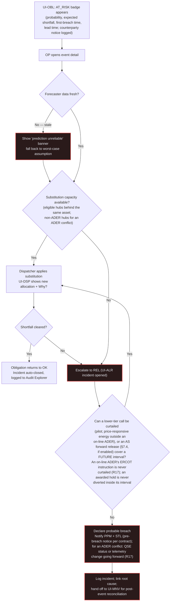

### 4.2 Handle a hub dropout storm

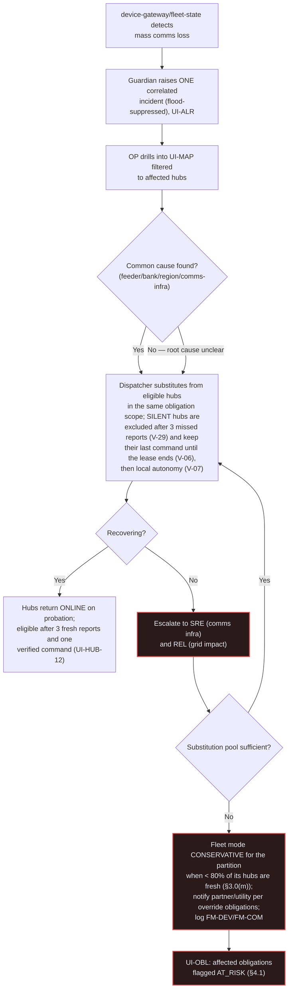

### 4.3 Approve a large dispatch (Tier 2 — two-person rule)

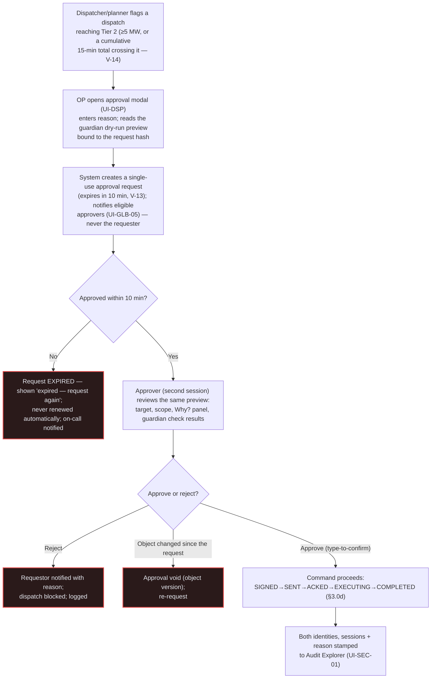

### 4.4 Engage and release a safe stop (kill switch) `[Re-drawn v0.4 — register R3/R4 amended, V-15…V-17]`

```mermaid
flowchart TD
    A{"Trigger: operator judgement · guardian risk-reducing rule ·<br/>active S1 alarm · ERCOT verbal instruction ·<br/>utility instruction (caller, time, text logged — UI-SAF-02)"} --> S["Select scope: bank / zone / fleet (UI-SEC-10);<br/>type STOP and the scope ID, plus a reason (UI-SEC-06)"]
    S --> P["Blast-radius preview (guardian dry run): hubs, kW,<br/>obligations, relief removed, awarded AS, counterparties<br/>notified, stop class and sequence (UI-SEC-11, UI-SAF-03/-04)"]
    P --> CL{"Protective stop?<br/>(safety, security, utility stop,<br/>guardian-triggered, SSA)"}
    CL -- "Yes" --> E1["Executes at once — one qualified operator (R3):<br/>ADER telemetry + COP this cycle; hotline notice<br/>if > 20 MW; ramp 30 / 60 / 120 s [unsigned — Q13]"]
    CL -- "No" --> FQ{"Frequency < 59.95 Hz<br/>or an EEA in force?"}
    FQ -- "Yes" --> HD["HELD with the live reason (V-16);<br/>runs when the condition clears; may be cancelled"]
    HD --> FQ
    FQ -- "No" --> E2["Executes: telemetry + COP → hotline notice<br/>if > 20 MW → ramp within the discretionary cap (V-30)"]
    E1 --> C["Scope ENGAGED (retained scope topic: reconnecting<br/>hubs keep the stop; no fallback schedule runs);<br/>other scopes unaffected (UI-SEC-12); counterparty notified"]
    E2 --> C
    C --> CS{"Distinct eligible approver co-signs<br/>within 15 min? (V-15, UI-SEC-15)"}
    CS -- "Yes" --> D["Co-signed; stop stays engaged;<br/>root cause investigated"]
    CS -- "No" --> ESC["ESCALATE: High alarm + page (Q15 roster,<br/>Q1 target); the stop stays engaged —<br/>never released or re-issued by the clock"]
    ESC --> D
    D --> E["RELEASE requested for this scope (UI-SAF-05):<br/>recovery checks — no hub islanded, rebooting<br/>or ramping; cause noted"]
    E --> F{"Checks complete?<br/>Engaged by a utility?"}
    F -- "Checks open" --> F1["Block release; show which items are unmet"]
    F1 --> E
    F -- "Utility-engaged" --> FU["Release only by that utility (Q10 default)"]
    F -- "Ready" --> G["Tier 2, always, every scope: requester + distinct<br/>approver in a second session; type RELEASE and the scope ID;<br/>approval single-use, expires in 10 min (V-13)"]
    G --> H["Reverse sequence (V-17): telemetry + COP → hotline<br/>notice if > 20 MW → staged ramp-up ≥ 15 min with signed<br/>jitter; shown released only when telemetry confirms"]

    classDef err fill:#2a1a1a,stroke:#e34948,color:#e6e9f0,stroke-width:2px
    class F1,ESC,HD,FU err
```

If the guardian is down, the main console cannot sign the stop: the Safety screen says so and points to the
out-of-band stop console (§3.20, §4.11), which follows the same engage and co-sign rules and never releases.

### 4.5 Acknowledge/shelve alarms during a flood

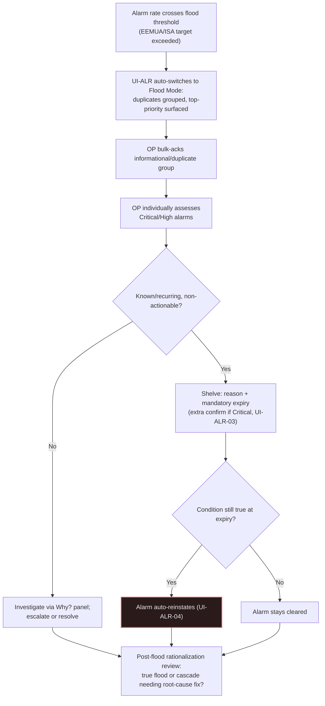

### 4.6 Investigate a guardian veto

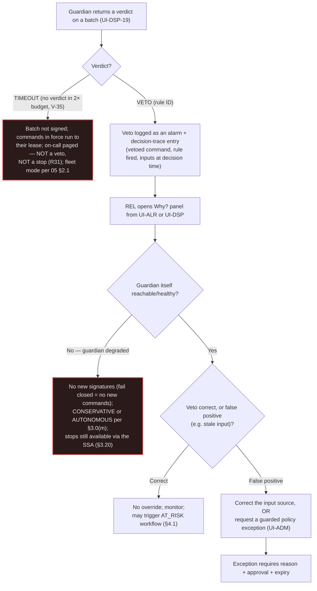

### 4.7 Run a what-if and publish a plan

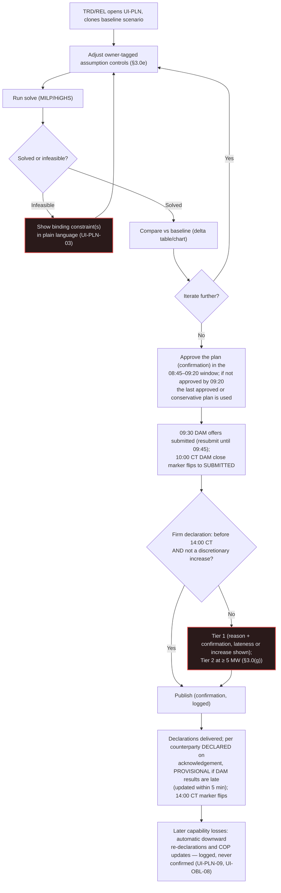

### 4.8 Onboard a partner-utility program

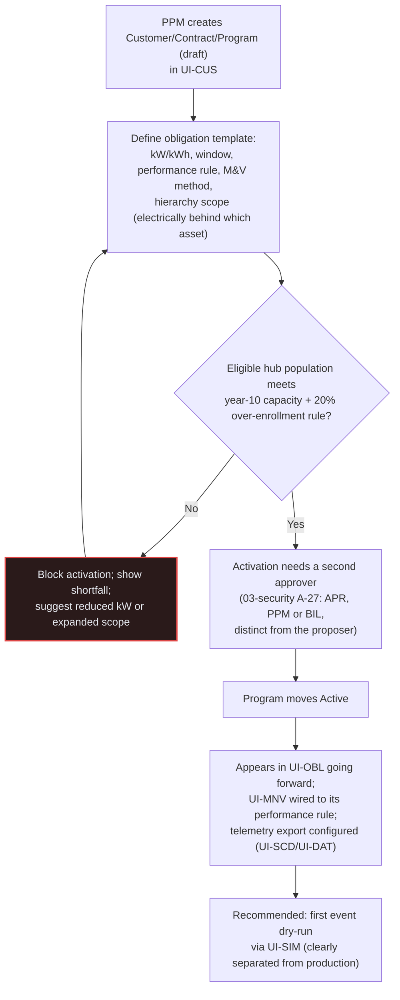

### 4.9 Trace an invoice line back to its decision and telemetry `[Added — Core job revision]`

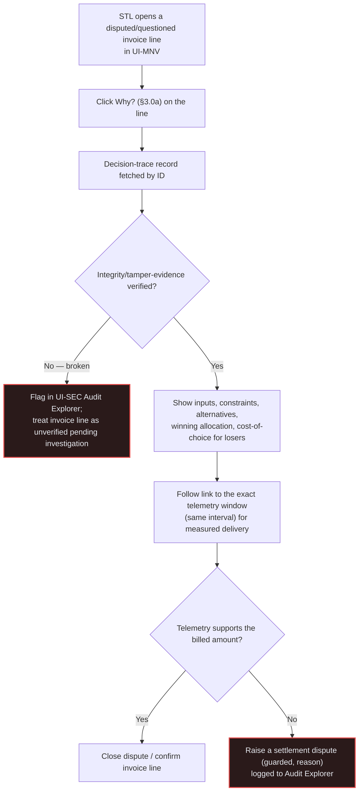

### 4.10 Act on an ERCOT verbal instruction or a utility instruction `[Added v0.4 — R3 amended, R17, R25; GRD-010, GRD-021]`

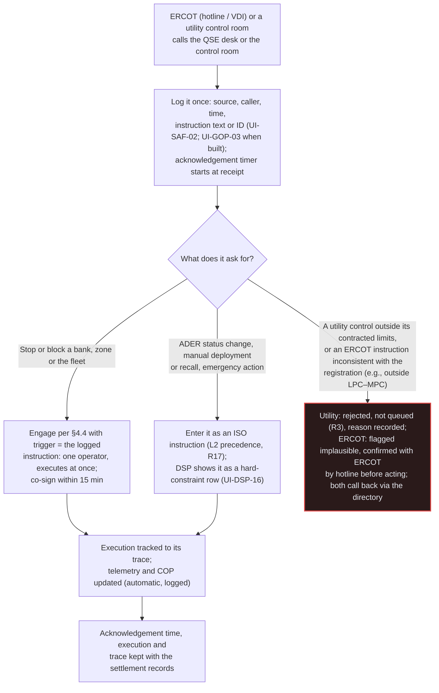

### 4.11 Stop with the main stack down — out-of-band path `[Added v0.4 — R16; RT-018]`

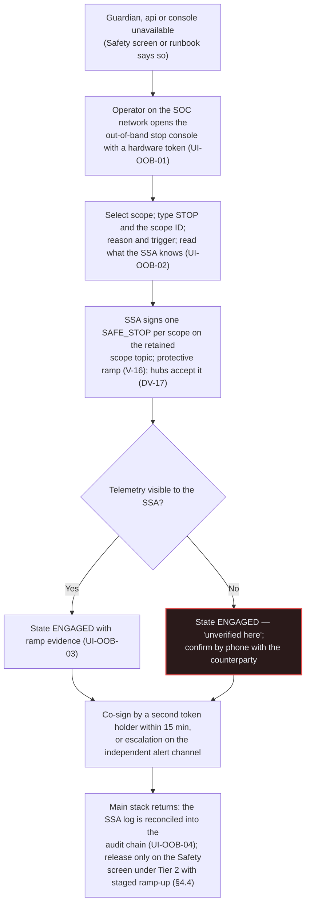

---

## 5. Visual design system

*Serves: Creativity, Usability, Completeness.* Convention-first: adopts the existing simulators' dark control-room
language (`https://base.tocy-net.net/opengrid/`) and extends it only where the operator console has needs the demo
simulators never had (true safety-critical severity, 9-series categorical data, light theme for daytime/print use).

### 5.1 Colour tokens

**Base tokens (unchanged from the existing simulators — continuity, not reinvention):**

| Token | Hex | Role |
|---|---|---|
| `--bg` | `#0b0e14` | App background |
| `--panel` | `#131722` | Card/panel background |
| `--panel2` | `#1a1f2e` | Nested panel / drawer background |
| `--border` | `#262c3d` | Borders, gridlines |
| `--text` | `#e6e9f0` | Primary text |
| `--muted` | `#8b92a8` | Secondary text, labels, "shared" owner chip |
| `--kicker` | `#7cc4ff` | Eyebrow/section labels, links |

**Semantic severity tokens — reconciled, not just reused.** The existing simulators use a 3-state badge system
(`good`/`info`/`warn`) because they never modeled a true safety-critical incident; `--bad` (`#e34948`) appears only for
financial negatives and chart "selling" dots. The operator console needs a real 4th severity. Rather than repurpose
`FAULT`'s existing amber, this spec **adds one new semantic role to the existing red token**, keeping it rare and
therefore meaningful (ISA-101):

| Token | Hex | Meaning | Icon | Used for |
|---|---|---|---|---|
| `--status-good` | `#1baf7a` (existing `--good`) | Nominal / compliant / healthy | check-circle | MONITORING, compliance ≥ target, hub online, link CLOSED |
| `--status-info` | `#7cc4ff` (existing kicker) | Active / in-progress / informational | play-circle | DISPATCHING, SENT/ACKED command states, `SIMULATION` badge, `SHADOW` badge (dotted border and eye icon — distinct from the `SIMULATION` hatch) |
| `--status-caution` | `#eda100` (existing `--warn`) | Degraded / caution / needs attention soon | alert-triangle | AT_RISK, stale 2–5×, FAULT (existing convention kept), shelved alarm, HALF_OPEN breaker, fleet mode `DEGRADED`/`CONSERVATIVE`, `PENDING CO-SIGN`, hub `SILENT`/`probation` |
| `--status-critical` | `#e34948` (existing `--bad`, **new semantic role**) | Breach / critical / safety-relevant | alert-octagon | Kill switch ENGAGED, guardian LOCKDOWN, fleet mode `AUTONOMOUS`/`SAFE_STOP`, co-sign overdue, confirmed contract breach, Critical alarm, command FAILED/EXPIRED/REJECTED, a failed "what ERCOT sees" invariant, broken audit integrity |
| `--status-neutral` | `#8b92a8` (existing `--muted`) | N/A / offline / no data | minus-circle | Hub offline (planned), no data |

No new hex is introduced for severity — only a clarified, narrower meaning for the existing red, so a screenshot of
today's simulators and tomorrow's console read as the same design language.

### 5.2 Customer-type categorical palette

The existing simulators' validated 7-series categorical palette (`#3987e5, #199e70, #c98500, #1aa5b8, #d55181,
#9085e9, #008300`; teal deliberately sits between amber and pink) maps **exactly** onto the seven customer types that
are genuine slices of the shared home-fleet kW pool, in the brief's own table order:

| Order | Code | Colour | Hex |
|---|---|---|---|
| 1 | `ERCOT_ENERGY` | Blue | `#3987e5` |
| 2 | `ERCOT_AS` | Green | `#199e70` |
| 3 | `PARTNER_CAPACITY` | Amber | `#c98500` |
| 4 | `DIST_DEFERRAL` | Teal | `#1aa5b8` |
| 5 | `LARGE_LOAD` | Pink | `#d55181` |
| 6 | `PIPELINE_AC` | Purple | `#9085e9` |
| 7 | `PJM_CAPACITY` | Dark green | `#008300` |

`HOME` is deliberately **not** a categorical series: it is drawn as a fixed neutral hatch (`--muted` fill, diagonal
hatch) at the base of every stacked view, everywhere, reinforcing "always the first constraint" visually as well as
textually.

`MOBILE_TEEEF` is deliberately **excluded from this 7-series legend** — it is not a slice of the shared fleet's kW at
all (brief: "separate assets"), so forcing it into a kW-share palette would misrepresent the data. It gets its own
icon (🚚 or an equivalent outline glyph) and a distinct, **not yet colour-blind-validated** tone, flagged as such
(§11 open question) rather than silently claiming the same validation rigor as the 7-series above (brief §8 D3,
confirmed). The grid-parallel `MOBILE_DER` contract variant of register R20 uses the same icon and tone with a
"grid-parallel (DER)" badge, so the physical asset class reads the same while the contract difference stays visible.

### 5.3 Typography

Reused system-ui stack (no web-font dependency, fastest paint). Formalized scale from the existing CSS: micro/label
11px uppercase (`--muted`), body/subtitle 13px, value-small 16px, section header 16px uppercase (`--muted`), H1 22px,
value-large 24–26px.

### 5.4 Density modes

| Mode | Base body size | KPI value size | Info density | Use |
|---|---|---|---|---|
| Control-room wall | 16px | 32px | Low — fewer widgets/screen, auto-paging between OPS/MAP/ALR | Fixed wall displays |
| Laptop/analyst | 13px | 24px | High — full table density, hover for detail | Individual workstations |

### 5.5 Iconography

No icon library is pinned by the brief. **Fallback/assumption:** a single consistent open-source outline icon set
(e.g., Lucide or Phosphor — pick one, never mix) — flagged for platform/frontend confirmation (§11).

### 5.6 Charts

Thin marks (2px lines, 0 point-radius baseline; larger radius only on hover/highlight); hover tooltips with units;
legend required whenever ≥2 series; **no dual axes** — use small multiples instead (continuity with the existing
pipeline-service "effect size on its own scale" chart, which already solves exactly this problem); units in every
axis label and tooltip, never only in a caption; consistent gridline colour (`--border`); the 7-series customer-type
order (§5.2) is fixed across every chart in the app for operator muscle memory.

### 5.7 Motion limits — an explicit departure from the demo simulators

Transitions ≤200ms ease-out. **The existing simulators' auto-playing/scrubbing demo charts (e.g., the pipeline
service's looping comparison chart) are explicitly NOT carried into the operator console.** Live, safety-relevant KPI
charts must never auto-play or auto-scrub — an operator must always be looking at "now" unless they deliberately
scrub history (as in HUB's telemetry tab). This pattern remains appropriate only inside Simulation Lab and any future
stakeholder-facing demo mode, both clearly separated from production per §1 principle 5-adjacent guarding.

### 5.8 Maps, tables, dark/light themes

Maps: Leaflet-consistent (continuity), clustering per §7, colour-blind-safe state encoding with icon redundancy.
Tables: uppercase 11px muted headers, sticky header, numeric right-align, units in the header not repeated per cell,
sortable. Dark is the default/primary theme (control room); a light theme (Should) mirrors every token for daytime
office use and print/export (e.g., an Audit Explorer export bundle rendered for a human reader).

---

## 6. Real-time behaviour

*Serves: Technical depth, Performance.*

### 6.1 Cadence

| Data | Cadence | Backend source (brief §4; register §F) |
|---|---|---|
| Hub telemetry | 2 s during events and for members of an on-line ADER; 10 s otherwise (V-32) | `device-gateway` |
| Control loop / arbitration queue | 2 s during active events and for members of an on-line ADER; 10 s otherwise (V-03) | `dispatcher` |
| ERCOT UDSP (on-line ADER) | 4 s | `scada-gateway`/`integrations` |
| SCED-aligned re-evaluation | 5 min | `market-data`/`dispatcher` |
| Breach risk | Every intraday re-plan (15 min) for the next 36 h; every 5 min for obligations starting within 2 h or active (`03` §8.11) | `planner`/`forecaster`/`dispatcher` |
| Day-ahead plan | Runs 06:00 and 08:30, approval by 09:20, DAM offers 09:30 (close 10:00), post-DAM run 13:35, declarations 14:00 America/Chicago (`03` §7.1) | `planner`, `integrations` |
| SCADA point values | Native report-by-exception (protocol-defined) | `scada-gateway` |
| External market data (ERCOT) | 60 s | `market-data` |

The console consumes **1-Hz server-side aggregates** over WebSocket (register R34; ARC-020), never per-hub twin events
fanned out to browsers; per-hub detail is fetched on demand (HUB, the map viewport). UI widgets subscribe at their
owning service's native cadence but the renderer throttles paint to ~1 Hz even if the backend emits faster, protecting
operator perception and client CPU/battery — an explicit, documented gap between "data arrives" and "pixel updates"
that never exceeds 250ms (§7).

### 6.2 Throttling and reconnect

WS messages are coalesced within a 250–500ms paint window. On disconnect: exponential backoff with jitter, a visible
"reconnecting…" indicator (never a silent freeze), and on reconnect a full snapshot re-fetch followed by resumed
diffs — never silently interpolating across a gap. Charts render an explicit gap marker for the outage window.

### 6.3 Stale-data indicators

The age badge (§3.0c) is the one, system-wide component for staleness; every live-bound value uses it — no screen
invents its own staleness convention.

### 6.4 Optimistic vs. confirmed UI for commands

The command lifecycle chip (§3.0d) is the one, system-wide rule: **a command is never shown as done until telemetry
confirms it.** The acknowledgement window is 2 × the active cycle (4 s in events, 20 s otherwise — V-04), shown as an
elapsed timer on `SENT` once it passes; a command older than its 30-s TTL is `EXPIRED` (V-05). The physical-response
timer is separate and longer, shown once `EXECUTING`: firm full output p99 ≤ 240 s design target, ≤ 300 s requirement
[reviewer proposal — unverified] (V-34).

### 6.5 Time handling

All storage/transmission is UTC (brief §4). The console's default **display** zone is America/Chicago (Central),
matching ERCOT market intervals and PJM/ComEd (also Central) — flagged as an assumption (§11) rather than asserted as
final, since a future ISO could differ. A persistent UTC/Central toggle lives in the status bar (§2.2); every
timestamp shows its zone abbreviation explicitly, never a bare number.

### 6.6 Load shedding and the console `[Added v0.4 — ARC-062, register R48]`

When the node sheds load (`05` §2.8, L1–L3), the console keeps its **control-room channels** — alarms, safe-stop and
kill-switch state, co-sign and approval clocks, firm obligations and their breach state, guardian state, fleet mode,
stop command lifecycles — at 1-s updates and within NFR-206 (≤ 2 s) at every level; only **analytic** views (Insights,
PLN charts, MNV history, SVC funnel, MKT charts, DAT, copilot) slow from 1 s to 5 s at L1 and may pause at L2–L3, each
tagged "reduced refresh — shedding level Ln" (UI-GLB-04). Calls deferred or clipped under saturation are shown as
`Deferred` or `Clipped` with their added latency or shortfall — never as rejected (§3.0(l), UI-DSP-20). `05` §2.8's L1
row ("console push 1 s → 5 s") must be read as analytic channels only (cross-document item, §11 item 25).

---

## 7. Performance budgets

*Serves: Performance, Technical depth.* Targets below are proposed acceptance thresholds for this UI layer, not yet
ratified NFR-NNN IDs (those belong to `02-architecture/06-platform-and-operations.md` — this spec proposes numbers for
that catalogue to adopt or override).

| Budget | Target |
|---|---|
| First load (OPS, on control-room LAN) | LCP ≤ 2.5 s |
| Time to interactive | ≤ 3.5 s |
| Update latency (WS message received → pixel update), p95 | ≤ 250 ms |
| Command optimistic-state paint (click → SENT chip) | ≤ 150 ms |
| Max rendered points per chart | ≤ 500 (server/client decimation preserving min/max envelope so spikes survive) |
| Map: concurrently rendered point primitives | ≤ 1,500 (clustered above a zoom threshold; canvas/WebGL layer, not per-marker DOM/SVG) |
| Map: pan/zoom frame rate with 10,000 simulated hubs | ≥ 45 fps (measured, not asserted — ties directly to the brief's Performance judging criterion) |
| Control-room channel update latency (server event → pixel), p95, at every shedding level | ≤ 2 s (NFR-206; ARC-062) |
| Performance strip values (UI-OPS-11) | Measured over a rolling 5 min; never a target or a model shown as a measurement |
| Out-of-band stop console (UI-OOB-01) first paint on the SOC network with `api`, `console` and `guardian` down | ≤ 2 s (assumption) |

### 7.1 10,000+ hub map rendering strategy

The existing simulators load one ~10MB GeoJSON blob per page view — fine for four fixed demo assets, **not** viable at
10k–100k hubs. The production strategy: server pre-aggregates hubs into bank/feeder clusters below a zoom threshold;
above it, only the current viewport's bbox is fetched, paginated/streamed, capped and re-clustered if still too dense;
the client renders hub points on a canvas/WebGL layer (e.g., Leaflet's canvas renderer or a WebGL point layer such as
`Leaflet.glify`/deck.gl — library choice flagged for the platform/frontend decision, §11); WS diff updates apply only
to on-screen or near-screen entities, with off-screen state coalesced and applied lazily on the next viewport change.
The List View (§3 MAP) reuses the same windowed-rendering technique (only ~50 DOM rows live at a time) for its 10k+ row
table.

### 7.2 Responsive / large-display support and internationalization readiness

Primary targets: control-room wall (1920×1080 to 4K, multi-monitor paging) and laptop/analyst (1366–1920px). Tablet is
view-only (Could); phone is out of scope for core operator flows (assumption, §11) except alarm-ack push notification
(Could). All strings externalized for future i18n; numbers/units locale-aware; RTL not required now (English/US-only
initial deployment, assumption).

---

## 8. Accessibility

*Serves: Usability, Completeness.* WCAG 2.2 AA baseline (consult the normative spec for exact wording; this table is
the practical checklist for this console).

| SC | Name | Why it matters here | Where applied |
|---|---|---|---|
| 1.3.1 | Info and Relationships | Tables/tabs must be programmatically determinable, not just visual | Every screen |
| 1.4.1 | Use of Color | No status is colour-only | §5.1, all severity/quality encodings |
| 1.4.3 / 1.4.11 | Contrast (text / non-text) | Dark theme at control-room viewing distance | §5 tokens |
| 1.4.13 | Content on Hover or Focus | Tooltips (Why? panel, chart hover) must be dismissible/persistent/hoverable | §3.0a, §5.6 |
| 2.1.1 / 2.1.2 | Keyboard / No Trap | Every critical action operable without a mouse | §8.1 |
| 2.2.1 | Timing Adjustable | Auto-refresh/countdowns don't strand a slow reader; the co-sign, approval and confirmation clocks (V-12…V-15) are real-time safety limits (the SC's real-time exception) and say so in their help text | Status bar, PLN countdown, Safety (§3.18) |
| 2.3.1 | Three Flashes | Flood-mode/critical-alarm flashing stays under the threshold | UI-ALR |
| 2.4.3 / 2.4.7 | Focus Order / Focus Visible | Logical tab order, visible focus ring | Every screen |
| 2.4.11 | Focus Not Obscured (Min.) [2.2] | A docked Why?/copilot panel must not hide the focused element | §3.0a, §3.0h |
| 2.5.7 | Dragging Movements [2.2] | Map pan, Gantt drag-select, sliders need a non-drag alternative | MAP, OBL, control grids |
| 2.5.8 | Target Size (Min.) [2.2] | Touch/click targets on dense tables (SCD point database) | SCD, DAT |
| 3.2.6 | Consistent Help [2.2] | Why?/runbook affordances appear in the same place every time | §3.0a |
| 3.3.1 / 3.3.3 | Error Identification / Suggestion | Guarded-action rejections say what's wrong and how to fix it | §9 |
| 3.3.7 | Redundant Entry [2.2] | A two-step approval doesn't re-ask for the same reason twice | §3.0g, §4.3 |
| 4.1.2 | Name, Role, Value | Custom components (age badge, lifecycle chip, arbitration queue) expose correct ARIA roles | §3.0 |
| 4.1.3 | Status Messages | Live regions for alarm counts, connection state, flood mode | §2.2, UI-ALR |

### 8.1 Keyboard-only operation for critical actions

Every guarded action (§3.0g) — acknowledge/shelve/escalate an alarm, approve/reject a dispatch, engage/co-sign/release
a scoped or fleet-wide kill switch, approve a dispatch-profile change — is fully keyboard-operable, including the
type-to-confirm step, on the main console and on the out-of-band stop console (§3.20). Engage stays one person and
fast (principle 9); kill-switch release intentionally keeps its multi-step, two-person friction even via keyboard
(safety over speed).

### 8.2 Screen-reader semantics

Status-bar counters: `aria-live="polite"`. New Critical alarm, a fleet-mode change to `AUTONOMOUS` or `SAFE_STOP`, and
an overdue co-sign: `aria-live="assertive"`. Icon-only status chips carry off-screen text equivalents. Canvas/SVG
visualizations (MAP, OBL Gantt, the Insights heatmap and charts, the simple map) each have a mandated non-visual
list/table equivalent (§3 MAP-04, OBL-03, §3.17) — not an afterthought bolt-on.

### 8.3 Colour-blind-safe status

Never colour alone (icon + text + colour triad, restated as a system rule). The existing simulators' own validated
figures are reused as the bar: blue (#3987e5) vs. orange (#d95926) owner-chip pairing measures ΔE 31.8 normal-vision /
26.8 CVD-simulated. Any new adjacent-series pairing introduced by this spec (the 7-series palette, §5.2) should be run
through the same validator before final adoption (§11 open question) — the 8th, `MOBILE_TEEEF` tone explicitly has
not been yet.

---

## 9. Content and error messaging guidelines

*Serves: Usability.* Plain language: **cause + impact + next action**, always in that order, never a bare error code.

| Situation | Bad | Good |
|---|---|---|
| AT_RISK prediction | "Error: shortfall predicted" | "LARGE_LOAD event #77 (17:30–19:30 CT) is AT_RISK: 28% breach probability, expected shortfall 198 kW from 17:30 (cause: feeder F7 energy is shared with the Bank B1 deferral). Lead time 60 min; the customer was notified at 16:30 CT. Pre-charge eligible F7 hubs now, or accept the risk." |
| Hub dropout | "Hub unreachable" | "18 hubs on Feeder-9 are SILENT — no report for 3 cycles (cause: comms-gateway timeout). They are excluded from allocation and substituted; they keep their last command until their lease ends at 17:44 CT. Investigate the feeder link; they return on probation after 3 fresh reports." |
| Kill switch engaged | "Kill switch active" | "Stop ENGAGED on BANK-14 by J. Rivera at 17:41 CT (protective; reason: sustained overload signal). Ramping to 0 over 30 s; other scopes unaffected; CoServ notified. Co-sign due by 17:56 CT. Release needs a second approver and the recovery checks." |
| External API degraded | "API error" | "ERCOT price feed hasn't updated in 6 minutes (cause: rate limit, backing off). Planner is using the last good price until it recovers — the 14:00 CT declarations are not at risk yet." |
| Command timeout | "Command failed" | "Setpoint command to Hub-88213 has had no acknowledgement for 24 s (window 20 s; cause: no ack from device-gateway). It was re-issued once and becomes EXPIRED at 30 s (TTL). The arbitrator has already substituted another hub." |
| Clipped call (saturation or limits) | "Request rejected" | "PIPELINE_AC smoothing on corridor C1 was served 158 of 250 kW (PRIORITY_ALLOCATION: C1 hubs carry 402 kW of the partner event and the ADER set point). Not rejected — the 92 kW shortfall is reported to the customer and priced at $0 under pilot terms." |
| Guardian timeout | "Guardian veto" | "Guardian gave no verdict for batch 4411 within 500 ms (TIMEOUT — not a veto). The batch was not signed; commands already in force keep running to their lease; the on-call was paged. No stop was triggered." |
| Co-sign overdue | "Approval missing" | "Stop on ZONE-Z3 has not been co-signed 15 min after engage (engaged 16:40 CT by M. Chen). The stop stays engaged. The on-call supervisor has been paged; any eligible approver other than M. Chen can co-sign now." |

### 9.1 Confirmation patterns for dangerous actions

Rows below follow §3.0(g) (`00-decision-register.md` v0.2 R3 amended, R4 amended, V-12…V-17); this replaces v0.3's
table, which put zone- and fleet-scope stops behind a second approver before they took effect and made every change of
declared capacity a Tier 1 action.

| Action | Rule | Type-to-confirm string | Reason required | Second person |
|---|---|---|---|---|
| Engage a stop or block — any scope (bank, zone, fleet), any trigger (operator, guardian rule, S1 alarm, ERCOT verbal instruction, utility instruction, out-of-band) | Stop engage | `STOP <SCOPE-ID>` (e.g., `STOP BANK-14`, `STOP ZONE-Z3`, `STOP FLEET`) | Yes, ≥ 20 chars, plus the trigger | Co-signs within 15 min after the stop executes (V-15); escalation if missing; never the invoker |
| Release a stop — any scope, any trigger | Tier 2, always | `RELEASE <SCOPE-ID>` | Yes, ≥ 20 chars | Yes — distinct from requester (one `APR` and one of `SEC`/`REL`); approval single-use, 10 min (V-13); staged ramp-up ≥ 15 min (V-17) |
| Dispatch/command ≥ 1 MW or ≥ 25% of target resource (cumulative per V-14) | Tier 1 | `CONFIRM` | Yes | None required; confirmation valid 2 min (V-12) |
| Dispatch/command ≥ 5 MW (cumulative per V-14) | Tier 2 | `APPROVE` | Yes | Yes — distinct from requester (V-13) |
| SCADA control from the console — stop or block, any scope | Stop engage | `STOP <SCOPE-ID>` | Yes | Co-sign within 15 min |
| SCADA control from the console — other controls | Tier 1 at ≥ 1 MW or ≥ 25%; Tier 2 at ≥ 5 MW | `CONFIRM` / `APPROVE` | Yes | Per tier |
| Pre-agreed utility SCADA control, within contracted limits | Utility SCADA | none (auto-executes; outside the limits rejected, never queued) | — | — |
| Fleet-wide mode change (including entering or leaving `SHADOW`) | Tier 2 | `CONFIRM FLEET-WIDE CHANGE` | Yes | Yes — distinct from requester |
| Discretionary increase of declared capacity; releasing capacity to another buyer (§7.4 AS forward release — preview shows expected buyback and its tail figure) | Tier 1 (Tier 2 at ≥ 5 MW) | `CONFIRM` | Yes | Per tier |
| Downward re-declaration of available capacity; ERCOT telemetry and COP updates | Automatic (pre-authorized) | none — shown and logged | Cause recorded automatically | — |
| Shelve a Critical alarm | — (alarm rule) | `SHELVE CRITICAL` | Yes + mandatory expiry | Not required, but extra confirm step |
| Activate a contract or program; change contract kW or windows | Two-person rule outside R3 (`03-security` §5.8, A-27) | `ACTIVATE` | Yes | Yes — `APR`, `PPM` or `BIL`, distinct from the proposer |
| Approve a dispatch-profile change — priority or limits | Tier 2 | `APPROVE PROFILE` | Yes | Yes — distinct from the proposer, from the owning domain (A-26), plus a passing activation-gate result (R10/R47) |
| Approve a dispatch-profile change — other elements | Tier 1 | `APPROVE PROFILE` | Yes | None required |
| Accept an AI proposal or confirm an AI-drafted call | The tier of the resulting change | As for that tier | Yes | Per tier; the `AI-drafted` flag and preview are shown (§3.0(h)) |

Every approved/rejected instance is stamped back to the user in-context ("Engaged by X at 17:41 CT, reason: …") and is
independently visible in the Audit Explorer (UI-SEC-01) — never only in a toast that disappears.

---

## 10. UX acceptance criteria and usability test plan input

*Serves: Usability, Completeness.* Feeds `05-testing/02-test-cases.md` as `TC-UX-NNN`/`TC-UI-NNN` (IDs below are
proposed, to be finalized there).

| Task (persona) | Target screens | Success metric | Time-on-task target |
|---|---|---|---|
| Respond to an AT_RISK obligation (`OP`) | OBL, DSP | ≥90% task success | ≤2 min to a logged decision |
| Acknowledge a Critical alarm from a flood (`OP`) | ALR | ≥90% task success; 0 critical mis-acks in cohort | ≤10 s from alert to ack |
| Approve a large dispatch as second approver (`APR`) | DSP, SAF | 100% correct approve/reject vs. a scripted scenario | ≤90 s to decision |
| Engage a stop, co-sign it, then release it (`OP` engages; `APR` co-signs; `APR` + `REL`/`SEC` release) | SAF | 0 critical-action errors in cohort (zero tolerance); engage never waits for a second person | Engage ≤45 s; co-sign ≤2 min after the page; release ≤3 min including the recovery checks |
| Stop a zone on an ERCOT verbal instruction and log it (`QSE`/`OP`) | SAF (GOP when built) | 100% of instructions logged with caller, time and text before or with the engage | ≤60 s from the call to the engage |
| Trace an invoice line to its decision and telemetry (`STL`) | MNV, SEC | ≥90% task success | ≤2 min |
| Run a what-if and publish a plan (`TRD`) | PLN | ≥90% task success | ≤5 min per scenario iteration |
| Propose and approve a dispatch-profile change (`REL` or `PPM` proposes; an owning-domain approver approves) | SVC | 100% correct separation-of-duties (no self-approval) in cohort | ≤3 min to submit, ≤2 min to review |
| Engage a bank-scoped stop and read the blast radius — including relief removed — before confirming (`OP`) | SAF | 100% correctly state the interrupted firm obligation and the projected bank loading before confirming | ≤45 s to confirm |
| Commission a new SCADA counterparty point (`SRE`) | SCD | ≥90% task success | ≤10 min for a 10-point checkout |

**Judged MVP — formative test [v0.4, JDG-022; G3-J item 7].** Five participants × three demo tasks — respond to an
AT_RISK obligation; trace an invoice line to its decision and telemetry; engage and release a bank stop (with the
co-sign) — moderated, think-aloud, with task success, time on task, errors and SUS **reported**, failures included,
and the findings fed into the build before the demo. A summative claim (≥ 32 participants) is not made for the judged
demo.

**Summative targets (`R2`).** Task success ≥90% across the above; **SUS ≥80**; zero critical-action errors (safe stop,
large dispatch approval) across the test cohort; error-recovery rate (user self-corrects after a Bad→Good-style message)
≥90%.

### 10.1 Heuristics review checklist

Nielsen's 10 heuristics, plus control-room-specific items: (11) no automatic decision without a reachable Why?; (12)
no dangerous action without reason + type-to-confirm; (13) no status colour without an icon+text redundancy; (14) no
screen blanks entirely because one data source failed; (15) simulator-sourced data is always visually distinguishable
from production data.

---

## 11. Open questions and assumptions

Labeled so a reviewer can resolve them without re-deriving this document's reasoning.

1. **RBAC role catalogue — resolved by register V-37 (v0.4).** `03-security` §5.1 codes are authoritative; the console
   uses them with the aliases `FLT` = `FOP`, `BIL` = `BAD`, `SYSADM` = `SAD` (§1). Still open: the QSE-desk role of R25
   has no security code yet — this document proposes `QSE` (item 17).
2. **Dispatch-profile change authority — resolved (v0.4).** Per `03-security` §5.2 A-25/A-26 and SoD-06: `REL`, `PPM` or
   `BIL` propose; a distinct approver from the owning domain (`APR`, `REL`, `BIL`, `SEC`) approves critical fields;
   `SYSADM` never approves (SoD-03). §3 SVC and §9.1 follow it.
3. **Manual dispatch override — resolved (v0.4).** A manual dispatch is an operator call through admission, arbitration
   and the guardian, tiered per §3.0(g) (`03-security` A-10/A-11: `OP`, `APR`); nobody writes a hub setpoint directly,
   and an on-line ADER's ERCOT instruction cannot be overridden from the console (R17).
4. **`MOBILE_TEEEF`'s 8th categorical colour is explicitly unvalidated** (§5.2, §8.3) — its exclusion from the
   7-series palette is confirmed (brief §8 D3), but the specific hex value still needs the same ΔE normal/CVD-vision
   validation the 7-series palette already has.
5. **SCADA-alarm failure-mode mapping.** `UI-ALR-06`/`UI-SCD-08` assume SCADA alarms map into the existing
   `FM-<CAT>-NNN` taxonomy; the exact category (extend `COM`/`PLT` or add a new one) is owned by
   `02-architecture/07-scada-integration.md` and `05-failure-modes-and-recovery.md`.
6. **Data-subject-request legal process.** §3.0(j)/`UI-CUS-07` specify only the UI shell for a homeowner's access/
   correction/deletion/opt-out request; identity verification, statutory response windows, and what "deletion" can
   mean for data the orchestrator must retain for M&V/settlement/audit are a security/legal decision this spec does
   not make (brief §8 D5).
7. **Local-LLM availability for personal-data queries — register Q17 (default: decline on the node, local model only
   in production).** §3.0(h)/(j) implement the default; the decline is a privacy card with the pre-send check log
   (UI-GLB-09) and a scripted privacy beat or Q&A backup in the demo (§13).
8. **Impact thresholds — register R3 as amended in v0.2, still Proposed pending Q1.** Adopted throughout (§3.0(g),
   §9.1): single-person stop engage at every scope with a 15-min co-sign; Tier 1 at ≥ 1 MW, ≥ 25% of the target, a
   discretionary increase of declared capacity or releasing capacity to another buyer; Tier 2 at ≥ 5 MW, fleet-wide mode
   changes, every release and priority/limit profile changes; automatic downward re-declarations and ERCOT telemetry/COP
   updates. Q1 asks who the second approver is per scope and whether the invoker may ever approve (default: never). See
   item 16 for the conflict inside Q1's default.
9. **Control-room physical display assumptions** (count/resolution of wall displays, paging behavior) are unconfirmed;
   §7.2's targets are best-guess defaults.
10. **Timezone default (Central) for the primary display** — reasonable given ERCOT/PJM-Illinois are both Central, but
    flagged in case a future ISO integration differs.
11. **Icon library** is unpinned by the brief; Lucide/Phosphor proposed as a fallback (§5.5), needs a platform decision.
12. **Map basemap/tile provider for production** — the demo's public OpenStreetMap tiles are fine for the demo; a
    production control-room product may need licensed tiles or a self-hosted tile server (rate limits, ToS).
13. **Historical lookback default** for charts/tables (this spec assumed 24h default view, drill-to-longer as a
    Should) should be checked against the actual TimescaleDB retention policy in the platform doc.
14. **Light theme priority** (Should vs. Must) — the reference material is dark-only; confirm the priority/effort
    trade-off before committing frontend budget.
15. **Mobile/on-call scope** — assumed alarm-ack-only push as a Could, full console assumed desktop/wall-only (Must);
    confirm SRE/on-call don't need more. *(v0.4: a co-sign within 15 min may need a phone-sized approval view for the
    on-call approver — same server-rendered preview, step-up authentication; proposed `R2`.)*
16. **Q1's default conflicts with SoD-03 (v0.4).** Register Q1 proposes "system admin or executive on call" as the
    fleet-scope second approver, while `03-security` SoD-03 bars `SAD` from approving dispatch and §6.5 lists no `EXE`
    or `SAD` for stops. Until the user answers Q1, the console routes co-signs and approvals only to the roles §6.5
    allows and notifies Q1's named default first (§3.0(g)). User decision: Q1.
17. **QSE-desk role code (v0.4).** R25 creates a QSE desk (24×7 in production, simulated for the demo); `03-security`
    §5.1 has no code for it. Proposed: `QSE` with `OP`'s dispatch-view rights plus ISO-instruction entry and hotline
    logging; until added, `OP` holds the duty (§1).
18. **Out-of-band co-sign (v0.4).** UI-OOB-03 lets a second hardware-token holder co-sign a stop on the out-of-band
    console (an attestation that cannot release). `03-security` must confirm the token population and that a co-sign
    there satisfies V-15.
19. **Stop class selection (v0.4).** V-16 separates protective and non-protective stops; the console derives the class
    from the recorded reason category (§3.18). `03-security`/`05` should confirm the category list, so a
    non-protective stop cannot be relabelled protective to bypass the frequency and EEA hold without an audit flag.
20. **Hotline acknowledgement target (v0.4).** UI-GOP-03 times the acknowledgement of VDIs and utility instructions;
    no document sets a target. Assumption for display: amber after 60 s, red after 5 min, pending a QSE-desk procedure
    in `05`.
21. **Zone definition and utility-engaged releases — register Q10 default.** The scope selector lists utility operating
    zones for utility-facing stops and ERCOT load zones for market-facing ones; a stop engaged by a utility is released
    only by that utility (UI-SAF-05). User decision: Q10.
22. **`MOBILE_TEEEF` field-safety sign-off — register Q20 default.** The readiness checklist (UI-HUB-11) holds a unit in
    `PENDING_SAFETY_REVIEW` until a licensed field engineer signs off. User decision: Q20.
23. **Demo date and venue — register Q22 (default 2026-10-21 on the node).** The build tags and the demo mapping (§13)
    assume it. User decision: Q22.
24. **Build tags vs the release map (v0.4).** The tags in this document follow the judging review's MVP-J/MVP-B lines
    (`06-reviews/04` §5.3, §5.5); where `01-product/03`'s release map differs, it wins (§2.3). Two tags need the release
    map's confirmation: the Safe-Stop Authority's out-of-band console and status (tagged `MVP-J` here, because R16
    closes a Critical gap) and the "what ERCOT sees" panel (tagged `MVP-B`).
25. **Load-shedding row in `05` §2.8 (v0.4).** L1 reads "console push 1 s → 5 s"; this document limits the slowdown to
    analytic channels (§6.6, ARC-062). `05` should adopt the same wording.

---

## 12. Cross-references

| Dependency | Owned by (planned path) | What this spec needs from it |
|---|---|---|
| Personas, epics, user stories | `01-product/01-vision-scope-personas.md`, `03-epics-and-user-stories.md` | Authoritative persona detail; `E<nn>`/`E<nn>-S<nn>` story IDs this UI fulfills |
| API & WebSocket channel schemas | `02-architecture/02-domain-model-and-interfaces.md` | Exact message shapes for every "Data sources & cadence" row in §3 |
| Control law, optimizer, arbitration algorithm, AI-agent internals | `02-architecture/03-decision-engine.md` | Full parameters behind every Why? panel and the arbitration queue's ranking logic |
| External data integration | `02-architecture/04-external-data-integration.md` | Field list for UI-DAT |
| Failure mode catalogue | `02-architecture/05-failure-modes-and-recovery.md` | `FM-<CAT>-NNN` → alarm mapping for UI-ALR |
| Platform/runbooks, NFR catalogue | `02-architecture/06-platform-and-operations.md` | `RB-NNN` runbook links from UI-ALR; ratification of §7's proposed performance budgets |
| SCADA integration detail | `02-architecture/07-scada-integration.md` | Full protocol/point-map/commissioning detail behind UI-SCD |
| Threat model | `03-security/01-threat-model.md` | `TH-NNN` informing which actions in §9 need guarding |
| Security architecture, RBAC, kill switch, two-person rule | `03-security/02-security-architecture.md` | Authoritative role catalogue (§5.1, V-37) and permission matrix (§5.2), `CTL-NNN` controls, kill-switch mechanics (§6.5), guardian modes (§6.2), refusal and clip codes (§5.10), the Safe-Stop Authority's controls (CTL-147, FR-SEC-204/205) |
| Decision register (cross-document conflict resolution) | `00-decision-register.md` v0.2 (project lead; "where a document and this register disagree, this register wins until the document is updated") | R3 (amended) and R4 (amended) — §3.0(g), §3.18, §4.4, §9.1; R10/R47 — §3 SVC; R16 — §3.18, §3.20; R17 — DSP, MKT, GOP; R19, R25, R26 — GOP, DSP; R20 — OPS, HUB, CUS, SVC; R21 — build tags; R22 — Safety chain verify; R23 — SHADOW; R24 — INS, OPS, §13; R27/R27a — CUS, SVC; R31 — DSP; R33 — §3.0(d); R40/V-29 — §3.0(k); R42 — §3.0(m); R48 — §3.0(l), §6.6; R49 — DSP; §F values V-03…V-41 as cited. R3/R4 remain **Proposed** pending Q1 |
| Reviewer-claims fact-check and impact evaluation | `G:\OpenGrid\docs\business-case\01-reviewer-claims-verification.md` and the Projects Deck/simulators (sibling workstream, outside this doc tree — brief §3.5: research/impact evaluation is explicitly not an orchestrator function) | The claims that measured facts are shown next to (§3.0(b)); the Projects Deck keeps the business-case condition board the console links to (D0f) |
| Privacy/data-protection compliance programme | Not yet a named file in brief §7's tree; substantively owned by `03-security` per brief §8 D5 | The legal/consent/retention substance behind §3.0(j)'s masking, access-logging and data-subject-request UI shell |
| Test strategy/cases/traceability | `05-testing/*.md` | Placement of `TC-UX/UI-NNN` (§10); links from `UI-NNN` to test cases; SCN-DEMO-01 and G3-J (§13) |
| Reviews and their resolution | `06-reviews/01…04`; this document's dispositions in `06-reviews/resolution/A8-ui.md` | The findings this version resolves (see "Changes in this version") |

---

## 13. Judged demo — the 7-minute script mapped to screens and requirements `[Added v0.4 — register R24; JDG-003]`

*Serves: all eight criteria.* The judged storyline is the 7-minute, 7-beat script of `06-reviews/04` §6.2 (R24); the
14-step storyline of `01-product/01` §5.4 stays as the unattended rehearsal (SCN-DEMO-01). Angle-bracket values are
measured at rehearsal; illustrative figures come from `03` §8.5 (A-DE-27). A requirement tagged `MVP-B` makes its beat
depend on Line B; the fallback column says what the console shows if that line is not built — never a placeholder
number.

**Setup (T−30 min).** Demo profile on the node; 2,000 hubs online; the DNP3 association and the OpenADR VEN up;
SCN-DEMO-01 armed on a replayed real ERCOT day, seed 20261015, parked at 16:55 CT (UI-SIM-08); the live price ticker
running (UI-OPS-12); **two pre-authenticated browsers** — the operator (`OP`) and the shift supervisor (`APR`),
distinct identities, signed in with a session lifetime covering the demo window and no step-up pending (UI-SAF-07);
plans pre-solved with solver statistics shown (UI-PLN-03 readout); the benchmark report, trace-hash comparison, DNP3
packet capture and G3-J report open in tabs.

| Time | Beat | Screen(s) | What the console shows | UI requirements | Build | If a line is missing |
|---|---|---|---|---|---|---|
| 0:00–0:45 | 1. One fleet, many buyers | OPS | 2,000 homes online by connectivity and eligibility; nine customer lanes on the Now/Next rail; the live ERCOT price with product and as-of (or the replayed day, labelled); the reserve band "never for sale"; tile 1 value of orchestration against today's rule allocator with the thesis sentence; fleet mode `NORMAL` | UI-OPS-01, -02, -09, -10, -12; UI-GLB-02 | MVP-J; tile 1 MVP-B | Tile 1 reads "not yet computed"; the scorecard's other seven KPIs carry the beat |
| 0:45–1:45 | 2. Tomorrow is already sold | Plan · Insights | Ownership heatmap for the next 36 h in kW and $; the price of firmness for the partner event 17:30–19:00 (≈ $1,680 per 5-min interval at the forecast spike against an event worth ≈ $45,300 — firmness wins); the 14:00 CT declaration sent and acknowledged; the 10:00 CT DAM marker shows the offers submitted | UI-INS-01, -02; UI-PLN-01, -09; UI-OBL-04 | MVP-B | Skip to beat 3 (five-minute cut merges beats 1 and 2) |
| 1:45–3:00 | 3. Five buyers at 17:30 | DSP, OBL | The queue at 17:30: firm calls served (partner event, bank deferral); the awarded Non-Spin hold `Ring-fenced — held` and deployed from its ring-fence; the ADER's energy instruction as an L2 row tracking its UDSP, squeezed before the fact through its offer and MPC/LPC; pipeline smoothing `Partial` 158 of 250 kW; three mobile units in their own pool; the Why? panel with tier stages, binding constraints with duals and the naive candidate (pipeline 0 kW) against the chosen allocation; "what ERCOT sees" beside it; OBL: the large-load event flagged AT_RISK an hour earlier with the notice logged | UI-DSP-01, -02, -03, -15, -16, -17; UI-OBL-02; UI-INS-04; UI-OPS-07 | MVP-J; OBL and UI-DSP-17 MVP-B | Without OBL, DSP's Why? panel shows the breach notice in the trace; without UI-DSP-17 the L2 row's footnote states the before-the-fact exclusion |
| 3:00–4:15 | 4. Things break | SIM Lab → DSP, OPS | One click each, seeded: 10% of the partner event's hubs go `SILENT` → excluded and substituted within 3 ticks, the 15-min compliance bar stays ≥ 95%; the bank's DNP3 point turns `BAD` → `DEGRADED` (DM-04), HOLD with its return criteria, then SCHEDULE, never 0 kW, reason on screen and in the SCADA log panel; 12 EVs start and 8 homes island → available kW netted within one tick, reserve-violation counter stays 0 | UI-SIM-03, -08, -09; UI-DSP-04, -07, -08, -18; UI-SCD-13; UI-GLB-02; UI-OPS-10 | MVP-J | — (all Line A) |
| 4:15–5:15 | 5. Nobody can make it do something unsafe | Safety (SCADA log, kill switch, approvals) | A replayed DNP3 operate with an old sequence number → `REJECTED` (expected 42, got 39); a proposal breaching the reserve floor → guardian `VETO` with its rule ID; a bank stop by the operator with typed scope, reason and one confirmation → executes at once, 30-s ramp on the bank chart, co-sign countdown visible; release blocked until the supervisor approves in the second browser → staged ramp-up begins | UI-SCD-11, -13; UI-DSP-19; UI-SEC-05, -06, -11, -14, -15; UI-SAF-02…-07 | MVP-J (the AI-proposal variant needs UI-DSP-12, `R2`) | Without AI proposals (`R2`), the veto is shown on a scripted operator dispatch that breaches the reserve floor — the same guardian rule and Why? panel; the five-minute cut moves the veto to Q&A |
| 5:15–6:15 | 6. Every dollar explained | MNV, copilot | Event ends, AMI arrives: the partner event's invoice line → decision trace → commands → telemetry → M&V (per-hub P10 `<kW>` next to the 9.5 kW claim, labelled) → chain verified; the copilot answers "why is this line $X?" citing trace IDs; AI switched off → the deterministic explanation is unchanged | UI-MNV-01, -03, -08; UI-SEC-02; UI-SAF-09; UI-GLB-08; UI-DSP-13 | MVP-J; copilot MVP-B | Without the copilot, the deterministic Why? text carries the beat and the AI-off point moves to Q&A |
| 6:15–7:00 | 7. Fast, and usable tomorrow | OPS performance strip, terminal | Live tick p99 `<ms>`, telemetry → twin p99 `<s>`, commands/s with their measurement context; the benchmark report's 1k→10k curve and one before/after optimization; the one-line `make deploy PROFILE=demo`; the `SHADOW` banner and the shadow-vs-actual report as the path onto Base's real fleet; close on the thesis sentence | UI-OPS-11; UI-GLB-03; UI-INS-08; UI-OPS-09 | MVP-B | Show the benchmark report from its tab and state that the strip is Line B |

**Fallback.** If any live beat fails, SIM Lab switches to the recorded run of the same seed and shows identical trace
hashes (UI-SIM-08) — determinism becomes the evidence. **Never on stage:** stack traces, login flows (hence the two
pre-authenticated browsers), live solver waits (plans are pre-solved), a dependency on ERCOT's API being up (the
last-good cache and the labelled replay, UI-OPS-12).

**Q&A backups.** A tenth service type added by configuration (`FEEDER_HOSTING_LIMIT`) and dispatched with no code change
(UI-SVC-08); zone- and fleet-scope stops and concurrent scopes (UI-SEC-10, -12); the privacy card with the cloud-prompt
pre-send check log (UI-GLB-09, JDG-027); a stop through the out-of-band console with the guardian isolated (UI-OOB-01…04);
"what ERCOT sees" and its invariant (UI-DSP-17); the full 14-step unattended rehearsal record (SCN-DEMO-01).

**Five-minute cut.** Merge beats 1 and 2 (the ownership heatmap as a panel on OPS, reusing UI-INS-01's component), move
the guardian veto of beat 5 to Q&A, and shorten beat 7 to the strip and the install line.
