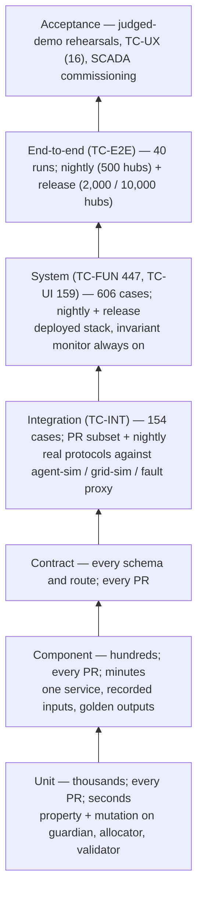
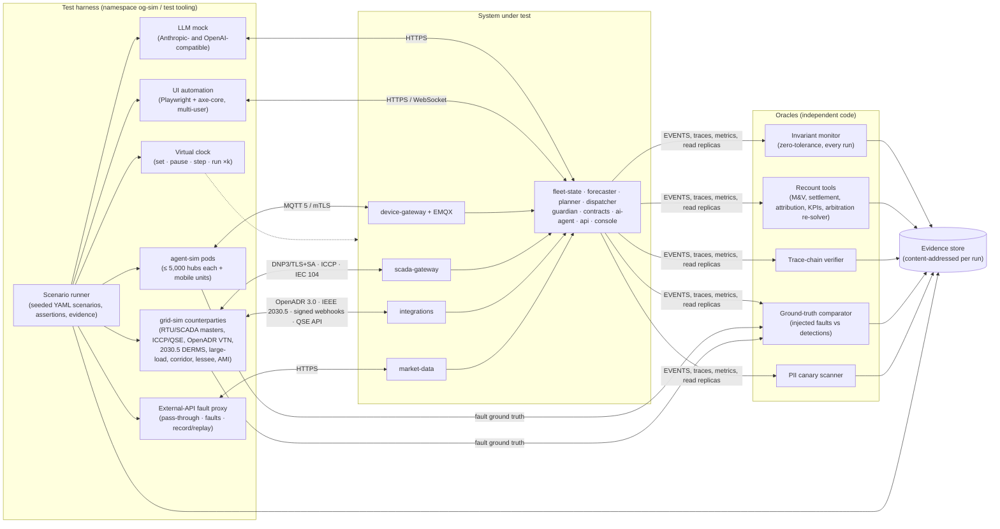
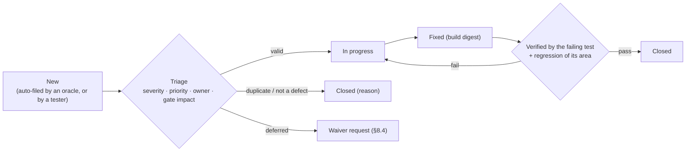
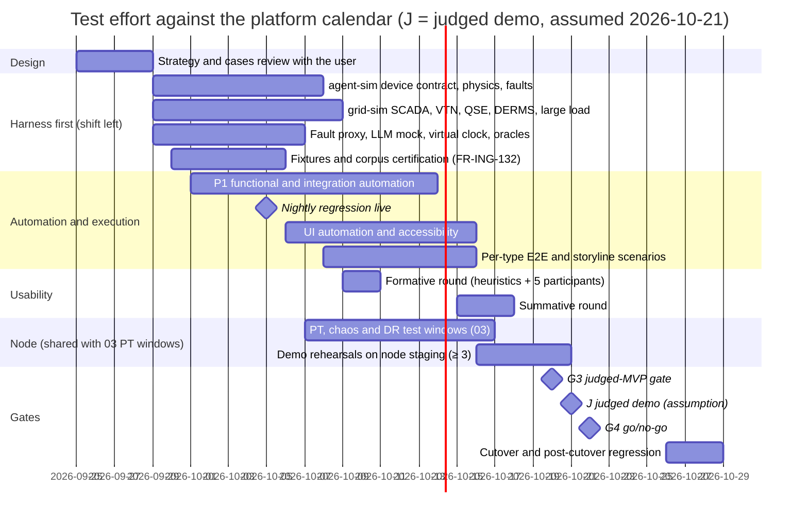

# OpenGrid Orchestrator — Test Strategy

Status: v0.1 · 2026-09-25 · Owner: Principal QA / Test Architect (independent author) · Audience: every spec author and
reviewer, the implementation team, the non-functional test engineer, the grid-engineering and market-operations
reviewers, adversarial reviewers, judges.

This document defines **how the Orchestrator is proven to work**: the objectives of testing, the test levels, the test
harness (`agent-sim`, `grid-sim` and the shared tooling around them), test data, environments, entry and exit criteria,
coverage and how it is computed, defect handling, regression and release gates, roles, the schedule and the risks of
the test effort itself. It applies [`../00-brief.md`](../00-brief.md) and the binding
[`../00-decision-register.md`](../00-decision-register.md) (D0–D5, R1–R13) and does not restate them. Test cases live in
[`02-test-cases-functional.md`](02-test-cases-functional.md) (this author: `TC-FUN`, `TC-INT`, `TC-UI`, `TC-UX`,
`TC-E2E`) and `03-test-cases-nonfunctional.md` (second test engineer: `TC-NFR`, `TC-PERF`, `TC-SEC`, `TC-CHAOS`,
`TC-DR`); `04-traceability-matrix.md` is generated from the `Covers:` fields of both (§7).

**No test in this set tests a business case.** Whether a service achieves its intended impact is a Projects-Deck and
simulator question (brief §3.5, D0f). Every test here checks that the Orchestrator receives, validates, arbitrates,
dispatches, measures, bills and explains **every** service type within safety, reserve, grid, authorization and
contract-priority constraints (D0b) — and a test fails if any service type is refused, down-ranked or omitted for any
other reason.

## Which judging criteria this document serves

| Criterion (brief §2) | Pts | Where this strategy serves it |
|---|---|---|
| Completeness | 15 | §1.3 MVP definition of done; §3 a harness that injects every failure class of the brief; §9 gates that require unattended end-to-end runs of all nine service types under injected failures |
| Technical depth | 15 | §2.3 property-based, metamorphic, differential and worked-example oracles for the control law, the MILP and the arbitration LP; §3 protocol-accurate simulators; §3.8 independent oracles |
| The problem | 15 | §1.2 and §3.8: homeowner-first and firm-first invariants checked on every run as zero-tolerance gates |
| The "why" | 15 | §1.1 O5: one fleet, many buyers proven by worked examples A–C, ring-fencing, one-kWh-one-buyer and a tenth service type added by configuration only |
| Insight quality | 10 | §3.8 recount oracles for the ownership map, delivered vs committed, breach-risk lead time, regret and the price of firmness |
| Usability | 10 | §7.1 UI and UX coverage targets; the `TC-UX` programme (task success ≥ 90%, SUS ≥ 80); WCAG 2.2 AA |
| Creativity | 10 | Tests of the distinctive mechanisms (Why? panel, guarded AI agent, configuration-only service types, `MOBILE_TEEEF` treatment) so they are demonstrated, not claimed |
| Performance | 10 | Owned by `03-test-cases-nonfunctional.md` (PT-01…PT-12, `TC-PERF`); this strategy supplies the scalable harness (§3), the environments (§5) and the gates (§9) those tests run under |

---

## 0. How to read this document

### 0.1 Scope and ownership

| Topic | Owner | Status in this document |
|---|---|---|
| Test strategy: objectives, levels, harness, data, environments, criteria, coverage, defects, gates, roles, schedule, risks | this document | normative |
| Functional, integration, UI, usability and end-to-end test cases (`TC-FUN`, `TC-INT`, `TC-UI`, `TC-UX`, `TC-E2E`) | `02-test-cases-functional.md` | referenced |
| Non-functional, performance, security, chaos and DR test cases (`TC-NFR`, `TC-PERF`, `TC-SEC`, `TC-CHAOS`, `TC-DR`); execution of PT-01…PT-12 (`../02-architecture/06-platform-and-operations.md` §4.9) and ST-01…ST-20 (`../03-security/02-security-architecture.md` §23) | `03-test-cases-nonfunctional.md` (second test engineer) | this strategy applies to them; case bodies are owned there |
| `TC-CHAOS-001…015` (compound game days) and `TC-CHAOS-101…538` (base(CAT) + NNN per failure mode) | allocated by `../02-architecture/05-failure-modes-and-recovery.md` §6.7 and "Identifier scheme" | respected; never reused here |
| `TC-INT-701…742` SCADA placeholders | allocated by `../02-architecture/07-scada-integration.md` §11.6 | bodies written in `02-…` §14; SCADA extensions continue from `TC-INT-743` |
| `TC-SEC-701…715`, `TC-PERF-701…705` (SCADA security and performance) | allocated by `07-…` §11.6 | owned by `03-…`; referenced here |
| Traceability matrix | `04-traceability-matrix.md`, generated (§7.3) | generator rules defined here |

### 0.2 Binding inputs and how "Proposed" resolutions are tested

- **Binding user decisions** D0a–D0g and D1–D5 are tested as hard requirements.
- **Register resolutions** R1–R13 win over any document that disagrees (register header). Resolutions marked
  **Proposed** (R3 tiers, R4 ramps, R8 leadership, R9 retention, R10 profile governance) are tested **as configured
  parameters** whose default is the register's proposed value. If the user changes a default (for example the second
  approver per scope, Q1), only fixture values change, not test logic. Every test whose verdict depends on such a
  decision lists the decision ID in its `Covers:` field (for example `R3`), so the matrix shows exactly which tests a
  changed decision affects.
- Where two documents disagree and the register is silent, tests use the interim value recorded in §13 and the
  conflict is raised as an open question (§15).

### 0.3 Conventions

- **Test IDs.** `TC-<TYPE>-NNN`, unique across the set. Types owned by `02-…`: `FUN`, `INT`, `UI`, `UX`, `E2E`. Note:
  `E2E` is not in brief §7's TYPE list; it is added at the task owner's instruction and an amendment to brief §7 is
  requested (§15, Q-T7).
- **ID blocks** (so the two test documents never collide and each area can grow without renumbering):

| Block | Area |
|---|---|
| `TC-FUN-001…099` | Call intake and validation; dispatch-profile catalogue |
| `TC-FUN-100…199` | Service-type dispatch profiles (per type) and house events |
| `TC-FUN-200…249` | Call arbitration |
| `TC-FUN-250…299` | Real-time dispatch, control, substitution and degraded modes |
| `TC-FUN-300…339` | Forecasting, planning and declarations |
| `TC-FUN-340…389` | M&V, billing and settlement |
| `TC-FUN-390…419` | Decision trace, "why" queries and audit chain |
| `TC-FUN-420…479` | Device protocol, digital twin and local autonomy |
| `TC-FUN-480…519` | Command safety (D4) and kill switch (D2, R4) |
| `TC-FUN-520…599` | `ai-agent`, privacy (D5), roles (D1), simulators |
| `TC-FUN-600…649` | Insights, reporting and operability |
| `TC-INT-001…099` | Northbound integrations (OpenADR, simulated QSE, IEEE 2030.5 business objects, webhooks, counterparties) |
| `TC-INT-100…199` | External data ingestion (ERCOT, EIA, NWS, reference data) |
| `TC-INT-701…799` | SCADA (`701…742` reserved by `07-…`; `743+` extensions) |
| `TC-UI-001…199` | Console screens, system-wide patterns and accessibility |
| `TC-UX-001…099` | Usability evaluation |
| `TC-E2E-001…099` | Per-service-type end-to-end runs and the judged demo storyline |
| Reserved for `03-…` | `TC-NFR-*`, `TC-PERF-*` (incl. 701–705), `TC-SEC-*` (incl. 701–715), `TC-CHAOS-*` (001–015, 101–538), `TC-DR-*` |

- **Priority.** `P1` — safety, a zero-tolerance invariant, a binding decision (D1–D5) or the core chain for any
  service type; a failure blocks the judged demo and every later gate; every P1 test is in the MVP set. `P2` — required
  behaviour that must pass before production; `P2·MVP` tests are in the MVP regression set and may be waived for the
  demo only with a documented risk (§8.4). `P3` — R2/R3 scope, design-only paths (`PJM_CAPACITY` live), or depth
  beyond the MVP.
- **MVP subset** = every test marked `·MVP` (all P1 plus the P2·MVP tests). It is the suite that gate G3 (§9) runs.
- **Automation.** `auto` (runs unattended in CI or on the node, verdict computed by oracles) or `manual` (human
  judgement: moderated usability, screen-reader review, witnessed commissioning, document review).
- **Numbers.** Units kW and kWh; times stored UTC and shown as America/Chicago with the zone (CDT/CST, "CT").
  Reviewer-sourced thresholds keep their label "reviewer proposal — unverified" ([RP]); this document's own defaults
  are labelled assumption ([A]).

---

## 1. Objectives

### 1.1 Objectives tied to the judging criteria

| # | Objective | Criterion | Evidence produced | Gate metric (judged MVP) |
|---|---|---|---|---|
| O1 | The core chain runs end to end, without crashing, for **every** service type: signal → call → event → arbitration → guardian → signed command → telemetry-verified delivery → M&V → settlement line → decision trace | Completeness | `TC-E2E-001…009` run records; core-service restart and exception audit | 9/9 service types pass; 0 unhandled exceptions and 0 restarts of `og-critical` pods during the runs |
| O2 | The chain survives the injected failures of vision §5.4 (comms, data quality, security, house events) and demonstrates D2/D4 live, unattended | Completeness | `TC-E2E-020…041` rehearsal records | 2 consecutive unattended rehearsals with the same seed yield identical decision-trace content hashes; 1 rehearsal with a different seed passes every assertion |
| O3 | Engineering depth is real and correct: feedback control, optimization, arbitration, state estimation, resilience and security controls behave as specified | Technical depth | Worked-example reproductions; property, step-response and replay tests | Examples A, B, C of `03-decision-engine.md` §8.5 reproduced exactly (158 kW; 665/302 kW; 355 kW and the priced 45-kW imbalance); control-law step test overshoot ≤ 5% of contract kW and settling ≤ 3 min |
| O4 | Homeowner-first and firm-first hold on every path, in every run | The problem | Invariant monitor (§3.8) on every automated run | KPI-09 = 0, KPI-10 = 0, KPI-14 = 100%, KPI-17 = 100%, KPI-20 = 100% in every run |
| O5 | One fleet, many buyers: one kWh never backs two buyers; any service type is executed from its profile; a new type needs configuration only | The "why" | Property tests (≥ 10⁵ cases), attribution recount, `FEEDER_HOSTING_LIMIT` activation | 0 double allocations; attribution sums to metered output within ±0.5%; the tenth type is activated and dispatched with zero code change |
| O6 | The non-obvious outputs are computed from data and are correct | Insight quality | Recount oracles for ownership map, delivered vs committed, P10, regret, price of firmness, M&V overlap | Values reconcile with independent recomputation; breach-risk lead time median ≥ 60 min and P10 ≥ 15 min in replays (FR-DE-086) |
| O7 | Base's operators could use it tomorrow | Usability | `TC-UX` sessions; `TC-UI` accessibility results | Task success ≥ 90%; SUS ≥ 80; 0 critical-action errors in the cohort; 0 serious or critical automated WCAG 2.2 AA violations on all 16 screens |
| O8 | The distinctive mechanisms work as specified | Creativity | `TC-UI`/`TC-FUN` of the Why? panel, guarded AI proposals, `MOBILE_TEEEF` treatment, configuration-only service types | All P1 tests of these mechanisms pass |
| O9 | Performance is measured, not asserted | Performance | `03-…` (PT-01…PT-12, `TC-PERF`) | Per `03-…`; functional suites supply the scenarios and assert functional correctness at the measured scale points |

### 1.2 Quality risks that drive test emphasis

Risk-based testing: effort is concentrated where a defect would hurt a homeowner, the grid, a contract or the audit
trail. Each product risk maps to the techniques and levels that catch it earliest.

| # | Product risk | Worst consequence | Emphasis (level → technique) |
|---|---|---|---|
| PR-1 | Reserve breach or unsafe command reaches a hub | Homeowner without backup; S1 | Unit property tests on allocator and guardian (N-version); component tests of G-01…G-14; invariant monitor on every run; chaos in `03-…` |
| PR-2 | One kWh backs two buyers, or is billed twice | Contract and billing integrity | Ledger property tests (FR-DE-005, FR-BILL-006); settlement recount; attribution recount |
| PR-3 | Wrong command order, replay, stale or conflicting command executes (D4a) | Unintended device state | Device-protocol conformance of `agent-sim` (DV-01…DV-16); SCADA ordering tests `TC-INT-704…710`; state-machine coverage of the command lifecycle |
| PR-4 | Critical command executes without its confirmation or second approver (D4b, R3) | Unauthorized fleet-scale action | Tier boundary tests (0.99/1.00 MW, 24.9/25%, 4.99/5.00 MW); separation-of-duties tests; UI guarded-action tests |
| PR-5 | Kill switch fails to stop, the stop itself is a grid event, or a release is unsafe (D2, R4) | Grid disturbance or stuck fleet | Scope tests with ramps (30/60/120 s), recovery ramp and rebound checks; out-of-band path |
| PR-6 | Feedback loop hunts or acts on bad SCADA data | Bank overload | Control-law vectors and step response; A1/A2/A3 classification; hold-then-schedule; time-alignment test |
| PR-7 | A service type is silently refused, down-ranked or omitted | Breach of D0b | Per-type end-to-end tests; refusal-code discipline; static "no per-type branch" checks |
| PR-8 | A charge or a refusal cannot be explained, or the audit chain is altered | Loss of auditability (core job) | Chain completeness, tamper and replay tests; invoice-line "why" tests |
| PR-9 | Personal data reaches a cloud LLM or a third party (D5) | Privacy breach | Synthetic PII with canaries (§4.3) and egress/LLM-prompt scanners on every run |
| PR-10 | Bad external data drives decisions | Wrong dispatch or offers | Fault proxy in front of real providers; corroboration and staleness tests |
| PR-11 | Simulator and system share the same wrong assumption | Tests pass, field fails | Independent oracles written by a different author; standards-derived conformance; worked examples from the specifications |
| PR-12 | The judged demo is fragile | Lost completeness points | Seeded scenarios on a virtual clock; unattended rehearsals; determinism checks |

### 1.3 Definition of done for the judged MVP

The judged MVP is done when gate G3 (§9.2) passes, which includes the product exit criteria of
`../01-product/01-vision-scope-personas.md` §5.1 and the E23 stories:

1. Every KPI of vision §3 (KPI-01…KPI-21) is computed from telemetry, M&V and traces and displayed for one full
   day-ahead cycle plus one live event per customer type (`TC-E2E-038`, `TC-E2E-039`).
2. The §5.4 demo storyline runs unattended to completion in rehearsal, twice with the same seed and once with a
   different seed (`TC-E2E-035…037`).
3. 100% of the MVP subset passes (P2·MVP waivers only per §8.4); the invariant monitor reports 0 hits across the
   suite; 100% of Must (MVP) requirements are covered by at least one passing automated test (§7.1).

---

## 2. Test levels

### 2.1 Levels and what each covers

| Level | What it proves | Scope and examples | Main techniques | Runs in | ID family | Owner |
|---|---|---|---|---|---|---|
| **Unit** | Each function, algorithm and profile library block is correct in isolation | Bank control law vectors (FR-DE-066); water-filling and tie-break (FR-DE-064/065); performance-factor formula; DST interval mapping (FR-DE-014); JWS verification; plan validator; every profile building block of `03-…` §2.5 | Example-based; property-based with shrinking; mutation testing for `guardian` checks and the plan validator | E1, E2 on every PR | Not catalogued as `TC-*`; tied to requirements by test tags and gated by code coverage (§6) | Service developers |
| **Component** | One service with its real internal logic and stubbed boundaries (NATS, PostgreSQL, OPA, Redis via test containers) | `dispatcher` cycle S0–S11 on a recorded snapshot; `guardian` G-01…G-14; `contracts` settlement run; `scada-gateway` validation pipeline; `market-data` validation rules | Recorded inputs, golden outputs, state-machine walks | E2 | `TC-FUN` (component-level cases are marked in their preconditions) | Developers with test engineers |
| **Contract** | Interfaces conform to published schemas and semantics, and versions evolve compatibly | MQTT payload schemas (`telemetry.v1` …); NATS subjects; OpenAPI routes and RFC 9457 errors; AsyncAPI; OpenADR 3.0 and IEEE 2030.5 objects; DNP3 device profile | JSON Schema/AsyncAPI validation; consumer-driven contracts; schema-compatibility checks (the "Contract" CI stage of `06-…` §7.1) | E2 | `TC-INT` (contract-level cases) | Integrators |
| **Integration** | Services and simulated counterparties interoperate over the real protocols | MQTT 5/mTLS with `agent-sim`; DNP3/TLS, ICCP, IEEE 2030.5 with `grid-sim` (`TC-INT-701…`); OpenADR and simulated-QSE round trips; ERCOT/EIA/NWS ingestion through the fault proxy | Protocol simulators, fault injection, recorded-data replay | E2 (500 hubs), E3 | `TC-INT` | Test engineers |
| **System / end-to-end** | The whole deployed system — every service, the console, a realistic fleet — under normal and injected-failure conditions | Per-service-type chains (`TC-E2E-001…019`); the judged storyline (`TC-E2E-020…041`); console behaviour (`TC-UI`) | Scenario runner on virtual or real time; UI automation; invariant monitor | E3 (`node-demo`), E4 (`node-10k`) | `TC-E2E`, `TC-UI` | Test engineers |
| **Acceptance** | Stakeholders accept: story criteria, judged rehearsal, usability, SCADA commissioning | E23 stories; `TC-UX`; `07-…` §11 point-to-point checkout and end-to-end control tests (self-test against `grid-sim` in the MVP) | Scripted rehearsals; moderated usability sessions; witnessed checkout | E3, E6 | `TC-E2E` (acceptance-tagged), `TC-UX`, `TC-INT-739` | Product owner, UX researcher, SCADA integration engineer |

Performance, soak, security, chaos and disaster-recovery testing are defined in `03-…`; they use the same harness,
environments and gates.

### 2.2 Shape of the suite



### 2.3 Cross-level techniques and the oracle each one provides

| Technique | Where it is used | Oracle (what decides pass/fail) | Examples |
|---|---|---|---|
| Property-based testing | Unit, component | An invariant that must hold for every generated input; failures shrink to a minimal counterexample | Σ reservations ≤ capability for every hub and interval (FR-DE-005, ≥ 10⁵ cases); no lower tier served at a higher tier's expense (FR-DE-063); per-hub grants ≤ energy above the floor (FR-DISP-019); Σ available-to-counterparty ≤ physical deliverable (FR-SCADA-009); zero double-billed kWh (FR-BILL-006) |
| Worked-example oracles | Component, system | Numbers stated in the specifications | Examples A–C (`03-…` §8.5); enrollment 234/269/298/296 (FR-DE-027); interval rescue 195 kWh < 204.7 kWh at minute 10 (`05-…` §2.12.3); 862 kW reaching full output within 3 min of ramp (R13, FR-DE-067); Example C buyback $0.36 at $4/MW-h and $90 at $1,000/MW-h |
| Metamorphic testing | Component, system | A relation between two runs where the exact output is unknown | Permuting call or hub input order leaves allocations unchanged (FR-DE-064); adding capacity never reduces a higher tier's service; scaling every price by k > 0 leaves the tier order unchanged; removing a lower-tier call never changes higher-tier grants; hiding the `sim` provenance flag leaves every decision unchanged (FR-ING-161) |
| Differential testing | Component | Two independent implementations must agree | Mode S port vs `fleet_lp.js` within 0.5% (FR-DE-032); `guardian` G-checks vs `dispatcher` constraints (N-version, CTL-029); independent plan validator vs the model builder (FR-DE-049); settlement recompute vs stored lines |
| Replay / golden master | System | A recorded run reproduced exactly (or within solver gap with identical binding sets) | Golden week per release (FR-DE-123); 1,000 random trace replays (FR-DE-103); real-ERCOT-year back-test (FR-DE-122) |
| Mutation testing | Unit | Seeded bugs must be killed | 20 seeded model bugs each caught by the plan validator (FR-DE-049); mutation score ≥ 90% on `guardian` admission checks [A] |
| Static structure checks | Unit (CI) | A rule over the code base | No `service_type` branching outside adapters and profile blocks (FR-SVC-006/007, FR-DE-001/130, FR-CTR-013); no feature flag named after a service type in the admission path (`06-…` §7.7); no UPDATE/DELETE on audit or billing tables (`06-…` §7.6); `ai-agent` tool registry has no command, offer, profile, approval or SCADA tool (FR-DE-117) |
| Conformance suites | Integration, acceptance | A standard's or a contract's test procedure | DNP3, IEEE 2030.5 and ICCP self-tests (`07-…` §11.4); the device contract DV-01…DV-16 and HUB-R01…HUB-R14 applied to `agent-sim` |
| State-machine (model-based) testing | Component, system | Every specified transition is exercised; unspecified ones are refused | Command lifecycle, call/event, obligation, dispatch decision, incident, invoice, select-before-operate and mobile deployment (`02-…` §2.1–§2.10); bank controller (`03-…` §8.6.1); guardian modes and kill-switch states (`../03-security/02-…` §6.2, §6.5) |
| Boundary-value analysis | All | Behaviour flips exactly at a stated boundary | Tier thresholds 0.99/1.00 MW, 24.9/25.0%, 4.99/5.00 MW (R3); SCADA age 10/60 s; 13 of 15 minutes; 95% interval compliance; DST days |
| Fault injection (functional) | Integration, system | The specified failure behaviour appears in the decision trace with its reason code | `agent-sim` fault API; `grid-sim` counterparties; external-API fault proxy; LLM mock (platform chaos is `03-…`) |
| Usability testing and heuristic evaluation | Acceptance | Task success, SUS, time on task, error counts; heuristic severity | `TC-UX` |
| Accessibility testing | System, acceptance | Automated WCAG 2.2 AA scan plus manual keyboard and screen-reader review | `TC-UI-150…` |

### 2.4 Testability requirements the implementation must honour

These are requirements **on the design**, raised by testing; each is cheap if built in and very expensive to retrofit.

| ID | Requirement | Why |
|---|---|---|
| TR-01 | Every service reads time through a clock interface; test profiles bind it to the harness virtual clock (§3.7); production images refuse the virtual source at start-up | Deterministic, accelerated scenarios without a test-only code path in production (FM-PLT-029) |
| TR-02 | Every stochastic component (breach-risk Monte Carlo, scenario sampling, stagger offsets) takes its seed from configuration and writes it to the decision trace (`03-…` §9.2 "random seed") | Reproducible runs and replays |
| TR-03 | An `experiment_id` propagates through NATS headers, API calls and traces; chaos and test intervals are flagged `chaos=true`/`test=true` and excluded from settlement (`05-…` §6.1) | Evidence linkage; no contamination of real settlement |
| TR-04 | A deterministic solver mode (threads = 1, fixed seed; A-DE-21) is selectable per run | Replay certification |
| TR-05 | Read-only verification endpoints — trace-chain verifier, reservation-ledger invariant check, M&V recompute, settlement recompute — callable by the harness under the `AUD` role | Independent oracles |
| TR-06 | Every decision and state change emits an `EVENTS` message and a metric; tests wait on events with virtual-time timeouts, never on sleeps | Non-flaky synchronisation |
| TR-07 | Faults are injected only in simulators, proxies and the platform — never by editing orchestrator state; the SUT has no simulator branch (FR-DEV-014, FR-ING-161) | Tests prove production behaviour |
| TR-08 | `guardian` exposes its dry-run (impact preview) used by Tier 1/Tier 2 confirmations (`../03-security/02-…` §5.8) | Deterministic approval tests |
| TR-09 | Fixtures (contracts, profiles, point maps, limits, users) load through the same signed-bundle path as production, signed by a test identity trusted only in test environments | Tests exercise the real admission path (CTL-129) |
| TR-10 | The console exposes stable `data-testid` attributes on guarded actions, lifecycle chips, badges and banners, and the ARIA roles of `../04-ui/01-…` §8 | Robust UI automation and accessibility checks |
| TR-11 | Pseudonymous hub IDs are derived deterministically from the fleet fixture seed | Tests address hubs without personal data |
| TR-12 | The node runs one full environment at a time with scheduled test windows and data reset (`06-…` ADR-508) | Memory is the node's binding constraint |

---

## 3. Test harness

The harness makes every failure named in brief §9 **injectable where it occurs** (device, house, link, counterparty,
provider, platform), drives it deterministically, and judges the result with oracles that do not share code with the
system under test.

### 3.1 Architecture



### 3.2 `agent-sim` — required capabilities

`agent-sim` stands in for Base's hubs and for mobile units. It must behave like a real device — including when it is
slow, partial, wrong or hostile — and it must be driven only through the real device path (FR-DEV-014, FR-SIM-007).

| ID | Capability | Required behaviour (measurable) | Source | Verified by |
|---|---|---|---|---|
| HC-AS-01 | Scale and identity | ≥ 5,000 hubs per process (2 processes = 10,000 on the node; 20 = 100,000 in the performance environment); each hub a unique pseudonymous ID and its own X.509 identity obtained through the real enrollment flow; multi-hub sites supported | Brief §4; FR-SIM-007, FR-SIM-013; `06-…` §1.8 | `TC-FUN-581`; PT-01 (`03-…`) |
| HC-AS-02 | Battery and inverter physics | 39.2 kWh nameplate, 11 kW inverter, default 20% reserve (7.84 kWh DC), 90% round trip (0.9487 one way), ramp per capability flags (default 2 kW/s), thermal derate, standby loss 0.025 kW (A-DE-17); SOC integrated at 1 s internal steps | Brief §6; `02-…` §3.2; `03-…` §6.3 | `TC-FUN-582` |
| HC-AS-03 | House load and PV from real reference data | Site load from the EIA × weather-zone structural shape with per-site variation; PV from Tracking the Sun system sizes and NWS sky cover; aggregated over ≥ 100 sites the daily energy is within ±10% [A] of the source profile | FR-SIM-001; `03-…` §5.2 | `TC-FUN-582` |
| HC-AS-04 | EV charging | 25% of homes have an EV, 70% of those plug in at 21:00 for ≈ 3 h, plus random sessions; draw 7.2 kW [A]; `EV_CHARGE_START`/`STOP` house events | FR-SIM-002; `05-…` §6.4 | `TC-FUN-583` |
| HC-AS-05 | Grid loss, islanding and restoration | Local outage and wide outage; `GRID_LOSS_ISLANDING` / `GRID_RESTORED`; refuses grid-service commands while islanded; IEEE 1547-2018 enter-service delay 300 s and ramp in steps ≤ 20% on return | FR-SIM-003; HUB-R11 | `TC-FUN-584` |
| HC-AS-06 | Homeowner actions | Opt-out/opt-in, reserve change (including out-of-policy and corrupted values), storm-hold acknowledgement, on demand or as background rates | FR-SIM-005 | `TC-FUN-585` |
| HC-AS-07 | Device contract (command verification) | Implements DV-01…DV-16 and HUB-R01…HUB-R14 exactly as a real hub must: signature and algorithm allow-list, audience/environment binding, epoch, expiry, `seq` persisted before execution, replay cache, expected-state precondition, reason-coded NACK within T_ack, local bounds and a locally held reserve floor that no command can lower, local rate limit, `nbf` handling, signed fallback schedule on lease expiry, safe mode, `guardian` safe-stop key | FR-SEC-111; `../03-security/02-…` §7.4; `05-…` §2.13 | `TC-FUN-586`, `TC-FUN-421…440` |
| HC-AS-08 | Telemetry, twin and M&V data | Telemetry every 10 s (2 s during events and AS-awarded intervals); status heartbeat with capability flags; retained `twin/reported`; device-signed 1-min meter blocks chained by `prev_block_hash`; ≥ 24 h local buffer replayed on reconnect on a separate topic at ≤ 20 msg/s | FR-DEV-003; HUB-R07, HUB-R08; CTL-049 | `TC-FUN-429`, `TC-FUN-436` |
| HC-AS-09 | Device faults | Every FM-DEV injectable listed in `05-…` §6.3: app hang with live session, silent, dropped commands, ack without execution, partial (factor 0.6–0.9), over-delivery, sign flip, oscillation, SOC bias and jumps, inverter trip, thermal derate, critical BMS fault, firmware cohort bug, clock skew (±3–45 s), cloned identity, certificate expiry, capability mismatch, meter bias, reboot loop, stuck modes, local schedule conflict, fade, silent-but-executing, two-hub site coordination failure | Brief §9; `05-…` §6.3 | `TC-FUN-587` |
| HC-AS-10 | Slow, partial and wrong responses | Ack delay distributions (0–30 s); NACK storms; wrong reason codes; lying telemetry (false SOC, power or delivery — FM-SEC-002); malformed and oversize payloads; telemetry `seq` gaps and reordering; backlog floods | Brief §1 "distrust their data"; `05-…` §6.3 | `TC-FUN-588` |
| HC-AS-11 | Per-hub virtual links | Loss, delay, duplication, reordering, asymmetric partitions (telemetry up, commands down, or the reverse), bandwidth caps, NAT time-outs; mass reconnect storms (e.g., 30% of hubs in 60 s) with HUB-R02 jittered back-off (first attempt U(1 s, 5 s), ×2, cap 300 s) | `05-…` §6.2, §6.4 | `TC-FUN-589` |
| HC-AS-12 | Fault API and ground truth | `POST /v1/faults` with selector (hub IDs, percent, bank, feeder, zone, firmware, cohort), fault, parameters, schedule (at / Poisson λ), seed and tags (`adversarial`); `GET` and `DELETE` (abort and restore); every injection logged with experiment ID, type, targets, start and end | FR-SIM-004, FR-SIM-014; `05-…` §6.2 | `TC-FUN-590` |
| HC-AS-13 | Determinism | Per-hub random stream = first 64 bits of HMAC-SHA256(scenario seed, hub ID); all timing from the virtual clock; same seed and inputs → byte-identical MQTT message streams | FR-SIM-012; FR-ING-170 | `TC-FUN-591` |
| HC-AS-14 | Reality class and isolation | Every agent carries reality class `SIM`; enrols only under the test device root; the `sim` provenance flag is metadata that the SUT never reads for behaviour; cannot be addressed by a production dispatch root | FR-DEV-014; FR-SCADA-064; UI-SIM-07 | `TC-FUN-592` |
| HC-AS-15 | Mobile units (`MOBILE_TEEEF`) | Modes STANDBY, TRANSIT, SETUP, GRID_PARALLEL, ISLAND_FORMING, RETURN; local interlocks (grounding reference, protection armed, phase rotation, sync or dead-bus, crew clearance, local permissive key switch); island load with cold-load inrush; energy exhaustion; GPS, geofence and tamper; communication loss while islanded | FR-SIM-016; HUB-R14; `03-…` §8.6.7 | `TC-FUN-593` |
| HC-AS-16 | Background fault "weather" | The rates of `05-…` §6.4 as a configurable profile for soak and rehearsal runs | `05-…` §6.4 | `TC-FUN-590` |

### 3.3 `grid-sim` — required capabilities

`grid-sim` plays every counterparty through the **same interfaces as the real one** (FR-ING-161): only endpoint
configuration differs.

| ID | Counterparty | Required behaviour (measurable) | Source | Verified by |
|---|---|---|---|---|
| HC-GS-01 | Substation RTU and feeder/corridor SCADA (DNP3 outstation; ICCP or historian feed) | Bank P, Q, energy, breaker and switch status, ratings, alarms; closed-loop physics $M_b=G_b-\sum_{i\in b}p_i(t-\delta_b)+\nu_b$ with $G_b$ from the current-hour weather-zone forecast (NP3-565-CD) rescaled (0.55 × South Central against 8,000 kW, `SYNTHETIC`), AR(1) residual φ = 0.98 per 2 s and σ = 0.5% of rating, latency lognormal (median 2 s, p99 8 s), noise 0.2% (A-ING-15); fleet discharge lowers measured load by the delivered kW within ±1% | FR-ING-162; FR-SIM-008; `04-…` §12.2 | `TC-INT-022`, `TC-INT-728` |
| HC-GS-02 | Southbound faults | Frozen value, out-of-range (−99,999), missing sample, spike, comms loss, clock skew, quality-flag flips (forced/substituted), redundant-path disagreement, buffer overflow, switching that moves homes between banks (with SOE), N-1 transfer (+10–20% of rating), unknown switch state (double-bit 0/3) | `04-…` §12.2; `07-…` §11.5 | `TC-INT-728…734` |
| HC-GS-03 | Utility SCADA masters (primary and backup) | DNP3 over TLS with Secure Authentication (or the register Q11 TLS-only exception), integrity and event polls, unsolicited handling, scripted select-before-operate controls (`P_SETPOINT`/`TARGET_KW`, `LIMIT_KW`, `BLOCK`/`ENABLE`, `EXPORT_LIMIT`, `CHARGE_BLOCK`, safe stop, participation, override take/return); faults: conflicting masters, late or mismatched OPERATE, sequence regression, duplicates, out-of-envelope values, control floods | FR-SCADA-088; `07-…` §11.5 | `TC-INT-704…715` |
| HC-GS-04 | IEC 60870-5-104 master (R2) | Interrogation, time-tagged commands, t1 time-outs, stale time tags | FR-SCADA-029 | `TC-INT-726` |
| HC-GS-05 | ERCOT peer (ICCP) and simulated QSE market | Dual-use associations, domains, data sets, 2-s acquisition; DAM offers until 10:00 CT cleared as a price-taker against that day's real DAM prices (reconciliation R-5 exact); awards ≈ 13:30; RT base points every 5 min from the real SCED LMP and the resource's offer curve; UDSP every 4 s; RT AS awards from real RT MCPCs limited by telemetered capability and SOC; scripted deployments; 15-min statements; faults: late or partial awards, missing base points, "no solution" intervals, price corrections, association drops, base point outside [LPC, MPC] | FR-ING-166; FR-SCADA-026, FR-SCADA-027; FR-SIM-010 | `TC-INT-009…012`, `TC-INT-720…723` |
| HC-GS-06 | Utility OpenADR 3.0 VTN | Programs, events (day-ahead or 30-min notice, ≤ 1.5 h default) scheduled from real ERCOT peak-load hours or scripted, reports, subscriptions, OAuth 2.0 client credentials, webhook notifications; faults: VTN unavailable, duplicate event IDs, late notice, modification or cancellation mid-event, 401, 409, 422, spoofed callback | FR-ING-163; FR-SIM-009 | `TC-INT-001…005` |
| HC-GS-07 | Utility DERMS (IEEE 2030.5 CSIP server) | VPP EndDevice monitoring at `postRate` 60 s; `DERControl` events (`opModTargetW`, `opModConnect`); primacy conflicts; subscription loss; server down; measures telemetry resolution, latency and availability against ≤ 1 min, ≤ 60 s, ≥ 99% [RP] | FR-ING-164; FR-SCADA-030 | `TC-INT-724`, `TC-INT-725` |
| HC-GS-08 | Large-load stress signal | Signed webhook or DNP3 `LLZONE` slot `{site_id, event_id, start, end, level 0–3 or kW, reason}` from real ERCOT conditions (load-zone price above the prototype's $200/MWh trigger) or scripted; 10-s heartbeat; faults: missing end, duplicate, bad signature, clock skew, cancellation, stuck signal, heartbeat loss | FR-ING-165; FR-SIM-011; FR-SCADA-044 | `TC-INT-018`, `TC-INT-737` |
| HC-GS-09 | Pipeline corridor | Line current with flow sign from the wind-share proxy (3%, 138 kV, PF 0.98; `ESTIMATED`); RMU readings (AC V, coupon A/m², pipe-to-soil mV) at 1 min or 6 h computed from the mitigated current (0.02 V/A, `SYNTHETIC`); faults: gaps, stuck logger, spikes, low logging rate | FR-ING-167; FR-SIM-017 | `TC-INT-021`, `TC-INT-735` |
| HC-GS-10 | Mobile-unit lessee | Deployment requests `{request_id, utility, site (a utility asset, never a home), window, kW or island load, priority, switching order ID}`; lessee DMS on the DNP3 unit template; faults: cancellation, window change, unit fault, ETA slip, comms loss while islanded, failed interlocks | FR-ING-168; FR-SCADA-043 | `TC-INT-019`, `TC-INT-736` |
| HC-GS-11 | AMI feed | Next-day 15-min interval files per pseudonymized ESI ID derived from `agent-sim` net load; faults: late delivery, missing intervals, estimated reads, duplicates, restatements | FR-ING-169; FR-SCADA-041 | `TC-INT-020`, `TC-INT-752` |
| HC-GS-12 | PJM (design only) | Recorded PJM seven-day load forecasts and the realized 5CP hours of one historical summer; adapter contract fixtures with no live connection | FR-INT-009; FR-DE-043 | `TC-INT-017`, `TC-E2E-009` |
| HC-GS-13 | Attack-traffic generator | Unexpected function codes, malformed frames, floods, replay, unknown peers, TLS downgrade offers (used by `03-…`) | `07-…` §11.5 | `TC-SEC-705…708` (`03-…`) |
| HC-GS-14 | Labelling and isolation | Every counterparty has reality class `SIM`, runs in zone Z6 and reaches only simulated adapters (`07-…` §11.5); messages carry `sim = true` metadata that control logic never reads | FR-ING-161; UI-SCD-07 | `TC-INT-023`, `TC-INT-742` |
| HC-GS-15 | Determinism and fault schedules | Seeded streams per counterparty on the virtual clock (byte-identical streams for the same seed); declarative fault schedule plus background rates (prototype SCADA fault probability 0.06 per reading); every fault logged as ground truth | FR-ING-170, FR-ING-171 | `TC-INT-024`, `TC-INT-025` |

### 3.4 Shared tooling

| ID | Tool | Required behaviour | Source |
|---|---|---|---|
| HC-TL-01 | External-API fault proxy | Pass-through to the real ERCOT, EIA, NWS, Census, S3 (Tracking the Sun), ArcGIS and Overpass endpoints by default; rule files per provider and endpoint inject 429 (with and without `Retry-After`), 401/403, 5xx, 503 maintenance pages, time-outs, slow responses, truncation, schema and unit transforms, value transforms (spike, negative, zero, NaN, sentinels 999999/−999), stale replay, DST shifts and pagination faults; **record/replay mode** serves recorded responses byte-for-byte so bulk tests never touch the providers; all live traffic shares the production token bucket so tests can never breach ERCOT's 30 requests/min | `05-…` §6.2; `04-…` §4.2 |
| HC-TL-02 | LLM mock | Anthropic- and OpenAI-compatible endpoints; 429 with `retry-after`, spend-cap 429, 500, 529 `overloaded_error`, latency injection, `stop_reason` `refusal` and `max_tokens`, malformed tool calls, injected instructions, model-not-found 404; deterministic canned responses keyed by prompt-template hash; every request captured for the PII scanner | `05-…` §6.2; `03-…` §11.4 |
| HC-TL-03 | Virtual clock | One monotonic simulated time shared by the SUT (TR-01) and all simulators: set, pause, step, run at ×1…×600, jump to a boundary (15-min interval, SCED interval, 09:20/10:00/13:55/14:00 CT deadlines, DST transitions), per-component skew | §3.7 |
| HC-TL-04 | Scenario runner | Loads a scenario file (§3.5); provisions fixtures through signed bundles (TR-09); drives the timeline; waits on events with virtual-time time-outs; evaluates assertions; collects evidence; repeat-with-seed | §3.5 |
| HC-TL-05 | Invariant monitor | Always on; subscribes to commands, telemetry, ledger and audit; fails the run on: a reserve breach; a double allocation or double-billed kWh; bank load above 95% of rating after an event or release; a command executed by an excluded, quarantined, islanded or opted-out hub; an insecure SCADA session accepted; a command shown `CONFIRMED` without confirming telemetry; an invoice line or command without a trace; a settlement marked `FINAL` on estimated data; a personal-data canary outside its allowed stores | KPI-09, KPI-10, KPI-14, KPI-20; `05-…` §6.5 |
| HC-TL-06 | Recount oracles | Independent implementations (different author from the owning service): M&V recompute from raw 1-min meter blocks; settlement recompute; attribution recompute; KPI recompute; an arbitration re-solver for the worked examples built on a different LP library from the SUT's; the hash-chain and Merkle-anchor verifier | §3.8 |
| HC-TL-07 | Ground-truth comparator | Joins the injected-fault log with detection events: time to detect per failure mode, detection precision and recall | FR-SIM-014; FR-ING-171 |
| HC-TL-08 | UI automation | Playwright (TypeScript) with `data-testid` selectors (TR-10); axe-core; visual-regression screenshots; WebAuthn virtual authenticators; concurrent sessions for two-person workflows | `../04-ui/01-…` §8, §10 |
| HC-TL-09 | PII canary scanner | Scans LLM-mock captures, egress-proxy logs, `integrations` outbound payloads, decision traces and logs for canary tokens (§4.3) and for ESI-ID, address and name patterns | D5; FR-AI-014; FR-PRIV-011 |
| HC-TL-10 | Evidence store | Per run, a content-addressed bundle: scenario file, seeds, image digests, profile and OPA bundle digests, traces, metric snapshots, screenshots and videos, oracle verdicts | §14 |
| HC-TL-11 | Static-analysis rules | The structure checks of §2.3 as CI lint rules with a known-bad fixture each | FR-SVC-006/007, FR-DE-130, FR-DE-117 |

### 3.5 Determinism and seeded scenarios

Every automated system and end-to-end test is a **scenario file** executed by the scenario runner. Illustrative
(not normative) shape:

```yaml
scenario: SCN-DEMO-01            # the judged storyline (TC-E2E-020…035)
seed: 20261015                   # all streams derive from this
clock: {start: "2026-08-18T11:00:00-05:00", mode: virtual, speed: 60}   # day chosen per Q-T10
fleet: FX-FLEET-M                # 2,000 hubs, see §4.2
contracts: [FX-CTR-HOME, FX-CTR-EE, FX-CTR-AS, FX-CTR-PC, FX-CTR-DD, FX-CTR-LL, FX-CTR-PIPE, FX-CTR-TEEEF]
profiles: FX-PROF-9@<bundle digest>
market_data: {corpus: FX-MD-YEAR@<content hash>, day: "<corpus day>"}
timeline:
  - {at: "13:55", expect: declaration_sent, within_s: 300}
  - {at: "16:00", inject: {surface: agent-sim, fault: silent, selector: {percent: 10, bank: BANK-HEL-1}, duration_s: 600}}
assertions: [invariants_clean, kpi_12_le_3_ticks, trace_complete]
```

- **Seed derivation.** Stream seed = first 64 bits of HMAC-SHA256(scenario seed, stream name) for `hub/<id>`,
  `cp/<counterparty>`, `faults`, `ui`; the SUT's own seeds (TR-02) are fixed in the scenario's configuration.
- **Reproducibility levels.** L1 — byte-identical simulator message streams for the same seed (FR-ING-170).
  L2 — identical decision-trace content hashes (wall-clock fields excluded) in deterministic solver mode (TR-04);
  permitted deviation only as FR-DE-103 allows (objective within solver gap with identical binding sets). L3 — for a
  set of different seeds (default {42, 7, 20261015}) every assertion holds.
- **Non-determinism budget.** An L2 mismatch not explained by FR-DE-103 is an S2 defect (§8).
- **Hidden-flag check.** Every E2E scenario is run once with the `sim` provenance flag stripped at the ingress
  boundary; decisions must be identical (FR-ING-161).

### 3.6 Replay of the real ERCOT year

- **Corpus `FX-MD-YEAR`:** the real ERCOT year 2025-09-23…2026-09-22 — 15-min RT settlement point prices for
  `LZ_CPS`, `LZ_AEN`, `LZ_NORTH`, `LZ_HOUSTON`, `LZ_SOUTH`; DAM MCPCs; weather-zone loads; SCED LMPs and RT MCPCs where
  archived — packaged as a content-addressed, immutable version with lineage (FR-ING-172). **Certification** requires
  backfilling the 18 missing real-time hours (2026-05-02, -04, -05) and the last day of NP6-345-CD (FR-ING-132), a
  100% completeness report, and exact regeneration of the published statistics (`04-…` §13: e.g., `LZ_CPS` hourly max
  $1,277.65/MWh, 178 negative hours, 102 hours above $200). Uncertified corpora may be used for development only.

| Tier | What is replayed | Fleet and loop | Cadence | Oracle |
|---|---|---|---|---|
| T-A Planner year back-test | 365 days of L-DA, L-ID and L-SCED on the optimizer footprint (2,077 sites: 1,524 `LZ_CPS`, 553 `LZ_AEN`) | Real-time loop abstracted at 5-min resolution | Weekly (12 monthly shards in parallel; each shard chains its days from the recorded end state of the previous shard's reference run) and for every profile activation (R10) | Capture ratio with numerator and denominator vs perfect foresight and the fixed seasonal schedule (FR-DE-122); 0 plan-validator violations; firm compliance, AS hold compliance, buyback exposure |
| T-B Golden week | Seven consecutive corpus days including one day with a 15-min SPP ≥ $1,000/MWh and one with negative prices | Full real-time loop, 2,000 hubs, virtual time as fast as the SUT allows (target ≥ ×10 [A]) | Every release candidate | Allocations identical, or within solver gap with identical binding sets (FR-DE-123) |
| T-C Event days | DST days (2025-11-02, 2026-03-08), the spike day, a negative-price day, a 4CP-like peak day | Full stack, 10,000 hubs, ×1–×2 | Node test windows (E4) | Functional assertions of the per-type tests at scale |
| T-D Trace replay | 1,000 random decision traces from recorded inputs | Decision functions only | Nightly | FR-DE-103 |

Real data stays real: the fault proxy replays recorded bytes; any transformation (for example an uncorroborated
$9,999/MWh value) is a labelled fault injection, never a silent edit of the corpus.

### 3.7 Time control

- **Virtual time** (HC-TL-03) drives every SUT service (TR-01), `agent-sim`, `grid-sim`, the LLM mock and the proxy in
  replay mode. Acceleration is limited by the SUT's own compute; tests never assume a speed, they wait on events.
- **Deadlines** are tested by jumping just before them: 09:19:30 CT (approval cutover at 09:20, FR-PLAN-014),
  09:29:30 (offers due 09:30), 09:59:30 (DAM close), 13:54:30 (late DAM results), 13:59:30 (14:00 declaration).
- **DST** is tested on the real corpus days 2025-11-02 (100 settlement intervals; hour ending 02:00 repeated with
  `DSTFlag`) and 2026-03-08 (92 intervals) (FR-DE-014, FR-ING-120).
- **Skew** is injected per hub (±3–45 s), per outstation (drift) and per gateway (unsynchronized); node clock jumps
  are platform chaos (`03-…`).
- **What is never warped:** TLS certificate validity (short-lived test issuers are used instead, `05-…` §6.2), OIDC
  token lifetimes (short-TTL test realm), performance and latency measurements, and usability sessions (all wall
  clock). Live provider polls run on the wall clock; under virtual time the proxy is in replay mode.

### 3.8 Oracles and invariant monitors

| Oracle type | Used for | Tolerance |
|---|---|---|
| Exact (worked example) | Examples A–C; enrollment sizing; interval rescue; tier boundaries | Exact to the published precision (kW to 1 decimal, $ to the cent) |
| Recount (independent computation) | M&V (FR-DE-105), settlement lines, attribution (FR-DE-109), KPIs, ownership map, P10/P50, availability | ±0.5% attribution; ±0.1 kWh or ±2% reconciliation (A-DE-37); otherwise exact |
| Closed-loop physics | Bank relief, SCADA step check, pipeline band | ±1% (FR-ING-162); step check ±10% [RP] |
| Statistical | Time to full output (p99 ≤ 120 s design, 100% ≤ 300 s [RP]); breach-risk lead time; jitter distributions | Stated per test with sample size |
| Invariant (zero tolerance) | HC-TL-05 list | 0 hits |
| Trace verification | Chain completeness, hash chain, Merkle anchors, replay | 100% resolvable; any altered byte detected |
| Human | Usability, screen-reader review, witnessed commissioning, document review | Criteria stated per test |

---

## 4. Test data management

### 4.1 Data classes and rules

| Class | Source | Personal data? | Allowed environments | Rules |
|---|---|---|---|---|
| Synthetic fleet and homes | Generated from the Tracking the Sun footprint of the optimizer (2,077 systems; `LZ_CPS` 1,524, `LZ_AEN` 553), resampled to the fleet size, with a seeded synthetic topology (§4.2) | No real personal data; synthetic identities only (§4.3) | All | Pseudonymous hub IDs derived from the seed (TR-11); synthetic identities live only in the PII vault path, exactly as real ones would |
| Real public market, weather and reference data | ERCOT Public API, EIA, NWS, Census, LBNL/OEDI Tracking the Sun, HIFLD-derived layers, OpenStreetMap | No (public, aggregate) | All | Content-addressed snapshots with lineage; licence and attribution tags (FR-ING-104); live pulls only through the shared token bucket with a dedicated ERCOT key (register Q18 default), never the simulators' key |
| Recorded runs | Harness evidence (streams, traces, metrics) | Synthetic only | E1–E4 | Retention per §4.4; scanned by HC-TL-09 like production data |
| Fixtures | Git, loaded as signed bundles (TR-09) | Synthetic only | All | Versioned; digests recorded in evidence |
| Real homeowner, meter or contract data | — | Yes | **None** | Prohibited (D5). No production data is ever copied into a test environment; the production-like environment E6 uses synthetic fleets; contract prices in fixtures are the illustrative configurations of `03-…` (assumption A-DE-27) |

### 4.2 Fixture catalogue

Fixture IDs are referenced from the preconditions of every test case in `02-…`.

| ID | Content | Used by |
|---|---|---|
| FX-FLEET-S | 500 hubs (367 `LZ_CPS`, 133 `LZ_AEN`); 4 substations, 8 banks, 24 feeders, service transformers with 3–8 hubs; 25% EVs; one ADER resource per load zone | CI (E1, E2) |
| FX-FLEET-M | 2,000 hubs, same generator; includes the banks of FX-BANK-HEL and FX-FLEET-EXB | Node staging (`node-demo`), judged demo |
| FX-FLEET-L | 10,000 hubs | Node test windows (`node-10k`) |
| FX-FLEET-EXA | Example A territory: 950 online hubs, each 11 kW, 2.5 kW home load, 10 kW export limit, 22 kWh DC free; G1 590 hubs, G2 300 hubs carrying a 1,000 kW Non-Spin ring-fence (3.33 kW and 14.05 kWh DC each), G3 60 hubs on corridor C1 | `03-…` §8.5 Example A |
| FX-FLEET-EXB | Bank B1: 240 online hubs, each able to sustain 3.4 kW for 4 h (13.6 kWh AC free); feeder F7 ⊂ B1 with 150 hubs | Example B |
| FX-FLEET-EXC | ADER resource with feeder F3 (120 hubs carrying 400 kW of a Non-Spin hold, 1,686 kWh DC) and 200 other hubs with 2.5 kW / 10 kWh DC free each (variant: 150 hubs) | Example C |
| FX-BANK-HEL | The prototype's Helotes bank: 862 kW `DIST_DEFERRAL` contract, rating 8,000 kW (`SYNTHETIC` proxy), margin 100 kW, 298 enrolled homes (FR-DE-027) | Deferral tests |
| FX-MOBILE-3 / FX-MOBILE-20 | 3 `MOBILE_TEEEF` units (register Q19 default) / 20 units for FR-DE-042; 1 MW / 2 MWh each | Mobile-unit tests |
| FX-PJM | 200 hubs in a ComEd partition (design only) | `PJM_CAPACITY` tests |
| FX-CTR-HOME | Homeowner agreement: reserve range 20–100%, storm-hold terms | `HOME` |
| FX-CTR-EE | `ERCOT_ENERGY`: one ADER resource per load zone; base-point tolerance max(5%, 100 kW) (A-DE-26) | `ERCOT_ENERGY` |
| FX-CTR-AS | `ERCOT_AS`: Non-Spin hold 4 h; ECRS hold 2 h (register Q7 default); per-product ADER allotment | `ERCOT_AS` |
| FX-CTR-PC | `PARTNER_CAPACITY`: 8,000 kW program, 5% margin, events ≤ 1.5 h, ≥ 30 min notice, ≤ 18 event days, 10 kW export limit per hub, $102/kW-yr, 4CP re-opener, liquidated damages per contract [RP] | Partner-program tests; Example A |
| FX-CTR-DD | `DIST_DEFERRAL` on FX-BANK-HEL: 862 kW, need window 15:00–21:00 CT, 95%/98%/97% thresholds [RP], LD 2× monthly payment per failed event [RP], derate after 2 failures [RP], declaration 14:00 CT [RP] | Deferral tests |
| FX-CTR-LL | `LARGE_LOAD`: 500 kW from F7 (Example B terms: α $1/kWh inside 10%, β $20/kWh beyond); variant A `CONTINUE_TO_DECLARED_END`, variant B stop after `T_hold`; level map ℓ → ℓK/3; zone cap 25% of zone fleet kW unless stated | Large-load tests; Example B |
| FX-CTR-PIPE | `PIPELINE_AC` on corridor C1 (138 kV, PF 0.98): band ±500 kW, line-current ramp limit 30 A/min, tier T4, `FIXED_FEE`; H3 monitoring profile on corridors C1–C3 | Pipeline tests; Example A |
| FX-CTR-TEEEF | `MOBILE_TEEEF` lease: availability payment × availability, deployment fee, energy pass-through, readiness-time SLA | Mobile-unit tests |
| FX-CTR-PJM | `PJM_CAPACITY` (design): 5CP program, daily energy budget | PJM tests |
| FX-PROF-9 | The nine default dispatch profiles of `03-…` §2.6, signed test bundle | All |
| FX-PROF-FHL | `FEEDER_HOSTING_LIMIT` profile of `03-…` §2.7 (configuration-only new type) | FR-DE-131, FR-SVC-003 |
| FX-PROF-BAD | Invalid profiles: missing element; unknown block; closed loop without a measured point; firm without signal-loss behaviour; billing line without an M&V reference; unresolvable scope; loosens a global limit; lowers the `HOME` reserve | Profile validation |
| FX-MD-YEAR | Certified real ERCOT year corpus (§3.6) | Replay, back-test |
| FX-MD-SPIKE / FX-MD-NEG | Corpus days with an SPP ≥ $1,000/MWh / with negative prices (selection per Q-T10) | Price tests |
| FX-MD-DST-F / FX-MD-DST-S | 2025-11-02 / 2026-03-08 | DST tests |
| FX-MD-GW | Golden week (§3.6 T-B) | Regression |
| FX-SCADA-CP1 | Simulated co-op/muni counterparty (`SIM`) with primary and backup masters; slots: program, two banks (B1, HEL), one zone (Z1); envelope v1; point map v1 | SCADA tests |
| FX-SCADA-RTU / -ERCOT / -DERMS / -LL / -COR / -UNIT | Substation RTU; ICCP peer + simulated QSE; CSIP server; large-load EMS; corridor feed; mobile-unit controller | SCADA and integration tests |
| FX-USERS | One account per role code of `../03-security/02-…` §5.1 (`VWR`, `EXE`, `OP`, `FOP`, `APR`, `TRD`, `REL`, `PPM`, `STL`, `BAD`, `SEC`, `SRE`, `SAD`, `AUD`, `BRK`, `UTL`) plus second accounts `OP-B`, `APR-B`, `SEC-B` for separation-of-duties tests; WebAuthn virtual authenticators | Roles, approvals, UI |
| FX-PII-SYN | Synthetic homeowner records with canaries (§4.3) | Privacy tests, every run |
| SCN-DEMO-01 | The judged storyline scenario (§3.5) | `TC-E2E-020…041` |

UI role codes map to the authoritative security codes as follows: `FLT` = `FOP`, `BIL` = `BAD`, `SYSADM` = `SAD`; the
UI has no `VWR`, `APR`, `BRK` or `UTL` entries (§13, C-12).

### 4.3 Synthetic personal data and leak canaries

- **Generator.** A seeded generator produces homeowner name, service address, e-mail, phone, ESI ID, meter number and
  coordinates from fictional pools: street names that do not exist in the served ZIP codes, ESI IDs with a reserved
  test prefix [A], coordinates drawn inside the ZIP polygon but never snapped to a real address.
- **Canaries.** Twenty synthetic homeowners carry unique canary strings in name, address and e-mail fields. The
  scanner (HC-TL-09) must never find a canary outside the PII vault, a data-subject export delivered to that subject,
  or a purpose-bound, access-logged view. Any other hit — including a cloud-LLM prompt, a trace, a log line, an
  outbound counterparty payload or an evidence bundle — fails the run and files an S1 defect.
- **Same path as production.** Synthetic personal data is field-encrypted in the PII vault and accessed through the
  same purpose-bound, logged paths as real data would be (FR-SEC-164); there is no test shortcut.

### 4.4 Versioning, provenance, licensing and retention

- Fixtures are versioned in Git and loaded as signed bundles; the corpus is immutable and content-addressed; each run
  records every digest in its evidence bundle.
- Licence and attribution obligations of every public source are honoured in fixtures, evidence and the console
  (FR-ING-104).
- Retention [A]: CI evidence 90 days; node evidence until the node is decommissioned; the judged-demo evidence pack and
  the performance reports are archived to the platform bucket with checksums (`06-…` §9.2) for ≥ 1 year.
- Destructive test windows end with a data reset (`06-…` ADR-508).

---

## 5. Environments

### 5.1 Environment matrix

| ID | Environment | Where and profile | Purpose | Test levels | Data | Constraints |
|---|---|---|---|---|---|---|
| E1 | Developer laptop | k3d mirroring k3s; FX-FLEET-S (500 hubs) | Inner loop | Unit, component, contract, local integration, console development | Synthetic + replayed ERCOT corpus | LLM mock by default; no live provider traffic except through the proxy |
| E2 | CI | Ephemeral k3d on hosted runners (4 vCPU / 16 GiB; GitHub Actions assumed, `06-…` Q10); 500–2,000 hubs | PR gate; nightly and weekly suites | All automated functional levels; integration at 500 hubs; performance smoke at 2,000 hubs for 10 min (`06-…` §7.1) | Synthetic; proxy replay mode | No PR consumes node capacity |
| E3 | Node staging | 192.168.5.35, k3s, `node-demo` profile (2,000 hubs), continuous | System and end-to-end; UI; usability sessions; judged-demo rehearsals | System, E2E, acceptance | Synthetic hubs; real external data through the proxy (pass-through) | Memory budget 10,496 MiB for pods (R2); one full environment at a time |
| E4 | Node test windows | Same node, `node-10k` (10,000 hubs), scheduled | E2E at scale; `03-…` PT, chaos and DR campaigns | System at scale | Synthetic | Destructive; data reset afterwards; never overlaps a demo or a rehearsal |
| E5 | Performance cloud | Ephemeral, 100,000 synthetic hubs (20 `agent-sim` pods × 5,000) | PT-08, PT-11 (`03-…`) | Non-functional | Synthetic | Budgeted per run |
| E6 | Production-like | Managed multi-zone cluster at reduced size (`06-…` §2) before cutover | Restore drills, migration rehearsal, final acceptance, SCADA factory tests against `grid-sim` | Acceptance, DR | Synthetic | Same signed images and bundles as production |

After cutover (`06-…` §9.3) the production fleet is still `agent-sim` until real hubs exist; production receives no
test traffic except approved synthetic canary checks.

### 5.2 Safety rails on the shared node (non-negotiable)

- Never touch the co-located host services (Apache, mail stack, MariaDB, `fdmp`), host paths or host `/tmp`
  (brief §4; `06-…` §1.1). Disk-fill tests use dedicated volumes with quotas.
- Chaos and fault experiments run only in namespaces labelled `og-chaos=allowed`; at most one platform-level experiment
  at a time; automatic abort on any host-service impact (ALR-188), node memory below 1 GiB, or a zero-tolerance
  invariant breach (`05-…` §6.1).
- MQTT 8883 stays LAN-only (register Q21 default); no local LLM runs on the node (R2); SIM isolation is enforced
  (FR-SCADA-064).
- The judged-demo environment and test windows never overlap; windows are announced in advance.
- This test author has no server access: environment set-up and execution belong to the SRE and the test engineers
  (§10).

---

## 6. Entry and exit criteria per level

| Level | Entry criteria | Exit criteria |
|---|---|---|
| Unit | Code compiles; static checks green (lint, type checks, secret scan) | Line coverage ≥ 85%; branch coverage ≥ 90% for `dispatcher`, `guardian` and `contracts` settlement code (`06-…` §7.1); all unit tests pass; plan validator kills 20/20 seeded model bugs (FR-DE-049); mutation score ≥ 90% on `guardian` admission checks [A] |
| Component | Unit exit met for the component; recorded fixtures available | 100% of the component's tests pass; no open S1 for the component |
| Contract | Every published schema carries an explicit `$id` version | 0 backward-incompatible change without a version bump; every producer and consumer validated; every non-2xx API response is RFC 9457 `problem+json` |
| Integration | The harness capabilities the suite needs (§3.2–§3.4) are available and their own tests (`TC-FUN-581…593`, `TC-INT-022…025`) pass; E2 healthy | 100% P1 `TC-INT` pass; ≥ 95% of P2·MVP `TC-INT` pass with no open S1/S2 in their scope; SCADA self-conformance report produced |
| System / end-to-end | Integration exit met; node staging deployed from signed images; corpus certified (§3.6); fixtures loaded | 100% P1 `TC-FUN`, `TC-UI` and `TC-E2E` pass; invariant monitor 0 hits across the suite; 3 consecutive green nightly runs |
| Acceptance | System exit met; judged scenario SCN-DEMO-01 frozen (seed, day, fixtures); usability participants recruited | E23-S01…S05 accepted by the product owner; `TC-UX` targets met or waived with a documented risk; SCADA MVP self-test report signed (`07-…` §11) |

---

## 7. Coverage

### 7.1 Coverage targets

| Artifact | Defined in | Target at G3 (judged MVP) | Target at G4 (production) | Primary suite |
|---|---|---|---|---|
| Product FRs `FR-<AREA>-NNN` — Must (MVP) | `../01-product/02-…` | 100% covered by ≥ 1 passing automated test | 100% | `02-…` (functional areas); `03-…` (security, platform) |
| Product FRs — Should (MVP) | same | ≥ 90% | 100% | same |
| Product FRs — Could / R2 / R2 design | same | Test designed (P3) | Per release plan | same |
| `FR-DE-001…135` — Must | `../02-architecture/03-…` | 100% | 100% | `02-…` |
| `FR-ING-101…173` — Must | `../02-architecture/04-…` | 100% | 100% | `02-…` |
| `FR-SCADA-001…092` — Must (MVP) and Must (MVP simulated) | `../02-architecture/07-…` | 100% | 100%, plus Must (R3)/(production) | `02-…` (`TC-INT-7xx`); `03-…` (`TC-SEC-7xx`, `TC-PERF-7xx`) |
| `FR-SEC-101…203` | `../03-security/02-…` | Per `03-…` | 100% | `03-…`; functional ones also in `02-…` |
| User stories `E<nn>-S<nn>` | `../01-product/03-…` | 100% of stories, every Given/When/Then covered | 100% | `02-…` |
| UI requirements `UI-<SCREEN>-NN` — Must | `../04-ui/01-…` | 100% | 100% | `02-…` (`TC-UI`) |
| UI requirements — Should | same | ≥ 80% | 100% | same |
| KPIs KPI-01…KPI-21 | `../01-product/01-…` §3 | 100% computed from data and displayed; zero-tolerance KPIs at their exact values | 100% | `TC-E2E-038` |
| Failure modes `FM-<CAT>-NNN` | `../02-architecture/05-…` §3; `07-…` §9 (FM-SCADA-022…052) | 100% of AP-H automated and passing; compound C2, C4, C6, C12 passing (`05-…` §6.6) | 100% AP-H, ≥ 90% AP-M, ≥ 60% AP-L automated | `03-…` (`TC-CHAOS`) primarily; behavioural tests in `02-…` |
| Threats and controls `TH-*`, `CTL-*` | `../03-security/*` | Every control mapped to ≥ 1 test | 100% | `03-…` primarily |
| Dispatch profiles | `03-…` §2.6 | Each of the nine types exercised end to end (happy path and one failure path), each profile element at least once per type, and every failure-behaviour block used by a default profile | Same, plus every profile version activated | `TC-E2E-001…019`, `TC-FUN-101…195` |
| State machines | `02-…` §2.1–§2.10; `03-…` §8.6.1; `../03-security/02-…` §6.2, §6.5 | 100% of specified transitions exercised; unspecified transitions refused | 100% | `02-…` |
| Degraded modes DM-01…DM-13 | `03-…` §8.13 | 100% (FR-DE-127) | 100% | `02-…` |
| Command-safety rules (D4) | `03-…` §8.15; R3 | 100% of ordering fields and every tier boundary | 100% | `02-…` §12 |
| Code | Services | Line ≥ 85%; branch ≥ 90% for `dispatcher`, `guardian`, settlement | Same | Unit |

### 7.2 The `Covers:` field — grammar and rules

Every test case carries exactly one `Covers:` field. Its grammar (ABNF-style, normative for both test documents):

```text
covers-line = "Covers: " id *( ", " id )
id          = fr / story / ui / fm / th / ctl / kpi / dm / decision
fr          = "FR-" area "-" 3DIGIT
area        = "ING" / "DEV" / "TWIN" / "FCST" / "PLAN" / "DISP" / "ARB" / "SVC" / "CTR" / "MV" / "BILL" / "TRACE"
            / "INT" / "SCAD" / "SAFE" / "SEC" / "OPS" / "UI" / "SIM" / "AI" / "PRIV" / "RPT" / "DE" / "SCADA"
story       = "E" 2DIGIT "-S" 2DIGIT
ui          = "UI-" 3ALPHA "-" 2DIGIT
fm          = "FM-" ( "DEV" / "HOME" / "COM" / "EXT" / "SCADA" / "DSP" / "ARB" / "MKT" / "PLT" / "DAT" / "SEC" / "AI" ) "-" 3DIGIT
th          = "TH-" 3DIGIT
ctl         = "CTL-" 3DIGIT
kpi         = "KPI-" 2DIGIT
dm          = "DM-" 2DIGIT
decision    = "D" DIGIT [ ALPHA ] / "R" 1*2DIGIT
```

Rules:

1. Comma-and-space separated, one ID per item. **No ranges** (`…`, `..`, `–`, "to"), wildcards or prose.
2. List an ID only when the test's expected result verifies that ID's acceptance criterion (or a stated part of it).
   IDs that are merely context belong in the title or preconditions.
3. When a test verifies a product requirement through its engineering refinement, list both (for example
   `FR-DISP-003, FR-DE-066`) so both documents' coverage is computed.
4. `NFR-*`, `PT-*`, `ST-*`, `SLO-*`, `ALR-*` and `RB-*` IDs are not listed in `02-…` (they belong to `03-…` or are
   operational artefacts). The `NFR-NNN` namespace is ambiguous today (product `NFR-001…032` vs architecture
   `NFR-001…034`; §13 C-11) and must be qualified before use.
5. Decision IDs (D1–D5, R1–R13) are listed when the verdict would change if the decision changed; this is how the
   matrix lists the tests affected by a pending question (register §C).
6. The generator fails the documentation check on an unknown ID, a malformed ID, a range, or a duplicate test ID.

### 7.3 How coverage is computed

The generator that produces `04-traceability-matrix.md` runs in CI on every change to `docs/orchestrator/**`:

1. **Build the ID registry.** Scan the defining documents for IDs in the first cell of a requirement or catalogue
   table row; record source document, priority (MoSCoW with the MVP/R2 marker; AP-H/M/L for failure modes; binding or
   proposed for decisions) and title.
2. **Parse the tests.** Every table row of `02-…` and `03-…` whose first cell matches
   `TC-(FUN|INT|UI|UX|E2E|NFR|PERF|SEC|CHAOS|DR)-\d{3}` yields {test ID, priority, MVP flag, automation, covers[]}.
3. **Validate** (rule 6 of §7.2) and reject the build on any error.
4. **Join** into ID → tests and test → IDs.
5. **Assign a status per ID:** *Uncovered*; *Designed* (covered only by tests not yet executed, or only by manual tests
   where §7.1 requires automation); *Covered-failing*; *Covered-passing* (at least one covering test at the required
   level passed in the latest gate run in the required environment).
6. **Compute metrics:** coverage by namespace and priority; the MVP-closure check (every Must (MVP) ID is covered by at
   least one `·MVP` test); orphans (tests covering nothing); IDs covered only by P3 or manual tests.
7. **Publish** the matrix with the delta since the last gate; a gate (§9) is blocked when a §7.1 target is missed.

| Namespace | Registry source | Priority field |
|---|---|---|
| `FR-<AREA>-NNN` (22 product areas) | `../01-product/02-functional-requirements.md` §3 | MoSCoW + (MVP) / (R2) / (R2 design) |
| `FR-DE-NNN` | `../02-architecture/03-decision-engine.md` | MoSCoW |
| `FR-ING-101…173` | `../02-architecture/04-external-data-integration.md` | MoSCoW |
| `FR-SCADA-NNN` | `../02-architecture/07-scada-integration.md` | MoSCoW + MVP / R3 / production marker |
| `FR-SEC-101…203` | `../03-security/02-security-architecture.md` §22 | As stated there |
| `E<nn>-S<nn>` | `../01-product/03-epics-and-user-stories.md` | MoSCoW (MVP) |
| `UI-<SCREEN>-NN` | `../04-ui/01-ui-ux-specification.md` §3 | MoSCoW |
| `FM-<CAT>-NNN` | `../02-architecture/05-failure-modes-and-recovery.md` §3; FM-SCADA-022…052 from `07-…` §9 | AP-H / AP-M / AP-L |
| `TH-NNN`, `CTL-NNN` | `../03-security/01-threat-model.md`, `../03-security/02-security-architecture.md` §21 | — |
| `KPI-NN` | `../01-product/01-vision-scope-personas.md` §3 | Zero-tolerance flag |
| `DM-NN` | `../02-architecture/03-decision-engine.md` §8.13 | — |
| `D0a…D5`, `R1…R13` | `../00-decision-register.md` | Binding / Proposed |

### 7.4 Coverage ownership between the two test documents

| Namespace or area | Primary coverage | Also covered |
|---|---|---|
| Product functional areas (ING, DEV, TWIN, FCST, PLAN, DISP, ARB, SVC, CTR, MV, BILL, TRACE, INT, SAFE, UI, SIM, AI, PRIV, RPT) | `02-…` | `03-…` for their security and resilience aspects |
| `FR-SCAD-*` / `FR-SCADA-*` functional (points, SBO, interlocks, quality, loss of comms, commissioning, bindings) | `02-…` (`TC-INT-701…`) | — |
| `FR-SCAD-003/017/018/019`, `FR-SCADA-078…084/091` (secure sessions, segmentation, anomaly rules) | `03-…` (`TC-SEC-701…715`) | — |
| `FR-SCADA-008/013/019/045/061` (SCADA performance) | `03-…` (`TC-PERF-701…705`) | `FR-SCADA-008` functional content in `TC-INT-719` |
| `FR-SCADA-020/068/070/072` (event buffers, per-link isolation, fenced command broker, scan priority) | `03-…` (`TC-CHAOS-266`, `-276`, `-295`) | — |
| `FR-SCADA-076` (SBOM and licence review of protocol stacks) | `03-…` (supply chain) | — |
| `FR-DE-012/046/051/126` (compute budgets, warm starts, solve times, performance tests) | `03-…` (`TC-PERF`) | — |
| Stories `E14-S02`, `E16-S05`, `E17-S05`, `E17-S06` (secure DNP3; abuse detection and rotation; capacity alerts and scale-out; portability and port conflicts) | `03-…` | — |
| `FR-SEC-001, -002, -005, -006, -011, -012, -014, -015` | `02-…` (functional role, audit and incident paths) | `03-…` |
| `FR-SEC-003, -004, -007…-010, -013`, `FR-SEC-101…203` | `03-…` | `02-…` where listed in `Covers:` |
| `FR-OPS-007…-012` (self-recovery, capacity, scaling, HA, portability, ports) | `03-…` | — |
| NFRs, PT-01…PT-12, ST-01…ST-20, SLOs | `03-…` | — |
| Failure modes | `03-…` (`TC-CHAOS`) | `02-…` behavioural tests (listed in `Covers:`) |
| Threats and controls | `03-…` | `02-…` where a functional test exercises the control |

### 7.5 Coverage of the functional suite at v0.1

Computed with the §7.3 algorithm over `02-…` alone (816 cases) on 2026-09-25. "Not covered by `02-…`" lists only IDs
that §7.4 assigns to `03-…`, plus the named exceptions; the matrix counts them when `03-…` is merged, and any that are
still uncovered then become gate findings.

| Namespace | In registry | Covered by `02-…` | Covered by an `·MVP` case | Not covered by `02-…` (owner or reason) |
|---|---|---|---|---|
| Product FRs — Must (MVP) | 282 | 267 (94.7%) | 267 | 15, all `03-…`: FR-OPS-007, -008, -009, -010, -012; FR-SCAD-003, -017, -018, -019; FR-SEC-004, -007, -008, -009, -010, -013 |
| Product FRs — Should (MVP) | 33 | 32 (97.0%) | 31 | FR-OPS-011 (`03-…`); FR-SCAD-004 is covered only by the P3 case `TC-INT-726` (C-26) |
| Product FRs — Could / R2 | 8 | 8 (100%) | 5 | — |
| `FR-DE` — Must | 121 | 118 (97.5%) | 118 | FR-DE-012, -051, -126 (performance, `03-…`) |
| `FR-DE` — Should | 14 | 13 | 10 | FR-DE-046 (performance, `03-…`) |
| `FR-ING-1xx` — Must | 64 | 64 (100%) | 64 | — |
| `FR-ING-1xx` — other | 9 | 9 (100%) | 4 | — |
| `FR-SCADA` — Must (MVP) and Must (MVP simulated) | 63 | 55 (87.3%) | 55 | 8, all `03-…`: FR-SCADA-061 (performance); -068, -070 (chaos); -078, -081, -082, -084, -091 (security) |
| `FR-SCADA` — Must (R3 or production), Should, Could | 29 | 20 | 13 | 9, all `03-…`: -013, -019, -045 (performance); -020, -072 (chaos); -076 (SBOM); -079, -080, -083 (security) |
| User stories | 153 | 149 (97.4%) | 149 | E14-S02, E16-S05, E17-S05, E17-S06 (`03-…`) |
| UI requirements — Must | 125 | 125 (100%) | 125 | — |
| UI requirements — Should | 18 | 18 (100%) | 15 | UI-ADM-05, UI-MAP-06 and UI-MKT-06 are covered only by P3 cases |
| KPIs | 21 | 21 (100%) | 21 | — |
| Degraded modes DM-01…DM-13 | 13 | 13 (100%) | 13 | — |
| Failure modes (behavioural tests) | 311 | 168 | 163 | The remainder is `TC-CHAOS` in `03-…` |
| Decisions D0b, D1–D5, R1–R13 | 19 | 18 | — | R2 (node memory budget; `03-…` performance and capacity) |
| `TH` / `CTL` / `FR-SEC-1xx–2xx` referenced | 161 / 146 / 103 | 22 / 18 / 57 | — | Primary coverage in `03-…` (§7.4) |

Validation at v0.1: 0 duplicate test IDs, 0 malformed or unknown IDs, 0 ranges in `Covers:` fields; every Must (MVP)
product FR that `02-…` covers is covered by at least one `·MVP` case; every MVP story except the four `03-…` stories
has an `·MVP` case.

---

## 8. Defect severity, triage and flaky tests

### 8.1 Severity (aligned with the FMEA classes of `05-…` §1.2)

| Severity | Definition | Examples | Gate effect | Fix target |
|---|---|---|---|---|
| **S1** Safety, homeowner, control-path security | Any zero-tolerance invariant breach (HC-TL-05); the core chain crashes; a kill switch fails to engage or propagate; a critical-impact command executes without its approvals; an insecure SCADA session is accepted; personal data leaves the platform | Reserve breach; double allocation; command executed by a quarantined hub; canary found in a cloud prompt | Blocks every gate; never waivable | Mitigate ≤ 24 h, root-cause analysis |
| **S2** Contract, money or command-safety correctness | Firm delivery or arbitration differs from specification; wrong settlement amount; trace or audit gap; ordering gap on a non-safety path; replay non-determinism; data loss; a service type refused or down-ranked for a non-permitted reason | Example B allocates 700/232 instead of 665/302; invoice line without an M&V link | Blocks G3/G4 unless waived (§8.4); never waivable for a P1 test | ≤ 72 h |
| **S3** Degraded function with a workaround | Wrong or misleading display without safety effect; usability issue of heuristic severity 3; missing non-critical alert | Age badge colour wrong at 2× cadence | Fix before G4 or schedule | Next sprint |
| **S4** Cosmetic or minor | Copy, alignment, minor inconsistency | Tooltip unit typo | Backlog | — |

Priority (Blocker / High / Medium / Low) is set separately at triage from business urgency.

### 8.2 Triage workflow



- **Cadence:** daily 15-min triage during the MVP push; twice weekly afterwards. Chair: test architect; members: the
  owning service's lead developer and the product owner; the security analyst for any security or privacy defect; the
  grid-engineering or market-operations reviewer for control-law, arbitration and settlement defects.
- **Auto-filing:** every invariant-monitor hit files an S1 with its evidence bundle (scenario, seed, digests, trace
  IDs, requirement and failure-mode IDs).
- **Required data in every defect:** test ID, scenario and seed, environment, image and bundle digests, decision-trace
  IDs, the requirement and failure-mode IDs from the test's `Covers:` field, expected vs actual.

### 8.3 Flaky tests

A test is flaky when it passes and fails with the same seed and the same digests. Flaky tests are quarantined for at
most 7 days with a named owner; a flaky **P1** test is itself an S2 determinism defect and G3 does not accept any
quarantined P1 test.

### 8.4 Waivers

A waiver is a written record (defect, test, risk, compensating control, expiry, approvers: product owner and test
architect; plus the security analyst for security or privacy). Waivers never apply to S1 defects or to P1 tests,
expire at the next gate, and are listed in the test summary report.

---

## 9. Regression and release gates

### 9.1 Suites and cadences

| Suite | Content | Cadence | Environment |
|---|---|---|---|
| PR suite | Static, unit, contract, component; `TC-INT` selected by impact analysis (changed service → tests whose `Covers:` IDs it owns); documentation `Covers:` check | Every PR | E2 |
| Nightly | All automated `TC-FUN`, `TC-INT`, `TC-UI` (P1), per-type `TC-E2E` at 500 hubs; trace replay T-D; the decision-engine scenario catalogue (FR-DE-124); AP-H chaos (`03-…`) | Nightly | E2 |
| Weekly | Full `TC-UI` including accessibility scans; golden week T-B; planner year back-test T-A (shard rotation); AP-M chaos (`03-…`) | Weekly | E2, E3 |
| Release candidate | Full P1 and P2 suites on node staging; the judged storyline with two seeds; the nine profiles' conformance tests (FR-DE-135) | Per release candidate | E3, E4 |
| Pre-production | Gate G4 content | Before cutover | E4, E5, E6 |

### 9.2 Gates

| Gate | When | Pass conditions |
|---|---|---|
| **G0** PR merge | Every PR | Static, unit, contract and component green; code-coverage thresholds met; `Covers:` grammar valid; no new S1 |
| **G1** Nightly green | Before promotion to node staging | 100% of the nightly suite's P1 tests pass; invariant monitor 0 hits |
| **G2** Release candidate | Promotion to staging | 100% P1 pass; ≥ 95% P2·MVP pass; 0 open S1; open S2 only with a waiver |
| **G3** Judged MVP demo | Before the judged demo | G2 **and** 100% of the MVP subset pass (P2·MVP waivers only per §8.4) **and** 3 consecutive green nightlies **and** 2 unattended rehearsals of SCN-DEMO-01 with identical decision-trace hashes plus 1 with a different seed **and** 100% coverage of Must (MVP) IDs (§7.1) **and** 100% AP-H chaos with compound C2, C4, C6, C12 passing (`03-…`) **and** `TC-UX` summative targets met or waived **and** the judge evidence pack assembled (§14) |
| **G4** Production go-live (cutover) | Go/no-go 2026-10-22 (`06-…` §9.1) | G3 **and** PT-01…PT-07 on the node, PT-08/PT-11 in E5 (`03-…`) **and** restore drills 1 and 2 **and** migration rehearsal **and** 100% AP-H, ≥ 90% AP-M, ≥ 60% AP-L **and** 0 open S1/S2 |
| **G5** Change gates | Any time | Profile activation (R10): schema, static rules, conformance run including failure behaviours, replay on FX-MD-YEAR, Tier 2 approval (FR-DE-131, FR-DE-135); SCADA counterparty go-live: 100% points commissioned, end-to-end control tests, conformance (`07-…` §11); hotfix: targeted suite plus the P1 smoke of the owning area |


### 9.3 Regression selection rules

- A change to a dispatch profile or a profile building block runs every test whose preconditions reference that
  profile, plus the nine-profile conformance suite (FR-DE-135).
- A change to `guardian`, command signing or the device contract runs all P1 tests of §10, §12 and §13 of `02-…`.
- A change to arbitration or settlement runs the worked examples, the property tests and T-D trace replay.
- A console change runs the affected screen's `TC-UI` cases and the accessibility scan of that screen.

---

## 10. Roles and responsibilities

R = responsible, A = accountable, C = consulted, I = informed.

| Activity | Test architect | Functional test engineers | Non-functional / security test engineer | Service developers | Harness developers | Product owner | Grid and market SMEs | SCADA engineer | Security analyst / privacy lead | SRE | UX researcher |
|---|---|---|---|---|---|---|---|---|---|---|---|
| Strategy and coverage model | A/R | C | C | I | C | C | C | C | C | C | C |
| Functional test design (`02-…`) | A | R | C | C | C | C | C | C | C | I | C |
| Non-functional design (`03-…`) | A | C | R | C | C | I | C | C | C | C | I |
| Harness (`agent-sim`, `grid-sim`, tooling) | A | C | C | C | R | I | C | C | C | C | I |
| Unit and component tests | I | C | I | R/A | I | I | I | I | I | I | I |
| Fixtures and corpus certification | A | R | C | C | R | I | C | C | C | I | I |
| Automation and execution | A | R | R | C | C | I | I | C | I | C | I |
| Environments | C | I | C | I | C | I | I | I | C | R/A | I |
| Triage | A/R | R | R | R | C | C | C | C | C | C | C |
| Gate decisions | R | C | C | C | I | A | C | C | C | C | C |
| Waivers | R | I | I | C | I | A | C | C | C (security/privacy) | I | I |
| Usability programme | C | C | I | I | I | C | I | I | I | I | A/R |
| SCADA commissioning (self-test) | C | C | C | C | C | I | C | A/R | C | C | I |
| Judge evidence pack | A/R | R | R | I | I | C | I | C | C | C | C |

---

## 11. Schedule relative to the release plan

The documentation set is reviewed before any code is written (brief §1). The schedule below is **relative to the
start of implementation** and mapped onto the platform calendar of `06-…` §9.1 (decommission assumed 2026-10-30,
cutover 2026-10-26). **The judged-demo date is not stated in any document**; the mapping assumes the judged demo runs on
node staging on **J = 2026-10-21**, before the go/no-go and the change freeze (Q-T1). If judging happens after the
cutover, G3 is re-run on the production cluster and the rehearsals move with it.



Ordering principles: the harness and the oracles are built **before** the features they test; P1 tests are written
first, per epic, on the critical path of `../01-product/03-…` (E16 → E02 → E03 → E08 → E05 → E06 → E07 → E14/E15 → E12
→ E11 → E18 → E23); node test windows and demo rehearsals never overlap (§5.2).

---

## 12. Risks of the test effort itself

| # | Risk | Likelihood | Impact | Mitigation | Owner |
|---|---|---|---|---|---|
| TR-R1 | **Simulator fidelity gap**: behaviour that passes against `agent-sim`/`grid-sim` fails on real hubs or utility systems | High | High | Device contract and protocol conformance derived from standards and the specifications, not from the SUT; register Q2 gap analysis for real firmware; `SYNTHETIC`/`ESTIMATED` labels kept visible; pilot validation (R3) | Test architect, SCADA engineer |
| TR-R2 | **Common-mode error** between the SUT and the harness (same authors, same assumptions) | Medium | High | Oracles and simulators written by a different author from the service; N-version `guardian` checks; worked examples taken from the specifications; adversarial review (`06-reviews`) | Test architect |
| TR-R3 | **Schedule compression** by the node decommission (cutover 2026-10-26) with code not yet started | High | High | Harness first; P1-first automation; MVP subset as the only G3 scope; explicit waiver process; Q-T1 raised | Test architect, product owner |
| TR-R4 | **Node memory contention** (10,496 MiB pods) between staging, test windows and rehearsals | High | Medium | One full environment at a time (ADR-508); CI carries the nightly load; `node-demo` vs `node-10k` profiles; announced windows | SRE |
| TR-R5 | **Non-determinism and flaky tests** in an asynchronous, multi-service system | Medium | High | Virtual clock; seeded streams; event-based waits (TR-06); deterministic solver mode; quarantine policy (§8.3) | Functional test engineers |
| TR-R6 | **Unresolved decisions** (register Q1…Q21; R3, R4, R8, R10 proposed) cause rework | High | Medium | Parameterized fixtures; decision IDs in `Covers:` for impact analysis; open questions escalated (§15) | Test architect |
| TR-R7 | **Specification conflicts** give contradictory oracles (§13) | High | Medium | Interim assumptions recorded per conflict; tests reference the register first; conflicts raised to the owners | Test architect |
| TR-R8 | **Oracle problem for optimizers** (MILP, arbitration LP): exact optima unknown for large cases | Medium | Medium | Worked examples, metamorphic relations, independent plan validator, solver-gap tolerance with identical binding sets | Functional test engineers |
| TR-R9 | **ERCOT API constraints** (30 requests/min shared; token churn of the live simulators; suspension risk, register §D) | Medium | High | Proxy record/replay; shared token bucket; separate key (Q18); no bulk live pulls from tests | SRE |
| TR-R10 | **Test-data privacy leakage** | Low | High | Synthetic data only; canaries scanned on every run; S1 on any hit | Privacy lead |
| TR-R11 | **Usability participants not representative** (Base operators may be unavailable) | High | Medium | Proxy participants with control-room experience; persona screening; at least one Base operator per critical task if available; results labelled by participant type | UX researcher |
| TR-R12 | **Cloud-LLM variability and cost** | Medium | Low | LLM mock for every functional verdict; a small, budgeted evaluation set on real models with non-personal data only; results labelled | Test architect |
| TR-R13 | **DNP3 Secure Authentication library** not licensed (register Q11) | Medium | Medium | TLS-only exception for the demo as documented residual risk; tests parameterized by association profile | SCADA engineer |
| TR-R14 | **Volume**: 816 cases in `02-…` (784 in the MVP subset) plus the `03-…` suites for a small team | High | Medium | Priorities (P1 first; P2·MVP waivable per §8.4), 96% automated, shared fixtures and scenario runner, generated coverage so gaps are found by tooling rather than review | Test architect |
| TR-R15 | **Evidence loss** at decommission | Low | Medium | Archive the judge evidence pack and reports to the bucket with checksums before cleanup (`06-…` §9.2) | SRE |
| TR-R16 | **Test or simulation traffic reaches live settlement** (FM-PLT-029) | Low | High | `experiment_id` and `chaos`/`test` flags (TR-03); SIM isolation; invariant check on settlement inputs | Test architect, SRE |

---

## 13. Specification conflicts found during test design

Writing measurable expected results exposed values that differ between documents. Each test uses the interim value
below; the owner of the resolution is asked to update the documents (the register wins where it speaks).

| # | Topic | What the documents say | Interim value used by the tests | Affected tests |
|---|---|---|---|---|
| C-01 | Confirmation tiers | `03-…` §8.15(b): 500 kW / 5 MW; `../03-security/02-…` §5.8: > 1 MW or > 1 bank / > 10 MW or > 1 zone, cumulative per principal over 15 min; `07-…` §6.4: T1 = max(1 MW, 25% of the VR), T2 = 5 MW, cumulative over 5 min; **R3**: ≥ 1 MW or ≥ 25% or bank-scope stop or declared-capacity change / ≥ 5 MW, zone/fleet, fleet-wide mode, any release, priority/limit profile change | **R3** thresholds; cumulative window 15 min per principal (security) pending confirmation | §12 and §13 of `02-…`, `TC-INT-741`, `TC-UI-006` |
| C-02 | Who may engage and approve kill switches | FR-SAFE-006: control-room or **fleet operator** may engage a bank stop; security A-15 denies `FOP`; FR-SAFE-008: fleet approval by **system admin/executive**; security §6.5/A-17: `OP`/`APR`/`SEC`, and SoD-03 forbids `SAD` from approving dispatch; register Q1 default: shift supervisor (zone), system admin or executive on-call (fleet) | Engage bank: `OP` (and `FOP` as a parameter); approvers drawn from a configured eligible set (default `APR` or `SEC`; `SAD`/`EXE` per Q1); invoker ≠ approver always | `TC-FUN-501…518`, `TC-UI-118` |
| C-03 | Zone engage | `07-…` §6.5: C1, single person; R3, FR-SAFE-007, UI-SEC-05: Tier 2 unless guardian-triggered or during a critical safety alarm | R3 | `TC-FUN-503`, `TC-INT-713` |
| C-04 | Stop ramps | R4: 30 s bank, 60 s zone, 120 s fleet; security §6.4: zone and fleet 60 s; `03-…` §8.16.1: stops without stagger; utility `ESTOP` without ramp (`03-…` §8.7); `EMERGENCY_STOP` rules (security §6.5) | `SAFE_STOP` per R4; `ESTOP`/`EMERGENCY_STOP` tested as a separate no-ramp path only for the authorities the security document permits | `TC-FUN-501…506`, `TC-UI-126` |
| C-05 | Recovery after release | `03-…` A-DE-33: re-admission spread 10/20/30 min by scope; security §6.5: ≥ 15-min staged recovery at every scope | Aggregate step ≤ 10% of scope capacity per minute and rebound ≤ 95% of rating (common); spread ≥ max(A-DE-33 window, 15 min) | `TC-FUN-509` |
| C-06 | Local autonomy timing | `02-…` §3.5: trigger after 5 min (event) / 30 min, export continues ≤ 15 min; `03-…` §8.15: TTL = max(3 cycles, 30 s), fallback while heartbeat < 15 min; `05-…` §2.2: lease 30 s / 60 s; security §6.6 and FR-SEC-129: fallback only after 60 s without heartbeat and expiry, else safe mode | Command expires at its TTL; a valid signed fallback schedule runs only while the last orchestrator heartbeat is < 15 min old (register Q3 default); otherwise safe mode (no export, no grid charging, reserve held) | `TC-FUN-437…440` |
| C-07 | Command signing | `02-…` §3.3: EdDSA primary / ES256 fallback, key in `dispatcher`/`contracts`; **R1**: `guardian` is the only signer; security §7.2: ES256 only | `guardian`-only signer (R1); algorithm allow-list ES256 (security); EdDSA acceptance pending an ADR | `TC-FUN-424…427` |
| C-08 | Command field names | `sequence_no`/`nonce`/`expires_at` (`02-…`) vs `seq`/`jti`/`exp`/`epoch`/`pre` (security) vs `seq`/`epoch`/`precondition`/`valid_for_s` (`05-…`) | Tests assert semantics (monotonic sequence, single-use nonce, expiry, epoch fencing, expected state), not field names | Device-protocol tests |
| C-09 | Privacy aggregation floor | Security §16.6: 15 homes and ≤ 15% share ("15/15"); `07-…` §2.2: k_min = 5 hubs per exposed VR; `03-…` A-DE-40: ≥ 10 hubs for cloud-LLM context | 15/15 for every outbound flow including the cloud LLM (strictest); VR suppression tested against the configured k_min | `TC-FUN-551`, `TC-FUN-532` |
| C-10 | Data-subject request deadline | KPI-21: ≤ 30 days [A]; FR-SEC-167: ≤ 45 days (TDPSA) with DET-077 at day 35 | 45-day statutory limit as the hard assertion; the 30-day KPI-21 target measured and reported | `TC-FUN-544…547` |
| C-11 | `NFR-NNN` collision | Product `NFR-001…032` and architecture `NFR-001…034` use the same IDs for different requirements (e.g., NFR-013) | `NFR` IDs are not used in `02-…`; renumbering requested (§15) | Matrix generator |
| C-12 | Role codes | UI §2.3: 12 codes (`FLT`, `BIL`, `SYSADM`…); security §5.1: 16 codes (`FOP`, `BAD`, `SAD`, `APR`, `VWR`, `BRK`, `UTL`…); architecture NFR-034: 4 roles; FR-SEC-015: 13 roles | Security codes (declared authoritative) with the UI aliases of §4.2 | Role tests, `TC-UI-002` |
| C-13 | Call for a type without a profile | FR-DE-006: held in `PENDING_POLICY` (not executed, not discarded); UI-SVC-02: admission blocked / call rejected with a visible state | Held in `PENDING_POLICY` with the console's "no profile configured" state; rejection only if the mapping is refused | `TC-FUN-009`, `TC-UI-100` |
| C-14 | Hub-scoped kill switch | FR-DEV-015 ("kill-switch scoped to a hub"); D2 and architecture NFR-019: no hub scope — quarantine instead | FR-DEV-015 verified through quarantine with certificate revocation | `TC-FUN-445` |
| C-15 | `LARGE_LOAD` signal loss | Architecture §5.11: drop to standby; `03-…` §2.6: `CONTINUE_TO_DECLARED_END`, or stop after `T_hold` if the contract says so | `03-…` (profile owner) | `TC-FUN-161`, `TC-E2E-016` |
| C-16 | `PJM_CAPACITY` tier | `03-…` §2.3: T1 in window; architecture §5.11: class 2; `05-…` Q9 open | T1, configurable | `TC-FUN-190…195` |
| C-17 | Mobile-unit island energization | `03-…` §8.15: Critical 1; security A-41: Tier 2 plus the unit's local permissive; R3 (≥ 1 MW) → Tier 1 | Tier 2 plus local permissive (strictest) | `TC-FUN-178`, `TC-INT-736` |
| C-18 | Audit anchoring interval | `03-…` §9.3: signed Merkle roots hourly; FR-SEC-172: anchored off-node ≤ 5 min | Configured interval, default 5 min | `TC-FUN-394` |
| C-19 | Return from HOLD to closed loop | `03-…` §8.6.1: ≥ 3 consecutive A1/A2 samples within 0.1 R_b; `07-…` §4.11: A1/A2 continuously for 60 s | Both conditions required | `TC-INT-729` |
| C-20 | Hub staleness | `02-…` §2.1: DEGRADED > 2× cadence, STALE > 15 min, OFFLINE > 60 min; FR-DE-020: unavailable after 3 missed reports; `07-…` §2.4: STALE ≤ 120 s, OFFLINE > 120 s | Allocation exclusion per FR-DE-020; SCADA counts per `07-…` §2.4; twin state names per `02-…` | `TC-FUN-257`, `TC-INT-763` |
| C-21 | ECRS hold duration | `03-…` §2.6: 1 h; register Q7: default the stricter 2 h | 2 h (register) | `TC-FUN-122` |
| C-22 | Command-state vocabulary | `02-…` §2.3 (`COMPLETED`/`PARTIAL`/`FAILED`); `05-…` §2.2 (`VERIFIED`/`PARTIAL`/`OVER`/`WRONG_SIGN`…); UI §3.0(d) (`CONFIRMED`/`FAILED`/`TIMEOUT`/`REJECTED`) | UI `CONFIRMED` ⇔ `COMPLETED`/`VERIFIED`; `REJECTED` ⇔ a refusal before execution | `TC-UI-005`, `TC-FUN-430` |
| C-23 | Test document names | Brief §7: `02-test-cases-functional.md`, `03-test-cases-nonfunctional.md`, `04-traceability-matrix.md`; `05-…` and `07-…` cite `05-testing/02-test-cases.md` and `03-traceability-matrix.md` | Brief §7 names | Cross-references |
| C-24 | Confirmation and approval windows | R3 sets thresholds but no windows, and `02-…` §2.3 now defers to the register (an earlier revision used 60 s / 5 min); `07-…` A-SC-07: 2 min (Tier 1) and 10 min (Tier 2); security §5.8: an approval is single-use and expires after 10 min | 2 min / 10 min as configuration; approval tokens expire after 10 min; the 15-min co-sign window of the R3 exception is separate | `TC-FUN-492`, `TC-FUN-494`, `TC-INT-741` |
| C-25 | Safety-marked profile change during a running event | FR-DE-134: new versions apply at the next boundary **unless safety-marked** (then within 1 cycle); FR-SVC-015, R10 and FR-SEC-197: a running event keeps its version, with no exception, and `guardian` rejects version skew | The event's evaluation and settlement stay on the original version; the tighter safety limit is enforced within one tick as a `guardian` envelope tightening (the `TC-FUN-034` mechanism), which satisfies FR-DE-134 without version skew; strict pinning would change only step 3 of `TC-FUN-039` | `TC-FUN-039`, `TC-FUN-049`, `TC-FUN-373` |
| C-26 | IEC 60870-5-104 priority | Product FR-SCAD-004: Should (MVP); `07-…` FR-SCADA-029 and HC-GS-04: Could (R2) | R2 (`07-…` is the engineering refinement); `TC-INT-726` stays P3 and FR-SCAD-004 is reported as covered only by P3 | `TC-INT-726` |

---

## 14. Deliverables and reporting

| Deliverable | Content | When |
|---|---|---|
| Run evidence bundle | HC-TL-10 content per run | Every automated run |
| Daily test dashboard | Pass rate by suite, type and priority; invariant-monitor hits; coverage trend by namespace; open defects by severity; flaky-test quarantine | Daily |
| Traceability matrix | `04-traceability-matrix.md`, generated (§7.3) | Every documentation change and every gate |
| Test summary report | Scope, results, coverage, open defects, waivers, residual risks, recommendation | G2, G3, G4 |
| Usability report | Participants, tasks, success, time on task, SUS, errors, findings by severity | After each `TC-UX` round |
| Accessibility report | Automated scan results per screen and manual findings | Weekly and at G3 |
| SCADA self-conformance report | `TC-INT-7xx` results, commissioning records | G3 |
| **Judge evidence pack** | KPI scorecard export (`TC-E2E-038`); rehearsal records with seeds and trace hashes (`TC-E2E-035…037`); per-service-type chain evidence (`TC-E2E-001…019`); coverage report; usability and accessibility reports; `03-…` performance, chaos and security summaries | G3 |

---

## 15. Open questions and assumptions

### 15.1 Open questions (for the user and the document owners)

| # | Question | Default used until answered |
|---|---|---|
| Q-T1 | When and where is the judged demo — on node staging before the cutover (2026-10-26), or on the production cluster after it? | J = 2026-10-21 on node staging (§11) |
| Q-T2 | Confirm R3/R4 and register Q1 (approvers per scope; invoker ≠ approver), the cumulative window for tier thresholds, and the recovery duration after a release (C-01…C-05) | R3/R4 values; 15-min cumulative window; recovery ≥ max(A-DE-33, 15 min) |
| Q-T3 | Renumber one of the two `NFR-NNN` sets (product vs architecture) so traceability is unambiguous (C-11) | `NFR` IDs excluded from `02-…` |
| Q-T4 | One normative local-autonomy and command-TTL specification (C-06): this changes both `agent-sim` and the device-protocol tests | Register Q3 default (15-min heartbeat gate) |
| Q-T5 | One privacy aggregation floor and one data-subject deadline (C-09, C-10) | 15/15; 45 days hard, 30 days measured |
| Q-T6 | Can Base control-room operators take part in usability sessions (at least one per critical task)? | Proxy participants with control-room experience, labelled |
| Q-T7 | Amend brief §7 to add `E2E` to the TC type list | `TC-E2E` used as instructed |
| Q-T8 | Is any real cloud-LLM call allowed in CI (non-personal data only, budget cap), or mock only? | Mock only in CI; a budgeted evaluation set run manually |
| Q-T9 | DNP3 Secure Authentication licence (register Q11) | TLS-only exception for the demo |
| Q-T10 | Which corpus day and seed does the judged storyline use? | A 2026 summer day with a 15-min SPP ≥ $1,000/MWh and at least one negative interval; seed 20261015 |
| Q-T11 | Confirm the confirmation and approval windows (C-24) and whether a safety-marked profile change may alter a running event (C-25) | 2 min / 10 min; safety limit enforced by `guardian` while the event stays on its version |
| Q-T12 | Do the R3 size tiers apply to an anomalous counterparty call (FR-SAFE-005 allows "the Tier 1/2 confirmation the request's own characteristics warrant"; security §10.4 lists only a flag, a notification and an out-of-band request)? | Yes for magnitude anomalies (a 6 MW call waits for Tier 2); other anomalies flag and run (`TC-FUN-017`) |

### 15.2 Assumptions

| # | Assumption | Validated by |
|---|---|---|
| A-T1 | Tooling: pytest + Hypothesis (unit/property), Testcontainers (component), Playwright + axe-core (UI), Schemathesis/JSON Schema (contract), Chaos Mesh + toxiproxy (`03-…`) — tool choices, not requirements | Tech-stack review |
| A-T2 | Replay acceleration: golden week at ≥ ×10 real time at 2,000 hubs; year back-test in ≤ 24 h with 12 shards | First weekly run |
| A-T3 | Usability sample: formative 5 participants; summative ≥ 8 per critical persona group (`OP`, `REL`/`SEC`, `STL`/`BAD`, `TRD`) | `TC-UX` plan |
| A-T4 | Synthetic ESI IDs use a reserved test prefix that never matches a real Texas ESI ID format in use | Privacy lead |
| A-T5 | House-load shape tolerance ±10% of daily energy over ≥ 100 sites | `TC-FUN-582` |
| A-T6 | Mutation-score threshold ≥ 90% for `guardian` admission checks | Unit gate |
| A-T7 | CI runners 4 vCPU / 16 GiB (`06-…` §7.1) are sufficient for 500–2,000-hub suites | First nightly |

---

## 16. Cross-references

| Topic | Document |
|---|---|
| Scope, vocabulary, defaults, decisions D1–D5, failure scenarios | [`../00-brief.md`](../00-brief.md) |
| Binding decisions, resolutions R1–R13, open questions Q1–Q21 | [`../00-decision-register.md`](../00-decision-register.md) |
| KPIs, personas, demo storyline, release plan | `../01-product/01-vision-scope-personas.md` |
| Product requirements (`FR-<AREA>-NNN`, NFRs) | `../01-product/02-functional-requirements.md` |
| Epics and stories (`E<nn>-S<nn>`) | `../01-product/03-epics-and-user-stories.md` |
| Architecture NFRs, services, runtime scenarios | `../02-architecture/01-system-architecture.md` |
| State machines, protocols, APIs | `../02-architecture/02-domain-model-and-interfaces.md` |
| Decision engine (`FR-DE-*`), profiles, worked examples, degraded modes | `../02-architecture/03-decision-engine.md` |
| External data (`FR-ING-101…173`), `grid-sim` contract, replay corpus | `../02-architecture/04-external-data-integration.md` |
| Failure modes (`FM-*`), chaos rules, `TC-CHAOS` numbering | `../02-architecture/05-failure-modes-and-recovery.md` |
| Platform, environments, CI/CD, PT-01…PT-12, SLOs | `../02-architecture/06-platform-and-operations.md` |
| SCADA (`FR-SCADA-*`), `TC-INT-701…742` placeholders, commissioning | `../02-architecture/07-scada-integration.md` |
| Threats (`TH-*`) | `../03-security/01-threat-model.md` |
| Controls (`CTL-*`), `FR-SEC-101…203`, ST-01…ST-20, roles | `../03-security/02-security-architecture.md` |
| Console requirements (`UI-*`), usability criteria | `../04-ui/01-ui-ux-specification.md` |
| Functional, integration, UI, UX and E2E test cases | [`02-test-cases-functional.md`](02-test-cases-functional.md) |
| Non-functional, performance, security, chaos and DR test cases | `03-test-cases-nonfunctional.md` |
| Traceability matrix (generated) | `04-traceability-matrix.md` |
