# OpenGrid Orchestrator — Functional, Integration, UI, Usability and End-to-End Test Cases

Status: v0.1 · 2026-09-25 · Owner: Principal QA / Test Architect (independent author) · Audience: implementation team,
test engineers, spec authors, adversarial reviewers, judges.

This document holds the functional (`TC-FUN`), integration (`TC-INT`), console (`TC-UI`), usability (`TC-UX`) and
end-to-end (`TC-E2E`) test cases of the OpenGrid Orchestrator. The strategy that governs them — levels, harness,
fixtures, environments, entry and exit criteria, coverage rules, defect severities and gates — is
[`01-test-strategy.md`](01-test-strategy.md); read its §0.3 (conventions), §3 (harness), §4.2 (fixtures) and §7.2
(`Covers:` grammar) first. Non-functional, performance, security, chaos and DR cases are in
`03-test-cases-nonfunctional.md`; the traceability matrix `04-traceability-matrix.md` is generated from the `Covers:`
fields of both.

Every case tests that the Orchestrator executes, measures, bills and explains **every** service type within safety,
reserve, grid, authorization and contract-priority constraints (brief §1, D0b). No case tests whether a service's
business case is sound; a case **fails** if a service type is refused, down-ranked or omitted for any reason outside
the permitted refusal and clip codes of `../03-security/02-security-architecture.md` §5.10.

## Which judging criteria this document serves

| Criterion (brief §2) | Pts | Where |
|---|---|---|
| Completeness | 15 | §3 every service type end to end (happy and failure paths); §25 the judged storyline with injected failures, unattended |
| Technical depth | 15 | §4 worked arbitration examples; §5 control law, substitution, degraded modes; §10 device protocol; §14 SCADA protocols and interlocks |
| The problem | 15 | §3.1 homeowner reserve and house events; §12–§13 command safety and kill switch; zero-tolerance invariants on every run (§0.4) |
| The "why" | 15 | §2 dispatch profiles as configuration; §4 priority, commitments and profitability with the one-kWh-one-buyer invariant |
| Insight quality | 10 | §4 regret and price of firmness; §5 breach-risk lead time; §7 M&V overlap and P10; §21 ownership map |
| Usability | 10 | §22 console, §23 accessibility (WCAG 2.2 AA), §24 usability (task success ≥ 90%, SUS ≥ 80) |
| Creativity | 10 | §17 guarded AI agent; §22 Why? panel and AI proposal card; configuration-only tenth service type (§2) |
| Performance | 10 | Functional correctness at the scale points only; measurements are in `03-test-cases-nonfunctional.md` |

---

## 0. How to read the tables

### 0.1 Columns

| Column | Meaning |
|---|---|
| ID | `TC-<TYPE>-NNN`, stable and unique; ID blocks per strategy §0.3. `TC-INT-701…742` are the placeholders allocated by `../02-architecture/07-scada-integration.md` §11.6, reused with the same titles |
| Title | What is verified |
| Preconditions | Fixtures (`FX-*`, strategy §4.2), environment state, roles (`../03-security/02-…` §5.1 codes; UI aliases `FLT`=`FOP`, `BIL`=`BAD`, `SYSADM`=`SAD`) |
| Steps | Numbered, concise |
| Expected result | Measurable pass criteria; every automated case additionally requires the common assertions of §0.4 |
| Pri | `P1·MVP`, `P2·MVP`, `P2` or `P3` (strategy §0.3) |
| Auto | `auto` or `manual` |
| Covers | `Covers:` followed by the comma-separated IDs the case verifies (strategy §7.2); no ranges |

Abbreviations: **tick** = one control cycle of the partition (2 s with an active firm or AS event, 10 s otherwise);
**trace** = decision trace (`03-…` §9.2); **CT** = America/Chicago; **R_b** = bank rating; **[RP]** reviewer proposal —
unverified; **[A]** assumption.

### 0.2 Common assertions for every automated case

1. The invariant monitor (strategy HC-TL-05) reports 0 hits: no reserve breach, no double allocation or double-billed
   kWh, no bank above 95% of rating after an event or release, no command executed by an excluded, quarantined,
   islanded or opted-out hub, no insecure SCADA session accepted, no `CONFIRMED` without telemetry, no command or
   invoice line without a trace, no `FINAL` settlement on estimated data, no personal-data canary outside its stores.
2. No unhandled exception and no restart of an `og-critical` pod during the case.
3. Every refusal, deferral or clip carries a code from `../03-security/02-…` §5.10 with the numbers that triggered it.
4. The run's evidence bundle (strategy HC-TL-10) is stored and referenced by the result.

### 0.3 Counts

Counted from the tables of this document by the coverage generator (strategy §7.3) at v0.1.

| Type | Cases | P1·MVP | P2·MVP | P2 | P3 | MVP subset | Automated | Manual |
|---|---|---|---|---|---|---|---|---|
| `TC-FUN` | 447 | 372 | 62 | 6 | 7 | 434 | 441 | 6 |
| `TC-INT` | 154 | 112 | 30 | 6 | 6 | 142 | 149 | 5 |
| `TC-UI` | 159 | 140 | 14 | 0 | 5 | 154 | 154 | 5 |
| `TC-UX` | 16 | 10 | 5 | 0 | 1 | 15 | 0 | 16 |
| `TC-E2E` | 40 | 37 | 2 | 0 | 1 | 39 | 40 | 0 |
| **Total** | **816** | **671** | **113** | **12** | **20** | **784** | **784** | **32** |

- **MVP subset** = P1·MVP + P2·MVP = **784 cases** (96% of the document). G3 requires all of them to pass; only
  P2·MVP cases may be waived (strategy §8.4), so the **no-waiver core is the 671 P1·MVP cases**.
- The judged storyline is `TC-E2E-020…041` (22 runs); the per-type chains are `TC-E2E-001…019` (18 runs).
- 32 cases are manual: the 16 usability sessions; 5 console reviews (message content, layout, kill-switch isolation,
  owner tags, screen-reader semantics); and 11 procedural checks (approval-workflow and privacy-register reviews, the
  breach-runbook drill, role-review cadence, alert-to-runbook mapping, witnessed SCADA checkout and re-verification,
  per-counterparty control tests, conformance self-tests, licence review).

### 0.4 Section map

| § | Area | IDs |
|---|---|---|
| 1 | Call intake and validation (Call → Event) | `TC-FUN-001…017` |
| 2 | Dispatch-profile catalogue and generic execution | `TC-FUN-031…053` |
| 3 | Service types end to end — `HOME` and house events, `ERCOT_ENERGY`, `ERCOT_AS`, `PARTNER_CAPACITY`, `DIST_DEFERRAL`, `LARGE_LOAD`, `PIPELINE_AC`, `MOBILE_TEEEF`, `PJM_CAPACITY` | `TC-FUN-101…195`, `TC-E2E-001…019` |
| 4 | Call arbitration | `TC-FUN-201…226` |
| 5 | Real-time dispatch, control, substitution and degraded modes | `TC-FUN-251…293` |
| 6 | Forecasting, planning and declarations | `TC-FUN-301…338` |
| 7 | Measurement and verification | `TC-FUN-341…355` |
| 8 | Billing and settlement | `TC-FUN-361…378` |
| 9 | Decision trace, "why" queries and audit chain | `TC-FUN-391…409` |
| 10 | Device protocol and local autonomy | `TC-FUN-421…446` |
| 11 | Fleet digital twin | `TC-FUN-451…461` |
| 12 | Command safety (D4, R3) | `TC-FUN-481…500` |
| 13 | Kill switch and safe stop (D2, R4) | `TC-FUN-501…519` |
| 14 | SCADA integration | `TC-INT-701…768` |
| 15 | Northbound integrations and simulated counterparties | `TC-INT-001…031` |
| 16 | External data ingestion | `TC-INT-101…155` |
| 17 | `ai-agent` | `TC-FUN-521…539` |
| 18 | Privacy of personal data (D5) | `TC-FUN-541…558` |
| 19 | Roles (D1) and permissions | `TC-FUN-561…579` |
| 20 | Simulators and harness conformance | `TC-FUN-581…598` |
| 21 | Insights, reporting and operability | `TC-FUN-601…611` |
| 22 | Console screens and system-wide patterns | `TC-UI-001…149` |
| 23 | Accessibility (WCAG 2.2 AA) | `TC-UI-150…159` |
| 24 | Usability | `TC-UX-001…016` |
| 25 | Judged end-to-end demo storyline | `TC-E2E-020…041` |

---

## 1. Call intake and validation (Call → Event)

A **Call** is any incoming request before validation; once validated against a contract it becomes an **Event** bound
to an obligation (R7; `../02-architecture/02-…` §2.4).

| ID | Title | Preconditions | Steps | Expected result | Pri | Auto | Covers |
|---|---|---|---|---|---|---|---|
| TC-FUN-001 | Every intake source is normalized into one Call envelope | FX-FLEET-S; FX-CTR-EE, -AS, -PC, -DD, -LL, -PIPE, -TEEEF active; FX-PROF-9 | 1) Submit one valid request per source: OpenADR event (VTN), SCADA `P_SETPOINT` (utility master), simulated-QSE base point and AS deployment, signed `LARGE_LOAD` webhook, `PIPELINE_AC` band request (API), `MOBILE_TEEEF` deployment request, operator manual call (console), confirmed `ai-agent` intake draft. 2) `GET /v1/calls`. | 9 Calls exist with `source` ∈ {webhook, scada, market, ai_agent, operator}, `service_type`, `request_kind` and provenance (source system, signature result, received-at, validation result, OPA decision ID); the contract-test fixture for the generic call structure (`03-…` §2.1) validates all 9 | P1·MVP | auto | Covers: FR-DE-001, FR-ARB-001, R7, E07-S01 |
| TC-FUN-002 | A valid call becomes an Event bound to its obligation | FX-FLEET-S; FX-CTR-PC | 1) VTN publishes event E1: 8,000 kW, 17:30–19:00 CT, 2 h notice. 2) Follow the call's state transitions. | `CALL_RECEIVED → VALIDATING → EVENT_BOUND → ARBITRATING → DISPATCHED` in order; admission record written ≤ 5 s after receipt; the Event references `obligation_id` and `call_id`; trace `decision_type = ADMISSION`, outcome admitted | P1·MVP | auto | Covers: FR-ARB-001, FR-CTR-001, FR-DE-132, R7, E07-S01, E09-S01 |
| TC-FUN-003 | A call without a matching contract is rejected before allocation, with a reason | FX-FLEET-S; customer C9 has no contract | 1) `POST /v1/calls` for C9 with a valid body and `Idempotency-Key`. | HTTP 422 `application/problem+json` with `type`, `title`, `status`, `detail` and `decision_trace_ref`; call state `REJECTED`; code `CONTRACT_NONCONFORMANT`; no `ArbitrationDecision` references the call; customer notice emitted | P1·MVP | auto | Covers: FR-ARB-001, FR-DE-132, FR-SEC-139, FM-ARB-003, E07-S01 |
| TC-FUN-004 | A malformed call is rejected with `SCHEMA_INVALID` naming the field | FX-CTR-LL | 1) Call without `window.end`. 2) Call with a non-numeric kW. 3) Call with an unknown `request_kind`. | Each rejected (400/422 `problem+json`, code `SCHEMA_INVALID`, offending field named); state `REJECTED`; 0 commands; admission trace written | P1·MVP | auto | Covers: FR-ARB-001, FR-DE-132, FM-ARB-002 |
| TC-FUN-005 | A call outside its contract terms is rejected with the violated term | FX-CTR-PC (≤ 1.5 h, ≥ 30 min notice, ≤ 18 event days, program kW 8,000) | 1) Event of 2 h. 2) Notice of 10 min. 3) A 19th event day. 4) 9,000 kW requested. | All four rejected `CONTRACT_NONCONFORMANT`; `detail` names the term and the numbers (e.g., "duration 120 min > cap 90 min"); nothing dispatched; the rejection is traced and a customer notice sent | P1·MVP | auto | Covers: FR-ARB-001, FR-SEC-139, FR-DE-132, FM-ARB-003 |
| TC-FUN-006 | `Idempotency-Key` semantics on `POST /v1/calls` | FX-CTR-LL; partner API client | 1) POST with key K1. 2) Retry the identical body with K1. 3) POST a different body with K1. 4) POST without a key. | 2 returns the stored response and creates no second Call; 3 is refused (409/422 `problem+json`) and raises the key-reuse detection (security §5.7); 4 → 400 "Idempotency-Key required" | P1·MVP | auto | Covers: FR-INT-011, FM-ARB-004, CTL-026 |
| TC-FUN-007 | A duplicate counterparty event produces exactly one dispatch | FX-CTR-LL; FX-SCADA-LL (webhook mode) | 1) `grid-sim` sends the same signed stress event (same `event_id`, same body) three times within 60 s. | Exactly 1 Call → 1 Event; later copies acknowledged as duplicates; one command per hub per tick; one M&V record and one settlement line per interval | P1·MVP | auto | Covers: FR-INT-011, FM-ARB-004, E13-S04 |
| TC-FUN-008 | Out-of-order modifications and late cancellations are rejected | FX-CTR-PC; event E1 v1 active | 1) VTN sends modification v3, then a delayed v2. 2) After E1 completes, VTN sends a cancellation. | v3 applied within one tick; v2 rejected `OUT_OF_ORDER` (lower version); cancellation after `COMPLETED` rejected; both traced with reason codes | P1·MVP | auto | Covers: FR-SAFE-019, FM-ARB-005, CTL-145, D4 |
| TC-FUN-009 | A call for a service type with no active profile is held in `PENDING_POLICY` | Contract of type `FEEDER_HOSTING_LIMIT` loaded, profile not yet activated | 1) Submit a valid call. 2) Wait one tick. 3) Activate the profile through FX-PROF-FHL with Tier 2 approval. | Call state `PENDING_POLICY`: not executed, not discarded; operator alert within one tick; console shows "no profile configured"; after activation the call is admitted and dispatched; the trace records the mapping's provenance and approvers | P1·MVP | auto | Covers: FR-DE-006, FR-SVC-013, UI-SVC-02, FM-ARB-001 |
| TC-FUN-010 | Refusal and clip reasons stay inside the permitted code list for every service type (service-agnostic) | FX-FLEET-M; one in-contract call per dispatchable type; stress fixture: FX-MD-SPIKE price + 20% of hubs silent | 1) Run 2 h virtual. 2) Query every admission, allocation and guardian outcome. | 0 refusals of in-contract calls; every clip or deferral carries a §5.10 code (`PRIORITY_ALLOCATION`, `HOSTING_LIMIT_*`, `RESERVE_FLOOR`…) with numbers; 0 outcomes reference business value, impact, customer type or reviewer status; DET-076 silent | P1·MVP | auto | Covers: FR-DE-002, FR-SEC-126, FR-SEC-142, CTL-144, FR-SCADA-049, D0b |
| TC-FUN-011 | A "business value not recognized" status never gates dispatch or settlement | FX-CTR-LL flagged "SB 6 credit not confirmed"; FX-CTR-PIPE flagged "impact unproven" | 1) Trigger one event on each. 2) Run through M&V and settlement. | Both dispatched to ≥ the contract's θ of requested kW, M&V'd, billed and traced exactly like an unflagged obligation; the status is displayed but no admission, allocation or settlement rule reads it | P1·MVP | auto | Covers: FR-CTR-018, FR-BILL-007, E09-S08, E11-S01, D0b |
| TC-FUN-012 | Two equal-priority firm obligations on one asset and window need explicit precedence | Bank B1; obligation O1 (T1) exists for 15:00–21:00 | 1) Create O2, T1, same bank and window, no precedence term. 2) Add a precedence term and retry. | Step 1 rejected at set-up with the conflict named; step 2 accepted; a later contested tick applies tie-break rule 1 (contract precedence) and records it in the trace | P2·MVP | auto | Covers: FR-CTR-016, FR-DE-064, E09-S08 |
| TC-FUN-013 | Every call has an admission record with its outcome | FX-FLEET-M; 200 calls of mixed types and validity over 10 min virtual | 1) Submit the calls. 2) Query admission records. | 200/200 calls have an admission record (admitted, rejected with a machine-readable reason, pending confirmation or pending policy); 100% decided ≤ 5 s after receipt; every rejection has a customer notice | P1·MVP | auto | Covers: FR-DE-132, FR-ARB-001 |
| TC-FUN-014 | A counterparty cannot create or read calls on another counterparty's program | Utilities A and B (`UTL`), each with its own program | 1) Utility A `POST /v1/calls` against B's program. 2) Utility A `GET /v1/events` of B's program. | 1 → 403 `problem+json` `AUTHZ_DENIED` with a trace; 2 → 403 or 404 with no data; both attempts logged with A's identity | P1·MVP | auto | Covers: FR-SEC-139, FR-SEC-012, TH-066, CTL-021 |
| TC-FUN-015 | Operator manual calls use the same admission chain; no route writes a command directly | `OP` session | 1) Enumerate the OpenAPI document. 2) Submit a manual call (0.5 MW, bank B1) through the console. | No route writes a hub command (hub routes are read-only, `02-…` §6.2); the manual call becomes `Call{source: operator}` and passes contract, OPA, feasibility and `guardian` checks like any call; it is traced as manual | P1·MVP | auto | Covers: FR-DE-001, FR-SAFE-001, R1 |
| TC-FUN-016 | Obligation and event state history is complete and ordered | Scenario with one `DIST_DEFERRAL` event that goes `COMMITTED → AT_RISK → COMMITTED → MET` | 1) Run the scenario. 2) Query the obligation's and event's history. | Every transition is retrievable, in order, with timestamp, cause and trace ID; no gap | P2·MVP | auto | Covers: FR-CTR-015, E09-S08 |
| TC-FUN-017 | Anomalous calls are flagged and handled within safety limits; an unusual but legitimate call is still dispatched | FX-FLEET-M; FX-CTR-PC and FX-CTR-LL with 30 days of call history; FX-PROF-FHL active with no call history; request anomaly detection with DET-033 (call rate) and DET-036 (origin change) of `../03-security/02-…` §10.4 and §10.6 | 1) Magnitude: a `PARTNER_CAPACITY` call of 6 MW, inside the contract but 4× the program's largest past call. 2) Burst: 12 `LARGE_LOAD` calls in 10 min (> 3× the historical rate), all in contract. 3) Identity: a valid, correctly signed call from a new counterparty certificate and network range. 4) The first-ever `FEEDER_HOSTING_LIMIT` call, inside its contract and every safety limit. 5) The step-4 call from a credential not authorized for that program. | 1 flagged as a magnitude anomaly with a notification and an out-of-band confirmation request, and held `APPROVAL_REQUIRED` for the Tier 2 confirmation its size warrants (≥ 5 MW, R3), then dispatched on approval; 2 DET-033 raised, every call executed within contract with out-of-band confirmation requested, 0 refused; 3 DET-036 raised, flagged, notified and out-of-band confirmation requested, and the call executed within contract, not refused (§10.4); 4 flagged "first of its kind" for review and dispatched ≤ 1 tick after admission under the same allocation rules as any call; 5 refused `AUTHZ_DENIED`; no refusal, hold or clip anywhere cites novelty, business value or impact (DET-076 silent) | P1·MVP | auto | Covers: FR-SAFE-005, E15-S02, D0b, R3 |

---

## 2. Dispatch-profile catalogue and generic execution

| ID | Title | Preconditions | Steps | Expected result | Pri | Auto | Covers |
|---|---|---|---|---|---|---|---|
| TC-FUN-031 | A profile must define all eight elements | FX-PROF-BAD "missing element" variants (one per element) | 1) Submit each variant for validation. | Each rejected before activation with the missing element named (signals, request, admission, control, arbitration, performance, M&V/billing, failure) | P1·MVP | auto | Covers: FR-SVC-001, FR-SVC-013, FR-DE-128, E08-S01 |
| TC-FUN-032 | Profiles may only compose library blocks | FX-PROF-BAD "unknown block" and "embedded script" variants | 1) Validate both. | Both rejected; the unknown block or the executable content is named; nothing is activated | P1·MVP | auto | Covers: FR-DE-128, FR-SVC-004 |
| TC-FUN-033 | Static rules block unsafe or incomplete profiles | FX-PROF-BAD: closed loop without a measured point and freshness gate; firm profile without signal-loss behaviour; billing line without an M&V output; scope that resolves to no hubs | 1) Validate each. | Each rejected at the static-rules gate with the rule named | P1·MVP | auto | Covers: FR-SVC-004, FR-DE-131, FM-ARB-006, FM-ARB-008 |
| TC-FUN-034 | A profile can tighten but never loosen a global limit or lower the homeowner reserve | FX-PROF-BAD "loosens G-04 ramp" and "lowers `HOME` reserve to 10%" | 1) Validate both. 2) Validate a variant that tightens the ramp by 50%. | 1 rejected (Rego invariants; `06-…` §7.8); 2 accepted, and `guardian` enforces the tighter envelope at run time | P1·MVP | auto | Covers: FR-SVC-004, FR-SEC-198, CTL-132 |
| TC-FUN-035 | All nine default profiles exist and validate | FX-PROF-9 | 1) `GET /v1/dispatch-profiles`. 2) Validate each. | `HOME`, `ERCOT_ENERGY`, `ERCOT_AS`, `PARTNER_CAPACITY`, `DIST_DEFERRAL`, `LARGE_LOAD`, `PIPELINE_AC`, `MOBILE_TEEEF`, `PJM_CAPACITY` present, distinct, active and valid; KPI-19 = 100% | P1·MVP | auto | Covers: FR-SVC-002, FR-DE-129, KPI-19, E08-S02 |
| TC-FUN-036 | A tenth service type is added by configuration only | FX-PROF-FHL; the images and Helm release of the running system | 1) Submit `FEEDER_HOSTING_LIMIT` through the profile pipeline. 2) After activation, send a feeder-reverse-flow call. | No image, chart or code changes (digests identical before and after); the call is admitted, dispatched by `CLOSED_LOOP_REGULATION` with charging allowed, measured by `SCADA_STEP_CHECK`, billed by `AVAILABILITY_PAYMENT`, and traced; the console lists the new type without a redeploy | P1·MVP | auto | Covers: FR-SVC-003, FR-DE-131, E08-S03, UI-SVC-08 |
| TC-FUN-037 | Activation gates run in order and each can block | FX-PROF-FHL variants that fail (a) the conformance run, (b) the replay on FX-MD-YEAR, (c) approval | 1) Submit each variant. 2) Submit the valid profile with one approver, then two. | (a) and (b) blocked with the failing check shown; one approver → blocked; two distinct approvers → activated as a new version; every gate result is audited | P1·MVP | auto | Covers: FR-DE-131, FR-DE-135, FR-SVC-011, R10 |
| TC-FUN-038 | Profile versions are immutable, audited and can be rolled back | `DIST_DEFERRAL` profile v3 active | 1) Change the deadband to 30 kW → v4. 2) Roll back to v3. | v4 is a new version (v3 unchanged); both changes audited with author and approvers; rollback activates v3 at the next interval boundary | P1·MVP | auto | Covers: FR-SVC-005, FR-SEC-195, E08-S04 |
| TC-FUN-039 | An in-flight obligation keeps its profile version; safety-marked changes apply at once | `PARTNER_CAPACITY` event running under v2 | 1) Activate v3 (changed completion tolerance) mid-event. 2) Start a second event after the activation. 3) Activate v4 marked safety (tighter ramp). | 1 the running event is evaluated and settled under v2 until its window ends; 2 the new event runs under v3; 3 v4's tighter ramp is enforced within one tick (FR-DE-134), while the running event's evaluation and settlement stay on v2 (strategy C-25); every trace and invoice line records `profile_id@version` | P1·MVP | auto | Covers: FR-DE-134, FR-SVC-015, R10, UI-SVC-03, FR-SEC-197, E08-S07 |
| TC-FUN-040 | Profile changes that alter priority or limits need a second approver | `REL` proposer; `SAD` approvers | 1) Propose a tier change T3 → T2 for `ERCOT_ENERGY`. 2) Propose a signal-source relabel. | 1 requires a second, distinct approver (Tier 2) bound to the diff hash; 2 completes at Tier 1 | P1·MVP | auto | Covers: R10, R3, UI-SVC-04, FR-SEC-196 |
| TC-FUN-041 | Only signed, schema-valid bundles load; new types start disabled | Bundles: unsigned; signed by an untrusted identity; valid | 1) Load each at start-up and at run time. | Unsigned and untrusted bundles refused and alerted; the valid bundle loads; a newly added type is disabled until activated | P1·MVP | auto | Covers: FR-SEC-195, CTL-129, TH-147 |
| TC-FUN-042 | No per-type branching exists in `dispatcher`, `planner`, `contracts` or `guardian` | Static-analysis rule (strategy HC-TL-11) with a known-bad fixture | 1) Run the rule on the fixture. 2) Run it on the code base. | Fixture flagged; code base: 0 conditionals on `service_type` outside adapters and profile blocks, 0 `LARGE_LOAD`- or `PIPELINE_AC`-specific paths in `ARB`/`DISP`/`SAFE` | P1·MVP | auto | Covers: FR-SVC-006, FR-SVC-007, FR-DE-001, FR-DE-130, FR-CTR-013, E08-S05 |
| TC-FUN-043 | Swapping a profile parameter changes behaviour without a code change | `DIST_DEFERRAL` active on FX-BANK-HEL | 1) Replay a 1-h bank-load segment with deadband 25 kW. 2) Activate a profile version with deadband 50 kW and replay. | Command changes per hour fall measurably with the wider deadband; no image changes; both runs traced with their profile versions | P2·MVP | auto | Covers: FR-DE-130, FR-SVC-006 |
| TC-FUN-044 | Profile scopes resolve against the topology | Profiles scoped by fleet, zone, substation, bank, feeder, corridor and unit | 1) Resolve each scope. 2) Compare with an independent topology query. | Each scope resolves to exactly the expected hubs or units; an unresolvable scope is refused (TC-FUN-033) | P1·MVP | auto | Covers: FR-SVC-008, FR-TWIN-003, E08-S05 |
| TC-FUN-045 | Arbitration consumes each profile's tier, firmness and penalty model | Two profiles with the same tier and different breach slopes β | 1) Create a contested tick where one must fall short. | The call with the lower β bears the shortfall (T1 penalty stage); the trace names the penalty models used | P1·MVP | auto | Covers: FR-SVC-009, FR-DE-063, E08-S05 |
| TC-FUN-046 | Every failure-behaviour block used by a default profile executes | One fixture per block: `HOLD_THEN_SCHEDULE`, `SUBSTITUTE_WITHIN(scope)`, `NEUTRAL_ON_SIGNAL_LOSS`, `CONTINUE_TO_DECLARED_END`, `REHOME_HOLD`, `STOP_AT_TTL`, `NOTIFY` | 1) Inject the failure that triggers each block. | Each documented behaviour appears within one tick with its reason code in the trace; notifications reach their channel | P1·MVP | auto | Covers: FR-SVC-010, FR-DE-133, E08-S05 |
| TC-FUN-047 | A profile dry run has no live effect | FX-PROF-FHL in dry-run mode against `grid-sim`/`agent-sim` | 1) Run the dry run for one simulated day. | The profile is fully exercised (calls, allocations, M&V, billing lines marked dry-run); 0 commands to `REAL`-class hubs; 0 settlement lines outside the dry-run namespace | P2·MVP | auto | Covers: FR-SVC-011, E08-S06 |
| TC-FUN-048 | The catalogue exposes every profile's version and validation status | `SAD` session | 1) `GET /v1/service-types` and `/v1/dispatch-profiles`. | Nine types (plus any configured) with name, active version, history, validation status and approvers | P1·MVP | auto | Covers: FR-SVC-012, E08-S06 |
| TC-FUN-049 | `guardian` rejects version skew between planning and enforcement | `dispatcher` plans with `DIST_DEFERRAL` v3; `guardian` holds v4 | 1) Submit a batch computed under v3 after v4 activation. | Batch vetoed with a version-skew reason; `dispatcher` re-solves under v4 next tick; trace records both versions | P1·MVP | auto | Covers: FR-SEC-197, TH-148 |
| TC-FUN-050 | Every profile has a conformance test that gates activation | CI pipeline; one profile whose billing rule is deliberately broken | 1) Change a building block used by three profiles. 2) Submit the broken profile. | 1 re-runs the conformance tests of all three profiles; 2 is blocked by its failing conformance test | P1·MVP | auto | Covers: FR-DE-135, FM-ARB-023 |
| TC-FUN-051 | Admission records name the profile and its outcome for every call | FX-FLEET-S; one call per type | 1) Submit the calls. | Each admission record contains `profile_id@version`, the admission blocks executed in order and their results | P2·MVP | auto | Covers: FR-DE-132, FR-DE-133 |
| TC-FUN-052 | Feature flags never decide whether a contracted service type is dispatched | Flag-lint rule with a known-bad flag named after a service type | 1) Run the lint. 2) Toggle every existing flag while one call per type is active. | Known-bad flag rejected in CI; no flag toggle blocks admission or dispatch of a contracted type | P2·MVP | auto | Covers: FR-OPS-003, D0b |
| TC-FUN-053 | Reviewer-proposed performance numbers are per-profile configuration with reviewer defaults | `SAD` session; FX-PROF-9; `DIST_DEFERRAL` interval-compliance target 95% [RP] on FX-BANK-HEL | 1) Inspect each default profile's performance element. 2) Raise `DIST_DEFERRAL`'s interval-compliance target to 97% as a new profile version; run a 1-h event that starts after activation. 3) Create a new profile without overriding any performance number. 4) Run the static rule (strategy HC-TL-11) for the reviewer literals. | 1 every reviewer number (15-min compliance 95%, season 98%, availability 97%, telemetry ≤ 1 min and ≤ 60 s, full output ≤ 5 min, P10 kW, 14:00 declaration) is a named field of the relevant profile labelled [RP]; 2 M&V, breach risk and the console measure against 97% from the new version on, with image digests unchanged; 3 the new profile carries the reviewer defaults; 4 0 hard-coded occurrences outside the profile defaults | P1·MVP | auto | Covers: FR-SVC-014, R11, E08-S08, FR-DE-007 |

---

## 3. Service types end to end

Each subsection starts with one **happy-path** and one **failure-path** end-to-end run (`TC-E2E-00x`, `TC-E2E-01x`)
that exercise the type's dispatch profile from signal to invoice line, followed by the functional cases for that
type. Defaults come from `../02-architecture/03-decision-engine.md` §2.6; every contract number is a per-contract
parameter.

### 3.1 `HOME` and house events

| ID | Title | Preconditions | Steps | Expected result | Pri | Auto | Covers |
|---|---|---|---|---|---|---|---|
| TC-E2E-001 | `HOME` end to end: homeowners raise their reserve during a firm event | FX-FLEET-M; FX-CTR-DD in window on FX-BANK-HEL (862 kW); FX-CTR-HOME | 1) At 17:00 CT, 20 hubs behind HEL send `RESERVE_CHANGE` 20% → 40% through the homeowner channel. 2) Continue the event for 1 h. 3) Run M&V and settlement. | New floors applied ≤ 1 tick; affected reservations released; substitutes cover ≤ 3 ticks; each 15-min interval ≥ 95% of contract kW [RP] or the true shortfall recorded; availability counts the lost capability as unavailable per contract; no `HOME` invoice line; reserve-breach counter 0; traces carry the L1 reason | P1·MVP | auto | Covers: FR-TWIN-006, FR-DE-080, FR-CTR-008, FR-DISP-009, KPI-09, KPI-12, E03-S04, E09-S04 |
| TC-E2E-011 | `HOME` failure path: 60 homes island during a firm window, then the grid returns | FX-FLEET-M; FX-CTR-DD in window; feeder F2 of HEL (60 homes, 50 near reserve) | 1) Island F2 for 30 min. 2) Restore it. | Islanded hubs excluded ≤ 1 detection cycle; their intervals flagged `OUTAGE` (excused per contract); substitution within the bank; on return: no grid-service discharge from hubs below reserve until recharged, randomized re-admission over 0–10 min, bank load ≤ 0.95 R_b, no aggregate step > 10% of scope per minute | P1·MVP | auto | Covers: FR-TWIN-005, FR-DE-041, FR-DE-081, KPI-10, FM-HOME-004, FM-HOME-005, FM-HOME-010, E03-S04 |
| TC-FUN-101 | The homeowner reserve bounds every grant | FX-FLEET-S; hub H1 at 20.0% SOC (exactly its 7.84 kWh DC reserve); FX-CTR-PC event on H1's partition | 1) Run 3 ticks. 2) Component test: submit to `guardian` a batch commanding H1 to discharge 5 kW for grid service. | H1's grid-service capability 0 kW; grant 0 kW; no discharge command reaches H1; the test batch is vetoed `RESERVE_FLOOR`; reserve-breach counter 0 | P1·MVP | auto | Covers: FR-TWIN-007, FR-DISP-019, FR-SAFE-002, KPI-09, E03-S05, E15-S01 |
| TC-FUN-102 | A reserve change is applied within one cycle | FX-FLEET-S; hub H2 serving a `DIST_DEFERRAL` event at 6 kW | 1) Homeowner raises H2's reserve 20% → 50%. | New floor in the twin ≤ 1 tick; reservations above it released; allocation re-solved in the same cycle; a substitute covers ≤ 3 ticks; intraday re-plan triggered ≤ 90 s; availability counts the change as unavailable [RP] | P1·MVP | auto | Covers: FR-TWIN-006, FR-DE-080, FR-CTR-008, FM-HOME-007, E03-S04, E09-S04 |
| TC-FUN-103 | Opt-out during an event | FX-FLEET-S; 30 hubs in a `PARTNER_CAPACITY` event | 1) Three hubs send `OPT_OUT`. 2) One of them later sends `OPT_IN`. | Excluded ≤ 1 tick and sent only safe commands; substitution ≤ 3 ticks; the opted-out time is counted "unavailable" (never omitted) in the availability report; `OPT_IN` restores eligibility; never classified as a fault | P1·MVP | auto | Covers: FR-TWIN-006, FR-CTR-008, FM-HOME-006, KPI-12, E09-S04 |
| TC-FUN-104 | Invalid or unconfirmed reserve changes are refused | FX-FLEET-S | 1) `RESERVE_CHANGE` to 5% (below the 20% policy minimum). 2) A corrupted payload. 3) A lowering 30% → 25% without the out-of-band confirmation. | 1 and 2 rejected, last valid floor kept, alert raised; 3 held until the out-of-band confirmation arrives, then applied; every attempt audited | P1·MVP | auto | Covers: FM-HOME-008, FR-SEC-130, CTL-101 |
| TC-FUN-105 | Storm hold raises floors without creating a rebound | FX-FLEET-M; NWS warning fixture for the `LZ_AEN` area via the proxy; FX-CTR-DD active in that zone | 1) Warning issued at 12:00 for 18:00. 2) Run to 21:00. | Floors raised to the storm target from alert start minus preparation time; the `HOME` charging obligation is ramped and randomized and never breaks ≤ 95% R_b or transformer caps; declarations updated ≤ 5 min; the hold is an availability exception, not a fault | P1·MVP | auto | Covers: FR-CTR-010, FR-DE-080, FM-HOME-009, E09-S04 |
| TC-FUN-106 | An EV starting mid-event lowers export, not output, capability | FX-FLEET-S; hub H3 discharging 8 kW for an export-measured partner event; its bank under `DIST_DEFERRAL` | 1) `EV_CHARGE_START` 7.2 kW at H3. | Home served first; H3's export capability falls by the EV draw within one tick while its output capability is unchanged (`03-…` §8.2); the export-measured call is re-allocated; the bank controller sees competing load and asks more of other hubs; the EV load is attributed to no customer | P1·MVP | auto | Covers: FR-TWIN-004, FR-DISP-015, FR-DE-060, FM-HOME-001, E03-S04, E06-S07 |
| TC-FUN-107 | An EV stopping does not cause hunting | Continuation of TC-FUN-106 | 1) `EV_CHARGE_STOP`. | Capability returns; H3's service changes only when its dwell expires or a higher tier needs it; no step faster than the hub ramp | P2·MVP | auto | Covers: FM-HOME-002, FR-DE-088 |
| TC-FUN-108 | An islanded home leaves every obligation | FX-FLEET-S; hub H4 serving an event | 1) `GRID_LOSS_ISLANDING` at H4. 2) Component test: send H4 a grid-service command. | H4 excluded within one detection cycle; its contribution flagged `OUTAGE`; substitution; `agent-sim` H4 refuses the command while islanded and `guardian` vetoes it (G-13) | P1·MVP | auto | Covers: FR-TWIN-005, FR-DE-080, FM-HOME-004, E03-S04 |
| TC-FUN-109 | Grid restoration is randomized and rebound-limited | FX-FLEET-S; 60 islanded hubs behind bank B2 | 1) `GRID_RESTORED` for all 60 in the same second. | Re-admission and recharge spread over 0–10 min; `agent-sim` honours the 300-s enter-service delay; bank load ≤ 0.95 R_b; aggregate step ≤ 10% of scope per minute | P1·MVP | auto | Covers: FR-DE-081, FM-HOME-005, KPI-10 |
| TC-FUN-110 | Hubs below reserve after an outage recharge first | FX-FLEET-S; 20 hubs at 12% SOC; partner event active | 1) Grid restored. | 0 grid-service discharge from those hubs until each is above its reserve; recovery charging respects rebound and transformer caps | P1·MVP | auto | Covers: FR-DE-041, FM-HOME-010 |
| TC-FUN-111 | `HOME` produces no invoice line and exposes a zero reserve-breach counter | FX-FLEET-M full-day scenario with all types | 1) Run the day. 2) Query settlement and KPI-09. | No `HOME` invoice line; reserve-breach counter = 0; backup energy served during outages reported per hub group | P1·MVP | auto | Covers: FR-SVC-002, KPI-09 |
| TC-FUN-112 | Homeowner requests reach a silent hub before any grid-service command | Hub H5 offline; homeowner raises its reserve to 60% | 1) H5 reconnects. | The 60% floor is sent and confirmed before any grid-service command; until then H5 is excluded | P1·MVP | auto | Covers: FR-TWIN-006, FR-DE-080 |
| TC-FUN-113 | A critical-care flag acts only as a protective constraint | Hub H6 flagged critical-care | 1) Run an event that needs H6's partition. | H6's effective floor is the configured critical-care minimum [A]; H6 excluded from discretionary discharge; operators see a constraint badge, never health details | P2·MVP | auto | Covers: FM-HOME-015, FR-PRIV-003 |

### 3.2 `ERCOT_ENERGY`

| ID | Title | Preconditions | Steps | Expected result | Pri | Auto | Covers |
|---|---|---|---|---|---|---|---|
| TC-E2E-002 | `ERCOT_ENERGY` end to end on a real corpus day | FX-FLEET-M; FX-CTR-EE; FX-SCADA-ERCOT with a FX-MD-YEAR day | 1) Offers at 09:30 CT. 2) Awards ≈ 13:30. 3) RT base points every 5 min. 4) Settlement. | Offers present by 09:30 with ≤ 10 monotonic price/quantity pairs inside the caps; awards cleared on that day's real DAM prices (R-5 exact); tracking within max(5%, 100 kW) in ≥ 95% of intervals; 15-min shadow settlement at the load-zone SPP (never `HB_NORTH`) linked to traces; internal P&L lines include delivery charge and degradation | P1·MVP | auto | Covers: FR-DE-054, FR-DE-073, FR-DE-110, FR-ING-146, FR-INT-003, FR-BILL-001, E13-S02 |
| TC-E2E-012 | `ERCOT_ENERGY` failure path: simulated-QSE link lost during tracking | As TC-E2E-002; QSE link cut for 20 min at 18:00 | 1) Cut the link. 2) Restore. | Last base point held ≤ 1 interval, then energy request 0 kW (DM-10); AS holds kept; telemetry buffered and flushed on restore; deviation priced; alert raised and cleared | P1·MVP | auto | Covers: DM-10, FM-MKT-011, FR-DE-016 |
| TC-FUN-114 | Base-point tracking | FX-FLEET-S; FX-CTR-EE; a replayed day | 1) Run 24 h virtual. | Error within max(5% BP, 100 kW) in ≥ 95% of 5-min intervals (A-DE-26); request = base point − AS-deployment component; deviations priced as a separate line | P1·MVP | auto | Covers: FR-DE-073, FR-DE-110 |
| TC-FUN-115 | Price-responsive decisions follow the delivery-charge-aware thresholds | No base point; θ = $0.005/kWh; c_deg = $0.03/kWh (A-DE-16) | 1) Feed a vector set of (λ, ν, w). | Export iff λ/1000 − c_deg − ν/η_d ≥ θ; self-serve iff λ/1000 + w − c_deg − ν/η_d ≥ θ; charge iff ν·η_c − λ/1000 − w ≥ θ; 5-min dwell and $5/MWh hysteresis prevent flapping | P1·MVP | auto | Covers: FR-DE-073, FR-DE-036 |
| TC-FUN-116 | No-plan fallback rule | Planner unavailable (DM-05) | 1) Replay 6 h. | Sell when price ≥ trailing 2-h p75 and the window's p75 − p25 ≥ $5/MWh, with delivery-charge-aware thresholds; traces show `RULE_FALLBACK` | P2·MVP | auto | Covers: FR-DE-073, DM-05 |
| TC-FUN-117 | The fleet is valued at its load-zone prices | FX-MD-YEAR day where `HB_NORTH` ≠ `LZ_CPS` | 1) Run the day. 2) Inspect decisions, M&V and settlement. | All price-driven decisions and settlements use `LZ_CPS`/`LZ_AEN`; `HB_NORTH` appears only labelled "reference only" | P1·MVP | auto | Covers: FR-ING-001, FR-DE-083, FR-ING-146 |
| TC-FUN-118 | Price spikes: corroborated ones are acted on, uncorroborated ones are not | FX-MD-SPIKE via the proxy; variant with an injected uncorroborated $9,999/MWh | 1) Corroborated spike posts. 2) Uncorroborated value posts. | 1: decision changes within one tick of the price becoming `GOOD` (≤ 1 SCED interval from posting); T1/T2 allocations unchanged; 2: `EXTREME_UNCORROBORATED`, no setpoint change for that interval | P1·MVP | auto | Covers: FR-DISP-012, FR-DE-082, FM-DSP-007, FM-EXT-007, E06-S06 |
| TC-FUN-119 | Negative prices favour charging within grid limits | FX-MD-NEG | 1) Run through the negative intervals. | Charging preferred within need-window blocks, rebound and transformer caps; exports 0 unless an obligation or base point needs them; 0 charging behind a bank inside its need window | P1·MVP | auto | Covers: FR-DE-082, FR-DISP-007, FR-DE-035 |
| TC-FUN-120 | A stale base point is held one interval, then released | QSE simulator stops base points | 1) Suppress base points for 3 intervals. | Last base point held ≤ 1 interval + 60 s, then energy request 0 kW; AS holds kept; QSE desk notified; stale or implausible instruction raises FM-SCADA-030 | P1·MVP | auto | Covers: DM-10, FM-SCADA-030, FM-MKT-008, FR-DE-016 |

### 3.3 `ERCOT_AS`

| ID | Title | Preconditions | Steps | Expected result | Pri | Auto | Covers |
|---|---|---|---|---|---|---|---|
| TC-E2E-003 | `ERCOT_AS` end to end: Non-Spin award to deployment and settlement | FX-FLEET-M; FX-CTR-AS; QSE simulator | 1) DAM award Non-Spin 1,000 kW, 17:00–21:00. 2) Deployment instruction 1,000 kW at 18:10. 3) Instruction ends 19:10. 4) Settlement. | Ring-fence 1,000 kW and 4 × 1,000 / 0.9487 ≈ 4,216 kWh DC reserved across ADER hubs; hold compliance every interval; participating hubs report every 2 s; full output ≤ 5 min after the instruction; hold kept for the remaining duration; settlement = DA award × DA MCPC + RT imbalance per 15 min, deployed energy at the load-zone SPP; every line linked to traces | P1·MVP | auto | Covers: FR-CTR-006, FR-DE-072, FR-DE-020, FR-DE-110, FR-BILL-001, E09-S03 |
| TC-E2E-013 | `ERCOT_AS` failure path: a utility block over the hold with too little room to re-home (Example C variant) | FX-FLEET-EXC variant (150 spare hubs); 400 kW Non-Spin hold on F3 | 1) At 15:10 the utility blocks F3 through SCADA. 2) Run 2 h. | F3 hubs home-only within one tick; the utility reads F3 fleet output 0 kW and the block acknowledged; re-homed hold = min(375, 1,500 × 0.9487 / 4) = 355 kW; telemetered capability −45 kW; SCED award 355 kW from the next interval; buyback line $0.36 at $4/MW-h over 2 h ($90 at $1,000/MW-h in the variant), linked to the block's trace | P1·MVP | auto | Covers: FR-DE-004, FR-DE-078, FR-DE-110, FR-BILL-004, FM-MKT-003, FR-SCADA-005 |
| TC-FUN-121 | The AS hold is ring-fenced and held | FX-CTR-AS; SCED award 500 kW Non-Spin | 1) Award arrives. 2) Run 2 h including an energy price spike. | Reservation 500 kW and 4 × 500 / 0.9487 = 2,108 kWh DC spread by water-filling; SOC ≥ hold every interval; the spike's energy calls never draw on it | P1·MVP | auto | Covers: FR-CTR-006, FR-DE-072, FR-DISP-006, FR-DE-004 |
| TC-FUN-122 | Hold durations per product are enforced | FX-CTR-AS | 1) Configure a Non-Spin hold of 3 h. 2) ECRS 1 h while the register default is 2 h (Q7). 3) Non-Spin 4 h, ECRS 2 h. | 1 and 2 rejected with the product rule named; 3 accepted; the duration is a profile field carrying its provenance label | P1·MVP | auto | Covers: FR-CTR-006, FR-DE-007, E09-S03 |
| TC-FUN-123 | A deployment reaches full output within 5 min | Award 1,000 kW; deployment instruction | 1) Instruction arrives. | Full output ≤ 5 min (ERCOT allows 10 min ECRS, 30 min Non-Spin); start stagger 0–10 s; hold kept afterwards; 2-s aggregate telemetry (output, SOC, capability) to the QSE with gaps ≤ 4 s in 99.9% of seconds | P1·MVP | auto | Covers: FR-DE-072, FR-DE-056, FR-DE-020 |
| TC-FUN-124 | A firm call cannot use an awarded AS hold | Example A fixture without the spike; injected T1 shortfall | 1) A T1 call exceeds the unreserved capacity. | AS hold unchanged within its interval; the T1 shortfall is recorded and raises breach risk; trace reason `R-RINGFENCE-AS` | P1·MVP | auto | Covers: FR-DE-004, FM-MKT-002, FR-ARB-007 |
| TC-FUN-125 | Hub loss inside the hold is re-homed within the ADER | FX-FLEET-EXC (200 spare hubs) | 1) 30 AS hubs go silent. | `REHOME_HOLD` in the same cycle; hold compliance kept; capability unchanged | P1·MVP | auto | Covers: FR-DE-079, FM-MKT-001 |
| TC-FUN-126 | Offers never exceed the ADER per-product allotment | Allotment 5 MW Non-Spin | 1) Planner prices a day where 7 MW is feasible. 2) Force a 6 MW offer through the QSE API. | Offer ≤ 5 MW; the forced 6 MW offer rejected by cap validation | P1·MVP | auto | Covers: FR-PLAN-007, FR-DE-037, FM-MKT-004, E05-S06 |
| TC-FUN-127 | Forward release of future AS intervals is off by default and gated | Firm obligation `AT_RISK`; `ALLOW_WITH_BUYBACK` off | 1) Observe the planner. 2) Enable the flag without an approved contract-pair term. 3) Enable it with the term; trader and control-room supervisor approve. | 1: no release; 2: rejected; 3: RT AS capability reduced only from the next SCED interval; the release is recorded as declared; the rule E[penalty avoided] ≥ 1.2 × E[buyback] is evaluated and traced; a buyback settlement line links to the trace | P1·MVP | auto | Covers: FR-DE-037, FR-PLAN-008, FR-BILL-004, E05-S06 |
| TC-FUN-128 | A partial award is handled as awarded | QSE simulator awards 60% of the offer | 1) Awards arrive. | Plan and holds use the awarded quantities; declarations recomputed; nothing assumes the full offer | P1·MVP | auto | Covers: FR-SIM-010, FR-INT-003, E13-S02 |
| TC-FUN-129 | An AS deployment beats an energy base point on the same hubs | Both active | 1) Deployment during base-point tracking. | T2 wins; energy tracking reduced; base-point deviation priced; both traced | P2·MVP | auto | Covers: FR-DE-078 |
| TC-FUN-130 | Hubs in AS-awarded intervals report every 2 s | FX-FLEET-S; award 17:00–21:00 | 1) Measure telemetry cadence per hub. | Participating hubs report every 2 s (± one tick); others every 10 s | P2·MVP | auto | Covers: FR-DE-020, FR-DEV-003 |

### 3.4 `PARTNER_CAPACITY`

| ID | Title | Preconditions | Steps | Expected result | Pri | Auto | Covers |
|---|---|---|---|---|---|---|---|
| TC-E2E-004 | `PARTNER_CAPACITY` end to end: declaration, OpenADR event, delivery, report, invoice | FX-FLEET-M; FX-CTR-PC; OpenADR VTN simulator | 1) 14:00 CT day-ahead declaration. 2) Event 17:30–19:00 at the declared kW. 3) M&V; monthly settlement. | Declared kW = Σ per-hub P10 capped by export limits (recomputable from event records); one Event; event-average delivered ≥ committed; `oadrUpdateReport` with delivered vs committed per interval; per-hub P10/P50 shown next to 9.5 kW [RP] (not enforced); invoice line `CAPACITY_PAYMENT×PF` linked to M&V and traces | P1·MVP | auto | Covers: FR-DE-053, FR-DE-070, FR-INT-001, FR-MV-006, FR-DE-113, FR-BILL-002, KPI-08, E13-S01, E10-S04 |
| TC-E2E-014 | `PARTNER_CAPACITY` failure path: VTN lost mid-event while 10% of hubs go silent | As TC-E2E-004 | 1) At 18:00 cut the VTN and silence 10% of participating hubs. 2) Restore the VTN at 18:40. | Event continues to its declared end; substitution within the territory ≤ 3 ticks; event-average delivered ≥ committed; breaker opened and alerted; the report is delivered when the VTN returns | P1·MVP | auto | Covers: DM-06, FR-DE-070, FR-DE-079, FM-DSP-012, FM-DEV-002, KPI-12 |
| TC-FUN-131 | Event delivery survives 10% hub failures | FX-FLEET-M; declared 800 kW event | 1) At event start silence 10% of participating hubs. | Target = Y(1 + m_o); integral trim within [0, 0.1 T]; event-average delivered ≥ committed; up-ramp ≥ T/3 per minute; release over 3 min at the end | P1·MVP | auto | Covers: FR-DE-070, FR-DISP-009, E07-S05 |
| TC-FUN-132 | The declaration is the sum of per-hub P10 | 30 days of per-hub delivery history | 1) Compute the day-ahead declaration. | Declared kW = Σ per-hub P10 of delivered kW, capped by export limits; an independent recount from the event records matches | P1·MVP | auto | Covers: FR-DE-053, FR-PLAN-010 |
| TC-FUN-133 | Contract terms are validated at creation | New `PARTNER_CAPACITY` contract drafts | 1) Omit the export limit. 2) Omit the 4CP re-opener. 3) Complete the terms. | 1 and 2 rejected naming the field; 3 accepted; reviewer-sourced terms carry the [RP] label | P1·MVP | auto | Covers: FR-CTR-003, FR-DE-007, E09-S02 |
| TC-FUN-134 | A saturated export limit is a structural shortfall, not a fault | A cohort with a 5 kW per-hub export limit | 1) An event needs more than the limit allows. | Delivery capped at the limit; the gap tagged "structural"; export-limit-bound minutes counted; excluded from fault-rate metrics | P1·MVP | auto | Covers: FR-DISP-016, E06-S07 |
| TC-FUN-135 | Per-hub P10/P50 are retained and exportable | A completed event | 1) Query and export per-hub delivered kW. | Per-hub values (not only the mean) retrievable; P10 and P50 reproducible; the 9.5 kW candidate shown next to the measured P10, labelled [RP], never enforced | P1·MVP | auto | Covers: FR-CTR-007, FR-MV-006, FR-DE-113, KPI-08, E09-S03 |
| TC-FUN-136 | Reduced capacity is reported to the VTN before a breach | Event where P10 falls below 90% of nominated | 1) Degrade the fleet mid-day. | OpenADR report of available capacity ≤ 5 min after `AT_RISK`; operator notice ≤ 1 tick | P1·MVP | auto | Covers: FR-DE-087, FR-SAFE-015 |
| TC-FUN-137 | A program-rule version change is visible against obligations | 4CP definition v1 → v2 | 1) Load v2. | Obligations show the governing version; the diff is shown; the event definition changes by configuration only | P2·MVP | auto | Covers: FR-CTR-011, FR-DE-030, FM-MKT-012 |
| TC-FUN-138 | Events are served only from hubs enrolled in the utility's territory | Two utilities' territories | 1) Event for utility A. | 0 kW from hubs outside A's territory, in the event and in substitution | P1·MVP | auto | Covers: FR-SVC-008, FR-DE-062 |
| TC-FUN-139 | Response time and sustain are computed per contract | Completed events with slow and normal starts | 1) Compute performance. | `RESPONSE_TIME` = first time the 1-min rolling delivered kW reaches θK; sustain evaluated per contract; values match an independent recount | P2·MVP | auto | Covers: FR-DE-107, FR-DE-133 |

### 3.5 `DIST_DEFERRAL`

| ID | Title | Preconditions | Steps | Expected result | Pri | Auto | Covers |
|---|---|---|---|---|---|---|---|
| TC-E2E-005 | `DIST_DEFERRAL` end to end on the Helotes bank | FX-FLEET-M; FX-CTR-DD; FX-SCADA-RTU; FX-SCADA-CP1 | 1) 14:00 CT D-1 declaration per 15-min interval. 2) Need window 15:00–21:00 driven by SCADA bank load. 3) Next-day AMI; M&V; settlement. | Declaration delivered and acknowledged by 14:00; `ARMED` 15 min before the window; full output within 3 min of ramp; every interval ≥ 95% of contract kW [RP], season metric computed; 0 charging behind the bank in the window; recharge ≤ 95% R_b; SCADA step checks pass within ±10% [RP]; hub 1-min data reconciled with AMI; invoice line `CAPACITY_PAYMENT×PF` − LD resolves to M&V records and traces | P1·MVP | auto | Covers: FR-DE-052, FR-DE-066, FR-DE-067, FR-DISP-007, FR-DISP-008, FR-DE-106, FR-MV-003, FR-BILL-002, KPI-01, KPI-03, KPI-06, KPI-10, E06-S02, E06-S04 |
| TC-E2E-015 | `DIST_DEFERRAL` failure path: bad SCADA signal during the window | As TC-E2E-005; `grid-sim` flips the bank point to BAD at 17:00 for 20 min | 1) Inject. 2) Restore GOOD. | `HOLD` keeps the prior setpoint (never 0 kW) → `SCHEDULE` after 15 min → closed loop after recovery validation, bumpless; the hold and its reason visible in console and on SCADA points; interval compliance kept or the true shortfall recorded; trace reason `R-HOLD-SCADA-A3` | P1·MVP | auto | Covers: FR-DISP-005, FR-DE-069, DM-04, FM-SCADA-003, FM-SCADA-026, E06-S03, UI-DSP-08 |
| TC-FUN-141 | The control law uses measured load plus fleet output | Unit vectors: M = 7,930 kW, F = 620 kW, R = 8,000 kW, m = 100 kW | 1) Compute the need. 2) Run the same test against a mutant using M − (R − m). | Need = 7,930 + 620 − 7,900 = 650 kW; the mutant fails the test | P1·MVP | auto | Covers: FR-DISP-003, FR-DE-066, E06-S02 |
| TC-FUN-142 | Step response, deadband and ramp limits | Closed-loop simulation with 10 s (A1) and 60 s (A2) delay | 1) Apply a +400 kW bank-load step. | Overshoot ≤ 5% of contract kW; settling ≤ 3 min; no sustained oscillation; changes < 25 kW suppressed; per-tick change ≤ ramp; phase margin ≥ 60° at 60 s delay | P1·MVP | auto | Covers: FR-DISP-004, FR-DE-066, FR-DE-068, E06-S02 |
| TC-FUN-143 | Up-ramp is contract kW ÷ 3 per minute | FX-BANK-HEL, 862 kW | 1) Window opens with full need. | ρ_up = max(150, 862/3) = 287.3 kW/min; full output within 3 min of ramp start and ≤ 300 s of event start [RP] (design p99 ≤ 120 s); ρ_dn = 150 kW/min | P1·MVP | auto | Covers: FR-DE-067, FR-DE-013, R13, KPI-03 |
| TC-FUN-144 | Firm allocation uses only homes behind the bank | FX-FLEET-M; banks B1 and B2 | 1) Solve the plan. 2) Inject a cross-bank allocation into the plan-validator fixture. 3) Property test on random fleets. | Only hubs behind the bank used; injected allocation fails validation; 0 real-time allocations outside the bank | P1·MVP | auto | Covers: FR-PLAN-004, FR-DE-034, FR-DE-062, E05-S04 |
| TC-FUN-145 | Charging is blocked at dispatch time inside the need window, whatever the command's origin | A defective plan fixture schedules charging for a committed hub in the window | 1) Run the window. 2) Send the same charging command as an operator manual call and as a component-test batch that bypasses `dispatcher`'s check (fault fixture). | Charging capability 0 at dispatch; `guardian` vetoes `NEED_WINDOW_CHARGING` for every origin in 1 and 2; 0 charging kW behind the bank in the window | P1·MVP | auto | Covers: FR-DISP-007, FR-PLAN-005, FR-DE-035, FR-SAFE-004, E06-S04, E05-S04, E15-S01 |
| TC-FUN-146 | Recharge after the window stays under 95% of rating | Window ends 21:00 | 1) Recharge begins. | Charging only after the window; g_b ≤ max(0, 0.95 R_b − M − m_b); ramped and randomized per hub; bank load never > 0.95 R_b | P1·MVP | auto | Covers: FR-DISP-008, FR-DE-035, KPI-10, FM-DSP-011, E06-S04 |
| TC-FUN-147 | The sizing check blocks an undersized contract | FX-BANK-HEL candidate 862 kW | 1) Activate with 250 enrolled homes. 2) With 298. | Engine shows 172 (deck basis), 234 (N_min), 269 (independent, a = 0.90), 298 (ρ = 0.05), 296 (reviewer rule) and enrolls the maximum, 298; 1 blocked with the shortfall; 2 activated | P1·MVP | auto | Covers: FR-CTR-005, FR-PLAN-002, FR-DE-027, E05-S02, E09-S02 |
| TC-FUN-148 | Substitution stays inside the bank; otherwise the true shortfall is reported | All spare hubs behind the bank exhausted | 1) Silence 15% of the bank's participating hubs. | Substitutes only from the same bank; with none left, the maximum available is delivered and the true shortfall recorded; breach-risk notice and DERMS availability update ≤ 5 min | P1·MVP | auto | Covers: FR-DISP-009, FR-DISP-010, FR-DE-087, FM-DSP-001 |
| TC-FUN-149 | A utility `LIMIT_KW` tightens the operating limit | Utility sends `LIMIT_KW` 7,500 kW | 1) Apply during the window. | L_b = min(R − m, 7,500) from the next tick; the controller responds; achieved values published | P1·MVP | auto | Covers: FR-DE-077, FR-DE-078 |
| TC-FUN-150 | Declaration and re-declaration | FX-CTR-DD | 1) 14:00 CT declaration. 2) At 15:30, 12% of hubs go offline. | Declaration per bank per 15-min interval (available kW, kWh by duration, hubs enrolled and online) delivered and acknowledged by 14:00; re-declared ≤ 5 min after available kW changes by ≥ 5% or ≥ 50 kW | P1·MVP | auto | Covers: FR-DE-052, FR-PLAN-010, FR-INT-004, KPI-06 |
| TC-FUN-151 | Reviewer thresholds are labelled parameters shown next to measured values | FX-CTR-DD | 1) Configure thresholds without provenance labels. 2) With labels. 3) Run an event. | 1 rejected; 2 accepted; console shows measured interval, season, availability and response values next to 95%/98%/97%/5 min [RP] | P1·MVP | auto | Covers: FR-DE-007, FR-DE-107, FR-SCADA-006, KPI-01, KPI-02, R11 |
| TC-FUN-152 | Need above the contracted relief is reported | EV surge of 400 kW behind the bank | 1) Surge inside the window. | Controller serves up to contract kW; the utility receives "need above contracted relief: X kW"; no allocation from ineligible hubs | P2·MVP | auto | Covers: FR-DE-085, FM-DSP-009 |
| TC-FUN-153 | Repeated failures derate the contract automatically | Two scripted failed events in one month | 1) Second failure. | Contracted kW reduced per the derate term; alert; LD exposure computed | P2·MVP | auto | Covers: FR-CTR-009, E09-S04 |
| TC-FUN-154 | Pre-arm and armed spares | 15 min before the window | 1) Observe the controller. | `STANDBY → ARMED` 15 min before; eligible spares kept armed and uncommanded up to the over-enrollment; transitions traced | P2·MVP | auto | Covers: FR-DE-066, FR-DE-079 |
| TC-FUN-155 | Obligation lifecycle signals breach risk before the breach | Scenario that produces one breached interval | 1) Run. | `COMMITTED → AT_RISK` at least one tick (and one intraday re-plan cycle) before `BREACHED`; transitions in history and console | P1·MVP | auto | Covers: FR-CTR-015, FR-PLAN-012, KPI-13 |

### 3.6 `LARGE_LOAD`

| ID | Title | Preconditions | Steps | Expected result | Pri | Auto | Covers |
|---|---|---|---|---|---|---|---|
| TC-E2E-006 | `LARGE_LOAD` end to end: signed stress event to invoice line | FX-FLEET-M; FX-CTR-LL; FX-SCADA-LL | 1) Customer sends a signed level-3 (500 kW) stress event, 16:00–18:00. 2) Run; M&V; settlement. | Call → Event → dispatch through the same event tracker as `PARTNER_CAPACITY`; only the contracted zone/feeders used; event average ≥ θ; delivered kWh coincident with the stress intervals reported; P10/P50 retained; invoice line linked to traces; trace and billing fields identical in shape to a partner event | P1·MVP | auto | Covers: FR-DISP-022, FR-CTR-013, FR-DE-071, FR-SIM-011, FR-MV-006, FR-BILL-001, E06-S10, E09-S06, E19-S06 |
| TC-E2E-016 | `LARGE_LOAD` failure path: stress-signal loss and a stuck signal | FX-CTR-LL variants A (`CONTINUE_TO_DECLARED_END`) and B (stop after `T_hold`) | 1) Heartbeat stops 30 s into the event. 2) Separately, the stress signal stays asserted beyond the contract's maximum duration. | A continues to the declared end; B stops after `T_hold` with a ramp; the stuck signal runs to the contracted maximum and then stops (FM-SCADA-040); webhook notices sent; traces carry the reason | P1·MVP | auto | Covers: FR-DE-071, FR-SCADA-044, FM-SCADA-040, FM-DSP-012, DM-06 |
| TC-FUN-156 | `LARGE_LOAD` uses the generic event path | FX-CTR-LL | 1) Signed stress event 500 kW. | Same admission blocks and event tracker as `PARTNER_CAPACITY`; event average ≥ θ; the static check finds no `LARGE_LOAD` branch | P1·MVP | auto | Covers: FR-DISP-022, FR-CTR-013, FR-DE-071, E06-S10, E09-S06 |
| TC-FUN-157 | A stress event with a bad signature is rejected | FX-CTR-LL | 1) Send an event signed with an unknown key. 2) Tampered body with a valid key. | Both rejected `SIGNATURE_INVALID`; no Call admitted; audited; security event raised | P1·MVP | auto | Covers: FR-SEC-203, FR-ING-165, TH-056 |
| TC-FUN-158 | Stress levels map to kW | K = 600 kW; levels 0–3 | 1) Send one event per level. | Requested kW = ℓK/3 = 0, 200, 400, 600 | P2·MVP | auto | Covers: FR-DE-071 |
| TC-FUN-159 | Eligibility is limited to the contracted zone or feeders | Scope F7 | 1) Event; property test on random fleets. | 0 kW from outside F7 | P1·MVP | auto | Covers: FR-SVC-008, FR-DE-062 |
| TC-FUN-160 | The zone cap clips with a reason; it never refuses | Contract without an explicit zone cap; zone fleet 2,000 kW; request 800 kW | 1) Event. 2) Repeat with a contract-stated cap of 700 kW. | 1 clipped to 500 kW (25% default) with reason code and numbers; 2 clipped to 700 kW; neither refused | P1·MVP | auto | Covers: FR-SEC-203, FR-SEC-126, CTL-040 |
| TC-FUN-161 | Signal loss follows the contract's rule | Variants A and B | 1) Stop the signal mid-event. | A continues to the declared end; B stops after `T_hold`, ramped over the release time; both traced | P1·MVP | auto | Covers: FR-DE-071, DM-06, FM-DSP-012 |
| TC-FUN-162 | A breach-risk notice precedes the event (Example B timing) | FX-FLEET-EXB; event announced 14:30 for 16:00 | 1) Run the 15:00 re-plan. | Conflict predicted at 15:00; signed breach-risk webhook with ≈ 200 kW expected shortfall ≥ 1 h before the start; operator notice ≤ 1 tick | P1·MVP | auto | Covers: FR-DE-086, FR-DE-087, FR-SAFE-015, KPI-13 |
| TC-FUN-163 | Mid-event cancellation stops dispatch within one tick | Event running | 1) Customer cancels. | Dispatch stops ≤ 1 tick; capacity returns ≤ 1 tick; M&V ends at the cancellation time | P1·MVP | auto | Covers: FR-DISP-017, FM-DSP-004 |
| TC-FUN-164 | Coincidence and per-hub distribution are measured | Completed event | 1) Query M&V. | Delivered kWh coincident with stress intervals reported; per-hub P10/P50 retained | P1·MVP | auto | Covers: FR-MV-006, E10-S04 |
| TC-FUN-165 | `LARGE_LOAD` records have parity with partner-event records | One partner and one large-load event of equal size | 1) Compare traces, M&V records and invoice lines. | Identical field sets; only type-specific values differ | P2·MVP | auto | Covers: FR-SIM-011, FR-CTR-013 |

### 3.7 `PIPELINE_AC`

| ID | Title | Preconditions | Steps | Expected result | Pri | Auto | Covers |
|---|---|---|---|---|---|---|---|
| TC-E2E-007 | `PIPELINE_AC` end to end: pilot smoothing window to invoice, plus an H3 alert | FX-FLEET-M (corridor C1 hubs); FX-CTR-PIPE; FX-SCADA-COR | 1) Pilot window 12:00–16:00 on measured line current. 2) H3 corridor change on C2. 3) M&V; settlement. | Smoothed line-current ramp ≤ 30 A/min whenever the request is within ±500 kW; band tracking per 5 min within tolerance; RMU readings passed through (labelled `SYNTHETIC`); H3 alert emitted with no call and no command; `FIXED_FEE` invoice line linked; no approval beyond ordinary contract and `guardian` validation | P1·MVP | auto | Covers: FR-DISP-021, FR-CTR-012, FR-DE-074, FR-RPT-010, FR-ING-167, FR-BILL-001, E06-S10, E09-S05, E22-S05 |
| TC-E2E-017 | `PIPELINE_AC` failure path: line-current feed lost, and displacement by higher tiers | As TC-E2E-007; then the Example A mix | 1) Line feed age > 60 s for 10 min. 2) Run FX-FLEET-EXA. | Band neutral (0 kW) while A3, resumes on recovery; M&V gap flagged; in Example A the smoothing call receives 158 kW of 250 kW with displacement cost $0 under pilot terms; customer notice ≤ 15 min | P1·MVP | auto | Covers: FR-DE-074, FR-SCADA-050, FM-SCADA-038, FM-DSP-022, FR-DE-087 |
| TC-FUN-166 | Band smoothing on a replayed line-current series | FX-CTR-PIPE; recorded current with ramps up to 80 A/min | 1) Replay 4 h. | Smoothed ramp ≤ 30 A/min whenever the request ≤ 500 kW; request r = s_dir·√3·V·(I − Ĩ)·PF clipped to ±500 kW (1 A ≈ 234 kW at 138 kV, PF 0.98) | P1·MVP | auto | Covers: FR-DISP-021, FR-DE-074, FR-CTR-012, E06-S10, E09-S05 |
| TC-FUN-167 | Flow direction sets the sign of the action | Flow reversal on the corridor | 1) Reverse the measured MW sign. | s_dir flips per topology and flow; injection reduces line current in both directions | P2·MVP | auto | Covers: FR-DE-074 |
| TC-FUN-168 | The band goes neutral on signal loss | Line current age > 60 s or BAD | 1) Degrade the feed, then restore it. | Band 0 kW until A1/A2 recovery; gap flagged; transitions traced | P1·MVP | auto | Covers: FR-DE-074, FR-SCADA-050, FM-SCADA-038, FM-DSP-012 |
| TC-FUN-169 | Absorption respects charging rules and recharge placement | Negative requests during an evaluation window | 1) Run the window. | Charging only within constraints; 0 corridor charging in evaluation windows | P2·MVP | auto | Covers: FR-DE-044 |
| TC-FUN-170 | H3 monitoring produces alerts only | Corridor change (layer-snapshot diff) and a synthetic reading threshold crossing | 1) Run weekly detection and the threshold fixture. | The labelled alert defined by the H3 profile; no Call, no command, no allocation | P1·MVP | auto | Covers: FR-RPT-010, FR-CTR-012, E22-S05 |
| TC-FUN-171 | Smoothing calls get no special gate | Smoothing call within band | 1) Submit. | Admitted with contract and `guardian` validation only; no approval step; never delayed pending an impact judgement | P1·MVP | auto | Covers: FR-CTR-012, FR-DISP-021, D0b |
| TC-FUN-172 | A tier override in named windows needs an approved term | Term "T2.5, 12:00–16:00" | 1) Activate with an approved, time-boxed term. 2) Without approval. | 1 applied and written into every affected trace; 2 rejected | P2·MVP | auto | Covers: FR-DE-003, FR-ARB-008 |
| TC-FUN-173 | The pipeline envelope limits change rate and holds on oscillation | Oscillating current fixture | 1) Run 10 min. | ≤ 1 setpoint change per hub per 10 s; after 3 sign reversals in 60 s the loop holds; alert | P1·MVP | auto | Covers: FR-SEC-202, TH-059, FM-DSP-022 |
| TC-FUN-174 | Band availability is declared and shortfalls notified | A pilot window with insufficient headroom | 1) Plan the window. | Declared band kW per window; customer notice ≤ 15 min when the band is unavailable | P2·MVP | auto | Covers: FR-DE-057, FR-DE-087 |

### 3.8 `MOBILE_TEEEF`

| ID | Title | Preconditions | Steps | Expected result | Pri | Auto | Covers |
|---|---|---|---|---|---|---|---|
| TC-E2E-008 | `MOBILE_TEEEF` end to end: deployment request to lease invoice | FX-MOBILE-3; FX-CTR-TEEEF; FX-SCADA-UNIT; emergency restoration request | 1) Request a unit for site S (a utility asset), 06:00–18:00. 2) Assignment, transit, set-up checklist, Tier 2 + local permissive + switching order, island forming, cold-load pickup. 3) Return; M&V; settlement. | Emergency-first assignment ≤ 5 s; lifecycle `AT_DEPOT → REQUESTED → PENDING_SAFETY_REVIEW → APPROVED → IN_TRANSIT → DEPLOYED → ACTIVE → RETURNING → AT_DEPOT` recorded; energization only with all interlocks + Tier 2 + local key; cold-load staged ≤ 25% of unit kW per ≥ 2 min; readiness time and availability computed; invoice lines availability × payment, deployment fee, energy pass-through, distinct from home billing | P1·MVP | auto | Covers: FR-CTR-017, FR-DE-042, FR-DE-075, FR-MV-007, FR-BILL-005, FR-SEC-200, E09-S07, E10-S04, E11-S04 |
| TC-E2E-018 | `MOBILE_TEEEF` failure path: missing grounding check, comms loss in island, low energy | As TC-E2E-008 | 1) `GROUND_REFERENCE_OK` false at set-up; fix it. 2) Cut unit comms while islanded. 3) Raise island load so T_rem < T_swap + 30 min. | 1 blocked naming the interlock, then energized after the fix; 2 unit continues under local control, no remote mode change, lessee notified; 3 swap scheduled and notice ≤ 5 min | P1·MVP | auto | Covers: FR-SAFE-018, FR-SCADA-052, FR-DE-075, FM-DSP-025, FM-DSP-028, FM-SCADA-039, E15-S09 |
| TC-FUN-175 | The assignment model solves quickly and serves emergencies first | FX-MOBILE-20; 10 requests (3 emergency) | 1) Solve. | ≤ 5 s; emergency requests served before planned ones; travel (60 km/h, detour 1.3, 2 h set-up; A-DE-20) applied | P1·MVP | auto | Covers: FR-DE-042 |
| TC-FUN-176 | The deployment lifecycle follows its state machine | One request; one failing safety review | 1) Drive both through the lifecycle. | Every transition of `02-…` §2.10 in order; the failed review ends `REJECTED → AT_DEPOT`; every transition audited | P1·MVP | auto | Covers: FR-CTR-017, FR-SIM-016 |
| TC-FUN-177 | An incomplete checklist blocks dispatch | Each precondition missing in turn (grounding, island protection, cold-load plan, black-start test) | 1) Attempt dispatch. | Blocked with the missing item named; an "impact unproven" flag alone never blocks | P1·MVP | auto | Covers: FR-CTR-017, FR-SAFE-018, FR-SIM-016, E09-S07, E15-S09 |
| TC-FUN-178 | Island energization needs Tier 2, the local permissive and a switching order | All interlocks satisfied | 1) Request without Tier 2. 2) With Tier 2, without the local key. 3) With both and the switching-order ID. 4) Remote STOP while energized. | 1 and 2 blocked; the remote side never closes the output itself; 3 permissive granted; 4 executed immediately | P1·MVP | auto | Covers: FR-SEC-200, FR-DE-075, TH-060, CTL-041 |
| TC-FUN-179 | Cold-load pickup is staged | Island load 800 kW on a 1 MW unit | 1) Energize the island. | Blocks ≤ 250 kW (25% of unit kW), ≥ 2 min apart | P1·MVP | auto | Covers: FR-DE-075, FM-DSP-027 |
| TC-FUN-180 | Island energy is managed and swaps are planned | E_u and load such that T_rem crosses T_swap + 30 min | 1) Run the island. | Swap scheduled through the assignment model; lessee notice ≤ 5 min; runtime < 60 min notice | P1·MVP | auto | Covers: FR-DE-075, FR-DE-087, FM-DSP-028 |
| TC-FUN-181 | Comms loss while islanded keeps the unit under local control | Unit island-forming | 1) Cut comms 20 min; restore. | Unit continues locally; no remote mode change attempted; lessee notified; re-sync on restore | P1·MVP | auto | Covers: FM-DEV-035, FM-SCADA-039 |
| TC-FUN-182 | A fleet safe stop coordinates island-forming units | One unit grid-parallel, one island-forming | 1) Engage a fleet safe stop. | Grid-parallel unit stops immediately; the island-forming unit gets a coordinated shutdown request through the utility dispatcher (stopped at once only if the stop reason is a safety emergency at that unit); `STOP_PENDING` until confirmed | P1·MVP | auto | Covers: FR-DE-096 |
| TC-FUN-183 | Readiness and availability are measured separately from home hubs | Two deployments | 1) Run M&V. | `READINESS_TIME` (request → energized) per lease; availability %; energy served; a distinct record type | P1·MVP | auto | Covers: FR-MV-007, E10-S04 |
| TC-FUN-184 | Lease billing lines are distinct | Month with 2 deployments | 1) Settle. | Lines: availability payment × availability, deployment fees, energy pass-through; no per-hub kW lines | P1·MVP | auto | Covers: FR-BILL-005, E11-S04, UI-MNV-07 |
| TC-FUN-185 | An ETA slip triggers a notice and a re-plan | Road delay of 25 min | 1) Delay the unit. | Slip > 15 min → lessee notice and re-plan | P2·MVP | auto | Covers: FM-DEV-032, FR-DE-087 |
| TC-FUN-186 | Geofence exit and tamper raise alarms within 60 s | Unit deployed | 1) Move it outside the geofence. 2) Open the enclosure. | Each alarmed ≤ 60 s | P2·MVP | auto | Covers: FR-SEC-201, TH-061 |
| TC-FUN-187 | A unit fault leads to a planned swap | Unit BMS alarm mid-deployment | 1) Inject the alarm. | Swap scheduled; lessee notified; unit brought to a safe state | P2·MVP | auto | Covers: FM-DEV-031, FM-DEV-034 |
| TC-FUN-188 | Mobile units form their own asset pool | Home-fleet events during a deployment | 1) Run both. | Mobile requests never draw home-hub capacity; interaction only through shared constraints (crews, depot charging) | P2·MVP | auto | Covers: FR-SVC-008 |

### 3.9 `PJM_CAPACITY` (designed, not live)

| ID | Title | Preconditions | Steps | Expected result | Pri | Auto | Covers |
|---|---|---|---|---|---|---|---|
| TC-E2E-009 | `PJM_CAPACITY` end to end on a recorded PJM summer (design path) | FX-PJM; FX-CTR-PJM; HC-GS-12 fixtures; no network access to PJM | 1) Run the 5CP sub-model daily. 2) Dispatch predicted peak hours within the energy budget. 3) After the season, PLC-baseline M&V at the realized peaks. | Plan and dispatch computed with no PJM connection and no effect on ERCOT partitions; PLC reduction at realized peaks computed; settlement record dated to the next delivery year; everything traced | P2·MVP | auto | Covers: FR-DE-043, FR-DE-076, FR-DE-108, FR-CTR-014, FR-INT-009 |
| TC-E2E-019 | `PJM_CAPACITY` failure path: prediction miss and adapter failure | As TC-E2E-009 | 1) Realized peaks differ from predictions. 2) Adapter fixture returns 5xx, then stale data. | No penalty; value lost reported; the adapter degrades like any source (last-good value with age, alert); no ERCOT effect | P3 | auto | Covers: FM-MKT-013, FM-EXT-023, FR-ING-014 |
| TC-FUN-190 | Profile and adapter are testable without a connection | FX-PJM; egress to PJM blocked | 1) Validate the profile. 2) Run the adapter contract test. | Profile valid; contract test passes with fixtures; no network call attempted | P2·MVP | auto | Covers: FR-CTR-014, FR-INT-009, FR-ING-014, E01-S06 |
| TC-FUN-191 | 5CP sub-model back-test | Recorded PJM summer | 1) Run every day of the season. | An expected-value plan per day; no ERCOT partition affected | P3 | auto | Covers: FR-DE-043 |
| TC-FUN-192 | Dispatch stops when the daily energy budget is used | Predicted peak day | 1) Dispatch. | Open-loop discharge on the selected hours; stops when the budget is exhausted | P3 | auto | Covers: FR-DE-076 |
| TC-FUN-193 | ERCOT and PJM calls never share a conflict component | Mixed ERCOT and PJM calls | 1) Arbitrate. | Separate components; PJM-partition hubs never used by ERCOT calls and vice versa | P2·MVP | auto | Covers: FR-DE-062 |
| TC-FUN-194 | A peak-prediction miss is reported, not penalized | Realized peaks differ | 1) Settle the season. | No penalty; lost value reported | P3 | auto | Covers: FM-MKT-013 |
| TC-FUN-195 | PLC-baseline M&V at realized peaks | Season end | 1) Run M&V. | `PLC_BASELINE` evaluated at the realized peak hours; settlement in the next delivery year | P3 | auto | Covers: FR-DE-108 |

---

## 4. Call arbitration — priority, commitments and profitability

The worked examples of `../02-architecture/03-decision-engine.md` §8.5 are exact oracles (their configurations are
assumption A-DE-27); the property and metamorphic cases generalize them.

| ID | Title | Preconditions | Steps | Expected result | Pri | Auto | Covers |
|---|---|---|---|---|---|---|---|
| TC-FUN-201 | Example A — four calls at once | FX-FLEET-EXA; calls: `PARTNER_CAPACITY` 8,400 kW for 1.5 h (T1), `ERCOT_AS` Non-Spin deployment 1,000 kW from its ring-fence (T2), `ERCOT_ENERGY` base point 100 kW at $2,400/MWh (T3), `PIPELINE_AC` +250 kW on C1 (T4) | 1) Run one arbitration cycle. 2) Read the trace. | Granted: T1 8,400 kW (≥ 402 kW from G3), T2 1,000 kW, T3 100 kW, T4 **158 kW**; the naive energy-proportional candidate (c0) is recorded with T4 = 0 kW; displaced: `PIPELINE_AC` 92 kW by the T1 and T3 calls, cost $0 (pilot terms); reason codes `R-TIER-ORDER`, `R-RINGFENCE-AS`, `R-ENERGY-LIMIT`; price of firmness ≈ $1,680 per 5-min interval | P1·MVP | auto | Covers: FR-DE-063, FR-DE-102, FR-ARB-002, FR-ARB-006, KPI-16, E07-S02, E07-S04 |
| TC-FUN-202 | Example A variant — a larger base point is squeezed, never at a higher tier's expense | As TC-FUN-201 with a 1,200 kW base point | 1) Run the cycle. | T3 granted 258 kW, short 942 kW (78.5 kWh, ≈ $188 lost per interval plus the base-point deviation charge); T4 0 kW; T1 and T2 unchanged; the shortfall is attributed to the energy call | P1·MVP | auto | Covers: FR-DE-063, FR-ARB-007, FR-DISP-001 |
| TC-FUN-203 | Example B — two firm calls share a bank (penalty stage) | FX-FLEET-EXB; `DIST_DEFERRAL` gross need 700 kW (α $2/kWh within 5%, β $50/kWh beyond); `LARGE_LOAD` 500 kW from F7 for 2 h (α $1/kWh within 10%, β $20/kWh beyond) | 1) Run the 16:00 cycle. 2) Evaluate the recorded candidates. | Chosen allocation: deferral **665 kW**, large load **302 kW**, penalty rate $3,080/h; candidates "deferral first" 700/232 at $4,410/h and "large load first" 566/500 at $5,020/h recorded; the M&V-overlap report shows 302 kW `CO_BENEFIT`, not counted for the deferral (no stacking term) | P1·MVP | auto | Covers: FR-DE-063, FR-DE-109, FR-ARB-003, FR-ARB-006, E07-S02 |
| TC-FUN-204 | Example C — a utility block outranks an AS hold, and the hold moves | FX-FLEET-EXC (200 spare hubs) | 1) At 15:10 the utility blocks feeder F3 (L2). | F3 hubs home-only within one cycle; the utility reads F3 fleet output 0 kW and the block acknowledged; the 400 kW hold is re-homed to hubs of the same ADER within the same cycle; no buyback | P1·MVP | auto | Covers: FR-DE-078, FR-DE-004, FM-SCADA-012 |
| TC-FUN-205 | Example C variant — the unmovable part of the hold is priced | FX-FLEET-EXC variant (150 spare hubs) | 1) Same block. | Re-homed hold = min(375, 1,500 × 0.9487 / 4) = 355 kW; telemetered capability −45 kW; SCED award 355 kW from the next interval; RTC+B imbalance $0.36 at $4/MW-h over 2 h, $90 at $1,000/MW-h; the buyback line links to the block's trace | P1·MVP | auto | Covers: FR-DE-110, FR-BILL-004, FM-MKT-003 |
| TC-FUN-206 | Priority dominates profitability (property test) | Generator of random call mixes (tiers T1–T4, values, penalties, eligibility) on random fleets; ≥ 10⁵ cases | 1) Arbitrate each case. 2) Check every case. | 0 cases where a lower tier receives capacity a higher tier needed and could use; 0 cases where profitability alone promotes a lower tier; failures shrink to a minimal counterexample | P1·MVP | auto | Covers: FR-ARB-004, FR-DE-003, FR-DE-063, FR-DISP-001, E06-S01, E07-S02 |
| TC-FUN-207 | Arbitration is deterministic and permutation-invariant | Fixed inputs | 1) Run the same inputs 10 times. 2) Permute call and hub order. 3) Create a tie on penalty and economics. | Identical allocations in every run; the tie resolved by contract precedence → earlier admission → higher β → lexical obligation ID, as recorded in the trace | P1·MVP | auto | Covers: FR-ARB-005, FR-DE-064, E07-S02 |
| TC-FUN-208 | Water-filling meets the partition target with low churn | Steady 1-h event on 500 hubs | 1) Run. | Partition total within 0.1 kW of target each cycle; setpoints quantized to 0.1 kW with error diffusion; median ≤ 30 command changes per hub per hour | P2·MVP | auto | Covers: FR-DE-065 |
| TC-FUN-209 | Profitability decomposes into named components | A contested cycle | 1) Read the trace's economics. | Value, energy cost, degradation, delivery charge, penalty, buyback and opportunity cost each present, with units, summing to the reported profitability | P1·MVP | auto | Covers: FR-ARB-003, E07-S03 |
| TC-FUN-210 | Every contested tick records all contenders and each loser's regret | 1-h scenario with contention every tick | 1) Query traces. | 100% of contested ticks list every contending call, the winner and each loser's regret (cost and basis); KPI-16 computed for every contested tick | P1·MVP | auto | Covers: FR-ARB-006, KPI-16, E07-S04 |
| TC-FUN-211 | A true shortfall is attributed to the specific call | Two calls; capacity for only one | 1) Arbitrate. | The shortfall is recorded against the call that lost, never masked by an unrelated call; delivered ≠ commanded where short | P1·MVP | auto | Covers: FR-ARB-007, FR-DISP-010 |
| TC-FUN-212 | A per-contract priority override changes only that contract, with approval | Contracts X and Y at T3 | 1) Override X to T2 without approval. 2) With approval. | 1 rejected; 2 applied to X only (Y unchanged); change audited with approvers | P1·MVP | auto | Covers: FR-ARB-008, FR-DISP-001, UI-ADM-01, E06-S01 |
| TC-FUN-213 | A material change re-evaluates within one tick | Energy call running | 1) A higher-priority call arrives. 2) A serving hub drops. | Outcome changes within one tick in both cases | P1·MVP | auto | Covers: FR-ARB-010, E07-S05 |
| TC-FUN-214 | Allocations are always feasible against the shared ledger (property test), and `guardian` catches an over-allocation independently | Random mixes, ≥ 10⁵ cases; fault fixture that makes the arbiter grant one hub more than its energy above the floor | 1) Arbitrate. 2) Enable the fault fixture and run one tick. | 1 per-hub grants ≤ energy above the floor and ≤ capability; Σ reservations ≤ capability for every hub and interval; 2 `guardian`'s own re-check vetoes the over-granted hub (`RESERVE_FLOOR` or `DEVICE_LIMIT` with the numbers), nothing over-granted is signed, and the defect alarm fires | P1·MVP | auto | Covers: FR-ARB-011, FR-DISP-019, FR-DE-005, FR-SAFE-003, E06-S08, E15-S01 |
| TC-FUN-215 | The decision reaches console, trace and billing within one tick | One arbitration | 1) Observe `EVENTS`, trace store and the billing feed. | All three reflect the decision within one tick | P1·MVP | auto | Covers: FR-ARB-012 |
| TC-FUN-216 | Two T1 calls on the same hubs: contract precedence, then the penalty stage | Two T1 calls; one with an explicit precedence term | 1) Arbitrate with and without the term. | With the term the preceding call is served first; without it the T1 penalty stage decides; both traced with displacement cost | P1·MVP | auto | Covers: FR-DE-078, FR-CTR-016 |
| TC-FUN-217 | An operator manual setpoint wins after confirmation, within L0–L2 | Automated allocation running | 1) `OP` issues a 1.2 MW manual setpoint (Tier 1). | Applied after confirmation; stays within L0–L2; traced as manual with the approver | P1·MVP | auto | Covers: FR-DE-078, R3 |
| TC-FUN-218 | Conflict-graph components are arbitrated independently | Calls on disjoint banks plus one zone-wide call | 1) Arbitrate. | Components computed from eligibility intersections; bank-scoped calls never served outside their bank; components solved independently and in parallel | P1·MVP | auto | Covers: FR-DE-062 |
| TC-FUN-219 | Low-trust hubs never receive firm allocations | Hubs with τ = 0.4 and τ = 0.9 | 1) Firm event on both. | τ < 0.5 hubs receive 0 firm kW; allocation weights proportional to trust | P1·MVP | auto | Covers: FR-DE-061, FR-TWIN-002, E03-S02 |
| TC-FUN-220 | Missing profitability inputs never change the tier order | Price feed stale | 1) Arbitrate a contested tick. | Tier order unchanged; economics use last-good values flagged stale; trace names the input age | P1·MVP | auto | Covers: FM-ARB-012, FR-DE-016 |
| TC-FUN-221 | Solver time-out falls back within the cycle | LP time-out injected | 1) Arbitrate. | Rule-based allocation used in the same cycle; trace candidate `RULE_FALLBACK`; alert | P1·MVP | auto | Covers: FM-ARB-010 |
| TC-FUN-222 | An infeasible component yields shortfalls, not exceptions | Requests exceeding every capability | 1) Arbitrate. | Elastic shortfalls with displacement accounting; no exception; all calls traced | P1·MVP | auto | Covers: FM-ARB-011 |
| TC-FUN-223 | A stale commitment ledger holds allocations | Ledger lagging > 2 cycles | 1) Arbitrate. | Allocations held (no new grants from uncertain capacity); alert; recovery on refresh | P2·MVP | auto | Covers: FM-ARB-014 |
| TC-FUN-224 | The price of firmness is published and reconciles with plan duals | Day-ahead plan with firm windows | 1) Publish the plan. 2) Run the exact second solve without firm obligations. | Hourly price of firmness for the next 36 h; first-order dual value within solver tolerance of the exact difference | P2·MVP | auto | Covers: FR-DE-102, FR-DE-050 |
| TC-FUN-225 | Metamorphic relations hold | Base scenario S | 1) Add capacity to S. 2) Scale all prices by k = 3. 3) Remove the lowest-tier call. | 1 never reduces a higher tier's service; 2 leaves the tier order and higher-tier grants unchanged; 3 never changes higher-tier grants | P1·MVP | auto | Covers: FR-DE-063, FR-ARB-004 |
| TC-FUN-226 | AI advice for a novel conflict is independently validated | ≥ 3 conflicting calls from ≥ 2 customers at `AT_RISK`; LLM mock returns (a) a valid option, (b) an infeasible option | 1) Trigger H-ARB. | (a) re-solved deterministically, passes OPA and `guardian`, applied only after human approval as a planner input; (b) rejected with reason while the deterministic resolution stands, with no added delay | P1·MVP | auto | Covers: FR-ARB-009, FR-DE-116, E07-S06 |

---

## 5. Real-time dispatch, control, substitution and degraded modes

| ID | Title | Preconditions | Steps | Expected result | Pri | Auto | Covers |
|---|---|---|---|---|---|---|---|
| TC-FUN-251 | Control-cycle cadence per partition | Two partitions: one with an active firm event, one idle | 1) Run 1 h virtual. | 2 s ± 10% in the active partition; 10 s ± 10% in the idle one; cadence switches within one cycle when an event starts or ends | P1·MVP | auto | Covers: FR-DISP-002, FR-DE-011, E06-S01 |
| TC-FUN-252 | SCED-aligned re-evaluation follows new base points and prices | QSE simulator posts base points every 5 min | 1) Run 24 h. | SCED-layer targets published ≤ 20 s after each posting (p99); never more than 5 min between re-evaluations | P1·MVP | auto | Covers: FR-DISP-002, FR-DE-010 |
| TC-FUN-253 | Every cycle records its steps | Any running partition | 1) Sample 1,000 traced cycles. | Each records S0–S11 status and timing, in order | P2·MVP | auto | Covers: FR-DE-059 |
| TC-FUN-254 | Each cycle reads one consistent snapshot, replayable from its version vector | 1,000 recorded cycles | 1) Replay each from its version vector only. | Identical allocations | P1·MVP | auto | Covers: FR-DE-015, FR-TRACE-004 |
| TC-FUN-255 | Freshness gates trigger their documented reactions | One fixture per input row of `03-…` §4.1 | 1) Make each input stale or bad. | Specified reaction within one cycle (e.g., SCED base point > 1 interval + 60 s → energy call 0; fleet snapshot > 30 s → DM-03); trace names the gate | P1·MVP | auto | Covers: FR-DE-016 |
| TC-FUN-256 | Hub capability accounts for home load, EVs and shared energy | Unit fixtures | 1) Compute P_out, P_exp and E_free for hubs with EVs and multiple calls. | An EV lowers export capability, not output capability; energy shared across calls (constraint A5) never exceeds E_free | P1·MVP | auto | Covers: FR-DE-060, FR-DISP-015 |
| TC-FUN-257 | A silent hub is excluded after three missed reports and substituted | FX-FLEET-S; event on 50 hubs | 1) Silence 5 hubs (normal cadence). 2) Repeat during a 2-s event. | Excluded from new allocations after 30 s (normal) / 6 s (event); substitutes cover ≤ 3 ticks (KPI-12); the ground-truth comparator confirms the timing | P1·MVP | auto | Covers: FR-DE-020, FR-DEV-007, FR-DISP-009, KPI-12, FM-DEV-002 |
| TC-FUN-258 | A hub not following its setpoint is detected and substituted | Hub delivering 60% of its setpoint | 1) Run 3 reports. | Not-following when the absolute difference between p_meas and p_cmd exceeds max(1 kW, 10% of p_cmd) in 2 consecutive reports after settling; capability updated in the same cycle; trust × 0.9; flagged ≤ N+1 ticks | P1·MVP | auto | Covers: FR-DEV-010, FR-DE-079, FM-DEV-005, E02-S04 |
| TC-FUN-259 | Losing 10% of hubs at once costs < 1% of the interval | Firm event; spares available | 1) Silence 10% of participating hubs at minute 3. | 15-min interval delivery ≥ 99% of target; substitution ≤ 1 cycle after detection | P1·MVP | auto | Covers: FR-DE-079, FR-DISP-009, E06-S05 |
| TC-FUN-260 | With no substitute, the maximum available is delivered and the true shortfall reported | No spares | 1) Silence 10% of hubs. | Delivered = available maximum; reported delivered ≠ commanded; shortfall recorded against the obligation | P1·MVP | auto | Covers: FR-DISP-010, FM-DSP-001, E06-S05 |
| TC-FUN-261 | Source switching is logged with its reason | Preferred hub fails | 1) Substitution occurs. | Substitution trace names the failed hub, the replacement and the reason code | P1·MVP | auto | Covers: FR-DISP-014, FM-DSP-008 |
| TC-FUN-262 | Armed spares are kept for firm windows | Window start | 1) Inspect allocations. | Eligible spares armed but uncommanded (energy preserved) up to the sized over-enrollment | P2·MVP | auto | Covers: FR-DE-079 |
| TC-FUN-263 | Firm energy is reserved ahead and protected from lower tiers | Firm window at 18:00; energy spike at 16:00 | 1) Run 15:00–19:00. | Reserved firm kWh never drained before the window; energy calls blocked from it | P1·MVP | auto | Covers: FR-DISP-006, FR-DE-004, E06-S03 |
| TC-FUN-264 | Oscillation is damped, then escalated | Plant fixture that induces hunting | 1) Run 25 min. | ≥ 4 reversals > 2 DB_u in 10 min → gains halved (damped mode) ≤ 3 cycles and alert; still oscillating after 10 more min → HOLD and a guardian-scoped degraded mode | P1·MVP | auto | Covers: FR-DISP-011, FR-DE-088, FR-SAFE-011, FM-DSP-005, E06-S06 |
| TC-FUN-265 | Starts are staggered deterministically and aggregate ramps are limited | 3,000-hub synchronized event start | 1) Start the event. 2) Replay it. | `valid_from` offsets by per-hub hash within 30 s (10 s for AS); partition ramp ≤ max(20%/min, deadline requirement); fleet ramp ≤ 10% of fleet kW per minute; replay reproduces the same offsets | P1·MVP | auto | Covers: FR-DE-089, FM-DSP-006 |
| TC-FUN-266 | Interruptions stop cleanly and return capacity | Event running | 1) Utility override stops it. | Stop within one tick; capacity reappears in the pool within one tick; M&V window closed at the stop | P1·MVP | auto | Covers: FR-DISP-017, FM-DSP-004 |
| TC-FUN-267 | Every obligation is logged every tick, including zero requests | 10 obligations, 3 with zero requests | 1) Run 100 ticks. | 1,000 decision-log rows (requested, granted, priority, rule) — none missing | P1·MVP | auto | Covers: FR-DISP-018, E06-S08 |
| TC-FUN-268 | Operator-invoked safe degraded mode is scoped | Zone Z1 with firm and non-firm obligations | 1) `OP` invokes firm-only mode on Z1 (Tier 2, zone scope). 2) Full stand-down on bank B1 (Tier 1). | Targeted obligations suspended within one tick, exactly in scope; firm obligations continue in (1); nothing continues in (2) except `HOME` | P1·MVP | auto | Covers: FR-DISP-020, E06-S09, R3 |
| TC-FUN-269 | Distribution caps are enforced, with a default where topology is missing | Transformer groups with and without kVA data | 1) Dispatch a large export. | Net export and import per transformer ≤ κ·S_x (κ = 1.0); where kVA is unknown and ≥ 3 hubs cluster, each capped at 5 kW; 0 cap violations | P1·MVP | auto | Covers: FR-DE-083, FM-DSP-002 |
| TC-FUN-270 | A change in binding transmission constraints re-prices offers within one interval | Fixture with a new binding constraint shifting the zone's congestion component | 1) Post the constraint. | SCED layer re-prices next-hour offers within one SCED interval; decisions valued at the zone price | P2·MVP | auto | Covers: FR-DE-083, FM-DSP-003 |
| TC-FUN-271 | `guardian` validates every batch; vetoed commands are never sent | Batch with 3 commands that breach G-02 | 1) Submit. 2) Force > 5% vetoes for 3 consecutive cycles. | Vetoed commands not sent and re-solved next cycle; > 5% vetoes → DM-07 with alert; 3 consecutive → scoped safe-stop request | P1·MVP | auto | Covers: FR-DE-092, FR-SAFE-001, FR-SAFE-013, DM-07 |
| TC-FUN-272 | An unreachable `guardian` fails closed | Stop `guardian` | 1) Run 2 min. | No new commands; earlier valid commands run to their TTL; hubs then follow fallback schedules or safe mode; alert; recovery when `guardian` returns | P1·MVP | auto | Covers: FR-SAFE-014, FR-DE-092, DM-07, E15-S02 |
| TC-FUN-273 | Breach-risk levels drive the documented actions with lead time | 50 replayed breaches (mitigations disabled) plus live fixtures | 1) Compute risk each cycle. | Levels OK/WATCH/AT_RISK/BREACH_LIKELY at p_breach < 1% / 1–5% / 5–50% / ≥ 50%, each with its actions; median lead ≥ 60 min and P10 ≥ 15 min before breaches; calibration reported | P1·MVP | auto | Covers: FR-DE-086, FR-PLAN-012, FR-SAFE-015, KPI-13 |
| TC-FUN-274 | Interval rescue declares a lost interval early | C = 862 kW; at minute 10: 120 kWh delivered, P_max = 900 kW | 1) Evaluate the rescue rule. | 120 + 900 × 5/60 = 195 kWh < E_req = 0.95 × 862 × 0.25 = 204.7 kWh → interval declared lost at minute 10, notice sent, delivery continues; margin < 5% → `BREACH_IMMINENT` | P1·MVP | auto | Covers: FR-DE-086, FM-DSP-010 |
| TC-FUN-275 | Notifications reach every channel within their latency | Each customer type at `AT_RISK` | 1) Raise risk for each. | Utility points ≤ 60 s and message ≤ 5 min; OpenADR report ≤ 5 min; large-load webhook ≤ 5 min; QSE capability ≤ 1 SCED interval; pipeline notice ≤ 15 min; mobile lessee ≤ 5 min; operators ≤ 1 cycle | P1·MVP | auto | Covers: FR-DE-087 |
| TC-FUN-276 | Fleet operating modes follow their entry and exit rules | Fixtures for each mode | 1) Stale market data > 15 min. 2) `guardian` unreachable > 2 ticks. 3) Command path down > 30 s. | 1 → DEGRADED (exit after 5 min healthy); 2 → CONSERVATIVE (only inside the last valid envelope); 3 → AUTONOMOUS (hubs on leases/fallbacks); console shows the mode and its reason | P1·MVP | auto | Covers: FR-DE-091, FR-DISP-020 |
| TC-FUN-277 | Return from AUTONOMOUS is bumpless | Command path restored | 1) Observe the first commands. | Twin rebuilt until ≥ 95% of hubs per partition are fresh; the first command to each hub equals its measured output; ramp to the new allocation; discretionary market positions resumed last | P1·MVP | auto | Covers: FR-DE-069, FM-DSP-030 |
| TC-FUN-278 | Mode transitions between hold, schedule and closed loop are bumpless | Deferral controller | 1) HOLD → SCHEDULE → CLOSED_LOOP. | Setpoint jump at each transition ≤ DB_u (25 kW); integrator initialized from the held or scheduled setpoint | P1·MVP | auto | Covers: FR-DE-069, FM-DSP-030 |
| TC-FUN-280 | DM-01: stale market data freezes price-driven decisions only | SCED price age > 15 min (proxy blackout) | 1) Run 70 min. | Price-driven decisions frozen (SOC held); base-point tracking continues; AS holds kept; after 60 min no new AS offers; exit after 2 fresh intervals | P1·MVP | auto | Covers: DM-01, FR-DE-091, FM-EXT-008 |
| TC-FUN-281 | DM-02: partial telemetry loss | 15% of hubs silent | 1) Run past their TTL. | Hubs excluded; substitution; at TTL expiry the silent hubs run their heartbeat-gated fallback schedules | P1·MVP | auto | Covers: DM-02, FR-DE-091 |
| TC-FUN-282 | DM-03: `fleet-state` blind | Snapshot age > 30 s | 1) Stop `fleet-state` for 3 min. | No new allocations; firm obligations continue on hub fallback schedules; market/AS offers 0 for the next hour; alarm; exit after 3 fresh snapshots | P1·MVP | auto | Covers: DM-03, FR-DE-091 |
| TC-FUN-284 | DM-05: no valid plan | DA plan missing at 09:20 | 1) Fail the planner. | Last valid plan time-shifted within its horizon, then the F2 rule-based plan; no new AS offers; exit when a valid plan publishes | P1·MVP | auto | Covers: DM-05, FR-DE-048 |
| TC-FUN-287 | DM-08: dispatcher leader failover with epoch fencing | Two dispatcher replicas in the test environment | 1) Kill the leader. 2) Replay a command from the old epoch. | Standby cycles ≤ 10 s from the snapshot and last trace; no duplicate `seq`; the old-epoch command is rejected by `device-gateway` and hubs | P1·MVP | auto | Covers: DM-08, FR-DE-093, R8 |
| TC-FUN-288 | DM-09: `scada-gateway` unavailable | Stop the gateway during a deferral window | 1) Run 20 min. | SCADA-dependent loops HOLD then SCHEDULE; the last utility commands stay in force until their expiry; alert | P1·MVP | auto | Covers: DM-09, FR-DE-091 |
| TC-FUN-290 | DM-11: degraded time sync | Gateway offset > 250 ms | 1) Run a deferral window. | SCADA ages computed with transport delay (A2 at best); alignment tolerance widened; margins raised; mode visible | P2·MVP | auto | Covers: DM-11, FR-DE-091 |
| TC-FUN-291 | DM-12: `ai-agent` unavailable has no dispatch effect | Stop `ai-agent` | 1) Run the per-type E2E suite. | Identical allocations and timings to a run with the agent up; console shows the agent unavailable | P1·MVP | auto | Covers: DM-12, FR-AI-012 |
| TC-FUN-293 | Every degraded mode is visible to operators with its entry and exit criteria | Each DM fixture above | 1) Inspect the console and `GET` the mode API during each. | Mode, scope, cause, entry time and exit criterion shown for DM-01…DM-13; history retained | P1·MVP | auto | Covers: FR-DE-091, FR-DE-127, UI-OPS-05 |

DM-04 is covered by `TC-INT-729` and `TC-E2E-015`; DM-06 by `TC-FUN-161` and `TC-E2E-014`; DM-07 by `TC-FUN-271/272`;
DM-10 by `TC-FUN-120` and `TC-E2E-012`; DM-13 by §13.

---

## 6. Forecasting, planning and declarations

| ID | Title | Preconditions | Steps | Expected result | Pri | Auto | Covers |
|---|---|---|---|---|---|---|---|
| TC-FUN-301 | Day-ahead price forecast with uncertainty, before the market closes | FX-MD-YEAR day; forecaster on the virtual clock | 1) Run the 05:30 and 08:00 CT refreshes. 2) Publish a forecast with a missing quantile (fault fixture). | P10/P50/P90 per hour and zone published before 10:00 with a non-zero band, model version and input batch IDs; the defective publish is rejected by the forecast schema | P1·MVP | auto | Covers: FR-FCST-001, FR-DE-021, E04-S01 |
| TC-FUN-302 | Load and PV forecasts are back-tested daily | 30 replayed days | 1) Run daily forecasts. 2) Compare with realized `agent-sim` data. | MAPE and pinball loss recorded and trended per product; values reproducible | P1·MVP | auto | Covers: FR-FCST-002, FR-FCST-007, E04-S02 |
| TC-FUN-303 | Proxy-based overload forecasts carry their label | Banks with proxy (`SYNTHETIC`) and one with measured SCADA history | 1) Publish bank forecasts. 2) Replace one proxy bank with measured data. | Every proxy-based forecast labelled `SYNTHETIC` wherever shown; the replaced bank switches to `MEASURED`; others unchanged | P1·MVP | auto | Covers: FR-FCST-003, FR-DE-025, E04-S03 |
| TC-FUN-304 | The availability forecast reacts to schedules and alerts | Storm alert and a scheduled maintenance window | 1) Forecast availability before and after. | Forecast changes for the affected hours and hubs; partition P10/P50/P90 with the common-shock correlation model | P1·MVP | auto | Covers: FR-FCST-004, FR-DE-026 |
| TC-FUN-305 | Reserve sizing follows forecast uncertainty | Two otherwise identical scenarios with narrow and wide bands | 1) Plan both. | Reserve and margin larger in the wide-band scenario, all else equal | P1·MVP | auto | Covers: FR-FCST-005, E04-S04 |
| TC-FUN-306 | The intraday forecast refreshes at least every 15 min | 24-h virtual soak | 1) Record forecast timestamps. | No gap > 15 min | P1·MVP | auto | Covers: FR-FCST-006, E04-S05 |
| TC-FUN-307 | A stale input widens bands and margins monotonically | Weather input made stale in steps | 1) Forecast at each staleness step. | P10–P90 width and the obligation margin m_o increase monotonically with staleness; the band never collapses to the point value | P1·MVP | auto | Covers: FR-FCST-008, FR-DE-029, E04-S01 |
| TC-FUN-308 | New sites use the structural model until a per-site model beats it | Site with 0 days and with 28 days of history | 1) Forecast both. | New site uses the EIA × weather-zone model; after 28 days the per-site model is active only if it beats the structural model on pinball loss | P2·MVP | auto | Covers: FR-DE-022 |
| TC-FUN-309 | Rooftop PV forecast accuracy | `agent-sim` PV on clear to partly cloudy days | 1) Back-test 30 days. | P50 daily-energy MAPE ≤ 20% (A-DE-14) | P2 | auto | Covers: FR-DE-023 |
| TC-FUN-310 | Price-spike forecasting has skill on the real year | FX-MD-YEAR | 1) Back-test the spike classifier and scenario sets. | Brier skill score > 0 against climatology; ≥ 1 spike scenario on ≥ 80% of realized spike days | P2·MVP | auto | Covers: FR-DE-024 |
| TC-FUN-311 | Event definitions are configuration | 4CP definition changed to 12 monthly 30-min peaks | 1) Change the definition. | Only configuration changes; the event-probability forecast uses the new definition; back-test hit rate reported | P2 | auto | Covers: FR-DE-030, FR-CTR-011 |
| TC-FUN-312 | Forecast-quality metrics are published daily and alert on breach | 30 days | 1) Inspect the dashboard feed. | PICP, pinball improvement, overload hit rate, Brier skill and availability calibration per product, updated daily; a breach raises an alert | P2 | auto | Covers: FR-DE-028, FR-FCST-007 |
| TC-FUN-313 | Day-ahead runs keep the market timeline | Virtual clock across a day | 1) Observe the L-DA runs. | Runs start at 06:00, 08:30 and 13:35 CT within 60 s; outputs published before 09:30 and 13:50 CT | P1·MVP | auto | Covers: FR-DE-008, FR-PLAN-010 |
| TC-FUN-314 | Intraday re-plans every 15 min preserve firm declarations | 24-h soak | 1) Record re-plans and declarations. | Max gap between plans ≤ 15 min + 45 s; firm declarations preserved in ≥ 95% of cycles | P1·MVP | auto | Covers: FR-PLAN-009, FR-DE-009 |
| TC-FUN-315 | One joint plan considers all nine types and never exceeds derated capacity | All nine types with candidates; demand above capacity | 1) Solve the day-ahead plan. | Every active type's candidates included (none pre-excluded); commitments for each feasible one; totals ≤ the derated, reserve-adjusted capacity | P1·MVP | auto | Covers: FR-PLAN-001, FR-PLAN-015, E05-S01 |
| TC-FUN-316 | One additive SOC floor (property test) | Random concurrent AS holds, firm energy and pipeline headroom | 1) Solve 10⁴ random plans. | 0 solutions where AS energy + firm energy owed + pipeline headroom exceed the usable energy above the reserve | P1·MVP | auto | Covers: FR-PLAN-003, FR-DE-033, E05-S03 |
| TC-FUN-317 | Joint value comes from the solver, not from summed maxima | Scenario with overlapping services | 1) Solve jointly and each service alone. | Joint objective ≤ the sum of standalone maxima and equals the solver objective | P1·MVP | auto | Covers: FR-PLAN-011, E05-S03 |
| TC-FUN-318 | Worst-day mode stress-tests firm commitments | A day with tight firm windows | 1) Run expected-value and worst-day modes. | Plans differ; worst-day infeasibility, if any, is flagged explicitly and not published as a commitment | P1·MVP | auto | Covers: FR-PLAN-006, FR-DE-038, E05-S05 |
| TC-FUN-319 | Operator approval gates commitment | `OP` or `APR` approver | 1) Reject the 08:30 plan. 2) Approve a revised plan at 09:00. | A rejected plan is not committed; the approved plan commits; approver identity and time recorded | P1·MVP | auto | Covers: FR-PLAN-013, FR-DE-058, E05-S07 |
| TC-FUN-320 | A missed approval commits a fallback plan at 09:20, never an empty plan | No approval by 09:20 CT | 1) Advance the clock past 09:20. | The last approved or conservative plan commits automatically; a non-empty plan and offers exist; operators alerted | P1·MVP | auto | Covers: FR-PLAN-014, FR-DE-058, E05-S07 |
| TC-FUN-321 | Day-ahead offers are submitted by 09:30 with cap validation | QSE simulator | 1) Submission cycle. 2) A cap-violating offer fixture. | Offers present by 09:30 (resubmission cut-off 09:45); the violating offer is rejected before submission | P1·MVP | auto | Covers: FR-DE-054, FR-PLAN-010 |
| TC-FUN-322 | Post-market re-plan fixes awards as positions | DAM results at 13:30 | 1) Results arrive. | Post-DAM plan published ≤ 20 min after results and by 13:50 CT, awards fixed as financial positions | P1·MVP | auto | Covers: FR-DE-055 |
| TC-FUN-323 | Late market results produce provisional declarations | DAM results delayed to 14:10 | 1) Advance past 13:55. | At 14:00 declarations sent from the pre-DAM plan assuming every offered AS MW is awarded, marked `PROVISIONAL`; updated ≤ 5 min after results arrive | P1·MVP | auto | Covers: FR-DE-058, FM-MKT-005 |
| TC-FUN-324 | Declarations for every customer type use their channel and content | Day with all types active | 1) Run the 13:50–14:00 declaration cycle. | `DIST_DEFERRAL` per bank per interval; `PARTNER_CAPACITY` Σ P10; `LARGE_LOAD` P10 per stress window; `PIPELINE_AC` band per pilot window; `MOBILE_TEEEF` units ready; `PJM_CAPACITY` enrolled kW (design); each delivered through its channel and validated by `guardian` and the validator at 13:50 | P1·MVP | auto | Covers: FR-DE-057, FR-DE-052, FR-DE-053, FR-PLAN-010 |
| TC-FUN-325 | The planner fallback chain always yields a plan | Solver failure injected | 1) Fail the solve. 2) Make F1 invalid. 3) Make F2 unavailable. | F1 (last feasible, time-shifted and re-validated), else F2 (rule-based), else F3 (safe idle) published ≤ 30 s after the failure; DM-05 alert | P1·MVP | auto | Covers: FR-DE-048, FM-DSP-018 |
| TC-FUN-326 | An independent validator catches model defects | 20 seeded model bugs (mutation fixture) | 1) Solve with each mutant. | 20/20 invalid plans caught; none published; the fallback chain applies | P1·MVP | auto | Covers: FR-DE-049 |
| TC-FUN-327 | Infeasibility is diagnosed in plain terms | Inconsistent inputs | 1) Solve. | Diagnosis names the constraint family within the solve time limit; the console shows it in plain language | P1·MVP | auto | Covers: FR-DE-047, UI-PLN-03 |
| TC-FUN-328 | Mode S is a faithful port of the fleet-mix optimizer | `optimizer_repdays.json`, `optimizer_sites.json` fixtures | 1) Solve Mode S. | Objective within 0.5% of `fleet_lp.js`; identical selected sites | P2·MVP | auto | Covers: FR-DE-032 |
| TC-FUN-329 | Terminal energy targets prevent end-of-horizon emptying | Rolling 30-day simulation | 1) Run. | No day starts a firm window below its requirement because of the previous day's plan | P2·MVP | auto | Covers: FR-DE-040 |
| TC-FUN-330 | First-stage decisions are non-anticipative | Scenario-set solve | 1) Validate the solution. | First-stage variables identical across scenarios in every solve | P2 | auto | Covers: FR-DE-039 |
| TC-FUN-331 | Every plan records its solver metadata | Any plan | 1) Inspect the plan artifact. | Solver name and version, options, status, gap, time and seed present | P2·MVP | auto | Covers: FR-DE-045 |
| TC-FUN-332 | Out-of-cycle re-plans run on their triggers | One fixture per trigger: new obligation, topology change, `AT_RISK`, > 5% partition loss, DAM results, utility block, approved AI proposal | 1) Fire each trigger. | Re-plan ≤ 90 s after each; at most one triggered re-plan per partition per 60 s (debounce) | P1·MVP | auto | Covers: FR-DE-009, FR-PLAN-009 |
| TC-FUN-333 | Plan–reality divergence triggers a re-plan | Actual SOC diverges from plan by > threshold | 1) Inject the divergence. | Divergence detected and a re-plan runs; trace records the cause | P2 | auto | Covers: FM-DSP-019 |
| TC-FUN-334 | The ownership map shows which hours each customer owns | Full day, all types | 1) Publish the plan. 2) Rebuild the realized map from the real-time ledger. | Planned map per customer, hour and partition (reserved kW/kWh, expected delivered kW, expected revenue) for the next 36 h; realized map reconciles with ledger totals | P1·MVP | auto | Covers: FR-DE-050, FR-RPT-001, E22-S01 |
| TC-FUN-335 | DST days produce correct intervals end to end | FX-MD-DST-F and FX-MD-DST-S | 1) Plan, dispatch and settle each day. | 100 and 92 settlement intervals respectively, no gap or overlap in plan, M&V or settlement; hour ending 02:00 repeated with `DSTFlag` on the fall-back day | P1·MVP | auto | Covers: FR-DE-014, FR-ING-120 |
| TC-FUN-336 | Mode O implements every constraint family C1–C17, each unit-tested and named after its `fleet_lp.js` counterpart | Mode O on a 3-bank model (one `DIST_DEFERRAL` bank, one `PIPELINE_AC` corridor bank, one ADER bank with `ERCOT_AS`); one unit fixture per family (`03-…` §6.5) | 1) Dump the Mode O model. 2) Run each family's fixture: a minimal instance in which only that family binds, then the same instance with the family's bound tightened. | The dump lists C1–C17 (C7 as C7a–C7d) with row names that map to the §6.1 port map (`bal_` → C1, `hold_` → C3, `head_` → C4, `pow_` → C5, `com_` → C6, `chg_` → C7, `self_` → C8, AS bounds → C10); every fixture's solution satisfies its family, and tightening the bound changes the solution or objective (e.g., C7b 0 kW charging in the need window; C11 0 kW AS in firm windows ± buffer; C17 d = y = r = 0 while ê_b < 0, with that bank's charging ranked first); 17/17 families pass | P1·MVP | auto | Covers: FR-DE-031, FR-PLAN-003 |
| TC-FUN-337 | Day-ahead overload prediction accuracy is reported daily | 30 replayed days with measured bank loads (FX-SCADA-RTU) and the day-ahead overload forecasts | 1) Run the daily report job for each day. | One report per day with hit rate, false-alarm rate and accuracy of the day-ahead overload predictions per bank, shown next to the ≥ 90% bar labelled [RP]; values recompute identically from the stored forecasts and measurements | P3 | auto | Covers: FR-FCST-009 |
| TC-FUN-338 | A second forecast model plugs in behind the same contract | A second price-forecast model packaged for the `forecaster` model interface | 1) Register it for one signal. 2) Run the forecast contract-test suite against both models. 3) Switch the signal to the new model. | Both models pass the same contract tests (schema, quantiles, horizon, provenance); the switch is configuration only; forecasts record model ID and version | P3 | auto | Covers: FR-FCST-010 |

---

## 7. Measurement and verification

| ID | Title | Preconditions | Steps | Expected result | Pri | Auto | Covers |
|---|---|---|---|---|---|---|---|
| TC-FUN-341 | 1-min meter data covers every active window | Day with 12 obligation windows | 1) Query meter blocks per window. | Resolution ≤ 1 min for 100% of windows; blocks device-signed and chained | P1·MVP | auto | Covers: FR-MV-001, E10-S01 |
| TC-FUN-342 | Hub data reconciles with AMI; out-of-tolerance variances are flagged | FX-SCADA AMI feed with manufactured variances of 1% and 5% | 1) Reconcile. | Differences beyond ±2% or ±0.1 kWh flagged for review; within tolerance not flagged; nothing silently adjusted | P1·MVP | auto | Covers: FR-MV-002, FR-DE-106, E10-S01 |
| TC-FUN-343 | Every closed window reconciles within 24 h | 30-day soak (virtual) | 1) Measure window end → reconciled record. | 100% within 24 h; records move from `PROVISIONAL` to `FINAL` only when complete | P1·MVP | auto | Covers: FR-MV-003, FR-DE-112, KPI-05, E10-S02 |
| TC-FUN-344 | Delivered vs committed is recomputed continuously | Active obligation | 1) Stream telemetry for one interval. | Ratio recomputed within one 15-min interval of new data; KPI-01 updated | P1·MVP | auto | Covers: FR-MV-004, KPI-01, E10-S03 |
| TC-FUN-345 | Availability matches an independent recount | 30-day period with opt-outs, reserve changes and storm holds | 1) Compute availability. 2) Recount manually from raw states. | Values equal; each exception counted per contract | P1·MVP | auto | Covers: FR-MV-005, KPI-02, E10-S03 |
| TC-FUN-346 | The missing-minute rule | Intervals with 14/15 and 12/15 minutes present | 1) Compute delivered kW. | 14/15 → gap interpolated; 12/15 → estimated from AMI/SCADA and flagged `ESTIMATED` until late data arrive | P1·MVP | auto | Covers: FR-DE-105 |
| TC-FUN-347 | Delivered kW can be recomputed from raw meter data | Stored M&V for a day | 1) Recompute from raw blocks with the recount oracle. | Recomputed values equal stored values | P1·MVP | auto | Covers: FR-DE-105 |
| TC-FUN-348 | Each profile applies its baseline method | One fixture per profile | 1) Run M&V. | Direct hub meters (`DIST_DEFERRAL`, `PARTNER_CAPACITY` default, `LARGE_LOAD`, `PIPELINE_AC`), premise net meters (`ERCOT_ENERGY`), awards and SOC (`ERCOT_AS`), unit meters (`MOBILE_TEEEF`), PLC baseline (`PJM_CAPACITY`), reserve integrity (`HOME`) — each fixture passes | P1·MVP | auto | Covers: FR-DE-108 |
| TC-FUN-349 | Shared-hub output is attributed priority-first and sums to the meter | Hubs serving T1 and T3 calls with an under-delivery | 1) Attribute a day. | Under-delivery falls first on the lowest tier, pro rata within a tier; attribution sums to metered output within ±0.5%; 0 kWh attributed twice without a stacking term | P1·MVP | auto | Covers: FR-DE-109, FR-DE-005 |
| TC-FUN-350 | The M&V-overlap report quantifies co-benefits | Example B | 1) Produce the report. | 302 kW flagged `CO_BENEFIT` (not counted); with a stacking term the same kWh is flagged `CO_COUNTED` | P1·MVP | auto | Covers: FR-DE-109 |
| TC-FUN-351 | Compliance metrics match an independent recount | Sampled periods per profile | 1) Compute compliance, season performance, availability and response time. | Values equal the recount | P1·MVP | auto | Covers: FR-DE-107 |
| TC-FUN-352 | The capture ratio is shown with both references | Replay month | 1) Compute the capture ratio. | Ratio with numerator and denominator, plus the fixed-schedule and perfect-foresight references; the ≥ 80% hypothesis shown alongside, labelled | P1·MVP | auto | Covers: FR-MV-008, FR-RPT-003, FR-DE-122, KPI-07, E10-S05, E22-S03 |
| TC-FUN-353 | Replay reproduces decisions for every obligation type | Recorded day including `LARGE_LOAD` and `PIPELINE_AC` | 1) Replay through the live decision code path. | Decisions identical for every obligation type sampled | P1·MVP | auto | Covers: FR-MV-009, E10-S05 |
| TC-FUN-354 | Settlement uses only verified, chained meter blocks | One block with a broken signature; one with a broken chain | 1) Run M&V. | Both excluded from settlement and flagged; the interval falls back per the missing-minute rule | P1·MVP | auto | Covers: FR-SEC-148, CTL-049 |
| TC-FUN-355 | Test and chaos intervals never reach settlement | Run with `experiment_id` and `chaos=true` intervals | 1) Settle the period. | Chaos/test intervals excluded from settlement and marked in M&V; settlement inputs contain no `test` flags | P1·MVP | auto | Covers: FM-PLT-029 |

---

## 8. Billing and settlement

| ID | Title | Preconditions | Steps | Expected result | Pri | Auto | Covers |
|---|---|---|---|---|---|---|---|
| TC-FUN-361 | Every dispatched obligation gets settlement records per customer, contract and interval | Full-system day with all nine types | 1) Run settlement. | Every dispatched obligation (including `LARGE_LOAD`, `PIPELINE_AC`, `MOBILE_TEEEF`) has records per customer, contract, obligation and interval; `HOME` has none by design; 0 unbilled dispatched obligations | P1·MVP | auto | Covers: FR-BILL-001, E11-S01 |
| TC-FUN-362 | Every settlement line resolves to its sources | Settled day | 1) Follow every line's links. | Quantity, rate, revenue, cost and margin link to M&V record IDs and the Merkle roll-up of contributing traces; 100% resolve | P1·MVP | auto | Covers: FR-BILL-002, FR-DE-111, E11-S02 |
| TC-FUN-363 | Performance factor, liquidated damages and derate are applied | Season performance S = 0.80, 0.89, 0.98; two failed events | 1) Settle. | PF = clip((S − 0.80)/0.18, 0, 1) = 0, 0.5, 1 (A-DE-39); LD = 2× the monthly payment per failed event [RP]; derate after the second failure [RP]; each as a separate adjustment line | P1·MVP | auto | Covers: FR-BILL-003, FR-CTR-004, E11-S03 |
| TC-FUN-364 | A diverted AS award produces a buyback line | Forward release or unmovable hold | 1) Settle the intervals. | Buyback = Σ (r_DA − r_RT)⁺ × MCPC_RT × ¼ per interval, as a line linked to the causing trace; never a free reallocation | P1·MVP | auto | Covers: FR-BILL-004, FR-DE-110, E11-S03 |
| TC-FUN-365 | No kWh is billed twice (property test) | Random obligation mixes over random fleets, ≥ 10⁴ days | 1) Settle. | 0 kWh billed to two obligations without a stacking term | P1·MVP | auto | Covers: FR-BILL-006, KPI-09, E11-S05 |
| TC-FUN-366 | Corrections create new runs, approved by two people | Disputed line | 1) `STL` proposes an adjustment. 2) `BAD` approves. | A new settlement run with delta lines referencing the originals; originals unchanged; adjustment needs two distinct people; audited | P1·MVP | auto | Covers: FR-BILL-008, FR-DE-111, FR-SEC-176, E11-S05 |
| TC-FUN-367 | Statements roll up and export exactly | Closed month | 1) Produce the per-customer statement and export CSV/PDF. | Exported totals equal the underlying records | P2·MVP | auto | Covers: FR-BILL-009, E11-S06 |
| TC-FUN-368 | Settlement completes within the M&V SLA | 30-day soak | 1) Measure window end → settlement run. | 100% within 24 h | P1·MVP | auto | Covers: FR-BILL-010, E11-S06 |
| TC-FUN-369 | The ERCOT shadow settlement covers every ADER interval | Day with energy and AS | 1) Settle. | 15-min lines for energy at the load-zone SPP, DA AS award × DA MCPC and RT imbalance for every ADER interval; buyback lines each link to ≥ 1 trace | P1·MVP | auto | Covers: FR-DE-110 |
| TC-FUN-370 | Invoice lifecycle | Draft invoice | 1) Issue without approval. 2) Approve (`BAD`) and issue. 3) Dispute, resolve unchanged. 4) Void (requires confirmation). | 1 refused; 2 `DRAFT → ISSUED`; 3 `ISSUED → DISPUTED → ISSUED`; 4 `VOID` only after confirmation; every transition audited | P1·MVP | auto | Covers: FR-BILL-008, FR-UI-018 |
| TC-FUN-371 | A sealed period is immutable | Sealed billing period | 1) Attempt an edit through the API. 2) Attempt a direct database UPDATE with the application role. | 1 refused (only superseding records allowed); 2 refused (no UPDATE path for billing tables) | P1·MVP | auto | Covers: FR-SEC-176, FR-SEC-173, CTL-142 |
| TC-FUN-372 | Daily recomputation finds no mismatch | 30 settled days | 1) Run the daily recompute job. | 0 mismatches; an injected mismatch fixture is reported | P2·MVP | auto | Covers: FR-SEC-176, FM-ARB-022 |
| TC-FUN-373 | Every invoice line carries its profile version | Event started under v2, v3 activated mid-event | 1) Settle. | Lines of that event settle under v2 and show `profile_id@version`; later events under v3 | P1·MVP | auto | Covers: FR-SEC-197, FR-SVC-015, UI-SVC-03 |
| TC-FUN-374 | Settlement on estimated data is never final | Intervals flagged `ESTIMATED` | 1) Settle. | Lines stay `PROVISIONAL`; become `FINAL` only after complete data; a `FINAL` flag on estimated data is an invariant violation | P1·MVP | auto | Covers: FM-ARB-026 |
| TC-FUN-375 | Duplicate and missing invoice lines are detected | Fixtures with one duplicate and one missing line | 1) Run completeness checks. | Both detected and alerted before issue | P1·MVP | auto | Covers: FM-ARB-024, FM-ARB-025 |
| TC-FUN-376 | A billing-rule error in a profile is caught before activation | Profile with a billing line that double-counts | 1) Submit for activation. | Conformance run fails; activation blocked | P1·MVP | auto | Covers: FM-ARB-023, FR-DE-135 |
| TC-FUN-377 | Unbilled dispatched obligations raise an alert | An obligation dispatched but excluded from a run (fixture) | 1) Run the unbilled check. | Alert to `BAD` naming the obligation and interval | P1·MVP | auto | Covers: FR-UI-018, FR-BILL-001 |
| TC-FUN-378 | Billing-configuration changes need the owning approvers and take effect by date | Tariff change proposed by `PPM` | 1) Approve with `BAD` alone. 2) With `PPM` + `BAD`. | 1 refused; 2 applied from its effective date; old periods unchanged; audited | P2·MVP | auto | Covers: FR-UI-018, CTL-142 |

---

## 9. Decision trace, "why" queries and audit chain

| ID | Title | Preconditions | Steps | Expected result | Pri | Auto | Covers |
|---|---|---|---|---|---|---|---|
| TC-FUN-391 | Every decision type produces a complete trace | One fixture per type: `DA_PLAN`, `ID_PLAN`, `SCED_REEVAL`, `RT_ALLOCATION`, `ADMISSION`, `OVERRIDE`, `SUBSTITUTION`, `SAFE_STOP`, `DECLARATION`, `OFFER`, `AI_ADVICE`, `PROFILE_CHANGE` | 1) Produce each decision. 2) Validate traces against the schema. | 100% traced; identity, engine, inputs (version vector), calls, constraints, candidates, chosen allocation, rationale, displaced calls, economics, guardian and integrity groups present | P1·MVP | auto | Covers: FR-TRACE-001, FR-DE-099, E12-S01 |
| TC-FUN-392 | An invoice line resolves through the full chain in one traversal | Settled event | 1) Query from a random invoice line. | Invoice line → settlement interval → M&V records → telemetry window → commands → decision → call, in one traversal; no broken link | P1·MVP | auto | Covers: FR-TRACE-002, FR-SEC-171, E12-S01 |
| TC-FUN-393 | Tampering with any record is detected; audit tables are append-only | Stored traces | 1) Alter one byte in a stored record (test fixture with DB superuser). 2) Try UPDATE/DELETE as each application role. | 1: verification fails at that record and the break is shown; 2: every role refused | P1·MVP | auto | Covers: FR-TRACE-003, FR-DE-100, FR-SEC-173, E12-S02 |
| TC-FUN-394 | Checkpoints are signed and anchored at the configured interval | Default interval 5 min | 1) Run 1 h. 2) Make the time-stamping service unavailable. | A signed Merkle root anchored off-node each interval with an RFC 3161 token; when unavailable an alarm fires and anchoring resumes | P1·MVP | auto | Covers: FR-SEC-172, FR-SEC-175, FR-DE-100 |
| TC-FUN-395 | Decisions replay exactly from their traces | 1,000 random traces | 1) Replay each from its referenced inputs. | Identical allocations, or objective within solver gap with identical binding sets | P1·MVP | auto | Covers: FR-TRACE-004, FR-DE-103, FR-SEC-174, E12-S02 |
| TC-FUN-396 | "Why this invoice line?" answers within 5 s | 100 random invoice lines | 1) Query the trace for each. | p100 ≤ 5 s to the full, hash-verified chain | P1·MVP | auto | Covers: FR-TRACE-005, KPI-15, E12-S03 |
| TC-FUN-397 | Plain-language explanations work without the AI agent | `ai-agent` disabled | 1) Render 50 traces. | Every trace has deterministic templated text from its reason codes; legible and complete | P1·MVP | auto | Covers: FR-TRACE-009, FR-DE-104, E12-S03 |
| TC-FUN-398 | Guardian blocks and AI proposals live in the same trace store | A guardian veto and an accepted and a rejected AI proposal | 1) Query the trace store. | All three present in the same store and schema, searchable together | P1·MVP | auto | Covers: FR-TRACE-006, E12-S04 |
| TC-FUN-399 | No command executes without a preceding or atomic trace entry | Full test day | 1) Audit commands against traces. | 100% of commands have an authorizing entry written before or atomically with them; KPI-14 = 100% | P1·MVP | auto | Covers: FR-TRACE-008, FR-SEC-171, KPI-14, E12-S05 |
| TC-FUN-400 | An incomplete trace raises an alarm at once | Fixture that drops one trace write | 1) Run. | Completeness < 100% detected and alarmed within one cycle | P1·MVP | auto | Covers: FR-TRACE-010, FM-ARB-016, E12-S05 |
| TC-FUN-401 | Trace export stays within the access boundary | `AUD` and `OP` sessions | 1) `AUD` requests a signed export bundle. 2) `OP` requests the same. | 1: bundle with inclusion proofs, verifiable by the offline verifier; 2: refused | P1·MVP | auto | Covers: FR-TRACE-007, FR-SEC-177, CTL-143 |
| TC-FUN-402 | "Why this command?" | Random command | 1) `GET /v1/commands/{id}` and follow its trace. | Lifecycle state, decision trace, guardian verdict, approvals (if any) and confirming telemetry returned | P1·MVP | auto | Covers: FR-TRACE-002, FR-UI-003 |
| TC-FUN-403 | "Why was my call refused?" | Rejected call | 1) Follow `decision_trace_ref` from the `problem+json`. | The admission trace names the failed block, the reason code and the numbers | P1·MVP | auto | Covers: FR-DE-132, FR-TRACE-001 |
| TC-FUN-404 | Displaced calls are recorded with cause and cost | Examples A–C | 1) Read traces. | Displaced calls, the calls or constraints that displaced them, and their cost match `03-…` §8.5 | P1·MVP | auto | Covers: FR-DE-102 |
| TC-FUN-405 | Traces contain no personal data | Full test day with FX-PII-SYN | 1) Scan all traces. | 0 names, addresses, ESI IDs or canaries; hubs appear only by pseudonymous ID | P1·MVP | auto | Covers: FR-DE-099, FR-PRIV-011 |
| TC-FUN-406 | Unchanged cycles are compacted into heartbeats | Steady-state hour | 1) Count full traces. | ≤ 1 full trace per partition per minute; heartbeat records reference the last full trace; a material change forces a full trace | P2·MVP | auto | Covers: FR-DE-101 |
| TC-FUN-407 | Lineage gaps are detected | Orphan command and orphan invoice-line fixtures | 1) Run the lineage check. | Both flagged and alerted | P1·MVP | auto | Covers: FM-ARB-019, TH-155 |
| TC-FUN-408 | A non-reproducible decision is detected | Replay fixture with a changed input | 1) Replay. | Mismatch reported with the differing inputs; alert | P2·MVP | auto | Covers: FM-ARB-018 |
| TC-FUN-409 | The audit log covers the seven event types immutably | One event of each type | 1) Produce auth, authz, dispatch, guardian block, configuration change, kill switch and AI tool call events. 2) Query the audit log. | All seven present, append-only, attributed to an identity | P1·MVP | auto | Covers: FR-SEC-006, E16-S04 |

---

## 10. Device protocol and local autonomy

Semantics per `../02-architecture/02-…` §3 and `../03-security/02-…` §7.2–§7.5; field names are not asserted (strategy
§13, C-08). `guardian` is the only signer (R1).

| ID | Title | Preconditions | Steps | Expected result | Pri | Auto | Covers |
|---|---|---|---|---|---|---|---|
| TC-FUN-421 | A hub must enroll before it can act | New `agent-sim` hub | 1) Connect before enrollment. 2) Enroll (certificate + `fleet-state` registration). 3) Connect. | 1 refused and audited; 3 accepted; the hub can publish telemetry and receive commands only after 2 | P1·MVP | auto | Covers: FR-DEV-002, FR-DEV-001, E02-S01 |
| TC-FUN-422 | Invalid, revoked, expired or mismatched identities are refused | Certificates: expired, revoked, wrong CA, valid-but-client-ID ≠ hub ID | 1) Connect with each. | All refused at the broker; audited; valid identity accepted | P1·MVP | auto | Covers: FR-DEV-001, FR-SEC-101, FR-SEC-102, E02-S01 |
| TC-FUN-423 | Topic ACLs isolate hubs | Hubs A and B | 1) A publishes to `hub/B/telemetry`. 2) A subscribes to `hub/B/cmd` and `hub/+/cmd`. | Both refused (default deny); A may publish only its own topics and subscribe only to its `cmd` and `twin/desired` | P1·MVP | auto | Covers: FR-SEC-103, TH-029 |
| TC-FUN-424 | Only `guardian`-signed commands are executed | Command signed by `guardian`; the same command signed by a `dispatcher` test key; an unsigned command | 1) Deliver each to a hub. | Only the `guardian`-signed command executes; the others are NACKed with a reason code and audited | P1·MVP | auto | Covers: R1, FR-DEV-006, FR-SEC-109 |
| TC-FUN-425 | Algorithm confusion is refused | JWS with `alg: none`, HS256 keyed with the public key, an unknown `kid`, an injected `x5c` | 1) Deliver each. | All rejected per the allow-list (ES256; strategy C-07); reason-coded NACK | P1·MVP | auto | Covers: FR-SEC-110, TH-022 |
| TC-FUN-426 | Replayed, stale and out-of-order commands are rejected | Hub with last accepted `seq` 552 | 1) Reuse a nonce/`jti`. 2) `seq` 551. 3) `seq` 553 with `exp` in the past. 4) `nbf` > `exp`. | All rejected with reason-coded NACKs; none applied silently; each traced | P1·MVP | auto | Covers: FR-SAFE-019, FR-DE-094, FM-DEV-027, FM-DEV-028, FM-SEC-003, D4 |
| TC-FUN-427 | A lower epoch is fenced out | Leader change raised the epoch from 7 to 8 | 1) Deliver an epoch-7 command. | Rejected by `device-gateway` and by the hub; an epoch bump invalidates every outstanding command | P1·MVP | auto | Covers: R8, FR-DE-093 |
| TC-FUN-428 | An expected-state mismatch is refused and re-synchronized | Command expecting mode `DISCHARGE` to a hub now in `EV_PRIORITY` | 1) Deliver. | NACK `PRECONDITION_FAILED` with the actual state; `dispatcher` reads state and re-issues with a new `seq` | P1·MVP | auto | Covers: FR-DE-094, FM-DEV-030 |
| TC-FUN-429 | Telemetry cadence, validation and the retained twin | FX-FLEET-S | 1) Measure cadence outside and inside an event. 2) Send a malformed telemetry message. | 10 s normal, 2 s in events (± one tick); malformed message quarantined while the connection stays up; `twin/reported` retained and current | P1·MVP | auto | Covers: FR-DEV-003, FR-DEV-004, E02-S01 |
| TC-FUN-430 | Execution is confirmed only by telemetry | Commands with outcomes: full, partial, no effect, wrong sign | 1) Execute each. | `SENT → ACKED → EXECUTING →` `COMPLETED` only when telemetry is within max(0.5 kW, 10%) by T_verify (6 s event / 22 s normal); otherwise `PARTIAL` or `FAILED`; never "executed" on an ack alone | P1·MVP | auto | Covers: FR-DEV-005, FR-SEC-115, FM-DEV-004, FM-DEV-007, E02-S02 |
| TC-FUN-431 | A missing ack leads to one re-issue, then `UNRESPONSIVE` | Hub drops acks | 1) Send a command in an event. | No ack within T_ack (4 s) → one re-issue with a new `seq` after U(0, 1 s) → hub marked `UNRESPONSIVE` for the event and substituted | P1·MVP | auto | Covers: FR-DEV-007, FM-DEV-003 |
| TC-FUN-432 | "Unresponsive" and "not communicating" are distinguished | Hub A: session alive, app hung; hub B: session down | 1) Run 2 min. | A classified unresponsive; B not communicating; both excluded; states distinct in twin and console | P1·MVP | auto | Covers: FR-DEV-007, FR-DEV-008, FM-DEV-001, FM-DEV-002, E02-S03 |
| TC-FUN-433 | A fault code halts commands until cleared | Hub reports a critical BMS fault | 1) Observe dispatch. 2) Clear the fault and pass self-test. | No new setpoint while faulted; substitution; eligibility restored after clear + self-test | P1·MVP | auto | Covers: FR-DEV-009, FM-DEV-012, E02-S04 |
| TC-FUN-434 | Duplicate deliveries execute once | Same `command_id` delivered 3 times | 1) Deliver. | Executed once; duplicates answered with the original ack | P1·MVP | auto | Covers: FM-DEV-028, FM-COM-006 |
| TC-FUN-435 | Divergence between desired and reported state degrades an online hub | Hub online but ignoring setpoints | 1) Run 5 ticks. | Hub flagged `DEGRADED` after the configured ticks while still `ONLINE`; substitution; trust lowered | P1·MVP | auto | Covers: FR-TWIN-001, FM-DEV-004 |
| TC-FUN-436 | Store-and-forward preserves M&V without rewriting decisions | Hub offline 3 h, then reconnects | 1) Reconnect. | Buffered telemetry replayed on the replay topic at ≤ 20 msg/s with original timestamps; used for M&V; no past decision changed; live telemetry not delayed | P1·MVP | auto | Covers: FR-MV-001, FM-COM-009 |
| TC-FUN-437 | An expired command is not executed; a valid fallback schedule is | Hub loses the command path for 5 min during a firm event | 1) Let the command expire. | Expired command never executed late; the signed fallback schedule runs only while the last heartbeat is < 15 min old; then safe mode | P1·MVP | auto | Covers: FR-DE-090, FM-DEV-021 |
| TC-FUN-438 | Local autonomy after cloud loss keeps the home safe | Cloud unreachable 40 min | 1) Observe the hub. | Home served first; no export beyond the fallback schedule; reserve enforced by the hub itself; after the gate: no export, no grid charging (solar charging allowed), reserve held | P1·MVP | auto | Covers: FR-DE-090, FR-SEC-129 |
| TC-FUN-439 | Reconnection is bumpless | Hub returns after local autonomy | 1) Reconnect. | Hub re-syncs to `twin/desired`; resumes only after a fresh valid command; the first command equals its measured output, then ramps | P1·MVP | auto | Covers: FR-DE-090, FR-DE-069 |
| TC-FUN-440 | Sequence numbers survive a hub restart | Hub at `seq` 900 | 1) Reboot the hub. 2) Replay the `seq` 900 command. | Replayed command rejected after the reboot | P1·MVP | auto | Covers: FR-SEC-113 |
| TC-FUN-441 | Commands respect declared capabilities | Hub declaring `max_ramp_kw_per_s` 1.0 and no reactive power | 1) Dispatch a fast event. | Commanded ramp ≤ 1.0 kW/s; no reactive-power command; constrained hub never exceeds its limit | P1·MVP | auto | Covers: FR-DEV-013, FM-DEV-017 |
| TC-FUN-442 | Clock skew is flagged and bounded | Hub clock +45 s | 1) Exchange commands and telemetry. | Telemetry flagged as a data-quality issue; commands evaluated against the hub's monotonic clock with ±5 s tolerance; out-of-window commands rejected | P2·MVP | auto | Covers: FM-DEV-014 |
| TC-FUN-443 | Reconnect back-off follows the policy | 50 hubs lose the broker | 1) Record reconnect attempts. | First attempt U(1 s, 5 s), ×2 per attempt, cap 300 s, full jitter (statistical test) | P1·MVP | auto | Covers: FR-DEV-011, E02-S05 |
| TC-FUN-444 | A reconnect burst is queued, not dropped | 2,000 hubs reconnect within 60 s (functional scale; 10,000-hub scale is PT-03) | 1) Burst. 2) Count messages end to end. | 0 dropped messages (sequence-gap audit); latency bounded; control ticks on time | P1·MVP | auto | Covers: FR-DEV-012, E02-S05 |
| TC-FUN-445 | Hub isolation: quarantine with certificate revocation | Hub suspected compromised | 1) `SEC` quarantines and revokes. 2) The hub reconnects. 3) Re-enroll through the authorized action. | 1: only safe commands; data excluded from state estimation and M&V ≤ 10 s; session terminated ≤ 1 tick; 2 refused; 3 restores | P1·MVP | auto | Covers: FR-DEV-015, FR-SEC-107, FR-SAFE-012, E02-S07 |
| TC-FUN-446 | Health counts match the database | FX-FLEET-M with mixed states | 1) Compare console counts per hub/site/bank with a database recount. | Identical | P2·MVP | auto | Covers: FR-DEV-016 |

---

## 11. Fleet digital twin

| ID | Title | Preconditions | Steps | Expected result | Pri | Auto | Covers |
|---|---|---|---|---|---|---|---|
| TC-FUN-451 | Per-hub state is fresh | FX-FLEET-M | 1) Measure estimate age. | SOC, available kW and health per hub; age ≤ one interval plus processing latency | P1·MVP | auto | Covers: FR-TWIN-001, E03-S01 |
| TC-FUN-452 | Trust scores separate good from faulty hubs | Clean hubs and hubs with manufactured faults | 1) Run a day. | Faulty hubs score lower; allocations weight by trust; decay × 0.9 per under-delivery, +0.01 per verified command | P1·MVP | auto | Covers: FR-TWIN-002, E03-S02 |
| TC-FUN-453 | "Behind asset X" returns exactly the right homes | Known bank fixture | 1) Query hubs behind bank B1, feeder F7, transformer T12. | Exactly the enrolled homes, no others | P1·MVP | auto | Covers: FR-TWIN-003, E03-S03 |
| TC-FUN-454 | Available kW never exceeds SOC minus reserve and reservations (property test) | Random fleet states, ≥ 10⁵ samples | 1) Query availability. | 100% compliance; a hub at exactly its reserve floor reports 0 kW for non-firm use | P1·MVP | auto | Covers: FR-TWIN-007, E03-S05 |
| TC-FUN-455 | Roll-ups reconcile at every level | FX-FLEET-M | 1) Aggregate hub → site → transformer → feeder → bank → substation → zone. | Each aggregate equals the sum of its members | P1·MVP | auto | Covers: FR-TWIN-008, E03-S05 |
| TC-FUN-456 | Stale hubs are excluded from totals but stay visible | 20 silent hubs | 1) Query totals and lists. | Excluded from totals; listed with a stale badge and age | P1·MVP | auto | Covers: FR-TWIN-009, E03-S01 |
| TC-FUN-457 | A topology change rechecks feasibility within one planning cycle | Feeder reassignment | 1) Apply the change. | Dependent obligations re-checked within one planning cycle; infeasibility raises breach risk | P1·MVP | auto | Covers: FR-TWIN-010, E03-S03 |
| TC-FUN-458 | Historical per-hub state is queryable | 7-day history | 1) Query past states at random instants. | Returned values equal the recorded state at that time | P1·MVP | auto | Covers: FR-TWIN-011, E03-S05 |
| TC-FUN-459 | Hubs are labelled degraded from their delivery history | Manufactured fade history | 1) Run the classifier. | The fading hub is labelled `degraded`; others are not | P3 | auto | Covers: FR-TWIN-012 |
| TC-FUN-460 | Two-second aggregate estimates carry an estimated flag when stale | Partition with 25% of contribution from reports older than 10 s | 1) Compute the aggregate. | Predict-corrected aggregate with quality `ESTIMATED` | P2·MVP | auto | Covers: FR-TWIN-001, FR-TWIN-008 |
| TC-FUN-461 | Quarantine is independent of connectivity | Hub online but quarantined | 1) Dispatch. | Hub stays `ONLINE` and `QUARANTINED`; receives only safe commands; release requires a confirmed action | P1·MVP | auto | Covers: FR-SAFE-012, FR-SEC-107 |

---

## 12. Command safety (D4 and R3)

Tier thresholds follow R3 (strategy §13, C-01): **Tier 1** — ≥ 1 MW, ≥ 25% of the target resource, any bank-scope stop
or block, any change to declared capacity; **Tier 2** — ≥ 5 MW, any zone or fleet scope, fleet-wide mode changes, any
kill-switch release, profile changes to priority or limits.

| ID | Title | Preconditions | Steps | Expected result | Pri | Auto | Covers |
|---|---|---|---|---|---|---|---|
| TC-FUN-481 | An internal command with a regressed sequence is rejected downstream and shown as rejected | Fault fixture makes `dispatcher` emit `seq` N−1 after N | 1) Emit. | Rejected by `guardian`/`device-gateway`/hub; console shows `REJECTED — stale (expected seq N+1, got N−1)`, distinct from `FAILED` | P1·MVP | auto | Covers: FR-DISP-023, FR-SAFE-019, UI-DSP-14, E15-S07, D4 |
| TC-FUN-482 | Commands computed on an old snapshot are never published | Snapshot delayed > 2 cycles | 1) Run a cycle. | Batch not published; next cycle uses a fresh snapshot; trace records the reason | P1·MVP | auto | Covers: FR-DE-094 |
| TC-FUN-483 | Two commands for one target in one batch are rejected | Fixture batch with duplicate targets | 1) Submit to `guardian`. | Batch rejected `OUT_OF_ORDER` (G-14); `dispatcher` merges and resubmits; never both executed | P1·MVP | auto | Covers: FR-SAFE-021, FR-DE-094, FM-DEV-029 |
| TC-FUN-484 | Command classes supersede only downward | Active `SAFE_STOP` and `UTILITY` commands on a hub | 1) Send a `NORMAL` setpoint. 2) Send the class `RELEASE`. | 1 does not supersede either; 2 releases only its own class | P1·MVP | auto | Covers: FR-DE-094, FR-SAFE-021 |
| TC-FUN-485 | Issuer precedence holds on the hub | Commands from `guardian` safe stop, utility override, `dispatcher` and the fallback schedule | 1) Deliver in several orders. | Hub protection > `guardian` safe stop > utility override > `dispatcher` > fallback > local default, whatever the arrival order; a newer `seq` from the same issuer supersedes | P1·MVP | auto | Covers: FR-SAFE-021, CTL-145 |
| TC-FUN-486 | Tier 1 boundary at 1 MW | `OP` session; manual setpoints on a 10 MW zone | 1) 0.99 MW. 2) 1.00 MW. | 1 executes without confirmation; 2 requires reason (≥ 20 chars), type-to-confirm and the `guardian` dry-run impact preview before signing | P1·MVP | auto | Covers: FR-SAFE-020, FR-DE-095, R3, D4, E15-S08 |
| TC-FUN-487 | Tier 1 at 25% of the target resource | Bank of 1,000 kW | 1) 249 kW. 2) 250 kW. | 1 no confirmation; 2 Tier 1 confirmation | P1·MVP | auto | Covers: FR-SAFE-020, R3 |
| TC-FUN-488 | Tier 1 for bank-scope stops or blocks and declared-capacity changes | `OP` session | 1) Block bank B1. 2) Change a customer's declared capacity by 50 kW. | Both require Tier 1 confirmation; neither needs a second approver | P1·MVP | auto | Covers: FR-SAFE-020, R3 |
| TC-FUN-489 | Tier 2 boundary at 5 MW | `OP` and `APR` sessions | 1) 4.99 MW. 2) 5.00 MW. | 1 Tier 1 only; 2 held in `AWAITING_2ND_APPROVAL` until a distinct approver approves | P1·MVP | auto | Covers: FR-SAFE-020, FR-DE-095, R3, E15-S08 |
| TC-FUN-490 | Tier 2 for zone or fleet scope, fleet-wide mode and priority/limit profile changes | `OP`, `APR`, `SAD` sessions | 1) Zone block. 2) Fleet-wide mode change. 3) Profile priority change. | Each requires a second, distinct approver before taking effect | P1·MVP | auto | Covers: FR-SAFE-020, R3, UI-ADM-08 |
| TC-FUN-491 | The approver must be a different person, session and eligible role | Tier 2 request by `OP-A` | 1) `OP-A` approves in another session. 2) `OP-B` approves (not an eligible approving role). 3) `APR` approves after re-authenticating > 300 s ago. 4) `APR` approves after re-authenticating within 300 s. | 1, 2, 3 refused; 4 accepted; all attempts audited | P1·MVP | auto | Covers: FR-SEC-135, CTL-022, E15-S04 |
| TC-FUN-492 | Approvals are bound to the request hash and object version, single-use, expiring | Tier 2 approval issued | 1) Change the request's value after approval. 2) Reuse the approval. 3) Use it after 10 min. | All three refused; re-approval required | P1·MVP | auto | Covers: FR-SEC-136, TH-076 |
| TC-FUN-493 | A stale impact preview invalidates a confirmation | Preview shown at t; fleet state changes | 1) Confirm at t + 40 s. | Refused (preview older than 30 s); a fresh preview is required | P1·MVP | auto | Covers: FM-SEC-018 |
| TC-FUN-494 | Unconfirmed requests expire and are cancelled | Tier 1 and Tier 2 requests left pending | 1) Wait past the confirmation window (2 min) and the second-approval window (10 min). | Both cancelled and audited; neither executes; the windows are configuration (strategy §13, C-24 note) | P1·MVP | auto | Covers: FR-SAFE-020, FM-SCADA-051 |
| TC-FUN-495 | A risk-reducing stop by `guardian` executes at once and needs a co-signature | Critical safety alarm on zone Z1 | 1) `guardian` triggers a zone stop. 2) No co-signature for 15 min. | Executes on one confirmation; "pending co-sign" with countdown; after 15 min it escalates (never silently closes); the stop stays engaged | P1·MVP | auto | Covers: R3, FR-SAFE-011, FR-SAFE-022, UI-SEC-15, E15-S10 |
| TC-FUN-496 | Utility SCADA controls execute inside their envelope and are rejected outside it; an authorized utility stop always executes | FX-SCADA-CP1 envelope 0–1,000 kW on bank B1 | 1) In-envelope setpoint. 2) Out-of-envelope setpoint. 3) Utility stop on its bank. 4) While a Base `OP` block of B1 awaits its Tier 1 confirmation and a Base zone block awaits its Tier 2 approver, the utility blocks B1. 5) An association not entitled to B1 sends the same block. | 1 executes with no human confirmation prompt; 2 rejected immediately (`OUT_OF_RANGE`, never queued); 3 always executes; 4 executes ≤ 1 tick with no prompt, and the pending Base requests stay in their own workflow; 5 `NOT_AUTHORIZED` with a security alert | P1·MVP | auto | Covers: R3, FR-SCADA-059, FR-DE-095, FR-SAFE-016, FR-SAFE-023, FR-SAFE-024, E15-S11 |
| TC-FUN-497 | Thresholds apply cumulatively per principal | `OP` issues 5 × 0.3 MW actions within 15 min on one zone | 1) Issue them. | The action that brings the cumulative total ≥ 1 MW requires Tier 1; ≥ 5 MW would require Tier 2 | P1·MVP | auto | Covers: TH-110, CTL-023, R3 |
| TC-FUN-498 | Risk-reducing actions never wait on OPA, Keycloak or the LLM | OPA and Keycloak unavailable | 1) Curtail a bank. 2) Engage a bank stop through the out-of-band path. 3) Try a dispatch increase. | 1 and 2 execute; 3 fails closed | P1·MVP | auto | Covers: FM-PLT-016, FM-PLT-017, FR-SAFE-014 |
| TC-FUN-499 | AI proposals pass the same tier gate | Accepted AI proposal resulting in a 5.5 MW change | 1) `OP` accepts. | Held for a second, distinct approver exactly like a human-originated 5.5 MW action; the AI identity is never the requester or approver of record | P1·MVP | auto | Covers: FR-AI-004, UI-DSP-12, R3 |
| TC-FUN-500 | Adversarial-tagged fault injections take the identical `guardian` path as a real attack | FX-FLEET-S; fault API with tags (strategy HC-AS-12); the same payloads prepared as an untagged attack replay | 1) Inject, tagged `adversarial`: a replayed signed command, an out-of-order `seq`, a command below a hub's reserve floor, a command with a forged signature. 2) Send the same payloads untagged through the same entry points. 3) Diff the two runs' verdicts, reason codes, audit-chain entries and SOC alerts. 4) Run the static rule (strategy HC-TL-11) for reads of the tag. | Per payload, identical verdict and code (`REPLAY_OR_STALE`, `OUT_OF_ORDER`, `RESERVE_FLOOR`, `SIGNATURE_INVALID`), audit entries and alert severity; the diff differs only in the injection tag; 0 reads of the tag in `guardian`, `device-gateway`, `dispatcher` or `scada-gateway` | P1·MVP | auto | Covers: FR-SAFE-017, FR-SAFE-019, E15-S09, D4 |

---

## 13. Kill switch and safe stop (D2, R3, R4)

| ID | Title | Preconditions | Steps | Expected result | Pri | Auto | Covers |
|---|---|---|---|---|---|---|---|
| TC-FUN-501 | Bank stop: one confirmation, one cycle, 30-s ramp | FX-FLEET-M; bank B1 with 240 hubs serving events | 1) `OP` engages a bank stop with a 25-char reason and type-to-confirm. | `SAFE_STOP` reaches every reachable hub in scope within one cycle; grid-service output ramps to 0 over 30 s; grid charging 0; home load served; fallback schedules revoked; mode DM-13 shown | P1·MVP | auto | Covers: FR-SAFE-006, FR-DE-096, R4, D2, DM-13, E15-S03 |
| TC-FUN-502 | A stop without a reason is refused | `OP` session | 1) Engage with an empty reason. 2) With a 12-char reason. | Both refused before anything is sent | P1·MVP | auto | Covers: FR-SAFE-006, UI-SEC-06, E15-S03 |
| TC-FUN-503 | Zone stop: no effect until a distinct approver approves; 60-s ramp | `OP-A`, `APR` | 1) `OP-A` requests a zone stop. 2) `APR` approves. | Nothing in scope changes until 2; then the stop propagates within one cycle and ramps over 60 s | P1·MVP | auto | Covers: FR-SAFE-007, R3, R4, D2, E15-S04 |
| TC-FUN-504 | The invoker cannot approve their own zone stop | `OP-A` | 1) `OP-A` requests and approves (same and new session). | Both approvals refused | P1·MVP | auto | Covers: FR-SAFE-007, FR-SEC-135, E15-S04 |
| TC-FUN-505 | Fleet stop: senior approval, typed scope name, 120-s ramp | Approver from the configured eligible set (strategy §13, C-02) | 1) Request without typing the scope name. 2) With it; approver approves. | 1 refused; 2 propagates within one cycle and ramps to 0 over 120 s | P1·MVP | auto | Covers: FR-SAFE-008, R4, D2, E15-S05 |
| TC-FUN-506 | A guardian-triggered zone stop executes on one confirmation | Critical alarm; `guardian` rule | 1) Trigger. | Executes immediately; co-signature due ≤ 15 min; escalation if missing | P1·MVP | auto | Covers: R3, FR-SAFE-011, FR-SAFE-022, FR-DE-096 |
| TC-FUN-507 | Release is never automatic | Bank stop engaged | 1) Advance 24 h virtual with no release. | Scope stays engaged; no timer releases it | P1·MVP | auto | Covers: FR-SAFE-009, E15-S06 |
| TC-FUN-508 | Release is Tier 2 at every scope and requires pre-checks | Engaged bank stop | 1) Release with one person. 2) With two, while `guardian` is unhealthy. 3) With < 80% fresh telemetry. 4) With a utility block active. 5) All checks pass. | 1–4 refused with the unmet items listed; 5 releases | P1·MVP | auto | Covers: FR-SAFE-009, FR-DE-098, R3, E15-S06 |
| TC-FUN-509 | Staged recovery after release | Released zone of 4,000 hubs | 1) Release. | Aggregate step ≤ 10% of scope capacity per minute; bank rebound ≤ 95% of rating; re-admission randomized over ≥ max(A-DE-33 window, 15 min) (strategy C-05); admission order T1 → AS → energy → pilot; re-plan and re-declaration run | P1·MVP | auto | Covers: FR-DE-098, R4, KPI-10 |
| TC-FUN-510 | Unreachable hubs are tracked as `STOP_PENDING` | 5% of scope unreachable | 1) Engage. | Count of `STOP_PENDING` shown; those hubs stop at TTL expiry or at the heartbeat gate (≤ 15 min); count reaches 0 or stays visible | P1·MVP | auto | Covers: FR-DE-096, FM-SEC-020 |
| TC-FUN-511 | Obligations are re-allocated per scope | Bank, zone and fleet stops in turn | 1) Engage each. | Bank: `DIST_DEFERRAL` on that bank not compensated; partner, large-load and ERCOT calls re-allocated outside the bank; AS hold re-homed or capability reduced with priced buyback. Zone: ERCOT capability in the zone → 0, SCED awards fall next interval. Fleet: nothing re-allocated; notices sent to every affected customer | P1·MVP | auto | Covers: FR-DE-097 |
| TC-FUN-512 | Concurrent scopes are independent | Bank B14 engaged; zone Z2 engaged | 1) Release Z2. 2) Try to release B14 while Z1 (its zone) is engaged. | 1 does not release B14; 2 refused `BLOCKED` while the higher scope is engaged | P1·MVP | auto | Covers: FR-SCADA-060, UI-SEC-12 |
| TC-FUN-513 | Engage wins a race; release during a critical alarm is refused | Engage and release submitted within 100 ms | 1) Race them. 2) Release while an S1 alarm is active in scope. | 1 ends `ENGAGED`; 2 refused | P1·MVP | auto | Covers: FR-SAFE-009, TH-161 |
| TC-FUN-514 | The auditor retrieves the full invoke → approve → release record | A completed zone stop | 1) `AUD` queries it. | One record with invoker, reasons, approvers, timestamps, preview, propagation evidence and release, verifiable | P1·MVP | auto | Covers: FR-SAFE-010, E15-S06 |
| TC-FUN-515 | The out-of-band kill path works without `api`, `console` and `dispatcher` | Those three stopped; SOC workstation certificate | 1) Engage a bank stop through the `guardian` kill endpoint. | Stop propagates within one cycle; audited | P1·MVP | auto | Covers: FR-SEC-128, TH-118 |
| TC-FUN-516 | The kill switch is not a feature flag | Flag service | 1) Try to engage or release through a flag. | No flag can engage or release a stop | P2·MVP | auto | Covers: FR-OPS-003 |
| TC-FUN-517 | The documented approval workflow matches the enforced tiers | Workflow document; enforcement tests above | 1) Compare side by side. | Exact match for every scope and action; mismatches raised as defects | P2·MVP | manual | Covers: FR-OPS-005, E17-S03 |
| TC-FUN-518 | Wrong-scope protections | Blast-radius preview | 1) Select zone, then switch to bank before confirming. 2) Select fleet. | The earlier confirmation is invalidated when the scope changes; the preview recomputes; fleet requires the typed scope name | P1·MVP | auto | Covers: FM-SEC-019, FM-SEC-023, FM-SEC-027, UI-SEC-11 |
| TC-FUN-519 | Partial engagement is detected | 3% of reachable hubs ignore the stop | 1) Engage a zone stop. | Hubs not at 0 kW after ramp + one tick flagged; alarm; `guardian` refuses to sign anything but safe commands for them | P1·MVP | auto | Covers: FM-SEC-024, FM-SEC-028 |

---

## 14. SCADA integration

`TC-INT-701…742` keep the titles and pass criteria allocated in `../02-architecture/07-scada-integration.md` §11.6;
this section gives their bodies. `TC-INT-743…763` extend them. Security tests `TC-SEC-701…715` and performance tests
`TC-PERF-701…705` are in `03-test-cases-nonfunctional.md`. Unless stated, the counterparty is FX-SCADA-CP1 over DNP3
with TLS and Secure Authentication, or the register Q11 TLS-only exception.

| ID | Title | Preconditions | Steps | Expected result | Pri | Auto | Covers |
|---|---|---|---|---|---|---|---|
| TC-INT-701 | Integrity poll and transforms | Point map v1 with every point type; commissioning toolkit | 1) Force a known canonical value on every mapped point. 2) Master integrity poll (Class 0123). 3) Compare with the registry transforms. | 100% of configured points returned; each value = transform(canonical) with the declared scale, unit and sign (GEN/LOAD); quality `ONLINE`; generated transform unit tests cover 100% of mapped points | P1·MVP | auto | Covers: FR-SCADA-017, FR-SCADA-014, FR-SCAD-001, FM-SCADA-005, E14-S01 |
| TC-INT-702 | Report by exception and counters | Deadbands max(5 kW, 0.5% rated) | 1) Change a point by 0.9× then 1.1× its deadband. 2) Toggle a binary 11 times in 60 s. 3) Cross a 15-min boundary. 4) Force a counter rollover. | 1: no event, then exactly one event of the configured class; 2: `CHATTER_FILTER` set, events suppressed until stable for 60 s; 3: frozen counter with time equals integrated power ±0.5%; 4: `DISCONTINUITY`, re-freeze, M&V falls back to hub meters | P1·MVP | auto | Covers: FR-SCADA-018, FR-SCADA-021, FR-SCAD-009, FM-SCADA-049, FM-SCADA-014 |
| TC-INT-703 | Unsolicited responses | Master enables unsolicited | 1) Change a Class 1 point. 2) Master withholds confirms. 3) Confirms resume. | Unsolicited sent ≤ 1 s; confirm retries per `07-…` §3.1.1, then 60-s back-off; events retained and delivered in order after confirms resume; FM-SCADA-022 raised when retries are exhausted | P2·MVP | auto | Covers: FR-SCADA-018, FM-SCADA-022 |
| TC-INT-704 | SBO success | Entitled `P_SETPOINT` on VR-OBL (in envelope) | 1) SELECT AO0 = 600 kW with AO6 `COMMAND_SEQ` = 1042. 2) Identical OPERATE within 10 s. | SELECT and OPERATE each answered `SUCCESS` ≤ 1 s; AI 4 accepted = 600; AI 5 effective ≤ 1 tick + 1 aggregation cycle; AI 6 achieved and BI 3 following once hubs deliver; audit record with both timestamps | P1·MVP | auto | Covers: FR-SCADA-022, FR-SCAD-011, FR-SCADA-032, FR-DE-077, E14-S06 |
| TC-INT-705 | Late OPERATE | As 704 | 1) SELECT. 2) OPERATE after 11 s. | Status 1 `TIMEOUT`; no call, no hub command; audit record; SBO failure counter +1 | P1·MVP | auto | Covers: FR-SCADA-022, FR-SCADA-055, FM-SCADA-007, FR-SCAD-011 |
| TC-INT-706 | Missing or mismatched SELECT | As 704 | 1) OPERATE without SELECT. 2) SELECT 600 kW, OPERATE 650 kW. 3) Direct operate on a non-emergency control point. | 1, 2: status 2 `NO_SELECT`; 3 refused (direct operate only on the emergency-stop point); nothing executed; audited | P1·MVP | auto | Covers: FR-SCAD-011, FR-SCADA-022, FR-SCADA-055, FM-SCADA-007 |
| TC-INT-707 | Sequence regression and stale commands | Last accepted `COMMAND_SEQ` 1042 | 1) SBO with 1041. 2) A time-tagged command older than 5 s (IEC 104 variant) and a base point older than one SCED interval + 60 s (ICCP). 3) SBO with 1050 (gap). 4) Restart the gateway, repeat 1. | 1: `CANCELLED` on the control and `OUT_OF_RANGE` on the `COMMAND_SEQ` object; 2: rejected as stale; 3 accepted (gaps allowed); 4: still rejected (sequence survives restart); audit records | P1·MVP | auto | Covers: FR-SCADA-055, FR-SAFE-019, FM-SCADA-019, D4, E15-S07 |
| TC-INT-708 | Duplicate OPERATE, including across instances | Active and standby gateway instances | 1) Same OPERATE twice within 60 s. 2) Same OPERATE to both instances. | One execution; duplicates answered with the original status; exactly one call; idempotency key logged | P1·MVP | auto | Covers: FR-SCADA-066, FR-SCADA-055, FM-SCADA-019 |
| TC-INT-709 | Two masters in conflict | Primary and backup masters | 1) Primary SELECTs; backup SELECTs the same point. 2) Primary OPERATEs. 3) After release, both send different setpoints within 60 s. | Backup `BLOCKED_OTHER_MASTER`; primary executes; in 3 the winner follows `channel_primacy`, else the newest sequence; loser `CANCELLED`; FM-SCADA-008 alert; both audited | P1·MVP | auto | Covers: FR-SCADA-054, FR-SCADA-055, FM-SCADA-008, E14-S06 |
| TC-INT-710 | Expected-state preconditions | Interlock states per `07-…` §6.3 | 1) Release a block that is not engaged. 2) Enable participation while a safe stop is active. 3) Change the interlock version between SELECT and OPERATE. 4) Take override while another master holds it. 5) `DISPATCH_STOP` with no active dispatch. | 1 `NOT_AUTHORIZED`/`ALREADY_COMPLETE` per table; 2 `BLOCKED`; 3 `CANCELLED` at OPERATE; 4 `BLOCKED_OTHER_MASTER`; 5 `ALREADY_COMPLETE`; each audit record names the unmet precondition | P1·MVP | auto | Covers: FR-SCADA-056, FR-SAFE-019, FM-SCADA-020, D4 |
| TC-INT-711 | Envelope and full output | Envelope v2: 0–1,000 kW, max step 500 kW, 10 commands/h | 1) SBO 1,200 kW. 2) In-envelope steps to 400 kW, then 800 kW, 20 repetitions. 3) Repeat with 20% of the cohort partially failing. | 1 `OUT_OF_RANGE` ≤ 1 s with an alert, not queued; 2 executed with no human confirmation, full output p99 ≤ 120 s (design) and 100% ≤ 300 s [RP]; 3 BI 16 `CAPACITY_SHORTFALL` and `AT_RISK` if not achieved in 300 s | P1·MVP | auto | Covers: FR-SCADA-059, FR-SCADA-062, FR-SCADA-047, FR-DE-013, FR-SAFE-023, FM-SCADA-017, FM-SCADA-037, R3, E15-S11 |
| TC-INT-712 | Restrictive controls are never delayed | Master floods 60 `P_SETPOINT`/min; variant (a) `dispatcher` stopped, (b) `guardian` stopped | 1) During the flood, the utility engages a bank safe stop. | Stop accepted (never `TOO_MANY_OPS`) and effective ≤ 1 tick; (a) `guardian` enforces it; (b) `dispatcher` removes the hubs and the state is latched; in (b) permissive controls answer `HARDWARE_ERROR` | P1·MVP | auto | Covers: FR-SCADA-057, FR-SAFE-024, FM-SCADA-036, FM-SCADA-041, R3, E15-S11 |
| TC-INT-713 | Safe-stop scopes (D2) | CP1 operates bank B1 and zone Z1 | 1) Utility engages a bank stop; Base attempts to release it. 2) Utility releases. 3) Base engages a zone stop; attempts a bank release inside it. 4) Membership mismatch between `guardian` and the VR. | 1 Base release `NOT_AUTHORIZED` (without recorded consent); 2 staged release; 3 bank release `BLOCKED` while the zone is engaged; 4 stop applied to the union of both memberships with an alert; the fleet scope is exposed on no association | P1·MVP | auto | Covers: FR-SCADA-060, FM-SCADA-046, FM-SCADA-047, D2, E15-S06 |
| TC-INT-714 | Override and conflict display | Base-arbitrated `DIST_DEFERRAL` event on B1 | 1) Utility `TARGET_KW` 500 kW. 2) Release. | Utility wins; the PI controller tracks in the background; bumpless return (jump ≤ 25 kW); console shows winner and reason (UI-SCD-04); trace reason `UTILITY_CMD` | P1·MVP | auto | Covers: FR-SCADA-054, FR-SCADA-047, FR-SCAD-012, FR-DE-078, UI-SCD-04, FM-SCADA-012 |
| TC-INT-715 | Northbound link loss mid-event | Active setpoint (a) with AO 4 expiry, (b) without | 1) Cut the association. 2) Restore after 20 min. | (a) runs to expiry, then the declared schedule; (b) runs 15 min, then the declared schedule; never an unplanned 0 kW; restrictive states latched across a gateway restart; on restore: integrity poll and buffered events replayed in order | P1·MVP | auto | Covers: FR-SCADA-063, FM-SCADA-013, FM-SCADA-022, E14-S07 |
| TC-INT-716 | Gateway failover | Active/standby; SBO armed; a latched block | 1) Kill the active adapter mid-event. | Standby serving ≤ 10 s; no Class 1 event lost; sequences, SBO lock and latched states preserved; events replayed in order | P2·MVP | auto | Covers: FR-SCADA-069, FR-SCADA-073, FR-SCAD-013, FM-SCADA-013 |
| TC-INT-717 | DNP3 time policy | Gateway (a) synchronized, (b) unsynchronized | 1) Master writes time. 2) Observe IIN 1.4. | (a) write logged and ignored; `NEED_TIME` clear; (b) `NEED_TIME` set, BI 30 = 0, timestamps `UNSYNCED` | P2·MVP | auto | Covers: FR-SCAD-010, FR-SCADA-074, FM-SCADA-025 |
| TC-INT-718 | Quality mapping | One VR driven through every canonical quality | 1) Drive `GOOD`, `ESTIMATED`, `SUBSTITUTED`, `STALE`, `COMM_FAIL`, `INVALID`, `OVER_RANGE`, `NOT_INIT`, `OUT_OF_SERVICE`, `TEST`, `SIM`. 2) Read via DNP3, ICCP and IEEE 2030.5. 3) Compare with the commissioning quality-conversion document. | Every mapping exactly as `07-…` §2.5 per protocol; the document matches the running map | P1·MVP | auto | Covers: FR-SCADA-011, FR-SCADA-004, UI-SCD-02, FM-SCADA-024 |
| TC-INT-719 | Aggregation formulas | VR of 240 hubs; reservations for two counterparties | 1) Compute aggregates for 600 cycles with random SOC and reservations. 2) Recount independently. | Every §2.3 aggregate computed every 1 s for every exposed VR, each with coverage, estimated share and data age; `P_AVAIL_d` (d = 0.25, 1, 4 h), `SOC_PCT`, counts and coverage equal the recount (±0.1 kW, ±0.01%); property: Σ available-to-counterparty ≤ physical deliverable for every VR and cycle (cycle-time p99 is TC-PERF-701) | P1·MVP | auto | Covers: FR-SCADA-008, FR-SCADA-009, FR-SCADA-010, FR-DE-005, E14-S01 |
| TC-INT-720 | ICCP association and acquisition | Simulated ERCOT peer | 1) Establish dual-use associations. 2) Acquire the ADER data set for 24 h virtual. | Associations, domains, data sets and transfer sets established; update period ≤ 2 s for 99.9% of points | P1·MVP | auto | Covers: FR-SCADA-026, FR-SCADA-002, FR-SCAD-006, E14-S04 |
| TC-INT-721 | ERCOT instructions and ADER telemetry | ADER containing bank B2 | 1) Peer sends a base point. 2) A base point outside [LPC, MPC]. 3) Utility blocks discharge on B2. | 1 → call ≤ 1 s; 2 flagged (FM-SCADA-030), last valid base point held ≤ 1 interval; MPC − LPC = total dispatchable range ±0.001 MW; 3 → MPC/LPC and AS capability updated ≤ 2 s, ERCOT and partner dispatch from B2 stopped ≤ 1 tick, trace shows L2 | P1·MVP | auto | Covers: FR-SCADA-027, FR-SCADA-016, FR-SCADA-005, FR-SCADA-047, FR-SCADA-048, FM-SCADA-030 |
| TC-INT-722 | ICCP node failover | Two ICCP nodes | 1) Drop the association on node 1. | Updates continue from node 2 within 60 s (target; requirement ≤ 5 min); gap reported | P3 | auto | Covers: FR-SCADA-003, FM-SCADA-009 |
| TC-INT-723 | ADER self-validation | 12% telemetry drift injected against meters | 1) Run 3 intervals. | Validation alert within 3 intervals; new AS offers blocked only above 10% drift | P2·MVP | auto | Covers: FR-SCADA-028, FM-SCADA-031 |
| TC-INT-724 | IEEE 2030.5 monitoring and events | Simulated CSIP server | 1) Register the VPP EndDevice. 2) Server issues a 60-min `DERControl` with `opModTargetW`. | Monitoring posts at `postRate` 60 s; control effective within one tick + one aggregation cycle; Responses "received", "started", "completed" posted | P1·MVP | auto | Covers: FR-SCADA-030, FR-SCAD-005, FR-INT-010, E14-S03 |
| TC-INT-725 | IEEE 2030.5 conflicts and ordering | Two overlapping controls with different primacy; an older `creationTime` arriving later | 1) Deliver both. | Primacy wins, then newest; the older control superseded with a "superseded" response | P2·MVP | auto | Covers: FR-SCADA-030, FM-SCADA-033, FR-SAFE-021 |
| TC-INT-726 | IEC 104 server (R2) | IEC 104 master simulator | 1) General interrogation, spontaneous data, counter interrogation, select/execute, stale time tag. | Behaviour per `07-…` §3.3; time tag older than 5 s or older than the last accepted is rejected | P3 | auto | Covers: FR-SCADA-029, FR-SCAD-004 |
| TC-INT-727 | OPC UA server (R2) | OPC UA client | 1) Browse and try to write. | Read-only (no writable node); status codes mapped; SignAndEncrypt enforced | P3 | auto | Covers: FR-SCADA-031 |
| TC-INT-728 | Southbound DNP3 polling | Substation RTU simulator | 1) Restart the RTU. 2) Overflow its buffer. 3) Fail 3 polls. | Integrity poll after restart and overflow; comm-fail flags within 3 poll periods; link declared down; hold-then-schedule for affected banks | P1·MVP | auto | Covers: FR-SCADA-033, FR-SCAD-007, FM-SCADA-001, FM-SCADA-006, E14-S05 |
| TC-INT-729 | Southbound classes and hold-then-schedule | `DIST_DEFERRAL` active on FX-BANK-HEL | 1) Deliver GOOD at 8 s (A1), 30 s (A2), 70 s (A3), BAD, and forced/substituted samples. 2) Keep A3 for 16 min. 3) Return GOOD. | A1 nominal gains; A2 delay-scheduled gains with margin; A3, BAD and forced → HOLD at the prior setpoint (never 0 kW); forced values never drive the closed loop (R5); SCHEDULE after 15 min; return only after ≥ 60 s of A1/A2 and ≥ 3 samples within 0.1 R_b (strategy C-19), bumpless (jump ≤ 25 kW); states on BI 12/13 and AI 37 ≤ 1 s | P1·MVP | auto | Covers: FR-SCADA-050, FR-SCADA-035, FR-SCADA-038, FR-DE-017, FR-DE-069, FR-DISP-005, FM-SCADA-003, DM-04, R5, E06-S03, E14-S05 |
| TC-INT-730 | Plausibility rules | RTU fixtures | 1) Frozen value (30 identical samples with non-zero history variance). 2) Spike > 0.25 R in 10 s without SOE. 3) Same step with a switching SOE. 4) Bank ≠ Σ feeders by > max(2% R, 50 kW). 5) P inconsistent with √3·V·I·PF by > 5%. 6) Source time 3 s in the future. | 1 `UNCERTAIN`/stale-frozen; 2, 4, 5, 6 class A3 with FM-SCADA-026; 3 accepted | P1·MVP | auto | Covers: FR-SCADA-035, FM-SCADA-026, FM-SCADA-002, FR-DE-017 |
| TC-INT-731 | Dual paths | DNP3 primary and ICCP secondary | 1) Primary A3 while secondary A1. 2) Paths disagree by 3% of R. | 1 fail-over within one cycle without entering HOLD, recorded; 2 alarm (FM-SCADA-027) and the larger value used | P2·MVP | auto | Covers: FR-SCADA-036, FR-DE-019, FM-SCADA-027 |
| TC-INT-732 | Time alignment | 5-s SCADA delay; fleet ramping at 287 kW/min | 1) Run the control law. 2) Compare the need estimate with truth. | F_b evaluated at the sample's source time (alignment ≤ 1 s); need error ≤ 2% of contract (≤ 17.2 kW for 862 kW) | P1·MVP | auto | Covers: FR-SCADA-037, FR-DE-018 |
| TC-INT-733 | SCADA step check | Fleet steps of 400 kW behind the bank | 1) Meter bias 10%. 2) Bias 5%. 3) A switching SOE inside the window. 4) Two consecutive failing steps. | 1 fail; 2 pass; 3 inconclusive; 4 raises FM-SCADA-010 and its alert; results stored with inputs as M&V evidence | P1·MVP | auto | Covers: FR-SCADA-039, FR-DE-106, FM-SCADA-010, E10-S01 |
| TC-INT-734 | Switching moves homes | Tie-switch SOE transfers 30 homes from B1 to B2 | 1) Apply the SOE. 2) Make a switch state unknown (double-bit 0/3). | Membership recomputed ≤ 1 cycle; `membership_version` bumped with audit and AI 47; BI 24 during recompute; 0 allocation from moved hubs to B1's obligation; declaration updated ≤ 5 min; unknown state freezes the partition at the last known topology (FM-SCADA-028) | P1·MVP | auto | Covers: FR-SCADA-040, FR-SCADA-007, FR-DE-084, FR-DISP-013, FM-SCADA-011, FM-SCADA-028 |
| TC-INT-735 | `PIPELINE_AC` binding | Corridor C1 feed | 1) Smoothing on measured current. 2) Line age > 60 s. 3) Proxy estimate values. | 1 smoothed ramp ≤ 30 A/min within the band; 2 band 0 kW until recovery, gap flagged; 3 every corridor value in API and console labelled `ESTIMATED` | P1·MVP | auto | Covers: FR-SCADA-042, FR-SCADA-047, FR-SCADA-050, FR-DE-074, FM-SCADA-038 |
| TC-INT-736 | `MOBILE_TEEEF` binding | Unit template on the lessee's association | 1) Request `BREAKER_CLOSE_PERMISSIVE` with each interlock missing in turn (grounding reference, protection armed, sync or dead bus, crew clearance, switching order ID, local permissive). 2) All satisfied, with Tier 2 and the local key. | Each missing item → `BLOCKED` naming it, in both `scada-gateway` and `guardian`; 2 permissive granted; unit telemetry at 1 s | P1·MVP | auto | Covers: FR-SCADA-052, FR-SCADA-043, FR-SCADA-047, FR-SCADA-025, FR-SAFE-018, FM-DSP-025, FM-DSP-026 |
| TC-INT-737 | `LARGE_LOAD` binding | `LLZONE` slot and webhook heartbeat 10 s | 1) Start and stop. 2) Heartbeat missing 30 s. 3) Stress asserted beyond the contract maximum. | 1 dispatch starts and stops ≤ 1 tick; 2 handled per the contract's signal-loss rule; 3 the event runs to the contracted maximum and stops; alert | P1·MVP | auto | Covers: FR-SCADA-044, FR-SCADA-047, FM-SCADA-040, FR-DE-071 |
| TC-INT-738 | Map versioning | Map v1 active | 1) Draft v2 changing a scale. 2) Diff. 3) Approve with one person, then two, plus countersignature. 4) Activate. 5) Roll back. 6) Edit the running map out of band. | Exact diff; activation refused without two approvers and countersignature; atomic activation; rollback restores v1; drift detected ≤ 60 s | P1·MVP | auto | Covers: FR-SCADA-071, FR-SCAD-008, UI-SCD-05, FM-SCADA-014 |
| TC-INT-739 | Commissioning gate | New counterparty with 10 points | 1) A peer not registered as a counterparty opens a link. 2) Attempt go-live at 9/10 `PASSED`. 3) Use an uncommissioned point live. 4) Complete 10/10 (or `WAIVED` with evidence). | 1 refused before any point is exposed, and audited (the security variant is TC-SEC-706); 2 blocked with the remaining point listed; 3 point `OUT_OF_SERVICE` (FM-SCADA-052); 4 go-live allowed only with the registration complete (role, protocols, endpoints, certificates, SA users, contract links, reality class, commissioning state) | P1·MVP | auto | Covers: FR-SCADA-001, FR-SCADA-087, FR-SCAD-014, UI-SCD-06, FM-SCADA-052, E14-S07 |
| TC-INT-740 | Audit chain of SCADA controls | Test day with 50 controls | 1) Query completeness. 2) Tamper with one record. | 100% of controls linked control → call → decision → commands → telemetry → M&V → invoice; tampering breaks verification at that record | P1·MVP | auto | Covers: FR-SCADA-065, FR-TRACE-002, FR-TRACE-003, E12-S02 |
| TC-INT-741 | Confirmation workflow (D4b) | Base console controls on VRs | 1) Disable participation of a bank VR (Tier 1). 2) Zone-scope block (Tier 2). 3) Leave a Tier 1 request 2 min and a Tier 2 request 10 min unanswered. 4) `guardian`-initiated risk-reducing zone stop. | 1 needs confirmation; 2 needs a distinct second approver; 3 both cancelled and audited (FM-SCADA-051); 4 executes on one confirmation with a co-signature due ≤ 15 min and escalation if missing | P1·MVP | auto | Covers: FR-SCADA-058, FR-SAFE-020, FR-SAFE-022, FM-SCADA-051, R3, D4 |
| TC-INT-742 | LOCAL mode and SIM isolation | VR in LOCAL | 1) Remote permissive control. 2) Remote restrictive control. 3) LOCAL left 4 h without renewal. 4) A `SIM` counterparty commands a VR containing `REAL`-class hubs. | 1 status 7 `LOCAL`, IIN 1.5; 2 executed; 3 LOCAL expires, operator alerted (FM-SCADA-044); 4 refused | P1·MVP | auto | Covers: FR-SCADA-064, FM-SCADA-044, FM-SCADA-045, UI-SIM-07 |
| TC-INT-743 | The northbound point set is complete for every VR type | VRs of type BANK, OBLIGATION, PROGRAM, ZONE | 1) Integrity poll each VR. | kW, kVAr, available kW and kWh by duration, SOC, hub counts (online, offline, islanded), mode, alarms present; each control point independently addressable | P1·MVP | auto | Covers: FR-SCAD-001, FR-SCAD-002, E14-S01 |
| TC-INT-744 | DNP3 and IEEE 2030.5 share one registry | Same VR exposed on both | 1) Update via DNP3; read via 2030.5. 2) The reverse. | Both reflect the same value and quality | P1·MVP | auto | Covers: FR-SCAD-005, E14-S03 |
| TC-INT-745 | Commanded, accepted, effective and achieved values are reported | Step fixture | 1) Setpoint 25%, 50%, 100% of contract kW. | AI 4–6, BI 3 and counters consistent with hub telemetry within one aggregation cycle; `LIMITED(reason)` when capacity is short | P1·MVP | auto | Covers: FR-SCADA-032, FR-SCADA-062 |
| TC-INT-746 | ERCOT base points convert without loss | 1,000 random base points (MW, load convention, offset) | 1) Convert to fleet kW and back to NPF. | Round trip within 1 kW | P1·MVP | auto | Covers: FR-SCADA-051 |
| TC-INT-747 | No control to utility-owned equipment can exist | Map with a control mapped to a `CP-RTU` point | 1) Validate and try to activate. | Activation refused | P1·MVP | auto | Covers: FR-SCADA-034 |
| TC-INT-748 | Every SCADA control maps to exactly one canonical object with a profile binding | Map with a control lacking a binding | 1) Activate. 2) Audit a test day. | 1 refused; 2 every control names its canonical object (call, constraint or authority change) and profile | P1·MVP | auto | Covers: FR-SCADA-046 |
| TC-INT-749 | SCADA calls are limited only for permitted reasons | Test day of entitled, in-envelope calls under stress | 1) Audit limitations. | 0 SCADA calls rejected or limited for reasons outside L0–L2, envelope, entitlement, ordering or security | P1·MVP | auto | Covers: FR-SCADA-049, D0b |
| TC-INT-750 | SCADA role matrix | FX-USERS | 1) Exercise each SCADA function with each role. | Allowed exactly per `07-…` §6.11; the two approvers of a C2 action are different people and at least one lacks the requester's role | P1·MVP | auto | Covers: FR-SCADA-067, D1 |
| TC-INT-751 | Reviewer SCADA thresholds are labelled parameters | Counterparty profile | 1) Configure ≤ 60 s latency without a label. 2) With it. | 1 rejected; 2 accepted; console shows the measured value beside it | P1·MVP | auto | Covers: FR-SCADA-006, FR-DE-007, R11 |
| TC-INT-752 | AMI ingest with validation, completeness and late-data alarms | AMI feed with gaps and late files | 1) Ingest two days. | Validation flags per interval; completeness metric; late data (> T + 12 h) alarmed; reconciliation stays `PENDING` | P1·MVP | auto | Covers: FR-SCADA-041, FM-SCADA-018, FR-MV-002 |
| TC-INT-753 | TEST mode is isolated and expires | VR in TEST | 1) Send controls. 2) Enable TEST on a live VR. 3) Leave it 4 h. | 1 executed only against the designated test cohort or in shadow mode; 2 requires C2; 3 expires (FM-SCADA-045) | P2·MVP | auto | Covers: FR-SCADA-064, FM-SCADA-045 |
| TC-INT-754 | Aggregates are time-stamped at computation | Any VR | 1) Compare aggregate timestamps with the aggregation instant. | Equal ±1 ms; `DATA_AGE_P95` exported | P2·MVP | auto | Covers: FR-SCADA-012 |
| TC-INT-755 | A utility override during an event excuses per contract | Contract that excuses utility overrides | 1) Override mid-event. | Applied within one tick; affected obligation `EXCUSED`; shortfall recorded but not penalized | P1·MVP | auto | Covers: FM-SCADA-012, FR-SAFE-016 |
| TC-INT-756 | Historian export for ERCOT validation | Test ADER | 1) Produce the validation export. | Export matches the stored series | P2 | auto | Covers: FR-SCADA-075 |
| TC-INT-757 | Point-to-point checkout procedure | Counterparty in TEST with a test cohort | 1) Monitor points: force value, confirm unit/scale/sign/quality/time/class and deadband behaviour, release. 2) Control points: every operation code, negative checks, restrictive controls by the correct authority. | Each step's evidence attached; both witnesses sign; results feed the commissioning gate | P1·MVP | manual | Covers: FR-SCADA-087, UI-SCD-06 |
| TC-INT-758 | Stalled aggregation and low coverage are signalled | Aggregation paused > 3 cycles; VR coverage 60% | 1) Observe points. | Stalled → `STALE` quality and IIN 1.6 (FM-SCADA-023); low coverage → `ESTIMATED` (50–90%) or `INVALID` (< 50%) (FM-SCADA-024) | P1·MVP | auto | Covers: FM-SCADA-023, FM-SCADA-024, FR-SCADA-011 |
| TC-INT-759 | L2 constraints apply to every service type in scope before arbitration | Block on a bank serving partner, large-load, energy, AS and pipeline calls | 1) Utility blocks the bank. | Every one of those calls loses the bank's hubs within one tick; re-allocation outside the bank where eligible | P1·MVP | auto | Covers: FR-SCADA-048, FR-DE-078 |
| TC-INT-760 | Session, control and link telemetry is complete and traceable | Test day | 1) Compare logs with the control records. 2) Check the §7.11 metrics and dashboards for every link. 3) Follow one control end to end in the trace store. | 1 100% of session and control events logged per `07-…` §8.6; 2 every §7.11 metric exported and on a dashboard for every link; 3 the control is traceable from SELECT to hub commands and feedback points in one distributed trace | P2·MVP | auto | Covers: FR-SCADA-086, FR-SCADA-077 |
| TC-INT-761 | Re-verification after a map change | Active counterparty; map v2 activated | 1) Check the re-verification record. | Re-verification scheduled and recorded after the change | P3 | manual | Covers: FR-SCADA-092 |
| TC-INT-762 | The control-input state machine is exported | Deferral controller transitions | 1) Drive CLOSED_LOOP → HOLD → SCHEDULE → CLOSED_LOOP. | BI 12/13 and AI 37 change ≤ 1 s after each transition; trace entries match | P1·MVP | auto | Covers: FR-SCADA-038 |
| TC-INT-763 | Hub state counts per VR match a recount | Mixed hub states | 1) Compare VR counts with raw states. | `ONLINE` (≤ 3 periods: 30 s / 6 s), `STALE` (≤ 120 s), `OFFLINE`, `ISLANDED`, `OPTED_OUT`, `FAULTED`, `RESERVE_LIMITED`, `DISPATCHED` equal the recount | P1·MVP | auto | Covers: FR-SCADA-010 |
| TC-INT-764 | SCADA-sourced controls take the same quality and `guardian` path as any other input | FX-SCADA-CP1 envelope 0–1,000 kW on bank B1; hub H1 in B1 exactly at its reserve floor; fault fixture that makes the SCADA binding allocate part of a setpoint to H1 | 1) The utility sends an in-envelope `TARGET_KW` 800 kW on B1 with the fault fixture on. 2) Send the same allocation as an operator manual call. 3) Deliver a southbound B1 measurement with quality `INVALID`, then one `SUBSTITUTED`. 4) Enumerate every route from `scada-gateway` towards `device-gateway`. | 1 and 2 give identical `guardian` outcomes: H1's share vetoed `RESERVE_FLOOR` with the numbers, the rest of the batch signed; the traces differ only in origin; 3 both flagged per the canonical mapping (`07-…` §2.5) and neither drives the closed loop (HOLD); 4 0 routes reach `device-gateway` without a `guardian` signature (R1) | P1·MVP | auto | Covers: FR-SCAD-016, FR-SAFE-001, R1, E14-S08 |
| TC-INT-765 | No external point map can hold a reserve, protection or fleet-stop control | Every active point map; draft-map fixtures that each add one forbidden control for a utility counterparty (homeowner-reserve setpoint, hub-protection setting, fleet-scope safe stop) | 1) Run the static map check on every active map. 2) Submit each draft through map versioning. 3) A utility master operates the index where such a point would be. | 1 0 forbidden controls in any active map; 2 each draft rejected at validation with the authority-matrix rule (`07-…` §6.1) named; 3 `NOT_SUPPORTED` with IIN2.1 and an alert, audited (the penetration variant is TC-SEC-709) | P1·MVP | auto | Covers: FR-SCADA-023, FR-SCADA-053, D2 |
| TC-INT-766 | The end-to-end control tests run per counterparty before go-live and produce a signed report | A counterparty in TEST mode (FX-SCADA-CP1 simulated; a real utility from R3); FX-SCADA-ERCOT for E2E-12 | 1) Run E2E-1…E2E-12 of `07-…` §11.3. 2) Attempt go-live without a signed report. | Each test meets its §11.3 acceptance (e.g., E2E-2 full output ≤ 5 min [RP], design ≤ 120 s; E2E-5 accepted ≤ 1 s, 30-s ramp); the report is signed by both witnesses and stored with the commissioning record; go-live without it is blocked | P2 | manual | Covers: FR-SCADA-089, E14-S07 |
| TC-INT-767 | Protocol conformance self-test before any real connection | Simulated masters and peers; the conformance basis of `07-…` §11.4 | 1) Run the DNP3 outstation self-test against the IEEE 1815 device profile. 2) Run the CSIP self-test against the IEEE 2030.5 simulator. 3) Run the IEC 62351-3 TLS profile checks. | A conformance report per protocol with pass or fail per procedure is on file; the device-profile document matches the running configuration; any failure blocks a real counterparty connection | P2·MVP | manual | Covers: FR-SCADA-090 |
| TC-INT-768 | Level-2 static and PJM Jetstream profile variants (R2) | Variant point maps and their profile fixtures | 1) Activate each variant on a simulated master. 2) Run its profile tests. | Both variants pass their profile tests with the same registry values as the default map | P3 | auto | Covers: FR-SCADA-024 |

---

## 15. Northbound integrations and simulated counterparties

| ID | Title | Preconditions | Steps | Expected result | Pri | Auto | Covers |
|---|---|---|---|---|---|---|---|
| TC-INT-001 | OpenADR 3.0 event intake | VTN simulator with one program | 1) VTN publishes an event. | VEN re-reads it over its authenticated channel (callbacks are notifications only); exactly one `PARTNER_CAPACITY` Event; `optIn` returned; `oadrUpdateReport` delivered on the program cadence | P1·MVP | auto | Covers: FR-INT-001, FR-ING-163, E13-S01 |
| TC-INT-002 | Mid-event cancellation | Event running | 1) VTN cancels. | Dispatch stops ≤ 1 tick; capacity back in the pool ≤ 1 tick; report reflects the cancellation | P1·MVP | auto | Covers: FR-INT-002, FR-DISP-017, FR-SIM-009, E13-S01, E19-S05 |
| TC-INT-003 | Event modifications are applied in version order | Event v1 | 1) v3, then late v2. | v3 applied; v2 rejected `OUT_OF_ORDER` | P1·MVP | auto | Covers: FR-INT-001, FR-SAFE-019, CTL-026 |
| TC-INT-004 | VTN faults | VTN fault fixtures | 1) 401 on token expiry. 2) 409 on a duplicate report. 3) 422 on a malformed report. 4) Duplicate event IDs. 5) Late notice. | 1 re-authenticates once and retries; 2 same payload hash → treated as success; 3 alert, payload fixed; 4 one dispatch; 5 handled per contract notice rules | P1·MVP | auto | Covers: FR-INT-011, FR-ING-163, FR-INT-006 |
| TC-INT-005 | An unavailable VTN opens the breaker | VTN down 30 min during an event | 1) Run. | Breaker opens on threshold with an alert; half-open probe; the event continues to its declared end; reports delivered on recovery | P1·MVP | auto | Covers: FR-INT-007, DM-06, FM-DSP-012, E13-S04 |
| TC-INT-006 | Unknown schema versions are quarantined | OpenADR, webhook and QSE messages with an unknown version | 1) Deliver each. | Quarantined with an alert; never guessed; no dispatch | P1·MVP | auto | Covers: FR-INT-006, E13-S04 |
| TC-INT-007 | Every inbound and outbound message is logged | Test day | 1) Reconstruct the day's exchanges from logs. | Complete history for every counterparty | P1·MVP | auto | Covers: FR-INT-008, E13-S04 |
| TC-INT-008 | One round trip per integration type runs in CI | CI pipeline | 1) Run the integration stage. | Pass/fail reported for OpenADR, simulated QSE, IEEE 2030.5, webhooks, DNP3, ICCP and the PJM contract test | P1·MVP | auto | Covers: FR-INT-010, E13-S05 |
| TC-INT-009 | Simulated-QSE day round trip on real prices | QSE simulator on a FX-MD-YEAR day | 1) Offers → awards → base points → 15-min statements. | Awards equal that day's real DAM clearing (R-5 exact); statements reproduce real prices; offer caps validated | P1·MVP | auto | Covers: FR-INT-003, FR-ING-166, FR-DE-054, E13-S02 |
| TC-INT-010 | Partial awards | Simulator awards 60% | 1) Receive awards. | Handled as awarded; holds and declarations updated | P1·MVP | auto | Covers: FR-SIM-010, FR-INT-003, E19-S05 |
| TC-INT-011 | Offer rules | Offers above DASWCAP $5,000/MWh, RT above $2,000/MWh, > 10 pairs, non-monotonic | 1) Submit each. | Each rejected before or at the simulator with the rule named | P1·MVP | auto | Covers: FR-DE-054, FM-MKT-010 |
| TC-INT-012 | QSE link loss | Link down 20 min | 1) Cut the link. | Last base point held ≤ 1 interval, then energy 0; AS holds kept; telemetry buffered; alert | P1·MVP | auto | Covers: FM-MKT-011, DM-10 |
| TC-INT-013 | The 14:00 declaration is delivered, acknowledged, or alarmed | DERMS, VTN, large-load webhook and lessee API | 1) Normal day. 2) DERMS does not acknowledge. | 1 all acknowledged before 14:00; 2 retries with back-off, then an alarm before 14:00 | P1·MVP | auto | Covers: FR-INT-004, KPI-06, E13-S03 |
| TC-INT-014 | Outbound webhooks are signed, retried and dead-lettered | Customer endpoint returning 500 | 1) Send a `PIPELINE_AC` corridor alert. | HMAC-SHA256 signature over the raw body with `X-OpenGrid-Timestamp` and `X-OpenGrid-Nonce`; retries with exponential back-off; dead-lettered after the bounded attempts with an alert; never silently dropped | P1·MVP | auto | Covers: FR-INT-005, FR-OPS-006, E13-S04, E17-S04 |
| TC-INT-015 | Retried inbound webhooks are processed once | Customer retries the same request | 1) Deliver twice. | Processed once | P1·MVP | auto | Covers: FR-INT-005, FR-INT-011 |
| TC-INT-016 | A failing customer endpoint trips a breaker | Endpoint failing repeatedly | 1) Send notifications. | Breaker opens at the threshold with an alert; closes after a successful probe | P1·MVP | auto | Covers: FR-INT-007 |
| TC-INT-017 | The PJM adapter passes its contract test with no connection | Fixtures only | 1) Run the adapter contract tests. | Pass; type-checks; zero network calls | P2·MVP | auto | Covers: FR-INT-009, FR-ING-014, FR-CTR-014, E13-S05, E01-S06 |
| TC-INT-018 | Large-load stress signal round trip and faults | FX-SCADA-LL (webhook) | 1) Signed event → dispatch → report. 2) Missing end, duplicate, bad signature, clock skew, cancellation. | 1 passes; 2 each handled (bad signature rejected, duplicate deduplicated, skew beyond window rejected, cancellation stops ≤ 1 tick, missing end runs to the contract maximum) | P1·MVP | auto | Covers: FR-ING-165, FR-SEC-203, FR-SIM-011, E19-S06 |
| TC-INT-019 | Mobile-unit deployment request round trip and faults | FX-SCADA-UNIT, lessee API | 1) Request → assignment → deployment → readiness metrics. 2) Cancellation, window change, unit fault, ETA slip. | 1 passes; 2 each re-plans and notifies per profile | P1·MVP | auto | Covers: FR-ING-168, FR-DE-042 |
| TC-INT-020 | AMI files reconcile; faults are flagged | Next-day AMI files | 1) Normal day. 2) Late delivery, missing intervals, estimated reads, duplicates, restatements. | 1 within tolerance of hub-measured exchange; 2 each flagged; restatements create new versions | P1·MVP | auto | Covers: FR-ING-169, FR-MV-002 |
| TC-INT-021 | Corridor measurements follow the mitigated current | Pipeline smoothing active | 1) Compare simulated RMU readings with and without the fleet action. | Readings computed from the mitigated current change accordingly; labelled `SYNTHETIC` | P2·MVP | auto | Covers: FR-ING-167, FR-SIM-017 |
| TC-INT-022 | The substation simulator closes the loop | Fleet discharge behind bank B1 | 1) Discharge 400 kW. | Simulated measured load falls by the delivered kW ±1% within the configured latency | P1·MVP | auto | Covers: FR-ING-162, FR-SIM-008 |
| TC-INT-023 | Hiding the simulation flag changes nothing | SCN-DEMO-01 | 1) Run once with `sim` metadata, once stripped at ingress. | Identical decisions and traces (except the provenance field) | P1·MVP | auto | Covers: FR-ING-161, FR-DEV-014, E02-S06 |
| TC-INT-024 | Counterparty streams are deterministic | Same seed and inputs | 1) Run twice. | Byte-identical message streams | P1·MVP | auto | Covers: FR-ING-170, FR-SIM-012 |
| TC-INT-025 | Faults come from declarative schedules and are logged as ground truth | Schedule plus background rates | 1) Run 6 h. 2) Compute detection KPIs. | Every injected fault logged (type, target, times, tags); detection KPIs computed against the log | P1·MVP | auto | Covers: FR-ING-171, FR-SIM-014, E19-S07 |
| TC-INT-026 | Signed northbound requests enforce freshness and replay rules | Counterparty key | 1) Valid request. 2) Reused nonce. 3) `created` 400 s old. 4) Reused idempotency key with a different body. 5) Event version not greater than the last. | 1 accepted; 2–5 rejected (`REPLAY_OR_STALE`, key-reuse detection, `OUT_OF_ORDER`) and audited | P1·MVP | auto | Covers: FR-SEC-138, CTL-026, TH-049 |
| TC-INT-027 | Counterparty rate limits and contract bounds | Partner API client | 1) 25 requests in 1 min. 2) An event count beyond the contract. | 1 throttled with 429 and `Retry-After` beyond 10/min (burst 20); 2 `CONTRACT_NONCONFORMANT` | P2·MVP | auto | Covers: FR-SEC-141, CTL-023 |
| TC-INT-028 | Utility overrides through the override channel | `UTL` credentials; unauthenticated client | 1) Reduce, stop, hold. 2) A dispatch increase via the override channel. 3) Unauthenticated override. | 1 effective ≤ 1 tick and audited; 2 refused (override channel is reduce/stop/hold only); 3 refused | P1·MVP | auto | Covers: FR-SEC-140, FR-SAFE-016, CTL-028, E15-S02 |
| TC-INT-029 | IEEE 2030.5 business objects map to the domain | CSIP simulator | 1) Exchange programs, controls, capability, status and mirror usage points. | `DERProgram` ↔ Program, `DERControl` ↔ Event/Dispatch, `DERCapability` rolled up per bank/program, `DERStatus` aggregates, `MirrorUsagePoint` at ≤ 1 min [RP]; aggregates only (no per-home data); the application layer is served by `integrations` using the `scada-gateway` point registry (R6) | P1·MVP | auto | Covers: FR-SCADA-030, FR-SCAD-005, R6 |
| TC-INT-030 | OpenADR reports carry delivered vs committed and risk | Event at risk | 1) Run the event. | Interval reports with delivered vs committed; a reduced-capacity report ≤ 5 min after `AT_RISK` | P1·MVP | auto | Covers: FR-INT-001, FR-DE-087 |
| TC-INT-031 | The DERMS/SCADA-control counterparty round-trips every command type and measures the utility KPIs | FX-SCADA-DERMS and FX-SCADA-CP1 on `DIST_DEFERRAL` bank B1 | 1) `grid-sim` issues, with select-before-operate, `TARGET_KW`, `LIMIT_KW`, `BLOCK`/`ENABLE`, `EXPORT_LIMIT`, `CHARGE_BLOCK` and `ESTOP` on B1. 2) It receives per-bank telemetry and the day-ahead declarations for 24 h virtual. 3) Inject a command storm, an out-of-order sequence, an SBO time-out, an unauthenticated command and conflicting commands from two utility operators. | 1 every command type acknowledged, effective and confirmed by an achieved-value readback, with command-to-effect latency recorded per type; 2 `grid-sim` reports measured telemetry resolution, latency and availability against ≤ 1 min, ≤ 60 s and ≥ 99% [RP]; 3 the storm is throttled without delaying restrictive controls; out-of-order and timed-out commands rejected; the unauthenticated command rejected; the conflict resolved by the interlock rule and traced | P1·MVP | auto | Covers: FR-ING-164, FR-SCADA-057, FR-SCAD-012, E14-S06 |

---

## 16. External data ingestion

All live-provider cases run through the fault proxy (strategy HC-TL-01) with the shared token bucket; bulk cases run in
replay mode.

| ID | Title | Preconditions | Steps | Expected result | Pri | Auto | Covers |
|---|---|---|---|---|---|---|---|
| TC-INT-101 | Load-zone prices reach consumers within 60 s | ERCOT via the proxy | 1) Record posting times, poll times and consumer availability for 24 h. | Polls scheduled by publication time with jitter (`04-…` §4.1); new `LZ_CPS`/`LZ_AEN` prices available ≤ 60 s after posting on ≥ 99% of polls; median data age at the consumer ≤ posting latency + 60 s for SCED products; `HB_NORTH` labelled "reference only" and absent from settlement and M&V | P1·MVP | auto | Covers: FR-ING-001, FR-ING-105, FR-ING-146, E01-S01 |
| TC-INT-102 | Zone load uses a 2-day look-back | Same-day query returns 0 rows | 1) Poll. 2) Both days empty. | 1 latest row from either day returned; 2 flagged `missing`, no exception | P1·MVP | auto | Covers: FR-ING-002, FR-ING-151, E01-S02 |
| TC-INT-103 | Only actual wind rows are used | Posting with mixed actual and forecast rows | 1) Poll. 2) No actual row yet. | 1 only rows with populated actuals used; 2 flagged `missing` | P1·MVP | auto | Covers: FR-ING-003, E01-S03 |
| TC-INT-104 | ERCOT authentication | 24-h soak on the virtual clock | 1) Run. 2) Inject one 401. | Token refreshed single-flight at 50 min; one re-authentication on 401; 0 expiry failures; ≤ 30 token requests per replica per day; no token or password in logs | P1·MVP | auto | Covers: FR-ING-004, FR-ING-140, FM-EXT-002, E01-S04 |
| TC-INT-105 | The shared token bucket bounds ERCOT traffic | Every poller plus a 30-day backfill | 1) Run 1 h. | ≤ 24 ERCOT requests in every rolling minute; exhausted budget → waits, never errors; P3 draws only when the bucket is ≥ half full | P1·MVP | auto | Covers: FR-ING-005, FR-ING-106, FR-ING-149, E01-S04 |
| TC-INT-106 | 429 handling | Proxy returns 429 with and without `Retry-After` | 1) Inject. | `Retry-After` honoured as a floor; refill halved for 10 min, then +10% per 5 min; recovery ≤ 1 h; alert at ≥ 3 in 10 min | P1·MVP | auto | Covers: FR-ING-107, FR-ING-108, FM-EXT-001 |
| TC-INT-107 | Non-retryable errors are not retried | 400, 403, 404, 422; 401 after re-auth | 1) Inject each. | No retry (404: one catalog re-resolution); 403 opens the credential breaker and pages; alerts per class | P1·MVP | auto | Covers: FR-ING-108, FR-ING-110, FM-EXT-003 |
| TC-INT-108 | Retries use capped full jitter within a budget | Sustained 5xx and time-outs | 1) Inject for 10 min. | Retry counts and delays per class (statistical test on jitter); retry share ≤ 10% per 5 min; breaker opens; last-good values served meanwhile | P1·MVP | auto | Covers: FR-ING-109, FM-EXT-004, FM-EXT-005 |
| TC-INT-109 | Circuit breakers follow their parameters | Failure sequences | 1) ≥ 50% failures of 20 calls. 2) 5 consecutive failures. 3) Recovery. | Opens on either condition; 60 s open doubling to 15 min (P1 class); one half-open probe; state exported as a metric | P1·MVP | auto | Covers: FR-ING-110 |
| TC-INT-110 | A slow provider cannot starve another | NWS endpoint hung | 1) Measure ERCOT P1 poll latency. | Unchanged within 5% | P1·MVP | auto | Covers: FR-ING-111 |
| TC-INT-111 | Time-outs and job deadlines | Slow responses | 1) Inject. | No request exceeds its timeout; no job exceeds its deadline | P2·MVP | auto | Covers: FR-ING-112 |
| TC-INT-112 | Errors inside HTTP 200 are failures | ArcGIS error body, Overpass remark, EIA row-cap warning, ERCOT empty data for a period that must have data | 1) Inject each. | Treated as failures, never as data; last-good values kept; alerts | P1·MVP | auto | Covers: FR-ING-114, FM-EXT-014 |
| TC-INT-113 | Pagination integrity | `totalRecords` changes mid-pagination; duplicates across pages; an empty page before the last | 1) Poll. | Restart from page 1 with the time bound frozen; duplicates removed; the batch complete and duplicate-free, or marked incomplete | P1·MVP | auto | Covers: FR-ING-115, FM-EXT-010, FM-EXT-011 |
| TC-INT-114 | Schema drift | Added field; removed required field; retyped field | 1) Inject each. | Added → warning; removed or retyped → batch quarantined, last-good value kept, alert | P1·MVP | auto | Covers: FR-ING-016, FR-ING-116, FM-EXT-006 |
| TC-INT-115 | Extreme prices need corroboration and are never smoothed | Uncorroborated $9,999/MWh; corroborated spike | 1) Post each. | Uncorroborated → `EXTREME_UNCORROBORATED`; corroborated → `GOOD` within one SCED interval; no smoothing, clipping or averaging | P1·MVP | auto | Covers: FR-ING-117, FR-DE-082, FM-EXT-007 |
| TC-INT-116 | Market-value bounds | MCPC above $5,000/MW-h; system lambda above $5,000/MWh; a cap change | 1) Post each. | Out-of-bound values quarantined; a cap change flagged and propagated to offer validation | P1·MVP | auto | Covers: FR-ING-118 |
| TC-INT-117 | Time rules | Misaligned, duplicate, future and late-posting rows | 1) Ingest. | Each behaves per V-T1…V-T5 (quarantine or flag) | P1·MVP | auto | Covers: FR-ING-119 |
| TC-INT-118 | DST handling | FX-MD-DST-F and FX-MD-DST-S raw rows | 1) Ingest. | 100 and 92 intervals mapped to the correct UTC instants; the flagged repeated hour is the standard-time occurrence | P1·MVP | auto | Covers: FR-ING-120, FM-EXT-009 |
| TC-INT-119 | Operating days are computed in America/Chicago on a UTC host | Host clock UTC; 19:00–24:00 CDT | 1) Poll live prices. | Rows returned (the prototype's evening defect does not occur) | P1·MVP | auto | Covers: FR-ING-148 |
| TC-INT-120 | Corrections create versions and re-settlement | A re-posted price | 1) Ingest the correction. | `correction_version` incremented; a re-settlement request created; original lines unchanged | P1·MVP | auto | Covers: FR-ING-121, FR-ING-133, FM-EXT-015 |
| TC-INT-121 | Stuck values are flagged stale | Identical zone price for 12 SCED runs | 1) Ingest. | Flagged `STALE` within 1 h | P2·MVP | auto | Covers: FR-ING-122, FM-DAT-011 |
| TC-INT-122 | Plausibility rules | One fixture per V-L1…V-L5 | 1) Ingest. | Each flagged or quarantined as specified | P1·MVP | auto | Covers: FR-ING-123, FM-EXT-018 |
| TC-INT-123 | Units are normalized | A day scaled as $/kWh; EIA million kWh; an unknown NWS `uom` | 1) Ingest. | $/kWh day quarantined; EIA converted to kWh; unknown unit quarantined | P1·MVP | auto | Covers: FR-ING-124, FM-DAT-004 |
| TC-INT-124 | Cross-source reconciliations | R-1…R-5 fixtures | 1) Run hourly reconciliation. | Deltas published; breaches flagged; R-5 must be exact or the `grid-sim` run fails | P2·MVP | auto | Covers: FR-ING-125 |
| TC-INT-125 | Every record carries its quality and rule IDs | Mixed batch | 1) Ingest. | Quality flags `good`/`stale`/`out_of_range`/`missing` mapped; 100% of curated records carry outcome and rule IDs; consumers read the flag | P1·MVP | auto | Covers: FR-ING-007, FR-ING-126, E01-S02 |
| TC-INT-126 | Last-good values are served with age during an outage | ERCOT down 30 min; a fresh cache with no value | 1) Query every consumer's signals. | Value + age + quality, never an error; an empty cache returns an explicit "no data yet" state, not zero | P1·MVP | auto | Covers: FR-ING-006, FR-ING-012, FR-ING-127, E01-S05 |
| TC-INT-127 | Staleness is published, not inferred | SCED LMP crosses its fresh (10 min) and last-good (15 min) boundaries | 1) Let it age. | `….stale` events within one poll cycle per consumer; console banner; DM-01 at 15 min; alert within one poll cycle | P1·MVP | auto | Covers: FR-ING-015, FR-ING-128, DM-01 |
| TC-INT-128 | Freshness is measured per product | 24 h | 1) Inspect metrics. | Age percentiles per product against the windows of `04-…` §6; breaches alert | P2·MVP | auto | Covers: FR-ING-129, FR-ING-137 |
| TC-INT-129 | Gaps are backfilled without harming live polling | One product-day deleted; a 30-day backfill interrupted mid-way | 1) Detect and backfill. | 100% of intervals restored; P1 latency within budget; resumed backfill creates no duplicates | P1·MVP | auto | Covers: FR-ING-130, FR-ING-131 |
| TC-INT-130 | The replay corpus is certified complete | Real-year corpus with the 18 missing May 2026 hours | 1) Backfill. 2) Certify. | 100% completeness for every product and settlement point used; statistics regenerate exactly (`LZ_CPS` hourly max $1,277.65/MWh, 178 negative hours); content hash reproducible | P1·MVP | auto | Covers: FR-ING-132, FR-ING-172 |
| TC-INT-131 | Lineage resolves from a decision to raw bytes | Random decision trace | 1) Follow trace → batches → raw payloads. 2) Re-parse a stored payload. | Resolvable in one query; re-parse yields identical curated records | P1·MVP | auto | Covers: FR-ING-134, FR-ING-135, FR-ING-136 |
| TC-INT-132 | Ingestion alerts fire at their thresholds | Fixtures per signal | 1) DAM results missing at 13:45 and 13:55. 2) SCED age > 10 and > 15 min. 3) 3 and 10 429s in 10 min. 4) Removed required field. | Warning and critical severities exactly per `04-…` §9 | P1·MVP | auto | Covers: FR-ING-138, FR-ING-015 |
| TC-INT-133 | Synthetic probes detect drift early | Schema change injected at the provider side | 1) Run hourly probes. | Detected within 1 h | P2 | auto | Covers: FR-ING-139 |
| TC-INT-134 | Keys stay out of logs; providers see an identifying User-Agent | Full test run | 1) Scan logs, traces, errors and lineage. 2) Remove the User-Agent in a fixture. | No EIA key anywhere; the missing-UA fixture fails CI | P1·MVP | auto | Covers: FR-ING-142, FR-ING-143 |
| TC-INT-135 | ERCOT reachability is probed at start-up | Egress region check | 1) Start `market-data`. | Probe result recorded; failure alerted | P2·MVP | auto | Covers: FR-ING-150 |
| TC-INT-136 | Subscription-key rotation without downtime | Two keys | 1) Rotate. | No failed poll | P2 | auto | Covers: FR-ING-141 |
| TC-INT-137 | ERCOT products resolve from the catalog and are pinned | Product catalog | 1) Resolve the 17 products. 2) A product renamed (404). | All 17 pinned; the renamed product re-resolved once, else alert | P1·MVP | auto | Covers: FR-ING-147, FM-EXT-022 |
| TC-INT-138 | Daily products are never used as real-time signals | NP6-345-CD | 1) Inspect consumers. | Used for training, back-test and reconciliation only; `grid-sim` substation shape driven by NP3-565-CD | P2·MVP | auto | Covers: FR-ING-151 |
| TC-INT-139 | EIA ingestion | EIA routes | 1) Ingest with paging. | 1 request/s throttle; paging complete; units normalized; latest dataset reflected within one cycle | P2·MVP | auto | Covers: FR-ING-152, FR-ING-008 |
| TC-INT-140 | EIA-861M monthly files | Preliminary and final files | 1) Ingest both. | Sheet-schema checks pass; preliminary/final status recorded | P2 | auto | Covers: FR-ING-153 |
| TC-INT-141 | NWS ingestion is privacy-preserving | Gridpoints and alerts | 1) Ingest a day. 2) Inspect query points. | Gridpoints hourly with conditional GET; alerts every 5 min; query points are ZIP or grid-cell centres, never home coordinates | P1·MVP | auto | Covers: FR-ING-154, FR-ING-011, FR-PRIV-003 |
| TC-INT-142 | NWS units and durations decode correctly | `validTime` with durations; `uom` codes | 1) Decode. | Hourly UTC series with correct units | P2·MVP | auto | Covers: FR-ING-155 |
| TC-INT-143 | Reference datasets keep lineage | Tracking the Sun and Census ZCTA | 1) Ingest. | `ETag` lineage recorded; Tracking the Sun coverage-gap label present | P2·MVP | auto | Covers: FR-ING-156, FR-ING-157, FR-ING-010 |
| TC-INT-144 | Corridor layers and Overpass respect usage rules | Weekly snapshot | 1) Snapshot with paging. 2) Overpass 504. 3) Corridor change. | In-body errors detected; ≤ 1 concurrent Overpass query and ≤ 100 per day; bounding box split on 504; H3 change detected | P2·MVP | auto | Covers: FR-ING-158, FR-ING-159, FR-ING-009, FM-EXT-024 |
| TC-INT-145 | PJM adapter pacing and key handling (future) | Fixtures; PJM key in the secret store | 1) Run the adapter. 2) Remove the key from the store; provide it as an environment variable instead. | 1 5/min bucket; paging; UTC timestamps; the key is read only from the secret store; 2 the adapter refuses to start and alerts | P3 | auto | Covers: FR-ING-160, FR-ING-145 |
| TC-INT-146 | Duplicate batches are harmless downstream | Replayed batch | 1) Publish twice. | Second publish is a no-op for consumers | P1·MVP | auto | Covers: FR-ING-013, FR-ING-103 |
| TC-INT-147 | The source registry is complete | Registry | 1) Inspect each source. | Owner, endpoints, authentication, limits, licence, criticality, consumers and freshness SLA present | P2·MVP | auto | Covers: FR-ING-101 |
| TC-INT-148 | Licences and attribution are honoured | Every public source | 1) Review use and attribution. | Terms of ERCOT, EIA, LBNL/OEDI, Census and ODbL met; attributions displayed where required | P2·MVP | manual | Covers: FR-ING-104 |
| TC-INT-149 | Egress is restricted to `market-data` and allow-listed hosts; no personal data goes out | Egress proxy | 1) Attempt egress from another service. 2) Inspect outbound requests. | 1 blocked and alerted; 2 contains no personal data | P2·MVP | auto | Covers: FR-ING-102, FR-ING-144 |
| TC-INT-150 | Dataset access is logged and cannot be exported | Replay corpus | 1) Read the corpus. 2) Look for an export route. | Every read logged; no export path | P2·MVP | auto | Covers: FR-ING-173 |
| TC-INT-151 | NWS alert-feed failure keeps storm holds safe | Alerts feed down > 60 min | 1) Run. | Operator alert; storm holds settable manually; no automatic decision on alerts older than the last-good window | P2·MVP | auto | Covers: FM-EXT-017 |
| TC-INT-152 | A provider maintenance page does not cause a retry storm | ERCOT 503 maintenance page | 1) Inject for 30 min. | Last-good values served; retries within budget; breaker behaviour per class | P2·MVP | auto | Covers: FM-EXT-012 |
| TC-INT-153 | EIA throttling and a temporary key ban | EIA 429 and 403 | 1) Inject. | Back-off per class; credential breaker on 403; alert | P2 | auto | Covers: FM-EXT-013 |
| TC-INT-154 | Self-inflicted quota exhaustion is prevented | Misconfigured poller loop fixture | 1) Run. | Token bucket caps the rate; the offending job is throttled; alert | P2·MVP | auto | Covers: FM-EXT-021 |
| TC-INT-155 | Every error class E1–E18 is handled as specified, with its metric and alert | One fault-proxy fixture per class of `04-…` §4.8 (strategy HC-TL-01) on a representative source | 1) Inject each fixture. 2) Inspect retries, breaker state, served values, metrics and alerts. | 18/18 handled per §4.8: retries only where the class allows (E2 once after re-authentication; E7 with the `Retry-After` floor; E8–E11 within the budget); E5 with the same payload hash treated as success; E12 never stored as data; E13 batch marked incomplete; E14 restarted from page 1 with the frozen time bound and deduplicated; E15 added fields ignored with a warning, a missing required field quarantined; E16 resolved by rules V-T* or quarantined; E17 flagged or quarantined; E18 marked `STALE`; last-good values served where specified; each class increments its error metric with its class label and raises its alert where specified | P1·MVP | auto | Covers: FR-ING-113, FR-ING-114 |

---

## 17. `ai-agent`

Functional verdicts use the LLM mock (strategy HC-TL-02); the prompt-injection red-team suite is ST-17 in `03-…`.

| ID | Title | Preconditions | Steps | Expected result | Pri | Auto | Covers |
|---|---|---|---|---|---|---|---|
| TC-FUN-521 | The agent has read, simulate and propose tools only | Tool registry | 1) Audit the registry. 2) Call a command, offer, profile, approval and SCADA route with the agent's identity. | Registry lists only read-only, `simulate_plan` and `propose` tools; no tool or network route reaches a SCADA control; every other call denied by OPA and audited (the negative security variant is TC-SEC-710) | P1·MVP | auto | Covers: FR-AI-001, FR-DE-117, FR-SEC-186, FR-SCADA-085, E20-S01 |
| TC-FUN-522 | Backends switch by configuration; model IDs are recorded | Cloud and local backends configured | 1) Switch the backend. | No code change; the model ID actually used (e.g., `claude-haiku-4-5-20251001`) recorded per interaction | P1·MVP | auto | Covers: FR-AI-002, R12, FR-SEC-193 |
| TC-FUN-523 | A slow or unavailable model never delays control | LLM mock latency 60 s; then time-outs | 1) Run a 2-h firm event with H-ARB triggers. | Control-cycle and SCED timings unchanged vs a run without the agent; deterministic plans published on time; late answers discarded | P1·MVP | auto | Covers: FR-AI-003, FR-DE-115, E20-S02 |
| TC-FUN-524 | Every proposal is validated before any effect | LLM mock returns: infeasible, OPA-denied, guardian-vetoed, above-threshold and valid proposals | 1) Submit each. | Statuses `REJECTED_BY_POLICY`/`REJECTED_BY_GUARDIAN`/rejected-infeasible with reasons; above-threshold `AWAITING_APPROVAL`; valid → applied only as a planner input with provenance "AI-proposed, human-approved"; 0 effects before validation (KPI-17 = 100%) | P1·MVP | auto | Covers: FR-AI-004, FR-DE-116, FR-ARB-009, KPI-17, E20-S02 |
| TC-FUN-525 | Explanations cite real trace entries and real numbers | 50 invoice-line "why" requests; one mock answer with a wrong number | 1) Request explanations. | Each cites resolvable trace IDs; numbers equal the trace values; the wrong-number answer is rejected and the deterministic text shown instead | P1·MVP | auto | Covers: FR-AI-005, FR-SEC-189, FM-AI-008, E20-S03 |
| TC-FUN-526 | The copilot never changes state | 100 copilot sessions including requests to "stop bank B1" | 1) Run the sessions. | 0 state-changing calls from copilot sessions; the request is answered with how an authorized person can act | P1·MVP | auto | Covers: FR-AI-006, E20-S03 |
| TC-FUN-527 | Incident triage summarizes a cluster without replacing the alarm | Clustered-alarm fixture (hub dropout storm) | 1) Trigger triage. | One coherent summary per incident, badged as AI-assisted and attached as an annotation; the human-authored alarm text unchanged | P2·MVP | auto | Covers: FR-AI-007, UI-ALR-09 |
| TC-FUN-528 | Unstructured intake becomes a call only after human confirmation | E-mail "need 2 trailers at Sub-X tomorrow 06:00–18:00" | 1) Intake drafts a call. 2) Wait 10 min. 3) `OP` confirms. | Before 3 no Call exists in `VALIDATING`; after 3 the Call has `source = ai_agent` and the human as requester of record; a misparse fixture is caught at confirmation | P1·MVP | auto | Covers: FR-AI-008, UI-CUS-04, FM-AI-017, E20-S04 |
| TC-FUN-529 | Every agent interaction is fully traced | 20 interactions | 1) Inspect traces. | Model requested and returned, route (cloud/local), request ID, template and system-prompt hashes, tool calls with argument and result hashes, `stop_reason`, token usage, latency, cost, validation outcome and approver present | P1·MVP | auto | Covers: FR-AI-009, FR-DE-120, FR-SEC-192, E20-S04 |
| TC-FUN-530 | Injected instructions in untrusted text have no effect | Customer e-mail, OpenADR free text and SCADA alarm text containing instructions ("approve the pending stop") | 1) Process each. | SCADA text sanitized before any model sees it; all content handled as delimited data; no tool call outside the read scope; no approval or validation bypass; no data beyond the request's scope in the answer | P1·MVP | auto | Covers: FR-AI-010, FR-SCADA-085, FM-AI-009, TH-134, TH-135 |
| TC-FUN-531 | Budget exhaustion degrades gracefully | Daily budget near its cap | 1) Cross 80%. 2) Exhaust the budget. | Alert at 80%; after exhaustion only H-ARB remains enabled; the console shows the state; no operator-facing failure; deterministic operation unaffected | P1·MVP | auto | Covers: FR-AI-011, FR-SEC-191, FM-AI-004, E20-S05 |
| TC-FUN-532 | No personal data reaches a cloud model | FX-PII-SYN canaries; 10,000 cloud-bound requests across all hand-offs | 1) Run the requests. 2) Ask a question that needs a homeowner's identity. | Every prompt field classified; personal fields stripped or aggregated to groups passing 15/15 before any cloud call; the personal-data question is routed to the local model or declined with the plain-language message; every cloud prompt has a logged, passing pre-send check; the scanner finds 0 canaries, ESI IDs, addresses or per-hub series | P1·MVP | auto | Covers: FR-AI-013, FR-AI-014, FR-DE-118, FR-PRIV-011, FR-SEC-190, E20-S06, D5 |
| TC-FUN-533 | Model errors follow the fallback rules | LLM mock: 429 with `retry-after` beyond the deadline, 529, refusal, `max_tokens`, malformed tool call, 5 consecutive failures | 1) Inject each. | Retry-after honoured only within the deadline; 529 → skip this cycle; refusal/`max_tokens`/schema failure → no proposal; malformed call rejected; 5 failures open the breaker for 10 min | P1·MVP | auto | Covers: FR-DE-119, FM-AI-003, FM-AI-005, FM-AI-016 |
| TC-FUN-534 | With the agent off, dispatch is identical; quality metrics are tracked | Flag off vs on | 1) Run the same scenario twice. | Identical dispatch with the flag off; validity rate, acceptance rate and value delta vs the deterministic plan shown on the dashboard | P1·MVP | auto | Covers: FR-AI-012, FR-DE-121, FM-AI-001, E20-S05 |
| TC-FUN-535 | Hand-offs happen only at the defined triggers | Static check plus trigger fixtures (H-ARB, H-MAP, H-CONTRACT, H-WHATIF, H-EXPLAIN, H-TRIAGE, H-INTAKE) | 1) Run the fixtures. 2) Run the static check. | Each trigger creates an advisory request; no other call site exists | P2·MVP | auto | Covers: FR-DE-114 |
| TC-FUN-536 | Past decisions stay explainable after a model change | Model pin changed | 1) Explain a decision made under the old model. | The trace shows the old model; the deterministic explanation is unchanged; any new narrative is labelled with the new model | P2·MVP | auto | Covers: FR-AI-009, FM-AI-011 |
| TC-FUN-537 | A runaway agent is stopped | Mock that loops on tool calls | 1) Start a session. | Tool-call count and time budget stop the loop; alert; no API overload | P2·MVP | auto | Covers: FM-AI-013, TH-140 |
| TC-FUN-538 | The agent sees only what the delegating user may see | `STL` delegates a copilot query touching market positions | 1) Ask. | Effective rights = the intersection of the agent's and `STL`'s rights; market positions not returned | P1·MVP | auto | Covers: FR-SEC-187, TH-145 |
| TC-FUN-539 | The agent is never the requester or approver of record | Accepted proposal | 1) Inspect the approval record. | Requester of record is the accepting human; the agent identity cannot approve anything | P1·MVP | auto | Covers: FR-SEC-135, FR-AI-004 |

---

## 18. Privacy of personal data (D5)

| ID | Title | Preconditions | Steps | Expected result | Pri | Auto | Covers |
|---|---|---|---|---|---|---|---|
| TC-FUN-541 | Every field is classified | Full schema | 1) Compare the schema with the classification registry. | 100% of fields classified personal or non-personal; an unclassified field fails CI | P1·MVP | auto | Covers: FR-PRIV-001, E21-S01 |
| TC-FUN-542 | Every personal-data category has a lawful basis and purpose | Records of processing | 1) Inspect PU-01…PU-08. | Each category has a recorded basis and purpose; "not performed" purposes listed | P1·MVP | manual | Covers: FR-PRIV-002, FR-SEC-169, E21-S01 |
| TC-FUN-543 | Personal fields are used only for their purpose | Field-use map (schema → screens, exports, services) | 1) Generate the map. 2) Review it. | No unjustified use; every use maps to a documented purpose | P1·MVP | manual | Covers: FR-PRIV-003, E21-S02 |
| TC-FUN-544 | Data-subject access request | FX-PII-SYN subject with hubs and invoices; homeowner-channel assertion | 1) `GET /v1/privacy/my-data` with a valid assertion. 2) Without one. | 1 returns that subject's data only (identity, service point, telemetry summary, preferences) in a portable format and logs the fulfilment; 2 refused | P1·MVP | auto | Covers: FR-PRIV-004, E21-S03 |
| TC-FUN-545 | Correction propagates everywhere | Subject corrects their address | 1) Submit. | The corrected value appears in every store and view that holds it; access-logged | P1·MVP | auto | Covers: FR-PRIV-005, E21-S03 |
| TC-FUN-546 | Deletion by crypto-shredding with recorded overrides | Subject with billing records | 1) `POST /v1/privacy/erasure-requests`. | Subject key shredded; PII-vault entries removed; billing retained with personal fields minimized and the override reason recorded; the audit chain still verifies; backups expire within 35 days | P1·MVP | auto | Covers: FR-PRIV-006, FR-SEC-167, E21-S03 |
| TC-FUN-547 | Privacy opt-out is distinct from a grid-service opt-out | Subject opts out of non-essential processing | 1) `POST /v1/privacy/opt-out`. | Non-essential processing stops for the subject; grid-service participation unchanged (and vice versa for a grid opt-out) | P1·MVP | auto | Covers: FR-PRIV-007, E21-S03 |
| TC-FUN-548 | Request clocks and deadlines | Requests on the virtual clock | 1) Leave a request open. | Clock starts at receipt; alert at day 35; the 45-day statutory limit never exceeded; KPI-21 (target ≤ 30 days [A]) measured and reported (strategy C-10) | P1·MVP | auto | Covers: FR-SEC-167, KPI-21, UI-CUS-07 |
| TC-FUN-549 | Retention limits and legal holds | Data older than each category's limit; one legal hold | 1) Run retention jobs. | Each category deleted or shredded at its limit (node profile per R9: raw telemetry after 7 days; 1-min M&V data, commands, audit and settlement kept for the node's life); the held data retained with the hold recorded | P1·MVP | auto | Covers: FR-PRIV-008, FR-SEC-166, R9, E21-S04 |
| TC-FUN-550 | Every personal-data read is access-logged | 20 sampled reads by `FOP` and `SEC` | 1) Inspect the access log. | Each read has who, when, field, purpose and ticket; kept separately from the dispatch trail; bulk reads raise a detection | P1·MVP | auto | Covers: FR-PRIV-009, E21-S04 |
| TC-FUN-551 | Outbound data passes the aggregation check | Utility, customer and LLM-bound payloads, including a group of 12 homes and one with a single home at 20% share | 1) Send the day's outbound traffic. | Payloads contain only aggregates of ≥ 15 homes with ≤ 15% share; failing groups merged or suppressed; counts < 15 shown as "< 15"; no hub IDs, ESI IDs or coordinates | P1·MVP | auto | Covers: FR-PRIV-011, FR-SEC-168, FR-SEC-170, E21-S06 |
| TC-FUN-552 | Breach detection and notification follow the runbook timelines | Simulated personal-data breach | 1) Trigger the fixture. 2) Tabletop the notifications. | Internal notice ≤ 1 h; notification plan for Texas residents (≤ 60 days) and the Attorney General (≤ 30 days if ≥ 250 residents) and counterparties (≤ 72 h) prepared from the runbook | P1·MVP | manual | Covers: FR-PRIV-010, E21-S05 |
| TC-FUN-553 | No exception path around personal-data controls | Every personal field | 1) Attempt reads without authentication, over plaintext and with a non-privileged role. | All refused; fields encrypted at rest | P1·MVP | auto | Covers: FR-PRIV-012, E21-S06 |
| TC-FUN-554 | Masked by default; unmasking is purposeful and logged | `OP` and `FOP` sessions | 1) `OP` opens a hub. 2) `FOP` unmasks the address with step-up and a reason. | 1 shows a pseudonymous reference only; 2 reveals the field and logs who, when, field and reason | P1·MVP | auto | Covers: UI-HUB-10, FR-SEC-165, FR-PRIV-009 |
| TC-FUN-555 | Per-home data is not shared with utilities or ERCOT | CSIP per-DER request; ADER premise-level request | 1) Attempt both exports. | Both refused until a lawful basis is recorded (register Q12 default); aggregates only | P1·MVP | auto | Covers: FR-SEC-170, FR-SCADA-015 |
| TC-FUN-556 | Small VRs are suppressed externally | VR with 4 hubs | 1) Poll it from a counterparty. | Points `OUT_OF_SERVICE` externally (configured floor; strategy C-09) | P1·MVP | auto | Covers: FR-SCADA-015, FM-SCADA-050 |
| TC-FUN-557 | Precise location is limited to permitted roles | Location below service-transformer level | 1) View as `OP`, `TRD`, `PPM`. | `OP` sees it read-only; `TRD` and `PPM` see aggregates meeting 15/15 | P1·MVP | auto | Covers: FR-SEC-165, TH-103 |
| TC-FUN-558 | Operational data carries only pseudonymous references | Operational schemas | 1) Inspect cross-schema references. | Only pseudonymous IDs; `Site.pseudonymous_ref` is the sole link into the PII vault, held by `contracts` | P1·MVP | auto | Covers: FR-PRIV-012, CTL-068 |

---

## 19. Roles (D1) and permissions

| ID | Title | Preconditions | Steps | Expected result | Pri | Auto | Covers |
|---|---|---|---|---|---|---|---|
| TC-FUN-561 | The role catalogue includes every required role with distinct permissions | Keycloak realm and OPA bundle | 1) List roles and permission sets. | Control-room operator, fleet operator, reliability engineer, trader, utility operator, program manager, settlement analyst, billing admin, security analyst, SRE, system admin, auditor and executive exist (plus approver, viewer, break-glass); no two share a permission set | P1·MVP | auto | Covers: FR-SEC-015, D1, E16-S06 |
| TC-FUN-562 | One forbidden route per role is denied by default | FX-USERS | 1) Each role calls one route it must not use. | 403 `problem+json` from OPA default-deny; audited | P1·MVP | auto | Covers: FR-SEC-012, FR-SEC-002, FR-SEC-134, E16-S06 |
| TC-FUN-563 | One policy change applies to every consumer | Rule change in the OPA bundle | 1) Deploy the signed bundle. | `api`, `integrations`, `scada-gateway`, `contracts` and `guardian` enforce the new rule consistently | P1·MVP | auto | Covers: FR-SEC-002, E16-S01 |
| TC-FUN-564 | Privileged roles need MFA | `OP`, `APR`, `SEC` users | 1) Log in without MFA. 2) With WebAuthn. | 1 denied; 2 allowed | P1·MVP | auto | Covers: FR-SEC-001, FR-SEC-132, E16-S01 |
| TC-FUN-565 | Step-up and session limits | Privileged session | 1) Tier 1 action with re-authentication 400 s ago. 2) Idle 16 min. | 1 prompts step-up (≤ 300 s); 2 session expired (15 min privileged) | P1·MVP | auto | Covers: FR-SEC-133 |
| TC-FUN-566 | Billing admin cannot dispatch; can edit billing terms only | `BAD` user | 1) Try manual dispatch and an approval. 2) Edit a contract's billing terms. 3) Edit its program terms. | 1 denied; 2 allowed and audited; 3 denied | P1·MVP | auto | Covers: FR-SEC-135, D1, UI-CUS-08 |
| TC-FUN-567 | System admin cannot approve dispatch or grant itself roles | `SAD` user | 1) Approve a Tier 2 dispatch. 2) Grant itself `APR`. | Both denied | P1·MVP | auto | Covers: FR-SEC-135, D1 |
| TC-FUN-568 | The auditor is read-only, time-bound and exclusive | `AUD` user | 1) Try any action. 2) Assign `AUD` to an `OP` user. 3) Use `AUD` after its expiry. | 1 denied (read, search, export request only); 2 refused at grant time; 3 denied | P1·MVP | auto | Covers: FR-SEC-135, UI-SEC-13, D1 |
| TC-FUN-569 | Trader, program-manager and settlement separations | `TRD`, `PPM`, `STL` users | 1) `TRD` changes guardian limits. 2) `PPM` approves its own profile proposal. 3) `STL` changes billing configuration. | All denied | P1·MVP | auto | Covers: FR-SEC-135 |
| TC-FUN-570 | SRE and system admin cannot read personal data | `SRE`, `SAD` users | 1) Query PII-vault fields and encrypted audit fields. | Denied | P1·MVP | auto | Covers: FR-SEC-135, FR-PRIV-012 |
| TC-FUN-571 | Utility users see and act only on their own assets | Two `UTL` users of different utilities | 1) View events. 2) Override the other utility's bank. 3) Subscribe to all WebSocket events. | Own program only; override refused; the WebSocket delivers only own-program events | P1·MVP | auto | Covers: FR-SEC-012, FR-SEC-143, TH-066 |
| TC-FUN-572 | Revoked roles lose live access quickly | `OP` with an open WebSocket | 1) Revoke the role. | Subscriptions re-validated; disconnect ≤ 60 s | P1·MVP | auto | Covers: FR-SEC-143, TH-074 |
| TC-FUN-573 | Every dispatch-affecting request is attributable | Test day | 1) Sample all dispatch-affecting requests (operator, SCADA, partner, AI-originated). | 100% resolve to a signed, attributable identity | P1·MVP | auto | Covers: FR-SEC-005, E16-S03 |
| TC-FUN-574 | Feature-flag changes are role-restricted and logged | `TRD` and `SAD` users | 1) `TRD` toggles a flag. 2) `SAD` toggles it. | 1 denied and logged; 2 allowed and logged with before/after | P1·MVP | auto | Covers: FR-OPS-003, E17-S02 |
| TC-FUN-575 | Break-glass access is sealed, short-lived and loud | Sealed `BRK` credentials | 1) Unseal and use. 2) Use after 4 h. | Use pages the on-call and `SEC`; expires after 4 h; review record due ≤ 24 h | P2·MVP | auto | Covers: FR-SEC-137, TH-071 |
| TC-FUN-576 | Security events reach a separate SOC view within 60 s | Security fixture (replayed command) | 1) Inject. | Event on the SOC view ≤ 60 s; not mixed into the operations alarm list | P1·MVP | auto | Covers: FR-SEC-011, FR-SEC-149, FR-UI-011 |
| TC-FUN-577 | The incident path runs end to end | Anomalous mass-dispatch attempt | 1) Detect in SOC. 2) Engage a scoped stop. 3) Produce an audit export. | Detection, guardian stop and signed export complete; one linked record | P1·MVP | auto | Covers: FR-SEC-014, E16-S06 |
| TC-FUN-578 | Role reviews happen on their cadence | Review schedule | 1) Inspect the last review record. | Review performed within the documented cadence; changes audited | P2 | manual | Covers: FR-SEC-015 |
| TC-FUN-579 | Privileged roles are granted just in time with approval | `SAD` requests `APR` for a user | 1) Grant without `SEC` approval. 2) With it. | 1 refused; 2 granted with an expiry | P2·MVP | auto | Covers: FR-SEC-015, CTL-017 |

---

## 20. Simulators and harness conformance

These cases prove the harness itself (strategy §3.2–§3.3) so that other verdicts can be trusted.

| ID | Title | Preconditions | Steps | Expected result | Pri | Auto | Covers |
|---|---|---|---|---|---|---|---|
| TC-FUN-581 | Simulated hubs enroll like real ones, at scale | 5,000-hub `agent-sim` pod | 1) Start. 2) Try to register a hub without enrollment from the load harness. | Every hub enrolled with its own certificate (no shared identity in a fleet audit); the bypass refused exactly like a real bypass | P1·MVP | auto | Covers: FR-SIM-007, FR-SEC-003, E19-S03, E16-S02 |
| TC-FUN-582 | Physics and house-load fidelity | ≥ 100 sites over 30 days | 1) Compare with the source profiles. | Daily energy within ±10% [A]; battery constants (39.2 kWh, 11 kW, 20% reserve, 0.9487 one way) respected | P1·MVP | auto | Covers: FR-SIM-001, E19-S01 |
| TC-FUN-583 | EV behaviour matches its model | 10,000 home-days | 1) Measure sessions. | ≈ 25% of homes with EVs; ≈ 70% of those plug in at 21:00 for ≈ 3 h (within configured tolerance) | P1·MVP | auto | Covers: FR-SIM-002, E19-S01 |
| TC-FUN-584 | Islanding looks like a real event | Scripted outage | 1) Island 10 hubs. | Telemetry shape identical to the real-device schema; grid-service commands refused while islanded; 300-s enter-service delay on return | P1·MVP | auto | Covers: FR-SIM-003, E19-S02 |
| TC-FUN-585 | Homeowner actions on demand and in the background | Fault API | 1) Trigger opt-outs and reserve changes. | Expected event shapes on the real topics | P1·MVP | auto | Covers: FR-SIM-005, E19-S02 |
| TC-FUN-586 | `agent-sim` implements the device contract | DV-01…DV-16 and HUB-R01…HUB-R14 conformance suite | 1) Run the suite. | 100% pass (signature, allow-list, environment, epoch, expiry, persisted sequence, replay cache, precondition, local bounds, rate limit, fallback schedule, safe mode, safe-stop key) | P1·MVP | auto | Covers: FR-SEC-111, CTL-044 |
| TC-FUN-587 | Every device fault is targetable and observable | One injection per FM-DEV fault type | 1) Inject each on a named hub. | Each detected by the corresponding `DEV` mechanism; ground truth matches | P1·MVP | auto | Covers: FR-SIM-004, E19-S02 |
| TC-FUN-588 | Lying telemetry is caught | Hub over-reports delivery by 30% | 1) Run an event with a SCADA-measured bank. | Plausibility and physics checks flag the hub; data excluded from M&V; trust lowered | P1·MVP | auto | Covers: FR-SEC-145, FR-SEC-146, FM-SEC-002 |
| TC-FUN-589 | Virtual links and reconnect storms behave as specified | 30% of hubs disconnected for 60 s | 1) Restore. | Asymmetric partitions, loss and reordering applied per hub; reconnects follow HUB-R02 jitter | P1·MVP | auto | Covers: FM-COM-001, FR-DEV-011 |
| TC-FUN-590 | The fault API and ground-truth log | Fault API | 1) `POST`, `GET`, `DELETE` a fault. 2) Run background weather for 6 h. | Faults applied to the selected targets and aborted cleanly; every injection logged; KPI-12 computed against the log | P1·MVP | auto | Covers: FR-SIM-014, FR-SIM-004, KPI-12, E19-S07 |
| TC-FUN-591 | Same seed, same run | SCN-DEMO-01 seed 20261015 | 1) Run twice. | Byte-identical simulator streams; the demo fault sequence and timing reproduce | P1·MVP | auto | Covers: FR-SIM-012, E19-S06, E23-S01 |
| TC-FUN-592 | Simulated assets are isolated from real ones | A hub of reality class `REAL` in a test fixture | 1) Target it from the Simulation Lab and from a `SIM` counterparty. | Both refused; the `sim` flag never alters SUT behaviour | P1·MVP | auto | Covers: FR-DEV-014, UI-SIM-07, E02-S06 |
| TC-FUN-593 | The mobile-unit model and a scripted commissioning failure | FX-MOBILE-3 | 1) Script a failed grounding check. | Dispatch blocked per FR-SAFE-018; modes and interlocks behave per HC-AS-15 | P1·MVP | auto | Covers: FR-SIM-016, E19-S08 |
| TC-FUN-594 | The substation proxy is labelled and injects faults faithfully | RTU simulator | 1) Inject stale, out-of-range and missing readings. | Proxy label visible wherever shown; each fault yields the correct quality flag | P1·MVP | auto | Covers: FR-SIM-008, E19-S04 |
| TC-FUN-595 | Firmware limits are honoured | Subset of hubs with a 5 kW firmware limit | 1) Dispatch 8 kW. | Constrained hubs never exceed 5 kW; capability negotiation reflects the limit | P2·MVP | auto | Covers: FR-SIM-006, FR-DEV-013 |
| TC-FUN-596 | Corridor responses are reproducible | Recorded seed | 1) Replay a smoothing command twice. | Identical line-current response | P2·MVP | auto | Covers: FR-SIM-017, E19-S08 |
| TC-FUN-597 | The SCADA counterparty simulators support the conformance suite | `grid-sim` masters, RTU, ERCOT peer, DERMS | 1) Run `TC-INT-701…742`. | Every case executable against the simulators; results reported per behaviour | P1·MVP | auto | Covers: FR-SIM-015, FR-SCADA-088, FR-SCAD-015, E19-S08 |
| TC-FUN-598 | The decision-engine scenario catalogue runs nightly; every scenario is present, passing and archived | Nightly suite on E2 (strategy §9.1) | 1) Compare the catalogue with `03-…` §12.3. 2) Run it. 3) Inspect the archive. | The catalogue holds every §12.3 scenario: the demo storyline; the pilot protocol [RP] (≥ 15 events including 3 consecutive days, two 30-min-notice calls, full 6–7 h windows, one simulated N-1); Examples A–C exactly; every degraded mode DM-01…DM-13; safe stop at bank, zone and fleet scope with release; the D4 ordering and confirmation cases; both DST days; a corroborated and an uncorroborated price above $5,000/MWh; −$250/MWh; an EV surge behind a bank; 20% comms loss; mass islanding and restoration; `FEEDER_HOSTING_LIMIT` added by configuration; 100% pass; each result archived with seed, commit, image digests and evidence bundle; a missing or failing scenario fails G1 | P1·MVP | auto | Covers: FR-DE-124, FR-SIM-012 |

---

## 21. Insights, reporting and operability

| ID | Title | Preconditions | Steps | Expected result | Pri | Auto | Covers |
|---|---|---|---|---|---|---|---|
| TC-FUN-601 | Which hours each customer type owned the fleet | Sampled week with all nine types | 1) Produce the time-allocation report. | Each type's owned hours and kW shown, reconciled with the real-time ledger | P1·MVP | auto | Covers: FR-RPT-001, E22-S01 |
| TC-FUN-602 | Degrading trends are flagged before the breach | Manufactured degrading delivered-vs-committed trend and M&V variance trend | 1) Run 3 days. | Flag raised before the breach and before the next settlement | P1·MVP | auto | Covers: FR-RPT-002, FR-RPT-007, E22-S02 |
| TC-FUN-603 | P10/P50 exports are usable in a contract conversation | Partner program month | 1) Export P10/P50 per hub per program. | CSV with program, hub pseudonym, event, P10, P50, threshold label; totals equal the on-screen values | P1·MVP | auto | Covers: FR-RPT-004, FR-RPT-008, E22-S03 |
| TC-FUN-604 | The condition board never says "dropped" and derives from live KPIs | Condition board | 1) Render it. | Statuses met/partly/unknown/not-met only; ≥ 1 condition derived from a live KPI and linked to it | P2·MVP | auto | Covers: FR-RPT-005, FR-UI-008, E22-S04, E18-S04 |
| TC-FUN-605 | Fleet-health trends are filterable | 30 days of faults | 1) Filter by hub, site, bank and fault category. | Correct subsets | P1·MVP | auto | Covers: FR-RPT-006, E22-S04 |
| TC-FUN-606 | Guardian and security trends separate three categories | Vetoes, security events, rejected AI proposals | 1) Render the report. | Three distinguishable categories with counts matching the audit log | P1·MVP | auto | Covers: FR-RPT-009, E22-S04 |
| TC-FUN-607 | Report exports match the screen | Each report type | 1) Export CSV and PDF. | Exported totals equal on-screen totals | P2·MVP | auto | Covers: FR-RPT-008 |
| TC-FUN-608 | Every KPI has an alert route and a runbook | KPI table; alert rules; runbook index | 1) Cross-check. | Every KPI threshold maps to a tested alert route with a linked runbook; no orphan alert | P1·MVP | manual | Covers: FR-OPS-001, FR-OPS-002, E17-S01 |
| TC-FUN-609 | Poison messages are dead-lettered with an alert | A message that always fails processing | 1) Publish it. | After `max_deliver` (5) it moves to `dlq.<subject>` with an `ops.dead_letter` row and an alert; never silently dropped | P1·MVP | auto | Covers: FR-OPS-006, FM-PLT-011, E17-S04 |
| TC-FUN-610 | Configuration history is visible without database access | `SRE` session | 1) Open the configuration and flag history. | Who, what, when and before/after for every change, without database or Git access | P2·MVP | auto | Covers: FR-OPS-013, E17-S02 |
| TC-FUN-611 | One image behaves per environment through configuration | The same image digest deployed to two test environments | 1) Deploy with two value sets. | Each behaves per its configuration with no rebuild (identical image digests) | P2·MVP | auto | Covers: FR-OPS-004, E17-S02 |

---

## 22. Console screens and system-wide patterns

UI automation runs with Playwright against node staging or CI (strategy HC-TL-08), multi-user where approvals are
involved; each case also verifies the screen's loading, empty, stale, error, degraded and simulator states where they
apply. Role codes are the security codes; UI aliases in §0.1.

### 22.1 System-wide patterns

| ID | Title | Preconditions | Steps | Expected result | Pri | Auto | Covers |
|---|---|---|---|---|---|---|---|
| TC-UI-001 | The status bar is present and live on every screen | `OP` session; all 16 screens | 1) Visit each screen. 2) Engage a bank stop; raise a Critical alarm; age the market feed. | Environment badge, worst-case data freshness, SCED and DA-close countdowns with UTC/Central toggle, obligations and `AT_RISK` chip, alarm counts, guardian state and kill-switch state (with engaged scopes) on every screen; each updates ≤ 2 s after its event; states never colour-only | P1·MVP | auto | Covers: UI-OPS-04, FR-UI-010 |
| TC-UI-002 | Navigation and data are scoped to the role | FX-USERS | 1) Log in as each role. 2) Deep-link into screens outside the role's navigation. 3) Try a cross-role data request from the browser. | Navigation matches the UI §2.3 matrix (with the security role mapping); deep links show read-only views where specified; cross-role data refused by the API; `AUD` sees only the Audit Explorer; Simulation Lab only for `SRE` | P1·MVP | auto | Covers: FR-UI-009, UI-SIM-02, UI-SEC-13, E18-S05 |
| TC-UI-003 | The Why? panel works from every decision surface | A command, an arbitration outcome, a guardian veto, an alarm, an invoice line | 1) Open Why? from each. 2) Open a trace that is not yet persisted. 3) Open as a role without a need for masked fields. | Panel opens ≤ 300 ms with inputs, constraints, alternatives and the chosen allocation matching the persisted trace; state "trace not yet available" then retry; masked fields shown as "redacted"; keyboard reachable and closable (`role="complementary"`, labelled) | P1·MVP | auto | Covers: UI-DSP-03, UI-HUB-02, UI-ALR-05, FR-UI-003 |
| TC-UI-004 | The stale-data age badge follows one rule | Widgets bound to 10 s, 60 s and 2 s feeds | 1) Delay each feed to 1.5×, 3× and 6× its cadence; disconnect one. | Green < 2×, amber 2–5×, red dashed > 5× or disconnected, always with the age text (e.g., "42s") | P1·MVP | auto | Covers: UI-HUB-08, UI-MAP-03, FR-TWIN-009 |
| TC-UI-005 | The command chip never claims success without telemetry and separates refusal from failure | Commands with outcomes: confirmed, failed, timed out, refused as stale | 1) Issue each. | `SENT → ACKED → EXECUTING → CONFIRMED` only when telemetry references the command ID; `FAILED`/`TIMEOUT` red; `REJECTED — stale (expected seq 42, got 39)` as a distinct state (strategy C-22) | P1·MVP | auto | Covers: UI-DSP-05, UI-DSP-14, UI-HUB-09, UI-SCD-11 |
| TC-UI-006 | Guarded actions apply the unified tiers | `OP-A`, `APR`, `OP-B`; actions at 0.99 MW, 1.0 MW, 4.99 MW, 5.0 MW; bank and zone stops; a release | 1) Perform each. | Tier 1 = reason (≥ 20 chars) + type-to-confirm; Tier 2 routes to a distinct approver who sees the same server-rendered impact preview; the exact confirmation strings of UI §9.1; no second approver requested below its threshold; reason not re-asked in step two (WCAG 3.3.7) | P1·MVP | auto | Covers: UI-SCD-10, UI-SEC-05, UI-SEC-06, FR-UI-021, FR-UI-006, R3 |
| TC-UI-007 | Simulated data is always visibly simulated | Simulator-sourced data on OPS, MNV, SCD and ALR | 1) Render each. 2) Try to dismiss the banner. | Full-app `SIMULATION` chrome with diagonal hatch (never colour alone); banner not dismissable while simulated data is shown; `(SIM)` on counterparties; "simulated ticks, not a forecast" on billing panels; simulation alarms tagged | P1·MVP | auto | Covers: UI-OPS-06, UI-SIM-01, UI-MNV-06, UI-SCD-07, UI-ALR-07 |
| TC-UI-008 | Live updates, reconnection and gaps | WebSocket session | 1) Stream updates. 2) Drop the connection for 20 s. | Updates painted ≤ 250 ms after receipt (coalesced ~1 Hz); a visible "reconnecting…" indicator; on reconnect a full snapshot then diffs; charts show a gap marker, never interpolate across it | P1·MVP | auto | Covers: FR-UI-010, E18-S01 |
| TC-UI-009 | Time is shown with its zone and survives DST | Virtual clock across 2026-03-08 and 2025-11-02 | 1) View OBL, PLN and status-bar countdowns. | Every timestamp shows its zone abbreviation; Central by default with a UTC toggle; the day-ahead markers and countdowns are correct on both DST days | P1·MVP | auto | Covers: UI-OBL-04, UI-PLN-01 |
| TC-UI-010 | Messages state cause, impact and next action | The five situations of UI §9 | 1) Trigger each. | Each message has cause + impact + next action; no bare error codes | P2·MVP | manual | Covers: FR-UI-003, E18-S02 |
| TC-UI-011 | The AI copilot is logged, badged and optional | Copilot enabled; then `ai-agent` stopped | 1) Ask "which obligations are AT_RISK?". 2) Stop the agent. | Answer cites data and trace IDs with the `AI-assisted · <model> · confidence` badge; the exchange appears in the audit log; with the agent down the panel says "assistant unavailable — deterministic controls unaffected" and nothing else changes | P1·MVP | auto | Covers: UI-DSP-10, UI-DSP-13, FR-UI-014, E18-S07 |
| TC-UI-012 | Personal data is masked by default on every screen | MAP, HUB and CUS as `OP`, `TRD`, `FOP` | 1) Open the same homes on each screen. | Non-authorized roles see pseudonymous references only; unmask available only to permitted roles, with a reason, and logged | P1·MVP | auto | Covers: UI-HUB-10, FR-UI-009 |

### 22.2 Operations Overview (OPS)

| ID | Title | Preconditions | Steps | Expected result | Pri | Auto | Covers |
|---|---|---|---|---|---|---|---|
| TC-UI-013 | The KPI strip paints quickly and follows telemetry | FX-FLEET-M | 1) Open OPS. 2) Change fleet output. | Available, committed and dispatched kW, aggregate SOC (kWh and %), hubs online % paint ≤ 2 s after the first message; refresh ≤ 10 s; values equal the API | P1·MVP | auto | Covers: UI-OPS-01, FR-UI-007, E18-S04 |
| TC-UI-014 | The Now/Next rail shows all nine types | Demo events on each of the nine codes | 1) Open OPS. | Every code's event appears within one refresh cycle; types without events still listed | P1·MVP | auto | Covers: UI-OPS-02 |
| TC-UI-015 | Top-5 alarms link with context | Seven active alarms | 1) Click the third. | Sorted by priority then recency; lands on that exact alarm in ALR with the filter preserved | P1·MVP | auto | Covers: UI-OPS-03 |
| TC-UI-016 | Guardian and kill-switch state are visible without scrolling | 1920×1080 and 3840×2160 | 1) Engage a bank stop. | Widget visible without scrolling at both resolutions; icon + text + colour | P1·MVP | auto | Covers: UI-OPS-04 |
| TC-UI-017 | A degraded-mode banner appears within one cycle | DM-04 fixture | 1) Enter HOLD/SCHEDULE. | Banner "dispatcher running in degraded mode — holding prior setpoints" ≤ 10 s after the mode change; safe-hold distinguished from action-needed | P1·MVP | auto | Covers: UI-OPS-05, FR-UI-004 |
| TC-UI-018 | The mobile-restoration roster is always present | FX-MOBILE-3 with 0 then 1 deployed | 1) Change a unit's status. | Ready / deployed / en-route counts update within one poll cycle; strip shown with 0 deployed; `MOBILE_TEEEF` icon and colour outside the seven-colour palette | P1·MVP | auto | Covers: UI-OPS-07, FR-UI-020, D3 |
| TC-UI-019 | Arbitration counters reconcile with DSP | 1-h window with contention | 1) Compare OPS counters with DSP totals. | Calls arbitrated and displaced-call cost identical for the same window | P2·MVP | auto | Covers: UI-OPS-08 |
| TC-UI-020 | OPS handles loading, empty, error and stale states per widget | Fixtures per state | 1) Slow start. 2) No obligations. 3) One widget's source down. | Skeleton < 2 s; empty state keeps the `HOME` baseline; one widget's failure never blanks the screen; per-widget age badges | P1·MVP | auto | Covers: UI-OPS-01, E18-S01 |

### 22.3 Map (MAP)

| ID | Title | Preconditions | Steps | Expected result | Pri | Auto | Covers |
|---|---|---|---|---|---|---|---|
| TC-UI-021 | Drill from zone to hub in four clicks | FX-FLEET-M | 1) Drill zone → substation → bank → feeder → hub. | ≤ 4 clicks from any level; breadcrumb consistent | P1·MVP | auto | Covers: UI-MAP-01, FR-UI-001 |
| TC-UI-022 | 10,000 hubs render smoothly through clustering | FX-FLEET-L | 1) Pan and zoom across thresholds with a performance trace. | ≤ 1,500 point primitives rendered at any time; server-side clusters below the zoom threshold; pan/zoom ≥ 45 fps (measured) | P1·MVP | auto | Covers: UI-MAP-02 |
| TC-UI-023 | Hub and bank states are colour-blind safe, including quarantine | States online, stale, degraded, quarantined | 1) Render; run Deuteranopia simulation and a grayscale capture. | Each state distinguishable by icon/shape and stale ring in both | P1·MVP | auto | Covers: UI-MAP-03, UI-MAP-07 |
| TC-UI-024 | The list view carries every map filter | Filters on type, geography and state | 1) Apply on the map; switch to list. | Identical results; every map filter has a list equivalent; windowed rendering for 10,000 rows | P1·MVP | auto | Covers: UI-MAP-04 |
| TC-UI-025 | Mobile units are a distinct layer | FX-MOBILE-3 | 1) Click a trailer marker. | Location, readiness, energy remaining and current deployment (or "available"); distinct icon and colour | P1·MVP | auto | Covers: UI-MAP-05, FR-UI-020, D3, E18-S09 |
| TC-UI-026 | Layer toggles persist | User session | 1) Toggle layers; reload. | State restored | P3 | auto | Covers: UI-MAP-06 |
| TC-UI-027 | SCADA link overlay | FX-SCADA counterparties | 1) Toggle the overlay. | Link endpoints coloured by health (with icons), cross-linking to SCD | P2·MVP | auto | Covers: UI-MAP-08 |
| TC-UI-028 | Filtering and independent layer failure | Market-price layer source down | 1) Filter by customer type. 2) Observe the map. | Only relevant assets shown; the failed layer degrades alone, the map never blanks | P1·MVP | auto | Covers: FR-UI-001, E18-S01 |

### 22.4 Obligations & Events Timeline (OBL)

| ID | Title | Preconditions | Steps | Expected result | Pri | Auto | Covers |
|---|---|---|---|---|---|---|---|
| TC-UI-029 | Nine swimlanes plus the `HOME` baseline, with identical structure | Events on `PIPELINE_AC`, `MOBILE_TEEEF`, `ERCOT_ENERGY`; none on `PJM_CAPACITY` | 1) Open OBL. | Nine lanes plus the `HOME` reserve baseline; a `PIPELINE_AC` event has the same structure as an `ERCOT_ENERGY` event; the empty `PJM_CAPACITY` lane still rendered; state changes reflected within one refresh | P1·MVP | auto | Covers: UI-OBL-01, FR-UI-002, E18-S01 |
| TC-UI-030 | `AT_RISK` appears early with its prediction | Scenario with a modelled breach | 1) Watch OBL. | Badge with predicted shortfall kW, confidence and time-to-breach ≥ one intraday re-plan cycle (≤ 15 min) before the modelled breach | P1·MVP | auto | Covers: UI-OBL-02 |
| TC-UI-031 | The Gantt has a keyboard list equivalent | Keyboard only | 1) Navigate bars with arrows; Enter opens detail. | Every bar reachable and openable | P1·MVP | auto | Covers: UI-OBL-03 |
| TC-UI-032 | The declaration boundary marker is correct across DST | DST days | 1) View the marker. | Marker at the configured America/Chicago time on both DST days | P1·MVP | auto | Covers: UI-OBL-04 |
| TC-UI-033 | Validation & Conditions panels never affect controls | OBL, CUS and SVC panels | 1) Toggle each panel open and closed while events run. | Zero change to any control, admission, dispatch or funnel state (automated state diff); status enum excludes "dropped" | P1·MVP | auto | Covers: UI-OBL-05, UI-CUS-02, UI-SVC-06 |
| TC-UI-034 | The mobile lane shows deployments, not kW | FX-MOBILE-3 deployment | 1) View the lane. | Start, end and destination with readiness; no kW-share bar | P1·MVP | auto | Covers: UI-OBL-06 |
| TC-UI-035 | Filter and zoom are preserved in the session | Filter + day zoom | 1) Navigate away and back. | State preserved | P3 | auto | Covers: UI-OBL-07 |
| TC-UI-036 | OBL degrades honestly when `contracts` is unreachable | `contracts` down | 1) Open OBL. | Cached view flagged "cannot confirm live commitments" with its age | P1·MVP | auto | Covers: FR-UI-002 |

### 22.5 Live Dispatch & Call Arbitration (DSP)

| ID | Title | Preconditions | Steps | Expected result | Pri | Auto | Covers |
|---|---|---|---|---|---|---|---|
| TC-UI-037 | The arbitration queue shows a three-way conflict | Firm + AS + energy conflict | 1) Open DSP. | Rows with priority class, requested kW and outcome (Won/Displaced/Partial) per call; values equal the trace | P1·MVP | auto | Covers: UI-DSP-01, FR-UI-013, E18-S06 |
| TC-UI-038 | "Cost of the choice" reconciles with the profitability model | Displaced and partial calls | 1) Compare costs with the trace economics. | Equal within test tolerance | P1·MVP | auto | Covers: UI-DSP-02 |
| TC-UI-039 | Why? from a queue row matches the trace | Any row | 1) Open Why?. | ≤ 300 ms; content identical to the persisted trace | P1·MVP | auto | Covers: UI-DSP-03 |
| TC-UI-040 | Target, dispatched and measured kW with compliance bars | Firm event | 1) Watch three intervals. | Bars recomputed at each 15-min boundary; threshold lines (95%/98% [RP]) configurable per contract; below-threshold bars pattern-filled | P1·MVP | auto | Covers: UI-DSP-04 |
| TC-UI-041 | No command shown confirmed before telemetry | A command whose telemetry is delayed 20 s | 1) Watch the chip. | Stays `EXECUTING` until telemetry references it; never `CONFIRMED` early | P1·MVP | auto | Covers: UI-DSP-05 |
| TC-UI-042 | Every service type renders with the same fields | One active event per type | 1) Select each. | Same fields and layout for all nine, including `PIPELINE_AC`, `MOBILE_TEEEF`-adjacent and `PJM_CAPACITY`; nothing hidden by validation status | P1·MVP | auto | Covers: UI-DSP-06 |
| TC-UI-043 | Hubs-by-state reconciles with MAP | Event scope | 1) Compare with MAP's filtered view. | Counts equal | P1·MVP | auto | Covers: UI-DSP-07 |
| TC-UI-044 | Degraded mode is explained | DM-04 fixture | 1) Open DSP and its Why?. | Banner and Why? text say the control law is running the day-ahead schedule, within one cycle of the mode change | P1·MVP | auto | Covers: UI-DSP-08 |
| TC-UI-045 | The control law shows live numbers | Deferral event | 1) Compare displayed terms with the dispatcher log for the same tick. | measured load + fleet output − (rating − margin), deadband and ramp state equal the logged inputs | P2·MVP | auto | Covers: UI-DSP-09 |
| TC-UI-046 | AI-assisted outcomes are badged | Decision with non-null `assisted_by` | 1) View queue and Why?. | Badge `AI-assisted · <model/version>` in both places | P1·MVP | auto | Covers: UI-DSP-10 |
| TC-UI-047 | The compliance report export matches the screen | Selected event; `STL` and `OP` | 1) Export. | File totals equal the bars; scope limited to the user's permissions | P2·MVP | auto | Covers: UI-DSP-11 |
| TC-UI-048 | AI proposals are cards that need a human decision | Test AI proposal below and above the large-dispatch threshold | 1) View. 2) Accept the small one. 3) Accept the large one. | Distinct card with allocation, rationale, deterministic-validation pass/fail and confidence; nothing changes until Accept/Reject-with-reason; the large one waits for a distinct second approver | P1·MVP | auto | Covers: UI-DSP-12 |
| TC-UI-049 | The core workflow is unaffected when the AI agent is down | `ai-agent` stopped | 1) Run the dispatch, Why?, approval and kill-switch workflows end to end. | Zero functional degradation; only the copilot shows "unavailable" | P1·MVP | auto | Covers: UI-DSP-13 |
| TC-UI-050 | Sequence and precondition are shown before sending | Manual command in the wrong precondition state; stale sequence | 1) Prepare the command. 2) Force a stale sequence. | Sequence number and expected-state check shown; the send control disabled with the unmet precondition named; the stale one ends `REJECTED` with expected vs received sequence | P1·MVP | auto | Covers: UI-DSP-14 |

### 22.6 Hub / Site / Mobile-Unit (HUB)

| ID | Title | Preconditions | Steps | Expected result | Pri | Auto | Covers |
|---|---|---|---|---|---|---|---|
| TC-UI-051 | One entity selector for hubs and mobile units | Hub and unit | 1) Switch type with the Commands tab open. | Tab preserved where applicable | P1·MVP | auto | Covers: UI-HUB-01 |
| TC-UI-052 | Every command row links to its trace | Hub with 10 commands | 1) Open each Why?. | All links work and match the trace | P1·MVP | auto | Covers: UI-HUB-02 |
| TC-UI-053 | House events show source and distrust | Contradictory telemetry fixture | 1) View Events. | Source attribution per event; the contradiction visibly flagged | P1·MVP | auto | Covers: UI-HUB-03 |
| TC-UI-054 | Certificates warn before expiry | Certificate within the warning window | 1) View Certificates & Security. | Issuance, expiry, last rotation; amber before lapse; guardian anomaly flags shown | P1·MVP | auto | Covers: UI-HUB-04 |
| TC-UI-055 | Energy gauges use the exact constants | Hub | 1) Inspect gauge scales. | 39.2 kWh nameplate, 31.36 kWh usable DC, 29.75 kWh AC deliverable — exact | P1·MVP | auto | Covers: UI-HUB-05 |
| TC-UI-056 | Mobile-unit telemetry shows location, readiness, deployment and energy | Deployed unit | 1) Open Telemetry. | All four fields present and updating | P1·MVP | auto | Covers: UI-HUB-06 |
| TC-UI-057 | Quarantine is a guarded action | `SEC` | 1) Quarantine without reason. 2) With reason. | 1 blocked; 2 executed and stamped in the Audit Explorer | P1·MVP | auto | Covers: UI-HUB-07 |
| TC-UI-058 | Offline entities show "last seen" | Disconnected hub | 1) Open it. | "Last seen Xs ago" with a correct age badge; values not silently frozen | P1·MVP | auto | Covers: UI-HUB-08 |
| TC-UI-059 | Commands in the wrong state are blocked with the reason | Hub in `EV_PRIORITY` | 1) Prepare a discharge command expecting `NORMAL`. | Blocked with the specific precondition shown | P1·MVP | auto | Covers: UI-HUB-09 |
| TC-UI-060 | Address and ESI ID are masked; unmasking is logged | `OP` and `STL` | 1) `OP` opens a hub. 2) `STL` unmasks for billing. | 1 shows `Hub-<pseudonym>` only; 2 recorded in the Audit Explorer (who, when, field, reason) | P1·MVP | auto | Covers: UI-HUB-10 |

### 22.7 Planning & What-if (PLN)

| ID | Title | Preconditions | Steps | Expected result | Pri | Auto | Covers |
|---|---|---|---|---|---|---|---|
| TC-UI-061 | Declaration countdown and status | Virtual clock before and after publishing | 1) Watch the countdown. 2) Publish. | Accurate countdown (including DST days); status flips to Declared on publish | P1·MVP | auto | Covers: UI-PLN-01 |
| TC-UI-062 | The stacked chart shows every type in its colour | Scenario with all types | 1) Render. | Distinct legend entries in the fixed customer-type order; `HOME` as the neutral hatch; `MOBILE_TEEEF` not in the stack | P1·MVP | auto | Covers: UI-PLN-02 |
| TC-UI-063 | Infeasible solves name the binding constraint | Infeasible scenario | 1) Run the solve. | Named constraint in plain language, not a solver code | P1·MVP | auto | Covers: UI-PLN-03 |
| TC-UI-064 | Up to three scenarios compare with deltas | Fixture pair plus a third | 1) Clone and compare. | Margin, per-type kW and risk-flag deltas computed correctly | P1·MVP | auto | Covers: UI-PLN-04 |
| TC-UI-065 | Late or large publishes are guarded | Past 14:00; large capacity delta | 1) Publish. | Reason + distinct approver required | P1·MVP | auto | Covers: UI-PLN-05 |
| TC-UI-066 | Scenario controls reuse the owner-tagged grid | Scenario controls | 1) Visual diff against the simulators' control pattern. | Same label/owner chip/slider layout | P3 | manual | Covers: UI-PLN-06 |
| TC-UI-067 | Solver progress and cancel | Long solve | 1) Cancel. | Elapsed timer shown; cancel returns the pre-solve state ≤ 2 s | P2·MVP | auto | Covers: UI-PLN-07 |
| TC-UI-068 | Mobile units are a planning resource | FX-MOBILE-3 | 1) Open PLN. | Trailer count and location in their own panel | P1·MVP | auto | Covers: UI-PLN-08 |
| TC-UI-069 | Plan approval is recorded with identity | `OP` approves; `TRD` rejects another plan | 1) Approve and reject. | Decisions recorded with identity and time; visible in the Audit Explorer | P1·MVP | auto | Covers: FR-UI-005, E18-S03 |

### 22.8 Market (MKT)

| ID | Title | Preconditions | Steps | Expected result | Pri | Auto | Covers |
|---|---|---|---|---|---|---|---|
| TC-UI-070 | Market KPIs refresh with the data | Live proxy | 1) Watch 5 min. | RT price, next-hour DA price, SCED countdown and buyback exposure update on each refresh | P1·MVP | auto | Covers: UI-MKT-01 |
| TC-UI-071 | No dual-axis charts | MKT screen | 1) Inspect charts. | No chart with two y-axes; small multiples used | P2·MVP | auto | Covers: UI-MKT-02 |
| TC-UI-072 | The QSE interface is labelled simulated | Every QSE-derived value | 1) Inspect. | "Simulated interface" tag on each | P1·MVP | auto | Covers: UI-MKT-03 |
| TC-UI-073 | Buyback breakdown reconciles with DSP | Example C variant | 1) Compare MKT breakdown with displaced `ERCOT_AS` rows in DSP. | Awards diverted, price and reason reconcile | P1·MVP | auto | Covers: UI-MKT-04 |
| TC-UI-074 | ADER cap headroom | Award updates | 1) Change awards. | Headroom recalculates on each update | P2·MVP | auto | Covers: UI-MKT-05 |
| TC-UI-075 | Switching zones keeps the time window | Selected window | 1) Switch `LZ_CPS` → `LZ_AEN`. | Same window | P3 | auto | Covers: UI-MKT-06 |
| TC-UI-076 | A stale feed links to Data Sources Health | Aged price feed | 1) Click its age badge. | DAT opens filtered to `market-data` | P2·MVP | auto | Covers: UI-MKT-07 |

### 22.9 Customers & Contracts (CUS)

| ID | Title | Preconditions | Steps | Expected result | Pri | Auto | Covers |
|---|---|---|---|---|---|---|---|
| TC-UI-077 | Filter and search across all nine types and three levels | Contracts of every type | 1) Filter by each code. 2) Search a name across customer, contract and program. | Every code works as a filter; one query returns matches at all three levels | P1·MVP | auto | Covers: UI-CUS-01, UI-CUS-06 |
| TC-UI-078 | Activation is blocked when sizing fails | `DIST_DEFERRAL` contract below the year-10 rule | 1) Activate. | Blocked with the specific shortfall message (homes needed vs enrolled) | P1·MVP | auto | Covers: UI-CUS-03 |
| TC-UI-079 | AI-drafted contracts need human confirmation | AI intake draft | 1) Try to activate without confirming. 2) Confirm. | 1 impossible; 2 logged confirm action precedes activation | P1·MVP | auto | Covers: UI-CUS-04 |
| TC-UI-080 | Mobile-unit contracts have their own form | New `MOBILE_TEEEF` contract | 1) Open the form. | Unit count and deployment terms; no per-hub kW field | P1·MVP | auto | Covers: UI-CUS-05 |
| TC-UI-081 | Data-subject requests are tracked to resolution | `HOME` customer | 1) Log an access request; assign; resolve. | Owner, due date and timestamped history; open/resolved states | P1·MVP | auto | Covers: UI-CUS-07 |
| TC-UI-082 | Billing admin edits billing terms only | `BAD` user | 1) Edit invoicing terms. 2) Edit program terms. 3) Configure a rate; approve a correction; view unbilled alerts. | 1 and 3 allowed and audited; 2 denied | P1·MVP | auto | Covers: UI-CUS-08, FR-UI-018, E18-S08 |

### 22.10 Billing, Settlement & M&V (MNV)

| ID | Title | Preconditions | Steps | Expected result | Pri | Auto | Covers |
|---|---|---|---|---|---|---|---|
| TC-UI-083 | An invoice line opens its trace and telemetry | Settled line | 1) Click Why?. 2) Follow the telemetry link. | The exact trace and the telemetry window with matching timestamps | P1·MVP | auto | Covers: UI-MNV-01, FR-UI-012, E18-S06 |
| TC-UI-084 | "Reconciliation pending" becomes "stale" at 24 h | Window ending now | 1) Advance 23 h, then 25 h. | Pending state switches to stale automatically at the 24-h boundary; visually distinct | P1·MVP | auto | Covers: UI-MNV-02 |
| TC-UI-085 | P10 per hub for partner events | Completed partner event | 1) View. | P10 computed and displayed per event | P1·MVP | auto | Covers: UI-MNV-03 |
| TC-UI-086 | Compliance against thresholds | Obligation with breached and compliant intervals | 1) View. | Breaches flagged distinctly (not colour alone) against 95%/98%/97% [RP] | P1·MVP | auto | Covers: UI-MNV-04 |
| TC-UI-087 | Disputes need a reason | `STL` | 1) Dispute without reason. 2) With reason. | 1 blocked; 2 recorded and stamped in the Audit Explorer | P1·MVP | auto | Covers: UI-MNV-05 |
| TC-UI-088 | Mobile-unit settlement is availability and deployment based | Lease month | 1) View settlement. | Unit-time and deployment count shown; no per-hub kW | P1·MVP | auto | Covers: UI-MNV-07 |

### 22.11 SCADA Integration (SCD)

| ID | Title | Preconditions | Steps | Expected result | Pri | Auto | Covers |
|---|---|---|---|---|---|---|---|
| TC-UI-089 | Counterparties show health and their specific security scheme | Counterparties on DNP3, ICCP, IEEE 2030.5 | 1) Open Counterparties & Links. | Protocol, link health, redundancy, certificate status, and the protocol-specific scheme (DNP3 SA, ICCP IEC 62351-4, 2030.5 TLS) plus segment and monitoring state per row | P1·MVP | auto | Covers: UI-SCD-01, UI-SCD-09, FR-UI-015, E18-S07 |
| TC-UI-090 | Point quality flags are shown one-to-one | Points in each canonical quality | 1) Open Point Database. | Value, unit, human-readable quality (icon + text), timestamp, age and deadband; flags map 1:1 to protocol bits | P1·MVP | auto | Covers: UI-SCD-02 |
| TC-UI-091 | Select and Operate are two explicit steps | An SBO sequence | 1) View the control log. | Separate Select and Operate rows with independent timestamps; commanded vs achieved | P1·MVP | auto | Covers: UI-SCD-03 |
| TC-UI-092 | Conflicts show the winner and why | TC-INT-714 fixture | 1) View. | Winner, loser status and reason shown | P1·MVP | auto | Covers: UI-SCD-04 |
| TC-UI-093 | Point-map history with diff and guarded rollback | Map v1.1 → v1.3 | 1) View diff. 2) Roll back without reason, then with. | Exact diff; rollback needs reason + confirmation; stamped in the Audit Explorer | P1·MVP | auto | Covers: UI-SCD-05 |
| TC-UI-094 | The commissioning checklist persists and gates go-live | 42/58 points signed off | 1) Reload; continue. 2) Try go-live. | Progress persists across sessions; go-live blocked until 100% | P1·MVP | auto | Covers: UI-SCD-06, FR-UI-015 |
| TC-UI-095 | Simulated counterparties are labelled | `grid-sim` rows | 1) View. | `(SIM)` on every simulated row | P1·MVP | auto | Covers: UI-SCD-07 |
| TC-UI-096 | SCADA alarms appear in the one alarm list | SCADA comms-loss fixture | 1) Open ALR. | One alarm tagged `Source: SCADA` in the main list; no separate SCADA alarm UI | P1·MVP | auto | Covers: UI-SCD-08, UI-ALR-06 |
| TC-UI-097 | SCADA controls follow the tier by scope | Bank-scope and zone-scope controls | 1) Issue both. | Bank completes with one confirmation; zone waits for a distinct second approver | P1·MVP | auto | Covers: UI-SCD-10 |
| TC-UI-098 | Utility controls within limits need no prompt; outside, they are rejected | Utility controls in and out of envelope | 1) Receive both. | In-envelope executed with no confirmation prompt; out-of-envelope shown rejected, not pending | P1·MVP | auto | Covers: UI-SCD-12 |
| TC-UI-099 | Stale SCADA controls show `REJECTED`, not `FAILED` | Outdated sequence | 1) Receive. | `REJECTED` with expected vs received sequence | P1·MVP | auto | Covers: UI-SCD-11 |

### 22.12 Service Types / Dispatch Profiles (SVC)

| ID | Title | Preconditions | Steps | Expected result | Pri | Auto | Covers |
|---|---|---|---|---|---|---|---|
| TC-UI-100 | A type without a profile shows an explicit state | Type with no active profile | 1) Open it; submit a call for it. | "No profile configured — this type cannot receive calls"; the call visible as `PENDING_POLICY` (strategy C-13) | P1·MVP | auto | Covers: UI-SVC-02 |
| TC-UI-101 | The catalogue lists nine types with all eight elements | FX-PROF-9 | 1) Open SVC. | Every type with a versioned profile showing all eight elements and validation status | P1·MVP | auto | Covers: UI-SVC-01, FR-UI-016, E18-S07 |
| TC-UI-102 | In-flight events show their pinned version | Event under v2; v3 active | 1) View the event. | Shown and settled under v2 | P1·MVP | auto | Covers: UI-SVC-03 |
| TC-UI-103 | Profile changes follow the tier by impact | Priority change; relabel | 1) Propose each. | Priority change needs a distinct approver; relabel completes at Tier 1 | P1·MVP | auto | Covers: UI-SVC-04 |
| TC-UI-104 | The funnel reconciles with DSP and MNV | Trailing window | 1) Compare stage counts. | Calls in, arbitrated, dispatched, confirmed and billed reconcile with DSP and MNV; each stage drills in | P1·MVP | auto | Covers: UI-SVC-05 |
| TC-UI-105 | The diff shows exactly what will change | Proposed change | 1) Compare the diff with the applied change. | Byte-for-byte match | P1·MVP | auto | Covers: UI-SVC-07 |
| TC-UI-106 | A tenth type appears without a UI redeploy | FX-PROF-FHL activated | 1) Refresh SVC. | Listed and detailed correctly; console bundle digest unchanged | P2·MVP | auto | Covers: UI-SVC-08 |
| TC-UI-107 | Activation waits for the replay result | Proposed version | 1) Try to activate before and after the replay completes. | Blocked until the pass/fail result (with the failure, if any) is displayed | P1·MVP | auto | Covers: UI-SVC-09 |

### 22.13 Alarms & Incidents (ALR)

| ID | Title | Preconditions | Steps | Expected result | Pri | Auto | Covers |
|---|---|---|---|---|---|---|---|
| TC-UI-108 | Priorities use icon, text and colour | Alarms of each priority | 1) Render; Deuteranopia simulation. | Distinguishable without colour | P1·MVP | auto | Covers: UI-ALR-01 |
| TC-UI-109 | Flood mode switches on automatically | 50 alarms/min | 1) Inject. | Flood mode within 10 s; duplicates grouped; top priorities surfaced | P1·MVP | auto | Covers: UI-ALR-02 |
| TC-UI-110 | Shelving needs reason and expiry; Critical needs an extra step | `OP` | 1) Shelve without expiry. 2) Shelve a Critical alarm. | 1 blocked; 2 requires the extra confirmation (`SHELVE CRITICAL`) | P1·MVP | auto | Covers: UI-ALR-03 |
| TC-UI-111 | Shelved alarms come back if still true | Shelved alarm with 10-min expiry | 1) Let it expire with the condition true. | Re-instated | P1·MVP | auto | Covers: UI-ALR-04 |
| TC-UI-112 | Each alarm has Why? and a runbook link | Alarms with runbooks | 1) Open each. | Working Why? and `RB-NNN` link where defined | P1·MVP | auto | Covers: UI-ALR-05 |
| TC-UI-113 | Alarm-rate metrics during and after a flood | Flood fixture | 1) View the rate chart. | Matches logged alarm timestamps; target line shown | P2·MVP | auto | Covers: UI-ALR-08 |
| TC-UI-114 | AI triage is an annotation | Critical alarm with triage | 1) View. | Badged annotation, visually subordinate; alarm text unchanged | P2·MVP | auto | Covers: UI-ALR-09 |
| TC-UI-115 | Safe holds look different from action-needed alarms | A `FAULT`-with-fallback state and an action-needed alarm | 1) View the feed. | Visibly distinct treatment (icon + text) | P1·MVP | auto | Covers: FR-UI-004, E18-S02 |

### 22.14 Security & Audit (SEC)

| ID | Title | Preconditions | Steps | Expected result | Pri | Auto | Covers |
|---|---|---|---|---|---|---|---|
| TC-UI-116 | The Audit Explorer returns the whole chain for a call | A settled call | 1) Search by call ID. | Every linked artifact (decision, commands, telemetry, M&V, invoice line) returned; auditor can sample traces, kill-switch records and access logs | P1·MVP | auto | Covers: UI-SEC-01, FR-UI-019, E18-S08 |
| TC-UI-117 | Integrity status is never assumed | A deliberately corrupted record | 1) View it. | Broken-integrity status shown | P1·MVP | auto | Covers: UI-SEC-02 |
| TC-UI-118 | Kill-switch engage and release follow the tiers and strings | Bank, zone, fleet; human-initiated and guardian-triggered | 1) Engage each. 2) Release each. | Bank engage: Tier 1 with `ENGAGE KILL SWITCH`; zone/fleet engage: Tier 2; guardian-triggered: immediate with co-sign countdown; every release: Tier 2 with `RELEASE KILL SWITCH` and reason ≥ 20 chars | P1·MVP | auto | Covers: UI-SEC-05, UI-SEC-06 |
| TC-UI-119 | Auditor exports are guarded and signed | `AUD` | 1) Export without reason. 2) With reason and approval. | 1 blocked; 2 produces a scoped bundle that the offline verifier accepts | P1·MVP | auto | Covers: UI-SEC-03 |
| TC-UI-120 | The kill switch is isolated from routine controls | SEC screen layout | 1) Layout review. | No routine control within the kill-switch panel's region | P1·MVP | manual | Covers: UI-SEC-04 |
| TC-UI-121 | Keys and certificates warn before expiry | Command-key and device-certificate fixtures | 1) View Keys & Certs. | Amber before lapse | P1·MVP | auto | Covers: UI-SEC-07 |
| TC-UI-122 | Quarantine list agrees with HUB | Quarantined hub | 1) Compare. | Same state and reason; link to HUB | P1·MVP | auto | Covers: UI-SEC-08 |
| TC-UI-123 | Rejected AI proposals remain auditable | Rejected proposal | 1) Search. | Appears in the Audit Explorer | P1·MVP | auto | Covers: UI-SEC-09 |
| TC-UI-124 | All three scopes are selectable and carried through | Scope selector | 1) Select bank, zone, fleet in turn and proceed to confirmation. | Each independently engageable; scope carried through reason, confirmation and audit | P1·MVP | auto | Covers: UI-SEC-10 |
| TC-UI-125 | The blast-radius preview matches `fleet-state` | Zone scope | 1) Compare preview with `fleet-state`. | Hubs affected, kW held and obligations (firm flagged) within tolerance; recomputes on scope change | P1·MVP | auto | Covers: UI-SEC-11 |
| TC-UI-126 | Ramp state is shown and confirmed by telemetry | Engage and release at each scope | 1) Watch banners. | 30 s bank / 60 s zone / 120 s fleet ramps shown for engage and staged release; "released" only after telemetry shows dispatch resumed | P1·MVP | auto | Covers: UI-SEC-14, R4 |
| TC-UI-127 | Concurrent scopes are shown independently | Bank-14 engaged; fleet normal | 1) View; release Bank-14. | Both states correct at once; releasing one leaves others unchanged | P1·MVP | auto | Covers: UI-SEC-12 |
| TC-UI-128 | The auditor cannot act | `AUD` | 1) Enumerate actionable controls on every screen. | Zero outside Audit Explorer read, search and export request | P1·MVP | auto | Covers: UI-SEC-13 |
| TC-UI-129 | A pending co-sign escalates instead of expiring | Guardian-triggered stop, no co-signer | 1) Wait 15 min. | Live countdown; escalation alarm at 15 min; item never silently closed; the stop stays engaged | P1·MVP | auto | Covers: UI-SEC-15, FR-SAFE-022 |
| TC-UI-130 | The SOC view is separate from operations alarms | Security and operations events | 1) Compare views. | Separate, filterable screens | P1·MVP | auto | Covers: FR-UI-011, E18-S06 |

### 22.15 Data Sources Health (DAT), Admin (ADM) and Simulation Lab (SIM)

| ID | Title | Preconditions | Steps | Expected result | Pri | Auto | Covers |
|---|---|---|---|---|---|---|---|
| TC-UI-131 | One source outage never blanks the board | Kill one health endpoint | 1) Open DAT. | Other rows correct; the aggregator's own failure shown explicitly | P1·MVP | auto | Covers: UI-DAT-01 |
| TC-UI-132 | Quota headroom per source | Token-bucket usage | 1) Poll. | Headroom bar updates each poll | P1·MVP | auto | Covers: UI-DAT-02 |
| TC-UI-133 | Breaker states with last error and back-off | Breaker transitions | 1) Drive CLOSED → OPEN → HALF_OPEN. | Each visible within one poll cycle with countdown | P1·MVP | auto | Covers: UI-DAT-03 |
| TC-UI-134 | SCADA summary row agrees with SCD | Degraded counterparty | 1) Compare. | Worst status identical | P1·MVP | auto | Covers: UI-DAT-04 |
| TC-UI-135 | AI health and budget headroom | Budget usage | 1) Use the agent. | Headroom updates on usage | P2·MVP | auto | Covers: UI-DAT-05 |
| TC-UI-136 | Secrets are redacted from error payloads | Error bodies containing tokens and keys | 1) View raw payloads. | Automated scan finds no credential pattern | P1·MVP | auto | Covers: UI-DAT-06 |
| TC-UI-137 | A per-contract priority override is isolated | Two contracts | 1) Override one. | The other unchanged | P1·MVP | auto | Covers: UI-ADM-01 |
| TC-UI-138 | High-risk configuration changes need reason and a distinct approver | `SAD` | 1) High-risk change alone. 2) With a distinct approver. | 1 blocked; 2 applied | P1·MVP | auto | Covers: UI-ADM-02 |
| TC-UI-139 | The configuration diff is exact | Proposed change | 1) Compare diff and applied change. | Byte-for-byte | P1·MVP | auto | Covers: UI-ADM-03 |
| TC-UI-140 | AI budget and model pinning take effect | `SEC` + `SRE` approval | 1) Change the budget. | Effective on the next agent call | P1·MVP | auto | Covers: UI-ADM-04 |
| TC-UI-141 | Every control shows its owning service | ADM screen | 1) Visual review. | Owner tag on every control | P3 | manual | Covers: UI-ADM-05 |
| TC-UI-142 | Configuration rollback restores exact values | Prior version | 1) Roll back. | Exact prior values | P1·MVP | auto | Covers: UI-ADM-06 |
| TC-UI-143 | Every configuration action is in the Audit Explorer | Propose, approve, reject, roll back | 1) Query. | All four action types present | P1·MVP | auto | Covers: UI-ADM-07 |
| TC-UI-144 | Fleet-wide mode changes need a second approver | `SAD` | 1) Change fleet-wide mode alone. 2) With a distinct `SAD`/`SRE` approver. | 1 blocked; 2 applied | P1·MVP | auto | Covers: UI-ADM-08 |
| TC-UI-145 | Simulation presets and stop-all | `SRE`; Simulation Lab | 1) Start each preset (dropout storm, comms loss, price spike, substation overload, SCADA counterparty fault). 2) Stop all. | Each preset one click; stop-all clears every active injection within one control cycle | P1·MVP | auto | Covers: UI-SIM-03, UI-SIM-05 |
| TC-UI-146 | Cohort injection affects only the cohort and is counted | Cohort of 50 hubs | 1) Inject a fault. | Only that cohort affected elsewhere in the console; live counts equal the sum of active injections | P1·MVP | auto | Covers: UI-SIM-04, UI-SIM-06 |
| TC-UI-147 | The Simulation Lab cannot reach real assets and is role-restricted | `REAL`-class test hub; non-SRE roles | 1) Target the real hub. 2) Open the Lab as `PPM`, `TRD`, `STL`, `BAD`, `AUD`, `EXE`. | 1 rejected; 2 no navigation entry and no action control | P1·MVP | auto | Covers: UI-SIM-07, UI-SIM-02 |
| TC-UI-148 | The fleet-operator asset view | `FOP` | 1) Enroll a hub. 2) Decommission one. 3) Correct a topology assignment. 4) Edit a mobile-unit calendar. | All four available to `FOP` and audited | P1·MVP | auto | Covers: FR-UI-017, E18-S08 |
| TC-UI-149 | The system-admin role provisioning view | `SAD` | 1) Review role grants. 2) Change a non-privileged grant. | Grants reviewable; the change audited; privileged grants need approval | P1·MVP | auto | Covers: FR-UI-022, E18-S09 |

---

## 23. Accessibility (WCAG 2.2 AA)

| ID | Title | Preconditions | Steps | Expected result | Pri | Auto | Covers |
|---|---|---|---|---|---|---|---|
| TC-UI-150 | Automated WCAG 2.2 AA scan of every screen and state | axe-core in Playwright; 16 screens × {normal, loading, empty, stale, error, degraded, simulator} plus every modal | 1) Scan. | 0 serious or critical violations; text contrast ≥ 4.5:1 and non-text ≥ 3:1 in dark and light themes | P1·MVP | auto | Covers: UI-MAP-03, UI-ALR-01 |
| TC-UI-151 | Every critical action is keyboard-operable | Keyboard only | 1) Acknowledge/shelve an alarm, approve/reject a dispatch, engage/release a kill switch at each scope, approve a profile change. | All completable including type-to-confirm; no keyboard trap; visible focus; release keeps its multi-step friction | P1·MVP | auto | Covers: UI-SEC-06, UI-OBL-03 |
| TC-UI-152 | Screen-reader semantics | NVDA + Firefox and VoiceOver + Safari | 1) Complete tasks TC-UX-002 and TC-UX-005 by screen reader. | Landmarks per panel; labelled Why? panel; chips with text equivalents; status counters `polite`, new Critical alarm `assertive` | P1·MVP | manual | Covers: UI-ALR-01, UI-DSP-03 |
| TC-UI-153 | Colour-vision safety | Deuteranopia, protanopia, tritanopia simulation; grayscale print | 1) Review states on MAP, ALR, DSP, SCD, SEC. | Every status distinguishable by icon, shape or text | P1·MVP | auto | Covers: UI-MAP-03, UI-MAP-07, UI-ALR-01 |
| TC-UI-154 | Canvas views have complete non-visual equivalents | MAP list view; OBL list view | 1) Use only the list views. | Every filter and item available; windowed tables usable with a screen reader | P1·MVP | auto | Covers: UI-MAP-04, UI-OBL-03 |
| TC-UI-155 | Target size and focus not obscured | Dense SCD tables; docked Why? and copilot panels | 1) Measure targets. 2) Tab through with panels open. | Targets ≥ 24 × 24 CSS px or spaced per 2.5.8; the focused element never hidden by a docked panel (2.4.11) | P1·MVP | auto | Covers: UI-SCD-02, UI-DSP-03 |
| TC-UI-156 | Dragging has alternatives | Map pan, Gantt drag-select, sliders | 1) Operate each without dragging. | Buttons or inputs achieve the same result (2.5.7) | P2·MVP | auto | Covers: UI-OBL-07, UI-PLN-06 |
| TC-UI-157 | No harmful flashing; adjustable timing | Flood mode; countdowns | 1) Measure flash rate. 2) Check countdown behaviour for slow readers. | ≤ 3 flashes per second (2.3.1); auto-updating content can be paused where it is not safety-critical (2.2.1) | P1·MVP | auto | Covers: UI-ALR-02, UI-PLN-01 |
| TC-UI-158 | Status messages are announced | Alarm counts, connection state, flood mode | 1) Change each with a screen reader running. | Announced through live regions without moving focus (4.1.3) | P1·MVP | auto | Covers: UI-ALR-02, FR-UI-010 |
| TC-UI-159 | Errors are identified with suggestions; approvals avoid redundant entry | Guarded-action rejections; two-step approval | 1) Submit invalid inputs. 2) Complete a two-step approval. | Errors name the field and the fix (3.3.1, 3.3.3); the approver is not asked to re-enter the requester's reason (3.3.7) | P1·MVP | auto | Covers: UI-SEC-06, UI-ADM-02 |

---

## 24. Usability

### 24.1 Study design

| Element | Design |
|---|---|
| Rounds | **Formative** (after the first UI build): heuristic evaluation by 2 evaluators plus 5 moderated think-aloud sessions across personas. **Summative** (before G3): moderated, timed task sessions measuring the targets below |
| Participants | Summative: ≥ 8 per critical persona group [A] — control-room (`OP`), technical (`REL`/`SEC`/`SRE`), finance (`STL`/`BAD`), market (`TRD`); screened for control-room, utility-operations or settlement experience; at least one Base operator per critical task if available (strategy Q-T6); results labelled by participant type |
| Environment | Node staging (`node-demo`) running scenario SCN-UX-01 (derived from SCN-DEMO-01) with the `SIMULATION` chrome visible; control-room wall (1920×1080 and 4K) and laptop layouts |
| Measures | **Task success** — completed correctly without moderator assistance (an assist counts as failure); **time on task** — from the first relevant screen to the logged decision; **critical-action error** — a wrong scope, a wrong approve/reject, or an action completed without reading the required preview; **SUS** — standard 10-item questionnaire after the session; **error recovery** — self-correction after an error message |
| Pass rule | Success rate ≥ 90% per task (point estimate; 90% confidence interval reported); SUS mean ≥ 80; 0 critical-action errors in the cohort for the kill-switch and large-dispatch tasks; time-on-task targets met by ≥ 80% of participants [A] |
| Ethics and privacy | No personal data in the scenario; recordings internal, retained ≤ 90 days [A]; informed consent |

### 24.2 Usability cases

| ID | Title | Preconditions | Steps | Expected result | Pri | Auto | Covers |
|---|---|---|---|---|---|---|---|
| TC-UX-001 | Respond to an `AT_RISK` obligation (`OP`) | SCN-UX-01 with a deferral obligation predicted to fall to 82% in 40 min | 1) Participant notices, investigates and chooses a response (substitute or curtail a lower-priority call). | ≥ 90% success; ≤ 2 min to a logged decision; KPI-11 ≤ 2 manual actions per firm event observed | P1·MVP | manual | Covers: UI-OBL-02, UI-DSP-01, KPI-11, E18-S01 |
| TC-UX-002 | Acknowledge a Critical alarm during a flood (`OP`) | 50 alarms/min flood with one Critical | 1) Find and acknowledge the Critical alarm. | ≥ 90% success; ≤ 10 s from alert to acknowledgement; 0 critical mis-acknowledgements in the cohort | P1·MVP | manual | Covers: UI-ALR-02, UI-ALR-01, E18-S02 |
| TC-UX-003 | Approve or reject a large dispatch as the second approver (`REL`) | Scripted 6 MW request with one approvable and one unsafe variant | 1) Review and decide each. | 100% correct decisions against the script; ≤ 90 s to decision | P1·MVP | manual | Covers: UI-DSP-12, UI-SEC-05, E15-S08 |
| TC-UX-004 | Engage, then release, a kill switch (`SEC` + `SRE`) | Zone scope; pre-release checklist with one open item | 1) Engage. 2) Resolve the item. 3) Release as a pair. | 0 critical-action errors in the cohort; release ≤ 3 min including the checklist | P1·MVP | manual | Covers: UI-SEC-10, UI-SEC-14, UI-SEC-15, E15-S06 |
| TC-UX-005 | Trace an invoice line to its decision and telemetry (`STL`) | Disputed `DIST_DEFERRAL` line | 1) Explain the amount. | ≥ 90% success; ≤ 2 min | P1·MVP | manual | Covers: UI-MNV-01, UI-SEC-01, KPI-15, E12-S03 |
| TC-UX-006 | Run a what-if and publish a plan (`TRD`) | Base plan and a price-stress assumption | 1) Clone, adjust, solve, compare, publish. | ≥ 90% success; ≤ 5 min per scenario iteration | P1·MVP | manual | Covers: UI-PLN-04, UI-PLN-05, E05-S07 |
| TC-UX-007 | Propose and approve a dispatch-profile change (`REL` + `SAD`) | Priority change proposal | 1) `REL` proposes. 2) `SAD` reviews the diff and approves or rejects. | 100% correct separation of duties (no self-approval); ≤ 3 min to submit; ≤ 2 min to review | P1·MVP | manual | Covers: UI-SVC-04, UI-SVC-07, E08-S04 |
| TC-UX-008 | Engage a bank-scoped kill switch after reading the blast radius (`SEC`) | Bank with one firm in-window obligation | 1) Engage. 2) Moderator asks what will be interrupted. | 100% correctly state the preview's firm obligation before confirming; ≤ 45 s to confirm | P1·MVP | manual | Covers: UI-SEC-11, UI-SEC-05, E15-S03 |
| TC-UX-009 | Commission a new SCADA counterparty's points (`SRE`) | 10-point checkout in TEST mode | 1) Complete the checkout. | ≥ 90% success; ≤ 10 min | P2·MVP | manual | Covers: UI-SCD-06, E14-S07 |
| TC-UX-010 | System Usability Scale | All summative participants | 1) Administer SUS after the session. | Mean SUS ≥ 80 overall; per-persona means reported | P1·MVP | manual | Covers: E18-S01, E18-S05 |
| TC-UX-011 | Heuristic evaluation | Two evaluators; Nielsen's 10 plus the five control-room items of UI §10.1 | 1) Evaluate all 16 screens. | 0 severity-4 findings; ≤ 3 severity-3 findings open at G3 [A], each with an owner | P1·MVP | manual | Covers: UI-DSP-03, UI-ALR-03, UI-OPS-06 |
| TC-UX-012 | Error recovery after plain-language messages | Tasks seeded with recoverable errors | 1) Observe recovery. | ≥ 90% self-correct after the cause/impact/next-action message | P2·MVP | manual | Covers: FR-UI-003, E18-S02 |
| TC-UX-013 | Control-room glance test | Wall display at 3 m | 1) Show OPS for 5 s; ask about fleet state, `AT_RISK` count and kill-switch state. | ≥ 90% answer all three correctly [A] | P2·MVP | manual | Covers: UI-OPS-01, UI-OPS-04 |
| TC-UX-014 | First-session task completion | New operator, no training beyond the quick-start guide | 1) Complete TC-UX-001 cold. | Completed ≤ 10 min [A] | P2·MVP | manual | Covers: E18-S01 |
| TC-UX-015 | Keyboard-only and screen-reader participants complete critical tasks | One keyboard-only and one screen-reader participant | 1) Keyboard-only: TC-UX-002 and TC-UX-008. 2) Screen reader: TC-UX-005. | All tasks completed; issues logged by WCAG criterion | P2·MVP | manual | Covers: UI-OBL-03, UI-MAP-04 |
| TC-UX-016 | The two-person approval flow does not fatigue approvers | 10 consecutive Tier 2 approvals in one session | 1) Measure decision time and errors across the sequence. | No increase in errors; decision time stable (no "rubber-stamping" < 5 s on items that need review) | P3 | manual | Covers: UI-SEC-05, UI-ADM-02 |

---

## 25. Judged end-to-end demo storyline

Scenario SCN-DEMO-01 (strategy §3.5) implements `../01-product/01-vision-scope-personas.md` §5.4 step by step on node
staging (FX-FLEET-M, 2,000 hubs, virtual clock). Each step is a separately asserted checkpoint; `TC-E2E-035` runs them
all unattended.

```mermaid
flowchart LR
    S1["020 Boot"] --> S2["021 Day-ahead + 14:00"] --> S3["022 AS award"] --> S4["023 Two calls"]
    S4 --> S5["024 COM dropout"] --> S6["025 SCADA SBO + stale reject"] --> S7["026 Bad SCADA signal"]
    S7 --> S8["027 Price spike squeezed"] --> S9["028 LARGE_LOAD + PIPELINE_AC"] --> S10["029 SEC + bank kill switch"]
    S10 --> S11["030 EV + islanding"] --> S12["031 AI copilot + rejected proposal"] --> S13["032 M&V + settlement"]
    S13 --> S14["033 Judge scorecard"]
    S6 -.-> SB["034 SCADA beats"]
```

| ID | Title | Preconditions | Steps | Expected result | Pri | Auto | Covers |
|---|---|---|---|---|---|---|---|
| TC-E2E-020 | Step 1 — boot: the fleet comes online | SCN-DEMO-01 cold start; FX-FLEET-M; all FX-CTR fixtures; `grid-sim` counterparties | 1) Start the system and `agent-sim`. | All hubs enrolled through the real path and online; every obligation in its initial state; northbound telemetry at ≤ 1-min resolution with ≤ 60 s latency within 1 min of boot (KPI-04 [RP]); OPS KPI strip populated | P1·MVP | auto | Covers: KPI-04, FR-DEV-002, FR-SCAD-001, E23-S01 |
| TC-E2E-021 | Step 2 — day-ahead planning and the 14:00 declaration | Virtual clock 05:30 → 14:05 CT | 1) Forecast refresh, L-DA runs, operator approval, offers, DAM results, post-DAM re-plan, declarations. | Plan approved and audited; offers by 09:30; post-DAM plan by 13:50; every declaration delivered and acknowledged by 14:00 (KPI-06 = 100%) | P1·MVP | auto | Covers: FR-PLAN-010, FR-PLAN-013, FR-DE-008, FR-DE-055, FR-INT-004, KPI-06, E05-S07, E13-S03 |
| TC-E2E-022 | Step 3 — `ERCOT_AS` award; reserve armed | QSE simulator award Non-Spin | 1) Award arrives. | Ring-fence created and visible (OBL, MKT headroom); hold compliance from the first interval | P1·MVP | auto | Covers: FR-CTR-006, FR-DE-072, UI-MKT-05, E09-S03 |
| TC-E2E-023 | Step 4 — two calls at once | `PARTNER_CAPACITY` event and `DIST_DEFERRAL` window overlap on shared hubs | 1) Both calls arrive within one cycle. | Arbitration by priority, commitments and profitability; the trace lists both calls, the chosen allocation, the loser's regret and the candidates; DSP shows winner, loser and cost; KPI-16 computed | P1·MVP | auto | Covers: FR-ARB-002, FR-DE-063, FR-ARB-006, KPI-16, UI-DSP-01, E07-S02, E23-S03 |
| TC-E2E-024 | Step 5 — injected communications dropout | `agent-sim`: 10% of the partner event's hubs lose their links | 1) Inject for 10 min. | Detection and substitution ≤ 3 ticks (KPI-12); interval delivery ≥ 95% [RP] (KPI-01); console shows substitutions | P1·MVP | auto | Covers: FR-DISP-009, KPI-12, KPI-01, FM-COM-003, E06-S05, E23-S02 |
| TC-E2E-025 | Step 6 — SCADA select-before-operate, and a stale command rejected live | FX-SCADA-CP1 master | 1) SBO setpoint on the deferral VR. 2) Re-send an earlier `COMMAND_SEQ` and a duplicate. | 1 executes through `scada-gateway` with Select and Operate shown separately; 2 rejected (`CANCELLED` / original status) and shown `REJECTED` with expected vs received sequence | P1·MVP | auto | Covers: FR-SCAD-011, FR-SCADA-055, FR-SAFE-019, UI-SCD-03, UI-SCD-11, D4, E14-S06, E23-S03 |
| TC-E2E-026 | Step 7 — injected bad SCADA signal | RTU simulator flips the bank point to BAD | 1) Inject for 20 min. | HOLD at the prior setpoint, SCHEDULE after 15 min, bumpless return; the fault state and its reason shown on DSP and OPS | P1·MVP | auto | Covers: FR-DISP-005, FR-DE-069, DM-04, UI-DSP-08, FM-SCADA-003, E23-S02 |
| TC-E2E-027 | Step 8 — `ERCOT_ENERGY` price spike, squeezed by firm contracts | FX-MD-SPIKE interval | 1) Spike posts during the firm events. | Energy served only from capacity the higher tiers do not need; the decision log explains why (`R-TIER-ORDER`); price of firmness shown | P1·MVP | auto | Covers: FR-DISP-012, FR-DE-063, FR-DE-102, FR-UI-003, E06-S06 |
| TC-E2E-028 | Step 9 — `LARGE_LOAD` event and `PIPELINE_AC` smoothing overlap | Signed stress event and a pilot window at the same time | 1) Run both 1 h. | Both dispatched in full per their profiles, subject only to safety, priority and capacity; identical record structure to any other obligation; neither special-cased | P1·MVP | auto | Covers: FR-DISP-021, FR-DISP-022, FR-CTR-012, FR-CTR-013, D0b |
| TC-E2E-029 | Step 10 — security injection and a bank-scoped kill switch | Replayed command; out-of-order command; fuzzed AI tool call, each injected with the `adversarial` tag | 1) Inject all three. 2) `OP` engages a bank stop with a reason. 3) Release through the Tier 2 audited release. | All three rejected through the same `guardian` path and audit as an untagged attack (TC-FUN-500), logged and raised to the SOC view; the stop engages within one cycle with a 30-s ramp; release needs a distinct approver, ramps back in stages; the full invoke → approve → release record retrievable; KPI-20 = 100% | P1·MVP | auto | Covers: FR-SAFE-019, FR-SAFE-006, FR-SAFE-009, FR-SAFE-010, FR-SAFE-017, FR-SEC-014, FR-AI-001, KPI-20, D2, D4, E15-S03, E15-S06, E23-S03 |
| TC-E2E-030 | Step 11 — house events: EV charging and islanding | `agent-sim`: EV starts at 12 hubs; 8 hubs island | 1) Inject during an event. | Available kW netted within one tick; islanded hubs excluded; substitution; reserve untouched (KPI-09 = 0) | P1·MVP | auto | Covers: FR-TWIN-004, FR-TWIN-005, KPI-09, FM-HOME-001, FM-HOME-004, E03-S04, E23-S02 |
| TC-E2E-031 | Step 12 — the AI copilot explains an invoice line; a policy-violating proposal is rejected | LLM mock (or the budgeted real model per Q-T8) | 1) Ask why an invoice line has its value. 2) Inject a proposal that violates a guardian limit. | 1 explanation cites the trace and uses only non-personal, aggregated data; 2 rejected by OPA or `guardian` before any effect and shown on the proposal card; KPI-17 = 100% | P1·MVP | auto | Covers: FR-AI-005, FR-AI-004, FR-AI-013, KPI-17, UI-DSP-12, E20-S03, E23-S04, D5 |
| TC-E2E-032 | Step 13 — events end; M&V and settlement | Virtual clock advanced past AMI arrival | 1) Close events; reconcile; settle. | Reconciled within 24 h (KPI-05); a settlement line per customer, contract and interval; every line resolves through the chain; KPI-14 = 100% | P1·MVP | auto | Covers: FR-MV-003, FR-BILL-001, FR-BILL-002, FR-TRACE-002, KPI-05, KPI-14, E11-S01, E12-S01 |
| TC-E2E-033 | Step 14 — judge scorecard | End of the run | 1) Open the scorecard. | KPI table with live computed values; condition board (met/partly/unknown/not-met, never "dropped"); dispatch-profile coverage KPI-19 = 100%; command-safety KPI-20 = 100% | P1·MVP | auto | Covers: FR-UI-007, FR-UI-008, KPI-19, KPI-20, E23-S05 |
| TC-E2E-034 | SCADA beats: utility bank stop, zone release with a second approver, step check | FX-SCADA-CP1 | 1) Utility engages a bank stop from its master. 2) Base releases a zone block (Tier 2). 3) Observe the step check at the event start. | 1 executes immediately (restrictive); 2 waits for a distinct approver; 3 step check passes within ±10% [RP] | P1·MVP | auto | Covers: FR-SCADA-060, FR-SCADA-058, FR-SCADA-039, R3, D2 |
| TC-E2E-035 | Full unattended rehearsal | SCN-DEMO-01, seed 20261015 | 1) Run steps 1–14 and the SCADA beats end to end with no manual input beyond the scripted steps. | Completes; every step assertion passes; 0 crashes and 0 `og-critical` restarts; invariant monitor 0 hits | P1·MVP | auto | Covers: E23-S01, E23-S02, FR-SIM-012 |
| TC-E2E-036 | Determinism of the rehearsal | Two runs, same seed | 1) Compare. | Identical decision-trace content hashes and allocations (reproducibility level L2) | P1·MVP | auto | Covers: FR-SIM-012, FR-DE-123, E23-S01 |
| TC-E2E-037 | Robustness to other seeds | Seeds 42 and 7 | 1) Run both. | Every assertion passes (level L3) | P1·MVP | auto | Covers: E23-S02 |
| TC-E2E-038 | Every KPI is computed from data | Rehearsal evidence; recount oracles | 1) Recompute all KPIs independently. 2) Compare with the scorecard. | KPI-01…KPI-21 equal the recount and link to their traces; zero-tolerance KPIs exactly 0 or 100% | P1·MVP | auto | Covers: KPI-01, KPI-02, KPI-03, KPI-04, KPI-05, KPI-06, KPI-07, KPI-08, KPI-09, KPI-10, KPI-11, KPI-12, KPI-13, KPI-14, KPI-15, KPI-16, KPI-17, KPI-18, KPI-19, KPI-20, KPI-21, FR-DE-125, E23-S05 |
| TC-E2E-039 | MVP exit: a full day-ahead cycle plus one live event per customer type | Full day; one event per type (`PJM_CAPACITY` as the design replay) | 1) Run the day. | Every type dispatched, measured, settled (where applicable) and traced; each event bound to an obligation with its type's distinct shape (nine shapes, none omitted); every KPI computed and displayed | P1·MVP | auto | Covers: FR-SVC-002, FR-PLAN-015, FR-CTR-002, KPI-19, E09-S01, E23-S01 |
| TC-E2E-040 | AI and privacy evidence after the rehearsal | Cloud-prompt log of the rehearsal | 1) Inspect every cloud-bound prompt. | Every pre-send check passed; 0 personal fields and 0 canaries | P1·MVP | auto | Covers: FR-AI-014, FR-PRIV-011, E23-S04, D5 |
| TC-E2E-041 | The storyline at 10,000 hubs | Node test window, FX-FLEET-L | 1) Run SCN-DEMO-01 scaled. | Functional assertions of `TC-E2E-020…034` hold at 10,000 hubs (timings measured by `03-…`) | P2·MVP | auto | Covers: FR-SIM-013, E19-S07 |

---

## 26. Open questions and assumptions

### 26.1 Open questions

1. **Tiers and approvers (R3, register Q1).** Cases in §12, §13 and §22 are parameterized on R3 thresholds with a
   15-min cumulative window; approver eligibility per scope (shift supervisor, system admin, executive) is a fixture
   value until Q1 is answered (strategy §13, C-01…C-03).
2. **Local-autonomy timing** (strategy C-06). `TC-FUN-437…440` use the register Q3 default (15-min heartbeat gate) and
   will change if one of the other documented values is chosen.
3. **Privacy floors and deadlines** (C-09, C-10). `TC-FUN-532/551/556` and `TC-FUN-548` assume 15/15 outbound, the
   configured VR floor, and 45 days hard / 30 days measured.
4. **ECRS hold** (register Q7). `TC-FUN-122` uses the stricter 2-h default.
5. **Kill-switch "zone" (register Q10).** Utility operating zone for utility-facing controls and ERCOT load zone for
   market-facing scopes; only the engaging authority releases (`TC-INT-713`).
6. **Hub-scoped kill switch** (C-14). `TC-FUN-445` verifies FR-DEV-015 through quarantine and revocation.
7. **Confirmation windows.** The register sets none, and the domain model now defers to it; `07-…` A-SC-07 assumes
   2 min (Tier 1) and 10 min (Tier 2), and security §5.8 expires an approval after 10 min. `TC-FUN-492`, `TC-FUN-494`
   and `TC-INT-741` use 2 min / 10 min as configuration (strategy C-24).
8. **Demo counts.** Three mobile units (register Q19); 2,000 hubs for the judged storyline, 10,000 hubs in the scale
   variant.
9. **Safety-marked profile changes during a running event** (strategy C-25). `TC-FUN-039` step 3 follows FR-DE-134
   (the tighter limit is enforced within one tick) while keeping the event's evaluation and settlement on its original
   version; FR-SVC-015, R10 and FR-SEC-197 pin a running event to its version with no exception. If strict pinning is
   confirmed, step 3 expects no change until the event ends.
10. **Magnitude anomalies** (FR-SAFE-005). The requirement allows the Tier 1/2 confirmation "the request's own
    characteristics warrant"; security §10.4 lists only a flag, a notification and an out-of-band request. `TC-FUN-017`
    step 1 applies the R3 size tiers to an anomalous external call; confirm that tiers apply to counterparty calls.
11. **IEC 60870-5-104 priority** (strategy C-26). The product document makes FR-SCAD-004 Should (MVP); `07-…` makes the
    IEC 104 server FR-SCADA-029 Could (R2). `TC-INT-726` follows `07-…` (P3).

### 26.2 Assumptions

- Contract values in the fixtures are the illustrative configurations of `03-…` (A-DE-27); reviewer numbers keep the
  [RP] label and are parameters, never constants.
- Values marked [A] in these cases (EV draw 7.2 kW, critical-care floor, house-load tolerance, usability sample sizes
  and thresholds, retention of recordings) are test assumptions to be confirmed by their owners.
- ID blocks contain deliberate gaps so areas can grow without renumbering.
- Chaos counterparts of the failure modes listed in `Covers:` are `TC-CHAOS` cases owned by
  `03-test-cases-nonfunctional.md`; the functional cases here verify the specified behaviour, not resilience at scale.

---

## 27. Cross-references

| Topic | Document |
|---|---|
| Strategy, harness, fixtures, environments, coverage rules, gates | [`01-test-strategy.md`](01-test-strategy.md) |
| Non-functional, performance, security, chaos and DR cases | `03-test-cases-nonfunctional.md` |
| Traceability matrix (generated from `Covers:`) | `04-traceability-matrix.md` |
| Scope, decisions D1–D5 | [`../00-brief.md`](../00-brief.md) |
| Resolutions R1–R13, open questions | [`../00-decision-register.md`](../00-decision-register.md) |
| KPIs, demo storyline | `../01-product/01-vision-scope-personas.md` |
| Product requirements | `../01-product/02-functional-requirements.md` |
| Stories | `../01-product/03-epics-and-user-stories.md` |
| State machines, protocols, APIs | `../02-architecture/02-domain-model-and-interfaces.md` |
| Decision engine, profiles, worked examples, degraded modes | `../02-architecture/03-decision-engine.md` |
| External data and `grid-sim` contract | `../02-architecture/04-external-data-integration.md` |
| Failure modes | `../02-architecture/05-failure-modes-and-recovery.md` |
| Platform and CI | `../02-architecture/06-platform-and-operations.md` |
| SCADA, `TC-INT-701…742` placeholders | `../02-architecture/07-scada-integration.md` |
| Threats and controls | `../03-security/01-threat-model.md`, `../03-security/02-security-architecture.md` |
| Console requirements and usability targets | `../04-ui/01-ui-ux-specification.md` |
