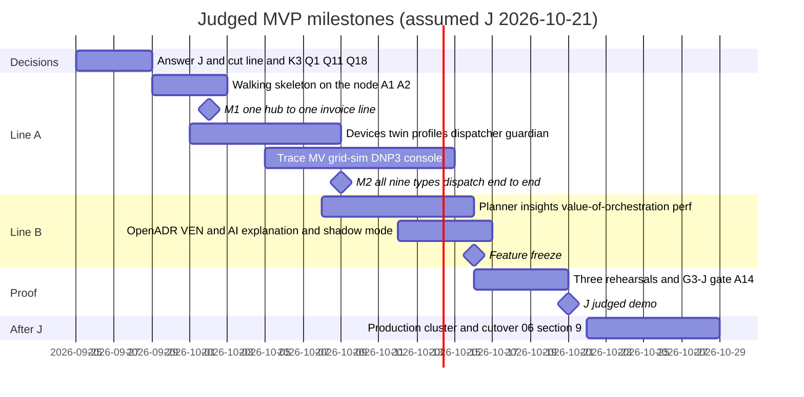

# OpenGrid Orchestrator — Review 04: Judging and Product (adversarial)

Status: v0.1 · 2026-09-25 · Reviewer: independent adversarial judge and product lead · Review type: documentation
only (no code, no server access) · Audience: project lead, product owner, every spec author.

**What was read.** In full: `00-README.md`, `00-brief.md`, `00-decision-register.md`, `01-product/01…03`,
`02-architecture/01-system-architecture.md`, `02-architecture/03-decision-engine.md`, `04-ui/01-ui-ux-specification.md`,
`05-testing/01-test-strategy.md`, `05-testing/04-traceability-matrix.md` (summary and structure). Skimmed:
`02-architecture/04`, `06`, `07`, `05-testing/02` (judged-storyline cases) and `03` (performance cases).

**Binding decisions honoured.** D0a (all nine customer types stay in scope, nothing dropped), D0b (service-agnostic
dispatch), D0f (research is not an orchestrator function), D5 (privacy, no data sharing), and D0d, D0g, D1–D4. This
review recommends **sequencing only**: everything marked "R2" below stays in scope with its design unchanged; it is
built after the judged demo.

**Labels.** Predicted scores are this reviewer's judgement. Effort figures are assumptions `A-JDG-nn` (§12). "pd" =
person-day. Rubric abbreviations: C completeness, D technical depth, P the problem, W the "why", I insight quality,
U usability, Cr creativity, Pf performance.

**Which judging criteria this review serves:** all eight — it predicts each score, names what threatens it and ranks the
changes that raise it.

---

## 1. Bottom line

1. Built exactly as specified, this system would score **≈ 83/100**: the decision engine (lexicographic arbitration LP
   with water-filling, delay-aware bank PI, robust MILP with duals, Monte Carlo breach risk), the single-signer guardian
   and the replayable hash-chained trace are real engineering, not a wrapper.
2. It will not be built as specified: 151 of 153 stories, 315 of 323 FRs, 16 services on ≈ 20 infrastructure
   components, 16 screens and 1,483 tests are "MVP" — ≈ 390–480 pd against ≈ 32–96 pd available before an assumed
   2026-10-21 demo — so the realistic outcome is **≈ 56/100** (range 45–62) with a high risk of a live failure.
3. The insight and "why" points are designed but not surfaced: price of firmness, the realized ownership map, the
   M&V-overlap report and the capture ratio have no screen, and nothing states what the orchestrator adds over today's
   rule-based allocator.
4. The 14-step judged storyline is a feature tour of an estimated 15–25 minutes with no real-data, performance or
   breach-prediction moment.
5. Freeze a judged MVP (Line A ≈ 59 pd + Line B ≈ 23 pd; all nine customer types stay dispatchable; protocol, screen,
   test and infrastructure breadth deferred to R2), pin the date and decouple the cloud cutover, surface insight and
   performance, rehearse a 7-minute seeded script: **≈ 84/100** (range 76–88) if Lines A and B finish, ≈ 71 with Line A
   only.

---

## 2. Predicted scorecard

Three columns: the MVP built exactly as specified (hypothetical), the realistic result on 2026-10-21 if the team builds
against the spec as written, and the judged MVP of §5 (Lines A + B finished) with the changes of §10.

| Criterion | Pts | As specified, fully built | Realistic, spec as is | MVP-J with changes | Why | What raises it |
|---|---|---|---|---|---|---|
| Completeness | 15 | 13 | 7 | 13 | The specified chain (data → arbitrated decision → guardian-signed command → telemetry-verified delivery → M&V → settlement → trace) covers all nine types with injected failures and deterministic rehearsal (TC-E2E-035/036). −2 even if fully built: 35–45 pods requesting 93.6% of the pod-memory budget on a shared host is a large live-failure surface. Realistic: the chain will not close for all nine types by J; stubs and a live failure are likely. | Walking skeleton by end of week 1 (JDG-023); G3-J gate (JDG-014); demo-profile soak (JDG-006); seeded replay fallback (§6.3) |
| Technical depth | 15 | 14 | 10 | 13 | Clearly not a wrapper: lexicographic tier LP with bucketing and water-filling (03-DE §8.4), bank PI with time alignment and delay-scheduled gains (§4.2, §8.6.1), robust MILP with duals and an independent validator (§6), Monte Carlo breach risk (§8.11), guardian as sole signer with epoch fencing (R1, R8), replayable per-stream hash chains (§9). Realistic: planner, SCADA and trace are the likely stubs. MVP-J −1 for deferred protocol breadth. | Make the depth findable (README map, Examples A–C as tests), one before/after optimization, DNP3 on the wire (JDG-018) |
| The problem | 15 | 14 | 12 | 14 | Exactly the track: one fleet, many buyers, homes first — `HOME` is non-configurable L1, one kWh has one owner, nine types run from one executor. −1 for domain slips a market-literate judge will catch (JDG-010, JDG-011, JDG-017). The concept survives even a partial build. | Fix JDG-010/011/017; show reserve-violation and double-claim counters live |
| The "why" | 15 | 12 | 10 | 13 | Firm-first by lexicographic stages instead of weights, ring-fencing and price of firmness are argued well, but across 2.8 MB of text, led by reviewer IRRs of −3.6% / 4.1% / 9.2%, with no number for what the orchestrator itself adds. | "Value of orchestration" metric (JDG-005); one-sentence thesis on OPS and README line 1 |
| Insight quality | 10 | 7 | 4 | 8 | The engine computes ownership map, price of firmness, displacement cost, breach probability and lead time, M&V overlap and capture ratio; the console shows only cost-of-choice and an AT_RISK badge (JDG-004). Realistic: insight outputs sit last in the dependency graph and are the first casualties. | Insights view (§7); FR-DE-050 to Must; breach calibration plot |
| Usability | 10 | 7 | 4 | 8 | Strong control-room design (ISA-101, ISA-18.2, Why? panel, guarded actions, `REJECTED` vs `FAILED`, WCAG 2.2) — but a 35–45-pod install (architecture §14.2 lists 35 pods; the platform table about 45), 16 screens × 13 roles, no evaluator quick start or operator guide (the node deploy itself is one command, 06 §7.4), and no path onto Base's real fleet (no adapter, no shadow mode). | SHADOW mode and device-adapter interface (JDG-009); seeded demo profile, laptop install and operator quick reference (JDG-029) |
| Creativity | 10 | 8 | 6 | 8 | Novel combination: live ERCOT data, DNP3 and OpenADR, dispatch profiles as data (a tenth type by configuration), guardian-signed commands, LLM explanations grounded in a hash-chained trace, visual continuity with the existing simulators. Realistic: less of it is visible. | Price-of-firmness visual; "tenth type by configuration" backup beat; AI-off parity shown live |
| Performance | 10 | 8 | 3 | 7 | Explicit budgets (tick p99 ≤ 250 ms at 10,000 hubs; ingest p99 ≤ 5 s), PT-01…PT-12 including a 100,000-hub cloud test, bucketed LP, trace compaction. Realistic: no time left to measure, nothing on screen. MVP-J: 10,000 hubs measured on the node, live strip, one optimization; 100,000 stays a labelled model (−1). | Performance strip and bench report (JDG-020); guardian hot-path spike in week 1 (JDG-021) |
| **Total** | **100** | **83** | **56** (45–62) | **84** (76–88) | With Line A only: ≈ 71 (C 12, D 12, P 13.5, W 11, I 5, U 6, Cr 6.5, Pf 5). | |

---

## 3. What could make the build crash or look like a wrapper

### 3.1 Crash risks

| # | Risk | Where in the spec | Likelihood before J | Score at risk | Mitigation |
|---|---|---|---|---|---|
| CR-1 | Memory pressure evicts `agent-sim` first (`og-low`), so the fleet vanishes mid-demo; requests are 93.6% of 10,496 MiB and limits 1.6× overcommitted beside ClamAV, MariaDB and `fdmp` | 06 §1.8–§1.9; R2 | Medium–high | C −3 to −5 | Demo profile (JDG-006): fewer infrastructure pods, 2,000 live hubs, `agent-sim` not evicted first during the demo window, freshclam and backups outside the window, 24 h soak |
| CR-2 | Audit chain-tip row lock plus one audit row per signed command stalls at event bursts (≈ 1,000 commands/s in PT-02); K3 undecided, so an audit stall may stop dispatch | 01-arch §8.1, §8.3; register K3 | Medium | C, Pf | JDG-007: per-stream chains, one trace per command batch, K3 = journal and keep firm delivery |
| CR-3 | Guardian misses its 100 ms per-batch budget with per-command OPA calls, signing and inserts in Python; late ticks at event start | 03-DE §3.4; 06 §1.8 | Medium | Pf, C | JDG-021: one policy evaluation per batch, batch-level signing, measured in week 1 |
| CR-4 | The virtual clock multiplies telemetry (10 s virtual cadence at ×30 = 3 messages/s per hub, 6,000/s for 2,000 hubs) and time jumps expire command TTLs at hubs, triggering mass fallbacks while EMQX, NATS and Keycloak run on real time | TR-01; SCN-DEMO-01; `agent-sim` | Medium | C | Accelerate ≤ ×10 during beats; fast-forward only between beats in steady state; `agent-sim` coalesces telemetry per real second |
| CR-5 | ERCOT suspends the account (the live simulators request a token every 60 s, ≈ 1,440/day); "real data" disappears | Register §D, Q18 | Low–medium | U, P | JDG-016: token-reuse fix now, separate key, record/replay proxy |
| CR-6 | DNP3 stack: the demo choice (Step Function `dnp3`, ADR-072) has C, C++, Java and .NET bindings but no Python binding, and a non-production licence; OpenDNP3 has no SAv5; days lost in plumbing | 07 §7.2, ADR-072; Q11 | High | D, C | JDG-008: DNP3 over TLS only, stack chosen and spiked in week 1 |
| CR-7 | Reconnect storm after an EMQX or `agent-sim` restart (10,000 mTLS handshakes) takes minutes | PT-03 | Medium at 10k, low at 2k | C | Live demo at 2,000 hubs; 10,000 shown as recorded evidence |
| CR-8 | Two-person approvals on stage: second session expired, MFA prompt, approval token expired (10 min, C-24) | R3; C-24 | Medium | U, C | Two pre-authenticated browsers; approval rehearsed; demo token lifetime configured |
| CR-9 | Planner solve exceeds its slot on stage (L-DA limit 300 s) | 03-DE §6.8 | Medium | C | Never solve live: pre-computed plan with solver statistics shown |
| CR-10 | Cross-document conflicts (C-01…C-26, K1–K11) implemented differently by different people | 05-testing §13; register §E | High | C, P | Resolve the six that touch the demo before building: C-01, C-04, C-06, C-15, C-24, K3 |
| CR-11 | Cloud LLM slow or unavailable in the AI beat | 01-arch §5.10 | Low–medium | Cr | AI-off parity is the point of the beat; 5 s timeout; pre-warmed |

### 3.2 Wrapper-perception risks

| # | How it looks | Mitigation |
|---|---|---|
| WR-1 | "HiGHS plus a port of `fleet_lp.js` and `control_engine.py`" | README "where the brain lives": arbitration LP, water-filling, bank PI, guardian checks, trace chain; Examples A–C as passing tests; credit the ports as ports |
| WR-2 | "An LLM wrapper" if the copilot is a headline | The AI is a garnish: switch it off on stage and show nothing else changes (UI-DSP-13) |
| WR-3 | "The simulator testing itself" | Published device contract with conformance tests; `agent-sim` as a separate deployment, ideally on a second LAN host; faults injected only through the simulator API (JDG-028) |
| WR-4 | "Protocols are JSON stand-ins" | DNP3 on the wire (packet capture in the evidence pack); schema-valid OpenADR 3.0 messages |
| WR-5 | "A dashboard over a database" | Show the closed loop acting: bank load responding to fleet output with the control-law panel's live numbers |

---

## 4. Findings

| ID | Severity | Location | Finding | Fix |
|---|---|---|---|---|
| JDG-001 | Critical | 01-product/03 release map; 01-vision §5.1; 01-product/02 MoSCoW | The MVP is the whole product: 151 of 153 stories (144 Must, 38 of size L), 315 of 323 FRs, 16 services on ≈ 20 infrastructure components, 16 screens, 143 UI requirements and 1,483 tests. Estimated ≈ 390–480 pd (§5.1) against ≈ 32–96 pd of capacity. No document holds an effort estimate, a staffing assumption or a build order. | Adopt the MVP-J cut line of §5: all nine types stay dispatchable; protocol, screen, test and infrastructure breadth moves to R2. Add capacity, owners and a walking-skeleton-first order to the epics document. |
| JDG-002 | Critical | 05-testing/01 §11 (Q-T1); 06 §9.1; register Q4 | The judged-demo date appears in no document. The platform plan builds a production cluster (from 2026-10-05), runs two restore drills, a migration rehearsal (10-19…21), go/no-go (10-22) and cutover (10-26) in the same weeks, with the same people. The cutover earns almost nothing on the rubric. | Pin J. Run the production-cluster track after J (or with people not on the build). For judging, prove portability by a scripted `helm install` onto a fresh cluster plus one restore drill. If the node is gone after 2026-10-30, the portable chart is the contingency venue. |
| JDG-003 | High | 01-vision §5.4; E23; TC-E2E-020…041 | 14 steps plus SCADA beats: a tour of an estimated 15–25 minutes. No breach-prediction beat (the brief's own insight example), no performance moment, no statement that prices are real, no quantified "why". | Use the 7-minute script of §6; keep the 14-step run as the unattended rehearsal (TC-E2E-035) and the evidence pack. |
| JDG-004 | High | 03-DE §6.10, §10.4, §12.1; FR-DE-050 (Should); 04-ui | The engine's most valuable outputs are not in the console: "price of firmness" appears in no UI requirement; the ownership map is only a planned stacked bar (UI-PLN-02); the M&V-overlap report and capture ratio have no view. | FR-DE-050 to Must; add the Insights view of §7. |
| JDG-005 | High | 01-vision §1 (IRR table) | The "why" is prose, led by reviewer IRRs that invite "why build it?". No metric states what the orchestrator adds. | Add KPI "value of orchestration" (§7, change 4): the real ERCOT year replayed under four policies. It extends FR-DE-122 and measures the orchestrator itself, not a business case (D0f). Move the IRR table to a link to the Projects Deck. |
| JDG-006 | High | 06 §1.8–§1.9; 01-arch §14.2; R2 | 93.6% of the pod-memory budget requested, limits 1.6× overcommitted, host services peaking independently; the eviction order removes `agent-sim` first. | Demo profile without Redis/Valkey, MinIO, Loki, Tempo, OTel collector and policy-controller; 2,000 live hubs; `agent-sim` raised above `og-low` for the demo window (or run on a second LAN host); freshclam and backups outside the window; 24 h soak at the demo profile with host peaks recorded. |
| JDG-007 | High | 01-arch §8.1, §8.3; 03-DE §9.3; register K3; C-18 | Two incompatible audit designs. The architecture's one serializes every append of every service on one row lock and writes one audit row per signed command; the decision engine uses per-stream chains with an hourly Merkle root; security anchors every 5 min. With K3 open, an audit stall can stop dispatch. | Adopt per-stream chains, one trace per command batch carrying the Merkle root of its commands, a periodic cross-stream anchor. Resolve K3: journal locally, keep firm delivery, alarm, reconcile (bounded journal). |
| JDG-008 | High | FR-SCAD-003…019; 07 §7.2; ADR-072/073; Q11 | Five SCADA protocols with IEC 62351 security in the MVP. No maintained open-source DNP3 SAv5; the chosen demo stack has no Python binding and a non-production licence ([stepfunc/dnp3](https://github.com/stepfunc/dnp3)); ICCP needs a commercial TASE.2 stack; a non-Python sidecar breaks ADR-001. | MVP-J: DNP3 over TLS only — one outstation association (virtual-resource points, select-before-operate setpoint, enable/block, e-stop, quality, sequence protection) and one master poll of the `grid-sim` RTU. IEEE 2030.5 server, ICCP/TASE.2, IEC 60870-5-104, OPC UA, SAv5 and redundancy go to R2 with the design unchanged. Spike the stack in week 1; record a packet capture. |
| JDG-009 | High | Register Q2; 01-vision §4.2; 01-arch | "Could Base use it tomorrow?" has no path: Base's hubs do not speak this MQTT contract, and no mode runs the brain on real telemetry without commanding. | Add a `DeviceAdapter` interface (telemetry in, commands out, ack semantics) with the MQTT agent as one implementation, and a `SHADOW` operating mode (plans, arbitration, traces and M&V computed; commands recorded, not sent; shadow-vs-actual report). |
| JDG-010 | Medium | 04-ui §3.4 mock ("ERCOT_AS Non-Spin … Displaced $412 foregone"); UI-MKT-04; E05-S06 criterion 2; FR-PLAN-008; FR-BILL-004 | The flagship screen and a story's acceptance criterion show an awarded AS hold diverted to a firm event as a normal, priced outcome. Brief §3.1 and 03-DE §2.4 rule 2 forbid it inside the awarded interval; only a §7.4 forward release (default off) settles as buyback. A market-literate judge reads it as an ADER/RTC+B error. | Mock: AS shown "ring-fenced — held"; displaced examples come from T3/T4. Rewrite E05-S06, FR-PLAN-008 and FR-BILL-004: buyback applies to a §7.4 release or a capability loss (utility block, safe stop, hub loss). |
| JDG-011 | Medium | UI-PLN-01, UI-OBL-04, PLN layout vs KPI-06, FR-INT-004, 03-DE §7.1 | The UI binds the "day-ahead declaration" to 10:00 CT (DAM offer close); firm declarations are due 14:00 CT. | Two markers: 10:00 CT DAM offers, 14:00 CT firm declarations. |
| JDG-012 | Medium | KPI-13; UI-OBL-02; 01-arch NFR-008; 03-DE §8.11 | Four lead-time targets for one insight (≥ 1 intraday cycle; ≤ 15 min; ≥ 1 control tick; median ≥ 60 min and P10 ≥ 15 min). The weakest makes "before it happens" trivial. | One target — median ≥ 60 min, P10 ≥ 15 min — plus a calibration plot (predicted breach probability vs realized) from replays. |
| JDG-013 | Medium | 01-vision §3; E23-S05; TC-E2E-033/038 | A 21-row judge scorecard, several rows assumptions; unreadable in a 7-minute demo. | Scorecard of 8 headline KPIs with measured value, target and provenance (§6.3); the other 13 in drill-down. |
| JDG-014 | Medium | 05-testing/01 §9.2 G3, §7.1, TR-R14 | G3 requires 100% of the MVP subset (784 functional cases), AP-H chaos with compound scenarios and a summative usability round. It cannot pass by J, so it will be waived wholesale, which removes the gate. | G3-J (§5.7). The remaining cases run as R2 regression — deferred, not dropped. |
| JDG-015 | Medium | 06 §1.7–§1.8, §5; 01-arch §4, §14 | ≈ 20 infrastructure components before any business logic (Keycloak, OPA, cert-manager, step-ca, EMQX, NATS, PostgreSQL/Timescale, CNPG operator, PgBouncer, Valkey/Redis, MinIO, Traefik, Sigstore policy-controller, egress proxy, OTel, Prometheus, Alertmanager, Grafana, Loki, Tempo, kube-state-metrics); each costs configuration days and is a failure point on stage. | MVP-J set: PostgreSQL + Timescale, NATS (+ KV), EMQX, Keycloak, OPA sidecar, cert-manager with a self-signed CA issuer, Prometheus + Grafana, Traefik behind Apache. The rest returns with the production profile (R2). |
| JDG-016 | Medium | Register §D; Q18; TR-R9 | Token churn by the live simulators risks an ERCOT suspension; if the orchestrator shares the account, "real data" can vanish before J. | Apply the ready token-reuse fix; separate subscription key; record/replay proxy with as-of provenance; on stage show a live ticker and a replayed real day, both labelled. |
| JDG-017 | Medium | FR-ING-001 (`LZ_CPS`, `LZ_AEN`); 03-DE §12.1; Q6 | The modeled fleet sits in NOIE territories (CPS Energy, Austin Energy). A NOIE must itself opt in before its customers can join an ADER ([EticaAG summary](https://eticaag.com/ercot-ader-program/) — secondary source; verify against the ADER governing document); with Q6's default the same homes also cannot be in both the partner program and the ADER. A market judge will ask how these homes earn `ERCOT_ENERGY`/`ERCOT_AS`. | List NOIE opt-in as a condition of the ERCOT lanes, or run the ADER lanes on a competitive-area partition (e.g., `LZ_HOUSTON`, `LZ_NORTH`); keep the zone list configurable (FR-ING-001 open question 7). |
| JDG-018 | Medium | 01-arch §5.3, ADR-005; §5.10; vision §5.4 step 12 | Two ways to look like a wrapper: "HiGHS plus a port of an existing JS model", and an LLM copilot as the headline. | README "where the brain lives"; Examples A–C as tests; one before/after optimization; DNP3 on the wire; AI-off toggle on stage. |
| JDG-019 | Medium | 04-ui §2.3 (16 screens × 12–13 roles, 143 requirements) | The console is a product in itself; 7 screens carry the demo. | MVP-J: OPS (+ scorecard, performance strip), DSP (+ Why?), OBL, PLN/Insights, MNV, Safety (kill switch, approvals, chain verify), SIM Lab, SCADA log panel, and a simple map reusing the simulators' Leaflet layer. The rest goes to R2. |
| JDG-020 | Medium | 06 §4.9; 04-ui §7; 05-testing O9 | Performance lives in Grafana and a judge evidence pack; nothing in the console shows it; no benchmark shows an optimization. | §9: live strip on OPS, `bench/` report with method and a 1k→10k scaling curve, one before/after optimization. |
| JDG-021 | Medium | 01-arch §5.5, §8.1; 06 §1.8; 03-DE §3.4 | Guardian signs, evaluates policy and writes per command; a whole-fleet re-dispatch (TC-PERF-012: 10,000 setpoints in one tick) with per-command OPA calls and inserts will miss 100 ms p99 in Python. | Week-1 spike: one policy evaluation per batch (or compiled checks), batch-level Merkle signing (TC-PERF-013 variant B), vectorized capability; decide from measurements. |
| JDG-022 | Medium | 05-testing A-T3; O7 (SUS ≥ 80) | Summative usability needs ≥ 32 participants, unavailable by J (TR-R11). | Formative test: 5 participants × 3 demo tasks (respond to AT_RISK, trace an invoice line, engage and release a bank stop); publish the results, failures included. |
| JDG-023 | Medium | 01-product/03 open question 1 | Sizes S/M/L are "relative, pending velocity"; 38 L stories and an E23 that depends on everything hide slip until the end. | Anchor sizes (S 0.5, M 1.5, L 4 pd); daily burn-down; a thin end-to-end slice (one hub → one invoice line) by the end of week 1. |
| JDG-024 | Low | README (318 FRs) vs FR §5 (323); K1; C-01…C-26; K1–K11 | Judges who open the repository see counts that disagree and 37 open cross-document conflicts. | One consistency pass driven by the register; make the traceability generator's checks a CI failure. |
| JDG-025 | Low | 04-ui §3.0(b) status enum | `Research` contradicts D0f; `Feature-flagged` suggests business gating that R15 forbids. | Enum: `Live`, `Pilot contract`, `Planned`, `Design-only`. |
| JDG-026 | Low | FR-UI-008, FR-RPT-005, E23-S05 | A met/partly/unknown board of business-case conditions in the dispatch console blurs D0f. | Show only orchestrator-measured facts (e.g., measured P10 kW/hub next to the 9.5 kW claim) linked to the Projects Deck, which keeps the board. |
| JDG-027 | Low | FR-AI-013; Q17 | On the node the copilot declines personal-data questions; unscripted on stage, a refusal reads as a failure. | Script it as a privacy beat (the pre-send check log) or keep it for Q&A. |
| JDG-028 | Medium | 05-testing TR-R2; FR-DEV-014 | `agent-sim` and the system come from one team and one spec — "the system testing itself". | Publish the device contract (JSON Schema + conformance tests) as a separate package; run `agent-sim` as a separate deployment (second LAN host on stage); inject faults only through the simulator API. |
| JDG-029 | Medium | 06 §7.4; 01-product; 04-ui | The node deploy is one command (`make node-bootstrap`, then `make deploy ENV=node PROFILE=… TAG=…` with smoke tests, 06 §7.4), but nothing specifies an evaluator's path: no demo-profile seeding step (contracts, profiles, topology, users), no laptop install, no quick start, no operator guide. The brief's usability bar is "installable, documented, sane defaults". | Keep `make deploy`; add `PROFILE=demo` with seeded fixtures, `make demo` on k3d for evaluators' laptops, a 2-page README quick start, an operator quick reference (top 5 tasks), an integrator guide for the device adapter, a runbook index linked from alarms. |
| JDG-030 | Low | 05-testing TR-01, TR-02 | The clock port and seed plumbing are testability requirements, not stories, yet the demo, the replay fallback and the determinism proof depend on them. | Build them in the walking skeleton (A1). |

---

## 5. Buildability and the MVP cut line

### 5.1 Effort of the MVP as specified

| Scope element | Count marked MVP | Estimate |
|---|---|---|
| Stories (Must + Should MVP) | 151: 12 S, 101 M, 38 L | ≈ 310 pd with A-JDG-03 anchors (≈ 620 pd with conventional anchors S 1, M 3, L 8) |
| Test automation beyond story acceptance criteria | 816 functional cases (784 in the MVP subset) + non-functional suites; 1,483 in total | ≈ 60–120 pd |
| Platform: ≈ 20 infrastructure components, production cluster, restore drills, migration rehearsal, cutover | — | ≈ 20–50 pd |
| **Total** | | **≈ 390–480 pd** |

### 5.2 Capacity

Capacity = FTE × 16 working days (2026-09-29 → 2026-10-20, A-JDG-01) × m, where m is the agentic-assistance multiplier
relative to these estimates (A-JDG-04).

| FTE | m = 1.0 | m = 1.5 | m = 2.0 |
|---|---|---|---|
| 1 | 16 | 24 | 32 |
| 2 | 32 | 48 | 64 |
| 3 | 48 | 72 | 96 |
| 4 | 64 | 96 | 128 |

The spec's MVP needs 4–15× the available capacity. **Line A (≈ 59 pd)** fits 2 FTE only at m ≈ 2, 3 FTE at m ≥ 1.25.
**Lines A + B (≈ 81 pd)** need 3 FTE at m ≈ 1.7 or 4 FTE at m ≈ 1.3. With less capacity, move J (the chart is
portable) or accept Line A only.

### 5.3 Build order (each step leaves a runnable system)

Suggested lanes: **Platform & devices** (A1–A4, A11, A12, B4), **Brain** (A5, A7, A8, B1, B3), **Money, UI & demo** (A6,
A9, A10, A13, A14, B2, B5–B7).

| # | Item (MVP-J scope) | Stories / FRs served | Rubric | pd | Cum. | Line |
|---|---|---|---|---|---|---|
| A1 | Walking skeleton and delivery path: repository, shared Pydantic schemas (Call, Event, Obligation, DispatchProfile, Command, DecisionTrace), clock port and seeds (TR-01/02), docker-compose, Helm chart with `values-node-demo.yaml`, k3s behind Apache (ADR-501), PostgreSQL + Timescale, NATS (+ KV), EMQX, Keycloak realm with the 13-role catalogue (D1), OPA sidecar, CI; thin slice: one hub → twin → one command → ack → trace row | E16-S01/S02 (part), E17-S04/S06 (part), E02-S01 | C, U | 5.0 | 5.0 | A |
| A2 | Real external data: ERCOT NP6-905-CD (15-min SPP, load zones + reference hub), NP6-788-CD (SCED LMP), NP4-190-CD / NP4-188-CD (DAM SPP, AS MCPC), NP6-332-CD (RT MCPC); token reuse and a shared 30 req/min bucket; quality flags; last-good cache with as-of; record/replay proxy; NWS forecast and alerts | E01-S01/S02/S04/S05 | P, U, C | 2.5 | 7.5 | A |
| A3 | `agent-sim` v1: published device contract, MQTT 5 + per-hub mTLS, 2,000 hubs per process, physics (39.2 kWh, 11 kW, reserve, efficiency), home load and PV from real reference shapes, EV and islanding, signed-command checks (sequence, epoch, expiry), local fallback, seeded fault API; three `MOBILE_TEEEF` units with precondition checklists | E19-S01…S03, S06; E02-S06; E09-S07 | C, D | 4.0 | 11.5 | A |
| A4 | `device-gateway` + `fleet-state`: certificate → identity, schema validation, telemetry to NATS, ack correlation, twin with staleness and a simple trust score, topology and "behind asset" query, vectorized capability (03-DE §8.2), batched Timescale history, 1-min meter roll-up | E02-S02…S05; E03-S01…S05 | C, D | 3.5 | 15.0 | A |
| A5 | Dispatch-profile catalogue and contracts: eight-element schema, nine default profiles as versioned YAML with provenance labels (R11), validator, the building blocks the nine need, contracts/programs/obligations/events, admission chain, one signed REST/webhook call intake for every type, `PENDING_POLICY`, rule-based plan F2 (port of `control_engine.py`: firm energy reserved, AS holds as awarded, charge windows) | E08-S01…S05, S07, S08; E09-S01…S08; E05-S07 (fallback) | D, P, W | 5.5 | 20.5 | A |
| A6 | Privacy baseline (D5): `pii` schema with per-subject keys (crypto-shredding), classification registry, access log, thin access/correction/erasure/opt-out APIs, egress allow-list | E21-S01…S04, S06 | P | 2.0 | 22.5 | A |
| A7 | `dispatcher`: partitions and conflict graph; lexicographic tier LP with bucketing and water-filling; reservation ledger and ring-fences; bank PI (deadband, ramp, anti-windup, time alignment) with A1/A2/S/A3 classes and hold-then-schedule; substitution; `BAND_SMOOTHING`, `MODE_CONTROL`, `TRACK_BASEPOINT`, `CAPACITY_HOLD`; stability filters; command build (sequence, precondition, TTL, stagger); Examples A–C as tests | E06-S01…S10; E07-S01…S05 | D, P, C | 7.0 | 29.5 | A |
| A8 | `guardian`: batch checks (reserve floor, energy, network caps, ramps, epoch, sequence), batch signing, veto traces, generic Tier 1/Tier 2 approvals (R3), safe stop at bank/zone/fleet with R4 ramps, Tier-2 release and staged ramp-up, the R3 exception, the utility-stop rule; week-1 hot-path measurement | E15-S01…S11; E16-S03 | D, P | 4.0 | 33.5 | A |
| A9 | Decision trace: per-stream hash chains, link records, verify endpoint, decision replay from the version vector, reason codes with templated plain-language text | E12-S01…S05; E16-S04 | D, W, I | 3.0 | 36.5 | A |
| A10 | M&V and settlement: 15-min delivered vs committed, compliance, availability, response time, priority-first attribution, per-hub P10/P50, ERCOT shadow settlement with RTC+B imbalance, billing lines from profile rules, provisional/final runs, invoice line → trace links | E10-S01…S04; E11-S01…S05 (part) | C, P, I | 4.0 | 40.5 | A |
| A11 | `grid-sim` v1: QSE counterparty (awards including partial, base points, AS deployments), VTN-style partner events and cancellation, large-load stress webhook, corridor line-current response, mobile deployment requests, bank load from real ERCOT zone load rescaled (labelled proxy) with injectable quality faults, PJM 5CP replay day | E19-S04, S05, S08 (part); E13-S02, S04 | C | 3.0 | 43.5 | A |
| A12 | `scada-gateway`: DNP3 over TLS — outstation (virtual-resource points; select-before-operate setpoint, enable/block, e-stop) and master (bank load with quality mapping); sequence protection; interlock rule written to the trace | E14-S01, S02, S05, S06, S08 (part) | D, P | 5.0 | 48.5 | A |
| A13 | `api` + console v1: REST and WebSocket with OIDC and OPA; OPS (+ 8-KPI scorecard), DSP (+ Why? panel, control-law panel), MNV (invoice → trace → telemetry), Safety (kill switch, approvals, chain verify), SIM Lab (seeded one-click faults), SCADA log panel; `MOBILE_TEEEF` icon and colour (D3) | E18-S01…S07 (part), S09 | U, I, C | 7.0 | 55.5 | A |
| A14 | Scenario runner (SCN-DEMO-01, seeded, virtual clock), determinism check (trace-hash equality), G3-J automation, three rehearsals | E23-S01…S05 | C | 3.0 | 58.5 | A |
| B1 | `planner` MILP (L-ID rolling 36 h; the same model at the L-DA times), robust P90 firm energy in one additive floor, AS holds, water values, fallback F1→F2→F3, independent validator; ownership map and price of firmness (duals plus a daily no-firm counterfactual); `forecaster` v1 (seasonal-naive + empirical quantiles with NWS temperature) | E04-S01…S05; E05-S01…S04, S06, S07 | D, I, W | 6.0 | 64.5 | B |
| B2 | Insights view (§7) and breach-risk Monte Carlo with lead-time calibration | E22-S01…S03; FR-DE-050; 03-DE §8.11 | I, W | 4.0 | 68.5 | B |
| B3 | Value of orchestration: the real ERCOT year replayed under four policies | FR-DE-122 (extended); E10-S05 (capture ratio) | W, I | 2.0 | 70.5 | B |
| B4 | Performance: 2k and 10k soaks, performance strip, `bench/` report, 1k→10k curve, one before/after optimization | E19-S07; PT-01, PT-02 | Pf | 2.5 | 73.0 | B |
| B5 | OpenADR 3.0 VEN on the real schema, 14:00 declaration, OBL and PLN screens | E13-S01, S03; E18-S01, S03 (part) | C, U, I | 3.0 | 76.0 | B |
| B6 | `ai-agent`: grounded invoice/decision explanation citing trace IDs, read-only copilot, PII pre-send check, audit of every exchange | E20-S01, S03, S05, S06 | Cr | 2.5 | 78.5 | B |
| B7 | `SHADOW` mode, `DeviceAdapter` interface, seeded demo profile (`PROFILE=demo`), laptop install (`make demo` on k3d), operator quick start | New (JDG-009, JDG-029) | U | 2.5 | 81.0 | B |

### 5.4 Milestones

### 5.5 Deferred to R2 (stays in scope, design unchanged)

| Epic | In MVP-J | Deferred to R2 |
|---|---|---|
| E01 | S01, S02, S04, S05 (5 ERCOT products, NWS) | S03 wind-actuals proxy; EIA, geo and solar ingestion beyond reference files; automated schema quarantine beyond basic checks; S06 PJM adapter (already R2) |
| E02 | S01–S04, S06; S05 backoff | S05 10k reconnect-burst hardening (measured in B4 only); S07 certificate revocation on quarantine (quarantine flag in MVP-J); FR-DEV-013 capability negotiation |
| E03 | S01–S05 (simple trust score) | FR-TWIN-010 topology-change re-check automation; FR-TWIN-012 (already R2) |
| E04 | S01, S02, S04, S05 with simple models; S03 proxy label | Learned models; forecast backtest dashboards (FR-FCST-007); FR-FCST-009/010 (already R2) |
| E05 | F2 rule plan (A5); S01–S04, S06, S07 (B1) | S05 worst-day mode; L-SCED 5-min LP layer; stochastic scenario set (MVP-J uses robust P90); Mode S port of `fleet_lp.js` (the business-case mode lives in the simulators) |
| E06 | S01–S10 | FR-DISP-013 re-route on path change (already R2); Goertzel oscillation detector (MVP-J: reversal counter) |
| E07 | S01–S05 | S06 AI-proposed allocations (MVP-J: deterministic engine; the AI only explains) |
| E08 | S01 (with a 1-week golden replay), S02, S03, S04 (versions, effective dates, Tier-2 approval), S05, S07, S08; S06 read-only browse | Profile signing; replay gate on the full ERCOT year (nightly job); S06 dry-run |
| E09 | S01–S03, S05–S08; S04 opt-out and reserve accounting | S04 storm hold, auto-derate after N failures, rule-version diff (FR-CTR-009/010/011) |
| E10 | S01 (1-min meters; reconciliation against simulated AMI), S02–S04; S05 capture ratio (B3) | S05 replay mode for every obligation type beyond the storyline and the back-test |
| E11 | S01, S02, S04, S05 (property test); S03 performance factor and buyback via shadow settlement | S03 liquidated damages and derate automation; S05 correction workflow; S06 roll-up statements |
| E12 | S01–S05 with a local anchor | External write-once anchor (object lock) |
| E13 | S02, S04 (A); S01, S03 (B5) | IEEE 2030.5 business objects; circuit-breaker tuning; S05 PJM (already R2) |
| E14 | S01 (point subset), S02 (DNP3 over TLS; SAv5 under the Q11 exception), S05, S06, S08 (guardian path) | S03 IEEE 2030.5 server; S04 ICCP/TASE.2 and IEC 60870-5-104; S07 redundancy, commissioning workflow and conformance suites; OPC UA; S08 SCADA-segment traffic monitoring |
| E15 | S01–S11 (all three scopes, tiers, exception, utility stop) | — |
| E16 | S01 (Keycloak OTP), S02 (device certificates; NetworkPolicy between namespaces), S03, S04, S06 (13 roles in realm and OPA; five personas exercised end to end; CI secret scan); S05 basic rate and magnitude rules | Service-to-service mTLS; automatic certificate rotation; per-role least-privilege review cadence |
| E17 | S03 (document), S04 (retries, restarts), S06 port check; 10 alerts with 5 runbooks | S01 alert and runbook per KPI; S02 audited feature flags; S05 capacity alerts and scale-out; S06 portability audit automation |
| E18 | S01 board, S02 log, S03 kill switch and approvals, S04 scorecard, S05 role scoping, S06 finance and arbitration views, S07 SCADA log, S09 `MOBILE_TEEEF` styling (A); simple map, plan approval, copilot, profile catalogue (B) | S04 condition board; S06 SOC view; S08 fleet-operator, billing-admin and auditor screens (auditor gets chain verify in MVP-J); S09 system-admin provisioning; full MAP, HUB, MKT, CUS, DAT, ADM; ALR flood mode |
| E19 | S01–S06; S08 (DNP3 RTU, corridor, three mobile units); S07 10k (B4) | ICCP and IEEE 2030.5 counterparty simulators |
| E20 | S01, S03, S05, S06 (B6) | S02 proposals; S04 unstructured intake; incident triage (FR-AI-007) |
| E21 | S01–S04 (thin APIs, access log), S06; S05 as a runbook | Automated retention jobs; automated breach detection |
| E22 | S01–S03 (B2, B3); S05 H3 alert | S04 condition board and trend reports; PDF export |
| E23 | S01–S05 (8-KPI scorecard; every KPI computed where its data exists) | — |

### 5.6 The nine customer types in MVP-J (none deferred)

| Type | Signal in MVP-J | Control mode (profile block) | Deferred to R2 |
|---|---|---|---|
| `HOME` | Hub telemetry; homeowner channel via `api` | Constraint (L1): reserve floor, opt-out, reserve change | Storm-hold automation from NWS alerts |
| `ERCOT_ENERGY` | QSE simulator base points; real load-zone prices | `TRACK_BASEPOINT`, price-responsive fallback | L-SCED re-pricing |
| `ERCOT_AS` | QSE simulator awards and deployments; real MCPC | `CAPACITY_HOLD` + event deployment, ring-fenced | §7.4 forward release (default off) |
| `PARTNER_CAPACITY` | Partner event via REST (A), OpenADR 3.0 VEN (B5) | Event, open loop | IEEE 2030.5 path |
| `DIST_DEFERRAL` | DNP3 bank load and utility SBO | `CLOSED_LOOP_REGULATION` (bank PI, hold-then-schedule) | Redundant SCADA paths |
| `LARGE_LOAD` | Signed stress-event webhook | Event, open loop | — |
| `PIPELINE_AC` | Corridor line current from `grid-sim` (REST); H3 alert | `BAND_SMOOTHING` (H1/H2); monitoring profile (H3) | Line current over DNP3/ICCP |
| `MOBILE_TEEEF` | Deployment orders via API; three units | `MODE_CONTROL`, separate pool, precondition gates | Assignment MILP beyond three units |
| `PJM_CAPACITY` | Replayed historical 5CP day (design-only, as specified) | Event on predicted peaks | Live PJM adapter (already R2) |

### 5.7 Judged-MVP gate G3-J (replaces G3 for the demo)

1. Invariant property tests (≥ 10⁵ cases): Σ reservations ≤ capability per hub and interval; grants ≤ energy above the
   floor; no lower tier served at a higher tier's expense; zero kWh claimed or billed twice; reserve never breached.
2. Worked Examples A–C of 03-DE §8.5 reproduced exactly.
3. One end-to-end chain per customer type (TC-E2E-001…009) passing.
4. The storyline twice with identical decision-trace hashes (seed 20261015) and once with another seed.
5. PT-01 shortened to 2 h at 2,000 and at 10,000 hubs, and PT-02 shortened to a 30-min event burst, on the node;
   numbers published.
6. P1 security: guardian-only signing; out-of-order, replayed and stale commands rejected; tier boundaries
   (0.99/1.00 MW, 4.99/5.00 MW); invoker ≠ approver; zero PII canaries in cloud prompts.
7. Formative usability: 5 participants × 3 tasks, SUS reported.
8. 24 h soak at the demo profile with no eviction of `og-critical`/`og-high` pods; no open S1 defect.

---

## 6. Demo storyline

### 6.1 Assessment of the current storyline (vision §5.4)

| Question | Verdict |
|---|---|
| Fits 5–7 minutes? | No. 14 steps plus SCADA beats, each a navigation and often a virtual-clock jump, plus two-person approvals: an estimated 15–25 minutes. |
| Compelling? | A checklist, not a story: no tension ("five buyers want the same kilowatts at 17:30") and no resolution ("everyone got what the contracts say, homes stayed safe, here is the bill and why"). |
| Shows the "why"? | Partly (step 4 arbitration, step 8 price squeeze); no quantified value versus today's allocator. |
| Shows insight? | Regret (KPI-16) only. No ownership map, no price of firmness, and no breach prediction — the brief's own example is absent. |
| Shows usability? | Approvals, override, copilot; no install or "first shift" moment. |
| Shows performance? | No measured number appears anywhere in the storyline. |
| Real data visible? | Not stated; a price spike could be read as fabricated. |
| Injected failures? | Yes — comms, bad SCADA data, security, house events. Keep them. |

### 6.2 Revised script (7:00)

Numbers in angle brackets are measured at the rehearsal; figures quoted from 03-DE §8.5 are illustrative (A-DE-27).

| Time | Beat | Screen | What happens on screen | What the judge should conclude | Criteria |
|---|---|---|---|---|---|
| 0:00–0:45 | 1. One fleet, many buyers | OPS | 2,000 homes online; nine customer lanes; the live ERCOT price for the fleet's load zone (product and as-of shown); each home's reserve band marked "never for sale". Tile 1: value of orchestration on the real ERCOT year — `<+$/hub-yr>` vs today's rule allocator, firm compliance `<x%>` vs `<y%>`, reserve violations 0 vs `<n>`, kWh claimed twice 0 vs `<m>` | The problem is real, the data is real, and the brain adds measurable value | P, W, I |
| 0:45–1:45 | 2. Tomorrow is already sold | PLN / Insights | Ownership heatmap for the next 36 h (kW and $ per customer and hour); price of firmness: holding the partner event 17:30–19:00 forgoes ≈ $1,680 per 5-min interval at the forecast spike against an event worth ≈ $45,300 — firmness wins; 14:00 declaration sent and acknowledged | Non-obvious, finance-grade insight from real optimization (MILP duals) | I, W, D |
| 1:45–3:00 | 3. Five buyers at 17:30 | DSP, OBL | Clock to 17:30: OpenADR partner event, bank overload over DNP3, Non-Spin deployment, $2,400/MWh SCED spike, large-load stress event, pipeline smoothing, three mobile units. Queue: firm served; AS from its ring-fence (not displaced); energy squeezed to 100 kW; pipeline 158 of 250 kW. Why? panel: tier stages, binding constraints with duals, naive candidate (pipeline 0 kW) vs chosen. OBL: the large-load event was flagged AT_RISK an hour earlier (expected shortfall ≈ 200 kW) and the customer notified | Real arbitration with priced trade-offs; breach predicted before it happens | D, I, P |
| 3:00–4:15 | 4. Things break | SIM Lab → DSP, OPS | One click each, seeded: 10% of the partner event's hubs lose comms → substituted within 3 ticks, the 15-min compliance bar stays ≥ 95%; the bank's DNP3 point turns BAD → hold the prior setpoint, then the schedule, never 0 kW, reason on screen; 12 EVs start and 8 homes island → available kW netted within one tick, reserve-violation counter stays 0 | The core chain survives failures safely | C, P |
| 4:15–5:15 | 5. Nobody can make it do something unsafe | SCADA log, Safety | A replayed DNP3 operate with an old sequence number → `REJECTED` (expected vs received); an AI proposal breaching the reserve floor → guardian veto with rule ID; bank kill switch with reason and one confirmation → 30 s ramp on the bank chart; release blocked until the supervisor approves in a second browser → staged ramp-up | Command safety is enforced, not promised | D, P, U |
| 5:15–6:15 | 6. Every dollar explained | MNV | Event ends, AMI arrives: invoice line for the partner event → decision trace → commands → telemetry → M&V (per-hub P10 `<kW>` next to the 9.5 kW claim, labelled) → chain verified. Copilot: "why is this line $X?" → grounded answer citing trace IDs; AI switched off → the deterministic explanation is unchanged | Completeness to the bill; auditability; AI adds value without being load-bearing | C, I, Cr, W |
| 6:15–7:00 | 7. Fast, and usable tomorrow | OPS performance strip, terminal | Live: tick p99 `<ms>`, telemetry → twin p99 `<s>`, commands/s; recorded 10,000-hub soak and the 1k→10k curve; one optimization before/after (bucketed LP vs per-hub LP); the one-line `make deploy PROFILE=demo` and SHADOW mode for Base's real fleet; close on the thesis sentence | Measured performance; installable; a safe path onto the real fleet | Pf, U |

**Five-minute cut:** merge beats 1 and 2 (heatmap on OPS), skip the AI veto in beat 5 (keep it for Q&A), shorten beat 7 to the strip and
the install line.

### 6.3 Setup, fallbacks and backups

- **Setup (T−30 min):** demo profile; 2,000 hubs online; DNP3 association and OpenADR VEN up; SCN-DEMO-01 armed on a
  replayed real ERCOT day (test strategy Q-T10 default: a 2026 summer day with a 15-min SPP ≥ $1,000/MWh and a negative
  interval), seed 20261015, parked at 16:55 CT; live ticker running; operator and supervisor browsers signed in; plans
  pre-solved; the bench report, trace-hash comparison, packet capture and G3-J report open in tabs.
- **Scorecard (8 KPIs):** firm-interval compliance; reserve violations; kWh claimed twice; breach lead time; value of
  orchestration; tick p99; trace completeness; command-safety compliance — each with measured value, target and
  provenance label.
- **Fallback:** if any live beat fails, switch to the recorded run of the same seed and show the identical trace hashes
  — determinism becomes the evidence.
- **Q&A backups:** add a tenth service type by configuration (`FEEDER_HOSTING_LIMIT`) and dispatch it with no code
  change; zone- and fleet-scope stops; the cloud-prompt pre-send log (D5); the full 14-step unattended rehearsal record.
- **Never on stage:** stack traces, login flows, live solver waits, a dependency on ERCOT's API being up.

---

## 7. Insight quality

| Output | Why it is non-obvious and useful | Computed (spec) | Surfaced (spec) | Surface it as |
|---|---|---|---|---|
| Ownership map — who owns which hours, planned vs realized, kW and $ | Shows the fleet is time-shared, not sold once; exposes idle, sellable hours | 03-DE §6.10 (FR-DE-050, Should); FR-RPT-001 (Must) | Planned stacked bar only (UI-PLN-02) | 36 h × 9 types heatmap, planned/realized toggle, $ per cell, click → traces |
| Price of firmness per hour | What a firm promise costs in forgone market value; set against the contract payment it answers "is this contract worth holding?" | 03-DE §6.10 (duals + daily no-firm counterfactual), §9.2 | Absent | Line chart vs contract payment rate; firmness premium = payment − cost |
| Breach risk: probability, expected shortfall, first-breach time, lead time | Predicts a firm breach before it happens and can prove its calibration | 03-DE §8.11 | AT_RISK badge (UI-OBL-02) | Breach radar for every firm obligation in the next 36 h, calibration plot, notice log |
| Displacement ledger and arbitration regret (KPI-16) | Who lost capacity to whom and what it cost | 03-DE §8.4, §9.2 | Cost of choice per queue row (UI-DSP-02); 1-h total (Should) | Daily roll-up by customer pair ($, kWh) plus per-decision Why? |
| Optimization rescue (chosen vs naive candidate) | Quantifies what the arbitration LP adds per decision (Example A: 158 kW vs 0 kW) | 03-DE §9.2 candidates | Implicit in Why? | "kW rescued by optimization" counter |
| Delivered vs committed per 15 min; per-hub P10/P50; structural vs fault shortfall | Separates export-limit shortfall (renegotiate) from device faults (fix) | 03-DE §10.2; FR-DISP-016 | Bars and a P10 value | Per-hub delivery histogram with the P10 line; shortfall split |
| M&V-overlap co-benefit | kWh another customer's method would also count (Example B: 302 kW) — a priced negotiation lever without double counting | 03-DE §10.4 | Absent | Table per contract pair: kWh, $ at each contract's rate, `CO_BENEFIT`/`CO_COUNTED` |
| Capture ratio vs perfect foresight, fixed schedule and today's rule allocator | Honest arbitrage performance on real prices | 03-DE §12.1; FR-MV-008 | Absent | Insights tile with numerator and denominator |
| RTC+B buyback exposure linked to its causing traces | Turns a market rule into an attributed cost | 03-DE §10.5 | UI-MKT-04 (fix framing, JDG-010) | Keep; attribute only to §7.4 releases and capability losses |
| Value of orchestration (new) | The single number behind the "why" | New (B3) | — | OPS tile 1; README line 1 |
| Unsold firm capacity by bank and hour at P90 (optional, R2) | What Base could still commit tomorrow, and where | Planner outputs | — | Insights table; R2 |

**Value of orchestration, defined.** Replay the real ERCOT year (2025-09-23 → 2026-09-22 corpus) with the same simulated
fleet and contract set under four policies: perfect foresight (upper bound), the orchestrator, today's rule-based
allocator (faithful port of `control_engine.py`), and the fixed seasonal schedule. Report per hub-year: net value
($/hub-yr), firm-interval compliance, reserve violations, kWh claimed by two buyers, AS hold compliance and buyback
cost, each labelled "real ERCOT prices, simulated fleet". It extends FR-DE-122 and measures the software itself.

---

## 8. Usability — could Base operators use it tomorrow?

**Verdict:** not as specified. With B7, a shadow pilot on Base's real telemetry becomes one adapter written against
Base's fleet interface (register Q2), not a re-architecture — commands are recorded, never sent, until Base decides.

| Area | Spec today | Gap for "tomorrow" | Fix |
|---|---|---|---|
| Path onto Base's fleet | Mock MQTT device contract only (Q2 open) | Base's hubs do not speak it | `DeviceAdapter` + `SHADOW` mode (JDG-009) |
| Installation | One-command node deploy exists (`make node-bootstrap`, `make deploy`, 06 §7.4); 35–45 pods on ≈ 20 infrastructure components; no demo seeding step, no laptop path | Hours to days for an evaluator outside the node | `PROFILE=demo` with seeded fixtures; `make demo` on k3d (JDG-029) |
| Documentation | 2.8 MB of specification | Nobody reads it | README quick start (≤ 2 pages), operator quick reference (5 tasks), integrator guide (adapter), runbook index linked from alarms |
| Defaults | Nine profiles with provenance labels (R11), 20% reserve, CT display, degraded modes | Good | Keep; show the provenance label next to every threshold (FR-DE-007) |
| Roles and approvals | 13 roles; Tier 2 for every release; Q1 open | Heavy for a small control room; stage choreography | Keep the catalogue (D1); exercise five personas end to end; answer Q1; approver notification |
| Screens | 16 | Too many for a first shift | 7-screen operator mode by default |
| Evidence | SUS ≥ 80 with ≥ 32 participants | Infeasible by J | 5-participant formative test; publish results |

---

## 9. Performance — what to measure and show

| Metric | Target (source) | Measured by | Shown to judges |
|---|---|---|---|
| Control-loop compute per partition, p50/p99, guardian included | ≤ 250 ms p99 at 10,000 hubs (FR-DE-012); guardian ≤ 100 ms per batch (03-DE §3.4) | `dispatcher` and `guardian` histograms | OPS strip; bench report |
| Telemetry sample → twin, p99 | ≤ 5 s at 10,000 hubs (01-arch NFR-013) | Segment timestamps (TC-PERF-006) | OPS strip |
| Command publish → ack, p95 | ≤ 2 × active cycle (01-arch NFR-014) | `device-gateway` | Bench report |
| Event start → full output | p99 ≤ 120 s design; ≤ 300 s reviewer proposal — unverified (FR-DE-013) | M&V response time | DSP KPI row in beat 3 |
| Substitution time | ≤ 3 ticks (KPI-12) | `dispatcher` | Beat 4 |
| Safe-stop propagation and ramp | ≤ 1 cycle; 30/60/120 s (R4, PT-07) | `guardian` + telemetry | Beat 5 chart |
| Solve times | L-ID p95 ≤ 20 s; L-DA p95 ≤ 120 s at demo scale (FR-DE-051) | Planner trace fields | PLN solver readout |
| Throughput and footprint | Messages/s, database rows/s, MiB per 1,000 hubs, CPU per partition | Prometheus | Bench report; 1k/2k/5k/10k scaling curve |
| Replay speed | Year back-test ≤ 24 h with 12 shards (A-T2) | Harness | Bench report (it also powers B3) |
| One optimization, before/after | Bucketed LP vs per-hub LP at 10,000 hubs; batch vs per-command signing | Micro-benchmarks | 20 s in beat 7 |

Rules: only measured numbers go on screen; 100,000 hubs stays a labelled model (01-arch §15) until PT-08 runs; every
result states hardware, profile, seed and duration.

---

## 10. Top 10 changes, ranked by points gained per unit of effort

Points are expected rubric points against the realistic baseline (56), allocated so they do not double count (changes
1–13 sum to +28, giving 84). Effort is the work to make the change; build effort it moves to R2 is shown separately.

| Rank | Change | Points gained | Effort (pd) | Points per pd | Build pd moved to R2 | Where |
|---|---|---|---|---|---|---|
| 1 | Freeze the MVP-J cut line with a capacity plan and a walking-skeleton-first order (§5) | +5.0 (C 2.5, D 1, U 1, Cr 0.5) | 0.5 | 10 | ≈ 300–400 | 01-product/03 release map; 01-vision §5.1 |
| 2 | Pin the judged-demo date; decouple the production cutover; prove portability with `helm install` on a fresh cluster plus one restore drill | +1.5 (C 1, U 0.5) | 0.25 | 6 | 6–10 | 06 §9; 05-testing §11; register Q4 |
| 3 | Replace the storyline with the 7-minute script, seeded replay fallback and identical-hash rehearsals (§6) | +3.0 (C 0.5, P 0.5, W 1, Cr 1) | 1.0 | 3 | — | 01-vision §5.4; E23; TC-E2E-020…041 |
| 4 | Add "value of orchestration" (real ERCOT year, four policies including today's rule allocator); make it OPS tile 1 and README line 1 | +3.0 (W 2, I 1) | 1.0 | 3 | — | 01-vision §1, §3; 03-DE §12.1 |
| 5 | Make performance visible: OPS strip, bench report with method and 1k→10k curve, one before/after optimization | +2.5 (Pf 2.5) | 1.0 | 2.5 | — | 04-ui §3.1, §7; 06 §4.9 |
| 6 | Demo-resilience package: demo node profile (no Redis/Valkey, MinIO, Loki, Tempo, OTel collector, policy-controller), 2,000 live hubs, `agent-sim` protected from eviction, freshclam and backups outside the window, 24 h soak; ERCOT token fix, separate key, record/replay proxy | +2.0 (C 1, P 0.5, U 0.5) | 1.0 | 2.0 | 3–5 | 06 §1.8–§1.9; register §D, Q18 |
| 7 | Spec-correctness package: per-stream audit chains with batch traces and K3 resolved; AS ring-fence shown correctly (UI mock, E05-S06, FR-PLAN-008, FR-BILL-004); 10:00 vs 14:00; one AT_RISK lead-time target; NOIE/ADER condition | +2.0 (C 0.5, Pf 0.5, P 1) | 1.0 | 2.0 | — | 01-arch §8; 04-ui; 01-product; register K3 |
| 8 | Replace G3 with G3-J (§5.7) | +1.0 (C 0.5, Pf 0.5) | 0.5 | 2.0 | 20–40 | 05-testing §9.2 |
| 9 | SCADA: DNP3 over TLS only in MVP-J; IEEE 2030.5 server, ICCP, IEC 104, OPC UA, SAv5 and redundancy to R2 | +1.0 (D 1) | 0.5 | 2.0 | 10–15 | 07 §7; FR-SCAD; E14 |
| 10 | Insights view: ownership heatmap (planned vs realized, $), price of firmness vs contract payment, breach radar with calibration, displacement ledger, M&V overlap; FR-DE-050 to Must | +3.5 (I 3, Cr 0.5) | 2.0 | 1.75 | — | 04-ui (new view); 03-DE FR-DE-050 |

Next, if capacity allows: **11** visible engineering — README "where the brain lives", AI-off toggle, DNP3 packet
capture (+1.0 D, 1.0 pd); **12** `SHADOW` mode, adapter interface, seeded demo profile and laptop install, operator quick
start (+2.0 U, 2.5 pd); **13** guardian hot-path spike in week 1 (+0.5 Pf, 1.5 pd — do it anyway, it retires CR-3).

---

## 11. What to keep — the spec's strengths

- Lexicographic tier stages rather than weights: "firm first" holds at any price, and the argument is written down.
- Bucketed LP plus water-filling, and a PI controller with time alignment — algorithms a utility engineer can audit.
- Worked Examples A–C with exact numbers — they become oracle tests and demo content.
- Guardian as sole signer with epoch fencing; `REJECTED` distinct from `FAILED`; select-before-operate shown as two
  steps.
- Provenance labels on every reviewer number, configurable per profile (R11, FR-DE-007).
- Deterministic replay (clock port, seeds, version vectors): it makes the demo fallback and the "why" metric possible.
- The Why? panel, the command-lifecycle chip and the ISA-101/ISA-18.2 principles.
- Independent test oracles and a generated traceability matrix.

---

## 12. Assumptions and open questions

| ID | Assumption |
|---|---|
| A-JDG-01 | Build window 2026-09-29 → 2026-10-20 (16 working days); J = 2026-10-21 (a Wednesday) on node staging, per test strategy Q-T1. |
| A-JDG-02 | "pd" = one engineer-day of focused work with agentic coding tools, including unit tests and local integration. |
| A-JDG-03 | Story-size anchors: S 0.5, M 1.5, L 4 pd (conventional: S 1, M 3, L 8). |
| A-JDG-04 | m (multiplier on these estimates from parallel agentic work) between 1.0 and 2.0. |
| A-JDG-05 | Score predictions are reviewer judgement against the brief §2 rubric; ranges reflect uncertainty in execution, not in the rubric. |

| # | Question for the user |
|---|---|
| Q-JDG-1 | Demo date and venue: node before cutover, or production cluster after? (Q-T1) |
| Q-JDG-2 | Team size and realistic m — which line should the plan commit to? |
| Q-JDG-3 | Q1: second approver per scope — needed for beat 5. |
| Q-JDG-4 | Q11: approve the TLS-only DNP3 exception; which stack (OpenDNP3 Python bindings, or a licensed Step Function sidecar)? |
| Q-JDG-5 | Q18: separate ERCOT key; apply the token-reuse fix to the live simulators now? |
| Q-JDG-6 | Which partition carries the ERCOT lanes in the demo (NOIE opt-in condition vs a competitive-area partition)? |
| Q-JDG-7 | Accept `SHADOW` mode and `DeviceAdapter` as new requirements? |
| Q-JDG-8 | K3: confirm "journal locally, keep firm delivery, alarm" over "stop dispatch". |

---

## 13. Sources and cross-references

- Specification set: `../00-brief.md` (§2 rubric, §3 simulators), `../00-decision-register.md` (D0–D5, R1–R16, Q1–Q21,
  K1–K11), `../01-product/01…03`, `../02-architecture/01`, `03`, `04`, `06`, `07`, `../04-ui/01-ui-ux-specification.md`,
  `../05-testing/01…04`.
- ADER participation in NOIE territories: [EticaAG — ERCOT's ADER Program](https://eticaag.com/ercot-ader-program/)
  (secondary; verify against the governing document on the [ERCOT ADER page](https://www.ercot.com/mktrules/pilots/ader)).
- DNP3 library bindings and licence: [stepfunc/dnp3 on GitHub](https://github.com/stepfunc/dnp3);
  [Step Function I/O DNP3](https://stepfunc.io/products/libraries/dnp3/).
