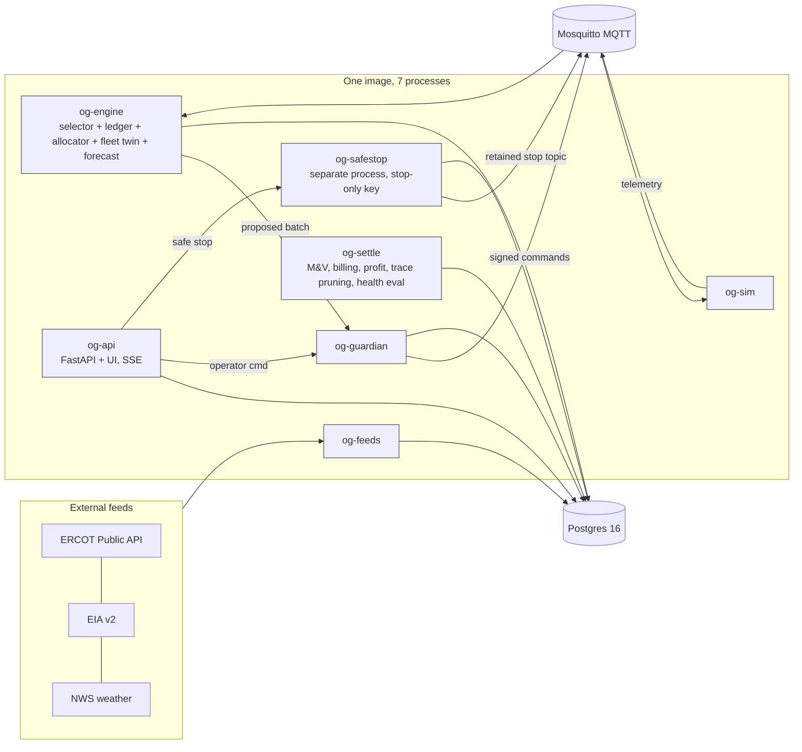

# OpenGrid Orchestrator — Delivery Plan "MVP-S" (working solution by Saturday 2026-09-26, 18:00)

Status: plan for the user's approval · Written: Friday 2026-09-25 11:30 · Time available: ~30 h
Inputs: [06-first-principles-review.md](../06-reviews/06-first-principles-review.md) (the design rules this plan
implements), the spec set in `docs/orchestrator/`, the simulators on the base server (192.168.5.35, `/opt/opengrid_sim`)
and the local clients in `src/opengrid/`.

## 0a. Facts and decisions since the first draft (Fri 11:50)

- **Base server 192.168.5.35** (`basepower`): Debian 13, 8 cores, 16 GB RAM (~14 GB free).
  - Disk: `/var` 147 GB free, `/home` 30 GB, `/` 62 GB, plus 30 GB unallocated in the volume group.
  - Installed: Python 3.13, git. Running: Apache (80/443), MariaDB (localhost only).
  - **Not installed:** Docker, Postgres, Mosquitto, k3s.
  - Root SSH works with the local key `~/.ssh/base`.
- **Deployment choice.** Either install Docker (`docker.io` + compose plugin, Debian packages) and run the plan's Compose
  stack, or run **natively**: apt `postgresql` + `mosquitto`, a Python 3.13 venv, and **systemd units** per process.
  Recommendation: **native systemd**. It adds nothing to install beyond two Debian packages, costs no container
  overhead, and runs the same 7 processes (including `og-safestop` as its own unit, independent of the engine and
  the guardian) with `Restart=always`. Compose files are kept for portability. Postgres data
  goes on `/var`.
- **Source control:** the Gitea server on **calisto** (192.168.5.22, `calisto.tocy-net.net`; HTTPS 443, SSH 2222). The
  repository `opengrid-orchestrator` is created there, and the base server deploys by pulling a tagged release.
- **Commitments:** re-nomination points are extra gates per contract. Partial take follows per-market rules
  (`min_qty`/`increment`/`block`). See review §8a.
- **Track record:** every event is traced with a configurable retention period per event class (setting
  `retention.<class>.days`). Pruning keeps chain checkpoints so verification still passes.
- **Scope:** this is the first increment of the full orchestration engine, not a throwaway demo.
- **The concept simulators are not the solution.** Neither the base-server simulators nor the local Streamlit pages are
  ported or reused as a base. The engine is written fresh against the spec. The only external code reused is thin data
  clients where they fit the `feeds` interface (e.g., the ERCOT auth/report call pattern), reviewed as new code. The
  fleet/grid simulator in this plan is the spec's **test harness** (`agent-sim`/`grid-sim`, spec §12.3). It stands in
  for real hubs and SCADA until hardware exists, and is not a concept simulator.

## 0b. Requirement changes (2026-09-25, evening)

| # | Change | Source | Where specified |
|---|---|---|---|
| RC-1 | **Commitment lock** covers ENERGY as well as capacity: remaining energy vs the committed delivery is checked **continuously** (every cycle); a missing or stale SoC means zero discharge | User | `00-invariants.md` K1/K13 notes; energy-sufficiency work in progress |
| RC-2 | **Base hardware:** 39.2 kWh usable / 11 kW per battery unit; **20% of homes have 2 units (78.4 kWh / 20 kW)**; reserve 20%; banks are **~600 kVA feeder segments** (40 × 50 homes) | User (confirmed with Base) | `02b` §4.2, fleet config |
| RC-3 | **Service tailoring:** each customer/service gets a first-class **ServiceProfile** (control primitive, target quantity, response, tolerance, M&V, settlement). Pipeline AC mitigation, data center and arbitrage are distinct services | User | `06-service-profiles-and-power-quality.md` (draft) |
| RC-4 | **Power quality:** per-customer **PowerQualityEnvelope** (phase, voltage, current, frequency, PF, THD); an inverter imperfection model (frequency/amplitude offset, harmonics, phase error) and how it aggregates; PQ-aware dispatch; guardian PQ checks; per-phase telemetry; simulator PQ anomalies | User | `06-service-profiles-and-power-quality.md` (draft); proposed invariant K14 |

RC-3/RC-4 are an **MVP-S+ increment**. The spec is drafted first and approved by the owner, then built in parallel. A12
(service tailoring) and A13 (power quality) are added below as acceptance items for that increment; they are not
gates for the Saturday baseline A1–A11.

## 0. The plan in one paragraph

Build **one modular Python codebase** with 12 modules behind typed interfaces. It runs as **7 processes from one
container image** — `og-feeds`, `og-engine`, `og-guardian`, `og-safestop`, `og-sim`, `og-settle`, `og-api` — plus
**Postgres** and **Mosquitto**, under **Docker Compose on the base server**, behind the existing
Apache/TLS at `https://base.tocy-net.net/og/`. A simulated fleet of **2,000 hubs** (10,000 as a stretch target) receives
live ERCOT/EIA/NWS data. The system dispatches **five services** using an **LP selector with commitment lock** and a
**2-second real-time allocator**. Every command is signed by an independent **guardian**. Delivery is measured, billed
and traced in a hash chain, and shown in **7 UI screens**.

Documents come first. A compact spec pack (the addendum, stories and test cases) is frozen by Friday 15:00, before
coding starts. Everything else in the full spec is labelled `MVP-J`/`R2` and is not built by Saturday.

## 1. What "working" means on Saturday 18:00 (acceptance)

| # | Capability | Demonstrated by |
|---|---|---|
| A1 | **Live feeds** | ERCOT prices, load, wind/solar and AS prices; EIA fallback; NWS weather, refreshed on schedule with freshness badges |
| A2 | **Fleet monitoring** | 2,000 simulated hubs streaming SoC/P/health every 2 s; map, bank and hub drill-down |
| A3 | **Fleet control** | Operator manual command and scoped safe stop; every command signed by the guardian, verified by the hub, acknowledged |
| A4 | **Dispatch engine** | Opportunities selected by LP at gates from live feeds; commitments locked until fulfilled; 2 s real-time allocation with substitution |
| A5 | **Five services** | `HOME` (reserve), `ERCOT_ENERGY` (arbitrage, simulated QSE), `ERCOT_AS` (simulated award, capacity hold), `DIST_DEFERRAL` (bank kVA, closed loop on simulated SCADA), `PARTNER_CAPACITY` (event call) |
| A6 | **Health** | Module heartbeats, feed staleness, hub online/stale/fault, cycle latency, alerts; degraded modes (feed stale → no new commitments; engine down → hubs hold lease) |
| A7 | **Profitability** | Per obligation / service / interval: revenue, energy cost, degradation, penalties, net margin; value vs rule-baseline; forgone upside from the lock |
| A8 | **Billing & M&V** | Interval metering, baseline, performance %, insert-only invoice lines, CSV export |
| A9 | **Audit & track record** | Every event (selection, commitment, re-nomination, exception, shortfall, command, operator action, feed change, alert) in a hash-chained trace; chain-verify button; reason codes incl. `R-COMMIT-LOCK-*`; retention configurable per event class, with checkpointed pruning |
| A10 | **Invariants** | 0 reserve breaches, 0 kWh sold twice, 0 commitment switches without an authority reason — proven by tests and live counters |
| A11 | **Non-functional** | Real-time cycle p99 < 500 ms at 2k hubs; UI refresh ≤ 2 s; survives killing any one module process; nightly `pg_dump` |

**MVP-S+ increment acceptance** (after owner approval of `06-service-profiles-and-power-quality.md`):

| # | Capability | Demonstrated by |
|---|---|---|
| A12 | **Service tailoring** | Each contract has a ServiceProfile. Pipeline AC mitigation runs closed-loop on the measured line current, the data center gets firm capacity inside its PQ envelope, and arbitrage runs price-responsive. Each is measured and settled by its own metric |
| A13 | **Power quality** | Per-phase telemetry. Dispatch balances phases and selects inverters to meet each customer's envelope. The guardian vetoes envelope violations (K14). Simulator inverter imperfections and PQ anomalies are visible and handled |

**Not built by Saturday** (stays in the spec as `MVP-J`/`R2`): real DNP3/ICCP/2030.5 protocols, real ERCOT
market submission, the AI agent, `PIPELINE_AC`/`MOBILE_*`/`PJM_CAPACITY`/`LARGE_LOAD`, Keycloak/OPA,
Kubernetes/multi-node HA, and forecasting beyond simple quantile persistence.

## 2. Architecture

### 2.1 Modules (one package each, typed interfaces, independently testable)

| Module | Responsibility | Owns (tables) | Interface | Basis (spec, or reference only) |
|---|---|---|---|---|
| `feeds` | Pull ERCOT/EIA/NWS on a schedule; normalize; staleness; circuit breaker; ERCOT 30 req/min budget | `feed_obs`, `feed_status` | `latest(series)`, `window(series, t0, t1)` | Spec `04-external-data-integration`; `src/opengrid/clients` as call-pattern reference only |
| `forecast` | Quantile persistence (P10/P50/P90) for price and load, 24 h | `forecast` | `scenarios(horizon)` | Spec §5 (simplest method) |
| `fleet` | Digital twin: hub/bank state, eligibility, quality flags, bank aggregation | `hub`, `bank`, `hub_state` (latest), `telemetry` (partitioned) | `capability(bank, t)` | — |
| `contracts` | Customers, contracts, opportunities → obligations; admission | `contract`, `opportunity`, `obligation` | `admit(call)`, lifecycle events | — |
| `selector` | LP/MILP at gates (15 min + on new call): picks $x_o$, AS hold, energy schedule over 24 h, bank level, 3 scenarios; **commitments frozen by equality** | `plan`, `commitment` | `plan(gate)` | `highspy` (HiGHS) |
| `ledger` | Reservations; single writer; one-buyer and commitment-lock checks | `reservation` | `reserve()`, `release()`, `free_headroom(b, t)` | — |
| `allocator` | 2 s real-time: subtract committed $\hat y$; substitution among hubs; free headroom to schedule with dwell/hysteresis; L0–L2 as constraints; DIST_DEFERRAL PI loop | `grant` | `cycle(t)` → proposed batch | Spec §8.4 water-filling, §8.6.1 PI |
| `guardian` | Sole signer: reserve, P, ramp, feeder ramp ceiling, lease/epoch, time quality (**G-20**), **G-19 commitment lock**; Ed25519 signature; TIMEOUT→hold | `verdict` | `verify_and_sign(batch)` | Spec §8.14–8.15 |
| `safestop` | **Independent process (`og-safestop`), no dependency on `og-engine` or `og-guardian` (K8)**; stop-only key; scoped stop (fleet/zone/bank); retained MQTT topic; never releases | `stop_event` | `stop(scope, reason)` | Spec §8.16 |
| `health` | Heartbeats, feed freshness, hub health, cycle latency, alert rules, degraded-mode switch — runs inside `og-settle` (health evaluator) | `heartbeat`, `alert` | `status()`, `/metrics` | — |
| `settle` | M&V (interval meter, baseline, performance), billing lines (insert-only), profitability (revenue/cost/degradation/penalty/net, baseline comparison, forgone upside), trace pruning, health evaluator | `meter_interval`, `performance`, `invoice_line`, `pnl` | `settle(interval)` | Spec §10 |
| `trace` | Hash-chained audit of every cycle decision and operator action; verify | `trace` (append-only; `prev_hash`, `hash`) | `append(evt)`, `verify(range)` | — |
| `sim` (test harness) | 2,000–10,000 hubs (SoC physics, η, limits, lease, signature verify, local autonomy), banks with kVA, simulated SCADA bank load, scenario injector | — (MQTT only) | MQTT topics | Spec §12.3 `agent-sim`/`grid-sim` |
| `ui` | 7 screens, SSE live updates, scenario panel | — | FastAPI routes | Spec `04-ui` (subset) |

**Design choices and why**

- **Modular monolith, 7 processes.** Simple to build, deploy and debug in 30 hours. Each module sits behind an interface,
  so any one can become its own service later with no redesign. Processes are split by **time scale and failure
  domain**: feeds, real-time engine, guardian, **an independent safe-stop process (K8: the scoped stop must work when
  the engine or even the guardian is down)**, simulator, settlement, and API/UI. Safe-stop is deliberately its own
  systemd unit (`og-safestop`), not colocated with `og-guardian`, so a guardian crash or hang can never take the stop
  path down with it.
- **Postgres as the single source of truth**, with `LISTEN/NOTIFY` for internal events. **MQTT only for the device
  boundary**, as in the spec. No extra broker or cache. Telemetry is partitioned by day, and the latest state is kept in
  a small table.
- **HiGHS** (open source) for the LP/MILP. Below the selector the problem is **pure LP or water-filling**, because
  commitments are parameters there. That keeps real time deterministic and fast.
- **UI: FastAPI + HTMX + Alpine + ECharts + Leaflet from CDN, with no build step.** Server-sent events push updates.
  This is the lowest effort that still gives a real-time control room.
- **Security for the demo:** Apache TLS + basic authentication in front, two static roles (operator, viewer) and
  guardian signatures on every command. New credentials only. The existing `/opt/opengrid_sim/config.ini` and MariaDB
  are never touched.

### 2.2 Non-functional design

| Quality | How |
|---|---|
| **Performance** | Aggregate to banks for optimization. Bulk telemetry insert (COPY) every 2 s. Latest state kept in memory in the engine. Target: RT cycle p99 < 500 ms at 2k hubs; measure at 10k |
| **Availability** | Compose `restart: always` and health checks. Engine state rebuilt from Postgres on restart. Hub leases (30 s) mean an engine or guardian outage leads to **hold, then local autonomy**, not a trip. Safe-stop (`og-safestop`) is a separate process with no dependency on `og-engine` or `og-guardian`, so a scoped stop works even if both are down (K8). Nightly `pg_dump` |
| **Scalability** | Stateless API (N replicas). Engine partitions by bank/zone (`--partition` flag). Telemetry partitioning. Path to the k3s design in `06-platform` without code change |
| **Reusability** | Service profiles as data (building blocks from spec §2.5). Adapters for feeds and devices behind interfaces. Pydantic contracts shared by all modules |
| **Observability** | `/metrics` (Prometheus format), structured JSON logs, a health screen. Grafana is optional and not required |

## 3. Dispatch engine design (commitment lock built in)

1. **Selection at gates.** Gates are every 15 minutes, plus admission of a new call. The LP, and the MILP where contracts
   are all-or-nothing, chooses which opportunities to commit. It uses the scenario-weighted value of the **whole delivery
   window**, minus the energy cost, degradation ($0.03/kWh) and expected penalty. Hard constraints are SoC, reserve (L1),
   P/kVA limits, one buyer and non-anticipativity.
   Quantity follows each market's rules: continuous where partial take is allowed, semi-continuous above `min_qty` and in
   `increment` steps, binary for all-or-nothing blocks.
2. **Freeze.** Committed $x_o$ and profile $\hat y_{o,b,t}$ enter every later solve as **equality/lower-bound
   parameters**. Only uncommitted headroom is re-optimized. A multi-day or tolling contract is re-selectable only at its
   agreed **re-nomination points**, which are gates for that contract alone.
3. **Real time (2 s).** Capability minus committed $\hat y$ gives the free headroom. The allocator assigns homes to
   committed obligations (substitution allowed). It then places free headroom on the energy schedule, with a 5-minute
   dwell and $5/MWh hysteresis. L2 instructions are hard.
4. **Exceptions.** Only L0 safety, L1 reserve, L2 instruction or infeasibility may reduce $\hat y$. The result is a
   shortfall with a reason code, never a reallocation.
5. **Guardian G-19** refuses any batch that reduces a committed allocation without a valid reason code.
6. **Baseline.** A rule allocator (firm first, then AS, then market) runs in shadow on the same inputs, so the UI can
   show the **value added by the LP** and the **forgone upside from the lock**.

## 4. UI screens

1. **Control room.** Fleet map (Leaflet), live ERCOT price/load/wind/solar, fleet MW/MWh, active commitments,
   today's net margin, invariant counters, alerts.
2. **Fleet monitoring & control.** Bank/hub table and drill-down (SoC, P, health, lease, last command). Manual command
   through the guardian. Scoped safe stop with two-step confirmation.
3. **Dispatch & commitments.** Opportunity pipeline (offered → committed → delivering → fulfilled). Ledger timeline
   per bank. The latest selector plan and why. Real-time grants and substitutions.
4. **Markets & feeds.** Series charts, freshness and source status, forecast quantiles.
5. **Health.** Modules, feeds, hubs, cycle latency, alerts, current degraded mode.
6. **Profitability.** Per service, obligation and day: revenue, costs, net margin; LP vs rule baseline; forgone upside.
7. **Billing & audit.** Invoice lines and CSV export; M&V performance; trace explorer with chain verification.

**Scenario panel** (demo): inject a partner call, a price spike, a better-paying call during delivery (shows the lock),
a feeder overload, comms loss for a zone, a stale feed, or a killed engine process.

## 5. Documents first (Phase 0) — the "MVP-S" spec pack

Produced before coding, in `docs/orchestrator/07-delivery/`:

| File | Content | Derived from |
|---|---|---|
| `02a-mvp-s-spec-engine.md` / `02b-mvp-s-spec-platform.md` | Module interfaces, data model (tables above), MQTT topics and message schemas, commitment-lock rule (review §3), dispatch formulation (review §5.1), exact thresholds | `03-decision-engine`, `02-domain-model`, review |
| `03-mvp-s-epics-stories.md` | 10 epics / 50 stories with acceptance criteria, each linked to existing FR / FR-DE IDs where they exist, plus new FR-ARB-014 | `01-product/03-epics-and-user-stories.md` |
| `04-mvp-s-test-plan.md` | 123 test cases: unit, property (invariants), integration, end-to-end scenarios, performance, chaos; mapped to acceptance A1–A11 and existing TC IDs | `05-testing/*` |

Epics (see `03-mvp-s-epics-stories.md` for the authoritative list): ES01 Platform & data · ES02 Live feeds & forecast ·
ES03 Fleet twin & test harness · ES04 Contracts, opportunities & commitments · ES05 Dispatch (selector, ledger,
allocator) · ES06 Guardian & safe stop · ES07 Health & degraded modes · ES08 Settlement (M&V, billing,
profitability) · ES09 Audit trace & retention · ES10 Operator UI.

## 6. Schedule (Friday 12:00 → Saturday 18:00)

| Window | Phase | Output | Gate |
|---|---|---|---|
| Fri 12:00–13:00 | **Access & decisions** (§8) | SSH key access to 192.168.5.35; Docker present or installed; ERCOT key decision | G0: can deploy "hello" at `/og/` |
| Fri 12:00–15:00 | **Phase 0 — documents** (in parallel with access) | Spec addendum, stories, test plan | **G1: user approves spec pack** |
| Fri 15:00–19:00 | **Phase 1 — foundation** | Repo, compose (pg, mqtt, app), migrations, pydantic contracts, trace lib, CI (pytest), simulator v1 at 2k hubs, feeds v1 | G2: telemetry flowing, feeds stored, deploy works |
| Fri 19:00–Sat 06:00 | **Phase 2 — modules in parallel** | selector + ledger + allocator; guardian; safe stop (independent process); health; settle; UI screens 1–7 | G3 (Sat 06:00): each module passes its unit and property tests |
| Sat 06:00–12:00 | **Phase 3 — integration** | End-to-end loop live on the server; scenario panel; baseline shadow | G4: A1–A10 pass on the server |
| Sat 12:00–16:00 | **Phase 4 — verification** | Performance (2k, then a 10k attempt), chaos (kill each process, stale feed, comms loss), fixes | G5: A11 pass, 0 invariant violations |
| Sat 16:00–18:00 | **Phase 5 — hand-over** | Demo script, runbook (start, stop, restore, safe stop), known limitations, update of spec docs with as-built deltas | **Done** |

**Cut lines** (decided in advance, applied at each gate if late):

1. At G3, if the selector LP isn't passing, the rule selector goes live and the LP runs in shadow.
2. At G4, `DIST_DEFERRAL` closed loop becomes an open-loop schedule.
3. At G4, Profitability screen baseline comparison and forgone upside are dropped.
4. At G5, keep 2k hubs and record the 10k result as "measured, not met".

**Never cut:** guardian signing, the commitment lock, reserve, one buyer, the trace.

## 7a. Team roles and engineering rules

**Roles (agents, coordinated by the lead session):**

| Role | Responsibility | Sign-off |
|---|---|---|
| **Architect** | Owns `og.core` (shared contracts, physics, limits, product-rule rounding, signing, trace hashing, time utilities), module interfaces, DB migrations and the function-ownership matrix. Reviews every merge for duplication and boundary violations | Every merge; gates G2–G5 |
| **Expert coders** (one per workstream WS2–WS7) | Build their module against the frozen interfaces; tests first from `04-mvp-s-test-plan.md` | Own module's unit/property tests green |
| **QA** | Executes the test plan: property tests K1–K13, integration, end-to-end scenarios, performance, chaos; owns the gate evidence | Gates G3–G5 (blocking) |
| **Security** | Reviews guardian, safestop, signing/keys, secrets, MQTT ACLs, API auth/roles, Apache exposure, dependency scan; runs the negative tests for K3, K6, K8, K10, K12, K13 | Gates G4–G5 (blocking) |

**Engineering rules:**

1. **No duplication of functions.** Each function has exactly one implementation and one owning module (matrix in
   `02b` "Function ownership"). Shared logic lives only in `og.core`. The guardian's independent check calls the same
   `og.core` functions on its own inputs; independence comes from the inputs and the process, never from a second
   implementation. A CI check fails the build if core formulas are re-implemented elsewhere.
2. **Tests first** from the approved test plan. Any invariant (K1–K13) failure blocks the merge.
3. **Interfaces are frozen at G1.** A change needs the architect's approval and an update to 02a/02b.
4. Each merge is recorded in the trace of development decisions: the PR description links the stories and tests.

## 7. Workstreams (run in parallel, each in its own git worktree / branch)

| WS | Scope | Depends on |
|---|---|---|
| WS1 Platform (architect) | `og.core` shared library, Postgres schema/migrations, contracts package, trace lib, CI incl. the duplication check, systemd units, deploy script, Apache route | — |
| WS2 Feeds & forecast | ERCOT/EIA/NWS adapters, scheduler, staleness, quantiles | WS1 schema |
| WS3 Simulator | Hubs, banks, SCADA bank load, lease/signature verify, scenario injector | WS1 MQTT schema |
| WS4 Engine | Contracts/admission, selector LP, ledger, allocator, PI, rule baseline | WS1, WS2 interfaces |
| WS5 Safety & health | Guardian (canonical checks G-01…G-06, G-09, G-13…G-15, G-19, G-20), safe stop (`og-safestop`, independent process), health, alerts, degraded modes | WS1, WS4 batch schema |
| WS6 Settlement | M&V, billing, profitability | WS1, WS4 grants |
| WS7 UI | 7 screens, SSE, scenario panel | Read models from all |
| WS8 QA | Test plan execution, property tests, performance and chaos harness | Phase 0 test plan |
| WS9 Security | Review and negative tests of guardian, safestop, keys, secrets, ACLs, API auth, exposure; dependency scan | WS5, WS7 |

The interfaces are frozen in the Phase 0 addendum, so WS2–WS7 build against contracts and stubs from hour one.

## 8. Decisions and access needed from the user now

1. **Build and deploy host.** This machine has no Python, Docker or git. Build and deploy on **192.168.5.35** over SSH:
   port 22 is open. Please set up **key-based SSH** for this session (I will not handle passwords). Confirm whether
   **Docker/Compose** is installed there, or may be installed. Kubernetes is not running (port 6443 is closed), so
   Compose is the plan.
2. **ERCOT credentials.** Use the keys in local `config.txt` (copied to the server as a new secret), or new ones?
3. **URL and access.** `https://base.tocy-net.net/og/` behind the existing Apache with basic authentication: OK?
4. **Saturday evening.** Is 18:00 local the hard deadline, and who is the audience (you, judges, Base Power)?
5. **Scope.** Confirm the five services in A5 and the "not built" list in §1.
6. **Execution cost.** The plan runs about 7 parallel build agents for about 24 hours. Confirm you want that scale.

## 9. Risks

| Risk | Mitigation |
|---|---|
| 30 h is very tight | Frozen interfaces, parallel workstreams, pre-agreed cut lines, never-cut list |
| Base server shared with mail/web/MariaDB | Compose memory limits; separate network; no reuse of MariaDB or config.ini; ports bound to localhost behind Apache |
| ERCOT API limits/outage | Cache, 30 req/min budget, EIA fallback, staleness drives "no new commitments" |
| Access or tooling not ready by 13:00 | Phase 0 documents proceed regardless; foundation slips at most 1 h before cut line 1 applies |
| LP numerical or speed issues | Bank aggregation, 3 scenarios, warm start, rule-selector fallback |
