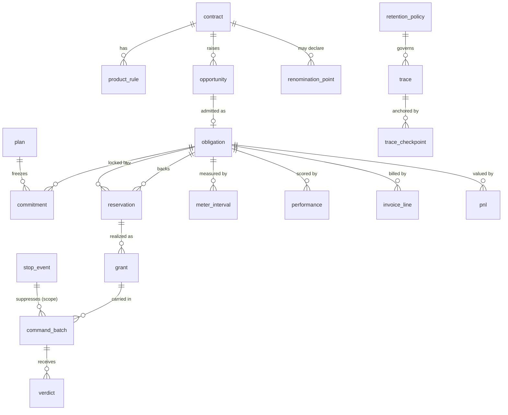
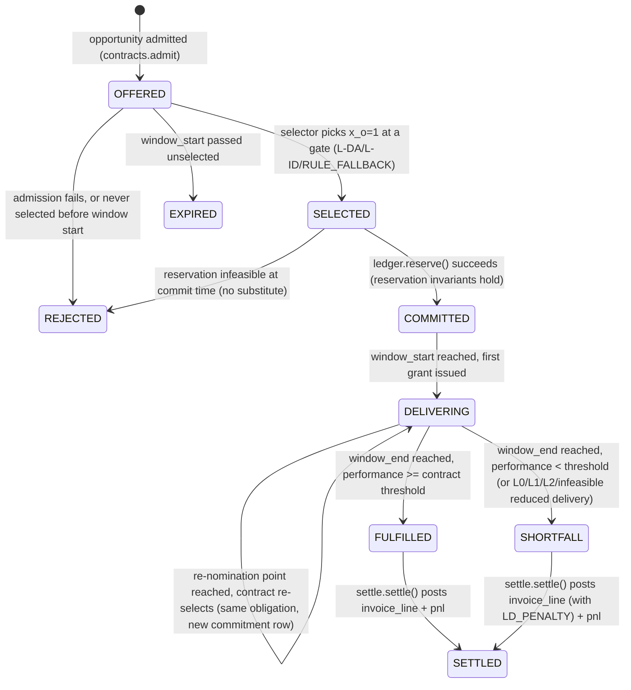

# OpenGrid Orchestrator — MVP-S Build Spec: Engine & Domain (Part A)

Invariants: see 00-invariants.md (canonical). Status: draft for owner approval (gate G1).

**Code references.** A `file:line` marked R2 (or given in a "Status at main `6470cfa`" block) is at `main` `6470cfa`. Every other `file:line` was verified at `434d230` and may have moved since.

Status: build-ready · Companion: `02b-mvp-s-spec-platform.md` (feeds, fleet, health, ui, MQTT/API contracts) ·
Sources: `01-saturday-delivery-plan.md`, `06-reviews/06-first-principles-review.md`,
`02-architecture/03-decision-engine.md` (§2.3–2.7, §6, §8.1–8.16, §9, §10), `02-architecture/02-domain-model-and-interfaces.md`.

This document specifies everything owned by the **engine half** of MVP-S: the tables and lifecycle for contracts,
opportunities, obligations, commitments, plans, reservations, grants, commands, guardian verdicts, stops, M&V,
billing, P&L, and the hash-chained trace. It is written so that a developer with no other context can implement the
`selector`, `ledger`, `allocator`, `guardian`, `settle` and `trace` modules from this file plus `02b`.

**Non-negotiables carried from the review and the user's decisions (repeated here because they govern every section
below):** the commitment lock (K13) — once `COMMITTED`, a delivery runs to completion; only uncommitted headroom is
re-optimized; the only interrupts are L0 safety, L1 homeowner reserve, L2 utility/ERCOT instruction, and physical
infeasibility with no substitute; the §7.4 audited AS release stays default **off**; substitution of *homes* within
the same obligation is always allowed and is not an interrupt. Multi-day/tolling contracts may carry agreed
re-nomination points, which are extra gates for that contract only. Partial take follows each product's own
`min_qty` / `increment` / `block` rules. Every event carries a track record in the hash-chained trace, retained per a
configurable per-event-class policy, prunable while remaining verifiable via checkpoints.

---

## 0. Conventions

- **Stack.** Python 3.13, modular monolith (one package per module in `orchestrator/<module>/`), pydantic v2 models
  as the wire and row contracts, **7 OS processes** (`og-feeds`, `og-engine` [selector+ledger+allocator+fleet
  twin+forecast], `og-guardian`, **`og-safestop`** [independent process, stop-only key, no dependency on `og-engine`
  or `og-guardian` — K8], `og-sim`, `og-settle` [M&V, billing, profitability, trace pruning, health evaluator],
  `og-api` [FastAPI + UI + SSE]), Postgres 17 as the single source of truth, Mosquitto MQTT for the device boundary
  only, HiGHS via `highspy` for the LP/MILP, FastAPI for `api`/`ui`. Native systemd units on Debian 13 — no
  containers, no k8s. Process topology detail (repo layout, systemd units, memory budgets) is owned by
  `02b-mvp-s-spec-platform.md` §1; this list is repeated here only so the engine spec is self-consistent about which
  process each of `selector`/`ledger`/`allocator`/`guardian`/`safestop`/`settle`/`trace` runs in.
- **Time.** All timestamps `timestamptz`, stored and reasoned about in UTC; UI renders America/Chicago. Interval
  index `t` is a 15-minute slot; cycles run every 2 s (or 10 s where §8.1's V-03 rule applies — MVP-S runs every
  partition at 2 s given the demo's scale).
- **IDs.** `UUIDv7` for all primary keys unless noted (`uuid7()` via a small helper — Postgres 17 has no native
  `uuid7()`, so the app generates it and passes it in; a plain `gen_random_uuid()` fallback is acceptable if `uuid7`
  is not wired up by G2). Foreign keys use `ON DELETE RESTRICT` unless stated.
- **Insert-only tables** (never `UPDATE`, only `INSERT`, with a `superseded_by`/`version` column for corrections):
  `trace`, `verdict`, `stop_event`, `meter_interval`, `invoice_line`, `pnl`, `operator_action`, `commitment`
  (state changes are new rows referencing the previous one), `command_batch`, `grant`. Tables that *do* get mutated
  in place: `contract`, `product_rule`, `opportunity` (its `state` column), `obligation` (its `state` column),
  `plan` (superseded, not deleted), `reservation` (released in place, historized via `trace`),
  `renomination_point`, `retention_policy`.
- **Money and energy.** `numeric(18,6)` for `$` and kWh per V-39 in the source spec; `numeric(10,3)` for kW.
- **Schema.** One Postgres schema `og` for MVP-S (no per-module schema split — a modular-monolith simplification;
  each module's tables are still only ever written by that module's process, enforced by code review, not by grants,
  for MVP-S; grants-per-role is a `MVP-J`/R2 hardening item).
- **Money notation.** `$/MWh` in formulas, converted with `/1000` where the kW/kWh model needs it, matching the
  source spec's unit convention (§6.6).
- **No duplicated functions.** Physics (SoC step, capability, ramp), limit/envelope checks, product-rule rounding,
  Ed25519 sign/verify, and trace hashing each have exactly one implementation, in `og.core`; every module named in
  this document (`selector`, `ledger`, `allocator`, `guardian`, `settle`, `trace`) imports them rather than
  re-deriving them. The full ownership table and the specific fix to the guardian/allocator "recharge headroom"
  wording are in `02b-mvp-s-spec-platform.md` §12.

---

## 1. Domain model and DDL

### 1.1 Entity overview



### 1.2 `contract`

One row per commercial agreement (a `HOME` membership, an `ERCOT_ENERGY`/`ERCOT_AS` ADER registration, a
`PARTNER_CAPACITY` program enrollment or tolling deal, a `DIST_DEFERRAL` deferral agreement). Mutable (terms change
by amendment; history is not required for MVP-S beyond `updated_at`).

```sql
CREATE TABLE og.contract (
    contract_id      uuid PRIMARY KEY,
    customer_id      uuid NOT NULL,                 -- opaque; customer directory lives in 02b `contracts` tables
    service_type     text NOT NULL CHECK (service_type IN
                       ('HOME','ERCOT_ENERGY','ERCOT_AS','DIST_DEFERRAL','PARTNER_CAPACITY')),
    variant          text,                           -- e.g. 'ALR','NCLR','EVENT','TOLLING','TDU_SB415'
    tier             text NOT NULL CHECK (tier IN ('L0','L1','L2','T1','T2','T3','T4')),
    profile_ref      text NOT NULL,                  -- dispatch-profile id@version (03 §2.5); profile bodies live in 02b
    territory_id     uuid,                            -- LSE/QSE/DSP role-model key (03 §2.4); nullable for HOME
    start_at         timestamptz NOT NULL,
    end_at           timestamptz,                     -- null = open-ended (e.g. HOME membership)
    renomination_allowed boolean NOT NULL DEFAULT false,
    penalty_alpha    numeric(18,6),                   -- $/kWh inside tolerance band (§6.6 alpha_o)
    penalty_beta     numeric(18,6),                   -- $/kWh beyond tolerance band (beta_o >> alpha_o)
    penalty_theta    numeric(6,4),                    -- tolerance fraction theta_o
    degradation_cost numeric(18,6) NOT NULL DEFAULT 0.03,  -- $/kWh, C-deg floor (assumption A-DE-16)
    fallback_allowed boolean NOT NULL DEFAULT false,   -- V-07 local-autonomy fallback opt-in
    status           text NOT NULL DEFAULT 'ACTIVE' CHECK (status IN ('ACTIVE','SUSPENDED','ENDED')),
    created_at       timestamptz NOT NULL DEFAULT now(),
    updated_at       timestamptz NOT NULL DEFAULT now()
);
CREATE INDEX ix_contract_service ON og.contract(service_type, status);
CREATE INDEX ix_contract_customer ON og.contract(customer_id);
```

```python
class Contract(BaseModel):
    contract_id: UUID
    customer_id: UUID
    service_type: Literal["HOME", "ERCOT_ENERGY", "ERCOT_AS", "DIST_DEFERRAL", "PARTNER_CAPACITY"]
    variant: str | None = None
    tier: Literal["L0", "L1", "L2", "T1", "T2", "T3", "T4"]
    profile_ref: str
    territory_id: UUID | None = None
    start_at: datetime
    end_at: datetime | None = None
    renomination_allowed: bool = False
    penalty_alpha: Decimal | None = None
    penalty_beta: Decimal | None = None
    penalty_theta: Decimal | None = None
    degradation_cost: Decimal = Decimal("0.03")
    fallback_allowed: bool = False
    status: Literal["ACTIVE", "SUSPENDED", "ENDED"] = "ACTIVE"
```

### 1.3 `product_rule`

The divisibility rules the user decided on (§8a-2 of the review): every product/marketplace a contract sells into
carries `min_qty`, `increment`, `block` and a `duration`. One contract may have several rules (e.g. an
`ERCOT_AS` contract has one rule for Non-Spin and one for ECRS).

```sql
CREATE TABLE og.product_rule (
    product_rule_id  uuid PRIMARY KEY,
    contract_id      uuid NOT NULL REFERENCES og.contract(contract_id),
    product_code     text NOT NULL,       -- 'ENERGY','NONSPIN','ECRS','CAPACITY_HOLD','TOLL','EVENT_BLOCK'
    min_qty_kw       numeric(10,3) NOT NULL DEFAULT 0,
    increment_kw     numeric(10,3) NOT NULL DEFAULT 0.1,   -- 0 => effectively continuous
    block            boolean NOT NULL DEFAULT false,        -- true => all-or-nothing (binary x_o)
    duration_minutes integer NOT NULL,                      -- H_k-style duration, or event length
    variable_kind    text NOT NULL CHECK (variable_kind IN ('CONTINUOUS','SEMI_CONTINUOUS','BINARY')),
    UNIQUE (contract_id, product_code)
);
```

`variable_kind` is derived at admission time from `(min_qty_kw, increment_kw, block)` and cached so the selector
does not re-derive it every gate: `block → BINARY`; `min_qty_kw > 0 OR increment_kw > small-epsilon → SEMI_CONTINUOUS`;
else `CONTINUOUS`. This is the mapping the review's §8a-2 decision and `03` §6 (C12/C13) require.

### 1.4 `opportunity`

A candidate call before it becomes a committed obligation — the object the selector chooses among at a gate
(`03` §2.1's generic call, restricted here to what MVP-S needs: no full call schema, just what the LP consumes).

```sql
CREATE TABLE og.opportunity (
    opportunity_id   uuid PRIMARY KEY,
    contract_id      uuid NOT NULL REFERENCES og.contract(contract_id),
    product_rule_id  uuid REFERENCES og.product_rule(product_rule_id),
    window_start     timestamptz NOT NULL,
    window_end       timestamptz NOT NULL,
    requested_kw     numeric(10,3) NOT NULL,
    value_per_mwh    numeric(18,6),           -- V_o for new opportunities; null for HOME (no market value)
    scenario_basis   text NOT NULL DEFAULT 'P50' CHECK (scenario_basis IN ('P10','P50','P90')),
    state            text NOT NULL DEFAULT 'OFFERED' CHECK (state IN
                       ('OFFERED','SELECTED','REJECTED','EXPIRED')),
    reason_code      text,                     -- populated on REJECTED/EXPIRED
    admitted_at      timestamptz NOT NULL DEFAULT now(),
    decided_at       timestamptz,
    gate_id          uuid                      -- the plan/gate that decided it; FK added after `plan` below
);
CREATE INDEX ix_opportunity_state ON og.opportunity(state, window_start);
CREATE INDEX ix_opportunity_contract ON og.opportunity(contract_id);
```

### 1.5 `obligation`

The durable commercial object once an opportunity is admitted. **This is the table the commitment lock is built
around.** Its lifecycle (§2 below) uses the canonical MVP-S states, distinct from the full spec's
`COMMITTED → AT_RISK → MET/BREACHED` (that lifecycle scores a *window*; this one tracks the *delivery pipeline* the
delivery plan's A9 acceptance test needs — `offered → committed → delivering → fulfilled`). `AT_RISK` is carried as
a boolean flag on `DELIVERING`, not a separate state, to keep the state machine small for MVP-S.

```sql
CREATE TABLE og.obligation (
    obligation_id    uuid PRIMARY KEY,
    opportunity_id   uuid NOT NULL REFERENCES og.opportunity(opportunity_id),
    contract_id      uuid NOT NULL REFERENCES og.contract(contract_id),
    service_type     text NOT NULL,
    tier             text NOT NULL,
    window_start     timestamptz NOT NULL,
    window_end       timestamptz NOT NULL,
    committed_qty_kw numeric(10,3) NOT NULL,          -- Q_{o,t} profile stored per-interval in `commitment`
    state            text NOT NULL DEFAULT 'OFFERED' CHECK (state IN
                       ('OFFERED','SELECTED','COMMITTED','DELIVERING','FULFILLED',
                        'SHORTFALL','SETTLED','REJECTED','EXPIRED')),
    at_risk          boolean NOT NULL DEFAULT false,   -- breach-risk flag while DELIVERING
    last_reason_code text,
    version          integer NOT NULL DEFAULT 1,       -- bumped on every state transition (optimistic lock)
    created_at       timestamptz NOT NULL DEFAULT now(),
    updated_at       timestamptz NOT NULL DEFAULT now()
);
CREATE INDEX ix_obligation_state ON og.obligation(state);
CREATE INDEX ix_obligation_window ON og.obligation(window_start, window_end);
```

### 1.6 `commitment`

Insert-only. Each row freezes the delivery profile the selector fixed at a gate — the equality/lower-bound
parameters (`03` §3.2's $x_o$, $Q_{o,t}$) that every later solve must respect. A new row is appended whenever a
re-nomination point re-decides the obligation, or an exception (L0/L1/L2/infeasibility/§7.4) reduces it; the
previous row is never edited, only superseded.

```sql
CREATE TABLE og.commitment (
    commitment_id    uuid PRIMARY KEY,
    obligation_id    uuid NOT NULL REFERENCES og.obligation(obligation_id),
    plan_id          uuid NOT NULL REFERENCES og.plan(plan_id),
    interval_start   timestamptz NOT NULL,
    interval_end     timestamptz NOT NULL,
    committed_kw     numeric(10,3) NOT NULL,           -- Q_{o,t}: the frozen lower bound for this interval
    variable_kind    text NOT NULL,                    -- carried from product_rule for the solver's benefit
    supersedes       uuid REFERENCES og.commitment(commitment_id),
    reason_code      text NOT NULL DEFAULT 'R-GATE-SELECT',  -- why this freeze exists / changed
    created_at       timestamptz NOT NULL DEFAULT now()
);
CREATE INDEX ix_commitment_obligation ON og.commitment(obligation_id, interval_start);
CREATE UNIQUE INDEX ux_commitment_active ON og.commitment(obligation_id, interval_start)
    WHERE supersedes IS NULL;  -- at most one *active* freeze per obligation per interval until superseded
```

*(Note: `plan` is created before `commitment` in execution order in §1.7; DDL above is presented in dependency
order for readability — apply `plan` first.)*

### 1.7 `renomination_point`

Extra gates that apply to one contract only (the user's decision #1). A multi-day or tolling contract's obligations
are only re-selectable at these timestamps (or at fulfilment, whichever is first); between them the lock is absolute.

```sql
CREATE TABLE og.renomination_point (
    renomination_point_id uuid PRIMARY KEY,
    contract_id      uuid NOT NULL REFERENCES og.contract(contract_id),
    obligation_id    uuid REFERENCES og.obligation(obligation_id),  -- null while contract-wide, set once an obligation exists
    scheduled_at     timestamptz NOT NULL,
    exercised_at     timestamptz,
    outcome          text CHECK (outcome IN ('RESELECTED','CONFIRMED','SKIPPED')),
    plan_id          uuid REFERENCES og.plan(plan_id)
);
CREATE INDEX ix_renom_contract ON og.renomination_point(contract_id, scheduled_at);
```

### 1.8 `plan`

One row per selector solve (`03` §6.10's published plan artifact), versioned and immutable once published.

```sql
CREATE TABLE og.plan (
    plan_id          uuid PRIMARY KEY,
    plan_mode        text NOT NULL CHECK (plan_mode IN ('L-DA','L-ID','RULE_FALLBACK')),
    gate_kind        text NOT NULL CHECK (gate_kind IN ('SCHEDULED_15MIN','ADMISSION','RENOMINATION')),
    horizon_start    timestamptz NOT NULL,
    horizon_end      timestamptz NOT NULL,
    scenario_set     jsonb NOT NULL,          -- [{scenario:'P10',prob:0.25}, {scenario:'P50',prob:0.5}, ...]
    solver_status    text NOT NULL,           -- 'OPTIMAL','TIME_LIMIT_GAP','INFEASIBLE_F1','INFEASIBLE_F2', ...
    solver_gap       numeric(8,5),
    solver_time_ms   integer,
    objective_value  numeric(18,4),
    superseded_by    uuid REFERENCES og.plan(plan_id),
    created_at       timestamptz NOT NULL DEFAULT now()
);
CREATE INDEX ix_plan_horizon ON og.plan(horizon_start, horizon_end);
```

### 1.9 `reservation`

The single-writer ledger entry (`03` §2.4's $\rho=(i,o,\text{kind},\text{amount},[t_s,t_e),\text{version})$),
scoped to banks for MVP-S rather than raw hubs (bank-level reservation, home-level realization happens in `grant`).
Only the `ledger` process writes this table (R30/R37 one-writer rule).

```sql
CREATE TABLE og.reservation (
    reservation_id   uuid PRIMARY KEY,
    obligation_id    uuid NOT NULL REFERENCES og.obligation(obligation_id),
    bank_id          uuid NOT NULL,                     -- FK into 02b `bank`
    kind             text NOT NULL CHECK (kind IN ('POWER_KW','ENERGY_KWH')),
    amount           numeric(12,3) NOT NULL,
    interval_start   timestamptz NOT NULL,
    interval_end     timestamptz NOT NULL,
    ledger_version   bigint NOT NULL,                   -- monotonic, one sequence per allocator instance
    released_at      timestamptz,
    release_reason   text,
    created_at       timestamptz NOT NULL DEFAULT now()
);
CREATE INDEX ix_reservation_bank_interval ON og.reservation(bank_id, interval_start, interval_end)
    WHERE released_at IS NULL;
CREATE INDEX ix_reservation_obligation ON og.reservation(obligation_id);
```

The **one-buyer invariant** ($\sum_o P^{res}_{i,o,t} \le P^{cap}_{i,t}$, `03` §2.4) is enforced by the `ledger`
module in application code at `reserve()` time (a single-writer process, so no DB-level exclusion constraint is
required for MVP-S); a nightly property test replays the ledger and asserts the sum never exceeds bank capability
(A10's "0 kWh sold twice").

### 1.10 `grant`

Insert-only. The 2-second allocator's per-cycle output: which hubs deliver which obligation's committed kW plus any
headroom schedule, before guardian signing. (Per-hub telemetry/state lives in 02b's `hub_state`; `grant` here is the
allocator's *decision*, kept at bank/bucket granularity to bound MVP-S write volume — per-hub detail is derivable
from the command log referenced by `command_batch_id` and is not duplicated here.)

```sql
CREATE TABLE og.grant (
    grant_id         uuid PRIMARY KEY,
    cycle_id         text NOT NULL,             -- e.g. '2026-09-26T18:00:02Z/bank-07'
    obligation_id    uuid REFERENCES og.obligation(obligation_id),  -- null for free-headroom (spot) grants
    bank_id          uuid NOT NULL,
    granted_kw       numeric(10,3) NOT NULL,
    is_headroom      boolean NOT NULL DEFAULT false,   -- true = uncommitted-headroom schedule, not a commitment
    ledger_version   bigint NOT NULL,
    command_batch_id uuid,                            -- set once S8 builds the batch
    created_at       timestamptz NOT NULL DEFAULT now()
);
CREATE INDEX ix_grant_cycle ON og.grant(cycle_id);
CREATE INDEX ix_grant_obligation ON og.grant(obligation_id);
```

### 1.11 `command_batch` and `verdict`

```sql
CREATE TABLE og.command_batch (
    command_batch_id uuid PRIMARY KEY,
    cycle_id         text NOT NULL,
    ledger_version   bigint NOT NULL,
    submission_id    text NOT NULL UNIQUE,      -- hash(shard, epoch, decision_id) per R32
    command_count    integer NOT NULL,
    merkle_root      text NOT NULL,
    trace_pre_image_id uuid,                    -- FK to trace, set at S9
    created_at       timestamptz NOT NULL DEFAULT now()
);

CREATE TABLE og.verdict (
    verdict_id       uuid PRIMARY KEY,
    command_batch_id uuid NOT NULL REFERENCES og.command_batch(command_batch_id),
    outcome          text NOT NULL CHECK (outcome IN ('PASS','PARTLY_VETOED','VETOED','TIMEOUT')),
    vetoed_rule_ids  text[],                    -- e.g. {'G-01','G-19'}
    latency_ms       integer NOT NULL,
    inputs_hash      text NOT NULL,             -- co-signed hash of arbitration inputs (RT-008)
    signature        text,                      -- Ed25519 signature over the batch + verdict, base64
    signed_at        timestamptz
);
CREATE INDEX ix_verdict_batch ON og.verdict(command_batch_id);
```

### 1.12 `stop_event`

Insert-only, append per engage/release; never releases from within the same authority path that engaged a
stop-only key (safety rule, §6 of this document).

```sql
CREATE TABLE og.stop_event (
    stop_event_id    uuid PRIMARY KEY,
    scope_kind       text NOT NULL CHECK (scope_kind IN ('BANK','ZONE','FLEET')),
    scope_ref        text NOT NULL,             -- bank_id, zone code, or 'FLEET'
    action           text NOT NULL CHECK (action IN ('ENGAGE','RELEASE')),
    initiator_kind   text NOT NULL CHECK (initiator_kind IN ('OPERATOR','GUARDIAN','SAFESTOP_AUTHORITY','UTILITY')),
    initiator_ref    text NOT NULL,             -- operator id (pseudonymous) or system component
    reason           text NOT NULL,
    approver_ref     text,                      -- second approver for RELEASE (Tier 2) / co-sign for ENGAGE
    signature        text NOT NULL,
    created_at       timestamptz NOT NULL DEFAULT now()
);
CREATE INDEX ix_stop_scope ON og.stop_event(scope_kind, scope_ref, created_at DESC);
```

### 1.13 `meter_interval`, `performance`, `invoice_line`, `pnl`

```sql
CREATE TABLE og.meter_interval (
    meter_interval_id uuid PRIMARY KEY,
    obligation_id    uuid NOT NULL REFERENCES og.obligation(obligation_id),
    interval_start   timestamptz NOT NULL,
    interval_end     timestamptz NOT NULL,
    delivered_kwh    numeric(14,6) NOT NULL,
    baseline_kwh     numeric(14,6),
    source           text NOT NULL CHECK (source IN ('DIRECT_HUB_METER','AMI_INTERVAL','SCADA_OUTCOME','ESTIMATED')),
    quality_flag     text NOT NULL DEFAULT 'GOOD' CHECK (quality_flag IN ('GOOD','ESTIMATED','DISPUTED')),
    version          integer NOT NULL DEFAULT 1,
    superseded_by    uuid REFERENCES og.meter_interval(meter_interval_id),
    created_at       timestamptz NOT NULL DEFAULT now()
);
CREATE UNIQUE INDEX ux_meter_active ON og.meter_interval(obligation_id, interval_start)
    WHERE superseded_by IS NULL;

CREATE TABLE og.performance (
    performance_id   uuid PRIMARY KEY,
    obligation_id    uuid NOT NULL REFERENCES og.obligation(obligation_id),
    interval_start   timestamptz NOT NULL,
    interval_end     timestamptz NOT NULL,
    compliance_pct   numeric(6,4) NOT NULL,      -- C_{o,j} = D/K
    season_pct       numeric(6,4),
    availability_pct numeric(6,4),
    response_time_s  integer,
    passed_threshold boolean NOT NULL,
    created_at       timestamptz NOT NULL DEFAULT now()
);
CREATE INDEX ix_performance_obligation ON og.performance(obligation_id, interval_start);

CREATE TABLE og.invoice_line (
    invoice_line_id  uuid PRIMARY KEY,
    contract_id      uuid NOT NULL REFERENCES og.contract(contract_id),
    obligation_id    uuid NOT NULL REFERENCES og.obligation(obligation_id),
    period_start     date NOT NULL,
    period_end       date NOT NULL,
    line_type        text NOT NULL CHECK (line_type IN
                       ('CAPACITY_PAYMENT','ENERGY','AVAILABILITY_PAYMENT','LD_PENALTY','DERATE','BUYBACK','FIXED_FEE')),
    quantity         numeric(14,6),
    unit             text,
    rate             numeric(18,6),
    amount           numeric(18,6) NOT NULL,
    status           text NOT NULL DEFAULT 'PROVISIONAL' CHECK (status IN ('PROVISIONAL','FINAL','CORRECTED')),
    supersedes       uuid REFERENCES og.invoice_line(invoice_line_id),
    trace_roll_up    text,                       -- Merkle root over contributing traces
    version          integer NOT NULL DEFAULT 1,
    created_at       timestamptz NOT NULL DEFAULT now()
);
CREATE INDEX ix_invoice_contract_period ON og.invoice_line(contract_id, period_start);

CREATE TABLE og.pnl (
    pnl_id           uuid PRIMARY KEY,
    obligation_id    uuid NOT NULL REFERENCES og.obligation(obligation_id),
    interval_start   timestamptz NOT NULL,
    interval_end     timestamptz NOT NULL,
    revenue          numeric(18,6) NOT NULL DEFAULT 0,
    energy_cost      numeric(18,6) NOT NULL DEFAULT 0,
    degradation_cost numeric(18,6) NOT NULL DEFAULT 0,
    penalty          numeric(18,6) NOT NULL DEFAULT 0,
    net_value        numeric(18,6) NOT NULL,      -- revenue - energy_cost - degradation - penalty
    rule_baseline_value numeric(18,6),             -- shadow rule-allocator net value, same interval
    forgone_upside   numeric(18,6) DEFAULT 0,       -- opportunity cost attributable to the lock (KPI-22)
    created_at       timestamptz NOT NULL DEFAULT now()
);
CREATE INDEX ix_pnl_obligation ON og.pnl(obligation_id, interval_start);
```

### 1.14 `trace`, `trace_checkpoint`, `retention_policy`

```sql
CREATE TABLE og.trace (
    trace_id         uuid PRIMARY KEY,              -- UUIDv7
    parent_trace_id  uuid REFERENCES og.trace(trace_id),
    decision_type    text NOT NULL CHECK (decision_type IN
                       ('DA_PLAN','ID_PLAN','ADMISSION','COMMITMENT','RENOMINATION','RT_ALLOCATION',
                        'SUBSTITUTION','GUARDIAN_VERDICT','SAFE_STOP','SHORTFALL','OPERATOR_ACTION',
                        'FEED_CHANGE','ALERT','SETTLEMENT')),
    event_class      text NOT NULL,                 -- retention key, e.g. 'RT_ALLOCATION','SAFE_STOP'
    stream_id        text NOT NULL,                 -- one chain per producer (e.g. 'selector', 'allocator-bank-07')
    seq              bigint NOT NULL,                -- monotonic within stream_id
    scope             jsonb,
    payload          jsonb NOT NULL,                -- decision-specific content (§9 schema, trimmed for MVP-S)
    reason_codes     text[],
    prev_hash        text,                           -- sha256 of the previous record in this stream, hex
    hash             text NOT NULL,                  -- sha256 over the domain-separated header (below)
    created_at       timestamptz NOT NULL DEFAULT now()
);
CREATE UNIQUE INDEX ux_trace_stream_seq ON og.trace(stream_id, seq);
CREATE UNIQUE INDEX ux_trace_stream_prev ON og.trace(stream_id, prev_hash);
CREATE INDEX ix_trace_class_time ON og.trace(event_class, created_at);
CREATE INDEX ix_trace_reason ON og.trace USING gin(reason_codes);

CREATE TABLE og.trace_checkpoint (
    checkpoint_id    uuid PRIMARY KEY,
    checkpoint_at    timestamptz NOT NULL,
    stream_heads     jsonb NOT NULL,                 -- {stream_id: {seq, hash}, ...} for every active stream
    checkpoint_hash  text NOT NULL,                   -- sha256 over stream_heads, sorted keys, JCS-serialized
    anchor_ref       text,                            -- external anchor id (file hash / RFC3161 token), MVP-S: local WORM file
    created_at       timestamptz NOT NULL DEFAULT now()
);
CREATE INDEX ix_checkpoint_time ON og.trace_checkpoint(checkpoint_at);

CREATE TABLE og.retention_policy (
    event_class      text PRIMARY KEY,
    retention_days   integer NOT NULL,
    prune_after_checkpoint boolean NOT NULL DEFAULT true,
    updated_at       timestamptz NOT NULL DEFAULT now()
);
```

### 1.15 `operator_action`

```sql
CREATE TABLE og.operator_action (
    operator_action_id uuid PRIMARY KEY,
    operator_ref     text NOT NULL,                  -- pseudonymous per decision D5
    action_kind      text NOT NULL CHECK (action_kind IN
                       ('MANUAL_COMMAND','SAFE_STOP_ENGAGE','SAFE_STOP_RELEASE','APPROVAL','CONFIG_CHANGE')),
    target_ref       text,
    tier             text CHECK (tier IN ('PRE_AUTHORIZED','ENGAGE','TIER1','TIER2')),
    reason           text,
    confirmed_at     timestamptz,
    approver_ref     text,
    trace_id         uuid REFERENCES og.trace(trace_id),
    created_at       timestamptz NOT NULL DEFAULT now()
);
CREATE INDEX ix_operator_action_time ON og.operator_action(created_at);
```

---

## 2. Obligation and commitment state machine

### 2.1 Obligation lifecycle



| Transition | Trigger | Trace event (`decision_type` / `event_class`) | Reason code |
|---|---|---|---|
| `[*] → OFFERED` | `contracts.admit(call)` validates against `contract`/`product_rule` | `ADMISSION` | — |
| `OFFERED → SELECTED` | Selector gate: LP sets $x_o=1$ (or $q_o>0$ for divisible products) | `COMMITMENT` | `R-GATE-SELECT` |
| `OFFERED → REJECTED` | Admission check fails, or capacity structurally infeasible | `ADMISSION` | `R-ADMIT-REJECT` |
| `OFFERED → EXPIRED` | `window_start` passes with no selection | `ADMISSION` | `R-EXPIRED-UNSELECTED` |
| `SELECTED → COMMITTED` | `ledger.reserve()` returns success; `commitment` row inserted (equality freeze) | `COMMITMENT` | `R-COMMIT-LOCK-ENTER` |
| `SELECTED → REJECTED` | `ledger.reserve()` fails with no substitute at commit time | `COMMITMENT` | `R-COMMIT-LOCK-INFEASIBLE` |
| `COMMITTED → DELIVERING` | Allocator's first cycle inside `[window_start, window_end)` issues a `grant` | `RT_ALLOCATION` | — |
| `DELIVERING → DELIVERING` (self-loop) | A `renomination_point` for this contract is reached; selector re-runs for this obligation only | `RENOMINATION` | `R-RENOM-GATE` |
| `DELIVERING → FULFILLED` | `window_end` reached; `performance.compliance_pct ≥ contract.penalty_theta` complement | `SHORTFALL` (if any) else none | `R-FULFILLED` |
| `DELIVERING → SHORTFALL` | `window_end` reached below threshold, **or** an L0/L1/L2/infeasible exception reduced $\hat y$ below $Q_{o,t}$ during the window | `SHORTFALL` | `R-COMMIT-LOCK-OVERRIDE-L0` / `…-L1` / `…-L2` / `R-COMMIT-LOCK-INFEASIBLE` |
| `FULFILLED`/`SHORTFALL → SETTLED` | `settle.settle(interval)` posts `invoice_line` and `pnl` | `SETTLEMENT` | — |

**The lock, formally, on this table.** While an obligation is `COMMITTED` or `DELIVERING`, no process may write a
`commitment` row for it with a lower `committed_kw` than the currently active one **except** through one of these
four paths, each of which must attach a reason code and a trace record before the write is allowed:

1. `R-COMMIT-LOCK-OVERRIDE-L0` — device safety (guardian G-01/G-13 veto path).
2. `R-COMMIT-LOCK-OVERRIDE-L1` — homeowner reserve breach imminent (guardian G-01 `RESERVE_FLOOR`).
3. `R-COMMIT-LOCK-OVERRIDE-L2` — utility/ERCOT instruction (guardian G-15/G-16, or a `BLOCK`/`ESTOP` on §8.7's table).
4. `R-COMMIT-LOCK-INFEASIBLE` — no substitute hub exists anywhere in the obligation's eligibility set this cycle.

A fifth path, `R-AS-RELEASE`, exists only for the §7.4 audited AS forward-release exception and is **disabled by a
feature flag `as_release_enabled = false` for all of MVP-S** (never exercised in the demo; kept in the schema and
guardian rule so R2 can flip it on without a migration). **Substitution is not on this list** — swapping which
*hubs* realize an unchanged `committed_kw` is a `grant`-table change with reason `R-SUBSTITUTION`, never a
`commitment` write, and is always allowed (§6.4 below).

### 2.2 Commitment freeze detail

At a gate, for every obligation with $o \in \mathcal O^c$ (already committed) the selector does **not** re-decide
$x_o$; it reads the latest active `commitment` row per interval and injects it as a fixed lower bound
(`03` §3.2, §6.5 C12 with $x_o \equiv 1$). Pseudocode:

```python
def load_frozen_commitments(plan_horizon: Interval) -> dict[ObligationId, dict[IntervalId, Decimal]]:
    """Read-only: builds the equality/lower-bound parameters for every already-committed
    obligation whose window overlaps the new plan horizon. Never mutates `commitment`."""
    rows = db.query("""
        SELECT obligation_id, interval_start, committed_kw
        FROM og.commitment
        WHERE supersedes IS NULL
          AND interval_start < %(horizon_end)s AND interval_end > %(horizon_start)s
    """, horizon_start=plan_horizon.start, horizon_end=plan_horizon.end)
    frozen: dict[ObligationId, dict[IntervalId, Decimal]] = defaultdict(dict)
    for r in rows:
        frozen[r.obligation_id][r.interval_start] = r.committed_kw
    return frozen
```

### 2.3 Mid-window shortfall escalation (D-17)

Until this decision, `SHORTFALL` (§2.1's table) was reached only at `window_end`, from settle's per-interval
`performance.passed_threshold`. The owner's 2026-09-26 decision (`00-invariants.md` K13 addition) makes a
*mid-window* SHORTFALL a lifecycle edge too, with best-effort continuation rather than a stop:

- **Escalation trigger — built.** `opengrid.engine.escalation.ShortfallEscalator`
  (`orchestrator/src/opengrid/engine/escalation.py:53-76`) counts consecutive cycles an obligation carries an
  unresolved K13 exception signal — an allocator `ShortfallReport` (L2 instruction, or no substitute/no bank
  capacity, §5.1) or the continuous energy-sufficiency check's AT_RISK-with-negative-margin result
  (`opengrid.allocator.energy_sufficiency`). A signal must persist for `sustain_cycles` (default 30 = 60 s at 2 s,
  `escalation.py:12,32`) before it escalates, so a transient dip never ends a delivery; one clean cycle resets the
  count (`escalation.py:64-66`). `lock_reason_for_shortfall` (`escalation.py:44-50`) maps the allocator's detail
  code onto the K13 reason it stands for.
- **What escalation does NOT do — built.** It never turns `DELIVERING → SHORTFALL` into a stop: the obligation's
  `commitment` row is untouched (K13), and the allocator keeps dispatching it at the maximum feasible kW every
  cycle regardless of lifecycle state (§5.6). The engine traces the escalation and flags the obligation `AT_RISK`
  (`orchestrator/src/opengrid/contracts/__init__.py:220-239` `set_obligation_at_risk`, traces `AT_RISK`); it clears
  the flag the first cycle the signal disappears
  (`orchestrator/src/opengrid/engine/gateways.py:623-627,654-664`).
- **Recovery — built.** As soon as the constraint clears, the next cycle's water-fill/substitution restores the
  full committed kW (nothing to "re-enable": the commitment row was never reduced); `AT_RISK` clears the same cycle
  (`gateways.py:623-627`). The continuation query itself never excludes a `SHORTFALL` obligation from dispatch
  (`orchestrator/src/opengrid/engine/gateways.py:111-117,213-231`: `o.state IN ('COMMITTED','DELIVERING',
  'SHORTFALL')`).
- **Window-end close and settlement — built, unchanged.** `window_end` still closes the obligation via
  `opengrid.engine.lifecycle.close_target` (`orchestrator/src/opengrid/engine/lifecycle.py:70-74`), `FULFILLED` or
  `SHORTFALL` by whether any interval's `performance.passed_threshold` failed. Settlement always bills the
  obligation's *actual* metered `delivered_kwh` for every interval, including shortfall ones, never a planned
  figure (`orchestrator/src/opengrid/settle/__init__.py:125-132`).
- See §5.6 for the allocator-side best-effort continuation (`best_effort_reason`) this escalation pairs with.

---

## 3. Selector (`selector`)

### 3.1 Gates

| Gate | Trigger | Scope of re-optimization | Plan mode |
|---|---|---|---|
| Scheduled | Every 15 minutes, wall-clock aligned | All uncommitted headroom over the 24 h horizon | `L-ID` (rolling) |
| Admission | A new opportunity is admitted (`contracts.admit`) that cannot wait for the next 15-min tick (contract SLA < 15 min) | Uncommitted headroom, warm-started from the last plan | `L-ID` |
| Re-nomination | `renomination_point.scheduled_at` reached for a contract with `renomination_allowed = true` | That contract's obligation(s) only; every other obligation's commitment rows are untouched | `L-ID`, single-obligation scope |

MVP-S runs **Mode O only** (`03` §6.1) — Mode S (the `fleet_lp.js` port, portfolio sizing) is out of scope; MVP-S
banks and contract sizes are configuration, not solver output. There is no separate L-DA process for MVP-S: the
15-minute L-ID gate *is* the day's planning cadence (a `L-DA`-labelled plan is produced once at 00:05 daily by
running the same Mode O model over the full 24 h with no committed carry-over other than multi-day contracts', to
seed the day; every 15-min gate thereafter is `L-ID`). L-SCED (5-min re-pricing) is folded into the allocator's
per-cycle water value lookup (§6 below) rather than run as its own solve, given MVP-S's 2,000-hub / 5-service scale.

### 3.2 Sets, parameters, variables (Mode O, MVP-S subset)

Sets — a strict subset of `03` §6.2, keeping only what the 5 MVP-S services need:

| Symbol | Set | MVP-S content |
|---|---|---|
| $t \in \mathcal T$ | 15-min intervals, 96 per 24 h horizon | fixed 96 |
| $b \in \mathcal B$ | Banks (partitions) | one per simulated distribution bank, ≈ 40–100 at 2,000–10,000 hubs |
| $o \in \mathcal O = \mathcal O^c \cup \mathcal O^{new}$ | Obligations, committed ∪ candidate | from `obligation` where `state IN ('COMMITTED','DELIVERING')` (⊂ $\mathcal O^c$) or `('OFFERED')` (⊂ $\mathcal O^{new}$) |
| $\omega \in \Omega = \{P10, P50, P90\}$ | Scenarios | fixed 3-point set with weights $\pi_{P10}=0.25,\pi_{P50}=0.5,\pi_{P90}=0.25$ (symmetric default; per-contract override allowed) |
| $k \in \{\text{NONSPIN}, \text{ECRS}\}$ | AS products | from `product_rule.product_code` |

Parameters — MVP-S defaults are the review's and source spec's, unless a `product_rule`/`contract` field overrides:

| Symbol | Meaning | MVP-S default |
|---|---|---|
| $E^{use}_b$ | Usable DC energy above reserve for bank $b$ | from `fleet.capability(bank, t)` (02b) |
| $\eta_c=\eta_d$ | One-way efficiency | 0.9487 (round-trip 0.90) |
| $c_{deg}$ | Degradation cost | `contract.degradation_cost`, default $0.03/kWh |
| $v^E_{b,t,\omega}$ | Energy value | ERCOT load-zone price from `feeds`/`forecast` scenarios |
| $\Theta_b$ | Cycle budget | omitted for MVP-S (C18 deferred to `MVP-J`; see Open points) |
| $\alpha_o,\beta_o,\theta_o$ | Penalty slope/threshold | `contract.penalty_alpha/beta/theta` |

Decision variables (per scenario $\omega$ unless first-stage):

- $x_o \in \{0,1\}$ or $q_o \in [0, \bar Q_o]$ — **selection**, first-stage, only for $o \in \mathcal O^{new}$; fixed to
  the historical value (read-only, not a variable) for $o \in \mathcal O^c$.
- $\bar y_{o,b,t} \ge 0$ — in-window power reserved for $o$ on $b$ (first-stage).
- $y_{o,b,t,\omega} \ge 0$ — realized firm delivery.
- $r_{b,k,t} \ge 0$ — AS capacity held (first-stage; `ERCOT_AS` only).
- $g_{b,t,\omega}, d_{b,t,\omega} \ge 0$ — charge / market discharge.
- $e_{b,t,\omega}$ — SOC above reserve.
- $z_{o,t,\omega} \ge 0$ — shortfall slack.

For committed obligations, $x_o \equiv 1$ and $\bar y_{o,b,t} := $ `commitment.committed_kw` (read from
`load_frozen_commitments`, §2.2) — **not** a decision the solver can move.

**Two markets (D-20; partly built in R2).** The owner's 2026-09-26 direction adds a market dimension
$m(o)\in\{\mathrm{REG}(u):u\in\mathcal U\}\cup\{\mathrm{FREE}\}$ to every obligation and a territory to every asset
(`00-invariants.md` K15; `08-market-model-two-markets.md`; `09-optimizer-dispatcher-update.md` §1.1/§1.4 C25).
**Status at main `6470cfa` (R2):**
- The contract carries `market` (REGULATED | FREE, default FREE) and `utility_id`
  (`orchestrator/migrations/0025_market_model.sql`; model `orchestrator/src/opengrid/core/models/market.py`).
- The selector applies C25 as bank eligibility, not as LP rows (`orchestrator/src/opengrid/selector/gate.py:489-529`).
  FREE headroom comes from a regulated-territory bank only with wholesale access (`selector/model.py:226-227`), and a
  regulated-first stage R solves first (`selector/solve.py:140-144`).
- Contract admission has no market or territory check yet.

The per-stage K15 status is in `00-invariants.md`; the target formulation is `09-optimizer-dispatcher-update.md`
§1-§2 (not edited here).

**Solar-driven intraday shape (D-24).** Base's guidance that growing solar widens (not shrinks) the intraday price
swing calls for forecasting a solar-driven price shape per load zone and charging at midday as well as overnight
(`08-market-model-two-markets.md` §3c; `09-optimizer-dispatcher-update.md` §1.2, §1.8). This document does not own
forecasting (that is `opengrid.forecast`/`02b`); $v^E_{b,t,\omega}$ above is read as an opaque scenario price from
`forecast.scenarios()` (§3.8). **Specified, not built:** the forecast module's own README documents the gap —
ERCOT system-wide solar (no zonal breakdown) is "not modeled yet (gap)" and NWS `sky_cover` is "not modeled (weather,
not price/load)" (`orchestrator/src/opengrid/forecast/README.md:31,34,54`); there is no duck-curve/solar-driven
scenario path into `forecast.scenarios()` yet.

### 3.3 Constraints (MVP-S subset of `03` §6.5)

Only the constraint families the 5 MVP-S services touch are implemented; each is the exact formula from the source
spec, restricted to MVP-S's sets. All others (`C11` ADER-in-firm-window bar, `C19` net-peak recharge ban, `C21`
tolled sub-ledger, `C22` ERCOT-visible capability) are kept because `ERCOT_ENERGY`/`ERCOT_AS` need them; `C20`
(TDU calendar), `C4` (pipeline headroom) and the mobile-unit MILP are **out of scope** (no `PIPELINE_AC`,
`TDU_SB415`, or `MOBILE_*` in MVP-S).

| ID | Constraint | Included for MVP-S |
|---|---|---|
| C1 | Energy balance | Yes — every bank, every scenario |
| C2 | SOC bounds (homeowner reserve as zero) | Yes |
| C3 | The ONE additive floor (AS hold + robust firm energy) | Yes, restricted to `ERCOT_AS` hold + `DIST_DEFERRAL`/`PARTNER_CAPACITY` firm energy |
| C5 | Discharge power | Yes |
| C6 | Committed services per home | Yes |
| C7(a–d) | Charging behind constrained banks | Yes (`DIST_DEFERRAL` only has a constrained bank in MVP-S) |
| C8, C9 | Self-serve split, export cap | Yes |
| C10 | ADER caps (per-ADER, pilot-wide) | Yes, simulated ADER with configurable qualified MW |
| C11 | No AS in firm windows (default) | Yes, default policy, `ALLOW_WITH_BUYBACK` off |
| C12 | Firm delivery, locality, margin (**and the lock**, $x_o$ fixed for $o \in \mathcal O^c$) | Yes — this is where K13/C24 lives |
| C13 | Declared capacity | Yes (`ERCOT_ENERGY`/`ERCOT_AS`) |
| C14 | Charge/discharge exclusivity | Yes, binary only where $\lambda < \$0$/MWh |
| C15 | Terminal energy | Yes, simple next-day floor, no piecewise terminal value curve (MVP-S simplification) |
| C16 | Non-anticipativity | Yes — **Must**, per the review's §5.4-3 upgrade from Should to Must |
| C17 | Reserve-deficit recovery | Yes |
| C18 | Cycle (throughput) budget | **Deferred to R2** — see Open points |
| **C24 (new)** | **Commitment lock**: $y_{o,b,t,\omega} \ge \hat y_{o,b,t}$, $x_o$ fixed, for $o \in \mathcal O^c$, $t \in [s_o, f_o]$ | **Yes — the review's K13 fix, implemented exactly as an equality/lower-bound parameter, not a `setSolution` hint** |

**C3's ERCOT_AS hold is a capacity hold, not a delivery schedule (commit `d43da06`).** An `ERCOT_AS` award holds
capacity — it is granted **0 kW discharge until ERCOT deploys it**, and while held (or deployed) its energy must
stay above the reserve floor for a **full deployment** of the product's own duration (Non-Spin 4 h, ECRS 1 h,
NPRR1282), never merely the instant of the award. **Built:**

- the hold-duration lookup, keyed on the service's AS category so it generalizes to any future AS product —
  `orchestrator/src/opengrid/selector/gate.py:68-79` (`as_energy_hold_h`, `DEFAULT_AS_HOLD_MINUTES = 60.0`);
- the LP's energy-hold row (`e_{t-1},e_t \ge \sum_k H_k r/\eta_d`, a slack bounded to the committed hold's own
  capacity so a candidate-only row at $q=0$ never binds) — `orchestrator/src/opengrid/selector/model.py:192-256`;
- `energy_hold_h`/`energy_hold_hours` carrying the parameter through `CommittedObligation`/`CandidateOpportunity` —
  `orchestrator/src/opengrid/selector/types.py:87-89,121-123,148-153`;
- the independent validator re-deriving the same hold — `orchestrator/src/opengrid/selector/validate.py:88`.

The **0 kW until deployed** rule and the operator's deployment endpoint are allocator/API-side; see §5.6 and §6.6.

### 3.4 Objective

Same structure as `03` §6.6, trimmed to MVP-S's terms (no pipeline band, no PJM, no mobile units):

$$\max\;\sum_\omega\pi_\omega\sum_{t,b}\Delta_t\Big[\big(\tfrac{v^E_{b,t,\omega}}{1000}-c_{deg}\big)d_{b,t,\omega}-\big(\tfrac{v^E_{b,t,\omega}}{1000}+w_b\big)g_{b,t,\omega}-c_{deg}\sum_o y_{o,b,t,\omega}\Big]+\sum_{t,b,k}\Delta_t\frac{\mu^{DA}_{k,t}}{1000}r_{b,k,t}-\sum_\omega\pi_\omega\sum_{o,t}\mathrm{Pen}_o(z_{o,t,\omega})$$

with $\mathrm{Pen}_o$ convex piecewise-linear (slope $\alpha_o$ inside tolerance, $\beta_o \gg \alpha_o$ beyond), and
penalty hierarchy $\beta$(T1) > $\beta$(T2) > T3 value scale, matching the tier order L0>L1>L2>T1>T2>T3>T4.

**M1 TDSP delivery charge, $w_b$ (D-19).** The owner's 2026-09-26 decision: assume the FULL TDSP delivery charge
applies to grid-drawn battery-charging energy in the ERCOT competitive area — a flat per-kWh rate, per TDSP, no
WSL/ADER exemption for behind-the-meter batteries on a shared retail meter; never inside a regulated utility's own
territory (its delivery cost is already inside the contract's charging terms), and never on behind-the-meter solar
(it never crosses the meter). Rates are the PUCT 2026-09-01 "Residential TDU Delivery Charges" schedule, cross-
checked against each TDSP's own retail tariff, in `orchestrator/config/tdsp_tariffs.toml` (versioned by
`effective_from`; the file's own header: "Rates update about every March 1 and September 1. Add a new `[[tariff]]`
block per change; never edit old blocks."). Note for readers of `11-decision-log.md`'s D-19 row: that row names the
path `config/tdsp_tariffs.toml`; the actual path in this repo is `orchestrator/config/tdsp_tariffs.toml`, resolved
relative to `OG_CONFIG`'s own directory (`orchestrator/src/opengrid/settle/tariffs.py:44-57`
`resolve_tdsp_tariffs_path`).

- **Built in settlement:** `m1_delivery_charge(grid_charged_kwh, tariff)` — pure multiplication, zero when no
  tariff resolves (an unmapped zone or a regulated territory never guesses a rate) —
  `orchestrator/src/opengrid/settle/tariffs.py:101-110`; resolution by bank load zone via `[zone_default_tdsp]` and
  `resolve_tariff`'s effective-dated lookup — `settle/tariffs.py:60-98`; wired into every settlement cycle as the
  fifth P&L term (`og.pnl.delivery_charge`, migration `orchestrator/migrations/0023_pnl_delivery_charge.sql:7`) at
  `orchestrator/src/opengrid/settle/__init__.py:196-204,217`, feeding `compute_pnl`
  (`orchestrator/src/opengrid/settle/profitability.py`).
- **Specified, not built in the selector's objective.** The $w_b$ term shown in this section's own formula above is
  **not yet a modeled parameter in the LP**: `orchestrator/src/opengrid/selector/model.py:318-322` states this of
  itself in a code comment ("$w_b$, a per-bank wheeling tariff, is not yet a modeled parameter anywhere in this
  codebase"). The selector charges grid charging at the bare scenario price only
  (`selector/model.py:311-322`) — planning therefore under-costs FREE grid charging relative to what settle will
  actually bill, matching `09-optimizer-dispatcher-update.md` finding G5.
- **Territory data (build phase, data only):** `orchestrator/config/tdsp_tariffs.toml:65-103` (`[zone_territory]`)
  records which ERCOT settlement zones (LZ_AEN, LZ_CPS, and since D-37 the regulated LZ_LCRA/LZ_RAYBN) carry no separate M1 line and why; see
  K15 (`00-invariants.md`) for its build status.

### 3.5 Non-anticipativity

$x_o$, $\bar y_{o,b,t}$, $r_{b,k,t}$ identical across $\omega \in \{P10,P50,P90\}$ — enforced structurally by
declaring these variables **without** a $\omega$ index in the HiGHS model (not as extra equality rows), so the
solver cannot violate C16 by construction; the independent validator (§3.8) still checks it as a defense-in-depth
property test.

### 3.6 Product rules → variable kind

Directly from `product_rule.variable_kind` (§1.3): `CONTINUOUS` → $q_o \in [0, \bar Q_o]$ LP variable;
`SEMI_CONTINUOUS` → $q_o = 0 \lor q_o \in [\min\_qty, \bar Q_o]$ in steps of `increment_kw`, modeled with one binary
enable variable $u_o$ and $q_o \ge \min\_qty \cdot u_o$, $q_o \le \bar Q_o \cdot u_o$, $q_o = \min\_qty + n \cdot
\text{increment}$ for integer $n$ (an SOS1-free formulation HiGHS handles as a small MIP); `BINARY` → $x_o \in
\{0,1\}$, all-or-nothing.

### 3.7 Solver settings and fallback

| Run | Problem | `mip_rel_gap` | `time_limit` | Warm start |
|---|---|---|---|---|
| Daily L-DA-labelled solve (00:05) | MILP | 0.01 | 300 s target / 600 s ceiling | Previous day's plan, `setSolution` |
| L-ID (15-min gate) | MILP | 0.01 | 45 s target / 90 s ceiling | Previous plan shifted one interval, `setSolution` |
| Admission / re-nomination gate | MILP, single-obligation scope | 0.01 | 15 s target / 30 s ceiling | Current plan, `setBasis` |

An incumbent at the ceiling is accepted only at gap ≤ 5%; otherwise the **rule selector fallback** (F2) runs: firm
windows from schedules with firm energy reserved, AS holds kept as awarded (no new offers), no arbitrage beyond
self-consumption, charging outside need windows. Per the delivery plan's cut line 1: **if by G3 (Sat 06:00) the LP
selector is not passing its property tests, the rule selector goes live and the LP runs in shadow** — same code
path, just which one's output is published is a config flag `selector.primary = 'LP' | 'RULE'`.

### 3.8 Pseudo-code

```python
def run_gate(gate_kind: GateKind, contract_scope: ContractId | None = None) -> Plan:
    horizon = compute_horizon(gate_kind)                       # 24h for scheduled/admission, obligation window for renom
    frozen = load_frozen_commitments(horizon)                  # §2.2 — read-only equality/lower-bound parameters
    candidates = load_new_opportunities(horizon, contract_scope)
    scenarios = forecast.scenarios(horizon)                    # P10/P50/P90 price & load

    model = build_mode_o_model(
        banks=fleet.capability_snapshot(horizon),
        frozen_commitments=frozen,                              # C12/C24: injected as fixed lower bounds, x_o=1
        candidates=candidates,                                  # C12/C13: x_o or q_o free variables
        scenarios=scenarios,
        product_rules=load_product_rules(candidates),           # §3.6 variable-kind mapping
    )
    result = highs_solve(model, **solver_settings_for(gate_kind))

    if not result.is_feasible or result.gap > 0.05 and result.hit_time_limit:
        result = rule_fallback_f2(horizon, frozen)
        plan_mode = "RULE_FALLBACK"
    else:
        plan_mode = "L-ID"

    if not independent_validator.check(result, frozen):        # re-derives C1-C24 from the solution (§6.10 of source)
        result = rule_fallback_f2(horizon, frozen)
        plan_mode = "RULE_FALLBACK"

    plan = persist_plan(plan_mode, gate_kind, horizon, scenarios, result)
    for o in candidates:
        if result.x[o] == 1 or result.q[o] > 0:
            selected_kw = {t: result.y[o, b, t] for b, t in result.eligible_bt(o)}
            transition_obligation(o.opportunity_id, "SELECTED", plan.plan_id, reason="R-GATE-SELECT")
            ledger.reserve(o, selected_kw, plan.plan_id)         # may transition SELECTED -> COMMITTED or REJECTED
        else:
            transition_opportunity(o.opportunity_id, "REJECTED" if gate_kind != "SCHEDULED" else "OFFERED")
    return plan
```

---

## 4. Ledger (`ledger`)

**Single writer.** Only the `ledger` submodule of the `engine` process ever inserts into `reservation` or updates
`obligation.state` from `SELECTED`→`COMMITTED`/`REJECTED`. This is a code-organization rule (one Python module, one
process), not a DB permission, for MVP-S.

### 4.1 API

```python
class Ledger:
    def reserve(self, obligation: Obligation, profile: dict[Interval, Decimal], plan_id: UUID) -> ReserveResult:
        """The one-buyer check + commitment-lock entry point. Raises no exception; returns a result object
        so callers can transition the obligation deterministically."""

    def release(self, reservation_id: UUID, reason: str) -> None:
        """Marks a reservation released (sets released_at/release_reason). Only called for FULFILLED/SETTLED
        obligations, or for the four commitment-lock exception paths (never for 'a better price')."""

    def free_headroom(self, bank_id: UUID, interval: Interval) -> Decimal:
        """cap_{b,t} - sum(active reservations on b at t). Read-only; used by the allocator's S2."""
```

### 4.2 The one-buyer check

```python
def reserve(self, obligation, profile, plan_id) -> ReserveResult:
    with db.transaction(isolation="serializable"):
        version = next_ledger_version()
        for interval, kw in profile.items():
            bank_id = pick_bank_for(obligation, interval)               # from the plan's y_{o,b,t}
            existing = sum_active_reservations(bank_id, interval)       # SELECT ... FOR UPDATE
            capability = fleet.capability(bank_id, interval)
            if existing + kw > capability:                              # one-buyer / one-kWh invariant
                return ReserveResult(ok=False, reason="R-RESERVE-CAPACITY-EXCEEDED")
        for interval, kw in profile.items():
            insert_reservation(obligation.obligation_id, bank_id, kw, interval, version)
        insert_commitment_rows(obligation.obligation_id, plan_id, profile)   # the freeze (§1.6/§2.2)
        transition_obligation(obligation.obligation_id, "COMMITTED", reason="R-COMMIT-LOCK-ENTER")
        trace.append("COMMITMENT", {"obligation_id": obligation.obligation_id, "profile": profile}, ["R-COMMIT-LOCK-ENTER"])
        return ReserveResult(ok=True, ledger_version=version)
```

### 4.3 The commitment-lock check

A second, independent check — separate from the one-buyer check above — runs on every `release()` call and rejects
any release that is not tagged with one of the four allowed reason codes (§2.1):

```python
ALLOWED_RELEASE_REASONS = {
    "R-COMMIT-LOCK-OVERRIDE-L0", "R-COMMIT-LOCK-OVERRIDE-L1",
    "R-COMMIT-LOCK-OVERRIDE-L2", "R-COMMIT-LOCK-INFEASIBLE",
    "R-AS-RELEASE",          # gated by as_release_enabled=false for all of MVP-S
    "R-FULFILLED", "R-SETTLED",   # normal end-of-life releases, not lock overrides
}

def release(self, reservation_id, reason):
    if reason not in ALLOWED_RELEASE_REASONS:
        raise CommitmentLockViolation(reservation_id, reason)
    if reason == "R-AS-RELEASE" and not config.as_release_enabled:
        raise CommitmentLockViolation(reservation_id, reason)  # feature is off by default (review §3.1)
    mark_released(reservation_id, reason)
    trace.append("COMMITMENT", {"reservation_id": reservation_id}, [reason])
```

This is the ledger-side half of K13; the guardian's **G-19** (§6.3) is the independent, out-of-process half —
neither trusts the other, per the review's §3.3-1/2 ("enforce once, verify independently").

---

## 5. Allocator (`allocator`)

### 5.1 The 2-second cycle: S1–S7

MVP-S runs the cycle every 2 s for every bank with an active obligation or a live `PARTNER_CAPACITY`/`ERCOT_AS`
event, and every 10 s otherwise (matching `03` §8.1's V-03 rule, simplified to bank-level components since MVP-S has
no multi-partition ADER complexity). Steps S8–S13 (command build, pre-image, guardian, publish, verify, record) are
specified in §6–§9 of this document and 02b's device-boundary section; this section covers S1–S7, the part owned by
the engine.

| Step | What happens in MVP-S | Reads | Writes |
|---|---|---|---|
| **S1 — Snapshot & committed $\hat y$** | For every bank $b$, sum the active `commitment.committed_kw` across all `COMMITTED`/`DELIVERING` obligations at the current interval: $\hat y_{b,t} = \sum_{o \in \mathcal O^c_b} \text{committed\_kw}_{o,t}$ | `commitment`, `fleet.capability(b,t)` | — |
| **S2 — Free headroom** | $H_{b,t} = \text{cap}_{b,t} - \hat y_{b,t}$ (this is `ledger.free_headroom`) | `reservation`, `fleet` | — |
| **S3 — Lexicographic stages** | For $\tau \in \{T1, T2, T3, T4\}$ in order: hold higher tiers' penalty at their optimum (+ε), solve the tier's shortfall-minimization, then its economics — same two-phase LP as `03` §8.4, restricted to MVP-S's 5 services and their tiers (`DIST_DEFERRAL`/`PARTNER_CAPACITY` T1, `ERCOT_AS` ring-fence T2, `ERCOT_ENERGY` T3; `HOME` is L1, not a tier) | committed obligations' requests, $H_{b,t}$ | in-memory allocation per bucket |
| **S4 — Water-filling with stickiness** | Inside each tier, allocate bucketed hub capability by $p_i = \min(A_i, \theta w_i)$, weights $w_i = E^{free}_i \tau_i (1 + 0.2 \cdot \mathbb{1}[\text{served last cycle}])$ | bucket table (02b `fleet`) | — |
| **S5 — Substitution** | If a hub in a committed obligation's allocation is silent/faulted/lagging (§8.8 rule, ported as-is): re-solve S3–S4 for that obligation only, using other eligible hubs in the same obligation — **never** moving committed kW to a different obligation | `hub_state` health flags | `trace` (`SUBSTITUTION`, `R-SUBSTITUTION`) |
| **S6 — Free headroom to schedule** | Remaining $H_{b,t}$ after S3–S5 goes to the price-responsive `ERCOT_ENERGY` schedule (§8.6.5 formula) with 5-min dwell and \$5/MWh hysteresis; `DIST_DEFERRAL` runs its PI controller (§5.4 below) on top of its committed allocation | `feeds` prices, dwell state | — |
| **S7 — Lease issue** | Build the per-bank grant rows; hand off to execution (S8 command build, §6.1) | — | `grant` |

### 5.2 Pseudo-code (S1–S7)

```python
def allocator_cycle(cycle_id: str, bank_id: UUID) -> list[Grant]:
    y_hat = sum_active_commitments(bank_id, now())                     # S1
    headroom = ledger.free_headroom(bank_id, now())                    # S2 = cap - y_hat

    allocations: dict[ObligationId, Decimal] = {}
    pen_floor = Decimal(0)
    for tier in ("T1", "T2", "T3", "T4"):                               # S3 lexicographic stages
        calls = active_calls(bank_id, tier)
        shortfall_result = solve_lp_minimize_penalty(calls, headroom, pen_floor)
        pen_floor += shortfall_result.objective
        econ_result = solve_lp_maximize_economics(calls, headroom, shortfall_result)
        for call in calls:
            allocations[call.obligation_id] = econ_result.granted_kw[call]
        headroom -= sum(econ_result.granted_kw.values())

    for obligation_id, kw in allocations.items():                       # S4 water-filling within each obligation's bucket
        per_hub = water_fill(bucket_for(obligation_id, bank_id), kw, stickiness=0.2)
        if any(h.health != "OK" for h in per_hub):                      # S5 substitution
            per_hub = substitute_within(obligation_id, bank_id, exclude=unhealthy(per_hub))
            trace.append("SUBSTITUTION", {"obligation_id": obligation_id, "bank_id": bank_id}, ["R-SUBSTITUTION"])

    spot_kw = price_responsive_schedule(bank_id, headroom, dwell_state)  # S6, only for uncommitted ERCOT_ENERGY headroom
    if is_dist_deferral_bank(bank_id):
        spot_kw += 0  # DIST_DEFERRAL's PI output already folded into `allocations` via its own committed obligation

    grants = [Grant(obligation_id=oid, bank_id=bank_id, granted_kw=kw, is_headroom=False)
              for oid, kw in allocations.items()]
    grants.append(Grant(obligation_id=None, bank_id=bank_id, granted_kw=spot_kw, is_headroom=True))
    persist_grants(cycle_id, grants)                                     # S7
    return grants
```

### 5.3 Substitution vs. switching (the invariant the allocator must never break)

```python
def substitute_within(obligation_id: UUID, bank_id: UUID, exclude: set[HubId]) -> dict[HubId, Decimal]:
    """Re-homes THIS obligation's committed kW onto other eligible hubs of the SAME obligation.
    Never reduces `allocations[obligation_id]` and never reassigns kW to a different obligation_id.
    If no substitute exists anywhere in eligibility, the shortfall is reported (state -> SHORTFALL
    with R-COMMIT-LOCK-INFEASIBLE), never silently re-allocated elsewhere."""
    eligible = fleet.eligible_hubs(obligation_id) - exclude
    needed_kw = commitment.active_kw(obligation_id, now())
    available = sum(h.free_capability_kw for h in eligible)
    if available < needed_kw:
        record_shortfall(obligation_id, needed_kw - available, reason="R-COMMIT-LOCK-INFEASIBLE")
    return water_fill(eligible, min(needed_kw, available), stickiness=0.2)
```

### 5.4 `DIST_DEFERRAL` PI controller (bank kVA, closed loop on simulated SCADA)

Ported at MVP-S scale directly from `03` §8.6.1, restricted to the `OUTCOME` performance basis (Q9 default) since
that is what A5's "closed loop on simulated SCADA" acceptance test exercises:

- **Regulated quantity:** apparent power $S$ in kVA (MVP-S banks are simulated with a synthetic kVA rating; a
  per-phase-current variant is not built for MVP-S — see Open points).
- **Gross need:** $n_k = P^G_k - \sqrt{(S^{lim}_b)^2 - (Q^G_k - \hat Q^{\mathcal F}_{k+1})^2}$, two fixed-point
  iterations, $s_Q = 0.1$ kvar/kW default (A-DE-42).
- **Feedforward low-pass:** $\tilde n_k = \tilde n_{k-1} + \frac{\Delta t_c}{T_{ff}}(n_k - \tilde n_{k-1})$,
  $T_{ff}=45$ s, 3σ fast path.
- **PI law (`OUTCOME`):** $u^{raw}_k = \tilde n_k + K_p e^{db}_k/\beta_x + I_k$,
  $I_{k+1} = \text{clip}(I_k + K_i\Delta t_c e^{db}_k/\beta_x, -I^{max}, I^{max})$, conditional-integration
  anti-windup, output deadband $DB_u = \max(25\text{ kW-eq}, 2\sigma_x)$, ramps
  $\rho_{dn}=150$ kW/min, $\rho_{up}=\max(150, K_c/3)$ kW/min.
- **Gains:** $K_p = 0.3$ (class A1 SCADA), $K_i = \min(0.02, \pi/(6\tau_{eff}))$ s⁻¹, $I^{max}=0.2K_c$.
- **HOLD/SCHEDULE/FROZEN** state machine exactly as `03` §8.6.1's `stateDiagram-v2`, ported unchanged; `HOLD` keeps
  $\max(u_{k-1}, \bar y_{o,b,t})$ inside a need window (V-38's "more relief is the safe error").

```python
class DistDeferralPI:
    def __init__(self, bank: Bank, contract: Contract):
        self.Kp, self.Ki, self.I_max = 0.3, min(0.02, math.pi / (6 * bank.tau_eff)), 0.2 * bank.kva_limit
        self.I = Decimal(0)
        self.n_tilde = Decimal(0)
        self.state = "STANDBY"

    def step(self, scada: ScadaSample, dt_c: float) -> Decimal:
        n_k = gross_need_kva(scada, self.bank)                          # fixed-point apparent-power formula
        self.n_tilde += (dt_c / 45.0) * (n_k - self.n_tilde) if abs(n_k - self.n_tilde) <= 3 * scada.sigma_n else (n_k - self.n_tilde)
        e_db = deadband(scada.error, db=max(Decimal("25"), 2 * scada.sigma_x))
        u_raw = self.n_tilde + self.Kp * e_db / scada.beta_x + self.I
        u_sat = clip(u_raw, Decimal(0), min(self.bank.kva_limit, self.bank.rating))
        if u_raw == u_sat:                                               # anti-windup: only integrate when not saturating further
            self.I = clip(self.I + self.Ki * dt_c * e_db / scada.beta_x, -self.I_max, self.I_max)
        return ramp_limit(u_sat, self.prev_u, up=max(150, self.bank.kva_limit / 3), down=150)
```

### 5.5 Water-filling with stickiness and dwell/hysteresis

$$p_i = \min(A_i, \theta w_i), \quad w_i = E^{free}_i \cdot \tau_i \cdot (1 + 0.2 \cdot \mathbb 1[i \text{ served last cycle}])$$

solved by sorting $A_i / w_i$ (O(n log n)). Free-headroom price response (S6) applies a **5-minute dwell** (no mode
switch inside 5 minutes of the last one) and **\$5/MWh hysteresis** (the threshold to switch modes is offset by
±\$5/MWh depending on current mode), exactly as `03` §8.6.5's `θ=$0.005`/kWh rule.

### 5.6 Best-effort continuation and need-basis/AS-hold dispatch (D-17, D-18)

`opengrid.allocator.cycle.cycle()` (§5.1's S1-S7 pure function) dispatches every committed obligation the same way
regardless of lifecycle state — a `SHORTFALL` obligation is never excluded, only annotated:

- **Best-effort continuation (D-17) — built.** `ObligationCall.in_shortfall` (already escalated mid-window, §2.3)
  changes only the grant's *reason code*, never the amount offered: `best_effort_reason` picks the K13 code the
  partial grant stands for (an L2 instruction, no substitute, or bank capacity) —
  `orchestrator/src/opengrid/allocator/cycle.py:185-192,248-257`. The obligation still goes through the same
  lexicographic tiers and water-fill as every other committed call (S3/S4, §5.1); there is no separate "shortfall"
  code path that dispatches less than the cycle would otherwise offer.
- **Need-basis dispatch (D-18) — built.** A need-basis (`MEASURED_FEEDBACK`) obligation's grant is not modeled
  differently in `cycle()` itself (it is a normal `ObligationCall`); the need-basis *floor* is enforced upstream by
  the reserved-maximum commitment (§2.2) and independently corroborated by the guardian at signing time (§6.6) —
  the allocator only ever proposes a grant, real delivery below the reserved kW is a customer-measured fact, not an
  allocator decision.
- **ERCOT_AS capacity hold (D-17/D8, commit `d43da06`) — built.** `ObligationCall.as_deployed`/`is_as_hold`
  (`orchestrator/src/opengrid/allocator/models.py:103-111`) makes an undeployed AS award's tier allocation bypass
  `remaining_headroom` entirely: it is granted an explicit **0 kW** with reason `R-GRANT-AS-HOLD`
  (`orchestrator/src/opengrid/allocator/cycle.py:142-165`) rather than omitted (an omission would read to the
  guardian's G-19 as an unexplained cut). A bank holding an AS award, or one under a K7 `CONSERVATIVE` scope
  posture (`Schedule.conservative_bank_ids`, `og.scope_posture`), takes **no new uncommitted/market dispatch**
  either — spot-exporting the bank's headroom would spend exactly the energy the hold must keep above the reserve
  floor (`allocator/cycle.py:211-215`). The RT price-response threshold is the *replacement cost* of that energy —
  the cheapest recharge price ahead (else the live price) plus the M1 delivery charge, grossed up for round-trip
  losses, replacing the fixed \$30/MWh — `orchestrator/src/opengrid/engine/gateways.py:168-192`
  (`headroom_threshold_usd_per_mwh`), consumed via `PriceSignal.threshold_usd_per_mwh`
  (`orchestrator/src/opengrid/allocator/models.py:140-146`).

### 5.7 Flow-limit hierarchy at the dispatcher (D-26, D-27)

The owner's 2026-09-26 requirement (`09-optimizer-dispatcher-update.md` §1.9, quoted): **"The dispatcher models max
discharge flow at every level: P_max(SoC, T), the home export limit net of home load, service transformer, feeder,
substation, and sustained vs peak"** (D-26), each **"re-checked by the guardian on its own reads"** (D-27, §6.7
below). Status at main `6470cfa` (R2); line numbers are R2's:

| Limit | Status | Where |
|---|---|---|
| Hub rated power, per-unit cap | **Built** | `orchestrator/src/opengrid/core/limits.py:93` `check_hub_power`; unit rating `:77-90` (`og.hub.units`, migration 0032) |
| Energy sustainable over the lease | **Built** | `orchestrator/src/opengrid/allocator/cycle.py:529-554` `_cap_sustainable_discharge`, `core/physics.py:63-104` |
| Stale SoC → zero discharge | **Built** | `allocator/cycle.py:529-554` |
| Hub/fleet/feeder ramp | **Built** in the guardian (G-04/G-05/G-06, and G-32 for non-firm steps, `core/limits.py:314-367`); the engine ramps each hub (`orchestrator/src/opengrid/engine/__init__.py:195-207`) | no fleet or feeder ramp shaping in the dispatcher |
| Bank kVA, both directions | **Built** | `core/limits.py:295` `check_bank_kva`, `core/physics.py:180` `recharge_headroom` |
| L2 LIMIT/BLOCK | **Built** | `allocator/cycle.py:585` `_apply_instructions` |
| SoC/temperature derating $P_{max}(SoC,T)$ (F1) | **Built**, always on; not in the selector | `orchestrator/src/opengrid/allocator/flow_limits.py:49-68`, `cap_hub` `:94-105`, applied at `allocator/cycle.py:123-135`; curve `core/limits.py:175-207` |
| Home load first, then meter export (F2) | **Built, export side only**, behind `[allocator.flow_limits].enabled = true` | `allocator/flow_limits.py:78-88`; no repo seed sets `og.hub.export_limit_kw` (migration 0029), so nothing binds yet |
| Service transformer (F3) | **Built**, discharge direction | `allocator/flow_limits.py:108-156`; needs `og.service_transformer` rows and `og.hub.transformer_id`, which no repo seed writes |
| Feeder/substation thermal + reverse flow (F3) | **Built** as per-cycle discharge budgets | `allocator/flow_limits.py:158-182`, applied at `allocator/cycle.py:116-117`; budgets come from `og.feeder_limit`/`og.substation_limit` `reverse_kw` only, which no repo seed writes |
| Substation asset POI/transformer | **Not built** in the dispatcher | `og.asset` exists (migration 0025) and the guardian checks a POI (G-29), but no code dispatches a substation asset |
| Sustained vs peak ($P^{pk}$, $\tau^{pk}$) | **Not planned** by the dispatcher | the allocator's base is continuous power (`core/limits.py:86-90`); the guardian's G-31 vetoes any above-continuous setpoint today (§6.7) |

Full family-by-family detail (F1-F7), the selector/SCED/RT/PI split, and the proposed guardian checks are in
`09-optimizer-dispatcher-update.md` §1.9 and §2.1-§2.4 (not edited here). See §6.7 for the guardian side.

---

## 6. Guardian (`guardian`)

### 6.1 Scope for MVP-S

**Canonical numbering.** `00-invariants.md` fixes the MVP-S guardian check IDs at **G-01, G-02, G-03, G-04, G-05,
G-06, G-09, G-13, G-14, G-15, G-19, G-20**; every other G-number below is a supplemental MVP-S hardening check, not
part of that canonical set, and is renumbered above G-20 to avoid colliding with it (the full production spec's own
G-01…G-18 numbering, which this section used verbatim in an earlier draft, collided with the canonical set on G-02,
G-13 and G-14 — fixed here). "Applicable" below means: implemented and unit/property-tested for the demo.

| ID | Check (MVP-S formula, trimmed from `03-security/02` §6.3) | Threshold (MVP-S default) | Invariant | Applicable |
|---|---|---|---|---|
| G-01 | Reserve floor: SOC trajectory $\ge$ reserve + 1% for the command duration, checked against hub-reported state | reserve = 20% of 39.2 kWh | K1 | Yes |
| G-02 | Hub power bound: $\lvert P \rvert \le \min(11\text{ kW}, \text{per-hub cap})$ | 11 kW inverter | K4 | Yes |
| G-03 | Bank/feeder loading (apparent power or per-phase A) | 95% of rating net loading; calls the same `og.core.capability.recharge_headroom()` function the allocator (§5.4) calls, on guardian's own independently-read inputs (`02b` §12) | K4 (also the independent check for K9's PI outer loop) | Yes |
| G-04 | Hub/firm ramp | Firm ramp $K_c/3$/min | K4 | Yes |
| G-05 | Fleet ramp cap and synchronized-step/stagger | Discretionary ≤ 50 MW/min fleet, ≤ 10 MW/min non-firm; synchronized step ≤ discretionary cap ÷ 30 per 2-s tick; stagger jitter $U_i T_s$, $T_s=30$ s | K4 | Yes |
| G-06 | Feeder/substation ramp ceiling for firm events, independent of the fleet-wide cap (review §6 finding #4; story `ES06-S05`) | Per-feeder configured ceiling | K4 | Yes |
| G-09 | Energy & reservation ledger | Ledger-version check; additive floor still satisfiable | K2 | Yes — core to K13 |
| G-13 | Command freshness: sequence/epoch/lease | Epoch strictly increasing; command within lease window | K6 | Yes |
| G-14 | Trace pre-image present before signing | The batch's decision pre-image must already be durably traced (§8) | K10 | Yes |
| G-15 | ISO/L2 boundary | Simulated ADER's telemetered range ≤ ledger-free capacity | K5 | Yes (simulated QSE) |
| **G-19** | **Commitment lock**: refuse to sign a batch that reduces an active committed allocation below its frozen $\hat y_{o,b,t}$ unless it carries `R-COMMIT-LOCK-OVERRIDE-L0/L1/L2` or `R-COMMIT-LOCK-INFEASIBLE` (or the disabled `R-AS-RELEASE`) | — | K13 | **Yes — never cut** |
| **G-20 (new)** | **Time quality**: refuse to sign when the guardian's own clock offset from NTP exceeds its configured limit, because lease/epoch/jitter arithmetic all depend on it | Offset limit TBD by ops (config `guardian.clock_offset_max_ms`, default 200 ms) | K12 | **Yes — never cut**; story `ES06-S06`, negative test `TS-06-18` |

**Supplemental MVP-S checks (beyond the canonical 12; kept as extra hardening, numbered above G-20 to avoid
collision — none of these gate G1 approval or block the demo if simplified further):**

| ID | Check | Threshold (MVP-S default) | Applicable |
|---|---|---|---|
| G-21 | Service-transformer loading | 90% kVA import / 80% kVA export (simulated transformer data) | Yes (simulated) |
| G-22 | Asset state (quarantine, opt-out, settings drift) | Quarantine + opt-out only (no IEEE 1547 settings drift check — no real hubs) | Partial |
| G-23 | Command rate/conflicts/duplicates | ≤ 1 per hub per 2-s tick in events, ≤1/10s otherwise | Yes |
| G-24 | Frequency-aware holds | Simulated frequency reference from `sim`; thresholds per `03` §8.6.1 defaults | Yes (simulated reference) |
| G-25 | Voltage-aware holds | Simulated voltage; > 1.04 pu / < 0.96 pu | Yes (simulated) |
| G-26 | Approval evidence & blast radius | Tier 1/Tier 2 thresholds from §8.15(b), unchanged | Yes |
| G-27 | Profile envelope | Per-service-type limits from `contract`/`product_rule` | Yes |
| G-28 | Topology freshness | Not applicable — MVP-S has no OMS/ADMS switching feed (simulated topology is static per run) | Deferred |
| G-29 | Emergency posture (EEA) | Simulated EEA injection via the scenario panel | Yes (simulated) |
| G-30 | Cross-principal cumulative windows | Simplified to per-bank sum across the 5 MVP-S services (no true multi-principal SCADA) | Partial |
| G-31 | Counterparty-supplied dynamic limits | Not applicable — MVP-S has no external counterparty SCADA feed (bank SCADA is `sim`'s, trusted) | Deferred |

**Guardian numbering collision with this supplemental table — superseded, not deleted (D-26, D-27).**
`09-optimizer-dispatcher-update.md` §10 notes that this table's own G-21…G-31 numbers were never built under these
names, and by the time K14 (power-quality) shipped, G-21…G-25 were assigned for real to the PQ checks
(`00-invariants.md`'s "Guardian check numbering"; built at `orchestrator/src/opengrid/guardian/pq_checks.py:1-2`).
`orchestrator/src/opengrid/guardian/checks.py:1-2` confirms the actually-built guardian set stops at G-01…G-20.
This table's own G-21 ("service-transformer
loading") and G-29/G-30 ("emergency posture", "cross-principal cumulative windows") therefore collide with the K14
numbers and must not be built under these labels. `09` §2.5 canonically reassigns the flow-limit and territory
checks this table's G-21/G-27/G-30 items were gesturing at to **G-26…G-33**, with the final numbering in
`00-invariants.md` ("Flow limits and territory") and §6.7 below. This table is kept for its content and history;
do not delete it. Treat every G-number in it as **retired**.

**Per-bank load-zone pricing (D-10).** Frank's review finding, quoted in the decision log: "The delivery-rate
economics use per-bank load-zone pricing. Hub prices are reference only (the Houston Hub bug is fixed)." This is a
planning/RT-pricing fix, not a guardian check (no G-number here reads price; G-03 reads bank *load*, not price),
but is recorded in this section per the decision log's own pointer. **Built:**

- selector: `load_scenarios`/`scenarios_from_points` group forecast points by `kind == "price"` only and key each
  bank to its own load zone's path (previously every bank was priced at whichever zone's row was inserted last,
  the "Houston Hub bug") — `orchestrator/src/opengrid/selector/gate.py:272-314`;
- RT: `bank_price` resolves a bank's own zone SPP, falling back to the mean of observed zones, never an arbitrary
  single zone — `orchestrator/src/opengrid/engine/gateways.py:195-208`;
- the RT headroom-discharge threshold is likewise computed per zone (`M1_USD_PER_MWH_BY_ZONE`,
  `headroom_threshold_usd_per_mwh`) — `orchestrator/src/opengrid/engine/gateways.py:168-192` (see §5.6).

### 6.2 G-19 formula and pseudo-code

```python
def check_g19(batch: CommandBatch, prior_grants: dict[ObligationId, Decimal]) -> Verdict:
    """Independent of the allocator: re-reads `commitment` and the PRIOR cycle's `grant` rows for every
    obligation touched by this batch, and refuses any reduction lacking an allowed reason code."""
    violations = []
    for obligation_id, new_kw in batch.granted_kw_by_obligation().items():
        frozen_kw = commitment.active_kw(obligation_id, batch.interval)
        prior_kw = prior_grants.get(obligation_id, frozen_kw)
        if new_kw < min(frozen_kw, prior_kw):
            reason = batch.reason_code_for(obligation_id)
            if reason not in ALLOWED_RELEASE_REASONS or (reason == "R-AS-RELEASE" and not config.as_release_enabled):
                violations.append((obligation_id, reason))
    if violations:
        return Verdict(outcome="PARTLY_VETOED", vetoed_rule_ids=["G-19"], detail=violations)
    return Verdict(outcome="PASS")
```

G-19 runs on **hub-reported/ledger data independently re-read by the guardian process**, not on the allocator's own
claim that it applied the lock — matching the review's requirement that this be "the independent check, new G-19"
(§3.3-2), separate from the ledger-side check in §4.3.

### 6.2a G-20 formula and pseudo-code (time quality, K12)

Leases, epochs and command freshness (K6/G-13) are all arithmetic on the guardian's own clock; if that clock has
drifted from true time, every downstream freshness check is unreliable even though it will still *look* consistent.
G-20 is therefore checked first, before any other guardian rule runs for the cycle:

```python
def check_g20(clock: ClockSource, config: GuardianConfig) -> Verdict:
    """Runs once per cycle, before G-01..G-19. Reads the guardian's own NTP-disciplined clock offset,
    not anything the engine or allocator reports."""
    offset_ms = clock.offset_from_ntp_ms()
    if abs(offset_ms) > config.clock_offset_max_ms:  # default 200 ms
        return Verdict(outcome="TIMEOUT", vetoed_rule_ids=["G-20"], detail={"offset_ms": offset_ms})
    return Verdict(outcome="PASS")
```

A G-20 failure is treated as the **hold** case (K7: TIMEOUT ≠ VETO ≠ STOP) — the guardian signs nothing for the
cycle, commands in force run to their lease, and an alert fires — never a STOP, because a clock-quality problem is
not itself evidence of a physical hazard. `og_guardian_clock_offset_ms` is exported on `/metrics` (§6.6 of `02b`) so
the Health screen can show clock quality even before it crosses the fail threshold.

### 6.3 TIMEOUT vs VETO vs safe-stop

- **TIMEOUT** (no verdict within 2× the signing budget, MVP-S budget 250 ms p99 for ≤ 500 commands): the batch is
  **not** signed; commands already in force run to their lease (30 s during events, 60 s otherwise); the cycle is
  logged `DM-07b`-equivalent; never treated as a veto, never triggers a stop.
- **VETO / PARTLY_VETOED** (an explicit rule failed): the vetoed commands are not sent; the next cycle re-solves
  without the vetoed hubs (or, for G-19, re-solves honoring the frozen commitment). VETO is a **hold**, not a stop.
- Neither TIMEOUT nor VETO ever engages `stop_event`. Only the guardian's own risk-reducing rules (a G-01/G-03
  breach that only a stop can correct) or an explicit `SAFE_STOP` request from an operator, the Safe-Stop Authority,
  or a utility `ESTOP`/`BLOCK` create a `stop_event` row.

### 6.4 Ed25519 signing format

```python
class SignedVerdict(BaseModel):
    command_batch_id: UUID
    outcome: Literal["PASS", "PARTLY_VETOED", "VETOED", "TIMEOUT"]
    vetoed_rule_ids: list[str] = []
    inputs_hash: str          # sha256, hex — over the domain-separated JCS-serialized (version_vector, ledger_version, batch_hash)
    signed_at: datetime
    signature: str            # base64(Ed25519_sign(guardian_private_key, JCS(self.dict(exclude={'signature'}))))
```

The guardian holds the **only** command-signing key for anything that moves MW (decision register R1/R16). Hubs,
mobile units and `scada-gateway` (02b) accept only guardian-signed commands. A separate **stop-only key** (§6.5)
signs `stop_event` broadcasts and cannot sign anything else and cannot release.

### 6.5 Safe-stop

**Process note (K8).** `safestop` is specified in this section alongside `guardian` because both are signing
authorities, but it does **not** run inside the `og-guardian` process. Per `02b` §1.2–1.3, `safestop` is its own
systemd unit, `og-safestop`, with no import of and no runtime dependency on `og-guardian` or `og-engine` — this is
what makes K8 ("a scoped safe stop works when the engine is down") also hold when the guardian is down, hung, or
itself mid-restart.

- **Scopes:** `BANK`, `ZONE` (an ERCOT-load-zone-equivalent grouping for MVP-S's simulated fleet), `FLEET`.
- **Ramp to zero:** 30 s (bank), 60 s (zone), 120 s (fleet) — linear ramp of grid-service output and grid charging
  to 0 kW, then home-only operation.
- **Stop-only key never releases.** The Safe-Stop Authority's key can only sign `ENGAGE` actions; `RELEASE` requires
  Tier 2 (two-person) approval through the guardian's normal signing path, and is never possible through the
  Safe-Stop Authority (matching `03` §8.16.3 exactly).
- Every `stop_event` row is one signed broadcast per scope; a `stop_event` with `action='ENGAGE'` suppresses all
  `command_batch` output for its scope until a matching `action='RELEASE'` row exists (checked by the allocator at
  S3 before it even builds an allocation, and independently by the guardian before signing).

### 6.6 G-19 need-basis and AS-hold corroboration (D-18); the AS deployment endpoint

G-19 (§6.2) treats a need-basis grant and an AS-hold grant as claims requiring their own corroboration, not as an
ordinary reduction below the commitment floor — **built**, wired into the same signing path as §6.2's
`check_g19_commitment_lock`:

- **Need basis (D-18).** `check_g19_need_basis` (`orchestrator/src/opengrid/guardian/checks.py:292-305`,
  `NEED_BASIS_SETPOINT_SOURCE = "MEASURED_FEEDBACK"` at `:276`) signs an `R-GRANT-CLOSED-LOOP` reduction only when
  the guardian's own read of the obligation's *current* service profile is `MEASURED_FEEDBACK`
  (`og.service_profile.setpoint_source`, `orchestrator/migrations/0010_service_profile.sql:55-56`) **and** no other
  obligation on the bank is granted beyond its own commitment this cycle (the unused reservation is not being
  reassigned) — `g19_obligations_over_commitment`, `guardian/checks.py:279-289`. Called from
  `orchestrator/src/opengrid/guardian/service.py:731-746`, reading the profile via its own port
  (`guardian/service.py:777-779` `_setpoint_source` → `guardian/ports.py:235-236` → `guardian/repo.py:259-275`).
- **AS capacity hold (D-17/D8, commit `d43da06`).** `check_g19_as_hold`
  (`orchestrator/src/opengrid/guardian/checks.py:312-327`) signs an `R-GRANT-AS-HOLD` 0 kW grant only when the
  guardian's own reads show the obligation is `ERCOT_AS`, **no** deployment covering now is active for it (a
  `None`/unreadable deployment status is a VETO, never an assumed hold), and no other obligation on the bank is
  borrowing the held reservation. Called from `guardian/service.py:712-730`, reading `og.as_deployment` via its own
  port (`guardian/ports.py:225-231`, `guardian/repo.py:286-309`).
- **The AS energy hold itself is not a guardian check.** The selector's C3′ floor
  (`orchestrator/src/opengrid/selector/model.py:345` at R2 `6470cfa`) and the engine's S6 hold floor
  (`orchestrator/src/opengrid/engine/gateways.py:139` at R2) enforce it, and both are built. The invariants check
  `CHECK_AS_HOLD` measures it (built in R2: `orchestrator/src/opengrid/invariants/__init__.py:489-508`,
  `invariants/checks.py:527-561`, `invariants/queries.py:444-477`), with a narrower scope than the spec: it runs only
  while an `og.as_deployment` window is active (`queries.py:471`), never for a held award that is not deployed; it
  requires the product's full duration even part-way through a deployment (`checks.py:547`); and it sums every hub
  on the reserved banks without netting out other obligations (`queries.py:460`). Reported to the lead.
  Settlement does not yet check hold availability: settle's AS performance defaults to "available/compliant"
  (`orchestrator/src/opengrid/settle/__init__.py:148-161`).
- **The AS deployment endpoint (d43da06; one award, product-capped in R2) — built.** `POST
  /og/api/dispatch/as-deployments` creates an `og.as_deployment` row (the demo's stand-in for an ERCOT deployment
  instruction), traced before it takes effect (K10). Since R2 it deploys ONE award: `obligation_id` is required, a
  fleet-wide request is refused (409, it would need two-person approval), the award must be an ERCOT_AS obligation
  in COMMITTED, DELIVERING or SHORTFALL, and the duration is capped (409 above it) —
  `orchestrator/src/opengrid/api/routers/dispatch.py:62-112` at R2 (`dispatch.py:74-119` at `434d230`). The cap is
  the longest product duration among the award's **contract's** product rules, not the award's own product rule
  (`orchestrator/src/opengrid/api/store.py:729-740`), and 240 min when none is found: a contract carrying both an
  ECRS (60 min) and a Non-Spin (240 min) rule lets an ECRS award run 240 min. `GET .../as-deployments` lists active
  ones (`dispatch.py:152-158`); `DELETE .../as-deployments/{deployment_id}` ends one early (`dispatch.py:161-177`).
  Backing store: `api/store.py:224-246` (protocol), `:707-760` (implementation); schema
  `orchestrator/migrations/0020_as_capacity_hold.sql:1-28`.

### 6.7 Flow-limit and territory guardian checks (D-26, D-27; K4 extended, K15)

The owner's 2026-09-26 requirement, quoted from `09-optimizer-dispatcher-update.md` §1.9: the dispatcher's flow
limits are **"each enforced independently by the guardian"** (D-27), on **"its own reads: its hub-state port
(telemetry), its SCADA port, and static rows from the DB... It never uses the allocator's claimed capability"**
(09 §2.6). This is the K3/K4 "one formula, two data paths" pattern already used for G-01…G-06 (§6.1), extended to
the new limit families and to territory (K15, `00-invariants.md`).

**Final numbering (lead, 2026-09-26; matches `09` §2.5/§2.6 as renumbered):**

| Check | Limit |
|---|---|
| G-02 (changed) | Derating |
| G-26 | Home meter export/import |
| G-27 | Service transformer |
| G-28 | Feeder thermal / reverse flow |
| G-29 | Substation POI / transformer |
| G-30 | Territory export (K15c) |
| G-31 | Sustained vs peak |
| G-32 | Feeder ramp for non-firm steps |
| G-33 | K15 market segregation |

**Status at main `6470cfa` (R2): built.** Each check reads the guardian's own ports (topology, territory,
telemetry; `guardian/main.py:349`), never the allocator's claimed capability:

| Check | Implementation (R2) | Wired in `guardian/service.py` (R2) |
|---|---|---|
| G-26 home meter | `orchestrator/src/opengrid/guardian/flow_checks.py:164` `check_g26_home_meter` | `:328`, per item |
| G-27 service transformer | `flow_checks.py:219` `check_g27_transformer` | `:539-541`, over all members |
| G-28 feeder thermal / reverse | `flow_checks.py:261` `check_aggregate_flow` | `:452-457`, `:477` |
| G-29 substation POI / transformer | `flow_checks.py:261`; `flow_checks.py:296` `check_g29_poi` | `:458-463`, `:489-493` |
| G-30 territory export | `flow_checks.py:261` on the territory boundary flow | `:464-469` |
| G-31 sustained vs peak | `flow_checks.py:88` `check_g31_peak` | `:427`, per item |
| G-32 feeder ramp, non-firm | `orchestrator/src/opengrid/core/limits.py:360` `check_feeder_ramp` | `:383-390` |
| G-33 K15 market segregation | `flow_checks.py:317` `check_g33_territory` → `market/territory.py:131` | `:584`, per item |

- `_ITEM_LEVEL_RULES` (`guardian/service.py:66`) now includes G-26, G-27, G-31 and G-33. Tests:
  `orchestrator/tests/unit/guardian/test_flow_checks.py` (29), `test_service_flow.py` (14). No feature flag gates
  these checks.
- Caveats at R2 (details under K4 in `00-invariants.md`):
  - G-31's peak path is dead: the guardian reads the peak budget as `peak_budget_kws` (`guardian/mqtt_io.py:36`),
    while hubs send `peak_power_budget_kws`, so every above-continuous setpoint is vetoed.
  - G-29 and G-30 evaluate nothing without substation assets tied to a bank or regulated-zone banks, and neither
    is seeded.
  - The aggregate flows sum unsigned SCADA apparent power as import (`guardian/flow_repo.py:40-48`), so reverse
    flow is seen only through the batch's own change. Fixed in R3, §6.8.
  - `[guardian.flow].telemetry_required` is false: a flow field a hub has never reported falls back to the static
    premise limits.
- The ERCOT_AS energy hold is not among these checks: the selector and engine enforce it and `CHECK_AS_HOLD`
  measures it (§6.6).
- §6.1 above records why G-26…G-33, and not the old supplemental table's G-21…G-31, are canonical.

Full per-check inequalities, data sources, fail-closed rules and negative tests (G-02 changed, G-26…G-33) are in
`09-optimizer-dispatcher-update.md` §2.6 (not edited here). See §5.7 for the matching dispatcher-side status and
`00-invariants.md`'s K4/K15 additions for the invariant-level summary.

### 6.8 R3 guardian and dispatch changes (release `r3`, `main` `451a2a2`)

Each item below was checked in the `r3` code; line numbers are `451a2a2`'s.

- **G-34 (new): hub on the proposal's bank.**
  - An item whose hub is not a member of `proposal.bank_id` in the guardian's own topology vetoes the batch,
    reason `R-HUB-NOT-IN-BANK` (`orchestrator/src/opengrid/guardian/flow_checks.py:317` `check_hub_in_bank`,
    wired at `guardian/service.py:627`).
  - Tests: `orchestrator/tests/unit/guardian/test_flow_review_r3.py:323`, `:339`.
- **Per-cycle accumulators count only signed batches.**
  - While a batch is checked its G-05, G-06/G-32 and G-28/G-29/G-30 deltas are staged, then committed on PASS
    and dropped on VETOED, PARTLY_VETOED or TIMEOUT (`guardian/service.py:185-193`, `:1349-1372`).
  - This also ends the shared `MANUAL` cycle budget being poisoned by vetoed manual commands.
  - Tests: `test_flow_review_r3.py:363`, `:380`, `:397`, `:416`.
- **Signed flow for G-28/G-29/G-30.**
  - Each bank's flow is its latest GOOD `REAL_POWER_KW` (kW; + = the bank imports from the feeder, − = export).
  - Without it, the unsigned `APPARENT_POWER_KVA` magnitude is an interval: its export side is bounded by the
    guardian's own hub telemetry, and an unknown direction is treated as export.
  - Future-stamped rows are ignored (`guardian/flow_repo.py:8-17`, SQL `:67`, `:73`).
  - The simulator publishes `REAL_POWER_KW` (`integration-sims/src/ogsim/scada/runtime.py:129-148`).
  - Tests: `test_flow_review_r3.py:190-305`.
  - **Known at `r3`:** the export floor is Σ hub p − Σ `pv_rated_kw` (`guardian/flow_repo.py:223-228`). Nothing
    writes `og.hub.pv_rated_kw`, so `default_pv_rated_kw = 0.0` applies (`guardian/config.py:108`). With idle
    batteries the floor is then ≥ 0, so rooftop-PV export on a kVA-only bank is not seen; only `REAL_POWER_KW`
    shows it.
- **New `[guardian.flow]` keys** (`orchestrator/config/orchestrator.toml:167`, `:170`;
  `guardian/config.py:120-123`, `:225-233`):
  - `fail_closed_missing_topology` (default **false** in R3; `true` at go-live) makes a feeder without an
    `og.feeder_limit` row veto any G-28 increase instead of taking the defaults (`guardian/flow_repo.py:274-278`).
  - `scada_min_power_factor` (default 0 = strict, validated to [0, 1]) narrows the kVA interval once the
    guardian's own telemetry rules out export.
  - Test: `test_flow_review_r3.py:477`.
- **K4 fail-safe re-solve (`R-HUB-VETO-EXCLUDED`).**
  - After proposing, the engine waits briefly for verdicts (`[allocator.veto_retry] wait_s`, default 0.4 s).
  - Hubs named by a VETOED or PARTLY_VETOED verdict are excluded for `exclude_cycles` cycles (default 3), traced,
    and the bank is re-proposed once in the same cycle without them; their kW moves to other hubs of the same
    obligation (`orchestrator/src/opengrid/engine/veto.py:1-30`, `:82`; wiring `engine/__init__.py:907-928`,
    `:1294`; settings `engine/settings.py:61-62`, `:93-95`).
  - A batch-level veto (no hub) excludes nothing.
  - Tests: `orchestrator/tests/unit/engine/test_dispatch_wiring.py:823-890`.
  - **Known at `r3`:**
    - The retry is proposed under cycle id `<cycle>-r1` (`engine/__init__.py:942`, `:965`). The guardian keys its
      per-cycle G-05, G-06/G-32 and G-28/G-29/G-30 sums on the cycle id (`guardian/service.py:405`, `:416`,
      `:426`, `:529`), so a retried batch is checked against fresh budgets in the same physical cycle.
    - The retry also re-enters `allocator.run_cycle` for the retried banks only, which replaces the
      hold-last-grants set with theirs (`allocator/__init__.py:161`, `:205`).
    - `[allocator.veto_retry] enabled = false` turns the retry off (`engine/settings.py:61`, `:93`).
- **Expired L2 instructions no longer bind.**
  - The engine passes an instruction to the allocator only until its `expires_at`
    (`engine/gateways.py:646-663` `instruction_active`), so a best-effort obligation returns to its full
    commitment the cycle after a lift (D-17).
  - Tests: `test_dispatch_wiring.py:715-737`.
- **G-33 passes 0 kW items** (`guardian/flow_checks.py:313-314`), so the engine's own territory-block items are
  signed. Tests: `test_flow_review_r3.py:138-170`.
- **Telemetry cadence 10 s.**
  - Hubs report every 10 s (`integration-sims/config/fleet.yaml:19`).
  - `orchestrator.toml` sets `[fleet] telemetry_interval_s = 10` (`:132`) and `[health] hub_stale_s = 25`,
    `hub_offline_s = 60` (`:205-206`).
  - The health classifier marks a hub stale once its last report is older than 2 × the interval (20 s), and
    offline after `hub_offline_s` (`health/model.py:182-184`, `health/rules.py:74-78`).
  - `hub_stale_s` is loaded (`health/model.py:195`) but not read, so its 25 s has no effect.
  - The guardian's own K1 telemetry freshness stays at 60 s (`guardian/config.py:34`, `:166`).
  - The console's per-hub age badges still turn stale at 10 s in the Fleet table (`ui/routes/fleet.py:88`) and
    6 s in the hub drill-down (`ui/templates/_partials/hub_drilldown.html:43`, `:129`).
  - At `r3`, `orchestrator/config/test.toml` and the dev configs still said 2 / 6 / 30. The dev configs moved
    to 10 / 25 / 60 in PR #44, and `test.toml` in `r3.1` (`97fadf3`).
- **Safe-stop outbox (migration `0035`).**
  - Every accepted ENGAGE and every relayed guardian-signed RELEASE is queued once per (stop, action) in
    `og.stop_outbox` (`orchestrator/migrations/0035_stop_outbox.sql`, `safestop/pg_backend.py:70-74`).
  - The queue is re-published in order until the broker acknowledges it: on every (re)connect
    (`safestop/main.py:160-164`, `safestop/service.py:196` `drain_outbox`) and as a per-tick backstop
    (`safestop/main.py:192`).
  - Tests: `orchestrator/tests/integration/safestop/test_outbox_pg.py:30`, `orchestrator/tests/unit/safestop/test_outbox.py`.
  - **Known at `r3`:**
    - The `og.stop_event` row and the outbox entry are written in separate transactions
      (`safestop/service.py:114-124`, `:191-194`; `safestop/pg_backend.py:107`).
    - A failure between the two leaves a recorded stop that is never published. A redelivered L2 ESTOP then
      reads as already acted on (`safestop/pg_backend.py:62-67`).
    - The drain stops at the first failing entry and has no attempt cap or dead-letter
      (`safestop/service.py:196-217`).
- **After `r3` (tags `r3.1`–`r3.3`, `main` `fdb0cdd`):**
  - `PgStore.fleet_rows` is restored (`c6fceb1`). The Fleet search, table, selection and hub-detail routes had
    returned 501 at `r3`.
  - The LP value-added view keeps numeric breakdown values only (`62eab91`). `/og/profitability` had returned 500
    at `r3` once a gate was recorded.
  - K2 rates utility-scale (`og.asset` SUBSTATION) banks at nameplate (`adeca8e`).
  - Regional solar (`np4-745-cd`) is polled again, by owner decision (`55a17ff`). Its zonal share is not yet used
    by the selector or by settle.
  - The DEVICE-INFO queue is sized for the retained per-hub burst (`75b2281`).

---

## 7. Settlement (`settle`)

### 7.1 M&V baselines per MVP-S service

| Service | Baseline / method | Performance metric |
|---|---|---|
| `HOME` | Reserve integrity (no baseline; no invoice line) | Reserve-breach counter (must be 0) |
| `ERCOT_ENERGY` (simulated QSE) | ALR set-point tracking vs. simulated UDSP (`ISO_SETTLEMENT_SHADOW`, simplified) | NPC tracking error vs. tolerance |
| `ERCOT_AS` (simulated award, capacity hold) | Award × MCPC; `HOLD_COMPLIANCE` (SOC ≥ $H_k r/\eta_d$) | Set-point tracking + hold compliance |
| `DIST_DEFERRAL` (bank kVA, closed loop) | `SCADA_OUTCOME` — bank apparent power ≤ limit for the whole need-window interval | $C_{o,j} = D_{o,j}/K_{o,j}$; season ≥ 98%, availability ≥ 97% (candidate thresholds, labelled) |
| `PARTNER_CAPACITY` (event call) | `DIRECT_HUB_METER`, event-average delivered vs. committed | `EVENT_AVERAGE`; P10/P50 per hub |

### 7.2 Performance and interval arithmetic

$$D_{o,j} = \frac{1}{15}\sum_{m \in j}\sum_{i \in \mathcal H_o}\hat p_{i,m}\, a_{i,o,m}$$

with $\ge 13$ of 15 one-minute samples present else interpolated, else `ESTIMATED`. Compliance
$C_{o,j} = D_{o,j}/K_{o,j}$, passes if $C_{o,j} \ge \theta_o$ (`contract.penalty_theta`'s complement, i.e. `1 -
penalty_theta` is the pass threshold, matching `03`'s $\theta_o$ tolerance-band notation).

### 7.3 Invoice-line rules

Per `product_rule`/`contract.service_type`, mapped to `invoice_line.line_type`:

| Service | `line_type`s posted |
|---|---|
| `ERCOT_ENERGY` | `ENERGY` (settlement-shadow value) |
| `ERCOT_AS` | `CAPACITY_PAYMENT` (award × MCPC), `LD_PENALTY` if a deployment failed its band |
| `DIST_DEFERRAL` | `CAPACITY_PAYMENT` × performance factor, `LD_PENALTY` for a failed need-window interval |
| `PARTNER_CAPACITY` | `CAPACITY_PAYMENT` × performance factor (`EVENT`) or `AVAILABILITY_PAYMENT` (`TOLLING`, not in MVP-S's 5 services list but schema-ready) |
| `HOME` | none |

### 7.4 Profitability formulas

Per obligation per interval, written to `pnl`:

$$\text{net\_value} = \underbrace{v_c \cdot D_{o,j}}_{\text{revenue}} - \underbrace{\tfrac{\nu_b}{\eta_d}D_{o,j}}_{\text{energy cost}} - \underbrace{c_{deg}\cdot D_{o,j}}_{\text{degradation, \$0.03/kWh}} - \underbrace{\mathrm{Pen}_o(z_{o,j})}_{\text{penalty}}$$

**Rule-baseline comparison.** A shadow rule allocator (firm first, then AS, then market — the F2 logic of §3.7) runs
on the same inputs every cycle without writing any `grant`/`command_batch`; its hypothetical `net_value` is stored
in `pnl.rule_baseline_value` so the UI's Profitability screen (02b) can show "value added by the LP" =
`net_value - rule_baseline_value`.

**Forgone upside from the lock.** For every interval where a `COMMITTED`/`DELIVERING` obligation occupied capacity
that a *newer*, higher-value candidate opportunity could have used instead (detected by re-running the selector's
objective with the commitment relaxed, off the critical path, once per plan), the difference is stored in
`pnl.forgone_upside` — matching the review's KPI-22 recommendation to report it as a **separate, measured term**,
never netted silently against the lock's benefit.

---

## 8. Trace (`trace`)

### 8.1 Event classes

`retention_policy.event_class` values, one row per class, each with its own retention (user decision #3):

`DA_PLAN`, `ID_PLAN`, `ADMISSION`, `COMMITMENT`, `RENOMINATION`, `RT_ALLOCATION`, `SUBSTITUTION`,
`GUARDIAN_VERDICT`, `SAFE_STOP`, `SHORTFALL`, `OPERATOR_ACTION`, `FEED_CHANGE`, `ALERT`, `SETTLEMENT`.

MVP-S defaults (operator-configurable via `og.retention_policy`, no code change needed to alter them):

| `event_class` | `retention_days` | Rationale |
|---|---|---|
| `SAFE_STOP` | 3650 (10 y) | Safety-critical, audit-grade |
| `COMMITMENT`, `SHORTFALL` | 1825 (5 y) | Commercial dispute window |
| `GUARDIAN_VERDICT` | 1825 | Ties to commitment disputes |
| `RT_ALLOCATION`, `SUBSTITUTION` | 90 | High volume, operational debugging |
| `DA_PLAN`, `ID_PLAN`, `RENOMINATION` | 365 | Planning audit |
| `ADMISSION`, `OPERATOR_ACTION` | 1825 | Commercial/authorization audit |
| `FEED_CHANGE`, `ALERT` | 90 | Operational |
| `SETTLEMENT` | 2555 (7 y) | Tax/accounting-adjacent |

### 8.2 Hash-chain algorithm

Each `trace` row belongs to exactly one `stream_id` (one chain per producer: `selector`, `ledger`,
`allocator-bank-<id>`, `guardian`, `settle`, `api` for operator actions). For a new record $r$ in stream $s$:

```python
def append(stream_id: str, decision_type: str, event_class: str, payload: dict, reason_codes: list[str]) -> Trace:
    prev = get_last_hash(stream_id)                       # None for the stream's first record
    seq = next_seq(stream_id)                              # monotonic per stream, gapless
    header = {
        "stream_id": stream_id, "seq": seq, "decision_type": decision_type,
        "event_class": event_class, "prev_hash": prev,
        "payload_hash": sha256_hex(jcs_serialize(payload)),
    }
    record_hash = sha256_hex(jcs_serialize(header))         # RFC 8785 JCS canonicalization, then SHA-256
    row = insert_trace(stream_id, seq, decision_type, event_class, payload, reason_codes, prev, record_hash)
    return row
```

`UNIQUE(stream_id, seq)` and `UNIQUE(stream_id, prev_hash)` (§1.14 DDL) make a fork or a skipped link a constraint
violation at write time, not just a verify-time finding.

### 8.3 Checkpoint and pruning algorithm

```python
def checkpoint() -> TraceCheckpoint:
    """Runs every 60 s (matches `03` §9.3's V-23 cadence, without the off-node RFC-3161 anchor —
    MVP-S anchors to a local write-once file; see Open points)."""
    heads = {s: {"seq": last_seq(s), "hash": last_hash(s)} for s in active_streams()}
    checkpoint_hash = sha256_hex(jcs_serialize(heads))
    return insert_checkpoint(now(), heads, checkpoint_hash, anchor_ref=write_worm_file(checkpoint_hash))

def prune(event_class: str) -> int:
    """Deletes trace rows older than their class's retention_days, but ONLY rows covered by at least
    one later checkpoint whose stream_heads value for that stream has seq >= the row's seq — i.e. never
    prunes past the last verifiable checkpoint for that stream, keeping chain verification possible
    from the nearest surviving checkpoint forward."""
    policy = get_retention_policy(event_class)
    cutoff = now() - timedelta(days=policy.retention_days)
    candidates = select_trace_rows(event_class, older_than=cutoff)
    for row in candidates:
        anchor = find_covering_checkpoint(row.stream_id, row.seq)
        if anchor is None:
            continue  # not yet checkpointed past this row; skip, try again next run
        delete_trace_row(row.trace_id)                      # the checkpoint's stream_heads hash is the
                                                              # retained proof this row once existed and chained correctly
    return len(candidates)
```

Pruned rows leave the checkpoint's `stream_heads` hash as the anchor; **verification of everything after the
nearest surviving checkpoint still recomputes correctly**, and the checkpoint itself proves the pruned prefix
chained to a known-good hash at prune time, satisfying the user's "retained for a configurable period... with
checkpointed pruning that keeps verification possible" decision.

### 8.4 Verify API

```python
def verify(stream_id: str, from_seq: int | None = None) -> VerifyResult:
    """Walks the stream from the nearest checkpoint at/before from_seq (or genesis) forward, recomputing
    each record's hash from its stored header and comparing to `hash`, and checking prev_hash linkage."""
    start = from_seq or find_nearest_checkpoint_seq(stream_id, from_seq) or 0
    rows = select_trace_rows_from(stream_id, start)
    prev = rows[0].prev_hash if rows else None
    for row in rows:
        recomputed = sha256_hex(jcs_serialize({
            "stream_id": row.stream_id, "seq": row.seq, "decision_type": row.decision_type,
            "event_class": row.event_class, "prev_hash": prev,
            "payload_hash": sha256_hex(jcs_serialize(row.payload)),
        }))
        if recomputed != row.hash or row.prev_hash != prev:
            return VerifyResult(ok=False, first_break_at=row.trace_id)
        prev = row.hash
    return VerifyResult(ok=True, verified_count=len(rows))
```

Exposed at `GET /api/trace/verify?stream_id=...` (02b's API surface) and driven by the UI's "chain-verify button"
(A9 acceptance test).

---

## 9. Mapping: section → invariant (K1–K13, canonical per `00-invariants.md`) → acceptance (A1–A11) → source

| # | This document's section | Invariant(s) | Acceptance | Source spec section |
|---|---|---|---|---|
| 1 | §1 Domain model / DDL | K2 (one buyer — `reservation`), K11 (insert-only, hash-chained audit tables) | A9, A10 | `03` §2.4; `02-domain-model` §1 |
| 2 | §2 Obligation/commitment state machine | K13 (commitment lock) | A4, A10 | `06-reviews` §3.2; `02-domain-model` §2.5 |
| 3 | §3 Selector (LP/MILP, C24) | K1 (reserve/SoC bounds, C2), K13 (C24 freeze) | A4, A11 (solve-time) | `03` §6, esp. §6.5 C12/C16, §6.8; `06-reviews` §5.4-2 |
| 4 | §4 Ledger (one-buyer, lock check) | K2 (one buyer), K13 (release-reason check) | A10 | `03` §2.4; `06-reviews` §3.3-1 |
| 5 | §5 Allocator (S1–S7, substitution, PI loop) | K1 (reserve via capability), K9 (`DIST_DEFERRAL` PI is the one loop for bank kVA), K13 (lock, substitution allowed) | A4, A5, A11 | `03` §8.1–8.4, §8.6.1, §8.8, §8.12 |
| 6 | §6 Guardian (G-01…G-06, G-09, G-13–G-15, G-19–G-20) | K1, K3 (sole signer), K4 (envelope), K5 (L2 authority, G-15), K6 (freshness, G-13), K9 (independent check on G-03), K10 (trace pre-image, G-14), K12 (time quality, G-20), K13 (G-19) | A3, A6, A10 | `03-security/02` §6.3; `06-reviews` §3.3-2 |
| 7 | §7 Settlement | No invariant is directly enforced here; §7.4's forgone-upside figure is a *measurement* of K13's cost, never a K13 enforcement point itself | A7, A8 | `03` §10; `06-reviews` §3.4 (forgone upside, KPI-22) |
| 8 | §8 Trace | K11 (hash-chain, retention, checkpointed pruning) — and is the enforcement point guardian's K10 check (G-14) reads before signing | A9 | `03` §9; `06-reviews` §8a-3 |
| 9 | §3.3/§6.1 (deferred constraints, deferred/supplemental G-checks) | — | A11 (scope note) | `06-reviews` §6 finding #2 (scope proportionality) |

This document (engine + domain) owns or co-owns K1, K2, K3, K4, K5, K6, K9, K10, K11, K12, K13. K7 (degrade, don't
trip) is split across this document's guardian TIMEOUT handling (§6.3) and 02b's hub lease/local-autonomy mechanics
(`02b` §4.3–4.4); K8 (stop authority) is owned by `safestop`, specified in §6.5 here and deployed as its own process
in `02b` §1.2–1.3.

---

## 10. Open points

1. **Cycle (throughput) budget C18** is not implemented in the selector for MVP-S (no per-bank warranty-cycle
   accounting). Low risk for a 30-hour demo; flagged for `MVP-J`/R2 per the source spec's FR-DE-155 (Should · R2).
2. **Per-phase current regulation** for `DIST_DEFERRAL` (the G-03/§8.6.1 per-phase law) is not built; MVP-S regulates
   simulated banks on apparent power (kVA) only, since the simulator does not model per-phase imbalance for the demo.
3. **Off-node trace anchor** (RFC 3161 timestamp / write-once bucket) is replaced by a local WORM file on `/var` for
   MVP-S (`anchor_ref` still populated so the schema and verify path are R2-ready without a migration).
4. **G-12 (topology freshness) and G-18 (counterparty dynamic limits)** are out of scope — MVP-S has no OMS/ADMS
   feed and no external counterparty SCADA path; both guardian rows exist in `retention_policy`/documentation only.
5. **§7.4 AS forward release** is fully modeled in the schema (`R-AS-RELEASE` reason code, `as_release_enabled`
   flag) but the flag defaults to `false` everywhere and no UI control exists to flip it — matches the user's and
   review's "default off, keep it default off" guidance; flipping it is a config change plus a code review, not a
   migration.
6. **Mode S (portfolio sizing / `fleet_lp.js` port)** is entirely out of scope for MVP-S; only Mode O (operational)
   is built. This is a deliberate scope cut per the delivery plan, not an oversight.
7. **Multi-obligation-per-hub sharing beyond the 5 MVP-S services** (e.g. `PIPELINE_AC`, `LARGE_LOAD`,
   `MOBILE_TEEEF`) has no rows in `contract.service_type`'s CHECK constraint; adding a sixth service after MVP-S
   requires a migration to widen that constraint (or dropping it in favor of an application-level check against an
   active dispatch-profile registry — recommended before R2 onboards a sixth service).
8. **Guardian's independent estimator replica** (per `03` §8.14: "production runs a separately configured estimator
   replica for the guardian") is not built; MVP-S's guardian reads the same `fleet_state`/`hub_state` tables the
   allocator reads. This narrows — but per the review's §3.3 "verified independently" intent does not eliminate —
   the independence of G-01/G-09/G-19's checks from the allocator's own view. Acceptable for a 30-hour demo;
   flagged as a hardening item before any real hub is connected.
