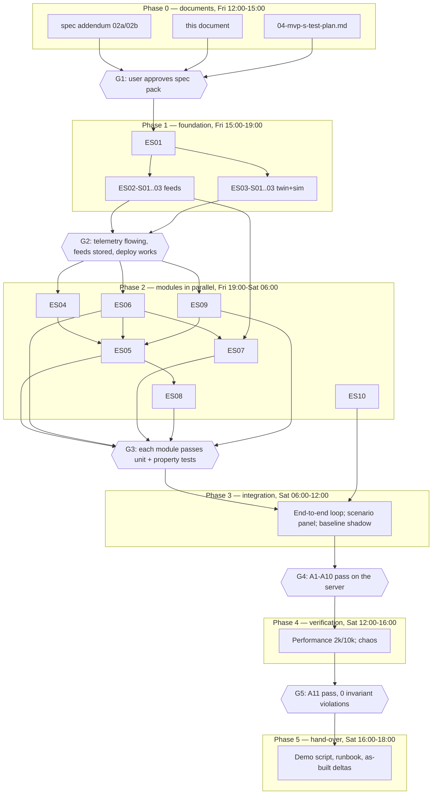

# OpenGrid Orchestrator — MVP-S Epics & Stories

Invariants: see 00-invariants.md (canonical). Status: draft for owner approval (gate G1).

Release tag: **MVP-S**. Status: for G1 approval alongside `02a-mvp-s-spec-engine.md` and `02b-mvp-s-spec-platform.md`.
Derived from [`01-saturday-delivery-plan.md`](01-saturday-delivery-plan.md) (scope, modules, acceptance A1–A11,
schedule, cut lines, never-cut list) and [`../06-reviews/06-first-principles-review.md`](../06-reviews/06-first-principles-review.md)
(principles P1–P8, commitment lock §3, decisions §8a). Existing IDs are reused and cited, not renumbered, from
[`../01-product/03-epics-and-user-stories.md`](../01-product/03-epics-and-user-stories.md) (epics E01–E23, story IDs)
and [`../01-product/02-functional-requirements.md`](../01-product/02-functional-requirements.md) (FR-xxx). Personas are
the 16+1 roles of [`../01-product/01-vision-scope-personas.md`](../01-product/01-vision-scope-personas.md) §6.

**How to read the citations.** An existing story/FR ID (e.g. `ARB-S02`, `FR-ARB-004`) names a requirement or story
already specified for the full engine; MVP-S builds a first, thinner slice of it, scoped to the plan's modules and
the five services in A5. Where MVP-S narrows or corrects an existing item (most importantly `FR-ARB-004` and
`ARB-S05`, per review §3.1 finding #1), the story says so explicitly. `FR-ARB-014` is new (review §3.2); no other
new FR numbers are introduced — everything else cites what exists.

**Invariant legend (K1–K13).** Canonical definitions and enforcement points are in
[`00-invariants.md`](00-invariants.md); this document does not restate or renumber them. One-line summary: **K1**
homeowner reserve · **K2** one buyer (single-writer ledger) · **K3** sole signer (guardian Ed25519) · **K4** physical
envelope (P/kVA/ramp) · **K5** grid authority (L2 hard constraints) · **K6** command freshness (sequence/epoch/lease)
· **K7** degrade, don't trip (TIMEOUT≠VETO≠STOP, hold→schedule→local autonomy) · **K8** stop authority (independent
safe-stop) · **K9** one loop per quantity (allocator PI, guardian G-03) · **K10** trace before act · **K11**
verifiable track record (hash chain, retention, pruning) · **K12** time quality (guardian clock, G-20) · **K13**
commitment lock (review §3.2, `FR-ARB-014`, guardian check **G-19**) — the one invariant every workstream in this
document must not violate. Every story's "Invariants:" line below cites the canonical K-ID by meaning, not by the
number an earlier draft happened to use.

---

## 1. Overview

| Epic | Goal | Modules (spec) | Acceptance covered | Workstream | Never-cut |
|---|---|---|---|---|---|
| **ES01** Platform & data | One deployable codebase: schema, shared contracts, CI, compose/systemd, Apache route, backup | `feeds`(schema)/all modules (contracts lib), platform | A11 (survives process kill, nightly `pg_dump`) | WS1 | Partial — deploy path yes; nothing safety-critical |
| **ES02** Live feeds & forecast | ERCOT/EIA/NWS ingestion with staleness and a simple forecast | `feeds`, `forecast` | A1 | WS2 | No |
| **ES03** Fleet twin & test harness | Digital twin of 2,000–10,000 simulated hubs/banks; scenario injector | `fleet`, `sim` | A2, A11 (2k perf) | WS3 | No (twin feeds K13 substitution, but twin itself isn't on the never-cut list) |
| **ES04** Contracts, opportunities & commitments | Customer/contract/opportunity/obligation model; admission; partial take; re-nomination | `contracts` | A4, A9 | WS4 | Partial — obligation lifecycle yes (feeds K13); contract variety no |
| **ES05** Dispatch (selector, ledger, allocator) | LP selection at gates; **commitment lock**; single-writer ledger; 2 s real-time allocation with substitution | `selector`, `ledger`, `allocator` | A4, A5, A10 | WS4 | **Yes — commitment lock, reserve, one buyer (cut line 1 may fall back to the rule selector; the lock itself never falls back)** |
| **ES06** Guardian & safe stop | Sole command signer incl. **G-19**; scoped safe stop; TIMEOUT≠VETO≠STOP | `guardian`, `safestop` | A3, A10 | WS5 | **Yes — guardian signing** |
| **ES07** Health & degraded modes | Heartbeats, feed/hub health, cycle latency, alerts, degraded-mode switch | `health` | A6 | WS5 | No |
| **ES08** Settlement (M&V, billing, profitability) | Interval metering, baseline, insert-only invoicing, profitability incl. forgone upside | `settle` | A7, A8 | WS6 | Partial — cut line 3 may drop baseline/forgone-upside reporting |
| **ES09** Audit trace & retention | Hash-chained trace of every event; chain-verify; configurable retention with checkpointed pruning | `trace` | A9 | WS1 (lib) / WS8 (verify tests) | **Yes — the trace** |
| **ES10** Operator UI | 7 screens + scenario panel over SSE | `ui` | A1–A9 (presentation of all) | WS7 | No |

Totals: **10 epics, 51 stories** (§2). Acceptance item A11 (performance/chaos) is proven by stories across
ES03/ES05/ES06/ES07 plus WS8 test execution in the sibling test plan (`04-mvp-s-test-plan.md`), not by a UI story.

---

## 2. Epics and stories

Format per story: ID · title · role/goal · priority · Given/When/Then acceptance criteria · linked existing
FR/story IDs · invariants (K1–K13) · dependencies · estimate (hours).

### ES01 — Platform & data

Goal: one modular Python codebase, **7 processes** (`og-feeds`, `og-engine`, `og-guardian`, `og-safestop`, `og-sim`,
`og-settle`, `og-api` — `og-safestop` independent of the engine and the guardian, per K8), Postgres + Mosquitto,
deployed behind Apache TLS on the base server, backed up nightly. Modules: `feeds` (schema baseline), all modules'
shared contracts, platform-wide CI and deploy. Workstream: **WS1**.

**ES01-S01 — Postgres schema and migrations for every module's tables.**
As a *platform SRE*, I want one versioned migration set covering `feed_obs`, `hub`, `bank`, `telemetry`, `contract`,
`opportunity`, `obligation`, `plan`, `commitment`, `reservation`, `grant`, `verdict`, `stop_event`, `heartbeat`,
`alert`, `meter_interval`, `performance`, `invoice_line`, `pnl` and `trace`, so every module owns exactly the
tables the delivery plan §2.1 assigns it.
- Given a clean database, When migrations run, Then every table in plan §2.1 exists with the stated owner and no
  cross-module writer.
- Given `telemetry`, When partitioned, Then it is partitioned by day per plan §2.2.
- Given a second migration run, When applied, Then it is idempotent (no error, no duplicate objects).
Priority: Must · FR/story links: `FR-OPS-004` (externalized config), `TRACE-S01` (structural basis for `trace`'s
append-only table) · Invariants: — (foundational) · Dependencies: none · Estimate: 3 h

**ES01-S02 — Shared Pydantic contracts package.**
As a *system admin*, I want one Pydantic package defining every cross-module message and table row, imported by
all 7 processes, so WS2–WS7 can build against frozen interfaces from hour one (plan §7).
- Given the Phase 0 addendum's interfaces (`02a-mvp-s-spec-engine.md`, `02b-mvp-s-spec-platform.md`), When the
  package is generated, Then every module's public function signature matches the addendum exactly.
- Given a module imports a stale contract version, When CI runs, Then the build fails.
Priority: Must · FR/story links: `FR-DEV-017` (`DeviceAdapter`-style interface discipline), `FR-OPS-004` ·
Invariants: — · Dependencies: ES01-S01 · Estimate: 2 h

**ES01-S03 — Compose/native deploy behind Apache TLS + basic auth.**
As a *platform SRE*, I want the 7 processes (including `og-safestop` as its own unit), Postgres and Mosquitto
deployed on 192.168.5.35 as native systemd units (Compose files kept for portability), reachable at
`https://base.tocy-net.net/og/` behind the existing Apache, with two static roles (operator, viewer), so the demo
runs without touching MariaDB or `/opt/opengrid_sim`.
- Given `make deploy`, When run against a clean checkout, Then G0 ("hello" at `/og/`) passes in under 10 minutes.
- Given the deploy, When a live port scan runs, Then ports 80/443 are untouched and MariaDB/`/opt/opengrid_sim`
  are never written to.
- Given an unauthenticated request to `/og/`, When made, Then it is rejected by Apache basic auth before it
  reaches the app.
Priority: Must · FR/story links: `FR-OPS-012` (no port conflicts on the shared host), `FR-OPS-004` · Invariants:
— (foundational; enables K8's independent `og-safestop` unit) · Dependencies: ES01-S01, ES01-S02 · Estimate: 3 h

**ES01-S04 — CI: unit and property tests on every push.**
As a *platform SRE*, I want `pytest` (unit + Hypothesis property tests) running in CI on every push, gating merge,
so a broken module never reaches Phase 2 integration.
- Given a pull request, When CI runs, Then unit tests for the touched module and the shared property-test suite
  (no double allocation, no commitment reduction without a reason code) both execute.
- Given any test fails, When CI completes, Then the merge is blocked.
Priority: Must · FR/story links: `FR-OPS-011` (build-blocking portability/config audit, same CI discipline) ·
Invariants: K13 (property test for commitment reduction is the first automated K13 guard) · Dependencies:
ES01-S02 · Estimate: 2 h

**ES01-S05 — Nightly backup and restore runbook.**
As a *platform SRE*, I want nightly `pg_dump` plus a written, tested restore procedure, so A11 ("nightly
`pg_dump`") is demonstrated, not asserted.
- Given the nightly job, When it runs, Then a dated dump lands outside the Postgres data volume.
- Given the restore runbook, When followed against a fresh instance, Then the restored database passes the
  chain-verify check of ES09-S04.
Priority: Should · FR/story links: `FR-OPS-006` (retry/dead-letter/self-recover discipline) · Invariants: K11
(audit trace survives restore, chain still verifies) · Dependencies: ES01-S03, ES09-S01 · Estimate: 1 h

**ES01 subtotal: 5 stories, 11 h.**

---

### ES02 — Live feeds & forecast

Goal: ERCOT/EIA/NWS ingestion on schedule, normalized, stale-flagged, rate-limited; simple quantile forecast.
Modules: `feeds`, `forecast`. Workstream: **WS2**.

**ES02-S01 — ERCOT prices, load, wind/solar and AS prices on schedule.**
As a *market/QSE trader*, I want ERCOT real-time price, load, wind/solar output and AS clearing prices polled and
normalized, so the selector always has live inputs for arbitrage and AS valuation.
- Given ERCOT's API is healthy, When a poll tick runs, Then a new observation for each configured series is
  available to consumers within 60 s.
- Given a poll returns an error, When it fails, Then the last known-good value is served, flagged `stale`, and no
  exception propagates to a consumer.
Priority: Must · FR/story links: `ING-S01` (ERCOT load-zone price), `FR-ING-001`, `FR-ING-006`, `FR-ING-007` ·
Invariants: — · Dependencies: ES01-S02 · Estimate: 3 h

**ES02-S02 — Shared 30 req/min ERCOT budget.**
As a *platform SRE*, I want every ERCOT poller bounded to one shared 30 req/min budget, so the demo never gets
ERCOT-blocked.
- Given all pollers active concurrently, When load-tested, Then the sustained rate never exceeds 30 req/min.
- Given the budget is momentarily exhausted, When a poller's turn comes, Then it waits rather than erroring.
Priority: Must · FR/story links: `ING-S04`, `FR-ING-004`, `FR-ING-005` · Invariants: — · Dependencies: ES02-S01 ·
Estimate: 1 h

**ES02-S03 — EIA fallback and NWS weather.**
As a *planning & forecasting analyst*, I want an EIA v2 fallback for price/load and NWS forecasts/watches/warnings
ingested for the fleet's service areas, so a single-source ERCOT outage doesn't blind the selector.
- Given ERCOT is unreachable for a series with an EIA fallback, When the poll runs, Then the EIA value is served,
  labelled by source.
- Given NWS issues a watch, When polled, Then it reaches the console within one poll cycle.
Priority: Must · FR/story links: `ING-S07`, `FR-ING-010`, `FR-ING-011`, `FR-ING-012` · Invariants: — ·
Dependencies: ES02-S01 · Estimate: 2 h

**ES02-S04 — Freshness badges and circuit breaker.**
As a *control-room operator*, I want every displayed series to carry an "as of" freshness badge, and a source
that keeps failing to trip a circuit breaker rather than retry-storm ERCOT, so A1's freshness requirement and A6's
feed-staleness trigger both have one shared source of truth.
- Given a source misses N consecutive polls (per `02b-mvp-s-spec-platform.md`'s threshold), When the Nth miss
  occurs, Then the circuit breaker opens and health (ES07-S02) is notified in the same cycle.
- Given any UI screen shows a feed value, When rendered, Then its freshness badge is present and accurate to the
  second.
Priority: Must · FR/story links: `ING-S05`, `FR-ING-012`, `FR-ING-013`, `FR-ING-015` · Invariants: — ·
Dependencies: ES02-S01, ES02-S03 · Estimate: 2 h

**ES02-S05 — Quantile-persistence forecast (P10/P50/P90).**
As a *planning & forecasting analyst*, I want the simplest defensible 24 h forecast — quantile persistence, not a
trained model — for price and load, so the selector has a scenario set without over-building forecasting for
Saturday.
- Given the forecast runs, When published, Then P10/P50/P90 exist for every hour of the next 24 h.
- Given a degraded/stale input, When the forecast runs, Then the band widens rather than staying unchanged.
Priority: Must · FR/story links: `FCST-S01`, `FCST-S04`, `FR-FCST-001`, `FR-FCST-005`, `FR-FCST-008` ·
Invariants: — · Dependencies: ES02-S01 · Estimate: 2 h

**ES02 subtotal: 5 stories, 10 h.**

---

### ES03 — Fleet twin & test harness

Goal: an accurate hub/bank digital twin fed by a 2,000-hub (10,000 stretch) test harness that is the spec's
`agent-sim`/`grid-sim`, not the base-server concept simulators. Modules: `fleet`, `sim`. Workstream: **WS3**.

**ES03-S01 — Hub/bank digital twin: SoC, P, health, eligibility.**
As a *control-room operator*, I want a current, fresh state estimate (SoC, power, health, eligibility, quality
flags) for every hub and bank aggregate, so dispatch never plans against stale or fabricated capability. The twin
never simulates physics forward in time (`sim` does that, ES03-S03); it only stores reported state and derives
`capability(bank,t)` from `og.core.physics` (`02b` §12), so there is one SoC-step formula in the whole codebase.
- Given telemetry arrives on the 2 s cadence, When processed, Then the twin's estimate age never exceeds one
  interval plus processing latency.
- Given telemetry stops arriving, When more than 3 reports are missed, Then the hub is excluded from allocation
  totals but stays visible (not silently dropped).
Priority: Must · FR/story links: `TWIN-S01`, `FR-TWIN-001`, `FR-TWIN-009` · Invariants: — · Dependencies:
ES01-S02 · Estimate: 3 h

**ES03-S02 — Bank/zone topology: "behind asset X" queries.**
As a *SCADA/protocol integration engineer*, I want to query exactly which homes sit behind a given bank, so
`DIST_DEFERRAL` and the allocator can restrict allocation to the right homes.
- Given a test bank's known enrolled homes, When queried, Then exactly those homes are returned, no others.
Priority: Must · FR/story links: `TWIN-S03`, `FR-TWIN-003` · Invariants: — · Dependencies: ES03-S01 · Estimate:
2 h

**ES03-S03 — Sim harness: 2,000 hubs with real SoC physics, lease and signature verification.**
As a *platform SRE*, I want the test harness to run 2,000 simulated hubs (10,000 as a stretch) with real SoC
physics ($e_{t+1}=e_t+\eta_c p^c\Delta t-p^d\Delta t/\eta_d$), a 30 s lease, and Ed25519 signature verification on
every received command, so it stands in for real hubs and SCADA, not a shortcut around the guardian.
- Given 2,000 hubs streaming telemetry every 2 s, When measured over a 30-minute run, Then telemetry ingestion
  keeps pace with no dropped messages and the twin (ES03-S01) stays within one interval of freshness.
- Given a command signed by any key other than the guardian's, When received by a simulated hub, Then it is
  rejected and the rejection is observable.
- Given the guardian or engine process is stopped, When a hub's lease expires (30 s), Then the hub holds its last
  setpoint (local autonomy), never a trip.
Priority: Must · FR/story links: `SIM-S07` (drive N hubs off-node — MVP-S runs 2k on-node per plan §0a), `SIM-S10`
(safe-stop-only key enforcement), `FR-SIM-013`, `FR-SIM-020` · Invariants: K6 (lease/epoch freshness), K7 (lease
expiry → local autonomy, never a trip), K8 (safe-stop-only key enforcement) · Dependencies: ES01-S02, ES06-S01
(signature scheme) · Estimate: 5 h

**ES03-S04 — Scenario injector for the demo panel.**
As a *Base executive (sponsor)*, I want the harness to inject, on demand: a partner call, a price spike, a
better-paying call during an active delivery (the commitment-lock demo), a feeder overload, comms loss for a
zone, a stale feed, and a killed engine process, so the UI scenario panel (ES10-S06) has something real to show.
- Given each of the seven scenario types, When triggered from the API, Then it produces the identical downstream
  telemetry/event shape a real occurrence would.
- Given the same seed, When a scenario sequence re-runs, Then it reproduces exactly (timing and outcome).
Priority: Must · FR/story links: `SIM-S02`, `SIM-S06`, `FR-SIM-003`, `FR-SIM-009`, `FR-SIM-012` · Invariants: —
· Dependencies: ES03-S03 · Estimate: 3 h

**ES03-S05 — No over-reporting of available capacity.**
As an *auditor*, I want a guarantee that the twin's reported available kW never exceeds SoC minus the reserve
floor and any higher-priority reservation, so the selector never plans against fictional headroom.
- Given randomized fleet states, When property-tested, Then reported available kW plus every active reservation
  never exceeds SoC, across 100% of samples.
- Given a hub's SoC is exactly at the reserve floor, When queried for non-firm use, Then its available discharge
  kW is reported as zero.
Priority: Must · FR/story links: `TWIN-S05`, `FR-TWIN-007`, `FR-TWIN-008`, `FR-TWIN-011` · Invariants: **K1**
(homeowner reserve) · Dependencies: ES03-S01 · Estimate: 2 h

**ES03 subtotal: 5 stories, 15 h.**

---

### ES04 — Contracts, opportunities & commitments

Goal: the commercial substrate — customer/contract/opportunity/obligation — for the five A5 services, with
partial-take product rules and contractual re-nomination points. Module: `contracts`. Workstream: **WS4**.

**ES04-S01 — Obligation lifecycle: offered → selected → committed → delivering → fulfilled → settled.**
As a *system admin*, I want every opportunity to progress through the review's formal lifecycle (review §3.2),
owned by the ledger's single writer, so every later story has one authoritative state machine to build on.
- Given an opportunity is admitted, When it progresses, Then it visits exactly the six states in order, with no
  skip and no reverse transition except the documented exceptions (ES05-S03).
- Given two obligations reference the same underlying capacity, When queried, Then each has an independent
  lifecycle record.
Priority: Must · FR/story links: `CTR-S01`, `FR-CTR-001`, `FR-CTR-002` · Invariants: K13 (the lifecycle is the
scaffold the lock is enforced on) · Dependencies: ES01-S01 · Estimate: 2 h

**ES04-S02 — Opportunity admission and feasibility check.**
As a *Base executive*, I want a call admitted only if it is feasible and authorized against contract terms, one
buyer, and current derated capacity, before it competes for anything.
- Given a call violates its contract's terms, When submitted, Then it is rejected pre-allocation with a reason.
- Given a feasible call for one of the five A5 services (`HOME`, `ERCOT_ENERGY`, `ERCOT_AS`, `DIST_DEFERRAL`,
  `PARTNER_CAPACITY`), When admitted, Then it enters `offered` state.
Priority: Must · FR/story links: `ARB-S01`, `FR-ARB-001` · Invariants: P3 one buyer · Dependencies: ES04-S01 ·
Estimate: 2 h

**ES04-S03 — Partial take per product rules: `min_qty`, `increment`, `block`.**
As a *market/QSE trader*, I want the selector's quantity variable for each opportunity to be continuous where the
market allows partial take, semi-continuous above `min_qty` in `increment` steps where required, and binary for
all-or-nothing blocks — per marketplace/ERCOT rules — so a five-MW AS award and a fixed-block tolling contract
are both represented correctly (review §8a decision 2).
- Given a `ERCOT_AS` opportunity with `min_qty=1 MW` and `increment=0.1 MW`, When the selector runs, Then the
  chosen quantity is either 0 or a value ≥ `min_qty` on the `increment` grid.
- Given a `PARTNER_CAPACITY` all-or-nothing block, When the selector runs, Then the admission quantity is exactly
  0 or the full block (binary), never a partial value.
- Given a `HOME`/`DIST_DEFERRAL` opportunity with no block restriction, When the selector runs, Then a continuous
  quantity in $[0,\bar Q_o]$ is allowed.
Priority: Must · FR/story links: `CTR-S02` (contract term validation, closest existing analogue), `FR-CTR-003`,
`FR-CTR-005`; new: `FR-ARB-014` (partial-take clause) · Invariants: K13 (partial-take rules feed the lock's
$Q_{o,t}$) · Dependencies: ES04-S02, ES05-S01 · Estimate: 3 h

**ES04-S04 — Re-nomination points for multi-day and tolling contracts.**
As a *partner-program manager*, I want a multi-day or tolling contract's lock to run until its next agreed
re-nomination point (an extra gate for that contract alone) rather than only at fulfilment, so a toll's owner can
re-nominate on schedule without breaking the lock for every other obligation (review §8a decision 1).
- Given a tolling contract with a daily re-nomination point, When that gate is reached, Then only that contract's
  commitment is opened for re-selection; every other committed obligation stays locked.
- Given a re-nomination point has not yet arrived, When a competing opportunity attempts to bid for the tolled
  capacity, Then it is rejected exactly as `FR-CTR-020` requires for the full toll term.
Priority: Must · FR/story links: `CTR-S10`, `FR-CTR-020` · Invariants: K13 · Dependencies: ES04-S01, ES05-S02 ·
Estimate: 2 h

**ES04-S05 — Reason-coded admission and shortfall recording.**
As an *auditor*, I want every admission rejection and every shortfall recorded with a reason code linked to the
trace, never silently dropped.
- Given a call is rejected at admission, When it happens, Then the reason code and inputs are traced (ES09-S01).
- Given a committed obligation cannot be fully served, When detected, Then it is recorded as a shortfall against
  that obligation, never masked by a different call's outcome.
Priority: Must · FR/story links: `ARB-S04`, `FR-ARB-006`, `FR-ARB-007` · Invariants: K13 (shortfall, not
reallocation, is the only outcome of a lock exception) · Dependencies: ES04-S01, ES09-S02 · Estimate: 2 h

**ES04 subtotal: 5 stories, 11 h.**

---

### ES05 — Dispatch (selector, ledger, allocator)

Goal: LP selection at gates with commitments frozen as parameters; a single-writer reservation ledger; a 2 s
real-time allocator that substitutes homes but never obligations. This is the review's central correctness
finding (§3, §6 #1) and the plan's largest, never-cut epic. Modules: `selector`, `ledger`, `allocator`.
Workstream: **WS4**.

**ES05-S01 — LP selection at gates (15 min + admission event).**
As a *Base executive*, I want the selector to solve at every 15-minute gate and on every new-call admission,
choosing which of the five A5 opportunities to commit, using scenario-weighted value of the whole delivery window
minus energy cost, degradation and expected penalty.
- Given all five service types have candidate opportunities, When the gate solves, Then a commitment decision
  ($x_o$ or $q_o$) is produced for each feasible one, respecting SoC/reserve/P/kVA/one-buyer/non-anticipativity.
- Given the fleet's derated capacity is exceeded by demand, When solved, Then no plan assigns more than the
  derated, reserve-adjusted total.
Priority: Must · FR/story links: `PLAN-S01`, `FR-PLAN-001`, `FR-PLAN-015` · Invariants: P3, P5, P7 · Dependencies:
ES03-S05, ES04-S03, ES02-S05 · Estimate: 4 h

**ES05-S02 — Commitment lock: freeze committed $x_o$/$\hat y$ as parameters (K13, `FR-ARB-014`).**
As a *partner-program manager (counterparty)*, I want my committed delivery unaffected when a better-paying call
arrives during my delivery window, so the selector cannot be re-argued mid-contract by a newer, richer opportunity
— this is the mandatory commitment-lock story (review §3.2, §8a decision under commitment lock).
- Given my obligation is committed and delivering, and a new same-tier or higher-value call arrives mid-window,
  When the next gate or real-time cycle solves, Then my committed $\hat y_{o,b,t}$ is treated as an equality/lower-
  bound parameter, not re-optimized, and my granted kW never drops below $\hat y$ because of the new call.
- Given the new call is genuinely more valuable, When it is admitted, Then it competes only for uncommitted
  headroom $H_{b,t}=\text{cap}_{b,t}-\sum_{o\,\text{committed}} r_{o,b,t}$, never for my committed capacity.
- Given a replay fixture of two same-tier calls of rising relative value, When replayed, Then the earlier-
  committed call never drops below $\hat y$ unless an L0/L1/L2/infeasibility event is injected (ES05-S03).
- Given the current spec's `FR-ARB-004` override and the `SERVED → ARBITRATING` re-arbitration edge (review §3.1
  finding table, `ARB-S02`/`ARB-S05`), When MVP-S is built, Then their scope is limited to **pre-commitment**
  selection only — neither may reduce a committed allocation.
Priority: **Must (never-cut)** · FR/story links: new `FR-ARB-014`; narrows `FR-ARB-004`, `ARB-S02`; supersedes the
uncommitted-headroom-only competitive scope of `ARB-S05`/`FR-ARB-010`; `FR-DE-039`/C16 raised to Must (review §5.4
item 3) · Invariants: **K13**, P4 · Dependencies: ES05-S01, ES04-S01 · Estimate: 4 h

**ES05-S03 — Lock exceptions: L0 safety, L1 reserve, L2 instruction, infeasibility.**
As an *auditor*, I want the only four events that may ever reduce a committed allocation — device safety (L0),
homeowner reserve (L1), ERCOT/utility instruction (L2), or physical infeasibility with no substitute — each to
carry its own reason code and to produce a recorded shortfall, never a silent reallocation.
- Given an L0 device-safety trip on a committed hub, When it occurs, Then the reduction is traced with reason
  `R-COMMIT-LOCK-OVERRIDE-L0` and a substitute is sought first (ES05-S04).
- Given a homeowner reserve breach is imminent (L1), When detected, Then the reduction is traced with
  `R-COMMIT-LOCK-OVERRIDE-L1` and the obligation is flagged `AT_RISK`.
- Given an ERCOT/utility instruction (L2) conflicts with a committed delivery, When it arrives, Then the
  instruction wins as a hard constraint, traced `R-COMMIT-LOCK-OVERRIDE-L2`, and the firm call is served by
  substitution or reported `AT_RISK`.
- Given no substitute exists and the shortfall is physically unavoidable, When determined, Then it is traced
  `R-COMMIT-LOCK-INFEASIBLE` with the specific constraint that bound.
- Given any reduction with none of these four reason codes, When the guardian evaluates the batch, Then it is
  refused (ES06-S02).
Priority: **Must (never-cut)** · FR/story links: new `FR-ARB-014`; `SAFE-S01` (guardian independent validation
pattern); `FR-DISP-024` (ERCOT instruction as hard L2 constraint) · Invariants: **K13**, P1, P2 · Dependencies:
ES05-S02 · Estimate: 3 h

**ES05-S04 — Substitution of homes within a committed obligation.**
As a *fleet reliability engineer*, I want the allocator to substitute which homes deliver a committed obligation
— never which obligation the capacity serves — within 3 ticks of a hub under-delivering, so the commitment lock's
one allowed exception (§8.8) works in practice.
- Given a hub under-delivers during an active committed obligation, When detected, Then a substitute hub covers
  the gap within 3 ticks, and the obligation's identity and committed profile are unchanged.
- Given no substitute exists, When checked, Then the true shortfall is reported against that obligation (never
  masked as a full delivery, and never routed to a different obligation).
Priority: Must · FR/story links: `DISP-S05`, `FR-DISP-009`, `FR-DISP-010`, `FR-DISP-014` · Invariants: K13 (this
is the *allowed* case the lock carves out) · Dependencies: ES05-S02, ES03-S01 · Estimate: 3 h

**ES05-S05 — Single-writer reservation ledger; one buyer, zero double-booking.**
As an *auditor*, I want a mathematical guarantee that no hub's grants across obligations ever exceed its available
energy, enforced by one single-writer ledger.
- Given randomized obligation mixes, When property-tested, Then grants never exceed available energy above the
  reserve floor, across 100% of samples.
- Given two writers attempt a reservation on the same hub-interval concurrently, When both attempt, Then only one
  succeeds and the other observes the updated headroom.
Priority: **Must (never-cut)** · FR/story links: `DISP-S08`, `FR-DISP-018`, `FR-DISP-019` · Invariants: P3, K13 ·
Dependencies: ES05-S01 · Estimate: 3 h

**ES05-S06 — 2 s real-time allocator with `DIST_DEFERRAL` PI loop.**
As a *SCADA/protocol integration engineer*, I want the 2 s real-time cycle to subtract every active committed
$\hat y$ from capability, allocate free headroom with 5-minute dwell and \$5/MWh hysteresis, and run the
`DIST_DEFERRAL` bank-kVA PI loop closed on simulated SCADA, so real time stays a pure LP/water-filling problem
under the frozen commitments.
- Given a bank sample, When the PI loop runs, Then `need = measured (net of fleet) + fleet's own output behind
  the bank at the sample's source time − (rating − margin)`, computed in the rating's unit.
- Given uncommitted headroom only, When allocated to the energy schedule, Then no home flips allocation more
  than once per 5-minute dwell window absent a $5/MWh price move.
- Given the RT cycle runs at 2,000 hubs, When measured, Then cycle p99 < 500 ms (ties to A11, verified further in
  ES07-S04).
Priority: Must · FR/story links: `DISP-S02`, `DISP-S04`, `FR-DISP-003`, `FR-DISP-004`, `FR-DISP-007`,
`FR-DISP-008` · Invariants: K13 (RT never selects, per review §5.2) · Dependencies: ES05-S02, ES05-S05, ES03-S03 ·
Estimate: 4 h

**ES05-S07 — Rule-based baseline allocator, run in shadow.**
As a *control-room operator*, I want a simple rule allocator (firm first, then AS, then market) running in
shadow on the same inputs as the LP, so the UI can show value added by the LP and forgone upside from the lock —
and so cut line 1 (LP not passing at G3) has a working fallback that goes live instead.
- Given the same tick's inputs, When both the LP and the rule allocator run, Then both produce a comparable
  allocation and the difference in net value is computable.
- Given the LP fails to converge or its unit tests fail at G3, When the cut line applies, Then the rule allocator
  becomes primary and the LP runs in shadow instead, with this state visible on the UI.
Priority: Must (cut-line fallback target) · FR/story links: `PLAN-S07` (rule-based fallback, `control_engine.py`
port — written fresh, not copied, per review §8a decision 4), `FR-PLAN-014` · Invariants: — · Dependencies:
ES05-S01, ES05-S06 · Estimate: 2 h

**ES05 subtotal: 7 stories, 23 h.**

---

### ES06 — Guardian & safe stop

Goal: an independent sole signer that never modifies a command, only PASS/VETO/HOLD, with **G-19** as the
commitment-lock check; a stop-only authority scoped to fleet/zone/bank. Modules: `guardian`, `safestop`.
Workstream: **WS5**.

**ES06-S01 — Guardian core checks: reserve, ramp, P/kVA limits, lease/epoch, Ed25519 signature.**
As an *auditor*, I want guardian to independently re-validate every proposed command against physical/contractual
limits and the homeowner reserve, sign only what passes, and hold (never veto-as-modify) anything it cannot
verify.
- Given a command exceeding a limit or breaching the reserve floor, When it reaches guardian, Then it is blocked
  even if the allocator would have allowed it — zero exceptions.
- Given a valid batch, When guardian signs it, Then every command carries a verifiable Ed25519 signature and a
  lease/epoch consistent with the current issuer.
- Given guardian gives no verdict within its budget or is unreachable, When the allocator runs, Then the batch
  stays unsigned, commands in force run to their lease, and the on-call is paged — a timeout is never a veto and
  never a stop.
Priority: **Must (never-cut)** · FR/story links: `SAFE-S01`, `SAFE-S02`, `FR-SAFE-001`, `FR-SAFE-002`,
`FR-SAFE-014` · Invariants: K1, K3 (sole signer), K4 (limits/ramp), K6 (lease/epoch) · Dependencies: ES03-S03,
ES05-S05 · Estimate: 4 h

**ES06-S02 — Guardian check G-19: refuse a batch that reduces a committed allocation without cause.**
As an *auditor*, I want guardian to independently refuse to sign any batch that reduces an active committed
allocation unless it carries a valid L0/L1/L2/infeasibility reason code, so the commitment lock is enforced twice
— once by construction in the allocator, once independently by the untrusted-by-design dispatcher's watchdog
(review §3.3 item 2, the new **G-19**).
- Given a batch that reduces a committed $\hat y$ with a valid `R-COMMIT-LOCK-OVERRIDE-L0/L1/L2` or
  `R-COMMIT-LOCK-INFEASIBLE` reason code, When guardian evaluates it, Then it signs.
- Given a batch that reduces a committed $\hat y$ with no such reason code, or an invalid one, When guardian
  evaluates it, Then it refuses to sign — the reduction never reaches a hub.
- Given a fixture of 100 batches, 10 of which illegally reduce a commitment, When run through guardian, Then
  100% of the 10 are refused and 100% of the 90 legitimate batches sign.
Priority: **Must (never-cut)** · FR/story links: new `FR-ARB-014` (G-19 is its enforcement point); extends the
`SAFE-S01`/`FR-SAFE-001` pattern to a new check class · Invariants: **K13** · Dependencies: ES06-S01, ES05-S02,
ES05-S03 · Estimate: 3 h

**ES06-S03 — Scoped safe stop: fleet, zone, bank — stop-only, never releases.**
As a *control-room operator*, I want to engage a scoped safe stop (fleet/zone/bank) on a two-step confirmation,
executed at once via a retained MQTT topic, using a key that can only stop and never release or command.
- Given I engage a bank-scope stop with a reason and confirm twice, When confirmed, Then dispatch to that bank's
  hubs stops within one cycle.
- Given a message signed under the safe-stop-only key that is not a stop, When a hub receives it, Then it is
  rejected; a stop under the same key is accepted.
- Given a stop is engaged, When release is attempted through the safe-stop path, Then it is structurally
  impossible — release requires the separate operator/guardian path, out of MVP-S's automated scope, gated by
  human confirmation only.
Priority: **Must (never-cut)** · FR/story links: `SAFE-S03`, `FR-SAFE-006`, `FR-SIM-020` (safe-stop-only key
enforcement in the harness) · Invariants: K8 (stop authority: independent process, `og-safestop`, works with the
engine and the guardian both down) · Dependencies: ES03-S03, ES06-S01 · Estimate: 3 h

**ES06-S04 — TIMEOUT ≠ VETO ≠ STOP; on-call paging.**
As a *platform SRE*, I want the three failure semantics kept strictly distinct — a guardian timeout holds and
pages, a veto blocks that batch only, a stop is the only thing that trips delivery — so no slow component ever
turns into an accidental fleet stop.
- Given a guardian verdict misses its time budget, When it happens, Then the batch holds, on-call pages, and no
  stop is triggered.
- Given an explicit invariant veto on > 5% of a tick's commands, When it happens, Then the scope goes
  CONSERVATIVE, still distinct from a stop.
- Given three consecutive CONSERVATIVE ticks from vetoes, When observed, Then a scoped safe stop is *requested*
  of a person — never engaged automatically.
Priority: Must · FR/story links: `SAFE-S02`, `FR-SAFE-014`, `FR-SAFE-016` · Invariants: K7 (degrade, don't trip:
TIMEOUT ≠ VETO ≠ STOP) · Dependencies: ES06-S01, ES07-S01 · Estimate: 2 h

**ES06-S05 — Feeder/substation ramp ceiling for firm events.**
As a *platform SRE*, I want a per-feeder/substation ramp ceiling enforced by guardian, independent of the fleet-
wide 50 MW/min cap, so a firm event cannot be exempted into an unsafe local ramp (review §6 finding #4).
- Given a firm event that would exceed the configured feeder ramp ceiling, When guardian evaluates the batch,
  Then it is refused or reshaped to the ceiling, never signed as proposed.
- Given a batch within every ceiling, When evaluated, Then it signs normally.
Priority: Should (cut candidate only if G3 slips further than cut line 1; not on the plan's explicit cut list) ·
FR/story links: `DISP-S06`'s L2262 gap noted in review finding #4; nearest existing FR: `FR-DISP-011` (feedback
damping, same control family) · Invariants: K4 (physical envelope, guardian check **G-06**) · Dependencies:
ES06-S01 · Estimate: 2 h

**ES06-S06 — Guardian check G-20: refuse to sign on degraded clock quality (K12, new).**
As an *auditor*, I want guardian to refuse to sign any batch whenever its own clock's offset from NTP exceeds a
configured limit, because every lease, epoch and freshness check (K6) is arithmetic on that clock, so a silently
skewed guardian clock could make stale commands look fresh (00-invariants.md K12).
- Given the guardian's measured NTP offset is within `guardian.clock_offset_max_ms`, When a batch is evaluated,
  Then G-20 passes and the other checks proceed normally.
- Given the guardian's measured NTP offset exceeds the configured limit, When any batch is evaluated, Then
  guardian signs nothing for that cycle (a hold, not a veto and not a stop) and an alert fires.
- Given the clock recovers within limit, When the next cycle runs, Then signing resumes automatically, with the
  transition traced.
Priority: **Must (never-cut)** · FR/story links: new (review §6 finding #14, formalized here as guardian check
**G-20**); no existing FR predates this check · Invariants: **K12** (time quality) · Dependencies: ES06-S01 ·
Estimate: 2 h

**ES06 subtotal: 6 stories, 16 h.**

---

### ES07 — Health & degraded modes

Goal: heartbeats, feed/hub health, cycle latency, alerting, and the two named degraded modes (feed-stale → no new
commitments; engine down → hubs hold lease). Module: `health`. Workstream: **WS5**.

**ES07-S01 — Module heartbeats and `/status` + `/metrics`.**
As a *platform SRE*, I want every one of the 7 processes (including `og-safestop`) emitting a heartbeat and Prometheus-format `/metrics`,
so a hung or crashed process is visible within one heartbeat interval.
- Given a process stops heartbeating, When one interval elapses without one, Then health marks it down and an
  alert fires.
- Given `/metrics` is scraped, When read, Then cycle latency, feed freshness and hub counts by state are present.
Priority: Must · FR/story links: `OPS-S01`, `FR-OPS-001`, `FR-OPS-002` · Invariants: — · Dependencies: ES01-S03 ·
Estimate: 2 h

**ES07-S02 — Feed-stale degraded mode: no new commitments.**
As a *control-room operator*, I want the fleet to stop admitting new commitments — while continuing to deliver
every already-committed obligation — the moment a feed the selector depends on goes stale past its threshold,
so a bad feed can never corrupt a fresh commitment decision (mandatory degraded-mode story, plan A6).
- Given a price or load feed exceeds its staleness threshold, When detected, Then the selector refuses any new
  admission or gate solve using that feed, while ES05-S02's already-committed obligations continue delivering
  unaffected.
- Given the feed recovers within its freshness window, When detected, Then normal admission resumes automatically
  and the transition is traced.
- Given the feed stays stale past a second, longer threshold, When crossed, Then the console shows "degraded:
  feed stale" distinctly from "degraded: engine down" (ES07-S04).
Priority: **Must** · FR/story links: `ING-S09`, `FR-ING-015` (staleness alarm); nearest degraded-mode FR:
`FR-DISP-020` (scoped degraded mode) · Invariants: K13 (a stale-feed admission freeze protects the integrity of
future commitment decisions the lock will then freeze) · Dependencies: ES02-S04, ES05-S01 · Estimate: 3 h

**ES07-S03 — Hub health: online / stale / fault classification.**
As a *fleet reliability engineer*, I want every hub classified online, stale (unresponsive) or fault (not
communicating / fault code), distinctly, so operators and the allocator both know what "healthy" means per hub.
- Given a hub misses its telemetry interval while its session is alive, When detected, Then it is classified
  `stale`.
- Given a hub's session drops entirely or it reports a fault code, When detected, Then it is classified `fault`,
  a distinct state from `stale`.
Priority: Must · FR/story links: `DEV-S03`, `DEV-S04`, `FR-DEV-007`, `FR-DEV-008`, `FR-DEV-009` · Invariants: —
· Dependencies: ES03-S01, ES07-S01 · Estimate: 2 h

**ES07-S04 — Cycle latency measurement, alerts, and engine-down degraded mode.**
As a *platform SRE*, I want RT cycle latency measured continuously against the p99 < 500 ms target at 2,000 hubs
(A11), alerted before breach, and an "engine down → hubs hold lease" degraded mode demonstrated by killing the
engine process.
- Given the RT cycle runs at 2,000 hubs, When measured over a 30-minute window, Then p99 < 500 ms, with the 10k
  attempt recorded separately as "measured, not met" if the cut line 4 applies.
- Given cycle latency approaches (not yet breaches) the 500 ms target, When it crosses a pre-limit threshold,
  Then an alert fires before the hard limit.
- Given the engine process is killed, When hubs' 30 s leases expire with no renewal, Then every hub holds its
  last setpoint (local autonomy), and health shows "degraded: engine down" within one heartbeat interval.
Priority: **Must** · FR/story links: `OPS-S05`, `FR-OPS-008`; performance basis `FR-RPT-013` (benchmark
provenance) · Invariants: K7 (lease expiry → local autonomy, engine-down degraded mode) · Dependencies: ES05-S06,
ES03-S03, ES07-S01 · Estimate: 3 h

**ES07 subtotal: 4 stories, 10 h.**

---

### ES08 — Settlement (M&V, billing, profitability)

Goal: interval metering against a baseline, insert-only invoicing, and profitability reporting including the
lock's forgone upside. Module: `settle`. Workstream: **WS6**.

**ES08-S01 — Interval metering and baseline (M&V).**
As a *utility grid-ops engineer*, I want interval metering reconciled against a baseline for every obligation, so
delivery is measured against a defensible reference, not asserted.
- Given an active obligation window, When metered, Then interval resolution is ≤ 1 minute for 100% of sampled
  windows.
- Given a closed window, When reconciled, Then it completes within 24 hours and any out-of-tolerance variance is
  flagged.
Priority: Must · FR/story links: `MV-S01`, `MV-S02`, `FR-MV-001`, `FR-MV-002`, `FR-MV-003` · Invariants: P8 ·
Dependencies: ES03-S01, ES04-S01 · Estimate: 3 h

**ES08-S02 — Performance % and insert-only invoice lines.**
As a *billing admin*, I want a performance percentage applied automatically at settlement and every invoice line
insert-only and versioned, so no dispatched obligation goes unbilled and no line is ever silently rewritten.
- Given a full run with all five A5 services dispatching, When checked, Then every dispatched obligation has a
  settlement record.
- Given a settlement line exists, When an update is attempted, Then it is refused; a correction adds a
  superseding version instead.
Priority: Must · FR/story links: `BILL-S01`, `BILL-S05`, `FR-BILL-001`, `FR-BILL-006`, `FR-BILL-012` ·
Invariants: K13 adjacent — settlement never rewrites a delivered commitment's record · Dependencies: ES08-S01 ·
Estimate: 3 h

**ES08-S03 — Profitability per obligation, service and interval.**
As a *settlement/finance analyst*, I want revenue, energy cost, degradation, penalty and net margin computed per
obligation/service/interval, so profitability is decomposed, not a single opaque number.
- Given a settled obligation, When profitability is computed, Then it decomposes into value, energy cost,
  degradation (\$0.03/kWh floor), penalty and net margin, matching the LP's own objective terms.
Priority: Must · FR/story links: `ARB-S03`, `FR-ARB-003` · Invariants: — · Dependencies: ES08-S02 · Estimate: 2 h

**ES08-S04 — Value vs rule-baseline and forgone upside from the lock.**
As a *Base executive*, I want the LP's net value compared against the rule-baseline allocator (ES05-S07) run in
shadow, and the honest cost of the commitment lock reported as a separate "forgone spot upside" line, so the
lock's cost is measured, not assumed (review §3.4, KPI-22).
- Given the LP and the rule baseline both ran on the same tick's inputs, When compared, Then the value added by
  the LP is a computable, displayed number.
- Given a committed obligation held capacity that a genuinely new, higher-value opportunity could not use, When
  settled, Then the forgone value is reported as a distinct "forgone spot upside" line, never netted silently
  into net margin.
- Given cut line 3 applies (G4, if the team is behind), When it applies, Then this story is the one dropped —
  the UI still shows raw profitability without the baseline comparison.
Priority: Must (explicit cut-line candidate — cut line 3) · FR/story links: `RPT-S06` (value of orchestration,
KPI-22), `FR-RPT-011` · Invariants: — · Dependencies: ES08-S03, ES05-S07 · Estimate: 3 h

**ES08-S05 — CSV export of invoice lines and M&V records.**
As a *billing admin*, I want invoice lines and M&V performance records exportable as CSV, so a partner or judge
can inspect the numbers outside the console.
- Given a period's invoice lines, When exported, Then the CSV matches the underlying records exactly, including
  superseded-line links.
Priority: Should · FR/story links: `BILL-S06`, `FR-BILL-009` · Invariants: — · Dependencies: ES08-S02 ·
Estimate: 1 h

**ES08 subtotal: 5 stories, 12 h.**

---

### ES09 — Audit trace & retention

Goal: every event hash-chained, chain-verifiable, and retained per a configurable per-class policy with
checkpointed pruning that keeps verification passing. Module: `trace`. Workstream: **WS1** (library) / **WS8**
(verification).

**ES09-S01 — Append-only, hash-chained trace of every event.**
As an *auditor*, I want every selection, commitment, re-nomination, exception, shortfall, command, operator
action, feed change and alert recorded in one append-only, hash-chained store (`prev_hash`/`hash`), so nothing in
the system can be silently altered after the fact.
- Given any of the nine listed event classes occurs, When it occurs, Then a trace row is appended in the same
  transaction as the causing action (never after the fact).
- Given an attempted silent alteration of a past row, When checked, Then the chain break is detectable.
Priority: **Must (never-cut)** · FR/story links: `TRACE-S01`, `TRACE-S02`, `FR-TRACE-001`, `FR-TRACE-003` ·
Invariants: P8 · Dependencies: ES01-S01 · Estimate: 3 h

**ES09-S02 — Reason codes, including `R-COMMIT-LOCK-*`.**
As an *auditor*, I want every trace entry that reduces a committed allocation to carry one of the four named
reason codes (`R-COMMIT-LOCK-OVERRIDE-L0/L1/L2`, `R-COMMIT-LOCK-INFEASIBLE`), and a replay assertion that 100% of
such reductions carry one.
- Given a full test run including every lock-exception fixture (ES05-S03), When audited, Then no committed-
  allocation reduction lacks one of the four reason codes.
- Given a manufactured reduction with no reason code, When it occurs, Then an alarm fires immediately (it should
  be structurally impossible past ES06-S02, so this is the trace-layer's own independent check).
Priority: **Must (never-cut)** · FR/story links: `TRACE-S05`, `FR-TRACE-008`, `FR-TRACE-010`; new `FR-ARB-014`
(defines the reason-code set) · Invariants: **K13** · Dependencies: ES09-S01, ES05-S03 · Estimate: 2 h

**ES09-S03 — Configurable retention per event class, with checkpointed pruning.**
As a *system admin*, I want retention set per event class (`retention.<class>.days`) and pruning that removes
rows past their retention window while keeping periodic chain checkpoints, so old data can be pruned without
breaking chain verification (review §8a decision 3, mandatory retention story).
- Given a retention policy of, e.g., 30 days for `telemetry`-linked trace rows and 400 days for commitment/
  settlement rows, When the pruning job runs, Then only rows past their class's window are removed.
- Given pruning has removed rows between two checkpoints, When chain-verify runs (ES09-S04) across the pruned
  range, Then it still passes, using the checkpoint anchors in place of the pruned rows.
- Given a class's retention is reconfigured, When changed, Then the change itself is traced and takes effect on
  the next pruning cycle, never retroactively deleting rows that were compliant when written.
Priority: **Must (never-cut — retention/pruning is part of "the trace")** · FR/story links: nearest existing:
`TRACE-S06` (keep dispatching on a signed, anchored journal — same anchor-checkpoint mechanism); new
`FR-ARB-014`-adjacent retention clause (review §8a decision 3) · Invariants: **K11** (verifiable track record —
checkpointed pruning is how retention stays compatible with chain verification), **K13** (retained events are what
proves the lock held) · Dependencies: ES09-S01 · Estimate: 3 h

**ES09-S04 — Chain-verify button/endpoint.**
As an *auditor*, I want a one-click chain-verify that walks a trace range and confirms every hash links correctly,
including across a pruned-and-checkpointed range, so "the trace is intact" is a button, not an assertion.
- Given an intact, unpruned range, When verified, Then it reports pass with the range's start/end hashes.
- Given a pruned range with valid checkpoints, When verified, Then it still reports pass.
- Given a tampered or broken-chain fixture, When verified, Then it reports fail at the exact break point.
Priority: **Must (never-cut)** · FR/story links: `TRACE-S02`, `FR-TRACE-004` · Invariants: **K13** (this is how
K13 compliance is demonstrated live, per A9) · Dependencies: ES09-S01, ES09-S03 · Estimate: 2 h

**ES09 subtotal: 4 stories, 10 h.**

---

### ES10 — Operator UI

Goal: the 7 screens plus the scenario panel, over SSE, with no build step (FastAPI + HTMX + Alpine + ECharts +
Leaflet). Module: `ui`. Workstream: **WS7**.

**ES10-S01 — Control room (screen 1).**
As a *control-room operator*, I want fleet map, live ERCOT price/load/wind/solar, fleet MW/MWh, active
commitments, today's net margin, invariant counters and alerts all on one screen, refreshed over SSE.
- Given an obligation's state changes, When it changes, Then the board reflects it within one SSE push cycle
  with no manual refresh.
- Given 2,000 live hubs, When the map renders, Then it stays within the UI performance budget by clustering.
Priority: Must · FR/story links: `UI-S01`, `UI-S10`, `FR-UI-001`, `FR-UI-002`, `FR-UI-010` · Invariants: — ·
Dependencies: ES03-S01, ES02-S04, ES05-S05 · Estimate: 3 h

**ES10-S02 — Fleet monitoring & control (screen 2): manual command + scoped safe stop.**
As a *control-room operator*, I want a bank/hub table and drill-down (SoC, P, health, lease, last command), a
manual command path through the guardian, and a scoped safe stop with two-step confirmation.
- Given I engage a stop, When the dialog opens, Then it asks for scope, reason and one confirmation, shows the
  blast radius, and executes at once through ES06-S03's path.
- Given a manual command, When submitted, Then it is signed by guardian (ES06-S01) before any hub sees it.
Priority: Must · FR/story links: `UI-S03`, `FR-UI-006`, `FR-UI-021` · Invariants: K3 (sole signer — manual command
still goes through guardian), K8 (stop authority) · Dependencies: ES03-S02, ES06-S01, ES06-S03 · Estimate: 3 h

**ES10-S03 — Dispatch & commitments (screen 3).**
As a *market/QSE trader*, I want the opportunity pipeline (offered → committed → delivering → fulfilled), a
per-bank ledger timeline, the latest selector plan and why, and real-time grants/substitutions all visible —
including the commitment lock in action during the scenario-panel demo.
- Given a contested tick, When viewed, Then winner, losers and each loser's regret are all rendered.
- Given the commitment-lock scenario is triggered (ES03-S04), When it plays, Then the screen visibly shows the
  committed obligation's granted kW holding steady while the new call is shown competing only for headroom.
Priority: Must · FR/story links: `UI-S06`, `FR-UI-012`, `FR-UI-013` · Invariants: **K13** (this screen is the
demo evidence for the lock) · Dependencies: ES05-S02, ES04-S01 · Estimate: 3 h

**ES10-S04 — Markets & feeds and Health (screens 4–5, combined for MVP-S).**
As a *platform SRE*, I want series charts with freshness/source status and forecast quantiles, and module/feed/
hub health, cycle latency, alerts and current degraded mode, on adjoining panels of one screen.
- Given a feed goes stale, When it happens, Then the freshness badge and the health panel both reflect it within
  one poll/heartbeat cycle, consistently.
- Given the current degraded mode is "feed stale" or "engine down", When displayed, Then the mode and its cause
  are both named on screen.
Priority: Must · FR/story links: `UI-S07`-adjacent (nearest: SCADA log view pattern), `FR-UI-004`, `FR-OPS-001` ·
Invariants: — · Dependencies: ES02-S04, ES07-S02, ES07-S04 · Estimate: 3 h

**ES10-S05 — Profitability (screen 6).**
As a *Base executive*, I want per service/obligation/day revenue, cost and net margin, LP vs rule baseline, and
forgone upside all on one screen — dropped to raw profitability only if cut line 3 applies.
- Given underlying settlement data changes, When it changes, Then the screen updates and every figure is one
  click from its trace.
- Given cut line 3 has applied (ES08-S04 dropped), When the screen renders, Then it degrades gracefully to raw
  profitability with no baseline/forgone-upside panel, not a broken screen.
Priority: Must (degrades under cut line 3) · FR/story links: `UI-S04`, `FR-UI-007`, `FR-UI-008` · Invariants: —
· Dependencies: ES08-S03, ES08-S04 · Estimate: 2 h

**ES10-S06 — Billing & audit (screen 7) with trace explorer, chain-verify, and the scenario panel.**
As an *auditor*, I want invoice lines and CSV export, M&V performance, a trace explorer with the chain-verify
button, and the demo scenario panel (inject partner call / price spike / mid-delivery better-paying call / feeder
overload / comms loss / stale feed / killed engine process) on one screen.
- Given an invoice-line query, When run, Then the full trace resolves through call → command → telemetry → M&V →
  settlement in one traversal.
- Given the chain-verify button, When clicked, Then it reports pass/fail with the exact range checked.
- Given any of the seven scenario-panel triggers, When fired, Then the corresponding downstream effect appears on
  the relevant screen within one cycle.
Priority: Must · FR/story links: `UI-S06`, `TRACE-S02`, `FR-TRACE-002`, `FR-BILL-009` · Invariants: **K13**
(scenario panel's mid-delivery trigger is the live commitment-lock demo) · Dependencies: ES09-S04, ES08-S05,
ES03-S04 · Estimate: 3 h

**ES10 subtotal: 6 stories, 17 h.**

---

**Grand total: 10 epics, 51 stories, ≈ 135 estimated build hours across 7 parallel workstreams** (plan §0
targets ~24 wall-clock hours for Phase 1–2 with ~7 concurrent workstreams; 135 person-hours ÷ ~6 effective
parallel streams ≈ 22.5 h wall-clock, consistent with the plan's Fri 15:00–Sat 06:00 foundation-and-modules window
before Phase 3 integration).

---

## 3. Mandatory stories cross-check

Every story the brief requires by name:

| Requirement | Story |
|---|---|
| Better-paying call during delivery; committed call unaffected | **ES05-S02** |
| Each L0/L1/L2 exception, individually | **ES05-S03** |
| Substitution allowed (homes, not obligations) | **ES05-S04** |
| Re-nomination point allows re-selection | **ES04-S04** |
| Partial take by product rules (`min_qty`/`increment`/`block`) | **ES04-S03** |
| Retention config and pruning with chain-verify | **ES09-S03** (config+pruning), **ES09-S04** (verify) |
| Feed-stale degraded mode | **ES07-S02** |
| Guardian G-19 | **ES06-S02** |
| Guardian G-20 (time quality) | **ES06-S06** |
| Scoped safe stop, independent of engine and guardian (K8) | **ES06-S03** |
| Profitability forgone-upside | **ES08-S04** |
| 2k-hub performance target | **ES03-S03** (harness sustains 2k), **ES07-S04** (p99 < 500 ms measured) |

---

## 4. Release/dependency map and schedule

### Schedule table (stories → phase → gate)

| Phase | Window | Stories | Gate |
|---|---|---|---|
| 0 | Fri 12:00–15:00 | (this document + 02a/02b + test plan) | **G1** |
| 1 | Fri 15:00–19:00 | ES01-S01..05; ES02-S01..03; ES03-S01..03 | **G2**: telemetry flowing, feeds stored, deploy works |
| 2 | Fri 19:00–Sat 06:00 | ES02-S04..05; ES03-S04..05; ES04-S01..05; ES05-S01..07; ES06-S01..05; ES07-S01..04; ES08-S01..05; ES09-S01..04; ES10-S01..06 | **G3**: each module passes unit + property tests |
| 3 | Sat 06:00–12:00 | Integration of all of the above; scenario panel wired; baseline shadow live | **G4**: A1–A10 pass on the server |
| 4 | Sat 12:00–16:00 | Performance run (ES03-S03, ES07-S04) at 2k then a 10k attempt; chaos drills against ES06/ES07 | **G5**: A11 pass, 0 invariant violations |
| 5 | Sat 16:00–18:00 | Hand-over: demo script, runbook, as-built deltas to `02a`/`02b` | **Done** |

### Cut-line stories (marked, per plan §6)

| Cut line | Gate | Story affected | Behavior if cut |
|---|---|---|---|
| 1 | G3 | **ES05-S01** (LP selector) | **ES05-S07** (rule baseline) goes live as primary; LP runs in shadow instead |
| 2 | G4 | **ES05-S06** (`DIST_DEFERRAL` PI loop) | Closed loop becomes an open-loop schedule |
| 3 | G4 | **ES08-S04** (baseline comparison, forgone upside) | Dropped; **ES10-S05** degrades to raw profitability only |
| 4 | G5 | **ES03-S03** (2k/10k harness) | Keep 2,000 hubs; record the 10k result as "measured, not met" |

**Never cut, regardless of gate slippage:** ES05-S02/S03/S05 (commitment lock, exceptions, one-buyer ledger),
ES06-S01/S02/S03/S06 (guardian signing, G-19, safe stop, G-20 time quality), ES09-S01/S02/S03/S04 (the trace, its
reason codes, its retention, its verify).

---

## 5. Traceability table (story → A1–A11 → existing FR/story IDs → covered by)

"Covered by" cites the `04-mvp-s-test-plan.md` test ID(s) that exercise this story, closing task 4's "every story
covered by ≥ 1 test" check. Every row below has at least one entry; none is empty.

| Story | A# | Existing FR/story IDs cited | Covered by (`04-mvp-s-test-plan.md`) |
|---|---|---|---|
| ES01-S01 | A11 | `FR-OPS-004`, `TRACE-S01` | TS-01-01 |
| ES01-S02 | A11 | `FR-DEV-017`, `FR-OPS-004` | TS-01-02 |
| ES01-S03 | A11 | `FR-OPS-012` | TS-01-06 |
| ES01-S04 | A10, A11 | `FR-OPS-011` | TS-01-07 (no duplicated functions is the first CI-blocking check this story stands up) |
| ES01-S05 | A11 | `FR-OPS-006` | TS-01-05 |
| ES02-S01 | A1 | `ING-S01`, `FR-ING-001`, `FR-ING-006`, `FR-ING-007` | TS-02-01 |
| ES02-S02 | A1 | `ING-S04`, `FR-ING-004`, `FR-ING-005` | TS-02-02 |
| ES02-S03 | A1 | `ING-S07`, `FR-ING-010`, `FR-ING-011`, `FR-ING-012` | TS-02-03, TS-02-04 |
| ES02-S04 | A1, A6 | `ING-S05`, `FR-ING-012`, `FR-ING-013`, `FR-ING-015` | TS-02-05, TS-02-07 |
| ES02-S05 | A1, A4 | `FCST-S01`, `FCST-S04`, `FR-FCST-001`, `FR-FCST-005`, `FR-FCST-008` | TS-02-06 |
| ES03-S01 | A2 | `TWIN-S01`, `FR-TWIN-001`, `FR-TWIN-009` | TS-03-04, TS-03-05 |
| ES03-S02 | A2, A5 | `TWIN-S03`, `FR-TWIN-003` | TS-03-05 |
| ES03-S03 | A2, A11 | `SIM-S07`, `SIM-S10`, `FR-SIM-013`, `FR-SIM-020` | TS-03-01 (property), TS-03-03, TS-03-07 |
| ES03-S04 | A2, A3 | `SIM-S02`, `SIM-S06`, `FR-SIM-003`, `FR-SIM-009`, `FR-SIM-012` | TS-03-06 |
| ES03-S05 | A10 | `TWIN-S05`, `FR-TWIN-007`, `FR-TWIN-008`, `FR-TWIN-011` | TS-05-01 (property) |
| ES04-S01 | A4, A9 | `CTR-S01`, `FR-CTR-001`, `FR-CTR-002` | TS-04-05, TS-04-07 |
| ES04-S02 | A4 | `ARB-S01`, `FR-ARB-001` | TS-01-02, TS-04-05 |
| ES04-S03 | A4, A5 | `CTR-S02`, `FR-CTR-003`, `FR-CTR-005`, `FR-ARB-014` | TS-04-15, TS-04-16 |
| ES04-S04 | A4 | `CTR-S10`, `FR-CTR-020` | TS-04-14 |
| ES04-S05 | A9, A10 | `ARB-S04`, `FR-ARB-006`, `FR-ARB-007` | TS-09-05, TS-04-12 |
| ES05-S01 | A4 | `PLAN-S01`, `FR-PLAN-001`, `FR-PLAN-015` | TS-05-04 |
| ES05-S02 | A4, A10 | `FR-ARB-014` (new), `FR-ARB-004` (narrowed), `ARB-S02`/`ARB-S05` (narrowed) | TS-04-01, TS-04-02 (property), TS-04-05…07 |
| ES05-S03 | A4, A9, A10 | `FR-ARB-014`, `SAFE-S01`, `FR-DISP-024` | TS-04-08…12 |
| ES05-S04 | A4, A5 | `DISP-S05`, `FR-DISP-009`, `FR-DISP-010`, `FR-DISP-014` | TS-04-03 (property), TS-04-13 |
| ES05-S05 | A4, A10 | `DISP-S08`, `FR-DISP-018`, `FR-DISP-019` | TS-05-02 (property), TS-05-07 |
| ES05-S06 | A4, A5, A11 | `DISP-S02`, `DISP-S04`, `FR-DISP-003`, `FR-DISP-004`, `FR-DISP-007`, `FR-DISP-008` | TS-05-07, TS-05-08, TS-05-09, TS-05-10 |
| ES05-S07 | A4, A7 | `PLAN-S07`, `FR-PLAN-014` | TS-05-05, TS-05-06 |
| ES06-S01 | A3, A10 | `SAFE-S01`, `SAFE-S02`, `FR-SAFE-001`, `FR-SAFE-002`, `FR-SAFE-014` | TS-06-06, TS-06-07a, TS-06-09, TS-06-10, TS-06-17 |
| ES06-S02 | A3, A9, A10 | `FR-ARB-014` (G-19 enforcement) | TS-06-14, TS-04-01 (property) |
| ES06-S03 | A3 | `SAFE-S03`, `FR-SAFE-006`, `FR-SIM-020` | TS-06-03 (property), TS-06-15, TS-06-16, TS-06-23 |
| ES06-S04 | A3, A6 | `SAFE-S02`, `FR-SAFE-014`, `FR-SAFE-016` | TS-06-04 (property), TS-06-17 |
| ES06-S05 | A3, A10, A11 | `FR-DISP-011` (nearest) | TS-06-19 |
| ES06-S06 | A3, A10 | new (guardian check G-20) | TS-06-18 (property) |
| ES07-S01 | A6 | `OPS-S01`, `FR-OPS-001`, `FR-OPS-002` | TS-07-01 |
| ES07-S02 | A6, A10 | `ING-S09`, `FR-ING-015`, `FR-DISP-020` | TS-02-05, TS-02-07, TS-07-02 |
| ES07-S03 | A2, A6 | `DEV-S03`, `DEV-S04`, `FR-DEV-007`, `FR-DEV-008`, `FR-DEV-009` | TS-07-04 |
| ES07-S04 | A6, A11 | `OPS-S05`, `FR-OPS-008`, `FR-RPT-013` | TS-N-01, TS-07-03, TS-07-05 |
| ES08-S01 | A7, A8 | `MV-S01`, `MV-S02`, `FR-MV-001`, `FR-MV-002`, `FR-MV-003` | TS-08-02, TS-08-03 |
| ES08-S02 | A7, A8 | `BILL-S01`, `BILL-S05`, `FR-BILL-001`, `FR-BILL-006`, `FR-BILL-012` | TS-08-04 |
| ES08-S03 | A7 | `ARB-S03`, `FR-ARB-003` | TS-08-06 |
| ES08-S04 | A7 | `RPT-S06`, `FR-RPT-011` | TS-08-07, TS-08-08 |
| ES08-S05 | A8 | `BILL-S06`, `FR-BILL-009` | TS-08-05 |
| ES09-S01 | A9 | `TRACE-S01`, `TRACE-S02`, `FR-TRACE-001`, `FR-TRACE-003` | TS-09-02 (property), TS-09-03, TS-09-09 (property) |
| ES09-S02 | A9, A10 | `TRACE-S05`, `FR-TRACE-008`, `FR-TRACE-010`, `FR-ARB-014` | TS-09-05 |
| ES09-S03 | A9 | `TRACE-S06`, `FR-ARB-014` (retention clause) | TS-09-01 (property), TS-09-06, TS-09-07 |
| ES09-S04 | A9, A10 | `TRACE-S02`, `FR-TRACE-004` | TS-09-04 |
| ES10-S01 | A1, A2, A4 | `UI-S01`, `UI-S10`, `FR-UI-001`, `FR-UI-002`, `FR-UI-010` | TS-10-01 |
| ES10-S02 | A3 | `UI-S03`, `FR-UI-006`, `FR-UI-021` | TS-10-02, TS-10-03 |
| ES10-S03 | A4, A9, A10 | `UI-S06`, `FR-UI-012`, `FR-UI-013` | TS-10-04 |
| ES10-S04 | A1, A6 | `FR-UI-004`, `FR-OPS-001` | TS-10-05 |
| ES10-S05 | A7 | `UI-S04`, `FR-UI-007`, `FR-UI-008` | TS-10-07 |
| ES10-S06 | A8, A9 | `UI-S06`, `TRACE-S02`, `FR-TRACE-002`, `FR-BILL-009` | TS-10-06 |
