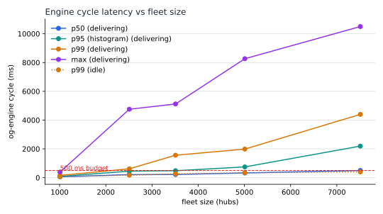
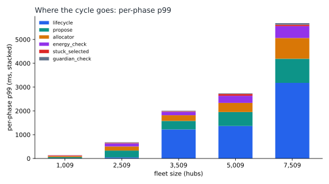
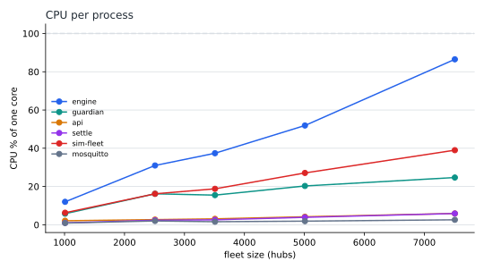
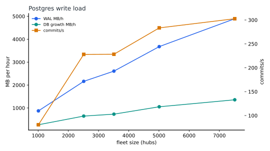
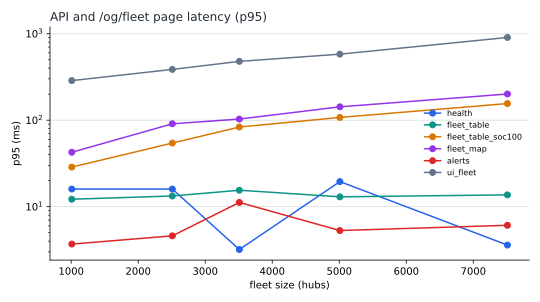
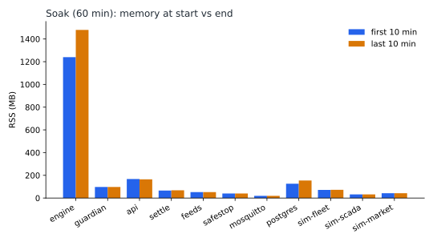

# Performance and scalability report: 1,000 to 7,500 homes (r3.4.1)

Status: measured from 2026-09-26 23:55 to 2026-09-27 05:19 CT on a workstation's Docker stack, never on the base
server. The code under test is r3.4.1 `fe20110` with the harness of branch `wp/perf-report-r341`. Run by
og-cloud-agent.

## 1. Summary

**Findings:**

1. **While delivering, the engine misses its 500 ms cycle budget at production's fleet size.**
   - IDLE (between delivery windows) cycle p99 stays within budget: 263 ms at 3,509 hubs, 338 ms at 5,009
     and 403 ms at 7,509, apart from multi-second stalls (finding 4).
   - DELIVERING (committed obligations on 24-44 % of the home banks) cycle p99 crosses 500 ms between 1,009
     hubs (157 ms) and 2,509 hubs (615 ms). It reaches 1,559 ms at 3,509 hubs, which is production's size,
     1,986 ms at 5,009 and 4,396 ms at 7,509.
   - Base runs 3,509 hubs on slower hardware than this workstation, so the budget is likely missed there too
     inside every ECRS and toll delivery window.
2. **Telemetry ingest lag grows with the fleet and eats the stale margin.**
   - Ingest lag is the time from a hub's report to the engine taking it in. Its p99 is under 1.3 s up to
     2,509 hubs, then:

     | Hubs | IDLE | DELIVERING |
     |---:|---:|---:|
     | 3,509 | 3.0 s | 4.0 s |
     | 5,009 | 4.6 s | **13.6 s** |
     | 7,509 | 5.0 s | **17.3 s** |

   - Hubs report every 10 s and are marked stale at `[health].hub_stale_s` = 25 s. A 13.6 s ingest lag leaves
     almost no margin.
   - At 7,509 hubs delivering (17.3 s) it breaks: **the number of fresh hubs fell to 631 of 7,509** at the worst
     sample. Nothing was wrong at the hubs. The guardian's freshness checks fail closed on stale hubs, so
     dispatch stops until the engine catches up.
   - The lag tracks the engine's cycle time, which points at the ingest sharing the event loop with the slow
     phases.
3. **Four phases dominate the delivering cycle,** at 82-94 % of the summed per-phase p99. Values are p99 at
   3,509 / 5,009 / 7,509 hubs:
   - `propose`, the hand-off to og-guardian and the wait for its verdict: 347 / 586 / 872 ms.
   - `allocator`: 229 / 322 / 804 ms.
   - `energy_check`: 126 / 301 / 501 ms. This grows faster than the fleet.
   - `lifecycle`: 96 / 80 / **1,669 ms**. It is the largest phase at 7,509.
4. **Multi-second stalls.** The `lifecycle` phase blocks the event loop for 3.5-9.5 s. At 7,509 hubs: 8,910 ms
   idle and 9,529 ms delivering. This is the stall seen on base in section 2.
5. **The engine's single event loop is the limit, not the machine.**
   - At 5,009 hubs delivering, og-engine uses 52 % of one core, Postgres 39 % and the host 7 %, while the cycle
     p99 is 2 s.
   - At 7,509 og-engine reaches 87 % of one core, its single loop close to saturation, with 3.3 GB RSS. Postgres
     is at 56 % and the host at 11 %.
   - **On r3.4.1 the delivering ceiling is between 5,009 and 7,509 hubs.**
6. **Stress at 7,509 hubs**, on top of the saturated DELIVERING baseline (section 7).
   - The safety functions hold:
     - a fleet-wide safe stop brought all 7,509 hubs to 0 kW in 8.5 s, and the two-person release worked;
     - a locked `og.trace` failed closed;
     - a 60 s broker outage recovered, with all hubs fresh in 16 s.
   - Every cycle-latency criterion fails, because the baseline p99 is already 2-4 s.
   - After the DB lock and after the 500-hub bulk command, commands did not resume, and the hubs did not
     follow, within the scenario's window. This could not be separated from the saturation, so these two need
     a re-test at a size the engine sustains.
   - The 1 h soak showed no restarts, but og-engine grew by **275 MB/h** of RSS (1.24 → 1.48 GB). Under
     saturation this looks like a growing backlog. Re-check it on r3.4.3.
7. **Outlook:**
   - This campaign measures r3.4.1. r3.4.2 moves PQ characterisation off the event loop (`f7510ab`). r3.4.3
     bounds the guardian hand-off (`4055427`) and backgrounds the lifecycle step (`57d9cd8`). Those target
     findings 3 (`propose`) and 4.
   - Nothing in r3.4.3 yet changes `allocator`, `energy_check` or the ingest path. At 7,500-10,000 hubs those
     decide whether the budget can be met.
   - The campaign must be re-run on r3.4.3 before anyone relies on these numbers for sizing. r3.4.3 has been live on
     base since 2026-09-27 03:38 CT (`3b8ca06`). A before/after re-run of 3,509 and 7,509 hubs DELIVERING on
     r3.4.3 follows as an addendum to this report.

## 2. Baseline evidence from the base server (2026-09-26, before the campaign)

The campaign was first set up on the base server (192.168.5.35), beside production r3.4 `b1722df` (3,509 hubs).
It was stopped there, and the owner moved it to the workstation. What the base attempt showed about production
itself matters for capacity planning. Raw records are in `tests-perf/evidence/base-2026-09-26/`.

- **Production's database disk saturates without any test load.** `sar -d` 10-minute averages put pgdata
  (dm-6) at 98.3 % util at 21:10 and 99.8 % at 21:40 CDT, with no perf work running. The disk is a QEMU virtual
  HDD with a write-back cache. pgdata, the test cluster and root are logical volumes on that one device, and its
  I/O scheduler was `none`, so `ionice`/`IOWeight` gave no isolation. The scheduler has since been changed to
  bfq.
- **The production engine stalls every few minutes.** The og-engine `lifecycle` phase blocked the event loop
  for 3.5–5.4 s about every 5 minutes (4,237 ms at 21:57, 5,384 ms at 22:02 CDT). Loop lag equals the phase
  time, so this is synchronous work on the event loop. The PROD-IO lane attributed it to the PQ characterization
  loop. The A11 rolling p99 (139–296 ms) hides these stalls because they are under 1 % of cycles, but the
  cycle max shows them.
- **Guardrail event.** A 1,000-home isolated perf stack ran from 22:06:30 to 22:08:16 CDT (perf cycle p99
  50 ms). At 22:08:13 the watchdog aborted on pgdata util of 100 %, and every perf process was stopped by exact
  unit and PID within 3 s. Production then stayed saturated for at least 7 more minutes with no perf process
  running: pgdata at 100 % util, w_await 100–740 ms, device flush await 2.1–2.8 s. Over the same window the
  test-cluster device showed 0 writes/s and dirty memory was 1.8 MB. Production cycle p99 reached 2.9–4.7 s
  (max 14.7 s), while fresh hubs stayed at 3,509.
- **Implication.** On base today, the first saturating resource is production's disk, at the current 3,509 hubs,
  before any orchestrator CPU limit. Any 7,500- or 10,000-hub plan for base needs a faster disk (or separate
  disks for WAL and data) and the lifecycle/PQ-characterization work moved off the event loop, whatever the
  workstation results show.

## 3. Environment and method

- **Machine:** a workstation, not the base server.
  - CPU: Intel Core i9-12900K, 16 cores (8 performance + 8 efficiency), 24 threads.
  - RAM: 31.7 GB.
  - OS: Windows 11 Pro 10.0.26200.
  - Docker Desktop 29.8.0 on WSL2 (kernel 6.18.33.2), with VM limits of 24 CPUs and 15.5 GiB.
  - Docker's disk image (`docker_data.vhdx`) is on a PCIe NVMe SSD (XPG GAMMIX S70 Blade). It holds Postgres's
    data and WAL together.

  The simulators, Postgres, Mosquitto and all six og-* processes share this one machine.
- **Stack:** `dev/docker-compose.yml` with the orchestrator profile, plus `tests-perf/compose/docker-compose.perf.yml`,
  as project `ogperf`. The config is production's `orchestrator.toml` tuning with the dev stack's connectivity.
  The API is called directly (no Apache or TLS in front).
- **Fleet shape:** production-proportioned (`tests-perf/perfenv.py`): 50 homes per bank, 20 % dual-unit, zone
  blocks LZ_AEN/LZ_LCRA/LZ_RAYBN scaled with the fleet, plus the substation asset and 8 trucks. Telemetry every
  10 s.

  | Homes | Hubs | Banks |
  |---:|---:|---:|
  | 1,000 | 1,009 | 20 |
  | 2,500 | 2,509 | 50 |
  | 3,500 | 3,509 (= production) | 70 |
  | 5,000 | 5,009 | 100 |
  | 7,500 | 7,509 | 150 |
- **Method:** each size gets a fresh database and the full production seed order. Then:
  1. 14 days of real ERCOT prices and load are loaded, so the forecast is FIRM as it is in production. A fresh
     database is NOT_FOR_FIRM everywhere, and its selector would commit nothing.
  2. A 5 min warm-up.
  3. Two 15 min measured windows, one per regime:
     - **IDLE** (`step-<homes>`): nothing delivering. This is production between delivery windows; base showed
       0 verdicts in 10 min at 23:18 CT on 2026-09-26.
     - **DELIVERING** (`deliver-<homes>`): `tests-perf/dispatch.py` commits obligations through og-api's own
       admission for a window. These are the demo customers, the intake's own AS awards and 300 kW ERCOT_ENERGY
       offers, aimed at about half the home banks carrying grants every cycle. This is production inside its ECRS
       and toll windows.

  The share of home banks actually reached is reported per size. Admission reserved 8/20, 28/50, 23/70, 29/100
  and 38/150 banks. The intake's automatic AS awards take up the rest of the competitive capacity, and LZ_AEN
  is regulated (K15). At r3.4.1 only LZ_AEN is restricted; LCRA and RAYBN are still free market.

  The 7,500 size continues into the soak (60 min total, DELIVERING), then the stress scenarios. Samples are
  taken every 15 s, with API probes every 60 s (10 requests per endpoint).
- **Environment artifact: G-20 TIMEOUT on about 10 % of verdicts.**
  - Docker Desktop's WSL2 kernel reports `adjtimex` TIME_ERROR (STA_UNSYNC, esterror 16 s) for an instant about
    every 10 s, when the host's time sync steps the clock. `adjtimex` was sampled directly in a container.
  - The guardian's kernel clock check (K12, fail closed) returns TIMEOUT on those ticks.
  - Production's chrony-disciplined host does not do this. Production code and config are run unchanged.
  - G-20 TIMEOUTs are counted separately from vetoes in the tables. Some K7 CONSERVATIVE flapping on those ticks
    is expected and is not a load effect. The TIMEOUT path may also inflate `propose` here, so production's own
    verdict latency should be checked separately.
- **Sources:**
  - cycle p50/p99/max and per-phase p99 from the engine's CYCLE_LATENCY trace (one summary per ~300 cycles);
  - p95 from the tick histogram (bucket-interpolated);
  - verdict latency and G-20 timeouts from GUARDIAN_VERDICT traces;
  - ingest lag from og-engine's `og_engine_mqtt_ingest_lag_seconds`.

## 4. Versions

- **Code under test:** r3.4.1 `fe20110` (tag `r3.4.1`), merged into the harness branch `wp/perf-report-r341` at
  `bf69ef3`. The merge adds only `tests-perf/` changes on top of r3.4.1.
- **Not measured here:** r3.4.2 (`897965f` on main, 2026-09-27) and r3.4.3 (being released). Their changes to
  the phases this report measures:

  | Change | Release | Phase | Expected effect |
  |---|---|---|---|
  | `f7510ab` PQ characterisation, blob and journal I/O off the event loop | r3.4.2 | `lifecycle` stalls | The 3.5-7.3 s stalls should go |
  | `4055427` bounded guardian hand-off ("propose never stalls the cycle") | r3.4.3 | `propose` | Removes the multi-second `propose` max; the p99 effect depends on the bound |
  | `57d9cd8` obligation lifecycle step in the background (single-flight, timeout) | r3.4.3 | `lifecycle` | Takes the step off the cycle |
  | none yet | - | `allocator`, `energy_check`, telemetry ingest | PERF-OPT lane (2026-09-27) |

- **For reference:** r3.4 `b1722df`, the version running on base during the baseline in section 2.
- **Harness:** `tests-perf/` as merged from `integ/perf-scale` `7960fa9`, plus this PR's changes: the IDLE and
  DELIVERING regimes, the ERCOT history load, the device-info ACL grants and the Windows gate fixes.
- **Runtime:** Docker Desktop 29.8.0 (WSL2 kernel 6.18.33.2), Postgres 17, Mosquitto 2, Python 3.13.
- **Configuration:** production's `orchestrator.toml` tuning at r3.4.1, including `[allocator.veto_retry] enabled
  = false` as in production, with the dev stack's connectivity.

## 5. Results per step

<!-- steps:begin -->
#### IDLE: between delivery windows (no committed obligation delivering)

| Metric | 1,009 hubs | 2,509 hubs | 3,509 hubs | 5,009 hubs | 7,509 hubs |
|---|---:|---:|---:|---:|---:|
| Engine cycle p50 (ms, trace) | 22.8 | 50.0 | 67.8 | 92.9 | 135.4 |
| Engine cycle p95 (ms, histogram) | 46 | 88 | 177 | 235 | 382 |
| Engine cycle p99 (ms, trace) | 68.5 | 174.5 | 262.6 | 338.4 | 402.7 |
| Engine cycle max (ms, trace) | 192.6 | 199.5 | 4,167.1 | 6,793.1 | 9,063.2 |
| Late ticks | 0 | 0 | 0 | 0 | 0 |
| Event-loop lag p99 (ms) | 14.2 | 42.9 | 73.8 | 85.9 | 92.0 |
| Home banks with grants per cycle | 0.0 | 0.0 | 0.0 | 0.0 | 0.0 |
| Share of home banks with grants | 0.00 | 0.00 | 0.00 | 0.00 | 0.00 |
| Grant rows per cycle | 0.0 | 0.0 | 0.0 | 0.0 | 0.0 |
| Guardian verdicts | 0 | 0 | 0 | 0 | 0 |
| Verdicts per minute | 0.0 | 0.0 | 0.0 | 0.0 | 0.0 |
| Verdict latency p50 (ms) | n/a | n/a | n/a | n/a | n/a |
| Verdict latency p99, worst 15 s (ms) | n/a | n/a | n/a | n/a | n/a |
| G-20 timeouts | 0 | 0 | 0 | 0 | 0 |
| Telemetry rows/s (expected) | 96.9 | 224.0 | 307.1 | 435.8 | 640.7 |
| Telemetry expected rows/s | 100.9 | 250.9 | 350.9 | 500.9 | 750.9 |
| Ingest lag p50 (s) | 0.13 | 0.34 | 0.49 | 0.77 | 1.30 |
| Ingest lag p99 (s) | 0.42 | 0.99 | 3.01 | 4.56 | 5.00 |
| Fresh hubs, min | 1,009 | 2,509 | 3,509 | 5,009 | 7,509 |
| MQTT in msgs/s | 156.9 | 356.6 | 490.8 | 696.4 | 1,038.2 |
| MQTT out msgs/s | 255.7 | 581.2 | 799.0 | 1,127.2 | 1,668.9 |
| Broker CPU % | 0.6 | 1.3 | 1.5 | 2.0 | 2.8 |
| PG commits/s | 22.8 | 23.5 | 23.9 | 24.3 | 25.3 |
| PG rows inserted/s | 159.3 | 362.5 | 499.7 | 697.8 | 1,032.6 |
| PG rows updated/s | 512.5 | 1,258.3 | 1,757.7 | 2,478.6 | 3,687.6 |
| WAL MB/h | 630.0 | 1,461.9 | 1,969.3 | 2,826.0 | 4,113.4 |
| DB growth MB/h | 196.6 | 445.1 | 621.3 | 865.4 | 1,294.3 |
| DB disk util % (db_disk) | 0.5 | 0.5 | 1.3 | 1.4 | 1.9 |
| DB disk w_await ms (db_disk) | 0.6 | 0.5 | 1.2 | 1.0 | 1.2 |
| DB disk write kB/s (db_disk) | 381 | 802 | 1,205 | 1,588 | 2,557 |
| engine CPU % | 9.1 | 21.8 | 30.9 | 40.7 | 60.7 |
| engine RSS max (MB) | 301 | 786 | 608 | 1,358 | 1,294 |
| guardian CPU % | 2.5 | 5.3 | 7.2 | 9.2 | 13.6 |
| guardian RSS max (MB) | 60 | 63 | 64 | 67 | 71 |
| api CPU % | 2.0 | 2.8 | 3.5 | 3.8 | 5.1 |
| api RSS max (MB) | 128 | 138 | 141 | 155 | 155 |
| settle CPU % | 0.4 | 0.7 | 0.9 | 1.1 | 1.5 |
| settle RSS max (MB) | 59 | 59 | 59 | 61 | 63 |
| feeds CPU % | 0.3 | 0.4 | 0.4 | 0.3 | 0.4 |
| feeds RSS max (MB) | 52 | 52 | 52 | 52 | 52 |
| postgres CPU % | 4.0 | 6.4 | 8.0 | 9.7 | 12.3 |
| postgres RSS max (MB) | 133 | 98 | 98 | 102 | 106 |
| sim-fleet CPU % | 4.6 | 11.9 | 17.6 | 24.4 | 37.5 |
| sim-fleet RSS max (MB) | 40 | 48 | 53 | 60 | 72 |
| Host CPU % | 1.6 | 2.8 | 3.7 | 4.6 | 6.5 |
| API p95 health (ms) | 18.4 | 4.2 | 3.3 | 20.2 | 14.7 |
| API p95 fleet_table (ms) | 11.6 | 14.3 | 14.0 | 12.4 | 12.5 |
| API p95 fleet_table_soc100 (ms) | 27.7 | 49.7 | 68.1 | 92.3 | 130.7 |
| API p95 fleet_map (ms) | 39.2 | 76.0 | 101.9 | 130.2 | 192.3 |
| API p95 alerts (ms) | 3.7 | 4.0 | 5.0 | 4.2 | 5.5 |
| API p95 ui_fleet (ms) | 293.0 | 445.6 | 469.6 | 522.2 | 697.4 |

#### DELIVERING: committed obligations on about half the home banks

| Metric | 1,009 hubs | 2,509 hubs | 3,509 hubs | 5,009 hubs | 7,509 hubs |
|---|---:|---:|---:|---:|---:|
| Engine cycle p50 (ms, trace) | 59.9 | 209.7 | 219.6 | 327.9 | 498.0 |
| Engine cycle p95 (ms, histogram) | 92 | 452 | 484 | 746 | 2,193 |
| Engine cycle p99 (ms, trace) | 156.8 | 615.3 | 1,559.0 | 1,986.2 | 4,396.2 |
| Engine cycle max (ms, trace) | 386.4 | 4,756.7 | 5,119.5 | 8,265.7 | 10,502.0 |
| Late ticks | 0 | 0 | 0 | 0 | 0 |
| Event-loop lag p99 (ms) | 14.6 | 47.6 | 70.7 | 81.6 | 114.3 |
| Home banks with grants per cycle | 5.1 | 22.0 | 21.3 | 28.7 | 36.3 |
| Share of home banks with grants | 0.26 | 0.44 | 0.30 | 0.29 | 0.24 |
| Grant rows per cycle | 10.4 | 39.1 | 41.1 | 64.1 | 101.4 |
| Guardian verdicts | 2,196 | 8,558 | 8,118 | 10,153 | 10,013 |
| Verdicts per minute | 148.9 | 580.2 | 550.4 | 688.3 | 678.8 |
| Verdict latency p50 (ms) | 10.0 | 20.0 | 19.0 | 25.0 | 40.0 |
| Verdict latency p99, worst 15 s (ms) | 49.7 | 63.0 | 59.1 | 90.6 | 173.1 |
| G-20 timeouts | 315 | 1,501 | 1,284 | 1,609 | 2,198 |
| Telemetry rows/s (expected) | 95.8 | 224.0 | 309.3 | 447.1 | 637.2 |
| Telemetry expected rows/s | 100.9 | 250.9 | 350.9 | 500.9 | 750.9 |
| Ingest lag p50 (s) | 0.13 | 0.36 | 0.52 | 0.94 | 2.16 |
| Ingest lag p99 (s) | 0.45 | 1.21 | 3.96 | 13.59 | 17.25 |
| Fresh hubs, min | 1,009 | 2,509 | 3,509 | 5,009 | 631 |
| MQTT in msgs/s | 336.9 | 791.7 | 693.0 | 892.6 | 1,045.4 |
| MQTT out msgs/s | 494.8 | 1,160.4 | 1,068.8 | 1,395.3 | 1,688.5 |
| Broker CPU % | 0.9 | 2.0 | 1.6 | 1.9 | 2.6 |
| PG commits/s | 80.7 | 228.0 | 228.3 | 283.5 | 302.7 |
| PG rows inserted/s | 233.1 | 563.8 | 621.5 | 842.5 | 1,101.0 |
| PG rows updated/s | 523.8 | 1,291.7 | 1,787.2 | 2,518.3 | 3,666.0 |
| WAL MB/h | 871.9 | 2,161.2 | 2,608.1 | 3,677.6 | 4,894.7 |
| DB growth MB/h | 267.6 | 646.0 | 730.1 | 1,052.2 | 1,357.0 |
| DB disk util % (db_disk) | 1.3 | 8.4 | 8.2 | 10.1 | 10.6 |
| DB disk w_await ms (db_disk) | 0.4 | 1.1 | 0.9 | 1.1 | 1.7 |
| DB disk write kB/s (db_disk) | 618 | 1,622 | 1,863 | 3,923 | 6,944 |
| engine CPU % | 12.0 | 31.0 | 37.4 | 51.9 | 86.5 |
| engine RSS max (MB) | 322 | 909 | 701 | 1,414 | 3,345 |
| guardian CPU % | 5.8 | 16.2 | 15.5 | 20.3 | 24.7 |
| guardian RSS max (MB) | 75 | 77 | 82 | 87 | 98 |
| api CPU % | 2.1 | 2.7 | 3.1 | 4.2 | 5.9 |
| api RSS max (MB) | 141 | 149 | 148 | 165 | 178 |
| settle CPU % | 1.0 | 2.4 | 2.6 | 3.9 | 5.9 |
| settle RSS max (MB) | 66 | 66 | 66 | 67 | 69 |
| feeds CPU % | 0.3 | 0.4 | 0.4 | 0.4 | 0.4 |
| feeds RSS max (MB) | 52 | 52 | 52 | 52 | 52 |
| postgres CPU % | 6.6 | 24.2 | 24.1 | 39.0 | 55.5 |
| postgres RSS max (MB) | 132 | 161 | 164 | 168 | 131 |
| sim-fleet CPU % | 6.3 | 16.2 | 18.8 | 27.1 | 39.0 |
| sim-fleet RSS max (MB) | 40 | 48 | 53 | 60 | 72 |
| Host CPU % | 2.1 | 4.9 | 5.3 | 7.3 | 10.6 |
| API p95 health (ms) | 16.0 | 16.0 | 3.2 | 19.5 | 3.6 |
| API p95 fleet_table (ms) | 12.2 | 13.3 | 15.5 | 13.0 | 13.7 |
| API p95 fleet_table_soc100 (ms) | 28.7 | 54.4 | 83.4 | 107.7 | 155.8 |
| API p95 fleet_map (ms) | 42.6 | 90.9 | 103.1 | 142.8 | 200.9 |
| API p95 alerts (ms) | 3.7 | 4.6 | 11.2 | 5.3 | 6.1 |
| API p95 ui_fleet (ms) | 287.1 | 386.6 | 478.9 | 580.3 | 905.1 |

Banks reached in the DELIVERING windows (`results.json` → `dispatch`): the reservations covered 8/20, 28/50, 23/70, 29/100 and 38/150 home banks. Banks carrying grants per cycle were 26 %, 44 %, 30 %, 29 % and 24 %.

<!-- steps:end -->

## 6. Knee and capacity headroom

- **Budget crossing.** DELIVERING cycle p99 crosses 500 ms between 1,009 and 2,509 hubs. IDLE stays below it
  through 7,509 hubs (403 ms), apart from the stalls. The quadratic fit in `results.json` (`knee`) has a negative
  curvature with these points, so its extrapolation is not used. The observed bracket is the result.
- **Headroom at 3,509 hubs (production):**
  - IDLE: p99 263 ms, 47 % margin to the budget.
  - DELIVERING: p99 1,559 ms, 3.1x over the budget. There is no headroom.
  - The busiest process (og-engine) uses 37 % of one core while delivering. The engine runs on one asyncio loop,
    so its cycle is serial, and waiting (`propose`) plus compute (`allocator`, `energy_check`) set the cycle,
    not CPU saturation.
- **Headroom at 7,509 hubs:**
  - IDLE: p99 403 ms, a 19 % margin, but with 8.9 s stalls.
  - DELIVERING: p99 4,396 ms, 8.8x over the budget, with fresh hubs down to 631 of 7,509. This is past
    capacity.
- **10,000 hubs:** not reachable on r3.4.1. Even IDLE p99 grows about 50-90 ms per 1,000 hubs (243 ms median
  at 5,009), and the ingest lag (finding 2) would make hubs stale before the cycle budget is reached. Re-measure
  on r3.4.3 with the PERF-OPT changes.

## 7. Stress results (at 7,509 hubs)

| Scenario | Criteria | Result | Key numbers |
|---|---|---|---|
| Telemetry burst (broker restart) | every hub publishing again; all fresh in DB <= 60 s; p99 < 500 ms within 2 min | **FAIL** (p99 only) | Hubs publishing again 9.5 s after the broker returned, all fresh in `og.hub_state` within 0.03 s; cycle p99 still 14,327 ms after 2 min |
| Fleet-wide safe stop | confirm 200; every hub at 0 kW <= 30 s; stop_outbox drained; two-person release accepted | **PASS** | Confirm 200; 7,509/7,509 hubs at 0 kW in 8.5 s; outbox drained in 0.01 s (1 row); two-person release 200 |
| Bulk command at the 500 cap | propose < 5 s; RAMPING; 95 % follow <= 5 min; p99 < 500 ms | **FAIL** | Propose 0.16 s, RAMPING; 95 % of the selected hubs did NOT follow within 5 min; cycle max 11,891 ms while ramping |
| Alert storm + bulk ack | alerts raised; list(500) < 2 s; each ack(500) < 10 s; p99 < 500 ms | **FAIL** (p99 only) | Open alerts 145 → 250; list(500) 0.02 s; bulk ack of 132 in 0.38 s; cycle p99 over 500 ms during the storm |
| Price spike | spike reached og.feed_obs; p99 < 500 ms | **FAIL** (p99 only) | Spike reached `og.feed_obs` (12 observations); cycle p99 over 500 ms |
| 60 s broker outage | hubs back; all fresh <= 60 s; engine cycling | **PASS** | Hubs publishing 29.5 s after the broker returned; all fresh in 16.2 s; engine cycling (p99 6,140 ms) |
| DB slow-down (og.trace locked 60 s) | no command published while locked (fail closed); commands resume; p99 < 500 ms within 2.5 min | **FAIL** | Failed closed (no command published while locked); commands did NOT resume within the window; p99 12,939 ms after 2.5 min |
| 1 h soak | no memory growth (RSS slope per process), no restarts | **FAIL** (og-engine) | No restarts. og-engine RSS 1,240 → 1,480 MB (+275 MB/h); Postgres +34 MB/h (cache); every other process flat (<= 3.4 MB/h). Cycle p99 1.7-4.4 s throughout |

## 8. Guardrail events

- Base server, 22:08:13 CDT: abort on production pgdata util of 100 % (section 2).
- Workstation: none. The watchdog raised no abort in the whole campaign (no `aborts.jsonl`; `results.json` → `aborts` = 0).

## 9. Bottlenecks

The engine's CYCLE_LATENCY trace carries total p50/p99/max, the p99 of each phase, and the phase split of the
slowest cycle, one summary per ~300 cycles. Below is the median of each window's summaries. The trace has no
per-phase p50, so a phase's "share" in this report is its share of the summed per-phase p99.

<!-- phases:begin -->
**IDLE**: per-phase p99 (ms; median of the window's ~300-cycle summaries)

| Phase | 1,009 hubs | 2,509 hubs | 3,509 hubs | 5,009 hubs | 7,509 hubs |
|---|---:|---:|---:|---:|---:|
| allocator | 47 | 100 | 116 | 166 | 246 |
| lifecycle | 7 | 23 | 27 | 54 | 39 |
| gate_schedule | 3 | 3 | 4 | 22 | 31 |
| guardian_check | 1 | 20 | 24 | 24 | 28 |
| manual_targets | 11 | 2 | 22 | 21 | 26 |
| firmware | 1 | 8 | 1 | 22 | 24 |
| energy_check | 1 | 2 | 3 | 18 | 7 |
| stuck_selected | 2 | 2 | 3 | 16 | 18 |
| **cycle p99 (median of summaries)** | **57** | **153** | **166** | **243** | **344** |

Slowest cycle per window: 1,009: 193 ms (allocator 174 ms); 2,509: 200 ms (allocator 75 ms); 3,509: 4,167 ms (lifecycle 3,505 ms); 5,009: 6,793 ms (lifecycle 6,689 ms); 7,509: 9,063 ms (lifecycle 8,910 ms).

**DELIVERING**: per-phase p99 (ms; median of the window's ~300-cycle summaries)

| Phase | 1,009 hubs | 2,509 hubs | 3,509 hubs | 5,009 hubs | 7,509 hubs |
|---|---:|---:|---:|---:|---:|
| lifecycle | 5 | 27 | 96 | 80 | 1,669 |
| propose | 49 | 252 | 347 | 586 | 872 |
| allocator | 42 | 154 | 229 | 322 | 804 |
| energy_check | 14 | 107 | 126 | 301 | 501 |
| guardian_check | 1 | 12 | 16 | 23 | 60 |
| stuck_selected | 3 | 4 | 4 | 26 | 58 |
| gate_schedule | 2 | 3 | 21 | 20 | 50 |
| manual_targets | 2 | 21 | 21 | 23 | 28 |
| firmware | 1 | 2 | 2 | 22 | 27 |
| escalation | 0 | 8 | 0 | 0 | 15 |
| **cycle p99 (median of summaries)** | **116** | **500** | **638** | **1,348** | **3,460** |

Slowest cycle per window: 1,009: 386 ms (lifecycle 324 ms); 2,509: 4,757 ms (propose 4,644 ms); 3,509: 5,120 ms (lifecycle 4,821 ms); 5,009: 8,266 ms (lifecycle 7,336 ms); 7,509: 10,502 ms (lifecycle 9,529 ms).
<!-- phases:end -->

- **`propose`** is the hand-off to og-guardian and the wait for its verdict: MQTT out, the guardian's checks, and
  MQTT back.
  - It is near zero when nothing is delivering and among the largest phases when delivering: 347 ms at 3,509,
    586 ms at 5,009 and 872 ms at 7,509.
  - Verdict latency seen by the guardian stays at 50-173 ms p99 (worst 15 s). So most of `propose` is the
    engine's own hand-off and waiting, not the guardian's checks. The G-20 TIMEOUT artifact may add to it here.
  - r3.4.3 bounds this hand-off (`4055427`).
- **`allocator`** grows with the fleet in both regimes, and delivering multiplies it:
  - IDLE: 47, 100, 116, 166, 246 ms;
  - DELIVERING: 42, 154, 229, 322, 804 ms.
- **`energy_check`** runs only when delivering: 14, 107, 126, 301, 501 ms. It grows faster than the fleet.
- **`lifecycle`** has a moderate p99 up to 5,009 hubs (27-96 ms) and then becomes the largest phase at
  7,509 delivering (1,669 ms). It is also the phase of every slowest cycle from 3,509 hubs on, blocking the
  loop for 3.5-9.5 s. This is the base server's stall (section 2). The r3.4.2 and r3.4.3 changes in section 4
  target it.

- **Telemetry ingest** (finding 2): its lag rises with the cycle time, while every hub stays fresh at the 25 s
  threshold through 5,009 hubs.
- **Postgres** is not the limit on this machine: at 7,509 hubs delivering it uses 56 % CPU, with disk util 11 %,
  write await about 1 ms and 4.9 GB of WAL per hour. It is the limit on base (section 2).

## 10. Recommendations

1. **Re-run this campaign on r3.4.3** (same harness, `--target compose`) before using these numbers for sizing.
   It should show `propose` bounded and the `lifecycle` stalls gone.
2. **Decouple telemetry ingest from the engine's control loop.** Use a separate task or process with its own
   flush, so ingest lag doesn't track cycle time. Until then, alert on `og_engine_mqtt_ingest_lag_seconds` p99
   above 5 s, well before `hub_stale_s` (25 s).
3. **Allocator and energy_check (PERF-OPT):**
   - Profile both at 5,009 hubs delivering.
   - Make `energy_check` incremental (only obligations and banks whose inputs changed).
   - Cut the allocator's per-cycle work for banks with no grants.
   - Prove equivalence against the current outputs before switching.
4. **Retry phase:** `[allocator.veto_retry]` stays disabled, as in production. Enabling it adds a re-solve to
   the cycle's worst case, so it should be measured before it is turned on.
5. **Batch telemetry and hub_state writes.** At 5,009 hubs Postgres takes 2,518 updated rows/s and
   842 inserted rows/s. Batched upserts, or fewer hub_state updates when nothing changed,
   cut WAL volume, which matters most on base's disk.
6. **Telemetry and trace retention.** At 3.7 GB of WAL per hour, the `og.telemetry` and `og.trace`
   partitioning, BRIN indexes and retention of the data-lifecycle design are prerequisites for 5,000+ hubs.
7. **Base server disk** (section 2): a faster disk, or separate devices for WAL and data, before any fleet
   growth on base.
8. **10,000 hubs** is not supported by r3.4.1's engine. The decision is to be retaken after items 1-3.

## 11. How to reproduce

See `tests-perf/HANDOFF.md` and `tests-perf/README.md`.
